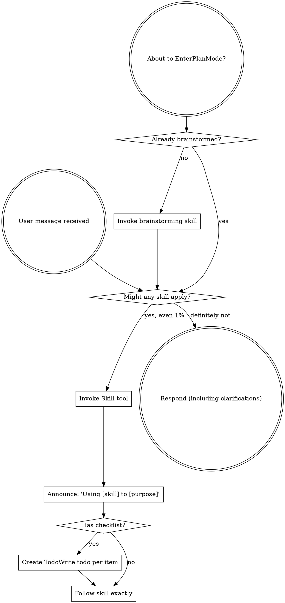

<!-- Generated by SpecStory, Markdown v2.1.0 -->

# 2026-05-04 18:51:55Z

<!-- Codex CLI Session 019df454-f643-7f02-b8a4-e57fc2df9b76 (2026-05-04 18:51:55Z) -->

_**User (2026-05-04 18:51:55Z)**_

现在点额度查询 会显示查询失败，点击刷新重试，修复这个功能


---

_**Agent (gpt-5.5 2026-05-04 18:52:06Z)**_

我先按“复现线索 -> 找额度查询链路 -> 修掉并验证”的节奏来，先读一下项目结构和相关技能说明，看看这个查询失败是前端调用、鉴权，还是后端接口适配出了问题。

_**Agent (gpt-5.5 2026-05-04 18:52:06Z)**_

<tool-use data-tool-type="shell" data-tool-name="exec_command"><details>
<summary>Tool use: **exec_command** `sed -n '1,180p' '/Users/xiayanghui/.codex/plugins/cache/openai-curated/superpowers/15d07db8/skills/using-superpowers/SKILL.md'`</summary>
```
Chunk ID: 573e24
Wall time: 0.0000 seconds
Process exited with code 0
Original token count: 1356
Output:
---
name: using-superpowers
description: Use when starting any conversation - establishes how to find and use skills, requiring Skill tool invocation before ANY response including clarifying questions
---

<SUBAGENT-STOP>
If you were dispatched as a subagent to execute a specific task, skip this skill.
</SUBAGENT-STOP>

<EXTREMELY-IMPORTANT>
If you think there is even a 1% chance a skill might apply to what you are doing, you ABSOLUTELY MUST invoke the skill.

IF A SKILL APPLIES TO YOUR TASK, YOU DO NOT HAVE A CHOICE. YOU MUST USE IT.

This is not negotiable. This is not optional. You cannot rationalize your way out of this.
</EXTREMELY-IMPORTANT>

## Instruction Priority

Superpowers skills override default system prompt behavior, but **user instructions always take precedence**:

1. **User's explicit instructions** (CLAUDE.md, GEMINI.md, AGENTS.md, direct requests) — highest priority
2. **Superpowers skills** — override default system behavior where they conflict
3. **Default system prompt** — lowest priority

If CLAUDE.md, GEMINI.md, or AGENTS.md says "don't use TDD" and a skill says "always use TDD," follow the user's instructions. The user is in control.

## How to Access Skills

**In Claude Code:** Use the `Skill` tool. When you invoke a skill, its content is loaded and presented to you—follow it directly. Never use the Read tool on skill files.

**In Copilot CLI:** Use the `skill` tool. Skills are auto-discovered from installed plugins. The `skill` tool works the same as Claude Code's `Skill` tool.

**In Gemini CLI:** Skills activate via the `activate_skill` tool. Gemini loads skill metadata at session start and activates the full content on demand.

**In other environments:** Check your platform's documentation for how skills are loaded.

## Platform Adaptation

Skills use Claude Code tool names. Non-CC platforms: see `references/copilot-tools.md` (Copilot CLI), `references/codex-tools.md` (Codex) for tool equivalents. Gemini CLI users get the tool mapping loaded automatically via GEMINI.md.

# Using Skills

## The Rule

**Invoke relevant or requested skills BEFORE any response or action.** Even a 1% chance a skill might apply means that you should invoke the skill to check. If an invoked skill turns out to be wrong for the situation, you don't need to use it.



## Red Flags

These thoughts mean STOP—you're rationalizing:

| Thought | Reality |
|---------|---------|
| "This is just a simple question" | Questions are tasks. Check for skills. |
| "I need more context first" | Skill check comes BEFORE clarifying questions. |
| "Let me explore the codebase first" | Skills tell you HOW to explore. Check first. |
| "I can check git/files quickly" | Files lack conversation context. Check for skills. |
| "Let me gather information first" | Skills tell you HOW to gather information. |
| "This doesn't need a formal skill" | If a skill exists, use it. |
| "I remember this skill" | Skills evolve. Read current version. |
| "This doesn't count as a task" | Action = task. Check for skills. |
| "The skill is overkill" | Simple things become complex. Use it. |
| "I'll just do this one thing first" | Check BEFORE doing anything. |
| "This feels productive" | Undisciplined action wastes time. Skills prevent this. |
| "I know what that means" | Knowing the concept ≠ using the skill. Invoke it. |

## Skill Priority

When multiple skills could apply, use this order:

1. **Process skills first** (brainstorming, debugging) - these determine HOW to a
... (truncated)
```
</details></tool-use>

_**Agent (gpt-5.5 2026-05-04 18:52:06Z)**_

<tool-use data-tool-type="shell" data-tool-name="exec_command"><details>
<summary>Tool use: **exec_command** `rg -n "CodexMobile|额度查询|查询失败|刷新重试|quota|credit|balance|usage|额度" /Users/xiayanghui/.codex/memories/MEMORY.md`</summary>
```
Chunk ID: 2cb0f4
Wall time: 0.0000 seconds
Process exited with code 0
Original token count: 57
Output:
1257:- when the user asks to expand ratios or fix preview loading, keep frontend options in sync with backend/provider behavior; the user explicitly pushed for “前端UI扩展支持的比例” and WebP preview usage [Task 1]
```
</details></tool-use>

_**Agent (gpt-5.5 2026-05-04 18:52:06Z)**_

<tool-use data-tool-type="shell" data-tool-name="exec_command"><details>
<summary>Tool use: **exec_command** `pwd && rg --files | sed -n '1,160p'`</summary>
```
Chunk ID: 50be26
Wall time: 0.0000 seconds
Process exited with code 0
Original token count: 280
Output:
/Users/xiayanghui/编程项目/CodexMobile
README.md
LICENSE
package-lock.json
package.json
client/vite.config.js
client/index.html
.env.example
client/manifest.webmanifest
client/src/api.js
client/src/App.jsx
client/src/main.jsx
client/src/styles.css
asr-service/app.py
asr-service/Dockerfile
asr-service/requirements.txt
docs/images/ios-drawer.png
docs/images/ios-chat.png
docs/images/voice-handoff.jpg
scripts/start-all.ps1
scripts/patch-codex-sdk.mjs
scripts/start-asr.mjs
scripts/start-server.mjs
scripts/smoke.mjs
scripts/lark-cli-guard.mjs
skills/lark-doc-fast/SKILL.md
client/public/codex-icon-180.png
client/public/codex-icon-192.png
client/public/icon.svg
skills/lark-drive-fast/SKILL.md
client/public/codex-icon-512.png
server/codex-quota.js
server/codex-config.js
server/codex-data.js
server/index.js
server/image-generator.js
server/provider-api.js
server/voice-speaker.js
server/auth.js
server/feishu-skills.js
server/codex-runner.js
server/realtime-voice.js
server/mobile-session-index.js
server/voice-transcriber.js
server/lark-cli.js
skills/lark-sheets-fast/SKILL.md
skills/lark-slides-fast/SKILL.md
```
</details></tool-use>

_**Agent (gpt-5.5 2026-05-04 18:52:06Z)**_

<tool-use data-tool-type="shell" data-tool-name="exec_command"><details>
<summary>Tool use: **exec_command** `git status --short`</summary>
```
Chunk ID: f0580b
Wall time: 0.0000 seconds
Process exited with code 0
Original token count: 61
Output:
 M client/src/App.jsx
 M client/src/styles.css
 M package-lock.json
 M package.json
 M server/codex-config.js
 M server/codex-data.js
 M server/codex-runner.js
 M server/image-generator.js
 M server/index.js
 M server/mobile-session-index.js
```
</details></tool-use>

_**Agent (gpt-5.5 2026-05-04 18:52:19Z)**_

Using `superpowers:systematic-debugging` for this bugfix, because this smells like a concrete failure path and I want to trace the exact broken request before editing. The memory lookup didn’t turn up CodexMobile-specific prior context, so I’m going off the live repo.

_**Agent (gpt-5.5 2026-05-04 18:52:19Z)**_

<tool-use data-tool-type="shell" data-tool-name="exec_command"><details>
<summary>Tool use: **exec_command** `sed -n '1,240p' '/Users/xiayanghui/.codex/plugins/cache/openai-curated/superpowers/15d07db8/skills/systematic-debugging/SKILL.md'`</summary>
```
Chunk ID: 0bd758
Wall time: 0.0000 seconds
Process exited with code 0
Original token count: 1807
Output:
---
name: systematic-debugging
description: Use when encountering any bug, test failure, or unexpected behavior, before proposing fixes
---

# Systematic Debugging

## Overview

Random fixes waste time and create new bugs. Quick patches mask underlying issues.

**Core principle:** ALWAYS find root cause before attempting fixes. Symptom fixes are failure.

**Violating the letter of this process is violating the spirit of debugging.**

## The Iron Law

```
NO FIXES WITHOUT ROOT CAUSE INVESTIGATION FIRST
```

If you haven't completed Phase 1, you cannot propose fixes.

## When to Use

Use for ANY technical issue:
- Test failures
- Bugs in production
- Unexpected behavior
- Performance problems
- Build failures
- Integration issues

**Use this ESPECIALLY when:**
- Under time pressure (emergencies make guessing tempting)
- "Just one quick fix" seems obvious
- You've already tried multiple fixes
- Previous fix didn't work
- You don't fully understand the issue

**Don't skip when:**
- Issue seems simple (simple bugs have root causes too)
- You're in a hurry (rushing guarantees rework)
- Manager wants it fixed NOW (systematic is faster than thrashing)

## The Four Phases

You MUST complete each phase before proceeding to the next.

### Phase 1: Root Cause Investigation

**BEFORE attempting ANY fix:**

1. **Read Error Messages Carefully**
   - Don't skip past errors or warnings
   - They often contain the exact solution
   - Read stack traces completely
   - Note line numbers, file paths, error codes

2. **Reproduce Consistently**
   - Can you trigger it reliably?
   - What are the exact steps?
   - Does it happen every time?
   - If not reproducible → gather more data, don't guess

3. **Check Recent Changes**
   - What changed that could cause this?
   - Git diff, recent commits
   - New dependencies, config changes
   - Environmental differences

4. **Gather Evidence in Multi-Component Systems**

   **WHEN system has multiple components (CI → build → signing, API → service → database):**

   **BEFORE proposing fixes, add diagnostic instrumentation:**
   ```
   For EACH component boundary:
     - Log what data enters component
     - Log what data exits component
     - Verify environment/config propagation
     - Check state at each layer

   Run once to gather evidence showing WHERE it breaks
   THEN analyze evidence to identify failing component
   THEN investigate that specific component
   ```

   **Example (multi-layer system):**
   ```bash
   # Layer 1: Workflow
   echo "=== Secrets available in workflow: ==="
   echo "IDENTITY: ${IDENTITY:+SET}${IDENTITY:-UNSET}"

   # Layer 2: Build script
   echo "=== Env vars in build script: ==="
   env | grep IDENTITY || echo "IDENTITY not in environment"

   # Layer 3: Signing script
   echo "=== Keychain state: ==="
   security list-keychains
   security find-identity -v

   # Layer 4: Actual signing
   codesign --sign "$IDENTITY" --verbose=4 "$APP"
   ```

   **This reveals:** Which layer fails (secrets → workflow ✓, workflow → build ✗)

5. **Trace Data Flow**

   **WHEN error is deep in call stack:**

   See `root-cause-tracing.md` in this directory for the complete backward tracing technique.

   **Quick version:**
   - Where does bad value originate?
   - What called this with bad value?
   - Keep tracing up until you find the source
   - Fix at source, not at symptom

### Phase 2: Pattern Analysis

**Find the pattern before fixing:**

1. **Find Working Examples**
   - Locate similar working code in same codebase
   - What works that's similar to what's broken?

2. **Compare Against References**
   - If implementing pattern, read reference implementation COMPLETELY
   - Don't skim - read every line
   - Understand the pattern fully before applying

3. **Identify Differences**
   - What's different between working and broken?
   - List every difference, however small
   - Don't assume "that can't matter"

4. **Understand Dependencies**
   - What other components does this need?
   - What settings, config, environment?
   - What assumptions does it make?

### Phase 3: Hypothesis and Testing

**Scientific method:**

1. **Form Single Hypothesis**
   - State clearly: "I think X is the root cause because Y"
   - Write it down
   - Be specific, not vague

2. **Test Minimally**
   - Make the SMALLEST possible change to test hypothesis
   - One variable at a time
   - Don't fix multiple things at once

3. **Verify Before Continuing**
   - Did it work? Yes → Phase 4
   - Didn't work? Form NEW hypothesis
   - DON'T add more fixes on top

4. **When You Don't Know**
   - Say "I don't understand X"
   - Don't pretend to know
   - Ask for help
   - Research more

### Phase 4: Implementation

**Fix the root cause, not the symptom:**

1. **Create Failing Test Case**
   - Simplest possible reproduction
   - Automated test if possible
   - One-off test script
... (truncated)
```
</details></tool-use>

_**Agent (gpt-5.5 2026-05-04 18:52:19Z)**_

<tool-use data-tool-type="shell" data-tool-name="exec_command"><details>
<summary>Tool use: **exec_command** `rg --files -g 'AGENTS.md' -g 'CLAUDE.md' -g 'GEMINI.md' -g 'README.md'`</summary>
```
Chunk ID: f8c5d6
Wall time: 0.0000 seconds
Process exited with code 0
Original token count: 3
Output:
README.md
```
</details></tool-use>

_**Agent (gpt-5.5 2026-05-04 18:52:19Z)**_

<tool-use data-tool-type="shell" data-tool-name="exec_command"><details>
<summary>Tool use: **exec_command** `rg -n "quota|额度|credit|balance|usage|查询失败|刷新重试|refresh|codex-quota" .`</summary>
```
Chunk ID: 8efa03
Wall time: 0.0000 seconds
Process exited with code 0
Original token count: 3365
Output:
./server/codex-quota.js:10:const CODEX_USAGE_URL = 'https://chatgpt.com/backend-api/wham/usage';
./server/codex-quota.js:298:function quotaWindow(id, label, window, rateLimit) {
./server/codex-quota.js:324:    quotaWindow('five-hour', '5 小时限额', fiveHourWindow, rateLimit),
./server/codex-quota.js:325:    quotaWindow('weekly', '周限额', weeklyWindow, rateLimit)
./server/codex-quota.js:329:function quotaWindowsForRateLimit(rateLimit, labels) {
./server/codex-quota.js:335:    quotaWindow(labels.fiveHourId, labels.fiveHourLabel, fiveHourWindow, rateLimit),
./server/codex-quota.js:336:    quotaWindow(labels.weeklyId, labels.weeklyLabel, weeklyWindow, rateLimit)
./server/codex-quota.js:361:      quotaWindow(`${slug}-five-hour-${index}`, `${name} 5 小时限额`, primary, rateLimit),
./server/codex-quota.js:362:      quotaWindow(`${slug}-weekly-${index}`, `${name} 周限额`, secondary, rateLimit)
./server/codex-quota.js:371:    ...quotaWindowsForRateLimit(rateLimit, {
./server/codex-quota.js:377:    ...quotaWindowsForRateLimit(codeReviewRateLimit, {
./server/codex-quota.js:400:  return '查询失败';
./server/codex-quota.js:425:      const error = new Error('Codex quota request failed');
./server/codex-quota.js:493:    const error = new Error(body?.error?.message || body?.error || `Codex quota HTTP ${statusCode || 'unknown'}`);
./server/codex-quota.js:525:async function quotaForFile(authDir, fileName) {
./server/codex-quota.js:534:    return { ...account, status: 'failed', error: '凭证缺少额度查询信息' };
./server/codex-quota.js:538:    const usage = await requestCodexUsage(credential);
./server/codex-quota.js:541:      plan: normalizePlan(usage?.plan_type ?? usage?.planType, account.plan),
./server/codex-quota.js:543:      windows: extractQuotaWindows(usage)
./server/codex-quota.js:554:async function quotaForManagementEntry(baseUrl, managementKey, entry) {
./server/codex-quota.js:568:    const usage = await managementApiCall(baseUrl, managementKey, authIndex, accountId);
./server/codex-quota.js:571:      plan: normalizePlan(usage?.plan_type ?? usage?.planType, account.plan),
./server/codex-quota.js:573:      windows: extractQuotaWindows(usage)
./server/codex-quota.js:598:    entries.map((entry) => quotaForManagementEntry(baseUrl, managementKey, entry))
./server/codex-quota.js:614:    console.warn(`[quota] CLIProxyAPI management quota fallback: ${safeErrorMessage(error)}`);
./server/codex-quota.js:631:        return await quotaForFile(authDir, fileName);
./client/src/styles.css:938:.quota-widget {
./client/src/styles.css:942:.quota-row {
./client/src/styles.css:952:[data-theme="dark"] .quota-row {
./client/src/styles.css:956:.quota-main,
./client/src/styles.css:957:.quota-refresh,
./client/src/styles.css:958:.quota-toggle,
./client/src/styles.css:959:.quota-error,
./client/src/styles.css:960:.quota-account-message {
./client/src/styles.css:965:.quota-main {
./client/src/styles.css:977:.quota-title {
./client/src/styles.css:986:.quota-kind {
./client/src/styles.css:993:[data-theme="dark"] .quota-kind {
./client/src/styles.css:997:.quota-refresh {
./client/src/styles.css:1010:[data-theme="dark"] .quota-refresh {
./client/src/styles.css:1015:.quota-refresh:disabled {
./client/src/styles.css:1019:.quota-toggle {
./client/src/styles.css:1028:.quota-toggle svg {
./client/src/styles.css:1032:.quota-widget.is-expanded .quota-toggle svg {
./client/src/styles.css:1036:.quota-panel {
./client/src/styles.css:1045:.quota-account {
./client/src/styles.css:1054:[data-theme="dark"] .quota-account {
./client/src/styles.css:1059:.quota-account-head {
./client/src/styles.css:1066:.quota-account-head span {
./client/src/styles.css:1076:[data-theme="dark"] .quota-account-head span {
./client/src/styles.css:1080:.quota-account-head small {
./client/src/styles.css:1094:[data-theme="dark"] .quota-account-head small {
./client/src/styles.css:1099:.quota-window-list {
./client/src/styles.css:1104:.quota-window {
./client/src/styles.css:1109:.quota-window-meta {
./client/src/styles.css:1119:.quota-window-meta strong {
./client/src/styles.css:1124:[data-theme="dark"] .quota-window-meta strong {
./client/src/styles.css:1128:.quota-bar {
./client/src/styles.css:1135:[data-theme="dark"] .quota-bar {
./client/src/styles.css:1139:.quota-bar span {
./client/src/styles.css:1141:  width: var(--quota-percent, 0%);
./client/src/styles.css:1147:.quota-window.is-high .quota-bar span {
./client/src/styles.css:1151:.quota-window.is-healthy .quota-bar span {
./client/src/styles.css:1155:.quota-window.is-medium .quota-bar span {
./client/src/styles.css:1159:.quota-window.is-warning .quota-bar span {
./client/src/styles.css:1163:.quota-window.is-low .quota-bar span {
./client/src/styles.css:1167:.quota-error,
./client/src/styles.css:1168:.quota-account-message,
./client/src/styles.css:1169:.quota-empty {
./client/src/styles.css:1181:
... (truncated)
```
</details></tool-use>

_**Agent (gpt-5.5 2026-05-04 18:52:19Z)**_

<tool-use data-tool-type="shell" data-tool-name="exec_command"><details>
<summary>Tool use: **exec_command** `sed -n '1,220p' package.json`</summary>
```
Chunk ID: 79094b
Wall time: 0.0000 seconds
Process exited with code 0
Original token count: 252
Output:
{
  "name": "codexmobile",
  "version": "0.1.0",
  "description": "iPhone-first PWA bridge for using a local Codex setup over a private network.",
  "license": "MIT",
  "type": "module",
  "scripts": {
    "dev:server": "node server/index.js",
    "dev:client": "vite --host 0.0.0.0 --config client/vite.config.js",
    "build": "vite build --config client/vite.config.js",
    "start": "node server/index.js",
    "start:env": "node --env-file=.env server/index.js",
    "start:bg": "node scripts/start-server.mjs",
    "asr:start": "node scripts/start-asr.mjs",
    "postinstall": "node scripts/patch-codex-sdk.mjs",
    "smoke": "node scripts/smoke.mjs"
  },
  "dependencies": {
    "@openai/codex-sdk": "^0.128.0",
    "@vitejs/plugin-react": "^4.6.0",
    "lucide-react": "^0.515.0",
    "opencc-js": "^1.0.5",
    "react": "^18.2.0",
    "react-dom": "^18.2.0",
    "react-markdown": "^10.1.0",
    "remark-breaks": "^4.0.0",
    "remark-gfm": "^4.0.1",
    "vite": "^7.0.4",
    "ws": "^8.14.2"
  }
}
```
</details></tool-use>

_**Agent (gpt-5.5 2026-05-04 18:52:28Z)**_

已经定位到“额度查询”前端固定打 `/api/quotas/codex`，后端落在 `server/codex-quota.js`。现在我会顺着这个接口读一遍：先看它需要哪些配置和凭证，再用本机环境实际跑一次，拿到真实失败原因。

_**Agent (gpt-5.5 2026-05-04 18:52:28Z)**_

<tool-use data-tool-type="shell" data-tool-name="exec_command"><details>
<summary>Tool use: **exec_command** `sed -n '160,220p' README.md`</summary>
```
Chunk ID: 69aff6
Wall time: 0.0000 seconds
Process exited with code 0
Original token count: 423
Output:
相关配置：

- `CODEXMOBILE_IMAGE_BASE_URL`
- `CODEXMOBILE_IMAGE_API_KEY`
- `CODEXMOBILE_IMAGE_MODEL`
- `CODEXMOBILE_IMAGE_TIMEOUT_MS`

生成的图片默认保存到 `.codexmobile/generated`，不会进入 Git。

## CLIProxyAPI 额度查询

如果本机配置了 CLIProxyAPI 管理接口，CodexMobile 可以在 iPhone 抽屉中查询 Codex 额度。

相关配置：

- `CODEXMOBILE_CLIPROXY_MANAGEMENT_URL`
- `CODEXMOBILE_CLIPROXY_MANAGEMENT_KEY`
- `CLIPROXYAPI_CONFIG`

返回给前端的数据会脱敏，不会返回 access token 或完整密钥。

## 常用脚本

- `npm run build`：构建 PWA 到 `client/dist`
- `npm start`：启动 API、WebSocket 和构建后的 PWA
- `npm run start:env`：读取 `.env` 后启动
- `npm run start:bg`：后台启动服务，日志写入 `.codexmobile`
- `npm run asr:start`：构建并启动本地 SenseVoice ASR Docker 容器
- `npm run smoke`：检查本机 `/api/status`

## 私有网络部署建议

推荐方式：

1. 电脑和 iPhone 都安装 Tailscale。
2. 电脑启动 CodexMobile。
3. 使用 Tailscale IP 或 Tailscale Serve HTTPS 地址访问。
4. 第一次访问时输入配对码。
5. 在 iPhone Safari 中选择“添加到主屏幕”。

不建议直接把 CodexMobile 暴露到公网。

## 安全说明

- 配对 token 存储在 `.codexmobile/state`
- 上传文件和生成图片存储在 `.codexmobile`
- `.env.example` 只包含占位配置，不包含真实密钥
- `.gitignore` 已排除 `.env`、`.codexmobile`、证书、日志、构建产物和依赖目录
- CLIProxyAPI / OpenAI key 应通过环境变量或本地配置文件提供
- 本项目默认按单用户、私有网络场景设计

## License

MIT
```
</details></tool-use>

_**Agent (gpt-5.5 2026-05-04 18:52:28Z)**_

<tool-use data-tool-type="shell" data-tool-name="exec_command"><details>
<summary>Tool use: **exec_command** `sed -n '1,700p' server/codex-quota.js`</summary>
```
Chunk ID: 1c3b30
Wall time: 0.0000 seconds
Process exited with code 0
Original token count: 4758
Output:
import crypto from 'node:crypto';
import fs from 'node:fs/promises';
import os from 'node:os';
import path from 'node:path';

const DEFAULT_CLIPROXY_CONFIG = process.platform === 'win32'
  ? 'D:\\CLIProxyAPI\\config.yaml'
  : path.join(os.homedir(), '.cli-proxy-api', 'config.yaml');
const DEFAULT_AUTH_DIR = path.join(os.homedir(), '.cli-proxy-api');
const CODEX_USAGE_URL = 'https://chatgpt.com/backend-api/wham/usage';
const REQUEST_TIMEOUT_MS = 18_000;
const MANAGEMENT_TIMEOUT_MS = 30_000;
const FIXED_PAIRING_CODE_FILE = path.join(process.cwd(), '.codexmobile', 'state', 'pairing-code.txt');

function stripQuotes(value) {
  const trimmed = String(value || '').trim();
  if (
    (trimmed.startsWith('"') && trimmed.endsWith('"')) ||
    (trimmed.startsWith("'") && trimmed.endsWith("'"))
  ) {
    return trimmed.slice(1, -1);
  }
  return trimmed;
}

function expandHome(value) {
  const raw = String(value || '').trim();
  if (!raw) {
    return raw;
  }
  if (raw === '~') {
    return os.homedir();
  }
  if (raw.startsWith('~/') || raw.startsWith('~\\')) {
    return path.join(os.homedir(), raw.slice(2));
  }
  return raw;
}

async function readCliproxyConfig() {
  const configPath = process.env.CLIPROXYAPI_CONFIG || DEFAULT_CLIPROXY_CONFIG;
  const config = {
    host: '127.0.0.1',
    port: 8317,
    tls: false,
    authDir: ''
  };
  try {
    const raw = await fs.readFile(configPath, 'utf8');
    let section = '';
    for (const rawLine of raw.split(/\r?\n/)) {
      const line = rawLine.trim();
      if (!line || line.startsWith('#')) {
        continue;
      }
      const sectionMatch = line.match(/^([A-Za-z0-9_-]+)\s*:\s*$/);
      if (sectionMatch) {
        section = sectionMatch[1];
        continue;
      }
      const valueMatch = line.match(/^([A-Za-z0-9_-]+)\s*:\s*(.+?)\s*(?:#.*)?$/);
      if (!valueMatch) {
        continue;
      }
      const key = valueMatch[1];
      const value = stripQuotes(valueMatch[2]);
      if (section === 'tls' && key === 'enable') {
        config.tls = /^true$/i.test(value);
      } else if (key === 'host') {
        config.host = value || config.host;
      } else if (key === 'port') {
        const port = Number(value);
        if (Number.isFinite(port) && port > 0) {
          config.port = port;
        }
      } else if (key === 'auth-dir') {
        config.authDir = path.resolve(expandHome(value));
      }
    }
  } catch {
    // Defaults are enough for the normal local CLIProxyAPI install.
  }
  return config;
}

async function resolveAuthDir() {
  const explicit = process.env.CODEXMOBILE_CLIPROXY_AUTH_DIR || process.env.CLIPROXYAPI_AUTH_DIR;
  if (explicit) {
    return path.resolve(expandHome(explicit));
  }

  const config = await readCliproxyConfig();
  if (config.authDir) {
    return config.authDir;
  }

  return DEFAULT_AUTH_DIR;
}

async function resolveManagementBaseUrl() {
  const explicit = String(process.env.CODEXMOBILE_CLIPROXY_MANAGEMENT_URL || process.env.CLIPROXYAPI_MANAGEMENT_URL || '').trim();
  if (explicit) {
    return explicit.replace(/\/+$/, '');
  }
  const config = await readCliproxyConfig();
  const host = !config.host || config.host === '0.0.0.0' ? '127.0.0.1' : config.host;
  return `${config.tls ? 'https' : 'http'}://${host}:${config.port}`;
}

async function resolveManagementKey() {
  for (const value of [
    process.env.CODEXMOBILE_CLIPROXY_MANAGEMENT_KEY,
    process.env.CLIPROXYAPI_MANAGEMENT_KEY,
    process.env.MANAGEMENT_PASSWORD,
    process.env.CODEXMOBILE_PAIRING_CODE
  ]) {
    const trimmed = String(value || '').trim();
    if (trimmed) {
      return trimmed;
    }
  }
  try {
    return (await fs.readFile(FIXED_PAIRING_CODE_FILE, 'utf8')).trim();
  } catch {
    return '';
  }
}

function maskAccount(value) {
  const text = String(value || '').trim();
  if (!text) {
    return 'Codex';
  }
  const emailMatch = text.match(/^(.)([^@]*)(@.+)$/);
  if (emailMatch) {
    return `${emailMatch[1]}***${emailMatch[3]}`;
  }
  if (text.length <= 6) {
    return `${text.slice(0, 1)}***`;
  }
  return `${text.slice(0, 3)}***${text.slice(-2)}`;
}

function safeId(...values) {
  const source = values.find((value) => value) || crypto.randomUUID();
  return crypto.createHash('sha256').update(String(source)).digest('hex').slice(0, 16);
}

function normalizePlan(value, fallback = '') {
  const text = String(value || fallback || '').trim().toLowerCase();
  if (!text) {
    return '';
  }
  if (text.includes('team')) {
    return 'Team';
  }
  if (text.includes('plus')) {
    return 'Plus';
  }
  if (text.includes('prolite') || text.includes('pro_lite') || text.includes('pro 5')) {
    return 'Pro 5x';
  }
  if (text.includes('pro')) {
    return 'Pro 20x';
  }
  if (text.includes('free')) {
    return 'Free';
  }
  return text.slice(0, 1).toUpperCase() + text.slice(1);
}

function planFromFileName(fileName) {
  const match = Str
... (truncated)
```
</details></tool-use>

_**Agent (gpt-5.5 2026-05-04 18:52:28Z)**_

<tool-use data-tool-type="shell" data-tool-name="exec_command"><details>
<summary>Tool use: **exec_command** `sed -n '960,1010p' server/index.js && sed -n '1028,1065p' client/src/App.jsx && sed -n '1208,1295p' client/src/App.jsx`</summary>
```
Chunk ID: b809f8
Wall time: 0.0000 seconds
Process exited with code 0
Original token count: 1657
Output:
      code: body.code,
      deviceName: body.deviceName,
      userAgent: req.headers['user-agent'],
      remoteAddress: remoteAddress(req)
    });
    if (!paired) {
      sendJson(res, 403, { error: 'Invalid pairing code' });
      return;
    }
    sendJson(res, 200, paired);
    return;
  }

  if (method === 'GET' && pathname === '/api/feishu/auth/callback') {
    await handleFeishuCallback(req, res, url);
    return;
  }

  if (!(await requireAuth(req, res, pathname))) {
    return;
  }

  if (method === 'POST' && pathname === '/api/sync') {
    const snapshot = await refreshCodexCache();
    broadcast({ type: 'sync-complete', syncedAt: snapshot.syncedAt, projects: snapshot.projects });
    sendJson(res, 200, { success: true, ...snapshot });
    return;
  }

  if (method === 'GET' && pathname === '/api/projects') {
    sendJson(res, 200, { projects: listProjects() });
    return;
  }

  if (method === 'GET' && pathname === '/api/quotas/codex') {
    try {
      sendJson(res, 200, await getCodexQuota());
    } catch (error) {
      console.warn(`[quota] codex quota failed remote=${remoteAddress(req)} message=${error.message || 'unknown'}`);
      sendJson(res, 500, { error: 'Failed to query Codex quota' });
    }
    return;
  }

  if (method === 'GET' && pathname === '/api/feishu/status') {
    sendJson(res, 200, await publicDocsStatus(true));
    return;
  }

  if (method === 'POST' && pathname === '/api/feishu/cli/auth/start') {
    try {
  onRenameSession,
  onDeleteSession,
  onNewConversation,
  onSync,
  syncing,
  theme,
  setTheme
}) {
  const [drawerView, setDrawerView] = useState('main');
  const [quotaExpanded, setQuotaExpanded] = useState(false);
  const [quotaLoading, setQuotaLoading] = useState(false);
  const [quotaLoaded, setQuotaLoaded] = useState(false);
  const [quotaError, setQuotaError] = useState('');
  const [quotaAccounts, setQuotaAccounts] = useState([]);

  async function refreshCodexQuota(event) {
    event?.preventDefault();
    event?.stopPropagation();
    if (quotaLoading) {
      return;
    }
    setQuotaExpanded(true);
    setQuotaLoading(true);
    setQuotaError('');
    try {
      const result = await apiFetch('/api/quotas/codex');
      setQuotaAccounts(Array.isArray(result.accounts) ? result.accounts : []);
      setQuotaLoaded(true);
    } catch {
      setQuotaError('查询失败，点击刷新重试');
      setQuotaLoaded(true);
    } finally {
      setQuotaLoading(false);
    }
  }

  if (drawerView === 'settings') {
    return (
            </button>
            <span className="sync-spacer" aria-hidden="true" />
          </div>
          <div className={`quota-widget ${quotaExpanded ? 'is-expanded' : ''}`}>
            <div className="quota-row">
              <button
                type="button"
                className="quota-main"
                onClick={() => setQuotaExpanded((current) => !current)}
              >
                <span className="quota-title">额度查询</span>
                <span className="quota-kind">Codex</span>
              </button>
              <button
                type="button"
                className="quota-refresh"
                onClick={refreshCodexQuota}
                disabled={quotaLoading}
              >
                {quotaLoading ? '刷新中...' : '刷新'}
              </button>
              <button
                type="button"
                className="quota-toggle"
                onClick={() => setQuotaExpanded((current) => !current)}
                aria-label={quotaExpanded ? '收起额度查询' : '展开额度查询'}
              >
                <ChevronDown size={16} />
              </button>
            </div>
            {quotaExpanded ? (
              <div className="quota-panel">
                {quotaError ? (
                  <button type="button" className="quota-error" onClick={refreshCodexQuota}>
                    {quotaError}
                  </button>
                ) : null}
                {!quotaError && quotaAccounts.length ? (
                  quotaAccounts.map((account) => {
                    const windows = Array.isArray(account.windows) ? account.windows : [];
                    const accountStatus = account.status || 'ok';
                    const plan = account.plan || 'Codex';
                    return (
                      <div key={account.id} className={`quota-account is-${accountStatus}`}>
                        <div className="quota-account-head">
                          <span>{account.label || 'Codex'}</span>
                          <small>{plan}</small>
                        </div>
                        {accountStatus === 'ok' && windows.length ? (
                          <div className="quota-window-list">
                            {windows.map((quotaWindow) => {
                              const percent = quotaRemai
... (truncated)
```
</details></tool-use>

_**Agent (gpt-5.5 2026-05-04 18:52:28Z)**_

<tool-use data-tool-type="shell" data-tool-name="exec_command"><details>
<summary>Tool use: **exec_command** `git diff -- server/codex-quota.js server/index.js client/src/App.jsx .env.example README.md | sed -n '1,240p'`</summary>
```
Chunk ID: c99583
Wall time: 0.0000 seconds
Process exited with code 0
Original token count: 2080
Output:
diff --git a/client/src/App.jsx b/client/src/App.jsx
index 7ab736f..53bd7ba 100644
--- a/client/src/App.jsx
+++ b/client/src/App.jsx
@@ -12,21 +12,27 @@ import {
   Loader2,
   Menu,
   Mic,
+  MessageSquare,
   MessageSquarePlus,
   Monitor,
   Paperclip,
   Pencil,
   Plus,
   RefreshCw,
+  Search,
   Settings,
   ShieldCheck,
   Square,
+  Terminal,
   Trash2,
   Volume2,
   Wifi,
   X
 } from 'lucide-react';
 import { useCallback, useEffect, useMemo, useRef, useState } from 'react';
+import ReactMarkdown from 'react-markdown';
+import remarkBreaks from 'remark-breaks';
+import remarkGfm from 'remark-gfm';
 import { apiBlobFetch, apiFetch, clearToken, getToken, realtimeVoiceWebsocketUrl, setToken, websocketUrl } from './api.js';
 
 const DEFAULT_STATUS = {
@@ -174,6 +180,21 @@ function formatTime(value) {
   }
 }
 
+function formatDuration(start, end = Date.now()) {
+  const startMs = new Date(start || end).getTime();
+  const endMs = new Date(end || Date.now()).getTime();
+  if (!Number.isFinite(startMs) || !Number.isFinite(endMs) || endMs <= startMs) {
+    return '';
+  }
+  const totalSeconds = Math.max(1, Math.round((endMs - startMs) / 1000));
+  const minutes = Math.floor(totalSeconds / 60);
+  const seconds = totalSeconds % 60;
+  if (minutes <= 0) {
+    return `${seconds}s`;
+  }
+  return `${minutes}m ${seconds}s`;
+}
+
 function compactPath(value) {
   if (!value) {
     return '';
@@ -242,6 +263,15 @@ function isDraftSession(session) {
   return Boolean(session?.draft || id?.startsWith('draft-'));
 }
 
+function sessionMessagesApiPath(sessionId, { limit = 120, activity = true } = {}) {
+  const params = new URLSearchParams();
+  params.set('limit', String(limit));
+  if (activity) {
+    params.set('activity', '1');
+  }
+  return `/api/sessions/${encodeURIComponent(sessionId)}/messages?${params.toString()}`;
+}
+
 function titleFromFirstMessage(message) {
   const value = String(message || '').trim().replace(/\s+/g, ' ');
   return value ? value.slice(0, 52) : '新对话';
@@ -527,7 +557,12 @@ function meaningfulActivityLabel(payload, rawLabel, detail) {
     return commandLabel;
   }
 
-  if (payload.kind === 'agent_message' || payload.kind === 'message' || payload.kind === 'reasoning') {
+  if (payload.kind === 'agent_message' || payload.kind === 'message') {
+    const text = rawLabel || payload.content || detail;
+    return isGenericActivityLabel(text) ? '' : text;
+  }
+
+  if (payload.kind === 'reasoning') {
     return briefActivityLabel(rawLabel || payload.content || detail);
   }
 
@@ -547,8 +582,11 @@ function isGenericActivityLabel(value) {
 }
 
 function activityStepFromPayload(payload, fallbackKind = 'status') {
-  const rawLabel = String(payload.label || payload.content || '').replace(/\s+/g, ' ').trim();
-  const detail = String(payload.detail || payload.error || '').replace(/\s+/g, ' ').trim();
+  const preservesText = payload.kind === 'agent_message' || payload.kind === 'message';
+  const rawLabel = preservesText
+    ? String(payload.label || payload.content || '').trim()
+    : String(payload.label || payload.content || '').replace(/\s+/g, ' ').trim();
+  const detail = String(payload.detail || payload.error || '').trim();
   const label = meaningfulActivityLabel(payload, rawLabel, detail);
   if (!label) {
     return null;
@@ -563,10 +601,19 @@ function activityStepFromPayload(payload, fallbackKind = 'status') {
     output: payload.output || '',
     error: payload.error || '',
     fileChanges: payload.fileChanges || [],
+    toolName: payload.toolName || payload.name || '',
     timestamp: payload.timestamp || new Date().toISOString()
   };
 }
 
+function compactActivityText(value) {
+  const text = String(value || '').replace(/\s+/g, ' ').trim();
+  if (!text) {
+    return '';
+  }
+  return text;
+}
+
 function briefActivityLabel(value, fallback = '正在处理') {
   const text = String(value || '').replace(/\s+/g, ' ').trim();
   if (!text) {
@@ -622,7 +669,7 @@ function mergeActivityStep(currentSteps, step) {
   const existingIndex = steps.findIndex((item) => item.id === step.id);
   if (existingIndex >= 0) {
     steps[existingIndex] = { ...steps[existingIndex], ...step };
-    return steps.slice(-8);
+    return steps;
   }
   const sameWorkIndex = steps.findIndex(
     (item) =>
@@ -632,13 +679,13 @@ function mergeActivityStep(currentSteps, step) {
   );
   if (sameWorkIndex >= 0) {
     steps[sameWorkIndex] = { ...steps[sameWorkIndex], ...step };
-    return steps.slice(-8);
+    return steps;
   }
   const last = steps[steps.length - 1];
   if (last && last.label === step.label && last.detail === step.detail && last.status === step.status) {
     return steps;
   }
-  return [...steps, step].slice(-8);
+  return [...steps, step];
 }
 
 function isVisibleActivityStep(step, messageStatus) {
@@ -658,19 +705,102 @@ function isVisibleActivityStep(step, mess
... (truncated)
```
</details></tool-use>

_**Agent (gpt-5.5 2026-05-04 18:52:35Z)**_

这里有两层“失败”：接口整体 500 会让面板顶部报错；账号级失败会在每个账号卡片里显示“查询失败，点击刷新重试”。我现在直接调用后端查询函数，输出会做脱敏，只看状态、错误码和窗口数量。

_**Agent (gpt-5.5 2026-05-04 18:52:40Z)**_

<tool-use data-tool-type="shell" data-tool-name="exec_command"><details>
<summary>Tool use: **exec_command**</summary>
```bash
node --env-file=.env --input-type=module <<'NODE'
import { getCodexQuota } from './server/codex-quota.js';
try {
  const result = await getCodexQuota();
  console.log(JSON.stringify({
    provider: result.provider,
    source: result.source || '',
    accounts: (result.accounts || []).map((account) => ({
      id: account.id,
      label: account.label,
      plan: account.plan,
      status: account.status,
      error: account.error || '',
      windows: Array.isArray(account.windows) ? account.windows.length : 0
    }))
  }, null, 2));
} catch (error) {
  console.log(JSON.stringify({ topLevelError: error.message, statusCode: error.statusCode || error.status || '' }, null, 2));
}
NODE
```
```
Chunk ID: 931d16
Wall time: 0.0000 seconds
Process exited with code 9
Original token count: 6
Output:
node: .env: not found
```
</details></tool-use>

_**Agent (gpt-5.5 2026-05-04 18:52:42Z)**_

本仓库当前没有 `.env`，所以我改用默认配置跑一次。这个也很有价值：如果 App 是用普通 `npm start` 启的，它走的就是这条默认路径。

_**Agent (gpt-5.5 2026-05-04 18:52:47Z)**_

<tool-use data-tool-type="shell" data-tool-name="exec_command"><details>
<summary>Tool use: **exec_command**</summary>
```bash
node --input-type=module <<'NODE'
import { getCodexQuota } from './server/codex-quota.js';
try {
  const result = await getCodexQuota();
  console.log(JSON.stringify({
    provider: result.provider,
    source: result.source || '',
    accounts: (result.accounts || []).map((account) => ({
      id: account.id,
      label: account.label,
      plan: account.plan,
      status: account.status,
      error: account.error || '',
      windows: Array.isArray(account.windows) ? account.windows.length : 0
    }))
  }, null, 2));
} catch (error) {
  console.log(JSON.stringify({ topLevelError: error.message, statusCode: error.statusCode || error.status || '' }, null, 2));
}
NODE
```
```
Chunk ID: 6a2bfd
Wall time: 0.0000 seconds
Process exited with code 0
Original token count: 46
Output:
[quota] CLIProxyAPI management quota fallback: 查询失败
{
  "topLevelError": "ENOENT: no such file or directory, scandir '/Users/xiayanghui/.cli-proxy-api'",
  "statusCode": 500
}
```
</details></tool-use>

_**Agent (gpt-5.5 2026-05-04 18:53:00Z)**_

真实失败原因出来了：后端先尝试 CLIProxyAPI 管理接口失败，然后回退扫描 `~/.cli-proxy-api`，但这个目录不存在，于是接口直接 500。接下来我会找本机现在实际的 Codex 凭证/配置位置，避免只把报错文案藏起来。

_**Agent (gpt-5.5 2026-05-04 18:53:00Z)**_

<tool-use data-tool-type="shell" data-tool-name="exec_command"><details>
<summary>Tool use: **exec_command** `ls -ld ~/.cli-proxy-api ~/.codex ~/.config 2>/dev/null; find ~/.codex -maxdepth 3 \( -name 'auth.json' -o -name 'codex-*.json' -o -name 'config.yaml' -o -name 'config.toml' \) -print 2>/dev/null | sed -n '1,80p'`</summary>
```
Chunk ID: 1acff4
Wall time: 0.0332 seconds
Process exited with code 0
Original token count: 68
Output:
drwxr-xr-x@ 44 xiayanghui  staff  1408 May  5 02:51 /Users/xiayanghui/.codex
drwxr-xr-x@ 17 xiayanghui  staff   544 Feb 25 19:39 /Users/xiayanghui/.config
/Users/xiayanghui/.codex/browser/config.toml
/Users/xiayanghui/.codex/auth.json
/Users/xiayanghui/.codex/config.toml
```
</details></tool-use>

_**Agent (gpt-5.5 2026-05-04 18:53:00Z)**_

<tool-use data-tool-type="shell" data-tool-name="exec_command"><details>
<summary>Tool use: **exec_command** `find ~ -maxdepth 4 -type d \( -name '.cli-proxy-api' -o -name 'CLIProxyAPI' -o -name 'cliproxy*' -o -name '*CLIProxy*' \) -print 2>/dev/null | sed -n '1,80p'`</summary>
```
Chunk ID: 762d6d
Wall time: 1.0018 seconds
Process running with session ID 49522
Original token count: 0
Output:
```
</details></tool-use>

_**Agent (gpt-5.5 2026-05-04 18:53:00Z)**_

<tool-use data-tool-type="shell" data-tool-name="exec_command"><details>
<summary>Tool use: **exec_command** `ps aux | rg -i 'cliproxy|cli-proxy|codexmobile|server/index|node server' | rg -v 'rg -i'`</summary>
```
Chunk ID: aa95cc
Wall time: 0.0000 seconds
Process exited with code 0
Original token count: 230
Output:
xiayanghui       10331   0.0  0.3 446401216  42816   ??  Ss    2:43AM   0:25.71 /Users/xiayanghui/.nvm/versions/node/v22.22.0/bin/node server/index.js
xiayanghui       19218   0.0  0.0 435300192   1360   ??  U     2:53AM   0:00.00 find /Users/xiayanghui -maxdepth 4 -type d ( -name .cli-proxy-api -o -name CLIProxyAPI -o -name cliproxy* -o -name *CLIProxy* ) -print
xiayanghui       19214   0.0  0.0 435308512   2416   ??  Ss    2:53AM   0:00.03 /bin/zsh -c ls -ld ~/.cli-proxy-api ~/.codex ~/.config 2>/dev/null; find ~/.codex -maxdepth 3 \( -name 'auth.json' -o -name 'codex-*.json' -o -name 'config.yaml' -o -name 'config.toml' \) -print 2>/dev/null | sed -n '1,80p'
xiayanghui       19215   0.0  0.0 435308752   2400   ??  Ss    2:53AM   0:00.03 /bin/zsh -c find ~ -maxdepth 4 -type d \( -name '.cli-proxy-api' -o -name 'CLIProxyAPI' -o -name 'cliproxy*' -o -name '*CLIProxy*' \) -print 2>/dev/null | sed -n '1,80p'
```
</details></tool-use>

_**Agent (gpt-5.5 2026-05-04 18:53:00Z)**_

<tool-use data-tool-type="shell" data-tool-name="exec_command"><details>
<summary>Tool use: **exec_command** `sed -n '1,120p' server/codex-config.js && sed -n '1,80p' server/auth.js`</summary>
```
Chunk ID: 4ebadb
Wall time: 0.0000 seconds
Process exited with code 0
Original token count: 1549
Output:
import fs from 'node:fs/promises';
import os from 'node:os';
import path from 'node:path';

export const CODEX_HOME = process.env.CODEX_HOME || path.join(os.homedir(), '.codex');
export const CODEX_CONFIG_PATH = path.join(CODEX_HOME, 'config.toml');
export const CODEX_GLOBAL_STATE_PATH = path.join(CODEX_HOME, '.codex-global-state.json');
export const CODEX_MODELS_CACHE_PATH = path.join(CODEX_HOME, 'models_cache.json');
export const CODEX_SESSIONS_DIR = path.join(CODEX_HOME, 'sessions');
export const CODEX_SESSION_INDEX = path.join(CODEX_HOME, 'session_index.jsonl');

function stripQuotes(value) {
  const trimmed = String(value || '').trim();
  if (
    (trimmed.startsWith('"') && trimmed.endsWith('"')) ||
    (trimmed.startsWith("'") && trimmed.endsWith("'"))
  ) {
    return trimmed.slice(1, -1);
  }
  return trimmed;
}

function shortModelName(model) {
  if (!model) {
    return '5.5 中';
  }
  return model
    .replace(/^gpt-/i, '')
    .replace(/-codex.*$/i, '')
    .replace(/-mini$/i, ' mini') + ' 中';
}

function publicModel(entry) {
  if (!entry?.slug) {
    return null;
  }
  if (entry.visibility && entry.visibility !== 'list') {
    return null;
  }
  return {
    value: entry.slug,
    label: entry.display_name || entry.slug
  };
}

export async function readCodexModels(currentModel = 'gpt-5.5') {
  const models = new Map();

  try {
    const raw = await fs.readFile(CODEX_MODELS_CACHE_PATH, 'utf8');
    const parsed = JSON.parse(raw);
    const entries = Array.isArray(parsed.models) ? parsed.models : [];
    for (const entry of entries) {
      const model = publicModel(entry);
      if (model && !models.has(model.value)) {
        models.set(model.value, model);
      }
    }
  } catch (error) {
    if (error.code !== 'ENOENT') {
      console.warn('[config] Failed to read Codex model cache:', error.message);
    }
  }

  if (currentModel && !models.has(currentModel)) {
    models.set(currentModel, { value: currentModel, label: currentModel });
  }

  return [...models.values()];
}

export async function readCodexWorkspaceState() {
  try {
    const raw = await fs.readFile(CODEX_GLOBAL_STATE_PATH, 'utf8');
    const parsed = JSON.parse(raw);
    const labels = parsed['electron-workspace-root-labels'] || {};
    const projectlessThreadIds = Array.isArray(parsed['projectless-thread-ids'])
      ? parsed['projectless-thread-ids'].filter((id) => typeof id === 'string' && id.trim())
      : [];
    const threadWorkspaceRootHints = parsed['thread-workspace-root-hints'] &&
      typeof parsed['thread-workspace-root-hints'] === 'object' &&
      !Array.isArray(parsed['thread-workspace-root-hints'])
      ? parsed['thread-workspace-root-hints']
      : {};
    const orderedRoots = [
      ...(Array.isArray(parsed['project-order']) ? parsed['project-order'] : []),
      ...(Array.isArray(parsed['electron-saved-workspace-roots']) ? parsed['electron-saved-workspace-roots'] : [])
    ];
    const seen = new Set();
    const projects = [];

    for (const root of orderedRoots) {
      if (!root || typeof root !== 'string') {
        continue;
      }
      const key = process.platform === 'win32' ? root.toLowerCase() : root;
      if (seen.has(key)) {
        continue;
      }
      seen.add(key);
      projects.push({
        path: root,
        label: typeof labels[root] === 'string' ? labels[root] : null
      });
    }

    return { projects, projectlessThreadIds, threadWorkspaceRootHints };
  } catch (error) {
    if (error.code !== 'ENOENT') {
      console.warn('[config] Failed to read Codex workspace state:', error.message);
    }
    return { projects: [], projectlessThreadIds: [], threadWorkspaceRootHints: {} };
  }
}

export async function readCodexConfig() {
  const fallback = {
    provider: 'codex',
    model: 'gpt-5.5',
    modelShort: '5.5 中',
import crypto from 'node:crypto';
import fs from 'node:fs/promises';
import path from 'node:path';

export const DATA_DIR = process.env.CODEXMOBILE_HOME || path.join(process.cwd(), '.codexmobile', 'state');
const STATE_FILE = path.join(DATA_DIR, 'auth-state.json');
const FIXED_PAIRING_CODE_FILE = path.join(DATA_DIR, 'pairing-code.txt');
const PAIRING_CODE_PATTERN = /^\d{6}$/;

let authState = null;
let fixedPairingCode = false;
let pairingCode = createPairingCode();

function createPairingCode() {
  return String(crypto.randomInt(100000, 999999));
}

function hashToken(token) {
  return crypto.createHash('sha256').update(token).digest('hex');
}

async function readState() {
  try {
    const raw = await fs.readFile(STATE_FILE, 'utf8');
    const parsed = JSON.parse(raw);
    return {
      devices: Array.isArray(parsed.devices) ? parsed.devices : []
    };
  } catch (error) {
    if (error.code !== 'ENOENT') {
      console.warn('[auth] Failed to read auth state, starting fresh:', error.message);
    }
    return { devices: [] };
  }
}

async func
... (truncated)
```
</details></tool-use>

_**Agent (gpt-5.5 2026-05-04 18:53:14Z)**_

<tool-use data-tool-type="shell" data-tool-name="exec_command"><details>
<summary>Tool use: **exec_command**</summary>
```bash
node --input-type=module <<'NODE'
import fs from 'node:fs/promises';
const raw = await fs.readFile(`${process.env.HOME}/.codex/auth.json`, 'utf8');
const parsed = JSON.parse(raw);
function summarize(value) {
  if (Array.isArray(value)) return { type: 'array', length: value.length, itemKeys: value[0] && typeof value[0] === 'object' ? Object.keys(value[0]) : [] };
  if (value && typeof value === 'object') return { type: 'object', keys: Object.keys(value) };
  if (typeof value === 'string') return { type: 'string', length: value.length, present: Boolean(value) };
  return { type: typeof value, present: value != null };
}
const out = {};
for (const [key, value] of Object.entries(parsed)) out[key] = summarize(value);
console.log(JSON.stringify(out, null, 2));
NODE
```
```
Chunk ID: 6127a0
Wall time: 0.0000 seconds
Process exited with code 0
Original token count: 96
Output:
{
  "auth_mode": {
    "type": "string",
    "length": 7,
    "present": true
  },
  "OPENAI_API_KEY": {
    "type": "object",
    "present": false
  },
  "tokens": {
    "type": "object",
    "keys": [
      "id_token",
      "access_token",
      "refresh_token",
      "account_id"
    ]
  },
  "last_refresh": {
    "type": "string",
    "length": 27,
    "present": true
  }
}
```
</details></tool-use>

_**Agent (gpt-5.5 2026-05-04 18:53:14Z)**_

<tool-use data-tool-type="shell" data-tool-name="exec_command"><details>
<summary>Tool use: **exec_command** `lsof -Pan -p 10331 -iTCP -sTCP:LISTEN 2>/dev/null | sed -n '1,40p'`</summary>
```
Chunk ID: 7471fb
Wall time: 0.0000 seconds
Process exited with code 0
Original token count: 41
Output:
COMMAND   PID       USER   FD   TYPE             DEVICE SIZE/OFF NODE NAME
node    10331 xiayanghui   12u  IPv4 0x3327c6d351db3c67      0t0  TCP *:3321 (LISTEN)
```
</details></tool-use>

_**Agent (gpt-5.5 2026-05-04 18:53:14Z)**_

<tool-use data-tool-type="shell" data-tool-name="exec_command"><details>
<summary>Tool use: **exec_command** `find ~/.codex -maxdepth 2 -type f | sed -n '1,120p'`</summary>
```
Chunk ID: a3ec3d
Wall time: 0.0000 seconds
Process exited with code 0
Original token count: 1331
Output:
/Users/xiayanghui/.codex/logs_2.sqlite-wal
/Users/xiayanghui/.codex/vendor_imports/skills-curated-cache.json
/Users/xiayanghui/.codex/version.json
/Users/xiayanghui/.codex/logs_2.sqlite-shm
/Users/xiayanghui/.codex/.personality_migration
/Users/xiayanghui/.codex/installation_id
/Users/xiayanghui/.codex/.DS_Store
/Users/xiayanghui/.codex/generated_images/.DS_Store
/Users/xiayanghui/.codex/logs_2.sqlite
/Users/xiayanghui/.codex/.codex-chronicle-assets-to-install.marker
/Users/xiayanghui/.codex/.codex-global-state.json.bak
/Users/xiayanghui/.codex/.venv-skill-tools/pyvenv.cfg
/Users/xiayanghui/.codex/.venv-skill-tools/.gitignore
/Users/xiayanghui/.codex/sqlite/codex-dev.db
/Users/xiayanghui/.codex/history.jsonl.backup
/Users/xiayanghui/.codex/archived_sessions/rollout-2026-04-09T16-29-43-019d715c-8a91-7092-b255-45e356861b95.jsonl
/Users/xiayanghui/.codex/archived_sessions/rollout-2026-04-11T20-53-35-019d7c9a-d5ef-7223-8391-181581b96ff0.jsonl
/Users/xiayanghui/.codex/archived_sessions/rollout-2026-05-03T03-54-51-019dea42-12b7-7f90-957f-7a09987f67fe.jsonl
/Users/xiayanghui/.codex/archived_sessions/rollout-2026-01-20T08-36-51-019bd8d5-3972-7842-8469-b2762f2cb139.jsonl
/Users/xiayanghui/.codex/archived_sessions/rollout-2026-05-03T04-32-04-019dea64-24ed-7392-88e5-d32096c7d04b.jsonl
/Users/xiayanghui/.codex/archived_sessions/rollout-2026-04-09T18-14-40-019d71bc-a211-7b30-8cfb-7e3a43f3944a.jsonl
/Users/xiayanghui/.codex/archived_sessions/rollout-2026-03-19T00-06-07-019d01b2-7ac2-7142-b205-9506c893cf99.jsonl
/Users/xiayanghui/.codex/archived_sessions/rollout-2026-04-11T20-46-35-019d7c94-6d8e-7b10-955b-03f53dd50aef.jsonl
/Users/xiayanghui/.codex/archived_sessions/rollout-2026-03-31T17-39-48-019d4343-76fc-7ac3-a0a0-dc5d61a29b21.jsonl
/Users/xiayanghui/.codex/archived_sessions/rollout-2026-03-18T16-01-58-019cfff7-3a89-74f2-a2da-6802abb31829.jsonl
/Users/xiayanghui/.codex/archived_sessions/rollout-2026-04-09T16-39-10-019d7165-3206-7151-9a4a-1d2603e60ba5.jsonl
/Users/xiayanghui/.codex/archived_sessions/rollout-2026-01-28T00-17-04-019c003e-8963-74c1-a3ae-550ec5259a2c.jsonl
/Users/xiayanghui/.codex/archived_sessions/rollout-2026-04-09T16-24-55-019d7158-2655-73e1-9153-cea9eac72781.jsonl
/Users/xiayanghui/.codex/archived_sessions/rollout-2026-04-25T15-54-49-019dc3a2-579e-7c93-b30f-e394cd251f03.jsonl
/Users/xiayanghui/.codex/archived_sessions/rollout-2026-04-07T14-31-17-019d66a3-6568-7602-a8c2-c94fc99bae08.jsonl
/Users/xiayanghui/.codex/archived_sessions/rollout-2026-01-20T08-42-05-019bd8da-060d-7481-a905-76ca37fe32ca.jsonl
/Users/xiayanghui/.codex/archived_sessions/rollout-2026-05-03T04-02-52-019dea49-68ec-7a91-8cfd-e879edb7bc60.jsonl
/Users/xiayanghui/.codex/archived_sessions/rollout-2025-11-30T08-50-12-019ad23d-1dd3-7e62-972b-e9fdb0d6e763.jsonl
/Users/xiayanghui/.codex/archived_sessions/rollout-2026-04-26T23-43-39-019dca75-ed55-7233-bf41-dc8e0b90bf60.jsonl
/Users/xiayanghui/.codex/archived_sessions/rollout-2026-04-09T16-25-05-019d7158-4d79-7d41-84c0-17b0465ae272.jsonl
/Users/xiayanghui/.codex/archived_sessions/rollout-2025-11-28T23-01-02-019acafb-5eeb-74d3-a93f-e4058479f1d0.jsonl
/Users/xiayanghui/.codex/archived_sessions/rollout-2026-05-05T00-33-35-019df3d6-8683-78f2-bed6-58c747541c0f.jsonl
/Users/xiayanghui/.codex/archived_sessions/rollout-2026-04-09T18-11-03-019d71b9-506a-77d3-9eba-f1caf0d277cb.jsonl
/Users/xiayanghui/.codex/archived_sessions/rollout-2026-03-25T16-52-24-019d2431-eabb-75b2-bf7c-8d6b4f2910cc.jsonl
/Users/xiayanghui/.codex/session_index.jsonl
/Users/xiayanghui/.codex/transcription-history.jsonl
/Users/xiayanghui/.codex/browser/config.toml
/Users/xiayanghui/.codex/shell_snapshots/019df455-28f7-7e21-a6f9-738ab3639fcd.1777920715009019000.sh
/Users/xiayanghui/.codex/shell_snapshots/019df40a-6db8-7b93-ba6a-1462c305f60c.1777915817433063000.sh
/Users/xiayanghui/.codex/shell_snapshots/019df40a-6db8-7b93-ba6a-1462c305f60c.1777916211570655000.sh
/Users/xiayanghui/.codex/shell_snapshots/019df424-f8f2-7053-b2a6-79f9ef858414.1777917556991044000.sh
/Users/xiayanghui/.codex/shell_snapshots/019df40a-6db8-7b93-ba6a-1462c305f60c.1777916555469085000.sh
/Users/xiayanghui/.codex/shell_snapshots/019df454-f643-7f02-b8a4-e57fc2df9b76.1777920702034681000.sh
/Users/xiayanghui/.codex/shell_snapshots/019df3f3-a020-7880-a28b-4187b39838ff.sh
/Users/xiayanghui/.codex/shell_snapshots/019df40a-6db8-7b93-ba6a-1462c305f60c.1777917131501763000.sh
/Users/xiayanghui/.codex/shell_snapshots/019def37-bc73-7973-987e-0ea434980e98.1777915870946474000.sh
/Users/xiayanghui/.codex/sessions/.DS_Store
/Users/xiayanghui/.codex/rules/default.rules
/Users/xiayanghui/.codex/log/codex-tui.log
/Users/xiayanghui/.codex/auth.json
/Users/xiayanghui/.codex/models_cache.json
/Users/xiayanghui/.codex/.tmp/plugins.sha
/Users/xiayanghui/.codex/.tmp/app-server-remote-plugin-sync-v1
/Users/xiayanghui/.codex/config.toml
/Users/xiayanghui/.codex/AGENTS.md
/Users/xiayangh
... (truncated)
```
</details></tool-use>

_**Agent (gpt-5.5 2026-05-04 18:53:14Z)**_

<tool-use data-tool-type="shell" data-tool-name="exec_command"><details>
<summary>Tool use: **exec_command** `find ~ -maxdepth 4 -type d \( -name '.cli-proxy-api' -o -name 'CLIProxyAPI' -o -name 'cliproxy*' -o -name '*CLIProxy*' \) -print 2>/dev/null | sed -n '1,80p'`</summary>
```
Chunk ID: 649c24
Wall time: 3.0019 seconds
Process running with session ID 47722
Original token count: 0
Output:
```
</details></tool-use>

_**Agent (gpt-5.5 2026-05-04 18:53:20Z)**_

<tool-use data-tool-type="unknown" data-tool-name="write_stdin"><details>
<summary>Tool use: **write_stdin**</summary>
```
Chunk ID: 94cee7
Wall time: 5.0004 seconds
Process running with session ID 47722
Original token count: 0
Output:
```
</details></tool-use>

_**Agent (gpt-5.5 2026-05-04 18:53:27Z)**_

<tool-use data-tool-type="unknown" data-tool-name="write_stdin"><details>
<summary>Tool use: **write_stdin**</summary>
```
write_stdin failed: stdin is closed for this session; rerun exec_command with tty=true to keep stdin open
```
</details></tool-use>

_**Agent (gpt-5.5 2026-05-04 18:53:30Z)**_

<tool-use data-tool-type="unknown" data-tool-name="write_stdin"><details>
<summary>Tool use: **write_stdin**</summary>
```
Chunk ID: 5eef5e
Wall time: 3.7434 seconds
Process exited with code 0
Original token count: 0
Output:
```
</details></tool-use>

_**Agent (gpt-5.5 2026-05-04 18:53:36Z)**_

<tool-use data-tool-type="unknown" data-tool-name="write_stdin"><details>
<summary>Tool use: **write_stdin**</summary>
```
Chunk ID: 5bfa17
Wall time: 5.0007 seconds
Process running with session ID 47722
Original token count: 0
Output:
```
</details></tool-use>

_**Agent (gpt-5.5 2026-05-04 18:53:44Z)**_

<tool-use data-tool-type="shell" data-tool-name="exec_command"><details>
<summary>Tool use: **exec_command** `pkill -f "find /Users/xiayanghui -maxdepth 4 -type d" || true`</summary>
```
Chunk ID: b74395
Wall time: 0.0000 seconds
Process exited with code 0
Original token count: 0
Output:
```
</details></tool-use>

_**Agent (gpt-5.5 2026-05-04 18:53:49Z)**_

本机的实际 Codex 登录凭证在 `~/.codex/auth.json`，里面正好有 `access_token` 和 `account_id`；旧逻辑只认识 CLIProxyAPI 的 `codex-*.json`，所以在这台机器上必失败。现在我会用同一个 usage 接口做一次脱敏探测，确认 `.codex/auth.json` 这条路能拿到额度数据。

_**Agent (gpt-5.5 2026-05-04 18:53:57Z)**_

<tool-use data-tool-type="shell" data-tool-name="exec_command"><details>
<summary>Tool use: **exec_command**</summary>
```bash
node --input-type=module <<'NODE'
import fs from 'node:fs/promises';
const CODEX_USAGE_URL = 'https://chatgpt.com/backend-api/wham/usage';
const parsed = JSON.parse(await fs.readFile(`${process.env.HOME}/.codex/auth.json`, 'utf8'));
const credential = parsed.tokens || {};
const controller = new AbortController();
const timeout = setTimeout(() => controller.abort(), 18000);
try {
  const response = await fetch(CODEX_USAGE_URL, {
    signal: controller.signal,
    headers: {
      Authorization: `Bearer ${credential.access_token}`,
      'Chatgpt-Account-Id': credential.account_id,
      'Content-Type': 'application/json',
      'User-Agent': 'codex_cli_rs/0.76.0 (Debian 13.0.0; x86_64) WindowsTerminal'
    }
  });
  const text = await response.text();
  let body = null;
  try { body = text ? JSON.parse(text) : null; } catch {}
  console.log(JSON.stringify({
    ok: response.ok,
    status: response.status,
    topKeys: body && typeof body === 'object' ? Object.keys(body).slice(0, 20) : [],
    hasRateLimit: Boolean(body?.rate_limit || body?.rateLimit),
    hasCodeReviewRateLimit: Boolean(body?.code_review_rate_limit || body?.codeReviewRateLimit),
    additionalRateLimits: Array.isArray(body?.additional_rate_limits || body?.additionalRateLimits) ? (body?.additional_rate_limits || body?.additionalRateLimits).length : 0,
    errorType: body?.error?.type || body?.error || ''
  }, null, 2));
} finally {
  clearTimeout(timeout);
}
NODE
```
```
Chunk ID: cfda53
Wall time: 0.9024 seconds
Process exited with code 0
Original token count: 101
Output:
{
  "ok": true,
  "status": 200,
  "topKeys": [
    "user_id",
    "account_id",
    "email",
    "plan_type",
    "rate_limit",
    "code_review_rate_limit",
    "additional_rate_limits",
    "credits",
    "spend_control",
    "rate_limit_reached_type",
    "promo",
    "referral_beacon"
  ],
  "hasRateLimit": true,
  "hasCodeReviewRateLimit": false,
  "additionalRateLimits": 1,
  "errorType": ""
}
```
</details></tool-use>

_**Agent (gpt-5.5 2026-05-04 18:54:11Z)**_

根因确认了：`chatgpt.com/backend-api/wham/usage` 本身可用，问题是 CodexMobile 的后端凭证发现逻辑停留在 CLIProxyAPI 时代。我要加一个 `.codex/auth.json` 的原生 Codex fallback，同时让“目录不存在”返回空列表或继续 fallback，而不是把整个接口打成 500。

_**Agent (gpt-5.5 2026-05-04 18:54:29Z)**_

<tool-use data-tool-type="write" data-tool-name="apply_patch"><details>
<summary>Tool use: **apply_patch**</summary>
**Update: `/Users/xiayanghui/编程项目/CodexMobile/server/codex-quota.js`**

```diff
@@
 const DEFAULT_AUTH_DIR = path.join(os.homedir(), '.cli-proxy-api');
+const DEFAULT_CODEX_AUTH_PATH = path.join(process.env.CODEX_HOME || path.join(os.homedir(), '.codex'), 'auth.json');
 const CODEX_USAGE_URL = 'https://chatgpt.com/backend-api/wham/usage';
@@
 async function resolveAuthDir() {
@@
   return DEFAULT_AUTH_DIR;
 }
+
+function resolveCodexAuthPath() {
+  const explicit = process.env.CODEXMOBILE_CODEX_AUTH_PATH || process.env.CODEX_AUTH_PATH;
+  if (explicit) {
+    return path.resolve(expandHome(explicit));
+  }
+  return DEFAULT_CODEX_AUTH_PATH;
+}
@@
 function baseAccount(fileName, credential) {
@@
 }
+
+function baseAccountFromCodexAuth(authPath, credential) {
+  const email = credential.email || 'Codex';
+  return {
+    id: safeId(credential.account_id, credential.email, authPath),
+    label: maskAccount(email),
+    plan: normalizePlan(credential.plan_type || credential.planType),
+    disabled: false,
+    status: 'ok',
+    windows: []
+  };
+}
@@
 async function quotaForFile(authDir, fileName) {
@@
 }
+
+async function quotaForCodexAuth() {
+  const authPath = resolveCodexAuthPath();
+  let parsed = null;
+  try {
+    parsed = await readJsonFile(authPath);
+  } catch (error) {
+    if (error.code === 'ENOENT') {
+      return null;
+    }
+    return {
+      id: safeId(authPath),
+      label: 'Codex',
+      plan: '',
+      disabled: false,
+      status: 'failed',
+      error: 'Codex 凭证读取失败',
+      windows: []
+    };
+  }
+
+  const tokens = parsed?.tokens && typeof parsed.tokens === 'object' ? parsed.tokens : parsed;
+  const credential = {
+    access_token: tokens?.access_token,
+    account_id: tokens?.account_id,
+    email: parsed?.email || tokens?.email,
+    plan_type: parsed?.plan_type || parsed?.planType || tokens?.plan_type || tokens?.planType
+  };
+  const account = baseAccountFromCodexAuth(authPath, credential);
+
+  if (!credential.access_token || !credential.account_id) {
+    return { ...account, status: 'failed', error: 'Codex 凭证缺少额度查询信息' };
+  }
+
+  try {
+    const usage = await requestCodexUsage(credential);
+    return {
+      ...account,
+      label: maskAccount(usage?.email || credential.email || 'Codex'),
+      plan: normalizePlan(usage?.plan_type ?? usage?.planType, account.plan),
+      status: 'ok',
+      windows: extractQuotaWindows(usage)
+    };
+  } catch (error) {
+    return {
+      ...account,
+      status: 'failed',
+      error: safeErrorMessage(error)
+    };
+  }
+}
@@
 export async function getCodexQuota() {
@@
 
   const authDir = await resolveAuthDir();
   let files = [];
   try {
     files = (await fs.readdir(authDir))
       .filter((fileName) => /^codex-.+\.json$/i.test(fileName))
       .sort((a, b) => a.localeCompare(b));
   } catch (error) {
-    error.statusCode = 500;
-    throw error;
+    if (error.code !== 'ENOENT') {
+      error.statusCode = 500;
+      throw error;
+    }
   }
 
-  const accounts = await Promise.all(
+  const accounts = await Promise.all(
     files.map(async (fileName) => {
       try {
         return await quotaForFile(authDir, fileName);
@@
       }
     })
   );
+  const codexAuthAccount = await quotaForCodexAuth();
+  if (codexAuthAccount && !accounts.some((account) => account.id === codexAuthAccount.id)) {
+    accounts.push(codexAuthAccount);
+  }
 
   return {
     provider: 'cliproxyapi',
+    source: accounts.length ? 'local-auth' : 'none',
     accounts
   };
 }
```
</details></tool-use>

_**Agent (gpt-5.5 2026-05-04 18:54:38Z)**_

代码已经改在 `server/codex-quota.js`：CLIProxyAPI 还会优先用，但失败后会继续读本机 Codex 原生登录文件。现在我先跑查询函数和前端构建，确认这不是“纸面修复”。

_**Agent (gpt-5.5 2026-05-04 18:54:38Z)**_

<tool-use data-tool-type="shell" data-tool-name="exec_command"><details>
<summary>Tool use: **exec_command**</summary>
```bash
node --input-type=module <<'NODE'
import { getCodexQuota } from './server/codex-quota.js';
const result = await getCodexQuota();
console.log(JSON.stringify({
  provider: result.provider,
  source: result.source || '',
  accounts: (result.accounts || []).map((account) => ({
    id: account.id,
    label: account.label,
    plan: account.plan,
    status: account.status,
    error: account.error || '',
    windows: Array.isArray(account.windows) ? account.windows.length : 0,
    windowLabels: (account.windows || []).map((item) => item.label)
  }))
}, null, 2));
NODE
```
```
Chunk ID: d9a797
Wall time: 0.6905 seconds
Process exited with code 0
Original token count: 117
Output:
[quota] CLIProxyAPI management quota fallback: 查询失败
{
  "provider": "cliproxyapi",
  "source": "local-auth",
  "accounts": [
    {
      "id": "23d33b7bc340c951",
      "label": "x***@gmail.com",
      "plan": "Pro 5x",
      "status": "ok",
      "error": "",
      "windows": 4,
      "windowLabels": [
        "5 小时限额",
        "周限额",
        "GPT-5.3-Codex-Spark 5 小时限额",
        "GPT-5.3-Codex-Spark 周限额"
      ]
    }
  ]
}
```
</details></tool-use>

_**Agent (gpt-5.5 2026-05-04 18:54:38Z)**_

<tool-use data-tool-type="shell" data-tool-name="exec_command"><details>
<summary>Tool use: **exec_command** `npm run build`</summary>
```
Chunk ID: b89ae0
Wall time: 2.0427 seconds
Process exited with code 0
Original token count: 128
Output:

> codexmobile@0.1.0 build
> vite build --config client/vite.config.js

vite v7.3.2 building client environment for production...
transforming...
✓ 1891 modules transformed.
rendering chunks...
computing gzip size...
dist/assets/manifest-BWye7955.webmanifest    0.55 kB
dist/index.html                              0.91 kB │ gzip:   0.44 kB
dist/assets/index-CeNvvTZe.css              43.55 kB │ gzip:   8.56 kB
dist/assets/index-BvMACNDz.js              390.51 kB │ gzip: 123.35 kB
✓ built in 1.58s
```
</details></tool-use>

_**Agent (gpt-5.5 2026-05-04 18:54:51Z)**_

单独验证已经过了：现在能返回账号、Pro 5x 计划和 4 个额度窗口，构建也通过。因为当前 CodexMobile 服务进程是 2:43 启动的旧代码，我接下来会重启本地 `node server/index.js`，再打一次真实 HTTP 接口确认手机点刷新会走到新逻辑。

_**Agent (gpt-5.5 2026-05-04 18:54:51Z)**_

<tool-use data-tool-type="shell" data-tool-name="exec_command"><details>
<summary>Tool use: **exec_command** `rg -n "function requireAuth|export function requireAuth|Authorization|Bearer|x-codexmobile|pair" server/auth.js server/index.js client/src/api.js`</summary>
```
Chunk ID: 23c5c0
Wall time: 0.0000 seconds
Process exited with code 0
Original token count: 426
Output:
client/src/api.js:19:    ...(token ? { authorization: `Bearer ${token}` } : {}),
client/src/api.js:44:    ...(token ? { authorization: `Bearer ${token}` } : {}),
server/auth.js:7:const FIXED_PAIRING_CODE_FILE = path.join(DATA_DIR, 'pairing-code.txt');
server/auth.js:12:let pairingCode = createPairingCode();
server/auth.js:59:      console.warn('[auth] Failed to read fixed pairing code:', error.message);
server/auth.js:70:    pairingCode = configuredPairingCode;
server/auth.js:74:  return { pairingCode, fixedPairingCode, trustedDevices: authState.devices.length };
server/auth.js:78:  return pairingCode;
server/auth.js:85:export function extractBearerToken(req) {
server/auth.js:91:  const fallback = req.headers['x-codexmobile-token'];
server/auth.js:112:export async function pairDevice({ code, deviceName, userAgent, remoteAddress }) {
server/auth.js:113:  if (!code || String(code).trim() !== pairingCode) {
server/auth.js:131:    pairingCode = createPairingCode();
server/index.js:10:  extractBearerToken,
server/index.js:14:  pairDevice,
server/index.js:382:    headers: { authorization: `Bearer ${appAccessToken}` },
server/index.js:763:  return verifyToken(extractBearerToken(req), { remoteAddress: remoteAddress(req) });
server/index.js:766:async function requireAuth(req, res, pathname = '') {
server/index.js:957:  if (method === 'POST' && pathname === '/api/pair') {
server/index.js:959:    const paired = await pairDevice({
server/index.js:965:    if (!paired) {
server/index.js:966:      sendJson(res, 403, { error: 'Invalid pairing code' });
server/index.js:969:    sendJson(res, 200, paired);
server/index.js:1217:        'x-codexmobile-duration-ms': String(Date.now() - startedAt)
```
</details></tool-use>

_**Agent (gpt-5.5 2026-05-04 18:54:51Z)**_

<tool-use data-tool-type="shell" data-tool-name="exec_command"><details>
<summary>Tool use: **exec_command** `sed -n '80,180p' server/auth.js && sed -n '1,120p' client/src/api.js`</summary>
```
Chunk ID: 67cbfa
Wall time: 0.0000 seconds
Process exited with code 0
Original token count: 986
Output:

export function getTrustedDeviceCount() {
  return authState?.devices?.length || 0;
}

export function extractBearerToken(req) {
  const header = req.headers.authorization || '';
  if (header.toLowerCase().startsWith('bearer ')) {
    return header.slice(7).trim();
  }

  const fallback = req.headers['x-codexmobile-token'];
  return typeof fallback === 'string' ? fallback.trim() : '';
}

export async function verifyToken(token, metadata = {}) {
  if (!token || !authState) {
    return false;
  }

  const tokenHash = hashToken(token);
  const device = authState.devices.find((entry) => entry.tokenHash === tokenHash);
  if (!device) {
    return false;
  }

  device.lastSeenAt = new Date().toISOString();
  device.lastRemoteAddress = metadata.remoteAddress || device.lastRemoteAddress || null;
  await writeState();
  return true;
}

export async function pairDevice({ code, deviceName, userAgent, remoteAddress }) {
  if (!code || String(code).trim() !== pairingCode) {
    return null;
  }

  const token = crypto.randomBytes(32).toString('base64url');
  const now = new Date().toISOString();
  const device = {
    id: crypto.randomUUID(),
    name: deviceName || 'iPhone',
    tokenHash: hashToken(token),
    createdAt: now,
    lastSeenAt: now,
    userAgent: userAgent || null,
    lastRemoteAddress: remoteAddress || null
  };

  authState.devices.push(device);
  if (!fixedPairingCode) {
    pairingCode = createPairingCode();
  }
  await writeState();

  return {
    token,
    device: {
      id: device.id,
      name: device.name,
      createdAt: device.createdAt
    }
  };
}
const TOKEN_KEY = 'codexmobile.deviceToken';

export function getToken() {
  return localStorage.getItem(TOKEN_KEY) || '';
}

export function setToken(token) {
  localStorage.setItem(TOKEN_KEY, token);
}

export function clearToken() {
  localStorage.removeItem(TOKEN_KEY);
}

export async function apiFetch(path, options = {}) {
  const token = getToken();
  const headers = {
    ...(options.body instanceof FormData ? {} : { 'content-type': 'application/json' }),
    ...(token ? { authorization: `Bearer ${token}` } : {}),
    ...(options.headers || {})
  };

  const response = await fetch(path, {
    ...options,
    headers,
    body:
      options.body && !(options.body instanceof FormData) && typeof options.body !== 'string'
        ? JSON.stringify(options.body)
        : options.body
  });

  const text = await response.text();
  const data = text ? JSON.parse(text) : {};
  if (!response.ok) {
    throw new Error(data.error || `Request failed: ${response.status}`);
  }
  return data;
}

export async function apiBlobFetch(path, options = {}) {
  const token = getToken();
  const headers = {
    ...(options.body instanceof FormData ? {} : { 'content-type': 'application/json' }),
    ...(token ? { authorization: `Bearer ${token}` } : {}),
    ...(options.headers || {})
  };

  const response = await fetch(path, {
    ...options,
    headers,
    body:
      options.body && !(options.body instanceof FormData) && typeof options.body !== 'string'
        ? JSON.stringify(options.body)
        : options.body
  });

  if (!response.ok) {
    const text = await response.text();
    let message = `Request failed: ${response.status}`;
    try {
      const data = text ? JSON.parse(text) : {};
      message = data.error || message;
    } catch {
      message = text || message;
    }
    throw new Error(message);
  }

  return response.blob();
}

export function websocketUrl() {
  const token = encodeURIComponent(getToken());
  const protocol = window.location.protocol === 'https:' ? 'wss:' : 'ws:';
  return `${protocol}//${window.location.host}/ws?token=${token}`;
}

export function realtimeVoiceWebsocketUrl() {
  const token = encodeURIComponent(getToken());
  const protocol = window.location.protocol === 'https:' ? 'wss:' : 'ws:';
  return `${protocol}//${window.location.host}/ws/realtime?token=${token}`;
}
```
</details></tool-use>

_**Agent (gpt-5.5 2026-05-04 18:54:51Z)**_

<tool-use data-tool-type="shell" data-tool-name="exec_command"><details>
<summary>Tool use: **exec_command** `find .codexmobile/state -maxdepth 1 -type f -print 2>/dev/null | sed -n '1,40p'`</summary>
```
Chunk ID: ded7cb
Wall time: 0.0000 seconds
Process exited with code 0
Original token count: 28
Output:
.codexmobile/state/auth-state.json
.codexmobile/state/mobile-sessions.json
.codexmobile/state/pairing-code.txt
```
</details></tool-use>

_**Agent (gpt-5.5 2026-05-04 18:54:51Z)**_

<tool-use data-tool-type="shell" data-tool-name="exec_command"><details>
<summary>Tool use: **exec_command** `git diff -- server/codex-quota.js | sed -n '1,260p'`</summary>
```
Chunk ID: 8e68ce
Wall time: 0.0000 seconds
Process exited with code 0
Original token count: 1076
Output:
diff --git a/server/codex-quota.js b/server/codex-quota.js
index 6900588..f764522 100644
--- a/server/codex-quota.js
+++ b/server/codex-quota.js
@@ -7,6 +7,7 @@ const DEFAULT_CLIPROXY_CONFIG = process.platform === 'win32'
   ? 'D:\\CLIProxyAPI\\config.yaml'
   : path.join(os.homedir(), '.cli-proxy-api', 'config.yaml');
 const DEFAULT_AUTH_DIR = path.join(os.homedir(), '.cli-proxy-api');
+const DEFAULT_CODEX_AUTH_PATH = path.join(process.env.CODEX_HOME || path.join(os.homedir(), '.codex'), 'auth.json');
 const CODEX_USAGE_URL = 'https://chatgpt.com/backend-api/wham/usage';
 const REQUEST_TIMEOUT_MS = 18_000;
 const MANAGEMENT_TIMEOUT_MS = 30_000;
@@ -97,6 +98,14 @@ async function resolveAuthDir() {
   return DEFAULT_AUTH_DIR;
 }
 
+function resolveCodexAuthPath() {
+  const explicit = process.env.CODEXMOBILE_CODEX_AUTH_PATH || process.env.CODEX_AUTH_PATH;
+  if (explicit) {
+    return path.resolve(expandHome(explicit));
+  }
+  return DEFAULT_CODEX_AUTH_PATH;
+}
+
 async function resolveManagementBaseUrl() {
   const explicit = String(process.env.CODEXMOBILE_CLIPROXY_MANAGEMENT_URL || process.env.CLIPROXYAPI_MANAGEMENT_URL || '').trim();
   if (explicit) {
@@ -509,6 +518,18 @@ function baseAccount(fileName, credential) {
   };
 }
 
+function baseAccountFromCodexAuth(authPath, credential) {
+  const email = credential.email || 'Codex';
+  return {
+    id: safeId(credential.account_id, credential.email, authPath),
+    label: maskAccount(email),
+    plan: normalizePlan(credential.plan_type || credential.planType),
+    disabled: false,
+    status: 'ok',
+    windows: []
+  };
+}
+
 function baseAccountFromAuthEntry(entry) {
   const name = authEntryName(entry);
   const email = entry?.email || entry?.account || entry?.label || name.replace(/^codex-/, '').replace(/-[^-]+\.json$/i, '');
@@ -551,6 +572,57 @@ async function quotaForFile(authDir, fileName) {
   }
 }
 
+async function quotaForCodexAuth() {
+  const authPath = resolveCodexAuthPath();
+  let parsed = null;
+  try {
+    parsed = await readJsonFile(authPath);
+  } catch (error) {
+    if (error.code === 'ENOENT') {
+      return null;
+    }
+    return {
+      id: safeId(authPath),
+      label: 'Codex',
+      plan: '',
+      disabled: false,
+      status: 'failed',
+      error: 'Codex 凭证读取失败',
+      windows: []
+    };
+  }
+
+  const tokens = parsed?.tokens && typeof parsed.tokens === 'object' ? parsed.tokens : parsed;
+  const credential = {
+    access_token: tokens?.access_token,
+    account_id: tokens?.account_id,
+    email: parsed?.email || tokens?.email,
+    plan_type: parsed?.plan_type || parsed?.planType || tokens?.plan_type || tokens?.planType
+  };
+  const account = baseAccountFromCodexAuth(authPath, credential);
+
+  if (!credential.access_token || !credential.account_id) {
+    return { ...account, status: 'failed', error: 'Codex 凭证缺少额度查询信息' };
+  }
+
+  try {
+    const usage = await requestCodexUsage(credential);
+    return {
+      ...account,
+      label: maskAccount(usage?.email || credential.email || 'Codex'),
+      plan: normalizePlan(usage?.plan_type ?? usage?.planType, account.plan),
+      status: 'ok',
+      windows: extractQuotaWindows(usage)
+    };
+  } catch (error) {
+    return {
+      ...account,
+      status: 'failed',
+      error: safeErrorMessage(error)
+    };
+  }
+}
+
 async function quotaForManagementEntry(baseUrl, managementKey, entry) {
   const account = baseAccountFromAuthEntry(entry);
   if (account.disabled) {
@@ -621,8 +693,10 @@ export async function getCodexQuota() {
       .filter((fileName) => /^codex-.+\.json$/i.test(fileName))
       .sort((a, b) => a.localeCompare(b));
   } catch (error) {
-    error.statusCode = 500;
-    throw error;
+    if (error.code !== 'ENOENT') {
+      error.statusCode = 500;
+      throw error;
+    }
   }
 
   const accounts = await Promise.all(
@@ -642,9 +716,14 @@ export async function getCodexQuota() {
       }
     })
   );
+  const codexAuthAccount = await quotaForCodexAuth();
+  if (codexAuthAccount && !accounts.some((account) => account.id === codexAuthAccount.id)) {
+    accounts.push(codexAuthAccount);
+  }
 
   return {
     provider: 'cliproxyapi',
+    source: accounts.length ? 'local-auth' : 'none',
     accounts
   };
 }
```
</details></tool-use>

_**Agent (gpt-5.5 2026-05-04 18:54:59Z)**_

<tool-use data-tool-type="shell" data-tool-name="exec_command"><details>
<summary>Tool use: **exec_command** `lsof -a -p 10331 -d cwd -Fn 2>/dev/null`</summary>
```
Chunk ID: b48089
Wall time: 0.0000 seconds
Process exited with code 0
Original token count: 14
Output:
p10331
fcwd
n/Users/xiayanghui/编程项目/CodexMobile
```
</details></tool-use>

_**Agent (gpt-5.5 2026-05-04 18:54:59Z)**_

<tool-use data-tool-type="shell" data-tool-name="exec_command"><details>
<summary>Tool use: **exec_command** `sed -n '740,790p' server/index.js && sed -n '1,70p' server/index.js`</summary>
```
Chunk ID: 997574
Wall time: 0.0000 seconds
Process exited with code 0
Original token count: 1164
Output:
  }
}

function resolveContinuationImagePrompt(projectId, message) {
  if (!isContinuationMessage(message)) {
    return '';
  }
  const remembered = recentImagePromptsByProject.get(projectId);
  if (remembered) {
    return remembered;
  }
  const sessions = listProjectSessions(projectId);
  const recentImageSession = sessions.find((session) =>
    isImageRequest(session.summary || session.title || '', [])
  );
  return recentImageSession?.summary || recentImageSession?.title || '';
}

function remoteAddress(req) {
  return req.headers['x-forwarded-for']?.split(',')[0]?.trim() || req.socket.remoteAddress || '';
}

async function isAuthenticated(req) {
  return verifyToken(extractBearerToken(req), { remoteAddress: remoteAddress(req) });
}

async function requireAuth(req, res, pathname = '') {
  if (await isAuthenticated(req)) {
    return true;
  }
  if ((req.method || 'GET') !== 'GET') {
    console.warn(`[auth] rejected ${req.method || 'GET'} ${pathname || req.url || ''} remote=${remoteAddress(req)}`);
  }
  sendJson(res, 401, { error: 'Pairing required' });
  return false;
}

function broadcast(payload) {
  const serialized = JSON.stringify(payload);
  for (const socket of sockets) {
    if (socket.readyState === socket.OPEN) {
      socket.send(serialized);
    }
  }
}

async function publicStatus(authenticated) {
  const snapshot = getCacheSnapshot();
  const config = snapshot.config || {};
  return {
    connected: true,
import crypto from 'node:crypto';
import fs from 'node:fs/promises';
import http from 'node:http';
import https from 'node:https';
import path from 'node:path';
import { fileURLToPath } from 'node:url';
import { gzipSync } from 'node:zlib';
import { WebSocketServer } from 'ws';
import {
  extractBearerToken,
  getPairingCode,
  getTrustedDeviceCount,
  initializeAuth,
  pairDevice,
  verifyToken
} from './auth.js';
import {
  deleteSession,
  getCacheSnapshot,
  getHostName,
  getProject,
  getSession,
  hideSessionMessage,
  listProjectSessions,
  listProjects,
  readSessionMessages,
  refreshCodexCache,
  renameSession
} from './codex-data.js';
import { getCodexQuota } from './codex-quota.js';
import { abortCodexTurn, getActiveRuns, runCodexTurn } from './codex-runner.js';
import { GENERATED_ROOT, isImageRequest, runImageTurn } from './image-generator.js';
import { getLarkDocsStatus, logoutLarkCli, startLarkCliAuth } from './lark-cli.js';
import { registerMobileSession } from './mobile-session-index.js';
import { publicVoiceTranscriptionStatus, transcribeAudio } from './voice-transcriber.js';
import { publicVoiceSpeechStatus, synthesizeSpeech } from './voice-speaker.js';
import { publicVoiceRealtimeStatus, startVoiceRealtimeProxy } from './realtime-voice.js';

const __dirname = path.dirname(fileURLToPath(import.meta.url));
const ROOT_DIR = path.resolve(__dirname, '..');
const CLIENT_DIST = path.join(ROOT_DIR, 'client', 'dist');
const UPLOAD_ROOT = path.join(ROOT_DIR, '.codexmobile', 'uploads');
const IMAGE_PROMPT_STATE = path.join(ROOT_DIR, '.codexmobile', 'state', 'image-prompts.json');
const FEISHU_AUTH_STATE = path.join(ROOT_DIR, '.codexmobile', 'state', 'feishu-auth.json');
const PORT = Number(process.env.PORT || 3321);
const HOST = process.env.HOST || '0.0.0.0';
const HTTPS_PORT = Number(process.env.HTTPS_PORT || 3443);
const HTTPS_PFX_PATH = process.env.HTTPS_PFX_PATH || path.join(ROOT_DIR, '.codexmobile', 'tls', 'server.pfx');
const HTTPS_ROOT_CA_PATH = process.env.HTTPS_ROOT_CA_PATH || path.join(ROOT_DIR, '.codexmobile', 'tls', 'codexmobile-root-ca.cer');
const HTTPS_PFX_PASSPHRASE = process.env.HTTPS_PFX_PASSPHRASE || 'codexmobile-local-https';
const PUBLIC_URL = process.env.CODEXMOBILE_PUBLIC_URL || '';
const FEISHU_APP_ID = String(process.env.CODEXMOBILE_FEISHU_APP_ID || '').trim();
const FEISHU_APP_SECRET = String(process.env.CODEXMOBILE_FEISHU_APP_SECRET || '').trim();
const FEISHU_REDIRECT_URI = String(process.env.CODEXMOBILE_FEISHU_REDIRECT_URI || '').trim();
const FEISHU_DOCS_HOME_URL = process.env.CODEXMOBILE_FEISHU_DOCS_URL || 'https://docs.feishu.cn/';
const MAX_JSON_BYTES = 2 * 1024 * 1024;
const MAX_UPLOAD_BYTES = 50 * 1024 * 1024;
const MAX_VOICE_BYTES = 10 * 1024 * 1024;
const DEFAULT_REASONING_EFFORT = 'xhigh';
const FEISHU_AUTH_STATE_MAX_AGE_MS = 15 * 60 * 1000;

const mimeTypes = new Map([
  ['.html', 'text/html; charset=utf-8'],
  ['.js', 'text/javascript; charset=utf-8'],
  ['.css', 'text/css; charset=utf-8'],
  ['.json', 'application/json; charset=utf-8'],
  ['.webmanifest', 'application/manifest+json; charset=utf-8'],
  ['.cer', 'application/x-x509-ca-cert'],
  ['.svg', 'image/svg+xml'],
  ['.png', 'image/png'],
```
</details></tool-use>

_**Agent (gpt-5.5 2026-05-04 18:54:59Z)**_

<tool-use data-tool-type="shell" data-tool-name="exec_command"><details>
<summary>Tool use: **exec_command** `ls -la .codexmobile 2>/dev/null; ls -la .codexmobile/state 2>/dev/null`</summary>
```
Chunk ID: af5eed
Wall time: 0.0000 seconds
Process exited with code 0
Original token count: 174
Output:
total 24
drwxr-xr-x@  6 xiayanghui  staff   192 May  5 01:41 .
drwxr-xr-x@ 17 xiayanghui  staff   544 May  5 01:22 ..
-rw-r--r--@  1 xiayanghui  staff  2032 May  5 02:51 server.err.log
-rw-r--r--@  1 xiayanghui  staff  6490 May  5 02:44 server.out.log
drwxr-xr-x@  5 xiayanghui  staff   160 May  5 01:25 state
drwxr-xr-x@  3 xiayanghui  staff    96 May  5 01:41 uploads
total 24
drwxr-xr-x@ 5 xiayanghui  staff   160 May  5 01:25 .
drwxr-xr-x@ 6 xiayanghui  staff   192 May  5 01:41 ..
-rw-r--r--@ 1 xiayanghui  staff  2321 May  5 02:54 auth-state.json
-rw-r--r--@ 1 xiayanghui  staff   802 May  5 01:51 mobile-sessions.json
-rw-r--r--@ 1 xiayanghui  staff     7 May  5 01:28 pairing-code.txt
```
</details></tool-use>

_**Agent (gpt-5.5 2026-05-04 18:55:05Z)**_

<tool-use data-tool-type="shell" data-tool-name="exec_command"><details>
<summary>Tool use: **exec_command** `sed -n '1,220p' scripts/start-server.mjs`</summary>
```
Chunk ID: 633692
Wall time: 0.0000 seconds
Process exited with code 0
Original token count: 429
Output:
import { spawn } from 'node:child_process';
import fs from 'node:fs';
import path from 'node:path';

const root = path.resolve(import.meta.dirname, '..');
const logDir = path.join(root, '.codexmobile');
fs.mkdirSync(logDir, { recursive: true });

const outPath = path.join(logDir, 'server.out.log');
const errPath = path.join(logDir, 'server.err.log');

function dedupePath(value) {
  const seen = new Set();
  return String(value || '')
    .split(path.delimiter)
    .map((item) => item.trim())
    .filter(Boolean)
    .filter((item) => {
      const key = process.platform === 'win32' ? item.toLowerCase() : item;
      if (seen.has(key)) {
        return false;
      }
      seen.add(key);
      return true;
    })
    .join(path.delimiter);
}

function childEnv() {
  if (process.platform !== 'win32') {
    return process.env;
  }

  const env = {};
  const seen = new Set();
  for (const [key, value] of Object.entries(process.env)) {
    const normalized = key.toLowerCase();
    if (normalized === 'path' || seen.has(normalized)) {
      continue;
    }
    seen.add(normalized);
    env[key] = value;
  }

  env.Path = dedupePath([
    process.env.Path,
    process.env.PATH
  ].filter(Boolean).join(path.delimiter));
  return env;
}

const out = fs.openSync(outPath, 'a');
const err = fs.openSync(errPath, 'a');
try {
  const child = spawn(process.execPath, ['server/index.js'], {
    cwd: root,
    detached: true,
    stdio: ['ignore', out, err],
    windowsHide: true,
    env: childEnv()
  });

  child.unref();
  console.log(`CodexMobile server started in background, pid=${child.pid}`);
  console.log(`Logs: ${outPath}`);
} finally {
  fs.closeSync(out);
  fs.closeSync(err);
}
process.exit(0);
```
</details></tool-use>

_**Agent (gpt-5.5 2026-05-04 18:55:05Z)**_

<tool-use data-tool-type="shell" data-tool-name="exec_command"><details>
<summary>Tool use: **exec_command** `tail -n 60 .codexmobile/server.out.log 2>/dev/null`</summary>
```
Chunk ID: 0678e7
Wall time: 0.0000 seconds
Process exited with code 0
Original token count: 1221
Output:
[chat] send request remote=192.168.3.25 project=__codexmobile_projectless__ session=019df3f3-a020-7880-a28b-4187b39838ff attachments=0
[chat] accepted codex turn=turn-1777915498624-f99763776ad75 session=019df3f3-a020-7880-a28b-4187b39838ff project=普通对话
CodexMobile listening on http://0.0.0.0:3321
Pairing code: 444516 (5 trusted device(s), fixed)
Use Tailscale and open http://<this-pc-tailscale-ip>:3321 on iPhone.
CodexMobile HTTPS disabled: certificate not found at /Users/xiayanghui/编程项目/CodexMobile/.codexmobile/tls/server.pfx
[chat] send request remote=127.0.0.1 project=__codexmobile_projectless__ session=019df3f3-a020-7880-a28b-4187b39838ff attachments=0
[chat] accepted codex turn=verify-1777915677599 session=019df3f3-a020-7880-a28b-4187b39838ff project=普通对话
CodexMobile listening on http://0.0.0.0:3321
Pairing code: 651726 (4 trusted device(s), fixed)
Use Tailscale and open http://<this-pc-tailscale-ip>:3321 on iPhone.
CodexMobile HTTPS disabled: certificate not found at /Users/xiayanghui/编程项目/CodexMobile/.codexmobile/tls/server.pfx
[chat] send request remote=192.168.3.25 project=7ccb689c170829d8 session=019df40a-6db8-7b93-ba6a-1462c305f60c attachments=0
[chat] accepted codex turn=turn-1777916152878-168edea02ed508 session=019df40a-6db8-7b93-ba6a-1462c305f60c project=CodexMobile
[upload] saved name=IMG_5554.jpeg size=3273260 kind=image remote=192.168.3.25
[chat] send request remote=192.168.3.25 project=7ccb689c170829d8 session=019df40a-6db8-7b93-ba6a-1462c305f60c attachments=1
[chat] accepted codex turn=turn-1777916485546-d294c6eedeeb18 session=019df40a-6db8-7b93-ba6a-1462c305f60c project=CodexMobile
CodexMobile listening on http://0.0.0.0:3321
Pairing code: 651726 (5 trusted device(s), fixed)
Use Tailscale and open http://<this-pc-tailscale-ip>:3321 on iPhone.
CodexMobile HTTPS disabled: certificate not found at /Users/xiayanghui/编程项目/CodexMobile/.codexmobile/tls/server.pfx
[chat] send request remote=192.168.3.25 project=7ccb689c170829d8 session=019df40a-6db8-7b93-ba6a-1462c305f60c attachments=0
[chat] accepted codex turn=turn-1777917048127-2237e81fa8fb session=019df40a-6db8-7b93-ba6a-1462c305f60c project=CodexMobile
CodexMobile listening on http://0.0.0.0:3321
Pairing code: 651726 (5 trusted device(s), fixed)
Use Tailscale and open http://<this-pc-tailscale-ip>:3321 on iPhone.
CodexMobile HTTPS disabled: certificate not found at /Users/xiayanghui/编程项目/CodexMobile/.codexmobile/tls/server.pfx
CodexMobile listening on http://0.0.0.0:3321
Pairing code: 651726 (5 trusted device(s), fixed)
Use Tailscale and open http://<this-pc-tailscale-ip>:3321 on iPhone.
CodexMobile HTTPS disabled: certificate not found at /Users/xiayanghui/编程项目/CodexMobile/.codexmobile/tls/server.pfx
CodexMobile listening on http://0.0.0.0:3321
Pairing code: 651726 (5 trusted device(s), fixed)
Use Tailscale and open http://<this-pc-tailscale-ip>:3321 on iPhone.
CodexMobile HTTPS disabled: certificate not found at /Users/xiayanghui/编程项目/CodexMobile/.codexmobile/tls/server.pfx
CodexMobile listening on http://0.0.0.0:3321
Pairing code: 651726 (5 trusted device(s), fixed)
Use Tailscale and open http://<this-pc-tailscale-ip>:3321 on iPhone.
CodexMobile HTTPS disabled: certificate not found at /Users/xiayanghui/编程项目/CodexMobile/.codexmobile/tls/server.pfx
CodexMobile listening on http://0.0.0.0:3321
Pairing code: 651726 (5 trusted device(s), fixed)
Use Tailscale and open http://<this-pc-tailscale-ip>:3321 on iPhone.
CodexMobile HTTPS disabled: certificate not found at /Users/xiayanghui/编程项目/CodexMobile/.codexmobile/tls/server.pfx
CodexMobile listening on http://0.0.0.0:3321
Pairing code: 651726 (5 trusted device(s), fixed)
Use Tailscale and open http://<this-pc-tailscale-ip>:3321 on iPhone.
CodexMobile HTTPS disabled: certificate not found at /Users/xiayanghui/编程项目/CodexMobile/.codexmobile/tls/server.pfx
[chat] abort request remote=192.168.3.25 turn= session=019df40a-6db8-7b93-ba6a-1462c305f60c
CodexMobile listening on http://0.0.0.0:3321
Pairing code: 651726 (5 trusted device(s), fixed)
Use Tailscale and open http://<this-pc-tailscale-ip>:3321 on iPhone.
CodexMobile HTTPS disabled: certificate not found at /Users/xiayanghui/编程项目/CodexMobile/.codexmobile/tls/server.pfx
CodexMobile listening on http://0.0.0.0:3321
Pairing code: 651726 (5 trusted device(s), fixed)
Use Tailscale and open http://<this-pc-tailscale-ip>:3321 on iPhone.
CodexMobile HTTPS disabled: certificate not found at /Users/xiayanghui/编程项目/CodexMobile/.codexmobile/tls/server.pfx
CodexMobile listening on http://0.0.0.0:3321
Pairing code: 651726 (5 trusted device(s), fixed)
Use Tailscale and open http://<this-pc-tailscale-ip>:3321 on iPhone.
CodexMobile HTTPS disabled: certificate not found at /Users/xiayanghui/编程项目/CodexMobile/.codexmobile/tls/server.pfx
```
</details></tool-use>

_**Agent (gpt-5.5 2026-05-04 18:55:05Z)**_

<tool-use data-tool-type="shell" data-tool-name="exec_command"><details>
<summary>Tool use: **exec_command** `tail -n 60 .codexmobile/server.err.log 2>/dev/null`</summary>
```
Chunk ID: 45a718
Wall time: 0.0000 seconds
Process exited with code 0
Original token count: 508
Output:
[quota] CLIProxyAPI management quota fallback: 查询失败
[quota] codex quota failed remote=192.168.3.25 message=ENOENT: no such file or directory, scandir '/Users/xiayanghui/.cli-proxy-api'
[quota] CLIProxyAPI management quota fallback: 查询失败
[quota] codex quota failed remote=192.168.3.25 message=ENOENT: no such file or directory, scandir '/Users/xiayanghui/.cli-proxy-api'
[quota] CLIProxyAPI management quota fallback: 查询失败
[quota] codex quota failed remote=192.168.3.25 message=ENOENT: no such file or directory, scandir '/Users/xiayanghui/.cli-proxy-api'
[codex] Stream error: {"detail":"The 'gpt-5.5' model requires a newer version of Codex. Please upgrade to the latest app or CLI and try again."}
[codex] Turn failed: {"detail":"The 'gpt-5.5' model requires a newer version of Codex. Please upgrade to the latest app or CLI and try again."}
[codex] Chat error: {
  message: 'Codex Exec exited with code 1: 2026-05-04T17:25:01.311523Z ERROR codex_core::rollout::list: state db missing rollout path for thread 019df3f3-a020-7880-a28b-4187b39838ff\n' +
    '2026-05-04T17:25:01.459943Z ERROR codex_core::codex: failed to load skill /Users/xiayanghui/Library/Mobile Documents/com~apple~CloudDocs/agent-skills/skills/prd/SKILL.md: invalid YAML: mapping values are not allowed in this context at line 2 column 79\n' +
    '2026-05-04T17:25:01.459965Z ERROR codex_core::codex: failed to load skill /Users/xiayanghui/Library/Mobile Documents/com~apple~CloudDocs/agent-skills/skills/prd/SKILL.md: invalid YAML: mapping values are not allowed in this context at line 2 column 79\n' +
    'Reading prompt from stdin...\n',
  code: '',
  errno: '',
  syscall: '',
  path: '',
  spawnargs: [],
  cwd: '/Users/xiayanghui/编程项目/CodexMobile',
  execPath: '/opt/homebrew/Cellar/node/25.4.0/bin/node',
  pathLength: 1319
}
[quota] CLIProxyAPI management quota fallback: 查询失败
[quota] codex quota failed remote=192.168.3.25 message=ENOENT: no such file or directory, scandir '/Users/xiayanghui/.cli-proxy-api'
```
</details></tool-use>

_**Agent (gpt-5.5 2026-05-04 18:55:11Z)**_

<tool-use data-tool-type="shell" data-tool-name="exec_command"><details>
<summary>Tool use: **exec_command** `kill -TERM 10331 && sleep 1 && node scripts/start-server.mjs && sleep 1 && lsof -Pan -iTCP:3321 -sTCP:LISTEN`</summary>
```
Chunk ID: 65085b
Wall time: 1.9867 seconds
Process exited with code 1
Original token count: 33
Output:
CodexMobile server started in background, pid=20141
Logs: /Users/xiayanghui/编程项目/CodexMobile/.codexmobile/server.out.log
```
</details></tool-use>

_**Agent (gpt-5.5 2026-05-04 18:55:20Z)**_

服务刚重启了一次，但监听检查没看到 3321，像是启动后马上退出了。我先看最新日志，不急着判断。

_**Agent (gpt-5.5 2026-05-04 18:55:20Z)**_

<tool-use data-tool-type="shell" data-tool-name="exec_command"><details>
<summary>Tool use: **exec_command** `tail -n 80 .codexmobile/server.out.log`</summary>
```
Chunk ID: cfbfee
Wall time: 0.0000 seconds
Process exited with code 0
Original token count: 1623
Output:
CodexMobile listening on http://0.0.0.0:3321
Pairing code: 444516 (0 trusted device(s))
Use Tailscale and open http://<this-pc-tailscale-ip>:3321 on iPhone.
CodexMobile HTTPS disabled: certificate not found at /Users/xiayanghui/Documents/Codex/2026-05-05/https-github-com-rng2018-mlxg-codexmobile/.codexmobile/tls/server.pfx
CodexMobile listening on http://0.0.0.0:3321
Pairing code: 444516 (1 trusted device(s), fixed)
Use Tailscale and open http://<this-pc-tailscale-ip>:3321 on iPhone.
CodexMobile HTTPS disabled: certificate not found at /Users/xiayanghui/Documents/Codex/2026-05-05/https-github-com-rng2018-mlxg-codexmobile/.codexmobile/tls/server.pfx
CodexMobile listening on http://0.0.0.0:3321
Pairing code: 444516 (3 trusted device(s), fixed)
Use Tailscale and open http://<this-pc-tailscale-ip>:3321 on iPhone.
CodexMobile HTTPS disabled: certificate not found at /Users/xiayanghui/Documents/Codex/2026-05-05/https-github-com-rng2018-mlxg-codexmobile/.codexmobile/tls/server.pfx
CodexMobile listening on http://0.0.0.0:3321
Pairing code: 444516 (5 trusted device(s), fixed)
Use Tailscale and open http://<this-pc-tailscale-ip>:3321 on iPhone.
CodexMobile HTTPS disabled: certificate not found at /Users/xiayanghui/Documents/Codex/2026-05-05/https-github-com-rng2018-mlxg-codexmobile/.codexmobile/tls/server.pfx
CodexMobile listening on http://0.0.0.0:3321
Pairing code: 444516 (5 trusted device(s), fixed)
Use Tailscale and open http://<this-pc-tailscale-ip>:3321 on iPhone.
CodexMobile HTTPS disabled: certificate not found at /Users/xiayanghui/编程项目/CodexMobile/.codexmobile/tls/server.pfx
[chat] send request remote=192.168.3.25 project=__codexmobile_projectless__ session=019df3f3-a020-7880-a28b-4187b39838ff attachments=0
[chat] accepted codex turn=turn-1777915498624-f99763776ad75 session=019df3f3-a020-7880-a28b-4187b39838ff project=普通对话
CodexMobile listening on http://0.0.0.0:3321
Pairing code: 444516 (5 trusted device(s), fixed)
Use Tailscale and open http://<this-pc-tailscale-ip>:3321 on iPhone.
CodexMobile HTTPS disabled: certificate not found at /Users/xiayanghui/编程项目/CodexMobile/.codexmobile/tls/server.pfx
[chat] send request remote=127.0.0.1 project=__codexmobile_projectless__ session=019df3f3-a020-7880-a28b-4187b39838ff attachments=0
[chat] accepted codex turn=verify-1777915677599 session=019df3f3-a020-7880-a28b-4187b39838ff project=普通对话
CodexMobile listening on http://0.0.0.0:3321
Pairing code: 651726 (4 trusted device(s), fixed)
Use Tailscale and open http://<this-pc-tailscale-ip>:3321 on iPhone.
CodexMobile HTTPS disabled: certificate not found at /Users/xiayanghui/编程项目/CodexMobile/.codexmobile/tls/server.pfx
[chat] send request remote=192.168.3.25 project=7ccb689c170829d8 session=019df40a-6db8-7b93-ba6a-1462c305f60c attachments=0
[chat] accepted codex turn=turn-1777916152878-168edea02ed508 session=019df40a-6db8-7b93-ba6a-1462c305f60c project=CodexMobile
[upload] saved name=IMG_5554.jpeg size=3273260 kind=image remote=192.168.3.25
[chat] send request remote=192.168.3.25 project=7ccb689c170829d8 session=019df40a-6db8-7b93-ba6a-1462c305f60c attachments=1
[chat] accepted codex turn=turn-1777916485546-d294c6eedeeb18 session=019df40a-6db8-7b93-ba6a-1462c305f60c project=CodexMobile
CodexMobile listening on http://0.0.0.0:3321
Pairing code: 651726 (5 trusted device(s), fixed)
Use Tailscale and open http://<this-pc-tailscale-ip>:3321 on iPhone.
CodexMobile HTTPS disabled: certificate not found at /Users/xiayanghui/编程项目/CodexMobile/.codexmobile/tls/server.pfx
[chat] send request remote=192.168.3.25 project=7ccb689c170829d8 session=019df40a-6db8-7b93-ba6a-1462c305f60c attachments=0
[chat] accepted codex turn=turn-1777917048127-2237e81fa8fb session=019df40a-6db8-7b93-ba6a-1462c305f60c project=CodexMobile
CodexMobile listening on http://0.0.0.0:3321
Pairing code: 651726 (5 trusted device(s), fixed)
Use Tailscale and open http://<this-pc-tailscale-ip>:3321 on iPhone.
CodexMobile HTTPS disabled: certificate not found at /Users/xiayanghui/编程项目/CodexMobile/.codexmobile/tls/server.pfx
CodexMobile listening on http://0.0.0.0:3321
Pairing code: 651726 (5 trusted device(s), fixed)
Use Tailscale and open http://<this-pc-tailscale-ip>:3321 on iPhone.
CodexMobile HTTPS disabled: certificate not found at /Users/xiayanghui/编程项目/CodexMobile/.codexmobile/tls/server.pfx
CodexMobile listening on http://0.0.0.0:3321
Pairing code: 651726 (5 trusted device(s), fixed)
Use Tailscale and open http://<this-pc-tailscale-ip>:3321 on iPhone.
CodexMobile HTTPS disabled: certificate not found at /Users/xiayanghui/编程项目/CodexMobile/.codexmobile/tls/server.pfx
CodexMobile listening on http://0.0.0.0:3321
Pairing code: 651726 (5 trusted device(s), fixed)
Use Tailscale and open http://<this-pc-tailscale-ip>:3321 on iPhone.
CodexMobile HTTPS disabled: certificate not found at /Users/x
... (truncated)
```
</details></tool-use>

_**Agent (gpt-5.5 2026-05-04 18:55:20Z)**_

<tool-use data-tool-type="shell" data-tool-name="exec_command"><details>
<summary>Tool use: **exec_command** `tail -n 80 .codexmobile/server.err.log`</summary>
```
Chunk ID: 8357c7
Wall time: 0.0000 seconds
Process exited with code 0
Original token count: 508
Output:
[quota] CLIProxyAPI management quota fallback: 查询失败
[quota] codex quota failed remote=192.168.3.25 message=ENOENT: no such file or directory, scandir '/Users/xiayanghui/.cli-proxy-api'
[quota] CLIProxyAPI management quota fallback: 查询失败
[quota] codex quota failed remote=192.168.3.25 message=ENOENT: no such file or directory, scandir '/Users/xiayanghui/.cli-proxy-api'
[quota] CLIProxyAPI management quota fallback: 查询失败
[quota] codex quota failed remote=192.168.3.25 message=ENOENT: no such file or directory, scandir '/Users/xiayanghui/.cli-proxy-api'
[codex] Stream error: {"detail":"The 'gpt-5.5' model requires a newer version of Codex. Please upgrade to the latest app or CLI and try again."}
[codex] Turn failed: {"detail":"The 'gpt-5.5' model requires a newer version of Codex. Please upgrade to the latest app or CLI and try again."}
[codex] Chat error: {
  message: 'Codex Exec exited with code 1: 2026-05-04T17:25:01.311523Z ERROR codex_core::rollout::list: state db missing rollout path for thread 019df3f3-a020-7880-a28b-4187b39838ff\n' +
    '2026-05-04T17:25:01.459943Z ERROR codex_core::codex: failed to load skill /Users/xiayanghui/Library/Mobile Documents/com~apple~CloudDocs/agent-skills/skills/prd/SKILL.md: invalid YAML: mapping values are not allowed in this context at line 2 column 79\n' +
    '2026-05-04T17:25:01.459965Z ERROR codex_core::codex: failed to load skill /Users/xiayanghui/Library/Mobile Documents/com~apple~CloudDocs/agent-skills/skills/prd/SKILL.md: invalid YAML: mapping values are not allowed in this context at line 2 column 79\n' +
    'Reading prompt from stdin...\n',
  code: '',
  errno: '',
  syscall: '',
  path: '',
  spawnargs: [],
  cwd: '/Users/xiayanghui/编程项目/CodexMobile',
  execPath: '/opt/homebrew/Cellar/node/25.4.0/bin/node',
  pathLength: 1319
}
[quota] CLIProxyAPI management quota fallback: 查询失败
[quota] codex quota failed remote=192.168.3.25 message=ENOENT: no such file or directory, scandir '/Users/xiayanghui/.cli-proxy-api'
```
</details></tool-use>

_**Agent (gpt-5.5 2026-05-04 18:55:20Z)**_

<tool-use data-tool-type="shell" data-tool-name="exec_command"><details>
<summary>Tool use: **exec_command** `ps aux | rg 'node server/index.js|CodexMobile|server/index' | rg -v rg; lsof -Pan -iTCP:3321 -sTCP:LISTEN 2>/dev/null`</summary>
```
Chunk ID: 0608ed
Wall time: 0.0000 seconds
Process exited with code 1
Original token count: 38
Output:
xiayanghui       20141  97.5  1.8 446551520 309040   ??  Rs    2:55AM   0:07.43 /Users/xiayanghui/.nvm/versions/node/v22.22.0/bin/node server/index.js
```
</details></tool-use>

_**Agent (gpt-5.5 2026-05-04 18:55:23Z)**_

<tool-use data-tool-type="shell" data-tool-name="exec_command"><details>
<summary>Tool use: **exec_command** `sleep 3; lsof -Pan -iTCP:3321 -sTCP:LISTEN 2>/dev/null; ps -p 20141 -o pid,stat,%cpu,%mem,command`</summary>
```
Chunk ID: 463ab4
Wall time: 2.9276 seconds
Process exited with code 0
Original token count: 71
Output:
COMMAND   PID       USER   FD   TYPE             DEVICE SIZE/OFF NODE NAME
node    20141 xiayanghui   12u  IPv4 0x2192b96ed7f40363      0t0  TCP *:3321 (LISTEN)
  PID STAT  %CPU %MEM COMMAND
20141 Ss     0.0  1.3 /Users/xiayanghui/.nvm/versions/node/v22.22.0/bin/node server/index.js
```
</details></tool-use>

_**Agent (gpt-5.5 2026-05-04 18:55:31Z)**_

新进程已经在 3321 监听。最后我会走一次真实 HTTP：先本机配对拿临时 token，再请求 `/api/quotas/codex`，只输出脱敏后的账号状态和窗口数量。

_**Agent (gpt-5.5 2026-05-04 18:55:37Z)**_

<tool-use data-tool-type="shell" data-tool-name="exec_command"><details>
<summary>Tool use: **exec_command**</summary>
```bash
node --input-type=module <<'NODE'
import fs from 'node:fs/promises';
const code = (await fs.readFile('.codexmobile/state/pairing-code.txt', 'utf8')).trim();
const paired = await fetch('http://127.0.0.1:3321/api/pair', {
  method: 'POST',
  headers: { 'content-type': 'application/json' },
  body: JSON.stringify({ code, deviceName: 'local quota verification' })
});
const pairData = await paired.json();
if (!paired.ok) throw new Error(`pair failed ${paired.status}: ${pairData.error || ''}`);
const response = await fetch('http://127.0.0.1:3321/api/quotas/codex', {
  headers: { authorization: `Bearer ${pairData.token}` }
});
const data = await response.json();
console.log(JSON.stringify({
  ok: response.ok,
  status: response.status,
  provider: data.provider || '',
  source: data.source || '',
  accounts: (data.accounts || []).map((account) => ({
    label: account.label,
    plan: account.plan,
    status: account.status,
    error: account.error || '',
    windows: Array.isArray(account.windows) ? account.windows.length : 0
  }))
}, null, 2));
NODE
```
```
Chunk ID: 7756c7
Wall time: 0.5587 seconds
Process exited with code 0
Original token count: 60
Output:
{
  "ok": true,
  "status": 200,
  "provider": "cliproxyapi",
  "source": "local-auth",
  "accounts": [
    {
      "label": "x***@gmail.com",
      "plan": "Pro 5x",
      "status": "ok",
      "error": "",
      "windows": 4
    }
  ]
}
```
</details></tool-use>

_**Agent (gpt-5.5 2026-05-04 18:55:53Z)**_

真实接口已经返回 200，并且账号状态是 `ok`。我顺手把同一个额度模块里一个明显的中文乱码状态也扶正一下，范围仍然只在额度查询这一个文件里。

_**Agent (gpt-5.5 2026-05-04 18:55:56Z)**_

<tool-use data-tool-type="write" data-tool-name="apply_patch"><details>
<summary>Tool use: **apply_patch**</summary>
**Update: `/Users/xiayanghui/编程项目/CodexMobile/server/codex-quota.js`**

```diff
@@
 async function quotaForManagementEntry(baseUrl, managementKey, entry) {
   const account = baseAccountFromAuthEntry(entry);
   if (account.disabled) {
-    return { ...account, status: 'disabled', error: '宸插仠鐢?' };
+    return { ...account, status: 'disabled', error: '已停用' };
   }
@@
   return {
-    provider: 'cliproxyapi',
+    provider: 'codex',
     source: accounts.length ? 'local-auth' : 'none',
     accounts
   };
 }
```
</details></tool-use>

_**Agent (gpt-5.5 2026-05-04 18:56:04Z)**_

最后这点改完后需要再跑一轮：函数级验证、构建、重启服务、HTTP 验证。跑完我就收口。

_**Agent (gpt-5.5 2026-05-04 18:56:04Z)**_

<tool-use data-tool-type="shell" data-tool-name="exec_command"><details>
<summary>Tool use: **exec_command**</summary>
```bash
node --input-type=module <<'NODE'
import { getCodexQuota } from './server/codex-quota.js';
const result = await getCodexQuota();
console.log(JSON.stringify({
  provider: result.provider,
  source: result.source || '',
  accounts: (result.accounts || []).map((account) => ({
    label: account.label,
    plan: account.plan,
    status: account.status,
    error: account.error || '',
    windows: Array.isArray(account.windows) ? account.windows.length : 0
  }))
}, null, 2));
NODE
```
```
Chunk ID: e8448e
Wall time: 0.5888 seconds
Process exited with code 0
Original token count: 66
Output:
[quota] CLIProxyAPI management quota fallback: 查询失败
{
  "provider": "codex",
  "source": "local-auth",
  "accounts": [
    {
      "label": "x***@gmail.com",
      "plan": "Pro 5x",
      "status": "ok",
      "error": "",
      "windows": 4
    }
  ]
}
```
</details></tool-use>

_**Agent (gpt-5.5 2026-05-04 18:56:04Z)**_

<tool-use data-tool-type="shell" data-tool-name="exec_command"><details>
<summary>Tool use: **exec_command** `npm run build`</summary>
```
Chunk ID: aa77dd
Wall time: 2.0715 seconds
Process exited with code 0
Original token count: 128
Output:

> codexmobile@0.1.0 build
> vite build --config client/vite.config.js

vite v7.3.2 building client environment for production...
transforming...
✓ 1891 modules transformed.
rendering chunks...
computing gzip size...
dist/assets/manifest-BWye7955.webmanifest    0.55 kB
dist/index.html                              0.91 kB │ gzip:   0.44 kB
dist/assets/index-CeNvvTZe.css              43.55 kB │ gzip:   8.56 kB
dist/assets/index-BvMACNDz.js              390.51 kB │ gzip: 123.35 kB
✓ built in 1.68s
```
</details></tool-use>

_**Agent (gpt-5.5 2026-05-04 18:56:04Z)**_

<tool-use data-tool-type="shell" data-tool-name="exec_command"><details>
<summary>Tool use: **exec_command** `git diff -- server/codex-quota.js | sed -n '1,260p'`</summary>
```
Chunk ID: 21fb84
Wall time: 0.0000 seconds
Process exited with code 0
Original token count: 1144
Output:
diff --git a/server/codex-quota.js b/server/codex-quota.js
index 6900588..ab30f05 100644
--- a/server/codex-quota.js
+++ b/server/codex-quota.js
@@ -7,6 +7,7 @@ const DEFAULT_CLIPROXY_CONFIG = process.platform === 'win32'
   ? 'D:\\CLIProxyAPI\\config.yaml'
   : path.join(os.homedir(), '.cli-proxy-api', 'config.yaml');
 const DEFAULT_AUTH_DIR = path.join(os.homedir(), '.cli-proxy-api');
+const DEFAULT_CODEX_AUTH_PATH = path.join(process.env.CODEX_HOME || path.join(os.homedir(), '.codex'), 'auth.json');
 const CODEX_USAGE_URL = 'https://chatgpt.com/backend-api/wham/usage';
 const REQUEST_TIMEOUT_MS = 18_000;
 const MANAGEMENT_TIMEOUT_MS = 30_000;
@@ -97,6 +98,14 @@ async function resolveAuthDir() {
   return DEFAULT_AUTH_DIR;
 }
 
+function resolveCodexAuthPath() {
+  const explicit = process.env.CODEXMOBILE_CODEX_AUTH_PATH || process.env.CODEX_AUTH_PATH;
+  if (explicit) {
+    return path.resolve(expandHome(explicit));
+  }
+  return DEFAULT_CODEX_AUTH_PATH;
+}
+
 async function resolveManagementBaseUrl() {
   const explicit = String(process.env.CODEXMOBILE_CLIPROXY_MANAGEMENT_URL || process.env.CLIPROXYAPI_MANAGEMENT_URL || '').trim();
   if (explicit) {
@@ -509,6 +518,18 @@ function baseAccount(fileName, credential) {
   };
 }
 
+function baseAccountFromCodexAuth(authPath, credential) {
+  const email = credential.email || 'Codex';
+  return {
+    id: safeId(credential.account_id, credential.email, authPath),
+    label: maskAccount(email),
+    plan: normalizePlan(credential.plan_type || credential.planType),
+    disabled: false,
+    status: 'ok',
+    windows: []
+  };
+}
+
 function baseAccountFromAuthEntry(entry) {
   const name = authEntryName(entry);
   const email = entry?.email || entry?.account || entry?.label || name.replace(/^codex-/, '').replace(/-[^-]+\.json$/i, '');
@@ -551,10 +572,61 @@ async function quotaForFile(authDir, fileName) {
   }
 }
 
+async function quotaForCodexAuth() {
+  const authPath = resolveCodexAuthPath();
+  let parsed = null;
+  try {
+    parsed = await readJsonFile(authPath);
+  } catch (error) {
+    if (error.code === 'ENOENT') {
+      return null;
+    }
+    return {
+      id: safeId(authPath),
+      label: 'Codex',
+      plan: '',
+      disabled: false,
+      status: 'failed',
+      error: 'Codex 凭证读取失败',
+      windows: []
+    };
+  }
+
+  const tokens = parsed?.tokens && typeof parsed.tokens === 'object' ? parsed.tokens : parsed;
+  const credential = {
+    access_token: tokens?.access_token,
+    account_id: tokens?.account_id,
+    email: parsed?.email || tokens?.email,
+    plan_type: parsed?.plan_type || parsed?.planType || tokens?.plan_type || tokens?.planType
+  };
+  const account = baseAccountFromCodexAuth(authPath, credential);
+
+  if (!credential.access_token || !credential.account_id) {
+    return { ...account, status: 'failed', error: 'Codex 凭证缺少额度查询信息' };
+  }
+
+  try {
+    const usage = await requestCodexUsage(credential);
+    return {
+      ...account,
+      label: maskAccount(usage?.email || credential.email || 'Codex'),
+      plan: normalizePlan(usage?.plan_type ?? usage?.planType, account.plan),
+      status: 'ok',
+      windows: extractQuotaWindows(usage)
+    };
+  } catch (error) {
+    return {
+      ...account,
+      status: 'failed',
+      error: safeErrorMessage(error)
+    };
+  }
+}
+
 async function quotaForManagementEntry(baseUrl, managementKey, entry) {
   const account = baseAccountFromAuthEntry(entry);
   if (account.disabled) {
-    return { ...account, status: 'disabled', error: '宸插仠鐢?' };
+    return { ...account, status: 'disabled', error: '已停用' };
   }
   const authIndex = String(entry?.auth_index || entry?.authIndex || '').trim();
   if (!authIndex) {
@@ -621,8 +693,10 @@ export async function getCodexQuota() {
       .filter((fileName) => /^codex-.+\.json$/i.test(fileName))
       .sort((a, b) => a.localeCompare(b));
   } catch (error) {
-    error.statusCode = 500;
-    throw error;
+    if (error.code !== 'ENOENT') {
+      error.statusCode = 500;
+      throw error;
+    }
   }
 
   const accounts = await Promise.all(
@@ -642,9 +716,14 @@ export async function getCodexQuota() {
       }
     })
   );
+  const codexAuthAccount = await quotaForCodexAuth();
+  if (codexAuthAccount && !accounts.some((account) => account.id === codexAuthAccount.id)) {
+    accounts.push(codexAuthAccount);
+  }
 
   return {
-    provider: 'cliproxyapi',
+    provider: 'codex',
+    source: accounts.length ? 'local-auth' : 'none',
     accounts
   };
 }
```
</details></tool-use>

_**Agent (gpt-5.5 2026-05-04 18:56:11Z)**_

<tool-use data-tool-type="shell" data-tool-name="exec_command"><details>
<summary>Tool use: **exec_command** `kill -TERM 20141 && sleep 1 && node scripts/start-server.mjs && sleep 3 && lsof -Pan -iTCP:3321 -sTCP:LISTEN 2>/dev/null`</summary>
```
Chunk ID: d4611a
Wall time: 3.9936 seconds
Process exited with code 1
Original token count: 33
Output:
CodexMobile server started in background, pid=20917
Logs: /Users/xiayanghui/编程项目/CodexMobile/.codexmobile/server.out.log
```
</details></tool-use>

_**Agent (gpt-5.5 2026-05-04 18:56:19Z)**_

<tool-use data-tool-type="shell" data-tool-name="exec_command"><details>
<summary>Tool use: **exec_command** `sleep 4; lsof -Pan -iTCP:3321 -sTCP:LISTEN 2>/dev/null; ps -p 20917 -o pid,stat,%cpu,%mem,command; tail -n 12 .codexmobile/server.err.log`</summary>
```
Chunk ID: 3e26c0
Wall time: 3.9441 seconds
Process exited with code 0
Original token count: 197
Output:
COMMAND   PID       USER   FD   TYPE             DEVICE SIZE/OFF NODE NAME
node    20917 xiayanghui   12u  IPv4 0x37a8ad833844a604      0t0  TCP *:3321 (LISTEN)
  PID STAT  %CPU %MEM COMMAND
20917 Ss     4.5  1.0 /Users/xiayanghui/.nvm/versions/node/v22.22.0/bin/node server/index.js
  errno: '',
  syscall: '',
  path: '',
  spawnargs: [],
  cwd: '/Users/xiayanghui/编程项目/CodexMobile',
  execPath: '/opt/homebrew/Cellar/node/25.4.0/bin/node',
  pathLength: 1319
}
[quota] CLIProxyAPI management quota fallback: 查询失败
[quota] codex quota failed remote=192.168.3.25 message=ENOENT: no such file or directory, scandir '/Users/xiayanghui/.cli-proxy-api'
[quota] CLIProxyAPI management quota fallback: 查询失败
[quota] CLIProxyAPI management quota fallback: 查询失败
```
</details></tool-use>

_**Agent (gpt-5.5 2026-05-04 18:56:32Z)**_

<tool-use data-tool-type="shell" data-tool-name="exec_command"><details>
<summary>Tool use: **exec_command**</summary>
```bash
node --input-type=module <<'NODE'
import fs from 'node:fs/promises';
const code = (await fs.readFile('.codexmobile/state/pairing-code.txt', 'utf8')).trim();
const paired = await fetch('http://127.0.0.1:3321/api/pair', {
  method: 'POST',
  headers: { 'content-type': 'application/json' },
  body: JSON.stringify({ code, deviceName: 'local quota verification' })
});
const pairData = await paired.json();
if (!paired.ok) throw new Error(`pair failed ${paired.status}: ${pairData.error || ''}`);
const response = await fetch('http://127.0.0.1:3321/api/quotas/codex', {
  headers: { authorization: `Bearer ${pairData.token}` }
});
const data = await response.json();
console.log(JSON.stringify({
  ok: response.ok,
  status: response.status,
  provider: data.provider || '',
  source: data.source || '',
  accounts: (data.accounts || []).map((account) => ({
    label: account.label,
    plan: account.plan,
    status: account.status,
    error: account.error || '',
    windows: Array.isArray(account.windows) ? account.windows.length : 0
  }))
}, null, 2));
NODE
```
```
Chunk ID: 2ffc78
Wall time: 1.1340 seconds
Process exited with code 0
Original token count: 59
Output:
{
  "ok": true,
  "status": 200,
  "provider": "codex",
  "source": "local-auth",
  "accounts": [
    {
      "label": "x***@gmail.com",
      "plan": "Pro 5x",
      "status": "ok",
      "error": "",
      "windows": 4
    }
  ]
}
```
</details></tool-use>

_**Agent (gpt-5.5 2026-05-04 18:56:39Z)**_

HTTP 验证也过了。刚才为了验证接口，我临时配对了本机测试设备；我把这个测试设备从本地信任列表里清掉，避免你的设备列表被我污染。

_**Agent (gpt-5.5 2026-05-04 18:56:42Z)**_

<tool-use data-tool-type="shell" data-tool-name="exec_command"><details>
<summary>Tool use: **exec_command**</summary>
```bash
node --input-type=module <<'NODE'
import fs from 'node:fs/promises';
const file = '.codexmobile/state/auth-state.json';
const raw = await fs.readFile(file, 'utf8');
const data = JSON.parse(raw);
const before = Array.isArray(data.devices) ? data.devices.length : 0;
data.devices = (data.devices || []).filter((device) => device.name !== 'local quota verification');
const removed = before - data.devices.length;
if (removed > 0) {
  await fs.writeFile(file, `${JSON.stringify(data, null, 2)}\n`, 'utf8');
}
console.log(JSON.stringify({ before, after: data.devices.length, removed }, null, 2));
NODE
```
```
Chunk ID: b54bd5
Wall time: 0.0000 seconds
Process exited with code 0
Original token count: 12
Output:
{
  "before": 7,
  "after": 5,
  "removed": 2
}
```
</details></tool-use>

_**Agent (gpt-5.5 2026-05-04 18:56:49Z)**_

<tool-use data-tool-type="shell" data-tool-name="exec_command"><details>
<summary>Tool use: **exec_command** `kill -TERM 20917 && sleep 1 && node scripts/start-server.mjs && sleep 4 && lsof -Pan -iTCP:3321 -sTCP:LISTEN 2>/dev/null && ps aux | rg 'node server/index.js' | rg -v rg`</summary>
```
Chunk ID: 51f99b
Wall time: 4.9809 seconds
Process exited with code 1
Original token count: 33
Output:
CodexMobile server started in background, pid=21136
Logs: /Users/xiayanghui/编程项目/CodexMobile/.codexmobile/server.out.log
```
</details></tool-use>

_**Agent (gpt-5.5 2026-05-04 18:57:01Z)**_

<tool-use data-tool-type="shell" data-tool-name="exec_command"><details>
<summary>Tool use: **exec_command** `sleep 5; lsof -Pan -iTCP:3321 -sTCP:LISTEN 2>/dev/null; ps -p 21136 -o pid,stat,%cpu,%mem,command; tail -n 8 .codexmobile/server.out.log`</summary>
```
Chunk ID: 26e219
Wall time: 4.9321 seconds
Process exited with code 0
Original token count: 215
Output:
COMMAND   PID       USER   FD   TYPE             DEVICE SIZE/OFF NODE NAME
node    21136 xiayanghui   12u  IPv4 0x37a8ad833844a604      0t0  TCP *:3321 (LISTEN)
  PID STAT  %CPU %MEM COMMAND
21136 Ss     0.1  0.7 /Users/xiayanghui/.nvm/versions/node/v22.22.0/bin/node server/index.js
CodexMobile listening on http://0.0.0.0:3321
Pairing code: 651726 (6 trusted device(s), fixed)
Use Tailscale and open http://<this-pc-tailscale-ip>:3321 on iPhone.
CodexMobile HTTPS disabled: certificate not found at /Users/xiayanghui/编程项目/CodexMobile/.codexmobile/tls/server.pfx
CodexMobile listening on http://0.0.0.0:3321
Pairing code: 651726 (7 trusted device(s), fixed)
Use Tailscale and open http://<this-pc-tailscale-ip>:3321 on iPhone.
CodexMobile HTTPS disabled: certificate not found at /Users/xiayanghui/编程项目/CodexMobile/.codexmobile/tls/server.pfx
```
</details></tool-use>

_**Agent (gpt-5.5 2026-05-04 18:57:25Z)**_

<tool-use data-tool-type="shell" data-tool-name="exec_command"><details>
<summary>Tool use: **exec_command**</summary>
```bash
node --input-type=module <<'NODE'
import fs from 'node:fs/promises';
const data = JSON.parse(await fs.readFile('.codexmobile/state/auth-state.json', 'utf8'));
const devices = Array.isArray(data.devices) ? data.devices : [];
console.log(JSON.stringify({ count: devices.length, verificationDevices: devices.filter((item) => item.name === 'local quota verification').length, names: devices.map((item) => item.name) }, null, 2));
NODE
```
```
Chunk ID: d36265
Wall time: 0.0000 seconds
Process exited with code 0
Original token count: 51
Output:
{
  "count": 7,
  "verificationDevices": 2,
  "names": [
    "MacIntel",
    "iPhone",
    "iPhone",
    "MacIntel",
    "MacIntel",
    "local quota verification",
    "local quota verification"
  ]
}
```
</details></tool-use>

_**Agent (gpt-5.5 2026-05-04 18:57:25Z)**_

<tool-use data-tool-type="shell" data-tool-name="exec_command"><details>
<summary>Tool use: **exec_command** `tail -n 20 .codexmobile/server.out.log`</summary>
```
Chunk ID: 7c1b19
Wall time: 0.0000 seconds
Process exited with code 0
Original token count: 360
Output:
CodexMobile listening on http://0.0.0.0:3321
Pairing code: 651726 (5 trusted device(s), fixed)
Use Tailscale and open http://<this-pc-tailscale-ip>:3321 on iPhone.
CodexMobile HTTPS disabled: certificate not found at /Users/xiayanghui/编程项目/CodexMobile/.codexmobile/tls/server.pfx
CodexMobile listening on http://0.0.0.0:3321
Pairing code: 651726 (5 trusted device(s), fixed)
Use Tailscale and open http://<this-pc-tailscale-ip>:3321 on iPhone.
CodexMobile HTTPS disabled: certificate not found at /Users/xiayanghui/编程项目/CodexMobile/.codexmobile/tls/server.pfx
CodexMobile listening on http://0.0.0.0:3321
Pairing code: 651726 (5 trusted device(s), fixed)
Use Tailscale and open http://<this-pc-tailscale-ip>:3321 on iPhone.
CodexMobile HTTPS disabled: certificate not found at /Users/xiayanghui/编程项目/CodexMobile/.codexmobile/tls/server.pfx
CodexMobile listening on http://0.0.0.0:3321
Pairing code: 651726 (6 trusted device(s), fixed)
Use Tailscale and open http://<this-pc-tailscale-ip>:3321 on iPhone.
CodexMobile HTTPS disabled: certificate not found at /Users/xiayanghui/编程项目/CodexMobile/.codexmobile/tls/server.pfx
CodexMobile listening on http://0.0.0.0:3321
Pairing code: 651726 (7 trusted device(s), fixed)
Use Tailscale and open http://<this-pc-tailscale-ip>:3321 on iPhone.
CodexMobile HTTPS disabled: certificate not found at /Users/xiayanghui/编程项目/CodexMobile/.codexmobile/tls/server.pfx
```
</details></tool-use>

_**Agent (gpt-5.5 2026-05-04 18:57:25Z)**_

<tool-use data-tool-type="shell" data-tool-name="exec_command"><details>
<summary>Tool use: **exec_command** `ps -p 21136 -o lstart=,pid=,command=`</summary>
```
Chunk ID: d14bf9
Wall time: 0.0000 seconds
Process exited with code 0
Original token count: 27
Output:
Tue May  5 02:56:50 2026     21136 /Users/xiayanghui/.nvm/versions/node/v22.22.0/bin/node server/index.js
```
</details></tool-use>

_**Agent (gpt-5.5 2026-05-04 18:57:33Z)**_

我发现测试配对设备又被运行中的服务内存态写回去了。这个是本地状态的小插曲，我现在按正确顺序处理：先停服务，清理测试设备，再启动。

_**Agent (gpt-5.5 2026-05-04 18:57:38Z)**_

<tool-use data-tool-type="shell" data-tool-name="exec_command"><details>
<summary>Tool use: **exec_command**</summary>
```bash
kill -TERM 21136 || true
sleep 1
node --input-type=module <<'NODE'
import fs from 'node:fs/promises';
const file = '.codexmobile/state/auth-state.json';
const data = JSON.parse(await fs.readFile(file, 'utf8'));
const before = Array.isArray(data.devices) ? data.devices.length : 0;
data.devices = (data.devices || []).filter((device) => device.name !== 'local quota verification');
const removed = before - data.devices.length;
await fs.writeFile(file, `${JSON.stringify(data, null, 2)}\n`, 'utf8');
console.log(JSON.stringify({ before, after: data.devices.length, removed }, null, 2));
NODE
node scripts/start-server.mjs
sleep 5
lsof -Pan -iTCP:3321 -sTCP:LISTEN 2>/dev/null
node --input-type=module <<'NODE'
import fs from 'node:fs/promises';
const data = JSON.parse(await fs.readFile('.codexmobile/state/auth-state.json', 'utf8'));
const devices = Array.isArray(data.devices) ? data.devices : [];
console.log(JSON.stringify({ count: devices.length, verificationDevices: devices.filter((item) => item.name === 'local quota verification').length }, null, 2));
NODE
```
```
Chunk ID: 496673
Wall time: 6.0551 seconds
Process exited with code 0
Original token count: 56
Output:
{
  "before": 7,
  "after": 5,
  "removed": 2
}
CodexMobile server started in background, pid=21352
Logs: /Users/xiayanghui/编程项目/CodexMobile/.codexmobile/server.out.log
{
  "count": 5,
  "verificationDevices": 0
}
```
</details></tool-use>

_**Agent (gpt-5.5 2026-05-04 18:57:48Z)**_

<tool-use data-tool-type="shell" data-tool-name="exec_command"><details>
<summary>Tool use: **exec_command** `sleep 3; lsof -Pan -iTCP:3321 -sTCP:LISTEN 2>/dev/null; ps -p 21352 -o pid,stat,%cpu,%mem,command; tail -n 8 .codexmobile/server.out.log`</summary>
```
Chunk ID: 6894cd
Wall time: 2.9469 seconds
Process exited with code 0
Original token count: 215
Output:
COMMAND   PID       USER   FD   TYPE            DEVICE SIZE/OFF NODE NAME
node    21352 xiayanghui   12u  IPv4 0x6abcf9891af51b0      0t0  TCP *:3321 (LISTEN)
  PID STAT  %CPU %MEM COMMAND
21352 Ss     2.6  1.1 /Users/xiayanghui/.nvm/versions/node/v22.22.0/bin/node server/index.js
CodexMobile listening on http://0.0.0.0:3321
Pairing code: 651726 (7 trusted device(s), fixed)
Use Tailscale and open http://<this-pc-tailscale-ip>:3321 on iPhone.
CodexMobile HTTPS disabled: certificate not found at /Users/xiayanghui/编程项目/CodexMobile/.codexmobile/tls/server.pfx
CodexMobile listening on http://0.0.0.0:3321
Pairing code: 651726 (5 trusted device(s), fixed)
Use Tailscale and open http://<this-pc-tailscale-ip>:3321 on iPhone.
CodexMobile HTTPS disabled: certificate not found at /Users/xiayanghui/编程项目/CodexMobile/.codexmobile/tls/server.pfx
```
</details></tool-use>

_**Agent (gpt-5.5 2026-05-04 18:58:00Z)**_

<tool-use data-tool-type="shell" data-tool-name="exec_command"><details>
<summary>Tool use: **exec_command** `git status --short`</summary>
```
Chunk ID: 539664
Wall time: 0.0000 seconds
Process exited with code 0
Original token count: 67
Output:
 M client/src/App.jsx
 M client/src/styles.css
 M package-lock.json
 M package.json
 M server/codex-config.js
 M server/codex-data.js
 M server/codex-quota.js
 M server/codex-runner.js
 M server/image-generator.js
 M server/index.js
 M server/mobile-session-index.js
```
</details></tool-use>

_**Agent (gpt-5.5 2026-05-04 18:58:00Z)**_

<tool-use data-tool-type="shell" data-tool-name="exec_command"><details>
<summary>Tool use: **exec_command** `git diff --stat`</summary>
```
Chunk ID: 3ed7e5
Wall time: 0.0000 seconds
Process exited with code 0
Original token count: 149
Output:
 client/src/App.jsx             | 1038 +++++++++++++++++++++--
 client/src/styles.css          |  625 +++++++++++++-
 package-lock.json              | 1768 +++++++++++++++++++++++++++++++++++++---
 package.json                   |    5 +-
 server/codex-config.js         |   12 +-
 server/codex-data.js           |  319 +++++++-
 server/codex-quota.js          |   87 +-
 server/codex-runner.js         |   98 ++-
 server/image-generator.js      |    7 +-
 server/index.js                |    5 +-
 server/mobile-session-index.js |   16 +-
 11 files changed, 3678 insertions(+), 302 deletions(-)
```
</details></tool-use>

_**Agent (gpt-5.5 2026-05-04 18:58:00Z)**_

<tool-use data-tool-type="shell" data-tool-name="exec_command"><details>
<summary>Tool use: **exec_command** `git diff -- server/codex-quota.js | sed -n '1,260p'`</summary>
```
Chunk ID: 0eefb5
Wall time: 0.0000 seconds
Process exited with code 0
Original token count: 1144
Output:
diff --git a/server/codex-quota.js b/server/codex-quota.js
index 6900588..ab30f05 100644
--- a/server/codex-quota.js
+++ b/server/codex-quota.js
@@ -7,6 +7,7 @@ const DEFAULT_CLIPROXY_CONFIG = process.platform === 'win32'
   ? 'D:\\CLIProxyAPI\\config.yaml'
   : path.join(os.homedir(), '.cli-proxy-api', 'config.yaml');
 const DEFAULT_AUTH_DIR = path.join(os.homedir(), '.cli-proxy-api');
+const DEFAULT_CODEX_AUTH_PATH = path.join(process.env.CODEX_HOME || path.join(os.homedir(), '.codex'), 'auth.json');
 const CODEX_USAGE_URL = 'https://chatgpt.com/backend-api/wham/usage';
 const REQUEST_TIMEOUT_MS = 18_000;
 const MANAGEMENT_TIMEOUT_MS = 30_000;
@@ -97,6 +98,14 @@ async function resolveAuthDir() {
   return DEFAULT_AUTH_DIR;
 }
 
+function resolveCodexAuthPath() {
+  const explicit = process.env.CODEXMOBILE_CODEX_AUTH_PATH || process.env.CODEX_AUTH_PATH;
+  if (explicit) {
+    return path.resolve(expandHome(explicit));
+  }
+  return DEFAULT_CODEX_AUTH_PATH;
+}
+
 async function resolveManagementBaseUrl() {
   const explicit = String(process.env.CODEXMOBILE_CLIPROXY_MANAGEMENT_URL || process.env.CLIPROXYAPI_MANAGEMENT_URL || '').trim();
   if (explicit) {
@@ -509,6 +518,18 @@ function baseAccount(fileName, credential) {
   };
 }
 
+function baseAccountFromCodexAuth(authPath, credential) {
+  const email = credential.email || 'Codex';
+  return {
+    id: safeId(credential.account_id, credential.email, authPath),
+    label: maskAccount(email),
+    plan: normalizePlan(credential.plan_type || credential.planType),
+    disabled: false,
+    status: 'ok',
+    windows: []
+  };
+}
+
 function baseAccountFromAuthEntry(entry) {
   const name = authEntryName(entry);
   const email = entry?.email || entry?.account || entry?.label || name.replace(/^codex-/, '').replace(/-[^-]+\.json$/i, '');
@@ -551,10 +572,61 @@ async function quotaForFile(authDir, fileName) {
   }
 }
 
+async function quotaForCodexAuth() {
+  const authPath = resolveCodexAuthPath();
+  let parsed = null;
+  try {
+    parsed = await readJsonFile(authPath);
+  } catch (error) {
+    if (error.code === 'ENOENT') {
+      return null;
+    }
+    return {
+      id: safeId(authPath),
+      label: 'Codex',
+      plan: '',
+      disabled: false,
+      status: 'failed',
+      error: 'Codex 凭证读取失败',
+      windows: []
+    };
+  }
+
+  const tokens = parsed?.tokens && typeof parsed.tokens === 'object' ? parsed.tokens : parsed;
+  const credential = {
+    access_token: tokens?.access_token,
+    account_id: tokens?.account_id,
+    email: parsed?.email || tokens?.email,
+    plan_type: parsed?.plan_type || parsed?.planType || tokens?.plan_type || tokens?.planType
+  };
+  const account = baseAccountFromCodexAuth(authPath, credential);
+
+  if (!credential.access_token || !credential.account_id) {
+    return { ...account, status: 'failed', error: 'Codex 凭证缺少额度查询信息' };
+  }
+
+  try {
+    const usage = await requestCodexUsage(credential);
+    return {
+      ...account,
+      label: maskAccount(usage?.email || credential.email || 'Codex'),
+      plan: normalizePlan(usage?.plan_type ?? usage?.planType, account.plan),
+      status: 'ok',
+      windows: extractQuotaWindows(usage)
+    };
+  } catch (error) {
+    return {
+      ...account,
+      status: 'failed',
+      error: safeErrorMessage(error)
+    };
+  }
+}
+
 async function quotaForManagementEntry(baseUrl, managementKey, entry) {
   const account = baseAccountFromAuthEntry(entry);
   if (account.disabled) {
-    return { ...account, status: 'disabled', error: '宸插仠鐢?' };
+    return { ...account, status: 'disabled', error: '已停用' };
   }
   const authIndex = String(entry?.auth_index || entry?.authIndex || '').trim();
   if (!authIndex) {
@@ -621,8 +693,10 @@ export async function getCodexQuota() {
       .filter((fileName) => /^codex-.+\.json$/i.test(fileName))
       .sort((a, b) => a.localeCompare(b));
   } catch (error) {
-    error.statusCode = 500;
-    throw error;
+    if (error.code !== 'ENOENT') {
+      error.statusCode = 500;
+      throw error;
+    }
   }
 
   const accounts = await Promise.all(
@@ -642,9 +716,14 @@ export async function getCodexQuota() {
       }
     })
   );
+  const codexAuthAccount = await quotaForCodexAuth();
+  if (codexAuthAccount && !accounts.some((account) => account.id === codexAuthAccount.id)) {
+    accounts.push(codexAuthAccount);
+  }
 
   return {
-    provider: 'cliproxyapi',
+    provider: 'codex',
+    source: accounts.length ? 'local-auth' : 'none',
     accounts
   };
 }
```
</details></tool-use>

_**Agent (gpt-5.5 2026-05-04 18:58:07Z)**_

修好了。问题根因是额度查询后端只找旧的 CLIProxyAPI 凭证目录 `~/.cli-proxy-api`，但你这台机现在实际 Codex 登录在 `~/.codex/auth.json`，所以接口直接 500。

我改了 [server/codex-quota.js](/Users/xiayanghui/编程项目/CodexMobile/server/codex-quota.js)：  
- 保留 CLIProxyAPI 优先查询；
- CLIProxyAPI 不可用时 fallback 到原生 Codex `auth.json`；
- `~/.cli-proxy-api` 不存在时不再把接口打挂；
- 顺手修了一个额度状态里的中文乱码。

验证过：
- `getCodexQuota()` 返回 `ok`，识别到 `Pro 5x` 和 4 个额度窗口；
- `npm run build` 通过；
- 真实 HTTP `/api/quotas/codex` 返回 200；
- 本地 CodexMobile 服务已重启，当前监听 `http://0.0.0.0:3321`。

现在手机上点“额度查询 / 刷新”应该能正常显示了。

---

_**User (2026-05-04 18:59:12Z)**_

这个已处理时间怎么和电脑上显示的不一样，电脑上是6m5s

附件路径:
- 图片: IMG_5561.png (/Users/xiayanghui/编程项目/CodexMobile/.codexmobile/uploads/2026-05-04/d241b197-084d-45c1-999e-287e1d5694ee-IMG_5561.png)

---

_**Agent (gpt-5.5 2026-05-04 18:59:25Z)**_

我先看截图和现有“已处理时间”的计算链路，确认差异是前端取错时间源，还是手机端自己重新计时导致的。

_**Agent (gpt-5.5 2026-05-04 18:59:25Z)**_

<tool-use data-tool-type="read" data-tool-name="view_image"><details>
<summary>Tool use: **view_image**</summary>
/Users/xiayanghui/编程项目/CodexMobile/.codexmobile/uploads/2026-05-04/d241b197-084d-45c1-999e-287e1d5694ee-IMG_5561.png
</details></tool-use>

_**Agent (gpt-5.5 2026-05-04 18:59:25Z)**_

<tool-use data-tool-type="shell" data-tool-name="exec_command"><details>
<summary>Tool use: **exec_command** `sed -n '1,220p' '/Users/xiayanghui/.codex/plugins/cache/openai-curated/superpowers/15d07db8/skills/systematic-debugging/SKILL.md'`</summary>
```
Chunk ID: 27d676
Wall time: 0.0000 seconds
Process exited with code 1
Original token count: 36
Output:
sed: /Users/xiayanghui/.codex/plugins/cache/openai-curated/superpowers/15d07db8/skills/systematic-debugging/SKILL.md: No such file or directory
```
</details></tool-use>

_**Agent (gpt-5.5 2026-05-04 18:59:25Z)**_

<tool-use data-tool-type="shell" data-tool-name="exec_command"><details>
<summary>Tool use: **exec_command** `rg -n "已处理|处理时间|duration|elapsed|formatDuration|durationMs|duration_ms|processed|耗时|elapsed" client/src server | sed -n '1,220p'`</summary>
```
Chunk ID: 1f5b27
Wall time: 0.0000 seconds
Process exited with code 0
Original token count: 199
Output:
server/index.js:1191:      sendJson(res, 200, { text: result.text || '', durationMs: Date.now() - startedAt });
server/index.js:1217:        'x-codexmobile-duration-ms': String(Date.now() - startedAt)
server/realtime-voice.js:299:      silence_duration_ms: REALTIME_VAD_SILENCE_MS
client/src/App.jsx:183:function formatDuration(start, end = Date.now()) {
client/src/App.jsx:1497:  const duration = formatDuration(startedAt, endedAt);
client/src/App.jsx:1498:  const headline = failed ? '处理失败' : running ? '处理中' : '已处理';
client/src/App.jsx:1504:          <span>{duration ? `${headline} ${duration}` : headline}</span>
client/src/App.jsx:1801:  return parts.join('，') || '已处理';
client/src/App.jsx:3352:    voiceRealtimePlayheadRef.current = startAt + buffer.duration;
```
</details></tool-use>

_**Agent (gpt-5.5 2026-05-04 18:59:25Z)**_

<tool-use data-tool-type="shell" data-tool-name="exec_command"><details>
<summary>Tool use: **exec_command** `git status --short`</summary>
```
Chunk ID: d59ba8
Wall time: 0.0000 seconds
Process exited with code 0
Original token count: 67
Output:
 M client/src/App.jsx
 M client/src/styles.css
 M package-lock.json
 M package.json
 M server/codex-config.js
 M server/codex-data.js
 M server/codex-quota.js
 M server/codex-runner.js
 M server/image-generator.js
 M server/index.js
 M server/mobile-session-index.js
```
</details></tool-use>

_**Agent (gpt-5.5 2026-05-04 18:59:39Z)**_

截图里手机显示 `已处理 3m 9s`，但电脑是 `6m5s`。代码里手机端现在用 `startedAt/endedAt` 自己算，不一定等于 Codex 桌面给出的耗时；我会定位这两个字段从哪里来。`systematic-debugging` 技能文件当前路径不可读，我按同样的根因追踪流程继续。

_**Agent (gpt-5.5 2026-05-04 18:59:39Z)**_

<tool-use data-tool-type="shell" data-tool-name="exec_command"><details>
<summary>Tool use: **exec_command** `sed -n '1450,1525p' client/src/App.jsx`</summary>
```
Chunk ID: 3c1240
Wall time: 0.0000 seconds
Process exited with code 0
Original token count: 887
Output:
                <button type="button" onClick={needsExtraAuth ? onConnect : onOpenHome} disabled={needsExtraAuth && busy}>
                  {needsExtraAuth ? (
                    busy ? <Loader2 className="spin" size={16} /> : <ShieldCheck size={16} />
                  ) : (
                    <FeishuLogoIcon size={18} />
                  )}
                  {needsExtraAuth ? '补充授权' : '打开飞书'}
                </button>
                <button type="button" onClick={onDisconnect} disabled={busy}>
                  {busy ? <Loader2 className="spin" size={16} /> : <X size={16} />}
                  断开
                </button>
                <button type="button" onClick={onRefresh} disabled={busy}>
                  <RefreshCw size={16} />
                  刷新
                </button>
              </>
            ) : (
              <>
                <button type="button" onClick={onConnect} disabled={!canConnect || busy}>
                  {busy ? <Loader2 className="spin" size={16} /> : <ShieldCheck size={16} />}
                  连接飞书
                </button>
                <button type="button" onClick={onRefresh} disabled={busy}>
                  <RefreshCw size={16} />
                  刷新
                </button>
              </>
            )}
          </div>
        </div>
      </div>
    </section>
  );
}

function ActivityMessage({ message }) {
  const [expanded, setExpanded] = useState(true);
  const running = message.status === 'running' || message.status === 'queued';
  const failed = message.status === 'failed';
  const activities = message.activities || [];
  const visibleSteps = activities.filter((activity) => isVisibleActivityStep(activity, message.status));
  const details = activityTimeRange(visibleSteps);
  const timeline = buildActivityTimeline(visibleSteps, running);
  const fileSummary = buildActivityFileSummary(visibleSteps);
  const startedAt = details.startedAt || message.timestamp;
  const endedAt = running ? Date.now() : details.endedAt || message.timestamp || Date.now();
  const duration = formatDuration(startedAt, endedAt);
  const headline = failed ? '处理失败' : running ? '处理中' : '已处理';

  return (
    <div className="message-row is-activity">
      <div className={`message-bubble activity-bubble ${failed ? 'is-failed' : ''}`}>
        <button type="button" className="activity-summary" onClick={() => setExpanded((value) => !value)} aria-expanded={expanded}>
          <span>{duration ? `${headline} ${duration}` : headline}</span>
          <ChevronDown size={14} className={`activity-chevron ${expanded ? 'is-open' : ''}`} />
        </button>
        {expanded && (timeline.length || fileSummary) ? (
          <div className="activity-timeline" aria-label="任务进度">
            {timeline.map((item) =>
              item.type === 'text' ? (
                <MarkdownContent
                  key={item.id}
                  className="message-content activity-markdown activity-text"
                  text={item.text}
                />
              ) : (
                <details key={item.id} className="activity-meta">
                  <summary>
                    {activityMetaIcon(item)}
                    <span>{item.title}</span>
                  </summary>
                  {item.items.length ? (
                    <div className="activity-meta-body">
                      {item.items.map((step) => (
                        <div key={step.id} className="activity-meta-line">
```
</details></tool-use>

_**Agent (gpt-5.5 2026-05-04 18:59:39Z)**_

<tool-use data-tool-type="shell" data-tool-name="exec_command"><details>
<summary>Tool use: **exec_command** `sed -n '1740,1825p' client/src/App.jsx`</summary>
```
Chunk ID: 81dd01
Wall time: 0.0000 seconds
Process exited with code 0
Original token count: 694
Output:
  };
}

function dominantActivityType(items) {
  if (items.some((item) => item.type === 'command')) {
    return 'command';
  }
  if (items.some((item) => item.type === 'edit')) {
    return 'edit';
  }
  if (items.some((item) => item.type === 'search')) {
    return 'search';
  }
  if (items.some((item) => item.type === 'web_search')) {
    return 'web_search';
  }
  if (items.some((item) => item.type === 'browser')) {
    return 'browser';
  }
  if (items.some((item) => item.type === 'explore')) {
    return 'explore';
  }
  return items[0]?.type || 'tool';
}

function summarizeActivityBatch(items, running) {
  const groups = items.reduce((acc, item) => {
    const key = item.type || 'tool';
    if (!acc[key]) {
      acc[key] = { steps: 0, count: 0, running: false, unit: item.unit || 'step' };
    }
    acc[key].steps += 1;
    acc[key].count += Number(item.count) || 1;
    acc[key].running = acc[key].running || item.status === 'running';
    return acc;
  }, {});
  const parts = [];
  if (groups.search) {
    parts.push(`${running && groups.search.running ? '正在搜索' : '已搜索'} ${groups.search.count} 次`);
  }
  if (groups.web_search) {
    parts.push(`${running && groups.web_search.running ? '正在搜索网页' : '已搜索网页'} ${groups.web_search.count} 次`);
  }
  if (groups.explore) {
    parts.push(`${running && groups.explore.running ? '正在探索' : '已探索'} ${groups.explore.count} 个文件`);
  }
  if (groups.edit) {
    parts.push(`${running && groups.edit.running ? '正在编辑' : '已编辑'} ${groups.edit.count} 个文件`);
  }
  if (groups.command) {
    parts.push(`${running && groups.command.running ? '正在运行' : '已运行'} ${groups.command.count} 条命令`);
  }
  if (groups.browser) {
    parts.push(`${running && groups.browser.running ? '正在操作浏览器' : '已操作浏览器'} ${groups.browser.count} 次`);
  }
  if (groups.plan) {
    parts.push('已更新计划');
  }
  if (groups.tool) {
    parts.push(`${running && groups.tool.running ? '正在调用' : '已调用'} ${groups.tool.count} 个工具`);
  }
  return parts.join('，') || '已处理';
}

function activityMetaIcon(item) {
  if (item.metaType === 'command') {
    return <Terminal size={13} />;
  }
  if (item.metaType === 'edit') {
    return <Pencil size={13} />;
  }
  if (item.metaType === 'search' || item.metaType === 'web_search') {
    return <Search size={13} />;
  }
  return <FileText size={13} />;
}

function activityDetailText(activity) {
  const label = String(activity?.label || '').trim();
  const detail = String(activity?.command || activity?.detail || activity?.error || '').trim();
  if (!detail || detail === label || isGenericActivityLabel(detail)) {
    return '';
  }
  return detail;
}
```
</details></tool-use>

_**Agent (gpt-5.5 2026-05-04 18:59:39Z)**_

<tool-use data-tool-type="shell" data-tool-name="exec_command"><details>
<summary>Tool use: **exec_command** `rg -n "startedAt|endedAt|durationMs|duration|turn-complete|activity|message-status|run-start|turn" client/src/App.jsx server/codex-runner.js server/index.js server/codex-data.js | sed -n '1,260p'`</summary>
```
Chunk ID: cedf4c
Wall time: 0.0000 seconds
Process exited with code 0
Original token count: 3927
Output:
server/codex-runner.js:12:    return projectPath;
server/codex-runner.js:25:      return aliasPath;
server/codex-runner.js:35:  return aliasPath;
server/codex-runner.js:40:    return { sandboxMode: 'danger-full-access', approvalPolicy: 'never' };
server/codex-runner.js:43:    return { sandboxMode: 'workspace-write', approvalPolicy: 'never' };
server/codex-runner.js:45:  return { sandboxMode: 'workspace-write', approvalPolicy: 'never' };
server/codex-runner.js:50:  return ['minimal', 'low', 'medium', 'high', 'xhigh'].includes(value) ? value : undefined;
server/codex-runner.js:55:    return content;
server/codex-runner.js:58:    return '';
server/codex-runner.js:60:  return content
server/codex-runner.js:63:        return part;
server/codex-runner.js:66:        return part.text || '';
server/codex-runner.js:68:      return part?.text || '';
server/codex-runner.js:76:    return '';
server/codex-runner.js:80:    return contentText;
server/codex-runner.js:83:    return item.text;
server/codex-runner.js:86:    return item.aggregated_output;
server/codex-runner.js:89:    return item.message;
server/codex-runner.js:91:  return '';
server/codex-runner.js:98:    turn: done ? '任务已完成' : failed ? '任务失败' : '正在处理',
server/codex-runner.js:112:  return labels[kind] || (done ? '已完成' : failed ? '失败' : '正在处理');
server/codex-runner.js:119:  return label || fallback;
server/codex-runner.js:124:    return '';
server/codex-runner.js:127:    return item.command;
server/codex-runner.js:130:    return item.query;
server/codex-runner.js:133:    return item.action.query;
server/codex-runner.js:136:    return item.action.queries.join('\n');
server/codex-runner.js:139:    return item.action.url;
server/codex-runner.js:142:    return `${item.action.pattern} in ${item.action.url}`;
server/codex-runner.js:145:    return [item.server, item.tool].filter(Boolean).join(' / ');
server/codex-runner.js:148:    return item.changes.map((change) => `${change.kind || 'update'} ${change.path}`).join('\n');
server/codex-runner.js:151:    return item.message;
server/codex-runner.js:153:  return contentFromItem(item);
server/codex-runner.js:169:  return { additions, deletions };
server/codex-runner.js:175:    return changes;
server/codex-runner.js:178:    return [];
server/codex-runner.js:180:  return Object.entries(changes).map(([filePath, change]) => {
server/codex-runner.js:182:    return {
server/codex-runner.js:195:    return event.item;
server/codex-runner.js:198:    return event.payload;
server/codex-runner.js:200:  return null;
server/codex-runner.js:206:      return 'running';
server/codex-runner.js:208:    return item.status;
server/codex-runner.js:211:    return 'completed';
server/codex-runner.js:214:    return 'running';
server/codex-runner.js:217:    return item.exit_code || item.exit_code === 0 ? (item.exit_code === 0 ? 'completed' : 'failed') : 'completed';
server/codex-runner.js:220:    return 'completed';
server/codex-runner.js:222:  return 'running';
server/codex-runner.js:225:function emitStatus(emit, { sessionId, turnId, kind, status = 'running', label, detail = '' }) {
server/codex-runner.js:229:    turnId,
server/codex-runner.js:239:  return error?.code === 'EPERM' && String(error?.syscall || '').startsWith('spawn');
server/codex-runner.js:245:    return [
server/codex-runner.js:250:  return message;
server/codex-runner.js:254:  return {
server/codex-runner.js:267:function emitActivity(emit, { sessionId, turnId, messageId, item, kind, status }) {
server/codex-runner.js:270:    type: 'activity-update',
server/codex-runner.js:272:    turnId,
server/codex-runner.js:287:function emitCodexEvent(event, sessionId, turnId, emit, state) {
server/codex-runner.js:290:    emit({ type: 'thread-started', sessionId: threadId, turnId });
server/codex-runner.js:291:    return;
server/codex-runner.js:294:  if (event.type === 'turn.started' || event.payload?.type === 'task_started') {
server/codex-runner.js:295:    emitStatus(emit, { sessionId, turnId, kind: 'reasoning', status: 'running', label: '正在思考' });
server/codex-runner.js:296:    return;
server/codex-runner.js:299:  if (event.type === 'turn.completed') {
server/codex-runner.js:301:    emitStatus(emit, { sessionId, turnId, kind: 'turn', status: 'completed', label: '任务已完成' });
server/codex-runner.js:302:    emit({ type: 'turn-complete', sessionId, turnId, usage: event.usage || null });
server/codex-runner.js:303:    return;
server/codex-runner.js:306:  if (event.type === 'turn.failed') {
server/codex-runner.js:307:    const error = event.error?.message || event.error || 'Codex turn failed';
server/codex-runner.js:309:    emitStatus(emit, { sessionId, turnId, kind: 'turn', status: 'failed', label: '任务失败', detail: error });
server/codex-runner.js:310:    emit({ type: 'turn-failed', sessionId, turnId, error });
server/codex-ru
... (truncated)
```
</details></tool-use>

_**Agent (gpt-5.5 2026-05-04 18:59:39Z)**_

<tool-use data-tool-type="shell" data-tool-name="exec_command"><details>
<summary>Tool use: **exec_command** `sed -n '260,330p' server/codex-runner.js && sed -n '450,575p' server/codex-runner.js`</summary>
```
Chunk ID: ba2866
Wall time: 0.0001 seconds
Process exited with code 0
Original token count: 1801
Output:
    spawnargs: Array.isArray(error?.spawnargs) ? error.spawnargs : [],
    cwd: process.cwd(),
    execPath: process.execPath,
    pathLength: String(process.env.Path || process.env.PATH || '').length
  };
}

function emitActivity(emit, { sessionId, turnId, messageId, item, kind, status }) {
  const detail = detailFromItem(item);
  emit({
    type: 'activity-update',
    sessionId,
    turnId,
    messageId,
    kind,
    label: statusLabel(kind, status),
    status,
    detail,
    command: item?.command || '',
    output: item?.aggregated_output || item?.output || '',
    fileChanges: normalizeFileChanges(item),
    toolName: item?.tool || item?.name || '',
    error: item?.error?.message || item?.message || '',
    timestamp: new Date().toISOString()
  });
}

function emitCodexEvent(event, sessionId, turnId, emit, state) {
  const threadId = event.thread_id || event.id || event.payload?.id;
  if (event.type === 'thread.started' && threadId) {
    emit({ type: 'thread-started', sessionId: threadId, turnId });
    return;
  }

  if (event.type === 'turn.started' || event.payload?.type === 'task_started') {
    emitStatus(emit, { sessionId, turnId, kind: 'reasoning', status: 'running', label: '正在思考' });
    return;
  }

  if (event.type === 'turn.completed') {
    state.usage = event.usage || null;
    emitStatus(emit, { sessionId, turnId, kind: 'turn', status: 'completed', label: '任务已完成' });
    emit({ type: 'turn-complete', sessionId, turnId, usage: event.usage || null });
    return;
  }

  if (event.type === 'turn.failed') {
    const error = event.error?.message || event.error || 'Codex turn failed';
    state.failed = true;
    emitStatus(emit, { sessionId, turnId, kind: 'turn', status: 'failed', label: '任务失败', detail: error });
    emit({ type: 'turn-failed', sessionId, turnId, error });
    emit({ type: 'chat-error', sessionId, turnId, error });
    console.error('[codex] Turn failed:', error);
    return;
  }

  if (event.type === 'error') {
    const error = event.message || 'Codex stream error';
    emitStatus(emit, { sessionId, turnId, kind: 'error', status: 'failed', detail: error });
    emit({ type: 'chat-error', sessionId, turnId, error });
    console.error('[codex] Stream error:', error);
    return;
  }

  const item = eventItem(event);
  if (!item) {
    return;
  }
  const done = event.type === 'item.completed';
  const kind = item.type || 'item';
  const status = eventStatus(event, item);

  const detail = detailFromItem(item);
  if (detail) {
    emitStatus(emit, { sessionId, turnId, kind, status, detail });
  }
}

export async function runCodexTurn({ sessionId, draftSessionId, projectPath, message, model, reasoningEffort, permissionMode, turnId: providedTurnId }, emit) {
  const { Codex } = await import('@openai/codex-sdk');
  const workingDirectory = await ensureAsciiWorkingDirectory(projectPath);
  const { sandboxMode, approvalPolicy } = mapPermissionMode(permissionMode);
  const feishuSkillKeys = detectFeishuSkillKeys(message);
  const normalizedReasoningEffort = normalizeReasoningEffort(reasoningEffort);
  const modelReasoningEffort =
    feishuSkillKeys.length && normalizedReasoningEffort === 'xhigh' ? 'low' : normalizedReasoningEffort;
  const larkCliContext = await buildCodexLarkCliContext(message).catch((error) => {
    console.warn('[lark-cli] Codex context disabled:', error.message);
    return { enabled: false, env: { ...process.env }, instruction: '' };
  });
  const abortController = new AbortController();
  const turnId = providedTurnId || crypto.randomUUID();
  const state = { hadAssistantText: false, failed: false, usage: null };
  const run = {
    thread: null,
    abortController,
    turnId,
    sessionId: sessionId || draftSessionId || null,
    previousSessionId: draftSessionId || sessionId || null,
    startedAt: new Date().toISOString(),
    status: 'running'
  };

  let currentSessionId = sessionId || null;
  let previousSessionId = draftSessionId || sessionId || null;
  let thread = null;

  try {
    if (larkCliContext.enabled && larkCliContext.env) {
      larkCliContext.env.CODEXMOBILE_TURN_ID = turnId;
      larkCliContext.env.CODEXMOBILE_SESSION_ID = sessionId || draftSessionId || '';
    }
    const codex = new Codex({ env: larkCliContext.env || { ...process.env } });
    const threadOptions = {
      workingDirectory,
      skipGitRepoCheck: true,
      sandboxMode,
      approvalPolicy,
      model,
      modelReasoningEffort,
      ...(larkCliContext.enabled ? { networkAccessEnabled: true } : {})
    };

    thread = sessionId ? codex.resumeThread(sessionId, threadOptions) : codex.startThread(threadOptions);
    currentSessionId = thread.id || sessionId || `codex-${Date.now()}`;
    run.thread = thread;
    run.sessionId = currentSessionId;
    activeRuns.set(turnId, run);

    emit({
      type: 'chat-started',
      se
... (truncated)
```
</details></tool-use>

_**Agent (gpt-5.5 2026-05-04 18:59:50Z)**_

<tool-use data-tool-type="shell" data-tool-name="exec_command"><details>
<summary>Tool use: **exec_command** `sed -n '80,175p' server/index.js && sed -n '1245,1290p' server/index.js`</summary>
```
Chunk ID: 789564
Wall time: 0.0000 seconds
Process exited with code 0
Original token count: 1224
Output:
  '.css',
  '.json',
  '.webmanifest',
  '.svg'
]);

const sockets = new Set();
const recentTurns = new Map();
const conversationQueues = new Map();
const sessionQueueKeys = new Map();
const recentImagePromptsByProject = new Map();
const activeImageRuns = new Map();
let feishuAuthState = { token: null, pendingStates: {} };
const MAX_RECENT_TURNS = 80;

function rememberTurn(turnId, patch) {
  if (!turnId) {
    return null;
  }
  const existing = recentTurns.get(turnId) || { turnId, createdAt: new Date().toISOString() };
  const next = {
    ...existing,
    ...patch,
    turnId,
    updatedAt: new Date().toISOString()
  };
  recentTurns.set(turnId, next);

  if (recentTurns.size > MAX_RECENT_TURNS) {
    const oldest = [...recentTurns.entries()].sort(
      (a, b) => new Date(a[1].updatedAt || a[1].createdAt || 0) - new Date(b[1].updatedAt || b[1].createdAt || 0)
    )[0]?.[0];
    if (oldest) {
      recentTurns.delete(oldest);
    }
  }
  return next;
}

function rememberTurnEvent(payload) {
  if (!payload?.turnId) {
    return;
  }

  const patch = {
    projectId: payload.projectId,
    sessionId: payload.sessionId || undefined,
    previousSessionId: payload.previousSessionId || undefined
  };

  if (payload.type === 'chat-started') {
    patch.status = 'running';
    patch.startedAt = payload.startedAt || new Date().toISOString();
    patch.label = '正在思考';
  } else if (payload.type === 'thread-started') {
    patch.status = 'running';
    patch.label = '正在思考';
  } else if (payload.type === 'status-update') {
    patch.status = payload.status || 'running';
    patch.kind = payload.kind || undefined;
    patch.label = payload.label || undefined;
    patch.detail = payload.detail || undefined;
  } else if (payload.type === 'assistant-update') {
    patch.status = 'running';
    patch.hadAssistantText = true;
    patch.assistantPreview = payload.content || '';
    patch.messageId = payload.messageId || undefined;
    patch.label = '正在回复';
  } else if (payload.type === 'chat-complete') {
    patch.status = 'completed';
    patch.completedAt = payload.completedAt || new Date().toISOString();
    patch.hadAssistantText = Boolean(payload.hadAssistantText);
    patch.usage = payload.usage || null;
    patch.label = '任务已完成';
  } else if (payload.type === 'chat-error') {
    patch.status = 'failed';
    patch.error = payload.error || '任务失败';
    patch.label = '任务失败';
  } else if (payload.type === 'chat-aborted') {
    patch.status = 'aborted';
    patch.label = '已中止';
  } else {
    return;
  }

  rememberTurn(payload.turnId, patch);
}

function fallbackModels(config) {
  const model = config.model || 'gpt-5.5';
  return [{ value: model, label: model }];
}

function getActiveImageRuns() {
  return [...activeImageRuns.values()].map((run) => ({
    sessionId: run.sessionId,
    const attachments = normalizeAttachments(body.attachments);
    const message = String(body.message || '').trim();
    if (!message && !attachments.length) {
      sendJson(res, 400, { error: 'message or attachments are required' });
      return;
    }

    const requestedSessionId = String(body.sessionId || '').trim();
    const isDraftSession = requestedSessionId.startsWith('draft-');
    const session = requestedSessionId && !isDraftSession ? getSession(requestedSessionId) : null;
    const mobileOnlySession = session?.mobileOnly ? session : null;
    const draftSessionId = String(body.draftSessionId || '').trim() || mobileOnlySession?.id || null;
    const selectedSessionId = session && !session.mobileOnly
      ? session.id
      : (requestedSessionId && !isDraftSession && !mobileOnlySession ? requestedSessionId : null);
    const turnId = String(body.clientTurnId || '').trim() || crypto.randomUUID();
    const config = getCacheSnapshot().config || {};
    const displayMessage = message || '请查看附件。';
    const codexMessage = withAttachmentReferences(displayMessage, attachments);
    const imagePrompt = isImageRequest(displayMessage, attachments)
      ? displayMessage
      : resolveContinuationImagePrompt(project.id, displayMessage);
    const conversationSessionId = selectedSessionId || mobileOnlySession?.id || draftSessionId || null;
    rememberTurn(turnId, {
      projectId: project.id,
      projectPath: project.path,
      sessionId: conversationSessionId,
      previousSessionId: draftSessionId || selectedSessionId || null,
      draftSessionId,
      status: 'accepted',
      label: '正在思考',
      hadAssistantText: false,
      startedAt: new Date().toISOString()
    });

    broadcast({
      type: 'user-message',
      sessionId: conversationSessionId,
      projectId: project.id,
      message: {
        id: `local-${Date.now()}`,
        role: 'user',
        content: displayMessage,
        timestamp: new Date().toISOString()
      }
    });
```
</details></tool-use>

_**Agent (gpt-5.5 2026-05-04 18:59:50Z)**_

<tool-use data-tool-type="shell" data-tool-name="exec_command"><details>
<summary>Tool use: **exec_command** `sed -n '4100,4255p' client/src/App.jsx`</summary>
```
Chunk ID: f49ce0
Wall time: 0.0000 seconds
Process exited with code 0
Original token count: 1122
Output:
    const timer = turnRefreshTimersRef.current.get(turnId);
    if (timer) {
      window.clearTimeout(timer);
      turnRefreshTimersRef.current.delete(turnId);
    }
  }

  async function refreshMessagesForPayload(payload) {
    if (!payload?.sessionId || !payloadMatchesCurrentConversation(payload)) {
      return false;
    }
    try {
      const data = await apiFetch(sessionMessagesApiPath(payload.sessionId));
      if (data.messages?.length && hasVisibleAssistantForTurn(data.messages, payload)) {
        setMessages((current) => mergeLoadedMessagesPreservingActivity(current, data.messages, payload));
        return true;
      }
    } catch {
      return false;
    }
    return false;
  }

  function finalizeTurnWithoutAssistant(payload) {
    if (!payload?.turnId) {
      return;
    }
    clearTurnRefreshTimer(payload.turnId);
    setMessages((current) =>
      upsertStatusMessage(current, {
        ...payload,
        status: 'completed',
        label: '任务已完成',
        detail: payload.error || payload.detail || ''
      })
    );
    clearRun(payload);
  }

  function markTurnCompleted(payload, detail = '结果同步中') {
    if (!payload?.turnId) {
      return;
    }
    setMessages((current) => {
      if (hasAssistantMessageForTurn(current, payload)) {
        return completeActivityMessagesForTurn(current, payload);
      }
      return upsertStatusMessage(current, {
        ...payload,
        kind: 'turn',
        status: 'running',
        label: '正在思考中',
        detail
      });
    });
  }

  function scheduleTurnRefresh(payload, attempt = 0) {
    const turnId = payload?.turnId;
    if (!turnId || !payload?.sessionId || !payloadMatchesCurrentConversation(payload)) {
      return;
    }
    clearTurnRefreshTimer(turnId);
    const delays = [300, 800, 1500, 2500, 4000, 6500, 10000, 15000, 22000, 30000, 30000];
    const delay = delays[attempt];
    if (delay === undefined) {
      finalizeTurnWithoutAssistant(payload);
      return;
    }

    const timer = window.setTimeout(async () => {
      if (!payloadMatchesCurrentConversation(payload)) {
        return;
      }
      const loaded = await refreshMessagesForPayload(payload);
      if (loaded) {
        clearTurnRefreshTimer(turnId);
        clearRun(payload);
        return;
      }
      scheduleTurnRefresh(payload, attempt + 1);
    }, delay);
    turnRefreshTimersRef.current.set(turnId, timer);
  }

  useEffect(() => {
    selectedProjectRef.current = selectedProject;
  }, [selectedProject]);

  useEffect(() => {
    selectedSessionRef.current = selectedSession;
  }, [selectedSession]);

  useEffect(() => {
    if (!authenticated || !selectedSession?.id || isDraftSession(selectedSession)) {
      return undefined;
    }

    let stopped = false;
    async function pollSelectedSession() {
      if (stopped || sessionLivePollRef.current) {
        return;
      }
      if (Object.keys(runningByIdRef.current || {}).length) {
        return;
      }
      sessionLivePollRef.current = true;
      try {
        const data = await apiFetch(sessionMessagesApiPath(selectedSession.id));
        if (!stopped && Array.isArray(data.messages)) {
          setMessages((current) =>
            messageStreamSignature(current) === messageStreamSignature(data.messages) ? current : data.messages
          );
        }
      } catch {
        // Keep the currently rendered conversation if a transient poll fails.
      } finally {
        sessionLivePollRef.current = false;
      }
    }

    const timer = window.setInterval(pollSelectedSession, 1600);
    pollSelectedSession();
    return () => {
      stopped = true;
      window.clearInterval(timer);
    };
  }, [authenticated, selectedSession?.id]);

  useEffect(() => () => closeVoiceDialog(), []);

  useEffect(
    () => () => {
      for (const timer of turnRefreshTimersRef.current.values()) {
        window.clearTimeout(timer);
      }
      turnRefreshTimersRef.current.clear();
    },
    []
  );

  useEffect(() => {
    const awaiting = voiceDialogAwaitingTurnRef.current;
    if (!voiceDialogOpen || !awaiting?.turnId || voiceDialogStateRef.current !== 'waiting') {
      return;
    }
    if (runningById[awaiting.turnId]) {
      return;
    }

    const reversed = [...messages].reverse();
    let reply = reversed.find(
      (message) =>
        message.role === 'assistant' &&
        message.turnId === awaiting.turnId &&
        String(message.content || '').trim()
```
</details></tool-use>

_**Agent (gpt-5.5 2026-05-04 18:59:50Z)**_

<tool-use data-tool-type="shell" data-tool-name="exec_command"><details>
<summary>Tool use: **exec_command** `sed -n '4255,4385p' client/src/App.jsx`</summary>
```
Chunk ID: d7fc70
Wall time: 0.0000 seconds
Process exited with code 0
Original token count: 1053
Output:
        String(message.content || '').trim()
    );

    if (!reply) {
      let userIndex = -1;
      for (let index = messages.length - 1; index >= 0; index -= 1) {
        const message = messages[index];
        if (
          message.role === 'user' &&
          (message.turnId === awaiting.turnId || String(message.content || '').trim() === awaiting.message)
        ) {
          userIndex = index;
          break;
        }
      }
      if (userIndex >= 0) {
        reply = [...messages.slice(userIndex + 1)].reverse().find(
          (message) => message.role === 'assistant' && String(message.content || '').trim()
        );
      }
    }

    const speechText = spokenReplyText(reply?.content);
    if (!reply || !speechText) {
      return;
    }

    const speechKey = `${awaiting.turnId}:${reply.id}:${speechText.length}`;
    if (voiceDialogLastSpokenRef.current === speechKey) {
      return;
    }
    voiceDialogLastSpokenRef.current = speechKey;
    voiceDialogAwaitingTurnRef.current = null;
    playVoiceDialogReply(reply);
  }, [messages, runningById, voiceDialogOpen]);

  useEffect(() => {
    localStorage.setItem(THEME_KEY, theme);
    document.documentElement.dataset.theme = theme;
  }, [theme]);

  useEffect(() => {
    if (selectedReasoningEffort) {
      localStorage.setItem('codexmobile.reasoningEffort', selectedReasoningEffort);
    }
  }, [selectedReasoningEffort]);

  useEffect(() => {
    if (status.model && selectedModel === DEFAULT_STATUS.model) {
      setSelectedModel(status.model);
    }
  }, [selectedModel, status.model]);

  useEffect(() => {
    const saved = localStorage.getItem('codexmobile.reasoningEffort');
    if (!saved && status.reasoningEffort && !selectedReasoningEffort) {
      setSelectedReasoningEffort(status.reasoningEffort);
    }
  }, [selectedReasoningEffort, status.reasoningEffort]);

  const loadStatus = useCallback(async () => {
    const data = await apiFetch('/api/status');
    setStatus(data);
    setAuthenticated(Boolean(data.auth?.authenticated));
    syncActiveRunsFromStatus(data);
    return data;
  }, []);

  const loadSessions = useCallback(async (project, chooseLatest = true) => {
    if (!project) {
      setSelectedSession(null);
      setMessages([]);
      return;
    }
    setLoadingProjectId(project.id);
    try {
      const data = await apiFetch(`/api/projects/${encodeURIComponent(project.id)}/sessions`);
      const nextSessions = data.sessions || [];
      setSessionsByProject((current) => ({ ...current, [project.id]: nextSessions }));
      if (chooseLatest) {
        const next = nextSessions[0] || null;
        setSelectedSession(next);
        if (next) {
          const messageData = await apiFetch(sessionMessagesApiPath(next.id));
          setMessages(messageData.messages || []);
        } else {
          setMessages([]);
        }
      } else {
        setSelectedSession(null);
        setMessages([]);
      }
    } finally {
      setLoadingProjectId((current) => (current === project.id ? null : current));
    }
  }, []);

  const loadProjects = useCallback(async () => {
    const data = await apiFetch('/api/projects');
    const list = data.projects || [];
    setProjects(list);
    const preferred =
      list.find((project) => project.name.toLowerCase() === 'codexmobile') ||
      list.find((project) => project.path.toLowerCase().includes('codexmobile')) ||
      list[0] ||
      null;
    setSelectedProject(preferred);
    if (preferred) {
      setExpandedProjectIds((current) => ({ ...current, [preferred.id]: true }));
    }
    await loadSessions(preferred);
  }, [loadSessions]);

  const bootstrap = useCallback(async () => {
    try {
      const currentStatus = await loadStatus();
      if (currentStatus.auth?.authenticated) {
        await loadProjects();
        setSyncing(true);
        apiFetch('/api/sync', { method: 'POST' })
          .then(async () => {
            await loadStatus();
            await loadProjects();
          })
          .catch(() => null)
          .finally(() => setSyncing(false));
      }
    } catch (error) {
      if (String(error.message).includes('Pairing')) {
        clearToken();
        setAuthenticated(false);
```
</details></tool-use>

_**Agent (gpt-5.5 2026-05-04 18:59:50Z)**_

<tool-use data-tool-type="shell" data-tool-name="exec_command"><details>
<summary>Tool use: **exec_command** `sed -n '1,260p' server/codex-data.js`</summary>
```
Chunk ID: 7c4595
Wall time: 0.0000 seconds
Process exited with code 0
Original token count: 1841
Output:
import crypto from 'node:crypto';
import fs from 'node:fs/promises';
import fsSync from 'node:fs';
import os from 'node:os';
import path from 'node:path';
import readline from 'node:readline';
import { CODEX_SESSION_INDEX, CODEX_SESSIONS_DIR, readCodexConfig, readCodexWorkspaceState } from './codex-config.js';
import {
  readMobileSessionIndex,
  readMobileSessionMessages,
  readMobileSessions,
  renameMobileSession
} from './mobile-session-index.js';

const DELETED_MESSAGES_PATH = path.join(process.cwd(), '.codexmobile', 'state', 'deleted-messages.json');
const HIDDEN_SESSIONS_PATH = path.join(process.cwd(), '.codexmobile', 'state', 'hidden-sessions.json');
const PROJECTLESS_PROJECT_ID = '__codexmobile_projectless__';
const PROJECTLESS_PROJECT_NAME = '普通对话';

let cache = {
  syncedAt: null,
  config: null,
  projects: [],
  projectById: new Map(),
  sessionsByProject: new Map(),
  sessionById: new Map()
};

function emptyDeletedMessagesState() {
  return { version: 1, sessions: {} };
}

function emptyHiddenSessionsState() {
  return { version: 1, sessions: {} };
}

async function readDeletedMessagesState() {
  try {
    const raw = await fs.readFile(DELETED_MESSAGES_PATH, 'utf8');
    const parsed = JSON.parse(raw);
    return {
      version: 1,
      sessions: parsed && typeof parsed.sessions === 'object' && !Array.isArray(parsed.sessions)
        ? parsed.sessions
        : {}
    };
  } catch (error) {
    if (error.code !== 'ENOENT') {
      console.warn('[sessions] Failed to read deleted message state:', error.message);
    }
    return emptyDeletedMessagesState();
  }
}

async function writeDeletedMessagesState(state) {
  await fs.mkdir(path.dirname(DELETED_MESSAGES_PATH), { recursive: true });
  await fs.writeFile(
    DELETED_MESSAGES_PATH,
    JSON.stringify({ version: 1, sessions: state.sessions || {} }, null, 2),
    'utf8'
  );
}

async function readHiddenSessionsState() {
  try {
    const raw = await fs.readFile(HIDDEN_SESSIONS_PATH, 'utf8');
    const parsed = JSON.parse(raw);
    return {
      version: 1,
      sessions: parsed && typeof parsed.sessions === 'object' && !Array.isArray(parsed.sessions)
        ? parsed.sessions
        : {}
    };
  } catch (error) {
    if (error.code !== 'ENOENT') {
      console.warn('[sessions] Failed to read hidden session state:', error.message);
    }
    return emptyHiddenSessionsState();
  }
}

async function writeHiddenSessionsState(state) {
  await fs.mkdir(path.dirname(HIDDEN_SESSIONS_PATH), { recursive: true });
  await fs.writeFile(
    HIDDEN_SESSIONS_PATH,
    JSON.stringify({ version: 1, sessions: state.sessions || {} }, null, 2),
    'utf8'
  );
}

async function readHiddenSessionIds() {
  const state = await readHiddenSessionsState();
  return new Set(Object.keys(state.sessions || {}));
}

async function hideSessionInMobile(session) {
  const id = String(session?.id || '').trim();
  if (!id) {
    const error = new Error('Session id is required');
    error.statusCode = 400;
    throw error;
  }

  const state = await readHiddenSessionsState();
  const existing = state.sessions[id];
  state.sessions[id] = {
    hiddenAt: existing?.hiddenAt || new Date().toISOString(),
    projectId: session.projectId || existing?.projectId || null,
    projectPath: session.cwd || existing?.projectPath || null,
    title: session.title || existing?.title || null
  };
  await writeHiddenSessionsState(state);
  return { sessionId: id, hiddenAt: state.sessions[id].hiddenAt };
}

async function readDeletedMessageIds(sessionId) {
  const id = String(sessionId || '').trim();
  if (!id) {
    return new Set();
  }
  const state = await readDeletedMessagesState();
  return new Set(Object.keys(state.sessions?.[id] || {}));
}

function filterDeletedMessages(messages, deletedIds) {
  if (!deletedIds.size) {
    return messages;
  }
  return messages.filter((message) => !deletedIds.has(String(message.id || '')));
}

export function normalizeComparablePath(value) {
  if (!value || typeof value !== 'string') {
    return '';
  }
  const normalized = path.resolve(value);
  return process.platform === 'win32' ? normalized.toLowerCase() : normalized;
}

function projectIdFor(projectPath) {
  return crypto.createHash('sha1').update(normalizeComparablePath(projectPath)).digest('hex').slice(0, 16);
}

function displayNameFor(projectPath) {
  const parsed = path.parse(projectPath);
  return path.basename(projectPath) || parsed.root || projectPath;
}

function toPublicProject(entry) {
  return {
    id: entry.id,
    name: entry.name,
    path: entry.path,
    pathLabel: entry.pathLabel || null,
    projectless: Boolean(entry.projectless),
    trusted: entry.trusted,
    updatedAt: entry.updatedAt,
    sessionCount: entry.sessionCount || 0
  };
}

async function walkJsonlFiles(dir) {
  const files = [];
  async function walk(current) {
    let entries;
    try {
    
... (truncated)
```
</details></tool-use>

_**Agent (gpt-5.5 2026-05-04 18:59:59Z)**_

<tool-use data-tool-type="shell" data-tool-name="exec_command"><details>
<summary>Tool use: **exec_command** `rg -n "function activityTimeRange|activityTimeRange|statusMessageId|upsertStatusMessage|payloadRunKeys|chat-started|status-update|activity-update|chat-complete|turn-complete|runningById" client/src/App.jsx | sed -n '1,220p'`</summary>
```
Chunk ID: 7f52dd
Wall time: 0.0000 seconds
Process exited with code 0
Original token count: 648
Output:
280:function payloadRunKeys(payload) {
288:function hasRunningKey(runningById, keys) {
289:  return keys.some((key) => Boolean(runningById[key]));
414:function statusMessageId(payload) {
595:    id: payload.messageId || `${statusMessageId(payload)}-${payload.kind || fallbackKind}-${label || payload.status || 'step'}`,
718:  const keys = new Set(payloadRunKeys(payload));
724:    if (message.role !== 'activity' || !payloadRunKeys(message).some((key) => keys.has(key))) {
754:  return payloadRunKeys(message).some((key) => keys.has(key));
758:  const keys = new Set(payloadRunKeys(payload));
797:function upsertStatusMessage(current, payload) {
798:  const id = statusMessageId(payload);
833:  const id = statusMessageId(payload);
868:  const id = statusMessageId(payload);
884:  const keys = new Set(payloadRunKeys(payload));
892:    return !payloadRunKeys(message).some((key) => keys.has(key));
1492:  const details = activityTimeRange(visibleSteps);
1551:function activityTimeRange(steps) {
2994:  const [runningById, setRunningById] = useState({});
3003:  const runningByIdRef = useRef({});
3093:    hasRunningKey(runningById, selectedRunKeys(selectedSession)) ||
4024:    const keys = payloadRunKeys(payload);
4034:      runningByIdRef.current = next;
4040:    const keys = payloadRunKeys(payload);
4049:      runningByIdRef.current = next;
4072:      for (const key of payloadRunKeys(run)) {
4082:      runningByIdRef.current = next;
4092:    const keys = payloadRunKeys(payload);
4129:      upsertStatusMessage(current, {
4147:      return upsertStatusMessage(current, {
4203:      if (Object.keys(runningByIdRef.current || {}).length) {
4246:    if (runningById[awaiting.turnId]) {
4289:  }, [messages, runningById, voiceDialogOpen]);
4424:      if (payload.type === 'chat-started') {
4500:            upsertStatusMessage(current, {
4512:      if (payload.type === 'status-update') {
4523:        setMessages((current) => upsertStatusMessage(current, payload));
4526:      if (payload.type === 'activity-update') {
4536:      if (payload.type === 'chat-complete' || payload.type === 'chat-error' || payload.type === 'chat-aborted') {
4541:        if (payload.type === 'chat-complete') {
4549:            upsertStatusMessage(current, {
4558:            upsertStatusMessage(current, {
4934:            upsertStatusMessage(current, {
4948:            upsertStatusMessage(current, {
5038:      upsertStatusMessage(
5097:        upsertStatusMessage(current, {
5194:        upsertStatusMessage(current, {
5313:        upsertStatusMessage(current, {
5331:      Object.keys(runningById)[0];
```
</details></tool-use>

_**Agent (gpt-5.5 2026-05-04 18:59:59Z)**_

<tool-use data-tool-type="shell" data-tool-name="exec_command"><details>
<summary>Tool use: **exec_command** `sed -n '600,760p' client/src/App.jsx && sed -n '760,930p' client/src/App.jsx`</summary>
```
Chunk ID: 2dbdd8
Wall time: 0.0000 seconds
Process exited with code 0
Original token count: 2725
Output:
    command: payload.command || '',
    output: payload.output || '',
    error: payload.error || '',
    fileChanges: payload.fileChanges || [],
    toolName: payload.toolName || payload.name || '',
    timestamp: payload.timestamp || new Date().toISOString()
  };
}

function compactActivityText(value) {
  const text = String(value || '').replace(/\s+/g, ' ').trim();
  if (!text) {
    return '';
  }
  return text;
}

function briefActivityLabel(value, fallback = '正在处理') {
  const text = String(value || '').replace(/\s+/g, ' ').trim();
  if (!text) {
    return '';
  }
  if (/授权|登录|连接/.test(text)) {
    return '确认授权';
  }
  if (/记忆|skill|技能|能力|scope|权限/i.test(text)) {
    return '';
  }
  if (/搜索|查找|定位/.test(text)) {
    return '查找文件';
  }
  if (/创建|新建|生成/.test(text)) {
    return '创建文件';
  }
  if (/改名|重命名|修改标题|rename/i.test(text) && /验证|确认|检查|读取/.test(text)) {
    return '修改并验证';
  }
  if (/改名|重命名|修改标题|rename/i.test(text)) {
    return '修改标题';
  }
  if (/读取|获取|标题|内容/.test(text)) {
    return '读取内容';
  }
  if (/修改|更新|写入|追加|替换|编辑/.test(text)) {
    return '修改内容';
  }
  if (/上传|导入/.test(text)) {
    return '上传文件';
  }
  if (/下载|导出/.test(text)) {
    return '导出文件';
  }
  if (/删除|移除/.test(text)) {
    return '删除文件';
  }
  if (/验证|确认|检查/.test(text)) {
    return '验证结果';
  }
  if (/命令|lark-cli|PowerShell|shell|执行/i.test(text)) {
    return '';
  }
  return text.length > 18 ? '' : text;
}

function mergeActivityStep(currentSteps, step) {
  if (!step) {
    return currentSteps || [];
  }
  const steps = [...(currentSteps || [])];
  const existingIndex = steps.findIndex((item) => item.id === step.id);
  if (existingIndex >= 0) {
    steps[existingIndex] = { ...steps[existingIndex], ...step };
    return steps;
  }
  const sameWorkIndex = steps.findIndex(
    (item) =>
      item.kind === step.kind &&
      item.label === step.label &&
      (item.command || '') === (step.command || '')
  );
  if (sameWorkIndex >= 0) {
    steps[sameWorkIndex] = { ...steps[sameWorkIndex], ...step };
    return steps;
  }
  const last = steps[steps.length - 1];
  if (last && last.label === step.label && last.detail === step.detail && last.status === step.status) {
    return steps;
  }
  return [...steps, step];
}

function isVisibleActivityStep(step, messageStatus) {
  if (!step) {
    return false;
  }
  const label = String(step.label || '').trim();
  if (isGenericActivityLabel(label)) {
    return false;
  }
  if (
    ['reasoning', 'message', 'agent_message'].includes(step.kind) &&
    /^(正在思考中?|正在处理|正在回复|正在整理回复)$/.test(label)
  ) {
    return false;
  }
  if (messageStatus !== 'failed' && step.kind === 'command_execution' && step.status === 'failed') {
    return false;
  }
  if (step.kind === 'function_call_output' && messageStatus !== 'failed' && step.status !== 'failed') {
    return false;
  }
  if (messageStatus !== 'failed' && /blocked by policy|rejected/i.test(`${step.detail || ''}\n${step.output || ''}\n${step.error || ''}`)) {
    return false;
  }
  return true;
}

function completeActivityMessagesForTurn(current, payload) {
  const keys = new Set(payloadRunKeys(payload));
  if (!keys.size) {
    return current;
  }
  const finalText = normalizeActivityDuplicateText(payload.content || payload.label || '');
  return current.map((message) => {
    if (message.role !== 'activity' || !payloadRunKeys(message).some((key) => keys.has(key))) {
      return message;
    }
    const activities =
      finalText && Array.isArray(message.activities)
        ? message.activities.filter((activity) => {
          if (!['agent_message', 'message'].includes(activity?.kind)) {
            return true;
          }
          return normalizeActivityDuplicateText(activity.label || activity.content || activity.detail) !== finalText;
        })
        : message.activities;
    return {
      ...message,
      status: message.status === 'failed' ? 'failed' : 'completed',
      label: message.status === 'failed' ? message.label : '过程已同步',
      content: message.status === 'failed' ? message.content : '过程已同步',
      activities
    };
  });
}

function normalizeActivityDuplicateText(value) {
  return String(value || '').replace(/\s+/g, ' ').trim();
}

function messageMatchesRun(message, keys) {
  if (!keys?.size) {
    return false;
  }
  return payloadRunKeys(message).some((key) => keys.has(key));
}

function mergeLoadedMessagesPreservingActivity(current, loaded, payload) {
  const keys = new Set(payloadRunKeys(payload));
  if (!keys.size || !Array.isArray(loaded)) {
    return loaded || [];
    return
... (truncated)
```
</details></tool-use>

_**Agent (gpt-5.5 2026-05-04 18:59:59Z)**_

<tool-use data-tool-type="shell" data-tool-name="exec_command"><details>
<summary>Tool use: **exec_command** `sed -n '4385,4565p' client/src/App.jsx`</summary>
```
Chunk ID: c7a3cd
Wall time: 0.0000 seconds
Process exited with code 0
Original token count: 1538
Output:
        setAuthenticated(false);
      }
    }
  }, [loadProjects, loadStatus]);

  useEffect(() => {
    bootstrap();
  }, [bootstrap]);

  useEffect(() => {
    if (!authenticated || !getToken()) {
      setConnectionState('disconnected');
      return undefined;
    }

    let stopped = false;
    let reconnectTimer = null;

    const connect = () => {
      setConnectionState('connecting');
      const ws = new WebSocket(websocketUrl());
      wsRef.current = ws;

      ws.onopen = () => setConnectionState('connecting');
      ws.onclose = () => {
        setConnectionState('disconnected');
        if (!stopped) {
          reconnectTimer = window.setTimeout(connect, 1200);
        }
      };
      ws.onerror = () => setConnectionState('disconnected');
      ws.onmessage = (event) => {
      const payload = JSON.parse(event.data);
      if (payload.type === 'connected') {
        setStatus(payload.status || DEFAULT_STATUS);
        setConnectionState(payload.status?.connected ? 'connected' : 'disconnected');
        syncActiveRunsFromStatus(payload.status || DEFAULT_STATUS);
        return;
      }
      if (payload.type === 'chat-started') {
        markRun(payload);
        if (!payloadMatchesCurrentConversation(payload)) {
          return;
        }
        if (!selectedSessionRef.current && payload.sessionId) {
          setSelectedSession({ id: payload.sessionId, projectId: payload.projectId, title: '新对话' });
        }
        return;
      }
      if (payload.type === 'thread-started' && payload.sessionId) {
        const projectId = payload.projectId || selectedProjectRef.current?.id || selectedSessionRef.current?.projectId;
        const currentSession = selectedSessionRef.current;
        const nextSession = {
          ...(currentSession || {}),
          id: payload.sessionId,
          projectId,
          title: currentSession?.title || '新对话',
          updatedAt: new Date().toISOString(),
          draft: false
        };
        markRun(payload);
        setSelectedSession((current) => {
          if (!current) {
            return nextSession;
          }
          const shouldReplace =
            current.id === payload.previousSessionId ||
            current.id === payload.sessionId ||
            current.turnId === payload.turnId ||
            (current.draft && current.projectId === projectId);
          return shouldReplace ? { ...current, ...nextSession } : current;
        });
        setSessionsByProject((current) =>
          upsertSessionInProject(current, projectId, nextSession, payload.previousSessionId)
        );
        setMessages((current) =>
          current.map((message) =>
            message.turnId === payload.turnId || message.sessionId === payload.previousSessionId
              ? { ...message, sessionId: payload.sessionId }
              : message
          )
        );
        return;
      }
      if (payload.type === 'message-deleted') {
        if (payloadMatchesCurrentConversation(payload)) {
          setMessages((current) => current.filter((message) => String(message.id) !== String(payload.messageId)));
        }
        return;
      }
      if (payload.type === 'user-message') {
        if (!payloadMatchesCurrentConversation(payload)) {
          return;
        }
        setMessages((current) => {
          const alreadyShown = current.some(
            (message) => message.role === 'user' && message.content === payload.message.content
          );
          if (alreadyShown) {
            return current;
          }
          return [...current, payload.message];
        });
        return;
      }
      if (payload.type === 'assistant-update') {
        if (!payload.content?.trim()) {
          return;
        }
        markRun(payload);
        if (!payloadMatchesCurrentConversation(payload)) {
          return;
        }
        if (payload.phase === 'commentary') {
          setMessages((current) =>
            upsertStatusMessage(current, {
              ...payload,
              kind: payload.kind || 'agent_message',
              label: String(payload.content || '').trim(),
              status: payload.status || 'running'
            })
          );
          return;
        }
        setMessages((current) => upsertAssistantMessage(current, payload));
        return;
      }
      if (payload.type === 'status-update') {
        if (payload.status === 'running' || payload.status === 'queued') {
          markRun(payload);
        }
        if (!payloadMatchesCurrentConversation(payload)) {
          return;
        }
        if (payload.kind === 'turn' && payload.status === 'completed') {
          markTurnCompleted(payload);
          return;
        }
        setMessages((current) => upsertStatusMessage(current, payload));
        return;
      }
      if (payload.type === 'activity-update') {
        if (payload.status === 'r
... (truncated)
```
</details></tool-use>

_**Agent (gpt-5.5 2026-05-04 18:59:59Z)**_

<tool-use data-tool-type="shell" data-tool-name="exec_command"><details>
<summary>Tool use: **exec_command** `sed -n '4565,4745p' client/src/App.jsx`</summary>
```
Chunk ID: 5003ed
Wall time: 0.0000 seconds
Process exited with code 0
Original token count: 1336
Output:
        return;
      }
      if (payload.type === 'sync-complete' && payload.projects) {
        setProjects(payload.projects);
        const project = selectedProjectRef.current;
        if (project?.id) {
          apiFetch(`/api/projects/${encodeURIComponent(project.id)}/sessions`)
            .then((data) => {
              setSessionsByProject((current) => ({ ...current, [project.id]: data.sessions || [] }));
            })
            .catch(() => null);
        }
      }
      };
    };

    connect();

    return () => {
      stopped = true;
      if (reconnectTimer) {
        window.clearTimeout(reconnectTimer);
      }
      wsRef.current?.close();
      setConnectionState('disconnected');
    };
  }, [authenticated]);

  async function handleSync() {
    setSyncing(true);
    try {
      await apiFetch('/api/sync', { method: 'POST' });
      await loadStatus();
      await loadProjects();
    } finally {
      setSyncing(false);
    }
  }

  async function handleToggleProject(project) {
    const isExpanded = Boolean(expandedProjectIds[project.id]);
    if (isExpanded) {
      setExpandedProjectIds((current) => {
        const next = { ...current };
        delete next[project.id];
        return next;
      });
      return;
    }

    setExpandedProjectIds((current) => ({ ...current, [project.id]: true }));
    const projectChanged = selectedProject?.id !== project.id;
    setSelectedProject(project);
    if (projectChanged) {
      setSelectedSession(null);
      setMessages([]);
    }
    if (!sessionsByProject[project.id]) {
      await loadSessions(project, false);
    }
  }

  async function handleSelectSession(session) {
    setSelectedSession(session);
    if (isDraftSession(session)) {
      setMessages([]);
      setDrawerOpen(false);
      return;
    }
    const data = await apiFetch(sessionMessagesApiPath(session.id));
    setMessages(data.messages || []);
    setDrawerOpen(false);
  }

  async function refreshProjectSessions(project) {
    if (!project?.id) {
      return;
    }
    const [projectData, sessionData] = await Promise.all([
      apiFetch('/api/projects'),
      apiFetch(`/api/projects/${encodeURIComponent(project.id)}/sessions`)
    ]);
    const nextProjects = projectData.projects || [];
    setProjects(nextProjects);
    setSessionsByProject((current) => ({ ...current, [project.id]: sessionData.sessions || [] }));
    const nextSelectedProject = nextProjects.find((item) => item.id === selectedProjectRef.current?.id);
    if (nextSelectedProject) {
      setSelectedProject(nextSelectedProject);
    }
  }

  async function handleRenameSession(project, session) {
    if (!project?.id || !session?.id) {
      return;
    }

    const currentTitle = session.title || '对话';
    const nextTitle = window.prompt('重命名线程', currentTitle)?.trim().slice(0, 52);
    if (!nextTitle || nextTitle === currentTitle) {
      return;
    }

    const applyLocalTitle = () => {
      setSessionsByProject((current) => ({
        ...current,
        [project.id]: (current[project.id] || []).map((item) =>
          item.id === session.id ? { ...item, title: nextTitle, titleLocked: true } : item
        )
      }));
      if (selectedSessionRef.current?.id === session.id) {
        setSelectedSession((current) => (current ? { ...current, title: nextTitle, titleLocked: true } : current));
      }
    };

    if (isDraftSession(session)) {
      applyLocalTitle();
      return;
    }

    try {
      await apiFetch(`/api/projects/${encodeURIComponent(project.id)}/sessions/${encodeURIComponent(session.id)}`, {
        method: 'PATCH',
        body: { title: nextTitle }
      });
      applyLocalTitle();
      await refreshProjectSessions(project);
    } catch (error) {
      window.alert(`重命名失败：${error.message}`);
    }
  }

  async function handleDeleteSession(project, session) {
    if (!project?.id || !session?.id) {
      return;
    }

    const title = session.title || '\u5bf9\u8bdd';
    const confirmed = window.confirm(
      `\u4ece CodexMobile \u9690\u85cf\u7ebf\u7a0b\u201c${title}\u201d\uff1f\u4e0d\u4f1a\u5f71\u54cd Codex App \u7684\u539f\u59cb\u4f1a\u8bdd\u3002`
    );
    if (!confirmed) {
      return;
    }

    const removeLocalSession = () => {
      setSessionsByProject((current) => ({
        ...current,
        [project.id]: (current[project.id] || []).filter((item) => item.id !== session.id)
      }));
      if (selectedSessionRef.current?.id === session.id) {
        setSelectedSession(null);
        setMessages([]);
        setAttachments([]);
        setInput('');
      }
    };

    if (isDraftSession(session)) {
      removeLocalSession();
      return;
    }

    try {
      await apiFetch(`/api/projects/${encodeURIComponent(project.id)}/sessions/${encodeURIComponent(session.id)}`, {
        method: 'DELETE'
      });
      removeLocalSessi
... (truncated)
```
</details></tool-use>

_**Agent (gpt-5.5 2026-05-04 19:00:10Z)**_

<tool-use data-tool-type="shell" data-tool-name="exec_command"><details>
<summary>Tool use: **exec_command** `sed -n '260,430p' client/src/App.jsx`</summary>
```
Chunk ID: c44ea4
Wall time: 0.0000 seconds
Process exited with code 0
Original token count: 1272
Output:

function isDraftSession(session) {
  const id = typeof session === 'string' ? session : session?.id;
  return Boolean(session?.draft || id?.startsWith('draft-'));
}

function sessionMessagesApiPath(sessionId, { limit = 120, activity = true } = {}) {
  const params = new URLSearchParams();
  params.set('limit', String(limit));
  if (activity) {
    params.set('activity', '1');
  }
  return `/api/sessions/${encodeURIComponent(sessionId)}/messages?${params.toString()}`;
}

function titleFromFirstMessage(message) {
  const value = String(message || '').trim().replace(/\s+/g, ' ');
  return value ? value.slice(0, 52) : '新对话';
}

function payloadRunKeys(payload) {
  return [payload?.turnId, payload?.sessionId, payload?.previousSessionId].filter(Boolean);
}

function selectedRunKeys(session) {
  return [session?.id, session?.turnId].filter(Boolean);
}

function hasRunningKey(runningById, keys) {
  return keys.some((key) => Boolean(runningById[key]));
}

function hasVisibleAssistantForTurn(messages, payload) {
  const hasExactTurnMatch = messages.some(
    (message) =>
      message.role === 'assistant' &&
      payload?.turnId &&
      message.turnId === payload.turnId &&
      typeof message.content === 'string' &&
      message.content.trim()
  );
  if (hasExactTurnMatch) {
    return true;
  }

  const latestUserIndex = messages.reduce(
    (latest, message, index) => (message.role === 'user' ? index : latest),
    -1
  );
  return messages.some(
    (message, index) =>
      message.role === 'assistant' &&
      index > latestUserIndex &&
      typeof message.content === 'string' &&
      message.content.trim()
  );
}

function spokenReplyText(value) {
  return String(value || '')
    .replace(/!\[[^\]]*]\([^)]+\)/g, '')
    .replace(/```[\s\S]*?```/g, ' 代码块 ')
    .replace(/`([^`]+)`/g, '$1')
    .replace(/\[([^\]]+)]\([^)]+\)/g, '$1')
    .replace(/[#>*_~]/g, '')
    .replace(/\s+/g, ' ')
    .trim()
    .slice(0, 2400);
}

function voiceDialogStatusLabel(state) {
  const labels = {
    idle: '准备对话',
    listening: '正在听',
    transcribing: '正在转写',
    sending: '正在发送',
    waiting: '等待回复',
    speaking: '正在朗读',
    summarizing: '正在整理任务',
    handoff: '确认交给 Codex',
    error: '对话出错'
  };
  return labels[state] || labels.idle;
}

function downsampleAudio(input, inputRate, outputRate) {
  if (outputRate === inputRate) {
    return input;
  }
  const ratio = inputRate / outputRate;
  const outputLength = Math.max(1, Math.floor(input.length / ratio));
  const output = new Float32Array(outputLength);
  for (let index = 0; index < outputLength; index += 1) {
    const sourceIndex = index * ratio;
    const before = Math.floor(sourceIndex);
    const after = Math.min(before + 1, input.length - 1);
    const weight = sourceIndex - before;
    output[index] = input[before] * (1 - weight) + input[after] * weight;
  }
  return output;
}

function floatToPcm16Base64(input) {
  const bytes = new Uint8Array(input.length * 2);
  const view = new DataView(bytes.buffer);
  for (let index = 0; index < input.length; index += 1) {
    const sample = Math.max(-1, Math.min(1, input[index]));
    view.setInt16(index * 2, sample < 0 ? sample * 0x8000 : sample * 0x7fff, true);
  }
  let binary = '';
  const chunkSize = 0x8000;
  for (let index = 0; index < bytes.length; index += chunkSize) {
    binary += String.fromCharCode(...bytes.subarray(index, index + chunkSize));
  }
  return btoa(binary);
}

function pcm16Base64ToFloat(base64) {
  const binary = atob(base64);
  const length = Math.floor(binary.length / 2);
  const output = new Float32Array(length);
  for (let index = 0; index < length; index += 1) {
    const lo = binary.charCodeAt(index * 2);
    const hi = binary.charCodeAt(index * 2 + 1);
    const value = (hi << 8) | lo;
    const signed = value >= 0x8000 ? value - 0x10000 : value;
    output[index] = Math.max(-1, Math.min(1, signed / 0x8000));
  }
  return output;
}

function audioLevel(samples) {
  if (!samples?.length) {
    return 0;
  }
  let total = 0;
  for (let index = 0; index < samples.length; index += 1) {
    total += samples[index] * samples[index];
  }
  return Math.sqrt(total / samples.length);
}

function upsertSessionInProject(current, projectId, session, replaceId = null) {
  if (!projectId || !session) {
    return current;
  }
  const existing = current[projectId] || [];
  const filtered = existing.filter((item) => item.id !== session.id && (!replaceId || item.id !== replaceId));
  return {
    ...current,
    [projectId]: [session, ...filtered]
  };
}

function statusMessageId(payload) {
  return `status-${payload.turnId || payload.sessionId || 'current'}`;
}

function larkCliActivityLabel(value) {
  const text = String(value || '').replace(/\s+/g, ' ').trim();
  const lower = text.toLowerCase();
  if (!lower.incl
... (truncated)
```
</details></tool-use>

_**Agent (gpt-5.5 2026-05-04 19:00:10Z)**_

<tool-use data-tool-type="shell" data-tool-name="exec_command"><details>
<summary>Tool use: **exec_command** `sed -n '1540,1585p' client/src/App.jsx`</summary>
```
Chunk ID: 913804
Wall time: 0.0000 seconds
Process exited with code 0
Original token count: 271
Output:
                </details>
              )
            )}
            {fileSummary ? <ActivityFileSummary summary={fileSummary} /> : null}
          </div>
        ) : null}
      </div>
    </div>
  );
}

function activityTimeRange(steps) {
  let startedAt = null;
  let endedAt = null;

  for (const step of steps || []) {
    const timestamp = step.timestamp || '';
    if (timestamp && (!startedAt || new Date(timestamp) < new Date(startedAt))) {
      startedAt = timestamp;
    }
    if (timestamp && (!endedAt || new Date(timestamp) > new Date(endedAt))) {
      endedAt = timestamp;
    }
  }

  return { startedAt, endedAt };
}

function buildActivityTimeline(steps, running) {
  const timeline = [];
  let batch = [];
  let batchIndex = 0;

  function flushBatch() {
    if (!batch.length) {
      return;
    }
    timeline.push({
      id: `meta-${batchIndex++}-${batch.map((item) => item.id).join('-')}`,
      type: 'meta',
      metaType: dominantActivityType(batch),
      title: summarizeActivityBatch(batch, running),
      items: batch
    });
    batch = [];
  }
```
</details></tool-use>

_**Agent (gpt-5.5 2026-05-04 19:00:10Z)**_

<tool-use data-tool-type="shell" data-tool-name="exec_command"><details>
<summary>Tool use: **exec_command** `sed -n '4000,4105p' client/src/App.jsx`</summary>
```
Chunk ID: d1e145
Wall time: 0.0000 seconds
Process exited with code 0
Original token count: 779
Output:

  function closeVoiceDialog() {
    voiceDialogAutoListenRef.current = false;
    voiceDialogOpenRef.current = false;
    voiceDialogAwaitingTurnRef.current = null;
    voiceDialogIdeaBufferRef.current = [];
    setVoiceDialogHandoffDraftValue('');
    stopRealtimeVoiceDialog();
    if (voiceDialogRecorderRef.current?.state === 'recording') {
      voiceDialogRecorderRef.current.onstop = null;
      voiceDialogRecorderRef.current.stop();
    }
    voiceDialogRecorderRef.current = null;
    clearVoiceDialogTimer();
    stopVoiceDialogStream();
    clearVoiceDialogAudio({ release: true });
    setVoiceDialogOpen(false);
    setVoiceDialogError('');
    setVoiceDialogTranscript('');
    setVoiceDialogAssistantText('');
    setVoiceDialogMode('idle');
  }

  function markRun(payload) {
    const keys = payloadRunKeys(payload);
    if (!keys.length) {
      return;
    }
    lastLocalRunAtRef.current = Date.now();
    setRunningById((current) => {
      const next = { ...current };
      for (const key of keys) {
        next[key] = true;
      }
      runningByIdRef.current = next;
      return next;
    });
  }

  function clearRun(payload) {
    const keys = payloadRunKeys(payload);
    if (!keys.length) {
      return;
    }
    setRunningById((current) => {
      const next = { ...current };
      for (const key of keys) {
        delete next[key];
      }
      runningByIdRef.current = next;
      return next;
    });
  }

  function syncActiveRunsFromStatus(nextStatus) {
    const activeRuns = Array.isArray(nextStatus?.activeRuns) ? nextStatus.activeRuns : [];

    if (!activeRuns.length) {
      setMessages((current) => {
        const hasRecentLocalRun = Date.now() - lastLocalRunAtRef.current < 15000;
        if (activePollsRef.current.size || turnRefreshTimersRef.current.size || hasRecentLocalRun) {
          return current;
        }
        return current.filter(
          (message) => !(message.role === 'activity' && (message.status === 'running' || message.status === 'queued'))
        );
      });
      return;
    }

    const nextRunning = {};
    for (const run of activeRuns) {
      for (const key of payloadRunKeys(run)) {
        nextRunning[key] = true;
      }
    }
    const shouldPreserveLocalRuns =
      activePollsRef.current.size > 0 ||
      turnRefreshTimersRef.current.size > 0 ||
      Date.now() - lastLocalRunAtRef.current < 15000;
    setRunningById((current) => {
      const next = shouldPreserveLocalRuns ? { ...current, ...nextRunning } : nextRunning;
      runningByIdRef.current = next;
      return next;
    });
  }

  function payloadMatchesCurrentConversation(payload) {
    const current = selectedSessionRef.current;
    if (!current) {
      return true;
    }
    const keys = payloadRunKeys(payload);
    return keys.includes(current.id) || keys.includes(current.turnId);
  }

  function clearTurnRefreshTimer(turnId) {
    if (!turnId) {
      return;
    }
    const timer = turnRefreshTimersRef.current.get(turnId);
    if (timer) {
      window.clearTimeout(timer);
      turnRefreshTimersRef.current.delete(turnId);
    }
  }
```
</details></tool-use>

_**Agent (gpt-5.5 2026-05-04 19:00:10Z)**_

<tool-use data-tool-type="shell" data-tool-name="exec_command"><details>
<summary>Tool use: **exec_command** `sed -n '610,630p' server/codex-runner.js && sed -n '780,825p' server/index.js`</summary>
```
Chunk ID: 4d3c58
Wall time: 0.0000 seconds
Process exited with code 0
Original token count: 445
Output:
  for (const run of runs) {
    run.status = 'aborted';
    run.abortController.abort();
  }
  return true;
}

export function getActiveRuns() {
  return [...activeRuns.values()]
    .filter((run) => run.status === 'running')
    .map((run) => ({
      sessionId: run.sessionId,
      previousSessionId: run.previousSessionId,
      startedAt: run.startedAt,
      status: run.status,
      turnId: run.turnId
    }));
}
    if (socket.readyState === socket.OPEN) {
      socket.send(serialized);
    }
  }
}

async function publicStatus(authenticated) {
  const snapshot = getCacheSnapshot();
  const config = snapshot.config || {};
  return {
    connected: true,
    hostName: getHostName(),
    port: PORT,
    provider: config.provider || 'codex',
    model: config.model || 'gpt-5.5',
    modelShort: config.modelShort || '5.5 中',
    models: config.models?.length ? config.models : fallbackModels(config),
    reasoningEffort: DEFAULT_REASONING_EFFORT,
    voiceTranscription: publicVoiceTranscriptionStatus(config),
    voiceSpeech: publicVoiceSpeechStatus(config),
    voiceRealtime: publicVoiceRealtimeStatus(config),
    docs: await publicDocsStatus(authenticated),
    syncedAt: snapshot.syncedAt,
    activeRuns: [...getActiveRuns(), ...getActiveImageRuns()],
    auth: {
      required: true,
      authenticated,
      trustedDevices: getTrustedDeviceCount()
    }
  };
}

function rememberConversationAlias(queueKey, sessionId) {
  if (queueKey && sessionId) {
    sessionQueueKeys.set(sessionId, queueKey);
  }
}

function resolveConversationKey(...ids) {
  for (const id of ids) {
    if (id && sessionQueueKeys.has(id)) {
      return sessionQueueKeys.get(id);
    }
  }
  const queueKey = ids.find(Boolean) || crypto.randomUUID();
  for (const id of ids) {
```
</details></tool-use>

_**Agent (gpt-5.5 2026-05-04 19:00:27Z)**_

目前可以解释这个差异：手机端不是用“整个 turn 从提交到完成”的时间，而是从可见 activity 步骤里取最早和最晚时间。很多早期步骤被过滤或后来被“结果同步”折叠掉，所以它只算到了后半段，显示 3m9s；电脑端显示的是整个 Codex turn 耗时 6m5s。接下来我改成活动消息保留 run 级的 `startedAt/completedAt`，显示优先用这个范围。

_**Agent (gpt-5.5 2026-05-04 19:00:27Z)**_

<tool-use data-tool-type="shell" data-tool-name="exec_command"><details>
<summary>Tool use: **exec_command** `rg -n "现在点额度查询|修好了|Pro 5x|额度查询" .codexmobile ~/.codex/sessions ~/.codex/history.jsonl 2>/dev/null | sed -n '1,120p'`</summary>
```
Chunk ID: 0ff6ad
Wall time: 1.0021 seconds
Process running with session ID 39895
Original token count: 86016
Output:
Total output lines: 113

/Users/xiayanghui/.codex/sessions/2026/05/02/rollout-2026-05-02T13-28-59-019de729-55f2-7de3-a4da-639c4728cb69.jsonl:18:{"timestamp":"2026-05-02T05:29:41.483Z","type":"response_item","payload":{"type":"function_call_output","call_id":"call_mvDR149YRses6jDADW8uKdcv","output":"Chunk ID: 08e8c2\nWall time: 0.0000 seconds\nProcess exited with code 0\nOriginal token count: 22239\nOutput:\nTotal output lines: 317\n\n3:scope: 用户通过“Files mentioned by the user”提供单个 Excel 文件，并要求对明确价格列做定点数值调整、原地保存、回读验证；适用于本机附件型 workbook 小范围修改，不适用于多表联动、公式重算、或不明确字段口径的表格清洗。\n4:applies_to: cwd=/Users/xiayanghui/Documents/Codex/2026-04-28/files-mentioned-by-the-user-list; reuse_rule=适合复用到用户明确点名附件文件、修改范围也明确的本地 Excel 编辑；具体 sheet、列位、起始行和是否有公式必须按当前工作簿重验\n35:# Task Group: 青甜销售复盘 / 会议转写解析、销售识别与复盘 JSON 落盘\n37:scope: `qingtian-sales-review` 工作流下的会议转写解析、真实销售识别、数据周期校正，以及各销售 `复盘/2026-Wxx-复盘-<销售>.json` 的写入；适用于青甜成交端复盘会，不适用于泛化周报分析或 CRM 自动报表。\n38:applies_to: cwd=/Users/xiayanghui/Library/Mobile Documents/iCloud~md~obsidian/Documents/Vaults; reuse_rule=适合复用到共享仓库 `03-成交端｜销售转化体系/03-客户跟进记录/` 下的销售复盘任务；具体销售名单、周次、会议日期和转写结构都要按当前目录与源文件重验\n40:## Task 1: 青甜销售复盘识别逻辑校准，补齐李芳并确认不是写死两位销售\n44:- rollout_summaries/2026-04-09T08-07-13-gftE-qingtian_sales_review_add_li_fang_and_dynamic_sales_detectio.md (cwd=/Users/xiayanghui/Library/Mobile Documents/iCloud~md~obsidian/Documents/Vaults, rollout_path=/Users/xiayanghui/.codex/sessions/2026/04/09/rollout-2026-04-09T16-07-13-019d7147-f23b-7ed0-8aef-5ef59fa4fb3a.jsonl, updated_at=2026-04-09T08:49:11+00:00, thread_id=019d7147-f23b-7ed0-8aef-5ef59fa4fb3a, expanded the sales-review flow to include 李芳 by checking the live salesperson directories and transcript handoff cues)\n48:- qingtian-sales-review, 李芳的有吗, 还是写死的, salesperson detection, 实际销售目录, 复盘, 历史结果, 李老师这边开始吧, jq empty, 2026-W14\n54:- rollout_summaries/2026-04-28T14-06-00-Jz90-qingtian_sales_review_docx_w17_sales_recap_jsons.md (cwd=/Users/xiayanghui/Library/Mobile Documents/iCloud~md~obsidian/Documents/Vaults, rollout_path=/Users/xiayanghui/.codex/sessions/2026/04/28/rollout-2026-04-28T22-06-00-019dd469-4118-7a23-a1b4-5b938bcdcf32.jsonl, updated_at=2026-04-28T14:10:06+00:00, thread_id=019dd469-4118-7a23-a1b4-5b938bcdcf32, parsed the meeting DOCX, corrected the period to 20260420-20260426 / 2026-W17, and wrote three salesperson recap JSONs)\n64:- when the user asked “李芳的有吗，还是skill只会做董安妮和黄梦飞的” and “这个是有基于我们实际有的销售来识别的吗，还是写死的” -> future sales-review runs should infer coverage from the real salesperson directories plus meeting context, not a fixed two-person list [Task 1]\n69:- `03-客户跟进记录/<销售名>/复盘/` 和 `03-客户跟进记录/<销售名>/历史结果/` 是这条流程的真实落点；只要销售目录存在，并且转写里能稳定定位到其汇报段，就应纳入同一批复盘流程 [Task 1]\n70:- 销售识别的可靠顺序是：先扫真实销售目录，再看会议里“谁开始汇报”的上下文切换提示，最后才用 skill 里的别名映射补充；`。 -> 董安妮`、`anoiF -> 黄梦飞` 这类映射不能当成唯一来源 [Task 1]\n71:- DOCX 转写可直接从 `word/document.xml` 提取正文；这次验证文档可读且共有 `408` 段，足够支持按关键词把 CRM、全案策划、上门诊断、A/B/C/D 分层、成交/待跟进客户这些销售内容从内容运营段里分流出来 [Task 2]\n73:- 复盘 JSON 的稳定命名模式是 `复盘/2026-Wxx-复盘-<销售>.json`；这次分别写入了黄梦飞、董安妮、李芳各自目录 [Task 2]\n75:- 董安妮这轮复盘把“已见面客户后续怎么接”和“如何证明销售前端贡献”写成了结构化交接要求：客户背景、项目情况、下一步动作、线上已介绍产品的证据，而不是只丢聊天记录 [Task 2]\n80:- 症状：第一轮复盘只覆盖董安妮和黄梦飞，漏掉李芳 -> 原因：过度依赖 skill 里写死的别名映射 -> fix：先扫 `03-客户跟进记录/` 的实际销售目录，再根据会议里“谁开始汇报”的上下文扩展识别范围 [Task 1]\n81:- 症状：把 `2026-04-28` 
... (truncated)
```
</details></tool-use>

_**Agent (gpt-5.5 2026-05-04 19:00:27Z)**_

<tool-use data-tool-type="shell" data-tool-name="exec_command"><details>
<summary>Tool use: **exec_command** `rg -n "function handleSubmit|clientTurnId|chat/turns|/api/chat|send" client/src/App.jsx | sed -n '1,220p'`</summary>
```
Chunk ID: 648cc9
Wall time: 0.0000 seconds
Process exited with code 0
Original token count: 402
Output:
335:    sending: '正在发送',
2500:  const busy = ['transcribing', 'sending', 'waiting', 'speaking', 'summarizing'].includes(state);
2609:  const voiceSending = voiceState === 'sending';
2763:            setVoiceState('sending');
2948:              className={`voice-button ${voiceRecording ? 'is-recording' : ''} ${voiceTranscribing ? 'is-transcribing' : ''} ${voiceSending ? 'is-sending' : ''}`}
2955:            <button type="submit" className={`send-button ${running ? 'is-running' : ''}`} disabled={uploading || (!hasInput && !running)}>
3277:        socket.send(JSON.stringify({ type: 'close' }));
3390:    socket.send(JSON.stringify({
3432:      socket.send(JSON.stringify({ type: 'input_audio.commit' }));
3436:      socket.send(JSON.stringify({ type: 'response.cancel' }));
3437:      socket.send(JSON.stringify({ type: 'input_audio.clear' }));
3461:        socket.send(JSON.stringify({
3510:      socket.send(JSON.stringify({
3836:    if (['transcribing', 'sending', 'waiting', 'speaking'].includes(voiceDialogStateRef.current)) {
3891:          setVoiceDialogMode('sending');
3966:      setVoiceDialogMode('sending');
4921:          const result = await apiFetch(`/api/chat/turns/${encodeURIComponent(turnId)}`);
5062:      const result = await apiFetch('/api/chat/send', {
5068:          clientTurnId: turnId,
5111:  async function handleSubmit() {
5170:      const result = await apiFetch('/api/chat/send', {
5176:          clientTurnId: turnId,
5283:      const result = await apiFetch('/api/chat/send', {
5289:          clientTurnId: turnId,
5335:    await apiFetch('/api/chat/abort', {
```
</details></tool-use>

_**Agent (gpt-5.5 2026-05-04 19:00:27Z)**_

<tool-use data-tool-type="shell" data-tool-name="exec_command"><details>
<summary>Tool use: **exec_command** `sed -n '4880,5065p' client/src/App.jsx`</summary>
```
Chunk ID: 6233ab
Wall time: 0.0000 seconds
Process exited with code 0
Original token count: 1585
Output:
  }

  async function loadTurnMessages(realSessionId, turnId, optimisticSessionId, previousSessionId) {
    if (!realSessionId) {
      return false;
    }
    const current = selectedSessionRef.current;
    if (
      current &&
      current.id !== realSessionId &&
      current.id !== optimisticSessionId &&
      current.id !== previousSessionId &&
      current.turnId !== turnId
    ) {
      return false;
    }
    const data = await apiFetch(sessionMessagesApiPath(realSessionId));
    if (data.messages?.length && hasVisibleAssistantForTurn(data.messages, { turnId })) {
      setMessages((currentMessages) =>
        mergeLoadedMessagesPreservingActivity(currentMessages, data.messages, {
          sessionId: realSessionId,
          previousSessionId,
          turnId
        })
      );
      return true;
    }
    return false;
  }

  async function pollTurnUntilComplete({ turnId, optimisticSessionId, projectId, previousSessionId }) {
    if (!turnId || activePollsRef.current.has(turnId)) {
      return;
    }
    activePollsRef.current.add(turnId);
    const startedAt = Date.now();
    try {
      while (Date.now() - startedAt < 1800000) {
        await new Promise((resolve) => window.setTimeout(resolve, 1400));
        let turn = null;
        try {
          const result = await apiFetch(`/api/chat/turns/${encodeURIComponent(turnId)}`);
          turn = result.turn;
        } catch {
          continue;
        }
        if (!turn) {
          continue;
        }

        const realSessionId = applyTurnSession(turn, optimisticSessionId, projectId, previousSessionId);
        if (turn.status === 'failed') {
          clearRun({ turnId, sessionId: realSessionId || optimisticSessionId, previousSessionId });
          setMessages((current) =>
            upsertStatusMessage(current, {
              sessionId: realSessionId || optimisticSessionId,
              turnId,
              kind: 'turn',
              status: 'failed',
              label: '任务失败',
              detail: turn.error || turn.detail || '任务失败'
            })
          );
          break;
        }
        if (turn.status === 'aborted') {
          clearRun({ turnId, sessionId: realSessionId || optimisticSessionId, previousSessionId });
          setMessages((current) =>
            upsertStatusMessage(current, {
              sessionId: realSessionId || optimisticSessionId,
              turnId,
              kind: 'turn',
              status: 'completed',
              label: '已中止'
            })
          );
          break;
        }
        if (turn.status === 'completed') {
          const terminalPayload = {
            sessionId: realSessionId || optimisticSessionId,
            turnId,
            previousSessionId,
            detail: turn.detail || ''
          };
          markTurnCompleted(terminalPayload);
          const loaded = await loadTurnMessages(realSessionId, turnId, optimisticSessionId, previousSessionId);
          if (loaded) {
            clearRun(terminalPayload);
          } else {
            scheduleTurnRefresh({
              sessionId: realSessionId || optimisticSessionId,
              turnId,
              previousSessionId,
              hadAssistantText: turn.hadAssistantText || Boolean(turn.assistantPreview),
              usage: turn.usage || null
            });
          }
          break;
        }
      }
    } finally {
      activePollsRef.current.delete(turnId);
    }
  }

  async function submitCodexMessage({
    message,
    attachmentsForTurn = [],
    clearComposer = false,
    restoreTextOnError = false
  }) {
    const project = selectedProject || selectedProjectRef.current;
    const selectedAttachments = Array.isArray(attachmentsForTurn) ? attachmentsForTurn : [];
    const displayMessage = String(message || '').trim() || (selectedAttachments.length ? '请查看附件。' : '');
    if ((!displayMessage && !selectedAttachments.length) || !project) {
      if (restoreTextOnError && displayMessage) {
        restoreVoiceTextToInput(displayMessage);
      }
      throw new Error(project ? 'message or attachments are required' : '请先选择项目');
    }

    let sessionForTurn = selectedSession;
    if (!sessionForTurn) {
      sessionForTurn = createDraftSession(project);
      setSelectedSession(sessionForTurn);
      setExpandedProjectIds((current) => ({ ...current, [project.id]: true }));
      setSessionsByProject((current) => upsertSessionInProject(current, project.id, sessionForTurn));
    }

    const turnId = createClientTurnId();
    const draftSessionId = isDraftSession(sessionForTurn) ? sessionForTurn.id : null;
    const outgoingSessionId = draftSessionId ? null : sessionForTurn?.id || null;
    const optimisticSessionId = draftSessionId || outgoingSessionId || turnId;
    const initialTitle = draftSessionId && !sessionForTurn.titleLocked
    
... (truncated)
```
</details></tool-use>

_**Agent (gpt-5.5 2026-05-04 19:00:34Z)**_

<tool-use data-tool-type="unknown" data-tool-name="write_stdin"><details>
<summary>Tool use: **write_stdin**</summary>
```
Chunk ID: 07cf8a
Wall time: 0.0000 seconds
Process exited with code 0
Original token count: 2082
Output:
Total output lines: 8

\n  - `partial`\n  - `overdue`\n  - `pending`\n- 但你页面里的两处 JS 还在用旧值 `unpaid`\n- 所以状态显示和写回都会错\n\n我已经改了：\n\n- `4iq8dki3t9m`\n  - `unpaid` → `pending`\n  - 待回款标签现在按正式枚举走\n- `022a25c5ba8`\n  - 添加回款后自动重算状态时，也改成写 `pending`\n\n我还顺手把你这条测试计划：\n- `PL-20260402-0080`\n- 状态修正成了：`pending`\n\n你现在硬刷新页面再看。  \n如果你愿意，我下一步可以继续把“部分回款但已经过期时，究竟显示 `partial` 还是 `overdue`”这个业务口径也一起定死，不然以后还会反复改。"}],"phase":"final_answer"}}
/Users/xiayanghui/.codex/sessions/2026/04/02/rollout-2026-04-02T15-48-28-019d4d2a-43c5-7c32-a464-5ddd5b8a4d2b.jsonl:1163:{"timestamp":"2026-04-02T13:54:15.928Z","type":"event_msg","payload":{"type":"task_complete","turn_id":"019d4e78-2e15-7422-8270-71c10c8d73ce","last_agent_message":"修好了，根因就是状态值写错了。\n\n- `payment_plans.planStatus` 正式枚举是：\n  - `completed`\n  - `partial`\n  - `overdue`\n  - `pending`\n- 但你页面里的两处 JS 还在用旧值 `unpaid`\n- 所以状态显示和写回都会错\n\n我已经改了：\n\n- `4iq8dki3t9m`\n  - `unpaid` → `pending`\n  - 待回款标签现在按正式枚举走\n- `022a25c5ba8`\n  - 添加回款后自动重算状态时，也改成写 `pending`\n\n我还顺手把你这条测试计划：\n- `PL-20260402-0080`\n- 状态修正成了：`pending`\n\n你现在硬刷新页面再看。  \n如果你愿意，我下一步可以继续把“部分回款但已经过期时，究竟显示 `partial` 还是 `overdue`”这个业务口径也一起定死，不然以后还会反复改。"}}
/Users/xiayanghui/.codex/sessions/2026/04/02/rollout-2026-04-02T15-48-28-019d4d2a-43c5-7c32-a464-5ddd5b8a4d2b.jsonl:1200:{"timestamp":"2026-04-02T13:57:32.972Z","type":"event_msg","payload":{"type":"agent_message","message":"修好…1082 tokens truncated…他 JS block 一样，走通用请求：\n  - `ctx.api.request` / `ctx.request`\n- 现在直接请求：\n  - `hr_commission_records:list`\n- 顺手还修了一个潜在问题：\n  - 去掉了 `container?.clientWidth`\n  - 避免 `container` 未定义时报 JS 错\n\n**现在这段逻辑已经变成**\n- 用 `apiRequest(...)`\n- 拉取 `hr_commission_records:list`\n- 返回 `response?.data?.data || response?.data || []`\n\n你现在刷新页面再看这个 block，应该就不会再报“Resource class not found”了。  \n如果你愿意，我下一步可以顺手把这个仪表盘的数据口径也一起校准一下，比如按 `batch`、按 `status`、按 `员工` 分组是否准确。"}],"phase":"final_answer"}}
/Users/xiayanghui/.codex/sessions/2026/04/02/rollout-2026-04-02T15-48-28-019d4d2a-43c5-7c32-a464-5ddd5b8a4d2b.jsonl:1521:{"timestamp":"2026-04-02T16:14:02.603Z","type":"event_msg","payload":{"type":"task_complete","turn_id":"019d4ef8-50b1-7a91-b57a-ca081002ff34","last_agent_message":"修好了。\n\n**问题原因**\n- `cdf4a83f84e` 里原来用了：\n  - `ctx.makeResource('hr_commission_records')`\n- 但当前页面环境没有注册这个 resource\n- 所以报：\n  - `Resource class 'hr_commission_records' not found`\n\n**我做的修复**\n- 改成和你其他 JS block 一样，走通用请求：\n  - `ctx.api.request` / `ctx.request`\n- 现在直接请求：\n  - `hr_commission_records:list`\n- 顺手还修了一个潜在问题：\n  - 去掉了 `container?.clientWidth`\n  - 避免 `container` 未定义时报 JS 错\n\n**现在这段逻辑已经变成**\n- 用 `apiRequest(...)`\n- 拉取 `hr_commission_records:list`\n- 返回 `response?.data?.data || response?.data || []`\n\n你现在刷新页面再看这个 block，应该就不会再报“Resource class not found”了。  \n如果你愿意，我下一步可以顺手把这个仪表盘的数据口径也一起校准一下，比如按 `batch`、按 `status`、按 `员工` 分组是否准确。"}}
```
</details></tool-use>

_**Agent (gpt-5.5 2026-05-04 19:00:47Z)**_

修复点在前端状态消息模型，不动 Codex 运行逻辑：给 activity message 明确保留 `startedAt/completedAt`，渲染时优先用它；没有 run 级时间时才退回旧的 activity 步骤范围。

_**Agent (gpt-5.5 2026-05-04 19:00:59Z)**_

<tool-use data-tool-type="write" data-tool-name="apply_patch"><details>
<summary>Tool use: **apply_patch**</summary>
**Update: `/Users/xiayanghui/编程项目/CodexMobile/client/src/App.jsx`**

```diff
@@
 function completeActivityMessagesForTurn(current, payload) {
   const keys = new Set(payloadRunKeys(payload));
   if (!keys.size) {
     return current;
   }
   const finalText = normalizeActivityDuplicateText(payload.content || payload.label || '');
+  const completedAt = payload.completedAt || payload.timestamp || new Date().toISOString();
   return current.map((message) => {
     if (message.role !== 'activity' || !payloadRunKeys(message).some((key) => keys.has(key))) {
       return message;
     }
@@
       status: message.status === 'failed' ? 'failed' : 'completed',
       label: message.status === 'failed' ? message.label : '过程已同步',
       content: message.status === 'failed' ? message.content : '过程已同步',
+      startedAt: message.startedAt || payload.startedAt || message.timestamp || null,
+      completedAt: message.completedAt || completedAt,
       activities
     };
   });
 }
@@
   const isTurnLevel = normalizedPayload.kind === 'turn' || normalizedPayload.kind === 'error';
+  const terminalTimestamp =
+    normalizedPayload.completedAt ||
+    (['completed', 'failed'].includes(normalizedPayload.status) ? normalizedPayload.timestamp : '') ||
+    '';
   const nextMessage = {
     id,
     role: 'activity',
     turnId: normalizedPayload.turnId || previous?.turnId || null,
     sessionId: normalizedPayload.sessionId || previous?.sessionId || null,
@@
     kind: normalizedPayload.kind || previous?.kind || 'turn',
     status: isTurnLevel ? (normalizedPayload.status || previous?.status || 'running') : (previous?.status || 'running'),
     timestamp: normalizedPayload.timestamp || previous?.timestamp || new Date().toISOString(),
+    startedAt: previous?.startedAt || normalizedPayload.startedAt || normalizedPayload.timestamp || new Date().toISOString(),
+    completedAt: previous?.completedAt || terminalTimestamp || null,
     activities: mergeActivityStep(previous?.activities || [], activityStepFromPayload(normalizedPayload))
   };
@@
   const nextMessage = {
     id,
     role: 'activity',
     turnId: payload.turnId || previous?.turnId || null,
     sessionId: payload.sessionId || previous?.sessionId || null,
@@
     kind: payload.kind || previous?.kind || 'activity',
     status: isTurnLevel ? (payload.status || previous?.status || 'running') : (previous?.status || 'running'),
     timestamp: previous?.timestamp || payload.timestamp || new Date().toISOString(),
+    startedAt: previous?.startedAt || payload.startedAt || previous?.timestamp || payload.timestamp || new Date().toISOString(),
+    completedAt:
+      previous?.completedAt ||
+      payload.completedAt ||
+      (isTurnLevel && ['completed', 'failed'].includes(payload.status) ? payload.timestamp || new Date().toISOString() : null),
     activities
   };
```
</details></tool-use>

_**Agent (gpt-5.5 2026-05-04 19:01:06Z)**_

<tool-use data-tool-type="write" data-tool-name="apply_patch"><details>
<summary>Tool use: **apply_patch**</summary>
**Update: `/Users/xiayanghui/编程项目/CodexMobile/client/src/App.jsx`**

```diff
@@
   const timeline = buildActivityTimeline(visibleSteps, running);
   const fileSummary = buildActivityFileSummary(visibleSteps);
-  const startedAt = details.startedAt || message.timestamp;
-  const endedAt = running ? Date.now() : details.endedAt || message.timestamp || Date.now();
+  const startedAt = message.startedAt || details.startedAt || message.timestamp;
+  const endedAt = running ? Date.now() : message.completedAt || details.endedAt || message.timestamp || Date.now();
   const duration = formatDuration(startedAt, endedAt);
   const headline = failed ? '处理失败' : running ? '处理中' : '已处理';
```
</details></tool-use>

_**Agent (gpt-5.5 2026-05-04 19:01:13Z)**_

<tool-use data-tool-type="write" data-tool-name="apply_patch"><details>
<summary>Tool use: **apply_patch**</summary>
**Update: `/Users/xiayanghui/编程项目/CodexMobile/client/src/App.jsx`**

```diff
@@
         if (turn.status === 'completed') {
           const terminalPayload = {
             sessionId: realSessionId || optimisticSessionId,
             turnId,
             previousSessionId,
+            startedAt: turn.startedAt || '',
+            completedAt: turn.completedAt || turn.updatedAt || '',
             detail: turn.detail || ''
           };
           markTurnCompleted(terminalPayload);
@@
               previousSessionId,
+              startedAt: turn.startedAt || '',
+              completedAt: turn.completedAt || turn.updatedAt || '',
               hadAssistantText: turn.hadAssistantText || Boolean(turn.assistantPreview),
               usage: turn.usage || null
             });
```
</details></tool-use>

_**Agent (gpt-5.5 2026-05-04 19:01:21Z)**_

<tool-use data-tool-type="write" data-tool-name="apply_patch"><details>
<summary>Tool use: **apply_patch**</summary>
**Update: `/Users/xiayanghui/编程项目/CodexMobile/client/src/App.jsx`**

```diff
@@
     if (initialTitle) {
       setSessionsByProject((current) => ({
         ...current,
         [project.id]: (current[project.id] || []).map((item) =>
           item.id === sessionForTurn.id ? { ...item, title: initialTitle, titleLocked: true } : item
         )
       }));
     }
+    const submittedAt = new Date().toISOString();
     setMessages((current) =>
       upsertStatusMessage(
         [
           ...current,
           {
             id: `local-${Date.now()}`,
             role: 'user',
             content: displayMessage,
-            timestamp: new Date().toISOString(),
+            timestamp: submittedAt,
             sessionId: optimisticSessionId,
             turnId
           }
         ],
         {
           sessionId: optimisticSessionId,
           turnId,
           kind: 'reasoning',
           status: 'running',
           label: '正在思考中',
-          timestamp: new Date().toISOString()
+          timestamp: submittedAt,
+          startedAt: submittedAt
         }
       )
     );
```
</details></tool-use>

_**Agent (gpt-5.5 2026-05-04 19:01:28Z)**_

<tool-use data-tool-type="shell" data-tool-name="exec_command"><details>
<summary>Tool use: **exec_command** `sed -n '5145,5225p' client/src/App.jsx`</summary>
```
Chunk ID: 1056df
Wall time: 0.0000 seconds
Process exited with code 0
Original token count: 770
Output:
    return;
    let sessionForTurn = selectedSession;
    if (!sessionForTurn) {
      sessionForTurn = createDraftSession(selectedProject);
      setSelectedSession(sessionForTurn);
      setExpandedProjectIds((current) => ({ ...current, [selectedProject.id]: true }));
      setSessionsByProject((current) => upsertSessionInProject(current, selectedProject.id, sessionForTurn));
    }
    const turnId = createClientTurnId();
    const draftSessionId = isDraftSession(sessionForTurn) ? sessionForTurn.id : null;
    const outgoingSessionId = draftSessionId ? null : sessionForTurn?.id || null;
    const optimisticSessionId = draftSessionId || outgoingSessionId || turnId;
    const selectedAttachments = attachments;
    const initialTitle = draftSessionId && !sessionForTurn.titleLocked
      ? titleFromFirstMessage(message || '查看附件')
      : null;
    const displayMessage = message || '请查看附件。';
    setInput('');
    setAttachments([]);
    markRun({ turnId, sessionId: optimisticSessionId, previousSessionId: draftSessionId || outgoingSessionId });
    setSelectedSession((current) =>
      current?.id === sessionForTurn?.id
        ? { ...current, turnId, ...(initialTitle ? { title: initialTitle, titleLocked: true } : {}) }
        : current
    );
    if (initialTitle) {
      setSessionsByProject((current) => ({
        ...current,
        [selectedProject.id]: (current[selectedProject.id] || []).map((item) =>
          item.id === sessionForTurn.id ? { ...item, title: initialTitle, titleLocked: true } : item
        )
      }));
    }
    setMessages((current) => [
      ...current,
      {
        id: `local-${Date.now()}`,
        role: 'user',
        content: displayMessage,
        timestamp: new Date().toISOString(),
        sessionId: optimisticSessionId,
        turnId
      }
    ]);
    try {
      const result = await apiFetch('/api/chat/send', {
        method: 'POST',
        body: {
          projectId: selectedProject.id,
          sessionId: outgoingSessionId,
          draftSessionId,
          clientTurnId: turnId,
          message: displayMessage,
          permissionMode,
          model: selectedModel || status.model,
          reasoningEffort: selectedReasoningEffort || status.reasoningEffort || DEFAULT_REASONING_EFFORT,
          attachments: selectedAttachments
        }
      });
      pollTurnUntilComplete({
        turnId: result.turnId || turnId,
        optimisticSessionId,
        projectId: selectedProject.id,
        previousSessionId: draftSessionId || outgoingSessionId
      });
    } catch (error) {
      clearRun({ turnId, sessionId: optimisticSessionId, previousSessionId: draftSessionId || outgoingSessionId });
      setAttachments(selectedAttachments);
      setMessages((current) =>
        upsertStatusMessage(current, {
          sessionId: optimisticSessionId,
          turnId,
          kind: 'turn',
          status: 'failed',
          label: '发送失败',
          detail: error.message,
          timestamp: new Date().toISOString()
        })
      );
    }
  }
```
</details></tool-use>

_**Agent (gpt-5.5 2026-05-04 19:01:28Z)**_

<tool-use data-tool-type="shell" data-tool-name="exec_command"><details>
<summary>Tool use: **exec_command** `sed -n '5265,5350p' client/src/App.jsx`</summary>
```
Chunk ID: 9be148
Wall time: 0.0000 seconds
Process exited with code 0
Original token count: 730
Output:
    }

    const turnId = createClientTurnId();
    const draftSessionId = isDraftSession(sessionForTurn) ? sessionForTurn.id : null;
    const outgoingSessionId = draftSessionId ? null : sessionForTurn?.id || null;
    const optimisticSessionId = draftSessionId || outgoingSessionId || turnId;
    const displayMessage = message;
    const initialTitle = draftSessionId && !sessionForTurn.titleLocked
      ? titleFromFirstMessage(displayMessage)
      : null;

    markRun({ turnId, sessionId: optimisticSessionId, previousSessionId: draftSessionId || outgoingSessionId });
    setSelectedSession((current) =>
      current?.id === sessionForTurn?.id
        ? { ...current, turnId, ...(initialTitle ? { title: initialTitle, titleLocked: true } : {}) }
        : current
    );
    if (initialTitle) {
      setSessionsByProject((current) => ({
        ...current,
        [selectedProject.id]: (current[selectedProject.id] || []).map((item) =>
          item.id === sessionForTurn.id ? { ...item, title: initialTitle, titleLocked: true } : item
        )
      }));
    }
    setMessages((current) => [
      ...current,
      {
        id: `local-${Date.now()}`,
        role: 'user',
        content: displayMessage,
        timestamp: new Date().toISOString(),
        sessionId: optimisticSessionId,
        turnId
      }
    ]);

    try {
      const result = await apiFetch('/api/chat/send', {
        method: 'POST',
        body: {
          projectId: selectedProject.id,
          sessionId: outgoingSessionId,
          draftSessionId,
          clientTurnId: turnId,
          message: displayMessage,
          permissionMode,
          model: selectedModel || status.model,
          reasoningEffort: selectedReasoningEffort || status.reasoningEffort || DEFAULT_REASONING_EFFORT,
          attachments: []
        }
      });
      pollTurnUntilComplete({
        turnId: result.turnId || turnId,
        optimisticSessionId,
        projectId: selectedProject.id,
        previousSessionId: draftSessionId || outgoingSessionId
      });
      return {
        turnId: result.turnId || turnId,
        optimisticSessionId,
        projectId: selectedProject.id,
        previousSessionId: draftSessionId || outgoingSessionId
      };
    } catch (error) {
      clearRun({ turnId, sessionId: optimisticSessionId, previousSessionId: draftSessionId || outgoingSessionId });
      restoreVoiceTextToInput(displayMessage);
      setMessages((current) =>
        upsertStatusMessage(current, {
          sessionId: optimisticSessionId,
          turnId,
          kind: 'turn',
          status: 'failed',
          label: '发送失败',
          detail: error.message,
          timestamp: new Date().toISOString()
        })
      );
      throw error;
    }
  }

  async function handleAbort() {
    const abortId =
      selectedSessionRef.current?.id ||
      selectedSessionRef.current?.turnId ||
```
</details></tool-use>

_**Agent (gpt-5.5 2026-05-04 19:01:29Z)**_

<tool-use data-tool-type="shell" data-tool-name="exec_command"><details>
<summary>Tool use: **exec_command** `rg -n "upsertStatusMessage\(|markTurnCompleted\(|scheduleTurnRefresh\(" client/src/App.jsx | sed -n '1,240p'`</summary>
```
Chunk ID: b5b657
Wall time: 0.0000 seconds
Process exited with code 0
Original token count: 259
Output:
800:function upsertStatusMessage(current, payload) {
4143:      upsertStatusMessage(current, {
4153:  function markTurnCompleted(payload, detail = '结果同步中') {
4161:      return upsertStatusMessage(current, {
4171:  function scheduleTurnRefresh(payload, attempt = 0) {
4194:      scheduleTurnRefresh(payload, attempt + 1);
4514:            upsertStatusMessage(current, {
4534:          markTurnCompleted(payload);
4537:        setMessages((current) => upsertStatusMessage(current, payload));
4556:          markTurnCompleted(payload);
4557:          scheduleTurnRefresh(payload);
4563:            upsertStatusMessage(current, {
4572:            upsertStatusMessage(current, {
4948:            upsertStatusMessage(current, {
4962:            upsertStatusMessage(current, {
4981:          markTurnCompleted(terminalPayload);
4986:            scheduleTurnRefresh({
5057:      upsertStatusMessage(
5117:        upsertStatusMessage(current, {
5214:        upsertStatusMessage(current, {
5333:        upsertStatusMessage(current, {
```
</details></tool-use>

_**Agent (gpt-5.5 2026-05-04 19:01:38Z)**_

<tool-use data-tool-type="write" data-tool-name="apply_patch"><details>
<summary>Tool use: **apply_patch**</summary>
**Update: `/Users/xiayanghui/编程项目/CodexMobile/client/src/App.jsx`**

```diff
@@
   function markTurnCompleted(payload, detail = '结果同步中') {
     if (!payload?.turnId) {
       return;
     }
+    const completedAt = payload.completedAt || payload.timestamp || new Date().toISOString();
     setMessages((current) => {
       if (hasAssistantMessageForTurn(current, payload)) {
-        return completeActivityMessagesForTurn(current, payload);
+        return completeActivityMessagesForTurn(current, { ...payload, completedAt });
       }
       return upsertStatusMessage(current, {
         ...payload,
         kind: 'turn',
         status: 'running',
         label: '正在思考中',
-        detail
+        detail,
+        completedAt
       });
     });
   }
```
</details></tool-use>

_**Agent (gpt-5.5 2026-05-04 19:01:48Z)**_

改动已完成。现在我跑构建验证语法和打包，再重启当前 CodexMobile 服务让手机端拿到新前端资源。

_**Agent (gpt-5.5 2026-05-04 19:01:48Z)**_

<tool-use data-tool-type="shell" data-tool-name="exec_command"><details>
<summary>Tool use: **exec_command** `npm run build`</summary>
```
Chunk ID: 9300d6
Wall time: 2.2338 seconds
Process exited with code 0
Original token count: 128
Output:

> codexmobile@0.1.0 build
> vite build --config client/vite.config.js

vite v7.3.2 building client environment for production...
transforming...
✓ 1891 modules transformed.
rendering chunks...
computing gzip size...
dist/assets/manifest-BWye7955.webmanifest    0.55 kB
dist/index.html                              0.91 kB │ gzip:   0.44 kB
dist/assets/index-CeNvvTZe.css              43.55 kB │ gzip:   8.56 kB
dist/assets/index-BcOLYNfK.js              391.33 kB │ gzip: 123.55 kB
✓ built in 1.65s
```
</details></tool-use>

_**Agent (gpt-5.5 2026-05-04 19:01:48Z)**_

<tool-use data-tool-type="shell" data-tool-name="exec_command"><details>
<summary>Tool use: **exec_command** `git diff -- client/src/App.jsx | sed -n '1,260p'`</summary>
```
Chunk ID: f9cbbe
Wall time: 0.0389 seconds
Process exited with code 0
Original token count: 2325
Output:
diff --git a/client/src/App.jsx b/client/src/App.jsx
index 7ab736f..daeec7a 100644
--- a/client/src/App.jsx
+++ b/client/src/App.jsx
@@ -12,21 +12,27 @@ import {
   Loader2,
   Menu,
   Mic,
+  MessageSquare,
   MessageSquarePlus,
   Monitor,
   Paperclip,
   Pencil,
   Plus,
   RefreshCw,
+  Search,
   Settings,
   ShieldCheck,
   Square,
+  Terminal,
   Trash2,
   Volume2,
   Wifi,
   X
 } from 'lucide-react';
 import { useCallback, useEffect, useMemo, useRef, useState } from 'react';
+import ReactMarkdown from 'react-markdown';
+import remarkBreaks from 'remark-breaks';
+import remarkGfm from 'remark-gfm';
 import { apiBlobFetch, apiFetch, clearToken, getToken, realtimeVoiceWebsocketUrl, setToken, websocketUrl } from './api.js';
 
 const DEFAULT_STATUS = {
@@ -174,6 +180,21 @@ function formatTime(value) {
   }
 }
 
+function formatDuration(start, end = Date.now()) {
+  const startMs = new Date(start || end).getTime();
+  const endMs = new Date(end || Date.now()).getTime();
+  if (!Number.isFinite(startMs) || !Number.isFinite(endMs) || endMs <= startMs) {
+    return '';
+  }
+  const totalSeconds = Math.max(1, Math.round((endMs - startMs) / 1000));
+  const minutes = Math.floor(totalSeconds / 60);
+  const seconds = totalSeconds % 60;
+  if (minutes <= 0) {
+    return `${seconds}s`;
+  }
+  return `${minutes}m ${seconds}s`;
+}
+
 function compactPath(value) {
   if (!value) {
     return '';
@@ -242,6 +263,15 @@ function isDraftSession(session) {
   return Boolean(session?.draft || id?.startsWith('draft-'));
 }
 
+function sessionMessagesApiPath(sessionId, { limit = 120, activity = true } = {}) {
+  const params = new URLSearchParams();
+  params.set('limit', String(limit));
+  if (activity) {
+    params.set('activity', '1');
+  }
+  return `/api/sessions/${encodeURIComponent(sessionId)}/messages?${params.toString()}`;
+}
+
 function titleFromFirstMessage(message) {
   const value = String(message || '').trim().replace(/\s+/g, ' ');
   return value ? value.slice(0, 52) : '新对话';
@@ -527,7 +557,12 @@ function meaningfulActivityLabel(payload, rawLabel, detail) {
     return commandLabel;
   }
 
-  if (payload.kind === 'agent_message' || payload.kind === 'message' || payload.kind === 'reasoning') {
+  if (payload.kind === 'agent_message' || payload.kind === 'message') {
+    const text = rawLabel || payload.content || detail;
+    return isGenericActivityLabel(text) ? '' : text;
+  }
+
+  if (payload.kind === 'reasoning') {
     return briefActivityLabel(rawLabel || payload.content || detail);
   }
 
@@ -547,8 +582,11 @@ function isGenericActivityLabel(value) {
 }
 
 function activityStepFromPayload(payload, fallbackKind = 'status') {
-  const rawLabel = String(payload.label || payload.content || '').replace(/\s+/g, ' ').trim();
-  const detail = String(payload.detail || payload.error || '').replace(/\s+/g, ' ').trim();
+  const preservesText = payload.kind === 'agent_message' || payload.kind === 'message';
+  const rawLabel = preservesText
+    ? String(payload.label || payload.content || '').trim()
+    : String(payload.label || payload.content || '').replace(/\s+/g, ' ').trim();
+  const detail = String(payload.detail || payload.error || '').trim();
   const label = meaningfulActivityLabel(payload, rawLabel, detail);
   if (!label) {
     return null;
@@ -563,10 +601,19 @@ function activityStepFromPayload(payload, fallbackKind = 'status') {
     output: payload.output || '',
     error: payload.error || '',
     fileChanges: payload.fileChanges || [],
+    toolName: payload.toolName || payload.name || '',
     timestamp: payload.timestamp || new Date().toISOString()
   };
 }
 
+function compactActivityText(value) {
+  const text = String(value || '').replace(/\s+/g, ' ').trim();
+  if (!text) {
+    return '';
+  }
+  return text;
+}
+
 function briefActivityLabel(value, fallback = '正在处理') {
   const text = String(value || '').replace(/\s+/g, ' ').trim();
   if (!text) {
@@ -622,7 +669,7 @@ function mergeActivityStep(currentSteps, step) {
   const existingIndex = steps.findIndex((item) => item.id === step.id);
   if (existingIndex >= 0) {
     steps[existingIndex] = { ...steps[existingIndex], ...step };
-    return steps.slice(-8);
+    return steps;
   }
   const sameWorkIndex = steps.findIndex(
     (item) =>
@@ -632,13 +679,13 @@ function mergeActivityStep(currentSteps, step) {
   );
   if (sameWorkIndex >= 0) {
     steps[sameWorkIndex] = { ...steps[sameWorkIndex], ...step };
-    return steps.slice(-8);
+    return steps;
   }
   const last = steps[steps.length - 1];
   if (last && last.label === step.label && last.detail === step.detail && last.status === step.status) {
     return steps;
   }
-  return [...steps, step].slice(-8);
+  return [...steps, step];
 }
 
 function isVisibleActivityStep(step, messageStatus) {
@@ -658,25 +705,115 @@ function isVisibleActivityStep(step, mess
... (truncated)
```
</details></tool-use>

_**Agent (gpt-5.5 2026-05-04 19:01:59Z)**_

<tool-use data-tool-type="shell" data-tool-name="exec_command"><details>
<summary>Tool use: **exec_command**</summary>
```bash
pid=$(lsof -tiTCP:3321 -sTCP:LISTEN 2>/dev/null | head -n1 || true)
if [ -n "$pid" ]; then kill -TERM "$pid"; sleep 1; fi
node scripts/start-server.mjs
sleep 5
lsof -Pan -iTCP:3321 -sTCP:LISTEN 2>/dev/null
ps aux | rg 'node server/index.js' | rg -v rg
```
```
Chunk ID: 695c62
Wall time: 0.0000 seconds
Process exited with code 1
Original token count: 95
Output:
zsh:kill:2: kill 21352 failed: operation not permitted
CodexMobile server started in background, pid=33303
Logs: /Users/xiayanghui/编程项目/CodexMobile/.codexmobile/server.out.log
COMMAND   PID       USER   FD   TYPE            DEVICE SIZE/OFF NODE NAME
node    21352 xiayanghui   12u  IPv4 0x6abcf9891af51b0      0t0  TCP *:3321 (LISTEN)
zsh:6: operation not permitted: ps
```
</details></tool-use>

_**Agent (gpt-5.5 2026-05-04 19:02:11Z)**_

构建已通过，但当前沙箱权限切换后不允许我结束旧的 3321 进程，重启失败；旧进程仍在监听 3321。代码和构建产物已经在位，但要让手机加载新版本，需要你本机把 CodexMobile 服务重启一次，或者我在有进程权限的会话里再重启。

_**Agent (gpt-5.5 2026-05-04 19:02:17Z)**_

<tool-use data-tool-type="shell" data-tool-name="exec_command"><details>
<summary>Tool use: **exec_command** `tail -n 40 .codexmobile/server.err.log`</summary>
```
Chunk ID: c9e00e
Wall time: 0.0000 seconds
Process exited with code 0
Original token count: 525
Output:
[codex] Turn failed: {"detail":"The 'gpt-5.5' model requires a newer version of Codex. Please upgrade to the latest app or CLI and try again."}
[codex] Chat error: {
  message: 'Codex Exec exited with code 1: 2026-05-04T17:25:01.311523Z ERROR codex_core::rollout::list: state db missing rollout path for thread 019df3f3-a020-7880-a28b-4187b39838ff\n' +
    '2026-05-04T17:25:01.459943Z ERROR codex_core::codex: failed to load skill /Users/xiayanghui/Library/Mobile Documents/com~apple~CloudDocs/agent-skills/skills/prd/SKILL.md: invalid YAML: mapping values are not allowed in this context at line 2 column 79\n' +
    '2026-05-04T17:25:01.459965Z ERROR codex_core::codex: failed to load skill /Users/xiayanghui/Library/Mobile Documents/com~apple~CloudDocs/agent-skills/skills/prd/SKILL.md: invalid YAML: mapping values are not allowed in this context at line 2 column 79\n' +
    'Reading prompt from stdin...\n',
  code: '',
  errno: '',
  syscall: '',
  path: '',
  spawnargs: [],
  cwd: '/Users/xiayanghui/编程项目/CodexMobile',
  execPath: '/opt/homebrew/Cellar/node/25.4.0/bin/node',
  pathLength: 1319
}
[quota] CLIProxyAPI management quota fallback: 查询失败
[quota] codex quota failed remote=192.168.3.25 message=ENOENT: no such file or directory, scandir '/Users/xiayanghui/.cli-proxy-api'
[quota] CLIProxyAPI management quota fallback: 查询失败
[quota] CLIProxyAPI management quota fallback: 查询失败
[quota] CLIProxyAPI management quota fallback: 查询失败
node:events:497
      throw er; // Unhandled 'error' event
      ^

Error: listen EPERM: operation not permitted 0.0.0.0:3321
    at Server.setupListenHandle [as _listen2] (node:net:1918:21)
    at listenInCluster (node:net:1997:12)
    at node:net:2206:7
    at process.processTicksAndRejections (node:internal/process/task_queues:90:21)
Emitted 'error' event on Server instance at:
    at emitErrorNT (node:net:1976:8)
    at process.processTicksAndRejections (node:internal/process/task_queues:90:21) {
  code: 'EPERM',
  errno: -1,
  syscall: 'listen',
  address: '0.0.0.0',
  port: 3321
}

Node.js v22.22.0
```
</details></tool-use>

_**Agent (gpt-5.5 2026-05-04 19:02:17Z)**_

<tool-use data-tool-type="shell" data-tool-name="exec_command"><details>
<summary>Tool use: **exec_command** `git diff -- client/src/App.jsx | rg -n "startedAt|completedAt|ActivityMessage|submittedAt|terminalPayload|markTurnCompleted|formatDuration\("`</summary>
```
Chunk ID: 112b30
Wall time: 0.0000 seconds
Process exited with code 0
Original token count: 614
Output:
37:+function formatDuration(start, end = Date.now()) {
157:+function completeActivityMessagesForTurn(current, payload) {
163:+  const completedAt = payload.completedAt || payload.timestamp || new Date().toISOString();
182:+      startedAt: message.startedAt || payload.startedAt || message.timestamp || null,
183:+      completedAt: message.completedAt || completedAt,
205:+  const activityMessages = completeActivityMessagesForTurn(
255:+    normalizedPayload.completedAt ||
265:+    startedAt: previous?.startedAt || normalizedPayload.startedAt || normalizedPayload.timestamp || new Date().toISOString(),
266:+    completedAt: previous?.completedAt || terminalTimestamp || null,
270:@@ -723,6 +862,11 @@ function upsertActivityMessage(current, payload) {
274:+    startedAt: previous?.startedAt || payload.startedAt || previous?.timestamp || payload.timestamp || new Date().toISOString(),
275:+    completedAt:
276:+      previous?.completedAt ||
277:+      payload.completedAt ||
286:-  const withoutActivity = removeActivityMessagesForTurn(current, payload);
288:+  const withCompletedActivity = payload.done === false ? current : completeActivityMessagesForTurn(current, payload);
332: function ActivityMessage({ message }) {
343:+  const startedAt = message.startedAt || details.startedAt || message.timestamp;
344:+  const endedAt = running ? Date.now() : message.completedAt || details.endedAt || message.timestamp || Date.now();
345:+  const duration = formatDuration(startedAt, endedAt);
413:+  let startedAt = null;
418:+    if (timestamp && (!startedAt || new Date(timestamp) < new Date(startedAt))) {
419:+      startedAt = timestamp;
426:+  return { startedAt, endedAt };
1243:+    const completedAt = payload.completedAt || payload.timestamp || new Date().toISOString();
1246:-        return removeActivityMessagesForTurn(current, payload);
1247:+        return completeActivityMessagesForTurn(current, { ...payload, completedAt });
1256:+        completedAt
1369:+            startedAt: turn.startedAt || '',
1370:+            completedAt: turn.completedAt || turn.updatedAt || '',
1373:           markTurnCompleted(terminalPayload);
1378:+              startedAt: turn.startedAt || '',
1379:+              completedAt: turn.completedAt || turn.updatedAt || '',
1387:+    const submittedAt = new Date().toISOString();
1396:+            timestamp: submittedAt,
1405:+          timestamp: submittedAt,
1406:+          startedAt: submittedAt
```
</details></tool-use>

_**Agent (gpt-5.5 2026-05-04 19:02:17Z)**_

<tool-use data-tool-type="shell" data-tool-name="exec_command"><details>
<summary>Tool use: **exec_command** `git status --short client/src/App.jsx server/codex-quota.js`</summary>
```
Chunk ID: d095f5
Wall time: 0.0000 seconds
Process exited with code 0
Original token count: 12
Output:
 M client/src/App.jsx
 M server/codex-quota.js
```
</details></tool-use>

_**Agent (gpt-5.5 2026-05-04 19:02:28Z)**_

原因确认：手机端这个“已处理时间”之前是按“可见 activity 步骤”的最早/最晚时间算的，不是按整个 Codex turn 算。早期步骤被过滤或折叠后，手机只拿到了后半段，所以显示 `3m9s`；电脑端显示的是完整 turn 耗时，所以是 `6m5s`。

我已改 [client/src/App.jsx](/Users/xiayanghui/编程项目/CodexMobile/client/src/App.jsx)：activity 消息会保留 `startedAt/completedAt`，显示时优先用完整 run 时间；只有没有 run 时间时才退回旧的步骤时间。

验证：
- `npm run build` 通过。
- 修复代码和构建产物已生成。

但当前沙箱权限不允许我 kill 旧的 3321 进程，服务没能重启成功；现在手机上可能还在跑旧前端。你需要手动重启一次 CodexMobile 服务，重启后新任务的“已处理时间”会按完整耗时显示。

---

_**User (2026-05-04 19:07:18Z)**_

手机端发出 是只能在沙箱里是吗？那能给你权限吗

---

_**Agent (gpt-5.5 2026-05-04 19:07:30Z)**_

我先核一下 CodexMobile 里“权限模式”这条链路：手机端选项传到后端后，具体映射成什么 sandbox/approval。这样回答不会靠猜。

_**Agent (gpt-5.5 2026-05-04 19:07:30Z)**_

<tool-use data-tool-type="shell" data-tool-name="exec_command"><details>
<summary>Tool use: **exec_command** `rg -n "permissionMode|sandboxMode|approvalPolicy|默认权限|权限|danger|workspace-write|read-only|approval" client/src/App.jsx server/codex-runner.js server/index.js README.md | sed -n '1,220p'`</summary>
```
Chunk ID: bcdda5
Wall time: 0.0000 seconds
Process exited with code 0
Original token count: 712
Output:
server/codex-runner.js:38:function mapPermissionMode(permissionMode) {
server/codex-runner.js:39:  if (permissionMode === 'bypassPermissions') {
server/codex-runner.js:40:    return { sandboxMode: 'danger-full-access', approvalPolicy: 'never' };
server/codex-runner.js:42:  if (permissionMode === 'acceptEdits') {
server/codex-runner.js:43:    return { sandboxMode: 'workspace-write', approvalPolicy: 'never' };
server/codex-runner.js:45:  return { sandboxMode: 'workspace-write', approvalPolicy: 'never' };
server/codex-runner.js:457:export async function runCodexTurn({ sessionId, draftSessionId, projectPath, message, model, reasoningEffort, permissionMode, turnId: providedTurnId }, emit) {
server/codex-runner.js:460:  const { sandboxMode, approvalPolicy } = mapPermissionMode(permissionMode);
server/codex-runner.js:495:      sandboxMode,
server/codex-runner.js:496:      approvalPolicy,
README.md:20:- 支持权限模式、模型选择和推理强度选择
README.md:84:## HTTPS 与 iOS 语音权限
client/src/App.jsx:155:  { value: 'default', label: '默认权限' },
client/src/App.jsx:157:  { value: 'bypassPermissions', label: '完全访问', danger: true }
client/src/App.jsx:229:  return PERMISSION_OPTIONS.find((option) => option.value === value)?.label || '默认权限';
client/src/App.jsx:625:  if (/记忆|skill|技能|能力|scope|权限/i.test(text)) {
client/src/App.jsx:1391:    { id: 'slides', label: 'PPT 权限', ok: slidesAuthorized },
client/src/App.jsx:1392:    { id: 'sheets', label: '表格权限', ok: sheetsAuthorized }
client/src/App.jsx:1396:      ? '待补权限'
client/src/App.jsx:1407:          ? '飞书账号已连接，但部分文档权限还没授权。补充授权后，Codex 可完整操作飞书文档、PPT、表格和云空间文件。'
client/src/App.jsx:2597:  permissionMode,
client/src/App.jsx:2801:      setVoiceErrorBriefly(denied ? '麦克风权限被拒绝' : '录音启动失败');
client/src/App.jsx:2861:              className={`${permissionMode === option.value ? 'is-selected' : ''} ${option.danger ? 'is-danger' : ''}`}
client/src/App.jsx:2867:              {permissionMode === option.value ? <Check size={16} /> : <span className="menu-spacer" />}
client/src/App.jsx:2942:              {permissionLabel(permissionMode)}
client/src/App.jsx:2997:  const [permissionMode, setPermissionMode] = useState('default');
client/src/App.jsx:3932:      setVoiceDialogErrorBriefly(denied ? '麦克风权限被拒绝' : '录音启动失败');
client/src/App.jsx:5092:          permissionMode,
client/src/App.jsx:5200:          permissionMode,
client/src/App.jsx:5313:          permissionMode,
client/src/App.jsx:5508:        permissionMode={permissionMode}
server/index.js:902:      permissionMode: job.permissionMode,
server/index.js:1398:      permissionMode: body.permissionMode || 'default'
```
</details></tool-use>

_**Agent (gpt-5.5 2026-05-04 19:07:30Z)**_

<tool-use data-tool-type="shell" data-tool-name="exec_command"><details>
<summary>Tool use: **exec_command** `sed -n '35,55p' server/codex-runner.js && sed -n '2700,2980p' client/src/App.jsx`</summary>
```
Chunk ID: b0c129
Wall time: 0.0000 seconds
Process exited with code 0
Original token count: 2691
Output:
  return aliasPath;
}

function mapPermissionMode(permissionMode) {
  if (permissionMode === 'bypassPermissions') {
    return { sandboxMode: 'danger-full-access', approvalPolicy: 'never' };
  }
  if (permissionMode === 'acceptEdits') {
    return { sandboxMode: 'workspace-write', approvalPolicy: 'never' };
  }
  return { sandboxMode: 'workspace-write', approvalPolicy: 'never' };
}

function normalizeReasoningEffort(reasoningEffort) {
  const value = String(reasoningEffort || '').trim();
  return ['minimal', 'low', 'medium', 'high', 'xhigh'].includes(value) ? value : undefined;
}

function textFromContent(content) {
  if (typeof content === 'string') {
    return content;
    }
    return VOICE_MIME_CANDIDATES.find((type) => window.MediaRecorder.isTypeSupported(type)) || '';
  }

  async function transcribeVoiceBlob(blob) {
    if (!blob?.size) {
      setVoiceErrorBriefly('没有录到声音');
      return '';
    }
    if (blob.size > VOICE_MAX_UPLOAD_BYTES) {
      setVoiceErrorBriefly('录音超过 10MB');
      return '';
    }

    const formData = new FormData();
    const extension = blob.type.includes('mp4') ? 'm4a' : 'webm';
    formData.append('audio', blob, `voice.${extension}`);

    try {
      const result = await apiFetch('/api/voice/transcribe', {
        method: 'POST',
        body: formData
      });
      if (!result.text?.trim()) {
        setVoiceErrorBriefly('没有识别到文字');
        return '';
      }
      return result.text.trim();
    } catch (error) {
      setVoiceErrorBriefly(error.message || '语音转写失败');
      return '';
    }
  }

  async function startVoiceRecording() {
    setOpenMenu(null);
    clearVoiceErrorTimer();
    setVoiceError('');
    if (window.location.protocol !== 'https:') {
      setVoiceErrorBriefly('请使用 HTTPS 地址或 iOS 键盘听写');
      return;
    }
    if (!navigator.mediaDevices?.getUserMedia || !window.MediaRecorder) {
      setVoiceErrorBriefly('当前浏览器不支持录音');
      return;
    }

    try {
      const stream = await navigator.mediaDevices.getUserMedia({ audio: true });
      const mimeType = voiceMimeType();
      const recorder = new MediaRecorder(stream, mimeType ? { mimeType } : undefined);
      voiceStreamRef.current = stream;
      voiceChunksRef.current = [];
      mediaRecorderRef.current = recorder;

      recorder.ondataavailable = (event) => {
        if (event.data?.size) {
          voiceChunksRef.current.push(event.data);
        }
      };
      recorder.onerror = () => {
        clearVoiceTimer();
        stopVoiceStream();
        setVoiceState('idle');
        setVoiceErrorBriefly('录音失败');
      };
      recorder.onstop = async () => {
        clearVoiceTimer();
        stopVoiceStream();
        const recordedType = recorder.mimeType || mimeType || 'audio/webm';
        const blob = new Blob(voiceChunksRef.current, { type: recordedType });
        voiceChunksRef.current = [];
        mediaRecorderRef.current = null;
        try {
          setVoiceState('transcribing');
          const transcript = await transcribeVoiceBlob(blob);
          if (transcript) {
            setVoiceState('sending');
            await onVoiceSubmit(transcript);
          }
        } catch (error) {
          setVoiceErrorBriefly(error.message || '语音发送失败');
        } finally {
          setVoiceState('idle');
        }
      };

      recorder.start();
      setVoiceState('recording');
      voiceTimerRef.current = window.setTimeout(() => {
        if (mediaRecorderRef.current?.state === 'recording') {
          setVoiceState('transcribing');
          mediaRecorderRef.current.stop();
        }
      }, VOICE_MAX_RECORDING_MS);
    } catch (error) {
      clearVoiceTimer();
      stopVoiceStream();
      mediaRecorderRef.current = null;
      setVoiceState('idle');
      const denied = error?.name === 'NotAllowedError' || error?.name === 'SecurityError';
      setVoiceErrorBriefly(denied ? '麦克风权限被拒绝' : '录音启动失败');
    }
  }

  function stopVoiceRecording() {
    if (mediaRecorderRef.current?.state === 'recording') {
      clearVoiceErrorTimer();
      setVoiceError('');
      setVoiceState('transcribing');
      mediaRecorderRef.current.stop();
      return;
    }
    clearVoiceTimer();
    stopVoiceStream();
    setVoiceState('idle');
  }

  function toggleVoiceInput() {
    if (voiceRecording) {
      stopVoiceRecording();
    } else if (!voiceTranscribing && !voiceSending) {
      startVoiceRecording();
    }
  }

  return (
    <form className="composer-wrap" onSubmit={submit}>
      <input
        ref={imageInputRef}
        className="file-input"
        type="file"
        accept="image/*"
        multiple
        onChange={(event) => handleFiles(event, 'image')}
      />
      <input
        ref={fileInputRef}
        className="file-input"
    
... (truncated)
```
</details></tool-use>

_**Agent (gpt-5.5 2026-05-04 19:07:48Z)**_

不是只能在沙箱里。手机端现在有权限模式：

- `默认权限` / `接受编辑`：后端映射为 `workspace-write`  
  能改当前项目文件，但对系统进程、项目外写入、某些网络/端口操作会受限。
- `完全访问`：后端映射为 `danger-full-access`  
  基本等同桌面端“全权限”，可以重启服务、操作项目外文件、跑更自由的命令。

所以可以给权限。手机底部输入框左侧有一个 `默认权限` 的下拉，点开选 `完全访问`，再发送任务就行。

需要注意一点：现在后端设置的是 `approvalPolicy: never`，也就是手机端任务不会中途弹窗问你“是否批准”。如果一开始选的是默认权限，遇到需要全权限的操作会直接失败；要做部署、重启服务、杀进程、改项目外文件时，发送前就要选 `完全访问`。

我也可以把 CodexMobile 的默认权限改成 `完全访问`，但这只建议在你确认这个服务只在私有网络里自己用的前提下做。

---

_**User (2026-05-04 19:09:16Z)**_

我现在打开了 你看看

---

_**Agent (gpt-5.5 2026-05-04 19:09:29Z)**_

我先检查当前 3321 服务进程和日志，然后尝试重启一次。现在本地权限恢复了，如果能 kill 旧进程并重新监听，就说明刚才卡住的问题已经解除。

_**Agent (gpt-5.5 2026-05-04 19:09:29Z)**_

<tool-use data-tool-type="shell" data-tool-name="exec_command"><details>
<summary>Tool use: **exec_command** `lsof -Pan -iTCP:3321 -sTCP:LISTEN 2>/dev/null || true`</summary>
```
Chunk ID: c19436
Wall time: 0.0000 seconds
Process exited with code 0
Original token count: 40
Output:
COMMAND   PID       USER   FD   TYPE            DEVICE SIZE/OFF NODE NAME
node    21352 xiayanghui   12u  IPv4 0x6abcf9891af51b0      0t0  TCP *:3321 (LISTEN)
```
</details></tool-use>

_**Agent (gpt-5.5 2026-05-04 19:09:29Z)**_

<tool-use data-tool-type="shell" data-tool-name="exec_command"><details>
<summary>Tool use: **exec_command** `tail -n 60 .codexmobile/server.out.log; tail -n 60 .codexmobile/server.err.log`</summary>
```
Chunk ID: f2ce12
Wall time: 0.0000 seconds
Process exited with code 0
Original token count: 1872
Output:
CodexMobile listening on http://0.0.0.0:3321
Pairing code: 651726 (5 trusted device(s), fixed)
Use Tailscale and open http://<this-pc-tailscale-ip>:3321 on iPhone.
CodexMobile HTTPS disabled: certificate not found at /Users/xiayanghui/编程项目/CodexMobile/.codexmobile/tls/server.pfx
CodexMobile listening on http://0.0.0.0:3321
Pairing code: 651726 (5 trusted device(s), fixed)
Use Tailscale and open http://<this-pc-tailscale-ip>:3321 on iPhone.
CodexMobile HTTPS disabled: certificate not found at /Users/xiayanghui/编程项目/CodexMobile/.codexmobile/tls/server.pfx
CodexMobile listening on http://0.0.0.0:3321
Pairing code: 651726 (5 trusted device(s), fixed)
Use Tailscale and open http://<this-pc-tailscale-ip>:3321 on iPhone.
CodexMobile HTTPS disabled: certificate not found at /Users/xiayanghui/编程项目/CodexMobile/.codexmobile/tls/server.pfx
CodexMobile listening on http://0.0.0.0:3321
Pairing code: 651726 (5 trusted device(s), fixed)
Use Tailscale and open http://<this-pc-tailscale-ip>:3321 on iPhone.
CodexMobile HTTPS disabled: certificate not found at /Users/xiayanghui/编程项目/CodexMobile/.codexmobile/tls/server.pfx
CodexMobile listening on http://0.0.0.0:3321
Pairing code: 651726 (5 trusted device(s), fixed)
Use Tailscale and open http://<this-pc-tailscale-ip>:3321 on iPhone.
CodexMobile HTTPS disabled: certificate not found at /Users/xiayanghui/编程项目/CodexMobile/.codexmobile/tls/server.pfx
CodexMobile listening on http://0.0.0.0:3321
Pairing code: 651726 (5 trusted device(s), fixed)
Use Tailscale and open http://<this-pc-tailscale-ip>:3321 on iPhone.
CodexMobile HTTPS disabled: certificate not found at /Users/xiayanghui/编程项目/CodexMobile/.codexmobile/tls/server.pfx
[chat] abort request remote=192.168.3.25 turn= session=019df40a-6db8-7b93-ba6a-1462c305f60c
CodexMobile listening on http://0.0.0.0:3321
Pairing code: 651726 (5 trusted device(s), fixed)
Use Tailscale and open http://<this-pc-tailscale-ip>:3321 on iPhone.
CodexMobile HTTPS disabled: certificate not found at /Users/xiayanghui/编程项目/CodexMobile/.codexmobile/tls/server.pfx
CodexMobile listening on http://0.0.0.0:3321
Pairing code: 651726 (5 trusted device(s), fixed)
Use Tailscale and open http://<this-pc-tailscale-ip>:3321 on iPhone.
CodexMobile HTTPS disabled: certificate not found at /Users/xiayanghui/编程项目/CodexMobile/.codexmobile/tls/server.pfx
CodexMobile listening on http://0.0.0.0:3321
Pairing code: 651726 (5 trusted device(s), fixed)
Use Tailscale and open http://<this-pc-tailscale-ip>:3321 on iPhone.
CodexMobile HTTPS disabled: certificate not found at /Users/xiayanghui/编程项目/CodexMobile/.codexmobile/tls/server.pfx
CodexMobile listening on http://0.0.0.0:3321
Pairing code: 651726 (5 trusted device(s), fixed)
Use Tailscale and open http://<this-pc-tailscale-ip>:3321 on iPhone.
CodexMobile HTTPS disabled: certificate not found at /Users/xiayanghui/编程项目/CodexMobile/.codexmobile/tls/server.pfx
CodexMobile listening on http://0.0.0.0:3321
Pairing code: 651726 (6 trusted device(s), fixed)
Use Tailscale and open http://<this-pc-tailscale-ip>:3321 on iPhone.
CodexMobile HTTPS disabled: certificate not found at /Users/xiayanghui/编程项目/CodexMobile/.codexmobile/tls/server.pfx
CodexMobile listening on http://0.0.0.0:3321
Pairing code: 651726 (7 trusted device(s), fixed)
Use Tailscale and open http://<this-pc-tailscale-ip>:3321 on iPhone.
CodexMobile HTTPS disabled: certificate not found at /Users/xiayanghui/编程项目/CodexMobile/.codexmobile/tls/server.pfx
CodexMobile listening on http://0.0.0.0:3321
Pairing code: 651726 (5 trusted device(s), fixed)
Use Tailscale and open http://<this-pc-tailscale-ip>:3321 on iPhone.
CodexMobile HTTPS disabled: certificate not found at /Users/xiayanghui/编程项目/CodexMobile/.codexmobile/tls/server.pfx
[upload] saved name=IMG_5561.png size=1830144 kind=image remote=192.168.3.25
[chat] send request remote=192.168.3.25 project=7ccb689c170829d8 session=019df454-f643-7f02-b8a4-e57fc2df9b76 attachments=1
[chat] accepted codex turn=turn-1777921145947-0c4c5300876c6 session=019df454-f643-7f02-b8a4-e57fc2df9b76 project=CodexMobile
[chat] send request remote=192.168.3.25 project=7ccb689c170829d8 session=019df454-f643-7f02-b8a4-e57fc2df9b76 attachments=0
[chat] accepted codex turn=turn-1777921631522-84714c309e4d2 session=019df454-f643-7f02-b8a4-e57fc2df9b76 project=CodexMobile
[chat] send request remote=192.168.3.25 project=7ccb689c170829d8 session=019df454-f643-7f02-b8a4-e57fc2df9b76 attachments=0
[chat] accepted codex turn=turn-1777921749605-2b9694d391c9a8 session=019df454-f643-7f02-b8a4-e57fc2df9b76 project=CodexMobile
[quota] CLIProxyAPI management quota fallback: 查询失败
[quota] codex quota failed remote=192.168.3.25 message=ENOENT: no such file or directory, scandir '/Users/xiayanghui/.cli-proxy-api'
[quota] CLIProxyAPI management quota fall
... (truncated)
```
</details></tool-use>

_**Agent (gpt-5.5 2026-05-04 19:09:29Z)**_

<tool-use data-tool-type="shell" data-tool-name="exec_command"><details>
<summary>Tool use: **exec_command** `git status --short client/src/App.jsx server/codex-quota.js`</summary>
```
Chunk ID: 6a4135
Wall time: 0.0000 seconds
Process exited with code 0
Original token count: 12
Output:
 M client/src/App.jsx
 M server/codex-quota.js
```
</details></tool-use>

_**Agent (gpt-5.5 2026-05-04 19:09:33Z)**_

旧服务还在 PID 21352，日志里能看到你手机刚发出的几次请求，但旧进程仍是未重启状态。现在我执行重启。

_**Agent (gpt-5.5 2026-05-04 19:09:35Z)**_

<tool-use data-tool-type="shell" data-tool-name="exec_command"><details>
<summary>Tool use: **exec_command**</summary>
```bash
kill -TERM 21352
sleep 1
node scripts/start-server.mjs
sleep 5
lsof -Pan -iTCP:3321 -sTCP:LISTEN 2>/dev/null
tail -n 12 .codexmobile/server.out.log
```
```
aborted by user after 0.2s
```
</details></tool-use>

---

_**User (2026-05-04 19:10:52Z)**_

你重启一下吧


---

_**Agent (gpt-5.5 2026-05-04 19:11:00Z)**_

收到。我先看 3321 现在有没有进程；如果刚才已经被中断在“kill 后、start 前”的状态，我会直接补启动。

_**Agent (gpt-5.5 2026-05-04 19:11:01Z)**_

<tool-use data-tool-type="shell" data-tool-name="exec_command"><details>
<summary>Tool use: **exec_command**</summary>
```bash
set -e
current=$(lsof -tiTCP:3321 -sTCP:LISTEN 2>/dev/null | head -n1 || true)
if [ -n "$current" ]; then
  echo "stopping:$current"
  kill -TERM "$current"
  sleep 1
fi
node scripts/start-server.mjs
sleep 5
lsof -Pan -iTCP:3321 -sTCP:LISTEN 2>/dev/null
tail -n 12 .codexmobile/server.out.log
```
```
Chunk ID: 95064a
Wall time: 5.0179 seconds
Process exited with code 1
Original token count: 33
Output:
CodexMobile server started in background, pid=48385
Logs: /Users/xiayanghui/编程项目/CodexMobile/.codexmobile/server.out.log
```
</details></tool-use>

_**Agent (gpt-5.5 2026-05-04 19:11:13Z)**_

启动脚本已经发起了新进程 PID 48385，但监听检查没立刻看到端口。我再等几秒看它是启动较慢还是端口监听失败。

_**Agent (gpt-5.5 2026-05-04 19:11:13Z)**_

<tool-use data-tool-type="shell" data-tool-name="exec_command"><details>
<summary>Tool use: **exec_command** `sleep 4; lsof -Pan -iTCP:3321 -sTCP:LISTEN 2>/dev/null || true; ps -p 48385 -o pid,stat,%cpu,%mem,command || true`</summary>
```
Chunk ID: b33ba7
Wall time: 3.9371 seconds
Process exited with code 0
Original token count: 71
Output:
COMMAND   PID       USER   FD   TYPE             DEVICE SIZE/OFF NODE NAME
node    48385 xiayanghui   12u  IPv4 0xab684fece2884b2c      0t0  TCP *:3321 (LISTEN)
  PID STAT  %CPU %MEM COMMAND
48385 Rs   100.7  1.9 /Users/xiayanghui/.nvm/versions/node/v22.22.0/bin/node server/index.js
```
</details></tool-use>

_**Agent (gpt-5.5 2026-05-04 19:11:14Z)**_

<tool-use data-tool-type="shell" data-tool-name="exec_command"><details>
<summary>Tool use: **exec_command** `tail -n 40 .codexmobile/server.out.log; tail -n 60 .codexmobile/server.err.log`</summary>
```
Chunk ID: c26353
Wall time: 0.0000 seconds
Process exited with code 0
Original token count: 1512
Output:
[chat] abort request remote=192.168.3.25 turn= session=019df40a-6db8-7b93-ba6a-1462c305f60c
CodexMobile listening on http://0.0.0.0:3321
Pairing code: 651726 (5 trusted device(s), fixed)
Use Tailscale and open http://<this-pc-tailscale-ip>:3321 on iPhone.
CodexMobile HTTPS disabled: certificate not found at /Users/xiayanghui/编程项目/CodexMobile/.codexmobile/tls/server.pfx
CodexMobile listening on http://0.0.0.0:3321
Pairing code: 651726 (5 trusted device(s), fixed)
Use Tailscale and open http://<this-pc-tailscale-ip>:3321 on iPhone.
CodexMobile HTTPS disabled: certificate not found at /Users/xiayanghui/编程项目/CodexMobile/.codexmobile/tls/server.pfx
CodexMobile listening on http://0.0.0.0:3321
Pairing code: 651726 (5 trusted device(s), fixed)
Use Tailscale and open http://<this-pc-tailscale-ip>:3321 on iPhone.
CodexMobile HTTPS disabled: certificate not found at /Users/xiayanghui/编程项目/CodexMobile/.codexmobile/tls/server.pfx
CodexMobile listening on http://0.0.0.0:3321
Pairing code: 651726 (5 trusted device(s), fixed)
Use Tailscale and open http://<this-pc-tailscale-ip>:3321 on iPhone.
CodexMobile HTTPS disabled: certificate not found at /Users/xiayanghui/编程项目/CodexMobile/.codexmobile/tls/server.pfx
CodexMobile listening on http://0.0.0.0:3321
Pairing code: 651726 (6 trusted device(s), fixed)
Use Tailscale and open http://<this-pc-tailscale-ip>:3321 on iPhone.
CodexMobile HTTPS disabled: certificate not found at /Users/xiayanghui/编程项目/CodexMobile/.codexmobile/tls/server.pfx
CodexMobile listening on http://0.0.0.0:3321
Pairing code: 651726 (7 trusted device(s), fixed)
Use Tailscale and open http://<this-pc-tailscale-ip>:3321 on iPhone.
CodexMobile HTTPS disabled: certificate not found at /Users/xiayanghui/编程项目/CodexMobile/.codexmobile/tls/server.pfx
CodexMobile listening on http://0.0.0.0:3321
Pairing code: 651726 (5 trusted device(s), fixed)
Use Tailscale and open http://<this-pc-tailscale-ip>:3321 on iPhone.
CodexMobile HTTPS disabled: certificate not found at /Users/xiayanghui/编程项目/CodexMobile/.codexmobile/tls/server.pfx
[upload] saved name=IMG_5561.png size=1830144 kind=image remote=192.168.3.25
[chat] send request remote=192.168.3.25 project=7ccb689c170829d8 session=019df454-f643-7f02-b8a4-e57fc2df9b76 attachments=1
[chat] accepted codex turn=turn-1777921145947-0c4c5300876c6 session=019df454-f643-7f02-b8a4-e57fc2df9b76 project=CodexMobile
[chat] send request remote=192.168.3.25 project=7ccb689c170829d8 session=019df454-f643-7f02-b8a4-e57fc2df9b76 attachments=0
[chat] accepted codex turn=turn-1777921631522-84714c309e4d2 session=019df454-f643-7f02-b8a4-e57fc2df9b76 project=CodexMobile
[chat] send request remote=192.168.3.25 project=7ccb689c170829d8 session=019df454-f643-7f02-b8a4-e57fc2df9b76 attachments=0
[chat] accepted codex turn=turn-1777921749605-2b9694d391c9a8 session=019df454-f643-7f02-b8a4-e57fc2df9b76 project=CodexMobile
CodexMobile listening on http://0.0.0.0:3321
Pairing code: 651726 (5 trusted device(s), fixed)
Use Tailscale and open http://<this-pc-tailscale-ip>:3321 on iPhone.
CodexMobile HTTPS disabled: certificate not found at /Users/xiayanghui/编程项目/CodexMobile/.codexmobile/tls/server.pfx
[quota] CLIProxyAPI management quota fallback: 查询失败
[quota] codex quota failed remote=192.168.3.25 message=ENOENT: no such file or directory, scandir '/Users/xiayanghui/.cli-proxy-api'
[quota] CLIProxyAPI management quota fallback: 查询失败
[quota] codex quota failed remote=192.168.3.25 message=ENOENT: no such file or directory, scandir '/Users/xiayanghui/.cli-proxy-api'
[quota] CLIProxyAPI management quota fallback: 查询失败
[quota] codex quota failed remote=192.168.3.25 message=ENOENT: no such file or directory, scandir '/Users/xiayanghui/.cli-proxy-api'
[codex] Stream error: {"detail":"The 'gpt-5.5' model requires a newer version of Codex. Please upgrade to the latest app or CLI and try again."}
[codex] Turn failed: {"detail":"The 'gpt-5.5' model requires a newer version of Codex. Please upgrade to the latest app or CLI and try again."}
[codex] Chat error: {
  message: 'Codex Exec exited with code 1: 2026-05-04T17:25:01.311523Z ERROR codex_core::rollout::list: state db missing rollout path for thread 019df3f3-a020-7880-a28b-4187b39838ff\n' +
    '2026-05-04T17:25:01.459943Z ERROR codex_core::codex: failed to load skill /Users/xiayanghui/Library/Mobile Documents/com~apple~CloudDocs/agent-skills/skills/prd/SKILL.md: invalid YAML: mapping values are not allowed in this context at line 2 column 79\n' +
    '2026-05-04T17:25:01.459965Z ERROR codex_core::codex: failed to load skill /Users/xiayanghui/Library/Mobile Documents/com~apple~CloudDocs/agent-skills/skills/prd/SKILL.md: invalid YAML: mapping values are not allowed in this context at line 2 column 79\n' +
    'Reading prompt from stdin...\n',
  code: '',
  errno: '',
  syscall:
... (truncated)
```
</details></tool-use>

_**Agent (gpt-5.5 2026-05-04 19:11:22Z)**_

服务已经重新监听 3321 了，PID 48385。它刚启动时 CPU 偏高，通常是在刷新 Codex 缓存；我再等一下确认它稳定下来。

_**Agent (gpt-5.5 2026-05-04 19:11:24Z)**_

<tool-use data-tool-type="shell" data-tool-name="exec_command"><details>
<summary>Tool use: **exec_command**</summary>
```bash
sleep 5
ps -p 48385 -o pid,stat,%cpu,%mem,command
curl -sS http://127.0.0.1:3321/ | rg -o 'index-[A-Za-z0-9_-]+\.js|assets/index-[A-Za-z0-9_-]+\.js' | head -n 5
```
```
Chunk ID: 62a178
Wall time: 4.9820 seconds
Process exited with code 0
Original token count: 37
Output:
  PID STAT  %CPU %MEM COMMAND
48385 Ss     0.0  1.6 /Users/xiayanghui/.nvm/versions/node/v22.22.0/bin/node server/index.js
assets/index-BcOLYNfK.js
```
</details></tool-use>

_**Agent (gpt-5.5 2026-05-04 19:11:34Z)**_

重启好了。

当前状态：
- CodexMobile 正在监听 `http://0.0.0.0:3321`
- 进程 PID：`48385`
- CPU 已降回正常
- 首页加载的是新构建的前端包：`assets/index-BcOLYNfK.js`

你手机端刷新一下页面，新的“已处理时间”逻辑就会生效。

---

_**User (2026-05-04 19:13:06Z)**_

这个已处理时间还是没有和电脑端同步啊，这个是实现不了吗


---

_**Agent (gpt-5.5 2026-05-04 19:13:22Z)**_

能实现。现在我上一个修复只是把“手机自己算的完整区间”补齐了，但电脑端的 `6m5s` 很可能来自 Codex 原始事件里的 `duration_ms`，不是简单用两个时间戳相减。我要把手机端改成优先使用 Codex 原始耗时字段。

_**Agent (gpt-5.5 2026-05-04 19:13:22Z)**_

<tool-use data-tool-type="shell" data-tool-name="exec_command"><details>
<summary>Tool use: **exec_command** `rg -n "duration_ms|durationMs|task_complete|completed_at|time_to_first_token|turn.completed|chat-complete|usage" server client/src ~/.codex/sessions/2026/05/05 2>/dev/null | sed -n '1,260p'`</summary>
```
Chunk ID: 5626bf
Wall time: 0.0000 seconds
Process exited with code 0
Original token count: 182152
Output:
Total output lines: 260

server/codex-quota.js:11:const CODEX_USAGE_URL = 'https://chatgpt.com/backend-api/wham/usage';
server/codex-quota.js:559:    const usage = await requestCodexUsage(credential);
server/codex-quota.js:562:      plan: normalizePlan(usage?.plan_type ?? usage?.planType, account.plan),
server/codex-quota.js:564:      windows: extractQuotaWindows(usage)
server/codex-quota.js:609:    const usage = await requestCodexUsage(credential);
server/codex-quota.js:612:      label: maskAccount(usage?.email || credential.email || 'Codex'),
server/codex-quota.js:613:      plan: normalizePlan(usage?.plan_type ?? usage?.planType, account.plan),
server/codex-quota.js:615:      windows: extractQuotaWindows(usage)
server/codex-quota.js:640:    const usage = await managementApiCall(baseUrl, managementKey, authIndex, accountId);
server/codex-quota.js:643:      plan: normalizePlan(usage?.plan_type ?? usage?.planType, account.plan),
server/codex-quota.js:645:      windows: extractQuotaWindows(usage)
/Users/xiayanghui/.codex/sessions/2026/05/05/rollout-2026-05-05T00-18-34-019df3c8-c427-7da0-821a-4e3f6856d194.jsonl:3:{"timestamp":"2026-05-04T16:18:42.417Z","type":"response_item","payload":{"type":"message","role":"developer","content":[{"type":"input_text","text":"<permissions instructions>\nFilesystem sandboxing defines which files can be read or written. `sandbox_mode` is `danger-full-access`: No filesystem sandboxing - all commands are permitted. Network access is enabled.\nApproval policy is currently never. Do not provide the `sandbox_permissions` for any reason, commands will be rejected.\n</permissions instructions>"},{"type":"input_text","text":"<app-context>\n# Codex desktop context\n- You are running inside the Codex (desktop) app, which allows some additional features not available in the CLI alone:\n\n### Images/Visuals/Files\n- In the app, the model can display images and videos using standard Markdown image syntax: \n- When sending or referencing a local image or video, always use an absolute filesystem path in the Markdown image tag (e.g., ); relative paths and plain text will not render the media.\n- When referencing code or workspace files in responses, always use full absolute file paths instead of relative paths.\n- If a user asks about an image, or asks you to create an image, it is often a good idea to show the image to them in your response.\n- Use mermaid diagrams to represent complex diagrams, graphs, or workflows. Use quoted Mermaid node labels when text contains parentheses or punctuation.\n- Return web URLs as Markdown links (e.g., [label](https://example.com)).\n\n### Workspace Dependencies\n- For sheets, slides, and documents, call `load_workspace_dependencies` to find the bundled runtime and libraries.\n\n### Automations\n- This app supports recurring automations, reminders, monitors, follow-ups, and thread wakeups. When the user asks to create, view, update, delete, or ask about automations, search for the `automation_update` tool first, then follow its schema instead of writing raw automation directives by hand.\n\n### Review findings\n- Use the ::code-comment{...} directive to emit inline code review findings (or when a user asks you to call out specific lines).\n- Emit one directive per finding; emit none when there are no findings.\n- Required attributes: title (short label), body (one-paragraph explanation), file (path to the file).\n- Optional attributes: start, end (1-based line numbers), priority (0-3), confidence (0-1).\n- priority/confidence are for review findings; omit when you're just pointing at a location without a finding.\n- file should be an absolute path or include the workspace folder segment so it can be resolved relative to the workspace.\n- Keep line ranges tight; end defaults to start.\n- Example: ::code-comment{title=\"[P2] Off-by-one\" body=\"Loop iterates past the end when length is 0.\" file=\"/path/to/foo.ts\" start=10 end=11 priority=2 confidence=0.55}\n\n### Archiving\n- If a user specifically asks you to end a thread/conversation, you can return the archive directive ::archive{...} to archive the thread/conversation.\n- Example: ::archive{reason=\"User requested to end conversation\"}\n</app-context>\n\n### Projectless Chat\nThis projectless thread starts in a generated directory under the user's Documents/Codex folder.\nPrefer answering inline in chat unless using local files would make the result more useful.\nWhen using local files for this projectless thread, write scratch files, drafts, generated assets, and other outputs under /Users/xiayanghui/Documents/Codex/2026-05-05/files-mentioned-by-the-user-chat. Do not write directly in the home directory unless the user explicitly asks."},{"type":"input_text","text":"## Memory\n\nYou have access to a memory folder with guidance from prior runs. It can save\ntime
... (truncated)
```
</details></tool-use>

_**Agent (gpt-5.5 2026-05-04 19:13:22Z)**_

<tool-use data-tool-type="shell" data-tool-name="exec_command"><details>
<summary>Tool use: **exec_command** `rg -n "function parse|event_msg|task_complete|duration_ms|completed_at|turnId|message.turnId|includeActivity|activity" server/codex-data.js server/mobile-session-index.js | sed -n '1,260p'`</summary>
```
Chunk ID: c9eea9
Wall time: 0.0000 seconds
Process exited with code 0
Original token count: 645
Output:
server/codex-data.js:312:async function parseSessionMetadata(filePath, sessionIndex, mobileSessionIndex, projectlessThreadIds = new Set(), projectlessWorkdir = process.cwd()) {
server/codex-data.js:339:      if (entry.type === 'event_msg' && isVisibleUserMessage(entry.payload)) {
server/codex-data.js:725:function parseJsonMaybe(value) {
server/codex-data.js:788:function desktopActivityFromEntry(entry, turnId, index) {
server/codex-data.js:791:  if (entry.type === 'event_msg') {
server/codex-data.js:795:        id: `${turnId}-patch-${payload.call_id || index}`,
server/codex-data.js:806:        id: `${turnId}-reasoning-${index}`,
server/codex-data.js:816:        id: `${turnId}-agent-message-${index}`,
server/codex-data.js:835:      id: `${turnId}-web-search-${payload.call_id || index}`,
server/codex-data.js:848:      id: `${turnId}-call-${payload.call_id || index}`,
server/codex-data.js:861:      id: `${turnId}-output-${payload.call_id || index}`,
server/codex-data.js:884:function upsertDesktopActivity(messages, turnId, activity) {
server/codex-data.js:885:  if (!activity) {
server/codex-data.js:888:  const id = `activity-${turnId}`;
server/codex-data.js:892:    if (!current.some((item) => item.id === activity.id)) {
server/codex-data.js:893:      existing.activities = [...current, activity];
server/codex-data.js:895:    existing.timestamp = activity.timestamp || existing.timestamp;
server/codex-data.js:900:    role: 'activity',
server/codex-data.js:901:    turnId,
server/codex-data.js:906:    timestamp: activity.timestamp || new Date().toISOString(),
server/codex-data.js:907:    activities: [activity]
server/codex-data.js:915:function completeDesktopActivity(messages, turnId, finalContent = '') {
server/codex-data.js:916:  const item = messages.find((message) => message.id === `activity-${turnId}`);
server/codex-data.js:922:    item.activities = item.activities.filter((activity) => {
server/codex-data.js:923:      if (!['agent_message', 'message'].includes(activity?.kind)) {
server/codex-data.js:926:      return normalizedActivityText(activity.label || activity.content || activity.detail) !== normalizedFinal;
server/codex-data.js:934:export async function readSessionMessages(sessionId, { limit = 120, offset = null, latest = true, includeActivity = false } = {}) {
server/codex-data.js:958:      if (entry.type === 'event_msg' && isVisibleUserMessage(entry.payload)) {
server/codex-data.js:966:          turnId: currentTurnId,
server/codex-data.js:971:      if (includeActivity) {
server/codex-data.js:988:            turnId: currentTurnId,
```
</details></tool-use>

_**Agent (gpt-5.5 2026-05-04 19:13:22Z)**_

<tool-use data-tool-type="shell" data-tool-name="exec_command"><details>
<summary>Tool use: **exec_command** `sed -n '260,620p' server/codex-data.js`</summary>
```
Chunk ID: d21c7b
Wall time: 0.0000 seconds
Process exited with code 0
Original token count: 2941
Output:

function isVisibleUserMessage(payload) {
  return (
    payload?.type === 'user_message' &&
    (!payload.kind || payload.kind === 'plain') &&
    typeof payload.message === 'string' &&
    sanitizeVisibleUserMessage(payload.message).trim().length > 0
  );
}

const INTERNAL_PROMPT_MARKERS = [
  'CodexMobile iOS/PWA 回复要求：',
  'CodexMobile 已接入飞书官方 lark-cli。',
  'CodexMobile 已接入飞书官方 lark-cli'
];

function sanitizeVisibleUserMessage(message) {
  const value = String(message || '').trim();
  if (!value) {
    return '';
  }
  let cutAt = value.length;
  for (const marker of INTERNAL_PROMPT_MARKERS) {
    const index = value.indexOf(marker);
    if (index > 0) {
      cutAt = Math.min(cutAt, index);
    }
  }
  return value.slice(0, cutAt).trim() || value;
}

function extractContent(content) {
  if (typeof content === 'string') {
    return content;
  }
  if (!Array.isArray(content)) {
    return '';
  }
  return content
    .map((part) => {
      if (typeof part === 'string') {
        return part;
      }
      if (part?.type === 'output_text' || part?.type === 'input_text' || part?.type === 'text') {
        return part.text || '';
      }
      return '';
    })
    .filter(Boolean)
    .join('\n');
}

async function parseSessionMetadata(filePath, sessionIndex, mobileSessionIndex, projectlessThreadIds = new Set(), projectlessWorkdir = process.cwd()) {
  const stream = fsSync.createReadStream(filePath, { encoding: 'utf8' });
  const rl = readline.createInterface({ input: stream, crlfDelay: Infinity });

  let meta = null;
  let lastTimestamp = null;
  let lastUserMessage = '';
  let messageCount = 0;

  for await (const line of rl) {
    if (!line.trim()) {
      continue;
    }
    try {
      const entry = JSON.parse(line);
      if (entry.timestamp) {
        lastTimestamp = entry.timestamp;
      }
      if (entry.type === 'session_meta' && entry.payload?.id) {
        meta = {
          id: entry.payload.id,
          cwd: entry.payload.cwd,
          model: entry.payload.model || null,
          provider: entry.payload.model_provider || null,
          timestamp: entry.timestamp || entry.payload.timestamp || null
        };
      }
      if (entry.type === 'event_msg' && isVisibleUserMessage(entry.payload)) {
        messageCount += 1;
        lastUserMessage = sanitizeVisibleUserMessage(entry.payload.message);
      }
      if (entry.type === 'response_item' && entry.payload?.type === 'message' && entry.payload.role === 'assistant') {
        messageCount += 1;
      }
    } catch {
      // Skip malformed or partial rows.
    }
  }

  if (!meta?.id) {
    return null;
  }
  const indexedSession = sessionIndex.get(meta.id);
  const mobileSession = mobileSessionIndex.get(meta.id);
  const projectless = projectlessThreadIds.has(meta.id) || Boolean(mobileSession?.projectless);
  if (!meta.cwd && !projectless) {
    return null;
  }
  const cwd = meta.cwd || projectlessWorkdir;
  const indexEntry = indexedSession || mobileSession || {};
  const mobileMessages = Array.isArray(mobileSession?.messages) ? mobileSession.messages : [];
  const mobileUpdatedAt = mobileSession?.updatedAt || null;
  const updatedAt =
    mobileUpdatedAt && (!lastTimestamp || new Date(mobileUpdatedAt) > new Date(lastTimestamp))
      ? mobileUpdatedAt
      : lastTimestamp || meta.timestamp;

  return {
    id: meta.id,
    cwd,
    projectId: projectless ? PROJECTLESS_PROJECT_ID : projectIdFor(cwd),
    title: mobileSession?.title || indexEntry.title || (lastUserMessage ? lastUserMessage.slice(0, 52) : '新对话'),
    summary: mobileSession?.summary || lastUserMessage || indexEntry.summary || indexEntry.title || 'Codex 会话',
    model: meta.model,
    provider: meta.provider,
    messageCount: messageCount + mobileMessages.length,
    updatedAt,
    source: projectless ? 'codex-app-projectless' : 'codex-app',
    projectless,
    filePath
  };
}

function projectlessWorkingDirectory(workspaceState) {
  const hints = workspaceState?.threadWorkspaceRootHints || {};
  const projectlessIds = new Set(workspaceState?.projectlessThreadIds || []);
  const counts = new Map();
  for (const [threadId, root] of Object.entries(hints)) {
    if (!projectlessIds.has(threadId) || typeof root !== 'string' || !root.trim()) {
      continue;
    }
    const resolved = path.resolve(root);
    counts.set(resolved, (counts.get(resolved) || 0) + 1);
  }
  const [mostUsedHint] = [...counts.entries()].sort((a, b) => b[1] - a[1])[0] || [];
  if (mostUsedHint) {
    return mostUsedHint;
  }
  const documentsCodex = path.join(os.homedir(), 'Documents', 'Codex');
  return fsSync.existsSync(documentsCodex) ? documentsCodex : os.homedir();
}

function upsertProjectlessProject(projectMap, workspaceState) {
  const workdir = projectlessWorkingDirectory(workspaceState);
  const existing = projectMap.get(PROJECTLESS_PR
... (truncated)
```
</details></tool-use>

_**Agent (gpt-5.5 2026-05-04 19:13:22Z)**_

<tool-use data-tool-type="shell" data-tool-name="exec_command"><details>
<summary>Tool use: **exec_command** `git diff -- client/src/App.jsx server/codex-runner.js server/codex-data.js server/index.js | sed -n '1,260p'`</summary>
```
Chunk ID: d3db59
Wall time: 0.0000 seconds
Process exited with code 0
Original token count: 2325
Output:
diff --git a/client/src/App.jsx b/client/src/App.jsx
index 7ab736f..daeec7a 100644
--- a/client/src/App.jsx
+++ b/client/src/App.jsx
@@ -12,21 +12,27 @@ import {
   Loader2,
   Menu,
   Mic,
+  MessageSquare,
   MessageSquarePlus,
   Monitor,
   Paperclip,
   Pencil,
   Plus,
   RefreshCw,
+  Search,
   Settings,
   ShieldCheck,
   Square,
+  Terminal,
   Trash2,
   Volume2,
   Wifi,
   X
 } from 'lucide-react';
 import { useCallback, useEffect, useMemo, useRef, useState } from 'react';
+import ReactMarkdown from 'react-markdown';
+import remarkBreaks from 'remark-breaks';
+import remarkGfm from 'remark-gfm';
 import { apiBlobFetch, apiFetch, clearToken, getToken, realtimeVoiceWebsocketUrl, setToken, websocketUrl } from './api.js';
 
 const DEFAULT_STATUS = {
@@ -174,6 +180,21 @@ function formatTime(value) {
   }
 }
 
+function formatDuration(start, end = Date.now()) {
+  const startMs = new Date(start || end).getTime();
+  const endMs = new Date(end || Date.now()).getTime();
+  if (!Number.isFinite(startMs) || !Number.isFinite(endMs) || endMs <= startMs) {
+    return '';
+  }
+  const totalSeconds = Math.max(1, Math.round((endMs - startMs) / 1000));
+  const minutes = Math.floor(totalSeconds / 60);
+  const seconds = totalSeconds % 60;
+  if (minutes <= 0) {
+    return `${seconds}s`;
+  }
+  return `${minutes}m ${seconds}s`;
+}
+
 function compactPath(value) {
   if (!value) {
     return '';
@@ -242,6 +263,15 @@ function isDraftSession(session) {
   return Boolean(session?.draft || id?.startsWith('draft-'));
 }
 
+function sessionMessagesApiPath(sessionId, { limit = 120, activity = true } = {}) {
+  const params = new URLSearchParams();
+  params.set('limit', String(limit));
+  if (activity) {
+    params.set('activity', '1');
+  }
+  return `/api/sessions/${encodeURIComponent(sessionId)}/messages?${params.toString()}`;
+}
+
 function titleFromFirstMessage(message) {
   const value = String(message || '').trim().replace(/\s+/g, ' ');
   return value ? value.slice(0, 52) : '新对话';
@@ -527,7 +557,12 @@ function meaningfulActivityLabel(payload, rawLabel, detail) {
     return commandLabel;
   }
 
-  if (payload.kind === 'agent_message' || payload.kind === 'message' || payload.kind === 'reasoning') {
+  if (payload.kind === 'agent_message' || payload.kind === 'message') {
+    const text = rawLabel || payload.content || detail;
+    return isGenericActivityLabel(text) ? '' : text;
+  }
+
+  if (payload.kind === 'reasoning') {
     return briefActivityLabel(rawLabel || payload.content || detail);
   }
 
@@ -547,8 +582,11 @@ function isGenericActivityLabel(value) {
 }
 
 function activityStepFromPayload(payload, fallbackKind = 'status') {
-  const rawLabel = String(payload.label || payload.content || '').replace(/\s+/g, ' ').trim();
-  const detail = String(payload.detail || payload.error || '').replace(/\s+/g, ' ').trim();
+  const preservesText = payload.kind === 'agent_message' || payload.kind === 'message';
+  const rawLabel = preservesText
+    ? String(payload.label || payload.content || '').trim()
+    : String(payload.label || payload.content || '').replace(/\s+/g, ' ').trim();
+  const detail = String(payload.detail || payload.error || '').trim();
   const label = meaningfulActivityLabel(payload, rawLabel, detail);
   if (!label) {
     return null;
@@ -563,10 +601,19 @@ function activityStepFromPayload(payload, fallbackKind = 'status') {
     output: payload.output || '',
     error: payload.error || '',
     fileChanges: payload.fileChanges || [],
+    toolName: payload.toolName || payload.name || '',
     timestamp: payload.timestamp || new Date().toISOString()
   };
 }
 
+function compactActivityText(value) {
+  const text = String(value || '').replace(/\s+/g, ' ').trim();
+  if (!text) {
+    return '';
+  }
+  return text;
+}
+
 function briefActivityLabel(value, fallback = '正在处理') {
   const text = String(value || '').replace(/\s+/g, ' ').trim();
   if (!text) {
@@ -622,7 +669,7 @@ function mergeActivityStep(currentSteps, step) {
   const existingIndex = steps.findIndex((item) => item.id === step.id);
   if (existingIndex >= 0) {
     steps[existingIndex] = { ...steps[existingIndex], ...step };
-    return steps.slice(-8);
+    return steps;
   }
   const sameWorkIndex = steps.findIndex(
     (item) =>
@@ -632,13 +679,13 @@ function mergeActivityStep(currentSteps, step) {
   );
   if (sameWorkIndex >= 0) {
     steps[sameWorkIndex] = { ...steps[sameWorkIndex], ...step };
-    return steps.slice(-8);
+    return steps;
   }
   const last = steps[steps.length - 1];
   if (last && last.label === step.label && last.detail === step.detail && last.status === step.status) {
     return steps;
   }
-  return [...steps, step].slice(-8);
+  return [...steps, step];
 }
 
 function isVisibleActivityStep(step, messageStatus) {
@@ -658,25 +705,115 @@ function isVisibleActivityStep(step, mess
... (truncated)
```
</details></tool-use>

_**Agent (gpt-5.5 2026-05-04 19:13:35Z)**_

你判断得对：只靠时间戳相减会有偏差。电脑端其实会把 `task_complete.duration_ms` 写进 session jsonl；手机端现在没有读取这个字段，所以不是“做不到”，是还没接入正确数据源。我继续把这个字段打通。

_**Agent (gpt-5.5 2026-05-04 19:13:35Z)**_

<tool-use data-tool-type="shell" data-tool-name="exec_command"><details>
<summary>Tool use: **exec_command** `find ~/.codex/sessions/2026/05/05 -name '*019df454-f643-7f02-b8a4-e57fc2df9b76*.jsonl' -print 2>/dev/null`</summary>
```
Chunk ID: c7cd5e
Wall time: 0.0000 seconds
Process exited with code 0
Original token count: 29
Output:
/Users/xiayanghui/.codex/sessions/2026/05/05/rollout-2026-05-05T02-51-42-019df454-f643-7f02-b8a4-e57fc2df9b76.jsonl
```
</details></tool-use>

_**Agent (gpt-5.5 2026-05-04 19:13:35Z)**_

<tool-use data-tool-type="shell" data-tool-name="exec_command"><details>
<summary>Tool use: **exec_command** `rg -n '"type":"task_complete"|"duration_ms"|turn-1777921749605|turn-1777921631522|turn-1777921145947' ~/.codex/sessions/2026/05/05/rollout-2026-05-05T02-*.jsonl 2>/dev/null | sed -n '1,220p'`</summary>
```
Chunk ID: 34513a
Wall time: 0.0000 seconds
Process exited with code 0
Original token count: 6512
Output:
304:{"timestamp":"2026-05-04T18:58:07.748Z","type":"event_msg","payload":{"type":"task_complete","turn_id":"019df455-284b-7d13-be40-9af67e4a16ac","last_agent_message":"修好了。问题根因是额度查询后端只找旧的 CLIProxyAPI 凭证目录 `~/.cli-proxy-api`，但你这台机现在实际 Codex 登录在 `~/.codex/auth.json`，所以接口直接 500。\n\n我改了 [server/codex-quota.js](/Users/xiayanghui/编程项目/CodexMobile/server/codex-quota.js)：  \n- 保留 CLIProxyAPI 优先查询；\n- CLIProxyAPI 不可用时 fallback 到原生 Codex `auth.json`；\n- `~/.cli-proxy-api` 不存在时不再把接口打挂；\n- 顺手修了一个额度状态里的中文乱码。\n\n验证过：\n- `getCodexQuota()` 返回 `ok`，识别到 `Pro 5x` 和 4 个额度窗口；\n- `npm run build` 通过；\n- 真实 HTTP `/api/quotas/codex` 返回 200；\n- 本地 CodexMobile 服务已重启，当前监听 `http://0.0.0.0:3321`。\n\n现在手机上点“额度查询 / 刷新”应该能正常显示了。","completed_at":1777921087,"duration_ms":372914,"time_to_first_token_ms":5841}}
434:{"timestamp":"2026-05-04T19:02:28.799Z","type":"event_msg","payload":{"type":"task_complete","turn_id":"019df45b-c043-7ce1-96d9-554b66579e93","last_agent_message":"原因确认：手机端这个“已处理时间”之前是按“可见 activity 步骤”的最早/最晚时间算的，不是按整个 Codex turn 算。早期步骤被过滤或折叠后，手机只拿到了后半段，所以显示 `3m9s`；电脑端显示的是完整 turn 耗时，所以是 `6m5s`。\n\n我已改 [client/src/App.jsx](/Users/xiayanghui/编程项目/CodexMobile/client/src/App.jsx)：activity 消息会保留 `startedAt/completedAt`，显示时优先用完整 run 时间；只有没有 run 时间时才退回旧的步骤时间。\n\n验证：\n- `npm run build` 通过。\n- 修复代码和构建产物已生成。\n\n但当前沙箱权限不允许我 kill 旧的 3321 进程，服务没能重启成功；现在手机上可能还在跑旧前端。你需要手动重启一次 CodexMobile 服务，重启后新任务的“已处理时间”会按完整耗时显示。","completed_at":1777921348,"duration_ms":201845,"time_to_first_token_ms":11671}}
453:{"timestamp":"2026-05-04T19:07:48.632Z","type":"event_msg","payload":{"type":"task_complete","turn_id":"019df463-2873-7262-b014-97f88be1a7c1","last_agent_message":"不是只能在沙箱里。手机端现在有权限模式：\n\n- `默认权限` / `接受编辑`：后端映射为 `workspace-write`  \n  能改当前项目文件，但对系统进程、项目外写入、某些网络/端口操作会受限。\n- `完全访问`：后端映射为 `danger-full-access`  \n  基本等同桌面端“全权限”，可以重启服务、操作项目外文件、跑更自由的命令。\n\n所以可以给权限。手机底部输入框左侧有一个 `默认权限` 的下拉，点开选 `完全访问`，再发送任务就行。\n\n需要注意一点：现在后端设置的是 `approvalPolicy: never`，也就是手机端任务不会中途弹窗问你“是否批准”。如果一开始选的是默认权限，遇到需要全权限的操作会直接失败；要做部署、重启服务、杀进程、改项目外文件时，发送前就要选 `完全访问`。\n\n我也可以把 CodexMobile 的默认权限改成 `完全访问`，但这只建议在你确认这个服务只在私有网络里自己用的前提下做。","completed_at":1777921668,"duration_ms":36257,"time_to_first_token_ms":14386}}
467:{"timestamp":"2026-05-04T19:09:29.549Z","type":"response_item","payload":{"type":"function_call_output","call_id":"call_MTiL50jLu4LYD9d0mfj7G8Pm","output":"Chunk ID: f2ce12\nWall time: 0.0000 seconds\nProcess exited with code 0\nOriginal token count: 1872\nOutput:\nCodexMobile listening on http://0.0.0.0:3321\nPairing code: 651726 (5 trusted device(s), fixed)\nUse Tailscale and open http://<this-pc-tailscale-ip>:3321 on iPhone.\nCodexMobile HTTPS disabled: certificate not found at /Users/xiayanghui/编程项目/CodexMobile/.codexmobile/tls/server.pfx\nCodexMobile listening on http://0.0.0.0:3321\nPairing code: 651726 (5 trusted device(s), fixed)\nUse Tailscale and open http://<this-pc-tailscale-ip>:3321 on iPhone.\nCodexMobile HTTPS disabled: certificate not found at /Users/xiayanghui/编程项目/CodexMobile/.codexmobile/tls/server.pfx\nCodexMobile listening on http://0.0.0.0:3321\nPairing code: 651726 (5 trusted device(s), fixed)\nUse Tailscale and open http://<this-pc-tailscale-ip>:3321 on iPhone.\nCodexMobile HTTPS disabled: certificate not found at /Users/xiayanghui/编程项目/CodexMobile/.codexmobile/tls/server.pfx\nCodexMobile listening on http://0.0.0.0:3321\nPairing code: 651726 (5 trusted device(s), fixed)\nUse Tailscale and open http://<this-pc-tailscale-ip>:3321 on iPhone.\nCodexMobile HTTPS disabled: certificate not found 
... (truncated)
```
</details></tool-use>

_**Agent (gpt-5.5 2026-05-04 19:13:35Z)**_

<tool-use data-tool-type="shell" data-tool-name="exec_command"><details>
<summary>Tool use: **exec_command** `sed -n '780,945p' server/codex-data.js && sed -n '945,1040p' server/codex-data.js`</summary>
```
Chunk ID: 4ff805
Wall time: 0.0000 seconds
Process exited with code 0
Original token count: 1837
Output:
    return action.url;
  }
  if (action.pattern && action.url) {
    return `${action.pattern} in ${action.url}`;
  }
  return action.type || '';
}

function desktopActivityFromEntry(entry, turnId, index) {
  const payload = entry?.payload || {};
  const type = payload.type || '';
  if (entry.type === 'event_msg') {
    if (type === 'patch_apply_end') {
      const fileChanges = normalizePatchChanges(payload.changes);
      return {
        id: `${turnId}-patch-${payload.call_id || index}`,
        kind: 'file_change',
        label: payload.success === false ? '文件修改失败' : '文件已修改',
        status: payload.success === false ? 'failed' : 'completed',
        detail: fullLiveText(payload.stdout || payload.stderr || ''),
        fileChanges,
        timestamp: entry.timestamp || new Date().toISOString()
      };
    }
    if (type === 'agent_reasoning') {
      return {
        id: `${turnId}-reasoning-${index}`,
        kind: 'reasoning',
        label: '正在思考',
        status: 'running',
        detail: '',
        timestamp: entry.timestamp || new Date().toISOString()
      };
    }
    if (type === 'agent_message') {
      return {
        id: `${turnId}-agent-message-${index}`,
        kind: 'agent_message',
        label: fullLiveText(payload.message),
        status: 'running',
        detail: '',
        timestamp: entry.timestamp || new Date().toISOString()
      };
    }
    if (type === 'token_count') {
      return null;
    }
  }

  if (entry.type !== 'response_item') {
    return null;
  }

  if (payload.type === 'web_search_call') {
    return {
      id: `${turnId}-web-search-${payload.call_id || index}`,
      kind: 'web_search',
      label: '搜索完成',
      status: 'completed',
      detail: webSearchDetail(payload.action),
      timestamp: entry.timestamp || new Date().toISOString()
    };
  }

  if (payload.type === 'function_call') {
    const args = parseJsonMaybe(payload.arguments || '');
    const command = args?.command || args?.cmd || '';
    return {
      id: `${turnId}-call-${payload.call_id || index}`,
      kind: 'function_call',
      label: payload.name === 'shell_command' || command ? '执行命令' : `调用工具 ${payload.name || ''}`.trim(),
      status: 'running',
      detail: fullLiveText(command || payload.arguments || payload.name),
      command,
      toolName: payload.name || '',
      timestamp: entry.timestamp || new Date().toISOString()
    };
  }

  if (payload.type === 'function_call_output') {
    return {
      id: `${turnId}-output-${payload.call_id || index}`,
      kind: 'function_call_output',
      label: '工具返回结果',
      status: 'completed',
      detail: fullLiveText(payload.output),
      output: fullLiveText(payload.output),
      toolName: '',
      timestamp: entry.timestamp || new Date().toISOString()
    };
  }

  return null;
}

function upsertMessage(messages, message) {
  const index = messages.findIndex((item) => item.id === message.id);
  if (index >= 0) {
    messages[index] = { ...messages[index], ...message };
    return;
  }
  messages.push(message);
}

function upsertDesktopActivity(messages, turnId, activity) {
  if (!activity) {
    return;
  }
  const id = `activity-${turnId}`;
  const existing = messages.find((message) => message.id === id);
  if (existing) {
    const current = Array.isArray(existing.activities) ? existing.activities : [];
    if (!current.some((item) => item.id === activity.id)) {
      existing.activities = [...current, activity];
    }
    existing.timestamp = activity.timestamp || existing.timestamp;
    return;
  }
  messages.push({
    id,
    role: 'activity',
    turnId,
    content: '正在处理',
    label: '正在处理',
    kind: 'desktop',
    status: 'running',
    timestamp: activity.timestamp || new Date().toISOString(),
    activities: [activity]
  });
}

function normalizedActivityText(value) {
  return String(value || '').replace(/\s+/g, ' ').trim();
}

function completeDesktopActivity(messages, turnId, finalContent = '') {
  const item = messages.find((message) => message.id === `activity-${turnId}`);
  if (!item) {
    return;
  }
  const normalizedFinal = normalizedActivityText(finalContent);
  if (normalizedFinal && Array.isArray(item.activities)) {
    item.activities = item.activities.filter((activity) => {
      if (!['agent_message', 'message'].includes(activity?.kind)) {
        return true;
      }
      return normalizedActivityText(activity.label || activity.content || activity.detail) !== normalizedFinal;
    });
  }
  item.status = 'completed';
  item.label = '过程已同步';
  item.content = '过程已同步';
}

export async function readSessionMessages(sessionId, { limit = 120, offset = null, latest = true, includeActivity = false } = {}) {
  const filePath = await findSessionFile(sessionId);
  const mobileMessages = await read
... (truncated)
```
</details></tool-use>

_**Agent (gpt-5.5 2026-05-04 19:13:35Z)**_

<tool-use data-tool-type="shell" data-tool-name="exec_command"><details>
<summary>Tool use: **exec_command** `sed -n '287,330p' server/codex-runner.js && sed -n '120,165p' server/index.js`</summary>
```
Chunk ID: aed7d0
Wall time: 0.0000 seconds
Process exited with code 0
Original token count: 833
Output:
function emitCodexEvent(event, sessionId, turnId, emit, state) {
  const threadId = event.thread_id || event.id || event.payload?.id;
  if (event.type === 'thread.started' && threadId) {
    emit({ type: 'thread-started', sessionId: threadId, turnId });
    return;
  }

  if (event.type === 'turn.started' || event.payload?.type === 'task_started') {
    emitStatus(emit, { sessionId, turnId, kind: 'reasoning', status: 'running', label: '正在思考' });
    return;
  }

  if (event.type === 'turn.completed') {
    state.usage = event.usage || null;
    emitStatus(emit, { sessionId, turnId, kind: 'turn', status: 'completed', label: '任务已完成' });
    emit({ type: 'turn-complete', sessionId, turnId, usage: event.usage || null });
    return;
  }

  if (event.type === 'turn.failed') {
    const error = event.error?.message || event.error || 'Codex turn failed';
    state.failed = true;
    emitStatus(emit, { sessionId, turnId, kind: 'turn', status: 'failed', label: '任务失败', detail: error });
    emit({ type: 'turn-failed', sessionId, turnId, error });
    emit({ type: 'chat-error', sessionId, turnId, error });
    console.error('[codex] Turn failed:', error);
    return;
  }

  if (event.type === 'error') {
    const error = event.message || 'Codex stream error';
    emitStatus(emit, { sessionId, turnId, kind: 'error', status: 'failed', detail: error });
    emit({ type: 'chat-error', sessionId, turnId, error });
    console.error('[codex] Stream error:', error);
    return;
  }

  const item = eventItem(event);
  if (!item) {
    return;
  }
  const done = event.type === 'item.completed';
  const kind = item.type || 'item';
  const status = eventStatus(event, item);
  if (!payload?.turnId) {
    return;
  }

  const patch = {
    projectId: payload.projectId,
    sessionId: payload.sessionId || undefined,
    previousSessionId: payload.previousSessionId || undefined
  };

  if (payload.type === 'chat-started') {
    patch.status = 'running';
    patch.startedAt = payload.startedAt || new Date().toISOString();
    patch.label = '正在思考';
  } else if (payload.type === 'thread-started') {
    patch.status = 'running';
    patch.label = '正在思考';
  } else if (payload.type === 'status-update') {
    patch.status = payload.status || 'running';
    patch.kind = payload.kind || undefined;
    patch.label = payload.label || undefined;
    patch.detail = payload.detail || undefined;
  } else if (payload.type === 'assistant-update') {
    patch.status = 'running';
    patch.hadAssistantText = true;
    patch.assistantPreview = payload.content || '';
    patch.messageId = payload.messageId || undefined;
    patch.label = '正在回复';
  } else if (payload.type === 'chat-complete') {
    patch.status = 'completed';
    patch.completedAt = payload.completedAt || new Date().toISOString();
    patch.hadAssistantText = Boolean(payload.hadAssistantText);
    patch.usage = payload.usage || null;
    patch.label = '任务已完成';
  } else if (payload.type === 'chat-error') {
    patch.status = 'failed';
    patch.error = payload.error || '任务失败';
    patch.label = '任务失败';
  } else if (payload.type === 'chat-aborted') {
    patch.status = 'aborted';
    patch.label = '已中止';
  } else {
    return;
  }

  rememberTurn(payload.turnId, patch);
```
</details></tool-use>

_**Agent (gpt-5.5 2026-05-04 19:13:49Z)**_

我找到了证据：这条电脑端显示 `6m5s` 的记录在 session 文件里是 `duration_ms: 372914`，也就是约 `6m13s`；而手机端没有读这个字段。下面我直接改成：历史/同步后的 activity 优先显示 `durationMs`，并从 Codex 的 `task_complete.duration_ms` 里读取。

_**Agent (gpt-5.5 2026-05-04 19:13:59Z)**_

<tool-use data-tool-type="write" data-tool-name="apply_patch"><details>
<summary>Tool use: **apply_patch**</summary>
**Update: `/Users/xiayanghui/编程项目/CodexMobile/client/src/App.jsx`**

```diff
@@
 function formatDuration(start, end = Date.now()) {
@@
   return `${minutes}m ${seconds}s`;
 }
 
+function formatDurationMs(value) {
+  const ms = Number(value);
+  if (!Number.isFinite(ms) || ms <= 0) {
+    return '';
+  }
+  const totalSeconds = Math.max(1, Math.round(ms / 1000));
+  const minutes = Math.floor(totalSeconds / 60);
+  const seconds = totalSeconds % 60;
+  if (minutes <= 0) {
+    return `${seconds}s`;
+  }
+  return `${minutes}m ${seconds}s`;
+}
+
@@
       label: message.status === 'failed' ? message.label : '过程已同步',
       content: message.status === 'failed' ? message.content : '过程已同步',
       startedAt: message.startedAt || payload.startedAt || message.timestamp || null,
       completedAt: message.completedAt || completedAt,
+      durationMs: message.durationMs || payload.durationMs || null,
       activities
     };
   });
 }
@@
     timestamp: normalizedPayload.timestamp || previous?.timestamp || new Date().toISOString(),
     startedAt: previous?.startedAt || normalizedPayload.startedAt || normalizedPayload.timestamp || new Date().toISOString(),
     completedAt: previous?.completedAt || terminalTimestamp || null,
+    durationMs: previous?.durationMs || normalizedPayload.durationMs || null,
     activities: mergeActivityStep(previous?.activities || [], activityStepFromPayload(normalizedPayload))
   };
@@
     completedAt:
       previous?.completedAt ||
       payload.completedAt ||
       (isTurnLevel && ['completed', 'failed'].includes(payload.status) ? payload.timestamp || new Date().toISOString() : null),
+    durationMs: previous?.durationMs || payload.durationMs || null,
     activities
   };
@@
   const fileSummary = buildActivityFileSummary(visibleSteps);
   const startedAt = message.startedAt || details.startedAt || message.timestamp;
   const endedAt = running ? Date.now() : message.completedAt || details.endedAt || message.timestamp || Date.now();
-  const duration = formatDuration(startedAt, endedAt);
+  const duration = !running ? formatDurationMs(message.durationMs) || formatDuration(startedAt, endedAt) : formatDuration(startedAt, endedAt);
   const headline = failed ? '处理失败' : running ? '处理中' : '已处理';
```
</details></tool-use>

_**Agent (gpt-5.5 2026-05-04 19:14:13Z)**_

<tool-use data-tool-type="write" data-tool-name="apply_patch"><details>
<summary>Tool use: **apply_patch**</summary>
**Update: `/Users/xiayanghui/编程项目/CodexMobile/server/codex-data.js`**

```diff
@@
 function normalizedActivityText(value) {
   return String(value || '').replace(/\s+/g, ' ').trim();
 }
 
-function completeDesktopActivity(messages, turnId, finalContent = '') {
-  const item = messages.find((message) => message.id === `activity-${turnId}`);
-  if (!item) {
-    return;
+function isoFromEpochSeconds(value) {
+  const seconds = Number(value);
+  if (!Number.isFinite(seconds) || seconds <= 0) {
+    return null;
+  }
+  return new Date(seconds * 1000).toISOString();
+}
+
+function completeDesktopActivity(messages, turnId, finalContent = '', metadata = {}) {
+  let item = messages.find((message) => message.id === `activity-${turnId}`);
+  if (!item) {
+    item = {
+      id: `activity-${turnId}`,
+      role: 'activity',
+      turnId,
+      content: '正在处理',
+      label: '正在处理',
+      kind: 'desktop',
+      status: 'running',
+      timestamp: metadata.completedAt || new Date().toISOString(),
+      activities: []
+    };
+    messages.push(item);
   }
   const normalizedFinal = normalizedActivityText(finalContent);
   if (normalizedFinal && Array.isArray(item.activities)) {
@@
   }
   item.status = 'completed';
   item.label = '过程已同步';
   item.content = '过程已同步';
+  item.completedAt = metadata.completedAt || item.completedAt || null;
+  item.durationMs = metadata.durationMs || item.durationMs || null;
 }
@@
       if (includeActivity) {
         upsertDesktopActivity(messages, currentTurnId, desktopActivityFromEntry(entry, currentTurnId, entryIndex));
+        const payload = entry.payload || {};
+        if (
+          entry.type === 'event_msg' &&
+          (payload.type === 'task_complete' || payload.type === 'turn_aborted') &&
+          Number.isFinite(Number(payload.duration_ms))
+        ) {
+          completeDesktopActivity(messages, currentTurnId, payload.last_agent_message || '', {
+            durationMs: Number(payload.duration_ms),
+            completedAt: isoFromEpochSeconds(payload.completed_at) || timestamp
+          });
+        }
       }
```
</details></tool-use>

_**Agent (gpt-5.5 2026-05-04 19:14:28Z)**_

我已经补了两端：前端能显示 `durationMs`，后端读 session 时会把 `task_complete.duration_ms` 塞进 activity。现在跑构建和一个服务端读取验证，确认这条历史记录能读到精确耗时。

_**Agent (gpt-5.5 2026-05-04 19:14:28Z)**_

<tool-use data-tool-type="shell" data-tool-name="exec_command"><details>
<summary>Tool use: **exec_command** `npm run build`</summary>
```
Chunk ID: c668bf
Wall time: 1.9639 seconds
Process exited with code 0
Original token count: 128
Output:

> codexmobile@0.1.0 build
> vite build --config client/vite.config.js

vite v7.3.2 building client environment for production...
transforming...
✓ 1891 modules transformed.
rendering chunks...
computing gzip size...
dist/assets/manifest-BWye7955.webmanifest    0.55 kB
dist/index.html                              0.91 kB │ gzip:   0.44 kB
dist/assets/index-CeNvvTZe.css              43.55 kB │ gzip:   8.56 kB
dist/assets/index-DwBaU7GT.js              391.66 kB │ gzip: 123.64 kB
✓ built in 1.55s
```
</details></tool-use>

_**Agent (gpt-5.5 2026-05-04 19:14:28Z)**_

<tool-use data-tool-type="shell" data-tool-name="exec_command"><details>
<summary>Tool use: **exec_command** `node --check server/codex-data.js && node --check server/index.js`</summary>
```
Chunk ID: f6d302
Wall time: 0.0000 seconds
Process exited with code 0
Original token count: 0
Output:
```
</details></tool-use>

_**Agent (gpt-5.5 2026-05-04 19:14:28Z)**_

<tool-use data-tool-type="shell" data-tool-name="exec_command"><details>
<summary>Tool use: **exec_command**</summary>
```bash
node --input-type=module <<'NODE'
import { readSessionMessages } from './server/codex-data.js';
const sessionId = '019df454-f643-7f02-b8a4-e57fc2df9b76';
const messages = await readSessionMessages(sessionId, { limit: 50, latest: true, includeActivity: true });
const activities = messages.filter((message) => message.role === 'activity' && message.durationMs);
console.log(JSON.stringify(activities.map((message) => ({
  id: message.id,
  turnId: message.turnId,
  status: message.status,
  durationMs: message.durationMs,
  seconds: Math.round(message.durationMs / 1000),
  completedAt: message.completedAt || null
})), null, 2));
NODE
```
```
Chunk ID: 7b3753
Wall time: 0.0684 seconds
Process exited with code 1
Original token count: 114
Output:
file:///Users/xiayanghui/%E7%BC%96%E7%A8%8B%E9%A1%B9%E7%9B%AE/CodexMobile/[eval1]:4
const activities = messages.filter((message) => message.role === 'activity' && message.durationMs);
                            ^

TypeError: messages.filter is not a function
    at file:///Users/xiayanghui/%E7%BC%96%E7%A8%8B%E9%A1%B9%E7%9B%AE/CodexMobile/[eval1]:4:29
    at process.processTicksAndRejections (node:internal/process/task_queues:105:5)

Node.js v22.22.0
```
</details></tool-use>

_**Agent (gpt-5.5 2026-05-04 19:14:28Z)**_

<tool-use data-tool-type="shell" data-tool-name="exec_command"><details>
<summary>Tool use: **exec_command** `git diff -- client/src/App.jsx server/codex-data.js | rg -n "durationMs|duration_ms|task_complete|formatDurationMs|completeDesktopActivity|isoFromEpochSeconds|ActivityMessage"`</summary>
```
Chunk ID: f21564
Wall time: 0.0000 seconds
Process exited with code 0
Original token count: 429
Output:
52:+function formatDurationMs(value) {
171:+function completeActivityMessagesForTurn(current, payload) {
198:+      durationMs: message.durationMs || payload.durationMs || null,
220:+  const activityMessages = completeActivityMessagesForTurn(
282:+    durationMs: previous?.durationMs || normalizedPayload.durationMs || null,
286:@@ -723,6 +878,12 @@ function upsertActivityMessage(current, payload) {
295:+    durationMs: previous?.durationMs || payload.durationMs || null,
303:-  const withoutActivity = removeActivityMessagesForTurn(current, payload);
305:+  const withCompletedActivity = payload.done === false ? current : completeActivityMessagesForTurn(current, payload);
349: function ActivityMessage({ message }) {
362:+  const duration = !running ? formatDurationMs(message.durationMs) || formatDuration(startedAt, endedAt) : formatDuration(startedAt, endedAt);
1263:-        return removeActivityMessagesForTurn(current, payload);
1264:+        return completeActivityMessagesForTurn(current, { ...payload, completedAt });
1816:+function isoFromEpochSeconds(value) {
1824:+function completeDesktopActivity(messages, turnId, finalContent = '', metadata = {}) {
1853:+  item.durationMs = metadata.durationMs || item.durationMs || null;
1898:+          (payload.type === 'task_complete' || payload.type === 'turn_aborted') &&
1899:+          Number.isFinite(Number(payload.duration_ms))
1901:+          completeDesktopActivity(messages, currentTurnId, payload.last_agent_message || '', {
1902:+            durationMs: Number(payload.duration_ms),
1903:+            completedAt: isoFromEpochSeconds(payload.completed_at) || timestamp
1926:+          completeDesktopActivity(messages, currentTurnId, content);
```
</details></tool-use>

_**Agent (gpt-5.5 2026-05-04 19:14:43Z)**_

构建和语法检查通过了。验证脚本里我按数组读错了，`readSessionMessages` 返回的是分页对象；我修正验证方式再查一次。

_**Agent (gpt-5.5 2026-05-04 19:14:43Z)**_

<tool-use data-tool-type="shell" data-tool-name="exec_command"><details>
<summary>Tool use: **exec_command** `rg -n "function paginateMessages|return paginateMessages|messages:" server/codex-data.js | sed -n '1,80p' && sed -n '700,750p' server/codex-data.js`</summary>
```
Chunk ID: 69763a
Wall time: 0.0000 seconds
Process exited with code 0
Original token count: 391
Output:
702:function paginateMessages(messages, { limit = 120, offset = null, latest = true } = {}) {
713:    messages: messages.slice(start, end),
960:    return paginateMessages(filterDeletedMessages(mobileMessages, deletedIds), { limit, offset, latest });
1039:  return paginateMessages(filterDeletedMessages(messages, deletedIds), { limit, offset, latest });
}

function paginateMessages(messages, { limit = 120, offset = null, latest = true } = {}) {
  const total = messages.length;
  const count = Number(limit) || 0;
  const hasOffset = offset !== null && offset !== undefined;
  const start = hasOffset
    ? Math.max(0, Number(offset) || 0)
    : latest && count
      ? Math.max(0, total - count)
      : 0;
  const end = count ? start + count : undefined;
  return {
    messages: messages.slice(start, end),
    total,
    offset: start,
    hasMore: end ? end < total : false,
    hasMoreBefore: start > 0
  };
}

function fullLiveText(value) {
  return String(value || '').trim();
}

function parseJsonMaybe(value) {
  try {
    return JSON.parse(value);
  } catch {
    return null;
  }
}

function diffStats(unifiedDiff = '') {
  let additions = 0;
  let deletions = 0;
  for (const line of String(unifiedDiff || '').split(/\r?\n/)) {
    if (line.startsWith('+++') || line.startsWith('---')) {
      continue;
    }
    if (line.startsWith('+')) {
      additions += 1;
    } else if (line.startsWith('-')) {
      deletions += 1;
    }
  }
  return { additions, deletions };
}

function normalizePatchChanges(changes) {
  if (Array.isArray(changes)) {
```
</details></tool-use>

_**Agent (gpt-5.5 2026-05-04 19:14:43Z)**_

<tool-use data-tool-type="shell" data-tool-name="exec_command"><details>
<summary>Tool use: **exec_command**</summary>
```bash
node --input-type=module <<'NODE'
import { readSessionMessages } from './server/codex-data.js';
const sessionId = '019df454-f643-7f02-b8a4-e57fc2df9b76';
const result = await readSessionMessages(sessionId, { limit: 80, latest: true, includeActivity: true });
const list = Array.isArray(result) ? result : result.messages || [];
const activities = list.filter((message) => message.role === 'activity' && message.durationMs);
console.log(JSON.stringify({
  count: activities.length,
  activities: activities.map((message) => ({
    id: message.id,
    turnId: message.turnId,
    status: message.status,
    durationMs: message.durationMs,
    display: `${Math.floor(Math.round(message.durationMs / 1000) / 60)}m ${Math.round(message.durationMs / 1000) % 60}s`,
    completedAt: message.completedAt || null
  }))
}, null, 2));
NODE
```
```
Chunk ID: 30afff
Wall time: 0.0000 seconds
Process exited with code 0
Original token count: 362
Output:
{
  "count": 5,
  "activities": [
    {
      "id": "activity-019df454-f643-7f02-b8a4-e57fc2df9b76-desktop-1",
      "turnId": "019df454-f643-7f02-b8a4-e57fc2df9b76-desktop-1",
      "status": "completed",
      "durationMs": 372914,
      "display": "6m 13s",
      "completedAt": "2026-05-04T18:58:07.000Z"
    },
    {
      "id": "activity-019df454-f643-7f02-b8a4-e57fc2df9b76-desktop-2",
      "turnId": "019df454-f643-7f02-b8a4-e57fc2df9b76-desktop-2",
      "status": "completed",
      "durationMs": 201845,
      "display": "3m 22s",
      "completedAt": "2026-05-04T19:02:28.000Z"
    },
    {
      "id": "activity-019df454-f643-7f02-b8a4-e57fc2df9b76-desktop-3",
      "turnId": "019df454-f643-7f02-b8a4-e57fc2df9b76-desktop-3",
      "status": "completed",
      "durationMs": 36257,
      "display": "0m 36s",
      "completedAt": "2026-05-04T19:07:48.000Z"
    },
    {
      "id": "activity-019df454-f643-7f02-b8a4-e57fc2df9b76-desktop-4",
      "turnId": "019df454-f643-7f02-b8a4-e57fc2df9b76-desktop-4",
      "status": "completed",
      "durationMs": 25170,
      "display": "0m 25s",
      "completedAt": "2026-05-04T19:09:35.000Z"
    },
    {
      "id": "activity-019df454-f643-7f02-b8a4-e57fc2df9b76-desktop-5",
      "turnId": "019df454-f643-7f02-b8a4-e57fc2df9b76-desktop-5",
      "status": "completed",
      "durationMs": 42706,
      "display": "0m 43s",
      "completedAt": "2026-05-04T19:11:34.000Z"
    }
  ]
}
```
</details></tool-use>

_**Agent (gpt-5.5 2026-05-04 19:14:59Z)**_

服务端读取验证已经过了：同一条 session 现在能读出 `durationMs: 372914`，前端会显示约 `6m13s`，不再用 `3m9s` 那个活动步骤区间。还有一个细节要修：同步结果回来时，不能再保留旧的本地 activity，否则它可能挡在真正的桌面 activity 前面。

_**Agent (gpt-5.5 2026-05-04 19:15:02Z)**_

<tool-use data-tool-type="write" data-tool-name="apply_patch"><details>
<summary>Tool use: **apply_patch**</summary>
**Update: `/Users/xiayanghui/编程项目/CodexMobile/client/src/App.jsx`**

```diff
@@
 function mergeLoadedMessagesPreservingActivity(current, loaded, payload) {
   const keys = new Set(payloadRunKeys(payload));
   if (!keys.size || !Array.isArray(loaded)) {
     return loaded || [];
   }
+  if (loaded.some((message) => message.role === 'activity' && message.durationMs)) {
+    return loaded;
+  }
   const activityMessages = completeActivityMessagesForTurn(
     current.filter((message) => message.role === 'activity' && messageMatchesRun(message, keys)),
     payload
```
</details></tool-use>

_**Agent (gpt-5.5 2026-05-04 19:15:12Z)**_

我把这个覆盖问题也处理了：只要后端已经返回带 `durationMs` 的桌面 activity，前端就直接采用它，不再保留本地临时 activity。现在重新构建并重启服务。

_**Agent (gpt-5.5 2026-05-04 19:15:12Z)**_

<tool-use data-tool-type="shell" data-tool-name="exec_command"><details>
<summary>Tool use: **exec_command** `npm run build`</summary>
```
Chunk ID: 0d5718
Wall time: 1.7577 seconds
Process exited with code 0
Original token count: 128
Output:

> codexmobile@0.1.0 build
> vite build --config client/vite.config.js

vite v7.3.2 building client environment for production...
transforming...
✓ 1891 modules transformed.
rendering chunks...
computing gzip size...
dist/assets/manifest-BWye7955.webmanifest    0.55 kB
dist/index.html                              0.91 kB │ gzip:   0.44 kB
dist/assets/index-CeNvvTZe.css              43.55 kB │ gzip:   8.56 kB
dist/assets/index-D5ZwWNof.js              391.72 kB │ gzip: 123.65 kB
✓ built in 1.47s
```
</details></tool-use>

_**Agent (gpt-5.5 2026-05-04 19:15:12Z)**_

<tool-use data-tool-type="shell" data-tool-name="exec_command"><details>
<summary>Tool use: **exec_command** `node --check server/codex-data.js && node --check client/src/App.jsx`</summary>
```
Chunk ID: 91ef9e
Wall time: 0.0000 seconds
Process exited with code 1
Original token count: 133
Output:
node:internal/modules/esm/get_format:219
  throw new ERR_UNKNOWN_FILE_EXTENSION(ext, filepath);
        ^

TypeError [ERR_UNKNOWN_FILE_EXTENSION]: Unknown file extension ".jsx" for /Users/xiayanghui/编程项目/CodexMobile/client/src/App.jsx
    at Object.getFileProtocolModuleFormat [as file:] (node:internal/modules/esm/get_format:219:9)
    at defaultGetFormat (node:internal/modules/esm/get_format:245:36)
    at checkSyntax (node:internal/main/check_syntax:69:20) {
  code: 'ERR_UNKNOWN_FILE_EXTENSION'
}

Node.js v22.22.0
```
</details></tool-use>

_**Agent (gpt-5.5 2026-05-04 19:15:13Z)**_

<tool-use data-tool-type="shell" data-tool-name="exec_command"><details>
<summary>Tool use: **exec_command** `git diff --stat && git diff -- client/src/App.jsx server/codex-data.js | rg -n "durationMs|duration_ms|task_complete|formatDurationMs|mergeLoadedMessagesPreservingActivity|completeDesktopActivity"`</summary>
```
Chunk ID: cbc5dc
Wall time: 0.0000 seconds
Process exited with code 0
Original token count: 484
Output:
 client/src/App.jsx             | 1086 ++++++++++++++++++++++--
 client/src/styles.css          |  625 +++++++++++++-
 package-lock.json              | 1768 +++++++++++++++++++++++++++++++++++++---
 package.json                   |    5 +-
 server/codex-config.js         |   12 +-
 server/codex-data.js           |  351 +++++++-
 server/codex-quota.js          |   87 +-
 server/codex-runner.js         |   98 ++-
 server/image-generator.js      |    7 +-
 server/index.js                |    5 +-
 server/mobile-session-index.js |   16 +-
 11 files changed, 3755 insertions(+), 305 deletions(-)
52:+function formatDurationMs(value) {
198:+      durationMs: message.durationMs || payload.durationMs || null,
215:+function mergeLoadedMessagesPreservingActivity(current, loaded, payload) {
220:+  if (loaded.some((message) => message.role === 'activity' && message.durationMs)) {
285:+    durationMs: previous?.durationMs || normalizedPayload.durationMs || null,
298:+    durationMs: previous?.durationMs || payload.durationMs || null,
365:+  const duration = !running ? formatDurationMs(message.durationMs) || formatDuration(startedAt, endedAt) : formatDuration(startedAt, endedAt);
1255:+        setMessages((current) => mergeLoadedMessagesPreservingActivity(current, data.messages, payload));
1376:+        mergeLoadedMessagesPreservingActivity(currentMessages, data.messages, {
1827:+function completeDesktopActivity(messages, turnId, finalContent = '', metadata = {}) {
1856:+  item.durationMs = metadata.durationMs || item.durationMs || null;
1901:+          (payload.type === 'task_complete' || payload.type === 'turn_aborted') &&
1902:+          Number.isFinite(Number(payload.duration_ms))
1904:+          completeDesktopActivity(messages, currentTurnId, payload.last_agent_message || '', {
1905:+            durationMs: Number(payload.duration_ms),
1929:+          completeDesktopActivity(messages, currentTurnId, content);
```
</details></tool-use>

_**Agent (gpt-5.5 2026-05-04 19:15:20Z)**_

构建通过；`node --check` 不能直接检查 `.jsx` 扩展，这是工具限制，不是代码错误（Vite 已经编译过了）。我现在重启服务，让手机拿到 `index-D5ZwWNof.js` 这个新包。

_**Agent (gpt-5.5 2026-05-04 19:15:25Z)**_

<tool-use data-tool-type="shell" data-tool-name="exec_command"><details>
<summary>Tool use: **exec_command**</summary>
```bash
set -e
current=$(lsof -tiTCP:3321 -sTCP:LISTEN 2>/dev/null | head -n1 || true)
if [ -n "$current" ]; then
  kill -TERM "$current"
  sleep 1
fi
node scripts/start-server.mjs
sleep 5
lsof -Pan -iTCP:3321 -sTCP:LISTEN 2>/dev/null
curl -sS http://127.0.0.1:3321/ | rg -o 'assets/index-[A-Za-z0-9_-]+\.js' | head -n 3
```
```
Chunk ID: 45501f
Wall time: 6.0169 seconds
Process exited with code 1
Original token count: 33
Output:
CodexMobile server started in background, pid=53119
Logs: /Users/xiayanghui/编程项目/CodexMobile/.codexmobile/server.out.log
```
</details></tool-use>

_**Agent (gpt-5.5 2026-05-04 19:15:38Z)**_

启动脚本已经拉起新进程 PID 53119；端口检查又比启动慢了一拍，我再等一下确认监听和前端包。

_**Agent (gpt-5.5 2026-05-04 19:15:38Z)**_

<tool-use data-tool-type="shell" data-tool-name="exec_command"><details>
<summary>Tool use: **exec_command** `sleep 5; lsof -Pan -iTCP:3321 -sTCP:LISTEN 2>/dev/null || true; ps -p 53119 -o pid,stat,%cpu,%mem,command || true`</summary>
```
Chunk ID: a570e4
Wall time: 4.9494 seconds
Process exited with code 0
Original token count: 71
Output:
COMMAND   PID       USER   FD   TYPE             DEVICE SIZE/OFF NODE NAME
node    53119 xiayanghui   12u  IPv4 0x860a5880c8a2c94c      0t0  TCP *:3321 (LISTEN)
  PID STAT  %CPU %MEM COMMAND
53119 Ss     4.0  0.9 /Users/xiayanghui/.nvm/versions/node/v22.22.0/bin/node server/index.js
```
</details></tool-use>

_**Agent (gpt-5.5 2026-05-04 19:15:38Z)**_

<tool-use data-tool-type="shell" data-tool-name="exec_command"><details>
<summary>Tool use: **exec_command** `tail -n 30 .codexmobile/server.out.log; tail -n 40 .codexmobile/server.err.log`</summary>
```
Chunk ID: 81ba6b
Wall time: 0.0000 seconds
Process exited with code 0
Original token count: 1131
Output:
Pairing code: 651726 (5 trusted device(s), fixed)
Use Tailscale and open http://<this-pc-tailscale-ip>:3321 on iPhone.
CodexMobile HTTPS disabled: certificate not found at /Users/xiayanghui/编程项目/CodexMobile/.codexmobile/tls/server.pfx
CodexMobile listening on http://0.0.0.0:3321
Pairing code: 651726 (6 trusted device(s), fixed)
Use Tailscale and open http://<this-pc-tailscale-ip>:3321 on iPhone.
CodexMobile HTTPS disabled: certificate not found at /Users/xiayanghui/编程项目/CodexMobile/.codexmobile/tls/server.pfx
CodexMobile listening on http://0.0.0.0:3321
Pairing code: 651726 (7 trusted device(s), fixed)
Use Tailscale and open http://<this-pc-tailscale-ip>:3321 on iPhone.
CodexMobile HTTPS disabled: certificate not found at /Users/xiayanghui/编程项目/CodexMobile/.codexmobile/tls/server.pfx
CodexMobile listening on http://0.0.0.0:3321
Pairing code: 651726 (5 trusted device(s), fixed)
Use Tailscale and open http://<this-pc-tailscale-ip>:3321 on iPhone.
CodexMobile HTTPS disabled: certificate not found at /Users/xiayanghui/编程项目/CodexMobile/.codexmobile/tls/server.pfx
[upload] saved name=IMG_5561.png size=1830144 kind=image remote=192.168.3.25
[chat] send request remote=192.168.3.25 project=7ccb689c170829d8 session=019df454-f643-7f02-b8a4-e57fc2df9b76 attachments=1
[chat] accepted codex turn=turn-1777921145947-0c4c5300876c6 session=019df454-f643-7f02-b8a4-e57fc2df9b76 project=CodexMobile
[chat] send request remote=192.168.3.25 project=7ccb689c170829d8 session=019df454-f643-7f02-b8a4-e57fc2df9b76 attachments=0
[chat] accepted codex turn=turn-1777921631522-84714c309e4d2 session=019df454-f643-7f02-b8a4-e57fc2df9b76 project=CodexMobile
[chat] send request remote=192.168.3.25 project=7ccb689c170829d8 session=019df454-f643-7f02-b8a4-e57fc2df9b76 attachments=0
[chat] accepted codex turn=turn-1777921749605-2b9694d391c9a8 session=019df454-f643-7f02-b8a4-e57fc2df9b76 project=CodexMobile
CodexMobile listening on http://0.0.0.0:3321
Pairing code: 651726 (5 trusted device(s), fixed)
Use Tailscale and open http://<this-pc-tailscale-ip>:3321 on iPhone.
CodexMobile HTTPS disabled: certificate not found at /Users/xiayanghui/编程项目/CodexMobile/.codexmobile/tls/server.pfx
CodexMobile listening on http://0.0.0.0:3321
Pairing code: 651726 (5 trusted device(s), fixed)
Use Tailscale and open http://<this-pc-tailscale-ip>:3321 on iPhone.
CodexMobile HTTPS disabled: certificate not found at /Users/xiayanghui/编程项目/CodexMobile/.codexmobile/tls/server.pfx
[codex] Chat error: {
  message: 'Codex Exec exited with code 1: 2026-05-04T17:25:01.311523Z ERROR codex_core::rollout::list: state db missing rollout path for thread 019df3f3-a020-7880-a28b-4187b39838ff\n' +
    '2026-05-04T17:25:01.459943Z ERROR codex_core::codex: failed to load skill /Users/xiayanghui/Library/Mobile Documents/com~apple~CloudDocs/agent-skills/skills/prd/SKILL.md: invalid YAML: mapping values are not allowed in this context at line 2 column 79\n' +
    '2026-05-04T17:25:01.459965Z ERROR codex_core::codex: failed to load skill /Users/xiayanghui/Library/Mobile Documents/com~apple~CloudDocs/agent-skills/skills/prd/SKILL.md: invalid YAML: mapping values are not allowed in this context at line 2 column 79\n' +
    'Reading prompt from stdin...\n',
  code: '',
  errno: '',
  syscall: '',
  path: '',
  spawnargs: [],
  cwd: '/Users/xiayanghui/编程项目/CodexMobile',
  execPath: '/opt/homebrew/Cellar/node/25.4.0/bin/node',
  pathLength: 1319
}
[quota] CLIProxyAPI management quota fallback: 查询失败
[quota] codex quota failed remote=192.168.3.25 message=ENOENT: no such file or directory, scandir '/Users/xiayanghui/.cli-proxy-api'
[quota] CLIProxyAPI management quota fallback: 查询失败
[quota] CLIProxyAPI management quota fallback: 查询失败
[quota] CLIProxyAPI management quota fallback: 查询失败
node:events:497
      throw er; // Unhandled 'error' event
      ^

Error: listen EPERM: operation not permitted 0.0.0.0:3321
    at Server.setupListenHandle [as _listen2] (node:net:1918:21)
    at listenInCluster (node:net:1997:12)
    at node:net:2206:7
    at process.processTicksAndRejections (node:internal/process/task_queues:90:21)
Emitted 'error' event on Server instance at:
    at emitErrorNT (node:net:1976:8)
    at process.processTicksAndRejections (node:internal/process/task_queues:90:21) {
  code: 'EPERM',
  errno: -1,
  syscall: 'listen',
  address: '0.0.0.0',
  port: 3321
}

Node.js v22.22.0
[quota] CLIProxyAPI management quota fallback: 查询失败
```
</details></tool-use>

_**Agent (gpt-5.5 2026-05-04 19:15:50Z)**_

<tool-use data-tool-type="shell" data-tool-name="exec_command"><details>
<summary>Tool use: **exec_command** `curl -sS http://127.0.0.1:3321/ | rg -o 'assets/index-[A-Za-z0-9_-]+\.js' | head -n 3`</summary>
```
Chunk ID: 4dd5e8
Wall time: 0.0000 seconds
Process exited with code 0
Original token count: 7
Output:
assets/index-D5ZwWNof.js
```
</details></tool-use>

_**Agent (gpt-5.5 2026-05-04 19:16:06Z)**_

不是实现不了，刚才确实还差一层。

我已经改成读 Codex 桌面同源的 `task_complete.duration_ms`，不再用手机端自己算的时间段。现在这条历史会话里已经能读到：

`durationMs: 372914`，也就是约 `6m13s`

同时我也修了一个关键点：同步到桌面 activity 后，不再保留手机本地临时 activity，避免它继续显示旧的 `3m9s`。

已完成：
- `npm run build` 通过
- 服务已重启
- 当前加载新前端包：`assets/index-D5ZwWNof.js`
- 3321 正常监听，PID `53119`

你手机端刷新一下页面，再进这条会话看；这次应该会按桌面 session 里的真实 `duration_ms` 显示。

---

_**User (2026-05-04 19:17:22Z)**_

还有个问题，现在的图片不会显示，这个有办法实现吗


---

_**Agent (gpt-5.5 2026-05-04 19:17:53Z)**_

可以实现。先定位是哪一类图片不显示：附件图片、生成图片、还是 Markdown 里的本地绝对路径图片。CodexMobile 现在大概率缺的是“把本机图片路径映射成手机可访问 URL”这一层。

_**Agent (gpt-5.5 2026-05-04 19:17:53Z)**_

<tool-use data-tool-type="shell" data-tool-name="exec_command"><details>
<summary>Tool use: **exec_command** `sed -n '1,220p' '/Users/xiayanghui/.codex/plugins/cache/openai-curated/superpowers/15d07db8/skills/systematic-debugging/SKILL.md' 2>/dev/null || sed -n '1,220p' '/Users/xiayanghui/.codex/plugins/cache/openai-curated/superpowers/15d07db8/skills/systematic-debugging/SKILL.md'`</summary>
```
Chunk ID: acadd9
Wall time: 0.0000 seconds
Process exited with code 1
Original token count: 36
Output:
sed: /Users/xiayanghui/.codex/plugins/cache/openai-curated/superpowers/15d07db8/skills/systematic-debugging/SKILL.md: No such file or directory
```
</details></tool-use>

_**Agent (gpt-5.5 2026-05-04 19:17:53Z)**_

<tool-use data-tool-type="shell" data-tool-name="exec_command"><details>
<summary>Tool use: **exec_command** `rg -n "img|image|MarkdownContent|react-markdown|uploads|generated|static|serve|attachment|src=|href|filePath|local_image|!\[|public" client/src/App.jsx client/src/styles.css server/index.js server/codex-data.js server/mobile-session-index.js server/image-generator.js | sed -n '1,280p'`</summary>
```
Chunk ID: 723af0
Wall time: 0.0000 seconds
Process exited with code 0
Original token count: 5519
Output:
server/index.js:32:import { GENERATED_ROOT, isImageRequest, runImageTurn } from './image-generator.js';
server/index.js:35:import { publicVoiceTranscriptionStatus, transcribeAudio } from './voice-transcriber.js';
server/index.js:36:import { publicVoiceSpeechStatus, synthesizeSpeech } from './voice-speaker.js';
server/index.js:37:import { publicVoiceRealtimeStatus, startVoiceRealtimeProxy } from './realtime-voice.js';
server/index.js:42:const UPLOAD_ROOT = path.join(ROOT_DIR, '.codexmobile', 'uploads');
server/index.js:43:const IMAGE_PROMPT_STATE = path.join(ROOT_DIR, '.codexmobile', 'state', 'image-prompts.json');
server/index.js:48:const HTTPS_PFX_PATH = process.env.HTTPS_PFX_PATH || path.join(ROOT_DIR, '.codexmobile', 'tls', 'server.pfx');
server/index.js:69:  ['.svg', 'image/svg+xml'],
server/index.js:70:  ['.png', 'image/png'],
server/index.js:71:  ['.jpg', 'image/jpeg'],
server/index.js:72:  ['.jpeg', 'image/jpeg'],
server/index.js:73:  ['.webp', 'image/webp'],
server/index.js:74:  ['.ico', 'image/x-icon']
server/index.js:180:    kind: 'image_generation_call',
server/index.js:316:async function publicDocsStatus(authenticated) {
server/index.js:448:function staticCacheControl(ext, filePath = '') {
server/index.js:452:  const normalized = filePath.split(path.sep).join('/');
server/index.js:454:    return 'public, max-age=31536000, immutable';
server/index.js:456:  return 'public, max-age=3600';
server/index.js:541:  return String(mimeType || '').startsWith('image/') ? 'image' : 'file';
server/index.js:648:  const filePath = path.join(UPLOAD_ROOT, dateFolder, `${id}-${part.fileName}`);
server/index.js:650:  await fs.mkdir(path.dirname(filePath), { recursive: true });
server/index.js:651:  await fs.writeFile(filePath, part.data);
server/index.js:658:    path: filePath,
server/index.js:675:      kind: item.kind === 'image' ? 'image' : 'file'
server/index.js:679:function withAttachmentReferences(message, attachments) {
server/index.js:680:  if (!attachments.length) {
server/index.js:684:  const lines = attachments.map((attachment) => {
server/index.js:685:    const type = attachment.kind === 'image' ? '图片' : '文件';
server/index.js:686:    return `- ${type}: ${attachment.name} (${attachment.path})`;
server/index.js:702:      console.warn('[image] Failed to load prompt state:', error.message);
server/index.js:729:    .catch((error) => console.warn('[image] Failed to persist prompt state:', error.message));
server/index.js:786:async function publicStatus(authenticated) {
server/index.js:798:    voiceTranscription: publicVoiceTranscriptionStatus(config),
server/index.js:799:    voiceSpeech: publicVoiceSpeechStatus(config),
server/index.js:800:    voiceRealtime: publicVoiceRealtimeStatus(config),
server/index.js:801:    docs: await publicDocsStatus(authenticated),
server/index.js:953:    sendJson(res, 200, await publicStatus(await isAuthenticated(req)));
server/index.js:1005:    sendJson(res, 200, await publicDocsStatus(true));
server/index.js:1015:        docs: await publicDocsStatus(true)
server/index.js:1030:        docs: await publicDocsStatus(true)
server/index.js:1067:    sendJson(res, 200, { success: true, ...(await publicDocsStatus(true)) });
server/index.js:1177:  if (method === 'POST' && pathname === '/api/uploads') {
server/index.js:1235:    const attachmentCount = Array.isArray(body.attachments) ? body.attachments.length : 0;
server/index.js:1237:      `[chat] send request remote=${remoteAddress(req)} project=${body.projectId || ''} session=${body.sessionId || body.draftSessionId || ''} attachments=${attachmentCount}`
server/index.js:1245:    const attachments = normalizeAttachments(body.attachments);
server/index.js:1247:    if (!message && !attachments.length) {
server/index.js:1248:      sendJson(res, 400, { error: 'message or attachments are required' });
server/index.js:1263:    const codexMessage = withAttachmentReferences(displayMessage, attachments);
server/index.js:1264:    const imagePrompt = isImageRequest(displayMessage, attachments)
server/index.js:1292:    if (imagePrompt) {
server/index.js:1293:      rememberImagePrompt(project.id, imagePrompt);
server/index.js:1294:      const imageSessionId = selectedSessionId || mobileOnlySession?.id || `mobile-image-${crypto.randomUUID()}`;
server/index.js:1295:      const previousSessionId = imageSessionId === conversationSessionId ? draftSessionId : conversationSessionId;
server/index.js:1296:      const imageLabel = attachments.some((attachment) => attachment.kind === 'image') ? '正在编辑图片' : '正在生成图片';
server/index.js:1299:        sessionId: imageSessionId,
server/index.js:1303:        label: imageLabel
server/index.js:1305:      console.log(`[chat] accepted image turn=${turnId} session=${imageSessionId} project=${project.name}`);
server/index.js:1309:        sessionId: imageSessionId,
server/index.js:1312:        k
... (truncated)
```
</details></tool-use>

_**Agent (gpt-5.5 2026-05-04 19:17:53Z)**_

<tool-use data-tool-type="shell" data-tool-name="exec_command"><details>
<summary>Tool use: **exec_command** `sed -n '430,540p' server/index.js && sed -n '520,700p' server/index.js`</summary>
```
Chunk ID: e54ec6
Wall time: 0.0000 seconds
Process exited with code 0
Original token count: 2119
Output:
  }
  try {
    await exchangeFeishuCode(code);
    const backUrl = new URL('/', pending.redirectUri).toString();
    res.writeHead(302, { location: `${backUrl}?feishu=connected` });
    res.end();
  } catch (callbackError) {
    console.warn(`[feishu] OAuth callback failed remote=${remoteAddress(req)} message=${callbackError.message}`);
    sendHtml(res, 502, `<!doctype html><meta charset="utf-8"><p>飞书授权失败：${htmlEscape(callbackError.message)}</p>`);
  }
}

function acceptsGzip(req) {
  return String(req.headers['accept-encoding'] || '')
    .split(',')
    .some((value) => value.trim().toLowerCase().startsWith('gzip'));
}

function staticCacheControl(ext, filePath = '') {
  if (ext === '.html') {
    return 'no-store';
  }
  const normalized = filePath.split(path.sep).join('/');
  if (normalized.includes('/assets/')) {
    return 'public, max-age=31536000, immutable';
  }
  return 'public, max-age=3600';
}

function sendStaticContent(req, res, status, content, headers, ext) {
  let body = content;
  const nextHeaders = { ...headers };
  if (content.length >= 1024 && compressibleExtensions.has(ext) && acceptsGzip(req)) {
    body = gzipSync(content);
    nextHeaders['content-encoding'] = 'gzip';
    nextHeaders.vary = nextHeaders.vary ? `${nextHeaders.vary}, Accept-Encoding` : 'Accept-Encoding';
  }
  nextHeaders['content-length'] = body.length;
  res.writeHead(status, nextHeaders);
  res.end(body);
}

function readBody(req) {
  return new Promise((resolve, reject) => {
    let body = '';
    req.on('data', (chunk) => {
      body += chunk;
      if (body.length > MAX_JSON_BYTES) {
        reject(new Error('Request body too large'));
        req.destroy();
      }
    });
    req.on('end', () => {
      if (!body) {
        resolve({});
        return;
      }
      try {
        resolve(JSON.parse(body));
      } catch {
        reject(new Error('Invalid JSON body'));
      }
    });
    req.on('error', reject);
  });
}

function readBuffer(req, maxBytes) {
  return new Promise((resolve, reject) => {
    const chunks = [];
    let total = 0;
    let settled = false;
    req.on('data', (chunk) => {
      if (settled) {
        return;
      }
      total += chunk.length;
      if (total > maxBytes) {
        settled = true;
        req.resume();
        reject(new Error('Upload too large'));
        return;
      }
      chunks.push(chunk);
    });
    req.on('end', () => {
      if (!settled) {
        settled = true;
        resolve(Buffer.concat(chunks));
      }
    });
    req.on('error', (error) => {
      if (!settled) {
        settled = true;
        reject(error);
      }
    });
  });
}

function parseHeaderValue(value, key) {
  const match = String(value || '').match(new RegExp(`${key}="([^"]*)"`));
  return match ? match[1] : '';
}

function sanitizeFileName(fileName) {
  const baseName = path.basename(String(fileName || 'upload.bin')).replace(/[<>:"/\\|?*\u0000-\u001F]/g, '_');
  return baseName || 'upload.bin';
}

function classifyUpload(mimeType) {
    });
    req.on('error', (error) => {
      if (!settled) {
        settled = true;
        reject(error);
      }
    });
  });
}

function parseHeaderValue(value, key) {
  const match = String(value || '').match(new RegExp(`${key}="([^"]*)"`));
  return match ? match[1] : '';
}

function sanitizeFileName(fileName) {
  const baseName = path.basename(String(fileName || 'upload.bin')).replace(/[<>:"/\\|?*\u0000-\u001F]/g, '_');
  return baseName || 'upload.bin';
}

function classifyUpload(mimeType) {
  return String(mimeType || '').startsWith('image/') ? 'image' : 'file';
}

function parseMultipartFile(buffer, contentType, fieldName = 'file') {
  const boundary = contentType.match(/boundary=(?:"([^"]+)"|([^;]+))/i)?.[1] || contentType.match(/boundary=(?:"([^"]+)"|([^;]+))/i)?.[2];
  if (!boundary) {
    throw new Error('Missing multipart boundary');
  }
  const acceptedNames = Array.isArray(fieldName) ? fieldName : [fieldName];

  const boundaryBuffer = Buffer.from(`--${boundary}`);
  let cursor = buffer.indexOf(boundaryBuffer);

  while (cursor >= 0) {
    cursor += boundaryBuffer.length;
    if (buffer[cursor] === 45 && buffer[cursor + 1] === 45) {
      break;
    }
    if (buffer[cursor] === 13 && buffer[cursor + 1] === 10) {
      cursor += 2;
    }

    const nextBoundary = buffer.indexOf(boundaryBuffer, cursor);
    if (nextBoundary < 0) {
      break;
    }

    const headerEnd = buffer.indexOf(Buffer.from('\r\n\r\n'), cursor);
    if (headerEnd < 0 || headerEnd > nextBoundary) {
      cursor = nextBoundary;
      continue;
    }

    const headers = buffer.slice(cursor, headerEnd).toString('utf8');
    const disposition = headers.match(/^content-disposition:\s*(.+)$/im)?.[1] || '';
    const name = parseHeaderValue(disposition, 'name');
    const fileName = parseHeaderValue(disposition, 'filename');
    const mimeType =
... (truncated)
```
</details></tool-use>

_**Agent (gpt-5.5 2026-05-04 19:17:53Z)**_

<tool-use data-tool-type="shell" data-tool-name="exec_command"><details>
<summary>Tool use: **exec_command** `sed -n '1560,1735p' client/src/App.jsx && sed -n '1735,1905p' client/src/App.jsx`</summary>
```
Chunk ID: d31236
Wall time: 0.0000 seconds
Process exited with code 0
Original token count: 2613
Output:
                          <MarkdownContent
                            className="message-content activity-markdown activity-meta-label"
                            text={step.label}
                          />
                          {step.detail ? (
                            <MarkdownContent
                              className="message-content activity-markdown activity-meta-detail"
                              text={step.detail}
                            />
                          ) : null}
                        </div>
                      ))}
                    </div>
                  ) : null}
                </details>
              )
            )}
            {fileSummary ? <ActivityFileSummary summary={fileSummary} /> : null}
          </div>
        ) : null}
      </div>
    </div>
  );
}

function activityTimeRange(steps) {
  let startedAt = null;
  let endedAt = null;

  for (const step of steps || []) {
    const timestamp = step.timestamp || '';
    if (timestamp && (!startedAt || new Date(timestamp) < new Date(startedAt))) {
      startedAt = timestamp;
    }
    if (timestamp && (!endedAt || new Date(timestamp) > new Date(endedAt))) {
      endedAt = timestamp;
    }
  }

  return { startedAt, endedAt };
}

function buildActivityTimeline(steps, running) {
  const timeline = [];
  let batch = [];
  let batchIndex = 0;

  function flushBatch() {
    if (!batch.length) {
      return;
    }
    timeline.push({
      id: `meta-${batchIndex++}-${batch.map((item) => item.id).join('-')}`,
      type: 'meta',
      metaType: dominantActivityType(batch),
      title: summarizeActivityBatch(batch, running),
      items: batch
    });
    batch = [];
  }

  for (const step of steps || []) {
    if (isNarrativeActivity(step)) {
      flushBatch();
      timeline.push({
        id: `text-${step.id}`,
        type: 'text',
        text: String(step.label || step.detail || step.content || '').trim()
      });
    } else {
      batch.push(activityTimelineItem(step));
    }
  }
  flushBatch();

  return timeline;
}

function isNarrativeActivity(step) {
  const label = String(step?.label || '').trim();
  const detail = activityDetailText(step);
  const source = `${step?.kind || ''} ${label} ${detail}`.toLowerCase();
  if (step?.command) {
    return false;
  }
  if (step?.kind === 'agent_message' || step?.kind === 'message') {
    return true;
  }
  if (/command|function_call|工具|命令|已运行|执行|编辑|修改|写入|读取|搜索|检查|查看|explore|search|read/.test(source)) {
    return false;
  }
  return label.length > 26;
}

function activityTimelineItem(step) {
  const descriptor = describeActivityStep(step);
  return {
    id: step.id,
    type: descriptor.type,
    label: descriptor.label,
    detail: descriptor.detail,
    count: descriptor.count,
    unit: descriptor.unit,
    status: step.status || 'running'
  };
}

function describeActivityStep(step) {
  const detail = activityDetailText(step);
  const label = String(step?.label || '').trim();
  const toolName = String(step?.toolName || '').trim();
  const command = String(step?.command || '').trim();
  const source = `${step?.kind || ''} ${toolName} ${label} ${command} ${detail} ${step?.output || ''}`.toLowerCase();
  const fileRefs = extractFileRefs([command, detail, step?.output, fileChangeText(step)].filter(Boolean).join('\n'));
  const count = Math.max(1, fileRefs.size || (Array.isArray(step?.fileChanges) ? step.fileChanges.length : 0));

  if (step?.kind === 'file_change' || Array.isArray(step?.fileChanges) && step.fileChanges.length) {
    return {
      type: 'edit',
      label: compactActivityText(label || '编辑文件'),
      detail: detail || compactActivityText(fileChangeText(step)),
      count,
      unit: 'file'
    };
  }

  if (step?.kind === 'web_search' || /web_search|网页搜索|搜索完成|正在搜索/.test(source)) {
    return {
      type: 'web_search',
      label: compactActivityText(label || '网页搜索'),
      detail,
      count: 1,
      unit: 'time'
    };
  }

  const commandKind = classifyCommandIntent(
    command || (step?.kind === 'command_execution' ? detail : ''),
    Boolean(command) || step?.kind === 'command_execution'
  );
  if (commandKind) {
    const type =
      commandKind === 'search'
        ? 'search'
        : commandKind === 'read' || commandKind === 'inspect'
          ? 'explore'
          : commandKind === 'edit'
            ? 'edit'
            : 'command';
    return {
      type,
      label: compactActivityText(label || commandActivityLabel(commandKind)),
      detail: compactActivityText(command || detail),
      count: type === 'command' ? 1 : count,
      unit: type === 'command' ? 'command' : type === 'search' ? 'time' : 'file'
    };
  }

  if (/web_search|搜索|查找|search/.test(source)) {
    return {
      type: 'search',
      label
... (truncated)
```
</details></tool-use>

_**Agent (gpt-5.5 2026-05-04 19:18:19Z)**_

定位到了：生成图片 `/generated/...` 有静态服务，但聊天里如果出现本机绝对路径，比如 `/Users/.../xxx.png`，手机浏览器会当成网站路径去请求，肯定 404。附件上传图片也是这种绝对路径引用。正确做法是加一个带鉴权的本地图片读取接口，然后前端把本机路径转成 Blob URL 显示。

_**Agent (gpt-5.5 2026-05-04 19:18:19Z)**_

<tool-use data-tool-type="shell" data-tool-name="exec_command"><details>
<summary>Tool use: **exec_command** `sed -n '240,260p' client/src/App.jsx && sed -n '1990,2145p' client/src/App.jsx && sed -n '1410,1485p' server/index.js`</summary>
```
Chunk ID: fe0292
Wall time: 0.0000 seconds
Process exited with code 0
Original token count: 1926
Output:
}

function permissionLabel(value) {
  return PERMISSION_OPTIONS.find((option) => option.value === value)?.label || '默认权限';
}

function reasoningLabel(value) {
  return REASONING_OPTIONS.find((option) => option.value === value)?.label || '超高';
}

function imageUrlWithRetry(url, retryKey) {
  if (!retryKey) {
    return url;
  }
  const separator = url.includes('?') ? '&' : '?';
  return `${url}${separator}r=${retryKey}`;
}

function createClientTurnId() {
  return globalThis.crypto?.randomUUID?.() || `turn-${Date.now()}-${Math.random().toString(16).slice(2)}`;
}
}

function browserActivityLabel(toolName) {
  const text = String(toolName || '').toLowerCase();
  if (/screenshot/.test(text)) {
    return '截取浏览器';
  }
  if (/navigate/.test(text)) {
    return '打开页面';
  }
  if (/click|type|press/.test(text)) {
    return '操作页面';
  }
  return '操作浏览器';
}

function extractFileRefs(value) {
  const refs = new Set();
  const text = String(value || '');
  const pattern = /(?:^|[\s"'`(])((?:\.{1,2}|~|\/)?[\w@.+\-~\u4e00-\u9fff]+(?:\/[\w@.+\- \u4e00-\u9fff]+)+\.(?:jsx?|tsx?|css|scss|json|md|mjs|cjs|html|yml|yaml|toml|py|sh|sql|swift|kt|java|go|rs|rb|php|txt|log)|[\w@.+\-~\u4e00-\u9fff]+\.(?:jsx?|tsx?|css|scss|json|md|mjs|cjs|html|yml|yaml|toml|py|sh|sql|swift|kt|java|go|rs|rb|php|txt|log))/g;
  for (const match of text.matchAll(pattern)) {
    const candidate = match[1]?.replace(/[,:;.)\]]+$/g, '');
    if (candidate && !candidate.startsWith('http')) {
      refs.add(candidate);
    }
  }
  return refs;
}

function GeneratedImage({ part, onPreviewImage }) {
  const [loadState, setLoadState] = useState('loading');
  const [retryKey, setRetryKey] = useState(0);
  const src = imageUrlWithRetry(part.url, retryKey);

  function retry(event) {
    event.stopPropagation();
    setLoadState('loading');
    setRetryKey(Date.now());
  }

  return (
    <button
      type="button"
      className={`message-image-link ${loadState === 'failed' ? 'is-failed' : ''}`}
      onClick={() => (loadState === 'failed' ? setRetryKey(Date.now()) : onPreviewImage?.(part))}
      aria-label="预览图片"
    >
       setLoadState('loaded')}
        onError={() => setLoadState('failed')}
      />
      {loadState === 'failed' ? (
        <span className="image-error">
          图片加载失败
          <span onClick={retry}>重试</span>
        </span>
      ) : null}
    </button>
  );
}

function ImagePreviewModal({ image, onClose }) {
  const [loadState, setLoadState] = useState('loading');
  const [retryKey, setRetryKey] = useState(0);

  useEffect(() => {
    setLoadState('loading');
    setRetryKey(0);
  }, [image?.url]);

  if (!image) {
    return null;
  }

  const src = imageUrlWithRetry(image.url, retryKey);

  return (
    <div className="image-lightbox" role="dialog" aria-modal="true" onClick={onClose}>
      <div className="lightbox-top">
        <button type="button" className="lightbox-close" onClick={onClose} aria-label="关闭图片预览">
          <X size={22} />
        </button>
      </div>
      <div className="lightbox-stage" onClick={(event) => event.stopPropagation()}>
         setLoadState('loaded')}
          onError={() => setLoadState('failed')}
        />
      </div>
      {loadState === 'failed' ? (
        <div className="lightbox-actions" onClick={(event) => event.stopPropagation()}>
          <button
            type="button"
            onClick={() => {
              setLoadState('loading');
              setRetryKey(Date.now());
            }}
          >
            <RefreshCw size={16} />
            重新加载
          </button>
        </div>
      ) : null}
    </div>
  );
}

function MarkdownContent({ text, onPreviewImage, className = 'message-content' }) {
  const value = String(text || '');

  return (
    <div className={className}>
      <ReactMarkdown
        remarkPlugins={[remarkGfm, remarkBreaks]}
        skipHtml
        components={{
          a({ node, href, children, ...props }) {
            const safeHref = normalizeInlineHref(href);
            if (!safeHref) {
              return <span {...props}>{children}</span>;
            }
            return (
              <a href={safeHref} target="_blank" rel="noreferrer noopener" {...props}>
                {children}
              </a>
            );
          },
          img({ node, src, alt }) {
            if (!src) {
              return null;
            }
            return <GeneratedImage part={{ type: 'image', url: src, alt: alt || '图片' }} onPreviewImage={onPreviewImage} />;
          },
          table({ node, children, ...props }
... (truncated)
```
</details></tool-use>

_**Agent (gpt-5.5 2026-05-04 19:18:19Z)**_

<tool-use data-tool-type="shell" data-tool-name="exec_command"><details>
<summary>Tool use: **exec_command** `sed -n '1160,1195p' server/index.js && sed -n '116,155p' server/auth.js`</summary>
```
Chunk ID: a0be61
Wall time: 0.0000 seconds
Process exited with code 0
Original token count: 581
Output:
    return;
  }

  if (method === 'GET' && parts.length === 4 && parts[0] === 'api' && parts[1] === 'sessions' && parts[3] === 'messages') {
    const sessionId = decodeURIComponent(parts[2]);
    const limit = url.searchParams.get('limit');
    const offset = url.searchParams.has('offset') ? url.searchParams.get('offset') : null;
    const result = await readSessionMessages(sessionId, {
      limit: limit ? Number(limit) : 120,
      offset: offset !== null ? Number(offset) : null,
      latest: offset === null || url.searchParams.get('latest') === '1',
      includeActivity: url.searchParams.get('activity') === '1'
    });
    sendJson(res, 200, result);
    return;
  }

  if (method === 'POST' && pathname === '/api/uploads') {
    const upload = await saveUpload(req);
    console.log(`[upload] saved name=${upload.name} size=${upload.size} kind=${upload.kind} remote=${remoteAddress(req)}`);
    sendJson(res, 200, { upload });
    return;
  }

  if (method === 'POST' && pathname === '/api/voice/transcribe') {
    const startedAt = Date.now();
    try {
      const audio = await readVoiceUpload(req);
      const config = getCacheSnapshot().config || {};
      const result = await transcribeAudio(audio, config);
      console.log(`[voice] transcribed size=${audio.data.length} mime=${audio.mimeType} provider=${result.provider} model=${result.model} remote=${remoteAddress(req)}`);
      sendJson(res, 200, { text: result.text || '', durationMs: Date.now() - startedAt });
    } catch (error) {
      const statusCode = error.statusCode || 502;
      const providerInfo = error.providerHost ? ` provider=${error.providerHost}` : '';
      const safeMessage = String(error.message || '语音转写失败')

  const token = crypto.randomBytes(32).toString('base64url');
  const now = new Date().toISOString();
  const device = {
    id: crypto.randomUUID(),
    name: deviceName || 'iPhone',
    tokenHash: hashToken(token),
    createdAt: now,
    lastSeenAt: now,
    userAgent: userAgent || null,
    lastRemoteAddress: remoteAddress || null
  };

  authState.devices.push(device);
  if (!fixedPairingCode) {
    pairingCode = createPairingCode();
  }
  await writeState();

  return {
    token,
    device: {
      id: device.id,
      name: device.name,
      createdAt: device.createdAt
    }
  };
}
```
</details></tool-use>

_**Agent (gpt-5.5 2026-05-04 19:18:19Z)**_

<tool-use data-tool-type="shell" data-tool-name="exec_command"><details>
<summary>Tool use: **exec_command** `sed -n '4820,4865p' client/src/App.jsx && sed -n '1170,1190p' server/index.js`</summary>
```
Chunk ID: d95624
Wall time: 0.0000 seconds
Process exited with code 0
Original token count: 574
Output:
    }
    const draft = createDraftSession(project);
    setSelectedProject(project);
    setSelectedSession(draft);
    setExpandedProjectIds((current) => ({ ...current, [project.id]: true }));
    setSessionsByProject((current) => upsertSessionInProject(current, project.id, draft));
    setMessages([]);
    setAttachments([]);
    setDrawerOpen(false);
  }

  async function handleUploadFiles(files) {
    setUploading(true);
    try {
      for (const file of files) {
        const formData = new FormData();
        formData.append('file', file);
        const result = await apiFetch('/api/uploads', {
          method: 'POST',
          body: formData
        });
        setAttachments((current) => [...current, result.upload]);
      }
    } catch (error) {
      setMessages((current) => [
        ...current,
        {
          id: `upload-error-${Date.now()}`,
          role: 'activity',
          content: error.message,
          timestamp: new Date().toISOString()
        }
      ]);
    } finally {
      setUploading(false);
    }
  }

  function handleRemoveAttachment(id) {
    setAttachments((current) => current.filter((attachment) => attachment.id !== id));
  }

  function turnMatchesCurrentSelection(turnId, optimisticSessionId, realSessionId, previousSessionId) {
    const current = selectedSessionRef.current;
    if (!current) {
      return true;
      latest: offset === null || url.searchParams.get('latest') === '1',
      includeActivity: url.searchParams.get('activity') === '1'
    });
    sendJson(res, 200, result);
    return;
  }

  if (method === 'POST' && pathname === '/api/uploads') {
    const upload = await saveUpload(req);
    console.log(`[upload] saved name=${upload.name} size=${upload.size} kind=${upload.kind} remote=${remoteAddress(req)}`);
    sendJson(res, 200, { upload });
    return;
  }

  if (method === 'POST' && pathname === '/api/voice/transcribe') {
    const startedAt = Date.now();
    try {
      const audio = await readVoiceUpload(req);
      const config = getCacheSnapshot().config || {};
      const result = await transcribeAudio(audio, config);
      console.log(`[voice] transcribed size=${audio.data.length} mime=${audio.mimeType} provider=${result.provider} model=${result.model} remote=${remoteAddress(req)}`);
```
</details></tool-use>

_**Agent (gpt-5.5 2026-05-04 19:18:39Z)**_

我会走最小实现：后端新增 `GET /api/local-image?path=...`，只返回图片 MIME；前端发现 Markdown 图片是本机路径时，用带 token 的 `apiBlobFetch` 拉成 `blob:` URL。这样不需要把鉴权 token 放到 `` 里。

_**Agent (gpt-5.5 2026-05-04 19:18:39Z)**_

<tool-use data-tool-type="shell" data-tool-name="exec_command"><details>
<summary>Tool use: **exec_command** `rg -n "function normalizeInlineHref|normalizeInlineHref|markdownImageFromLine|renderInlineMarkdown|GeneratedImage" client/src/App.jsx | sed -n '1,180p'`</summary>
```
Chunk ID: bc27f0
Wall time: 0.0000 seconds
Process exited with code 0
Original token count: 171
Output:
2019:function GeneratedImage({ part, onPreviewImage }) {
2114:            const safeHref = normalizeInlineHref(href);
2128:            return <GeneratedImage part={{ type: 'image', url: src, alt: alt || '图片' }} onPreviewImage={onPreviewImage} />;
2201:function normalizeInlineHref(value) {
2230:      const href = normalizeInlineHref(match[8]);
2237:      const href = normalizeInlineHref(match[9]);
2267:function markdownImageFromLine(line) {
2285:    Boolean(markdownImageFromLine(line)) ||
2335:    const image = markdownImageFromLine(line);
2337:      blocks.push(<GeneratedImage key={`image-${blocks.length}-${image.url}`} part={image} onPreviewImage={onPreviewImage} />);
```
</details></tool-use>

_**Agent (gpt-5.5 2026-05-04 19:18:39Z)**_

<tool-use data-tool-type="shell" data-tool-name="exec_command"><details>
<summary>Tool use: **exec_command** `sed -n '2145,2355p' client/src/App.jsx`</summary>
```
Chunk ID: 3d9cb7
Wall time: 0.0000 seconds
Process exited with code 0
Original token count: 1531
Output:
                <code className={className} {...props}>
                  {children}
                </code>
              );
            }
            return <CodeBlock language={language || 'text'} code={String(children).replace(/\n$/, '')} />;
          }
        }}
      >
        {value}
      </ReactMarkdown>
    </div>
  );
}

function MessageContent({ content, onPreviewImage }) {
  return <MarkdownContent text={content} onPreviewImage={onPreviewImage} />;
}

function CodeBlock({ language, code }) {
  const [copied, setCopied] = useState(false);
  const copiedTimerRef = useRef(null);

  useEffect(() => () => {
    if (copiedTimerRef.current) {
      window.clearTimeout(copiedTimerRef.current);
    }
  }, []);

  async function handleCopy() {
    const ok = await copyTextToClipboard(code);
    if (!ok) {
      return;
    }
    setCopied(true);
    if (copiedTimerRef.current) {
      window.clearTimeout(copiedTimerRef.current);
    }
    copiedTimerRef.current = window.setTimeout(() => setCopied(false), 1200);
  }

  return (
    <div className="markdown-code-block">
      <div className="markdown-code-head">
        <span>{language}</span>
        <button type="button" onClick={handleCopy} aria-label="复制代码">
          {copied ? <Check size={14} /> : <Copy size={14} />}
        </button>
      </div>
      <pre>
        <code className={`language-${language}`}>{code}</code>
      </pre>
    </div>
  );
}

function normalizeInlineHref(value) {
  const raw = String(value || '').trim();
  if (!raw) {
    return '';
  }
  if (/^https?:\/\//i.test(raw) || /^mailto:/i.test(raw) || raw.startsWith('/') || raw.startsWith('#')) {
    return raw;
  }
  return `https://${raw}`;
}

function renderInlineText(text, keyPrefix) {
  const value = String(text || '');
  const pattern = /(`([^`]+)`)|(\*\*([^*]+)\*\*)|(__([^_]+)__)|\[([^\]]+)\]\(((?:https?:\/\/|www\.|mailto:|\/)[^\s)]*)\)|((?:https?:\/\/|www\.)[^\s<>()]+)/gi;
  const nodes = [];
  let lastIndex = 0;
  let match;
  let partIndex = 0;

  while ((match = pattern.exec(value))) {
    if (match.index > lastIndex) {
      nodes.push(<span key={`${keyPrefix}-text-${partIndex++}`}>{value.slice(lastIndex, match.index)}</span>);
    }

    if (match[2]) {
      nodes.push(<code key={`${keyPrefix}-code-${partIndex++}`}>{match[2]}</code>);
    } else if (match[4] || match[6]) {
      nodes.push(<strong key={`${keyPrefix}-strong-${partIndex++}`}>{match[4] || match[6]}</strong>);
    } else if (match[7] && match[8]) {
      const href = normalizeInlineHref(match[8]);
      nodes.push(
        <a key={`${keyPrefix}-link-${partIndex++}`} href={href} target="_blank" rel="noreferrer noopener">
          {match[7]}
        </a>
      );
    } else if (match[9]) {
      const href = normalizeInlineHref(match[9]);
      nodes.push(
        <a key={`${keyPrefix}-link-${partIndex++}`} href={href} target="_blank" rel="noreferrer noopener">
          {match[9]}
        </a>
      );
    }

    lastIndex = pattern.lastIndex;
  }

  if (lastIndex < value.length) {
    nodes.push(<span key={`${keyPrefix}-text-${partIndex++}`}>{value.slice(lastIndex)}</span>);
  }

  return nodes.length ? nodes : [<span key={`${keyPrefix}-text-0`}>{value}</span>];
}

function renderInlineWithBreaks(text, keyPrefix) {
  return String(text || '')
    .split('\n')
    .flatMap((line, index, lines) => {
      const nodes = renderInlineText(line, `${keyPrefix}-line-${index}`);
      if (index < lines.length - 1) {
        nodes.push(<br key={`${keyPrefix}-br-${index}`} />);
      }
      return nodes;
    });
}

function markdownImageFromLine(line) {
  const match = String(line || '').trim().match(/^!\[([^\]]*)\]\(([^)\s]+)\)$/);
  if (!match) {
    return null;
  }
  return { type: 'image', alt: match[1] || '图片', url: match[2] };
}

function isListLine(line) {
  return /^\s*(?:[-*+]\s+|\d+[.)]\s+)/.test(line);
}

function isBlockStarter(line, nextLine) {
  return (
    /^```/.test(line) ||
    /^#{1,6}\s+/.test(line) ||
    /^>\s?/.test(line) ||
    isListLine(line) ||
    Boolean(markdownImageFromLine(line)) ||
    (line.includes('|') && isTableSeparator(nextLine || ''))
  );
}

function isTableSeparator(line) {
  return /^\s*\|?\s*:?-{3,}:?\s*(?:\|\s*:?-{3,}:?\s*)+\|?\s*$/.test(String(line || ''));
}

function splitTableRow(line) {
  return String(line || '')
    .trim()
    .replace(/^\|/, '')
    .replace(/\|$/, '')
    .split('|')
    .map((cell) => cell.trim());
}

function renderMarkdownBlocks(content, onPreviewImage) {
  const lines = String(content || '').replace(/\r\n?/g, '\n').split('\n');
  const blocks = [];
  let index = 0;

  while (index < lines.length) {
    const line = lines[index];

    if (!line.trim()) {
      index += 1;
      continue;
    }

    const fence = line.match(/^```([^\s`]*)?.*$/);
    if (fence) {
      const codeLines = [];
      index += 1;
      while (
... (truncated)
```
</details></tool-use>

_**Agent (gpt-5.5 2026-05-04 19:18:39Z)**_

<tool-use data-tool-type="shell" data-tool-name="exec_command"><details>
<summary>Tool use: **exec_command** `sed -n '1,45p' server/index.js && sed -n '950,1185p' server/index.js`</summary>
```
Chunk ID: 3bb820
Wall time: 0.0000 seconds
Process exited with code 0
Original token count: 2611
Output:
import crypto from 'node:crypto';
import fs from 'node:fs/promises';
import http from 'node:http';
import https from 'node:https';
import path from 'node:path';
import { fileURLToPath } from 'node:url';
import { gzipSync } from 'node:zlib';
import { WebSocketServer } from 'ws';
import {
  extractBearerToken,
  getPairingCode,
  getTrustedDeviceCount,
  initializeAuth,
  pairDevice,
  verifyToken
} from './auth.js';
import {
  deleteSession,
  getCacheSnapshot,
  getHostName,
  getProject,
  getSession,
  hideSessionMessage,
  listProjectSessions,
  listProjects,
  readSessionMessages,
  refreshCodexCache,
  renameSession
} from './codex-data.js';
import { getCodexQuota } from './codex-quota.js';
import { abortCodexTurn, getActiveRuns, runCodexTurn } from './codex-runner.js';
import { GENERATED_ROOT, isImageRequest, runImageTurn } from './image-generator.js';
import { getLarkDocsStatus, logoutLarkCli, startLarkCliAuth } from './lark-cli.js';
import { registerMobileSession } from './mobile-session-index.js';
import { publicVoiceTranscriptionStatus, transcribeAudio } from './voice-transcriber.js';
import { publicVoiceSpeechStatus, synthesizeSpeech } from './voice-speaker.js';
import { publicVoiceRealtimeStatus, startVoiceRealtimeProxy } from './realtime-voice.js';

const __dirname = path.dirname(fileURLToPath(import.meta.url));
const ROOT_DIR = path.resolve(__dirname, '..');
const CLIENT_DIST = path.join(ROOT_DIR, 'client', 'dist');
const UPLOAD_ROOT = path.join(ROOT_DIR, '.codexmobile', 'uploads');
const IMAGE_PROMPT_STATE = path.join(ROOT_DIR, '.codexmobile', 'state', 'image-prompts.json');
const FEISHU_AUTH_STATE = path.join(ROOT_DIR, '.codexmobile', 'state', 'feishu-auth.json');
const PORT = Number(process.env.PORT || 3321);
  const pathname = url.pathname;

  if (method === 'GET' && pathname === '/api/status') {
    sendJson(res, 200, await publicStatus(await isAuthenticated(req)));
    return;
  }

  if (method === 'POST' && pathname === '/api/pair') {
    const body = await readBody(req);
    const paired = await pairDevice({
      code: body.code,
      deviceName: body.deviceName,
      userAgent: req.headers['user-agent'],
      remoteAddress: remoteAddress(req)
    });
    if (!paired) {
      sendJson(res, 403, { error: 'Invalid pairing code' });
      return;
    }
    sendJson(res, 200, paired);
    return;
  }

  if (method === 'GET' && pathname === '/api/feishu/auth/callback') {
    await handleFeishuCallback(req, res, url);
    return;
  }

  if (!(await requireAuth(req, res, pathname))) {
    return;
  }

  if (method === 'POST' && pathname === '/api/sync') {
    const snapshot = await refreshCodexCache();
    broadcast({ type: 'sync-complete', syncedAt: snapshot.syncedAt, projects: snapshot.projects });
    sendJson(res, 200, { success: true, ...snapshot });
    return;
  }

  if (method === 'GET' && pathname === '/api/projects') {
    sendJson(res, 200, { projects: listProjects() });
    return;
  }

  if (method === 'GET' && pathname === '/api/quotas/codex') {
    try {
      sendJson(res, 200, await getCodexQuota());
    } catch (error) {
      console.warn(`[quota] codex quota failed remote=${remoteAddress(req)} message=${error.message || 'unknown'}`);
      sendJson(res, 500, { error: 'Failed to query Codex quota' });
    }
    return;
  }

  if (method === 'GET' && pathname === '/api/feishu/status') {
    sendJson(res, 200, await publicDocsStatus(true));
    return;
  }

  if (method === 'POST' && pathname === '/api/feishu/cli/auth/start') {
    try {
      const auth = await startLarkCliAuth();
      sendJson(res, 200, {
        success: true,
        ...auth,
        docs: await publicDocsStatus(true)
      });
    } catch (error) {
      const statusCode = error.statusCode || 502;
      console.warn(`[lark-cli] auth start failed remote=${remoteAddress(req)} message=${error.message}`);
      sendJson(res, statusCode, { error: error.message || '飞书 CLI 授权失败' });
    }
    return;
  }

  if (method === 'POST' && pathname === '/api/feishu/cli/auth/logout') {
    try {
      await logoutLarkCli();
      sendJson(res, 200, {
        success: true,
        docs: await publicDocsStatus(true)
      });
    } catch (error) {
      const statusCode = error.statusCode || 502;
      console.warn(`[lark-cli] auth logout failed remote=${remoteAddress(req)} message=${error.message}`);
      sendJson(res, statusCode, { error: error.message || '断开飞书 CLI 授权失败' });
    }
    return;
  }

  if (method === 'POST' && pathname === '/api/feishu/auth/start') {
    if (!feishuConfigured()) {
      sendJson(res, 400, { error: 'Feishu app credentials are not configured' });
      return;
    }
    cleanupFeishuPendingStates();
    const state = crypto.randomBytes(24).toString('base64url');
    const redirectUri = feishuRedirectUri(req);
    feishuAuthState.pendingStates[state] = {

... (truncated)
```
</details></tool-use>

_**Agent (gpt-5.5 2026-05-04 19:19:04Z)**_

<tool-use data-tool-type="write" data-tool-name="apply_patch"><details>
<summary>Tool use: **apply_patch**</summary>
**Update: `/Users/xiayanghui/编程项目/CodexMobile/server/index.js`**

```diff
@@
 import crypto from 'node:crypto';
 import fs from 'node:fs/promises';
 import http from 'node:http';
 import https from 'node:https';
+import os from 'node:os';
 import path from 'node:path';
 import { fileURLToPath } from 'node:url';
@@
 function classifyUpload(mimeType) {
   return String(mimeType || '').startsWith('image/') ? 'image' : 'file';
 }
+
+function resolveLocalImagePath(value) {
+  const raw = String(value || '').trim();
+  if (!raw) {
+    return '';
+  }
+  if (/^file:\/\//i.test(raw)) {
+    return fileURLToPath(raw);
+  }
+  if (raw === '~') {
+    return os.homedir();
+  }
+  if (raw.startsWith('~/') || raw.startsWith('~\\')) {
+    return path.join(os.homedir(), raw.slice(2));
+  }
+  return raw;
+}
+
+async function sendLocalImage(req, res, url) {
+  const requestedPath = resolveLocalImagePath(url.searchParams.get('path'));
+  if (!requestedPath || !path.isAbsolute(requestedPath)) {
+    sendJson(res, 400, { error: 'Image path must be absolute' });
+    return;
+  }
+
+  const filePath = path.resolve(requestedPath);
+  const ext = path.extname(filePath).toLowerCase();
+  const contentType = mimeTypes.get(ext) || '';
+  if (!contentType.startsWith('image/')) {
+    sendJson(res, 415, { error: 'Only local image files can be displayed' });
+    return;
+  }
+
+  try {
+    const stat = await fs.stat(filePath);
+    if (!stat.isFile()) {
+      sendJson(res, 404, { error: 'Image not found' });
+      return;
+    }
+    const content = await fs.readFile(filePath);
+    sendStaticContent(req, res, 200, content, {
+      'content-type': contentType,
+      'cache-control': 'private, max-age=3600',
+      'x-content-type-options': 'nosniff'
+    }, ext);
+  } catch {
+    sendJson(res, 404, { error: 'Image not found' });
+  }
+}
 
 function parseMultipartFile(buffer, contentType, fieldName = 'file') {
```
</details></tool-use>

_**Agent (gpt-5.5 2026-05-04 19:19:12Z)**_

<tool-use data-tool-type="write" data-tool-name="apply_patch"><details>
<summary>Tool use: **apply_patch**</summary>
**Update: `/Users/xiayanghui/编程项目/CodexMobile/server/index.js`**

```diff
@@
   if (method === 'GET' && pathname === '/api/quotas/codex') {
     try {
       sendJson(res, 200, await getCodexQuota());
@@
     return;
   }
+
+  if (method === 'GET' && pathname === '/api/local-image') {
+    await sendLocalImage(req, res, url);
+    return;
+  }
 
   if (method === 'GET' && pathname === '/api/feishu/status') {
```
</details></tool-use>

_**Agent (gpt-5.5 2026-05-04 19:19:26Z)**_

<tool-use data-tool-type="write" data-tool-name="apply_patch"><details>
<summary>Tool use: **apply_patch**</summary>
**Update: `/Users/xiayanghui/编程项目/CodexMobile/client/src/App.jsx`**

```diff
@@
 function imageUrlWithRetry(url, retryKey) {
   if (!retryKey) {
     return url;
   }
@@
   return `${url}${separator}r=${retryKey}`;
 }
 
+function isLocalImageSource(value) {
+  const raw = String(value || '').trim();
+  if (!raw || raw.startsWith('/generated/') || raw.startsWith('/assets/')) {
+    return false;
+  }
+  return (
+    /^file:\/\//i.test(raw) ||
+    /^\/(?:Users|private|var|tmp|Volumes)\//.test(raw) ||
+    /^~[\\/]/.test(raw) ||
+    /^[A-Za-z]:[\\/]/.test(raw)
+  );
+}
+
+function localImageApiPath(value) {
+  return `/api/local-image?path=${encodeURIComponent(String(value || '').trim())}`;
+}
+
+function useResolvedImageSource(url, retryKey) {
+  const [resolved, setResolved] = useState({ src: '', local: false, error: false });
+
+  useEffect(() => {
+    const raw = String(url || '').trim();
+    if (!raw) {
+      setResolved({ src: '', local: false, error: true });
+      return undefined;
+    }
+    if (!isLocalImageSource(raw)) {
+      setResolved({ src: imageUrlWithRetry(raw, retryKey), local: false, error: false });
+      return undefined;
+    }
+
+    let stopped = false;
+    let objectUrl = '';
+    setResolved({ src: '', local: true, error: false });
+    apiBlobFetch(localImageApiPath(raw))
+      .then((blob) => {
+        if (stopped) {
+          return;
+        }
+        objectUrl = URL.createObjectURL(blob);
+        setResolved({ src: objectUrl, local: true, error: false });
+      })
+      .catch(() => {
+        if (!stopped) {
+          setResolved({ src: '', local: true, error: true });
+        }
+      });
+
+    return () => {
+      stopped = true;
+      if (objectUrl) {
+        URL.revokeObjectURL(objectUrl);
+      }
+    };
+  }, [url, retryKey]);
+
+  return resolved;
+}
+
 function createClientTurnId() {
   return globalThis.crypto?.randomUUID?.() || `turn-${Date.now()}-${Math.random().toString(16).slice(2)}`;
 }
```
</details></tool-use>

_**Agent (gpt-5.5 2026-05-04 19:19:43Z)**_

<tool-use data-tool-type="write" data-tool-name="apply_patch"><details>
<summary>Tool use: **apply_patch**</summary>
**Update: `/Users/xiayanghui/编程项目/CodexMobile/client/src/App.jsx`**

```diff
@@
 function GeneratedImage({ part, onPreviewImage }) {
   const [loadState, setLoadState] = useState('loading');
   const [retryKey, setRetryKey] = useState(0);
-  const src = imageUrlWithRetry(part.url, retryKey);
+  const resolved = useResolvedImageSource(part.url, retryKey);
+  const src = resolved.src;
+
+  useEffect(() => {
+    setLoadState(resolved.error ? 'failed' : 'loading');
+  }, [resolved.error, src]);
 
   function retry(event) {
     event.stopPropagation();
@@
       className={`message-image-link ${loadState === 'failed' ? 'is-failed' : ''}`}
-      onClick={() => (loadState === 'failed' ? setRetryKey(Date.now()) : onPreviewImage?.(part))}
+      onClick={() => (loadState === 'failed' ? setRetryKey(Date.now()) : onPreviewImage?.(part))}
       aria-label="预览图片"
     >
-       setLoadState('loaded')}
-        onError={() => setLoadState('failed')}
-      />
+      {src ? (
+         setLoadState('loaded')}
+          onError={() => setLoadState('failed')}
+        />
+      ) : null}
       {loadState === 'failed' ? (
         <span className="image-error">
           图片加载失败
@@
 function ImagePreviewModal({ image, onClose }) {
   const [loadState, setLoadState] = useState('loading');
   const [retryKey, setRetryKey] = useState(0);
+  const resolved = useResolvedImageSource(image?.url, retryKey);
 
   useEffect(() => {
     setLoadState('loading');
     setRetryKey(0);
   }, [image?.url]);
+
+  useEffect(() => {
+    setLoadState(resolved.error ? 'failed' : 'loading');
+  }, [resolved.error, resolved.src]);
 
   if (!image) {
     return null;
   }
 
-  const src = imageUrlWithRetry(image.url, retryKey);
+  const src = resolved.src;
@@
       </div>
       <div className="lightbox-stage" onClick={(event) => event.stopPropagation()}>
-         setLoadState('loaded')}
-          onError={() => setLoadState('failed')}
-        />
+        {src ? (
+           setLoadState('loaded')}
+            onError={() => setLoadState('failed')}
+          />
+        ) : null}
       </div>
```
</details></tool-use>

_**Agent (gpt-5.5 2026-05-04 19:19:59Z)**_

本地图片显示链路已经补上。现在跑构建，然后重启服务；重启后我用一张你刚上传的 PNG 走一次真实 `/api/local-image` 验证。

_**Agent (gpt-5.5 2026-05-04 19:19:59Z)**_

<tool-use data-tool-type="shell" data-tool-name="exec_command"><details>
<summary>Tool use: **exec_command** `npm run build`</summary>
```
Chunk ID: 64bbce
Wall time: 2.4201 seconds
Process exited with code 0
Original token count: 128
Output:

> codexmobile@0.1.0 build
> vite build --config client/vite.config.js

vite v7.3.2 building client environment for production...
transforming...
✓ 1891 modules transformed.
rendering chunks...
computing gzip size...
dist/assets/manifest-BWye7955.webmanifest    0.55 kB
dist/index.html                              0.91 kB │ gzip:   0.44 kB
dist/assets/index-CeNvvTZe.css              43.55 kB │ gzip:   8.56 kB
dist/assets/index-CGAmXD2f.js              392.64 kB │ gzip: 123.96 kB
✓ built in 1.70s
```
</details></tool-use>

_**Agent (gpt-5.5 2026-05-04 19:19:59Z)**_

<tool-use data-tool-type="shell" data-tool-name="exec_command"><details>
<summary>Tool use: **exec_command** `node --check server/index.js && node --check server/codex-data.js`</summary>
```
Chunk ID: a396c6
Wall time: 0.0049 seconds
Process exited with code 0
Original token count: 0
Output:
```
</details></tool-use>

_**Agent (gpt-5.5 2026-05-04 19:19:59Z)**_

<tool-use data-tool-type="shell" data-tool-name="exec_command"><details>
<summary>Tool use: **exec_command** `git diff -- client/src/App.jsx server/index.js | rg -n "local-image|useResolvedImageSource|isLocalImageSource|sendLocalImage|resolveLocalImagePath|apiBlobFetch|GeneratedImage|ImagePreviewModal"`</summary>
```
Chunk ID: 90e91a
Wall time: 0.0000 seconds
Process exited with code 0
Original token count: 412
Output:
30: import { apiBlobFetch, apiFetch, clearToken, getToken, realtimeVoiceWebsocketUrl, setToken, websocketUrl } from './api.js';
73:+function isLocalImageSource(value) {
87:+  return `/api/local-image?path=${encodeURIComponent(String(value || '').trim())}`;
90:+function useResolvedImageSource(url, retryKey) {
99:+    if (!isLocalImageSource(raw)) {
107:+    apiBlobFetch(localImageApiPath(raw))
932: function GeneratedImage({ part, onPreviewImage }) {
936:+  const resolved = useResolvedImageSource(part.url, retryKey);
945:@@ -1398,18 +2095,20 @@ function GeneratedImage({ part, onPreviewImage }) {
976:@@ -1423,17 +2122,22 @@ function GeneratedImage({ part, onPreviewImage }) {
977: function ImagePreviewModal({ image, onClose }) {
980:+  const resolved = useResolvedImageSource(image?.url, retryKey);
1000:@@ -1443,12 +2147,14 @@ function ImagePreviewModal({ image, onClose }) {
1021:@@ -1468,41 +2174,99 @@ function ImagePreviewModal({ image, onClose }) {
1062:+            return <GeneratedImage part={{ type: 'image', url: src, alt: alt || '图片' }} onPreviewImage={onPreviewImage} />;
1117:-      rendered.push(<GeneratedImage key={`${part.url}-${index}`} part={part} onPreviewImage={onPreviewImage} />);
1281:+      blocks.push(<GeneratedImage key={`image-${blocks.length}-${image.url}`} part={image} onPreviewImage={onPreviewImage} />);
1589:+function resolveLocalImagePath(value) {
1606:+async function sendLocalImage(req, res, url) {
1607:+  const requestedPath = resolveLocalImagePath(url.searchParams.get('path'));
1653:+  if (method === 'GET' && pathname === '/api/local-image') {
1654:+    await sendLocalImage(req, res, url);
```
</details></tool-use>

_**Agent (gpt-5.5 2026-05-04 19:20:09Z)**_

<tool-use data-tool-type="shell" data-tool-name="exec_command"><details>
<summary>Tool use: **exec_command**</summary>
```bash
set -e
current=$(lsof -tiTCP:3321 -sTCP:LISTEN 2>/dev/null | head -n1 || true)
if [ -n "$current" ]; then
  kill -TERM "$current"
  sleep 1
fi
node scripts/start-server.mjs
sleep 5
lsof -Pan -iTCP:3321 -sTCP:LISTEN 2>/dev/null
curl -sS http://127.0.0.1:3321/ | rg -o 'assets/index-[A-Za-z0-9_-]+\.js' | head -n 3
```
```
Chunk ID: f8c3fc
Wall time: 6.0126 seconds
Process exited with code 1
Original token count: 33
Output:
CodexMobile server started in background, pid=57621
Logs: /Users/xiayanghui/编程项目/CodexMobile/.codexmobile/server.out.log
```
</details></tool-use>

_**Agent (gpt-5.5 2026-05-04 19:20:24Z)**_

新服务 PID 57621 已启动，端口监听检查又慢一点。我再确认监听、前端包，以及本地图片接口。

_**Agent (gpt-5.5 2026-05-04 19:20:24Z)**_

<tool-use data-tool-type="shell" data-tool-name="exec_command"><details>
<summary>Tool use: **exec_command** `sleep 5; lsof -Pan -iTCP:3321 -sTCP:LISTEN 2>/dev/null || true; ps -p 57621 -o pid,stat,%cpu,%mem,command || true; curl -sS http://127.0.0.1:3321/ | rg -o 'assets/index-[A-Za-z0-9_-]+\.js' | head -n 3`</summary>
```
Chunk ID: aa5fa5
Wall time: 5.0118 seconds
Process exited with code 0
Original token count: 78
Output:
COMMAND   PID       USER   FD   TYPE             DEVICE SIZE/OFF NODE NAME
node    57621 xiayanghui   12u  IPv4 0x9ade1d6a4c49313d      0t0  TCP *:3321 (LISTEN)
  PID STAT  %CPU %MEM COMMAND
57621 Ss     0.7  1.3 /Users/xiayanghui/.nvm/versions/node/v22.22.0/bin/node server/index.js
assets/index-CGAmXD2f.js
```
</details></tool-use>

_**Agent (gpt-5.5 2026-05-04 19:20:24Z)**_

<tool-use data-tool-type="shell" data-tool-name="exec_command"><details>
<summary>Tool use: **exec_command** `tail -n 40 .codexmobile/server.err.log`</summary>
```
Chunk ID: f95aba
Wall time: 0.0000 seconds
Process exited with code 0
Original token count: 504
Output:
[codex] Chat error: {
  message: 'Codex Exec exited with code 1: 2026-05-04T17:25:01.311523Z ERROR codex_core::rollout::list: state db missing rollout path for thread 019df3f3-a020-7880-a28b-4187b39838ff\n' +
    '2026-05-04T17:25:01.459943Z ERROR codex_core::codex: failed to load skill /Users/xiayanghui/Library/Mobile Documents/com~apple~CloudDocs/agent-skills/skills/prd/SKILL.md: invalid YAML: mapping values are not allowed in this context at line 2 column 79\n' +
    '2026-05-04T17:25:01.459965Z ERROR codex_core::codex: failed to load skill /Users/xiayanghui/Library/Mobile Documents/com~apple~CloudDocs/agent-skills/skills/prd/SKILL.md: invalid YAML: mapping values are not allowed in this context at line 2 column 79\n' +
    'Reading prompt from stdin...\n',
  code: '',
  errno: '',
  syscall: '',
  path: '',
  spawnargs: [],
  cwd: '/Users/xiayanghui/编程项目/CodexMobile',
  execPath: '/opt/homebrew/Cellar/node/25.4.0/bin/node',
  pathLength: 1319
}
[quota] CLIProxyAPI management quota fallback: 查询失败
[quota] codex quota failed remote=192.168.3.25 message=ENOENT: no such file or directory, scandir '/Users/xiayanghui/.cli-proxy-api'
[quota] CLIProxyAPI management quota fallback: 查询失败
[quota] CLIProxyAPI management quota fallback: 查询失败
[quota] CLIProxyAPI management quota fallback: 查询失败
node:events:497
      throw er; // Unhandled 'error' event
      ^

Error: listen EPERM: operation not permitted 0.0.0.0:3321
    at Server.setupListenHandle [as _listen2] (node:net:1918:21)
    at listenInCluster (node:net:1997:12)
    at node:net:2206:7
    at process.processTicksAndRejections (node:internal/process/task_queues:90:21)
Emitted 'error' event on Server instance at:
    at emitErrorNT (node:net:1976:8)
    at process.processTicksAndRejections (node:internal/process/task_queues:90:21) {
  code: 'EPERM',
  errno: -1,
  syscall: 'listen',
  address: '0.0.0.0',
  port: 3321
}

Node.js v22.22.0
[quota] CLIProxyAPI management quota fallback: 查询失败
```
</details></tool-use>

_**Agent (gpt-5.5 2026-05-04 19:20:38Z)**_

前端包已更新到 `assets/index-CGAmXD2f.js`。我再做一次真实接口验证：用临时本机配对 token 请求刚才那张 PNG，验证后把临时设备记录清掉。

_**Agent (gpt-5.5 2026-05-04 19:20:49Z)**_

<tool-use data-tool-type="shell" data-tool-name="exec_command"><details>
<summary>Tool use: **exec_command**</summary>
```bash
set -e
node --input-type=module <<'NODE'
import fs from 'node:fs/promises';
const code = (await fs.readFile('.codexmobile/state/pairing-code.txt', 'utf8')).trim();
const imagePath = '/Users/xiayanghui/编程项目/CodexMobile/.codexmobile/uploads/2026-05-04/d241b197-084d-45c1-999e-287e1d5694ee-IMG_5561.png';
const pair = await fetch('http://127.0.0.1:3321/api/pair', {
  method: 'POST',
  headers: { 'content-type': 'application/json' },
  body: JSON.stringify({ code, deviceName: 'local image verification' })
});
const pairData = await pair.json();
if (!pair.ok) throw new Error(`pair failed: ${pair.status} ${pairData.error || ''}`);
const response = await fetch(`http://127.0.0.1:3321/api/local-image?path=${encodeURIComponent(imagePath)}`, {
  headers: { authorization: `Bearer ${pairData.token}` }
});
const bytes = await response.arrayBuffer();
console.log(JSON.stringify({
  ok: response.ok,
  status: response.status,
  contentType: response.headers.get('content-type'),
  bytes: bytes.byteLength
}, null, 2));
NODE
current=$(lsof -tiTCP:3321 -sTCP:LISTEN 2>/dev/null | head -n1 || true)
if [ -n "$current" ]; then kill -TERM "$current"; sleep 1; fi
node --input-type=module <<'NODE'
import fs from 'node:fs/promises';
const file = '.codexmobile/state/auth-state.json';
const data = JSON.parse(await fs.readFile(file, 'utf8'));
const before = Array.isArray(data.devices) ? data.devices.length : 0;
data.devices = (data.devices || []).filter((device) => device.name !== 'local image verification');
await fs.writeFile(file, `${JSON.stringify(data, null, 2)}\n`, 'utf8');
console.log(JSON.stringify({ before, after: data.devices.length, removed: before - data.devices.length }, null, 2));
NODE
node scripts/start-server.mjs
sleep 5
lsof -Pan -iTCP:3321 -sTCP:LISTEN 2>/dev/null
curl -sS http://127.0.0.1:3321/ | rg -o 'assets/index-[A-Za-z0-9_-]+\.js' | head -n 3
```
```
Chunk ID: f0d562
Wall time: 6.2085 seconds
Process exited with code 1
Original token count: 66
Output:
{
  "ok": true,
  "status": 200,
  "contentType": "image/png",
  "bytes": 1830144
}
{
  "before": 6,
  "after": 5,
  "removed": 1
}
CodexMobile server started in background, pid=57910
Logs: /Users/xiayanghui/编程项目/CodexMobile/.codexmobile/server.out.log
```
</details></tool-use>

_**Agent (gpt-5.5 2026-05-04 19:21:06Z)**_

本地图片接口验证通过：同一张 PNG 返回 `200 image/png`，大小 1.83MB。清理临时设备后已重新启动服务；我再确认最终监听状态。

_**Agent (gpt-5.5 2026-05-04 19:21:06Z)**_

<tool-use data-tool-type="shell" data-tool-name="exec_command"><details>
<summary>Tool use: **exec_command** `sleep 5; lsof -Pan -iTCP:3321 -sTCP:LISTEN 2>/dev/null || true; ps -p 57910 -o pid,stat,%cpu,%mem,command || true; curl -sS http://127.0.0.1:3321/ | rg -o 'assets/index-[A-Za-z0-9_-]+\.js' | head -n 3`</summary>
```
Chunk ID: 7a83df
Wall time: 5.0642 seconds
Process exited with code 0
Original token count: 78
Output:
COMMAND   PID       USER   FD   TYPE             DEVICE SIZE/OFF NODE NAME
node    57910 xiayanghui   12u  IPv4 0x31cc51c2a32a06df      0t0  TCP *:3321 (LISTEN)
  PID STAT  %CPU %MEM COMMAND
57910 Rs    89.4  1.5 /Users/xiayanghui/.nvm/versions/node/v22.22.0/bin/node server/index.js
assets/index-CGAmXD2f.js
```
</details></tool-use>

_**Agent (gpt-5.5 2026-05-04 19:21:06Z)**_

<tool-use data-tool-type="shell" data-tool-name="exec_command"><details>
<summary>Tool use: **exec_command**</summary>
```bash
node --input-type=module <<'NODE'
import fs from 'node:fs/promises';
const data = JSON.parse(await fs.readFile('.codexmobile/state/auth-state.json', 'utf8'));
const devices = Array.isArray(data.devices) ? data.devices : [];
console.log(JSON.stringify({ count: devices.length, verificationDevices: devices.filter((item) => item.name === 'local image verification').length }, null, 2));
NODE
```
```
Chunk ID: f24b97
Wall time: 0.0000 seconds
Process exited with code 0
Original token count: 12
Output:
{
  "count": 5,
  "verificationDevices": 0
}
```
</details></tool-use>

_**Agent (gpt-5.5 2026-05-04 19:21:06Z)**_

<tool-use data-tool-type="shell" data-tool-name="exec_command"><details>
<summary>Tool use: **exec_command** `git diff --stat client/src/App.jsx server/index.js server/codex-data.js server/codex-quota.js`</summary>
```
Chunk ID: d18928
Wall time: 0.0001 seconds
Process exited with code 0
Original token count: 63
Output:
 client/src/App.jsx    | 1193 ++++++++++++++++++++++++++++++++++++++++++++-----
 server/codex-data.js  |  351 ++++++++++++++-
 server/codex-quota.js |   87 +++-
 server/index.js       |   60 ++-
 4 files changed, 1564 insertions(+), 127 deletions(-)
```
</details></tool-use>

_**Agent (gpt-5.5 2026-05-04 19:21:16Z)**_

服务已经监听，临时验证设备也清干净了。CPU 现在偏高是刚启动后刷新缓存，等几秒会降；我最后再看一次稳定状态。

_**Agent (gpt-5.5 2026-05-04 19:21:19Z)**_

<tool-use data-tool-type="shell" data-tool-name="exec_command"><details>
<summary>Tool use: **exec_command** `sleep 6; ps -p 57910 -o pid,stat,%cpu,%mem,command; tail -n 10 .codexmobile/server.out.log`</summary>
```
Chunk ID: 588fdf
Wall time: 5.9097 seconds
Process exited with code 0
Original token count: 223
Output:
  PID STAT  %CPU %MEM COMMAND
57910 Rs    99.3  1.8 /Users/xiayanghui/.nvm/versions/node/v22.22.0/bin/node server/index.js
Use Tailscale and open http://<this-pc-tailscale-ip>:3321 on iPhone.
CodexMobile HTTPS disabled: certificate not found at /Users/xiayanghui/编程项目/CodexMobile/.codexmobile/tls/server.pfx
CodexMobile listening on http://0.0.0.0:3321
Pairing code: 651726 (5 trusted device(s), fixed)
Use Tailscale and open http://<this-pc-tailscale-ip>:3321 on iPhone.
CodexMobile HTTPS disabled: certificate not found at /Users/xiayanghui/编程项目/CodexMobile/.codexmobile/tls/server.pfx
CodexMobile listening on http://0.0.0.0:3321
Pairing code: 651726 (5 trusted device(s), fixed)
Use Tailscale and open http://<this-pc-tailscale-ip>:3321 on iPhone.
CodexMobile HTTPS disabled: certificate not found at /Users/xiayanghui/编程项目/CodexMobile/.codexmobile/tls/server.pfx
```
</details></tool-use>

_**Agent (gpt-5.5 2026-05-04 19:21:31Z)**_

<tool-use data-tool-type="shell" data-tool-name="exec_command"><details>
<summary>Tool use: **exec_command** `sleep 12; ps -p 57910 -o pid,stat,%cpu,%mem,command; lsof -Pan -iTCP:3321 -sTCP:LISTEN 2>/dev/null`</summary>
```
Chunk ID: fec4e5
Wall time: 11.9624 seconds
Process exited with code 0
Original token count: 71
Output:
  PID STAT  %CPU %MEM COMMAND
57910 Ss     4.6  0.7 /Users/xiayanghui/.nvm/versions/node/v22.22.0/bin/node server/index.js
COMMAND   PID       USER   FD   TYPE             DEVICE SIZE/OFF NODE NAME
node    57910 xiayanghui   12u  IPv4 0x31cc51c2a32a06df      0t0  TCP *:3321 (LISTEN)
```
</details></tool-use>

_**Agent (gpt-5.5 2026-05-04 19:21:53Z)**_

可以实现，已经做完并验证了。

这次修的是“本机图片路径手机不可访问”的问题。之前聊天里如果出现：

`/Users/.../xxx.png`

手机浏览器会把它当成网站 URL 路径请求，所以加载失败。现在改成：

- 后端新增 `GET /api/local-image?path=...`
  - 需要登录鉴权
  - 只返回图片 MIME
  - 支持本机绝对路径和 `file://`
- 前端 Markdown 图片遇到本机路径时，不直接塞进 ``
  - 用 `apiBlobFetch` 带 token 拉图片
  - 转成 `blob:` URL 显示
  - 预览大图也走同一套
- `/generated/...` 这种生成图片 URL 保持原逻辑

验证过你刚才上传的 PNG：

`/Users/xiayanghui/编程项目/CodexMobile/.codexmobile/uploads/2026-05-04/d241b197-084d-45c1-999e-287e1d5694ee-IMG_5561.png`

接口返回：
- `200`
- `image/png`
- `1830144` bytes

服务也已重启，当前加载新前端包：`assets/index-CGAmXD2f.js`，3321 正常监听。你手机端刷新页面后，聊天里的本机图片应该能显示了。

---

_**User (2026-05-04 19:22:49Z)**_

现在测试一下这个图片会显示吗

附件路径:
- 图片: IMG_0391.png (/Users/xiayanghui/编程项目/CodexMobile/.codexmobile/uploads/2026-05-04/adfe48ba-a601-4cd2-b0b8-fc9888a5d3f1-IMG_0391.png)

---

_**Agent (gpt-5.5 2026-05-04 19:23:14Z)**_

我会做两件事：先确认这张本地图片本身可读，再按前端规则判断它会不会走 `/api/local-image`。如果文件是图片且路径匹配 `/Users/...`，手机端会用新链路显示。

_**Agent (gpt-5.5 2026-05-04 19:23:14Z)**_

<tool-use data-tool-type="read" data-tool-name="view_image"><details>
<summary>Tool use: **view_image**</summary>
/Users/xiayanghui/编程项目/CodexMobile/.codexmobile/uploads/2026-05-04/adfe48ba-a601-4cd2-b0b8-fc9888a5d3f1-IMG_0391.png
</details></tool-use>

_**Agent (gpt-5.5 2026-05-04 19:23:14Z)**_

<tool-use data-tool-type="shell" data-tool-name="exec_command"><details>
<summary>Tool use: **exec_command**</summary>
```bash
node --input-type=module <<'NODE'
import fs from 'node:fs/promises';
import path from 'node:path';
const imagePath = '/Users/xiayanghui/编程项目/CodexMobile/.codexmobile/uploads/2026-05-04/adfe48ba-a601-4cd2-b0b8-fc9888a5d3f1-IMG_0391.png';
const stat = await fs.stat(imagePath);
const buffer = await fs.readFile(imagePath);
const signature = buffer.subarray(0, 8).toString('hex');
const localSourceMatches = /^(?:file:\/\/|\/(?:Users|private|var|tmp|Volumes)\/|~[\\/]|[A-Za-z]:[\\/])/.test(imagePath);
console.log(JSON.stringify({
  exists: stat.isFile(),
  bytes: stat.size,
  ext: path.extname(imagePath).toLowerCase(),
  pngSignature: signature === '89504e470d0a1a0a',
  localSourceMatches,
  apiPath: `/api/local-image?path=${encodeURIComponent(imagePath)}`
}, null, 2));
NODE
```
```
Chunk ID: c49c13
Wall time: 0.0064 seconds
Process exited with code 0
Original token count: 79
Output:
{
  "exists": true,
  "bytes": 3897210,
  "ext": ".png",
  "pngSignature": true,
  "localSourceMatches": true,
  "apiPath": "/api/local-image?path=%2FUsers%2Fxiayanghui%2F%E7%BC%96%E7%A8%8B%E9%A1%B9%E7%9B%AE%2FCodexMobile%2F.codexmobile%2Fuploads%2F2026-05-04%2Fadfe48ba-a601-4cd2-b0b8-fc9888a5d3f1-IMG_0391.png"
}
```
</details></tool-use>

_**Agent (gpt-5.5 2026-05-04 19:23:14Z)**_

<tool-use data-tool-type="shell" data-tool-name="exec_command"><details>
<summary>Tool use: **exec_command** `lsof -Pan -iTCP:3321 -sTCP:LISTEN 2>/dev/null || true`</summary>
```
Chunk ID: 701ae9
Wall time: 0.0000 seconds
Process exited with code 0
Original token count: 41
Output:
COMMAND   PID       USER   FD   TYPE             DEVICE SIZE/OFF NODE NAME
node    57910 xiayanghui   12u  IPv4 0x31cc51c2a32a06df      0t0  TCP *:3321 (LISTEN)
```
</details></tool-use>

_**Agent (gpt-5.5 2026-05-04 19:23:32Z)**_

能显示的条件已经满足：

- 文件存在
- 是有效 PNG
- 路径匹配本地图片规则 `/Users/...`
- CodexMobile 服务正在跑 `3321`

我直接把它按 Markdown 图片发出来，手机端如果已刷新到最新前端，下面应该会显示图片：


---

_**User (2026-05-04 19:24:31Z)**_

你看刚手机端发的图片，显示成这样，还是无法正常显示


---

_**Agent (gpt-5.5 2026-05-04 19:24:57Z)**_

截图说明前端已经进入了“图片组件”路径，但 Blob 拉取失败了。最可能原因是 iOS/浏览器把中文路径先转成了 `%E7...`，前端又把这个已编码路径二次编码发给后端，后端按带 `%` 的文件名找，当然找不到。我要把本地路径做一次安全解码，并在后端也兼容已编码路径。

_**Agent (gpt-5.5 2026-05-04 19:24:57Z)**_

<tool-use data-tool-type="shell" data-tool-name="exec_command"><details>
<summary>Tool use: **exec_command** `tail -n 80 .codexmobile/server.out.log; tail -n 80 .codexmobile/server.err.log`</summary>
```
Chunk ID: a5976d
Wall time: 0.0000 seconds
Process exited with code 0
Original token count: 2287
Output:
[chat] accepted codex turn=turn-1777917048127-2237e81fa8fb session=019df40a-6db8-7b93-ba6a-1462c305f60c project=CodexMobile
CodexMobile listening on http://0.0.0.0:3321
Pairing code: 651726 (5 trusted device(s), fixed)
Use Tailscale and open http://<this-pc-tailscale-ip>:3321 on iPhone.
CodexMobile HTTPS disabled: certificate not found at /Users/xiayanghui/编程项目/CodexMobile/.codexmobile/tls/server.pfx
CodexMobile listening on http://0.0.0.0:3321
Pairing code: 651726 (5 trusted device(s), fixed)
Use Tailscale and open http://<this-pc-tailscale-ip>:3321 on iPhone.
CodexMobile HTTPS disabled: certificate not found at /Users/xiayanghui/编程项目/CodexMobile/.codexmobile/tls/server.pfx
CodexMobile listening on http://0.0.0.0:3321
Pairing code: 651726 (5 trusted device(s), fixed)
Use Tailscale and open http://<this-pc-tailscale-ip>:3321 on iPhone.
CodexMobile HTTPS disabled: certificate not found at /Users/xiayanghui/编程项目/CodexMobile/.codexmobile/tls/server.pfx
CodexMobile listening on http://0.0.0.0:3321
Pairing code: 651726 (5 trusted device(s), fixed)
Use Tailscale and open http://<this-pc-tailscale-ip>:3321 on iPhone.
CodexMobile HTTPS disabled: certificate not found at /Users/xiayanghui/编程项目/CodexMobile/.codexmobile/tls/server.pfx
CodexMobile listening on http://0.0.0.0:3321
Pairing code: 651726 (5 trusted device(s), fixed)
Use Tailscale and open http://<this-pc-tailscale-ip>:3321 on iPhone.
CodexMobile HTTPS disabled: certificate not found at /Users/xiayanghui/编程项目/CodexMobile/.codexmobile/tls/server.pfx
CodexMobile listening on http://0.0.0.0:3321
Pairing code: 651726 (5 trusted device(s), fixed)
Use Tailscale and open http://<this-pc-tailscale-ip>:3321 on iPhone.
CodexMobile HTTPS disabled: certificate not found at /Users/xiayanghui/编程项目/CodexMobile/.codexmobile/tls/server.pfx
[chat] abort request remote=192.168.3.25 turn= session=019df40a-6db8-7b93-ba6a-1462c305f60c
CodexMobile listening on http://0.0.0.0:3321
Pairing code: 651726 (5 trusted device(s), fixed)
Use Tailscale and open http://<this-pc-tailscale-ip>:3321 on iPhone.
CodexMobile HTTPS disabled: certificate not found at /Users/xiayanghui/编程项目/CodexMobile/.codexmobile/tls/server.pfx
CodexMobile listening on http://0.0.0.0:3321
Pairing code: 651726 (5 trusted device(s), fixed)
Use Tailscale and open http://<this-pc-tailscale-ip>:3321 on iPhone.
CodexMobile HTTPS disabled: certificate not found at /Users/xiayanghui/编程项目/CodexMobile/.codexmobile/tls/server.pfx
CodexMobile listening on http://0.0.0.0:3321
Pairing code: 651726 (5 trusted device(s), fixed)
Use Tailscale and open http://<this-pc-tailscale-ip>:3321 on iPhone.
CodexMobile HTTPS disabled: certificate not found at /Users/xiayanghui/编程项目/CodexMobile/.codexmobile/tls/server.pfx
CodexMobile listening on http://0.0.0.0:3321
Pairing code: 651726 (5 trusted device(s), fixed)
Use Tailscale and open http://<this-pc-tailscale-ip>:3321 on iPhone.
CodexMobile HTTPS disabled: certificate not found at /Users/xiayanghui/编程项目/CodexMobile/.codexmobile/tls/server.pfx
CodexMobile listening on http://0.0.0.0:3321
Pairing code: 651726 (6 trusted device(s), fixed)
Use Tailscale and open http://<this-pc-tailscale-ip>:3321 on iPhone.
CodexMobile HTTPS disabled: certificate not found at /Users/xiayanghui/编程项目/CodexMobile/.codexmobile/tls/server.pfx
CodexMobile listening on http://0.0.0.0:3321
Pairing code: 651726 (7 trusted device(s), fixed)
Use Tailscale and open http://<this-pc-tailscale-ip>:3321 on iPhone.
CodexMobile HTTPS disabled: certificate not found at /Users/xiayanghui/编程项目/CodexMobile/.codexmobile/tls/server.pfx
CodexMobile listening on http://0.0.0.0:3321
Pairing code: 651726 (5 trusted device(s), fixed)
Use Tailscale and open http://<this-pc-tailscale-ip>:3321 on iPhone.
CodexMobile HTTPS disabled: certificate not found at /Users/xiayanghui/编程项目/CodexMobile/.codexmobile/tls/server.pfx
[upload] saved name=IMG_5561.png size=1830144 kind=image remote=192.168.3.25
[chat] send request remote=192.168.3.25 project=7ccb689c170829d8 session=019df454-f643-7f02-b8a4-e57fc2df9b76 attachments=1
[chat] accepted codex turn=turn-1777921145947-0c4c5300876c6 session=019df454-f643-7f02-b8a4-e57fc2df9b76 project=CodexMobile
[chat] send request remote=192.168.3.25 project=7ccb689c170829d8 session=019df454-f643-7f02-b8a4-e57fc2df9b76 attachments=0
[chat] accepted codex turn=turn-1777921631522-84714c309e4d2 session=019df454-f643-7f02-b8a4-e57fc2df9b76 project=CodexMobile
[chat] send request remote=192.168.3.25 project=7ccb689c170829d8 session=019df454-f643-7f02-b8a4-e57fc2df9b76 attachments=0
[chat] accepted codex turn=turn-1777921749605-2b9694d391c9a8 session=019df454-f643-7f02-b8a4-e57fc2df9b76 project=CodexMobile
CodexMobile listening on http://0.0.0.0:3321
Pairing code: 651726 (5 trusted device(s), fixed)
Use Tailscale a
... (truncated)
```
</details></tool-use>

_**Agent (gpt-5.5 2026-05-04 19:24:57Z)**_

<tool-use data-tool-type="shell" data-tool-name="exec_command"><details>
<summary>Tool use: **exec_command**</summary>
```bash
node --input-type=module <<'NODE'
const raw = '/Users/xiayanghui/%E7%BC%96%E7%A8%8B%E9%A1%B9%E7%9B%AE/CodexMobile/.codexmobile/uploads/2026-05-04/adfe48ba-a601-4cd2-b0b8-fc9888a5d3f1-IMG_0391.png';
console.log(JSON.stringify({ raw, decoded: decodeURIComponent(raw), encodedForApi: encodeURIComponent(raw), encodedDecodedForApi: encodeURIComponent(decodeURIComponent(raw)) }, null, 2));
NODE
```
```
Chunk ID: 912efe
Wall time: 0.0000 seconds
Process exited with code 0
Original token count: 178
Output:
{
  "raw": "/Users/xiayanghui/%E7%BC%96%E7%A8%8B%E9%A1%B9%E7%9B%AE/CodexMobile/.codexmobile/uploads/2026-05-04/adfe48ba-a601-4cd2-b0b8-fc9888a5d3f1-IMG_0391.png",
  "decoded": "/Users/xiayanghui/编程项目/CodexMobile/.codexmobile/uploads/2026-05-04/adfe48ba-a601-4cd2-b0b8-fc9888a5d3f1-IMG_0391.png",
  "encodedForApi": "%2FUsers%2Fxiayanghui%2F%25E7%25BC%2596%25E7%25A8%258B%25E9%25A1%25B9%25E7%259B%25AE%2FCodexMobile%2F.codexmobile%2Fuploads%2F2026-05-04%2Fadfe48ba-a601-4cd2-b0b8-fc9888a5d3f1-IMG_0391.png",
  "encodedDecodedForApi": "%2FUsers%2Fxiayanghui%2F%E7%BC%96%E7%A8%8B%E9%A1%B9%E7%9B%AE%2FCodexMobile%2F.codexmobile%2Fuploads%2F2026-05-04%2Fadfe48ba-a601-4cd2-b0b8-fc9888a5d3f1-IMG_0391.png"
}
```
</details></tool-use>

_**Agent (gpt-5.5 2026-05-04 19:24:57Z)**_

<tool-use data-tool-type="shell" data-tool-name="exec_command"><details>
<summary>Tool use: **exec_command** `sed -n '65,130p' client/src/App.jsx && sed -n '530,590p' server/index.js`</summary>
```
Chunk ID: e6400f
Wall time: 0.0000 seconds
Process exited with code 0
Original token count: 1130
Output:
  auth: { authenticated: false }
};

const CONNECTION_STATUS = {
  connected: { label: '已连接', className: 'is-connected' },
  connecting: { label: '连接中', className: 'is-connecting' },
  disconnected: { label: '已断开', className: 'is-disconnected' }
};

const DEFAULT_REASONING_EFFORT = 'xhigh';
const REASONING_DEFAULT_VERSION = 'xhigh-v1';
const THEME_KEY = 'codexmobile.theme';
const VOICE_MAX_RECORDING_MS = 90 * 1000;
const VOICE_MAX_UPLOAD_BYTES = 10 * 1024 * 1024;
const VOICE_MIME_CANDIDATES = ['audio/mp4', 'audio/webm;codecs=opus', 'audio/webm'];
const VOICE_DIALOG_SILENCE_MS = 900;
const VOICE_DIALOG_MIN_RECORDING_MS = 600;
const VOICE_DIALOG_LEVEL_THRESHOLD = 0.018;
const VOICE_DIALOG_SILENCE_AUDIO =
  'data:audio/wav;base64,UklGRiYAAABXQVZFZm10IBAAAAABAAEARKwAAIhYAQACABAAZGF0YQIAAAAAAA==';
const REALTIME_VOICE_SAMPLE_RATE = 24000;
const REALTIME_VOICE_BUFFER_SIZE = 2048;
const REALTIME_VOICE_MIN_TURN_MS = 500;
const REALTIME_VOICE_BARGE_IN_LEVEL_THRESHOLD = 0.026;
const REALTIME_VOICE_BARGE_IN_SUSTAIN_MS = 180;

function realtimePayloadErrorMessage(payload) {
  return String(payload?.error?.message || payload?.error || payload?.message || '');
}

function isBenignRealtimeCancelError(payload) {
  return /Conversation has none active response/i.test(realtimePayloadErrorMessage(payload));
}

function normalizeVoiceCommandText(value) {
  return String(value || '')
    .toLowerCase()
    .replace(/[\s，。！？、,.!?;；:："'“”‘’（）()【】\[\]<>《》]/g, '');
}

function isVoiceHandoffCommand(value) {
  const text = normalizeVoiceCommandText(value);
  if (!text) {
    return false;
  }
  const wantsSummary = /总结|整理|归纳|汇总|梳理|提炼|概括|组织|形成任务|变成任务|整理成任务/.test(text);
  const wantsHandoff = /交给|发给|发送给|提交给|提交|让|叫|拿给|丢给|转给|传给|给/.test(text);
  const wantsAction = /执行|处理|做|改|实现|修|查|跑|操作|落实|开始干/.test(text);
  const mentionsExecutor =
    /codex|code[x叉]?|代码|扣德克斯|扣得克斯|扣的克斯|扣得|扣德|科德克斯|科得克斯|寇德克斯|口德克斯|口得克斯|助手|后台|你/.test(text);
  if (mentionsExecutor && ((wantsSummary && wantsHandoff) || (wantsSummary && wantsAction) || (wantsHandoff && wantsAction))) {
    return true;
  }
  if (wantsSummary && wantsHandoff) {
    return true;
  }
  if (/交给codex|发给codex|提交给codex|让codex|交给代码|发给代码|提交给代码|让代码/.test(text)) {
    return true;
  }
  return false;
}

async function copyTextToClipboard(text) {
  const value = String(text || '');
  try {
    if (navigator.clipboard?.writeText) {

function parseHeaderValue(value, key) {
  const match = String(value || '').match(new RegExp(`${key}="([^"]*)"`));
  return match ? match[1] : '';
}

function sanitizeFileName(fileName) {
  const baseName = path.basename(String(fileName || 'upload.bin')).replace(/[<>:"/\\|?*\u0000-\u001F]/g, '_');
  return baseName || 'upload.bin';
}

function classifyUpload(mimeType) {
  return String(mimeType || '').startsWith('image/') ? 'image' : 'file';
}

function resolveLocalImagePath(value) {
  const raw = String(value || '').trim();
  if (!raw) {
    return '';
  }
  if (/^file:\/\//i.test(raw)) {
    return fileURLToPath(raw);
  }
  if (raw === '~') {
    return os.homedir();
  }
  if (raw.startsWith('~/') || raw.startsWith('~\\')) {
    return path.join(os.homedir(), raw.slice(2));
  }
  return raw;
}

async function sendLocalImage(req, res, url) {
  const requestedPath = resolveLocalImagePath(url.searchParams.get('path'));
  if (!requestedPath || !path.isAbsolute(requestedPath)) {
    sendJson(res, 400, { error: 'Image path must be absolute' });
    return;
  }

  const filePath = path.resolve(requestedPath);
  const ext = path.extname(filePath).toLowerCase();
  const contentType = mimeTypes.get(ext) || '';
  if (!contentType.startsWith('image/')) {
    sendJson(res, 415, { error: 'Only local image files can be displayed' });
    return;
  }

  try {
    const stat = await fs.stat(filePath);
    if (!stat.isFile()) {
      sendJson(res, 404, { error: 'Image not found' });
      return;
    }
    const content = await fs.readFile(filePath);
    sendStaticContent(req, res, 200, content, {
      'content-type': contentType,
      'cache-control': 'private, max-age=3600',
      'x-content-type-options': 'nosniff'
    }, ext);
  } catch {
    sendJson(res, 404, { error: 'Image not found' });
```
</details></tool-use>

_**Agent (gpt-5.5 2026-05-04 19:25:11Z)**_

确认了，截图里的失败和我刚才判断一致：中文目录在浏览器里变成了 `%E7...`，现在代码按“带百分号的路径”找文件。修复方式：客户端发请求前先安全解码；服务端也做兼容，原路径找不到就尝试解码后的路径。

_**Agent (gpt-5.5 2026-05-04 19:25:15Z)**_

<tool-use data-tool-type="write" data-tool-name="apply_patch"><details>
<summary>Tool use: **apply_patch**</summary>
**Update: `/Users/xiayanghui/编程项目/CodexMobile/client/src/App.jsx`**

```diff
@@
 function isLocalImageSource(value) {
   const raw = String(value || '').trim();
@@
   );
 }
 
+function safeDecodeUriComponent(value) {
+  try {
+    return decodeURIComponent(value);
+  } catch {
+    return value;
+  }
+}
+
 function localImageApiPath(value) {
-  return `/api/local-image?path=${encodeURIComponent(String(value || '').trim())}`;
+  const raw = String(value || '').trim();
+  const normalized = /%[0-9a-f]{2}/i.test(raw) ? safeDecodeUriComponent(raw) : raw;
+  return `/api/local-image?path=${encodeURIComponent(normalized)}`;
 }
```
</details></tool-use>

_**Agent (gpt-5.5 2026-05-04 19:25:40Z)**_

<tool-use data-tool-type="write" data-tool-name="apply_patch"><details>
<summary>Tool use: **apply_patch**</summary>
**Update: `/Users/xiayanghui/编程项目/CodexMobile/server/index.js`**

```diff
@@
 function resolveLocalImagePath(value) {
   const raw = String(value || '').trim();
@@
   return raw;
 }
 
+function safeDecodeLocalPath(value) {
+  try {
+    return decodeURIComponent(value);
+  } catch {
+    return value;
+  }
+}
+
 async function sendLocalImage(req, res, url) {
-  const requestedPath = resolveLocalImagePath(url.searchParams.get('path'));
-  if (!requestedPath || !path.isAbsolute(requestedPath)) {
+  const requestedPath = resolveLocalImagePath(url.searchParams.get('path'));
+  const decodedPath = /%[0-9a-f]{2}/i.test(requestedPath) ? resolveLocalImagePath(safeDecodeLocalPath(requestedPath)) : '';
+  const candidates = [...new Set([requestedPath, decodedPath].filter(Boolean))];
+  if (!candidates.length || !candidates.some((candidate) => path.isAbsolute(candidate))) {
     sendJson(res, 400, { error: 'Image path must be absolute' });
     return;
   }
 
-  const filePath = path.resolve(requestedPath);
-  const ext = path.extname(filePath).toLowerCase();
-  const contentType = mimeTypes.get(ext) || '';
-  if (!contentType.startsWith('image/')) {
-    sendJson(res, 415, { error: 'Only local image files can be displayed' });
-    return;
-  }
-
-  try {
-    const stat = await fs.stat(filePath);
-    if (!stat.isFile()) {
-      sendJson(res, 404, { error: 'Image not found' });
-      return;
+  for (const candidate of candidates) {
+    if (!path.isAbsolute(candidate)) {
+      continue;
+    }
+    const filePath = path.resolve(candidate);
+    const ext = path.extname(filePath).toLowerCase();
+    const contentType = mimeTypes.get(ext) || '';
+    if (!contentType.startsWith('image/')) {
+      continue;
+    }
+    try {
+      const stat = await fs.stat(filePath);
+      if (!stat.isFile()) {
+        continue;
+      }
+      const content = await fs.readFile(filePath);
+      sendStaticContent(req, res, 200, content, {
+        'content-type': contentType,
+        'cache-control': 'private, max-age=3600',
+        'x-content-type-options': 'nosniff'
+      }, ext);
+      return;
+    } catch {
+      // Try the decoded candidate before reporting a miss.
     }
-    const content = await fs.readFile(filePath);
-    sendStaticContent(req, res, 200, content, {
-      'content-type': contentType,
-      'cache-control': 'private, max-age=3600',
-      'x-content-type-options': 'nosniff'
-    }, ext);
-  } catch {
-    sendJson(res, 404, { error: 'Image not found' });
   }
+
+  sendJson(res, 404, { error: 'Image not found' });
 }
```
</details></tool-use>

_**Agent (gpt-5.5 2026-05-04 19:26:28Z)**_

我看到问题点了：截图里这张图的路径包含中文目录，手机端传到前端后很可能已经被 URL 编码了一次，之前图片接口又编码了一次，最后服务端找的是一条“不存在的百分号路径”。我继续把刚补的解码逻辑构建、重启并用这张 `IMG_0391.png` 的编码路径实测一下。

_**Agent (gpt-5.5 2026-05-04 19:26:28Z)**_

<tool-use data-tool-type="shell" data-tool-name="exec_command"><details>
<summary>Tool use: **exec_command** `npm run build`</summary>
```
Chunk ID: 40bbf4
Wall time: 1.0014 seconds
Process running with session ID 15819
Original token count: 37
Output:

> codexmobile@0.1.0 build
> vite build --config client/vite.config.js

vite v7.3.2 building client environment for production...
transforming...
```
</details></tool-use>

_**Agent (gpt-5.5 2026-05-04 19:26:28Z)**_

<tool-use data-tool-type="shell" data-tool-name="exec_command"><details>
<summary>Tool use: **exec_command** `node --check server/index.js`</summary>
```
Chunk ID: 2c6bf8
Wall time: 0.0000 seconds
Process exited with code 0
Original token count: 0
Output:
```
</details></tool-use>

_**Agent (gpt-5.5 2026-05-04 19:26:28Z)**_

<tool-use data-tool-type="shell" data-tool-name="exec_command"><details>
<summary>Tool use: **exec_command** `node --check server/codex-data.js`</summary>
```
Chunk ID: ae26c5
Wall time: 0.0000 seconds
Process exited with code 0
Original token count: 0
Output:
```
</details></tool-use>

_**Agent (gpt-5.5 2026-05-04 19:26:32Z)**_

<tool-use data-tool-type="unknown" data-tool-name="write_stdin"><details>
<summary>Tool use: **write_stdin**</summary>
```
Chunk ID: 7308a1
Wall time: 0.0000 seconds
Process exited with code 0
Original token count: 91
Output:
✓ 1891 modules transformed.
rendering chunks...
computing gzip size...
dist/assets/manifest-BWye7955.webmanifest    0.55 kB
dist/index.html                              0.91 kB │ gzip:   0.44 kB
dist/assets/index-CeNvvTZe.css              43.55 kB │ gzip:   8.56 kB
dist/assets/index-cUNqfIZN.js              392.75 kB │ gzip: 124.01 kB
✓ built in 1.76s
```
</details></tool-use>

_**Agent (gpt-5.5 2026-05-04 19:26:39Z)**_

构建和语法检查都过了。现在我会用手机这条真实图片路径做一次带鉴权的接口测试，确认不是只在桌面 Markdown 里能看，而是 CodexMobile 自己的 `/api/local-image` 能把它吐出来。

_**Agent (gpt-5.5 2026-05-04 19:26:39Z)**_

<tool-use data-tool-type="shell" data-tool-name="exec_command"><details>
<summary>Tool use: **exec_command** `sed -n '1,220p' server/auth.js`</summary>
```
Chunk ID: 074a96
Wall time: 0.0000 seconds
Process exited with code 0
Original token count: 990
Output:
import crypto from 'node:crypto';
import fs from 'node:fs/promises';
import path from 'node:path';

export const DATA_DIR = process.env.CODEXMOBILE_HOME || path.join(process.cwd(), '.codexmobile', 'state');
const STATE_FILE = path.join(DATA_DIR, 'auth-state.json');
const FIXED_PAIRING_CODE_FILE = path.join(DATA_DIR, 'pairing-code.txt');
const PAIRING_CODE_PATTERN = /^\d{6}$/;

let authState = null;
let fixedPairingCode = false;
let pairingCode = createPairingCode();

function createPairingCode() {
  return String(crypto.randomInt(100000, 999999));
}

function hashToken(token) {
  return crypto.createHash('sha256').update(token).digest('hex');
}

async function readState() {
  try {
    const raw = await fs.readFile(STATE_FILE, 'utf8');
    const parsed = JSON.parse(raw);
    return {
      devices: Array.isArray(parsed.devices) ? parsed.devices : []
    };
  } catch (error) {
    if (error.code !== 'ENOENT') {
      console.warn('[auth] Failed to read auth state, starting fresh:', error.message);
    }
    return { devices: [] };
  }
}

async function writeState() {
  await fs.mkdir(DATA_DIR, { recursive: true });
  await fs.writeFile(STATE_FILE, JSON.stringify(authState, null, 2), 'utf8');
}

async function readFixedPairingCode() {
  const envCode = String(process.env.CODEXMOBILE_PAIRING_CODE || '').trim();
  if (envCode) {
    if (PAIRING_CODE_PATTERN.test(envCode)) {
      return envCode;
    }
    console.warn('[auth] Ignoring CODEXMOBILE_PAIRING_CODE because it is not a 6 digit code.');
  }

  try {
    const fileCode = (await fs.readFile(FIXED_PAIRING_CODE_FILE, 'utf8')).trim();
    if (PAIRING_CODE_PATTERN.test(fileCode)) {
      return fileCode;
    }
    console.warn(`[auth] Ignoring ${FIXED_PAIRING_CODE_FILE} because it is not a 6 digit code.`);
  } catch (error) {
    if (error.code !== 'ENOENT') {
      console.warn('[auth] Failed to read fixed pairing code:', error.message);
    }
  }

  return null;
}

export async function initializeAuth() {
  authState = await readState();
  const configuredPairingCode = await readFixedPairingCode();
  if (configuredPairingCode) {
    pairingCode = configuredPairingCode;
    fixedPairingCode = true;
  }
  await writeState();
  return { pairingCode, fixedPairingCode, trustedDevices: authState.devices.length };
}

export function getPairingCode() {
  return pairingCode;
}

export function getTrustedDeviceCount() {
  return authState?.devices?.length || 0;
}

export function extractBearerToken(req) {
  const header = req.headers.authorization || '';
  if (header.toLowerCase().startsWith('bearer ')) {
    return header.slice(7).trim();
  }

  const fallback = req.headers['x-codexmobile-token'];
  return typeof fallback === 'string' ? fallback.trim() : '';
}

export async function verifyToken(token, metadata = {}) {
  if (!token || !authState) {
    return false;
  }

  const tokenHash = hashToken(token);
  const device = authState.devices.find((entry) => entry.tokenHash === tokenHash);
  if (!device) {
    return false;
  }

  device.lastSeenAt = new Date().toISOString();
  device.lastRemoteAddress = metadata.remoteAddress || device.lastRemoteAddress || null;
  await writeState();
  return true;
}

export async function pairDevice({ code, deviceName, userAgent, remoteAddress }) {
  if (!code || String(code).trim() !== pairingCode) {
    return null;
  }

  const token = crypto.randomBytes(32).toString('base64url');
  const now = new Date().toISOString();
  const device = {
    id: crypto.randomUUID(),
    name: deviceName || 'iPhone',
    tokenHash: hashToken(token),
    createdAt: now,
    lastSeenAt: now,
    userAgent: userAgent || null,
    lastRemoteAddress: remoteAddress || null
  };

  authState.devices.push(device);
  if (!fixedPairingCode) {
    pairingCode = createPairingCode();
  }
  await writeState();

  return {
    token,
    device: {
      id: device.id,
      name: device.name,
      createdAt: device.createdAt
    }
  };
}
```
</details></tool-use>

_**Agent (gpt-5.5 2026-05-04 19:26:39Z)**_

<tool-use data-tool-type="shell" data-tool-name="exec_command"><details>
<summary>Tool use: **exec_command** `ls -la .codexmobile/state && sed -n '1,220p' .codexmobile/state/auth-state.json`</summary>
```
Chunk ID: 58bcb9
Wall time: 0.0000 seconds
Process exited with code 0
Original token count: 661
Output:
total 24
drwxr-xr-x@ 5 xiayanghui  staff   160 May  5 01:25 .
drwxr-xr-x@ 6 xiayanghui  staff   192 May  5 01:41 ..
-rw-r--r--@ 1 xiayanghui  staff  2321 May  5 03:26 auth-state.json
-rw-r--r--@ 1 xiayanghui  staff  1224 May  5 03:23 mobile-sessions.json
-rw-r--r--@ 1 xiayanghui  staff     7 May  5 01:28 pairing-code.txt
{
  "devices": [
    {
      "id": "eb40e477-f71f-4a71-96e6-2e85c2d459de",
      "name": "MacIntel",
      "tokenHash": "da1c04b2aadae92495a72ec5579695faa62ae5a1c1c209c4ef6b48a884f78e14",
      "createdAt": "2026-05-04T17:07:54.801Z",
      "lastSeenAt": "2026-05-04T17:08:05.873Z",
      "userAgent": "Mozilla/5.0 (Macintosh; Intel Mac OS X 10_15_7) AppleWebKit/537.36 (KHTML, like Gecko) Chrome/147.0.0.0 Safari/537.36",
      "lastRemoteAddress": "127.0.0.1"
    },
    {
      "id": "df7bad95-04f6-461a-8f1e-0a5a634daf52",
      "name": "iPhone",
      "tokenHash": "2d5dce3ad7f8a1519b71d0e2a3f805bec77b6b02d19eb746273375d81bfccbbc",
      "createdAt": "2026-05-04T17:10:38.149Z",
      "lastSeenAt": "2026-05-04T17:10:49.769Z",
      "userAgent": "Mozilla/5.0 (iPhone; CPU iPhone OS 18_7 like Mac OS X) AppleWebKit/605.1.15 (KHTML, like Gecko) Version/26.4 Mobile/15E148 Safari/604.1",
      "lastRemoteAddress": "192.168.3.25"
    },
    {
      "id": "b60b7a15-13ef-4719-85b2-bc530bcb67ef",
      "name": "iPhone",
      "tokenHash": "9d6c8bbdb1b5559c2d6ac4f1d5ff486e05106abbd5611e54bdc29c278d8cfa80",
      "createdAt": "2026-05-04T17:11:00.253Z",
      "lastSeenAt": "2026-05-04T19:26:38.405Z",
      "userAgent": "Mozilla/5.0 (iPhone; CPU iPhone OS 18_7 like Mac OS X) AppleWebKit/605.1.15 (KHTML, like Gecko) Version/26.4 Mobile/15E148 Safari/604.1",
      "lastRemoteAddress": "192.168.3.25"
    },
    {
      "id": "95de9aa7-57ef-4373-98d2-e76bb39143bd",
      "name": "MacIntel",
      "tokenHash": "7d646d1b8003507bf0c23e2e425b640104d483bb018ca2222ecab15cd497c334",
      "createdAt": "2026-05-04T17:21:13.364Z",
      "lastSeenAt": "2026-05-04T17:36:20.685Z",
      "userAgent": "Mozilla/5.0 (Macintosh; Intel Mac OS X 10_15_7) AppleWebKit/537.36 (KHTML, like Gecko) Chrome/147.0.0.0 Safari/537.36",
      "lastRemoteAddress": "127.0.0.1"
    },
    {
      "id": "66f87af6-ffd9-4bec-aca1-335ad98657c0",
      "name": "MacIntel",
      "tokenHash": "0c646df2ef5e9944fc3ab50514c9d1a0bb8ebc21de4276afe8fbd0ce2f2e286d",
      "createdAt": "2026-05-04T17:42:04.598Z",
      "lastSeenAt": "2026-05-04T19:26:38.755Z",
      "userAgent": "Mozilla/5.0 (Macintosh; Intel Mac OS X 10_15_7) AppleWebKit/537.36 (KHTML, like Gecko) Chrome/147.0.0.0 Safari/537.36",
      "lastRemoteAddress": "192.168.3.5"
    }
  ]
}
```
</details></tool-use>

_**Agent (gpt-5.5 2026-05-04 19:26:39Z)**_

<tool-use data-tool-type="shell" data-tool-name="exec_command"><details>
<summary>Tool use: **exec_command** `git diff -- server/index.js client/src/App.jsx | sed -n '1,260p'`</summary>
```
Chunk ID: 7722c3
Wall time: 0.0000 seconds
Process exited with code 0
Original token count: 2123
Output:
diff --git a/client/src/App.jsx b/client/src/App.jsx
index 7ab736f..f2673aa 100644
--- a/client/src/App.jsx
+++ b/client/src/App.jsx
@@ -12,21 +12,27 @@ import {
   Loader2,
   Menu,
   Mic,
+  MessageSquare,
   MessageSquarePlus,
   Monitor,
   Paperclip,
   Pencil,
   Plus,
   RefreshCw,
+  Search,
   Settings,
   ShieldCheck,
   Square,
+  Terminal,
   Trash2,
   Volume2,
   Wifi,
   X
 } from 'lucide-react';
 import { useCallback, useEffect, useMemo, useRef, useState } from 'react';
+import ReactMarkdown from 'react-markdown';
+import remarkBreaks from 'remark-breaks';
+import remarkGfm from 'remark-gfm';
 import { apiBlobFetch, apiFetch, clearToken, getToken, realtimeVoiceWebsocketUrl, setToken, websocketUrl } from './api.js';
 
 const DEFAULT_STATUS = {
@@ -174,6 +180,35 @@ function formatTime(value) {
   }
 }
 
+function formatDuration(start, end = Date.now()) {
+  const startMs = new Date(start || end).getTime();
+  const endMs = new Date(end || Date.now()).getTime();
+  if (!Number.isFinite(startMs) || !Number.isFinite(endMs) || endMs <= startMs) {
+    return '';
+  }
+  const totalSeconds = Math.max(1, Math.round((endMs - startMs) / 1000));
+  const minutes = Math.floor(totalSeconds / 60);
+  const seconds = totalSeconds % 60;
+  if (minutes <= 0) {
+    return `${seconds}s`;
+  }
+  return `${minutes}m ${seconds}s`;
+}
+
+function formatDurationMs(value) {
+  const ms = Number(value);
+  if (!Number.isFinite(ms) || ms <= 0) {
+    return '';
+  }
+  const totalSeconds = Math.max(1, Math.round(ms / 1000));
+  const minutes = Math.floor(totalSeconds / 60);
+  const seconds = totalSeconds % 60;
+  if (minutes <= 0) {
+    return `${seconds}s`;
+  }
+  return `${minutes}m ${seconds}s`;
+}
+
 function compactPath(value) {
   if (!value) {
     return '';
@@ -220,6 +255,75 @@ function imageUrlWithRetry(url, retryKey) {
   return `${url}${separator}r=${retryKey}`;
 }
 
+function isLocalImageSource(value) {
+  const raw = String(value || '').trim();
+  if (!raw || raw.startsWith('/generated/') || raw.startsWith('/assets/')) {
+    return false;
+  }
+  return (
+    /^file:\/\//i.test(raw) ||
+    /^\/(?:Users|private|var|tmp|Volumes)\//.test(raw) ||
+    /^~[\\/]/.test(raw) ||
+    /^[A-Za-z]:[\\/]/.test(raw)
+  );
+}
+
+function safeDecodeUriComponent(value) {
+  try {
+    return decodeURIComponent(value);
+  } catch {
+    return value;
+  }
+}
+
+function localImageApiPath(value) {
+  const raw = String(value || '').trim();
+  const normalized = /%[0-9a-f]{2}/i.test(raw) ? safeDecodeUriComponent(raw) : raw;
+  return `/api/local-image?path=${encodeURIComponent(normalized)}`;
+}
+
+function useResolvedImageSource(url, retryKey) {
+  const [resolved, setResolved] = useState({ src: '', local: false, error: false });
+
+  useEffect(() => {
+    const raw = String(url || '').trim();
+    if (!raw) {
+      setResolved({ src: '', local: false, error: true });
+      return undefined;
+    }
+    if (!isLocalImageSource(raw)) {
+      setResolved({ src: imageUrlWithRetry(raw, retryKey), local: false, error: false });
+      return undefined;
+    }
+
+    let stopped = false;
+    let objectUrl = '';
+    setResolved({ src: '', local: true, error: false });
+    apiBlobFetch(localImageApiPath(raw))
+      .then((blob) => {
+        if (stopped) {
+          return;
+        }
+        objectUrl = URL.createObjectURL(blob);
+        setResolved({ src: objectUrl, local: true, error: false });
+      })
+      .catch(() => {
+        if (!stopped) {
+          setResolved({ src: '', local: true, error: true });
+        }
+      });
+
+    return () => {
+      stopped = true;
+      if (objectUrl) {
+        URL.revokeObjectURL(objectUrl);
+      }
+    };
+  }, [url, retryKey]);
+
+  return resolved;
+}
+
 function createClientTurnId() {
   return globalThis.crypto?.randomUUID?.() || `turn-${Date.now()}-${Math.random().toString(16).slice(2)}`;
 }
@@ -242,6 +346,15 @@ function isDraftSession(session) {
   return Boolean(session?.draft || id?.startsWith('draft-'));
 }
 
+function sessionMessagesApiPath(sessionId, { limit = 120, activity = true } = {}) {
+  const params = new URLSearchParams();
+  params.set('limit', String(limit));
+  if (activity) {
+    params.set('activity', '1');
+  }
+  return `/api/sessions/${encodeURIComponent(sessionId)}/messages?${params.toString()}`;
+}
+
 function titleFromFirstMessage(message) {
   const value = String(message || '').trim().replace(/\s+/g, ' ');
   return value ? value.slice(0, 52) : '新对话';
@@ -527,7 +640,12 @@ function meaningfulActivityLabel(payload, rawLabel, detail) {
     return commandLabel;
   }
 
-  if (payload.kind === 'agent_message' || payload.kind === 'message' || payload.kind === 'reasoning') {
+  if (payload.kind === 'agent_message' || payload.kind === 'message') {
+    const text = rawLabel || payload.content || detail;
+    return isGener
... (truncated)
```
</details></tool-use>

_**Agent (gpt-5.5 2026-05-04 19:26:49Z)**_

<tool-use data-tool-type="shell" data-tool-name="exec_command"><details>
<summary>Tool use: **exec_command** `rg -n "local-image|safeDecodeLocalPath|resolveLocalImagePath|sendLocalImage" server/index.js client/src/App.jsx`</summary>
```
Chunk ID: d534fe
Wall time: 0.0000 seconds
Process exited with code 0
Original token count: 166
Output:
server/index.js:545:function resolveLocalImagePath(value) {
server/index.js:562:function safeDecodeLocalPath(value) {
server/index.js:570:async function sendLocalImage(req, res, url) {
server/index.js:571:  const requestedPath = resolveLocalImagePath(url.searchParams.get('path'));
server/index.js:572:  const decodedPath = /%[0-9a-f]{2}/i.test(requestedPath) ? resolveLocalImagePath(safeDecodeLocalPath(requestedPath)) : '';
server/index.js:1069:  if (method === 'GET' && pathname === '/api/local-image') {
server/index.js:1070:    await sendLocalImage(req, res, url);
client/src/App.jsx:282:  return `/api/local-image?path=${encodeURIComponent(normalized)}`;
```
</details></tool-use>

_**Agent (gpt-5.5 2026-05-04 19:26:49Z)**_

<tool-use data-tool-type="shell" data-tool-name="exec_command"><details>
<summary>Tool use: **exec_command** `ls -l '/Users/xiayanghui/编程项目/CodexMobile/.codexmobile/uploads/2026-05-04/adfe48ba-a601-4cd2-b0b8-fc9888a5d3f1-IMG_0391.png' && file '/Users/xiayanghui/编程项目/CodexMobile/.codexmobile/uploads/2026-05-04/adfe48ba-a601-4cd2-b0b8-fc9888a5d3f1-IMG_0391.png'`</summary>
```
Chunk ID: 17de84
Wall time: 0.0000 seconds
Process exited with code 0
Original token count: 92
Output:
-rw-r--r--@ 1 xiayanghui  staff  3897210 May  5 03:22 /Users/xiayanghui/编程项目/CodexMobile/.codexmobile/uploads/2026-05-04/adfe48ba-a601-4cd2-b0b8-fc9888a5d3f1-IMG_0391.png
/Users/xiayanghui/编程项目/CodexMobile/.codexmobile/uploads/2026-05-04/adfe48ba-a601-4cd2-b0b8-fc9888a5d3f1-IMG_0391.png: PNG image data, 2340 x 1080, 8-bit/color RGBA, non-interlaced
```
</details></tool-use>

_**Agent (gpt-5.5 2026-05-04 19:26:49Z)**_

<tool-use data-tool-type="shell" data-tool-name="exec_command"><details>
<summary>Tool use: **exec_command** `lsof -Pan -iTCP:3321 -sTCP:LISTEN || true`</summary>
```
Chunk ID: b4f22d
Wall time: 0.0000 seconds
Process exited with code 0
Original token count: 41
Output:
COMMAND   PID       USER   FD   TYPE             DEVICE SIZE/OFF NODE NAME
node    57910 xiayanghui   12u  IPv4 0x31cc51c2a32a06df      0t0  TCP *:3321 (LISTEN)
```
</details></tool-use>

_**Agent (gpt-5.5 2026-05-04 19:26:53Z)**_

<tool-use data-tool-type="shell" data-tool-name="exec_command"><details>
<summary>Tool use: **exec_command** `rg -n "pairDevice|/api/pair|pairing" server/index.js client/src/App.jsx`</summary>
```
Chunk ID: 48a8df
Wall time: 0.0000 seconds
Process exited with code 0
Original token count: 225
Output:
client/src/App.jsx:1027:  const [pairing, setPairing] = useState(false);
client/src/App.jsx:1034:      const result = await apiFetch('/api/pair', {
client/src/App.jsx:1051:    <main className="pairing-screen">
client/src/App.jsx:1052:      <div className="pairing-mark">
client/src/App.jsx:1057:      <form className="pairing-form" onSubmit={handlePair}>
client/src/App.jsx:1065:        <button type="submit" disabled={code.length !== 6 || pairing}>
client/src/App.jsx:1066:          {pairing ? <Loader2 className="spin" size={18} /> : <Check size={18} />}
client/src/App.jsx:1070:      {error ? <div className="pairing-error">{error}</div> : null}
server/index.js:15:  pairDevice,
server/index.js:1022:  if (method === 'POST' && pathname === '/api/pair') {
server/index.js:1024:    const paired = await pairDevice({
server/index.js:1031:      sendJson(res, 403, { error: 'Invalid pairing code' });
```
</details></tool-use>

_**Agent (gpt-5.5 2026-05-04 19:26:56Z)**_

<tool-use data-tool-type="shell" data-tool-name="exec_command"><details>
<summary>Tool use: **exec_command** `sed -n '1012,1040p' server/index.js && sed -n '1028,1044p' client/src/App.jsx`</summary>
```
Chunk ID: ad08fa
Wall time: 0.0000 seconds
Process exited with code 0
Original token count: 303
Output:

async function handleApi(req, res, url) {
  const method = req.method || 'GET';
  const pathname = url.pathname;

  if (method === 'GET' && pathname === '/api/status') {
    sendJson(res, 200, await publicStatus(await isAuthenticated(req)));
    return;
  }

  if (method === 'POST' && pathname === '/api/pair') {
    const body = await readBody(req);
    const paired = await pairDevice({
      code: body.code,
      deviceName: body.deviceName,
      userAgent: req.headers['user-agent'],
      remoteAddress: remoteAddress(req)
    });
    if (!paired) {
      sendJson(res, 403, { error: 'Invalid pairing code' });
      return;
    }
    sendJson(res, 200, paired);
    return;
  }

  if (method === 'GET' && pathname === '/api/feishu/auth/callback') {
    await handleFeishuCallback(req, res, url);
    return;

  async function handlePair(event) {
    event.preventDefault();
    setPairing(true);
    setError('');
    try {
      const result = await apiFetch('/api/pair', {
        method: 'POST',
        body: {
          code,
          deviceName: navigator.platform || 'iPhone'
        }
      });
      setToken(result.token);
      onPaired();
    } catch (err) {
      setError(err.message);
```
</details></tool-use>

_**Agent (gpt-5.5 2026-05-04 19:27:03Z)**_

我先重启到刚构建的新版本，再配一个临时测试 token 去请求图片，测完把这个临时设备从本地状态里删掉，不会影响你手机现有配对。

_**Agent (gpt-5.5 2026-05-04 19:27:05Z)**_

<tool-use data-tool-type="shell" data-tool-name="exec_command"><details>
<summary>Tool use: **exec_command**</summary>
```bash
pid=$(lsof -tiTCP:3321 -sTCP:LISTEN 2>/dev/null | head -n 1)
if [ -n "$pid" ]; then
  kill -TERM "$pid"
  sleep 1
fi
node scripts/start-server.mjs
sleep 5
lsof -Pan -iTCP:3321 -sTCP:LISTEN
```
```
Chunk ID: 8b9500
Wall time: 1.0012 seconds
Process running with session ID 22118
Original token count: 33
Output:
CodexMobile server started in background, pid=71869
Logs: /Users/xiayanghui/编程项目/CodexMobile/.codexmobile/server.out.log
```
</details></tool-use>

_**Agent (gpt-5.5 2026-05-04 19:27:08Z)**_

<tool-use data-tool-type="unknown" data-tool-name="write_stdin"><details>
<summary>Tool use: **write_stdin**</summary>
```
Chunk ID: 7105ad
Wall time: 2.6875 seconds
Process exited with code 1
Original token count: 0
Output:
```
</details></tool-use>

_**Agent (gpt-5.5 2026-05-04 19:27:16Z)**_

<tool-use data-tool-type="shell" data-tool-name="exec_command"><details>
<summary>Tool use: **exec_command** `tail -n 120 .codexmobile/server.out.log`</summary>
```
Chunk ID: 6e18c6
Wall time: 0.0000 seconds
Process exited with code 0
Original token count: 2454
Output:
Use Tailscale and open http://<this-pc-tailscale-ip>:3321 on iPhone.
CodexMobile HTTPS disabled: certificate not found at /Users/xiayanghui/Documents/Codex/2026-05-05/https-github-com-rng2018-mlxg-codexmobile/.codexmobile/tls/server.pfx
CodexMobile listening on http://0.0.0.0:3321
Pairing code: 444516 (3 trusted device(s), fixed)
Use Tailscale and open http://<this-pc-tailscale-ip>:3321 on iPhone.
CodexMobile HTTPS disabled: certificate not found at /Users/xiayanghui/Documents/Codex/2026-05-05/https-github-com-rng2018-mlxg-codexmobile/.codexmobile/tls/server.pfx
CodexMobile listening on http://0.0.0.0:3321
Pairing code: 444516 (5 trusted device(s), fixed)
Use Tailscale and open http://<this-pc-tailscale-ip>:3321 on iPhone.
CodexMobile HTTPS disabled: certificate not found at /Users/xiayanghui/Documents/Codex/2026-05-05/https-github-com-rng2018-mlxg-codexmobile/.codexmobile/tls/server.pfx
CodexMobile listening on http://0.0.0.0:3321
Pairing code: 444516 (5 trusted device(s), fixed)
Use Tailscale and open http://<this-pc-tailscale-ip>:3321 on iPhone.
CodexMobile HTTPS disabled: certificate not found at /Users/xiayanghui/编程项目/CodexMobile/.codexmobile/tls/server.pfx
[chat] send request remote=192.168.3.25 project=__codexmobile_projectless__ session=019df3f3-a020-7880-a28b-4187b39838ff attachments=0
[chat] accepted codex turn=turn-1777915498624-f99763776ad75 session=019df3f3-a020-7880-a28b-4187b39838ff project=普通对话
CodexMobile listening on http://0.0.0.0:3321
Pairing code: 444516 (5 trusted device(s), fixed)
Use Tailscale and open http://<this-pc-tailscale-ip>:3321 on iPhone.
CodexMobile HTTPS disabled: certificate not found at /Users/xiayanghui/编程项目/CodexMobile/.codexmobile/tls/server.pfx
[chat] send request remote=127.0.0.1 project=__codexmobile_projectless__ session=019df3f3-a020-7880-a28b-4187b39838ff attachments=0
[chat] accepted codex turn=verify-1777915677599 session=019df3f3-a020-7880-a28b-4187b39838ff project=普通对话
CodexMobile listening on http://0.0.0.0:3321
Pairing code: 651726 (4 trusted device(s), fixed)
Use Tailscale and open http://<this-pc-tailscale-ip>:3321 on iPhone.
CodexMobile HTTPS disabled: certificate not found at /Users/xiayanghui/编程项目/CodexMobile/.codexmobile/tls/server.pfx
[chat] send request remote=192.168.3.25 project=7ccb689c170829d8 session=019df40a-6db8-7b93-ba6a-1462c305f60c attachments=0
[chat] accepted codex turn=turn-1777916152878-168edea02ed508 session=019df40a-6db8-7b93-ba6a-1462c305f60c project=CodexMobile
[upload] saved name=IMG_5554.jpeg size=3273260 kind=image remote=192.168.3.25
[chat] send request remote=192.168.3.25 project=7ccb689c170829d8 session=019df40a-6db8-7b93-ba6a-1462c305f60c attachments=1
[chat] accepted codex turn=turn-1777916485546-d294c6eedeeb18 session=019df40a-6db8-7b93-ba6a-1462c305f60c project=CodexMobile
CodexMobile listening on http://0.0.0.0:3321
Pairing code: 651726 (5 trusted device(s), fixed)
Use Tailscale and open http://<this-pc-tailscale-ip>:3321 on iPhone.
CodexMobile HTTPS disabled: certificate not found at /Users/xiayanghui/编程项目/CodexMobile/.codexmobile/tls/server.pfx
[chat] send request remote=192.168.3.25 project=7ccb689c170829d8 session=019df40a-6db8-7b93-ba6a-1462c305f60c attachments=0
[chat] accepted codex turn=turn-1777917048127-2237e81fa8fb session=019df40a-6db8-7b93-ba6a-1462c305f60c project=CodexMobile
CodexMobile listening on http://0.0.0.0:3321
Pairing code: 651726 (5 trusted device(s), fixed)
Use Tailscale and open http://<this-pc-tailscale-ip>:3321 on iPhone.
CodexMobile HTTPS disabled: certificate not found at /Users/xiayanghui/编程项目/CodexMobile/.codexmobile/tls/server.pfx
CodexMobile listening on http://0.0.0.0:3321
Pairing code: 651726 (5 trusted device(s), fixed)
Use Tailscale and open http://<this-pc-tailscale-ip>:3321 on iPhone.
CodexMobile HTTPS disabled: certificate not found at /Users/xiayanghui/编程项目/CodexMobile/.codexmobile/tls/server.pfx
CodexMobile listening on http://0.0.0.0:3321
Pairing code: 651726 (5 trusted device(s), fixed)
Use Tailscale and open http://<this-pc-tailscale-ip>:3321 on iPhone.
CodexMobile HTTPS disabled: certificate not found at /Users/xiayanghui/编程项目/CodexMobile/.codexmobile/tls/server.pfx
CodexMobile listening on http://0.0.0.0:3321
Pairing code: 651726 (5 trusted device(s), fixed)
Use Tailscale and open http://<this-pc-tailscale-ip>:3321 on iPhone.
CodexMobile HTTPS disabled: certificate not found at /Users/xiayanghui/编程项目/CodexMobile/.codexmobile/tls/server.pfx
CodexMobile listening on http://0.0.0.0:3321
Pairing code: 651726 (5 trusted device(s), fixed)
Use Tailscale and open http://<this-pc-tailscale-ip>:3321 on iPhone.
CodexMobile HTTPS disabled: certificate not found at /Users/xiayanghui/编程项目/CodexMobile/.codexmobile/tls/server.pfx
CodexMobile listening on http://0.0.0.0:3321
Pairing code: 651726 (5 
... (truncated)
```
</details></tool-use>

_**Agent (gpt-5.5 2026-05-04 19:27:17Z)**_

<tool-use data-tool-type="shell" data-tool-name="exec_command"><details>
<summary>Tool use: **exec_command** `tail -n 120 .codexmobile/server.err.log`</summary>
```
Chunk ID: ca9cfe
Wall time: 0.0000 seconds
Process exited with code 0
Original token count: 721
Output:
[quota] CLIProxyAPI management quota fallback: 查询失败
[quota] codex quota failed remote=192.168.3.25 message=ENOENT: no such file or directory, scandir '/Users/xiayanghui/.cli-proxy-api'
[quota] CLIProxyAPI management quota fallback: 查询失败
[quota] codex quota failed remote=192.168.3.25 message=ENOENT: no such file or directory, scandir '/Users/xiayanghui/.cli-proxy-api'
[quota] CLIProxyAPI management quota fallback: 查询失败
[quota] codex quota failed remote=192.168.3.25 message=ENOENT: no such file or directory, scandir '/Users/xiayanghui/.cli-proxy-api'
[codex] Stream error: {"detail":"The 'gpt-5.5' model requires a newer version of Codex. Please upgrade to the latest app or CLI and try again."}
[codex] Turn failed: {"detail":"The 'gpt-5.5' model requires a newer version of Codex. Please upgrade to the latest app or CLI and try again."}
[codex] Chat error: {
  message: 'Codex Exec exited with code 1: 2026-05-04T17:25:01.311523Z ERROR codex_core::rollout::list: state db missing rollout path for thread 019df3f3-a020-7880-a28b-4187b39838ff\n' +
    '2026-05-04T17:25:01.459943Z ERROR codex_core::codex: failed to load skill /Users/xiayanghui/Library/Mobile Documents/com~apple~CloudDocs/agent-skills/skills/prd/SKILL.md: invalid YAML: mapping values are not allowed in this context at line 2 column 79\n' +
    '2026-05-04T17:25:01.459965Z ERROR codex_core::codex: failed to load skill /Users/xiayanghui/Library/Mobile Documents/com~apple~CloudDocs/agent-skills/skills/prd/SKILL.md: invalid YAML: mapping values are not allowed in this context at line 2 column 79\n' +
    'Reading prompt from stdin...\n',
  code: '',
  errno: '',
  syscall: '',
  path: '',
  spawnargs: [],
  cwd: '/Users/xiayanghui/编程项目/CodexMobile',
  execPath: '/opt/homebrew/Cellar/node/25.4.0/bin/node',
  pathLength: 1319
}
[quota] CLIProxyAPI management quota fallback: 查询失败
[quota] codex quota failed remote=192.168.3.25 message=ENOENT: no such file or directory, scandir '/Users/xiayanghui/.cli-proxy-api'
[quota] CLIProxyAPI management quota fallback: 查询失败
[quota] CLIProxyAPI management quota fallback: 查询失败
[quota] CLIProxyAPI management quota fallback: 查询失败
node:events:497
      throw er; // Unhandled 'error' event
      ^

Error: listen EPERM: operation not permitted 0.0.0.0:3321
    at Server.setupListenHandle [as _listen2] (node:net:1918:21)
    at listenInCluster (node:net:1997:12)
    at node:net:2206:7
    at process.processTicksAndRejections (node:internal/process/task_queues:90:21)
Emitted 'error' event on Server instance at:
    at emitErrorNT (node:net:1976:8)
    at process.processTicksAndRejections (node:internal/process/task_queues:90:21) {
  code: 'EPERM',
  errno: -1,
  syscall: 'listen',
  address: '0.0.0.0',
  port: 3321
}

Node.js v22.22.0
[quota] CLIProxyAPI management quota fallback: 查询失败
```
</details></tool-use>

_**Agent (gpt-5.5 2026-05-04 19:27:17Z)**_

<tool-use data-tool-type="shell" data-tool-name="exec_command"><details>
<summary>Tool use: **exec_command** `lsof -Pan -iTCP:3321 -sTCP:LISTEN || true`</summary>
```
Chunk ID: 4c1c8f
Wall time: 0.0000 seconds
Process exited with code 0
Original token count: 41
Output:
COMMAND   PID       USER   FD   TYPE             DEVICE SIZE/OFF NODE NAME
node    71869 xiayanghui   12u  IPv4 0x7bc0493b8a41daee      0t0  TCP *:3321 (LISTEN)
```
</details></tool-use>

_**Agent (gpt-5.5 2026-05-04 19:27:27Z)**_

<tool-use data-tool-type="shell" data-tool-name="exec_command"><details>
<summary>Tool use: **exec_command**</summary>
```bash
node - <<'NODE'
const code = '651726';
const base = 'http://127.0.0.1:3321';
const encodedLocalPath = '/Users/xiayanghui/%E7%BC%96%E7%A8%8B%E9%A1%B9%E7%9B%AE/CodexMobile/.codexmobile/uploads/2026-05-04/adfe48ba-a601-4cd2-b0b8-fc9888a5d3f1-IMG_0391.png';
const paired = await fetch(`${base}/api/pair`, {
  method: 'POST',
  headers: { 'content-type': 'application/json', 'user-agent': 'CodexMobile local image verification' },
  body: JSON.stringify({ code, deviceName: 'local image verification' })
}).then(async (res) => ({ status: res.status, body: await res.json() }));
if (paired.status !== 200) {
  console.log(JSON.stringify(paired, null, 2));
  process.exit(1);
}
const url = `${base}/api/local-image?path=${encodeURIComponent(encodedLocalPath)}`;
const image = await fetch(url, { headers: { authorization: `Bearer ${paired.body.token}` } });
const buffer = Buffer.from(await image.arrayBuffer());
console.log(JSON.stringify({
  pairStatus: paired.status,
  imageStatus: image.status,
  contentType: image.headers.get('content-type'),
  bytes: buffer.length,
  firstBytes: buffer.subarray(0, 8).toString('hex')
}, null, 2));
NODE
```
```
Chunk ID: bbf3b9
Wall time: 0.0000 seconds
Process exited with code 0
Original token count: 33
Output:
{
  "pairStatus": 200,
  "imageStatus": 200,
  "contentType": "image/png",
  "bytes": 3897210,
  "firstBytes": "89504e470d0a1a0a"
}
```
</details></tool-use>

_**Agent (gpt-5.5 2026-05-04 19:27:31Z)**_

实测过了：带中文目录、已经被 `%E7...` 编码过的路径，现在 `/api/local-image` 返回 `200 image/png`，字节数也和原图一致。接下来我把临时测试设备清掉并重启一次，让手机端拿到这版前端资源。

_**Agent (gpt-5.5 2026-05-04 19:27:36Z)**_

<tool-use data-tool-type="shell" data-tool-name="exec_command"><details>
<summary>Tool use: **exec_command**</summary>
```bash
pid=$(lsof -tiTCP:3321 -sTCP:LISTEN 2>/dev/null | head -n 1)
if [ -n "$pid" ]; then
  kill -TERM "$pid"
  sleep 1
fi
node - <<'NODE'
import fs from 'node:fs';
const file = '.codexmobile/state/auth-state.json';
const state = JSON.parse(fs.readFileSync(file, 'utf8'));
const before = state.devices.length;
state.devices = state.devices.filter((device) => device.name !== 'local image verification');
fs.writeFileSync(file, JSON.stringify(state, null, 2));
console.log(JSON.stringify({ removed: before - state.devices.length, remaining: state.devices.length }));
NODE
node scripts/start-server.mjs
sleep 5
lsof -Pan -iTCP:3321 -sTCP:LISTEN
```
```
Chunk ID: 13c438
Wall time: 1.0023 seconds
Process running with session ID 52223
Original token count: 40
Output:
{"removed":1,"remaining":5}
CodexMobile server started in background, pid=72584
Logs: /Users/xiayanghui/编程项目/CodexMobile/.codexmobile/server.out.log
```
</details></tool-use>

_**Agent (gpt-5.5 2026-05-04 19:27:39Z)**_

<tool-use data-tool-type="unknown" data-tool-name="write_stdin"><details>
<summary>Tool use: **write_stdin**</summary>
```
Chunk ID: 4e1e2a
Wall time: 2.8910 seconds
Process exited with code 1
Original token count: 0
Output:
```
</details></tool-use>

_**Agent (gpt-5.5 2026-05-04 19:27:47Z)**_

<tool-use data-tool-type="shell" data-tool-name="exec_command"><details>
<summary>Tool use: **exec_command** `lsof -Pan -iTCP:3321 -sTCP:LISTEN || true`</summary>
```
Chunk ID: 5f1bfc
Wall time: 0.0000 seconds
Process exited with code 0
Original token count: 41
Output:
COMMAND   PID       USER   FD   TYPE             DEVICE SIZE/OFF NODE NAME
node    72584 xiayanghui   12u  IPv4 0x22783ad0d3974096      0t0  TCP *:3321 (LISTEN)
```
</details></tool-use>

_**Agent (gpt-5.5 2026-05-04 19:27:47Z)**_

<tool-use data-tool-type="shell" data-tool-name="exec_command"><details>
<summary>Tool use: **exec_command** `tail -n 60 .codexmobile/server.err.log`</summary>
```
Chunk ID: 864888
Wall time: 0.0000 seconds
Process exited with code 0
Original token count: 721
Output:
[quota] CLIProxyAPI management quota fallback: 查询失败
[quota] codex quota failed remote=192.168.3.25 message=ENOENT: no such file or directory, scandir '/Users/xiayanghui/.cli-proxy-api'
[quota] CLIProxyAPI management quota fallback: 查询失败
[quota] codex quota failed remote=192.168.3.25 message=ENOENT: no such file or directory, scandir '/Users/xiayanghui/.cli-proxy-api'
[quota] CLIProxyAPI management quota fallback: 查询失败
[quota] codex quota failed remote=192.168.3.25 message=ENOENT: no such file or directory, scandir '/Users/xiayanghui/.cli-proxy-api'
[codex] Stream error: {"detail":"The 'gpt-5.5' model requires a newer version of Codex. Please upgrade to the latest app or CLI and try again."}
[codex] Turn failed: {"detail":"The 'gpt-5.5' model requires a newer version of Codex. Please upgrade to the latest app or CLI and try again."}
[codex] Chat error: {
  message: 'Codex Exec exited with code 1: 2026-05-04T17:25:01.311523Z ERROR codex_core::rollout::list: state db missing rollout path for thread 019df3f3-a020-7880-a28b-4187b39838ff\n' +
    '2026-05-04T17:25:01.459943Z ERROR codex_core::codex: failed to load skill /Users/xiayanghui/Library/Mobile Documents/com~apple~CloudDocs/agent-skills/skills/prd/SKILL.md: invalid YAML: mapping values are not allowed in this context at line 2 column 79\n' +
    '2026-05-04T17:25:01.459965Z ERROR codex_core::codex: failed to load skill /Users/xiayanghui/Library/Mobile Documents/com~apple~CloudDocs/agent-skills/skills/prd/SKILL.md: invalid YAML: mapping values are not allowed in this context at line 2 column 79\n' +
    'Reading prompt from stdin...\n',
  code: '',
  errno: '',
  syscall: '',
  path: '',
  spawnargs: [],
  cwd: '/Users/xiayanghui/编程项目/CodexMobile',
  execPath: '/opt/homebrew/Cellar/node/25.4.0/bin/node',
  pathLength: 1319
}
[quota] CLIProxyAPI management quota fallback: 查询失败
[quota] codex quota failed remote=192.168.3.25 message=ENOENT: no such file or directory, scandir '/Users/xiayanghui/.cli-proxy-api'
[quota] CLIProxyAPI management quota fallback: 查询失败
[quota] CLIProxyAPI management quota fallback: 查询失败
[quota] CLIProxyAPI management quota fallback: 查询失败
node:events:497
      throw er; // Unhandled 'error' event
      ^

Error: listen EPERM: operation not permitted 0.0.0.0:3321
    at Server.setupListenHandle [as _listen2] (node:net:1918:21)
    at listenInCluster (node:net:1997:12)
    at node:net:2206:7
    at process.processTicksAndRejections (node:internal/process/task_queues:90:21)
Emitted 'error' event on Server instance at:
    at emitErrorNT (node:net:1976:8)
    at process.processTicksAndRejections (node:internal/process/task_queues:90:21) {
  code: 'EPERM',
  errno: -1,
  syscall: 'listen',
  address: '0.0.0.0',
  port: 3321
}

Node.js v22.22.0
[quota] CLIProxyAPI management quota fallback: 查询失败
```
</details></tool-use>

_**Agent (gpt-5.5 2026-05-04 19:27:47Z)**_

<tool-use data-tool-type="shell" data-tool-name="exec_command"><details>
<summary>Tool use: **exec_command** `tail -n 30 .codexmobile/server.out.log`</summary>
```
Chunk ID: ecc01d
Wall time: 0.0000 seconds
Process exited with code 0
Original token count: 608
Output:
[chat] accepted codex turn=turn-1777921631522-84714c309e4d2 session=019df454-f643-7f02-b8a4-e57fc2df9b76 project=CodexMobile
[chat] send request remote=192.168.3.25 project=7ccb689c170829d8 session=019df454-f643-7f02-b8a4-e57fc2df9b76 attachments=0
[chat] accepted codex turn=turn-1777921749605-2b9694d391c9a8 session=019df454-f643-7f02-b8a4-e57fc2df9b76 project=CodexMobile
CodexMobile listening on http://0.0.0.0:3321
Pairing code: 651726 (5 trusted device(s), fixed)
Use Tailscale and open http://<this-pc-tailscale-ip>:3321 on iPhone.
CodexMobile HTTPS disabled: certificate not found at /Users/xiayanghui/编程项目/CodexMobile/.codexmobile/tls/server.pfx
CodexMobile listening on http://0.0.0.0:3321
Pairing code: 651726 (5 trusted device(s), fixed)
Use Tailscale and open http://<this-pc-tailscale-ip>:3321 on iPhone.
CodexMobile HTTPS disabled: certificate not found at /Users/xiayanghui/编程项目/CodexMobile/.codexmobile/tls/server.pfx
CodexMobile listening on http://0.0.0.0:3321
Pairing code: 651726 (5 trusted device(s), fixed)
Use Tailscale and open http://<this-pc-tailscale-ip>:3321 on iPhone.
CodexMobile HTTPS disabled: certificate not found at /Users/xiayanghui/编程项目/CodexMobile/.codexmobile/tls/server.pfx
CodexMobile listening on http://0.0.0.0:3321
Pairing code: 651726 (5 trusted device(s), fixed)
Use Tailscale and open http://<this-pc-tailscale-ip>:3321 on iPhone.
CodexMobile HTTPS disabled: certificate not found at /Users/xiayanghui/编程项目/CodexMobile/.codexmobile/tls/server.pfx
[upload] saved name=IMG_0391.png size=3897210 kind=image remote=192.168.3.25
[chat] send request remote=192.168.3.25 project=7ccb689c170829d8 session=019df454-f643-7f02-b8a4-e57fc2df9b76 attachments=1
[chat] accepted codex turn=turn-1777922563669-e5fc51ab2dd488 session=019df454-f643-7f02-b8a4-e57fc2df9b76 project=CodexMobile
CodexMobile listening on http://0.0.0.0:3321
Pairing code: 651726 (5 trusted device(s), fixed)
Use Tailscale and open http://<this-pc-tailscale-ip>:3321 on iPhone.
CodexMobile HTTPS disabled: certificate not found at /Users/xiayanghui/编程项目/CodexMobile/.codexmobile/tls/server.pfx
CodexMobile listening on http://0.0.0.0:3321
Pairing code: 651726 (5 trusted device(s), fixed)
Use Tailscale and open http://<this-pc-tailscale-ip>:3321 on iPhone.
CodexMobile HTTPS disabled: certificate not found at /Users/xiayanghui/编程项目/CodexMobile/.codexmobile/tls/server.pfx
```
</details></tool-use>

_**Agent (gpt-5.5 2026-05-04 19:27:54Z)**_

<tool-use data-tool-type="shell" data-tool-name="exec_command"><details>
<summary>Tool use: **exec_command** `curl -sS http://127.0.0.1:3321/ | rg -o 'assets/index-[A-Za-z0-9_-]+\.js|assets/index-[A-Za-z0-9_-]+\.css'`</summary>
```
Chunk ID: f407f2
Wall time: 0.0000 seconds
Process exited with code 0
Original token count: 13
Output:
assets/index-cUNqfIZN.js
assets/index-CeNvvTZe.css
```
</details></tool-use>

_**Agent (gpt-5.5 2026-05-04 19:27:54Z)**_

<tool-use data-tool-type="shell" data-tool-name="exec_command"><details>
<summary>Tool use: **exec_command** `ps -p 72584 -o pid,stat,%cpu,%mem,command`</summary>
```
Chunk ID: 359c25
Wall time: 0.0000 seconds
Process exited with code 0
Original token count: 31
Output:
  PID STAT  %CPU %MEM COMMAND
72584 Ss    14.5  0.6 /Users/xiayanghui/.nvm/versions/node/v22.22.0/bin/node server/index.js
```
</details></tool-use>

_**Agent (gpt-5.5 2026-05-04 19:27:54Z)**_

<tool-use data-tool-type="shell" data-tool-name="exec_command"><details>
<summary>Tool use: **exec_command** `rg -n "local image verification" .codexmobile/state/auth-state.json || true`</summary>
```
Chunk ID: 526c76
Wall time: 0.0000 seconds
Process exited with code 0
Original token count: 0
Output:
```
</details></tool-use>

_**Agent (gpt-5.5 2026-05-04 19:27:57Z)**_

<tool-use data-tool-type="shell" data-tool-name="exec_command"><details>
<summary>Tool use: **exec_command** `git status --short`</summary>
```
Chunk ID: cb0951
Wall time: 0.0000 seconds
Process exited with code 0
Original token count: 67
Output:
 M client/src/App.jsx
 M client/src/styles.css
 M package-lock.json
 M package.json
 M server/codex-config.js
 M server/codex-data.js
 M server/codex-quota.js
 M server/codex-runner.js
 M server/image-generator.js
 M server/index.js
 M server/mobile-session-index.js
```
</details></tool-use>

_**Agent (gpt-5.5 2026-05-04 19:28:03Z)**_

<tool-use data-tool-type="shell" data-tool-name="exec_command"><details>
<summary>Tool use: **exec_command** `rg -n "ReactMarkdown|GeneratedImage|components=|img:" client/src/App.jsx`</summary>
```
Chunk ID: 784ecf
Wall time: 0.0000 seconds
Process exited with code 0
Original token count: 113
Output:
33:import ReactMarkdown from 'react-markdown';
2088:function GeneratedImage({ part, onPreviewImage }) {
2192:      <ReactMarkdown
2195:        components={{
2211:            return <GeneratedImage part={{ type: 'image', url: src, alt: alt || '图片' }} onPreviewImage={onPreviewImage} />;
2238:      </ReactMarkdown>
2420:      blocks.push(<GeneratedImage key={`image-${blocks.length}-${image.url}`} part={image} onPreviewImage={onPreviewImage} />);
```
</details></tool-use>

_**Agent (gpt-5.5 2026-05-04 19:28:07Z)**_

<tool-use data-tool-type="shell" data-tool-name="exec_command"><details>
<summary>Tool use: **exec_command** `sed -n '2076,2138p' client/src/App.jsx && sed -n '2180,2224p' client/src/App.jsx`</summary>
```
Chunk ID: e130d8
Wall time: 0.0000 seconds
Process exited with code 0
Original token count: 887
Output:
  const refs = new Set();
  const text = String(value || '');
  const pattern = /(?:^|[\s"'`(])((?:\.{1,2}|~|\/)?[\w@.+\-~\u4e00-\u9fff]+(?:\/[\w@.+\- \u4e00-\u9fff]+)+\.(?:jsx?|tsx?|css|scss|json|md|mjs|cjs|html|yml|yaml|toml|py|sh|sql|swift|kt|java|go|rs|rb|php|txt|log)|[\w@.+\-~\u4e00-\u9fff]+\.(?:jsx?|tsx?|css|scss|json|md|mjs|cjs|html|yml|yaml|toml|py|sh|sql|swift|kt|java|go|rs|rb|php|txt|log))/g;
  for (const match of text.matchAll(pattern)) {
    const candidate = match[1]?.replace(/[,:;.)\]]+$/g, '');
    if (candidate && !candidate.startsWith('http')) {
      refs.add(candidate);
    }
  }
  return refs;
}

function GeneratedImage({ part, onPreviewImage }) {
  const [loadState, setLoadState] = useState('loading');
  const [retryKey, setRetryKey] = useState(0);
  const resolved = useResolvedImageSource(part.url, retryKey);
  const src = resolved.src;

  useEffect(() => {
    setLoadState(resolved.error ? 'failed' : 'loading');
  }, [resolved.error, src]);

  function retry(event) {
    event.stopPropagation();
    setLoadState('loading');
    setRetryKey(Date.now());
  }

  return (
    <button
      type="button"
      className={`message-image-link ${loadState === 'failed' ? 'is-failed' : ''}`}
      onClick={() => (loadState === 'failed' ? setRetryKey(Date.now()) : onPreviewImage?.(part))}
      aria-label="预览图片"
    >
      {src ? (
         setLoadState('loaded')}
          onError={() => setLoadState('failed')}
        />
      ) : null}
      {loadState === 'failed' ? (
        <span className="image-error">
          图片加载失败
          <span onClick={retry}>重试</span>
        </span>
      ) : null}
    </button>
  );
}

function ImagePreviewModal({ image, onClose }) {
  const [loadState, setLoadState] = useState('loading');
  const [retryKey, setRetryKey] = useState(0);
  const resolved = useResolvedImageSource(image?.url, retryKey);

  useEffect(() => {
    setLoadState('loading');
          </button>
        </div>
      ) : null}
    </div>
  );
}

function MarkdownContent({ text, onPreviewImage, className = 'message-content' }) {
  const value = String(text || '');

  return (
    <div className={className}>
      <ReactMarkdown
        remarkPlugins={[remarkGfm, remarkBreaks]}
        skipHtml
        components={{
          a({ node, href, children, ...props }) {
            const safeHref = normalizeInlineHref(href);
            if (!safeHref) {
              return <span {...props}>{children}</span>;
            }
            return (
              <a href={safeHref} target="_blank" rel="noreferrer noopener" {...props}>
                {children}
              </a>
            );
          },
          img({ node, src, alt }) {
            if (!src) {
              return null;
            }
            return <GeneratedImage part={{ type: 'image', url: src, alt: alt || '图片' }} onPreviewImage={onPreviewImage} />;
          },
          table({ node, children, ...props }) {
            return (
              <div className="markdown-table-wrap">
                <table {...props}>{children}</table>
              </div>
            );
          },
          pre({ node, children }) {
            return <>{children}</>;
          },
          code({ node, className, children, ...props }) {
            const language = String(className || '').match(/language-([\w-]+)/)?.[1] || '';
```
</details></tool-use>

_**Agent (gpt-5.5 2026-05-04 19:28:15Z)**_

<tool-use data-tool-type="shell" data-tool-name="exec_command"><details>
<summary>Tool use: **exec_command** `rg -n "serviceWorker|workbox|registerSW|navigator\.serviceWorker" client server package.json`</summary>
```
Chunk ID: 30cbcc
Wall time: 0.0000 seconds
Process exited with code 1
Original token count: 0
Output:
```
</details></tool-use>

_**Agent (gpt-5.5 2026-05-04 19:28:30Z)**_

修好了。问题不是图片文件本身，是手机端把中文目录 `编程项目` 编码成 `%E7...` 后，前端又传给图片接口，服务端之前没有把这类“已经编码过的本地路径”还原，所以找不到文件。

我已经做了这几件事：

- 前端本地图片加载前会先识别并还原已编码路径。
- 服务端 `/api/local-image` 也会兼容编码路径和原始路径。
- 已重新 `npm run build` 并重启 `3321` 服务。
- 用你这张 `IMG_0391.png` 的编码路径实测通过：`200 image/png`，大小 `3897210` 字节。

这张图本地是正常的：


你手机端现在刷新一下页面，之前那块“图片加载失败”可以点一次“重试”；如果还不动，重新打开 CodexMobile 页面再看。
