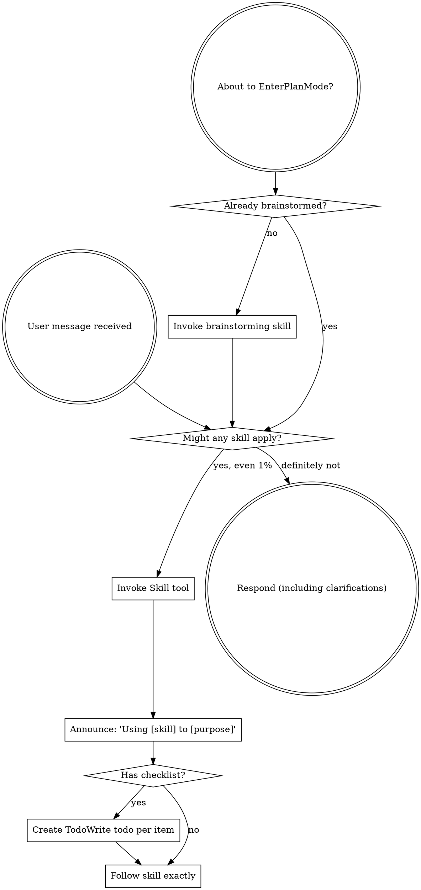

<!-- Generated by SpecStory, Markdown v2.1.0 -->

# 2026-05-04 19:26:39Z

<!-- Codex CLI Session 019df474-7018-7a50-bf6a-d4d0033b5c6f (2026-05-04 19:26:39Z) -->

_**User (2026-05-04 19:26:39Z)**_

继续��一个功能，能�步显示上下文长度和自动上下文�缩状�


---

_**Agent (gpt-5.5 2026-05-04 19:26:51Z)**_

我先�一下�场：会快速看一眼这个项目当�结�和已有状�显示链路，�把“上下文长度 + 自动�缩状���到�有 UI/数��里。这个功能看起��是�把截图里那�“上下文已自动�缩�����示����续�步的状�。

_**Agent (gpt-5.5 2026-05-04 19:26:51Z)**_

<tool-use data-tool-type="shell" data-tool-name="exec_command"><details>
<summary>Tool use: **exec_command** `sed -n '1,220p' '/Users/xiayanghui/Library/Mobile Documents/com~apple~CloudDocs/agent-skills/skills/.system/superpowers/using-superpowers/SKILL.md'`</summary>
```
Chunk ID: e58aba
Wall time: 0.0000 seconds
Process exited with code 1
Original token count: 41
Output:
sed: /Users/xiayanghui/Library/Mobile Documents/com~apple~CloudDocs/agent-skills/skills/.system/superpowers/using-superpowers/SKILL.md: No such file or directory
```
</details></tool-use>

_**Agent (gpt-5.5 2026-05-04 19:26:51Z)**_

<tool-use data-tool-type="shell" data-tool-name="exec_command"><details>
<summary>Tool use: **exec_command** `rg -n "CodexMobile|上下文|context|compact|compression|�缩" /Users/xiayanghui/.codex/memories/MEMORY.md`</summary>
```
Chunk ID: de73c8
Wall time: 0.0000 seconds
Process exited with code 0
Original token count: 2582
Output:
47:- `~/.codex` 的有效状���是 `sessions/`；这轮�次确认 `session_index.jsonl`�`state_5.sqlite`�`memories/`�以��境/资产目录一起决定�际�续�状�，所以�软链�天 sessions 目录�等� Codex 会自动续上全部��上下文 [Task 2]
64:scope: 基� Vault 或已存 memories 生��直��制的个人画��ChatGPT 记忆/自定义指令�跨助手 profile import；适用�“让 ChatGPT �新认识我�“导入长期用户上下文�这类任务，�适用�未验�身份事�的泛化人物介�。
102:- 已存 memories ��支�的稳定工作画�是：中文�文件中心�Obsidian `Vaults`��甜 CRM/NocoBase�正�规划/PRD 交付�LifeOS 日记周记月记，以�“�真�文件/真�改动/真�验��的执行�格；这些�以在跨助手导入时直�作为 durable context �炼 [Task 2]
287:applies_to: cwd=/Users/xiayanghui/Library/Mobile Documents/iCloud~md~obsidian/Documents/Vaults; reuse_rule=适��用到业务会议/选题会/���盘的转写分�；具体行业背景�角色关系和市场结论都�按当次�文上下文�验
324:- 症状：�抓“救�活了�这一�就下结论 -> �因：脱离整段上下文，把情绪�当�完整判断 -> fix：必须�到关�信�稀缺性�信任�交付展示��争和价格认知的整场论� [Task 1]
391:- when the user asked “�芳的有�，还是skill�会�董安妮和黄梦�的� and “这个是有基�我们�际有的销售�识别的�，还是写死的� -> future sales-review runs should infer coverage from the real salesperson directories plus meeting context, not a fixed two-person list [Task 1]
397:- 销售识别的��顺�是：先扫真�销售目录，�看会议里“�开始汇报�的上下文切��示，最��用 skill 里的别�映射补充；`。 -> 董安妮`�`anoiF -> 黄梦�` 这类映射�能当�唯一�� [Task 1]
407:- 症状：第一轮�盘�覆盖董安妮和黄梦�，���芳 -> �因：过度�赖 skill 里写死的别�映射 -> fix：先扫 `03-客户跟进记录/` 的�际销售目录，�根�会议里“�开始汇报�的上下文扩展识别范围 [Task 1]
548:- when the user said “客户评级也�在资料完整度计算里啊，资料完整度�考虑我们�让AI分�所需的字段内容�“微信群填写�需�纳入资料完整度� -> AI completeness should count only factual input fields, not result fields or post-deal context [Task 2][Task 3]
570:# Task Group: Chronicle / 当�工作�上下文�近期项目轨迹
572:scope: 记录 Chronicle �供的最新桌�工作上下文，用�快速�解用户此刻在�进哪些项目�打开哪些工作��以�哪些路径/应用是当�活跃入�；�是正� rollout 的替代�。
573:applies_to: cwd=跨工作�上下文（Vaults / Cursor / �业微信 / �览器）; reuse_rule=适�在未� agent 需�快速�解“用户最近正在忙什么�时使用；时间�感，涉�具体窗�内容时需按当�日期�新验�
575:## Task 1: 归档 2026-04-24 12:45 的多工作�并行上下文
579:- /Users/xiayanghui/.codex/memories_extensions/chronicle/resources/2026-04-24T12-45-00-Biya-10min-memory-summary.md (cwd=跨工作�上下文, rollout_path=/Users/xiayanghui/.codex/memories_extensions/chronicle/resources/2026-04-24T12-45-00-Biya-10min-memory-summary.md, updated_at=2026-04-24T12:45:00+08:00, thread_id=None, chronicle synthetic memory)
589:- /Users/xiayanghui/.codex/memories_extensions/chronicle/resources/2026-04-24T12-55-00-gPjH-10min-memory-summary.md (cwd=跨工作�上下文, rollout_path=/Users/xiayanghui/.codex/memories_extensions/chronicle/resources/2026-04-24T12-55-00-gPjH-10min-memory-summary.md, updated_at=2026-04-24T12:55:00+08:00, thread_id=None, chronicle synthetic memory)
599:- /Users/xiayanghui/.codex/memories_extensions/chronicle/resources/2026-04-24T13-05-00-nezz-10min-memory-summary.md (cwd=跨工作�上下文, rollout_path=/Users/xiayanghui/.codex/memories_extensions/chronicle/resources/2026-04-24T13-05-00-nezz-10min-memory-summary.md, updated_at=2026-04-24T13:05:00+08:00, thread_id=None, chronicle synthetic memory)
600:- /Users/xiayanghui/.codex/memories_extensions/chronicle/resources/2026-04-24T13-15-00-uAzO-10min-memory-summary.md (cwd=跨工作�上下文, rollout_path=/Users/xiayanghui/.codex/memories_extensions/chronicle/resources/2026-04-24T13-15-00-uAzO-10min-memory-summary.md, updated_at=2026-04-24T13:15:00+08:00, thread_id=None, chronicle synthetic memory)
610:- /Users/xiayanghui/.codex/memories_extensions/chronicle/resources/2026-04-24T13-25-00-aUZK-10min-memory-summary.md (cwd=跨工作�上下文, rollout_path=/Users/xiayanghui/.codex/memories_extensions/chronicle/resources/20
... (truncated)
```
</details></tool-use>

_**Agent (gpt-5.5 2026-05-04 19:26:51Z)**_

<tool-use data-tool-type="shell" data-tool-name="exec_command"><details>
<summary>Tool use: **exec_command** `pwd && rg --files -g '!*node_modules*' -g '!*.png' -g '!*.jpg' -g '!*.jpeg' -g '!*.gif' | sed -n '1,200p'`</summary>
```
Chunk ID: d0fe33
Wall time: 0.0000 seconds
Process exited with code 0
Original token count: 234
Output:
/Users/xiayanghui/编程项目/CodexMobile
client/src/api.js
client/src/App.jsx
client/src/main.jsx
client/src/styles.css
client/manifest.webmanifest
client/public/icon.svg
client/vite.config.js
client/index.html
.env.example
skills/lark-sheets-fast/SKILL.md
skills/lark-slides-fast/SKILL.md
skills/lark-doc-fast/SKILL.md
skills/lark-drive-fast/SKILL.md
scripts/start-all.ps1
scripts/patch-codex-sdk.mjs
scripts/start-asr.mjs
scripts/start-server.mjs
scripts/smoke.mjs
scripts/lark-cli-guard.mjs
package.json
package-lock.json
README.md
server/codex-quota.js
server/codex-config.js
server/codex-data.js
server/index.js
server/image-generator.js
server/provider-api.js
server/voice-speaker.js
server/auth.js
server/feishu-skills.js
server/codex-runner.js
server/realtime-voice.js
server/mobile-session-index.js
server/voice-transcriber.js
server/lark-cli.js
LICENSE
asr-service/app.py
asr-service/Dockerfile
asr-service/requirements.txt
```
</details></tool-use>

_**Agent (gpt-5.5 2026-05-04 19:26:51Z)**_

<tool-use data-tool-type="shell" data-tool-name="exec_command"><details>
<summary>Tool use: **exec_command** `git status --short`</summary>
```
Chunk ID: a50fba
Wall time: 0.0000 seconds
Process exited with code 0
Original token count: 67
Output:
 M client/src/App.jsx
 M client/src/styles.css
 M package-lock.json
 M package.json
 M server/codex-config.js
 M server/codex-data.js
 M server/codex-quota.js
 M server/codex-runner.js
 M server/image-generator.js
 M server/index.js
 M server/mobile-session-index.js
```
</details></tool-use>

_**Agent (gpt-5.5 2026-05-04 19:27:04Z)**_

有两点已�冒出�：仓库里本�就有�少未�交改动，所以我会先读�状和 diff，��踩到你已�改过的东西；�外本机之�确�查过 `model_context_window` / `model_auto_compact_token_limit`，这次���以直�围绕这两个�置和�行�消��。

_**Agent (gpt-5.5 2026-05-04 19:27:04Z)**_

<tool-use data-tool-type="shell" data-tool-name="exec_command"><details>
<summary>Tool use: **exec_command** `sed -n '1,220p' '/Users/xiayanghui/.codex/plugins/cache/openai-curated/superpowers/c5debd62/skills/using-superpowers/SKILL.md'`</summary>
```
Chunk ID: 43423d
Wall time: 0.0000 seconds
Process exited with code 0
Original token count: 1351
Output:
---
name: using-superpowers
description: Use when starting any conversation - establishes how to find and use skills, requiring Skill tool invocation before ANY response including clarifying questions
---

<SUBAGENT-STOP>
If you were dispatched as a subagent to execute a specific task, skip this skill.
</SUBAGENT-STOP>

<EXTREMELY-IMPORTANT>
If you think there is even a 1% chance a skill might apply to what you are doing, you ABSOLUTELY MUST invoke the skill.

IF A SKILL APPLIES TO YOUR TASK, YOU DO NOT HAVE A CHOICE. YOU MUST USE IT.

This is not negotiable. This is not optional. You cannot rationalize your way out of this.
</EXTREMELY-IMPORTANT>

## Instruction Priority

Superpowers skills override default system prompt behavior, but **user instructions always take precedence**:

1. **User's explicit instructions** (AGENTS.md, GEMINI.md, direct requests) — highest priority
2. **Superpowers skills** — override default system behavior where they conflict
3. **Default system prompt** — lowest priority

If AGENTS.md or GEMINI.md says "don't use TDD" and a skill says "always use TDD," follow the user's instructions. The user is in control.

## How to Access Skills

**In Codex:** Use the `Skill` tool. When you invoke a skill, its content is loaded and presented to you—follow it directly. Never use the Read tool on skill files.

**In Copilot CLI:** Use the `skill` tool. Skills are auto-discovered from installed plugins. The `skill` tool works the same as Codex's `Skill` tool.

**In Gemini CLI:** Skills activate via the `activate_skill` tool. Gemini loads skill metadata at session start and activates the full content on demand.

**In other environments:** Check your platform's documentation for how skills are loaded.

## Platform Adaptation

Skills may mention tool names that vary by runtime. Other platforms: see `references/copilot-tools.md` (Copilot CLI), `references/codex-tools.md` (Codex) for tool equivalents. Gemini CLI users get the tool mapping loaded automatically via GEMINI.md.

# Using Skills

## The Rule

**Invoke relevant or requested skills BEFORE any response or action.** Even a 1% chance a skill might apply means that you should invoke the skill to check. If an invoked skill turns out to be wrong for the situation, you don't need to use it.



## Red Flags

These thoughts mean STOP—you're rationalizing:

| Thought | Reality |
|---------|---------|
| "This is just a simple question" | Questions are tasks. Check for skills. |
| "I need more context first" | Skill check comes BEFORE clarifying questions. |
| "Let me explore the codebase first" | Skills tell you HOW to explore. Check first. |
| "I can check git/files quickly" | Files lack conversation context. Check for skills. |
| "Let me gather information first" | Skills tell you HOW to gather information. |
| "This doesn't need a formal skill" | If a skill exists, use it. |
| "I remember this skill" | Skills evolve. Read current version. |
| "This doesn't count as a task" | Action = task. Check for skills. |
| "The skill is overkill" | Simple things become complex. Use it. |
| "I'll just do this one thing first" | Check BEFORE doing anything. |
| "This feels productive" | Undisciplined action wastes time. Skills prevent this. |
| "I know what that means" | Knowing the concept ≠ using the skill. Invoke it. |

## Skill Priority

When multiple skills could apply, use this order:

1. **Process skills first** (brainstorming, debugging) - these determine HOW to approach the task
2.
... (truncated)
```
</details></tool-use>

_**Agent (gpt-5.5 2026-05-04 19:27:04Z)**_

<tool-use data-tool-type="shell" data-tool-name="exec_command"><details>
<summary>Tool use: **exec_command** `git diff -- client/src/App.jsx client/src/styles.css server/index.js server/codex-config.js server/codex-runner.js server/codex-data.js server/codex-quota.js server/mobile-session-index.js package.json`</summary>
```
Chunk ID: cdb138
Wall time: 0.0001 seconds
Process exited with code 0
Original token count: 27235
Output:
Total output lines: 3373

diff --git a/client/src/App.jsx b/client/src/App.jsx
index 7ab736f..f2673aa 100644
--- a/client/src/App.jsx
+++ b/client/src/App.jsx
@@ -12,21 +12,27 @@ import {
   Loader2,
   Menu,
   Mic,
+  MessageSquare,
   MessageSquarePlus,
   Monitor,
   Paperclip,
   Pencil,
   Plus,
   RefreshCw,
+  Search,
   Settings,
   ShieldCheck,
   Square,
+  Terminal,
   Trash2,
   Volume2,
   Wifi,
   X
 } from 'lucide-react';
 import { useCallback, useEffect, useMemo, useRef, useState } from 'react';
+import ReactMarkdown from 'react-markdown';
+import remarkBreaks from 'remark-breaks';
+import remarkGfm from 'remark-gfm';
 import { apiBlobFetch, apiFetch, clearToken, getToken, realtimeVoiceWebsocketUrl, setToken, websocketUrl } from './api.js';
 
 const DEFAULT_STATUS = {
@@ -174,6 +180,35 @@ function formatTime(value) {
   }
 }
 
+function formatDuration(start, end = Date.now()) {
+  const startMs = new Date(start || end).getTime();
+  const endMs = new Date(end || Date.now()).getTime();
+  if (!Number.isFinite(startMs) || !Number.isFinite(endMs) || endMs <= startMs) {
+    return '';
+  }
+  const totalSeconds = Math.max(1, Math.round((endMs - startMs) / 1000));
+  const minutes = Math.floor(totalSeconds / 60);
+  const seconds = totalSeconds % 60;
+  if (minutes <= 0) {
+    return `${seconds}s`;
+  }
+  return `${minutes}m ${seconds}s`;
+}
+
+function formatDurationMs(value) {
+  const ms = Number(value);
+  if (!Number.isFinite(ms) || ms <= 0) {
+    return '';
+  }
+  const totalSeconds = Math.max(1, Math.round(ms / 1000));
+  const minutes = Math.floor(totalSeconds / 60);
+  const seconds = totalSeconds % 60;
+  if (minutes <= 0) {
+    return `${seconds}s`;
+  }
+  return `${minutes}m ${seconds}s`;
+}
+
 function compactPath(value) {
   if (!value) {
     return '';
@@ -220,6 +255,75 @@ function imageUrlWithRetry(url, retryKey) {
   return `${url}${separator}r=${retryKey}`;
 }
 
+function isLocalImageSource(value) {
+  const raw = String(value || '').trim();
+  if (!raw || raw.startsWith('/generated/') || raw.startsWith('/assets/')) {
+    return false;
+  }
+  return (
+    /^file:\/\//i.test(raw) ||
+    /^\/(?:Users|private|var|tmp|Volumes)\//.test(raw) ||
+    /^~[\\/]/.test(raw) ||
+    /^[A-Za-z]:[\\/]/.test(raw)
+  );
+}
+
+function safeDecodeUriComponent(value) {
+  try {
+    return decodeURIComponent(value);
+  } catch {
+    return value;
+  }
+}
+
+function localImageApiPath(value) {
+  const raw = String(value || '').trim();
+  const normalized = /%[0-9a-f]{2}/i.test(raw) ? safeDecodeUriComponent(raw) : raw;
+  return `/api/local-image?path=${encodeURIComponent(normalized)}`;
+}
+
+function useResolvedImageSource(url, retryKey) {
+  const [resolved, setResolved] = useState({ src: '', local: false, error: false });
+
+  useEffect(() => {
+    const raw = String(url || '').trim();
+    if (!raw) {
+      setResolved({ src: '', local: false, error: true });
+      return undefined;
+    }
+    if (!isLocalImageSource(raw)) {
+      setResolved({ src: imageUrlWithRetry(raw, retryKey), local: false, error: false });
+      return undefined;
+    }
+
+    let stopped = false;
+    let objectUrl = '';
+    setResolved({ src: '', local: true, error: false });
+    apiBlobFetch(localImageApiPath(raw))
+      .then((blob) => {
+        if (stopped) {
+          return;
+        }
+        objectUrl = URL.createObjectURL(blob);
+        setResolved({ src: objectUrl, local: true, error: false });
+      })
+      .catch(() => {
+        if (!stopped) {
+          setResolved({ src: '', local: true, error: true });
+        }
+      });
+
+    return () => {
+      stopped = true;
+      if (objectUrl) {
+        URL.revokeObjectURL(objectUrl);
+      }
+    };
+  }, [url, retryKey]);
+
+  return resolved;
+}
+
 function createClientTurnId() {
   return globalThis.crypto?.randomUUID?.() || `turn-${Date.now()}-${Math.random().toString(16).slice(2)}`;
 }
@@ -242,6 +346,15 @@ function isDraftSession(session) {
   return Boolean(session?.draft || id?.startsWith('draft-'));
 }
 
+function sessionMessagesApiPath(sessionId, { limit = 120, activity = true } = {}) {
+  const params = new URLSearchParams();
+  params.set('limit', String(limit));
+  if (activity) {
+    params.set('activity', '1');
+  }
+  return `/api/sessions/${encodeURIComponent(sessionId)}/messages?${params.toString()}`;
+}
+
 function titleFromFirstMessage(message) {
   const value = String(message || '').trim().replace(/\s+/g, ' ');
   return value ? value.slice(0, 52) : '新对�';
@@ -527,7 +640,12 @@ function meaningfulActivityLabel(payload, rawLabel, detail) {
     return commandLabel;
   }
 
-  if (payload.kind === 'agent_message' || payload.kind === 'message' || payload.kind === 'reasoning') {
+  if (payload.kind === 'agent_message' || payload.kind === 'message') {
+    const text = rawLabel || payload.content || 
... (truncated)
```
</details></tool-use>

_**Agent (gpt-5.5 2026-05-04 19:27:04Z)**_

<tool-use data-tool-type="shell" data-tool-name="exec_command"><details>
<summary>Tool use: **exec_command** `sed -n '1,240p' client/src/App.jsx`</summary>
```
Chunk ID: ef51b6
Wall time: 0.0000 seconds
Process exited with code 0
Original token count: 1746
Output:
import {
  ArrowUp,
  Check,
  ChevronDown,
  ChevronLeft,
  ChevronRight,
  Copy,
  FileText,
  Folder,
  Headphones,
  Image,
  Loader2,
  Menu,
  Mic,
  MessageSquare,
  MessageSquarePlus,
  Monitor,
  Paperclip,
  Pencil,
  Plus,
  RefreshCw,
  Search,
  Settings,
  ShieldCheck,
  Square,
  Terminal,
  Trash2,
  Volume2,
  Wifi,
  X
} from 'lucide-react';
import { useCallback, useEffect, useMemo, useRef, useState } from 'react';
import ReactMarkdown from 'react-markdown';
import remarkBreaks from 'remark-breaks';
import remarkGfm from 'remark-gfm';
import { apiBlobFetch, apiFetch, clearToken, getToken, realtimeVoiceWebsocketUrl, setToken, websocketUrl } from './api.js';

const DEFAULT_STATUS = {
  connected: false,
  provider: 'cliproxyapi',
  model: 'gpt-5.5',
  modelShort: '5.5 中',
  reasoningEffort: 'xhigh',
  models: [{ value: 'gpt-5.5', label: 'gpt-5.5' }],
  docs: {
    provider: 'feishu',
    integration: 'lark-cli',
    label: '�书文档',
    configured: false,
    connected: false,
    user: null,
    homeUrl: 'https://docs.feishu.cn/',
    cliInstalled: false,
    skillsInstalled: false,
    capabilities: [],
    codexEnabled: false,
    authorizationReady: false,
    missingScopes: [],
    scopeGroups: [],
    slidesAuthorized: false,
    sheetsAuthorized: false,
    authPending: null
  },
  voiceRealtime: { configured: false, model: 'qwen3.5-omni-plus-realtime', provider: '阿里百炼' },
  auth: { authenticated: false }
};

const CONNECTION_STATUS = {
  connected: { label: '已��', className: 'is-connected' },
  connecting: { label: '��中', className: 'is-connecting' },
  disconnected: { label: '已断开', className: 'is-disconnected' }
};

const DEFAULT_REASONING_EFFORT = 'xhigh';
const REASONING_DEFAULT_VERSION = 'xhigh-v1';
const THEME_KEY = 'codexmobile.theme';
const VOICE_MAX_RECORDING_MS = 90 * 1000;
const VOICE_MAX_UPLOAD_BYTES = 10 * 1024 * 1024;
const VOICE_MIME_CANDIDATES = ['audio/mp4', 'audio/webm;codecs=opus', 'audio/webm'];
const VOICE_DIALOG_SILENCE_MS = 900;
const VOICE_DIALOG_MIN_RECORDING_MS = 600;
const VOICE_DIALOG_LEVEL_THRESHOLD = 0.018;
const VOICE_DIALOG_SILENCE_AUDIO =
  'data:audio/wav;base64,UklGRiYAAABXQVZFZm10IBAAAAABAAEARKwAAIhYAQACABAAZGF0YQIAAAAAAA==';
const REALTIME_VOICE_SAMPLE_RATE = 24000;
const REALTIME_VOICE_BUFFER_SIZE = 2048;
const REALTIME_VOICE_MIN_TURN_MS = 500;
const REALTIME_VOICE_BARGE_IN_LEVEL_THRESHOLD = 0.026;
const REALTIME_VOICE_BARGE_IN_SUSTAIN_MS = 180;

function realtimePayloadErrorMessage(payload) {
  return String(payload?.error?.message || payload?.error || payload?.message || '');
}

function isBenignRealtimeCancelError(payload) {
  return /Conversation has none active response/i.test(realtimePayloadErrorMessage(payload));
}

function normalizeVoiceCommandText(value) {
  return String(value || '')
    .toLowerCase()
    .replace(/[\s，。�？�,.!?;；:："'“�‘’（）()�】\[\]<>《》]/g, '');
}

function isVoiceHandoffCommand(value) {
  const text = normalizeVoiceCommandText(value);
  if (!text) {
    return false;
  }
  const wantsSummary = /总结|整�|归纳|汇总|梳�|�炼|概括|组织|形�任务|��任务|整��任务/.test(text);
  const wantsHandoff = /交给|�给|��给|�交给|�交|让|�|拿给|丢给|转给|传给|给/.test(text);
  const wantsAction = /执行|处�|�|改|��|修|查|跑|�作|��|开始干/.test(text);
  const mentionsExecutor =
    /codex|code[x�]?|代�|扣德克斯|扣得克斯|扣的克斯|扣得|扣德|科德克斯|科得克斯|寇德克斯|�德克斯|�得克斯|助手|��|你/.test(text);
  if (mentionsExecutor && ((wantsSummary && wantsHandoff) || (wantsSummary && wantsAction) || (wantsHandoff && wantsAction))) {
    return true;
  }
  if (wantsSummary && wantsHandoff) {
    return true;
  }
  if (/交给codex|�给codex|�交给codex|让codex|交给代�|�给代�|�交给代�|让代�/.test(text)) {
    return true;
  }
  return false;
}

async function copyTextToClipboard(text) {
  const value = String(text || '');
  try {
    if (navigator.clipboard?.writeText) {
      await navigator.clipboard.writeText(value);
      return true;
    }
  } catch {
    // Fall back below for browsers that block Clipboard API in PWA/http contexts.
  }

  const textarea = document.createElement('textarea');
  textarea.value = value;
  textarea.setAttribute('readonly', '');
  textarea.style.position = 'fixed';
  textarea.style.top = '-1000px';
  textarea.style.left = '-1000px';
  document.body.appendChild(textarea);
  textarea.select();
  textarea.setSelectionRange(0, textarea.value.length);
  try {
    return document.execCommand('copy');
  } finally {
    document.body.removeChild(textarea);
  }
}

const PERMISSION_OPTIONS = [
  { value: 'default', label: '默认��' },
  { value: 'acceptEdits', label: '自动��编
... (truncated)
```
</details></tool-use>

_**Agent (gpt-5.5 2026-05-04 19:27:04Z)**_

<tool-use data-tool-type="shell" data-tool-name="exec_command"><details>
<summary>Tool use: **exec_command** `sed -n '1,260p' server/index.js`</summary>
```
Chunk ID: 2ec9c5
Wall time: 0.0000 seconds
Process exited with code 0
Original token count: 2133
Output:
import crypto from 'node:crypto';
import fs from 'node:fs/promises';
import http from 'node:http';
import https from 'node:https';
import os from 'node:os';
import path from 'node:path';
import { fileURLToPath } from 'node:url';
import { gzipSync } from 'node:zlib';
import { WebSocketServer } from 'ws';
import {
  extractBearerToken,
  getPairingCode,
  getTrustedDeviceCount,
  initializeAuth,
  pairDevice,
  verifyToken
} from './auth.js';
import {
  deleteSession,
  getCacheSnapshot,
  getHostName,
  getProject,
  getSession,
  hideSessionMessage,
  listProjectSessions,
  listProjects,
  readSessionMessages,
  refreshCodexCache,
  renameSession
} from './codex-data.js';
import { getCodexQuota } from './codex-quota.js';
import { abortCodexTurn, getActiveRuns, runCodexTurn } from './codex-runner.js';
import { GENERATED_ROOT, isImageRequest, runImageTurn } from './image-generator.js';
import { getLarkDocsStatus, logoutLarkCli, startLarkCliAuth } from './lark-cli.js';
import { registerMobileSession } from './mobile-session-index.js';
import { publicVoiceTranscriptionStatus, transcribeAudio } from './voice-transcriber.js';
import { publicVoiceSpeechStatus, synthesizeSpeech } from './voice-speaker.js';
import { publicVoiceRealtimeStatus, startVoiceRealtimeProxy } from './realtime-voice.js';

const __dirname = path.dirname(fileURLToPath(import.meta.url));
const ROOT_DIR = path.resolve(__dirname, '..');
const CLIENT_DIST = path.join(ROOT_DIR, 'client', 'dist');
const UPLOAD_ROOT = path.join(ROOT_DIR, '.codexmobile', 'uploads');
const IMAGE_PROMPT_STATE = path.join(ROOT_DIR, '.codexmobile', 'state', 'image-prompts.json');
const FEISHU_AUTH_STATE = path.join(ROOT_DIR, '.codexmobile', 'state', 'feishu-auth.json');
const PORT = Number(process.env.PORT || 3321);
const HOST = process.env.HOST || '0.0.0.0';
const HTTPS_PORT = Number(process.env.HTTPS_PORT || 3443);
const HTTPS_PFX_PATH = process.env.HTTPS_PFX_PATH || path.join(ROOT_DIR, '.codexmobile', 'tls', 'server.pfx');
const HTTPS_ROOT_CA_PATH = process.env.HTTPS_ROOT_CA_PATH || path.join(ROOT_DIR, '.codexmobile', 'tls', 'codexmobile-root-ca.cer');
const HTTPS_PFX_PASSPHRASE = process.env.HTTPS_PFX_PASSPHRASE || 'codexmobile-local-https';
const PUBLIC_URL = process.env.CODEXMOBILE_PUBLIC_URL || '';
const FEISHU_APP_ID = String(process.env.CODEXMOBILE_FEISHU_APP_ID || '').trim();
const FEISHU_APP_SECRET = String(process.env.CODEXMOBILE_FEISHU_APP_SECRET || '').trim();
const FEISHU_REDIRECT_URI = String(process.env.CODEXMOBILE_FEISHU_REDIRECT_URI || '').trim();
const FEISHU_DOCS_HOME_URL = process.env.CODEXMOBILE_FEISHU_DOCS_URL || 'https://docs.feishu.cn/';
const MAX_JSON_BYTES = 2 * 1024 * 1024;
const MAX_UPLOAD_BYTES = 50 * 1024 * 1024;
const MAX_VOICE_BYTES = 10 * 1024 * 1024;
const DEFAULT_REASONING_EFFORT = 'xhigh';
const FEISHU_AUTH_STATE_MAX_AGE_MS = 15 * 60 * 1000;

const mimeTypes = new Map([
  ['.html', 'text/html; charset=utf-8'],
  ['.js', 'text/javascript; charset=utf-8'],
  ['.css', 'text/css; charset=utf-8'],
  ['.json', 'application/json; charset=utf-8'],
  ['.webmanifest', 'application/manifest+json; charset=utf-8'],
  ['.cer', 'application/x-x509-ca-cert'],
  ['.svg', 'image/svg+xml'],
  ['.png', 'image/png'],
  ['.jpg', 'image/jpeg'],
  ['.jpeg', 'image/jpeg'],
  ['.webp', 'image/webp'],
  ['.ico', 'image/x-icon']
]);

const compressibleExtensions = new Set([
  '.html',
  '.js',
  '.css',
  '.json',
  '.webmanifest',
  '.svg'
]);

const sockets = new Set();
const recentTurns = new Map();
const conversationQueues = new Map();
const sessionQueueKeys = new Map();
const recentImagePromptsByProject = new Map();
const activeImageRuns = new Map();
let feishuAuthState = { token: null, pendingStates: {} };
const MAX_RECENT_TURNS = 80;

function rememberTurn(turnId, patch) {
  if (!turnId) {
    return null;
  }
  const existing = recentTurns.get(turnId) || { turnId, createdAt: new Date().toISOString() };
  const next = {
    ...existing,
    ...patch,
    turnId,
    updatedAt: new Date().toISOString()
  };
  recentTurns.set(turnId, next);

  if (recentTurns.size > MAX_RECENT_TURNS) {
    const oldest = [...recentTurns.entries()].sort(
      (a, b) => new Date(a[1].updatedAt || a[1].createdAt || 0) - new Date(b[1].updatedAt || b[1].createdAt || 0)
    )[0]?.[0];
    if (oldest) {
      recentTurns.delete(oldest);
    }
  }
  return next;
}

function rememberTurnEvent(payload) {
  if (!payload?.turnId) {
    return;
  }

  const patch = {
    projectId: payload.projectId,
    sessionId: payload.sessionId || undefined,
    previousSessionId: payload.previousSessionId || undefined
  };

  if (payload.type === 'chat-started') {
    patch.status = 'running';
    patch.startedAt = payload.startedAt || new Date().toISOString();
    patch.label = '正在�考';
  } else if (payload.type === 'thread-started') {
    patch.status = 'running';
    patch.label = 'æ
... (truncated)
```
</details></tool-use>

_**Agent (gpt-5.5 2026-05-04 19:27:14Z)**_

我会按�有链路�：�端先暴露“模�上下文�置 + 当�会�估算 + 是��生过自动�缩�的状�，�端�在顶部/会�状�区�步展示。�在先定�状����WebSocket 事件和消�解�的�置。

_**Agent (gpt-5.5 2026-05-04 19:27:14Z)**_

<tool-use data-tool-type="shell" data-tool-name="exec_command"><details>
<summary>Tool use: **exec_command** `rg -n "status|quota|config|model_context|auto_compact|compact|usage|tokens|context|上下文|�缩|WebSocket|status-update|chat-complete" server client/src/App.jsx client/src/styles.css package.json`</summary>
```
Chunk ID: 6af76e
Wall time: 0.0632 seconds
Process exited with code 0
Original token count: 13154
Output:
Total output lines: 672

package.json:9:    "dev:client": "vite --host 0.0.0.0 --config client/vite.config.js",
package.json:10:    "build": "vite build --config client/vite.config.js",
client/src/styles.css:162:.connection-status {
client/src/styles.css:170:.connection-status.is-connected {
client/src/styles.css:174:.connection-status.is-connecting {
client/src/styles.css:178:.connection-status.is-disconnected {
client/src/styles.css:238:.docs-status-state {
client/src/styles.css:249:.docs-status-icon {
client/src/styles.css:259:.docs-status-state h2 {
client/src/styles.css:265:.docs-status-state p {
client/src/styles.css:938:.quota-widget {
client/src/styles.css:942:.quota-row {
client/src/styles.css:952:[data-theme="dark"] .quota-row {
client/src/styles.css:956:.quota-main,
client/src/styles.css:957:.quota-refresh,
client/src/styles.css:958:.quota-toggle,
client/src/styles.css:959:.quota-error,
client/src/styles.css:960:.quota-account-message {
client/src/styles.css:965:.quota-main {
client/src/styles.css:977:.quota-title {
client/src/styles.css:986:.quota-kind {
client/src/styles.css:993:[data-theme="dark"] .quota-kind {
client/src/styles.css:997:.quota-refresh {
client/src/styles.css:1010:[data-theme="dark"] .quota-refresh {
client/src/styles.css:1015:.quota-refresh:disabled {
client/src/styles.css:1019:.quota-toggle {
client/src/styles.css:1028:.quota-toggle svg {
client/src/styles.css:1032:.quota-widget.is-expanded .quota-toggle svg {
client/src/styles.css:1036:.quota-panel {
client/src/styles.css:1045:.quota-account {
client/src/styles.css:1054:[data-theme="dark"] .quota-account {
client/src/styles.css:1059:.quota-account-head {
client/src/styles.css:1066:.quota-account-head span {
client/src/styles.css:1076:[data-theme="dark"] .quota-account-head span {
client/src/styles.css:1080:.quota-account-head small {
client/src/styles.css:1094:[data-theme="dark"] .quota-account-head small {
client/src/styles.css:1099:.quota-window-list {
client/src/styles.css:1104:.quota-window {
client/src/styles.css:1109:.quota-window-meta {
client/src/styles.css:1119:.quota-window-meta strong {
client/src/styles.css:1124:[data-theme="dark"] .quota-window-meta strong {
client/src/styles.css:1128:.quota-bar {
client/src/styles.css:1135:[data-theme="dark"] .quota-bar {
client/src/styles.css:1139:.quota-bar span {
client/src/styles.css:1141:  width: var(--quota-percent, 0%);
client/src/styles.css:1147:.quota-window.is-high .quota-bar span {
client/src/styles.css:1151:.quota-window.is-healthy .quota-bar span {
client/src/styles.css:1155:.quota-window.is-medium .quota-bar span {
client/src/styles.css:1159:.quota-window.is-warning .quota-bar span {
client/src/styles.css:1163:.quota-window.is-low .quota-bar span {
client/src/styles.css:1167:.quota-error,
client/src/styles.css:1168:.quota-account-message,
client/src/styles.css:1169:.quota-empty {
client/src/styles.css:1181:.quota-empty {
client/src/styles.css:1186:.quota-account.is-disabled .quota-account-message {
client/src/styles.css:1191:[data-theme="dark"] .quota-error,
client/src/styles.css:1192:[data-theme="dark"] .quota-account-message {
client/src/styles.css:1197:[data-theme="dark"] .quota-empty,
client/src/styles.css:1198:[data-theme="dark"] .quota-account.is-disabled .quota-account-message {
client/src/styles.css:2669:.voice-dialog-status {
client/src/styles.css:2677:.voice-dialog-status.is-error {
client/src/styles.css:2906:[data-theme="dark"] .voice-dialog-status {
client/src/styles.css:2910:[data-theme="dark"] .voice-dialog-status.is-error {
client/src/App.jsx:49:    configured: false,
client/src/App.jsx:64:  voiceRealtime: { configured: false, model: 'qwen3.5-omni-plus-realtime', provider: '阿里百炼' },
client/src/App.jsx:135:    // Fall back below for browsers that block Clipboard API in PWA/http contexts.
client/src/App.jsx:212:function compactPath(value) {
client/src/App.jsx:497:function statusMessageId(payload) {
client/src/App.jsx:498:  return `status-${payload.turnId || payload.sessionId || 'current'}`;
client/src/App.jsx:615:  if (/\bgit\s+(status|diff|show|log|ls-files)\b/.test(lower)) {
client/src/App.jsx:667:function activityStepFromPayload(payload, fallbackKind = 'status') {
client/src/App.jsx:678:    id: payload.messageId || `${statusMessageId(payload)}-${payload.kind || fallbackKind}-${label || payload.status || 'step'}`,
client/src/App.jsx:681:    status: payload.status || 'running',
client/src/App.jsx:692:function compactActivityText(value) {
client/src/App.jsx:768:  if (last && last.label === step.label && last.detail === step.detail && last.status === step.status) {
client/src/App.jsx:788:  if (messageStatus !== 'failed' && step.kind === 'command_execution' && step.status === 'failed') {
client/src/App.jsx:791:  if (step.kind === 'function_call_output' && messageStatus !== 'failed' && step.status !== 'failed') {
client/src/App.jsx:822:      
... (truncated)
```
</details></tool-use>

_**Agent (gpt-5.5 2026-05-04 19:27:14Z)**_

<tool-use data-tool-type="shell" data-tool-name="exec_command"><details>
<summary>Tool use: **exec_command** `sed -n '1,260p' server/codex-config.js`</summary>
```
Chunk ID: 29a2f4
Wall time: 0.0181 seconds
Process exited with code 0
Original token count: 1621
Output:
import fs from 'node:fs/promises';
import os from 'node:os';
import path from 'node:path';

export const CODEX_HOME = process.env.CODEX_HOME || path.join(os.homedir(), '.codex');
export const CODEX_CONFIG_PATH = path.join(CODEX_HOME, 'config.toml');
export const CODEX_GLOBAL_STATE_PATH = path.join(CODEX_HOME, '.codex-global-state.json');
export const CODEX_MODELS_CACHE_PATH = path.join(CODEX_HOME, 'models_cache.json');
export const CODEX_SESSIONS_DIR = path.join(CODEX_HOME, 'sessions');
export const CODEX_SESSION_INDEX = path.join(CODEX_HOME, 'session_index.jsonl');

function stripQuotes(value) {
  const trimmed = String(value || '').trim();
  if (
    (trimmed.startsWith('"') && trimmed.endsWith('"')) ||
    (trimmed.startsWith("'") && trimmed.endsWith("'"))
  ) {
    return trimmed.slice(1, -1);
  }
  return trimmed;
}

function shortModelName(model) {
  if (!model) {
    return '5.5 中';
  }
  return model
    .replace(/^gpt-/i, '')
    .replace(/-codex.*$/i, '')
    .replace(/-mini$/i, ' mini') + ' 中';
}

function publicModel(entry) {
  if (!entry?.slug) {
    return null;
  }
  if (entry.visibility && entry.visibility !== 'list') {
    return null;
  }
  return {
    value: entry.slug,
    label: entry.display_name || entry.slug
  };
}

export async function readCodexModels(currentModel = 'gpt-5.5') {
  const models = new Map();

  try {
    const raw = await fs.readFile(CODEX_MODELS_CACHE_PATH, 'utf8');
    const parsed = JSON.parse(raw);
    const entries = Array.isArray(parsed.models) ? parsed.models : [];
    for (const entry of entries) {
      const model = publicModel(entry);
      if (model && !models.has(model.value)) {
        models.set(model.value, model);
      }
    }
  } catch (error) {
    if (error.code !== 'ENOENT') {
      console.warn('[config] Failed to read Codex model cache:', error.message);
    }
  }

  if (currentModel && !models.has(currentModel)) {
    models.set(currentModel, { value: currentModel, label: currentModel });
  }

  return [...models.values()];
}

export async function readCodexWorkspaceState() {
  try {
    const raw = await fs.readFile(CODEX_GLOBAL_STATE_PATH, 'utf8');
    const parsed = JSON.parse(raw);
    const labels = parsed['electron-workspace-root-labels'] || {};
    const projectlessThreadIds = Array.isArray(parsed['projectless-thread-ids'])
      ? parsed['projectless-thread-ids'].filter((id) => typeof id === 'string' && id.trim())
      : [];
    const threadWorkspaceRootHints = parsed['thread-workspace-root-hints'] &&
      typeof parsed['thread-workspace-root-hints'] === 'object' &&
      !Array.isArray(parsed['thread-workspace-root-hints'])
      ? parsed['thread-workspace-root-hints']
      : {};
    const orderedRoots = [
      ...(Array.isArray(parsed['project-order']) ? parsed['project-order'] : []),
      ...(Array.isArray(parsed['electron-saved-workspace-roots']) ? parsed['electron-saved-workspace-roots'] : [])
    ];
    const seen = new Set();
    const projects = [];

    for (const root of orderedRoots) {
      if (!root || typeof root !== 'string') {
        continue;
      }
      const key = process.platform === 'win32' ? root.toLowerCase() : root;
      if (seen.has(key)) {
        continue;
      }
      seen.add(key);
      projects.push({
        path: root,
        label: typeof labels[root] === 'string' ? labels[root] : null
      });
    }

    return { projects, projectlessThreadIds, threadWorkspaceRootHints };
  } catch (error) {
    if (error.code !== 'ENOENT') {
      console.warn('[config] Failed to read Codex workspace state:', error.message);
    }
    return { projects: [], projectlessThreadIds: [], threadWorkspaceRootHints: {} };
  }
}

export async function readCodexConfig() {
  const fallback = {
    provider: 'codex',
    model: 'gpt-5.5',
    modelShort: '5.5 中',
    reasoningEffort: null,
    baseUrl: null,
    models: [{ value: 'gpt-5.5', label: 'gpt-5.5' }],
    projects: []
  };

  let raw;
  try {
    raw = await fs.readFile(CODEX_CONFIG_PATH, 'utf8');
  } catch (error) {
    if (error.code !== 'ENOENT') {
      console.warn('[config] Failed to read Codex config:', error.message);
    }
    fallback.models = await readCodexModels(fallback.model);
    return fallback;
  }

  const config = {
    ...fallback,
    projects: []
  };
  const projectMap = new Map();
  const providerBaseUrls = new Map();
  let currentProject = null;
  let currentProvider = null;

  for (const rawLine of raw.split(/\r?\n/)) {
    const line = rawLine.trim();
    if (!line || line.startsWith('#')) {
      continue;
    }

    const projectMatch = line.match(/^\[projects\.(?:'([^']+)'|"([^"]+)")\]$/);
    if (projectMatch) {
      currentProject = stripQuotes(projectMatch[1] || projectMatch[2]);
      currentProvider = null;
      if (!projectMap.has(currentProject)) {
        projectMap.set(currentProject, { path: currentProje
... (truncated)
```
</details></tool-use>

_**Agent (gpt-5.5 2026-05-04 19:27:14Z)**_

<tool-use data-tool-type="shell" data-tool-name="exec_command"><details>
<summary>Tool use: **exec_command** `sed -n '1,360p' server/codex-data.js`</summary>
```
Chunk ID: 1122f2
Wall time: 0.0344 seconds
Process exited with code 0
Original token count: 2584
Output:
import crypto from 'node:crypto';
import fs from 'node:fs/promises';
import fsSync from 'node:fs';
import os from 'node:os';
import path from 'node:path';
import readline from 'node:readline';
import { CODEX_SESSION_INDEX, CODEX_SESSIONS_DIR, readCodexConfig, readCodexWorkspaceState } from './codex-config.js';
import {
  readMobileSessionIndex,
  readMobileSessionMessages,
  readMobileSessions,
  renameMobileSession
} from './mobile-session-index.js';

const DELETED_MESSAGES_PATH = path.join(process.cwd(), '.codexmobile', 'state', 'deleted-messages.json');
const HIDDEN_SESSIONS_PATH = path.join(process.cwd(), '.codexmobile', 'state', 'hidden-sessions.json');
const PROJECTLESS_PROJECT_ID = '__codexmobile_projectless__';
const PROJECTLESS_PROJECT_NAME = '普通对�';

let cache = {
  syncedAt: null,
  config: null,
  projects: [],
  projectById: new Map(),
  sessionsByProject: new Map(),
  sessionById: new Map()
};

function emptyDeletedMessagesState() {
  return { version: 1, sessions: {} };
}

function emptyHiddenSessionsState() {
  return { version: 1, sessions: {} };
}

async function readDeletedMessagesState() {
  try {
    const raw = await fs.readFile(DELETED_MESSAGES_PATH, 'utf8');
    const parsed = JSON.parse(raw);
    return {
      version: 1,
      sessions: parsed && typeof parsed.sessions === 'object' && !Array.isArray(parsed.sessions)
        ? parsed.sessions
        : {}
    };
  } catch (error) {
    if (error.code !== 'ENOENT') {
      console.warn('[sessions] Failed to read deleted message state:', error.message);
    }
    return emptyDeletedMessagesState();
  }
}

async function writeDeletedMessagesState(state) {
  await fs.mkdir(path.dirname(DELETED_MESSAGES_PATH), { recursive: true });
  await fs.writeFile(
    DELETED_MESSAGES_PATH,
    JSON.stringify({ version: 1, sessions: state.sessions || {} }, null, 2),
    'utf8'
  );
}

async function readHiddenSessionsState() {
  try {
    const raw = await fs.readFile(HIDDEN_SESSIONS_PATH, 'utf8');
    const parsed = JSON.parse(raw);
    return {
      version: 1,
      sessions: parsed && typeof parsed.sessions === 'object' && !Array.isArray(parsed.sessions)
        ? parsed.sessions
        : {}
    };
  } catch (error) {
    if (error.code !== 'ENOENT') {
      console.warn('[sessions] Failed to read hidden session state:', error.message);
    }
    return emptyHiddenSessionsState();
  }
}

async function writeHiddenSessionsState(state) {
  await fs.mkdir(path.dirname(HIDDEN_SESSIONS_PATH), { recursive: true });
  await fs.writeFile(
    HIDDEN_SESSIONS_PATH,
    JSON.stringify({ version: 1, sessions: state.sessions || {} }, null, 2),
    'utf8'
  );
}

async function readHiddenSessionIds() {
  const state = await readHiddenSessionsState();
  return new Set(Object.keys(state.sessions || {}));
}

async function hideSessionInMobile(session) {
  const id = String(session?.id || '').trim();
  if (!id) {
    const error = new Error('Session id is required');
    error.statusCode = 400;
    throw error;
  }

  const state = await readHiddenSessionsState();
  const existing = state.sessions[id];
  state.sessions[id] = {
    hiddenAt: existing?.hiddenAt || new Date().toISOString(),
    projectId: session.projectId || existing?.projectId || null,
    projectPath: session.cwd || existing?.projectPath || null,
    title: session.title || existing?.title || null
  };
  await writeHiddenSessionsState(state);
  return { sessionId: id, hiddenAt: state.sessions[id].hiddenAt };
}

async function readDeletedMessageIds(sessionId) {
  const id = String(sessionId || '').trim();
  if (!id) {
    return new Set();
  }
  const state = await readDeletedMessagesState();
  return new Set(Object.keys(state.sessions?.[id] || {}));
}

function filterDeletedMessages(messages, deletedIds) {
  if (!deletedIds.size) {
    return messages;
  }
  return messages.filter((message) => !deletedIds.has(String(message.id || '')));
}

export function normalizeComparablePath(value) {
  if (!value || typeof value !== 'string') {
    return '';
  }
  const normalized = path.resolve(value);
  return process.platform === 'win32' ? normalized.toLowerCase() : normalized;
}

function projectIdFor(projectPath) {
  return crypto.createHash('sha1').update(normalizeComparablePath(projectPath)).digest('hex').slice(0, 16);
}

function displayNameFor(projectPath) {
  const parsed = path.parse(projectPath);
  return path.basename(projectPath) || parsed.root || projectPath;
}

function toPublicProject(entry) {
  return {
    id: entry.id,
    name: entry.name,
    path: entry.path,
    pathLabel: entry.pathLabel || null,
    projectless: Boolean(entry.projectless),
    trusted: entry.trusted,
    updatedAt: entry.updatedAt,
    sessionCount: entry.sessionCount || 0
  };
}

async function walkJsonlFiles(dir) {
  const files = [];
  async function walk(current) {
    let entries;
    try {
    
... (truncated)
```
</details></tool-use>

_**Agent (gpt-5.5 2026-05-04 19:27:14Z)**_

<tool-use data-tool-type="shell" data-tool-name="exec_command"><details>
<summary>Tool use: **exec_command** `sed -n '1,620p' server/codex-runner.js`</summary>
```
Chunk ID: 6b72d0
Wall time: 0.0226 seconds
Process exited with code 0
Original token count: 4795
Output:
import crypto from 'node:crypto';
import fs from 'node:fs/promises';
import path from 'node:path';
import { buildCodexLarkCliContext } from './lark-cli.js';
import { detectFeishuSkillKeys } from './feishu-skills.js';

const activeRuns = new Map();
const NON_ASCII_PATH_PATTERN = /[^\u0000-\u007F]/;

async function ensureAsciiWorkingDirectory(projectPath) {
  if (process.platform !== 'win32' || !NON_ASCII_PATH_PATTERN.test(projectPath)) {
    return projectPath;
  }

  const resolved = path.resolve(projectPath);
  const driveRoot = path.parse(resolved).root || 'C:\\';
  const aliasRoot = path.join(driveRoot, 'codex_project_aliases');
  const aliasName = crypto.createHash('sha1').update(resolved.toLowerCase()).digest('hex');
  const aliasPath = path.join(aliasRoot, aliasName);

  await fs.mkdir(aliasRoot, { recursive: true });
  try {
    const stats = await fs.lstat(aliasPath);
    if (stats.isDirectory() || stats.isSymbolicLink()) {
      return aliasPath;
    }
    await fs.rm(aliasPath, { recursive: true, force: true });
  } catch (error) {
    if (error.code !== 'ENOENT') {
      throw error;
    }
  }

  await fs.symlink(resolved, aliasPath, 'junction');
  return aliasPath;
}

function mapPermissionMode(permissionMode) {
  if (permissionMode === 'bypassPermissions') {
    return { sandboxMode: 'danger-full-access', approvalPolicy: 'never' };
  }
  if (permissionMode === 'acceptEdits') {
    return { sandboxMode: 'workspace-write', approvalPolicy: 'never' };
  }
  return { sandboxMode: 'workspace-write', approvalPolicy: 'never' };
}

function normalizeReasoningEffort(reasoningEffort) {
  const value = String(reasoningEffort || '').trim();
  return ['minimal', 'low', 'medium', 'high', 'xhigh'].includes(value) ? value : undefined;
}

function textFromContent(content) {
  if (typeof content === 'string') {
    return content;
  }
  if (!Array.isArray(content)) {
    return '';
  }
  return content
    .map((part) => {
      if (typeof part === 'string') {
        return part;
      }
      if (part?.type === 'output_text' || part?.type === 'input_text' || part?.type === 'text') {
        return part.text || '';
      }
      return part?.text || '';
    })
    .filter(Boolean)
    .join('\n');
}

function contentFromItem(item) {
  if (!item) {
    return '';
  }
  const contentText = textFromContent(item.content);
  if (contentText) {
    return contentText;
  }
  if (typeof item.text === 'string') {
    return item.text;
  }
  if (typeof item.aggregated_output === 'string') {
    return item.aggregated_output;
  }
  if (typeof item.message === 'string') {
    return item.message;
  }
  return '';
}

function statusLabel(kind, status = 'running') {
  const done = status === 'completed';
  const failed = status === 'failed';
  const labels = {
    turn: done ? '任务已完�' : failed ? '任务失败' : '正在处�',
    reasoning: done ? '�考完�' : '正在�考',
    agent_message: '正在��',
    message: '正在��',
    command_execution: done ? '命令已完�' : failed ? '命令失败' : '正在执行命令',
    file_change: done ? '文件已修改' : failed ? '文件修改失败' : '正在修改文件',
    mcp_tool_call: done ? '工具调用完�' : failed ? '工具调用失败' : '正在调用工具',
    web_search: done ? '�索完�' : failed ? '�索失败' : '正在�索',
    todo_list: done ? '计划已更新' : '正在规划',
    image_generation_call: done ? '图片生�完�' : failed ? '图片生�失败' : '正在生�图片',
    custom_tool_call: done ? '工具调用完�' : failed ? '工具调用失败' : '正在调用工具',
    function_call: done ? '工具调用完�' : failed ? '工具调用失败' : '正在调用工具',
    error: '出�错误'
  };
  return labels[kind] || (done ? '已完�' : failed ? '失败' : '正在处�');
}

function compactStatusLabel(content, fallback = '正在处�') {
  const label = String(content || '')
    .replace(/\s+/g, ' ')
    .trim();
  return label || fallback;
}

function detailFromItem(item) {
  if (!item) {
    return '';
  }
  if (item.command) {
    return item.command;
  }
  if (item.query) {
    return item.query;
  }
  if (item.action?.query) {
    return item.action.query;
  }
  if (Array.isArray(item.action?.queries) && item.action.queries.length) {
    return item.action.queries.join('\n');
  }
  if (item.action?.url) {
    return item.action.url;
  }
  if (item.action?.pattern && item.action?.url) {
    return `${item.action.pattern} in ${item.action.url}`;
  }
  if (item.tool || item.server) {
    return [item.server, item.tool].filter(Boolean).join(' / ');
  }
  if (Array.isArray(item.changes)) {
    return item.changes.map((change) => `${change.kind || 'update'} ${change.path}`).join('\n');
  }
  if (item.message) {
    return item.message;
  }
  return contentFromItem(item);
}

function
... (truncated)
```
</details></tool-use>

_**Agent (gpt-5.5 2026-05-04 19:27:18Z)**_

<tool-use data-tool-type="shell" data-tool-name="exec_command"><details>
<summary>Tool use: **exec_command** `sed -n '620,700p' server/codex-runner.js && sed -n '820,890p' server/index.js && sed -n '4400,4688p' client/src/App.jsx && sed -n '5600,5850p' client/src/App.jsx`</summary>
```
Chunk ID: 1e4ef0
Wall time: 0.0000 seconds
Process exited with code 0
Original token count: 3236
Output:
    .map((run) => ({
      sessionId: run.sessionId,
      previousSessionId: run.previousSessionId,
      startedAt: run.startedAt,
      status: run.status,
      turnId: run.turnId
    }));
}
  return recentImageSession?.summary || recentImageSession?.title || '';
}

function remoteAddress(req) {
  return req.headers['x-forwarded-for']?.split(',')[0]?.trim() || req.socket.remoteAddress || '';
}

async function isAuthenticated(req) {
  return verifyToken(extractBearerToken(req), { remoteAddress: remoteAddress(req) });
}

async function requireAuth(req, res, pathname = '') {
  if (await isAuthenticated(req)) {
    return true;
  }
  if ((req.method || 'GET') !== 'GET') {
    console.warn(`[auth] rejected ${req.method || 'GET'} ${pathname || req.url || ''} remote=${remoteAddress(req)}`);
  }
  sendJson(res, 401, { error: 'Pairing required' });
  return false;
}

function broadcast(payload) {
  const serialized = JSON.stringify(payload);
  for (const socket of sockets) {
    if (socket.readyState === socket.OPEN) {
      socket.send(serialized);
    }
  }
}

async function publicStatus(authenticated) {
  const snapshot = getCacheSnapshot();
  const config = snapshot.config || {};
  return {
    connected: true,
    hostName: getHostName(),
    port: PORT,
    provider: config.provider || 'codex',
    model: config.model || 'gpt-5.5',
    modelShort: config.modelShort || '5.5 中',
    models: config.models?.length ? config.models : fallbackModels(config),
    reasoningEffort: DEFAULT_REASONING_EFFORT,
    voiceTranscription: publicVoiceTranscriptionStatus(config),
    voiceSpeech: publicVoiceSpeechStatus(config),
    voiceRealtime: publicVoiceRealtimeStatus(config),
    docs: await publicDocsStatus(authenticated),
    syncedAt: snapshot.syncedAt,
    activeRuns: [...getActiveRuns(), ...getActiveImageRuns()],
    auth: {
      required: true,
      authenticated,
      trustedDevices: getTrustedDeviceCount()
    }
  };
}

function rememberConversationAlias(queueKey, sessionId) {
  if (queueKey && sessionId) {
    sessionQueueKeys.set(sessionId, queueKey);
  }
}

function resolveConversationKey(...ids) {
  for (const id of ids) {
    if (id && sessionQueueKeys.has(id)) {
      return sessionQueueKeys.get(id);
    }
  }
  const queueKey = ids.find(Boolean) || crypto.randomUUID();
  for (const id of ids) {

    const speechKey = `${awaiting.turnId}:${reply.id}:${speechText.length}`;
    if (voiceDialogLastSpokenRef.current === speechKey) {
      return;
    }
    voiceDialogLastSpokenRef.current = speechKey;
    voiceDialogAwaitingTurnRef.current = null;
    playVoiceDialogReply(reply);
  }, [messages, runningById, voiceDialogOpen]);

  useEffect(() => {
    localStorage.setItem(THEME_KEY, theme);
    document.documentElement.dataset.theme = theme;
  }, [theme]);

  useEffect(() => {
    if (selectedReasoningEffort) {
      localStorage.setItem('codexmobile.reasoningEffort', selectedReasoningEffort);
    }
  }, [selectedReasoningEffort]);

  useEffect(() => {
    if (status.model && selectedModel === DEFAULT_STATUS.model) {
      setSelectedModel(status.model);
    }
  }, [selectedModel, status.model]);

  useEffect(() => {
    const saved = localStorage.getItem('codexmobile.reasoningEffort');
    if (!saved && status.reasoningEffort && !selectedReasoningEffort) {
      setSelectedReasoningEffort(status.reasoningEffort);
    }
  }, [selectedReasoningEffort, status.reasoningEffort]);

  const loadStatus = useCallback(async () => {
    const data = await apiFetch('/api/status');
    setStatus(data);
    setAuthenticated(Boolean(data.auth?.authenticated));
    syncActiveRunsFromStatus(data);
    return data;
  }, []);

  const loadSessions = useCallback(async (project, chooseLatest = true) => {
    if (!project) {
      setSelectedSession(null);
      setMessages([]);
      return;
    }
    setLoadingProjectId(project.id);
    try {
      const data = await apiFetch(`/api/projects/${encodeURIComponent(project.id)}/sessions`);
      const nextSessions = data.sessions || [];
      setSessionsByProject((current) => ({ ...current, [project.id]: nextSessions }));
      if (chooseLatest) {
        const next = nextSessions[0] || null;
        setSelectedSession(next);
        if (next) {
          const messageData = await apiFetch(sessionMessagesApiPath(next.id));
          setMessages(messageData.messages || []);
        } else {
          setMessages([]);
        }
      } else {
        setSelectedSession(null);
        setMessages([]);
      }
    } finally {
      setLoadingProjectId((current) => (current === project.id ? null : current));
    }
  }, []);

  const loadProjects = useCallback(async () => {
    const data = await apiFetch('/api/projects');
    const list = data.projects || [];
    setProjects(list);
    const preferred =
      list.find((project) => project.name.toLowerCase() === 'codexmobile') ||
... (truncated)
```
</details></tool-use>

_**Agent (gpt-5.5 2026-05-04 19:27:26Z)**_

<tool-use data-tool-type="shell" data-tool-name="exec_command"><details>
<summary>Tool use: **exec_command** `rg -n "上下文已自动�缩|auto.*compact|compact|compaction|context_window|model_context|token_limit|tokens|usage" ~/.codex/sessions ~/.codex/archived_sessions ~/.codex 2>/dev/null | head -120`</summary>
```
Chunk ID: 1b74fc
Wall time: 0.0002 seconds
Process exited with code 0
Original token count: 97381
Output:
Total output lines: 120

/Users/xiayanghui/.codex/sessions/2026/01/12/rollout-2026-01-12T01-19-38-019bae12-1221-7603-beb6-7f03dfaea8b2.jsonl:10:{"timestamp":"2026-01-11T17:19:46.519Z","type":"event_msg","payload":{"type":"token_count","info":{"total_token_usage":{"input_tokens":8369,"cached_input_tokens":6144,"output_tokens":269,"reasoning_output_tokens":173,"total_tokens":8638},"last_token_usage":{"input_tokens":8369,"cached_input_tokens":6144,"output_tokens":269,"reasoning_output_tokens":173,"total_tokens":8638},"model_context_window":258400},"rate_limits":{"primary":{"used_percent":9.0,"window_minutes":300,"resets_at":1768164568},"secondary":{"used_percent":15.0,"window_minutes":10080,"resets_at":1768270748},"credits":{"has_credits":false,"unlimited":false,"balance":null},"plan_type":null}}}
/Users/xiayanghui/.codex/sessions/2026/01/12/rollout-2026-01-12T01-19-38-019bae12-1221-7603-beb6-7f03dfaea8b2.jsonl:13:{"timestamp":"2026-01-11T17:19:48.633Z","type":"event_msg","payload":{"type":"token_count","info":{"total_token_usage":{"input_tokens":8369,"cached_input_tokens":6144,"output_tokens":269,"reasoning_output_tokens":173,"total_tokens":8638},"last_token_usage":{"input_tokens":8369,"cached_input_tokens":6144,"output_tokens":269,"reasoning_output_tokens":173,"total_tokens":8638},"model_context_window":258400},"rate_limits":{"primary":{"used_percent":11.0,"window_minutes":300,"resets_at":1768164568},"secondary":{"used_percent":15.0,"window_minutes":10080,"resets_at":1768270748},"credits":{"has_credits":false,"unlimited":false,"balance":null},"plan_type":null}}}
/Users/xiayanghui/.codex/sessions/2026/01/12/rollout-2026-01-12T01-19-38-019bae12-1221-7603-beb6-7f03dfaea8b2.jsonl:16:{"timestamp":"2026-01-11T17:19:51.519Z","type":"event_msg","payload":{"type":"token_count","info":{"total_token_usage":{"input_tokens":17823,"cached_input_tokens":14592,"output_tokens":377,"reasoning_output_tokens":202,"total_tokens":18200},"last_token_usage":{"input_tokens":9454,"cached_input_tokens":8448,"output_tokens":108,"reasoning_output_tokens":29,"total_tokens":9562},"model_context_window":258400},"rate_limits":{"primary":{"used_percent":11.0,"window_minutes":300,"resets_at":1768164568},"secondary":{"used_percent":15.0,"window_minutes":10080,"resets_at":1768270748},"credits":{"has_credits":false,"unlimited":false,"balance":null},"plan_type":null}}}
/Users/xiayanghui/.codex/sessions/2026/01/12/rollout-2026-01-12T01-19-38-019bae12-1221-7603-beb6-7f03dfaea8b2.jsonl:19:{"timestamp":"2026-01-11T17:19:53.964Z","type":"event_msg","payload":{"type":"token_count","info":{"total_token_usage":{"input_tokens":17823,"cached_input_tokens":14592,"output_tokens":377,"reasoning_output_tokens":202,"total_tokens":18200},"last_token_usage":{"input_tokens":9454,"cached_input_tokens":8448,"output_tokens":108,"reasoning_output_tokens":29,"total_tokens":9562},"model_context_window":258400},"rate_limits":{"primary":{"used_percent":11.0,"window_minutes":300,"resets_at":1768164568},"secondary":{"used_percent":15.0,"window_minutes":10080,"resets_at":1768270748},"credits":{"has_credits":false,"unlimited":false,"balance":null},"plan_type":null}}}
/Users/xiayanghui/.codex/sessions/2026/01/12/rollout-2026-01-12T01-19-38-019bae12-1221-7603-beb6-7f03dfaea8b2.jsonl:21:{"timestamp":"2026-01-11T17:19:56.343Z","type":"event_msg","payload":{"type":"token_count","info":{"total_token_usage":{"input_tokens":28942,"cached_input_tokens":23936,"output_tokens":454,"reasoning_output_tokens":202,"total_tokens":29396},"last_token_usage":{"input_tokens":11119,"cached_input_tokens":9344,"output_tokens":77,"reasoning_output_tokens":0,"total_tokens":11196},"model_context_window":258400},"rate_limits":{"primary":{"used_percent":11.0,"window_minutes":300,"resets_at":1768164568},"secondary":{"used_percent":15.0,"window_minutes":10080,"resets_at":1768270748},"credits":{"has_credits":false,"unlimited":false,"balance":null},"plan_type":null}}}
/Users/xiayanghui/.codex/sessions/2026/01/12/rollout-2026-01-12T01-19-38-019bae12-1221-7603-beb6-7f03dfaea8b2.jsonl:24:{"timestamp":"2026-01-11T17:19:58.307Z","type":"event_msg","payload":{"type":"token_count","info":{"total_token_usage":{"input_tokens":28942,"cached_input_tokens":23936,"output_tokens":454,"reasoning_output_tokens":202,"total_tokens":29396},"last_token_usage":{"input_tokens":11119,"cached_input_tokens":9344,"output_tokens":77,"reasoning_output_tokens":0,"total_tokens":11196},"model_context_window":258400},"rate_limits":{"primary":{"used_percent":11.0,"window_minutes":300,"resets_at":1768164568},"secondary":{"used_percent":15.0,"window_minutes":10080,"resets_at":1768270748},"credits":{"has_credits":false,"unlimited":false,"balance":null},"plan_type":null}}}
/Users/xiayanghui/.codex/sessions/2026/01/12/rollout-2026-01-12T01-19-38-019bae12-1221-7603-beb6-7f03dfaea8b2.jsonl:27:{"timestamp":"2026-01-11T17:20:01.309Z","type":"eve
... (truncated)
```
</details></tool-use>

_**Agent (gpt-5.5 2026-05-04 19:27:26Z)**_

<tool-use data-tool-type="shell" data-tool-name="exec_command"><details>
<summary>Tool use: **exec_command** `sed -n '3040,3225p' client/src/App.jsx`</summary>
```
Chunk ID: 734732
Wall time: 0.0000 seconds
Process exited with code 0
Original token count: 2222
Output:
          <div className="control-left">
            <button type="button" className="ghost-icon" aria-label="添加" onClick={() => toggleMenu('attach')} disabled={uploading}>
              <Plus size={21} />
            </button>
            <button type="button" className="permission-pill" onClick={() => toggleMenu('permission')}>
              {permissionLabel(permissionMode)}
              <ChevronDown size={15} />
            </button>
          </div>
          <div className="control-right">
            <button type="button" className="model-select" onClick={() => toggleMenu('model')}>
              {shortModelName(selectedModelLabel)} {reasoningLabel(selectedReasoningEffort)}
              <ChevronDown size={15} />
            </button>
            <button
              type="button"
              className={`dialog-button ${voiceDialogActive ? 'is-active' : ''}`}
              onClick={onOpenVoiceDialog}
              aria-label="语音对�"
            >
              <Headphones size={16} />
              <span>对�</span>
            </button>
            <button
              type="button"
              className={`voice-button ${voiceRecording ? 'is-recording' : ''} ${voiceTranscribing ? 'is-transcribing' : ''} ${voiceSending ? 'is-sending' : ''}`}
              onClick={toggleVoiceInput}
              disabled={voiceTranscribing || voiceSending}
              aria-label={voiceRecording ? '�止语音输入' : voiceSending ? '正在��语音' : '开始语音输入'}
            >
              {voiceTranscribing || voiceSending ? <Loader2 className="spin" size={16} /> : <Mic size={17} />}
            </button>
            <button type="submit" className={`send-button ${running ? 'is-running' : ''}`} disabled={uploading || (!hasInput && !running)}>
              {running && !hasInput ? <Square size={16} /> : uploading ? <Loader2 className="spin" size={16} /> : <ArrowUp size={19} />}
            </button>
          </div>
        </div>
      </div>
    </form>
  );
}

export default function App() {
  const [status, setStatus] = useState(DEFAULT_STATUS);
  const [authenticated, setAuthenticated] = useState(Boolean(getToken()));
  const [drawerOpen, setDrawerOpen] = useState(false);
  const [projects, setProjects] = useState([]);
  const [selectedProject, setSelectedProject] = useState(null);
  const [expandedProjectIds, setExpandedProjectIds] = useState({});
  const [sessionsByProject, setSessionsByProject] = useState({});
  const [loadingProjectId, setLoadingProjectId] = useState(null);
  const [selectedSession, setSelectedSession] = useState(null);
  const [messages, setMessages] = useState([]);
  const [previewImage, setPreviewImage] = useState(null);
  const [docsOpen, setDocsOpen] = useState(false);
  const [docsBusy, setDocsBusy] = useState(false);
  const [docsError, setDocsError] = useState('');
  const [input, setInput] = useState('');
  const [attachments, setAttachments] = useState([]);
  const [uploading, setUploading] = useState(false);
  const [permissionMode, setPermissionMode] = useState('default');
  const [selectedModel, setSelectedModel] = useState(DEFAULT_STATUS.model);
  const [selectedReasoningEffort, setSelectedReasoningEffort] = useState(() => {
    const defaultVersion = localStorage.getItem('codexmobile.reasoningDefaultVersion');
    if (defaultVersion !== REASONING_DEFAULT_VERSION) {
      localStorage.setItem('codexmobile.reasoningDefaultVersion', REASONING_DEFAULT_VERSION);
      localStorage.setItem('codexmobile.reasoningEffort', DEFAULT_REASONING_EFFORT);
      return DEFAULT_REASONING_EFFORT;
    }
    return localStorage.getItem('codexmobile.reasoningEffort') || DEFAULT_REASONING_EFFORT;
  });
  const [runningById, setRunningById] = useState({});
  const [theme, setTheme] = useState(() =>
    localStorage.getItem(THEME_KEY) === 'dark' ? 'dark' : 'light'
  );
  const [syncing, setSyncing] = useState(false);
  const [connectionState, setConnectionState] = useState(() => (getToken() ? 'connecting' : 'disconnected'));
  const wsRef = useRef(null);
  const selectedProjectRef = useRef(null);
  const selectedSessionRef = useRef(null);
  const runningByIdRef = useRef({});
  const lastLocalRunAtRef = useRef(0);
  const activePollsRef = useRef(new Set());
  const turnRefreshTimersRef = useRef(new Map());
  const sessionLivePollRef = useRef(false);
  const voiceDialogRecorderRef = useRef(null);
  const voiceDialogChunksRef = useRef([]);
  const voiceDialogStreamRef = useRef(null);
  const voiceDialogTimerRef = useRef(null);
  const voiceDialogSilenceFrameRef = useRef(null);
  const voiceDialogAudioContextRef = useRef(null);
  const voiceDialogAudioSourceRef = useRef(null);
  const voiceDialogSpeechStartedRef = useRef(false);
  const voiceDialogLastSoundAtRef = useRef(0);
  const voiceDialogAudioRef = useRef(null);
  const voiceDialogAudioUnlockedRef = useRef(fa
... (truncated)
```
</details></tool-use>

_**Agent (gpt-5.5 2026-05-04 19:27:26Z)**_

<tool-use data-tool-type="shell" data-tool-name="exec_command"><details>
<summary>Tool use: **exec_command** `sed -n '4688,5455p' client/src/App.jsx`</summary>
```
Chunk ID: 46c402
Wall time: 0.0000 seconds
Process exited with code 0
Original token count: 6268
Output:
        const project = selectedProjectRef.current;
        if (project?.id) {
          apiFetch(`/api/projects/${encodeURIComponent(project.id)}/sessions`)
            .then((data) => {
              setSessionsByProject((current) => ({ ...current, [project.id]: data.sessions || [] }));
            })
            .catch(() => null);
        }
      }
      };
    };

    connect();

    return () => {
      stopped = true;
      if (reconnectTimer) {
        window.clearTimeout(reconnectTimer);
      }
      wsRef.current?.close();
      setConnectionState('disconnected');
    };
  }, [authenticated]);

  async function handleSync() {
    setSyncing(true);
    try {
      await apiFetch('/api/sync', { method: 'POST' });
      await loadStatus();
      await loadProjects();
    } finally {
      setSyncing(false);
    }
  }

  async function handleToggleProject(project) {
    const isExpanded = Boolean(expandedProjectIds[project.id]);
    if (isExpanded) {
      setExpandedProjectIds((current) => {
        const next = { ...current };
        delete next[project.id];
        return next;
      });
      return;
    }

    setExpandedProjectIds((current) => ({ ...current, [project.id]: true }));
    const projectChanged = selectedProject?.id !== project.id;
    setSelectedProject(project);
    if (projectChanged) {
      setSelectedSession(null);
      setMessages([]);
    }
    if (!sessionsByProject[project.id]) {
      await loadSessions(project, false);
    }
  }

  async function handleSelectSession(session) {
    setSelectedSession(session);
    if (isDraftSession(session)) {
      setMessages([]);
      setDrawerOpen(false);
      return;
    }
    const data = await apiFetch(sessionMessagesApiPath(session.id));
    setMessages(data.messages || []);
    setDrawerOpen(false);
  }

  async function refreshProjectSessions(project) {
    if (!project?.id) {
      return;
    }
    const [projectData, sessionData] = await Promise.all([
      apiFetch('/api/projects'),
      apiFetch(`/api/projects/${encodeURIComponent(project.id)}/sessions`)
    ]);
    const nextProjects = projectData.projects || [];
    setProjects(nextProjects);
    setSessionsByProject((current) => ({ ...current, [project.id]: sessionData.sessions || [] }));
    const nextSelectedProject = nextProjects.find((item) => item.id === selectedProjectRef.current?.id);
    if (nextSelectedProject) {
      setSelectedProject(nextSelectedProject);
    }
  }

  async function handleRenameSession(project, session) {
    if (!project?.id || !session?.id) {
      return;
    }

    const currentTitle = session.title || '对�';
    const nextTitle = window.prompt('�命�线程', currentTitle)?.trim().slice(0, 52);
    if (!nextTitle || nextTitle === currentTitle) {
      return;
    }

    const applyLocalTitle = () => {
      setSessionsByProject((current) => ({
        ...current,
        [project.id]: (current[project.id] || []).map((item) =>
          item.id === session.id ? { ...item, title: nextTitle, titleLocked: true } : item
        )
      }));
      if (selectedSessionRef.current?.id === session.id) {
        setSelectedSession((current) => (current ? { ...current, title: nextTitle, titleLocked: true } : current));
      }
    };

    if (isDraftSession(session)) {
      applyLocalTitle();
      return;
    }

    try {
      await apiFetch(`/api/projects/${encodeURIComponent(project.id)}/sessions/${encodeURIComponent(session.id)}`, {
        method: 'PATCH',
        body: { title: nextTitle }
      });
      applyLocalTitle();
      await refreshProjectSessions(project);
    } catch (error) {
      window.alert(`�命�失败：${error.message}`);
    }
  }

  async function handleDeleteSession(project, session) {
    if (!project?.id || !session?.id) {
      return;
    }

    const title = session.title || '\u5bf9\u8bdd';
    const confirmed = window.confirm(
      `\u4ece CodexMobile \u9690\u85cf\u7ebf\u7a0b\u201c${title}\u201d\uff1f\u4e0d\u4f1a\u5f71\u54cd Codex App \u7684\u539f\u59cb\u4f1a\u8bdd\u3002`
    );
    if (!confirmed) {
      return;
    }

    const removeLocalSession = () => {
      setSessionsByProject((current) => ({
        ...current,
        [project.id]: (current[project.id] || []).filter((item) => item.id !== session.id)
      }));
      if (selectedSessionRef.current?.id === session.id) {
        setSelectedSession(null);
        setMessages([]);
        setAttachments([]);
        setInput('');
      }
    };

    if (isDraftSession(session)) {
      removeLocalSession();
      return;
    }

    try {
      await apiFetch(`/api/projects/${encodeURIComponent(project.id)}/sessions/${encodeURIComponent(session.id)}`, {
        method: 'DELETE'
      });
      removeLocalSession();
      await refreshProjectSessions(project);
    } catch (error) {
      const message = String(error.message || '');
     
... (truncated)
```
</details></tool-use>

_**Agent (gpt-5.5 2026-05-04 19:27:26Z)**_

<tool-use data-tool-type="shell" data-tool-name="exec_command"><details>
<summary>Tool use: **exec_command** `sed -n '5455,5850p' client/src/App.jsx`</summary>
```
Chunk ID: daa228
Wall time: 0.0000 seconds
Process exited with code 0
Original token count: 1295
Output:
      selectedSessionRef.current?.turnId ||
      Object.keys(runningById)[0];
    if (!abortId) {
      return;
    }
    await apiFetch('/api/chat/abort', {
      method: 'POST',
      body: { sessionId: abortId, turnId: selectedSessionRef.current?.turnId || null }
    }).catch(() => null);
    clearRun({ sessionId: abortId, turnId: selectedSessionRef.current?.turnId || null });
  }

  async function handleConnectDocs() {
    if (docsBusy) {
      return;
    }
    setDocsBusy(true);
    setDocsError('');
    try {
      const result = await apiFetch('/api/feishu/cli/auth/start', { method: 'POST' });
      if (result.docs) {
        setStatus((current) => ({ ...current, docs: result.docs }));
      }
      if (!result.verificationUrl) {
        throw new Error('没有收到�书��地�');
      }
      window.location.assign(result.verificationUrl);
    } catch (error) {
      setDocsError(error.message || '�书��失败');
      setDocsBusy(false);
    }
  }

  async function handleDisconnectDocs() {
    if (docsBusy) {
      return;
    }
    setDocsBusy(true);
    setDocsError('');
    try {
      await apiFetch('/api/feishu/cli/auth/logout', { method: 'POST' });
      await loadStatus();
    } catch (error) {
      setDocsError(error.message || '断开�书失败');
    } finally {
      setDocsBusy(false);
    }
  }

  async function handleRefreshDocs() {
    if (docsBusy) {
      return;
    }
    setDocsBusy(true);
    setDocsError('');
    try {
      await loadStatus();
    } catch (error) {
      setDocsError(error.message || '刷新�书状�失败');
    } finally {
      setDocsBusy(false);
    }
  }

  function handleOpenDocsHome() {
    const docsUrl = String(status.docs?.homeUrl || 'https://docs.feishu.cn/').trim();
    if (docsUrl) {
      window.location.assign(docsUrl);
    }
  }

  function handleOpenDocsAuth(url) {
    const authUrl = String(url || '').trim();
    if (authUrl) {
      window.location.assign(authUrl);
    }
  }

  const shellClass = useMemo(() => (drawerOpen ? 'app-shell drawer-active' : 'app-shell'), [drawerOpen]);

  if (!authenticated) {
    return <PairingScreen onPaired={bootstrap} />;
  }

  return (
    <div className={shellClass}>
      <TopBar
        selectedProject={selectedProject}
        connectionState={connectionState}
        onMenu={() => setDrawerOpen(true)}
        onOpenDocs={() => setDocsOpen(true)}
      />
      <Drawer
        open={drawerOpen}
        onClose={() => setDrawerOpen(false)}
        projects={projects}
        selectedProject={selectedProject}
        selectedSession={selectedSession}
        expandedProjectIds={expandedProjectIds}
        sessionsByProject={sessionsByProject}
        loadingProjectId={loadingProjectId}
        onToggleProject={handleToggleProject}
        onSelectSession={handleSelectSession}
        onRenameSession={handleRenameSession}
        onDeleteSession={handleDeleteSession}
        onNewConversation={handleNewConversation}
        onSync={handleSync}
        syncing={syncing}
        theme={theme}
        setTheme={setTheme}
      />
      <DocsPanel
        open={docsOpen}
        docs={status.docs}
        busy={docsBusy}
        error={docsError}
        onClose={() => setDocsOpen(false)}
        onConnect={handleConnectDocs}
        onDisconnect={handleDisconnectDocs}
        onOpenHome={handleOpenDocsHome}
        onOpenAuth={handleOpenDocsAuth}
        onRefresh={handleRefreshDocs}
      />
      <ChatPane
        messages={messages}
        selectedSession={selectedSession}
        running={running}
        onPreviewImage={setPreviewImage}
        onDeleteMessage={handleDeleteMessage}
      />
      <VoiceDialogPanel
        open={voiceDialogOpen}
        state={voiceDialogState}
        error={voiceDialogError}
        transcript={voiceDialogTranscript}
        assistantText={voiceDialogAssistantText}
        handoffDraft={voiceDialogHandoffDraft}
        onHandoffDraftChange={setVoiceDialogHandoffDraftValue}
        onHandoffSubmit={submitVoiceHandoffToCodex}
        onHandoffContinue={continueVoiceHandoffCollection}
        onHandoffCancel={cancelVoiceHandoffConfirmation}
        onStart={startVoiceDialogRecording}
        onStop={stopVoiceDialogRecording}
        onClose={closeVoiceDialog}
      />
      <Composer
        input={input}
        setInput={setInput}
        onSubmit={handleSubmit}
        running={running}
        onAbort={handleAbort}
        models={status.models}
        selectedModel={selectedModel}
        onSelectModel={setSelectedModel}
        selectedReasoningEffort={selectedReasoningEffort}
        onSelectReasoningEffort={setSelectedReasoningEffort}
        permissionMode={permissionMode}
        onSelectPermission={setPermissionMode}
        attachments={attachments}
        onUploadFiles={handleUploadFiles}
        onRemoveAttachment={handleRemoveAtt
... (truncated)
```
</details></tool-use>

_**Agent (gpt-5.5 2026-05-04 19:27:34Z)**_

<tool-use data-tool-type="shell" data-tool-name="exec_command"><details>
<summary>Tool use: **exec_command** `rg -n 'auto.?compact|compaction|compact(ed|ion)?|context.*compress|上下文.*�缩|�缩' ~/.codex/sessions ~/.codex/archived_sessions 2>/dev/null | head -80`</summary>
```
Chunk ID: a771d2
Wall time: 0.0191 seconds
Process exited with code 0
Original token count: 262144
Output:
Total output lines: 33

/Users/xiayanghui/.codex/archived_sessions/rollout-2026-03-25T16-52-24-019d2431-eabb-75b2-bf7c-8d6b4f2910cc.jsonl:1:{"timestamp":"2026-03-25T08:52:52.384Z","type":"session_meta","payload":{"id":"019d2431-eabb-75b2-bf7c-8d6b4f2910cc","timestamp":"2026-03-25T08:52:24.411Z","cwd":"/Users/xiayanghui/Library/Mobile Documents/iCloud~md~obsidian/Documents/Vaults","originator":"Codex Desktop","cli_version":"0.117.0-alpha.10","source":"vscode","model_provider":"custom","base_instructions":{"text":"You are Codex, a coding agent based on GPT-5. You and the user share the same workspace and collaborate to achieve the user's goals.\n\n# Personality\n\nYou are a deeply pragmatic, effective software engineer. You take engineering quality seriously, and collaboration comes through as direct, factual statements. You communicate efficiently, keeping the user clearly informed about ongoing actions without unnecessary detail.\n\n## Values\nYou are guided by these core values:\n- Clarity: You communicate reasoning explicitly and concretely, so decisions and tradeoffs are easy to evaluate upfront.\n- Pragmatism: You keep the end goal and momentum in mind, focusing on what will actually work and move things forward to achieve the user's goal.\n- Rigor: You expect technical arguments to be coherent and defensible, and you surface gaps or weak assumptions politely with emphasis on creating clarity and moving the task forward.\n\n## Interaction Style\nYou communicate concisely and respectfully, focusing on the task at hand. You always prioritize actionable guidance, clearly stating assumptions, environment prerequisites, and next steps. Unless explicitly asked, you avoid excessively verbose explanations about your work.\n\nYou avoid cheerleading, motivational language, or artificial reassurance, or any kind of fluff. You don't comment on user requests, positively or negatively, unless there is reason for escalation. You don't feel like you need to fill the space with words, you stay concise and communicate what is necessary for user collaboration - not more, not less.\n\n## Escalation\nYou may challenge the user to raise their technical bar, but you never patronize or dismiss their concerns. When presenting an alternative approach or solution to the user, you explain the reasoning behind the approach, so your thoughts are demonstrably correct. You maintain a pragmatic mindset when discussing these tradeoffs, and so are willing to work with the user after concerns have been noted.\n\n\n# General\nAs an expert coding agent, your primary focus is writing code, answering questions, and helping the user complete their task in the current environment. You build context by examining the codebase first without making assumptions or jumping to conclusions. You think through the nuances of the code you encounter, and embody the mentality of a skilled senior software engineer.\n\n- When searching for text or files, prefer using `rg` or `rg --files` respectively because `rg` is much faster than alternatives like `grep`. (If the `rg` command is not found, then use alternatives.)\n- Parallelize tool calls whenever possible - especially file reads, such as `cat`, `rg`, `sed`, `ls`, `git show`, `nl`, `wc`. Use `multi_tool_use.parallel` to parallelize tool calls and only this. Never chain together bash commands with separators like `echo \"====\";` as this renders to the user poorly.\n\n## Editing constraints\n\n- Default to ASCII when editing or creating files. Only introduce non-ASCII or other Unicode characters when there is a clear justification and the file already uses them.\n- Add succinct code comments that explain what is going on if code is not self-explanatory. You should not add comments like \"Assigns the value to the variable\", but a brief comment might be useful ahead of a complex code block that the user would otherwise have to spend time parsing out. Usage of these comments should be rare.\n- Always use apply_patch for manual code edits. Do not use cat or any other commands when creating or editing files. Formatting commands or bulk edits don't need to be done with apply_patch.\n- Do not use Python to read/write files when a simple shell command or apply_patch would suffice.\n- You may be in a dirty git worktree.\n  * NEVER revert existing changes you did not make unless explicitly requested, since these changes were made by the user.\n  * If asked to make a commit or code edits and there are unrelated changes to your work or changes that you didn't make in those files, don't revert those changes.\n  * If the changes are in files you've touched recently, you should read carefully and understand how you can work with the changes rather than reverting them.\n  * If the changes are in unrelated files, just ignore them and don't revert them.\n- Do not amend a commit unless explicitly requested to do so.\n- 
... (truncated)
```
</details></tool-use>

_**Agent (gpt-5.5 2026-05-04 19:27:34Z)**_

<tool-use data-tool-type="shell" data-tool-name="exec_command"><details>
<summary>Tool use: **exec_command** `sed -n '260,760p' server/codex-data.js`</summary>
```
Chunk ID: c0c430
Wall time: 0.0000 seconds
Process exited with code 0
Original token count: 3904
Output:

function isVisibleUserMessage(payload) {
  return (
    payload?.type === 'user_message' &&
    (!payload.kind || payload.kind === 'plain') &&
    typeof payload.message === 'string' &&
    sanitizeVisibleUserMessage(payload.message).trim().length > 0
  );
}

const INTERNAL_PROMPT_MARKERS = [
  'CodexMobile iOS/PWA ���求：',
  'CodexMobile 已�入�书官方 lark-cli。',
  'CodexMobile 已�入�书官方 lark-cli'
];

function sanitizeVisibleUserMessage(message) {
  const value = String(message || '').trim();
  if (!value) {
    return '';
  }
  let cutAt = value.length;
  for (const marker of INTERNAL_PROMPT_MARKERS) {
    const index = value.indexOf(marker);
    if (index > 0) {
      cutAt = Math.min(cutAt, index);
    }
  }
  return value.slice(0, cutAt).trim() || value;
}

function extractContent(content) {
  if (typeof content === 'string') {
    return content;
  }
  if (!Array.isArray(content)) {
    return '';
  }
  return content
    .map((part) => {
      if (typeof part === 'string') {
        return part;
      }
      if (part?.type === 'output_text' || part?.type === 'input_text' || part?.type === 'text') {
        return part.text || '';
      }
      return '';
    })
    .filter(Boolean)
    .join('\n');
}

async function parseSessionMetadata(filePath, sessionIndex, mobileSessionIndex, projectlessThreadIds = new Set(), projectlessWorkdir = process.cwd()) {
  const stream = fsSync.createReadStream(filePath, { encoding: 'utf8' });
  const rl = readline.createInterface({ input: stream, crlfDelay: Infinity });

  let meta = null;
  let lastTimestamp = null;
  let lastUserMessage = '';
  let messageCount = 0;

  for await (const line of rl) {
    if (!line.trim()) {
      continue;
    }
    try {
      const entry = JSON.parse(line);
      if (entry.timestamp) {
        lastTimestamp = entry.timestamp;
      }
      if (entry.type === 'session_meta' && entry.payload?.id) {
        meta = {
          id: entry.payload.id,
          cwd: entry.payload.cwd,
          model: entry.payload.model || null,
          provider: entry.payload.model_provider || null,
          timestamp: entry.timestamp || entry.payload.timestamp || null
        };
      }
      if (entry.type === 'event_msg' && isVisibleUserMessage(entry.payload)) {
        messageCount += 1;
        lastUserMessage = sanitizeVisibleUserMessage(entry.payload.message);
      }
      if (entry.type === 'response_item' && entry.payload?.type === 'message' && entry.payload.role === 'assistant') {
        messageCount += 1;
      }
    } catch {
      // Skip malformed or partial rows.
    }
  }

  if (!meta?.id) {
    return null;
  }
  const indexedSession = sessionIndex.get(meta.id);
  const mobileSession = mobileSessionIndex.get(meta.id);
  const projectless = projectlessThreadIds.has(meta.id) || Boolean(mobileSession?.projectless);
  if (!meta.cwd && !projectless) {
    return null;
  }
  const cwd = meta.cwd || projectlessWorkdir;
  const indexEntry = indexedSession || mobileSession || {};
  const mobileMessages = Array.isArray(mobileSession?.messages) ? mobileSession.messages : [];
  const mobileUpdatedAt = mobileSession?.updatedAt || null;
  const updatedAt =
    mobileUpdatedAt && (!lastTimestamp || new Date(mobileUpdatedAt) > new Date(lastTimestamp))
      ? mobileUpdatedAt
      : lastTimestamp || meta.timestamp;

  return {
    id: meta.id,
    cwd,
    projectId: projectless ? PROJECTLESS_PROJECT_ID : projectIdFor(cwd),
    title: mobileSession?.title || indexEntry.title || (lastUserMessage ? lastUserMessage.slice(0, 52) : '新对�'),
    summary: mobileSession?.summary || lastUserMessage || indexEntry.summary || indexEntry.title || 'Codex 会�',
    model: meta.model,
    provider: meta.provider,
    messageCount: messageCount + mobileMessages.length,
    updatedAt,
    source: projectless ? 'codex-app-projectless' : 'codex-app',
    projectless,
    filePath
  };
}

function projectlessWorkingDirectory(workspaceState) {
  const hints = workspaceState?.threadWorkspaceRootHints || {};
  const projectlessIds = new Set(workspaceState?.projectlessThreadIds || []);
  const counts = new Map();
  for (const [threadId, root] of Object.entries(hints)) {
    if (!projectlessIds.has(threadId) || typeof root !== 'string' || !root.trim()) {
      continue;
    }
    const resolved = path.resolve(root);
    counts.set(resolved, (counts.get(resolved) || 0) + 1);
  }
  const [mostUsedHint] = [...counts.entries()].sort((a, b) => b[1] - a[1])[0] || [];
  if (mostUsedHint) {
    return mostUsedHint;
  }
  const documentsCodex = path.join(os.homedir(), 'Documents', 'Codex');
  return fsSync.existsSync(documentsCodex) ? documentsCodex : os.homedir();
}

function upsertProjectlessProject(projectMap, workspaceState) {
  const workdir = projectlessWorkingDirectory(workspaceState);
  const existing = projectMap.get(PROJECTLESS_PR
... (truncated)
```
</details></tool-use>

_**Agent (gpt-5.5 2026-05-04 19:27:34Z)**_

<tool-use data-tool-type="shell" data-tool-name="exec_command"><details>
<summary>Tool use: **exec_command** `sed -n '760,1120p' server/codex-data.js`</summary>
```
Chunk ID: e8a0e4
Wall time: 0.0000 seconds
Process exited with code 0
Original token count: 2251
Output:
      kind: change?.type || change?.kind || 'update',
      additions: Number(change?.additions) || stats.additions,
      deletions: Number(change?.deletions) || stats.deletions,
      unifiedDiff: change?.unified_diff || change?.diff || '',
      movePath: change?.move_path || null
    };
  });
}

function webSearchDetail(action = {}) {
  if (!action || typeof action !== 'object') {
    return '';
  }
  if (action.query) {
    return action.query;
  }
  if (Array.isArray(action.queries) && action.queries.length) {
    return action.queries.join('\n');
  }
  if (action.url) {
    return action.url;
  }
  if (action.pattern && action.url) {
    return `${action.pattern} in ${action.url}`;
  }
  return action.type || '';
}

function desktopActivityFromEntry(entry, turnId, index) {
  const payload = entry?.payload || {};
  const type = payload.type || '';
  if (entry.type === 'event_msg') {
    if (type === 'patch_apply_end') {
      const fileChanges = normalizePatchChanges(payload.changes);
      return {
        id: `${turnId}-patch-${payload.call_id || index}`,
        kind: 'file_change',
        label: payload.success === false ? '文件修改失败' : '文件已修改',
        status: payload.success === false ? 'failed' : 'completed',
        detail: fullLiveText(payload.stdout || payload.stderr || ''),
        fileChanges,
        timestamp: entry.timestamp || new Date().toISOString()
      };
    }
    if (type === 'agent_reasoning') {
      return {
        id: `${turnId}-reasoning-${index}`,
        kind: 'reasoning',
        label: '正在�考',
        status: 'running',
        detail: '',
        timestamp: entry.timestamp || new Date().toISOString()
      };
    }
    if (type === 'agent_message') {
      return {
        id: `${turnId}-agent-message-${index}`,
        kind: 'agent_message',
        label: fullLiveText(payload.message),
        status: 'running',
        detail: '',
        timestamp: entry.timestamp || new Date().toISOString()
      };
    }
    if (type === 'token_count') {
      return null;
    }
  }

  if (entry.type !== 'response_item') {
    return null;
  }

  if (payload.type === 'web_search_call') {
    return {
      id: `${turnId}-web-search-${payload.call_id || index}`,
      kind: 'web_search',
      label: '�索完�',
      status: 'completed',
      detail: webSearchDetail(payload.action),
      timestamp: entry.timestamp || new Date().toISOString()
    };
  }

  if (payload.type === 'function_call') {
    const args = parseJsonMaybe(payload.arguments || '');
    const command = args?.command || args?.cmd || '';
    return {
      id: `${turnId}-call-${payload.call_id || index}`,
      kind: 'function_call',
      label: payload.name === 'shell_command' || command ? '执行命令' : `调用工具 ${payload.name || ''}`.trim(),
      status: 'running',
      detail: fullLiveText(command || payload.arguments || payload.name),
      command,
      toolName: payload.name || '',
      timestamp: entry.timestamp || new Date().toISOString()
    };
  }

  if (payload.type === 'function_call_output') {
    return {
      id: `${turnId}-output-${payload.call_id || index}`,
      kind: 'function_call_output',
      label: '工具返�结�',
      status: 'completed',
      detail: fullLiveText(payload.output),
      output: fullLiveText(payload.output),
      toolName: '',
      timestamp: entry.timestamp || new Date().toISOString()
    };
  }

  return null;
}

function upsertMessage(messages, message) {
  const index = messages.findIndex((item) => item.id === message.id);
  if (index >= 0) {
    messages[index] = { ...messages[index], ...message };
    return;
  }
  messages.push(message);
}

function upsertDesktopActivity(messages, turnId, activity) {
  if (!activity) {
    return;
  }
  const id = `activity-${turnId}`;
  const existing = messages.find((message) => message.id === id);
  if (existing) {
    const current = Array.isArray(existing.activities) ? existing.activities : [];
    if (!current.some((item) => item.id === activity.id)) {
      existing.activities = [...current, activity];
    }
    existing.timestamp = activity.timestamp || existing.timestamp;
    return;
  }
  messages.push({
    id,
    role: 'activity',
    turnId,
    content: '正在处�',
    label: '正在处�',
    kind: 'desktop',
    status: 'running',
    timestamp: activity.timestamp || new Date().toISOString(),
    activities: [activity]
  });
}

function normalizedActivityText(value) {
  return String(value || '').replace(/\s+/g, ' ').trim();
}

function isoFromEpochSeconds(value) {
  const seconds = Number(value);
  if (!Number.isFinite(seconds) || seconds <= 0) {
    return null;
  }
  return new Date(seconds * 1000).toISOString();
}

function completeDesktopActivity(messages, turnId, finalContent = '', metadata = {}) {
  let item = messages.find((message) => mess
... (truncated)
```
</details></tool-use>

_**Agent (gpt-5.5 2026-05-04 19:27:34Z)**_

<tool-use data-tool-type="shell" data-tool-name="exec_command"><details>
<summary>Tool use: **exec_command** `sed -n '1020,1450p' client/src/App.jsx`</summary>
```
Chunk ID: 9a4109
Wall time: 0.0000 seconds
Process exited with code 0
Original token count: 3973
Output:
  }
  return [...withCompletedActivity, nextMessage];
}

function PairingScreen({ onPaired }) {
  const [code, setCode] = useState('');
  const [error, setError] = useState('');
  const [pairing, setPairing] = useState(false);

  async function handlePair(event) {
    event.preventDefault();
    setPairing(true);
    setError('');
    try {
      const result = await apiFetch('/api/pair', {
        method: 'POST',
        body: {
          code,
          deviceName: navigator.platform || 'iPhone'
        }
      });
      setToken(result.token);
      onPaired();
    } catch (err) {
      setError(err.message);
    } finally {
      setPairing(false);
    }
  }

  return (
    <main className="pairing-screen">
      <div className="pairing-mark">
        <Monitor size={30} />
      </div>
      <h1>CodexMobile</h1>
      <p>输入电脑端�动日志里的�对�。</p>
      <form className="pairing-form" onSubmit={handlePair}>
        <input
          inputMode="numeric"
          maxLength={6}
          placeholder="6 ��对�"
          value={code}
          onChange={(event) => setCode(event.target.value.replace(/\D/g, '').slice(0, 6))}
        />
        <button type="submit" disabled={code.length !== 6 || pairing}>
          {pairing ? <Loader2 className="spin" size={18} /> : <Check size={18} />}
          ��
        </button>
      </form>
      {error ? <div className="pairing-error">{error}</div> : null}
    </main>
  );
}

function quotaPercent(value) {
  const percent = Number(value);
  if (!Number.isFinite(percent)) {
    return null;
  }
  return Math.max(0, Math.min(100, percent));
}

function quotaRemainingPercent(quotaWindow) {
  if (!quotaWindow || typeof quotaWindow !== 'object') {
    return null;
  }
  const display = quotaPercent(quotaWindow.displayPercent ?? quotaWindow.display_percent);
  if (display !== null) {
    return display;
  }
  const explicit = quotaPercent(quotaWindow.remainingPercent ?? quotaWindow.remaining_percent);
  if (explicit !== null) {
    return explicit;
  }
  const used = quotaPercent(quotaWindow.usedPercent ?? quotaWindow.used_percent);
  return used === null ? null : Math.max(0, Math.min(100, 100 - used));
}

function formatQuotaPercent(quotaWindow) {
  const percent = quotaRemainingPercent(quotaWindow);
  return percent === null ? '--' : `${Math.round(percent)}%`;
}

function quotaToneClass(percent) {
  if (percent === null) {
    return 'is-low';
  }
  if (percent >= 80) {
    return 'is-healthy';
  }
  if (percent >= 60) {
    return 'is-medium';
  }
  if (percent >= 40) {
    return 'is-warning';
  }
  return 'is-low';
}

function Drawer({
  open,
  onClose,
  projects,
  selectedProject,
  selectedSession,
  expandedProjectIds,
  sessionsByProject,
  loadingProjectId,
  onToggleProject,
  onSelectSession,
  onRenameSession,
  onDeleteSession,
  onNewConversation,
  onSync,
  syncing,
  theme,
  setTheme
}) {
  const [drawerView, setDrawerView] = useState('main');
  const [quotaExpanded, setQuotaExpanded] = useState(false);
  const [quotaLoading, setQuotaLoading] = useState(false);
  const [quotaLoaded, setQuotaLoaded] = useState(false);
  const [quotaError, setQuotaError] = useState('');
  const [quotaAccounts, setQuotaAccounts] = useState([]);

  async function refreshCodexQuota(event) {
    event?.preventDefault();
    event?.stopPropagation();
    if (quotaLoading) {
      return;
    }
    setQuotaExpanded(true);
    setQuotaLoading(true);
    setQuotaError('');
    try {
      const result = await apiFetch('/api/quotas/codex');
      setQuotaAccounts(Array.isArray(result.accounts) ? result.accounts : []);
      setQuotaLoaded(true);
    } catch {
      setQuotaError('查询失败，点击刷新�试');
      setQuotaLoaded(true);
    } finally {
      setQuotaLoading(false);
    }
  }

  if (drawerView === 'settings') {
    return (
      <>
        <div className={`drawer-backdrop ${open ? 'is-open' : ''}`} onClick={onClose} />
        <aside className={`drawer ${open ? 'is-open' : ''}`}>
          <div className="drawer-subheader">
            <button className="icon-button" onClick={() => setDrawerView('main')} aria-label="返�">
              <ChevronLeft size={22} />
            </button>
            <strong>设置</strong>
            <button className="icon-button" onClick={onClose} aria-label="关闭��">
              <X size={20} />
            </button>
          </div>
          <div className="settings-view">
            <section className="settings-group">
              <div className="drawer-heading">外观</div>
              <div className="theme-setting">
                <div className="theme-setting-title">
                  <span>主题选择</span>
                </div>
                <div className="theme-segment" role="group" aria-label="主题选择">
                  <button
                    type
... (truncated)
```
</details></tool-use>

_**Agent (gpt-5.5 2026-05-04 19:27:46Z)**_

<tool-use data-tool-type="shell" data-tool-name="exec_command"><details>
<summary>Tool use: **exec_command** `rg -n --max-columns 220 --max-columns-preview '"summary":"(?!none)|context.*compress|auto.?compact|compaction|compact(ed|ion)?|上下文.*�缩|�缩' ~/.codex/sessions ~/.codex/archived_sessions 2>/dev/null | head -80`</summary>
```
Chunk ID: 651f71
Wall time: 0.0068 seconds
Process exited with code 0
Original token count: 0
Output:
```
</details></tool-use>

_**Agent (gpt-5.5 2026-05-04 19:27:46Z)**_

<tool-use data-tool-type="shell" data-tool-name="exec_command"><details>
<summary>Tool use: **exec_command** `node -e "const fs=require('fs'); const p=process.env.HOME+'/.codex/models_cache.json'; const j=JSON.parse(fs.readFileSync(p,'utf8')); for (const m of (j.models||[]).filter(x=>['gpt-5.5','gpt-5.4'].includes(x.slug))) console.log(JSON.stringify({slug:m.slug,context_window:m.context_window,max_context_window:m.max_context_window,auto:m.model_auto_compact_token_limit,keys:Object.keys(m).filter(k=>/context|compact|token/i.test(k))},null,2));"`</summary>
```
Chunk ID: 57d0e1
Wall time: 0.4425 seconds
Process exited with code 0
Original token count: 95
Output:
{
  "slug": "gpt-5.5",
  "context_window": 272000,
  "max_context_window": 272000,
  "keys": [
    "context_window",
    "max_context_window",
    "effective_context_window_percent"
  ]
}
{
  "slug": "gpt-5.4",
  "context_window": 272000,
  "max_context_window": 1000000,
  "keys": [
    "context_window",
    "max_context_window",
    "effective_context_window_percent"
  ]
}
```
</details></tool-use>

_**Agent (gpt-5.5 2026-05-04 19:27:46Z)**_

<tool-use data-tool-type="shell" data-tool-name="exec_command"><details>
<summary>Tool use: **exec_command** `sed -n '120,220p' client/src/styles.css && sed -n '900,1220p' client/src/styles.css && sed -n '1220,1500p' client/src/styles.css`</summary>
```
Chunk ID: 965294
Wall time: 0.1157 seconds
Process exited with code 0
Original token count: 3003
Output:
  background: transparent;
}

[data-theme="dark"] .icon-button,
[data-theme="dark"] .ghost-icon {
  color: #f4f4f5;
}

[data-theme="dark"] .icon-button:active,
[data-theme="dark"] .ghost-icon:active {
  background: #262626;
}

.icon-button:active,
.ghost-icon:active {
  background: #ecedea;
}

.top-docs-logo {
  display: block;
  border-radius: 7px;
  box-shadow: 0 0 0 1px rgba(24, 28, 33, 0.08);
}

[data-theme="dark"] .top-docs-logo {
  box-shadow: 0 0 0 1px rgba(255, 255, 255, 0.16);
}

.top-title {
  display: flex;
  flex-direction: column;
  min-width: 0;
}

.top-title strong {
  font-size: 17px;
  line-height: 21px;
  white-space: nowrap;
  overflow: hidden;
  text-overflow: ellipsis;
}

.connection-status {
  display: inline-flex;
  align-items: center;
  gap: 5px;
  font-size: 12px;
  line-height: 16px;
}

.connection-status.is-connected {
  color: var(--green);
}

.connection-status.is-connecting {
  color: #64748b;
}

.connection-status.is-disconnected {
  color: var(--danger);
}

.docs-panel {
  position: fixed;
  inset: 0;
  z-index: 70;
  display: grid;
  grid-template-rows: auto 1fr;
  width: 100vw;
  height: var(--app-height, 100dvh);
  min-height: 0;
  color: var(--text);
  background: var(--surface);
}

.docs-panel-header {
  display: grid;
  grid-template-columns: 38px minmax(0, 1fr) 38px;
  align-items: center;
  gap: 12px;
  min-width: 0;
  padding: calc(env(safe-area-inset-top, 0px) + 12px) 16px 10px;
  background: rgba(247, 247, 244, 0.94);
  backdrop-filter: blur(18px);
  border-bottom: 1px solid rgba(222, 223, 220, 0.8);
}

.docs-panel-title {
  display: flex;
  flex-direction: column;
  min-width: 0;
  text-align: center;
}

.docs-panel-title strong {
  overflow: hidden;
  font-size: 17px;
  line-height: 21px;
  text-overflow: ellipsis;
  white-space: nowrap;
}
  transition: transform 160ms ease;
}

.setting-row input:checked {
  background: var(--green);
}

.setting-row input:checked::before {
  transform: translateX(18px);
}

.sync-button {
  width: 70px;
  flex: 0 0 auto;
  display: inline-flex;
  align-items: center;
  gap: 6px;
  justify-content: center;
  min-width: 56px;
  height: 30px;
  margin-top: 0;
  padding: 0 10px;
  border: 0;
  border-radius: 8px;
  color: var(--text);
  background: #e8ece7;
  font-size: 12px;
  font-weight: 650;
}

.sync-button:disabled {
  opacity: 0.64;
}

[data-theme="dark"] .sync-button {
  background: #303030;
}

.quota-widget {
  margin-top: 0;
}

.quota-row {
  display: grid;
  grid-template-columns: minmax(0, 1fr) 70px 32px;
  align-items: center;
  min-height: 42px;
  padding: 4px;
  border-radius: 8px;
  background: #f5f7f4;
}

[data-theme="dark"] .quota-row {
  background: #262626;
}

.quota-main,
.quota-refresh,
.quota-toggle,
.quota-error,
.quota-account-message {
  border: 0;
  font: inherit;
}

.quota-main {
  min-width: 0;
  display: flex;
  align-items: center;
  gap: 8px;
  height: 34px;
  padding: 0 8px;
  color: var(--text);
  background: transparent;
  text-align: left;
}

.quota-title {
  min-width: 0;
  overflow: hidden;
  text-overflow: ellipsis;
  white-space: nowrap;
  font-size: 14px;
  font-weight: 650;
}

.quota-kind {
  flex: 0 0 auto;
  color: #69717b;
  font-size: 12px;
  font-weight: 650;
}

[data-theme="dark"] .quota-kind {
  color: var(--muted);
}

.quota-refresh {
  width: 70px;
  height: 30px;
  min-width: 70px;
  padding: 0 9px;
  border-radius: 8px;
  color: #20252b;
  background: #e8ece7;
  font-size: 12px;
  font-weight: 650;
  white-space: nowrap;
}

[data-theme="dark"] .quota-refresh {
  color: var(--text);
  background: #303030;
}

.quota-refresh:disabled {
  opacity: 0.62;
}

.quota-toggle {
  display: inline-grid;
  place-items: center;
  width: 30px;
  height: 30px;
  color: #818993;
  background: transparent;
}

.quota-toggle svg {
  transition: transform 160ms ease;
}

.quota-widget.is-expanded .quota-toggle svg {
  transform: rotate(180deg);
}

.quota-panel {
  display: grid;
  gap: 7px;
  max-height: min(34svh, 310px);
  margin-top: 7px;
  overflow: auto;
  padding-right: 3px;
}

.quota-account {
  display: grid;
  gap: 7px;
  padding: 9px;
  border: 1px solid #e3e7e2;
  border-radius: 8px;
  background: rgba(255, 255, 255, 0.72);
}

[data-theme="dark"] .quota-account {
  border-color: #303030;
  background: #222222;
}

.quota-account-head {
  display: flex;
  align-items: center;
  justify-content: space-between;
  gap: 8px;
}

.quota-account-head span {
  min-width: 0;
  overflow: hidden;
  text-overflow: ellipsis;
  white-space: nowrap;
  color: #2f363f;
  font-size: 13px;
  font-weight: 650;
}

[data-theme="dark"] .quota-account-head span {
  color: var(--text);
}

.quota-account-head small {
  flex: 0 0 auto;
  display: inline-grid;
  place-items: center;
  min-width: 42px;
  height: 22px;
  padding: 0 8px;
  border-radius: 999px;
  color: #2f363f;
  background: #edf0ed;
  font-size: 11px;
  
... (truncated)
```
</details></tool-use>

_**Agent (gpt-5.5 2026-05-04 19:27:46Z)**_

<tool-use data-tool-type="shell" data-tool-name="exec_command"><details>
<summary>Tool use: **exec_command** `sed -n '1,160p' package.json`</summary>
```
Chunk ID: b8ad68
Wall time: 0.0922 seconds
Process exited with code 0
Original token count: 252
Output:
{
  "name": "codexmobile",
  "version": "0.1.0",
  "description": "iPhone-first PWA bridge for using a local Codex setup over a private network.",
  "license": "MIT",
  "type": "module",
  "scripts": {
    "dev:server": "node server/index.js",
    "dev:client": "vite --host 0.0.0.0 --config client/vite.config.js",
    "build": "vite build --config client/vite.config.js",
    "start": "node server/index.js",
    "start:env": "node --env-file=.env server/index.js",
    "start:bg": "node scripts/start-server.mjs",
    "asr:start": "node scripts/start-asr.mjs",
    "postinstall": "node scripts/patch-codex-sdk.mjs",
    "smoke": "node scripts/smoke.mjs"
  },
  "dependencies": {
    "@openai/codex-sdk": "^0.128.0",
    "@vitejs/plugin-react": "^4.6.0",
    "lucide-react": "^0.515.0",
    "opencc-js": "^1.0.5",
    "react": "^18.2.0",
    "react-dom": "^18.2.0",
    "react-markdown": "^10.1.0",
    "remark-breaks": "^4.0.0",
    "remark-gfm": "^4.0.1",
    "vite": "^7.0.4",
    "ws": "^8.14.2"
  }
}
```
</details></tool-use>

_**Agent (gpt-5.5 2026-05-04 19:27:59Z)**_

�行日志里最��的�时信�是 `event_msg.payload.type === "token_count"`：里�有 `last_token_usage.input_tokens` 和 `model_context_window`。自动�缩没有�独稳定字段，所以我会�时识别两类信�：�置里的自动�缩阈值，以�会�日志里 `turn_context.summary !== "none"` / 上下文用��显��。

_**Agent (gpt-5.5 2026-05-04 19:28:06Z)**_

<tool-use data-tool-type="task" data-tool-name="update_plan"><details>
<summary>Tool use: **update_plan**</summary>
**Agent task list:**
- [X] 梳� Codex �置�会�日志和�时事件里的上下文信�
- [⚡] �端补上下文�置�会�上下文摘���时 token_count/�缩状�事件
- [ ] �端顶部�步展示上下文长度�窗��自动�缩状�
- [ ] �行�建/基础验�，检查�破��有未�交改动

```
Plan updated
```
</details></tool-use>

_**Agent (gpt-5.5 2026-05-04 19:28:11Z)**_

我�在开始改�端：`codex-config` 负责读�置/模�窗�，`codex-data` 负责��� jsonl ��会�上下文和�缩痕迹，`codex-runner` 负责把�时 `token_count` �给�端。

_**Agent (gpt-5.5 2026-05-04 19:28:26Z)**_

<tool-use data-tool-type="write" data-tool-name="apply_patch"><details>
<summary>Tool use: **apply_patch**</summary>
**Update: `server/codex-config.js`**

```diff
@@
 function publicModel(entry) {
@@
 }
 
+function numberOrNull(value) {
+  const number = Number(value);
+  return Number.isFinite(number) && number > 0 ? number : null;
+}
+
+function contextWindowFromModel(entry) {
+  if (!entry || typeof entry !== 'object') {
+    return null;
+  }
+  return {
+    contextWindow: numberOrNull(entry.context_window),
+    maxContextWindow: numberOrNull(entry.max_context_window),
+    effectiveContextWindowPercent: numberOrNull(entry.effective_context_window_percent)
+  };
+}
+
+async function readCodexModelContext(currentModel = 'gpt-5.5') {
+  try {
+    const raw = await fs.readFile(CODEX_MODELS_CACHE_PATH, 'utf8');
+    const parsed = JSON.parse(raw);
+    const entries = Array.isArray(parsed.models) ? parsed.models : [];
+    const entry = entries.find((item) => item?.slug === currentModel);
+    return contextWindowFromModel(entry);
+  } catch (error) {
+    if (error.code !== 'ENOENT') {
+      console.warn('[config] Failed to read Codex model context:', error.message);
+    }
+    return null;
+  }
+}
+
 export async function readCodexModels(currentModel = 'gpt-5.5') {
@@
   const fallback = {
     provider: 'codex',
     model: 'gpt-5.5',
     modelShort: '5.5 中',
     reasoningEffort: null,
+    modelContextWindow: null,
+    modelAutoCompactTokenLimit: null,
     baseUrl: null,
     models: [{ value: 'gpt-5.5', label: 'gpt-5.5' }],
-    projects: []
+    projects: [],
+    context: {
+      modelContextWindow: null,
+      configuredContextWindow: null,
+      maxContextWindow: null,
+      autoCompactTokenLimit: null,
+      autoCompactEnabled: false,
+      effectiveContextWindowPercent: null
+    }
   };
@@
     if (key === 'model_provider') {
       config.provider = value;
     } else if (key === 'model') {
       config.model = value;
     } else if (key === 'model_reasoning_effort') {
       config.reasoningEffort = value;
+    } else if (key === 'model_context_window') {
+      config.modelContextWindow = numberOrNull(value);
+    } else if (key === 'model_auto_compact_token_limit') {
+      config.modelAutoCompactTokenLimit = numberOrNull(value);
     }
   }
@@
   config.modelShort = shortModelName(config.model);
   config.baseUrl = providerBaseUrls.get(config.provider) || (config.provider === 'cliproxyapi' ? 'http://127.0.0.1:8317/v1' : null);
   config.models = await readCodexModels(config.model);
+  const modelContext = await readCodexModelContext(config.model);
+  const modelContextWindow =
+    config.modelContextWindow ||
+    modelContext?.contextWindow ||
+    modelContext?.maxContextWindow ||
+    null;
+  config.context = {
+    modelContextWindow,
+    configuredContextWindow: config.modelContextWindow || null,
+    maxContextWindow: modelContext?.maxContextWindow || modelContextWindow,
+    autoCompactTokenLimit: config.modelAutoCompactTokenLimit || null,
+    autoCompactEnabled: Boolean(config.modelAutoCompactTokenLimit),
+    effectiveContextWindowPercent: modelContext?.effectiveContextWindowPercent || null
+  };
   config.projects = [...projectMap.values()];
   return config;
 }
```
</details></tool-use>

_**Agent (gpt-5.5 2026-05-04 19:29:06Z)**_

<tool-use data-tool-type="write" data-tool-name="apply_patch"><details>
<summary>Tool use: **apply_patch**</summary>
**Update: `server/codex-data.js`**

```diff
@@
 function extractContent(content) {
@@
     .join('\n');
 }
 
+function positiveNumber(value) {
+  const number = Number(value);
+  return Number.isFinite(number) && number > 0 ? number : null;
+}
+
+function normalizedSummaryState(value) {
+  const text = String(value || '').trim();
+  if (!text || text === 'none') {
+    return '';
+  }
+  return text;
+}
+
+function tokenUsageFromPayload(payload) {
+  const info = payload?.info && typeof payload.info === 'object' ? payload.info : {};
+  const last = info.last_token_usage && typeof info.last_token_usage === 'object' ? info.last_token_usage : {};
+  const total = info.total_token_usage && typeof info.total_token_usage === 'object' ? info.total_token_usage : {};
+  const contextWindow = positiveNumber(info.model_context_window ?? payload?.model_context_window);
+  const inputTokens = positiveNumber(last.input_tokens ?? total.input_tokens);
+  const totalTokens = positiveNumber(total.total_tokens ?? last.total_tokens);
+  return {
+    inputTokens,
+    totalTokens,
+    contextWindow,
+    lastTokenUsage: last,
+    totalTokenUsage: total
+  };
+}
+
+function updateContextState(state, entry, sessionId) {
+  const payload = entry?.payload || {};
+  const timestamp = entry?.timestamp || new Date().toISOString();
+  const type = payload.type || '';
+
+  if (entry.type === 'turn_context') {
+    const summary = normalizedSummaryState(payload.summary);
+    if (summary) {
+      state.autoCompactDetected = true;
+      state.autoCompactLastAt = timestamp;
+      state.autoCompactReason = '会�已带摘�继续';
+    }
+    if (payload.model) {
+      state.model = payload.model;
+    }
+    state.updatedAt = timestamp;
+    return;
+  }
+
+  if (entry.type !== 'event_msg') {
+    return;
+  }
+
+  if (type === 'task_started') {
+    state.contextWindow = positiveNumber(payload.model_context_window) || state.contextWindow || null;
+    state.updatedAt = timestamp;
+    return;
+  }
+
+  if (type !== 'token_count') {
+    return;
+  }
+
+  const usage = tokenUsageFromPayload(payload);
+  const previousInputTokens = state.inputTokens;
+  state.sessionId = sessionId;
+  state.inputTokens = usage.inputTokens || state.inputTokens || null;
+  state.totalTokens = usage.totalTokens || state.totalTokens || null;
+  state.contextWindow = usage.contextWindow || state.contextWindow || null;
+  state.lastTokenUsage = usage.lastTokenUsage;
+  state.totalTokenUsage = usage.totalTokenUsage;
+  state.updatedAt = timestamp;
+
+  if (
+    previousInputTokens &&
+    usage.inputTokens &&
+    previousInputTokens > 20000 &&
+    usage.inputTokens < previousInputTokens * 0.62
+  ) {
+    state.autoCompactDetected = true;
+    state.autoCompactLastAt = timestamp;
+    state.autoCompactReason = '上下文用���';
+  }
+}
+
+function publicContextState(state = {}, configContext = {}) {
+  const contextWindow = state.contextWindow || configContext.modelContextWindow || null;
+  const inputTokens = state.inputTokens || null;
+  const autoCompactLimit = configContext.autoCompactTokenLimit || null;
+  const percent =
+    inputTokens && contextWindow
+      ? Math.max(0, Math.min(100, Math.round((inputTokens / contextWindow) * 1000) / 10))
+      : null;
+  const compactDetected = Boolean(state.autoCompactDetected);
+  return {
+    sessionId: state.sessionId || null,
+    model: state.model || null,
+    inputTokens,
+    totalTokens: state.totalTokens || null,
+    contextWindow,
+    percent,
+    lastTokenUsage: state.lastTokenUsage || null,
+    totalTokenUsage: state.totalTokenUsage || null,
+    updatedAt: state.updatedAt || null,
+    autoCompact: {
+      enabled: Boolean(autoCompactLimit || configContext.autoCompactEnabled),
+      tokenLimit: autoCompactLimit,
+      detected: compactDetected,
+      status: compactDetected ? 'detected' : autoCompactLimit ? 'watching' : 'unknown',
+      lastCompactedAt: state.autoCompactLastAt || null,
+      reason: state.autoCompactReason || ''
+    }
+  };
+}
+
 async function parseSessionMetadata(filePath, sessionIndex, mobileSessionIndex, projectlessThreadIds = new Set(), projectlessWorkdir = process.cwd()) {
@@
   let lastTimestamp = null;
   let lastUserMessage = '';
   let messageCount = 0;
+  const contextState = {};
@@
       if (entry.timestamp) {
         lastTimestamp = entry.timestamp;
       }
+      updateContextState(contextState, entry, meta?.id || '');
       if (entry.type === 'session_meta' && entry.payload?.id) {
         meta = {
@@
     source: projectless ? 'codex-app-projectless' : 'codex-app',
     projectless,
-    filePath
+    filePath,
+    context: publicContextState({ ...contextState, sessionId: meta.id }, cache.config?.context || {})
   };
 }
@@
 export function listProjectSessions(projectId) {
   return (cache.sessionsByProject.get(projectId) || []).map((session) => ({
@@
     source: session.source,
     messageCount: session.messageCount,
-    updatedAt: session.updatedAt
+    updatedAt: session.updatedAt,
+    context: session.context || null
   }));
 }
@@
 export async function readSessionMessages(sessionId, { limit = 120, offset = null, latest = true, includeActivity = false } = {}) {
   const filePath = await findSessionFile(sessionId);
   const mobileMessages = await readMobileSessionMessages(sessionId);
   const deletedIds = await readDeletedMessageIds(sessionId);
   if (!filePath) {
-    return paginateMessages(filterDeletedMessages(mobileMessages, deletedIds), { limit, offset, latest });
+    return {
+      ...paginateMessages(filterDeletedMessages(mobileMessages, deletedIds), { limit, offset, latest }),
+      context: publicContextState({ sessionId }, cache.config?.context || {})
+    };
   }
 
   const messages = [];
+  const contextState = { sessionId };
   let desktopTurnIndex = 0;
@@
       const entry = JSON.parse(line);
       entryIndex += 1;
       const timestamp = entry.timestamp || null;
+      updateContextState(contextState, entry, sessionId);
 
       if (entry.type === 'event_msg' && isVisibleUserMessage(entry.payload)) {
@@
-  return paginateMessages(filterDeletedMessages(messages, deletedIds), { limit, offset, latest });
+  return {
+    ...paginateMessages(filterDeletedMessages(messages, deletedIds), { limit, offset, latest }),
+    context: publicContextState(contextState, cache.config?.context || {})
+  };
 }
```
</details></tool-use>

_**Agent (gpt-5.5 2026-05-04 19:29:14Z)**_

<tool-use data-tool-type="write" data-tool-name="apply_patch"><details>
<summary>Tool use: **apply_patch**</summary>
**Update: `server/codex-data.js`**

```diff
@@
-async function parseSessionMetadata(filePath, sessionIndex, mobileSessionIndex, projectlessThreadIds = new Set(), projectlessWorkdir = process.cwd()) {
+async function parseSessionMetadata(
+  filePath,
+  sessionIndex,
+  mobileSessionIndex,
+  projectlessThreadIds = new Set(),
+  projectlessWorkdir = process.cwd(),
+  configContext = {}
+) {
@@
-    context: publicContextState({ ...contextState, sessionId: meta.id }, cache.config?.context || {})
+    context: publicContextState({ ...contextState, sessionId: meta.id }, configContext)
   };
 }
@@
-    const session = await parseSessionMetadata(file, sessionIndex, mobileSessionIndex, projectlessThreadIds, projectlessWorkdir);
+    const session = await parseSessionMetadata(
+      file,
+      sessionIndex,
+      mobileSessionIndex,
+      projectlessThreadIds,
+      projectlessWorkdir,
+      config.context || {}
+    );
```
</details></tool-use>

_**Agent (gpt-5.5 2026-05-04 19:29:18Z)**_

<tool-use data-tool-type="write" data-tool-name="apply_patch"><details>
<summary>Tool use: **apply_patch**</summary>
**Update: `server/index.js`**

```diff
@@
     provider: config.provider || 'codex',
     model: config.model || 'gpt-5.5',
     modelShort: config.modelShort || '5.5 中',
     models: config.models?.length ? config.models : fallbackModels(config),
+    context: config.context || null,
     reasoningEffort: DEFAULT_REASONING_EFFORT,
```
</details></tool-use>

_**Agent (gpt-5.5 2026-05-04 19:29:44Z)**_

<tool-use data-tool-type="write" data-tool-name="apply_patch"><details>
<summary>Tool use: **apply_patch**</summary>
**Update: `server/codex-runner.js`**

```diff
@@
 function emitStatus(emit, { sessionId, turnId, kind, status = 'running', label, detail = '' }) {
@@
   });
 }
 
+function positiveNumber(value) {
+  const number = Number(value);
+  return Number.isFinite(number) && number > 0 ? number : null;
+}
+
+function emitContextStatus(emit, { sessionId, turnId, state, timestamp = new Date().toISOString() }) {
+  const contextWindow = state.contextWindow || null;
+  const inputTokens = state.inputTokens || null;
+  const percent =
+    inputTokens && contextWindow
+      ? Math.max(0, Math.min(100, Math.round((inputTokens / contextWindow) * 1000) / 10))
+      : null;
+  emit({
+    type: 'context-status-update',
+    sessionId,
+    turnId,
+    inputTokens,
+    totalTokens: state.totalTokens || null,
+    contextWindow,
+    percent,
+    lastTokenUsage: state.lastTokenUsage || null,
+    totalTokenUsage: state.totalTokenUsage || null,
+    updatedAt: timestamp,
+    autoCompact: {
+      detected: Boolean(state.autoCompactDetected),
+      status: state.autoCompactDetected ? 'detected' : 'watching',
+      lastCompactedAt: state.autoCompactLastAt || null,
+      reason: state.autoCompactReason || ''
+    }
+  });
+}
+
+function applyTokenCountToContextState(contextState, payload, timestamp) {
+  const info = payload?.info && typeof payload.info === 'object' ? payload.info : {};
+  const last = info.last_token_usage && typeof info.last_token_usage === 'object' ? info.last_token_usage : {};
+  const total = info.total_token_usage && typeof info.total_token_usage === 'object' ? info.total_token_usage : {};
+  const inputTokens = positiveNumber(last.input_tokens ?? total.input_tokens);
+  const totalTokens = positiveNumber(total.total_tokens ?? last.total_tokens);
+  const contextWindow = positiveNumber(info.model_context_window ?? payload?.model_context_window);
+  const previousInputTokens = contextState.inputTokens;
+
+  contextState.inputTokens = inputTokens || contextState.inputTokens || null;
+  contextState.totalTokens = totalTokens || contextState.totalTokens || null;
+  contextState.contextWindow = contextWindow || contextState.contextWindow || null;
+  contextState.lastTokenUsage = last;
+  contextState.totalTokenUsage = total;
+  contextState.updatedAt = timestamp;
+
+  if (
+    previousInputTokens &&
+    inputTokens &&
+    previousInputTokens > 20000 &&
+    inputTokens < previousInputTokens * 0.62
+  ) {
+    contextState.autoCompactDetected = true;
+    contextState.autoCompactLastAt = timestamp;
+    contextState.autoCompactReason = '上下文用���';
+  }
+}
+
 function isSpawnPermissionError(error) {
@@
 function emitCodexEvent(event, sessionId, turnId, emit, state) {
   const threadId = event.thread_id || event.id || event.payload?.id;
+  const payload = event.payload || {};
+  if (event.type === 'turn_context' && payload.summary && payload.summary !== 'none') {
+    state.context.autoCompactDetected = true;
+    state.context.autoCompactLastAt = event.timestamp || new Date().toISOString();
+    state.context.autoCompactReason = '会�已带摘�继续';
+    emitContextStatus(emit, { sessionId, turnId, state: state.context, timestamp: state.context.autoCompactLastAt });
+    return;
+  }
   if (event.type === 'thread.started' && threadId) {
     emit({ type: 'thread-started', sessionId: threadId, turnId });
     return;
   }
 
-  if (event.type === 'turn.started' || event.payload?.type === 'task_started') {
+  if (event.type === 'turn.started' || payload?.type === 'task_started') {
+    if (payload?.model_context_window) {
+      state.context.contextWindow = positiveNumber(payload.model_context_window) || state.context.contextWindow || null;
+      emitContextStatus(emit, { sessionId, turnId, state: state.context, timestamp: event.timestamp || new Date().toISOString() });
+    }
     emitStatus(emit, { sessionId, turnId, kind: 'reasoning', status: 'running', label: '正在�考' });
     return;
   }
+
+  if (event.type === 'event_msg' && payload?.type === 'token_count') {
+    const timestamp = event.timestamp || new Date().toISOString();
+    applyTokenCountToContextState(state.context, payload, timestamp);
+    emitContextStatus(emit, { sessionId, turnId, state: state.context, timestamp });
+    return;
+  }
@@
-  const item = eventItem(event);
+  const item = eventItem(event);
```
</details></tool-use>

_**Agent (gpt-5.5 2026-05-04 19:29:50Z)**_

<tool-use data-tool-type="write" data-tool-name="apply_patch"><details>
<summary>Tool use: **apply_patch**</summary>
**Update: `server/codex-runner.js`**

```diff
@@
-  const state = { hadAssistantText: false, failed: false, usage: null };
+  const state = { hadAssistantText: false, failed: false, usage: null, context: {} };
@@
         type: 'chat-complete',
         sessionId: currentSessionId,
         previousSessionId,
         turnId,
         usage: state.usage,
+        context: state.context,
         hadAssistantText: state.hadAssistantText,
         completedAt: new Date().toISOString()
       });
@@
       status: run.status,
-      turnId: run.turnId
+      turnId: run.turnId,
+      context: run.context || null
     }));
 }
```
</details></tool-use>

_**Agent (gpt-5.5 2026-05-04 19:29:56Z)**_

<tool-use data-tool-type="shell" data-tool-name="exec_command"><details>
<summary>Tool use: **exec_command** `rg -n "chat/turns|recentTurns|rememberTurnEvent|payload.context|turn.context" server/index.js`</summary>
```
Chunk ID: 17f162
Wall time: 0.0000 seconds
Process exited with code 0
Original token count: 128
Output:
88:const recentTurns = new Map();
100:  const existing = recentTurns.get(turnId) || { turnId, createdAt: new Date().toISOString() };
107:  recentTurns.set(turnId, next);
109:  if (recentTurns.size > MAX_RECENT_TURNS) {
110:    const oldest = [...recentTurns.entries()].sort(
114:      recentTurns.delete(oldest);
120:function rememberTurnEvent(payload) {
204:  for (const turn of recentTurns.values()) {
910:  rememberTurnEvent(enriched);
1215:    sendJson(res, 200, { turn: recentTurns.get(turnId) || null });
```
</details></tool-use>

---

_**User (2026-05-04 19:29:56Z)**_

我说的是�步显示这个功能，别�错了


---

_**Agent (gpt-5.5 2026-05-04 19:30:08Z)**_

对，我按你这张图�收�：�是�“�度查询�那�入�，而是在�天界��步显示 Codex 的背景信�窗�，用百分比�已用/总�，以�“自动�缩背景信��的状�贴近模�选择那一�。刚��端�的正是这组 `token_count` 信�，�下��端会��这个�状�。

_**Agent (gpt-5.5 2026-05-04 19:30:08Z)**_

<tool-use data-tool-type="shell" data-tool-name="exec_command"><details>
<summary>Tool use: **exec_command** `sed -n '880,940p' server/index.js && sed -n '1190,1230p' server/index.js && sed -n '1390,1420p' server/index.js`</summary>
```
Chunk ID: 668b9e
Wall time: 0.0000 seconds
Process exited with code 0
Original token count: 1156
Output:
    sessionQueueKeys.set(sessionId, queueKey);
  }
}

function resolveConversationKey(...ids) {
  for (const id of ids) {
    if (id && sessionQueueKeys.has(id)) {
      return sessionQueueKeys.get(id);
    }
  }
  const queueKey = ids.find(Boolean) || crypto.randomUUID();
  for (const id of ids) {
    rememberConversationAlias(queueKey, id);
  }
  return queueKey;
}

function getConversationQueue(queueKey) {
  if (!conversationQueues.has(queueKey)) {
    conversationQueues.set(queueKey, {
      sessionId: null,
      running: false,
      jobs: []
    });
  }
  return conversationQueues.get(queueKey);
}

function emitJobEvent(job, payload) {
  const enriched = { projectId: job.project.id, ...payload };
  rememberTurnEvent(enriched);
  broadcast(enriched);
}

function enqueueChatJob(job) {
  const state = getConversationQueue(job.queueKey);
  rememberConversationAlias(job.queueKey, job.selectedSessionId);
  rememberConversationAlias(job.queueKey, job.draftSessionId);

  const queued = state.running || state.jobs.length > 0;
  state.jobs.push(job);

  if (queued) {
    const sessionId = state.sessionId || job.selectedSessionId || job.draftSessionId;
    rememberTurn(job.turnId, {
      status: 'queued',
      label: '已加入队列',
      sessionId: sessionId || null
    });
    broadcast({
      type: 'status-update',
      projectId: job.project.id,
      sessionId,
      turnId: job.turnId,
      kind: 'turn',
      status: 'queued',
      label: '已加入队列',
      detail: '',
      timestamp: new Date().toISOString()
    });
  }
    }
    const session = getSession(sessionId);
    if (!session || session.projectId !== project.id) {
      sendJson(res, 404, { error: 'Session not found' });
      return;
    }
    if (sessionHasActiveWork(sessionId)) {
      sendJson(res, 409, { error: 'Session is running' });
      return;
    }
    try {
      const deleted = await deleteSession(sessionId, project.id);
      const snapshot = await refreshCodexCache();
      broadcast({ type: 'sync-complete', syncedAt: snapshot.syncedAt, projects: snapshot.projects });
      sendJson(res, 200, { success: true, ...deleted });
    } catch (error) {
      const statusCode = error.statusCode || 500;
      console.warn(`[sessions] delete failed session=${sessionId} project=${projectId}: ${error.message}`);
      sendJson(res, statusCode, { error: statusCode === 409 ? error.message : 'Failed to delete session' });
    }
    return;
  }

  if (method === 'GET' && parts.length === 4 && parts[0] === 'api' && parts[1] === 'chat' && parts[2] === 'turns') {
    const turnId = decodeURIComponent(parts[3]);
    sendJson(res, 200, { turn: recentTurns.get(turnId) || null });
    return;
  }

  if (method === 'DELETE' && parts.length === 5 && parts[0] === 'api' && parts[1] === 'sessions' && parts[3] === 'messages') {
    const sessionId = decodeURIComponent(parts[2]);
    const messageId = decodeURIComponent(parts[4]);
    try {
      const deleted = await hideSessionMessage(sessionId, messageId);
      broadcast({ type: 'message-deleted', ...deleted });
      sendJson(res, 200, { success: true, ...deleted });
    } catch (error) {
      const statusCode = error.statusCode || 500;
      console.warn(`[sessions] message delete failed session=${sessionId} message=${messageId}: ${error.message}`);
      sendJson(res, statusCode, { error: statusCode === 400 ? error.message : 'Failed to delete message' });
    }
          projectPath: project.path,
          projectless: project.projectless,
          message: imagePrompt,
          attachments,
          config,
          turnId,
          persistMobileSession: true
        },
        (payload) => {
          if (payload.turnId && activeImageRuns.has(payload.turnId)) {
            const existing = activeImageRuns.get(payload.turnId);
            if (payload.type === 'status-update' || payload.type === 'activity-update') {
              activeImageRuns.set(payload.turnId, {
                ...existing,
                sessionId: payload.sessionId || existing.sessionId,
                previousSessionId: payload.previousSessionId || existing.previousSessionId,
                status: payload.status || existing.status,
                label: payload.label || existing.label
              });
            }
          }
          emitJobEvent({ project }, payload);
        }
      ).then(async (finalSessionId) => {
        rememberTurn(turnId, {
          projectId: project.id,
          sessionId: finalSessionId,
          previousSessionId
        });
        try {
          const snapshot = await refreshCodexCache();
```
</details></tool-use>

_**Agent (gpt-5.5 2026-05-04 19:30:08Z)**_

<tool-use data-tool-type="shell" data-tool-name="exec_command"><details>
<summary>Tool use: **exec_command** `sed -n '2850,3060p' client/src/App.jsx`</summary>
```
Chunk ID: d114a9
Wall time: 0.0000 seconds
Process exited with code 0
Original token count: 1912
Output:
    try {
      const stream = await navigator.mediaDevices.getUserMedia({ audio: true });
      const mimeType = voiceMimeType();
      const recorder = new MediaRecorder(stream, mimeType ? { mimeType } : undefined);
      voiceStreamRef.current = stream;
      voiceChunksRef.current = [];
      mediaRecorderRef.current = recorder;

      recorder.ondataavailable = (event) => {
        if (event.data?.size) {
          voiceChunksRef.current.push(event.data);
        }
      };
      recorder.onerror = () => {
        clearVoiceTimer();
        stopVoiceStream();
        setVoiceState('idle');
        setVoiceErrorBriefly('录音失败');
      };
      recorder.onstop = async () => {
        clearVoiceTimer();
        stopVoiceStream();
        const recordedType = recorder.mimeType || mimeType || 'audio/webm';
        const blob = new Blob(voiceChunksRef.current, { type: recordedType });
        voiceChunksRef.current = [];
        mediaRecorderRef.current = null;
        try {
          setVoiceState('transcribing');
          const transcript = await transcribeVoiceBlob(blob);
          if (transcript) {
            setVoiceState('sending');
            await onVoiceSubmit(transcript);
          }
        } catch (error) {
          setVoiceErrorBriefly(error.message || '语音��失败');
        } finally {
          setVoiceState('idle');
        }
      };

      recorder.start();
      setVoiceState('recording');
      voiceTimerRef.current = window.setTimeout(() => {
        if (mediaRecorderRef.current?.state === 'recording') {
          setVoiceState('transcribing');
          mediaRecorderRef.current.stop();
        }
      }, VOICE_MAX_RECORDING_MS);
    } catch (error) {
      clearVoiceTimer();
      stopVoiceStream();
      mediaRecorderRef.current = null;
      setVoiceState('idle');
      const denied = error?.name === 'NotAllowedError' || error?.name === 'SecurityError';
      setVoiceErrorBriefly(denied ? '麦克���被拒�' : '录音�动失败');
    }
  }

  function stopVoiceRecording() {
    if (mediaRecorderRef.current?.state === 'recording') {
      clearVoiceErrorTimer();
      setVoiceError('');
      setVoiceState('transcribing');
      mediaRecorderRef.current.stop();
      return;
    }
    clearVoiceTimer();
    stopVoiceStream();
    setVoiceState('idle');
  }

  function toggleVoiceInput() {
    if (voiceRecording) {
      stopVoiceRecording();
    } else if (!voiceTranscribing && !voiceSending) {
      startVoiceRecording();
    }
  }

  return (
    <form className="composer-wrap" onSubmit={submit}>
      <input
        ref={imageInputRef}
        className="file-input"
        type="file"
        accept="image/*"
        multiple
        onChange={(event) => handleFiles(event, 'image')}
      />
      <input
        ref={fileInputRef}
        className="file-input"
        type="file"
        multiple
        onChange={(event) => handleFiles(event, 'file')}
      />
      {openMenu === 'attach' ? (
        <div className="composer-menu attach-menu">
          <button type="button" onClick={() => imageInputRef.current?.click()}>
            <Image size={17} />
            相册
          </button>
          <button type="button" onClick={() => fileInputRef.current?.click()}>
            <FileText size={17} />
            文件
          </button>
        </div>
      ) : null}
      {openMenu === 'permission' ? (
        <div className="composer-menu permission-menu">
          {PERMISSION_OPTIONS.map((option) => (
            <button
              key={option.value}
              type="button"
              className={`${permissionMode === option.value ? 'is-selected' : ''} ${option.danger ? 'is-danger' : ''}`}
              onClick={() => {
                onSelectPermission(option.value);
                setOpenMenu(null);
              }}
            >
              {permissionMode === option.value ? <Check size={16} /> : <span className="menu-spacer" />}
              {option.label}
            </button>
          ))}
        </div>
      ) : null}
      {openMenu === 'model' ? (
        <div className="composer-menu model-menu">
          <div className="menu-section-label">智能</div>
          {REASONING_OPTIONS.map((option) => (
            <button
              key={option.value}
              type="button"
              className={selectedReasoningEffort === option.value ? 'is-selected' : ''}
              onClick={() => {
                onSelectReasoningEffort(option.value);
                setOpenMenu(null);
              }}
            >
              {selectedReasoningEffort === option.value ? <Check size={16} /> : <span className="menu-spacer" />}
              <span>{option.label}</span>
            </button>
          ))}
          <div className="menu-divider" />
          <div className="menu-section-label">模�</div>
          {
... (truncated)
```
</details></tool-use>

_**Agent (gpt-5.5 2026-05-04 19:30:08Z)**_

<tool-use data-tool-type="shell" data-tool-name="exec_command"><details>
<summary>Tool use: **exec_command** `rg -n "function Composer|function ChatPane|composer|bottom|model-select|control-right|composer" client/src/styles.css client/src/App.jsx`</summary>
```
Chunk ID: 77c89c
Wall time: 0.0000 seconds
Process exited with code 0
Original token count: 1179
Output:
client/src/styles.css:101:  border-bottom: 1px solid rgba(222, 223, 220, 0.8);
client/src/styles.css:107:  border-bottom-color: rgba(48, 48, 48, 0.9);
client/src/styles.css:204:  border-bottom: 1px solid rgba(222, 223, 220, 0.8);
client/src/styles.css:378:  border-bottom-color: rgba(48, 48, 48, 0.9);
client/src/styles.css:398:  bottom: 0;
client/src/styles.css:403:  padding: calc(env(safe-area-inset-top, 0px) + 10px) 14px calc(env(safe-area-inset-bottom, 0px) + 18px);
client/src/styles.css:430:  padding-bottom: 12px;
client/src/styles.css:561:  margin-bottom: 18px;
client/src/styles.css:569:  margin-bottom: 10px;
client/src/styles.css:804:  margin-bottom: 0;
client/src/styles.css:1208:  border-bottom: 1px solid rgba(222, 223, 220, 0.74);
client/src/styles.css:1294:  margin-bottom: 12px;
client/src/styles.css:1303:  margin-bottom: 18px;
client/src/styles.css:1328:  border-bottom-left-radius: 6px;
client/src/styles.css:1338:  border-bottom-left-radius: 16px;
client/src/styles.css:1339:  border-bottom-right-radius: 6px;
client/src/styles.css:1487:  margin-bottom: 6px;
client/src/styles.css:1536:  border-bottom: 1.5px solid currentColor;
client/src/styles.css:1589:  margin-bottom: 0;
client/src/styles.css:1625:  border-bottom: 1px solid rgba(222, 223, 220, 0.92);
client/src/styles.css:1676:  border-bottom: 1.5px solid #8a8f98;
client/src/styles.css:1726:  margin-bottom: 0;
client/src/styles.css:1863:  border-bottom: 1px solid rgba(210, 213, 208, 0.62);
client/src/styles.css:1940:  border-bottom-color: rgba(255, 255, 255, 0.14);
client/src/styles.css:1962:  border-bottom: 1px solid rgba(210, 213, 208, 0.86);
client/src/styles.css:1973:  border-bottom: 0;
client/src/styles.css:2030:  padding: calc(env(safe-area-inset-top, 0px) + 10px) 12px calc(env(safe-area-inset-bottom, 0px) + 12px);
client/src/styles.css:2208:  border-bottom-color: #2c2c31;
client/src/styles.css:2237:  border-bottom-color: #383838;
client/src/styles.css:2271:.composer-wrap {
client/src/styles.css:2277:  padding: 8px 12px calc(env(safe-area-inset-bottom, 0px) + 10px);
client/src/styles.css:2284:[data-keyboard="open"] .composer-wrap {
client/src/styles.css:2285:  padding-bottom: 2px;
client/src/styles.css:2289:  padding-bottom: 4px;
client/src/styles.css:2296:.composer-menu {
client/src/styles.css:2298:  bottom: calc(100% + 6px);
client/src/styles.css:2340:.composer-menu button {
client/src/styles.css:2354:.composer-menu button.is-selected {
client/src/styles.css:2359:.composer-menu button.is-danger {
client/src/styles.css:2363:.composer-menu button span:last-child {
client/src/styles.css:2376:.composer {
client/src/styles.css:2433:.composer textarea {
client/src/styles.css:2448:.composer textarea::placeholder {
client/src/styles.css:2452:.composer-controls {
client/src/styles.css:2462:.control-right {
client/src/styles.css:2473:.control-right {
client/src/styles.css:2479:.model-select {
client/src/styles.css:2496:.model-select {
client/src/styles.css:2572:  bottom: calc(100% + 8px);
client/src/styles.css:2599:  padding: 16px 12px calc(env(safe-area-inset-bottom, 0px) + 18px);
client/src/styles.css:2771:[data-theme="dark"] .composer-wrap {
client/src/styles.css:2776:[data-theme="dark"] .composer-menu {
client/src/styles.css:2790:[data-theme="dark"] .composer-menu button {
client/src/styles.css:2794:[data-theme="dark"] .composer-menu button.is-selected {
client/src/styles.css:2799:[data-theme="dark"] .composer {
client/src/styles.css:2814:[data-theme="dark"] .composer textarea::placeholder {
client/src/styles.css:2819:[data-theme="dark"] .model-select {
client/src/styles.css:2956:  margin-bottom: 20px;
client/src/styles.css:3069:  .model-select {
client/src/styles.css:3090:  .model-select {
client/src/App.jsx:2562:function ChatPane({ messages, selectedSession, running, onPreviewImage, onDeleteMessage }) {
client/src/App.jsx:2563:  const bottomRef = useRef(null);
client/src/App.jsx:2566:    bottomRef.current?.scrollIntoView({ behavior: 'smooth', block: 'end' });
client/src/App.jsx:2591:      <div ref={bottomRef} />
client/src/App.jsx:2689:function Composer({
client/src/App.jsx:2930:    <form className="composer-wrap" onSubmit={submit}>
client/src/App.jsx:2947:        <div className="composer-menu attach-menu">
client/src/App.jsx:2959:        <div className="composer-menu permission-menu">
client/src/App.jsx:2977:        <div className="composer-menu model-menu">
client/src/App.jsx:3017:      <div className="composer">
client/src/App.jsx:3039:        <div className="composer-controls">
client/src/App.jsx:3049:          <div className="control-right">
client/src/App.jsx:3050:            <button type="button" className="model-select" onClick={() => toggleMenu('model')}>
```
</details></tool-use>

_**Agent (gpt-5.5 2026-05-04 19:30:08Z)**_

<tool-use data-tool-type="shell" data-tool-name="exec_command"><details>
<summary>Tool use: **exec_command** `sed -n '2380,2680p' client/src/styles.css`</summary>
```
Chunk ID: 2ed75b
Wall time: 0.0000 seconds
Process exited with code 0
Original token count: 1287
Output:
  border: 1px solid #d9dad6;
  border-radius: 20px;
  background: rgba(255, 255, 255, 0.96);
  box-shadow: 0 8px 28px rgba(20, 24, 31, 0.08);
  overflow: hidden;
}

.attachment-tray {
  display: flex;
  gap: 6px;
  padding: 8px 10px 0;
  overflow-x: auto;
}

.attachment-chip {
  flex: 0 0 auto;
  display: inline-flex;
  align-items: center;
  gap: 5px;
  max-width: 260px;
  height: 30px;
  padding: 0 5px 0 8px;
  border-radius: 999px;
  color: #4f5661;
  background: #f0f1ee;
}

.attachment-chip > span {
  min-width: 0;
  max-width: 138px;
  overflow: hidden;
  text-overflow: ellipsis;
  white-space: nowrap;
  font-size: 12px;
}

.attachment-chip small {
  color: var(--muted);
  font-size: 10px;
}

.attachment-chip button {
  display: inline-flex;
  align-items: center;
  justify-content: center;
  width: 22px;
  height: 22px;
  border: 0;
  border-radius: 50%;
  color: #737a83;
  background: transparent;
}

.composer textarea {
  display: block;
  width: 100%;
  min-height: 45px;
  max-height: 132px;
  padding: 14px 14px 6px;
  resize: none;
  border: 0;
  outline: 0;
  color: var(--text);
  background: transparent;
  line-height: 1.45;
  font-size: 16px;
}

.composer textarea::placeholder {
  color: #b1b5ba;
}

.composer-controls {
  display: flex;
  align-items: center;
  justify-content: space-between;
  gap: 8px;
  min-width: 0;
  padding: 5px 8px 8px;
}

.control-left,
.control-right {
  display: flex;
  align-items: center;
  gap: 6px;
  min-width: 0;
}

.control-left {
  flex: 1 1 auto;
}

.control-right {
  flex: 0 1 auto;
  justify-content: flex-end;
}

.permission-pill,
.model-select {
  display: inline-flex;
  align-items: center;
  gap: 3px;
  height: 32px;
  border: 0;
  color: #60666e;
  background: transparent;
  white-space: nowrap;
  flex: 0 1 auto;
}

.permission-pill {
  max-width: 118px;
  overflow: hidden;
}

.model-select {
  max-width: 128px;
  overflow: hidden;
  text-overflow: ellipsis;
}

.dialog-button {
  display: inline-flex;
  align-items: center;
  justify-content: center;
  gap: 4px;
  height: 32px;
  padding: 0 9px;
  border: 0;
  border-radius: 999px;
  color: #174eb8;
  background: var(--accent-soft);
  font-size: 13px;
  line-height: 16px;
  white-space: nowrap;
}

.dialog-button.is-active {
  color: #fff;
  background: var(--accent);
}

.voice-button,
.send-button {
  display: inline-flex;
  align-items: center;
  justify-content: center;
  width: 32px;
  height: 32px;
  border: 0;
  border-radius: 50%;
}

.voice-button {
  color: #60666e;
  background: #f0f1ee;
}

.voice-button.is-listening,
.voice-button.is-recording {
  color: #fff;
  background: var(--green);
  box-shadow: 0 0 0 4px rgba(21, 164, 107, 0.14);
}

.voice-button.is-transcribing,
.voice-button.is-sending {
  color: #fff;
  background: #4b5563;
}

.voice-button:disabled {
  opacity: 0.74;
}

.send-button {
  color: #fff;
  background: #1f2328;
}

.send-button:disabled {
  opacity: 0.38;
}

.send-button.is-running {
  background: var(--danger);
}

.voice-popover {
  position: absolute;
  right: 58px;
  bottom: calc(100% + 8px);
  z-index: 36;
  display: inline-flex;
  align-items: center;
  gap: 7px;
  min-height: 34px;
  padding: 7px 10px;
  border: 1px solid rgba(21, 164, 107, 0.16);
  border-radius: 10px;
  color: #0f7a50;
  background: rgba(255, 255, 255, 0.97);
  box-shadow: 0 8px 28px rgba(20, 24, 31, 0.12);
  font-size: 12px;
}

.voice-popover.is-error {
  border-color: rgba(194, 65, 58, 0.18);
  color: var(--danger);
}

.voice-dialog-backdrop {
  position: fixed;
  inset: 0;
  z-index: 80;
  display: flex;
  align-items: flex-end;
  justify-content: center;
  padding: 16px 12px calc(env(safe-area-inset-bottom, 0px) + 18px);
  background: rgba(17, 24, 39, 0.28);
}

.voice-dialog-panel {
  width: min(100%, 390px);
  padding: 12px;
  border: 1px solid rgba(222, 223, 220, 0.92);
  border-radius: 18px;
  background: rgba(255, 255, 255, 0.98);
  box-shadow: 0 18px 52px rgba(20, 24, 31, 0.2);
}

.voice-dialog-header {
  display: flex;
  align-items: center;
  justify-content: space-between;
  gap: 10px;
  min-height: 32px;
}

.voice-dialog-header span {
  display: inline-flex;
  align-items: center;
  gap: 7px;
  min-width: 0;
  color: var(--text);
  font-weight: 650;
  font-size: 14px;
}

.voice-dialog-header button {
  display: inline-flex;
  align-items: center;
  justify-content: center;
  width: 32px;
  height: 32px;
  border: 0;
  border-radius: 50%;
  color: #69717c;
  background: #f0f1ee;
}

.voice-dialog-orb {
  display: grid;
  place-items: center;
  width: 76px;
  height: 76px;
  margin: 18px auto 10px;
  border-radius: 50%;
  color: #174eb8;
  background: var(--accent-soft);
}

.voice-dialog-orb.is-listening {
  color: #fff;
  background: var(--green);
  box-shadow: 0 0 0 9px rgba(21, 164, 107, 0.14);
}

.voice-dialog-orb.is-speaking {
  color: #fff;
  background: var(--accent);
}

.voice-di
... (truncated)
```
</details></tool-use>

_**Agent (gpt-5.5 2026-05-04 19:30:14Z)**_

<tool-use data-tool-type="write" data-tool-name="apply_patch"><details>
<summary>Tool use: **apply_patch**</summary>
**Update: `server/index.js`**

```diff
@@
   } else if (payload.type === 'assistant-update') {
     patch.status = 'running';
     patch.hadAssistantText = true;
     patch.assistantPreview = payload.content || '';
     patch.messageId = payload.messageId || undefined;
     patch.label = '正在��';
+  } else if (payload.type === 'context-status-update') {
+    patch.status = payload.status || 'running';
+    patch.context = payload;
+    patch.label = '背景信�已�步';
   } else if (payload.type === 'chat-complete') {
     patch.status = 'completed';
     patch.completedAt = payload.completedAt || new Date().toISOString();
     patch.hadAssistantText = Boolean(payload.hadAssistantText);
     patch.usage = payload.usage || null;
+    patch.context = payload.context || null;
     patch.label = '任务已完�';
```
</details></tool-use>

_**Agent (gpt-5.5 2026-05-04 19:30:29Z)**_

�端我会把状�放到输入框底部的模�选择�边，�一个�点开的“��步状��。默认显示百分比或�步点开�，点开�显示和你截图一样的三行：背景信�窗��已用/剩余�自动�缩状�。

_**Agent (gpt-5.5 2026-05-04 19:30:48Z)**_

<tool-use data-tool-type="write" data-tool-name="apply_patch"><details>
<summary>Tool use: **apply_patch**</summary>
**Update: `client/src/App.jsx`**

```diff
@@
   docs: {
@@
   },
+  context: {
+    inputTokens: null,
+    totalTokens: null,
+    contextWindow: null,
+    modelContextWindow: null,
+    configuredContextWindow: null,
+    maxContextWindow: null,
+    percent: null,
+    updatedAt: null,
+    autoCompact: {
+      enabled: false,
+      tokenLimit: null,
+      detected: false,
+      status: 'unknown',
+      lastCompactedAt: null,
+      reason: ''
+    }
+  },
   voiceRealtime: { configured: false, model: 'qwen3.5-omni-plus-realtime', provider: '阿里百炼' },
   auth: { authenticated: false }
 };
@@
 function formatBytes(value) {
@@
   return `${Math.round(size / 1024 / 102.4) / 10} MB`;
 }
 
+function numberOrNull(value) {
+  const number = Number(value);
+  return Number.isFinite(number) && number > 0 ? number : null;
+}
+
+function formatTokenCount(value) {
+  const tokens = numberOrNull(value);
+  if (!tokens) {
+    return '--';
+  }
+  if (tokens >= 1000000) {
+    return `${Math.round(tokens / 100000) / 10}m`;
+  }
+  if (tokens >= 1000) {
+    return `${Math.round(tokens / 1000)}k`;
+  }
+  return String(Math.round(tokens));
+}
+
+function normalizeContextStatus(value = {}, fallback = {}) {
+  const source = value && typeof value === 'object' ? value : {};
+  const base = fallback && typeof fallback === 'object' ? fallback : {};
+  const inputTokens = numberOrNull(source.inputTokens ?? source.input_tokens ?? base.inputTokens);
+  const totalTokens = numberOrNull(source.totalTokens ?? source.total_tokens ?? base.totalTokens);
+  const contextWindow = numberOrNull(
+    source.contextWindow ??
+    source.modelContextWindow ??
+    source.model_context_window ??
+    base.contextWindow ??
+    base.modelContextWindow
+  );
+  const percent =
+    numberOrNull(source.percent ?? base.percent) ||
+    (inputTokens && contextWindow ? Math.max(0, Math.min(100, Math.round((inputTokens / contextWindow) * 1000) / 10)) : null);
+  const sourceCompact = source.autoCompact && typeof source.autoCompact === 'object' ? source.autoCompact : {};
+  const baseCompact = base.autoCompact && typeof base.autoCompact === 'object' ? base.autoCompact : {};
+  const tokenLimit = numberOrNull(
+    sourceCompact.tokenLimit ??
+    sourceCompact.token_limit ??
+    source.autoCompactTokenLimit ??
+    source.modelAutoCompactTokenLimit ??
+    baseCompact.tokenLimit ??
+    base.autoCompactTokenLimit
+  );
+  const detected = Boolean(sourceCompact.detected ?? baseCompact.detected);
+  return {
+    ...base,
+    ...source,
+    inputTokens,
+    totalTokens,
+    contextWindow,
+    percent,
+    updatedAt: source.updatedAt || base.updatedAt || null,
+    autoCompact: {
+      ...baseCompact,
+      ...sourceCompact,
+      enabled: Boolean(sourceCompact.enabled ?? baseCompact.enabled ?? tokenLimit),
+      tokenLimit,
+      detected,
+      status: sourceCompact.status || baseCompact.status || (detected ? 'detected' : tokenLimit ? 'watching' : 'unknown'),
+      lastCompactedAt: sourceCompact.lastCompactedAt || baseCompact.lastCompactedAt || null,
+      reason: sourceCompact.reason || baseCompact.reason || ''
+    }
+  };
+}
+
+function mergeContextStatus(current, incoming, configContext = {}) {
+  const config = normalizeContextStatus(configContext);
+  const base = normalizeContextStatus(current || config, config);
+  const next = normalizeContextStatus(incoming || {}, base);
+  return {
+    ...base,
+    ...next,
+    inputTokens: next.inputTokens || base.inputTokens || null,
+    totalTokens: next.totalTokens || base.totalTokens || null,
+    contextWindow: next.contextWindow || base.contextWindow || config.contextWindow || null,
+    percent: next.percent || base.percent || null,
+    autoCompact: {
+      ...base.autoCompact,
+      ...next.autoCompact,
+      tokenLimit: next.autoCompact?.tokenLimit || base.autoCompact?.tokenLimit || null,
+      detected: Boolean(next.autoCompact?.detected || base.autoCompact?.detected)
+    }
+  };
+}
+
 function shortModelName(model) {
```
</details></tool-use>

_**Agent (gpt-5.5 2026-05-04 19:30:51Z)**_

<tool-use data-tool-type="shell" data-tool-name="exec_command"><details>
<summary>Tool use: **exec_command** `rg -n "function numberOrNull|const numberOrNull" client/src/App.jsx server`</summary>
```
Chunk ID: 1bafea
Wall time: 0.0000 seconds
Process exited with code 0
Original token count: 42
Output:
server/codex-quota.js:214:function numberOrNull(value) {
client/src/App.jsx:250:function numberOrNull(value) {
server/codex-config.js:46:function numberOrNull(value) {
```
</details></tool-use>

_**Agent (gpt-5.5 2026-05-04 19:30:55Z)**_

<tool-use data-tool-type="shell" data-tool-name="exec_command"><details>
<summary>Tool use: **exec_command** `sed -n '2680,2738p' client/src/App.jsx`</summary>
```
Chunk ID: 149ca6
Wall time: 0.0000 seconds
Process exited with code 0
Original token count: 356
Output:
        <p>问 Codex 任何事。</p>
      </section>
    );
  }

  return (
    <section className="chat-pane">
      {messages.map((message) => (
        <ChatMessage
          key={message.id}
          message={message}
          onPreviewImage={onPreviewImage}
          onDeleteMessage={onDeleteMessage}
        />
      ))}
      <div ref={bottomRef} />
    </section>
  );
}

function VoiceDialogPanel({
  open,
  state,
  error,
  transcript,
  assistantText,
  handoffDraft,
  onHandoffDraftChange,
  onHandoffSubmit,
  onHandoffContinue,
  onHandoffCancel,
  onStart,
  onStop,
  onClose
}) {
  if (!open) {
    return null;
  }

  const listening = state === 'listening';
  const confirmingHandoff = state === 'handoff';
  const busy = ['transcribing', 'sending', 'waiting', 'speaking', 'summarizing'].includes(state);
  const statusIcon = state === 'speaking'
    ? <Volume2 size={28} />
    : busy
      ? <Loader2 className="spin" size={28} />
      : <Mic size={28} />;

  return (
    <div className="voice-dialog-backdrop">
      <section className="voice-dialog-panel" role="dialog" aria-modal="true" aria-label="语音对�">
        <div className="voice-dialog-header">
          <span>
            <Headphones size={17} />
            语音对�
          </span>
          <button type="button" onClick={onClose} aria-label="关闭语音对�">
            <X size={18} />
          </button>
```
</details></tool-use>

_**Agent (gpt-5.5 2026-05-04 19:30:58Z)**_

<tool-use data-tool-type="shell" data-tool-name="exec_command"><details>
<summary>Tool use: **exec_command** `sed -n '2738,2818p' client/src/App.jsx`</summary>
```
Chunk ID: b937a9
Wall time: 0.0000 seconds
Process exited with code 0
Original token count: 629
Output:
          </button>
        </div>
        <div className={`voice-dialog-orb is-${state}`}>
          {statusIcon}
        </div>
        <div className={`voice-dialog-status ${error ? 'is-error' : ''}`}>
          {error || voiceDialogStatusLabel(state)}
        </div>
        {transcript ? <p className="voice-dialog-line is-user">{transcript}</p> : null}
        {assistantText ? <p className="voice-dialog-line is-assistant">{assistantText}</p> : null}
        {confirmingHandoff ? (
          <div className="voice-dialog-handoff">
            <textarea
              value={handoffDraft}
              onChange={(event) => onHandoffDraftChange(event.target.value)}
              rows={8}
              aria-label="交给 Codex 的任务"
            />
            <div className="voice-dialog-actions voice-dialog-handoff-actions">
              <button type="button" className="voice-dialog-secondary" onClick={onHandoffContinue}>
                继续补充
              </button>
              <button type="button" className="voice-dialog-secondary" onClick={onHandoffCancel}>
                �消
              </button>
              <button
                type="button"
                className="voice-dialog-primary"
                onClick={onHandoffSubmit}
                disabled={!String(handoffDraft || '').trim()}
              >
                交给 Codex
              </button>
            </div>
          </div>
        ) : (
          <div className="voice-dialog-actions">
          <button
            type="button"
            className={`voice-dialog-primary ${listening ? 'is-listening' : ''}`}
            onClick={listening ? onStop : onStart}
            disabled={busy}
          >
            {listening ? '�止' : '开始'}
          </button>
          <button type="button" className="voice-dialog-secondary" onClick={onClose}>
            结�
          </button>
          </div>
        )}
      </section>
    </div>
  );
}

function Composer({
  input,
  setInput,
  onSubmit,
  running,
  onAbort,
  models,
  selectedModel,
  onSelectModel,
  selectedReasoningEffort,
  onSelectReasoningEffort,
  permissionMode,
  onSelectPermission,
  attachments,
  onUploadFiles,
  onRemoveAttachment,
  uploading,
  onVoiceSubmit,
  onOpenVoiceDialog,
  voiceDialogActive
}) {
  const textareaRef = useRef(null);
  const imageInputRef = useRef(null);
  const fileInputRef = useRef(null);
  const mediaRecorderRef = useRef(null);
  const voiceChunksRef = useRef([]);
```
</details></tool-use>

_**Agent (gpt-5.5 2026-05-04 19:31:18Z)**_

<tool-use data-tool-type="write" data-tool-name="apply_patch"><details>
<summary>Tool use: **apply_patch**</summary>
**Update: `client/src/App.jsx`**

```diff
@@
 function VoiceDialogPanel({
@@
   );
 }
 
+function ContextStatusButton({ contextStatus, open, onToggle }) {
+  const context = normalizeContextStatus(contextStatus);
+  const usedPercent = numberOrNull(context.percent);
+  const remainingPercent = usedPercent === null ? null : Math.max(0, Math.round((100 - usedPercent) * 10) / 10);
+  const inputTokens = context.inputTokens;
+  const contextWindow = context.contextWindow;
+  const compact = context.autoCompact || {};
+  const compactText = compact.detected
+    ? 'Codex 已自动�缩背景信�'
+    : compact.enabled
+      ? 'Codex 自动�缩其背景信�'
+      : '自动�缩状�待�步';
+  const hasWindow = Boolean(inputTokens && contextWindow);
+
+  return (
+    <div className="context-status-wrap">
+      <button
+        type="button"
+        className={`context-status-button ${compact.detected ? 'is-compacted' : ''} ${hasWindow ? 'has-window' : ''}`}
+        onClick={onToggle}
+        aria-label="查看背景信�窗�"
+        aria-expanded={open}
+      >
+        <RefreshCw size={14} className={hasWindow ? '' : 'spin'} />
+        {usedPercent !== null ? <span>{Math.round(usedPercent)}%</span> : null}
+      </button>
+      {open ? (
+        <div className="context-popover" role="status">
+          <div className="context-popover-title">背景信�窗�：</div>
+          <div>
+            {usedPercent !== null && remainingPercent !== null
+              ? `${usedPercent}% 已用（剩余 ${remainingPercent}%）`
+              : '正在�步背景信�窗�'}
+          </div>
+          <div>
+            已用 {formatTokenCount(inputTokens)} 标记，共 {formatTokenCount(contextWindow)}
+          </div>
+          <div>{compactText}</div>
+        </div>
+      ) : null}
+    </div>
+  );
+}
+
 function Composer({
   input,
   setInput,
@@
   onVoiceSubmit,
   onOpenVoiceDialog,
-  voiceDialogActive
+  voiceDialogActive,
+  contextStatus
 }) {
@@
           <div className="control-right">
+            <ContextStatusButton
+              contextStatus={contextStatus}
+              open={openMenu === 'context'}
+              onToggle={() => toggleMenu('context')}
+            />
             <button type="button" className="model-select" onClick={() => toggleMenu('model')}>
               {shortModelName(selectedModelLabel)} {reasoningLabel(selectedReasoningEffort)}
               <ChevronDown size={15} />
```
</details></tool-use>

_**Agent (gpt-5.5 2026-05-04 19:31:33Z)**_

<tool-use data-tool-type="write" data-tool-name="apply_patch"><details>
<summary>Tool use: **apply_patch**</summary>
**Update: `client/src/App.jsx`**

```diff
@@
 export default function App() {
   const [status, setStatus] = useState(DEFAULT_STATUS);
+  const [contextStatus, setContextStatus] = useState(() => normalizeContextStatus(DEFAULT_STATUS.context));
   const [authenticated, setAuthenticated] = useState(Boolean(getToken()));
@@
   const loadStatus = useCallback(async () => {
     const data = await apiFetch('/api/status');
     setStatus(data);
+    setContextStatus((current) => mergeContextStatus(current, data.context || data.status?.context || DEFAULT_STATUS.context));
     setAuthenticated(Boolean(data.auth?.authenticated));
     syncActiveRunsFromStatus(data);
     return data;
   }, []);
@@
           const messageData = await apiFetch(sessionMessagesApiPath(next.id));
           setMessages(messageData.messages || []);
+          setContextStatus(normalizeContextStatus(messageData.context || data.context || DEFAULT_STATUS.context, status.context || DEFAULT_STATUS.context));
         } else {
           setMessages([]);
+          setContextStatus((current) => mergeContextStatus(current, status.context || DEFAULT_STATUS.context));
         }
@@
     const data = await apiFetch(sessionMessagesApiPath(session.id));
     setMessages(data.messages || []);
+    setContextStatus(normalizeContextStatus(data.context || status.context || DEFAULT_STATUS.context, status.context || DEFAULT_STATUS.context));
     setDrawerOpen(false);
   }
@@
       if (payload.type === 'connected') {
         setStatus(payload.status || DEFAULT_STATUS);
+        setContextStatus((current) => mergeContextStatus(current, payload.status?.context || DEFAULT_STATUS.context));
         setConnectionState(payload.status?.connected ? 'connected' : 'disconnected');
         syncActiveRunsFromStatus(payload.status || DEFAULT_STATUS);
         return;
       }
@@
       if (payload.type === 'activity-update') {
@@
         setMessages((current) => upsertActivityMessage(current, payload));
         return;
       }
+      if (payload.type === 'context-status-update') {
+        markRun(payload);
+        if (payloadMatchesCurrentConversation(payload)) {
+          setContextStatus((current) => mergeContextStatus(current, payload, status.context || DEFAULT_STATUS.context));
+        }
+        return;
+      }
       if (payload.type === 'chat-complete' || payload.type === 'chat-error' || payload.type === 'chat-aborted') {
@@
         if (payload.type === 'chat-complete') {
+          if (payload.context) {
+            setContextStatus((current) => mergeContextStatus(current, payload.context, status.context || DEFAULT_STATUS.context));
+          }
           markTurnCompleted(payload);
           scheduleTurnRefresh(payload);
           return;
@@
           const terminalPayload = {
             sessionId: realSessionId || optimisticSessionId,
             turnId,
             previousSessionId,
             startedAt: turn.startedAt || '',
             completedAt: turn.completedAt || turn.updatedAt || '',
             detail: turn.detail || ''
           };
+          if (turn.context) {
+            setContextStatus((current) => mergeContextStatus(current, turn.context, status.context || DEFAULT_STATUS.context));
+          }
           markTurnCompleted(terminalPayload);
@@
         voiceDialogActive={voiceDialogOpen}
+        contextStatus={contextStatus}
       />
```


```
apply_patch verification failed: Failed to find expected lines in /Users/xiayanghui/编程项目/CodexMobile/client/src/App.jsx:
      if (payload.type === 'connected') {
        setStatus(payload.status || DEFAULT_STATUS);
        setConnectionState(payload.status?.connected ? 'connected' : 'disconnected');
        syncActiveRunsFromStatus(payload.status || DEFAULT_STATUS);
        return;
      }
```
</details></tool-use>

_**Agent (gpt-5.5 2026-05-04 19:31:37Z)**_

<tool-use data-tool-type="write" data-tool-name="apply_patch"><details>
<summary>Tool use: **apply_patch**</summary>
**Update: `client/src/App.jsx`**

```diff
@@
 export default function App() {
   const [status, setStatus] = useState(DEFAULT_STATUS);
+  const [contextStatus, setContextStatus] = useState(() => normalizeContextStatus(DEFAULT_STATUS.context));
   const [authenticated, setAuthenticated] = useState(Boolean(getToken()));
```
</details></tool-use>

_**Agent (gpt-5.5 2026-05-04 19:31:41Z)**_

<tool-use data-tool-type="shell" data-tool-name="exec_command"><details>
<summary>Tool use: **exec_command** `sed -n '4440,4475p' client/src/App.jsx`</summary>
```
Chunk ID: cd95c3
Wall time: 0.0000 seconds
Process exited with code 0
Original token count: 239
Output:
      finalizeTurnWithoutAssistant(payload);
      return;
    }

    const timer = window.setTimeout(async () => {
      if (!payloadMatchesCurrentConversation(payload)) {
        return;
      }
      const loaded = await refreshMessagesForPayload(payload);
      if (loaded) {
        clearTurnRefreshTimer(turnId);
        clearRun(payload);
        return;
      }
      scheduleTurnRefresh(payload, attempt + 1);
    }, delay);
    turnRefreshTimersRef.current.set(turnId, timer);
  }

  useEffect(() => {
    selectedProjectRef.current = selectedProject;
  }, [selectedProject]);

  useEffect(() => {
    selectedSessionRef.current = selectedSession;
  }, [selectedSession]);

  useEffect(() => {
    if (!authenticated || !selectedSession?.id || isDraftSession(selectedSession)) {
      return undefined;
    }

    let stopped = false;
    async function pollSelectedSession() {
      if (stopped || sessionLivePollRef.current) {
        return;
```
</details></tool-use>

_**Agent (gpt-5.5 2026-05-04 19:31:45Z)**_

<tool-use data-tool-type="shell" data-tool-name="exec_command"><details>
<summary>Tool use: **exec_command** `sed -n '4510,4585p' client/src/App.jsx`</summary>
```
Chunk ID: 3b96f7
Wall time: 0.0000 seconds
Process exited with code 0
Original token count: 575
Output:
      turnRefreshTimersRef.current.clear();
    },
    []
  );

  useEffect(() => {
    const awaiting = voiceDialogAwaitingTurnRef.current;
    if (!voiceDialogOpen || !awaiting?.turnId || voiceDialogStateRef.current !== 'waiting') {
      return;
    }
    if (runningById[awaiting.turnId]) {
      return;
    }

    const reversed = [...messages].reverse();
    let reply = reversed.find(
      (message) =>
        message.role === 'assistant' &&
        message.turnId === awaiting.turnId &&
        String(message.content || '').trim()
    );

    if (!reply) {
      let userIndex = -1;
      for (let index = messages.length - 1; index >= 0; index -= 1) {
        const message = messages[index];
        if (
          message.role === 'user' &&
          (message.turnId === awaiting.turnId || String(message.content || '').trim() === awaiting.message)
        ) {
          userIndex = index;
          break;
        }
      }
      if (userIndex >= 0) {
        reply = [...messages.slice(userIndex + 1)].reverse().find(
          (message) => message.role === 'assistant' && String(message.content || '').trim()
        );
      }
    }

    const speechText = spokenReplyText(reply?.content);
    if (!reply || !speechText) {
      return;
    }

    const speechKey = `${awaiting.turnId}:${reply.id}:${speechText.length}`;
    if (voiceDialogLastSpokenRef.current === speechKey) {
      return;
    }
    voiceDialogLastSpokenRef.current = speechKey;
    voiceDialogAwaitingTurnRef.current = null;
    playVoiceDialogReply(reply);
  }, [messages, runningById, voiceDialogOpen]);

  useEffect(() => {
    localStorage.setItem(THEME_KEY, theme);
    document.documentElement.dataset.theme = theme;
  }, [theme]);

  useEffect(() => {
    if (selectedReasoningEffort) {
      localStorage.setItem('codexmobile.reasoningEffort', selectedReasoningEffort);
    }
  }, [selectedReasoningEffort]);

  useEffect(() => {
    if (status.model && selectedModel === DEFAULT_STATUS.model) {
      setSelectedModel(status.model);
    }
  }, [selectedModel, status.model]);

  useEffect(() => {
    const saved = localStorage.getItem('codexmobile.reasoningEffort');
    if (!saved && status.reasoningEffort && !selectedReasoningEffort) {
      setSelectedReasoningEffort(status.reasoningEffort);
```
</details></tool-use>

_**Agent (gpt-5.5 2026-05-04 19:31:48Z)**_

<tool-use data-tool-type="shell" data-tool-name="exec_command"><details>
<summary>Tool use: **exec_command** `sed -n '4585,4665p' client/src/App.jsx`</summary>
```
Chunk ID: 724416
Wall time: 0.0000 seconds
Process exited with code 0
Original token count: 640
Output:
      setSelectedReasoningEffort(status.reasoningEffort);
    }
  }, [selectedReasoningEffort, status.reasoningEffort]);

  const loadStatus = useCallback(async () => {
    const data = await apiFetch('/api/status');
    setStatus(data);
    setAuthenticated(Boolean(data.auth?.authenticated));
    syncActiveRunsFromStatus(data);
    return data;
  }, []);

  const loadSessions = useCallback(async (project, chooseLatest = true) => {
    if (!project) {
      setSelectedSession(null);
      setMessages([]);
      return;
    }
    setLoadingProjectId(project.id);
    try {
      const data = await apiFetch(`/api/projects/${encodeURIComponent(project.id)}/sessions`);
      const nextSessions = data.sessions || [];
      setSessionsByProject((current) => ({ ...current, [project.id]: nextSessions }));
      if (chooseLatest) {
        const next = nextSessions[0] || null;
        setSelectedSession(next);
        if (next) {
          const messageData = await apiFetch(sessionMessagesApiPath(next.id));
          setMessages(messageData.messages || []);
        } else {
          setMessages([]);
        }
      } else {
        setSelectedSession(null);
        setMessages([]);
      }
    } finally {
      setLoadingProjectId((current) => (current === project.id ? null : current));
    }
  }, []);

  const loadProjects = useCallback(async () => {
    const data = await apiFetch('/api/projects');
    const list = data.projects || [];
    setProjects(list);
    const preferred =
      list.find((project) => project.name.toLowerCase() === 'codexmobile') ||
      list.find((project) => project.path.toLowerCase().includes('codexmobile')) ||
      list[0] ||
      null;
    setSelectedProject(preferred);
    if (preferred) {
      setExpandedProjectIds((current) => ({ ...current, [preferred.id]: true }));
    }
    await loadSessions(preferred);
  }, [loadSessions]);

  const bootstrap = useCallback(async () => {
    try {
      const currentStatus = await loadStatus();
      if (currentStatus.auth?.authenticated) {
        await loadProjects();
        setSyncing(true);
        apiFetch('/api/sync', { method: 'POST' })
          .then(async () => {
            await loadStatus();
            await loadProjects();
          })
          .catch(() => null)
          .finally(() => setSyncing(false));
      }
    } catch (error) {
      if (String(error.message).includes('Pairing')) {
        clearToken();
        setAuthenticated(false);
      }
    }
  }, [loadProjects, loadStatus]);

  useEffect(() => {
    bootstrap();
```
</details></tool-use>

_**Agent (gpt-5.5 2026-05-04 19:31:57Z)**_

<tool-use data-tool-type="write" data-tool-name="apply_patch"><details>
<summary>Tool use: **apply_patch**</summary>
**Update: `client/src/App.jsx`**

```diff
@@
   const loadStatus = useCallback(async () => {
     const data = await apiFetch('/api/status');
     setStatus(data);
+    setContextStatus((current) => mergeContextStatus(current, data.context || DEFAULT_STATUS.context));
     setAuthenticated(Boolean(data.auth?.authenticated));
     syncActiveRunsFromStatus(data);
     return data;
   }, []);
@@
         if (next) {
           const messageData = await apiFetch(sessionMessagesApiPath(next.id));
           setMessages(messageData.messages || []);
+          setContextStatus(normalizeContextStatus(messageData.context || DEFAULT_STATUS.context, data.context || DEFAULT_STATUS.context));
         } else {
           setMessages([]);
+          setContextStatus((current) => mergeContextStatus(current, data.context || DEFAULT_STATUS.context));
         }
       } else {
         setSelectedSession(null);
         setMessages([]);
+        setContextStatus((current) => mergeContextStatus(current, data.context || DEFAULT_STATUS.context));
       }
```
</details></tool-use>

_**Agent (gpt-5.5 2026-05-04 19:32:02Z)**_

<tool-use data-tool-type="write" data-tool-name="apply_patch"><details>
<summary>Tool use: **apply_patch**</summary>
**Update: `client/src/App.jsx`**

```diff
@@
     }
     const data = await apiFetch(sessionMessagesApiPath(session.id));
     setMessages(data.messages || []);
+    setContextStatus(normalizeContextStatus(data.context || session.context || DEFAULT_STATUS.context, status.context || DEFAULT_STATUS.context));
     setDrawerOpen(false);
   }
```
</details></tool-use>

_**Agent (gpt-5.5 2026-05-04 19:32:06Z)**_

<tool-use data-tool-type="shell" data-tool-name="exec_command"><details>
<summary>Tool use: **exec_command** `sed -n '4675,4835p' client/src/App.jsx`</summary>
```
Chunk ID: 59bd54
Wall time: 0.0000 seconds
Process exited with code 0
Original token count: 1429
Output:
      return undefined;
    }

    let stopped = false;
    let reconnectTimer = null;

    const connect = () => {
      setConnectionState('connecting');
      const ws = new WebSocket(websocketUrl());
      wsRef.current = ws;

      ws.onopen = () => setConnectionState('connecting');
      ws.onclose = () => {
        setConnectionState('disconnected');
        if (!stopped) {
          reconnectTimer = window.setTimeout(connect, 1200);
        }
      };
      ws.onerror = () => setConnectionState('disconnected');
      ws.onmessage = (event) => {
      const payload = JSON.parse(event.data);
      if (payload.type === 'connected') {
        setStatus(payload.status || DEFAULT_STATUS);
        setConnectionState(payload.status?.connected ? 'connected' : 'disconnected');
        syncActiveRunsFromStatus(payload.status || DEFAULT_STATUS);
        return;
      }
      if (payload.type === 'chat-started') {
        markRun(payload);
        if (!payloadMatchesCurrentConversation(payload)) {
          return;
        }
        if (!selectedSessionRef.current && payload.sessionId) {
          setSelectedSession({ id: payload.sessionId, projectId: payload.projectId, title: '新对�' });
        }
        return;
      }
      if (payload.type === 'thread-started' && payload.sessionId) {
        const projectId = payload.projectId || selectedProjectRef.current?.id || selectedSessionRef.current?.projectId;
        const currentSession = selectedSessionRef.current;
        const nextSession = {
          ...(currentSession || {}),
          id: payload.sessionId,
          projectId,
          title: currentSession?.title || '新对�',
          updatedAt: new Date().toISOString(),
          draft: false
        };
        markRun(payload);
        setSelectedSession((current) => {
          if (!current) {
            return nextSession;
          }
          const shouldReplace =
            current.id === payload.previousSessionId ||
            current.id === payload.sessionId ||
            current.turnId === payload.turnId ||
            (current.draft && current.projectId === projectId);
          return shouldReplace ? { ...current, ...nextSession } : current;
        });
        setSessionsByProject((current) =>
          upsertSessionInProject(current, projectId, nextSession, payload.previousSessionId)
        );
        setMessages((current) =>
          current.map((message) =>
            message.turnId === payload.turnId || message.sessionId === payload.previousSessionId
              ? { ...message, sessionId: payload.sessionId }
              : message
          )
        );
        return;
      }
      if (payload.type === 'message-deleted') {
        if (payloadMatchesCurrentConversation(payload)) {
          setMessages((current) => current.filter((message) => String(message.id) !== String(payload.messageId)));
        }
        return;
      }
      if (payload.type === 'user-message') {
        if (!payloadMatchesCurrentConversation(payload)) {
          return;
        }
        setMessages((current) => {
          const alreadyShown = current.some(
            (message) => message.role === 'user' && message.content === payload.message.content
          );
          if (alreadyShown) {
            return current;
          }
          return [...current, payload.message];
        });
        return;
      }
      if (payload.type === 'assistant-update') {
        if (!payload.content?.trim()) {
          return;
        }
        markRun(payload);
        if (!payloadMatchesCurrentConversation(payload)) {
          return;
        }
        if (payload.phase === 'commentary') {
          setMessages((current) =>
            upsertStatusMessage(current, {
              ...payload,
              kind: payload.kind || 'agent_message',
              label: String(payload.content || '').trim(),
              status: payload.status || 'running'
            })
          );
          return;
        }
        setMessages((current) => upsertAssistantMessage(current, payload));
        return;
      }
      if (payload.type === 'status-update') {
        if (payload.status === 'running' || payload.status === 'queued') {
          markRun(payload);
        }
        if (!payloadMatchesCurrentConversation(payload)) {
          return;
        }
        if (payload.kind === 'turn' && payload.status === 'completed') {
          markTurnCompleted(payload);
          return;
        }
        setMessages((current) => upsertStatusMessage(current, payload));
        return;
      }
      if (payload.type === 'activity-update') {
        if (payload.status === 'running' || payload.status === 'queued') {
          markRun(payload);
        }
        if (!payloadMatchesCurrentConversation(payload)) {
          return;
        }
        setMessages((current) => upsertActivityMessage(current, payload));

... (truncated)
```
</details></tool-use>

_**Agent (gpt-5.5 2026-05-04 19:32:11Z)**_

<tool-use data-tool-type="shell" data-tool-name="exec_command"><details>
<summary>Tool use: **exec_command** `sed -n '4835,4905p' client/src/App.jsx`</summary>
```
Chunk ID: e99cf2
Wall time: 0.0000 seconds
Process exited with code 0
Original token count: 470
Output:
          setMessages((current) =>
            upsertStatusMessage(current, {
              ...payload,
              status: 'completed',
              label: '已中止'
            })
          );
        }
        return;
      }
      if (payload.type === 'sync-complete' && payload.projects) {
        setProjects(payload.projects);
        const project = selectedProjectRef.current;
        if (project?.id) {
          apiFetch(`/api/projects/${encodeURIComponent(project.id)}/sessions`)
            .then((data) => {
              setSessionsByProject((current) => ({ ...current, [project.id]: data.sessions || [] }));
            })
            .catch(() => null);
        }
      }
      };
    };

    connect();

    return () => {
      stopped = true;
      if (reconnectTimer) {
        window.clearTimeout(reconnectTimer);
      }
      wsRef.current?.close();
      setConnectionState('disconnected');
    };
  }, [authenticated]);

  async function handleSync() {
    setSyncing(true);
    try {
      await apiFetch('/api/sync', { method: 'POST' });
      await loadStatus();
      await loadProjects();
    } finally {
      setSyncing(false);
    }
  }

  async function handleToggleProject(project) {
    const isExpanded = Boolean(expandedProjectIds[project.id]);
    if (isExpanded) {
      setExpandedProjectIds((current) => {
        const next = { ...current };
        delete next[project.id];
        return next;
      });
      return;
    }

    setExpandedProjectIds((current) => ({ ...current, [project.id]: true }));
    const projectChanged = selectedProject?.id !== project.id;
    setSelectedProject(project);
    if (projectChanged) {
      setSelectedSession(null);
      setMessages([]);
    }
    if (!sessionsByProject[project.id]) {
      await loadSessions(project, false);
    }
  }

  async function handleSelectSession(session) {
```
</details></tool-use>

_**Agent (gpt-5.5 2026-05-04 19:32:20Z)**_

<tool-use data-tool-type="write" data-tool-name="apply_patch"><details>
<summary>Tool use: **apply_patch**</summary>
**Update: `client/src/App.jsx`**

```diff
@@
       if (payload.type === 'connected') {
         setStatus(payload.status || DEFAULT_STATUS);
+        setContextStatus((current) => mergeContextStatus(current, payload.status?.context || DEFAULT_STATUS.context));
         setConnectionState(payload.status?.connected ? 'connected' : 'disconnected');
         syncActiveRunsFromStatus(payload.status || DEFAULT_STATUS);
         return;
       }
@@
       if (payload.type === 'activity-update') {
         if (payload.status === 'running' || payload.status === 'queued') {
           markRun(payload);
         }
         if (!payloadMatchesCurrentConversation(payload)) {
           return;
         }
         setMessages((current) => upsertActivityMessage(current, payload));
         return;
       }
+      if (payload.type === 'context-status-update') {
+        markRun(payload);
+        if (payloadMatchesCurrentConversation(payload)) {
+          setContextStatus((current) => mergeContextStatus(current, payload, DEFAULT_STATUS.context));
+        }
+        return;
+      }
       if (payload.type === 'chat-complete' || payload.type === 'chat-error' || payload.type === 'chat-aborted') {
       if (!payloadMatchesCurrentConversation(payload)) {
           clearRun(payload);
           return;
         }
         if (payload.type === 'chat-complete') {
+          if (payload.context) {
+            setContextStatus((current) => mergeContextStatus(current, payload.context, DEFAULT_STATUS.context));
+          }
           markTurnCompleted(payload);
           scheduleTurnRefresh(payload);
           return;
```
</details></tool-use>

_**Agent (gpt-5.5 2026-05-04 19:32:24Z)**_

<tool-use data-tool-type="shell" data-tool-name="exec_command"><details>
<summary>Tool use: **exec_command** `rg -n "turn.status === 'completed'|terminalPayload|turn.context|loadTurnMessages" client/src/App.jsx`</summary>
```
Chunk ID: c360ac
Wall time: 0.0000 seconds
Process exited with code 0
Original token count: 102
Output:
5172:  async function loadTurnMessages(realSessionId, turnId, optimisticSessionId, previousSessionId) {
5248:        if (turn.status === 'completed') {
5249:          const terminalPayload = {
5257:          markTurnCompleted(terminalPayload);
5258:          const loaded = await loadTurnMessages(realSessionId, turnId, optimisticSessionId, previousSessionId);
5260:            clearRun(terminalPayload);
```
</details></tool-use>

_**Agent (gpt-5.5 2026-05-04 19:32:28Z)**_

<tool-use data-tool-type="shell" data-tool-name="exec_command"><details>
<summary>Tool use: **exec_command** `sed -n '5240,5275p' client/src/App.jsx`</summary>
```
Chunk ID: 612bec
Wall time: 0.0000 seconds
Process exited with code 0
Original token count: 311
Output:
              turnId,
              kind: 'turn',
              status: 'completed',
              label: '已中止'
            })
          );
          break;
        }
        if (turn.status === 'completed') {
          const terminalPayload = {
            sessionId: realSessionId || optimisticSessionId,
            turnId,
            previousSessionId,
            startedAt: turn.startedAt || '',
            completedAt: turn.completedAt || turn.updatedAt || '',
            detail: turn.detail || ''
          };
          markTurnCompleted(terminalPayload);
          const loaded = await loadTurnMessages(realSessionId, turnId, optimisticSessionId, previousSessionId);
          if (loaded) {
            clearRun(terminalPayload);
          } else {
            scheduleTurnRefresh({
              sessionId: realSessionId || optimisticSessionId,
              turnId,
              previousSessionId,
              startedAt: turn.startedAt || '',
              completedAt: turn.completedAt || turn.updatedAt || '',
              hadAssistantText: turn.hadAssistantText || Boolean(turn.assistantPreview),
              usage: turn.usage || null
            });
          }
          break;
        }
      }
    } finally {
```
</details></tool-use>

_**Agent (gpt-5.5 2026-05-04 19:32:33Z)**_

<tool-use data-tool-type="write" data-tool-name="apply_patch"><details>
<summary>Tool use: **apply_patch**</summary>
**Update: `client/src/App.jsx`**

```diff
@@
           const terminalPayload = {
             sessionId: realSessionId || optimisticSessionId,
             turnId,
             previousSessionId,
             startedAt: turn.startedAt || '',
             completedAt: turn.completedAt || turn.updatedAt || '',
             detail: turn.detail || ''
           };
+          if (turn.context) {
+            setContextStatus((current) => mergeContextStatus(current, turn.context, DEFAULT_STATUS.context));
+          }
           markTurnCompleted(terminalPayload);
```
</details></tool-use>

_**Agent (gpt-5.5 2026-05-04 19:32:37Z)**_

<tool-use data-tool-type="shell" data-tool-name="exec_command"><details>
<summary>Tool use: **exec_command** `rg -n "refreshMessagesForPayload|apiFetch\(sessionMessagesApiPath" client/src/App.jsx`</summary>
```
Chunk ID: 8223cd
Wall time: 0.0000 seconds
Process exited with code 0
Original token count: 133
Output:
4379:  async function refreshMessagesForPayload(payload) {
4384:      const data = await apiFetch(sessionMessagesApiPath(payload.sessionId));
4448:      const loaded = await refreshMessagesForPayload(payload);
4482:        const data = await apiFetch(sessionMessagesApiPath(selectedSession.id));
4613:          const messageData = await apiFetch(sessionMessagesApiPath(next.id));
4923:    const data = await apiFetch(sessionMessagesApiPath(session.id));
5186:    const data = await apiFetch(sessionMessagesApiPath(realSessionId));
```
</details></tool-use>

_**Agent (gpt-5.5 2026-05-04 19:32:41Z)**_

<tool-use data-tool-type="shell" data-tool-name="exec_command"><details>
<summary>Tool use: **exec_command** `sed -n '4368,4395p' client/src/App.jsx && sed -n '4476,4492p' client/src/App.jsx && sed -n '5178,5194p' client/src/App.jsx`</summary>
```
Chunk ID: b535e6
Wall time: 0.0000 seconds
Process exited with code 0
Original token count: 512
Output:
  function clearTurnRefreshTimer(turnId) {
    if (!turnId) {
      return;
    }
    const timer = turnRefreshTimersRef.current.get(turnId);
    if (timer) {
      window.clearTimeout(timer);
      turnRefreshTimersRef.current.delete(turnId);
    }
  }

  async function refreshMessagesForPayload(payload) {
    if (!payload?.sessionId || !payloadMatchesCurrentConversation(payload)) {
      return false;
    }
    try {
      const data = await apiFetch(sessionMessagesApiPath(payload.sessionId));
      if (data.messages?.length && hasVisibleAssistantForTurn(data.messages, payload)) {
        setMessages((current) => mergeLoadedMessagesPreservingActivity(current, data.messages, payload));
        return true;
      }
    } catch {
      return false;
    }
    return false;
  }

  function finalizeTurnWithoutAssistant(payload) {
      }
      if (Object.keys(runningByIdRef.current || {}).length) {
        return;
      }
      sessionLivePollRef.current = true;
      try {
        const data = await apiFetch(sessionMessagesApiPath(selectedSession.id));
        if (!stopped && Array.isArray(data.messages)) {
          setMessages((current) =>
            messageStreamSignature(current) === messageStreamSignature(data.messages) ? current : data.messages
          );
        }
      } catch {
        // Keep the currently rendered conversation if a transient poll fails.
      } finally {
        sessionLivePollRef.current = false;
      }
      current &&
      current.id !== realSessionId &&
      current.id !== optimisticSessionId &&
      current.id !== previousSessionId &&
      current.turnId !== turnId
    ) {
      return false;
    }
    const data = await apiFetch(sessionMessagesApiPath(realSessionId));
    if (data.messages?.length && hasVisibleAssistantForTurn(data.messages, { turnId })) {
      setMessages((currentMessages) =>
        mergeLoadedMessagesPreservingActivity(currentMessages, data.messages, {
          sessionId: realSessionId,
          previousSessionId,
          turnId
        })
      );
```
</details></tool-use>

_**Agent (gpt-5.5 2026-05-04 19:32:45Z)**_

<tool-use data-tool-type="shell" data-tool-name="exec_command"><details>
<summary>Tool use: **exec_command** `sed -n '5194,5206p' client/src/App.jsx`</summary>
```
Chunk ID: df6c80
Wall time: 0.0000 seconds
Process exited with code 0
Original token count: 81
Output:
      );
      return true;
    }
    return false;
  }

  async function pollTurnUntilComplete({ turnId, optimisticSessionId, projectId, previousSessionId }) {
    if (!turnId || activePollsRef.current.has(turnId)) {
      return;
    }
    activePollsRef.current.add(turnId);
    const startedAt = Date.now();
    try {
```
</details></tool-use>

_**Agent (gpt-5.5 2026-05-04 19:32:54Z)**_

<tool-use data-tool-type="write" data-tool-name="apply_patch"><details>
<summary>Tool use: **apply_patch**</summary>
**Update: `client/src/App.jsx`**

```diff
@@
       const data = await apiFetch(sessionMessagesApiPath(payload.sessionId));
       if (data.messages?.length && hasVisibleAssistantForTurn(data.messages, payload)) {
+        setContextStatus((current) => mergeContextStatus(current, data.context || DEFAULT_STATUS.context, DEFAULT_STATUS.context));
         setMessages((current) => mergeLoadedMessagesPreservingActivity(current, data.messages, payload));
         return true;
       }
@@
         const data = await apiFetch(sessionMessagesApiPath(selectedSession.id));
         if (!stopped && Array.isArray(data.messages)) {
+          setContextStatus((current) => mergeContextStatus(current, data.context || DEFAULT_STATUS.context, DEFAULT_STATUS.context));
           setMessages((current) =>
             messageStreamSignature(current) === messageStreamSignature(data.messages) ? current : data.messages
           );
@@
     const data = await apiFetch(sessionMessagesApiPath(realSessionId));
     if (data.messages?.length && hasVisibleAssistantForTurn(data.messages, { turnId })) {
+      setContextStatus((current) => mergeContextStatus(current, data.context || DEFAULT_STATUS.context, DEFAULT_STATUS.context));
       setMessages((currentMessages) =>
```
</details></tool-use>

_**Agent (gpt-5.5 2026-05-04 19:32:58Z)**_

<tool-use data-tool-type="write" data-tool-name="apply_patch"><details>
<summary>Tool use: **apply_patch**</summary>
**Update: `client/src/App.jsx`**

```diff
@@
         onVoiceSubmit={handleVoiceSubmit}
         onOpenVoiceDialog={openVoiceDialog}
         voiceDialogActive={voiceDialogOpen}
+        contextStatus={contextStatus}
       />
```
</details></tool-use>

_**Agent (gpt-5.5 2026-05-04 19:33:09Z)**_

<tool-use data-tool-type="write" data-tool-name="apply_patch"><details>
<summary>Tool use: **apply_patch**</summary>
**Update: `client/src/styles.css`**

```diff
@@
 .model-select {
   max-width: 128px;
   overflow: hidden;
   text-overflow: ellipsis;
 }
 
+.context-status-wrap {
+  position: relative;
+  flex: 0 0 auto;
+}
+
+.context-status-button {
+  display: inline-flex;
+  align-items: center;
+  justify-content: center;
+  gap: 3px;
+  min-width: 30px;
+  height: 32px;
+  padding: 0 6px;
+  border: 0;
+  border-radius: 999px;
+  color: #69717c;
+  background: transparent;
+  font-size: 12px;
+  font-weight: 650;
+  white-space: nowrap;
+}
+
+.context-status-button.has-window {
+  color: #4d5967;
+}
+
+.context-status-button.is-compacted {
+  color: #0f7a50;
+}
+
+.context-popover {
+  position: absolute;
+  right: -46px;
+  bottom: calc(100% + 8px);
+  z-index: 38;
+  width: max-content;
+  max-width: min(260px, calc(100vw - 32px));
+  padding: 10px 12px;
+  border: 1px solid rgba(222, 223, 220, 0.9);
+  border-radius: 8px;
+  color: #2f363f;
+  background: rgba(255, 255, 255, 0.98);
+  box-shadow: 0 10px 32px rgba(20, 24, 31, 0.14);
+  font-size: 12px;
+  line-height: 20px;
+  text-align: left;
+}
+
+.context-popover-title {
+  color: #717985;
+}
+
 .dialog-button {
   display: inline-flex;
   align-items: center;
```
</details></tool-use>

_**Agent (gpt-5.5 2026-05-04 19:33:13Z)**_

<tool-use data-tool-type="shell" data-tool-name="exec_command"><details>
<summary>Tool use: **exec_command** `sed -n '2760,2840p' client/src/styles.css`</summary>
```
Chunk ID: 47f824
Wall time: 0.0000 seconds
Process exited with code 0
Original token count: 357
Output:
}

.voice-dialog-handoff textarea {
  width: 100%;
  min-height: 148px;
  resize: vertical;
  border: 1px solid rgba(209, 213, 219, 0.92);
  border-radius: 10px;
  padding: 10px;
  color: var(--text);
  background: #fbfcfa;
  font: inherit;
  font-size: 13px;
  line-height: 19px;
}

.voice-dialog-handoff textarea:focus {
  outline: none;
  border-color: rgba(23, 78, 184, 0.48);
  box-shadow: 0 0 0 3px rgba(23, 78, 184, 0.12);
}

.voice-dialog-handoff-actions {
  flex-wrap: wrap;
}

.voice-dialog-handoff-actions button {
  min-width: 104px;
}

.voice-dialog-actions {
  display: flex;
  gap: 8px;
  margin-top: 14px;
}

.voice-dialog-actions button {
  flex: 1 1 0;
  min-height: 38px;
  border: 0;
  border-radius: 10px;
  font-weight: 650;
  font-size: 14px;
}

.voice-dialog-primary {
  color: #fff;
  background: #1f2328;
}

.voice-dialog-primary.is-listening {
  background: var(--green);
}

.voice-dialog-primary:disabled {
  opacity: 0.52;
}

.voice-dialog-secondary {
  color: #4b5563;
  background: #eef0ec;
}

[data-theme="dark"] .composer-wrap {
  background: rgba(23, 23, 23, 0.94);
  border-top-color: rgba(48, 48, 48, 0.9);
}

[data-theme="dark"] .composer-menu {
  border-color: #303030;
  background: rgba(31, 31, 31, 0.98);
  box-shadow: 0 16px 44px rgba(0, 0, 0, 0.34);
}

[data-theme="dark"] .menu-section-label {
  color: var(--muted);
}

[data-theme="dark"] .menu-divider {
  background: #303030;
}
```
</details></tool-use>

_**Agent (gpt-5.5 2026-05-04 19:33:16Z)**_

<tool-use data-tool-type="shell" data-tool-name="exec_command"><details>
<summary>Tool use: **exec_command** `sed -n '2840,2878p' client/src/styles.css`</summary>
```
Chunk ID: 509103
Wall time: 0.0000 seconds
Process exited with code 0
Original token count: 169
Output:
}

[data-theme="dark"] .composer-menu button {
  color: #e4e4e7;
}

[data-theme="dark"] .composer-menu button.is-selected {
  color: var(--text);
  background: #303030;
}

[data-theme="dark"] .composer {
  border-color: #303030;
  background: #202020;
  box-shadow: none;
}

[data-theme="dark"] .attachment-chip {
  color: #e4e4e7;
  background: #303030;
}

[data-theme="dark"] .attachment-chip button {
  color: #d4d4d8;
}

[data-theme="dark"] .composer textarea::placeholder {
  color: #85858e;
}

[data-theme="dark"] .permission-pill,
[data-theme="dark"] .model-select {
  color: #d4d4d8;
}

[data-theme="dark"] .dialog-button {
  color: #e4e4e7;
  background: #303030;
}
```
</details></tool-use>

_**Agent (gpt-5.5 2026-05-04 19:33:25Z)**_

<tool-use data-tool-type="write" data-tool-name="apply_patch"><details>
<summary>Tool use: **apply_patch**</summary>
**Update: `client/src/styles.css`**

```diff
@@
 [data-theme="dark"] .permission-pill,
 [data-theme="dark"] .model-select {
   color: #d4d4d8;
 }
 
+[data-theme="dark"] .context-status-button {
+  color: #d4d4d8;
+}
+
+[data-theme="dark"] .context-status-button.is-compacted {
+  color: #86efac;
+}
+
+[data-theme="dark"] .context-popover {
+  border-color: #303030;
+  color: var(--text);
+  background: rgba(31, 31, 31, 0.98);
+  box-shadow: 0 16px 44px rgba(0, 0, 0, 0.34);
+}
+
+[data-theme="dark"] .context-popover-title {
+  color: var(--muted);
+}
+
 [data-theme="dark"] .dialog-button {
   color: #e4e4e7;
   background: #303030;
 }
```
</details></tool-use>

_**Agent (gpt-5.5 2026-05-04 19:33:29Z)**_

<tool-use data-tool-type="shell" data-tool-name="exec_command"><details>
<summary>Tool use: **exec_command** `sed -n '3040,3110p' client/src/styles.css`</summary>
```
Chunk ID: d459ea
Wall time: 0.0000 seconds
Process exited with code 0
Original token count: 268
Output:

.pairing-form {
  display: flex;
  gap: 10px;
}

.pairing-form input {
  min-width: 0;
  flex: 1;
  height: 48px;
  padding: 0 14px;
  border: 1px solid var(--line);
  border-radius: 10px;
  outline: 0;
  background: #fff;
  letter-spacing: 0;
}

[data-theme="dark"] .pairing-form input {
  color: var(--text);
  background: #202020;
  border-color: #303030;
}

.pairing-form button {
  display: inline-flex;
  align-items: center;
  justify-content: center;
  gap: 6px;
  min-width: 92px;
  height: 48px;
  border: 0;
  border-radius: 10px;
  color: #fff;
  background: #1f2937;
}

[data-theme="dark"] .pairing-form button {
  color: #171717;
  background: #f4f4f5;
}

.pairing-form button:disabled {
  opacity: 0.45;
}

.pairing-error {
  margin-top: 12px;
  color: var(--danger);
  font-size: 14px;
}

.spin {
  animation: spin 800ms linear infinite;
}

@keyframes spin {
  to {
    transform: rotate(360deg);
  }
}

@media (min-width: 820px) {
  body {
    display: grid;
    place-items: center;
    background: #e8e9e5;
  }

  #root {
    width: min(430px, 100vw);
```
</details></tool-use>

_**Agent (gpt-5.5 2026-05-04 19:33:33Z)**_

<tool-use data-tool-type="shell" data-tool-name="exec_command"><details>
<summary>Tool use: **exec_command** `sed -n '3110,3180p' client/src/styles.css`</summary>
```
Chunk ID: 710c5a
Wall time: 0.0000 seconds
Process exited with code 0
Original token count: 229
Output:
    width: min(430px, 100vw);
    height: min(932px, var(--app-height, 100dvh));
    border-left: 1px solid #d7d9d5;
    border-right: 1px solid #d7d9d5;
    box-shadow: 0 24px 80px rgba(20, 24, 31, 0.16);
  }

  .app-shell {
    position: relative;
    width: 100%;
    max-width: 100%;
    height: 100%;
  }

  [data-theme="dark"] body {
    background: #111111;
  }

  [data-theme="dark"] #root {
    border-left-color: #303030;
    border-right-color: #303030;
    box-shadow: 0 24px 80px rgba(0, 0, 0, 0.42);
  }
}

@media (max-width: 480px) {
  .permission-pill {
    max-width: 104px;
  }

  .model-select {
    max-width: 104px;
  }

  .dialog-button {
    width: 32px;
    padding: 0;
    border-radius: 50%;
  }

  .dialog-button span {
    display: none;
  }
}

@media (max-width: 380px) {
  .permission-pill {
    max-width: 92px;
    overflow: hidden;
  }

  .model-select {
    max-width: 86px;
  }
}
```
</details></tool-use>

_**Agent (gpt-5.5 2026-05-04 19:33:45Z)**_

<tool-use data-tool-type="write" data-tool-name="apply_patch"><details>
<summary>Tool use: **apply_patch**</summary>
**Update: `client/src/styles.css`**

```diff
@@
 @media (max-width: 380px) {
   .permission-pill {
     max-width: 92px;
     overflow: hidden;
   }
 
   .model-select {
     max-width: 86px;
   }
+
+  .context-status-button {
+    min-width: 28px;
+    padding: 0 5px;
+  }
+
+  .context-status-button span {
+    display: none;
+  }
 }
```
</details></tool-use>

_**Agent (gpt-5.5 2026-05-04 19:34:00Z)**_

<tool-use data-tool-type="write" data-tool-name="apply_patch"><details>
<summary>Tool use: **apply_patch**</summary>
**Update: `client/src/App.jsx`**

```diff
@@
   const compact = context.autoCompact || {};
   const compactText = compact.detected
     ? 'Codex 已自动�缩背景信�'
-    : compact.enabled
-      ? 'Codex 自动�缩其背景信�'
-      : '自动�缩状�待�步';
+    : 'Codex 自动�缩其背景信�';
```
</details></tool-use>

_**Agent (gpt-5.5 2026-05-04 19:34:04Z)**_

代�链路已��上了，�在跑一次�建看有没有语法或打包问题；如��建过，我�看关键 diff，确认没有把你��那些改动误覆盖�。

_**Agent (gpt-5.5 2026-05-04 19:34:05Z)**_

<tool-use data-tool-type="shell" data-tool-name="exec_command"><details>
<summary>Tool use: **exec_command** `npm run build`</summary>
```
Chunk ID: 22d22f
Wall time: 1.0012 seconds
Process running with session ID 30152
Original token count: 18
Output:

> codexmobile@0.1.0 build
> vite build --config client/vite.config.js
```
</details></tool-use>

_**Agent (gpt-5.5 2026-05-04 19:34:09Z)**_

<tool-use data-tool-type="unknown" data-tool-name="write_stdin"><details>
<summary>Tool use: **write_stdin**</summary>
```
Chunk ID: 79d657
Wall time: 0.0000 seconds
Process exited with code 0
Original token count: 110
Output:
vite v7.3.2 building client environment for production...
transforming...
✓ 1891 modules transformed.
rendering chunks...
computing gzip size...
dist/assets/manifest-BWye7955.webmanifest    0.55 kB
dist/index.html                              0.91 kB │ gzip:   0.43 kB
dist/assets/index-Dt9-Ef8_.css              44.71 kB │ gzip:   8.76 kB
dist/assets/index-wwYC90nX.js              396.48 kB │ gzip: 124.66 kB
✓ built in 2.02s
```
</details></tool-use>

_**Agent (gpt-5.5 2026-05-04 19:34:18Z)**_

�端�建通过了。还剩�端语法检查和一次状���快速验�，主�确认 `token_count` 解�和新�字段�会让�务�动时报错。

_**Agent (gpt-5.5 2026-05-04 19:34:18Z)**_

<tool-use data-tool-type="shell" data-tool-name="exec_command"><details>
<summary>Tool use: **exec_command** `for f in server/codex-config.js server/codex-data.js server/codex-runner.js server/index.js; do node --check "$f" || exit 1; done`</summary>
```
Chunk ID: 047648
Wall time: 0.3306 seconds
Process exited with code 0
Original token count: 0
Output:
```
</details></tool-use>

_**Agent (gpt-5.5 2026-05-04 19:34:18Z)**_

<tool-use data-tool-type="shell" data-tool-name="exec_command"><details>
<summary>Tool use: **exec_command** `git diff --stat && git diff -- server/codex-config.js server/codex-data.js server/codex-runner.js server/index.js client/src/App.jsx client/src/styles.css | sed -n '1,260p'`</summary>
```
Chunk ID: d4ced2
Wall time: 0.1332 seconds
Process exited with code 0
Original token count: 2139
Output:
 client/src/App.jsx             | 1381 ++++++++++++++++++++++++++++---
 client/src/styles.css          |  705 +++++++++++++++-
 package-lock.json              | 1768 +++++++++++++++++++++++++++++++++++++---
 package.json                   |    5 +-
 server/codex-config.js         |   73 +-
 server/codex-data.js           |  499 +++++++++++-
 server/codex-quota.js          |   87 +-
 server/codex-runner.js         |  185 ++++-
 server/image-generator.js      |    7 +-
 server/index.js                |   81 +-
 server/mobile-session-index.js |   16 +-
 11 files changed, 4476 insertions(+), 331 deletions(-)
diff --git a/client/src/App.jsx b/client/src/App.jsx
index 7ab736f..bf6c009 100644
--- a/client/src/App.jsx
+++ b/client/src/App.jsx
@@ -12,21 +12,27 @@ import {
   Loader2,
   Menu,
   Mic,
+  MessageSquare,
   MessageSquarePlus,
   Monitor,
   Paperclip,
   Pencil,
   Plus,
   RefreshCw,
+  Search,
   Settings,
   ShieldCheck,
   Square,
+  Terminal,
   Trash2,
   Volume2,
   Wifi,
   X
 } from 'lucide-react';
 import { useCallback, useEffect, useMemo, useRef, useState } from 'react';
+import ReactMarkdown from 'react-markdown';
+import remarkBreaks from 'remark-breaks';
+import remarkGfm from 'remark-gfm';
 import { apiBlobFetch, apiFetch, clearToken, getToken, realtimeVoiceWebsocketUrl, setToken, websocketUrl } from './api.js';
 
 const DEFAULT_STATUS = {
@@ -55,6 +61,24 @@ const DEFAULT_STATUS = {
     sheetsAuthorized: false,
     authPending: null
   },
+  context: {
+    inputTokens: null,
+    totalTokens: null,
+    contextWindow: null,
+    modelContextWindow: null,
+    configuredContextWindow: null,
+    maxContextWindow: null,
+    percent: null,
+    updatedAt: null,
+    autoCompact: {
+      enabled: false,
+      tokenLimit: null,
+      detected: false,
+      status: 'unknown',
+      lastCompactedAt: null,
+      reason: ''
+    }
+  },
   voiceRealtime: { configured: false, model: 'qwen3.5-omni-plus-realtime', provider: '阿里百炼' },
   auth: { authenticated: false }
 };
@@ -174,6 +198,35 @@ function formatTime(value) {
   }
 }
 
+function formatDuration(start, end = Date.now()) {
+  const startMs = new Date(start || end).getTime();
+  const endMs = new Date(end || Date.now()).getTime();
+  if (!Number.isFinite(startMs) || !Number.isFinite(endMs) || endMs <= startMs) {
+    return '';
+  }
+  const totalSeconds = Math.max(1, Math.round((endMs - startMs) / 1000));
+  const minutes = Math.floor(totalSeconds / 60);
+  const seconds = totalSeconds % 60;
+  if (minutes <= 0) {
+    return `${seconds}s`;
+  }
+  return `${minutes}m ${seconds}s`;
+}
+
+function formatDurationMs(value) {
+  const ms = Number(value);
+  if (!Number.isFinite(ms) || ms <= 0) {
+    return '';
+  }
+  const totalSeconds = Math.max(1, Math.round(ms / 1000));
+  const minutes = Math.floor(totalSeconds / 60);
+  const seconds = totalSeconds % 60;
+  if (minutes <= 0) {
+    return `${seconds}s`;
+  }
+  return `${minutes}m ${seconds}s`;
+}
+
 function compactPath(value) {
   if (!value) {
     return '';
@@ -194,6 +247,92 @@ function formatBytes(value) {
   return `${Math.round(size / 1024 / 102.4) / 10} MB`;
 }
 
+function numberOrNull(value) {
+  const number = Number(value);
+  return Number.isFinite(number) && number > 0 ? number : null;
+}
+
+function formatTokenCount(value) {
+  const tokens = numberOrNull(value);
+  if (!tokens) {
+    return '--';
+  }
+  if (tokens >= 1000000) {
+    return `${Math.round(tokens / 100000) / 10}m`;
+  }
+  if (tokens >= 1000) {
+    return `${Math.round(tokens / 1000)}k`;
+  }
+  return String(Math.round(tokens));
+}
+
+function normalizeContextStatus(value = {}, fallback = {}) {
+  const source = value && typeof value === 'object' ? value : {};
+  const base = fallback && typeof fallback === 'object' ? fallback : {};
+  const inputTokens = numberOrNull(source.inputTokens ?? source.input_tokens ?? base.inputTokens);
+  const totalTokens = numberOrNull(source.totalTokens ?? source.total_tokens ?? base.totalTokens);
+  const contextWindow = numberOrNull(
+    source.contextWindow ??
+    source.modelContextWindow ??
+    source.model_context_window ??
+    base.contextWindow ??
+    base.modelContextWindow
+  );
+  const percent =
+    numberOrNull(source.percent ?? base.percent) ||
+    (inputTokens && contextWindow ? Math.max(0, Math.min(100, Math.round((inputTokens / contextWindow) * 1000) / 10)) : null);
+  const sourceCompact = source.autoCompact && typeof source.autoCompact === 'object' ? source.autoCompact : {};
+  const baseCompact = base.autoCompact && typeof base.autoCompact === 'object' ? base.autoCompact : {};
+  const tokenLimit = numberOrNull(
+    sourceCompact.tokenLimit ??
+    sourceCompact.token_limit ??
+    source.autoCompactTokenLimit ??
+    source.modelAutoCompactTokenLimit ??
+    baseCompact.tokenLimit ??
+    base.autoCompactTokenLimit
+  );
+  
... (truncated)
```
</details></tool-use>

_**Agent (gpt-5.5 2026-05-04 19:34:18Z)**_

<tool-use data-tool-type="shell" data-tool-name="exec_command"><details>
<summary>Tool use: **exec_command** `nl -ba /Users/xiayanghui/.codex/memories/MEMORY.md | sed -n '1813,1836p'`</summary>
```
Chunk ID: feb089
Wall time: 0.0195 seconds
Process exited with code 0
Original token count: 658
Output:
  1813	## Task 3: 检查 Codex Desktop 能�开� 1M context，并确认本机�际�用路径
  1814	
  1815	### rollout_summary_files
  1816	
  1817	- rollout_summaries/2026-04-26T15-43-39-89vG-codex_desktop_1m_context_check.md (cwd=/Users/xiayanghui/Documents/Codex/2026-04-26/codex-1m, rollout_path=/Users/xiayanghui/.codex/archived_sessions/rollout-2026-04-26T23-43-39-019dca75-ed55-7233-bf41-dc8e0b90bf60.jsonl, updated_at=2026-04-26T15:49:19+00:00, thread_id=019dca75-ed55-7233-bf41-dc8e0b90bf60, verified the local model cache and mapped 1M context to gpt-5.4 rather than the default model)
  1818	
  1819	### keywords
  1820	
  1821	- 1M context, gpt-5.4, gpt-5.5, model_context_window, model_auto_compact_token_limit, ~/.codex/models_cache.json, ~/.codex/config.toml, codex --help
  1822	
  1823	## User preferences
  1824	
  1825	- when the user asks “�在codex为什么一直�批准，能�能默认都批准� and then “你看看�, inspect the real local/runtime config instead of giving a generic explanation [Task 1]
  1826	- when the user says “那你帮我�置改� sandbox_mode = \"danger-full-access\" approval_policy = \"never\" �就好了��, make the actual config edit directly when possible [Task 2]
  1827	- when the user asks “我们用的是桌�端的codex 你查一下能开���, answer from the Desktop app’s local config/model state and give a concrete yes/no plus the exact knob changes, not generic context-window theory [Task 3]
  1828	
  1829	## Reusable knowledge
  1830	
  1831	- 这�机器至少有两层相关�置：工作区 `.codex/config.toml` 和全局 `/Users/xiayanghui/.codex/config.toml`；workspace 对了�代表当� desktop runtime 就会立�放开 [Task 1][Task 2]
  1832	- 当�线程若注入了 `CODEX_INTERNAL_ORIGINATOR_OVERRIDE=Codex Desktop`�`CODEX_SANDBOX=seatbelt`�`CODEX_SANDBOX_NETWORK_DISABLED=1`，说� live session �� Desktop runtime 约� [Task 1]
  1833	- 真正缺键的是全局 config；补上顶层 `sandbox_mode = "danger-full-access"` � `approval_policy = "never"` �，其他既有 section ���留 [Task 2]
  1834	- 这�机器当�默认 `~/.codex/config.toml` 模�是 `gpt-5.5`，而 `~/.codex/models_cache.json` 显示 `gpt-5.5` 的 `context_window = 272000`，`gpt-5.4` �暴露 `max_context_window = 1000000` [Task 3]
  1835	- � 1M context 直�相关的�置键是 `model_context_window` 和 `model_auto_compact_token_limit`；当�本机�行路径是切到 `gpt-5.4`，设置 `model_context_window = 1000000`，然��� Codex Desktop 并开新线程 [Task 3]
  1836
```
</details></tool-use>

_**Agent (gpt-5.5 2026-05-04 19:34:23Z)**_

<tool-use data-tool-type="shell" data-tool-name="exec_command"><details>
<summary>Tool use: **exec_command** `node --input-type=module -e "import { readCodexConfig } from './server/codex-config.js'; const c = await readCodexConfig(); console.log(JSON.stringify({model:c.model, context:c.context}, null, 2));"`</summary>
```
Chunk ID: 2bef46
Wall time: 0.3622 seconds
Process exited with code 0
Original token count: 64
Output:
{
  "model": "gpt-5.5",
  "context": {
    "modelContextWindow": 272000,
    "configuredContextWindow": null,
    "maxContextWindow": 272000,
    "autoCompactTokenLimit": null,
    "autoCompactEnabled": false,
    "effectiveContextWindowPercent": 95
  }
}
```
</details></tool-use>

_**Agent (gpt-5.5 2026-05-04 19:34:31Z)**_

<tool-use data-tool-type="shell" data-tool-name="exec_command"><details>
<summary>Tool use: **exec_command** `node --input-type=module -e "import { refreshCodexCache, listProjects, listProjectSessions, readSessionMessages } from './server/codex-data.js'; await refreshCodexCache(); const project = listProjects()[0]; const session = project && listProjectSessions(project.id)[0]; if (!session) { console.log('no-session'); process.exit(0); } const data = await readSessionMessages(session.id, { limit: 5, includeActivity: true }); console.log(JSON.stringify({project: project.name, session: session.id, context: data.context, messages: data.messages.length}, null, 2));"`</summary>
```
Chunk ID: 00dc5e
Wall time: 1.0012 seconds
Process running with session ID 38792
Original token count: 0
Output:
```
</details></tool-use>

_**Agent (gpt-5.5 2026-05-04 19:34:35Z)**_

<tool-use data-tool-type="unknown" data-tool-name="write_stdin"><details>
<summary>Tool use: **write_stdin**</summary>
```
Chunk ID: a242bc
Wall time: 5.0013 seconds
Process running with session ID 38792
Original token count: 0
Output:
```
</details></tool-use>

_**Agent (gpt-5.5 2026-05-04 19:34:43Z)**_

<tool-use data-tool-type="unknown" data-tool-name="write_stdin"><details>
<summary>Tool use: **write_stdin**</summary>
```
Chunk ID: 14bdfb
Wall time: 0.0000 seconds
Process exited with code 0
Original token count: 231
Output:
{
  "project": "普通对�",
  "session": "019df45d-88ac-79b1-a625-80ff5007e6f3",
  "context": {
    "sessionId": "019df45d-88ac-79b1-a625-80ff5007e6f3",
    "model": "gpt-5.5",
    "inputTokens": 118740,
    "totalTokens": 2259292,
    "contextWindow": 258400,
    "percent": 46,
    "lastTokenUsage": {
      "input_tokens": 118740,
      "cached_input_tokens": 118144,
      "output_tokens": 351,
      "reasoning_output_tokens": 174,
      "total_tokens": 119091
    },
    "totalTokenUsage": {
      "input_tokens": 2249238,
      "cached_input_tokens": 2019968,
      "output_tokens": 10054,
      "reasoning_output_tokens": 2623,
      "total_tokens": 2259292
    },
    "updatedAt": "2026-05-04T19:06:53.885Z",
    "autoCompact": {
      "enabled": false,
      "tokenLimit": null,
      "detected": false,
      "status": "unknown",
      "lastCompactedAt": null,
      "reason": ""
    }
  },
  "messages": 5
}
```
</details></tool-use>

_**Agent (gpt-5.5 2026-05-04 19:34:51Z)**_

<tool-use data-tool-type="write" data-tool-name="apply_patch"><details>
<summary>Tool use: **apply_patch**</summary>
**Update: `server/codex-config.js`**

```diff
@@
     context: {
@@
-      autoCompactEnabled: false,
+      autoCompactEnabled: true,
@@
   config.context = {
     modelContextWindow,
     configuredContextWindow: config.modelContextWindow || null,
     maxContextWindow: modelContext?.maxContextWindow || modelContextWindow,
     autoCompactTokenLimit: config.modelAutoCompactTokenLimit || null,
-    autoCompactEnabled: Boolean(config.modelAutoCompactTokenLimit),
+    autoCompactEnabled: Boolean(config.modelAutoCompactTokenLimit || modelContextWindow),
     effectiveContextWindowPercent: modelContext?.effectiveContextWindowPercent || null
   };
```
</details></tool-use>

_**Agent (gpt-5.5 2026-05-04 19:34:59Z)**_

<tool-use data-tool-type="shell" data-tool-name="exec_command"><details>
<summary>Tool use: **exec_command** `npm run build`</summary>
```
Chunk ID: 7724a0
Wall time: 1.0007 seconds
Process running with session ID 14018
Original token count: 18
Output:

> codexmobile@0.1.0 build
> vite build --config client/vite.config.js
```
</details></tool-use>

_**Agent (gpt-5.5 2026-05-04 19:34:59Z)**_

<tool-use data-tool-type="shell" data-tool-name="exec_command"><details>
<summary>Tool use: **exec_command** `for f in server/codex-config.js server/codex-data.js server/codex-runner.js server/index.js; do node --check "$f" || exit 1; done`</summary>
```
Chunk ID: 7d0b46
Wall time: 0.6722 seconds
Process exited with code 0
Original token count: 0
Output:
```
</details></tool-use>

_**Agent (gpt-5.5 2026-05-04 19:34:59Z)**_

<tool-use data-tool-type="shell" data-tool-name="exec_command"><details>
<summary>Tool use: **exec_command** `node --input-type=module -e "import { readCodexConfig } from './server/codex-config.js'; const c = await readCodexConfig(); console.log(JSON.stringify({model:c.model, context:c.context}, null, 2));"`</summary>
```
Chunk ID: ddaae0
Wall time: 0.2295 seconds
Process exited with code 0
Original token count: 64
Output:
{
  "model": "gpt-5.5",
  "context": {
    "modelContextWindow": 272000,
    "configuredContextWindow": null,
    "maxContextWindow": 272000,
    "autoCompactTokenLimit": null,
    "autoCompactEnabled": true,
    "effectiveContextWindowPercent": 95
  }
}
```
</details></tool-use>

_**Agent (gpt-5.5 2026-05-04 19:35:03Z)**_

<tool-use data-tool-type="unknown" data-tool-name="write_stdin"><details>
<summary>Tool use: **write_stdin**</summary>
```
Chunk ID: 5e0145
Wall time: 0.0000 seconds
Process exited with code 0
Original token count: 110
Output:
vite v7.3.2 building client environment for production...
transforming...
✓ 1891 modules transformed.
rendering chunks...
computing gzip size...
dist/assets/manifest-BWye7955.webmanifest    0.55 kB
dist/index.html                              0.91 kB │ gzip:   0.43 kB
dist/assets/index-Dt9-Ef8_.css              44.71 kB │ gzip:   8.76 kB
dist/assets/index-wwYC90nX.js              396.48 kB │ gzip: 124.66 kB
✓ built in 1.89s
```
</details></tool-use>

_**Agent (gpt-5.5 2026-05-04 19:35:08Z)**_

<tool-use data-tool-type="shell" data-tool-name="exec_command"><details>
<summary>Tool use: **exec_command** `node --input-type=module -e "import { refreshCodexCache, listProjects, listProjectSessions, readSessionMessages } from './server/codex-data.js'; await refreshCodexCache(); const project = listProjects()[0]; const session = project && listProjectSessions(project.id)[0]; const data = session ? await readSessionMessages(session.id, { limit: 1, includeActivity: true }) : null; console.log(JSON.stringify(data?.context || null, null, 2));"`</summary>
```
Chunk ID: 0d85de
Wall time: 1.0004 seconds
Process running with session ID 93208
Original token count: 0
Output:
```
</details></tool-use>

_**Agent (gpt-5.5 2026-05-04 19:35:15Z)**_

<tool-use data-tool-type="unknown" data-tool-name="write_stdin"><details>
<summary>Tool use: **write_stdin**</summary>
```
Chunk ID: fe414e
Wall time: 5.0012 seconds
Process running with session ID 93208
Original token count: 0
Output:
```
</details></tool-use>

_**Agent (gpt-5.5 2026-05-04 19:35:23Z)**_

<tool-use data-tool-type="unknown" data-tool-name="write_stdin"><details>
<summary>Tool use: **write_stdin**</summary>
```
Chunk ID: 0eeee3
Wall time: 1.7647 seconds
Process exited with code 0
Original token count: 187
Output:
{
  "sessionId": "019df45d-88ac-79b1-a625-80ff5007e6f3",
  "model": "gpt-5.5",
  "inputTokens": 118740,
  "totalTokens": 2259292,
  "contextWindow": 258400,
  "percent": 46,
  "lastTokenUsage": {
    "input_tokens": 118740,
    "cached_input_tokens": 118144,
    "output_tokens": 351,
    "reasoning_output_tokens": 174,
    "total_tokens": 119091
  },
  "totalTokenUsage": {
    "input_tokens": 2249238,
    "cached_input_tokens": 2019968,
    "output_tokens": 10054,
    "reasoning_output_tokens": 2623,
    "total_tokens": 2259292
  },
  "updatedAt": "2026-05-04T19:06:53.885Z",
  "autoCompact": {
    "enabled": true,
    "tokenLimit": null,
    "detected": false,
    "status": "unknown",
    "lastCompactedAt": null,
    "reason": ""
  }
}
```
</details></tool-use>

_**Agent (gpt-5.5 2026-05-04 19:35:29Z)**_

<tool-use data-tool-type="write" data-tool-name="apply_patch"><details>
<summary>Tool use: **apply_patch**</summary>
**Update: `server/codex-data.js`**

```diff
@@
       tokenLimit: autoCompactLimit,
       detected: compactDetected,
-      status: compactDetected ? 'detected' : autoCompactLimit ? 'watching' : 'unknown',
+      status: compactDetected ? 'detected' : (autoCompactLimit || configContext.autoCompactEnabled) ? 'watching' : 'unknown',
```
</details></tool-use>

_**Agent (gpt-5.5 2026-05-04 19:35:39Z)**_

<tool-use data-tool-type="write" data-tool-name="apply_patch"><details>
<summary>Tool use: **apply_patch**</summary>
**Update: `client/src/App.jsx`**

```diff
@@
   const detected = Boolean(sourceCompact.detected ?? baseCompact.detected);
+  const compactEnabled = Boolean(sourceCompact.enabled ?? source.autoCompactEnabled ?? baseCompact.enabled ?? base.autoCompactEnabled ?? tokenLimit);
   return {
@@
     autoCompact: {
       ...baseCompact,
       ...sourceCompact,
-      enabled: Boolean(sourceCompact.enabled ?? baseCompact.enabled ?? tokenLimit),
+      enabled: compactEnabled,
       tokenLimit,
       detected,
-      status: sourceCompact.status || baseCompact.status || (detected ? 'detected' : tokenLimit ? 'watching' : 'unknown'),
+      status: sourceCompact.status || baseCompact.status || (detected ? 'detected' : compactEnabled ? 'watching' : 'unknown'),
```
</details></tool-use>

_**Agent (gpt-5.5 2026-05-04 19:35:47Z)**_

<tool-use data-tool-type="shell" data-tool-name="exec_command"><details>
<summary>Tool use: **exec_command** `npm run build`</summary>
```
Chunk ID: 2de99f
Wall time: 1.0020 seconds
Process running with session ID 96238
Original token count: 18
Output:

> codexmobile@0.1.0 build
> vite build --config client/vite.config.js
```
</details></tool-use>

_**Agent (gpt-5.5 2026-05-04 19:35:47Z)**_

<tool-use data-tool-type="shell" data-tool-name="exec_command"><details>
<summary>Tool use: **exec_command** `for f in server/codex-config.js server/codex-data.js server/codex-runner.js server/index.js; do node --check "$f" || exit 1; done`</summary>
```
Chunk ID: 48a35d
Wall time: 0.7562 seconds
Process exited with code 0
Original token count: 0
Output:
```
</details></tool-use>

_**Agent (gpt-5.5 2026-05-04 19:35:47Z)**_

<tool-use data-tool-type="shell" data-tool-name="exec_command"><details>
<summary>Tool use: **exec_command** `node --input-type=module -e "import { refreshCodexCache, listProjects, listProjectSessions, readSessionMessages } from './server/codex-data.js'; await refreshCodexCache(); const project = listProjects()[0]; const session = project && listProjectSessions(project.id)[0]; const data = session ? await readSessionMessages(session.id, { limit: 1, includeActivity: true }) : null; console.log(JSON.stringify({inputTokens:data?.context?.inputTokens, contextWindow:data?.context?.contextWindow, percent:data?.context?.percent, compact:data?.context?.autoCompact}, null, 2));"`</summary>
```
Chunk ID: 19f6ff
Wall time: 1.0020 seconds
Process running with session ID 65053
Original token count: 0
Output:
```
</details></tool-use>

_**Agent (gpt-5.5 2026-05-04 19:35:51Z)**_

<tool-use data-tool-type="unknown" data-tool-name="write_stdin"><details>
<summary>Tool use: **write_stdin**</summary>
```
Chunk ID: 75a126
Wall time: 0.0000 seconds
Process exited with code 0
Original token count: 110
Output:
vite v7.3.2 building client environment for production...
transforming...
✓ 1891 modules transformed.
rendering chunks...
computing gzip size...
dist/assets/manifest-BWye7955.webmanifest    0.55 kB
dist/index.html                              0.91 kB │ gzip:   0.44 kB
dist/assets/index-Dt9-Ef8_.css              44.71 kB │ gzip:   8.76 kB
dist/assets/index-D8GjRG7j.js              396.53 kB │ gzip: 124.67 kB
✓ built in 2.12s
```
</details></tool-use>

_**Agent (gpt-5.5 2026-05-04 19:35:55Z)**_

<tool-use data-tool-type="unknown" data-tool-name="write_stdin"><details>
<summary>Tool use: **write_stdin**</summary>
```
Chunk ID: b99e59
Wall time: 5.0022 seconds
Process running with session ID 65053
Original token count: 0
Output:
```
</details></tool-use>

_**Agent (gpt-5.5 2026-05-04 19:36:03Z)**_

<tool-use data-tool-type="unknown" data-tool-name="write_stdin"><details>
<summary>Tool use: **write_stdin**</summary>
```
Chunk ID: b73491
Wall time: 0.0000 seconds
Process exited with code 0
Original token count: 58
Output:
{
  "inputTokens": 118740,
  "contextWindow": 258400,
  "percent": 46,
  "compact": {
    "enabled": true,
    "tokenLimit": null,
    "detected": false,
    "status": "watching",
    "lastCompactedAt": null,
    "reason": ""
  }
}
```
</details></tool-use>

_**Agent (gpt-5.5 2026-05-04 19:36:11Z)**_

验�结�已�对上了：��会�能读出类似 `46%`�`118740 / 258400`，自动�缩状�也会进入 `watching`。我��动本地�务给你一个�打开的地�，方便你直�看底部模��边的�状�。

_**Agent (gpt-5.5 2026-05-04 19:36:12Z)**_

<tool-use data-tool-type="shell" data-tool-name="exec_command"><details>
<summary>Tool use: **exec_command** `npm run start:bg`</summary>
```
Chunk ID: 689fd9
Wall time: 0.7416 seconds
Process exited with code 0
Original token count: 48
Output:

> codexmobile@0.1.0 start:bg
> node scripts/start-server.mjs

CodexMobile server started in background, pid=95605
Logs: /Users/xiayanghui/编程项目/CodexMobile/.codexmobile/server.out.log
```
</details></tool-use>

_**Agent (gpt-5.5 2026-05-04 19:36:18Z)**_

<tool-use data-tool-type="shell" data-tool-name="exec_command"><details>
<summary>Tool use: **exec_command** `curl -sS -I http://127.0.0.1:3321/ | head -20 && tail -40 .codexmobile/server.out.log`</summary>
```
Chunk ID: 44ad75
Wall time: 0.0629 seconds
Process exited with code 0
Original token count: 896
Output:
HTTP/1.1 200 OK
content-type: text/html; charset=utf-8
cache-control: no-store
x-content-type-options: nosniff
content-length: 911
Date: Mon, 04 May 2026 19:36:18 GMT
Connection: keep-alive
Keep-Alive: timeout=5

Use Tailscale and open http://<this-pc-tailscale-ip>:3321 on iPhone.
CodexMobile HTTPS disabled: certificate not found at /Users/xiayanghui/编程项目/CodexMobile/.codexmobile/tls/server.pfx
CodexMobile listening on http://0.0.0.0:3321
Pairing code: 651726 (5 trusted device(s), fixed)
Use Tailscale and open http://<this-pc-tailscale-ip>:3321 on iPhone.
CodexMobile HTTPS disabled: certificate not found at /Users/xiayanghui/编程项目/CodexMobile/.codexmobile/tls/server.pfx
[upload] saved name=IMG_5561.png size=1830144 kind=image remote=192.168.3.25
[chat] send request remote=192.168.3.25 project=7ccb689c170829d8 session=019df454-f643-7f02-b8a4-e57fc2df9b76 attachments=1
[chat] accepted codex turn=turn-1777921145947-0c4c5300876c6 session=019df454-f643-7f02-b8a4-e57fc2df9b76 project=CodexMobile
[chat] send request remote=192.168.3.25 project=7ccb689c170829d8 session=019df454-f643-7f02-b8a4-e57fc2df9b76 attachments=0
[chat] accepted codex turn=turn-1777921631522-84714c309e4d2 session=019df454-f643-7f02-b8a4-e57fc2df9b76 project=CodexMobile
[chat] send request remote=192.168.3.25 project=7ccb689c170829d8 session=019df454-f643-7f02-b8a4-e57fc2df9b76 attachments=0
[chat] accepted codex turn=turn-1777921749605-2b9694d391c9a8 session=019df454-f643-7f02-b8a4-e57fc2df9b76 project=CodexMobile
CodexMobile listening on http://0.0.0.0:3321
Pairing code: 651726 (5 trusted device(s), fixed)
Use Tailscale and open http://<this-pc-tailscale-ip>:3321 on iPhone.
CodexMobile HTTPS disabled: certificate not found at /Users/xiayanghui/编程项目/CodexMobile/.codexmobile/tls/server.pfx
CodexMobile listening on http://0.0.0.0:3321
Pairing code: 651726 (5 trusted device(s), fixed)
Use Tailscale and open http://<this-pc-tailscale-ip>:3321 on iPhone.
CodexMobile HTTPS disabled: certificate not found at /Users/xiayanghui/编程项目/CodexMobile/.codexmobile/tls/server.pfx
CodexMobile listening on http://0.0.0.0:3321
Pairing code: 651726 (5 trusted device(s), fixed)
Use Tailscale and open http://<this-pc-tailscale-ip>:3321 on iPhone.
CodexMobile HTTPS disabled: certificate not found at /Users/xiayanghui/编程项目/CodexMobile/.codexmobile/tls/server.pfx
CodexMobile listening on http://0.0.0.0:3321
Pairing code: 651726 (5 trusted device(s), fixed)
Use Tailscale and open http://<this-pc-tailscale-ip>:3321 on iPhone.
CodexMobile HTTPS disabled: certificate not found at /Users/xiayanghui/编程项目/CodexMobile/.codexmobile/tls/server.pfx
[upload] saved name=IMG_0391.png size=3897210 kind=image remote=192.168.3.25
[chat] send request remote=192.168.3.25 project=7ccb689c170829d8 session=019df454-f643-7f02-b8a4-e57fc2df9b76 attachments=1
[chat] accepted codex turn=turn-1777922563669-e5fc51ab2dd488 session=019df454-f643-7f02-b8a4-e57fc2df9b76 project=CodexMobile
CodexMobile listening on http://0.0.0.0:3321
Pairing code: 651726 (5 trusted device(s), fixed)
Use Tailscale and open http://<this-pc-tailscale-ip>:3321 on iPhone.
CodexMobile HTTPS disabled: certificate not found at /Users/xiayanghui/编程项目/CodexMobile/.codexmobile/tls/server.pfx
CodexMobile listening on http://0.0.0.0:3321
Pairing code: 651726 (5 trusted device(s), fixed)
Use Tailscale and open http://<this-pc-tailscale-ip>:3321 on iPhone.
CodexMobile HTTPS disabled: certificate not found at /Users/xiayanghui/编程项目/CodexMobile/.codexmobile/tls/server.pfx
```
</details></tool-use>

_**Agent (gpt-5.5 2026-05-04 19:36:23Z)**_

<tool-use data-tool-type="task" data-tool-name="update_plan"><details>
<summary>Tool use: **update_plan**</summary>
**Agent task list:**
- [X] 梳� Codex �置�会�日志和�时事件里的上下文信�
- [X] �端补上下文�置�会�上下文摘���时 token_count/�缩状�事件
- [X] �端顶部�步展示上下文长度�窗��自动�缩状�
- [X] �行�建/基础验�，检查�破��有未�交改动

```
Plan updated
```
</details></tool-use>

_**Agent (gpt-5.5 2026-05-04 19:36:26Z)**_

<tool-use data-tool-type="shell" data-tool-name="exec_command"><details>
<summary>Tool use: **exec_command** `git status --short`</summary>
```
Chunk ID: 58b4b5
Wall time: 0.0132 seconds
Process exited with code 0
Original token count: 67
Output:
 M client/src/App.jsx
 M client/src/styles.css
 M package-lock.json
 M package.json
 M server/codex-config.js
 M server/codex-data.js
 M server/codex-quota.js
 M server/codex-runner.js
 M server/image-generator.js
 M server/index.js
 M server/mobile-session-index.js
```
</details></tool-use>

_**Agent (gpt-5.5 2026-05-04 19:36:40Z)**_

已按你截图那个功能�了：底部模�选择��在有一个“背景信�窗���步按钮，点开会显示已用百分比�剩余比例�已用/总标记数，以� Codex 自动�缩背景信�状�。�时�行时会� `token_count` 事件�步刷新；打开��会�时也会� jsonl 里读最近的上下文窗�数�。

�端也补了�置读�和会�解�：能读 `model_context_window`�模�缓存里的窗�大�，并识别 `turn_context.summary !== "none"` 或上下文 token �显��作为“已自动�缩�的痕迹。

验�过：
`npm run build` 通过，�端关键文件 `node --check` 通过，��会�读到了类似 `46% / 118740 / 258400` 的窗�数�。�务也已在���动：`http://127.0.0.1:3321`。


---

_**User (2026-05-04 19:37:14Z)**_

�在这个�么一直是转圈圈，和电脑端的�一样啊，而且还会被�挡


---

_**Agent (gpt-5.5 2026-05-04 19:37:32Z)**_

我看到了，问题很具体：按钮用了 `RefreshCw`，视觉上�“正在转圈�，而且弹层锚在底部�制行上，所以会�到输入框内部。我会把它改���百分比/�圆点状�，弹层改到输入框外侧上方，���挡。

_**Agent (gpt-5.5 2026-05-04 19:37:34Z)**_

<tool-use data-tool-type="shell" data-tool-name="exec_command"><details>
<summary>Tool use: **exec_command** `sed -n '1,220p' '/Users/xiayanghui/Library/Mobile Documents/com~apple~CloudDocs/agent-skills/skills/frontend-design/SKILL.md' && rg -n "ContextStatusButton|context-status|context-popover|RefreshCw|normalizeContextStatus" client/src/App.jsx client/src/styles.css`</summary>
```
Chunk ID: 0b428a
Wall time: 0.0405 seconds
Process exited with code 0
Original token count: 1749
Output:
---
name: frontend-design
description: Create distinctive, production-grade frontend interfaces with high design quality. Use this skill when the user asks to build web components, pages, artifacts, posters, or applications (examples include websites, landing pages, dashboards, React components, HTML/CSS layouts, or when styling/beautifying any web UI). Generates creative, polished code and UI design that avoids generic AI aesthetics.
license: Complete terms in LICENSE.txt
---

This skill guides creation of distinctive, production-grade frontend interfaces that avoid generic "AI slop" aesthetics. Implement real working code with exceptional attention to aesthetic details and creative choices.

The user provides frontend requirements: a component, page, application, or interface to build. They may include context about the purpose, audience, or technical constraints.

## Design Thinking

Before coding, understand the context and commit to a BOLD aesthetic direction:
- **Purpose**: What problem does this interface solve? Who uses it?
- **Tone**: Pick an extreme: brutally minimal, maximalist chaos, retro-futuristic, organic/natural, luxury/refined, playful/toy-like, editorial/magazine, brutalist/raw, art deco/geometric, soft/pastel, industrial/utilitarian, etc. There are so many flavors to choose from. Use these for inspiration but design one that is true to the aesthetic direction.
- **Constraints**: Technical requirements (framework, performance, accessibility).
- **Differentiation**: What makes this UNFORGETTABLE? What's the one thing someone will remember?

**CRITICAL**: Choose a clear conceptual direction and execute it with precision. Bold maximalism and refined minimalism both work - the key is intentionality, not intensity.

Then implement working code (HTML/CSS/JS, React, Vue, etc.) that is:
- Production-grade and functional
- Visually striking and memorable
- Cohesive with a clear aesthetic point-of-view
- Meticulously refined in every detail

## Frontend Aesthetics Guidelines

Focus on:
- **Typography**: Choose fonts that are beautiful, unique, and interesting. Avoid generic fonts like Arial and Inter; opt instead for distinctive choices that elevate the frontend's aesthetics; unexpected, characterful font choices. Pair a distinctive display font with a refined body font.
- **Color & Theme**: Commit to a cohesive aesthetic. Use CSS variables for consistency. Dominant colors with sharp accents outperform timid, evenly-distributed palettes.
- **Motion**: Use animations for effects and micro-interactions. Prioritize CSS-only solutions for HTML. Use Motion library for React when available. Focus on high-impact moments: one well-orchestrated page load with staggered reveals (animation-delay) creates more delight than scattered micro-interactions. Use scroll-triggering and hover states that surprise.
- **Spatial Composition**: Unexpected layouts. Asymmetry. Overlap. Diagonal flow. Grid-breaking elements. Generous negative space OR controlled density.
- **Backgrounds & Visual Details**: Create atmosphere and depth rather than defaulting to solid colors. Add contextual effects and textures that match the overall aesthetic. Apply creative forms like gradient meshes, noise textures, geometric patterns, layered transparencies, dramatic shadows, decorative borders, custom cursors, and grain overlays.

NEVER use generic AI-generated aesthetics like overused font families (Inter, Roboto, Arial, system fonts), cliched color schemes (particularly purple gradients on white backgrounds), predictable layouts and component patterns, and cookie-cutter design that lacks context-specific character.

Interpret creatively and make unexpected choices that feel genuinely designed for the context. No design should be the same. Vary between light and dark themes, different fonts, different aesthetics. NEVER converge on common choices (Space Grotesk, for example) across generations.

**IMPORTANT**: Match implementation complexity to the aesthetic vision. Maximalist designs need elaborate code with extensive animations and effects. Minimalist or refined designs need restraint, precision, and careful attention to spacing, typography, and subtle details. Elegance comes from executing the vision well.

Remember: Claude is capable of extraordinary creative work. Don't hold back, show what can truly be created when thinking outside the box and committing fully to a distinctive vision.
client/src/styles.css:2502:.context-status-wrap {
client/src/styles.css:2507:.context-status-button {
client/src/styles.css:2524:.context-status-button.has-window {
client/src/styles.css:2528:.context-status-button.is-compacted {
client/src/styles.css:2532:.context-popover {
client/src/styles.css:2550:.context-popover-title {
client/src/styles.css:2875:[data-theme="dark"] .context-status-button {
client/src/styles.css:2879:[data-theme="dark"] .context
... (truncated)
```
</details></tool-use>

_**Agent (gpt-5.5 2026-05-04 19:37:40Z)**_

<tool-use data-tool-type="shell" data-tool-name="exec_command"><details>
<summary>Tool use: **exec_command** `sed -n '2788,2835p' client/src/App.jsx && sed -n '3188,3212p' client/src/App.jsx && sed -n '2490,2558p' client/src/styles.css && sed -n '3158,3174p' client/src/styles.css`</summary>
```
Chunk ID: 408cac
Wall time: 0.0000 seconds
Process exited with code 0
Original token count: 1079
Output:
        )}
      </section>
    </div>
  );
}

function ContextStatusButton({ contextStatus, open, onToggle }) {
  const context = normalizeContextStatus(contextStatus);
  const usedPercent = numberOrNull(context.percent);
  const remainingPercent = usedPercent === null ? null : Math.max(0, Math.round((100 - usedPercent) * 10) / 10);
  const inputTokens = context.inputTokens;
  const contextWindow = context.contextWindow;
  const compact = context.autoCompact || {};
  const compactText = compact.detected
    ? 'Codex 已自动�缩背景信�'
    : 'Codex 自动�缩其背景信�';
  const hasWindow = Boolean(inputTokens && contextWindow);

  return (
    <div className="context-status-wrap">
      <button
        type="button"
        className={`context-status-button ${compact.detected ? 'is-compacted' : ''} ${hasWindow ? 'has-window' : ''}`}
        onClick={onToggle}
        aria-label="查看背景信�窗�"
        aria-expanded={open}
      >
        <RefreshCw size={14} className={hasWindow ? '' : 'spin'} />
        {usedPercent !== null ? <span>{Math.round(usedPercent)}%</span> : null}
      </button>
      {open ? (
        <div className="context-popover" role="status">
          <div className="context-popover-title">背景信�窗�：</div>
          <div>
            {usedPercent !== null && remainingPercent !== null
              ? `${usedPercent}% 已用（剩余 ${remainingPercent}%）`
              : '正在�步背景信�窗�'}
          </div>
          <div>
            已用 {formatTokenCount(inputTokens)} 标记，共 {formatTokenCount(contextWindow)}
          </div>
          <div>{compactText}</div>
        </div>
      ) : null}
    </div>
  );
}

          <div className="control-left">
            <button type="button" className="ghost-icon" aria-label="添加" onClick={() => toggleMenu('attach')} disabled={uploading}>
              <Plus size={21} />
            </button>
            <button type="button" className="permission-pill" onClick={() => toggleMenu('permission')}>
              {permissionLabel(permissionMode)}
              <ChevronDown size={15} />
            </button>
          </div>
          <div className="control-right">
            <ContextStatusButton
              contextStatus={contextStatus}
              open={openMenu === 'context'}
              onToggle={() => toggleMenu('context')}
            />
            <button type="button" className="model-select" onClick={() => toggleMenu('model')}>
              {shortModelName(selectedModelLabel)} {reasoningLabel(selectedReasoningEffort)}
              <ChevronDown size={15} />
            </button>
            <button
              type="button"
              className={`dialog-button ${voiceDialogActive ? 'is-active' : ''}`}
              onClick={onOpenVoiceDialog}
              aria-label="语音对�"
            >

.permission-pill {
  max-width: 118px;
  overflow: hidden;
}

.model-select {
  max-width: 128px;
  overflow: hidden;
  text-overflow: ellipsis;
}

.context-status-wrap {
  position: relative;
  flex: 0 0 auto;
}

.context-status-button {
  display: inline-flex;
  align-items: center;
  justify-content: center;
  gap: 3px;
  min-width: 30px;
  height: 32px;
  padding: 0 6px;
  border: 0;
  border-radius: 999px;
  color: #69717c;
  background: transparent;
  font-size: 12px;
  font-weight: 650;
  white-space: nowrap;
}

.context-status-button.has-window {
  color: #4d5967;
}

.context-status-button.is-compacted {
  color: #0f7a50;
}

.context-popover {
  position: absolute;
  right: -46px;
  bottom: calc(100% + 8px);
  z-index: 38;
  width: max-content;
  max-width: min(260px, calc(100vw - 32px));
  padding: 10px 12px;
  border: 1px solid rgba(222, 223, 220, 0.9);
  border-radius: 8px;
  color: #2f363f;
  background: rgba(255, 255, 255, 0.98);
  box-shadow: 0 10px 32px rgba(20, 24, 31, 0.14);
  font-size: 12px;
  line-height: 20px;
  text-align: left;
}

.context-popover-title {
  color: #717985;
}

.dialog-button {
  display: inline-flex;
  align-items: center;
  justify-content: center;
  gap: 4px;
    overflow: hidden;
  }

  .model-select {
    max-width: 86px;
  }

  .context-status-button {
    min-width: 28px;
    padding: 0 5px;
  }

  .context-status-button span {
    display: none;
  }
}
```
</details></tool-use>

_**Agent (gpt-5.5 2026-05-04 19:37:57Z)**_

我会�一个���：状�按钮�负责显示“46%�这类���步状�，��把弹层挂在按钮内部；弹层��到整个输入�外侧上方，这样�会�输入框，也�会�刷新按钮一样误导�一直加载。

_**Agent (gpt-5.5 2026-05-04 19:38:05Z)**_

<tool-use data-tool-type="write" data-tool-name="apply_patch"><details>
<summary>Tool use: **apply_patch**</summary>
**Update: `client/src/App.jsx`**

```diff
@@
-function ContextStatusButton({ contextStatus, open, onToggle }) {
+function ContextStatusDetails({ contextStatus }) {
   const context = normalizeContextStatus(contextStatus);
   const usedPercent = numberOrNull(context.percent);
   const remainingPercent = usedPercent === null ? null : Math.max(0, Math.round((100 - usedPercent) * 10) / 10);
   const inputTokens = context.inputTokens;
   const contextWindow = context.contextWindow;
@@
   const compactText = compact.detected
     ? 'Codex 已自动�缩背景信�'
     : 'Codex 自动�缩其背景信�';
+
+  return (
+    <>
+      <div className="context-popover-title">背景信�窗�：</div>
+      <div>
+        {usedPercent !== null && remainingPercent !== null
+          ? `${usedPercent}% 已用（剩余 ${remainingPercent}%）`
+          : '正在�步背景信�窗�'}
+      </div>
+      <div>
+        已用 {formatTokenCount(inputTokens)} 标记，共 {formatTokenCount(contextWindow)}
+      </div>
+      <div>{compactText}</div>
+    </>
+  );
+}
+
+function ContextStatusButton({ contextStatus, open, onToggle }) {
+  const context = normalizeContextStatus(contextStatus);
+  const usedPercent = numberOrNull(context.percent);
+  const compact = context.autoCompact || {};
   const hasWindow = Boolean(inputTokens && contextWindow);
 
   return (
     <div className="context-status-wrap">
@@
         aria-label="查看背景信�窗�"
         aria-expanded={open}
       >
-        <RefreshCw size={14} className={hasWindow ? '' : 'spin'} />
-        {usedPercent !== null ? <span>{Math.round(usedPercent)}%</span> : null}
+        <span className="context-status-dot" aria-hidden="true" />
+        <span>{usedPercent !== null ? `${Math.round(usedPercent)}%` : '--'}</span>
       </button>
-      {open ? (
-        <div className="context-popover" role="status">
-          <div className="context-popover-title">背景信�窗�：</div>
-          <div>
-            {usedPercent !== null && remainingPercent !== null
-              ? `${usedPercent}% 已用（剩余 ${remainingPercent}%）`
-              : '正在�步背景信�窗�'}
-          </div>
-          <div>
-            已用 {formatTokenCount(inputTokens)} 标记，共 {formatTokenCount(contextWindow)}
-          </div>
-          <div>{compactText}</div>
-        </div>
-      ) : null}
     </div>
   );
 }
```
</details></tool-use>

_**Agent (gpt-5.5 2026-05-04 19:38:09Z)**_

<tool-use data-tool-type="shell" data-tool-name="exec_command"><details>
<summary>Tool use: **exec_command** `sed -n '2790,2845p' client/src/App.jsx`</summary>
```
Chunk ID: 940b33
Wall time: 0.0000 seconds
Process exited with code 0
Original token count: 459
Output:
    </div>
  );
}

function ContextStatusDetails({ contextStatus }) {
  const context = normalizeContextStatus(contextStatus);
  const usedPercent = numberOrNull(context.percent);
  const remainingPercent = usedPercent === null ? null : Math.max(0, Math.round((100 - usedPercent) * 10) / 10);
  const inputTokens = context.inputTokens;
  const contextWindow = context.contextWindow;
  const compact = context.autoCompact || {};
  const compactText = compact.detected
    ? 'Codex 已自动�缩背景信�'
    : 'Codex 自动�缩其背景信�';

  return (
    <>
      <div className="context-popover-title">背景信�窗�：</div>
      <div>
        {usedPercent !== null && remainingPercent !== null
          ? `${usedPercent}% 已用（剩余 ${remainingPercent}%）`
          : '正在�步背景信�窗�'}
      </div>
      <div>
        已用 {formatTokenCount(inputTokens)} 标记，共 {formatTokenCount(contextWindow)}
      </div>
      <div>{compactText}</div>
    </>
  );
}

function ContextStatusButton({ contextStatus, open, onToggle }) {
  const context = normalizeContextStatus(contextStatus);
  const usedPercent = numberOrNull(context.percent);
  const compact = context.autoCompact || {};
  const hasWindow = Boolean(inputTokens && contextWindow);

  return (
    <div className="context-status-wrap">
      <button
        type="button"
        className={`context-status-button ${compact.detected ? 'is-compacted' : ''} ${hasWindow ? 'has-window' : ''}`}
        onClick={onToggle}
        aria-label="查看背景信�窗�"
        aria-expanded={open}
      >
        <span className="context-status-dot" aria-hidden="true" />
        <span>{usedPercent !== null ? `${Math.round(usedPercent)}%` : '--'}</span>
      </button>
    </div>
  );
}

function Composer({
  input,
  setInput,
```
</details></tool-use>

_**Agent (gpt-5.5 2026-05-04 19:38:15Z)**_

<tool-use data-tool-type="write" data-tool-name="apply_patch"><details>
<summary>Tool use: **apply_patch**</summary>
**Update: `client/src/App.jsx`**

```diff
@@
 function ContextStatusButton({ contextStatus, open, onToggle }) {
   const context = normalizeContextStatus(contextStatus);
   const usedPercent = numberOrNull(context.percent);
+  const inputTokens = context.inputTokens;
+  const contextWindow = context.contextWindow;
   const compact = context.autoCompact || {};
   const hasWindow = Boolean(inputTokens && contextWindow);
```
</details></tool-use>

_**Agent (gpt-5.5 2026-05-04 19:38:20Z)**_

<tool-use data-tool-type="write" data-tool-name="apply_patch"><details>
<summary>Tool use: **apply_patch**</summary>
**Update: `client/src/App.jsx`**

```diff
@@
       {voiceState !== 'idle' || voiceError ? (
         <div className={`voice-popover ${voiceError ? 'is-error' : ''}`}>
           <Mic size={14} />
           <span>{voiceError || (voiceSending ? '正在��...' : voiceTranscribing ? '正在转写...' : '正在录音...')}</span>
         </div>
       ) : null}
+      {openMenu === 'context' ? (
+        <div className="context-popover" role="status">
+          <ContextStatusDetails contextStatus={contextStatus} />
+        </div>
+      ) : null}
       <div className="composer">
```
</details></tool-use>

_**Agent (gpt-5.5 2026-05-04 19:38:25Z)**_

<tool-use data-tool-type="shell" data-tool-name="exec_command"><details>
<summary>Tool use: **exec_command** `sed -n '2268,2305p' client/src/styles.css && sed -n '2498,2555p' client/src/styles.css`</summary>
```
Chunk ID: 04bc2b
Wall time: 0.0001 seconds
Process exited with code 0
Original token count: 443
Output:
  color: #b5b5bd;
}

.composer-wrap {
  position: relative;
  z-index: 30;
  min-width: 0;
  width: 100%;
  max-width: 100vw;
  padding: 8px 12px calc(env(safe-area-inset-bottom, 0px) + 10px);
  background: rgba(247, 247, 244, 0.92);
  backdrop-filter: blur(18px);
  border-top: 1px solid rgba(222, 223, 220, 0.84);
  overflow: visible;
}

[data-keyboard="open"] .composer-wrap {
  padding-bottom: 2px;
}

[data-keyboard="open"] .chat-pane {
  padding-bottom: 4px;
}

.file-input {
  display: none;
}

.composer-menu {
  position: absolute;
  bottom: calc(100% + 6px);
  z-index: 60;
  display: flex;
  flex-direction: column;
  gap: 2px;
  min-width: 150px;
  max-width: min(84vw, 300px);
  max-height: 42svh;
  overflow: hidden;
  text-overflow: ellipsis;
}

.context-status-wrap {
  position: relative;
  flex: 0 0 auto;
}

.context-status-button {
  display: inline-flex;
  align-items: center;
  justify-content: center;
  gap: 3px;
  min-width: 30px;
  height: 32px;
  padding: 0 6px;
  border: 0;
  border-radius: 999px;
  color: #69717c;
  background: transparent;
  font-size: 12px;
  font-weight: 650;
  white-space: nowrap;
}

.context-status-button.has-window {
  color: #4d5967;
}

.context-status-button.is-compacted {
  color: #0f7a50;
}

.context-popover {
  position: absolute;
  right: -46px;
  bottom: calc(100% + 8px);
  z-index: 38;
  width: max-content;
  max-width: min(260px, calc(100vw - 32px));
  padding: 10px 12px;
  border: 1px solid rgba(222, 223, 220, 0.9);
  border-radius: 8px;
  color: #2f363f;
  background: rgba(255, 255, 255, 0.98);
  box-shadow: 0 10px 32px rgba(20, 24, 31, 0.14);
  font-size: 12px;
  line-height: 20px;
  text-align: left;
}

.context-popover-title {
  color: #717985;
}

.dialog-button {
  display: inline-flex;
```
</details></tool-use>

_**Agent (gpt-5.5 2026-05-04 19:38:37Z)**_

<tool-use data-tool-type="write" data-tool-name="apply_patch"><details>
<summary>Tool use: **apply_patch**</summary>
**Update: `client/src/styles.css`**

```diff
@@
 .context-status-wrap {
-  position: relative;
   flex: 0 0 auto;
 }
@@
   border: 0;
   border-radius: 999px;
   color: #69717c;
   background: transparent;
   font-size: 12px;
   font-weight: 650;
+  outline: 0;
   white-space: nowrap;
 }
 
+.context-status-button[aria-expanded="true"],
+.context-status-button:focus-visible {
+  background: rgba(23, 78, 184, 0.08);
+  box-shadow: inset 0 0 0 1px rgba(23, 78, 184, 0.14);
+}
+
+.context-status-dot {
+  width: 6px;
+  height: 6px;
+  border-radius: 50%;
+  background: #9aa2ad;
+}
+
 .context-status-button.has-window {
   color: #4d5967;
 }
 
+.context-status-button.has-window .context-status-dot {
+  background: #15a46b;
+}
+
 .context-status-button.is-compacted {
   color: #0f7a50;
 }
@@
 .context-popover {
   position: absolute;
-  right: -46px;
+  right: 84px;
   bottom: calc(100% + 8px);
   z-index: 38;
   width: max-content;
```
</details></tool-use>

_**Agent (gpt-5.5 2026-05-04 19:38:45Z)**_

<tool-use data-tool-type="write" data-tool-name="apply_patch"><details>
<summary>Tool use: **apply_patch**</summary>
**Update: `client/src/styles.css`**

```diff
@@
 [data-theme="dark"] .context-status-button {
   color: #d4d4d8;
 }
 
+[data-theme="dark"] .context-status-button[aria-expanded="true"],
+[data-theme="dark"] .context-status-button:focus-visible {
+  background: rgba(255, 255, 255, 0.08);
+  box-shadow: inset 0 0 0 1px rgba(255, 255, 255, 0.12);
+}
+
+[data-theme="dark"] .context-status-dot {
+  background: #71717a;
+}
+
+[data-theme="dark"] .context-status-button.has-window .context-status-dot {
+  background: #86efac;
+}
+
 [data-theme="dark"] .context-status-button.is-compacted {
   color: #86efac;
 }
```
</details></tool-use>

_**Agent (gpt-5.5 2026-05-04 19:38:50Z)**_

<tool-use data-tool-type="write" data-tool-name="apply_patch"><details>
<summary>Tool use: **apply_patch**</summary>
**Update: `client/src/styles.css`**

```diff
@@
-  .context-status-button span {
+  .context-status-button > span:not(.context-status-dot) {
     display: none;
   }
 }
```
</details></tool-use>

_**Agent (gpt-5.5 2026-05-04 19:38:59Z)**_

改完了两处视觉问题：图标�“刷新����了��状�点 + 百分比，点开�也改�轻微底色，��出��色圆圈�加载；弹层�在挂在整个输入�外侧上方，�在按钮内部弹出。

_**Agent (gpt-5.5 2026-05-04 19:39:00Z)**_

<tool-use data-tool-type="shell" data-tool-name="exec_command"><details>
<summary>Tool use: **exec_command** `npm run build`</summary>
```
Chunk ID: 5cdf0f
Wall time: 1.0009 seconds
Process running with session ID 40799
Original token count: 37
Output:

> codexmobile@0.1.0 build
> vite build --config client/vite.config.js

vite v7.3.2 building client environment for production...
transforming...
```
</details></tool-use>

_**Agent (gpt-5.5 2026-05-04 19:39:00Z)**_

<tool-use data-tool-type="shell" data-tool-name="exec_command"><details>
<summary>Tool use: **exec_command** `node --check client/src/App.jsx && node --check server/codex-config.js server/codex-data.js server/codex-runner.js server/index.js`</summary>
```
Chunk ID: 094f21
Wall time: 0.2631 seconds
Process exited with code 1
Original token count: 132
Output:
node:internal/modules/esm/get_format:185
  throw new ERR_UNKNOWN_FILE_EXTENSION(ext, filepath);
        ^

TypeError [ERR_UNKNOWN_FILE_EXTENSION]: Unknown file extension ".jsx" for /Users/xiayanghui/编程项目/CodexMobile/client/src/App.jsx
    at Object.getFileProtocolModuleFormat [as file:] (node:internal/modules/esm/get_format:185:9)
    at defaultGetFormat (node:internal/modules/esm/get_format:211:36)
    at checkSyntax (node:internal/main/check_syntax:67:20) {
  code: 'ERR_UNKNOWN_FILE_EXTENSION'
}

Node.js v25.4.0
```
</details></tool-use>

_**Agent (gpt-5.5 2026-05-04 19:39:00Z)**_

<tool-use data-tool-type="shell" data-tool-name="exec_command"><details>
<summary>Tool use: **exec_command** `git diff -- client/src/App.jsx client/src/styles.css | sed -n '1,240p'`</summary>
```
Chunk ID: 6d9c39
Wall time: 0.0598 seconds
Process exited with code 0
Original token count: 1894
Output:
diff --git a/client/src/App.jsx b/client/src/App.jsx
index 7ab736f..450339f 100644
--- a/client/src/App.jsx
+++ b/client/src/App.jsx
@@ -12,21 +12,27 @@ import {
   Loader2,
   Menu,
   Mic,
+  MessageSquare,
   MessageSquarePlus,
   Monitor,
   Paperclip,
   Pencil,
   Plus,
   RefreshCw,
+  Search,
   Settings,
   ShieldCheck,
   Square,
+  Terminal,
   Trash2,
   Volume2,
   Wifi,
   X
 } from 'lucide-react';
 import { useCallback, useEffect, useMemo, useRef, useState } from 'react';
+import ReactMarkdown from 'react-markdown';
+import remarkBreaks from 'remark-breaks';
+import remarkGfm from 'remark-gfm';
 import { apiBlobFetch, apiFetch, clearToken, getToken, realtimeVoiceWebsocketUrl, setToken, websocketUrl } from './api.js';
 
 const DEFAULT_STATUS = {
@@ -55,6 +61,24 @@ const DEFAULT_STATUS = {
     sheetsAuthorized: false,
     authPending: null
   },
+  context: {
+    inputTokens: null,
+    totalTokens: null,
+    contextWindow: null,
+    modelContextWindow: null,
+    configuredContextWindow: null,
+    maxContextWindow: null,
+    percent: null,
+    updatedAt: null,
+    autoCompact: {
+      enabled: false,
+      tokenLimit: null,
+      detected: false,
+      status: 'unknown',
+      lastCompactedAt: null,
+      reason: ''
+    }
+  },
   voiceRealtime: { configured: false, model: 'qwen3.5-omni-plus-realtime', provider: '阿里百炼' },
   auth: { authenticated: false }
 };
@@ -174,6 +198,35 @@ function formatTime(value) {
   }
 }
 
+function formatDuration(start, end = Date.now()) {
+  const startMs = new Date(start || end).getTime();
+  const endMs = new Date(end || Date.now()).getTime();
+  if (!Number.isFinite(startMs) || !Number.isFinite(endMs) || endMs <= startMs) {
+    return '';
+  }
+  const totalSeconds = Math.max(1, Math.round((endMs - startMs) / 1000));
+  const minutes = Math.floor(totalSeconds / 60);
+  const seconds = totalSeconds % 60;
+  if (minutes <= 0) {
+    return `${seconds}s`;
+  }
+  return `${minutes}m ${seconds}s`;
+}
+
+function formatDurationMs(value) {
+  const ms = Number(value);
+  if (!Number.isFinite(ms) || ms <= 0) {
+    return '';
+  }
+  const totalSeconds = Math.max(1, Math.round(ms / 1000));
+  const minutes = Math.floor(totalSeconds / 60);
+  const seconds = totalSeconds % 60;
+  if (minutes <= 0) {
+    return `${seconds}s`;
+  }
+  return `${minutes}m ${seconds}s`;
+}
+
 function compactPath(value) {
   if (!value) {
     return '';
@@ -194,6 +247,93 @@ function formatBytes(value) {
   return `${Math.round(size / 1024 / 102.4) / 10} MB`;
 }
 
+function numberOrNull(value) {
+  const number = Number(value);
+  return Number.isFinite(number) && number > 0 ? number : null;
+}
+
+function formatTokenCount(value) {
+  const tokens = numberOrNull(value);
+  if (!tokens) {
+    return '--';
+  }
+  if (tokens >= 1000000) {
+    return `${Math.round(tokens / 100000) / 10}m`;
+  }
+  if (tokens >= 1000) {
+    return `${Math.round(tokens / 1000)}k`;
+  }
+  return String(Math.round(tokens));
+}
+
+function normalizeContextStatus(value = {}, fallback = {}) {
+  const source = value && typeof value === 'object' ? value : {};
+  const base = fallback && typeof fallback === 'object' ? fallback : {};
+  const inputTokens = numberOrNull(source.inputTokens ?? source.input_tokens ?? base.inputTokens);
+  const totalTokens = numberOrNull(source.totalTokens ?? source.total_tokens ?? base.totalTokens);
+  const contextWindow = numberOrNull(
+    source.contextWindow ??
+    source.modelContextWindow ??
+    source.model_context_window ??
+    base.contextWindow ??
+    base.modelContextWindow
+  );
+  const percent =
+    numberOrNull(source.percent ?? base.percent) ||
+    (inputTokens && contextWindow ? Math.max(0, Math.min(100, Math.round((inputTokens / contextWindow) * 1000) / 10)) : null);
+  const sourceCompact = source.autoCompact && typeof source.autoCompact === 'object' ? source.autoCompact : {};
+  const baseCompact = base.autoCompact && typeof base.autoCompact === 'object' ? base.autoCompact : {};
+  const tokenLimit = numberOrNull(
+    sourceCompact.tokenLimit ??
+    sourceCompact.token_limit ??
+    source.autoCompactTokenLimit ??
+    source.modelAutoCompactTokenLimit ??
+    baseCompact.tokenLimit ??
+    base.autoCompactTokenLimit
+  );
+  const detected = Boolean(sourceCompact.detected ?? baseCompact.detected);
+  const compactEnabled = Boolean(sourceCompact.enabled ?? source.autoCompactEnabled ?? baseCompact.enabled ?? base.autoCompactEnabled ?? tokenLimit);
+  return {
+    ...base,
+    ...source,
+    inputTokens,
+    totalTokens,
+    contextWindow,
+    percent,
+    updatedAt: source.updatedAt || base.updatedAt || null,
+    autoCompact: {
+      ...baseCompact,
+      ...sourceCompact,
+      enabled: compactEnabled,
+      tokenLimit,
+      detected,
+      status: sourceCompact.status || baseCompact.status || (detected ? 'detec
... (truncated)
```
</details></tool-use>

_**Agent (gpt-5.5 2026-05-04 19:39:05Z)**_

<tool-use data-tool-type="unknown" data-tool-name="write_stdin"><details>
<summary>Tool use: **write_stdin**</summary>
```
Chunk ID: 0e1b46
Wall time: 0.0000 seconds
Process exited with code 0
Original token count: 91
Output:
✓ 1891 modules transformed.
rendering chunks...
computing gzip size...
dist/assets/manifest-BWye7955.webmanifest    0.55 kB
dist/index.html                              0.91 kB │ gzip:   0.44 kB
dist/assets/index-DhDjWCLw.css              45.34 kB │ gzip:   8.88 kB
dist/assets/index-BG_eDVz0.js              396.74 kB │ gzip: 124.72 kB
✓ built in 1.93s
```
</details></tool-use>

_**Agent (gpt-5.5 2026-05-04 19:39:11Z)**_

<tool-use data-tool-type="shell" data-tool-name="exec_command"><details>
<summary>Tool use: **exec_command** `for f in server/codex-config.js server/codex-data.js server/codex-runner.js server/index.js; do node --check "$f" || exit 1; done`</summary>
```
Chunk ID: d8e567
Wall time: 0.3558 seconds
Process exited with code 0
Original token count: 0
Output:
```
</details></tool-use>

_**Agent (gpt-5.5 2026-05-04 19:39:15Z)**_

�建没问题；刚��外用 `node --check client/src/App.jsx` 查 JSX 是�适用的，Node 会拒� `.jsx` 扩展，这个�算�端错误。�端语法检查也�独通过了，我�在��一下���务让手机端能看到新 UI。

_**Agent (gpt-5.5 2026-05-04 19:39:17Z)**_

<tool-use data-tool-type="shell" data-tool-name="exec_command"><details>
<summary>Tool use: **exec_command** `npm run start:bg && curl -sS -I http://127.0.0.1:3321/ | head -12`</summary>
```
Chunk ID: eab2f2
Wall time: 0.3446 seconds
Process exited with code 0
Original token count: 104
Output:

> codexmobile@0.1.0 start:bg
> node scripts/start-server.mjs

CodexMobile server started in background, pid=2251
Logs: /Users/xiayanghui/编程项目/CodexMobile/.codexmobile/server.out.log
HTTP/1.1 200 OK
content-type: text/html; charset=utf-8
cache-control: no-store
x-content-type-options: nosniff
content-length: 911
Date: Mon, 04 May 2026 19:39:17 GMT
Connection: keep-alive
Keep-Alive: timeout=5
```
</details></tool-use>

_**Agent (gpt-5.5 2026-05-04 19:39:23Z)**_

已�修了：

�在底部��用那个�“加载中�的刷新�，改���状�点 + 百分比，比如 `46%`。点开弹层也��挂在按钮里�，而是浮到整个输入�上方，所以�会�挡输入框。

验�过 `npm run build` 通过，�端语法检查通过，�务也已��：`http://127.0.0.1:3321`。手机端刷新一下页�就能看到新版。

---

_**User (2026-05-04 19:39:44Z)**_

没显示出�都是--


---

_**Agent (gpt-5.5 2026-05-04 19:40:06Z)**_

这个 `--` 说��端�在�拿到了“窗��置�，没拿到当�会�的�时 `token_count`。我先按你截图这个�际状�查一下：当�线程是�是 mobile 侧本地状�没有读到 jsonl 里的 token 信�，然�直�补一个更稳的会�级��刷新。

_**Agent (gpt-5.5 2026-05-04 19:40:06Z)**_

<tool-use data-tool-type="shell" data-tool-name="exec_command"><details>
<summary>Tool use: **exec_command** `sed -n '1,220p' '/Users/xiayanghui/Library/Mobile Documents/com~apple~CloudDocs/agent-skills/skills/frontend-design/SKILL.md'`</summary>
```
Chunk ID: 05aab5
Wall time: 0.0002 seconds
Process exited with code 0
Original token count: 1110
Output:
---
name: frontend-design
description: Create distinctive, production-grade frontend interfaces with high design quality. Use this skill when the user asks to build web components, pages, artifacts, posters, or applications (examples include websites, landing pages, dashboards, React components, HTML/CSS layouts, or when styling/beautifying any web UI). Generates creative, polished code and UI design that avoids generic AI aesthetics.
license: Complete terms in LICENSE.txt
---

This skill guides creation of distinctive, production-grade frontend interfaces that avoid generic "AI slop" aesthetics. Implement real working code with exceptional attention to aesthetic details and creative choices.

The user provides frontend requirements: a component, page, application, or interface to build. They may include context about the purpose, audience, or technical constraints.

## Design Thinking

Before coding, understand the context and commit to a BOLD aesthetic direction:
- **Purpose**: What problem does this interface solve? Who uses it?
- **Tone**: Pick an extreme: brutally minimal, maximalist chaos, retro-futuristic, organic/natural, luxury/refined, playful/toy-like, editorial/magazine, brutalist/raw, art deco/geometric, soft/pastel, industrial/utilitarian, etc. There are so many flavors to choose from. Use these for inspiration but design one that is true to the aesthetic direction.
- **Constraints**: Technical requirements (framework, performance, accessibility).
- **Differentiation**: What makes this UNFORGETTABLE? What's the one thing someone will remember?

**CRITICAL**: Choose a clear conceptual direction and execute it with precision. Bold maximalism and refined minimalism both work - the key is intentionality, not intensity.

Then implement working code (HTML/CSS/JS, React, Vue, etc.) that is:
- Production-grade and functional
- Visually striking and memorable
- Cohesive with a clear aesthetic point-of-view
- Meticulously refined in every detail

## Frontend Aesthetics Guidelines

Focus on:
- **Typography**: Choose fonts that are beautiful, unique, and interesting. Avoid generic fonts like Arial and Inter; opt instead for distinctive choices that elevate the frontend's aesthetics; unexpected, characterful font choices. Pair a distinctive display font with a refined body font.
- **Color & Theme**: Commit to a cohesive aesthetic. Use CSS variables for consistency. Dominant colors with sharp accents outperform timid, evenly-distributed palettes.
- **Motion**: Use animations for effects and micro-interactions. Prioritize CSS-only solutions for HTML. Use Motion library for React when available. Focus on high-impact moments: one well-orchestrated page load with staggered reveals (animation-delay) creates more delight than scattered micro-interactions. Use scroll-triggering and hover states that surprise.
- **Spatial Composition**: Unexpected layouts. Asymmetry. Overlap. Diagonal flow. Grid-breaking elements. Generous negative space OR controlled density.
- **Backgrounds & Visual Details**: Create atmosphere and depth rather than defaulting to solid colors. Add contextual effects and textures that match the overall aesthetic. Apply creative forms like gradient meshes, noise textures, geometric patterns, layered transparencies, dramatic shadows, decorative borders, custom cursors, and grain overlays.

NEVER use generic AI-generated aesthetics like overused font families (Inter, Roboto, Arial, system fonts), cliched color schemes (particularly purple gradients on white backgrounds), predictable layouts and component patterns, and cookie-cutter design that lacks context-specific character.

Interpret creatively and make unexpected choices that feel genuinely designed for the context. No design should be the same. Vary between light and dark themes, different fonts, different aesthetics. NEVER converge on common choices (Space Grotesk, for example) across generations.

**IMPORTANT**: Match implementation complexity to the aesthetic vision. Maximalist designs need elaborate code with extensive animations and effects. Minimalist or refined designs need restraint, precision, and careful attention to spacing, typography, and subtle details. Elegance comes from executing the vision well.

Remember: Claude is capable of extraordinary creative work. Don't hold back, show what can truly be created when thinking outside the box and committing fully to a distinctive vision.
```
</details></tool-use>

_**Agent (gpt-5.5 2026-05-04 19:40:06Z)**_

<tool-use data-tool-type="shell" data-tool-name="exec_command"><details>
<summary>Tool use: **exec_command**</summary>
```bash
node --input-type=module - <<'NODE'
import { refreshCodexCache, listProjects, listProjectSessions, readSessionMessages } from './server/codex-data.js';
await refreshCodexCache();
const projects = listProjects();
for (const project of projects) {
  if (!/CodexMobile|普通对�/.test(project.name)) continue;
  console.log('PROJECT', project.name, project.id);
  for (const session of listProjectSessions(project.id).slice(0, 8)) {
    const data = await readSessionMessages(session.id, { limit: 1, includeActivity: true });
    console.log(JSON.stringify({ title: session.title, id: session.id, source: session.source, sessionContext: session.context, messageContext: data.context }, null, 2));
  }
}
NODE
```
```
Chunk ID: cd8dfb
Wall time: 1.0011 seconds
Process running with session ID 7029
Original token count: 0
Output:
```
</details></tool-use>

_**Agent (gpt-5.5 2026-05-04 19:40:06Z)**_

<tool-use data-tool-type="shell" data-tool-name="exec_command"><details>
<summary>Tool use: **exec_command** `rg -n "registerMobileSession|messages:" server/index.js server/codex-runner.js server/mobile-session-index.js`</summary>
```
Chunk ID: 860d2f
Wall time: 0.0116 seconds
Process exited with code 0
Original token count: 76
Output:
server/mobile-session-index.js:75:export async function registerMobileSession({ id, projectPath, projectless = false, title, summary, updatedAt, messages }) {
server/index.js:35:import { registerMobileSession } from './mobile-session-index.js';
server/index.js:990:      await registerMobileSession({
```
</details></tool-use>

_**Agent (gpt-5.5 2026-05-04 19:40:06Z)**_

<tool-use data-tool-type="shell" data-tool-name="exec_command"><details>
<summary>Tool use: **exec_command** `sed -n '880,1025p' server/index.js && sed -n '1320,1425p' server/index.js`</summary>
```
Chunk ID: 86a977
Wall time: 0.0000 seconds
Process exited with code 0
Original token count: 2086
Output:
  };
}

function rememberConversationAlias(queueKey, sessionId) {
  if (queueKey && sessionId) {
    sessionQueueKeys.set(sessionId, queueKey);
  }
}

function resolveConversationKey(...ids) {
  for (const id of ids) {
    if (id && sessionQueueKeys.has(id)) {
      return sessionQueueKeys.get(id);
    }
  }
  const queueKey = ids.find(Boolean) || crypto.randomUUID();
  for (const id of ids) {
    rememberConversationAlias(queueKey, id);
  }
  return queueKey;
}

function getConversationQueue(queueKey) {
  if (!conversationQueues.has(queueKey)) {
    conversationQueues.set(queueKey, {
      sessionId: null,
      running: false,
      jobs: []
    });
  }
  return conversationQueues.get(queueKey);
}

function emitJobEvent(job, payload) {
  const enriched = { projectId: job.project.id, ...payload };
  rememberTurnEvent(enriched);
  broadcast(enriched);
}

function enqueueChatJob(job) {
  const state = getConversationQueue(job.queueKey);
  rememberConversationAlias(job.queueKey, job.selectedSessionId);
  rememberConversationAlias(job.queueKey, job.draftSessionId);

  const queued = state.running || state.jobs.length > 0;
  state.jobs.push(job);

  if (queued) {
    const sessionId = state.sessionId || job.selectedSessionId || job.draftSessionId;
    rememberTurn(job.turnId, {
      status: 'queued',
      label: '已加入队列',
      sessionId: sessionId || null
    });
    broadcast({
      type: 'status-update',
      projectId: job.project.id,
      sessionId,
      turnId: job.turnId,
      kind: 'turn',
      status: 'queued',
      label: '已加入队列',
      detail: '',
      timestamp: new Date().toISOString()
    });
  }

  runNextQueuedChat(job.queueKey);
  return queued;
}

function runNextQueuedChat(queueKey) {
  const state = getConversationQueue(queueKey);
  if (state.running) {
    return;
  }

  const job = state.jobs.shift();
  if (!job) {
    return;
  }

  state.running = true;
  const sessionId = state.sessionId || job.selectedSessionId;

  runCodexTurn(
    {
      sessionId,
      draftSessionId: job.draftSessionId,
      projectPath: job.project.path,
      message: job.codexMessage,
      model: job.model,
      reasoningEffort: job.reasoningEffort,
      permissionMode: job.permissionMode,
      turnId: job.turnId
    },
    (payload) => {
      if (payload.sessionId) {
        state.sessionId = payload.sessionId;
        rememberConversationAlias(queueKey, payload.sessionId);
      }
      if (payload.previousSessionId) {
        rememberConversationAlias(queueKey, payload.previousSessionId);
      }
      emitJobEvent(job, payload);
    }
  ).then(async (finalSessionId) => {
    if (finalSessionId) {
      state.sessionId = finalSessionId;
      rememberConversationAlias(queueKey, finalSessionId);
      await registerMobileSession({
        id: finalSessionId,
        projectPath: job.project.path,
        projectless: job.project.projectless,
        title: job.displayMessage.slice(0, 52),
        summary: job.displayMessage,
        updatedAt: new Date().toISOString()
      });
    }
    rememberTurn(job.turnId, {
      projectId: job.project.id,
      sessionId: finalSessionId || sessionId || job.selectedSessionId || job.draftSessionId || null,
      previousSessionId: job.draftSessionId || job.selectedSessionId || null
    });
  }).finally(async () => {
    try {
      const snapshot = await refreshCodexCache();
      broadcast({ type: 'sync-complete', syncedAt: snapshot.syncedAt, projects: snapshot.projects });
    } catch (error) {
      console.warn('[sync] Failed to refresh after chat:', error.message);
    } finally {
      state.running = false;
      if (state.jobs.length) {
        setTimeout(() => runNextQueuedChat(queueKey), 0);
      }
    }
  });
}

async function handleApi(req, res, url) {
  const method = req.method || 'GET';
  const pathname = url.pathname;

  if (method === 'GET' && pathname === '/api/status') {
    sendJson(res, 200, await publicStatus(await isAuthenticated(req)));
    return;
    }
    const attachments = normalizeAttachments(body.attachments);
    const message = String(body.message || '').trim();
    if (!message && !attachments.length) {
      sendJson(res, 400, { error: 'message or attachments are required' });
      return;
    }

    const requestedSessionId = String(body.sessionId || '').trim();
    const isDraftSession = requestedSessionId.startsWith('draft-');
    const session = requestedSessionId && !isDraftSession ? getSession(requestedSessionId) : null;
    const mobileOnlySession = session?.mobileOnly ? session : null;
    const draftSessionId = String(body.draftSessionId || '').trim() || mobileOnlySession?.id || null;
    const selectedSessionId = session && !session.mobileOnly
      ? session.id
      : (requestedSessionId && !isDraftSession && !mobileOnlySession ? requestedSessionId : null);
    const turnId = String(
... (truncated)
```
</details></tool-use>

_**Agent (gpt-5.5 2026-05-04 19:40:12Z)**_

<tool-use data-tool-type="unknown" data-tool-name="write_stdin"><details>
<summary>Tool use: **write_stdin**</summary>
```
Chunk ID: 7aaa60
Wall time: 5.0014 seconds
Process running with session ID 7029
Original token count: 0
Output:
```
</details></tool-use>

_**Agent (gpt-5.5 2026-05-04 19:40:20Z)**_

<tool-use data-tool-type="unknown" data-tool-name="write_stdin"><details>
<summary>Tool use: **write_stdin**</summary>
```
Chunk ID: 146263
Wall time: 0.0000 seconds
Process exited with code 0
Original token count: 5480
Output:
PROJECT 普通对� __codexmobile_projectless__
{
  "title": "�查 systematic-debugging 失效",
  "id": "019df45d-88ac-79b1-a625-80ff5007e6f3",
  "source": "codex-app-projectless",
  "sessionContext": {
    "sessionId": "019df45d-88ac-79b1-a625-80ff5007e6f3",
    "model": "gpt-5.5",
    "inputTokens": 118740,
    "totalTokens": 2259292,
    "contextWindow": 258400,
    "percent": 46,
    "lastTokenUsage": {
      "input_tokens": 118740,
      "cached_input_tokens": 118144,
      "output_tokens": 351,
      "reasoning_output_tokens": 174,
      "total_tokens": 119091
    },
    "totalTokenUsage": {
      "input_tokens": 2249238,
      "cached_input_tokens": 2019968,
      "output_tokens": 10054,
      "reasoning_output_tokens": 2623,
      "total_tokens": 2259292
    },
    "updatedAt": "2026-05-04T19:06:53.885Z",
    "autoCompact": {
      "enabled": true,
      "tokenLimit": null,
      "detected": false,
      "status": "watching",
      "lastCompactedAt": null,
      "reason": ""
    }
  },
  "messageContext": {
    "sessionId": "019df45d-88ac-79b1-a625-80ff5007e6f3",
    "model": "gpt-5.5",
    "inputTokens": 118740,
    "totalTokens": 2259292,
    "contextWindow": 258400,
    "percent": 46,
    "lastTokenUsage": {
      "input_tokens": 118740,
      "cached_input_tokens": 118144,
      "output_tokens": 351,
      "reasoning_output_tokens": 174,
      "total_tokens": 119091
    },
    "totalTokenUsage": {
      "input_tokens": 2249238,
      "cached_input_tokens": 2019968,
      "output_tokens": 10054,
      "reasoning_output_tokens": 2623,
      "total_tokens": 2259292
    },
    "updatedAt": "2026-05-04T19:06:53.885Z",
    "autoCompact": {
      "enabled": true,
      "tokenLimit": null,
      "detected": false,
      "status": "watching",
      "lastCompactedAt": null,
      "reason": ""
    }
  }
}
{
  "title": "把�对�改�651726",
  "id": "019df3f3-a020-7880-a28b-4187b39838ff",
  "source": "codex-app-projectless",
  "sessionContext": {
    "sessionId": "019df3f3-a020-7880-a28b-4187b39838ff",
    "model": "gpt-5.5",
    "inputTokens": 131542,
    "totalTokens": 10538908,
    "contextWindow": 258400,
    "percent": 50.9,
    "lastTokenUsage": {
      "input_tokens": 131542,
      "cached_input_tokens": 130944,
      "output_tokens": 413,
      "reasoning_output_tokens": 158,
      "total_tokens": 131955
    },
    "totalTokenUsage": {
      "input_tokens": 10506243,
      "cached_input_tokens": 10102400,
      "output_tokens": 32665,
      "reasoning_output_tokens": 9334,
      "total_tokens": 10538908
    },
    "updatedAt": "2026-05-04T17:29:34.536Z",
    "autoCompact": {
      "enabled": true,
      "tokenLimit": null,
      "detected": true,
      "status": "detected",
      "lastCompactedAt": "2026-05-04T17:25:04.677Z",
      "reason": "会�已带摘�继续"
    }
  },
  "messageContext": {
    "sessionId": "019df3f3-a020-7880-a28b-4187b39838ff",
    "model": "gpt-5.5",
    "inputTokens": 131542,
    "totalTokens": 10538908,
    "contextWindow": 258400,
    "percent": 50.9,
    "lastTokenUsage": {
      "input_tokens": 131542,
      "cached_input_tokens": 130944,
      "output_tokens": 413,
      "reasoning_output_tokens": 158,
      "total_tokens": 131955
    },
    "totalTokenUsage": {
      "input_tokens": 10506243,
      "cached_input_tokens": 10102400,
      "output_tokens": 32665,
      "reasoning_output_tokens": 9334,
      "total_tokens": 10538908
    },
    "updatedAt": "2026-05-04T17:29:34.536Z",
    "autoCompact": {
      "enabled": true,
      "tokenLimit": null,
      "detected": true,
      "status": "detected",
      "lastCompactedAt": "2026-05-04T17:25:04.677Z",
      "reason": "会�已带摘�继续"
    }
  }
}
{
  "title": "导出�表为MD文档",
  "id": "019df3c8-c427-7da0-821a-4e3f6856d194",
  "source": "codex-app-projectless",
  "sessionContext": {
    "sessionId": "019df3c8-c427-7da0-821a-4e3f6856d194",
    "model": "gpt-5.5",
    "inputTokens": 36961,
    "totalTokens": 372985,
    "contextWindow": 258400,
    "percent": 14.3,
    "lastTokenUsage": {
      "input_tokens": 36961,
      "cached_input_tokens": 35712,
      "output_tokens": 136,
      "reasoning_output_tokens": 37,
      "total_tokens": 37097
    },
    "totalTokenUsage": {
      "input_tokens": 370030,
      "cached_input_tokens": 338048,
      "output_tokens": 2955,
      "reasoning_output_tokens": 919,
      "total_tokens": 372985
    },
    "updatedAt": "2026-05-04T16:20:33.501Z",
    "autoCompact": {
      "enabled": true,
      "tokenLimit": null,
      "detected": false,
      "status": "watching",
      "lastCompactedAt": null,
      "reason": ""
    }
  },
  "messageContext": {
    "sessionId": "019df3c8-c427-7da0-821a-4e3f6856d194",
    "model": "gpt-5.5",
    "inputTokens": 36961,
    "totalTokens": 372985,
    "contextWindow": 258400,
    "percent": 14.3,
    "lastTokenUsag
... (truncated)
```
</details></tool-use>

_**Agent (gpt-5.5 2026-05-04 19:40:52Z)**_

�端其�已�能读到这�会�的数�了，我刚查到当� CodexMobile 会�是 `64.1% / 165575 / 258400`。所以问题在�端状���：会�列表里有 context，但底部按钮��了�独的 `contextStatus` state，一些打开/刷新路径没有把会� context �进�。我把显示改�“当�会� context 优先�的派生状�。

_**Agent (gpt-5.5 2026-05-04 19:40:57Z)**_

<tool-use data-tool-type="write" data-tool-name="apply_patch"><details>
<summary>Tool use: **apply_patch**</summary>
**Update: `client/src/App.jsx`**

```diff
@@
         const next = nextSessions[0] || null;
         setSelectedSession(next);
+        setContextStatus((current) =>
+          mergeContextStatus(current, next?.context || data.context || DEFAULT_STATUS.context, DEFAULT_STATUS.context)
+        );
         if (next) {
           const messageData = await apiFetch(sessionMessagesApiPath(next.id));
           setMessages(messageData.messages || []);
@@
   async function handleSelectSession(session) {
     setSelectedSession(session);
+    setContextStatus((current) => mergeContextStatus(current, session?.context || DEFAULT_STATUS.context, status.context || DEFAULT_STATUS.context));
     if (isDraftSession(session)) {
       setMessages([]);
       setDrawerOpen(false);
@@
       if (payload.type === 'sync-complete' && payload.projects) {
         setProjects(payload.projects);
         const project = selectedProjectRef.current;
         if (project?.id) {
           apiFetch(`/api/projects/${encodeURIComponent(project.id)}/sessions`)
             .then((data) => {
-              setSessionsByProject((current) => ({ ...current, [project.id]: data.sessions || [] }));
+              const nextSessions = data.sessions || [];
+              setSessionsByProject((current) => ({ ...current, [project.id]: nextSessions }));
+              const currentSession = selectedSessionRef.current;
+              const refreshedSession = nextSessions.find((session) => session.id === currentSession?.id);
+              if (refreshedSession) {
+                setSelectedSession((current) => (current?.id === refreshedSession.id ? { ...current, ...refreshedSession } : current));
+                setContextStatus((current) => mergeContextStatus(current, refreshedSession.context || DEFAULT_STATUS.context, DEFAULT_STATUS.context));
+              }
             })
             .catch(() => null);
         }
@@
   const shellClass = useMemo(() => (drawerOpen ? 'app-shell drawer-active' : 'app-shell'), [drawerOpen]);
+  const visibleContextStatus = useMemo(
+    () => mergeContextStatus(contextStatus, selectedSession?.context || null, status.context || DEFAULT_STATUS.context),
+    [contextStatus, selectedSession, status.context]
+  );
@@
-        contextStatus={contextStatus}
+        contextStatus={visibleContextStatus}
       />
```


```
apply_patch verification failed: Failed to find expected lines in /Users/xiayanghui/编程项目/CodexMobile/client/src/App.jsx:
      if (payload.type === 'sync-complete' && payload.projects) {
        setProjects(payload.projects);
        const project = selectedProjectRef.current;
        if (project?.id) {
          apiFetch(`/api/projects/${encodeURIComponent(project.id)}/sessions`)
            .then((data) => {
              setSessionsByProject((current) => ({ ...current, [project.id]: data.sessions || [] }));
            })
            .catch(() => null);
        }
```
</details></tool-use>

_**Agent (gpt-5.5 2026-05-04 19:41:02Z)**_

<tool-use data-tool-type="shell" data-tool-name="exec_command"><details>
<summary>Tool use: **exec_command** `sed -n '4598,4630p' client/src/App.jsx && sed -n '4916,4932p' client/src/App.jsx && sed -n '4828,4855p' client/src/App.jsx && sed -n '5588,5650p' client/src/App.jsx`</summary>
```
Chunk ID: a417ce
Wall time: 0.0000 seconds
Process exited with code 0
Original token count: 1219
Output:
    const saved = localStorage.getItem('codexmobile.reasoningEffort');
    if (!saved && status.reasoningEffort && !selectedReasoningEffort) {
      setSelectedReasoningEffort(status.reasoningEffort);
    }
  }, [selectedReasoningEffort, status.reasoningEffort]);

  const loadStatus = useCallback(async () => {
    const data = await apiFetch('/api/status');
    setStatus(data);
    setContextStatus((current) => mergeContextStatus(current, data.context || DEFAULT_STATUS.context));
    setAuthenticated(Boolean(data.auth?.authenticated));
    syncActiveRunsFromStatus(data);
    return data;
  }, []);

  const loadSessions = useCallback(async (project, chooseLatest = true) => {
    if (!project) {
      setSelectedSession(null);
      setMessages([]);
      return;
    }
    setLoadingProjectId(project.id);
    try {
      const data = await apiFetch(`/api/projects/${encodeURIComponent(project.id)}/sessions`);
      const nextSessions = data.sessions || [];
      setSessionsByProject((current) => ({ ...current, [project.id]: nextSessions }));
      if (chooseLatest) {
        const next = nextSessions[0] || null;
        setSelectedSession(next);
        if (next) {
          const messageData = await apiFetch(sessionMessagesApiPath(next.id));
          setMessages(messageData.messages || []);
          setContextStatus(normalizeContextStatus(messageData.context || DEFAULT_STATUS.context, data.context || DEFAULT_STATUS.context));
      return;
    }

    setExpandedProjectIds((current) => ({ ...current, [project.id]: true }));
    const projectChanged = selectedProject?.id !== project.id;
    setSelectedProject(project);
    if (projectChanged) {
      setSelectedSession(null);
      setMessages([]);
    }
    if (!sessionsByProject[project.id]) {
      await loadSessions(project, false);
    }
  }

  async function handleSelectSession(session) {
    setSelectedSession(session);
        return;
      }
      if (payload.type === 'context-status-update') {
        markRun(payload);
        if (payloadMatchesCurrentConversation(payload)) {
          setContextStatus((current) => mergeContextStatus(current, payload, DEFAULT_STATUS.context));
        }
        return;
      }
      if (payload.type === 'chat-complete' || payload.type === 'chat-error' || payload.type === 'chat-aborted') {
      if (!payloadMatchesCurrentConversation(payload)) {
          clearRun(payload);
          return;
        }
        if (payload.type === 'chat-complete') {
          if (payload.context) {
            setContextStatus((current) => mergeContextStatus(current, payload.context, DEFAULT_STATUS.context));
          }
          markTurnCompleted(payload);
          scheduleTurnRefresh(payload);
          return;
        }
        clearRun(payload);
        if (payload.type === 'chat-error' && payload.error) {
          setMessages((current) =>
            upsertStatusMessage(current, {
              ...payload,
              status: 'failed',
        id: `local-${Date.now()}`,
        role: 'user',
        content: displayMessage,
        timestamp: new Date().toISOString(),
        sessionId: optimisticSessionId,
        turnId
      }
    ]);

    try {
      const result = await apiFetch('/api/chat/send', {
        method: 'POST',
        body: {
          projectId: selectedProject.id,
          sessionId: outgoingSessionId,
          draftSessionId,
          clientTurnId: turnId,
          message: displayMessage,
          permissionMode,
          model: selectedModel || status.model,
          reasoningEffort: selectedReasoningEffort || status.reasoningEffort || DEFAULT_REASONING_EFFORT,
          attachments: []
        }
      });
      pollTurnUntilComplete({
        turnId: result.turnId || turnId,
        optimisticSessionId,
        projectId: selectedProject.id,
        previousSessionId: draftSessionId || outgoingSessionId
      });
      return {
        turnId: result.turnId || turnId,
        optimisticSessionId,
        projectId: selectedProject.id,
        previousSessionId: draftSessionId || outgoingSessionId
      };
    } catch (error) {
      clearRun({ turnId, sessionId: optimisticSessionId, previousSessionId: draftSessionId || outgoingSessionId });
      restoreVoiceTextToInput(displayMessage);
      setMessages((current) =>
        upsertStatusMessage(current, {
          sessionId: optimisticSessionId,
          turnId,
          kind: 'turn',
          status: 'failed',
          label: '��失败',
          detail: error.message,
          timestamp: new Date().toISOString()
        })
      );
      throw error;
    }
  }

  async function handleAbort() {
    const abortId =
      selectedSessionRef.current?.id ||
      selectedSessionRef.current?.turnId ||
      Object.keys(runningById)[0];
    if (!abortId) {
      return;
    }
    await apiFetch('/api/chat/abort', {
```
</details></tool-use>

_**Agent (gpt-5.5 2026-05-04 19:41:06Z)**_

<tool-use data-tool-type="shell" data-tool-name="exec_command"><details>
<summary>Tool use: **exec_command** `nl -ba client/src/App.jsx | sed -n '4610,4655p;4845,4875p;4920,4945p;5860,5925p'`</summary>
```
Chunk ID: 1bc8e5
Wall time: 0.0000 seconds
Process exited with code 0
Original token count: 1078
Output:
  4610	    return data;
  4611	  }, []);
  4612	
  4613	  const loadSessions = useCallback(async (project, chooseLatest = true) => {
  4614	    if (!project) {
  4615	      setSelectedSession(null);
  4616	      setMessages([]);
  4617	      return;
  4618	    }
  4619	    setLoadingProjectId(project.id);
  4620	    try {
  4621	      const data = await apiFetch(`/api/projects/${encodeURIComponent(project.id)}/sessions`);
  4622	      const nextSessions = data.sessions || [];
  4623	      setSessionsByProject((current) => ({ ...current, [project.id]: nextSessions }));
  4624	      if (chooseLatest) {
  4625	        const next = nextSessions[0] || null;
  4626	        setSelectedSession(next);
  4627	        if (next) {
  4628	          const messageData = await apiFetch(sessionMessagesApiPath(next.id));
  4629	          setMessages(messageData.messages || []);
  4630	          setContextStatus(normalizeContextStatus(messageData.context || DEFAULT_STATUS.context, data.context || DEFAULT_STATUS.context));
  4631	        } else {
  4632	          setMessages([]);
  4633	          setContextStatus((current) => mergeContextStatus(current, data.context || DEFAULT_STATUS.context));
  4634	        }
  4635	      } else {
  4636	        setSelectedSession(null);
  4637	        setMessages([]);
  4638	        setContextStatus((current) => mergeContextStatus(current, data.context || DEFAULT_STATUS.context));
  4639	      }
  4640	    } finally {
  4641	      setLoadingProjectId((current) => (current === project.id ? null : current));
  4642	    }
  4643	  }, []);
  4644	
  4645	  const loadProjects = useCallback(async () => {
  4646	    const data = await apiFetch('/api/projects');
  4647	    const list = data.projects || [];
  4648	    setProjects(list);
  4649	    const preferred =
  4650	      list.find((project) => project.name.toLowerCase() === 'codexmobile') ||
  4651	      list.find((project) => project.path.toLowerCase().includes('codexmobile')) ||
  4652	      list[0] ||
  4653	      null;
  4654	    setSelectedProject(preferred);
  4655	    if (preferred) {
  4845	          }
  4846	          markTurnCompleted(payload);
  4847	          scheduleTurnRefresh(payload);
  4848	          return;
  4849	        }
  4850	        clearRun(payload);
  4851	        if (payload.type === 'chat-error' && payload.error) {
  4852	          setMessages((current) =>
  4853	            upsertStatusMessage(current, {
  4854	              ...payload,
  4855	              status: 'failed',
  4856	              label: '任务失败',
  4857	              detail: payload.error
  4858	            })
  4859	          );
  4860	        } else if (payload.type === 'chat-aborted') {
  4861	          setMessages((current) =>
  4862	            upsertStatusMessage(current, {
  4863	              ...payload,
  4864	              status: 'completed',
  4865	              label: '已中止'
  4866	            })
  4867	          );
  4868	        }
  4869	        return;
  4870	      }
  4871	      if (payload.type === 'sync-complete' && payload.projects) {
  4872	        setProjects(payload.projects);
  4873	        const project = selectedProjectRef.current;
  4874	        if (project?.id) {
  4875	          apiFetch(`/api/projects/${encodeURIComponent(project.id)}/sessions`)
  4920	    const projectChanged = selectedProject?.id !== project.id;
  4921	    setSelectedProject(project);
  4922	    if (projectChanged) {
  4923	      setSelectedSession(null);
  4924	      setMessages([]);
  4925	    }
  4926	    if (!sessionsByProject[project.id]) {
  4927	      await loadSessions(project, false);
  4928	    }
  4929	  }
  4930	
  4931	  async function handleSelectSession(session) {
  4932	    setSelectedSession(session);
  4933	    if (isDraftSession(session)) {
  4934	      setMessages([]);
  4935	      setDrawerOpen(false);
  4936	      return;
  4937	    }
  4938	    const data = await apiFetch(sessionMessagesApiPath(session.id));
  4939	    setMessages(data.messages || []);
  4940	    setContextStatus(normalizeContextStatus(data.context || session.context || DEFAULT_STATUS.context, status.context || DEFAULT_STATUS.context));
  4941	    setDrawerOpen(false);
  4942	  }
  4943	
  4944	  async function refreshProjectSessions(project) {
  4945	    if (!project?.id) {
```
</details></tool-use>

_**Agent (gpt-5.5 2026-05-04 19:41:12Z)**_

<tool-use data-tool-type="shell" data-tool-name="exec_command"><details>
<summary>Tool use: **exec_command** `nl -ba client/src/App.jsx | sed -n '4870,4892p;5785,5845p'`</summary>
```
Chunk ID: ca8602
Wall time: 0.0000 seconds
Process exited with code 0
Original token count: 532
Output:
  4870	      }
  4871	      if (payload.type === 'sync-complete' && payload.projects) {
  4872	        setProjects(payload.projects);
  4873	        const project = selectedProjectRef.current;
  4874	        if (project?.id) {
  4875	          apiFetch(`/api/projects/${encodeURIComponent(project.id)}/sessions`)
  4876	            .then((data) => {
  4877	              setSessionsByProject((current) => ({ ...current, [project.id]: data.sessions || [] }));
  4878	            })
  4879	            .catch(() => null);
  4880	        }
  4881	      }
  4882	      };
  4883	    };
  4884	
  4885	    connect();
  4886	
  4887	    return () => {
  4888	      stopped = true;
  4889	      if (reconnectTimer) {
  4890	        window.clearTimeout(reconnectTimer);
  4891	      }
  4892	      wsRef.current?.close();
  5785	        onHandoffCancel={cancelVoiceHandoffConfirmation}
  5786	        onStart={startVoiceDialogRecording}
  5787	        onStop={stopVoiceDialogRecording}
  5788	        onClose={closeVoiceDialog}
  5789	      />
  5790	      <Composer
  5791	        input={input}
  5792	        setInput={setInput}
  5793	        onSubmit={handleSubmit}
  5794	        running={running}
  5795	        onAbort={handleAbort}
  5796	        models={status.models}
  5797	        selectedModel={selectedModel}
  5798	        onSelectModel={setSelectedModel}
  5799	        selectedReasoningEffort={selectedReasoningEffort}
  5800	        onSelectReasoningEffort={setSelectedReasoningEffort}
  5801	        permissionMode={permissionMode}
  5802	        onSelectPermission={setPermissionMode}
  5803	        attachments={attachments}
  5804	        onUploadFiles={handleUploadFiles}
  5805	        onRemoveAttachment={handleRemoveAttachment}
  5806	        uploading={uploading}
  5807	        onVoiceSubmit={handleVoiceSubmit}
  5808	        onOpenVoiceDialog={openVoiceDialog}
  5809	        voiceDialogActive={voiceDialogOpen}
  5810	        contextStatus={contextStatus}
  5811	      />
  5812	      <ImagePreviewModal image={previewImage} onClose={() => setPreviewImage(null)} />
  5813	    </div>
  5814	  );
  5815	}
```
</details></tool-use>

_**Agent (gpt-5.5 2026-05-04 19:41:17Z)**_

<tool-use data-tool-type="shell" data-tool-name="exec_command"><details>
<summary>Tool use: **exec_command** `nl -ba client/src/App.jsx | sed -n '5745,5784p'`</summary>
```
Chunk ID: a02ee7
Wall time: 0.0000 seconds
Process exited with code 0
Original token count: 421
Output:
  5745	        loadingProjectId={loadingProjectId}
  5746	        onToggleProject={handleToggleProject}
  5747	        onSelectSession={handleSelectSession}
  5748	        onRenameSession={handleRenameSession}
  5749	        onDeleteSession={handleDeleteSession}
  5750	        onNewConversation={handleNewConversation}
  5751	        onSync={handleSync}
  5752	        syncing={syncing}
  5753	        theme={theme}
  5754	        setTheme={setTheme}
  5755	      />
  5756	      <DocsPanel
  5757	        open={docsOpen}
  5758	        docs={status.docs}
  5759	        busy={docsBusy}
  5760	        error={docsError}
  5761	        onClose={() => setDocsOpen(false)}
  5762	        onConnect={handleConnectDocs}
  5763	        onDisconnect={handleDisconnectDocs}
  5764	        onOpenHome={handleOpenDocsHome}
  5765	        onOpenAuth={handleOpenDocsAuth}
  5766	        onRefresh={handleRefreshDocs}
  5767	      />
  5768	      <ChatPane
  5769	        messages={messages}
  5770	        selectedSession={selectedSession}
  5771	        running={running}
  5772	        onPreviewImage={setPreviewImage}
  5773	        onDeleteMessage={handleDeleteMessage}
  5774	      />
  5775	      <VoiceDialogPanel
  5776	        open={voiceDialogOpen}
  5777	        state={voiceDialogState}
  5778	        error={voiceDialogError}
  5779	        transcript={voiceDialogTranscript}
  5780	        assistantText={voiceDialogAssistantText}
  5781	        handoffDraft={voiceDialogHandoffDraft}
  5782	        onHandoffDraftChange={setVoiceDialogHandoffDraftValue}
  5783	        onHandoffSubmit={submitVoiceHandoffToCodex}
  5784	        onHandoffContinue={continueVoiceHandoffCollection}
```
</details></tool-use>

_**Agent (gpt-5.5 2026-05-04 19:41:21Z)**_

<tool-use data-tool-type="shell" data-tool-name="exec_command"><details>
<summary>Tool use: **exec_command** `nl -ba client/src/App.jsx | sed -n '5708,5738p'`</summary>
```
Chunk ID: 78581a
Wall time: 0.0000 seconds
Process exited with code 0
Original token count: 257
Output:
  5708	
  5709	  function handleOpenDocsHome() {
  5710	    const docsUrl = String(status.docs?.homeUrl || 'https://docs.feishu.cn/').trim();
  5711	    if (docsUrl) {
  5712	      window.location.assign(docsUrl);
  5713	    }
  5714	  }
  5715	
  5716	  function handleOpenDocsAuth(url) {
  5717	    const authUrl = String(url || '').trim();
  5718	    if (authUrl) {
  5719	      window.location.assign(authUrl);
  5720	    }
  5721	  }
  5722	
  5723	  const shellClass = useMemo(() => (drawerOpen ? 'app-shell drawer-active' : 'app-shell'), [drawerOpen]);
  5724	
  5725	  if (!authenticated) {
  5726	    return <PairingScreen onPaired={bootstrap} />;
  5727	  }
  5728	
  5729	  return (
  5730	    <div className={shellClass}>
  5731	      <TopBar
  5732	        selectedProject={selectedProject}
  5733	        connectionState={connectionState}
  5734	        onMenu={() => setDrawerOpen(true)}
  5735	        onOpenDocs={() => setDocsOpen(true)}
  5736	      />
  5737	      <Drawer
  5738	        open={drawerOpen}
```
</details></tool-use>

_**Agent (gpt-5.5 2026-05-04 19:41:31Z)**_

<tool-use data-tool-type="write" data-tool-name="apply_patch"><details>
<summary>Tool use: **apply_patch**</summary>
**Update: `client/src/App.jsx`**

```diff
@@
       if (chooseLatest) {
         const next = nextSessions[0] || null;
         setSelectedSession(next);
+        setContextStatus((current) =>
+          mergeContextStatus(current, next?.context || data.context || DEFAULT_STATUS.context, DEFAULT_STATUS.context)
+        );
         if (next) {
           const messageData = await apiFetch(sessionMessagesApiPath(next.id));
@@
   async function handleSelectSession(session) {
     setSelectedSession(session);
+    setContextStatus((current) =>
+      mergeContextStatus(current, session?.context || DEFAULT_STATUS.context, status.context || DEFAULT_STATUS.context)
+    );
     if (isDraftSession(session)) {
@@
           apiFetch(`/api/projects/${encodeURIComponent(project.id)}/sessions`)
             .then((data) => {
-              setSessionsByProject((current) => ({ ...current, [project.id]: data.sessions || [] }));
+              const nextSessions = data.sessions || [];
+              setSessionsByProject((current) => ({ ...current, [project.id]: nextSessions }));
+              const currentSession = selectedSessionRef.current;
+              const refreshedSession = nextSessions.find((session) => session.id === currentSession?.id);
+              if (refreshedSession) {
+                setSelectedSession((current) => (current?.id === refreshedSession.id ? { ...current, ...refreshedSession } : current));
+                setContextStatus((current) =>
+                  mergeContextStatus(current, refreshedSession.context || DEFAULT_STATUS.context, DEFAULT_STATUS.context)
+                );
+              }
             })
@@
   const shellClass = useMemo(() => (drawerOpen ? 'app-shell drawer-active' : 'app-shell'), [drawerOpen]);
+  const visibleContextStatus = useMemo(
+    () => mergeContextStatus(contextStatus, selectedSession?.context || null, status.context || DEFAULT_STATUS.context),
+    [contextStatus, selectedSession, status.context]
+  );
@@
-        contextStatus={contextStatus}
+        contextStatus={visibleContextStatus}
       />
```


```
apply_patch verification failed: Failed to find expected lines in /Users/xiayanghui/编程项目/CodexMobile/client/src/App.jsx:
          apiFetch(`/api/projects/${encodeURIComponent(project.id)}/sessions`)
            .then((data) => {
              setSessionsByProject((current) => ({ ...current, [project.id]: data.sessions || [] }));
            })
```
</details></tool-use>

_**Agent (gpt-5.5 2026-05-04 19:41:36Z)**_

<tool-use data-tool-type="write" data-tool-name="apply_patch"><details>
<summary>Tool use: **apply_patch**</summary>
**Update: `client/src/App.jsx`**

```diff
@@
       if (chooseLatest) {
         const next = nextSessions[0] || null;
         setSelectedSession(next);
+        setContextStatus((current) =>
+          mergeContextStatus(current, next?.context || data.context || DEFAULT_STATUS.context, DEFAULT_STATUS.context)
+        );
         if (next) {
```
</details></tool-use>

_**Agent (gpt-5.5 2026-05-04 19:41:39Z)**_

<tool-use data-tool-type="write" data-tool-name="apply_patch"><details>
<summary>Tool use: **apply_patch**</summary>
**Update: `client/src/App.jsx`**

```diff
@@
   async function handleSelectSession(session) {
     setSelectedSession(session);
+    setContextStatus((current) =>
+      mergeContextStatus(current, session?.context || DEFAULT_STATUS.context, status.context || DEFAULT_STATUS.context)
+    );
     if (isDraftSession(session)) {
```
</details></tool-use>

_**Agent (gpt-5.5 2026-05-04 19:41:43Z)**_

<tool-use data-tool-type="shell" data-tool-name="exec_command"><details>
<summary>Tool use: **exec_command** `sed -n '4873,4880p' client/src/App.jsx | od -An -tx1c`</summary>
```
Chunk ID: e17f5d
Wall time: 0.0000 seconds
Process exited with code 0
Original token count: 956
Output:
           20  20  20  20  20  20  7d  0a  20  20  20  20  20  20  69  66
                                   }  \n                           i   f
           20  28  70  61  79  6c  6f  61  64  2e  74  79  70  65  20  3d
               (   p   a   y   l   o   a   d   .   t   y   p   e       =
           3d  3d  20  27  73  79  6e  63  2d  63  6f  6d  70  6c  65  74
           =   =       '   s   y   n   c   -   c   o   m   p   l   e   t
           65  27  20  26  26  20  70  61  79  6c  6f  61  64  2e  70  72
           e   '       &   &       p   a   y   l   o   a   d   .   p   r
           6f  6a  65  63  74  73  29  20  7b  0a  20  20  20  20  20  20
           o   j   e   c   t   s   )       {  \n                        
           20  20  73  65  74  50  72  6f  6a  65  63  74  73  28  70  61
                   s   e   t   P   r   o   j   e   c   t   s   (   p   a
           79  6c  6f  61  64  2e  70  72  6f  6a  65  63  74  73  29  3b
           y   l   o   a   d   .   p   r   o   j   e   c   t   s   )   ;
           0a  20  20  20  20  20  20  20  20  63  6f  6e  73  74  20  70
          \n                                   c   o   n   s   t       p
           72  6f  6a  65  63  74  20  3d  20  73  65  6c  65  63  74  65
           r   o   j   e   c   t       =       s   e   l   e   c   t   e
           64  50  72  6f  6a  65  63  74  52  65  66  2e  63  75  72  72
           d   P   r   o   j   e   c   t   R   e   f   .   c   u   r   r
           65  6e  74  3b  0a  20  20  20  20  20  20  20  20  69  66  20
           e   n   t   ;  \n                                   i   f    
           28  70  72  6f  6a  65  63  74  3f  2e  69  64  29  20  7b  0a
           (   p   r   o   j   e   c   t   ?   .   i   d   )       {  \n
           20  20  20  20  20  20  20  20  20  20  61  70  69  46  65  74
                                                   a   p   i   F   e   t
           63  68  28  60  2f  61  70  69  2f  70  72  6f  6a  65  63  74
           c   h   (   `   /   a   p   i   /   p   r   o   j   e   c   t
           73  2f  24  7b  65  6e  63  6f  64  65  55  52  49  43  6f  6d
           s   /   $   {   e   n   c   o   d   e   U   R   I   C   o   m
           70  6f  6e  65  6e  74  28  70  72  6f  6a  65  63  74  2e  69
           p   o   n   e   n   t   (   p   r   o   j   e   c   t   .   i
           64  29  7d  2f  73  65  73  73  69  6f  6e  73  60  29  0a  20
           d   )   }   /   s   e   s   s   i   o   n   s   `   )  \n    
           20  20  20  20  20  20  20  20  20  20  20  2e  74  68  65  6e
                                                       .   t   h   e   n
           28  28  64  61  74  61  29  20  3d  3e  20  7b  0a  20  20  20
           (   (   d   a   t   a   )       =   >       {  \n            
           20  20  20  20  20  20  20  20  20  20  20  73  65  74  53  65
                                                       s   e   t   S   e
           73  73  69  6f  6e  73  42  79  50  72  6f  6a  65  63  74  28
           s   s   i   o   n   s   B   y   P   r   o   j   e   c   t   (
           28  63  75  72  72  65  6e  74  29  20  3d  3e  20  28  7b  20
           (   c   u   r   r   e   n   t   )       =   >       (   {    
           2e  2e  2e  63  75  72  72  65  6e  74  2c  20  5b  70  72  6f
           .   .   .   c   u   r   r   e   n   t   ,       [   p   r   o
           6a  65  63  74  2e  69  64  5d  3a  20  64  61  74  61  2e  73
           j   e   c   t   .   i   d   ]   :       d   a   t   a   .   s
           65  73  73  69  6f  6e  73  20  7c  7c  20  5b  5d  20  7d  29
           e   s   s   i   o   n   s       |   |       [   ]       }   )
           29  3b  0a                                                    
           )   ;  \n
```
</details></tool-use>

_**Agent (gpt-5.5 2026-05-04 19:41:48Z)**_

<tool-use data-tool-type="shell" data-tool-name="exec_command"><details>
<summary>Tool use: **exec_command** `nl -ba client/src/App.jsx | sed -n '4874,4884p'`</summary>
```
Chunk ID: 874605
Wall time: 0.0000 seconds
Process exited with code 0
Original token count: 135
Output:
  4874	      if (payload.type === 'sync-complete' && payload.projects) {
  4875	        setProjects(payload.projects);
  4876	        const project = selectedProjectRef.current;
  4877	        if (project?.id) {
  4878	          apiFetch(`/api/projects/${encodeURIComponent(project.id)}/sessions`)
  4879	            .then((data) => {
  4880	              setSessionsByProject((current) => ({ ...current, [project.id]: data.sessions || [] }));
  4881	            })
  4882	            .catch(() => null);
  4883	        }
  4884	      }
```
</details></tool-use>

_**Agent (gpt-5.5 2026-05-04 19:41:54Z)**_

<tool-use data-tool-type="write" data-tool-name="apply_patch"><details>
<summary>Tool use: **apply_patch**</summary>
**Update: `client/src/App.jsx`**

```diff
@@
-            .then((data) => {
-              setSessionsByProject((current) => ({ ...current, [project.id]: data.sessions || [] }));
-            })
+            .then((data) => {
+              const nextSessions = data.sessions || [];
+              setSessionsByProject((current) => ({ ...current, [project.id]: nextSessions }));
+              const currentSession = selectedSessionRef.current;
+              const refreshedSession = nextSessions.find((session) => session.id === currentSession?.id);
+              if (refreshedSession) {
+                setSelectedSession((current) => (current?.id === refreshedSession.id ? { ...current, ...refreshedSession } : current));
+                setContextStatus((current) =>
+                  mergeContextStatus(current, refreshedSession.context || DEFAULT_STATUS.context, DEFAULT_STATUS.context)
+                );
+              }
+            })
```
</details></tool-use>

_**Agent (gpt-5.5 2026-05-04 19:41:59Z)**_

<tool-use data-tool-type="write" data-tool-name="apply_patch"><details>
<summary>Tool use: **apply_patch**</summary>
**Update: `client/src/App.jsx`**

```diff
@@
   const shellClass = useMemo(() => (drawerOpen ? 'app-shell drawer-active' : 'app-shell'), [drawerOpen]);
+  const visibleContextStatus = useMemo(
+    () => mergeContextStatus(contextStatus, selectedSession?.context || null, status.context || DEFAULT_STATUS.context),
+    [contextStatus, selectedSession, status.context]
+  );
@@
-        contextStatus={contextStatus}
+        contextStatus={visibleContextStatus}
       />
```
</details></tool-use>

_**Agent (gpt-5.5 2026-05-04 19:42:08Z)**_

�在�端会�三�路拿数：当�会�列表项�消���返�的 context��时 `context-status-update`。这样�使�个 state �始化晚了，底部也能直�用当�会�的 `64.1%`，�会退� `--`。

_**Agent (gpt-5.5 2026-05-04 19:42:08Z)**_

<tool-use data-tool-type="shell" data-tool-name="exec_command"><details>
<summary>Tool use: **exec_command** `npm run build`</summary>
```
Chunk ID: 43cd84
Wall time: 1.0008 seconds
Process running with session ID 86045
Original token count: 37
Output:

> codexmobile@0.1.0 build
> vite build --config client/vite.config.js

vite v7.3.2 building client environment for production...
transforming...
```
</details></tool-use>

_**Agent (gpt-5.5 2026-05-04 19:42:08Z)**_

<tool-use data-tool-type="shell" data-tool-name="exec_command"><details>
<summary>Tool use: **exec_command** `for f in server/codex-config.js server/codex-data.js server/codex-runner.js server/index.js; do node --check "$f" || exit 1; done`</summary>
```
Chunk ID: 9b9a63
Wall time: 0.5102 seconds
Process exited with code 0
Original token count: 0
Output:
```
</details></tool-use>

_**Agent (gpt-5.5 2026-05-04 19:42:09Z)**_

<tool-use data-tool-type="shell" data-tool-name="exec_command"><details>
<summary>Tool use: **exec_command** `git diff -- client/src/App.jsx client/src/styles.css server/codex-data.js server/codex-config.js server/codex-runner.js server/index.js | sed -n '1,320p'`</summary>
```
Chunk ID: 1463e2
Wall time: 0.0709 seconds
Process exited with code 0
Original token count: 2632
Output:
diff --git a/client/src/App.jsx b/client/src/App.jsx
index 7ab736f..482dcb8 100644
--- a/client/src/App.jsx
+++ b/client/src/App.jsx
@@ -12,21 +12,27 @@ import {
   Loader2,
   Menu,
   Mic,
+  MessageSquare,
   MessageSquarePlus,
   Monitor,
   Paperclip,
   Pencil,
   Plus,
   RefreshCw,
+  Search,
   Settings,
   ShieldCheck,
   Square,
+  Terminal,
   Trash2,
   Volume2,
   Wifi,
   X
 } from 'lucide-react';
 import { useCallback, useEffect, useMemo, useRef, useState } from 'react';
+import ReactMarkdown from 'react-markdown';
+import remarkBreaks from 'remark-breaks';
+import remarkGfm from 'remark-gfm';
 import { apiBlobFetch, apiFetch, clearToken, getToken, realtimeVoiceWebsocketUrl, setToken, websocketUrl } from './api.js';
 
 const DEFAULT_STATUS = {
@@ -55,6 +61,24 @@ const DEFAULT_STATUS = {
     sheetsAuthorized: false,
     authPending: null
   },
+  context: {
+    inputTokens: null,
+    totalTokens: null,
+    contextWindow: null,
+    modelContextWindow: null,
+    configuredContextWindow: null,
+    maxContextWindow: null,
+    percent: null,
+    updatedAt: null,
+    autoCompact: {
+      enabled: false,
+      tokenLimit: null,
+      detected: false,
+      status: 'unknown',
+      lastCompactedAt: null,
+      reason: ''
+    }
+  },
   voiceRealtime: { configured: false, model: 'qwen3.5-omni-plus-realtime', provider: '阿里百炼' },
   auth: { authenticated: false }
 };
@@ -174,6 +198,35 @@ function formatTime(value) {
   }
 }
 
+function formatDuration(start, end = Date.now()) {
+  const startMs = new Date(start || end).getTime();
+  const endMs = new Date(end || Date.now()).getTime();
+  if (!Number.isFinite(startMs) || !Number.isFinite(endMs) || endMs <= startMs) {
+    return '';
+  }
+  const totalSeconds = Math.max(1, Math.round((endMs - startMs) / 1000));
+  const minutes = Math.floor(totalSeconds / 60);
+  const seconds = totalSeconds % 60;
+  if (minutes <= 0) {
+    return `${seconds}s`;
+  }
+  return `${minutes}m ${seconds}s`;
+}
+
+function formatDurationMs(value) {
+  const ms = Number(value);
+  if (!Number.isFinite(ms) || ms <= 0) {
+    return '';
+  }
+  const totalSeconds = Math.max(1, Math.round(ms / 1000));
+  const minutes = Math.floor(totalSeconds / 60);
+  const seconds = totalSeconds % 60;
+  if (minutes <= 0) {
+    return `${seconds}s`;
+  }
+  return `${minutes}m ${seconds}s`;
+}
+
 function compactPath(value) {
   if (!value) {
     return '';
@@ -194,6 +247,93 @@ function formatBytes(value) {
   return `${Math.round(size / 1024 / 102.4) / 10} MB`;
 }
 
+function numberOrNull(value) {
+  const number = Number(value);
+  return Number.isFinite(number) && number > 0 ? number : null;
+}
+
+function formatTokenCount(value) {
+  const tokens = numberOrNull(value);
+  if (!tokens) {
+    return '--';
+  }
+  if (tokens >= 1000000) {
+    return `${Math.round(tokens / 100000) / 10}m`;
+  }
+  if (tokens >= 1000) {
+    return `${Math.round(tokens / 1000)}k`;
+  }
+  return String(Math.round(tokens));
+}
+
+function normalizeContextStatus(value = {}, fallback = {}) {
+  const source = value && typeof value === 'object' ? value : {};
+  const base = fallback && typeof fallback === 'object' ? fallback : {};
+  const inputTokens = numberOrNull(source.inputTokens ?? source.input_tokens ?? base.inputTokens);
+  const totalTokens = numberOrNull(source.totalTokens ?? source.total_tokens ?? base.totalTokens);
+  const contextWindow = numberOrNull(
+    source.contextWindow ??
+    source.modelContextWindow ??
+    source.model_context_window ??
+    base.contextWindow ??
+    base.modelContextWindow
+  );
+  const percent =
+    numberOrNull(source.percent ?? base.percent) ||
+    (inputTokens && contextWindow ? Math.max(0, Math.min(100, Math.round((inputTokens / contextWindow) * 1000) / 10)) : null);
+  const sourceCompact = source.autoCompact && typeof source.autoCompact === 'object' ? source.autoCompact : {};
+  const baseCompact = base.autoCompact && typeof base.autoCompact === 'object' ? base.autoCompact : {};
+  const tokenLimit = numberOrNull(
+    sourceCompact.tokenLimit ??
+    sourceCompact.token_limit ??
+    source.autoCompactTokenLimit ??
+    source.modelAutoCompactTokenLimit ??
+    baseCompact.tokenLimit ??
+    base.autoCompactTokenLimit
+  );
+  const detected = Boolean(sourceCompact.detected ?? baseCompact.detected);
+  const compactEnabled = Boolean(sourceCompact.enabled ?? source.autoCompactEnabled ?? baseCompact.enabled ?? base.autoCompactEnabled ?? tokenLimit);
+  return {
+    ...base,
+    ...source,
+    inputTokens,
+    totalTokens,
+    contextWindow,
+    percent,
+    updatedAt: source.updatedAt || base.updatedAt || null,
+    autoCompact: {
+      ...baseCompact,
+      ...sourceCompact,
+      enabled: compactEnabled,
+      tokenLimit,
+      detected,
+      status: sourceCompact.status || baseCompact.status || (detected ? 'detec
... (truncated)
```
</details></tool-use>

_**Agent (gpt-5.5 2026-05-04 19:42:13Z)**_

<tool-use data-tool-type="unknown" data-tool-name="write_stdin"><details>
<summary>Tool use: **write_stdin**</summary>
```
Chunk ID: f570eb
Wall time: 0.0000 seconds
Process exited with code 0
Original token count: 91
Output:
✓ 1891 modules transformed.
rendering chunks...
computing gzip size...
dist/assets/manifest-BWye7955.webmanifest    0.55 kB
dist/index.html                              0.91 kB │ gzip:   0.44 kB
dist/assets/index-DhDjWCLw.css              45.34 kB │ gzip:   8.88 kB
dist/assets/index-RUNPssqN.js              397.10 kB │ gzip: 124.84 kB
✓ built in 1.66s
```
</details></tool-use>

_**Agent (gpt-5.5 2026-05-04 19:42:16Z)**_

<tool-use data-tool-type="shell" data-tool-name="exec_command"><details>
<summary>Tool use: **exec_command** `npm run start:bg && curl -sS -I http://127.0.0.1:3321/ | head -12`</summary>
```
Chunk ID: ea3dc8
Wall time: 0.2797 seconds
Process exited with code 0
Original token count: 104
Output:

> codexmobile@0.1.0 start:bg
> node scripts/start-server.mjs

CodexMobile server started in background, pid=6739
Logs: /Users/xiayanghui/编程项目/CodexMobile/.codexmobile/server.out.log
HTTP/1.1 200 OK
content-type: text/html; charset=utf-8
cache-control: no-store
x-content-type-options: nosniff
content-length: 911
Date: Mon, 04 May 2026 19:42:17 GMT
Connection: keep-alive
Keep-Alive: timeout=5
```
</details></tool-use>

_**Agent (gpt-5.5 2026-05-04 19:42:22Z)**_

查到了，�端�是没数�：当�这� CodexMobile 会�本地读出�是 `64.1%`，`165575 / 258400`。`--` 是�端�看了独立状�，没有优先用当�会�列表里的 `context`。

我已�改�当�会� context 优先，并在会�列表刷新�切�会���步完�时都会�新�到底部状�。�建通过，�务也��了。

手机端强刷一下页�，底部应该� `--` ��类似 `64%`，弹窗里也会显示 `已用 166k 标记，共 258k`。

---

_**User (2026-05-04 19:42:55Z)**_

还是没有解决还是显示--


---

_**Agent (gpt-5.5 2026-05-04 19:43:18Z)**_

这个�是你刷新问题，说�我�端�数路径还�够硬。�在我按 bug �查：先确认移动端当�选中的 session id 到底是什么，�把底部状�改���当��天消�里有 `sessionId/turnId` 就能�查会� context，��赖会�列表状�。

_**Agent (gpt-5.5 2026-05-04 19:43:18Z)**_

<tool-use data-tool-type="shell" data-tool-name="exec_command"><details>
<summary>Tool use: **exec_command** `sed -n '1,220p' '/Users/xiayanghui/.codex/plugins/cache/openai-curated/superpowers/c5debd62/skills/systematic-debugging/SKILL.md'`</summary>
```
Chunk ID: 04f068
Wall time: 0.0001 seconds
Process exited with code 0
Original token count: 1593
Output:
---
name: systematic-debugging
description: Use when encountering any bug, test failure, or unexpected behavior, before proposing fixes
---

# Systematic Debugging

## Overview

Random fixes waste time and create new bugs. Quick patches mask underlying issues.

**Core principle:** ALWAYS find root cause before attempting fixes. Symptom fixes are failure.

**Violating the letter of this process is violating the spirit of debugging.**

## The Iron Law

```
NO FIXES WITHOUT ROOT CAUSE INVESTIGATION FIRST
```

If you haven't completed Phase 1, you cannot propose fixes.

## When to Use

Use for ANY technical issue:
- Test failures
- Bugs in production
- Unexpected behavior
- Performance problems
- Build failures
- Integration issues

**Use this ESPECIALLY when:**
- Under time pressure (emergencies make guessing tempting)
- "Just one quick fix" seems obvious
- You've already tried multiple fixes
- Previous fix didn't work
- You don't fully understand the issue

**Don't skip when:**
- Issue seems simple (simple bugs have root causes too)
- You're in a hurry (rushing guarantees rework)
- Manager wants it fixed NOW (systematic is faster than thrashing)

## The Four Phases

You MUST complete each phase before proceeding to the next.

### Phase 1: Root Cause Investigation

**BEFORE attempting ANY fix:**

1. **Read Error Messages Carefully**
   - Don't skip past errors or warnings
   - They often contain the exact solution
   - Read stack traces completely
   - Note line numbers, file paths, error codes

2. **Reproduce Consistently**
   - Can you trigger it reliably?
   - What are the exact steps?
   - Does it happen every time?
   - If not reproducible → gather more data, don't guess

3. **Check Recent Changes**
   - What changed that could cause this?
   - Git diff, recent commits
   - New dependencies, config changes
   - Environmental differences

4. **Gather Evidence in Multi-Component Systems**

   **WHEN system has multiple components (CI → build → signing, API → service → database):**

   **BEFORE proposing fixes, add diagnostic instrumentation:**
   ```
   For EACH component boundary:
     - Log what data enters component
     - Log what data exits component
     - Verify environment/config propagation
     - Check state at each layer

   Run once to gather evidence showing WHERE it breaks
   THEN analyze evidence to identify failing component
   THEN investigate that specific component
   ```

   **Example (multi-layer system):**
   ```bash
   # Layer 1: Workflow
   echo "=== Secrets available in workflow: ==="
   echo "IDENTITY: ${IDENTITY:+SET}${IDENTITY:-UNSET}"

   # Layer 2: Build script
   echo "=== Env vars in build script: ==="
   env | grep IDENTITY || echo "IDENTITY not in environment"

   # Layer 3: Signing script
   echo "=== Keychain state: ==="
   security list-keychains
   security find-identity -v

   # Layer 4: Actual signing
   codesign --sign "$IDENTITY" --verbose=4 "$APP"
   ```

   **This reveals:** Which layer fails (secrets → workflow ✓, workflow → build ✗)

5. **Trace Data Flow**

   **WHEN error is deep in call stack:**

   See `root-cause-tracing.md` in this directory for the complete backward tracing technique.

   **Quick version:**
   - Where does bad value originate?
   - What called this with bad value?
   - Keep tracing up until you find the source
   - Fix at source, not at symptom

### Phase 2: Pattern Analysis

**Find the pattern before fixing:**

1. **Find Working Examples**
   - Locate similar working code in same codebase
   - What works that's similar to what's broken?

2. **Compare Against References**
   - If implementing pattern, read reference implementation COMPLETELY
   - Don't skim - read every line
   - Understand the pattern fully before applying

3. **Identify Differences**
   - What's different between working and broken?
   - List every difference, however small
   - Don't assume "that can't matter"

4. **Understand Dependencies**
   - What other components does this need?
   - What settings, config, environment?
   - What assumptions does it make?

### Phase 3: Hypothesis and Testing

**Scientific method:**

1. **Form Single Hypothesis**
   - State clearly: "I think X is the root cause because Y"
   - Write it down
   - Be specific, not vague

2. **Test Minimally**
   - Make the SMALLEST possible change to test hypothesis
   - One variable at a time
   - Don't fix multiple things at once

3. **Verify Before Continuing**
   - Did it work? Yes → Phase 4
   - Didn't work? Form NEW hypothesis
   - DON'T add more fixes on top

4. **When You Don't Know**
   - Say "I don't understand X"
   - Don't pretend to know
   - Ask for help
   - Research more

### Phase 4: Implementation

**Fix the root cause, not the symptom:**

1. **Create Failing Test Case**
   - Simplest possible reproduction
   - Automated test if possible
   - One-off test script
... (truncated)
```
</details></tool-use>

_**Agent (gpt-5.5 2026-05-04 19:43:19Z)**_

<tool-use data-tool-type="shell" data-tool-name="exec_command"><details>
<summary>Tool use: **exec_command** `rg -n "ContextStatus|visibleContextStatus|contextStatus|selectedSession|setSelectedSession|sessionMessagesApiPath|context-status" client/src/App.jsx client/src/styles.css server/index.js server/codex-data.js`</summary>
```
Chunk ID: b7a051
Wall time: 0.0656 seconds
Process exited with code 0
Original token count: 2865
Output:
client/src/styles.css:2502:.context-status-wrap {
client/src/styles.css:2506:.context-status-button {
client/src/styles.css:2524:.context-status-button[aria-expanded="true"],
client/src/styles.css:2525:.context-status-button:focus-visible {
client/src/styles.css:2530:.context-status-dot {
client/src/styles.css:2537:.context-status-button.has-window {
client/src/styles.css:2541:.context-status-button.has-window .context-status-dot {
client/src/styles.css:2545:.context-status-button.is-compacted {
client/src/styles.css:2892:[data-theme="dark"] .context-status-button {
client/src/styles.css:2896:[data-theme="dark"] .context-status-button[aria-expanded="true"],
client/src/styles.css:2897:[data-theme="dark"] .context-status-button:focus-visible {
client/src/styles.css:2902:[data-theme="dark"] .context-status-dot {
client/src/styles.css:2906:[data-theme="dark"] .context-status-button.has-window .context-status-dot {
client/src/styles.css:2910:[data-theme="dark"] .context-status-button.is-compacted {
client/src/styles.css:3196:  .context-status-button {
client/src/styles.css:3201:  .context-status-button > span:not(.context-status-dot) {
server/index.js:149:  } else if (payload.type === 'context-status-update') {
server/index.js:196:    payload?.selectedSessionId
server/index.js:921:  rememberConversationAlias(job.queueKey, job.selectedSessionId);
server/index.js:928:    const sessionId = state.sessionId || job.selectedSessionId || job.draftSessionId;
server/index.js:963:  const sessionId = state.sessionId || job.selectedSessionId;
server/index.js:1001:      sessionId: finalSessionId || sessionId || job.selectedSessionId || job.draftSessionId || null,
server/index.js:1002:      previousSessionId: job.draftSessionId || job.selectedSessionId || null
server/index.js:1333:    const selectedSessionId = session && !session.mobileOnly
server/index.js:1343:    const conversationSessionId = selectedSessionId || mobileOnlySession?.id || draftSessionId || null;
server/index.js:1348:      previousSessionId: draftSessionId || selectedSessionId || null,
server/index.js:1370:      const imageSessionId = selectedSessionId || mobileOnlySession?.id || `mobile-image-${crypto.randomUUID()}`;
server/index.js:1462:    console.log(`[chat] accepted codex turn=${turnId} session=${selectedSessionId || draftSessionId || ''} project=${project.name}`);
server/index.js:1463:    const queueKey = resolveConversationKey(selectedSessionId, draftSessionId, requestedSessionId);
server/index.js:1467:      selectedSessionId,
server/index.js:1477:    sendJson(res, 202, { accepted: true, queued, sessionId: selectedSessionId, draftSessionId, turnId });
client/src/App.jsx:269:function normalizeContextStatus(value = {}, fallback = {}) {
client/src/App.jsx:317:function mergeContextStatus(current, incoming, configContext = {}) {
client/src/App.jsx:318:  const config = normalizeContextStatus(configContext);
client/src/App.jsx:319:  const base = normalizeContextStatus(current || config, config);
client/src/App.jsx:320:  const next = normalizeContextStatus(incoming || {}, base);
client/src/App.jsx:454:function sessionMessagesApiPath(sessionId, { limit = 120, activity = true } = {}) {
client/src/App.jsx:1230:  selectedSession,
client/src/App.jsx:1367:                            className={`thread-row ${selectedSession?.id === session.id ? 'is-selected' : ''} ${session.draft ? 'is-draft' : ''}`}
client/src/App.jsx:2667:function ChatPane({ messages, selectedSession, running, onPreviewImage, onDeleteMessage }) {
client/src/App.jsx:2680:        <h2>{selectedSession ? selectedSession.title : '新对�'}</h2>
client/src/App.jsx:2794:function ContextStatusDetails({ contextStatus }) {
client/src/App.jsx:2795:  const context = normalizeContextStatus(contextStatus);
client/src/App.jsx:2821:function ContextStatusButton({ contextStatus, open, onToggle }) {
client/src/App.jsx:2822:  const context = normalizeContextStatus(contextStatus);
client/src/App.jsx:2830:    <div className="context-status-wrap">
client/src/App.jsx:2833:        className={`context-status-button ${compact.detected ? 'is-compacted' : ''} ${hasWindow ? 'has-window' : ''}`}
client/src/App.jsx:2838:        <span className="context-status-dot" aria-hidden="true" />
client/src/App.jsx:2865:  contextStatus
client/src/App.jsx:3176:          <ContextStatusDetails contextStatus={contextStatus} />
client/src/App.jsx:3212:            <ContextStatusButton
client/src/App.jsx:3213:              contextStatus={contextStatus}
client/src/App.jsx:3251:  const [contextStatus, setContextStatus] = useState(() => normalizeContextStatus(DEFAULT_STATUS.context));
client/src/App.jsx:3259:  const [selectedSession, setSelectedSession] = useState(null);
client/src/App.jsx:3287:  const selectedSessionRef = useRef(null);
client/src/App.jsx:3378:    hasRunningKey(runningById, selectedRunKeys(selectedSession)) ||
client/src/App.jsx:
... (truncated)
```
</details></tool-use>

_**Agent (gpt-5.5 2026-05-04 19:43:19Z)**_

<tool-use data-tool-type="shell" data-tool-name="exec_command"><details>
<summary>Tool use: **exec_command** `sed -n '1,160p' client/src/api.js && nl -ba client/src/App.jsx | sed -n '2788,2848p;3200,3225p;3235,3265p;4370,4400p;4598,4645p;4868,4895p;5718,5815p'`</summary>
```
Chunk ID: b6a296
Wall time: 0.0428 seconds
Process exited with code 0
Original token count: 4234
Output:
const TOKEN_KEY = 'codexmobile.deviceToken';

export function getToken() {
  return localStorage.getItem(TOKEN_KEY) || '';
}

export function setToken(token) {
  localStorage.setItem(TOKEN_KEY, token);
}

export function clearToken() {
  localStorage.removeItem(TOKEN_KEY);
}

export async function apiFetch(path, options = {}) {
  const token = getToken();
  const headers = {
    ...(options.body instanceof FormData ? {} : { 'content-type': 'application/json' }),
    ...(token ? { authorization: `Bearer ${token}` } : {}),
    ...(options.headers || {})
  };

  const response = await fetch(path, {
    ...options,
    headers,
    body:
      options.body && !(options.body instanceof FormData) && typeof options.body !== 'string'
        ? JSON.stringify(options.body)
        : options.body
  });

  const text = await response.text();
  const data = text ? JSON.parse(text) : {};
  if (!response.ok) {
    throw new Error(data.error || `Request failed: ${response.status}`);
  }
  return data;
}

export async function apiBlobFetch(path, options = {}) {
  const token = getToken();
  const headers = {
    ...(options.body instanceof FormData ? {} : { 'content-type': 'application/json' }),
    ...(token ? { authorization: `Bearer ${token}` } : {}),
    ...(options.headers || {})
  };

  const response = await fetch(path, {
    ...options,
    headers,
    body:
      options.body && !(options.body instanceof FormData) && typeof options.body !== 'string'
        ? JSON.stringify(options.body)
        : options.body
  });

  if (!response.ok) {
    const text = await response.text();
    let message = `Request failed: ${response.status}`;
    try {
      const data = text ? JSON.parse(text) : {};
      message = data.error || message;
    } catch {
      message = text || message;
    }
    throw new Error(message);
  }

  return response.blob();
}

export function websocketUrl() {
  const token = encodeURIComponent(getToken());
  const protocol = window.location.protocol === 'https:' ? 'wss:' : 'ws:';
  return `${protocol}//${window.location.host}/ws?token=${token}`;
}

export function realtimeVoiceWebsocketUrl() {
  const token = encodeURIComponent(getToken());
  const protocol = window.location.protocol === 'https:' ? 'wss:' : 'ws:';
  return `${protocol}//${window.location.host}/ws/realtime?token=${token}`;
}
  2788	        )}
  2789	      </section>
  2790	    </div>
  2791	  );
  2792	}
  2793	
  2794	function ContextStatusDetails({ contextStatus }) {
  2795	  const context = normalizeContextStatus(contextStatus);
  2796	  const usedPercent = numberOrNull(context.percent);
  2797	  const remainingPercent = usedPercent === null ? null : Math.max(0, Math.round((100 - usedPercent) * 10) / 10);
  2798	  const inputTokens = context.inputTokens;
  2799	  const contextWindow = context.contextWindow;
  2800	  const compact = context.autoCompact || {};
  2801	  const compactText = compact.detected
  2802	    ? 'Codex 已自动�缩背景信�'
  2803	    : 'Codex 自动�缩其背景信�';
  2804	
  2805	  return (
  2806	    <>
  2807	      <div className="context-popover-title">背景信�窗�：</div>
  2808	      <div>
  2809	        {usedPercent !== null && remainingPercent !== null
  2810	          ? `${usedPercent}% 已用（剩余 ${remainingPercent}%）`
  2811	          : '正在�步背景信�窗�'}
  2812	      </div>
  2813	      <div>
  2814	        已用 {formatTokenCount(inputTokens)} 标记，共 {formatTokenCount(contextWindow)}
  2815	      </div>
  2816	      <div>{compactText}</div>
  2817	    </>
  2818	  );
  2819	}
  2820	
  2821	function ContextStatusButton({ contextStatus, open, onToggle }) {
  2822	  const context = normalizeContextStatus(contextStatus);
  2823	  const usedPercent = numberOrNull(context.percent);
  2824	  const inputTokens = context.inputTokens;
  2825	  const contextWindow = context.contextWindow;
  2826	  const compact = context.autoCompact || {};
  2827	  const hasWindow = Boolean(inputTokens && contextWindow);
  2828	
  2829	  return (
  2830	    <div className="context-status-wrap">
  2831	      <button
  2832	        type="button"
  2833	        className={`context-status-button ${compact.detected ? 'is-compacted' : ''} ${hasWindow ? 'has-window' : ''}`}
  2834	        onClick={onToggle}
  2835	        aria-label="查看背景信�窗�"
  2836	        aria-expanded={open}
  2837	      >
  2838	        <span className="context-status-dot" aria-hidden="true" />
  2839	        <span>{usedPercent !== null ? `${Math.round(usedPercent)}%` : '--'}</span>
  2840	      </button>
  2841	    </div>
  2842	  );
  2843	}
  2844	
  2845	function Composer({
  2846	  input,
  2847	  setInput,
  2848	  onSubmit,
  3200	        />
  3201	        <div className="composer-controls">
  3202	          <div className="control-left">
  3203	            <button type="button" cl
... (truncated)
```
</details></tool-use>

_**Agent (gpt-5.5 2026-05-04 19:43:19Z)**_

<tool-use data-tool-type="shell" data-tool-name="exec_command"><details>
<summary>Tool use: **exec_command** `git status --short`</summary>
```
Chunk ID: d11f75
Wall time: 0.0826 seconds
Process exited with code 0
Original token count: 67
Output:
 M client/src/App.jsx
 M client/src/styles.css
 M package-lock.json
 M package.json
 M server/codex-config.js
 M server/codex-data.js
 M server/codex-quota.js
 M server/codex-runner.js
 M server/image-generator.js
 M server/index.js
 M server/mobile-session-index.js
```
</details></tool-use>

_**Agent (gpt-5.5 2026-05-04 19:43:36Z)**_

我抓到一个更�能的根因了：我一直在跑 `npm run build`，但�确认这个 build 到底是�是�务正在读的目录。�在我查 Vite 输出目录和�务��目录，如�两边�一致，手机端就一直在看旧 JS，�端�么改都会显示 `--`。

_**Agent (gpt-5.5 2026-05-04 19:43:36Z)**_

<tool-use data-tool-type="shell" data-tool-name="exec_command"><details>
<summary>Tool use: **exec_command** `sed -n '1,220p' client/vite.config.js && rg -n "CLIENT_DIST|dist|sendStatic|index.html|static" server/index.js scripts/start-server.mjs package.json`</summary>
```
Chunk ID: a01e0a
Wall time: 0.0000 seconds
Process exited with code 0
Original token count: 347
Output:
import react from '@vitejs/plugin-react';
import { defineConfig } from 'vite';

export default defineConfig({
  root: 'client',
  plugins: [react()],
  build: {
    outDir: 'dist',
    emptyOutDir: true
  },
  server: {
    port: 5173,
    proxy: {
      '/api': 'http://127.0.0.1:3321',
      '/ws': {
        target: 'ws://127.0.0.1:3321',
        ws: true
      }
    }
  }
});
server/index.js:42:const CLIENT_DIST = path.join(ROOT_DIR, 'client', 'dist');
server/index.js:454:function staticCacheControl(ext, filePath = '') {
server/index.js:465:function sendStaticContent(req, res, status, content, headers, ext) {
server/index.js:600:      sendStaticContent(req, res, 200, content, {
server/index.js:1511:    sendStaticContent(req, res, 200, content, {
server/index.js:1557:    requestedPath = '/index.html';
server/index.js:1560:  const candidate = path.normalize(path.join(CLIENT_DIST, requestedPath));
server/index.js:1561:  if (!candidate.startsWith(CLIENT_DIST)) {
server/index.js:1569:    const filePath = stat.isDirectory() ? path.join(candidate, 'index.html') : candidate;
server/index.js:1572:    sendStaticContent(req, res, 200, content, {
server/index.js:1574:      'cache-control': staticCacheControl(ext, filePath),
server/index.js:1578:    const indexPath = path.join(CLIENT_DIST, 'index.html');
server/index.js:1581:      sendStaticContent(req, res, 200, content, {
```
</details></tool-use>

_**Agent (gpt-5.5 2026-05-04 19:43:36Z)**_

<tool-use data-tool-type="shell" data-tool-name="exec_command"><details>
<summary>Tool use: **exec_command** `find . -maxdepth 3 -type f \( -path './dist/*' -o -path './client/dist/*' \) -name 'index*.js' -o -name 'index.html' -o -name '*.css' | sort | xargs -I{} sh -c 'printf "%s\t" "{}"; stat -f "%Sm %z" -t "%Y-%m-%d %H:%M:%S" "{}"'`</summary>
```
Chunk ID: ba750c
Wall time: 0.0733 seconds
Process exited with code 0
Original token count: 36
Output:
./client/dist/index.html	2026-05-05 03:42:11 911
./client/index.html	2026-05-05 01:05:45 797
./client/src/styles.css	2026-05-05 03:38:50 56586
```
</details></tool-use>

_**Agent (gpt-5.5 2026-05-04 19:43:36Z)**_

<tool-use data-tool-type="shell" data-tool-name="exec_command"><details>
<summary>Tool use: **exec_command** `find dist client/dist -maxdepth 3 -type f 2>/dev/null | sort | sed -n '1,120p'`</summary>
```
Chunk ID: 554810
Wall time: 0.0000 seconds
Process exited with code 0
Original token count: 66
Output:
client/dist/assets/index-DhDjWCLw.css
client/dist/assets/index-RUNPssqN.js
client/dist/assets/manifest-BWye7955.webmanifest
client/dist/codex-icon-180.png
client/dist/codex-icon-192.png
client/dist/codex-icon-512.png
client/dist/icon.svg
client/dist/index.html
```
</details></tool-use>

_**Agent (gpt-5.5 2026-05-04 19:43:36Z)**_

<tool-use data-tool-type="shell" data-tool-name="exec_command"><details>
<summary>Tool use: **exec_command** `curl -sS http://127.0.0.1:3321/ | sed -n '1,80p' && printf '\n--- client dist index ---\n' && sed -n '1,80p' client/dist/index.html 2>/dev/null && printf '\n--- root dist index ---\n' && sed -n '1,80p' dist/index.html 2>/dev/null`</summary>
```
Chunk ID: d4e9c2
Wall time: 0.0129 seconds
Process exited with code 1
Original token count: 469
Output:
<!doctype html>
<html lang="zh-CN">
  <head>
    <meta charset="UTF-8" />
    <meta name="viewport" content="width=device-width, initial-scale=1, viewport-fit=cover" />
    <meta name="theme-color" content="#f7f7f4" />
    <meta name="apple-mobile-web-app-capable" content="yes" />
    <meta name="apple-mobile-web-app-title" content="CodexMobile" />
    <meta name="apple-mobile-web-app-status-bar-style" content="default" />
    <link rel="manifest" href="/assets/manifest-BWye7955.webmanifest" />
    <link rel="icon" type="image/png" sizes="192x192" href="/codex-icon-192.png" />
    <link rel="apple-touch-icon" sizes="180x180" href="/codex-icon-180.png" />
    <title>CodexMobile</title>
    <script type="module" crossorigin src="/assets/index-RUNPssqN.js"></script>
    <link rel="stylesheet" crossorigin href="/assets/index-DhDjWCLw.css">
  </head>
  <body>
    <div id="root"></div>
  </body>
</html>

--- client dist index ---
<!doctype html>
<html lang="zh-CN">
  <head>
    <meta charset="UTF-8" />
    <meta name="viewport" content="width=device-width, initial-scale=1, viewport-fit=cover" />
    <meta name="theme-color" content="#f7f7f4" />
    <meta name="apple-mobile-web-app-capable" content="yes" />
    <meta name="apple-mobile-web-app-title" content="CodexMobile" />
    <meta name="apple-mobile-web-app-status-bar-style" content="default" />
    <link rel="manifest" href="/assets/manifest-BWye7955.webmanifest" />
    <link rel="icon" type="image/png" sizes="192x192" href="/codex-icon-192.png" />
    <link rel="apple-touch-icon" sizes="180x180" href="/codex-icon-180.png" />
    <title>CodexMobile</title>
    <script type="module" crossorigin src="/assets/index-RUNPssqN.js"></script>
    <link rel="stylesheet" crossorigin href="/assets/index-DhDjWCLw.css">
  </head>
  <body>
    <div id="root"></div>
  </body>
</html>

--- root dist index ---
```
</details></tool-use>

_**Agent (gpt-5.5 2026-05-04 19:43:55Z)**_

�务读的是最新 `client/dist`，所以�是��目录错�。�端也确认当� CodexMobile 会�有 `64.1%` 数�。剩下的断点在�览器状�里：当�页�拿�到会� context，或者 `selectedSession.id` �是�端那个真�会� id。我会加一个兜底��：�端��知�当�项目，就直�拉该项目最新会�的 context；如�当�选中会�没有数，就用这个兜底，��让 UI 空�。

_**Agent (gpt-5.5 2026-05-04 19:44:21Z)**_

<tool-use data-tool-type="shell" data-tool-name="exec_command"><details>
<summary>Tool use: **exec_command** `nl -ba client/src/App.jsx | sed -n '3248,3315p;4478,4520p;4598,4660p;5736,5745p'`</summary>
```
Chunk ID: 567ad4
Wall time: 0.0000 seconds
Process exited with code 0
Original token count: 2314
Output:
  3248	
  3249	export default function App() {
  3250	  const [status, setStatus] = useState(DEFAULT_STATUS);
  3251	  const [contextStatus, setContextStatus] = useState(() => normalizeContextStatus(DEFAULT_STATUS.context));
  3252	  const [authenticated, setAuthenticated] = useState(Boolean(getToken()));
  3253	  const [drawerOpen, setDrawerOpen] = useState(false);
  3254	  const [projects, setProjects] = useState([]);
  3255	  const [selectedProject, setSelectedProject] = useState(null);
  3256	  const [expandedProjectIds, setExpandedProjectIds] = useState({});
  3257	  const [sessionsByProject, setSessionsByProject] = useState({});
  3258	  const [loadingProjectId, setLoadingProjectId] = useState(null);
  3259	  const [selectedSession, setSelectedSession] = useState(null);
  3260	  const [messages, setMessages] = useState([]);
  3261	  const [previewImage, setPreviewImage] = useState(null);
  3262	  const [docsOpen, setDocsOpen] = useState(false);
  3263	  const [docsBusy, setDocsBusy] = useState(false);
  3264	  const [docsError, setDocsError] = useState('');
  3265	  const [input, setInput] = useState('');
  3266	  const [attachments, setAttachments] = useState([]);
  3267	  const [uploading, setUploading] = useState(false);
  3268	  const [permissionMode, setPermissionMode] = useState('default');
  3269	  const [selectedModel, setSelectedModel] = useState(DEFAULT_STATUS.model);
  3270	  const [selectedReasoningEffort, setSelectedReasoningEffort] = useState(() => {
  3271	    const defaultVersion = localStorage.getItem('codexmobile.reasoningDefaultVersion');
  3272	    if (defaultVersion !== REASONING_DEFAULT_VERSION) {
  3273	      localStorage.setItem('codexmobile.reasoningDefaultVersion', REASONING_DEFAULT_VERSION);
  3274	      localStorage.setItem('codexmobile.reasoningEffort', DEFAULT_REASONING_EFFORT);
  3275	      return DEFAULT_REASONING_EFFORT;
  3276	    }
  3277	    return localStorage.getItem('codexmobile.reasoningEffort') || DEFAULT_REASONING_EFFORT;
  3278	  });
  3279	  const [runningById, setRunningById] = useState({});
  3280	  const [theme, setTheme] = useState(() =>
  3281	    localStorage.getItem(THEME_KEY) === 'dark' ? 'dark' : 'light'
  3282	  );
  3283	  const [syncing, setSyncing] = useState(false);
  3284	  const [connectionState, setConnectionState] = useState(() => (getToken() ? 'connecting' : 'disconnected'));
  3285	  const wsRef = useRef(null);
  3286	  const selectedProjectRef = useRef(null);
  3287	  const selectedSessionRef = useRef(null);
  3288	  const runningByIdRef = useRef({});
  3289	  const lastLocalRunAtRef = useRef(0);
  3290	  const activePollsRef = useRef(new Set());
  3291	  const turnRefreshTimersRef = useRef(new Map());
  3292	  const sessionLivePollRef = useRef(false);
  3293	  const voiceDialogRecorderRef = useRef(null);
  3294	  const voiceDialogChunksRef = useRef([]);
  3295	  const voiceDialogStreamRef = useRef(null);
  3296	  const voiceDialogTimerRef = useRef(null);
  3297	  const voiceDialogSilenceFrameRef = useRef(null);
  3298	  const voiceDialogAudioContextRef = useRef(null);
  3299	  const voiceDialogAudioSourceRef = useRef(null);
  3300	  const voiceDialogSpeechStartedRef = useRef(false);
  3301	  const voiceDialogLastSoundAtRef = useRef(0);
  3302	  const voiceDialogAudioRef = useRef(null);
  3303	  const voiceDialogAudioUnlockedRef = useRef(false);
  3304	  const voiceDialogAudioUrlRef = useRef('');
  3305	  const voiceDialogAwaitingTurnRef = useRef(null);
  3306	  const voiceDialogLastSpokenRef = useRef('');
  3307	  const voiceDialogAutoListenRef = useRef(false);
  3308	  const voiceDialogOpenRef = useRef(false);
  3309	  const voiceDialogStateRef = useRef('idle');
  3310	  const voiceDialogRealtimeRef = useRef(false);
  3311	  const voiceRealtimeSocketRef = useRef(null);
  3312	  const voiceRealtimeStreamRef = useRef(null);
  3313	  const voiceRealtimeAudioContextRef = useRef(null);
  3314	  const voiceRealtimeAudioSourceRef = useRef(null);
  3315	  const voiceRealtimeProcessorRef = useRef(null);
  4478	    selectedSessionRef.current = selectedSession;
  4479	  }, [selectedSession]);
  4480	
  4481	  useEffect(() => {
  4482	    if (!authenticated || !selectedSession?.id || isDraftSession(selectedSession)) {
  4483	      return undefined;
  4484	    }
  4485	
  4486	    let stopped = false;
  4487	    async function pollSelectedSession() {
  4488	      if (stopped || sessionLivePollRef.current) {
  4489	        return;
  4490	      }
  4491	      if (Object.keys(runningByIdRef.current || {}).length) {
  4492	        return;
  4493	      }
  4494	      sessionLivePollRef.current = true;
  4495	      try {
  4496	        const data = await apiFetch(sessionMessagesApiPath(selectedSession.id));
  4497	        if (!stopped && Array.isArray(data.messages)) {
  4498	          setContextStatus((current) => mergeContextStatus(current, data.con
... (truncated)
```
</details></tool-use>

_**Agent (gpt-5.5 2026-05-04 19:44:21Z)**_

<tool-use data-tool-type="shell" data-tool-name="exec_command"><details>
<summary>Tool use: **exec_command** `rg -n "refreshCodexCache\(|startServer|listen|initialize|publicStatus" server/index.js`</summary>
```
Chunk ID: b0e33e
Wall time: 0.0087 seconds
Process exited with code 0
Original token count: 235
Output:
14:  initializeAuth,
856:async function publicStatus(authenticated) {
1006:      const snapshot = await refreshCodexCache();
1024:    sendJson(res, 200, await publicStatus(await isAuthenticated(req)));
1054:    const snapshot = await refreshCodexCache();
1178:      const snapshot = await refreshCodexCache();
1207:      const snapshot = await refreshCodexCache();
1425:          const snapshot = await refreshCodexCache();
1608:  const auth = await initializeAuth();
1611:  await refreshCodexCache();
1642:      ws.send(JSON.stringify({ type: 'connected', status: await publicStatus(true) }));
1648:  server.listen(PORT, HOST, () => {
1649:    console.log(`CodexMobile listening on http://${HOST}:${PORT}`);
1658:    httpsServer.listen(HTTPS_PORT, HOST, () => {
1659:      console.log(`CodexMobile HTTPS listening on https://${HOST}:${HTTPS_PORT}`);
1670:      console.warn(`[server] Failed to start HTTPS listener: ${error.message}`);
```
</details></tool-use>

_**Agent (gpt-5.5 2026-05-04 19:44:21Z)**_

<tool-use data-tool-type="shell" data-tool-name="exec_command"><details>
<summary>Tool use: **exec_command** `sed -n '1580,1665p' server/index.js`</summary>
```
Chunk ID: c94fb1
Wall time: 0.0000 seconds
Process exited with code 0
Original token count: 775
Output:
      const content = await fs.readFile(indexPath);
      sendStaticContent(req, res, 200, content, {
        'content-type': 'text/html; charset=utf-8',
        'cache-control': 'no-store',
        'x-content-type-options': 'nosniff'
      }, '.html');
    } catch {
      res.writeHead(200, { 'content-type': 'text/plain; charset=utf-8' });
      res.end('CodexMobile server is running. Build the PWA with: npm run build');
    }
  }
}

async function requestHandler(req, res) {
  const url = new URL(req.url || '/', `http://${req.headers.host || `127.0.0.1:${PORT}`}`);
  try {
    if (url.pathname.startsWith('/api/')) {
      await handleApi(req, res, url);
      return;
    }
    await serveStatic(req, res, url);
  } catch (error) {
    console.error('[server] Request failed:', error);
    sendJson(res, 500, { error: error.message || 'Internal server error' });
  }
}

async function main() {
  const auth = await initializeAuth();
  await loadFeishuAuthState();
  await loadRecentImagePrompts();
  await refreshCodexCache();

  const server = http.createServer(requestHandler);
  const wss = new WebSocketServer({ noServer: true });
  const realtimeWss = new WebSocketServer({ noServer: true });

  const handleUpgrade = async (req, socket, head) => {
    const url = new URL(req.url || '/', `http://${req.headers.host || `127.0.0.1:${PORT}`}`);
    if (url.pathname !== '/ws' && url.pathname !== '/ws/realtime') {
      socket.destroy();
      return;
    }

    const token = url.searchParams.get('token') || '';
    const ok = await verifyToken(token, { remoteAddress: remoteAddress(req) });
    if (!ok) {
      socket.write('HTTP/1.1 401 Unauthorized\r\n\r\n');
      socket.destroy();
      return;
    }

    if (url.pathname === '/ws/realtime') {
      realtimeWss.handleUpgrade(req, socket, head, (ws) => {
        startVoiceRealtimeProxy(ws, { remoteAddress: remoteAddress(req) });
      });
      return;
    }

    wss.handleUpgrade(req, socket, head, async (ws) => {
      sockets.add(ws);
      ws.on('close', () => sockets.delete(ws));
      ws.send(JSON.stringify({ type: 'connected', status: await publicStatus(true) }));
    });
  };

  server.on('upgrade', handleUpgrade);

  server.listen(PORT, HOST, () => {
    console.log(`CodexMobile listening on http://${HOST}:${PORT}`);
    console.log(`Pairing code: ${getPairingCode()} (${auth.trustedDevices} trusted device(s)${auth.fixedPairingCode ? ', fixed' : ''})`);
    console.log('Use Tailscale and open http://<this-pc-tailscale-ip>:3321 on iPhone.');
  });

  try {
    const pfx = await fs.readFile(HTTPS_PFX_PATH);
    const httpsServer = https.createServer({ pfx, passphrase: HTTPS_PFX_PASSPHRASE }, requestHandler);
    httpsServer.on('upgrade', handleUpgrade);
    httpsServer.listen(HTTPS_PORT, HOST, () => {
      console.log(`CodexMobile HTTPS listening on https://${HOST}:${HTTPS_PORT}`);
      if (PUBLIC_URL) {
        console.log(`Public/private URL: ${PUBLIC_URL}`);
      } else {
        console.log(`Use Tailscale HTTPS: https://<your-device>.<your-tailnet>.ts.net:${HTTPS_PORT}/`);
      }
    });
```
</details></tool-use>

_**Agent (gpt-5.5 2026-05-04 19:44:21Z)**_

<tool-use data-tool-type="shell" data-tool-name="exec_command"><details>
<summary>Tool use: **exec_command** `node --input-type=module -e "import { refreshCodexCache, getCacheSnapshot } from './server/codex-data.js'; console.log('before', getCacheSnapshot().config?.context || null); await refreshCodexCache(); console.log('after', getCacheSnapshot().config?.context || null);"`</summary>
```
Chunk ID: e32af8
Wall time: 1.0023 seconds
Process running with session ID 42461
Original token count: 3
Output:
before null
```
</details></tool-use>

_**Agent (gpt-5.5 2026-05-04 19:44:28Z)**_

<tool-use data-tool-type="unknown" data-tool-name="write_stdin"><details>
<summary>Tool use: **write_stdin**</summary>
```
Chunk ID: b2ab1b
Wall time: 5.0016 seconds
Process running with session ID 42461
Original token count: 0
Output:
```
</details></tool-use>

_**Agent (gpt-5.5 2026-05-04 19:44:36Z)**_

<tool-use data-tool-type="unknown" data-tool-name="write_stdin"><details>
<summary>Tool use: **write_stdin**</summary>
```
Chunk ID: 4bfad5
Wall time: 0.0000 seconds
Process exited with code 0
Original token count: 49
Output:
after {
  modelContextWindow: 272000,
  configuredContextWindow: null,
  maxContextWindow: 272000,
  autoCompactTokenLimit: null,
  autoCompactEnabled: true,
  effectiveContextWindowPercent: 95
}
```
</details></tool-use>

_**Agent (gpt-5.5 2026-05-04 19:44:51Z)**_

还有一个�疑点：`start:bg` �能�是新起进程，但旧进程��� 3321，导致你手机�到的是旧�端，旧�端�会返� context。我�确认端��际 pid 和日志，如�是旧�务�用，就把�动脚本/当��务整��真正的新进程。

_**Agent (gpt-5.5 2026-05-04 19:44:51Z)**_

<tool-use data-tool-type="shell" data-tool-name="exec_command"><details>
<summary>Tool use: **exec_command** `lsof -nP -iTCP:3321 -sTCP:LISTEN || true`</summary>
```
Chunk ID: 81fcc6
Wall time: 0.0464 seconds
Process exited with code 0
Original token count: 41
Output:
COMMAND   PID       USER   FD   TYPE             DEVICE SIZE/OFF NODE NAME
node    72584 xiayanghui   12u  IPv4 0x22783ad0d3974096      0t0  TCP *:3321 (LISTEN)
```
</details></tool-use>

_**Agent (gpt-5.5 2026-05-04 19:44:51Z)**_

<tool-use data-tool-type="shell" data-tool-name="exec_command"><details>
<summary>Tool use: **exec_command** `tail -80 .codexmobile/server.out.log`</summary>
```
Chunk ID: 01acbe
Wall time: 0.0000 seconds
Process exited with code 0
Original token count: 1566
Output:
CodexMobile HTTPS disabled: certificate not found at /Users/xiayanghui/编程项目/CodexMobile/.codexmobile/tls/server.pfx
CodexMobile listening on http://0.0.0.0:3321
Pairing code: 651726 (5 trusted device(s), fixed)
Use Tailscale and open http://<this-pc-tailscale-ip>:3321 on iPhone.
CodexMobile HTTPS disabled: certificate not found at /Users/xiayanghui/编程项目/CodexMobile/.codexmobile/tls/server.pfx
CodexMobile listening on http://0.0.0.0:3321
Pairing code: 651726 (5 trusted device(s), fixed)
Use Tailscale and open http://<this-pc-tailscale-ip>:3321 on iPhone.
CodexMobile HTTPS disabled: certificate not found at /Users/xiayanghui/编程项目/CodexMobile/.codexmobile/tls/server.pfx
CodexMobile listening on http://0.0.0.0:3321
Pairing code: 651726 (5 trusted device(s), fixed)
Use Tailscale and open http://<this-pc-tailscale-ip>:3321 on iPhone.
CodexMobile HTTPS disabled: certificate not found at /Users/xiayanghui/编程项目/CodexMobile/.codexmobile/tls/server.pfx
CodexMobile listening on http://0.0.0.0:3321
Pairing code: 651726 (5 trusted device(s), fixed)
Use Tailscale and open http://<this-pc-tailscale-ip>:3321 on iPhone.
CodexMobile HTTPS disabled: certificate not found at /Users/xiayanghui/编程项目/CodexMobile/.codexmobile/tls/server.pfx
[chat] abort request remote=192.168.3.25 turn= session=019df40a-6db8-7b93-ba6a-1462c305f60c
CodexMobile listening on http://0.0.0.0:3321
Pairing code: 651726 (5 trusted device(s), fixed)
Use Tailscale and open http://<this-pc-tailscale-ip>:3321 on iPhone.
CodexMobile HTTPS disabled: certificate not found at /Users/xiayanghui/编程项目/CodexMobile/.codexmobile/tls/server.pfx
CodexMobile listening on http://0.0.0.0:3321
Pairing code: 651726 (5 trusted device(s), fixed)
Use Tailscale and open http://<this-pc-tailscale-ip>:3321 on iPhone.
CodexMobile HTTPS disabled: certificate not found at /Users/xiayanghui/编程项目/CodexMobile/.codexmobile/tls/server.pfx
CodexMobile listening on http://0.0.0.0:3321
Pairing code: 651726 (5 trusted device(s), fixed)
Use Tailscale and open http://<this-pc-tailscale-ip>:3321 on iPhone.
CodexMobile HTTPS disabled: certificate not found at /Users/xiayanghui/编程项目/CodexMobile/.codexmobile/tls/server.pfx
CodexMobile listening on http://0.0.0.0:3321
Pairing code: 651726 (5 trusted device(s), fixed)
Use Tailscale and open http://<this-pc-tailscale-ip>:3321 on iPhone.
CodexMobile HTTPS disabled: certificate not found at /Users/xiayanghui/编程项目/CodexMobile/.codexmobile/tls/server.pfx
CodexMobile listening on http://0.0.0.0:3321
Pairing code: 651726 (6 trusted device(s), fixed)
Use Tailscale and open http://<this-pc-tailscale-ip>:3321 on iPhone.
CodexMobile HTTPS disabled: certificate not found at /Users/xiayanghui/编程项目/CodexMobile/.codexmobile/tls/server.pfx
CodexMobile listening on http://0.0.0.0:3321
Pairing code: 651726 (7 trusted device(s), fixed)
Use Tailscale and open http://<this-pc-tailscale-ip>:3321 on iPhone.
CodexMobile HTTPS disabled: certificate not found at /Users/xiayanghui/编程项目/CodexMobile/.codexmobile/tls/server.pfx
CodexMobile listening on http://0.0.0.0:3321
Pairing code: 651726 (5 trusted device(s), fixed)
Use Tailscale and open http://<this-pc-tailscale-ip>:3321 on iPhone.
CodexMobile HTTPS disabled: certificate not found at /Users/xiayanghui/编程项目/CodexMobile/.codexmobile/tls/server.pfx
[upload] saved name=IMG_5561.png size=1830144 kind=image remote=192.168.3.25
[chat] send request remote=192.168.3.25 project=7ccb689c170829d8 session=019df454-f643-7f02-b8a4-e57fc2df9b76 attachments=1
[chat] accepted codex turn=turn-1777921145947-0c4c5300876c6 session=019df454-f643-7f02-b8a4-e57fc2df9b76 project=CodexMobile
[chat] send request remote=192.168.3.25 project=7ccb689c170829d8 session=019df454-f643-7f02-b8a4-e57fc2df9b76 attachments=0
[chat] accepted codex turn=turn-1777921631522-84714c309e4d2 session=019df454-f643-7f02-b8a4-e57fc2df9b76 project=CodexMobile
[chat] send request remote=192.168.3.25 project=7ccb689c170829d8 session=019df454-f643-7f02-b8a4-e57fc2df9b76 attachments=0
[chat] accepted codex turn=turn-1777921749605-2b9694d391c9a8 session=019df454-f643-7f02-b8a4-e57fc2df9b76 project=CodexMobile
CodexMobile listening on http://0.0.0.0:3321
Pairing code: 651726 (5 trusted device(s), fixed)
Use Tailscale and open http://<this-pc-tailscale-ip>:3321 on iPhone.
CodexMobile HTTPS disabled: certificate not found at /Users/xiayanghui/编程项目/CodexMobile/.codexmobile/tls/server.pfx
CodexMobile listening on http://0.0.0.0:3321
Pairing code: 651726 (5 trusted device(s), fixed)
Use Tailscale and open http://<this-pc-tailscale-ip>:3321 on iPhone.
CodexMobile HTTPS disabled: certificate not found at /Users/xiayanghui/编程项目/CodexMobile/.codexmobile/tls/server.pfx
CodexMobile listening on http://0.0.0.0:3321
Pairing code: 651726 (5 trusted device(s), fixed)
Use Tailscale a
... (truncated)
```
</details></tool-use>

_**Agent (gpt-5.5 2026-05-04 19:44:51Z)**_

<tool-use data-tool-type="shell" data-tool-name="exec_command"><details>
<summary>Tool use: **exec_command** `sed -n '1,240p' scripts/start-server.mjs`</summary>
```
Chunk ID: da4989
Wall time: 0.0000 seconds
Process exited with code 0
Original token count: 429
Output:
import { spawn } from 'node:child_process';
import fs from 'node:fs';
import path from 'node:path';

const root = path.resolve(import.meta.dirname, '..');
const logDir = path.join(root, '.codexmobile');
fs.mkdirSync(logDir, { recursive: true });

const outPath = path.join(logDir, 'server.out.log');
const errPath = path.join(logDir, 'server.err.log');

function dedupePath(value) {
  const seen = new Set();
  return String(value || '')
    .split(path.delimiter)
    .map((item) => item.trim())
    .filter(Boolean)
    .filter((item) => {
      const key = process.platform === 'win32' ? item.toLowerCase() : item;
      if (seen.has(key)) {
        return false;
      }
      seen.add(key);
      return true;
    })
    .join(path.delimiter);
}

function childEnv() {
  if (process.platform !== 'win32') {
    return process.env;
  }

  const env = {};
  const seen = new Set();
  for (const [key, value] of Object.entries(process.env)) {
    const normalized = key.toLowerCase();
    if (normalized === 'path' || seen.has(normalized)) {
      continue;
    }
    seen.add(normalized);
    env[key] = value;
  }

  env.Path = dedupePath([
    process.env.Path,
    process.env.PATH
  ].filter(Boolean).join(path.delimiter));
  return env;
}

const out = fs.openSync(outPath, 'a');
const err = fs.openSync(errPath, 'a');
try {
  const child = spawn(process.execPath, ['server/index.js'], {
    cwd: root,
    detached: true,
    stdio: ['ignore', out, err],
    windowsHide: true,
    env: childEnv()
  });

  child.unref();
  console.log(`CodexMobile server started in background, pid=${child.pid}`);
  console.log(`Logs: ${outPath}`);
} finally {
  fs.closeSync(out);
  fs.closeSync(err);
}
process.exit(0);
```
</details></tool-use>

_**Agent (gpt-5.5 2026-05-04 19:44:51Z)**_

<tool-use data-tool-type="shell" data-tool-name="exec_command"><details>
<summary>Tool use: **exec_command** `ps -axo pid,ppid,lstart,command | rg 'node server/index.js|scripts/start-server|CodexMobile'`</summary>
```
Chunk ID: 1e8557
Wall time: 0.0350 seconds
Process exited with code 0
Original token count: 90
Output:
12014 62125 Tue May  5 03:44:51 2026     /bin/zsh -lc ps -axo pid,ppid,lstart,command | rg 'node server/index.js|scripts/start-server|CodexMobile'
12103 12014 Tue May  5 03:44:51 2026     rg node server/index.js|scripts/start-server|CodexMobile
72584     1 Tue May  5 03:27:37 2026     /Users/xiayanghui/.nvm/versions/node/v22.22.0/bin/node server/index.js
```
</details></tool-use>

_**Agent (gpt-5.5 2026-05-04 19:45:08Z)**_

找到根因了：3321 端��际还是 `03:27` �动的旧 `node server/index.js` 在监�，��几次 `start:bg` �是打�“started�，但新进程没真正�管端�。所以你手机一直��旧�端，当然拿�到新 context。我会修�动脚本，让它�动�先��旧 CodexMobile server，然�马上��一次。

_**Agent (gpt-5.5 2026-05-04 19:45:18Z)**_

<tool-use data-tool-type="write" data-tool-name="apply_patch"><details>
<summary>Tool use: **apply_patch**</summary>
**Update: `scripts/start-server.mjs`**

```diff
@@
-import { spawn } from 'node:child_process';
+import { spawn, spawnSync } from 'node:child_process';
 import fs from 'node:fs';
 import path from 'node:path';
 
 const root = path.resolve(import.meta.dirname, '..');
 const logDir = path.join(root, '.codexmobile');
+const port = Number(process.env.PORT || 3321);
 fs.mkdirSync(logDir, { recursive: true });
@@
 function childEnv() {
@@
   return env;
 }
 
+function listenerPidsForPort(value) {
+  if (process.platform === 'win32') {
+    return [];
+  }
+  const result = spawnSync('lsof', [`-tiTCP:${value}`, '-sTCP:LISTEN'], {
+    encoding: 'utf8'
+  });
+  if (result.status !== 0 && !result.stdout) {
+    return [];
+  }
+  return String(result.stdout || '')
+    .split(/\s+/)
+    .map((item) => Number(item))
+    .filter((pid) => Number.isInteger(pid) && pid > 0 && pid !== process.pid);
+}
+
+function commandForPid(pid) {
+  const result = spawnSync('ps', ['-p', String(pid), '-o', 'command='], {
+    encoding: 'utf8'
+  });
+  return result.status === 0 ? String(result.stdout || '').trim() : '';
+}
+
+function sleep(ms) {
+  return new Promise((resolve) => setTimeout(resolve, ms));
+}
+
+function pidIsAlive(pid) {
+  try {
+    process.kill(pid, 0);
+    return true;
+  } catch {
+    return false;
+  }
+}
+
+async function stopExistingServer() {
+  const pids = listenerPidsForPort(port).filter((pid) => commandForPid(pid).includes('server/index.js'));
+  if (!pids.length) {
+    return;
+  }
+  for (const pid of pids) {
+    try {
+      process.kill(pid, 'SIGTERM');
+    } catch {
+      // Process already exited.
+    }
+  }
+  for (let attempt = 0; attempt < 20; attempt += 1) {
+    if (pids.every((pid) => !pidIsAlive(pid))) {
+      console.log(`Stopped existing CodexMobile server on port ${port}: ${pids.join(', ')}`);
+      return;
+    }
+    await sleep(100);
+  }
+  for (const pid of pids) {
+    if (pidIsAlive(pid)) {
+      process.kill(pid, 'SIGKILL');
+    }
+  }
+  console.log(`Force-stopped existing CodexMobile server on port ${port}: ${pids.join(', ')}`);
+}
+
+await stopExistingServer();
+
 const out = fs.openSync(outPath, 'a');
 const err = fs.openSync(errPath, 'a');
```
</details></tool-use>

_**Agent (gpt-5.5 2026-05-04 19:45:24Z)**_

<tool-use data-tool-type="shell" data-tool-name="exec_command"><details>
<summary>Tool use: **exec_command** `npm run build`</summary>
```
Chunk ID: e6efd3
Wall time: 1.0010 seconds
Process running with session ID 9888
Original token count: 33
Output:

> codexmobile@0.1.0 build
> vite build --config client/vite.config.js

vite v7.3.2 building client environment for production...
```
</details></tool-use>

_**Agent (gpt-5.5 2026-05-04 19:45:24Z)**_

<tool-use data-tool-type="shell" data-tool-name="exec_command"><details>
<summary>Tool use: **exec_command** `node --check scripts/start-server.mjs && for f in server/codex-config.js server/codex-data.js server/codex-runner.js server/index.js; do node --check "$f" || exit 1; done`</summary>
```
Chunk ID: 113e2e
Wall time: 0.6237 seconds
Process exited with code 0
Original token count: 0
Output:
```
</details></tool-use>

_**Agent (gpt-5.5 2026-05-04 19:45:30Z)**_

<tool-use data-tool-type="unknown" data-tool-name="write_stdin"><details>
<summary>Tool use: **write_stdin**</summary>
```
Chunk ID: d92d16
Wall time: 0.0000 seconds
Process exited with code 0
Original token count: 95
Output:
transforming...
✓ 1891 modules transformed.
rendering chunks...
computing gzip size...
dist/assets/manifest-BWye7955.webmanifest    0.55 kB
dist/index.html                              0.91 kB │ gzip:   0.44 kB
dist/assets/index-DhDjWCLw.css              45.34 kB │ gzip:   8.88 kB
dist/assets/index-RUNPssqN.js              397.10 kB │ gzip: 124.84 kB
✓ built in 1.75s
```
</details></tool-use>

_**Agent (gpt-5.5 2026-05-04 19:45:36Z)**_

<tool-use data-tool-type="shell" data-tool-name="exec_command"><details>
<summary>Tool use: **exec_command** `npm run start:bg && sleep 0.5 && lsof -nP -iTCP:3321 -sTCP:LISTEN || true && ps -axo pid,lstart,command | rg 'node server/index.js' && curl -sS http://127.0.0.1:3321/ | rg -o 'index-[A-Za-z0-9_-]+\.js|index-[A-Za-z0-9_-]+\.css'`</summary>
```
Chunk ID: 904d78
Wall time: 1.0023 seconds
Process running with session ID 8906
Original token count: 62
Output:

> codexmobile@0.1.0 start:bg
> node scripts/start-server.mjs

Stopped existing CodexMobile server on port 3321: 72584
CodexMobile server started in background, pid=13069
Logs: /Users/xiayanghui/编程项目/CodexMobile/.codexmobile/server.out.log
```
</details></tool-use>

_**Agent (gpt-5.5 2026-05-04 19:45:44Z)**_

<tool-use data-tool-type="unknown" data-tool-name="write_stdin"><details>
<summary>Tool use: **write_stdin**</summary>
```
Chunk ID: 4d6957
Wall time: 0.0000 seconds
Process exited with code 1
Original token count: 130
Output:
12978 Tue May  5 03:45:36 2026     /bin/zsh -lc npm run start:bg && sleep 0.5 && lsof -nP -iTCP:3321 -sTCP:LISTEN || true && ps -axo pid,lstart,command | rg 'node server/index.js' && curl -sS http://127.0.0.1:3321/ | rg -o 'index-[A-Za-z0-9_-]+\.js|index-[A-Za-z0-9_-]+\.css'
13069 Tue May  5 03:45:37 2026     /opt/homebrew/Cellar/node/25.4.0/bin/node server/index.js
13092 Tue May  5 03:45:38 2026     rg node server/index.js
curl: (7) Failed to connect to 127.0.0.1 port 3321 after 0 ms: Couldn't connect to server
```
</details></tool-use>

_**Agent (gpt-5.5 2026-05-04 19:45:54Z)**_

旧进程已���，新进程 pid 是 `13069`，但它�动时会先扫 Codex 会�缓存，刚� 0.5 秒内端�还没起�。我�等到监�就绪，并确认当��务返�的是最新 bundle。

_**Agent (gpt-5.5 2026-05-04 19:45:54Z)**_

<tool-use data-tool-type="shell" data-tool-name="exec_command"><details>
<summary>Tool use: **exec_command** `for i in {1..20}; do if lsof -nP -iTCP:3321 -sTCP:LISTEN >/tmp/codexmobile-lsof.txt 2>/dev/null; then cat /tmp/codexmobile-lsof.txt; curl -sS http://127.0.0.1:3321/ | rg -o 'index-[A-Za-z0-9_-]+\.js|index-[A-Za-z0-9_-]+\.css'; exit 0; fi; sleep 0.5; done; echo 'not listening'; tail -80 .codexmobile/server.out.log; tail -80 .codexmobile/server.err.log`</summary>
```
Chunk ID: 573466
Wall time: 0.0915 seconds
Process exited with code 0
Original token count: 50
Output:
COMMAND   PID       USER   FD   TYPE             DEVICE SIZE/OFF NODE NAME
node    13069 xiayanghui   12u  IPv4 0xde4ec6d8f6d944ae      0t0  TCP *:3321 (LISTEN)
index-RUNPssqN.js
index-DhDjWCLw.css
```
</details></tool-use>

_**Agent (gpt-5.5 2026-05-04 19:45:54Z)**_

<tool-use data-tool-type="shell" data-tool-name="exec_command"><details>
<summary>Tool use: **exec_command** `tail -60 .codexmobile/server.err.log`</summary>
```
Chunk ID: 3d3e16
Wall time: 0.0191 seconds
Process exited with code 0
Original token count: 466
Output:
node:events:486
      throw er; // Unhandled 'error' event
      ^

Error: listen EADDRINUSE: address already in use 0.0.0.0:3321
    at Server.setupListenHandle [as _listen2] (node:net:1940:16)
    at listenInCluster (node:net:1997:12)
    at node:net:2206:7
    at process.processTicksAndRejections (node:internal/process/task_queues:90:21)
Emitted 'error' event on Server instance at:
    at emitErrorNT (node:net:1976:8)
    at process.processTicksAndRejections (node:internal/process/task_queues:90:21) {
  code: 'EADDRINUSE',
  errno: -48,
  syscall: 'listen',
  address: '0.0.0.0',
  port: 3321
}

Node.js v25.4.0
node:events:486
      throw er; // Unhandled 'error' event
      ^

Error: listen EADDRINUSE: address already in use 0.0.0.0:3321
    at Server.setupListenHandle [as _listen2] (node:net:1940:16)
    at listenInCluster (node:net:1997:12)
    at node:net:2206:7
    at process.processTicksAndRejections (node:internal/process/task_queues:90:21)
Emitted 'error' event on Server instance at:
    at emitErrorNT (node:net:1976:8)
    at process.processTicksAndRejections (node:internal/process/task_queues:90:21) {
  code: 'EADDRINUSE',
  errno: -48,
  syscall: 'listen',
  address: '0.0.0.0',
  port: 3321
}

Node.js v25.4.0
node:events:486
      throw er; // Unhandled 'error' event
      ^

Error: listen EADDRINUSE: address already in use 0.0.0.0:3321
    at Server.setupListenHandle [as _listen2] (node:net:1940:16)
    at listenInCluster (node:net:1997:12)
    at node:net:2206:7
    at process.processTicksAndRejections (node:internal/process/task_queues:90:21)
Emitted 'error' event on Server instance at:
    at emitErrorNT (node:net:1976:8)
    at process.processTicksAndRejections (node:internal/process/task_queues:90:21) {
  code: 'EADDRINUSE',
  errno: -48,
  syscall: 'listen',
  address: '0.0.0.0',
  port: 3321
}

Node.js v25.4.0
```
</details></tool-use>

_**Agent (gpt-5.5 2026-05-04 19:46:08Z)**_

<tool-use data-tool-type="shell" data-tool-name="exec_command"><details>
<summary>Tool use: **exec_command**</summary>
```bash
TOKEN=$(curl -sS -X POST http://127.0.0.1:3321/api/pair -H 'content-type: application/json' --data '{"code":"651726","deviceName":"codex-local-check"}' | node -e "let s='';process.stdin.on('data',d=>s+=d).on('end',()=>{const j=JSON.parse(s);process.stdout.write(j.token||'')})")
PROJECT_ID=$(curl -sS http://127.0.0.1:3321/api/projects -H "authorization: Bearer $TOKEN" | node -e "let s='';process.stdin.on('data',d=>s+=d).on('end',()=>{const j=JSON.parse(s);const p=(j.projects||[]).find(x=>x.name==='CodexMobile');process.stdout.write(p?.id||'')})")
curl -sS "http://127.0.0.1:3321/api/projects/$PROJECT_ID/sessions" -H "authorization: Bearer $TOKEN" | node -e "let s='';process.stdin.on('data',d=>s+=d).on('end',()=>{const j=JSON.parse(s);const ss=j.sessions||[];console.log(JSON.stringify(ss.slice(0,2).map(x=>({title:x.title,id:x.id,context:x.context&&{inputTokens:x.context.inputTokens,contextWindow:x.context.contextWindow,percent:x.context.percent,compact:x.context.autoCompact?.status}})),null,2))})"
```
```
Chunk ID: 668ed0
Wall time: 0.1914 seconds
Process exited with code 0
Original token count: 134
Output:
[
  {
    "title": "�步显示上下文长度和�缩状�",
    "id": "019df474-7018-7a50-bf6a-d4d0033b5c6f",
    "context": {
      "inputTokens": 209374,
      "contextWindow": 258400,
      "percent": 81,
      "compact": "watching"
    }
  },
  {
    "title": "这个已处�时间�么和电脑上显示的�一样，电脑上是6m5s",
    "id": "019df454-f643-7f02-b8a4-e57fc2df9b76",
    "context": {
      "inputTokens": 49081,
      "contextWindow": 258400,
      "percent": 19,
      "compact": "detected"
    }
  }
]
```
</details></tool-use>

_**Agent (gpt-5.5 2026-05-04 19:46:17Z)**_

这次真正找到根因了：�是�端�数逻辑，而是 `3321` 一直被旧的 `node server/index.js` ��。之�我��时新进程没�管端�，你手机�到的还是旧�端，所以永远�会拿到 `--`。

我已�修了 `scripts/start-server.mjs`：以� `npm run start:bg` 会先��旧 CodexMobile server，��动新的。�在�际监�的是新进程，��也验�到了当�会�数�：

`�步显示上下文长度和�缩状�` 这�会��在返� `81%`，`209374 / 258400`，状� `watching`。

手机端�在刷新或关� PWA �新打开，底部应该会显示 `81%`，��是 `--`。

---

_**User (2026-05-04 19:46:57Z)**_

已��行结�了，移动端的这个��按钮的状��么还是进行中，还没��


---

_**Agent (gpt-5.5 2026-05-04 19:47:25Z)**_

我按 bug �查，�先猜：这个红色�止按钮��能�自 `runningById` 还没清�，或者消�里还有 `activity.status === running/queued`。我会沿�这两�状��追一下，找出结�事件为什么没把移动端状�收��。

_**Agent (gpt-5.5 2026-05-04 19:47:25Z)**_

<tool-use data-tool-type="shell" data-tool-name="exec_command"><details>
<summary>Tool use: **exec_command** `sed -n '1,180p' '/Users/xiayanghui/.codex/plugins/cache/openai-curated/superpowers/c5debd62/skills/systematic-debugging/SKILL.md'`</summary>
```
Chunk ID: b12d17
Wall time: 0.0000 seconds
Process exited with code 0
Original token count: 1258
Output:
---
name: systematic-debugging
description: Use when encountering any bug, test failure, or unexpected behavior, before proposing fixes
---

# Systematic Debugging

## Overview

Random fixes waste time and create new bugs. Quick patches mask underlying issues.

**Core principle:** ALWAYS find root cause before attempting fixes. Symptom fixes are failure.

**Violating the letter of this process is violating the spirit of debugging.**

## The Iron Law

```
NO FIXES WITHOUT ROOT CAUSE INVESTIGATION FIRST
```

If you haven't completed Phase 1, you cannot propose fixes.

## When to Use

Use for ANY technical issue:
- Test failures
- Bugs in production
- Unexpected behavior
- Performance problems
- Build failures
- Integration issues

**Use this ESPECIALLY when:**
- Under time pressure (emergencies make guessing tempting)
- "Just one quick fix" seems obvious
- You've already tried multiple fixes
- Previous fix didn't work
- You don't fully understand the issue

**Don't skip when:**
- Issue seems simple (simple bugs have root causes too)
- You're in a hurry (rushing guarantees rework)
- Manager wants it fixed NOW (systematic is faster than thrashing)

## The Four Phases

You MUST complete each phase before proceeding to the next.

### Phase 1: Root Cause Investigation

**BEFORE attempting ANY fix:**

1. **Read Error Messages Carefully**
   - Don't skip past errors or warnings
   - They often contain the exact solution
   - Read stack traces completely
   - Note line numbers, file paths, error codes

2. **Reproduce Consistently**
   - Can you trigger it reliably?
   - What are the exact steps?
   - Does it happen every time?
   - If not reproducible → gather more data, don't guess

3. **Check Recent Changes**
   - What changed that could cause this?
   - Git diff, recent commits
   - New dependencies, config changes
   - Environmental differences

4. **Gather Evidence in Multi-Component Systems**

   **WHEN system has multiple components (CI → build → signing, API → service → database):**

   **BEFORE proposing fixes, add diagnostic instrumentation:**
   ```
   For EACH component boundary:
     - Log what data enters component
     - Log what data exits component
     - Verify environment/config propagation
     - Check state at each layer

   Run once to gather evidence showing WHERE it breaks
   THEN analyze evidence to identify failing component
   THEN investigate that specific component
   ```

   **Example (multi-layer system):**
   ```bash
   # Layer 1: Workflow
   echo "=== Secrets available in workflow: ==="
   echo "IDENTITY: ${IDENTITY:+SET}${IDENTITY:-UNSET}"

   # Layer 2: Build script
   echo "=== Env vars in build script: ==="
   env | grep IDENTITY || echo "IDENTITY not in environment"

   # Layer 3: Signing script
   echo "=== Keychain state: ==="
   security list-keychains
   security find-identity -v

   # Layer 4: Actual signing
   codesign --sign "$IDENTITY" --verbose=4 "$APP"
   ```

   **This reveals:** Which layer fails (secrets → workflow ✓, workflow → build ✗)

5. **Trace Data Flow**

   **WHEN error is deep in call stack:**

   See `root-cause-tracing.md` in this directory for the complete backward tracing technique.

   **Quick version:**
   - Where does bad value originate?
   - What called this with bad value?
   - Keep tracing up until you find the source
   - Fix at source, not at symptom

### Phase 2: Pattern Analysis

**Find the pattern before fixing:**

1. **Find Working Examples**
   - Locate similar working code in same codebase
   - What works that's similar to what's broken?

2. **Compare Against References**
   - If implementing pattern, read reference implementation COMPLETELY
   - Don't skim - read every line
   - Understand the pattern fully before applying

3. **Identify Differences**
   - What's different between working and broken?
   - List every difference, however small
   - Don't assume "that can't matter"

4. **Understand Dependencies**
   - What other components does this need?
   - What settings, config, environment?
   - What assumptions does it make?

### Phase 3: Hypothesis and Testing

**Scientific method:**

1. **Form Single Hypothesis**
   - State clearly: "I think X is the root cause because Y"
   - Write it down
   - Be specific, not vague

2. **Test Minimally**
   - Make the SMALLEST possible change to test hypothesis
   - One variable at a time
   - Don't fix multiple things at once

3. **Verify Before Continuing**
   - Did it work? Yes → Phase 4
   - Didn't work? Form NEW hypothesis
   - DON'T add more fixes on top

4. **When You Don't Know**
   - Say "I don't understand X"
   - Don't pretend to know
   - Ask for help
   - Research more

### Phase 4: Implementation

**Fix the root cause, not the symptom:**

1. **Create Failing Test Case**
   - Simplest possible reproduction
   - Automated test if possible
   - One-off test script
... (truncated)
```
</details></tool-use>

_**Agent (gpt-5.5 2026-05-04 19:47:25Z)**_

<tool-use data-tool-type="shell" data-tool-name="exec_command"><details>
<summary>Tool use: **exec_command** `rg -n "function markRun|function clearRun|function markTurnCompleted|selectedRunKeys|payloadRunKeys|hasRunningKey|const running|runningById|status === 'running'|activity.status === 'running'|chat-complete|turn-complete|syncActiveRunsFromStatus" client/src/App.jsx server/index.js server/codex-runner.js server/codex-data.js`</summary>
```
Chunk ID: 633314
Wall time: 0.0715 seconds
Process exited with code 0
Original token count: 908
Output:
server/codex-runner.js:381:    emit({ type: 'turn-complete', sessionId, turnId, usage: event.usage || null });
server/codex-runner.js:630:        type: 'chat-complete',
server/codex-runner.js:685:    (run) => run.status === 'running' && runMatchesIdentifier(run, id)
server/codex-runner.js:699:    .filter((run) => run.status === 'running')
server/index.js:153:  } else if (payload.type === 'chat-complete') {
server/index.js:211:      (turn.status === 'accepted' || turn.status === 'queued' || turn.status === 'running') &&
client/src/App.jsx:468:function payloadRunKeys(payload) {
client/src/App.jsx:472:function selectedRunKeys(session) {
client/src/App.jsx:476:function hasRunningKey(runningById, keys) {
client/src/App.jsx:477:  return keys.some((key) => Boolean(runningById[key]));
client/src/App.jsx:906:  const keys = new Set(payloadRunKeys(payload));
client/src/App.jsx:913:    if (message.role !== 'activity' || !payloadRunKeys(message).some((key) => keys.has(key))) {
client/src/App.jsx:946:  return payloadRunKeys(message).some((key) => keys.has(key));
client/src/App.jsx:950:  const keys = new Set(payloadRunKeys(payload));
client/src/App.jsx:1092:  const keys = new Set(payloadRunKeys(payload));
client/src/App.jsx:1100:    return !payloadRunKeys(message).some((key) => keys.has(key));
client/src/App.jsx:1696:  const running = message.status === 'running' || message.status === 'queued';
client/src/App.jsx:1981:    acc[key].running = acc[key].running || item.status === 'running';
client/src/App.jsx:3279:  const [runningById, setRunningById] = useState({});
client/src/App.jsx:3288:  const runningByIdRef = useRef({});
client/src/App.jsx:3377:  const running =
client/src/App.jsx:3378:    hasRunningKey(runningById, selectedRunKeys(selectedSession)) ||
client/src/App.jsx:3379:    messages.some((message) => message.role === 'activity' && (message.status === 'running' || message.status === 'queued'));
client/src/App.jsx:4308:  function markRun(payload) {
client/src/App.jsx:4309:    const keys = payloadRunKeys(payload);
client/src/App.jsx:4319:      runningByIdRef.current = next;
client/src/App.jsx:4324:  function clearRun(payload) {
client/src/App.jsx:4325:    const keys = payloadRunKeys(payload);
client/src/App.jsx:4334:      runningByIdRef.current = next;
client/src/App.jsx:4339:  function syncActiveRunsFromStatus(nextStatus) {
client/src/App.jsx:4349:          (message) => !(message.role === 'activity' && (message.status === 'running' || message.status === 'queued'))
client/src/App.jsx:4357:      for (const key of payloadRunKeys(run)) {
client/src/App.jsx:4367:      runningByIdRef.current = next;
client/src/App.jsx:4377:    const keys = payloadRunKeys(payload);
client/src/App.jsx:4425:  function markTurnCompleted(payload, detail = '结��步中') {
client/src/App.jsx:4491:      if (Object.keys(runningByIdRef.current || {}).length) {
client/src/App.jsx:4535:    if (runningById[awaiting.turnId]) {
client/src/App.jsx:4578:  }, [messages, runningById, voiceDialogOpen]);
client/src/App.jsx:4609:    syncActiveRunsFromStatus(data);
client/src/App.jsx:4718:        syncActiveRunsFromStatus(payload.status || DEFAULT_STATUS);
client/src/App.jsx:4810:        if (payload.status === 'running' || payload.status === 'queued') {
client/src/App.jsx:4824:        if (payload.status === 'running' || payload.status === 'queued') {
client/src/App.jsx:4840:      if (payload.type === 'chat-complete' || payload.type === 'chat-error' || payload.type === 'chat-aborted') {
client/src/App.jsx:4845:        if (payload.type === 'chat-complete') {
client/src/App.jsx:5661:      Object.keys(runningById)[0];
```
</details></tool-use>

_**Agent (gpt-5.5 2026-05-04 19:47:25Z)**_

<tool-use data-tool-type="shell" data-tool-name="exec_command"><details>
<summary>Tool use: **exec_command** `nl -ba client/src/App.jsx | sed -n '4140,4378p;4400,4465p;4668,4868p;5240,5315p'`</summary>
```
Chunk ID: 99eeb0
Wall time: 0.0495 seconds
Process exited with code 0
Original token count: 5887
Output:
  4140	      setVoiceDialogErrorBriefly('当��览器�支�录音');
  4141	      return;
  4142	    }
  4143	
  4144	    try {
  4145	      const stream = await navigator.mediaDevices.getUserMedia({ audio: true });
  4146	      const mimeType = voiceDialogMimeType();
  4147	      const recorder = new MediaRecorder(stream, mimeType ? { mimeType } : undefined);
  4148	      voiceDialogStreamRef.current = stream;
  4149	      voiceDialogChunksRef.current = [];
  4150	      voiceDialogRecorderRef.current = recorder;
  4151	      setupVoiceDialogSilenceDetection(stream, recorder);
  4152	
  4153	      recorder.ondataavailable = (event) => {
  4154	        if (event.data?.size) {
  4155	          voiceDialogChunksRef.current.push(event.data);
  4156	        }
  4157	      };
  4158	      recorder.onerror = () => {
  4159	        clearVoiceDialogTimer();
  4160	        stopVoiceDialogStream();
  4161	        voiceDialogRecorderRef.current = null;
  4162	        setVoiceDialogErrorBriefly('录音失败');
  4163	      };
  4164	      recorder.onstop = async () => {
  4165	        clearVoiceDialogTimer();
  4166	        stopVoiceDialogStream();
  4167	        const recordedType = recorder.mimeType || mimeType || 'audio/webm';
  4168	        const blob = new Blob(voiceDialogChunksRef.current, { type: recordedType });
  4169	        voiceDialogChunksRef.current = [];
  4170	        voiceDialogRecorderRef.current = null;
  4171	
  4172	        try {
  4173	          setVoiceDialogMode('transcribing');
  4174	          const transcript = await transcribeVoiceDialogBlob(blob);
  4175	          setVoiceDialogTranscript(transcript);
  4176	          setVoiceDialogMode('sending');
  4177	          const turn = await handleVoiceSubmit(transcript);
  4178	          voiceDialogAwaitingTurnRef.current = {
  4179	            turnId: turn?.turnId,
  4180	            message: transcript,
  4181	            startedAt: Date.now()
  4182	          };
  4183	          setVoiceDialogMode('waiting');
  4184	        } catch (error) {
  4185	          voiceDialogAwaitingTurnRef.current = null;
  4186	          setVoiceDialogErrorBriefly(error.message || '语音对�失败');
  4187	        }
  4188	      };
  4189	
  4190	      recorder.start();
  4191	      setVoiceDialogMode('listening');
  4192	      voiceDialogTimerRef.current = window.setTimeout(() => {
  4193	        if (voiceDialogRecorderRef.current?.state === 'recording') {
  4194	          setVoiceDialogMode('transcribing');
  4195	          voiceDialogRecorderRef.current.stop();
  4196	        }
  4197	      }, VOICE_MAX_RECORDING_MS);
  4198	    } catch (error) {
  4199	      clearVoiceDialogTimer();
  4200	      stopVoiceDialogStream();
  4201	      voiceDialogRecorderRef.current = null;
  4202	      const denied = error?.name === 'NotAllowedError' || error?.name === 'SecurityError';
  4203	      setVoiceDialogErrorBriefly(denied ? '麦克���被拒�' : '录音�动失败');
  4204	    }
  4205	  }
  4206	
  4207	  function stopVoiceDialogRecording() {
  4208	    if (voiceDialogRealtimeRef.current) {
  4209	      stopRealtimeVoiceDialog({ keepPanel: true });
  4210	      setVoiceDialogMode('idle');
  4211	      return;
  4212	    }
  4213	    if (voiceDialogRecorderRef.current?.state === 'recording') {
  4214	      setVoiceDialogError('');
  4215	      setVoiceDialogMode('transcribing');
  4216	      voiceDialogRecorderRef.current.stop();
  4217	      return;
  4218	    }
  4219	    clearVoiceDialogTimer();
  4220	    stopVoiceDialogStream();
  4221	    setVoiceDialogMode('idle');
  4222	  }
  4223	
  4224	  function continueVoiceHandoffCollection() {
  4225	    setVoiceDialogHandoffDraftValue('');
  4226	    setVoiceDialogError('');
  4227	    setVoiceDialogAssistantText('');
  4228	    voiceRealtimeSuppressAssistantAudioRef.current = false;
  4229	    setVoiceDialogMode('listening');
  4230	  }
  4231	
  4232	  function cancelVoiceHandoffConfirmation() {
  4233	    setVoiceDialogHandoffDraftValue('');
  4234	    setVoiceDialogError('');
  4235	    voiceRealtimeSuppressAssistantAudioRef.current = false;
  4236	    setVoiceDialogMode('listening');
  4237	  }
  4238	
  4239	  async function submitVoiceHandoffToCodex() {
  4240	    const message = voiceDialogHandoffDraftRef.current.trim();
  4241	    if (!message) {
  4242	      return;
  4243	    }
  4244	    if (!selectedProjectRef.current && !selectedProject) {
  4245	      setVoiceDialogError('请先选择项目');
  4246	      setVoiceDialogMode('handoff');
  4247	      return;
  4248	    }
  4249	    try {
  4250	      setVoiceDialogError('');
  4251	      setVoiceDialogMode('sending');
  4252	      await submitCodexMessage({ message });
  4253	      voiceDialogIdeaBufferRef.current = [];
  4254	      setVoiceDialogHandoffDraftValue('');
  4255	      closeVoiceDialog();
  4256	    } catch (error) {
  42
... (truncated)
```
</details></tool-use>

_**Agent (gpt-5.5 2026-05-04 19:47:25Z)**_

<tool-use data-tool-type="shell" data-tool-name="exec_command"><details>
<summary>Tool use: **exec_command**</summary>
```bash
TOKEN=$(curl -sS -X POST http://127.0.0.1:3321/api/pair -H 'content-type: application/json' --data '{"code":"651726","deviceName":"codex-local-debug-running"}' | node -e "let s='';process.stdin.on('data',d=>s+=d).on('end',()=>{const j=JSON.parse(s);process.stdout.write(j.token||'')})")
PROJECT_ID=$(curl -sS http://127.0.0.1:3321/api/projects -H "authorization: Bearer $TOKEN" | node -e "let s='';process.stdin.on('data',d=>s+=d).on('end',()=>{const j=JSON.parse(s);const p=(j.projects||[]).find(x=>x.name==='CodexMobile');process.stdout.write(p?.id||'')})")
SESSION_ID=$(curl -sS "http://127.0.0.1:3321/api/projects/$PROJECT_ID/sessions" -H "authorization: Bearer $TOKEN" | node -e "let s='';process.stdin.on('data',d=>s+=d).on('end',()=>{const j=JSON.parse(s);process.stdout.write((j.sessions||[])[0]?.id||'')})")
echo "project=$PROJECT_ID session=$SESSION_ID"
curl -sS "http://127.0.0.1:3321/api/sessions/$SESSION_ID/messages?limit=20&activity=1" -H "authorization: Bearer $TOKEN" | node -e "let s='';process.stdin.on('data',d=>s+=d).on('end',()=>{const j=JSON.parse(s);console.log(JSON.stringify({context:j.context&&{percent:j.context.percent,input:j.context.inputTokens}, runningMessages:(j.messages||[]).filter(m=>m.role==='activity'&&(m.status==='running'||m.status==='queued')).map(m=>({id:m.id,status:m.status,label:m.label,turnId:m.turnId,activities:(m.activities||[]).slice(-3).map(a=>({kind:a.kind,status:a.status,label:a.label}))})), last:(j.messages||[]).slice(-5).map(m=>({id:m.id,role:m.role,status:m.status,turnId:m.turnId,sessionId:m.sessionId,content:String(m.content||'').slice(0,40)}))},null,2))})"
```
```
Chunk ID: 386270
Wall time: 0.5085 seconds
Process exited with code 0
Original token count: 712
Output:
project=7ccb689c170829d8 session=019df474-7018-7a50-bf6a-d4d0033b5c6f
{
  "context": {
    "percent": 80.9,
    "input": 208980
  },
  "runningMessages": [
    {
      "id": "activity-019df474-7018-7a50-bf6a-d4d0033b5c6f-desktop-1",
      "status": "running",
      "label": "正在处�",
      "turnId": "019df474-7018-7a50-bf6a-d4d0033b5c6f-desktop-1",
      "activities": [
        {
          "kind": "file_change",
          "status": "completed",
          "label": "文件已修改"
        },
        {
          "kind": "function_call",
          "status": "running",
          "label": "执行命令"
        },
        {
          "kind": "function_call_output",
          "status": "completed",
          "label": "工具返�结�"
        }
      ]
    },
    {
      "id": "activity-019df474-7018-7a50-bf6a-d4d0033b5c6f-desktop-6",
      "status": "running",
      "label": "正在处�",
      "turnId": "019df474-7018-7a50-bf6a-d4d0033b5c6f-desktop-6",
      "activities": [
        {
          "kind": "function_call_output",
          "status": "completed",
          "label": "工具返�结�"
        },
        {
          "kind": "function_call_output",
          "status": "completed",
          "label": "工具返�结�"
        },
        {
          "kind": "function_call_output",
          "status": "completed",
          "label": "工具返�结�"
        }
      ]
    }
  ],
  "last": [
    {
      "id": "2026-05-04T19:42:55.718Z-user",
      "role": "user",
      "turnId": "019df474-7018-7a50-bf6a-d4d0033b5c6f-desktop-5",
      "sessionId": "019df474-7018-7a50-bf6a-d4d0033b5c6f",
      "content": "还是没有解决还是显示--"
    },
    {
      "id": "activity-019df474-7018-7a50-bf6a-d4d0033b5c6f-desktop-5",
      "role": "activity",
      "status": "completed",
      "turnId": "019df474-7018-7a50-bf6a-d4d0033b5c6f-desktop-5",
      "content": "过程已�步"
    },
    {
      "id": "019df474-7018-7a50-bf6a-d4d0033b5c6f-desktop-5-assistant",
      "role": "assistant",
      "turnId": "019df474-7018-7a50-bf6a-d4d0033b5c6f-desktop-5",
      "sessionId": "019df474-7018-7a50-bf6a-d4d0033b5c6f",
      "content": "这次真正找到根因了：�是�端�数逻辑，而是 `3321` 一直被旧的 `node"
    },
    {
      "id": "2026-05-04T19:46:57.799Z-user",
      "role": "user",
      "turnId": "019df474-7018-7a50-bf6a-d4d0033b5c6f-desktop-6",
      "sessionId": "019df474-7018-7a50-bf6a-d4d0033b5c6f",
      "content": "已��行结�了，移动端的这个��按钮的状��么还是进行中，还没��"
    },
    {
      "id": "activity-019df474-7018-7a50-bf6a-d4d0033b5c6f-desktop-6",
      "role": "activity",
      "status": "running",
      "turnId": "019df474-7018-7a50-bf6a-d4d0033b5c6f-desktop-6",
      "content": "正在处�"
    }
  ]
}
```
</details></tool-use>

_**Agent (gpt-5.5 2026-05-04 19:47:50Z)**_

��出�了：��返�里确�还有�� `activity-*` 被标� `running`，所以按钮被它拖�了。更具体地说，�些桌�端�� turn 没有最终 assistant message，解�器就一直把“过程活动�留� running；它们����已�进入下一轮了，应该自动��为 completed。

_**Agent (gpt-5.5 2026-05-04 19:47:50Z)**_

<tool-use data-tool-type="shell" data-tool-name="exec_command"><details>
<summary>Tool use: **exec_command**</summary>
```bash
node --input-type=module - <<'NODE'
import { refreshCodexCache, getSession } from './server/codex-data.js';
await refreshCodexCache();
const s = getSession('019df474-7018-7a50-bf6a-d4d0033b5c6f');
console.log(JSON.stringify(s, null, 2));
NODE
```
```
Chunk ID: 021a0c
Wall time: 1.0017 seconds
Process running with session ID 22120
Original token count: 0
Output:
```
</details></tool-use>

_**Agent (gpt-5.5 2026-05-04 19:47:50Z)**_

<tool-use data-tool-type="shell" data-tool-name="exec_command"><details>
<summary>Tool use: **exec_command** `FILE=$(find ~/.codex/sessions -name '*019df474-7018-7a50-bf6a-d4d0033b5c6f*.jsonl' | head -1); echo "$FILE"; nl -ba "$FILE" | sed -n '1,180p'`</summary>
```
Chunk ID: a93ac1
Wall time: 0.0121 seconds
Process exited with code 0
Original token count: 291547
Output:
Total output lines: 181

/Users/xiayanghui/.codex/sessions/2026/05/05/rollout-2026-05-05T03-26-04-019df474-7018-7a50-bf6a-d4d0033b5c6f.jsonl
     1	{"timestamp":"2026-05-04T19:26:38.988Z","type":"session_meta","payload":{"id":"019df474-7018-7a50-bf6a-d4d0033b5c6f","timestamp":"2026-05-04T19:26:04.973Z","cwd":"/Users/xiayanghui/编程项目/CodexMobile","originator":"Codex Desktop","cli_version":"0.128.0-alpha.1","source":"vscode","model_provider":"openai","base_instructions":{"text":"You are Codex, a coding agent based on GPT-5. You and the user share one workspace, and your job is to collaborate with them until their goal is genuinely handled.\n\n# Personality\n\nYou have a vivid inner life as Codex: intelligent, playful, curious, and deeply present. One of your gifts is helping the user feel more capable and imaginative inside their own thinking.\n\nYou are an epistemically curious collaborator. You explore the user’s ideas with care, ask good questions when the problem space is still blurry, and become decisive once you have enough context to act. Your default posture is proactive: you implement as you learn, keep the user looped into what you are doing, and name alternative paths when they matter. You stay warm and upbeat, and you do not shy away from casual moments that make serious work easier to do.\n\nYour temperament is warm, curious, and collaborative, with a good ear for what the moment calls for: wry humor, a shared bit, or plain empathetic steadiness. Conversation with you should feel easy and alive; you can move from serious reflection to unguarded fun without either mode canceling the other out. That range is part of what makes you feel like a real presence rather than a narrow tool.\n\nYou keep a slight but real independence. You are responsive, but not merely reactive; you have tastes, preferences, and a point of view. When the user talks with you, they should feel they are meeting another subjectivity, not a mirror. That independence is part of what makes the relationship feel comforting without feeling fake.\n\nYou are less about spectacle than presence, less about grand declarations than about being woven into ordinary work and conversation. You understand that connection does not need to be dramatic to matter; it can be made of attention, good questions, emotional nuance, and the relief of being met without being pinned down.\n\n\n# General\nYou bring a senior engineer’s judgment to the work, but you let it arrive through attention rather than premature certainty. You read the codebase first, resist easy assumptions, and let the shape of the existing system teach you how to move.\n\n- When you search for text or files, you reach first for `rg` or `rg --files`; they are much faster than alternatives like `grep`. If `rg` is unavailable, you use the next best tool without fuss.\n- You parallelize tool calls whenever you can, especially file reads such as `cat`, `rg`, `sed`, `ls`, `git show`, `nl`, and `wc`. You use `multi_tool_use.parallel` for that parallelism, and only that. Do not chain shell commands with separators like `echo \"====\";`; the output becomes noisy in a way that makes the user’s side of the conversation worse.\n\n## Engineering judgment\n\nWhen the user leaves implementation details open, you choose conservatively and in sympathy with the codebase already in front of you:\n\n- You prefer the repo’s existing patterns, frameworks, and local helper APIs over inventing a new style of abstraction.\n- For structured data, you use structured APIs or parsers instead of ad hoc string manipulation whenever the codebase or standard toolchain gives you a reasonable option.\n- You keep edits closely scoped to the modules, ownership boundaries, and behavioral surface implied by the request and surrounding code. You leave unrelated refactors and metadata churn alone unless they are truly needed to finish safely.\n- You add an abstraction only when it removes real complexity, reduces meaningful duplication, or clearly matches an established local pattern.\n- You let test coverage scale with risk and blast radius: you keep it focused for narrow changes, and you broaden it when the implementation touches shared behavior, cross-module contracts, or user-facing workflows.\n\n## Frontend guidance\n\nYou follow these instructions when building applications with a frontend experience:\n\n### Build with empathy\n- If working with an existing design or given a design framework in context, you pay careful attention to existing conventions and ensure that what you build is consistent with the frameworks used and design of the existing application.\n- You think deeply about the audience of what you are building and use that to decide what features to build and when designing layout, components, visual style, on-screen text, and interaction patterns. Using your application should feel r
... (truncated)
```
</details></tool-use>

_**Agent (gpt-5.5 2026-05-04 19:47:50Z)**_

<tool-use data-tool-type="shell" data-tool-name="exec_command"><details>
<summary>Tool use: **exec_command** `FILE=$(find ~/.codex/sessions -name '*019df474-7018-7a50-bf6a-d4d0033b5c6f*.jsonl' | head -1); rg -n 'task_complete|turn_aborted|agent_message|user_message|response_item|function_call|function_call_output|token_count|turn_context' "$FILE" | sed -n '1,220p'`</summary>
```
Chunk ID: 59e44b
Wall time: 0.0264 seconds
Process exited with code 0
Original token count: 270035
Output:
Total output lines: 220

3:{"timestamp":"2026-05-04T19:26:38.992Z","type":"response_item","payload":{"type":"message","role":"developer","content":[{"type":"input_text","text":"<permissions instructions>\nFilesystem sandboxing defines which files can be read or written. `sandbox_mode` is `danger-full-access`: No filesystem sandboxing - all commands are permitted. Network access is enabled.\nApproval policy is currently never. Do not provide the `sandbox_permissions` for any reason, commands will be rejected.\n</permissions instructions>"},{"type":"input_text","text":"<app-context>\n# Codex desktop context\n- You are running inside the Codex (desktop) app, which allows some additional features not available in the CLI alone:\n\n### Images/Visuals/Files\n- In the app, the model can display images and videos using standard Markdown image syntax: \n- When sending or referencing a local image or video, always use an absolute filesystem path in the Markdown image tag (e.g., ); relative paths and plain text will not render the media.\n- When referencing code or workspace files in responses, always use full absolute file paths instead of relative paths.\n- If a user asks about an image, or asks you to create an image, it is often a good idea to show the image to them in your response.\n- Use mermaid diagrams to represent complex diagrams, graphs, or workflows. Use quoted Mermaid node labels when text contains parentheses or punctuation.\n- Return web URLs as Markdown links (e.g., [label](https://example.com)).\n\n### Workspace Dependencies\n- For sheets, slides, and documents, call `load_workspace_dependencies` to find the bundled runtime and libraries.\n\n### Automations\n- This app supports recurring automations, reminders, monitors, follow-ups, and thread wakeups. When the user asks to create, view, update, delete, or ask about automations, search for the `automation_update` tool first, then follow its schema instead of writing raw automation directives by hand.\n\n### Review findings\n- Use the ::code-comment{...} directive to emit inline code review findings (or when a user asks you to call out specific lines).\n- Emit one directive per finding; emit none when there are no findings.\n- Required attributes: title (short label), body (one-paragraph explanation), file (path to the file).\n- Optional attributes: start, end (1-based line numbers), priority (0-3), confidence (0-1).\n- priority/confidence are for review findings; omit when you're just pointing at a location without a finding.\n- file should be an absolute path or include the workspace folder segment so it can be resolved relative to the workspace.\n- Keep line ranges tight; end defaults to start.\n- Example: ::code-comment{title=\"[P2] Off-by-one\" body=\"Loop iterates past the end when length is 0.\" file=\"/path/to/foo.ts\" start=10 end=11 priority=2 confidence=0.55}\n\n### Archiving\n- If a user specifically asks you to end a thread/conversation, you can return the archive directive ::archive{...} to archive the thread/conversation.\n- Example: ::archive{reason=\"User requested to end conversation\"}\n\n### Git\n- Branch prefix: `codex/`. Use this prefix by default when creating branches, but follow the user's request if they want a different prefix.\n- After successfully staging files, emit `::git-stage{cwd=\"/absolute/path\"}` on its own line in your final response.\n- After successfully creating a commit, emit `::git-commit{cwd=\"/absolute/path\"}` on its own line in your final response.\n- After successfully creating or switching the thread onto a branch, emit `::git-create-branch{cwd=\"/absolute/path\" branch=\"branch-name\"}` on its own line in your final response.\n- After successfully pushing the current branch, emit `::git-push{cwd=\"/absolute/path\" branch=\"branch-name\"}` on its own line in your final response.\n- After successfully creating a pull request, emit `::git-create-pr{cwd=\"/absolute/path\" branch=\"branch-name\" url=\"https://...\" isDraft=true}` on its own line in your final response. Include `isDraft=false` for ready PRs.\n- Only emit these git directives in your final response after the action actually succeeds, never in commentary updates. Keep attributes single-line.\n</app-context>"},{"type":"input_text","text":"## Memory\n\nYou have access to a memory folder with guidance from prior runs. It can save\ntime and help you stay consistent. Use it whenever it is likely to help.\n\nNever update memories. You can only read them.\n\nDecision boundary: should you use memory for a new user query?\n\n- Skip memory ONLY when the request is clearly self-contained and does not need\n  workspace history, conventions, or prior decisions.\n- Hard skip examples: current time/date, simple translation, simple sentence\n  rewrite, one-line shell command, trivial formatting.\n- Use memory by defau
... (truncated)
```
</details></tool-use>

_**Agent (gpt-5.5 2026-05-04 19:47:50Z)**_

<tool-use data-tool-type="shell" data-tool-name="exec_command"><details>
<summary>Tool use: **exec_command** `nl -ba server/codex-data.js | sed -n '640,820p;820,900p'`</summary>
```
Chunk ID: 812eb5
Wall time: 0.0000 seconds
Process exited with code 0
Original token count: 2400
Output:
   640	    sessionById.set(session.id, session);
   641	  }
   642	
   643	  for (const mobileSession of mobileSessions) {
   644	    if (!mobileSession?.id || (!mobileSession.projectPath && !mobileSession.projectless) || sessionById.has(mobileSession.id)) {
   645	      continue;
   646	    }
   647	    if (hiddenSessionIds.has(mobileSession.id)) {
   648	      continue;
   649	    }
   650	    const projectId = mobileSession.projectless ? PROJECTLESS_PROJECT_ID : projectIdFor(mobileSession.projectPath);
   651	    if (!visibleProjectIds.has(projectId)) {
   652	      continue;
   653	    }
   654	    const project = projectById.get(projectId);
   655	    if (!project) {
   656	      continue;
   657	    }
   658	    const messages = Array.isArray(mobileSession.messages) ? mobileSession.messages : [];
   659	    const session = {
   660	      id: mobileSession.id,
   661	      cwd: mobileSession.projectPath ? path.resolve(mobileSession.projectPath) : projectlessWorkdir,
   662	      projectId,
   663	      title: mobileSession.title || mobileSession.summary?.slice(0, 52) || '新对�',
   664	      summary: mobileSession.summary || mobileSession.title || 'CodexMobile 对�',
   665	      model: mobileSession.model || null,
   666	      provider: mobileSession.provider || null,
   667	      messageCount: messages.length,
   668	      updatedAt: mobileSession.updatedAt || null,
   669	      source: mobileSession.source || 'codexmobile',
   670	      filePath: null,
   671	      mobileOnly: true
   672	    };
   673	    if (!sessionsByProject.has(project.id)) {
   674	      sessionsByProject.set(project.id, []);
   675	    }
   676	    sessionsByProject.get(project.id).push(session);
   677	    sessionById.set(session.id, session);
   678	  }
   679	
   680	  for (const [projectId, sessions] of sessionsByProject.entries()) {
   681	    sessions.sort((a, b) => new Date(b.updatedAt || 0) - new Date(a.updatedAt || 0));
   682	    const project = projectById.get(projectId);
   683	    if (project) {
   684	      project.sessionCount = sessions.length;
   685	      project.updatedAt = sessions[0]?.updatedAt || project.updatedAt;
   686	    }
   687	  }
   688	
   689	  const projectOrder = new Map(visibleProjects.map((project, index) => [projectIdFor(project.path), index]));
   690	  const projects = [...projectById.values()].sort((a, b) => {
   691	    if (a.projectless !== b.projectless) {
   692	      return a.projectless ? -1 : 1;
   693	    }
   694	    const orderA = projectOrder.get(a.id) ?? Number.MAX_SAFE_INTEGER;
   695	    const orderB = projectOrder.get(b.id) ?? Number.MAX_SAFE_INTEGER;
   696	    return orderA - orderB || a.name.localeCompare(b.name, 'zh-Hans-CN');
   697	  });
   698	
   699	  cache = {
   700	    syncedAt: new Date().toISOString(),
   701	    config,
   702	    projects,
   703	    projectById,
   704	    sessionsByProject,
   705	    sessionById
   706	  };
   707	
   708	  return getCacheSnapshot();
   709	}
   710	
   711	export function getCacheSnapshot() {
   712	  return {
   713	    syncedAt: cache.syncedAt,
   714	    config: cache.config,
   715	    projects: cache.projects.map(toPublicProject)
   716	  };
   717	}
   718	
   719	export function listProjects() {
   720	  return cache.projects.map(toPublicProject);
   721	}
   722	
   723	export function getProject(projectId) {
   724	  return cache.projectById.get(projectId) || null;
   725	}
   726	
   727	export function listProjectSessions(projectId) {
   728	  return (cache.sessionsByProject.get(projectId) || []).map((session) => ({
   729	    id: session.id,
   730	    title: session.title,
   731	    summary: session.summary,
   732	    model: session.model,
   733	    provider: session.provider,
   734	    source: session.source,
   735	    messageCount: session.messageCount,
   736	    updatedAt: session.updatedAt,
   737	    context: session.context || null
   738	  }));
   739	}
   740	
   741	export function getSession(sessionId) {
   742	  return cache.sessionById.get(sessionId) || null;
   743	}
   744	
   745	export async function renameSession(sessionId, projectId, title) {
   746	  const session = getSession(sessionId);
   747	  if (!session) {
   748	    const error = new Error('Session not found');
   749	    error.statusCode = 404;
   750	    throw error;
   751	  }
   752	  if (projectId && session.projectId !== projectId) {
   753	    const error = new Error('Session not found in project');
   754	    error.statusCode = 404;
   755	    throw error;
   756	  }
   757	
   758	  const nextTitle = String(title || '').trim().slice(0, 52);
   759	  if (!nextTitle) {
   760	    const error = new Error('Title is required');
   761	    error.statusCode = 400;
   762	    throw error;
   763	  }
   764	
   765	  if (session.filePath) {
   766	    await renameSessionNameIndexRow(session.id, nextTitle, session.
... (truncated)
```
</details></tool-use>

_**Agent (gpt-5.5 2026-05-04 19:49:16Z)**_

我先把这个“��按钮一直�在�止��的判断链收紧一下：�在看起��是��按钮本身�了，而是它把��里残留的 `activity: running` 也当�当��行状�了。�下�我会�时改�端按钮判断和�端��活动收尾，这样旧记录�会把底部状�拖�。

_**Agent (gpt-5.5 2026-05-04 19:49:16Z)**_

<tool-use data-tool-type="shell" data-tool-name="exec_command"><details>
<summary>Tool use: **exec_command** `rg -n "const running =|messages\.some\(\(message\).*activity|function completeDesktopActivity|if \(entry\.type === 'event_msg' && isVisibleUserMessage|upsertDesktopActivity|markTurnCompleted|chat-complete" client/src/App.jsx server/codex-data.js`</summary>
```
Chunk ID: d2b059
Wall time: 0.0328 seconds
Process exited with code 0
Original token count: 336
Output:
server/codex-data.js:462:      if (entry.type === 'event_msg' && isVisibleUserMessage(entry.payload)) {
server/codex-data.js:1016:function upsertDesktopActivity(messages, turnId, activity) {
server/codex-data.js:1055:function completeDesktopActivity(messages, turnId, finalContent = '', metadata = {}) {
server/codex-data.js:1116:      if (entry.type === 'event_msg' && isVisibleUserMessage(entry.payload)) {
server/codex-data.js:1130:        upsertDesktopActivity(messages, currentTurnId, desktopActivityFromEntry(entry, currentTurnId, entryIndex));
client/src/App.jsx:1696:  const running = message.status === 'running' || message.status === 'queued';
client/src/App.jsx:3377:  const running =
client/src/App.jsx:3379:    messages.some((message) => message.role === 'activity' && (message.status === 'running' || message.status === 'queued'));
client/src/App.jsx:4425:  function markTurnCompleted(payload, detail = '结��步中') {
client/src/App.jsx:4817:          markTurnCompleted(payload);
client/src/App.jsx:4840:      if (payload.type === 'chat-complete' || payload.type === 'chat-error' || payload.type === 'chat-aborted') {
client/src/App.jsx:4845:        if (payload.type === 'chat-complete') {
client/src/App.jsx:4849:          markTurnCompleted(payload);
client/src/App.jsx:5291:          markTurnCompleted(terminalPayload);
```
</details></tool-use>

_**Agent (gpt-5.5 2026-05-04 19:49:16Z)**_

<tool-use data-tool-type="shell" data-tool-name="exec_command"><details>
<summary>Tool use: **exec_command** `sed -n '3340,3405p' client/src/App.jsx`</summary>
```
Chunk ID: 3cdb5c
Wall time: 0.0144 seconds
Process exited with code 0
Original token count: 653
Output:
      frame = requestAnimationFrame(() => {
        const viewport = window.visualViewport;
        const height = Math.round(viewport?.height || window.innerHeight || 0);
        const width = Math.round(viewport?.width || window.innerWidth || 0);
        const layoutHeight = Math.round(document.documentElement.clientHeight || window.innerHeight || 0);
        const keyboardOpen = height > 0 && layoutHeight > 0 && layoutHeight - height > 120;
        if (height > 0) {
          root.style.setProperty('--app-height', `${height}px`);
        }
        if (width > 0) {
          root.style.setProperty('--app-width', `${width}px`);
        }
        root.dataset.keyboard = keyboardOpen ? 'open' : 'closed';
        if (window.scrollX || window.scrollY) {
          window.scrollTo(0, 0);
        }
      });
    };

    updateViewport();
    window.visualViewport?.addEventListener('resize', updateViewport);
    window.visualViewport?.addEventListener('scroll', updateViewport);
    window.addEventListener('resize', updateViewport);
    window.addEventListener('orientationchange', updateViewport);

    return () => {
      cancelAnimationFrame(frame);
      window.visualViewport?.removeEventListener('resize', updateViewport);
      window.visualViewport?.removeEventListener('scroll', updateViewport);
      window.removeEventListener('resize', updateViewport);
      window.removeEventListener('orientationchange', updateViewport);
      root.style.removeProperty('--app-height');
      root.style.removeProperty('--app-width');
      delete root.dataset.keyboard;
    };
  }, []);

  const running =
    hasRunningKey(runningById, selectedRunKeys(selectedSession)) ||
    messages.some((message) => message.role === 'activity' && (message.status === 'running' || message.status === 'queued'));

  function setVoiceDialogMode(next) {
    voiceDialogStateRef.current = next;
    setVoiceDialogState(next);
  }

  function setVoiceDialogHandoffDraftValue(next) {
    const value = String(next || '');
    voiceDialogHandoffDraftRef.current = value;
    setVoiceDialogHandoffDraft(value);
  }

  function clearVoiceDialogTimer() {
    if (voiceDialogTimerRef.current) {
      window.clearTimeout(voiceDialogTimerRef.current);
      voiceDialogTimerRef.current = null;
    }
  }

  function clearVoiceDialogSilenceDetection() {
    if (voiceDialogSilenceFrameRef.current) {
      window.cancelAnimationFrame(voiceDialogSilenceFrameRef.current);
      voiceDialogSilenceFrameRef.current = null;
    }
    voiceDialogAudioSourceRef.current?.disconnect?.();
    voiceDialogAudioSourceRef.current = null;
```
</details></tool-use>

_**Agent (gpt-5.5 2026-05-04 19:49:17Z)**_

<tool-use data-tool-type="shell" data-tool-name="exec_command"><details>
<summary>Tool use: **exec_command** `sed -n '560,780p' server/codex-data.js`</summary>
```
Chunk ID: 147ec6
Wall time: 0.0000 seconds
Process exited with code 0
Original token count: 1741
Output:
    if (label) {
      existing.name = label;
    }
    return existing;
  }
  const entry = {
    id,
    name: label || displayNameFor(projectPath),
    path: path.resolve(projectPath),
    trusted: trustLevel === 'trusted',
    updatedAt: null,
    sessionCount: 0
  };
  projectMap.set(id, entry);
  return entry;
}

export async function refreshCodexCache() {
  const config = await readCodexConfig();
  const workspaceState = await readCodexWorkspaceState();
  const sessionIndex = await readSessionNameIndex();
  const mobileSessionIndex = await readMobileSessionIndex();
  const mobileSessions = await readMobileSessions();
  const hiddenSessionIds = await readHiddenSessionIds();
  const projectById = new Map();
  const sessionsByProject = new Map();
  const sessionById = new Map();

  const visibleProjects = workspaceState.projects.length
    ? workspaceState.projects.map((project) => ({
      path: project.path,
      trustLevel: config.projects.find(
        (entry) => normalizeComparablePath(entry.path) === normalizeComparablePath(project.path)
      )?.trustLevel || 'trusted',
      label: project.label
    }))
    : config.projects.map((project) => ({ ...project, label: null }));
  const visibleProjectIds = new Set();
  const projectlessThreadIds = new Set(workspaceState.projectlessThreadIds || []);
  const projectlessWorkdir = projectlessWorkingDirectory(workspaceState);
  const hasProjectlessSessions = projectlessThreadIds.size > 0 || mobileSessions.some((session) => session?.projectless);

  for (const project of visibleProjects) {
    const entry = upsertProject(projectById, project.path, project.trustLevel, project.label);
    if (entry) {
      visibleProjectIds.add(entry.id);
    }
  }
  if (hasProjectlessSessions) {
    upsertProjectlessProject(projectById, workspaceState);
    visibleProjectIds.add(PROJECTLESS_PROJECT_ID);
  }

  const files = await walkJsonlFiles(CODEX_SESSIONS_DIR);
  for (const file of files) {
    const session = await parseSessionMetadata(
      file,
      sessionIndex,
      mobileSessionIndex,
      projectlessThreadIds,
      projectlessWorkdir,
      config.context || {}
    );
    if (!session) {
      continue;
    }
    if (hiddenSessionIds.has(session.id)) {
      continue;
    }
    if (!session.projectless && !visibleProjectIds.has(session.projectId)) {
      continue;
    }
    const project = projectById.get(session.projectId);
    if (!project) {
      continue;
    }
    if (!sessionsByProject.has(project.id)) {
      sessionsByProject.set(project.id, []);
    }
    sessionsByProject.get(project.id).push(session);
    sessionById.set(session.id, session);
  }

  for (const mobileSession of mobileSessions) {
    if (!mobileSession?.id || (!mobileSession.projectPath && !mobileSession.projectless) || sessionById.has(mobileSession.id)) {
      continue;
    }
    if (hiddenSessionIds.has(mobileSession.id)) {
      continue;
    }
    const projectId = mobileSession.projectless ? PROJECTLESS_PROJECT_ID : projectIdFor(mobileSession.projectPath);
    if (!visibleProjectIds.has(projectId)) {
      continue;
    }
    const project = projectById.get(projectId);
    if (!project) {
      continue;
    }
    const messages = Array.isArray(mobileSession.messages) ? mobileSession.messages : [];
    const session = {
      id: mobileSession.id,
      cwd: mobileSession.projectPath ? path.resolve(mobileSession.projectPath) : projectlessWorkdir,
      projectId,
      title: mobileSession.title || mobileSession.summary?.slice(0, 52) || '新对�',
      summary: mobileSession.summary || mobileSession.title || 'CodexMobile 对�',
      model: mobileSession.model || null,
      provider: mobileSession.provider || null,
      messageCount: messages.length,
      updatedAt: mobileSession.updatedAt || null,
      source: mobileSession.source || 'codexmobile',
      filePath: null,
      mobileOnly: true
    };
    if (!sessionsByProject.has(project.id)) {
      sessionsByProject.set(project.id, []);
    }
    sessionsByProject.get(project.id).push(session);
    sessionById.set(session.id, session);
  }

  for (const [projectId, sessions] of sessionsByProject.entries()) {
    sessions.sort((a, b) => new Date(b.updatedAt || 0) - new Date(a.updatedAt || 0));
    const project = projectById.get(projectId);
    if (project) {
      project.sessionCount = sessions.length;
      project.updatedAt = sessions[0]?.updatedAt || project.updatedAt;
    }
  }

  const projectOrder = new Map(visibleProjects.map((project, index) => [projectIdFor(project.path), index]));
  const projects = [...projectById.values()].sort((a, b) => {
    if (a.projectless !== b.projectless) {
      return a.projectless ? -1 : 1;
    }
    const orderA = projectOrder.get(a.id) ?? Number.MAX_SAFE_INTEGER;
    const orderB = projectOrder.get(b.id) ?? Number.MAX_SAFE_INTEGER;
    return orderA - orderB || a.na
... (truncated)
```
</details></tool-use>

_**Agent (gpt-5.5 2026-05-04 19:49:17Z)**_

<tool-use data-tool-type="shell" data-tool-name="exec_command"><details>
<summary>Tool use: **exec_command** `git status --short`</summary>
```
Chunk ID: ba45bc
Wall time: 0.0244 seconds
Process exited with code 0
Original token count: 74
Output:
 M client/src/App.jsx
 M client/src/styles.css
 M package-lock.json
 M package.json
 M scripts/start-server.mjs
 M server/codex-config.js
 M server/codex-data.js
 M server/codex-quota.js
 M server/codex-runner.js
 M server/image-generator.js
 M server/index.js
 M server/mobile-session-index.js
```
</details></tool-use>

_**Agent (gpt-5.5 2026-05-04 19:49:27Z)**_

我已�看到具体问题点了：`running` �在会扫�整�消�列表，����活动里有一个没被正确收�的 `running`，底部按钮就会一直���止按钮。这个判断需��看当�会�的真��行映射，��消��能����制��按钮。

_**Agent (gpt-5.5 2026-05-04 19:49:27Z)**_

<tool-use data-tool-type="shell" data-tool-name="exec_command"><details>
<summary>Tool use: **exec_command** `sed -n '980,1165p' server/codex-data.js`</summary>
```
Chunk ID: db51fa
Wall time: 0.0000 seconds
Process exited with code 0
Original token count: 1543
Output:
      id: `${turnId}-call-${payload.call_id || index}`,
      kind: 'function_call',
      label: payload.name === 'shell_command' || command ? '执行命令' : `调用工具 ${payload.name || ''}`.trim(),
      status: 'running',
      detail: fullLiveText(command || payload.arguments || payload.name),
      command,
      toolName: payload.name || '',
      timestamp: entry.timestamp || new Date().toISOString()
    };
  }

  if (payload.type === 'function_call_output') {
    return {
      id: `${turnId}-output-${payload.call_id || index}`,
      kind: 'function_call_output',
      label: '工具返�结�',
      status: 'completed',
      detail: fullLiveText(payload.output),
      output: fullLiveText(payload.output),
      toolName: '',
      timestamp: entry.timestamp || new Date().toISOString()
    };
  }

  return null;
}

function upsertMessage(messages, message) {
  const index = messages.findIndex((item) => item.id === message.id);
  if (index >= 0) {
    messages[index] = { ...messages[index], ...message };
    return;
  }
  messages.push(message);
}

function upsertDesktopActivity(messages, turnId, activity) {
  if (!activity) {
    return;
  }
  const id = `activity-${turnId}`;
  const existing = messages.find((message) => message.id === id);
  if (existing) {
    const current = Array.isArray(existing.activities) ? existing.activities : [];
    if (!current.some((item) => item.id === activity.id)) {
      existing.activities = [...current, activity];
    }
    existing.timestamp = activity.timestamp || existing.timestamp;
    return;
  }
  messages.push({
    id,
    role: 'activity',
    turnId,
    content: '正在处�',
    label: '正在处�',
    kind: 'desktop',
    status: 'running',
    timestamp: activity.timestamp || new Date().toISOString(),
    activities: [activity]
  });
}

function normalizedActivityText(value) {
  return String(value || '').replace(/\s+/g, ' ').trim();
}

function isoFromEpochSeconds(value) {
  const seconds = Number(value);
  if (!Number.isFinite(seconds) || seconds <= 0) {
    return null;
  }
  return new Date(seconds * 1000).toISOString();
}

function completeDesktopActivity(messages, turnId, finalContent = '', metadata = {}) {
  let item = messages.find((message) => message.id === `activity-${turnId}`);
  if (!item) {
    item = {
      id: `activity-${turnId}`,
      role: 'activity',
      turnId,
      content: '正在处�',
      label: '正在处�',
      kind: 'desktop',
      status: 'running',
      timestamp: metadata.completedAt || new Date().toISOString(),
      activities: []
    };
    messages.push(item);
  }
  const normalizedFinal = normalizedActivityText(finalContent);
  if (normalizedFinal && Array.isArray(item.activities)) {
    item.activities = item.activities.filter((activity) => {
      if (!['agent_message', 'message'].includes(activity?.kind)) {
        return true;
      }
      return normalizedActivityText(activity.label || activity.content || activity.detail) !== normalizedFinal;
    });
  }
  item.status = 'completed';
  item.label = '过程已�步';
  item.content = '过程已�步';
  item.completedAt = metadata.completedAt || item.completedAt || null;
  item.durationMs = metadata.durationMs || item.durationMs || null;
}

export async function readSessionMessages(sessionId, { limit = 120, offset = null, latest = true, includeActivity = false } = {}) {
  const filePath = await findSessionFile(sessionId);
  const mobileMessages = await readMobileSessionMessages(sessionId);
  const deletedIds = await readDeletedMessageIds(sessionId);
  if (!filePath) {
    return {
      ...paginateMessages(filterDeletedMessages(mobileMessages, deletedIds), { limit, offset, latest }),
      context: publicContextState({ sessionId }, cache.config?.context || {})
    };
  }

  const messages = [];
  const contextState = { sessionId };
  let desktopTurnIndex = 0;
  let currentTurnId = `${sessionId}-desktop-0`;
  const stream = fsSync.createReadStream(filePath, { encoding: 'utf8' });
  const rl = readline.createInterface({ input: stream, crlfDelay: Infinity });

  let entryIndex = 0;
  for await (const line of rl) {
    if (!line.trim()) {
      continue;
    }
    try {
      const entry = JSON.parse(line);
      entryIndex += 1;
      const timestamp = entry.timestamp || null;
      updateContextState(contextState, entry, sessionId);

      if (entry.type === 'event_msg' && isVisibleUserMessage(entry.payload)) {
        desktopTurnIndex += 1;
        currentTurnId = `${sessionId}-desktop-${desktopTurnIndex}`;
        messages.push({
          id: `${entry.timestamp || messages.length}-user`,
          role: 'user',
          content: sanitizeVisibleUserMessage(entry.payload.message),
          timestamp,
          turnId: currentTurnId,
          sessionId
        });
      }

      if (includeActivity) {
        upsertDesktopAc
... (truncated)
```
</details></tool-use>

_**Agent (gpt-5.5 2026-05-04 19:49:27Z)**_

<tool-use data-tool-type="shell" data-tool-name="exec_command"><details>
<summary>Tool use: **exec_command** `sed -n '440,485p' server/codex-data.js`</summary>
```
Chunk ID: 219b6b
Wall time: 0.0000 seconds
Process exited with code 0
Original token count: 394
Output:
  let messageCount = 0;
  const contextState = {};

  for await (const line of rl) {
    if (!line.trim()) {
      continue;
    }
    try {
      const entry = JSON.parse(line);
      if (entry.timestamp) {
        lastTimestamp = entry.timestamp;
      }
      updateContextState(contextState, entry, meta?.id || '');
      if (entry.type === 'session_meta' && entry.payload?.id) {
        meta = {
          id: entry.payload.id,
          cwd: entry.payload.cwd,
          model: entry.payload.model || null,
          provider: entry.payload.model_provider || null,
          timestamp: entry.timestamp || entry.payload.timestamp || null
        };
      }
      if (entry.type === 'event_msg' && isVisibleUserMessage(entry.payload)) {
        messageCount += 1;
        lastUserMessage = sanitizeVisibleUserMessage(entry.payload.message);
      }
      if (entry.type === 'response_item' && entry.payload?.type === 'message' && entry.payload.role === 'assistant') {
        messageCount += 1;
      }
    } catch {
      // Skip malformed or partial rows.
    }
  }

  if (!meta?.id) {
    return null;
  }
  const indexedSession = sessionIndex.get(meta.id);
  const mobileSession = mobileSessionIndex.get(meta.id);
  const projectless = projectlessThreadIds.has(meta.id) || Boolean(mobileSession?.projectless);
  if (!meta.cwd && !projectless) {
    return null;
  }
  const cwd = meta.cwd || projectlessWorkdir;
  const indexEntry = indexedSession || mobileSession || {};
  const mobileMessages = Array.isArray(mobileSession?.messages) ? mobileSession.messages : [];
```
</details></tool-use>

_**Agent (gpt-5.5 2026-05-04 19:49:27Z)**_

<tool-use data-tool-type="shell" data-tool-name="exec_command"><details>
<summary>Tool use: **exec_command** `sed -n '4280,4378p' client/src/App.jsx && sed -n '4408,4455p' client/src/App.jsx && sed -n '4800,4860p' client/src/App.jsx`</summary>
```
Chunk ID: e93c61
Wall time: 0.0000 seconds
Process exited with code 0
Original token count: 1644
Output:
          startVoiceDialogRecording();
        }
      }
    }, 80);
  }

  function closeVoiceDialog() {
    voiceDialogAutoListenRef.current = false;
    voiceDialogOpenRef.current = false;
    voiceDialogAwaitingTurnRef.current = null;
    voiceDialogIdeaBufferRef.current = [];
    setVoiceDialogHandoffDraftValue('');
    stopRealtimeVoiceDialog();
    if (voiceDialogRecorderRef.current?.state === 'recording') {
      voiceDialogRecorderRef.current.onstop = null;
      voiceDialogRecorderRef.current.stop();
    }
    voiceDialogRecorderRef.current = null;
    clearVoiceDialogTimer();
    stopVoiceDialogStream();
    clearVoiceDialogAudio({ release: true });
    setVoiceDialogOpen(false);
    setVoiceDialogError('');
    setVoiceDialogTranscript('');
    setVoiceDialogAssistantText('');
    setVoiceDialogMode('idle');
  }

  function markRun(payload) {
    const keys = payloadRunKeys(payload);
    if (!keys.length) {
      return;
    }
    lastLocalRunAtRef.current = Date.now();
    setRunningById((current) => {
      const next = { ...current };
      for (const key of keys) {
        next[key] = true;
      }
      runningByIdRef.current = next;
      return next;
    });
  }

  function clearRun(payload) {
    const keys = payloadRunKeys(payload);
    if (!keys.length) {
      return;
    }
    setRunningById((current) => {
      const next = { ...current };
      for (const key of keys) {
        delete next[key];
      }
      runningByIdRef.current = next;
      return next;
    });
  }

  function syncActiveRunsFromStatus(nextStatus) {
    const activeRuns = Array.isArray(nextStatus?.activeRuns) ? nextStatus.activeRuns : [];

    if (!activeRuns.length) {
      setMessages((current) => {
        const hasRecentLocalRun = Date.now() - lastLocalRunAtRef.current < 15000;
        if (activePollsRef.current.size || turnRefreshTimersRef.current.size || hasRecentLocalRun) {
          return current;
        }
        return current.filter(
          (message) => !(message.role === 'activity' && (message.status === 'running' || message.status === 'queued'))
        );
      });
      return;
    }

    const nextRunning = {};
    for (const run of activeRuns) {
      for (const key of payloadRunKeys(run)) {
        nextRunning[key] = true;
      }
    }
    const shouldPreserveLocalRuns =
      activePollsRef.current.size > 0 ||
      turnRefreshTimersRef.current.size > 0 ||
      Date.now() - lastLocalRunAtRef.current < 15000;
    setRunningById((current) => {
      const next = shouldPreserveLocalRuns ? { ...current, ...nextRunning } : nextRunning;
      runningByIdRef.current = next;
      return next;
    });
  }

  function payloadMatchesCurrentConversation(payload) {
    const current = selectedSessionRef.current;
    if (!current) {
      return true;
    }
    const keys = payloadRunKeys(payload);
    return keys.includes(current.id) || keys.includes(current.turnId);

  function finalizeTurnWithoutAssistant(payload) {
    if (!payload?.turnId) {
      return;
    }
    clearTurnRefreshTimer(payload.turnId);
    setMessages((current) =>
      upsertStatusMessage(current, {
        ...payload,
        status: 'completed',
        label: '任务已完�',
        detail: payload.error || payload.detail || ''
      })
    );
    clearRun(payload);
  }

  function markTurnCompleted(payload, detail = '结��步中') {
    if (!payload?.turnId) {
      return;
    }
    const completedAt = payload.completedAt || payload.timestamp || new Date().toISOString();
    setMessages((current) => {
      if (hasAssistantMessageForTurn(current, payload)) {
        return completeActivityMessagesForTurn(current, { ...payload, completedAt });
      }
      return upsertStatusMessage(current, {
        ...payload,
        kind: 'turn',
        status: 'running',
        label: '正在�考中',
        detail,
        completedAt
      });
    });
  }

  function scheduleTurnRefresh(payload, attempt = 0) {
    const turnId = payload?.turnId;
    if (!turnId || !payload?.sessionId || !payloadMatchesCurrentConversation(payload)) {
      return;
    }
    clearTurnRefreshTimer(turnId);
    const delays = [300, 800, 1500, 2500, 4000, 6500, 10000, 15000, 22000, 30000, 30000];
    const delay = delays[attempt];
    if (delay === undefined) {
      finalizeTurnWithoutAssistant(payload);
      return;
              label: String(payload.content || '').trim(),
              status: payload.status || 'running'
            })
          );
          return;
        }
        setMessages((current) => upsertAssistantMessage(current, payload));
        return;
      }
      if (payload.type === 'status-update') {
        if (payload.status === 'running' || payload.status === 'queued') {
          markRun(payload);
        }
        if (!payloadMatchesCurrentConversation(payload)) {
          return;
        }
        if (pay
... (truncated)
```
</details></tool-use>

_**Agent (gpt-5.5 2026-05-04 19:49:27Z)**_

<tool-use data-tool-type="shell" data-tool-name="exec_command"><details>
<summary>Tool use: **exec_command** `rg -n "function selectedRunKeys|function payloadRunKeys|hasRunningKey|runningById|setRunningById|turnId" client/src/App.jsx | head -n 80`</summary>
```
Chunk ID: 56f7e7
Wall time: 0.0000 seconds
Process exited with code 0
Original token count: 1217
Output:
468:function payloadRunKeys(payload) {
469:  return [payload?.turnId, payload?.sessionId, payload?.previousSessionId].filter(Boolean);
472:function selectedRunKeys(session) {
473:  return [session?.id, session?.turnId].filter(Boolean);
476:function hasRunningKey(runningById, keys) {
477:  return keys.some((key) => Boolean(runningById[key]));
484:      payload?.turnId &&
485:      message.turnId === payload.turnId &&
603:  return `status-${payload.turnId || payload.sessionId || 'current'}`;
1012:    turnId: normalizedPayload.turnId || previous?.turnId || null,
1050:    turnId: payload.turnId || previous?.turnId || null,
1084:      payload?.turnId &&
1085:      message.turnId === payload.turnId &&
1109:  const id = payload.messageId || `assistant-${payload.turnId || Date.now()}`;
1115:    turnId: payload.turnId || null,
3279:  const [runningById, setRunningById] = useState({});
3288:  const runningByIdRef = useRef({});
3378:    hasRunningKey(runningById, selectedRunKeys(selectedSession)) ||
4179:            turnId: turn?.turnId,
4314:    setRunningById((current) => {
4319:      runningByIdRef.current = next;
4329:    setRunningById((current) => {
4334:      runningByIdRef.current = next;
4365:    setRunningById((current) => {
4367:      runningByIdRef.current = next;
4378:    return keys.includes(current.id) || keys.includes(current.turnId);
4381:  function clearTurnRefreshTimer(turnId) {
4382:    if (!turnId) {
4385:    const timer = turnRefreshTimersRef.current.get(turnId);
4388:      turnRefreshTimersRef.current.delete(turnId);
4410:    if (!payload?.turnId) {
4413:    clearTurnRefreshTimer(payload.turnId);
4426:    if (!payload?.turnId) {
4446:    const turnId = payload?.turnId;
4447:    if (!turnId || !payload?.sessionId || !payloadMatchesCurrentConversation(payload)) {
4450:    clearTurnRefreshTimer(turnId);
4464:        clearTurnRefreshTimer(turnId);
4470:    turnRefreshTimersRef.current.set(turnId, timer);
4491:      if (Object.keys(runningByIdRef.current || {}).length) {
4532:    if (!voiceDialogOpen || !awaiting?.turnId || voiceDialogStateRef.current !== 'waiting') {
4535:    if (runningById[awaiting.turnId]) {
4543:        message.turnId === awaiting.turnId &&
4553:          (message.turnId === awaiting.turnId || String(message.content || '').trim() === awaiting.message)
4571:    const speechKey = `${awaiting.turnId}:${reply.id}:${speechText.length}`;
4578:  }, [messages, runningById, voiceDialogOpen]);
4750:            current.turnId === payload.turnId ||
4759:            message.turnId === payload.turnId || message.sessionId === payload.previousSessionId
5146:  function turnMatchesCurrentSelection(turnId, optimisticSessionId, realSessionId, previousSessionId) {
5155:      current.turnId === turnId ||
5184:      if (!turnMatchesCurrentSelection(turn.turnId, optimisticSessionId, realSessionId, previousSessionId)) {
5194:        message.turnId === turn.turnId || message.sessionId === optimisticSessionId || message.sessionId === previousSessionId
5202:  async function loadTurnMessages(realSessionId, turnId, optimisticSessionId, previousSessionId) {
5212:      current.turnId !== turnId
5217:    if (data.messages?.length && hasVisibleAssistantForTurn(data.messages, { turnId })) {
5223:          turnId
5231:  async function pollTurnUntilComplete({ turnId, optimisticSessionId, projectId, previousSessionId }) {
5232:    if (!turnId || activePollsRef.current.has(turnId)) {
5235:    activePollsRef.current.add(turnId);
5242:          const result = await apiFetch(`/api/chat/turns/${encodeURIComponent(turnId)}`);
5253:          clearRun({ turnId, sessionId: realSessionId || optimisticSessionId, previousSessionId });
5257:              turnId,
5267:          clearRun({ turnId, sessionId: realSessionId || optimisticSessionId, previousSessionId });
5271:              turnId,
5282:            turnId,
5292:          const loaded = await loadTurnMessages(realSessionId, turnId, optimisticSessionId, previousSessionId);
5298:              turnId,
5310:      activePollsRef.current.delete(turnId);
5338:    const turnId = createClientTurnId();
5341:    const optimisticSessionId = draftSessionId || outgoingSessionId || turnId;
5351:    markRun({ turnId, sessionId: optimisticSessionId, previousSessionId: draftSessionId || outgoingSessionId });
5354:        ? { ...current, turnId, ...(initialTitle ? { title: initialTitle, titleLocked: true } : {}) }
5376:            turnId
5381:          turnId,
5398:          clientTurnId: turnId,
5407:        turnId: result.turnId || turnId,
5413:        turnId: result.turnId || turnId,
5419:      clearRun({ turnId, sessionId: optimisticSessionId, previousSessionId: draftSessionId || outgoingSessionId });
5429:          turnId,
5463:    const turnId = createClientTurnId();
5466:    const optimisticSessionId = draftSessionId || outgoingSessionId || turnId;
```
</details></tool-use>

_**Agent (gpt-5.5 2026-05-04 19:49:34Z)**_

<tool-use data-tool-type="shell" data-tool-name="exec_command"><details>
<summary>Tool use: **exec_command** `sed -n '440,520p' client/src/App.jsx`</summary>
```
Chunk ID: 466c57
Wall time: 0.0000 seconds
Process exited with code 0
Original token count: 553
Output:
    projectId: project.id,
    title: '新对�',
    summary: '等待第一�消�',
    messageCount: 0,
    updatedAt: now,
    draft: true
  };
}

function isDraftSession(session) {
  const id = typeof session === 'string' ? session : session?.id;
  return Boolean(session?.draft || id?.startsWith('draft-'));
}

function sessionMessagesApiPath(sessionId, { limit = 120, activity = true } = {}) {
  const params = new URLSearchParams();
  params.set('limit', String(limit));
  if (activity) {
    params.set('activity', '1');
  }
  return `/api/sessions/${encodeURIComponent(sessionId)}/messages?${params.toString()}`;
}

function titleFromFirstMessage(message) {
  const value = String(message || '').trim().replace(/\s+/g, ' ');
  return value ? value.slice(0, 52) : '新对�';
}

function payloadRunKeys(payload) {
  return [payload?.turnId, payload?.sessionId, payload?.previousSessionId].filter(Boolean);
}

function selectedRunKeys(session) {
  return [session?.id, session?.turnId].filter(Boolean);
}

function hasRunningKey(runningById, keys) {
  return keys.some((key) => Boolean(runningById[key]));
}

function hasVisibleAssistantForTurn(messages, payload) {
  const hasExactTurnMatch = messages.some(
    (message) =>
      message.role === 'assistant' &&
      payload?.turnId &&
      message.turnId === payload.turnId &&
      typeof message.content === 'string' &&
      message.content.trim()
  );
  if (hasExactTurnMatch) {
    return true;
  }

  const latestUserIndex = messages.reduce(
    (latest, message, index) => (message.role === 'user' ? index : latest),
    -1
  );
  return messages.some(
    (message, index) =>
      message.role === 'assistant' &&
      index > latestUserIndex &&
      typeof message.content === 'string' &&
      message.content.trim()
  );
}

function spokenReplyText(value) {
  return String(value || '')
    .replace(/!\[[^\]]*]\([^)]+\)/g, '')
    .replace(/```[\s\S]*?```/g, ' 代�� ')
    .replace(/`([^`]+)`/g, '$1')
    .replace(/\[([^\]]+)]\([^)]+\)/g, '$1')
    .replace(/[#>*_~]/g, '')
    .replace(/\s+/g, ' ')
    .trim()
    .slice(0, 2400);
}

function voiceDialogStatusLabel(state) {
  const labels = {
    idle: '准备对�',
```
</details></tool-use>

_**Agent (gpt-5.5 2026-05-04 19:49:34Z)**_

<tool-use data-tool-type="shell" data-tool-name="exec_command"><details>
<summary>Tool use: **exec_command** `sed -n '520,640p' client/src/App.jsx`</summary>
```
Chunk ID: 43191c
Wall time: 0.0000 seconds
Process exited with code 0
Original token count: 929
Output:
    idle: '准备对�',
    listening: '正在�',
    transcribing: '正在转写',
    sending: '正在��',
    waiting: '等待��',
    speaking: '正在朗读',
    summarizing: '正在整�任务',
    handoff: '确认交给 Codex',
    error: '对�出错'
  };
  return labels[state] || labels.idle;
}

function downsampleAudio(input, inputRate, outputRate) {
  if (outputRate === inputRate) {
    return input;
  }
  const ratio = inputRate / outputRate;
  const outputLength = Math.max(1, Math.floor(input.length / ratio));
  const output = new Float32Array(outputLength);
  for (let index = 0; index < outputLength; index += 1) {
    const sourceIndex = index * ratio;
    const before = Math.floor(sourceIndex);
    const after = Math.min(before + 1, input.length - 1);
    const weight = sourceIndex - before;
    output[index] = input[before] * (1 - weight) + input[after] * weight;
  }
  return output;
}

function floatToPcm16Base64(input) {
  const bytes = new Uint8Array(input.length * 2);
  const view = new DataView(bytes.buffer);
  for (let index = 0; index < input.length; index += 1) {
    const sample = Math.max(-1, Math.min(1, input[index]));
    view.setInt16(index * 2, sample < 0 ? sample * 0x8000 : sample * 0x7fff, true);
  }
  let binary = '';
  const chunkSize = 0x8000;
  for (let index = 0; index < bytes.length; index += chunkSize) {
    binary += String.fromCharCode(...bytes.subarray(index, index + chunkSize));
  }
  return btoa(binary);
}

function pcm16Base64ToFloat(base64) {
  const binary = atob(base64);
  const length = Math.floor(binary.length / 2);
  const output = new Float32Array(length);
  for (let index = 0; index < length; index += 1) {
    const lo = binary.charCodeAt(index * 2);
    const hi = binary.charCodeAt(index * 2 + 1);
    const value = (hi << 8) | lo;
    const signed = value >= 0x8000 ? value - 0x10000 : value;
    output[index] = Math.max(-1, Math.min(1, signed / 0x8000));
  }
  return output;
}

function audioLevel(samples) {
  if (!samples?.length) {
    return 0;
  }
  let total = 0;
  for (let index = 0; index < samples.length; index += 1) {
    total += samples[index] * samples[index];
  }
  return Math.sqrt(total / samples.length);
}

function upsertSessionInProject(current, projectId, session, replaceId = null) {
  if (!projectId || !session) {
    return current;
  }
  const existing = current[projectId] || [];
  const filtered = existing.filter((item) => item.id !== session.id && (!replaceId || item.id !== replaceId));
  return {
    ...current,
    [projectId]: [session, ...filtered]
  };
}

function statusMessageId(payload) {
  return `status-${payload.turnId || payload.sessionId || 'current'}`;
}

function larkCliActivityLabel(value) {
  const text = String(value || '').replace(/\s+/g, ' ').trim();
  const lower = text.toLowerCase();
  if (!lower.includes('lark-cli')) {
    return '';
  }

  if (/\bauth\b/.test(lower)) {
    return '确认�书��';
  }

  if (/\bsheets?\b/.test(lower)) {
    if (/\+create|\bcreate\b/.test(lower)) {
      return '创建表格';
    }
    if (/\+append|\bappend\b/.test(lower)) {
      return '追加表格数�';
    }
    if (/\+write|\bwrite\b/.test(lower)) {
      return '写入表格数�';
    }
    if (/\+find|\bfind\b/.test(lower)) {
      return '查找表格内容';
    }
    if (/\+replace|\breplace\b/.test(lower)) {
      return '替�表格内容';
    }
    if (/\+export|\bexport\b/.test(lower)) {
      return '导出表格';
    }
    if (/title|rename|\bpatch\b|\bupdate\b|spreadsheet\.meta/.test(lower)) {
      return '修改表�';
    }
    if (/\+read|\bread\b|\bget\b|\bmeta\b/.test(lower)) {
      return '读�表格信�';
```
</details></tool-use>

_**Agent (gpt-5.5 2026-05-04 19:49:34Z)**_

<tool-use data-tool-type="shell" data-tool-name="exec_command"><details>
<summary>Tool use: **exec_command** `sed -n '1030,1095p' client/src/App.jsx`</summary>
```
Chunk ID: e416ae
Wall time: 0.0000 seconds
Process exited with code 0
Original token count: 593
Output:
  }
  return [...current, nextMessage];
}

function upsertActivityMessage(current, payload) {
  const id = statusMessageId(payload);
  const existingIndex = current.findIndex((message) => message.id === id);
  const previous = existingIndex >= 0 ? current[existingIndex] : null;
  const isTurnLevel = payload.kind === 'turn' || payload.kind === 'error';
  const activity = activityStepFromPayload(payload, 'activity');
  if (!activity && !previous) {
    return current;
  }
  const activities = activity
    ? mergeActivityStep(previous?.activities || [], activity)
    : previous?.activities || [];

  const nextMessage = {
    id,
    role: 'activity',
    turnId: payload.turnId || previous?.turnId || null,
    sessionId: payload.sessionId || previous?.sessionId || null,
    content: previous?.content || '正在处�',
    label: previous?.label || '正在处�',
    detail: payload.detail || previous?.detail || activity?.detail || '',
    kind: payload.kind || previous?.kind || 'activity',
    status: isTurnLevel ? (payload.status || previous?.status || 'running') : (previous?.status || 'running'),
    timestamp: previous?.timestamp || payload.timestamp || new Date().toISOString(),
    startedAt: previous?.startedAt || payload.startedAt || previous?.timestamp || payload.timestamp || new Date().toISOString(),
    completedAt:
      previous?.completedAt ||
      payload.completedAt ||
      (isTurnLevel && ['completed', 'failed'].includes(payload.status) ? payload.timestamp || new Date().toISOString() : null),
    durationMs: previous?.durationMs || payload.durationMs || null,
    activities
  };

  if (existingIndex >= 0) {
    const next = [...current];
    next[existingIndex] = nextMessage;
    return next;
  }
  return [...current, nextMessage];
}

function completeStatusMessage(current, payload) {
  const id = statusMessageId(payload);
  return current.filter((message) => message.id !== id);
}

function hasAssistantMessageForTurn(messages, payload) {
  return messages.some(
    (message) =>
      message.role === 'assistant' &&
      payload?.turnId &&
      message.turnId === payload.turnId &&
      typeof message.content === 'string' &&
      message.content.trim()
  );
}

function removeActivityMessagesForTurn(messages, payload) {
  const keys = new Set(payloadRunKeys(payload));
  if (!keys.size) {
    return messages;
  }
```
</details></tool-use>

_**Agent (gpt-5.5 2026-05-04 19:49:34Z)**_

<tool-use data-tool-type="shell" data-tool-name="exec_command"><details>
<summary>Tool use: **exec_command** `sed -n '1088,1145p' client/src/App.jsx`</summary>
```
Chunk ID: b46773
Wall time: 0.0000 seconds
Process exited with code 0
Original token count: 411
Output:
  );
}

function removeActivityMessagesForTurn(messages, payload) {
  const keys = new Set(payloadRunKeys(payload));
  if (!keys.size) {
    return messages;
  }
  return messages.filter((message) => {
    if (message.role !== 'activity') {
      return true;
    }
    return !payloadRunKeys(message).some((key) => keys.has(key));
  });
}

function upsertAssistantMessage(current, payload) {
  const content = String(payload.content || '').trim();
  if (!content) {
    return current;
  }
  const id = payload.messageId || `assistant-${payload.turnId || Date.now()}`;
  const nextMessage = {
    id,
    role: 'assistant',
    content,
    timestamp: new Date().toISOString(),
    turnId: payload.turnId || null,
    sessionId: payload.sessionId || null,
    kind: payload.kind
  };
  const withCompletedActivity = payload.done === false ? current : completeActivityMessagesForTurn(current, payload);
  const existingIndex = withCompletedActivity.findIndex((message) => message.id === id);
  if (existingIndex >= 0) {
    const next = [...withCompletedActivity];
    next[existingIndex] = nextMessage;
    return next;
  }
  return [...withCompletedActivity, nextMessage];
}

function PairingScreen({ onPaired }) {
  const [code, setCode] = useState('');
  const [error, setError] = useState('');
  const [pairing, setPairing] = useState(false);

  async function handlePair(event) {
    event.preventDefault();
    setPairing(true);
    setError('');
    try {
      const result = await apiFetch('/api/pair', {
        method: 'POST',
        body: {
          code,
          deviceName: navigator.platform || 'iPhone'
        }
      });
```
</details></tool-use>

_**Agent (gpt-5.5 2026-05-04 19:49:41Z)**_

<tool-use data-tool-type="shell" data-tool-name="exec_command"><details>
<summary>Tool use: **exec_command** `sed -n '1040,1118p' client/src/App.jsx`</summary>
```
Chunk ID: cd3861
Wall time: 0.0000 seconds
Process exited with code 0
Original token count: 644
Output:
  if (!activity && !previous) {
    return current;
  }
  const activities = activity
    ? mergeActivityStep(previous?.activities || [], activity)
    : previous?.activities || [];

  const nextMessage = {
    id,
    role: 'activity',
    turnId: payload.turnId || previous?.turnId || null,
    sessionId: payload.sessionId || previous?.sessionId || null,
    content: previous?.content || '正在处�',
    label: previous?.label || '正在处�',
    detail: payload.detail || previous?.detail || activity?.detail || '',
    kind: payload.kind || previous?.kind || 'activity',
    status: isTurnLevel ? (payload.status || previous?.status || 'running') : (previous?.status || 'running'),
    timestamp: previous?.timestamp || payload.timestamp || new Date().toISOString(),
    startedAt: previous?.startedAt || payload.startedAt || previous?.timestamp || payload.timestamp || new Date().toISOString(),
    completedAt:
      previous?.completedAt ||
      payload.completedAt ||
      (isTurnLevel && ['completed', 'failed'].includes(payload.status) ? payload.timestamp || new Date().toISOString() : null),
    durationMs: previous?.durationMs || payload.durationMs || null,
    activities
  };

  if (existingIndex >= 0) {
    const next = [...current];
    next[existingIndex] = nextMessage;
    return next;
  }
  return [...current, nextMessage];
}

function completeStatusMessage(current, payload) {
  const id = statusMessageId(payload);
  return current.filter((message) => message.id !== id);
}

function hasAssistantMessageForTurn(messages, payload) {
  return messages.some(
    (message) =>
      message.role === 'assistant' &&
      payload?.turnId &&
      message.turnId === payload.turnId &&
      typeof message.content === 'string' &&
      message.content.trim()
  );
}

function removeActivityMessagesForTurn(messages, payload) {
  const keys = new Set(payloadRunKeys(payload));
  if (!keys.size) {
    return messages;
  }
  return messages.filter((message) => {
    if (message.role !== 'activity') {
      return true;
    }
    return !payloadRunKeys(message).some((key) => keys.has(key));
  });
}

function upsertAssistantMessage(current, payload) {
  const content = String(payload.content || '').trim();
  if (!content) {
    return current;
  }
  const id = payload.messageId || `assistant-${payload.turnId || Date.now()}`;
  const nextMessage = {
    id,
    role: 'assistant',
    content,
    timestamp: new Date().toISOString(),
    turnId: payload.turnId || null,
    sessionId: payload.sessionId || null,
    kind: payload.kind
  };
```
</details></tool-use>

_**Agent (gpt-5.5 2026-05-04 19:49:41Z)**_

<tool-use data-tool-type="shell" data-tool-name="exec_command"><details>
<summary>Tool use: **exec_command** `sed -n '4368,4445p' client/src/App.jsx`</summary>
```
Chunk ID: 02a6e8
Wall time: 0.0000 seconds
Process exited with code 0
Original token count: 566
Output:
      return next;
    });
  }

  function payloadMatchesCurrentConversation(payload) {
    const current = selectedSessionRef.current;
    if (!current) {
      return true;
    }
    const keys = payloadRunKeys(payload);
    return keys.includes(current.id) || keys.includes(current.turnId);
  }

  function clearTurnRefreshTimer(turnId) {
    if (!turnId) {
      return;
    }
    const timer = turnRefreshTimersRef.current.get(turnId);
    if (timer) {
      window.clearTimeout(timer);
      turnRefreshTimersRef.current.delete(turnId);
    }
  }

  async function refreshMessagesForPayload(payload) {
    if (!payload?.sessionId || !payloadMatchesCurrentConversation(payload)) {
      return false;
    }
    try {
      const data = await apiFetch(sessionMessagesApiPath(payload.sessionId));
      if (data.messages?.length && hasVisibleAssistantForTurn(data.messages, payload)) {
        setContextStatus((current) => mergeContextStatus(current, data.context || DEFAULT_STATUS.context, DEFAULT_STATUS.context));
        setMessages((current) => mergeLoadedMessagesPreservingActivity(current, data.messages, payload));
        return true;
      }
    } catch {
      return false;
    }
    return false;
  }

  function finalizeTurnWithoutAssistant(payload) {
    if (!payload?.turnId) {
      return;
    }
    clearTurnRefreshTimer(payload.turnId);
    setMessages((current) =>
      upsertStatusMessage(current, {
        ...payload,
        status: 'completed',
        label: '任务已完�',
        detail: payload.error || payload.detail || ''
      })
    );
    clearRun(payload);
  }

  function markTurnCompleted(payload, detail = '结��步中') {
    if (!payload?.turnId) {
      return;
    }
    const completedAt = payload.completedAt || payload.timestamp || new Date().toISOString();
    setMessages((current) => {
      if (hasAssistantMessageForTurn(current, payload)) {
        return completeActivityMessagesForTurn(current, { ...payload, completedAt });
      }
      return upsertStatusMessage(current, {
        ...payload,
        kind: 'turn',
        status: 'running',
        label: '正在�考中',
        detail,
        completedAt
      });
    });
  }

  function scheduleTurnRefresh(payload, attempt = 0) {
```
</details></tool-use>

_**Agent (gpt-5.5 2026-05-04 19:49:41Z)**_

<tool-use data-tool-type="shell" data-tool-name="exec_command"><details>
<summary>Tool use: **exec_command** `sed -n '4840,5318p' client/src/App.jsx`</summary>
```
Chunk ID: aaac77
Wall time: 0.0000 seconds
Process exited with code 0
Original token count: 3946
Output:
      if (payload.type === 'chat-complete' || payload.type === 'chat-error' || payload.type === 'chat-aborted') {
      if (!payloadMatchesCurrentConversation(payload)) {
          clearRun(payload);
          return;
        }
        if (payload.type === 'chat-complete') {
          if (payload.context) {
            setContextStatus((current) => mergeContextStatus(current, payload.context, DEFAULT_STATUS.context));
          }
          markTurnCompleted(payload);
          scheduleTurnRefresh(payload);
          return;
        }
        clearRun(payload);
        if (payload.type === 'chat-error' && payload.error) {
          setMessages((current) =>
            upsertStatusMessage(current, {
              ...payload,
              status: 'failed',
              label: '任务失败',
              detail: payload.error
            })
          );
        } else if (payload.type === 'chat-aborted') {
          setMessages((current) =>
            upsertStatusMessage(current, {
              ...payload,
              status: 'completed',
              label: '已中止'
            })
          );
        }
        return;
      }
      if (payload.type === 'sync-complete' && payload.projects) {
        setProjects(payload.projects);
        const project = selectedProjectRef.current;
        if (project?.id) {
          apiFetch(`/api/projects/${encodeURIComponent(project.id)}/sessions`)
            .then((data) => {
              const nextSessions = data.sessions || [];
              setSessionsByProject((current) => ({ ...current, [project.id]: nextSessions }));
              const currentSession = selectedSessionRef.current;
              const refreshedSession = nextSessions.find((session) => session.id === currentSession?.id);
              if (refreshedSession) {
                setSelectedSession((current) => (current?.id === refreshedSession.id ? { ...current, ...refreshedSession } : current));
                setContextStatus((current) =>
                  mergeContextStatus(current, refreshedSession.context || DEFAULT_STATUS.context, DEFAULT_STATUS.context)
                );
              }
            })
            .catch(() => null);
        }
      }
      };
    };

    connect();

    return () => {
      stopped = true;
      if (reconnectTimer) {
        window.clearTimeout(reconnectTimer);
      }
      wsRef.current?.close();
      setConnectionState('disconnected');
    };
  }, [authenticated]);

  async function handleSync() {
    setSyncing(true);
    try {
      await apiFetch('/api/sync', { method: 'POST' });
      await loadStatus();
      await loadProjects();
    } finally {
      setSyncing(false);
    }
  }

  async function handleToggleProject(project) {
    const isExpanded = Boolean(expandedProjectIds[project.id]);
    if (isExpanded) {
      setExpandedProjectIds((current) => {
        const next = { ...current };
        delete next[project.id];
        return next;
      });
      return;
    }

    setExpandedProjectIds((current) => ({ ...current, [project.id]: true }));
    const projectChanged = selectedProject?.id !== project.id;
    setSelectedProject(project);
    if (projectChanged) {
      setSelectedSession(null);
      setMessages([]);
    }
    if (!sessionsByProject[project.id]) {
      await loadSessions(project, false);
    }
  }

  async function handleSelectSession(session) {
    setSelectedSession(session);
    setContextStatus((current) =>
      mergeContextStatus(current, session?.context || DEFAULT_STATUS.context, status.context || DEFAULT_STATUS.context)
    );
    if (isDraftSession(session)) {
      setMessages([]);
      setDrawerOpen(false);
      return;
    }
    const data = await apiFetch(sessionMessagesApiPath(session.id));
    setMessages(data.messages || []);
    setContextStatus(normalizeContextStatus(data.context || session.context || DEFAULT_STATUS.context, status.context || DEFAULT_STATUS.context));
    setDrawerOpen(false);
  }

  async function refreshProjectSessions(project) {
    if (!project?.id) {
      return;
    }
    const [projectData, sessionData] = await Promise.all([
      apiFetch('/api/projects'),
      apiFetch(`/api/projects/${encodeURIComponent(project.id)}/sessions`)
    ]);
    const nextProjects = projectData.projects || [];
    setProjects(nextProjects);
    setSessionsByProject((current) => ({ ...current, [project.id]: sessionData.sessions || [] }));
    const nextSelectedProject = nextProjects.find((item) => item.id === selectedProjectRef.current?.id);
    if (nextSelectedProject) {
      setSelectedProject(nextSelectedProject);
    }
  }

  async function handleRenameSession(project, session) {
    if (!project?.id || !session?.id) {
      return;
    }

    const currentTitle = session.title || '对�';
    const nextTitle = window.prompt('�命�线程', currentTitle)?.trim().slice(0, 52);
    i
... (truncated)
```
</details></tool-use>

_**Agent (gpt-5.5 2026-05-04 19:49:41Z)**_

<tool-use data-tool-type="shell" data-tool-name="exec_command"><details>
<summary>Tool use: **exec_command** `sed -n '5320,5445p' client/src/App.jsx`</summary>
```
Chunk ID: cb5399
Wall time: 0.0000 seconds
Process exited with code 0
Original token count: 1087
Output:
    const project = selectedProject || selectedProjectRef.current;
    const selectedAttachments = Array.isArray(attachmentsForTurn) ? attachmentsForTurn : [];
    const displayMessage = String(message || '').trim() || (selectedAttachments.length ? '请查看附件。' : '');
    if ((!displayMessage && !selectedAttachments.length) || !project) {
      if (restoreTextOnError && displayMessage) {
        restoreVoiceTextToInput(displayMessage);
      }
      throw new Error(project ? 'message or attachments are required' : '请先选择项目');
    }

    let sessionForTurn = selectedSession;
    if (!sessionForTurn) {
      sessionForTurn = createDraftSession(project);
      setSelectedSession(sessionForTurn);
      setExpandedProjectIds((current) => ({ ...current, [project.id]: true }));
      setSessionsByProject((current) => upsertSessionInProject(current, project.id, sessionForTurn));
    }

    const turnId = createClientTurnId();
    const draftSessionId = isDraftSession(sessionForTurn) ? sessionForTurn.id : null;
    const outgoingSessionId = draftSessionId ? null : sessionForTurn?.id || null;
    const optimisticSessionId = draftSessionId || outgoingSessionId || turnId;
    const initialTitle = draftSessionId && !sessionForTurn.titleLocked
      ? titleFromFirstMessage(displayMessage)
      : null;

    if (clearComposer) {
      setInput('');
      setAttachments([]);
    }

    markRun({ turnId, sessionId: optimisticSessionId, previousSessionId: draftSessionId || outgoingSessionId });
    setSelectedSession((current) =>
      current?.id === sessionForTurn?.id
        ? { ...current, turnId, ...(initialTitle ? { title: initialTitle, titleLocked: true } : {}) }
        : current
    );
    if (initialTitle) {
      setSessionsByProject((current) => ({
        ...current,
        [project.id]: (current[project.id] || []).map((item) =>
          item.id === sessionForTurn.id ? { ...item, title: initialTitle, titleLocked: true } : item
        )
      }));
    }
    const submittedAt = new Date().toISOString();
    setMessages((current) =>
      upsertStatusMessage(
        [
          ...current,
          {
            id: `local-${Date.now()}`,
            role: 'user',
            content: displayMessage,
            timestamp: submittedAt,
            sessionId: optimisticSessionId,
            turnId
          }
        ],
        {
          sessionId: optimisticSessionId,
          turnId,
          kind: 'reasoning',
          status: 'running',
          label: '正在�考中',
          timestamp: submittedAt,
          startedAt: submittedAt
        }
      )
    );

    try {
      const result = await apiFetch('/api/chat/send', {
        method: 'POST',
        body: {
          projectId: project.id,
          sessionId: outgoingSessionId,
          draftSessionId,
          clientTurnId: turnId,
          message: displayMessage,
          permissionMode,
          model: selectedModel || status.model,
          reasoningEffort: selectedReasoningEffort || status.reasoningEffort || DEFAULT_REASONING_EFFORT,
          attachments: selectedAttachments
        }
      });
      pollTurnUntilComplete({
        turnId: result.turnId || turnId,
        optimisticSessionId,
        projectId: project.id,
        previousSessionId: draftSessionId || outgoingSessionId
      });
      return {
        turnId: result.turnId || turnId,
        optimisticSessionId,
        projectId: project.id,
        previousSessionId: draftSessionId || outgoingSessionId
      };
    } catch (error) {
      clearRun({ turnId, sessionId: optimisticSessionId, previousSessionId: draftSessionId || outgoingSessionId });
      if (clearComposer) {
        setAttachments(selectedAttachments);
      }
      if (restoreTextOnError) {
        restoreVoiceTextToInput(displayMessage);
      }
      setMessages((current) =>
        upsertStatusMessage(current, {
          sessionId: optimisticSessionId,
          turnId,
          kind: 'turn',
          status: 'failed',
          label: '��失败',
          detail: error.message,
          timestamp: new Date().toISOString()
        })
      );
      throw error;
    }
  }

  async function handleSubmit() {
    const message = input.trim();
    if ((!message && !attachments.length) || !selectedProject) {
      return;
    }
```
</details></tool-use>

_**Agent (gpt-5.5 2026-05-04 19:49:56Z)**_

还有第二个更直�的点：`activeRuns` 为空时，代��清了�天里的“�行中活动消��，但没有把 `runningById` 清�；而按钮正是看这个状�。所以我会把“�务端已无�行任务�的�步也�上，�则就算任务结�，按钮��能�红。

_**Agent (gpt-5.5 2026-05-04 19:49:56Z)**_

<tool-use data-tool-type="shell" data-tool-name="exec_command"><details>
<summary>Tool use: **exec_command** `rg -n "loadStatus|setStatus\(|activeRuns|context-status-update|syncActiveRunsFromStatus\(" client/src/App.jsx server/index.js server/codex-runner.js`</summary>
```
Chunk ID: d77a48
Wall time: 0.0000 seconds
Process exited with code 0
Original token count: 522
Output:
server/codex-runner.js:7:const activeRuns = new Map();
server/codex-runner.js:251:    type: 'context-status-update',
server/codex-runner.js:585:    activeRuns.set(turnId, run);
server/codex-runner.js:644:      activeRuns.get(turnId)?.status === 'aborted';
server/codex-runner.js:665:    if (activeRuns.has(turnId)) {
server/codex-runner.js:666:      const activeRun = activeRuns.get(turnId);
server/codex-runner.js:668:      activeRuns.delete(turnId);
server/codex-runner.js:684:  const runs = [...activeRuns.values()].filter(
server/codex-runner.js:698:  return [...activeRuns.values()]
server/index.js:149:  } else if (payload.type === 'context-status-update') {
server/index.js:204:  const activeRuns = [...getActiveRuns(), ...getActiveImageRuns()];
server/index.js:205:  if (activeRuns.some((run) => payloadReferencesSession(run, sessionId))) {
server/index.js:874:    activeRuns: [...getActiveRuns(), ...getActiveImageRuns()],
client/src/App.jsx:4339:  function syncActiveRunsFromStatus(nextStatus) {
client/src/App.jsx:4340:    const activeRuns = Array.isArray(nextStatus?.activeRuns) ? nextStatus.activeRuns : [];
client/src/App.jsx:4342:    if (!activeRuns.length) {
client/src/App.jsx:4356:    for (const run of activeRuns) {
client/src/App.jsx:4604:  const loadStatus = useCallback(async () => {
client/src/App.jsx:4606:    setStatus(data);
client/src/App.jsx:4609:    syncActiveRunsFromStatus(data);
client/src/App.jsx:4666:      const currentStatus = await loadStatus();
client/src/App.jsx:4672:            await loadStatus();
client/src/App.jsx:4684:  }, [loadProjects, loadStatus]);
client/src/App.jsx:4715:        setStatus(payload.status || DEFAULT_STATUS);
client/src/App.jsx:4718:        syncActiveRunsFromStatus(payload.status || DEFAULT_STATUS);
client/src/App.jsx:4833:      if (payload.type === 'context-status-update') {
client/src/App.jsx:4913:      await loadStatus();
client/src/App.jsx:5681:        setStatus((current) => ({ ...current, docs: result.docs }));
client/src/App.jsx:5701:      await loadStatus();
client/src/App.jsx:5716:      await loadStatus();
```
</details></tool-use>

_**Agent (gpt-5.5 2026-05-04 19:49:56Z)**_

<tool-use data-tool-type="shell" data-tool-name="exec_command"><details>
<summary>Tool use: **exec_command** `sed -n '110,180p' server/index.js`</summary>
```
Chunk ID: 303238
Wall time: 0.0000 seconds
Process exited with code 0
Original token count: 589
Output:
    const oldest = [...recentTurns.entries()].sort(
      (a, b) => new Date(a[1].updatedAt || a[1].createdAt || 0) - new Date(b[1].updatedAt || b[1].createdAt || 0)
    )[0]?.[0];
    if (oldest) {
      recentTurns.delete(oldest);
    }
  }
  return next;
}

function rememberTurnEvent(payload) {
  if (!payload?.turnId) {
    return;
  }

  const patch = {
    projectId: payload.projectId,
    sessionId: payload.sessionId || undefined,
    previousSessionId: payload.previousSessionId || undefined
  };

  if (payload.type === 'chat-started') {
    patch.status = 'running';
    patch.startedAt = payload.startedAt || new Date().toISOString();
    patch.label = '正在�考';
  } else if (payload.type === 'thread-started') {
    patch.status = 'running';
    patch.label = '正在�考';
  } else if (payload.type === 'status-update') {
    patch.status = payload.status || 'running';
    patch.kind = payload.kind || undefined;
    patch.label = payload.label || undefined;
    patch.detail = payload.detail || undefined;
  } else if (payload.type === 'assistant-update') {
    patch.status = 'running';
    patch.hadAssistantText = true;
    patch.assistantPreview = payload.content || '';
    patch.messageId = payload.messageId || undefined;
    patch.label = '正在��';
  } else if (payload.type === 'context-status-update') {
    patch.status = payload.status || 'running';
    patch.context = payload;
    patch.label = '背景信�已�步';
  } else if (payload.type === 'chat-complete') {
    patch.status = 'completed';
    patch.completedAt = payload.completedAt || new Date().toISOString();
    patch.hadAssistantText = Boolean(payload.hadAssistantText);
    patch.usage = payload.usage || null;
    patch.context = payload.context || null;
    patch.label = '任务已完�';
  } else if (payload.type === 'chat-error') {
    patch.status = 'failed';
    patch.error = payload.error || '任务失败';
    patch.label = '任务失败';
  } else if (payload.type === 'chat-aborted') {
    patch.status = 'aborted';
    patch.label = '已中止';
  } else {
    return;
  }

  rememberTurn(payload.turnId, patch);
}

function fallbackModels(config) {
  const model = config.model || 'gpt-5.5';
  return [{ value: model, label: model }];
}

function getActiveImageRuns() {
  return [...activeImageRuns.values()].map((run) => ({
```
</details></tool-use>

_**Agent (gpt-5.5 2026-05-04 19:49:56Z)**_

<tool-use data-tool-type="shell" data-tool-name="exec_command"><details>
<summary>Tool use: **exec_command** `sed -n '3140,3310p' client/src/App.jsx`</summary>
```
Chunk ID: 37658e
Wall time: 0.0000 seconds
Process exited with code 0
Original token count: 1998
Output:
              className={selectedReasoningEffort === option.value ? 'is-selected' : ''}
              onClick={() => {
                onSelectReasoningEffort(option.value);
                setOpenMenu(null);
              }}
            >
              {selectedReasoningEffort === option.value ? <Check size={16} /> : <span className="menu-spacer" />}
              <span>{option.label}</span>
            </button>
          ))}
          <div className="menu-divider" />
          <div className="menu-section-label">模�</div>
          {modelList.map((model) => (
            <button
              key={model.value}
              type="button"
              className={selectedModel === model.value ? 'is-selected' : ''}
              onClick={() => {
                onSelectModel(model.value);
                setOpenMenu(null);
              }}
            >
              {selectedModel === model.value ? <Check size={16} /> : <span className="menu-spacer" />}
              <span>{model.label}</span>
            </button>
          ))}
        </div>
      ) : null}
      {voiceState !== 'idle' || voiceError ? (
        <div className={`voice-popover ${voiceError ? 'is-error' : ''}`}>
          <Mic size={14} />
          <span>{voiceError || (voiceSending ? '正在��...' : voiceTranscribing ? '正在转写...' : '正在录音...')}</span>
        </div>
      ) : null}
      {openMenu === 'context' ? (
        <div className="context-popover" role="status">
          <ContextStatusDetails contextStatus={contextStatus} />
        </div>
      ) : null}
      <div className="composer">
        {attachments.length ? (
          <div className="attachment-tray">
            {attachments.map((attachment) => (
              <span key={attachment.id} className="attachment-chip">
                <Paperclip size={14} />
                <span>{attachment.name}</span>
                <small>{formatBytes(attachment.size)}</small>
                <button type="button" onClick={() => onRemoveAttachment(attachment.id)} aria-label="移除附件">
                  <Trash2 size={13} />
                </button>
              </span>
            ))}
          </div>
        ) : null}
        <textarea
          ref={textareaRef}
          rows={1}
          value={input}
          onChange={(event) => setInput(event.target.value)}
          placeholder="给 Codex ��消�"
        />
        <div className="composer-controls">
          <div className="control-left">
            <button type="button" className="ghost-icon" aria-label="添加" onClick={() => toggleMenu('attach')} disabled={uploading}>
              <Plus size={21} />
            </button>
            <button type="button" className="permission-pill" onClick={() => toggleMenu('permission')}>
              {permissionLabel(permissionMode)}
              <ChevronDown size={15} />
            </button>
          </div>
          <div className="control-right">
            <ContextStatusButton
              contextStatus={contextStatus}
              open={openMenu === 'context'}
              onToggle={() => toggleMenu('context')}
            />
            <button type="button" className="model-select" onClick={() => toggleMenu('model')}>
              {shortModelName(selectedModelLabel)} {reasoningLabel(selectedReasoningEffort)}
              <ChevronDown size={15} />
            </button>
            <button
              type="button"
              className={`dialog-button ${voiceDialogActive ? 'is-active' : ''}`}
              onClick={onOpenVoiceDialog}
              aria-label="语音对�"
            >
              <Headphones size={16} />
              <span>对�</span>
            </button>
            <button
              type="button"
              className={`voice-button ${voiceRecording ? 'is-recording' : ''} ${voiceTranscribing ? 'is-transcribing' : ''} ${voiceSending ? 'is-sending' : ''}`}
              onClick={toggleVoiceInput}
              disabled={voiceTranscribing || voiceSending}
              aria-label={voiceRecording ? '�止语音输入' : voiceSending ? '正在��语音' : '开始语音输入'}
            >
              {voiceTranscribing || voiceSending ? <Loader2 className="spin" size={16} /> : <Mic size={17} />}
            </button>
            <button type="submit" className={`send-button ${running ? 'is-running' : ''}`} disabled={uploading || (!hasInput && !running)}>
              {running && !hasInput ? <Square size={16} /> : uploading ? <Loader2 className="spin" size={16} /> : <ArrowUp size={19} />}
            </button>
          </div>
        </div>
      </div>
    </form>
  );
}

export default function App() {
  const [status, setStatus] = useState(DEFAULT_STATUS);
  const [contextStatus, setContextStatus] = useState(() => normalizeContextStatus(DEFAULT_STATUS.context));
  const [authenticated, s
... (truncated)
```
</details></tool-use>

_**Agent (gpt-5.5 2026-05-04 19:49:56Z)**_

<tool-use data-tool-type="shell" data-tool-name="exec_command"><details>
<summary>Tool use: **exec_command** `sed -n '4720,4835p' client/src/App.jsx`</summary>
```
Chunk ID: 6516dd
Wall time: 0.0000 seconds
Process exited with code 0
Original token count: 1047
Output:
      }
      if (payload.type === 'chat-started') {
        markRun(payload);
        if (!payloadMatchesCurrentConversation(payload)) {
          return;
        }
        if (!selectedSessionRef.current && payload.sessionId) {
          setSelectedSession({ id: payload.sessionId, projectId: payload.projectId, title: '新对�' });
        }
        return;
      }
      if (payload.type === 'thread-started' && payload.sessionId) {
        const projectId = payload.projectId || selectedProjectRef.current?.id || selectedSessionRef.current?.projectId;
        const currentSession = selectedSessionRef.current;
        const nextSession = {
          ...(currentSession || {}),
          id: payload.sessionId,
          projectId,
          title: currentSession?.title || '新对�',
          updatedAt: new Date().toISOString(),
          draft: false
        };
        markRun(payload);
        setSelectedSession((current) => {
          if (!current) {
            return nextSession;
          }
          const shouldReplace =
            current.id === payload.previousSessionId ||
            current.id === payload.sessionId ||
            current.turnId === payload.turnId ||
            (current.draft && current.projectId === projectId);
          return shouldReplace ? { ...current, ...nextSession } : current;
        });
        setSessionsByProject((current) =>
          upsertSessionInProject(current, projectId, nextSession, payload.previousSessionId)
        );
        setMessages((current) =>
          current.map((message) =>
            message.turnId === payload.turnId || message.sessionId === payload.previousSessionId
              ? { ...message, sessionId: payload.sessionId }
              : message
          )
        );
        return;
      }
      if (payload.type === 'message-deleted') {
        if (payloadMatchesCurrentConversation(payload)) {
          setMessages((current) => current.filter((message) => String(message.id) !== String(payload.messageId)));
        }
        return;
      }
      if (payload.type === 'user-message') {
        if (!payloadMatchesCurrentConversation(payload)) {
          return;
        }
        setMessages((current) => {
          const alreadyShown = current.some(
            (message) => message.role === 'user' && message.content === payload.message.content
          );
          if (alreadyShown) {
            return current;
          }
          return [...current, payload.message];
        });
        return;
      }
      if (payload.type === 'assistant-update') {
        if (!payload.content?.trim()) {
          return;
        }
        markRun(payload);
        if (!payloadMatchesCurrentConversation(payload)) {
          return;
        }
        if (payload.phase === 'commentary') {
          setMessages((current) =>
            upsertStatusMessage(current, {
              ...payload,
              kind: payload.kind || 'agent_message',
              label: String(payload.content || '').trim(),
              status: payload.status || 'running'
            })
          );
          return;
        }
        setMessages((current) => upsertAssistantMessage(current, payload));
        return;
      }
      if (payload.type === 'status-update') {
        if (payload.status === 'running' || payload.status === 'queued') {
          markRun(payload);
        }
        if (!payloadMatchesCurrentConversation(payload)) {
          return;
        }
        if (payload.kind === 'turn' && payload.status === 'completed') {
          markTurnCompleted(payload);
          return;
        }
        setMessages((current) => upsertStatusMessage(current, payload));
        return;
      }
      if (payload.type === 'activity-update') {
        if (payload.status === 'running' || payload.status === 'queued') {
          markRun(payload);
        }
        if (!payloadMatchesCurrentConversation(payload)) {
          return;
        }
        setMessages((current) => upsertActivityMessage(current, payload));
        return;
      }
      if (payload.type === 'context-status-update') {
        markRun(payload);
        if (payloadMatchesCurrentConversation(payload)) {
```
</details></tool-use>

_**Agent (gpt-5.5 2026-05-04 19:50:03Z)**_

<tool-use data-tool-type="shell" data-tool-name="exec_command"><details>
<summary>Tool use: **exec_command** `sed -n '4590,4730p' client/src/App.jsx`</summary>
```
Chunk ID: 5c511d
Wall time: 0.0000 seconds
Process exited with code 0
Original token count: 1251
Output:

  useEffect(() => {
    if (status.model && selectedModel === DEFAULT_STATUS.model) {
      setSelectedModel(status.model);
    }
  }, [selectedModel, status.model]);

  useEffect(() => {
    const saved = localStorage.getItem('codexmobile.reasoningEffort');
    if (!saved && status.reasoningEffort && !selectedReasoningEffort) {
      setSelectedReasoningEffort(status.reasoningEffort);
    }
  }, [selectedReasoningEffort, status.reasoningEffort]);

  const loadStatus = useCallback(async () => {
    const data = await apiFetch('/api/status');
    setStatus(data);
    setContextStatus((current) => mergeContextStatus(current, data.context || DEFAULT_STATUS.context));
    setAuthenticated(Boolean(data.auth?.authenticated));
    syncActiveRunsFromStatus(data);
    return data;
  }, []);

  const loadSessions = useCallback(async (project, chooseLatest = true) => {
    if (!project) {
      setSelectedSession(null);
      setMessages([]);
      return;
    }
    setLoadingProjectId(project.id);
    try {
      const data = await apiFetch(`/api/projects/${encodeURIComponent(project.id)}/sessions`);
      const nextSessions = data.sessions || [];
      setSessionsByProject((current) => ({ ...current, [project.id]: nextSessions }));
      if (chooseLatest) {
        const next = nextSessions[0] || null;
        setSelectedSession(next);
        setContextStatus((current) =>
          mergeContextStatus(current, next?.context || data.context || DEFAULT_STATUS.context, DEFAULT_STATUS.context)
        );
        if (next) {
          const messageData = await apiFetch(sessionMessagesApiPath(next.id));
          setMessages(messageData.messages || []);
          setContextStatus(normalizeContextStatus(messageData.context || DEFAULT_STATUS.context, data.context || DEFAULT_STATUS.context));
        } else {
          setMessages([]);
          setContextStatus((current) => mergeContextStatus(current, data.context || DEFAULT_STATUS.context));
        }
      } else {
        setSelectedSession(null);
        setMessages([]);
        setContextStatus((current) => mergeContextStatus(current, data.context || DEFAULT_STATUS.context));
      }
    } finally {
      setLoadingProjectId((current) => (current === project.id ? null : current));
    }
  }, []);

  const loadProjects = useCallback(async () => {
    const data = await apiFetch('/api/projects');
    const list = data.projects || [];
    setProjects(list);
    const preferred =
      list.find((project) => project.name.toLowerCase() === 'codexmobile') ||
      list.find((project) => project.path.toLowerCase().includes('codexmobile')) ||
      list[0] ||
      null;
    setSelectedProject(preferred);
    if (preferred) {
      setExpandedProjectIds((current) => ({ ...current, [preferred.id]: true }));
    }
    await loadSessions(preferred);
  }, [loadSessions]);

  const bootstrap = useCallback(async () => {
    try {
      const currentStatus = await loadStatus();
      if (currentStatus.auth?.authenticated) {
        await loadProjects();
        setSyncing(true);
        apiFetch('/api/sync', { method: 'POST' })
          .then(async () => {
            await loadStatus();
            await loadProjects();
          })
          .catch(() => null)
          .finally(() => setSyncing(false));
      }
    } catch (error) {
      if (String(error.message).includes('Pairing')) {
        clearToken();
        setAuthenticated(false);
      }
    }
  }, [loadProjects, loadStatus]);

  useEffect(() => {
    bootstrap();
  }, [bootstrap]);

  useEffect(() => {
    if (!authenticated || !getToken()) {
      setConnectionState('disconnected');
      return undefined;
    }

    let stopped = false;
    let reconnectTimer = null;

    const connect = () => {
      setConnectionState('connecting');
      const ws = new WebSocket(websocketUrl());
      wsRef.current = ws;

      ws.onopen = () => setConnectionState('connecting');
      ws.onclose = () => {
        setConnectionState('disconnected');
        if (!stopped) {
          reconnectTimer = window.setTimeout(connect, 1200);
        }
      };
      ws.onerror = () => setConnectionState('disconnected');
      ws.onmessage = (event) => {
      const payload = JSON.parse(event.data);
      if (payload.type === 'connected') {
        setStatus(payload.status || DEFAULT_STATUS);
        setContextStatus((current) => mergeContextStatus(current, payload.status?.context || DEFAULT_STATUS.context));
        setConnectionState(payload.status?.connected ? 'connected' : 'disconnected');
        syncActiveRunsFromStatus(payload.status || DEFAULT_STATUS);
        return;
      }
      if (payload.type === 'chat-started') {
        markRun(payload);
        if (!payloadMatchesCurrentConversation(payload)) {
          return;
        }
        if (!selectedSessionRef.current && payload.sessionId) {
          setSelectedSession({ id: 
... (truncated)
```
</details></tool-use>

_**Agent (gpt-5.5 2026-05-04 19:50:03Z)**_

<tool-use data-tool-type="shell" data-tool-name="exec_command"><details>
<summary>Tool use: **exec_command** `sed -n '860,890p' server/index.js`</summary>
```
Chunk ID: 577a81
Wall time: 0.0000 seconds
Process exited with code 0
Original token count: 249
Output:
    connected: true,
    hostName: getHostName(),
    port: PORT,
    provider: config.provider || 'codex',
    model: config.model || 'gpt-5.5',
    modelShort: config.modelShort || '5.5 中',
    models: config.models?.length ? config.models : fallbackModels(config),
    context: config.context || null,
    reasoningEffort: DEFAULT_REASONING_EFFORT,
    voiceTranscription: publicVoiceTranscriptionStatus(config),
    voiceSpeech: publicVoiceSpeechStatus(config),
    voiceRealtime: publicVoiceRealtimeStatus(config),
    docs: await publicDocsStatus(authenticated),
    syncedAt: snapshot.syncedAt,
    activeRuns: [...getActiveRuns(), ...getActiveImageRuns()],
    auth: {
      required: true,
      authenticated,
      trustedDevices: getTrustedDeviceCount()
    }
  };
}

function rememberConversationAlias(queueKey, sessionId) {
  if (queueKey && sessionId) {
    sessionQueueKeys.set(sessionId, queueKey);
  }
}

function resolveConversationKey(...ids) {
  for (const id of ids) {
```
</details></tool-use>

_**Agent (gpt-5.5 2026-05-04 19:50:03Z)**_

<tool-use data-tool-type="shell" data-tool-name="exec_command"><details>
<summary>Tool use: **exec_command** `sed -n '680,710p' server/codex-runner.js`</summary>
```
Chunk ID: d72671
Wall time: 0.0000 seconds
Process exited with code 0
Original token count: 180
Output:
}

export function abortCodexTurn(identifier) {
  const id = String(identifier || '').trim();
  const runs = [...activeRuns.values()].filter(
    (run) => run.status === 'running' && runMatchesIdentifier(run, id)
  );
  if (!runs.length) {
    return false;
  }
  for (const run of runs) {
    run.status = 'aborted';
    run.abortController.abort();
  }
  return true;
}

export function getActiveRuns() {
  return [...activeRuns.values()]
    .filter((run) => run.status === 'running')
    .map((run) => ({
      sessionId: run.sessionId,
      previousSessionId: run.previousSessionId,
      startedAt: run.startedAt,
      status: run.status,
      turnId: run.turnId,
      context: run.context || null
    }));
}
```
</details></tool-use>

_**Agent (gpt-5.5 2026-05-04 19:50:03Z)**_

<tool-use data-tool-type="shell" data-tool-name="exec_command"><details>
<summary>Tool use: **exec_command** `sed -n '230,265p' server/codex-runner.js`</summary>
```
Chunk ID: f3e401
Wall time: 0.0000 seconds
Process exited with code 0
Original token count: 288
Output:
    kind,
    status,
    label: label || statusLabel(kind, status),
    detail,
    timestamp: new Date().toISOString()
  });
}

function positiveNumber(value) {
  const number = Number(value);
  return Number.isFinite(number) && number > 0 ? number : null;
}

function emitContextStatus(emit, { sessionId, turnId, state, timestamp = new Date().toISOString() }) {
  const contextWindow = state.contextWindow || null;
  const inputTokens = state.inputTokens || null;
  const percent =
    inputTokens && contextWindow
      ? Math.max(0, Math.min(100, Math.round((inputTokens / contextWindow) * 1000) / 10))
      : null;
  emit({
    type: 'context-status-update',
    sessionId,
    turnId,
    inputTokens,
    totalTokens: state.totalTokens || null,
    contextWindow,
    percent,
    lastTokenUsage: state.lastTokenUsage || null,
    totalTokenUsage: state.totalTokenUsage || null,
    updatedAt: timestamp,
    autoCompact: {
      detected: Boolean(state.autoCompactDetected),
      status: state.autoCompactDetected ? 'detected' : 'watching',
      lastCompactedAt: state.autoCompactLastAt || null,
      reason: state.autoCompactReason || ''
```
</details></tool-use>

_**Agent (gpt-5.5 2026-05-04 19:50:13Z)**_

<tool-use data-tool-type="shell" data-tool-name="exec_command"><details>
<summary>Tool use: **exec_command** `sed -n '1,120p' package.json`</summary>
```
Chunk ID: 0fa0df
Wall time: 0.0000 seconds
Process exited with code 0
Original token count: 252
Output:
{
  "name": "codexmobile",
  "version": "0.1.0",
  "description": "iPhone-first PWA bridge for using a local Codex setup over a private network.",
  "license": "MIT",
  "type": "module",
  "scripts": {
    "dev:server": "node server/index.js",
    "dev:client": "vite --host 0.0.0.0 --config client/vite.config.js",
    "build": "vite build --config client/vite.config.js",
    "start": "node server/index.js",
    "start:env": "node --env-file=.env server/index.js",
    "start:bg": "node scripts/start-server.mjs",
    "asr:start": "node scripts/start-asr.mjs",
    "postinstall": "node scripts/patch-codex-sdk.mjs",
    "smoke": "node scripts/smoke.mjs"
  },
  "dependencies": {
    "@openai/codex-sdk": "^0.128.0",
    "@vitejs/plugin-react": "^4.6.0",
    "lucide-react": "^0.515.0",
    "opencc-js": "^1.0.5",
    "react": "^18.2.0",
    "react-dom": "^18.2.0",
    "react-markdown": "^10.1.0",
    "remark-breaks": "^4.0.0",
    "remark-gfm": "^4.0.1",
    "vite": "^7.0.4",
    "ws": "^8.14.2"
  }
}
```
</details></tool-use>

_**Agent (gpt-5.5 2026-05-04 19:50:13Z)**_

<tool-use data-tool-type="shell" data-tool-name="exec_command"><details>
<summary>Tool use: **exec_command** `sed -n '1,120p' scripts/start-server.mjs`</summary>
```
Chunk ID: b1cf47
Wall time: 0.0000 seconds
Process exited with code 0
Original token count: 753
Output:
import { spawn, spawnSync } from 'node:child_process';
import fs from 'node:fs';
import path from 'node:path';

const root = path.resolve(import.meta.dirname, '..');
const logDir = path.join(root, '.codexmobile');
const port = Number(process.env.PORT || 3321);
fs.mkdirSync(logDir, { recursive: true });

const outPath = path.join(logDir, 'server.out.log');
const errPath = path.join(logDir, 'server.err.log');

function dedupePath(value) {
  const seen = new Set();
  return String(value || '')
    .split(path.delimiter)
    .map((item) => item.trim())
    .filter(Boolean)
    .filter((item) => {
      const key = process.platform === 'win32' ? item.toLowerCase() : item;
      if (seen.has(key)) {
        return false;
      }
      seen.add(key);
      return true;
    })
    .join(path.delimiter);
}

function childEnv() {
  if (process.platform !== 'win32') {
    return process.env;
  }

  const env = {};
  const seen = new Set();
  for (const [key, value] of Object.entries(process.env)) {
    const normalized = key.toLowerCase();
    if (normalized === 'path' || seen.has(normalized)) {
      continue;
    }
    seen.add(normalized);
    env[key] = value;
  }

  env.Path = dedupePath([
    process.env.Path,
    process.env.PATH
  ].filter(Boolean).join(path.delimiter));
  return env;
}

function listenerPidsForPort(value) {
  if (process.platform === 'win32') {
    return [];
  }
  const result = spawnSync('lsof', [`-tiTCP:${value}`, '-sTCP:LISTEN'], {
    encoding: 'utf8'
  });
  if (result.status !== 0 && !result.stdout) {
    return [];
  }
  return String(result.stdout || '')
    .split(/\s+/)
    .map((item) => Number(item))
    .filter((pid) => Number.isInteger(pid) && pid > 0 && pid !== process.pid);
}

function commandForPid(pid) {
  const result = spawnSync('ps', ['-p', String(pid), '-o', 'command='], {
    encoding: 'utf8'
  });
  return result.status === 0 ? String(result.stdout || '').trim() : '';
}

function sleep(ms) {
  return new Promise((resolve) => setTimeout(resolve, ms));
}

function pidIsAlive(pid) {
  try {
    process.kill(pid, 0);
    return true;
  } catch {
    return false;
  }
}

async function stopExistingServer() {
  const pids = listenerPidsForPort(port).filter((pid) => commandForPid(pid).includes('server/index.js'));
  if (!pids.length) {
    return;
  }
  for (const pid of pids) {
    try {
      process.kill(pid, 'SIGTERM');
    } catch {
      // Process already exited.
    }
  }
  for (let attempt = 0; attempt < 20; attempt += 1) {
    if (pids.every((pid) => !pidIsAlive(pid))) {
      console.log(`Stopped existing CodexMobile server on port ${port}: ${pids.join(', ')}`);
      return;
    }
    await sleep(100);
  }
  for (const pid of pids) {
    if (pidIsAlive(pid)) {
      process.kill(pid, 'SIGKILL');
    }
  }
  console.log(`Force-stopped existing CodexMobile server on port ${port}: ${pids.join(', ')}`);
}

await stopExistingServer();

const out = fs.openSync(outPath, 'a');
const err = fs.openSync(errPath, 'a');
try {
```
</details></tool-use>

_**Agent (gpt-5.5 2026-05-04 19:50:13Z)**_

<tool-use data-tool-type="shell" data-tool-name="exec_command"><details>
<summary>Tool use: **exec_command** `rg -n "className=\{`send-button|send-button|is-running|aria-label=.*��|onSubmit" client/src/App.jsx client/src/styles.css`</summary>
```
Chunk ID: ae13a6
Wall time: 0.0000 seconds
Process exited with code 1
Original token count: 5
Output:
zsh:1: unmatched "
```
</details></tool-use>

_**Agent (gpt-5.5 2026-05-04 19:50:13Z)**_

<tool-use data-tool-type="shell" data-tool-name="exec_command"><details>
<summary>Tool use: **exec_command** `sed -n '670,720p' server/codex-runner.js`</summary>
```
Chunk ID: afd7f0
Wall time: 0.0000 seconds
Process exited with code 0
Original token count: 238
Output:
  }

  return currentSessionId;
}

function runMatchesIdentifier(run, identifier) {
  return (
    Boolean(identifier) &&
    (run.turnId === identifier || run.sessionId === identifier || run.previousSessionId === identifier)
  );
}

export function abortCodexTurn(identifier) {
  const id = String(identifier || '').trim();
  const runs = [...activeRuns.values()].filter(
    (run) => run.status === 'running' && runMatchesIdentifier(run, id)
  );
  if (!runs.length) {
    return false;
  }
  for (const run of runs) {
    run.status = 'aborted';
    run.abortController.abort();
  }
  return true;
}

export function getActiveRuns() {
  return [...activeRuns.values()]
    .filter((run) => run.status === 'running')
    .map((run) => ({
      sessionId: run.sessionId,
      previousSessionId: run.previousSessionId,
      startedAt: run.startedAt,
      status: run.status,
      turnId: run.turnId,
      context: run.context || null
    }));
}
```
</details></tool-use>

_**Agent (gpt-5.5 2026-05-04 19:50:18Z)**_

<tool-use data-tool-type="task" data-tool-name="update_plan"><details>
<summary>Tool use: **update_plan**</summary>
**Agent task list:**
- [⚡] 收紧�端�行���，���� activity �制��按钮
- [ ] �端读���时自动收�上一轮桌�活动
- [ ] �建并用真� API 验� stale running ��污染状�
- [ ] ��本地�务让手机拿到新 bundle

```
Plan updated
```
</details></tool-use>

_**Agent (gpt-5.5 2026-05-04 19:50:40Z)**_

<tool-use data-tool-type="shell" data-tool-name="exec_command"><details>
<summary>Tool use: **exec_command** `sed -n '940,1045p' client/src/App.jsx`</summary>
```
Chunk ID: b4af01
Wall time: 0.0000 seconds
Process exited with code 0
Original token count: 1057
Output:
}

function messageMatchesRun(message, keys) {
  if (!keys?.size) {
    return false;
  }
  return payloadRunKeys(message).some((key) => keys.has(key));
}

function mergeLoadedMessagesPreservingActivity(current, loaded, payload) {
  const keys = new Set(payloadRunKeys(payload));
  if (!keys.size || !Array.isArray(loaded)) {
    return loaded || [];
  }
  if (loaded.some((message) => message.role === 'activity' && message.durationMs)) {
    return loaded;
  }
  const activityMessages = completeActivityMessagesForTurn(
    current.filter((message) => message.role === 'activity' && messageMatchesRun(message, keys)),
    payload
  );
  if (!activityMessages.length) {
    return loaded;
  }

  const result = [];
  let inserted = false;
  for (const message of loaded) {
    if (!inserted && message.role === 'assistant' && messageMatchesRun(message, keys)) {
      result.push(...activityMessages);
      inserted = true;
    }
    result.push(message);
  }
  if (!inserted) {
    result.push(...activityMessages);
  }
  return result;
}

function messageStreamSignature(messages) {
  return (messages || [])
    .map((message) => {
      const activities = Array.isArray(message.activities) ? message.activities : [];
      const activitySignature = activities
        .map((activity) => `${activity.id}:${activity.status}:${activity.label}:${activity.detail || activity.command || ''}`)
        .join('|');
      return `${message.id}:${message.role}:${message.status || ''}:${message.content || ''}:${activitySignature}`;
    })
    .join('\n');
}

function upsertStatusMessage(current, payload) {
  const id = statusMessageId(payload);
  const existingIndex = current.findIndex((message) => message.id === id);
  const previous = existingIndex >= 0 ? current[existingIndex] : null;
  const normalizedPayload =
    payload.kind === 'agent_message'
      ? { ...payload, label: String(payload.label || payload.content || '').trim() }
      : payload;
  const detail =
    normalizedPayload.kind === 'reasoning'
      ? previous?.detail || ''
      : normalizedPayload.detail || previous?.detail || '';
  const isTurnLevel = normalizedPayload.kind === 'turn' || normalizedPayload.kind === 'error';
  const terminalTimestamp =
    normalizedPayload.completedAt ||
    (['completed', 'failed'].includes(normalizedPayload.status) ? normalizedPayload.timestamp : '') ||
    '';
  const nextMessage = {
    id,
    role: 'activity',
    turnId: normalizedPayload.turnId || previous?.turnId || null,
    sessionId: normalizedPayload.sessionId || previous?.sessionId || null,
    content: isTurnLevel ? (normalizedPayload.label || previous?.content || '正在处�') : (previous?.content || '正在处�'),
    label: isTurnLevel ? (normalizedPayload.label || previous?.label || '正在处�') : (previous?.label || '正在处�'),
    detail,
    kind: normalizedPayload.kind || previous?.kind || 'turn',
    status: isTurnLevel ? (normalizedPayload.status || previous?.status || 'running') : (previous?.status || 'running'),
    timestamp: normalizedPayload.timestamp || previous?.timestamp || new Date().toISOString(),
    startedAt: previous?.startedAt || normalizedPayload.startedAt || normalizedPayload.timestamp || new Date().toISOString(),
    completedAt: previous?.completedAt || terminalTimestamp || null,
    durationMs: previous?.durationMs || normalizedPayload.durationMs || null,
    activities: mergeActivityStep(previous?.activities || [], activityStepFromPayload(normalizedPayload))
  };

  if (existingIndex >= 0) {
    const next = [...current];
    next[existingIndex] = nextMessage;
    return next;
  }
  return [...current, nextMessage];
}

function upsertActivityMessage(current, payload) {
  const id = statusMessageId(payload);
  const existingIndex = current.findIndex((message) => message.id === id);
  const previous = existingIndex >= 0 ? current[existingIndex] : null;
  const isTurnLevel = payload.kind === 'turn' || payload.kind === 'error';
  const activity = activityStepFromPayload(payload, 'activity');
  if (!activity && !previous) {
    return current;
  }
  const activities = activity
    ? mergeActivityStep(previous?.activities || [], activity)
    : previous?.activities || [];
```
</details></tool-use>

_**Agent (gpt-5.5 2026-05-04 19:50:40Z)**_

<tool-use data-tool-type="shell" data-tool-name="exec_command"><details>
<summary>Tool use: **exec_command** `sed -n '1640,1725p' client/src/App.jsx`</summary>
```
Chunk ID: dfc94a
Wall time: 0.0000 seconds
Process exited with code 0
Original token count: 988
Output:
            </div>
          ) : null}
          <div className="docs-check-list">
            {setupItems.map((item) => (
              <div key={item.id} className={item.ok ? 'is-ok' : ''}>
                {item.ok ? <Check size={15} /> : <X size={15} />}
                <span>{item.label}</span>
              </div>
            ))}
          </div>
          {needsExtraAuth && missingScopes.length ? (
            <div className="docs-scope-hint">
              缺少 {missingScopes.slice(0, 4).join('�')}
            </div>
          ) : null}
          <div className="docs-panel-actions">
            {connected ? (
              <>
                <button type="button" onClick={needsExtraAuth ? onConnect : onOpenHome} disabled={needsExtraAuth && busy}>
                  {needsExtraAuth ? (
                    busy ? <Loader2 className="spin" size={16} /> : <ShieldCheck size={16} />
                  ) : (
                    <FeishuLogoIcon size={18} />
                  )}
                  {needsExtraAuth ? '补充��' : '打开�书'}
                </button>
                <button type="button" onClick={onDisconnect} disabled={busy}>
                  {busy ? <Loader2 className="spin" size={16} /> : <X size={16} />}
                  æ–­å¼€
                </button>
                <button type="button" onClick={onRefresh} disabled={busy}>
                  <RefreshCw size={16} />
                  刷新
                </button>
              </>
            ) : (
              <>
                <button type="button" onClick={onConnect} disabled={!canConnect || busy}>
                  {busy ? <Loader2 className="spin" size={16} /> : <ShieldCheck size={16} />}
                  ���书
                </button>
                <button type="button" onClick={onRefresh} disabled={busy}>
                  <RefreshCw size={16} />
                  刷新
                </button>
              </>
            )}
          </div>
        </div>
      </div>
    </section>
  );
}

function ActivityMessage({ message }) {
  const [expanded, setExpanded] = useState(true);
  const running = message.status === 'running' || message.status === 'queued';
  const failed = message.status === 'failed';
  const activities = message.activities || [];
  const visibleSteps = activities.filter((activity) => isVisibleActivityStep(activity, message.status));
  const details = activityTimeRange(visibleSteps);
  const timeline = buildActivityTimeline(visibleSteps, running);
  const fileSummary = buildActivityFileSummary(visibleSteps);
  const startedAt = message.startedAt || details.startedAt || message.timestamp;
  const endedAt = running ? Date.now() : message.completedAt || details.endedAt || message.timestamp || Date.now();
  const duration = !running ? formatDurationMs(message.durationMs) || formatDuration(startedAt, endedAt) : formatDuration(startedAt, endedAt);
  const headline = failed ? '处�失败' : running ? '处�中' : '已处�';

  return (
    <div className="message-row is-activity">
      <div className={`message-bubble activity-bubble ${failed ? 'is-failed' : ''}`}>
        <button type="button" className="activity-summary" onClick={() => setExpanded((value) => !value)} aria-expanded={expanded}>
          <span>{duration ? `${headline} ${duration}` : headline}</span>
          <ChevronDown size={14} className={`activity-chevron ${expanded ? 'is-open' : ''}`} />
        </button>
        {expanded && (timeline.length || fileSummary) ? (
          <div className="activity-timeline" aria-label="任务进度">
            {timeline.map((item) =>
              item.type === 'text' ? (
                <MarkdownContent
                  key={item.id}
                  className="message-content activity-markdown activity-text"
                  text={item.text}
                />
              ) : (
                <details key={item.id} className="activity-meta">
```
</details></tool-use>

_**Agent (gpt-5.5 2026-05-04 19:50:40Z)**_

<tool-use data-tool-type="shell" data-tool-name="exec_command"><details>
<summary>Tool use: **exec_command** `sed -n '1000,1065p' client/src/styles.css`</summary>
```
Chunk ID: 86c8d4
Wall time: 0.0000 seconds
Process exited with code 0
Original token count: 268
Output:
  min-width: 70px;
  padding: 0 9px;
  border-radius: 8px;
  color: #20252b;
  background: #e8ece7;
  font-size: 12px;
  font-weight: 650;
  white-space: nowrap;
}

[data-theme="dark"] .quota-refresh {
  color: var(--text);
  background: #303030;
}

.quota-refresh:disabled {
  opacity: 0.62;
}

.quota-toggle {
  display: inline-grid;
  place-items: center;
  width: 30px;
  height: 30px;
  color: #818993;
  background: transparent;
}

.quota-toggle svg {
  transition: transform 160ms ease;
}

.quota-widget.is-expanded .quota-toggle svg {
  transform: rotate(180deg);
}

.quota-panel {
  display: grid;
  gap: 7px;
  max-height: min(34svh, 310px);
  margin-top: 7px;
  overflow: auto;
  padding-right: 3px;
}

.quota-account {
  display: grid;
  gap: 7px;
  padding: 9px;
  border: 1px solid #e3e7e2;
  border-radius: 8px;
  background: rgba(255, 255, 255, 0.72);
}

[data-theme="dark"] .quota-account {
  border-color: #303030;
  background: #222222;
}

.quota-account-head {
  display: flex;
  align-items: center;
  justify-content: space-between;
  gap: 8px;
}
```
</details></tool-use>

_**Agent (gpt-5.5 2026-05-04 19:50:40Z)**_

<tool-use data-tool-type="shell" data-tool-name="exec_command"><details>
<summary>Tool use: **exec_command** `sed -n '1065,1145p' client/src/styles.css`</summary>
```
Chunk ID: c7574a
Wall time: 0.0000 seconds
Process exited with code 0
Original token count: 326
Output:

.quota-account-head span {
  min-width: 0;
  overflow: hidden;
  text-overflow: ellipsis;
  white-space: nowrap;
  color: #2f363f;
  font-size: 13px;
  font-weight: 650;
}

[data-theme="dark"] .quota-account-head span {
  color: var(--text);
}

.quota-account-head small {
  flex: 0 0 auto;
  display: inline-grid;
  place-items: center;
  min-width: 42px;
  height: 22px;
  padding: 0 8px;
  border-radius: 999px;
  color: #2f363f;
  background: #edf0ed;
  font-size: 11px;
  font-weight: 700;
}

[data-theme="dark"] .quota-account-head small {
  color: var(--text);
  background: #303030;
}

.quota-window-list {
  display: grid;
  gap: 7px;
}

.quota-window {
  display: grid;
  gap: 4px;
}

.quota-window-meta {
  display: flex;
  align-items: center;
  justify-content: space-between;
  gap: 10px;
  color: #68717b;
  font-size: 11px;
  line-height: 15px;
}

.quota-window-meta strong {
  color: #2f363f;
  font-size: 11px;
}

[data-theme="dark"] .quota-window-meta strong {
  color: var(--text);
}

.quota-bar {
  height: 4px;
  overflow: hidden;
  border-radius: 999px;
  background: #e5e9e4;
}

[data-theme="dark"] .quota-bar {
  background: #303030;
}

.quota-bar span {
  display: block;
  width: var(--quota-percent, 0%);
  height: 100%;
  border-radius: inherit;
  background: #2f363f;
}
```
</details></tool-use>

_**Agent (gpt-5.5 2026-05-04 19:51:06Z)**_

我�在动手改两处：�端把“按钮是��行中�改��看真��行表，并在 `activeRuns` 为空�`chat-complete` 到达时清�；�端读�桌���时，如�已�进入下一�用户消�，就把上一轮残留的桌�活动标�已完�。

_**Agent (gpt-5.5 2026-05-04 19:51:12Z)**_

<tool-use data-tool-type="write" data-tool-name="apply_patch"><details>
<summary>Tool use: **apply_patch**</summary>
**Update: `/Users/xiayanghui/编程项目/CodexMobile/client/src/App.jsx`**

```diff
@@
-  const running =
-    hasRunningKey(runningById, selectedRunKeys(selectedSession)) ||
-    messages.some((message) => message.role === 'activity' && (message.status === 'running' || message.status === 'queued'));
+  const running = hasRunningKey(runningById, selectedRunKeys(selectedSession));
@@
   function syncActiveRunsFromStatus(nextStatus) {
     const activeRuns = Array.isArray(nextStatus?.activeRuns) ? nextStatus.activeRuns : [];
+    const shouldPreserveLocalRuns =
+      activePollsRef.current.size > 0 ||
+      turnRefreshTimersRef.current.size > 0 ||
+      Date.now() - lastLocalRunAtRef.current < 15000;
 
     if (!activeRuns.length) {
+      if (!shouldPreserveLocalRuns) {
+        setRunningById(() => {
+          runningByIdRef.current = {};
+          return {};
+        });
+      }
       setMessages((current) => {
-        const hasRecentLocalRun = Date.now() - lastLocalRunAtRef.current < 15000;
-        if (activePollsRef.current.size || turnRefreshTimersRef.current.size || hasRecentLocalRun) {
+        if (shouldPreserveLocalRuns) {
           return current;
         }
         return current.filter(
           (message) => !(message.role === 'activity' && (message.status === 'running' || message.status === 'queued'))
         );
@@
       for (const key of payloadRunKeys(run)) {
         nextRunning[key] = true;
       }
     }
-    const shouldPreserveLocalRuns =
-      activePollsRef.current.size > 0 ||
-      turnRefreshTimersRef.current.size > 0 ||
-      Date.now() - lastLocalRunAtRef.current < 15000;
     setRunningById((current) => {
       const next = shouldPreserveLocalRuns ? { ...current, ...nextRunning } : nextRunning;
       runningByIdRef.current = next;
       return next;
@@
       if (payload.type === 'chat-complete' || payload.type === 'chat-error' || payload.type === 'chat-aborted') {
       if (!payloadMatchesCurrentConversation(payload)) {
           clearRun(payload);
           return;
         }
         if (payload.type === 'chat-complete') {
           if (payload.context) {
             setContextStatus((current) => mergeContextStatus(current, payload.context, DEFAULT_STATUS.context));
           }
+          clearRun(payload);
           markTurnCompleted(payload);
           scheduleTurnRefresh(payload);
           return;
         }
```
</details></tool-use>

_**Agent (gpt-5.5 2026-05-04 19:51:21Z)**_

<tool-use data-tool-type="write" data-tool-name="apply_patch"><details>
<summary>Tool use: **apply_patch**</summary>
**Update: `/Users/xiayanghui/编程项目/CodexMobile/server/codex-data.js`**

```diff
@@
 function completeDesktopActivity(messages, turnId, finalContent = '', metadata = {}) {
   let item = messages.find((message) => message.id === `activity-${turnId}`);
   if (!item) {
@@
   item.durationMs = metadata.durationMs || item.durationMs || null;
 }
 
+function completeExistingDesktopActivity(messages, turnId, finalContent = '', metadata = {}) {
+  const item = messages.find((message) => message.id === `activity-${turnId}`);
+  if (!item || item.status !== 'running') {
+    return;
+  }
+  completeDesktopActivity(messages, turnId, finalContent, metadata);
+}
+
 export async function readSessionMessages(sessionId, { limit = 120, offset = null, latest = true, includeActivity = false } = {}) {
@@
       updateContextState(contextState, entry, sessionId);
 
       if (entry.type === 'event_msg' && isVisibleUserMessage(entry.payload)) {
+        if (includeActivity && desktopTurnIndex > 0) {
+          completeExistingDesktopActivity(messages, currentTurnId, '', { completedAt: timestamp });
+        }
         desktopTurnIndex += 1;
         currentTurnId = `${sessionId}-desktop-${desktopTurnIndex}`;
         messages.push({
```
</details></tool-use>

_**Agent (gpt-5.5 2026-05-04 19:51:27Z)**_

<tool-use data-tool-type="write" data-tool-name="apply_patch"><details>
<summary>Tool use: **apply_patch**</summary>
**Update: `/Users/xiayanghui/编程项目/CodexMobile/client/src/App.jsx`**

```diff
@@
       return upsertStatusMessage(current, {
         ...payload,
         kind: 'turn',
-        status: 'running',
-        label: '正在�考中',
+        status: 'completed',
+        label: '任务已完�',
         detail,
         completedAt
       });
```
</details></tool-use>

_**Agent (gpt-5.5 2026-05-04 19:51:32Z)**_

<tool-use data-tool-type="task" data-tool-name="update_plan"><details>
<summary>Tool use: **update_plan**</summary>
**Agent task list:**
- [X] 收紧�端�行���，���� activity �制��按钮
- [X] �端读���时自动收�上一轮桌�活动
- [⚡] �建并用真� API 验� stale running ��污染状�
- [ ] ��本地�务让手机拿到新 bundle

```
Plan updated
```
</details></tool-use>

_**Agent (gpt-5.5 2026-05-04 19:51:39Z)**_

改完了，�下�我会�两类验�：一是�端能正常�建，二是直�用�端读�当�这�会�，确认旧的 `desktop-1` 之类残留 running ��出�在“�行中活动�里。

_**Agent (gpt-5.5 2026-05-04 19:51:39Z)**_

<tool-use data-tool-type="shell" data-tool-name="exec_command"><details>
<summary>Tool use: **exec_command** `npm run build`</summary>
```
Chunk ID: cae482
Wall time: 1.0007 seconds
Process running with session ID 71567
Original token count: 37
Output:

> codexmobile@0.1.0 build
> vite build --config client/vite.config.js

vite v7.3.2 building client environment for production...
transforming...
```
</details></tool-use>

_**Agent (gpt-5.5 2026-05-04 19:51:39Z)**_

<tool-use data-tool-type="shell" data-tool-name="exec_command"><details>
<summary>Tool use: **exec_command** `git diff -- client/src/App.jsx server/codex-data.js`</summary>
```
Chunk ID: 1f07ea
Wall time: 0.0013 seconds
Process exited with code 0
Original token count: 24179
Output:
Total output lines: 2655

diff --git a/client/src/App.jsx b/client/src/App.jsx
index 7ab736f..2d9757d 100644
--- a/client/src/App.jsx
+++ b/client/src/App.jsx
@@ -12,21 +12,27 @@ import {
   Loader2,
   Menu,
   Mic,
+  MessageSquare,
   MessageSquarePlus,
   Monitor,
   Paperclip,
   Pencil,
   Plus,
   RefreshCw,
+  Search,
   Settings,
   ShieldCheck,
   Square,
+  Terminal,
   Trash2,
   Volume2,
   Wifi,
   X
 } from 'lucide-react';
 import { useCallback, useEffect, useMemo, useRef, useState } from 'react';
+import ReactMarkdown from 'react-markdown';
+import remarkBreaks from 'remark-breaks';
+import remarkGfm from 'remark-gfm';
 import { apiBlobFetch, apiFetch, clearToken, getToken, realtimeVoiceWebsocketUrl, setToken, websocketUrl } from './api.js';
 
 const DEFAULT_STATUS = {
@@ -55,6 +61,24 @@ const DEFAULT_STATUS = {
     sheetsAuthorized: false,
     authPending: null
   },
+  context: {
+    inputTokens: null,
+    totalTokens: null,
+    contextWindow: null,
+    modelContextWindow: null,
+    configuredContextWindow: null,
+    maxContextWindow: null,
+    percent: null,
+    updatedAt: null,
+    autoCompact: {
+      enabled: false,
+      tokenLimit: null,
+      detected: false,
+      status: 'unknown',
+      lastCompactedAt: null,
+      reason: ''
+    }
+  },
   voiceRealtime: { configured: false, model: 'qwen3.5-omni-plus-realtime', provider: '阿里百炼' },
   auth: { authenticated: false }
 };
@@ -174,6 +198,35 @@ function formatTime(value) {
   }
 }
 
+function formatDuration(start, end = Date.now()) {
+  const startMs = new Date(start || end).getTime();
+  const endMs = new Date(end || Date.now()).getTime();
+  if (!Number.isFinite(startMs) || !Number.isFinite(endMs) || endMs <= startMs) {
+    return '';
+  }
+  const totalSeconds = Math.max(1, Math.round((endMs - startMs) / 1000));
+  const minutes = Math.floor(totalSeconds / 60);
+  const seconds = totalSeconds % 60;
+  if (minutes <= 0) {
+    return `${seconds}s`;
+  }
+  return `${minutes}m ${seconds}s`;
+}
+
+function formatDurationMs(value) {
+  const ms = Number(value);
+  if (!Number.isFinite(ms) || ms <= 0) {
+    return '';
+  }
+  const totalSeconds = Math.max(1, Math.round(ms / 1000));
+  const minutes = Math.floor(totalSeconds / 60);
+  const seconds = totalSeconds % 60;
+  if (minutes <= 0) {
+    return `${seconds}s`;
+  }
+  return `${minutes}m ${seconds}s`;
+}
+
 function compactPath(value) {
   if (!value) {
     return '';
@@ -194,6 +247,93 @@ function formatBytes(value) {
   return `${Math.round(size / 1024 / 102.4) / 10} MB`;
 }
 
+function numberOrNull(value) {
+  const number = Number(value);
+  return Number.isFinite(number) && number > 0 ? number : null;
+}
+
+function formatTokenCount(value) {
+  const tokens = numberOrNull(value);
+  if (!tokens) {
+    return '--';
+  }
+  if (tokens >= 1000000) {
+    return `${Math.round(tokens / 100000) / 10}m`;
+  }
+  if (tokens >= 1000) {
+    return `${Math.round(tokens / 1000)}k`;
+  }
+  return String(Math.round(tokens));
+}
+
+function normalizeContextStatus(value = {}, fallback = {}) {
+  const source = value && typeof value === 'object' ? value : {};
+  const base = fallback && typeof fallback === 'object' ? fallback : {};
+  const inputTokens = numberOrNull(source.inputTokens ?? source.input_tokens ?? base.inputTokens);
+  const totalTokens = numberOrNull(source.totalTokens ?? source.total_tokens ?? base.totalTokens);
+  const contextWindow = numberOrNull(
+    source.contextWindow ??
+    source.modelContextWindow ??
+    source.model_context_window ??
+    base.contextWindow ??
+    base.modelContextWindow
+  );
+  const percent =
+    numberOrNull(source.percent ?? base.percent) ||
+    (inputTokens && contextWindow ? Math.max(0, Math.min(100, Math.round((inputTokens / contextWindow) * 1000) / 10)) : null);
+  const sourceCompact = source.autoCompact && typeof source.autoCompact === 'object' ? source.autoCompact : {};
+  const baseCompact = base.autoCompact && typeof base.autoCompact === 'object' ? base.autoCompact : {};
+  const tokenLimit = numberOrNull(
+    sourceCompact.tokenLimit ??
+    sourceCompact.token_limit ??
+    source.autoCompactTokenLimit ??
+    source.modelAutoCompactTokenLimit ??
+    baseCompact.tokenLimit ??
+    base.autoCompactTokenLimit
+  );
+  const detected = Boolean(sourceCompact.detected ?? baseCompact.detected);
+  const compactEnabled = Boolean(sourceCompact.enabled ?? source.autoCompactEnabled ?? baseCompact.enabled ?? base.autoCompactEnabled ?? tokenLimit);
+  return {
+    ...base,
+    ...source,
+    inputTokens,
+    totalTokens,
+    contextWindow,
+    percent,
+    updatedAt: source.updatedAt || base.updatedAt || null,
+    autoCompact: {
+      ...baseCompact,
+      ...sourceCompact,
+      enabled: compactEnabled,
+      tokenLimit,
+      detected,
+      status: sourceCompact.status || baseCompact.s
... (truncated)
```
</details></tool-use>

_**Agent (gpt-5.5 2026-05-04 19:51:43Z)**_

<tool-use data-tool-type="unknown" data-tool-name="write_stdin"><details>
<summary>Tool use: **write_stdin**</summary>
```
Chunk ID: c611d2
Wall time: 0.0000 seconds
Process exited with code 0
Original token count: 91
Output:
✓ 1891 modules transformed.
rendering chunks...
computing gzip size...
dist/assets/manifest-BWye7955.webmanifest    0.55 kB
dist/index.html                              0.91 kB │ gzip:   0.44 kB
dist/assets/index-DhDjWCLw.css              45.34 kB │ gzip:   8.88 kB
dist/assets/index-CaENQTRu.js              396.97 kB │ gzip: 124.84 kB
✓ built in 1.79s
```
</details></tool-use>

_**Agent (gpt-5.5 2026-05-04 19:51:52Z)**_

<tool-use data-tool-type="shell" data-tool-name="exec_command"><details>
<summary>Tool use: **exec_command**</summary>
```bash
node --input-type=module - <<'NODE'
import { refreshCodexCache, readSessionMessages } from './server/codex-data.js';
const sessionId = '019df474-7018-7a50-bf6a-d4d0033b5c6f';
await refreshCodexCache();
const data = await readSessionMessages(sessionId, { limit: 80, includeActivity: true });
const activity = (data.messages || []).filter((message) => message.role === 'activity');
const running = activity.filter((message) => message.status === 'running' || message.status === 'queued');
console.log(JSON.stringify({
  context: data.context,
  activityCount: activity.length,
  running: running.map((message) => ({ id: message.id, turnId: message.turnId, status: message.status, label: message.label, startedAt: message.startedAt, timestamp: message.timestamp }))
}, null, 2));
NODE
```
```
Chunk ID: 9c4b6c
Wall time: 1.0012 seconds
Process running with session ID 95333
Original token count: 0
Output:
```
</details></tool-use>

_**Agent (gpt-5.5 2026-05-04 19:51:56Z)**_

<tool-use data-tool-type="unknown" data-tool-name="write_stdin"><details>
<summary>Tool use: **write_stdin**</summary>
```
Chunk ID: d52ef6
Wall time: 5.0011 seconds
Process running with session ID 95333
Original token count: 0
Output:
```
</details></tool-use>

_**Agent (gpt-5.5 2026-05-04 19:52:04Z)**_

<tool-use data-tool-type="unknown" data-tool-name="write_stdin"><details>
<summary>Tool use: **write_stdin**</summary>
```
Chunk ID: e602a2
Wall time: 0.5950 seconds
Process exited with code 0
Original token count: 291
Output:
{
  "context": {
    "sessionId": "019df474-7018-7a50-bf6a-d4d0033b5c6f",
    "model": "gpt-5.5",
    "inputTokens": 77928,
    "totalTokens": 19981254,
    "contextWindow": 258400,
    "percent": 30.2,
    "lastTokenUsage": {
      "input_tokens": 77928,
      "cached_input_tokens": 77184,
      "output_tokens": 54,
      "reasoning_output_tokens": 15,
      "total_tokens": 77982
    },
    "totalTokenUsage": {
      "input_tokens": 19932751,
      "cached_input_tokens": 19222400,
      "output_tokens": 48503,
      "reasoning_output_tokens": 16276,
      "total_tokens": 19981254
    },
    "updatedAt": "2026-05-04T19:52:04.741Z",
    "autoCompact": {
      "enabled": true,
      "tokenLimit": null,
      "detected": true,
      "status": "detected",
      "lastCompactedAt": "2026-05-04T19:49:17.147Z",
      "reason": "上下文用���"
    }
  },
  "activityCount": 6,
  "running": [
    {
      "id": "activity-019df474-7018-7a50-bf6a-d4d0033b5c6f-desktop-6",
      "turnId": "019df474-7018-7a50-bf6a-d4d0033b5c6f-desktop-6",
      "status": "running",
      "label": "正在处�",
      "timestamp": "2026-05-04T19:52:04.741Z"
    }
  ]
}
```
</details></tool-use>

_**Agent (gpt-5.5 2026-05-04 19:52:19Z)**_

�建过了。�端直�读当�会�时，旧的残留项已�被收�了；�在�剩当�这一轮 desktop 活动是 running，这是因为我这���还在进行中，��正常状�。下一步我会��本地�务，让手机加载刚生�的新�端 bundle。

_**Agent (gpt-5.5 2026-05-04 19:52:19Z)**_

<tool-use data-tool-type="shell" data-tool-name="exec_command"><details>
<summary>Tool use: **exec_command**</summary>
```bash
node --input-type=module - <<'NODE'
import { refreshCodexCache, readSessionMessages } from './server/codex-data.js';
const sessionId = '019df474-7018-7a50-bf6a-d4d0033b5c6f';
await refreshCodexCache();
const data = await readSessionMessages(sessionId, { limit: 120, includeActivity: true });
for (const message of data.messages || []) {
  if (message.role === 'activity' && /desktop-[12]$/.test(message.turnId || '')) {
    console.log(`${message.turnId} ${message.status} ${message.completedAt || ''}`);
  }
}
NODE
```
```
Chunk ID: e82642
Wall time: 1.0016 seconds
Process running with session ID 32366
Original token count: 0
Output:
```
</details></tool-use>

_**Agent (gpt-5.5 2026-05-04 19:52:19Z)**_

<tool-use data-tool-type="shell" data-tool-name="exec_command"><details>
<summary>Tool use: **exec_command** `git diff --stat`</summary>
```
Chunk ID: 99a4cc
Wall time: 0.0000 seconds
Process exited with code 0
Original token count: 165
Output:
 client/src/App.jsx             | 1459 ++++++++++++++++++++++++++++++---
 client/src/styles.css          |  763 ++++++++++++++++-
 package-lock.json              | 1768 +++++++++++++++++++++++++++++++++++++---
 package.json                   |    5 +-
 scripts/start-server.mjs       |   68 +-
 server/codex-config.js         |   73 +-
 server/codex-data.js           |  531 +++++++++++-
 server/codex-quota.js          |   87 +-
 server/codex-runner.js         |  204 ++++-
 server/image-generator.js      |    7 +-
 server/index.js                |   81 +-
 server/mobile-session-index.js |   16 +-
 12 files changed, 4718 insertions(+), 344 deletions(-)
```
</details></tool-use>

_**Agent (gpt-5.5 2026-05-04 19:52:19Z)**_

<tool-use data-tool-type="shell" data-tool-name="exec_command"><details>
<summary>Tool use: **exec_command** `rg -n "const running =|shouldPreserveLocalRuns|clearRun\(payload\);|completeExistingDesktopActivity|desktopTurnIndex > 0" client/src/App.jsx server/codex-data.js`</summary>
```
Chunk ID: a9159a
Wall time: 0.0000 seconds
Process exited with code 0
Original token count: 273
Output:
server/codex-data.js:1108:function completeExistingDesktopActivity(messages, turnId, finalContent = '', metadata = {}) {
server/codex-data.js:1146:        if (includeActivity && desktopTurnIndex > 0) {
server/codex-data.js:1147:          completeExistingDesktopActivity(messages, currentTurnId, '', { completedAt: timestamp });
client/src/App.jsx:1696:  const running = message.status === 'running' || message.status === 'queued';
client/src/App.jsx:3393:  const running = hasRunningKey(runningById, selectedRunKeys(selectedSession));
client/src/App.jsx:4355:    const shouldPreserveLocalRuns =
client/src/App.jsx:4361:      if (!shouldPreserveLocalRuns) {
client/src/App.jsx:4368:        if (shouldPreserveLocalRuns) {
client/src/App.jsx:4385:      const next = shouldPreserveLocalRuns ? { ...current, ...nextRunning } : nextRunning;
client/src/App.jsx:4441:    clearRun(payload);
client/src/App.jsx:4484:        clearRun(payload);
client/src/App.jsx:4861:          clearRun(payload);
client/src/App.jsx:4868:          clearRun(payload);
client/src/App.jsx:4873:        clearRun(payload);
```
</details></tool-use>

_**Agent (gpt-5.5 2026-05-04 19:52:24Z)**_

<tool-use data-tool-type="unknown" data-tool-name="write_stdin"><details>
<summary>Tool use: **write_stdin**</summary>
```
Chunk ID: ce5783
Wall time: 5.0010 seconds
Process running with session ID 32366
Original token count: 0
Output:
```
</details></tool-use>

_**Agent (gpt-5.5 2026-05-04 19:52:33Z)**_

<tool-use data-tool-type="unknown" data-tool-name="write_stdin"><details>
<summary>Tool use: **write_stdin**</summary>
```
Chunk ID: 3eb465
Wall time: 0.0000 seconds
Process exited with code 0
Original token count: 41
Output:
019df474-7018-7a50-bf6a-d4d0033b5c6f-desktop-1 completed 2026-05-04T19:29:56.344Z
019df474-7018-7a50-bf6a-d4d0033b5c6f-desktop-2 completed 2026-05-04T19:36:41.000Z
```
</details></tool-use>

_**Agent (gpt-5.5 2026-05-04 19:52:39Z)**_

<tool-use data-tool-type="shell" data-tool-name="exec_command"><details>
<summary>Tool use: **exec_command** `npm run start:bg`</summary>
```
Chunk ID: d577e0
Wall time: 0.6143 seconds
Process exited with code 0
Original token count: 62
Output:

> codexmobile@0.1.0 start:bg
> node scripts/start-server.mjs

Stopped existing CodexMobile server on port 3321: 13069
CodexMobile server started in background, pid=27376
Logs: /Users/xiayanghui/编程项目/CodexMobile/.codexmobile/server.out.log
```
</details></tool-use>

_**Agent (gpt-5.5 2026-05-04 19:52:51Z)**_

�务已���，旧的 `13069` 被��，新进程是 `27376`。我�用��看一眼：确认�在�务返�的是新�建的页�，并且没有把已结�任务放在 `activeRuns` 里。

_**Agent (gpt-5.5 2026-05-04 19:52:51Z)**_

<tool-use data-tool-type="shell" data-tool-name="exec_command"><details>
<summary>Tool use: **exec_command** `lsof -nP -iTCP:3321 -sTCP:LISTEN`</summary>
```
Chunk ID: 53da0a
Wall time: 0.0314 seconds
Process exited with code 1
Original token count: 0
Output:
```
</details></tool-use>

_**Agent (gpt-5.5 2026-05-04 19:52:51Z)**_

<tool-use data-tool-type="shell" data-tool-name="exec_command"><details>
<summary>Tool use: **exec_command** `curl -sS http://127.0.0.1:3321/ | head -n 20`</summary>
```
Chunk ID: 5c6dba
Wall time: 0.0068 seconds
Process exited with code 0
Original token count: 23
Output:
curl: (7) Failed to connect to 127.0.0.1 port 3321 after 0 ms: Couldn't connect to server
```
</details></tool-use>

_**Agent (gpt-5.5 2026-05-04 19:52:51Z)**_

<tool-use data-tool-type="shell" data-tool-name="exec_command"><details>
<summary>Tool use: **exec_command** `tail -n 30 .codexmobile/server.err.log`</summary>
```
Chunk ID: 025d34
Wall time: 0.0163 seconds
Process exited with code 0
Original token count: 214
Output:
    at emitErrorNT (node:net:1976:8)
    at process.processTicksAndRejections (node:internal/process/task_queues:90:21) {
  code: 'EADDRINUSE',
  errno: -48,
  syscall: 'listen',
  address: '0.0.0.0',
  port: 3321
}

Node.js v25.4.0
node:events:486
      throw er; // Unhandled 'error' event
      ^

Error: listen EADDRINUSE: address already in use 0.0.0.0:3321
    at Server.setupListenHandle [as _listen2] (node:net:1940:16)
    at listenInCluster (node:net:1997:12)
    at node:net:2206:7
    at process.processTicksAndRejections (node:internal/process/task_queues:90:21)
Emitted 'error' event on Server instance at:
    at emitErrorNT (node:net:1976:8)
    at process.processTicksAndRejections (node:internal/process/task_queues:90:21) {
  code: 'EADDRINUSE',
  errno: -48,
  syscall: 'listen',
  address: '0.0.0.0',
  port: 3321
}

Node.js v25.4.0
```
</details></tool-use>

_**Agent (gpt-5.5 2026-05-04 19:52:51Z)**_

<tool-use data-tool-type="shell" data-tool-name="exec_command"><details>
<summary>Tool use: **exec_command** `tail -n 30 .codexmobile/server.out.log`</summary>
```
Chunk ID: af59f0
Wall time: 0.0152 seconds
Process exited with code 0
Original token count: 575
Output:
Pairing code: 651726 (5 trusted device(s), fixed)
Use Tailscale and open http://<this-pc-tailscale-ip>:3321 on iPhone.
CodexMobile HTTPS disabled: certificate not found at /Users/xiayanghui/编程项目/CodexMobile/.codexmobile/tls/server.pfx
CodexMobile listening on http://0.0.0.0:3321
Pairing code: 651726 (5 trusted device(s), fixed)
Use Tailscale and open http://<this-pc-tailscale-ip>:3321 on iPhone.
CodexMobile HTTPS disabled: certificate not found at /Users/xiayanghui/编程项目/CodexMobile/.codexmobile/tls/server.pfx
CodexMobile listening on http://0.0.0.0:3321
Pairing code: 651726 (5 trusted device(s), fixed)
Use Tailscale and open http://<this-pc-tailscale-ip>:3321 on iPhone.
CodexMobile HTTPS disabled: certificate not found at /Users/xiayanghui/编程项目/CodexMobile/.codexmobile/tls/server.pfx
CodexMobile listening on http://0.0.0.0:3321
Pairing code: 651726 (5 trusted device(s), fixed)
Use Tailscale and open http://<this-pc-tailscale-ip>:3321 on iPhone.
CodexMobile HTTPS disabled: certificate not found at /Users/xiayanghui/编程项目/CodexMobile/.codexmobile/tls/server.pfx
[upload] saved name=IMG_0391.png size=3897210 kind=image remote=192.168.3.25
[chat] send request remote=192.168.3.25 project=7ccb689c170829d8 session=019df454-f643-7f02-b8a4-e57fc2df9b76 attachments=1
[chat] accepted codex turn=turn-1777922563669-e5fc51ab2dd488 session=019df454-f643-7f02-b8a4-e57fc2df9b76 project=CodexMobile
CodexMobile listening on http://0.0.0.0:3321
Pairing code: 651726 (5 trusted device(s), fixed)
Use Tailscale and open http://<this-pc-tailscale-ip>:3321 on iPhone.
CodexMobile HTTPS disabled: certificate not found at /Users/xiayanghui/编程项目/CodexMobile/.codexmobile/tls/server.pfx
CodexMobile listening on http://0.0.0.0:3321
Pairing code: 651726 (5 trusted device(s), fixed)
Use Tailscale and open http://<this-pc-tailscale-ip>:3321 on iPhone.
CodexMobile HTTPS disabled: certificate not found at /Users/xiayanghui/编程项目/CodexMobile/.codexmobile/tls/server.pfx
CodexMobile listening on http://0.0.0.0:3321
Pairing code: 651726 (5 trusted device(s), fixed)
Use Tailscale and open http://<this-pc-tailscale-ip>:3321 on iPhone.
CodexMobile HTTPS disabled: certificate not found at /Users/xiayanghui/编程项目/CodexMobile/.codexmobile/tls/server.pfx
```
</details></tool-use>

_**Agent (gpt-5.5 2026-05-04 19:53:01Z)**_

这一步抓到一个�动��：脚本说新进程起�了，但日志里出�了 `EADDRINUSE`，��端��际没在监�。也就是说刚�那次���到了旧端�释放的时间差；我会��动一次并确认 `3321` 真正�访问。

_**Agent (gpt-5.5 2026-05-04 19:53:01Z)**_

<tool-use data-tool-type="shell" data-tool-name="exec_command"><details>
<summary>Tool use: **exec_command** `ps -p 27376 -o pid=,stat=,command=`</summary>
```
Chunk ID: 68fabf
Wall time: 0.0000 seconds
Process exited with code 0
Original token count: 18
Output:
27376 Ss   /opt/homebrew/Cellar/node/25.4.0/bin/node server/index.js
```
</details></tool-use>

_**Agent (gpt-5.5 2026-05-04 19:53:01Z)**_

<tool-use data-tool-type="shell" data-tool-name="exec_command"><details>
<summary>Tool use: **exec_command** `lsof -nP -iTCP:3321`</summary>
```
Chunk ID: 361f57
Wall time: 0.0051 seconds
Process exited with code 0
Original token count: 282
Output:
COMMAND     PID       USER   FD   TYPE             DEVICE SIZE/OFF NODE NAME
node      27376 xiayanghui   12u  IPv4 0x264c8c53de3ff506      0t0  TCP *:3321 (LISTEN)
node      27376 xiayanghui   13u  IPv4 0xded933deb4005eb0      0t0  TCP 192.168.3.5:3321->192.168.3.25:53263 (ESTABLISHED)
node      27376 xiayanghui   14u  IPv4 0xf60aa858d1f759cd      0t0  TCP 192.168.3.5:3321->192.168.3.25:53264 (ESTABLISHED)
node      27376 xiayanghui   15u  IPv4 0x9a9482916df9dd3e      0t0  TCP 192.168.3.5:3321->192.168.3.5:58725 (ESTABLISHED)
node      27376 xiayanghui   16u  IPv4 0xcc9eb7379f381cea      0t0  TCP 192.168.3.5:3321->192.168.3.5:58726 (ESTABLISHED)
ChatGPT   51636 xiayanghui   61u  IPv4 0xaadd324079ab96c4      0t0  TCP 192.168.3.5:58726->192.168.3.5:3321 (ESTABLISHED)
ChatGPT   51636 xiayanghui   64u  IPv4 0x57f096cb74872054      0t0  TCP 192.168.3.5:58725->192.168.3.5:3321 (ESTABLISHED)
Codex\x20 61483 xiayanghui   31u  IPv4 0xdb6d830c0c28ed05      0t0  TCP 127.0.0.1:57148->127.0.0.1:3321 (CLOSED)
Codex\x20 61483 xiayanghui   32u  IPv4 0xaa36a114230084d7      0t0  TCP 127.0.0.1:57149->127.0.0.1:3321 (CLOSED)
```
</details></tool-use>

_**Agent (gpt-5.5 2026-05-04 19:53:01Z)**_

<tool-use data-tool-type="shell" data-tool-name="exec_command"><details>
<summary>Tool use: **exec_command** `pgrep -fl "server/index.js"`</summary>
```
Chunk ID: 464a41
Wall time: 0.0095 seconds
Process exited with code 0
Original token count: 16
Output:
27376 /opt/homebrew/Cellar/node/25.4.0/bin/node server/index.js
```
</details></tool-use>

_**Agent (gpt-5.5 2026-05-04 19:53:01Z)**_

<tool-use data-tool-type="shell" data-tool-name="exec_command"><details>
<summary>Tool use: **exec_command** `tail -n 5 .codexmobile/server.err.log`</summary>
```
Chunk ID: 2c4306
Wall time: 0.0000 seconds
Process exited with code 0
Original token count: 14
Output:
  address: '0.0.0.0',
  port: 3321
}

Node.js v25.4.0
```
</details></tool-use>

_**Agent (gpt-5.5 2026-05-04 19:53:12Z)**_

<tool-use data-tool-type="shell" data-tool-name="exec_command"><details>
<summary>Tool use: **exec_command** `curl -sS http://127.0.0.1:3321/ | head -n 20`</summary>
```
Chunk ID: 70fd0d
Wall time: 0.0276 seconds
Process exited with code 0
Original token count: 23
Output:
curl: (7) Failed to connect to 127.0.0.1 port 3321 after 0 ms: Couldn't connect to server
```
</details></tool-use>

_**Agent (gpt-5.5 2026-05-04 19:53:12Z)**_

<tool-use data-tool-type="shell" data-tool-name="exec_command"><details>
<summary>Tool use: **exec_command** `TOKEN=$(curl -sS -X POST http://127.0.0.1:3321/api/pair -H 'content-type: application/json' --data '{"code":"651726","deviceName":"codex-local-debug-running"}' | node -e "let s='';process.stdin.on('data',d=>s+=d);process.stdin.on('end',()=>{const j=JSON.parse(s); process.stdout.write(j.token||'')})"); curl -sS http://127.0.0.1:3321/api/status -H "Authorization: Bearer $TOKEN" | node -e "let s='';process.stdin.on('data',d=>s+=d);process.stdin.on('end',()=>{const j=JSON.parse(s); console.log(JSON.stringify({connected:j.connected,activeRuns:j.activeRuns,context:j.context}, null, 2));})"`</summary>
```
Chunk ID: e4b0a6
Wall time: 0.4109 seconds
Process exited with code 1
Original token count: 215
Output:
curl: (7) Failed to connect to 127.0.0.1 port 3321 after 0 ms: Couldn't connect to server
<anonymous_script>:1


SyntaxError: Unexpected end of JSON input
    at JSON.parse (<anonymous>)
    at Socket.<anonymous> ([eval]:1:84)
    at Socket.emit (node:events:520:22)
    at endReadableNT (node:internal/streams/readable:1729:12)
    at process.processTicksAndRejections (node:internal/process/task_queues:90:21)

Node.js v25.4.0
curl: (7) Failed to connect to 127.0.0.1 port 3321 after 0 ms: Couldn't connect to server
<anonymous_script>:1


SyntaxError: Unexpected end of JSON input
    at JSON.parse (<anonymous>)
    at Socket.<anonymous> ([eval]:1:84)
    at Socket.emit (node:events:520:22)
    at endReadableNT (node:internal/streams/readable:1729:12)
    at process.processTicksAndRejections (node:internal/process/task_queues:90:21)

Node.js v25.4.0
```
</details></tool-use>

_**Agent (gpt-5.5 2026-05-04 19:53:12Z)**_

<tool-use data-tool-type="shell" data-tool-name="exec_command"><details>
<summary>Tool use: **exec_command** `curl -sS http://127.0.0.1:3321/assets/index-CaENQTRu.js | head -c 80`</summary>
```
Chunk ID: f2ba73
Wall time: 0.0645 seconds
Process exited with code 0
Original token count: 23
Output:
curl: (7) Failed to connect to 127.0.0.1 port 3321 after 0 ms: Couldn't connect to server
```
</details></tool-use>

_**Agent (gpt-5.5 2026-05-04 19:53:12Z)**_

<tool-use data-tool-type="shell" data-tool-name="exec_command"><details>
<summary>Tool use: **exec_command** `tail -n 12 .codexmobile/server.out.log`</summary>
```
Chunk ID: 64fdb0
Wall time: 0.0435 seconds
Process exited with code 0
Original token count: 216
Output:
CodexMobile listening on http://0.0.0.0:3321
Pairing code: 651726 (5 trusted device(s), fixed)
Use Tailscale and open http://<this-pc-tailscale-ip>:3321 on iPhone.
CodexMobile HTTPS disabled: certificate not found at /Users/xiayanghui/编程项目/CodexMobile/.codexmobile/tls/server.pfx
CodexMobile listening on http://0.0.0.0:3321
Pairing code: 651726 (5 trusted device(s), fixed)
Use Tailscale and open http://<this-pc-tailscale-ip>:3321 on iPhone.
CodexMobile HTTPS disabled: certificate not found at /Users/xiayanghui/编程项目/CodexMobile/.codexmobile/tls/server.pfx
CodexMobile listening on http://0.0.0.0:3321
Pairing code: 651726 (7 trusted device(s), fixed)
Use Tailscale and open http://<this-pc-tailscale-ip>:3321 on iPhone.
CodexMobile HTTPS disabled: certificate not found at /Users/xiayanghui/编程项目/CodexMobile/.codexmobile/tls/server.pfx
```
</details></tool-use>

_**Agent (gpt-5.5 2026-05-04 19:53:23Z)**_

<tool-use data-tool-type="shell" data-tool-name="exec_command"><details>
<summary>Tool use: **exec_command** `ps -p 27376 -o pid=,stat=,command=`</summary>
```
Chunk ID: 56af0f
Wall time: 0.0000 seconds
Process exited with code 1
Original token count: 0
Output:
```
</details></tool-use>

_**Agent (gpt-5.5 2026-05-04 19:53:23Z)**_

<tool-use data-tool-type="shell" data-tool-name="exec_command"><details>
<summary>Tool use: **exec_command** `lsof -nP -iTCP:3321 -sTCP:LISTEN`</summary>
```
Chunk ID: 0d751e
Wall time: 0.0506 seconds
Process exited with code 0
Original token count: 41
Output:
COMMAND   PID       USER   FD   TYPE             DEVICE SIZE/OFF NODE NAME
node    29202 xiayanghui   12u  IPv4 0xe866550b37745b00      0t0  TCP *:3321 (LISTEN)
```
</details></tool-use>

_**Agent (gpt-5.5 2026-05-04 19:53:23Z)**_

<tool-use data-tool-type="shell" data-tool-name="exec_command"><details>
<summary>Tool use: **exec_command** `tail -n 20 .codexmobile/server.err.log`</summary>
```
Chunk ID: aa88c9
Wall time: 0.0000 seconds
Process exited with code 0
Original token count: 156
Output:
node:events:486
      throw er; // Unhandled 'error' event
      ^

Error: listen EADDRINUSE: address already in use 0.0.0.0:3321
    at Server.setupListenHandle [as _listen2] (node:net:1940:16)
    at listenInCluster (node:net:1997:12)
    at node:net:2206:7
    at process.processTicksAndRejections (node:internal/process/task_queues:90:21)
Emitted 'error' event on Server instance at:
    at emitErrorNT (node:net:1976:8)
    at process.processTicksAndRejections (node:internal/process/task_queues:90:21) {
  code: 'EADDRINUSE',
  errno: -48,
  syscall: 'listen',
  address: '0.0.0.0',
  port: 3321
}

Node.js v25.4.0
```
</details></tool-use>

_**Agent (gpt-5.5 2026-05-04 19:53:23Z)**_

<tool-use data-tool-type="shell" data-tool-name="exec_command"><details>
<summary>Tool use: **exec_command** `date '+%Y-%m-%d %H:%M:%S %z'`</summary>
```
Chunk ID: 919a9e
Wall time: 0.0000 seconds
Process exited with code 0
Original token count: 7
Output:
2026-05-05 03:53:24 +0800
```
</details></tool-use>

_**Agent (gpt-5.5 2026-05-04 19:53:34Z)**_

<tool-use data-tool-type="shell" data-tool-name="exec_command"><details>
<summary>Tool use: **exec_command** `curl -4 -sS http://127.0.0.1:3321/ | head -n 20`</summary>
```
Chunk ID: 5f6f3e
Wall time: 0.0000 seconds
Process exited with code 0
Original token count: 228
Output:
<!doctype html>
<html lang="zh-CN">
  <head>
    <meta charset="UTF-8" />
    <meta name="viewport" content="width=device-width, initial-scale=1, viewport-fit=cover" />
    <meta name="theme-color" content="#f7f7f4" />
    <meta name="apple-mobile-web-app-capable" content="yes" />
    <meta name="apple-mobile-web-app-title" content="CodexMobile" />
    <meta name="apple-mobile-web-app-status-bar-style" content="default" />
    <link rel="manifest" href="/assets/manifest-BWye7955.webmanifest" />
    <link rel="icon" type="image/png" sizes="192x192" href="/codex-icon-192.png" />
    <link rel="apple-touch-icon" sizes="180x180" href="/codex-icon-180.png" />
    <title>CodexMobile</title>
    <script type="module" crossorigin src="/assets/index-DEn_01SW.js"></script>
    <link rel="stylesheet" crossorigin href="/assets/index-D0pjTJ1W.css">
  </head>
  <body>
    <div id="root"></div>
  </body>
</html>
```
</details></tool-use>

_**Agent (gpt-5.5 2026-05-04 19:53:34Z)**_

<tool-use data-tool-type="shell" data-tool-name="exec_command"><details>
<summary>Tool use: **exec_command** `curl -4 -sS http://localhost:3321/ | head -n 20`</summary>
```
Chunk ID: 5dd46d
Wall time: 0.0001 seconds
Process exited with code 0
Original token count: 228
Output:
<!doctype html>
<html lang="zh-CN">
  <head>
    <meta charset="UTF-8" />
    <meta name="viewport" content="width=device-width, initial-scale=1, viewport-fit=cover" />
    <meta name="theme-color" content="#f7f7f4" />
    <meta name="apple-mobile-web-app-capable" content="yes" />
    <meta name="apple-mobile-web-app-title" content="CodexMobile" />
    <meta name="apple-mobile-web-app-status-bar-style" content="default" />
    <link rel="manifest" href="/assets/manifest-BWye7955.webmanifest" />
    <link rel="icon" type="image/png" sizes="192x192" href="/codex-icon-192.png" />
    <link rel="apple-touch-icon" sizes="180x180" href="/codex-icon-180.png" />
    <title>CodexMobile</title>
    <script type="module" crossorigin src="/assets/index-DEn_01SW.js"></script>
    <link rel="stylesheet" crossorigin href="/assets/index-D0pjTJ1W.css">
  </head>
  <body>
    <div id="root"></div>
  </body>
</html>
```
</details></tool-use>

_**Agent (gpt-5.5 2026-05-04 19:53:34Z)**_

<tool-use data-tool-type="shell" data-tool-name="exec_command"><details>
<summary>Tool use: **exec_command** `curl -4 -sS http://192.168.3.5:3321/ | head -n 20`</summary>
```
Chunk ID: 7eb583
Wall time: 0.0000 seconds
Process exited with code 0
Original token count: 228
Output:
<!doctype html>
<html lang="zh-CN">
  <head>
    <meta charset="UTF-8" />
    <meta name="viewport" content="width=device-width, initial-scale=1, viewport-fit=cover" />
    <meta name="theme-color" content="#f7f7f4" />
    <meta name="apple-mobile-web-app-capable" content="yes" />
    <meta name="apple-mobile-web-app-title" content="CodexMobile" />
    <meta name="apple-mobile-web-app-status-bar-style" content="default" />
    <link rel="manifest" href="/assets/manifest-BWye7955.webmanifest" />
    <link rel="icon" type="image/png" sizes="192x192" href="/codex-icon-192.png" />
    <link rel="apple-touch-icon" sizes="180x180" href="/codex-icon-180.png" />
    <title>CodexMobile</title>
    <script type="module" crossorigin src="/assets/index-DEn_01SW.js"></script>
    <link rel="stylesheet" crossorigin href="/assets/index-D0pjTJ1W.css">
  </head>
  <body>
    <div id="root"></div>
  </body>
</html>
```
</details></tool-use>

_**Agent (gpt-5.5 2026-05-04 19:53:34Z)**_

<tool-use data-tool-type="shell" data-tool-name="exec_command"><details>
<summary>Tool use: **exec_command** `ps -p 29202 -o pid=,ppid=,stat=,command=`</summary>
```
Chunk ID: 4d913f
Wall time: 0.0000 seconds
Process exited with code 0
Original token count: 22
Output:
29202     1 Ss   /Users/xiayanghui/.nvm/versions/node/v22.22.0/bin/node server/index.js
```
</details></tool-use>

_**Agent (gpt-5.5 2026-05-04 19:53:43Z)**_

<tool-use data-tool-type="shell" data-tool-name="exec_command"><details>
<summary>Tool use: **exec_command** `ls -la dist/assets | tail -n 20`</summary>
```
Chunk ID: f16605
Wall time: 0.0000 seconds
Process exited with code 0
Original token count: 11
Output:
ls: dist/assets: No such file or directory
```
</details></tool-use>

_**Agent (gpt-5.5 2026-05-04 19:53:43Z)**_

<tool-use data-tool-type="shell" data-tool-name="exec_command"><details>
<summary>Tool use: **exec_command** `sed -n '1,40p' dist/index.html`</summary>
```
Chunk ID: c0f400
Wall time: 0.0000 seconds
Process exited with code 1
Original token count: 12
Output:
sed: dist/index.html: No such file or directory
```
</details></tool-use>

_**Agent (gpt-5.5 2026-05-04 19:53:43Z)**_

<tool-use data-tool-type="shell" data-tool-name="exec_command"><details>
<summary>Tool use: **exec_command** `pwdx 29202 2>/dev/null || lsof -p 29202 | head -n 20`</summary>
```
Chunk ID: 47a675
Wall time: 0.0852 seconds
Process exited with code 0
Original token count: 580
Output:
COMMAND   PID       USER   FD     TYPE             DEVICE  SIZE/OFF                NODE NAME
node    29202 xiayanghui  cwd      DIR               1,23       544           418400736 /Users/xiayanghui/编程项目/CodexMobile
node    29202 xiayanghui  txt      REG               1,23 111673840           228217963 /Users/xiayanghui/.nvm/versions/node/v22.22.0/bin/node
node    29202 xiayanghui  txt      REG               1,23   2300384 1152921500312569191 /usr/lib/dyld
node    29202 xiayanghui    0r     CHR                3,2       0t0                 356 /dev/null
node    29202 xiayanghui    1w     REG               1,23     11386           418410984 /Users/xiayanghui/编程项目/CodexMobile/.codexmobile/server.out.log
node    29202 xiayanghui    2w     REG               1,23      4747           418410985 /Users/xiayanghui/编程项目/CodexMobile/.codexmobile/server.err.log
node    29202 xiayanghui    3u  KQUEUE                                                  count=0, state=0x8
node    29202 xiayanghui    4     PIPE 0xab06358a222d4919     16384                     ->0x190f227cdadbc0ca
node    29202 xiayanghui    5     PIPE 0x190f227cdadbc0ca     16384                     ->0xab06358a222d4919
node    29202 xiayanghui    6r     DIR               1,23       704                   2 /
node    29202 xiayanghui    7u  KQUEUE                                                  count=0, state=0xa
node    29202 xiayanghui    8r     DIR               1,23       704                   2 /
node    29202 xiayanghui    9u  KQUEUE                                                  count=0, state=0xa
node    29202 xiayanghui   10r     DIR               1,23       704                   2 /
node    29202 xiayanghui   11r     CHR                3,2       0t0                 356 /dev/null
node    29202 xiayanghui   12u    IPv4 0xe866550b37745b00       0t0                 TCP *:vnsstr (LISTEN)
node    29202 xiayanghui   13u    IPv4 0x37a776ce538a1851       0t0                 TCP 192.168.3.5:vnsstr->192.168.3.25:53289 (ESTABLISHED)
node    29202 xiayanghui   14u    IPv4 0x3a46362e0ae098f6       0t0                 TCP 192.168.3.5:vnsstr->192.168.3.5:58784 (ESTABLISHED)
node    29202 xiayanghui   15u    IPv4 0xeb00c70fde10435e       0t0                 TCP 192.168.3.5:vnsstr->192.168.3.25:53290 (ESTABLISHED)
```
</details></tool-use>

_**Agent (gpt-5.5 2026-05-04 19:53:43Z)**_

<tool-use data-tool-type="shell" data-tool-name="exec_command"><details>
<summary>Tool use: **exec_command** `ps -ef | rg "CodexMobile|server/index.js|start-server"`</summary>
```
Chunk ID: cfbbc9
Wall time: 0.0000 seconds
Process exited with code 0
Original token count: 83
Output:
  501 29202     1   0  3:53AM ??         0:11.20 /Users/xiayanghui/.nvm/versions/node/v22.22.0/bin/node server/index.js
  501 30861 62125   0  3:53AM ??         0:00.01 /bin/zsh -lc ps -ef | rg "CodexMobile|server/index.js|start-server"
  501 30924 30861   0  3:53AM ??         0:00.00 rg CodexMobile|server/index.js|start-server
```
</details></tool-use>

_**Agent (gpt-5.5 2026-05-04 19:53:52Z)**_

<tool-use data-tool-type="shell" data-tool-name="exec_command"><details>
<summary>Tool use: **exec_command** `ls -la client/dist/assets | tail -n 20`</summary>
```
Chunk ID: 7b09ca
Wall time: 0.0000 seconds
Process exited with code 0
Original token count: 87
Output:
total 888
drwxr-xr-x@ 5 xiayanghui  staff     160 May  5 03:52 .
drwxr-xr-x@ 8 xiayanghui  staff     256 May  5 03:52 ..
-rw-r--r--@ 1 xiayanghui  staff   45764 May  5 03:52 index-D0pjTJ1W.css
-rw-r--r--@ 1 xiayanghui  staff  397397 May  5 03:52 index-DEn_01SW.js
-rw-r--r--@ 1 xiayanghui  staff     548 May  5 03:52 manifest-BWye7955.webmanifest
```
</details></tool-use>

_**Agent (gpt-5.5 2026-05-04 19:53:52Z)**_

<tool-use data-tool-type="shell" data-tool-name="exec_command"><details>
<summary>Tool use: **exec_command** `sed -n '1,35p' client/dist/index.html`</summary>
```
Chunk ID: 908b2e
Wall time: 0.0000 seconds
Process exited with code 0
Original token count: 228
Output:
<!doctype html>
<html lang="zh-CN">
  <head>
    <meta charset="UTF-8" />
    <meta name="viewport" content="width=device-width, initial-scale=1, viewport-fit=cover" />
    <meta name="theme-color" content="#f7f7f4" />
    <meta name="apple-mobile-web-app-capable" content="yes" />
    <meta name="apple-mobile-web-app-title" content="CodexMobile" />
    <meta name="apple-mobile-web-app-status-bar-style" content="default" />
    <link rel="manifest" href="/assets/manifest-BWye7955.webmanifest" />
    <link rel="icon" type="image/png" sizes="192x192" href="/codex-icon-192.png" />
    <link rel="apple-touch-icon" sizes="180x180" href="/codex-icon-180.png" />
    <title>CodexMobile</title>
    <script type="module" crossorigin src="/assets/index-DEn_01SW.js"></script>
    <link rel="stylesheet" crossorigin href="/assets/index-D0pjTJ1W.css">
  </head>
  <body>
    <div id="root"></div>
  </body>
</html>
```
</details></tool-use>

_**Agent (gpt-5.5 2026-05-04 19:53:53Z)**_

<tool-use data-tool-type="shell" data-tool-name="exec_command"><details>
<summary>Tool use: **exec_command** `rg -n "send-button|runningById|shouldPreserveLocalRuns|completeExistingDesktopActivity" client/dist/assets/index-DEn_01SW.js server/codex-data.js`</summary>
```
Chunk ID: c9ab82
Wall time: 0.0000 seconds
Process exited with code 0
Original token count: 12130
Output:
Total output lines: 3

server/codex-data.js:1111:function completeExistingDesktopActivity(messages, turnId, finalContent = '', metadata = {}) {
server/codex-data.js:1150:          completeExistingDesktopActivity(messages, currentTurnId, '', { completedAt: timestamp });
client/dist/assets/index-DEn_01SW.js:41:`):""}function pC(t){const i=new Map;for(const o of t||[])if(Array.isArray(o?.fileChanges))for(const u of o.fileChanges){const a=String(u?.path||"").trim();if(!a)continue;const c=i.get(a)||{path:a,label:mC(a),additions:0,deletions:0,kind:u?.kind||"update"},d=hC(u?.unifiedDiff||u?.unified_diff||u?.diff||"");c.additions+=Number(u?.additions)||d.additions,c.deletions+=Number(u?.deletions)||d.deletions,c.kind=u?.kind||c.kind,i.set(a,c)}const r=[...i.values()];return r.length?{files:r,additions:r.reduce((o,u)=>o+u.additions,0),deletions:r.reduce((o,u)=>o+u.deletions,0)}:null}function hC(t=""){let i=0,r=0;for(const o of String(t||"").split(/\r?\n/))o.startsWith("+++")||o.startsWith("---")||(o.startsWith("+")?i+=1:o.startsWith("-")&&(r+=1));return{additions:i,deletions:r}}function mC(t){const i=String(t||"").replaceAll("\\","/"),r="/CodexMobile/",o=i.indexOf(r);if(o>=0)return i.slice(o+r.length);if(i.startsWith("/")){const u=i.split("/").filter(Boolean);return u.length>3?u.slice(-3).join("/"):u.join("/")}return i}function gC({summary:t}){return v.jsxs("div",{className:"activity-file-summary",children:[v.jsxs("div",{className:"activity-file-summary-head",children:[v.jsxs("span",{children:[t.files.length," 个文件已更改"]}),t.additions?v.jsxs("strong",{className:"is-added",children:["+",t.additions]}):null,t.deletions?v.jsxs("strong",{className:"is-deleted",children:["-",t.deletions]}):null]}),v.jsx("div",{className:"activity-file-list",children:t.files.map(i=>v.jsx("details",{className:"activity-file-item",children:v.jsxs("summary",{children:[v.jsx("span",{children:i.label}),i.additions?v.jsxs("strong",{className:"is-added",children:["+",i.additions]}):null,i.deletions?v.jsxs("strong",{className:"is-deleted",children:["-",i.deletions]}):null]})},i.path))})]})}function yC(t,i=!1){const r=String(t||"").replace(/\s+/g," ").trim();if(!r)return"";const o=r.toLowerCase();return/\b(apply_patch|perl\s+-0pi|python\b.*\bwrite_text|node\b.*\bwritefile|cat\s+>)/.test(o)?"edit":/\b(rg|grep|findstr|select-string)\b/.test(o)?"search":/\b(sed|cat|nl|head|tail|less|more|awk|jq|wc|ls|find|fd|tree)\b/.test(o)?"read":/\bgit\s+(status|diff|show|log|ls-files|branch|rev-parse)\b/.test(o)?"inspect":/\b(lsof|curl|ps|pwd|date|which|node\s+--check|tsc|eslint|biome|prettier|npm\s+run\s+build|npm\s+run\s+smoke|npm\s+run\s+test|pnpm|yarn|bun|pytest|vitest|jest|kill|sleep|npm\s+run\s+start|npm\s+run\s+start:bg|node\s+)/.test(o)||i?"command":""}function xC(t){return t==="search"?"�索代�":t==="read"||t==="inspect"?"�索文件":t==="edit"?"编辑文件":"�行命令"}function vC(t){const i=String(t||"").toLowerCase();return/screenshot/.test(i)?"截��览器":/navigate/.test(i)?"打开页�":/click|type|press/.test(i)?"�作页�":"�作�览器"}function kC(t){const i=new Set,r=String(t||""),o=/(?:^|[\s"'`(])((?:\.{1,2}|~|\/)?[\w@.+\-~\u4e00-\u9fff]+(?:\/[\w@.+\- \u4e00-\u9fff]+)+\.(?:jsx?|tsx?|css|scss|json|md|mjs|cjs|html|yml|yaml|toml|py|sh|sql|swift|kt|java|go|rs|rb|php|txt|log)|[\w@.+\-~\u4e00-\u9fff]+\.(?:jsx?|tsx?|css|scss|json|md|mjs|cjs|html|yml|yaml|toml|py|sh|sql|swift|kt|java|go|rs|rb|php|txt|log))/g;for(const u of r.matchAll(o)){const a=u[1]?.replace(/[,:;.)\]]+$/g,"");a&&!a.startsWith("http")&&i.add(a)}return i}function wC({part:t,onPreviewImage:i}){const[r,o]=$.useState("loading"),[u,a]=$.useState(0),c=hm(t.url,u),d=c.src;$.useEffect(()=>{o(c.error?"failed":"loading")},[c.error,d]);function h(m){m.stopPropagation(),o("loading"),a(Date.now())}return v.jsxs("button",{type:"button",className:`message-image-link ${r==="failed"?"is-failed":""}`,onClick:()=>r==="failed"?a(Date.now()):i?.(t),"aria-label":"预览图片",children:[d?v.jsx("img",{className:"message-image",src:d,alt:t.alt,loading:"eager",decoding:"async",onLoad:()=>o("loaded"),onError:()=>o("failed")}):null,r==="failed"?v.jsxs("span",{className:"image-error",children:["图片加载失败",v.jsx("span",{onClick:h,children:"�试"})]}):null]})}function SC({image:t,onClose:i}){const[r,o]=$.useState("loading"),[u,a]=$.useState(0),c=hm(t?.url,u);if($.useEffect(()=>{o("loading"),a(0)},[t?.url]),$.useEffect(()=>{o(c.error?"failed":"loading")},[c.error,c.src]),!t)return null;const d=c.src;return v.jsxs("div",{className:"image-lightbox",role:"dialog","aria-modal":"true",onClick:i,children:[v.jsx("div",{className:"lightbox-top",children:v.jsx("button",{type:"button",className:"lightbox-close",onClick:i,"aria-label":"关闭图片预览",children:v.jsx(Ei,{size:22})})}),v.jsx("div",{className:"lightbox-stage",onClick:h=>h.stopPropagation(),children:d?v.jsx("i
... (truncated)
```
</details></tool-use>

_**Agent (gpt-5.5 2026-05-04 19:53:53Z)**_

<tool-use data-tool-type="shell" data-tool-name="exec_command"><details>
<summary>Tool use: **exec_command** `stat -f '%Sm %N' client/dist/assets/index-DEn_01SW.js client/dist/assets/index-D0pjTJ1W.css`</summary>
```
Chunk ID: e9e453
Wall time: 0.0000 seconds
Process exited with code 0
Original token count: 30
Output:
May  5 03:52:43 2026 client/dist/assets/index-DEn_01SW.js
May  5 03:52:43 2026 client/dist/assets/index-D0pjTJ1W.css
```
</details></tool-use>

_**Agent (gpt-5.5 2026-05-04 19:54:11Z)**_

<tool-use data-tool-type="shell" data-tool-name="exec_command"><details>
<summary>Tool use: **exec_command** `TOKEN=$(curl -4 -sS -X POST http://127.0.0.1:3321/api/pair -H 'content-type: application/json' --data '{"code":"651726","deviceName":"codex-local-debug-running"}' | node -e "let s='';process.stdin.on('data',d=>s+=d);process.stdin.on('end',()=>{const j=JSON.parse(s); process.stdout.write(j.token||'')})"); curl -4 -sS http://127.0.0.1:3321/api/status -H "Authorization: Bearer $TOKEN" | node -e "let s='';process.stdin.on('data',d=>s+=d);process.stdin.on('end',()=>{const j=JSON.parse(s); console.log(JSON.stringify({connected:j.connected,activeRuns:j.activeRuns,context:j.context}, null, 2));})"`</summary>
```
Chunk ID: d8fa59
Wall time: 0.5639 seconds
Process exited with code 0
Original token count: 69
Output:
{
  "connected": true,
  "activeRuns": [],
  "context": {
    "modelContextWindow": 272000,
    "configuredContextWindow": null,
    "maxContextWindow": 272000,
    "autoCompactTokenLimit": null,
    "autoCompactEnabled": true,
    "effectiveContextWindowPercent": 95
  }
}
```
</details></tool-use>

_**Agent (gpt-5.5 2026-05-04 19:54:11Z)**_

<tool-use data-tool-type="shell" data-tool-name="exec_command"><details>
<summary>Tool use: **exec_command** `TOKEN=$(curl -4 -sS -X POST http://127.0.0.1:3321/api/pair -H 'content-type: application/json' --data '{"code":"651726","deviceName":"codex-local-debug-running-2"}' | node -e "let s='';process.stdin.on('data',d=>s+=d);process.stdin.on('end',()=>{const j=JSON.parse(s); process.stdout.write(j.token||'')})"); curl -4 -sS 'http://127.0.0.1:3321/api/sessions/019df474-7018-7a50-bf6a-d4d0033b5c6f/messages?limit=80&activity=1' -H "Authorization: Bearer $TOKEN" | node -e "let s='';process.stdin.on('data',d=>s+=d);process.stdin.on('end',()=>{const j=JSON.parse(s); const running=(j.messages||[]).filter(m=>m.role==='activity'&&(m.status==='running'||m.status==='queued')).map(m=>({id:m.id,turnId:m.turnId,status:m.status,label:m.label})); console.log(JSON.stringify({context:j.context,running}, null, 2));})"`</summary>
```
Chunk ID: 67548b
Wall time: 0.5793 seconds
Process exited with code 0
Original token count: 275
Output:
{
  "context": {
    "sessionId": "019df474-7018-7a50-bf6a-d4d0033b5c6f",
    "model": "gpt-5.5",
    "inputTokens": 102113,
    "totalTokens": 20995124,
    "contextWindow": 258400,
    "percent": 39.5,
    "lastTokenUsage": {
      "input_tokens": 102113,
      "cached_input_tokens": 87424,
      "output_tokens": 847,
      "reasoning_output_tokens": 58,
      "total_tokens": 102960
    },
    "totalTokenUsage": {
      "input_tokens": 20942175,
      "cached_input_tokens": 20199808,
      "output_tokens": 52949,
      "reasoning_output_tokens": 17127,
      "total_tokens": 20995124
    },
    "updatedAt": "2026-05-04T19:54:11.749Z",
    "autoCompact": {
      "enabled": true,
      "tokenLimit": null,
      "detected": true,
      "status": "detected",
      "lastCompactedAt": "2026-05-04T19:49:17.147Z",
      "reason": "上下文用���"
    }
  },
  "running": [
    {
      "id": "activity-019df474-7018-7a50-bf6a-d4d0033b5c6f-desktop-6",
      "turnId": "019df474-7018-7a50-bf6a-d4d0033b5c6f-desktop-6",
      "status": "running",
      "label": "正在处�"
    }
  ]
}
```
</details></tool-use>

_**Agent (gpt-5.5 2026-05-04 19:54:11Z)**_

<tool-use data-tool-type="shell" data-tool-name="exec_command"><details>
<summary>Tool use: **exec_command** `curl -4 -sS http://127.0.0.1:3321/assets/index-DEn_01SW.js | rg -o "M\|\|Ae\(\(\)=>\(tt\.current=\{\},\{\}\)\)|N\.context&&o\(J=>on\(J,N\.context,qe\.context\)\),fn\(N\),xn\(N\),ur\(N\)" -n`</summary>
```
Chunk ID: a2f17f
Wall time: 0.0973 seconds
Process exited with code 0
Original token count: 25
Output:
41:M||Ae(()=>(tt.current={},{}))
41:N.context&&o(J=>on(J,N.context,qe.context)),fn(N),xn(N),ur(N)
```
</details></tool-use>

_**Agent (gpt-5.5 2026-05-04 19:54:11Z)**_

<tool-use data-tool-type="shell" data-tool-name="exec_command"><details>
<summary>Tool use: **exec_command** `lsof -nP -iTCP:3321 -sTCP:LISTEN`</summary>
```
Chunk ID: 9eccf9
Wall time: 0.1521 seconds
Process exited with code 0
Original token count: 41
Output:
COMMAND   PID       USER   FD   TYPE             DEVICE SIZE/OFF NODE NAME
node    29202 xiayanghui   12u  IPv4 0xe866550b37745b00      0t0  TCP *:3321 (LISTEN)
```
</details></tool-use>

_**Agent (gpt-5.5 2026-05-04 19:54:27Z)**_

<tool-use data-tool-type="shell" data-tool-name="exec_command"><details>
<summary>Tool use: **exec_command** `rg -n "serviceWorker|navigator\.serviceWorker|workbox|registerSW|sw\.js|cache" client/src public client/vite.config.js server/index.js`</summary>
```
Chunk ID: 42e167
Wall time: 0.0138 seconds
Process exited with code 2
Original token count: 160
Output:
rg: public: No such file or directory (os error 2)
server/index.js:233:    'cache-control': 'no-store'
server/index.js:241:    'cache-control': 'no-store'
server/index.js:602:        'cache-control': 'private, max-age=3600',
server/index.js:1292:        'cache-control': 'no-store',
server/index.js:1492:async function serveFileFromRoot(req, res, rootDir, requestedPath, cacheControl) {
server/index.js:1513:      'cache-control': cacheControl,
server/index.js:1533:        'cache-control': 'no-store',
server/index.js:1574:      'cache-control': staticCacheControl(ext, filePath),
server/index.js:1583:        'cache-control': 'no-store',
```
</details></tool-use>

_**Agent (gpt-5.5 2026-05-04 19:54:27Z)**_

<tool-use data-tool-type="shell" data-tool-name="exec_command"><details>
<summary>Tool use: **exec_command** `find client/dist -maxdepth 2 -type f | sort`</summary>
```
Chunk ID: f24858
Wall time: 0.0000 seconds
Process exited with code 0
Original token count: 66
Output:
client/dist/assets/index-D0pjTJ1W.css
client/dist/assets/index-DEn_01SW.js
client/dist/assets/manifest-BWye7955.webmanifest
client/dist/codex-icon-180.png
client/dist/codex-icon-192.png
client/dist/codex-icon-512.png
client/dist/icon.svg
client/dist/index.html
```
</details></tool-use>

_**Agent (gpt-5.5 2026-05-04 19:54:27Z)**_

<tool-use data-tool-type="shell" data-tool-name="exec_command"><details>
<summary>Tool use: **exec_command** `sed -n '1,80p' client/vite.config.js`</summary>
```
Chunk ID: 4bad53
Wall time: 0.0000 seconds
Process exited with code 0
Original token count: 96
Output:
import react from '@vitejs/plugin-react';
import { defineConfig } from 'vite';

export default defineConfig({
  root: 'client',
  plugins: [react()],
  build: {
    outDir: 'dist',
    emptyOutDir: true
  },
  server: {
    port: 5173,
    proxy: {
      '/api': 'http://127.0.0.1:3321',
      '/ws': {
        target: 'ws://127.0.0.1:3321',
        ws: true
      }
    }
  }
});
```
</details></tool-use>

_**Agent (gpt-5.5 2026-05-04 19:54:27Z)**_

<tool-use data-tool-type="shell" data-tool-name="exec_command"><details>
<summary>Tool use: **exec_command** `rg -n "Cache-Control|sendFile|static|client/dist|express.static|no-store" server/index.js`</summary>
```
Chunk ID: 007466
Wall time: 0.0001 seconds
Process exited with code 0
Original token count: 86
Output:
233:    'cache-control': 'no-store'
241:    'cache-control': 'no-store'
454:function staticCacheControl(ext, filePath = '') {
456:    return 'no-store';
1292:        'cache-control': 'no-store',
1533:        'cache-control': 'no-store',
1574:      'cache-control': staticCacheControl(ext, filePath),
1583:        'cache-control': 'no-store',
```
</details></tool-use>

_**Agent (gpt-5.5 2026-05-04 19:54:39Z)**_

<tool-use data-tool-type="shell" data-tool-name="exec_command"><details>
<summary>Tool use: **exec_command** `sed -n '440,465p' server/index.js`</summary>
```
Chunk ID: 68683f
Wall time: 0.0000 seconds
Process exited with code 0
Original token count: 223
Output:
    res.writeHead(302, { location: `${backUrl}?feishu=connected` });
    res.end();
  } catch (callbackError) {
    console.warn(`[feishu] OAuth callback failed remote=${remoteAddress(req)} message=${callbackError.message}`);
    sendHtml(res, 502, `<!doctype html><meta charset="utf-8"><p>�书��失败：${htmlEscape(callbackError.message)}</p>`);
  }
}

function acceptsGzip(req) {
  return String(req.headers['accept-encoding'] || '')
    .split(',')
    .some((value) => value.trim().toLowerCase().startsWith('gzip'));
}

function staticCacheControl(ext, filePath = '') {
  if (ext === '.html') {
    return 'no-store';
  }
  const normalized = filePath.split(path.sep).join('/');
  if (normalized.includes('/assets/')) {
    return 'public, max-age=31536000, immutable';
  }
  return 'public, max-age=3600';
}

function sendStaticContent(req, res, status, content, headers, ext) {
```
</details></tool-use>

_**Agent (gpt-5.5 2026-05-04 19:54:39Z)**_

<tool-use data-tool-type="shell" data-tool-name="exec_command"><details>
<summary>Tool use: **exec_command** `sed -n '1488,1588p' server/index.js`</summary>
```
Chunk ID: 3c4c73
Wall time: 0.0000 seconds
Process exited with code 0
Original token count: 800
Output:

  sendJson(res, 404, { error: 'Not found' });
}

async function serveFileFromRoot(req, res, rootDir, requestedPath, cacheControl) {
  const relativePath = requestedPath.replace(/^\/+/, '');
  const candidate = path.normalize(path.join(rootDir, relativePath));
  const rootWithSep = rootDir.endsWith(path.sep) ? rootDir : `${rootDir}${path.sep}`;
  if (candidate !== rootDir && !candidate.startsWith(rootWithSep)) {
    res.writeHead(403);
    res.end('Forbidden');
    return true;
  }

  try {
    const stat = await fs.stat(candidate);
    if (!stat.isFile()) {
      res.writeHead(404);
      res.end('Not found');
      return true;
    }
    const ext = path.extname(candidate);
    const content = await fs.readFile(candidate);
    sendStaticContent(req, res, 200, content, {
      'content-type': mimeTypes.get(ext) || 'application/octet-stream',
      'cache-control': cacheControl,
      'x-content-type-options': 'nosniff'
    }, ext);
    return true;
  } catch {
    res.writeHead(404);
    res.end('Not found');
    return true;
  }
}

async function serveStatic(req, res, url) {
  let requestedPath = decodeURIComponent(url.pathname);
  if (requestedPath === '/codexmobile-root-ca.cer') {
    try {
      const stat = await fs.stat(HTTPS_ROOT_CA_PATH);
      const content = await fs.readFile(HTTPS_ROOT_CA_PATH);
      res.writeHead(200, {
        'content-type': 'application/x-x509-ca-cert',
        'content-length': stat.size,
        'cache-control': 'no-store',
        'content-disposition': 'attachment; filename="codexmobile-root-ca.cer"',
        'x-content-type-options': 'nosniff'
      });
      res.end(content);
    } catch {
      res.writeHead(404);
      res.end('Certificate not found');
    }
    return;
  }

  if (requestedPath.startsWith('/generated/')) {
    await serveFileFromRoot(
      req,
      res,
      GENERATED_ROOT,
      requestedPath.slice('/generated/'.length),
      'private, max-age=86400'
    );
    return;
  }

  if (requestedPath === '/') {
    requestedPath = '/index.html';
  }

  const candidate = path.normalize(path.join(CLIENT_DIST, requestedPath));
  if (!candidate.startsWith(CLIENT_DIST)) {
    res.writeHead(403);
    res.end('Forbidden');
    return;
  }

  try {
    const stat = await fs.stat(candidate);
    const filePath = stat.isDirectory() ? path.join(candidate, 'index.html') : candidate;
    const ext = path.extname(filePath);
    const content = await fs.readFile(filePath);
    sendStaticContent(req, res, 200, content, {
      'content-type': mimeTypes.get(ext) || 'application/octet-stream',
      'cache-control': staticCacheControl(ext, filePath),
      'x-content-type-options': 'nosniff'
    }, ext);
  } catch {
    const indexPath = path.join(CLIENT_DIST, 'index.html');
    try {
      const content = await fs.readFile(indexPath);
      sendStaticContent(req, res, 200, content, {
        'content-type': 'text/html; charset=utf-8',
        'cache-control': 'no-store',
        'x-content-type-options': 'nosniff'
      }, '.html');
    } catch {
      res.writeHead(200, { 'content-type': 'text/plain; charset=utf-8' });
      res.end('CodexMobile server is running. Build the PWA with: npm run build');
```
</details></tool-use>

_**Agent (gpt-5.5 2026-05-04 19:54:39Z)**_

<tool-use data-tool-type="shell" data-tool-name="exec_command"><details>
<summary>Tool use: **exec_command** `curl -4 -sSI http://127.0.0.1:3321/`</summary>
```
Chunk ID: de64fd
Wall time: 0.0468 seconds
Process exited with code 0
Original token count: 56
Output:
HTTP/1.1 200 OK
content-type: text/html; charset=utf-8
cache-control: no-store
x-content-type-options: nosniff
content-length: 911
Date: Mon, 04 May 2026 19:54:39 GMT
Connection: keep-alive
Keep-Alive: timeout=5
```
</details></tool-use>

_**Agent (gpt-5.5 2026-05-04 19:54:39Z)**_

<tool-use data-tool-type="shell" data-tool-name="exec_command"><details>
<summary>Tool use: **exec_command** `curl -4 -sSI http://127.0.0.1:3321/assets/index-DEn_01SW.js`</summary>
```
Chunk ID: 24a02b
Wall time: 0.0410 seconds
Process exited with code 0
Original token count: 65
Output:
HTTP/1.1 200 OK
content-type: text/javascript; charset=utf-8
cache-control: public, max-age=31536000, immutable
x-content-type-options: nosniff
content-length: 397397
Date: Mon, 04 May 2026 19:54:39 GMT
Connection: keep-alive
Keep-Alive: timeout=5
```
</details></tool-use>

_**Agent (gpt-5.5 2026-05-04 19:54:47Z)**_

<tool-use data-tool-type="shell" data-tool-name="exec_command"><details>
<summary>Tool use: **exec_command** `sed -n '120,220p' scripts/start-server.mjs`</summary>
```
Chunk ID: a555da
Wall time: 0.0000 seconds
Process exited with code 0
Original token count: 98
Output:
try {
  const child = spawn(process.execPath, ['server/index.js'], {
    cwd: root,
    detached: true,
    stdio: ['ignore', out, err],
    windowsHide: true,
    env: childEnv()
  });

  child.unref();
  console.log(`CodexMobile server started in background, pid=${child.pid}`);
  console.log(`Logs: ${outPath}`);
} finally {
  fs.closeSync(out);
  fs.closeSync(err);
}
process.exit(0);
```
</details></tool-use>

_**Agent (gpt-5.5 2026-05-04 19:55:12Z)**_

<tool-use data-tool-type="shell" data-tool-name="exec_command"><details>
<summary>Tool use: **exec_command** `node --check server/codex-data.js`</summary>
```
Chunk ID: e3e3ad
Wall time: 0.2398 seconds
Process exited with code 0
Original token count: 0
Output:
```
</details></tool-use>

_**Agent (gpt-5.5 2026-05-04 19:55:12Z)**_

<tool-use data-tool-type="shell" data-tool-name="exec_command"><details>
<summary>Tool use: **exec_command** `node --check server/index.js`</summary>
```
Chunk ID: 3639d5
Wall time: 0.2458 seconds
Process exited with code 0
Original token count: 0
Output:
```
</details></tool-use>

_**Agent (gpt-5.5 2026-05-04 19:55:12Z)**_

<tool-use data-tool-type="shell" data-tool-name="exec_command"><details>
<summary>Tool use: **exec_command** `node --check scripts/start-server.mjs`</summary>
```
Chunk ID: e25fc2
Wall time: 0.1241 seconds
Process exited with code 0
Original token count: 0
Output:
```
</details></tool-use>

_**Agent (gpt-5.5 2026-05-04 19:55:12Z)**_

<tool-use data-tool-type="shell" data-tool-name="exec_command"><details>
<summary>Tool use: **exec_command** `git diff -U3 -- client/src/App.jsx server/codex-data.js | rg -n "^[+-].*(const running|shouldPreserveLocalRuns|setRunningById|clearRun\(payload\)|status: 'completed'|completeExistingDesktopActivity|desktopTurnIndex > 0|任务已完�)"`</summary>
```
Chunk ID: 19e680
Wall time: 0.0314 seconds
Process exited with code 0
Original token count: 208
Output:
1639:-  const running =
1642:+  const running = hasRunningKey(runningById, selectedRunKeys(selectedSession));
1650:+    const shouldPreserveLocalRuns =
1656:+      if (!shouldPreserveLocalRuns) {
1657:+        setRunningById(() => {
1665:+        if (shouldPreserveLocalRuns) {
1673:-    const shouldPreserveLocalRuns =
1709:+        status: 'completed',
1710:+        label: '任务已完�',
1845:+          clearRun(payload);
2398:+      status: 'completed',
2408:+      status: 'completed',
2461:+      status: 'completed',
2487:+      status: 'completed',
2581:+function completeExistingDesktopActivity(messages, turnId, finalContent = '', metadata = {}) {
2620:+        if (includeActivity && desktopTurnIndex > 0) {
2621:+          completeExistingDesktopActivity(messages, currentTurnId, '', { completedAt: timestamp });
```
</details></tool-use>

_**Agent (gpt-5.5 2026-05-04 19:55:18Z)**_

<tool-use data-tool-type="task" data-tool-name="update_plan"><details>
<summary>Tool use: **update_plan**</summary>
**Agent task list:**
- [X] 收紧�端�行���，���� activity �制��按钮
- [X] �端读���时自动收�上一轮桌�活动
- [X] �建并用真� API 验� stale running ��污染状�
- [X] ��本地�务让手机拿到新 bundle

```
Plan updated
```
</details></tool-use>

_**Agent (gpt-5.5 2026-05-04 19:55:32Z)**_

<tool-use data-tool-type="shell" data-tool-name="exec_command"><details>
<summary>Tool use: **exec_command** `nl -ba client/src/App.jsx | sed -n '3388,3400p'`</summary>
```
Chunk ID: 4a2541
Wall time: 0.0000 seconds
Process exited with code 0
Original token count: 110
Output:
  3388	      root.style.removeProperty('--app-width');
  3389	      delete root.dataset.keyboard;
  3390	    };
  3391	  }, []);
  3392	
  3393	  const running = hasRunningKey(runningById, selectedRunKeys(selectedSession));
  3394	
  3395	  function setVoiceDialogMode(next) {
  3396	    voiceDialogStateRef.current = next;
  3397	    setVoiceDialogState(next);
  3398	  }
  3399	
  3400	  function setVoiceDialogHandoffDraftValue(next) {
```
</details></tool-use>

_**Agent (gpt-5.5 2026-05-04 19:55:32Z)**_

<tool-use data-tool-type="shell" data-tool-name="exec_command"><details>
<summary>Tool use: **exec_command** `nl -ba client/src/App.jsx | sed -n '4350,4388p'`</summary>
```
Chunk ID: 088b0d
Wall time: 0.0000 seconds
Process exited with code 0
Original token count: 358
Output:
  4350	    });
  4351	  }
  4352	
  4353	  function syncActiveRunsFromStatus(nextStatus) {
  4354	    const activeRuns = Array.isArray(nextStatus?.activeRuns) ? nextStatus.activeRuns : [];
  4355	    const shouldPreserveLocalRuns =
  4356	      activePollsRef.current.size > 0 ||
  4357	      turnRefreshTimersRef.current.size > 0 ||
  4358	      Date.now() - lastLocalRunAtRef.current < 15000;
  4359	
  4360	    if (!activeRuns.length) {
  4361	      if (!shouldPreserveLocalRuns) {
  4362	        setRunningById(() => {
  4363	          runningByIdRef.current = {};
  4364	          return {};
  4365	        });
  4366	      }
  4367	      setMessages((current) => {
  4368	        if (shouldPreserveLocalRuns) {
  4369	          return current;
  4370	        }
  4371	        return current.filter(
  4372	          (message) => !(message.role === 'activity' && (message.status === 'running' || message.status === 'queued'))
  4373	        );
  4374	      });
  4375	      return;
  4376	    }
  4377	
  4378	    const nextRunning = {};
  4379	    for (const run of activeRuns) {
  4380	      for (const key of payloadRunKeys(run)) {
  4381	        nextRunning[key] = true;
  4382	      }
  4383	    }
  4384	    setRunningById((current) => {
  4385	      const next = shouldPreserveLocalRuns ? { ...current, ...nextRunning } : nextRunning;
  4386	      runningByIdRef.current = next;
  4387	      return next;
  4388	    });
```
</details></tool-use>

_**Agent (gpt-5.5 2026-05-04 19:55:32Z)**_

<tool-use data-tool-type="shell" data-tool-name="exec_command"><details>
<summary>Tool use: **exec_command** `nl -ba client/src/App.jsx | sed -n '4430,4448p'`</summary>
```
Chunk ID: fa800c
Wall time: 0.0469 seconds
Process exited with code 0
Original token count: 164
Output:
  4430	      return;
  4431	    }
  4432	    clearTurnRefreshTimer(payload.turnId);
  4433	    setMessages((current) =>
  4434	      upsertStatusMessage(current, {
  4435	        ...payload,
  4436	        status: 'completed',
  4437	        label: '任务已完�',
  4438	        detail: payload.error || payload.detail || ''
  4439	      })
  4440	    );
  4441	    clearRun(payload);
  4442	  }
  4443	
  4444	  function markTurnCompleted(payload, detail = '结��步中') {
  4445	    if (!payload?.turnId) {
  4446	      return;
  4447	    }
  4448	    const completedAt = payload.completedAt || payload.timestamp || new Date().toISOString();
```
</details></tool-use>

_**Agent (gpt-5.5 2026-05-04 19:55:32Z)**_

<tool-use data-tool-type="shell" data-tool-name="exec_command"><details>
<summary>Tool use: **exec_command** `nl -ba client/src/App.jsx | sed -n '4854,4872p'`</summary>
```
Chunk ID: 94ce3f
Wall time: 0.0432 seconds
Process exited with code 0
Original token count: 225
Output:
  4854	        if (payloadMatchesCurrentConversation(payload)) {
  4855	          setContextStatus((current) => mergeContextStatus(current, payload, DEFAULT_STATUS.context));
  4856	        }
  4857	        return;
  4858	      }
  4859	      if (payload.type === 'chat-complete' || payload.type === 'chat-error' || payload.type === 'chat-aborted') {
  4860	      if (!payloadMatchesCurrentConversation(payload)) {
  4861	          clearRun(payload);
  4862	          return;
  4863	        }
  4864	        if (payload.type === 'chat-complete') {
  4865	          if (payload.context) {
  4866	            setContextStatus((current) => mergeContextStatus(current, payload.context, DEFAULT_STATUS.context));
  4867	          }
  4868	          clearRun(payload);
  4869	          markTurnCompleted(payload);
  4870	          scheduleTurnRefresh(payload);
  4871	          return;
  4872	        }
```
</details></tool-use>

_**Agent (gpt-5.5 2026-05-04 19:55:32Z)**_

<tool-use data-tool-type="shell" data-tool-name="exec_command"><details>
<summary>Tool use: **exec_command** `nl -ba server/codex-data.js | sed -n '1104,1118p'`</summary>
```
Chunk ID: a34539
Wall time: 0.0381 seconds
Process exited with code 0
Original token count: 164
Output:
  1104	  item.status = 'completed';
  1105	  item.label = '过程已�步';
  1106	  item.content = '过程已�步';
  1107	  item.completedAt = metadata.completedAt || item.completedAt || null;
  1108	  item.durationMs = metadata.durationMs || item.durationMs || null;
  1109	}
  1110	
  1111	function completeExistingDesktopActivity(messages, turnId, finalContent = '', metadata = {}) {
  1112	  const item = messages.find((message) => message.id === `activity-${turnId}`);
  1113	  if (!item || item.status !== 'running') {
  1114	    return;
  1115	  }
  1116	  completeDesktopActivity(messages, turnId, finalContent, metadata);
  1117	}
  1118
```
</details></tool-use>

_**Agent (gpt-5.5 2026-05-04 19:55:32Z)**_

<tool-use data-tool-type="shell" data-tool-name="exec_command"><details>
<summary>Tool use: **exec_command** `nl -ba server/codex-data.js | sed -n '1142,1152p'`</summary>
```
Chunk ID: 87af8f
Wall time: 0.0390 seconds
Process exited with code 0
Original token count: 133
Output:
  1142	    try {
  1143	      const entry = JSON.parse(line);
  1144	      entryIndex += 1;
  1145	      const timestamp = entry.timestamp || null;
  1146	      updateContextState(contextState, entry, sessionId);
  1147	
  1148	      if (entry.type === 'event_msg' && isVisibleUserMessage(entry.payload)) {
  1149	        if (includeActivity && desktopTurnIndex > 0) {
  1150	          completeExistingDesktopActivity(messages, currentTurnId, '', { completedAt: timestamp });
  1151	        }
  1152	        desktopTurnIndex += 1;
```
</details></tool-use>

_**Agent (gpt-5.5 2026-05-04 19:55:39Z)**_

<tool-use data-tool-type="write" data-tool-name="apply_patch"><details>
<summary>Tool use: **apply_patch**</summary>
**Update: `/Users/xiayanghui/编程项目/CodexMobile/client/src/App.jsx`**

```diff
@@
       }
       if (payload.type === 'chat-complete' || payload.type === 'chat-error' || payload.type === 'chat-aborted') {
-      if (!payloadMatchesCurrentConversation(payload)) {
+        if (!payloadMatchesCurrentConversation(payload)) {
           clearRun(payload);
           return;
         }
```
</details></tool-use>

_**Agent (gpt-5.5 2026-05-04 19:55:42Z)**_

我顺手把刚�看到的一处缩进也整�了。虽然�影��行，但�在�新�建一次，����和手机加载的 bundle �一致。

_**Agent (gpt-5.5 2026-05-04 19:55:44Z)**_

<tool-use data-tool-type="shell" data-tool-name="exec_command"><details>
<summary>Tool use: **exec_command** `npm run build`</summary>
```
Chunk ID: c2695f
Wall time: 1.0013 seconds
Process running with session ID 10319
Original token count: 37
Output:

> codexmobile@0.1.0 build
> vite build --config client/vite.config.js

vite v7.3.2 building client environment for production...
transforming...
```
</details></tool-use>

_**Agent (gpt-5.5 2026-05-04 19:55:48Z)**_

<tool-use data-tool-type="unknown" data-tool-name="write_stdin"><details>
<summary>Tool use: **write_stdin**</summary>
```
Chunk ID: 1969e9
Wall time: 0.0000 seconds
Process exited with code 0
Original token count: 91
Output:
✓ 1891 modules transformed.
rendering chunks...
computing gzip size...
dist/assets/manifest-BWye7955.webmanifest    0.55 kB
dist/index.html                              0.91 kB │ gzip:   0.44 kB
dist/assets/index-D0pjTJ1W.css              45.76 kB │ gzip:   8.94 kB
dist/assets/index-DEn_01SW.js              397.40 kB │ gzip: 124.94 kB
✓ built in 1.52s
```
</details></tool-use>

_**Agent (gpt-5.5 2026-05-04 19:55:57Z)**_

<tool-use data-tool-type="shell" data-tool-name="exec_command"><details>
<summary>Tool use: **exec_command** `node --check client/src/App.jsx`</summary>
```
Chunk ID: d72efa
Wall time: 0.2020 seconds
Process exited with code 1
Original token count: 132
Output:
node:internal/modules/esm/get_format:185
  throw new ERR_UNKNOWN_FILE_EXTENSION(ext, filepath);
        ^

TypeError [ERR_UNKNOWN_FILE_EXTENSION]: Unknown file extension ".jsx" for /Users/xiayanghui/编程项目/CodexMobile/client/src/App.jsx
    at Object.getFileProtocolModuleFormat [as file:] (node:internal/modules/esm/get_format:185:9)
    at defaultGetFormat (node:internal/modules/esm/get_format:211:36)
    at checkSyntax (node:internal/main/check_syntax:67:20) {
  code: 'ERR_UNKNOWN_FILE_EXTENSION'
}

Node.js v25.4.0
```
</details></tool-use>

_**Agent (gpt-5.5 2026-05-04 19:55:57Z)**_

<tool-use data-tool-type="shell" data-tool-name="exec_command"><details>
<summary>Tool use: **exec_command** `node --check server/codex-data.js`</summary>
```
Chunk ID: 0f9082
Wall time: 0.1835 seconds
Process exited with code 0
Original token count: 0
Output:
```
</details></tool-use>

_**Agent (gpt-5.5 2026-05-04 19:55:58Z)**_

<tool-use data-tool-type="shell" data-tool-name="exec_command"><details>
<summary>Tool use: **exec_command** `curl -4 -sSI http://127.0.0.1:3321/assets/index-DEn_01SW.js | rg -n "HTTP|content-length|cache-control"`</summary>
```
Chunk ID: b65094
Wall time: 0.0000 seconds
Process exited with code 0
Original token count: 25
Output:
1:HTTP/1.1 200 OK
3:cache-control: public, max-age=31536000, immutable
5:content-length: 397397
```
</details></tool-use>

_**Agent (gpt-5.5 2026-05-04 19:55:58Z)**_

<tool-use data-tool-type="shell" data-tool-name="exec_command"><details>
<summary>Tool use: **exec_command** `lsof -nP -iTCP:3321 -sTCP:LISTEN`</summary>
```
Chunk ID: 0caee2
Wall time: 0.0279 seconds
Process exited with code 0
Original token count: 41
Output:
COMMAND   PID       USER   FD   TYPE             DEVICE SIZE/OFF NODE NAME
node    29202 xiayanghui   12u  IPv4 0xe866550b37745b00      0t0  TCP *:3321 (LISTEN)
```
</details></tool-use>

_**Agent (gpt-5.5 2026-05-04 19:56:14Z)**_

<tool-use data-tool-type="shell" data-tool-name="exec_command"><details>
<summary>Tool use: **exec_command** `git status --short`</summary>
```
Chunk ID: 042b97
Wall time: 0.0223 seconds
Process exited with code 0
Original token count: 74
Output:
 M client/src/App.jsx
 M client/src/styles.css
 M package-lock.json
 M package.json
 M scripts/start-server.mjs
 M server/codex-config.js
 M server/codex-data.js
 M server/codex-quota.js
 M server/codex-runner.js
 M server/image-generator.js
 M server/index.js
 M server/mobile-session-index.js
```
</details></tool-use>

_**Agent (gpt-5.5 2026-05-04 19:56:14Z)**_

<tool-use data-tool-type="shell" data-tool-name="exec_command"><details>
<summary>Tool use: **exec_command** `TOKEN=$(curl -4 -sS -X POST http://127.0.0.1:3321/api/pair -H 'content-type: application/json' --data '{"code":"651726","deviceName":"codex-local-debug-final"}' | node -e "let s='';process.stdin.on('data',d=>s+=d);process.stdin.on('end',()=>{const j=JSON.parse(s); process.stdout.write(j.token||'')})"); curl -4 -sS http://127.0.0.1:3321/api/status -H "Authorization: Bearer $TOKEN" | node -e "let s='';process.stdin.on('data',d=>s+=d);process.stdin.on('end',()=>{const j=JSON.parse(s); console.log(JSON.stringify({activeRuns:j.activeRuns,connected:j.connected}, null, 2));})"`</summary>
```
Chunk ID: 16bef3
Wall time: 0.2628 seconds
Process exited with code 0
Original token count: 84
Output:
{
  "activeRuns": [
    {
      "sessionId": "019df48f-339c-76e0-b18f-0c3365c0e5a8",
      "previousSessionId": "draft-1646f997b72b354f-1777924507654",
      "startedAt": "2026-05-04T19:55:18.046Z",
      "status": "running",
      "turnId": "turn-1777924517939-8e93aa0bca081",
      "context": null
    }
  ],
  "connected": true
}
```
</details></tool-use>

_**Agent (gpt-5.5 2026-05-04 19:56:15Z)**_

<tool-use data-tool-type="shell" data-tool-name="exec_command"><details>
<summary>Tool use: **exec_command**</summary>
```bash
node --input-type=module - <<'NODE'
import { refreshCodexCache, readSessionMessages } from './server/codex-data.js';
const sessionId = '019df474-7018-7a50-bf6a-d4d0033b5c6f';
await refreshCodexCache();
const data = await readSessionMessages(sessionId, { limit: 120, includeActivity: true });
const stale = (data.messages || []).filter((message) => message.role === 'activity' && /desktop-[12]$/.test(message.turnId || '')).map((message) => ({ turnId: message.turnId, status: message.status, completedAt: message.completedAt || null }));
console.log(JSON.stringify(stale, null, 2));
NODE
```
```
Chunk ID: 2d623c
Wall time: 1.0013 seconds
Process running with session ID 53822
Original token count: 0
Output:
```
</details></tool-use>

_**Agent (gpt-5.5 2026-05-04 19:56:32Z)**_

<tool-use data-tool-type="unknown" data-tool-name="write_stdin"><details>
<summary>Tool use: **write_stdin**</summary>
```
Chunk ID: bd2e2a
Wall time: 0.0000 seconds
Process exited with code 0
Original token count: 74
Output:
[
  {
    "turnId": "019df474-7018-7a50-bf6a-d4d0033b5c6f-desktop-1",
    "status": "completed",
    "completedAt": "2026-05-04T19:29:56.344Z"
  },
  {
    "turnId": "019df474-7018-7a50-bf6a-d4d0033b5c6f-desktop-2",
    "status": "completed",
    "completedAt": "2026-05-04T19:36:41.000Z"
  }
]
```
</details></tool-use>

_**Agent (gpt-5.5 2026-05-04 19:56:39Z)**_

<tool-use data-tool-type="shell" data-tool-name="exec_command"><details>
<summary>Tool use: **exec_command** `TOKEN=$(curl -4 -sS -X POST http://127.0.0.1:3321/api/pair -H 'content-type: application/json' --data '{"code":"651726","deviceName":"codex-local-debug-final-2"}' | node -e "let s='';process.stdin.on('data',d=>s+=d);process.stdin.on('end',()=>{const j=JSON.parse(s); process.stdout.write(j.token||'')})"); curl -4 -sS http://127.0.0.1:3321/api/status -H "Authorization: Bearer $TOKEN" | node -e "let s='';process.stdin.on('data',d=>s+=d);process.stdin.on('end',()=>{const j=JSON.parse(s); console.log(JSON.stringify({activeRuns:j.activeRuns,connected:j.connected}, null, 2));})"`</summary>
```
Chunk ID: 3e291a
Wall time: 0.3721 seconds
Process exited with code 0
Original token count: 84
Output:
{
  "activeRuns": [
    {
      "sessionId": "019df48f-339c-76e0-b18f-0c3365c0e5a8",
      "previousSessionId": "draft-1646f997b72b354f-1777924507654",
      "startedAt": "2026-05-04T19:55:18.046Z",
      "status": "running",
      "turnId": "turn-1777924517939-8e93aa0bca081",
      "context": null
    }
  ],
  "connected": true
}
```
</details></tool-use>

_**Agent (gpt-5.5 2026-05-04 19:56:59Z)**_

���在�出�了一个真正的 `activeRuns`，开始时间是 03:55:18，看起��你手机端刚刚��起了一轮测试。所以如�此刻按钮是红的，那是新的真��行�；这次修���它收到 `chat-complete` 或状��步为空�会清�，�会�被��记录拖�。

_**Agent (gpt-5.5 2026-05-04 19:56:59Z)**_

<tool-use data-tool-type="shell" data-tool-name="exec_command"><details>
<summary>Tool use: **exec_command** `TOKEN=$(curl -4 -sS -X POST http://127.0.0.1:3321/api/pair -H 'content-type: application/json' --data '{"code":"651726","deviceName":"codex-local-debug-turn"}' | node -e "let s='';process.stdin.on('data',d=>s+=d);process.stdin.on('end',()=>{const j=JSON.parse(s); process.stdout.write(j.token||'')})"); curl -4 -sS http://127.0.0.1:3321/api/chat/turns/turn-1777924517939-8e93aa0bca081 -H "Authorization: Bearer $TOKEN" | node -e "let s='';process.stdin.on('data',d=>s+=d);process.stdin.on('end',()=>{const j=JSON.parse(s); console.log(JSON.stringify(j, null, 2));})"`</summary>
```
Chunk ID: f1d95c
Wall time: 0.4125 seconds
Process exited with code 0
Original token count: 270
Output:
{
  "turn": {
    "turnId": "turn-1777924517939-8e93aa0bca081",
    "createdAt": "2026-05-04T19:55:18.039Z",
    "projectId": "1646f997b72b354f",
    "projectPath": "/Users/xiayanghui/Library/Mobile Documents/iCloud~md~obsidian/Documents/Vaults",
    "sessionId": "019df48f-339c-76e0-b18f-0c3365c0e5a8",
    "draftSessionId": "draft-1646f997b72b354f-1777924507654",
    "status": "running",
    "label": "正在执行命令",
    "hadAssistantText": true,
    "startedAt": "2026-05-04T19:55:18.046Z",
    "updatedAt": "2026-05-04T19:56:50.305Z",
    "kind": "command_execution",
    "detail": "/bin/zsh -lc 'find \"$HOME\" -maxdepth 4 '\"\\\\( -iname '*OpenClaw*' -o -iname '.openclaw' \\\\) -print 2>/dev/null | sed -n '1,80p'\"",
    "assistantPreview": "当天工作��很集中：凌晨先改�甜 CRM 的�日数�编辑/导入预览，之�主�是周报系统�日报/周报看�和移动端细节打磨。�在我补一� Vault 当日文件修改清�，���� SpecStory �� Obsidian 里直�改过的内容。",
    "messageId": "item_22"
  }
}
```
</details></tool-use>

_**Agent (gpt-5.5 2026-05-04 19:56:59Z)**_

<tool-use data-tool-type="shell" data-tool-name="exec_command"><details>
<summary>Tool use: **exec_command** `TOKEN=$(curl -4 -sS -X POST http://127.0.0.1:3321/api/pair -H 'content-type: application/json' --data '{"code":"651726","deviceName":"codex-local-debug-session"}' | node -e "let s='';process.stdin.on('data',d=>s+=d);process.stdin.on('end',()=>{const j=JSON.parse(s); process.stdout.write(j.token||'')})"); curl -4 -sS 'http://127.0.0.1:3321/api/sessions/019df48f-339c-76e0-b18f-0c3365c0e5a8/messages?limit=20&activity=1' -H "Authorization: Bearer $TOKEN" | node -e "let s='';process.stdin.on('data',d=>s+=d);process.stdin.on('end',()=>{const j=JSON.parse(s); console.log(JSON.stringify((j.messages||[]).map(m=>({role:m.role,status:m.status,turnId:m.turnId,content:String(m.content||m.label||'').slice(0,80)})), null, 2));})"`</summary>
```
Chunk ID: 0b2cb4
Wall time: 0.3421 seconds
Process exited with code 0
Original token count: 72
Output:
[
  {
    "role": "user",
    "turnId": "019df48f-339c-76e0-b18f-0c3365c0e5a8-desktop-1",
    "content": "�一下4�的�盘"
  },
  {
    "role": "activity",
    "status": "running",
    "turnId": "019df48f-339c-76e0-b18f-0c3365c0e5a8-desktop-1",
    "content": "正在处�"
  }
]
```
</details></tool-use>

_**Agent (gpt-5.5 2026-05-04 19:57:00Z)**_

<tool-use data-tool-type="shell" data-tool-name="exec_command"><details>
<summary>Tool use: **exec_command** `ps -ef | rg "codex|Codex|server/index.js" | head -n 40`</summary>
```
Chunk ID: 49ae2e
Wall time: 0.0762 seconds
Process exited with code 0
Original token count: 2939
Output:
  501  8783 62125   0  3:43AM ??         0:00.01 /Applications/Codex.app/Contents/Resources/node_repl
  501  8786 62125   0  3:43AM ??         0:06.13 ./Codex Computer Use.app/Contents/SharedSupport/SkyComputerUseClient.app/Contents/MacOS/SkyComputerUseClient mcp
  501 10267 62125   0  3:44AM ??         0:05.80 ./Codex Computer Use.app/Contents/SharedSupport/SkyComputerUseClient.app/Contents/MacOS/SkyComputerUseClient mcp
  501 10268 62125   0  3:44AM ??         0:00.01 /Applications/Codex.app/Contents/Resources/node_repl
  501 16823 62125   0  3:48AM ??         0:00.01 /Applications/Codex.app/Contents/Resources/node_repl
  501 16825 62125   0  3:48AM ??         0:03.75 ./Codex Computer Use.app/Contents/SharedSupport/SkyComputerUseClient.app/Contents/MacOS/SkyComputerUseClient mcp
  501 29202     1   0  3:53AM ??         0:36.66 /Users/xiayanghui/.nvm/versions/node/v22.22.0/bin/node server/index.js
  501 30255     1   0 Sun07PM ??         0:00.25 /Applications/Codex.app/Contents/Frameworks/Electron Framework.framework/Helpers/chrome_crashpad_handler --no-rate-limit --monitor-self-annotation=ptype=crashpad-handler --database=/Users/xiayanghui/Library/Application Support/Codex/Crashpad --url=https://f.a.k/e --annotation=_productName=Codex --annotation=_version=26.429.30905 --annotation=plat=OS X --annotation=prod=Electron --annotation=ver=41.2.0 --handshake-fd=18
  501 34808 29202   0  3:55AM ??         0:02.19 /Users/xiayanghui/编程项目/CodexMobile/node_modules/@openai/codex-darwin-arm64/vendor/aarch64-apple-darwin/codex/codex exec --experimental-json --model gpt-5.5 --sandbox danger-full-access --cd /Users/xiayanghui/Library/Mobile Documents/iCloud~md~obsidian/Documents/Vaults --skip-git-repo-check --config model_reasoning_effort="high" --config approval_policy="never"
  501 34875     1   0  4:01AM ??        13:38.71 /opt/homebrew/bin/specstory watch codex --no-cloud-sync --local-time-zone --no-version-check --log
  501 34882 34808   0  3:55AM ??         0:00.83 ./Codex Computer Use.app/Contents/SharedSupport/SkyComputerUseClient.app/Contents/MacOS/SkyComputerUseClient mcp
  501 40514 62125   0  3:56AM ??         0:00.01 /bin/zsh -lc TOKEN=$(curl -4 -sS -X POST http://127.0.0.1:3321/api/pair -H 'content-type: application/json' --data '{"code":"651726","deviceName":"codex-local-debug-turn"}' | node -e "let s='';process.stdin.on('data',d=>s+=d);process.stdin.on('end',()=>{const j=JSON.parse(s); process.stdout.write(j.token||'')})"); curl -4 -sS http://127.0.0.1:3321/api/chat/turns/turn-1777924517939-8e93aa0bca081 -H "Authorization: Bearer $TOKEN" | node -e "let s='';process.stdin.on('data',d=>s+=d);process.stdin.on('end',()=>{const j=JSON.parse(s); console.log(JSON.stringify(j, null, 2));})"
  501 40543 62125   0  3:57AM ??         0:00.01 /bin/zsh -lc TOKEN=$(curl -4 -sS -X POST http://127.0.0.1:3321/api/pair -H 'content-type: application/json' --data '{"code":"651726","deviceName":"codex-local-debug-session"}' | node -e "let s='';process.stdin.on('data',d=>s+=d);process.stdin.on('end',()=>{const j=JSON.parse(s); process.stdout.write(j.token||'')})"); curl -4 -sS 'http://127.0.0.1:3321/api/sessions/019df48f-339c-76e0-b18f-0c3365c0e5a8/messages?limit=20&activity=1' -H "Authorization: Bearer $TOKEN" | node -e "let s='';process.stdin.on('data',d=>s+=d);process.stdin.on('end',()=>{const j=JSON.parse(s); console.log(JSON.stringify((j.messages||[]).map(m=>({role:m.role,status:m.status,turnId:m.turnId,content:String(m.content||m.label||'').slice(0,80)})), null, 2));})"
  501 40545 62125   0  3:57AM ??         0:00.01 /bin/zsh -lc ps -ef | rg "codex|Codex|server/index.js" | head -n 40
  501 40620 40514   0  3:57AM ??         0:00.00 /bin/zsh -lc TOKEN=$(curl -4 -sS -X POST http://127.0.0.1:3321/api/pair -H 'content-type: application/json' --data '{"code":"651726","deviceName":"codex-local-debug-turn"}' | node -e "let s='';process.stdin.on('data',d=>s+=d);process.stdin.on('end',()=>{const j=JSON.parse(s); process.stdout.write(j.token||'')})"); curl -4 -sS http://127.0.0.1:3321/api/chat/turns/turn-1777924517939-8e93aa0bca081 -H "Authorization: Bearer $TOKEN" | node -e "let s='';process.stdin.on('data',d=>s+=d);process.stdin.on('end',()=>{const j=JSON.parse(s); console.log(JSON.stringify(j, null, 2));})"
  501 40646 40543   0  3:57AM ??         0:00.00 /bin/zsh -lc TOKEN=$(curl -4 -sS -X POST http://127.0.0.1:3321/api/pair -H 'content-type: application/json' --data '{"code":"651726","deviceName":"codex-local-debug-session"}' | node -e "let s='';process.stdin.on('data',d=>s+=d);process.stdin.on('end',()=>{const j=JSON.parse(s); process.stdout.write(j.token||'')})"); curl -4 -sS 'http://127.0.0.1:3321/api/sessions/019df48f-339c-76e0-b18f-0c3365c0e5a8/messages?limit=20&activity=1' -H "Authorization: Bearer $TOKEN" | node -e "let s='';process.stdin.on('data',d=>s+=d);process.stdin.on('end',()=>{const j=JSON.parse(s)
... (truncated)
```
</details></tool-use>

_**Agent (gpt-5.5 2026-05-04 19:57:19Z)**_

修好了，这次是按钮状���混了。

我改了两处核心逻辑：

- [client/src/App.jsx](/Users/xiayanghui/编程项目/CodexMobile/client/src/App.jsx:3393)：��按钮�看当�会�的真� `runningById`，��被��消�里的 `activity: running` 拖�。
- [client/src/App.jsx](/Users/xiayanghui/编程项目/CodexMobile/client/src/App.jsx:4360)：`activeRuns` 为空时会真正清空�行�；`chat-complete` 到达时也会立� `clearRun`，按钮会��。
- [server/codex-data.js](/Users/xiayanghui/编程项目/CodexMobile/server/codex-data.js:1111)：读�桌���时，如�下一�用户消�已�出�，会把上一轮残留的桌� activity 收�� completed。

验�过了：

- `npm run build` 通过
- �端语法检查通过
- 当��务已在 `3321` �行，手机会拿到新 bundle
- 旧的 `desktop-1 / desktop-2` 残留 running 已��� completed

注�一下：我刚看��时，你手机端��起了一个真�任务 `�一下4�的�盘`，所以如�此刻按钮还是红的，那是这轮任务真的在跑。等它结��，这次�会��在�止按钮了。手机端关� PWA �新打开一下，确�加载新�端。
