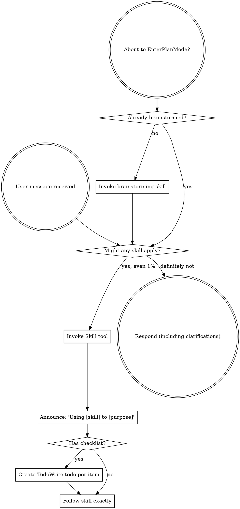

<!-- Generated by SpecStory, Markdown v2.1.0 -->

# 2026-05-04 23:49:31Z

<!-- Codex CLI Session 019df563-bbdd-7881-9f43-d8d66ca1c04d (2026-05-04 23:49:31Z) -->

_**User (2026-05-04 23:49:31Z)**_

现在电脑端发的图片 移动端可以显示，但是移动端发的图片为什么就是显示成这样呢


---

_**Agent (gpt-5.5 2026-05-04 23:49:39Z)**_

我先看一下这边消息/附件在本地是怎么落库和渲染的。截图看起来像是移动端把图片附件当成普通文本消息发出去了，而电脑端那边可能走了真正的图片消息结构。

_**Agent (gpt-5.5 2026-05-04 23:49:39Z)**_

<tool-use data-tool-type="shell" data-tool-name="exec_command"><details>
<summary>Tool use: **exec_command** `pwd && rg --files -g '!*node_modules*' -g '!*.png' -g '!*.jpg' -g '!*.jpeg' | head -200`</summary>
```
Chunk ID: bfebae
Wall time: 0.0000 seconds
Process exited with code 0
Original token count: 241
Output:
/Users/xiayanghui/编程项目/CodexMobile
LICENSE
asr-service/app.py
asr-service/Dockerfile
asr-service/requirements.txt
package-lock.json
README.md
client/src/api.js
client/src/App.jsx
client/src/main.jsx
client/src/styles.css
client/manifest.webmanifest
client/public/icon.svg
client/vite.config.js
client/index.html
.env.example
server/codex-app-server.js
server/codex-quota.js
server/codex-config.js
server/codex-data.js
server/index.js
server/image-generator.js
server/provider-api.js
server/voice-speaker.js
server/auth.js
server/feishu-skills.js
server/codex-runner.js
server/realtime-voice.js
server/mobile-session-index.js
server/voice-transcriber.js
server/lark-cli.js
skills/lark-drive-fast/SKILL.md
skills/lark-sheets-fast/SKILL.md
skills/lark-slides-fast/SKILL.md
skills/lark-doc-fast/SKILL.md
package.json
scripts/start-all.ps1
scripts/patch-codex-sdk.mjs
scripts/start-asr.mjs
scripts/start-server.mjs
scripts/smoke.mjs
scripts/lark-cli-guard.mjs
```
</details></tool-use>

_**Agent (gpt-5.5 2026-05-04 23:49:39Z)**_

<tool-use data-tool-type="shell" data-tool-name="exec_command"><details>
<summary>Tool use: **exec_command** `sed -n '1,220p' '/Users/xiayanghui/.codex/plugins/cache/openai-curated/superpowers/c5debd62/skills/using-superpowers/SKILL.md'`</summary>
```
Chunk ID: 02a60a
Wall time: 0.0000 seconds
Process exited with code 0
Original token count: 1351
Output:
---
name: using-superpowers
description: Use when starting any conversation - establishes how to find and use skills, requiring Skill tool invocation before ANY response including clarifying questions
---

<SUBAGENT-STOP>
If you were dispatched as a subagent to execute a specific task, skip this skill.
</SUBAGENT-STOP>

<EXTREMELY-IMPORTANT>
If you think there is even a 1% chance a skill might apply to what you are doing, you ABSOLUTELY MUST invoke the skill.

IF A SKILL APPLIES TO YOUR TASK, YOU DO NOT HAVE A CHOICE. YOU MUST USE IT.

This is not negotiable. This is not optional. You cannot rationalize your way out of this.
</EXTREMELY-IMPORTANT>

## Instruction Priority

Superpowers skills override default system prompt behavior, but **user instructions always take precedence**:

1. **User's explicit instructions** (AGENTS.md, GEMINI.md, direct requests) — highest priority
2. **Superpowers skills** — override default system behavior where they conflict
3. **Default system prompt** — lowest priority

If AGENTS.md or GEMINI.md says "don't use TDD" and a skill says "always use TDD," follow the user's instructions. The user is in control.

## How to Access Skills

**In Codex:** Use the `Skill` tool. When you invoke a skill, its content is loaded and presented to you—follow it directly. Never use the Read tool on skill files.

**In Copilot CLI:** Use the `skill` tool. Skills are auto-discovered from installed plugins. The `skill` tool works the same as Codex's `Skill` tool.

**In Gemini CLI:** Skills activate via the `activate_skill` tool. Gemini loads skill metadata at session start and activates the full content on demand.

**In other environments:** Check your platform's documentation for how skills are loaded.

## Platform Adaptation

Skills may mention tool names that vary by runtime. Other platforms: see `references/copilot-tools.md` (Copilot CLI), `references/codex-tools.md` (Codex) for tool equivalents. Gemini CLI users get the tool mapping loaded automatically via GEMINI.md.

# Using Skills

## The Rule

**Invoke relevant or requested skills BEFORE any response or action.** Even a 1% chance a skill might apply means that you should invoke the skill to check. If an invoked skill turns out to be wrong for the situation, you don't need to use it.



## Red Flags

These thoughts mean STOP—you're rationalizing:

| Thought | Reality |
|---------|---------|
| "This is just a simple question" | Questions are tasks. Check for skills. |
| "I need more context first" | Skill check comes BEFORE clarifying questions. |
| "Let me explore the codebase first" | Skills tell you HOW to explore. Check first. |
| "I can check git/files quickly" | Files lack conversation context. Check for skills. |
| "Let me gather information first" | Skills tell you HOW to gather information. |
| "This doesn't need a formal skill" | If a skill exists, use it. |
| "I remember this skill" | Skills evolve. Read current version. |
| "This doesn't count as a task" | Action = task. Check for skills. |
| "The skill is overkill" | Simple things become complex. Use it. |
| "I'll just do this one thing first" | Check BEFORE doing anything. |
| "This feels productive" | Undisciplined action wastes time. Skills prevent this. |
| "I know what that means" | Knowing the concept ≠ using the skill. Invoke it. |

## Skill Priority

When multiple skills could apply, use this order:

1. **Process skills first** (brainstorming, debugging) - these determine HOW to approach the task
2.
... (truncated)
```
</details></tool-use>

_**Agent (gpt-5.5 2026-05-04 23:49:47Z)**_

我会按调试路径走一遍：先定位“移动端发送”的消息结构，再对比电脑端图片消息的结构，最后把渲染/发送入口收齐。

_**Agent (gpt-5.5 2026-05-04 23:49:47Z)**_

<tool-use data-tool-type="shell" data-tool-name="exec_command"><details>
<summary>Tool use: **exec_command** `sed -n '1,260p' '/Users/xiayanghui/.codex/plugins/cache/openai-curated/superpowers/c5debd62/skills/systematic-debugging/SKILL.md'`</summary>
```
Chunk ID: 76b2d7
Wall time: 0.0000 seconds
Process exited with code 0
Original token count: 2075
Output:
---
name: systematic-debugging
description: Use when encountering any bug, test failure, or unexpected behavior, before proposing fixes
---

# Systematic Debugging

## Overview

Random fixes waste time and create new bugs. Quick patches mask underlying issues.

**Core principle:** ALWAYS find root cause before attempting fixes. Symptom fixes are failure.

**Violating the letter of this process is violating the spirit of debugging.**

## The Iron Law

```
NO FIXES WITHOUT ROOT CAUSE INVESTIGATION FIRST
```

If you haven't completed Phase 1, you cannot propose fixes.

## When to Use

Use for ANY technical issue:
- Test failures
- Bugs in production
- Unexpected behavior
- Performance problems
- Build failures
- Integration issues

**Use this ESPECIALLY when:**
- Under time pressure (emergencies make guessing tempting)
- "Just one quick fix" seems obvious
- You've already tried multiple fixes
- Previous fix didn't work
- You don't fully understand the issue

**Don't skip when:**
- Issue seems simple (simple bugs have root causes too)
- You're in a hurry (rushing guarantees rework)
- Manager wants it fixed NOW (systematic is faster than thrashing)

## The Four Phases

You MUST complete each phase before proceeding to the next.

### Phase 1: Root Cause Investigation

**BEFORE attempting ANY fix:**

1. **Read Error Messages Carefully**
   - Don't skip past errors or warnings
   - They often contain the exact solution
   - Read stack traces completely
   - Note line numbers, file paths, error codes

2. **Reproduce Consistently**
   - Can you trigger it reliably?
   - What are the exact steps?
   - Does it happen every time?
   - If not reproducible → gather more data, don't guess

3. **Check Recent Changes**
   - What changed that could cause this?
   - Git diff, recent commits
   - New dependencies, config changes
   - Environmental differences

4. **Gather Evidence in Multi-Component Systems**

   **WHEN system has multiple components (CI → build → signing, API → service → database):**

   **BEFORE proposing fixes, add diagnostic instrumentation:**
   ```
   For EACH component boundary:
     - Log what data enters component
     - Log what data exits component
     - Verify environment/config propagation
     - Check state at each layer

   Run once to gather evidence showing WHERE it breaks
   THEN analyze evidence to identify failing component
   THEN investigate that specific component
   ```

   **Example (multi-layer system):**
   ```bash
   # Layer 1: Workflow
   echo "=== Secrets available in workflow: ==="
   echo "IDENTITY: ${IDENTITY:+SET}${IDENTITY:-UNSET}"

   # Layer 2: Build script
   echo "=== Env vars in build script: ==="
   env | grep IDENTITY || echo "IDENTITY not in environment"

   # Layer 3: Signing script
   echo "=== Keychain state: ==="
   security list-keychains
   security find-identity -v

   # Layer 4: Actual signing
   codesign --sign "$IDENTITY" --verbose=4 "$APP"
   ```

   **This reveals:** Which layer fails (secrets → workflow ✓, workflow → build ✗)

5. **Trace Data Flow**

   **WHEN error is deep in call stack:**

   See `root-cause-tracing.md` in this directory for the complete backward tracing technique.

   **Quick version:**
   - Where does bad value originate?
   - What called this with bad value?
   - Keep tracing up until you find the source
   - Fix at source, not at symptom

### Phase 2: Pattern Analysis

**Find the pattern before fixing:**

1. **Find Working Examples**
   - Locate similar working code in same codebase
   - What works that's similar to what's broken?

2. **Compare Against References**
   - If implementing pattern, read reference implementation COMPLETELY
   - Don't skim - read every line
   - Understand the pattern fully before applying

3. **Identify Differences**
   - What's different between working and broken?
   - List every difference, however small
   - Don't assume "that can't matter"

4. **Understand Dependencies**
   - What other components does this need?
   - What settings, config, environment?
   - What assumptions does it make?

### Phase 3: Hypothesis and Testing

**Scientific method:**

1. **Form Single Hypothesis**
   - State clearly: "I think X is the root cause because Y"
   - Write it down
   - Be specific, not vague

2. **Test Minimally**
   - Make the SMALLEST possible change to test hypothesis
   - One variable at a time
   - Don't fix multiple things at once

3. **Verify Before Continuing**
   - Did it work? Yes → Phase 4
   - Didn't work? Form NEW hypothesis
   - DON'T add more fixes on top

4. **When You Don't Know**
   - Say "I don't understand X"
   - Don't pretend to know
   - Ask for help
   - Research more

### Phase 4: Implementation

**Fix the root cause, not the symptom:**

1. **Create Failing Test Case**
   - Simplest possible reproduction
   - Automated test if possible
   - One-off test script
... (truncated)
```
</details></tool-use>

_**Agent (gpt-5.5 2026-05-04 23:49:47Z)**_

<tool-use data-tool-type="shell" data-tool-name="exec_command"><details>
<summary>Tool use: **exec_command** `rg -n "image|upload|attachments|attachment|file|IMG_|消息|picture|photo" client/src server -S`</summary>
```
Chunk ID: 0dc1c9
Wall time: 0.0000 seconds
Process exited with code 0
Original token count: 8489
Output:
server/codex-app-server.js:34:    case 'item/fileChange/requestApproval':
server/auth.js:52:    const fileCode = (await fs.readFile(FIXED_PAIRING_CODE_FILE, 'utf8')).trim();
server/auth.js:53:    if (PAIRING_CODE_PATTERN.test(fileCode)) {
server/auth.js:54:      return fileCode;
server/feishu-skills.js:3:import { fileURLToPath } from 'node:url';
server/feishu-skills.js:5:const __dirname = path.dirname(fileURLToPath(import.meta.url));
server/feishu-skills.js:20:    '- Create Markdown: `lark-cli docs +create --as user --api-version v2 --doc-format markdown --content @<file>`.',
server/feishu-skills.js:22:    '- Update: `lark-cli docs +update --as user --api-version v2 --doc "<url-or-token>" --command append --doc-format xml --content @<file>`.',
server/feishu-skills.js:38:    '- Import local Excel/CSV with `lark-cli drive +import --as user --type sheet --file "<path>"`.'
server/feishu-skills.js:42:    '- Use `lark-cli drive` for upload, download, folder, move, delete, rename, and import.',
server/feishu-skills.js:43:    '- Import Word/Markdown/TXT/HTML as docs with `drive +import --as user --type docx --file "<path>"`.',
server/feishu-skills.js:44:    '- Import Excel/CSV as sheets with `drive +import --as user --type sheet --file "<path>"`.'
server/mobile-session-index.js:3:import { fileURLToPath } from 'node:url';
server/mobile-session-index.js:5:const __dirname = path.dirname(fileURLToPath(import.meta.url));
server/codex-quota.js:181:function planFromFileName(fileName) {
server/codex-quota.js:182:  const match = String(fileName || '').match(/-([A-Za-z0-9_]+)\.json$/);
server/codex-quota.js:187:  return String(entry?.name || entry?.fileName || entry?.id || '').trim();
server/codex-quota.js:396:async function readJsonFile(filePath) {
server/codex-quota.js:397:  const raw = await fs.readFile(filePath, 'utf8');
server/codex-quota.js:509:function baseAccount(fileName, credential) {
server/codex-quota.js:510:  const email = credential.email || fileName.replace(/^codex-/, '').replace(/-[^-]+\.json$/, '');
server/codex-quota.js:512:    id: safeId(credential.account_id, credential.email, fileName),
server/codex-quota.js:514:    plan: normalizePlan(credential.plan_type || credential.planType, planFromFileName(fileName)),
server/codex-quota.js:546:async function quotaForFile(authDir, fileName) {
server/codex-quota.js:547:  const filePath = path.join(authDir, fileName);
server/codex-quota.js:548:  const credential = await readJsonFile(filePath);
server/codex-quota.js:549:  const account = baseAccount(fileName, credential);
server/codex-quota.js:662:  const payload = await managementJson(baseUrl, managementKey, '/v0/management/auth-files');
server/codex-quota.js:663:  const entries = (Array.isArray(payload?.files) ? payload.files : [])
server/codex-quota.js:690:  let files = [];
server/codex-quota.js:692:    files = (await fs.readdir(authDir))
server/codex-quota.js:693:      .filter((fileName) => /^codex-.+\.json$/i.test(fileName))
server/codex-quota.js:703:    files.map(async (fileName) => {
server/codex-quota.js:705:        return await quotaForFile(authDir, fileName);
server/codex-quota.js:708:          id: safeId(fileName),
server/codex-quota.js:709:          label: maskAccount(fileName.replace(/^codex-/, '').replace(/\.json$/, '')),
server/codex-quota.js:710:          plan: normalizePlan(planFromFileName(fileName)),
server/voice-speaker.js:396:      '-NoProfile',
server/codex-data.js:20:const DESKTOP_IMAGE_ROOT = path.join(process.cwd(), '.codexmobile', 'desktop-images');
server/codex-data.js:316:async function readRolloutContextState(filePath, sessionId) {
server/codex-data.js:318:  if (!filePath) {
server/codex-data.js:322:  const stream = fsSync.createReadStream(filePath, { encoding: 'utf8' });
server/codex-data.js:442:    filePath: thread.path || null,
server/codex-data.js:660:      filePath: null,
server/codex-data.js:895:  return Object.entries(changes).map(([filePath, change]) => {
server/codex-data.js:898:      path: filePath,
server/codex-data.js:1022:  const match = raw.match(/^data:image\/([a-z0-9.+-]+);base64,([\s\S]+)$/i);
server/codex-data.js:1040:    const filePath = path.join(DESKTOP_IMAGE_ROOT, `${digest}.${extension}`);
server/codex-data.js:1041:    if (!fsSync.existsSync(filePath)) {
server/codex-data.js:1043:      fsSync.writeFileSync(filePath, Buffer.from(base64, 'base64'));
server/codex-data.js:1045:    return filePath;
server/codex-data.js:1047:    console.warn('[sessions] Failed to cache desktop data image:', error.message);
server/codex-data.js:1070:      if (part?.type === 'image') {
server/codex-data.js:1150:async function readDesktopCollabActivities(filePath) {
server/codex-data.js:1151:  if (!filePath) {
server/codex-data.js:1172:    const stream = fsSync.createReadStream(filePath, { encoding: 'utf8' });
server/codex-data.js:1322:  if (item.type === 'fileChange') {
server/codex-data.
... (truncated)
```
</details></tool-use>

_**Agent (gpt-5.5 2026-05-04 23:49:47Z)**_

<tool-use data-tool-type="shell" data-tool-name="exec_command"><details>
<summary>Tool use: **exec_command** `git status --short`</summary>
```
Chunk ID: 4b34b2
Wall time: 0.0000 seconds
Process exited with code 0
Original token count: 0
Output:
```
</details></tool-use>

_**Agent (gpt-5.5 2026-05-04 23:49:55Z)**_

现在看到关键入口了：上传接口会返回 `kind: image` 和本地路径，但发送时 server 目前会把附件拼成“附件路径：- 图片: xxx (/path)”这种纯文本给 Codex。下一步我看渲染层怎么识别图片，因为电脑端应该是 Markdown 图片或结构化 image part。

_**Agent (gpt-5.5 2026-05-04 23:49:55Z)**_

<tool-use data-tool-type="shell" data-tool-name="exec_command"><details>
<summary>Tool use: **exec_command** `sed -n '360,520p' client/src/App.jsx`</summary>
```
Chunk ID: 60d83a
Wall time: 0.0000 seconds
Process exited with code 0
Original token count: 1148
Output:
      ...base.autoCompact,
      ...next.autoCompact,
      tokenLimit: next.autoCompact?.tokenLimit || base.autoCompact?.tokenLimit || null,
      detected: Boolean(next.autoCompact?.detected || base.autoCompact?.detected)
    }
  };
}

function emptyContextStatus() {
  return normalizeContextStatus(DEFAULT_STATUS.context, DEFAULT_STATUS.context);
}

function shortModelName(model) {
  if (!model) {
    return '5.5';
  }
  return model
    .replace(/^gpt-/i, '')
    .replace(/-codex.*$/i, '')
    .replace(/-mini$/i, ' mini');
}

function permissionLabel(value) {
  return PERMISSION_OPTIONS.find((option) => option.value === value)?.label || '默认权限';
}

function reasoningLabel(value) {
  return REASONING_OPTIONS.find((option) => option.value === value)?.label || '超高';
}

function imageUrlWithRetry(url, retryKey) {
  if (!retryKey || /^data:image\//i.test(String(url || '').trim())) {
    return url;
  }
  const separator = url.includes('?') ? '&' : '?';
  return `${url}${separator}r=${retryKey}`;
}

const resolvedImageSourceCache = new Map();

function isLocalImageSource(value) {
  const raw = String(value || '').trim();
  if (!raw || raw.startsWith('/generated/') || raw.startsWith('/assets/')) {
    return false;
  }
  return (
    /^file:\/\//i.test(raw) ||
    /^\/(?:Users|private|var|tmp|Volumes)\//.test(raw) ||
    /^~[\\/]/.test(raw) ||
    /^[A-Za-z]:[\\/]/.test(raw)
  );
}

function safeDecodeUriComponent(value) {
  try {
    return decodeURIComponent(value);
  } catch {
    return value;
  }
}

function localImageApiPath(value) {
  const raw = String(value || '').trim();
  const normalized = /%[0-9a-f]{2}/i.test(raw) ? safeDecodeUriComponent(raw) : raw;
  return `/api/local-image?path=${encodeURIComponent(normalized)}`;
}

function dataImageObjectUrl(value) {
  const raw = String(value || '').trim();
  const match = raw.match(/^data:(image\/(?:png|jpe?g|webp|gif));base64,([\s\S]+)$/i);
  if (!match) {
    return '';
  }
  const binary = atob(match[2].replace(/\s+/g, ''));
  const bytes = new Uint8Array(binary.length);
  for (let index = 0; index < binary.length; index += 1) {
    bytes[index] = binary.charCodeAt(index);
  }
  return URL.createObjectURL(new Blob([bytes], { type: match[1].toLowerCase() }));
}

function cachedResolvedImageSource(url) {
  const raw = String(url || '').trim();
  if (!raw) {
    return null;
  }
  return resolvedImageSourceCache.get(raw) || null;
}

function useResolvedImageSource(url, retryKey) {
  const [resolved, setResolved] = useState(() => cachedResolvedImageSource(url) || { src: '', local: false, error: false, cached: false });

  useEffect(() => {
    const raw = String(url || '').trim();
    if (!raw) {
      setResolved({ src: '', local: false, error: true });
      return undefined;
    }
    const cached = resolvedImageSourceCache.get(raw);
    if (cached) {
      setResolved(cached);
      return undefined;
    }
    if (/^data:image\//i.test(raw)) {
      try {
        const src = dataImageObjectUrl(raw);
        if (src) {
          const next = { src, local: false, error: false, cached: true };
          resolvedImageSourceCache.set(raw, next);
          setResolved(next);
          return undefined;
        }
      } catch {
        setResolved({ src: raw, local: false, error: false, cached: false });
        return undefined;
      }
    }
    if (!isLocalImageSource(raw)) {
      setResolved({ src: imageUrlWithRetry(raw, retryKey), local: false, error: false });
      return undefined;
    }

    let stopped = false;
    let objectUrl = '';
    setResolved({ src: '', local: true, error: false });
    apiBlobFetch(localImageApiPath(raw))
      .then((blob) => {
        if (stopped) {
          return;
        }
        objectUrl = URL.createObjectURL(blob);
        const next = { src: objectUrl, local: true, error: false, cached: true };
        resolvedImageSourceCache.set(raw, next);
        setResolved(next);
      })
      .catch(() => {
        if (!stopped) {
          setResolved({ src: '', local: true, error: true });
        }
      });

    return () => {
      stopped = true;
      if (objectUrl && !resolvedImageSourceCache.has(raw)) {
        URL.revokeObjectURL(objectUrl);
      }
    };
  }, [url, retryKey]);

  return resolved;
}

function createClientTurnId() {
  return globalThis.crypto?.randomUUID?.() || `turn-${Date.now()}-${Math.random().toString(16).slice(2)}`;
}

function createDraftSession(project) {
  const now = new Date().toISOString();
  return {
    id: `draft-${project.id}-${Date.now()}`,
    projectId: project.id,
```
</details></tool-use>

_**Agent (gpt-5.5 2026-05-04 23:49:55Z)**_

<tool-use data-tool-type="shell" data-tool-name="exec_command"><details>
<summary>Tool use: **exec_command** `sed -n '2680,3245p' client/src/App.jsx`</summary>
```
Chunk ID: df06f9
Wall time: 0.0000 seconds
Process exited with code 0
Original token count: 4467
Output:
  }
  if (/navigate/.test(text)) {
    return '打开页面';
  }
  if (/click|type|press/.test(text)) {
    return '操作页面';
  }
  return '操作浏览器';
}

function gitActionPrompt(action) {
  if (action === 'commit') {
    return '请执行 Git 提交：先检查当前仓库的 git status 和 diff，确认改动范围后生成合适的中文提交信息，并提交当前相关改动。不要推送。';
  }
  if (action === 'push') {
    return '请执行 Git 推送：检查当前分支和远程状态，然后把当前分支推送到远程；如果缺少 upstream，请按当前分支设置 upstream 后推送。';
  }
  if (action === 'branch') {
    return '请创建 Git 分支：基于当前工作区创建一个新分支，分支名使用 codex/ 前缀，并根据当前工作内容命名。';
  }
  return '';
}

function extractFileRefs(value) {
  const refs = new Set();
  const text = String(value || '');
  const pattern = /(?:^|[\s"'`(])((?:\.{1,2}|~|\/)?[\w@.+\-~\u4e00-\u9fff]+(?:\/[\w@.+\- \u4e00-\u9fff]+)+\.(?:jsx?|tsx?|css|scss|json|md|mjs|cjs|html|yml|yaml|toml|py|sh|sql|swift|kt|java|go|rs|rb|php|txt|log)|[\w@.+\-~\u4e00-\u9fff]+\.(?:jsx?|tsx?|css|scss|json|md|mjs|cjs|html|yml|yaml|toml|py|sh|sql|swift|kt|java|go|rs|rb|php|txt|log))/g;
  for (const match of text.matchAll(pattern)) {
    const candidate = match[1]?.replace(/[,:;.)\]]+$/g, '');
    if (candidate && !candidate.startsWith('http')) {
      refs.add(candidate);
    }
  }
  return refs;
}

function GeneratedImage({ part, onPreviewImage, compact = false }) {
  const [loadState, setLoadState] = useState('loading');
  const [retryKey, setRetryKey] = useState(0);
  const resolved = useResolvedImageSource(part.url, retryKey);
  const src = resolved.src;

  useEffect(() => {
    setLoadState(resolved.error ? 'failed' : resolved.cached ? 'loaded' : 'loading');
  }, [resolved.cached, resolved.error, src]);

  function retry(event) {
    event.stopPropagation();
    setLoadState('loading');
    setRetryKey(Date.now());
  }

  return (
    <button
      type="button"
      className={`message-image-link ${compact ? 'is-thumbnail' : ''} ${loadState === 'failed' ? 'is-failed' : ''}`}
      onClick={() => (loadState === 'failed' ? setRetryKey(Date.now()) : onPreviewImage?.(part))}
      aria-label="预览图片"
    >
      {src ? (
         setLoadState('loaded')}
          onError={() => setLoadState('failed')}
        />
      ) : null}
      {loadState === 'failed' ? (
        <span className="image-error">
          图片加载失败
          <span onClick={retry}>重试</span>
        </span>
      ) : null}
    </button>
  );
}

function UserImageStrip({ images, onPreviewImage }) {
  if (!images?.length) {
    return null;
  }
  return (
    <div className="message-image-strip" aria-label="图片附件">
      {images.map((image, index) => (
        <GeneratedImage
          key={`${image.url}-${index}`}
          part={image}
          onPreviewImage={onPreviewImage}
          compact
        />
      ))}
    </div>
  );
}

function ImagePreviewModal({ image, onClose }) {
  const [loadState, setLoadState] = useState('loading');
  const [retryKey, setRetryKey] = useState(0);
  const resolved = useResolvedImageSource(image?.url, retryKey);

  useEffect(() => {
    setLoadState('loading');
    setRetryKey(0);
  }, [image?.url]);

  useEffect(() => {
    setLoadState(resolved.error ? 'failed' : 'loading');
  }, [resolved.error, resolved.src]);

  if (!image) {
    return null;
  }

  const src = resolved.src;

  return (
    <div className="image-lightbox" role="dialog" aria-modal="true" onClick={onClose}>
      <div className="lightbox-top">
        <button type="button" className="lightbox-close" onClick={onClose} aria-label="关闭图片预览">
          <X size={22} />
        </button>
      </div>
      <div className="lightbox-stage" onClick={(event) => event.stopPropagation()}>
        {src ? (
           setLoadState('loaded')}
            onError={() => setLoadState('failed')}
          />
        ) : null}
      </div>
      {loadState === 'failed' ? (
        <div className="lightbox-actions" onClick={(event) => event.stopPropagation()}>
          <button
            type="button"
            onClick={() => {
              setLoadState('loading');
              setRetryKey(Date.now());
            }}
          >
            <RefreshCw size={16} />
            重新加载
          </button>
        </div>
      ) : null}
    </div>
  );
}

function MarkdownContent({ text, onPreviewImage, className = 'message-content' }) {
  const value = String(text || '');

  re
... (truncated)
```
</details></tool-use>

_**Agent (gpt-5.5 2026-05-04 23:49:55Z)**_

<tool-use data-tool-type="shell" data-tool-name="exec_command"><details>
<summary>Tool use: **exec_command** `sed -n '5900,6365p' client/src/App.jsx`</summary>
```
Chunk ID: d5b23a
Wall time: 0.0000 seconds
Process exited with code 0
Original token count: 4078
Output:
    const sessionId = selectedSessionRef.current?.id || message.sessionId || '';
    const existingIndex = messages.findIndex((item) => String(item.id) === messageId);
    const removedMessage = existingIndex >= 0 ? messages[existingIndex] : message;
    setMessages((current) => current.filter((item) => String(item.id) !== messageId));

    if (!sessionId || isDraftSession({ id: sessionId })) {
      return;
    }

    try {
      await apiFetch(
        `/api/sessions/${encodeURIComponent(sessionId)}/messages/${encodeURIComponent(messageId)}`,
        { method: 'DELETE' }
      );
    } catch (error) {
      setMessages((current) => {
        if (current.some((item) => String(item.id) === messageId)) {
          return current;
        }
        const next = [...current];
        const insertAt = existingIndex >= 0 ? Math.min(existingIndex, next.length) : next.length;
        next.splice(insertAt, 0, removedMessage);
        return next;
      });
      window.alert(`删除失败：${error.message}`);
    }
  }

  function handleNewConversation() {
    const project = selectedProject || projects[0];
    if (!project) {
      return;
    }
    const draft = createDraftSession(project);
    setSelectedProject(project);
    setSelectedSession(draft);
    setContextStatus(emptyContextStatus());
    setExpandedProjectIds((current) => ({ ...current, [project.id]: true }));
    setSessionsByProject((current) => upsertSessionInProject(current, project.id, draft));
    setMessages([]);
    setAttachments([]);
    setDrawerOpen(false);
  }

  async function handleUploadFiles(files) {
    setUploading(true);
    try {
      for (const file of files) {
        const formData = new FormData();
        formData.append('file', file);
        const result = await apiFetch('/api/uploads', {
          method: 'POST',
          body: formData
        });
        setAttachments((current) => [...current, result.upload]);
      }
    } catch (error) {
      setMessages((current) => [
        ...current,
        {
          id: `upload-error-${Date.now()}`,
          role: 'activity',
          content: error.message,
          timestamp: new Date().toISOString()
        }
      ]);
    } finally {
      setUploading(false);
    }
  }

  function handleRemoveAttachment(id) {
    setAttachments((current) => current.filter((attachment) => attachment.id !== id));
  }

  function turnMatchesCurrentSelection(turnId, optimisticSessionId, realSessionId, previousSessionId) {
    const current = selectedSessionRef.current;
    if (!current) {
      return true;
    }
    return (
      current.id === optimisticSessionId ||
      current.id === realSessionId ||
      current.id === previousSessionId ||
      current.turnId === turnId ||
      current.draft
    );
  }

  function applyTurnSession(turn, optimisticSessionId, projectId, previousSessionId) {
    const sessionIdText = String(turn.sessionId || '');
    const realSessionId =
      sessionIdText && !sessionIdText.startsWith('draft-') && !sessionIdText.startsWith('codex-')
        ? sessionIdText
        : null;
    if (!realSessionId) {
      return null;
    }

    const currentSession = selectedSessionRef.current;
    const nextSession = {
      ...(currentSession || {}),
      id: realSessionId,
      projectId,
      title: currentSession?.title || '新对话',
      turnId: turn.turnId || currentSession?.turnId || null,
      updatedAt: turn.completedAt || turn.updatedAt || new Date().toISOString(),
      draft: false
    };

    setSelectedSession((current) => {
      if (!current) {
        return nextSession;
      }
      if (!turnMatchesCurrentSelection(turn.turnId, optimisticSessionId, realSessionId, previousSessionId)) {
        return current;
      }
      return { ...current, ...nextSession };
    });
    setSessionsByProject((current) =>
      upsertSessionInProject(current, projectId, nextSession, previousSessionId || optimisticSessionId)
    );
    setMessages((current) =>
      current.map((message) =>
        message.turnId === turn.turnId || message.sessionId === optimisticSessionId || message.sessionId === previousSessionId
          ? { ...message, sessionId: realSessionId }
          : message
      )
    );
    if (turn.status === 'running' || turn.status === 'queued') {
      markRun({ turnId: turn.turnId, sessionId: realSessionId, previousSessionId: previousSessionId || optimisticSessionId });
    }
    return realSessionId;
  }

  async function loadTurnMessages(realSessionId, turnId, optimisticSessionId, previousSessionId) {
    if (!realSessionId) {
      return false;
    }
    const current = selectedSessionRef.current;
    if (
      current &&
      current.id !== realSessionId &&
      current.id !== optimisticSessionId &&
      current.id !== previousSessionId &&
      current.turnId !== turnId
    ) {
      return false;
    }
    const data
... (truncated)
```
</details></tool-use>

_**Agent (gpt-5.5 2026-05-04 23:49:55Z)**_

<tool-use data-tool-type="shell" data-tool-name="exec_command"><details>
<summary>Tool use: **exec_command** `sed -n '540,780p' server/index.js && sed -n '1310,1425p' server/index.js`</summary>
```
Chunk ID: ac7616
Wall time: 0.0000 seconds
Process exited with code 0
Original token count: 3021
Output:
        reject(error);
      }
    });
  });
}

function parseHeaderValue(value, key) {
  const match = String(value || '').match(new RegExp(`${key}="([^"]*)"`));
  return match ? match[1] : '';
}

function sanitizeFileName(fileName) {
  const baseName = path.basename(String(fileName || 'upload.bin')).replace(/[<>:"/\\|?*\u0000-\u001F]/g, '_');
  return baseName || 'upload.bin';
}

function classifyUpload(mimeType) {
  return String(mimeType || '').startsWith('image/') ? 'image' : 'file';
}

function resolveLocalImagePath(value) {
  const raw = String(value || '').trim();
  if (!raw) {
    return '';
  }
  if (/^file:\/\//i.test(raw)) {
    return fileURLToPath(raw);
  }
  if (raw === '~') {
    return os.homedir();
  }
  if (raw.startsWith('~/') || raw.startsWith('~\\')) {
    return path.join(os.homedir(), raw.slice(2));
  }
  return raw;
}

function safeDecodeLocalPath(value) {
  try {
    return decodeURIComponent(value);
  } catch {
    return value;
  }
}

async function sendLocalImage(req, res, url) {
  const requestedPath = resolveLocalImagePath(url.searchParams.get('path'));
  const decodedPath = /%[0-9a-f]{2}/i.test(requestedPath) ? resolveLocalImagePath(safeDecodeLocalPath(requestedPath)) : '';
  const candidates = [...new Set([requestedPath, decodedPath].filter(Boolean))];
  if (!candidates.length || !candidates.some((candidate) => path.isAbsolute(candidate))) {
    sendJson(res, 400, { error: 'Image path must be absolute' });
    return;
  }

  for (const candidate of candidates) {
    if (!path.isAbsolute(candidate)) {
      continue;
    }
    const filePath = path.resolve(candidate);
    const ext = path.extname(filePath).toLowerCase();
    const contentType = mimeTypes.get(ext) || '';
    if (!contentType.startsWith('image/')) {
      continue;
    }
    try {
      const stat = await fs.stat(filePath);
      if (!stat.isFile()) {
        continue;
      }
      const content = await fs.readFile(filePath);
      sendStaticContent(req, res, 200, content, {
        'content-type': contentType,
        'cache-control': 'private, max-age=3600',
        'x-content-type-options': 'nosniff'
      }, ext);
      return;
    } catch {
      // Try the decoded candidate before reporting a miss.
    }
  }

  sendJson(res, 404, { error: 'Image not found' });
}

function parseMultipartFile(buffer, contentType, fieldName = 'file') {
  const boundary = contentType.match(/boundary=(?:"([^"]+)"|([^;]+))/i)?.[1] || contentType.match(/boundary=(?:"([^"]+)"|([^;]+))/i)?.[2];
  if (!boundary) {
    throw new Error('Missing multipart boundary');
  }
  const acceptedNames = Array.isArray(fieldName) ? fieldName : [fieldName];

  const boundaryBuffer = Buffer.from(`--${boundary}`);
  let cursor = buffer.indexOf(boundaryBuffer);

  while (cursor >= 0) {
    cursor += boundaryBuffer.length;
    if (buffer[cursor] === 45 && buffer[cursor + 1] === 45) {
      break;
    }
    if (buffer[cursor] === 13 && buffer[cursor + 1] === 10) {
      cursor += 2;
    }

    const nextBoundary = buffer.indexOf(boundaryBuffer, cursor);
    if (nextBoundary < 0) {
      break;
    }

    const headerEnd = buffer.indexOf(Buffer.from('\r\n\r\n'), cursor);
    if (headerEnd < 0 || headerEnd > nextBoundary) {
      cursor = nextBoundary;
      continue;
    }

    const headers = buffer.slice(cursor, headerEnd).toString('utf8');
    const disposition = headers.match(/^content-disposition:\s*(.+)$/im)?.[1] || '';
    const name = parseHeaderValue(disposition, 'name');
    const fileName = parseHeaderValue(disposition, 'filename');
    const mimeType = headers.match(/^content-type:\s*(.+)$/im)?.[1]?.trim() || 'application/octet-stream';

    if (acceptedNames.includes(name) && fileName) {
      let contentEnd = nextBoundary;
      if (buffer[contentEnd - 2] === 13 && buffer[contentEnd - 1] === 10) {
        contentEnd -= 2;
      }
      return {
        fileName: sanitizeFileName(fileName),
        mimeType,
        data: buffer.slice(headerEnd + 4, contentEnd)
      };
    }

    cursor = nextBoundary;
  }

  throw new Error('No file field found');
}

async function readVoiceUpload(req) {
  const contentType = req.headers['content-type'] || '';
  if (!contentType.toLowerCase().startsWith('multipart/form-data')) {
    const error = new Error('multipart/form-data is required');
    error.statusCode = 400;
    throw error;
  }

  let body;
  try {
    body = await readBuffer(req, MAX_VOICE_BYTES);
  } catch (error) {
    const next = new Error(error.message === 'Upload too large' ? '音频超过 10MB' : '读取音频失败');
    next.statusCode = error.message === 'Upload too large' ? 413 : 400;
    throw next;
  }

  let part;
  try {
    part = parseMultipartFile(body, contentType, 'audio');
  } catch {
    const error = new Error('没有收到音频');
    error.statusCode = 400;
    throw error;
  }

  if (!part.data?.length) {
    
... (truncated)
```
</details></tool-use>

_**Agent (gpt-5.5 2026-05-04 23:50:04Z)**_

<tool-use data-tool-type="shell" data-tool-name="exec_command"><details>
<summary>Tool use: **exec_command** `sed -n '1425,1515p' server/index.js`</summary>
```
Chunk ID: 783c1d
Wall time: 0.0000 seconds
Process exited with code 0
Original token count: 773
Output:
          }
          emitJobEvent({ project }, payload);
        }
      ).then(async (finalSessionId) => {
        rememberTurn(turnId, {
          projectId: project.id,
          sessionId: finalSessionId,
          previousSessionId
        });
        try {
          const snapshot = await refreshCodexCache();
          broadcast({ type: 'sync-complete', syncedAt: snapshot.syncedAt, projects: snapshot.projects });
        } catch (error) {
          console.warn('[sync] Failed to refresh after image chat:', error.message);
        }
      }).catch((error) => {
        const errorMessage = error?.message || '图片生成失败';
        activeImageRuns.delete(turnId);
        rememberTurn(turnId, {
          projectId: project.id,
          sessionId: imageSessionId,
          previousSessionId,
          status: 'failed',
          error: errorMessage,
          label: '图片生成失败'
        });
        emitJobEvent({ project }, {
          type: 'chat-error',
          sessionId: imageSessionId,
          previousSessionId,
          turnId,
          error: errorMessage
        });
      }).finally(() => {
        activeImageRuns.delete(turnId);
      });
      sendJson(res, 202, {
        accepted: true,
        queued: false,
        sessionId: imageSessionId,
        draftSessionId,
        turnId,
        mode: 'image'
      });
      return;
    }

    console.log(`[chat] accepted codex turn=${turnId} session=${selectedSessionId || draftSessionId || ''} project=${project.name}`);
    const queueKey = resolveConversationKey(selectedSessionId, draftSessionId, requestedSessionId);
    const queued = enqueueChatJob({
      queueKey,
      project,
      selectedSessionId,
      draftSessionId,
      turnId,
      codexMessage,
      displayMessage,
      model: session?.model || body.model || config.model || 'gpt-5.5',
      reasoningEffort: body.reasoningEffort || DEFAULT_REASONING_EFFORT,
      permissionMode: body.permissionMode || 'bypassPermissions'
    });

    sendJson(res, 202, { accepted: true, queued, sessionId: selectedSessionId, draftSessionId, turnId });
    return;
  }

  if (method === 'POST' && pathname === '/api/chat/abort') {
    const body = await readBody(req);
    console.log(`[chat] abort request remote=${remoteAddress(req)} turn=${body.turnId || ''} session=${body.sessionId || ''}`);
    const aborted = abortCodexTurn(body.turnId || body.sessionId);
    sendJson(res, aborted ? 200 : 404, { aborted });
    return;
  }

  sendJson(res, 404, { error: 'Not found' });
}

async function serveFileFromRoot(req, res, rootDir, requestedPath, cacheControl) {
  const relativePath = requestedPath.replace(/^\/+/, '');
  const candidate = path.normalize(path.join(rootDir, relativePath));
  const rootWithSep = rootDir.endsWith(path.sep) ? rootDir : `${rootDir}${path.sep}`;
  if (candidate !== rootDir && !candidate.startsWith(rootWithSep)) {
    res.writeHead(403);
    res.end('Forbidden');
    return true;
  }

  try {
    const stat = await fs.stat(candidate);
    if (!stat.isFile()) {
      res.writeHead(404);
```
</details></tool-use>

_**Agent (gpt-5.5 2026-05-04 23:50:04Z)**_

<tool-use data-tool-type="shell" data-tool-name="exec_command"><details>
<summary>Tool use: **exec_command** `rg -n "codexMessage|runCodex|startCodex|sendCodex|appendUser|inputItems|attachments" server/index.js server/codex-runner.js server/codex-app-server.js server/codex-data.js`</summary>
```
Chunk ID: ae087c
Wall time: 0.0018 seconds
Process exited with code 0
Original token count: 390
Output:
server/codex-runner.js:639:export async function runCodexTurn({ sessionId, draftSessionId, projectPath, message, model, reasoningEffort, permissionMode, turnId: providedTurnId }, emit) {
server/index.js:32:import { abortCodexTurn, getActiveRuns, runCodexTurn } from './codex-runner.js';
server/index.js:759:function withAttachmentReferences(message, attachments) {
server/index.js:760:  if (!attachments.length) {
server/index.js:764:  const lines = attachments.map((attachment) => {
server/index.js:975:  runCodexTurn(
server/index.js:980:      message: job.codexMessage,
server/index.js:1321:    const attachmentCount = Array.isArray(body.attachments) ? body.attachments.length : 0;
server/index.js:1323:      `[chat] send request remote=${remoteAddress(req)} project=${body.projectId || ''} session=${body.sessionId || body.draftSessionId || ''} attachments=${attachmentCount}`
server/index.js:1331:    const attachments = normalizeAttachments(body.attachments);
server/index.js:1333:    if (!message && !attachments.length) {
server/index.js:1334:      sendJson(res, 400, { error: 'message or attachments are required' });
server/index.js:1349:    const codexMessage = withAttachmentReferences(displayMessage, attachments);
server/index.js:1350:    const imagePrompt = isImageRequest(displayMessage, attachments)
server/index.js:1382:      const imageLabel = attachments.some((attachment) => attachment.kind === 'image') ? '正在编辑图片' : '正在生成图片';
server/index.js:1408:          attachments,
server/index.js:1480:      codexMessage,
```
</details></tool-use>

_**Agent (gpt-5.5 2026-05-04 23:50:04Z)**_

<tool-use data-tool-type="shell" data-tool-name="exec_command"><details>
<summary>Tool use: **exec_command** `sed -n '1,180p' package.json`</summary>
```
Chunk ID: 28dd4f
Wall time: 0.0000 seconds
Process exited with code 0
Original token count: 252
Output:
{
  "name": "codexmobile",
  "version": "0.1.0",
  "description": "iPhone-first PWA bridge for using a local Codex setup over a private network.",
  "license": "MIT",
  "type": "module",
  "scripts": {
    "dev:server": "node server/index.js",
    "dev:client": "vite --host 0.0.0.0 --config client/vite.config.js",
    "build": "vite build --config client/vite.config.js",
    "start": "node server/index.js",
    "start:env": "node --env-file=.env server/index.js",
    "start:bg": "node scripts/start-server.mjs",
    "asr:start": "node scripts/start-asr.mjs",
    "postinstall": "node scripts/patch-codex-sdk.mjs",
    "smoke": "node scripts/smoke.mjs"
  },
  "dependencies": {
    "@openai/codex-sdk": "^0.128.0",
    "@vitejs/plugin-react": "^4.6.0",
    "lucide-react": "^0.515.0",
    "opencc-js": "^1.0.5",
    "react": "^18.2.0",
    "react-dom": "^18.2.0",
    "react-markdown": "^10.1.0",
    "remark-breaks": "^4.0.0",
    "remark-gfm": "^4.0.1",
    "vite": "^7.0.4",
    "ws": "^8.14.2"
  }
}
```
</details></tool-use>

_**Agent (gpt-5.5 2026-05-04 23:50:10Z)**_

<tool-use data-tool-type="shell" data-tool-name="exec_command"><details>
<summary>Tool use: **exec_command** `sed -n '920,1010p' server/index.js`</summary>
```
Chunk ID: a2f252
Wall time: 0.0000 seconds
Process exited with code 0
Original token count: 619
Output:
  return conversationQueues.get(queueKey);
}

function emitJobEvent(job, payload) {
  const enriched = { projectId: job.project.id, ...payload };
  rememberTurnEvent(enriched);
  broadcast(enriched);
}

function enqueueChatJob(job) {
  const state = getConversationQueue(job.queueKey);
  rememberConversationAlias(job.queueKey, job.selectedSessionId);
  rememberConversationAlias(job.queueKey, job.draftSessionId);

  const queued = state.running || state.jobs.length > 0;
  state.jobs.push(job);

  if (queued) {
    const sessionId = state.sessionId || job.selectedSessionId || job.draftSessionId;
    rememberTurn(job.turnId, {
      status: 'queued',
      label: '已加入队列',
      sessionId: sessionId || null
    });
    broadcast({
      type: 'status-update',
      projectId: job.project.id,
      sessionId,
      turnId: job.turnId,
      kind: 'turn',
      status: 'queued',
      label: '已加入队列',
      detail: '',
      timestamp: new Date().toISOString()
    });
  }

  runNextQueuedChat(job.queueKey);
  return queued;
}

function runNextQueuedChat(queueKey) {
  const state = getConversationQueue(queueKey);
  if (state.running) {
    return;
  }

  const job = state.jobs.shift();
  if (!job) {
    return;
  }

  state.running = true;
  const sessionId = state.sessionId || job.selectedSessionId;

  runCodexTurn(
    {
      sessionId,
      draftSessionId: job.draftSessionId,
      projectPath: job.project.path,
      message: job.codexMessage,
      model: job.model,
      reasoningEffort: job.reasoningEffort,
      permissionMode: job.permissionMode,
      turnId: job.turnId
    },
    (payload) => {
      if (payload.sessionId) {
        state.sessionId = payload.sessionId;
        rememberConversationAlias(queueKey, payload.sessionId);
      }
      if (payload.previousSessionId) {
        rememberConversationAlias(queueKey, payload.previousSessionId);
      }
      emitJobEvent(job, payload);
    }
  ).then(async (finalSessionId) => {
    if (finalSessionId) {
      state.sessionId = finalSessionId;
      rememberConversationAlias(queueKey, finalSessionId);
      await registerMobileSession({
        id: finalSessionId,
        projectPath: job.project.path,
        projectless: job.project.projectless,
        title: job.displayMessage.slice(0, 52),
        summary: job.displayMessage,
        updatedAt: new Date().toISOString()
      });
    }
    rememberTurn(job.turnId, {
      projectId: job.project.id,
```
</details></tool-use>

_**Agent (gpt-5.5 2026-05-04 23:50:10Z)**_

<tool-use data-tool-type="shell" data-tool-name="exec_command"><details>
<summary>Tool use: **exec_command** `sed -n '620,735p' server/codex-runner.js`</summary>
```
Chunk ID: 0e6bed
Wall time: 0.0000 seconds
Process exited with code 0
Original token count: 1139
Output:
    emitAppServerItem(message, sessionId, turnId, emit, state);
    return;
  }

  if (method === 'error' && !params.willRetry) {
    const error = errorTextFromNotification(params);
    state.failed = true;
    emitStatus(emit, { sessionId, turnId, kind: 'turn', status: 'failed', label: '任务失败', detail: error });
    emit({ type: 'turn-failed', sessionId, turnId, error });
    emit({ type: 'chat-error', sessionId, turnId, error });
  }
}

function abortError() {
  const error = new Error('aborted');
  error.name = 'AbortError';
  return error;
}

export async function runCodexTurn({ sessionId, draftSessionId, projectPath, message, model, reasoningEffort, permissionMode, turnId: providedTurnId }, emit) {
  const workingDirectory = await ensureAsciiWorkingDirectory(projectPath);
  const { sandboxMode, approvalPolicy } = mapPermissionMode(permissionMode);
  const feishuSkillKeys = detectFeishuSkillKeys(message);
  const normalizedReasoningEffort = normalizeReasoningEffort(reasoningEffort);
  const modelReasoningEffort =
    feishuSkillKeys.length && normalizedReasoningEffort === 'xhigh' ? 'low' : normalizedReasoningEffort;
  const larkCliContext = await buildCodexLarkCliContext(message).catch((error) => {
    console.warn('[lark-cli] Codex context disabled:', error.message);
    return { enabled: false, env: { ...process.env }, instruction: '' };
  });
  const abortController = new AbortController();
  const turnId = providedTurnId || crypto.randomUUID();
  const state = {
    hadAssistantText: false,
    failed: false,
    usage: null,
    context: {},
    agentMessages: new Map(),
    commandOutputs: new Map(),
    items: new Map()
  };
  const run = {
    thread: null,
    client: null,
    appTurnId: null,
    abortController,
    turnId,
    sessionId: sessionId || draftSessionId || null,
    previousSessionId: draftSessionId || sessionId || null,
    startedAt: new Date().toISOString(),
    status: 'running'
  };

  let currentSessionId = sessionId || null;
  let previousSessionId = draftSessionId || sessionId || null;
  let client = null;
  let completionResolve = null;
  let completionReject = null;
  const completionPromise = new Promise((resolve, reject) => {
    completionResolve = resolve;
    completionReject = reject;
  });
  const abortPromise = new Promise((_, reject) => {
    abortController.signal.addEventListener('abort', () => reject(abortError()), { once: true });
  });

  try {
    if (larkCliContext.enabled && larkCliContext.env) {
      larkCliContext.env.CODEXMOBILE_TURN_ID = turnId;
      larkCliContext.env.CODEXMOBILE_SESSION_ID = sessionId || draftSessionId || '';
    }

    client = await createCodexAppServerClient({
      env: larkCliContext.env || { ...process.env },
      cwd: workingDirectory,
      clientInfo: { name: 'CodexMobile', title: null, version: '0.1.0' },
      onNotification: (appMessage) => {
        const params = appMessage.params || {};
        if (appMessage.method === 'thread/started' && params.thread?.id) {
          const fromSessionId = previousSessionId || currentSessionId || draftSessionId || params.thread.id;
          currentSessionId = params.thread.id;
          run.sessionId = currentSessionId;
          run.previousSessionId = fromSessionId;
          emit({
            type: 'thread-started',
            sessionId: currentSessionId,
            previousSessionId: fromSessionId,
            turnId,
            projectPath,
            startedAt: new Date().toISOString()
          });
          return;
        }
        if (appMessage.method === 'turn/started' && params.turn?.id) {
          run.appTurnId = params.turn.id;
        }
        if (params.threadId && currentSessionId && params.threadId !== currentSessionId) {
          return;
        }
        emitAppServerNotification(appMessage, currentSessionId || sessionId || draftSessionId, turnId, emit, state);
        if (appMessage.method === 'turn/completed') {
          state.usage = params.turn || null;
          const timing = turnTimingPayload(state.usage, {
            fallbackStartedAt: run.startedAt,
            fallbackCompletedAt: new Date().toISOString()
          });
          emitStatus(emit, {
            sessionId: currentSessionId,
            turnId,
            kind: 'turn',
            status: 'completed',
            label: '任务已完成',
            ...timing,
            timestamp: timing.completedAt
          });
          emit({ type: 'turn-complete', sessionId: currentSessionId, turnId, usage: state.usage, ...timing });
```
</details></tool-use>

_**Agent (gpt-5.5 2026-05-04 23:50:10Z)**_

<tool-use data-tool-type="shell" data-tool-name="exec_command"><details>
<summary>Tool use: **exec_command** `sed -n '1,120p' server/codex-runner.js`</summary>
```
Chunk ID: 5a097b
Wall time: 0.0000 seconds
Process exited with code 0
Original token count: 1053
Output:
import crypto from 'node:crypto';
import fs from 'node:fs/promises';
import path from 'node:path';
import { createCodexAppServerClient } from './codex-app-server.js';
import { buildCodexLarkCliContext } from './lark-cli.js';
import { detectFeishuSkillKeys } from './feishu-skills.js';

const activeRuns = new Map();
const NON_ASCII_PATH_PATTERN = /[^\u0000-\u007F]/;

async function ensureAsciiWorkingDirectory(projectPath) {
  if (process.platform !== 'win32' || !NON_ASCII_PATH_PATTERN.test(projectPath)) {
    return projectPath;
  }

  const resolved = path.resolve(projectPath);
  const driveRoot = path.parse(resolved).root || 'C:\\';
  const aliasRoot = path.join(driveRoot, 'codex_project_aliases');
  const aliasName = crypto.createHash('sha1').update(resolved.toLowerCase()).digest('hex');
  const aliasPath = path.join(aliasRoot, aliasName);

  await fs.mkdir(aliasRoot, { recursive: true });
  try {
    const stats = await fs.lstat(aliasPath);
    if (stats.isDirectory() || stats.isSymbolicLink()) {
      return aliasPath;
    }
    await fs.rm(aliasPath, { recursive: true, force: true });
  } catch (error) {
    if (error.code !== 'ENOENT') {
      throw error;
    }
  }

  await fs.symlink(resolved, aliasPath, 'junction');
  return aliasPath;
}

function mapPermissionMode(permissionMode) {
  if (permissionMode === 'bypassPermissions') {
    return { sandboxMode: 'danger-full-access', approvalPolicy: 'never' };
  }
  if (permissionMode === 'acceptEdits') {
    return { sandboxMode: 'workspace-write', approvalPolicy: 'never' };
  }
  return { sandboxMode: 'workspace-write', approvalPolicy: 'never' };
}

function normalizeReasoningEffort(reasoningEffort) {
  const value = String(reasoningEffort || '').trim();
  return ['minimal', 'low', 'medium', 'high', 'xhigh'].includes(value) ? value : undefined;
}

function textFromContent(content) {
  if (typeof content === 'string') {
    return content;
  }
  if (!Array.isArray(content)) {
    return '';
  }
  return content
    .map((part) => {
      if (typeof part === 'string') {
        return part;
      }
      if (part?.type === 'output_text' || part?.type === 'input_text' || part?.type === 'text') {
        return part.text || '';
      }
      return part?.text || '';
    })
    .filter(Boolean)
    .join('\n');
}

function contentFromItem(item) {
  if (!item) {
    return '';
  }
  const contentText = textFromContent(item.content);
  if (contentText) {
    return contentText;
  }
  if (typeof item.text === 'string') {
    return item.text;
  }
  if (typeof item.aggregated_output === 'string') {
    return item.aggregated_output;
  }
  if (typeof item.message === 'string') {
    return item.message;
  }
  return '';
}

function statusLabel(kind, status = 'running') {
  const done = status === 'completed';
  const failed = status === 'failed';
  const labels = {
    turn: done ? '任务已完成' : failed ? '任务失败' : '正在处理',
    reasoning: done ? '思考完成' : '正在思考',
    agent_message: '正在回复',
    message: '正在回复',
    command_execution: done ? '命令已完成' : failed ? '命令失败' : '正在执行命令',
    file_change: done ? '文件已修改' : failed ? '文件修改失败' : '正在修改文件',
    mcp_tool_call: done ? '工具调用完成' : failed ? '工具调用失败' : '正在调用工具',
    dynamic_tool_call: done ? '工具调用完成' : failed ? '工具调用失败' : '正在调用工具',
    web_search: done ? '网页搜索完成' : failed ? '网页搜索失败' : '正在搜索网页',
    plan: done ? '计划已更新' : '正在规划',
    todo_list: done ? '计划已更新' : '正在规划',
    image_generation_call: done ? '图片生成完成' : failed ? '图片生成失败' : '正在生成图片',
    context_compaction: '上下文已自动压缩',
    custom_tool_call: done ? '工具调用完成' : failed ? '工具调用失败' : '正在调用工具',
    function_call: done ? '工具调用完成' : failed ? '工具调用失败' : '正在调用工具',
    error: '出现错误'
  };
  return labels[kind] || (done ? '已完成' : failed ? '失败' : '正在处理');
}

function detailFromItem(item) {
  if (!item) {
```
</details></tool-use>

_**Agent (gpt-5.5 2026-05-04 23:50:10Z)**_

<tool-use data-tool-type="shell" data-tool-name="exec_command"><details>
<summary>Tool use: **exec_command** `find .codexmobile -maxdepth 4 -type f | head -80`</summary>
```
Chunk ID: 9841d1
Wall time: 0.0000 seconds
Process exited with code 0
Original token count: 1146
Output:
.codexmobile/desktop-images/a548590c55f005c42b3c02779da4b05f206d9bef858e8fd22b9883f64fa5c44f.png
.codexmobile/desktop-images/e5a86bd410ff349dd4841e647d81aa81946322cfeb273f5092b12a0d72ffc7ae.png
.codexmobile/desktop-images/98ccaaf9dbc8fe453b6dd5fd746f83dc785a99ebba3914f63d52f5fcbf0d5a0d.png
.codexmobile/desktop-images/e3467db3963e18df9332bbfdbbffecf263b99945a67a9d5f51653174b5331238.png
.codexmobile/desktop-images/799fe7d83049fd9362c1fa618b36c7307e94b61819a77ac1a7a504be5a281930.png
.codexmobile/desktop-images/c1275fc036af664ef0cdef9d701a145db4fa66e76ba5df7f3d4ca63024bd0d8e.png
.codexmobile/desktop-images/4b0649ce1fabcb2ccb750d646b7f78eea91c2ad8febee4c0a1dca9a7c57b1773.png
.codexmobile/desktop-images/7b02cf989e3022bfe6ef661e6481e0e5f0a00b92cba9208343e6244653701828.png
.codexmobile/desktop-images/7d5922f90eaf7c5155159b7dd3db02639e2a653e9eef9f53f3857bef7c2e5fb9.png
.codexmobile/desktop-images/111c62b1f333e8614dff2644680200a4b1303a98d880ebc348d55b58cc11d1b4.png
.codexmobile/desktop-images/35f345e4867d448001d479c875ccfd9db2a7e2f9a4134c8a8184f5faa96cd97e.png
.codexmobile/desktop-images/087c999abf6620df49df6f1ea6d1246ec0b440bf6478666d62e525ee650eb216.png
.codexmobile/desktop-images/9d20c42223673ac157a3ec2d1a73c94e5135904ba11ec2adf804d911788ca4ed.png
.codexmobile/desktop-images/e18ac1430706eb2b6d3b853f5611ea0eaf377b707020ba52a2d545fe41583e20.png
.codexmobile/desktop-images/67409c47faeebdf84cb9095d5f651f24e67fd2d920c168e52b46fc23427748ff.png
.codexmobile/desktop-images/ec80606a2ba2eb0b82965ff784019bd917d970fff8a78a2f965e0fe208653b87.png
.codexmobile/desktop-images/ec3aa5c0595aaaa488d040bcd9558cc43a4286515157234995489e13b64ec54b.png
.codexmobile/desktop-images/96e001e972ce0af2c5bb62de928c21fa84977977dbb35523008ad984dc3d212a.png
.codexmobile/desktop-images/3c044d29ea0011f6876135622bcaed5447cbb4f10f9da7657c0058a6519fd6d0.png
.codexmobile/desktop-images/80b00bbb7c34517a35dce95aa127827f60e9ed8e0ebd1cddc02a731119a4b200.png
.codexmobile/desktop-images/e4a19fe0326f69bee11dcb05d29d4caad84693d3bb9b610e5c09858de5f28b1a.png
.codexmobile/desktop-images/b0570740045d682006064b666cbe3f440fd7ca294c10e2cee7ea79fc198bddc7.png
.codexmobile/desktop-images/b8045276331eedbd201138d7dbc6a0da5e15d4706d1a7028eb5d236b39eef5b4.png
.codexmobile/desktop-images/0186ad83d68f7aec29c10a0b73c5008580befe6ebe88e566dc3e2ce4c3e63d4a.png
.codexmobile/desktop-images/a66d3d6669c80d20e8ecddd9fdfac038c7903b659832386541b10a4b58355297.png
.codexmobile/desktop-images/e795f801cba79627a585a942bdc47e809bffe2753d82f7167ceaae5c8f0992ff.png
.codexmobile/desktop-images/5361ccc1de808906de908a36bd09eb368697a8109b740070fa405b6da5579f70.png
.codexmobile/desktop-images/70f384f6ff585baf1470056273b79378bd4ae3627341ce637aaf955533684ad5.png
.codexmobile/desktop-images/bc69e77e254b4add92a3b7ff05ec931c8584f9616f46df9984c0af9f4fc1d55f.png
.codexmobile/desktop-images/422404bf7fe80c974b4e647b787e6e042ee81e495e3a4c33dca001963f0044a1.png
.codexmobile/desktop-images/a45a4a9cc61ff82cabd97074d2c35c50a66aa85d4ac6a78300d4ef3240f50d68.png
.codexmobile/desktop-images/aee02d435116ac6e3f1018a292f0db8cff51ef54501bd03a339c5ffcc25d88fa.png
.codexmobile/desktop-images/9f0ade9211e33d134bef3f89acd317c3e8133ef9e74464e552a58dbaaeb643cf.png
.codexmobile/desktop-images/92646f9728a8c1afc84c2688afa588216b0353fcee2ace902746dbe4ec9f2867.png
.codexmobile/desktop-images/c2c2fc44631f2acec89bb8193f6db97d1e2f6a4efc8ebee9bd89eb12fe999469.png
.codexmobile/desktop-images/0bc4211ab3014f6f7a73da94b713be494f5cb104d492b98af2fa0b419b97e5a5.png
.codexmobile/desktop-images/a3e2d850291249c0884c1089aba7110c1c312c3f277c3f66a89373dc9d9c7216.png
.codexmobile/desktop-images/28d88ea46bd0596bed4297a85f3144dcf91fd42f1b94c2b87cf1f6e79b924f5b.png
.codexmobile/desktop-images/e50c3554408eec360bd2714cdf46e1718f67dfcce1ca09f0d617fb1126526630.png
.codexmobile/desktop-images/938609b469a9d2bcae123bf89ee119b5b7006a69786f55f4a936dab532f2d7b1.png
.codexmobile/server.err.log
.codexmobile/uploads/2026-05-04/85426ca0-7a35-4c2c-9cc6-a4e5613e22bb-IMG_5558.jpeg
.codexmobile/uploads/2026-05-04/b3bf6310-03b7-40e0-877d-3d7d5c1be335-IMG_5554.jpeg
.codexmobile/uploads/2026-05-04/a2b6a2ac-1cf1-4524-a602-2a333280126f-IMG_5549.jpeg
.codexmobile/uploads/2026-05-04/8aa887f2-ff39-4fdd-b3b0-c5cb440a4421-IMG_5562.png
.codexmobile/uploads/2026-05-04/adfe48ba-a601-4cd2-b0b8-fc9888a5d3f1-IMG_0391.png
.codexmobile/uploads/2026-05-04/d241b197-084d-45c1-999e-287e1d5694ee-IMG_5561.png
.codexmobile/state/auth-state.json
.codexmobile/state/hidden-sessions.json
.codexmobile/state/mobile-sessions.json
.codexmobile/state/pairing-code.txt
.codexmobile/server.out.log
```
</details></tool-use>

_**Agent (gpt-5.5 2026-05-04 23:50:21Z)**_

根因基本明朗了：不是“图片读不到”，是我们发给 Codex 的用户消息本身只有纯文本附件清单。等会话从 Codex 历史同步回来时，前端只会识别 `` 这种 Markdown 图片，所以 `/path/to/jpeg` 就原样显示成文字。

_**Agent (gpt-5.5 2026-05-04 23:50:21Z)**_

<tool-use data-tool-type="shell" data-tool-name="exec_command"><details>
<summary>Tool use: **exec_command** `sed -n '1000,1095p' server/codex-data.js`</summary>
```
Chunk ID: 2be46c
Wall time: 0.0002 seconds
Process exited with code 0
Original token count: 754
Output:

function completeExistingDesktopActivity(messages, turnId, finalContent = '', metadata = {}, status = 'completed', segmentIndex = 0) {
  const item = messages.find((message) => message.id === desktopActivityMessageId(turnId, segmentIndex));
  if (!item || item.status !== 'running') {
    return;
  }
  completeDesktopActivity(messages, turnId, finalContent, metadata, status, segmentIndex);
}

function markdownImageDestination(value) {
  const raw = String(value || '').trim();
  if (!raw) {
    return '';
  }
  if (/[\s<>()]/.test(raw)) {
    return `<${raw.replace(/>/g, '%3E')}>`;
  }
  return raw;
}

function localizeDesktopDataImageUrl(value) {
  const raw = String(value || '').trim();
  const match = raw.match(/^data:image\/([a-z0-9.+-]+);base64,([\s\S]+)$/i);
  if (!match) {
    return raw;
  }

  const type = match[1].toLowerCase();
  const extension = type === 'jpeg' ? 'jpg' : type;
  if (!['png', 'jpg', 'webp', 'gif'].includes(extension)) {
    return raw;
  }

  const base64 = match[2].replace(/\s+/g, '');
  if (!base64) {
    return raw;
  }

  try {
    const digest = crypto.createHash('sha256').update(base64).digest('hex');
    const filePath = path.join(DESKTOP_IMAGE_ROOT, `${digest}.${extension}`);
    if (!fsSync.existsSync(filePath)) {
      fsSync.mkdirSync(DESKTOP_IMAGE_ROOT, { recursive: true });
      fsSync.writeFileSync(filePath, Buffer.from(base64, 'base64'));
    }
    return filePath;
  } catch (error) {
    console.warn('[sessions] Failed to cache desktop data image:', error.message);
    return raw;
  }
}

function markdownImageInput(part) {
  const source = localizeDesktopDataImageUrl(part?.path || part?.url);
  if (!source) {
    return '[图片]';
  }
  const alt = String(part?.alt || '图片').replace(/[\[\]\n\r]/g, '').trim() || '图片';
  return `})`;
}

function textFromDesktopUserInput(content = []) {
  return (Array.isArray(content) ? content : [])
    .map((part) => {
      if (part?.type === 'text') {
        return part.text || '';
      }
      if (part?.type === 'localImage') {
        return markdownImageInput(part);
      }
      if (part?.type === 'image') {
        return markdownImageInput(part);
      }
      if (part?.type === 'mention' || part?.type === 'skill') {
        return part.name || part.path || '';
      }
      return '';
    })
    .filter(Boolean)
    .join('\n')
    .trim();
}

function hasFinalDesktopAssistantMessage(turn) {
  return (Array.isArray(turn?.items) ? turn.items : []).some(
    (item) => item?.type === 'agentMessage' && item.phase === 'final_answer' && String(item.text || '').trim()
  );
}

function desktopTurnRuntimeStatus(turn, { isLatestTurn = false } = {}) {
  const value = String(turn?.status || '').toLowerCase();
  if (['completed', 'success', 'succeeded'].includes(value)) {
    return 'completed';
  }
  if (value === 'interrupted' && !turn?.completedAt && isLatestTurn && !hasFinalDesktopAssistantMessage(turn)) {
    return 'running';
```
</details></tool-use>

_**Agent (gpt-5.5 2026-05-04 23:50:21Z)**_

<tool-use data-tool-type="shell" data-tool-name="exec_command"><details>
<summary>Tool use: **exec_command** `sed -n '1095,1135p' server/codex-data.js && sed -n '1260,1305p' server/codex-data.js`</summary>
```
Chunk ID: e3b55e
Wall time: 0.0000 seconds
Process exited with code 0
Original token count: 655
Output:
    return 'running';
  }
  if (['failed', 'error', 'cancelled', 'canceled', 'interrupted', 'aborted'].includes(value)) {
    return 'failed';
  }
  if (turn?.completedAt) {
    return 'completed';
  }
  return 'running';
}

function normalizedDesktopItemStatus(status, fallback = 'running') {
  const value = String(status || '').toLowerCase();
  if (['completed', 'success', 'succeeded'].includes(value)) {
    return 'completed';
  }
  if (['failed', 'error', 'cancelled', 'canceled', 'interrupted', 'aborted'].includes(value)) {
    return 'failed';
  }
  return fallback;
}

function desktopActivityLabel(status, labels) {
  if (status === 'running') {
    return labels.running;
  }
  if (status === 'failed') {
    return labels.failed;
  }
  return labels.completed;
}

function desktopActivityFallbackStatus(turnStatus) {
  return turnStatus === 'running' ? 'running' : turnStatus === 'failed' ? 'failed' : 'completed';
}

function agentStatusText(status = {}) {
  if (status.completed) {
    return '已完成';
  }
  if (status.failed || status.error) {
}

function desktopActivityFromThreadItem(item, turnId, index, timestamp, turnStatus = 'completed') {
  if (!item || item.type === 'userMessage') {
    return null;
  }
  const fallbackStatus = desktopActivityFallbackStatus(turnStatus);
  if (item.type === 'agentMessage') {
    if (item.phase !== 'commentary') {
      return null;
    }
    const content = String(item.text || '').trim();
    if (!content) {
      return null;
    }
    const status = normalizedDesktopItemStatus(item.status, fallbackStatus);
    return {
      id: `${turnId}-commentary-${item.id || index}`,
      kind: 'agent_message',
      label: content,
      content,
      status,
      detail: '',
      timestamp
    };
  }
  if (item.type === 'reasoning') {
    const status = normalizedDesktopItemStatus(item.status, fallbackStatus);
    return {
      id: `${turnId}-reasoning-${item.id || index}`,
      kind: 'reasoning',
      label: desktopActivityLabel(status, { running: '正在思考', completed: '思考完成', failed: '思考中止' }),
      status,
      detail: [...(item.summary || []), ...(item.content || [])].filter(Boolean).join('\n'),
      timestamp
    };
  }
  if (item.type === 'plan') {
    const status = normalizedDesktopItemStatus(item.status, fallbackStatus);
    return {
      id: `${turnId}-plan-${item.id || index}`,
      kind: 'plan',
      label: desktopActivityLabel(status, { running: '正在更新计划', completed: '计划已更新', failed: '计划更新中止' }),
      status,
      detail: item.text || '',
      timestamp
```
</details></tool-use>

_**Agent (gpt-5.5 2026-05-04 23:50:21Z)**_

<tool-use data-tool-type="shell" data-tool-name="exec_command"><details>
<summary>Tool use: **exec_command** `rg -n "api/local-image|local-image|uploads|desktop-images|splitMessageImages|markdownImageFromLine|withAttachmentReferences" README.md client/src server test tests scripts -S`</summary>
```
Chunk ID: 418e3f
Wall time: 0.0000 seconds
Process exited with code 2
Original token count: 319
Output:
rg: test: No such file or directory (os error 2)
rg: tests: No such file or directory (os error 2)
client/src/App.jsx:424:  return `/api/local-image?path=${encodeURIComponent(normalized)}`;
client/src/App.jsx:3008:function markdownImageFromLine(line) {
client/src/App.jsx:3020:function splitMessageImages(content) {
client/src/App.jsx:3024:    const image = markdownImageFromLine(line);
client/src/App.jsx:3047:    Boolean(markdownImageFromLine(line)) ||
client/src/App.jsx:3097:    const image = markdownImageFromLine(line);
client/src/App.jsx:3203:  const userMedia = isUser ? splitMessageImages(message.content) : { text: message.content, images: [] };
client/src/App.jsx:5950:        const result = await apiFetch('/api/uploads', {
server/codex-data.js:20:const DESKTOP_IMAGE_ROOT = path.join(process.cwd(), '.codexmobile', 'desktop-images');
server/index.js:43:const UPLOAD_ROOT = path.join(ROOT_DIR, '.codexmobile', 'uploads');
server/index.js:759:function withAttachmentReferences(message, attachments) {
server/index.js:1085:  if (method === 'GET' && pathname === '/api/local-image') {
server/index.js:1263:  if (method === 'POST' && pathname === '/api/uploads') {
server/index.js:1349:    const codexMessage = withAttachmentReferences(displayMessage, attachments);
```
</details></tool-use>

_**Agent (gpt-5.5 2026-05-04 23:50:27Z)**_

<tool-use data-tool-type="shell" data-tool-name="exec_command"><details>
<summary>Tool use: **exec_command** `sed -n '1,260p' server/codex-app-server.js`</summary>
```
Chunk ID: f48fbb
Wall time: 0.0000 seconds
Process exited with code 0
Original token count: 1805
Output:
import { spawn } from 'node:child_process';
import fsSync from 'node:fs';
import readline from 'node:readline';

const DEFAULT_CODEX_APP_BINARY = '/Applications/Codex.app/Contents/Resources/codex';
const DEFAULT_REQUEST_TIMEOUT_MS = 30_000;

function resolveCodexBinary() {
  const candidates = [
    process.env.CODEXMOBILE_CODEX_BINARY,
    process.env.CODEX_BINARY,
    DEFAULT_CODEX_APP_BINARY,
    'codex'
  ].filter(Boolean);

  for (const candidate of candidates) {
    if (candidate === 'codex' || fsSync.existsSync(candidate)) {
      return candidate;
    }
  }
  return 'codex';
}

function responseError(message, method = '') {
  const error = new Error(message || `Codex app-server request failed${method ? `: ${method}` : ''}`);
  error.method = method;
  return error;
}

function defaultServerRequestResult(message) {
  switch (message?.method) {
    case 'item/commandExecution/requestApproval':
      return { decision: 'decline' };
    case 'item/fileChange/requestApproval':
      return { decision: 'decline' };
    case 'item/permissions/requestApproval':
      return { permissions: {}, scope: 'turn' };
    case 'applyPatchApproval':
    case 'execCommandApproval':
      return { decision: 'denied' };
    case 'item/tool/requestUserInput':
      return { answers: {} };
    case 'mcpServer/elicitation/request':
      return { action: 'decline', content: null, _meta: null };
    case 'item/tool/call':
      return { contentItems: [], success: false };
    default:
      return null;
  }
}

export class CodexAppServerClient {
  constructor({
    env = process.env,
    cwd = process.cwd(),
    clientInfo = {},
    onNotification = null,
    onServerRequest = null
  } = {}) {
    this.env = env;
    this.cwd = cwd;
    this.clientInfo = {
      name: clientInfo.name || 'CodexMobile',
      title: clientInfo.title || null,
      version: clientInfo.version || '0.1.0'
    };
    this.onNotification = onNotification;
    this.onServerRequest = onServerRequest;
    this.child = null;
    this.readline = null;
    this.nextId = 1;
    this.pending = new Map();
    this.stderr = '';
    this.closed = new Promise((resolve) => {
      this.resolveClosed = resolve;
    });
  }

  start() {
    if (this.child) {
      return;
    }
    this.child = spawn(resolveCodexBinary(), ['app-server', '--listen', 'stdio://'], {
      cwd: this.cwd,
      env: this.env,
      stdio: ['pipe', 'pipe', 'pipe']
    });

    this.readline = readline.createInterface({
      input: this.child.stdout,
      crlfDelay: Infinity
    });
    this.readline.on('line', (line) => this.handleLine(line));

    this.child.stderr.on('data', (chunk) => {
      this.stderr += chunk.toString();
      if (this.stderr.length > 24_000) {
        this.stderr = this.stderr.slice(-12_000);
      }
    });

    this.child.on('error', (error) => {
      this.rejectAll(error);
      this.resolveClosed?.({ code: null, signal: null, error });
    });
    this.child.on('close', (code, signal) => {
      const error = responseError(
        this.stderr.trim() || `Codex app-server exited with ${code ?? signal ?? 'unknown status'}`
      );
      this.rejectAll(error);
      this.resolveClosed?.({ code, signal, error: code === 0 ? null : error });
    });
  }

  async initialize() {
    this.start();
    await this.request('initialize', {
      clientInfo: this.clientInfo,
      capabilities: { experimentalApi: true }
    });
    this.notify('initialized');
    return this;
  }

  request(method, params, { timeoutMs = DEFAULT_REQUEST_TIMEOUT_MS } = {}) {
    this.start();
    const id = this.nextId;
    this.nextId += 1;
    const payload = params === undefined ? { id, method } : { id, method, params };
    const promise = new Promise((resolve, reject) => {
      const timeout = setTimeout(() => {
        this.pending.delete(id);
        reject(responseError(`Codex app-server request timed out: ${method}`, method));
      }, timeoutMs);
      this.pending.set(id, { method, resolve, reject, timeout });
    });
    this.write(payload);
    return promise;
  }

  notify(method, params) {
    const payload = params === undefined ? { method } : { method, params };
    this.write(payload);
  }

  respond(id, result) {
    this.write({ id, result });
  }

  respondError(id, message, code = -32603) {
    this.write({ id, error: { code, message } });
  }

  write(payload) {
    if (!this.child?.stdin?.writable) {
      throw responseError('Codex app-server stdin is not writable');
    }
    this.child.stdin.write(`${JSON.stringify(payload)}\n`);
  }

  handleLine(line) {
    if (!line.trim()) {
      return;
    }
    let message;
    try {
      message = JSON.parse(line);
    } catch {
      return;
    }

    if (message.id !== undefined && message.method) {
      this.handleServerRequest(message);
      return;
    }

    if (message.id !== undefined) {
      const 
... (truncated)
```
</details></tool-use>

_**Agent (gpt-5.5 2026-05-04 23:50:27Z)**_

<tool-use data-tool-type="shell" data-tool-name="exec_command"><details>
<summary>Tool use: **exec_command** `sed -n '735,820p' server/codex-runner.js`</summary>
```
Chunk ID: d7e792
Wall time: 0.0000 seconds
Process exited with code 0
Original token count: 761
Output:
          emit({ type: 'turn-complete', sessionId: currentSessionId, turnId, usage: state.usage, ...timing });
          completionResolve(params.turn || {});
        } else if (appMessage.method === 'error' && !params.willRetry) {
          completionReject(new Error(errorTextFromNotification(params)));
        }
      }
    });

    const threadParams = {
      cwd: workingDirectory,
      approvalPolicy,
      sandbox: sandboxMode,
      model: model || null,
      config: modelReasoningEffort ? { model_reasoning_effort: modelReasoningEffort } : null,
      serviceName: 'CodexMobile'
    };
    const threadResponse = sessionId
      ? await client.request('thread/resume', { threadId: sessionId, ...threadParams }, { timeoutMs: 30_000 })
      : await client.request('thread/start', threadParams, { timeoutMs: 30_000 });
    const desktopThread = threadResponse?.thread || {};
    currentSessionId = desktopThread.id || sessionId || `codex-${Date.now()}`;
    run.thread = desktopThread;
    run.client = client;
    run.sessionId = currentSessionId;
    activeRuns.set(turnId, run);

    emit({
      type: 'chat-started',
      sessionId: currentSessionId,
      previousSessionId,
      turnId,
      projectPath,
      startedAt: new Date().toISOString()
    });
    emitStatus(emit, { sessionId: currentSessionId, turnId, kind: 'reasoning', status: 'running', label: '正在思考' });

    const codexInput = [message, larkCliContext.enabled ? larkCliContext.instruction : '']
      .filter(Boolean)
      .join('\n\n');
    const turnResponse = await client.request('turn/start', {
      threadId: currentSessionId,
      input: [{ type: 'text', text: codexInput, text_elements: [] }],
      cwd: workingDirectory,
      approvalPolicy,
      sandboxPolicy: sandboxPolicyFromMode(sandboxMode, { networkAccess: larkCliContext.enabled }),
      model: model || null,
      effort: modelReasoningEffort || null
    }, { timeoutMs: 30_000 });
    if (turnResponse?.turn?.id) {
      run.appTurnId = turnResponse.turn.id;
    }

    await Promise.race([
      completionPromise,
      abortPromise,
      client.closed.then(({ error }) => {
        if (error && run.status !== 'aborted') {
          throw error;
        }
        if (run.status !== 'aborted') {
          throw new Error('Codex app-server closed before the turn completed');
        }
      })
    ]);

    if (!state.failed) {
      const timing = turnTimingPayload(state.usage, {
        fallbackStartedAt: run.startedAt,
        fallbackCompletedAt: new Date().toISOString()
      });
      emit({
        type: 'chat-complete',
        sessionId: currentSessionId,
        previousSessionId,
        turnId,
        usage: state.usage,
        context: state.context,
        hadAssistantText: state.hadAssistantText,
        ...timing
      });
    }
  } catch (error) {
    const wasAborted =
      error?.name === 'AbortError' ||
      String(error?.message || '').toLowerCase().includes('aborted') ||
      activeRuns.get(turnId)?.status === 'aborted';
```
</details></tool-use>

_**Agent (gpt-5.5 2026-05-04 23:50:28Z)**_

<tool-use data-tool-type="shell" data-tool-name="exec_command"><details>
<summary>Tool use: **exec_command** `rg -n "sendUserMessage|userMessage|localImage|input_text|input_image|thread/|turn/|submit" node_modules/@openai/codex-sdk server -S`</summary>
```
Chunk ID: 1b395f
Wall time: 0.0000 seconds
Process exited with code 0
Original token count: 585
Output:
server/codex-app-server.js:245:      const response = await client.request('thread/list', {
server/codex-app-server.js:270:    return await client.request('thread/read', {
server/codex-app-server.js:284:    return await client.request('thread/name/set', {
server/codex-data.js:1067:      if (part?.type === 'localImage') {
server/codex-data.js:1263:  if (!item || item.type === 'userMessage') {
server/codex-data.js:1405:    const lastUserItemIndex = items.reduce((latest, item, index) => (item?.type === 'userMessage' ? index : latest), -1);
server/codex-data.js:1423:      if (item.type === 'userMessage') {
server/codex-runner.js:66:      if (part?.type === 'output_text' || part?.type === 'input_text' || part?.type === 'text') {
server/codex-runner.js:389:    userMessage: 'user_message'
server/codex-runner.js:463:  if (!rawItem || rawItem.type === 'userMessage') {
server/codex-runner.js:528:  if (method === 'turn/started') {
server/codex-runner.js:533:  if (method === 'thread/tokenUsage/updated') {
server/codex-runner.js:540:  if (method === 'thread/compacted') {
server/codex-runner.js:698:        if (appMessage.method === 'thread/started' && params.thread?.id) {
server/codex-runner.js:713:        if (appMessage.method === 'turn/started' && params.turn?.id) {
server/codex-runner.js:720:        if (appMessage.method === 'turn/completed') {
server/codex-runner.js:752:      ? await client.request('thread/resume', { threadId: sessionId, ...threadParams }, { timeoutMs: 30_000 })
server/codex-runner.js:753:      : await client.request('thread/start', threadParams, { timeoutMs: 30_000 });
server/codex-runner.js:774:    const turnResponse = await client.request('turn/start', {
server/codex-runner.js:872:      run.client.request('turn/interrupt', {
node_modules/@openai/codex-sdk/LICENSE:51:    submitted to Licensor for inclusion in the Work by the copyright owner
node_modules/@openai/codex-sdk/LICENSE:52:    or by an individual or Legal Entity authorized to submit on behalf of
node_modules/@openai/codex-sdk/LICENSE:53:    the copyright owner. For the purposes of this definition, "submitted"
node_modules/@openai/codex-sdk/LICENSE:81:    with the Work to which such Contribution(s) was submitted. If You
node_modules/@openai/codex-sdk/LICENSE:131:    any Contribution intentionally submitted for inclusion in the Work
```
</details></tool-use>

_**Agent (gpt-5.5 2026-05-04 23:50:34Z)**_

<tool-use data-tool-type="shell" data-tool-name="exec_command"><details>
<summary>Tool use: **exec_command** `sed -n '1048,1080p' server/codex-data.js && sed -n '1390,1445p' server/codex-data.js`</summary>
```
Chunk ID: ef2c75
Wall time: 0.0000 seconds
Process exited with code 0
Original token count: 772
Output:
    return raw;
  }
}

function markdownImageInput(part) {
  const source = localizeDesktopDataImageUrl(part?.path || part?.url);
  if (!source) {
    return '[图片]';
  }
  const alt = String(part?.alt || '图片').replace(/[\[\]\n\r]/g, '').trim() || '图片';
  return `})`;
}

function textFromDesktopUserInput(content = []) {
  return (Array.isArray(content) ? content : [])
    .map((part) => {
      if (part?.type === 'text') {
        return part.text || '';
      }
      if (part?.type === 'localImage') {
        return markdownImageInput(part);
      }
      if (part?.type === 'image') {
        return markdownImageInput(part);
      }
      if (part?.type === 'mention' || part?.type === 'skill') {
        return part.name || part.path || '';
      }
      return '';
    })
    .filter(Boolean)
    .join('\n')
    .trim();
    };
  }
  return null;
}

function messagesFromDesktopThread(thread, { includeActivity = false } = {}) {
  const messages = [];
  const turns = Array.isArray(thread?.turns) ? thread.turns : [];

  turns.forEach((turn, turnIndex) => {
    const turnId = turn.id || `${thread.id}-desktop-${turnIndex + 1}`;
    const startedAt = isoFromEpochSeconds(turn.startedAt) || new Date().toISOString();
    const turnStatus = desktopTurnRuntimeStatus(turn, { isLatestTurn: turnIndex === turns.length - 1 });
    const completedAt = isoFromEpochSeconds(turn.completedAt) || (turnStatus === 'running' ? null : startedAt);
    const items = Array.isArray(turn.items) ? turn.items : [];
    const lastUserItemIndex = items.reduce((latest, item, index) => (item?.type === 'userMessage' ? index : latest), -1);
    let segmentIndex = -1;
    let finalAssistantText = '';

    function completeCurrentSegment(status = 'completed', metadata = {}) {
      if (!includeActivity || segmentIndex < 0) {
        return;
      }
      completeExistingDesktopActivity(messages, turnId, finalAssistantText, {
        startedAt,
        completedAt: metadata.completedAt || completedAt || startedAt,
        durationMs: metadata.durationMs || null
      }, status, segmentIndex);
      finalAssistantText = '';
    }

    items.forEach((item, itemIndex) => {
      const timestamp = item.type === 'agentMessage' ? completedAt || startedAt : startedAt;
      if (item.type === 'userMessage') {
        completeCurrentSegment('completed', { completedAt: timestamp });
        segmentIndex += 1;
        finalAssistantText = '';
        const content = textFromDesktopUserInput(item.content);
        if (content) {
          messages.push({
            id: item.id || `${turnId}-user-${itemIndex}`,
            role: 'user',
            content: sanitizeVisibleUserMessage(content),
            timestamp,
            turnId,
            sessionId: thread.id
          });
        }
        return;
      }
      if (includeActivity) {
        if (segmentIndex < 0) {
          segmentIndex = 0;
        }
        const segmentStatus = itemIndex > lastUserItemIndex ? turnStatus : 'completed';
        upsertDesktopActivity(
```
</details></tool-use>

_**Agent (gpt-5.5 2026-05-04 23:50:34Z)**_

<tool-use data-tool-type="shell" data-tool-name="exec_command"><details>
<summary>Tool use: **exec_command** `sed -n '430,490p' server/codex-runner.js`</summary>
```
Chunk ID: 77d5d9
Wall time: 0.0000 seconds
Process exited with code 0
Original token count: 466
Output:
  return copy;
}

function tokenUsagePayload(tokenUsage = {}) {
  const last = tokenUsage.last || {};
  const total = tokenUsage.total || {};
  return {
    info: {
      last_token_usage: {
        input_tokens: last.inputTokens,
        cached_input_tokens: last.cachedInputTokens,
        output_tokens: last.outputTokens,
        reasoning_output_tokens: last.reasoningOutputTokens,
        total_tokens: last.totalTokens
      },
      total_token_usage: {
        input_tokens: total.inputTokens,
        cached_input_tokens: total.cachedInputTokens,
        output_tokens: total.outputTokens,
        reasoning_output_tokens: total.reasoningOutputTokens,
        total_tokens: total.totalTokens
      },
      model_context_window: tokenUsage.modelContextWindow
    }
  };
}

function errorTextFromNotification(params = {}) {
  return params.error?.message || params.message || params.error || 'Codex turn failed';
}

function emitAppServerItem({ method, params }, sessionId, turnId, emit, state) {
  const rawItem = params?.item;
  if (!rawItem || rawItem.type === 'userMessage') {
    return;
  }

  const item = normalizeAppItem(rawItem, state);
  const status = appItemStatus(method, rawItem);
  const messageId = rawItem.id || `${turnId}-${item.type}`;

  if (rawItem.type === 'agentMessage') {
    const content = String(rawItem.text || state.agentMessages?.get(messageId) || '').trimEnd();
    if (!content.trim()) {
      return;
    }
    const isCommentary = rawItem.phase === 'commentary';
    emit({
      type: 'assistant-update',
      sessionId,
      turnId,
      messageId,
      role: 'assistant',
      kind: 'agent_message',
      phase: isCommentary ? 'commentary' : 'final_answer',
      content,
      status,
      done: !isCommentary && status === 'completed'
    });
    if (!isCommentary) {
      state.hadAssistantText = true;
```
</details></tool-use>

_**Agent (gpt-5.5 2026-05-04 23:50:34Z)**_

<tool-use data-tool-type="shell" data-tool-name="exec_command"><details>
<summary>Tool use: **exec_command** `find node_modules/@openai/codex-sdk -maxdepth 3 -type f | sed -n '1,80p'`</summary>
```
Chunk ID: 44b2ea
Wall time: 0.0000 seconds
Process exited with code 0
Original token count: 67
Output:
node_modules/@openai/codex-sdk/LICENSE
node_modules/@openai/codex-sdk/dist/index.js
node_modules/@openai/codex-sdk/dist/index.js.map
node_modules/@openai/codex-sdk/dist/index.d.ts
node_modules/@openai/codex-sdk/README.md
node_modules/@openai/codex-sdk/package.json
```
</details></tool-use>

_**Agent (gpt-5.5 2026-05-04 23:50:58Z)**_

我要做两个小改动：服务端发送给 Codex 的图片附件改成 Markdown 图片行，前端本地乐观消息也用同样格式先显示缩略图。这样不会影响非图片文件的路径提示，但图片不会再变成一坨路径文字。

_**Agent (gpt-5.5 2026-05-04 23:50:58Z)**_

<tool-use data-tool-type="shell" data-tool-name="exec_command"><details>
<summary>Tool use: **exec_command** `rg -n "function sanitizeVisibleUserMessage|sanitizeVisibleUserMessage" server/codex-data.js client/src/App.jsx server/index.js`</summary>
```
Chunk ID: 40d0db
Wall time: 0.0000 seconds
Process exited with code 0
Original token count: 69
Output:
server/codex-data.js:190:function sanitizeVisibleUserMessage(message) {
server/codex-data.js:421:  const preview = sanitizeVisibleUserMessage(thread.preview || mobileSession?.summary || '');
server/codex-data.js:1432:            content: sanitizeVisibleUserMessage(content),
```
</details></tool-use>

_**Agent (gpt-5.5 2026-05-04 23:50:58Z)**_

<tool-use data-tool-type="shell" data-tool-name="exec_command"><details>
<summary>Tool use: **exec_command** `sed -n '1080,1120p' server/codex-data.js`</summary>
```
Chunk ID: a5e426
Wall time: 0.0000 seconds
Process exited with code 0
Original token count: 318
Output:
    .trim();
}

function hasFinalDesktopAssistantMessage(turn) {
  return (Array.isArray(turn?.items) ? turn.items : []).some(
    (item) => item?.type === 'agentMessage' && item.phase === 'final_answer' && String(item.text || '').trim()
  );
}

function desktopTurnRuntimeStatus(turn, { isLatestTurn = false } = {}) {
  const value = String(turn?.status || '').toLowerCase();
  if (['completed', 'success', 'succeeded'].includes(value)) {
    return 'completed';
  }
  if (value === 'interrupted' && !turn?.completedAt && isLatestTurn && !hasFinalDesktopAssistantMessage(turn)) {
    return 'running';
  }
  if (['failed', 'error', 'cancelled', 'canceled', 'interrupted', 'aborted'].includes(value)) {
    return 'failed';
  }
  if (turn?.completedAt) {
    return 'completed';
  }
  return 'running';
}

function normalizedDesktopItemStatus(status, fallback = 'running') {
  const value = String(status || '').toLowerCase();
  if (['completed', 'success', 'succeeded'].includes(value)) {
    return 'completed';
  }
  if (['failed', 'error', 'cancelled', 'canceled', 'interrupted', 'aborted'].includes(value)) {
    return 'failed';
  }
  return fallback;
}

function desktopActivityLabel(status, labels) {
  if (status === 'running') {
    return labels.running;
  }
```
</details></tool-use>

_**Agent (gpt-5.5 2026-05-04 23:51:01Z)**_

<tool-use data-tool-type="shell" data-tool-name="exec_command"><details>
<summary>Tool use: **exec_command** `sed -n '170,205p' server/codex-data.js`</summary>
```
Chunk ID: 221276
Wall time: 0.0000 seconds
Process exited with code 0
Original token count: 220
Output:

function toPublicProject(entry) {
  return {
    id: entry.id,
    name: entry.name,
    path: entry.path,
    pathLabel: entry.pathLabel || null,
    projectless: Boolean(entry.projectless),
    trusted: entry.trusted,
    updatedAt: entry.updatedAt,
    sessionCount: entry.sessionCount || 0
  };
}

const INTERNAL_PROMPT_MARKERS = [
  'CodexMobile iOS/PWA 回复要求：',
  'CodexMobile 已接入飞书官方 lark-cli。',
  'CodexMobile 已接入飞书官方 lark-cli'
];

function sanitizeVisibleUserMessage(message) {
  const value = String(message || '').trim();
  if (!value) {
    return '';
  }
  let cutAt = value.length;
  for (const marker of INTERNAL_PROMPT_MARKERS) {
    const index = value.indexOf(marker);
    if (index > 0) {
      cutAt = Math.min(cutAt, index);
    }
  }
  return value.slice(0, cutAt).trim() || value;
}

function positiveNumber(value) {
```
</details></tool-use>

_**Agent (gpt-5.5 2026-05-04 23:51:11Z)**_

<tool-use data-tool-type="write" data-tool-name="apply_patch"><details>
<summary>Tool use: **apply_patch**</summary>
**Update: `/Users/xiayanghui/编程项目/CodexMobile/server/index.js`**

```diff
@@
 function normalizeAttachments(value) {
   if (!Array.isArray(value)) {
     return [];
   }
@@
     }));
 }
 
+function markdownImageDestination(value) {
+  const raw = String(value || '').trim();
+  if (!raw) {
+    return '';
+  }
+  if (/[\s<>()]/.test(raw)) {
+    return `<${raw.replace(/>/g, '%3E')}>`;
+  }
+  return raw;
+}
+
+function markdownImageAlt(value) {
+  return String(value || '图片').replace(/[\[\]\n\r]/g, '').trim() || '图片';
+}
+
+function imageAttachmentMarkdown(attachment) {
+  const destination = markdownImageDestination(attachment.path);
+  if (!destination) {
+    return '';
+  }
+  return ``;
+}
+
+function withImageAttachmentPreviews(message, attachments) {
+  const imageLines = attachments
+    .filter((attachment) => attachment.kind === 'image')
+    .map(imageAttachmentMarkdown)
+    .filter(Boolean);
+  return [message, imageLines.join('\n')].filter(Boolean).join('\n\n');
+}
+
 function withAttachmentReferences(message, attachments) {
   if (!attachments.length) {
     return message;
   }
 
-  const lines = attachments.map((attachment) => {
+  const imageMessage = withImageAttachmentPreviews(message, attachments);
+  const fileLines = attachments.filter((attachment) => attachment.kind !== 'image').map((attachment) => {
     const type = attachment.kind === 'image' ? '图片' : '文件';
     return `- ${type}: ${attachment.name} (${attachment.path})`;
   });
-  return `${message}\n\n附件路径:\n${lines.join('\n')}`;
+  if (!fileLines.length) {
+    return imageMessage;
+  }
+  return `${imageMessage}\n\n附件路径:\n${fileLines.join('\n')}`;
 }
```
</details></tool-use>

_**Agent (gpt-5.5 2026-05-04 23:51:17Z)**_

<tool-use data-tool-type="write" data-tool-name="apply_patch"><details>
<summary>Tool use: **apply_patch**</summary>
**Update: `/Users/xiayanghui/编程项目/CodexMobile/server/index.js`**

```diff
@@
     const turnId = String(body.clientTurnId || '').trim() || crypto.randomUUID();
     const config = getCacheSnapshot().config || {};
     const displayMessage = message || '请查看附件。';
+    const visibleMessage = withImageAttachmentPreviews(displayMessage, attachments);
     const codexMessage = withAttachmentReferences(displayMessage, attachments);
     const imagePrompt = isImageRequest(displayMessage, attachments)
       ? displayMessage
       : resolveContinuationImagePrompt(project.id, displayMessage);
@@
       sessionId: conversationSessionId,
       projectId: project.id,
       message: {
         id: `local-${Date.now()}`,
         role: 'user',
-        content: displayMessage,
+        content: visibleMessage,
         timestamp: new Date().toISOString()
       }
     });
```
</details></tool-use>

_**Agent (gpt-5.5 2026-05-04 23:51:27Z)**_

<tool-use data-tool-type="write" data-tool-name="apply_patch"><details>
<summary>Tool use: **apply_patch**</summary>
**Update: `/Users/xiayanghui/编程项目/CodexMobile/client/src/App.jsx`**

```diff
@@
 function markdownImageFromLine(line) {
   const match = String(line || '').trim().match(/^!\[([^\]]*)\]\((?:<([^>]*)>|([^)]*?))\)$/);
   if (!match) {
     return null;
   }
@@
   }
   return { type: 'image', alt: match[1] || '图片', url };
 }
 
+function markdownImageDestination(value) {
+  const raw = String(value || '').trim();
+  if (!raw) {
+    return '';
+  }
+  if (/[\s<>()]/.test(raw)) {
+    return `<${raw.replace(/>/g, '%3E')}>`;
+  }
+  return raw;
+}
+
+function markdownImageAlt(value) {
+  return String(value || '图片').replace(/[\[\]\n\r]/g, '').trim() || '图片';
+}
+
+function contentWithAttachmentPreviews(content, attachments = []) {
+  const imageLines = (Array.isArray(attachments) ? attachments : [])
+    .filter((attachment) => attachment?.kind === 'image' && attachment.path)
+    .map((attachment) => `})`)
+    .filter(Boolean);
+  return [content, imageLines.join('\n')].filter(Boolean).join('\n\n');
+}
+
 function splitMessageImages(content) {
   const textLines = [];
   const images = [];
```
</details></tool-use>

_**Agent (gpt-5.5 2026-05-04 23:51:33Z)**_

<tool-use data-tool-type="write" data-tool-name="apply_patch"><details>
<summary>Tool use: **apply_patch**</summary>
**Update: `/Users/xiayanghui/编程项目/CodexMobile/client/src/App.jsx`**

```diff
@@
     const displayMessage = String(message || '').trim() || (selectedAttachments.length ? '请查看附件。' : '');
     if ((!displayMessage && !selectedAttachments.length) || !project) {
       if (restoreTextOnError && displayMessage) {
         restoreVoiceTextToInput(displayMessage);
       }
@@
       ? titleFromFirstMessage(displayMessage)
       : null;
+    const optimisticContent = contentWithAttachmentPreviews(displayMessage, selectedAttachments);
 
     if (clearComposer) {
       setInput('');
       setAttachments([]);
@@
           {
             id: `local-${Date.now()}`,
             role: 'user',
-            content: displayMessage,
+            content: optimisticContent,
             timestamp: submittedAt,
             sessionId: optimisticSessionId,
             turnId
```
</details></tool-use>

_**Agent (gpt-5.5 2026-05-04 23:51:40Z)**_

改动已经落下去了。现在我跑一次前端构建，顺便用静态检查确认没有语法层面的断点；如果这里过了，再补一句现象解释给你。

_**Agent (gpt-5.5 2026-05-04 23:51:40Z)**_

<tool-use data-tool-type="shell" data-tool-name="exec_command"><details>
<summary>Tool use: **exec_command** `npm run build`</summary>
```
Chunk ID: 21a784
Wall time: 1.0011 seconds
Process running with session ID 90866
Original token count: 37
Output:

> codexmobile@0.1.0 build
> vite build --config client/vite.config.js

vite v7.3.2 building client environment for production...
transforming...
```
</details></tool-use>

_**Agent (gpt-5.5 2026-05-04 23:51:40Z)**_

<tool-use data-tool-type="shell" data-tool-name="exec_command"><details>
<summary>Tool use: **exec_command** `node --check server/index.js`</summary>
```
Chunk ID: 1ea078
Wall time: 0.3432 seconds
Process exited with code 0
Original token count: 0
Output:
```
</details></tool-use>

_**Agent (gpt-5.5 2026-05-04 23:51:40Z)**_

<tool-use data-tool-type="shell" data-tool-name="exec_command"><details>
<summary>Tool use: **exec_command** `git diff -- server/index.js client/src/App.jsx`</summary>
```
Chunk ID: 19716a
Wall time: 0.0352 seconds
Process exited with code 0
Original token count: 1093
Output:
diff --git a/client/src/App.jsx b/client/src/App.jsx
index a0950f1..e3a98ed 100644
--- a/client/src/App.jsx
+++ b/client/src/App.jsx
@@ -3017,6 +3017,29 @@ function markdownImageFromLine(line) {
   return { type: 'image', alt: match[1] || '图片', url };
 }
 
+function markdownImageDestination(value) {
+  const raw = String(value || '').trim();
+  if (!raw) {
+    return '';
+  }
+  if (/[\s<>()]/.test(raw)) {
+    return `<${raw.replace(/>/g, '%3E')}>`;
+  }
+  return raw;
+}
+
+function markdownImageAlt(value) {
+  return String(value || '图片').replace(/[\[\]\n\r]/g, '').trim() || '图片';
+}
+
+function contentWithAttachmentPreviews(content, attachments = []) {
+  const imageLines = (Array.isArray(attachments) ? attachments : [])
+    .filter((attachment) => attachment?.kind === 'image' && attachment.path)
+    .map((attachment) => `})`)
+    .filter(Boolean);
+  return [content, imageLines.join('\n')].filter(Boolean).join('\n\n');
+}
+
 function splitMessageImages(content) {
   const textLines = [];
   const images = [];
@@ -6178,6 +6201,7 @@ export default function App() {
     const initialTitle = draftSessionId && !sessionForTurn.titleLocked
       ? titleFromFirstMessage(displayMessage)
       : null;
+    const optimisticContent = contentWithAttachmentPreviews(displayMessage, selectedAttachments);
 
     if (clearComposer) {
       setInput('');
@@ -6206,7 +6230,7 @@ export default function App() {
           {
             id: `local-${Date.now()}`,
             role: 'user',
-            content: displayMessage,
+            content: optimisticContent,
             timestamp: submittedAt,
             sessionId: optimisticSessionId,
             turnId
diff --git a/server/index.js b/server/index.js
index c9934c7..38f5fae 100644
--- a/server/index.js
+++ b/server/index.js
@@ -756,16 +756,51 @@ function normalizeAttachments(value) {
     }));
 }
 
+function markdownImageDestination(value) {
+  const raw = String(value || '').trim();
+  if (!raw) {
+    return '';
+  }
+  if (/[\s<>()]/.test(raw)) {
+    return `<${raw.replace(/>/g, '%3E')}>`;
+  }
+  return raw;
+}
+
+function markdownImageAlt(value) {
+  return String(value || '图片').replace(/[\[\]\n\r]/g, '').trim() || '图片';
+}
+
+function imageAttachmentMarkdown(attachment) {
+  const destination = markdownImageDestination(attachment.path);
+  if (!destination) {
+    return '';
+  }
+  return ``;
+}
+
+function withImageAttachmentPreviews(message, attachments) {
+  const imageLines = attachments
+    .filter((attachment) => attachment.kind === 'image')
+    .map(imageAttachmentMarkdown)
+    .filter(Boolean);
+  return [message, imageLines.join('\n')].filter(Boolean).join('\n\n');
+}
+
 function withAttachmentReferences(message, attachments) {
   if (!attachments.length) {
     return message;
   }
 
-  const lines = attachments.map((attachment) => {
+  const imageMessage = withImageAttachmentPreviews(message, attachments);
+  const fileLines = attachments.filter((attachment) => attachment.kind !== 'image').map((attachment) => {
     const type = attachment.kind === 'image' ? '图片' : '文件';
     return `- ${type}: ${attachment.name} (${attachment.path})`;
   });
-  return `${message}\n\n附件路径:\n${lines.join('\n')}`;
+  if (!fileLines.length) {
+    return imageMessage;
+  }
+  return `${imageMessage}\n\n附件路径:\n${fileLines.join('\n')}`;
 }
 
 async function loadRecentImagePrompts() {
@@ -1346,6 +1381,7 @@ async function handleApi(req, res, url) {
     const turnId = String(body.clientTurnId || '').trim() || crypto.randomUUID();
     const config = getCacheSnapshot().config || {};
     const displayMessage = message || '请查看附件。';
+    const visibleMessage = withImageAttachmentPreviews(displayMessage, attachments);
     const codexMessage = withAttachmentReferences(displayMessage, attachments);
     const imagePrompt = isImageRequest(displayMessage, attachments)
       ? displayMessage
@@ -1370,7 +1406,7 @@ async function handleApi(req, res, url) {
       message: {
         id: `local-${Date.now()}`,
         role: 'user',
-        content: displayMessage,
+        content: visibleMessage,
         timestamp: new Date().toISOString()
       }
     });
```
</details></tool-use>

_**Agent (gpt-5.5 2026-05-04 23:51:44Z)**_

<tool-use data-tool-type="unknown" data-tool-name="write_stdin"><details>
<summary>Tool use: **write_stdin**</summary>
```
Chunk ID: 17a08d
Wall time: 0.0000 seconds
Process exited with code 0
Original token count: 91
Output:
✓ 1891 modules transformed.
rendering chunks...
computing gzip size...
dist/assets/manifest-BWye7955.webmanifest    0.55 kB
dist/index.html                              0.91 kB │ gzip:   0.44 kB
dist/assets/index-Czn02DAM.css              55.71 kB │ gzip:  10.61 kB
dist/assets/index-BHUHjCJj.js              414.11 kB │ gzip: 130.42 kB
✓ built in 2.49s
```
</details></tool-use>

_**Agent (gpt-5.5 2026-05-04 23:51:56Z)**_

构建通过了，说明前端这部分没有编译问题。因为服务端也改了发送格式，正在看当前本地服务是否已经在跑；如果在跑，需要重启这个服务，新格式才会生效。

_**Agent (gpt-5.5 2026-05-04 23:51:56Z)**_

<tool-use data-tool-type="shell" data-tool-name="exec_command"><details>
<summary>Tool use: **exec_command** `ps -axo pid,command | rg "(node .*server/index\.js|vite .*client/vite\.config\.js|start-server\.mjs)"`</summary>
```
Chunk ID: b18987
Wall time: 0.0001 seconds
Process exited with code 0
Original token count: 20
Output:
94219 /Users/xiayanghui/.nvm/versions/node/v22.22.0/bin/node server/index.js
```
</details></tool-use>

_**Agent (gpt-5.5 2026-05-04 23:51:56Z)**_

<tool-use data-tool-type="shell" data-tool-name="exec_command"><details>
<summary>Tool use: **exec_command** `sed -n '1,220p' scripts/start-server.mjs`</summary>
```
Chunk ID: e44abf
Wall time: 0.0102 seconds
Process exited with code 0
Original token count: 849
Output:
import { spawn, spawnSync } from 'node:child_process';
import fs from 'node:fs';
import path from 'node:path';

const root = path.resolve(import.meta.dirname, '..');
const logDir = path.join(root, '.codexmobile');
const port = Number(process.env.PORT || 3321);
fs.mkdirSync(logDir, { recursive: true });

const outPath = path.join(logDir, 'server.out.log');
const errPath = path.join(logDir, 'server.err.log');

function dedupePath(value) {
  const seen = new Set();
  return String(value || '')
    .split(path.delimiter)
    .map((item) => item.trim())
    .filter(Boolean)
    .filter((item) => {
      const key = process.platform === 'win32' ? item.toLowerCase() : item;
      if (seen.has(key)) {
        return false;
      }
      seen.add(key);
      return true;
    })
    .join(path.delimiter);
}

function childEnv() {
  if (process.platform !== 'win32') {
    return process.env;
  }

  const env = {};
  const seen = new Set();
  for (const [key, value] of Object.entries(process.env)) {
    const normalized = key.toLowerCase();
    if (normalized === 'path' || seen.has(normalized)) {
      continue;
    }
    seen.add(normalized);
    env[key] = value;
  }

  env.Path = dedupePath([
    process.env.Path,
    process.env.PATH
  ].filter(Boolean).join(path.delimiter));
  return env;
}

function listenerPidsForPort(value) {
  if (process.platform === 'win32') {
    return [];
  }
  const result = spawnSync('lsof', [`-tiTCP:${value}`, '-sTCP:LISTEN'], {
    encoding: 'utf8'
  });
  if (result.status !== 0 && !result.stdout) {
    return [];
  }
  return String(result.stdout || '')
    .split(/\s+/)
    .map((item) => Number(item))
    .filter((pid) => Number.isInteger(pid) && pid > 0 && pid !== process.pid);
}

function commandForPid(pid) {
  const result = spawnSync('ps', ['-p', String(pid), '-o', 'command='], {
    encoding: 'utf8'
  });
  return result.status === 0 ? String(result.stdout || '').trim() : '';
}

function sleep(ms) {
  return new Promise((resolve) => setTimeout(resolve, ms));
}

function pidIsAlive(pid) {
  try {
    process.kill(pid, 0);
    return true;
  } catch {
    return false;
  }
}

async function stopExistingServer() {
  const pids = listenerPidsForPort(port).filter((pid) => commandForPid(pid).includes('server/index.js'));
  if (!pids.length) {
    return;
  }
  for (const pid of pids) {
    try {
      process.kill(pid, 'SIGTERM');
    } catch {
      // Process already exited.
    }
  }
  for (let attempt = 0; attempt < 20; attempt += 1) {
    if (pids.every((pid) => !pidIsAlive(pid))) {
      console.log(`Stopped existing CodexMobile server on port ${port}: ${pids.join(', ')}`);
      return;
    }
    await sleep(100);
  }
  for (const pid of pids) {
    if (pidIsAlive(pid)) {
      process.kill(pid, 'SIGKILL');
    }
  }
  console.log(`Force-stopped existing CodexMobile server on port ${port}: ${pids.join(', ')}`);
}

await stopExistingServer();

const out = fs.openSync(outPath, 'a');
const err = fs.openSync(errPath, 'a');
try {
  const child = spawn(process.execPath, ['server/index.js'], {
    cwd: root,
    detached: true,
    stdio: ['ignore', out, err],
    windowsHide: true,
    env: childEnv()
  });

  child.unref();
  console.log(`CodexMobile server started in background, pid=${child.pid}`);
  console.log(`Logs: ${outPath}`);
} finally {
  fs.closeSync(out);
  fs.closeSync(err);
}
process.exit(0);
```
</details></tool-use>

_**Agent (gpt-5.5 2026-05-04 23:51:56Z)**_

<tool-use data-tool-type="shell" data-tool-name="exec_command"><details>
<summary>Tool use: **exec_command** `tail -80 .codexmobile/server.out.log && tail -80 .codexmobile/server.err.log`</summary>
```
Chunk ID: a06733
Wall time: 0.0117 seconds
Process exited with code 0
Original token count: 2357
Output:
Use Tailscale and open http://<this-pc-tailscale-ip>:3321 on iPhone.
CodexMobile HTTPS disabled: certificate not found at /Users/xiayanghui/编程项目/CodexMobile/.codexmobile/tls/server.pfx
[chat] send request remote=192.168.3.5 project=7ccb689c170829d8 session=draft-7ccb689c170829d8-1777933939396 attachments=0
[chat] accepted codex turn=turn-1777933961195-52ac9e1e48a65 session=draft-7ccb689c170829d8-1777933939396 project=CodexMobile
CodexMobile listening on http://0.0.0.0:3321
Pairing code: 651726 (15 trusted device(s), fixed)
Use Tailscale and open http://<this-pc-tailscale-ip>:3321 on iPhone.
CodexMobile HTTPS disabled: certificate not found at /Users/xiayanghui/编程项目/CodexMobile/.codexmobile/tls/server.pfx
[chat] send request remote=192.168.3.5 project=7ccb689c170829d8 session=019df51f-4c3b-77d0-b513-e81612a6d20d attachments=0
[chat] accepted codex turn=turn-1777934124694-38c6cb836041f8 session=019df51f-4c3b-77d0-b513-e81612a6d20d project=CodexMobile
[chat] send request remote=192.168.3.5 project=7ccb689c170829d8 session=019df51f-4c3b-77d0-b513-e81612a6d20d attachments=0
[chat] accepted codex turn=turn-1777934201793-448b0dcb116368 session=019df51f-4c3b-77d0-b513-e81612a6d20d project=CodexMobile
[chat] send request remote=192.168.3.5 project=7ccb689c170829d8 session=019df51f-4c3b-77d0-b513-e81612a6d20d attachments=0
[chat] accepted codex turn=turn-1777934257847-8b0934f59291b session=019df51f-4c3b-77d0-b513-e81612a6d20d project=CodexMobile
[chat] send request remote=192.168.3.5 project=7ccb689c170829d8 session=019df51f-4c3b-77d0-b513-e81612a6d20d attachments=0
[chat] accepted codex turn=turn-1777934360148-407b5003fa98f session=019df51f-4c3b-77d0-b513-e81612a6d20d project=CodexMobile
[chat] send request remote=192.168.3.5 project=7ccb689c170829d8 session=019df51f-4c3b-77d0-b513-e81612a6d20d attachments=0
[chat] accepted codex turn=turn-1777934419052-a59c8a1d9d953 session=019df51f-4c3b-77d0-b513-e81612a6d20d project=CodexMobile
[upload] saved name=IMG_5558.jpeg size=4054019 kind=image remote=192.168.3.25
[chat] send request remote=192.168.3.25 project=__codexmobile_projectless__ session=019df51f-4c3b-77d0-b513-e81612a6d20d attachments=1
[chat] accepted codex turn=turn-1777934566813-270eb9253fe49 session=019df51f-4c3b-77d0-b513-e81612a6d20d project=普通对话
CodexMobile listening on http://0.0.0.0:3321
Pairing code: 651726 (15 trusted device(s), fixed)
Use Tailscale and open http://<this-pc-tailscale-ip>:3321 on iPhone.
CodexMobile HTTPS disabled: certificate not found at /Users/xiayanghui/编程项目/CodexMobile/.codexmobile/tls/server.pfx
CodexMobile listening on http://0.0.0.0:3321
Pairing code: 651726 (15 trusted device(s), fixed)
Use Tailscale and open http://<this-pc-tailscale-ip>:3321 on iPhone.
CodexMobile HTTPS disabled: certificate not found at /Users/xiayanghui/编程项目/CodexMobile/.codexmobile/tls/server.pfx
CodexMobile listening on http://0.0.0.0:3321
Pairing code: 651726 (15 trusted device(s), fixed)
Use Tailscale and open http://<this-pc-tailscale-ip>:3321 on iPhone.
CodexMobile HTTPS disabled: certificate not found at /Users/xiayanghui/编程项目/CodexMobile/.codexmobile/tls/server.pfx
CodexMobile listening on http://0.0.0.0:3321
Pairing code: 651726 (15 trusted device(s), fixed)
Use Tailscale and open http://<this-pc-tailscale-ip>:3321 on iPhone.
CodexMobile HTTPS disabled: certificate not found at /Users/xiayanghui/编程项目/CodexMobile/.codexmobile/tls/server.pfx
CodexMobile listening on http://0.0.0.0:3321
Pairing code: 651726 (15 trusted device(s), fixed)
Use Tailscale and open http://<this-pc-tailscale-ip>:3321 on iPhone.
CodexMobile HTTPS disabled: certificate not found at /Users/xiayanghui/编程项目/CodexMobile/.codexmobile/tls/server.pfx
CodexMobile listening on http://0.0.0.0:3321
Pairing code: 651726 (15 trusted device(s), fixed)
Use Tailscale and open http://<this-pc-tailscale-ip>:3321 on iPhone.
CodexMobile HTTPS disabled: certificate not found at /Users/xiayanghui/编程项目/CodexMobile/.codexmobile/tls/server.pfx
CodexMobile listening on http://0.0.0.0:3321
Pairing code: 651726 (15 trusted device(s), fixed)
Use Tailscale and open http://<this-pc-tailscale-ip>:3321 on iPhone.
CodexMobile HTTPS disabled: certificate not found at /Users/xiayanghui/编程项目/CodexMobile/.codexmobile/tls/server.pfx
CodexMobile listening on http://0.0.0.0:3321
Pairing code: 651726 (15 trusted device(s), fixed)
Use Tailscale and open http://<this-pc-tailscale-ip>:3321 on iPhone.
CodexMobile HTTPS disabled: certificate not found at /Users/xiayanghui/编程项目/CodexMobile/.codexmobile/tls/server.pfx
CodexMobile listening on http://0.0.0.0:3321
Pairing code: 651726 (15 trusted device(s), fixed)
Use Tailscale and open http://<this-pc-tailscale-ip>:3321 on iPhone.
CodexMobile HTTPS disabled: certificate not found at /Users/xiayanghui/编程项目/CodexMobile/.codexmobil
... (truncated)
```
</details></tool-use>

_**Agent (gpt-5.5 2026-05-04 23:52:01Z)**_

<tool-use data-tool-type="shell" data-tool-name="exec_command"><details>
<summary>Tool use: **exec_command** `npm run start:bg`</summary>
```
Chunk ID: 8a16d7
Wall time: 0.5018 seconds
Process exited with code 0
Original token count: 62
Output:

> codexmobile@0.1.0 start:bg
> node scripts/start-server.mjs

Stopped existing CodexMobile server on port 3321: 94219
CodexMobile server started in background, pid=39719
Logs: /Users/xiayanghui/编程项目/CodexMobile/.codexmobile/server.out.log
```
</details></tool-use>

_**Agent (gpt-5.5 2026-05-04 23:52:08Z)**_

<tool-use data-tool-type="shell" data-tool-name="exec_command"><details>
<summary>Tool use: **exec_command** `ps -p 39719 -o pid,command= && tail -20 .codexmobile/server.out.log`</summary>
```
Chunk ID: 8b8731
Wall time: 0.0126 seconds
Process exited with code 0
Original token count: 472
Output:
  PID 
39719 /opt/homebrew/Cellar/node/25.4.0/bin/node server/index.js
CodexMobile HTTPS disabled: certificate not found at /Users/xiayanghui/编程项目/CodexMobile/.codexmobile/tls/server.pfx
CodexMobile listening on http://0.0.0.0:3321
Pairing code: 651726 (15 trusted device(s), fixed)
Use Tailscale and open http://<this-pc-tailscale-ip>:3321 on iPhone.
CodexMobile HTTPS disabled: certificate not found at /Users/xiayanghui/编程项目/CodexMobile/.codexmobile/tls/server.pfx
CodexMobile listening on http://0.0.0.0:3321
Pairing code: 651726 (15 trusted device(s), fixed)
Use Tailscale and open http://<this-pc-tailscale-ip>:3321 on iPhone.
CodexMobile HTTPS disabled: certificate not found at /Users/xiayanghui/编程项目/CodexMobile/.codexmobile/tls/server.pfx
CodexMobile listening on http://0.0.0.0:3321
Pairing code: 651726 (15 trusted device(s), fixed)
Use Tailscale and open http://<this-pc-tailscale-ip>:3321 on iPhone.
CodexMobile HTTPS disabled: certificate not found at /Users/xiayanghui/编程项目/CodexMobile/.codexmobile/tls/server.pfx
[chat] send request remote=192.168.3.5 project=7ccb689c170829d8 session=019df40a-6db8-7b93-ba6a-1462c305f60c attachments=0
[chat] accepted codex turn=turn-1777938287165-e781ab536ba3f session=019df40a-6db8-7b93-ba6a-1462c305f60c project=CodexMobile
[chat] send request remote=192.168.3.5 project=7ccb689c170829d8 session=019df40a-6db8-7b93-ba6a-1462c305f60c attachments=0
[chat] accepted codex turn=turn-1777938381262-3d5dcae0038b3 session=019df40a-6db8-7b93-ba6a-1462c305f60c project=CodexMobile
[upload] saved name=IMG_5549.jpeg size=3817216 kind=image remote=192.168.3.25
[chat] send request remote=192.168.3.25 project=7ccb689c170829d8 session=draft-7ccb689c170829d8-1777938485653 attachments=1
[chat] accepted codex turn=turn-1777938502435-12bb87e10d65b8 session=draft-7ccb689c170829d8-1777938485653 project=CodexMobile
```
</details></tool-use>

_**Agent (gpt-5.5 2026-05-04 23:52:08Z)**_

<tool-use data-tool-type="shell" data-tool-name="exec_command"><details>
<summary>Tool use: **exec_command** `curl -sS http://127.0.0.1:3321/api/status | head -c 600`</summary>
```
Chunk ID: f78fa9
Wall time: 0.0200 seconds
Process exited with code 0
Original token count: 23
Output:
curl: (7) Failed to connect to 127.0.0.1 port 3321 after 0 ms: Couldn't connect to server
```
</details></tool-use>

_**Agent (gpt-5.5 2026-05-04 23:52:08Z)**_

<tool-use data-tool-type="shell" data-tool-name="exec_command"><details>
<summary>Tool use: **exec_command** `git status --short`</summary>
```
Chunk ID: 9efd4a
Wall time: 0.0097 seconds
Process exited with code 0
Original token count: 11
Output:
 M client/src/App.jsx
 M server/index.js
```
</details></tool-use>

_**Agent (gpt-5.5 2026-05-04 23:52:15Z)**_

服务已经按项目脚本重启了一次，不过第一次本地 `curl` 太快了没连上，我再等一拍确认端口真的起来。

_**Agent (gpt-5.5 2026-05-04 23:52:15Z)**_

<tool-use data-tool-type="shell" data-tool-name="exec_command"><details>
<summary>Tool use: **exec_command** `sleep 1; lsof -nP -iTCP:3321 -sTCP:LISTEN || true`</summary>
```
Chunk ID: 4ae2e8
Wall time: 1.0067 seconds
Process exited with code 0
Original token count: 41
Output:
COMMAND   PID       USER   FD   TYPE             DEVICE SIZE/OFF NODE NAME
node    39719 xiayanghui   13u  IPv4 0x589562e1b9c09269      0t0  TCP *:3321 (LISTEN)
```
</details></tool-use>

_**Agent (gpt-5.5 2026-05-04 23:52:15Z)**_

<tool-use data-tool-type="shell" data-tool-name="exec_command"><details>
<summary>Tool use: **exec_command** `sleep 1; curl -sS http://127.0.0.1:3321/api/status | head -c 600`</summary>
```
Chunk ID: 93d380
Wall time: 0.9679 seconds
Process exited with code 0
Original token count: 150
Output:
{"connected":true,"hostName":"Mac-mini-home.local","port":3321,"provider":"codex","model":"gpt-5.5","modelShort":"5.5 中","models":[{"value":"gpt-5.5","label":"GPT-5.5"},{"value":"gpt-5.4","label":"gpt-5.4"},{"value":"gpt-5.4-mini","label":"GPT-5.4-Mini"},{"value":"gpt-5.3-codex","label":"gpt-5.3-codex"},{"value":"gpt-5.3-codex-spark","label":"GPT-5.3-Codex-Spark"},{"value":"gpt-5.2","label":"gpt-5.2"}],"context":{"modelContextWindow":272000,"configuredContextWindow":null,"maxContextWindow":272000,"autoCompactTokenLimit":null,"autoCompactEnabled":true,"effectiveContextWindowPercent":95},"reas
```
</details></tool-use>

_**Agent (gpt-5.5 2026-05-04 23:52:15Z)**_

<tool-use data-tool-type="shell" data-tool-name="exec_command"><details>
<summary>Tool use: **exec_command** `sleep 1; tail -20 .codexmobile/server.err.log`</summary>
```
Chunk ID: 603784
Wall time: 0.9399 seconds
Process exited with code 0
Original token count: 167
Output:
      throw er; // Unhandled 'error' event
      ^

Error: listen EADDRINUSE: address already in use 0.0.0.0:3321
    at Server.setupListenHandle [as _listen2] (node:net:1940:16)
    at listenInCluster (node:net:1997:12)
    at node:net:2206:7
    at process.processTicksAndRejections (node:internal/process/task_queues:90:21)
Emitted 'error' event on Server instance at:
    at emitErrorNT (node:net:1976:8)
    at process.processTicksAndRejections (node:internal/process/task_queues:90:21) {
  code: 'EADDRINUSE',
  errno: -48,
  syscall: 'listen',
  address: '0.0.0.0',
  port: 3321
}

Node.js v25.4.0
[quota] CLIProxyAPI management quota fallback: 查询失败
```
</details></tool-use>

_**Agent (gpt-5.5 2026-05-04 23:52:31Z)**_

还有一个细节：你截图里这条旧消息已经被历史记录保存成“附件路径”格式了。为了让旧消息也能恢复成图，我再让前端兼容识别这种历史格式，不然只能新消息正常、旧消息继续丑。

_**Agent (gpt-5.5 2026-05-04 23:52:40Z)**_

<tool-use data-tool-type="write" data-tool-name="apply_patch"><details>
<summary>Tool use: **apply_patch**</summary>
**Update: `/Users/xiayanghui/编程项目/CodexMobile/client/src/App.jsx`**

```diff
@@
 function markdownImageFromLine(line) {
   const match = String(line || '').trim().match(/^!\[([^\]]*)\]\((?:<([^>]*)>|([^)]*?))\)$/);
   if (!match) {
     return null;
   }
@@
   return { type: 'image', alt: match[1] || '图片', url };
 }
 
+function legacyAttachmentImageFromLine(line) {
+  const match = String(line || '').trim().match(/^[-*]\s*图片[:：]\s*(.*?)\s*\((.+)\)\s*$/);
+  if (!match) {
+    return null;
+  }
+  const url = String(match[2] || '').trim();
+  if (!isLocalImageSource(url) && !/\.(?:png|jpe?g|webp|gif)(?:[?#].*)?$/i.test(url)) {
+    return null;
+  }
+  return { type: 'image', alt: match[1] || '图片', url };
+}
+
 function markdownImageDestination(value) {
   const raw = String(value || '').trim();
   if (!raw) {
     return '';
@@
 function splitMessageImages(content) {
   const textLines = [];
   const images = [];
   for (const line of String(content || '').replace(/\r\n?/g, '\n').split('\n')) {
-    const image = markdownImageFromLine(line);
+    const image = markdownImageFromLine(line) || legacyAttachmentImageFromLine(line);
     if (image) {
       images.push(image);
     } else {
       textLines.push(line);
     }
   }
   return {
-    text: textLines.join('\n').replace(/\n{3,}/g, '\n\n').trim(),
+    text: textLines.join('\n').replace(/\n*附件路径[:：]\s*$/g, '').replace(/\n{3,}/g, '\n\n').trim(),
     images
   };
 }
```
</details></tool-use>

_**Agent (gpt-5.5 2026-05-04 23:52:45Z)**_

<tool-use data-tool-type="shell" data-tool-name="exec_command"><details>
<summary>Tool use: **exec_command** `npm run build`</summary>
```
Chunk ID: 690247
Wall time: 1.0014 seconds
Process running with session ID 7689
Original token count: 37
Output:

> codexmobile@0.1.0 build
> vite build --config client/vite.config.js

vite v7.3.2 building client environment for production...
transforming...
```
</details></tool-use>

_**Agent (gpt-5.5 2026-05-04 23:52:46Z)**_

<tool-use data-tool-type="shell" data-tool-name="exec_command"><details>
<summary>Tool use: **exec_command** `node --check server/index.js`</summary>
```
Chunk ID: d78110
Wall time: 0.0373 seconds
Process exited with code 0
Original token count: 0
Output:
```
</details></tool-use>

_**Agent (gpt-5.5 2026-05-04 23:52:46Z)**_

<tool-use data-tool-type="shell" data-tool-name="exec_command"><details>
<summary>Tool use: **exec_command** `git diff --stat && git diff -- client/src/App.jsx server/index.js | sed -n '1,220p'`</summary>
```
Chunk ID: 08bdf9
Wall time: 0.0895 seconds
Process exited with code 0
Original token count: 1382
Output:
 client/src/App.jsx | 42 +++++++++++++++++++++++++++++++++++++++---
 server/index.js    | 42 +++++++++++++++++++++++++++++++++++++++---
 2 files changed, 78 insertions(+), 6 deletions(-)
diff --git a/client/src/App.jsx b/client/src/App.jsx
index a0950f1..982283d 100644
--- a/client/src/App.jsx
+++ b/client/src/App.jsx
@@ -3017,11 +3017,46 @@ function markdownImageFromLine(line) {
   return { type: 'image', alt: match[1] || '图片', url };
 }
 
+function legacyAttachmentImageFromLine(line) {
+  const match = String(line || '').trim().match(/^[-*]\s*图片[:：]\s*(.*?)\s*\((.+)\)\s*$/);
+  if (!match) {
+    return null;
+  }
+  const url = String(match[2] || '').trim();
+  if (!isLocalImageSource(url) && !/\.(?:png|jpe?g|webp|gif)(?:[?#].*)?$/i.test(url)) {
+    return null;
+  }
+  return { type: 'image', alt: match[1] || '图片', url };
+}
+
+function markdownImageDestination(value) {
+  const raw = String(value || '').trim();
+  if (!raw) {
+    return '';
+  }
+  if (/[\s<>()]/.test(raw)) {
+    return `<${raw.replace(/>/g, '%3E')}>`;
+  }
+  return raw;
+}
+
+function markdownImageAlt(value) {
+  return String(value || '图片').replace(/[\[\]\n\r]/g, '').trim() || '图片';
+}
+
+function contentWithAttachmentPreviews(content, attachments = []) {
+  const imageLines = (Array.isArray(attachments) ? attachments : [])
+    .filter((attachment) => attachment?.kind === 'image' && attachment.path)
+    .map((attachment) => `})`)
+    .filter(Boolean);
+  return [content, imageLines.join('\n')].filter(Boolean).join('\n\n');
+}
+
 function splitMessageImages(content) {
   const textLines = [];
   const images = [];
   for (const line of String(content || '').replace(/\r\n?/g, '\n').split('\n')) {
-    const image = markdownImageFromLine(line);
+    const image = markdownImageFromLine(line) || legacyAttachmentImageFromLine(line);
     if (image) {
       images.push(image);
     } else {
@@ -3029,7 +3064,7 @@ function splitMessageImages(content) {
     }
   }
   return {
-    text: textLines.join('\n').replace(/\n{3,}/g, '\n\n').trim(),
+    text: textLines.join('\n').replace(/\n*附件路径[:：]\s*$/g, '').replace(/\n{3,}/g, '\n\n').trim(),
     images
   };
 }
@@ -6178,6 +6213,7 @@ export default function App() {
     const initialTitle = draftSessionId && !sessionForTurn.titleLocked
       ? titleFromFirstMessage(displayMessage)
       : null;
+    const optimisticContent = contentWithAttachmentPreviews(displayMessage, selectedAttachments);
 
     if (clearComposer) {
       setInput('');
@@ -6206,7 +6242,7 @@ export default function App() {
           {
             id: `local-${Date.now()}`,
             role: 'user',
-            content: displayMessage,
+            content: optimisticContent,
             timestamp: submittedAt,
             sessionId: optimisticSessionId,
             turnId
diff --git a/server/index.js b/server/index.js
index c9934c7..38f5fae 100644
--- a/server/index.js
+++ b/server/index.js
@@ -756,16 +756,51 @@ function normalizeAttachments(value) {
     }));
 }
 
+function markdownImageDestination(value) {
+  const raw = String(value || '').trim();
+  if (!raw) {
+    return '';
+  }
+  if (/[\s<>()]/.test(raw)) {
+    return `<${raw.replace(/>/g, '%3E')}>`;
+  }
+  return raw;
+}
+
+function markdownImageAlt(value) {
+  return String(value || '图片').replace(/[\[\]\n\r]/g, '').trim() || '图片';
+}
+
+function imageAttachmentMarkdown(attachment) {
+  const destination = markdownImageDestination(attachment.path);
+  if (!destination) {
+    return '';
+  }
+  return ``;
+}
+
+function withImageAttachmentPreviews(message, attachments) {
+  const imageLines = attachments
+    .filter((attachment) => attachment.kind === 'image')
+    .map(imageAttachmentMarkdown)
+    .filter(Boolean);
+  return [message, imageLines.join('\n')].filter(Boolean).join('\n\n');
+}
+
 function withAttachmentReferences(message, attachments) {
   if (!attachments.length) {
     return message;
   }
 
-  const lines = attachments.map((attachment) => {
+  const imageMessage = withImageAttachmentPreviews(message, attachments);
+  const fileLines = attachments.filter((attachment) => attachment.kind !== 'image').map((attachment) => {
     const type = attachment.kind === 'image' ? '图片' : '文件';
     return `- ${type}: ${attachment.name} (${attachment.path})`;
   });
-  return `${message}\n\n附件路径:\n${lines.join('\n')}`;
+  if (!fileLines.length) {
+    return imageMessage;
+  }
+  return `${imageMessage}\n\n附件路径:\n${fileLines.join('\n')}`;
 }
 
 async function loadRecentImagePrompts() {
@@ -1346,6 +1381,7 @@ async function handleApi(req, res, url) {
     const turnId = String(body.clientTurnId || '').trim() || crypto.randomUUID();
     const co
... (truncated)
```
</details></tool-use>

_**Agent (gpt-5.5 2026-05-04 23:52:51Z)**_

<tool-use data-tool-type="unknown" data-tool-name="write_stdin"><details>
<summary>Tool use: **write_stdin**</summary>
```
Chunk ID: 4b6999
Wall time: 0.0000 seconds
Process exited with code 0
Original token count: 91
Output:
✓ 1891 modules transformed.
rendering chunks...
computing gzip size...
dist/assets/manifest-BWye7955.webmanifest    0.55 kB
dist/index.html                              0.91 kB │ gzip:   0.43 kB
dist/assets/index-Czn02DAM.css              55.71 kB │ gzip:  10.61 kB
dist/assets/index-CqdJNidl.js              414.41 kB │ gzip: 130.50 kB
✓ built in 1.64s
```
</details></tool-use>

_**Agent (gpt-5.5 2026-05-04 23:53:05Z)**_

<tool-use data-tool-type="shell" data-tool-name="exec_command"><details>
<summary>Tool use: **exec_command** `nl -ba client/src/App.jsx | sed -n '3010,3068p' && nl -ba client/src/App.jsx | sed -n '6208,6248p'`</summary>
```
Chunk ID: 24adda
Wall time: 0.0080 seconds
Process exited with code 0
Original token count: 1022
Output:
  3010	  if (!match) {
  3011	    return null;
  3012	  }
  3013	  const url = String(match[2] || match[3] || '').trim();
  3014	  if (!url) {
  3015	    return null;
  3016	  }
  3017	  return { type: 'image', alt: match[1] || '图片', url };
  3018	}
  3019	
  3020	function legacyAttachmentImageFromLine(line) {
  3021	  const match = String(line || '').trim().match(/^[-*]\s*图片[:：]\s*(.*?)\s*\((.+)\)\s*$/);
  3022	  if (!match) {
  3023	    return null;
  3024	  }
  3025	  const url = String(match[2] || '').trim();
  3026	  if (!isLocalImageSource(url) && !/\.(?:png|jpe?g|webp|gif)(?:[?#].*)?$/i.test(url)) {
  3027	    return null;
  3028	  }
  3029	  return { type: 'image', alt: match[1] || '图片', url };
  3030	}
  3031	
  3032	function markdownImageDestination(value) {
  3033	  const raw = String(value || '').trim();
  3034	  if (!raw) {
  3035	    return '';
  3036	  }
  3037	  if (/[\s<>()]/.test(raw)) {
  3038	    return `<${raw.replace(/>/g, '%3E')}>`;
  3039	  }
  3040	  return raw;
  3041	}
  3042	
  3043	function markdownImageAlt(value) {
  3044	  return String(value || '图片').replace(/[\[\]\n\r]/g, '').trim() || '图片';
  3045	}
  3046	
  3047	function contentWithAttachmentPreviews(content, attachments = []) {
  3048	  const imageLines = (Array.isArray(attachments) ? attachments : [])
  3049	    .filter((attachment) => attachment?.kind === 'image' && attachment.path)
  3050	    .map((attachment) => `})`)
  3051	    .filter(Boolean);
  3052	  return [content, imageLines.join('\n')].filter(Boolean).join('\n\n');
  3053	}
  3054	
  3055	function splitMessageImages(content) {
  3056	  const textLines = [];
  3057	  const images = [];
  3058	  for (const line of String(content || '').replace(/\r\n?/g, '\n').split('\n')) {
  3059	    const image = markdownImageFromLine(line) || legacyAttachmentImageFromLine(line);
  3060	    if (image) {
  3061	      images.push(image);
  3062	    } else {
  3063	      textLines.push(line);
  3064	    }
  3065	  }
  3066	  return {
  3067	    text: textLines.join('\n').replace(/\n*附件路径[:：]\s*$/g, '').replace(/\n{3,}/g, '\n\n').trim(),
  3068	    images
  6208	
  6209	    const turnId = createClientTurnId();
  6210	    const draftSessionId = isDraftSession(sessionForTurn) ? sessionForTurn.id : null;
  6211	    const outgoingSessionId = draftSessionId ? null : sessionForTurn?.id || null;
  6212	    const optimisticSessionId = draftSessionId || outgoingSessionId || turnId;
  6213	    const initialTitle = draftSessionId && !sessionForTurn.titleLocked
  6214	      ? titleFromFirstMessage(displayMessage)
  6215	      : null;
  6216	    const optimisticContent = contentWithAttachmentPreviews(displayMessage, selectedAttachments);
  6217	
  6218	    if (clearComposer) {
  6219	      setInput('');
  6220	      setAttachments([]);
  6221	    }
  6222	
  6223	    markRun({ turnId, sessionId: optimisticSessionId, previousSessionId: draftSessionId || outgoingSessionId });
  6224	    setSelectedSession((current) =>
  6225	      current?.id === sessionForTurn?.id
  6226	        ? { ...current, turnId, ...(initialTitle ? { title: initialTitle, titleLocked: true } : {}) }
  6227	        : current
  6228	    );
  6229	    setSessionsByProject((current) => ({
  6230	      ...current,
  6231	      [project.id]: (current[project.id] || []).map((item) =>
  6232	        item.id === sessionForTurn.id
  6233	          ? { ...item, turnId, ...(initialTitle ? { title: initialTitle, titleLocked: true } : {}) }
  6234	          : item
  6235	      )
  6236	    }));
  6237	    const submittedAt = new Date().toISOString();
  6238	    setMessages((current) =>
  6239	      upsertStatusMessage(
  6240	        [
  6241	          ...current,
  6242	          {
  6243	            id: `local-${Date.now()}`,
  6244	            role: 'user',
  6245	            content: optimisticContent,
  6246	            timestamp: submittedAt,
  6247	            sessionId: optimisticSessionId,
  6248	            turnId
```
</details></tool-use>

_**Agent (gpt-5.5 2026-05-04 23:53:05Z)**_

<tool-use data-tool-type="shell" data-tool-name="exec_command"><details>
<summary>Tool use: **exec_command** `nl -ba server/index.js | sed -n '756,812p' && nl -ba server/index.js | sed -n '1378,1410p'`</summary>
```
Chunk ID: e8b28a
Wall time: 0.0000 seconds
Process exited with code 0
Original token count: 946
Output:
   756	    }));
   757	}
   758	
   759	function markdownImageDestination(value) {
   760	  const raw = String(value || '').trim();
   761	  if (!raw) {
   762	    return '';
   763	  }
   764	  if (/[\s<>()]/.test(raw)) {
   765	    return `<${raw.replace(/>/g, '%3E')}>`;
   766	  }
   767	  return raw;
   768	}
   769	
   770	function markdownImageAlt(value) {
   771	  return String(value || '图片').replace(/[\[\]\n\r]/g, '').trim() || '图片';
   772	}
   773	
   774	function imageAttachmentMarkdown(attachment) {
   775	  const destination = markdownImageDestination(attachment.path);
   776	  if (!destination) {
   777	    return '';
   778	  }
   779	  return ``;
   780	}
   781	
   782	function withImageAttachmentPreviews(message, attachments) {
   783	  const imageLines = attachments
   784	    .filter((attachment) => attachment.kind === 'image')
   785	    .map(imageAttachmentMarkdown)
   786	    .filter(Boolean);
   787	  return [message, imageLines.join('\n')].filter(Boolean).join('\n\n');
   788	}
   789	
   790	function withAttachmentReferences(message, attachments) {
   791	  if (!attachments.length) {
   792	    return message;
   793	  }
   794	
   795	  const imageMessage = withImageAttachmentPreviews(message, attachments);
   796	  const fileLines = attachments.filter((attachment) => attachment.kind !== 'image').map((attachment) => {
   797	    const type = attachment.kind === 'image' ? '图片' : '文件';
   798	    return `- ${type}: ${attachment.name} (${attachment.path})`;
   799	  });
   800	  if (!fileLines.length) {
   801	    return imageMessage;
   802	  }
   803	  return `${imageMessage}\n\n附件路径:\n${fileLines.join('\n')}`;
   804	}
   805	
   806	async function loadRecentImagePrompts() {
   807	  try {
   808	    const raw = await fs.readFile(IMAGE_PROMPT_STATE, 'utf8');
   809	    const parsed = JSON.parse(raw);
   810	    for (const [projectId, entry] of Object.entries(parsed.projects || {})) {
   811	      if (entry?.prompt) {
   812	        recentImagePromptsByProject.set(projectId, entry.prompt);
  1378	    const selectedSessionId = session && !session.mobileOnly
  1379	      ? session.id
  1380	      : (requestedSessionId && !isDraftSession && !mobileOnlySession ? requestedSessionId : null);
  1381	    const turnId = String(body.clientTurnId || '').trim() || crypto.randomUUID();
  1382	    const config = getCacheSnapshot().config || {};
  1383	    const displayMessage = message || '请查看附件。';
  1384	    const visibleMessage = withImageAttachmentPreviews(displayMessage, attachments);
  1385	    const codexMessage = withAttachmentReferences(displayMessage, attachments);
  1386	    const imagePrompt = isImageRequest(displayMessage, attachments)
  1387	      ? displayMessage
  1388	      : resolveContinuationImagePrompt(project.id, displayMessage);
  1389	    const conversationSessionId = selectedSessionId || mobileOnlySession?.id || draftSessionId || null;
  1390	    rememberTurn(turnId, {
  1391	      projectId: project.id,
  1392	      projectPath: project.path,
  1393	      sessionId: conversationSessionId,
  1394	      previousSessionId: draftSessionId || selectedSessionId || null,
  1395	      draftSessionId,
  1396	      status: 'accepted',
  1397	      label: '正在思考',
  1398	      hadAssistantText: false,
  1399	      startedAt: new Date().toISOString()
  1400	    });
  1401	
  1402	    broadcast({
  1403	      type: 'user-message',
  1404	      sessionId: conversationSessionId,
  1405	      projectId: project.id,
  1406	      message: {
  1407	        id: `local-${Date.now()}`,
  1408	        role: 'user',
  1409	        content: visibleMessage,
  1410	        timestamp: new Date().toISOString()
```
</details></tool-use>

_**Agent (gpt-5.5 2026-05-04 23:53:05Z)**_

<tool-use data-tool-type="shell" data-tool-name="exec_command"><details>
<summary>Tool use: **exec_command** `git status --short && curl -sS http://127.0.0.1:3321/api/status | node -e "let s='';process.stdin.on('data',d=>s+=d);process.stdin.on('end',()=>{const j=JSON.parse(s); console.log(JSON.stringify({connected:j.connected, port:j.port, model:j.model}))})"`</summary>
```
Chunk ID: 986ed1
Wall time: 0.2907 seconds
Process exited with code 0
Original token count: 23
Output:
 M client/src/App.jsx
 M server/index.js
{"connected":true,"port":3321,"model":"gpt-5.5"}
```
</details></tool-use>

_**Agent (gpt-5.5 2026-05-04 23:53:14Z)**_

原因找到了：电脑端发图进来的历史记录是图片结构，前端会转成 `` 来渲染；移动端上传后，我之前只是把附件拼成了：

`附件路径: - 图片: IMG_xxx (/Users/...)`

所以同步回来后它就是普通文本，自然只显示路径。

我已经修了两处：

- [server/index.js](/Users/xiayanghui/编程项目/CodexMobile/server/index.js:759)：移动端图片附件现在发送成 Markdown 图片，不再塞进“附件路径”文本里。
- [client/src/App.jsx](/Users/xiayanghui/编程项目/CodexMobile/client/src/App.jsx:3020)：前端本地发送时立即显示图片，并且兼容你截图里这种旧的“附件路径”历史格式，旧消息刷新后也能尽量还原成图片。

验证过了：`npm run build` 通过，`node --check server/index.js` 通过；本地服务也已重启，`http://127.0.0.1:3321/api/status` 返回 connected。移动端刷新一下页面，再发图应该就正常显示了。
