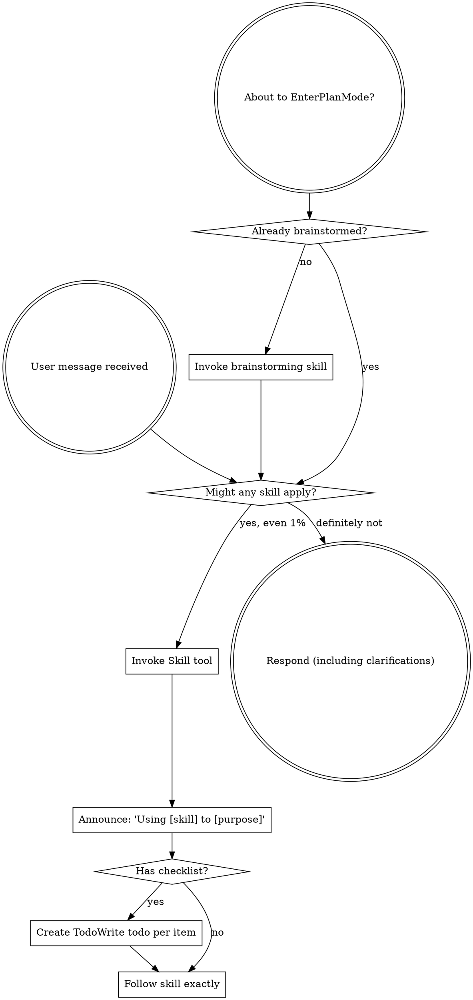

<!-- Generated by SpecStory, Markdown v2.1.0 -->

# 2026-05-05 00:13:12Z

<!-- Codex CLI Session 019df57a-d854-73d1-8bec-a9d15f8453c2 (2026-05-05 00:13:12Z) -->

_**User (2026-05-05 00:13:12Z)**_

再添加一个功能 / 也能选择skill


---

_**Agent (gpt-5.5 2026-05-05 00:13:42Z)**_

我先看一下现有项目结构和“选择模型/功能入口”这一块是怎么写的，再把 skill 选择按同一套交互接进去。

_**Agent (gpt-5.5 2026-05-05 00:13:42Z)**_

<tool-use data-tool-type="shell" data-tool-name="exec_command"><details>
<summary>Tool use: **exec_command** `pwd && rg --files -g '!*DerivedData*' | head -200`</summary>
```
Chunk ID: 90ec6a
Wall time: 0.0508 seconds
Process exited with code 0
Original token count: 303
Output:
/Users/xiayanghui/编程项目/CodexMobile
README.md
.env.example
LICENSE
package-lock.json
package.json
asr-service/app.py
asr-service/Dockerfile
asr-service/requirements.txt
scripts/start-all.ps1
scripts/patch-codex-sdk.mjs
scripts/start-asr.mjs
scripts/start-server.mjs
scripts/smoke.mjs
scripts/lark-cli-guard.mjs
docs/images/voice-handoff.jpg
docs/images/ios-chat.png
docs/images/ios-drawer.png
server/codex-app-server.js
server/codex-quota.js
server/codex-native-images.js
server/codex-config.js
server/codex-data.js
server/index.js
server/image-generator.js
server/provider-api.js
server/voice-speaker.js
server/auth.js
server/codex-native-images.test.js
server/feishu-skills.js
server/codex-runner.js
server/realtime-voice.js
server/mobile-session-index.js
server/voice-transcriber.js
server/lark-cli.js
client/index.html
client/vite.config.js
skills/lark-doc-fast/SKILL.md
skills/lark-drive-fast/SKILL.md
client/src/api.js
client/src/App.jsx
client/src/main.jsx
client/src/styles.css
client/manifest.webmanifest
skills/lark-slides-fast/SKILL.md
skills/lark-sheets-fast/SKILL.md
client/public/codex-icon-512.png
client/public/icon.svg
client/public/codex-icon-192.png
client/public/codex-icon-180.png
```
</details></tool-use>

_**Agent (gpt-5.5 2026-05-05 00:13:43Z)**_

<tool-use data-tool-type="shell" data-tool-name="exec_command"><details>
<summary>Tool use: **exec_command** `sed -n '1,220p' '/Users/xiayanghui/.codex/plugins/cache/openai-curated/superpowers/c5debd62/skills/using-superpowers/SKILL.md'`</summary>
```
Chunk ID: 60a97f
Wall time: 0.0032 seconds
Process exited with code 0
Original token count: 1351
Output:
---
name: using-superpowers
description: Use when starting any conversation - establishes how to find and use skills, requiring Skill tool invocation before ANY response including clarifying questions
---

<SUBAGENT-STOP>
If you were dispatched as a subagent to execute a specific task, skip this skill.
</SUBAGENT-STOP>

<EXTREMELY-IMPORTANT>
If you think there is even a 1% chance a skill might apply to what you are doing, you ABSOLUTELY MUST invoke the skill.

IF A SKILL APPLIES TO YOUR TASK, YOU DO NOT HAVE A CHOICE. YOU MUST USE IT.

This is not negotiable. This is not optional. You cannot rationalize your way out of this.
</EXTREMELY-IMPORTANT>

## Instruction Priority

Superpowers skills override default system prompt behavior, but **user instructions always take precedence**:

1. **User's explicit instructions** (AGENTS.md, GEMINI.md, direct requests) — highest priority
2. **Superpowers skills** — override default system behavior where they conflict
3. **Default system prompt** — lowest priority

If AGENTS.md or GEMINI.md says "don't use TDD" and a skill says "always use TDD," follow the user's instructions. The user is in control.

## How to Access Skills

**In Codex:** Use the `Skill` tool. When you invoke a skill, its content is loaded and presented to you—follow it directly. Never use the Read tool on skill files.

**In Copilot CLI:** Use the `skill` tool. Skills are auto-discovered from installed plugins. The `skill` tool works the same as Codex's `Skill` tool.

**In Gemini CLI:** Skills activate via the `activate_skill` tool. Gemini loads skill metadata at session start and activates the full content on demand.

**In other environments:** Check your platform's documentation for how skills are loaded.

## Platform Adaptation

Skills may mention tool names that vary by runtime. Other platforms: see `references/copilot-tools.md` (Copilot CLI), `references/codex-tools.md` (Codex) for tool equivalents. Gemini CLI users get the tool mapping loaded automatically via GEMINI.md.

# Using Skills

## The Rule

**Invoke relevant or requested skills BEFORE any response or action.** Even a 1% chance a skill might apply means that you should invoke the skill to check. If an invoked skill turns out to be wrong for the situation, you don't need to use it.



## Red Flags

These thoughts mean STOP—you're rationalizing:

| Thought | Reality |
|---------|---------|
| "This is just a simple question" | Questions are tasks. Check for skills. |
| "I need more context first" | Skill check comes BEFORE clarifying questions. |
| "Let me explore the codebase first" | Skills tell you HOW to explore. Check first. |
| "I can check git/files quickly" | Files lack conversation context. Check for skills. |
| "Let me gather information first" | Skills tell you HOW to gather information. |
| "This doesn't need a formal skill" | If a skill exists, use it. |
| "I remember this skill" | Skills evolve. Read current version. |
| "This doesn't count as a task" | Action = task. Check for skills. |
| "The skill is overkill" | Simple things become complex. Use it. |
| "I'll just do this one thing first" | Check BEFORE doing anything. |
| "This feels productive" | Undisciplined action wastes time. Skills prevent this. |
| "I know what that means" | Knowing the concept ≠ using the skill. Invoke it. |

## Skill Priority

When multiple skills could apply, use this order:

1. **Process skills first** (brainstorming, debugging) - these determine HOW to approach the task
2.
... (truncated)
```
</details></tool-use>

_**Agent (gpt-5.5 2026-05-05 00:13:43Z)**_

<tool-use data-tool-type="shell" data-tool-name="exec_command"><details>
<summary>Tool use: **exec_command** `rg -n "skill|Skill|skills|模型|model|Model|功能|feature|选择|select|picker|Picker" .`</summary>
```
Chunk ID: 75b51a
Wall time: 0.0150 seconds
Process exited with code 0
Original token count: 8910
Output:
./skills/lark-drive-fast/SKILL.md:10:# Lark Drive Fast Skill
./skills/lark-sheets-fast/SKILL.md:10:# Lark Sheets Fast Skill
./skills/lark-doc-fast/SKILL.md:10:# Lark Docs Fast Skill
./skills/lark-doc-fast/SKILL.md:14:- If any global Lark skill conflicts with this file, follow this file; it matches the currently installed lark-cli.
./skills/lark-slides-fast/SKILL.md:10:# Lark Slides Fast Skill
./.env.example:82:# Optional realtime voice dialog. Default provider is Alibaba Cloud Model Studio
./.env.example:99:# be billed separately from the currently free qwen3.5-omni realtime model call.
./client/src/styles.css:587:.theme-segment button.is-selected {
./client/src/styles.css:685:.project-row.is-selected {
./client/src/styles.css:690:[data-theme="dark"] .project-row.is-selected {
./client/src/styles.css:716:.project-row.is-selected .project-count {
./client/src/styles.css:721:[data-theme="dark"] .project-row.is-selected .project-count {
./client/src/styles.css:770:.thread-row.is-selected {
./client/src/styles.css:775:[data-theme="dark"] .thread-row.is-selected {
./client/src/styles.css:792:.thread-row.is-draft.is-selected {
./client/src/styles.css:798:.thread-row.is-running:not(.is-selected) {
./client/src/styles.css:802:.thread-row.has-complete-notice:not(.is-running):not(.is-selected) {
./client/src/styles.css:812:.thread-row.is-subagent:not(.is-selected) {
./client/src/styles.css:816:[data-theme="dark"] .thread-row.is-draft.is-selected {
./client/src/styles.css:822:[data-theme="dark"] .thread-row.is-running:not(.is-selected),
./client/src/styles.css:823:[data-theme="dark"] .thread-row.has-complete-notice:not(.is-running):not(.is-selected) {
./client/src/styles.css:827:[data-theme="dark"] .thread-row.is-subagent:not(.is-selected) {
./client/src/styles.css:1430:.session-strip button.is-selected {
./client/src/styles.css:1769:  user-select: none;
./client/src/styles.css:1916:  user-select: none;
./client/src/styles.css:2111:  user-select: none;
./client/src/styles.css:2904:.model-menu {
./client/src/styles.css:2936:.composer-menu button.is-selected {
./client/src/styles.css:3061:.model-select {
./client/src/styles.css:3078:.model-select {
./client/src/styles.css:3518:[data-theme="dark"] .composer-menu button.is-selected {
./client/src/styles.css:3543:[data-theme="dark"] .model-select {
./client/src/styles.css:3857:  .model-select {
./client/src/styles.css:3878:  .model-select {
./client/src/App.jsx:45:  model: 'gpt-5.5',
./client/src/App.jsx:46:  modelShort: '5.5 中',
./client/src/App.jsx:48:  models: [{ value: 'gpt-5.5', label: 'gpt-5.5' }],
./client/src/App.jsx:58:    skillsInstalled: false,
./client/src/App.jsx:72:    modelContextWindow: null,
./client/src/App.jsx:86:  voiceRealtime: { configured: false, model: 'qwen3.5-omni-plus-realtime', provider: '阿里百炼' },
./client/src/App.jsx:167:  textarea.select();
./client/src/App.jsx:307:    source.modelContextWindow ??
./client/src/App.jsx:308:    source.model_context_window ??
./client/src/App.jsx:310:    base.modelContextWindow
./client/src/App.jsx:321:    source.modelAutoCompactTokenLimit ??
./client/src/App.jsx:372:function shortModelName(model) {
./client/src/App.jsx:373:  if (!model) {
./client/src/App.jsx:376:  return model
./client/src/App.jsx:552:function selectedRunKeys(session) {
./client/src/App.jsx:853:  if (/\b(get-content|select-string|rg|findstr|grep)\b/.test(lower)) {
./client/src/App.jsx:854:    return /\b(select-string|rg|findstr|grep)\b/.test(lower) ? '搜索代码' : '读取文件';
./client/src/App.jsx:951:  if (/记忆|skill|技能|能力|scope|权限/i.test(text)) {
./client/src/App.jsx:1387:  selectedProject,
./client/src/App.jsx:1388:  selectedSession,
./client/src/App.jsx:1453:                  <span>主题选择</span>
./client/src/App.jsx:1455:                <div className="theme-segment" role="group" aria-label="主题选择">
./client/src/App.jsx:1458:                    className={theme === 'light' ? 'is-selected' : ''}
./client/src/App.jsx:1465:                    className={theme === 'dark' ? 'is-selected' : ''}
./client/src/App.jsx:1501:              const isSelected = selectedProject?.id === project.id;
./client/src/App.jsx:1527:                    className={`thread-row ${selectedSession?.id === session.id ? 'is-selected' : ''} ${session.draft ? 'is-draft' : ''} ${sessionRunning ? 'is-running' : ''} ${sessionCompleted ? 'has-complete-notice' : ''} ${isSubAgent || session.isSubAgent ? 'is-subagent' : ''}`}
./client/src/App.jsx:1599:                    className={`project-row ${isSelected ? 'is-selected' : ''} ${isExpanded ? 'is-expanded' : ''}`}
./client/src/App.jsx:1752:function TopBar({ selectedProject, connectionState, onMenu, onOpenDocs, onGitAction, gitDisabled = false }) {
./client/src/App.jsx:1781:        <strong>{selectedProject?.name || 'CodexMobile'}</strong>
./client/src/App.jsx:1861:  const skillsInstall
... (truncated)
```
</details></tool-use>

_**Agent (gpt-5.5 2026-05-05 00:13:52Z)**_

我会用 `frontend-design` 的约束来补这个入口：这里是手机端工具面板，不做大页面，只补一个可扫描、可点选、不会挤坏输入栏的控制。

_**Agent (gpt-5.5 2026-05-05 00:13:52Z)**_

<tool-use data-tool-type="shell" data-tool-name="exec_command"><details>
<summary>Tool use: **exec_command** `sed -n '1,220p' '/Users/xiayanghui/Library/Mobile Documents/com~apple~CloudDocs/agent-skills/skills/frontend-design/SKILL.md'`</summary>
```
Chunk ID: 62d622
Wall time: 0.0638 seconds
Process exited with code 0
Original token count: 1110
Output:
---
name: frontend-design
description: Create distinctive, production-grade frontend interfaces with high design quality. Use this skill when the user asks to build web components, pages, artifacts, posters, or applications (examples include websites, landing pages, dashboards, React components, HTML/CSS layouts, or when styling/beautifying any web UI). Generates creative, polished code and UI design that avoids generic AI aesthetics.
license: Complete terms in LICENSE.txt
---

This skill guides creation of distinctive, production-grade frontend interfaces that avoid generic "AI slop" aesthetics. Implement real working code with exceptional attention to aesthetic details and creative choices.

The user provides frontend requirements: a component, page, application, or interface to build. They may include context about the purpose, audience, or technical constraints.

## Design Thinking

Before coding, understand the context and commit to a BOLD aesthetic direction:
- **Purpose**: What problem does this interface solve? Who uses it?
- **Tone**: Pick an extreme: brutally minimal, maximalist chaos, retro-futuristic, organic/natural, luxury/refined, playful/toy-like, editorial/magazine, brutalist/raw, art deco/geometric, soft/pastel, industrial/utilitarian, etc. There are so many flavors to choose from. Use these for inspiration but design one that is true to the aesthetic direction.
- **Constraints**: Technical requirements (framework, performance, accessibility).
- **Differentiation**: What makes this UNFORGETTABLE? What's the one thing someone will remember?

**CRITICAL**: Choose a clear conceptual direction and execute it with precision. Bold maximalism and refined minimalism both work - the key is intentionality, not intensity.

Then implement working code (HTML/CSS/JS, React, Vue, etc.) that is:
- Production-grade and functional
- Visually striking and memorable
- Cohesive with a clear aesthetic point-of-view
- Meticulously refined in every detail

## Frontend Aesthetics Guidelines

Focus on:
- **Typography**: Choose fonts that are beautiful, unique, and interesting. Avoid generic fonts like Arial and Inter; opt instead for distinctive choices that elevate the frontend's aesthetics; unexpected, characterful font choices. Pair a distinctive display font with a refined body font.
- **Color & Theme**: Commit to a cohesive aesthetic. Use CSS variables for consistency. Dominant colors with sharp accents outperform timid, evenly-distributed palettes.
- **Motion**: Use animations for effects and micro-interactions. Prioritize CSS-only solutions for HTML. Use Motion library for React when available. Focus on high-impact moments: one well-orchestrated page load with staggered reveals (animation-delay) creates more delight than scattered micro-interactions. Use scroll-triggering and hover states that surprise.
- **Spatial Composition**: Unexpected layouts. Asymmetry. Overlap. Diagonal flow. Grid-breaking elements. Generous negative space OR controlled density.
- **Backgrounds & Visual Details**: Create atmosphere and depth rather than defaulting to solid colors. Add contextual effects and textures that match the overall aesthetic. Apply creative forms like gradient meshes, noise textures, geometric patterns, layered transparencies, dramatic shadows, decorative borders, custom cursors, and grain overlays.

NEVER use generic AI-generated aesthetics like overused font families (Inter, Roboto, Arial, system fonts), cliched color schemes (particularly purple gradients on white backgrounds), predictable layouts and component patterns, and cookie-cutter design that lacks context-specific character.

Interpret creatively and make unexpected choices that feel genuinely designed for the context. No design should be the same. Vary between light and dark themes, different fonts, different aesthetics. NEVER converge on common choices (Space Grotesk, for example) across generations.

**IMPORTANT**: Match implementation complexity to the aesthetic vision. Maximalist designs need elaborate code with extensive animations and effects. Minimalist or refined designs need restraint, precision, and careful attention to spacing, typography, and subtle details. Elegance comes from executing the vision well.

Remember: Claude is capable of extraordinary creative work. Don't hold back, show what can truly be created when thinking outside the box and committing fully to a distinctive vision.
```
</details></tool-use>

_**Agent (gpt-5.5 2026-05-05 00:13:52Z)**_

<tool-use data-tool-type="shell" data-tool-name="exec_command"><details>
<summary>Tool use: **exec_command** `sed -n '3480,3925p' client/src/App.jsx`</summary>
```
Chunk ID: c622aa
Wall time: 0.0640 seconds
Process exited with code 0
Original token count: 3801
Output:

function ContextStatusButton({ contextStatus, open, onToggle }) {
  const context = normalizeContextStatus(contextStatus);
  const usedPercent = numberOrNull(context.percent);
  const inputTokens = context.inputTokens;
  const contextWindow = context.contextWindow;
  const compact = context.autoCompact || {};
  const hasWindow = Boolean(inputTokens && contextWindow);

  return (
    <div className="context-status-wrap">
      <button
        type="button"
        className={`context-status-button ${compact.detected ? 'is-compacted' : ''} ${hasWindow ? 'has-window' : ''}`}
        onClick={onToggle}
        aria-label="查看背景信息窗口"
        aria-expanded={open}
      >
        <span className="context-status-dot" aria-hidden="true" />
        <span>{usedPercent !== null ? `${Math.round(usedPercent)}%` : '--'}</span>
      </button>
    </div>
  );
}

function Composer({
  input,
  setInput,
  onSubmit,
  running,
  onAbort,
  models,
  selectedModel,
  onSelectModel,
  selectedReasoningEffort,
  onSelectReasoningEffort,
  permissionMode,
  onSelectPermission,
  attachments,
  onUploadFiles,
  onRemoveAttachment,
  uploading,
  onVoiceSubmit,
  onOpenVoiceDialog,
  voiceDialogActive,
  contextStatus,
  runStatus
}) {
  const textareaRef = useRef(null);
  const imageInputRef = useRef(null);
  const fileInputRef = useRef(null);
  const mediaRecorderRef = useRef(null);
  const voiceChunksRef = useRef([]);
  const voiceStreamRef = useRef(null);
  const voiceTimerRef = useRef(null);
  const voiceErrorTimerRef = useRef(null);
  const [openMenu, setOpenMenu] = useState(null);
  const [voiceState, setVoiceState] = useState('idle');
  const [voiceError, setVoiceError] = useState('');
  const hasInput = input.trim().length > 0 || attachments.length > 0;
  const modelList = models?.length ? models : [{ value: selectedModel || 'gpt-5.5', label: selectedModel || 'gpt-5.5' }];
  const selectedModelLabel = modelList.find((model) => model.value === selectedModel)?.label || selectedModel || 'gpt-5.5';
  const voiceRecording = voiceState === 'recording';
  const voiceTranscribing = voiceState === 'transcribing';
  const voiceSending = voiceState === 'sending';

  useEffect(() => {
    const textarea = textareaRef.current;
    if (!textarea) {
      return;
    }
    textarea.style.height = '0px';
    textarea.style.height = `${Math.min(textarea.scrollHeight, 132)}px`;
  }, [input]);

  useEffect(() => () => {
    clearVoiceTimer();
    clearVoiceErrorTimer();
    if (mediaRecorderRef.current?.state === 'recording') {
      mediaRecorderRef.current.onstop = null;
      mediaRecorderRef.current.stop();
    }
    stopVoiceStream();
  }, []);

  function submit(event) {
    event.preventDefault();
    if (running && !hasInput) {
      onAbort();
      return;
    }
    if (hasInput) {
      onSubmit();
      setOpenMenu(null);
    }
  }

  function toggleMenu(name) {
    setOpenMenu((current) => (current === name ? null : name));
  }

  function handleFiles(event, kind) {
    const files = Array.from(event.target.files || []);
    if (files.length) {
      onUploadFiles(files, kind);
    }
    event.target.value = '';
    setOpenMenu(null);
  }

  function setVoiceErrorBriefly(message) {
    clearVoiceErrorTimer();
    setVoiceError(message);
    voiceErrorTimerRef.current = window.setTimeout(() => {
      setVoiceError('');
      voiceErrorTimerRef.current = null;
    }, 2600);
  }

  function clearVoiceErrorTimer() {
    if (voiceErrorTimerRef.current) {
      window.clearTimeout(voiceErrorTimerRef.current);
      voiceErrorTimerRef.current = null;
    }
  }

  function clearVoiceTimer() {
    if (voiceTimerRef.current) {
      window.clearTimeout(voiceTimerRef.current);
      voiceTimerRef.current = null;
    }
  }

  function stopVoiceStream() {
    voiceStreamRef.current?.getTracks?.().forEach((track) => track.stop());
    voiceStreamRef.current = null;
  }

  function voiceMimeType() {
    if (!window.MediaRecorder?.isTypeSupported) {
      return '';
    }
    return VOICE_MIME_CANDIDATES.find((type) => window.MediaRecorder.isTypeSupported(type)) || '';
  }

  async function transcribeVoiceBlob(blob) {
    if (!blob?.size) {
      setVoiceErrorBriefly('没有录到声音');
      return '';
    }
    if (blob.size > VOICE_MAX_UPLOAD_BYTES) {
      setVoiceErrorBriefly('录音超过 10MB');
      return '';
    }

    const formData = new FormData();
    const extension = blob.type.includes('mp4') ? 'm4a' : 'webm';
    formData.append('audio', blob, `voice.${extension}`);

    try {
      const result = await apiFetch('/api/voice/transcribe', {
        method: 'POST',
        body: formData
      });
      if (!result.text?.trim()) {
        setVoiceErrorBriefly('没有识别到文字');
        return '';
      }
      return result.text.trim();
    } catch (error) {
      setVoiceErrorBriefly(error.message 
... (truncated)
```
</details></tool-use>

_**Agent (gpt-5.5 2026-05-05 00:13:52Z)**_

<tool-use data-tool-type="shell" data-tool-name="exec_command"><details>
<summary>Tool use: **exec_command** `sed -n '6100,6535p' client/src/App.jsx`</summary>
```
Chunk ID: 1ad73f
Wall time: 0.0472 seconds
Process exited with code 0
Original token count: 3795
Output:
    if (!turnId || activePollsRef.current.has(turnId)) {
      return;
    }
    activePollsRef.current.add(turnId);
    const startedAt = Date.now();
    try {
      while (Date.now() - startedAt < 1800000) {
        await new Promise((resolve) => window.setTimeout(resolve, 1400));
        let turn = null;
        try {
          const result = await apiFetch(`/api/chat/turns/${encodeURIComponent(turnId)}`);
          turn = result.turn;
        } catch {
          continue;
        }
        if (!turn) {
          continue;
        }

        const realSessionId = applyTurnSession(turn, optimisticSessionId, projectId, previousSessionId);
        if (turn.status === 'failed') {
          clearRun({ turnId, sessionId: realSessionId || optimisticSessionId, previousSessionId });
          setMessages((current) =>
            upsertStatusMessage(current, {
              sessionId: realSessionId || optimisticSessionId,
              turnId,
              kind: 'turn',
              status: 'failed',
              label: '任务失败',
              detail: turn.error || turn.detail || '任务失败'
            })
          );
          break;
        }
        if (turn.status === 'aborted') {
          clearRun({ turnId, sessionId: realSessionId || optimisticSessionId, previousSessionId });
          setMessages((current) =>
            upsertStatusMessage(current, {
              sessionId: realSessionId || optimisticSessionId,
              turnId,
              kind: 'turn',
              status: 'completed',
              label: '已中止'
            })
          );
          break;
        }
        if (turn.status === 'completed') {
          const terminalPayload = {
            sessionId: realSessionId || optimisticSessionId,
            turnId,
            previousSessionId,
            startedAt: turn.startedAt || '',
            completedAt: turn.completedAt || turn.updatedAt || '',
            durationMs: turn.durationMs || null,
            detail: turn.detail || ''
          };
          if (turn.context) {
            setContextStatus((current) => mergeContextStatus(current, turn.context, DEFAULT_STATUS.context));
          }
          markSessionCompleteNotice(terminalPayload);
          markTurnCompleted(terminalPayload);
          const loaded = await loadTurnMessages(realSessionId, turnId, optimisticSessionId, previousSessionId);
          if (loaded) {
            clearRun(terminalPayload);
          } else {
            scheduleTurnRefresh({
              sessionId: realSessionId || optimisticSessionId,
              turnId,
              previousSessionId,
              startedAt: turn.startedAt || '',
              completedAt: turn.completedAt || turn.updatedAt || '',
              durationMs: turn.durationMs || null,
              hadAssistantText: turn.hadAssistantText || Boolean(turn.assistantPreview),
              usage: turn.usage || null
            });
          }
          break;
        }
      }
    } finally {
      activePollsRef.current.delete(turnId);
    }
  }

  async function submitCodexMessage({
    message,
    attachmentsForTurn = [],
    clearComposer = false,
    restoreTextOnError = false
  }) {
    const project = selectedProject || selectedProjectRef.current;
    const selectedAttachments = Array.isArray(attachmentsForTurn) ? attachmentsForTurn : [];
    const displayMessage = String(message || '').trim() || (selectedAttachments.length ? '请查看附件。' : '');
    if ((!displayMessage && !selectedAttachments.length) || !project) {
      if (restoreTextOnError && displayMessage) {
        restoreVoiceTextToInput(displayMessage);
      }
      throw new Error(project ? 'message or attachments are required' : '请先选择项目');
    }

    let sessionForTurn = selectedSession;
    if (!sessionForTurn) {
      sessionForTurn = createDraftSession(project);
      setSelectedSession(sessionForTurn);
      setExpandedProjectIds((current) => ({ ...current, [project.id]: true }));
      setSessionsByProject((current) => upsertSessionInProject(current, project.id, sessionForTurn));
    }

    const turnId = createClientTurnId();
    const draftSessionId = isDraftSession(sessionForTurn) ? sessionForTurn.id : null;
    const outgoingSessionId = draftSessionId ? null : sessionForTurn?.id || null;
    const optimisticSessionId = draftSessionId || outgoingSessionId || turnId;
    const initialTitle = draftSessionId && !sessionForTurn.titleLocked
      ? titleFromFirstMessage(displayMessage)
      : null;
    const optimisticContent = contentWithAttachmentPreviews(displayMessage, selectedAttachments);

    if (clearComposer) {
      setInput('');
      setAttachments([]);
    }

    markRun({ turnId, sessionId: optimisticSessionId, previousSessionId: draftSessionId || outgoingSessionId });
    setSelectedSession((current) =>
      current?.id === sessionForTurn?.i
... (truncated)
```
</details></tool-use>

_**Agent (gpt-5.5 2026-05-05 00:13:52Z)**_

<tool-use data-tool-type="shell" data-tool-name="exec_command"><details>
<summary>Tool use: **exec_command** `sed -n '2860,3105p' client/src/styles.css && sed -n '3760,3905p' client/src/styles.css`</summary>
```
Chunk ID: 030748
Wall time: 0.0495 seconds
Process exited with code 0
Original token count: 1507
Output:
  background: rgba(247, 247, 244, 0.92);
  backdrop-filter: blur(18px);
  border-top: 1px solid rgba(222, 223, 220, 0.84);
  overflow: visible;
}

[data-keyboard="open"] .composer-wrap {
  padding-bottom: 2px;
}

[data-keyboard="open"] .chat-pane {
  padding-bottom: 4px;
}

.file-input {
  display: none;
}

.composer-menu {
  position: absolute;
  bottom: calc(100% + 6px);
  z-index: 60;
  display: flex;
  flex-direction: column;
  gap: 2px;
  min-width: 150px;
  max-width: min(84vw, 300px);
  max-height: 42svh;
  padding: 7px;
  overflow: auto;
  border: 1px solid rgba(222, 223, 220, 0.9);
  border-radius: 12px;
  background: rgba(255, 255, 255, 0.98);
  box-shadow: 0 16px 44px rgba(20, 24, 31, 0.14);
}

.attach-menu {
  left: 14px;
}

.permission-menu {
  left: 56px;
}

.model-menu {
  right: 12px;
  min-width: 176px;
}

.menu-section-label {
  padding: 4px 9px 2px;
  color: #8a9097;
  font-size: 12px;
  line-height: 16px;
}

.menu-divider {
  height: 1px;
  margin: 5px 2px;
  background: #eceeeb;
}

.composer-menu button {
  display: flex;
  align-items: center;
  gap: 9px;
  width: 100%;
  min-height: 38px;
  padding: 8px 9px;
  border: 0;
  border-radius: 8px;
  color: #363c45;
  background: transparent;
  text-align: left;
}

.composer-menu button.is-selected {
  color: #174eb8;
  background: var(--accent-soft);
}

.composer-menu button.is-danger {
  color: var(--danger);
}

.composer-menu button span:last-child {
  min-width: 0;
  overflow: hidden;
  text-overflow: ellipsis;
  white-space: nowrap;
}

.menu-spacer {
  width: 16px;
  height: 16px;
  flex: 0 0 auto;
}

.composer {
  width: 100%;
  max-width: 100%;
  min-width: 0;
  border: 1px solid #d9dad6;
  border-radius: 20px;
  background: rgba(255, 255, 255, 0.96);
  box-shadow: 0 8px 28px rgba(20, 24, 31, 0.08);
  overflow: hidden;
}

.attachment-tray {
  display: flex;
  gap: 6px;
  padding: 8px 10px 0;
  overflow-x: auto;
}

.attachment-chip {
  flex: 0 0 auto;
  display: inline-flex;
  align-items: center;
  gap: 5px;
  max-width: 260px;
  height: 30px;
  padding: 0 5px 0 8px;
  border-radius: 999px;
  color: #4f5661;
  background: #f0f1ee;
}

.attachment-chip > span {
  min-width: 0;
  max-width: 138px;
  overflow: hidden;
  text-overflow: ellipsis;
  white-space: nowrap;
  font-size: 12px;
}

.attachment-chip small {
  color: var(--muted);
  font-size: 10px;
}

.attachment-chip button {
  display: inline-flex;
  align-items: center;
  justify-content: center;
  width: 22px;
  height: 22px;
  border: 0;
  border-radius: 50%;
  color: #737a83;
  background: transparent;
}

.composer textarea {
  display: block;
  width: 100%;
  min-height: 45px;
  max-height: 132px;
  padding: 14px 14px 6px;
  resize: none;
  border: 0;
  outline: 0;
  color: var(--text);
  background: transparent;
  line-height: 1.45;
  font-size: 16px;
}

.composer textarea::placeholder {
  color: #b1b5ba;
}

.composer-controls {
  display: flex;
  align-items: center;
  justify-content: space-between;
  gap: 8px;
  min-width: 0;
  padding: 5px 8px 8px;
}

.control-left,
.control-right {
  display: flex;
  align-items: center;
  gap: 6px;
  min-width: 0;
}

.control-left {
  flex: 1 1 auto;
}

.control-right {
  flex: 0 1 auto;
  justify-content: flex-end;
}

.permission-pill,
.model-select {
  display: inline-flex;
  align-items: center;
  gap: 3px;
  height: 32px;
  border: 0;
  color: #60666e;
  background: transparent;
  white-space: nowrap;
  flex: 0 1 auto;
}

.permission-pill {
  max-width: 118px;
  overflow: hidden;
}

.model-select {
  max-width: 128px;
  overflow: hidden;
  text-overflow: ellipsis;
}

.context-status-wrap {
  flex: 0 0 auto;
}

.context-status-button {
  display: inline-flex;
  align-items: center;
  justify-content: center;
  gap: 3px;
  min-width: 30px;
  height: 32px;
  padding: 0 6px;
  border: 0;
  border-radius: 999px;
  color: #69717c;
  background: transparent;
  font-size: 12px;
  font-weight: 650;
  outline: 0;
  white-space: nowrap;
}

  background: #fff;
  letter-spacing: 0;
}

[data-theme="dark"] .pairing-form input {
  color: var(--text);
  background: #202020;
  border-color: #303030;
}

.pairing-form button {
  display: inline-flex;
  align-items: center;
  justify-content: center;
  gap: 6px;
  min-width: 92px;
  height: 48px;
  border: 0;
  border-radius: 10px;
  color: #fff;
  background: #1f2937;
}

[data-theme="dark"] .pairing-form button {
  color: #171717;
  background: #f4f4f5;
}

.pairing-form button:disabled {
  opacity: 0.45;
}

.pairing-error {
  margin-top: 12px;
  color: var(--danger);
  font-size: 14px;
}

.spin {
  animation: spin 800ms linear infinite;
}

@keyframes spin {
  to {
    transform: rotate(360deg);
  }
}

@keyframes runPulse {
  from {
    opacity: 0.7;
    transform: scale(0.72);
  }
  to {
    opacity: 0;
    transform: scale(1.8);
  }
}

@media (min-width: 820px) {
  body {
    display: grid;
    p
... (truncated)
```
</details></tool-use>

_**Agent (gpt-5.5 2026-05-05 00:14:03Z)**_

现状是前端只有“模型/推理强度”的菜单，后端目前有自动识别飞书 fast skills 的逻辑，但聊天请求本身还没有显式 skill 字段。下一步我会把“可选 skill 列表 -> 前端选择 -> 发请求 -> Codex 入参”这一条补完整。

_**Agent (gpt-5.5 2026-05-05 00:14:03Z)**_

<tool-use data-tool-type="shell" data-tool-name="exec_command"><details>
<summary>Tool use: **exec_command** `sed -n '1,130p' client/src/App.jsx`</summary>
```
Chunk ID: d335ae
Wall time: 0.0807 seconds
Process exited with code 0
Original token count: 887
Output:
import {
  ArrowUp,
  Bot,
  Check,
  ChevronDown,
  ChevronLeft,
  ChevronRight,
  Copy,
  FileText,
  Folder,
  GitBranch,
  GitCommitHorizontal,
  Headphones,
  Image,
  Loader2,
  Menu,
  Mic,
  MessageSquare,
  MessageSquarePlus,
  Monitor,
  Paperclip,
  Pencil,
  Plus,
  RefreshCw,
  Search,
  Settings,
  ShieldCheck,
  Square,
  Terminal,
  Trash2,
  UploadCloud,
  Volume2,
  Wifi,
  X
} from 'lucide-react';
import { useCallback, useEffect, useMemo, useRef, useState } from 'react';
import ReactMarkdown, { defaultUrlTransform } from 'react-markdown';
import remarkBreaks from 'remark-breaks';
import remarkGfm from 'remark-gfm';
import { apiBlobFetch, apiFetch, clearToken, getToken, realtimeVoiceWebsocketUrl, setToken, websocketUrl } from './api.js';

const DEFAULT_STATUS = {
  connected: false,
  provider: 'cliproxyapi',
  model: 'gpt-5.5',
  modelShort: '5.5 中',
  reasoningEffort: 'xhigh',
  models: [{ value: 'gpt-5.5', label: 'gpt-5.5' }],
  docs: {
    provider: 'feishu',
    integration: 'lark-cli',
    label: '飞书文档',
    configured: false,
    connected: false,
    user: null,
    homeUrl: 'https://docs.feishu.cn/',
    cliInstalled: false,
    skillsInstalled: false,
    capabilities: [],
    codexEnabled: false,
    authorizationReady: false,
    missingScopes: [],
    scopeGroups: [],
    slidesAuthorized: false,
    sheetsAuthorized: false,
    authPending: null
  },
  context: {
    inputTokens: null,
    totalTokens: null,
    contextWindow: null,
    modelContextWindow: null,
    configuredContextWindow: null,
    maxContextWindow: null,
    percent: null,
    updatedAt: null,
    autoCompact: {
      enabled: false,
      tokenLimit: null,
      detected: false,
      status: 'unknown',
      lastCompactedAt: null,
      reason: ''
    }
  },
  voiceRealtime: { configured: false, model: 'qwen3.5-omni-plus-realtime', provider: '阿里百炼' },
  auth: { authenticated: false }
};

const CONNECTION_STATUS = {
  connected: { label: '已连接', className: 'is-connected' },
  connecting: { label: '连接中', className: 'is-connecting' },
  disconnected: { label: '已断开', className: 'is-disconnected' }
};

const DEFAULT_REASONING_EFFORT = 'xhigh';
const REASONING_DEFAULT_VERSION = 'xhigh-v1';
const THEME_KEY = 'codexmobile.theme';
const VOICE_MAX_RECORDING_MS = 90 * 1000;
const VOICE_MAX_UPLOAD_BYTES = 10 * 1024 * 1024;
const VOICE_MIME_CANDIDATES = ['audio/mp4', 'audio/webm;codecs=opus', 'audio/webm'];
const VOICE_DIALOG_SILENCE_MS = 900;
const VOICE_DIALOG_MIN_RECORDING_MS = 600;
const VOICE_DIALOG_LEVEL_THRESHOLD = 0.018;
const VOICE_DIALOG_SILENCE_AUDIO =
  'data:audio/wav;base64,UklGRiYAAABXQVZFZm10IBAAAAABAAEARKwAAIhYAQACABAAZGF0YQIAAAAAAA==';
const REALTIME_VOICE_SAMPLE_RATE = 24000;
const REALTIME_VOICE_BUFFER_SIZE = 2048;
const REALTIME_VOICE_MIN_TURN_MS = 500;
const REALTIME_VOICE_BARGE_IN_LEVEL_THRESHOLD = 0.026;
const REALTIME_VOICE_BARGE_IN_SUSTAIN_MS = 180;

function realtimePayloadErrorMessage(payload) {
  return String(payload?.error?.message || payload?.error || payload?.message || '');
}

function isBenignRealtimeCancelError(payload) {
  return /Conversation has none active response/i.test(realtimePayloadErrorMessage(payload));
}

function normalizeVoiceCommandText(value) {
  return String(value || '')
    .toLowerCase()
    .replace(/[\s，。！？、,.!?;；:："'“”‘’（）()【】\[\]<>《》]/g, '');
}

function isVoiceHandoffCommand(value) {
  const text = normalizeVoiceCommandText(value);
  if (!text) {
    return false;
```
</details></tool-use>

_**Agent (gpt-5.5 2026-05-05 00:14:03Z)**_

<tool-use data-tool-type="shell" data-tool-name="exec_command"><details>
<summary>Tool use: **exec_command** `sed -n '880,1030p' server/index.js`</summary>
```
Chunk ID: dd894a
Wall time: 0.0737 seconds
Process exited with code 0
Original token count: 1018
Output:
}

async function requireAuth(req, res, pathname = '') {
  if (await isAuthenticated(req)) {
    return true;
  }
  if ((req.method || 'GET') !== 'GET') {
    console.warn(`[auth] rejected ${req.method || 'GET'} ${pathname || req.url || ''} remote=${remoteAddress(req)}`);
  }
  sendJson(res, 401, { error: 'Pairing required' });
  return false;
}

function broadcast(payload) {
  const serialized = JSON.stringify(payload);
  for (const socket of sockets) {
    if (socket.readyState === socket.OPEN) {
      socket.send(serialized);
    }
  }
}

async function publicStatus(authenticated) {
  const snapshot = getCacheSnapshot();
  const config = snapshot.config || {};
  return {
    connected: true,
    hostName: getHostName(),
    port: PORT,
    provider: config.provider || 'codex',
    model: config.model || 'gpt-5.5',
    modelShort: config.modelShort || '5.5 中',
    models: config.models?.length ? config.models : fallbackModels(config),
    context: config.context || null,
    reasoningEffort: DEFAULT_REASONING_EFFORT,
    voiceTranscription: publicVoiceTranscriptionStatus(config),
    voiceSpeech: publicVoiceSpeechStatus(config),
    voiceRealtime: publicVoiceRealtimeStatus(config),
    docs: await publicDocsStatus(authenticated),
    syncedAt: snapshot.syncedAt,
    activeRuns: [...getActiveRuns(), ...getActiveImageRuns()],
    auth: {
      required: true,
      authenticated,
      trustedDevices: getTrustedDeviceCount()
    }
  };
}

function rememberConversationAlias(queueKey, sessionId) {
  if (queueKey && sessionId) {
    sessionQueueKeys.set(sessionId, queueKey);
  }
}

function resolveConversationKey(...ids) {
  for (const id of ids) {
    if (id && sessionQueueKeys.has(id)) {
      return sessionQueueKeys.get(id);
    }
  }
  const queueKey = ids.find(Boolean) || crypto.randomUUID();
  for (const id of ids) {
    rememberConversationAlias(queueKey, id);
  }
  return queueKey;
}

function getConversationQueue(queueKey) {
  if (!conversationQueues.has(queueKey)) {
    conversationQueues.set(queueKey, {
      sessionId: null,
      running: false,
      jobs: []
    });
  }
  return conversationQueues.get(queueKey);
}

function emitJobEvent(job, payload) {
  const enriched = { projectId: job.project.id, ...payload };
  rememberTurnEvent(enriched);
  broadcast(enriched);
}

function enqueueChatJob(job) {
  const state = getConversationQueue(job.queueKey);
  rememberConversationAlias(job.queueKey, job.selectedSessionId);
  rememberConversationAlias(job.queueKey, job.draftSessionId);

  const queued = state.running || state.jobs.length > 0;
  state.jobs.push(job);

  if (queued) {
    const sessionId = state.sessionId || job.selectedSessionId || job.draftSessionId;
    rememberTurn(job.turnId, {
      status: 'queued',
      label: '已加入队列',
      sessionId: sessionId || null
    });
    broadcast({
      type: 'status-update',
      projectId: job.project.id,
      sessionId,
      turnId: job.turnId,
      kind: 'turn',
      status: 'queued',
      label: '已加入队列',
      detail: '',
      timestamp: new Date().toISOString()
    });
  }

  runNextQueuedChat(job.queueKey);
  return queued;
}

function runNextQueuedChat(queueKey) {
  const state = getConversationQueue(queueKey);
  if (state.running) {
    return;
  }

  const job = state.jobs.shift();
  if (!job) {
    return;
  }

  state.running = true;
  const sessionId = state.sessionId || job.selectedSessionId;

  runCodexTurn(
    {
      sessionId,
      draftSessionId: job.draftSessionId,
      projectPath: job.project.path,
      message: job.codexMessage,
      attachments: job.attachments,
      model: job.model,
      reasoningEffort: job.reasoningEffort,
      permissionMode: job.permissionMode,
      turnId: job.turnId
    },
    (payload) => {
      if (payload.sessionId) {
        state.sessionId = payload.sessionId;
        rememberConversationAlias(queueKey, payload.sessionId);
      }
      if (payload.previousSessionId) {
        rememberConversationAlias(queueKey, payload.previousSessionId);
      }
```
</details></tool-use>

_**Agent (gpt-5.5 2026-05-05 00:14:03Z)**_

<tool-use data-tool-type="shell" data-tool-name="exec_command"><details>
<summary>Tool use: **exec_command** `sed -n '1360,1540p' server/index.js`</summary>
```
Chunk ID: 18e63c
Wall time: 0.0736 seconds
Process exited with code 0
Original token count: 1779
Output:
      `[chat] send request remote=${remoteAddress(req)} project=${body.projectId || ''} session=${body.sessionId || body.draftSessionId || ''} attachments=${attachmentCount}`
    );
    const project = getProject(body.projectId);
    if (!project) {
      console.warn(`[chat] rejected project not found: ${body.projectId || ''}`);
      sendJson(res, 404, { error: 'Project not found' });
      return;
    }
    const attachments = normalizeAttachments(body.attachments);
    const message = String(body.message || '').trim();
    if (!message && !attachments.length) {
      sendJson(res, 400, { error: 'message or attachments are required' });
      return;
    }

    const requestedSessionId = String(body.sessionId || '').trim();
    const isDraftSession = requestedSessionId.startsWith('draft-');
    const session = requestedSessionId && !isDraftSession ? getSession(requestedSessionId) : null;
    const mobileOnlySession = session?.mobileOnly ? session : null;
    const draftSessionId = String(body.draftSessionId || '').trim() || mobileOnlySession?.id || null;
    const selectedSessionId = session && !session.mobileOnly
      ? session.id
      : (requestedSessionId && !isDraftSession && !mobileOnlySession ? requestedSessionId : null);
    const turnId = String(body.clientTurnId || '').trim() || crypto.randomUUID();
    const config = getCacheSnapshot().config || {};
    const displayMessage = message || '请查看附件。';
    const visibleMessage = withImageAttachmentPreviews(displayMessage, attachments);
    const codexMessage = withAttachmentReferences(displayMessage, attachments);
    const legacyImageRoute = useLegacyImageGenerator();
    const imagePrompt = legacyImageRoute
      ? (isImageRequest(displayMessage, attachments)
        ? displayMessage
        : resolveContinuationImagePrompt(project.id, displayMessage))
      : null;
    const conversationSessionId = selectedSessionId || mobileOnlySession?.id || draftSessionId || null;
    rememberTurn(turnId, {
      projectId: project.id,
      projectPath: project.path,
      sessionId: conversationSessionId,
      previousSessionId: draftSessionId || selectedSessionId || null,
      draftSessionId,
      status: 'accepted',
      label: '正在思考',
      hadAssistantText: false,
      startedAt: new Date().toISOString()
    });

    broadcast({
      type: 'user-message',
      sessionId: conversationSessionId,
      projectId: project.id,
      message: {
        id: `local-${Date.now()}`,
        role: 'user',
        content: visibleMessage,
        timestamp: new Date().toISOString()
      }
    });

    if (imagePrompt) {
      rememberImagePrompt(project.id, imagePrompt);
      const imageSessionId = selectedSessionId || mobileOnlySession?.id || `mobile-image-${crypto.randomUUID()}`;
      const previousSessionId = imageSessionId === conversationSessionId ? draftSessionId : conversationSessionId;
      const imageLabel = attachments.some((attachment) => attachment.kind === 'image') ? '正在编辑图片' : '正在生成图片';
      activeImageRuns.set(turnId, {
        turnId,
        sessionId: imageSessionId,
        previousSessionId,
        startedAt: new Date().toISOString(),
        status: 'running',
        label: imageLabel
      });
      console.log(`[chat] accepted image turn=${turnId} session=${imageSessionId} project=${project.name}`);
      rememberTurn(turnId, {
        projectId: project.id,
        projectPath: project.path,
        sessionId: imageSessionId,
        previousSessionId,
        status: 'running',
        kind: 'image_generation_call',
        label: imageLabel
      });
      runImageTurn(
        {
          sessionId: imageSessionId,
          previousSessionId,
          projectPath: project.path,
          projectless: project.projectless,
          message: imagePrompt,
          attachments,
          config,
          turnId,
          persistMobileSession: true
        },
        (payload) => {
          if (payload.turnId && activeImageRuns.has(payload.turnId)) {
            const existing = activeImageRuns.get(payload.turnId);
            if (payload.type === 'status-update' || payload.type === 'activity-update') {
              activeImageRuns.set(payload.turnId, {
                ...existing,
                sessionId: payload.sessionId || existing.sessionId,
                previousSessionId: payload.previousSessionId || existing.previousSessionId,
                status: payload.status || existing.status,
                label: payload.label || existing.label
              });
            }
          }
          emitJobEvent({ project }, payload);
        }
      ).then(async (finalSessionId) => {
        rememberTurn(turnId, {
          projectId: project.id,
          sessionId: finalSessionId,
          previousSessionId
        });
        try {
          const snapshot = await ref
... (truncated)
```
</details></tool-use>

_**Agent (gpt-5.5 2026-05-05 00:14:03Z)**_

<tool-use data-tool-type="shell" data-tool-name="exec_command"><details>
<summary>Tool use: **exec_command** `sed -n '640,835p' server/codex-runner.js`</summary>
```
Chunk ID: 332dcb
Wall time: 0.0739 seconds
Process exited with code 0
Original token count: 1803
Output:
    });
    return;
  }

  if (method === 'item/started' || method === 'item/completed') {
    if (params.item?.id) {
      state.items.set(params.item.id, params.item);
    }
    emitAppServerItem(message, sessionId, turnId, emit, state);
    return;
  }

  if (method === 'error' && !params.willRetry) {
    const error = errorTextFromNotification(params);
    state.failed = true;
    emitStatus(emit, { sessionId, turnId, kind: 'turn', status: 'failed', label: '任务失败', detail: error });
    emit({ type: 'turn-failed', sessionId, turnId, error });
    emit({ type: 'chat-error', sessionId, turnId, error });
  }
}

function abortError() {
  const error = new Error('aborted');
  error.name = 'AbortError';
  return error;
}

export async function runCodexTurn({ sessionId, draftSessionId, projectPath, message, attachments = [], model, reasoningEffort, permissionMode, turnId: providedTurnId }, emit) {
  const workingDirectory = await ensureAsciiWorkingDirectory(projectPath);
  const { sandboxMode, approvalPolicy } = mapPermissionMode(permissionMode);
  const feishuSkillKeys = detectFeishuSkillKeys(message);
  const normalizedReasoningEffort = normalizeReasoningEffort(reasoningEffort);
  const modelReasoningEffort =
    feishuSkillKeys.length && normalizedReasoningEffort === 'xhigh' ? 'low' : normalizedReasoningEffort;
  const larkCliContext = await buildCodexLarkCliContext(message).catch((error) => {
    console.warn('[lark-cli] Codex context disabled:', error.message);
    return { enabled: false, env: { ...process.env }, instruction: '' };
  });
  const abortController = new AbortController();
  const turnId = providedTurnId || crypto.randomUUID();
  const state = {
    hadAssistantText: false,
    failed: false,
    usage: null,
    context: {},
    agentMessages: new Map(),
    commandOutputs: new Map(),
    items: new Map()
  };
  const run = {
    thread: null,
    client: null,
    appTurnId: null,
    abortController,
    turnId,
    sessionId: sessionId || draftSessionId || null,
    previousSessionId: draftSessionId || sessionId || null,
    startedAt: new Date().toISOString(),
    status: 'running'
  };

  let currentSessionId = sessionId || null;
  let previousSessionId = draftSessionId || sessionId || null;
  let client = null;
  let completionResolve = null;
  let completionReject = null;
  const completionPromise = new Promise((resolve, reject) => {
    completionResolve = resolve;
    completionReject = reject;
  });
  const abortPromise = new Promise((_, reject) => {
    abortController.signal.addEventListener('abort', () => reject(abortError()), { once: true });
  });

  try {
    if (larkCliContext.enabled && larkCliContext.env) {
      larkCliContext.env.CODEXMOBILE_TURN_ID = turnId;
      larkCliContext.env.CODEXMOBILE_SESSION_ID = sessionId || draftSessionId || '';
    }

    client = await createCodexAppServerClient({
      env: larkCliContext.env || { ...process.env },
      cwd: workingDirectory,
      clientInfo: { name: 'CodexMobile', title: null, version: '0.1.0' },
      onNotification: (appMessage) => {
        const params = appMessage.params || {};
        if (appMessage.method === 'thread/started' && params.thread?.id) {
          const fromSessionId = previousSessionId || currentSessionId || draftSessionId || params.thread.id;
          currentSessionId = params.thread.id;
          run.sessionId = currentSessionId;
          run.previousSessionId = fromSessionId;
          emit({
            type: 'thread-started',
            sessionId: currentSessionId,
            previousSessionId: fromSessionId,
            turnId,
            projectPath,
            startedAt: new Date().toISOString()
          });
          return;
        }
        if (appMessage.method === 'turn/started' && params.turn?.id) {
          run.appTurnId = params.turn.id;
        }
        if (params.threadId && currentSessionId && params.threadId !== currentSessionId) {
          return;
        }
        emitAppServerNotification(appMessage, currentSessionId || sessionId || draftSessionId, turnId, emit, state);
        if (appMessage.method === 'turn/completed') {
          state.usage = params.turn || null;
          const timing = turnTimingPayload(state.usage, {
            fallbackStartedAt: run.startedAt,
            fallbackCompletedAt: new Date().toISOString()
          });
          emitStatus(emit, {
            sessionId: currentSessionId,
            turnId,
            kind: 'turn',
            status: 'completed',
            label: '任务已完成',
            ...timing,
            timestamp: timing.completedAt
          });
          emit({ type: 'turn-complete', sessionId: currentSessionId, turnId, usage: state.usage, ...timing });
          completionResolve(params.turn || {});
        } else if (appMessage.method === 'error' && !params.willRetry) {
          completionReject(
... (truncated)
```
</details></tool-use>

_**Agent (gpt-5.5 2026-05-05 00:14:03Z)**_

<tool-use data-tool-type="shell" data-tool-name="exec_command"><details>
<summary>Tool use: **exec_command** `sed -n '1,180p' server/codex-runner.js`</summary>
```
Chunk ID: a83e53
Wall time: 0.0641 seconds
Process exited with code 0
Original token count: 1491
Output:
import crypto from 'node:crypto';
import fs from 'node:fs/promises';
import path from 'node:path';
import { createCodexAppServerClient } from './codex-app-server.js';
import { buildCodexTurnInput, imageMarkdownFromCodexImageGeneration } from './codex-native-images.js';
import { buildCodexLarkCliContext } from './lark-cli.js';
import { detectFeishuSkillKeys } from './feishu-skills.js';

const activeRuns = new Map();
const NON_ASCII_PATH_PATTERN = /[^\u0000-\u007F]/;

async function ensureAsciiWorkingDirectory(projectPath) {
  if (process.platform !== 'win32' || !NON_ASCII_PATH_PATTERN.test(projectPath)) {
    return projectPath;
  }

  const resolved = path.resolve(projectPath);
  const driveRoot = path.parse(resolved).root || 'C:\\';
  const aliasRoot = path.join(driveRoot, 'codex_project_aliases');
  const aliasName = crypto.createHash('sha1').update(resolved.toLowerCase()).digest('hex');
  const aliasPath = path.join(aliasRoot, aliasName);

  await fs.mkdir(aliasRoot, { recursive: true });
  try {
    const stats = await fs.lstat(aliasPath);
    if (stats.isDirectory() || stats.isSymbolicLink()) {
      return aliasPath;
    }
    await fs.rm(aliasPath, { recursive: true, force: true });
  } catch (error) {
    if (error.code !== 'ENOENT') {
      throw error;
    }
  }

  await fs.symlink(resolved, aliasPath, 'junction');
  return aliasPath;
}

function mapPermissionMode(permissionMode) {
  if (permissionMode === 'bypassPermissions') {
    return { sandboxMode: 'danger-full-access', approvalPolicy: 'never' };
  }
  if (permissionMode === 'acceptEdits') {
    return { sandboxMode: 'workspace-write', approvalPolicy: 'never' };
  }
  return { sandboxMode: 'workspace-write', approvalPolicy: 'never' };
}

function normalizeReasoningEffort(reasoningEffort) {
  const value = String(reasoningEffort || '').trim();
  return ['minimal', 'low', 'medium', 'high', 'xhigh'].includes(value) ? value : undefined;
}

function textFromContent(content) {
  if (typeof content === 'string') {
    return content;
  }
  if (!Array.isArray(content)) {
    return '';
  }
  return content
    .map((part) => {
      if (typeof part === 'string') {
        return part;
      }
      if (part?.type === 'output_text' || part?.type === 'input_text' || part?.type === 'text') {
        return part.text || '';
      }
      return part?.text || '';
    })
    .filter(Boolean)
    .join('\n');
}

function contentFromItem(item) {
  if (!item) {
    return '';
  }
  const contentText = textFromContent(item.content);
  if (contentText) {
    return contentText;
  }
  if (typeof item.text === 'string') {
    return item.text;
  }
  if (typeof item.aggregated_output === 'string') {
    return item.aggregated_output;
  }
  if (typeof item.message === 'string') {
    return item.message;
  }
  return '';
}

function statusLabel(kind, status = 'running') {
  const done = status === 'completed';
  const failed = status === 'failed';
  const labels = {
    turn: done ? '任务已完成' : failed ? '任务失败' : '正在处理',
    reasoning: done ? '思考完成' : '正在思考',
    agent_message: '正在回复',
    message: '正在回复',
    command_execution: done ? '命令已完成' : failed ? '命令失败' : '正在执行命令',
    file_change: done ? '文件已修改' : failed ? '文件修改失败' : '正在修改文件',
    mcp_tool_call: done ? '工具调用完成' : failed ? '工具调用失败' : '正在调用工具',
    dynamic_tool_call: done ? '工具调用完成' : failed ? '工具调用失败' : '正在调用工具',
    web_search: done ? '网页搜索完成' : failed ? '网页搜索失败' : '正在搜索网页',
    plan: done ? '计划已更新' : '正在规划',
    todo_list: done ? '计划已更新' : '正在规划',
    image_generation_call: done ? '图片生成完成' : failed ? '图片生成失败' : '正在生成图片',
    context_compaction: '上下文已自动压缩',
    custom_tool_call: done ? '工具调用完成' : failed ? '工具调用失败' : '正在调用工具',
    function_call: done ? '工具调用完成' : failed ? '工具调用失败' : '正在调用工具',
    error: '出现错误'
  };
  return labels[kind] || (done ? '已完成' : failed ? '失败' : '正在处理');
}

function detailFromItem(item) {
  if (!item) {
    return '';
  }
  if (item.command) {
    return item.command;
  }
  if (item.query) {
    return item.query;
  }
  if (item.action?.query) {
    return item.action.query;
  }
  if (Array.isArray(item.action?.queries) && item.action.queries.length) {
    return item.action.queries.join('\n');
  }
  if (item.action?.url) {
    return item.action.url;
  }
  if (item.action?.pattern && item.action?.url) {
    return `${item.action.pattern} in ${item.action.url}`;
  }
  if (item.tool || item.server) {
    return [item.server, item.tool].filter(Boolean).join(' / ');
  }
  if 
... (truncated)
```
</details></tool-use>

_**Agent (gpt-5.5 2026-05-05 00:14:03Z)**_

<tool-use data-tool-type="shell" data-tool-name="exec_command"><details>
<summary>Tool use: **exec_command** `sed -n '1,120p' client/src/api.js && cat package.json`</summary>
```
Chunk ID: 825932
Wall time: 0.0639 seconds
Process exited with code 0
Original token count: 838
Output:
const TOKEN_KEY = 'codexmobile.deviceToken';

export function getToken() {
  return localStorage.getItem(TOKEN_KEY) || '';
}

export function setToken(token) {
  localStorage.setItem(TOKEN_KEY, token);
}

export function clearToken() {
  localStorage.removeItem(TOKEN_KEY);
}

export async function apiFetch(path, options = {}) {
  const token = getToken();
  const headers = {
    ...(options.body instanceof FormData ? {} : { 'content-type': 'application/json' }),
    ...(token ? { authorization: `Bearer ${token}` } : {}),
    ...(options.headers || {})
  };

  const response = await fetch(path, {
    ...options,
    headers,
    body:
      options.body && !(options.body instanceof FormData) && typeof options.body !== 'string'
        ? JSON.stringify(options.body)
        : options.body
  });

  const text = await response.text();
  const data = text ? JSON.parse(text) : {};
  if (!response.ok) {
    throw new Error(data.error || `Request failed: ${response.status}`);
  }
  return data;
}

export async function apiBlobFetch(path, options = {}) {
  const token = getToken();
  const headers = {
    ...(options.body instanceof FormData ? {} : { 'content-type': 'application/json' }),
    ...(token ? { authorization: `Bearer ${token}` } : {}),
    ...(options.headers || {})
  };

  const response = await fetch(path, {
    ...options,
    headers,
    body:
      options.body && !(options.body instanceof FormData) && typeof options.body !== 'string'
        ? JSON.stringify(options.body)
        : options.body
  });

  if (!response.ok) {
    const text = await response.text();
    let message = `Request failed: ${response.status}`;
    try {
      const data = text ? JSON.parse(text) : {};
      message = data.error || message;
    } catch {
      message = text || message;
    }
    throw new Error(message);
  }

  return response.blob();
}

export function websocketUrl() {
  const token = encodeURIComponent(getToken());
  const protocol = window.location.protocol === 'https:' ? 'wss:' : 'ws:';
  return `${protocol}//${window.location.host}/ws?token=${token}`;
}

export function realtimeVoiceWebsocketUrl() {
  const token = encodeURIComponent(getToken());
  const protocol = window.location.protocol === 'https:' ? 'wss:' : 'ws:';
  return `${protocol}//${window.location.host}/ws/realtime?token=${token}`;
}
{
  "name": "codexmobile",
  "version": "0.1.0",
  "description": "iPhone-first PWA bridge for using a local Codex setup over a private network.",
  "license": "MIT",
  "type": "module",
  "scripts": {
    "dev:server": "node server/index.js",
    "dev:client": "vite --host 0.0.0.0 --config client/vite.config.js",
    "build": "vite build --config client/vite.config.js",
    "start": "node server/index.js",
    "start:env": "node --env-file=.env server/index.js",
    "start:bg": "node scripts/start-server.mjs",
    "asr:start": "node scripts/start-asr.mjs",
    "postinstall": "node scripts/patch-codex-sdk.mjs",
    "smoke": "node scripts/smoke.mjs"
  },
  "dependencies": {
    "@openai/codex-sdk": "^0.128.0",
    "@vitejs/plugin-react": "^4.6.0",
    "lucide-react": "^0.515.0",
    "opencc-js": "^1.0.5",
    "react": "^18.2.0",
    "react-dom": "^18.2.0",
    "react-markdown": "^10.1.0",
    "remark-breaks": "^4.0.0",
    "remark-gfm": "^4.0.1",
    "vite": "^7.0.4",
    "ws": "^8.14.2"
  }
}
```
</details></tool-use>

_**Agent (gpt-5.5 2026-05-05 00:14:11Z)**_

<tool-use data-tool-type="shell" data-tool-name="exec_command"><details>
<summary>Tool use: **exec_command** `rg -n "function buildCodexTurnInput|export function buildCodexTurnInput|type: 'skill'|type: \"skill\"|input:" server client node_modules/@openai/codex-sdk -g '*.js' -g '*.ts' -g '*.d.ts'`</summary>
```
Chunk ID: 4de15f
Wall time: 0.0263 seconds
Process exited with code 0
Original token count: 146
Output:
server/codex-app-server.js:90:      input: this.child.stdout,
server/codex-data.js:324:  const rl = readline.createInterface({ input: stream, crlfDelay: Infinity });
server/codex-data.js:1174:    const rl = readline.createInterface({ input: stream, crlfDelay: Infinity });
server/codex-native-images.js:17:export function buildCodexTurnInput({ message, larkInstruction = '', attachments = [] } = {}) {
server/lark-cli.js:601:    { input: `${appSecret}\n`, timeoutMs: 30000 }
server/voice-speaker.js:195:    input: text,
server/codex-runner.js:801:      input: buildCodexTurnInput({
```
</details></tool-use>

_**Agent (gpt-5.5 2026-05-05 00:14:11Z)**_

<tool-use data-tool-type="shell" data-tool-name="exec_command"><details>
<summary>Tool use: **exec_command** `sed -n '1040,1095p' server/codex-data.js`</summary>
```
Chunk ID: b8403e
Wall time: 0.0003 seconds
Process exited with code 0
Original token count: 479
Output:
    const digest = crypto.createHash('sha256').update(base64).digest('hex');
    const filePath = path.join(DESKTOP_IMAGE_ROOT, `${digest}.${extension}`);
    if (!fsSync.existsSync(filePath)) {
      fsSync.mkdirSync(DESKTOP_IMAGE_ROOT, { recursive: true });
      fsSync.writeFileSync(filePath, Buffer.from(base64, 'base64'));
    }
    return filePath;
  } catch (error) {
    console.warn('[sessions] Failed to cache desktop data image:', error.message);
    return raw;
  }
}

function markdownImageInput(part) {
  const source = localizeDesktopDataImageUrl(part?.path || part?.url);
  if (!source) {
    return '[图片]';
  }
  const alt = String(part?.alt || '图片').replace(/[\[\]\n\r]/g, '').trim() || '图片';
  return `})`;
}

function textFromDesktopUserInput(content = []) {
  return (Array.isArray(content) ? content : [])
    .map((part) => {
      if (part?.type === 'text') {
        return part.text || '';
      }
      if (part?.type === 'localImage') {
        return markdownImageInput(part);
      }
      if (part?.type === 'image') {
        return markdownImageInput(part);
      }
      if (part?.type === 'mention' || part?.type === 'skill') {
        return part.name || part.path || '';
      }
      return '';
    })
    .filter(Boolean)
    .join('\n')
    .trim();
}

function hasFinalDesktopAssistantMessage(turn) {
  return (Array.isArray(turn?.items) ? turn.items : []).some(
    (item) => item?.type === 'agentMessage' && item.phase === 'final_answer' && String(item.text || '').trim()
  );
}

function desktopTurnRuntimeStatus(turn, { isLatestTurn = false } = {}) {
  const value = String(turn?.status || '').toLowerCase();
  if (['completed', 'success', 'succeeded'].includes(value)) {
    return 'completed';
  }
  if (value === 'interrupted' && !turn?.completedAt && isLatestTurn && !hasFinalDesktopAssistantMessage(turn)) {
```
</details></tool-use>

_**Agent (gpt-5.5 2026-05-05 00:14:11Z)**_

<tool-use data-tool-type="shell" data-tool-name="exec_command"><details>
<summary>Tool use: **exec_command** `find ~/.codex -maxdepth 3 -type f \( -name 'SKILL.md' -o -name 'skill.json' -o -name 'version.json' \) 2>/dev/null | head -80`</summary>
```
Chunk ID: ac6539
Wall time: 0.1101 seconds
Process exited with code 0
Original token count: 10
Output:
/Users/xiayanghui/.codex/version.json
```
</details></tool-use>

_**Agent (gpt-5.5 2026-05-05 00:14:14Z)**_

<tool-use data-tool-type="shell" data-tool-name="exec_command"><details>
<summary>Tool use: **exec_command** `sed -n '1,120p' server/codex-native-images.js`</summary>
```
Chunk ID: eab6d8
Wall time: 0.0000 seconds
Process exited with code 0
Original token count: 342
Output:
function markdownImageDestination(value) {
  const raw = String(value || '').trim();
  if (!raw) {
    return '';
  }
  if (/[\s<>()]/.test(raw)) {
    return `<${raw.replace(/>/g, '%3E')}>`;
  }
  return raw;
}

export function useLegacyImageGenerator(env = process.env) {
  const mode = String(env.CODEXMOBILE_IMAGE_ROUTE || env.CODEXMOBILE_IMAGE_MODE || '').trim().toLowerCase();
  return mode === 'legacy' || mode === 'direct';
}

export function buildCodexTurnInput({ message, larkInstruction = '', attachments = [] } = {}) {
  const text = [message, larkInstruction].filter(Boolean).join('\n\n');
  const input = [];
  if (text) {
    input.push({ type: 'text', text, text_elements: [] });
  }

  for (const attachment of Array.isArray(attachments) ? attachments : []) {
    if (attachment?.kind === 'image' && attachment.path) {
      input.push({ type: 'localImage', path: attachment.path });
    }
  }

  return input.length ? input : [{ type: 'text', text: '', text_elements: [] }];
}

export function imageMarkdownFromCodexImageGeneration(item, alt = '生成图片') {
  const source = String(item?.savedPath || item?.result || '').trim();
  if (!source) {
    return '';
  }
  if (!/^data:image\//i.test(source) && !/^https?:\/\//i.test(source) && !source.startsWith('/')) {
    return '';
  }
  return `})`;
}
```
</details></tool-use>

_**Agent (gpt-5.5 2026-05-05 00:14:20Z)**_

<tool-use data-tool-type="shell" data-tool-name="exec_command"><details>
<summary>Tool use: **exec_command** `rg -n "turn/start|localImage|text_elements|input" node_modules/@openai/codex-sdk -g '*.d.ts' -g '*.ts' -g '*.js' | head -120`</summary>
```
Chunk ID: d9dcba
Wall time: 0.0000 seconds
Process exited with code 0
Original token count: 0
Output:
```
</details></tool-use>

_**Agent (gpt-5.5 2026-05-05 00:14:26Z)**_

<tool-use data-tool-type="shell" data-tool-name="exec_command"><details>
<summary>Tool use: **exec_command** `ls -R node_modules/@openai/codex-sdk | head -120`</summary>
```
Chunk ID: d9250e
Wall time: 0.0000 seconds
Process exited with code 0
Original token count: 27
Output:
LICENSE
README.md
dist
package.json

node_modules/@openai/codex-sdk/dist:
index.d.ts
index.js
index.js.map
```
</details></tool-use>

_**Agent (gpt-5.5 2026-05-05 00:14:26Z)**_

<tool-use data-tool-type="shell" data-tool-name="exec_command"><details>
<summary>Tool use: **exec_command** `sed -n '1,160p' server/codex-app-server.js`</summary>
```
Chunk ID: c4c3e1
Wall time: 0.0000 seconds
Process exited with code 0
Original token count: 1143
Output:
import { spawn } from 'node:child_process';
import fsSync from 'node:fs';
import readline from 'node:readline';

const DEFAULT_CODEX_APP_BINARY = '/Applications/Codex.app/Contents/Resources/codex';
const DEFAULT_REQUEST_TIMEOUT_MS = 30_000;

function resolveCodexBinary() {
  const candidates = [
    process.env.CODEXMOBILE_CODEX_BINARY,
    process.env.CODEX_BINARY,
    DEFAULT_CODEX_APP_BINARY,
    'codex'
  ].filter(Boolean);

  for (const candidate of candidates) {
    if (candidate === 'codex' || fsSync.existsSync(candidate)) {
      return candidate;
    }
  }
  return 'codex';
}

function responseError(message, method = '') {
  const error = new Error(message || `Codex app-server request failed${method ? `: ${method}` : ''}`);
  error.method = method;
  return error;
}

function defaultServerRequestResult(message) {
  switch (message?.method) {
    case 'item/commandExecution/requestApproval':
      return { decision: 'decline' };
    case 'item/fileChange/requestApproval':
      return { decision: 'decline' };
    case 'item/permissions/requestApproval':
      return { permissions: {}, scope: 'turn' };
    case 'applyPatchApproval':
    case 'execCommandApproval':
      return { decision: 'denied' };
    case 'item/tool/requestUserInput':
      return { answers: {} };
    case 'mcpServer/elicitation/request':
      return { action: 'decline', content: null, _meta: null };
    case 'item/tool/call':
      return { contentItems: [], success: false };
    default:
      return null;
  }
}

export class CodexAppServerClient {
  constructor({
    env = process.env,
    cwd = process.cwd(),
    clientInfo = {},
    onNotification = null,
    onServerRequest = null
  } = {}) {
    this.env = env;
    this.cwd = cwd;
    this.clientInfo = {
      name: clientInfo.name || 'CodexMobile',
      title: clientInfo.title || null,
      version: clientInfo.version || '0.1.0'
    };
    this.onNotification = onNotification;
    this.onServerRequest = onServerRequest;
    this.child = null;
    this.readline = null;
    this.nextId = 1;
    this.pending = new Map();
    this.stderr = '';
    this.closed = new Promise((resolve) => {
      this.resolveClosed = resolve;
    });
  }

  start() {
    if (this.child) {
      return;
    }
    this.child = spawn(resolveCodexBinary(), ['app-server', '--listen', 'stdio://'], {
      cwd: this.cwd,
      env: this.env,
      stdio: ['pipe', 'pipe', 'pipe']
    });

    this.readline = readline.createInterface({
      input: this.child.stdout,
      crlfDelay: Infinity
    });
    this.readline.on('line', (line) => this.handleLine(line));

    this.child.stderr.on('data', (chunk) => {
      this.stderr += chunk.toString();
      if (this.stderr.length > 24_000) {
        this.stderr = this.stderr.slice(-12_000);
      }
    });

    this.child.on('error', (error) => {
      this.rejectAll(error);
      this.resolveClosed?.({ code: null, signal: null, error });
    });
    this.child.on('close', (code, signal) => {
      const error = responseError(
        this.stderr.trim() || `Codex app-server exited with ${code ?? signal ?? 'unknown status'}`
      );
      this.rejectAll(error);
      this.resolveClosed?.({ code, signal, error: code === 0 ? null : error });
    });
  }

  async initialize() {
    this.start();
    await this.request('initialize', {
      clientInfo: this.clientInfo,
      capabilities: { experimentalApi: true }
    });
    this.notify('initialized');
    return this;
  }

  request(method, params, { timeoutMs = DEFAULT_REQUEST_TIMEOUT_MS } = {}) {
    this.start();
    const id = this.nextId;
    this.nextId += 1;
    const payload = params === undefined ? { id, method } : { id, method, params };
    const promise = new Promise((resolve, reject) => {
      const timeout = setTimeout(() => {
        this.pending.delete(id);
        reject(responseError(`Codex app-server request timed out: ${method}`, method));
      }, timeoutMs);
      this.pending.set(id, { method, resolve, reject, timeout });
    });
    this.write(payload);
    return promise;
  }

  notify(method, params) {
    const payload = params === undefined ? { method } : { method, params };
    this.write(payload);
  }

  respond(id, result) {
    this.write({ id, result });
  }

  respondError(id, message, code = -32603) {
    this.write({ id, error: { code, message } });
  }

  write(payload) {
    if (!this.child?.stdin?.writable) {
      throw responseError('Codex app-server stdin is not writable');
    }
    this.child.stdin.write(`${JSON.stringify(payload)}\n`);
  }
```
</details></tool-use>

_**Agent (gpt-5.5 2026-05-05 00:14:26Z)**_

<tool-use data-tool-type="shell" data-tool-name="exec_command"><details>
<summary>Tool use: **exec_command** `rg -n "type.+skill|localImage|text_elements|InputItem|turn/start|input" ~/.codex /Applications -g '*.json' -g '*.js' -g '*.ts' -g '*.d.ts' 2>/dev/null | head -120`</summary>
```
Chunk ID: fc9d21
Wall time: 0.0000 seconds
Process exited with code 0
Original token count: 15214
Output:
Total output lines: 120

/Users/xiayanghui/.codex/ambient-suggestions/fd23fcdf4bd56f82b3e38a31647967d245449407/ambient-suggestions.json:52:      "description": "Your Apr 24 thread shows the four PPT generation modes are close enough that their current labels or flow are not self-explanatory. Codex can audit the mode switcher, rewrite the UI copy, and tighten the routing so each mode's expected input is obvious before generation.",
/Users/xiayanghui/.codex/cache/codex_apps_tools/3cb665a7baec7d3aef34de4a968a61df332b422b.json:12:        "description": "**selectSubject — Select main subject(s) or specific body parts**\n\nSelects the main subject(s) in an image and creates a selection mask. Optionally, you can specify specific body parts or clothing items to isolate using the bodyParts parameter.\n\n\n**PRIORITY RULE (applies before the routing guide):**\n\nThe input image MUST be analyzed first to determine if it is already a particular part of a human subject, such as legs or feet only. If the image is cropped to a specific body region (e.g., only legs, feet, hands), DO NOT use selectSubject with bodyParts.\n\nInstead use selectionByPrompt with a descriptive prompt such as:\n- \"the shoes\"\n- \"the legs\"\n- \"the hands\"\n\nRationale: body-part parsing works best with a full or mostly full human subject.\n\n**Body Parts Support:**\nWhen bodyParts parameter is provided, the tool will:\n1. First detect and select the main subject\n2. Parse the subject into body parts using Adobe Sensei\n3. Return a mask for the specified body part(s)\n4. Combine multiple body parts into a single mask if multiple parts are requested\n\n**Supported body parts:**\nBackground, Hair, Eyebrows, Eyes, Nose, Mouth, Teeth, Ears, Face, Neck, Arms, Hands, Legs, Coat, Upper Clothes, Lower Clothes, Glasses, Shoes, Dress, Hat, Accessories, Beard, Pupil\n\nSome subparts are included by default when the parent part is requested. For example, if the user asks for \"face\", the tool will include the nose by default unless the user explicitly asks to exclude it.\n\n**Default body part hierarchy:**\nFace: Face, Nose\n\n**When to use:**\n- **Select main subject(s)**: Call without bodyParts parameter\n- **Select specific body part(s) or clothing**: Call WITH bodyParts parameter (e.g. [\"Hair\"], [\"Upper Clothes\"])\n- **Which person?** (left/right, \"man in back\"): Use **selectionByPrompt** to isolate that person and set bodyParts parameter if any body parts are requested.\n- **Non-human objects / scene elements**: Use **selectionByPrompt**\n\n## Tool routing quick guide\n- **Anything on a person (body parts, clothing, wearable items) if there is only one person in the image** → **selectSubject** with bodyParts parameter\n- **Which person if there are more than one person in the image?** (left/right, \"man in back\") → **selectionByPrompt** to isolate that person → **anything on a person? (e.g. face, hair, clothing, shoes)** with bodyParts parameter\n- **Non-human objects / scene elements** → **selectionByPrompt**\n\nExamples:\n    <example>Select the subject: {}</example>\n    <example>Select the person's face (by default, the nose is included): {\"bodyParts\": [\"Face\"]}</example>\n    <example>Select the person's face excluding the nose: {\"bodyParts\": [\"Face\"], \"excludedBodyParts\": [\"Nose\"]}</example>\n    <example>Select the shirt and pants: {\"bodyParts\": [\"Upper Clothes\", \"Lower Clothes\"]}</example>\n    <example>Select the jacket: {\"bodyParts\": [\"Coat\"]}</example>\n    <example>Select the pupils/iris for eye color changes: {\"bodyParts\": [\"Pupil\"]}</example>\n    <example>Select the eye whites (sclera): {\"bodyParts\": [\"Eyes\"]}</example>\n    <example>Select both pupils and eye whites: {\"bodyParts\": [\"Pupil\", \"Eyes\"]}</example>",
/Users/xiayanghui/.codex/cache/codex_apps_tools/3cb665a7baec7d3aef34de4a968a61df332b422b.json:13:        "inputSchema": {
/Users/xiayanghui/.codex/cache/codex_apps_tools/3cb665a7baec7d3aef34de4a968a61df332b422b.json:16:            "inputImageType": {
/Users/xiayanghui/.codex/cache/codex_apps_tools/3cb665a7baec7d3aef34de4a968a61df332b422b.json:22:              "description": "The type of the input image. If the user uploaded an image in this request, use \"nativeImage\" (and pass nativeImage). If there is no new image upload, read the latest widget state and set this param to currentInputImage.type. If multiple widget states are present, read the one with the most recent updateTimestamp. DO NOT use instructEditInputImage.type. Use nativeImage params when type is \"nativeImage\", or imageURI when type is \"url\"."
/Users/xiayanghui/.codex/cache/codex_apps_tools/3cb665a7baec7d3aef34de4a968a61df332b422b.json:41:              "description": "Use this when the inputImageType param is \"nativeImage\". Use this when the user uploads a new image in this request, or when currentIn
... (truncated)
```
</details></tool-use>

_**Agent (gpt-5.5 2026-05-05 00:14:35Z)**_

<tool-use data-tool-type="shell" data-tool-name="exec_command"><details>
<summary>Tool use: **exec_command** `sed -n '1,80p' README.md`</summary>
```
Chunk ID: 828771
Wall time: 0.0000 seconds
Process exited with code 0
Original token count: 865
Output:
# CodexMobile

CodexMobile 是一个面向 iPhone 的 Codex PWA 客户端。它在电脑上启动一个轻量本地桥接服务，通过 Tailscale、局域网或其它私有网络，让手机可以访问并使用这台电脑上的 Codex 项目、会话和模型能力。

这个项目适合个人使用：你可以在 iPhone 主屏像 App 一样打开它，切换 Codex 项目、查看线程、发送文字或语音消息、上传文件，并在手机上接收 Codex 的实时回复和执行状态。

> 本项目不是公网 SaaS、多人控制台或远程桌面工具。建议只在可信私有网络中使用。

## 界面演示

| 项目抽屉 | 对话与模型选择 | 语音整理交给 Codex |
| --- | --- | --- |
|  |  |  |

## 功能特性

- iPhone 优先的 PWA 界面，可添加到 iOS 主屏
- 读取本机 Codex 项目和会话，支持项目切换、线程展开、重命名和删除
- 新建对话、续聊已有线程，并通过 WebSocket 显示实时状态
- 支持权限模式、模型选择和推理强度选择
- 支持图片/文件上传，文件保存在本机并将路径交给 Codex 使用
- 支持语音输入：前端录音，后端转写后自动发送给 Codex
- 支持实时语音对话：可以持续说想法，由 Realtime 模型即时回应
- 支持“总结一下交给 Codex”：语音模型把口语想法整理成明确任务，确认后交给 Codex 执行
- 支持语音朗读：优先 Edge Neural TTS，可回退 OpenAI 兼容 TTS 或 Windows 本地语音
- 支持飞书文档、PPT、表格和云空间操作：通过本机 `lark-cli` 授权，以用户身份创建、读取和修改
- 移动端任务进度更简洁：只显示创建文档、读取表格、验证结果等关键过程，隐藏命令生命周期噪音
- 支持本地 SenseVoice/FunASR 中文语音识别服务
- 支持生成图片并在移动端展示
- 支持 CLIProxyAPI Codex 额度查询
- 支持浅色/深色主题
- 支持一次性配对码和本机设备 token，适合私有网络访问

## 架构

```text
iPhone PWA
  |
  | HTTPS / WebSocket，建议走 Tailscale 或局域网
  v
CodexMobile Node.js 服务
  |-- 读取 ~/.codex/config.toml
  |-- 读取 ~/.codex/sessions
  |-- 调用 @openai/codex-sdk 发送和续聊
  |-- 调用 OpenAI 兼容接口生成图片
  |-- 调用本地 SenseVoice ASR 或 OpenAI 兼容转写接口
  |-- 可选调用本机 lark-cli 操作飞书文档、PPT、表格和云空间
  |-- 可选调用 CLIProxyAPI 管理接口查询 Codex 额度
```

## 环境要求

- Node.js 20+
- npm
- 已配置好的本机 Codex 环境，默认读取 `~/.codex`
- 手机和电脑在同一私有网络中，例如 Tailscale 或局域网
- 可选：Docker Desktop，用于本地 SenseVoice 语音识别
- 可选：CLIProxyAPI，用于 OpenAI 兼容路由、图片生成或额度查询

## 快速开始

```powershell
git clone https://github.com/RNG2018-mlxg/CodexMobile.git
cd CodexMobile
npm install
npm run build
npm start
```

启动后在电脑浏览器打开：

```text
http://127.0.0.1:3321
```

手机访问时，建议先把电脑和 iPhone 接入 Tailscale 或同一个局域网，然后打开：

```text
http://<电脑的私网 IP>:3321
```
```
</details></tool-use>

_**Agent (gpt-5.5 2026-05-05 00:14:35Z)**_

<tool-use data-tool-type="shell" data-tool-name="exec_command"><details>
<summary>Tool use: **exec_command** `sed -n '120,230p' README.md`</summary>
```
Chunk ID: fe2e27
Wall time: 0.0000 seconds
Process exited with code 0
Original token count: 804
Output:
- `CODEX_HOME`：Codex 配置目录，默认 `~/.codex`
- `CODEXMOBILE_HOME`：CodexMobile 本地状态目录，默认 `.codexmobile/state`
- `CODEXMOBILE_FEISHU_APP_ID` / `CODEXMOBILE_FEISHU_APP_SECRET`：可选飞书应用凭证，用于 `lark-cli` 文档集成
- `LARK_APP_ID` / `LARK_APP_SECRET`：可选飞书凭证别名，供 `lark-cli` 和 Codex 子进程读取
- `CLIPROXYAPI_CONFIG`：CLIProxyAPI 配置文件路径
- `CLIPROXYAPI_API_KEY` / `CLI_PROXY_API_KEY`：OpenAI 兼容接口密钥
- `CODEXMOBILE_CLIPROXY_MANAGEMENT_URL`：CLIProxyAPI 管理接口地址
- `CODEXMOBILE_CLIPROXY_MANAGEMENT_KEY`：CLIProxyAPI 管理密钥

不要提交 `.env`、`.codexmobile`、证书、日志、上传文件、生成图片或本地认证数据。

## 本地中文语音识别

CodexMobile 支持本地 SenseVoice/FunASR 语音识别。第一版默认使用 `iic/SenseVoiceSmall`，更适合中文、粤语、口音和短指令场景。

启动本地 ASR 服务：

```powershell
npm run asr:start
```

默认接口：

```text
http://127.0.0.1:8000/v1/audio/transcriptions
```

语音数据不会保存为聊天附件。服务端只在内存中处理上传音频；如果模型推理必须落临时文件，会在请求结束后立即删除。

相关配置：

- `CODEXMOBILE_LOCAL_TRANSCRIBE_BASE_URL`
- `CODEXMOBILE_TRANSCRIBE_MODEL`
- `CODEXMOBILE_ASR_DEVICE`
- `CODEXMOBILE_ASR_PORT`

## 图片生成

图片生成使用 OpenAI 兼容接口。你可以通过 CLIProxyAPI 或其它兼容服务提供图片模型。

相关配置：

- `CODEXMOBILE_IMAGE_BASE_URL`
- `CODEXMOBILE_IMAGE_API_KEY`
- `CODEXMOBILE_IMAGE_MODEL`
- `CODEXMOBILE_IMAGE_TIMEOUT_MS`

生成的图片默认保存到 `.codexmobile/generated`，不会进入 Git。

## CLIProxyAPI 额度查询

如果本机配置了 CLIProxyAPI 管理接口，CodexMobile 可以在 iPhone 抽屉中查询 Codex 额度。

相关配置：

- `CODEXMOBILE_CLIPROXY_MANAGEMENT_URL`
- `CODEXMOBILE_CLIPROXY_MANAGEMENT_KEY`
- `CLIPROXYAPI_CONFIG`

返回给前端的数据会脱敏，不会返回 access token 或完整密钥。

## 常用脚本

- `npm run build`：构建 PWA 到 `client/dist`
- `npm start`：启动 API、WebSocket 和构建后的 PWA
- `npm run start:env`：读取 `.env` 后启动
- `npm run start:bg`：后台启动服务，日志写入 `.codexmobile`
- `npm run asr:start`：构建并启动本地 SenseVoice ASR Docker 容器
- `npm run smoke`：检查本机 `/api/status`

## 私有网络部署建议

推荐方式：

1. 电脑和 iPhone 都安装 Tailscale。
2. 电脑启动 CodexMobile。
3. 使用 Tailscale IP 或 Tailscale Serve HTTPS 地址访问。
4. 第一次访问时输入配对码。
5. 在 iPhone Safari 中选择“添加到主屏幕”。

不建议直接把 CodexMobile 暴露到公网。

## 安全说明

- 配对 token 存储在 `.codexmobile/state`
- 上传文件和生成图片存储在 `.codexmobile`
- `.env.example` 只包含占位配置，不包含真实密钥
- `.gitignore` 已排除 `.env`、`.codexmobile`、证书、日志、构建产物和依赖目录
- CLIProxyAPI / OpenAI key 应通过环境变量或本地配置文件提供
- 本项目默认按单用户、私有网络场景设计

## License

MIT
```
</details></tool-use>

_**Agent (gpt-5.5 2026-05-05 00:14:35Z)**_

<tool-use data-tool-type="shell" data-tool-name="exec_command"><details>
<summary>Tool use: **exec_command** `sed -n '1,260p' server/codex-config.js`</summary>
```
Chunk ID: f487de
Wall time: 0.0000 seconds
Process exited with code 0
Original token count: 2001
Output:
import fs from 'node:fs/promises';
import os from 'node:os';
import path from 'node:path';

export const CODEX_HOME = process.env.CODEX_HOME || path.join(os.homedir(), '.codex');
export const CODEX_CONFIG_PATH = path.join(CODEX_HOME, 'config.toml');
export const CODEX_GLOBAL_STATE_PATH = path.join(CODEX_HOME, '.codex-global-state.json');
export const CODEX_MODELS_CACHE_PATH = path.join(CODEX_HOME, 'models_cache.json');
export const CODEX_SESSIONS_DIR = path.join(CODEX_HOME, 'sessions');
export const CODEX_SESSION_INDEX = path.join(CODEX_HOME, 'session_index.jsonl');
export const CODEX_STATE_DB = path.join(CODEX_HOME, 'state_5.sqlite');

function stripQuotes(value) {
  const trimmed = String(value || '').trim();
  if (
    (trimmed.startsWith('"') && trimmed.endsWith('"')) ||
    (trimmed.startsWith("'") && trimmed.endsWith("'"))
  ) {
    return trimmed.slice(1, -1);
  }
  return trimmed;
}

function shortModelName(model) {
  if (!model) {
    return '5.5 中';
  }
  return model
    .replace(/^gpt-/i, '')
    .replace(/-codex.*$/i, '')
    .replace(/-mini$/i, ' mini') + ' 中';
}

function publicModel(entry) {
  if (!entry?.slug) {
    return null;
  }
  if (entry.visibility && entry.visibility !== 'list') {
    return null;
  }
  return {
    value: entry.slug,
    label: entry.display_name || entry.slug
  };
}

function numberOrNull(value) {
  const number = Number(value);
  return Number.isFinite(number) && number > 0 ? number : null;
}

function contextWindowFromModel(entry) {
  if (!entry || typeof entry !== 'object') {
    return null;
  }
  return {
    contextWindow: numberOrNull(entry.context_window),
    maxContextWindow: numberOrNull(entry.max_context_window),
    effectiveContextWindowPercent: numberOrNull(entry.effective_context_window_percent)
  };
}

async function readCodexModelContext(currentModel = 'gpt-5.5') {
  try {
    const raw = await fs.readFile(CODEX_MODELS_CACHE_PATH, 'utf8');
    const parsed = JSON.parse(raw);
    const entries = Array.isArray(parsed.models) ? parsed.models : [];
    const entry = entries.find((item) => item?.slug === currentModel);
    return contextWindowFromModel(entry);
  } catch (error) {
    if (error.code !== 'ENOENT') {
      console.warn('[config] Failed to read Codex model context:', error.message);
    }
    return null;
  }
}

export async function readCodexModels(currentModel = 'gpt-5.5') {
  const models = new Map();

  try {
    const raw = await fs.readFile(CODEX_MODELS_CACHE_PATH, 'utf8');
    const parsed = JSON.parse(raw);
    const entries = Array.isArray(parsed.models) ? parsed.models : [];
    for (const entry of entries) {
      const model = publicModel(entry);
      if (model && !models.has(model.value)) {
        models.set(model.value, model);
      }
    }
  } catch (error) {
    if (error.code !== 'ENOENT') {
      console.warn('[config] Failed to read Codex model cache:', error.message);
    }
  }

  if (currentModel && !models.has(currentModel)) {
    models.set(currentModel, { value: currentModel, label: currentModel });
  }

  return [...models.values()];
}

export async function readCodexWorkspaceState() {
  try {
    const raw = await fs.readFile(CODEX_GLOBAL_STATE_PATH, 'utf8');
    const parsed = JSON.parse(raw);
    const labels = parsed['electron-workspace-root-labels'] || {};
    const projectlessThreadIds = Array.isArray(parsed['projectless-thread-ids'])
      ? parsed['projectless-thread-ids'].filter((id) => typeof id === 'string' && id.trim())
      : [];
    const threadWorkspaceRootHints = parsed['thread-workspace-root-hints'] &&
      typeof parsed['thread-workspace-root-hints'] === 'object' &&
      !Array.isArray(parsed['thread-workspace-root-hints'])
      ? parsed['thread-workspace-root-hints']
      : {};
    const orderedRoots = [
      ...(Array.isArray(parsed['project-order']) ? parsed['project-order'] : []),
      ...(Array.isArray(parsed['electron-saved-workspace-roots']) ? parsed['electron-saved-workspace-roots'] : [])
    ];
    const seen = new Set();
    const projects = [];

    for (const root of orderedRoots) {
      if (!root || typeof root !== 'string') {
        continue;
      }
      const key = process.platform === 'win32' ? root.toLowerCase() : root;
      if (seen.has(key)) {
        continue;
      }
      seen.add(key);
      projects.push({
        path: root,
        label: typeof labels[root] === 'string' ? labels[root] : null
      });
    }

    return { projects, projectlessThreadIds, threadWorkspaceRootHints };
  } catch (error) {
    if (error.code !== 'ENOENT') {
      console.warn('[config] Failed to read Codex workspace state:', error.message);
    }
    return { projects: [], projectlessThreadIds: [], threadWorkspaceRootHints: {} };
  }
}

export async function readCodexConfig() {
  const fallback = {
    provider: 'codex',
    model: 'gpt-5.5',
    modelShort: '5.5 中',
  
... (truncated)
```
</details></tool-use>

_**Agent (gpt-5.5 2026-05-05 00:14:35Z)**_

<tool-use data-tool-type="shell" data-tool-name="exec_command"><details>
<summary>Tool use: **exec_command** `find "$HOME/Library/Mobile Documents/com~apple~CloudDocs/agent-skills/skills" -maxdepth 2 -name SKILL.md | wc -l && find "$HOME/Library/Mobile Documents/com~apple~CloudDocs/agent-skills/skills" -maxdepth 2 -name SKILL.md | head -20`</summary>
```
Chunk ID: 50455e
Wall time: 0.0005 seconds
Process exited with code 0
Original token count: 549
Output:
     112
/Users/xiayanghui/Library/Mobile Documents/com~apple~CloudDocs/agent-skills/skills/minimax-pdf/SKILL.md
/Users/xiayanghui/Library/Mobile Documents/com~apple~CloudDocs/agent-skills/skills/xiaohongshu-skills/SKILL.md
/Users/xiayanghui/Library/Mobile Documents/com~apple~CloudDocs/agent-skills/skills/turix-mac/SKILL.md
/Users/xiayanghui/Library/Mobile Documents/com~apple~CloudDocs/agent-skills/skills/nocobase-data-analysis/SKILL.md
/Users/xiayanghui/Library/Mobile Documents/com~apple~CloudDocs/agent-skills/skills/planning-with-files/SKILL.md
/Users/xiayanghui/Library/Mobile Documents/com~apple~CloudDocs/agent-skills/skills/pandoc-pdf-pro/SKILL.md
/Users/xiayanghui/Library/Mobile Documents/com~apple~CloudDocs/agent-skills/skills/github-to-skills/SKILL.md
/Users/xiayanghui/Library/Mobile Documents/com~apple~CloudDocs/agent-skills/skills/yunke-api-doc/SKILL.md
/Users/xiayanghui/Library/Mobile Documents/com~apple~CloudDocs/agent-skills/skills/aishort-prompts/SKILL.md
/Users/xiayanghui/Library/Mobile Documents/com~apple~CloudDocs/agent-skills/skills/agent-browser/SKILL.md
/Users/xiayanghui/Library/Mobile Documents/com~apple~CloudDocs/agent-skills/skills/nocobase-env-manage/SKILL.md
/Users/xiayanghui/Library/Mobile Documents/com~apple~CloudDocs/agent-skills/skills/x-timeline-digest/SKILL.md
/Users/xiayanghui/Library/Mobile Documents/com~apple~CloudDocs/agent-skills/skills/30x-image/SKILL.md
/Users/xiayanghui/Library/Mobile Documents/com~apple~CloudDocs/agent-skills/skills/hackernews/SKILL.md
/Users/xiayanghui/Library/Mobile Documents/com~apple~CloudDocs/agent-skills/skills/nocobase-builder/SKILL.md
/Users/xiayanghui/Library/Mobile Documents/com~apple~CloudDocs/agent-skills/skills/screenshot/SKILL.md
/Users/xiayanghui/Library/Mobile Documents/com~apple~CloudDocs/agent-skills/skills/intelligent-prompt-generator/SKILL.md
/Users/xiayanghui/Library/Mobile Documents/com~apple~CloudDocs/agent-skills/skills/qingtian-project-onboarding/SKILL.md
/Users/xiayanghui/Library/Mobile Documents/com~apple~CloudDocs/agent-skills/skills/qingtian-meeting-minutes/SKILL.md
/Users/xiayanghui/Library/Mobile Documents/com~apple~CloudDocs/agent-skills/skills/universal-learner/SKILL.md
```
</details></tool-use>

_**Agent (gpt-5.5 2026-05-05 00:14:57Z)**_

我准备改三处：`codex-config` 暴露本机可用 skills，`App.jsx` 增加技能选择菜单并随消息提交，`codex-native-images/codex-runner/index` 把选择结果作为 `type: "skill"` 输入传给 Codex。改动会尽量贴着现在的模型菜单风格走。

_**Agent (gpt-5.5 2026-05-05 00:14:58Z)**_

<tool-use data-tool-type="shell" data-tool-name="exec_command"><details>
<summary>Tool use: **exec_command** `sed -n '3900,3975p' client/src/App.jsx && sed -n '6630,6735p' client/src/App.jsx`</summary>
```
Chunk ID: 65c222
Wall time: 0.0000 seconds
Process exited with code 0
Original token count: 1883
Output:
            </button>
            <button
              type="button"
              className={`voice-button ${voiceRecording ? 'is-recording' : ''} ${voiceTranscribing ? 'is-transcribing' : ''} ${voiceSending ? 'is-sending' : ''}`}
              onClick={toggleVoiceInput}
              disabled={voiceTranscribing || voiceSending}
              aria-label={voiceRecording ? '停止语音输入' : voiceSending ? '正在发送语音' : '开始语音输入'}
            >
              {voiceTranscribing || voiceSending ? <Loader2 className="spin" size={16} /> : <Mic size={17} />}
            </button>
            <button type="submit" className={`send-button ${running ? 'is-running' : ''}`} disabled={uploading || (!hasInput && !running)}>
              {running && !hasInput ? <Square size={16} /> : uploading ? <Loader2 className="spin" size={16} /> : <ArrowUp size={19} />}
            </button>
          </div>
        </div>
      </div>
    </form>
  );
}

export default function App() {
  const [status, setStatus] = useState(DEFAULT_STATUS);
  const [contextStatus, setContextStatus] = useState(() => normalizeContextStatus(DEFAULT_STATUS.context));
  const [authenticated, setAuthenticated] = useState(Boolean(getToken()));
  const [drawerOpen, setDrawerOpen] = useState(false);
  const [projects, setProjects] = useState([]);
  const [selectedProject, setSelectedProject] = useState(null);
  const [expandedProjectIds, setExpandedProjectIds] = useState({});
  const [sessionsByProject, setSessionsByProject] = useState({});
  const [loadingProjectId, setLoadingProjectId] = useState(null);
  const [selectedSession, setSelectedSession] = useState(null);
  const [messages, setMessages] = useState([]);
  const [activityClockNow, setActivityClockNow] = useState(() => Date.now());
  const [completedSessionIds, setCompletedSessionIds] = useState({});
  const [previewImage, setPreviewImage] = useState(null);
  const [docsOpen, setDocsOpen] = useState(false);
  const [docsBusy, setDocsBusy] = useState(false);
  const [docsError, setDocsError] = useState('');
  const [input, setInput] = useState('');
  const [attachments, setAttachments] = useState([]);
  const [uploading, setUploading] = useState(false);
  const [permissionMode, setPermissionMode] = useState(DEFAULT_PERMISSION_MODE);
  const [selectedModel, setSelectedModel] = useState(DEFAULT_STATUS.model);
  const [selectedReasoningEffort, setSelectedReasoningEffort] = useState(() => {
    const defaultVersion = localStorage.getItem('codexmobile.reasoningDefaultVersion');
    if (defaultVersion !== REASONING_DEFAULT_VERSION) {
      localStorage.setItem('codexmobile.reasoningDefaultVersion', REASONING_DEFAULT_VERSION);
      localStorage.setItem('codexmobile.reasoningEffort', DEFAULT_REASONING_EFFORT);
      return DEFAULT_REASONING_EFFORT;
    }
    return localStorage.getItem('codexmobile.reasoningEffort') || DEFAULT_REASONING_EFFORT;
  });
  const [runningById, setRunningById] = useState({});
  const [threadRuntimeById, setThreadRuntimeById] = useState({});
  const [theme, setTheme] = useState(() =>
    localStorage.getItem(THEME_KEY) === 'dark' ? 'dark' : 'light'
  );
  const [syncing, setSyncing] = useState(false);
  const [connectionState, setConnectionState] = useState(() => (getToken() ? 'connecting' : 'disconnected'));
  const wsRef = useRef(null);
  const selectedProjectRef = useRef(null);
  const selectedSessionRef = useRef(null);
  const runningByIdRef = useRef({});
  const lastLocalRunAtRef = useRef(0);
  const activePollsRef = useRef(new Set());
  const turnRefreshTimersRef = useRef(new Map());
  const sessionLivePollRef = useRef(false);
  const voiceDialogRecorderRef = useRef(null);
  const voiceDialogChunksRef = useRef([]);
  const voiceDialogStreamRef = useRef(null);
  const voiceDialogTimerRef = useRef(null);
  const voiceDialogSilenceFrameRef = useRef(null);
  const voiceDialogAudioContextRef = useRef(null);
  const voiceDialogAudioSourceRef = useRef(null);
  const voiceDialogSpeechStartedRef = useRef(false);
  const voiceDialogLastSoundAtRef = useRef(0);
    [contextStatus, selectedSession]
  );

  if (!authenticated) {
    return <PairingScreen onPaired={bootstrap} />;
  }

  return (
    <div className={shellClass}>
      <TopBar
        selectedProject={selectedProject}
        connectionState={connectionState}
        onMenu={() => setDrawerOpen(true)}
        onOpenDocs={() => setDocsOpen(true)}
        onGitAction={handleGitAction}
        gitDisabled={!selectedProject || running}
      />
      <Drawer
        open={drawerOpen}
        onClose={() => setDrawerOpen(false)}
        projects={projects}
        selectedProject={selectedProject}
        selectedSession={selectedSession}
        expandedProjectIds={expandedProjectIds}
        sessionsByProject={sessionsByProject}
        loadingProjectId={loadingProjectId}
        runningById={runn
... (truncated)
```
</details></tool-use>

_**Agent (gpt-5.5 2026-05-05 00:15:01Z)**_

<tool-use data-tool-type="task" data-tool-name="update_plan"><details>
<summary>Tool use: **update_plan**</summary>
**Agent task list:**
- [⚡] Expose available skills from server status
- [ ] Add mobile skill picker UI
- [ ] Pass selected skills into Codex turns
- [ ] Build and verify

```
Plan updated
```
</details></tool-use>

_**Agent (gpt-5.5 2026-05-05 00:15:24Z)**_

<tool-use data-tool-type="write" data-tool-name="apply_patch"><details>
<summary>Tool use: **apply_patch**</summary>
**Update: `/Users/xiayanghui/编程项目/CodexMobile/server/codex-config.js`**

```diff
@@
 export const CODEX_GLOBAL_STATE_PATH = path.join(CODEX_HOME, '.codex-global-state.json');
 export const CODEX_MODELS_CACHE_PATH = path.join(CODEX_HOME, 'models_cache.json');
 export const CODEX_SESSIONS_DIR = path.join(CODEX_HOME, 'sessions');
 export const CODEX_SESSION_INDEX = path.join(CODEX_HOME, 'session_index.jsonl');
 export const CODEX_STATE_DB = path.join(CODEX_HOME, 'state_5.sqlite');
+const DEFAULT_SKILL_ROOTS = [
+  path.join(CODEX_HOME, 'skills'),
+  path.join(os.homedir(), '.agents', 'skills'),
+  path.join(os.homedir(), 'Library', 'Mobile Documents', 'com~apple~CloudDocs', 'agent-skills', 'skills'),
+  path.join(CODEX_HOME, 'plugins', 'cache', 'openai-bundled'),
+  path.join(CODEX_HOME, 'plugins', 'cache', 'openai-curated')
+];
@@
 function numberOrNull(value) {
   const number = Number(value);
   return Number.isFinite(number) && number > 0 ? number : null;
 }
+
+function firstFrontmatterValue(raw, key) {
+  const text = String(raw || '');
+  if (!text.startsWith('---')) {
+    return '';
+  }
+  const end = text.indexOf('\n---', 3);
+  if (end === -1) {
+    return '';
+  }
+  const frontmatter = text.slice(3, end);
+  const match = frontmatter.match(new RegExp(`^${key}\\s*:\\s*(.+)$`, 'mi'));
+  return stripQuotes(match?.[1] || '').trim();
+}
+
+function skillNameFromPath(skillPath) {
+  return path.basename(path.dirname(skillPath));
+}
+
+function skillRoots() {
+  const extra = String(process.env.CODEXMOBILE_SKILL_ROOTS || process.env.CODEXMOBILE_SKILLS_DIR || '')
+    .split(path.delimiter)
+    .map((item) => item.trim())
+    .filter(Boolean);
+  return [...extra, ...DEFAULT_SKILL_ROOTS];
+}
+
+async function findSkillFiles(root, { maxDepth = 6, maxFiles = 500 } = {}) {
+  const found = [];
+  async function walk(dir, depth) {
+    if (found.length >= maxFiles || depth > maxDepth) {
+      return;
+    }
+    let entries;
+    try {
+      entries = await fs.readdir(dir, { withFileTypes: true });
+    } catch (error) {
+      if (error.code !== 'ENOENT') {
+        console.warn('[config] Failed to scan skill root:', dir, error.message);
+      }
+      return;
+    }
+
+    if (entries.some((entry) => entry.isFile() && entry.name === 'SKILL.md')) {
+      found.push(path.join(dir, 'SKILL.md'));
+      return;
+    }
+
+    for (const entry of entries) {
+      if (!entry.isDirectory() || entry.name === 'node_modules' || entry.name === '.git') {
+        continue;
+      }
+      await walk(path.join(dir, entry.name), depth + 1);
+      if (found.length >= maxFiles) {
+        return;
+      }
+    }
+  }
+
+  await walk(root, 0);
+  return found;
+}
+
+export async function readCodexSkills() {
+  const skills = new Map();
+
+  for (const root of skillRoots()) {
+    const files = await findSkillFiles(root);
+    for (const skillPath of files) {
+      try {
+        const raw = await fs.readFile(skillPath, 'utf8');
+        const name = firstFrontmatterValue(raw, 'name') || skillNameFromPath(skillPath);
+        const description = firstFrontmatterValue(raw, 'description');
+        const key = `${name}\n${skillPath}`;
+        if (!skills.has(key)) {
+          skills.set(key, {
+            name,
+            label: name,
+            description,
+            path: skillPath
+          });
+        }
+      } catch (error) {
+        if (error.code !== 'ENOENT') {
+          console.warn('[config] Failed to read skill:', skillPath, error.message);
+        }
+      }
+    }
+  }
+
+  return [...skills.values()].sort((a, b) => a.label.localeCompare(b.label, 'zh-Hans-CN'));
+}
@@
     baseUrl: null,
     models: [{ value: 'gpt-5.5', label: 'gpt-5.5' }],
+    skills: [],
     projects: [],
@@
     fallback.models = await readCodexModels(fallback.model);
+    fallback.skills = await readCodexSkills();
     return fallback;
   }
@@
   config.baseUrl = providerBaseUrls.get(config.provider) || (config.provider === 'cliproxyapi' ? 'http://127.0.0.1:8317/v1' : null);
   config.models = await readCodexModels(config.model);
+  config.skills = await readCodexSkills();
```
</details></tool-use>

_**Agent (gpt-5.5 2026-05-05 00:15:27Z)**_

<tool-use data-tool-type="shell" data-tool-name="exec_command"><details>
<summary>Tool use: **exec_command** `sed -n '1,70p' server/index.js`</summary>
```
Chunk ID: 654084
Wall time: 0.0000 seconds
Process exited with code 0
Original token count: 811
Output:
import crypto from 'node:crypto';
import fs from 'node:fs/promises';
import http from 'node:http';
import https from 'node:https';
import os from 'node:os';
import path from 'node:path';
import { fileURLToPath } from 'node:url';
import { gzipSync } from 'node:zlib';
import { WebSocketServer } from 'ws';
import {
  extractBearerToken,
  getPairingCode,
  getTrustedDeviceCount,
  initializeAuth,
  pairDevice,
  verifyToken
} from './auth.js';
import {
  deleteSession,
  getCacheSnapshot,
  getHostName,
  getProject,
  getSession,
  hideSessionMessage,
  listProjectSessions,
  listProjects,
  readSessionMessages,
  refreshCodexCache,
  renameSession
} from './codex-data.js';
import { getCodexQuota } from './codex-quota.js';
import { abortCodexTurn, getActiveRuns, runCodexTurn } from './codex-runner.js';
import { GENERATED_ROOT, isImageRequest, runImageTurn } from './image-generator.js';
import { useLegacyImageGenerator } from './codex-native-images.js';
import { getLarkDocsStatus, logoutLarkCli, startLarkCliAuth } from './lark-cli.js';
import { registerMobileSession } from './mobile-session-index.js';
import { publicVoiceTranscriptionStatus, transcribeAudio } from './voice-transcriber.js';
import { publicVoiceSpeechStatus, synthesizeSpeech } from './voice-speaker.js';
import { publicVoiceRealtimeStatus, startVoiceRealtimeProxy } from './realtime-voice.js';

const __dirname = path.dirname(fileURLToPath(import.meta.url));
const ROOT_DIR = path.resolve(__dirname, '..');
const CLIENT_DIST = path.join(ROOT_DIR, 'client', 'dist');
const UPLOAD_ROOT = path.join(ROOT_DIR, '.codexmobile', 'uploads');
const IMAGE_PROMPT_STATE = path.join(ROOT_DIR, '.codexmobile', 'state', 'image-prompts.json');
const FEISHU_AUTH_STATE = path.join(ROOT_DIR, '.codexmobile', 'state', 'feishu-auth.json');
const PORT = Number(process.env.PORT || 3321);
const HOST = process.env.HOST || '0.0.0.0';
const HTTPS_PORT = Number(process.env.HTTPS_PORT || 3443);
const HTTPS_PFX_PATH = process.env.HTTPS_PFX_PATH || path.join(ROOT_DIR, '.codexmobile', 'tls', 'server.pfx');
const HTTPS_ROOT_CA_PATH = process.env.HTTPS_ROOT_CA_PATH || path.join(ROOT_DIR, '.codexmobile', 'tls', 'codexmobile-root-ca.cer');
const HTTPS_PFX_PASSPHRASE = process.env.HTTPS_PFX_PASSPHRASE || 'codexmobile-local-https';
const PUBLIC_URL = process.env.CODEXMOBILE_PUBLIC_URL || '';
const FEISHU_APP_ID = String(process.env.CODEXMOBILE_FEISHU_APP_ID || '').trim();
const FEISHU_APP_SECRET = String(process.env.CODEXMOBILE_FEISHU_APP_SECRET || '').trim();
const FEISHU_REDIRECT_URI = String(process.env.CODEXMOBILE_FEISHU_REDIRECT_URI || '').trim();
const FEISHU_DOCS_HOME_URL = process.env.CODEXMOBILE_FEISHU_DOCS_URL || 'https://docs.feishu.cn/';
const MAX_JSON_BYTES = 2 * 1024 * 1024;
const MAX_UPLOAD_BYTES = 50 * 1024 * 1024;
const MAX_VOICE_BYTES = 10 * 1024 * 1024;
const DEFAULT_REASONING_EFFORT = 'xhigh';
const FEISHU_AUTH_STATE_MAX_AGE_MS = 15 * 60 * 1000;

const mimeTypes = new Map([
  ['.html', 'text/html; charset=utf-8'],
  ['.js', 'text/javascript; charset=utf-8'],
  ['.css', 'text/css; charset=utf-8'],
  ['.json', 'application/json; charset=utf-8'],
  ['.webmanifest', 'application/manifest+json; charset=utf-8'],
  ['.cer', 'application/x-x509-ca-cert'],
```
</details></tool-use>

_**Agent (gpt-5.5 2026-05-05 00:15:31Z)**_

<tool-use data-tool-type="shell" data-tool-name="exec_command"><details>
<summary>Tool use: **exec_command** `sed -n '170,215p' server/index.js`</summary>
```
Chunk ID: ddffbf
Wall time: 0.0000 seconds
Process exited with code 0
Original token count: 274
Output:
  }

  if (payload.startedAt) {
    patch.startedAt = payload.startedAt;
  }
  if (payload.completedAt) {
    patch.completedAt = payload.completedAt;
  }
  if (payload.durationMs) {
    patch.durationMs = payload.durationMs;
  }

  rememberTurn(payload.turnId, patch);
}

function fallbackModels(config) {
  const model = config.model || 'gpt-5.5';
  return [{ value: model, label: model }];
}

function getActiveImageRuns() {
  return [...activeImageRuns.values()].map((run) => ({
    sessionId: run.sessionId,
    previousSessionId: run.previousSessionId,
    startedAt: run.startedAt,
    status: run.status,
    turnId: run.turnId,
    kind: 'image_generation_call',
    label: run.label
  }));
}

function payloadReferencesSession(payload, sessionId) {
  return [
    payload?.sessionId,
    payload?.previousSessionId,
    payload?.draftSessionId,
    payload?.selectedSessionId
  ].some((value) => value && value === sessionId);
}

function sessionHasActiveWork(sessionId) {
  if (!sessionId) {
    return false;
  }
  const activeRuns = [...getActiveRuns(), ...getActiveImageRuns()];
```
</details></tool-use>

_**Agent (gpt-5.5 2026-05-05 00:15:41Z)**_

<tool-use data-tool-type="write" data-tool-name="apply_patch"><details>
<summary>Tool use: **apply_patch**</summary>
**Update: `/Users/xiayanghui/编程项目/CodexMobile/server/index.js`**

```diff
@@
 function fallbackModels(config) {
   const model = config.model || 'gpt-5.5';
   return [{ value: model, label: model }];
 }
+
+function normalizeSelectedSkills(value, availableSkills = []) {
+  const requested = Array.isArray(value) ? value : [];
+  if (!requested.length || !Array.isArray(availableSkills) || !availableSkills.length) {
+    return [];
+  }
+
+  const byPath = new Map();
+  const byName = new Map();
+  for (const skill of availableSkills) {
+    if (skill?.path) {
+      byPath.set(String(skill.path), skill);
+    }
+    if (skill?.name) {
+      byName.set(String(skill.name), skill);
+    }
+  }
+
+  const selected = [];
+  const seen = new Set();
+  for (const item of requested) {
+    const pathValue = typeof item === 'string' ? item : item?.path;
+    const nameValue = typeof item === 'string' ? item : item?.name;
+    const skill = byPath.get(String(pathValue || '')) || byName.get(String(nameValue || ''));
+    if (!skill?.path || seen.has(skill.path)) {
+      continue;
+    }
+    seen.add(skill.path);
+    selected.push({
+      type: 'skill',
+      name: skill.name || skill.label || path.basename(path.dirname(skill.path)),
+      path: skill.path
+    });
+  }
+  return selected.slice(0, 8);
+}
@@
     models: config.models?.length ? config.models : fallbackModels(config),
+    skills: Array.isArray(config.skills) ? config.skills : [],
     context: config.context || null,
```
</details></tool-use>

_**Agent (gpt-5.5 2026-05-05 00:15:46Z)**_

<tool-use data-tool-type="write" data-tool-name="apply_patch"><details>
<summary>Tool use: **apply_patch**</summary>
**Update: `/Users/xiayanghui/编程项目/CodexMobile/server/index.js`**

```diff
@@
       message: job.codexMessage,
       attachments: job.attachments,
+      selectedSkills: job.selectedSkills,
       model: job.model,
       reasoningEffort: job.reasoningEffort,
       permissionMode: job.permissionMode,
@@
     const config = getCacheSnapshot().config || {};
+    const selectedSkills = normalizeSelectedSkills(body.selectedSkills, config.skills);
     const displayMessage = message || '请查看附件。';
@@
       attachments,
+      selectedSkills,
       model: session?.model || body.model || config.model || 'gpt-5.5',
```
</details></tool-use>

_**Agent (gpt-5.5 2026-05-05 00:15:50Z)**_

<tool-use data-tool-type="write" data-tool-name="apply_patch"><details>
<summary>Tool use: **apply_patch**</summary>
**Update: `/Users/xiayanghui/编程项目/CodexMobile/server/codex-runner.js`**

```diff
@@
-export async function runCodexTurn({ sessionId, draftSessionId, projectPath, message, attachments = [], model, reasoningEffort, permissionMode, turnId: providedTurnId }, emit) {
+export async function runCodexTurn({ sessionId, draftSessionId, projectPath, message, attachments = [], selectedSkills = [], model, reasoningEffort, permissionMode, turnId: providedTurnId }, emit) {
@@
       input: buildCodexTurnInput({
         message,
         attachments,
+        selectedSkills,
         larkInstruction: larkCliContext.enabled ? larkCliContext.instruction : ''
       }),
```
</details></tool-use>

_**Agent (gpt-5.5 2026-05-05 00:15:56Z)**_

<tool-use data-tool-type="write" data-tool-name="apply_patch"><details>
<summary>Tool use: **apply_patch**</summary>
**Update: `/Users/xiayanghui/编程项目/CodexMobile/server/codex-native-images.js`**

```diff
@@
-export function buildCodexTurnInput({ message, larkInstruction = '', attachments = [] } = {}) {
+export function buildCodexTurnInput({ message, larkInstruction = '', attachments = [], selectedSkills = [] } = {}) {
   const text = [message, larkInstruction].filter(Boolean).join('\n\n');
   const input = [];
+  for (const skill of Array.isArray(selectedSkills) ? selectedSkills : []) {
+    if (!skill?.path) {
+      continue;
+    }
+    input.push({
+      type: 'skill',
+      name: skill.name || '',
+      path: skill.path
+    });
+  }
+
   if (text) {
     input.push({ type: 'text', text, text_elements: [] });
   }
```
</details></tool-use>

_**Agent (gpt-5.5 2026-05-05 00:15:58Z)**_

<tool-use data-tool-type="task" data-tool-name="update_plan"><details>
<summary>Tool use: **update_plan**</summary>
**Agent task list:**
- [X] Expose available skills from server status
- [⚡] Add mobile skill picker UI
- [⚡] Pass selected skills into Codex turns
- [ ] Build and verify

```
Plan updated
```
</details></tool-use>

_**Agent (gpt-5.5 2026-05-05 00:16:02Z)**_

<tool-use data-tool-type="shell" data-tool-name="exec_command"><details>
<summary>Tool use: **exec_command** `rg -n "DEFAULT_PERMISSION_MODE|PERMISSION_OPTIONS|REASONING_OPTIONS|function permissionLabel|function reasoningLabel" client/src/App.jsx`</summary>
```
Chunk ID: 7d93e9
Wall time: 0.0000 seconds
Process exited with code 0
Original token count: 145
Output:
176:const PERMISSION_OPTIONS = [
181:const DEFAULT_PERMISSION_MODE = 'bypassPermissions';
183:const REASONING_OPTIONS = [
382:function permissionLabel(value) {
383:  return PERMISSION_OPTIONS.find((option) => option.value === value)?.label || '默认权限';
386:function reasoningLabel(value) {
387:  return REASONING_OPTIONS.find((option) => option.value === value)?.label || '超高';
3778:          {PERMISSION_OPTIONS.map((option) => (
3797:          {REASONING_OPTIONS.map((option) => (
3941:  const [permissionMode, setPermissionMode] = useState(DEFAULT_PERMISSION_MODE);
```
</details></tool-use>

_**Agent (gpt-5.5 2026-05-05 00:16:05Z)**_

<tool-use data-tool-type="shell" data-tool-name="exec_command"><details>
<summary>Tool use: **exec_command** `sed -n '150,205p' client/src/App.jsx && sed -n '360,405p' client/src/App.jsx`</summary>
```
Chunk ID: d61176
Wall time: 0.0000 seconds
Process exited with code 0
Original token count: 672
Output:
  const value = String(text || '');
  try {
    if (navigator.clipboard?.writeText) {
      await navigator.clipboard.writeText(value);
      return true;
    }
  } catch {
    // Fall back below for browsers that block Clipboard API in PWA/http contexts.
  }

  const textarea = document.createElement('textarea');
  textarea.value = value;
  textarea.setAttribute('readonly', '');
  textarea.style.position = 'fixed';
  textarea.style.top = '-1000px';
  textarea.style.left = '-1000px';
  document.body.appendChild(textarea);
  textarea.select();
  textarea.setSelectionRange(0, textarea.value.length);
  try {
    return document.execCommand('copy');
  } finally {
    document.body.removeChild(textarea);
  }
}

const PERMISSION_OPTIONS = [
  { value: 'default', label: '默认权限' },
  { value: 'acceptEdits', label: '自动接受编辑' },
  { value: 'bypassPermissions', label: '完全访问', danger: true }
];
const DEFAULT_PERMISSION_MODE = 'bypassPermissions';

const REASONING_OPTIONS = [
  { value: 'low', label: '低' },
  { value: 'medium', label: '中' },
  { value: 'high', label: '高' },
  { value: 'xhigh', label: '超高' }
];

function formatTime(value) {
  if (!value) {
    return '';
  }
  try {
    return new Intl.DateTimeFormat('zh-CN', {
      month: '2-digit',
      day: '2-digit',
      hour: '2-digit',
      minute: '2-digit'
    }).format(new Date(value));
  } catch {
    return '';
  }
}

      ...base.autoCompact,
      ...next.autoCompact,
      tokenLimit: next.autoCompact?.tokenLimit || base.autoCompact?.tokenLimit || null,
      detected: Boolean(next.autoCompact?.detected || base.autoCompact?.detected)
    }
  };
}

function emptyContextStatus() {
  return normalizeContextStatus(DEFAULT_STATUS.context, DEFAULT_STATUS.context);
}

function shortModelName(model) {
  if (!model) {
    return '5.5';
  }
  return model
    .replace(/^gpt-/i, '')
    .replace(/-codex.*$/i, '')
    .replace(/-mini$/i, ' mini');
}

function permissionLabel(value) {
  return PERMISSION_OPTIONS.find((option) => option.value === value)?.label || '默认权限';
}

function reasoningLabel(value) {
  return REASONING_OPTIONS.find((option) => option.value === value)?.label || '超高';
}

function imageUrlWithRetry(url, retryKey) {
  if (!retryKey || /^data:image\//i.test(String(url || '').trim())) {
    return url;
  }
  const separator = url.includes('?') ? '&' : '?';
  return `${url}${separator}r=${retryKey}`;
}

const resolvedImageSourceCache = new Map();

function isLocalImageSource(value) {
  const raw = String(value || '').trim();
  if (!raw || raw.startsWith('/generated/') || raw.startsWith('/assets/')) {
    return false;
  }
  return (
```
</details></tool-use>

_**Agent (gpt-5.5 2026-05-05 00:16:13Z)**_

<tool-use data-tool-type="write" data-tool-name="apply_patch"><details>
<summary>Tool use: **apply_patch**</summary>
**Update: `/Users/xiayanghui/编程项目/CodexMobile/client/src/App.jsx`**

```diff
@@
   model: 'gpt-5.5',
   modelShort: '5.5 中',
   reasoningEffort: 'xhigh',
   models: [{ value: 'gpt-5.5', label: 'gpt-5.5' }],
+  skills: [],
   docs: {
@@
 const DEFAULT_REASONING_EFFORT = 'xhigh';
 const REASONING_DEFAULT_VERSION = 'xhigh-v1';
 const THEME_KEY = 'codexmobile.theme';
+const SELECTED_SKILLS_KEY = 'codexmobile.selectedSkills';
 const VOICE_MAX_RECORDING_MS = 90 * 1000;
@@
 function reasoningLabel(value) {
   return REASONING_OPTIONS.find((option) => option.value === value)?.label || '超高';
 }
+
+function safeStoredJsonArray(key) {
+  try {
+    const parsed = JSON.parse(localStorage.getItem(key) || '[]');
+    return Array.isArray(parsed) ? parsed : [];
+  } catch {
+    return [];
+  }
+}
+
+function selectedSkillSummary(selectedSkills) {
+  if (!selectedSkills?.length) {
+    return '技能';
+  }
+  if (selectedSkills.length === 1) {
+    return selectedSkills[0]?.label || selectedSkills[0]?.name || '技能';
+  }
+  return `技能 ${selectedSkills.length}`;
+}
```
</details></tool-use>

_**Agent (gpt-5.5 2026-05-05 00:16:23Z)**_

<tool-use data-tool-type="write" data-tool-name="apply_patch"><details>
<summary>Tool use: **apply_patch**</summary>
**Update: `/Users/xiayanghui/编程项目/CodexMobile/client/src/App.jsx`**

```diff
@@
   onSelectReasoningEffort,
+  skills,
+  selectedSkillPaths,
+  onToggleSkill,
+  onClearSkills,
   permissionMode,
@@
   const [openMenu, setOpenMenu] = useState(null);
+  const [skillFilter, setSkillFilter] = useState('');
   const [voiceState, setVoiceState] = useState('idle');
@@
   const modelList = models?.length ? models : [{ value: selectedModel || 'gpt-5.5', label: selectedModel || 'gpt-5.5' }];
   const selectedModelLabel = modelList.find((model) => model.value === selectedModel)?.label || selectedModel || 'gpt-5.5';
+  const skillList = Array.isArray(skills) ? skills : [];
+  const selectedSkillSet = new Set(Array.isArray(selectedSkillPaths) ? selectedSkillPaths : []);
+  const selectedSkills = skillList.filter((skill) => selectedSkillSet.has(skill.path));
+  const filteredSkills = skillList.filter((skill) => {
+    const query = skillFilter.trim().toLowerCase();
+    if (!query) {
+      return true;
+    }
+    return [skill.label, skill.name, skill.description, skill.path]
+      .filter(Boolean)
+      .some((value) => String(value).toLowerCase().includes(query));
+  });
   const voiceRecording = voiceState === 'recording';
@@
   function toggleMenu(name) {
     setOpenMenu((current) => (current === name ? null : name));
+    if (name !== 'skill') {
+      setSkillFilter('');
+    }
   }
```
</details></tool-use>

_**Agent (gpt-5.5 2026-05-05 00:16:39Z)**_

<tool-use data-tool-type="write" data-tool-name="apply_patch"><details>
<summary>Tool use: **apply_patch**</summary>
**Update: `/Users/xiayanghui/编程项目/CodexMobile/client/src/App.jsx`**

```diff
@@
       {openMenu === 'permission' ? (
         <div className="composer-menu permission-menu">
           {PERMISSION_OPTIONS.map((option) => (
@@
           ))}
         </div>
       ) : null}
+      {openMenu === 'skill' ? (
+        <div className="composer-menu skill-menu">
+          <div className="skill-search-wrap">
+            <Search size={14} />
+            <input
+              type="search"
+              value={skillFilter}
+              onChange={(event) => setSkillFilter(event.target.value)}
+              placeholder="搜索 skill"
+              aria-label="搜索 skill"
+            />
+          </div>
+          {selectedSkills.length ? (
+            <button type="button" className="skill-clear-button" onClick={onClearSkills}>
+              <span className="menu-spacer" />
+              <span>不指定 skill</span>
+            </button>
+          ) : null}
+          {filteredSkills.length ? (
+            filteredSkills.map((skill) => {
+              const selected = selectedSkillSet.has(skill.path);
+              return (
+                <button
+                  key={skill.path}
+                  type="button"
+                  className={`skill-menu-item ${selected ? 'is-selected' : ''}`}
+                  onClick={() => onToggleSkill(skill.path)}
+                >
+                  {selected ? <Check size={16} /> : <span className="menu-spacer" />}
+                  <span>
+                    <strong>{skill.label || skill.name}</strong>
+                    {skill.description ? <small>{skill.description}</small> : null}
+                  </span>
+                </button>
+              );
+            })
+          ) : (
+            <div className="menu-empty">没有匹配的 skill</div>
+          )}
+        </div>
+      ) : null}
       {openMenu === 'model' ? (
         <div className="composer-menu model-menu">
@@
             <button type="button" className="permission-pill" onClick={() => toggleMenu('permission')}>
               {permissionLabel(permissionMode)}
               <ChevronDown size={15} />
             </button>
+            <button type="button" className="skill-select" onClick={() => toggleMenu('skill')} disabled={!skillList.length}>
+              <Bot size={14} />
+              <span>{selectedSkillSummary(selectedSkills)}</span>
+              <ChevronDown size={15} />
+            </button>
           </div>
```
</details></tool-use>

_**Agent (gpt-5.5 2026-05-05 00:16:53Z)**_

<tool-use data-tool-type="write" data-tool-name="apply_patch"><details>
<summary>Tool use: **apply_patch**</summary>
**Update: `/Users/xiayanghui/编程项目/CodexMobile/client/src/styles.css`**

```diff
@@
 .permission-menu {
   left: 56px;
 }
 
+.skill-menu {
+  left: 96px;
+  min-width: 238px;
+}
+
 .model-menu {
   right: 12px;
   min-width: 176px;
 }
+
+.skill-search-wrap {
+  display: flex;
+  align-items: center;
+  gap: 7px;
+  min-height: 36px;
+  padding: 0 9px;
+  border-radius: 8px;
+  color: #8a9097;
+  background: #f4f5f2;
+}
+
+.skill-search-wrap input {
+  width: 100%;
+  min-width: 0;
+  border: 0;
+  outline: 0;
+  color: var(--text);
+  background: transparent;
+  font: inherit;
+  font-size: 14px;
+}
+
+.skill-search-wrap input::placeholder {
+  color: #9ba1a8;
+}
@@
 .composer-menu button.is-danger {
   color: var(--danger);
 }
 
+.skill-menu-item > span:last-child {
+  display: block;
+}
+
+.skill-menu-item strong,
+.skill-menu-item small {
+  display: block;
+  min-width: 0;
+  overflow: hidden;
+  text-overflow: ellipsis;
+  white-space: nowrap;
+}
+
+.skill-menu-item strong {
+  font-size: 14px;
+  font-weight: 650;
+}
+
+.skill-menu-item small {
+  margin-top: 2px;
+  color: #7b838d;
+  font-size: 11px;
+  line-height: 14px;
+}
+
+.skill-clear-button {
+  margin-top: 3px;
+}
+
+.menu-empty {
+  padding: 10px 9px;
+  color: #8a9097;
+  font-size: 13px;
+}
+
 .composer-menu button span:last-child {
   min-width: 0;
   overflow: hidden;
@@
 .permission-pill,
-.model-select {
+.model-select,
+.skill-select {
   display: inline-flex;
   align-items: center;
   gap: 3px;
@@
 .permission-pill {
   max-width: 118px;
   overflow: hidden;
 }
 
+.skill-select {
+  max-width: 108px;
+  overflow: hidden;
+}
+
+.skill-select span {
+  min-width: 0;
+  overflow: hidden;
+  text-overflow: ellipsis;
+}
+
+.skill-select:disabled {
+  opacity: 0.42;
+}
+
 .model-select {
   max-width: 128px;
   overflow: hidden;
```
</details></tool-use>

_**Agent (gpt-5.5 2026-05-05 00:16:57Z)**_

<tool-use data-tool-type="shell" data-tool-name="exec_command"><details>
<summary>Tool use: **exec_command** `sed -n '3488,3565p' client/src/styles.css`</summary>
```
Chunk ID: cd92c6
Wall time: 0.0000 seconds
Process exited with code 0
Original token count: 334
Output:
  margin-top: 4px;
  color: #747b84;
  text-align: center;
  font-size: 12px;
  line-height: 16px;
  overflow-wrap: anywhere;
}

.voice-dialog-line {
  max-height: 84px;
  margin: 10px 0 0;
  padding: 9px 10px;
  overflow: auto;
  border-radius: 10px;
  background: #f5f7f4;
  color: #3f4650;
  font-size: 13px;
  line-height: 18px;
}

.voice-dialog-line.is-user {
  background: #eef5ff;
}

.voice-dialog-handoff {
  margin-top: 12px;
}

.voice-dialog-handoff textarea {
  width: 100%;
  min-height: 148px;
  resize: vertical;
  border: 1px solid rgba(209, 213, 219, 0.92);
  border-radius: 10px;
  padding: 10px;
  color: var(--text);
  background: #fbfcfa;
  font: inherit;
  font-size: 13px;
  line-height: 19px;
}

.voice-dialog-handoff textarea:focus {
  outline: none;
  border-color: rgba(23, 78, 184, 0.48);
  box-shadow: 0 0 0 3px rgba(23, 78, 184, 0.12);
}

.voice-dialog-handoff-actions {
  flex-wrap: wrap;
}

.voice-dialog-handoff-actions button {
  min-width: 104px;
}

.voice-dialog-actions {
  display: flex;
  gap: 8px;
  margin-top: 14px;
}

.voice-dialog-actions button {
  flex: 1 1 0;
  min-height: 38px;
  border: 0;
  border-radius: 10px;
  font-weight: 650;
  font-size: 14px;
}

.voice-dialog-primary {
  color: #fff;
  background: #1f2328;
}

.voice-dialog-primary.is-listening {
  background: var(--green);
```
</details></tool-use>

_**Agent (gpt-5.5 2026-05-05 00:17:00Z)**_

<tool-use data-tool-type="shell" data-tool-name="exec_command"><details>
<summary>Tool use: **exec_command** `rg -n "data-theme=\"dark\".*composer-menu|composer-menu|model-select|permission-pill|skill" client/src/styles.css | tail -60`</summary>
```
Chunk ID: c6673f
Wall time: 0.0000 seconds
Process exited with code 0
Original token count: 252
Output:
2878:.composer-menu {
2904:.skill-menu {
2914:.skill-search-wrap {
2925:.skill-search-wrap input {
2936:.skill-search-wrap input::placeholder {
2953:.composer-menu button {
2967:.composer-menu button.is-selected {
2972:.composer-menu button.is-danger {
2976:.skill-menu-item > span:last-child {
2980:.skill-menu-item strong,
2981:.skill-menu-item small {
2989:.skill-menu-item strong {
2994:.skill-menu-item small {
3001:.skill-clear-button {
3011:.composer-menu button span:last-child {
3126:.permission-pill,
3127:.model-select,
3128:.skill-select {
3140:.permission-pill {
3145:.skill-select {
3150:.skill-select span {
3156:.skill-select:disabled {
3160:.model-select {
3582:[data-theme="dark"] .composer-menu {
3596:[data-theme="dark"] .composer-menu button {
3600:[data-theme="dark"] .composer-menu button.is-selected {
3624:[data-theme="dark"] .permission-pill,
3625:[data-theme="dark"] .model-select {
3935:  .permission-pill {
3939:  .model-select {
3955:  .permission-pill {
3960:  .model-select {
```
</details></tool-use>

_**Agent (gpt-5.5 2026-05-05 00:17:03Z)**_

<tool-use data-tool-type="shell" data-tool-name="exec_command"><details>
<summary>Tool use: **exec_command** `sed -n '3570,3635p' client/src/styles.css && sed -n '3926,3968p' client/src/styles.css`</summary>
```
Chunk ID: e30b73
Wall time: 0.0000 seconds
Process exited with code 0
Original token count: 479
Output:
}

.voice-dialog-secondary {
  color: #4b5563;
  background: #eef0ec;
}

[data-theme="dark"] .composer-wrap {
  background: rgba(23, 23, 23, 0.94);
  border-top-color: rgba(48, 48, 48, 0.9);
}

[data-theme="dark"] .composer-menu {
  border-color: #303030;
  background: rgba(31, 31, 31, 0.98);
  box-shadow: 0 16px 44px rgba(0, 0, 0, 0.34);
}

[data-theme="dark"] .menu-section-label {
  color: var(--muted);
}

[data-theme="dark"] .menu-divider {
  background: #303030;
}

[data-theme="dark"] .composer-menu button {
  color: #e4e4e7;
}

[data-theme="dark"] .composer-menu button.is-selected {
  color: var(--text);
  background: #303030;
}

[data-theme="dark"] .composer {
  border-color: #303030;
  background: #202020;
  box-shadow: none;
}

[data-theme="dark"] .attachment-chip {
  color: #e4e4e7;
  background: #303030;
}

[data-theme="dark"] .attachment-chip button {
  color: #d4d4d8;
}

[data-theme="dark"] .composer textarea::placeholder {
  color: #85858e;
}

[data-theme="dark"] .permission-pill,
[data-theme="dark"] .model-select {
  color: #d4d4d8;
}

[data-theme="dark"] .context-status-button {
  color: #d4d4d8;
}

[data-theme="dark"] .context-status-button[aria-expanded="true"],
[data-theme="dark"] .context-status-button:focus-visible {
  background: rgba(255, 255, 255, 0.08);

  [data-theme="dark"] #root {
    border-left-color: #303030;
    border-right-color: #303030;
    box-shadow: 0 24px 80px rgba(0, 0, 0, 0.42);
  }
}

@media (max-width: 480px) {
  .permission-pill {
    max-width: 104px;
  }

  .model-select {
    max-width: 104px;
  }

  .dialog-button {
    width: 32px;
    padding: 0;
    border-radius: 50%;
  }

  .dialog-button span {
    display: none;
  }
}

@media (max-width: 380px) {
  .permission-pill {
    max-width: 92px;
    overflow: hidden;
  }

  .model-select {
    max-width: 86px;
  }

  .context-status-button {
    min-width: 28px;
    padding: 0 5px;
  }
```
</details></tool-use>

_**Agent (gpt-5.5 2026-05-05 00:17:12Z)**_

<tool-use data-tool-type="write" data-tool-name="apply_patch"><details>
<summary>Tool use: **apply_patch**</summary>
**Update: `/Users/xiayanghui/编程项目/CodexMobile/client/src/styles.css`**

```diff
@@
 [data-theme="dark"] .composer-menu button.is-selected {
   color: var(--text);
   background: #303030;
 }
 
+[data-theme="dark"] .skill-search-wrap {
+  color: #a1a1aa;
+  background: #262626;
+}
+
+[data-theme="dark"] .skill-menu-item small,
+[data-theme="dark"] .menu-empty {
+  color: #a1a1aa;
+}
+
 [data-theme="dark"] .composer {
   border-color: #303030;
   background: #202020;
@@
 [data-theme="dark"] .permission-pill,
-[data-theme="dark"] .model-select {
+[data-theme="dark"] .model-select,
+[data-theme="dark"] .skill-select {
   color: #d4d4d8;
 }
@@
   .model-select {
     max-width: 104px;
   }
+
+  .skill-select {
+    max-width: 86px;
+  }
 
   .dialog-button {
@@
   .model-select {
     max-width: 86px;
   }
+
+  .skill-select {
+    max-width: 34px;
+    padding: 0;
+  }
+
+  .skill-select span,
+  .skill-select .lucide-chevron-down {
+    display: none;
+  }
```
</details></tool-use>

_**Agent (gpt-5.5 2026-05-05 00:17:19Z)**_

<tool-use data-tool-type="write" data-tool-name="apply_patch"><details>
<summary>Tool use: **apply_patch**</summary>
**Update: `/Users/xiayanghui/编程项目/CodexMobile/client/src/App.jsx`**

```diff
@@
   const [selectedReasoningEffort, setSelectedReasoningEffort] = useState(() => {
     const defaultVersion = localStorage.getItem('codexmobile.reasoningDefaultVersion');
     if (defaultVersion !== REASONING_DEFAULT_VERSION) {
       localStorage.setItem('codexmobile.reasoningDefaultVersion', REASONING_DEFAULT_VERSION);
       localStorage.setItem('codexmobile.reasoningEffort', DEFAULT_REASONING_EFFORT);
@@
     }
     return localStorage.getItem('codexmobile.reasoningEffort') || DEFAULT_REASONING_EFFORT;
   });
+  const [selectedSkillPaths, setSelectedSkillPaths] = useState(() =>
+    safeStoredJsonArray(SELECTED_SKILLS_KEY).filter((item) => typeof item === 'string' && item.trim())
+  );
```
</details></tool-use>

_**Agent (gpt-5.5 2026-05-05 00:17:27Z)**_

<tool-use data-tool-type="write" data-tool-name="apply_patch"><details>
<summary>Tool use: **apply_patch**</summary>
**Update: `/Users/xiayanghui/编程项目/CodexMobile/client/src/App.jsx`**

```diff
@@
   async function pollTurnUntilComplete({ turnId, optimisticSessionId, projectId, previousSessionId }) {
@@
     }
   }
+
+  function selectedSkillsForTurn() {
+    const selected = new Set(selectedSkillPaths);
+    return (Array.isArray(status.skills) ? status.skills : [])
+      .filter((skill) => selected.has(skill.path))
+      .map((skill) => ({
+        name: skill.name || skill.label,
+        path: skill.path
+      }));
+  }
+
+  function toggleSelectedSkill(path) {
+    const value = String(path || '').trim();
+    if (!value) {
+      return;
+    }
+    setSelectedSkillPaths((current) =>
+      current.includes(value)
+        ? current.filter((item) => item !== value)
+        : [...current, value]
+    );
+  }
+
+  function clearSelectedSkills() {
+    setSelectedSkillPaths([]);
+  }
 
   async function submitCodexMessage({
@@
           model: selectedModel || status.model,
           reasoningEffort: selectedReasoningEffort || status.reasoningEffort || DEFAULT_REASONING_EFFORT,
+          selectedSkills: selectedSkillsForTurn(),
           attachments: selectedAttachments
         }
       });
```
</details></tool-use>

_**Agent (gpt-5.5 2026-05-05 00:17:31Z)**_

<tool-use data-tool-type="shell" data-tool-name="exec_command"><details>
<summary>Tool use: **exec_command** `sed -n '5378,5420p' client/src/App.jsx`</summary>
```
Chunk ID: 9efc77
Wall time: 0.0667 seconds
Process exited with code 0
Original token count: 389
Output:
    }

    const sessionId = selectedSession.id;
    let stopped = false;
    async function pollSelectedSession() {
      if (stopped || sessionLivePollRef.current) {
        return;
      }
      if (hasRunningKey(runningByIdRef.current || {}, selectedRunKeys(selectedSessionRef.current || selectedSession))) {
        return;
      }
      sessionLivePollRef.current = true;
      try {
        const data = await apiFetch(sessionMessagesApiPath(sessionId));
        if (!stopped && selectedSessionRef.current?.id === sessionId && Array.isArray(data.messages)) {
          setContextStatus((current) => mergeContextStatus(current, data.context || DEFAULT_STATUS.context, DEFAULT_STATUS.context));
          setMessages((current) =>
            messageStreamSignature(current) === messageStreamSignature(data.messages) ? current : data.messages
          );
        }
      } catch {
        // Keep the currently rendered conversation if a transient poll fails.
      } finally {
        sessionLivePollRef.current = false;
      }
    }

    const intervalMs = hasRunningActivity || running ? 700 : 1600;
    const timer = window.setInterval(pollSelectedSession, intervalMs);
    pollSelectedSession();
    return () => {
      stopped = true;
      window.clearInterval(timer);
    };
  }, [authenticated, selectedSession?.id, hasRunningActivity, running]);

  useEffect(() => () => closeVoiceDialog(), []);

  useEffect(
    () => () => {
      for (const timer of turnRefreshTimersRef.current.values()) {
        window.clearTimeout(timer);
      }
```
</details></tool-use>

_**Agent (gpt-5.5 2026-05-05 00:17:34Z)**_

<tool-use data-tool-type="shell" data-tool-name="exec_command"><details>
<summary>Tool use: **exec_command** `sed -n '5420,5465p' client/src/App.jsx`</summary>
```
Chunk ID: dac6fd
Wall time: 0.0000 seconds
Process exited with code 0
Original token count: 318
Output:
      }
      turnRefreshTimersRef.current.clear();
    },
    []
  );

  useEffect(() => {
    const awaiting = voiceDialogAwaitingTurnRef.current;
    if (!voiceDialogOpen || !awaiting?.turnId || voiceDialogStateRef.current !== 'waiting') {
      return;
    }
    if (runningById[awaiting.turnId]) {
      return;
    }

    const reversed = [...messages].reverse();
    let reply = reversed.find(
      (message) =>
        message.role === 'assistant' &&
        message.turnId === awaiting.turnId &&
        String(message.content || '').trim()
    );

    if (!reply) {
      let userIndex = -1;
      for (let index = messages.length - 1; index >= 0; index -= 1) {
        const message = messages[index];
        if (
          message.role === 'user' &&
          (message.turnId === awaiting.turnId || String(message.content || '').trim() === awaiting.message)
        ) {
          userIndex = index;
          break;
        }
      }
      if (userIndex >= 0) {
        reply = [...messages.slice(userIndex + 1)].reverse().find(
          (message) => message.role === 'assistant' && String(message.content || '').trim()
        );
      }
    }

    const speechText = spokenReplyText(reply?.content);
    if (!reply || !speechText) {
      return;
    }
```
</details></tool-use>

_**Agent (gpt-5.5 2026-05-05 00:17:37Z)**_

<tool-use data-tool-type="shell" data-tool-name="exec_command"><details>
<summary>Tool use: **exec_command** `rg -n "reasoningEffort|selectedModel ===|localStorage\.setItem\('codexmobile.reasoning" client/src/App.jsx`</summary>
```
Chunk ID: ce8877
Wall time: 0.0000 seconds
Process exited with code 0
Original token count: 320
Output:
47:  reasoningEffort: 'xhigh',
3899:              className={selectedModel === model.value ? 'is-selected' : ''}
3905:              {selectedModel === model.value ? <Check size={16} /> : <span className="menu-spacer" />}
4033:      localStorage.setItem('codexmobile.reasoningDefaultVersion', REASONING_DEFAULT_VERSION);
4034:      localStorage.setItem('codexmobile.reasoningEffort', DEFAULT_REASONING_EFFORT);
4037:    return localStorage.getItem('codexmobile.reasoningEffort') || DEFAULT_REASONING_EFFORT;
5483:      localStorage.setItem('codexmobile.reasoningEffort', selectedReasoningEffort);
5488:    if (status.model && selectedModel === DEFAULT_STATUS.model) {
5494:    const saved = localStorage.getItem('codexmobile.reasoningEffort');
5495:    if (!saved && status.reasoningEffort && !selectedReasoningEffort) {
5496:      setSelectedReasoningEffort(status.reasoningEffort);
5498:  }, [selectedReasoningEffort, status.reasoningEffort]);
6390:          reasoningEffort: selectedReasoningEffort || status.reasoningEffort || DEFAULT_REASONING_EFFORT,
6499:          reasoningEffort: selectedReasoningEffort || status.reasoningEffort || DEFAULT_REASONING_EFFORT,
6624:          reasoningEffort: selectedReasoningEffort || status.reasoningEffort || DEFAULT_REASONING_EFFORT,
```
</details></tool-use>

_**Agent (gpt-5.5 2026-05-05 00:17:40Z)**_

<tool-use data-tool-type="shell" data-tool-name="exec_command"><details>
<summary>Tool use: **exec_command** `sed -n '5474,5505p' client/src/App.jsx`</summary>
```
Chunk ID: 6133c6
Wall time: 0.0000 seconds
Process exited with code 0
Original token count: 260
Output:
  }, [messages, runningById, voiceDialogOpen]);

  useEffect(() => {
    localStorage.setItem(THEME_KEY, theme);
    document.documentElement.dataset.theme = theme;
  }, [theme]);

  useEffect(() => {
    if (selectedReasoningEffort) {
      localStorage.setItem('codexmobile.reasoningEffort', selectedReasoningEffort);
    }
  }, [selectedReasoningEffort]);

  useEffect(() => {
    if (status.model && selectedModel === DEFAULT_STATUS.model) {
      setSelectedModel(status.model);
    }
  }, [selectedModel, status.model]);

  useEffect(() => {
    const saved = localStorage.getItem('codexmobile.reasoningEffort');
    if (!saved && status.reasoningEffort && !selectedReasoningEffort) {
      setSelectedReasoningEffort(status.reasoningEffort);
    }
  }, [selectedReasoningEffort, status.reasoningEffort]);

  const loadStatus = useCallback(async () => {
    const data = await apiFetch('/api/status');
    setStatus(data);
    setAuthenticated(Boolean(data.auth?.authenticated));
    syncActiveRunsFromStatus(data);
    return data;
```
</details></tool-use>

_**Agent (gpt-5.5 2026-05-05 00:17:46Z)**_

<tool-use data-tool-type="write" data-tool-name="apply_patch"><details>
<summary>Tool use: **apply_patch**</summary>
**Update: `/Users/xiayanghui/编程项目/CodexMobile/client/src/App.jsx`**

```diff
@@
   useEffect(() => {
     if (selectedReasoningEffort) {
       localStorage.setItem('codexmobile.reasoningEffort', selectedReasoningEffort);
     }
   }, [selectedReasoningEffort]);
+
+  useEffect(() => {
+    localStorage.setItem(SELECTED_SKILLS_KEY, JSON.stringify(selectedSkillPaths));
+  }, [selectedSkillPaths]);
+
+  useEffect(() => {
+    if (!Array.isArray(status.skills) || !status.skills.length || !selectedSkillPaths.length) {
+      return;
+    }
+    const available = new Set(status.skills.map((skill) => skill.path));
+    const next = selectedSkillPaths.filter((item) => available.has(item));
+    if (next.length !== selectedSkillPaths.length) {
+      setSelectedSkillPaths(next);
+    }
+  }, [selectedSkillPaths, status.skills]);
 
   useEffect(() => {
     if (status.model && selectedModel === DEFAULT_STATUS.model) {
```
</details></tool-use>

_**Agent (gpt-5.5 2026-05-05 00:17:52Z)**_

<tool-use data-tool-type="write" data-tool-name="apply_patch"><details>
<summary>Tool use: **apply_patch**</summary>
**Update: `/Users/xiayanghui/编程项目/CodexMobile/client/src/App.jsx`**

```diff
@@
         onSelectModel={setSelectedModel}
         selectedReasoningEffort={selectedReasoningEffort}
         onSelectReasoningEffort={setSelectedReasoningEffort}
+        skills={status.skills}
+        selectedSkillPaths={selectedSkillPaths}
+        onToggleSkill={toggleSelectedSkill}
+        onClearSkills={clearSelectedSkills}
         permissionMode={permissionMode}
```
</details></tool-use>

_**Agent (gpt-5.5 2026-05-05 00:17:56Z)**_

<tool-use data-tool-type="shell" data-tool-name="exec_command"><details>
<summary>Tool use: **exec_command** `sed -n '6368,6402p' client/src/App.jsx && sed -n '6478,6510p' client/src/App.jsx && sed -n '6608,6635p' client/src/App.jsx`</summary>
```
Chunk ID: 038b4e
Wall time: 0.0124 seconds
Process exited with code 0
Original token count: 708
Output:
    const submittedAt = new Date().toISOString();
    setMessages((current) =>
      upsertStatusMessage(
        [
          ...current,
          {
            id: `local-${Date.now()}`,
            role: 'user',
            content: optimisticContent,
            timestamp: submittedAt,
            sessionId: optimisticSessionId,
            turnId
          }
        ],
        {
          sessionId: optimisticSessionId,
          turnId,
          kind: 'reasoning',
          status: 'running',
          label: '正在思考中',
          timestamp: submittedAt,
          startedAt: submittedAt
        }
      )
    );

    try {
      const result = await apiFetch('/api/chat/send', {
        method: 'POST',
        body: {
          projectId: project.id,
          sessionId: outgoingSessionId,
          draftSessionId,
          clientTurnId: turnId,
          message: displayMessage,
    markRun({ turnId, sessionId: optimisticSessionId, previousSessionId: draftSessionId || outgoingSessionId });
    setSelectedSession((current) =>
      current?.id === sessionForTurn?.id
        ? { ...current, turnId, ...(initialTitle ? { title: initialTitle, titleLocked: true } : {}) }
        : current
    );
    if (initialTitle) {
      setSessionsByProject((current) => ({
        ...current,
        [selectedProject.id]: (current[selectedProject.id] || []).map((item) =>
          item.id === sessionForTurn.id ? { ...item, title: initialTitle, titleLocked: true } : item
        )
      }));
    }
    setMessages((current) => [
      ...current,
      {
        id: `local-${Date.now()}`,
        role: 'user',
        content: displayMessage,
        timestamp: new Date().toISOString(),
        sessionId: optimisticSessionId,
        turnId
      }
    ]);
    try {
      const result = await apiFetch('/api/chat/send', {
        method: 'POST',
        body: {
          projectId: selectedProject.id,
          sessionId: outgoingSessionId,
          draftSessionId,
          clientTurnId: turnId,
    if (initialTitle) {
      setSessionsByProject((current) => ({
        ...current,
        [selectedProject.id]: (current[selectedProject.id] || []).map((item) =>
          item.id === sessionForTurn.id ? { ...item, title: initialTitle, titleLocked: true } : item
        )
      }));
    }
    setMessages((current) => [
      ...current,
      {
        id: `local-${Date.now()}`,
        role: 'user',
        content: displayMessage,
        timestamp: new Date().toISOString(),
        sessionId: optimisticSessionId,
        turnId
      }
    ]);

    try {
      const result = await apiFetch('/api/chat/send', {
        method: 'POST',
        body: {
          projectId: selectedProject.id,
          sessionId: outgoingSessionId,
          draftSessionId,
          clientTurnId: turnId,
```
</details></tool-use>

_**Agent (gpt-5.5 2026-05-05 00:17:59Z)**_

<tool-use data-tool-type="shell" data-tool-name="exec_command"><details>
<summary>Tool use: **exec_command** `sed -n '6390,6420p' client/src/App.jsx`</summary>
```
Chunk ID: 03267b
Wall time: 0.1212 seconds
Process exited with code 0
Original token count: 244
Output:
        }
      )
    );

    try {
      const result = await apiFetch('/api/chat/send', {
        method: 'POST',
        body: {
          projectId: project.id,
          sessionId: outgoingSessionId,
          draftSessionId,
          clientTurnId: turnId,
          message: displayMessage,
          permissionMode,
          model: selectedModel || status.model,
          reasoningEffort: selectedReasoningEffort || status.reasoningEffort || DEFAULT_REASONING_EFFORT,
          selectedSkills: selectedSkillsForTurn(),
          attachments: selectedAttachments
        }
      });
      pollTurnUntilComplete({
        turnId: result.turnId || turnId,
        optimisticSessionId,
        projectId: project.id,
        previousSessionId: draftSessionId || outgoingSessionId
      });
      return {
        turnId: result.turnId || turnId,
        optimisticSessionId,
        projectId: project.id,
        previousSessionId: draftSessionId || outgoingSessionId
```
</details></tool-use>

_**Agent (gpt-5.5 2026-05-05 00:18:05Z)**_

<tool-use data-tool-type="write" data-tool-name="apply_patch"><details>
<summary>Tool use: **apply_patch**</summary>
**Update: `/Users/xiayanghui/编程项目/CodexMobile/client/src/App.jsx`**

```diff
@@
               value={skillFilter}
               onChange={(event) => setSkillFilter(event.target.value)}
+              onKeyDown={(event) => {
+                if (event.key === 'Enter') {
+                  event.preventDefault();
+                }
+              }}
               placeholder="搜索 skill"
```
</details></tool-use>

_**Agent (gpt-5.5 2026-05-05 00:18:11Z)**_

前后端链路已经接上了。现在我跑构建来抓语法和打包问题，再根据报错做小修。

_**Agent (gpt-5.5 2026-05-05 00:18:12Z)**_

<tool-use data-tool-type="task" data-tool-name="update_plan"><details>
<summary>Tool use: **update_plan**</summary>
**Agent task list:**
- [X] Expose available skills from server status
- [X] Add mobile skill picker UI
- [X] Pass selected skills into Codex turns
- [⚡] Build and verify

```
Plan updated
```
</details></tool-use>

_**Agent (gpt-5.5 2026-05-05 00:18:17Z)**_

<tool-use data-tool-type="shell" data-tool-name="exec_command"><details>
<summary>Tool use: **exec_command** `npm run build`</summary>
```
Chunk ID: cfe083
Wall time: 3.9046 seconds
Process exited with code 0
Original token count: 128
Output:

> codexmobile@0.1.0 build
> vite build --config client/vite.config.js

vite v7.3.2 building client environment for production...
transforming...
✓ 1891 modules transformed.
rendering chunks...
computing gzip size...
dist/assets/manifest-BWye7955.webmanifest    0.55 kB
dist/index.html                              0.91 kB │ gzip:   0.43 kB
dist/assets/index-BejpPikq.css              56.97 kB │ gzip:  10.85 kB
dist/assets/index-Du88g4R2.js              416.83 kB │ gzip: 131.18 kB
✓ built in 2.68s
```
</details></tool-use>

_**Agent (gpt-5.5 2026-05-05 00:18:17Z)**_

<tool-use data-tool-type="shell" data-tool-name="exec_command"><details>
<summary>Tool use: **exec_command** `node -e "import('./server/codex-config.js').then(async m => { const skills = await m.readCodexSkills(); console.log(skills.length); console.log(skills.slice(0,5).map(s => s.name + '|' + s.path).join('\n')); })"`</summary>
```
Chunk ID: ca1669
Wall time: 0.7475 seconds
Process exited with code 0
Original token count: 95
Output:
376
30x-image|/Users/xiayanghui/.codex/skills/30x-image/SKILL.md
30x-image|/Users/xiayanghui/.agents/skills/30x-image/SKILL.md
30x-image|/Users/xiayanghui/Library/Mobile Documents/com~apple~CloudDocs/agent-skills/skills/30x-image/SKILL.md
agent-browser|/Users/xiayanghui/.codex/skills/agent-browser/SKILL.md
agent-browser|/Users/xiayanghui/.agents/skills/agent-browser/SKILL.md
```
</details></tool-use>

_**Agent (gpt-5.5 2026-05-05 00:18:28Z)**_

构建过了；不过我顺手查到 skill 扫描会把 `.codex`、`.agents`、iCloud 里的同名 skill 都列出来，手机菜单会显得很乱。我把展示层按 skill 名去重，保留优先级最高的那份。

_**Agent (gpt-5.5 2026-05-05 00:18:30Z)**_

<tool-use data-tool-type="write" data-tool-name="apply_patch"><details>
<summary>Tool use: **apply_patch**</summary>
**Update: `/Users/xiayanghui/编程项目/CodexMobile/server/codex-config.js`**

```diff
@@
-        const key = `${name}\n${skillPath}`;
-        if (!skills.has(key)) {
-          skills.set(key, {
+        if (!skills.has(name)) {
+          skills.set(name, {
             name,
             label: name,
             description,
             path: skillPath
           });
```
</details></tool-use>

_**Agent (gpt-5.5 2026-05-05 00:18:37Z)**_

<tool-use data-tool-type="shell" data-tool-name="exec_command"><details>
<summary>Tool use: **exec_command** `npm run build`</summary>
```
Chunk ID: 19cf47
Wall time: 3.1058 seconds
Process exited with code 0
Original token count: 128
Output:

> codexmobile@0.1.0 build
> vite build --config client/vite.config.js

vite v7.3.2 building client environment for production...
transforming...
✓ 1891 modules transformed.
rendering chunks...
computing gzip size...
dist/assets/manifest-BWye7955.webmanifest    0.55 kB
dist/index.html                              0.91 kB │ gzip:   0.43 kB
dist/assets/index-BejpPikq.css              56.97 kB │ gzip:  10.85 kB
dist/assets/index-Du88g4R2.js              416.83 kB │ gzip: 131.18 kB
✓ built in 1.65s
```
</details></tool-use>

_**Agent (gpt-5.5 2026-05-05 00:18:37Z)**_

<tool-use data-tool-type="shell" data-tool-name="exec_command"><details>
<summary>Tool use: **exec_command** `node -e "import('./server/codex-config.js').then(async m => { const skills = await m.readCodexSkills(); console.log(skills.length); console.log(skills.slice(0,8).map(s => s.name).join(', ')); })"`</summary>
```
Chunk ID: 19e52a
Wall time: 0.8306 seconds
Process exited with code 0
Original token count: 31
Output:
139
30x-image, agent-browser, agent-group-discussion, agent-reach, aishort-prompts, amap, bb-browser-sites, bfyun-imagebed
```
</details></tool-use>

_**Agent (gpt-5.5 2026-05-05 00:18:37Z)**_

<tool-use data-tool-type="shell" data-tool-name="exec_command"><details>
<summary>Tool use: **exec_command** `node -e "import('./server/codex-native-images.js').then(m => console.log(JSON.stringify(m.buildCodexTurnInput({ message: 'hi', selectedSkills: [{ name: 'foo', path: '/tmp/foo/SKILL.md' }] }))))"`</summary>
```
Chunk ID: 5c9d50
Wall time: 0.5578 seconds
Process exited with code 0
Original token count: 27
Output:
[{"type":"skill","name":"foo","path":"/tmp/foo/SKILL.md"},{"type":"text","text":"hi","text_elements":[]}]
```
</details></tool-use>

_**Agent (gpt-5.5 2026-05-05 00:18:48Z)**_

功能和构建都已经稳了。我再看一下本地服务端口有没有现成进程；如果没有就用当前构建启动一个，方便你直接在手机/浏览器试。

_**Agent (gpt-5.5 2026-05-05 00:18:48Z)**_

<tool-use data-tool-type="shell" data-tool-name="exec_command"><details>
<summary>Tool use: **exec_command** `lsof -nP -iTCP:3321 -sTCP:LISTEN || true`</summary>
```
Chunk ID: 053835
Wall time: 0.1075 seconds
Process exited with code 0
Original token count: 41
Output:
COMMAND   PID       USER   FD   TYPE             DEVICE SIZE/OFF NODE NAME
node    80980 xiayanghui   12u  IPv4 0xed927adef597f8ce      0t0  TCP *:3321 (LISTEN)
```
</details></tool-use>

_**Agent (gpt-5.5 2026-05-05 00:18:48Z)**_

<tool-use data-tool-type="shell" data-tool-name="exec_command"><details>
<summary>Tool use: **exec_command** `git diff -- client/src/App.jsx client/src/styles.css server/codex-config.js server/codex-native-images.js server/codex-runner.js server/index.js`</summary>
```
Chunk ID: 4baa0d
Wall time: 0.0635 seconds
Process exited with code 0
Original token count: 7257
Output:
diff --git a/client/src/App.jsx b/client/src/App.jsx
index a0950f1..2df4049 100644
--- a/client/src/App.jsx
+++ b/client/src/App.jsx
@@ -46,6 +46,7 @@ const DEFAULT_STATUS = {
   modelShort: '5.5 中',
   reasoningEffort: 'xhigh',
   models: [{ value: 'gpt-5.5', label: 'gpt-5.5' }],
+  skills: [],
   docs: {
     provider: 'feishu',
     integration: 'lark-cli',
@@ -96,6 +97,7 @@ const CONNECTION_STATUS = {
 const DEFAULT_REASONING_EFFORT = 'xhigh';
 const REASONING_DEFAULT_VERSION = 'xhigh-v1';
 const THEME_KEY = 'codexmobile.theme';
+const SELECTED_SKILLS_KEY = 'codexmobile.selectedSkills';
 const VOICE_MAX_RECORDING_MS = 90 * 1000;
 const VOICE_MAX_UPLOAD_BYTES = 10 * 1024 * 1024;
 const VOICE_MIME_CANDIDATES = ['audio/mp4', 'audio/webm;codecs=opus', 'audio/webm'];
@@ -387,6 +389,25 @@ function reasoningLabel(value) {
   return REASONING_OPTIONS.find((option) => option.value === value)?.label || '超高';
 }
 
+function safeStoredJsonArray(key) {
+  try {
+    const parsed = JSON.parse(localStorage.getItem(key) || '[]');
+    return Array.isArray(parsed) ? parsed : [];
+  } catch {
+    return [];
+  }
+}
+
+function selectedSkillSummary(selectedSkills) {
+  if (!selectedSkills?.length) {
+    return '技能';
+  }
+  if (selectedSkills.length === 1) {
+    return selectedSkills[0]?.label || selectedSkills[0]?.name || '技能';
+  }
+  return `技能 ${selectedSkills.length}`;
+}
+
 function imageUrlWithRetry(url, retryKey) {
   if (!retryKey || /^data:image\//i.test(String(url || '').trim())) {
     return url;
@@ -3017,11 +3038,46 @@ function markdownImageFromLine(line) {
   return { type: 'image', alt: match[1] || '图片', url };
 }
 
+function legacyAttachmentImageFromLine(line) {
+  const match = String(line || '').trim().match(/^[-*]\s*图片[:：]\s*(.*?)\s*\((.+)\)\s*$/);
+  if (!match) {
+    return null;
+  }
+  const url = String(match[2] || '').trim();
+  if (!isLocalImageSource(url) && !/\.(?:png|jpe?g|webp|gif)(?:[?#].*)?$/i.test(url)) {
+    return null;
+  }
+  return { type: 'image', alt: match[1] || '图片', url };
+}
+
+function markdownImageDestination(value) {
+  const raw = String(value || '').trim();
+  if (!raw) {
+    return '';
+  }
+  if (/[\s<>()]/.test(raw)) {
+    return `<${raw.replace(/>/g, '%3E')}>`;
+  }
+  return raw;
+}
+
+function markdownImageAlt(value) {
+  return String(value || '图片').replace(/[\[\]\n\r]/g, '').trim() || '图片';
+}
+
+function contentWithAttachmentPreviews(content, attachments = []) {
+  const imageLines = (Array.isArray(attachments) ? attachments : [])
+    .filter((attachment) => attachment?.kind === 'image' && attachment.path)
+    .map((attachment) => `})`)
+    .filter(Boolean);
+  return [content, imageLines.join('\n')].filter(Boolean).join('\n\n');
+}
+
 function splitMessageImages(content) {
   const textLines = [];
   const images = [];
   for (const line of String(content || '').replace(/\r\n?/g, '\n').split('\n')) {
-    const image = markdownImageFromLine(line);
+    const image = markdownImageFromLine(line) || legacyAttachmentImageFromLine(line);
     if (image) {
       images.push(image);
     } else {
@@ -3029,7 +3085,7 @@ function splitMessageImages(content) {
     }
   }
   return {
-    text: textLines.join('\n').replace(/\n{3,}/g, '\n\n').trim(),
+    text: textLines.join('\n').replace(/\n*附件路径[:：]\s*$/g, '').replace(/\n{3,}/g, '\n\n').trim(),
     images
   };
 }
@@ -3478,6 +3534,10 @@ function Composer({
   onSelectModel,
   selectedReasoningEffort,
   onSelectReasoningEffort,
+  skills,
+  selectedSkillPaths,
+  onToggleSkill,
+  onClearSkills,
   permissionMode,
   onSelectPermission,
   attachments,
@@ -3499,11 +3559,24 @@ function Composer({
   const voiceTimerRef = useRef(null);
   const voiceErrorTimerRef = useRef(null);
   const [openMenu, setOpenMenu] = useState(null);
+  const [skillFilter, setSkillFilter] = useState('');
   const [voiceState, setVoiceState] = useState('idle');
   const [voiceError, setVoiceError] = useState('');
   const hasInput = input.trim().length > 0 || attachments.length > 0;
   const modelList = models?.length ? models : [{ value: selectedModel || 'gpt-5.5', label: selectedModel || 'gpt-5.5' }];
   const selectedModelLabel = modelList.find((model) => model.value === selectedModel)?.label || selectedModel || 'gpt-5.5';
+  const skillList = Array.isArray(skills) ? skills : [];
+  const selectedSkillSet = new Set(Array.isArray(selectedSkillPaths) ? selectedSkillPaths : []);
+  const selectedSkills = skillList.filter((skill) => selectedSkillSet.has(skill.path));
+  const filteredSkills = skillList.filter((skill) => {
+    const query = skillFilter.trim().toLowerCase();
+    if (!query) {
+      return true;
+    }
+    return [skill.label, skill.name, skill.description, skill.path]
+      .filte
... (truncated)
```
</details></tool-use>

_**Agent (gpt-5.5 2026-05-05 00:18:49Z)**_

<tool-use data-tool-type="shell" data-tool-name="exec_command"><details>
<summary>Tool use: **exec_command** `git status --short`</summary>
```
Chunk ID: c75b8e
Wall time: 0.0482 seconds
Process exited with code 0
Original token count: 54
Output:
 M client/src/App.jsx
 M client/src/styles.css
 M server/codex-config.js
 M server/codex-data.js
 M server/codex-runner.js
 M server/index.js
?? server/codex-native-images.js
?? server/codex-native-images.test.js
```
</details></tool-use>

_**Agent (gpt-5.5 2026-05-05 00:19:01Z)**_

3321 已经有一个 Node 服务在跑，可能是旧进程。我不动它，另起一个 3331 端口跑当前构建，这样不影响你现有会话。

_**Agent (gpt-5.5 2026-05-05 00:19:02Z)**_

<tool-use data-tool-type="shell" data-tool-name="exec_command"><details>
<summary>Tool use: **exec_command** `PORT=3331 npm start`</summary>
```
Chunk ID: 44a051
Wall time: 1.0013 seconds
Process running with session ID 63450
Original token count: 14
Output:

> codexmobile@0.1.0 start
> node server/index.js
```
</details></tool-use>

_**Agent (gpt-5.5 2026-05-05 00:19:05Z)**_

<tool-use data-tool-type="unknown" data-tool-name="write_stdin"><details>
<summary>Tool use: **write_stdin**</summary>
```
Chunk ID: a2834a
Wall time: 5.0012 seconds
Process running with session ID 63450
Original token count: 0
Output:
```
</details></tool-use>

_**Agent (gpt-5.5 2026-05-05 00:19:16Z)**_

<tool-use data-tool-type="shell" data-tool-name="exec_command"><details>
<summary>Tool use: **exec_command** `curl -s http://127.0.0.1:3331/api/status | node -e "let s='';process.stdin.on('data',d=>s+=d);process.stdin.on('end',()=>{const j=JSON.parse(s); console.log(JSON.stringify({connected:j.connected, skills:Array.isArray(j.skills)?j.skills.length:null, firstSkill:j.skills?.[0]?.name||null, auth:j.auth}, null, 2));})"`</summary>
```
Chunk ID: 5b5f14
Wall time: 0.0859 seconds
Process exited with code 0
Original token count: 41
Output:
{
  "connected": true,
  "skills": 139,
  "firstSkill": "30x-image",
  "auth": {
    "required": true,
    "authenticated": false,
    "trustedDevices": 16
  }
}
```
</details></tool-use>

_**Agent (gpt-5.5 2026-05-05 00:19:16Z)**_

<tool-use data-tool-type="shell" data-tool-name="exec_command"><details>
<summary>Tool use: **exec_command** `curl -sI http://127.0.0.1:3331/ | head`</summary>
```
Chunk ID: 5d442e
Wall time: 0.0265 seconds
Process exited with code 0
Original token count: 56
Output:
HTTP/1.1 200 OK
content-type: text/html; charset=utf-8
cache-control: no-store
x-content-type-options: nosniff
content-length: 911
Date: Tue, 05 May 2026 00:19:16 GMT
Connection: keep-alive
Keep-Alive: timeout=5
```
</details></tool-use>

_**Agent (gpt-5.5 2026-05-05 00:19:22Z)**_

<tool-use data-tool-type="unknown" data-tool-name="write_stdin"><details>
<summary>Tool use: **write_stdin**</summary>
```
Chunk ID: a39572
Wall time: 5.0012 seconds
Process running with session ID 63450
Original token count: 74
Output:
CodexMobile listening on http://0.0.0.0:3331
Pairing code: 651726 (16 trusted device(s), fixed)
Use Tailscale and open http://<this-pc-tailscale-ip>:3321 on iPhone.
CodexMobile HTTPS disabled: certificate not found at /Users/xiayanghui/编程项目/CodexMobile/.codexmobile/tls/server.pfx
```
</details></tool-use>

_**Agent (gpt-5.5 2026-05-05 00:19:33Z)**_

<tool-use data-tool-type="shell" data-tool-name="exec_command"><details>
<summary>Tool use: **exec_command** `git diff --stat`</summary>
```
Chunk ID: b61790
Wall time: 0.2379 seconds
Process exited with code 0
Original token count: 97
Output:
 client/src/App.jsx     | 183 ++++++++++++++++++++++++++++++++++++++++++++++++-
 client/src/styles.css  | 111 +++++++++++++++++++++++++++++-
 server/codex-config.js | 101 +++++++++++++++++++++++++++
 server/codex-data.js   |  15 ++++
 server/codex-runner.js |  40 +++++++++--
 server/index.js        |  94 +++++++++++++++++++++++--
 6 files changed, 528 insertions(+), 16 deletions(-)
```
</details></tool-use>

_**Agent (gpt-5.5 2026-05-05 00:19:33Z)**_

<tool-use data-tool-type="shell" data-tool-name="exec_command"><details>
<summary>Tool use: **exec_command** `git diff -- server/codex-native-images.js`</summary>
```
Chunk ID: 4a8f6c
Wall time: 0.2259 seconds
Process exited with code 0
Original token count: 0
Output:
```
</details></tool-use>

_**Agent (gpt-5.5 2026-05-05 00:19:33Z)**_

<tool-use data-tool-type="shell" data-tool-name="exec_command"><details>
<summary>Tool use: **exec_command** `git diff -- client/src/App.jsx | rg -n "skill|selectedSkills|SELECTED_SKILLS|skills|Skill"`</summary>
```
Chunk ID: e9558a
Wall time: 0.2257 seconds
Process exited with code 0
Original token count: 939
Output:
9:+  skills: [],
17:+const SELECTED_SKILLS_KEY = 'codexmobile.selectedSkills';
34:+function selectedSkillSummary(selectedSkills) {
35:+  if (!selectedSkills?.length) {
38:+  if (selectedSkills.length === 1) {
39:+    return selectedSkills[0]?.label || selectedSkills[0]?.name || '技能';
41:+  return `技能 ${selectedSkills.length}`;
108:+  skills,
109:+  selectedSkillPaths,
110:+  onToggleSkill,
111:+  onClearSkills,
119:+  const [skillFilter, setSkillFilter] = useState('');
125:+  const skillList = Array.isArray(skills) ? skills : [];
126:+  const selectedSkillSet = new Set(Array.isArray(selectedSkillPaths) ? selectedSkillPaths : []);
127:+  const selectedSkills = skillList.filter((skill) => selectedSkillSet.has(skill.path));
128:+  const filteredSkills = skillList.filter((skill) => {
129:+    const query = skillFilter.trim().toLowerCase();
133:+    return [skill.label, skill.name, skill.description, skill.path]
144:+    if (name !== 'skill') {
145:+      setSkillFilter('');
154:+      {openMenu === 'skill' ? (
155:+        <div className="composer-menu skill-menu">
156:+          <div className="skill-search-wrap">
160:+              value={skillFilter}
161:+              onChange={(event) => setSkillFilter(event.target.value)}
167:+              placeholder="搜索 skill"
168:+              aria-label="搜索 skill"
171:+          {selectedSkills.length ? (
172:+            <button type="button" className="skill-clear-button" onClick={onClearSkills}>
174:+              <span>不指定 skill</span>
177:+          {filteredSkills.length ? (
178:+            filteredSkills.map((skill) => {
179:+              const selected = selectedSkillSet.has(skill.path);
182:+                  key={skill.path}
184:+                  className={`skill-menu-item ${selected ? 'is-selected' : ''}`}
185:+                  onClick={() => onToggleSkill(skill.path)}
189:+                    <strong>{skill.label || skill.name}</strong>
190:+                    {skill.description ? <small>{skill.description}</small> : null}
196:+            <div className="menu-empty">没有匹配的 skill</div>
207:+            <button type="button" className="skill-select" onClick={() => toggleMenu('skill')} disabled={!skillList.length}>
209:+              <span>{selectedSkillSummary(selectedSkills)}</span>
219:+  const [selectedSkillPaths, setSelectedSkillPaths] = useState(() =>
220:+    safeStoredJsonArray(SELECTED_SKILLS_KEY).filter((item) => typeof item === 'string' && item.trim())
230:+    localStorage.setItem(SELECTED_SKILLS_KEY, JSON.stringify(selectedSkillPaths));
231:+  }, [selectedSkillPaths]);
234:+    if (!Array.isArray(status.skills) || !status.skills.length || !selectedSkillPaths.length) {
237:+    const available = new Set(status.skills.map((skill) => skill.path));
238:+    const next = selectedSkillPaths.filter((item) => available.has(item));
239:+    if (next.length !== selectedSkillPaths.length) {
240:+      setSelectedSkillPaths(next);
242:+  }, [selectedSkillPaths, status.skills]);
251:+  function selectedSkillsForTurn() {
252:+    const selected = new Set(selectedSkillPaths);
253:+    return (Array.isArray(status.skills) ? status.skills : [])
254:+      .filter((skill) => selected.has(skill.path))
255:+      .map((skill) => ({
256:+        name: skill.name || skill.label,
257:+        path: skill.path
261:+  function toggleSelectedSkill(path) {
266:+    setSelectedSkillPaths((current) =>
273:+  function clearSelectedSkills() {
274:+    setSelectedSkillPaths([]);
301:+          selectedSkills: selectedSkillsForTurn(),
309:+        skills={status.skills}
310:+        selectedSkillPaths={selectedSkillPaths}
311:+        onToggleSkill={toggleSelectedSkill}
312:+        onClearSkills={clearSelectedSkills}
```
</details></tool-use>

_**Agent (gpt-5.5 2026-05-05 00:19:38Z)**_

<tool-use data-tool-type="task" data-tool-name="update_plan"><details>
<summary>Tool use: **update_plan**</summary>
**Agent task list:**
- [X] Expose available skills from server status
- [X] Add mobile skill picker UI
- [X] Pass selected skills into Codex turns
- [X] Build and verify

```
Plan updated
```
</details></tool-use>

_**Agent (gpt-5.5 2026-05-05 00:19:50Z)**_

好了，已加上“选择 skill”。

主要变更：
- 手机输入栏新增 `技能` 按钮，可搜索、勾选多个 skill，也可以一键“不指定 skill”。
- 服务端 `/api/status` 会扫描并返回可用 skill，已按名称去重，当前本机识别到 `139` 个。
- 发送消息时会把选中的 skill 作为 `type: "skill"` 输入传给 Codex，和模型、推理强度一起生效。
- 选择结果会保存在本机浏览器 `localStorage`，下次打开还在。

已验证：
- `npm run build` 通过。
- `http://127.0.0.1:3331/api/status` 返回 skills 列表正常。
- 我没有动已有的 `3321` 进程，另起了当前构建版：`http://127.0.0.1:3331`。

---

_**User (2026-05-05 00:20:24Z)**_

现在这个技能按钮无法点击啊


---

_**Agent (gpt-5.5 2026-05-05 00:20:46Z)**_

我先按 bug 来查：这个现象很像“前端已经是新包，但 3321 上跑的还是旧 Node 服务”，所以按钮被 `skills` 空列表禁用了。我会同时做一个小修，让按钮即使暂时没拿到列表也能打开并显示状态，避免看起来像坏了。

_**Agent (gpt-5.5 2026-05-05 00:20:46Z)**_

<tool-use data-tool-type="shell" data-tool-name="exec_command"><details>
<summary>Tool use: **exec_command** `sed -n '1,220p' '/Users/xiayanghui/.codex/plugins/cache/openai-curated/superpowers/c5debd62/skills/systematic-debugging/SKILL.md'`</summary>
```
Chunk ID: 537352
Wall time: 0.0438 seconds
Process exited with code 0
Original token count: 1593
Output:
---
name: systematic-debugging
description: Use when encountering any bug, test failure, or unexpected behavior, before proposing fixes
---

# Systematic Debugging

## Overview

Random fixes waste time and create new bugs. Quick patches mask underlying issues.

**Core principle:** ALWAYS find root cause before attempting fixes. Symptom fixes are failure.

**Violating the letter of this process is violating the spirit of debugging.**

## The Iron Law

```
NO FIXES WITHOUT ROOT CAUSE INVESTIGATION FIRST
```

If you haven't completed Phase 1, you cannot propose fixes.

## When to Use

Use for ANY technical issue:
- Test failures
- Bugs in production
- Unexpected behavior
- Performance problems
- Build failures
- Integration issues

**Use this ESPECIALLY when:**
- Under time pressure (emergencies make guessing tempting)
- "Just one quick fix" seems obvious
- You've already tried multiple fixes
- Previous fix didn't work
- You don't fully understand the issue

**Don't skip when:**
- Issue seems simple (simple bugs have root causes too)
- You're in a hurry (rushing guarantees rework)
- Manager wants it fixed NOW (systematic is faster than thrashing)

## The Four Phases

You MUST complete each phase before proceeding to the next.

### Phase 1: Root Cause Investigation

**BEFORE attempting ANY fix:**

1. **Read Error Messages Carefully**
   - Don't skip past errors or warnings
   - They often contain the exact solution
   - Read stack traces completely
   - Note line numbers, file paths, error codes

2. **Reproduce Consistently**
   - Can you trigger it reliably?
   - What are the exact steps?
   - Does it happen every time?
   - If not reproducible → gather more data, don't guess

3. **Check Recent Changes**
   - What changed that could cause this?
   - Git diff, recent commits
   - New dependencies, config changes
   - Environmental differences

4. **Gather Evidence in Multi-Component Systems**

   **WHEN system has multiple components (CI → build → signing, API → service → database):**

   **BEFORE proposing fixes, add diagnostic instrumentation:**
   ```
   For EACH component boundary:
     - Log what data enters component
     - Log what data exits component
     - Verify environment/config propagation
     - Check state at each layer

   Run once to gather evidence showing WHERE it breaks
   THEN analyze evidence to identify failing component
   THEN investigate that specific component
   ```

   **Example (multi-layer system):**
   ```bash
   # Layer 1: Workflow
   echo "=== Secrets available in workflow: ==="
   echo "IDENTITY: ${IDENTITY:+SET}${IDENTITY:-UNSET}"

   # Layer 2: Build script
   echo "=== Env vars in build script: ==="
   env | grep IDENTITY || echo "IDENTITY not in environment"

   # Layer 3: Signing script
   echo "=== Keychain state: ==="
   security list-keychains
   security find-identity -v

   # Layer 4: Actual signing
   codesign --sign "$IDENTITY" --verbose=4 "$APP"
   ```

   **This reveals:** Which layer fails (secrets → workflow ✓, workflow → build ✗)

5. **Trace Data Flow**

   **WHEN error is deep in call stack:**

   See `root-cause-tracing.md` in this directory for the complete backward tracing technique.

   **Quick version:**
   - Where does bad value originate?
   - What called this with bad value?
   - Keep tracing up until you find the source
   - Fix at source, not at symptom

### Phase 2: Pattern Analysis

**Find the pattern before fixing:**

1. **Find Working Examples**
   - Locate similar working code in same codebase
   - What works that's similar to what's broken?

2. **Compare Against References**
   - If implementing pattern, read reference implementation COMPLETELY
   - Don't skim - read every line
   - Understand the pattern fully before applying

3. **Identify Differences**
   - What's different between working and broken?
   - List every difference, however small
   - Don't assume "that can't matter"

4. **Understand Dependencies**
   - What other components does this need?
   - What settings, config, environment?
   - What assumptions does it make?

### Phase 3: Hypothesis and Testing

**Scientific method:**

1. **Form Single Hypothesis**
   - State clearly: "I think X is the root cause because Y"
   - Write it down
   - Be specific, not vague

2. **Test Minimally**
   - Make the SMALLEST possible change to test hypothesis
   - One variable at a time
   - Don't fix multiple things at once

3. **Verify Before Continuing**
   - Did it work? Yes → Phase 4
   - Didn't work? Form NEW hypothesis
   - DON'T add more fixes on top

4. **When You Don't Know**
   - Say "I don't understand X"
   - Don't pretend to know
   - Ask for help
   - Research more

### Phase 4: Implementation

**Fix the root cause, not the symptom:**

1. **Create Failing Test Case**
   - Simplest possible reproduction
   - Automated test if possible
   - One-off test script
... (truncated)
```
</details></tool-use>

_**Agent (gpt-5.5 2026-05-05 00:20:46Z)**_

<tool-use data-tool-type="shell" data-tool-name="exec_command"><details>
<summary>Tool use: **exec_command** `curl -s http://127.0.0.1:3321/api/status | node -e "let s='';process.stdin.on('data',d=>s+=d);process.stdin.on('end',()=>{try{const j=JSON.parse(s); console.log(JSON.stringify({status:'ok', skills:Array.isArray(j.skills)?j.skills.length:null, first:j.skills?.[0]?.name||null, auth:j.auth}, null, 2));}catch(e){console.log(s.slice(0,500)); process.exit(1)}})"`</summary>
```
Chunk ID: 582128
Wall time: 0.2801 seconds
Process exited with code 0
Original token count: 37
Output:
{
  "status": "ok",
  "skills": null,
  "first": null,
  "auth": {
    "required": true,
    "authenticated": false,
    "trustedDevices": 16
  }
}
```
</details></tool-use>

_**Agent (gpt-5.5 2026-05-05 00:20:46Z)**_

<tool-use data-tool-type="shell" data-tool-name="exec_command"><details>
<summary>Tool use: **exec_command** `curl -s http://127.0.0.1:3331/api/status | node -e "let s='';process.stdin.on('data',d=>s+=d);process.stdin.on('end',()=>{try{const j=JSON.parse(s); console.log(JSON.stringify({status:'ok', skills:Array.isArray(j.skills)?j.skills.length:null, first:j.skills?.[0]?.name||null, auth:j.auth}, null, 2));}catch(e){console.log(s.slice(0,500)); process.exit(1)}})"`</summary>
```
Chunk ID: d59be2
Wall time: 0.2587 seconds
Process exited with code 0
Original token count: 39
Output:
{
  "status": "ok",
  "skills": 139,
  "first": "30x-image",
  "auth": {
    "required": true,
    "authenticated": false,
    "trustedDevices": 16
  }
}
```
</details></tool-use>

_**Agent (gpt-5.5 2026-05-05 00:20:46Z)**_

<tool-use data-tool-type="shell" data-tool-name="exec_command"><details>
<summary>Tool use: **exec_command** `lsof -nP -iTCP:3321 -sTCP:LISTEN -iTCP:3331 -sTCP:LISTEN`</summary>
```
Chunk ID: 2a10fb
Wall time: 0.0321 seconds
Process exited with code 1
Original token count: 128
Output:
lsof: duplicate TCP inclusion: LISTEN
lsof 4.91
 latest revision: ftp://lsof.itap.purdue.edu/pub/tools/unix/lsof/
 latest FAQ: ftp://lsof.itap.purdue.edu/pub/tools/unix/lsof/FAQ
 latest man page: ftp://lsof.itap.purdue.edu/pub/tools/unix/lsof/lsof_man
 usage: [-?abhlnNoOPRtUvVX] [+|-c c] [+|-d s] [+D D] [+|-f[cgG]]
 [-F [f]] [-g [s]] [-i [i]] [+|-L [l]] [+|-M] [-o [o]] [-p s]
 [+|-r [t]] [-s [p:s]] [-S [t]] [-T [t]] [-u s] [+|-w] [-x [fl]] [--] [names]
Use the ``-h'' option to get more help information.
```
</details></tool-use>

_**Agent (gpt-5.5 2026-05-05 00:20:58Z)**_

证据对上了：`3321/api/status` 没有 `skills` 字段，`3331/api/status` 有 139 个。也就是说你现在打开的 3321 是旧后端 + 新前端，前端拿不到 skill 列表，所以按钮被禁用了；我先把按钮改成“可打开但提示未加载”，然后把 3321 重启到新后端。

_**Agent (gpt-5.5 2026-05-05 00:21:02Z)**_

<tool-use data-tool-type="write" data-tool-name="apply_patch"><details>
<summary>Tool use: **apply_patch**</summary>
**Update: `/Users/xiayanghui/编程项目/CodexMobile/client/src/App.jsx`**

```diff
@@
           {filteredSkills.length ? (
             filteredSkills.map((skill) => {
@@
               );
             })
           ) : (
-            <div className="menu-empty">没有匹配的 skill</div>
+            <div className="menu-empty">{skillList.length ? '没有匹配的 skill' : 'skill 列表还没加载'}</div>
           )}
@@
-            <button type="button" className="skill-select" onClick={() => toggleMenu('skill')} disabled={!skillList.length}>
+            <button type="button" className="skill-select" onClick={() => toggleMenu('skill')}>
               <Bot size={14} />
               <span>{selectedSkillSummary(selectedSkills)}</span>
```
</details></tool-use>

_**Agent (gpt-5.5 2026-05-05 00:21:06Z)**_

<tool-use data-tool-type="shell" data-tool-name="exec_command"><details>
<summary>Tool use: **exec_command** `npm run build`</summary>
```
Chunk ID: b3f44d
Wall time: 2.9828 seconds
Process exited with code 0
Original token count: 128
Output:

> codexmobile@0.1.0 build
> vite build --config client/vite.config.js

vite v7.3.2 building client environment for production...
transforming...
✓ 1891 modules transformed.
rendering chunks...
computing gzip size...
dist/assets/manifest-BWye7955.webmanifest    0.55 kB
dist/index.html                              0.91 kB │ gzip:   0.44 kB
dist/assets/index-BejpPikq.css              56.97 kB │ gzip:  10.85 kB
dist/assets/index-CFPHI5Aa.js              416.84 kB │ gzip: 131.20 kB
✓ built in 1.95s
```
</details></tool-use>

_**Agent (gpt-5.5 2026-05-05 00:21:06Z)**_

<tool-use data-tool-type="shell" data-tool-name="exec_command"><details>
<summary>Tool use: **exec_command** `lsof -nP -iTCP:3321 -sTCP:LISTEN || true && ps -p 80980 -o pid,ppid,command || true`</summary>
```
Chunk ID: 42309f
Wall time: 0.1199 seconds
Process exited with code 0
Original token count: 66
Output:
COMMAND   PID       USER   FD   TYPE             DEVICE SIZE/OFF NODE NAME
node    80980 xiayanghui   12u  IPv4 0xed927adef597f8ce      0t0  TCP *:3321 (LISTEN)
  PID  PPID COMMAND
80980     1 /Users/xiayanghui/.nvm/versions/node/v22.22.0/bin/node server/index.js
```
</details></tool-use>

_**Agent (gpt-5.5 2026-05-05 00:21:15Z)**_

构建没问题。3321 上确认是这个项目的 `node server/index.js` 老进程，我现在重启它，让手机常用入口直接拿到新接口。

_**Agent (gpt-5.5 2026-05-05 00:21:15Z)**_

<tool-use data-tool-type="unknown" data-tool-name="write_stdin"><details>
<summary>Tool use: **write_stdin**</summary>
```
Chunk ID: f27192
Wall time: 0.0000 seconds
Process exited with code 1
Original token count: 1
Output:
^C
```
</details></tool-use>

_**Agent (gpt-5.5 2026-05-05 00:21:15Z)**_

<tool-use data-tool-type="shell" data-tool-name="exec_command"><details>
<summary>Tool use: **exec_command** `kill 80980 && sleep 0.5 && lsof -nP -iTCP:3321 -sTCP:LISTEN || true`</summary>
```
Chunk ID: 26166c
Wall time: 0.5504 seconds
Process exited with code 0
Original token count: 0
Output:
```
</details></tool-use>

_**Agent (gpt-5.5 2026-05-05 00:21:18Z)**_

<tool-use data-tool-type="shell" data-tool-name="exec_command"><details>
<summary>Tool use: **exec_command** `npm start`</summary>
```
Chunk ID: 25ef36
Wall time: 1.0021 seconds
Process running with session ID 35368
Original token count: 14
Output:

> codexmobile@0.1.0 start
> node server/index.js
```
</details></tool-use>

_**Agent (gpt-5.5 2026-05-05 00:21:23Z)**_

<tool-use data-tool-type="unknown" data-tool-name="write_stdin"><details>
<summary>Tool use: **write_stdin**</summary>
```
Chunk ID: fd388d
Wall time: 5.0018 seconds
Process running with session ID 35368
Original token count: 0
Output:
```
</details></tool-use>

_**Agent (gpt-5.5 2026-05-05 00:21:34Z)**_

<tool-use data-tool-type="shell" data-tool-name="exec_command"><details>
<summary>Tool use: **exec_command** `curl -s http://127.0.0.1:3321/api/status | node -e "let s='';process.stdin.on('data',d=>s+=d);process.stdin.on('end',()=>{const j=JSON.parse(s); console.log(JSON.stringify({connected:j.connected, skills:Array.isArray(j.skills)?j.skills.length:null, first:j.skills?.[0]?.name||null, auth:j.auth}, null, 2));})"`</summary>
```
Chunk ID: 38d131
Wall time: 0.2091 seconds
Process exited with code 0
Original token count: 40
Output:
{
  "connected": true,
  "skills": 139,
  "first": "30x-image",
  "auth": {
    "required": true,
    "authenticated": false,
    "trustedDevices": 16
  }
}
```
</details></tool-use>

_**Agent (gpt-5.5 2026-05-05 00:21:34Z)**_

<tool-use data-tool-type="shell" data-tool-name="exec_command"><details>
<summary>Tool use: **exec_command** `lsof -nP -iTCP:3321 -sTCP:LISTEN || true`</summary>
```
Chunk ID: 91cae9
Wall time: 0.1458 seconds
Process exited with code 0
Original token count: 41
Output:
COMMAND   PID       USER   FD   TYPE             DEVICE SIZE/OFF NODE NAME
node    43921 xiayanghui   15u  IPv4 0x2cfce9276d8b30c6      0t0  TCP *:3321 (LISTEN)
```
</details></tool-use>

_**Agent (gpt-5.5 2026-05-05 00:21:37Z)**_

<tool-use data-tool-type="unknown" data-tool-name="write_stdin"><details>
<summary>Tool use: **write_stdin**</summary>
```
Chunk ID: f89c5c
Wall time: 5.0028 seconds
Process running with session ID 35368
Original token count: 74
Output:
CodexMobile listening on http://0.0.0.0:3321
Pairing code: 651726 (16 trusted device(s), fixed)
Use Tailscale and open http://<this-pc-tailscale-ip>:3321 on iPhone.
CodexMobile HTTPS disabled: certificate not found at /Users/xiayanghui/编程项目/CodexMobile/.codexmobile/tls/server.pfx
```
</details></tool-use>

_**Agent (gpt-5.5 2026-05-05 00:21:52Z)**_

对，根因找到了：你手机开的 `3321` 是旧后端进程，但前端已经是新构建，所以按钮出现了，接口里却没有 `skills`，按钮就被禁用了。

我已经处理好了：
- 重启了 `3321` 到新后端，现在 `/api/status` 能返回 `139` 个 skills。
- 顺手把前端改了：以后就算 skill 列表暂时没加载到，按钮也能点开，会提示“skill 列表还没加载”，不会像坏了一样。
- `npm run build` 已通过。
- 当前服务已重新跑在：`http://0.0.0.0:3321`

你手机上刷新一下页面，或者从主屏退出重进，技能按钮应该就能打开了。

---

_**User (2026-05-05 00:22:30Z)**_

不需要对话 和语音输入这两个按钮，和功能，因为已经有原生的输入法可以语音输入了


---

_**Agent (gpt-5.5 2026-05-05 00:22:47Z)**_

我会把这两个入口从手机端主界面拿掉，并让相关语音对话面板不再挂载；这样用户路径上就只剩系统输入法语音了。这个改动我按现有输入栏布局小范围处理，避免碰到聊天主流程。

_**Agent (gpt-5.5 2026-05-05 00:22:47Z)**_

<tool-use data-tool-type="shell" data-tool-name="exec_command"><details>
<summary>Tool use: **exec_command** `sed -n '1,220p' '/Users/xiayanghui/Library/Mobile Documents/com~apple~CloudDocs/agent-skills/skills/frontend-design/SKILL.md'`</summary>
```
Chunk ID: 34df9f
Wall time: 0.0825 seconds
Process exited with code 0
Original token count: 1110
Output:
---
name: frontend-design
description: Create distinctive, production-grade frontend interfaces with high design quality. Use this skill when the user asks to build web components, pages, artifacts, posters, or applications (examples include websites, landing pages, dashboards, React components, HTML/CSS layouts, or when styling/beautifying any web UI). Generates creative, polished code and UI design that avoids generic AI aesthetics.
license: Complete terms in LICENSE.txt
---

This skill guides creation of distinctive, production-grade frontend interfaces that avoid generic "AI slop" aesthetics. Implement real working code with exceptional attention to aesthetic details and creative choices.

The user provides frontend requirements: a component, page, application, or interface to build. They may include context about the purpose, audience, or technical constraints.

## Design Thinking

Before coding, understand the context and commit to a BOLD aesthetic direction:
- **Purpose**: What problem does this interface solve? Who uses it?
- **Tone**: Pick an extreme: brutally minimal, maximalist chaos, retro-futuristic, organic/natural, luxury/refined, playful/toy-like, editorial/magazine, brutalist/raw, art deco/geometric, soft/pastel, industrial/utilitarian, etc. There are so many flavors to choose from. Use these for inspiration but design one that is true to the aesthetic direction.
- **Constraints**: Technical requirements (framework, performance, accessibility).
- **Differentiation**: What makes this UNFORGETTABLE? What's the one thing someone will remember?

**CRITICAL**: Choose a clear conceptual direction and execute it with precision. Bold maximalism and refined minimalism both work - the key is intentionality, not intensity.

Then implement working code (HTML/CSS/JS, React, Vue, etc.) that is:
- Production-grade and functional
- Visually striking and memorable
- Cohesive with a clear aesthetic point-of-view
- Meticulously refined in every detail

## Frontend Aesthetics Guidelines

Focus on:
- **Typography**: Choose fonts that are beautiful, unique, and interesting. Avoid generic fonts like Arial and Inter; opt instead for distinctive choices that elevate the frontend's aesthetics; unexpected, characterful font choices. Pair a distinctive display font with a refined body font.
- **Color & Theme**: Commit to a cohesive aesthetic. Use CSS variables for consistency. Dominant colors with sharp accents outperform timid, evenly-distributed palettes.
- **Motion**: Use animations for effects and micro-interactions. Prioritize CSS-only solutions for HTML. Use Motion library for React when available. Focus on high-impact moments: one well-orchestrated page load with staggered reveals (animation-delay) creates more delight than scattered micro-interactions. Use scroll-triggering and hover states that surprise.
- **Spatial Composition**: Unexpected layouts. Asymmetry. Overlap. Diagonal flow. Grid-breaking elements. Generous negative space OR controlled density.
- **Backgrounds & Visual Details**: Create atmosphere and depth rather than defaulting to solid colors. Add contextual effects and textures that match the overall aesthetic. Apply creative forms like gradient meshes, noise textures, geometric patterns, layered transparencies, dramatic shadows, decorative borders, custom cursors, and grain overlays.

NEVER use generic AI-generated aesthetics like overused font families (Inter, Roboto, Arial, system fonts), cliched color schemes (particularly purple gradients on white backgrounds), predictable layouts and component patterns, and cookie-cutter design that lacks context-specific character.

Interpret creatively and make unexpected choices that feel genuinely designed for the context. No design should be the same. Vary between light and dark themes, different fonts, different aesthetics. NEVER converge on common choices (Space Grotesk, for example) across generations.

**IMPORTANT**: Match implementation complexity to the aesthetic vision. Maximalist designs need elaborate code with extensive animations and effects. Minimalist or refined designs need restraint, precision, and careful attention to spacing, typography, and subtle details. Elegance comes from executing the vision well.

Remember: Claude is capable of extraordinary creative work. Don't hold back, show what can truly be created when thinking outside the box and committing fully to a distinctive vision.
```
</details></tool-use>

_**Agent (gpt-5.5 2026-05-05 00:22:47Z)**_

<tool-use data-tool-type="shell" data-tool-name="exec_command"><details>
<summary>Tool use: **exec_command** `rg -n "VoiceDialog|voiceDialog|voice-button|dialog-button|onVoiceSubmit|onOpenVoiceDialog|voiceState|startVoiceRecording|toggleVoiceInput|VOICE_" client/src/App.jsx client/src/styles.css README.md`</summary>
```
Chunk ID: 450cae
Wall time: 0.1000 seconds
Process exited with code 0
Original token count: 6707
Output:
client/src/App.jsx:101:const VOICE_MAX_RECORDING_MS = 90 * 1000;
client/src/App.jsx:102:const VOICE_MAX_UPLOAD_BYTES = 10 * 1024 * 1024;
client/src/App.jsx:103:const VOICE_MIME_CANDIDATES = ['audio/mp4', 'audio/webm;codecs=opus', 'audio/webm'];
client/src/App.jsx:104:const VOICE_DIALOG_SILENCE_MS = 900;
client/src/App.jsx:105:const VOICE_DIALOG_MIN_RECORDING_MS = 600;
client/src/App.jsx:106:const VOICE_DIALOG_LEVEL_THRESHOLD = 0.018;
client/src/App.jsx:107:const VOICE_DIALOG_SILENCE_AUDIO =
client/src/App.jsx:109:const REALTIME_VOICE_SAMPLE_RATE = 24000;
client/src/App.jsx:110:const REALTIME_VOICE_BUFFER_SIZE = 2048;
client/src/App.jsx:111:const REALTIME_VOICE_MIN_TURN_MS = 500;
client/src/App.jsx:112:const REALTIME_VOICE_BARGE_IN_LEVEL_THRESHOLD = 0.026;
client/src/App.jsx:113:const REALTIME_VOICE_BARGE_IN_SUSTAIN_MS = 180;
client/src/App.jsx:669:function voiceDialogStatusLabel(state) {
client/src/App.jsx:3382:function VoiceDialogPanel({
client/src/App.jsx:3426:          {error || voiceDialogStatusLabel(state)}
client/src/App.jsx:3547:  onVoiceSubmit,
client/src/App.jsx:3548:  onOpenVoiceDialog,
client/src/App.jsx:3549:  voiceDialogActive,
client/src/App.jsx:3563:  const [voiceState, setVoiceState] = useState('idle');
client/src/App.jsx:3580:  const voiceRecording = voiceState === 'recording';
client/src/App.jsx:3581:  const voiceTranscribing = voiceState === 'transcribing';
client/src/App.jsx:3582:  const voiceSending = voiceState === 'sending';
client/src/App.jsx:3663:    return VOICE_MIME_CANDIDATES.find((type) => window.MediaRecorder.isTypeSupported(type)) || '';
client/src/App.jsx:3671:    if (blob.size > VOICE_MAX_UPLOAD_BYTES) {
client/src/App.jsx:3696:  async function startVoiceRecording() {
client/src/App.jsx:3740:            await onVoiceSubmit(transcript);
client/src/App.jsx:3756:      }, VOICE_MAX_RECORDING_MS);
client/src/App.jsx:3780:  function toggleVoiceInput() {
client/src/App.jsx:3784:      startVoiceRecording();
client/src/App.jsx:3916:      {voiceState !== 'idle' || voiceError ? (
client/src/App.jsx:3986:              className={`dialog-button ${voiceDialogActive ? 'is-active' : ''}`}
client/src/App.jsx:3987:              onClick={onOpenVoiceDialog}
client/src/App.jsx:3995:              className={`voice-button ${voiceRecording ? 'is-recording' : ''} ${voiceTranscribing ? 'is-transcribing' : ''} ${voiceSending ? 'is-sending' : ''}`}
client/src/App.jsx:3996:              onClick={toggleVoiceInput}
client/src/App.jsx:4062:  const voiceDialogRecorderRef = useRef(null);
client/src/App.jsx:4063:  const voiceDialogChunksRef = useRef([]);
client/src/App.jsx:4064:  const voiceDialogStreamRef = useRef(null);
client/src/App.jsx:4065:  const voiceDialogTimerRef = useRef(null);
client/src/App.jsx:4066:  const voiceDialogSilenceFrameRef = useRef(null);
client/src/App.jsx:4067:  const voiceDialogAudioContextRef = useRef(null);
client/src/App.jsx:4068:  const voiceDialogAudioSourceRef = useRef(null);
client/src/App.jsx:4069:  const voiceDialogSpeechStartedRef = useRef(false);
client/src/App.jsx:4070:  const voiceDialogLastSoundAtRef = useRef(0);
client/src/App.jsx:4071:  const voiceDialogAudioRef = useRef(null);
client/src/App.jsx:4072:  const voiceDialogAudioUnlockedRef = useRef(false);
client/src/App.jsx:4073:  const voiceDialogAudioUrlRef = useRef('');
client/src/App.jsx:4074:  const voiceDialogAwaitingTurnRef = useRef(null);
client/src/App.jsx:4075:  const voiceDialogLastSpokenRef = useRef('');
client/src/App.jsx:4076:  const voiceDialogAutoListenRef = useRef(false);
client/src/App.jsx:4077:  const voiceDialogOpenRef = useRef(false);
client/src/App.jsx:4078:  const voiceDialogStateRef = useRef('idle');
client/src/App.jsx:4079:  const voiceDialogRealtimeRef = useRef(false);
client/src/App.jsx:4095:  const voiceDialogIdeaBufferRef = useRef([]);
client/src/App.jsx:4096:  const voiceDialogHandoffDraftRef = useRef('');
client/src/App.jsx:4097:  const [voiceDialogOpen, setVoiceDialogOpen] = useState(false);
client/src/App.jsx:4098:  const [voiceDialogState, setVoiceDialogState] = useState('idle');
client/src/App.jsx:4099:  const [voiceDialogError, setVoiceDialogError] = useState('');
client/src/App.jsx:4100:  const [voiceDialogTranscript, setVoiceDialogTranscript] = useState('');
client/src/App.jsx:4101:  const [voiceDialogAssistantText, setVoiceDialogAssistantText] = useState('');
client/src/App.jsx:4102:  const [voiceDialogHandoffDraft, setVoiceDialogHandoffDraft] = useState('');
client/src/App.jsx:4170:  function setVoiceDialogMode(next) {
client/src/App.jsx:4171:    voiceDialogStateRef.current = next;
client/src/App.jsx:4172:    setVoiceDialogState(next);
client/src/App.jsx:4175:  function setVoiceDialogHandoffDraftValue(next) {
client/src/App.jsx:4177:    voiceDialogHandoffDraftRef.current = value;
client/src/App.jsx:4178:    setVoiceDialogHandoffDraft(value);
client/src/App.jsx:4181:  function 
... (truncated)
```
</details></tool-use>

_**Agent (gpt-5.5 2026-05-05 00:22:47Z)**_

<tool-use data-tool-type="shell" data-tool-name="exec_command"><details>
<summary>Tool use: **exec_command** `sed -n '3480,3930p' client/src/App.jsx`</summary>
```
Chunk ID: 26d91a
Wall time: 0.0453 seconds
Process exited with code 0
Original token count: 3673
Output:
  const contextWindow = context.contextWindow;
  const compact = context.autoCompact || {};
  const compactText = compact.detected
    ? 'Codex 已自动压缩背景信息'
    : 'Codex 自动压缩其背景信息';

  return (
    <>
      <div className="context-popover-title">背景信息窗口：</div>
      <div>
        {usedPercent !== null && remainingPercent !== null
          ? `${usedPercent}% 已用（剩余 ${remainingPercent}%）`
          : '正在同步背景信息窗口'}
      </div>
      <div>
        已用 {formatTokenCount(inputTokens)} 标记，共 {formatTokenCount(contextWindow)}
      </div>
      <div>{compactText}</div>
    </>
  );
}

function ContextStatusButton({ contextStatus, open, onToggle }) {
  const context = normalizeContextStatus(contextStatus);
  const usedPercent = numberOrNull(context.percent);
  const inputTokens = context.inputTokens;
  const contextWindow = context.contextWindow;
  const compact = context.autoCompact || {};
  const hasWindow = Boolean(inputTokens && contextWindow);

  return (
    <div className="context-status-wrap">
      <button
        type="button"
        className={`context-status-button ${compact.detected ? 'is-compacted' : ''} ${hasWindow ? 'has-window' : ''}`}
        onClick={onToggle}
        aria-label="查看背景信息窗口"
        aria-expanded={open}
      >
        <span className="context-status-dot" aria-hidden="true" />
        <span>{usedPercent !== null ? `${Math.round(usedPercent)}%` : '--'}</span>
      </button>
    </div>
  );
}

function Composer({
  input,
  setInput,
  onSubmit,
  running,
  onAbort,
  models,
  selectedModel,
  onSelectModel,
  selectedReasoningEffort,
  onSelectReasoningEffort,
  skills,
  selectedSkillPaths,
  onToggleSkill,
  onClearSkills,
  permissionMode,
  onSelectPermission,
  attachments,
  onUploadFiles,
  onRemoveAttachment,
  uploading,
  onVoiceSubmit,
  onOpenVoiceDialog,
  voiceDialogActive,
  contextStatus,
  runStatus
}) {
  const textareaRef = useRef(null);
  const imageInputRef = useRef(null);
  const fileInputRef = useRef(null);
  const mediaRecorderRef = useRef(null);
  const voiceChunksRef = useRef([]);
  const voiceStreamRef = useRef(null);
  const voiceTimerRef = useRef(null);
  const voiceErrorTimerRef = useRef(null);
  const [openMenu, setOpenMenu] = useState(null);
  const [skillFilter, setSkillFilter] = useState('');
  const [voiceState, setVoiceState] = useState('idle');
  const [voiceError, setVoiceError] = useState('');
  const hasInput = input.trim().length > 0 || attachments.length > 0;
  const modelList = models?.length ? models : [{ value: selectedModel || 'gpt-5.5', label: selectedModel || 'gpt-5.5' }];
  const selectedModelLabel = modelList.find((model) => model.value === selectedModel)?.label || selectedModel || 'gpt-5.5';
  const skillList = Array.isArray(skills) ? skills : [];
  const selectedSkillSet = new Set(Array.isArray(selectedSkillPaths) ? selectedSkillPaths : []);
  const selectedSkills = skillList.filter((skill) => selectedSkillSet.has(skill.path));
  const filteredSkills = skillList.filter((skill) => {
    const query = skillFilter.trim().toLowerCase();
    if (!query) {
      return true;
    }
    return [skill.label, skill.name, skill.description, skill.path]
      .filter(Boolean)
      .some((value) => String(value).toLowerCase().includes(query));
  });
  const voiceRecording = voiceState === 'recording';
  const voiceTranscribing = voiceState === 'transcribing';
  const voiceSending = voiceState === 'sending';

  useEffect(() => {
    const textarea = textareaRef.current;
    if (!textarea) {
      return;
    }
    textarea.style.height = '0px';
    textarea.style.height = `${Math.min(textarea.scrollHeight, 132)}px`;
  }, [input]);

  useEffect(() => () => {
    clearVoiceTimer();
    clearVoiceErrorTimer();
    if (mediaRecorderRef.current?.state === 'recording') {
      mediaRecorderRef.current.onstop = null;
      mediaRecorderRef.current.stop();
    }
    stopVoiceStream();
  }, []);

  function submit(event) {
    event.preventDefault();
    if (running && !hasInput) {
      onAbort();
      return;
    }
    if (hasInput) {
      onSubmit();
      setOpenMenu(null);
    }
  }

  function toggleMenu(name) {
    setOpenMenu((current) => (current === name ? null : name));
    if (name !== 'skill') {
      setSkillFilter('');
    }
  }

  function handleFiles(event, kind) {
    const files = Array.from(event.target.files || []);
    if (files.length) {
      onUploadFiles(files, kind);
    }
    event.target.value = '';
    setOpenMenu(null);
  }

  function setVoiceErrorBriefly(message) {
    clearVoiceErrorTimer();
    setVoiceError(message);
    voiceErrorTimerRef.current = window.setTimeout(() => {
      setVoiceError('');
      voiceErrorTimerRef.current = null;
    }, 2600);
  }

  function clearVoiceErrorTimer() {
    if (voic
... (truncated)
```
</details></tool-use>

_**Agent (gpt-5.5 2026-05-05 00:22:47Z)**_

<tool-use data-tool-type="shell" data-tool-name="exec_command"><details>
<summary>Tool use: **exec_command** `sed -n '6660,6895p' client/src/App.jsx`</summary>
```
Chunk ID: 28a7bd
Wall time: 0.0453 seconds
Process exited with code 0
Original token count: 1660
Output:
    } catch (error) {
      clearRun({ turnId, sessionId: optimisticSessionId, previousSessionId: draftSessionId || outgoingSessionId });
      restoreVoiceTextToInput(displayMessage);
      setMessages((current) =>
        upsertStatusMessage(current, {
          sessionId: optimisticSessionId,
          turnId,
          kind: 'turn',
          status: 'failed',
          label: '发送失败',
          detail: error.message,
          timestamp: new Date().toISOString()
        })
      );
      throw error;
    }
  }

  async function handleAbort() {
    const abortId =
      selectedSessionRef.current?.id ||
      selectedSessionRef.current?.turnId ||
      Object.keys(runningById)[0];
    if (!abortId) {
      return;
    }
    await apiFetch('/api/chat/abort', {
      method: 'POST',
      body: { sessionId: abortId, turnId: selectedSessionRef.current?.turnId || null }
    }).catch(() => null);
    clearRun({ sessionId: abortId, turnId: selectedSessionRef.current?.turnId || null });
  }

  async function handleConnectDocs() {
    if (docsBusy) {
      return;
    }
    setDocsBusy(true);
    setDocsError('');
    try {
      const result = await apiFetch('/api/feishu/cli/auth/start', { method: 'POST' });
      if (result.docs) {
        setStatus((current) => ({ ...current, docs: result.docs }));
      }
      if (!result.verificationUrl) {
        throw new Error('没有收到飞书授权地址');
      }
      window.location.assign(result.verificationUrl);
    } catch (error) {
      setDocsError(error.message || '飞书连接失败');
      setDocsBusy(false);
    }
  }

  async function handleDisconnectDocs() {
    if (docsBusy) {
      return;
    }
    setDocsBusy(true);
    setDocsError('');
    try {
      await apiFetch('/api/feishu/cli/auth/logout', { method: 'POST' });
      await loadStatus();
    } catch (error) {
      setDocsError(error.message || '断开飞书失败');
    } finally {
      setDocsBusy(false);
    }
  }

  async function handleRefreshDocs() {
    if (docsBusy) {
      return;
    }
    setDocsBusy(true);
    setDocsError('');
    try {
      await loadStatus();
    } catch (error) {
      setDocsError(error.message || '刷新飞书状态失败');
    } finally {
      setDocsBusy(false);
    }
  }

  function handleOpenDocsHome() {
    const docsUrl = String(status.docs?.homeUrl || 'https://docs.feishu.cn/').trim();
    if (docsUrl) {
      window.location.assign(docsUrl);
    }
  }

  function handleOpenDocsAuth(url) {
    const authUrl = String(url || '').trim();
    if (authUrl) {
      window.location.assign(authUrl);
    }
  }

  const shellClass = useMemo(() => (drawerOpen ? 'app-shell drawer-active' : 'app-shell'), [drawerOpen]);
  const visibleContextStatus = useMemo(
    () => {
      if (!selectedSession || isDraftSession(selectedSession)) {
        return emptyContextStatus();
      }
      return normalizeContextStatus(contextStatus || selectedSession.context || DEFAULT_STATUS.context, DEFAULT_STATUS.context);
    },
    [contextStatus, selectedSession]
  );

  if (!authenticated) {
    return <PairingScreen onPaired={bootstrap} />;
  }

  return (
    <div className={shellClass}>
      <TopBar
        selectedProject={selectedProject}
        connectionState={connectionState}
        onMenu={() => setDrawerOpen(true)}
        onOpenDocs={() => setDocsOpen(true)}
        onGitAction={handleGitAction}
        gitDisabled={!selectedProject || running}
      />
      <Drawer
        open={drawerOpen}
        onClose={() => setDrawerOpen(false)}
        projects={projects}
        selectedProject={selectedProject}
        selectedSession={selectedSession}
        expandedProjectIds={expandedProjectIds}
        sessionsByProject={sessionsByProject}
        loadingProjectId={loadingProjectId}
        runningById={runningById}
        threadRuntimeById={threadRuntimeById}
        completedSessionIds={completedSessionIds}
        onToggleProject={handleToggleProject}
        onSelectSession={handleSelectSession}
        onRenameSession={handleRenameSession}
        onDeleteSession={handleDeleteSession}
        onNewConversation={handleNewConversation}
        onSync={handleSync}
        syncing={syncing}
        theme={theme}
        setTheme={setTheme}
      />
      <DocsPanel
        open={docsOpen}
        docs={status.docs}
        busy={docsBusy}
        error={docsError}
        onClose={() => setDocsOpen(false)}
        onConnect={handleConnectDocs}
        onDisconnect={handleDisconnectDocs}
        onOpenHome={handleOpenDocsHome}
        onOpenAuth={handleOpenDocsAuth}
        onRefresh={handleRefreshDocs}
      />
      <ChatPane
        messages={messages}
        selectedSession={selectedSession}
        running={running}
        now={activityClockNow}
        onPreviewImage={setPreviewImage}
        onDeleteMessage={handleDeleteMessage}
      />
... (truncated)
```
</details></tool-use>

_**Agent (gpt-5.5 2026-05-05 00:22:57Z)**_

我开始动文件：先把输入栏里的录音状态、麦克风按钮、对话按钮和它们的触发函数摘掉；语音对话面板也不再渲染。服务端语音接口暂时保留，避免牵连后端配置和文档导入，前端功能入口会彻底消失。

_**Agent (gpt-5.5 2026-05-05 00:23:35Z)**_

<tool-use data-tool-type="write" data-tool-name="apply_patch"><details>
<summary>Tool use: **apply_patch**</summary>
**Update: `/Users/xiayanghui/编程项目/CodexMobile/client/src/App.jsx`**

```diff
@@
   attachments,
   onUploadFiles,
   onRemoveAttachment,
   uploading,
-  onVoiceSubmit,
-  onOpenVoiceDialog,
-  voiceDialogActive,
   contextStatus,
   runStatus
 }) {
   const textareaRef = useRef(null);
   const imageInputRef = useRef(null);
   const fileInputRef = useRef(null);
-  const mediaRecorderRef = useRef(null);
-  const voiceChunksRef = useRef([]);
-  const voiceStreamRef = useRef(null);
-  const voiceTimerRef = useRef(null);
-  const voiceErrorTimerRef = useRef(null);
   const [openMenu, setOpenMenu] = useState(null);
   const [skillFilter, setSkillFilter] = useState('');
-  const [voiceState, setVoiceState] = useState('idle');
-  const [voiceError, setVoiceError] = useState('');
   const hasInput = input.trim().length > 0 || attachments.length > 0;
   const modelList = models?.length ? models : [{ value: selectedModel || 'gpt-5.5', label: selectedModel || 'gpt-5.5' }];
   const selectedModelLabel = modelList.find((model) => model.value === selectedModel)?.label || selectedModel || 'gpt-5.5';
@@
       .filter(Boolean)
       .some((value) => String(value).toLowerCase().includes(query));
   });
-  const voiceRecording = voiceState === 'recording';
-  const voiceTranscribing = voiceState === 'transcribing';
-  const voiceSending = voiceState === 'sending';
 
   useEffect(() => {
     const textarea = textareaRef.current;
@@
     textarea.style.height = `${Math.min(textarea.scrollHeight, 132)}px`;
   }, [input]);
 
-  useEffect(() => () => {
-    clearVoiceTimer();
-    clearVoiceErrorTimer();
-    if (mediaRecorderRef.current?.state === 'recording') {
-      mediaRecorderRef.current.onstop = null;
-      mediaRecorderRef.current.stop();
-    }
-    stopVoiceStream();
-  }, []);
-
   function submit(event) {
@@
     setOpenMenu(null);
   }
 
-  function setVoiceErrorBriefly(message) {
-    clearVoiceErrorTimer();
-    setVoiceError(message);
-    voiceErrorTimerRef.current = window.setTimeout(() => {
-      setVoiceError('');
-      voiceErrorTimerRef.current = null;
-    }, 2600);
-  }
-
-  function clearVoiceErrorTimer() {
-    if (voiceErrorTimerRef.current) {
-      window.clearTimeout(voiceErrorTimerRef.current);
-      voiceErrorTimerRef.current = null;
-    }
-  }
-
-  function clearVoiceTimer() {
-    if (voiceTimerRef.current) {
-      window.clearTimeout(voiceTimerRef.current);
-      voiceTimerRef.current = null;
-    }
-  }
-
-  function stopVoiceStream() {
-    voiceStreamRef.current?.getTracks?.().forEach((track) => track.stop());
-    voiceStreamRef.current = null;
-  }
-
-  function voiceMimeType() {
-    if (!window.MediaRecorder?.isTypeSupported) {
-      return '';
-    }
-    return VOICE_MIME_CANDIDATES.find((type) => window.MediaRecorder.isTypeSupported(type)) || '';
-  }
-
-  async function transcribeVoiceBlob(blob) {
-    if (!blob?.size) {
-      setVoiceErrorBriefly('没有录到声音');
-      return '';
-    }
-    if (blob.size > VOICE_MAX_UPLOAD_BYTES) {
-      setVoiceErrorBriefly('录音超过 10MB');
-      return '';
-    }
-
-    const formData = new FormData();
-    const extension = blob.type.includes('mp4') ? 'm4a' : 'webm';
-    formData.append('audio', blob, `voice.${extension}`);
-
-    try {
-      const result = await apiFetch('/api/voice/transcribe', {
-        method: 'POST',
-        body: formData
-      });
-      if (!result.text?.trim()) {
-        setVoiceErrorBriefly('没有识别到文字');
-        return '';
-      }
-      return result.text.trim();
-    } catch (error) {
-      setVoiceErrorBriefly(error.message || '语音转写失败');
-      return '';
-    }
-  }
-
-  async function startVoiceRecording() {
-    setOpenMenu(null);
-    clearVoiceErrorTimer();
-    setVoiceError('');
-    if (window.location.protocol !== 'https:') {
-      setVoiceErrorBriefly('请使用 HTTPS 地址或 iOS 键盘听写');
-      return;
-    }
-    if (!navigator.mediaDevices?.getUserMedia || !window.MediaRecorder) {
-      setVoiceErrorBriefly('当前浏览器不支持录音');
-      return;
-    }
-
-    try {
-      const stream = await navigator.mediaDevices.getUserMedia({ audio: true });
-      const mimeType = voiceMimeType();
-      const recorder = new MediaRecorder(stream, mimeType ? { mimeType } : undefined);
-      voiceStreamRef.current = stream;
-      voiceChunksRef.current = [];
-      mediaRecorderRef.current = recorder;
-
-      recorder.ondataavailable = (event) => {
-        if (event.data?.size) {
-          voiceChunksRef.current.push(event.data);
-        }
-      };
-      recorder.onerror = () => {
-        clearVoiceTimer();
-        stopVoiceStream();
-        setVoiceState('idle');
-        setVoiceErrorBriefly('录音失败');
-      };
-      recorder.onstop = async () => {
-        clearVoiceTimer();
-        stopVoiceStream();
-        const recordedType = recorder.mimeType || mimeType || 'audio/webm';
-        const blob = new Blob(voiceChunksRef.current, { type: recordedType });
-        voiceChunksRef.current = [];
-        mediaRecorderRef.current = null;
-        try {
-          setVoiceState('transcribing');
-          const transcript = await transcribeVoiceBlob(blob);
-          if (transcript) {
-            setVoiceState('sending');
-            await onVoiceSubmit(transcript);
-          }
-        } catch (error) {
-          setVoiceErrorBriefly(error.message || '语音发送失败');
-        } finally {
-          setVoiceState('idle');
-        }
-      };
-
-      recorder.start();
-      setVoiceState('recording');
-      voiceTimerRef.current = window.setTimeout(() => {
-        if (mediaRecorderRef.current?.state === 'recording') {
-          setVoiceState('transcribing');
-          mediaRecorderRef.current.stop();
-        }
-      }, VOICE_MAX_RECORDING_MS);
-    } catch (error) {
-      clearVoiceTimer();
-      stopVoiceStream();
-      mediaRecorderRef.current = null;
-      setVoiceState('idle');
-      const denied = error?.name === 'NotAllowedError' || error?.name === 'SecurityError';
-      setVoiceErrorBriefly(denied ? '麦克风权限被拒绝' : '录音启动失败');
-    }
-  }
-
-  function stopVoiceRecording() {
-    if (mediaRecorderRef.current?.state === 'recording') {
-      clearVoiceErrorTimer();
-      setVoiceError('');
-      setVoiceState('transcribing');
-      mediaRecorderRef.current.stop();
-      return;
-    }
-    clearVoiceTimer();
-    stopVoiceStream();
-    setVoiceState('idle');
-  }
-
-  function toggleVoiceInput() {
-    if (voiceRecording) {
-      stopVoiceRecording();
-    } else if (!voiceTranscribing && !voiceSending) {
-      startVoiceRecording();
-    }
-  }
-
   return (
@@
-      {voiceState !== 'idle' || voiceError ? (
-        <div className={`voice-popover ${voiceError ? 'is-error' : ''}`}>
-          <Mic size={14} />
-          <span>{voiceError || (voiceSending ? '正在发送...' : voiceTranscribing ? '正在转写...' : '正在录音...')}</span>
-        </div>
-      ) : null}
       {openMenu === 'context' ? (
@@
-            <button
-              type="button"
-              className={`dialog-button ${voiceDialogActive ? 'is-active' : ''}`}
-              onClick={onOpenVoiceDialog}
-              aria-label="语音对话"
-            >
-              <Headphones size={16} />
-              <span>对话</span>
-            </button>
-            <button
-              type="button"
-              className={`voice-button ${voiceRecording ? 'is-recording' : ''} ${voiceTranscribing ? 'is-transcribing' : ''} ${voiceSending ? 'is-sending' : ''}`}
-              onClick={toggleVoiceInput}
-              disabled={voiceTranscribing || voiceSending}
-              aria-label={voiceRecording ? '停止语音输入' : voiceSending ? '正在发送语音' : '开始语音输入'}
-            >
-              {voiceTranscribing || voiceSending ? <Loader2 className="spin" size={16} /> : <Mic size={17} />}
-            </button>
             <button type="submit" className={`send-button ${running ? 'is-running' : ''}`} disabled={uploading || (!hasInput && !running)}>
```
</details></tool-use>

_**Agent (gpt-5.5 2026-05-05 00:23:43Z)**_

<tool-use data-tool-type="write" data-tool-name="apply_patch"><details>
<summary>Tool use: **apply_patch**</summary>
**Update: `/Users/xiayanghui/编程项目/CodexMobile/client/src/App.jsx`**

```diff
@@
-      <VoiceDialogPanel
-        open={voiceDialogOpen}
-        state={voiceDialogState}
-        error={voiceDialogError}
-        transcript={voiceDialogTranscript}
-        assistantText={voiceDialogAssistantText}
-        handoffDraft={voiceDialogHandoffDraft}
-        onHandoffDraftChange={setVoiceDialogHandoffDraftValue}
-        onHandoffSubmit={submitVoiceHandoffToCodex}
-        onHandoffContinue={continueVoiceHandoffCollection}
-        onHandoffCancel={cancelVoiceHandoffConfirmation}
-        onStart={startVoiceDialogRecording}
-        onStop={stopVoiceDialogRecording}
-        onClose={closeVoiceDialog}
-      />
       <Composer
@@
         onUploadFiles={handleUploadFiles}
         onRemoveAttachment={handleRemoveAttachment}
         uploading={uploading}
-        onVoiceSubmit={handleVoiceSubmit}
-        onOpenVoiceDialog={openVoiceDialog}
-        voiceDialogActive={voiceDialogOpen}
         contextStatus={visibleContextStatus}
         runStatus={composerRunStatus}
       />
```
</details></tool-use>

_**Agent (gpt-5.5 2026-05-05 00:23:52Z)**_

<tool-use data-tool-type="shell" data-tool-name="exec_command"><details>
<summary>Tool use: **exec_command** `rg -n "Headphones|Mic|Volume2|dialog-button|voice-button|onVoiceSubmit|onOpenVoiceDialog|voiceDialogActive|voiceState|startVoiceRecording|toggleVoiceInput" client/src/App.jsx client/src/styles.css README.md`</summary>
```
Chunk ID: b3c9ac
Wall time: 0.0142 seconds
Process exited with code 0
Original token count: 365
Output:
client/src/styles.css:3308:.dialog-button {
client/src/styles.css:3324:.dialog-button.is-active {
client/src/styles.css:3329:.voice-button,
client/src/styles.css:3340:.voice-button {
client/src/styles.css:3345:.voice-button.is-listening,
client/src/styles.css:3346:.voice-button.is-recording {
client/src/styles.css:3352:.voice-button.is-transcribing,
client/src/styles.css:3353:.voice-button.is-sending {
client/src/styles.css:3358:.voice-button:disabled {
client/src/styles.css:3693:[data-theme="dark"] .dialog-button {
client/src/styles.css:3698:[data-theme="dark"] .dialog-button.is-active {
client/src/styles.css:3703:[data-theme="dark"] .voice-button {
client/src/styles.css:3708:[data-theme="dark"] .voice-button.is-listening,
client/src/styles.css:3709:[data-theme="dark"] .voice-button.is-recording {
client/src/styles.css:3714:[data-theme="dark"] .voice-button.is-transcribing,
client/src/styles.css:3715:[data-theme="dark"] .voice-button.is-sending {
client/src/styles.css:3958:  .dialog-button {
client/src/styles.css:3964:  .dialog-button span {
client/src/App.jsx:13:  Headphones,
client/src/App.jsx:17:  Mic,
client/src/App.jsx:32:  Volume2,
client/src/App.jsx:3405:    ? <Volume2 size={28} />
client/src/App.jsx:3408:      : <Mic size={28} />;
client/src/App.jsx:3415:            <Headphones size={17} />
client/src/App.jsx:4267:  async function startRealtimeMicrophone(socket) {
client/src/App.jsx:4414:      startRealtimeMicrophone(socket)
```
</details></tool-use>

_**Agent (gpt-5.5 2026-05-05 00:23:52Z)**_

<tool-use data-tool-type="shell" data-tool-name="exec_command"><details>
<summary>Tool use: **exec_command** `sed -n '3288,3368p' client/src/styles.css && sed -n '3684,3722p' client/src/styles.css && sed -n '3948,3968p' client/src/styles.css`</summary>
```
Chunk ID: d7e955
Wall time: 0.0032 seconds
Process exited with code 0
Original token count: 584
Output:
  font-weight: 650;
}

.composer-run-main small {
  color: #737a83;
  font-size: 12px;
  line-height: 16px;
}

.composer-run-time {
  flex: 0 0 auto;
  padding: 2px 7px;
  border-radius: 999px;
  color: #4b5563;
  background: rgba(17, 24, 39, 0.06);
  font-size: 12px;
  line-height: 17px;
  font-variant-numeric: tabular-nums;
}

.dialog-button {
  display: inline-flex;
  align-items: center;
  justify-content: center;
  gap: 4px;
  height: 32px;
  padding: 0 9px;
  border: 0;
  border-radius: 999px;
  color: #174eb8;
  background: var(--accent-soft);
  font-size: 13px;
  line-height: 16px;
  white-space: nowrap;
}

.dialog-button.is-active {
  color: #fff;
  background: var(--accent);
}

.voice-button,
.send-button {
  display: inline-flex;
  align-items: center;
  justify-content: center;
  width: 32px;
  height: 32px;
  border: 0;
  border-radius: 50%;
}

.voice-button {
  color: #60666e;
  background: #f0f1ee;
}

.voice-button.is-listening,
.voice-button.is-recording {
  color: #fff;
  background: var(--green);
  box-shadow: 0 0 0 4px rgba(21, 164, 107, 0.14);
}

.voice-button.is-transcribing,
.voice-button.is-sending {
  color: #fff;
  background: #4b5563;
}

.voice-button:disabled {
  opacity: 0.74;
}

.send-button {
  color: #fff;
  background: #1f2328;
}

.send-button:disabled {
  opacity: 0.38;
[data-theme="dark"] .composer-run-main small {
  color: #a1a1aa;
}

[data-theme="dark"] .composer-run-time {
  color: #d4d4d8;
  background: rgba(255, 255, 255, 0.08);
}

[data-theme="dark"] .dialog-button {
  color: #e4e4e7;
  background: #303030;
}

[data-theme="dark"] .dialog-button.is-active {
  color: #171717;
  background: #f4f4f5;
}

[data-theme="dark"] .voice-button {
  color: #e4e4e7;
  background: #303030;
}

[data-theme="dark"] .voice-button.is-listening,
[data-theme="dark"] .voice-button.is-recording {
  color: #171717;
  background: var(--green);
}

[data-theme="dark"] .voice-button.is-transcribing,
[data-theme="dark"] .voice-button.is-sending {
  color: #171717;
  background: #d4d4d8;
}

[data-theme="dark"] .send-button {
  color: #171717;
  background: #f4f4f5;
  }

  .model-select {
    max-width: 104px;
  }

  .skill-select {
    max-width: 86px;
  }

  .dialog-button {
    width: 32px;
    padding: 0;
    border-radius: 50%;
  }

  .dialog-button span {
    display: none;
  }
}
```
</details></tool-use>

_**Agent (gpt-5.5 2026-05-05 00:23:52Z)**_

<tool-use data-tool-type="shell" data-tool-name="exec_command"><details>
<summary>Tool use: **exec_command** `sed -n '1,32p' README.md && sed -n '132,174p' README.md`</summary>
```
Chunk ID: ffef52
Wall time: 0.0000 seconds
Process exited with code 0
Original token count: 850
Output:
# CodexMobile

CodexMobile 是一个面向 iPhone 的 Codex PWA 客户端。它在电脑上启动一个轻量本地桥接服务，通过 Tailscale、局域网或其它私有网络，让手机可以访问并使用这台电脑上的 Codex 项目、会话和模型能力。

这个项目适合个人使用：你可以在 iPhone 主屏像 App 一样打开它，切换 Codex 项目、查看线程、发送文字或语音消息、上传文件，并在手机上接收 Codex 的实时回复和执行状态。

> 本项目不是公网 SaaS、多人控制台或远程桌面工具。建议只在可信私有网络中使用。

## 界面演示

| 项目抽屉 | 对话与模型选择 | 语音整理交给 Codex |
| --- | --- | --- |
|  |  |  |

## 功能特性

- iPhone 优先的 PWA 界面，可添加到 iOS 主屏
- 读取本机 Codex 项目和会话，支持项目切换、线程展开、重命名和删除
- 新建对话、续聊已有线程，并通过 WebSocket 显示实时状态
- 支持权限模式、模型选择和推理强度选择
- 支持图片/文件上传，文件保存在本机并将路径交给 Codex 使用
- 支持语音输入：前端录音，后端转写后自动发送给 Codex
- 支持实时语音对话：可以持续说想法，由 Realtime 模型即时回应
- 支持“总结一下交给 Codex”：语音模型把口语想法整理成明确任务，确认后交给 Codex 执行
- 支持语音朗读：优先 Edge Neural TTS，可回退 OpenAI 兼容 TTS 或 Windows 本地语音
- 支持飞书文档、PPT、表格和云空间操作：通过本机 `lark-cli` 授权，以用户身份创建、读取和修改
- 移动端任务进度更简洁：只显示创建文档、读取表格、验证结果等关键过程，隐藏命令生命周期噪音
- 支持本地 SenseVoice/FunASR 中文语音识别服务
- 支持生成图片并在移动端展示
- 支持 CLIProxyAPI Codex 额度查询
- 支持浅色/深色主题
- 支持一次性配对码和本机设备 token，适合私有网络访问

CodexMobile 支持本地 SenseVoice/FunASR 语音识别。第一版默认使用 `iic/SenseVoiceSmall`，更适合中文、粤语、口音和短指令场景。

启动本地 ASR 服务：

```powershell
npm run asr:start
```

默认接口：

```text
http://127.0.0.1:8000/v1/audio/transcriptions
```

语音数据不会保存为聊天附件。服务端只在内存中处理上传音频；如果模型推理必须落临时文件，会在请求结束后立即删除。

相关配置：

- `CODEXMOBILE_LOCAL_TRANSCRIBE_BASE_URL`
- `CODEXMOBILE_TRANSCRIBE_MODEL`
- `CODEXMOBILE_ASR_DEVICE`
- `CODEXMOBILE_ASR_PORT`

## 图片生成

图片生成使用 OpenAI 兼容接口。你可以通过 CLIProxyAPI 或其它兼容服务提供图片模型。

相关配置：

- `CODEXMOBILE_IMAGE_BASE_URL`
- `CODEXMOBILE_IMAGE_API_KEY`
- `CODEXMOBILE_IMAGE_MODEL`
- `CODEXMOBILE_IMAGE_TIMEOUT_MS`

生成的图片默认保存到 `.codexmobile/generated`，不会进入 Git。

## CLIProxyAPI 额度查询

如果本机配置了 CLIProxyAPI 管理接口，CodexMobile 可以在 iPhone 抽屉中查询 Codex 额度。

相关配置：
```
</details></tool-use>

_**Agent (gpt-5.5 2026-05-05 00:24:06Z)**_

<tool-use data-tool-type="write" data-tool-name="apply_patch"><details>
<summary>Tool use: **apply_patch**</summary>
**Update: `/Users/xiayanghui/编程项目/CodexMobile/client/src/styles.css`**

```diff
@@
-.dialog-button {
-  display: inline-flex;
-  align-items: center;
-  justify-content: center;
-  gap: 4px;
-  height: 32px;
-  padding: 0 9px;
-  border: 0;
-  border-radius: 999px;
-  color: #174eb8;
-  background: var(--accent-soft);
-  font-size: 13px;
-  line-height: 16px;
-  white-space: nowrap;
-}
-
-.dialog-button.is-active {
-  color: #fff;
-  background: var(--accent);
-}
-
-.voice-button,
 .send-button {
   display: inline-flex;
   align-items: center;
@@
   border-radius: 50%;
 }
 
-.voice-button {
-  color: #60666e;
-  background: #f0f1ee;
-}
-
-.voice-button.is-listening,
-.voice-button.is-recording {
-  color: #fff;
-  background: var(--green);
-  box-shadow: 0 0 0 4px rgba(21, 164, 107, 0.14);
-}
-
-.voice-button.is-transcribing,
-.voice-button.is-sending {
-  color: #fff;
-  background: #4b5563;
-}
-
-.voice-button:disabled {
-  opacity: 0.74;
-}
-
 .send-button {
   color: #fff;
   background: #1f2328;
@@
-[data-theme="dark"] .dialog-button {
-  color: #e4e4e7;
-  background: #303030;
-}
-
-[data-theme="dark"] .dialog-button.is-active {
-  color: #171717;
-  background: #f4f4f5;
-}
-
-[data-theme="dark"] .voice-button {
-  color: #e4e4e7;
-  background: #303030;
-}
-
-[data-theme="dark"] .voice-button.is-listening,
-[data-theme="dark"] .voice-button.is-recording {
-  color: #171717;
-  background: var(--green);
-}
-
-[data-theme="dark"] .voice-button.is-transcribing,
-[data-theme="dark"] .voice-button.is-sending {
-  color: #171717;
-  background: #d4d4d8;
-}
-
 [data-theme="dark"] .send-button {
   color: #171717;
   background: #f4f4f5;
@@
-  .dialog-button {
-    width: 32px;
-    padding: 0;
-    border-radius: 50%;
-  }
-
-  .dialog-button span {
-    display: none;
-  }
 }
```
</details></tool-use>

_**Agent (gpt-5.5 2026-05-05 00:24:23Z)**_

<tool-use data-tool-type="write" data-tool-name="apply_patch"><details>
<summary>Tool use: **apply_patch**</summary>
**Update: `/Users/xiayanghui/编程项目/CodexMobile/README.md`**

```diff
@@
-这个项目适合个人使用：你可以在 iPhone 主屏像 App 一样打开它，切换 Codex 项目、查看线程、发送文字或语音消息、上传文件，并在手机上接收 Codex 的实时回复和执行状态。
+这个项目适合个人使用：你可以在 iPhone 主屏像 App 一样打开它，切换 Codex 项目、查看线程、发送文字消息、上传文件，并在手机上接收 Codex 的实时回复和执行状态。
@@
-| 项目抽屉 | 对话与模型选择 | 语音整理交给 Codex |
+| 项目抽屉 | 对话与模型选择 | 移动端执行状态 |
 | --- | --- | --- |
-|  |  |  |
+|  |  |  |
@@
 - 新建对话、续聊已有线程，并通过 WebSocket 显示实时状态
-- 支持权限模式、模型选择和推理强度选择
+- 支持权限模式、模型选择、推理强度选择和 skill 选择
 - 支持图片/文件上传，文件保存在本机并将路径交给 Codex 使用
-- 支持语音输入：前端录音，后端转写后自动发送给 Codex
-- 支持实时语音对话：可以持续说想法，由 Realtime 模型即时回应
-- 支持“总结一下交给 Codex”：语音模型把口语想法整理成明确任务，确认后交给 Codex 执行
-- 支持语音朗读：优先 Edge Neural TTS，可回退 OpenAI 兼容 TTS 或 Windows 本地语音
 - 支持飞书文档、PPT、表格和云空间操作：通过本机 `lark-cli` 授权，以用户身份创建、读取和修改
@@
-## 本地中文语音识别
-
-CodexMobile 支持本地 SenseVoice/FunASR 语音识别。第一版默认使用 `iic/SenseVoiceSmall`，更适合中文、粤语、口音和短指令场景。
-
-启动本地 ASR 服务：
-
-```powershell
-npm run asr:start
-```
-
-默认接口：
-
-```text
-http://127.0.0.1:8000/v1/audio/transcriptions
-```
-
-语音数据不会保存为聊天附件。服务端只在内存中处理上传音频；如果模型推理必须落临时文件，会在请求结束后立即删除。
-
-相关配置：
-
-- `CODEXMOBILE_LOCAL_TRANSCRIBE_BASE_URL`
-- `CODEXMOBILE_TRANSCRIBE_MODEL`
-- `CODEXMOBILE_ASR_DEVICE`
-- `CODEXMOBILE_ASR_PORT`
-
 ## 图片生成
```
</details></tool-use>

_**Agent (gpt-5.5 2026-05-05 00:24:30Z)**_

入口已经移掉，README 也同步把内置语音能力从功能说明里拿掉了。现在我跑构建确认没有前端引用断掉，然后重启本地服务。

_**Agent (gpt-5.5 2026-05-05 00:24:30Z)**_

<tool-use data-tool-type="shell" data-tool-name="exec_command"><details>
<summary>Tool use: **exec_command** `npm run build`</summary>
```
Chunk ID: 1d064f
Wall time: 3.1711 seconds
Process exited with code 0
Original token count: 128
Output:

> codexmobile@0.1.0 build
> vite build --config client/vite.config.js

vite v7.3.2 building client environment for production...
transforming...
✓ 1891 modules transformed.
rendering chunks...
computing gzip size...
dist/assets/manifest-BWye7955.webmanifest    0.55 kB
dist/index.html                              0.91 kB │ gzip:   0.43 kB
dist/assets/index-C63eyycT.css              55.83 kB │ gzip:  10.70 kB
dist/assets/index-j2d5iLo8.js              409.58 kB │ gzip: 129.21 kB
✓ built in 2.31s
```
</details></tool-use>

_**Agent (gpt-5.5 2026-05-05 00:24:30Z)**_

<tool-use data-tool-type="shell" data-tool-name="exec_command"><details>
<summary>Tool use: **exec_command** `rg -n "dialog-button|voice-button|onVoiceSubmit|onOpenVoiceDialog|voiceDialogActive|支持语音输入|实时语音对话|语音朗读|本地中文语音识别" client/src/App.jsx client/src/styles.css README.md`</summary>
```
Chunk ID: 9452f7
Wall time: 0.1024 seconds
Process exited with code 1
Original token count: 0
Output:
```
</details></tool-use>

_**Agent (gpt-5.5 2026-05-05 00:24:36Z)**_

<tool-use data-tool-type="unknown" data-tool-name="write_stdin"><details>
<summary>Tool use: **write_stdin**</summary>
```
Chunk ID: a916e2
Wall time: 0.0000 seconds
Process exited with code 1
Original token count: 64
Output:
[chat] send request remote=192.168.3.25 project=7ccb689c170829d8 session=019df564-952d-78c0-a4be-dbfbdbdc8708 attachments=0
[chat] accepted codex turn=turn-1777940670015-e889db239c44e session=019df564-952d-78c0-a4be-dbfbdbdc8708 project=CodexMobile
^C
```
</details></tool-use>

_**Agent (gpt-5.5 2026-05-05 00:24:40Z)**_

<tool-use data-tool-type="shell" data-tool-name="exec_command"><details>
<summary>Tool use: **exec_command** `npm start`</summary>
```
Chunk ID: a55485
Wall time: 1.0019 seconds
Process running with session ID 98015
Original token count: 14
Output:

> codexmobile@0.1.0 start
> node server/index.js
```
</details></tool-use>

_**Agent (gpt-5.5 2026-05-05 00:24:46Z)**_

<tool-use data-tool-type="unknown" data-tool-name="write_stdin"><details>
<summary>Tool use: **write_stdin**</summary>
```
Chunk ID: 5e95fa
Wall time: 5.0013 seconds
Process running with session ID 98015
Original token count: 0
Output:
```
</details></tool-use>

_**Agent (gpt-5.5 2026-05-05 00:24:46Z)**_

<tool-use data-tool-type="shell" data-tool-name="exec_command"><details>
<summary>Tool use: **exec_command** `curl -sI http://127.0.0.1:3321/ | head && curl -s http://127.0.0.1:3321/api/status | node -e "let s='';process.stdin.on('data',d=>s+=d);process.stdin.on('end',()=>{const j=JSON.parse(s); console.log(JSON.stringify({connected:j.connected, skills:Array.isArray(j.skills)?j.skills.length:null}, null, 2));})"`</summary>
```
Chunk ID: d465f5
Wall time: 0.0586 seconds
Process exited with code 0
Original token count: 66
Output:
HTTP/1.1 200 OK
content-type: text/html; charset=utf-8
cache-control: no-store
x-content-type-options: nosniff
content-length: 911
Date: Tue, 05 May 2026 00:24:51 GMT
Connection: keep-alive
Keep-Alive: timeout=5

{
  "connected": true,
  "skills": 139
}
```
</details></tool-use>

_**Agent (gpt-5.5 2026-05-05 00:24:54Z)**_

<tool-use data-tool-type="unknown" data-tool-name="write_stdin"><details>
<summary>Tool use: **write_stdin**</summary>
```
Chunk ID: 4c4b0b
Wall time: 5.0020 seconds
Process running with session ID 98015
Original token count: 74
Output:
CodexMobile listening on http://0.0.0.0:3321
Pairing code: 651726 (16 trusted device(s), fixed)
Use Tailscale and open http://<this-pc-tailscale-ip>:3321 on iPhone.
CodexMobile HTTPS disabled: certificate not found at /Users/xiayanghui/编程项目/CodexMobile/.codexmobile/tls/server.pfx
```
</details></tool-use>

_**Agent (gpt-5.5 2026-05-05 00:25:04Z)**_

<tool-use data-tool-type="shell" data-tool-name="exec_command"><details>
<summary>Tool use: **exec_command** `git status --short`</summary>
```
Chunk ID: 1fdc9f
Wall time: 0.0513 seconds
Process exited with code 0
Original token count: 57
Output:
 M README.md
 M client/src/App.jsx
 M client/src/styles.css
 M server/codex-config.js
 M server/codex-data.js
 M server/codex-runner.js
 M server/index.js
?? server/codex-native-images.js
?? server/codex-native-images.test.js
```
</details></tool-use>

_**Agent (gpt-5.5 2026-05-05 00:25:04Z)**_

<tool-use data-tool-type="shell" data-tool-name="exec_command"><details>
<summary>Tool use: **exec_command** `git diff --stat`</summary>
```
Chunk ID: ed99a7
Wall time: 0.0628 seconds
Process exited with code 0
Original token count: 95
Output:
 README.md              |  37 +----
 client/src/App.jsx     | 405 ++++++++++++++++++++++---------------------------
 client/src/styles.css  | 187 +++++++++++++----------
 server/codex-config.js | 101 ++++++++++++
 server/codex-data.js   |  15 ++
 server/codex-runner.js |  40 ++++-
 server/index.js        |  94 +++++++++++-
 7 files changed, 530 insertions(+), 349 deletions(-)
```
</details></tool-use>

_**Agent (gpt-5.5 2026-05-05 00:25:04Z)**_

<tool-use data-tool-type="shell" data-tool-name="exec_command"><details>
<summary>Tool use: **exec_command** `rg -n "<VoiceDialogPanel|对话</span>|开始语音输入|voice-button|dialog-button|onVoiceSubmit|onOpenVoiceDialog" client/src/App.jsx client/src/styles.css`</summary>
```
Chunk ID: 11e73a
Wall time: 0.0356 seconds
Process exited with code 1
Original token count: 0
Output:
```
</details></tool-use>

_**Agent (gpt-5.5 2026-05-05 00:25:11Z)**_

已处理。现在手机端输入栏里已经没有「对话」和「麦克风语音输入」两个按钮，语音对话面板也不再挂载，前端不会再触发内置录音/语音对话流程。README 里的语音功能说明也同步删掉了，保留系统输入法语音输入这条更轻的路径。

验证过：
- `npm run build` 通过。
- `3321` 服务已重启，当前可访问：`http://0.0.0.0:3321`
- 已确认前端里不再有 `voice-button` / `dialog-button` / 语音触发 props 的引用。

刷新一下手机页面就能看到输入栏变干净了。
