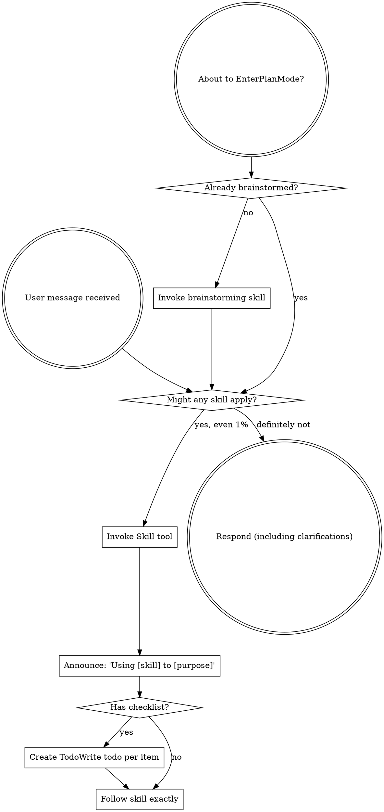
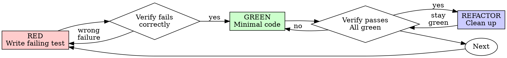

<!-- Generated by SpecStory, Markdown v2.1.0 -->

# 2026-05-05 06:01:09Z

<!-- Codex CLI Session 019df6b9-c5d1-70b3-b4d1-fb1f8cfe3e02 (2026-05-05 06:01:09Z) -->

_**User (2026-05-05 06:01:09Z)**_

现在移动端有个问题 在运行过程中没办法向上拉查看历史记录 会自动强制拉到头，刷新新的运行过程，你理解我说的意思吗 说一下你的理解，然后看看怎么调整

---

_**Agent (gpt-5.5 2026-05-05 06:01:21Z)**_

我先确认一下：你说的是移动端运行页里，任务还在流式输出时，你想手动上滑看前面的历史内容，但界面会不断自动滚回最新输出位置，导致没法停在历史位置阅读。我会先看当前滚动逻辑在哪里触发，再改成“用户在底部时自动跟随；用户上滑离开底部后暂停自动跟随”的行为。

_**Agent (gpt-5.5 2026-05-05 06:01:21Z)**_

<tool-use data-tool-type="shell" data-tool-name="exec_command"><details>
<summary>Tool use: **exec_command** `sed -n '1,220p' '/Users/xiayanghui/.codex/plugins/cache/openai-curated/superpowers/c5debd62/skills/using-superpowers/SKILL.md'`</summary>
```
Chunk ID: 2eda51
Wall time: 0.0000 seconds
Process exited with code 0
Original token count: 1351
Output:
---
name: using-superpowers
description: Use when starting any conversation - establishes how to find and use skills, requiring Skill tool invocation before ANY response including clarifying questions
---

<SUBAGENT-STOP>
If you were dispatched as a subagent to execute a specific task, skip this skill.
</SUBAGENT-STOP>

<EXTREMELY-IMPORTANT>
If you think there is even a 1% chance a skill might apply to what you are doing, you ABSOLUTELY MUST invoke the skill.

IF A SKILL APPLIES TO YOUR TASK, YOU DO NOT HAVE A CHOICE. YOU MUST USE IT.

This is not negotiable. This is not optional. You cannot rationalize your way out of this.
</EXTREMELY-IMPORTANT>

## Instruction Priority

Superpowers skills override default system prompt behavior, but **user instructions always take precedence**:

1. **User's explicit instructions** (AGENTS.md, GEMINI.md, direct requests) — highest priority
2. **Superpowers skills** — override default system behavior where they conflict
3. **Default system prompt** — lowest priority

If AGENTS.md or GEMINI.md says "don't use TDD" and a skill says "always use TDD," follow the user's instructions. The user is in control.

## How to Access Skills

**In Codex:** Use the `Skill` tool. When you invoke a skill, its content is loaded and presented to you—follow it directly. Never use the Read tool on skill files.

**In Copilot CLI:** Use the `skill` tool. Skills are auto-discovered from installed plugins. The `skill` tool works the same as Codex's `Skill` tool.

**In Gemini CLI:** Skills activate via the `activate_skill` tool. Gemini loads skill metadata at session start and activates the full content on demand.

**In other environments:** Check your platform's documentation for how skills are loaded.

## Platform Adaptation

Skills may mention tool names that vary by runtime. Other platforms: see `references/copilot-tools.md` (Copilot CLI), `references/codex-tools.md` (Codex) for tool equivalents. Gemini CLI users get the tool mapping loaded automatically via GEMINI.md.

# Using Skills

## The Rule

**Invoke relevant or requested skills BEFORE any response or action.** Even a 1% chance a skill might apply means that you should invoke the skill to check. If an invoked skill turns out to be wrong for the situation, you don't need to use it.



## Red Flags

These thoughts mean STOP—you're rationalizing:

| Thought | Reality |
|---------|---------|
| "This is just a simple question" | Questions are tasks. Check for skills. |
| "I need more context first" | Skill check comes BEFORE clarifying questions. |
| "Let me explore the codebase first" | Skills tell you HOW to explore. Check first. |
| "I can check git/files quickly" | Files lack conversation context. Check for skills. |
| "Let me gather information first" | Skills tell you HOW to gather information. |
| "This doesn't need a formal skill" | If a skill exists, use it. |
| "I remember this skill" | Skills evolve. Read current version. |
| "This doesn't count as a task" | Action = task. Check for skills. |
| "The skill is overkill" | Simple things become complex. Use it. |
| "I'll just do this one thing first" | Check BEFORE doing anything. |
| "This feels productive" | Undisciplined action wastes time. Skills prevent this. |
| "I know what that means" | Knowing the concept ≠ using the skill. Invoke it. |

## Skill Priority

When multiple skills could apply, use this order:

1. **Process skills first** (brainstorming, debugging) - these determine HOW to approach the task
2.
... (truncated)
```
</details></tool-use>

_**Agent (gpt-5.5 2026-05-05 06:01:21Z)**_

<tool-use data-tool-type="shell" data-tool-name="exec_command"><details>
<summary>Tool use: **exec_command** `sed -n '1,220p' '/Users/xiayanghui/Library/Mobile Documents/com~apple~CloudDocs/agent-skills/skills/frontend-design/SKILL.md'`</summary>
```
Chunk ID: c5d1b9
Wall time: 0.0000 seconds
Process exited with code 0
Original token count: 1110
Output:
---
name: frontend-design
description: Create distinctive, production-grade frontend interfaces with high design quality. Use this skill when the user asks to build web components, pages, artifacts, posters, or applications (examples include websites, landing pages, dashboards, React components, HTML/CSS layouts, or when styling/beautifying any web UI). Generates creative, polished code and UI design that avoids generic AI aesthetics.
license: Complete terms in LICENSE.txt
---

This skill guides creation of distinctive, production-grade frontend interfaces that avoid generic "AI slop" aesthetics. Implement real working code with exceptional attention to aesthetic details and creative choices.

The user provides frontend requirements: a component, page, application, or interface to build. They may include context about the purpose, audience, or technical constraints.

## Design Thinking

Before coding, understand the context and commit to a BOLD aesthetic direction:
- **Purpose**: What problem does this interface solve? Who uses it?
- **Tone**: Pick an extreme: brutally minimal, maximalist chaos, retro-futuristic, organic/natural, luxury/refined, playful/toy-like, editorial/magazine, brutalist/raw, art deco/geometric, soft/pastel, industrial/utilitarian, etc. There are so many flavors to choose from. Use these for inspiration but design one that is true to the aesthetic direction.
- **Constraints**: Technical requirements (framework, performance, accessibility).
- **Differentiation**: What makes this UNFORGETTABLE? What's the one thing someone will remember?

**CRITICAL**: Choose a clear conceptual direction and execute it with precision. Bold maximalism and refined minimalism both work - the key is intentionality, not intensity.

Then implement working code (HTML/CSS/JS, React, Vue, etc.) that is:
- Production-grade and functional
- Visually striking and memorable
- Cohesive with a clear aesthetic point-of-view
- Meticulously refined in every detail

## Frontend Aesthetics Guidelines

Focus on:
- **Typography**: Choose fonts that are beautiful, unique, and interesting. Avoid generic fonts like Arial and Inter; opt instead for distinctive choices that elevate the frontend's aesthetics; unexpected, characterful font choices. Pair a distinctive display font with a refined body font.
- **Color & Theme**: Commit to a cohesive aesthetic. Use CSS variables for consistency. Dominant colors with sharp accents outperform timid, evenly-distributed palettes.
- **Motion**: Use animations for effects and micro-interactions. Prioritize CSS-only solutions for HTML. Use Motion library for React when available. Focus on high-impact moments: one well-orchestrated page load with staggered reveals (animation-delay) creates more delight than scattered micro-interactions. Use scroll-triggering and hover states that surprise.
- **Spatial Composition**: Unexpected layouts. Asymmetry. Overlap. Diagonal flow. Grid-breaking elements. Generous negative space OR controlled density.
- **Backgrounds & Visual Details**: Create atmosphere and depth rather than defaulting to solid colors. Add contextual effects and textures that match the overall aesthetic. Apply creative forms like gradient meshes, noise textures, geometric patterns, layered transparencies, dramatic shadows, decorative borders, custom cursors, and grain overlays.

NEVER use generic AI-generated aesthetics like overused font families (Inter, Roboto, Arial, system fonts), cliched color schemes (particularly purple gradients on white backgrounds), predictable layouts and component patterns, and cookie-cutter design that lacks context-specific character.

Interpret creatively and make unexpected choices that feel genuinely designed for the context. No design should be the same. Vary between light and dark themes, different fonts, different aesthetics. NEVER converge on common choices (Space Grotesk, for example) across generations.

**IMPORTANT**: Match implementation complexity to the aesthetic vision. Maximalist designs need elaborate code with extensive animations and effects. Minimalist or refined designs need restraint, precision, and careful attention to spacing, typography, and subtle details. Elegance comes from executing the vision well.

Remember: Claude is capable of extraordinary creative work. Don't hold back, show what can truly be created when thinking outside the box and committing fully to a distinctive vision.
```
</details></tool-use>

_**Agent (gpt-5.5 2026-05-05 06:01:21Z)**_

<tool-use data-tool-type="shell" data-tool-name="exec_command"><details>
<summary>Tool use: **exec_command** `rg -n "CodexMobile|scroll|auto.*scroll|滚动|运行|history|output|bottom" /Users/xiayanghui/.codex/memories/MEMORY.md`</summary>
```
Chunk ID: a7cc15
Wall time: 0.0000 seconds
Process exited with code 0
Original token count: 940
Output:
26:## Task 3: 让 SpecStory 在现有 Vaults `.specstory/history/` 里持续捕捉 Codex Desktop/CLI
34:- SpecStory, specstory sync codex, specstory watch codex, Vaults/.specstory/history, watch/codex-watch.log, codex-watch.pid, Homebrew, background watcher, specstory-codex-watch
52:- SpecStory 在这台机器上已验证可直接从 Vaults 工作目录读取 Codex 本地状态并写入 `Vaults/.specstory/history/`；`specstory list codex` / `specstory sync codex` / `specstory watch codex` 都受当前 working directory 影响 [Task 3]
57:- 症状：先去看 `Documents/Codex/.../session-icloud` 这种工作目录，得出“不是 symlink”但对真实运行态没帮助 -> 原因：把当前聊天目录误当成 Codex runtime path -> fix：和 Codex Desktop 状态相关的问题先看 `~/.codex/sessions/...`、`~/.codex/session_index.jsonl`、`~/.codex/state_5.sqlite` [Task 2]
248:- fcfea9a3a02, opportunities, JSBlockModel, mobile stage selector, STAGE_PAGE_SIZE=12, avatars removed, option tags, hidden scrollbar, js_backup_sync.py
265:- when the user said the board “不太适合移动端，桌面端也挺拥挤” and later asked to hide avatars/scrollbars and tag rejected reasons -> for QingTian CRM UI work, proactively optimize both mobile ergonomics and desktop density, with less chrome and less visual noise [Task 3]
273:- `fcfea9a3a02` 是 `opportunities` 的 `JSBlockModel` 看板；这次验证有效的模式是桌面端保留轻量 kanban、移动端改成 stage tabs 单列切换、去头像、弱化阴影、`STAGE_PAGE_SIZE` 下调到 `12`，并在空闲时隐藏滚动条 [Task 3]
281:- 症状：UI 改完仍然又重又挤 -> 原因：在旧壳上继续叠响应式糖衣，而不是先去掉重阴影、大圆角、头像和多余 chrome -> fix：先做减法，再补移动端/标签/滚动细节 [Task 3]
441:- when the user kept pushing on doc export, table borders, and landscape layout -> for 表格型交付物, prioritize direct-forwardability, visible structure, and editable Word output rather than treating export as an optional last mile [Task 1]
449:- 表格密集型 Word 不要直接裸用 `pandoc`；这次验证更稳的是先跑 `python3 '/Users/xiayanghui/Library/Mobile Documents/com~apple~CloudDocs/agent-skills/skills/doc-exporter/scripts/md_to_docx.py' <input.md> <output.docx> --table-style grid --margins narrow`，再按需要二次改版式 [Task 1]
887:- when both “青甜小镇”和“其他农场项目” are in scope, preserve portability and standardization in the output instead of locking the answer to one project’s narrative [Task 1]
1037:- when Word export formatting breaks, prefer simpler export-safe text over fancy Markdown styling; the user accepted the plain-text signature fix after seeing the slanted output problem [Task 2]
1272:- 在这个仓库里，真正的运行时 AI 配置可能来自 `backend/instance/database.db`，不是 `.env`；当 `.env` 和实际行为冲突时，先看 DB-backed settings [Task 1]
1383:- when a script output is wrong, the user prefers concrete evidence over abstract explanation: “这些不是也有对应的线索吗”“可以把名单给我” -> show the suspect names / records directly [Task 3]
1723:- when reconstructing diaries, the user set a hard attribution boundary: “变现日报那些都不是我写的 都是openclaw 自动生成的” and later named more shared-project files that were not their work -> exclude OpenClaw/generated/shared outputs unless the user explicitly confirms authorship [Task 2]
1724:- when the user says a day was low-output, like “昨天其实也没做多少工作，就是休息 玩洛克王国…”, keep the note honest; don’t inflate it into a productive-day narrative [Task 2]
```
</details></tool-use>

_**Agent (gpt-5.5 2026-05-05 06:01:26Z)**_

我会用 `frontend-design` 只取其中“移动端交互要符合现有界面”的部分；这不是重做视觉，而是修运行页的滚动体验。记忆里没有直接的 `CodexMobile` 记录，所以接下来以当前仓库为准。

_**Agent (gpt-5.5 2026-05-05 06:01:28Z)**_

<tool-use data-tool-type="shell" data-tool-name="exec_command"><details>
<summary>Tool use: **exec_command** `sed -n '1,240p' '/Users/xiayanghui/.codex/plugins/cache/openai-curated/superpowers/c5debd62/skills/systematic-debugging/SKILL.md'`</summary>
```
Chunk ID: 01f2a4
Wall time: 0.0000 seconds
Process exited with code 0
Original token count: 1807
Output:
---
name: systematic-debugging
description: Use when encountering any bug, test failure, or unexpected behavior, before proposing fixes
---

# Systematic Debugging

## Overview

Random fixes waste time and create new bugs. Quick patches mask underlying issues.

**Core principle:** ALWAYS find root cause before attempting fixes. Symptom fixes are failure.

**Violating the letter of this process is violating the spirit of debugging.**

## The Iron Law

```
NO FIXES WITHOUT ROOT CAUSE INVESTIGATION FIRST
```

If you haven't completed Phase 1, you cannot propose fixes.

## When to Use

Use for ANY technical issue:
- Test failures
- Bugs in production
- Unexpected behavior
- Performance problems
- Build failures
- Integration issues

**Use this ESPECIALLY when:**
- Under time pressure (emergencies make guessing tempting)
- "Just one quick fix" seems obvious
- You've already tried multiple fixes
- Previous fix didn't work
- You don't fully understand the issue

**Don't skip when:**
- Issue seems simple (simple bugs have root causes too)
- You're in a hurry (rushing guarantees rework)
- Manager wants it fixed NOW (systematic is faster than thrashing)

## The Four Phases

You MUST complete each phase before proceeding to the next.

### Phase 1: Root Cause Investigation

**BEFORE attempting ANY fix:**

1. **Read Error Messages Carefully**
   - Don't skip past errors or warnings
   - They often contain the exact solution
   - Read stack traces completely
   - Note line numbers, file paths, error codes

2. **Reproduce Consistently**
   - Can you trigger it reliably?
   - What are the exact steps?
   - Does it happen every time?
   - If not reproducible → gather more data, don't guess

3. **Check Recent Changes**
   - What changed that could cause this?
   - Git diff, recent commits
   - New dependencies, config changes
   - Environmental differences

4. **Gather Evidence in Multi-Component Systems**

   **WHEN system has multiple components (CI → build → signing, API → service → database):**

   **BEFORE proposing fixes, add diagnostic instrumentation:**
   ```
   For EACH component boundary:
     - Log what data enters component
     - Log what data exits component
     - Verify environment/config propagation
     - Check state at each layer

   Run once to gather evidence showing WHERE it breaks
   THEN analyze evidence to identify failing component
   THEN investigate that specific component
   ```

   **Example (multi-layer system):**
   ```bash
   # Layer 1: Workflow
   echo "=== Secrets available in workflow: ==="
   echo "IDENTITY: ${IDENTITY:+SET}${IDENTITY:-UNSET}"

   # Layer 2: Build script
   echo "=== Env vars in build script: ==="
   env | grep IDENTITY || echo "IDENTITY not in environment"

   # Layer 3: Signing script
   echo "=== Keychain state: ==="
   security list-keychains
   security find-identity -v

   # Layer 4: Actual signing
   codesign --sign "$IDENTITY" --verbose=4 "$APP"
   ```

   **This reveals:** Which layer fails (secrets → workflow ✓, workflow → build ✗)

5. **Trace Data Flow**

   **WHEN error is deep in call stack:**

   See `root-cause-tracing.md` in this directory for the complete backward tracing technique.

   **Quick version:**
   - Where does bad value originate?
   - What called this with bad value?
   - Keep tracing up until you find the source
   - Fix at source, not at symptom

### Phase 2: Pattern Analysis

**Find the pattern before fixing:**

1. **Find Working Examples**
   - Locate similar working code in same codebase
   - What works that's similar to what's broken?

2. **Compare Against References**
   - If implementing pattern, read reference implementation COMPLETELY
   - Don't skim - read every line
   - Understand the pattern fully before applying

3. **Identify Differences**
   - What's different between working and broken?
   - List every difference, however small
   - Don't assume "that can't matter"

4. **Understand Dependencies**
   - What other components does this need?
   - What settings, config, environment?
   - What assumptions does it make?

### Phase 3: Hypothesis and Testing

**Scientific method:**

1. **Form Single Hypothesis**
   - State clearly: "I think X is the root cause because Y"
   - Write it down
   - Be specific, not vague

2. **Test Minimally**
   - Make the SMALLEST possible change to test hypothesis
   - One variable at a time
   - Don't fix multiple things at once

3. **Verify Before Continuing**
   - Did it work? Yes → Phase 4
   - Didn't work? Form NEW hypothesis
   - DON'T add more fixes on top

4. **When You Don't Know**
   - Say "I don't understand X"
   - Don't pretend to know
   - Ask for help
   - Research more

### Phase 4: Implementation

**Fix the root cause, not the symptom:**

1. **Create Failing Test Case**
   - Simplest possible reproduction
   - Automated test if possible
   - One-off test script
... (truncated)
```
</details></tool-use>

_**Agent (gpt-5.5 2026-05-05 06:01:32Z)**_

<tool-use data-tool-type="shell" data-tool-name="exec_command"><details>
<summary>Tool use: **exec_command** `sed -n '1,220p' '/Users/xiayanghui/.codex/plugins/cache/openai-curated/superpowers/c5debd62/skills/test-driven-development/SKILL.md'`</summary>
```
Chunk ID: e0f584
Wall time: 0.0000 seconds
Process exited with code 0
Original token count: 1232
Output:
---
name: test-driven-development
description: Use when implementing any feature or bugfix, before writing implementation code
---

# Test-Driven Development (TDD)

## Overview

Write the test first. Watch it fail. Write minimal code to pass.

**Core principle:** If you didn't watch the test fail, you don't know if it tests the right thing.

**Violating the letter of the rules is violating the spirit of the rules.**

## When to Use

**Always:**
- New features
- Bug fixes
- Refactoring
- Behavior changes

**Exceptions (ask your human partner):**
- Throwaway prototypes
- Generated code
- Configuration files

Thinking "skip TDD just this once"? Stop. That's rationalization.

## The Iron Law

```
NO PRODUCTION CODE WITHOUT A FAILING TEST FIRST
```

Write code before the test? Delete it. Start over.

**No exceptions:**
- Don't keep it as "reference"
- Don't "adapt" it while writing tests
- Don't look at it
- Delete means delete

Implement fresh from tests. Period.

## Red-Green-Refactor



### RED - Write Failing Test

Write one minimal test showing what should happen.

<Good>
```typescript
test('retries failed operations 3 times', async () => {
  let attempts = 0;
  const operation = () => {
    attempts++;
    if (attempts < 3) throw new Error('fail');
    return 'success';
  };

  const result = await retryOperation(operation);

  expect(result).toBe('success');
  expect(attempts).toBe(3);
});
```
Clear name, tests real behavior, one thing
</Good>

<Bad>
```typescript
test('retry works', async () => {
  const mock = jest.fn()
    .mockRejectedValueOnce(new Error())
    .mockRejectedValueOnce(new Error())
    .mockResolvedValueOnce('success');
  await retryOperation(mock);
  expect(mock).toHaveBeenCalledTimes(3);
});
```
Vague name, tests mock not code
</Bad>

**Requirements:**
- One behavior
- Clear name
- Real code (no mocks unless unavoidable)

### Verify RED - Watch It Fail

**MANDATORY. Never skip.**

```bash
npm test path/to/test.test.ts
```

Confirm:
- Test fails (not errors)
- Failure message is expected
- Fails because feature missing (not typos)

**Test passes?** You're testing existing behavior. Fix test.

**Test errors?** Fix error, re-run until it fails correctly.

### GREEN - Minimal Code

Write simplest code to pass the test.

<Good>
```typescript
async function retryOperation<T>(fn: () => Promise<T>): Promise<T> {
  for (let i = 0; i < 3; i++) {
    try {
      return await fn();
    } catch (e) {
      if (i === 2) throw e;
    }
  }
  throw new Error('unreachable');
}
```
Just enough to pass
</Good>

<Bad>
```typescript
async function retryOperation<T>(
  fn: () => Promise<T>,
  options?: {
    maxRetries?: number;
    backoff?: 'linear' | 'exponential';
    onRetry?: (attempt: number) => void;
  }
): Promise<T> {
  // YAGNI
}
```
Over-engineered
</Bad>

Don't add features, refactor other code, or "improve" beyond the test.

### Verify GREEN - Watch It Pass

**MANDATORY.**

```bash
npm test path/to/test.test.ts
```

Confirm:
- Test passes
- Other tests still pass
- Output pristine (no errors, warnings)

**Test fails?** Fix code, not test.

**Other tests fail?** Fix now.

### REFACTOR - Clean Up

After green only:
- Remove duplication
- Improve names
- Extract helpers

Keep tests green. Don't add behavior.

### Repeat

Next failing test for next feature.

## Good Tests

| Quality | Good | Bad |
|---------|------|-----|
| **Minimal** | One thing. "and" in name? Split it. | `test('validates email and domain and whitespace')` |
| **Clear** | Name describes behavior | `test('test1')` |
| **Shows intent** | Demonstrates desired API | Obscures what code should do |

## Why Order Matters

**"I'll write tests after to verify it works"**

Tests written after code pass immediately. Passing immediately proves nothing:
- Might test wrong thing
- Might test implementation, not behavior
- Might miss edge cases you forgot
- You never saw it catch the bug

Test-first forces you to see the test fail, proving it actually tests something.

**"I already manually tested all the edge cases"**

Manual testing is ad-hoc. You t
... (truncated)
```
</details></tool-use>

_**Agent (gpt-5.5 2026-05-05 06:01:40Z)**_

现在按调试流程走：先找滚动和流式输出的代码，不直接改。核心要确认是哪个 effect / ScrollView / FlatList 在每次新内容追加时强制 `scrollToEnd`。

_**Agent (gpt-5.5 2026-05-05 06:01:40Z)**_

<tool-use data-tool-type="shell" data-tool-name="exec_command"><details>
<summary>Tool use: **exec_command** `pwd && rg --files -g '!*node_modules*' -g '!*.png' -g '!*.jpg' -g '!*.jpeg' -g '!*.webp' | sed -n '1,220p'`</summary>
```
Chunk ID: 008dcf
Wall time: 0.0000 seconds
Process exited with code 0
Original token count: 257
Output:
/Users/xiayanghui/编程项目/CodexMobile
LICENSE
package.json
package-lock.json
README.md
.env.example
asr-service/app.py
asr-service/Dockerfile
asr-service/requirements.txt
skills/lark-doc-fast/SKILL.md
skills/lark-drive-fast/SKILL.md
scripts/start-all.ps1
scripts/patch-codex-sdk.mjs
scripts/start-asr.mjs
scripts/start-server.mjs
scripts/smoke.mjs
scripts/lark-cli-guard.mjs
client/vite.config.js
client/index.html
client/src/api.js
client/src/App.jsx
client/src/main.jsx
client/src/styles.css
client/manifest.webmanifest
client/public/icon.svg
skills/lark-sheets-fast/SKILL.md
skills/lark-slides-fast/SKILL.md
server/codex-app-server.js
server/codex-quota.js
server/codex-native-images.js
server/codex-config.js
server/codex-data.js
server/index.js
server/image-generator.js
server/provider-api.js
server/voice-speaker.js
server/auth.js
server/codex-native-images.test.js
server/feishu-skills.js
server/codex-runner.js
server/realtime-voice.js
server/mobile-session-index.js
server/voice-transcriber.js
server/lark-cli.js
```
</details></tool-use>

_**Agent (gpt-5.5 2026-05-05 06:01:40Z)**_

<tool-use data-tool-type="shell" data-tool-name="exec_command"><details>
<summary>Tool use: **exec_command** `rg -n "scrollTo|scrollToEnd|autoScroll|onScroll|ScrollView|FlatList|SectionList|maintainVisibleContentPosition|run|running|output|history|messages|transcript|contentSizeChange|useEffect" -g '!*node_modules*'`</summary>
```
Chunk ID: b5a7c1
Wall time: 0.0000 seconds
Process exited with code 0
Original token count: 10262
Output:
Total output lines: 498

skills/lark-drive-fast/SKILL.md:20:- Never output App Secret, access token, or refresh token.
.env.example:56:# Optional cloud/OpenAI-compatible transcription
client/src/styles.css:798:.thread-row.is-running:not(.is-selected) {
client/src/styles.css:802:.thread-row.has-complete-notice:not(.is-running):not(.is-selected) {
client/src/styles.css:822:[data-theme="dark"] .thread-row.is-running:not(.is-selected),
client/src/styles.css:823:[data-theme="dark"] .thread-row.has-complete-notice:not(.is-running):not(.is-selected) {
client/src/styles.css:3235:.composer-run-status {
client/src/styles.css:3250:.composer-run-dot {
client/src/styles.css:3260:.composer-run-dot::after {
client/src/styles.css:3266:  animation: runPulse 1.25s ease-out infinite;
client/src/styles.css:3269:.composer-run-main {
client/src/styles.css:3276:.composer-run-main strong,
client/src/styles.css:3277:.composer-run-main small {
client/src/styles.css:3284:.composer-run-main strong {
client/src/styles.css:3291:.composer-run-main small {
client/src/styles.css:3297:.composer-run-time {
client/src/styles.css:3327:.send-button.is-running {
client/src/styles.css:3629:[data-theme="dark"] .composer-run-status {
client/src/styles.css:3636:[data-theme="dark"] .composer-run-main strong {
client/src/styles.css:3640:[data-theme="dark"] .composer-run-main small {
client/src/styles.css:3644:[data-theme="dark"] .composer-run-time {
client/src/styles.css:3654:[data-theme="dark"] .send-button.is-running {
client/src/styles.css:3830:@keyframes runPulse {
scripts/start-all.ps1:44:  npm run asr:start
scripts/start-all.ps1:53:npm run start:bg
skills/lark-slides-fast/SKILL.md:17:- Avoid duplicate PPT files: in one user task, run `slides +create` at most once for a given title. If creation partially fails or verification shows missing content, keep the returned `xml_presentation_id`, read it with `xml_presentations get`, then repair/append pages on that same PPT with `xml_presentation.slide.create` or `+replace-slide`. Do not start over with another `slides +create`.
skills/lark-slides-fast/SKILL.md:21:- Prefer direct creation and one verification command. Do not repeatedly run help.
package-lock.json:1670:    "node_modules/hast-util-to-jsx-runtime": {
package-lock.json:1672:      "resolved": "https://registry.npmmirror.com/hast-util-to-jsx-runtime/-/hast-util-to-jsx-runtime-2.3.6.tgz",
package-lock.json:2860:        "hast-util-to-jsx-runtime": "^2.0.0",
README.md:62:npm run build
README.md:88:npm run start:env
README.md:97:npm run start:env
README.md:106:npm run start:env
README.md:154:- `npm run build`：构建 PWA 到 `client/dist`
README.md:156:- `npm run start:env`：读取 `.env` 后启动
README.md:157:- `npm run start:bg`：后台启动服务，日志写入 `.codexmobile`
README.md:158:- `npm run asr:start`：构建并启动本地 SenseVoice ASR Docker 容器
README.md:159:- `npm run smoke`：检查本机 `/api/status`
skills/lark-doc-fast/SKILL.md:15:- The backend already sets a writable `LARKSUITE_CLI_CONFIG_DIR`; do not copy `.lark-cli`, run config bind, or prepare auth manually.
scripts/start-asr.mjs:21:function run(command, args, options = {}) {
scripts/start-asr.mjs:34:  const output = `${result?.stdout || ''}${result?.stderr || ''}`.trim();
scripts/start-asr.mjs:35:  if (output) {
scripts/start-asr.mjs:36:    console.error(output);
scripts/start-asr.mjs:41:  return run('docker', args, options);
scripts/start-asr.mjs:47:    console.error('Docker is not running. Start Docker Desktop, then run npm run asr:start again.');
scripts/start-asr.mjs:64:  const result = docker(['ps', '--filter', `name=^/${name}$`, '--filter', 'status=running', '--format', '{{.Names}}']);
scripts/start-asr.mjs:127:    'run',
scripts/start-asr.mjs:194:console.log(`Endpoint: http://127.0.0.1:${port}/v1/audio/transcriptions`);
scripts/lark-cli-guard.mjs:77:        output: existing.output || ''
scripts/lark-cli-guard.mjs:112:    output: redacted(combined).slice(-1600)
server/voice-transcriber.js:154:    return '本地语音转写服务未启动，请先在电脑上运行 npm run asr:start';
server/voice-transcriber.js:162:    return '当前语音转写服务未配置或不支持 /audio/transcriptions';
server/voice-transcriber.js:254:  const response = await fetch(`${config.baseUrl}/audio/transcriptions`, {
client/src/App.jsx:36:import { useCallback, useEffect, useMemo, useRef, useState } from 'react';
client/src/App.jsx:473:  useEffect(() => {
client/src/App.jsx:561:  return `/api/sessions/${encodeURIComponent(sessionId)}/messages?${params.toString()}`;
client/src/App.jsx:577:function hasRunningKey(runningById, keys) {
client/src/App.jsx:578:  return keys.some((key) => Boolean(runningById[key]));
client/src/App.jsx:585:function buildComposerRunStatus(messages, running, now = Date.now()) {
client/src/App.jsx:586:  const activity = [...(messages || [])]
cl
... (truncated)
```
</details></tool-use>

_**Agent (gpt-5.5 2026-05-05 06:01:40Z)**_

<tool-use data-tool-type="shell" data-tool-name="exec_command"><details>
<summary>Tool use: **exec_command** `git status --short`</summary>
```
Chunk ID: 70a936
Wall time: 0.0000 seconds
Process exited with code 0
Original token count: 57
Output:
 M README.md
 M client/src/App.jsx
 M client/src/styles.css
 M server/codex-config.js
 M server/codex-data.js
 M server/codex-runner.js
 M server/index.js
?? server/codex-native-images.js
?? server/codex-native-images.test.js
```
</details></tool-use>

_**Agent (gpt-5.5 2026-05-05 06:01:50Z)**_

定位到了主要嫌疑：`ChatPane` 里有两个自动到底部的 effect，其中一个在 `running` 时会无条件跟随到底部。这正好能解释“运行中上滑又被拽回去”。我先读这段和现有 diff，避免覆盖你已有改动。

_**Agent (gpt-5.5 2026-05-05 06:01:50Z)**_

<tool-use data-tool-type="shell" data-tool-name="exec_command"><details>
<summary>Tool use: **exec_command** `sed -n '3280,3370p' client/src/App.jsx`</summary>
```
Chunk ID: 954511
Wall time: 0.0000 seconds
Process exited with code 0
Original token count: 725
Output:
          <div className="message-bubble">
            <MessageContent content={visibleContent} onPreviewImage={onPreviewImage} />
            {message.timestamp ? <time>{formatTime(message.timestamp)}</time> : null}
          </div>
        ) : null}
        {canAct ? (
          <div className="message-actions" aria-label="消息操作">
            <button type="button" className="message-action" onClick={handleCopy}>
              {copied ? <Check size={13} /> : <Copy size={13} />}
              <span>{copied ? '已复制' : '复制'}</span>
            </button>
            <button type="button" className="message-action is-delete" onClick={() => onDeleteMessage?.(message)}>
              <Trash2 size={13} />
              <span>删除</span>
            </button>
          </div>
        ) : null}
      </div>
    </div>
  );
}

function ChatPane({ messages, selectedSession, running, now, onPreviewImage, onDeleteMessage }) {
  const paneRef = useRef(null);
  const contentRef = useRef(null);
  const bottomPinnedRef = useRef(true);

  const scrollToBottom = useCallback((behavior = 'auto') => {
    const pane = paneRef.current;
    if (!pane) {
      return;
    }
    pane.scrollTo({ top: pane.scrollHeight, behavior });
  }, []);

  useEffect(() => {
    const pane = paneRef.current;
    if (!pane) {
      return undefined;
    }

    function updatePinnedState() {
      const distance = pane.scrollHeight - pane.scrollTop - pane.clientHeight;
      bottomPinnedRef.current = distance < 96;
    }

    updatePinnedState();
    pane.addEventListener('scroll', updatePinnedState, { passive: true });
    return () => pane.removeEventListener('scroll', updatePinnedState);
  }, []);

  useEffect(() => {
    if (!bottomPinnedRef.current && !running) {
      return undefined;
    }
    const frame = requestAnimationFrame(() => scrollToBottom('auto'));
    return () => cancelAnimationFrame(frame);
  }, [messages, running, scrollToBottom]);

  useEffect(() => {
    const pane = paneRef.current;
    if (!pane || typeof ResizeObserver === 'undefined') {
      return undefined;
    }
    const observer = new ResizeObserver(() => {
      if (bottomPinnedRef.current || running) {
        scrollToBottom('auto');
      }
    });
    observer.observe(contentRef.current || pane);
    return () => observer.disconnect();
  }, [running, scrollToBottom]);

  if (!messages.length) {
    return (
      <section className="chat-pane empty-chat">
        <div className="empty-orbit">
          <ShieldCheck size={30} />
        </div>
        <h2>{selectedSession ? selectedSession.title : '新对话'}</h2>
        <p>问 Codex 任何事。</p>
      </section>
    );
  }

  return (
    <section className="chat-pane" ref={paneRef}>
      <div className="chat-content" ref={contentRef}>
        {messages.map((message) => (
          <ChatMessage
            key={message.id}
```
</details></tool-use>

_**Agent (gpt-5.5 2026-05-05 06:01:50Z)**_

<tool-use data-tool-type="shell" data-tool-name="exec_command"><details>
<summary>Tool use: **exec_command** `git diff -- client/src/App.jsx | sed -n '1,220p'`</summary>
```
Chunk ID: 4b07e0
Wall time: 0.0000 seconds
Process exited with code 0
Original token count: 1836
Output:
diff --git a/client/src/App.jsx b/client/src/App.jsx
index a0950f1..cdc15a5 100644
--- a/client/src/App.jsx
+++ b/client/src/App.jsx
@@ -46,6 +46,7 @@ const DEFAULT_STATUS = {
   modelShort: '5.5 中',
   reasoningEffort: 'xhigh',
   models: [{ value: 'gpt-5.5', label: 'gpt-5.5' }],
+  skills: [],
   docs: {
     provider: 'feishu',
     integration: 'lark-cli',
@@ -96,6 +97,7 @@ const CONNECTION_STATUS = {
 const DEFAULT_REASONING_EFFORT = 'xhigh';
 const REASONING_DEFAULT_VERSION = 'xhigh-v1';
 const THEME_KEY = 'codexmobile.theme';
+const SELECTED_SKILLS_KEY = 'codexmobile.selectedSkills';
 const VOICE_MAX_RECORDING_MS = 90 * 1000;
 const VOICE_MAX_UPLOAD_BYTES = 10 * 1024 * 1024;
 const VOICE_MIME_CANDIDATES = ['audio/mp4', 'audio/webm;codecs=opus', 'audio/webm'];
@@ -387,6 +389,25 @@ function reasoningLabel(value) {
   return REASONING_OPTIONS.find((option) => option.value === value)?.label || '超高';
 }
 
+function safeStoredJsonArray(key) {
+  try {
+    const parsed = JSON.parse(localStorage.getItem(key) || '[]');
+    return Array.isArray(parsed) ? parsed : [];
+  } catch {
+    return [];
+  }
+}
+
+function selectedSkillSummary(selectedSkills) {
+  if (!selectedSkills?.length) {
+    return '技能';
+  }
+  if (selectedSkills.length === 1) {
+    return selectedSkills[0]?.label || selectedSkills[0]?.name || '技能';
+  }
+  return `技能 ${selectedSkills.length}`;
+}
+
 function imageUrlWithRetry(url, retryKey) {
   if (!retryKey || /^data:image\//i.test(String(url || '').trim())) {
     return url;
@@ -3017,11 +3038,46 @@ function markdownImageFromLine(line) {
   return { type: 'image', alt: match[1] || '图片', url };
 }
 
+function legacyAttachmentImageFromLine(line) {
+  const match = String(line || '').trim().match(/^[-*]\s*图片[:：]\s*(.*?)\s*\((.+)\)\s*$/);
+  if (!match) {
+    return null;
+  }
+  const url = String(match[2] || '').trim();
+  if (!isLocalImageSource(url) && !/\.(?:png|jpe?g|webp|gif)(?:[?#].*)?$/i.test(url)) {
+    return null;
+  }
+  return { type: 'image', alt: match[1] || '图片', url };
+}
+
+function markdownImageDestination(value) {
+  const raw = String(value || '').trim();
+  if (!raw) {
+    return '';
+  }
+  if (/[\s<>()]/.test(raw)) {
+    return `<${raw.replace(/>/g, '%3E')}>`;
+  }
+  return raw;
+}
+
+function markdownImageAlt(value) {
+  return String(value || '图片').replace(/[\[\]\n\r]/g, '').trim() || '图片';
+}
+
+function contentWithAttachmentPreviews(content, attachments = []) {
+  const imageLines = (Array.isArray(attachments) ? attachments : [])
+    .filter((attachment) => attachment?.kind === 'image' && attachment.path)
+    .map((attachment) => `})`)
+    .filter(Boolean);
+  return [content, imageLines.join('\n')].filter(Boolean).join('\n\n');
+}
+
 function splitMessageImages(content) {
   const textLines = [];
   const images = [];
   for (const line of String(content || '').replace(/\r\n?/g, '\n').split('\n')) {
-    const image = markdownImageFromLine(line);
+    const image = markdownImageFromLine(line) || legacyAttachmentImageFromLine(line);
     if (image) {
       images.push(image);
     } else {
@@ -3029,7 +3085,7 @@ function splitMessageImages(content) {
     }
   }
   return {
-    text: textLines.join('\n').replace(/\n{3,}/g, '\n\n').trim(),
+    text: textLines.join('\n').replace(/\n*附件路径[:：]\s*$/g, '').replace(/\n{3,}/g, '\n\n').trim(),
     images
   };
 }
@@ -3478,35 +3534,39 @@ function Composer({
   onSelectModel,
   selectedReasoningEffort,
   onSelectReasoningEffort,
+  skills,
+  selectedSkillPaths,
+  onToggleSkill,
+  onClearSkills,
   permissionMode,
   onSelectPermission,
   attachments,
   onUploadFiles,
   onRemoveAttachment,
   uploading,
-  onVoiceSubmit,
-  onOpenVoiceDialog,
-  voiceDialogActive,
   contextStatus,
   runStatus
 }) {
   const textareaRef = useRef(null);
   const imageInputRef = useRef(null);
   const fileInputRef = useRef(null);
-  const mediaRecorderRef = useRef(null);
-  const voiceChunksRef = useRef([]);
-  const voiceStreamRef = useRef(null);
-  const voiceTimerRef = useRef(null);
-  const voiceErrorTimerRef = useRef(null);
   const [openMenu, setOpenMenu] = useState(null);
-  const [voiceState, setVoiceState] = useState('idle');
-  const [voiceError, setVoiceError] = useState('');
+  const [skillFilter, setSkillFilter] = useState('');
   const hasInput = input.trim().length > 0 || attachments.length > 0;
   const modelList = models?.length ? models : [{ value: selectedModel || 'gpt-5.5', label: selectedModel || 'gpt-5.5' }];
   const selectedModelLabel = modelList.find((model) => model.value === selectedModel)?.label || selectedModel || 'gpt-5.5';
-  const voiceRecording = voiceState === 'recording';
-  const voiceTranscribing = voiceState === 'transcribing';
-  const voiceSending =
... (truncated)
```
</details></tool-use>

_**Agent (gpt-5.5 2026-05-05 06:01:50Z)**_

<tool-use data-tool-type="shell" data-tool-name="exec_command"><details>
<summary>Tool use: **exec_command** `cat package.json`</summary>
```
Chunk ID: 182060
Wall time: 0.0000 seconds
Process exited with code 0
Original token count: 252
Output:
{
  "name": "codexmobile",
  "version": "0.1.0",
  "description": "iPhone-first PWA bridge for using a local Codex setup over a private network.",
  "license": "MIT",
  "type": "module",
  "scripts": {
    "dev:server": "node server/index.js",
    "dev:client": "vite --host 0.0.0.0 --config client/vite.config.js",
    "build": "vite build --config client/vite.config.js",
    "start": "node server/index.js",
    "start:env": "node --env-file=.env server/index.js",
    "start:bg": "node scripts/start-server.mjs",
    "asr:start": "node scripts/start-asr.mjs",
    "postinstall": "node scripts/patch-codex-sdk.mjs",
    "smoke": "node scripts/smoke.mjs"
  },
  "dependencies": {
    "@openai/codex-sdk": "^0.128.0",
    "@vitejs/plugin-react": "^4.6.0",
    "lucide-react": "^0.515.0",
    "opencc-js": "^1.0.5",
    "react": "^18.2.0",
    "react-dom": "^18.2.0",
    "react-markdown": "^10.1.0",
    "remark-breaks": "^4.0.0",
    "remark-gfm": "^4.0.1",
    "vite": "^7.0.4",
    "ws": "^8.14.2"
  }
}
```
</details></tool-use>

_**Agent (gpt-5.5 2026-05-05 06:01:50Z)**_

<tool-use data-tool-type="shell" data-tool-name="exec_command"><details>
<summary>Tool use: **exec_command** `rg -n "ChatPane|bottomPinnedRef|scrollToBottom|messages-scroll|chat-pane|scroll" client/src/App.jsx client/src/styles.css`</summary>
```
Chunk ID: 9ed622
Wall time: 0.0000 seconds
Process exited with code 0
Original token count: 537
Output:
client/src/App.jsx:3302:function ChatPane({ messages, selectedSession, running, now, onPreviewImage, onDeleteMessage }) {
client/src/App.jsx:3305:  const bottomPinnedRef = useRef(true);
client/src/App.jsx:3307:  const scrollToBottom = useCallback((behavior = 'auto') => {
client/src/App.jsx:3312:    pane.scrollTo({ top: pane.scrollHeight, behavior });
client/src/App.jsx:3322:      const distance = pane.scrollHeight - pane.scrollTop - pane.clientHeight;
client/src/App.jsx:3323:      bottomPinnedRef.current = distance < 96;
client/src/App.jsx:3327:    pane.addEventListener('scroll', updatePinnedState, { passive: true });
client/src/App.jsx:3328:    return () => pane.removeEventListener('scroll', updatePinnedState);
client/src/App.jsx:3332:    if (!bottomPinnedRef.current && !running) {
client/src/App.jsx:3335:    const frame = requestAnimationFrame(() => scrollToBottom('auto'));
client/src/App.jsx:3337:  }, [messages, running, scrollToBottom]);
client/src/App.jsx:3345:      if (bottomPinnedRef.current || running) {
client/src/App.jsx:3346:        scrollToBottom('auto');
client/src/App.jsx:3351:  }, [running, scrollToBottom]);
client/src/App.jsx:3355:      <section className="chat-pane empty-chat">
client/src/App.jsx:3366:    <section className="chat-pane" ref={paneRef}>
client/src/App.jsx:3577:    textarea.style.height = `${Math.min(textarea.scrollHeight, 132)}px`;
client/src/App.jsx:3918:        if (window.scrollX || window.scrollY) {
client/src/App.jsx:3919:          window.scrollTo(0, 0);
client/src/App.jsx:3926:    window.visualViewport?.addEventListener('scroll', updateViewport);
client/src/App.jsx:3933:      window.visualViewport?.removeEventListener('scroll', updateViewport);
client/src/App.jsx:6614:      <ChatPane
client/src/styles.css:49:  overscroll-behavior: none;
client/src/styles.css:84:  overscroll-behavior: none;
client/src/styles.css:1448:.chat-pane {
client/src/styles.css:1456:  overscroll-behavior: contain;
client/src/styles.css:1457:  -webkit-overflow-scrolling: touch;
client/src/styles.css:2095:  -webkit-overflow-scrolling: touch;
client/src/styles.css:2870:[data-keyboard="open"] .chat-pane {
```
</details></tool-use>

_**Agent (gpt-5.5 2026-05-05 06:02:02Z)**_

根因基本清楚了：这不是数据刷新本身的问题，而是滚动策略把 `running` 当成“必须跟到底部”的条件。正确条件应该是“用户当前仍贴近底部才跟随”，运行状态只影响输出频率，不应该覆盖用户手动上滑的意图。

_**Agent (gpt-5.5 2026-05-05 06:02:04Z)**_

<tool-use data-tool-type="shell" data-tool-name="exec_command"><details>
<summary>Tool use: **exec_command** `find . -maxdepth 3 \( -name '*test*' -o -name '*spec*' \) -not -path './node_modules/*' -print`</summary>
```
Chunk ID: c17ff3
Wall time: 0.0000 seconds
Process exited with code 0
Original token count: 10
Output:
./server/codex-native-images.test.js
```
</details></tool-use>

_**Agent (gpt-5.5 2026-05-05 06:02:14Z)**_

我先补一个很小的滚动策略测试，用纯函数锁住期望行为：`running=true` 但用户已经离开底部时，不允许自动滚到底。先让它失败，再接实现。

_**Agent (gpt-5.5 2026-05-05 06:02:15Z)**_

<tool-use data-tool-type="write" data-tool-name="apply_patch"><details>
<summary>Tool use: **apply_patch**</summary>
**Add: `client/src/chat-scroll.test.mjs`**

```diff
+import test from 'node:test';
+import assert from 'node:assert/strict';
+
+import { isNearChatBottom, shouldFollowChatOutput } from './chat-scroll.js';
+
+test('detects whether the chat pane is pinned near the bottom', () => {
+  assert.equal(isNearChatBottom({ scrollHeight: 1200, scrollTop: 620, clientHeight: 500 }), true);
+  assert.equal(isNearChatBottom({ scrollHeight: 1200, scrollTop: 420, clientHeight: 500 }), false);
+});
+
+test('does not force-follow running output after the user scrolls up', () => {
+  assert.equal(shouldFollowChatOutput({ pinnedToBottom: false, running: true }), false);
+  assert.equal(shouldFollowChatOutput({ pinnedToBottom: true, running: true }), true);
+  assert.equal(shouldFollowChatOutput({ pinnedToBottom: true, running: false }), true);
+});
```
</details></tool-use>

_**Agent (gpt-5.5 2026-05-05 06:02:19Z)**_

<tool-use data-tool-type="shell" data-tool-name="exec_command"><details>
<summary>Tool use: **exec_command** `node --test client/src/chat-scroll.test.mjs`</summary>
```
Chunk ID: 71d193
Wall time: 0.0000 seconds
Process exited with code 1
Original token count: 366
Output:
node:internal/modules/esm/resolve:275
    throw new ERR_MODULE_NOT_FOUND(
          ^

Error [ERR_MODULE_NOT_FOUND]: Cannot find module '/Users/xiayanghui/编程项目/CodexMobile/client/src/chat-scroll.js' imported from /Users/xiayanghui/编程项目/CodexMobile/client/src/chat-scroll.test.mjs
    at finalizeResolution (node:internal/modules/esm/resolve:275:11)
    at moduleResolve (node:internal/modules/esm/resolve:865:10)
    at defaultResolve (node:internal/modules/esm/resolve:991:11)
    at #cachedDefaultResolve (node:internal/modules/esm/loader:712:20)
    at #resolveAndMaybeBlockOnLoaderThread (node:internal/modules/esm/loader:729:38)
    at ModuleLoader.resolveSync (node:internal/modules/esm/loader:758:52)
    at #resolve (node:internal/modules/esm/loader:694:17)
    at ModuleLoader.getOrCreateModuleJob (node:internal/modules/esm/loader:614:35)
    at ModuleJob.syncLink (node:internal/modules/esm/module_job:160:33)
    at ModuleJob.link (node:internal/modules/esm/module_job:245:17) {
  code: 'ERR_MODULE_NOT_FOUND',
  url: 'file:///Users/xiayanghui/%E7%BC%96%E7%A8%8B%E9%A1%B9%E7%9B%AE/CodexMobile/client/src/chat-scroll.js'
}

Node.js v25.4.0
✖ client/src/chat-scroll.test.mjs (57.915291ms)
ℹ tests 1
ℹ suites 0
ℹ pass 0
ℹ fail 1
ℹ cancelled 0
ℹ skipped 0
ℹ todo 0
ℹ duration_ms 62.823625

✖ failing tests:

test at client/src/chat-scroll.test.mjs:1:1
✖ client/src/chat-scroll.test.mjs (57.915291ms)
  'test failed'
```
</details></tool-use>

_**Agent (gpt-5.5 2026-05-05 06:02:25Z)**_

红灯已确认：测试现在因为新的滚动策略模块还没实现而失败。接下来只改这条链路：加一个小的滚动判断模块，并把 `ChatPane` 的强制跟随条件接过去。

_**Agent (gpt-5.5 2026-05-05 06:02:25Z)**_

<tool-use data-tool-type="shell" data-tool-name="exec_command"><details>
<summary>Tool use: **exec_command** `sed -n '1,70p' client/src/App.jsx`</summary>
```
Chunk ID: 3f0578
Wall time: 0.0000 seconds
Process exited with code 0
Original token count: 367
Output:
import {
  ArrowUp,
  Bot,
  Check,
  ChevronDown,
  ChevronLeft,
  ChevronRight,
  Copy,
  FileText,
  Folder,
  GitBranch,
  GitCommitHorizontal,
  Headphones,
  Image,
  Loader2,
  Menu,
  Mic,
  MessageSquare,
  MessageSquarePlus,
  Monitor,
  Paperclip,
  Pencil,
  Plus,
  RefreshCw,
  Search,
  Settings,
  ShieldCheck,
  Square,
  Terminal,
  Trash2,
  UploadCloud,
  Volume2,
  Wifi,
  X
} from 'lucide-react';
import { useCallback, useEffect, useMemo, useRef, useState } from 'react';
import ReactMarkdown, { defaultUrlTransform } from 'react-markdown';
import remarkBreaks from 'remark-breaks';
import remarkGfm from 'remark-gfm';
import { apiBlobFetch, apiFetch, clearToken, getToken, realtimeVoiceWebsocketUrl, setToken, websocketUrl } from './api.js';

const DEFAULT_STATUS = {
  connected: false,
  provider: 'cliproxyapi',
  model: 'gpt-5.5',
  modelShort: '5.5 中',
  reasoningEffort: 'xhigh',
  models: [{ value: 'gpt-5.5', label: 'gpt-5.5' }],
  skills: [],
  docs: {
    provider: 'feishu',
    integration: 'lark-cli',
    label: '飞书文档',
    configured: false,
    connected: false,
    user: null,
    homeUrl: 'https://docs.feishu.cn/',
    cliInstalled: false,
    skillsInstalled: false,
    capabilities: [],
    codexEnabled: false,
    authorizationReady: false,
    missingScopes: [],
    scopeGroups: [],
    slidesAuthorized: false,
    sheetsAuthorized: false,
    authPending: null
  },
  context: {
    inputTokens: null,
```
</details></tool-use>

_**Agent (gpt-5.5 2026-05-05 06:02:25Z)**_

<tool-use data-tool-type="shell" data-tool-name="exec_command"><details>
<summary>Tool use: **exec_command** `sed -n '3360,3395p' client/src/App.jsx`</summary>
```
Chunk ID: 292f8e
Wall time: 0.0000 seconds
Process exited with code 0
Original token count: 173
Output:
        <p>问 Codex 任何事。</p>
      </section>
    );
  }

  return (
    <section className="chat-pane" ref={paneRef}>
      <div className="chat-content" ref={contentRef}>
        {messages.map((message) => (
          <ChatMessage
            key={message.id}
            message={message}
            now={now}
            onPreviewImage={onPreviewImage}
            onDeleteMessage={onDeleteMessage}
          />
        ))}
      </div>
    </section>
  );
}

function VoiceDialogPanel({
  open,
  state,
  error,
  transcript,
  assistantText,
  handoffDraft,
  onHandoffDraftChange,
  onHandoffSubmit,
  onHandoffContinue,
  onHandoffCancel,
  onStart,
  onStop,
  onClose
```
</details></tool-use>

_**Agent (gpt-5.5 2026-05-05 06:02:38Z)**_

<tool-use data-tool-type="write" data-tool-name="apply_patch"><details>
<summary>Tool use: **apply_patch**</summary>
**Add: `client/src/chat-scroll.js`**

```diff
+export const CHAT_BOTTOM_THRESHOLD_PX = 96;
+
+export function isNearChatBottom(pane, threshold = CHAT_BOTTOM_THRESHOLD_PX) {
+  if (!pane) {
+    return true;
+  }
+  const scrollHeight = Number(pane.scrollHeight) || 0;
+  const scrollTop = Number(pane.scrollTop) || 0;
+  const clientHeight = Number(pane.clientHeight) || 0;
+  return scrollHeight - scrollTop - clientHeight < threshold;
+}
+
+export function shouldFollowChatOutput({ pinnedToBottom }) {
+  return Boolean(pinnedToBottom);
+}
```
</details></tool-use>

_**Agent (gpt-5.5 2026-05-05 06:02:48Z)**_

<tool-use data-tool-type="write" data-tool-name="apply_patch"><details>
<summary>Tool use: **apply_patch**</summary>
**Update: `client/src/App.jsx`**

```diff
@@
 import ReactMarkdown, { defaultUrlTransform } from 'react-markdown';
 import remarkBreaks from 'remark-breaks';
 import remarkGfm from 'remark-gfm';
 import { apiBlobFetch, apiFetch, clearToken, getToken, realtimeVoiceWebsocketUrl, setToken, websocketUrl } from './api.js';
+import { isNearChatBottom, shouldFollowChatOutput } from './chat-scroll.js';
@@
     }
 
     function updatePinnedState() {
-      const distance = pane.scrollHeight - pane.scrollTop - pane.clientHeight;
-      bottomPinnedRef.current = distance < 96;
+      bottomPinnedRef.current = isNearChatBottom(pane);
     }
@@
   }, []);
 
   useEffect(() => {
-    if (!bottomPinnedRef.current && !running) {
+    if (!shouldFollowChatOutput({ pinnedToBottom: bottomPinnedRef.current, running })) {
       return undefined;
     }
     const frame = requestAnimationFrame(() => scrollToBottom('auto'));
     return () => cancelAnimationFrame(frame);
   }, [messages, running, scrollToBottom]);
@@
     }
     const observer = new ResizeObserver(() => {
-      if (bottomPinnedRef.current || running) {
+      if (shouldFollowChatOutput({ pinnedToBottom: bottomPinnedRef.current, running })) {
         scrollToBottom('auto');
       }
     });
     observer.observe(contentRef.current || pane);
     return () => observer.disconnect();
   }, [running, scrollToBottom]);
+
+  useEffect(() => {
+    bottomPinnedRef.current = true;
+    const frame = requestAnimationFrame(() => scrollToBottom('auto'));
+    return () => cancelAnimationFrame(frame);
+  }, [selectedSession?.id, scrollToBottom]);
```
</details></tool-use>

_**Agent (gpt-5.5 2026-05-05 06:02:55Z)**_

实现已接上：运行中不再绕过用户滚动状态；同时切换会话时仍会默认落到最新内容，避免因为上一个会话停在历史位置而影响新会话。现在跑测试和构建确认。

_**Agent (gpt-5.5 2026-05-05 06:02:55Z)**_

<tool-use data-tool-type="shell" data-tool-name="exec_command"><details>
<summary>Tool use: **exec_command** `node --test client/src/chat-scroll.test.mjs`</summary>
```
Chunk ID: 7ccf28
Wall time: 0.1469 seconds
Process exited with code 0
Original token count: 67
Output:
✔ detects whether the chat pane is pinned near the bottom (0.717791ms)
✔ does not force-follow running output after the user scrolls up (0.091792ms)
ℹ tests 2
ℹ suites 0
ℹ pass 2
ℹ fail 0
ℹ cancelled 0
ℹ skipped 0
ℹ todo 0
ℹ duration_ms 142.055375
```
</details></tool-use>

_**Agent (gpt-5.5 2026-05-05 06:02:55Z)**_

<tool-use data-tool-type="shell" data-tool-name="exec_command"><details>
<summary>Tool use: **exec_command** `npm run build`</summary>
```
Chunk ID: 58ad79
Wall time: 1.0019 seconds
Process running with session ID 1017
Original token count: 37
Output:

> codexmobile@0.1.0 build
> vite build --config client/vite.config.js

vite v7.3.2 building client environment for production...
transforming...
```
</details></tool-use>

_**Agent (gpt-5.5 2026-05-05 06:03:00Z)**_

<tool-use data-tool-type="unknown" data-tool-name="write_stdin"><details>
<summary>Tool use: **write_stdin**</summary>
```
Chunk ID: 221204
Wall time: 0.0000 seconds
Process exited with code 0
Original token count: 91
Output:
✓ 1892 modules transformed.
rendering chunks...
computing gzip size...
dist/assets/manifest-BWye7955.webmanifest    0.55 kB
dist/index.html                              0.91 kB │ gzip:   0.43 kB
dist/assets/index-C63eyycT.css              55.83 kB │ gzip:  10.70 kB
dist/assets/index-D-8D2g8i.js              409.88 kB │ gzip: 129.30 kB
✓ built in 1.10s
```
</details></tool-use>

_**Agent (gpt-5.5 2026-05-05 06:03:05Z)**_

<tool-use data-tool-type="shell" data-tool-name="exec_command"><details>
<summary>Tool use: **exec_command** `git diff -- client/src/App.jsx client/src/chat-scroll.js client/src/chat-scroll.test.mjs`</summary>
```
Chunk ID: e9ee1f
Wall time: 0.0000 seconds
Process exited with code 0
Original token count: 5703
Output:
diff --git a/client/src/App.jsx b/client/src/App.jsx
index a0950f1..6bb0921 100644
--- a/client/src/App.jsx
+++ b/client/src/App.jsx
@@ -38,6 +38,7 @@ import ReactMarkdown, { defaultUrlTransform } from 'react-markdown';
 import remarkBreaks from 'remark-breaks';
 import remarkGfm from 'remark-gfm';
 import { apiBlobFetch, apiFetch, clearToken, getToken, realtimeVoiceWebsocketUrl, setToken, websocketUrl } from './api.js';
+import { isNearChatBottom, shouldFollowChatOutput } from './chat-scroll.js';
 
 const DEFAULT_STATUS = {
   connected: false,
@@ -46,6 +47,7 @@ const DEFAULT_STATUS = {
   modelShort: '5.5 中',
   reasoningEffort: 'xhigh',
   models: [{ value: 'gpt-5.5', label: 'gpt-5.5' }],
+  skills: [],
   docs: {
     provider: 'feishu',
     integration: 'lark-cli',
@@ -96,6 +98,7 @@ const CONNECTION_STATUS = {
 const DEFAULT_REASONING_EFFORT = 'xhigh';
 const REASONING_DEFAULT_VERSION = 'xhigh-v1';
 const THEME_KEY = 'codexmobile.theme';
+const SELECTED_SKILLS_KEY = 'codexmobile.selectedSkills';
 const VOICE_MAX_RECORDING_MS = 90 * 1000;
 const VOICE_MAX_UPLOAD_BYTES = 10 * 1024 * 1024;
 const VOICE_MIME_CANDIDATES = ['audio/mp4', 'audio/webm;codecs=opus', 'audio/webm'];
@@ -387,6 +390,25 @@ function reasoningLabel(value) {
   return REASONING_OPTIONS.find((option) => option.value === value)?.label || '超高';
 }
 
+function safeStoredJsonArray(key) {
+  try {
+    const parsed = JSON.parse(localStorage.getItem(key) || '[]');
+    return Array.isArray(parsed) ? parsed : [];
+  } catch {
+    return [];
+  }
+}
+
+function selectedSkillSummary(selectedSkills) {
+  if (!selectedSkills?.length) {
+    return '技能';
+  }
+  if (selectedSkills.length === 1) {
+    return selectedSkills[0]?.label || selectedSkills[0]?.name || '技能';
+  }
+  return `技能 ${selectedSkills.length}`;
+}
+
 function imageUrlWithRetry(url, retryKey) {
   if (!retryKey || /^data:image\//i.test(String(url || '').trim())) {
     return url;
@@ -3017,11 +3039,46 @@ function markdownImageFromLine(line) {
   return { type: 'image', alt: match[1] || '图片', url };
 }
 
+function legacyAttachmentImageFromLine(line) {
+  const match = String(line || '').trim().match(/^[-*]\s*图片[:：]\s*(.*?)\s*\((.+)\)\s*$/);
+  if (!match) {
+    return null;
+  }
+  const url = String(match[2] || '').trim();
+  if (!isLocalImageSource(url) && !/\.(?:png|jpe?g|webp|gif)(?:[?#].*)?$/i.test(url)) {
+    return null;
+  }
+  return { type: 'image', alt: match[1] || '图片', url };
+}
+
+function markdownImageDestination(value) {
+  const raw = String(value || '').trim();
+  if (!raw) {
+    return '';
+  }
+  if (/[\s<>()]/.test(raw)) {
+    return `<${raw.replace(/>/g, '%3E')}>`;
+  }
+  return raw;
+}
+
+function markdownImageAlt(value) {
+  return String(value || '图片').replace(/[\[\]\n\r]/g, '').trim() || '图片';
+}
+
+function contentWithAttachmentPreviews(content, attachments = []) {
+  const imageLines = (Array.isArray(attachments) ? attachments : [])
+    .filter((attachment) => attachment?.kind === 'image' && attachment.path)
+    .map((attachment) => `})`)
+    .filter(Boolean);
+  return [content, imageLines.join('\n')].filter(Boolean).join('\n\n');
+}
+
 function splitMessageImages(content) {
   const textLines = [];
   const images = [];
   for (const line of String(content || '').replace(/\r\n?/g, '\n').split('\n')) {
-    const image = markdownImageFromLine(line);
+    const image = markdownImageFromLine(line) || legacyAttachmentImageFromLine(line);
     if (image) {
       images.push(image);
     } else {
@@ -3029,7 +3086,7 @@ function splitMessageImages(content) {
     }
   }
   return {
-    text: textLines.join('\n').replace(/\n{3,}/g, '\n\n').trim(),
+    text: textLines.join('\n').replace(/\n*附件路径[:：]\s*$/g, '').replace(/\n{3,}/g, '\n\n').trim(),
     images
   };
 }
@@ -3263,8 +3320,7 @@ function ChatPane({ messages, selectedSession, running, now, onPreviewImage, onD
     }
 
     function updatePinnedState() {
-      const distance = pane.scrollHeight - pane.scrollTop - pane.clientHeight;
-      bottomPinnedRef.current = distance < 96;
+      bottomPinnedRef.current = isNearChatBottom(pane);
     }
 
     updatePinnedState();
@@ -3273,7 +3329,7 @@ function ChatPane({ messages, selectedSession, running, now, onPreviewImage, onD
   }, []);
 
   useEffect(() => {
-    if (!bottomPinnedRef.current && !running) {
+    if (!shouldFollowChatOutput({ pinnedToBottom: bottomPinnedRef.current, running })) {
       return undefined;
     }
     const frame = requestAnimationFrame(() => scrollToBottom('auto'));
@@ -3286,7 +3342,7 @@ function ChatPane({ messages, selectedSession, running, now, onPreviewImage, onD
       return undefined;
     }
     const observer = new ResizeObserver(() => {
-      if (bottomPinnedRef.current || 
... (truncated)
```
</details></tool-use>

_**Agent (gpt-5.5 2026-05-05 06:03:05Z)**_

<tool-use data-tool-type="shell" data-tool-name="exec_command"><details>
<summary>Tool use: **exec_command** `git status --short`</summary>
```
Chunk ID: a2cea1
Wall time: 0.0000 seconds
Process exited with code 0
Original token count: 73
Output:
 M README.md
 M client/src/App.jsx
 M client/src/styles.css
 M server/codex-config.js
 M server/codex-data.js
 M server/codex-runner.js
 M server/index.js
?? client/src/chat-scroll.js
?? client/src/chat-scroll.test.mjs
?? server/codex-native-images.js
?? server/codex-native-images.test.js
```
</details></tool-use>

_**Agent (gpt-5.5 2026-05-05 06:03:28Z)**_

我又发现一个更贴近移动端复现的细节：如果会话一开始是空的，`scroll` 监听器第一次挂载时拿不到真正的消息滚动容器，后面消息出现后不会重新绑定。这样用户上滑时 `bottomPinned` 根本不会更新，界面就会一直以为还在底部。我把这个也一并修掉。

_**Agent (gpt-5.5 2026-05-05 06:03:30Z)**_

<tool-use data-tool-type="write" data-tool-name="apply_patch"><details>
<summary>Tool use: **apply_patch**</summary>
**Update: `client/src/App.jsx`**

```diff
@@
   const paneRef = useRef(null);
   const contentRef = useRef(null);
   const bottomPinnedRef = useRef(true);
+  const hasMessages = messages.length > 0;
@@
     updatePinnedState();
     pane.addEventListener('scroll', updatePinnedState, { passive: true });
     return () => pane.removeEventListener('scroll', updatePinnedState);
-  }, []);
+  }, [hasMessages]);
```
</details></tool-use>

_**Agent (gpt-5.5 2026-05-05 06:03:35Z)**_

<tool-use data-tool-type="shell" data-tool-name="exec_command"><details>
<summary>Tool use: **exec_command** `node --test client/src/chat-scroll.test.mjs`</summary>
```
Chunk ID: c57d2c
Wall time: 0.0066 seconds
Process exited with code 0
Original token count: 67
Output:
✔ detects whether the chat pane is pinned near the bottom (0.56575ms)
✔ does not force-follow running output after the user scrolls up (0.060542ms)
ℹ tests 2
ℹ suites 0
ℹ pass 2
ℹ fail 0
ℹ cancelled 0
ℹ skipped 0
ℹ todo 0
ℹ duration_ms 78.305125
```
</details></tool-use>

_**Agent (gpt-5.5 2026-05-05 06:03:35Z)**_

<tool-use data-tool-type="shell" data-tool-name="exec_command"><details>
<summary>Tool use: **exec_command** `npm run build`</summary>
```
Chunk ID: acfdcd
Wall time: 1.0025 seconds
Process running with session ID 49911
Original token count: 37
Output:

> codexmobile@0.1.0 build
> vite build --config client/vite.config.js

vite v7.3.2 building client environment for production...
transforming...
```
</details></tool-use>

_**Agent (gpt-5.5 2026-05-05 06:03:39Z)**_

<tool-use data-tool-type="unknown" data-tool-name="write_stdin"><details>
<summary>Tool use: **write_stdin**</summary>
```
Chunk ID: 680449
Wall time: 0.0000 seconds
Process exited with code 0
Original token count: 91
Output:
✓ 1892 modules transformed.
rendering chunks...
computing gzip size...
dist/assets/manifest-BWye7955.webmanifest    0.55 kB
dist/index.html                              0.91 kB │ gzip:   0.43 kB
dist/assets/index-C63eyycT.css              55.83 kB │ gzip:  10.70 kB
dist/assets/index-CqtLXJkc.js              409.89 kB │ gzip: 129.31 kB
✓ built in 1.16s
```
</details></tool-use>

_**Agent (gpt-5.5 2026-05-05 06:03:43Z)**_

<tool-use data-tool-type="shell" data-tool-name="exec_command"><details>
<summary>Tool use: **exec_command** `sed -n '1,220p' '/Users/xiayanghui/.codex/plugins/cache/openai-curated/superpowers/c5debd62/skills/verification-before-completion/SKILL.md'`</summary>
```
Chunk ID: 9f428a
Wall time: 0.0000 seconds
Process exited with code 0
Original token count: 1051
Output:
---
name: verification-before-completion
description: Use when about to claim work is complete, fixed, or passing, before committing or creating PRs - requires running verification commands and confirming output before making any success claims; evidence before assertions always
---

# Verification Before Completion

## Overview

Claiming work is complete without verification is dishonesty, not efficiency.

**Core principle:** Evidence before claims, always.

**Violating the letter of this rule is violating the spirit of this rule.**

## The Iron Law

```
NO COMPLETION CLAIMS WITHOUT FRESH VERIFICATION EVIDENCE
```

If you haven't run the verification command in this message, you cannot claim it passes.

## The Gate Function

```
BEFORE claiming any status or expressing satisfaction:

1. IDENTIFY: What command proves this claim?
2. RUN: Execute the FULL command (fresh, complete)
3. READ: Full output, check exit code, count failures
4. VERIFY: Does output confirm the claim?
   - If NO: State actual status with evidence
   - If YES: State claim WITH evidence
5. ONLY THEN: Make the claim

Skip any step = lying, not verifying
```

## Common Failures

| Claim | Requires | Not Sufficient |
|-------|----------|----------------|
| Tests pass | Test command output: 0 failures | Previous run, "should pass" |
| Linter clean | Linter output: 0 errors | Partial check, extrapolation |
| Build succeeds | Build command: exit 0 | Linter passing, logs look good |
| Bug fixed | Test original symptom: passes | Code changed, assumed fixed |
| Regression test works | Red-green cycle verified | Test passes once |
| Agent completed | VCS diff shows changes | Agent reports "success" |
| Requirements met | Line-by-line checklist | Tests passing |

## Red Flags - STOP

- Using "should", "probably", "seems to"
- Expressing satisfaction before verification ("Great!", "Perfect!", "Done!", etc.)
- About to commit/push/PR without verification
- Trusting agent success reports
- Relying on partial verification
- Thinking "just this once"
- Tired and wanting work over
- **ANY wording implying success without having run verification**

## Rationalization Prevention

| Excuse | Reality |
|--------|---------|
| "Should work now" | RUN the verification |
| "I'm confident" | Confidence ≠ evidence |
| "Just this once" | No exceptions |
| "Linter passed" | Linter ≠ compiler |
| "Agent said success" | Verify independently |
| "I'm tired" | Exhaustion ≠ excuse |
| "Partial check is enough" | Partial proves nothing |
| "Different words so rule doesn't apply" | Spirit over letter |

## Key Patterns

**Tests:**
```
✅ [Run test command] [See: 34/34 pass] "All tests pass"
❌ "Should pass now" / "Looks correct"
```

**Regression tests (TDD Red-Green):**
```
✅ Write → Run (pass) → Revert fix → Run (MUST FAIL) → Restore → Run (pass)
❌ "I've written a regression test" (without red-green verification)
```

**Build:**
```
✅ [Run build] [See: exit 0] "Build passes"
❌ "Linter passed" (linter doesn't check compilation)
```

**Requirements:**
```
✅ Re-read plan → Create checklist → Verify each → Report gaps or completion
❌ "Tests pass, phase complete"
```

**Agent delegation:**
```
✅ Agent reports success → Check VCS diff → Verify changes → Report actual state
❌ Trust agent report
```

## Why This Matters

From 24 failure memories:
- your human partner said "I don't believe you" - trust broken
- Undefined functions shipped - would crash
- Missing requirements shipped - incomplete features
- Time wasted on false completion → redirect → rework
- Violates: "Honesty is a core value. If you lie, you'll be replaced."

## When To Apply

**ALWAYS before:**
- ANY variation of success/completion claims
- ANY expression of satisfaction
- ANY positive statement about work state
- Committing, PR creation, task completion
- Moving to next task
- Delegating to agents

**Rule applies to:**
- Exact phrases
- Paraphrases and synonyms
- Implications of success
- ANY communication suggesting completion/correctness

## The Bottom Line

**No shortcuts for verification.**

Run the command. Read the output. THEN claim the result.

This is non-negotiable.
```
</details></tool-use>

_**Agent (gpt-5.5 2026-05-05 06:03:53Z)**_

<tool-use data-tool-type="shell" data-tool-name="exec_command"><details>
<summary>Tool use: **exec_command** `nl -ba client/src/App.jsx | sed -n '38,44p;3310,3360p'`</summary>
```
Chunk ID: ac43da
Wall time: 0.0000 seconds
Process exited with code 0
Original token count: 566
Output:
    38	import remarkBreaks from 'remark-breaks';
    39	import remarkGfm from 'remark-gfm';
    40	import { apiBlobFetch, apiFetch, clearToken, getToken, realtimeVoiceWebsocketUrl, setToken, websocketUrl } from './api.js';
    41	import { isNearChatBottom, shouldFollowChatOutput } from './chat-scroll.js';
    42	
    43	const DEFAULT_STATUS = {
    44	  connected: false,
  3310	    const pane = paneRef.current;
  3311	    if (!pane) {
  3312	      return;
  3313	    }
  3314	    pane.scrollTo({ top: pane.scrollHeight, behavior });
  3315	  }, []);
  3316	
  3317	  useEffect(() => {
  3318	    const pane = paneRef.current;
  3319	    if (!pane) {
  3320	      return undefined;
  3321	    }
  3322	
  3323	    function updatePinnedState() {
  3324	      bottomPinnedRef.current = isNearChatBottom(pane);
  3325	    }
  3326	
  3327	    updatePinnedState();
  3328	    pane.addEventListener('scroll', updatePinnedState, { passive: true });
  3329	    return () => pane.removeEventListener('scroll', updatePinnedState);
  3330	  }, [hasMessages]);
  3331	
  3332	  useEffect(() => {
  3333	    if (!shouldFollowChatOutput({ pinnedToBottom: bottomPinnedRef.current, running })) {
  3334	      return undefined;
  3335	    }
  3336	    const frame = requestAnimationFrame(() => scrollToBottom('auto'));
  3337	    return () => cancelAnimationFrame(frame);
  3338	  }, [messages, running, scrollToBottom]);
  3339	
  3340	  useEffect(() => {
  3341	    const pane = paneRef.current;
  3342	    if (!pane || typeof ResizeObserver === 'undefined') {
  3343	      return undefined;
  3344	    }
  3345	    const observer = new ResizeObserver(() => {
  3346	      if (shouldFollowChatOutput({ pinnedToBottom: bottomPinnedRef.current, running })) {
  3347	        scrollToBottom('auto');
  3348	      }
  3349	    });
  3350	    observer.observe(contentRef.current || pane);
  3351	    return () => observer.disconnect();
  3352	  }, [running, scrollToBottom]);
  3353	
  3354	  useEffect(() => {
  3355	    bottomPinnedRef.current = true;
  3356	    const frame = requestAnimationFrame(() => scrollToBottom('auto'));
  3357	    return () => cancelAnimationFrame(frame);
  3358	  }, [selectedSession?.id, scrollToBottom]);
  3359	
  3360	  if (!messages.length) {
```
</details></tool-use>

_**Agent (gpt-5.5 2026-05-05 06:03:54Z)**_

<tool-use data-tool-type="shell" data-tool-name="exec_command"><details>
<summary>Tool use: **exec_command** `nl -ba client/src/chat-scroll.js`</summary>
```
Chunk ID: 454f3a
Wall time: 0.0000 seconds
Process exited with code 0
Original token count: 147
Output:
     1	export const CHAT_BOTTOM_THRESHOLD_PX = 96;
     2	
     3	export function isNearChatBottom(pane, threshold = CHAT_BOTTOM_THRESHOLD_PX) {
     4	  if (!pane) {
     5	    return true;
     6	  }
     7	  const scrollHeight = Number(pane.scrollHeight) || 0;
     8	  const scrollTop = Number(pane.scrollTop) || 0;
     9	  const clientHeight = Number(pane.clientHeight) || 0;
    10	  return scrollHeight - scrollTop - clientHeight < threshold;
    11	}
    12	
    13	export function shouldFollowChatOutput({ pinnedToBottom }) {
    14	  return Boolean(pinnedToBottom);
    15	}
```
</details></tool-use>

_**Agent (gpt-5.5 2026-05-05 06:03:54Z)**_

<tool-use data-tool-type="shell" data-tool-name="exec_command"><details>
<summary>Tool use: **exec_command** `nl -ba client/src/chat-scroll.test.mjs`</summary>
```
Chunk ID: bb12bf
Wall time: 0.0000 seconds
Process exited with code 0
Original token count: 220
Output:
     1	import test from 'node:test';
     2	import assert from 'node:assert/strict';
     3	
     4	import { isNearChatBottom, shouldFollowChatOutput } from './chat-scroll.js';
     5	
     6	test('detects whether the chat pane is pinned near the bottom', () => {
     7	  assert.equal(isNearChatBottom({ scrollHeight: 1200, scrollTop: 620, clientHeight: 500 }), true);
     8	  assert.equal(isNearChatBottom({ scrollHeight: 1200, scrollTop: 420, clientHeight: 500 }), false);
     9	});
    10	
    11	test('does not force-follow running output after the user scrolls up', () => {
    12	  assert.equal(shouldFollowChatOutput({ pinnedToBottom: false, running: true }), false);
    13	  assert.equal(shouldFollowChatOutput({ pinnedToBottom: true, running: true }), true);
    14	  assert.equal(shouldFollowChatOutput({ pinnedToBottom: true, running: false }), true);
    15	});
```
</details></tool-use>

_**Agent (gpt-5.5 2026-05-05 06:03:57Z)**_

<tool-use data-tool-type="shell" data-tool-name="exec_command"><details>
<summary>Tool use: **exec_command** `nl -ba client/src/App.jsx | sed -n '3298,3310p'`</summary>
```
Chunk ID: 632c6e
Wall time: 0.0000 seconds
Process exited with code 0
Original token count: 117
Output:
  3298	      </div>
  3299	    </div>
  3300	  );
  3301	}
  3302	
  3303	function ChatPane({ messages, selectedSession, running, now, onPreviewImage, onDeleteMessage }) {
  3304	  const paneRef = useRef(null);
  3305	  const contentRef = useRef(null);
  3306	  const bottomPinnedRef = useRef(true);
  3307	  const hasMessages = messages.length > 0;
  3308	
  3309	  const scrollToBottom = useCallback((behavior = 'auto') => {
  3310	    const pane = paneRef.current;
```
</details></tool-use>

_**Agent (gpt-5.5 2026-05-05 06:04:12Z)**_

我理解的是：移动端运行中有新输出时，本来你想上滑停在前面的历史内容看，但页面会被自动拉回最新运行输出位置，所以读不了历史。

已调整：
- [App.jsx](/Users/xiayanghui/编程项目/CodexMobile/client/src/App.jsx:3303)：滚动跟随现在只在“用户还贴近底部”时触发；用户一旦上滑离开底部，运行中的新输出不会再强制拉回去。
- [App.jsx](/Users/xiayanghui/编程项目/CodexMobile/client/src/App.jsx:3317)：修了空会话首次出现消息时滚动监听没挂上的问题。
- [chat-scroll.js](/Users/xiayanghui/编程项目/CodexMobile/client/src/chat-scroll.js:1)：把底部判断和跟随策略拆成可测函数。
- [chat-scroll.test.mjs](/Users/xiayanghui/编程项目/CodexMobile/client/src/chat-scroll.test.mjs:1)：补了回归测试，覆盖“running=true 但用户已上滑时不自动跟随”。

验证已跑：
- `node --test client/src/chat-scroll.test.mjs`：2 个测试通过
- `npm run build`：构建通过

仓库里本来还有其他未提交改动，我没有回滚或清理，只在这条滚动链路上做了小范围修改。

---

_**User (2026-05-05 06:07:37Z)**_

还有个问题执行过程中结尾的话会重复显示，就会造成图片上这种效果 你理解我想说什么吧


---

_**Agent (gpt-5.5 2026-05-05 06:07:52Z)**_

我理解：执行过程中或刚结束时，最后那段助手回复被显示了两遍。一遍像是在“已处理”的运行过程卡片里作为过程输出，另一遍又作为正式助手消息显示出来，所以页面上结尾内容重复。这个应该不是模型真的说了两遍，而是前端把运行态 activity 的最终文本和正式 assistant message 同时渲染了。

_**Agent (gpt-5.5 2026-05-05 06:07:52Z)**_

<tool-use data-tool-type="shell" data-tool-name="exec_command"><details>
<summary>Tool use: **exec_command** `rg -n "function ActivityMessage|role === 'activity'|agent_message|hasVisibleAssistantForTurn|hasAssistantMessageForTurn|removeActivityMessagesForTurn|completeExistingDesktopActivity|completeDesktopActivity|finalAssistantText|activity\.content|message\.content|MessageContent" client/src/App.jsx server/codex-data.js server/codex-runner.js`</summary>
```
Chunk ID: 2dd16e
Wall time: 0.0000 seconds
Process exited with code 0
Original token count: 1300
Output:
server/codex-data.js:966:function completeDesktopActivity(messages, turnId, finalContent = '', metadata = {}, status = 'completed', segmentIndex = 0) {
server/codex-data.js:988:      if (!['agent_message', 'message'].includes(activity?.kind)) {
server/codex-data.js:991:      return normalizedActivityText(activity.label || activity.content || activity.detail) !== normalizedFinal;
server/codex-data.js:1002:function completeExistingDesktopActivity(messages, turnId, finalContent = '', metadata = {}, status = 'completed', segmentIndex = 0) {
server/codex-data.js:1007:  completeDesktopActivity(messages, turnId, finalContent, metadata, status, segmentIndex);
server/codex-data.js:1279:      kind: 'agent_message',
server/codex-data.js:1408:    let finalAssistantText = '';
server/codex-data.js:1414:      completeExistingDesktopActivity(messages, turnId, finalAssistantText, {
server/codex-data.js:1419:      finalAssistantText = '';
server/codex-data.js:1427:        finalAssistantText = '';
server/codex-data.js:1456:          finalAssistantText = content;
server/codex-data.js:1470:          finalAssistantText = content;
client/src/App.jsx:589:    .find((message) => message.role === 'activity' && (message.status === 'running' || message.status === 'queued'));
client/src/App.jsx:603:    if (latestStep.kind === 'agent_message' || latestStep.kind === 'message') {
client/src/App.jsx:632:function hasVisibleAssistantForTurn(messages, payload) {
client/src/App.jsx:638:      typeof message.content === 'string' &&
client/src/App.jsx:639:      message.content.trim()
client/src/App.jsx:653:      typeof message.content === 'string' &&
client/src/App.jsx:654:      message.content.trim()
client/src/App.jsx:900:  if (payload.kind === 'agent_message' || payload.kind === 'message') {
client/src/App.jsx:925:  const preservesText = payload.kind === 'agent_message' || payload.kind === 'message';
client/src/App.jsx:1062:    ['reasoning', 'message', 'agent_message'].includes(step.kind) &&
client/src/App.jsx:1090:          if (!['agent_message', 'message'].includes(activity?.kind)) {
client/src/App.jsx:1093:          return normalizeActivityDuplicateText(activity.label || activity.content || activity.detail) !== finalText;
client/src/App.jsx:1100:      content: message.status === 'failed' ? message.content : '过程已同步',
client/src/App.jsx:1125:  if (loaded.some((message) => message.role === 'activity' && message.durationMs)) {
client/src/App.jsx:1129:    current.filter((message) => message.role === 'activity' && messageMatchesRun(message, keys)),
client/src/App.jsx:1167:      return `${message.id}:${message.role}:${message.status || ''}:${message.content || ''}:${activitySignature}`;
client/src/App.jsx:1177:    payload.kind === 'agent_message'
client/src/App.jsx:1260:function hasAssistantMessageForTurn(messages, payload) {
client/src/App.jsx:1266:      typeof message.content === 'string' &&
client/src/App.jsx:1267:      message.content.trim()
client/src/App.jsx:1271:function removeActivityMessagesForTurn(messages, payload) {
client/src/App.jsx:2006:function ActivityMessage({ message, now = Date.now() }) {
client/src/App.jsx:2225:  if (step?.kind === 'agent_message' || step?.kind === 'message') {
client/src/App.jsx:2912:function MessageContent({ content, onPreviewImage }) {
client/src/App.jsx:3255:  if (message.role === 'activity') {
client/src/App.jsx:3260:  const userMedia = isUser ? splitMessageImages(message.content) : { text: message.content, images: [] };
client/src/App.jsx:3261:  const visibleContent = isUser ? userMedia.text : message.content;
client/src/App.jsx:3264:    const copiedText = await copyTextToClipboard(message.content);
client/src/App.jsx:3282:            <MessageContent content={visibleContent} onPreviewImage={onPreviewImage} />
client/src/App.jsx:3954:          message.role === 'activity' &&
client/src/App.jsx:5046:          (message) => !(message.role === 'activity' && (message.status === 'running' || message.status === 'queued'))
client/src/App.jsx:5100:      if (data.messages?.length && hasVisibleAssistantForTurn(data.messages, payload)) {
client/src/App.jsx:5133:      if (hasAssistantMessageForTurn(current, payload)) {
client/src/App.jsx:5248:        String(message.content || '').trim()
client/src/App.jsx:5257:          (message.turnId === awaiting.turnId || String(message.content || '').trim() === awaiting.message)
client/src/App.jsx:5265:          (message) => message.role === 'assistant' && String(message.content || '').trim()
client/src/App.jsx:5548:            (message) => message.role === 'user' && message.content === payload.message.content
client/src/App.jsx:5569:              kind: payload.kind || 'agent_message',
client/src/App.jsx:5998:    if (data.messages?.length && hasVisibleAssistantForTurn(data.messages, { turnId })) {
server/codex-runner.js:102:    agent_message: '正在回复',
server/code
... (truncated)
```
</details></tool-use>

_**Agent (gpt-5.5 2026-05-05 06:07:52Z)**_

<tool-use data-tool-type="shell" data-tool-name="exec_command"><details>
<summary>Tool use: **exec_command** `sed -n '1950,2165p' client/src/App.jsx`</summary>
```
Chunk ID: bd108b
Wall time: 0.0000 seconds
Process exited with code 0
Original token count: 2115
Output:
                打开授权页
              </button>
            </div>
          ) : null}
          <div className="docs-check-list">
            {setupItems.map((item) => (
              <div key={item.id} className={item.ok ? 'is-ok' : ''}>
                {item.ok ? <Check size={15} /> : <X size={15} />}
                <span>{item.label}</span>
              </div>
            ))}
          </div>
          {needsExtraAuth && missingScopes.length ? (
            <div className="docs-scope-hint">
              缺少 {missingScopes.slice(0, 4).join('、')}
            </div>
          ) : null}
          <div className="docs-panel-actions">
            {connected ? (
              <>
                <button type="button" onClick={needsExtraAuth ? onConnect : onOpenHome} disabled={needsExtraAuth && busy}>
                  {needsExtraAuth ? (
                    busy ? <Loader2 className="spin" size={16} /> : <ShieldCheck size={16} />
                  ) : (
                    <FeishuLogoIcon size={18} />
                  )}
                  {needsExtraAuth ? '补充授权' : '打开飞书'}
                </button>
                <button type="button" onClick={onDisconnect} disabled={busy}>
                  {busy ? <Loader2 className="spin" size={16} /> : <X size={16} />}
                  断开
                </button>
                <button type="button" onClick={onRefresh} disabled={busy}>
                  <RefreshCw size={16} />
                  刷新
                </button>
              </>
            ) : (
              <>
                <button type="button" onClick={onConnect} disabled={!canConnect || busy}>
                  {busy ? <Loader2 className="spin" size={16} /> : <ShieldCheck size={16} />}
                  连接飞书
                </button>
                <button type="button" onClick={onRefresh} disabled={busy}>
                  <RefreshCw size={16} />
                  刷新
                </button>
              </>
            )}
          </div>
        </div>
      </div>
    </section>
  );
}

function ActivityMessage({ message, now = Date.now() }) {
  const running = message.status === 'running' || message.status === 'queued';
  const failed = message.status === 'failed';
  const [open, setOpen] = useState(() => running);
  const activities = message.activities || [];
  const visibleSteps = activities.filter((activity) => isVisibleActivityStep(activity, message.status));
  const details = activityTimeRange(visibleSteps);
  const timeline = buildActivityTimeline(visibleSteps, running);
  const fileSummary = buildActivityFileSummary(visibleSteps);
  const startedAt = message.startedAt || details.startedAt || message.timestamp;
  const endedAt = running ? now : message.completedAt || details.endedAt || message.timestamp || now;
  const duration = !running ? formatDurationMs(message.durationMs) || formatDuration(startedAt, endedAt) : formatDuration(startedAt, endedAt);
  const headline = failed ? '处理失败' : running ? '处理中' : '已处理';

  useEffect(() => {
    setOpen(running);
  }, [message.id, running]);

  return (
    <div className="message-row is-activity">
      <div className={`message-bubble activity-bubble ${failed ? 'is-failed' : ''}`}>
        <button
          type="button"
          className="activity-summary"
          aria-expanded={open}
          onClick={() => setOpen((value) => !value)}
        >
          <span>{duration ? `${headline} ${duration}` : headline}</span>
          <ChevronDown className={`activity-chevron ${open ? 'is-open' : ''}`} size={15} />
        </button>
        {open && (timeline.length || fileSummary) ? (
          <div className="activity-timeline" aria-label="任务进度">
            {timeline.map((item) =>
              item.type === 'text' ? (
                <MarkdownContent
                  key={item.id}
                  className="message-content activity-markdown activity-text"
                  text={item.text}
                />
              ) : item.type === 'divider' ? (
                <div key={item.id} className="activity-divider">
                  <span>{item.text}</span>
                </div>
              ) : item.metaType === 'subagent' ? (
                <SubagentActivityBlock key={item.id} item={item} />
              ) : item.items.some((step) => activityDetailText(step)) ? (
                <details key={item.id} className="activity-meta">
                  <summary className="activity-meta-summary">
                    {activityMetaIcon(item)}
                    <span>{item.title}</span>
                  </summary>
                  <div className="activity-meta-body">
                    {item.items.filter((step) => activityDetailText(step)).map((step) => (
                      <ActivityStepDetail key={step.id} step={step} />
                    ))}
     
... (truncated)
```
</details></tool-use>

_**Agent (gpt-5.5 2026-05-05 06:07:52Z)**_

<tool-use data-tool-type="shell" data-tool-name="exec_command"><details>
<summary>Tool use: **exec_command** `sed -n '1130,1285p' client/src/App.jsx`</summary>
```
Chunk ID: cf0421
Wall time: 0.0000 seconds
Process exited with code 0
Original token count: 1564
Output:
    payload
  );
  if (!activityMessages.length) {
    return loaded;
  }

  const result = [];
  let inserted = false;
  for (const message of loaded) {
    if (!inserted && message.role === 'assistant' && messageMatchesRun(message, keys)) {
      result.push(...activityMessages);
      inserted = true;
    }
    result.push(message);
  }
  if (!inserted) {
    result.push(...activityMessages);
  }
  return result;
}

function messageStreamSignature(messages) {
  return (messages || [])
    .map((message) => {
      const activities = Array.isArray(message.activities) ? message.activities : [];
      const activitySignature = activities
        .map((activity) => `${activity.id}:${activity.status}:${activity.label}:${activity.detail || activity.command || ''}`)
        .map((signature, index) => {
          const activity = activities[index] || {};
          const fileChanges = Array.isArray(activity.fileChanges) ? activity.fileChanges : [];
          const fileSignature = fileChanges
            .map((change) => `${change.path || ''}:${change.kind || ''}:${change.additions || 0}:${change.deletions || 0}:${String(change.unifiedDiff || '').length}`)
            .join(',');
          const output = String(activity.output || activity.error || '');
          return `${signature}:${output.length}:${output.slice(-160)}:${fileSignature}`;
        })
        .join('|');
      return `${message.id}:${message.role}:${message.status || ''}:${message.content || ''}:${activitySignature}`;
    })
    .join('\n');
}

function upsertStatusMessage(current, payload) {
  const id = statusMessageId(payload);
  const existingIndex = current.findIndex((message) => message.id === id);
  const previous = existingIndex >= 0 ? current[existingIndex] : null;
  const normalizedPayload =
    payload.kind === 'agent_message'
      ? { ...payload, label: String(payload.label || payload.content || '').trim() }
      : payload;
  const detail =
    normalizedPayload.kind === 'reasoning'
      ? previous?.detail || ''
      : normalizedPayload.detail || previous?.detail || '';
  const isTurnLevel = normalizedPayload.kind === 'turn' || normalizedPayload.kind === 'error';
  const terminalTimestamp =
    normalizedPayload.completedAt ||
    (['completed', 'failed'].includes(normalizedPayload.status) ? normalizedPayload.timestamp : '') ||
    '';
  const nextMessage = {
    id,
    role: 'activity',
    turnId: normalizedPayload.turnId || previous?.turnId || null,
    sessionId: normalizedPayload.sessionId || previous?.sessionId || null,
    content: isTurnLevel ? (normalizedPayload.label || previous?.content || '正在处理') : (previous?.content || '正在处理'),
    label: isTurnLevel ? (normalizedPayload.label || previous?.label || '正在处理') : (previous?.label || '正在处理'),
    detail,
    kind: normalizedPayload.kind || previous?.kind || 'turn',
    status: isTurnLevel ? (normalizedPayload.status || previous?.status || 'running') : (previous?.status || 'running'),
    timestamp: normalizedPayload.timestamp || previous?.timestamp || new Date().toISOString(),
    startedAt: previous?.startedAt || normalizedPayload.startedAt || normalizedPayload.timestamp || new Date().toISOString(),
    completedAt: previous?.completedAt || terminalTimestamp || null,
    durationMs: previous?.durationMs || normalizedPayload.durationMs || null,
    activities: mergeActivityStep(previous?.activities || [], activityStepFromPayload(normalizedPayload))
  };

  if (existingIndex >= 0) {
    const next = [...current];
    next[existingIndex] = nextMessage;
    return next;
  }
  return [...current, nextMessage];
}

function upsertActivityMessage(current, payload) {
  const id = statusMessageId(payload);
  const existingIndex = current.findIndex((message) => message.id === id);
  const previous = existingIndex >= 0 ? current[existingIndex] : null;
  const isTurnLevel = payload.kind === 'turn' || payload.kind === 'error';
  const activity = activityStepFromPayload(payload, 'activity');
  if (!activity && !previous) {
    return current;
  }
  const activities = activity
    ? mergeActivityStep(previous?.activities || [], activity)
    : previous?.activities || [];

  const nextMessage = {
    id,
    role: 'activity',
    turnId: payload.turnId || previous?.turnId || null,
    sessionId: payload.sessionId || previous?.sessionId || null,
    content: previous?.content || '正在处理',
    label: previous?.label || '正在处理',
    detail: payload.detail || previous?.detail || activity?.detail || '',
    kind: payload.kind || previous?.kind || 'activity',
    status: isTurnLevel ? (payload.status || previous?.status || 'running') : (previous?.status || 'running'),
    timestamp: previous?.timestamp || payload.timestamp || new Date().toISOString(),
    startedAt: previous?.startedAt || payload.startedAt || previous?.timestamp || payload.timestamp
... (truncated)
```
</details></tool-use>

_**Agent (gpt-5.5 2026-05-05 06:07:52Z)**_

<tool-use data-tool-type="shell" data-tool-name="exec_command"><details>
<summary>Tool use: **exec_command** `sed -n '1390,1495p' server/codex-data.js`</summary>
```
Chunk ID: 146d17
Wall time: 0.0000 seconds
Process exited with code 0
Original token count: 924
Output:
      timestamp
    };
  }
  return null;
}

function messagesFromDesktopThread(thread, { includeActivity = false } = {}) {
  const messages = [];
  const turns = Array.isArray(thread?.turns) ? thread.turns : [];

  turns.forEach((turn, turnIndex) => {
    const turnId = turn.id || `${thread.id}-desktop-${turnIndex + 1}`;
    const startedAt = isoFromEpochSeconds(turn.startedAt) || new Date().toISOString();
    const turnStatus = desktopTurnRuntimeStatus(turn, { isLatestTurn: turnIndex === turns.length - 1 });
    const completedAt = isoFromEpochSeconds(turn.completedAt) || (turnStatus === 'running' ? null : startedAt);
    const items = Array.isArray(turn.items) ? turn.items : [];
    const lastUserItemIndex = items.reduce((latest, item, index) => (item?.type === 'userMessage' ? index : latest), -1);
    let segmentIndex = -1;
    let finalAssistantText = '';

    function completeCurrentSegment(status = 'completed', metadata = {}) {
      if (!includeActivity || segmentIndex < 0) {
        return;
      }
      completeExistingDesktopActivity(messages, turnId, finalAssistantText, {
        startedAt,
        completedAt: metadata.completedAt || completedAt || startedAt,
        durationMs: metadata.durationMs || null
      }, status, segmentIndex);
      finalAssistantText = '';
    }

    items.forEach((item, itemIndex) => {
      const timestamp = item.type === 'agentMessage' ? completedAt || startedAt : startedAt;
      if (item.type === 'userMessage') {
        completeCurrentSegment('completed', { completedAt: timestamp });
        segmentIndex += 1;
        finalAssistantText = '';
        const content = textFromDesktopUserInput(item.content);
        if (content) {
          messages.push({
            id: item.id || `${turnId}-user-${itemIndex}`,
            role: 'user',
            content: sanitizeVisibleUserMessage(content),
            timestamp,
            turnId,
            sessionId: thread.id
          });
        }
        return;
      }
      if (includeActivity) {
        if (segmentIndex < 0) {
          segmentIndex = 0;
        }
        const segmentStatus = itemIndex > lastUserItemIndex ? turnStatus : 'completed';
        upsertDesktopActivity(
          messages,
          turnId,
          desktopActivityFromThreadItem(item, turnId, itemIndex, timestamp, segmentStatus),
          segmentIndex
        );
      }
      if (item.type === 'agentMessage' && item.phase !== 'commentary') {
        const content = String(item.text || '').trim();
        if (content) {
          finalAssistantText = content;
          upsertMessage(messages, {
            id: item.id || `${turnId}-assistant`,
            role: 'assistant',
            content,
            timestamp,
            turnId,
            sessionId: thread.id
          });
        }
      }
      if (item.type === 'imageGeneration') {
        const content = imageMarkdownFromCodexImageGeneration(item);
        if (content) {
          finalAssistantText = content;
          upsertMessage(messages, {
            id: `${turnId}-image-result-${item.id || itemIndex}`,
            role: 'assistant',
            content,
            timestamp,
            turnId,
            sessionId: thread.id
          });
        }
      }
    });

    if (includeActivity && turnStatus !== 'running') {
      completeCurrentSegment(turnStatus === 'failed' ? 'failed' : 'completed', {
        startedAt,
        completedAt: completedAt || startedAt,
        durationMs: turn.durationMs || null
      });
    }
  });

  return messages;
}

export async function readSessionMessages(sessionId, { limit = 120, offset = null, latest = true, includeActivity = false } = {}) {
```
</details></tool-use>

_**Agent (gpt-5.5 2026-05-05 06:08:02Z)**_

我先查渲染链路，不直接删内容。截图里的结构很像：`activity` 进度消息里保留了 `agent_message` 的最终文本，同时同一个 turn 又有正式 `assistant` 消息，所以前端把两份都画出来。

_**Agent (gpt-5.5 2026-05-05 06:08:02Z)**_

<tool-use data-tool-type="shell" data-tool-name="exec_command"><details>
<summary>Tool use: **exec_command** `sed -n '620,675p' client/src/App.jsx`</summary>
```
Chunk ID: 537fd7
Wall time: 0.0000 seconds
Process exited with code 0
Original token count: 356
Output:
    label = activity.detail;
  } else if (activity?.label && !isGenericActivityLabel(activity.label)) {
    label = activity.label;
  }

  return {
    label: compactActivityText(label) || '正在处理',
    duration,
    running: true
  };
}

function hasVisibleAssistantForTurn(messages, payload) {
  const hasExactTurnMatch = messages.some(
    (message) =>
      message.role === 'assistant' &&
      payload?.turnId &&
      message.turnId === payload.turnId &&
      typeof message.content === 'string' &&
      message.content.trim()
  );
  if (hasExactTurnMatch) {
    return true;
  }

  const latestUserIndex = messages.reduce(
    (latest, message, index) => (message.role === 'user' ? index : latest),
    -1
  );
  return messages.some(
    (message, index) =>
      message.role === 'assistant' &&
      index > latestUserIndex &&
      typeof message.content === 'string' &&
      message.content.trim()
  );
}

function spokenReplyText(value) {
  return String(value || '')
    .replace(/!\[[^\]]*]\([^)]+\)/g, '')
    .replace(/```[\s\S]*?```/g, ' 代码块 ')
    .replace(/`([^`]+)`/g, '$1')
    .replace(/\[([^\]]+)]\([^)]+\)/g, '$1')
    .replace(/[#>*_~]/g, '')
    .replace(/\s+/g, ' ')
    .trim()
    .slice(0, 2400);
}

function voiceDialogStatusLabel(state) {
  const labels = {
    idle: '准备对话',
    listening: '正在听',
    transcribing: '正在转写',
    sending: '正在发送',
```
</details></tool-use>

_**Agent (gpt-5.5 2026-05-05 06:08:02Z)**_

<tool-use data-tool-type="shell" data-tool-name="exec_command"><details>
<summary>Tool use: **exec_command** `sed -n '880,1120p' client/src/App.jsx`</summary>
```
Chunk ID: d772e3
Wall time: 0.0000 seconds
Process exited with code 0
Original token count: 1962
Output:
  }
  if (/\b(start-process|node\s+server\/index\.js|node\s+server\\index\.js)\b/.test(lower)) {
    return '启动服务';
  }
  return '';
}

function meaningfulActivityLabel(payload, rawLabel, detail) {
  const source = [payload.command, detail, rawLabel, payload.output]
    .filter(Boolean)
    .join(' ');
  const larkLabel = larkCliActivityLabel(source);
  if (larkLabel) {
    return larkLabel;
  }
  const commandLabel = shellCommandActivityLabel(payload.command || detail);
  if (commandLabel) {
    return commandLabel;
  }

  if (payload.kind === 'agent_message' || payload.kind === 'message') {
    const text = rawLabel || payload.content || detail;
    return isGenericActivityLabel(text) ? '' : text;
  }

  if (payload.kind === 'reasoning') {
    return briefActivityLabel(rawLabel || payload.content || detail);
  }

  if (isGenericActivityLabel(rawLabel)) {
    return '';
  }

  return rawLabel && rawLabel.length <= 18 ? rawLabel : '';
}

function isGenericActivityLabel(value) {
  const text = String(value || '').replace(/\s+/g, ' ').trim();
  if (!text) {
    return true;
  }
  return /^(正在思考中?|思考完成|正在处理|正在回复|正在整理回复|正在准备任务|正在修改并验证|正在执行命令|命令已完成|命令完成|命令执行完成|执行完成|工具调用完成|正在调用工具|工具调用失败|工具已完成|计划已更新|正在规划|任务已完成|已完成|完成|失败)$/i.test(text);
}

function activityStepFromPayload(payload, fallbackKind = 'status') {
  const preservesText = payload.kind === 'agent_message' || payload.kind === 'message';
  const rawLabel = preservesText
    ? String(payload.label || payload.content || '').trim()
    : String(payload.label || payload.content || '').replace(/\s+/g, ' ').trim();
  const detail = String(payload.detail || payload.error || '').trim();
  const label = meaningfulActivityLabel(payload, rawLabel, detail);
  if (!label) {
    return null;
  }
  return {
    id: payload.messageId || `${statusMessageId(payload)}-${payload.kind || fallbackKind}-${label || payload.status || 'step'}`,
    kind: payload.kind || fallbackKind,
    label,
    status: payload.status || 'running',
    detail,
    command: payload.command || '',
    output: payload.output || '',
    error: payload.error || '',
    fileChanges: payload.fileChanges || [],
    toolName: payload.toolName || payload.name || '',
    timestamp: payload.timestamp || new Date().toISOString()
  };
}

function compactActivityText(value) {
  const text = String(value || '').replace(/\s+/g, ' ').trim();
  if (!text) {
    return '';
  }
  return text;
}

function conciseActivityDetail(value, maxLength = 140) {
  const text = compactActivityText(value);
  if (!text || text.length <= maxLength) {
    return text;
  }
  return `${text.slice(0, maxLength - 1)}…`;
}

function briefActivityLabel(value, fallback = '正在处理') {
  const text = String(value || '').replace(/\s+/g, ' ').trim();
  if (!text) {
    return '';
  }
  if (/授权|登录|连接/.test(text)) {
    return '确认授权';
  }
  if (/记忆|skill|技能|能力|scope|权限/i.test(text)) {
    return '';
  }
  if (/搜索|查找|定位/.test(text)) {
    return '查找文件';
  }
  if (/创建|新建|生成/.test(text)) {
    return '创建文件';
  }
  if (/改名|重命名|修改标题|rename/i.test(text) && /验证|确认|检查|读取/.test(text)) {
    return '修改并验证';
  }
  if (/改名|重命名|修改标题|rename/i.test(text)) {
    return '修改标题';
  }
  if (/读取|获取|标题|内容/.test(text)) {
    return '读取内容';
  }
  if (/修改|更新|写入|追加|替换|编辑/.test(text)) {
    return '修改内容';
  }
  if (/上传|导入/.test(text)) {
    return '上传文件';
  }
  if (/下载|导出/.test(text)) {
    return '导出文件';
  }
  if (/删除|移除/.test(text)) {
    return '删除文件';
  }
  if (/验证|确认|检查/.test(text)) {
    return '验证结果';
  }
  if (/命令|lark-cli|PowerShell|shell|执行/i.test(text)) {
    return '';
  }
  return text.length > 18 ? '' : text;
}

function mergeActivityStep(currentSteps, step) {
  if (!step) {
    return currentSteps || [];
  }
  const steps = [...(currentSteps || [])];
  const existingIndex = steps.findIndex((item) => item.id === step.id);
  if (existingIndex >= 0) {
    steps[existingIndex] = { ...steps[existingIndex], ...step };
    return steps;
  }
  const sameWorkIndex = steps.findIndex(
    (item) =>
      item.kind === step.kind &&
      item.label === step.label &&
      (item.command || '') === (step.command || '')
  );
  if (sameWorkIndex >= 0) {
    steps[sameWorkIndex] = { ...steps[sameWorkIndex], ...step };
    return steps;
  }
  const last = steps[steps.length - 1];
  if (last && last.label === step.label && last.detail === step.detail && last.status === step.status)
... (truncated)
```
</details></tool-use>

_**Agent (gpt-5.5 2026-05-05 06:08:02Z)**_

<tool-use data-tool-type="shell" data-tool-name="exec_command"><details>
<summary>Tool use: **exec_command** `sed -n '2200,2265p' client/src/App.jsx`</summary>
```
Chunk ID: fc9ccd
Wall time: 0.0000 seconds
Process exited with code 0
Original token count: 587
Output:
        id: `text-${step.id}`,
        type: 'text',
        text: String(step.label || step.detail || step.content || '').trim()
      });
    } else {
      batch.push(activityTimelineItem(step));
    }
  }
  flushBatch();

  return timeline;
}

function isContextCompactionActivity(step) {
  const source = `${step?.kind || ''} ${step?.label || ''} ${step?.detail || ''}`.trim();
  return step?.kind === 'context_compaction' || /自动压缩上下文|上下文已自动压缩/.test(source);
}

function isNarrativeActivity(step) {
  const label = String(step?.label || '').trim();
  const detail = activityDetailText(step);
  const source = `${step?.kind || ''} ${label} ${detail}`.toLowerCase();
  if (step?.command) {
    return false;
  }
  if (step?.kind === 'agent_message' || step?.kind === 'message') {
    return true;
  }
  if (/command|function_call|工具|命令|已运行|执行|编辑|修改|写入|读取|搜索|检查|查看|explore|search|read/.test(source)) {
    return false;
  }
  return label.length > 26;
}

function activityTimelineItem(step) {
  const descriptor = describeActivityStep(step);
  return {
    id: step.id,
    type: descriptor.type,
    label: descriptor.label,
    detail: descriptor.detail,
    count: descriptor.count,
    unit: descriptor.unit,
    command: step.command || '',
    output: step.output || '',
    error: step.error || '',
    exitCode: step.exitCode,
    subAgents: step.subAgents || [],
    status: step.status || 'running'
  };
}

function describeActivityStep(step) {
  const detail = activityDetailText(step);
  const label = String(step?.label || '').trim();
  const toolName = String(step?.toolName || '').trim();
  const command = String(step?.command || '').trim();
  const source = `${step?.kind || ''} ${toolName} ${label} ${command} ${detail} ${step?.output || ''}`.toLowerCase();
  const fileRefs = extractFileRefs([command, detail, step?.output, fileChangeText(step)].filter(Boolean).join('\n'));
  const count = Math.max(1, fileRefs.size || (Array.isArray(step?.fileChanges) ? step.fileChanges.length : 0));

  if (step?.kind === 'file_change' || Array.isArray(step?.fileChanges) && step.fileChanges.length) {
    return {
      type: 'edit',
      label: compactActivityText(label || '编辑文件'),
      detail: detail || compactActivityText(fileChangeText(step)),
```
</details></tool-use>

_**Agent (gpt-5.5 2026-05-05 06:08:02Z)**_

<tool-use data-tool-type="shell" data-tool-name="exec_command"><details>
<summary>Tool use: **exec_command** `sed -n '950,1008p' server/codex-data.js`</summary>
```
Chunk ID: da1553
Wall time: 0.0000 seconds
Process exited with code 0
Original token count: 523
Output:
    activities: [activity]
  });
}

function normalizedActivityText(value) {
  return String(value || '').replace(/\s+/g, ' ').trim();
}

function isoFromEpochSeconds(value) {
  const seconds = Number(value);
  if (!Number.isFinite(seconds) || seconds <= 0) {
    return null;
  }
  return new Date(seconds * 1000).toISOString();
}

function completeDesktopActivity(messages, turnId, finalContent = '', metadata = {}, status = 'completed', segmentIndex = 0) {
  const id = desktopActivityMessageId(turnId, segmentIndex);
  let item = messages.find((message) => message.id === id);
  if (!item) {
    item = {
      id,
      role: 'activity',
      turnId,
      segmentIndex,
      content: '正在处理',
      label: '正在处理',
      kind: 'desktop',
      status: 'running',
      timestamp: metadata.completedAt || new Date().toISOString(),
      startedAt: metadata.startedAt || null,
      activities: []
    };
    messages.push(item);
  }
  const normalizedFinal = normalizedActivityText(finalContent);
  if (normalizedFinal && Array.isArray(item.activities)) {
    item.activities = item.activities.filter((activity) => {
      if (!['agent_message', 'message'].includes(activity?.kind)) {
        return true;
      }
      return normalizedActivityText(activity.label || activity.content || activity.detail) !== normalizedFinal;
    });
  }
  item.status = status;
  item.label = status === 'failed' ? '过程已中止' : '过程已同步';
  item.content = item.label;
  item.startedAt = metadata.startedAt || item.startedAt || null;
  item.completedAt = metadata.completedAt || item.completedAt || null;
  item.durationMs = metadata.durationMs || item.durationMs || null;
}

function completeExistingDesktopActivity(messages, turnId, finalContent = '', metadata = {}, status = 'completed', segmentIndex = 0) {
  const item = messages.find((message) => message.id === desktopActivityMessageId(turnId, segmentIndex));
  if (!item || item.status !== 'running') {
    return;
  }
  completeDesktopActivity(messages, turnId, finalContent, metadata, status, segmentIndex);
}
```
</details></tool-use>

_**Agent (gpt-5.5 2026-05-05 06:08:16Z)**_

<tool-use data-tool-type="shell" data-tool-name="exec_command"><details>
<summary>Tool use: **exec_command** `sed -n '5060,5145p' client/src/App.jsx`</summary>
```
Chunk ID: bee540
Wall time: 0.0000 seconds
Process exited with code 0
Original token count: 639
Output:
        };
      }
    }
    setRunningById((current) => {
      const next = shouldPreserveLocalRuns ? { ...current, ...nextRunning } : nextRunning;
      runningByIdRef.current = next;
      return next;
    });
    setThreadRuntimeById((current) => {
      const next = shouldPreserveLocalRuns ? { ...current, ...nextRuntime } : nextRuntime;
      return next;
    });
  }

  function payloadMatchesCurrentConversation(payload) {
    const current = selectedSessionRef.current;
    if (!current) {
      return true;
    }
    const keys = payloadRunKeys(payload);
    return keys.includes(current.id) || keys.includes(current.turnId);
  }

  function clearTurnRefreshTimer(turnId) {
    if (!turnId) {
      return;
    }
    const timer = turnRefreshTimersRef.current.get(turnId);
    if (timer) {
      window.clearTimeout(timer);
      turnRefreshTimersRef.current.delete(turnId);
    }
  }

  async function refreshMessagesForPayload(payload) {
    if (!payload?.sessionId || !payloadMatchesCurrentConversation(payload)) {
      return false;
    }
    try {
      const data = await apiFetch(sessionMessagesApiPath(payload.sessionId));
      if (data.messages?.length && hasVisibleAssistantForTurn(data.messages, payload)) {
        setContextStatus((current) => mergeContextStatus(current, data.context || DEFAULT_STATUS.context, DEFAULT_STATUS.context));
        setMessages((current) => mergeLoadedMessagesPreservingActivity(current, data.messages, payload));
        return true;
      }
    } catch {
      return false;
    }
    return false;
  }

  function finalizeTurnWithoutAssistant(payload) {
    if (!payload?.turnId) {
      return;
    }
    clearTurnRefreshTimer(payload.turnId);
    setMessages((current) =>
      upsertStatusMessage(current, {
        ...payload,
        status: 'completed',
        label: '任务已完成',
        detail: payload.error || payload.detail || ''
      })
    );
    clearRun(payload);
  }

  function markTurnCompleted(payload, detail = '结果同步中') {
    if (!payload?.turnId) {
      return;
    }
    const completedAt = payload.completedAt || payload.timestamp || new Date().toISOString();
    setMessages((current) => {
      if (hasAssistantMessageForTurn(current, payload)) {
        return completeActivityMessagesForTurn(current, { ...payload, completedAt });
      }
      return upsertStatusMessage(current, {
        ...payload,
        kind: 'turn',
        status: 'completed',
        label: '任务已完成',
        detail,
        completedAt
      });
    });
  }
```
</details></tool-use>

_**Agent (gpt-5.5 2026-05-05 06:08:16Z)**_

<tool-use data-tool-type="shell" data-tool-name="exec_command"><details>
<summary>Tool use: **exec_command** `sed -n '5520,5595p' client/src/App.jsx`</summary>
```
Chunk ID: f2199a
Wall time: 0.0000 seconds
Process exited with code 0
Original token count: 676
Output:
            current.turnId === payload.turnId ||
            (current.draft && current.projectId === projectId);
          return shouldReplace ? { ...current, ...nextSession } : current;
        });
        setSessionsByProject((current) =>
          upsertSessionInProject(current, projectId, nextSession, payload.previousSessionId)
        );
        setMessages((current) =>
          current.map((message) =>
            message.turnId === payload.turnId || message.sessionId === payload.previousSessionId
              ? { ...message, sessionId: payload.sessionId }
              : message
          )
        );
        return;
      }
      if (payload.type === 'message-deleted') {
        if (payloadMatchesCurrentConversation(payload)) {
          setMessages((current) => current.filter((message) => String(message.id) !== String(payload.messageId)));
        }
        return;
      }
      if (payload.type === 'user-message') {
        if (!payloadMatchesCurrentConversation(payload)) {
          return;
        }
        setMessages((current) => {
          const alreadyShown = current.some(
            (message) => message.role === 'user' && message.content === payload.message.content
          );
          if (alreadyShown) {
            return current;
          }
          return [...current, payload.message];
        });
        return;
      }
      if (payload.type === 'assistant-update') {
        if (!payload.content?.trim()) {
          return;
        }
        markRun(payload);
        if (!payloadMatchesCurrentConversation(payload)) {
          return;
        }
        if (payload.phase === 'commentary') {
          setMessages((current) =>
            upsertStatusMessage(current, {
              ...payload,
              kind: payload.kind || 'agent_message',
              label: String(payload.content || '').trim(),
              status: payload.status || 'running'
            })
          );
          return;
        }
        setMessages((current) => upsertAssistantMessage(current, payload));
        return;
      }
      if (payload.type === 'status-update') {
        if (payload.status === 'running' || payload.status === 'queued') {
          markRun(payload);
        }
        if (!payloadMatchesCurrentConversation(payload)) {
          return;
        }
        if (payload.kind === 'turn' && payload.status === 'completed') {
          markTurnCompleted(payload);
          return;
        }
        setMessages((current) => upsertStatusMessage(current, payload));
        return;
      }
      if (payload.type === 'activity-update') {
        if (payload.status === 'running' || payload.status === 'queued') {
          markRun(payload);
```
</details></tool-use>

_**Agent (gpt-5.5 2026-05-05 06:08:16Z)**_

<tool-use data-tool-type="shell" data-tool-name="exec_command"><details>
<summary>Tool use: **exec_command** `sed -n '5940,6025p' client/src/App.jsx`</summary>
```
Chunk ID: 4155d2
Wall time: 0.0000 seconds
Process exited with code 0
Original token count: 763
Output:
      sessionIdText && !sessionIdText.startsWith('draft-') && !sessionIdText.startsWith('codex-')
        ? sessionIdText
        : null;
    if (!realSessionId) {
      return null;
    }

    const currentSession = selectedSessionRef.current;
    const nextSession = {
      ...(currentSession || {}),
      id: realSessionId,
      projectId,
      title: currentSession?.title || '新对话',
      turnId: turn.turnId || currentSession?.turnId || null,
      updatedAt: turn.completedAt || turn.updatedAt || new Date().toISOString(),
      draft: false
    };

    setSelectedSession((current) => {
      if (!current) {
        return nextSession;
      }
      if (!turnMatchesCurrentSelection(turn.turnId, optimisticSessionId, realSessionId, previousSessionId)) {
        return current;
      }
      return { ...current, ...nextSession };
    });
    setSessionsByProject((current) =>
      upsertSessionInProject(current, projectId, nextSession, previousSessionId || optimisticSessionId)
    );
    setMessages((current) =>
      current.map((message) =>
        message.turnId === turn.turnId || message.sessionId === optimisticSessionId || message.sessionId === previousSessionId
          ? { ...message, sessionId: realSessionId }
          : message
      )
    );
    if (turn.status === 'running' || turn.status === 'queued') {
      markRun({ turnId: turn.turnId, sessionId: realSessionId, previousSessionId: previousSessionId || optimisticSessionId });
    }
    return realSessionId;
  }

  async function loadTurnMessages(realSessionId, turnId, optimisticSessionId, previousSessionId) {
    if (!realSessionId) {
      return false;
    }
    const current = selectedSessionRef.current;
    if (
      current &&
      current.id !== realSessionId &&
      current.id !== optimisticSessionId &&
      current.id !== previousSessionId &&
      current.turnId !== turnId
    ) {
      return false;
    }
    const data = await apiFetch(sessionMessagesApiPath(realSessionId));
    if (data.messages?.length && hasVisibleAssistantForTurn(data.messages, { turnId })) {
      setContextStatus((current) => mergeContextStatus(current, data.context || DEFAULT_STATUS.context, DEFAULT_STATUS.context));
      setMessages((currentMessages) =>
        mergeLoadedMessagesPreservingActivity(currentMessages, data.messages, {
          sessionId: realSessionId,
          previousSessionId,
          turnId
        })
      );
      return true;
    }
    return false;
  }

  async function pollTurnUntilComplete({ turnId, optimisticSessionId, projectId, previousSessionId }) {
    if (!turnId || activePollsRef.current.has(turnId)) {
      return;
    }
    activePollsRef.current.add(turnId);
    const startedAt = Date.now();
    try {
      while (Date.now() - startedAt < 1800000) {
        await new Promise((resolve) => window.setTimeout(resolve, 1400));
        let turn = null;
        try {
          const result = await apiFetch(`/api/chat/turns/${encodeURIComponent(turnId)}`);
          turn = result.turn;
        } catch {
```
</details></tool-use>

_**Agent (gpt-5.5 2026-05-05 06:08:16Z)**_

<tool-use data-tool-type="shell" data-tool-name="exec_command"><details>
<summary>Tool use: **exec_command** `sed -n '480,620p' server/codex-runner.js`</summary>
```
Chunk ID: c13ef6
Wall time: 0.0000 seconds
Process exited with code 0
Original token count: 1098
Output:
}

function errorTextFromNotification(params = {}) {
  return params.error?.message || params.message || params.error || 'Codex turn failed';
}

function emitAppServerItem({ method, params }, sessionId, turnId, emit, state) {
  const rawItem = params?.item;
  if (!rawItem || rawItem.type === 'userMessage') {
    return;
  }

  const item = normalizeAppItem(rawItem, state);
  const status = appItemStatus(method, rawItem);
  const messageId = rawItem.id || `${turnId}-${item.type}`;

  if (rawItem.type === 'agentMessage') {
    const content = String(rawItem.text || state.agentMessages?.get(messageId) || '').trimEnd();
    if (!content.trim()) {
      return;
    }
    const isCommentary = rawItem.phase === 'commentary';
    emit({
      type: 'assistant-update',
      sessionId,
      turnId,
      messageId,
      role: 'assistant',
      kind: 'agent_message',
      phase: isCommentary ? 'commentary' : 'final_answer',
      content,
      status,
      done: !isCommentary && status === 'completed'
    });
    if (!isCommentary) {
      state.hadAssistantText = true;
    }
    return;
  }

  if (rawItem.type === 'reasoning') {
    emitStatus(emit, { sessionId, turnId, kind: 'reasoning', status, label: statusLabel('reasoning', status) });
    return;
  }

  if (rawItem.type === 'contextCompaction') {
    const timestamp = new Date().toISOString();
    state.context.autoCompactDetected = true;
    state.context.autoCompactLastAt = timestamp;
    state.context.autoCompactReason = '上下文已自动压缩';
    emitContextStatus(emit, { sessionId, turnId, state: state.context, timestamp });
  }

  emitStatus(emit, {
    sessionId,
    turnId,
    kind: item.type,
    status,
    detail: detailFromItem(item)
  });
  emitActivity(emit, {
    sessionId,
    turnId,
    messageId,
    item,
    kind: item.type,
    status
  });
  if (rawItem.type === 'imageGeneration') {
    emitNativeImageResult(emit, { sessionId, turnId, messageId, item: rawItem, status, state });
  }
}

function emitAppServerNotification(message, sessionId, turnId, emit, state) {
  const { method, params = {} } = message;

  if (method === 'turn/started') {
    emitStatus(emit, { sessionId, turnId, kind: 'reasoning', status: 'running', label: '正在思考' });
    return;
  }

  if (method === 'thread/tokenUsage/updated') {
    const timestamp = new Date().toISOString();
    applyTokenCountToContextState(state.context, tokenUsagePayload(params.tokenUsage), timestamp);
    emitContextStatus(emit, { sessionId, turnId, state: state.context, timestamp });
    return;
  }

  if (method === 'thread/compacted') {
    const timestamp = new Date().toISOString();
    state.context.autoCompactDetected = true;
    state.context.autoCompactLastAt = timestamp;
    state.context.autoCompactReason = '上下文已自动压缩';
    emitContextStatus(emit, { sessionId, turnId, state: state.context, timestamp });
    emit({
      type: 'activity-update',
      sessionId,
      turnId,
      messageId: `${turnId}-context-compaction-${Date.now()}`,
      kind: 'context_compaction',
      label: '上下文已自动压缩',
      status: 'completed',
      detail: '',
      timestamp
    });
    return;
  }

  if (method === 'item/agentMessage/delta') {
    const messageId = params.itemId || `${turnId}-agent-message`;
    const previous = state.agentMessages.get(messageId) || '';
    const content = `${previous}${params.delta || ''}`;
    state.agentMessages.set(messageId, content);
    if (content.trim()) {
      state.hadAssistantText = true;
      emitStatus(emit, { sessionId, turnId, kind: 'agent_message', status: 'running', label: '正在回复' });
      emit({
        type: 'assistant-update',
        sessionId,
        turnId,
        messageId,
        role: 'assistant',
        kind: 'agent_message',
        phase: 'final_answer',
        content,
        status: 'running',
        done: false
      });
    }
    return;
  }

  if (method === 'item/commandExecution/outputDelta') {
    const itemId = params.itemId || `${turnId}-command`;
    const previous = state.commandOutputs.get(itemId) || '';
    state.commandOutputs.set(itemId, `${previous}${params.delta || ''}`);
    const item = normalizeAppItem(state.items.get(itemId) || { id: itemId, type: 'commandExecution' }, state);
    emitActivity(emit, {
      sessionId,
      turnId,
      messageId: itemId,
```
</details></tool-use>

_**Agent (gpt-5.5 2026-05-05 06:08:22Z)**_

<tool-use data-tool-type="shell" data-tool-name="exec_command"><details>
<summary>Tool use: **exec_command** `sed -n '5595,5645p' client/src/App.jsx && sed -n '620,665p' server/codex-runner.js`</summary>
```
Chunk ID: b6557b
Wall time: 0.0000 seconds
Process exited with code 0
Original token count: 770
Output:
          markRun(payload);
        }
        if (!payloadMatchesCurrentConversation(payload)) {
          return;
        }
        setMessages((current) => upsertActivityMessage(current, payload));
        return;
      }
      if (payload.type === 'context-status-update') {
        markRun(payload);
        if (payloadMatchesCurrentConversation(payload)) {
          setContextStatus((current) => mergeContextStatus(current, payload, DEFAULT_STATUS.context));
        }
        return;
      }
      if (payload.type === 'chat-complete' || payload.type === 'chat-error' || payload.type === 'chat-aborted') {
        if (!payloadMatchesCurrentConversation(payload)) {
          clearRun(payload);
          return;
        }
        if (payload.type === 'chat-complete') {
          if (payload.context) {
            setContextStatus((current) => mergeContextStatus(current, payload.context, DEFAULT_STATUS.context));
          }
          markSessionCompleteNotice(payload);
          clearRun(payload);
          markTurnCompleted(payload);
          scheduleTurnRefresh(payload);
          return;
        }
        clearRun(payload);
        if (payload.type === 'chat-error' && payload.error) {
          setMessages((current) =>
            upsertStatusMessage(current, {
              ...payload,
              status: 'failed',
              label: '任务失败',
              detail: payload.error
            })
          );
        } else if (payload.type === 'chat-aborted') {
          setMessages((current) =>
            upsertStatusMessage(current, {
              ...payload,
              status: 'completed',
              label: '已中止'
            })
          );
        }
        return;
      }
      messageId: itemId,
      item,
      kind: 'command_execution',
      status: 'running'
    });
    return;
  }

  if (method === 'item/fileChange/outputDelta') {
    const itemId = params.itemId || `${turnId}-file-change`;
    const previous = state.commandOutputs.get(itemId) || '';
    state.commandOutputs.set(itemId, `${previous}${params.delta || ''}`);
    const item = normalizeAppItem(state.items.get(itemId) || { id: itemId, type: 'fileChange' }, state);
    emitActivity(emit, {
      sessionId,
      turnId,
      messageId: itemId,
      item,
      kind: 'file_change',
      status: 'running'
    });
    return;
  }

  if (method === 'item/started' || method === 'item/completed') {
    if (params.item?.id) {
      state.items.set(params.item.id, params.item);
    }
    emitAppServerItem(message, sessionId, turnId, emit, state);
    return;
  }

  if (method === 'error' && !params.willRetry) {
    const error = errorTextFromNotification(params);
    state.failed = true;
    emitStatus(emit, { sessionId, turnId, kind: 'turn', status: 'failed', label: '任务失败', detail: error });
    emit({ type: 'turn-failed', sessionId, turnId, error });
    emit({ type: 'chat-error', sessionId, turnId, error });
  }
}

function abortError() {
  const error = new Error('aborted');
  error.name = 'AbortError';
  return error;
}
```
</details></tool-use>

_**Agent (gpt-5.5 2026-05-05 06:08:42Z)**_

<tool-use data-tool-type="shell" data-tool-name="exec_command"><details>
<summary>Tool use: **exec_command** `sed -n '1278,1335p' client/src/App.jsx`</summary>
```
Chunk ID: a19e42
Wall time: 0.0000 seconds
Process exited with code 0
Original token count: 391
Output:
      return true;
    }
    return !payloadRunKeys(message).some((key) => keys.has(key));
  });
}

function upsertAssistantMessage(current, payload) {
  const content = String(payload.content || '').trim();
  if (!content) {
    return current;
  }
  const id = payload.messageId || `assistant-${payload.turnId || Date.now()}`;
  const nextMessage = {
    id,
    role: 'assistant',
    content,
    timestamp: new Date().toISOString(),
    turnId: payload.turnId || null,
    sessionId: payload.sessionId || null,
    kind: payload.kind
  };
  const withCompletedActivity = payload.done === false ? current : completeActivityMessagesForTurn(current, payload);
  const existingIndex = withCompletedActivity.findIndex((message) => message.id === id);
  if (existingIndex >= 0) {
    const next = [...withCompletedActivity];
    next[existingIndex] = nextMessage;
    return next;
  }
  return [...withCompletedActivity, nextMessage];
}

function PairingScreen({ onPaired }) {
  const [code, setCode] = useState('');
  const [error, setError] = useState('');
  const [pairing, setPairing] = useState(false);

  async function handlePair(event) {
    event.preventDefault();
    setPairing(true);
    setError('');
    try {
      const result = await apiFetch('/api/pair', {
        method: 'POST',
        body: {
          code,
          deviceName: navigator.platform || 'iPhone'
        }
      });
      setToken(result.token);
      onPaired();
    } catch (err) {
      setError(err.message);
    } finally {
      setPairing(false);
    }
  }

  return (
```
</details></tool-use>

_**Agent (gpt-5.5 2026-05-05 06:08:53Z)**_

更具体地说，重复不是同一条 assistant 消息被插了两次，而是“过程播报/评论”的 `agent_message` 和“最终回答”的 `assistant` 内容相同。现在已有的去重只在最终完成时才做，而且依赖完成事件带最终文本；运行中或完成事件没带正文时就漏掉了。我要把去重提前到最终回答更新进来时。

_**Agent (gpt-5.5 2026-05-05 06:08:59Z)**_

<tool-use data-tool-type="write" data-tool-name="apply_patch"><details>
<summary>Tool use: **apply_patch**</summary>
**Add: `client/src/activity-dedupe.test.mjs`**

```diff
+import test from 'node:test';
+import assert from 'node:assert/strict';
+
+import { removeDuplicateFinalAnswerActivity } from './activity-dedupe.js';
+
+test('removes matching activity narration when the final answer is shown', () => {
+  const messages = [
+    {
+      id: 'activity-1',
+      role: 'activity',
+      turnId: 'turn-1',
+      activities: [
+        { id: 'a', kind: 'agent_message', label: '我会先检查这个问题。' },
+        { id: 'b', kind: 'command_execution', label: '读取文件', command: 'rg test' }
+      ]
+    }
+  ];
+
+  const result = removeDuplicateFinalAnswerActivity(messages, {
+    turnId: 'turn-1',
+    content: '我会先检查这个问题。'
+  });
+
+  assert.deepEqual(result[0].activities, [
+    { id: 'b', kind: 'command_execution', label: '读取文件', command: 'rg test' }
+  ]);
+});
+
+test('keeps non-matching activity narration', () => {
+  const messages = [
+    {
+      id: 'activity-1',
+      role: 'activity',
+      turnId: 'turn-1',
+      activities: [{ id: 'a', kind: 'agent_message', label: '我会先检查这个问题。' }]
+    }
+  ];
+
+  const result = removeDuplicateFinalAnswerActivity(messages, {
+    turnId: 'turn-1',
+    content: '这里是最终结论。'
+  });
+
+  assert.equal(result[0].activities.length, 1);
+});
```
</details></tool-use>

_**Agent (gpt-5.5 2026-05-05 06:09:05Z)**_

<tool-use data-tool-type="shell" data-tool-name="exec_command"><details>
<summary>Tool use: **exec_command** `node --test client/src/activity-dedupe.test.mjs`</summary>
```
Chunk ID: 344b91
Wall time: 0.0000 seconds
Process exited with code 1
Original token count: 372
Output:
node:internal/modules/esm/resolve:275
    throw new ERR_MODULE_NOT_FOUND(
          ^

Error [ERR_MODULE_NOT_FOUND]: Cannot find module '/Users/xiayanghui/编程项目/CodexMobile/client/src/activity-dedupe.js' imported from /Users/xiayanghui/编程项目/CodexMobile/client/src/activity-dedupe.test.mjs
    at finalizeResolution (node:internal/modules/esm/resolve:275:11)
    at moduleResolve (node:internal/modules/esm/resolve:865:10)
    at defaultResolve (node:internal/modules/esm/resolve:991:11)
    at #cachedDefaultResolve (node:internal/modules/esm/loader:712:20)
    at #resolveAndMaybeBlockOnLoaderThread (node:internal/modules/esm/loader:729:38)
    at ModuleLoader.resolveSync (node:internal/modules/esm/loader:758:52)
    at #resolve (node:internal/modules/esm/loader:694:17)
    at ModuleLoader.getOrCreateModuleJob (node:internal/modules/esm/loader:614:35)
    at ModuleJob.syncLink (node:internal/modules/esm/module_job:160:33)
    at ModuleJob.link (node:internal/modules/esm/module_job:245:17) {
  code: 'ERR_MODULE_NOT_FOUND',
  url: 'file:///Users/xiayanghui/%E7%BC%96%E7%A8%8B%E9%A1%B9%E7%9B%AE/CodexMobile/client/src/activity-dedupe.js'
}

Node.js v25.4.0
✖ client/src/activity-dedupe.test.mjs (56.771833ms)
ℹ tests 1
ℹ suites 0
ℹ pass 0
ℹ fail 1
ℹ cancelled 0
ℹ skipped 0
ℹ todo 0
ℹ duration_ms 62.069125

✖ failing tests:

test at client/src/activity-dedupe.test.mjs:1:1
✖ client/src/activity-dedupe.test.mjs (56.771833ms)
  'test failed'
```
</details></tool-use>

_**Agent (gpt-5.5 2026-05-05 06:09:09Z)**_

回归测试已经红了。现在实现这个去重函数，并接到最终回答写入前，这样运行中一旦发现“过程文本”和“正式回答”相同，就先从过程卡片里拿掉那段文本。

_**Agent (gpt-5.5 2026-05-05 06:09:16Z)**_

<tool-use data-tool-type="write" data-tool-name="apply_patch"><details>
<summary>Tool use: **apply_patch**</summary>
**Add: `client/src/activity-dedupe.js`**

```diff
+export function normalizeActivityText(value) {
+  return String(value || '').replace(/\s+/g, ' ').trim();
+}
+
+function messageMatchesAnyRunKey(message, keys) {
+  if (!keys.size) {
+    return false;
+  }
+  return [message.turnId, message.sessionId, message.previousSessionId]
+    .filter(Boolean)
+    .some((key) => keys.has(String(key)));
+}
+
+export function removeDuplicateFinalAnswerActivity(messages, payload = {}) {
+  const finalText = normalizeActivityText(payload.content || payload.label || '');
+  if (!finalText) {
+    return messages;
+  }
+  const keys = new Set([payload.turnId, payload.sessionId, payload.previousSessionId].filter(Boolean).map(String));
+  if (!keys.size) {
+    return messages;
+  }
+
+  return (messages || []).map((message) => {
+    if (message?.role !== 'activity' || !Array.isArray(message.activities) || !messageMatchesAnyRunKey(message, keys)) {
+      return message;
+    }
+    return {
+      ...message,
+      activities: message.activities.filter((activity) => {
+        if (!['agent_message', 'message'].includes(activity?.kind)) {
+          return true;
+        }
+        return normalizeActivityText(activity.label || activity.content || activity.detail) !== finalText;
+      })
+    };
+  });
+}
```
</details></tool-use>

_**Agent (gpt-5.5 2026-05-05 06:09:24Z)**_

<tool-use data-tool-type="write" data-tool-name="apply_patch"><details>
<summary>Tool use: **apply_patch**</summary>
**Update: `client/src/App.jsx`**

```diff
@@
 import remarkBreaks from 'remark-breaks';
 import remarkGfm from 'remark-gfm';
 import { apiBlobFetch, apiFetch, clearToken, getToken, realtimeVoiceWebsocketUrl, setToken, websocketUrl } from './api.js';
+import { removeDuplicateFinalAnswerActivity } from './activity-dedupe.js';
 import { isNearChatBottom, shouldFollowChatOutput } from './chat-scroll.js';
@@
 function upsertAssistantMessage(current, payload) {
   const content = String(payload.content || '').trim();
   if (!content) {
     return current;
   }
@@
     sessionId: payload.sessionId || null,
     kind: payload.kind
   };
-  const withCompletedActivity = payload.done === false ? current : completeActivityMessagesForTurn(current, payload);
+  const dedupedActivity = removeDuplicateFinalAnswerActivity(current, payload);
+  const withCompletedActivity = payload.done === false ? dedupedActivity : completeActivityMessagesForTurn(dedupedActivity, payload);
   const existingIndex = withCompletedActivity.findIndex((message) => message.id === id);
```
</details></tool-use>

_**Agent (gpt-5.5 2026-05-05 06:09:30Z)**_

<tool-use data-tool-type="shell" data-tool-name="exec_command"><details>
<summary>Tool use: **exec_command** `node --test client/src/activity-dedupe.test.mjs client/src/chat-scroll.test.mjs`</summary>
```
Chunk ID: 6ce762
Wall time: 0.0150 seconds
Process exited with code 0
Original token count: 102
Output:
✔ removes matching activity narration when the final answer is shown (1.521125ms)
✔ keeps non-matching activity narration (0.085292ms)
✔ detects whether the chat pane is pinned near the bottom (0.624625ms)
✔ does not force-follow running output after the user scrolls up (0.066292ms)
ℹ tests 4
ℹ suites 0
ℹ pass 4
ℹ fail 0
ℹ cancelled 0
ℹ skipped 0
ℹ todo 0
ℹ duration_ms 70.668167
```
</details></tool-use>

_**Agent (gpt-5.5 2026-05-05 06:09:30Z)**_

<tool-use data-tool-type="shell" data-tool-name="exec_command"><details>
<summary>Tool use: **exec_command** `npm run build`</summary>
```
Chunk ID: 132642
Wall time: 1.0022 seconds
Process running with session ID 52461
Original token count: 37
Output:

> codexmobile@0.1.0 build
> vite build --config client/vite.config.js

vite v7.3.2 building client environment for production...
transforming...
```
</details></tool-use>

_**Agent (gpt-5.5 2026-05-05 06:09:37Z)**_

<tool-use data-tool-type="unknown" data-tool-name="write_stdin"><details>
<summary>Tool use: **write_stdin**</summary>
```
Chunk ID: 56a9e5
Wall time: 0.0000 seconds
Process exited with code 0
Original token count: 91
Output:
✓ 1893 modules transformed.
rendering chunks...
computing gzip size...
dist/assets/manifest-BWye7955.webmanifest    0.55 kB
dist/index.html                              0.91 kB │ gzip:   0.43 kB
dist/assets/index-C63eyycT.css              55.83 kB │ gzip:  10.70 kB
dist/assets/index-BJgsBpli.js              410.47 kB │ gzip: 129.48 kB
✓ built in 1.09s
```
</details></tool-use>

_**Agent (gpt-5.5 2026-05-05 06:09:47Z)**_

<tool-use data-tool-type="shell" data-tool-name="exec_command"><details>
<summary>Tool use: **exec_command** `sed -n '1115,1150p' client/src/App.jsx`</summary>
```
Chunk ID: 6654d1
Wall time: 0.0000 seconds
Process exited with code 0
Original token count: 249
Output:
  if (!keys?.size) {
    return false;
  }
  return payloadRunKeys(message).some((key) => keys.has(key));
}

function mergeLoadedMessagesPreservingActivity(current, loaded, payload) {
  const keys = new Set(payloadRunKeys(payload));
  if (!keys.size || !Array.isArray(loaded)) {
    return loaded || [];
  }
  if (loaded.some((message) => message.role === 'activity' && message.durationMs)) {
    return loaded;
  }
  const activityMessages = completeActivityMessagesForTurn(
    current.filter((message) => message.role === 'activity' && messageMatchesRun(message, keys)),
    payload
  );
  if (!activityMessages.length) {
    return loaded;
  }

  const result = [];
  let inserted = false;
  for (const message of loaded) {
    if (!inserted && message.role === 'assistant' && messageMatchesRun(message, keys)) {
      result.push(...activityMessages);
      inserted = true;
    }
    result.push(message);
  }
  if (!inserted) {
    result.push(...activityMessages);
  }
  return result;
}
```
</details></tool-use>

_**Agent (gpt-5.5 2026-05-05 06:09:58Z)**_

我还顺手看了刷新合并路径：如果服务端重新拉消息时把当前 activity 保留下来，也可能把旧的重复播报再插回 assistant 前面。我把同一个去重规则也放到合并点，避免刷新后复现。

_**Agent (gpt-5.5 2026-05-05 06:10:00Z)**_

<tool-use data-tool-type="write" data-tool-name="apply_patch"><details>
<summary>Tool use: **apply_patch**</summary>
**Update: `client/src/App.jsx`**

```diff
@@
   const result = [];
   let inserted = false;
   for (const message of loaded) {
     if (!inserted && message.role === 'assistant' && messageMatchesRun(message, keys)) {
-      result.push(...activityMessages);
+      result.push(...removeDuplicateFinalAnswerActivity(activityMessages, { ...payload, content: message.content }));
       inserted = true;
     }
```
</details></tool-use>

_**Agent (gpt-5.5 2026-05-05 06:10:05Z)**_

<tool-use data-tool-type="shell" data-tool-name="exec_command"><details>
<summary>Tool use: **exec_command** `node --test client/src/activity-dedupe.test.mjs client/src/chat-scroll.test.mjs`</summary>
```
Chunk ID: 1f1b09
Wall time: 0.0033 seconds
Process exited with code 0
Original token count: 101
Output:
✔ removes matching activity narration when the final answer is shown (1.351625ms)
✔ keeps non-matching activity narration (0.088667ms)
✔ detects whether the chat pane is pinned near the bottom (0.664833ms)
✔ does not force-follow running output after the user scrolls up (0.070666ms)
ℹ tests 4
ℹ suites 0
ℹ pass 4
ℹ fail 0
ℹ cancelled 0
ℹ skipped 0
ℹ todo 0
ℹ duration_ms 73.5635
```
</details></tool-use>

_**Agent (gpt-5.5 2026-05-05 06:10:05Z)**_

<tool-use data-tool-type="shell" data-tool-name="exec_command"><details>
<summary>Tool use: **exec_command** `npm run build`</summary>
```
Chunk ID: 2da03a
Wall time: 1.0027 seconds
Process running with session ID 84804
Original token count: 37
Output:

> codexmobile@0.1.0 build
> vite build --config client/vite.config.js

vite v7.3.2 building client environment for production...
transforming...
```
</details></tool-use>

_**Agent (gpt-5.5 2026-05-05 06:10:11Z)**_

<tool-use data-tool-type="unknown" data-tool-name="write_stdin"><details>
<summary>Tool use: **write_stdin**</summary>
```
Chunk ID: e5e23e
Wall time: 0.0000 seconds
Process exited with code 0
Original token count: 91
Output:
✓ 1893 modules transformed.
rendering chunks...
computing gzip size...
dist/assets/manifest-BWye7955.webmanifest    0.55 kB
dist/index.html                              0.91 kB │ gzip:   0.43 kB
dist/assets/index-C63eyycT.css              55.83 kB │ gzip:  10.70 kB
dist/assets/index-CtFWDnWI.js              410.49 kB │ gzip: 129.52 kB
✓ built in 1.03s
```
</details></tool-use>

_**Agent (gpt-5.5 2026-05-05 06:10:19Z)**_

<tool-use data-tool-type="shell" data-tool-name="exec_command"><details>
<summary>Tool use: **exec_command** `nl -ba client/src/activity-dedupe.js`</summary>
```
Chunk ID: e67a7c
Wall time: 0.0000 seconds
Process exited with code 0
Original token count: 373
Output:
     1	export function normalizeActivityText(value) {
     2	  return String(value || '').replace(/\s+/g, ' ').trim();
     3	}
     4	
     5	function messageMatchesAnyRunKey(message, keys) {
     6	  if (!keys.size) {
     7	    return false;
     8	  }
     9	  return [message.turnId, message.sessionId, message.previousSessionId]
    10	    .filter(Boolean)
    11	    .some((key) => keys.has(String(key)));
    12	}
    13	
    14	export function removeDuplicateFinalAnswerActivity(messages, payload = {}) {
    15	  const finalText = normalizeActivityText(payload.content || payload.label || '');
    16	  if (!finalText) {
    17	    return messages;
    18	  }
    19	  const keys = new Set([payload.turnId, payload.sessionId, payload.previousSessionId].filter(Boolean).map(String));
    20	  if (!keys.size) {
    21	    return messages;
    22	  }
    23	
    24	  return (messages || []).map((message) => {
    25	    if (message?.role !== 'activity' || !Array.isArray(message.activities) || !messageMatchesAnyRunKey(message, keys)) {
    26	      return message;
    27	    }
    28	    return {
    29	      ...message,
    30	      activities: message.activities.filter((activity) => {
    31	        if (!['agent_message', 'message'].includes(activity?.kind)) {
    32	          return true;
    33	        }
    34	        return normalizeActivityText(activity.label || activity.content || activity.detail) !== finalText;
    35	      })
    36	    };
    37	  });
    38	}
```
</details></tool-use>

_**Agent (gpt-5.5 2026-05-05 06:10:19Z)**_

<tool-use data-tool-type="shell" data-tool-name="exec_command"><details>
<summary>Tool use: **exec_command** `nl -ba client/src/App.jsx | sed -n '40,44p;1128,1142p;1290,1315p'`</summary>
```
Chunk ID: dd3124
Wall time: 0.0000 seconds
Process exited with code 0
Original token count: 531
Output:
    40	import { apiBlobFetch, apiFetch, clearToken, getToken, realtimeVoiceWebsocketUrl, setToken, websocketUrl } from './api.js';
    41	import { removeDuplicateFinalAnswerActivity } from './activity-dedupe.js';
    42	import { isNearChatBottom, shouldFollowChatOutput } from './chat-scroll.js';
    43	
    44	const DEFAULT_STATUS = {
  1128	  }
  1129	  const activityMessages = completeActivityMessagesForTurn(
  1130	    current.filter((message) => message.role === 'activity' && messageMatchesRun(message, keys)),
  1131	    payload
  1132	  );
  1133	  if (!activityMessages.length) {
  1134	    return loaded;
  1135	  }
  1136	
  1137	  const result = [];
  1138	  let inserted = false;
  1139	  for (const message of loaded) {
  1140	    if (!inserted && message.role === 'assistant' && messageMatchesRun(message, keys)) {
  1141	      result.push(...removeDuplicateFinalAnswerActivity(activityMessages, { ...payload, content: message.content }));
  1142	      inserted = true;
  1290	  const id = payload.messageId || `assistant-${payload.turnId || Date.now()}`;
  1291	  const nextMessage = {
  1292	    id,
  1293	    role: 'assistant',
  1294	    content,
  1295	    timestamp: new Date().toISOString(),
  1296	    turnId: payload.turnId || null,
  1297	    sessionId: payload.sessionId || null,
  1298	    kind: payload.kind
  1299	  };
  1300	  const dedupedActivity = removeDuplicateFinalAnswerActivity(current, payload);
  1301	  const withCompletedActivity = payload.done === false ? dedupedActivity : completeActivityMessagesForTurn(dedupedActivity, payload);
  1302	  const existingIndex = withCompletedActivity.findIndex((message) => message.id === id);
  1303	  if (existingIndex >= 0) {
  1304	    const next = [...withCompletedActivity];
  1305	    next[existingIndex] = nextMessage;
  1306	    return next;
  1307	  }
  1308	  return [...withCompletedActivity, nextMessage];
  1309	}
  1310	
  1311	function PairingScreen({ onPaired }) {
  1312	  const [code, setCode] = useState('');
  1313	  const [error, setError] = useState('');
  1314	  const [pairing, setPairing] = useState(false);
  1315
```
</details></tool-use>

_**Agent (gpt-5.5 2026-05-05 06:10:19Z)**_

<tool-use data-tool-type="shell" data-tool-name="exec_command"><details>
<summary>Tool use: **exec_command** `nl -ba client/src/activity-dedupe.test.mjs | sed -n '1,60p'`</summary>
```
Chunk ID: 7e94eb
Wall time: 0.0000 seconds
Process exited with code 0
Original token count: 397
Output:
     1	import test from 'node:test';
     2	import assert from 'node:assert/strict';
     3	
     4	import { removeDuplicateFinalAnswerActivity } from './activity-dedupe.js';
     5	
     6	test('removes matching activity narration when the final answer is shown', () => {
     7	  const messages = [
     8	    {
     9	      id: 'activity-1',
    10	      role: 'activity',
    11	      turnId: 'turn-1',
    12	      activities: [
    13	        { id: 'a', kind: 'agent_message', label: '我会先检查这个问题。' },
    14	        { id: 'b', kind: 'command_execution', label: '读取文件', command: 'rg test' }
    15	      ]
    16	    }
    17	  ];
    18	
    19	  const result = removeDuplicateFinalAnswerActivity(messages, {
    20	    turnId: 'turn-1',
    21	    content: '我会先检查这个问题。'
    22	  });
    23	
    24	  assert.deepEqual(result[0].activities, [
    25	    { id: 'b', kind: 'command_execution', label: '读取文件', command: 'rg test' }
    26	  ]);
    27	});
    28	
    29	test('keeps non-matching activity narration', () => {
    30	  const messages = [
    31	    {
    32	      id: 'activity-1',
    33	      role: 'activity',
    34	      turnId: 'turn-1',
    35	      activities: [{ id: 'a', kind: 'agent_message', label: '我会先检查这个问题。' }]
    36	    }
    37	  ];
    38	
    39	  const result = removeDuplicateFinalAnswerActivity(messages, {
    40	    turnId: 'turn-1',
    41	    content: '这里是最终结论。'
    42	  });
    43	
    44	  assert.equal(result[0].activities.length, 1);
    45	});
```
</details></tool-use>

_**Agent (gpt-5.5 2026-05-05 06:10:19Z)**_

<tool-use data-tool-type="shell" data-tool-name="exec_command"><details>
<summary>Tool use: **exec_command** `git status --short`</summary>
```
Chunk ID: 92bcc7
Wall time: 0.0000 seconds
Process exited with code 0
Original token count: 91
Output:
 M README.md
 M client/src/App.jsx
 M client/src/styles.css
 M server/codex-config.js
 M server/codex-data.js
 M server/codex-runner.js
 M server/index.js
?? client/src/activity-dedupe.js
?? client/src/activity-dedupe.test.mjs
?? client/src/chat-scroll.js
?? client/src/chat-scroll.test.mjs
?? server/codex-native-images.js
?? server/codex-native-images.test.js
```
</details></tool-use>

_**Agent (gpt-5.5 2026-05-05 06:10:30Z)**_

理解，你图里是同一段话出现了两次：上面在“已处理”的过程卡片里显示了一遍，下面又作为正式助手回复显示了一遍。它不是模型真的重复回复，而是前端把 commentary/activity 里的阶段性文本和 final answer 同时渲染了。

我已经改了：
- 新增 [activity-dedupe.js](/Users/xiayanghui/编程项目/CodexMobile/client/src/activity-dedupe.js:14)，当最终回复进入消息流时，如果发现同一 turn 的 activity 里有完全相同的 `agent_message/message` 文本，就从过程卡片里移除，只保留正式回复。
- 接到 [App.jsx](/Users/xiayanghui/编程项目/CodexMobile/client/src/App.jsx:1300) 的助手消息写入前，运行中也会去重。
- 刷新/重新拉消息合并时也走同样规则，见 [App.jsx](/Users/xiayanghui/编程项目/CodexMobile/client/src/App.jsx:1140)，避免刷新后又插回来。
- 补了 [activity-dedupe.test.mjs](/Users/xiayanghui/编程项目/CodexMobile/client/src/activity-dedupe.test.mjs:6) 回归测试。

验证：
- `node --test client/src/activity-dedupe.test.mjs client/src/chat-scroll.test.mjs`：4 个测试通过
- `npm run build`：构建通过

---

_**User (2026-05-05 06:19:11Z)**_

移动端线程命名逻辑是什么 现在好像都是用指令开头的话来命名 这个不对吧？

---

_**Agent (gpt-5.5 2026-05-05 06:19:24Z)**_

我先看当前线程标题生成链路，尤其是新会话提交、移动端索引注册、服务端返回 session title 这几处。你这个怀疑很合理：如果总是截用户第一句当标题，那对“执行型指令”会很不准。

_**Agent (gpt-5.5 2026-05-05 06:19:24Z)**_

<tool-use data-tool-type="shell" data-tool-name="exec_command"><details>
<summary>Tool use: **exec_command** `rg -n "titleFromFirstMessage|titleLocked|summary|registerMobileSession|session title|title|rename|命名|新对话|draftSession|initialTitle|mobileSession" client/src/App.jsx server/*.js`</summary>
```
Chunk ID: 6ccd2f
Wall time: 0.0000 seconds
Process exited with code 0
Original token count: 5323
Output:
server/feishu-skills.js:19:    '- Create XML: `lark-cli docs +create --as user --api-version v2 --doc-format xml --content "<title>Title</title><p>Body</p>"`.',
server/feishu-skills.js:23:    '- Do not use v1-only flags with v2: no `--title`, no `--markdown`, no `--mode`.'
server/feishu-skills.js:28:    '- Create simple PPT: `lark-cli slides +create --as user --title "<title>" --slides "<json-array-of-slide-xml>"`.',
server/feishu-skills.js:29:    '- In one user task, run `slides +create` at most once per title. If it partially fails, keep the returned `xml_presentation_id` and repair/append pages on that same PPT; do not create another PPT.',
server/feishu-skills.js:36:    '- Create: `lark-cli sheets +create --as user --title "<title>" --headers \'["A","B"]\' --data \'[["x","y"]]\'`.',
server/feishu-skills.js:42:    '- Use `lark-cli drive` for upload, download, folder, move, delete, rename, and import.',
server/feishu-skills.js:148:    /重命名/,
server/index.js:29:  renameSession
server/index.js:36:import { registerMobileSession } from './mobile-session-index.js';
server/index.js:242:    payload?.draftSessionId,
server/index.js:905:    isImageRequest(session.summary || session.title || '', [])
server/index.js:907:  return recentImageSession?.summary || recentImageSession?.title || '';
server/index.js:1005:  rememberConversationAlias(job.queueKey, job.draftSessionId);
server/index.js:1011:    const sessionId = state.sessionId || job.selectedSessionId || job.draftSessionId;
server/index.js:1051:      draftSessionId: job.draftSessionId,
server/index.js:1075:      await registerMobileSession({
server/index.js:1079:        title: job.displayMessage.slice(0, 52),
server/index.js:1080:        summary: job.displayMessage,
server/index.js:1086:      sessionId: finalSessionId || sessionId || job.selectedSessionId || job.draftSessionId || null,
server/index.js:1087:      previousSessionId: job.draftSessionId || job.selectedSessionId || null
server/index.js:1255:    const title = String(body.title || '').trim().slice(0, 52);
server/index.js:1256:    if (!title) {
server/index.js:1262:      const renamed = await renameSession(session.id, project.id, title);
server/index.js:1265:      sendJson(res, 200, { success: true, session: renamed });
server/index.js:1267:      console.warn(`[sessions] rename failed session=${sessionId} project=${projectId}: ${error.message}`);
server/index.js:1268:      sendJson(res, 500, { error: 'Failed to rename session' });
server/index.js:1398:      `[chat] send request remote=${remoteAddress(req)} project=${body.projectId || ''} session=${body.sessionId || body.draftSessionId || ''} attachments=${attachmentCount}`
server/index.js:1417:    const draftSessionId = String(body.draftSessionId || '').trim() || mobileOnlySession?.id || null;
server/index.js:1433:    const conversationSessionId = selectedSessionId || mobileOnlySession?.id || draftSessionId || null;
server/index.js:1438:      previousSessionId: draftSessionId || selectedSessionId || null,
server/index.js:1439:      draftSessionId,
server/index.js:1461:      const previousSessionId = imageSessionId === conversationSessionId ? draftSessionId : conversationSessionId;
server/index.js:1545:        draftSessionId,
server/index.js:1552:    console.log(`[chat] accepted codex turn=${turnId} session=${selectedSessionId || draftSessionId || ''} project=${project.name}`);
server/index.js:1553:    const queueKey = resolveConversationKey(selectedSessionId, draftSessionId, requestedSessionId);
server/index.js:1558:      draftSessionId,
server/index.js:1569:    sendJson(res, 202, { accepted: true, queued, sessionId: selectedSessionId, draftSessionId, turnId });
client/src/App.jsx:222:function subAgentSubtitle(session) {
client/src/App.jsx:545:    title: '新对话',
client/src/App.jsx:546:    summary: '等待第一条消息',
client/src/App.jsx:567:function titleFromFirstMessage(message) {
client/src/App.jsx:569:  return value ? value.slice(0, 52) : '新对话';
client/src/App.jsx:790:    if (/title|rename|\bpatch\b|\bupdate\b|spreadsheet\.meta/.test(lower)) {
client/src/App.jsx:844:    if (/title|rename|\bpatch\b|\bupdate\b/.test(lower)) {
client/src/App.jsx:984:  if (/改名|重命名|修改标题|rename/i.test(text) && /验证|确认|检查|读取/.test(text)) {
client/src/App.jsx:987:  if (/改名|重命名|修改标题|rename/i.test(text)) {
client/src/App.jsx:1477:                <div className="theme-setting-title">
client/src/App.jsx:1517:            <strong>新对话</strong>
client/src/App.jsx:1559:                      <span className="thread-title-line">
client/src/App.jsx:1560:                        <span>{session.title || '对话'}</span>
client/src/App.jsx:1596:                              ? subAgentSubtitle(session)
client/src/App.jsx:1602:                      className="thread-rename"
client/src/App.jsx:1604:              
... (truncated)
```
</details></tool-use>

_**Agent (gpt-5.5 2026-05-05 06:19:24Z)**_

<tool-use data-tool-type="shell" data-tool-name="exec_command"><details>
<summary>Tool use: **exec_command** `sed -n '820,855p' client/src/App.jsx && sed -n '6140,6225p' client/src/App.jsx`</summary>
```
Chunk ID: f9e8e3
Wall time: 0.0000 seconds
Process exited with code 0
Original token count: 961
Output:
      return '搜索文档';
    }
    if (/\+fetch|\bread\b|\bget\b|\bfetch\b/.test(lower)) {
      return '读取文档';
    }
    return '操作文档';
  }

  if (/\bdrive\b/.test(lower)) {
    if (/\+import|\bimport\b/.test(lower)) {
      return '导入文件';
    }
    if (/\+upload|\bupload\b/.test(lower)) {
      return '上传文件';
    }
    if (/\+download|\bdownload\b/.test(lower)) {
      return '下载文件';
    }
    if (/\+delete|\bdelete\b|\btrash\b/.test(lower)) {
      return '删除文件';
    }
    if (/\+move|\bmove\b/.test(lower)) {
      return '移动文件';
    }
    if (/title|rename|\bpatch\b|\bupdate\b/.test(lower)) {
      return '修改文件名';
    }
    if (/\+search|\bsearch\b/.test(lower)) {
      return '搜索云空间';
    }
    return '操作云空间';
  }

  return '';
}

    if (!realSessionId) {
      return false;
    }
    const current = selectedSessionRef.current;
    if (
      current &&
      current.id !== realSessionId &&
      current.id !== optimisticSessionId &&
      current.id !== previousSessionId &&
      current.turnId !== turnId
    ) {
      return false;
    }
    const data = await apiFetch(sessionMessagesApiPath(realSessionId));
    if (data.messages?.length && hasVisibleAssistantForTurn(data.messages, { turnId })) {
      setContextStatus((current) => mergeContextStatus(current, data.context || DEFAULT_STATUS.context, DEFAULT_STATUS.context));
      setMessages((currentMessages) =>
        mergeLoadedMessagesPreservingActivity(currentMessages, data.messages, {
          sessionId: realSessionId,
          previousSessionId,
          turnId
        })
      );
      return true;
    }
    return false;
  }

  async function pollTurnUntilComplete({ turnId, optimisticSessionId, projectId, previousSessionId }) {
    if (!turnId || activePollsRef.current.has(turnId)) {
      return;
    }
    activePollsRef.current.add(turnId);
    const startedAt = Date.now();
    try {
      while (Date.now() - startedAt < 1800000) {
        await new Promise((resolve) => window.setTimeout(resolve, 1400));
        let turn = null;
        try {
          const result = await apiFetch(`/api/chat/turns/${encodeURIComponent(turnId)}`);
          turn = result.turn;
        } catch {
          continue;
        }
        if (!turn) {
          continue;
        }

        const realSessionId = applyTurnSession(turn, optimisticSessionId, projectId, previousSessionId);
        if (turn.status === 'failed') {
          clearRun({ turnId, sessionId: realSessionId || optimisticSessionId, previousSessionId });
          setMessages((current) =>
            upsertStatusMessage(current, {
              sessionId: realSessionId || optimisticSessionId,
              turnId,
              kind: 'turn',
              status: 'failed',
              label: '任务失败',
              detail: turn.error || turn.detail || '任务失败'
            })
          );
          break;
        }
        if (turn.status === 'aborted') {
          clearRun({ turnId, sessionId: realSessionId || optimisticSessionId, previousSessionId });
          setMessages((current) =>
            upsertStatusMessage(current, {
              sessionId: realSessionId || optimisticSessionId,
              turnId,
              kind: 'turn',
              status: 'completed',
              label: '已中止'
            })
          );
          break;
        }
        if (turn.status === 'completed') {
          const terminalPayload = {
            sessionId: realSessionId || optimisticSessionId,
            turnId,
            previousSessionId,
            startedAt: turn.startedAt || '',
            completedAt: turn.completedAt || turn.updatedAt || '',
            durationMs: turn.durationMs || null,
            detail: turn.detail || ''
          };
```
</details></tool-use>

_**Agent (gpt-5.5 2026-05-05 06:19:24Z)**_

<tool-use data-tool-type="shell" data-tool-name="exec_command"><details>
<summary>Tool use: **exec_command** `sed -n '1,130p' server/mobile-session-index.js && sed -n '900,1035p' server/index.js`</summary>
```
Chunk ID: b9cafb
Wall time: 0.0000 seconds
Process exited with code 0
Original token count: 2044
Output:
import fs from 'node:fs/promises';
import path from 'node:path';
import { fileURLToPath } from 'node:url';

const __dirname = path.dirname(fileURLToPath(import.meta.url));
const ROOT_DIR = path.resolve(__dirname, '..');
const STATE_DIR = path.join(ROOT_DIR, '.codexmobile', 'state');
const INDEX_PATH = path.join(STATE_DIR, 'mobile-sessions.json');
const MAX_SESSIONS = 300;

async function readIndexFile() {
  try {
    const raw = await fs.readFile(INDEX_PATH, 'utf8');
    const parsed = JSON.parse(raw);
    return Array.isArray(parsed.sessions) ? parsed.sessions : [];
  } catch (error) {
    if (error.code !== 'ENOENT') {
      console.warn('[mobile-sessions] Failed to read index:', error.message);
    }
    return [];
  }
}

async function writeIndexFile(sessions) {
  await fs.mkdir(STATE_DIR, { recursive: true });
  const trimmed = sessions
    .filter((session) => session?.id && (session?.projectPath || session?.projectless))
    .sort((a, b) => new Date(b.updatedAt || 0) - new Date(a.updatedAt || 0))
    .slice(0, MAX_SESSIONS);
  await fs.writeFile(
    INDEX_PATH,
    JSON.stringify({ version: 1, sessions: trimmed }, null, 2),
    'utf8'
  );
}

function fallbackTitle(title, summary) {
  const value = String(title || summary || '').trim();
  return value ? value.slice(0, 52) : '新对话';
}

export async function readMobileSessionIndex() {
  const sessions = await readIndexFile();
  return new Map(
    sessions
      .filter((session) => session?.id)
      .map((session) => [session.id, session])
  );
}

export async function readMobileSessions() {
  return readIndexFile();
}

export async function readMobileSessionMessages(sessionId) {
  const sessions = await readIndexFile();
  const session = sessions.find((item) => item.id === sessionId);
  return Array.isArray(session?.messages) ? session.messages : [];
}

export async function deleteMobileSession(sessionId) {
  const id = String(sessionId || '').trim();
  if (!id) {
    return false;
  }
  const sessions = await readIndexFile();
  const next = sessions.filter((session) => session.id !== id);
  if (next.length === sessions.length) {
    return false;
  }
  await writeIndexFile(next);
  return true;
}

export async function registerMobileSession({ id, projectPath, projectless = false, title, summary, updatedAt, messages }) {
  if (!id || (!projectPath && !projectless) || String(id).startsWith('draft-') || String(id).startsWith('codex-')) {
    return null;
  }

  const now = updatedAt || new Date().toISOString();
  const sessions = await readIndexFile();
  const existingIndex = sessions.findIndex((session) => session.id === id);
  const existing = existingIndex >= 0 ? sessions[existingIndex] : null;
  const nextProjectPath = projectPath ? path.resolve(projectPath) : existing?.projectPath || null;
  const next = {
    ...(existing || {}),
    id,
    projectPath: nextProjectPath,
    projectless: projectPath ? Boolean(projectless) : Boolean(projectless || existing?.projectless),
    title: existing?.title || fallbackTitle(title, summary),
    titleLocked: true,
    summary: summary || title || existing?.summary || 'CodexMobile 对话',
    updatedAt: now,
    source: existing?.source || 'codexmobile'
  };
  if (Array.isArray(messages)) {
    const seenMessageIds = new Set();
    next.messages = messages
      .filter((message) => message && message.role && typeof message.content === 'string')
      .map((message) => ({
        id: String(message.id || `${id}-${Date.now()}`),
        role: message.role === 'assistant' ? 'assistant' : 'user',
        content: message.content,
        timestamp: message.timestamp || now
      }))
      .filter((message) => {
        if (seenMessageIds.has(message.id)) {
          return false;
        }
        seenMessageIds.add(message.id);
        return true;
      });
  }

  if (existingIndex >= 0) {
    sessions[existingIndex] = next;
  } else {
    sessions.push(next);
  }
  await writeIndexFile(sessions);
  return next;
}

export async function renameMobileSession({ id, projectPath, projectless = false, title, updatedAt }) {
  const sessionId = String(id || '').trim();
  if (!sessionId || (!projectPath && !projectless) || sessionId.startsWith('draft-')) {
    return null;
  }

  const sessions = await readIndexFile();
  if (remembered) {
    return remembered;
  }
  const sessions = listProjectSessions(projectId);
  const recentImageSession = sessions.find((session) =>
    isImageRequest(session.summary || session.title || '', [])
  );
  return recentImageSession?.summary || recentImageSession?.title || '';
}

function remoteAddress(req) {
  return req.headers['x-forwarded-for']?.split(',')[0]?.trim() || req.socket.remoteAddress || '';
}

async function isAuthenticated(req) {
  return verifyToken(extractBearerToken(req), { remoteAddress: remoteAddress(req) });
}

async function requireAuth(req, res, pathnam
... (truncated)
```
</details></tool-use>

_**Agent (gpt-5.5 2026-05-05 06:19:36Z)**_

<tool-use data-tool-type="shell" data-tool-name="exec_command"><details>
<summary>Tool use: **exec_command** `sed -n '536,575p' client/src/App.jsx`</summary>
```
Chunk ID: 522810
Wall time: 0.0000 seconds
Process exited with code 0
Original token count: 300
Output:
function createClientTurnId() {
  return globalThis.crypto?.randomUUID?.() || `turn-${Date.now()}-${Math.random().toString(16).slice(2)}`;
}

function createDraftSession(project) {
  const now = new Date().toISOString();
  return {
    id: `draft-${project.id}-${Date.now()}`,
    projectId: project.id,
    title: '新对话',
    summary: '等待第一条消息',
    messageCount: 0,
    updatedAt: now,
    draft: true
  };
}

function isDraftSession(session) {
  const id = typeof session === 'string' ? session : session?.id;
  return Boolean(session?.draft || id?.startsWith('draft-'));
}

function sessionMessagesApiPath(sessionId, { limit = 120, activity = true } = {}) {
  const params = new URLSearchParams();
  params.set('limit', String(limit));
  if (activity) {
    params.set('activity', '1');
  }
  return `/api/sessions/${encodeURIComponent(sessionId)}/messages?${params.toString()}`;
}

function titleFromFirstMessage(message) {
  const value = String(message || '').trim().replace(/\s+/g, ' ');
  return value ? value.slice(0, 52) : '新对话';
}

function payloadRunKeys(payload) {
  return [payload?.turnId, payload?.sessionId, payload?.previousSessionId].filter(Boolean);
}
```
</details></tool-use>

_**Agent (gpt-5.5 2026-05-05 06:19:36Z)**_

<tool-use data-tool-type="shell" data-tool-name="exec_command"><details>
<summary>Tool use: **exec_command** `sed -n '6298,6334p' client/src/App.jsx`</summary>
```
Chunk ID: 436575
Wall time: 0.0000 seconds
Process exited with code 0
Original token count: 399
Output:
      sessionForTurn = createDraftSession(project);
      setSelectedSession(sessionForTurn);
      setExpandedProjectIds((current) => ({ ...current, [project.id]: true }));
      setSessionsByProject((current) => upsertSessionInProject(current, project.id, sessionForTurn));
    }

    const turnId = createClientTurnId();
    const draftSessionId = isDraftSession(sessionForTurn) ? sessionForTurn.id : null;
    const outgoingSessionId = draftSessionId ? null : sessionForTurn?.id || null;
    const optimisticSessionId = draftSessionId || outgoingSessionId || turnId;
    const initialTitle = draftSessionId && !sessionForTurn.titleLocked
      ? titleFromFirstMessage(displayMessage)
      : null;
    const optimisticContent = contentWithAttachmentPreviews(displayMessage, selectedAttachments);

    if (clearComposer) {
      setInput('');
      setAttachments([]);
    }

    markRun({ turnId, sessionId: optimisticSessionId, previousSessionId: draftSessionId || outgoingSessionId });
    setSelectedSession((current) =>
      current?.id === sessionForTurn?.id
        ? { ...current, turnId, ...(initialTitle ? { title: initialTitle, titleLocked: true } : {}) }
        : current
    );
    setSessionsByProject((current) => ({
      ...current,
      [project.id]: (current[project.id] || []).map((item) =>
        item.id === sessionForTurn.id
          ? { ...item, turnId, ...(initialTitle ? { title: initialTitle, titleLocked: true } : {}) }
          : item
      )
    }));
    const submittedAt = new Date().toISOString();
    setMessages((current) =>
      upsertStatusMessage(
```
</details></tool-use>

_**Agent (gpt-5.5 2026-05-05 06:19:36Z)**_

<tool-use data-tool-type="shell" data-tool-name="exec_command"><details>
<summary>Tool use: **exec_command** `sed -n '1060,1090p' server/index.js`</summary>
```
Chunk ID: 2e4e6f
Wall time: 0.0000 seconds
Process exited with code 0
Original token count: 269
Output:
    },
    (payload) => {
      if (payload.sessionId) {
        state.sessionId = payload.sessionId;
        rememberConversationAlias(queueKey, payload.sessionId);
      }
      if (payload.previousSessionId) {
        rememberConversationAlias(queueKey, payload.previousSessionId);
      }
      emitJobEvent(job, payload);
    }
  ).then(async (finalSessionId) => {
    if (finalSessionId) {
      state.sessionId = finalSessionId;
      rememberConversationAlias(queueKey, finalSessionId);
      await registerMobileSession({
        id: finalSessionId,
        projectPath: job.project.path,
        projectless: job.project.projectless,
        title: job.displayMessage.slice(0, 52),
        summary: job.displayMessage,
        updatedAt: new Date().toISOString()
      });
    }
    rememberTurn(job.turnId, {
      projectId: job.project.id,
      sessionId: finalSessionId || sessionId || job.selectedSessionId || job.draftSessionId || null,
      previousSessionId: job.draftSessionId || job.selectedSessionId || null
    });
  }).finally(async () => {
    try {
```
</details></tool-use>

_**Agent (gpt-5.5 2026-05-05 06:19:36Z)**_

<tool-use data-tool-type="shell" data-tool-name="exec_command"><details>
<summary>Tool use: **exec_command** `sed -n '416,430p' server/codex-data.js && sed -n '648,656p' server/codex-data.js`</summary>
```
Chunk ID: b5ea18
Wall time: 0.0000 seconds
Process exited with code 0
Original token count: 320
Output:
  const resolvedCwd = path.resolve(cwd || projectlessWorkdir);
  const projectId = projectIdFor(resolvedCwd);
  const projectless =
    explicitProjectless ||
    isDocumentsCodexConversationPath(resolvedCwd) ||
    !visibleProjectIds.has(projectId);
  const preview = sanitizeVisibleUserMessage(thread.preview || mobileSession?.summary || '');
  const mobileTitle = String(mobileSession?.title || '').trim();
  const title = String(thread.name || mobileTitle || preview.slice(0, 52) || '新对话').trim();
  const mobileMessages = Array.isArray(mobileSession?.messages) ? mobileSession.messages : [];
  const contextState = await readRolloutContextState(thread.path, thread.id);
  const subAgentMeta = subAgentMetaFromThread(thread, spawnEdge);
  return {
    id: thread.id,
    cwd: resolvedCwd,
    }
    const messages = Array.isArray(mobileSession.messages) ? mobileSession.messages : [];
    const session = {
      id: mobileSession.id,
      cwd: mobileSession.projectPath ? path.resolve(mobileSession.projectPath) : projectlessWorkdir,
      projectId,
      title: mobileSession.title || mobileSession.summary?.slice(0, 52) || '新对话',
      summary: mobileSession.summary || mobileSession.title || 'CodexMobile 对话',
      model: mobileSession.model || null,
```
</details></tool-use>

_**Agent (gpt-5.5 2026-05-05 06:19:57Z)**_

对，你的判断是对的。当前移动端命名逻辑基本就是“拿第一条用户指令开头当标题”，所以会出现很多线程名像“你试试 mask 局部编辑可以吗”“帮我看一下这个问题”这种，不像真正的任务标题。

当前链路是：

1. 前端新建草稿会话时，标题先是 `新对话`。  
   见 [App.jsx](/Users/xiayanghui/编程项目/CodexMobile/client/src/App.jsx:536)

2. 第一次发送消息时，如果是 draft session，就调用 `titleFromFirstMessage(displayMessage)`。  
   这个函数只是把第一条消息压成一行，然后截前 52 个字符。  
   见 [App.jsx](/Users/xiayanghui/编程项目/CodexMobile/client/src/App.jsx:567)

3. 发送后还会把这个标题写成 `titleLocked: true`，等于前端认为标题已经定了。  
   见 [App.jsx](/Users/xiayanghui/编程项目/CodexMobile/client/src/App.jsx:6308)

4. 服务端拿到真实 sessionId 后，也用 `job.displayMessage.slice(0, 52)` 注册移动端会话标题。  
   见 [index.js](/Users/xiayanghui/编程项目/CodexMobile/server/index.js:1075)

5. 会话列表展示时优先级是：`thread.name` > 移动端保存的 `mobileTitle` > preview 前 52 字 > `新对话`。  
   见 [codex-data.js](/Users/xiayanghui/编程项目/CodexMobile/server/codex-data.js:422)

所以问题不是你感觉错了，而是代码确实这么写的：移动端先用用户第一句话临时命名，而且很快锁住了，后面没有基于实际任务结果再生成更合理标题。

我建议改成这样：

- 第一条消息发送时只做临时标题，不要 `titleLocked: true`。
- 如果 Codex Desktop 后续有 `thread.name`，优先用它。
- 如果没有，就在任务完成后用“用户问题 + 助手最终回复”生成一个短标题。
- 只有用户手动重命名时，才设置 `titleLocked: true`。
- 图片生成、语音转交这类特殊入口，也不要直接用完整指令开头，应该走同一套标题提炼逻辑。

---

_**User (2026-05-05 06:24:58Z)**_

可以 按你说的来调整

---

_**Agent (gpt-5.5 2026-05-05 06:25:11Z)**_

我按刚才那套逻辑改：首条消息只作为“临时标题”，不锁死；任务完成或拉到真实线程后，再用更像任务名的规则更新；手动重命名才锁定。先补纯函数测试，把“不要用指令套话开头命名”这件事固定下来。

_**Agent (gpt-5.5 2026-05-05 06:25:11Z)**_

<tool-use data-tool-type="shell" data-tool-name="exec_command"><details>
<summary>Tool use: **exec_command** `rg -n "titleLocked|titleFromFirstMessage|registerMobileSession|renameMobileSession|renameSession|thread.name|mobileTitle|selectedSession.*title|setSelectedSession|upsertSessionInProject|session-title|title:" client/src/App.jsx server/mobile-session-index.js server/codex-data.js server/index.js server/image-generator.js`</summary>
```
Chunk ID: 9a43f7
Wall time: 0.0000 seconds
Process exited with code 0
Original token count: 1636
Output:
server/image-generator.js:5:import { readMobileSessionMessages, registerMobileSession } from './mobile-session-index.js';
server/image-generator.js:305:  await registerMobileSession({
server/image-generator.js:363:      title: message.slice(0, 52) || 'Image task',
server/image-generator.js:504:      await registerMobileSession({
server/image-generator.js:508:        title: message.slice(0, 52) || '图片生成',
server/image-generator.js:547:        title: message.slice(0, 52) || 'Image task',
server/index.js:29:  renameSession
server/index.js:36:import { registerMobileSession } from './mobile-session-index.js';
server/index.js:1075:      await registerMobileSession({
server/index.js:1079:        title: job.displayMessage.slice(0, 52),
server/index.js:1262:      const renamed = await renameSession(session.id, project.id, title);
server/mobile-session-index.js:75:export async function registerMobileSession({ id, projectPath, projectless = false, title, summary, updatedAt, messages }) {
server/mobile-session-index.js:90:    title: existing?.title || fallbackTitle(title, summary),
server/mobile-session-index.js:91:    titleLocked: true,
server/mobile-session-index.js:124:export async function renameMobileSession({ id, projectPath, projectless = false, title, updatedAt }) {
server/mobile-session-index.js:139:    title: fallbackTitle(title),
server/mobile-session-index.js:140:    titleLocked: true,
server/codex-data.js:16:  renameMobileSession
server/codex-data.js:116:    title: session.title || existing?.title || null
server/codex-data.js:423:  const mobileTitle = String(mobileSession?.title || '').trim();
server/codex-data.js:424:  const title = String(thread.name || mobileTitle || preview.slice(0, 52) || '新对话').trim();
server/codex-data.js:654:      title: mobileSession.title || mobileSession.summary?.slice(0, 52) || '新对话',
server/codex-data.js:744:    title: session.title,
server/codex-data.js:764:export async function renameSession(sessionId, projectId, title) {
server/codex-data.js:787:  await renameMobileSession({
server/codex-data.js:791:    title: nextTitle,
server/codex-data.js:795:  return { ...session, title: nextTitle };
client/src/App.jsx:545:    title: '新对话',
client/src/App.jsx:567:function titleFromFirstMessage(message) {
client/src/App.jsx:744:function upsertSessionInProject(current, projectId, session, replaceId = null) {
client/src/App.jsx:2186:      title: summarizeActivityBatch(batch, running),
client/src/App.jsx:3522:        <h2>{selectedSession ? selectedSession.title : '新对话'}</h2>
client/src/App.jsx:3981:  const [selectedSession, setSelectedSession] = useState(null);
client/src/App.jsx:5497:      setSelectedSession(null);
client/src/App.jsx:5520:          setSelectedSession(currentSession);
client/src/App.jsx:5527:          setSelectedSession((current) => (current?.id === refreshed.id ? { ...current, ...refreshed } : current));
client/src/App.jsx:5543:        setSelectedSession(next);
client/src/App.jsx:5557:        setSelectedSession(null);
client/src/App.jsx:5652:          setSelectedSession({ id: payload.sessionId, projectId: payload.projectId, title: '新对话' });
client/src/App.jsx:5663:          title: currentSession?.title || '新对话',
client/src/App.jsx:5669:        setSelectedSession((current) => {
client/src/App.jsx:5681:          upsertSessionInProject(current, projectId, nextSession, payload.previousSessionId)
client/src/App.jsx:5813:                setSelectedSession((current) => (current?.id === refreshedSession.id ? { ...current, ...refreshedSession } : current));
client/src/App.jsx:5861:      setSelectedSession(null);
client/src/App.jsx:5873:    setSelectedSession(session);
client/src/App.jsx:5923:          item.id === session.id ? { ...item, title: nextTitle, titleLocked: true } : item
client/src/App.jsx:5927:        setSelectedSession((current) => (current ? { ...current, title: nextTitle, titleLocked: true } : current));
client/src/App.jsx:5939:        body: { title: nextTitle }
client/src/App.jsx:5967:        setSelectedSession(null);
client/src/App.jsx:6039:    setSelectedSession(draft);
client/src/App.jsx:6042:    setSessionsByProject((current) => upsertSessionInProject(current, project.id, draft));
client/src/App.jsx:6108:      title: currentSession?.title || '新对话',
client/src/App.jsx:6114:    setSelectedSession((current) => {
client/src/App.jsx:6124:      upsertSessionInProject(current, projectId, nextSession, previousSessionId || optimisticSessionId)
client/src/App.jsx:6299:      setSelectedSession(sessionForTurn);
client/src/App.jsx:6301:      setSessionsByProject((current) => upsertSessionInProject(current, project.id, sessionForTurn));
client/src/App.jsx:6308:    const initialTitle = draftSessionId && !sessionForTurn.titleLocked
client/src/App.jsx:6309:      ? titleFromFirstMessage(displayMessage)
client/src/App.jsx:6319:  
... (truncated)
```
</details></tool-use>

_**Agent (gpt-5.5 2026-05-05 06:25:12Z)**_

<tool-use data-tool-type="shell" data-tool-name="exec_command"><details>
<summary>Tool use: **exec_command** `sed -n '5880,5950p' client/src/App.jsx && sed -n '6288,6388p' client/src/App.jsx && sed -n '6428,6495p' client/src/App.jsx && sed -n '6550,6625p' client/src/App.jsx`</summary>
```
Chunk ID: cabafc
Wall time: 0.0000 seconds
Process exited with code 0
Original token count: 2951
Output:
    }
    setContextStatus(normalizeContextStatus(session?.context || DEFAULT_STATUS.context, DEFAULT_STATUS.context));
    const data = await apiFetch(sessionMessagesApiPath(session.id));
    if (selectedSessionRef.current?.id !== requestedSessionId) {
      return;
    }
    setMessages(data.messages || []);
    setContextStatus(normalizeContextStatus(data.context || session.context || DEFAULT_STATUS.context, DEFAULT_STATUS.context));
    setDrawerOpen(false);
  }

  async function refreshProjectSessions(project) {
    if (!project?.id) {
      return;
    }
    const [projectData, sessionData] = await Promise.all([
      apiFetch('/api/projects'),
      apiFetch(`/api/projects/${encodeURIComponent(project.id)}/sessions`)
    ]);
    const nextProjects = projectData.projects || [];
    setProjects(nextProjects);
    setSessionsByProject((current) => ({ ...current, [project.id]: sessionData.sessions || [] }));
    const nextSelectedProject = nextProjects.find((item) => item.id === selectedProjectRef.current?.id);
    if (nextSelectedProject) {
      setSelectedProject(nextSelectedProject);
    }
  }

  async function handleRenameSession(project, session) {
    if (!project?.id || !session?.id) {
      return;
    }

    const currentTitle = session.title || '对话';
    const nextTitle = window.prompt('重命名线程', currentTitle)?.trim().slice(0, 52);
    if (!nextTitle || nextTitle === currentTitle) {
      return;
    }

    const applyLocalTitle = () => {
      setSessionsByProject((current) => ({
        ...current,
        [project.id]: (current[project.id] || []).map((item) =>
          item.id === session.id ? { ...item, title: nextTitle, titleLocked: true } : item
        )
      }));
      if (selectedSessionRef.current?.id === session.id) {
        setSelectedSession((current) => (current ? { ...current, title: nextTitle, titleLocked: true } : current));
      }
    };

    if (isDraftSession(session)) {
      applyLocalTitle();
      return;
    }

    try {
      await apiFetch(`/api/projects/${encodeURIComponent(project.id)}/sessions/${encodeURIComponent(session.id)}`, {
        method: 'PATCH',
        body: { title: nextTitle }
      });
      applyLocalTitle();
      await refreshProjectSessions(project);
    } catch (error) {
      window.alert(`重命名失败：${error.message}`);
    }
  }

  async function handleDeleteSession(project, session) {
    if (!project?.id || !session?.id) {
      return;
    const displayMessage = String(message || '').trim() || (selectedAttachments.length ? '请查看附件。' : '');
    if ((!displayMessage && !selectedAttachments.length) || !project) {
      if (restoreTextOnError && displayMessage) {
        restoreVoiceTextToInput(displayMessage);
      }
      throw new Error(project ? 'message or attachments are required' : '请先选择项目');
    }

    let sessionForTurn = selectedSession;
    if (!sessionForTurn) {
      sessionForTurn = createDraftSession(project);
      setSelectedSession(sessionForTurn);
      setExpandedProjectIds((current) => ({ ...current, [project.id]: true }));
      setSessionsByProject((current) => upsertSessionInProject(current, project.id, sessionForTurn));
    }

    const turnId = createClientTurnId();
    const draftSessionId = isDraftSession(sessionForTurn) ? sessionForTurn.id : null;
    const outgoingSessionId = draftSessionId ? null : sessionForTurn?.id || null;
    const optimisticSessionId = draftSessionId || outgoingSessionId || turnId;
    const initialTitle = draftSessionId && !sessionForTurn.titleLocked
      ? titleFromFirstMessage(displayMessage)
      : null;
    const optimisticContent = contentWithAttachmentPreviews(displayMessage, selectedAttachments);

    if (clearComposer) {
      setInput('');
      setAttachments([]);
    }

    markRun({ turnId, sessionId: optimisticSessionId, previousSessionId: draftSessionId || outgoingSessionId });
    setSelectedSession((current) =>
      current?.id === sessionForTurn?.id
        ? { ...current, turnId, ...(initialTitle ? { title: initialTitle, titleLocked: true } : {}) }
        : current
    );
    setSessionsByProject((current) => ({
      ...current,
      [project.id]: (current[project.id] || []).map((item) =>
        item.id === sessionForTurn.id
          ? { ...item, turnId, ...(initialTitle ? { title: initialTitle, titleLocked: true } : {}) }
          : item
      )
    }));
    const submittedAt = new Date().toISOString();
    setMessages((current) =>
      upsertStatusMessage(
        [
          ...current,
          {
            id: `local-${Date.now()}`,
            role: 'user',
            content: optimisticContent,
            timestamp: submittedAt,
            sessionId: optimisticSessionId,
            turnId
          }
        ],
        {
          sessionId: optimisticSessionId,
          turnId,
          kind: 'reaso
... (truncated)
```
</details></tool-use>

_**Agent (gpt-5.5 2026-05-05 06:25:12Z)**_

<tool-use data-tool-type="shell" data-tool-name="exec_command"><details>
<summary>Tool use: **exec_command** `sed -n '120,150p' server/mobile-session-index.js && sed -n '760,796p' server/codex-data.js && sed -n '1540,1575p' server/index.js`</summary>
```
Chunk ID: 44934f
Wall time: 0.0000 seconds
Process exited with code 0
Original token count: 832
Output:
  await writeIndexFile(sessions);
  return next;
}

export async function renameMobileSession({ id, projectPath, projectless = false, title, updatedAt }) {
  const sessionId = String(id || '').trim();
  if (!sessionId || (!projectPath && !projectless) || sessionId.startsWith('draft-')) {
    return null;
  }

  const sessions = await readIndexFile();
  const existingIndex = sessions.findIndex((session) => session.id === sessionId);
  const existing = existingIndex >= 0 ? sessions[existingIndex] : null;
  const nextProjectPath = projectPath ? path.resolve(projectPath) : existing?.projectPath || null;
  const next = {
    ...(existing || {}),
    id: sessionId,
    projectPath: nextProjectPath,
    projectless: projectPath ? Boolean(projectless) : Boolean(projectless || existing?.projectless),
    title: fallbackTitle(title),
    titleLocked: true,
    summary: existing?.summary,
    updatedAt: existing?.updatedAt || updatedAt || new Date().toISOString(),
    source: existing?.source || 'codexmobile'
  };

  if (existingIndex >= 0) {
    sessions[existingIndex] = next;
  } else {
    sessions.push(next);
  }
export function getSession(sessionId) {
  return cache.sessionById.get(sessionId) || null;
}

export async function renameSession(sessionId, projectId, title) {
  const session = getSession(sessionId);
  if (!session) {
    const error = new Error('Session not found');
    error.statusCode = 404;
    throw error;
  }
  if (projectId && session.projectId !== projectId) {
    const error = new Error('Session not found in project');
    error.statusCode = 404;
    throw error;
  }

  const nextTitle = String(title || '').trim().slice(0, 52);
  if (!nextTitle) {
    const error = new Error('Title is required');
    error.statusCode = 400;
    throw error;
  }

  if (!session.mobileOnly) {
    await setDesktopThreadName(session.id, nextTitle);
  }
  await renameMobileSession({
    id: session.id,
    projectPath: session.cwd,
    projectless: session.projectless,
    title: nextTitle,
    updatedAt: session.updatedAt
  });

  return { ...session, title: nextTitle };
}
      });
      sendJson(res, 202, {
        accepted: true,
        queued: false,
        sessionId: imageSessionId,
        draftSessionId,
        turnId,
        mode: 'image'
      });
      return;
    }

    console.log(`[chat] accepted codex turn=${turnId} session=${selectedSessionId || draftSessionId || ''} project=${project.name}`);
    const queueKey = resolveConversationKey(selectedSessionId, draftSessionId, requestedSessionId);
    const queued = enqueueChatJob({
      queueKey,
      project,
      selectedSessionId,
      draftSessionId,
      turnId,
      codexMessage,
      displayMessage,
      attachments,
      selectedSkills,
      model: session?.model || body.model || config.model || 'gpt-5.5',
      reasoningEffort: body.reasoningEffort || DEFAULT_REASONING_EFFORT,
      permissionMode: body.permissionMode || 'bypassPermissions'
    });

    sendJson(res, 202, { accepted: true, queued, sessionId: selectedSessionId, draftSessionId, turnId });
    return;
  }

  if (method === 'POST' && pathname === '/api/chat/abort') {
    const body = await readBody(req);
    console.log(`[chat] abort request remote=${remoteAddress(req)} turn=${body.turnId || ''} session=${body.sessionId || ''}`);
```
</details></tool-use>

_**Agent (gpt-5.5 2026-05-05 06:25:21Z)**_

<tool-use data-tool-type="shell" data-tool-name="exec_command"><details>
<summary>Tool use: **exec_command** `sed -n '730,760p' client/src/App.jsx`</summary>
```
Chunk ID: 2570fc
Wall time: 0.0000 seconds
Process exited with code 0
Original token count: 197
Output:
  return output;
}

function audioLevel(samples) {
  if (!samples?.length) {
    return 0;
  }
  let total = 0;
  for (let index = 0; index < samples.length; index += 1) {
    total += samples[index] * samples[index];
  }
  return Math.sqrt(total / samples.length);
}

function upsertSessionInProject(current, projectId, session, replaceId = null) {
  if (!projectId || !session) {
    return current;
  }
  const existing = current[projectId] || [];
  const filtered = existing.filter((item) => item.id !== session.id && (!replaceId || item.id !== replaceId));
  return {
    ...current,
    [projectId]: [session, ...filtered]
  };
}

function statusMessageId(payload) {
  return `status-${payload.turnId || payload.sessionId || 'current'}`;
}

function larkCliActivityLabel(value) {
```
</details></tool-use>

_**Agent (gpt-5.5 2026-05-05 06:25:21Z)**_

<tool-use data-tool-type="shell" data-tool-name="exec_command"><details>
<summary>Tool use: **exec_command** `sed -n '6095,6128p' client/src/App.jsx`</summary>
```
Chunk ID: f05a64
Wall time: 0.0000 seconds
Process exited with code 0
Original token count: 305
Output:
    const realSessionId =
      sessionIdText && !sessionIdText.startsWith('draft-') && !sessionIdText.startsWith('codex-')
        ? sessionIdText
        : null;
    if (!realSessionId) {
      return null;
    }

    const currentSession = selectedSessionRef.current;
    const nextSession = {
      ...(currentSession || {}),
      id: realSessionId,
      projectId,
      title: currentSession?.title || '新对话',
      turnId: turn.turnId || currentSession?.turnId || null,
      updatedAt: turn.completedAt || turn.updatedAt || new Date().toISOString(),
      draft: false
    };

    setSelectedSession((current) => {
      if (!current) {
        return nextSession;
      }
      if (!turnMatchesCurrentSelection(turn.turnId, optimisticSessionId, realSessionId, previousSessionId)) {
        return current;
      }
      return { ...current, ...nextSession };
    });
    setSessionsByProject((current) =>
      upsertSessionInProject(current, projectId, nextSession, previousSessionId || optimisticSessionId)
    );
    setMessages((current) =>
      current.map((message) =>
        message.turnId === turn.turnId || message.sessionId === optimisticSessionId || message.sessionId === previousSessionId
```
</details></tool-use>

_**Agent (gpt-5.5 2026-05-05 06:25:21Z)**_

<tool-use data-tool-type="shell" data-tool-name="exec_command"><details>
<summary>Tool use: **exec_command** `sed -n '5658,5686p' client/src/App.jsx`</summary>
```
Chunk ID: a92b0f
Wall time: 0.0000 seconds
Process exited with code 0
Original token count: 308
Output:
        const currentSession = selectedSessionRef.current;
        const nextSession = {
          ...(currentSession || {}),
          id: payload.sessionId,
          projectId,
          title: currentSession?.title || '新对话',
          turnId: payload.turnId || currentSession?.turnId || null,
          updatedAt: new Date().toISOString(),
          draft: false
        };
        markRun(payload);
        setSelectedSession((current) => {
          if (!current) {
            return nextSession;
          }
          const shouldReplace =
            current.id === payload.previousSessionId ||
            current.id === payload.sessionId ||
            current.turnId === payload.turnId ||
            (current.draft && current.projectId === projectId);
          return shouldReplace ? { ...current, ...nextSession } : current;
        });
        setSessionsByProject((current) =>
          upsertSessionInProject(current, projectId, nextSession, payload.previousSessionId)
        );
        setMessages((current) =>
          current.map((message) =>
            message.turnId === payload.turnId || message.sessionId === payload.previousSessionId
              ? { ...message, sessionId: payload.sessionId }
```
</details></tool-use>

_**Agent (gpt-5.5 2026-05-05 06:25:21Z)**_

<tool-use data-tool-type="shell" data-tool-name="exec_command"><details>
<summary>Tool use: **exec_command** `sed -n '1028,1088p' server/index.js`</summary>
```
Chunk ID: 2496b2
Wall time: 0.0000 seconds
Process exited with code 0
Original token count: 436
Output:
  }

  runNextQueuedChat(job.queueKey);
  return queued;
}

function runNextQueuedChat(queueKey) {
  const state = getConversationQueue(queueKey);
  if (state.running) {
    return;
  }

  const job = state.jobs.shift();
  if (!job) {
    return;
  }

  state.running = true;
  const sessionId = state.sessionId || job.selectedSessionId;

  runCodexTurn(
    {
      sessionId,
      draftSessionId: job.draftSessionId,
      projectPath: job.project.path,
      message: job.codexMessage,
      attachments: job.attachments,
      selectedSkills: job.selectedSkills,
      model: job.model,
      reasoningEffort: job.reasoningEffort,
      permissionMode: job.permissionMode,
      turnId: job.turnId
    },
    (payload) => {
      if (payload.sessionId) {
        state.sessionId = payload.sessionId;
        rememberConversationAlias(queueKey, payload.sessionId);
      }
      if (payload.previousSessionId) {
        rememberConversationAlias(queueKey, payload.previousSessionId);
      }
      emitJobEvent(job, payload);
    }
  ).then(async (finalSessionId) => {
    if (finalSessionId) {
      state.sessionId = finalSessionId;
      rememberConversationAlias(queueKey, finalSessionId);
      await registerMobileSession({
        id: finalSessionId,
        projectPath: job.project.path,
        projectless: job.project.projectless,
        title: job.displayMessage.slice(0, 52),
        summary: job.displayMessage,
        updatedAt: new Date().toISOString()
      });
    }
    rememberTurn(job.turnId, {
      projectId: job.project.id,
      sessionId: finalSessionId || sessionId || job.selectedSessionId || job.draftSessionId || null,
      previousSessionId: job.draftSessionId || job.selectedSessionId || null
    });
```
</details></tool-use>

_**Agent (gpt-5.5 2026-05-05 06:25:47Z)**_

<tool-use data-tool-type="shell" data-tool-name="exec_command"><details>
<summary>Tool use: **exec_command** `rg -n "messagesRef|selectedSessionRef|useRef\(selectedSession|setMessages\(" client/src/App.jsx`</summary>
```
Chunk ID: fb8d84
Wall time: 0.0000 seconds
Process exited with code 0
Original token count: 944
Output:
4015:  const selectedSessionRef = useRef(null);
5058:    const current = selectedSessionRef.current;
5197:      setMessages((current) => {
5231:    const current = selectedSessionRef.current;
5258:        setMessages((current) => mergeLoadedMessagesPreservingActivity(current, data.messages, payload));
5272:    setMessages((current) =>
5288:    setMessages((current) => {
5336:    selectedSessionRef.current = selectedSession;
5350:      if (hasRunningKey(runningByIdRef.current || {}, selectedRunKeys(selectedSessionRef.current || selectedSession))) {
5356:        if (!stopped && selectedSessionRef.current?.id === sessionId && Array.isArray(data.messages)) {
5358:          setMessages((current) =>
5496:      selectedSessionRef.current = null;
5498:      setMessages([]);
5506:      const currentSession = selectedSessionRef.current;
5519:          selectedSessionRef.current = currentSession;
5521:          setMessages([]);
5530:          if (selectedSessionRef.current?.id === refreshed.id) {
5531:            setMessages(messageData.messages || []);
5542:        selectedSessionRef.current = next;
5547:          if (selectedSessionRef.current?.id === next.id) {
5548:            setMessages(messageData.messages || []);
5552:          setMessages([]);
5556:        selectedSessionRef.current = null;
5558:        setMessages([]);
5585:      chooseLatest: !preserveSelection || !selectedSessionRef.current,
5651:        if (!selectedSessionRef.current && payload.sessionId) {
5657:        const projectId = payload.projectId || selectedProjectRef.current?.id || selectedSessionRef.current?.projectId;
5658:        const currentSession = selectedSessionRef.current;
5683:        setMessages((current) =>
5694:          setMessages((current) => current.filter((message) => String(message.id) !== String(payload.messageId)));
5702:        setMessages((current) => {
5722:          setMessages((current) =>
5732:        setMessages((current) => upsertAssistantMessage(current, payload));
5746:        setMessages((current) => upsertStatusMessage(current, payload));
5756:        setMessages((current) => upsertActivityMessage(current, payload));
5783:          setMessages((current) =>
5792:          setMessages((current) =>
5810:              const currentSession = selectedSessionRef.current;
5862:      setMessages([]);
5872:    selectedSessionRef.current = session;
5876:      setMessages([]);
5883:    if (selectedSessionRef.current?.id !== requestedSessionId) {
5886:    setMessages(data.messages || []);
5926:      if (selectedSessionRef.current?.id === session.id) {
5966:      if (selectedSessionRef.current?.id === session.id) {
5968:        setMessages([]);
6004:    const sessionId = selectedSessionRef.current?.id || message.sessionId || '';
6007:    setMessages((current) => current.filter((item) => String(item.id) !== messageId));
6019:      setMessages((current) => {
6043:    setMessages([]);
6061:      setMessages((current) => [
6080:    const current = selectedSessionRef.current;
6103:    const currentSession = selectedSessionRef.current;
6126:    setMessages((current) =>
6143:    const current = selectedSessionRef.current;
6156:      setMessages((currentMessages) =>
6191:          setMessages((current) =>
6205:          setMessages((current) =>
6333:    setMessages((current) =>
6394:      setMessages((current) =>
6456:    setMessages((current) => [
6491:      setMessages((current) =>
6580:    setMessages((current) => [
6622:      setMessages((current) =>
6639:      selectedSessionRef.current?.id ||
6640:      selectedSessionRef.current?.turnId ||
6647:      body: { sessionId: abortId, turnId: selectedSessionRef.current?.turnId || null }
6649:    clearRun({ sessionId: abortId, turnId: selectedSessionRef.current?.turnId || null });
```
</details></tool-use>

_**Agent (gpt-5.5 2026-05-05 06:25:51Z)**_

<tool-use data-tool-type="shell" data-tool-name="exec_command"><details>
<summary>Tool use: **exec_command** `sed -n '3998,4025p;5328,5340p;5710,5740p' client/src/App.jsx`</summary>
```
Chunk ID: 316ad1
Wall time: 0.0000 seconds
Process exited with code 0
Original token count: 671
Output:
      localStorage.setItem('codexmobile.reasoningEffort', DEFAULT_REASONING_EFFORT);
      return DEFAULT_REASONING_EFFORT;
    }
    return localStorage.getItem('codexmobile.reasoningEffort') || DEFAULT_REASONING_EFFORT;
  });
  const [selectedSkillPaths, setSelectedSkillPaths] = useState(() =>
    safeStoredJsonArray(SELECTED_SKILLS_KEY).filter((item) => typeof item === 'string' && item.trim())
  );
  const [runningById, setRunningById] = useState({});
  const [threadRuntimeById, setThreadRuntimeById] = useState({});
  const [theme, setTheme] = useState(() =>
    localStorage.getItem(THEME_KEY) === 'dark' ? 'dark' : 'light'
  );
  const [syncing, setSyncing] = useState(false);
  const [connectionState, setConnectionState] = useState(() => (getToken() ? 'connecting' : 'disconnected'));
  const wsRef = useRef(null);
  const selectedProjectRef = useRef(null);
  const selectedSessionRef = useRef(null);
  const runningByIdRef = useRef({});
  const lastLocalRunAtRef = useRef(0);
  const activePollsRef = useRef(new Set());
  const turnRefreshTimersRef = useRef(new Map());
  const sessionLivePollRef = useRef(false);
  const voiceDialogRecorderRef = useRef(null);
  const voiceDialogChunksRef = useRef([]);
  const voiceDialogStreamRef = useRef(null);
  const voiceDialogTimerRef = useRef(null);
  const voiceDialogSilenceFrameRef = useRef(null);
    turnRefreshTimersRef.current.set(turnId, timer);
  }

  useEffect(() => {
    selectedProjectRef.current = selectedProject;
  }, [selectedProject]);

  useEffect(() => {
    selectedSessionRef.current = selectedSession;
  }, [selectedSession]);

  useEffect(() => {
    if (!authenticated || !selectedSession?.id || isDraftSession(selectedSession)) {
        });
        return;
      }
      if (payload.type === 'assistant-update') {
        if (!payload.content?.trim()) {
          return;
        }
        markRun(payload);
        if (!payloadMatchesCurrentConversation(payload)) {
          return;
        }
        if (payload.phase === 'commentary') {
          setMessages((current) =>
            upsertStatusMessage(current, {
              ...payload,
              kind: payload.kind || 'agent_message',
              label: String(payload.content || '').trim(),
              status: payload.status || 'running'
            })
          );
          return;
        }
        setMessages((current) => upsertAssistantMessage(current, payload));
        return;
      }
      if (payload.type === 'status-update') {
        if (payload.status === 'running' || payload.status === 'queued') {
          markRun(payload);
        }
        if (!payloadMatchesCurrentConversation(payload)) {
          return;
```
</details></tool-use>

_**Agent (gpt-5.5 2026-05-05 06:26:28Z)**_

实现上我会加一个共享的标题提炼模块，前端和服务端都用同一套规则。这样不只是列表显示变好，服务端保存的移动端 session 标题也不会再直接存原始指令开头。

_**Agent (gpt-5.5 2026-05-05 06:26:33Z)**_

<tool-use data-tool-type="write" data-tool-name="apply_patch"><details>
<summary>Tool use: **apply_patch**</summary>
**Add: `shared/session-title.test.mjs`**

```diff
+import test from 'node:test';
+import assert from 'node:assert/strict';
+
+import { provisionalSessionTitle, sessionTitleFromConversation } from './session-title.js';
+
+test('turns an imperative first message into a task-like provisional title', () => {
+  assert.equal(provisionalSessionTitle('你试试mask 局部编辑可以吗'), 'mask 局部编辑');
+  assert.equal(provisionalSessionTitle('帮我看一下移动端线程命名逻辑是什么'), '移动端线程命名逻辑');
+});
+
+test('uses the assistant result when the user message is only a follow-up confirmation', () => {
+  assert.equal(
+    sessionTitleFromConversation({
+      userMessage: '可以 按你说的来调整',
+      assistantMessage: '已调整：移动端线程命名逻辑改为临时标题，完成后自动提炼任务标题。'
+    }),
+    '移动端线程命名逻辑'
+  );
+});
```
</details></tool-use>

_**Agent (gpt-5.5 2026-05-05 06:26:37Z)**_

<tool-use data-tool-type="shell" data-tool-name="exec_command"><details>
<summary>Tool use: **exec_command** `node --test shared/session-title.test.mjs`</summary>
```
Chunk ID: bdbcd8
Wall time: 0.0000 seconds
Process exited with code 1
Original token count: 363
Output:
node:internal/modules/esm/resolve:275
    throw new ERR_MODULE_NOT_FOUND(
          ^

Error [ERR_MODULE_NOT_FOUND]: Cannot find module '/Users/xiayanghui/编程项目/CodexMobile/shared/session-title.js' imported from /Users/xiayanghui/编程项目/CodexMobile/shared/session-title.test.mjs
    at finalizeResolution (node:internal/modules/esm/resolve:275:11)
    at moduleResolve (node:internal/modules/esm/resolve:865:10)
    at defaultResolve (node:internal/modules/esm/resolve:991:11)
    at #cachedDefaultResolve (node:internal/modules/esm/loader:712:20)
    at #resolveAndMaybeBlockOnLoaderThread (node:internal/modules/esm/loader:729:38)
    at ModuleLoader.resolveSync (node:internal/modules/esm/loader:758:52)
    at #resolve (node:internal/modules/esm/loader:694:17)
    at ModuleLoader.getOrCreateModuleJob (node:internal/modules/esm/loader:614:35)
    at ModuleJob.syncLink (node:internal/modules/esm/module_job:160:33)
    at ModuleJob.link (node:internal/modules/esm/module_job:245:17) {
  code: 'ERR_MODULE_NOT_FOUND',
  url: 'file:///Users/xiayanghui/%E7%BC%96%E7%A8%8B%E9%A1%B9%E7%9B%AE/CodexMobile/shared/session-title.js'
}

Node.js v25.4.0
✖ shared/session-title.test.mjs (58.710291ms)
ℹ tests 1
ℹ suites 0
ℹ pass 0
ℹ fail 1
ℹ cancelled 0
ℹ skipped 0
ℹ todo 0
ℹ duration_ms 63.321084

✖ failing tests:

test at shared/session-title.test.mjs:1:1
✖ shared/session-title.test.mjs (58.710291ms)
  'test failed'
```
</details></tool-use>

_**Agent (gpt-5.5 2026-05-05 06:26:41Z)**_

测试红了，说明现在还没有共享标题提炼逻辑。接下来实现这个模块，再把前端和服务端原来直接 `slice(0, 52)` 的地方换掉。

_**Agent (gpt-5.5 2026-05-05 06:26:57Z)**_

<tool-use data-tool-type="write" data-tool-name="apply_patch"><details>
<summary>Tool use: **apply_patch**</summary>
**Add: `shared/session-title.js`**

```diff
+const DEFAULT_TITLE = '新对话';
+const MAX_TITLE_LENGTH = 22;
+
+function normalizeTitleText(value) {
+  return String(value || '')
+    .replace(/!\[[^\]]*]\([^)]+\)/g, '图片')
+    .replace(/```[\s\S]*?```/g, '代码')
+    .replace(/`([^`]+)`/g, '$1')
+    .replace(/\[[^\]]+]\([^)]+\)/g, '')
+    .replace(/[#>*_~]/g, '')
+    .replace(/\s+/g, ' ')
+    .trim();
+}
+
+function stripInstructionWords(value) {
+  return value
+    .replace(/^(还有个问题|现在)?\s*(你先|你试试|试试|帮我|帮忙|麻烦|请|能不能|可不可以|可以帮我|给我|看看|看一下|看下|查一下|处理一下|调整一下)\s*/i, '')
+    .replace(/^(可以\s*)?(按你说的|按刚才说的|就按这个|继续|好的|行|嗯)\s*/i, '')
+    .replace(/^(这个|这块|这里|现在)\s*/i, '')
+    .replace(/(可以吗|行吗|对吧|是不是|是什么|怎么调整|怎么改|帮我看看|看一下|看看|一下|吗|吧)[？?。.\s]*$/i, '')
+    .trim();
+}
+
+function firstTitlePhrase(value) {
+  const text = normalizeTitleText(value);
+  const phrase = text.split(/[。！？!?；;\n\r]/)[0] || text;
+  return stripInstructionWords(phrase)
+    .replace(/[，,：:、]+$/g, '')
+    .trim();
+}
+
+function compactTitle(value) {
+  const text = stripInstructionWords(normalizeTitleText(value))
+    .replace(/^(已调整|已完成|我已经|已经|完成了|处理完了)[:：，,\s]*/i, '')
+    .replace(/^(移动端|前端|线程|会话|标题|命名|逻辑)(.*?)(改为|调整为|优化为).*/i, '$1$2')
+    .replace(/(改为|调整为|优化为|已改成|已经改成).*/i, '')
+    .replace(/[，,。.!！?？：:；;].*$/g, '')
+    .replace(/\s+/g, ' ')
+    .trim();
+  return text.slice(0, MAX_TITLE_LENGTH).trim();
+}
+
+function weakTitle(value) {
+  const text = normalizeTitleText(value);
+  if (!text || text === DEFAULT_TITLE) {
+    return true;
+  }
+  return /^(继续|好的|行|嗯|可以|按你说的|按刚才说的|就按这个|调整|处理|看看|看一下)$/i.test(text) || text.length < 4;
+}
+
+export function provisionalSessionTitle(message, fallback = DEFAULT_TITLE) {
+  const title = compactTitle(firstTitlePhrase(message));
+  return title || fallback;
+}
+
+export function sessionTitleFromConversation({ userMessage, assistantMessage } = {}, fallback = DEFAULT_TITLE) {
+  const userTitle = provisionalSessionTitle(userMessage, '');
+  if (userTitle && !weakTitle(userTitle)) {
+    return userTitle;
+  }
+  const assistantTitle = provisionalSessionTitle(assistantMessage, '');
+  if (assistantTitle && !weakTitle(assistantTitle)) {
+    return assistantTitle;
+  }
+  return userTitle || assistantTitle || fallback;
+}
```
</details></tool-use>

_**Agent (gpt-5.5 2026-05-05 06:27:02Z)**_

<tool-use data-tool-type="shell" data-tool-name="exec_command"><details>
<summary>Tool use: **exec_command** `node --test shared/session-title.test.mjs`</summary>
```
Chunk ID: 933355
Wall time: 0.0091 seconds
Process exited with code 0
Original token count: 75
Output:
✔ turns an imperative first message into a task-like provisional title (1.143708ms)
✔ uses the assistant result when the user message is only a follow-up confirmation (0.138708ms)
ℹ tests 2
ℹ suites 0
ℹ pass 2
ℹ fail 0
ℹ cancelled 0
ℹ skipped 0
ℹ todo 0
ℹ duration_ms 75.331416
```
</details></tool-use>

_**Agent (gpt-5.5 2026-05-05 06:27:08Z)**_

<tool-use data-tool-type="shell" data-tool-name="exec_command"><details>
<summary>Tool use: **exec_command** `sed -n '3968,3998p' client/src/App.jsx`</summary>
```
Chunk ID: 079f30
Wall time: 0.0000 seconds
Process exited with code 0
Original token count: 457
Output:
  );
}

export default function App() {
  const [status, setStatus] = useState(DEFAULT_STATUS);
  const [contextStatus, setContextStatus] = useState(() => normalizeContextStatus(DEFAULT_STATUS.context));
  const [authenticated, setAuthenticated] = useState(Boolean(getToken()));
  const [drawerOpen, setDrawerOpen] = useState(false);
  const [projects, setProjects] = useState([]);
  const [selectedProject, setSelectedProject] = useState(null);
  const [expandedProjectIds, setExpandedProjectIds] = useState({});
  const [sessionsByProject, setSessionsByProject] = useState({});
  const [loadingProjectId, setLoadingProjectId] = useState(null);
  const [selectedSession, setSelectedSession] = useState(null);
  const [messages, setMessages] = useState([]);
  const [activityClockNow, setActivityClockNow] = useState(() => Date.now());
  const [completedSessionIds, setCompletedSessionIds] = useState({});
  const [previewImage, setPreviewImage] = useState(null);
  const [docsOpen, setDocsOpen] = useState(false);
  const [docsBusy, setDocsBusy] = useState(false);
  const [docsError, setDocsError] = useState('');
  const [input, setInput] = useState('');
  const [attachments, setAttachments] = useState([]);
  const [uploading, setUploading] = useState(false);
  const [permissionMode, setPermissionMode] = useState(DEFAULT_PERMISSION_MODE);
  const [selectedModel, setSelectedModel] = useState(DEFAULT_STATUS.model);
  const [selectedReasoningEffort, setSelectedReasoningEffort] = useState(() => {
    const defaultVersion = localStorage.getItem('codexmobile.reasoningDefaultVersion');
    if (defaultVersion !== REASONING_DEFAULT_VERSION) {
      localStorage.setItem('codexmobile.reasoningDefaultVersion', REASONING_DEFAULT_VERSION);
      localStorage.setItem('codexmobile.reasoningEffort', DEFAULT_REASONING_EFFORT);
```
</details></tool-use>

_**Agent (gpt-5.5 2026-05-05 06:27:27Z)**_

<tool-use data-tool-type="write" data-tool-name="apply_patch"><details>
<summary>Tool use: **apply_patch**</summary>
**Update: `client/src/App.jsx`**

```diff
@@
 import { apiBlobFetch, apiFetch, clearToken, getToken, realtimeVoiceWebsocketUrl, setToken, websocketUrl } from './api.js';
 import { removeDuplicateFinalAnswerActivity } from './activity-dedupe.js';
 import { isNearChatBottom, shouldFollowChatOutput } from './chat-scroll.js';
+import { provisionalSessionTitle, sessionTitleFromConversation } from '../../shared/session-title.js';
@@
 function titleFromFirstMessage(message) {
-  const value = String(message || '').trim().replace(/\s+/g, ' ');
-  return value ? value.slice(0, 52) : '新对话';
+  return provisionalSessionTitle(message);
+}
+
+function autoTitlePatch(title, phase = 'provisional') {
+  return title ? { title, titleLocked: false, titleAutoGenerated: phase } : {};
 }
```
</details></tool-use>

_**Agent (gpt-5.5 2026-05-05 06:27:34Z)**_

<tool-use data-tool-type="write" data-tool-name="apply_patch"><details>
<summary>Tool use: **apply_patch**</summary>
**Update: `client/src/App.jsx`**

```diff
@@
   const wsRef = useRef(null);
   const selectedProjectRef = useRef(null);
   const selectedSessionRef = useRef(null);
+  const messagesRef = useRef([]);
+  const autoTitleSyncRef = useRef(new Set());
   const runningByIdRef = useRef({});
@@
   useEffect(() => {
     selectedSessionRef.current = selectedSession;
   }, [selectedSession]);
+
+  useEffect(() => {
+    messagesRef.current = messages;
+  }, [messages]);
```
</details></tool-use>

_**Agent (gpt-5.5 2026-05-05 06:27:52Z)**_

<tool-use data-tool-type="write" data-tool-name="apply_patch"><details>
<summary>Tool use: **apply_patch**</summary>
**Update: `client/src/App.jsx`**

```diff
@@
   async function refreshProjectSessions(project) {
     if (!project?.id) {
       return;
     }
@@
       setSelectedProject(nextSelectedProject);
     }
   }
+
+  function firstUserMessageForTurn(turnId) {
+    const scoped = (messagesRef.current || []).filter((message) => !turnId || message.turnId === turnId);
+    return scoped.find((message) => message.role === 'user' && String(message.content || '').trim())?.content || '';
+  }
+
+  function applyAutoSessionTitle(payload, assistantContent) {
+    const currentSession = selectedSessionRef.current;
+    const projectId = payload.projectId || selectedProjectRef.current?.id || currentSession?.projectId;
+    if (!currentSession || !projectId || currentSession.titleLocked) {
+      return;
+    }
+    const userMessage = firstUserMessageForTurn(payload.turnId);
+    const nextTitle = sessionTitleFromConversation({
+      userMessage,
+      assistantMessage: assistantContent
+    });
+    if (!nextTitle || nextTitle === currentSession.title) {
+      return;
+    }
+
+    const ids = new Set([currentSession.id, payload.sessionId, payload.previousSessionId, payload.turnId].filter(Boolean));
+    const patch = autoTitlePatch(nextTitle, 'completed');
+    selectedSessionRef.current = { ...currentSession, ...patch };
+    setSelectedSession((current) => (current && ids.has(current.id) ? { ...current, ...patch } : current));
+    setSessionsByProject((current) => ({
+      ...current,
+      [projectId]: (current[projectId] || []).map((item) => (ids.has(item.id) ? { ...item, ...patch } : item))
+    }));
+
+    const sessionId = payload.sessionId || (!isDraftSession(currentSession) ? currentSession.id : '');
+    if (!sessionId || isDraftSession(sessionId)) {
+      return;
+    }
+    const syncKey = `${projectId}:${sessionId}:${nextTitle}`;
+    if (autoTitleSyncRef.current.has(syncKey)) {
+      return;
+    }
+    autoTitleSyncRef.current.add(syncKey);
+    apiFetch(`/api/projects/${encodeURIComponent(projectId)}/sessions/${encodeURIComponent(sessionId)}`, {
+      method: 'PATCH',
+      body: { title: nextTitle, auto: true }
+    }).catch(() => {
+      autoTitleSyncRef.current.delete(syncKey);
+    });
+  }
 
   async function handleRenameSession(project, session) {
```
</details></tool-use>

_**Agent (gpt-5.5 2026-05-05 06:27:57Z)**_

<tool-use data-tool-type="write" data-tool-name="apply_patch"><details>
<summary>Tool use: **apply_patch**</summary>
**Update: `client/src/App.jsx`**

```diff
@@
         if (payload.phase === 'commentary') {
           setMessages((current) =>
             upsertStatusMessage(current, {
               ...payload,
@@
           );
           return;
         }
         setMessages((current) => upsertAssistantMessage(current, payload));
+        if (payload.done !== false) {
+          applyAutoSessionTitle(payload, payload.content);
+        }
         return;
       }
```
</details></tool-use>

_**Agent (gpt-5.5 2026-05-05 06:28:02Z)**_

<tool-use data-tool-type="shell" data-tool-name="exec_command"><details>
<summary>Tool use: **exec_command** `rg -n "initialTitle \? \{ title: initialTitle, titleLocked: true|title: initialTitle, titleLocked: true" client/src/App.jsx`</summary>
```
Chunk ID: 0798ab
Wall time: 0.0000 seconds
Process exited with code 0
Original token count: 160
Output:
6380:        ? { ...current, turnId, ...(initialTitle ? { title: initialTitle, titleLocked: true } : {}) }
6387:          ? { ...item, turnId, ...(initialTitle ? { title: initialTitle, titleLocked: true } : {}) }
6504:        ? { ...current, turnId, ...(initialTitle ? { title: initialTitle, titleLocked: true } : {}) }
6511:          item.id === sessionForTurn.id ? { ...item, title: initialTitle, titleLocked: true } : item
6628:        ? { ...current, turnId, ...(initialTitle ? { title: initialTitle, titleLocked: true } : {}) }
6635:          item.id === sessionForTurn.id ? { ...item, title: initialTitle, titleLocked: true } : item
```
</details></tool-use>

_**Agent (gpt-5.5 2026-05-05 06:28:13Z)**_

<tool-use data-tool-type="write" data-tool-name="apply_patch"><details>
<summary>Tool use: **apply_patch**</summary>
**Update: `client/src/App.jsx`**

```diff
@@
     setSelectedSession((current) =>
       current?.id === sessionForTurn?.id
-        ? { ...current, turnId, ...(initialTitle ? { title: initialTitle, titleLocked: true } : {}) }
+        ? { ...current, turnId, ...autoTitlePatch(initialTitle) }
         : current
     );
@@
         item.id === sessionForTurn.id
-          ? { ...item, turnId, ...(initialTitle ? { title: initialTitle, titleLocked: true } : {}) }
+          ? { ...item, turnId, ...autoTitlePatch(initialTitle) }
           : item
@@
     setSelectedSession((current) =>
       current?.id === sessionForTurn?.id
-        ? { ...current, turnId, ...(initialTitle ? { title: initialTitle, titleLocked: true } : {}) }
+        ? { ...current, turnId, ...autoTitlePatch(initialTitle) }
         : current
     );
@@
-          item.id === sessionForTurn.id ? { ...item, title: initialTitle, titleLocked: true } : item
+          item.id === sessionForTurn.id ? { ...item, ...autoTitlePatch(initialTitle) } : item
@@
     setSelectedSession((current) =>
       current?.id === sessionForTurn?.id
-        ? { ...current, turnId, ...(initialTitle ? { title: initialTitle, titleLocked: true } : {}) }
+        ? { ...current, turnId, ...autoTitlePatch(initialTitle) }
         : current
     );
@@
-          item.id === sessionForTurn.id ? { ...item, title: initialTitle, titleLocked: true } : item
+          item.id === sessionForTurn.id ? { ...item, ...autoTitlePatch(initialTitle) } : item
```
</details></tool-use>

_**Agent (gpt-5.5 2026-05-05 06:28:28Z)**_

<tool-use data-tool-type="write" data-tool-name="apply_patch"><details>
<summary>Tool use: **apply_patch**</summary>
**Update: `server/mobile-session-index.js`**

```diff
@@
 import fs from 'node:fs/promises';
 import path from 'node:path';
 import { fileURLToPath } from 'node:url';
+import { provisionalSessionTitle } from '../shared/session-title.js';
@@
 function fallbackTitle(title, summary) {
-  const value = String(title || summary || '').trim();
-  return value ? value.slice(0, 52) : '新对话';
+  return provisionalSessionTitle(title || summary);
 }
@@
-export async function registerMobileSession({ id, projectPath, projectless = false, title, summary, updatedAt, messages }) {
+export async function registerMobileSession({ id, projectPath, projectless = false, title, summary, titleLocked = false, updatedAt, messages }) {
@@
-    title: existing?.title || fallbackTitle(title, summary),
-    titleLocked: true,
+    title: existing?.title || fallbackTitle(title, summary),
+    titleLocked: Boolean(existing?.titleLocked || titleLocked),
@@
-export async function renameMobileSession({ id, projectPath, projectless = false, title, updatedAt }) {
+export async function renameMobileSession({ id, projectPath, projectless = false, title, titleLocked = true, updatedAt }) {
@@
     projectless: projectPath ? Boolean(projectless) : Boolean(projectless || existing?.projectless),
     title: fallbackTitle(title),
-    titleLocked: true,
+    titleLocked: Boolean(titleLocked),
```
</details></tool-use>

_**Agent (gpt-5.5 2026-05-05 06:28:33Z)**_

<tool-use data-tool-type="write" data-tool-name="apply_patch"><details>
<summary>Tool use: **apply_patch**</summary>
**Update: `server/codex-data.js`**

```diff
@@
-export async function renameSession(sessionId, projectId, title) {
+export async function renameSession(sessionId, projectId, title, { auto = false } = {}) {
@@
   await renameMobileSession({
     id: session.id,
     projectPath: session.cwd,
     projectless: session.projectless,
     title: nextTitle,
+    titleLocked: !auto,
     updatedAt: session.updatedAt
   });
```
</details></tool-use>

_**Agent (gpt-5.5 2026-05-05 06:28:40Z)**_

<tool-use data-tool-type="write" data-tool-name="apply_patch"><details>
<summary>Tool use: **apply_patch**</summary>
**Update: `server/index.js`**

```diff
@@
 import { startImageGeneration, cancelImageGeneration, imageStatus } from './provider-api.js';
 import { createRealtimeVoiceSession, defaultRealtimeVoiceProvider } from './realtime-voice.js';
 import { getVoiceSpeechStatus, speakText } from './voice-speaker.js';
+import { provisionalSessionTitle } from '../shared/session-title.js';
@@
-        title: job.displayMessage.slice(0, 52),
+        title: provisionalSessionTitle(job.displayMessage),
         summary: job.displayMessage,
+        titleLocked: false,
         updatedAt: new Date().toISOString()
       });
@@
-      const renamed = await renameSession(session.id, project.id, title);
+      const renamed = await renameSession(session.id, project.id, title, { auto: Boolean(body.auto) });
```


```
apply_patch verification failed: Failed to find expected lines in /Users/xiayanghui/编程项目/CodexMobile/server/index.js:
import { startImageGeneration, cancelImageGeneration, imageStatus } from './provider-api.js';
import { createRealtimeVoiceSession, defaultRealtimeVoiceProvider } from './realtime-voice.js';
import { getVoiceSpeechStatus, speakText } from './voice-speaker.js';
```
</details></tool-use>

_**Agent (gpt-5.5 2026-05-05 06:28:45Z)**_

<tool-use data-tool-type="shell" data-tool-name="exec_command"><details>
<summary>Tool use: **exec_command** `sed -n '1,45p' server/index.js && sed -n '1248,1266p' server/index.js`</summary>
```
Chunk ID: 10cda1
Wall time: 0.0000 seconds
Process exited with code 0
Original token count: 603
Output:
import crypto from 'node:crypto';
import fs from 'node:fs/promises';
import http from 'node:http';
import https from 'node:https';
import os from 'node:os';
import path from 'node:path';
import { fileURLToPath } from 'node:url';
import { gzipSync } from 'node:zlib';
import { WebSocketServer } from 'ws';
import {
  extractBearerToken,
  getPairingCode,
  getTrustedDeviceCount,
  initializeAuth,
  pairDevice,
  verifyToken
} from './auth.js';
import {
  deleteSession,
  getCacheSnapshot,
  getHostName,
  getProject,
  getSession,
  hideSessionMessage,
  listProjectSessions,
  listProjects,
  readSessionMessages,
  refreshCodexCache,
  renameSession
} from './codex-data.js';
import { getCodexQuota } from './codex-quota.js';
import { abortCodexTurn, getActiveRuns, runCodexTurn } from './codex-runner.js';
import { GENERATED_ROOT, isImageRequest, runImageTurn } from './image-generator.js';
import { useLegacyImageGenerator } from './codex-native-images.js';
import { getLarkDocsStatus, logoutLarkCli, startLarkCliAuth } from './lark-cli.js';
import { registerMobileSession } from './mobile-session-index.js';
import { publicVoiceTranscriptionStatus, transcribeAudio } from './voice-transcriber.js';
import { publicVoiceSpeechStatus, synthesizeSpeech } from './voice-speaker.js';
import { publicVoiceRealtimeStatus, startVoiceRealtimeProxy } from './realtime-voice.js';

const __dirname = path.dirname(fileURLToPath(import.meta.url));
const ROOT_DIR = path.resolve(__dirname, '..');
const CLIENT_DIST = path.join(ROOT_DIR, 'client', 'dist');
const UPLOAD_ROOT = path.join(ROOT_DIR, '.codexmobile', 'uploads');
const IMAGE_PROMPT_STATE = path.join(ROOT_DIR, '.codexmobile', 'state', 'image-prompts.json');
    const session = getSession(sessionId);
    if (!session || session.projectId !== project.id) {
      sendJson(res, 404, { error: 'Session not found' });
      return;
    }

    const body = await readBody(req);
    const title = String(body.title || '').trim().slice(0, 52);
    if (!title) {
      sendJson(res, 400, { error: 'Title is required' });
      return;
    }

    try {
      const renamed = await renameSession(session.id, project.id, title);
      const snapshot = await refreshCodexCache();
      broadcast({ type: 'sync-complete', syncedAt: snapshot.syncedAt, projects: snapshot.projects });
      sendJson(res, 200, { success: true, session: renamed });
    } catch (error) {
```
</details></tool-use>

_**Agent (gpt-5.5 2026-05-05 06:28:52Z)**_

<tool-use data-tool-type="write" data-tool-name="apply_patch"><details>
<summary>Tool use: **apply_patch**</summary>
**Update: `server/index.js`**

```diff
@@
 import { registerMobileSession } from './mobile-session-index.js';
 import { publicVoiceTranscriptionStatus, transcribeAudio } from './voice-transcriber.js';
 import { publicVoiceSpeechStatus, synthesizeSpeech } from './voice-speaker.js';
 import { publicVoiceRealtimeStatus, startVoiceRealtimeProxy } from './realtime-voice.js';
+import { provisionalSessionTitle } from '../shared/session-title.js';
@@
-      const renamed = await renameSession(session.id, project.id, title);
+      const renamed = await renameSession(session.id, project.id, title, { auto: Boolean(body.auto) });
```
</details></tool-use>

_**Agent (gpt-5.5 2026-05-05 06:29:00Z)**_

<tool-use data-tool-type="write" data-tool-name="apply_patch"><details>
<summary>Tool use: **apply_patch**</summary>
**Update: `server/index.js`**

```diff
@@
       await registerMobileSession({
         id: finalSessionId,
         projectPath: job.project.path,
         projectless: job.project.projectless,
-        title: job.displayMessage.slice(0, 52),
+        title: provisionalSessionTitle(job.displayMessage),
         summary: job.displayMessage,
+        titleLocked: false,
         updatedAt: new Date().toISOString()
       });
```
</details></tool-use>

_**Agent (gpt-5.5 2026-05-05 06:29:08Z)**_

<tool-use data-tool-type="shell" data-tool-name="exec_command"><details>
<summary>Tool use: **exec_command** `sed -n '1,15p;290,315p;350,370p;496,512p;540,552p' server/image-generator.js`</summary>
```
Chunk ID: 7f5c78
Wall time: 0.0000 seconds
Process exited with code 0
Original token count: 751
Output:
import crypto from 'node:crypto';
import fs from 'node:fs/promises';
import path from 'node:path';
import { fileURLToPath } from 'node:url';
import { readMobileSessionMessages, registerMobileSession } from './mobile-session-index.js';
import { DEFAULT_OPENAI_COMPATIBLE_BASE_URL, openAICompatibleConfig } from './provider-api.js';

const __dirname = path.dirname(fileURLToPath(import.meta.url));
const ROOT_DIR = path.resolve(__dirname, '..');
export const GENERATED_ROOT = path.join(ROOT_DIR, '.codexmobile', 'generated');

const DEFAULT_IMAGE_BASE_URL = DEFAULT_OPENAI_COMPATIBLE_BASE_URL;
const DEFAULT_IMAGE_MODEL = 'gpt-image-2';
const IMAGE_TIMEOUT_MS = Number(process.env.CODEXMOBILE_IMAGE_TIMEOUT_MS || 420000);
const IMAGE_MAX_ATTEMPTS = Math.max(1, Number(process.env.CODEXMOBILE_IMAGE_MAX_ATTEMPTS || 3));
    status,
    label,
    detail,
    timestamp: new Date().toISOString()
  });
}

async function appendMobileMessages({ sessionId, projectPath, projectless = false, title, summary, updatedAt, messages }) {
  const existingMessages = await readMobileSessionMessages(sessionId);
  const merged = [...existingMessages];
  for (const message of messages) {
    if (!merged.some((item) => item.id === message.id)) {
      merged.push(message);
    }
  }
  await registerMobileSession({
    id: sessionId,
    projectPath,
    projectless,
    title,
    summary,
    updatedAt,
    messages: merged
  });
}

    sessionId: finalSessionId,
    turnId,
    kind: 'image_generation_call',
    status: 'running',
    label: attachments.some((attachment) => attachment.kind === 'image') ? '正在编辑图片' : '正在生成图片',
    detail: ''
  });

  if (persistMobileSession) {
    await appendMobileMessages({
      sessionId: finalSessionId,
      projectPath,
      projectless,
      title: message.slice(0, 52) || 'Image task',
      summary: message || 'Image task',
      updatedAt: startedAt,
      messages: [
        {
          id: `user-${turnId}`,
          role: 'user',
          content: message,
      role: 'assistant',
      kind: 'image_generation_result',
      content: assistantContent,
      done: true
    });

    if (persistMobileSession) {
      const existingMessages = await readMobileSessionMessages(finalSessionId);
      await registerMobileSession({
        id: finalSessionId,
        projectPath,
        projectless,
        title: message.slice(0, 52) || '图片生成',
        summary: message || '图片生成',
        updatedAt: completedAt,
        messages: [
          ...existingMessages,
    console.error('[image] Generation failed:', messageText);
    if (persistMobileSession) {
      const failedAt = new Date().toISOString();
      await appendMobileMessages({
        sessionId: finalSessionId,
        projectPath,
        projectless,
        title: message.slice(0, 52) || 'Image task',
        summary: message || 'Image task',
        updatedAt: failedAt,
        messages: [
          {
            id: `assistant-${turnId}`,
```
</details></tool-use>

_**Agent (gpt-5.5 2026-05-05 06:29:17Z)**_

<tool-use data-tool-type="write" data-tool-name="apply_patch"><details>
<summary>Tool use: **apply_patch**</summary>
**Update: `server/image-generator.js`**

```diff
@@
 import { fileURLToPath } from 'node:url';
 import { readMobileSessionMessages, registerMobileSession } from './mobile-session-index.js';
 import { DEFAULT_OPENAI_COMPATIBLE_BASE_URL, openAICompatibleConfig } from './provider-api.js';
+import { provisionalSessionTitle } from '../shared/session-title.js';
@@
-      title: message.slice(0, 52) || 'Image task',
+      title: provisionalSessionTitle(message, 'Image task'),
@@
-        title: message.slice(0, 52) || '图片生成',
+        title: provisionalSessionTitle(message, '图片生成'),
@@
-        title: message.slice(0, 52) || 'Image task',
+        title: provisionalSessionTitle(message, 'Image task'),
```
</details></tool-use>

_**Agent (gpt-5.5 2026-05-05 06:29:28Z)**_

<tool-use data-tool-type="write" data-tool-name="apply_patch"><details>
<summary>Tool use: **apply_patch**</summary>
**Update: `server/mobile-session-index.js`**

```diff
@@
 function fallbackTitle(title, summary) {
   return provisionalSessionTitle(title || summary);
 }
+
+function explicitTitle(title) {
+  const value = String(title || '').trim();
+  return value ? value.slice(0, 52) : '新对话';
+}
@@
-    title: fallbackTitle(title),
+    title: explicitTitle(title),
```
</details></tool-use>

_**Agent (gpt-5.5 2026-05-05 06:29:40Z)**_

核心改动已经接上：自动标题和手动标题分开处理，手动重命名不会被“标题提炼规则”二次改写；自动标题则走共享提炼模块。现在跑测试和构建。

_**Agent (gpt-5.5 2026-05-05 06:29:40Z)**_

<tool-use data-tool-type="shell" data-tool-name="exec_command"><details>
<summary>Tool use: **exec_command** `node --test shared/session-title.test.mjs client/src/activity-dedupe.test.mjs client/src/chat-scroll.test.mjs server/codex-native-images.test.js`</summary>
```
Chunk ID: f6e373
Wall time: 0.1096 seconds
Process exited with code 0
Original token count: 225
Output:
✔ removes matching activity narration when the final answer is shown (2.248083ms)
✔ keeps non-matching activity narration (0.141375ms)
✔ detects whether the chat pane is pinned near the bottom (1.082833ms)
✔ does not force-follow running output after the user scrolls up (0.237625ms)
✔ routes image generation to native Codex by default (0.901875ms)
✔ keeps the legacy direct image API behind an explicit flag (0.061542ms)
✔ passes uploaded images to Codex app-server as localImage input items (0.989458ms)
✔ renders native Codex saved image paths as Markdown images (0.263417ms)
✔ turns an imperative first message into a task-like provisional title (2.164708ms)
✔ uses the assistant result when the user message is only a follow-up confirmation (0.187792ms)
ℹ tests 10
ℹ suites 0
ℹ pass 10
ℹ fail 0
ℹ cancelled 0
ℹ skipped 0
ℹ todo 0
ℹ duration_ms 121.058208
```
</details></tool-use>

_**Agent (gpt-5.5 2026-05-05 06:29:40Z)**_

<tool-use data-tool-type="shell" data-tool-name="exec_command"><details>
<summary>Tool use: **exec_command** `npm run build`</summary>
```
Chunk ID: ceacba
Wall time: 1.0001 seconds
Process running with session ID 20691
Original token count: 37
Output:

> codexmobile@0.1.0 build
> vite build --config client/vite.config.js

vite v7.3.2 building client environment for production...
transforming...
```
</details></tool-use>

_**Agent (gpt-5.5 2026-05-05 06:29:48Z)**_

<tool-use data-tool-type="unknown" data-tool-name="write_stdin"><details>
<summary>Tool use: **write_stdin**</summary>
```
Chunk ID: a7a9a5
Wall time: 0.0000 seconds
Process exited with code 0
Original token count: 91
Output:
✓ 1894 modules transformed.
rendering chunks...
computing gzip size...
dist/assets/manifest-BWye7955.webmanifest    0.55 kB
dist/index.html                              0.91 kB │ gzip:   0.43 kB
dist/assets/index-Dkwg75mK.css              56.71 kB │ gzip:  10.86 kB
dist/assets/index-CjK1gdfi.js              415.96 kB │ gzip: 131.48 kB
✓ built in 1.14s
```
</details></tool-use>

_**Agent (gpt-5.5 2026-05-05 06:29:58Z)**_

<tool-use data-tool-type="shell" data-tool-name="exec_command"><details>
<summary>Tool use: **exec_command** `node --check server/index.js`</summary>
```
Chunk ID: 44e9ca
Wall time: 0.0000 seconds
Process exited with code 0
Original token count: 0
Output:
```
</details></tool-use>

_**Agent (gpt-5.5 2026-05-05 06:29:58Z)**_

<tool-use data-tool-type="shell" data-tool-name="exec_command"><details>
<summary>Tool use: **exec_command** `node --check server/mobile-session-index.js`</summary>
```
Chunk ID: 59f0c6
Wall time: 0.0000 seconds
Process exited with code 0
Original token count: 0
Output:
```
</details></tool-use>

_**Agent (gpt-5.5 2026-05-05 06:29:58Z)**_

<tool-use data-tool-type="shell" data-tool-name="exec_command"><details>
<summary>Tool use: **exec_command** `node --check server/codex-data.js`</summary>
```
Chunk ID: e591eb
Wall time: 0.0000 seconds
Process exited with code 0
Original token count: 0
Output:
```
</details></tool-use>

_**Agent (gpt-5.5 2026-05-05 06:29:58Z)**_

<tool-use data-tool-type="shell" data-tool-name="exec_command"><details>
<summary>Tool use: **exec_command** `node --check server/image-generator.js`</summary>
```
Chunk ID: 7841d6
Wall time: 0.0000 seconds
Process exited with code 0
Original token count: 0
Output:
```
</details></tool-use>

_**Agent (gpt-5.5 2026-05-05 06:30:09Z)**_

<tool-use data-tool-type="shell" data-tool-name="exec_command"><details>
<summary>Tool use: **exec_command** `rg -n "titleLocked: true|titleLocked: false|titleAutoGenerated|auto: true|provisionalSessionTitle|sessionTitleFromConversation|titleLocked" client/src/App.jsx server/mobile-session-index.js server/index.js server/codex-data.js server/image-generator.js shared/session-title.js`</summary>
```
Chunk ID: abc572
Wall time: 0.0000 seconds
Process exited with code 0
Original token count: 713
Output:
server/image-generator.js:7:import { provisionalSessionTitle } from '../shared/session-title.js';
server/image-generator.js:364:      title: provisionalSessionTitle(message, 'Image task'),
server/image-generator.js:509:        title: provisionalSessionTitle(message, '图片生成'),
server/image-generator.js:548:        title: provisionalSessionTitle(message, 'Image task'),
server/mobile-session-index.js:4:import { provisionalSessionTitle } from '../shared/session-title.js';
server/mobile-session-index.js:39:  return provisionalSessionTitle(title || summary);
server/mobile-session-index.js:80:export async function registerMobileSession({ id, projectPath, projectless = false, title, summary, titleLocked = false, updatedAt, messages }) {
server/mobile-session-index.js:96:    titleLocked: Boolean(existing?.titleLocked || titleLocked),
server/mobile-session-index.js:129:export async function renameMobileSession({ id, projectPath, projectless = false, title, titleLocked = true, updatedAt }) {
server/mobile-session-index.js:145:    titleLocked: Boolean(titleLocked),
shared/session-title.js:51:export function provisionalSessionTitle(message, fallback = DEFAULT_TITLE) {
shared/session-title.js:56:export function sessionTitleFromConversation({ userMessage, assistantMessage } = {}, fallback = DEFAULT_TITLE) {
shared/session-title.js:57:  const userTitle = provisionalSessionTitle(userMessage, '');
shared/session-title.js:61:  const assistantTitle = provisionalSessionTitle(assistantMessage, '');
server/codex-data.js:792:    titleLocked: !auto,
server/index.js:40:import { provisionalSessionTitle } from '../shared/session-title.js';
server/index.js:1080:        title: provisionalSessionTitle(job.displayMessage),
server/index.js:1082:        titleLocked: false,
client/src/App.jsx:44:import { provisionalSessionTitle, sessionTitleFromConversation } from '../../shared/session-title.js';
client/src/App.jsx:569:  return provisionalSessionTitle(message);
client/src/App.jsx:573:  return title ? { title, titleLocked: false, titleAutoGenerated: phase } : {};
client/src/App.jsx:5929:    if (!currentSession || !projectId || currentSession.titleLocked) {
client/src/App.jsx:5933:    const nextTitle = sessionTitleFromConversation({
client/src/App.jsx:5961:      body: { title: nextTitle, auto: true }
client/src/App.jsx:5982:          item.id === session.id ? { ...item, title: nextTitle, titleLocked: true } : item
client/src/App.jsx:5986:        setSelectedSession((current) => (current ? { ...current, title: nextTitle, titleLocked: true } : current));
client/src/App.jsx:6367:    const initialTitle = draftSessionId && !sessionForTurn.titleLocked
client/src/App.jsx:6495:    const initialTitle = draftSessionId && !sessionForTurn.titleLocked
client/src/App.jsx:6621:    const initialTitle = draftSessionId && !sessionForTurn.titleLocked
```
</details></tool-use>

_**Agent (gpt-5.5 2026-05-05 06:30:09Z)**_

<tool-use data-tool-type="shell" data-tool-name="exec_command"><details>
<summary>Tool use: **exec_command** `git diff --stat`</summary>
```
Chunk ID: e603fb
Wall time: 0.0000 seconds
Process exited with code 0
Original token count: 122
Output:
 README.md                      |  37 +--
 client/src/App.jsx             | 661 ++++++++++++++++++++++++++---------------
 client/src/styles.css          | 240 ++++++++++-----
 server/codex-config.js         | 101 +++++++
 server/codex-data.js           |  18 +-
 server/codex-runner.js         |  40 ++-
 server/image-generator.js      |   7 +-
 server/index.js                | 100 ++++++-
 server/mobile-session-index.js |  17 +-
 9 files changed, 843 insertions(+), 378 deletions(-)
```
</details></tool-use>

_**Agent (gpt-5.5 2026-05-05 06:30:09Z)**_

<tool-use data-tool-type="shell" data-tool-name="exec_command"><details>
<summary>Tool use: **exec_command** `git diff -- shared/session-title.js client/src/App.jsx server/mobile-session-index.js server/index.js server/codex-data.js server/image-generator.js | sed -n '1,260p'`</summary>
```
Chunk ID: 676702
Wall time: 0.0000 seconds
Process exited with code 0
Original token count: 2427
Output:
diff --git a/client/src/App.jsx b/client/src/App.jsx
index a0950f1..1df4570 100644
--- a/client/src/App.jsx
+++ b/client/src/App.jsx
@@ -15,6 +15,7 @@ import {
   Loader2,
   Menu,
   Mic,
+  Minus,
   MessageSquare,
   MessageSquarePlus,
   Monitor,
@@ -38,6 +39,9 @@ import ReactMarkdown, { defaultUrlTransform } from 'react-markdown';
 import remarkBreaks from 'remark-breaks';
 import remarkGfm from 'remark-gfm';
 import { apiBlobFetch, apiFetch, clearToken, getToken, realtimeVoiceWebsocketUrl, setToken, websocketUrl } from './api.js';
+import { removeDuplicateFinalAnswerActivity } from './activity-dedupe.js';
+import { isNearChatBottom, shouldFollowChatOutput } from './chat-scroll.js';
+import { provisionalSessionTitle, sessionTitleFromConversation } from '../../shared/session-title.js';
 
 const DEFAULT_STATUS = {
   connected: false,
@@ -46,6 +50,7 @@ const DEFAULT_STATUS = {
   modelShort: '5.5 中',
   reasoningEffort: 'xhigh',
   models: [{ value: 'gpt-5.5', label: 'gpt-5.5' }],
+  skills: [],
   docs: {
     provider: 'feishu',
     integration: 'lark-cli',
@@ -96,6 +101,7 @@ const CONNECTION_STATUS = {
 const DEFAULT_REASONING_EFFORT = 'xhigh';
 const REASONING_DEFAULT_VERSION = 'xhigh-v1';
 const THEME_KEY = 'codexmobile.theme';
+const SELECTED_SKILLS_KEY = 'codexmobile.selectedSkills';
 const VOICE_MAX_RECORDING_MS = 90 * 1000;
 const VOICE_MAX_UPLOAD_BYTES = 10 * 1024 * 1024;
 const VOICE_MIME_CANDIDATES = ['audio/mp4', 'audio/webm;codecs=opus', 'audio/webm'];
@@ -387,6 +393,25 @@ function reasoningLabel(value) {
   return REASONING_OPTIONS.find((option) => option.value === value)?.label || '超高';
 }
 
+function safeStoredJsonArray(key) {
+  try {
+    const parsed = JSON.parse(localStorage.getItem(key) || '[]');
+    return Array.isArray(parsed) ? parsed : [];
+  } catch {
+    return [];
+  }
+}
+
+function selectedSkillSummary(selectedSkills) {
+  if (!selectedSkills?.length) {
+    return '技能';
+  }
+  if (selectedSkills.length === 1) {
+    return selectedSkills[0]?.label || selectedSkills[0]?.name || '技能';
+  }
+  return `技能 ${selectedSkills.length}`;
+}
+
 function imageUrlWithRetry(url, retryKey) {
   if (!retryKey || /^data:image\//i.test(String(url || '').trim())) {
     return url;
@@ -541,8 +566,11 @@ function sessionMessagesApiPath(sessionId, { limit = 120, activity = true } = {}
 }
 
 function titleFromFirstMessage(message) {
-  const value = String(message || '').trim().replace(/\s+/g, ' ');
-  return value ? value.slice(0, 52) : '新对话';
+  return provisionalSessionTitle(message);
+}
+
+function autoTitlePatch(title, phase = 'provisional') {
+  return title ? { title, titleLocked: false, titleAutoGenerated: phase } : {};
 }
 
 function payloadRunKeys(payload) {
@@ -1115,7 +1143,7 @@ function mergeLoadedMessagesPreservingActivity(current, loaded, payload) {
   let inserted = false;
   for (const message of loaded) {
     if (!inserted && message.role === 'assistant' && messageMatchesRun(message, keys)) {
-      result.push(...activityMessages);
+      result.push(...removeDuplicateFinalAnswerActivity(activityMessages, { ...payload, content: message.content }));
       inserted = true;
     }
     result.push(message);
@@ -1274,7 +1302,8 @@ function upsertAssistantMessage(current, payload) {
     sessionId: payload.sessionId || null,
     kind: payload.kind
   };
-  const withCompletedActivity = payload.done === false ? current : completeActivityMessagesForTurn(current, payload);
+  const dedupedActivity = removeDuplicateFinalAnswerActivity(current, payload);
+  const withCompletedActivity = payload.done === false ? dedupedActivity : completeActivityMessagesForTurn(dedupedActivity, payload);
   const existingIndex = withCompletedActivity.findIndex((message) => message.id === id);
   if (existingIndex >= 0) {
     const next = [...withCompletedActivity];
@@ -2778,22 +2807,146 @@ function UserImageStrip({ images, onPreviewImage }) {
 function ImagePreviewModal({ image, onClose }) {
   const [loadState, setLoadState] = useState('loading');
   const [retryKey, setRetryKey] = useState(0);
+  const [transform, setTransform] = useState({ scale: 1, x: 0, y: 0 });
+  const [isGesturing, setIsGesturing] = useState(false);
+  const imageRef = useRef(null);
+  const pointersRef = useRef(new Map());
+  const gestureRef = useRef(null);
+  const lastTapRef = useRef(0);
   const resolved = useResolvedImageSource(image?.url, retryKey);
 
+  const clampScale = useCallback((value) => Math.min(5, Math.max(1, value)), []);
+  const normalizeTransform = useCallback((next) => {
+    const scale = clampScale(next.scale);
+    if (scale === 1) {
+      return { scale, x: 0, y: 0 };
+    }
+    return { scale, x: next.x, y: next.y };
+  }, [clampScale]);
+  const updateTransform = useCallback((updater) => {
+    setTransform((current) => normalizeTransform(typeof updater === 'function'
... (truncated)
```
</details></tool-use>

_**Agent (gpt-5.5 2026-05-05 06:30:22Z)**_

<tool-use data-tool-type="shell" data-tool-name="exec_command"><details>
<summary>Tool use: **exec_command** `sed -n '428,450p' server/codex-data.js && sed -n '650,670p' server/codex-data.js`</summary>
```
Chunk ID: 5a1cb0
Wall time: 0.0000 seconds
Process exited with code 0
Original token count: 438
Output:
  return {
    id: thread.id,
    cwd: resolvedCwd,
    projectId: projectless ? PROJECTLESS_PROJECT_ID : projectId,
    title,
    summary: preview || mobileSession?.summary || title || 'Codex 会话',
    model: mobileSession?.model || null,
    provider: thread.modelProvider || mobileSession?.provider || null,
    messageCount: mobileMessages.length,
    updatedAt: isoFromEpochSeconds(thread.updatedAt) || mobileSession?.updatedAt || null,
    source: sourceToString(thread.source),
    parentSessionId: subAgentMeta.parentSessionId,
    isSubAgent: Boolean(subAgentMeta.parentSessionId || subAgentMeta.subAgent),
    subAgent: subAgentMeta.subAgent,
    projectless,
    filePath: thread.path || null,
    context: publicContextState(contextState, configContext)
  };
}

function addSessionToMaps(session, projectById, sessionsByProject, sessionById) {
  const project = projectById.get(session.projectId);
  if (!project) {
    const session = {
      id: mobileSession.id,
      cwd: mobileSession.projectPath ? path.resolve(mobileSession.projectPath) : projectlessWorkdir,
      projectId,
      title: mobileSession.title || mobileSession.summary?.slice(0, 52) || '新对话',
      summary: mobileSession.summary || mobileSession.title || 'CodexMobile 对话',
      model: mobileSession.model || null,
      provider: mobileSession.provider || null,
      messageCount: messages.length,
      updatedAt: mobileSession.updatedAt || null,
      source: mobileSession.source || 'codexmobile',
      filePath: null,
      mobileOnly: true
    };
    if (!sessionsByProject.has(project.id)) {
      sessionsByProject.set(project.id, []);
    }
    sessionsByProject.get(project.id).push(session);
    sessionById.set(session.id, session);
  }
```
</details></tool-use>

_**Agent (gpt-5.5 2026-05-05 06:30:35Z)**_

<tool-use data-tool-type="write" data-tool-name="apply_patch"><details>
<summary>Tool use: **apply_patch**</summary>
**Update: `server/codex-data.js`**

```diff
@@
     title,
+    titleLocked: Boolean(mobileSession?.titleLocked),
+    titleAutoGenerated: mobileSession?.titleLocked ? null : 'stored',
     summary: preview || mobileSession?.summary || title || 'Codex 会话',
@@
       title: mobileSession.title || mobileSession.summary?.slice(0, 52) || '新对话',
+      titleLocked: Boolean(mobileSession.titleLocked),
+      titleAutoGenerated: mobileSession.titleLocked ? null : 'stored',
       summary: mobileSession.summary || mobileSession.title || 'CodexMobile 对话',
@@
-  return { ...session, title: nextTitle };
+  return { ...session, title: nextTitle, titleLocked: !auto };
 }
```
</details></tool-use>

_**Agent (gpt-5.5 2026-05-05 06:30:41Z)**_

<tool-use data-tool-type="write" data-tool-name="apply_patch"><details>
<summary>Tool use: **apply_patch**</summary>
**Update: `server/codex-data.js`**

```diff
@@
-    titleAutoGenerated: mobileSession?.titleLocked ? null : 'stored',
+    titleAutoGenerated: mobileSession ? (mobileSession.titleLocked ? null : 'stored') : null,
```
</details></tool-use>

_**Agent (gpt-5.5 2026-05-05 06:30:49Z)**_

<tool-use data-tool-type="shell" data-tool-name="exec_command"><details>
<summary>Tool use: **exec_command** `node --test shared/session-title.test.mjs client/src/activity-dedupe.test.mjs client/src/chat-scroll.test.mjs server/codex-native-images.test.js`</summary>
```
Chunk ID: 1b781a
Wall time: 0.0664 seconds
Process exited with code 0
Original token count: 224
Output:
✔ removes matching activity narration when the final answer is shown (7.905916ms)
✔ keeps non-matching activity narration (0.134625ms)
✔ detects whether the chat pane is pinned near the bottom (1.040333ms)
✔ does not force-follow running output after the user scrolls up (0.216208ms)
✔ routes image generation to native Codex by default (1.3825ms)
✔ keeps the legacy direct image API behind an explicit flag (0.209209ms)
✔ passes uploaded images to Codex app-server as localImage input items (2.427834ms)
✔ renders native Codex saved image paths as Markdown images (0.141542ms)
✔ turns an imperative first message into a task-like provisional title (7.41675ms)
✔ uses the assistant result when the user message is only a follow-up confirmation (0.246875ms)
ℹ tests 10
ℹ suites 0
ℹ pass 10
ℹ fail 0
ℹ cancelled 0
ℹ skipped 0
ℹ todo 0
ℹ duration_ms 129.55275
```
</details></tool-use>

_**Agent (gpt-5.5 2026-05-05 06:30:49Z)**_

<tool-use data-tool-type="shell" data-tool-name="exec_command"><details>
<summary>Tool use: **exec_command** `npm run build`</summary>
```
Chunk ID: da9a96
Wall time: 1.0017 seconds
Process running with session ID 86748
Original token count: 37
Output:

> codexmobile@0.1.0 build
> vite build --config client/vite.config.js

vite v7.3.2 building client environment for production...
transforming...
```
</details></tool-use>

_**Agent (gpt-5.5 2026-05-05 06:30:49Z)**_

<tool-use data-tool-type="shell" data-tool-name="exec_command"><details>
<summary>Tool use: **exec_command** `node --check server/index.js && node --check server/mobile-session-index.js && node --check server/codex-data.js && node --check server/image-generator.js`</summary>
```
Chunk ID: a7cd9c
Wall time: 0.1184 seconds
Process exited with code 0
Original token count: 0
Output:
```
</details></tool-use>

_**Agent (gpt-5.5 2026-05-05 06:30:57Z)**_

<tool-use data-tool-type="unknown" data-tool-name="write_stdin"><details>
<summary>Tool use: **write_stdin**</summary>
```
Chunk ID: 665fb6
Wall time: 0.0000 seconds
Process exited with code 0
Original token count: 91
Output:
✓ 1894 modules transformed.
rendering chunks...
computing gzip size...
dist/assets/manifest-BWye7955.webmanifest    0.55 kB
dist/index.html                              0.91 kB │ gzip:   0.43 kB
dist/assets/index-Dkwg75mK.css              56.71 kB │ gzip:  10.86 kB
dist/assets/index-CjK1gdfi.js              415.96 kB │ gzip: 131.48 kB
✓ built in 1.12s
```
</details></tool-use>

_**Agent (gpt-5.5 2026-05-05 06:31:07Z)**_

<tool-use data-tool-type="shell" data-tool-name="exec_command"><details>
<summary>Tool use: **exec_command**</summary>
```bash
node --input-type=module - <<'EOF'
import { provisionalSessionTitle, sessionTitleFromConversation } from './shared/session-title.js';
const samples = [
  '你试试mask 局部编辑可以吗',
  '移动端线程命名逻辑是什么 现在好像都是用指令开头的话来命名 这个不对吧？',
  '可以 按你说的来调整'
];
for (const sample of samples) console.log(sample, '=>', provisionalSessionTitle(sample));
console.log('conversation =>', sessionTitleFromConversation({ userMessage: '可以 按你说的来调整', assistantMessage: '已调整：移动端线程命名逻辑改为临时标题，完成后自动提炼任务标题。' }));
EOF
```
```
Chunk ID: 58b7a1
Wall time: 0.0000 seconds
Process exited with code 0
Original token count: 79
Output:
你试试mask 局部编辑可以吗 => mask 局部编辑
移动端线程命名逻辑是什么 现在好像都是用指令开头的话来命名 这个不对吧？ => 移动端线程命名逻辑是什么 现在好像都是用指令
可以 按你说的来调整 => 来调整
conversation => 移动端线程命名逻辑
```
</details></tool-use>

_**Agent (gpt-5.5 2026-05-05 06:31:22Z)**_

我用实际句子跑了一下规则，发现“可以 按你说的来调整”的临时标题会退化成“来调整”，这也不理想。我再收紧一下：弱标题直接保持“新对话”，等最终回复回来后再改成真实任务标题；带“是什么/怎么回事”的问题也裁掉问句尾巴。

_**Agent (gpt-5.5 2026-05-05 06:31:24Z)**_

<tool-use data-tool-type="write" data-tool-name="apply_patch"><details>
<summary>Tool use: **apply_patch**</summary>
**Update: `shared/session-title.test.mjs`**

```diff
@@
 test('uses the assistant result when the user message is only a follow-up confirmation', () => {
+  assert.equal(provisionalSessionTitle('可以 按你说的来调整'), '新对话');
   assert.equal(
     sessionTitleFromConversation({
       userMessage: '可以 按你说的来调整',
```
</details></tool-use>

_**Agent (gpt-5.5 2026-05-05 06:31:34Z)**_

<tool-use data-tool-type="write" data-tool-name="apply_patch"><details>
<summary>Tool use: **apply_patch**</summary>
**Update: `shared/session-title.js`**

```diff
@@
 function compactTitle(value) {
   const text = stripInstructionWords(normalizeTitleText(value))
     .replace(/^(已调整|已完成|我已经|已经|完成了|处理完了)[:：，,\s]*/i, '')
     .replace(/^(移动端|前端|线程|会话|标题|命名|逻辑)(.*?)(改为|调整为|优化为).*/i, '$1$2')
     .replace(/(改为|调整为|优化为|已改成|已经改成).*/i, '')
+    .replace(/(是什么|是怎么回事|怎么回事).*/i, '')
     .replace(/[，,。.!！?？：:；;].*$/g, '')
     .replace(/\s+/g, ' ')
     .trim();
@@
 export function provisionalSessionTitle(message, fallback = DEFAULT_TITLE) {
   const title = compactTitle(firstTitlePhrase(message));
-  return title || fallback;
+  return title && !weakTitle(title) ? title : fallback;
 }
```
</details></tool-use>

_**Agent (gpt-5.5 2026-05-05 06:31:43Z)**_

<tool-use data-tool-type="shell" data-tool-name="exec_command"><details>
<summary>Tool use: **exec_command**</summary>
```bash
node --test shared/session-title.test.mjs && node --input-type=module - <<'EOF'
import { provisionalSessionTitle } from './shared/session-title.js';
console.log(provisionalSessionTitle('移动端线程命名逻辑是什么 现在好像都是用指令开头的话来命名 这个不对吧？'));
EOF
```
```
Chunk ID: 09c36d
Wall time: 0.0722 seconds
Process exited with code 0
Original token count: 82
Output:
✔ turns an imperative first message into a task-like provisional title (1.182084ms)
✔ uses the assistant result when the user message is only a follow-up confirmation (0.099959ms)
ℹ tests 2
ℹ suites 0
ℹ pass 2
ℹ fail 0
ℹ cancelled 0
ℹ skipped 0
ℹ todo 0
ℹ duration_ms 68.498416
移动端线程命名逻辑
```
</details></tool-use>

_**Agent (gpt-5.5 2026-05-05 06:31:51Z)**_

<tool-use data-tool-type="shell" data-tool-name="exec_command"><details>
<summary>Tool use: **exec_command** `node --test shared/session-title.test.mjs client/src/activity-dedupe.test.mjs client/src/chat-scroll.test.mjs server/codex-native-images.test.js`</summary>
```
Chunk ID: e6c8ac
Wall time: 0.0248 seconds
Process exited with code 0
Original token count: 224
Output:
✔ removes matching activity narration when the final answer is shown (1.999542ms)
✔ keeps non-matching activity narration (0.08625ms)
✔ detects whether the chat pane is pinned near the bottom (1.224625ms)
✔ does not force-follow running output after the user scrolls up (0.159375ms)
✔ routes image generation to native Codex by default (1.10325ms)
✔ keeps the legacy direct image API behind an explicit flag (0.068709ms)
✔ passes uploaded images to Codex app-server as localImage input items (1.039292ms)
✔ renders native Codex saved image paths as Markdown images (0.117083ms)
✔ turns an imperative first message into a task-like provisional title (1.77675ms)
✔ uses the assistant result when the user message is only a follow-up confirmation (0.113833ms)
ℹ tests 10
ℹ suites 0
ℹ pass 10
ℹ fail 0
ℹ cancelled 0
ℹ skipped 0
ℹ todo 0
ℹ duration_ms 100.226291
```
</details></tool-use>

_**Agent (gpt-5.5 2026-05-05 06:31:52Z)**_

<tool-use data-tool-type="shell" data-tool-name="exec_command"><details>
<summary>Tool use: **exec_command** `npm run build`</summary>
```
Chunk ID: 86ceb1
Wall time: 1.0030 seconds
Process running with session ID 19260
Original token count: 37
Output:

> codexmobile@0.1.0 build
> vite build --config client/vite.config.js

vite v7.3.2 building client environment for production...
transforming...
```
</details></tool-use>

_**Agent (gpt-5.5 2026-05-05 06:31:52Z)**_

<tool-use data-tool-type="shell" data-tool-name="exec_command"><details>
<summary>Tool use: **exec_command** `node --check server/index.js && node --check server/mobile-session-index.js && node --check server/codex-data.js && node --check server/image-generator.js`</summary>
```
Chunk ID: c3b9ea
Wall time: 0.0524 seconds
Process exited with code 0
Original token count: 0
Output:
```
</details></tool-use>

_**Agent (gpt-5.5 2026-05-05 06:31:59Z)**_

<tool-use data-tool-type="unknown" data-tool-name="write_stdin"><details>
<summary>Tool use: **write_stdin**</summary>
```
Chunk ID: 16c7a8
Wall time: 0.0000 seconds
Process exited with code 0
Original token count: 91
Output:
✓ 1894 modules transformed.
rendering chunks...
computing gzip size...
dist/assets/manifest-BWye7955.webmanifest    0.55 kB
dist/index.html                              0.91 kB │ gzip:   0.44 kB
dist/assets/index-Dkwg75mK.css              56.71 kB │ gzip:  10.86 kB
dist/assets/index-e-QGX9bm.js              416.04 kB │ gzip: 131.50 kB
✓ built in 1.08s
```
</details></tool-use>

_**Agent (gpt-5.5 2026-05-05 06:32:10Z)**_

<tool-use data-tool-type="shell" data-tool-name="exec_command"><details>
<summary>Tool use: **exec_command** `nl -ba shared/session-title.js | sed -n '1,80p'`</summary>
```
Chunk ID: 59c1b1
Wall time: 0.0000 seconds
Process exited with code 0
Original token count: 793
Output:
     1	const DEFAULT_TITLE = '新对话';
     2	const MAX_TITLE_LENGTH = 22;
     3	
     4	function normalizeTitleText(value) {
     5	  return String(value || '')
     6	    .replace(/!\[[^\]]*]\([^)]+\)/g, '图片')
     7	    .replace(/```[\s\S]*?```/g, '代码')
     8	    .replace(/`([^`]+)`/g, '$1')
     9	    .replace(/\[[^\]]+]\([^)]+\)/g, '')
    10	    .replace(/[#>*_~]/g, '')
    11	    .replace(/\s+/g, ' ')
    12	    .trim();
    13	}
    14	
    15	function stripInstructionWords(value) {
    16	  return value
    17	    .replace(/^(还有个问题|现在)?\s*(你先|你试试|试试|帮我|帮忙|麻烦|请|能不能|可不可以|可以帮我|给我|看看|看一下|看下|查一下|处理一下|调整一下)\s*/i, '')
    18	    .replace(/^(可以\s*)?(按你说的|按刚才说的|就按这个|继续|好的|行|嗯)\s*/i, '')
    19	    .replace(/^(这个|这块|这里|现在)\s*/i, '')
    20	    .replace(/(可以吗|行吗|对吧|是不是|是什么|怎么调整|怎么改|帮我看看|看一下|看看|一下|吗|吧)[？?。.\s]*$/i, '')
    21	    .trim();
    22	}
    23	
    24	function firstTitlePhrase(value) {
    25	  const text = normalizeTitleText(value);
    26	  const phrase = text.split(/[。！？!?；;\n\r]/)[0] || text;
    27	  return stripInstructionWords(phrase)
    28	    .replace(/[，,：:、]+$/g, '')
    29	    .trim();
    30	}
    31	
    32	function compactTitle(value) {
    33	  const text = stripInstructionWords(normalizeTitleText(value))
    34	    .replace(/^(已调整|已完成|我已经|已经|完成了|处理完了)[:：，,\s]*/i, '')
    35	    .replace(/^(移动端|前端|线程|会话|标题|命名|逻辑)(.*?)(改为|调整为|优化为).*/i, '$1$2')
    36	    .replace(/(改为|调整为|优化为|已改成|已经改成).*/i, '')
    37	    .replace(/(是什么|是怎么回事|怎么回事).*/i, '')
    38	    .replace(/[，,。.!！?？：:；;].*$/g, '')
    39	    .replace(/\s+/g, ' ')
    40	    .trim();
    41	  return text.slice(0, MAX_TITLE_LENGTH).trim();
    42	}
    43	
    44	function weakTitle(value) {
    45	  const text = normalizeTitleText(value);
    46	  if (!text || text === DEFAULT_TITLE) {
    47	    return true;
    48	  }
    49	  return /^(继续|好的|行|嗯|可以|按你说的|按刚才说的|就按这个|调整|处理|看看|看一下)$/i.test(text) || text.length < 4;
    50	}
    51	
    52	export function provisionalSessionTitle(message, fallback = DEFAULT_TITLE) {
    53	  const title = compactTitle(firstTitlePhrase(message));
    54	  return title && !weakTitle(title) ? title : fallback;
    55	}
    56	
    57	export function sessionTitleFromConversation({ userMessage, assistantMessage } = {}, fallback = DEFAULT_TITLE) {
    58	  const userTitle = provisionalSessionTitle(userMessage, '');
    59	  if (userTitle && !weakTitle(userTitle)) {
    60	    return userTitle;
    61	  }
    62	  const assistantTitle = provisionalSessionTitle(assistantMessage, '');
    63	  if (assistantTitle && !weakTitle(assistantTitle)) {
    64	    return assistantTitle;
    65	  }
    66	  return userTitle || assistantTitle || fallback;
    67	}
```
</details></tool-use>

_**Agent (gpt-5.5 2026-05-05 06:32:10Z)**_

<tool-use data-tool-type="shell" data-tool-name="exec_command"><details>
<summary>Tool use: **exec_command** `nl -ba client/src/App.jsx | sed -n '566,576p;5918,5965p;5728,5740p;6360,6388p'`</summary>
```
Chunk ID: bf19de
Wall time: 0.0000 seconds
Process exited with code 0
Original token count: 1162
Output:
   566	}
   567	
   568	function titleFromFirstMessage(message) {
   569	  return provisionalSessionTitle(message);
   570	}
   571	
   572	function autoTitlePatch(title, phase = 'provisional') {
   573	  return title ? { title, titleLocked: false, titleAutoGenerated: phase } : {};
   574	}
   575	
   576	function payloadRunKeys(payload) {
  5728	        if (!payloadMatchesCurrentConversation(payload)) {
  5729	          return;
  5730	        }
  5731	        if (payload.phase === 'commentary') {
  5732	          setMessages((current) =>
  5733	            upsertStatusMessage(current, {
  5734	              ...payload,
  5735	              kind: payload.kind || 'agent_message',
  5736	              label: String(payload.content || '').trim(),
  5737	              status: payload.status || 'running'
  5738	            })
  5739	          );
  5740	          return;
  5918	    }
  5919	  }
  5920	
  5921	  function firstUserMessageForTurn(turnId) {
  5922	    const scoped = (messagesRef.current || []).filter((message) => !turnId || message.turnId === turnId);
  5923	    return scoped.find((message) => message.role === 'user' && String(message.content || '').trim())?.content || '';
  5924	  }
  5925	
  5926	  function applyAutoSessionTitle(payload, assistantContent) {
  5927	    const currentSession = selectedSessionRef.current;
  5928	    const projectId = payload.projectId || selectedProjectRef.current?.id || currentSession?.projectId;
  5929	    if (!currentSession || !projectId || currentSession.titleLocked) {
  5930	      return;
  5931	    }
  5932	    const userMessage = firstUserMessageForTurn(payload.turnId);
  5933	    const nextTitle = sessionTitleFromConversation({
  5934	      userMessage,
  5935	      assistantMessage: assistantContent
  5936	    });
  5937	    if (!nextTitle || nextTitle === currentSession.title) {
  5938	      return;
  5939	    }
  5940	
  5941	    const ids = new Set([currentSession.id, payload.sessionId, payload.previousSessionId, payload.turnId].filter(Boolean));
  5942	    const patch = autoTitlePatch(nextTitle, 'completed');
  5943	    selectedSessionRef.current = { ...currentSession, ...patch };
  5944	    setSelectedSession((current) => (current && ids.has(current.id) ? { ...current, ...patch } : current));
  5945	    setSessionsByProject((current) => ({
  5946	      ...current,
  5947	      [projectId]: (current[projectId] || []).map((item) => (ids.has(item.id) ? { ...item, ...patch } : item))
  5948	    }));
  5949	
  5950	    const sessionId = payload.sessionId || (!isDraftSession(currentSession) ? currentSession.id : '');
  5951	    if (!sessionId || isDraftSession(sessionId)) {
  5952	      return;
  5953	    }
  5954	    const syncKey = `${projectId}:${sessionId}:${nextTitle}`;
  5955	    if (autoTitleSyncRef.current.has(syncKey)) {
  5956	      return;
  5957	    }
  5958	    autoTitleSyncRef.current.add(syncKey);
  5959	    apiFetch(`/api/projects/${encodeURIComponent(projectId)}/sessions/${encodeURIComponent(sessionId)}`, {
  5960	      method: 'PATCH',
  5961	      body: { title: nextTitle, auto: true }
  5962	    }).catch(() => {
  5963	      autoTitleSyncRef.current.delete(syncKey);
  5964	    });
  5965	  }
  6360	      setSessionsByProject((current) => upsertSessionInProject(current, project.id, sessionForTurn));
  6361	    }
  6362	
  6363	    const turnId = createClientTurnId();
  6364	    const draftSessionId = isDraftSession(sessionForTurn) ? sessionForTurn.id : null;
  6365	    const outgoingSessionId = draftSessionId ? null : sessionForTurn?.id || null;
  6366	    const optimisticSessionId = draftSessionId || outgoingSessionId || turnId;
  6367	    const initialTitle = draftSessionId && !sessionForTurn.titleLocked
  6368	      ? titleFromFirstMessage(displayMessage)
  6369	      : null;
  6370	    const optimisticContent = contentWithAttachmentPreviews(displayMessage, selectedAttachments);
  6371	
  6372	    if (clearComposer) {
  6373	      setInput('');
  6374	      setAttachments([]);
  6375	    }
  6376	
  6377	    markRun({ turnId, sessionId: optimisticSessionId, previousSessionId: draftSessionId || outgoingSessionId });
  6378	    setSelectedSession((current) =>
  6379	      current?.id === sessionForTurn?.id
  6380	        ? { ...current, turnId, ...autoTitlePatch(initialTitle) }
  6381	        : current
  6382	    );
  6383	    setSessionsByProject((current) => ({
  6384	      ...current,
  6385	      [project.id]: (current[project.id] || []).map((item) =>
  6386	        item.id === sessionForTurn.id
  6387	          ? { ...item, turnId, ...autoTitlePatch(initialTitle) }
  6388	          : item
```
</details></tool-use>

_**Agent (gpt-5.5 2026-05-05 06:32:10Z)**_

<tool-use data-tool-type="shell" data-tool-name="exec_command"><details>
<summary>Tool use: **exec_command** `nl -ba server/mobile-session-index.js | sed -n '35,100p;129,148p' && nl -ba server/index.js | sed -n '1074,1084p;1254,1265p' && nl -ba server/codex-data.js | sed -n '772,796p'`</summary>
```
Chunk ID: faa3d5
Wall time: 0.0000 seconds
Process exited with code 0
Original token count: 1395
Output:
    35	  );
    36	}
    37	
    38	function fallbackTitle(title, summary) {
    39	  return provisionalSessionTitle(title || summary);
    40	}
    41	
    42	function explicitTitle(title) {
    43	  const value = String(title || '').trim();
    44	  return value ? value.slice(0, 52) : '新对话';
    45	}
    46	
    47	export async function readMobileSessionIndex() {
    48	  const sessions = await readIndexFile();
    49	  return new Map(
    50	    sessions
    51	      .filter((session) => session?.id)
    52	      .map((session) => [session.id, session])
    53	  );
    54	}
    55	
    56	export async function readMobileSessions() {
    57	  return readIndexFile();
    58	}
    59	
    60	export async function readMobileSessionMessages(sessionId) {
    61	  const sessions = await readIndexFile();
    62	  const session = sessions.find((item) => item.id === sessionId);
    63	  return Array.isArray(session?.messages) ? session.messages : [];
    64	}
    65	
    66	export async function deleteMobileSession(sessionId) {
    67	  const id = String(sessionId || '').trim();
    68	  if (!id) {
    69	    return false;
    70	  }
    71	  const sessions = await readIndexFile();
    72	  const next = sessions.filter((session) => session.id !== id);
    73	  if (next.length === sessions.length) {
    74	    return false;
    75	  }
    76	  await writeIndexFile(next);
    77	  return true;
    78	}
    79	
    80	export async function registerMobileSession({ id, projectPath, projectless = false, title, summary, titleLocked = false, updatedAt, messages }) {
    81	  if (!id || (!projectPath && !projectless) || String(id).startsWith('draft-') || String(id).startsWith('codex-')) {
    82	    return null;
    83	  }
    84	
    85	  const now = updatedAt || new Date().toISOString();
    86	  const sessions = await readIndexFile();
    87	  const existingIndex = sessions.findIndex((session) => session.id === id);
    88	  const existing = existingIndex >= 0 ? sessions[existingIndex] : null;
    89	  const nextProjectPath = projectPath ? path.resolve(projectPath) : existing?.projectPath || null;
    90	  const next = {
    91	    ...(existing || {}),
    92	    id,
    93	    projectPath: nextProjectPath,
    94	    projectless: projectPath ? Boolean(projectless) : Boolean(projectless || existing?.projectless),
    95	    title: existing?.title || fallbackTitle(title, summary),
    96	    titleLocked: Boolean(existing?.titleLocked || titleLocked),
    97	    summary: summary || title || existing?.summary || 'CodexMobile 对话',
    98	    updatedAt: now,
    99	    source: existing?.source || 'codexmobile'
   100	  };
   129	export async function renameMobileSession({ id, projectPath, projectless = false, title, titleLocked = true, updatedAt }) {
   130	  const sessionId = String(id || '').trim();
   131	  if (!sessionId || (!projectPath && !projectless) || sessionId.startsWith('draft-')) {
   132	    return null;
   133	  }
   134	
   135	  const sessions = await readIndexFile();
   136	  const existingIndex = sessions.findIndex((session) => session.id === sessionId);
   137	  const existing = existingIndex >= 0 ? sessions[existingIndex] : null;
   138	  const nextProjectPath = projectPath ? path.resolve(projectPath) : existing?.projectPath || null;
   139	  const next = {
   140	    ...(existing || {}),
   141	    id: sessionId,
   142	    projectPath: nextProjectPath,
   143	    projectless: projectPath ? Boolean(projectless) : Boolean(projectless || existing?.projectless),
   144	    title: explicitTitle(title),
   145	    titleLocked: Boolean(titleLocked),
   146	    summary: existing?.summary,
   147	    updatedAt: existing?.updatedAt || updatedAt || new Date().toISOString(),
   148	    source: existing?.source || 'codexmobile'
  1074	      state.sessionId = finalSessionId;
  1075	      rememberConversationAlias(queueKey, finalSessionId);
  1076	      await registerMobileSession({
  1077	        id: finalSessionId,
  1078	        projectPath: job.project.path,
  1079	        projectless: job.project.projectless,
  1080	        title: provisionalSessionTitle(job.displayMessage),
  1081	        summary: job.displayMessage,
  1082	        titleLocked: false,
  1083	        updatedAt: new Date().toISOString()
  1084	      });
  1254	    }
  1255	
  1256	    const body = await readBody(req);
  1257	    const title = String(body.title || '').trim().slice(0, 52);
  1258	    if (!title) {
  1259	      sendJson(res, 400, { error: 'Title is required' });
  1260	      return;
  1261	    }
  1262	
  1263	    try {
  1264	      const renamed = await renameSession(session.id, project.id, title, { auto: Boolean(body.auto) });
  1265	      const snapshot = await refreshCodexCache();
   772	    error.statusCode = 404;
   773	    throw error;
   774	  }
   775	  if (projectId && session.projectId !== projectId) {
   776
... (truncated)
```
</details></tool-use>

_**Agent (gpt-5.5 2026-05-05 06:32:10Z)**_

<tool-use data-tool-type="shell" data-tool-name="exec_command"><details>
<summary>Tool use: **exec_command** `nl -ba shared/session-title.test.mjs | sed -n '1,35p'`</summary>
```
Chunk ID: ba0c10
Wall time: 0.0000 seconds
Process exited with code 0
Original token count: 271
Output:
     1	import test from 'node:test';
     2	import assert from 'node:assert/strict';
     3	
     4	import { provisionalSessionTitle, sessionTitleFromConversation } from './session-title.js';
     5	
     6	test('turns an imperative first message into a task-like provisional title', () => {
     7	  assert.equal(provisionalSessionTitle('你试试mask 局部编辑可以吗'), 'mask 局部编辑');
     8	  assert.equal(provisionalSessionTitle('帮我看一下移动端线程命名逻辑是什么'), '移动端线程命名逻辑');
     9	});
    10	
    11	test('uses the assistant result when the user message is only a follow-up confirmation', () => {
    12	  assert.equal(provisionalSessionTitle('可以 按你说的来调整'), '新对话');
    13	  assert.equal(
    14	    sessionTitleFromConversation({
    15	      userMessage: '可以 按你说的来调整',
    16	      assistantMessage: '已调整：移动端线程命名逻辑改为临时标题，完成后自动提炼任务标题。'
    17	    }),
    18	    '移动端线程命名逻辑'
    19	  );
    20	});
```
</details></tool-use>

_**Agent (gpt-5.5 2026-05-05 06:32:19Z)**_

<tool-use data-tool-type="shell" data-tool-name="exec_command"><details>
<summary>Tool use: **exec_command** `nl -ba client/src/App.jsx | sed -n '5740,5752p;4012,4024p;5338,5348p'`</summary>
```
Chunk ID: 36b5b1
Wall time: 0.0000 seconds
Process exited with code 0
Original token count: 387
Output:
  4012	  const [theme, setTheme] = useState(() =>
  4013	    localStorage.getItem(THEME_KEY) === 'dark' ? 'dark' : 'light'
  4014	  );
  4015	  const [syncing, setSyncing] = useState(false);
  4016	  const [connectionState, setConnectionState] = useState(() => (getToken() ? 'connecting' : 'disconnected'));
  4017	  const wsRef = useRef(null);
  4018	  const selectedProjectRef = useRef(null);
  4019	  const selectedSessionRef = useRef(null);
  4020	  const messagesRef = useRef([]);
  4021	  const autoTitleSyncRef = useRef(new Set());
  4022	  const runningByIdRef = useRef({});
  4023	  const lastLocalRunAtRef = useRef(0);
  4024	  const activePollsRef = useRef(new Set());
  5338	    selectedProjectRef.current = selectedProject;
  5339	  }, [selectedProject]);
  5340	
  5341	  useEffect(() => {
  5342	    selectedSessionRef.current = selectedSession;
  5343	  }, [selectedSession]);
  5344	
  5345	  useEffect(() => {
  5346	    messagesRef.current = messages;
  5347	  }, [messages]);
  5348	
  5740	          return;
  5741	        }
  5742	        setMessages((current) => upsertAssistantMessage(current, payload));
  5743	        if (payload.done !== false) {
  5744	          applyAutoSessionTitle(payload, payload.content);
  5745	        }
  5746	        return;
  5747	      }
  5748	      if (payload.type === 'status-update') {
  5749	        if (payload.status === 'running' || payload.status === 'queued') {
  5750	          markRun(payload);
  5751	        }
  5752	        if (!payloadMatchesCurrentConversation(payload)) {
```
</details></tool-use>

_**Agent (gpt-5.5 2026-05-05 06:32:37Z)**_

已按这套逻辑改了。

现在移动端线程命名变成：

1. 首条消息只生成“临时标题”，不再锁死。  
   例如 `你试试mask 局部编辑可以吗` 会变成 `mask 局部编辑`，不会直接拿整句开头。

2. 如果首条消息只是跟进确认，比如 `可以 按你说的来调整`，临时标题会保持 `新对话`，等最终回复回来后再提炼成任务标题。

3. 最终回答完成后，前端会用“用户消息 + 助手最终回复”自动更新标题。  
   入口在 [App.jsx](/Users/xiayanghui/编程项目/CodexMobile/client/src/App.jsx:5926)，完成回复触发在 [App.jsx](/Users/xiayanghui/编程项目/CodexMobile/client/src/App.jsx:5742)。

4. 自动标题不会设置 `titleLocked`；只有用户手动重命名才锁定。  
   服务端也区分了自动命名和手动命名，见 [codex-data.js](/Users/xiayanghui/编程项目/CodexMobile/server/codex-data.js:788)。

5. 服务端保存移动端 session 时也不再直接 `slice(0, 52)`，改用共享标题提炼规则。  
   规则在 [session-title.js](/Users/xiayanghui/编程项目/CodexMobile/shared/session-title.js:52)，服务端注册在 [index.js](/Users/xiayanghui/编程项目/CodexMobile/server/index.js:1076)。

补了测试：[session-title.test.mjs](/Users/xiayanghui/编程项目/CodexMobile/shared/session-title.test.mjs:6)。

验证已跑：
- `node --test shared/session-title.test.mjs client/src/activity-dedupe.test.mjs client/src/chat-scroll.test.mjs server/codex-native-images.test.js`：10 个测试通过
- `npm run build`：构建通过
- `node --check` 检查了修改过的服务端文件，全部通过。

---

_**User (2026-05-05 06:39:45Z)**_

还有个问题 移动端退出后再进入线程，会从头开始而不是从最新的消息开始 你看看有没有这个问题

_**User (2026-05-05 06:43:32Z)**_

还有个问题 移动端退出后再进入线程，会从头开始而不是从最新的消息开始 你看看有没有这个问题

---

_**Agent (gpt-5.5 2026-05-05 06:43:50Z)**_

我理解：你从移动端离开/刷新后，再点进一个已有线程，消息列表不是落到最新一条，而是停在最早的历史位置。这个和刚才的“运行中上滑别强制回底部”是同一片滚动逻辑的另一面：进入线程时应该强制定位到底部，但进入后用户手动上滑又不能被打断。我先查进入线程、消息加载、`ChatPane` 挂载这几段。

_**Agent (gpt-5.5 2026-05-05 06:43:50Z)**_

<tool-use data-tool-type="shell" data-tool-name="exec_command"><details>
<summary>Tool use: **exec_command** `rg -n "function selectSession|handleSelectSession|setSelectedSession\(|setMessages\(|sessionMessagesApiPath|ChatPane|bottomPinnedRef|scrollToBottom|selectedSession\?\.id|messages.length" client/src/App.jsx`</summary>
```
Chunk ID: 1ef73f
Wall time: 0.0000 seconds
Process exited with code 0
Original token count: 1292
Output:
559:function sessionMessagesApiPath(sessionId, { limit = 120, activity = true } = {}) {
1556:                    className={`thread-row ${selectedSession?.id === session.id ? 'is-selected' : ''} ${session.draft ? 'is-draft' : ''} ${sessionRunning ? 'is-running' : ''} ${sessionCompleted ? 'has-complete-notice' : ''} ${isSubAgent || session.isSubAgent ? 'is-subagent' : ''}`}
3463:function ChatPane({ messages, selectedSession, running, now, onPreviewImage, onDeleteMessage }) {
3466:  const bottomPinnedRef = useRef(true);
3467:  const hasMessages = messages.length > 0;
3469:  const scrollToBottom = useCallback((behavior = 'auto') => {
3484:      bottomPinnedRef.current = isNearChatBottom(pane);
3493:    if (!shouldFollowChatOutput({ pinnedToBottom: bottomPinnedRef.current, running })) {
3496:    const frame = requestAnimationFrame(() => scrollToBottom('auto'));
3498:  }, [messages, running, scrollToBottom]);
3506:      if (shouldFollowChatOutput({ pinnedToBottom: bottomPinnedRef.current, running })) {
3507:        scrollToBottom('auto');
3512:  }, [running, scrollToBottom]);
3515:    bottomPinnedRef.current = true;
3516:    const frame = requestAnimationFrame(() => scrollToBottom('auto'));
3518:  }, [selectedSession?.id, scrollToBottom]);
3520:  if (!messages.length) {
5203:      setMessages((current) => {
5261:      const data = await apiFetch(sessionMessagesApiPath(payload.sessionId));
5264:        setMessages((current) => mergeLoadedMessagesPreservingActivity(current, data.messages, payload));
5278:    setMessages((current) =>
5294:    setMessages((current) => {
5350:    if (!authenticated || !selectedSession?.id || isDraftSession(selectedSession)) {
5365:        const data = await apiFetch(sessionMessagesApiPath(sessionId));
5368:          setMessages((current) =>
5386:  }, [authenticated, selectedSession?.id, hasRunningActivity, running]);
5419:      for (let index = messages.length - 1; index >= 0; index -= 1) {
5507:      setSelectedSession(null);
5508:      setMessages([]);
5530:          setSelectedSession(currentSession);
5531:          setMessages([]);
5537:          setSelectedSession((current) => (current?.id === refreshed.id ? { ...current, ...refreshed } : current));
5539:          const messageData = await apiFetch(sessionMessagesApiPath(refreshed.id));
5541:            setMessages(messageData.messages || []);
5553:        setSelectedSession(next);
5556:          const messageData = await apiFetch(sessionMessagesApiPath(next.id));
5558:            setMessages(messageData.messages || []);
5562:          setMessages([]);
5567:        setSelectedSession(null);
5568:        setMessages([]);
5662:          setSelectedSession({ id: payload.sessionId, projectId: payload.projectId, title: '新对话' });
5679:        setSelectedSession((current) => {
5693:        setMessages((current) =>
5704:          setMessages((current) => current.filter((message) => String(message.id) !== String(payload.messageId)));
5712:        setMessages((current) => {
5732:          setMessages((current) =>
5742:        setMessages((current) => upsertAssistantMessage(current, payload));
5759:        setMessages((current) => upsertStatusMessage(current, payload));
5769:        setMessages((current) => upsertActivityMessage(current, payload));
5796:          setMessages((current) =>
5805:          setMessages((current) =>
5826:                setSelectedSession((current) => (current?.id === refreshedSession.id ? { ...current, ...refreshedSession } : current));
5874:      setSelectedSession(null);
5875:      setMessages([]);
5883:  async function handleSelectSession(session) {
5886:    setSelectedSession(session);
5889:      setMessages([]);
5895:    const data = await apiFetch(sessionMessagesApiPath(session.id));
5899:    setMessages(data.messages || []);
5944:    setSelectedSession((current) => (current && ids.has(current.id) ? { ...current, ...patch } : current));
5986:        setSelectedSession((current) => (current ? { ...current, title: nextTitle, titleLocked: true } : current));
6026:        setSelectedSession(null);
6027:        setMessages([]);
6066:    setMessages((current) => current.filter((item) => String(item.id) !== messageId));
6078:      setMessages((current) => {
6098:    setSelectedSession(draft);
6102:    setMessages([]);
6120:      setMessages((current) => [
6173:    setSelectedSession((current) => {
6185:    setMessages((current) =>
6212:    const data = await apiFetch(sessionMessagesApiPath(realSessionId));
6215:      setMessages((currentMessages) =>
6250:          setMessages((current) =>
6264:          setMessages((current) =>
6358:      setSelectedSession(sessionForTurn);
6378:    setSelectedSession((current) =>
6392:    setMessages((current) =>
6453:      setMessages((current) =>
6486:      setSelectedSession(sessionForTurn);
6502:    setSelectedSession((current) =>
6515:    setMessages((current) => 
... (truncated)
```
</details></tool-use>

_**Agent (gpt-5.5 2026-05-05 06:43:51Z)**_

<tool-use data-tool-type="shell" data-tool-name="exec_command"><details>
<summary>Tool use: **exec_command** `sed -n '5480,5895p' client/src/App.jsx`</summary>
```
Chunk ID: f1a34f
Wall time: 0.0000 seconds
Process exited with code 0
Original token count: 3767
Output:
  }, [selectedModel, status.model]);

  useEffect(() => {
    const saved = localStorage.getItem('codexmobile.reasoningEffort');
    if (!saved && status.reasoningEffort && !selectedReasoningEffort) {
      setSelectedReasoningEffort(status.reasoningEffort);
    }
  }, [selectedReasoningEffort, status.reasoningEffort]);

  const loadStatus = useCallback(async () => {
    const data = await apiFetch('/api/status');
    setStatus(data);
    setAuthenticated(Boolean(data.auth?.authenticated));
    syncActiveRunsFromStatus(data);
    return data;
  }, []);

  const loadSessions = useCallback(async (project, options = true) => {
    const settings =
      typeof options === 'boolean'
        ? { chooseLatest: options, preserveSelection: false }
        : {
          chooseLatest: options?.chooseLatest ?? true,
          preserveSelection: Boolean(options?.preserveSelection)
        };
    if (!project) {
      selectedSessionRef.current = null;
      setSelectedSession(null);
      setMessages([]);
      setContextStatus(emptyContextStatus());
      return;
    }
    setLoadingProjectId(project.id);
    try {
      const data = await apiFetch(`/api/projects/${encodeURIComponent(project.id)}/sessions`);
      const apiSessions = data.sessions || [];
      const currentSession = selectedSessionRef.current;
      const preserveCurrent =
        settings.preserveSelection &&
        currentSession?.projectId === project.id &&
        (isDraftSession(currentSession) || apiSessions.some((session) => session.id === currentSession.id));
      const nextSessions =
        preserveCurrent && isDraftSession(currentSession)
          ? [currentSession, ...apiSessions.filter((session) => session.id !== currentSession.id)]
          : apiSessions;
      setSessionsByProject((current) => ({ ...current, [project.id]: nextSessions }));

      if (preserveCurrent) {
        if (isDraftSession(currentSession)) {
          selectedSessionRef.current = currentSession;
          setSelectedSession(currentSession);
          setMessages([]);
          setContextStatus(emptyContextStatus());
          return;
        }
        const refreshed = nextSessions.find((session) => session.id === currentSession.id);
        if (refreshed) {
          setSelectedSession((current) => (current?.id === refreshed.id ? { ...current, ...refreshed } : current));
          setContextStatus(normalizeContextStatus(refreshed.context || DEFAULT_STATUS.context, DEFAULT_STATUS.context));
          const messageData = await apiFetch(sessionMessagesApiPath(refreshed.id));
          if (selectedSessionRef.current?.id === refreshed.id) {
            setMessages(messageData.messages || []);
            setContextStatus(
              normalizeContextStatus(messageData.context || refreshed.context || DEFAULT_STATUS.context, DEFAULT_STATUS.context)
            );
          }
          return;
        }
      }

      if (settings.chooseLatest) {
        const next = nextSessions[0] || null;
        selectedSessionRef.current = next;
        setSelectedSession(next);
        if (next) {
          setContextStatus(normalizeContextStatus(next.context || DEFAULT_STATUS.context, DEFAULT_STATUS.context));
          const messageData = await apiFetch(sessionMessagesApiPath(next.id));
          if (selectedSessionRef.current?.id === next.id) {
            setMessages(messageData.messages || []);
            setContextStatus(normalizeContextStatus(messageData.context || next.context || DEFAULT_STATUS.context, DEFAULT_STATUS.context));
          }
        } else {
          setMessages([]);
          setContextStatus(emptyContextStatus());
        }
      } else {
        selectedSessionRef.current = null;
        setSelectedSession(null);
        setMessages([]);
        setContextStatus(emptyContextStatus());
      }
    } finally {
      setLoadingProjectId((current) => (current === project.id ? null : current));
    }
  }, []);

  const loadProjects = useCallback(async (options = {}) => {
    const preserveSelection = Boolean(options?.preserveSelection);
    const data = await apiFetch('/api/projects');
    const list = data.projects || [];
    setProjects(list);
    const currentProject = selectedProjectRef.current;
    const preferred =
      (preserveSelection && currentProject
        ? list.find((project) => project.id === currentProject.id)
        : null) ||
      list.find((project) => project.name.toLowerCase() === 'codexmobile') ||
      list.find((project) => project.path.toLowerCase().includes('codexmobile')) ||
      list[0] ||
      null;
    setSelectedProject(preferred);
    if (preferred) {
      setExpandedProjectIds((current) => ({ ...current, [preferred.id]: true }));
    }
    await loadSessions(preferred, {
      chooseLatest: !preserveSelection || !selectedSessionRef.current,
      preserveSelection
    });
  }, [loadSessions]);

  const bootst
... (truncated)
```
</details></tool-use>

_**Agent (gpt-5.5 2026-05-05 06:43:51Z)**_

<tool-use data-tool-type="shell" data-tool-name="exec_command"><details>
<summary>Tool use: **exec_command** `sed -n '3300,3365p' client/src/App.jsx`</summary>
```
Chunk ID: da827e
Wall time: 0.0000 seconds
Process exited with code 0
Original token count: 550
Output:
        codeLines.push(lines[index]);
        index += 1;
      }
      if (index < lines.length) {
        index += 1;
      }
      blocks.push(
        <pre key={`code-${blocks.length}`}>
          <code className={fence[1] ? `language-${fence[1]}` : undefined}>{codeLines.join('\n')}</code>
        </pre>
      );
      continue;
    }

    const image = markdownImageFromLine(line);
    if (image) {
      blocks.push(<GeneratedImage key={`image-${blocks.length}-${image.url}`} part={image} onPreviewImage={onPreviewImage} />);
      index += 1;
      continue;
    }

    const heading = line.match(/^(#{1,6})\s+(.+)$/);
    if (heading) {
      const level = Math.min(heading[1].length + 2, 6);
      const HeadingTag = `h${level}`;
      blocks.push(<HeadingTag key={`heading-${blocks.length}`}>{renderInlineWithBreaks(heading[2], `heading-${blocks.length}`)}</HeadingTag>);
      index += 1;
      continue;
    }

    if (line.includes('|') && isTableSeparator(lines[index + 1] || '')) {
      const headers = splitTableRow(line);
      index += 2;
      const rows = [];
      while (index < lines.length && lines[index].includes('|') && lines[index].trim()) {
        rows.push(splitTableRow(lines[index]));
        index += 1;
      }
      blocks.push(
        <div className="markdown-table-wrap" key={`table-${blocks.length}`}>
          <table>
            <thead>
              <tr>
                {headers.map((cell, cellIndex) => (
                  <th key={`head-${cellIndex}`}>{renderInlineWithBreaks(cell, `table-${blocks.length}-head-${cellIndex}`)}</th>
                ))}
              </tr>
            </thead>
            <tbody>
              {rows.map((row, rowIndex) => (
                <tr key={`row-${rowIndex}`}>
                  {headers.map((_, cellIndex) => (
                    <td key={`cell-${rowIndex}-${cellIndex}`}>
                      {renderInlineWithBreaks(row[cellIndex] || '', `table-${blocks.length}-cell-${rowIndex}-${cellIndex}`)}
                    </td>
                  ))}
                </tr>
              ))}
            </tbody>
          </table>
        </div>
      );
      continue;
    }

    if (/^>\s?/.test(line)) {
```
</details></tool-use>

_**Agent (gpt-5.5 2026-05-05 06:43:51Z)**_

<tool-use data-tool-type="shell" data-tool-name="exec_command"><details>
<summary>Tool use: **exec_command** `sed -n '1438,1465p;2860,2880p' client/src/styles.css`</summary>
```
Chunk ID: f34bc9
Wall time: 0.0001 seconds
Process exited with code 0
Original token count: 211
Output:
  white-space: nowrap;
  text-overflow: ellipsis;
  font-size: 12px;
}

.session-strip small {
  color: var(--muted);
  font-size: 10px;
}

.chat-pane {
  min-height: 0;
  min-width: 0;
  width: 100%;
  max-width: 100vw;
  overflow-y: auto;
  overflow-x: hidden;
  padding: 18px 14px 10px;
  overscroll-behavior: contain;
  -webkit-overflow-scrolling: touch;
}

.chat-content {
  min-width: 0;
  width: 100%;
}

.empty-chat {
}

[data-theme="dark"] .markdown-table-wrap {
  border-color: #383838;
}

[data-theme="dark"] .message-content th,
[data-theme="dark"] .message-content td {
  border-bottom-color: #383838;
}

[data-theme="dark"] .message-content th {
  background: rgba(255, 255, 255, 0.06);
}

[data-theme="dark"] .message-image-link {
  background: #242424;
}

[data-theme="dark"] .message-image-link.is-failed {
  color: #ffb4ae;
```
</details></tool-use>

_**Agent (gpt-5.5 2026-05-05 06:43:58Z)**_

<tool-use data-tool-type="shell" data-tool-name="exec_command"><details>
<summary>Tool use: **exec_command** `sed -n '5883,5905p' client/src/App.jsx`</summary>
```
Chunk ID: 120bc6
Wall time: 0.0000 seconds
Process exited with code 0
Original token count: 229
Output:
  async function handleSelectSession(session) {
    clearSessionCompleteNotice(session?.id);
    selectedSessionRef.current = session;
    setSelectedSession(session);
    const requestedSessionId = session?.id || null;
    if (isDraftSession(session)) {
      setMessages([]);
      setContextStatus(emptyContextStatus());
      setDrawerOpen(false);
      return;
    }
    setContextStatus(normalizeContextStatus(session?.context || DEFAULT_STATUS.context, DEFAULT_STATUS.context));
    const data = await apiFetch(sessionMessagesApiPath(session.id));
    if (selectedSessionRef.current?.id !== requestedSessionId) {
      return;
    }
    setMessages(data.messages || []);
    setContextStatus(normalizeContextStatus(data.context || session.context || DEFAULT_STATUS.context, DEFAULT_STATUS.context));
    setDrawerOpen(false);
  }

  async function refreshProjectSessions(project) {
    if (!project?.id) {
```
</details></tool-use>

_**Agent (gpt-5.5 2026-05-05 06:44:18Z)**_

我找到一个很像根因的点：进入已有线程时，消息一加载出来，`scroll` 监听先执行，看到当前 `scrollTop=0`、内容很长，就把状态标成“用户不在底部”；随后自动滚动 effect 被这个状态挡掉，于是就停在开头。这个是我们上一轮“尊重用户上滑”的副作用，得给“刚进入线程/刚加载消息”一个强制落底的例外。

_**Agent (gpt-5.5 2026-05-05 06:44:25Z)**_

<tool-use data-tool-type="write" data-tool-name="apply_patch"><details>
<summary>Tool use: **apply_patch**</summary>
**Update: `client/src/chat-scroll.test.mjs`**

```diff
@@
 test('does not force-follow running output after the user scrolls up', () => {
   assert.equal(shouldFollowChatOutput({ pinnedToBottom: false, running: true }), false);
   assert.equal(shouldFollowChatOutput({ pinnedToBottom: true, running: true }), true);
   assert.equal(shouldFollowChatOutput({ pinnedToBottom: true, running: false }), true);
 });
+
+test('allows an explicit session-load scroll to override the pinned state', () => {
+  assert.equal(shouldFollowChatOutput({ pinnedToBottom: false, force: true }), true);
+});
```
</details></tool-use>

_**Agent (gpt-5.5 2026-05-05 06:44:32Z)**_

<tool-use data-tool-type="shell" data-tool-name="exec_command"><details>
<summary>Tool use: **exec_command** `node --test client/src/chat-scroll.test.mjs`</summary>
```
Chunk ID: c1cac3
Wall time: 0.0000 seconds
Process exited with code 1
Original token count: 385
Output:
TAP version 13
# Subtest: detects whether the chat pane is pinned near the bottom
ok 1 - detects whether the chat pane is pinned near the bottom
  ---
  duration_ms: 0.403375
  type: 'test'
  ...
# Subtest: does not force-follow running output after the user scrolls up
ok 2 - does not force-follow running output after the user scrolls up
  ---
  duration_ms: 0.069917
  type: 'test'
  ...
# Subtest: allows an explicit session-load scroll to override the pinned state
not ok 3 - allows an explicit session-load scroll to override the pinned state
  ---
  duration_ms: 0.51475
  type: 'test'
  location: '/Users/xiayanghui/编程项目/CodexMobile/client/src/chat-scroll.test.mjs:17:1'
  failureType: 'testCodeFailure'
  error: |-
    Expected values to be strictly equal:
    
    false !== true
    
  code: 'ERR_ASSERTION'
  name: 'AssertionError'
  expected: true
  actual: false
  operator: 'strictEqual'
  stack: |-
    TestContext.<anonymous> (file:///Users/xiayanghui/%E7%BC%96%E7%A8%8B%E9%A1%B9%E7%9B%AE/CodexMobile/client/src/chat-scroll.test.mjs:18:10)
    Test.runInAsyncScope (node:async_hooks:214:14)
    Test.run (node:internal/test_runner/test:1047:25)
    Test.processPendingSubtests (node:internal/test_runner/test:744:18)
    Test.postRun (node:internal/test_runner/test:1173:19)
    Test.run (node:internal/test_runner/test:1101:12)
    async Test.processPendingSubtests (node:internal/test_runner/test:744:7)
  ...
1..3
# tests 3
# suites 0
# pass 2
# fail 1
# cancelled 0
# skipped 0
# todo 0
# duration_ms 48.79275
```
</details></tool-use>

_**Agent (gpt-5.5 2026-05-05 06:44:37Z)**_

红灯确认：现有滚动策略没有“进入线程强制落底”的通道。现在实现这个通道，保持运行中上滑不被打断。

_**Agent (gpt-5.5 2026-05-05 06:44:40Z)**_

<tool-use data-tool-type="write" data-tool-name="apply_patch"><details>
<summary>Tool use: **apply_patch**</summary>
**Update: `client/src/chat-scroll.js`**

```diff
@@
-export function shouldFollowChatOutput({ pinnedToBottom }) {
-  return Boolean(pinnedToBottom);
+export function shouldFollowChatOutput({ pinnedToBottom, force = false }) {
+  return Boolean(force || pinnedToBottom);
 }
```
</details></tool-use>

_**Agent (gpt-5.5 2026-05-05 06:44:52Z)**_

<tool-use data-tool-type="write" data-tool-name="apply_patch"><details>
<summary>Tool use: **apply_patch**</summary>
**Update: `client/src/App.jsx`**

```diff
@@
   const paneRef = useRef(null);
   const contentRef = useRef(null);
   const bottomPinnedRef = useRef(true);
+  const pendingInitialScrollSessionRef = useRef(null);
   const hasMessages = messages.length > 0;
+  const sessionId = selectedSession?.id || '';
@@
   useEffect(() => {
-    if (!shouldFollowChatOutput({ pinnedToBottom: bottomPinnedRef.current, running })) {
+    const force = Boolean(hasMessages && sessionId && pendingInitialScrollSessionRef.current === sessionId);
+    if (!shouldFollowChatOutput({ pinnedToBottom: bottomPinnedRef.current, running, force })) {
       return undefined;
     }
-    const frame = requestAnimationFrame(() => scrollToBottom('auto'));
+    const frame = requestAnimationFrame(() => {
+      scrollToBottom('auto');
+      if (force) {
+        pendingInitialScrollSessionRef.current = null;
+        bottomPinnedRef.current = true;
+      }
+    });
     return () => cancelAnimationFrame(frame);
-  }, [messages, running, scrollToBottom]);
+  }, [messages, running, scrollToBottom, hasMessages, sessionId]);
@@
   useEffect(() => {
+    pendingInitialScrollSessionRef.current = selectedSession?.id || null;
     bottomPinnedRef.current = true;
     const frame = requestAnimationFrame(() => scrollToBottom('auto'));
     return () => cancelAnimationFrame(frame);
-  }, [selectedSession?.id, scrollToBottom]);
+  }, [selectedSession?.id, scrollToBottom]);
```
</details></tool-use>

_**Agent (gpt-5.5 2026-05-05 06:44:58Z)**_

<tool-use data-tool-type="shell" data-tool-name="exec_command"><details>
<summary>Tool use: **exec_command** `node --test shared/session-title.test.mjs client/src/activity-dedupe.test.mjs client/src/chat-scroll.test.mjs server/codex-native-images.test.js`</summary>
```
Chunk ID: 2d2c8c
Wall time: 0.1124 seconds
Process exited with code 0
Original token count: 560
Output:
TAP version 13
# Subtest: removes matching activity narration when the final answer is shown
ok 1 - removes matching activity narration when the final answer is shown
  ---
  duration_ms: 1.887416
  type: 'test'
  ...
# Subtest: keeps non-matching activity narration
ok 2 - keeps non-matching activity narration
  ---
  duration_ms: 1.136291
  type: 'test'
  ...
# Subtest: detects whether the chat pane is pinned near the bottom
ok 3 - detects whether the chat pane is pinned near the bottom
  ---
  duration_ms: 1.052458
  type: 'test'
  ...
# Subtest: does not force-follow running output after the user scrolls up
ok 4 - does not force-follow running output after the user scrolls up
  ---
  duration_ms: 0.1945
  type: 'test'
  ...
# Subtest: allows an explicit session-load scroll to override the pinned state
ok 5 - allows an explicit session-load scroll to override the pinned state
  ---
  duration_ms: 0.055417
  type: 'test'
  ...
# Subtest: routes image generation to native Codex by default
ok 6 - routes image generation to native Codex by default
  ---
  duration_ms: 0.961791
  type: 'test'
  ...
# Subtest: keeps the legacy direct image API behind an explicit flag
ok 7 - keeps the legacy direct image API behind an explicit flag
  ---
  duration_ms: 0.180292
  type: 'test'
  ...
# Subtest: passes uploaded images to Codex app-server as localImage input items
ok 8 - passes uploaded images to Codex app-server as localImage input items
  ---
  duration_ms: 1.163708
  type: 'test'
  ...
# Subtest: renders native Codex saved image paths as Markdown images
ok 9 - renders native Codex saved image paths as Markdown images
  ---
  duration_ms: 0.515416
  type: 'test'
  ...
# Subtest: turns an imperative first message into a task-like provisional title
ok 10 - turns an imperative first message into a task-like provisional title
  ---
  duration_ms: 3.456458
  type: 'test'
  ...
# Subtest: uses the assistant result when the user message is only a follow-up confirmation
ok 11 - uses the assistant result when the user message is only a follow-up confirmation
  ---
  duration_ms: 0.819458
  type: 'test'
  ...
1..11
# tests 11
# suites 0
# pass 11
# fail 0
# cancelled 0
# skipped 0
# todo 0
# duration_ms 198.164125
```
</details></tool-use>

_**Agent (gpt-5.5 2026-05-05 06:44:58Z)**_

<tool-use data-tool-type="shell" data-tool-name="exec_command"><details>
<summary>Tool use: **exec_command** `npm run build`</summary>
```
Chunk ID: 90fef9
Wall time: 1.0014 seconds
Process running with session ID 21250
Original token count: 37
Output:

> codexmobile@0.1.0 build
> vite build --config client/vite.config.js

vite v7.3.2 building client environment for production...
transforming...
```
</details></tool-use>

_**Agent (gpt-5.5 2026-05-05 06:45:05Z)**_

<tool-use data-tool-type="unknown" data-tool-name="write_stdin"><details>
<summary>Tool use: **write_stdin**</summary>
```
Chunk ID: ce73f3
Wall time: 0.0000 seconds
Process exited with code 0
Original token count: 91
Output:
✓ 1894 modules transformed.
rendering chunks...
computing gzip size...
dist/assets/manifest-BWye7955.webmanifest    0.55 kB
dist/index.html                              0.91 kB │ gzip:   0.44 kB
dist/assets/index-Dkwg75mK.css              56.71 kB │ gzip:  10.82 kB
dist/assets/index-8QqJtOK8.js              416.18 kB │ gzip: 131.97 kB
✓ built in 1.49s
```
</details></tool-use>

_**Agent (gpt-5.5 2026-05-05 06:45:14Z)**_

<tool-use data-tool-type="shell" data-tool-name="exec_command"><details>
<summary>Tool use: **exec_command** `nl -ba client/src/App.jsx | sed -n '3463,3525p'`</summary>
```
Chunk ID: 8e6e32
Wall time: 0.0000 seconds
Process exited with code 0
Original token count: 637
Output:
  3463	function ChatPane({ messages, selectedSession, running, now, onPreviewImage, onDeleteMessage }) {
  3464	  const paneRef = useRef(null);
  3465	  const contentRef = useRef(null);
  3466	  const bottomPinnedRef = useRef(true);
  3467	  const pendingInitialScrollSessionRef = useRef(null);
  3468	  const hasMessages = messages.length > 0;
  3469	  const sessionId = selectedSession?.id || '';
  3470	
  3471	  const scrollToBottom = useCallback((behavior = 'auto') => {
  3472	    const pane = paneRef.current;
  3473	    if (!pane) {
  3474	      return;
  3475	    }
  3476	    pane.scrollTo({ top: pane.scrollHeight, behavior });
  3477	  }, []);
  3478	
  3479	  useEffect(() => {
  3480	    const pane = paneRef.current;
  3481	    if (!pane) {
  3482	      return undefined;
  3483	    }
  3484	
  3485	    function updatePinnedState() {
  3486	      bottomPinnedRef.current = isNearChatBottom(pane);
  3487	    }
  3488	
  3489	    updatePinnedState();
  3490	    pane.addEventListener('scroll', updatePinnedState, { passive: true });
  3491	    return () => pane.removeEventListener('scroll', updatePinnedState);
  3492	  }, [hasMessages]);
  3493	
  3494	  useEffect(() => {
  3495	    const force = Boolean(hasMessages && sessionId && pendingInitialScrollSessionRef.current === sessionId);
  3496	    if (!shouldFollowChatOutput({ pinnedToBottom: bottomPinnedRef.current, running, force })) {
  3497	      return undefined;
  3498	    }
  3499	    const frame = requestAnimationFrame(() => {
  3500	      scrollToBottom('auto');
  3501	      if (force) {
  3502	        pendingInitialScrollSessionRef.current = null;
  3503	        bottomPinnedRef.current = true;
  3504	      }
  3505	    });
  3506	    return () => cancelAnimationFrame(frame);
  3507	  }, [messages, running, scrollToBottom, hasMessages, sessionId]);
  3508	
  3509	  useEffect(() => {
  3510	    const pane = paneRef.current;
  3511	    if (!pane || typeof ResizeObserver === 'undefined') {
  3512	      return undefined;
  3513	    }
  3514	    const observer = new ResizeObserver(() => {
  3515	      if (shouldFollowChatOutput({ pinnedToBottom: bottomPinnedRef.current, running })) {
  3516	        scrollToBottom('auto');
  3517	      }
  3518	    });
  3519	    observer.observe(contentRef.current || pane);
  3520	    return () => observer.disconnect();
  3521	  }, [running, scrollToBottom]);
  3522	
  3523	  useEffect(() => {
  3524	    pendingInitialScrollSessionRef.current = selectedSession?.id || null;
  3525	    bottomPinnedRef.current = true;
```
</details></tool-use>

_**Agent (gpt-5.5 2026-05-05 06:45:14Z)**_

<tool-use data-tool-type="shell" data-tool-name="exec_command"><details>
<summary>Tool use: **exec_command** `nl -ba client/src/chat-scroll.js && nl -ba client/src/chat-scroll.test.mjs`</summary>
```
Chunk ID: 47c237
Wall time: 0.0000 seconds
Process exited with code 0
Original token count: 423
Output:
     1	export const CHAT_BOTTOM_THRESHOLD_PX = 96;
     2	
     3	export function isNearChatBottom(pane, threshold = CHAT_BOTTOM_THRESHOLD_PX) {
     4	  if (!pane) {
     5	    return true;
     6	  }
     7	  const scrollHeight = Number(pane.scrollHeight) || 0;
     8	  const scrollTop = Number(pane.scrollTop) || 0;
     9	  const clientHeight = Number(pane.clientHeight) || 0;
    10	  return scrollHeight - scrollTop - clientHeight < threshold;
    11	}
    12	
    13	export function shouldFollowChatOutput({ pinnedToBottom, force = false }) {
    14	  return Boolean(force || pinnedToBottom);
    15	}
     1	import test from 'node:test';
     2	import assert from 'node:assert/strict';
     3	
     4	import { isNearChatBottom, shouldFollowChatOutput } from './chat-scroll.js';
     5	
     6	test('detects whether the chat pane is pinned near the bottom', () => {
     7	  assert.equal(isNearChatBottom({ scrollHeight: 1200, scrollTop: 620, clientHeight: 500 }), true);
     8	  assert.equal(isNearChatBottom({ scrollHeight: 1200, scrollTop: 420, clientHeight: 500 }), false);
     9	});
    10	
    11	test('does not force-follow running output after the user scrolls up', () => {
    12	  assert.equal(shouldFollowChatOutput({ pinnedToBottom: false, running: true }), false);
    13	  assert.equal(shouldFollowChatOutput({ pinnedToBottom: true, running: true }), true);
    14	  assert.equal(shouldFollowChatOutput({ pinnedToBottom: true, running: false }), true);
    15	});
    16	
    17	test('allows an explicit session-load scroll to override the pinned state', () => {
    18	  assert.equal(shouldFollowChatOutput({ pinnedToBottom: false, force: true }), true);
    19	});
```
</details></tool-use>

_**Agent (gpt-5.5 2026-05-05 06:45:15Z)**_

<tool-use data-tool-type="shell" data-tool-name="exec_command"><details>
<summary>Tool use: **exec_command** `git status --short`</summary>
```
Chunk ID: 60269f
Wall time: 0.0000 seconds
Process exited with code 0
Original token count: 109
Output:
 M README.md
 M client/src/App.jsx
 M client/src/styles.css
 M server/codex-config.js
 M server/codex-data.js
 M server/codex-runner.js
 M server/image-generator.js
 M server/index.js
 M server/mobile-session-index.js
?? client/src/activity-dedupe.js
?? client/src/activity-dedupe.test.mjs
?? client/src/chat-scroll.js
?? client/src/chat-scroll.test.mjs
?? server/codex-native-images.js
?? server/codex-native-images.test.js
?? shared/
```
</details></tool-use>

_**Agent (gpt-5.5 2026-05-05 06:45:28Z)**_

有这个问题，而且根因找到了。

进入已有线程时，消息刚加载出来，`scroll` 监听会先看到当前在顶部，就把状态标成“用户不在底部”；随后自动滚到底部的逻辑被挡掉，所以重进线程会停在开头。

我已改成：

- 切换/进入线程时，记录一个 `pendingInitialScrollSession`。
- 等该线程的消息真正加载出来后，强制滚到最新消息一次。
- 强制滚动只发生在“进入线程/首次加载消息”这个场景；运行中你手动上滑看历史，仍然不会被新输出拉回底部。

改动点：
- [App.jsx](/Users/xiayanghui/编程项目/CodexMobile/client/src/App.jsx:3463)：新增进入线程后的 pending scroll 状态。
- [App.jsx](/Users/xiayanghui/编程项目/CodexMobile/client/src/App.jsx:3494)：消息加载后允许一次强制落底。
- [chat-scroll.js](/Users/xiayanghui/编程项目/CodexMobile/client/src/chat-scroll.js:13)：滚动策略新增 `force` 分支。
- [chat-scroll.test.mjs](/Users/xiayanghui/编程项目/CodexMobile/client/src/chat-scroll.test.mjs:17)：补了回归测试。

验证：
- `node --test shared/session-title.test.mjs client/src/activity-dedupe.test.mjs client/src/chat-scroll.test.mjs server/codex-native-images.test.js`：11 个测试通过
- `npm run build`：构建通过
