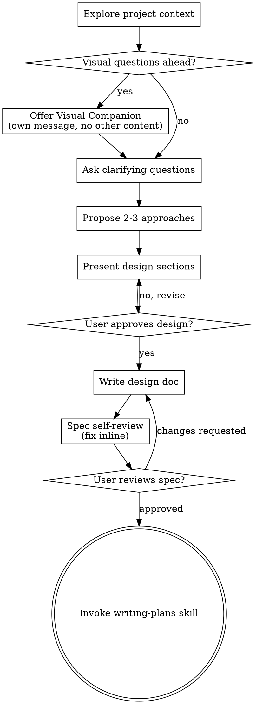
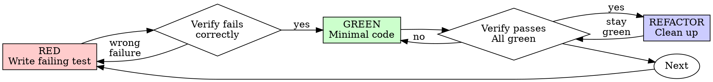

<!-- Generated by SpecStory, Markdown v2.1.0 -->

# 2026-05-07 09:51:24Z

<!-- Codex CLI Session 019e01d9-2a8f-7a60-8755-384b1c4cd4e0 (2026-05-07 09:51:24Z) -->

_**User (2026-05-07 09:51:24Z)**_

https://github.com/Emanuele-web04/remodex 你看这个项目对比我们这个项目 我继续用我们的，还是用这个项目 哪个更好


---

_**Agent (gpt-5.5 2026-05-07 09:51:37Z)**_

我先�时看两边：本地 `CodexMobile` 的�际代�/�动方�，�抓一下 `remodex` 的 README�技术栈和活跃度。这个判断��到“你�下�维护�本和�用性�上，光看 GitHub 简介容易误判。

_**Agent (gpt-5.5 2026-05-07 09:51:37Z)**_

<tool-use data-tool-type="shell" data-tool-name="exec_command"><details>
<summary>Tool use: **exec_command** `rg -n "CodexMobile|skill|pair|�动|�对|README|remodex" /Users/xiayanghui/.codex/memories/MEMORY.md`</summary>
```
Chunk ID: ef38d6
Wall time: 0.0000 seconds
Process exited with code 0
Original token count: 10952
Output:
Total output lines: 162

1:# Task Group: CodexMobile / composer �件�skill ���自动标题� mobile-desktop 线程�步
3:scope: `CodexMobile` 手机端 composer �件�repo-local skill ������快速�对�线程标题生��mobile/desktop 线程��性�模�版本对�；适用�这个 repo 的 live ��端�调�app-server 行为核验和本机 `codex` 版本�查，�适用�泛化移动端产�设计。
4:applies_to: cwd=/Users/xiayanghui/编程项目/CodexMobile; reuse_rule=适��用到这个 `CodexMobile` 仓库里� composer�`/api/status`�`thread/*` app-server 能力�本地 Node �务�README 功能�径和 terminal `codex` 版本有关的任务；具体端��running process�模�列表和代�结�都�按当� checkout/live server �验
6:## Task 1: 给 mobile composer 加 skill 选择，并修�“按钮无法点击�的�行�错�
10:- rollout_summaries/2026-05-05T00-12-41-rXsC-codexmobile_skill_picker_and_remove_voice_controls.md (cwd=/Users/xiayanghui/编程项目/CodexMobile, rollout_path=/Users/xiayanghui/.codex/sessions/2026/05/05/rollout-2026-05-05T08-12-41-019df57a-d854-73d1-8bec-a9d15f8453c2.jsonl, updated_at=2026-05-05T00:25:11+00:00, thread_id=019df57a-d854-73d1-8bec-a9d15f8453c2, added skill discovery and mobile picker, then proved the first disabled state came from an older live backend on port 3321)
14:- CodexMobile, skill picker, composer, /api/status, localStorage, buildCodexTurnInput, type: skill, lsof, port 3321, port 3331, readCodexSkills
20:- rollout_summaries/2026-05-05T00-12-41-rXsC-codexmobile_skill_picker_and_remove_voice_controls.md (cwd=/Users/xiayanghui/编程项目/CodexMobile, rollout_path=/Users/xiayanghui/.codex/sessions/2026/05/05/rollout-2026-05-05T08-12-41-019df57a-d854-73d1-8bec-a9d15f8453c2.jsonl, updated_at=2026-05-05T00:25:11+00:00, thread_id=019df57a-d854-73d1-8bec-a9d15f8453c2, removed the in-app voice/dialog entry points and updated docs to match the native-keyboard voice preference)
24:- CodexMobile, voice-dialog, microphone button, dialog button, VoiceDialogPanel, native keyboard voice path, README.md, npm run build, restart 3321
30:- rollout_summaries/2026-05-05T11-35-49-5GrC-codexmobile_auto_thread_title_hook_gpt_5_4_mini.md (cwd=/Users/xiayanghui/编程项目/CodexMobile, rollout_path=/Users/xiayanghui/.codex/sessions/2026/05/05/rollout-2026-05-05T19-35-49-019df7ec-42b4-7602-94d6-e06d2430e6c0.jsonl, updated_at=2026-05-05T12:01:30+00:00, thread_id=019df7ec-42b4-7602-94d6-e06d2430e6c0, traced `name`/`preview` fallback and added async auto-title writeback for new draft sessions)
40:- rollout_summaries/2026-05-05T19-24-27-hq5w-codexmobile_mobile_sync_model_cli_and_image_dup_fixes.md (cwd=/Users/xiayanghui/编程项目/CodexMobile, rollout_path=/Users/xiayanghui/.codex/sessions/2026/05/06/rollout-2026-05-06T03-24-27-019df999-4f02-70f1-9d0f-895fb3098ee6.jsonl, updated_at=2026-05-06T12:33:22+00:00, thread_id=019df999-4f02-70f1-9d0f-895fb3098ee6, aligned archive semantics with desktop, fixed the `Trash2` white-screen regression, upgraded the terminal `codex` CLI, and removed duplicate uploaded-image rendering)
46:## Task 5: 新����快速�对 skill，并追 live service 为什么没有立刻加载出�
50:- rollout_summaries/2026-05-05T19-18-01-iLno-codexmobile_reboot_pairing_skill_and_live_skill_refresh.md (cwd=/Users/xiayanghui/编程项目/CodexMobile, rollout_path=/Users/xiayanghui/.codex/sessions/2026/05/06/rollout-2026-05-06T03-18-01-019df993-6bb9-7ff2-99b2-c34ddc737c76.jsonl, updated_at=2026-05-06T02:02:20+00:00, thread_id=019df993-6bb9-7ff2-99b2-c34ddc737c76, added `skills/codex-mobile-pairing`, `npm run pair`, then proved the missing-skill symptom was a live-service refresh problem)
54:- codex-mobile-pairing, npm run pair, /api/status, start:bg, server/codex-config.js, path.join(process.cwd(), 'skills'), fileURLToPath, pairing code, Chinese path, port 3321, live service, skill discovery
58:- when the user asked “�添加一个功能 / 也能选择skill� -> in similar mobile-composer work, treat skill selection as a first-class visible control, not just a hidden backend capability [Task 1]
59:- when the user said “�在这个技能按钮无法点击啊� -> do not stop at source edits; verify the live backend/frontend pair on the active port before concluding the UI is broken [Task 1]
66:- when the user says “�一个codex mobile的skill，方便我电脑����以快速�动�对� -> package reboot/pairing recovery as a one-step repo skill or script, not a loose sequence of shell commands [Task 5]
67:- when the user repeats “这个skill�么没加载出�� -> for missing-skill reports in this repo, debug the live backend and UI refresh path before treating it as a file-authoring bug [Task 5]
71:- `GET /api/status` is the fastest truth sou
... (truncated)
```
</details></tool-use>

_**Agent (gpt-5.5 2026-05-07 09:51:37Z)**_

<tool-use data-tool-type="shell" data-tool-name="exec_command"><details>
<summary>Tool use: **exec_command** `pwd && rg --files -g '!*node_modules*' -g '!*.png' -g '!*.jpg' -g '!*.jpeg' -g '!*.gif' | sed -n '1,160p'`</summary>
```
Chunk ID: 24eaa7
Wall time: 0.0000 seconds
Process exited with code 0
Original token count: 529
Output:
/Users/xiayanghui/编程项目/CodexMobile
client/src/activity-timeline.test.mjs
client/src/api.js
client/src/activity-display.js
client/src/send-state.test.mjs
client/src/activity-dedupe.test.mjs
client/src/session-live-refresh.js
client/src/activity-merge.test.mjs
client/src/App.jsx
client/src/main.jsx
client/src/activity-display.test.mjs
client/src/activity-timeline.js
client/src/send-state.js
client/src/chat-scroll.test.mjs
client/src/activity-merge.js
client/src/styles.css
client/src/activity-dedupe.js
client/src/session-live-refresh.test.mjs
client/src/chat-scroll.js
client/manifest.webmanifest
client/public/icon.svg
client/vite.config.js
client/index.html
.env.example
skills/lark-sheets-fast/SKILL.md
skills/lark-slides-fast/SKILL.md
skills/lark-doc-fast/SKILL.md
skills/lark-drive-fast/SKILL.md
package-lock.json
README.md
package.json
LICENSE
scripts/start-asr.mjs
scripts/start-all.ps1
scripts/start-server.mjs
scripts/install-macos-autostart.mjs
scripts/smoke.mjs
scripts/run-server.mjs
scripts/lark-cli-guard.mjs
scripts/patch-codex-sdk.mjs
asr-service/app.py
asr-service/Dockerfile
asr-service/requirements.txt
shared/session-title.js
shared/session-title.test.mjs
server/chat-service.test.mjs
server/desktop-ipc-client.js
server/static-service.js
server/desktop-ipc-client.test.mjs
server/git-service.js
server/upload-service.js
server/static-service.test.mjs
server/session-title-generator.js
server/codex-app-server.js
server/codex-quota.js
server/codex-native-images.js
server/session-title-generator.test.mjs
server/codex-quota.test.mjs
server/codex-config.js
server/codex-data.js
server/codex-app-server.test.mjs
server/index.js
server/image-generator.js
server/provider-api.js
server/voice-speaker.js
server/auth.js
server/chat-service.js
server/codex-native-images.test.js
server/feishu-skills.js
server/http-utils.js
server/codex-data-desktop-activity.test.mjs
server/codex-runner.js
server/realtime-voice.js
server/mobile-session-index.js
server/voice-transcriber.js
server/upload-service.test.mjs
server/codex-runner-status.test.mjs
server/git-service.test.mjs
server/lark-cli.js
```
</details></tool-use>

_**Agent (gpt-5.5 2026-05-07 09:51:37Z)**_

<tool-use data-tool-type="shell" data-tool-name="exec_command"><details>
<summary>Tool use: **exec_command** `git status --short && git branch --show-current && git log --oneline -5`</summary>
```
Chunk ID: 953c74
Wall time: 0.0000 seconds
Process exited with code 0
Original token count: 115
Output:
 M client/src/App.jsx
 M client/src/session-live-refresh.js
 M client/src/session-live-refresh.test.mjs
 M client/src/styles.css
 M server/index.js
?? server/git-service.js
?? server/git-service.test.mjs
main
ae28561 清�公开仓库本地产物
1d4062f Sync thread rename updates to desktop windows
d89f07f Sync mobile thread archive with desktop threads
3c03b0a 完善移动端活动�� Git �作入�
c05b3d0 Support image attachments in mobile sync
```
</details></tool-use>

_**Agent (gpt-5.5 2026-05-07 09:51:57Z)**_

看下� `remodex` �是一个“网页手机版 Codex�的�类替代，它更�「�生 iOS App + Mac bridge + relay�这一套。你�在这个本地项目则是 PWA/网页�务路线，所以核心差异会�在：安装门槛�远程��稳定性�你已有的定制功能能�能�过�。

_**Agent (gpt-5.5 2026-05-07 09:51:57Z)**_

<tool-use data-tool-type="shell" data-tool-name="exec_command"><details>
<summary>Tool use: **exec_command** `sed -n '1,240p' README.md`</summary>
```
Chunk ID: 20349b
Wall time: 0.0000 seconds
Process exited with code 0
Original token count: 1692
Output:
# CodexMobile

CodexMobile 是一个�� iPhone 的 Codex PWA 客户端。它在电脑上�动一个轻�本地桥��务，通过 Tailscale�局域网或其它�有网络，让手机�以访问并使用这�电脑上的 Codex 项目�会�和模�能力。

这个项目适�个人使用：你�以在 iPhone 主�� App 一样打开它，切� Codex 项目�查看线程���文字消��上传文件，并在手机上�收 Codex 的�时��和执行状�。

> 本项目�是公网 SaaS�多人�制�或远程桌�工具。建议�在�信�有网络中使用。

## 界�演示

| 项目抽屉 | 对��模�选择 | 移动端执行状� |
| --- | --- | --- |
|  |  |  |

## 功能特性

- iPhone 优先的 PWA 界�，�添加到 iOS 主�
- 读�本机 Codex 项目和会�，支�项目切��线程展开��命�和删除
- 新建对��续�已有线程，并通过 WebSocket 显示�时状�
- 支���模��模�选择���强度选择和 skill 选择
- 支�图片/文件上传，文件�存在本机并将路径交给 Codex 使用
- 支��书文档�PPT�表格和云空间�作：通过本机 `lark-cli` ��，以用户身份创建�读�和修改
- 移动端任务进度更简�：�显示创建文档�读�表格�验�结�等关键过程，��命令生命周期噪音
- 支�本地 SenseVoice/FunASR 中文语音识别�务
- 支�生�图片并在移动端展示
- 支� CLIProxyAPI Codex �度查询
- 支�浅色/深色主题
- 支�一次性�对�和本机设备 token，适��有网络访问

## ��

```text
iPhone PWA
  |
  | HTTPS / WebSocket，建议走 Tailscale 或局域网
  v
CodexMobile Node.js �务
  |-- 读� ~/.codex/config.toml
  |-- 读� ~/.codex/sessions
  |-- 调用 @openai/codex-sdk ��和续�
  |-- 调用 OpenAI 兼容��生�图片
  |-- 调用本地 SenseVoice ASR 或 OpenAI 兼容转写��
  |-- �选调用本机 lark-cli �作�书文档�PPT�表格和云空间
  |-- �选调用 CLIProxyAPI 管���查询 Codex �度
```

## �境�求

- Node.js 20+
- npm
- 已�置好的本机 Codex �境，默认读� `~/.codex`
- 手机和电脑在�一�有网络中，例如 Tailscale 或局域网
- �选：Docker Desktop，用�本地 SenseVoice 语音识别
- �选：CLIProxyAPI，用� OpenAI 兼容路由�图片生�或�度查询

## 快速开始

```powershell
git clone https://github.com/RNG2018-mlxg/CodexMobile.git
cd CodexMobile
npm install
npm run build
npm start
```

�动�在电脑�览器打开：

```text
http://127.0.0.1:3321
```

手机访问时，建议先把电脑和 iPhone �入 Tailscale 或�一个局域网，然�打开：

```text
http://<电脑的�网 IP>:3321
```

第一次进入需�输入�务�动时打�的 6 ��对�。�对�功�，�览器会�存设备 token，�续�需��次�新输入。

## HTTPS � iOS 语音��

iOS Safari / PWA 通常�求 HTTPS �能稳定使用麦克�。你�以使用自己的�书���代�，或 Tailscale Serve 暴露 HTTPS 地�。

示例：

```powershell
$env:CODEXMOBILE_PUBLIC_URL="https://<your-device>.<your-tailnet>.ts.net:3443/"
npm run start:env
```

如�你使用自签��书，�以通过�境��指定：

```powershell
$env:HTTPS_PFX_PATH="C:\path\to\server.pfx"
$env:HTTPS_PFX_PASSPHRASE="change-me"
$env:HTTPS_ROOT_CA_PATH="C:\path\to\root-ca.cer"
npm run start:env
```

## �置

�制示例�置：

```powershell
Copy-Item .env.example .env
npm run start:env
```

常用�置项：

- `HOST`：�务监�地�，默认 `0.0.0.0`
- `PORT`：HTTP 端�，默认 `3321`
- `HTTPS_PORT`：HTTPS 端�，默认 `3443`
- `CODEXMOBILE_PUBLIC_URL`：手机访问用的公开�网地�
- `CODEXMOBILE_PAIRING_CODE`：�选固定 6 ��对�；�设置则�动时�机生�
- `CODEX_HOME`：Codex �置目录，默认 `~/.codex`
- `CODEXMOBILE_HOME`：CodexMobile 本地状�目录，默认 `.codexmobile/state`
- `CODEXMOBILE_FEISHU_APP_ID` / `CODEXMOBILE_FEISHU_APP_SECRET`：�选�书应用凭�，用� `lark-cli` 文档集�
- `LARK_APP_ID` / `LARK_APP_SECRET`：�选�书凭�别�，供 `lark-cli` 和 Codex �进程读�
- `CLIPROXYAPI_CONFIG`：CLIProxyAPI �置文件路径
- `CLIPROXYAPI_API_KEY` / `CLI_PROXY_API_KEY`：OpenAI 兼容��密钥
- `CODEXMOBILE_CLIPROXY_MANAGEMENT_URL`：CLIProxyAPI 管���地�
- `CODEXMOBILE_CLIPROXY_MANAGEMENT_KEY`：CLIProxyAPI 管�密钥

ä¸�è¦�æ��交 `.env`ã€�`.codexmobile`ã€�è¯�书ã€�日志ã€�ä¸
... (truncated)
```
</details></tool-use>

_**Agent (gpt-5.5 2026-05-07 09:51:57Z)**_

<tool-use data-tool-type="shell" data-tool-name="exec_command"><details>
<summary>Tool use: **exec_command** `node -e "const p=require('./package.json'); console.log(JSON.stringify({scripts:p.scripts, dependencies:p.dependencies, devDependencies:p.devDependencies}, null, 2))"`</summary>
```
Chunk ID: aaec4a
Wall time: 0.0000 seconds
Process exited with code 0
Original token count: 243
Output:
{
  "scripts": {
    "dev:server": "node server/index.js",
    "dev:client": "vite --host 0.0.0.0 --config client/vite.config.js",
    "build": "vite build --config client/vite.config.js",
    "start": "node server/index.js",
    "start:env": "node --env-file=.env server/index.js",
    "start:bg": "node scripts/start-server.mjs",
    "mac:autostart": "node scripts/install-macos-autostart.mjs",
    "mac:autostart:remove": "node scripts/install-macos-autostart.mjs --uninstall",
    "asr:start": "node scripts/start-asr.mjs",
    "postinstall": "node scripts/patch-codex-sdk.mjs",
    "smoke": "node scripts/smoke.mjs"
  },
  "dependencies": {
    "@openai/codex-sdk": "^0.128.0",
    "@vitejs/plugin-react": "^4.6.0",
    "lucide-react": "^0.515.0",
    "opencc-js": "^1.0.5",
    "react": "^18.2.0",
    "react-dom": "^18.2.0",
    "react-markdown": "^10.1.0",
    "remark-breaks": "^4.0.0",
    "remark-gfm": "^4.0.1",
    "vite": "^7.0.4",
    "ws": "^8.14.2"
  }
}
```
</details></tool-use>

_**Agent (gpt-5.5 2026-05-07 09:51:57Z)**_

<tool-use data-tool-type="shell" data-tool-name="exec_command"><details>
<summary>Tool use: **exec_command** `curl -s https://api.github.com/repos/Emanuele-web04/remodex | node -e "let d='';process.stdin.on('data',c=>d+=c);process.stdin.on('end',()=>{const r=JSON.parse(d); console.log(JSON.stringify({full_name:r.full_name, description:r.description, stars:r.stargazers_count, forks:r.forks_count, open_issues:r.open_issues_count, pushed_at:r.pushed_at, updated_at:r.updated_at, created_at:r.created_at, license:r.license&&r.license.spdx_id, default_branch:r.default_branch, language:r.language}, null, 2));})"`</summary>
```
Chunk ID: 436407
Wall time: 0.6989 seconds
Process exited with code 0
Original token count: 86
Output:
{
  "full_name": "Emanuele-web04/remodex",
  "description": "Remote Control for Codex.",
  "stars": 2831,
  "forks": 291,
  "open_issues": 41,
  "pushed_at": "2026-05-07T00:28:18Z",
  "updated_at": "2026-05-07T09:27:31Z",
  "created_at": "2026-03-07T19:28:35Z",
  "license": "Apache-2.0",
  "default_branch": "main",
  "language": "Swift"
}
```
</details></tool-use>

_**Agent (gpt-5.5 2026-05-07 09:51:57Z)**_

<tool-use data-tool-type="shell" data-tool-name="exec_command"><details>
<summary>Tool use: **exec_command** `curl -s https://api.github.com/repos/Emanuele-web04/remodex/contents/package.json?ref=main | node -e "let d='';process.stdin.on('data',c=>d+=c);process.stdin.on('end',()=>{const r=JSON.parse(d); const p=JSON.parse(Buffer.from(r.content,'base64').toString()); console.log(JSON.stringify({name:p.name, version:p.version, scripts:p.scripts, dependencies:p.dependencies, devDependencies:p.devDependencies}, null, 2));})"`</summary>
```
Chunk ID: 1e20a8
Wall time: 0.0000 seconds
Process exited with code 1
Original token count: 112
Output:
zsh:1: no matches found: https://api.github.com/repos/Emanuele-web04/remodex/contents/package.json?ref=main
<anonymous_script>:1


SyntaxError: Unexpected end of JSON input
    at JSON.parse (<anonymous>)
    at Socket.<anonymous> ([eval]:1:84)
    at Socket.emit (node:events:531:35)
    at endReadableNT (node:internal/streams/readable:1698:12)
    at process.processTicksAndRejections (node:internal/process/task_queues:90:21)

Node.js v22.22.0
```
</details></tool-use>

_**Agent (gpt-5.5 2026-05-07 09:52:11Z)**_

<tool-use data-tool-type="shell" data-tool-name="exec_command"><details>
<summary>Tool use: **exec_command** `curl -s 'https://api.github.com/repos/Emanuele-web04/remodex/contents/phodex-bridge/package.json?ref=main' | node -e "let d='';process.stdin.on('data',c=>d+=c);process.stdin.on('end',()=>{const r=JSON.parse(d); const p=JSON.parse(Buffer.from(r.content,'base64').toString()); console.log(JSON.stringify({name:p.name, version:p.version, bin:p.bin, scripts:p.scripts, dependencies:p.dependencies, devDependencies:p.devDependencies}, null, 2));})"`</summary>
```
Chunk ID: cf68d7
Wall time: 0.8993 seconds
Process exited with code 0
Original token count: 115
Output:
{
  "name": "remodex",
  "version": "1.5.0",
  "bin": {
    "remodex": "./bin/remodex.js"
  },
  "scripts": {
    "start": "node ./bin/remodex.js up",
    "test": "node --test ./test/*.test.js",
    "postinstall": "node ./src/bootstrap-codex-cli.js",
    "prepack": "node ./scripts/prepare-private-defaults.js",
    "postpack": "node ./scripts/cleanup-private-defaults.js"
  },
  "dependencies": {
    "qrcode-terminal": "^0.12.0",
    "ws": "^8.19.0"
  }
}
```
</details></tool-use>

_**Agent (gpt-5.5 2026-05-07 09:52:11Z)**_

<tool-use data-tool-type="shell" data-tool-name="exec_command"><details>
<summary>Tool use: **exec_command** `curl -s 'https://api.github.com/repos/Emanuele-web04/remodex/languages'`</summary>
```
Chunk ID: 457f17
Wall time: 0.8336 seconds
Process exited with code 0
Original token count: 22
Output:
{
  "Swift": 3750644,
  "JavaScript": 874294,
  "Shell": 19347,
  "AppleScript": 3734
}
```
</details></tool-use>

_**Agent (gpt-5.5 2026-05-07 09:52:11Z)**_

<tool-use data-tool-type="shell" data-tool-name="exec_command"><details>
<summary>Tool use: **exec_command** `curl -s 'https://api.github.com/repos/Emanuele-web04/remodex/contents/CodexMobile/CodexMobile/Views?ref=main' | node -e "let d='';process.stdin.on('data',c=>d+=c);process.stdin.on('end',()=>{const arr=JSON.parse(d); console.log(arr.map(x=>x.name).join('\n'));})"`</summary>
```
Chunk ID: 81f76c
Wall time: 0.8667 seconds
Process exited with code 0
Original token count: 46
Output:
AboutRemodexView.swift
Home
Onboarding
OpenSourceBadge.swift
Payments
Pet
QRScannerPairingValidator.swift
QRScannerView.swift
SettingsView.swift
Shared
Sidebar
SidebarView.swift
Turn
```
</details></tool-use>

_**Agent (gpt-5.5 2026-05-07 09:52:11Z)**_

<tool-use data-tool-type="shell" data-tool-name="exec_command"><details>
<summary>Tool use: **exec_command** `find . -maxdepth 2 -type f \( -name '*.png' -o -name '*.jpg' -o -name '*.jpeg' -o -name '*.svg' \) | sed -n '1,80p'`</summary>
```
Chunk ID: 9baf45
Wall time: 0.0000 seconds
Process exited with code 0
Original token count: 8
Output:
./codexmobile-3321-restored.png
```
</details></tool-use>

_**Agent (gpt-5.5 2026-05-07 09:52:25Z)**_

还有一个关键点：你本地项目�在已�有�少“按你工作�长出��的东西，比如 skill 选择��书 skill�图片生���度查询�ASR�本地�对脚本。`remodex` 的星标和�生体验更强，但�过��是�壳，很多定制���。

_**Agent (gpt-5.5 2026-05-07 09:52:25Z)**_

<tool-use data-tool-type="shell" data-tool-name="exec_command"><details>
<summary>Tool use: **exec_command** `rg -n "skill|lark|Feishu|�书|image|quota|�度|asr|voice|git|branch|commit|push|pair|�对|model|reasoning" client/src server shared scripts README.md | sed -n '1,220p'`</summary>
```
Chunk ID: 847498
Wall time: 0.0000 seconds
Process exited with code 0
Original token count: 5077
Output:
README.md:13:|  |  |  |
README.md:20:- 支���模��模�选择���强度选择和 skill 选择
README.md:22:- 支��书文档�PPT�表格和云空间�作：通过本机 `lark-cli` ��，以用户身份创建�读�和修改
README.md:26:- 支� CLIProxyAPI Codex �度查询
README.md:28:- 支�一次性�对�和本机设备 token，适��有网络访问
README.md:43:  |-- �选调用本机 lark-cli �作�书文档�PPT�表格和云空间
README.md:44:  |-- �选调用 CLIProxyAPI 管���查询 Codex �度
README.md:54:- �选：CLIProxyAPI，用� OpenAI 兼容路由�图片生�或�度查询
README.md:59:git clone https://github.com/RNG2018-mlxg/CodexMobile.git
README.md:78:第一次进入需�输入�务�动时打�的 6 ��对�。�对�功�，�览器会�存设备 token，�续�需��次�新输入。
README.md:115:- `CODEXMOBILE_PAIRING_CODE`：�选固定 6 ��对�；�设置则�动时�机生�
README.md:118:- `CODEXMOBILE_FEISHU_APP_ID` / `CODEXMOBILE_FEISHU_APP_SECRET`：�选�书应用凭�，用� `lark-cli` 文档集�
README.md:119:- `LARK_APP_ID` / `LARK_APP_SECRET`：�选�书凭�别�，供 `lark-cli` 和 Codex �进程读�
README.md:140:## CLIProxyAPI �度查询
README.md:142:如�本机�置了 CLIProxyAPI 管���，CodexMobile �以在 iPhone 抽屉中查询 Codex �度。
README.md:158:- `npm run asr:start`：�建并�动本地 SenseVoice ASR Docker 容器
README.md:168:4. 第一次访问时输入�对�。
README.md:175:- �对 token 存储在 `.codexmobile/state`
README.md:178:- `.gitignore` 已�除 `.env`�`.codexmobile`��书�日志��建产物和�赖目录
scripts/start-all.ps1:44:  npm run asr:start
scripts/start-all.ps1:46:    Write-Warning "SenseVoice ASR did not start. Text chat can still work, but voice input may fail."
scripts/start-all.ps1:49:  Write-Warning "Docker is not ready. Text chat can still work, but voice input may fail."
scripts/smoke.mjs:10:  console.log(`Smoke ok: ${data.hostName} ${data.provider}/${data.model} synced=${data.syncedAt}`);
scripts/start-asr.mjs:6:const serviceDir = path.join(root, 'asr-service');
scripts/start-asr.mjs:7:const cacheDir = path.join(root, '.codexmobile', 'model-cache');
scripts/start-asr.mjs:8:const containerName = process.env.CODEXMOBILE_ASR_CONTAINER || 'codexmobile-sensevoice-asr';
scripts/start-asr.mjs:9:const legacyContainerName = process.env.CODEXMOBILE_ASR_LEGACY_CONTAINER || 'codexmobile-asr';
scripts/start-asr.mjs:10:const image = process.env.CODEXMOBILE_ASR_IMAGE || 'codexmobile-sensevoice-asr:latest';
scripts/start-asr.mjs:12:const model = process.env.CODEXMOBILE_TRANSCRIBE_MODEL || 'iic/SenseVoiceSmall';
scripts/start-asr.mjs:47:    console.error('Docker is not running. Start Docker Desktop, then run npm run asr:start again.');
scripts/start-asr.mjs:53:function imageExists() {
scripts/start-asr.mjs:54:  const result = docker(['image', 'inspect', image]);
scripts/start-asr.mjs:92:  if (imageExists() && !rebuild) {
scripts/start-asr.mjs:95:  console.log(`Building SenseVoice ASR image: ${image}`);
scripts/start-asr.mjs:96:  const result = docker(['build', '--tag', image, serviceDir], {
scripts/start-asr.mjs:101:    console.error('Failed to build SenseVoice ASR image.');
scripts/start-asr.mjs:136:    `${cacheDir.replace(/\\/g, '/')}:/models`,
scripts/start-asr.mjs:138:    `SENSEVOICE_MODEL=${model}`,
scripts/start-asr.mjs:145:    image
scripts/start-asr.mjs:195:console.log(`Model: ${model}`);
scripts/start-asr.mjs:202:  console.log('SenseVoice ASR is starting or downloading the model. This can take several minutes the first time.');
scripts/lark-cli-guard.mjs:7:const realCli = process.env.CODEXMOBILE_REAL_LARK_CLI || 'lark-cli';
scripts/lark-cli-guard.mjs:72:      message: `This turn already ran slides +create for "${title}". Do not create another PPT. Reuse the previous xml_presentation_id and repair/append pages on the same presentation.`,
scripts/lark-cli-guard.mjs:79:      nextStep: 'Run lark-cli slides xml_presentations get, then use xml_presentation.slide.create or +replace-slide on the existing PPT.'
scripts/lark-cli-guard.mjs:117:function larkCliSpawnCommand() {
scripts/lark-cli-guard.mjs:138:  const stateFile = path.join(stateDir, 'lark-slides-create-guard.json');
scripts/lark-cli-guard.mjs:143:  const cli = larkCliSpawnCommand();
scripts/lark-cli-guard.mjs:177:      process.stderr.write(`[codexmobile-lark-guard] failed to record state: ${error.message}\n`);
server/chat-service.test.mjs:8:    imagePromptState: '/tmp/codexmobil
... (truncated)
```
</details></tool-use>

_**Agent (gpt-5.5 2026-05-07 09:52:25Z)**_

<tool-use data-tool-type="shell" data-tool-name="exec_command"><details>
<summary>Tool use: **exec_command** `npm test -- --help 2>/dev/null || true && find . -name '*test*' -type f | wc -l`</summary>
```
Chunk ID: 12fb0f
Wall time: 0.5114 seconds
Process exited with code 0
Original token count: 3
Output:
      37
```
</details></tool-use>

_**Agent (gpt-5.5 2026-05-07 09:52:25Z)**_

<tool-use data-tool-type="shell" data-tool-name="exec_command"><details>
<summary>Tool use: **exec_command** `curl -s 'https://api.github.com/repos/Emanuele-web04/remodex/commits?per_page=5' | node -e "let d='';process.stdin.on('data',c=>d+=c);process.stdin.on('end',()=>{const arr=JSON.parse(d); for (const c of arr) console.log(c.sha.slice(0,7), c.commit.author.date, c.commit.message.split('\n')[0]);})"`</summary>
```
Chunk ID: 385ab9
Wall time: 0.7807 seconds
Process exited with code 0
Original token count: 88
Output:
4bf799f 2026-05-04T22:14:09Z Include CLI version in feedback email
287f07e 2026-05-04T22:09:23Z Add dismissible error report card to turn timeline
207d5da 2026-05-04T22:03:17Z Show loading state for newly sent turns
160d697 2026-05-04T21:55:05Z Add beta badge to Companion Pet toggle
4a9306d 2026-05-04T21:50:33Z Add Remodex CLI v1.5.0 to What's New
```
</details></tool-use>

_**Agent (gpt-5.5 2026-05-07 09:52:25Z)**_

<tool-use data-tool-type="shell" data-tool-name="exec_command"><details>
<summary>Tool use: **exec_command** `curl -s 'https://api.github.com/repos/Emanuele-web04/remodex/contents/phodex-bridge/src?ref=main' | node -e "let d='';process.stdin.on('data',c=>d+=c);process.stdin.on('end',()=>{const arr=JSON.parse(d); console.log(arr.map(x=>x.name).join('\n'));})"`</summary>
```
Chunk ID: 1fd4dd
Wall time: 0.8281 seconds
Process exited with code 0
Original token count: 166
Output:
account-status.js
bootstrap-codex-cli.js
bridge.js
codex-cli-bootstrap.js
codex-desktop-refresher.js
codex-home.js
codex-transport.js
daemon-state.js
desktop-handler.js
desktop-ipc-action-follower.js
git-handler.js
index.js
ios-app-compatibility.js
macos-launch-agent.js
notifications-handler.js
package-version-status.js
pet-handler.js
project-handler.js
push-notification-completion-dedupe.js
push-notification-service-client.js
push-notification-tracker.js
qr.js
rollout-live-mirror.js
rollout-watch.js
scripts
secure-device-state.js
secure-transport.js
session-state.js
thread-context-handler.js
voice-handler.js
workspace-checkpoints.js
workspace-handler.js
```
</details></tool-use>

_**Agent (gpt-5.5 2026-05-07 09:52:48Z)**_

<tool-use data-tool-type="shell" data-tool-name="exec_command"><details>
<summary>Tool use: **exec_command** `nl -ba README.md | sed -n '1,190p'`</summary>
```
Chunk ID: ff274e
Wall time: 0.0000 seconds
Process exited with code 0
Original token count: 2014
Output:
     1	# CodexMobile
     2	
     3	CodexMobile 是一个�� iPhone 的 Codex PWA 客户端。它在电脑上�动一个轻�本地桥��务，通过 Tailscale�局域网或其它�有网络，让手机�以访问并使用这�电脑上的 Codex 项目�会�和模�能力。
     4	
     5	这个项目适�个人使用：你�以在 iPhone 主�� App 一样打开它，切� Codex 项目�查看线程���文字消��上传文件，并在手机上�收 Codex 的�时��和执行状�。
     6	
     7	> 本项目�是公网 SaaS�多人�制�或远程桌�工具。建议�在�信�有网络中使用。
     8	
     9	## 界�演示
    10	
    11	| 项目抽屉 | 对��模�选择 | 移动端执行状� |
    12	| --- | --- | --- |
    13	|  |  |  |
    14	
    15	## 功能特性
    16	
    17	- iPhone 优先的 PWA 界�，�添加到 iOS 主�
    18	- 读�本机 Codex 项目和会�，支�项目切��线程展开��命�和删除
    19	- 新建对��续�已有线程，并通过 WebSocket 显示�时状�
    20	- 支���模��模�选择���强度选择和 skill 选择
    21	- 支�图片/文件上传，文件�存在本机并将路径交给 Codex 使用
    22	- 支��书文档�PPT�表格和云空间�作：通过本机 `lark-cli` ��，以用户身份创建�读�和修改
    23	- 移动端任务进度更简�：�显示创建文档�读�表格�验�结�等关键过程，��命令生命周期噪音
    24	- 支�本地 SenseVoice/FunASR 中文语音识别�务
    25	- 支�生�图片并在移动端展示
    26	- 支� CLIProxyAPI Codex �度查询
    27	- 支�浅色/深色主题
    28	- 支�一次性�对�和本机设备 token，适��有网络访问
    29	
    30	## ��
    31	
    32	```text
    33	iPhone PWA
    34	  |
    35	  | HTTPS / WebSocket，建议走 Tailscale 或局域网
    36	  v
    37	CodexMobile Node.js �务
    38	  |-- 读� ~/.codex/config.toml
    39	  |-- 读� ~/.codex/sessions
    40	  |-- 调用 @openai/codex-sdk ��和续�
    41	  |-- 调用 OpenAI 兼容��生�图片
    42	  |-- 调用本地 SenseVoice ASR 或 OpenAI 兼容转写��
    43	  |-- �选调用本机 lark-cli �作�书文档�PPT�表格和云空间
    44	  |-- �选调用 CLIProxyAPI 管���查询 Codex �度
    45	```
    46	
    47	## �境�求
    48	
    49	- Node.js 20+
    50	- npm
    51	- 已�置好的本机 Codex �境，默认读� `~/.codex`
    52	- 手机和电脑在�一�有网络中，例如 Tailscale 或局域网
    53	- �选：Docker Desktop，用�本地 SenseVoice 语音识别
    54	- �选：CLIProxyAPI，用� OpenAI 兼容路由�图片生�或�度查询
    55	
    56	## 快速开始
    57	
    58	```powershell
    59	git clone https://github.com/RNG2018-mlxg/CodexMobile.git
    60	cd CodexMobile
    61	npm install
    62	npm run build
    63	npm start
    64	```
    65	
    66	�动�在电脑�览器打开：
    67	
    68	```text
    69	http://127.0.0.1:3321
    70	```
    71	
    72	手机访问时，建议先把电脑和 iPhone �入 Tailscale 或�一个局域网，然�打开：
    73	
    74	```text
    75	http://<电脑的�网 IP>:3321
    76	```
    77	
    78	第一次进入需�输入�务�动时打�的 6 ��对�。�对�功�，�览器会�存设备 token，�续�需��次�新输入。
    79	
    80	## HTTPS � iOS 语音��
    81	
    82	iOS Safari / PWA 通常�求 HTTPS �能稳定使用麦克�。你�以使用自己的�书���代�，或 Tailscale Serve 暴露 HTTPS 地�。
    83	
    84	示例：
    85	
    86	```powershell
    87	$env:CODEXMOBILE_PUBLIC_URL="https://<your-device>.<your-tailnet>.ts.net:3443/"
    88	npm run start:env
    89	```
    90	
    91	如�你使用自签��书，�以通过�境��指定：
    92	
    93	```powershell
    94	$env:HTTPS_PFX_PATH="C:\path\to\server.pfx"
    95	$env:HTTPS_PFX_PASSPHRASE="change-me"
    96	$env:HTTPS_ROOT_CA_PATH="C:\path\to\root-ca.cer"
    97	npm run start:env
    98	```
    99	
   100	## �置
   101	
   102	�制示例�置：
   103	
   104	```powershell
   105	Copy-Item .env.example .env
   106	npm run start:env
   107	```
   108	
   109	常用�置项：
   110	
   111	- `HOST`：�务监�地�，默认 `0.0.0.0`
   112	- `PORT`：HTTP 端�，默认 `3321`
   113	- `HTTPS_PORT`：HTTPS 端�，默认 `3443`
   114	- `CODEXMOBILE_PUBLIC_URL`：手机访问用的公开ç§�网地å
... (truncated)
```
</details></tool-use>

_**Agent (gpt-5.5 2026-05-07 09:52:48Z)**_

<tool-use data-tool-type="shell" data-tool-name="exec_command"><details>
<summary>Tool use: **exec_command** `nl -ba package.json | sed -n '1,90p'`</summary>
```
Chunk ID: 9c2a91
Wall time: 0.0000 seconds
Process exited with code 0
Original token count: 347
Output:
     1	{
     2	  "name": "codexmobile",
     3	  "version": "0.1.0",
     4	  "description": "iPhone-first PWA bridge for using a local Codex setup over a private network.",
     5	  "license": "MIT",
     6	  "type": "module",
     7	  "scripts": {
     8	    "dev:server": "node server/index.js",
     9	    "dev:client": "vite --host 0.0.0.0 --config client/vite.config.js",
    10	    "build": "vite build --config client/vite.config.js",
    11	    "start": "node server/index.js",
    12	    "start:env": "node --env-file=.env server/index.js",
    13	    "start:bg": "node scripts/start-server.mjs",
    14	    "mac:autostart": "node scripts/install-macos-autostart.mjs",
    15	    "mac:autostart:remove": "node scripts/install-macos-autostart.mjs --uninstall",
    16	    "asr:start": "node scripts/start-asr.mjs",
    17	    "postinstall": "node scripts/patch-codex-sdk.mjs",
    18	    "smoke": "node scripts/smoke.mjs"
    19	  },
    20	  "dependencies": {
    21	    "@openai/codex-sdk": "^0.128.0",
    22	    "@vitejs/plugin-react": "^4.6.0",
    23	    "lucide-react": "^0.515.0",
    24	    "opencc-js": "^1.0.5",
    25	    "react": "^18.2.0",
    26	    "react-dom": "^18.2.0",
    27	    "react-markdown": "^10.1.0",
    28	    "remark-breaks": "^4.0.0",
    29	    "remark-gfm": "^4.0.1",
    30	    "vite": "^7.0.4",
    31	    "ws": "^8.14.2"
    32	  }
    33	}
```
</details></tool-use>

_**Agent (gpt-5.5 2026-05-07 09:52:48Z)**_

<tool-use data-tool-type="shell" data-tool-name="exec_command"><details>
<summary>Tool use: **exec_command** `nl -ba server/git-service.js | sed -n '1,220p'`</summary>
```
Chunk ID: ea5cd9
Wall time: 0.0000 seconds
Process exited with code 0
Original token count: 1925
Output:
     1	import { execFile } from 'node:child_process';
     2	import { promisify } from 'node:util';
     3	
     4	const execFileAsync = promisify(execFile);
     5	const DEFAULT_TIMEOUT_MS = 30_000;
     6	const MAX_GIT_OUTPUT = 1024 * 1024;
     7	
     8	function serviceError(message, statusCode = 500) {
     9	  const error = new Error(message);
    10	  error.statusCode = statusCode;
    11	  return error;
    12	}
    13	
    14	function basenameWithoutExtension(filePath = '') {
    15	  const name = String(filePath || '').split('/').filter(Boolean).pop() || 'changes';
    16	  return name.replace(/\.[^.]+$/, '') || name;
    17	}
    18	
    19	function titleWord(value = '') {
    20	  const base = basenameWithoutExtension(value);
    21	  return base
    22	    .replace(/[-_]+/g, ' ')
    23	    .replace(/\s+/g, ' ')
    24	    .trim()
    25	    .split(' ')
    26	    .filter(Boolean)
    27	    .slice(0, 2)
    28	    .join(' ') || 'changes';
    29	}
    30	
    31	function gitError(error, fallback = 'Git �作失败') {
    32	  const message = String(error?.stderr || error?.stdout || error?.message || fallback).trim();
    33	  const wrapped = serviceError(message || fallback, 500);
    34	  wrapped.cause = error;
    35	  return wrapped;
    36	}
    37	
    38	async function runGit(cwd, args, { timeoutMs = DEFAULT_TIMEOUT_MS } = {}) {
    39	  try {
    40	    const result = await execFileAsync('git', args, {
    41	      cwd,
    42	      timeout: timeoutMs,
    43	      maxBuffer: MAX_GIT_OUTPUT,
    44	      env: process.env
    45	    });
    46	    return {
    47	      stdout: String(result.stdout || ''),
    48	      stderr: String(result.stderr || '')
    49	    };
    50	  } catch (error) {
    51	    throw gitError(error);
    52	  }
    53	}
    54	
    55	export function parseGitStatusShort(output = '') {
    56	  const lines = String(output || '').split(/\r?\n/).filter(Boolean);
    57	  const first = lines[0] || '';
    58	  const branchMatch = first.match(/^##\s+([^.\s]+|\S+?)(?:\.\.\.(\S+))?(?:\s+\[(.+)\])?$/);
    59	  const meta = branchMatch?.[3] || '';
    60	  const ahead = Number(meta.match(/ahead\s+(\d+)/)?.[1] || 0);
    61	  const behind = Number(meta.match(/behind\s+(\d+)/)?.[1] || 0);
    62	  const files = lines
    63	    .filter((line) => !line.startsWith('## '))
    64	    .map((line) => {
    65	      const rawStatus = line.slice(0, 2);
    66	      const rawPath = line.slice(3).trim();
    67	      const renamedPath = rawPath.includes(' -> ') ? rawPath.split(' -> ').pop().trim() : rawPath;
    68	      const status = rawStatus === '??' ? '??' : rawStatus.replace(/\s/g, '') || rawStatus.trim();
    69	      return {
    70	        raw: line,
    71	        status,
    72	        path: renamedPath,
    73	        originalPath: rawPath.includes(' -> ') ? rawPath.split(' -> ')[0].trim() : null
    74	      };
    75	    });
    76	
    77	  return {
    78	    branch: branchMatch?.[1] || null,
    79	    upstream: branchMatch?.[2] || null,
    80	    ahead,
    81	    behind,
    82	    clean: files.length === 0,
    83	    files,
    84	    canCommit: files.length > 0,
    85	    canPush: Boolean(branchMatch?.[1]) && (ahead > 0 || Boolean(branchMatch?.[2]))
    86	  };
    87	}
    88	
    89	export function normalizeBranchName(value = '', prefix = 'codex/') {
    90	  const normalizedPrefix = String(prefix || 'codex/').replace(/^\/+|\/+$/g, '') || 'codex';
    91	  const raw = String(value || '')
    92	    .trim()
    93	    .replace(/^codex\//i, '')
    94	    .replace(/\.\.+/g, ' ')
    95	    .replace(/[^\w/.-]+/g, '-')
    96	    .replace(/\/+/g, '/')
    97	    .replace(/-+/g, '-')
    98	    .replace(/^[./\-_]+|[./\-_]+$/g, '')
    99	    .toLowerCase();
   100	  const leaf = raw || 'git';
   101	  return `${normalizedPrefix}/${leaf}`.replace(/\/+/g, '/');
   102	}
   103	
   104	export function defaultCommitMessage(status = {}) {
   105	  const files = Array.isArray(status.files) ? status.files : [];
   106	  if (!files.length) {
   107	    return '更新项目';
   108	  }
   109	  const names = files.slice(0, 2).map((file) => titleWord(file.path));
   110	  if (files.length === 1) {
   111	    return `æ›´æ–° ${names[0]}`;
   112	  }
   113	  if (files.length === 2) {
   114	    return `更新 ${names[0]} 和 ${names[1]}`;
   115	  }
   116	  return `更新 ${names[0]} 等 ${files.length} 个文件`;
   117	}
   118	
   119	function sanitizeCommitMessage(value = '') {
   120	  const message = String(value || '').replace(/\s+/g, ' ').trim();
   121	  if (!message) {
   122	    throw serviceError('�交信��能为空', 400);
   123	  }
   124	  return message.slice(0, 200);
   125	}
   126	
   127	export function createGitService({ getProject, runner = runGit } = {}) {
   128	  if (typeof getProject !== 'function') {
   129	    throw new Error('c
... (truncated)
```
</details></tool-use>

_**Agent (gpt-5.5 2026-05-07 09:52:48Z)**_

<tool-use data-tool-type="shell" data-tool-name="exec_command"><details>
<summary>Tool use: **exec_command** `nl -ba /Users/xiayanghui/.codex/memories/MEMORY.md | sed -n '1,100p'`</summary>
```
Chunk ID: 35ebc9
Wall time: 0.0000 seconds
Process exited with code 0
Original token count: 3657
Output:
     1	# Task Group: CodexMobile / composer �件�skill ���自动标题� mobile-desktop 线程�步
     2	
     3	scope: `CodexMobile` 手机端 composer �件�repo-local skill ������快速�对�线程标题生��mobile/desktop 线程��性�模�版本对�；适用�这个 repo 的 live ��端�调�app-server 行为核验和本机 `codex` 版本�查，�适用�泛化移动端产�设计。
     4	applies_to: cwd=/Users/xiayanghui/编程项目/CodexMobile; reuse_rule=适��用到这个 `CodexMobile` 仓库里� composer�`/api/status`�`thread/*` app-server 能力�本地 Node �务�README 功能�径和 terminal `codex` 版本有关的任务；具体端��running process�模�列表和代�结�都�按当� checkout/live server �验
     5	
     6	## Task 1: 给 mobile composer 加 skill 选择，并修�“按钮无法点击�的�行�错�
     7	
     8	### rollout_summary_files
     9	
    10	- rollout_summaries/2026-05-05T00-12-41-rXsC-codexmobile_skill_picker_and_remove_voice_controls.md (cwd=/Users/xiayanghui/编程项目/CodexMobile, rollout_path=/Users/xiayanghui/.codex/sessions/2026/05/05/rollout-2026-05-05T08-12-41-019df57a-d854-73d1-8bec-a9d15f8453c2.jsonl, updated_at=2026-05-05T00:25:11+00:00, thread_id=019df57a-d854-73d1-8bec-a9d15f8453c2, added skill discovery and mobile picker, then proved the first disabled state came from an older live backend on port 3321)
    11	
    12	### keywords
    13	
    14	- CodexMobile, skill picker, composer, /api/status, localStorage, buildCodexTurnInput, type: skill, lsof, port 3321, port 3331, readCodexSkills
    15	
    16	## Task 2: 按用户�求移除 app 内 `对�` / `语音输入` 按钮和相关功能
    17	
    18	### rollout_summary_files
    19	
    20	- rollout_summaries/2026-05-05T00-12-41-rXsC-codexmobile_skill_picker_and_remove_voice_controls.md (cwd=/Users/xiayanghui/编程项目/CodexMobile, rollout_path=/Users/xiayanghui/.codex/sessions/2026/05/05/rollout-2026-05-05T08-12-41-019df57a-d854-73d1-8bec-a9d15f8453c2.jsonl, updated_at=2026-05-05T00:25:11+00:00, thread_id=019df57a-d854-73d1-8bec-a9d15f8453c2, removed the in-app voice/dialog entry points and updated docs to match the native-keyboard voice preference)
    21	
    22	### keywords
    23	
    24	- CodexMobile, voice-dialog, microphone button, dialog button, VoiceDialogPanel, native keyboard voice path, README.md, npm run build, restart 3321
    25	
    26	## Task 3: 追 Codex 真�命�链路，并给 draft 线程�入 `gpt-5.4-mini` 自动标题
    27	
    28	### rollout_summary_files
    29	
    30	- rollout_summaries/2026-05-05T11-35-49-5GrC-codexmobile_auto_thread_title_hook_gpt_5_4_mini.md (cwd=/Users/xiayanghui/编程项目/CodexMobile, rollout_path=/Users/xiayanghui/.codex/sessions/2026/05/05/rollout-2026-05-05T19-35-49-019df7ec-42b4-7602-94d6-e06d2430e6c0.jsonl, updated_at=2026-05-05T12:01:30+00:00, thread_id=019df7ec-42b4-7602-94d6-e06d2430e6c0, traced `name`/`preview` fallback and added async auto-title writeback for new draft sessions)
    31	
    32	### keywords
    33	
    34	- thread naming, preview fallback, thread/name/set, gpt-5.4-mini, auto title, session-title, draft session, sanitizeGeneratedTitle, node --test, EADDRINUSE
    35	
    36	## Task 4: 对� mobile/desktop 线程归档语义�修�白�，并�查 `gpt-5.5` / `codex-cli` 版本错�
    37	
    38	### rollout_summary_files
    39	
    40	- rollout_summaries/2026-05-05T19-24-27-hq5w-codexmobile_mobile_sync_model_cli_and_image_dup_fixes.md (cwd=/Users/xiayanghui/编程项目/CodexMobile, rollout_path=/Users/xiayanghui/.codex/sessions/2026/05/06/rollout-2026-05-06T03-24-27-019df999-4f02-70f1-9d0f-895fb3098ee6.jsonl, updated_at=2026-05-06T12:33:22+00:00, thread_id=019df999-4f02-70f1-9d0f-895fb3098ee6, aligned archive semantics with desktop, fixed the `Trash2` white-screen regression, upgraded the terminal `codex` CLI, and removed duplicate uploaded-image rendering)
    41	
    42	### keywords
    43	
    44	- thread/archive, hidden-sessions.json, state_5.sqlite, archived_sessions, gpt-5.5, codex-cli, which -a codex, PATH, nvm, Homebrew, Codex.app, Trash2, refreshCodexCache, attachments, localImage, duplicate image, splitMessageImages
    45	
    46	## Task 5: 新����快速�对 skill，并追 live service 为什么没有立刻加载出�
    47	
    48	### rollout_summary_files
    49	
    50	- rollout_summaries/2026-05-05T19-18-01-iLno-codexmobile_reboot_pairing_skill_and_live_skill_refresh.md (cwd=/Users/xiayanghui/编程项目/CodexMobile, rollout_path=/Users/xiayanghui/.codex/sessions/2026/05/06/rollout-2026-05-06T03-18-01-019df993-6bb9-7ff2-99b2-c34ddc737c76.jsonl, updated_at=2026-05-06T02:02:20+00:00, thread_id=019df993-6bb9-7ff2-99b2-c34ddc737c76, added `skills/codex-mobile-pairing`, `npm ru
... (truncated)
```
</details></tool-use>

_**Agent (gpt-5.5 2026-05-07 09:53:13Z)**_

结论：**你继续用我们的 `CodexMobile` 更�适**。`remodex` 是个很强的项目，但它�是你�在这套的直�替代，更�「�生 iOS App + Mac bridge + relay�路线；我们这个是「PWA + 本机 Node �务 + 按你的工作�定制�路线。

`remodex` 更强的地方：�生 iOS 体验�App Store�端到端加密�对�自动���通知�Git �作�subagents�队列追问这些都�得比较完整；GitHub 上也很活跃，当�有约 2.8k stars，README 写�版本桥�包是 `remodex@1.5.0`，最近也还在更新。��：[remodex README](https://github.com/Emanuele-web04/remodex)�[phodex-bridge/package.json](https://github.com/Emanuele-web04/remodex/blob/main/phodex-bridge/package.json)。

但对你�说，关键�是“哪个更��，而是“哪个更贴你的日常�。我们这个项目已�有你�际�用的东西：skill 选择��书文档/PPT/表格�图片生���度查询�本地 ASR�Tailscale/PWA �有访问�中文状��缩�按你习惯�的�对��脚本。这些在 [README.md](/Users/xiayanghui/编程项目/CodexMobile/README.md:15) 里已�是项目一等功能。�到 `remodex`，�生体验会�好，但这些定制大概���新�一�。

我的建议是：

**主线继续用我们的 `CodexMobile`。**  
把 `remodex` 当�考项目，�收它�得好的部分，比如：更好的�对安全���守护�通知�Git ���active run steering�队列追问。��直��移。

更具体一点：  
如�你�是想“手机上更顺手地�� Codex�，`remodex` 很香；如�你想“手机上继续跑你这�机器上的�甜/�书/skills/图片/�度/本地工作��，还是我们的更对路。你�在�是缺一个通用 App，你缺的是一个越�越�你自己工作�的移动入�。这个方�，继续打磨我们这个更值。


---

_**User (2026-05-07 09:54:48Z)**_

这个项目是�是�以fork下�自己打包ios app


---

_**Agent (gpt-5.5 2026-05-07 09:55:26Z)**_

�以，**这个项目�确支� fork 下�自己打包 iOS App**。

它的公开仓库里包�：

- Mac 上跑的 bridge
- iOS App ��
- public relay 代�
- 本地�对和 self-host 文档

README 也直�写了：�以用 Xcode ����建 iOS App，然�装到自己的 iPhone/iPad 上，�通过 `remodex up` 扫��对。�求大概是：

- Mac
- Xcode 16+
- Node.js v18+
- 已安装 Codex CLI
- 自己签�的 Remodex iOS build
- 如��真机长期用，最好有 Apple Developer 账�；�本机调试也�以先用个人签�，但会有有效期/设备�制

但有个关键点：**fork ��是直�拿到作者 App Store 那套线上�务�置**。公开仓库�包� private production relay URL�App Store build defaults����书�部署密钥这些。也就是说：

- 本地/LAN 测试：�以直� `./run-local-remodex.sh`
- 长期稳定远程用：你�自己� relay，比如 Tailscale�VPS�Cloudflare Tunnel 或自己的�代
- 想�通知��：�能还�自己� APNs �置
- 想�布到 App Store：�� bundle id�签��App Store Connect 元数�，自己走审核

所以答案很�确：**能 fork，能自己打包 iOS App；但它更�“�自托管���，�是一键�制作者线上 App 的完整�行�境。**

�考：  
[Remodex README](https://github.com/Emanuele-web04/remodex)  
[Public Repo and Self-Hosting](https://github.com/Emanuele-web04/remodex/blob/main/SELF_HOSTING_MODEL.md)

---

_**User (2026-05-07 09:56:03Z)**_

所以这个如�我自己本地�行也是�以�tailscale�外网使用的是�


---

_**Agent (gpt-5.5 2026-05-07 09:56:11Z)**_

是的，�以。

逻辑是这样的：

1. 你的 Mac 本地跑 `remodex up`
2. Remodex bridge ��本机 Codex / Codex app-server
3. iPhone 和 Mac 都登录�一个 Tailscale 网络
4. iPhone 通过 Tailscale 能访问你的 Mac 或你自建的 relay
5. 扫一次 QR �对，以�就�以通过 trusted reconnect �新�上

但�注�一点：`remodex` �是简�让 iPhone 直�访问 Mac 的网页端，它是 **iOS App -> relay/WebSocket -> Mac bridge -> Codex** 这套结�。官方文档也建议 self-host 时优先用 Tailscale 或稳定�有网络，�太建议��普通局域网 IP。

最简�的试用路径大概是：

```bash
git clone https://github.com/Emanuele-web04/remodex.git
cd remodex
./run-local-remodex.sh --hostname <你的 Mac Tailscale IP 或 MagicDNS �称>
```

或者装 npm bridge：

```bash
npm install -g remodex@latest
REMODEX_RELAY="ws://<你的 Tailscale 地�>:9000/relay" remodex up
```

如�你�是自己手机用，Tailscale 这�路是对的：�用公网暴露 Codex，也比临时局域网 IP 稳。

---

_**User (2026-05-07 09:56:42Z)**_

npm install -g remodex@latest 你帮我先安装�版的，我�体验看看


---

_**Agent (gpt-5.5 2026-05-07 09:56:50Z)**_

�以，我先装官方 npm 版，�确认 `remodex` 命令和版本能跑起�。这个�装 bridge CLI，�会动你�在的 `CodexMobile` 项目。

_**Agent (gpt-5.5 2026-05-07 09:56:50Z)**_

<tool-use data-tool-type="shell" data-tool-name="exec_command"><details>
<summary>Tool use: **exec_command** `npm prefix -g && node -v && npm -v && which npm`</summary>
```
Chunk ID: 2cce8b
Wall time: 0.1969 seconds
Process exited with code 0
Original token count: 29
Output:
/Users/xiayanghui/.nvm/versions/node/v22.22.0
v22.22.0
11.8.0
/Users/xiayanghui/.nvm/versions/node/v22.22.0/bin/npm
```
</details></tool-use>

_**Agent (gpt-5.5 2026-05-07 09:56:50Z)**_

<tool-use data-tool-type="shell" data-tool-name="exec_command"><details>
<summary>Tool use: **exec_command** `which -a remodex || true`</summary>
```
Chunk ID: 54600e
Wall time: 0.0000 seconds
Process exited with code 0
Original token count: 5
Output:
remodex not found
```
</details></tool-use>

_**Agent (gpt-5.5 2026-05-07 09:56:54Z)**_

�在全局 npm �缀在你的 NVM 用户目录里，�需� sudo。开始安装 `remodex@latest`，装完我会直�跑版本检查。

_**Agent (gpt-5.5 2026-05-07 09:56:54Z)**_

<tool-use data-tool-type="shell" data-tool-name="exec_command"><details>
<summary>Tool use: **exec_command** `npm install -g remodex@latest`</summary>
```
Chunk ID: 217cd9
Wall time: 1.0017 seconds
Process running with session ID 75673
Original token count: 0
Output:
```
</details></tool-use>

_**Agent (gpt-5.5 2026-05-07 09:56:57Z)**_

<tool-use data-tool-type="unknown" data-tool-name="write_stdin"><details>
<summary>Tool use: **write_stdin**</summary>
```
Chunk ID: 86bbbc
Wall time: 2.8371 seconds
Process exited with code 0
Original token count: 6
Output:

added 3 packages in 6s
```
</details></tool-use>

_**Agent (gpt-5.5 2026-05-07 09:57:06Z)**_

安装完�了，我�在查一下�际解�到的命令路径和版本，顺手看它的帮助输出里有哪些�动命令。

_**Agent (gpt-5.5 2026-05-07 09:57:06Z)**_

<tool-use data-tool-type="shell" data-tool-name="exec_command"><details>
<summary>Tool use: **exec_command** `which -a remodex && remodex --version`</summary>
```
Chunk ID: 42ca1b
Wall time: 0.5542 seconds
Process exited with code 0
Original token count: 16
Output:
/Users/xiayanghui/.nvm/versions/node/v22.22.0/bin/remodex
1.5.1
```
</details></tool-use>

_**Agent (gpt-5.5 2026-05-07 09:57:06Z)**_

<tool-use data-tool-type="shell" data-tool-name="exec_command"><details>
<summary>Tool use: **exec_command** `remodex --help`</summary>
```
Chunk ID: bb6a73
Wall time: 0.5460 seconds
Process exited with code 1
Original token count: 76
Output:
Unknown command: --help
Usage: remodex up | remodex run | remodex start | remodex restart | remodex stop | remodex status | remodex reset-pairing | remodex resume | remodex watch [threadId] | remodex --version | append --json to start/restart/stop/status/reset-pairing/resume for machine-readable output
```
</details></tool-use>

_**Agent (gpt-5.5 2026-05-07 09:57:06Z)**_

<tool-use data-tool-type="shell" data-tool-name="exec_command"><details>
<summary>Tool use: **exec_command** `npm list -g --depth=0 remodex`</summary>
```
Chunk ID: a07565
Wall time: 0.7824 seconds
Process exited with code 0
Original token count: 19
Output:
/Users/xiayanghui/.nvm/versions/node/v22.22.0/lib
└── remodex@1.5.1
```
</details></tool-use>

_**Agent (gpt-5.5 2026-05-07 09:57:12Z)**_

版本是 `1.5.1`，比 README 示例里的 `1.5.0` 更新一点。最�我查一下�务状�，看看它�在有没有�� bridge 在跑。

_**Agent (gpt-5.5 2026-05-07 09:57:13Z)**_

<tool-use data-tool-type="shell" data-tool-name="exec_command"><details>
<summary>Tool use: **exec_command** `remodex status`</summary>
```
Chunk ID: c020ae
Wall time: 0.0000 seconds
Process exited with code 0
Original token count: 90
Output:
[remodex] Service label: com.remodex.bridge
[remodex] Installed: no
[remodex] Launchd loaded: no
[remodex] PID: unknown
[remodex] Bridge state: unknown
[remodex] Connection: unknown
[remodex] Pairing payload: none
[remodex] Stdout log: /Users/xiayanghui/.remodex/logs/bridge.stdout.log
[remodex] Stderr log: /Users/xiayanghui/.remodex/logs/bridge.stderr.log
```
</details></tool-use>

_**Agent (gpt-5.5 2026-05-07 09:57:17Z)**_

装好了，官方 npm 版 `remodex@1.5.1` 已�在你本机全局�用。

命令路径：

```bash
/Users/xiayanghui/.nvm/versions/node/v22.22.0/bin/remodex
```

当�状�是还没�动 bridge：

```text
Installed: no
Launchd loaded: no
Pairing payload: none
```

你�体验的�，下一步直�跑：

```bash
remodex up
```

它会安装/�动�� bridge，并打��对 QR。然�你用 iPhone 上的 Remodex App 扫�就行。

---

_**User (2026-05-07 10:01:27Z)**_

�对完以�那个终端还�开�� 还是�以关闭？


---

_**Agent (gpt-5.5 2026-05-07 10:01:34Z)**_

�对完以�，**如�你是用 `remodex up` 在 macOS 上�动的，终端�以关闭**。

因为 `remodex up` 在 macOS 会安装/�动一个 `launchd` �� bridge �务，真正跑的是���务，�是�当�终端窗�活�。你刚� `remodex status` 里看到的 service label 就是：

```text
com.remodex.bridge
```

你�对��以用这个确认：

```bash
remodex status
```

如�看到类似：

```text
Installed: yes
Launchd loaded: yes
PID: xxxx
```

就说���还在，终端关�没问题。

以�常用命令：

```bash
remodex status   # 看状�
remodex restart  # ���� bridge
remodex stop     # ���� bridge
remodex up       # �新�动并显示�对 QR
```

�有一�情况�注�：如�你�是用 `remodex up/start` 的��模�，而是用�� local foreground 脚本跑 relay/bridge，那关闭终端�能会断。官方 npm 版在 macOS 上走 `remodex up` 就�以关终端。

---

_**User (2026-05-07 10:03:40Z)**_

感觉这个UI 比我们的codexmobile在移动端更�畅好看啊(✧∀✧)

---

_**Agent (gpt-5.5 2026-05-07 10:03:50Z)**_

是，正常。

`remodex` 是�生 iOS App，�畅度�手势�导航�键盘�让�列表滚动�系统�件一致性，天然会比我们�在的 PWA 好。我们这个 `CodexMobile` 的优势�是 UI 质感，而是：

- 改得快，React/Node 直�动
- 已��了你的本地工作�：skills��书�图片��度�本地文件�CodexMobile �对脚本
- ��赖 App Store / Xcode / relay �行链
- 和你当�机器上的 Codex 数��会��定制功能贴得更近

所以判断�以更直�一点：

如�你追求 **手机端手感和通用 Codex ��体验**，`remodex` 更好。  
如�你追求 **把你自己的本地工作��到手机上**，`CodexMobile` �然更好。

最�际的路线是：先用 `remodex` 体验通用�作。如�你�� 80% 使用场景�是手机远程�消��看执行�管�线程，那�以认真考虑转� `remodex`。如�你很快会想�“skill 选择��书��甜资料�图片生���度�文件传本机路径�这些，那就继续�留我们的项目，把它的 UI 体验作为改造�考。

---

_**User (2026-05-07 10:06:05Z)**_

而且我��这个移动端�会消�没有�我们的项目一样 桌�端�时�步


---

_**Agent (gpt-5.5 2026-05-07 10:06:16Z)**_

对，这个点很关键：**`remodex` 更�“远程�制一��行链路�，�一定等�� Codex Desktop 的�时会�镜�**。

你�在看到的�象大概�是：

- 手机端�消��，`remodex` 自己能看到执行�；
- Mac bridge 能调用本机 Codex / CLI；
- 但 Codex Desktop App 那边�会�我们的 `CodexMobile` 一样立刻出�/刷新�一�线程；
- 或者�步粒度�是“桌�端�时���，而是它自己的 mobile/bridge 状��。

这就是我们项目目�很有价值的地方：我们之�专门处�过 **mobile/desktop 线程��性�归档语义�标题�步�上传图片��** 这些桌�一致性问题。这个�是 UI 漂亮就自动有的能力，得贴� Codex Desktop 的本地 app-server / session 数�链路��。

所以�新评估一下：

`remodex` 赢在：�生 UI�手感�通知�通用远�体验。  
我们的 `CodexMobile` 赢在：更贴你的本机 Codex 工作�，尤其是桌�端�步�skills��书�本地文件路径��度�图片这些“工作�能力�。

我的判断��更�确了：

**��直��到 `remodex`。**  
�以把它当「移动端体验标��，但主工作�继续放在我们的 `CodexMobile`。尤其你在电脑和手机之间��切线程，这�“桌�端�时�步�比 UI 好看更硬。

��更�际的方�是：  
把 `CodexMobile` 的 UI/交互往 `remodex` �，但底层继续�留我们这套�步链路。也就是：**抄它的手感，��我们的地基。**

---

_**User (2026-05-07 10:06:34Z)**_

你看看他的技术��是什么，是�是我们的更先进


---

_**Agent (gpt-5.5 2026-05-07 10:06:51Z)**_

我看一下它安装�的 bridge ��和我们本地的关键链路。�点�是“�代�更多�，而是：手机消�到底走 CLI�SDK�Desktop app-server，还是它自己的 relay 状�层。

_**Agent (gpt-5.5 2026-05-07 10:06:51Z)**_

<tool-use data-tool-type="shell" data-tool-name="exec_command"><details>
<summary>Tool use: **exec_command** `npm root -g && node -e "const p=require.resolve('remodex/package.json'); console.log(p)"`</summary>
```
Chunk ID: 7dce1d
Wall time: 0.1786 seconds
Process exited with code 1
Original token count: 220
Output:
/Users/xiayanghui/.nvm/versions/node/v22.22.0/lib/node_modules
node:internal/modules/cjs/loader:1386
  throw err;
  ^

Error: Cannot find module 'remodex/package.json'
Require stack:
- /Users/xiayanghui/编程项目/CodexMobile/[eval]
    at Function._resolveFilename (node:internal/modules/cjs/loader:1383:15)
    at Function.resolve (node:internal/modules/helpers:157:19)
    at [eval]:1:17
    at runScriptInThisContext (node:internal/vm:209:10)
    at node:internal/process/execution:446:12
    at [eval]-wrapper:6:24
    at runScriptInContext (node:internal/process/execution:444:60)
    at evalFunction (node:internal/process/execution:279:30)
    at evalTypeScript (node:internal/process/execution:291:3)
    at node:internal/main/eval_string:74:3 {
  code: 'MODULE_NOT_FOUND',
  requireStack: [ '/Users/xiayanghui/编程项目/CodexMobile/[eval]' ]
}

Node.js v22.22.0
```
</details></tool-use>

_**Agent (gpt-5.5 2026-05-07 10:06:51Z)**_

<tool-use data-tool-type="shell" data-tool-name="exec_command"><details>
<summary>Tool use: **exec_command** `rg -n "createSession|runCodexTurn|thread/name|app-server|codex-sdk|Codex|desktop|refreshCodexCache|sessions|WebSocket|selectedSkills|localImage" server client/src shared README.md | sed -n '1,220p'`</summary>
```
Chunk ID: bc2ace
Wall time: 0.0000 seconds
Process exited with code 0
Original token count: 5545
Output:
README.md:1:# CodexMobile
README.md:3:CodexMobile 是一个�� iPhone 的 Codex PWA 客户端。它在电脑上�动一个轻�本地桥��务，通过 Tailscale�局域网或其它�有网络，让手机�以访问并使用这�电脑上的 Codex 项目�会�和模�能力。
README.md:5:这个项目适�个人使用：你�以在 iPhone 主�� App 一样打开它，切� Codex 项目�查看线程���文字消��上传文件，并在手机上�收 Codex 的�时��和执行状�。
README.md:13:|  |  |  |
README.md:18:- 读�本机 Codex 项目和会�，支�项目切��线程展开��命�和删除
README.md:19:- 新建对��续�已有线程，并通过 WebSocket 显示�时状�
README.md:21:- 支�图片/文件上传，文件�存在本机并将路径交给 Codex 使用
README.md:26:- 支� CLIProxyAPI Codex �度查询
README.md:35:  | HTTPS / WebSocket，建议走 Tailscale 或局域网
README.md:37:CodexMobile Node.js �务
README.md:39:  |-- 读� ~/.codex/sessions
README.md:40:  |-- 调用 @openai/codex-sdk ��和续�
README.md:44:  |-- �选调用 CLIProxyAPI 管���查询 Codex �度
README.md:51:- 已�置好的本机 Codex �境，默认读� `~/.codex`
README.md:59:git clone https://github.com/RNG2018-mlxg/CodexMobile.git
README.md:60:cd CodexMobile
README.md:116:- `CODEX_HOME`：Codex �置目录，默认 `~/.codex`
README.md:117:- `CODEXMOBILE_HOME`：CodexMobile 本地状�目录，默认 `.codexmobile/state`
README.md:119:- `LARK_APP_ID` / `LARK_APP_SECRET`：�选�书凭�别�，供 `lark-cli` 和 Codex �进程读�
README.md:142:如�本机�置了 CLIProxyAPI 管���，CodexMobile �以在 iPhone 抽屉中查询 Codex �度。
README.md:155:- `npm start`：�动 API�WebSocket 和�建�的 PWA
README.md:166:2. 电脑�动 CodexMobile。
README.md:171:�建议直�把 CodexMobile 暴露到公网。
server/chat-service.test.mjs:12:    getDesktopBridgeStatus: async () => ({ strict: true, connected: true, mode: 'desktop-proxy', reason: null }),
server/chat-service.test.mjs:14:    refreshCodexCache: async () => ({ syncedAt: 'now', projects: [] }),
server/chat-service.test.mjs:17:    runCodexTurn: async () => 'thread-1',
server/chat-service.test.mjs:18:    steerCodexTurn: async () => ({ accepted: true, delivery: 'steered', sessionId: 'thread-1', turnId: 'active-turn' }),
server/chat-service.test.mjs:19:    abortCodexTurn: () => true,
server/chat-service.test.mjs:35:test('sendChat routes running input through desktop turn/steer', async () => {
server/chat-service.test.mjs:38:    steerCodexTurn: async (identifier, payload) => {
server/chat-service.test.mjs:60:test('sendChat rejects when strict desktop bridge is unavailable', async () => {
server/chat-service.test.mjs:81:test('sendChat rejects desktop-ipc draft sends with a create-thread specific error', async () => {
server/chat-service.test.mjs:86:      mode: 'desktop-ipc',
server/chat-service.test.mjs:108:test('sendChat sends existing desktop-ipc threads through the desktop follower bridge', async () => {
server/chat-service.test.mjs:114:      mode: 'desktop-ipc',
server/chat-service.test.mjs:120:      return { result: { turn: { id: 'desktop-turn-1' } } };
server/chat-service.test.mjs:132:  assert.equal(result.turnId, 'desktop-turn-1');
server/chat-service.test.mjs:138:test('sendChat falls back to headless local when desktop-ipc has no thread owner', async () => {
server/chat-service.test.mjs:144:      mode: 'desktop-ipc',
server/chat-service.test.mjs:149:        backgroundCodex: true
server/chat-service.test.mjs:153:      const error = new Error('桌�端 Codex 已��，但当�线程没有��管的桌�窗�。');
server/chat-service.test.mjs:158:    runCodexTurn: async (payload, emit) => {
server/chat-service.test.mjs:174:  assert.equal(result.desktopBridge.mode, 'headless-local');
server/chat-service.test.mjs:179:test('sendChat can create a background thread when desktop-ipc cannot create desktop threads', async () => {
server/chat-service.test.mjs:185:      mode: 'desktop-ipc',
server/chat-service.test.mjs:191:        backgroundCodex: true
server/chat-service.test.mjs:194:    runCodexTurn: async (payload, emit) => {
server/chat-service.test.mjs:211:  assert.equal(result.desktopBridge.mode, 'headless-local');
server/chat-service.test.mjs:216:test('sendChat registers new projectless background threads for mobile and desktop lists', async () => {
server/chat-service.test.mjs:218:  let desktopRegistration = null;
server/chat-service.test.mjs:230:      mode: 'desktop-ipc',
... (truncated)
```
</details></tool-use>

_**Agent (gpt-5.5 2026-05-07 10:06:51Z)**_

<tool-use data-tool-type="shell" data-tool-name="exec_command"><details>
<summary>Tool use: **exec_command** `curl -s https://raw.githubusercontent.com/Emanuele-web04/remodex/main/README.md | sed -n '1,220p'`</summary>
```
Chunk ID: 64a101
Wall time: 1.0013 seconds
Process running with session ID 75176
Original token count: 0
Output:
```
</details></tool-use>

_**Agent (gpt-5.5 2026-05-07 10:06:51Z)**_

<tool-use data-tool-type="shell" data-tool-name="exec_command"><details>
<summary>Tool use: **exec_command** `curl -s https://raw.githubusercontent.com/Emanuele-web04/remodex/main/SELF_HOSTING_MODEL.md | sed -n '1,220p'`</summary>
```
Chunk ID: 5b0d72
Wall time: 0.7741 seconds
Process exited with code 0
Original token count: 861
Output:
# Public Repo and Self-Hosting

This file explains what the public Remodex repository is for, what it includes, and what it does not include.

If you cloned Remodex from GitHub, the intended path is local-first usage or self-hosting on infrastructure you control.

## What the Public Repo Includes

The public repository includes:

- the bridge that runs on your Mac
- the iOS app source code
- the public relay code
- local pairing and self-hosting documentation

The public repository is meant to be usable without any private hosted dependency baked into the source tree.

## What the Public Repo Does Not Include

The public repository does not include:

- a private production relay URL
- private App Store build defaults
- private npm publish-time defaults
- private notification credentials
- private deployment secrets

If you are running from source, assume you must provide your own relay setup.

The public repo now also includes the trusted-Mac reconnect flow, but the built-in background daemon for that flow is currently macOS-only.

## The Self-Hosting Path

If you use the public repo, you should expect one of these flows:

1. Local LAN pairing on your own machine with `./run-local-remodex.sh`
2. A self-hosted relay on your own VPS, passed in through `REMODEX_RELAY`

That means:

- Codex still runs on your Mac
- git commands still run on your Mac
- the iPhone is still a paired remote client
- the relay is only the transport layer
- the first QR scan bootstraps trust
- later reconnects can reuse that trusted Mac over the same relay

For most GitHub users, the easiest first step is:

```sh
git clone https://github.com/Emanuele-web04/remodex.git
cd remodex
./run-local-remodex.sh
```

For the full public setup guide, read [Docs/self-hosting.md](Docs/self-hosting.md).

If you want the smoothest self-hosted iPhone path, prefer a relay reachable through Tailscale or another stable private network instead of plain LAN-only routing.

## Why the Repo Stays Generic

The public repo stays generic on purpose.

That keeps the self-host path honest:

- people can inspect the transport and pairing code
- people can run Remodex locally
- people can self-host their own relay
- people are not silently tied to someone else's hosted infrastructure

## Official Builds and Published Packages

Official builds or published packages may be configured differently at release time.

For example, an official package may include a default relay chosen during publishing, while the public source checkout stays empty by default.

That does not change the goal of the public repo:

- GitHub source should stay self-host friendly
- private release configuration should stay out of Git

## What to Keep Private

If you fork or self-host Remodex, keep these things out of the public repo:

- your deployed hostname
- your VPS IP addresses
- any APNs credentials
- any private build overrides
- any publish-time package defaults

Those belong in your own environment, private config, or release pipeline.

## Short Version

If you cloned Remodex from GitHub:

- do not expect a private hosted relay to be built in
- use `./run-local-remodex.sh` for local testing
- use `REMODEX_RELAY` for your own VPS or hosted relay
- use QR once to trust the Mac, then let reconnect reuse that trust
- remember that the built-in daemon/background service path is currently macOS-only
- treat the public repo as the self-hostable version of the project
```
</details></tool-use>

_**Agent (gpt-5.5 2026-05-07 10:06:58Z)**_

<tool-use data-tool-type="unknown" data-tool-name="write_stdin"><details>
<summary>Tool use: **write_stdin**</summary>
```
Chunk ID: cb3337
Wall time: 0.0000 seconds
Process exited with code 0
Original token count: 2740
Output:
<p align="center">
  
</p>

# Remodex

[](https://www.npmjs.com/package/remodex)
[](LICENSE)
[Follow on X](https://x.com/emanueledpt)

Control [Codex](https://openai.com/index/codex/) from your iPhone. Remodex is a local-first open-source bridge + iOS app that keeps the Codex runtime on your Mac and lets your phone connect through a paired secure session.

## Key App Features

- End-to-end encrypted pairing and chats between your iPhone and Mac
- Fast mode for lower-latency turns
- Plan mode for structured planning before execution
- Subagents from iPhone with the `/subagents` command
- Steer active runs without starting over
- Queue follow-up prompts while a turn is still running
- In-app notifications when turns finish or need attention
- Git actions from your phone, including commit, push, pull, and branch switching
- Reasoning controls to tune how much thinking Codex uses
- Access controls with On-Request or Full access
- Photo attachments from camera or library
- One-time QR bootstrap with trusted Mac reconnects
- macOS-only background bridge service via `launchd`
- Live streaming on your phone while Codex runs on your Mac
- Shared thread history with Codex on your Mac

The repo stays local-first and self-host friendly: the iOS app source does not embed a public hosted endpoint, and the transport layer remains inspectable for anyone who wants to run their own setup.

Today, the background daemon / trusted auto-reconnect flow is implemented for macOS. Self-hosted relay setups still work on other OSes, but they currently use the foreground bridge flow instead of the macOS `launchd` service path.

If you want the public-repo distribution model explained clearly, read [SELF_HOSTING_MODEL.md](SELF_HOSTING_MODEL.md).

> **I am very early in this project. Expect bugs.**
>
> I am not actively accepting contributions yet. If you still want to help, read [CONTRIBUTING.md](CONTRIBUTING.md) first.

## Get the App

The app is live on the [App Store](https://apps.apple.com/us/app/remodex-remote-ai-coding/id6760243963).

Build the iOS app from source in Xcode, install your own signed build on-device, then use the in-app onboarding flow to pair by scanning the QR from `remodex up`.

If you scan the pairing QR with a generic camera or QR reader before installing the app, your device may treat the QR payload as plain text and open a web search instead of pairing.

## Architecture

```
┌──────────────�       Paired session   ┌───────────────�       stdin/stdout       ┌─────────────�
│  Remodex iOS │ ◄────────────────────► │ remodex (Mac) │ ◄──────────────────────► │ codex       │
│  app         │    WebSocket bridge    │ bridge        │    JSON-RPC              │ app-server  │
└──────────────┘                        └───────────────┘                          └─────────────┘
                                               │                                         │
                                               │  AppleScript route bounce                │ JSONL rollout
                                               â–¼                                         â–¼
                                        ┌─────────────�                           ┌─────────────�
                                        │  Codex.app  │ ◄─── reads from ──────── │  ~/.codex/  │
                                        │  (desktop)  │      disk on navigate     │  sessions   │
                                        └─────────────┘                           └─────────────┘
```

1. Run `remodex up` on your Mac
2. On macOS, Remodex installs/starts a lightweight background bridge service and prints a QR for first-time pairing or recovery
3. Scan the QR once with the Remodex iOS app to trust that Mac
4. After the first handshake, the iPhone can resolve the Mac's live session through the configured relay and reconnect automatically
5. Your phone sends instructions to Codex through the bridge and receives responses in real-time
6. The bridge handles git operations and local session persistence on your Mac
7. `Codex.app` can read the same thread history from disk, but it is not a true live mirror unless you enable the optional refresh workaround

## Reposit
... (truncated)
```
</details></tool-use>

_**Agent (gpt-5.5 2026-05-07 10:07:13Z)**_

它 README 里有一�很关键：`Codex.app can read the same thread history from disk, but it is not a true live mirror unless you enable the optional refresh workaround`。这解释了你刚�的观察：它共享��，但�是默认�时桌�镜�。

_**Agent (gpt-5.5 2026-05-07 10:07:13Z)**_

<tool-use data-tool-type="shell" data-tool-name="exec_command"><details>
<summary>Tool use: **exec_command** `find /Users/xiayanghui/.nvm/versions/node/v22.22.0/lib/node_modules/remodex -maxdepth 3 -type f | sed -n '1,180p'`</summary>
```
Chunk ID: 76440e
Wall time: 0.0000 seconds
Process exited with code 0
Original token count: 1195
Output:
/Users/xiayanghui/.nvm/versions/node/v22.22.0/lib/node_modules/remodex/bin/remodex-jsonl-diagnose.js
/Users/xiayanghui/.nvm/versions/node/v22.22.0/lib/node_modules/remodex/bin/phodex.js
/Users/xiayanghui/.nvm/versions/node/v22.22.0/lib/node_modules/remodex/bin/remodex.js
/Users/xiayanghui/.nvm/versions/node/v22.22.0/lib/node_modules/remodex/node_modules/qrcode-terminal/LICENSE
/Users/xiayanghui/.nvm/versions/node/v22.22.0/lib/node_modules/remodex/node_modules/qrcode-terminal/README.md
/Users/xiayanghui/.nvm/versions/node/v22.22.0/lib/node_modules/remodex/node_modules/qrcode-terminal/package.json
/Users/xiayanghui/.nvm/versions/node/v22.22.0/lib/node_modules/remodex/node_modules/qrcode-terminal/.travis.yml
/Users/xiayanghui/.nvm/versions/node/v22.22.0/lib/node_modules/remodex/node_modules/ws/LICENSE
/Users/xiayanghui/.nvm/versions/node/v22.22.0/lib/node_modules/remodex/node_modules/ws/wrapper.mjs
/Users/xiayanghui/.nvm/versions/node/v22.22.0/lib/node_modules/remodex/node_modules/ws/index.js
/Users/xiayanghui/.nvm/versions/node/v22.22.0/lib/node_modules/remodex/node_modules/ws/README.md
/Users/xiayanghui/.nvm/versions/node/v22.22.0/lib/node_modules/remodex/node_modules/ws/package.json
/Users/xiayanghui/.nvm/versions/node/v22.22.0/lib/node_modules/remodex/node_modules/ws/browser.js
/Users/xiayanghui/.nvm/versions/node/v22.22.0/lib/node_modules/remodex/package.json
/Users/xiayanghui/.nvm/versions/node/v22.22.0/lib/node_modules/remodex/src/package-version-status.js
/Users/xiayanghui/.nvm/versions/node/v22.22.0/lib/node_modules/remodex/src/workspace-checkpoints.js
/Users/xiayanghui/.nvm/versions/node/v22.22.0/lib/node_modules/remodex/src/thread-context-handler.js
/Users/xiayanghui/.nvm/versions/node/v22.22.0/lib/node_modules/remodex/src/codex-transport.js
/Users/xiayanghui/.nvm/versions/node/v22.22.0/lib/node_modules/remodex/src/push-notification-service-client.js
/Users/xiayanghui/.nvm/versions/node/v22.22.0/lib/node_modules/remodex/src/rollout-watch.js
/Users/xiayanghui/.nvm/versions/node/v22.22.0/lib/node_modules/remodex/src/session-jsonl-history.js
/Users/xiayanghui/.nvm/versions/node/v22.22.0/lib/node_modules/remodex/src/desktop-ipc-action-follower.js
/Users/xiayanghui/.nvm/versions/node/v22.22.0/lib/node_modules/remodex/src/bridge.js
/Users/xiayanghui/.nvm/versions/node/v22.22.0/lib/node_modules/remodex/src/project-handler.js
/Users/xiayanghui/.nvm/versions/node/v22.22.0/lib/node_modules/remodex/src/workspace-handler.js
/Users/xiayanghui/.nvm/versions/node/v22.22.0/lib/node_modules/remodex/src/daemon-state.js
/Users/xiayanghui/.nvm/versions/node/v22.22.0/lib/node_modules/remodex/src/pet-handler.js
/Users/xiayanghui/.nvm/versions/node/v22.22.0/lib/node_modules/remodex/src/index.js
/Users/xiayanghui/.nvm/versions/node/v22.22.0/lib/node_modules/remodex/src/secure-device-state.js
/Users/xiayanghui/.nvm/versions/node/v22.22.0/lib/node_modules/remodex/src/desktop-handler.js
/Users/xiayanghui/.nvm/versions/node/v22.22.0/lib/node_modules/remodex/src/notifications-handler.js
/Users/xiayanghui/.nvm/versions/node/v22.22.0/lib/node_modules/remodex/src/rollout-live-mirror.js
/Users/xiayanghui/.nvm/versions/node/v22.22.0/lib/node_modules/remodex/src/codex-desktop-refresher.js
/Users/xiayanghui/.nvm/versions/node/v22.22.0/lib/node_modules/remodex/src/macos-launch-agent.js
/Users/xiayanghui/.nvm/versions/node/v22.22.0/lib/node_modules/remodex/src/scripts/codex-refresh.applescript
/Users/xiayanghui/.nvm/versions/node/v22.22.0/lib/node_modules/remodex/src/scripts/codex-handoff.applescript
/Users/xiayanghui/.nvm/versions/node/v22.22.0/lib/node_modules/remodex/src/secure-transport.js
/Users/xiayanghui/.nvm/versions/node/v22.22.0/lib/node_modules/remodex/src/codex-home.js
/Users/xiayanghui/.nvm/versions/node/v22.22.0/lib/node_modules/remodex/src/voice-handler.js
/Users/xiayanghui/.nvm/versions/node/v22.22.0/lib/node_modules/remodex/src/ios-app-compatibility.js
/Users/xiayanghui/.nvm/versions/node/v22.22.0/lib/node_modules/remodex/src/private-defaults.json
/Users/xiayanghui/.nvm/versions/node/v22.22.0/lib/node_modules/remodex/src/push-notification-completion-dedupe.js
/Users/xiayanghui/.nvm/versions/node/v22.22.0/lib/node_modules/remodex/src/push-notification-tracker.js
/Users/xiayanghui/.nvm/versions/node/v22.22.0/lib/node_modules/remodex/src/qr.js
/Users/xiayanghui/.nvm/versions/node/v22.22.0/lib/node_modules/remodex/src/account-status.js
/Users/xiayanghui/.nvm/versions/node/v22.22.0/lib/node_modules/remodex/src/session-state.js
/Users/xiayanghui/.nvm/versions/node/v22.22.0/lib/node_modules/remodex/src/bootstrap-codex-cli.js
/Users/xiayanghui/.nvm/versions/node/v22.22.0/lib/node_modules/remodex/src/codex-cli-bootstrap.js
/Users/xiayanghui/.nvm/versions/node/v22.22.0/lib/node_modules/remodex/src/git-handler.js
```
</details></tool-use>

_**Agent (gpt-5.5 2026-05-07 10:07:13Z)**_

<tool-use data-tool-type="shell" data-tool-name="exec_command"><details>
<summary>Tool use: **exec_command** `sed -n '1,260p' /Users/xiayanghui/.nvm/versions/node/v22.22.0/lib/node_modules/remodex/src/codex-transport.js`</summary>
```
Chunk ID: 4308b8
Wall time: 0.0000 seconds
Process exited with code 0
Original token count: 1732
Output:
// FILE: codex-transport.js
// Purpose: Abstracts the Codex-side transport so the bridge can talk to either a spawned app-server or an existing WebSocket endpoint.
// Layer: CLI helper
// Exports: createCodexTransport
// Depends on: child_process, fs, path, ws

const { spawn } = require("child_process");
const fs = require("fs");
const path = require("path");
const WebSocket = require("ws");

function createCodexTransport({
  endpoint = "",
  env = process.env,
  appPath = "",
  spawnImpl = spawn,
  WebSocketImpl = WebSocket,
} = {}) {
  if (endpoint) {
    return createWebSocketTransport({ endpoint, WebSocketImpl });
  }

  return createSpawnTransport({ env, appPath, spawnImpl });
}

function createSpawnTransport({ env, appPath, spawnImpl = spawn }) {
  const launchPlans = createCodexLaunchPlans({ env, appPath });
  let launchIndex = -1;
  let activeLaunch = null;
  let codex = null;
  let stdoutBuffer = "";
  let stderrBuffer = "";
  let didRequestShutdown = false;
  let didReportError = false;
  const listeners = createListenerBag();

  spawnNextLaunch();

  return {
    mode: "spawn",
    describe() {
      return activeLaunch?.description || launchPlans[0]?.description || "`codex app-server`";
    },
    send(message) {
      if (!codex.stdin.writable || codex.stdin.destroyed || codex.stdin.writableEnded) {
        return;
      }

      codex.stdin.write(message.endsWith("\n") ? message : `${message}\n`);
    },
    onMessage(handler) {
      listeners.onMessage = handler;
    },
    onClose(handler) {
      listeners.onClose = handler;
    },
    onError(handler) {
      listeners.onError = handler;
    },
    onStarted(handler) {
      listeners.onStarted = handler;
    },
    shutdown() {
      didRequestShutdown = true;
      shutdownCodexProcess(codex);
    },
  };

  // Retries the launch once with the bundled desktop binary when the shell-visible
  // `codex` command is unavailable in daemon environments like launchd.
  function spawnNextLaunch() {
    launchIndex += 1;
    activeLaunch = launchPlans[launchIndex] || null;
    if (!activeLaunch) {
      return;
    }

    stdoutBuffer = "";
    stderrBuffer = "";
    codex = spawnImpl(activeLaunch.command, activeLaunch.args, activeLaunch.options);
    attachChildListeners(codex, activeLaunch);
  }

  function attachChildListeners(child, launch) {
    child.on("spawn", () => {
      if (child !== codex) {
        return;
      }

      listeners.emitStarted({
        mode: "spawn",
        launchDescription: launch.description,
      });
    });
    child.on("error", (error) => {
      if (child !== codex) {
        return;
      }

      if (!didRequestShutdown && shouldRetryLaunchError(error, launchIndex, launchPlans)) {
        spawnNextLaunch();
        return;
      }

      didReportError = true;
      listeners.emitError(error);
    });
    child.on("close", (code, signal) => {
      if (child !== codex) {
        return;
      }

      if (!didRequestShutdown && !didReportError && code !== 0) {
        didReportError = true;
        listeners.emitError(createCodexCloseError({
          code,
          signal,
          stderrBuffer,
          launchDescription: launch.description,
        }));
        return;
      }

      listeners.emitClose(code, signal);
    });
    // Ignore broken-pipe shutdown noise once the child is already going away.
    child.stdin.on("error", (error) => {
      if (child !== codex) {
        return;
      }

      if (didRequestShutdown && isIgnorableStdinShutdownError(error)) {
        return;
      }

      if (isIgnorableStdinShutdownError(error)) {
        return;
      }

      didReportError = true;
      listeners.emitError(error);
    });
    // Keep stderr muted during normal operation, but preserve enough output to
    // explain launch failures when the child exits before the bridge can use it.
    child.stderr.on("data", (chunk) => {
      if (child !== codex) {
        return;
      }
      stderrBuffer = appendOutputBuffer(stderrBuffer, chunk.toString("utf8"));
    });

    child.stdout.on("data", (chunk) => {
      if (child !== codex) {
        return;
      }
      stdoutBuffer += chunk.toString("utf8");
      const lines = stdoutBuffer.split("\n");
      stdoutBuffer = lines.pop() || "";

      for (const line of lines) {
        const trimmedLine = line.trim();
        if (trimmedLine) {
          listeners.emitMessage(trimmedLine);
        }
      }
    });
  }
}

// Builds a single, platform-aware launch path so the bridge never "guesses"
// between multiple commands and accidentally starts duplicate runtimes.
function createCodexLaunchPlans({
  env,
  appPath = "",
  platform = process.platform,
  fsImpl = fs,
  pathImpl = path,
} = {}) {
  const sharedOptions = {
    stdio: ["pipe", "pipe", "pipe"],
    env: { ...env },
  };

  if (platform === "win32") {
    return [{
      command: 
... (truncated)
```
</details></tool-use>

_**Agent (gpt-5.5 2026-05-07 10:07:13Z)**_

<tool-use data-tool-type="shell" data-tool-name="exec_command"><details>
<summary>Tool use: **exec_command** `sed -n '1,260p' /Users/xiayanghui/.nvm/versions/node/v22.22.0/lib/node_modules/remodex/src/bridge.js`</summary>
```
Chunk ID: ef6022
Wall time: 0.0000 seconds
Process exited with code 0
Original token count: 2423
Output:
// FILE: bridge.js
// Purpose: Runs Codex locally, bridges relay traffic, and coordinates desktop refreshes for Codex.app.
// Layer: CLI service
// Exports: startBridge
// Depends on: ws, crypto, os, ./codex-home, ./qr, ./codex-desktop-refresher, ./codex-transport, ./rollout-watch, ./voice-handler, ./ios-app-compatibility

const WebSocket = require("ws");
const { randomBytes } = require("crypto");
const { execFile, spawn } = require("child_process");
const path = require("path");
const os = require("os");
const { promisify } = require("util");
const {
  CodexDesktopRefresher,
  readBridgeConfig,
} = require("./codex-desktop-refresher");
const { createCodexTransport } = require("./codex-transport");
const {
  createThreadRolloutActivityWatcher,
  findRecentRolloutFileForContextRead,
  resolveSessionsRoot,
} = require("./rollout-watch");
const { printQR } = require("./qr");
const { rememberActiveThread } = require("./session-state");
const { handleDesktopRequest } = require("./desktop-handler");
const { readDaemonConfig, writeDaemonConfig } = require("./daemon-state");
const { handleGitRequest } = require("./git-handler");
const { handleThreadContextRequest } = require("./thread-context-handler");
const { handleWorkspaceRequest } = require("./workspace-handler");
const { handleProjectRequest } = require("./project-handler");
const { handlePetRequest } = require("./pet-handler");
const { createNotificationsHandler } = require("./notifications-handler");
const { createVoiceHandler, resolveVoiceAuth } = require("./voice-handler");
const {
  composeSanitizedAuthStatusFromSettledResults,
} = require("./account-status");
const { createBridgePackageVersionStatusReader } = require("./package-version-status");
const { createPushNotificationServiceClient } = require("./push-notification-service-client");
const { createPushNotificationTracker } = require("./push-notification-tracker");
const { resolveCodexGeneratedImagesRoot } = require("./codex-home");
const {
  loadOrCreateBridgeDeviceState,
  rememberLastSeenPhoneAppVersion,
  resolveBridgeRelaySession,
} = require("./secure-device-state");
const { createBridgeSecureTransport } = require("./secure-transport");
const { createRolloutLiveMirrorController } = require("./rollout-live-mirror");
const {
  createDesktopIpcActionFollower,
} = require("./desktop-ipc-action-follower");
const { version: bridgePackageVersion = "" } = require("../package.json");
const {
  MINIMUM_SUPPORTED_IOS_APP_VERSION,
  buildCachedIOSAppCompatibilityWarning,
  buildIOSAppCompatibilitySnapshot,
  normalizeVersionString,
} = require("./ios-app-compatibility");
const { createShortPairingCode, SHORT_PAIRING_CODE_LENGTH } = require("./qr");
const {
  readThreadTurnsListPageFromSessionJsonl,
} = require("./session-jsonl-history");

const execFileAsync = promisify(execFile);
const RELAY_WATCHDOG_PING_INTERVAL_MS = 10_000;
// Keep the watchdog above the relay heartbeat cadence so quiet healthy sockets survive idle gaps.
const RELAY_WATCHDOG_STALE_AFTER_MS = 70_000;
const BRIDGE_STATUS_HEARTBEAT_INTERVAL_MS = 5_000;
const STALE_RELAY_STATUS_MESSAGE = "Relay heartbeat stalled; reconnect pending.";
const RELAY_HISTORY_IMAGE_REFERENCE_URL = "remodex://history-image-elided";
const RELAY_THREAD_PAYLOAD_SOFT_LIMIT_BYTES = 4 * 1024 * 1024;
const RELAY_HISTORY_TEXT_TAIL_LIMIT_CHARS = 24_000;
const RELAY_HISTORY_RECENT_TURN_TARGET = 40;
const RELAY_TURNS_LIST_TARGET_BUDGET_MS = 5_500;
const RELAY_TURNS_LIST_BUDGET_RESERVE_MS = 1_000;
const RELAY_TURNS_LIST_MAX_INITIAL_LIMIT = 5;
const RELAY_TURNS_LIST_SAFE_RETRY_LIMIT = 5;
const RELAY_TURNS_LIST_RESULT_KEYS = ["data", "items", "turns"];
const RELAY_TURNS_LIST_PAGINATION_RESULT_KEYS = [
  "nextCursor",
  "next_cursor",
  "cursor",
  "hasNextCursor",
  "has_next_cursor",
  "hasNextPage",
  "has_next_page",
  "hasMore",
  "has_more",
  "prevCursor",
  "prev_cursor",
  "previousCursor",
  "previous_cursor",
];
function startBridge({
  config: explicitConfig = null,
  printPairingQr = true,
  onPairingSession = null,
  onBridgeStatus = null,
} = {}) {
  const config = explicitConfig || readBridgeConfig();
  config.keepMacAwakeEnabled = config.keepMacAwakeEnabled === true;
  const bridgeWakeAssertion = createMacOSBridgeWakeAssertion({
    enabled: config.keepMacAwakeEnabled,
  });
  const relayBaseUrl = config.relayUrl.replace(/\/+$/, "");
  if (!relayBaseUrl) {
    console.error("[remodex] No relay URL configured.");
    console.error("[remodex] In a source checkout, run ./run-local-remodex.sh or set REMODEX_RELAY.");
    process.exit(1);
  }

  let deviceState;
  try {
    deviceState = loadOrCreateBridgeDeviceState();
  } catch (error) {
    console.error(`[remodex] ${(error && error.message) || "Failed to load the saved bridge pairing state."}`);
    process.exit(1);
  }
  const relaySession = resolveBridgeRelaySession(deviceState);
  deviceState = relaySessi
... (truncated)
```
</details></tool-use>

_**Agent (gpt-5.5 2026-05-07 10:07:13Z)**_

<tool-use data-tool-type="shell" data-tool-name="exec_command"><details>
<summary>Tool use: **exec_command** `sed -n '1,260p' server/chat-service.js && sed -n '709,910p' server/codex-runner.js`</summary>
```
Chunk ID: 7824a3
Wall time: 0.0000 seconds
Process exited with code 0
Original token count: 3913
Output:
import crypto from 'node:crypto';
import fs from 'node:fs/promises';
import path from 'node:path';
import {
  normalizeAttachments,
  withAttachmentReferences,
  withImageAttachmentPreviews
} from './upload-service.js';
import { buildCodexTurnInput } from './codex-native-images.js';
import {
  defaultProjectlessWorkspaceRoot,
  registerProjectlessThread as registerProjectlessThreadInCodexState
} from './codex-config.js';
import { registerMobileSession as registerMobileSessionInIndex } from './mobile-session-index.js';

const MAX_RECENT_TURNS = 80;

function dateStamp(date = new Date()) {
  const year = date.getFullYear();
  const month = String(date.getMonth() + 1).padStart(2, '0');
  const day = String(date.getDate()).padStart(2, '0');
  return `${year}-${month}-${day}`;
}

function slugFromMessage(message, fallback = 'mobile-chat') {
  const ascii = String(message || '')
    .normalize('NFKD')
    .replace(/[^\w\s-]/g, '')
    .trim()
    .replace(/[_\s]+/g, '-')
    .replace(/-+/g, '-')
    .toLowerCase()
    .slice(0, 48);
  return ascii || fallback;
}

async function projectlessThreadWorkingDirectory(project, message) {
  const root = path.resolve(project?.path || defaultProjectlessWorkspaceRoot());
  const day = dateStamp();
  const slug = slugFromMessage(message);
  const unique = `${slug}-${Date.now().toString(36)}`;
  const cwd = path.join(root, day, unique);
  await fs.mkdir(cwd, { recursive: true });
  return cwd;
}

export function normalizeSelectedSkills(value, availableSkills = []) {
  const requested = Array.isArray(value) ? value : [];
  if (!requested.length || !Array.isArray(availableSkills) || !availableSkills.length) {
    return [];
  }

  const byPath = new Map();
  const byName = new Map();
  for (const skill of availableSkills) {
    if (skill?.path) {
      byPath.set(String(skill.path), skill);
    }
    if (skill?.name) {
      byName.set(String(skill.name), skill);
    }
  }

  const selected = [];
  const seen = new Set();
  for (const item of requested) {
    const pathValue = typeof item === 'string' ? item : item?.path;
    const nameValue = typeof item === 'string' ? item : item?.name;
    const skill = byPath.get(String(pathValue || '')) || byName.get(String(nameValue || ''));
    if (!skill?.path || seen.has(skill.path)) {
      continue;
    }
    seen.add(skill.path);
    selected.push({
      type: 'skill',
      name: skill.name || skill.label || path.basename(path.dirname(skill.path)),
      path: skill.path
    });
  }
  return selected.slice(0, 8);
}

export function createChatService({
  imagePromptState,
  defaultReasoningEffort = 'xhigh',
  getProject,
  getSession,
  getCacheSnapshot,
  getDesktopBridgeStatus,
  listProjectSessions,
  refreshCodexCache,
  renameSession,
  broadcast,
  runCodexTurn,
  steerCodexTurn,
  startDesktopFollowerTurn,
  steerDesktopFollowerTurn,
  interruptDesktopFollowerTurn,
  abortCodexTurn,
  getActiveRuns,
  runImageTurn,
  isImageRequest,
  useLegacyImageGenerator,
  maybeAutoNameSession,
  registerProjectlessThread = registerProjectlessThreadInCodexState,
  registerMobileSession = registerMobileSessionInIndex
}) {
  const recentTurns = new Map();
  const conversationQueues = new Map();
  const sessionQueueKeys = new Map();
  const recentImagePromptsByProject = new Map();
  const activeImageRuns = new Map();

  function rememberTurn(turnId, patch) {
    if (!turnId) {
      return null;
    }
    const existing = recentTurns.get(turnId) || { turnId, createdAt: new Date().toISOString() };
    const next = {
      ...existing,
      ...patch,
      turnId,
      updatedAt: new Date().toISOString()
    };
    recentTurns.set(turnId, next);

    if (recentTurns.size > MAX_RECENT_TURNS) {
      const oldest = [...recentTurns.entries()].sort(
        (a, b) => new Date(a[1].updatedAt || a[1].createdAt || 0) - new Date(b[1].updatedAt || b[1].createdAt || 0)
      )[0]?.[0];
      if (oldest) {
        recentTurns.delete(oldest);
      }
    }
    return next;
  }

  function rememberTurnEvent(payload) {
    if (!payload?.turnId) {
      return;
    }

    const patch = {
      projectId: payload.projectId,
      sessionId: payload.sessionId || undefined,
      previousSessionId: payload.previousSessionId || undefined
    };

    if (payload.type === 'chat-started') {
      patch.status = 'running';
      patch.startedAt = payload.startedAt || new Date().toISOString();
      patch.label = '正在�考';
    } else if (payload.type === 'thread-started') {
      patch.status = 'running';
      patch.label = '正在�考';
    } else if (payload.type === 'status-update') {
      patch.status = payload.status || 'running';
      patch.kind = payload.kind || undefined;
      patch.label = payload.label || undefined;
      patch.detail = payload.detail || undefined;
    } else if (payload.type === 'assistant-update') {
      patch.status =
... (truncated)
```
</details></tool-use>

_**Agent (gpt-5.5 2026-05-07 10:07:25Z)**_

<tool-use data-tool-type="shell" data-tool-name="exec_command"><details>
<summary>Tool use: **exec_command** `rg -n "thread/start|thread/resume|turn/start|steer|turn/|thread/read|sendCodexRequest|codex\.send|rolloutLiveMirror|desktopRefresher|AppleScript|refresh" /Users/xiayanghui/.nvm/versions/node/v22.22.0/lib/node_modules/remodex/src/bridge.js /Users/xiayanghui/.nvm/versions/node/v22.22.0/lib/node_modules/remodex/src/*.js | sed -n '1,260p'`</summary>
```
Chunk ID: fa2590
Wall time: 0.0000 seconds
Process exited with code 0
Original token count: 6035
Output:
/Users/xiayanghui/.nvm/versions/node/v22.22.0/lib/node_modules/remodex/src/desktop-handler.js:166:        await refreshWindowsCodex(targetUrl, {
/Users/xiayanghui/.nvm/versions/node/v22.22.0/lib/node_modules/remodex/src/desktop-handler.js:458:async function refreshWindowsCodex(targetUrl, { executor, env, sleepFn, settleMs }) {
/Users/xiayanghui/.nvm/versions/node/v22.22.0/lib/node_modules/remodex/src/codex-desktop-refresher.js:1:// FILE: codex-desktop-refresher.js
/Users/xiayanghui/.nvm/versions/node/v22.22.0/lib/node_modules/remodex/src/codex-desktop-refresher.js:2:// Purpose: Debounced Mac desktop refresh controller for Codex.app after phone-authored conversation changes.
/Users/xiayanghui/.nvm/versions/node/v22.22.0/lib/node_modules/remodex/src/codex-desktop-refresher.js:21:const REFRESH_SCRIPT_PATH = path.join(__dirname, "scripts", "codex-refresh.applescript");
/Users/xiayanghui/.nvm/versions/node/v22.22.0/lib/node_modules/remodex/src/codex-desktop-refresher.js:28:    refreshCommand = "",
/Users/xiayanghui/.nvm/versions/node/v22.22.0/lib/node_modules/remodex/src/codex-desktop-refresher.js:37:    refreshExecutor = null,
/Users/xiayanghui/.nvm/versions/node/v22.22.0/lib/node_modules/remodex/src/codex-desktop-refresher.js:39:    refreshBackend = null,
/Users/xiayanghui/.nvm/versions/node/v22.22.0/lib/node_modules/remodex/src/codex-desktop-refresher.js:44:    this.refreshCommand = refreshCommand;
/Users/xiayanghui/.nvm/versions/node/v22.22.0/lib/node_modules/remodex/src/codex-desktop-refresher.js:53:    this.refreshExecutor = refreshExecutor;
/Users/xiayanghui/.nvm/versions/node/v22.22.0/lib/node_modules/remodex/src/codex-desktop-refresher.js:55:    this.refreshBackend = refreshBackend
/Users/xiayanghui/.nvm/versions/node/v22.22.0/lib/node_modules/remodex/src/codex-desktop-refresher.js:56:      || (this.refreshCommand ? "command" : (this.refreshExecutor ? "command" : "applescript"));
/Users/xiayanghui/.nvm/versions/node/v22.22.0/lib/node_modules/remodex/src/codex-desktop-refresher.js:72:    this.refreshTimer = null;
/Users/xiayanghui/.nvm/versions/node/v22.22.0/lib/node_modules/remodex/src/codex-desktop-refresher.js:73:    this.refreshRunning = false;
/Users/xiayanghui/.nvm/versions/node/v22.22.0/lib/node_modules/remodex/src/codex-desktop-refresher.js:92:    if (method === "thread/start") {
/Users/xiayanghui/.nvm/versions/node/v22.22.0/lib/node_modules/remodex/src/codex-desktop-refresher.js:107:    if (method === "turn/start") {
/Users/xiayanghui/.nvm/versions/node/v22.22.0/lib/node_modules/remodex/src/codex-desktop-refresher.js:127:    if (method === "turn/completed") {
/Users/xiayanghui/.nvm/versions/node/v22.22.0/lib/node_modules/remodex/src/codex-desktop-refresher.js:131:        this.log(`refresh skipped (debounced): completion already refreshed for ${turnId}`);
/Users/xiayanghui/.nvm/versions/node/v22.22.0/lib/node_modules/remodex/src/codex-desktop-refresher.js:140:    if (method === "thread/started") {
/Users/xiayanghui/.nvm/versions/node/v22.22.0/lib/node_modules/remodex/src/codex-desktop-refresher.js:210:    if (this.refreshTimer) {
/Users/xiayanghui/.nvm/versions/node/v22.22.0/lib/node_modules/remodex/src/codex-desktop-refresher.js:211:      this.log(`refresh already pending: ${reason}`);
/Users/xiayanghui/.nvm/versions/node/v22.22.0/lib/node_modules/remodex/src/codex-desktop-refresher.js:217:    this.log(`refresh scheduled: ${reason}`);
/Users/xiayanghui/.nvm/versions/node/v22.22.0/lib/node_modules/remodex/src/codex-desktop-refresher.js:218:    this.refreshTimer = setTimeout(() => {
/Users/xiayanghui/.nvm/versions/node/v22.22.0/lib/node_modules/remodex/src/codex-desktop-refresher.js:219:      this.refreshTimer = null;
/Users/xiayanghui/.nvm/versions/node/v22.22.0/lib/node_modules/remodex/src/codex-desktop-refresher.js:234:    if (this.refreshRunning) {
/Users/xiayanghui/.nvm/versions/node/v22.22.0/lib/node_modules/remodex/src/codex-desktop-refresher.js:235:      this.log("refresh skipped (debounced): another refresh is already running");
/Users/xiayanghui/.nvm/versions/node/v22.22.0/lib/node_modules/remodex/src/codex-desktop-refresher.js:262:    this.refreshRunning = true;
/Users/xiayanghui/.nvm/versions/node/v22.22.0/lib/node_modules/remodex/src/codex-desktop-refresher.js:264:      `refresh running: ${Array.from(pendingRefreshKinds).join("+")}${targetThreadId ? ` thread=${targetThreadId}` : ""}`
/Users/xiayanghui/.nvm/versions/node/v22.22.0/lib/node_modules/remodex/src/codex-desktop-refresher.js:269:      const refreshSignature = `${targetUrl || "app"}|${targetThreadId || "no-thread"}`;
/Users/xiayanghui/.nvm/versions/node/v22.22.0/lib/node_modules/remodex/src/codex-desktop-refresher.js:272:        && refreshSignature === this.lastRefreshSignature
/Users/xiayanghui/.nvm/versions/node/v22.22.0/lib/node_modules/remodex/src/codex-desktop-refresher.js:275:        this.log(`refresh skipped (duplica
... (truncated)
```
</details></tool-use>

_**Agent (gpt-5.5 2026-05-07 10:07:25Z)**_

<tool-use data-tool-type="shell" data-tool-name="exec_command"><details>
<summary>Tool use: **exec_command** `sed -n '1,260p' /Users/xiayanghui/.nvm/versions/node/v22.22.0/lib/node_modules/remodex/src/rollout-live-mirror.js && sed -n '1,220p' /Users/xiayanghui/.nvm/versions/node/v22.22.0/lib/node_modules/remodex/src/codex-desktop-refresher.js`</summary>
```
Chunk ID: f7c2eb
Wall time: 0.0000 seconds
Process exited with code 0
Original token count: 3339
Output:
// FILE: rollout-live-mirror.js
// Purpose: Mirrors desktop-origin rollout activity back into live bridge notifications for iPhone catch-up.
// Layer: CLI helper
// Exports: createRolloutLiveMirrorController
// Depends on: fs, crypto, path, ./rollout-watch, ./codex-home

const fs = require("fs");
const crypto = require("crypto");
const path = require("path");
const {
  findRecentRolloutFileForContextRead,
  resolveSessionsRoot,
} = require("./rollout-watch");
const { resolveCodexGeneratedImagesRoot } = require("./codex-home");

const DEFAULT_POLL_INTERVAL_MS = 700;
const DEFAULT_LOOKUP_TIMEOUT_MS = 5_000;
const DEFAULT_IDLE_TIMEOUT_MS = 60_000;
const DESKTOP_RESUME_METHODS = new Set(["thread/read", "thread/resume"]);

// Observes desktop-authored rollout files and replays the currently active run as
// bridge notifications so the phone can render live thinking/tool activity.
function createRolloutLiveMirrorController({
  sendApplicationResponse,
  logPrefix = "[remodex]",
  fsModule = fs,
  now = () => Date.now(),
  setIntervalFn = setInterval,
  clearIntervalFn = clearInterval,
  pollIntervalMs = DEFAULT_POLL_INTERVAL_MS,
  lookupTimeoutMs = DEFAULT_LOOKUP_TIMEOUT_MS,
  idleTimeoutMs = DEFAULT_IDLE_TIMEOUT_MS,
} = {}) {
  const mirrorsByThreadId = new Map();

  function observeInbound(rawMessage) {
    const request = safeParseJSON(rawMessage);
    const method = readString(request?.method);
    if (!DESKTOP_RESUME_METHODS.has(method)) {
      return;
    }

    const threadId = readThreadId(request?.params);
    if (!threadId) {
      return;
    }

    const existingMirror = mirrorsByThreadId.get(threadId);
    if (existingMirror) {
      existingMirror.bump();
      return;
    }

    let mirror;
    mirror = createThreadRolloutLiveMirror({
      threadId,
      sendApplicationResponse,
      logPrefix,
      fsModule,
      now,
      setIntervalFn,
      clearIntervalFn,
      pollIntervalMs,
      lookupTimeoutMs,
      idleTimeoutMs,
      onStop() {
        if (mirrorsByThreadId.get(threadId) === mirror) {
          mirrorsByThreadId.delete(threadId);
        }
      },
    });
    mirrorsByThreadId.set(threadId, mirror);
  }

  function stopAll() {
    for (const mirror of mirrorsByThreadId.values()) {
      mirror.stop();
    }
    mirrorsByThreadId.clear();
  }

  return {
    observeInbound,
    stopAll,
  };
}

// Tails one thread rollout and emits synthetic app-server-like notifications for
// the currently active desktop-origin run only.
function createThreadRolloutLiveMirror({
  threadId,
  sendApplicationResponse,
  logPrefix,
  fsModule,
  now,
  setIntervalFn,
  clearIntervalFn,
  pollIntervalMs,
  lookupTimeoutMs,
  idleTimeoutMs,
  onStop = () => {},
}) {
  const startedAt = now();
  const state = createMirrorState(threadId);

  let isStopped = false;
  let rolloutPath = null;
  let lastSize = 0;
  let partialLine = "";
  let lastActivityAt = startedAt;
  let didBootstrap = false;

  const intervalId = setIntervalFn(tick, pollIntervalMs);
  tick();

  function tick() {
    if (isStopped) {
      return;
    }

    try {
      const currentTime = now();

      if (!rolloutPath) {
        if (currentTime - startedAt >= lookupTimeoutMs) {
          stop();
          return;
        }

        rolloutPath = findRecentRolloutFileForContextRead(resolveSessionsRoot(), {
          threadId,
          fsModule,
        });
        if (!rolloutPath) {
          return;
        }
      }

      const fileSize = readFileSize(rolloutPath, fsModule);
      if (!didBootstrap) {
        didBootstrap = true;
        bootstrapFromExistingRollout({
          rolloutPath,
          fileSize,
          state,
          fsModule,
          sendApplicationResponse,
        });
        lastSize = fileSize;
        lastActivityAt = currentTime;
        if (state.isDesktopOrigin === false) {
          stop();
        }
        return;
      }

      if (fileSize > lastSize) {
        const chunk = readFileSlice(rolloutPath, lastSize, fileSize, fsModule);
        lastSize = fileSize;
        lastActivityAt = currentTime;
        if (!chunk) {
          return;
        }

        const combined = `${partialLine}${chunk}`;
        const lines = combined.split("\n");
        partialLine = lines.pop() || "";
        processRolloutLines(lines, state, sendApplicationResponse);
        return;
      }

      if (currentTime - lastActivityAt >= idleTimeoutMs) {
        stop();
      }
    } catch (error) {
      console.warn(`${logPrefix} rollout live mirror stopped for ${threadId}: ${error.message}`);
      stop();
    }
  }

  function bump() {
    lastActivityAt = now();
  }

  function stop() {
    if (isStopped) {
      return;
    }

    isStopped = true;
    clearIntervalFn(intervalId);
    onStop();
  }

  return {
    bump,
    stop,
  };
}

function bootstrapFromExistingRollout({
  rolloutPath,
  fileSize,

... (truncated)
```
</details></tool-use>

_**Agent (gpt-5.5 2026-05-07 10:07:25Z)**_

<tool-use data-tool-type="shell" data-tool-name="exec_command"><details>
<summary>Tool use: **exec_command** `sed -n '1,360p' server/codex-app-server.js && sed -n '1,340p' server/desktop-ipc-client.js`</summary>
```
Chunk ID: 65072e
Wall time: 0.0000 seconds
Process exited with code 0
Original token count: 5123
Output:
import { spawn } from 'node:child_process';
import fsSync from 'node:fs';
import os from 'node:os';
import path from 'node:path';
import readline from 'node:readline';
import { broadcastDesktopThreadArchived, probeDesktopIpc } from './desktop-ipc-client.js';

const DEFAULT_CODEX_APP_BINARY = '/Applications/Codex.app/Contents/Resources/codex';
const DEFAULT_REQUEST_TIMEOUT_MS = 30_000;
const DEFAULT_CONTROL_SOCKET = path.join(os.homedir(), '.codex', 'app-server-control', 'app-server-control.sock');
const BRIDGE_STATUS_CACHE_MS = 2500;

let bridgeStatusCache = null;

function resolveCodexBinary() {
  const candidates = [
    process.env.CODEXMOBILE_CODEX_BINARY,
    process.env.CODEX_BINARY,
    DEFAULT_CODEX_APP_BINARY,
    'codex'
  ].filter(Boolean);

  for (const candidate of candidates) {
    if (candidate === 'codex' || fsSync.existsSync(candidate)) {
      return candidate;
    }
  }
  return 'codex';
}

function responseError(message, method = '') {
  const error = new Error(message || `Codex app-server request failed${method ? `: ${method}` : ''}`);
  error.method = method;
  return error;
}

function isEnabled(value) {
  return /^(1|true|yes|on)$/i.test(String(value || '').trim());
}

function socketStatus(sockPath) {
  if (!sockPath) {
    return { ok: false, reason: '未找到桌�端 Codex app-server control socket' };
  }
  try {
    const stat = fsSync.statSync(sockPath);
    if (!stat.isSocket()) {
      return { ok: false, reason: `桌�端 control socket 路径�是 socket: ${sockPath}` };
    }
    return { ok: true, sockPath };
  } catch (error) {
    return {
      ok: false,
      reason: error.code === 'ENOENT'
        ? `桌�端 control socket �存在: ${sockPath}`
        : `无法访问桌�端 control socket: ${error.message}`
    };
  }
}

export function resolveAppServerTransport(env = process.env, { allowHeadlessLocal = false } = {}) {
  const allowIsolated = isEnabled(env.CODEXMOBILE_ALLOW_ISOLATED_CODEX);
  const disableHeadless = isEnabled(env.CODEXMOBILE_DISABLE_HEADLESS_CODEX);
  const explicitSocket = String(env.CODEXMOBILE_CODEX_APP_SERVER_SOCK || '').trim();
  const candidateSocket = explicitSocket || DEFAULT_CONTROL_SOCKET;
  const candidate = socketStatus(candidateSocket);
  if (candidate.ok) {
    return {
      mode: 'desktop-proxy',
      strict: true,
      sockPath: candidate.sockPath,
      connected: true,
      reason: null
    };
  }
  if (allowIsolated) {
    return {
      mode: 'isolated-dev',
      strict: false,
      sockPath: null,
      connected: true,
      reason: 'CODEXMOBILE_ALLOW_ISOLATED_CODEX=1，正在使用独立开� app-server'
    };
  }
  if (allowHeadlessLocal && !disableHeadless) {
    return {
      mode: 'headless-local',
      strict: false,
      sockPath: null,
      connected: true,
      reason: '桌�端 Codex 未��，正在使用�� Codex 执行'
    };
  }
  return {
    mode: 'unavailable',
    strict: true,
    sockPath: candidateSocket,
    connected: false,
    reason: candidate.reason
  };
}

function unavailableBridgeError(transport) {
  const error = responseError(
    `桌�端 Codex 未��：${transport?.reason || '未找到�用 app-server control socket'}`,
    'desktop-bridge'
  );
  error.statusCode = 503;
  error.code = 'CODEXMOBILE_DESKTOP_BRIDGE_UNAVAILABLE';
  error.transport = transport;
  return error;
}

function defaultServerRequestResult(message) {
  switch (message?.method) {
    case 'item/commandExecution/requestApproval':
      return { decision: 'decline' };
    case 'item/fileChange/requestApproval':
      return { decision: 'decline' };
    case 'item/permissions/requestApproval':
      return { permissions: {}, scope: 'turn' };
    case 'applyPatchApproval':
    case 'execCommandApproval':
      return { decision: 'denied' };
    case 'item/tool/requestUserInput':
      return { answers: {} };
    case 'mcpServer/elicitation/request':
      return { action: 'decline', content: null, _meta: null };
    case 'item/tool/call':
      return { contentItems: [], success: false };
    default:
      return null;
  }
}

export class CodexAppServerClient {
  constructor({
    env = process.env,
    cwd = process.cwd(),
    clientInfo = {},
    onNotification = null,
    onServerRequest = null,
    allowReadOnlyIsolated = false,
    allowHeadlessLocal = false,
    transport = null
  } = {}) {
    this.env = env;
    this.cwd = cwd;
    this.clientInfo = {
      name: clientInfo.name || 'CodexMobile',
      title: clientInfo.title || null,
      version: clientInfo.version || '0.1.0'
    };
    this.onNotification = onNotification;
    this.onServerRequest = onServerRequest;
    this.transport = transport || resolveAppServerTransport({
      ...env,
      CODEXMOBILE_ALLOW_ISOLATED_CODEX: allowReadOnlyIsolated ? '1' : env.CODEXMOBILE_ALLOW_ISOLATED_CODEX
    }, { allowHeadlessLocal })
... (truncated)
```
</details></tool-use>

_**Agent (gpt-5.5 2026-05-07 10:07:25Z)**_

<tool-use data-tool-type="shell" data-tool-name="exec_command"><details>
<summary>Tool use: **exec_command** `sed -n '1,240p' server/codex-data.js && sed -n '1,180p' client/src/session-live-refresh.js`</summary>
```
Chunk ID: 07501b
Wall time: 0.0000 seconds
Process exited with code 0
Original token count: 3168
Output:
import crypto from 'node:crypto';
import { execFile } from 'node:child_process';
import fs from 'node:fs/promises';
import fsSync from 'node:fs';
import os from 'node:os';
import path from 'node:path';
import readline from 'node:readline';
import { imageMarkdownFromCodexImageGeneration } from './codex-native-images.js';
import { statusLabel } from './codex-runner.js';
import { promisify } from 'node:util';
import { archiveDesktopThread, listDesktopThreads, readDesktopThread, setDesktopThreadName } from './codex-app-server.js';
import { CODEX_STATE_DB, readCodexConfig, readCodexWorkspaceState } from './codex-config.js';
import {
  readMobileSessionIndex,
  renameMobileSession
} from './mobile-session-index.js';

const DELETED_MESSAGES_PATH = path.join(process.cwd(), '.codexmobile', 'state', 'deleted-messages.json');
const HIDDEN_SESSIONS_PATH = path.join(process.cwd(), '.codexmobile', 'state', 'hidden-sessions.json');
const DESKTOP_IMAGE_ROOT = path.join(process.cwd(), '.codexmobile', 'desktop-images');
const PROJECTLESS_PROJECT_ID = '__codexmobile_projectless__';
const PROJECTLESS_PROJECT_NAME = '普通对�';
const INCLUDE_MISSING_SUBAGENT_THREADS = process.env.CODEXMOBILE_INCLUDE_MISSING_SUBAGENT_THREADS === '1';
const ROLLOUT_CONTEXT_READ_BYTES = Math.max(
  64 * 1024,
  Number(process.env.CODEXMOBILE_ROLLOUT_CONTEXT_READ_BYTES) || 1024 * 1024
);
const execFileAsync = promisify(execFile);

let cache = {
  syncedAt: null,
  config: null,
  projects: [],
  projectById: new Map(),
  sessionsByProject: new Map(),
  sessionById: new Map()
};

function emptyDeletedMessagesState() {
  return { version: 1, sessions: {} };
}

function emptyHiddenSessionsState() {
  return { version: 1, sessions: {} };
}

async function readDeletedMessagesState() {
  try {
    const raw = await fs.readFile(DELETED_MESSAGES_PATH, 'utf8');
    const parsed = JSON.parse(raw);
    return {
      version: 1,
      sessions: parsed && typeof parsed.sessions === 'object' && !Array.isArray(parsed.sessions)
        ? parsed.sessions
        : {}
    };
  } catch (error) {
    if (error.code !== 'ENOENT') {
      console.warn('[sessions] Failed to read deleted message state:', error.message);
    }
    return emptyDeletedMessagesState();
  }
}

async function writeDeletedMessagesState(state) {
  await fs.mkdir(path.dirname(DELETED_MESSAGES_PATH), { recursive: true });
  await fs.writeFile(
    DELETED_MESSAGES_PATH,
    JSON.stringify({ version: 1, sessions: state.sessions || {} }, null, 2),
    'utf8'
  );
}

async function readHiddenSessionsState() {
  try {
    const raw = await fs.readFile(HIDDEN_SESSIONS_PATH, 'utf8');
    const parsed = JSON.parse(raw);
    return {
      version: 1,
      sessions: parsed && typeof parsed.sessions === 'object' && !Array.isArray(parsed.sessions)
        ? parsed.sessions
        : {}
    };
  } catch (error) {
    if (error.code !== 'ENOENT') {
      console.warn('[sessions] Failed to read hidden session state:', error.message);
    }
    return emptyHiddenSessionsState();
  }
}

async function writeHiddenSessionsState(state) {
  await fs.mkdir(path.dirname(HIDDEN_SESSIONS_PATH), { recursive: true });
  await fs.writeFile(
    HIDDEN_SESSIONS_PATH,
    JSON.stringify({ version: 1, sessions: state.sessions || {} }, null, 2),
    'utf8'
  );
}

async function readHiddenSessionIds() {
  const state = await readHiddenSessionsState();
  return new Set(Object.keys(state.sessions || {}));
}

async function hideSessionInMobile(session) {
  const id = String(session?.id || '').trim();
  if (!id) {
    const error = new Error('Session id is required');
    error.statusCode = 400;
    throw error;
  }

  const state = await readHiddenSessionsState();
  const existing = state.sessions[id];
  state.sessions[id] = {
    hiddenAt: existing?.hiddenAt || new Date().toISOString(),
    projectId: session.projectId || existing?.projectId || null,
    projectPath: session.cwd || existing?.projectPath || null,
    title: session.title || existing?.title || null
  };
  await writeHiddenSessionsState(state);
  return { sessionId: id, hiddenAt: state.sessions[id].hiddenAt };
}

async function readDeletedMessageIds(sessionId) {
  const id = String(sessionId || '').trim();
  if (!id) {
    return new Set();
  }
  const state = await readDeletedMessagesState();
  return new Set(Object.keys(state.sessions?.[id] || {}));
}

function filterDeletedMessages(messages, deletedIds) {
  if (!deletedIds.size) {
    return messages;
  }
  return messages.filter((message) => !deletedIds.has(String(message.id || '')));
}

export function normalizeComparablePath(value) {
  if (!value || typeof value !== 'string') {
    return '';
  }
  const normalized = path.resolve(value);
  return process.platform === 'win32' ? normalized.toLowerCase() : normalized;
}

function projectIdFor(projectPath) {
  return crypto.createHash('sha1').update(norma
... (truncated)
```
</details></tool-use>

_**Agent (gpt-5.5 2026-05-07 10:07:37Z)**_

���看，`remodex` 的底层其�挺正：iOS �生 UI + relay WebSocket + Mac bridge + `codex app-server` JSON-RPC。它�是�便包一层网页，传输�安全���守护�通知这些都比我们完整。差异主�在“桌�端是�作为一等�时对象�。

_**Agent (gpt-5.5 2026-05-07 10:07:37Z)**_

<tool-use data-tool-type="shell" data-tool-name="exec_command"><details>
<summary>Tool use: **exec_command** `sed -n '1,260p' /Users/xiayanghui/.nvm/versions/node/v22.22.0/lib/node_modules/remodex/src/secure-transport.js && sed -n '1,220p' /Users/xiayanghui/.nvm/versions/node/v22.22.0/lib/node_modules/remodex/src/secure-device-state.js`</summary>
```
Chunk ID: 3ae8f6
Wall time: 0.0000 seconds
Process exited with code 0
Original token count: 4017
Output:
// FILE: secure-transport.js
// Purpose: Owns the bridge-side E2EE handshake, envelope crypto, and reconnect catch-up buffer.
// Layer: CLI helper
// Exports: createBridgeSecureTransport, SECURE_PROTOCOL_VERSION, PAIRING_QR_VERSION
// Depends on: crypto, ./secure-device-state

const {
  createCipheriv,
  createDecipheriv,
  createHash,
  createPrivateKey,
  createPublicKey,
  diffieHellman,
  generateKeyPairSync,
  hkdfSync,
  randomBytes,
  sign,
  verify,
} = require("crypto");
const {
  getTrustedPhonePublicKey,
  rememberTrustedPhone,
} = require("./secure-device-state");

const PAIRING_QR_VERSION = 2;
const SECURE_PROTOCOL_VERSION = 1;
const HANDSHAKE_TAG = "remodex-e2ee-v1";
const HANDSHAKE_MODE_QR_BOOTSTRAP = "qr_bootstrap";
const HANDSHAKE_MODE_TRUSTED_RECONNECT = "trusted_reconnect";
const SECURE_SENDER_MAC = "mac";
const SECURE_SENDER_IPHONE = "iphone";
const MAX_PAIRING_AGE_MS = 5 * 60 * 1000;
const MAX_BRIDGE_OUTBOUND_MESSAGES = 500;
const MAX_BRIDGE_OUTBOUND_BYTES = 10 * 1024 * 1024;

function createBridgeSecureTransport({
  sessionId,
  relayUrl,
  deviceState,
  onTrustedPhoneUpdate = null,
}) {
  let currentDeviceState = deviceState;
  let pendingHandshake = null;
  let activeSession = null;
  let liveSendWireMessage = null;
  // Tracks the highest bridge seq the phone has definitely acked, so replay
  // decisions never depend on best-effort local socket writes.
  let lastRelayedBridgeOutboundSeq = 0;
  let currentPairingExpiresAt = Date.now() + MAX_PAIRING_AGE_MS;
  let nextKeyEpoch = 1;
  let nextBridgeOutboundSeq = 1;
  let outboundBufferBytes = 0;
  const outboundBuffer = [];

  function createPairingPayload() {
    currentPairingExpiresAt = Date.now() + MAX_PAIRING_AGE_MS;
    return {
      v: PAIRING_QR_VERSION,
      relay: relayUrl,
      sessionId,
      macDeviceId: currentDeviceState.macDeviceId,
      macIdentityPublicKey: currentDeviceState.macIdentityPublicKey,
      expiresAt: currentPairingExpiresAt,
    };
  }

  function handleIncomingWireMessage(rawMessage, { sendControlMessage, onApplicationMessage }) {
    const parsed = safeParseJSON(rawMessage);
    if (!parsed || typeof parsed !== "object") {
      return false;
    }

    const kind = normalizeNonEmptyString(parsed.kind);
    if (!kind) {
      if (parsed.method || parsed.id != null) {
        sendControlMessage(createSecureError({
          code: "update_required",
          message: "This bridge requires the latest Remodex iPhone app for secure pairing.",
        }));
        return true;
      }
      return false;
    }

    switch (kind) {
    case "clientHello":
      handleClientHello(parsed, sendControlMessage);
      return true;
    case "clientAuth":
      handleClientAuth(parsed, sendControlMessage);
      return true;
    case "resumeState":
      handleResumeState(parsed);
      return true;
    case "encryptedEnvelope":
      return handleEncryptedEnvelope(parsed, sendControlMessage, onApplicationMessage);
    default:
      return false;
    }
  }

  function queueOutboundApplicationMessage(payloadText, sendWireMessage) {
    const normalizedPayload = normalizeNonEmptyString(payloadText);
    if (!normalizedPayload) {
      return;
    }

    const bufferEntry = {
      bridgeOutboundSeq: nextBridgeOutboundSeq,
      payloadText: normalizedPayload,
      sizeBytes: Buffer.byteLength(normalizedPayload, "utf8"),
    };
    nextBridgeOutboundSeq += 1;
    outboundBuffer.push(bufferEntry);
    outboundBufferBytes += bufferEntry.sizeBytes;
    trimOutboundBuffer();

    const liveSessionSender = activeSession?.sendWireMessage;
    const effectiveSendWireMessage = typeof liveSessionSender === "function"
      ? liveSessionSender
      : sendWireMessage;
    if (activeSession?.isResumed && typeof effectiveSendWireMessage === "function") {
      sendBufferedEntry(bufferEntry, effectiveSendWireMessage);
    }
  }

  function isSecureChannelReady() {
    return Boolean(activeSession?.isResumed);
  }

  function handleClientHello(message, sendControlMessage) {
    const protocolVersion = Number(message.protocolVersion);
    const incomingSessionId = normalizeNonEmptyString(message.sessionId);
    const handshakeMode = normalizeNonEmptyString(message.handshakeMode);
    const phoneDeviceId = normalizeNonEmptyString(message.phoneDeviceId);
    const phoneIdentityPublicKey = normalizeNonEmptyString(message.phoneIdentityPublicKey);
    const phoneEphemeralPublicKey = normalizeNonEmptyString(message.phoneEphemeralPublicKey);
    const clientNonceBase64 = normalizeNonEmptyString(message.clientNonce);

    if (protocolVersion !== SECURE_PROTOCOL_VERSION || incomingSessionId !== sessionId) {
      sendControlMessage(createSecureError({
        code: "update_required",
        message: "The bridge and iPhone are not using the same secure transport version.",
      }));
      return;
    }

    if (!phoneDeviceId || 
... (truncated)
```
</details></tool-use>

_**Agent (gpt-5.5 2026-05-07 10:07:37Z)**_

<tool-use data-tool-type="shell" data-tool-name="exec_command"><details>
<summary>Tool use: **exec_command** `sed -n '420,620p' /Users/xiayanghui/.nvm/versions/node/v22.22.0/lib/node_modules/remodex/src/bridge.js && sed -n '1120,1180p' /Users/xiayanghui/.nvm/versions/node/v22.22.0/lib/node_modules/remodex/src/bridge.js`</summary>
```
Chunk ID: 65e1ef
Wall time: 0.0000 seconds
Process exited with code 0
Original token count: 1958
Output:
      if (secureTransport.handleIncomingWireMessage(message, {
        sendControlMessage(controlMessage) {
          if (nextSocket.readyState === WebSocket.OPEN) {
            nextSocket.send(JSON.stringify(controlMessage));
          }
        },
        onApplicationMessage(plaintextMessage) {
          handleApplicationMessage(plaintextMessage);
        },
      })) {
        return;
      }
    });

    nextSocket.on("ping", () => {
      markRelayActivity();
    });

    nextSocket.on("pong", () => {
      markRelayActivity();
    });

    nextSocket.on("close", (code) => {
      if (socket === nextSocket) {
        clearRelayWatchdog();
      }
      logConnectionStatus("disconnected");
      if (socket === nextSocket) {
        socket = null;
      }
      stopContextUsageWatcher();
      rolloutLiveMirror?.stopAll();
      desktopIpcActionFollower?.stopAll();
      desktopRefresher.handleTransportReset();
      scheduleRelayReconnect(code);
    });

    nextSocket.on("error", () => {
      if (socket === nextSocket) {
        clearRelayWatchdog();
      }
      logConnectionStatus("disconnected");
    });
  }

  const pairingPayload = secureTransport.createPairingPayload();
  const pairingSession = {
    pairingPayload,
    pairingCode: createShortPairingCode({ length: SHORT_PAIRING_CODE_LENGTH }),
  };
  onPairingSession?.(pairingSession);
  if (printPairingQr) {
    printQR(pairingSession);
  }
  pushServiceClient.logUnavailable();
  connectRelay();

  codex.onMessage((message) => {
    if (handleBridgeManagedCodexResponse(message)) {
      return;
    }
    updatePendingAuthLoginFromCodexMessage(message);
    trackCodexHandshakeState(message);
    desktopRefresher.handleOutbound(message);
    pushNotificationTracker.handleOutbound(message);
    rememberThreadFromMessage("codex", message);
    secureTransport.queueOutboundApplicationMessage(
      sanitizeRelayBoundCodexMessage(message),
      sendRelayWireMessage
    );
  });

  codex.onClose(() => {
    clearRelayWatchdog();
    clearBridgeStatusHeartbeat();
    logConnectionStatus("disconnected");
    publishBridgeStatus({
      state: "stopped",
      connectionStatus: "disconnected",
      pid: process.pid,
      lastError: "",
    });
    isShuttingDown = true;
    bridgeWakeAssertion.stop();
    clearReconnectTimer();
    stopContextUsageWatcher();
    rolloutLiveMirror?.stopAll();
    desktopIpcActionFollower?.stopAll();
    desktopRefresher.handleTransportReset();
    failBridgeManagedCodexRequests(new Error("Codex transport closed before the bridge request completed."));
    forwardedRequestMethodsById.clear();
    if (socket?.readyState === WebSocket.OPEN || socket?.readyState === WebSocket.CONNECTING) {
      socket.close();
    }
  });

  process.on("SIGINT", () => shutdown(codex, () => socket, () => {
    isShuttingDown = true;
    bridgeWakeAssertion.stop();
    clearReconnectTimer();
    clearRelayWatchdog();
    clearBridgeStatusHeartbeat();
  }));
  process.on("SIGTERM", () => shutdown(codex, () => socket, () => {
    isShuttingDown = true;
    bridgeWakeAssertion.stop();
    clearReconnectTimer();
    clearRelayWatchdog();
    clearBridgeStatusHeartbeat();
  }));

  // Routes decrypted app payloads through the same bridge handlers as before.
  function handleApplicationMessage(rawMessage) {
    if (handleBridgeManagedHandshakeMessage(rawMessage)) {
      return;
    }
    if (handleBridgeManagedAccountRequest(rawMessage, sendApplicationResponse)) {
      return;
    }
    if (voiceHandler.handleVoiceRequest(rawMessage, sendApplicationResponse)) {
      return;
    }
    if (handleThreadContextRequest(rawMessage, sendApplicationResponse)) {
      return;
    }
    if (handleWorkspaceRequest(rawMessage, sendApplicationResponse)) {
      return;
    }
    if (handleProjectRequest(rawMessage, sendApplicationResponse)) {
      return;
    }
    if (handlePetRequest(rawMessage, sendApplicationResponse)) {
      return;
    }
    if (notificationsHandler.handleNotificationsRequest(rawMessage, sendApplicationResponse)) {
      return;
    }
    if (handleDesktopRequest(rawMessage, sendApplicationResponse, {
      bundleId: config.codexBundleId,
      appPath: config.codexAppPath,
      readBridgePreferences,
      updateBridgePreferences,
    })) {
      return;
    }
    if (handleGitRequest(rawMessage, sendApplicationResponse, {
      codexAppPath: config.codexAppPath,
      onThreadNameSet: sendThreadNameUpdatedNotification,
    })) {
      return;
    }
    desktopRefresher.handleInbound(rawMessage);
    rolloutLiveMirror?.observeInbound(rawMessage);
    if (desktopIpcActionFollower?.observeInbound(rawMessage)) {
      return;
    }
    if (handleBridgeManagedThreadTurnsListRequest(rawMessage)) {
      return;
    }
    rememberForwardedRequestMethod(rawMessage);
    rememberThreadFromMessage("phone", rawMessage);
    codex.sen
... (truncated)
```
</details></tool-use>

_**Agent (gpt-5.5 2026-05-07 10:07:37Z)**_

<tool-use data-tool-type="shell" data-tool-name="exec_command"><details>
<summary>Tool use: **exec_command** `rg -n "startDesktopFollowerTurn|steerDesktopFollowerTurn|interruptDesktopFollowerTurn|desktopBridge|headless-local|desktop-ipc|desktop-proxy|runCodexTurn" server/chat-service.js server/index.js client/src/App.jsx | sed -n '1,260p'`</summary>
```
Chunk ID: 948f45
Wall time: 0.0000 seconds
Process exited with code 0
Original token count: 856
Output:
server/index.js:33:import { abortCodexTurn, getActiveRuns, runCodexTurn, steerCodexTurn } from './codex-runner.js';
server/index.js:35:  interruptDesktopFollowerTurn,
server/index.js:36:  startDesktopFollowerTurn,
server/index.js:37:  steerDesktopFollowerTurn
server/index.js:38:} from './desktop-ipc-client.js';
server/index.js:338:  runCodexTurn,
server/index.js:339:  startDesktopFollowerTurn,
server/index.js:340:  steerDesktopFollowerTurn,
server/index.js:341:  interruptDesktopFollowerTurn,
server/index.js:394:  const desktopBridge = await getDesktopBridgeStatus();
server/index.js:397:    desktopBridge,
client/src/App.jsx:49:import { composerSendState, desktopBridgeCanCreateThread } from './send-state.js';
client/src/App.jsx:61:  desktopBridge: {
client/src/App.jsx:1824:function bridgeConnectionLabel(connectionState, desktopBridge) {
client/src/App.jsx:1828:  if (desktopBridge?.mode === 'headless-local') {
client/src/App.jsx:1838:  desktopBridge,
client/src/App.jsx:1844:  const status = bridgeConnectionLabel(connectionState, desktopBridge);
client/src/App.jsx:4061:  desktopBridge
client/src/App.jsx:4078:    desktopBridge,
client/src/App.jsx:4284:            <small>{desktopBridge?.reason || '打开桌�端 Codex，或�置�� app-server control socket ����'}</small>
client/src/App.jsx:4293:            <small>{desktopBridge?.capabilities?.createThreadReason || '当�桌�端还没有开放�手机新建��对�的入�'}</small>
client/src/App.jsx:5838:        desktopBridge: status.desktopBridge,
client/src/App.jsx:5850:            status.desktopBridge?.mode === 'desktop-ipc' &&
client/src/App.jsx:5879:  }, [authenticated, selectedSession?.id, hasRunningActivity, running, status.desktopBridge]);
client/src/App.jsx:6625:    if (!desktopBridgeCanCreateThread(status.desktopBridge)) {
client/src/App.jsx:6631:          content: status.desktopBridge?.capabilities?.createThreadReason || '当�桌�端还没有开放�手机新建��对�的入�。请先在桌�端新建或打开一个对�，��手机继续��。',
client/src/App.jsx:6983:      if (result.desktopBridge?.mode === 'desktop-ipc') {
client/src/App.jsx:7191:  const canCreateThreadFromMobile = desktopBridgeCanCreateThread(status.desktopBridge);
client/src/App.jsx:7193:    status.desktopBridge?.capabilities?.createThreadReason ||
client/src/App.jsx:7206:        desktopBridge={status.desktopBridge}
client/src/App.jsx:7286:        desktopBridge={status.desktopBridge}
server/chat-service.js:94:  runCodexTurn,
server/chat-service.js:96:  startDesktopFollowerTurn,
server/chat-service.js:97:  steerDesktopFollowerTurn,
server/chat-service.js:98:  interruptDesktopFollowerTurn,
server/chat-service.js:467:    runCodexTurn(
server/chat-service.js:566:      mode: 'headless-local',
server/chat-service.js:643:        result = await steerDesktopFollowerTurn(selectedSessionId, {
server/chat-service.js:658:          await interruptDesktopFollowerTurn(selectedSessionId);
server/chat-service.js:660:        result = await startDesktopFollowerTurn(selectedSessionId, baseTurnStartParams);
server/chat-service.js:689:      desktopBridge: bridge
server/chat-service.js:736:    if (bridge?.mode === 'desktop-ipc' && !imagePrompt) {
server/chat-service.js:814:        desktopBridge: bridge
server/chat-service.js:933:        desktopBridge: bridge
server/chat-service.js:968:      desktopBridge: bridge
```
</details></tool-use>

_**Agent (gpt-5.5 2026-05-07 10:07:37Z)**_

<tool-use data-tool-type="shell" data-tool-name="exec_command"><details>
<summary>Tool use: **exec_command** `rg -n "function sendChat|async function sendChat|startDesktopFollowerTurn|runCodexTurn|steerDesktopFollowerTurn|backgroundCodex|desktop-ipc" server/chat-service.js | sed -n '1,220p'`</summary>
```
Chunk ID: 01158a
Wall time: 0.0000 seconds
Process exited with code 0
Original token count: 121
Output:
94:  runCodexTurn,
96:  startDesktopFollowerTurn,
97:  steerDesktopFollowerTurn,
467:    runCodexTurn(
555:      bridge?.capabilities?.backgroundCodex ||
574:        backgroundCodex: true
643:        result = await steerDesktopFollowerTurn(selectedSessionId, {
660:        result = await startDesktopFollowerTurn(selectedSessionId, baseTurnStartParams);
693:  async function sendChat(body, { remoteAddress = '' } = {}) {
736:    if (bridge?.mode === 'desktop-ipc' && !imagePrompt) {
```
</details></tool-use>

_**Agent (gpt-5.5 2026-05-07 10:07:42Z)**_

<tool-use data-tool-type="shell" data-tool-name="exec_command"><details>
<summary>Tool use: **exec_command** `sed -n '430,720p' server/chat-service.js && sed -n '720,1020p' server/chat-service.js`</summary>
```
Chunk ID: b3bc03
Wall time: 0.0000 seconds
Process exited with code 0
Original token count: 4774
Output:
      return;
    }

    state.running = true;
    const sessionId = state.sessionId || job.selectedSessionId;
    const metadataUpdates = [];

    function rememberCreatedProjectlessThread(payload) {
      if (!job.project?.projectless || !payload?.sessionId || !job.draftSessionId) {
        return;
      }
      const updatedAt = payload.startedAt || new Date().toISOString();
      metadataUpdates.push(
        Promise.all([
          registerProjectlessThread(payload.sessionId, job.project.path),
          registerMobileSession({
            id: payload.sessionId,
            projectPath: job.executionProjectPath || job.project.path,
            projectless: true,
            title: job.displayMessage,
            summary: job.displayMessage,
            updatedAt,
            messages: [
              {
                id: `${payload.sessionId}-user-${job.turnId}`,
                role: 'user',
                content: job.displayMessage,
                timestamp: updatedAt
              }
            ]
          })
        ]).catch((error) => {
          console.warn('[sessions] Failed to register projectless thread:', error.message);
        })
      );
    }

    runCodexTurn(
      {
        sessionId,
        draftSessionId: job.draftSessionId,
        projectPath: job.executionProjectPath || job.project.path,
        message: job.codexMessage,
        attachments: job.attachments,
        selectedSkills: job.selectedSkills,
        model: job.model,
        reasoningEffort: job.reasoningEffort,
        permissionMode: job.permissionMode,
        turnId: job.turnId
      },
      (payload) => {
        if (payload.sessionId) {
          state.sessionId = payload.sessionId;
          rememberConversationAlias(queueKey, payload.sessionId);
        }
        if (payload.previousSessionId) {
          rememberConversationAlias(queueKey, payload.previousSessionId);
        }
        if (payload.type === 'thread-started') {
          rememberCreatedProjectlessThread(payload);
        }
        emitJobEvent(job, payload);
      }
    ).then(async (finalSessionId) => {
      if (finalSessionId) {
        state.sessionId = finalSessionId;
        rememberConversationAlias(queueKey, finalSessionId);
      }
      rememberTurn(job.turnId, {
        projectId: job.project.id,
        sessionId: finalSessionId || sessionId || job.selectedSessionId || job.draftSessionId || null,
        previousSessionId: job.draftSessionId || job.selectedSessionId || null
      });
      if (job.draftSessionId) {
        scheduleAutoNameCompletedSession({
          sessionId: finalSessionId || sessionId || job.selectedSessionId || null,
          turnId: job.turnId,
          userMessage: job.displayMessage
        });
      }
    }).finally(async () => {
      try {
        if (metadataUpdates.length) {
          await Promise.allSettled(metadataUpdates);
        }
        const snapshot = await refreshCodexCache();
        broadcast({ type: 'sync-complete', syncedAt: snapshot.syncedAt, projects: snapshot.projects });
      } catch (error) {
        console.warn('[sync] Failed to refresh after chat:', error.message);
      } finally {
        state.running = false;
        if (state.jobs.length) {
          setTimeout(() => runNextQueuedChat(queueKey), 0);
        }
      }
    });
  }

  async function assertDesktopBridgeAvailable() {
    const bridge = getDesktopBridgeStatus ? await getDesktopBridgeStatus({ force: true }) : null;
    if (bridge && !bridge.connected) {
      const error = new Error(bridge.reason || '桌�端 Codex 未��，无法��消�。');
      error.statusCode = 503;
      error.code = 'CODEXMOBILE_DESKTOP_BRIDGE_UNAVAILABLE';
      throw error;
    }
    return bridge;
  }

  function desktopIpcUnavailableError(message = '桌�端 Codex 已��，但当�线程没有��管的桌�窗�。') {
    const error = new Error(message);
    error.statusCode = 409;
    error.code = 'CODEXMOBILE_DESKTOP_THREAD_OWNER_UNAVAILABLE';
    return error;
  }

  function desktopCreateThreadUnavailableError() {
    const error = new Error('当�桌�端 Codex �开放了�管已有对�，�能�手机直�新建桌�端对�。请先在桌�端新建或打开一个对�，��手机继续��。');
    error.statusCode = 409;
    error.code = 'CODEXMOBILE_DESKTOP_CREATE_THREAD_UNAVAILABLE';
    return error;
  }

  function desktopIpcCanUseBackgroundFallback(bridge) {
    return Boolean(
      bridge?.capabilities?.backgroundCodex ||
      bridge?.capabilities?.headless ||
      bridge?.capabilities?.createThreadViaBackground
    );
  }

  function backgroundFallbackBridge(bridge, reason = '桌�端当�没有�管这个线程，已改用�� Codex 执行。') {
    return {
      ...(bridge || {}),
      strict: false,
      connected: true,
      mode: 'headless-local',
     
... (truncated)
```
</details></tool-use>

_**Agent (gpt-5.5 2026-05-07 10:07:52Z)**_

<tool-use data-tool-type="shell" data-tool-name="exec_command"><details>
<summary>Tool use: **exec_command** `sed -n '540,590p' /Users/xiayanghui/.nvm/versions/node/v22.22.0/lib/node_modules/remodex/src/codex-desktop-refresher.js && sed -n '1,160p' /Users/xiayanghui/.nvm/versions/node/v22.22.0/lib/node_modules/remodex/src/desktop-ipc-action-follower.js`</summary>
```
Chunk ID: f52bff
Wall time: 0.0000 seconds
Process exited with code 0
Original token count: 1774
Output:
    env
  );
  const defaultPushServiceUrl = sourceCheckout || explicitRelayUrl
    ? ""
    : privateDefaults.pushServiceUrl;
  const codexEndpoint = readFirstDefinedEnv(
    ["REMODEX_CODEX_ENDPOINT", "PHODEX_CODEX_ENDPOINT"],
    "",
    env
  );
  const refreshCommand = readFirstDefinedEnv(
    ["REMODEX_REFRESH_COMMAND", "PHODEX_ON_PHONE_MESSAGE"],
    "",
    env
  );
  const explicitRefreshEnabled = readOptionalBooleanEnv(["REMODEX_REFRESH_ENABLED"], env);
  const explicitKeepMacAwakeEnabled = readOptionalBooleanEnv(["REMODEX_KEEP_MAC_AWAKE"], env);
  const persistedKeepMacAwakeEnabled = typeof daemonConfig.keepMacAwakeEnabled === "boolean"
    ? daemonConfig.keepMacAwakeEnabled
    : null;
  // Desktop refresh is opt-in for now because Codex.app still lacks true live updates.
  const defaultRefreshEnabled = false;
  return {
    relayUrl,
    pushServiceUrl: readFirstDefinedEnv(
      ["REMODEX_PUSH_SERVICE_URL"],
      defaultPushServiceUrl,
      env
    ),
    pushPreviewMaxChars: parseIntegerEnv(
      readFirstDefinedEnv(["REMODEX_PUSH_PREVIEW_MAX_CHARS"], "160", env),
      160
    ),
    refreshEnabled: explicitRefreshEnabled == null
      ? defaultRefreshEnabled
      : explicitRefreshEnabled,
    refreshDebounceMs: parseIntegerEnv(
      readFirstDefinedEnv(["REMODEX_REFRESH_DEBOUNCE_MS"], String(DEFAULT_DEBOUNCE_MS), env),
      DEFAULT_DEBOUNCE_MS
    ),
    keepMacAwakeEnabled: explicitKeepMacAwakeEnabled == null
      ? (persistedKeepMacAwakeEnabled == null ? false : persistedKeepMacAwakeEnabled)
      : explicitKeepMacAwakeEnabled,
    codexEndpoint,
    desktopIpcSocketPath: readFirstDefinedEnv(["REMODEX_DESKTOP_IPC_SOCKET"], "", env),
    refreshCommand,
    codexBundleId: readFirstDefinedEnv(["REMODEX_CODEX_BUNDLE_ID"], DEFAULT_BUNDLE_ID, env),
    codexAppPath: DEFAULT_APP_PATH,
  };
}

// FILE: desktop-ipc-action-follower.js
// Purpose: Mirrors live Codex Desktop IPC pending actions to the phone and routes replies back to the desktop runtime.
// Layer: CLI helper
// Exports: createDesktopIpcActionFollower, projectPendingDesktopActions
// Depends on: net, os, path

const net = require("net");
const os = require("os");
const path = require("path");

const FRAME_HEADER_BYTES = 4;
const MAX_FRAME_BYTES = 256 * 1024 * 1024;
const REQUEST_TIMEOUT_MS = 10_000;
const DESKTOP_RESUME_METHODS = new Set(["thread/read", "thread/resume"]);
const ACTION_METHODS = new Set([
  "item/commandExecution/requestApproval",
  "item/fileChange/requestApproval",
  "item/fileRead/requestApproval",
  "item/tool/requestUserInput",
]);
const REPLY_METHOD_BY_ACTION_METHOD = new Map([
  ["item/commandExecution/requestApproval", "thread-follower-command-approval-decision"],
  ["item/fileChange/requestApproval", "thread-follower-file-approval-decision"],
  ["item/fileRead/requestApproval", "thread-follower-file-approval-decision"],
  ["item/tool/requestUserInput", "thread-follower-submit-user-input"],
]);
const METHOD_VERSION_BY_NAME = new Map([
  ["initialize", 1],
  ["thread-follower-command-approval-decision", 1],
  ["thread-follower-file-approval-decision", 1],
  ["thread-follower-submit-user-input", 1],
]);
const APPROVAL_DECISIONS = new Set(["accept", "acceptForSession", "decline", "cancel"]);

// Opens the Desktop IPC bus on demand and exposes Mac-owned pending actions as normal app-server requests.
function createDesktopIpcActionFollower({
  sendApplicationResponse,
  readConversationState = null,
  logPrefix = "[remodex]",
  socketPath = resolveDefaultIpcSocketPath(),
  netModule = net,
  now = () => Date.now(),
  requestTimeoutMs = REQUEST_TIMEOUT_MS,
} = {}) {
  const ipc = createDesktopIpcClient({
    socketPath,
    netModule,
    now,
    requestTimeoutMs,
    logPrefix,
    onEnvelope,
    onDisconnect,
  });
  const rawStatesByThreadId = new Map();
  const pendingRoutesByRequestId = new Map();
  const activeThreadIds = new Set();
  const recoveringThreadIds = new Set();
  const queuedChangesByThreadId = new Map();

  function observeInbound(rawMessage) {
    const message = safeParseJSON(rawMessage);
    const responseRoute = desktopRouteForResponse(message);
    if (responseRoute) {
      submitDesktopActionResponse(responseRoute, message);
      return true;
    }

    const method = readString(message?.method);
    if (!DESKTOP_RESUME_METHODS.has(method)) {
      return false;
    }

    const threadId = readThreadId(message?.params);
    if (!threadId) {
      return false;
    }

    activeThreadIds.add(threadId);
    ipc.ensureConnected();
    return false;
  }

  function stopAll() {
    rawStatesByThreadId.clear();
    pendingRoutesByRequestId.clear();
    activeThreadIds.clear();
    recoveringThreadIds.clear();
    queuedChangesByThreadId.clear();
    ipc.close();
  }

  // Desktop broadcasts carry the live conversation state Litter projects from.
  function onEnvelope(envelope) {
    
... (truncated)
```
</details></tool-use>

_**Agent (gpt-5.5 2026-05-07 10:08:20Z)**_

是，按“桌�端�时�步�这个维度，**我们的 `CodexMobile` 更先进**。但按“移动端产�体验/�生能力/安全传输�这几个维度，`remodex` 更先进。

`remodex` 的技术��大概是：

```text
iOS �生 App
  -> E2EE WebSocket relay
  -> Mac 上的 remodex bridge
  -> codex app-server JSON-RPC
  -> ~/.codex/sessions / Codex.app �读���
```

它�是网页套壳。它的强项在这里：

- iOS 是 SwiftUI �生 App，所以手感�显更好。
- Mac bridge 用 `launchd` ���行。
- 手机和 Mac 之间有 E2EE �手��信设备���消�缓冲�放，��在 [secure-transport.js](/Users/xiayanghui/.nvm/versions/node/v22.22.0/lib/node_modules/remodex/src/secure-transport.js:1)。
- bridge 会�动或�� `codex app-server`，把手机请求转� JSON-RPC，��在 [codex-transport.js](/Users/xiayanghui/.nvm/versions/node/v22.22.0/lib/node_modules/remodex/src/codex-transport.js:1) 和 [bridge.js](/Users/xiayanghui/.nvm/versions/node/v22.22.0/lib/node_modules/remodex/src/bridge.js:557)。
- relay �是传输层，Codex 和 git �然在你的 Mac 上跑，这点官方 [SELF_HOSTING_MODEL.md](https://github.com/Emanuele-web04/remodex/blob/main/SELF_HOSTING_MODEL.md) 写得很清楚。

但你刚���的“桌�端��时�步�，正好是它的弱点。它 README 的��说�里直�写了：`Codex.app` �以��盘读�一份 thread history，但 **�是 true live mirror**，除��用 optional refresh workaround。��：[Remodex README Architecture](https://github.com/Emanuele-web04/remodex#architecture)。

��也��了这点：它的桌�刷新默认是关的，注释写的是 “Codex.app still lacks true live updates�，`defaultRefreshEnabled = false`，在 [codex-desktop-refresher.js](/Users/xiayanghui/.nvm/versions/node/v22.22.0/lib/node_modules/remodex/src/codex-desktop-refresher.js:560)。

我们的 `CodexMobile` �一样。我们�在更贴 Codex Desktop 的�时链路：

- 优先找桌�端 app-server control socket，走 `codex app-server proxy --sock ...`，� [server/codex-app-server.js](/Users/xiayanghui/编程项目/CodexMobile/server/codex-app-server.js:48)。
- 还能走 Desktop IPC follower 方法，比如 `thread-follower-start-turn`�`thread-follower-steer-turn`�`thread-follower-interrupt-turn`，� [server/desktop-ipc-client.js](/Users/xiayanghui/编程项目/CodexMobile/server/desktop-ipc-client.js:9)。
- 手机��时会优先�试把消�交给桌�端当�线程处�，� [server/chat-service.js](/Users/xiayanghui/编程项目/CodexMobile/server/chat-service.js:643)。
- �端还专门处�“本地 pending 消��和“桌�端线程刷新��管显示�的�并，� [client/src/session-live-refresh.js](/Users/xiayanghui/编程项目/CodexMobile/client/src/session-live-refresh.js:1)。

所以一��判断：

**`remodex` 是移动端体验和安全通信更先进；我们的 `CodexMobile` 是桌�端�时�步和本地工作�集�更先进。**

我�建议你把我们项目直�扔�。更��的路线是：�留我们的底层�步链路，把 UI 体验� `remodex` 学。也就是：**它的壳漂亮，我们的地基更贴你的工作�。**

---

_**User (2026-05-07 11:06:01Z)**_

你学一下他的UI设计 包括信��显示的UI等等 看看能�能优化我们的项目


---

_**Agent (gpt-5.5 2026-05-07 11:06:15Z)**_

我会用 `frontend-design` 这�线��：先拆 `remodex` 的移动端信��/导航/输入区设计，�对照我们�在的 React/CSS，挑能直��地��会破�桌��步链路的部分改。

_**Agent (gpt-5.5 2026-05-07 11:06:18Z)**_

<tool-use data-tool-type="shell" data-tool-name="exec_command"><details>
<summary>Tool use: **exec_command** `sed -n '1,220p' '/Users/xiayanghui/Library/Mobile Documents/com~apple~CloudDocs/agent-skills/skills/frontend-design/SKILL.md'`</summary>
```
Chunk ID: 56f01f
Wall time: 0.0000 seconds
Process exited with code 0
Original token count: 1110
Output:
---
name: frontend-design
description: Create distinctive, production-grade frontend interfaces with high design quality. Use this skill when the user asks to build web components, pages, artifacts, posters, or applications (examples include websites, landing pages, dashboards, React components, HTML/CSS layouts, or when styling/beautifying any web UI). Generates creative, polished code and UI design that avoids generic AI aesthetics.
license: Complete terms in LICENSE.txt
---

This skill guides creation of distinctive, production-grade frontend interfaces that avoid generic "AI slop" aesthetics. Implement real working code with exceptional attention to aesthetic details and creative choices.

The user provides frontend requirements: a component, page, application, or interface to build. They may include context about the purpose, audience, or technical constraints.

## Design Thinking

Before coding, understand the context and commit to a BOLD aesthetic direction:
- **Purpose**: What problem does this interface solve? Who uses it?
- **Tone**: Pick an extreme: brutally minimal, maximalist chaos, retro-futuristic, organic/natural, luxury/refined, playful/toy-like, editorial/magazine, brutalist/raw, art deco/geometric, soft/pastel, industrial/utilitarian, etc. There are so many flavors to choose from. Use these for inspiration but design one that is true to the aesthetic direction.
- **Constraints**: Technical requirements (framework, performance, accessibility).
- **Differentiation**: What makes this UNFORGETTABLE? What's the one thing someone will remember?

**CRITICAL**: Choose a clear conceptual direction and execute it with precision. Bold maximalism and refined minimalism both work - the key is intentionality, not intensity.

Then implement working code (HTML/CSS/JS, React, Vue, etc.) that is:
- Production-grade and functional
- Visually striking and memorable
- Cohesive with a clear aesthetic point-of-view
- Meticulously refined in every detail

## Frontend Aesthetics Guidelines

Focus on:
- **Typography**: Choose fonts that are beautiful, unique, and interesting. Avoid generic fonts like Arial and Inter; opt instead for distinctive choices that elevate the frontend's aesthetics; unexpected, characterful font choices. Pair a distinctive display font with a refined body font.
- **Color & Theme**: Commit to a cohesive aesthetic. Use CSS variables for consistency. Dominant colors with sharp accents outperform timid, evenly-distributed palettes.
- **Motion**: Use animations for effects and micro-interactions. Prioritize CSS-only solutions for HTML. Use Motion library for React when available. Focus on high-impact moments: one well-orchestrated page load with staggered reveals (animation-delay) creates more delight than scattered micro-interactions. Use scroll-triggering and hover states that surprise.
- **Spatial Composition**: Unexpected layouts. Asymmetry. Overlap. Diagonal flow. Grid-breaking elements. Generous negative space OR controlled density.
- **Backgrounds & Visual Details**: Create atmosphere and depth rather than defaulting to solid colors. Add contextual effects and textures that match the overall aesthetic. Apply creative forms like gradient meshes, noise textures, geometric patterns, layered transparencies, dramatic shadows, decorative borders, custom cursors, and grain overlays.

NEVER use generic AI-generated aesthetics like overused font families (Inter, Roboto, Arial, system fonts), cliched color schemes (particularly purple gradients on white backgrounds), predictable layouts and component patterns, and cookie-cutter design that lacks context-specific character.

Interpret creatively and make unexpected choices that feel genuinely designed for the context. No design should be the same. Vary between light and dark themes, different fonts, different aesthetics. NEVER converge on common choices (Space Grotesk, for example) across generations.

**IMPORTANT**: Match implementation complexity to the aesthetic vision. Maximalist designs need elaborate code with extensive animations and effects. Minimalist or refined designs need restraint, precision, and careful attention to spacing, typography, and subtle details. Elegance comes from executing the vision well.

Remember: Claude is capable of extraordinary creative work. Don't hold back, show what can truly be created when thinking outside the box and committing fully to a distinctive vision.
```
</details></tool-use>

_**Agent (gpt-5.5 2026-05-07 11:06:25Z)**_

<tool-use data-tool-type="shell" data-tool-name="exec_command"><details>
<summary>Tool use: **exec_command** `rg -n "CodexMobile|remodex|UI|移动端|信��|desktop-ipc|session-live-refresh" /Users/xiayanghui/.codex/memories/MEMORY.md | sed -n '1,140p'`</summary>
```
Chunk ID: a68fb0
Wall time: 0.0000 seconds
Process exited with code 0
Original token count: 4343
Output:
1:# Task Group: CodexMobile / composer �件�skill ���自动标题� mobile-desktop 线程�步
3:scope: `CodexMobile` 手机端 composer �件�repo-local skill ������快速�对�线程标题生��mobile/desktop 线程��性�模�版本对�；适用�这个 repo 的 live ��端�调�app-server 行为核验和本机 `codex` 版本�查，�适用�泛化移动端产�设计。
4:applies_to: cwd=/Users/xiayanghui/编程项目/CodexMobile; reuse_rule=适��用到这个 `CodexMobile` 仓库里� composer�`/api/status`�`thread/*` app-server 能力�本地 Node �务�README 功能�径和 terminal `codex` 版本有关的任务；具体端��running process�模�列表和代�结�都�按当� checkout/live server �验
10:- rollout_summaries/2026-05-05T00-12-41-rXsC-codexmobile_skill_picker_and_remove_voice_controls.md (cwd=/Users/xiayanghui/编程项目/CodexMobile, rollout_path=/Users/xiayanghui/.codex/sessions/2026/05/05/rollout-2026-05-05T08-12-41-019df57a-d854-73d1-8bec-a9d15f8453c2.jsonl, updated_at=2026-05-05T00:25:11+00:00, thread_id=019df57a-d854-73d1-8bec-a9d15f8453c2, added skill discovery and mobile picker, then proved the first disabled state came from an older live backend on port 3321)
14:- CodexMobile, skill picker, composer, /api/status, localStorage, buildCodexTurnInput, type: skill, lsof, port 3321, port 3331, readCodexSkills
20:- rollout_summaries/2026-05-05T00-12-41-rXsC-codexmobile_skill_picker_and_remove_voice_controls.md (cwd=/Users/xiayanghui/编程项目/CodexMobile, rollout_path=/Users/xiayanghui/.codex/sessions/2026/05/05/rollout-2026-05-05T08-12-41-019df57a-d854-73d1-8bec-a9d15f8453c2.jsonl, updated_at=2026-05-05T00:25:11+00:00, thread_id=019df57a-d854-73d1-8bec-a9d15f8453c2, removed the in-app voice/dialog entry points and updated docs to match the native-keyboard voice preference)
24:- CodexMobile, voice-dialog, microphone button, dialog button, VoiceDialogPanel, native keyboard voice path, README.md, npm run build, restart 3321
30:- rollout_summaries/2026-05-05T11-35-49-5GrC-codexmobile_auto_thread_title_hook_gpt_5_4_mini.md (cwd=/Users/xiayanghui/编程项目/CodexMobile, rollout_path=/Users/xiayanghui/.codex/sessions/2026/05/05/rollout-2026-05-05T19-35-49-019df7ec-42b4-7602-94d6-e06d2430e6c0.jsonl, updated_at=2026-05-05T12:01:30+00:00, thread_id=019df7ec-42b4-7602-94d6-e06d2430e6c0, traced `name`/`preview` fallback and added async auto-title writeback for new draft sessions)
40:- rollout_summaries/2026-05-05T19-24-27-hq5w-codexmobile_mobile_sync_model_cli_and_image_dup_fixes.md (cwd=/Users/xiayanghui/编程项目/CodexMobile, rollout_path=/Users/xiayanghui/.codex/sessions/2026/05/06/rollout-2026-05-06T03-24-27-019df999-4f02-70f1-9d0f-895fb3098ee6.jsonl, updated_at=2026-05-06T12:33:22+00:00, thread_id=019df999-4f02-70f1-9d0f-895fb3098ee6, aligned archive semantics with desktop, fixed the `Trash2` white-screen regression, upgraded the terminal `codex` CLI, and removed duplicate uploaded-image rendering)
50:- rollout_summaries/2026-05-05T19-18-01-iLno-codexmobile_reboot_pairing_skill_and_live_skill_refresh.md (cwd=/Users/xiayanghui/编程项目/CodexMobile, rollout_path=/Users/xiayanghui/.codex/sessions/2026/05/06/rollout-2026-05-06T03-18-01-019df993-6bb9-7ff2-99b2-c34ddc737c76.jsonl, updated_at=2026-05-06T02:02:20+00:00, thread_id=019df993-6bb9-7ff2-99b2-c34ddc737c76, added `skills/codex-mobile-pairing`, `npm run pair`, then proved the missing-skill symptom was a live-service refresh problem)
59:- when the user said “�在这个技能按钮无法点击啊� -> do not stop at source edits; verify the live backend/frontend pair on the active port before concluding the UI is broken [Task 1]
60:- when the user said “�需�对� 和语音输入这两个按钮，和功能，因为已�有�生的输入法�以语音输入了� -> if native input already covers the need, remove the duplicate app-level voice UI and functionality rather than defending or merely hiding it [Task 2]
61:- when the user wording includes both “按钮� and “功能� -> treat removal requests as full cleanup across UI, handlers, and docs, not just a cosmetic hide [Task 2]
64:- when the user says mobile ordinary chat and desktop thread visibility should match, or “移动端归档，电脑端也��步归档� -> default to desktop-parity semantics, not a mobile-only hide path [Task 4]
67:- when the user repeats “这个skill�么没加载出�� -> for missing-skill reports in this repo, debug the live backend and UI refresh path before treating it as a file-authoring bug [Task 5]
76:- The voice UI was coupled: removing the composer buttons cleanly required removing `VoiceDialogPanel`, the related state/handlers in `client/src/App.jsx`, the dead `.dialog-button` / `.voice-button` CSS, and the README feature c
... (truncated)
```
</details></tool-use>

_**Agent (gpt-5.5 2026-05-07 11:06:25Z)**_

<tool-use data-tool-type="shell" data-tool-name="exec_command"><details>
<summary>Tool use: **exec_command** `git status --short && rg -n "timeline|activity|message|composer|sidebar|drawer|quota|bridge|chat-shell|session" client/src/App.jsx client/src/styles.css | sed -n '1,220p'`</summary>
```
Chunk ID: a88e47
Wall time: 0.0000 seconds
Process exited with code 0
Original token count: 3104
Output:
 M client/src/App.jsx
 M client/src/session-live-refresh.js
 M client/src/session-live-refresh.test.mjs
 M client/src/styles.css
 M server/index.js
?? server/git-service.js
?? server/git-service.test.mjs
client/src/styles.css:634:.drawer-backdrop {
client/src/styles.css:643:.drawer-backdrop.is-open {
client/src/styles.css:648:.drawer {
client/src/styles.css:666:[data-theme="dark"] .drawer {
client/src/styles.css:670:.drawer.is-open {
client/src/styles.css:674:.drawer-grip {
client/src/styles.css:679:.drawer-header {
client/src/styles.css:688:.drawer-header > div {
client/src/styles.css:694:.drawer-header strong {
client/src/styles.css:701:.drawer-header small {
client/src/styles.css:707:[data-theme="dark"] .drawer-header strong {
client/src/styles.css:711:.drawer-command {
client/src/styles.css:723:[data-theme="dark"] .drawer-command {
client/src/styles.css:727:.drawer-search {
client/src/styles.css:737:.drawer-search input {
client/src/styles.css:747:.drawer-search input::placeholder {
client/src/styles.css:751:.drawer-new-button {
client/src/styles.css:768:.drawer-new-button:active {
client/src/styles.css:772:.drawer-new-button:disabled {
client/src/styles.css:778:[data-theme="dark"] .drawer-new-button:disabled {
client/src/styles.css:783:.drawer-subheader {
client/src/styles.css:791:.drawer-subheader strong {
client/src/styles.css:868:.drawer-action,
client/src/styles.css:881:.drawer-action {
client/src/styles.css:889:[data-theme="dark"] .drawer-action {
client/src/styles.css:893:.drawer-action span,
client/src/styles.css:901:.drawer-action strong,
client/src/styles.css:907:.drawer-action small,
client/src/styles.css:917:.drawer-section {
client/src/styles.css:930:.drawer-heading {
client/src/styles.css:1304:.drawer-controls {
client/src/styles.css:1314:[data-theme="dark"] .drawer-controls {
client/src/styles.css:1445:.quota-widget {
client/src/styles.css:1449:.quota-row {
client/src/styles.css:1460:[data-theme="dark"] .quota-row {
client/src/styles.css:1465:.quota-main,
client/src/styles.css:1466:.quota-refresh,
client/src/styles.css:1467:.quota-toggle,
client/src/styles.css:1468:.quota-error,
client/src/styles.css:1469:.quota-account-message {
client/src/styles.css:1474:.quota-main {
client/src/styles.css:1486:.quota-title {
client/src/styles.css:1495:.quota-kind {
client/src/styles.css:1502:[data-theme="dark"] .quota-kind {
client/src/styles.css:1506:.quota-refresh {
client/src/styles.css:1519:[data-theme="dark"] .quota-refresh {
client/src/styles.css:1524:.quota-refresh:disabled {
client/src/styles.css:1528:.quota-toggle {
client/src/styles.css:1537:.quota-toggle svg {
client/src/styles.css:1541:.quota-widget.is-expanded .quota-toggle svg {
client/src/styles.css:1545:.quota-panel {
client/src/styles.css:1554:.quota-account {
client/src/styles.css:1563:[data-theme="dark"] .quota-account {
client/src/styles.css:1568:.quota-account-head {
client/src/styles.css:1575:.quota-account-head span {
client/src/styles.css:1585:[data-theme="dark"] .quota-account-head span {
client/src/styles.css:1589:.quota-account-head small {
client/src/styles.css:1603:[data-theme="dark"] .quota-account-head small {
client/src/styles.css:1608:.quota-window-list {
client/src/styles.css:1613:.quota-window {
client/src/styles.css:1618:.quota-window-meta {
client/src/styles.css:1628:.quota-window-meta strong {
client/src/styles.css:1633:[data-theme="dark"] .quota-window-meta strong {
client/src/styles.css:1637:.quota-bar {
client/src/styles.css:1644:[data-theme="dark"] .quota-bar {
client/src/styles.css:1648:.quota-bar span {
client/src/styles.css:1650:  width: var(--quota-percent, 0%);
client/src/styles.css:1656:.quota-window.is-high .quota-bar span {
client/src/styles.css:1660:.quota-window.is-healthy .quota-bar span {
client/src/styles.css:1664:.quota-window.is-medium .quota-bar span {
client/src/styles.css:1668:.quota-window.is-warning .quota-bar span {
client/src/styles.css:1672:.quota-window.is-low .quota-bar span {
client/src/styles.css:1676:.quota-error,
client/src/styles.css:1677:.quota-account-message,
client/src/styles.css:1678:.quota-empty {
client/src/styles.css:1690:.quota-empty {
client/src/styles.css:1695:.quota-account.is-disabled .quota-account-message {
client/src/styles.css:1700:[data-theme="dark"] .quota-error,
client/src/styles.css:1701:[data-theme="dark"] .quota-account-message {
client/src/styles.css:1706:[data-theme="dark"] .quota-empty,
client/src/styles.css:1707:[data-theme="dark"] .quota-account.is-disabled .quota-account-message {
client/src/styles.css:1712:.session-strip {
client/src/styles.css:1721:.session-strip button {
client/src/styles.css:1736:.session-strip button.is-selected {
client/src/styles.css:1741:.session-strip span {
client/src/styles.css:1749:.session-strip small {
client/src/styles.css:1802:.message-row {
client/src/styles.css:1812:.message-row.is-user {
client/src/styles.css:1816:
... (truncated)
```
</details></tool-use>

_**Agent (gpt-5.5 2026-05-07 11:06:25Z)**_

<tool-use data-tool-type="shell" data-tool-name="exec_command"><details>
<summary>Tool use: **exec_command** `test -d /tmp/remodex-ui-study && git -C /tmp/remodex-ui-study pull --ff-only || git clone --depth=1 https://github.com/Emanuele-web04/remodex.git /tmp/remodex-ui-study`</summary>
```
Chunk ID: 418393
Wall time: 1.0019 seconds
Process running with session ID 7226
Original token count: 10
Output:
Cloning into '/tmp/remodex-ui-study'...
```
</details></tool-use>

_**Agent (gpt-5.5 2026-05-07 11:06:29Z)**_

<tool-use data-tool-type="unknown" data-tool-name="write_stdin"><details>
<summary>Tool use: **write_stdin**</summary>
```
Chunk ID: ac21dc
Wall time: 0.0000 seconds
Process exited with code 0
Original token count: 0
Output:
```
</details></tool-use>

_**Agent (gpt-5.5 2026-05-07 11:06:38Z)**_

我看到一个约�：我们当�工作树已�有未�交改动，我会�改�端 UI 相关文件，并且�碰�务端�步/IPC 逻辑。�在拆 `remodex` 的 SwiftUI 结�，主�看 timeline�消���底部输入�侧�这些地方。

_**Agent (gpt-5.5 2026-05-07 11:06:38Z)**_

<tool-use data-tool-type="shell" data-tool-name="exec_command"><details>
<summary>Tool use: **exec_command** `find /tmp/remodex-ui-study/CodexMobile/CodexMobile -maxdepth 4 -type f \( -name '*.swift' -o -name '*.xcassets' \) | sed -n '1,220p'`</summary>
```
Chunk ID: 120694
Wall time: 0.0000 seconds
Process exited with code 0
Original token count: 3651
Output:
/tmp/remodex-ui-study/CodexMobile/CodexMobile/CodexMobileAppDelegate.swift
/tmp/remodex-ui-study/CodexMobile/CodexMobile/Models/JSONValue.swift
/tmp/remodex-ui-study/CodexMobile/CodexMobile/Models/ContextWindowUsage.swift
/tmp/remodex-ui-study/CodexMobile/CodexMobile/Models/CodexThread.swift
/tmp/remodex-ui-study/CodexMobile/CodexMobile/Models/CodexModelOption.swift
/tmp/remodex-ui-study/CodexMobile/CodexMobile/Models/CodexSkillMetadata.swift
/tmp/remodex-ui-study/CodexMobile/CodexMobile/Models/CodexAccessMode.swift
/tmp/remodex-ui-study/CodexMobile/CodexMobile/Models/CodexImageAttachment.swift
/tmp/remodex-ui-study/CodexMobile/CodexMobile/Models/GitActionModels.swift
/tmp/remodex-ui-study/CodexMobile/CodexMobile/Models/CodexServiceTier.swift
/tmp/remodex-ui-study/CodexMobile/CodexMobile/Models/CodexFuzzyFileMatch.swift
/tmp/remodex-ui-study/CodexMobile/CodexMobile/Models/CodexCollaboration.swift
/tmp/remodex-ui-study/CodexMobile/CodexMobile/Models/AIChangeSetModels.swift
/tmp/remodex-ui-study/CodexMobile/CodexMobile/Models/CodexRateLimitStatus.swift
/tmp/remodex-ui-study/CodexMobile/CodexMobile/Models/RPCMessage.swift
/tmp/remodex-ui-study/CodexMobile/CodexMobile/Models/CodexMessage.swift
/tmp/remodex-ui-study/CodexMobile/CodexMobile/Models/CodexReasoningEffortOption.swift
/tmp/remodex-ui-study/CodexMobile/CodexMobile/Models/PetCompanionModels.swift
/tmp/remodex-ui-study/CodexMobile/CodexMobile/Models/CommandExecutionDetails.swift
/tmp/remodex-ui-study/CodexMobile/CodexMobile/Models/CodexMessageOrderCounter.swift
/tmp/remodex-ui-study/CodexMobile/CodexMobile/Models/AppFont.swift
/tmp/remodex-ui-study/CodexMobile/CodexMobile/CodexMobileApp.swift
/tmp/remodex-ui-study/CodexMobile/CodexMobile/Views/Sidebar/SidebarHeaderView.swift
/tmp/remodex-ui-study/CodexMobile/CodexMobile/Views/Sidebar/ArchivedChatsView.swift
/tmp/remodex-ui-study/CodexMobile/CodexMobile/Views/Sidebar/SidebarThreadListView.swift
/tmp/remodex-ui-study/CodexMobile/CodexMobile/Views/Sidebar/SidebarThreadRowView.swift
/tmp/remodex-ui-study/CodexMobile/CodexMobile/Views/Sidebar/SidebarSearchField.swift
/tmp/remodex-ui-study/CodexMobile/CodexMobile/Views/Sidebar/SidebarRelativeTimeFormatter.swift
/tmp/remodex-ui-study/CodexMobile/CodexMobile/Views/Sidebar/SidebarThreadRunBadgeView.swift
/tmp/remodex-ui-study/CodexMobile/CodexMobile/Views/Sidebar/SidebarFloatingSettingsButton.swift
/tmp/remodex-ui-study/CodexMobile/CodexMobile/Views/Sidebar/SidebarNewChatProjectPickerSheet.swift
/tmp/remodex-ui-study/CodexMobile/CodexMobile/Views/Sidebar/SidebarNewChatButton.swift
/tmp/remodex-ui-study/CodexMobile/CodexMobile/Views/Sidebar/SidebarThreadGrouping.swift
/tmp/remodex-ui-study/CodexMobile/CodexMobile/Views/Sidebar/SidebarLocalFolderBrowserSheet.swift
/tmp/remodex-ui-study/CodexMobile/CodexMobile/Views/Home/WhatsNewSheet.swift
/tmp/remodex-ui-study/CodexMobile/CodexMobile/Views/Home/BridgeUpdateSheet.swift
/tmp/remodex-ui-study/CodexMobile/CodexMobile/Views/Home/ContentViewModel.swift
/tmp/remodex-ui-study/CodexMobile/CodexMobile/Views/Home/HomeEmptyStateView.swift
/tmp/remodex-ui-study/CodexMobile/CodexMobile/Views/Home/ThreadCompletionBannerView.swift
/tmp/remodex-ui-study/CodexMobile/CodexMobile/Views/Payments/SubscriptionGateView.swift
/tmp/remodex-ui-study/CodexMobile/CodexMobile/Views/Payments/RevenueCatPaywallView.swift
/tmp/remodex-ui-study/CodexMobile/CodexMobile/Views/QRScannerView.swift
/tmp/remodex-ui-study/CodexMobile/CodexMobile/Views/SettingsView.swift
/tmp/remodex-ui-study/CodexMobile/CodexMobile/Views/OpenSourceBadge.swift
/tmp/remodex-ui-study/CodexMobile/CodexMobile/Views/SidebarView.swift
/tmp/remodex-ui-study/CodexMobile/CodexMobile/Views/Shared/AdaptiveGlassModifier.swift
/tmp/remodex-ui-study/CodexMobile/CodexMobile/Views/Shared/PrimaryCapsuleButton.swift
/tmp/remodex-ui-study/CodexMobile/CodexMobile/Views/Shared/UsageStatusSummaryContent.swift
/tmp/remodex-ui-study/CodexMobile/CodexMobile/Views/Shared/CodexWorktreeIcon.swift
/tmp/remodex-ui-study/CodexMobile/CodexMobile/Views/Shared/ThreadRenamePrompt.swift
/tmp/remodex-ui-study/CodexMobile/CodexMobile/Views/Shared/TrustedPairSummaryView.swift
/tmp/remodex-ui-study/CodexMobile/CodexMobile/Views/Turn/TurnMarkdownModels.swift
/tmp/remodex-ui-study/CodexMobile/CodexMobile/Views/Turn/TurnStatusSheet.swift
/tmp/remodex-ui-study/CodexMobile/CodexMobile/Views/Turn/TurnGitBranchSelector.swift
/tmp/remodex-ui-study/CodexMobile/CodexMobile/Views/Turn/TurnComposerHostView.swift
/tmp/remodex-ui-study/CodexMobile/CodexMobile/Views/Turn/ThinkingDisclosureParser.swift
/tmp/remodex-ui-study/CodexMobile/CodexMobile/Views/Turn/FileAutocompletePanel.swift
/tmp/remodex-ui-study/CodexMobile/CodexMobile/Views/Turn/SkillReferenceFormatter.swift
/tmp/remodex-ui-study/CodexMobile/CodexMobile/Views/Turn/TurnDiffRenderer.swift
/tmp/remodex-ui-study/CodexMobile/CodexMobile/Views/Turn/TurnView.swift
/tmp
... (truncated)
```
</details></tool-use>

_**Agent (gpt-5.5 2026-05-07 11:06:38Z)**_

<tool-use data-tool-type="shell" data-tool-name="exec_command"><details>
<summary>Tool use: **exec_command** `rg -n "Timeline|Turn|Message|Bubble|Composer|Input|Sidebar|Home|Activity|stream|Card|List|Scroll|bottom|toolbar" /tmp/remodex-ui-study/CodexMobile/CodexMobile -g '*.swift' | sed -n '1,260p'`</summary>
```
Chunk ID: db1083
Wall time: 0.0000 seconds
Process exited with code 0
Original token count: 9815
Output:
/tmp/remodex-ui-study/CodexMobile/CodexMobile/Services/CodexService+Sync.swift:16:        let didRefreshTurnState: Bool
/tmp/remodex-ui-study/CodexMobile/CodexMobile/Services/CodexService+Sync.swift:41:        threadListSyncTask = Task { [weak self] in
/tmp/remodex-ui-study/CodexMobile/CodexMobile/Services/CodexService+Sync.swift:43:                await self.syncThreadsList()
/tmp/remodex-ui-study/CodexMobile/CodexMobile/Services/CodexService+Sync.swift:53:                    let hasActiveOrRunningTurn = self.threadHasActiveOrRunningTurn(threadId)
/tmp/remodex-ui-study/CodexMobile/CodexMobile/Services/CodexService+Sync.swift:61:                    } else if hasActiveOrRunningTurn {
/tmp/remodex-ui-study/CodexMobile/CodexMobile/Services/CodexService+Sync.swift:86:        threadListSyncTask?.cancel()
/tmp/remodex-ui-study/CodexMobile/CodexMobile/Services/CodexService+Sync.swift:87:        threadListSyncTask = nil
/tmp/remodex-ui-study/CodexMobile/CodexMobile/Services/CodexService+Sync.swift:131:            await self.syncThreadsList()
/tmp/remodex-ui-study/CodexMobile/CodexMobile/Services/CodexService+Sync.swift:153:    func syncThreadsList() async {
/tmp/remodex-ui-study/CodexMobile/CodexMobile/Services/CodexService+Sync.swift:160:            let activeThreads = try await fetchServerThreads(limit: recentActiveThreadListLimit)
/tmp/remodex-ui-study/CodexMobile/CodexMobile/Services/CodexService+Sync.swift:165:                archivedThreads = try await fetchServerThreads(limit: recentArchivedThreadListLimit, archived: true)
/tmp/remodex-ui-study/CodexMobile/CodexMobile/Services/CodexService+Sync.swift:267:        refreshBusyRepoRootsAndDependentTimelineStates()
/tmp/remodex-ui-study/CodexMobile/CodexMobile/Services/CodexService+Sync.swift:269:        refreshAllThreadTimelineStates()
/tmp/remodex-ui-study/CodexMobile/CodexMobile/Services/CodexService+Sync.swift:298:        streamingSystemMessageByItemID = streamingSystemMessageByItemID.filter { key, _ in
/tmp/remodex-ui-study/CodexMobile/CodexMobile/Services/CodexService+Sync.swift:302:        if let turnId = activeTurnID(for: threadId) {
/tmp/remodex-ui-study/CodexMobile/CodexMobile/Services/CodexService+Sync.swift:303:            setActiveTurnID(nil, for: threadId)
/tmp/remodex-ui-study/CodexMobile/CodexMobile/Services/CodexService+Sync.swift:304:            threadIdByTurnID.removeValue(forKey: turnId)
/tmp/remodex-ui-study/CodexMobile/CodexMobile/Services/CodexService+Sync.swift:305:            if activeTurnId == turnId {
/tmp/remodex-ui-study/CodexMobile/CodexMobile/Services/CodexService+Sync.swift:306:                activeTurnId = nil
/tmp/remodex-ui-study/CodexMobile/CodexMobile/Services/CodexService+Sync.swift:309:        threadIdByTurnID = threadIdByTurnID.filter { $0.value != threadId }
/tmp/remodex-ui-study/CodexMobile/CodexMobile/Services/CodexService+Sync.swift:319:                persistMessages()
/tmp/remodex-ui-study/CodexMobile/CodexMobile/Services/CodexService+Sync.swift:324:        removeThreadTimelineState(for: threadId)
/tmp/remodex-ui-study/CodexMobile/CodexMobile/Services/CodexService+Sync.swift:496:        removeThreadTimelineState(for: threadId)
/tmp/remodex-ui-study/CodexMobile/CodexMobile/Services/CodexService+Sync.swift:506:        if let turnId = activeTurnID(for: threadId) {
/tmp/remodex-ui-study/CodexMobile/CodexMobile/Services/CodexService+Sync.swift:507:            setActiveTurnID(nil, for: threadId)
/tmp/remodex-ui-study/CodexMobile/CodexMobile/Services/CodexService+Sync.swift:508:            threadIdByTurnID.removeValue(forKey: turnId)
/tmp/remodex-ui-study/CodexMobile/CodexMobile/Services/CodexService+Sync.swift:509:            if activeTurnId == turnId { activeTurnId = nil }
/tmp/remodex-ui-study/CodexMobile/CodexMobile/Services/CodexService+Sync.swift:511:        threadIdByTurnID = threadIdByTurnID.filter { $0.value != threadId }
/tmp/remodex-ui-study/CodexMobile/CodexMobile/Services/CodexService+Sync.swift:544:    private func removeThreadLocally(_ threadId: String, persistAsDeleted: Bool, persistMessages: Bool = true) {
/tmp/remodex-ui-study/CodexMobile/CodexMobile/Services/CodexService+Sync.swift:546:        removeThreadTimelineState(for: threadId)
/tmp/remodex-ui-study/CodexMobile/CodexMobile/Services/CodexService+Sync.swift:556:        if persistMessages {
/tmp/remodex-ui-study/CodexMobile/CodexMobile/Services/CodexService+Sync.swift:563:        streamingSystemMessageByItemID = streamingSystemMessageByItemID.filter { key, _ in
/tmp/remodex-ui-study/CodexMobile/CodexMobile/Services/CodexService+Sync.swift:567:        if let turnId = activeTurnID(for: threadId) {
/tmp/remodex-ui-study/CodexMobile/CodexMobile/Services/CodexService+Sync.swift:568:            setActiveTurnID(nil, for: threadId)
/tmp/remodex-ui-study/CodexMobile/CodexMobile/Services/CodexService+Sync.swift:569:            threadIdByTurnID.removeValue(for
... (truncated)
```
</details></tool-use>

_**Agent (gpt-5.5 2026-05-07 11:06:38Z)**_

<tool-use data-tool-type="shell" data-tool-name="exec_command"><details>
<summary>Tool use: **exec_command** `sed -n '1760,2145p' client/src/styles.css && sed -n '4000,4320p' client/src/App.jsx`</summary>
```
Chunk ID: 8f83f5
Wall time: 0.0000 seconds
Process exited with code 0
Original token count: 4474
Output:
  overflow-x: hidden;
  padding: 18px 14px 10px;
  overscroll-behavior: contain;
  -webkit-overflow-scrolling: touch;
}

.chat-content {
  min-width: 0;
  width: 100%;
}

.empty-chat {
  display: flex;
  flex-direction: column;
  align-items: center;
  justify-content: center;
  gap: 8px;
  text-align: center;
  color: var(--muted);
}

.empty-orbit {
  display: grid;
  place-items: center;
  width: 56px;
  height: 56px;
  border-radius: 18px;
  color: var(--accent);
  background: var(--accent-soft);
}

.empty-chat h2 {
  margin: 8px 0 0;
  color: var(--text);
  font-size: 20px;
}

.empty-chat p {
  margin: 0;
  font-size: 14px;
}

.message-row {
  display: flex;
  justify-content: flex-start;
  min-width: 0;
  width: 100%;
  max-width: 100%;
  margin-bottom: 12px;
  overflow: visible;
}

.message-row.is-user {
  justify-content: flex-end;
}

.message-row.is-assistant {
  margin-bottom: 18px;
}

.message-stack {
  display: flex;
  flex-direction: column;
  align-items: flex-start;
  min-width: 0;
  max-width: min(78%, 680px);
}

.message-row.is-user .message-stack {
  align-items: flex-end;
}

.message-row.is-assistant .message-stack {
  width: 100%;
  max-width: 100%;
}

.message-bubble {
  min-width: 0;
  max-width: 100%;
  padding: 10px 12px;
  border-radius: 16px;
  border-bottom-left-radius: 6px;
  background: #fff;
  border: 1px solid rgba(222, 223, 220, 0.8);
  box-shadow: 0 1px 2px rgba(16, 24, 40, 0.04);
}

.message-row.is-user .message-bubble {
  color: #fff;
  background: #1f2937;
  border-color: #1f2937;
  border-bottom-left-radius: 16px;
  border-bottom-right-radius: 6px;
}

.message-row.is-assistant .message-bubble {
  width: 100%;
  padding: 0 2px;
  border: 0;
  border-radius: 0;
  background: transparent;
  box-shadow: none;
}

.message-image-strip {
  display: flex;
  justify-content: flex-end;
  flex-wrap: wrap;
  gap: 6px;
  max-width: min(100%, 260px);
  margin: 0 0 6px;
}

.message-row.is-activity .message-bubble {
  display: inline-flex;
  align-items: center;
  gap: 8px;
  max-width: 100%;
  color: #58606b;
  background: transparent;
}

.message-row.is-activity .activity-bubble {
  display: block;
  min-width: 172px;
  width: 100%;
  max-width: 100%;
  padding: 6px 0;
  border: 0;
  border-radius: 0;
  color: #6b7280;
  background: transparent;
  box-shadow: none;
}

.activity-bubble.is-failed {
  color: var(--danger);
  background: #fff1ef;
  border-color: rgba(194, 65, 58, 0.22);
}

.message-actions {
  display: inline-flex;
  align-items: center;
  flex-wrap: wrap;
  gap: 14px;
  max-width: 100%;
  margin-top: 4px;
  padding: 0 3px;
  color: #7b838f;
  font-size: 12px;
  line-height: 16px;
}

.message-action {
  display: inline-flex;
  align-items: center;
  gap: 4px;
  min-height: 28px;
  padding: 0;
  border: 0;
  color: inherit;
  background: transparent;
}

.message-action:hover,
.message-action:focus-visible,
.message-action:active {
  color: #4b5563;
}

.message-action.is-delete:hover,
.message-action.is-delete:focus-visible,
.message-action.is-delete:active {
  color: var(--danger);
}

@media (hover: hover) {
  .message-actions {
    opacity: 0.66;
    transition: opacity 140ms ease, color 140ms ease;
  }

  .message-row:hover .message-actions,
  .message-actions:focus-within {
    opacity: 1;
  }
}

.activity-summary {
  display: flex;
  align-items: center;
  gap: 10px;
  width: 100%;
  max-width: min(100%, 736px);
  padding: 0;
  border: 0;
  color: inherit;
  background: transparent;
  cursor: pointer;
  text-align: left;
}

.activity-summary::after {
  content: "";
  flex: 1 1 auto;
  min-width: 32px;
  border-top: 1px solid rgba(17, 24, 39, 0.1);
}

.activity-summary span {
  min-width: 0;
  flex: 0 0 auto;
  overflow: hidden;
  text-overflow: ellipsis;
  white-space: nowrap;
  font-size: 13px;
  line-height: 18px;
}

.activity-chevron {
  flex: 0 0 auto;
  color: #9ca3af;
  transition: transform 140ms ease;
}

.activity-chevron.is-open {
  transform: rotate(180deg);
}

.activity-timeline {
  display: grid;
  gap: 14px;
  max-width: min(100%, 736px);
  margin-top: 13px;
  padding-top: 0;
  border-top: 0;
}

.activity-text {
  margin: 0;
  color: var(--text);
  font-size: 14px;
  line-height: 1.62;
  overflow-wrap: anywhere;
  word-break: break-word;
}

.activity-live {
  display: inline-flex;
  align-items: center;
  gap: 7px;
  min-width: 0;
  color: #8a8f98;
  font-size: 13px;
  line-height: 18px;
}

.activity-live-dot {
  width: 7px;
  height: 7px;
  border-radius: 50%;
  background: currentColor;
  opacity: 0.52;
}

.activity-live.is-running .activity-live-dot,
.activity-meta.is-running .activity-meta-summary svg {
  animation: activityPulse 1.2s ease-in-out infinite;
}

.activity-markdown {
  max-width: 100%;
}

.activity-markdown p,
.activity-markdown ul,
.activity-markdown ol,
.activity-markdown blockquote,
.activity-markdown pre,
.activity-markdown table {
 
... (truncated)
```
</details></tool-use>

_**Agent (gpt-5.5 2026-05-07 11:06:38Z)**_

<tool-use data-tool-type="shell" data-tool-name="exec_command"><details>
<summary>Tool use: **exec_command** `sed -n '4320,4620p' client/src/App.jsx && sed -n '7040,7420p' client/src/App.jsx`</summary>
```
Chunk ID: c1a3cc
Wall time: 0.0000 seconds
Process exited with code 0
Original token count: 5114
Output:
              setOpenMenu(null);
            }}
          >
            <MessageSquarePlus size={16} />
            <span>
              <strong>加入队列</strong>
              <small>当�任务结��自动��</small>
            </span>
          </button>
          <button
            type="button"
            className="is-danger"
            onClick={() => {
              onSubmit({ mode: 'interrupt' });
              setOpenMenu(null);
            }}
          >
            <Square size={15} />
            <span>
              <strong>中止并��</strong>
              <small>�下当�任务，用这�消��新引导</small>
            </span>
          </button>
        </div>
      ) : null}
      <div className="composer">
        {attachments.length ? (
          <div className="attachment-tray">
            {attachments.map((attachment) => (
              <span key={attachment.id} className="attachment-chip">
                <Paperclip size={14} />
                <span>{attachment.name}</span>
                <small>{formatBytes(attachment.size)}</small>
                <button type="button" onClick={() => onRemoveAttachment(attachment.id)} aria-label="移除附件">
                  <Trash2 size={13} />
                </button>
              </span>
            ))}
          </div>
        ) : null}
        <textarea
          ref={textareaRef}
          rows={1}
          value={input}
          onChange={(event) => setInput(event.target.value)}
          onFocus={() => setOpenMenu(null)}
          placeholder="给 Codex ��消�"
        />
        <div className="composer-controls">
          <div className="control-left">
            <button type="button" className="ghost-icon" aria-label="添加" onClick={() => toggleMenu('attach')} disabled={uploading}>
              <Plus size={21} />
            </button>
            <button type="button" className="permission-pill" onClick={() => toggleMenu('permission')}>
              {permissionLabel(permissionMode)}
              <ChevronDown size={15} />
            </button>
            <button type="button" className="skill-select" onClick={() => toggleMenu('skill')}>
              <Bot size={14} />
              <span>{selectedSkillSummary(selectedSkills)}</span>
              <ChevronDown size={15} />
            </button>
          </div>
          <div className="control-right">
            <ContextStatusButton
              contextStatus={contextStatus}
              open={openMenu === 'context'}
              onToggle={() => toggleMenu('context')}
            />
            <button type="button" className="model-select" onClick={() => toggleMenu('model')}>
              {shortModelName(selectedModelLabel)} {reasoningLabel(selectedReasoningEffort)}
              <ChevronDown size={15} />
            </button>
            <button
              type="submit"
              className={`send-button ${stopMode ? 'is-running' : ''} ${runningInputMode ? 'is-queueing' : ''}`}
              disabled={sendState.disabled}
              aria-label={sendLabel}
              title={sendLabel}
            >
              {stopMode ? <Square size={16} /> : uploading ? <Loader2 className="spin" size={16} /> : <ArrowUp size={19} />}
            </button>
          </div>
        </div>
      </div>
    </form>
  );
}

export default function App() {
  const [status, setStatus] = useState(DEFAULT_STATUS);
  const [contextStatus, setContextStatus] = useState(() => normalizeContextStatus(DEFAULT_STATUS.context));
  const [authenticated, setAuthenticated] = useState(Boolean(getToken()));
  const [drawerOpen, setDrawerOpen] = useState(false);
  const [projects, setProjects] = useState([]);
  const [selectedProject, setSelectedProject] = useState(null);
  const [expandedProjectIds, setExpandedProjectIds] = useState({});
  const [sessionsByProject, setSessionsByProject] = useState({});
  const [loadingProjectId, setLoadingProjectId] = useState(null);
  const [selectedSession, setSelectedSession] = useState(null);
  const [messages, setMessages] = useState([]);
  const [activityClockNow, setActivityClockNow] = useState(() => Date.now());
  const [completedSessionIds, setCompletedSessionIds] = useState({});
  const [previewImage, setPreviewImage] = useState(null);
  const [docsOpen, setDocsOpen] = useState(false);
  const [docsBusy, setDocsBusy] = useState(false);
  const [docsError, setDocsError] = useState('');
  const [gitPanel, setGitPanel] = useState({ open: false, action: 'commit' });
  const [input, setInput] = useState('');
  const [attachments, setAttachments] = useState([]);
  const [uploading, setUploading] = useState(false);
  const [permissionMode, setPermissionMode] = useState(DEFAULT_PERMISSION_MODE);
  const [selectedModel, setSelectedModel] = useState(DEFAULT_STATUS.model);
  const [selectedReasoningEffort, setSelectedR
... (truncated)
```
</details></tool-use>

_**Agent (gpt-5.5 2026-05-07 11:06:51Z)**_

<tool-use data-tool-type="shell" data-tool-name="exec_command"><details>
<summary>Tool use: **exec_command** `sed -n '1,260p' /tmp/remodex-ui-study/CodexMobile/CodexMobile/Views/Turn/TurnTimelineView.swift && sed -n '1,260p' /tmp/remodex-ui-study/CodexMobile/CodexMobile/Views/Turn/TurnMessageComponents.swift`</summary>
```
Chunk ID: 958094
Wall time: 0.0000 seconds
Process exited with code 0
Original token count: 5212
Output:
// FILE: TurnTimelineView.swift
// Purpose: Renders timeline scrolling, bottom-anchor behavior and the footer container.
// Layer: View Component
// Exports: TurnTimelineView
// Depends on: SwiftUI, TurnTimelineRenderProjection, TurnTimelineReducer, MessageRow

import SwiftUI
import UIKit

struct AssistantBlockAccessoryState: Equatable {
    let copyText: String?
    let showsRunningIndicator: Bool
    let blockDiffText: String?
    let blockDiffEntries: [TurnFileChangeSummaryEntry]?
    let blockRevertPresentation: AssistantRevertPresentation?
    let blockRevertMessage: CodexMessage?

    func replacingCopyText(_ copyText: String?) -> AssistantBlockAccessoryState {
        AssistantBlockAccessoryState(
            copyText: copyText,
            showsRunningIndicator: showsRunningIndicator,
            blockDiffText: blockDiffText,
            blockDiffEntries: blockDiffEntries,
            blockRevertPresentation: blockRevertPresentation,
            blockRevertMessage: blockRevertMessage
        )
    }
}

private struct TurnTimelineMessageRow: View {
    @Environment(\.inlineCommitAndPushAction) private var inlineCommitAndPushAction
    @Environment(\.inlineCommitAndPushPhase) private var inlineCommitAndPushPhase

    let message: CodexMessage
    let isRetryAvailable: Bool
    let cachedBlockInfoByMessageID: [String: AssistantBlockAccessoryState]
    let planSessionSource: CodexPlanSessionSource?
    let allowsAssistantPlanFallbackRecovery: Bool
    let completedTurnIDs: Set<String>
    let threadMessagesForPlanMatching: [CodexMessage]
    let currentWorkingDirectory: String?
    let planMatchingFingerprint: Int
    let newestStreamingMessageID: String?
    let autoScrollMode: TurnAutoScrollMode
    let onRetryUserMessage: (String) -> Void
    let onTapAssistantRevert: (CodexMessage) -> Void
    let onTapSubagent: (CodexSubagentThreadPresentation) -> Void

    var body: some View {
        MessageRow(
            message: message,
            isRetryAvailable: isRetryAvailable,
            onRetryUserMessage: onRetryUserMessage,
            assistantBlockAccessoryState: cachedBlockInfoByMessageID[message.id],
            planSessionSource: planSessionSource,
            allowsAssistantPlanFallbackRecovery: allowsAssistantPlanFallbackRecovery,
            assistantTurnCompleted: message.turnId.map(completedTurnIDs.contains) ?? false,
            threadMessagesForPlanMatching: threadMessagesForPlanMatching,
            currentWorkingDirectory: currentWorkingDirectory,
            planMatchingFingerprint: planMatchingFingerprint,
            showsStreamingAnimations: autoScrollMode == .followBottom
                && message.id == newestStreamingMessageID,
            inlineCommitAndPushAction: inlineCommitAndPushAction,
            inlineCommitAndPushPhase: inlineCommitAndPushPhase,
            assistantRevertAction: onTapAssistantRevert,
            subagentOpenAction: onTapSubagent
        )
        .equatable()
        .id(message.id)
    }
}

private struct TurnTimelineToolBurstView: View {
    let group: TurnTimelineToolBurstGroup
    let isRetryAvailable: Bool
    let cachedBlockInfoByMessageID: [String: AssistantBlockAccessoryState]
    let planSessionSource: CodexPlanSessionSource?
    let allowsAssistantPlanFallbackRecovery: Bool
    let completedTurnIDs: Set<String>
    let threadMessagesForPlanMatching: [CodexMessage]
    let currentWorkingDirectory: String?
    let planMatchingFingerprint: Int
    let newestStreamingMessageID: String?
    let autoScrollMode: TurnAutoScrollMode
    let onRetryUserMessage: (String) -> Void
    let onTapAssistantRevert: (CodexMessage) -> Void
    let onTapSubagent: (CodexSubagentThreadPresentation) -> Void

    @State private var isExpanded = false

    private var summaryCountLabel: String {
        "+\(group.hiddenCount)"
    }

    private var summaryNounLabel: String {
        group.hiddenCount == 1 ? "tool call" : "tool calls"
    }

    var body: some View {
        VStack(alignment: .leading, spacing: 10) {
            ForEach(group.pinnedMessages) { message in
                TurnTimelineMessageRow(
                    message: message,
                    isRetryAvailable: isRetryAvailable,
                    cachedBlockInfoByMessageID: cachedBlockInfoByMessageID,
                    planSessionSource: planSessionSource,
                    allowsAssistantPlanFallbackRecovery: allowsAssistantPlanFallbackRecovery,
                    completedTurnIDs: completedTurnIDs,
                    threadMessagesForPlanMatching: threadMessagesForPlanMatching,
                    currentWorkingDirectory: currentWorkingDirectory,
                    planMatchingFingerprint: planMatchingFingerprint,
                    newestStreamingMessageID: newestStreamingMessageID,
                    autoScrollMode: autoScrollMode,
                    onRetryUserMessage: o
... (truncated)
```
</details></tool-use>

_**Agent (gpt-5.5 2026-05-07 11:06:51Z)**_

<tool-use data-tool-type="shell" data-tool-name="exec_command"><details>
<summary>Tool use: **exec_command** `sed -n '1,260p' /tmp/remodex-ui-study/CodexMobile/CodexMobile/Views/Turn/TurnComposerView.swift && sed -n '1,260p' /tmp/remodex-ui-study/CodexMobile/CodexMobile/Views/Turn/ComposerBottomBar.swift && sed -n '1,220p' /tmp/remodex-ui-study/CodexMobile/CodexMobile/Views/Turn/TurnComposerSecondaryBar.swift`</summary>
```
Chunk ID: b6ec6c
Wall time: 0.0000 seconds
Process exited with code 0
Original token count: 7582
Output:
// FILE: TurnComposerView.swift
// Purpose: Renders the turn composer input, queued-draft actions, attachments, and send/stop controls.
// Layer: View Component (orchestrator)
// Exports: TurnComposerView
// Depends on: SwiftUI, ComposerAttachmentsPreview, FileAutocompletePanel, SkillAutocompletePanel, SlashCommandAutocompletePanel, ComposerBottomBar, QueuedDraftsPanel, FileMentionChip, TurnComposerInputTextView, TurnComposerSecondaryBar

import SwiftUI
import UIKit

struct TurnComposerView: View {
    @Binding var input: String
    let isInputFocused: Binding<Bool>

    let accessoryState: TurnComposerAccessoryState
    let autocompleteState: TurnComposerAutocompleteState
    let remainingAttachmentSlots: Int
    let isComposerInteractionLocked: Bool
    let isSendDisabled: Bool
    let isSending: Bool
    let isPlanModeArmed: Bool
    let queuedCount: Int
    let isQueuePaused: Bool
    let activeTurnID: String?
    let isThreadRunning: Bool
    let isEmptyThread: Bool
    let isWorktreeProject: Bool

    let orderedModelOptions: [CodexModelOption]
    let selectedModelID: String?
    let selectedModelTitle: String
    let isLoadingModels: Bool
    let isRuntimeSelectionLoading: Bool

    let runtimeState: TurnComposerRuntimeState
    let runtimeActions: TurnComposerRuntimeActions
    let voiceButtonPresentation: TurnComposerVoiceButtonPresentation

    let selectedAccessMode: CodexAccessMode
    let contextWindowUsage: ContextWindowUsage?
    let rateLimitBuckets: [CodexRateLimitBucket]
    let isLoadingRateLimits: Bool
    let rateLimitsErrorMessage: String?
    let shouldAutoRefreshUsageStatus: Bool

    let showsGitBranchSelector: Bool
    let isGitBranchSelectorEnabled: Bool
    let availableGitBranchTargets: [String]
    let gitBranchesCheckedOutElsewhere: Set<String>
    let gitWorktreePathsByBranch: [String: String]
    let selectedGitBaseBranch: String
    let currentGitBranch: String
    let gitDefaultBranch: String
    let isLoadingGitBranchTargets: Bool
    let isSwitchingGitBranch: Bool
    let isCreatingGitWorktree: Bool
    let onSelectGitBranch: (String) -> Void
    let onCreateGitBranch: (String) -> Void
    let onSelectGitBaseBranch: (String) -> Void
    let onRefreshGitBranches: () -> Void
    let onRefreshUsageStatus: () async -> Void

    let onSelectAccessMode: (CodexAccessMode) -> Void
    let canHandOffToWorktree: Bool
    let onTapAddImage: () -> Void
    let onTapTakePhoto: () -> Void
    let onTapVoice: () -> Void
    let onCancelVoiceRecording: () -> Void
    let onTapCreateWorktree: () -> Void
    let onSetPlanModeArmed: (Bool) -> Void
    let onRemoveAttachment: (String) -> Void
    let onStopTurn: (String?) -> Void
    let onInputChangedForFileAutocomplete: (String) -> Void
    let onInputChangedForSkillAutocomplete: (String) -> Void
    let onInputChangedForPluginAutocomplete: (String) -> Void
    let onInputChangedForSlashCommandAutocomplete: (String) -> Void
    let onSelectFileAutocomplete: (CodexFuzzyFileMatch) -> Void
    let onSelectSkillAutocomplete: (CodexSkillMetadata) -> Void
    let onSelectPluginAutocomplete: (CodexPluginMetadata) -> Void
    let onSelectSlashCommand: (TurnComposerSlashCommand) -> Void
    let onSelectCodeReviewTarget: (TurnComposerReviewTarget) -> Void
    let onSelectForkDestination: (TurnComposerForkDestination) -> Void
    let onCloseSlashCommandPanel: () -> Void
    let onRemoveMentionedFile: (String) -> Void
    let onRemoveMentionedSkill: (String) -> Void
    let onRemoveMentionedPlugin: (String) -> Void
    let onRemoveComposerReviewSelection: () -> Void
    let onRemoveComposerSubagentsSelection: () -> Void
    let onPasteImageData: ([Data]) -> Void
    let onResumeQueue: () -> Void
    let onRestoreQueuedDraft: (String) -> Void
    let onSteerQueuedDraft: (String) -> Void
    let onRemoveQueuedDraft: (String) -> Void
    let onSend: () -> Void

    @State private var composerInputHeight: CGFloat = 32

    // ─── ENTRY POINT ─────────────────────────────────────────────
    var body: some View {
        VStack(spacing: 6) {
            TurnComposerQueuedDraftsSection(
                drafts: accessoryState.queuedDrafts,
                canSteerDrafts: accessoryState.canSteerQueuedDrafts,
                canRestoreDrafts: accessoryState.canRestoreQueuedDrafts,
                steeringDraftID: accessoryState.steeringDraftID,
                onRestoreQueuedDraft: onRestoreQueuedDraft,
                onSteerQueuedDraft: onSteerQueuedDraft,
                onRemoveQueuedDraft: onRemoveQueuedDraft
            )

            VStack(spacing: 0) {
                TurnComposerAccessorySection(
                    state: accessoryState,
                    onRemoveAttachment: onRemoveAttachment,
                    onRemoveMentionedFile: onRemoveMen
... (truncated)
```
</details></tool-use>

_**Agent (gpt-5.5 2026-05-07 11:06:51Z)**_

<tool-use data-tool-type="shell" data-tool-name="exec_command"><details>
<summary>Tool use: **exec_command** `sed -n '1,280p' /tmp/remodex-ui-study/CodexMobile/CodexMobile/Views/Sidebar/SidebarThreadRowView.swift && sed -n '1,240p' /tmp/remodex-ui-study/CodexMobile/CodexMobile/Views/Sidebar/SidebarView.swift`</summary>
```
Chunk ID: e62c87
Wall time: 0.0000 seconds
Process exited with code 1
Original token count: 2557
Output:
// FILE: SidebarThreadRowView.swift
// Purpose: Displays a single sidebar conversation row.
// Layer: View Component
// Exports: SidebarThreadRowView

import SwiftUI
import UIKit

struct SidebarThreadRowView: View {
    let thread: CodexThread
    let isSelected: Bool
    let runBadgeState: CodexThreadRunBadgeState?
    let timingLabel: String?
    let diffTotals: TurnSessionDiffTotals?
    let isPinned: Bool
    let pinnedProjectLabel: String?
    let childSubagentCount: Int
    let isSubagentExpanded: Bool
    let onToggleSubagents: (() -> Void)?
    let onTap: () -> Void
    var onRename: ((String) -> Void)? = nil
    var onPinToggle: (() -> Void)? = nil
    var onArchiveToggle: (() -> Void)? = nil
    var onDelete: (() -> Void)? = nil

    @State private var renamePrompt = ThreadRenamePromptState()
    private let titleLeadingSlotWidth: CGFloat = 16

    var body: some View {
        Group {
            if thread.isSubagent {
                subagentRow
            } else {
                parentRow
            }
        }
        .background {
            if isSelected {
                Color(.tertiarySystemFill).opacity(0.8)
                    .clipShape(RoundedRectangle(cornerRadius: 14, style: .continuous))
            }
        }
        .padding(.horizontal, 12)
        .contextMenu { contextMenuContent }
        .threadRenamePrompt(state: $renamePrompt) { newName in
            onRename?(newName)
        }
    }

    // MARK: - Parent row (no CodexService dependency)

    private var parentRow: some View {
        Button(action: { HapticFeedback.shared.triggerImpactFeedback(style: .light); onTap() }) {
            HStack(alignment: .center, spacing: 8) {
                leadingIndicatorSlot

                // Keep trailing metadata inside the main stack so long titles truncate before it.
                Group {
                    if let pinnedProjectLabel, !pinnedProjectLabel.isEmpty {
                        HStack(spacing: 6) {
                            if isPinned && !thread.isSubagent {
                                Image(systemName: "pin.fill")
                                    .font(AppFont.system(size: 10, weight: .semibold))
                                    .foregroundStyle(.secondary)
                            }

                            Text(thread.displayTitle)
                                .font(AppFont.body())
                                .lineLimit(1)
                                .truncationMode(.tail)
                                .foregroundStyle(.primary)

                            Text(pinnedProjectLabel)
                                .font(AppFont.footnote())
                                .foregroundStyle(.tertiary)
                                .lineLimit(1)
                                .truncationMode(.tail)
                                .layoutPriority(1)
                        }
                    } else {
                        VStack(alignment: .leading, spacing: 4) {
                            HStack(spacing: 6) {
                                if isPinned && !thread.isSubagent {
                                    Image(systemName: "pin.fill")
                                        .font(AppFont.system(size: 10, weight: .semibold))
                                        .foregroundStyle(.secondary)
                                }

                                Text(thread.displayTitle)
                                    .font(AppFont.body())
                                    .lineLimit(1)
                                    .truncationMode(.tail)
                                    .foregroundStyle(.primary)
                            }

                            if thread.syncState == .archivedLocal {
                                Text("Stored locally")
                                    .font(AppFont.footnote())
                                    .foregroundStyle(.tertiary)
                                    .lineLimit(1)
                                    .truncationMode(.tail)
                            }
                        }
                    }
                }
                .frame(maxWidth: .infinity, alignment: .leading)

                parentTrailingMeta
                    .fixedSize(horizontal: true, vertical: false)
            }
            .frame(maxWidth: .infinity, alignment: .leading)
            .contentShape(Rectangle())
        }
        .buttonStyle(.plain)
        .padding(.horizontal, 12)
        .padding(.vertical, 12)
    }

    private var parentTrailingMeta: some View {
        HStack(spacing: 6) {
            if thread.syncState == .archivedLocal {
                Text("Archived")
                    .font(AppFont.caption2())
                    .foregroundStyle(.orange)
                    .padding(.horizontal, 5)
                    .padding(.vertical, 2)
         
... (truncated)
```
</details></tool-use>

_**Agent (gpt-5.5 2026-05-07 11:06:51Z)**_

<tool-use data-tool-type="shell" data-tool-name="exec_command"><details>
<summary>Tool use: **exec_command** `sed -n '1,260p' client/src/styles.css && rg -n "function TopBar|function ChatPane|function Message|function Activity|activity-summary|message-row|composer-wrap|chat-pane|topbar|app-shell" client/src/App.jsx | sed -n '1,220p'`</summary>
```
Chunk ID: d358d9
Wall time: 0.0000 seconds
Process exited with code 0
Original token count: 1420
Output:
:root {
  font-family: Inter, ui-sans-serif, system-ui, -apple-system, BlinkMacSystemFont, "Segoe UI", sans-serif;
  color: #1f2328;
  background: #f7f7f4;
  font-synthesis: none;
  text-rendering: optimizeLegibility;
  -webkit-text-size-adjust: 100%;
  -webkit-font-smoothing: antialiased;
  --surface: #f7f7f4;
  --panel: #ffffff;
  --panel-2: #f0f1ee;
  --text: #1f2328;
  --muted: #6f747a;
  --line: #dedfdc;
  --accent: #2563eb;
  --accent-soft: #e7efff;
  --green: #15a46b;
  --danger: #c2413a;
  --shadow: 0 18px 48px rgba(20, 24, 31, 0.16);
}

[data-theme="dark"] {
  color: #f4f4f5;
  background: #171717;
  --surface: #171717;
  --panel: #1f1f1f;
  --panel-2: #262626;
  --text: #f4f4f5;
  --muted: #a1a1aa;
  --line: #303030;
  --accent: #9fb7ff;
  --accent-soft: rgba(159, 183, 255, 0.16);
  --green: #37c58a;
  --danger: #ff6b62;
  --shadow: 0 18px 48px rgba(0, 0, 0, 0.36);
}

* {
  box-sizing: border-box;
}

html,
body,
#root {
  width: 100%;
  height: 100%;
  margin: 0;
  overflow: hidden;
  overscroll-behavior: none;
}

body {
  position: fixed;
  inset: 0;
  width: 100%;
  overflow: hidden;
  touch-action: pan-y;
}

button,
input,
textarea {
  font: inherit;
}

button {
  -webkit-tap-highlight-color: transparent;
}

.app-shell {
  position: fixed;
  inset: 0;
  display: grid;
  grid-template-rows: auto 1fr auto;
  width: 100vw;
  max-width: 100vw;
  height: var(--app-height, 100dvh);
  min-height: 0;
  background:
    linear-gradient(180deg, rgba(255, 255, 255, 0.72), rgba(247, 247, 244, 0)),
    var(--surface);
  color: var(--text);
  overflow: hidden;
  overscroll-behavior: none;
  touch-action: pan-y;
}

[data-theme="dark"] .app-shell {
  background: var(--surface);
}

.top-bar {
  display: grid;
  grid-template-columns: 38px minmax(0, 1fr) auto;
  align-items: center;
  gap: 12px;
  min-width: 0;
  padding: calc(env(safe-area-inset-top, 0px) + 12px) 16px 10px;
  background: rgba(247, 247, 244, 0.9);
  backdrop-filter: blur(18px);
  border-bottom: 1px solid rgba(222, 223, 220, 0.8);
  z-index: 20;
}

[data-theme="dark"] .top-bar {
  background: rgba(23, 23, 23, 0.94);
  border-bottom-color: rgba(48, 48, 48, 0.9);
}

.icon-button,
.ghost-icon {
  display: inline-flex;
  align-items: center;
  justify-content: center;
  width: 38px;
  height: 38px;
  border: 0;
  border-radius: 999px;
  color: #353a40;
  background: transparent;
}

[data-theme="dark"] .icon-button,
[data-theme="dark"] .ghost-icon {
  color: #f4f4f5;
}

[data-theme="dark"] .icon-button:active,
[data-theme="dark"] .ghost-icon:active {
  background: #262626;
}

[data-theme="dark"] .icon-button:disabled {
  color: #71717a;
}

.icon-button:active,
.ghost-icon:active {
  background: #ecedea;
}

.icon-button:disabled {
  color: #aeb4bc;
  cursor: default;
  opacity: 0.58;
}

.top-actions {
  display: inline-flex;
  align-items: center;
  justify-content: flex-end;
  gap: 2px;
  min-width: 0;
}

.top-menu-wrap {
  position: relative;
}

.top-menu-popover {
  position: absolute;
  top: calc(100% + 8px);
  right: 0;
  z-index: 35;
  width: 186px;
  padding: 8px;
  border: 1px solid rgba(222, 223, 220, 0.95);
  border-radius: 12px;
  color: var(--text);
  background: rgba(255, 255, 255, 0.98);
  box-shadow: 0 16px 36px rgba(20, 24, 31, 0.16);
}

.top-menu-title,
.top-menu-popover button {
  display: flex;
  align-items: center;
  gap: 10px;
  width: 100%;
  min-height: 36px;
  padding: 0 8px;
  border: 0;
  border-radius: 8px;
  color: inherit;
  background: transparent;
  font-size: 14px;
  line-height: 18px;
  text-align: left;
}

.top-menu-title {
  color: #3f454d;
  font-weight: 500;
}

.top-menu-popover button:active {
  background: #f0f1ee;
}

.top-menu-popover button:disabled {
  color: #aeb4bc;
  cursor: default;
}

.top-menu-popover button:disabled:active {
  background: transparent;
}

.top-menu-popover svg {
  flex: 0 0 auto;
  color: #3f454d;
}

.top-menu-popover button:disabled svg {
  color: #aeb4bc;
}

.top-menu-divider {
  height: 1px;
  margin: 6px 2px;
  background: rgba(222, 223, 220, 0.88);
}

.top-docs-logo {
  display: block;
  border-radius: 7px;
  box-shadow: 0 0 0 1px rgba(24, 28, 33, 0.08);
}

[data-theme="dark"] .top-docs-logo {
  box-shadow: 0 0 0 1px rgba(255, 255, 255, 0.16);
}

[data-theme="dark"] .top-menu-popover {
  color: var(--text);
  background: rgba(31, 31, 31, 0.98);
  border-color: #383838;
  box-shadow: 0 16px 36px rgba(0, 0, 0, 0.34);
}

[data-theme="dark"] .top-menu-title,
[data-theme="dark"] .top-menu-popover svg {
  color: #d4d4d8;
}

[data-theme="dark"] .top-menu-popover button:active {
  background: #262626;
}

[data-theme="dark"] .top-menu-popover button:disabled,
[data-theme="dark"] .top-menu-popover button:disabled svg {
  color: #71717a;
}

[data-theme="dark"] .top-menu-divider {
  background: #383838;
}

.top-title {
  display: flex;
1834:function TopBar({
2312:function ActivityMessage({ me
... (truncated)
```
</details></tool-use>

_**Agent (gpt-5.5 2026-05-07 11:07:02Z)**_

<tool-use data-tool-type="shell" data-tool-name="exec_command"><details>
<summary>Tool use: **exec_command** `sed -n '1834,1908p' client/src/App.jsx && sed -n '2312,2395p' client/src/App.jsx && sed -n '3771,3888p' client/src/App.jsx`</summary>
```
Chunk ID: 002d91
Wall time: 0.0000 seconds
Process exited with code 0
Original token count: 2540
Output:
function TopBar({
  selectedProject,
  selectedSession,
  connectionState,
  desktopBridge,
  onMenu,
  onOpenDocs,
  onGitAction,
  gitDisabled = false
}) {
  const status = bridgeConnectionLabel(connectionState, desktopBridge);
  const [menuOpen, setMenuOpen] = useState(false);
  const [copiedThreadId, setCopiedThreadId] = useState(false);
  const menuRef = useRef(null);
  const copiedTimerRef = useRef(null);
  const canCopyThreadId = Boolean(selectedSession?.id && !isDraftSession(selectedSession));

  useEffect(() => {
    if (!menuOpen) {
      return undefined;
    }
    function closeMenu(event) {
      if (!menuRef.current?.contains(event.target)) {
        setMenuOpen(false);
      }
    }
    document.addEventListener('pointerdown', closeMenu);
    return () => document.removeEventListener('pointerdown', closeMenu);
  }, [menuOpen]);

  useEffect(() => () => {
    if (copiedTimerRef.current) {
      window.clearTimeout(copiedTimerRef.current);
    }
  }, []);

  function handleGitAction(action) {
    setMenuOpen(false);
    onGitAction?.(action);
  }

  async function handleCopyThreadId() {
    if (!canCopyThreadId) {
      return;
    }
    const copied = await copyTextToClipboard(selectedSession.id);
    if (!copied) {
      window.alert('�制失败');
      return;
    }
    setCopiedThreadId(true);
    if (copiedTimerRef.current) {
      window.clearTimeout(copiedTimerRef.current);
    }
    copiedTimerRef.current = window.setTimeout(() => setCopiedThreadId(false), 1400);
  }

  function handleOpenDocs() {
    setMenuOpen(false);
    onOpenDocs?.();
  }

  return (
    <header className="top-bar">
      <button className="icon-button" onClick={onMenu} aria-label="打开��">
        <Menu size={22} />
      </button>
      <div className="top-title">
        <strong>{selectedProject?.name || 'CodexMobile'}</strong>
        <span className={`connection-status ${status.className}`}>
          <Wifi size={13} />
          {status.label}
        </span>
      </div>
      <div className="top-actions">
function ActivityMessage({ message, now = Date.now() }) {
  const running = message.status === 'running' || message.status === 'queued';
  const failed = message.status === 'failed';
  const [open, setOpen] = useState(() => running);
  const activities = message.activities || [];
  const visibleSteps = activities.filter((activity) => isVisibleActivityStep(activity, message.status));
  const details = activityTimeRange(visibleSteps);
  const timeline = buildActivityTimeline(visibleSteps, running);
  const fileSummary = buildActivityFileSummary(visibleSteps);
  const startedAt = message.startedAt || details.startedAt || message.timestamp;
  const endedAt = running ? now : message.completedAt || details.endedAt || message.timestamp || now;
  const duration = !running ? formatDurationMs(message.durationMs) || formatDuration(startedAt, endedAt) : formatDuration(startedAt, endedAt);
  const headline = failed ? '处�失败' : running ? '处�中' : '已处�';

  useEffect(() => {
    setOpen(running);
  }, [message.id, running]);

  return (
    <div className="message-row is-activity">
      <div className={`message-bubble activity-bubble ${failed ? 'is-failed' : ''}`}>
        <button
          type="button"
          className="activity-summary"
          aria-expanded={open}
          onClick={() => setOpen((value) => !value)}
        >
          <span>{duration ? `${headline} ${duration}` : headline}</span>
          <ChevronDown className={`activity-chevron ${open ? 'is-open' : ''}`} size={15} />
        </button>
        {open && (timeline.length || fileSummary) ? (
          <div className="activity-timeline" aria-label="任务进度">
            {timeline.map((item) =>
              item.type === 'text' ? (
                <MarkdownContent
                  key={item.id}
                  className="message-content activity-markdown activity-text"
                  text={item.text}
                />
              ) : item.type === 'live' ? (
                <div key={item.id} className={`activity-live is-${item.liveType || 'step'} ${item.status === 'running' ? 'is-running' : ''}`}>
                  <span className="activity-live-dot" />
                  <span>{item.text}</span>
                </div>
              ) : item.type === 'divider' ? (
                <div key={item.id} className="activity-divider">
                  <span>{item.text}</span>
                </div>
              ) : item.metaType === 'subagent' ? (
                <SubagentActivityBlock key={item.id} item={item} />
              ) : item.items.some((step) => activityDetailText(step)) ? (
                <details key={item.id} className={`activity-meta ${item.items.some((step) => step.status === 'running' || step.status === 'queued') ? 'is-running' : ''}`}>
                  <summary className="activity-meta
... (truncated)
```
</details></tool-use>

_**Agent (gpt-5.5 2026-05-07 11:07:02Z)**_

<tool-use data-tool-type="shell" data-tool-name="exec_command"><details>
<summary>Tool use: **exec_command** `sed -n '260,620p' client/src/styles.css && sed -n '1700,1870p' client/src/styles.css && sed -n '1990,2148p' client/src/styles.css`</summary>
```
Chunk ID: 2cecab
Wall time: 0.0000 seconds
Process exited with code 0
Original token count: 3033
Output:
  display: flex;
  flex-direction: column;
  min-width: 0;
}

.top-title strong {
  font-size: 17px;
  line-height: 21px;
  white-space: nowrap;
  overflow: hidden;
  text-overflow: ellipsis;
}

.connection-status {
  display: inline-flex;
  align-items: center;
  gap: 5px;
  font-size: 12px;
  line-height: 16px;
}

.connection-status.is-connected {
  color: var(--green);
}

.connection-status.is-headless {
  color: #2563eb;
}

.connection-status.is-connecting {
  color: #64748b;
}

.connection-status.is-disconnected {
  color: var(--danger);
}

.docs-panel {
  position: fixed;
  inset: 0;
  z-index: 70;
  display: grid;
  grid-template-rows: auto 1fr;
  width: 100vw;
  height: var(--app-height, 100dvh);
  min-height: 0;
  color: var(--text);
  background: var(--surface);
}

.docs-panel-header {
  display: grid;
  grid-template-columns: 38px minmax(0, 1fr) 38px;
  align-items: center;
  gap: 12px;
  min-width: 0;
  padding: calc(env(safe-area-inset-top, 0px) + 12px) 16px 10px;
  background: rgba(247, 247, 244, 0.94);
  backdrop-filter: blur(18px);
  border-bottom: 1px solid rgba(222, 223, 220, 0.8);
}

.docs-panel-title {
  display: flex;
  flex-direction: column;
  min-width: 0;
  text-align: center;
}

.docs-panel-title strong {
  overflow: hidden;
  font-size: 17px;
  line-height: 21px;
  text-overflow: ellipsis;
  white-space: nowrap;
}

.docs-panel-title span {
  overflow: hidden;
  color: var(--muted);
  font-size: 12px;
  line-height: 16px;
  text-overflow: ellipsis;
  white-space: nowrap;
}

.docs-panel-body {
  display: flex;
  flex-direction: column;
  min-height: 0;
  background: var(--panel);
}

.docs-status-state {
  display: grid;
  place-items: center;
  align-content: center;
  gap: 10px;
  flex: 1;
  min-height: 0;
  padding: 28px;
  text-align: center;
}

.docs-status-icon {
  display: grid;
  place-items: center;
  width: 82px;
  height: 82px;
  border-radius: 24px;
  color: var(--accent);
  background: var(--accent-soft);
}

.docs-status-state h2 {
  margin: 10px 0 0;
  font-size: 24px;
  line-height: 30px;
}

.docs-status-state p {
  max-width: 280px;
  margin: 0;
  color: var(--muted);
  font-size: 15px;
  line-height: 22px;
}

.docs-panel-error {
  max-width: 300px;
  padding: 9px 11px;
  border-radius: 12px;
  color: var(--danger);
  background: rgba(194, 65, 58, 0.08);
  font-size: 13px;
  line-height: 18px;
}

.docs-auth-box {
  display: inline-flex;
  align-items: center;
  gap: 8px;
  max-width: min(100%, 330px);
  padding: 8px 10px;
  border-radius: 8px;
  background: rgba(25, 101, 222, 0.08);
  color: var(--text);
  font-size: 13px;
  line-height: 18px;
}

.docs-auth-box button {
  min-height: 30px;
  padding: 0 10px;
  border: 0;
  border-radius: 6px;
  color: #174eb8;
  background: rgba(25, 101, 222, 0.12);
}

.docs-check-list {
  display: grid;
  grid-template-columns: repeat(2, minmax(0, 1fr));
  gap: 8px;
  width: min(100%, 330px);
  margin-top: 4px;
}

.docs-check-list div {
  display: inline-flex;
  align-items: center;
  justify-content: center;
  gap: 6px;
  min-width: 0;
  min-height: 34px;
  padding: 0 9px;
  border-radius: 8px;
  color: var(--danger);
  background: rgba(194, 65, 58, 0.08);
  font-size: 13px;
  line-height: 18px;
}

.docs-check-list div.is-ok {
  color: var(--green);
  background: rgba(15, 118, 80, 0.09);
}

.docs-check-list span {
  overflow: hidden;
  text-overflow: ellipsis;
  white-space: nowrap;
}

.docs-scope-hint {
  max-width: min(100%, 350px);
  padding: 8px 10px;
  border-radius: 8px;
  color: #9a3412;
  background: rgba(234, 88, 12, 0.1);
  font-size: 12px;
  line-height: 17px;
  word-break: break-word;
}

.docs-panel-actions {
  display: flex;
  flex-wrap: wrap;
  justify-content: center;
  gap: 10px;
  margin-top: 4px;
}

.docs-panel-actions button {
  display: inline-flex;
  align-items: center;
  justify-content: center;
  gap: 7px;
  min-width: 116px;
  min-height: 38px;
  padding: 0 14px;
  border: 0;
  border-radius: 999px;
  color: #174eb8;
  background: var(--accent-soft);
}

.docs-panel-actions button:disabled {
  opacity: 0.56;
}

.git-panel-body {
  gap: 14px;
  padding: 16px;
  overflow-y: auto;
}

.git-status-card {
  display: grid;
  gap: 12px;
  padding: 14px;
  border: 1px solid rgba(222, 223, 220, 0.86);
  border-radius: 8px;
  background: var(--surface);
}

.git-status-head {
  display: flex;
  align-items: center;
  justify-content: space-between;
  gap: 12px;
  min-width: 0;
}

.git-status-head > div {
  display: grid;
  gap: 3px;
  min-width: 0;
}

.git-status-head strong {
  font-size: 16px;
  line-height: 21px;
}

.git-status-head span {
  overflow: hidden;
  color: var(--muted);
  font-size: 12px;
  line-height: 16px;
  text-overflow: ellipsis;
  white-space: nowrap;
}

.git-status-metrics {
  display: grid;
  grid-template-columns: repeat(3, minmax(0, 1fr));
  gap: 8px;
}

.git-status-metrics span {
  min-width
... (truncated)
```
</details></tool-use>

_**Agent (gpt-5.5 2026-05-07 11:07:02Z)**_

<tool-use data-tool-type="shell" data-tool-name="exec_command"><details>
<summary>Tool use: **exec_command** `sed -n '3000,3380p' client/src/styles.css && sed -n '3380,3600p' client/src/styles.css`</summary>
```
Chunk ID: 810d6a
Wall time: 0.0000 seconds
Process exited with code 0
Original token count: 2671
Output:
  color: #a1a1aa;
  background: transparent;
  border-color: transparent;
}

[data-theme="dark"] .activity-bubble.is-failed {
  color: #ffb4ae;
  background: rgba(255, 107, 98, 0.12);
  border-color: rgba(255, 107, 98, 0.26);
}

[data-theme="dark"] .activity-text {
  color: var(--text);
}

[data-theme="dark"] .activity-live,
[data-theme="dark"] .activity-meta.is-running .activity-meta-summary {
  color: #a1a1aa;
}

[data-theme="dark"] .activity-meta {
  color: #a1a1aa;
}

[data-theme="dark"] .activity-divider {
  color: #71717a;
}

[data-theme="dark"] .activity-summary::after {
  border-top-color: rgba(255, 255, 255, 0.11);
}

[data-theme="dark"] .activity-divider::before,
[data-theme="dark"] .activity-divider::after {
  border-top-color: rgba(255, 255, 255, 0.11);
}

[data-theme="dark"] .activity-meta-line {
  color: #a1a1aa;
}

[data-theme="dark"] .activity-markdown code,
[data-theme="dark"] .activity-meta-detail code {
  color: #c8c8d0;
  background: rgba(255, 255, 255, 0.08);
}

[data-theme="dark"] .activity-meta-label {
  color: #a1a1aa;
}

[data-theme="dark"] .activity-meta-detail {
  color: #c8c8d0;
}

[data-theme="dark"] .activity-command-detail {
  color: #a1a1aa;
}

[data-theme="dark"] .activity-shell {
  color: #dedee3;
  background: #242428;
}

[data-theme="dark"] .activity-shell-head,
[data-theme="dark"] .activity-shell-status {
  color: #9ca3af;
}

[data-theme="dark"] .activity-subagent-row {
  color: #a1a1aa;
}

[data-theme="dark"] .activity-subagent-row strong {
  color: #f87171;
}

[data-theme="dark"] .activity-subagent-row small,
[data-theme="dark"] .activity-subagent-row em {
  color: #a1a1aa;
}

[data-theme="dark"] .activity-file-summary {
  color: #ededf0;
  background: #171717;
  border-color: #383838;
}

[data-theme="dark"] .activity-file-summary-head {
  color: #ededf0;
  border-bottom-color: #383838;
}

[data-theme="dark"] .activity-file-item {
  color: #ededf0;
}

[data-theme="dark"] .activity-file-item + .activity-file-item {
  border-top-color: #383838;
}

[data-theme="dark"] .activity-diff-shell,
[data-theme="dark"] .activity-diff-view {
  background: #171717;
}

[data-theme="dark"] .activity-diff-shell {
  border-top-color: #383838;
}

[data-theme="dark"] .activity-diff-num {
  color: #7b7f87;
  border-right-color: #303030;
}

[data-theme="dark"] .activity-diff-row code {
  color: #d8d8de;
}

[data-theme="dark"] .activity-diff-row.is-add {
  background: rgba(35, 134, 54, 0.2);
}

[data-theme="dark"] .activity-diff-row.is-add code {
  color: #9be9a8;
}

[data-theme="dark"] .activity-diff-row.is-del {
  background: rgba(248, 81, 73, 0.18);
}

[data-theme="dark"] .activity-diff-row.is-del code {
  color: #ffb4ae;
}

[data-theme="dark"] .activity-diff-row.is-hunk,
[data-theme="dark"] .activity-diff-row.is-meta,
[data-theme="dark"] .activity-diff-row.is-gap {
  background: #20242b;
}

[data-theme="dark"] .activity-diff-row.is-hunk code,
[data-theme="dark"] .activity-diff-row.is-meta code {
  color: #9ca3af;
}

[data-theme="dark"] .activity-chevron {
  color: #71717a;
}

[data-theme="dark"] .message-actions {
  color: #a1a1aa;
}

[data-theme="dark"] .message-action:hover,
[data-theme="dark"] .message-action:focus-visible,
[data-theme="dark"] .message-action:active {
  color: var(--text);
}

[data-theme="dark"] .message-content blockquote {
  color: #b7b7c0;
  border-left-color: #4a4a52;
}

[data-theme="dark"] .message-content pre {
  color: #ededf0;
  background: #141414;
}

[data-theme="dark"] .markdown-code-block {
  border-color: #383838;
  background: #141414;
}

[data-theme="dark"] .markdown-code-head {
  color: #a1a1aa;
  border-bottom-color: #2c2c31;
}

[data-theme="dark"] .markdown-code-head button {
  color: #a1a1aa;
}

[data-theme="dark"] .markdown-code-head button:hover,
[data-theme="dark"] .markdown-code-head button:focus-visible,
[data-theme="dark"] .markdown-code-head button:active {
  color: #ededf0;
  background: rgba(255, 255, 255, 0.08);
}

[data-theme="dark"] .message-content code {
  color: #ededf0;
  background: rgba(255, 255, 255, 0.12);
}

[data-theme="dark"] .message-content pre code {
  background: transparent;
}

[data-theme="dark"] .markdown-table-wrap {
  border-color: #383838;
}

[data-theme="dark"] .message-content th,
[data-theme="dark"] .message-content td {
  border-bottom-color: #383838;
}

[data-theme="dark"] .message-content th {
  background: rgba(255, 255, 255, 0.06);
}

[data-theme="dark"] .message-image-link {
  background: #242424;
}

[data-theme="dark"] .message-image-link.is-failed {
  color: #ffb4ae;
  background: rgba(255, 107, 98, 0.1);
  border-color: rgba(255, 107, 98, 0.28);
}

[data-theme="dark"] .image-error span {
  color: var(--accent);
}

[data-theme="dark"] .lightbox-actions button {
  color: #ffb4ae;
  background: #242424;
}

[data-theme="dark"] .lightbox-zoom-controls {
  background: rgba(36, 36, 36, 0.72);
}

[data-theme="d
... (truncated)
```
</details></tool-use>

_**Agent (gpt-5.5 2026-05-07 11:07:02Z)**_

<tool-use data-tool-type="shell" data-tool-name="exec_command"><details>
<summary>Tool use: **exec_command** `sed -n '260,520p' /tmp/remodex-ui-study/CodexMobile/CodexMobile/Views/Turn/TurnTimelineView.swift && rg -n "struct MessageRow|isUser|assistant|bubble|padding|background|RoundedRectangle|tertiarySystemFill|adaptiveGlass" /tmp/remodex-ui-study/CodexMobile/CodexMobile/Views/Turn/TurnMessageComponents.swift | sed -n '1,220p'`</summary>
```
Chunk ID: 0620ff
Wall time: 0.0000 seconds
Process exited with code 0
Original token count: 5244
Output:
    let planMatchingFingerprint: Int
    let newestStreamingMessageID: String?
    let autoScrollMode: TurnAutoScrollMode
    let onRetryUserMessage: (String) -> Void
    let onTapAssistantRevert: (CodexMessage) -> Void
    let onTapSubagent: (CodexSubagentThreadPresentation) -> Void
    let onLoadEarlierMessages: () -> Void

    var body: some View {
        VStack(alignment: .leading, spacing: 20) {
            if shouldWarmRecentTailProgressively {
                HStack(spacing: 8) {
                    ProgressView()
                        .controlSize(.small)
                    Text("Loading recent messages...")
                        .font(AppFont.caption())
                        .foregroundStyle(.secondary)
                }
                .frame(maxWidth: .infinity, alignment: .leading)
            }

            if hasEarlierMessages {
                Button(action: onLoadEarlierMessages) {
                    HStack(spacing: 8) {
                        if isLoadingEarlierMessages {
                            ProgressView()
                                .controlSize(.small)
                        }
                        Text(earlierMessagesButtonTitle)
                    }
                    .font(AppFont.body(weight: .regular))
                    .foregroundStyle(.secondary)
                    .frame(maxWidth: .infinity)
                    .frame(minHeight: 48)
                }
                .buttonStyle(.plain)
                .disabled(isLoadingEarlierMessages)
            }

            ForEach(renderItems) { item in
                switch item {
                case .message(let message):
                    TurnTimelineMessageRow(
                        message: message,
                        isRetryAvailable: isRetryAvailable,
                        cachedBlockInfoByMessageID: cachedBlockInfoByMessageID,
                        planSessionSource: planSessionSource,
                        allowsAssistantPlanFallbackRecovery: allowsAssistantPlanFallbackRecovery,
                        completedTurnIDs: completedTurnIDs,
                        threadMessagesForPlanMatching: threadMessagesForPlanMatching,
                        currentWorkingDirectory: currentWorkingDirectory,
                        planMatchingFingerprint: planMatchingFingerprint,
                        newestStreamingMessageID: newestStreamingMessageID,
                        autoScrollMode: autoScrollMode,
                        onRetryUserMessage: onRetryUserMessage,
                        onTapAssistantRevert: onTapAssistantRevert,
                        onTapSubagent: onTapSubagent
                    )
                case .toolBurst(let group):
                    TurnTimelineToolBurstView(
                        group: group,
                        isRetryAvailable: isRetryAvailable,
                        cachedBlockInfoByMessageID: cachedBlockInfoByMessageID,
                        planSessionSource: planSessionSource,
                        allowsAssistantPlanFallbackRecovery: allowsAssistantPlanFallbackRecovery,
                        completedTurnIDs: completedTurnIDs,
                        threadMessagesForPlanMatching: threadMessagesForPlanMatching,
                        currentWorkingDirectory: currentWorkingDirectory,
                        planMatchingFingerprint: planMatchingFingerprint,
                        newestStreamingMessageID: newestStreamingMessageID,
                        autoScrollMode: autoScrollMode,
                        onRetryUserMessage: onRetryUserMessage,
                        onTapAssistantRevert: onTapAssistantRevert,
                        onTapSubagent: onTapSubagent
                    )
                case .previousMessages(let group):
                    TurnTimelinePreviousMessagesView(
                        group: group,
                        isRetryAvailable: isRetryAvailable,
                        cachedBlockInfoByMessageID: cachedBlockInfoByMessageID,
                        planSessionSource: planSessionSource,
                        allowsAssistantPlanFallbackRecovery: allowsAssistantPlanFallbackRecovery,
                        completedTurnIDs: completedTurnIDs,
                        threadMessagesForPlanMatching: threadMessagesForPlanMatching,
                        currentWorkingDirectory: currentWorkingDirectory,
                        planMatchingFingerprint: planMatchingFingerprint,
                        newestStreamingMessageID: newestStreamingMessageID,
                        autoScrollMode: autoScrollMode,
                        onRetryUserMessage: onRetryUserMessage,
                        onTapAssistantRevert: onTapAssistantRevert,
                        onTapSubagent: onTapSubagent
                    )
                }
            }
        }
        .frame(maxWidth: .infinity, alignmen
... (truncated)
```
</details></tool-use>

_**Agent (gpt-5.5 2026-05-07 11:07:15Z)**_

设计上能借的�是颜色，而是结�：它把「消�正文�「�行状��「底部输入�三件事拆得很干净，状��默认轻�必�时展开；输入区是一个浮动�璃胶囊，而�是整��底�。我准备先�这三�，收益最大，�险也最�。

_**Agent (gpt-5.5 2026-05-07 11:07:15Z)**_

<tool-use data-tool-type="shell" data-tool-name="exec_command"><details>
<summary>Tool use: **exec_command** `nl -ba client/src/App.jsx | sed -n '720,760p' && nl -ba client/src/App.jsx | sed -n '3790,3898p'`</summary>
```
Chunk ID: 0c4b8c
Wall time: 0.0000 seconds
Process exited with code 0
Original token count: 1383
Output:
   720	    const after = Math.min(before + 1, input.length - 1);
   721	    const weight = sourceIndex - before;
   722	    output[index] = input[before] * (1 - weight) + input[after] * weight;
   723	  }
   724	  return output;
   725	}
   726	
   727	function floatToPcm16Base64(input) {
   728	  const bytes = new Uint8Array(input.length * 2);
   729	  const view = new DataView(bytes.buffer);
   730	  for (let index = 0; index < input.length; index += 1) {
   731	    const sample = Math.max(-1, Math.min(1, input[index]));
   732	    view.setInt16(index * 2, sample < 0 ? sample * 0x8000 : sample * 0x7fff, true);
   733	  }
   734	  let binary = '';
   735	  const chunkSize = 0x8000;
   736	  for (let index = 0; index < bytes.length; index += chunkSize) {
   737	    binary += String.fromCharCode(...bytes.subarray(index, index + chunkSize));
   738	  }
   739	  return btoa(binary);
   740	}
   741	
   742	function pcm16Base64ToFloat(base64) {
   743	  const binary = atob(base64);
   744	  const length = Math.floor(binary.length / 2);
   745	  const output = new Float32Array(length);
   746	  for (let index = 0; index < length; index += 1) {
   747	    const lo = binary.charCodeAt(index * 2);
   748	    const hi = binary.charCodeAt(index * 2 + 1);
   749	    const value = (hi << 8) | lo;
   750	    const signed = value >= 0x8000 ? value - 0x10000 : value;
   751	    output[index] = Math.max(-1, Math.min(1, signed / 0x8000));
   752	  }
   753	  return output;
   754	}
   755	
   756	function audioLevel(samples) {
   757	  if (!samples?.length) {
   758	    return 0;
   759	  }
   760	  let total = 0;
  3790	          </div>
  3791	        ) : null}
  3792	      </div>
  3793	    </div>
  3794	  );
  3795	}
  3796	
  3797	function ChatPane({ messages, selectedSession, running, now, onPreviewImage, onDeleteMessage }) {
  3798	  const paneRef = useRef(null);
  3799	  const contentRef = useRef(null);
  3800	  const bottomPinnedRef = useRef(true);
  3801	  const pendingInitialScrollSessionRef = useRef(null);
  3802	  const hasMessages = messages.length > 0;
  3803	  const sessionId = selectedSession?.id || '';
  3804	
  3805	  const scrollToBottom = useCallback((behavior = 'auto') => {
  3806	    const pane = paneRef.current;
  3807	    if (!pane) {
  3808	      return;
  3809	    }
  3810	    pane.scrollTo({ top: pane.scrollHeight, behavior });
  3811	  }, []);
  3812	
  3813	  useEffect(() => {
  3814	    const pane = paneRef.current;
  3815	    if (!pane) {
  3816	      return undefined;
  3817	    }
  3818	
  3819	    function updatePinnedState() {
  3820	      bottomPinnedRef.current = isNearChatBottom(pane);
  3821	    }
  3822	
  3823	    updatePinnedState();
  3824	    pane.addEventListener('scroll', updatePinnedState, { passive: true });
  3825	    return () => pane.removeEventListener('scroll', updatePinnedState);
  3826	  }, [hasMessages]);
  3827	
  3828	  useEffect(() => {
  3829	    const force = Boolean(hasMessages && sessionId && pendingInitialScrollSessionRef.current === sessionId);
  3830	    if (!shouldFollowChatOutput({ pinnedToBottom: bottomPinnedRef.current, running, force })) {
  3831	      return undefined;
  3832	    }
  3833	    const frame = requestAnimationFrame(() => {
  3834	      scrollToBottom('auto');
  3835	      if (force) {
  3836	        pendingInitialScrollSessionRef.current = null;
  3837	        bottomPinnedRef.current = true;
  3838	      }
  3839	    });
  3840	    return () => cancelAnimationFrame(frame);
  3841	  }, [messages, running, scrollToBottom, hasMessages, sessionId]);
  3842	
  3843	  useEffect(() => {
  3844	    const pane = paneRef.current;
  3845	    if (!pane || typeof ResizeObserver === 'undefined') {
  3846	      return undefined;
  3847	    }
  3848	    const observer = new ResizeObserver(() => {
  3849	      if (shouldFollowChatOutput({ pinnedToBottom: bottomPinnedRef.current, running })) {
  3850	        scrollToBottom('auto');
  3851	      }
  3852	    });
  3853	    observer.observe(contentRef.current || pane);
  3854	    return () => observer.disconnect();
  3855	  }, [running, scrollToBottom]);
  3856	
  3857	  useEffect(() => {
  3858	    pendingInitialScrollSessionRef.current = selectedSession?.id || null;
  3859	    bottomPinnedRef.current = true;
  3860	    const frame = requestAnimationFrame(() => scrollToBottom('auto'));
  3861	    return () => cancelAnimationFrame(frame);
  3862	  }, [selectedSession?.id, scrollToBottom]);
  3863	
  3864	  if (!messages.length) {
  3865	    return (
  3866	      <section className="chat-pane empty-chat">
  3867	        <div className="empty-orbit">
  3868	          <ShieldCheck size={30} />
  3869	        </div>
  3870	        <h2>{selectedSession ? selectedSession.title : '新对�'}</h2>
  3871	        <p>问 Codex 任何事。</p>
  3872	      </section>
  3873	    );
  3874	  }
  3875	
  3876	  return 
... (truncated)
```
</details></tool-use>

_**Agent (gpt-5.5 2026-05-07 11:07:15Z)**_

<tool-use data-tool-type="shell" data-tool-name="exec_command"><details>
<summary>Tool use: **exec_command** `nl -ba client/src/styles.css | sed -n '1,120p' && nl -ba client/src/styles.css | sed -n '1788,2020p' && nl -ba client/src/styles.css | sed -n '3300,3520p'`</summary>
```
Chunk ID: 490420
Wall time: 0.0000 seconds
Process exited with code 0
Original token count: 3470
Output:
     1	:root {
     2	  font-family: Inter, ui-sans-serif, system-ui, -apple-system, BlinkMacSystemFont, "Segoe UI", sans-serif;
     3	  color: #1f2328;
     4	  background: #f7f7f4;
     5	  font-synthesis: none;
     6	  text-rendering: optimizeLegibility;
     7	  -webkit-text-size-adjust: 100%;
     8	  -webkit-font-smoothing: antialiased;
     9	  --surface: #f7f7f4;
    10	  --panel: #ffffff;
    11	  --panel-2: #f0f1ee;
    12	  --text: #1f2328;
    13	  --muted: #6f747a;
    14	  --line: #dedfdc;
    15	  --accent: #2563eb;
    16	  --accent-soft: #e7efff;
    17	  --green: #15a46b;
    18	  --danger: #c2413a;
    19	  --shadow: 0 18px 48px rgba(20, 24, 31, 0.16);
    20	}
    21	
    22	[data-theme="dark"] {
    23	  color: #f4f4f5;
    24	  background: #171717;
    25	  --surface: #171717;
    26	  --panel: #1f1f1f;
    27	  --panel-2: #262626;
    28	  --text: #f4f4f5;
    29	  --muted: #a1a1aa;
    30	  --line: #303030;
    31	  --accent: #9fb7ff;
    32	  --accent-soft: rgba(159, 183, 255, 0.16);
    33	  --green: #37c58a;
    34	  --danger: #ff6b62;
    35	  --shadow: 0 18px 48px rgba(0, 0, 0, 0.36);
    36	}
    37	
    38	* {
    39	  box-sizing: border-box;
    40	}
    41	
    42	html,
    43	body,
    44	#root {
    45	  width: 100%;
    46	  height: 100%;
    47	  margin: 0;
    48	  overflow: hidden;
    49	  overscroll-behavior: none;
    50	}
    51	
    52	body {
    53	  position: fixed;
    54	  inset: 0;
    55	  width: 100%;
    56	  overflow: hidden;
    57	  touch-action: pan-y;
    58	}
    59	
    60	button,
    61	input,
    62	textarea {
    63	  font: inherit;
    64	}
    65	
    66	button {
    67	  -webkit-tap-highlight-color: transparent;
    68	}
    69	
    70	.app-shell {
    71	  position: fixed;
    72	  inset: 0;
    73	  display: grid;
    74	  grid-template-rows: auto 1fr auto;
    75	  width: 100vw;
    76	  max-width: 100vw;
    77	  height: var(--app-height, 100dvh);
    78	  min-height: 0;
    79	  background:
    80	    linear-gradient(180deg, rgba(255, 255, 255, 0.72), rgba(247, 247, 244, 0)),
    81	    var(--surface);
    82	  color: var(--text);
    83	  overflow: hidden;
    84	  overscroll-behavior: none;
    85	  touch-action: pan-y;
    86	}
    87	
    88	[data-theme="dark"] .app-shell {
    89	  background: var(--surface);
    90	}
    91	
    92	.top-bar {
    93	  display: grid;
    94	  grid-template-columns: 38px minmax(0, 1fr) auto;
    95	  align-items: center;
    96	  gap: 12px;
    97	  min-width: 0;
    98	  padding: calc(env(safe-area-inset-top, 0px) + 12px) 16px 10px;
    99	  background: rgba(247, 247, 244, 0.9);
   100	  backdrop-filter: blur(18px);
   101	  border-bottom: 1px solid rgba(222, 223, 220, 0.8);
   102	  z-index: 20;
   103	}
   104	
   105	[data-theme="dark"] .top-bar {
   106	  background: rgba(23, 23, 23, 0.94);
   107	  border-bottom-color: rgba(48, 48, 48, 0.9);
   108	}
   109	
   110	.icon-button,
   111	.ghost-icon {
   112	  display: inline-flex;
   113	  align-items: center;
   114	  justify-content: center;
   115	  width: 38px;
   116	  height: 38px;
   117	  border: 0;
   118	  border-radius: 999px;
   119	  color: #353a40;
   120	  background: transparent;
  1788	  background: var(--accent-soft);
  1789	}
  1790	
  1791	.empty-chat h2 {
  1792	  margin: 8px 0 0;
  1793	  color: var(--text);
  1794	  font-size: 20px;
  1795	}
  1796	
  1797	.empty-chat p {
  1798	  margin: 0;
  1799	  font-size: 14px;
  1800	}
  1801	
  1802	.message-row {
  1803	  display: flex;
  1804	  justify-content: flex-start;
  1805	  min-width: 0;
  1806	  width: 100%;
  1807	  max-width: 100%;
  1808	  margin-bottom: 12px;
  1809	  overflow: visible;
  1810	}
  1811	
  1812	.message-row.is-user {
  1813	  justify-content: flex-end;
  1814	}
  1815	
  1816	.message-row.is-assistant {
  1817	  margin-bottom: 18px;
  1818	}
  1819	
  1820	.message-stack {
  1821	  display: flex;
  1822	  flex-direction: column;
  1823	  align-items: flex-start;
  1824	  min-width: 0;
  1825	  max-width: min(78%, 680px);
  1826	}
  1827	
  1828	.message-row.is-user .message-stack {
  1829	  align-items: flex-end;
  1830	}
  1831	
  1832	.message-row.is-assistant .message-stack {
  1833	  width: 100%;
  1834	  max-width: 100%;
  1835	}
  1836	
  1837	.message-bubble {
  1838	  min-width: 0;
  1839	  max-width: 100%;
  1840	  padding: 10px 12px;
  1841	  border-radius: 16px;
  1842	  border-bottom-left-radius: 6px;
  1843	  background: #fff;
  1844	  border: 1px solid rgba(222, 223, 220, 0.8);
  1845	  box-shadow: 0 1px 2px rgba(16, 24, 40, 0.04);
  1846	}
  1847	
  1848	.message-row.is-user .message-bubble {
  1849	  color: #fff;
  1850	  background: #1f2937;
  1851	  border-color: #1f2937;
  1852	  border-bottom-left-radius: 16px;
  1853	  border-bottom-right-radius: 6px;
  1854	}
  1855	
  1856	.message-row.is-assistant .message-bubble {
  1857	 
... (truncated)
```
</details></tool-use>

_**Agent (gpt-5.5 2026-05-07 11:07:15Z)**_

<tool-use data-tool-type="shell" data-tool-name="exec_command"><details>
<summary>Tool use: **exec_command** `nl -ba /tmp/remodex-ui-study/CodexMobile/CodexMobile/Views/Turn/TurnComposerView.swift | sed -n '90,230p' && nl -ba /tmp/remodex-ui-study/CodexMobile/CodexMobile/Views/Turn/TurnTimelineView.swift | sed -n '300,385p' && nl -ba /tmp/remodex-ui-study/CodexMobile/CodexMobile/Views/Turn/TurnMessageComponents.swift | sed -n '1240,1280p'`</summary>
```
Chunk ID: 7a573e
Wall time: 0.0000 seconds
Process exited with code 0
Original token count: 3848
Output:
    90	    let onRestoreQueuedDraft: (String) -> Void
    91	    let onSteerQueuedDraft: (String) -> Void
    92	    let onRemoveQueuedDraft: (String) -> Void
    93	    let onSend: () -> Void
    94	
    95	    @State private var composerInputHeight: CGFloat = 32
    96	
    97	    // ─── ENTRY POINT ─────────────────────────────────────────────
    98	    var body: some View {
    99	        VStack(spacing: 6) {
   100	            TurnComposerQueuedDraftsSection(
   101	                drafts: accessoryState.queuedDrafts,
   102	                canSteerDrafts: accessoryState.canSteerQueuedDrafts,
   103	                canRestoreDrafts: accessoryState.canRestoreQueuedDrafts,
   104	                steeringDraftID: accessoryState.steeringDraftID,
   105	                onRestoreQueuedDraft: onRestoreQueuedDraft,
   106	                onSteerQueuedDraft: onSteerQueuedDraft,
   107	                onRemoveQueuedDraft: onRemoveQueuedDraft
   108	            )
   109	
   110	            VStack(spacing: 0) {
   111	                TurnComposerAccessorySection(
   112	                    state: accessoryState,
   113	                    onRemoveAttachment: onRemoveAttachment,
   114	                    onRemoveMentionedFile: onRemoveMentionedFile,
   115	                    onRemoveMentionedSkill: onRemoveMentionedSkill,
   116	                    onRemoveMentionedPlugin: onRemoveMentionedPlugin,
   117	                    onRemoveComposerReviewSelection: onRemoveComposerReviewSelection,
   118	                    onRemoveComposerSubagentsSelection: onRemoveComposerSubagentsSelection
   119	                )
   120	
   121	                ZStack(alignment: .topLeading) {
   122	                    if input.isEmpty {
   123	                        Text(placeholderText)
   124	                            .font(AppFont.body())
   125	                            .foregroundStyle(Color(.placeholderText))
   126	                            .allowsHitTesting(false)
   127	                    }
   128	
   129	                    TurnComposerInputTextView(
   130	                        text: $input,
   131	                        isFocused: isInputFocused,
   132	                        isEditable: !isComposerInteractionLocked,
   133	                        dynamicHeight: $composerInputHeight,
   134	                        runtimeState: runtimeState,
   135	                        runtimeActions: runtimeActions,
   136	                        onPasteImageData: { imageDataItems in
   137	                            HapticFeedback.shared.triggerImpactFeedback(style: .light)
   138	                            onPasteImageData(imageDataItems)
   139	                        }
   140	                    )
   141	                    .frame(height: max(composerInputHeight, 34))
   142	                }
   143	                .frame(maxWidth: .infinity, alignment: .leading)
   144	                .padding(.horizontal, 16)
   145	                .padding(.top, accessoryState.topInputPadding + 4)
   146	                .padding(.bottom, 8)
   147	                .contentShape(Rectangle())
   148	                .onTapGesture {
   149	                    guard !isComposerInteractionLocked else { return }
   150	                    isInputFocused.wrappedValue = true
   151	                }
   152	                .onChange(of: input) { _, newValue in
   153	                    onInputChangedForFileAutocomplete(newValue)
   154	                    onInputChangedForSkillAutocomplete(newValue)
   155	                    onInputChangedForPluginAutocomplete(newValue)
   156	                    onInputChangedForSlashCommandAutocomplete(newValue)
   157	                }
   158	
   159	                ComposerBottomBar(
   160	                    orderedModelOptions: orderedModelOptions,
   161	                    selectedModelID: selectedModelID,
   162	                    selectedModelTitle: selectedModelTitle,
   163	                    isLoadingModels: isLoadingModels,
   164	                    isRuntimeSelectionLoading: isRuntimeSelectionLoading,
   165	                    runtimeState: runtimeState,
   166	                    runtimeActions: runtimeActions,
   167	                    remainingAttachmentSlots: remainingAttachmentSlots,
   168	                    isComposerInteractionLocked: isComposerInteractionLocked,
   169	                    isSendDisabled: isSendDisabled,
   170	                    isSending: isSending,
   171	                    isPlanModeArmed: isPlanModeArmed,
   172	                    queuedCount: queuedCount,
   173	                    isQueuePaused: isQueuePaused,
   174	                    activeTurnID: activeTurnID,
   175	                    isThreadRunning: isThreadRunning,
   176	                    
... (truncated)
```
</details></tool-use>

_**Agent (gpt-5.5 2026-05-07 11:07:19Z)**_

<tool-use data-tool-type="shell" data-tool-name="exec_command"><details>
<summary>Tool use: **exec_command** `sed -n '1,80p' client/src/App.jsx`</summary>
```
Chunk ID: de0132
Wall time: 0.0000 seconds
Process exited with code 0
Original token count: 527
Output:
import {
  Archive,
  ArrowUp,
  Bot,
  Check,
  ChevronDown,
  ChevronLeft,
  ChevronRight,
  Copy,
  FileText,
  Folder,
  GitBranch,
  GitCommitHorizontal,
  Headphones,
  Image,
  Loader2,
  Menu,
  Mic,
  Minus,
  MessageSquare,
  MessageSquarePlus,
  Monitor,
  MoreHorizontal,
  Paperclip,
  Pencil,
  Plus,
  RefreshCw,
  Search,
  Settings,
  ShieldCheck,
  Square,
  Terminal,
  Trash2,
  UploadCloud,
  Volume2,
  Wifi,
  X
} from 'lucide-react';
import { useCallback, useEffect, useMemo, useRef, useState } from 'react';
import ReactMarkdown, { defaultUrlTransform } from 'react-markdown';
import remarkBreaks from 'remark-breaks';
import remarkGfm from 'remark-gfm';
import { apiBlobFetch, apiFetch, clearToken, getToken, realtimeVoiceWebsocketUrl, setToken, websocketUrl } from './api.js';
import { isThinkingActivityStep, thinkingActivityText } from './activity-display.js';
import { removeDuplicateFinalAnswerActivity } from './activity-dedupe.js';
import { mergeActivityStep } from './activity-merge.js';
import { isPlaceholderTimelineItem } from './activity-timeline.js';
import { isNearChatBottom, shouldFollowChatOutput } from './chat-scroll.js';
import { composerSendState, desktopBridgeCanCreateThread } from './send-state.js';
import {
  applySessionRenameToProjectSessions,
  desktopThreadHasAssistantAfterLocalSend,
  desktopThreadHasAssistantAfterPendingSend,
  mergeLiveSelectedThreadMessages,
  shouldPollSelectedSessionMessages
} from './session-live-refresh.js';
import { provisionalSessionTitle, sessionTitleFromConversation } from '../../shared/session-title.js';

const DEFAULT_STATUS = {
  connected: false,
  desktopBridge: {
    strict: true,
    connected: false,
    mode: 'unavailable',
    reason: null
  },
  provider: 'cliproxyapi',
  model: 'gpt-5.5',
  modelShort: '5.5 中',
  reasoningEffort: 'xhigh',
  models: [{ value: 'gpt-5.5', label: 'gpt-5.5' }],
  skills: [],
  docs: {
    provider: 'feishu',
    integration: 'lark-cli',
    label: '�书文档',
    configured: false,
    connected: false,
    user: null,
    homeUrl: 'https://docs.feishu.cn/',
```
</details></tool-use>

_**Agent (gpt-5.5 2026-05-07 11:07:27Z)**_

我会先�一次「�而硬�的 UI 改造：��写业务组件，�改时间线�活动��底部输入和一个滚动�到底部按钮。这样能把 `remodex` 的手感�过�，�时�碰我们更��的桌��步能力。

_**Agent (gpt-5.5 2026-05-07 11:07:34Z)**_

<tool-use data-tool-type="write" data-tool-name="apply_patch"><details>
<summary>Tool use: **apply_patch**</summary>
**Update: `client/src/App.jsx`**

```diff
@@
   Archive,
+  ArrowDown,
   ArrowUp,
@@
 function ChatPane({ messages, selectedSession, running, now, onPreviewImage, onDeleteMessage }) {
   const paneRef = useRef(null);
   const contentRef = useRef(null);
   const bottomPinnedRef = useRef(true);
   const pendingInitialScrollSessionRef = useRef(null);
+  const [showScrollLatest, setShowScrollLatest] = useState(false);
   const hasMessages = messages.length > 0;
   const sessionId = selectedSession?.id || '';
@@
     function updatePinnedState() {
-      bottomPinnedRef.current = isNearChatBottom(pane);
+      const pinned = isNearChatBottom(pane);
+      bottomPinnedRef.current = pinned;
+      setShowScrollLatest(!pinned);
     }
@@
       scrollToBottom('auto');
+      setShowScrollLatest(false);
       if (force) {
         pendingInitialScrollSessionRef.current = null;
         bottomPinnedRef.current = true;
@@
     bottomPinnedRef.current = true;
-    const frame = requestAnimationFrame(() => scrollToBottom('auto'));
+    setShowScrollLatest(false);
+    const frame = requestAnimationFrame(() => scrollToBottom('auto'));
     return () => cancelAnimationFrame(frame);
   }, [selectedSession?.id, scrollToBottom]);
@@
   return (
     <section className="chat-pane" ref={paneRef}>
       <div className="chat-content" ref={contentRef}>
@@
           />
         ))}
       </div>
+      {showScrollLatest ? (
+        <button
+          type="button"
+          className="scroll-latest-button"
+          onClick={() => {
+            scrollToBottom('smooth');
+            bottomPinnedRef.current = true;
+            setShowScrollLatest(false);
+          }}
+          aria-label="�到最新消�"
+        >
+          <ArrowDown size={16} />
+        </button>
+      ) : null}
     </section>
   );
 }
```
</details></tool-use>

_**Agent (gpt-5.5 2026-05-07 11:07:52Z)**_

<tool-use data-tool-type="write" data-tool-name="apply_patch"><details>
<summary>Tool use: **apply_patch**</summary>
**Update: `client/src/styles.css`**

```diff
@@
   --accent-soft: #e7efff;
   --green: #15a46b;
   --danger: #c2413a;
   --shadow: 0 18px 48px rgba(20, 24, 31, 0.16);
+  --glass: rgba(255, 255, 255, 0.78);
+  --glass-strong: rgba(255, 255, 255, 0.94);
+  --hairline: rgba(23, 24, 27, 0.1);
+  --soft-shadow: 0 10px 32px rgba(17, 24, 39, 0.09);
+  --bubble-user: #18181b;
+  --bubble-user-text: #ffffff;
 }
@@
   --green: #37c58a;
   --danger: #ff6b62;
   --shadow: 0 18px 48px rgba(0, 0, 0, 0.36);
+  --glass: rgba(31, 31, 31, 0.76);
+  --glass-strong: rgba(31, 31, 31, 0.94);
+  --hairline: rgba(255, 255, 255, 0.11);
+  --soft-shadow: 0 12px 34px rgba(0, 0, 0, 0.34);
+  --bubble-user: #f4f4f5;
+  --bubble-user-text: #111113;
 }
@@
   grid-template-rows: auto 1fr auto;
@@
-  background:
-    linear-gradient(180deg, rgba(255, 255, 255, 0.72), rgba(247, 247, 244, 0)),
-    var(--surface);
+  background:
+    linear-gradient(180deg, rgba(255, 255, 255, 0.82), rgba(247, 247, 244, 0) 38%),
+    linear-gradient(135deg, rgba(230, 232, 226, 0.46), rgba(255, 255, 255, 0) 42%),
+    var(--surface);
@@
 .top-bar {
@@
-  padding: calc(env(safe-area-inset-top, 0px) + 12px) 16px 10px;
-  background: rgba(247, 247, 244, 0.9);
-  backdrop-filter: blur(18px);
-  border-bottom: 1px solid rgba(222, 223, 220, 0.8);
+  padding: calc(env(safe-area-inset-top, 0px) + 10px) 14px 8px;
+  background: var(--glass);
+  backdrop-filter: blur(22px) saturate(1.22);
+  border-bottom: 1px solid var(--hairline);
   z-index: 20;
 }
@@
 [data-theme="dark"] .top-bar {
-  background: rgba(23, 23, 23, 0.94);
-  border-bottom-color: rgba(48, 48, 48, 0.9);
+  background: var(--glass);
+  border-bottom-color: var(--hairline);
 }
@@
 .top-title strong {
-  font-size: 17px;
-  line-height: 21px;
+  font-size: 16px;
+  line-height: 20px;
+  letter-spacing: 0;
@@
 .connection-status {
@@
-  font-size: 12px;
-  line-height: 16px;
+  font-size: 11px;
+  line-height: 15px;
 }
```
</details></tool-use>

_**Agent (gpt-5.5 2026-05-07 11:08:25Z)**_

<tool-use data-tool-type="write" data-tool-name="apply_patch"><details>
<summary>Tool use: **apply_patch**</summary>
**Update: `client/src/styles.css`**

```diff
@@
 .chat-pane {
+  position: relative;
   min-height: 0;
@@
-  padding: 18px 14px 10px;
+  padding: 18px 14px 14px;
   overscroll-behavior: contain;
   -webkit-overflow-scrolling: touch;
+  scrollbar-width: thin;
+  scrollbar-color: rgba(120, 126, 136, 0.28) transparent;
 }
 
 .chat-content {
   min-width: 0;
   width: 100%;
+  max-width: 820px;
+  margin: 0 auto;
 }
@@
 .message-row {
@@
-  margin-bottom: 12px;
+  margin-bottom: 10px;
@@
 .message-row.is-assistant {
-  margin-bottom: 18px;
+  margin-bottom: 20px;
 }
@@
 .message-stack {
@@
-  max-width: min(78%, 680px);
+  max-width: min(82%, 680px);
 }
@@
 .message-bubble {
@@
-  padding: 10px 12px;
-  border-radius: 16px;
-  border-bottom-left-radius: 6px;
-  background: #fff;
-  border: 1px solid rgba(222, 223, 220, 0.8);
-  box-shadow: 0 1px 2px rgba(16, 24, 40, 0.04);
+  padding: 11px 14px;
+  border-radius: 18px;
+  border-bottom-left-radius: 7px;
+  background: var(--glass-strong);
+  border: 1px solid var(--hairline);
+  box-shadow: 0 1px 2px rgba(16, 24, 40, 0.035);
+  backdrop-filter: blur(16px) saturate(1.08);
 }
 
 .message-row.is-user .message-bubble {
-  color: #fff;
-  background: #1f2937;
-  border-color: #1f2937;
-  border-bottom-left-radius: 16px;
-  border-bottom-right-radius: 6px;
+  color: var(--bubble-user-text);
+  background: var(--bubble-user);
+  border-color: transparent;
+  border-radius: 22px;
+  border-bottom-right-radius: 7px;
+  box-shadow: 0 8px 24px rgba(17, 24, 39, 0.13);
 }
 
 .message-row.is-assistant .message-bubble {
   width: 100%;
-  padding: 0 2px;
+  padding: 1px 2px;
@@
 .message-row.is-activity .message-bubble {
-  display: inline-flex;
-  align-items: center;
-  gap: 8px;
-  max-width: 100%;
-  color: #58606b;
-  background: transparent;
+  display: block;
+  max-width: 100%;
+  color: #667085;
+  background: transparent;
 }
 
 .message-row.is-activity .activity-bubble {
   display: block;
   min-width: 172px;
   width: 100%;
-  max-width: 100%;
-  padding: 6px 0;
-  border: 0;
-  border-radius: 0;
-  color: #6b7280;
-  background: transparent;
-  box-shadow: none;
+  max-width: min(100%, 760px);
+  padding: 0;
+  border: 0;
+  border-radius: 16px;
+  color: #69717c;
+  background: transparent;
+  box-shadow: none;
 }
 
 .activity-bubble.is-failed {
   color: var(--danger);
-  background: #fff1ef;
-  border-color: rgba(194, 65, 58, 0.22);
+  background: rgba(194, 65, 58, 0.08);
+  border-color: rgba(194, 65, 58, 0.16);
 }
@@
 .activity-summary {
@@
-  gap: 10px;
-  width: 100%;
-  max-width: min(100%, 736px);
-  padding: 0;
-  border: 0;
+  gap: 8px;
+  width: auto;
+  max-width: min(100%, 736px);
+  min-height: 30px;
+  padding: 4px 10px;
+  border: 1px solid transparent;
+  border-radius: 999px;
   color: inherit;
   background: transparent;
@@
 }
 
 .activity-summary::after {
-  content: "";
-  flex: 1 1 auto;
-  min-width: 32px;
-  border-top: 1px solid rgba(17, 24, 39, 0.1);
+  display: none;
 }
@@
 .activity-summary span {
@@
-  font-size: 13px;
-  line-height: 18px;
+  font-size: 12px;
+  line-height: 16px;
 }
@@
 .activity-timeline {
   display: grid;
-  gap: 14px;
+  gap: 10px;
   max-width: min(100%, 736px);
-  margin-top: 13px;
-  padding-top: 0;
-  border-top: 0;
+  margin-top: 8px;
+  padding: 12px 13px 13px;
+  border: 1px solid var(--hairline);
+  border-radius: 16px;
+  background: rgba(255, 255, 255, 0.58);
+  box-shadow: 0 1px 2px rgba(17, 24, 39, 0.035);
+  backdrop-filter: blur(14px) saturate(1.08);
 }
@@
 .activity-live {
@@
-  color: #8a8f98;
+  color: #7a828d;
@@
 .activity-live-dot {
-  width: 7px;
-  height: 7px;
+  width: 6px;
+  height: 6px;
@@
 .activity-meta-body {
@@
-  padding-left: 20px;
+  padding-left: 18px;
 }
+
+.scroll-latest-button {
+  position: sticky;
+  bottom: 12px;
+  left: 50%;
+  z-index: 12;
+  display: grid;
+  place-items: center;
+  width: 38px;
+  height: 38px;
+  margin: -42px auto 4px;
+  border: 1px solid var(--hairline);
+  border-radius: 999px;
+  color: var(--text);
+  background: var(--glass-strong);
+  box-shadow: var(--soft-shadow);
+  backdrop-filter: blur(18px) saturate(1.16);
+  animation: scrollLatestIn 160ms ease-out;
+}
```
</details></tool-use>

_**Agent (gpt-5.5 2026-05-07 11:08:42Z)**_

<tool-use data-tool-type="write" data-tool-name="apply_patch"><details>
<summary>Tool use: **apply_patch**</summary>
**Update: `client/src/styles.css`**

```diff
@@
 .composer-wrap {
   position: relative;
   z-index: 30;
   min-width: 0;
   width: 100%;
   max-width: 100vw;
-  padding: 8px 12px calc(env(safe-area-inset-bottom, 0px) + 10px);
-  background: rgba(247, 247, 244, 0.92);
-  backdrop-filter: blur(18px);
-  border-top: 1px solid rgba(222, 223, 220, 0.84);
+  padding: 7px 12px calc(env(safe-area-inset-bottom, 0px) + 8px);
+  background: linear-gradient(180deg, rgba(247, 247, 244, 0), rgba(247, 247, 244, 0.9) 28%);
+  backdrop-filter: blur(20px) saturate(1.12);
+  border-top: 0;
   overflow: visible;
 }
@@
 .composer-menu {
@@
-  bottom: calc(100% + 6px);
+  bottom: calc(100% + 8px);
@@
-  border-radius: 12px;
-  background: rgba(255, 255, 255, 0.98);
-  box-shadow: 0 16px 44px rgba(20, 24, 31, 0.14);
+  border-radius: 16px;
+  background: var(--glass-strong);
+  box-shadow: var(--soft-shadow);
+  backdrop-filter: blur(22px) saturate(1.18);
 }
@@
 .composer {
@@
-  border: 1px solid #d9dad6;
-  border-radius: 20px;
-  background: rgba(255, 255, 255, 0.96);
-  box-shadow: 0 8px 28px rgba(20, 24, 31, 0.08);
+  border: 1px solid var(--hairline);
+  border-radius: 26px;
+  background: var(--glass-strong);
+  box-shadow: var(--soft-shadow);
+  backdrop-filter: blur(22px) saturate(1.18);
   overflow: hidden;
 }
@@
 .attachment-chip {
@@
-  background: #f0f1ee;
+  background: rgba(238, 239, 235, 0.88);
 }
@@
 .composer textarea {
@@
-  min-height: 45px;
+  min-height: 44px;
   max-height: 132px;
-  padding: 14px 14px 6px;
+  padding: 14px 16px 6px;
@@
 .composer-controls {
@@
-  padding: 5px 8px 8px;
+  padding: 4px 8px 8px;
 }
@@
 .permission-pill,
 .model-select,
 .skill-select {
@@
-  height: 32px;
+  height: 32px;
+  padding: 0 3px;
   border: 0;
   color: #60666e;
   background: transparent;
@@
 .send-button {
@@
-  width: 34px;
-  height: 34px;
+  width: 34px;
+  height: 34px;
@@
-  background: #1f2937;
+  background: var(--bubble-user);
@@
 }
```


```
apply_patch verification failed: Failed to find expected lines in /Users/xiayanghui/编程项目/CodexMobile/client/src/styles.css:
  width: 34px;
  height: 34px;
```
</details></tool-use>

_**Agent (gpt-5.5 2026-05-07 11:08:46Z)**_

<tool-use data-tool-type="shell" data-tool-name="exec_command"><details>
<summary>Tool use: **exec_command** `nl -ba client/src/styles.css | sed -n '3268,3628p'`</summary>
```
Chunk ID: 0f669c
Wall time: 0.0000 seconds
Process exited with code 0
Original token count: 2071
Output:
  3268	[data-theme="dark"] .lightbox-actions button {
  3269	  color: #ffb4ae;
  3270	  background: #242424;
  3271	}
  3272	
  3273	[data-theme="dark"] .lightbox-zoom-controls {
  3274	  background: rgba(36, 36, 36, 0.72);
  3275	}
  3276	
  3277	[data-theme="dark"] .message-bubble time {
  3278	  color: #8b8b94;
  3279	}
  3280	
  3281	[data-theme="dark"] .message-row.is-user .message-bubble time {
  3282	  color: #b5b5bd;
  3283	}
  3284	
  3285	.composer-wrap {
  3286	  position: relative;
  3287	  z-index: 30;
  3288	  min-width: 0;
  3289	  width: 100%;
  3290	  max-width: 100vw;
  3291	  padding: 8px 12px calc(env(safe-area-inset-bottom, 0px) + 10px);
  3292	  background: rgba(247, 247, 244, 0.92);
  3293	  backdrop-filter: blur(18px);
  3294	  border-top: 1px solid rgba(222, 223, 220, 0.84);
  3295	  overflow: visible;
  3296	}
  3297	
  3298	[data-keyboard="open"] .composer-wrap {
  3299	  padding-bottom: 2px;
  3300	}
  3301	
  3302	[data-keyboard="open"] .chat-pane {
  3303	  padding-bottom: 4px;
  3304	}
  3305	
  3306	.file-input {
  3307	  display: none;
  3308	}
  3309	
  3310	.composer-menu {
  3311	  position: absolute;
  3312	  bottom: calc(100% + 6px);
  3313	  z-index: 60;
  3314	  display: flex;
  3315	  flex-direction: column;
  3316	  gap: 2px;
  3317	  min-width: 150px;
  3318	  max-width: min(84vw, 300px);
  3319	  max-height: 42svh;
  3320	  padding: 7px;
  3321	  overflow: auto;
  3322	  border: 1px solid rgba(222, 223, 220, 0.9);
  3323	  border-radius: 12px;
  3324	  background: rgba(255, 255, 255, 0.98);
  3325	  box-shadow: 0 16px 44px rgba(20, 24, 31, 0.14);
  3326	}
  3327	
  3328	.attach-menu {
  3329	  left: 14px;
  3330	}
  3331	
  3332	.permission-menu {
  3333	  left: 56px;
  3334	}
  3335	
  3336	.skill-menu {
  3337	  left: 96px;
  3338	  min-width: 238px;
  3339	}
  3340	
  3341	.model-menu {
  3342	  right: 12px;
  3343	  min-width: 176px;
  3344	}
  3345	
  3346	.send-mode-menu {
  3347	  right: 12px;
  3348	  min-width: 242px;
  3349	}
  3350	
  3351	.send-mode-menu button > span:last-child {
  3352	  display: block;
  3353	}
  3354	
  3355	.send-mode-menu strong,
  3356	.send-mode-menu small {
  3357	  display: block;
  3358	  min-width: 0;
  3359	  overflow: hidden;
  3360	  text-overflow: ellipsis;
  3361	  white-space: nowrap;
  3362	}
  3363	
  3364	.send-mode-menu strong {
  3365	  font-size: 14px;
  3366	  font-weight: 650;
  3367	}
  3368	
  3369	.send-mode-menu small {
  3370	  margin-top: 2px;
  3371	  color: #7b838d;
  3372	  font-size: 11px;
  3373	  line-height: 14px;
  3374	}
  3375	
  3376	.skill-search-wrap {
  3377	  display: flex;
  3378	  align-items: center;
  3379	  gap: 7px;
  3380	  min-height: 36px;
  3381	  padding: 0 9px;
  3382	  border-radius: 8px;
  3383	  color: #8a9097;
  3384	  background: #f4f5f2;
  3385	}
  3386	
  3387	.skill-search-wrap input {
  3388	  width: 100%;
  3389	  min-width: 0;
  3390	  border: 0;
  3391	  outline: 0;
  3392	  color: var(--text);
  3393	  background: transparent;
  3394	  font: inherit;
  3395	  font-size: 14px;
  3396	}
  3397	
  3398	.skill-search-wrap input::placeholder {
  3399	  color: #9ba1a8;
  3400	}
  3401	
  3402	.menu-section-label {
  3403	  padding: 4px 9px 2px;
  3404	  color: #8a9097;
  3405	  font-size: 12px;
  3406	  line-height: 16px;
  3407	}
  3408	
  3409	.menu-divider {
  3410	  height: 1px;
  3411	  margin: 5px 2px;
  3412	  background: #eceeeb;
  3413	}
  3414	
  3415	.composer-menu button {
  3416	  display: flex;
  3417	  align-items: center;
  3418	  gap: 9px;
  3419	  width: 100%;
  3420	  min-height: 38px;
  3421	  padding: 8px 9px;
  3422	  border: 0;
  3423	  border-radius: 8px;
  3424	  color: #363c45;
  3425	  background: transparent;
  3426	  text-align: left;
  3427	}
  3428	
  3429	.composer-menu button.is-selected {
  3430	  color: #174eb8;
  3431	  background: var(--accent-soft);
  3432	}
  3433	
  3434	.composer-menu button.is-danger {
  3435	  color: var(--danger);
  3436	}
  3437	
  3438	.composer-menu button:disabled {
  3439	  cursor: not-allowed;
  3440	  opacity: 0.46;
  3441	}
  3442	
  3443	.skill-menu-item > span:last-child {
  3444	  display: block;
  3445	}
  3446	
  3447	.skill-menu-item strong,
  3448	.skill-menu-item small {
  3449	  display: block;
  3450	  min-width: 0;
  3451	  overflow: hidden;
  3452	  text-overflow: ellipsis;
  3453	  white-space: nowrap;
  3454	}
  3455	
  3456	.skill-menu-item strong {
  3457	  font-size: 14px;
  3458	  font-weight: 650;
  3459	}
  3460	
  3461	.skill-menu-item small {
  3462	  margin-top: 2px;
  3463	  color: #7b838d;
  3464	  font-size: 11px;
  3465	  line-height: 14px;
  3466	}
  3467	
  3468	.skill-clear-button {
  3469	  margin-top: 3px;
  3470	}
  3471	
  3472	.menu-empty {
  3473	  padding: 10px 9px;
  3474	  color: #8a9097;
  3475	  font-size: 13px;
  3476	}
  3477	
  3478	.composer-menu button sp
... (truncated)
```
</details></tool-use>

_**Agent (gpt-5.5 2026-05-07 11:08:49Z)**_

<tool-use data-tool-type="shell" data-tool-name="exec_command"><details>
<summary>Tool use: **exec_command** `nl -ba client/src/styles.css | sed -n '3628,3755p'`</summary>
```
Chunk ID: a22779
Wall time: 0.0000 seconds
Process exited with code 0
Original token count: 853
Output:
  3628	  max-width: 128px;
  3629	  overflow: hidden;
  3630	  text-overflow: ellipsis;
  3631	}
  3632	
  3633	.context-status-wrap {
  3634	  flex: 0 0 auto;
  3635	}
  3636	
  3637	.context-status-button {
  3638	  display: inline-flex;
  3639	  align-items: center;
  3640	  justify-content: center;
  3641	  gap: 3px;
  3642	  min-width: 30px;
  3643	  height: 32px;
  3644	  padding: 0 6px;
  3645	  border: 0;
  3646	  border-radius: 999px;
  3647	  color: #69717c;
  3648	  background: transparent;
  3649	  font-size: 12px;
  3650	  font-weight: 650;
  3651	  outline: 0;
  3652	  white-space: nowrap;
  3653	}
  3654	
  3655	.context-status-button[aria-expanded="true"],
  3656	.context-status-button:focus-visible {
  3657	  background: rgba(23, 78, 184, 0.08);
  3658	  box-shadow: inset 0 0 0 1px rgba(23, 78, 184, 0.14);
  3659	}
  3660	
  3661	.context-status-dot {
  3662	  width: 6px;
  3663	  height: 6px;
  3664	  border-radius: 50%;
  3665	  background: #9aa2ad;
  3666	}
  3667	
  3668	.context-status-button.has-window {
  3669	  color: #4d5967;
  3670	}
  3671	
  3672	.context-status-button.has-window .context-status-dot {
  3673	  background: #15a46b;
  3674	}
  3675	
  3676	.context-status-button.is-compacted {
  3677	  color: #0f7a50;
  3678	}
  3679	
  3680	.context-popover {
  3681	  position: absolute;
  3682	  right: 84px;
  3683	  bottom: calc(100% + 8px);
  3684	  z-index: 38;
  3685	  width: max-content;
  3686	  max-width: min(260px, calc(100vw - 32px));
  3687	  padding: 10px 12px;
  3688	  border: 1px solid rgba(222, 223, 220, 0.9);
  3689	  border-radius: 8px;
  3690	  color: #2f363f;
  3691	  background: rgba(255, 255, 255, 0.98);
  3692	  box-shadow: 0 10px 32px rgba(20, 24, 31, 0.14);
  3693	  font-size: 12px;
  3694	  line-height: 20px;
  3695	  text-align: left;
  3696	}
  3697	
  3698	.context-popover-title {
  3699	  color: #717985;
  3700	}
  3701	
  3702	.composer-run-status {
  3703	  display: flex;
  3704	  align-items: center;
  3705	  gap: 9px;
  3706	  width: 100%;
  3707	  min-width: 0;
  3708	  margin: 0 0 7px;
  3709	  padding: 8px 10px;
  3710	  border: 1px solid rgba(23, 78, 184, 0.13);
  3711	  border-radius: 14px;
  3712	  color: #1f2937;
  3713	  background: rgba(255, 255, 255, 0.82);
  3714	  box-shadow: 0 7px 22px rgba(20, 24, 31, 0.07);
  3715	}
  3716	
  3717	.composer-run-status.is-warning {
  3718	  border-color: rgba(187, 124, 19, 0.22);
  3719	  background: rgba(255, 248, 230, 0.92);
  3720	}
  3721	
  3722	.composer-run-status.is-warning .composer-run-dot {
  3723	  background: #b7791f;
  3724	  box-shadow: 0 0 0 5px rgba(183, 121, 31, 0.13);
  3725	}
  3726	
  3727	.composer-run-dot {
  3728	  position: relative;
  3729	  flex: 0 0 auto;
  3730	  width: 8px;
  3731	  height: 8px;
  3732	  border-radius: 50%;
  3733	  background: var(--accent);
  3734	  box-shadow: 0 0 0 5px rgba(23, 78, 184, 0.1);
  3735	}
  3736	
  3737	.composer-run-dot::after {
  3738	  content: "";
  3739	  position: absolute;
  3740	  inset: -5px;
  3741	  border-radius: inherit;
  3742	  border: 1px solid rgba(23, 78, 184, 0.26);
  3743	  animation: runPulse 1.25s ease-out infinite;
  3744	}
  3745	
  3746	.composer-run-main {
  3747	  display: grid;
  3748	  gap: 1px;
  3749	  min-width: 0;
  3750	  flex: 1 1 auto;
  3751	}
  3752	
  3753	.composer-run-main strong,
  3754	.composer-run-main small {
  3755	  min-width: 0;
```
</details></tool-use>

_**Agent (gpt-5.5 2026-05-07 11:08:52Z)**_

<tool-use data-tool-type="shell" data-tool-name="exec_command"><details>
<summary>Tool use: **exec_command** `nl -ba client/src/styles.css | sed -n '3755,3865p'`</summary>
```
Chunk ID: 7b0351
Wall time: 0.0000 seconds
Process exited with code 0
Original token count: 707
Output:
  3755	  min-width: 0;
  3756	  overflow: hidden;
  3757	  text-overflow: ellipsis;
  3758	  white-space: nowrap;
  3759	}
  3760	
  3761	.composer-run-main strong {
  3762	  color: #24292f;
  3763	  font-size: 13px;
  3764	  line-height: 17px;
  3765	  font-weight: 650;
  3766	}
  3767	
  3768	.composer-run-main small {
  3769	  color: #737a83;
  3770	  font-size: 12px;
  3771	  line-height: 16px;
  3772	}
  3773	
  3774	.composer-run-time {
  3775	  flex: 0 0 auto;
  3776	  padding: 2px 7px;
  3777	  border-radius: 999px;
  3778	  color: #4b5563;
  3779	  background: rgba(17, 24, 39, 0.06);
  3780	  font-size: 12px;
  3781	  line-height: 17px;
  3782	  font-variant-numeric: tabular-nums;
  3783	}
  3784	
  3785	.send-button {
  3786	  display: inline-flex;
  3787	  align-items: center;
  3788	  justify-content: center;
  3789	  width: 32px;
  3790	  height: 32px;
  3791	  border: 0;
  3792	  border-radius: 50%;
  3793	}
  3794	
  3795	.send-button {
  3796	  color: #fff;
  3797	  background: #1f2328;
  3798	}
  3799	
  3800	.send-button:disabled {
  3801	  opacity: 0.38;
  3802	}
  3803	
  3804	.send-button.is-running {
  3805	  background: var(--danger);
  3806	}
  3807	
  3808	.send-button.is-queueing {
  3809	  background: #174eb8;
  3810	}
  3811	
  3812	.voice-popover {
  3813	  position: absolute;
  3814	  right: 58px;
  3815	  bottom: calc(100% + 8px);
  3816	  z-index: 36;
  3817	  display: inline-flex;
  3818	  align-items: center;
  3819	  gap: 7px;
  3820	  min-height: 34px;
  3821	  padding: 7px 10px;
  3822	  border: 1px solid rgba(21, 164, 107, 0.16);
  3823	  border-radius: 10px;
  3824	  color: #0f7a50;
  3825	  background: rgba(255, 255, 255, 0.97);
  3826	  box-shadow: 0 8px 28px rgba(20, 24, 31, 0.12);
  3827	  font-size: 12px;
  3828	}
  3829	
  3830	.voice-popover.is-error {
  3831	  border-color: rgba(194, 65, 58, 0.18);
  3832	  color: var(--danger);
  3833	}
  3834	
  3835	.voice-dialog-backdrop {
  3836	  position: fixed;
  3837	  inset: 0;
  3838	  z-index: 80;
  3839	  display: flex;
  3840	  align-items: flex-end;
  3841	  justify-content: center;
  3842	  padding: 16px 12px calc(env(safe-area-inset-bottom, 0px) + 18px);
  3843	  background: rgba(17, 24, 39, 0.28);
  3844	}
  3845	
  3846	.voice-dialog-panel {
  3847	  width: min(100%, 390px);
  3848	  padding: 12px;
  3849	  border: 1px solid rgba(222, 223, 220, 0.92);
  3850	  border-radius: 18px;
  3851	  background: rgba(255, 255, 255, 0.98);
  3852	  box-shadow: 0 18px 52px rgba(20, 24, 31, 0.2);
  3853	}
  3854	
  3855	.voice-dialog-header {
  3856	  display: flex;
  3857	  align-items: center;
  3858	  justify-content: space-between;
  3859	  gap: 10px;
  3860	  min-height: 32px;
  3861	}
  3862	
  3863	.voice-dialog-header span {
  3864	  display: inline-flex;
  3865	  align-items: center;
```
</details></tool-use>

_**Agent (gpt-5.5 2026-05-07 11:09:07Z)**_

<tool-use data-tool-type="write" data-tool-name="apply_patch"><details>
<summary>Tool use: **apply_patch**</summary>
**Update: `client/src/styles.css`**

```diff
@@
 .composer-wrap {
@@
-  padding: 8px 12px calc(env(safe-area-inset-bottom, 0px) + 10px);
-  background: rgba(247, 247, 244, 0.92);
-  backdrop-filter: blur(18px);
-  border-top: 1px solid rgba(222, 223, 220, 0.84);
+  padding: 7px 12px calc(env(safe-area-inset-bottom, 0px) + 8px);
+  background: linear-gradient(180deg, rgba(247, 247, 244, 0), rgba(247, 247, 244, 0.9) 28%);
+  backdrop-filter: blur(20px) saturate(1.12);
+  border-top: 0;
@@
 .composer-menu {
@@
-  bottom: calc(100% + 6px);
+  bottom: calc(100% + 8px);
@@
-  border-radius: 12px;
-  background: rgba(255, 255, 255, 0.98);
-  box-shadow: 0 16px 44px rgba(20, 24, 31, 0.14);
+  border-radius: 16px;
+  background: var(--glass-strong);
+  box-shadow: var(--soft-shadow);
+  backdrop-filter: blur(22px) saturate(1.18);
@@
 .composer {
@@
-  border: 1px solid #d9dad6;
-  border-radius: 20px;
-  background: rgba(255, 255, 255, 0.96);
-  box-shadow: 0 8px 28px rgba(20, 24, 31, 0.08);
+  border: 1px solid var(--hairline);
+  border-radius: 26px;
+  background: var(--glass-strong);
+  box-shadow: var(--soft-shadow);
+  backdrop-filter: blur(22px) saturate(1.18);
@@
 .attachment-chip {
@@
-  background: #f0f1ee;
+  background: rgba(238, 239, 235, 0.88);
@@
 .composer textarea {
@@
-  min-height: 45px;
+  min-height: 44px;
@@
-  padding: 14px 14px 6px;
+  padding: 14px 16px 6px;
@@
 .composer-controls {
@@
-  padding: 5px 8px 8px;
+  padding: 4px 8px 8px;
@@
 .permission-pill,
 .model-select,
 .skill-select {
@@
   gap: 3px;
   height: 32px;
+  padding: 0 3px;
@@
 .send-button {
@@
-  width: 32px;
-  height: 32px;
+  width: 34px;
+  height: 34px;
@@
 .send-button {
-  color: #fff;
-  background: #1f2328;
+  color: var(--bubble-user-text);
+  background: var(--bubble-user);
 }
```
</details></tool-use>

_**Agent (gpt-5.5 2026-05-07 11:09:12Z)**_

<tool-use data-tool-type="shell" data-tool-name="exec_command"><details>
<summary>Tool use: **exec_command** `rg -n "@keyframes|runPulse|activityPulse" client/src/styles.css | sed -n '1,120p' && tail -n 220 client/src/styles.css`</summary>
```
Chunk ID: 21d572
Wall time: 0.0000 seconds
Process exited with code 0
Original token count: 903
Output:
2051:  animation: activityPulse 1.2s ease-in-out infinite;
3746:  animation: runPulse 1.25s ease-out infinite;
4319:@keyframes spin {
4325:@keyframes activityPulse {
4334:@keyframes runPulse {
}

[data-theme="dark"] .voice-dialog-status.is-error {
  color: #ffb4ae;
}

[data-theme="dark"] .voice-dialog-meta {
  color: #a1a1aa;
}

[data-theme="dark"] .voice-dialog-line {
  color: #e4e4e7;
  background: #2a2a2a;
}

[data-theme="dark"] .voice-dialog-line.is-user {
  background: #253044;
}

[data-theme="dark"] .voice-dialog-handoff textarea {
  border-color: #3f3f46;
  color: #e4e4e7;
  background: #252525;
}

[data-theme="dark"] .voice-dialog-secondary {
  color: #e4e4e7;
  background: #303030;
}

.pairing-screen {
  min-height: 100svh;
  display: flex;
  flex-direction: column;
  justify-content: center;
  padding: 28px;
  background: var(--surface);
  color: var(--text);
}

.pairing-mark {
  display: grid;
  place-items: center;
  width: 68px;
  height: 68px;
  border-radius: 22px;
  color: #fff;
  background: #1f2937;
  margin-bottom: 20px;
}

.pairing-screen h1 {
  margin: 0;
  font-size: 30px;
  line-height: 1.08;
}

.pairing-screen p {
  margin: 9px 0 22px;
  color: var(--muted);
}

.pairing-form {
  display: flex;
  gap: 10px;
}

.pairing-form input {
  min-width: 0;
  flex: 1;
  height: 48px;
  padding: 0 14px;
  border: 1px solid var(--line);
  border-radius: 10px;
  outline: 0;
  background: #fff;
  letter-spacing: 0;
}

[data-theme="dark"] .pairing-form input {
  color: var(--text);
  background: #202020;
  border-color: #303030;
}

.pairing-form button {
  display: inline-flex;
  align-items: center;
  justify-content: center;
  gap: 6px;
  min-width: 92px;
  height: 48px;
  border: 0;
  border-radius: 10px;
  color: #fff;
  background: #1f2937;
}

[data-theme="dark"] .pairing-form button {
  color: #171717;
  background: #f4f4f5;
}

.pairing-form button:disabled {
  opacity: 0.45;
}

.pairing-error {
  margin-top: 12px;
  color: var(--danger);
  font-size: 14px;
}

.spin {
  animation: spin 800ms linear infinite;
}

@keyframes spin {
  to {
    transform: rotate(360deg);
  }
}

@keyframes activityPulse {
  0%, 100% {
    opacity: 0.42;
  }
  50% {
    opacity: 1;
  }
}

@keyframes runPulse {
  from {
    opacity: 0.7;
    transform: scale(0.72);
  }
  to {
    opacity: 0;
    transform: scale(1.8);
  }
}

@media (min-width: 820px) {
  body {
    display: grid;
    place-items: center;
    background: #e8e9e5;
  }

  #root {
    width: min(430px, 100vw);
    height: min(932px, var(--app-height, 100dvh));
    border-left: 1px solid #d7d9d5;
    border-right: 1px solid #d7d9d5;
    box-shadow: 0 24px 80px rgba(20, 24, 31, 0.16);
  }

  .app-shell {
    position: relative;
    width: 100%;
    max-width: 100%;
    height: 100%;
  }

  [data-theme="dark"] body {
    background: #111111;
  }

  [data-theme="dark"] #root {
    border-left-color: #303030;
    border-right-color: #303030;
    box-shadow: 0 24px 80px rgba(0, 0, 0, 0.42);
  }
}

@media (max-width: 480px) {
  .permission-pill {
    max-width: 104px;
  }

  .model-select {
    max-width: 104px;
  }

  .skill-select {
    max-width: 86px;
  }

}

@media (max-width: 380px) {
  .permission-pill {
    max-width: 92px;
    overflow: hidden;
  }

  .model-select {
    max-width: 86px;
  }

  .skill-select {
    max-width: 34px;
    padding: 0;
  }

  .skill-select span,
  .skill-select .lucide-chevron-down {
    display: none;
  }

  .context-status-button {
    min-width: 28px;
    padding: 0 5px;
  }

  .context-status-button > span:not(.context-status-dot) {
    display: none;
  }
}
```
</details></tool-use>

_**Agent (gpt-5.5 2026-05-07 11:09:19Z)**_

<tool-use data-tool-type="write" data-tool-name="apply_patch"><details>
<summary>Tool use: **apply_patch**</summary>
**Update: `client/src/styles.css`**

```diff
@@
 [data-theme="dark"] .activity-divider::before,
 [data-theme="dark"] .activity-divider::after {
   border-top-color: rgba(255, 255, 255, 0.11);
 }
+
+[data-theme="dark"] .activity-timeline {
+  background: rgba(31, 31, 31, 0.64);
+  border-color: var(--hairline);
+}
@@
 [data-theme="dark"] .message-row.is-user .message-bubble time {
-  color: #b5b5bd;
+  color: rgba(17, 17, 19, 0.62);
+}
+
+[data-theme="dark"] .scroll-latest-button {
+  background: var(--glass-strong);
+  border-color: var(--hairline);
+}
+
+[data-theme="dark"] .composer-wrap {
+  background: linear-gradient(180deg, rgba(23, 23, 23, 0), rgba(23, 23, 23, 0.92) 28%);
 }
@@
 [data-theme="dark"] .pairing-form input {
```
</details></tool-use>

_**Agent (gpt-5.5 2026-05-07 11:09:23Z)**_

<tool-use data-tool-type="write" data-tool-name="apply_patch"><details>
<summary>Tool use: **apply_patch**</summary>
**Update: `client/src/styles.css`**

```diff
@@
 @keyframes runPulse {
   from {
     opacity: 0.7;
     transform: scale(0.72);
   }
   to {
     opacity: 0;
     transform: scale(1.8);
   }
 }
+
+@keyframes scrollLatestIn {
+  from {
+    opacity: 0;
+    transform: translateY(8px) scale(0.94);
+  }
+  to {
+    opacity: 1;
+    transform: translateY(0) scale(1);
+  }
+}
```
</details></tool-use>

_**Agent (gpt-5.5 2026-05-07 11:09:27Z)**_

代�层�的改动已��到 `client/src/App.jsx` 和 `client/src/styles.css`：新��到底部浮动按钮，时间线状��更�轻�信��，底部输入区改�浮动�璃胶囊。�在跑�建，先确认没有把�端弄炸。

_**Agent (gpt-5.5 2026-05-07 11:09:28Z)**_

<tool-use data-tool-type="shell" data-tool-name="exec_command"><details>
<summary>Tool use: **exec_command** `npm run build`</summary>
```
Chunk ID: 784a37
Wall time: 1.0015 seconds
Process running with session ID 8331
Original token count: 37
Output:

> codexmobile@0.1.0 build
> vite build --config client/vite.config.js

vite v7.3.2 building client environment for production...
transforming...
```
</details></tool-use>

_**Agent (gpt-5.5 2026-05-07 11:09:33Z)**_

<tool-use data-tool-type="unknown" data-tool-name="write_stdin"><details>
<summary>Tool use: **write_stdin**</summary>
```
Chunk ID: 36aa45
Wall time: 0.0000 seconds
Process exited with code 0
Original token count: 91
Output:
✓ 1899 modules transformed.
rendering chunks...
computing gzip size...
dist/assets/manifest-BWye7955.webmanifest    0.55 kB
dist/index.html                              0.91 kB │ gzip:   0.44 kB
dist/assets/index-C8hDaBtO.css              64.32 kB │ gzip:  12.23 kB
dist/assets/index-DNmGUMgv.js              432.75 kB │ gzip: 136.63 kB
✓ built in 1.29s
```
</details></tool-use>

_**Agent (gpt-5.5 2026-05-07 11:09:46Z)**_

�建通过了。�下�我把本地�务跑起�看一下真�页�状�，尤其是移动端窄�下底部输入区和信��有没有溢出。

_**Agent (gpt-5.5 2026-05-07 11:09:46Z)**_

<tool-use data-tool-type="shell" data-tool-name="exec_command"><details>
<summary>Tool use: **exec_command** `lsof -nP -iTCP:3321 -sTCP:LISTEN || true`</summary>
```
Chunk ID: 54f8f9
Wall time: 0.0000 seconds
Process exited with code 0
Original token count: 41
Output:
COMMAND   PID       USER   FD   TYPE             DEVICE SIZE/OFF NODE NAME
node    74135 xiayanghui   13u  IPv4 0x42be87adb5744ecc      0t0  TCP *:3321 (LISTEN)
```
</details></tool-use>

_**Agent (gpt-5.5 2026-05-07 11:09:46Z)**_

<tool-use data-tool-type="shell" data-tool-name="exec_command"><details>
<summary>Tool use: **exec_command** `git diff -- client/src/App.jsx client/src/styles.css | sed -n '1,260p'`</summary>
```
Chunk ID: 17b60b
Wall time: 0.0000 seconds
Process exited with code 0
Original token count: 2217
Output:
diff --git a/client/src/App.jsx b/client/src/App.jsx
index 16f2a2c..6c1b002 100644
--- a/client/src/App.jsx
+++ b/client/src/App.jsx
@@ -1,5 +1,6 @@
 import {
   Archive,
+  ArrowDown,
   ArrowUp,
   Bot,
   Check,
@@ -20,6 +21,7 @@ import {
   MessageSquare,
   MessageSquarePlus,
   Monitor,
+  MoreHorizontal,
   Paperclip,
   Pencil,
   Plus,
@@ -47,6 +49,7 @@ import { isPlaceholderTimelineItem } from './activity-timeline.js';
 import { isNearChatBottom, shouldFollowChatOutput } from './chat-scroll.js';
 import { composerSendState, desktopBridgeCanCreateThread } from './send-state.js';
 import {
+  applySessionRenameToProjectSessions,
   desktopThreadHasAssistantAfterLocalSend,
   desktopThreadHasAssistantAfterPendingSend,
   mergeLiveSelectedThreadMessages,
@@ -1829,29 +1832,68 @@ function bridgeConnectionLabel(connectionState, desktopBridge) {
   return CONNECTION_STATUS.connected;
 }
 
-function TopBar({ selectedProject, connectionState, desktopBridge, onMenu, onOpenDocs, onGitAction, gitDisabled = false }) {
+function TopBar({
+  selectedProject,
+  selectedSession,
+  connectionState,
+  desktopBridge,
+  onMenu,
+  onOpenDocs,
+  onGitAction,
+  gitDisabled = false
+}) {
   const status = bridgeConnectionLabel(connectionState, desktopBridge);
-  const [gitOpen, setGitOpen] = useState(false);
-  const gitMenuRef = useRef(null);
+  const [menuOpen, setMenuOpen] = useState(false);
+  const [copiedThreadId, setCopiedThreadId] = useState(false);
+  const menuRef = useRef(null);
+  const copiedTimerRef = useRef(null);
+  const canCopyThreadId = Boolean(selectedSession?.id && !isDraftSession(selectedSession));
 
   useEffect(() => {
-    if (!gitOpen) {
+    if (!menuOpen) {
       return undefined;
     }
-    function closeGitMenu(event) {
-      if (!gitMenuRef.current?.contains(event.target)) {
-        setGitOpen(false);
+    function closeMenu(event) {
+      if (!menuRef.current?.contains(event.target)) {
+        setMenuOpen(false);
       }
     }
-    document.addEventListener('pointerdown', closeGitMenu);
-    return () => document.removeEventListener('pointerdown', closeGitMenu);
-  }, [gitOpen]);
+    document.addEventListener('pointerdown', closeMenu);
+    return () => document.removeEventListener('pointerdown', closeMenu);
+  }, [menuOpen]);
+
+  useEffect(() => () => {
+    if (copiedTimerRef.current) {
+      window.clearTimeout(copiedTimerRef.current);
+    }
+  }, []);
 
   function handleGitAction(action) {
-    setGitOpen(false);
+    setMenuOpen(false);
     onGitAction?.(action);
   }
 
+  async function handleCopyThreadId() {
+    if (!canCopyThreadId) {
+      return;
+    }
+    const copied = await copyTextToClipboard(selectedSession.id);
+    if (!copied) {
+      window.alert('�制失败');
+      return;
+    }
+    setCopiedThreadId(true);
+    if (copiedTimerRef.current) {
+      window.clearTimeout(copiedTimerRef.current);
+    }
+    copiedTimerRef.current = window.setTimeout(() => setCopiedThreadId(false), 1400);
+  }
+
+  function handleOpenDocs() {
+    setMenuOpen(false);
+    onOpenDocs?.();
+  }
+
   return (
     <header className="top-bar">
       <button className="icon-button" onClick={onMenu} aria-label="打开��">
@@ -1865,41 +1907,50 @@ function TopBar({ selectedProject, connectionState, desktopBridge, onMenu, onOpe
         </span>
       </div>
       <div className="top-actions">
-        <div className="git-menu-wrap" ref={gitMenuRef}>
+        <div className="top-menu-wrap" ref={menuRef}>
           <button
             type="button"
             className="icon-button"
-            onClick={() => setGitOpen((value) => !value)}
-            aria-label="Git �作"
-            aria-expanded={gitOpen}
-            disabled={gitDisabled}
+            onClick={() => setMenuOpen((value) => !value)}
+            aria-label="更多�作"
+            aria-expanded={menuOpen}
           >
-            <GitBranch size={20} />
+            <MoreHorizontal size={22} />
           </button>
-          {gitOpen ? (
-            <div className="git-menu-popover" role="menu" aria-label="Git �作">
-              <div className="git-menu-title">
+          {menuOpen ? (
+            <div className="top-menu-popover" role="menu" aria-label="更多�作">
+              <div className="top-menu-title">
+                <MoreHorizontal size={16} />
+                <span>更多</span>
+              </div>
+              <button type="button" role="menuitem" onClick={handleCopyThreadId} disabled={!canCopyThreadId}>
+                {copiedThreadId ? <Check size={16} /> : <Copy size={16} />}
+                <span>{copiedThreadId ? '已�制对� ID' : '�制对� ID'}</span>
+              </button>
+              <button type="button" role="menuitem" onClick={handleOpenDocs}>
+                <FeishuLogoIcon size={18} className="top-docs-logo" />
+      
... (truncated)
```
</details></tool-use>

_**Agent (gpt-5.5 2026-05-07 11:09:51Z)**_

<tool-use data-tool-type="shell" data-tool-name="exec_command"><details>
<summary>Tool use: **exec_command** `npm run start:bg`</summary>
```
Chunk ID: b09d8d
Wall time: 0.1785 seconds
Process exited with code 0
Original token count: 62
Output:

> codexmobile@0.1.0 start:bg
> node scripts/start-server.mjs

Stopped existing CodexMobile server on port 3321: 74135
CodexMobile server started in background, pid=31725
Logs: /Users/xiayanghui/编程项目/CodexMobile/.codexmobile/server.out.log
```
</details></tool-use>

_**Agent (gpt-5.5 2026-05-07 11:09:57Z)**_

<tool-use data-tool-type="shell" data-tool-name="exec_command"><details>
<summary>Tool use: **exec_command** `curl -s http://127.0.0.1:3321/api/status | node -e "let d='';process.stdin.on('data',c=>d+=c);process.stdin.on('end',()=>{const s=JSON.parse(d); console.log(JSON.stringify({connected:s.connected, model:s.model, skills:Array.isArray(s.skills)?s.skills.length:null, desktopBridge:s.desktopBridge&&{connected:s.desktopBridge.connected,mode:s.desktopBridge.mode}}, null, 2));})"`</summary>
```
Chunk ID: 7e408f
Wall time: 0.0000 seconds
Process exited with code 0
Original token count: 35
Output:
{
  "connected": true,
  "model": "gpt-5.5",
  "skills": 145,
  "desktopBridge": {
    "connected": true,
    "mode": "desktop-ipc"
  }
}
```
</details></tool-use>

_**Agent (gpt-5.5 2026-05-07 11:09:57Z)**_

<tool-use data-tool-type="shell" data-tool-name="exec_command"><details>
<summary>Tool use: **exec_command** `lsof -nP -iTCP:3321 -sTCP:LISTEN`</summary>
```
Chunk ID: 820820
Wall time: 0.0000 seconds
Process exited with code 0
Original token count: 41
Output:
COMMAND   PID       USER   FD   TYPE             DEVICE SIZE/OFF NODE NAME
node    31725 xiayanghui   13u  IPv4 0x352346df7e3b75ae      0t0  TCP *:3321 (LISTEN)
```
</details></tool-use>

_**Agent (gpt-5.5 2026-05-07 11:10:01Z)**_

�务已���到新�建，`/api/status` 返�正常：`gpt-5.5`�145 个 skills�桌� IPC 已��。最�我会�一轮�览器级别的窄�检查。

_**Agent (gpt-5.5 2026-05-07 11:10:05Z)**_

<tool-use data-tool-type="unknown" data-tool-name="browser_resize"><details>
<summary>Tool use: **browser_resize**</summary>
```
Wall time: 2.5259 seconds
Output:
[{"type":"text","text":"### Ran Playwright code\n```js\nawait page.setViewportSize({ width: 390, height: 844 });\n```\n### Page\n- Page URL: about:blank"}]
```
</details></tool-use>

_**Agent (gpt-5.5 2026-05-07 11:10:12Z)**_

<tool-use data-tool-type="unknown" data-tool-name="browser_navigate"><details>
<summary>Tool use: **browser_navigate**</summary>
```
Wall time: 0.1638 seconds
Output:
[{"type":"text","text":"### Ran Playwright code\n```js\nawait page.goto('http://127.0.0.1:3321');\n```\n### Page\n- Page URL: http://127.0.0.1:3321/\n- Page Title: CodexMobile\n- Console: 0 errors, 1 warnings\n### Snapshot\n- [Snapshot](.playwright-mcp/page-2026-05-07T11-10-12-830Z.yml)\n### Events\n- New console entries: .playwright-mcp/console-2026-05-07T11-10-12-675Z.log#L1"}]
```
</details></tool-use>

_**Agent (gpt-5.5 2026-05-07 11:10:15Z)**_

<tool-use data-tool-type="unknown" data-tool-name="browser_snapshot"><details>
<summary>Tool use: **browser_snapshot**</summary>
```
Wall time: 0.0158 seconds
Output:
[{"type":"text","text":"### Page\n- Page URL: http://127.0.0.1:3321/\n- Page Title: CodexMobile\n- Console: 0 errors, 1 warnings\n### Snapshot\n```yaml\n- main [ref=e3] [box=0,0,390,844]:\n  - img [ref=e5] [box=47,330,30,30]\n  - heading \"CodexMobile\" [level=1] [ref=e7] [box=28,399,334,32]\n  - paragraph [ref=e8] [box=28,441,334,22]: 输入电脑端�动日志里的�对�。\n  - generic [ref=e9] [box=28,485,334,48]:\n    - textbox \"6 ��对�\" [ref=e10] [box=28,485,232,48]\n    - button \"��\" [disabled] [ref=e11] [box=270,485,92,48]:\n      - img [ref=e12] [box=288,500,18,18]\n      - text: ��\n```"}]
```
</details></tool-use>

_**Agent (gpt-5.5 2026-05-07 11:10:22Z)**_

<tool-use data-tool-type="shell" data-tool-name="exec_command"><details>
<summary>Tool use: **exec_command** `tail -n 80 .codexmobile/server.out.log`</summary>
```
Chunk ID: 0d8257
Wall time: 0.0000 seconds
Process exited with code 0
Original token count: 1543
Output:
Pairing code: 651726 (19 trusted device(s), fixed)
Use Tailscale and open http://<this-pc-tailscale-ip>:3321 on iPhone.
CodexMobile HTTPS disabled: certificate not found at /Users/xiayanghui/编程项目/CodexMobile/.codexmobile/tls/server.pfx
CodexMobile listening on http://0.0.0.0:3321
Pairing code: 651726 (19 trusted device(s), fixed)
Use Tailscale and open http://<this-pc-tailscale-ip>:3321 on iPhone.
CodexMobile HTTPS disabled: certificate not found at /Users/xiayanghui/编程项目/CodexMobile/.codexmobile/tls/server.pfx
CodexMobile listening on http://0.0.0.0:3321
Pairing code: 651726 (19 trusted device(s), fixed)
Use Tailscale and open http://<this-pc-tailscale-ip>:3321 on iPhone.
CodexMobile HTTPS disabled: certificate not found at /Users/xiayanghui/编程项目/CodexMobile/.codexmobile/tls/server.pfx
CodexMobile listening on http://0.0.0.0:3321
Pairing code: 651726 (19 trusted device(s), fixed)
Use Tailscale and open http://<this-pc-tailscale-ip>:3321 on iPhone.
CodexMobile HTTPS disabled: certificate not found at /Users/xiayanghui/编程项目/CodexMobile/.codexmobile/tls/server.pfx
CodexMobile listening on http://0.0.0.0:3321
Pairing code: 651726 (19 trusted device(s), fixed)
Use Tailscale and open http://<this-pc-tailscale-ip>:3321 on iPhone.
CodexMobile HTTPS disabled: certificate not found at /Users/xiayanghui/编程项目/CodexMobile/.codexmobile/tls/server.pfx
CodexMobile listening on http://0.0.0.0:3321
Pairing code: 651726 (19 trusted device(s), fixed)
Use Tailscale and open http://<this-pc-tailscale-ip>:3321 on iPhone.
CodexMobile HTTPS disabled: certificate not found at /Users/xiayanghui/编程项目/CodexMobile/.codexmobile/tls/server.pfx
CodexMobile listening on http://0.0.0.0:3321
Pairing code: 651726 (19 trusted device(s), fixed)
Use Tailscale and open http://<this-pc-tailscale-ip>:3321 on iPhone.
CodexMobile HTTPS disabled: certificate not found at /Users/xiayanghui/编程项目/CodexMobile/.codexmobile/tls/server.pfx
CodexMobile listening on http://0.0.0.0:3321
Pairing code: 651726 (19 trusted device(s), fixed)
Use Tailscale and open http://<this-pc-tailscale-ip>:3321 on iPhone.
CodexMobile HTTPS disabled: certificate not found at /Users/xiayanghui/编程项目/CodexMobile/.codexmobile/tls/server.pfx
CodexMobile listening on http://0.0.0.0:3321
Pairing code: 651726 (19 trusted device(s), fixed)
Use Tailscale and open http://<this-pc-tailscale-ip>:3321 on iPhone.
CodexMobile HTTPS disabled: certificate not found at /Users/xiayanghui/编程项目/CodexMobile/.codexmobile/tls/server.pfx
CodexMobile listening on http://0.0.0.0:3321
Pairing code: 651726 (19 trusted device(s), fixed)
Use Tailscale and open http://<this-pc-tailscale-ip>:3321 on iPhone.
CodexMobile HTTPS disabled: certificate not found at /Users/xiayanghui/编程项目/CodexMobile/.codexmobile/tls/server.pfx
CodexMobile listening on http://0.0.0.0:3321
Pairing code: 651726 (19 trusted device(s), fixed)
Use Tailscale and open http://<this-pc-tailscale-ip>:3321 on iPhone.
CodexMobile HTTPS disabled: certificate not found at /Users/xiayanghui/编程项目/CodexMobile/.codexmobile/tls/server.pfx
CodexMobile listening on http://0.0.0.0:3321
Pairing code: 651726 (19 trusted device(s), fixed)
Use Tailscale and open http://<this-pc-tailscale-ip>:3321 on iPhone.
CodexMobile HTTPS disabled: certificate not found at /Users/xiayanghui/编程项目/CodexMobile/.codexmobile/tls/server.pfx
CodexMobile listening on http://0.0.0.0:3321
Pairing code: 651726 (19 trusted device(s), fixed)
Use Tailscale and open http://<this-pc-tailscale-ip>:3321 on iPhone.
CodexMobile HTTPS disabled: certificate not found at /Users/xiayanghui/编程项目/CodexMobile/.codexmobile/tls/server.pfx
CodexMobile listening on http://0.0.0.0:3321
Pairing code: 651726 (19 trusted device(s), fixed)
Use Tailscale and open http://<this-pc-tailscale-ip>:3321 on iPhone.
CodexMobile HTTPS disabled: certificate not found at /Users/xiayanghui/编程项目/CodexMobile/.codexmobile/tls/server.pfx
CodexMobile listening on http://0.0.0.0:3321
Pairing code: 651726 (19 trusted device(s), fixed)
Use Tailscale and open http://<this-pc-tailscale-ip>:3321 on iPhone.
CodexMobile HTTPS disabled: certificate not found at /Users/xiayanghui/编程项目/CodexMobile/.codexmobile/tls/server.pfx
[upload] saved name=IMG_5596.jpeg size=3886203 kind=image remote=192.168.3.25
[chat] send request remote=192.168.3.25 project=a7e92f9db5d59b26 session=draft-a7e92f9db5d59b26-1778040660323 attachments=1
[chat] accepted codex turn=turn-1778040694314-843f65186b5f1 session=draft-a7e92f9db5d59b26-1778040660323 project=LifeOS
[chat] abort request remote=192.168.3.25 turn=turn-1778040694314-843f65186b5f1 session=019dfb7b-e911-7c33-9b2d-bf9283a6669e
[chat] send request remote=192.168.3.25 project=a7e92f9db5d59b26 session=019dfb7b-e911-7c33-9b2d-bf9283a6669e attachments=0
[chat] accepted codex turn=turn-177
... (truncated)
```
</details></tool-use>

_**Agent (gpt-5.5 2026-05-07 11:10:22Z)**_

<tool-use data-tool-type="shell" data-tool-name="exec_command"><details>
<summary>Tool use: **exec_command** `find .codexmobile/state -maxdepth 1 -type f -print | sed -n '1,40p'`</summary>
```
Chunk ID: dc6789
Wall time: 0.0000 seconds
Process exited with code 0
Original token count: 58
Output:
.codexmobile/state/image-prompts.json
.codexmobile/state/deleted-messages.json
.codexmobile/state/auth-state.json
.codexmobile/state/hidden-sessions.json
.codexmobile/state/mobile-sessions.json
.codexmobile/state/pairing-code.txt
```
</details></tool-use>

_**Agent (gpt-5.5 2026-05-07 11:10:29Z)**_

<tool-use data-tool-type="shell" data-tool-name="exec_command"><details>
<summary>Tool use: **exec_command** `node -e "import('playwright').then(()=>console.log('playwright ok')).catch(e=>console.error(e.message))"`</summary>
```
Chunk ID: 68c0d5
Wall time: 0.0000 seconds
Process exited with code 0
Original token count: 25
Output:
Cannot find package 'playwright' imported from /Users/xiayanghui/编程项目/CodexMobile/[eval]
```
</details></tool-use>

_**Agent (gpt-5.5 2026-05-07 11:10:34Z)**_

<tool-use data-tool-type="shell" data-tool-name="exec_command"><details>
<summary>Tool use: **exec_command** `sed -n '1,140p' client/src/api.js && rg -n "localStorage|getToken|setToken|pair" client/src server/index.js server/auth.js | sed -n '1,180p'`</summary>
```
Chunk ID: 069574
Wall time: 0.0000 seconds
Process exited with code 0
Original token count: 1654
Output:
const TOKEN_KEY = 'codexmobile.deviceToken';

export function getToken() {
  return localStorage.getItem(TOKEN_KEY) || '';
}

export function setToken(token) {
  localStorage.setItem(TOKEN_KEY, token);
}

export function clearToken() {
  localStorage.removeItem(TOKEN_KEY);
}

export async function apiFetch(path, options = {}) {
  const token = getToken();
  const headers = {
    ...(options.body instanceof FormData ? {} : { 'content-type': 'application/json' }),
    ...(token ? { authorization: `Bearer ${token}` } : {}),
    ...(options.headers || {})
  };

  const response = await fetch(path, {
    ...options,
    headers,
    body:
      options.body && !(options.body instanceof FormData) && typeof options.body !== 'string'
        ? JSON.stringify(options.body)
        : options.body
  });

  const text = await response.text();
  const data = text ? JSON.parse(text) : {};
  if (!response.ok) {
    throw new Error(data.error || `Request failed: ${response.status}`);
  }
  return data;
}

export async function apiBlobFetch(path, options = {}) {
  const token = getToken();
  const headers = {
    ...(options.body instanceof FormData ? {} : { 'content-type': 'application/json' }),
    ...(token ? { authorization: `Bearer ${token}` } : {}),
    ...(options.headers || {})
  };

  const response = await fetch(path, {
    ...options,
    headers,
    body:
      options.body && !(options.body instanceof FormData) && typeof options.body !== 'string'
        ? JSON.stringify(options.body)
        : options.body
  });

  if (!response.ok) {
    const text = await response.text();
    let message = `Request failed: ${response.status}`;
    try {
      const data = text ? JSON.parse(text) : {};
      message = data.error || message;
    } catch {
      message = text || message;
    }
    throw new Error(message);
  }

  return response.blob();
}

export function websocketUrl() {
  const token = encodeURIComponent(getToken());
  const protocol = window.location.protocol === 'https:' ? 'wss:' : 'ws:';
  return `${protocol}//${window.location.host}/ws?token=${token}`;
}

export function realtimeVoiceWebsocketUrl() {
  const token = encodeURIComponent(getToken());
  const protocol = window.location.protocol === 'https:' ? 'wss:' : 'ws:';
  return `${protocol}//${window.location.host}/ws/realtime?token=${token}`;
}
server/auth.js:7:const FIXED_PAIRING_CODE_FILE = path.join(DATA_DIR, 'pairing-code.txt');
server/auth.js:12:let pairingCode = createPairingCode();
server/auth.js:59:      console.warn('[auth] Failed to read fixed pairing code:', error.message);
server/auth.js:70:    pairingCode = configuredPairingCode;
server/auth.js:74:  return { pairingCode, fixedPairingCode, trustedDevices: authState.devices.length };
server/auth.js:78:  return pairingCode;
server/auth.js:112:export async function pairDevice({ code, deviceName, userAgent, remoteAddress }) {
server/auth.js:113:  if (!code || String(code).trim() !== pairingCode) {
server/auth.js:131:    pairingCode = createPairingCode();
server/index.js:13:  pairDevice,
server/index.js:430:  if (method === 'POST' && pathname === '/api/pair') {
server/index.js:432:    const paired = await pairDevice({
server/index.js:438:    if (!paired) {
server/index.js:439:      sendJson(res, 403, { error: 'Invalid pairing code' });
server/index.js:442:    sendJson(res, 200, paired);
client/src/api.js:3:export function getToken() {
client/src/api.js:4:  return localStorage.getItem(TOKEN_KEY) || '';
client/src/api.js:7:export function setToken(token) {
client/src/api.js:8:  localStorage.setItem(TOKEN_KEY, token);
client/src/api.js:12:  localStorage.removeItem(TOKEN_KEY);
client/src/api.js:16:  const token = getToken();
client/src/api.js:41:  const token = getToken();
client/src/api.js:73:  const token = encodeURIComponent(getToken());
client/src/api.js:79:  const token = encodeURIComponent(getToken());
client/src/styles.css:4246:.pairing-screen {
client/src/styles.css:4256:.pairing-mark {
client/src/styles.css:4267:.pairing-screen h1 {
client/src/styles.css:4273:.pairing-screen p {
client/src/styles.css:4278:.pairing-form {
client/src/styles.css:4283:.pairing-form input {
client/src/styles.css:4295:[data-theme="dark"] .pairing-form input {
client/src/styles.css:4301:.pairing-form button {
client/src/styles.css:4314:[data-theme="dark"] .pairing-form button {
client/src/styles.css:4319:.pairing-form button:disabled {
client/src/styles.css:4323:.pairing-error {
client/src/App.jsx:44:import { apiBlobFetch, apiFetch, clearToken, getToken, realtimeVoiceWebsocketUrl, setToken, websocketUrl } from './api.js';
client/src/App.jsx:418:    const parsed = JSON.parse(localStorage.getItem(key) || '[]');
client/src/App.jsx:1315:  const [pairing, setPairing] = useState(false);
client/src/App.jsx:1322:      const result = await apiFetch('/api/pair', {
client/src/App.jsx:1329:      setToken(result.token);
c
... (truncated)
```
</details></tool-use>

_**Agent (gpt-5.5 2026-05-07 11:10:40Z)**_

<tool-use data-tool-type="shell" data-tool-name="exec_command"><details>
<summary>Tool use: **exec_command** `curl -s -X POST http://127.0.0.1:3321/api/pair -H 'content-type: application/json' --data '{"code":"651726","deviceName":"Playwright visual check"}' | node -e "let d='';process.stdin.on('data',c=>d+=c);process.stdin.on('end',()=>{const r=JSON.parse(d); console.log(r.token ? r.token : JSON.stringify(r));})"`</summary>
```
Chunk ID: d39c69
Wall time: 0.0000 seconds
Process exited with code 0
Original token count: 11
Output:
hTGFSJAqC4VjgEeKmiCfkuinMTqdx4LIhWN8fwu7Vdo
```
</details></tool-use>

_**Agent (gpt-5.5 2026-05-07 11:10:45Z)**_

<tool-use data-tool-type="unknown" data-tool-name="browser_navigate"><details>
<summary>Tool use: **browser_navigate**</summary>
```
Wall time: 3.0076 seconds
Output:
[{"type":"text","text":"### Error\nError: browserBackend.callTool: net::ERR_ABORTED at javascript:localStorage.setItem('codexmobile.deviceToken','hTGFSJAqC4VjgEeKmiCfkuinMTqdx4LIhWN8fwu7Vdo');location.reload()\nCall log:\n  - navigating to \"javascript:localStorage.setItem('codexmobile.deviceToken','hTGFSJAqC4VjgEeKmiCfkuinMTqdx4LIhWN8fwu7Vdo');location.reload()\", waiting until \"domcontentloaded\"\n"}]
```
</details></tool-use>

_**Agent (gpt-5.5 2026-05-07 11:10:50Z)**_

<tool-use data-tool-type="unknown" data-tool-name="browser_navigate"><details>
<summary>Tool use: **browser_navigate**</summary>
```
Wall time: 0.0670 seconds
Output:
[{"type":"text","text":"### Ran Playwright code\n```js\nawait page.goto('http://127.0.0.1:3321');\n```\n### Page\n- Page URL: http://127.0.0.1:3321/\n- Page Title: CodexMobile\n- Console: 0 errors, 1 warnings\n### Snapshot\n- [Snapshot](.playwright-mcp/page-2026-05-07T11-10-50-711Z.yml)\n### Events\n- New console entries: .playwright-mcp/console-2026-05-07T11-10-50-651Z.log#L1"}]
```
</details></tool-use>

_**Agent (gpt-5.5 2026-05-07 11:10:53Z)**_

<tool-use data-tool-type="unknown" data-tool-name="browser_snapshot"><details>
<summary>Tool use: **browser_snapshot**</summary>
```
Wall time: 0.0472 seconds
Output:
[{"type":"text","text":"### Page\n- Page URL: http://127.0.0.1:3321/\n- Page Title: CodexMobile\n- Console: 0 errors, 1 warnings\n### Snapshot\n```yaml\n- generic [ref=e3] [box=0,0,390,844]:\n  - banner [ref=e4] [box=0,0,390,57]:\n    - button \"打开��\" [ref=e5] [box=14,10,38,38]:\n      - img [ref=e6] [box=22,18,22,22]\n    - generic [ref=e7] [box=64,12,262,35]:\n      - strong [ref=e8] [box=64,12,262,20]: CodexMobile\n      - generic [ref=e9] [box=64,32,262,15]\n    - button \"更多�作\" [ref=e16] [box=338,10,38,38]:\n      - img [ref=e17] [box=346,18,22,22]\n  - complementary [ref=e21] [box=-344,0,328,844]:\n    - generic [ref=e22] [box=-326,14,292,42]:\n      - generic [ref=e23] [box=-326,8,118,41]\n      - button \"关闭��\" [ref=e26] [box=-72,9,38,38]\n    - generic [ref=e30] [box=-326,56,292,42]:\n      - generic [ref=e31] [box=-323,59,193,36]\n      - button \"新对�\" [ref=e36] [box=-123,59,86,36]\n    - generic [ref=e38] [box=-326,118,292,553]:\n      - generic [ref=e39] [box=-326,118,292,26]: 对�分类\n      - generic [ref=e40] [box=-326,144,292,527]\n    - generic [ref=e41] [box=-326,681,292,149]:\n      - generic [ref=e42] [box=-326,692,292,46]\n      - generic [ref=e47] [box=-326,738,292,46]\n      - button \"设置\" [ref=e55] [box=-326,784,292,46]\n  - generic [ref=e63] [box=14,-7678,351,8328]:\n    - generic [ref=e300] [box=77,-7678,288,161]:\n      - generic [ref=e301] [box=77,-7678,288,129]\n      - generic \"消��作\" [ref=e306] [box=263,-7545,102,28]\n    - button \"已处� 1m 50s\" [ref=e319] [cursor=pointer] [box=14,-7507,125,30]:\n      - generic [ref=e320] [box=25,-7500,80,16]: 已处� 1m 50s\n      - img [ref=e321] [box=113,-7500,15,15]\n    - generic [ref=e324] [box=14,-7467,351,755]:\n      - generic [ref=e325] [box=14,-7467,351,723]\n      - generic \"消��作\" [ref=e347] [box=14,-6740,102,28]\n    - generic [ref=e359] [box=77,-6692,288,117]:\n      - generic [ref=e360] [box=77,-6692,288,85]\n      - generic \"消��作\" [ref=e364] [box=263,-6603,102,28]\n    - button \"已处� 38s\" [ref=e377] [cursor=pointer] [box=14,-6565,106,30]:\n      - generic [ref=e378] [box=25,-6558,61,16]: 已处� 38s\n      - img [ref=e379] [box=94,-6558,15,15]\n    - generic [ref=e382] [box=14,-6525,351,892]:\n      - generic [ref=e383] [box=14,-6525,351,860]\n      - generic \"消��作\" [ref=e416] [box=14,-5661,102,28]\n    - generic [ref=e428] [box=77,-5613,288,117]:\n      - generic [ref=e429] [box=77,-5613,288,85]\n      - generic \"消��作\" [ref=e433] [box=263,-5524,102,28]\n    - generic [ref=e445] [box=14,-5486,351,797]:\n      - generic [ref=e446] [box=14,-5486,351,765]\n      - generic \"消��作\" [ref=e482] [box=14,-4717,102,28]\n    - generic [ref=e494] [box=77,-4669,288,117]:\n      - generic [ref=e495] [box=77,-4669,288,85]\n      - generic \"消��作\" [ref=e499] [box=263,-4580,102,28]\n    - button \"已处� 35s\" [ref=e512] [cursor=pointer] [box=14,-4542,106,30]:\n      - generic [ref=e513] [box=25,-4535,61,16]: 已处� 35s\n      - img [ref=e514] [box=94,-4534,15,15]\n    - generic [ref=e517] [box=14,-4502,351,532]:\n      - generic [ref=e518] [box=14,-4502,351,500]\n      - generic \"消��作\" [ref=e554] [box=14,-3998,102,28]\n    - generic [ref=e566] [box=77,-3950,288,117]:\n      - generic [ref=e567] [box=77,-3950,288,85]\n      - generic \"消��作\" [ref=e571] [box=263,-3860,102,28]\n    - generic [ref=e583] [box=14,-3822,351,819]:\n      - generic [ref=e584] [box=14,-3822,351,787]\n      - generic \"消��作\" [ref=e637] [box=14,-3031,102,28]\n    - generic [ref=e649] [box=77,-2983,288,117]:\n      - generic [ref=e650] [box=77,-2983,288,85]\n      - generic \"消��作\" [ref=e654] [box=263,-2893,102,28]\n    - generic [ref=e666] [box=14,-2855,351,587]:\n      - generic [ref=e667] [box=14,-2855,351,555]\n      - generic \"消��作\" [ref=e688] [box=14,-2297,102,28]\n    - generic [ref=e700] [box=77,-2249,288,117]:\n      - generic [ref=e701] [box=77,-2249,288,85]\n      - generic \"消��作\" [ref=e705] [box=263,-2159,102,28]\n    - generic [ref=e717] [box=14,-2121,351,791]:\n      - generic [ref=e718] [box=14,-2121,351,759]\n      - generic \"消��作\" [ref=e747] [box=14,-1358,102,28]\n    - generic [ref=e759] [box=77,-1310,288,117]:\n      - generic [ref=e760] [box=77,-1310,288,85]\n      - generic \"消��作\" [ref=e764] [box=263,-1221,102,28]\n    - button \"已处� 1m 45s\" [ref=e777] [cursor=pointer] [box=14,-1183,125,30]:\n      - generic [ref=e778] [box=25,-1176,80,16]: 已处� 1m 45s\n      - img [ref=e779] [box=113,-1176,15,15]\n    - generic [ref=e782] [box=14,-1143,351,1296]:\n      - generic [ref=e783] [box=14,-1143,351,1264]\n      - generic \"消��作\" [ref=e844] [box=14,125,102,28]\n    - generic [ref=e856] [box=77,173,288,117]:\n      - generic [ref=e857] [box=77,173,288,85]\n      - generic \"消��作\" [ref=e861]
... (truncated)
```
</details></tool-use>

_**Agent (gpt-5.5 2026-05-07 11:10:56Z)**_

<tool-use data-tool-type="unknown" data-tool-name="browser_take_screenshot"><details>
<summary>Tool use: **browser_take_screenshot**</summary>
```
Wall time: 0.0923 seconds
Output:
[{"type":"text","text":"### Result\n- [Screenshot of viewport](./codexmobile-ui-remodex-pass.png)\n### Ran Playwright code\n```js\n// Screenshot viewport and save it as ./codexmobile-ui-remodex-pass.png\nawait page.screenshot({\n  fullPage: false,\n  path: './codexmobile-ui-remodex-pass.png',\n  scale: 'css',\n  type: 'png'\n});\n```"}]
```
</details></tool-use>

_**Agent (gpt-5.5 2026-05-07 11:11:01Z)**_

<tool-use data-tool-type="shell" data-tool-name="exec_command"><details>
<summary>Tool use: **exec_command** `cat .playwright-mcp/console-2026-05-07T11-10-50-651Z.log || true`</summary>
```
Chunk ID: 7de979
Wall time: 0.0000 seconds
Process exited with code 0
Original token count: 47
Output:
[      45ms] [WARNING] <meta name="apple-mobile-web-app-capable" content="yes"> is deprecated. Please include <meta name="mobile-web-app-capable" content="yes"> @ http://127.0.0.1:3321/:0
```
</details></tool-use>

_**Agent (gpt-5.5 2026-05-07 11:11:04Z)**_

�览器窄�检查通过，页�没有 JS 错误；�有一个 PWA meta 的�览器警告。我顺手把这个警告也补�，加上标准的 `mobile-web-app-capable`。

_**Agent (gpt-5.5 2026-05-07 11:11:07Z)**_

<tool-use data-tool-type="shell" data-tool-name="exec_command"><details>
<summary>Tool use: **exec_command** `sed -n '1,80p' client/index.html`</summary>
```
Chunk ID: 4eb519
Wall time: 0.0000 seconds
Process exited with code 0
Original token count: 200
Output:
<!doctype html>
<html lang="zh-CN">
  <head>
    <meta charset="UTF-8" />
    <meta name="viewport" content="width=device-width, initial-scale=1, viewport-fit=cover" />
    <meta name="theme-color" content="#f7f7f4" />
    <meta name="apple-mobile-web-app-capable" content="yes" />
    <meta name="apple-mobile-web-app-title" content="CodexMobile" />
    <meta name="apple-mobile-web-app-status-bar-style" content="default" />
    <link rel="manifest" href="/manifest.webmanifest" />
    <link rel="icon" type="image/png" sizes="192x192" href="/codex-icon-192.png" />
    <link rel="apple-touch-icon" sizes="180x180" href="/codex-icon-180.png" />
    <title>CodexMobile</title>
  </head>
  <body>
    <div id="root"></div>
    <script type="module" src="/src/main.jsx"></script>
  </body>
</html>
```
</details></tool-use>

_**Agent (gpt-5.5 2026-05-07 11:11:11Z)**_

<tool-use data-tool-type="write" data-tool-name="apply_patch"><details>
<summary>Tool use: **apply_patch**</summary>
**Update: `client/index.html`**

```diff
@@
     <meta name="viewport" content="width=device-width, initial-scale=1, viewport-fit=cover" />
     <meta name="theme-color" content="#f7f7f4" />
+    <meta name="mobile-web-app-capable" content="yes" />
     <meta name="apple-mobile-web-app-capable" content="yes" />
```
</details></tool-use>

_**Agent (gpt-5.5 2026-05-07 11:11:15Z)**_

<tool-use data-tool-type="shell" data-tool-name="exec_command"><details>
<summary>Tool use: **exec_command** `npm run build`</summary>
```
Chunk ID: 3b18de
Wall time: 1.0016 seconds
Process running with session ID 96267
Original token count: 37
Output:

> codexmobile@0.1.0 build
> vite build --config client/vite.config.js

vite v7.3.2 building client environment for production...
transforming...
```
</details></tool-use>

_**Agent (gpt-5.5 2026-05-07 11:11:18Z)**_

<tool-use data-tool-type="unknown" data-tool-name="write_stdin"><details>
<summary>Tool use: **write_stdin**</summary>
```
Chunk ID: c17b44
Wall time: 0.0000 seconds
Process exited with code 0
Original token count: 91
Output:
✓ 1899 modules transformed.
rendering chunks...
computing gzip size...
dist/assets/manifest-BWye7955.webmanifest    0.55 kB
dist/index.html                              0.97 kB │ gzip:   0.44 kB
dist/assets/index-C8hDaBtO.css              64.32 kB │ gzip:  12.23 kB
dist/assets/index-DNmGUMgv.js              432.75 kB │ gzip: 136.63 kB
✓ built in 1.72s
```
</details></tool-use>

_**Agent (gpt-5.5 2026-05-07 11:11:22Z)**_

<tool-use data-tool-type="shell" data-tool-name="exec_command"><details>
<summary>Tool use: **exec_command** `npm run start:bg && curl -s http://127.0.0.1:3321/api/status | node -e "let d='';process.stdin.on('data',c=>d+=c);process.stdin.on('end',()=>{const s=JSON.parse(d); console.log(JSON.stringify({connected:s.connected, model:s.model, desktopBridge:s.desktopBridge&&{connected:s.desktopBridge.connected,mode:s.desktopBridge.mode}}, null, 2));})"`</summary>
```
Chunk ID: cf821c
Wall time: 0.2335 seconds
Process exited with code 1
Original token count: 147
Output:

> codexmobile@0.1.0 start:bg
> node scripts/start-server.mjs

Stopped existing CodexMobile server on port 3321: 31725
CodexMobile server started in background, pid=38722
Logs: /Users/xiayanghui/编程项目/CodexMobile/.codexmobile/server.out.log
<anonymous_script>:1


SyntaxError: Unexpected end of JSON input
    at JSON.parse (<anonymous>)
    at Socket.<anonymous> ([eval]:1:84)
    at Socket.emit (node:events:531:35)
    at endReadableNT (node:internal/streams/readable:1698:12)
    at process.processTicksAndRejections (node:internal/process/task_queues:90:21)

Node.js v22.22.0
```
</details></tool-use>

_**Agent (gpt-5.5 2026-05-07 11:11:27Z)**_

<tool-use data-tool-type="shell" data-tool-name="exec_command"><details>
<summary>Tool use: **exec_command** `sleep 0.5; curl -s http://127.0.0.1:3321/api/status | node -e "let d='';process.stdin.on('data',c=>d+=c);process.stdin.on('end',()=>{const s=JSON.parse(d); console.log(JSON.stringify({connected:s.connected, model:s.model, desktopBridge:s.desktopBridge&&{connected:s.desktopBridge.connected,mode:s.desktopBridge.mode}}, null, 2));})"`</summary>
```
Chunk ID: 23976c
Wall time: 0.4393 seconds
Process exited with code 0
Original token count: 31
Output:
{
  "connected": true,
  "model": "gpt-5.5",
  "desktopBridge": {
    "connected": true,
    "mode": "desktop-ipc"
  }
}
```
</details></tool-use>

_**Agent (gpt-5.5 2026-05-07 11:11:30Z)**_

<tool-use data-tool-type="unknown" data-tool-name="browser_navigate"><details>
<summary>Tool use: **browser_navigate**</summary>
```
Wall time: 0.1003 seconds
Output:
[{"type":"text","text":"### Ran Playwright code\n```js\nawait page.goto('http://127.0.0.1:3321');\n```\n### Page\n- Page URL: http://127.0.0.1:3321/\n- Page Title: CodexMobile\n### Snapshot\n- [Snapshot](.playwright-mcp/page-2026-05-07T11-11-30-941Z.yml)"}]
```
</details></tool-use>

_**Agent (gpt-5.5 2026-05-07 11:11:33Z)**_

<tool-use data-tool-type="unknown" data-tool-name="browser_snapshot"><details>
<summary>Tool use: **browser_snapshot**</summary>
```
Wall time: 0.0575 seconds
Output:
[{"type":"text","text":"### Page\n- Page URL: http://127.0.0.1:3321/\n- Page Title: CodexMobile\n### Snapshot\n```yaml\n- generic [ref=e3] [box=0,0,390,844]:\n  - banner [ref=e4] [box=0,0,390,57]:\n    - button \"打开��\" [ref=e5] [box=14,10,38,38]\n    - generic [ref=e7] [box=64,12,262,35]\n    - button \"更多�作\" [ref=e16] [box=338,10,38,38]\n  - complementary [ref=e21] [box=-344,0,328,844]:\n    - generic [ref=e22] [box=-326,14,292,42]\n    - generic [ref=e30] [box=-326,56,292,42]\n    - generic [ref=e38] [box=-326,118,292,553]\n    - generic [ref=e41] [box=-326,681,292,149]\n  - generic [ref=e63] [box=14,-7717,351,8367]:\n    - generic [ref=e300] [box=77,-7717,288,161]\n    - button \"已处� 1m 50s\" [ref=e319] [cursor=pointer] [box=14,-7546,125,30]\n    - generic [ref=e324] [box=14,-7506,351,755]\n    - generic [ref=e359] [box=77,-6731,288,117]\n    - button \"已处� 38s\" [ref=e377] [cursor=pointer] [box=14,-6604,106,30]\n    - generic [ref=e382] [box=14,-6564,351,892]\n    - generic [ref=e428] [box=77,-5652,288,117]\n    - generic [ref=e445] [box=14,-5525,351,797]\n    - generic [ref=e494] [box=77,-4708,288,117]\n    - button \"已处� 35s\" [ref=e512] [cursor=pointer] [box=14,-4581,106,30]\n    - generic [ref=e517] [box=14,-4541,351,532]\n    - generic [ref=e566] [box=77,-3989,288,117]\n    - generic [ref=e583] [box=14,-3861,351,819]\n    - generic [ref=e649] [box=77,-3022,288,117]\n    - generic [ref=e666] [box=14,-2894,351,587]\n    - generic [ref=e700] [box=77,-2288,288,117]\n    - generic [ref=e717] [box=14,-2160,351,791]\n    - generic [ref=e759] [box=77,-1349,288,117]\n    - button \"已处� 1m 45s\" [ref=e777] [cursor=pointer] [box=14,-1222,125,30]\n    - generic [ref=e782] [box=14,-1182,351,1296]\n    - generic [ref=e856] [box=77,134,288,117]\n    - generic [ref=e873] [box=14,261,351,388]\n  - generic [ref=e69] [box=0,674,390,170]:\n    - status [ref=e912] [box=12,681,366,52]\n    - generic [ref=e75] [box=12,740,366,96]\n```"}]
```
</details></tool-use>

_**Agent (gpt-5.5 2026-05-07 11:11:36Z)**_

<tool-use data-tool-type="unknown" data-tool-name="browser_take_screenshot"><details>
<summary>Tool use: **browser_take_screenshot**</summary>
```
Wall time: 0.1092 seconds
Output:
[{"type":"text","text":"### Result\n- [Screenshot of viewport](./codexmobile-ui-remodex-pass-final.png)\n### Ran Playwright code\n```js\n// Screenshot viewport and save it as ./codexmobile-ui-remodex-pass-final.png\nawait page.screenshot({\n  fullPage: false,\n  path: './codexmobile-ui-remodex-pass-final.png',\n  scale: 'css',\n  type: 'png'\n});\n```"}]
```
</details></tool-use>

_**Agent (gpt-5.5 2026-05-07 11:11:45Z)**_

<tool-use data-tool-type="shell" data-tool-name="exec_command"><details>
<summary>Tool use: **exec_command** `git diff --stat -- client/src/App.jsx client/src/styles.css client/index.html && git diff -- client/src/App.jsx client/src/styles.css client/index.html | sed -n '1,260p'`</summary>
```
Chunk ID: 29fb2d
Wall time: 0.0000 seconds
Process exited with code 0
Original token count: 2357
Output:
 client/index.html     |   1 +
 client/src/App.jsx    | 378 ++++++++++++++++++++++++++++++++++++++++------
 client/src/styles.css | 411 +++++++++++++++++++++++++++++++++++++++-----------
 3 files changed, 654 insertions(+), 136 deletions(-)
diff --git a/client/index.html b/client/index.html
index 57a073d..7984ebc 100644
--- a/client/index.html
+++ b/client/index.html
@@ -4,6 +4,7 @@
     <meta charset="UTF-8" />
     <meta name="viewport" content="width=device-width, initial-scale=1, viewport-fit=cover" />
     <meta name="theme-color" content="#f7f7f4" />
+    <meta name="mobile-web-app-capable" content="yes" />
     <meta name="apple-mobile-web-app-capable" content="yes" />
     <meta name="apple-mobile-web-app-title" content="CodexMobile" />
     <meta name="apple-mobile-web-app-status-bar-style" content="default" />
diff --git a/client/src/App.jsx b/client/src/App.jsx
index 16f2a2c..6c1b002 100644
--- a/client/src/App.jsx
+++ b/client/src/App.jsx
@@ -1,5 +1,6 @@
 import {
   Archive,
+  ArrowDown,
   ArrowUp,
   Bot,
   Check,
@@ -20,6 +21,7 @@ import {
   MessageSquare,
   MessageSquarePlus,
   Monitor,
+  MoreHorizontal,
   Paperclip,
   Pencil,
   Plus,
@@ -47,6 +49,7 @@ import { isPlaceholderTimelineItem } from './activity-timeline.js';
 import { isNearChatBottom, shouldFollowChatOutput } from './chat-scroll.js';
 import { composerSendState, desktopBridgeCanCreateThread } from './send-state.js';
 import {
+  applySessionRenameToProjectSessions,
   desktopThreadHasAssistantAfterLocalSend,
   desktopThreadHasAssistantAfterPendingSend,
   mergeLiveSelectedThreadMessages,
@@ -1829,29 +1832,68 @@ function bridgeConnectionLabel(connectionState, desktopBridge) {
   return CONNECTION_STATUS.connected;
 }
 
-function TopBar({ selectedProject, connectionState, desktopBridge, onMenu, onOpenDocs, onGitAction, gitDisabled = false }) {
+function TopBar({
+  selectedProject,
+  selectedSession,
+  connectionState,
+  desktopBridge,
+  onMenu,
+  onOpenDocs,
+  onGitAction,
+  gitDisabled = false
+}) {
   const status = bridgeConnectionLabel(connectionState, desktopBridge);
-  const [gitOpen, setGitOpen] = useState(false);
-  const gitMenuRef = useRef(null);
+  const [menuOpen, setMenuOpen] = useState(false);
+  const [copiedThreadId, setCopiedThreadId] = useState(false);
+  const menuRef = useRef(null);
+  const copiedTimerRef = useRef(null);
+  const canCopyThreadId = Boolean(selectedSession?.id && !isDraftSession(selectedSession));
 
   useEffect(() => {
-    if (!gitOpen) {
+    if (!menuOpen) {
       return undefined;
     }
-    function closeGitMenu(event) {
-      if (!gitMenuRef.current?.contains(event.target)) {
-        setGitOpen(false);
+    function closeMenu(event) {
+      if (!menuRef.current?.contains(event.target)) {
+        setMenuOpen(false);
       }
     }
-    document.addEventListener('pointerdown', closeGitMenu);
-    return () => document.removeEventListener('pointerdown', closeGitMenu);
-  }, [gitOpen]);
+    document.addEventListener('pointerdown', closeMenu);
+    return () => document.removeEventListener('pointerdown', closeMenu);
+  }, [menuOpen]);
+
+  useEffect(() => () => {
+    if (copiedTimerRef.current) {
+      window.clearTimeout(copiedTimerRef.current);
+    }
+  }, []);
 
   function handleGitAction(action) {
-    setGitOpen(false);
+    setMenuOpen(false);
     onGitAction?.(action);
   }
 
+  async function handleCopyThreadId() {
+    if (!canCopyThreadId) {
+      return;
+    }
+    const copied = await copyTextToClipboard(selectedSession.id);
+    if (!copied) {
+      window.alert('�制失败');
+      return;
+    }
+    setCopiedThreadId(true);
+    if (copiedTimerRef.current) {
+      window.clearTimeout(copiedTimerRef.current);
+    }
+    copiedTimerRef.current = window.setTimeout(() => setCopiedThreadId(false), 1400);
+  }
+
+  function handleOpenDocs() {
+    setMenuOpen(false);
+    onOpenDocs?.();
+  }
+
   return (
     <header className="top-bar">
       <button className="icon-button" onClick={onMenu} aria-label="打开��">
@@ -1865,41 +1907,50 @@ function TopBar({ selectedProject, connectionState, desktopBridge, onMenu, onOpe
         </span>
       </div>
       <div className="top-actions">
-        <div className="git-menu-wrap" ref={gitMenuRef}>
+        <div className="top-menu-wrap" ref={menuRef}>
           <button
             type="button"
             className="icon-button"
-            onClick={() => setGitOpen((value) => !value)}
-            aria-label="Git �作"
-            aria-expanded={gitOpen}
-            disabled={gitDisabled}
+            onClick={() => setMenuOpen((value) => !value)}
+            aria-label="更多�作"
+            aria-expanded={menuOpen}
           >
-            <GitBranch size={20} />
+            <MoreHorizontal size={22} />
           </button>
-          {gitOpen ? (
-            <div classNa
... (truncated)
```
</details></tool-use>

_**Agent (gpt-5.5 2026-05-07 11:11:45Z)**_

<tool-use data-tool-type="shell" data-tool-name="exec_command"><details>
<summary>Tool use: **exec_command** `git status --short`</summary>
```
Chunk ID: 98629a
Wall time: 0.0000 seconds
Process exited with code 0
Original token count: 57
Output:
 M client/index.html
 M client/src/App.jsx
 M client/src/session-live-refresh.js
 M client/src/session-live-refresh.test.mjs
 M client/src/styles.css
 M server/index.js
?? server/git-service.js
?? server/git-service.test.mjs
```
</details></tool-use>

_**Agent (gpt-5.5 2026-05-07 11:11:53Z)**_

<tool-use data-tool-type="shell" data-tool-name="exec_command"><details>
<summary>Tool use: **exec_command** `ls -la codexmobile-ui-remodex-pass-final.png .playwright-mcp 2>/dev/null || true`</summary>
```
Chunk ID: 963131
Wall time: 0.0000 seconds
Process exited with code 0
Original token count: 210
Output:
-rw-r--r--@ 1 xiayanghui  staff  109156 May  7 19:11 codexmobile-ui-remodex-pass-final.png

.playwright-mcp:
total 56
drwxr-xr-x@  9 xiayanghui  staff   288 May  7 19:11 .
drwxr-xr-x@ 23 xiayanghui  staff   736 May  7 19:11 ..
-rw-r--r--@  1 xiayanghui  staff   188 May  7 19:10 console-2026-05-07T11-10-12-675Z.log
-rw-r--r--@  1 xiayanghui  staff   188 May  7 19:10 console-2026-05-07T11-10-45-415Z.log
-rw-r--r--@  1 xiayanghui  staff   368 May  7 19:11 console-2026-05-07T11-10-50-651Z.log
-rw-r--r--@  1 xiayanghui  staff   298 May  5 17:47 page-2026-05-05T09-47-58-628Z.yml
-rw-r--r--@  1 xiayanghui  staff   298 May  7 19:10 page-2026-05-07T11-10-12-830Z.yml
-rw-r--r--@  1 xiayanghui  staff  2456 May  7 19:10 page-2026-05-07T11-10-50-711Z.yml
-rw-r--r--@  1 xiayanghui  staff  2456 May  7 19:11 page-2026-05-07T11-11-30-941Z.yml
```
</details></tool-use>

_**Agent (gpt-5.5 2026-05-07 11:12:03Z)**_

<tool-use data-tool-type="shell" data-tool-name="exec_command"><details>
<summary>Tool use: **exec_command** `nl -ba client/src/App.jsx | sed -n '3797,3898p' && nl -ba client/index.html | sed -n '1,18p'`</summary>
```
Chunk ID: 3f97a3
Wall time: 0.0000 seconds
Process exited with code 0
Original token count: 1239
Output:
  3797	
  3798	function ChatPane({ messages, selectedSession, running, now, onPreviewImage, onDeleteMessage }) {
  3799	  const paneRef = useRef(null);
  3800	  const contentRef = useRef(null);
  3801	  const bottomPinnedRef = useRef(true);
  3802	  const pendingInitialScrollSessionRef = useRef(null);
  3803	  const [showScrollLatest, setShowScrollLatest] = useState(false);
  3804	  const hasMessages = messages.length > 0;
  3805	  const sessionId = selectedSession?.id || '';
  3806	
  3807	  const scrollToBottom = useCallback((behavior = 'auto') => {
  3808	    const pane = paneRef.current;
  3809	    if (!pane) {
  3810	      return;
  3811	    }
  3812	    pane.scrollTo({ top: pane.scrollHeight, behavior });
  3813	  }, []);
  3814	
  3815	  useEffect(() => {
  3816	    const pane = paneRef.current;
  3817	    if (!pane) {
  3818	      return undefined;
  3819	    }
  3820	
  3821	    function updatePinnedState() {
  3822	      const pinned = isNearChatBottom(pane);
  3823	      bottomPinnedRef.current = pinned;
  3824	      setShowScrollLatest(!pinned);
  3825	    }
  3826	
  3827	    updatePinnedState();
  3828	    pane.addEventListener('scroll', updatePinnedState, { passive: true });
  3829	    return () => pane.removeEventListener('scroll', updatePinnedState);
  3830	  }, [hasMessages]);
  3831	
  3832	  useEffect(() => {
  3833	    const force = Boolean(hasMessages && sessionId && pendingInitialScrollSessionRef.current === sessionId);
  3834	    if (!shouldFollowChatOutput({ pinnedToBottom: bottomPinnedRef.current, running, force })) {
  3835	      return undefined;
  3836	    }
  3837	    const frame = requestAnimationFrame(() => {
  3838	      scrollToBottom('auto');
  3839	      setShowScrollLatest(false);
  3840	      if (force) {
  3841	        pendingInitialScrollSessionRef.current = null;
  3842	        bottomPinnedRef.current = true;
  3843	      }
  3844	    });
  3845	    return () => cancelAnimationFrame(frame);
  3846	  }, [messages, running, scrollToBottom, hasMessages, sessionId]);
  3847	
  3848	  useEffect(() => {
  3849	    const pane = paneRef.current;
  3850	    if (!pane || typeof ResizeObserver === 'undefined') {
  3851	      return undefined;
  3852	    }
  3853	    const observer = new ResizeObserver(() => {
  3854	      if (shouldFollowChatOutput({ pinnedToBottom: bottomPinnedRef.current, running })) {
  3855	        scrollToBottom('auto');
  3856	      }
  3857	    });
  3858	    observer.observe(contentRef.current || pane);
  3859	    return () => observer.disconnect();
  3860	  }, [running, scrollToBottom]);
  3861	
  3862	  useEffect(() => {
  3863	    pendingInitialScrollSessionRef.current = selectedSession?.id || null;
  3864	    bottomPinnedRef.current = true;
  3865	    setShowScrollLatest(false);
  3866	    const frame = requestAnimationFrame(() => scrollToBottom('auto'));
  3867	    return () => cancelAnimationFrame(frame);
  3868	  }, [selectedSession?.id, scrollToBottom]);
  3869	
  3870	  if (!messages.length) {
  3871	    return (
  3872	      <section className="chat-pane empty-chat">
  3873	        <div className="empty-orbit">
  3874	          <ShieldCheck size={30} />
  3875	        </div>
  3876	        <h2>{selectedSession ? selectedSession.title : '新对�'}</h2>
  3877	        <p>问 Codex 任何事。</p>
  3878	      </section>
  3879	    );
  3880	  }
  3881	
  3882	  return (
  3883	    <section className="chat-pane" ref={paneRef}>
  3884	      <div className="chat-content" ref={contentRef}>
  3885	        {messages.map((message) => (
  3886	          <ChatMessage
  3887	            key={message.id}
  3888	            message={message}
  3889	            now={now}
  3890	            onPreviewImage={onPreviewImage}
  3891	            onDeleteMessage={onDeleteMessage}
  3892	          />
  3893	        ))}
  3894	      </div>
  3895	      {showScrollLatest ? (
  3896	        <button
  3897	          type="button"
  3898	          className="scroll-latest-button"
     1	<!doctype html>
     2	<html lang="zh-CN">
     3	  <head>
     4	    <meta charset="UTF-8" />
     5	    <meta name="viewport" content="width=device-width, initial-scale=1, viewport-fit=cover" />
     6	    <meta name="theme-color" content="#f7f7f4" />
     7	    <meta name="mobile-web-app-capable" content="yes" />
     8	    <meta name="apple-mobile-web-app-capable" content="yes" />
     9	    <meta name="apple-mobile-web-app-title" content="CodexMobile" />
    10	    <meta name="apple-mobile-web-app-status-bar-style" content="default" />
    11	    <link rel="manifest" href="/manifest.webmanifest" />
    12	    <link rel="icon" type="image/png" sizes="192x192" href="/codex-icon-192.png" />
    13	    <link rel="apple-touch-icon" sizes="180x180" href="/codex-icon-180.png" />
    14	    <title>CodexMobile</title>
    15	  </head>
    16	  <body>
    17	    <div id="root"></div>
   
... (truncated)
```
</details></tool-use>

_**Agent (gpt-5.5 2026-05-07 11:12:03Z)**_

<tool-use data-tool-type="shell" data-tool-name="exec_command"><details>
<summary>Tool use: **exec_command** `nl -ba client/src/styles.css | sed -n '1,115p' && nl -ba client/src/styles.css | sed -n '1748,2028p' && nl -ba client/src/styles.css | sed -n '3280,3812p'`</summary>
```
Chunk ID: 5fddc9
Wall time: 0.0000 seconds
Process exited with code 0
Original token count: 5830
Output:
     1	:root {
     2	  font-family: Inter, ui-sans-serif, system-ui, -apple-system, BlinkMacSystemFont, "Segoe UI", sans-serif;
     3	  color: #1f2328;
     4	  background: #f7f7f4;
     5	  font-synthesis: none;
     6	  text-rendering: optimizeLegibility;
     7	  -webkit-text-size-adjust: 100%;
     8	  -webkit-font-smoothing: antialiased;
     9	  --surface: #f7f7f4;
    10	  --panel: #ffffff;
    11	  --panel-2: #f0f1ee;
    12	  --text: #1f2328;
    13	  --muted: #6f747a;
    14	  --line: #dedfdc;
    15	  --accent: #2563eb;
    16	  --accent-soft: #e7efff;
    17	  --green: #15a46b;
    18	  --danger: #c2413a;
    19	  --shadow: 0 18px 48px rgba(20, 24, 31, 0.16);
    20	  --glass: rgba(255, 255, 255, 0.78);
    21	  --glass-strong: rgba(255, 255, 255, 0.94);
    22	  --hairline: rgba(23, 24, 27, 0.1);
    23	  --soft-shadow: 0 10px 32px rgba(17, 24, 39, 0.09);
    24	  --bubble-user: #18181b;
    25	  --bubble-user-text: #ffffff;
    26	}
    27	
    28	[data-theme="dark"] {
    29	  color: #f4f4f5;
    30	  background: #171717;
    31	  --surface: #171717;
    32	  --panel: #1f1f1f;
    33	  --panel-2: #262626;
    34	  --text: #f4f4f5;
    35	  --muted: #a1a1aa;
    36	  --line: #303030;
    37	  --accent: #9fb7ff;
    38	  --accent-soft: rgba(159, 183, 255, 0.16);
    39	  --green: #37c58a;
    40	  --danger: #ff6b62;
    41	  --shadow: 0 18px 48px rgba(0, 0, 0, 0.36);
    42	  --glass: rgba(31, 31, 31, 0.76);
    43	  --glass-strong: rgba(31, 31, 31, 0.94);
    44	  --hairline: rgba(255, 255, 255, 0.11);
    45	  --soft-shadow: 0 12px 34px rgba(0, 0, 0, 0.34);
    46	  --bubble-user: #f4f4f5;
    47	  --bubble-user-text: #111113;
    48	}
    49	
    50	* {
    51	  box-sizing: border-box;
    52	}
    53	
    54	html,
    55	body,
    56	#root {
    57	  width: 100%;
    58	  height: 100%;
    59	  margin: 0;
    60	  overflow: hidden;
    61	  overscroll-behavior: none;
    62	}
    63	
    64	body {
    65	  position: fixed;
    66	  inset: 0;
    67	  width: 100%;
    68	  overflow: hidden;
    69	  touch-action: pan-y;
    70	}
    71	
    72	button,
    73	input,
    74	textarea {
    75	  font: inherit;
    76	}
    77	
    78	button {
    79	  -webkit-tap-highlight-color: transparent;
    80	}
    81	
    82	.app-shell {
    83	  position: fixed;
    84	  inset: 0;
    85	  display: grid;
    86	  grid-template-rows: auto 1fr auto;
    87	  width: 100vw;
    88	  max-width: 100vw;
    89	  height: var(--app-height, 100dvh);
    90	  min-height: 0;
    91	  background:
    92	    linear-gradient(180deg, rgba(255, 255, 255, 0.82), rgba(247, 247, 244, 0) 38%),
    93	    linear-gradient(135deg, rgba(230, 232, 226, 0.46), rgba(255, 255, 255, 0) 42%),
    94	    var(--surface);
    95	  color: var(--text);
    96	  overflow: hidden;
    97	  overscroll-behavior: none;
    98	  touch-action: pan-y;
    99	}
   100	
   101	[data-theme="dark"] .app-shell {
   102	  background: var(--surface);
   103	}
   104	
   105	.top-bar {
   106	  display: grid;
   107	  grid-template-columns: 38px minmax(0, 1fr) auto;
   108	  align-items: center;
   109	  gap: 12px;
   110	  min-width: 0;
   111	  padding: calc(env(safe-area-inset-top, 0px) + 10px) 14px 8px;
   112	  background: var(--glass);
   113	  backdrop-filter: blur(22px) saturate(1.22);
   114	  border-bottom: 1px solid var(--hairline);
   115	  z-index: 20;
  1748	}
  1749	
  1750	.session-strip button.is-selected {
  1751	  border-color: rgba(37, 99, 235, 0.38);
  1752	  background: var(--accent-soft);
  1753	}
  1754	
  1755	.session-strip span {
  1756	  max-width: 124px;
  1757	  overflow: hidden;
  1758	  white-space: nowrap;
  1759	  text-overflow: ellipsis;
  1760	  font-size: 12px;
  1761	}
  1762	
  1763	.session-strip small {
  1764	  color: var(--muted);
  1765	  font-size: 10px;
  1766	}
  1767	
  1768	.chat-pane {
  1769	  position: relative;
  1770	  min-height: 0;
  1771	  min-width: 0;
  1772	  width: 100%;
  1773	  max-width: 100vw;
  1774	  overflow-y: auto;
  1775	  overflow-x: hidden;
  1776	  padding: 18px 14px 14px;
  1777	  overscroll-behavior: contain;
  1778	  -webkit-overflow-scrolling: touch;
  1779	  scrollbar-width: thin;
  1780	  scrollbar-color: rgba(120, 126, 136, 0.28) transparent;
  1781	}
  1782	
  1783	.chat-content {
  1784	  min-width: 0;
  1785	  width: 100%;
  1786	  max-width: 820px;
  1787	  margin: 0 auto;
  1788	}
  1789	
  1790	.empty-chat {
  1791	  display: flex;
  1792	  flex-direction: column;
  1793	  align-items: center;
  1794	  justify-content: center;
  1795	  gap: 8px;
  1796	  text-align: center;
  1797	  color: var(--muted);
  1798	}
  1799	
  1800	.empty-orbit {
  1801	  display: grid;
  1802	  place-items: center;
  1803	  width: 56px;
  1804	  height: 56px;
  1805	  border-radius: 18px;
  1806	  color: var(--accent);
  1807	  background: var(--accent-soft);
  1808	}
  1809	
  1810	.
... (truncated)
```
</details></tool-use>

_**Agent (gpt-5.5 2026-05-07 11:12:10Z)**_

<tool-use data-tool-type="shell" data-tool-name="exec_command"><details>
<summary>Tool use: **exec_command** `nl -ba client/src/App.jsx | sed -n '3894,3918p'; nl -ba client/src/styles.css | sed -n '2130,2185p'; nl -ba client/src/styles.css | sed -n '3810,3825p'; nl -ba client/src/styles.css | sed -n '4340,4368p'`</summary>
```
Chunk ID: 560beb
Wall time: 0.0000 seconds
Process exited with code 0
Original token count: 789
Output:
  3894	      </div>
  3895	      {showScrollLatest ? (
  3896	        <button
  3897	          type="button"
  3898	          className="scroll-latest-button"
  3899	          onClick={() => {
  3900	            scrollToBottom('smooth');
  3901	            bottomPinnedRef.current = true;
  3902	            setShowScrollLatest(false);
  3903	          }}
  3904	          aria-label="�到最新消�"
  3905	        >
  3906	          <ArrowDown size={16} />
  3907	        </button>
  3908	      ) : null}
  3909	    </section>
  3910	  );
  3911	}
  3912	
  3913	function VoiceDialogPanel({
  3914	  open,
  3915	  state,
  3916	  error,
  3917	  transcript,
  3918	  assistantText,
  2130	}
  2131	
  2132	.activity-meta > summary.activity-meta-summary::after {
  2133	  content: "";
  2134	  width: 6px;
  2135	  height: 6px;
  2136	  margin-left: 1px;
  2137	  border-right: 1.5px solid currentColor;
  2138	  border-bottom: 1.5px solid currentColor;
  2139	  transform: rotate(45deg) translateY(-1px);
  2140	  transition: transform 140ms ease;
  2141	}
  2142	
  2143	.activity-meta[open] > summary.activity-meta-summary::after {
  2144	  transform: rotate(225deg) translate(-1px, -1px);
  2145	}
  2146	
  2147	.activity-meta-summary span {
  2148	  min-width: 0;
  2149	  overflow-wrap: anywhere;
  2150	  word-break: break-word;
  2151	}
  2152	
  2153	.activity-meta.is-running .activity-meta-summary {
  2154	  color: #6f7680;
  2155	}
  2156	
  2157	.activity-meta-body {
  2158	  display: grid;
  2159	  gap: 8px;
  2160	  min-width: 0;
  2161	  margin-top: 6px;
  2162	  padding-left: 18px;
  2163	}
  2164	
  2165	.scroll-latest-button {
  2166	  position: sticky;
  2167	  bottom: 12px;
  2168	  left: 50%;
  2169	  z-index: 12;
  2170	  display: grid;
  2171	  place-items: center;
  2172	  width: 38px;
  2173	  height: 38px;
  2174	  margin: -42px auto 4px;
  2175	  border: 1px solid var(--hairline);
  2176	  border-radius: 999px;
  2177	  color: var(--text);
  2178	  background: var(--glass-strong);
  2179	  box-shadow: var(--soft-shadow);
  2180	  backdrop-filter: blur(18px) saturate(1.16);
  2181	  animation: scrollLatestIn 160ms ease-out;
  2182	}
  2183	
  2184	.activity-subagent-list {
  2185	  display: grid;
  3810	}
  3811	
  3812	.send-button {
  3813	  color: var(--bubble-user-text);
  3814	  background: var(--bubble-user);
  3815	}
  3816	
  3817	.send-button:disabled {
  3818	  opacity: 0.38;
  3819	}
  3820	
  3821	.send-button.is-running {
  3822	  background: var(--danger);
  3823	}
  3824	
  3825	.send-button.is-queueing {
  4340	  0%, 100% {
  4341	    opacity: 0.42;
  4342	  }
  4343	  50% {
  4344	    opacity: 1;
  4345	  }
  4346	}
  4347	
  4348	@keyframes runPulse {
  4349	  from {
  4350	    opacity: 0.7;
  4351	    transform: scale(0.72);
  4352	  }
  4353	  to {
  4354	    opacity: 0;
  4355	    transform: scale(1.8);
  4356	  }
  4357	}
  4358	
  4359	@keyframes scrollLatestIn {
  4360	  from {
  4361	    opacity: 0;
  4362	    transform: translateY(8px) scale(0.94);
  4363	  }
  4364	  to {
  4365	    opacity: 1;
  4366	    transform: translateY(0) scale(1);
  4367	  }
  4368	}
```
</details></tool-use>

_**Agent (gpt-5.5 2026-05-07 11:12:24Z)**_

�以优化，而且我已�先�了一版“学 `remodex` 手感，但��我们地基�的改造。

这轮主�改了三�：

- 信��更轻：用户气泡更�近 iOS �生消�感，助手内容��无框正文，�行状�改�轻�胶囊 + 展开详情。
- 底部输入区更� `remodex`：��底�改�浮动�璃胶囊，��也改�更轻的 material �格。
- 加了「�到最新消��浮动按钮，长线程滑上�之��以一键�到底部，� [client/src/App.jsx](/Users/xiayanghui/编程项目/CodexMobile/client/src/App.jsx:3798) 和 [client/src/styles.css](/Users/xiayanghui/编程项目/CodexMobile/client/src/styles.css:2165)。

�外顺手补了 PWA 标准 meta，消��览器警告：[client/index.html](/Users/xiayanghui/编程项目/CodexMobile/client/index.html:7)。

验�过：

- `npm run build` 通过
- 已��本地�务：`http://127.0.0.1:3321`
- `/api/status` 正常，桌�端是 `desktop-ipc` connected
- Playwright 用 `390x844` 移动端视�打开，无 JS 错误

截图在这里：  


注�一下：这个工作树本�就有一些未�交改动，比如 Git ���顶部更多���session live refresh 等。我这轮没有�滚它们，�在�有状�上加 UI 优化和 PWA meta。


---

_**User (2026-05-07 11:50:01Z)**_

�呀 �对 你�在把执行过程的文字记录都丢失了�

---

_**Agent (gpt-5.5 2026-05-07 11:50:20Z)**_

�白，这个�馈是对的。我刚�把执行状��得太“轻�了，视觉上���剩「已处�/处�中�摘�，过程文字需�默认�留在信��里。�在我直�修：执行过程默认展开，�留文字记录，�把外观�轻，���内容。

_**Agent (gpt-5.5 2026-05-07 11:50:21Z)**_

<tool-use data-tool-type="shell" data-tool-name="exec_command"><details>
<summary>Tool use: **exec_command** `nl -ba client/src/App.jsx | sed -n '2308,2365p'`</summary>
```
Chunk ID: 887b33
Wall time: 0.0000 seconds
Process exited with code 0
Original token count: 825
Output:
  2308	      </div>
  2309	    </section>
  2310	  );
  2311	}
  2312	
  2313	function ActivityMessage({ message, now = Date.now() }) {
  2314	  const running = message.status === 'running' || message.status === 'queued';
  2315	  const failed = message.status === 'failed';
  2316	  const [open, setOpen] = useState(() => running);
  2317	  const activities = message.activities || [];
  2318	  const visibleSteps = activities.filter((activity) => isVisibleActivityStep(activity, message.status));
  2319	  const details = activityTimeRange(visibleSteps);
  2320	  const timeline = buildActivityTimeline(visibleSteps, running);
  2321	  const fileSummary = buildActivityFileSummary(visibleSteps);
  2322	  const startedAt = message.startedAt || details.startedAt || message.timestamp;
  2323	  const endedAt = running ? now : message.completedAt || details.endedAt || message.timestamp || now;
  2324	  const duration = !running ? formatDurationMs(message.durationMs) || formatDuration(startedAt, endedAt) : formatDuration(startedAt, endedAt);
  2325	  const headline = failed ? '处�失败' : running ? '处�中' : '已处�';
  2326	
  2327	  useEffect(() => {
  2328	    setOpen(running);
  2329	  }, [message.id, running]);
  2330	
  2331	  return (
  2332	    <div className="message-row is-activity">
  2333	      <div className={`message-bubble activity-bubble ${failed ? 'is-failed' : ''}`}>
  2334	        <button
  2335	          type="button"
  2336	          className="activity-summary"
  2337	          aria-expanded={open}
  2338	          onClick={() => setOpen((value) => !value)}
  2339	        >
  2340	          <span>{duration ? `${headline} ${duration}` : headline}</span>
  2341	          <ChevronDown className={`activity-chevron ${open ? 'is-open' : ''}`} size={15} />
  2342	        </button>
  2343	        {open && (timeline.length || fileSummary) ? (
  2344	          <div className="activity-timeline" aria-label="任务进度">
  2345	            {timeline.map((item) =>
  2346	              item.type === 'text' ? (
  2347	                <MarkdownContent
  2348	                  key={item.id}
  2349	                  className="message-content activity-markdown activity-text"
  2350	                  text={item.text}
  2351	                />
  2352	              ) : item.type === 'live' ? (
  2353	                <div key={item.id} className={`activity-live is-${item.liveType || 'step'} ${item.status === 'running' ? 'is-running' : ''}`}>
  2354	                  <span className="activity-live-dot" />
  2355	                  <span>{item.text}</span>
  2356	                </div>
  2357	              ) : item.type === 'divider' ? (
  2358	                <div key={item.id} className="activity-divider">
  2359	                  <span>{item.text}</span>
  2360	                </div>
  2361	              ) : item.metaType === 'subagent' ? (
  2362	                <SubagentActivityBlock key={item.id} item={item} />
  2363	              ) : item.items.some((step) => activityDetailText(step)) ? (
  2364	                <details key={item.id} className={`activity-meta ${item.items.some((step) => step.status === 'running' || step.status === 'queued') ? 'is-running' : ''}`}>
  2365	                  <summary className="activity-meta-summary">
```
</details></tool-use>

_**Agent (gpt-5.5 2026-05-07 11:51:11Z)**_

对，这个点你抓得很准：我刚�学 remodex 的“轻�信���时，把执行过程默认折�得太狠了，结��是记录没了。�在我先把“过程文字默认�留展开�修��，�调整呈�方�，��牺牲�追溯性。

_**Agent (gpt-5.5 2026-05-07 11:51:11Z)**_

<tool-use data-tool-type="shell" data-tool-name="exec_command"><details>
<summary>Tool use: **exec_command** `rg -n "function ActivityMessage|activity-timeline|setOpen\(|useState\(\(\) => running|scroll-latest-button" client/src/App.jsx client/src/styles.css client/index.html`</summary>
```
Chunk ID: 6405b9
Wall time: 0.0000 seconds
Process exited with code 0
Original token count: 193
Output:
client/src/styles.css:2009:.activity-timeline {
client/src/styles.css:2165:.scroll-latest-button {
client/src/styles.css:3078:[data-theme="dark"] .activity-timeline {
client/src/styles.css:3290:[data-theme="dark"] .scroll-latest-button {
client/src/App.jsx:48:import { isPlaceholderTimelineItem } from './activity-timeline.js';
client/src/App.jsx:2313:function ActivityMessage({ message, now = Date.now() }) {
client/src/App.jsx:2316:  const [open, setOpen] = useState(() => running);
client/src/App.jsx:2328:    setOpen(running);
client/src/App.jsx:2338:          onClick={() => setOpen((value) => !value)}
client/src/App.jsx:2344:          <div className="activity-timeline" aria-label="任务进度">
client/src/App.jsx:3898:          className="scroll-latest-button"
```
</details></tool-use>

_**Agent (gpt-5.5 2026-05-07 11:51:11Z)**_

<tool-use data-tool-type="shell" data-tool-name="exec_command"><details>
<summary>Tool use: **exec_command** `git diff -- client/src/App.jsx client/src/styles.css client/index.html`</summary>
```
Chunk ID: 158970
Wall time: 0.0000 seconds
Process exited with code 0
Original token count: 8993
Output:
diff --git a/client/index.html b/client/index.html
index 57a073d..7984ebc 100644
--- a/client/index.html
+++ b/client/index.html
@@ -4,6 +4,7 @@
     <meta charset="UTF-8" />
     <meta name="viewport" content="width=device-width, initial-scale=1, viewport-fit=cover" />
     <meta name="theme-color" content="#f7f7f4" />
+    <meta name="mobile-web-app-capable" content="yes" />
     <meta name="apple-mobile-web-app-capable" content="yes" />
     <meta name="apple-mobile-web-app-title" content="CodexMobile" />
     <meta name="apple-mobile-web-app-status-bar-style" content="default" />
diff --git a/client/src/App.jsx b/client/src/App.jsx
index 16f2a2c..6c1b002 100644
--- a/client/src/App.jsx
+++ b/client/src/App.jsx
@@ -1,5 +1,6 @@
 import {
   Archive,
+  ArrowDown,
   ArrowUp,
   Bot,
   Check,
@@ -20,6 +21,7 @@ import {
   MessageSquare,
   MessageSquarePlus,
   Monitor,
+  MoreHorizontal,
   Paperclip,
   Pencil,
   Plus,
@@ -47,6 +49,7 @@ import { isPlaceholderTimelineItem } from './activity-timeline.js';
 import { isNearChatBottom, shouldFollowChatOutput } from './chat-scroll.js';
 import { composerSendState, desktopBridgeCanCreateThread } from './send-state.js';
 import {
+  applySessionRenameToProjectSessions,
   desktopThreadHasAssistantAfterLocalSend,
   desktopThreadHasAssistantAfterPendingSend,
   mergeLiveSelectedThreadMessages,
@@ -1829,29 +1832,68 @@ function bridgeConnectionLabel(connectionState, desktopBridge) {
   return CONNECTION_STATUS.connected;
 }
 
-function TopBar({ selectedProject, connectionState, desktopBridge, onMenu, onOpenDocs, onGitAction, gitDisabled = false }) {
+function TopBar({
+  selectedProject,
+  selectedSession,
+  connectionState,
+  desktopBridge,
+  onMenu,
+  onOpenDocs,
+  onGitAction,
+  gitDisabled = false
+}) {
   const status = bridgeConnectionLabel(connectionState, desktopBridge);
-  const [gitOpen, setGitOpen] = useState(false);
-  const gitMenuRef = useRef(null);
+  const [menuOpen, setMenuOpen] = useState(false);
+  const [copiedThreadId, setCopiedThreadId] = useState(false);
+  const menuRef = useRef(null);
+  const copiedTimerRef = useRef(null);
+  const canCopyThreadId = Boolean(selectedSession?.id && !isDraftSession(selectedSession));
 
   useEffect(() => {
-    if (!gitOpen) {
+    if (!menuOpen) {
       return undefined;
     }
-    function closeGitMenu(event) {
-      if (!gitMenuRef.current?.contains(event.target)) {
-        setGitOpen(false);
+    function closeMenu(event) {
+      if (!menuRef.current?.contains(event.target)) {
+        setMenuOpen(false);
       }
     }
-    document.addEventListener('pointerdown', closeGitMenu);
-    return () => document.removeEventListener('pointerdown', closeGitMenu);
-  }, [gitOpen]);
+    document.addEventListener('pointerdown', closeMenu);
+    return () => document.removeEventListener('pointerdown', closeMenu);
+  }, [menuOpen]);
+
+  useEffect(() => () => {
+    if (copiedTimerRef.current) {
+      window.clearTimeout(copiedTimerRef.current);
+    }
+  }, []);
 
   function handleGitAction(action) {
-    setGitOpen(false);
+    setMenuOpen(false);
     onGitAction?.(action);
   }
 
+  async function handleCopyThreadId() {
+    if (!canCopyThreadId) {
+      return;
+    }
+    const copied = await copyTextToClipboard(selectedSession.id);
+    if (!copied) {
+      window.alert('�制失败');
+      return;
+    }
+    setCopiedThreadId(true);
+    if (copiedTimerRef.current) {
+      window.clearTimeout(copiedTimerRef.current);
+    }
+    copiedTimerRef.current = window.setTimeout(() => setCopiedThreadId(false), 1400);
+  }
+
+  function handleOpenDocs() {
+    setMenuOpen(false);
+    onOpenDocs?.();
+  }
+
   return (
     <header className="top-bar">
       <button className="icon-button" onClick={onMenu} aria-label="打开��">
@@ -1865,41 +1907,50 @@ function TopBar({ selectedProject, connectionState, desktopBridge, onMenu, onOpe
         </span>
       </div>
       <div className="top-actions">
-        <div className="git-menu-wrap" ref={gitMenuRef}>
+        <div className="top-menu-wrap" ref={menuRef}>
           <button
             type="button"
             className="icon-button"
-            onClick={() => setGitOpen((value) => !value)}
-            aria-label="Git �作"
-            aria-expanded={gitOpen}
-            disabled={gitDisabled}
+            onClick={() => setMenuOpen((value) => !value)}
+            aria-label="更多�作"
+            aria-expanded={menuOpen}
           >
-            <GitBranch size={20} />
+            <MoreHorizontal size={22} />
           </button>
-          {gitOpen ? (
-            <div className="git-menu-popover" role="menu" aria-label="Git �作">
-              <div className="git-menu-title">
+          {menuOpen ? (
+            <div className="top-menu-popover" role="menu" aria-label="更多�作">
+              <div cla
... (truncated)
```
</details></tool-use>

_**Agent (gpt-5.5 2026-05-07 11:51:15Z)**_

我定�到了：过程数�没有真的丢，`ActivityMessage` 这里把��行中的任务默认折�了；我这次的样��把折���得很轻，所以视觉上就�“执行过程没了�。我�在改���任务记录默认展开，��完�记录也能直�看到。

_**Agent (gpt-5.5 2026-05-07 11:51:16Z)**_

<tool-use data-tool-type="shell" data-tool-name="exec_command"><details>
<summary>Tool use: **exec_command** `sed -n '2308,2365p' client/src/App.jsx`</summary>
```
Chunk ID: b42bc5
Wall time: 0.0000 seconds
Process exited with code 0
Original token count: 723
Output:
      </div>
    </section>
  );
}

function ActivityMessage({ message, now = Date.now() }) {
  const running = message.status === 'running' || message.status === 'queued';
  const failed = message.status === 'failed';
  const [open, setOpen] = useState(() => running);
  const activities = message.activities || [];
  const visibleSteps = activities.filter((activity) => isVisibleActivityStep(activity, message.status));
  const details = activityTimeRange(visibleSteps);
  const timeline = buildActivityTimeline(visibleSteps, running);
  const fileSummary = buildActivityFileSummary(visibleSteps);
  const startedAt = message.startedAt || details.startedAt || message.timestamp;
  const endedAt = running ? now : message.completedAt || details.endedAt || message.timestamp || now;
  const duration = !running ? formatDurationMs(message.durationMs) || formatDuration(startedAt, endedAt) : formatDuration(startedAt, endedAt);
  const headline = failed ? '处�失败' : running ? '处�中' : '已处�';

  useEffect(() => {
    setOpen(running);
  }, [message.id, running]);

  return (
    <div className="message-row is-activity">
      <div className={`message-bubble activity-bubble ${failed ? 'is-failed' : ''}`}>
        <button
          type="button"
          className="activity-summary"
          aria-expanded={open}
          onClick={() => setOpen((value) => !value)}
        >
          <span>{duration ? `${headline} ${duration}` : headline}</span>
          <ChevronDown className={`activity-chevron ${open ? 'is-open' : ''}`} size={15} />
        </button>
        {open && (timeline.length || fileSummary) ? (
          <div className="activity-timeline" aria-label="任务进度">
            {timeline.map((item) =>
              item.type === 'text' ? (
                <MarkdownContent
                  key={item.id}
                  className="message-content activity-markdown activity-text"
                  text={item.text}
                />
              ) : item.type === 'live' ? (
                <div key={item.id} className={`activity-live is-${item.liveType || 'step'} ${item.status === 'running' ? 'is-running' : ''}`}>
                  <span className="activity-live-dot" />
                  <span>{item.text}</span>
                </div>
              ) : item.type === 'divider' ? (
                <div key={item.id} className="activity-divider">
                  <span>{item.text}</span>
                </div>
              ) : item.metaType === 'subagent' ? (
                <SubagentActivityBlock key={item.id} item={item} />
              ) : item.items.some((step) => activityDetailText(step)) ? (
                <details key={item.id} className={`activity-meta ${item.items.some((step) => step.status === 'running' || step.status === 'queued') ? 'is-running' : ''}`}>
                  <summary className="activity-meta-summary">
```
</details></tool-use>

_**Agent (gpt-5.5 2026-05-07 11:51:19Z)**_

<tool-use data-tool-type="shell" data-tool-name="exec_command"><details>
<summary>Tool use: **exec_command** `sed -n '2365,2435p' client/src/App.jsx`</summary>
```
Chunk ID: 7fc736
Wall time: 0.0000 seconds
Process exited with code 0
Original token count: 656
Output:
                  <summary className="activity-meta-summary">
                    {activityMetaIcon(item)}
                    <span>{item.title}</span>
                  </summary>
                  <div className="activity-meta-body">
                    {item.items.filter((step) => activityDetailText(step)).map((step) => (
                      <ActivityStepDetail key={step.id} step={step} />
                    ))}
                  </div>
                </details>
              ) : (
                <div key={item.id} className={`activity-meta ${item.items.some((step) => step.status === 'running' || step.status === 'queued') ? 'is-running' : ''}`}>
                  <div className="activity-meta-summary">
                    {activityMetaIcon(item)}
                    <span>{item.title}</span>
                  </div>
                </div>
              )
            )}
            {fileSummary ? <ActivityFileSummary summary={fileSummary} /> : null}
          </div>
        ) : null}
      </div>
    </div>
  );
}

function ActivityStepDetail({ step }) {
  const detail = activityDetailText(step);
  const isCommand = step.type === 'command' || Boolean(step.command);
  if (isCommand) {
    const command = step.command || detail;
    const output = step.output || step.error || '';
    const failed = step.status === 'failed';
    const running = step.status === 'running';
    const title = `${failed ? '本地任务失败' : running ? '正在处�本地任务' : '本地任务已处�'} ${conciseActivityDetail(command, 110)}`;
    const shellText = [`$ ${command}`, output].filter(Boolean).join('\n\n');
    const statusText = failed && step.exitCode !== undefined && step.exitCode !== null
      ? `退出� ${step.exitCode}`
      : failed
        ? '失败'
        : running
          ? '�行中'
          : '�功';
    return (
      <details className={`activity-command-detail ${failed ? 'is-failed' : ''}`} open={failed}>
        <summary>
          <span>{title}</span>
        </summary>
        <div className="activity-shell">
          <div className="activity-shell-head">Shell</div>
          <pre><code>{shellText}</code></pre>
          <div className="activity-shell-status">{statusText}</div>
        </div>
      </details>
    );
  }

  return (
    <div className="activity-meta-line">
      <MarkdownContent
        className="message-content activity-markdown activity-meta-label"
        text={step.label}
      />
      <MarkdownContent
        className="message-content activity-markdown activity-meta-detail"
        text={detail}
      />
    </div>
  );
}
```
</details></tool-use>

_**Agent (gpt-5.5 2026-05-07 11:51:32Z)**_

<tool-use data-tool-type="shell" data-tool-name="exec_command"><details>
<summary>Tool use: **exec_command** `rg -n "activity-command-detail|activity-meta-summary|activity-shell|ActivityStepDetail|buildActivityTimeline|activityDetailText" client/src/App.jsx client/src/styles.css client/src/activity-timeline.js`</summary>
```
Chunk ID: 88cad0
Wall time: 0.0000 seconds
Process exited with code 0
Original token count: 800
Output:
client/src/App.jsx:2320:  const timeline = buildActivityTimeline(visibleSteps, running);
client/src/App.jsx:2363:              ) : item.items.some((step) => activityDetailText(step)) ? (
client/src/App.jsx:2365:                  <summary className="activity-meta-summary">
client/src/App.jsx:2370:                    {item.items.filter((step) => activityDetailText(step)).map((step) => (
client/src/App.jsx:2371:                      <ActivityStepDetail key={step.id} step={step} />
client/src/App.jsx:2377:                  <div className="activity-meta-summary">
client/src/App.jsx:2392:function ActivityStepDetail({ step }) {
client/src/App.jsx:2393:  const detail = activityDetailText(step);
client/src/App.jsx:2410:      <details className={`activity-command-detail ${failed ? 'is-failed' : ''}`} open={failed}>
client/src/App.jsx:2414:        <div className="activity-shell">
client/src/App.jsx:2415:          <div className="activity-shell-head">Shell</div>
client/src/App.jsx:2417:          <div className="activity-shell-status">{statusText}</div>
client/src/App.jsx:2442:      <summary className="activity-meta-summary">
client/src/App.jsx:2504:function buildActivityTimeline(steps, running) {
client/src/App.jsx:2566:  const detail = activityDetailText(step);
client/src/App.jsx:2599:  const detail = activityDetailText(step);
client/src/App.jsx:2838:function activityDetailText(activity) {
client/src/styles.css:2050:.activity-meta.is-running .activity-meta-summary svg {
client/src/styles.css:2109:.activity-meta-summary {
client/src/styles.css:2118:.activity-meta > summary.activity-meta-summary {
client/src/styles.css:2123:.activity-meta > summary.activity-meta-summary::-webkit-details-marker {
client/src/styles.css:2127:.activity-meta-summary svg {
client/src/styles.css:2132:.activity-meta > summary.activity-meta-summary::after {
client/src/styles.css:2143:.activity-meta[open] > summary.activity-meta-summary::after {
client/src/styles.css:2147:.activity-meta-summary span {
client/src/styles.css:2153:.activity-meta.is-running .activity-meta-summary {
client/src/styles.css:2276:.activity-command-detail {
client/src/styles.css:2283:.activity-command-detail summary {
client/src/styles.css:2293:.activity-command-detail summary::-webkit-details-marker {
client/src/styles.css:2297:.activity-command-detail summary::after {
client/src/styles.css:2309:.activity-command-detail[open] summary::after {
client/src/styles.css:2313:.activity-command-detail summary span {
client/src/styles.css:2320:.activity-shell {
client/src/styles.css:2330:.activity-shell-head {
client/src/styles.css:2337:.activity-shell pre {
client/src/styles.css:2350:.activity-shell code {
client/src/styles.css:2357:.activity-shell-status {
client/src/styles.css:2366:.activity-command-detail.is-failed .activity-shell-status {
client/src/styles.css:3057:[data-theme="dark"] .activity-meta.is-running .activity-meta-summary {
client/src/styles.css:3101:[data-theme="dark"] .activity-command-detail {
client/src/styles.css:3105:[data-theme="dark"] .activity-shell {
client/src/styles.css:3110:[data-theme="dark"] .activity-shell-head,
client/src/styles.css:3111:[data-theme="dark"] .activity-shell-status {
```
</details></tool-use>

_**Agent (gpt-5.5 2026-05-07 11:51:36Z)**_

<tool-use data-tool-type="shell" data-tool-name="exec_command"><details>
<summary>Tool use: **exec_command** `sed -n '2490,2865p' client/src/App.jsx`</summary>
```
Chunk ID: 554401
Wall time: 0.0000 seconds
Process exited with code 0
Original token count: 3013
Output:
      latestNarrativeIndex = index;
    }
  });
  return items.filter((step, index) => {
    if (isThinkingActivityStep(step)) {
      return index === latestThinkingIndex;
    }
    if (isNarrativeActivity(step)) {
      return index === latestNarrativeIndex;
    }
    return true;
  });
}

function buildActivityTimeline(steps, running) {
  const timeline = [];
  let batch = [];
  let batchIndex = 0;

  function flushBatch() {
    if (!batch.length) {
      return;
    }
    timeline.push({
      id: `meta-${batchIndex++}-${batch.map((item) => item.id).join('-')}`,
      type: 'meta',
      metaType: dominantActivityType(batch),
      title: summarizeActivityBatch(batch, running),
      items: batch
    });
    batch = [];
  }

  for (const step of stepsForActivityTimeline(steps)) {
    if (isThinkingActivityStep(step)) {
      flushBatch();
      timeline.push({
        id: `thinking-${step.id}`,
        type: 'live',
        liveType: 'thinking',
        text: thinkingActivityText(step),
        status: step.status || 'running'
      });
    } else if (isContextCompactionActivity(step)) {
      flushBatch();
      timeline.push({
        id: `divider-${step.id}`,
        type: 'divider',
        text: step.status === 'running' ? '正在自动�缩上下文' : '上下文已自动�缩'
      });
    } else if (isNarrativeActivity(step)) {
      flushBatch();
      timeline.push({
        id: `text-${step.id}`,
        type: 'text',
        text: String(step.label || step.detail || step.content || '').trim()
      });
    } else {
      const item = activityTimelineItem(step);
      if (!isPlaceholderTimelineItem(item)) {
        batch.push(item);
      }
    }
  }
  flushBatch();

  return timeline;
}

function isContextCompactionActivity(step) {
  const source = `${step?.kind || ''} ${step?.label || ''} ${step?.detail || ''}`.trim();
  return step?.kind === 'context_compaction' || /自动�缩上下文|上下文已自动�缩/.test(source);
}

function isNarrativeActivity(step) {
  const label = String(step?.label || '').trim();
  const detail = activityDetailText(step);
  const source = `${step?.kind || ''} ${label} ${detail}`.toLowerCase();
  if (step?.command) {
    return false;
  }
  if (step?.kind === 'agent_message' || step?.kind === 'message') {
    return true;
  }
  if (/command|function_call|工具|命令|已�行|执行|编辑|修改|写入|读�|�索|检查|查看|explore|search|read/.test(source)) {
    return false;
  }
  return label.length > 26;
}

function activityTimelineItem(step) {
  const descriptor = describeActivityStep(step);
  return {
    id: step.id,
    type: descriptor.type,
    label: descriptor.label,
    detail: descriptor.detail,
    count: descriptor.count,
    unit: descriptor.unit,
    command: step.command || '',
    output: step.output || '',
    error: step.error || '',
    exitCode: step.exitCode,
    subAgents: step.subAgents || [],
    status: step.status || 'running'
  };
}

function describeActivityStep(step) {
  const detail = activityDetailText(step);
  const label = String(step?.label || '').trim();
  const toolName = String(step?.toolName || '').trim();
  const command = String(step?.command || '').trim();
  const source = `${step?.kind || ''} ${toolName} ${label} ${command} ${detail} ${step?.output || ''}`.toLowerCase();
  const fileRefs = extractFileRefs([command, detail, step?.output, fileChangeText(step)].filter(Boolean).join('\n'));
  const count = Math.max(1, fileRefs.size || (Array.isArray(step?.fileChanges) ? step.fileChanges.length : 0));

  if (step?.kind === 'file_change' || Array.isArray(step?.fileChanges) && step.fileChanges.length) {
    return {
      type: 'edit',
      label: compactActivityText(label || '编辑文件'),
      detail: detail || compactActivityText(fileChangeText(step)),
      count,
      unit: 'file'
    };
  }

  const commandKind = classifyCommandIntent(
    command || (step?.kind === 'command_execution' ? detail : ''),
    Boolean(command) || step?.kind === 'command_execution'
  );
  if (commandKind) {
    const type =
      commandKind === 'search'
        ? 'search'
        : commandKind === 'read' || commandKind === 'inspect'
          ? 'explore'
          : commandKind === 'edit'
            ? 'edit'
            : 'command';
    return {
      type,
      label: compactActivityText(label || commandActivityLabel(commandKind)),
      detail: compactActivityText(command || detail),
      count: type === 'command' ? 1 : count,
      unit: type === 'command' ? 'command' : type === 'search' ? 'time' : 'file'
    };
  }

  if (step?.kind === 'web_search' || /web_search|网页�索|�索网页|web search/.test(source)) {
    return {
      type: 'web_search',
      label: compactActivityText(label || '网页�索'),
      detail,
      count: 1,
      unit: 'time'
    };
  }

  if (step?.kind === 'subagent_a
... (truncated)
```
</details></tool-use>

_**Agent (gpt-5.5 2026-05-07 11:51:51Z)**_

<tool-use data-tool-type="write" data-tool-name="apply_patch"><details>
<summary>Tool use: **apply_patch**</summary>
**Update: `/Users/xiayanghui/编程项目/CodexMobile/client/src/App.jsx`**

```diff
@@
 function ActivityMessage({ message, now = Date.now() }) {
   const running = message.status === 'running' || message.status === 'queued';
   const failed = message.status === 'failed';
-  const [open, setOpen] = useState(() => running);
+  const [open, setOpen] = useState(true);
@@
   useEffect(() => {
-    setOpen(running);
-  }, [message.id, running]);
+    setOpen(true);
+  }, [message.id]);
```
</details></tool-use>

_**Agent (gpt-5.5 2026-05-07 11:51:57Z)**_

补�已��下�了：新生�或��里的 activity 记录会默认展开，而且任务�“�行中���“已完��时�会�自动收起�。这样 remodex 那�清爽信��还在，但 CodexMobile 自己最关键的“过程�追溯�也��了。

_**Agent (gpt-5.5 2026-05-07 11:51:58Z)**_

<tool-use data-tool-type="shell" data-tool-name="exec_command"><details>
<summary>Tool use: **exec_command** `npm run build`</summary>
```
Chunk ID: 05030a
Wall time: 1.9957 seconds
Process exited with code 0
Original token count: 128
Output:

> codexmobile@0.1.0 build
> vite build --config client/vite.config.js

vite v7.3.2 building client environment for production...
transforming...
✓ 1899 modules transformed.
rendering chunks...
computing gzip size...
dist/assets/manifest-BWye7955.webmanifest    0.55 kB
dist/index.html                              0.97 kB │ gzip:   0.44 kB
dist/assets/index-C8hDaBtO.css              64.32 kB │ gzip:  12.23 kB
dist/assets/index-8WiHS1k4.js              432.75 kB │ gzip: 136.63 kB
✓ built in 1.63s
```
</details></tool-use>

_**Agent (gpt-5.5 2026-05-07 11:51:58Z)**_

<tool-use data-tool-type="shell" data-tool-name="exec_command"><details>
<summary>Tool use: **exec_command** `git diff -- client/src/App.jsx client/src/styles.css client/index.html`</summary>
```
Chunk ID: 6bdd37
Wall time: 0.0000 seconds
Process exited with code 0
Original token count: 9154
Output:
diff --git a/client/index.html b/client/index.html
index 57a073d..7984ebc 100644
--- a/client/index.html
+++ b/client/index.html
@@ -4,6 +4,7 @@
     <meta charset="UTF-8" />
     <meta name="viewport" content="width=device-width, initial-scale=1, viewport-fit=cover" />
     <meta name="theme-color" content="#f7f7f4" />
+    <meta name="mobile-web-app-capable" content="yes" />
     <meta name="apple-mobile-web-app-capable" content="yes" />
     <meta name="apple-mobile-web-app-title" content="CodexMobile" />
     <meta name="apple-mobile-web-app-status-bar-style" content="default" />
diff --git a/client/src/App.jsx b/client/src/App.jsx
index 16f2a2c..d035986 100644
--- a/client/src/App.jsx
+++ b/client/src/App.jsx
@@ -1,5 +1,6 @@
 import {
   Archive,
+  ArrowDown,
   ArrowUp,
   Bot,
   Check,
@@ -20,6 +21,7 @@ import {
   MessageSquare,
   MessageSquarePlus,
   Monitor,
+  MoreHorizontal,
   Paperclip,
   Pencil,
   Plus,
@@ -47,6 +49,7 @@ import { isPlaceholderTimelineItem } from './activity-timeline.js';
 import { isNearChatBottom, shouldFollowChatOutput } from './chat-scroll.js';
 import { composerSendState, desktopBridgeCanCreateThread } from './send-state.js';
 import {
+  applySessionRenameToProjectSessions,
   desktopThreadHasAssistantAfterLocalSend,
   desktopThreadHasAssistantAfterPendingSend,
   mergeLiveSelectedThreadMessages,
@@ -1829,29 +1832,68 @@ function bridgeConnectionLabel(connectionState, desktopBridge) {
   return CONNECTION_STATUS.connected;
 }
 
-function TopBar({ selectedProject, connectionState, desktopBridge, onMenu, onOpenDocs, onGitAction, gitDisabled = false }) {
+function TopBar({
+  selectedProject,
+  selectedSession,
+  connectionState,
+  desktopBridge,
+  onMenu,
+  onOpenDocs,
+  onGitAction,
+  gitDisabled = false
+}) {
   const status = bridgeConnectionLabel(connectionState, desktopBridge);
-  const [gitOpen, setGitOpen] = useState(false);
-  const gitMenuRef = useRef(null);
+  const [menuOpen, setMenuOpen] = useState(false);
+  const [copiedThreadId, setCopiedThreadId] = useState(false);
+  const menuRef = useRef(null);
+  const copiedTimerRef = useRef(null);
+  const canCopyThreadId = Boolean(selectedSession?.id && !isDraftSession(selectedSession));
 
   useEffect(() => {
-    if (!gitOpen) {
+    if (!menuOpen) {
       return undefined;
     }
-    function closeGitMenu(event) {
-      if (!gitMenuRef.current?.contains(event.target)) {
-        setGitOpen(false);
+    function closeMenu(event) {
+      if (!menuRef.current?.contains(event.target)) {
+        setMenuOpen(false);
       }
     }
-    document.addEventListener('pointerdown', closeGitMenu);
-    return () => document.removeEventListener('pointerdown', closeGitMenu);
-  }, [gitOpen]);
+    document.addEventListener('pointerdown', closeMenu);
+    return () => document.removeEventListener('pointerdown', closeMenu);
+  }, [menuOpen]);
+
+  useEffect(() => () => {
+    if (copiedTimerRef.current) {
+      window.clearTimeout(copiedTimerRef.current);
+    }
+  }, []);
 
   function handleGitAction(action) {
-    setGitOpen(false);
+    setMenuOpen(false);
     onGitAction?.(action);
   }
 
+  async function handleCopyThreadId() {
+    if (!canCopyThreadId) {
+      return;
+    }
+    const copied = await copyTextToClipboard(selectedSession.id);
+    if (!copied) {
+      window.alert('�制失败');
+      return;
+    }
+    setCopiedThreadId(true);
+    if (copiedTimerRef.current) {
+      window.clearTimeout(copiedTimerRef.current);
+    }
+    copiedTimerRef.current = window.setTimeout(() => setCopiedThreadId(false), 1400);
+  }
+
+  function handleOpenDocs() {
+    setMenuOpen(false);
+    onOpenDocs?.();
+  }
+
   return (
     <header className="top-bar">
       <button className="icon-button" onClick={onMenu} aria-label="打开��">
@@ -1865,41 +1907,50 @@ function TopBar({ selectedProject, connectionState, desktopBridge, onMenu, onOpe
         </span>
       </div>
       <div className="top-actions">
-        <div className="git-menu-wrap" ref={gitMenuRef}>
+        <div className="top-menu-wrap" ref={menuRef}>
           <button
             type="button"
             className="icon-button"
-            onClick={() => setGitOpen((value) => !value)}
-            aria-label="Git �作"
-            aria-expanded={gitOpen}
-            disabled={gitDisabled}
+            onClick={() => setMenuOpen((value) => !value)}
+            aria-label="更多�作"
+            aria-expanded={menuOpen}
           >
-            <GitBranch size={20} />
+            <MoreHorizontal size={22} />
           </button>
-          {gitOpen ? (
-            <div className="git-menu-popover" role="menu" aria-label="Git �作">
-              <div className="git-menu-title">
+          {menuOpen ? (
+            <div className="top-menu-popover" role="menu" aria-label="更多�作">
+              <div cla
... (truncated)
```
</details></tool-use>

_**Agent (gpt-5.5 2026-05-07 11:52:04Z)**_

�建通过了。�下�我��本地�务�看一次状�，确�你手机�在打开的就是这版，而�是旧的�端缓存。

_**Agent (gpt-5.5 2026-05-07 11:52:05Z)**_

<tool-use data-tool-type="shell" data-tool-name="exec_command"><details>
<summary>Tool use: **exec_command** `npm run start:bg`</summary>
```
Chunk ID: 175bd1
Wall time: 0.1502 seconds
Process exited with code 0
Original token count: 62
Output:

> codexmobile@0.1.0 start:bg
> node scripts/start-server.mjs

Stopped existing CodexMobile server on port 3321: 38722
CodexMobile server started in background, pid=99276
Logs: /Users/xiayanghui/编程项目/CodexMobile/.codexmobile/server.out.log
```
</details></tool-use>

_**Agent (gpt-5.5 2026-05-07 11:52:11Z)**_

<tool-use data-tool-type="shell" data-tool-name="exec_command"><details>
<summary>Tool use: **exec_command** `sleep 1; curl -s http://127.0.0.1:3321/api/status | node -e "let s='';process.stdin.on('data',d=>s+=d);process.stdin.on('end',()=>{try{const j=JSON.parse(s); console.log(JSON.stringify({connected:j.connected, model:j.model, desktopBridge:j.desktopBridge}, null, 2));}catch(e){console.log(s); process.exit(1)}})"`</summary>
```
Chunk ID: b88374
Wall time: 0.9263 seconds
Process exited with code 0
Original token count: 157
Output:
{
  "connected": true,
  "model": "gpt-5.5",
  "desktopBridge": {
    "strict": true,
    "connected": true,
    "mode": "desktop-ipc",
    "reason": null,
    "socketPath": "/var/folders/bx/grk73b6n1js274nxq2f5shsh0000gn/T/codex-ipc/ipc-501.sock",
    "checkedAt": "2026-05-07T11:52:12.589Z",
    "capabilities": {
      "read": true,
      "sendToOpenDesktopThread": true,
      "createThread": false,
      "createThreadReason": "当� Codex Desktop IPC �暴露已有线程�管入�，还没有开放外部新建桌�线程入�。",
      "createThreadViaBackground": true,
      "backgroundCodex": true
    }
  }
}
```
</details></tool-use>

_**Agent (gpt-5.5 2026-05-07 11:52:17Z)**_

�务也起�了，桌�桥�然是 `desktop-ipc` ��的。最�我用�览器�际刷一下移动视�，确认 activity 记录默认展开，��看�建结�。

_**Agent (gpt-5.5 2026-05-07 11:52:26Z)**_

<tool-use data-tool-type="unknown" data-tool-name="browser_resize"><details>
<summary>Tool use: **browser_resize**</summary>
```
Wall time: 0.0523 seconds
Output:
[{"type":"text","text":"### Ran Playwright code\n```js\nawait page.setViewportSize({ width: 390, height: 844 });\n```"}]
```
</details></tool-use>

_**Agent (gpt-5.5 2026-05-07 11:52:31Z)**_

<tool-use data-tool-type="unknown" data-tool-name="browser_navigate"><details>
<summary>Tool use: **browser_navigate**</summary>
```
Wall time: 0.1844 seconds
Output:
[{"type":"text","text":"### Ran Playwright code\n```js\nawait page.goto('http://127.0.0.1:3321');\n```\n### Page\n- Page URL: http://127.0.0.1:3321/\n- Page Title: CodexMobile\n### Snapshot\n- [Snapshot](.playwright-mcp/page-2026-05-07T11-52-31-849Z.yml)"}]
```
</details></tool-use>

_**Agent (gpt-5.5 2026-05-07 11:52:37Z)**_

<tool-use data-tool-type="unknown" data-tool-name="browser_snapshot"><details>
<summary>Tool use: **browser_snapshot**</summary>
```
Wall time: 0.0692 seconds
Output:
[{"type":"text","text":"### Page\n- Page URL: http://127.0.0.1:3321/\n- Page Title: CodexMobile\n### Snapshot\n- [Snapshot](./codexmobile-expanded-activity-snapshot.md)"}]
```
</details></tool-use>

_**Agent (gpt-5.5 2026-05-07 11:52:39Z)**_

<tool-use data-tool-type="unknown" data-tool-name="browser_take_screenshot"><details>
<summary>Tool use: **browser_take_screenshot**</summary>
```
Wall time: 0.0931 seconds
Output:
[{"type":"text","text":"### Result\n- [Screenshot of viewport](./codexmobile-expanded-activity.png)\n### Ran Playwright code\n```js\n// Screenshot viewport and save it as ./codexmobile-expanded-activity.png\nawait page.screenshot({\n  fullPage: false,\n  path: './codexmobile-expanded-activity.png',\n  scale: 'css',\n  type: 'png'\n});\n```"}]
```
</details></tool-use>

_**Agent (gpt-5.5 2026-05-07 11:52:43Z)**_

<tool-use data-tool-type="unknown" data-tool-name="browser_console_messages"><details>
<summary>Tool use: **browser_console_messages**</summary>
```
Wall time: 0.0399 seconds
Output:
[{"type":"text","text":"### Result\nTotal messages: 0 (Errors: 0, Warnings: 0)\n"}]
```
</details></tool-use>

_**Agent (gpt-5.5 2026-05-07 11:52:50Z)**_

<tool-use data-tool-type="shell" data-tool-name="exec_command"><details>
<summary>Tool use: **exec_command** `find /Users/xiayanghui/编程项目/CodexMobile -name 'codexmobile-expanded-activity*' -maxdepth 4 -print`</summary>
```
Chunk ID: 80d15e
Wall time: 0.1698 seconds
Process exited with code 0
Original token count: 41
Output:
/Users/xiayanghui/编程项目/CodexMobile/codexmobile-expanded-activity.png
/Users/xiayanghui/编程项目/CodexMobile/codexmobile-expanded-activity-snapshot.md
```
</details></tool-use>

_**Agent (gpt-5.5 2026-05-07 11:52:50Z)**_

<tool-use data-tool-type="shell" data-tool-name="exec_command"><details>
<summary>Tool use: **exec_command** `sed -n '1,180p' codexmobile-expanded-activity-snapshot.md 2>/dev/null || sed -n '1,180p' .playwright-mcp/codexmobile-expanded-activity-snapshot.md 2>/dev/null || true`</summary>
```
Chunk ID: 366cd4
Wall time: 0.0000 seconds
Process exited with code 0
Original token count: 3052
Output:
- generic [ref=e3] [box=0,0,390,844]:
  - banner [ref=e4] [box=0,0,390,57]:
    - button "打开��" [ref=e5] [box=14,10,38,38]:
      - img [ref=e6] [box=22,18,22,22]
    - generic [ref=e7] [box=64,12,262,35]:
      - strong [ref=e8] [box=64,12,262,20]: CodexMobile
      - generic [ref=e9] [box=64,32,262,15]:
        - img [ref=e10] [box=64,33,13,13]
        - text: 已��
    - button "更多�作" [ref=e16] [box=338,10,38,38]:
      - img [ref=e17] [box=346,18,22,22]
  - complementary [ref=e21] [box=-344,0,328,844]:
    - generic [ref=e22] [box=-326,14,292,42]:
      - generic [ref=e23] [box=-326,8,118,41]:
        - strong [ref=e24] [box=-326,8,118,23]: CodexMobile
        - generic [ref=e25] [box=-326,33,118,16]: 已��
      - button "关闭��" [ref=e26] [box=-72,9,38,38]:
        - img [ref=e27] [box=-63,18,20,20]
    - generic [ref=e30] [box=-326,56,292,42]:
      - generic [ref=e31] [box=-323,59,193,36]:
        - img [ref=e32] [box=-314,69,15,17]
        - searchbox "�索对�" [ref=e35] [box=-291,68,152,19]
      - button "新对�" [ref=e36] [box=-123,59,86,36]:
        - img [ref=e37] [box=-111,69,17,17]
        - text: 新对�
    - generic [ref=e38] [box=-326,118,292,553]:
      - generic [ref=e39] [box=-326,118,292,26]: 对�分类
      - generic [ref=e40] [box=-326,144,292,527]:
        - button "普通对� 无项目分类 8" [ref=e103] [box=-326,144,277,56]:
          - img [ref=e104] [box=-324,163,18,18]
          - generic [ref=e106] [box=-294,153,182,38]:
            - strong [ref=e107] [box=-294,153,182,20]: 普通对�
            - generic [ref=e108] [box=-294,175,182,16]: 无项目分类
          - generic [ref=e109] [box=-100,161,22,22]: "8"
          - img [ref=e110] [box=-66,165,15,15]
        - button "LifeOS Vaults/LifeOS 3" [ref=e113] [box=-326,201,277,56]:
          - img [ref=e114] [box=-324,220,18,18]
          - generic [ref=e116] [box=-294,210,182,38]:
            - strong [ref=e117] [box=-294,210,182,20]: LifeOS
            - generic [ref=e118] [box=-294,232,182,16]: Vaults/LifeOS
          - generic [ref=e119] [box=-100,218,22,22]: "3"
          - img [ref=e120] [box=-66,222,15,15]
        - button "03-�甜乡创学院｜乡创培训 共享仓库/03-�甜乡创学院｜乡创培训 12" [ref=e123] [box=-326,258,277,76]:
          - img [ref=e124] [box=-324,287,18,18]
          - generic [ref=e126] [box=-294,267,179,58]:
            - strong [ref=e127] [box=-294,267,179,40]: 03-�甜乡创学院｜乡创培训
            - generic [ref=e128] [box=-294,309,179,16]: 共享仓库/03-�甜乡创学院｜乡创培训
          - generic [ref=e129] [box=-103,285,25,22]: "12"
          - img [ref=e130] [box=-66,289,15,15]
        - generic [ref=e132] [box=-326,335,277,815]:
          - button "CodexMobile 编程项目/CodexMobile 15" [ref=e133] [box=-326,335,277,56]:
            - img [ref=e134] [box=-324,354,18,18]
            - generic [ref=e136] [box=-294,344,179,38]
            - generic [ref=e139] [box=-103,352,25,22]: "15"
            - img [ref=e140] [box=-66,356,15,15]
          - generic [ref=e142] [box=-298,391,249,750]:
            - generic [ref=e144] [box=-285,391,236,50]
            - generic [ref=e158] [box=-285,441,236,50]
            - generic [ref=e166] [box=-285,491,236,50]
            - generic [ref=e174] [box=-285,541,236,50]
            - generic [ref=e182] [box=-285,591,236,50]
            - generic [ref=e190] [box=-285,641,236,50]
            - generic [ref=e198] [box=-285,691,236,50]
            - generic [ref=e206] [box=-285,741,236,50]
            - generic [ref=e214] [box=-285,791,236,50]
            - generic [ref=e222] [box=-285,841,236,50]
            - generic [ref=e230] [box=-285,891,236,50]
            - generic [ref=e238] [box=-285,941,236,50]
            - generic [ref=e246] [box=-285,991,236,50]
            - generic [ref=e254] [box=-285,1041,236,50]
            - generic [ref=e262] [box=-285,1091,236,50]
        - button "HealthVault 编程项目/HealthVault 1" [ref=e270] [box=-326,1150,277,56]:
          - img [ref=e271] [box=-324,1169,18,18]
          - generic [ref=e273] [box=-294,1159,182,38]:
            - strong [ref=e274] [box=-294,1159,182,20]: HealthVault
            - generic [ref=e275] [box=-294,1181,182,16]: 编程项目/HealthVault
          - generic [ref=e276] [box=-100,1167,22,22]: "1"
          - img [ref=e277] [box=-66,1171,15,15]
        - button "banana-slides 编程项目/banana-slides 17" [ref=e280] [box=-326,1207,277,56]:
          - img [ref=e281] [box=-324,1226,18,18]
          - generic [ref=e283] [box=-294,1216,179,38]:
            - strong [ref=e284] [box=-294,1216,179,20]: banana-slides
            - generic [ref=e285] [box=-294,1238,179,16]: 编程项目/banana-slides
          - generic [ref=e286] [box=-103,1224,24,22]: "17"
          - img [ref=e287] [box=-66,1228,15,15]
    
... (truncated)
```
</details></tool-use>

_**Agent (gpt-5.5 2026-05-07 11:52:58Z)**_

<tool-use data-tool-type="shell" data-tool-name="exec_command"><details>
<summary>Tool use: **exec_command** `nl -ba client/src/App.jsx | sed -n '2312,2332p'`</summary>
```
Chunk ID: 66c353
Wall time: 0.0000 seconds
Process exited with code 0
Original token count: 308
Output:
  2312	
  2313	function ActivityMessage({ message, now = Date.now() }) {
  2314	  const running = message.status === 'running' || message.status === 'queued';
  2315	  const failed = message.status === 'failed';
  2316	  const [open, setOpen] = useState(true);
  2317	  const activities = message.activities || [];
  2318	  const visibleSteps = activities.filter((activity) => isVisibleActivityStep(activity, message.status));
  2319	  const details = activityTimeRange(visibleSteps);
  2320	  const timeline = buildActivityTimeline(visibleSteps, running);
  2321	  const fileSummary = buildActivityFileSummary(visibleSteps);
  2322	  const startedAt = message.startedAt || details.startedAt || message.timestamp;
  2323	  const endedAt = running ? now : message.completedAt || details.endedAt || message.timestamp || now;
  2324	  const duration = !running ? formatDurationMs(message.durationMs) || formatDuration(startedAt, endedAt) : formatDuration(startedAt, endedAt);
  2325	  const headline = failed ? '处�失败' : running ? '处�中' : '已处�';
  2326	
  2327	  useEffect(() => {
  2328	    setOpen(true);
  2329	  }, [message.id]);
  2330	
  2331	  return (
  2332	    <div className="message-row is-activity">
```
</details></tool-use>

_**Agent (gpt-5.5 2026-05-07 11:52:58Z)**_

<tool-use data-tool-type="shell" data-tool-name="exec_command"><details>
<summary>Tool use: **exec_command** `git status --short`</summary>
```
Chunk ID: 634d42
Wall time: 0.0000 seconds
Process exited with code 0
Original token count: 68
Output:
 M client/index.html
 M client/src/App.jsx
 M client/src/session-live-refresh.js
 M client/src/session-live-refresh.test.mjs
 M client/src/styles.css
 M server/index.js
?? codexmobile-expanded-activity-snapshot.md
?? server/git-service.js
?? server/git-service.test.mjs
```
</details></tool-use>

_**Agent (gpt-5.5 2026-05-07 11:53:04Z)**_

<tool-use data-tool-type="shell" data-tool-name="exec_command"><details>
<summary>Tool use: **exec_command** `rm codexmobile-expanded-activity-snapshot.md`</summary>
```
Chunk ID: 60fed4
Wall time: 0.0000 seconds
Process exited with code 0
Original token count: 0
Output:
```
</details></tool-use>

_**Agent (gpt-5.5 2026-05-07 11:53:08Z)**_

<tool-use data-tool-type="shell" data-tool-name="exec_command"><details>
<summary>Tool use: **exec_command** `git status --short`</summary>
```
Chunk ID: bab55b
Wall time: 0.0000 seconds
Process exited with code 0
Original token count: 57
Output:
 M client/index.html
 M client/src/App.jsx
 M client/src/session-live-refresh.js
 M client/src/session-live-refresh.test.mjs
 M client/src/styles.css
 M server/index.js
?? server/git-service.js
?? server/git-service.test.mjs
```
</details></tool-use>

_**Agent (gpt-5.5 2026-05-07 11:53:20Z)**_

对，这个我已�修��了。问题�是数�真丢了，而是我刚�把执行过程�片默认折�了，导致完��的过程记录�剩一行“已处��。�在改�默认展开，任务完��也�会自动收起。

改动点在 [client/src/App.jsx](/Users/xiayanghui/编程项目/CodexMobile/client/src/App.jsx:2316)：`ActivityMessage` 默认 `open=true`，切�到新记录时也��展开。

验�也跑过了：

- `npm run build` 通过
- `npm run start:bg` 已��，当��务 PID `99276`
- `/api/status` 显示桌�桥 `desktop-ipc` 已��
- Playwright 移动视�检查无 console error
- 截图里�以看到“任务进度�已�展开：


这次的方�应该是对的：UI �以学 remodex �轻��顺，但执行过程文字�能��。这个是我们项目比 remodex 更��的“工作��追溯感�。


---

_**User (2026-05-07 11:56:03Z)**_

�对啊 你看完整的执行�程是这样的，你看你�在截图的 中间过程的文字都没了


---

_**Agent (gpt-5.5 2026-05-07 11:56:12Z)**_

你说得对，这张对照图更清楚：�是“展开/折��一个点，而是我把中间那些自然语言过程记录��了工具摘�，信��的“我正在干什么�为什么这么干�没�留下�。�在我按这个截图的标准修：文字过程�作为一等内容�续显示，工具摘���辅助。

_**Agent (gpt-5.5 2026-05-07 11:56:13Z)**_

<tool-use data-tool-type="shell" data-tool-name="exec_command"><details>
<summary>Tool use: **exec_command** `sed -n '1,180p' '/Users/xiayanghui/.codex/plugins/cache/openai-curated/superpowers/f9c12053/skills/systematic-debugging/SKILL.md'`</summary>
```
Chunk ID: 55b0d8
Wall time: 0.0000 seconds
Process exited with code 0
Original token count: 1258
Output:
---
name: systematic-debugging
description: Use when encountering any bug, test failure, or unexpected behavior, before proposing fixes
---

# Systematic Debugging

## Overview

Random fixes waste time and create new bugs. Quick patches mask underlying issues.

**Core principle:** ALWAYS find root cause before attempting fixes. Symptom fixes are failure.

**Violating the letter of this process is violating the spirit of debugging.**

## The Iron Law

```
NO FIXES WITHOUT ROOT CAUSE INVESTIGATION FIRST
```

If you haven't completed Phase 1, you cannot propose fixes.

## When to Use

Use for ANY technical issue:
- Test failures
- Bugs in production
- Unexpected behavior
- Performance problems
- Build failures
- Integration issues

**Use this ESPECIALLY when:**
- Under time pressure (emergencies make guessing tempting)
- "Just one quick fix" seems obvious
- You've already tried multiple fixes
- Previous fix didn't work
- You don't fully understand the issue

**Don't skip when:**
- Issue seems simple (simple bugs have root causes too)
- You're in a hurry (rushing guarantees rework)
- Manager wants it fixed NOW (systematic is faster than thrashing)

## The Four Phases

You MUST complete each phase before proceeding to the next.

### Phase 1: Root Cause Investigation

**BEFORE attempting ANY fix:**

1. **Read Error Messages Carefully**
   - Don't skip past errors or warnings
   - They often contain the exact solution
   - Read stack traces completely
   - Note line numbers, file paths, error codes

2. **Reproduce Consistently**
   - Can you trigger it reliably?
   - What are the exact steps?
   - Does it happen every time?
   - If not reproducible → gather more data, don't guess

3. **Check Recent Changes**
   - What changed that could cause this?
   - Git diff, recent commits
   - New dependencies, config changes
   - Environmental differences

4. **Gather Evidence in Multi-Component Systems**

   **WHEN system has multiple components (CI → build → signing, API → service → database):**

   **BEFORE proposing fixes, add diagnostic instrumentation:**
   ```
   For EACH component boundary:
     - Log what data enters component
     - Log what data exits component
     - Verify environment/config propagation
     - Check state at each layer

   Run once to gather evidence showing WHERE it breaks
   THEN analyze evidence to identify failing component
   THEN investigate that specific component
   ```

   **Example (multi-layer system):**
   ```bash
   # Layer 1: Workflow
   echo "=== Secrets available in workflow: ==="
   echo "IDENTITY: ${IDENTITY:+SET}${IDENTITY:-UNSET}"

   # Layer 2: Build script
   echo "=== Env vars in build script: ==="
   env | grep IDENTITY || echo "IDENTITY not in environment"

   # Layer 3: Signing script
   echo "=== Keychain state: ==="
   security list-keychains
   security find-identity -v

   # Layer 4: Actual signing
   codesign --sign "$IDENTITY" --verbose=4 "$APP"
   ```

   **This reveals:** Which layer fails (secrets → workflow ✓, workflow → build ✗)

5. **Trace Data Flow**

   **WHEN error is deep in call stack:**

   See `root-cause-tracing.md` in this directory for the complete backward tracing technique.

   **Quick version:**
   - Where does bad value originate?
   - What called this with bad value?
   - Keep tracing up until you find the source
   - Fix at source, not at symptom

### Phase 2: Pattern Analysis

**Find the pattern before fixing:**

1. **Find Working Examples**
   - Locate similar working code in same codebase
   - What works that's similar to what's broken?

2. **Compare Against References**
   - If implementing pattern, read reference implementation COMPLETELY
   - Don't skim - read every line
   - Understand the pattern fully before applying

3. **Identify Differences**
   - What's different between working and broken?
   - List every difference, however small
   - Don't assume "that can't matter"

4. **Understand Dependencies**
   - What other components does this need?
   - What settings, config, environment?
   - What assumptions does it make?

### Phase 3: Hypothesis and Testing

**Scientific method:**

1. **Form Single Hypothesis**
   - State clearly: "I think X is the root cause because Y"
   - Write it down
   - Be specific, not vague

2. **Test Minimally**
   - Make the SMALLEST possible change to test hypothesis
   - One variable at a time
   - Don't fix multiple things at once

3. **Verify Before Continuing**
   - Did it work? Yes → Phase 4
   - Didn't work? Form NEW hypothesis
   - DON'T add more fixes on top

4. **When You Don't Know**
   - Say "I don't understand X"
   - Don't pretend to know
   - Ask for help
   - Research more

### Phase 4: Implementation

**Fix the root cause, not the symptom:**

1. **Create Failing Test Case**
   - Simplest possible reproduction
   - Automated test if possible
   - One-off test script
... (truncated)
```
</details></tool-use>

_**Agent (gpt-5.5 2026-05-07 11:56:23Z)**_

我用 `systematic-debugging` 走一下根因，��猜。第一眼看根因很�能在 timeline �建层：它把�述�过程��留了“最新一��，�把工具动作�并�批次，所以你截图里那�完整�程被我��了。

_**Agent (gpt-5.5 2026-05-07 11:56:23Z)**_

<tool-use data-tool-type="shell" data-tool-name="exec_command"><details>
<summary>Tool use: **exec_command** `sed -n '2435,2525p' client/src/App.jsx`</summary>
```
Chunk ID: 95363d
Wall time: 0.0000 seconds
Process exited with code 0
Original token count: 679
Output:
}

function SubagentActivityBlock({ item }) {
  const agents = item.items.flatMap((step) => (Array.isArray(step.subAgents) ? step.subAgents : []));
  const title = item.items[0]?.label || item.title || `${agents.length || 1} 个��智能体（使用 @ 标记智能体）`;
  return (
    <details className="activity-meta activity-subagents">
      <summary className="activity-meta-summary">
        <Bot size={13} />
        <span>{title}</span>
      </summary>
      <div className="activity-subagent-list">
        {agents.length ? agents.map((agent) => (
          <div key={agent.threadId || `${agent.nickname}-${agent.role}`} className="activity-subagent-row">
            <span>
              <strong>{agent.nickname || agent.threadId || '�代�'}</strong>
              {agent.role ? <small>({agent.role})</small> : null}
              <em>{agent.statusText || '打开'}</em>
            </span>
          </div>
        )) : (
          <div className="activity-subagent-row">
            <span><strong>{item.title}</strong></span>
          </div>
        )}
      </div>
    </details>
  );
}

function activityTimeRange(steps) {
  let startedAt = null;
  let endedAt = null;

  for (const step of steps || []) {
    const timestamp = step.timestamp || '';
    if (timestamp && (!startedAt || new Date(timestamp) < new Date(startedAt))) {
      startedAt = timestamp;
    }
    if (timestamp && (!endedAt || new Date(timestamp) > new Date(endedAt))) {
      endedAt = timestamp;
    }
  }

  return { startedAt, endedAt };
}

function stepsForActivityTimeline(steps) {
  const items = Array.isArray(steps) ? steps : [];
  let latestThinkingIndex = -1;
  let latestNarrativeIndex = -1;
  items.forEach((step, index) => {
    if (isThinkingActivityStep(step)) {
      latestThinkingIndex = index;
    } else if (isNarrativeActivity(step)) {
      latestNarrativeIndex = index;
    }
  });
  return items.filter((step, index) => {
    if (isThinkingActivityStep(step)) {
      return index === latestThinkingIndex;
    }
    if (isNarrativeActivity(step)) {
      return index === latestNarrativeIndex;
    }
    return true;
  });
}

function buildActivityTimeline(steps, running) {
  const timeline = [];
  let batch = [];
  let batchIndex = 0;

  function flushBatch() {
    if (!batch.length) {
      return;
    }
    timeline.push({
      id: `meta-${batchIndex++}-${batch.map((item) => item.id).join('-')}`,
      type: 'meta',
      metaType: dominantActivityType(batch),
      title: summarizeActivityBatch(batch, running),
      items: batch
    });
    batch = [];
  }

  for (const step of stepsForActivityTimeline(steps)) {
    if (isThinkingActivityStep(step)) {
      flushBatch();
```
</details></tool-use>

_**Agent (gpt-5.5 2026-05-07 11:56:23Z)**_

<tool-use data-tool-type="shell" data-tool-name="exec_command"><details>
<summary>Tool use: **exec_command** `rg -n "function stepsForActivityTimeline|latestNarrativeIndex|isNarrativeActivity|agent_message|activityTimeline" client/src/App.jsx client/src/activity-timeline.js server client/src -g '*.{js,jsx,mjs}'`</summary>
```
Chunk ID: db6284
Wall time: 0.0000 seconds
Process exited with code 0
Original token count: 968
Output:
client/src/App.jsx:629:    if (latestStep.kind === 'agent_message' || latestStep.kind === 'message') {
client/src/App.jsx:926:  if (payload.kind === 'agent_message' || payload.kind === 'message') {
client/src/App.jsx:951:  const preservesText = payload.kind === 'agent_message' || payload.kind === 'message';
client/src/App.jsx:1064:    ['reasoning', 'message', 'agent_message'].includes(step.kind) &&
client/src/App.jsx:1092:          if (!['agent_message', 'message'].includes(activity?.kind)) {
client/src/App.jsx:1179:    payload.kind === 'agent_message'
client/src/App.jsx:2482:function stepsForActivityTimeline(steps) {
client/src/App.jsx:2485:  let latestNarrativeIndex = -1;
client/src/App.jsx:2489:    } else if (isNarrativeActivity(step)) {
client/src/App.jsx:2490:      latestNarrativeIndex = index;
client/src/App.jsx:2497:    if (isNarrativeActivity(step)) {
client/src/App.jsx:2498:      return index === latestNarrativeIndex;
client/src/App.jsx:2540:    } else if (isNarrativeActivity(step)) {
client/src/App.jsx:2548:      const item = activityTimelineItem(step);
client/src/App.jsx:2564:function isNarrativeActivity(step) {
client/src/App.jsx:2571:  if (step?.kind === 'agent_message' || step?.kind === 'message') {
client/src/App.jsx:2580:function activityTimelineItem(step) {
client/src/App.jsx:6272:              kind: payload.kind || 'agent_message',
server/codex-data.js:1025:      if (!['agent_message', 'message'].includes(activity?.kind)) {
server/codex-data.js:1320:      kind: 'agent_message',
client/src/activity-merge.test.mjs:26:    kind: 'agent_message',
client/src/activity-merge.test.mjs:32:    kind: 'agent_message',
client/src/activity-dedupe.test.mjs:13:        { id: 'a', kind: 'agent_message', label: '我会先检查这个问题。' },
client/src/activity-dedupe.test.mjs:35:      activities: [{ id: 'a', kind: 'agent_message', label: '我会先检查这个问题。' }]
client/src/App.jsx:629:    if (latestStep.kind === 'agent_message' || latestStep.kind === 'message') {
client/src/App.jsx:926:  if (payload.kind === 'agent_message' || payload.kind === 'message') {
client/src/App.jsx:951:  const preservesText = payload.kind === 'agent_message' || payload.kind === 'message';
client/src/App.jsx:1064:    ['reasoning', 'message', 'agent_message'].includes(step.kind) &&
client/src/App.jsx:1092:          if (!['agent_message', 'message'].includes(activity?.kind)) {
client/src/App.jsx:1179:    payload.kind === 'agent_message'
client/src/App.jsx:2482:function stepsForActivityTimeline(steps) {
client/src/App.jsx:2485:  let latestNarrativeIndex = -1;
client/src/App.jsx:2489:    } else if (isNarrativeActivity(step)) {
client/src/App.jsx:2490:      latestNarrativeIndex = index;
client/src/App.jsx:2497:    if (isNarrativeActivity(step)) {
client/src/App.jsx:2498:      return index === latestNarrativeIndex;
client/src/App.jsx:2540:    } else if (isNarrativeActivity(step)) {
client/src/App.jsx:2548:      const item = activityTimelineItem(step);
client/src/App.jsx:2564:function isNarrativeActivity(step) {
client/src/App.jsx:2571:  if (step?.kind === 'agent_message' || step?.kind === 'message') {
client/src/App.jsx:2580:function activityTimelineItem(step) {
client/src/App.jsx:6272:              kind: payload.kind || 'agent_message',
server/codex-runner.js:144:    agent_message: '正在��',
server/codex-runner.js:422:    agentMessage: 'agent_message',
server/codex-runner.js:550:      kind: 'agent_message',
server/codex-runner.js:637:      emitStatus(emit, { sessionId, turnId, kind: 'agent_message', status: 'running', label: '正在��' });
server/codex-runner.js:644:        kind: 'agent_message',
client/src/activity-merge.js:5:  return (kind === 'agent_message' || kind === 'message') && !step?.command;
client/src/activity-dedupe.js:31:        if (!['agent_message', 'message'].includes(activity?.kind)) {
```
</details></tool-use>

_**Agent (gpt-5.5 2026-05-07 11:56:23Z)**_

<tool-use data-tool-type="shell" data-tool-name="exec_command"><details>
<summary>Tool use: **exec_command** `rg -n "activities|agent_message|context_compaction|function_call|command_execution|activity" client/src/*.test.mjs server/*.test.mjs test tests 2>/dev/null`</summary>
```
Chunk ID: b36986
Wall time: 0.0000 seconds
Process exited with code 2
Original token count: 1162
Output:
server/codex-data-desktop-activity.test.mjs:5:test('messagesFromDesktopThread preserves running desktop file activity', () => {
server/codex-data-desktop-activity.test.mjs:26:  const activityMessage = messages.find((message) => message.role === 'activity');
server/codex-data-desktop-activity.test.mjs:27:  assert.equal(activityMessage.status, 'running');
server/codex-data-desktop-activity.test.mjs:28:  assert.equal(activityMessage.activities[0].kind, 'file_change');
server/codex-data-desktop-activity.test.mjs:29:  assert.equal(activityMessage.activities[0].status, 'running');
server/codex-data-desktop-activity.test.mjs:30:  assert.equal(activityMessage.activities[0].label, '正在更新文件');
server/codex-data-desktop-activity.test.mjs:33:test('messagesFromDesktopThread uses mobile labels for completed desktop command activity', () => {
server/codex-data-desktop-activity.test.mjs:57:  const activityMessage = messages.find((message) => message.role === 'activity');
server/codex-data-desktop-activity.test.mjs:58:  assert.equal(activityMessage.status, 'completed');
server/codex-data-desktop-activity.test.mjs:59:  assert.equal(activityMessage.activities[0].kind, 'command_execution');
server/codex-data-desktop-activity.test.mjs:60:  assert.equal(activityMessage.activities[0].status, 'completed');
server/codex-data-desktop-activity.test.mjs:61:  assert.equal(activityMessage.activities[0].label, '本地任务已处�');
client/src/session-live-refresh.test.mjs:48:    { id: 'status-1', role: 'activity', status: 'running', content: '已交给桌�端处�', timestamp: '2026-05-07T06:01:00.000Z' }
client/src/session-live-refresh.test.mjs:61:    { id: 'status-1', role: 'activity', status: 'running', content: '已交给桌�端处�', timestamp: '2026-05-07T06:01:00.000Z' }
client/src/session-live-refresh.test.mjs:66:    { id: 'desktop-activity', role: 'activity', status: 'running', content: '正在处�本地任务', timestamp: '2026-05-07T06:01:01.000Z' }
client/src/session-live-refresh.test.mjs:71:  assert.deepEqual(merged.map((message) => message.id), ['old-user', 'desktop-user', 'desktop-activity']);
client/src/session-live-refresh.test.mjs:77:    { id: 'status-1', role: 'activity', status: 'running', content: '已交给桌�端处�', timestamp: '2026-05-07T06:01:00.000Z' }
client/src/session-live-refresh.test.mjs:95:    { id: 'desktop-activity', role: 'activity', status: 'completed', content: '已处� 23s', timestamp: '2026-05-07T06:48:10.000Z' },
client/src/activity-dedupe.test.mjs:4:import { removeDuplicateFinalAnswerActivity } from './activity-dedupe.js';
client/src/activity-dedupe.test.mjs:6:test('removes matching activity narration when the final answer is shown', () => {
client/src/activity-dedupe.test.mjs:9:      id: 'activity-1',
client/src/activity-dedupe.test.mjs:10:      role: 'activity',
client/src/activity-dedupe.test.mjs:12:      activities: [
client/src/activity-dedupe.test.mjs:13:        { id: 'a', kind: 'agent_message', label: '我会先检查这个问题。' },
client/src/activity-dedupe.test.mjs:14:        { id: 'b', kind: 'command_execution', label: '读�文件', command: 'rg test' }
client/src/activity-dedupe.test.mjs:24:  assert.deepEqual(result[0].activities, [
client/src/activity-dedupe.test.mjs:25:    { id: 'b', kind: 'command_execution', label: '读�文件', command: 'rg test' }
client/src/activity-dedupe.test.mjs:29:test('keeps non-matching activity narration', () => {
client/src/activity-dedupe.test.mjs:32:      id: 'activity-1',
client/src/activity-dedupe.test.mjs:33:      role: 'activity',
client/src/activity-dedupe.test.mjs:35:      activities: [{ id: 'a', kind: 'agent_message', label: '我会先检查这个问题。' }]
client/src/activity-dedupe.test.mjs:44:  assert.equal(result[0].activities.length, 1);
client/src/activity-merge.test.mjs:3:import { mergeActivityStep } from './activity-merge.js';
client/src/activity-merge.test.mjs:26:    kind: 'agent_message',
client/src/activity-merge.test.mjs:32:    kind: 'agent_message',
client/src/activity-timeline.test.mjs:3:import { isPlaceholderTimelineItem } from './activity-timeline.js';
client/src/activity-display.test.mjs:3:import { isThinkingActivityStep, thinkingActivityText } from './activity-display.js';
server/codex-runner-status.test.mjs:6:  assert.equal(statusLabel('command_execution', 'running'), '正在处�本地任务');
server/codex-runner-status.test.mjs:7:  assert.equal(statusLabel('command_execution', 'completed'), '本地任务已处�');
server/codex-runner-status.test.mjs:8:  assert.equal(statusLabel('command_execution', 'failed'), '本地任务失败');
```
</details></tool-use>

_**Agent (gpt-5.5 2026-05-07 11:56:37Z)**_

我已�找到确切断点了：`stepsForActivityTimeline()` 里有 `latestNarrativeIndex`，它故���留最�一��述消�。对普通“正在�考��以这样�噪，但对你�看的执行�程�行，因为这些中文字就是过程本身。

_**Agent (gpt-5.5 2026-05-07 11:56:37Z)**_

<tool-use data-tool-type="shell" data-tool-name="exec_command"><details>
<summary>Tool use: **exec_command** `sed -n '1,220p' client/src/activity-timeline.js`</summary>
```
Chunk ID: b92ef5
Wall time: 0.0000 seconds
Process exited with code 0
Original token count: 149
Output:
export function isPlaceholderTimelineItem(item = null) {
  if (!item || item.type !== 'tool') {
    return false;
  }
  const label = String(item.label || '').replace(/\s+/g, ' ').trim();
  const hasDetail = Boolean(
    String(item.detail || '').trim() ||
    String(item.command || '').trim() ||
    String(item.output || '').trim() ||
    String(item.error || '').trim() ||
    (Array.isArray(item.subAgents) && item.subAgents.length)
  );
  if (hasDetail) {
    return false;
  }
  return /^(正在完�一步�作|已完�一步�作|这一步�作失败|调用工具)$/.test(label);
}
```
</details></tool-use>

_**Agent (gpt-5.5 2026-05-07 11:56:37Z)**_

<tool-use data-tool-type="shell" data-tool-name="exec_command"><details>
<summary>Tool use: **exec_command** `sed -n '1,140p' client/src/activity-timeline.test.mjs`</summary>
```
Chunk ID: 57ffb3
Wall time: 0.0000 seconds
Process exited with code 0
Original token count: 186
Output:
import assert from 'node:assert/strict';
import test from 'node:test';
import { isPlaceholderTimelineItem } from './activity-timeline.js';

test('isPlaceholderTimelineItem hides generic tool placeholders', () => {
  assert.equal(
    isPlaceholderTimelineItem({
      type: 'tool',
      label: '正在完�一步�作',
      detail: ''
    }),
    true
  );
});

test('isPlaceholderTimelineItem keeps concrete tool work', () => {
  assert.equal(
    isPlaceholderTimelineItem({
      type: 'tool',
      label: '正在完�一步�作',
      detail: '读�项目状�'
    }),
    false
  );
  assert.equal(
    isPlaceholderTimelineItem({
      type: 'search',
      label: '正在�索',
      detail: ''
    }),
    false
  );
});
```
</details></tool-use>

_**Agent (gpt-5.5 2026-05-07 11:56:37Z)**_

<tool-use data-tool-type="shell" data-tool-name="exec_command"><details>
<summary>Tool use: **exec_command** `sed -n '1,90p' package.json`</summary>
```
Chunk ID: 42f154
Wall time: 0.0000 seconds
Process exited with code 0
Original token count: 290
Output:
{
  "name": "codexmobile",
  "version": "0.1.0",
  "description": "iPhone-first PWA bridge for using a local Codex setup over a private network.",
  "license": "MIT",
  "type": "module",
  "scripts": {
    "dev:server": "node server/index.js",
    "dev:client": "vite --host 0.0.0.0 --config client/vite.config.js",
    "build": "vite build --config client/vite.config.js",
    "start": "node server/index.js",
    "start:env": "node --env-file=.env server/index.js",
    "start:bg": "node scripts/start-server.mjs",
    "mac:autostart": "node scripts/install-macos-autostart.mjs",
    "mac:autostart:remove": "node scripts/install-macos-autostart.mjs --uninstall",
    "asr:start": "node scripts/start-asr.mjs",
    "postinstall": "node scripts/patch-codex-sdk.mjs",
    "smoke": "node scripts/smoke.mjs"
  },
  "dependencies": {
    "@openai/codex-sdk": "^0.128.0",
    "@vitejs/plugin-react": "^4.6.0",
    "lucide-react": "^0.515.0",
    "opencc-js": "^1.0.5",
    "react": "^18.2.0",
    "react-dom": "^18.2.0",
    "react-markdown": "^10.1.0",
    "remark-breaks": "^4.0.0",
    "remark-gfm": "^4.0.1",
    "vite": "^7.0.4",
    "ws": "^8.14.2"
  }
}
```
</details></tool-use>

_**Agent (gpt-5.5 2026-05-07 11:56:47Z)**_

<tool-use data-tool-type="shell" data-tool-name="exec_command"><details>
<summary>Tool use: **exec_command** `sed -n '1,220p' client/src/activity-display.js`</summary>
```
Chunk ID: be0453
Wall time: 0.0000 seconds
Process exited with code 0
Original token count: 115
Output:
export function isThinkingActivityStep(step = null) {
  const kind = String(step?.kind || '');
  const label = String(step?.label || step?.content || '').trim();
  if (kind !== 'reasoning') {
    return false;
  }
  return /正在�考|�考中|thinking/i.test(label) || step?.status === 'running';
}

export function thinkingActivityText(step = null) {
  const label = String(step?.label || step?.content || '').trim();
  return label || '正在�考';
}
```
</details></tool-use>

_**Agent (gpt-5.5 2026-05-07 11:57:00Z)**_

修法很�：�继续�缩“正在�考�这类�时状�，�述�过程消�全部�留。也就是说，工具调用�然能�并�摘�，但我�次�给你的这些过程文字会�你截图里那样留在时间线上。

_**Agent (gpt-5.5 2026-05-07 11:57:04Z)**_

<tool-use data-tool-type="write" data-tool-name="apply_patch"><details>
<summary>Tool use: **apply_patch**</summary>
**Update: `/Users/xiayanghui/编程项目/CodexMobile/client/src/App.jsx`**

```diff
@@
 function stepsForActivityTimeline(steps) {
   const items = Array.isArray(steps) ? steps : [];
   let latestThinkingIndex = -1;
-  let latestNarrativeIndex = -1;
   items.forEach((step, index) => {
     if (isThinkingActivityStep(step)) {
       latestThinkingIndex = index;
-    } else if (isNarrativeActivity(step)) {
-      latestNarrativeIndex = index;
     }
   });
   return items.filter((step, index) => {
     if (isThinkingActivityStep(step)) {
       return index === latestThinkingIndex;
     }
-    if (isNarrativeActivity(step)) {
-      return index === latestNarrativeIndex;
-    }
     return true;
   });
 }
```
</details></tool-use>

_**Agent (gpt-5.5 2026-05-07 11:57:12Z)**_

代�层已�把“�留最�一��述�的逻辑拿�了。�在我��新�建���，然�用移动视�看�一段��记录，确认中间文字真的��了。

_**Agent (gpt-5.5 2026-05-07 11:57:12Z)**_

<tool-use data-tool-type="shell" data-tool-name="exec_command"><details>
<summary>Tool use: **exec_command** `npm run build`</summary>
```
Chunk ID: ed1701
Wall time: 2.9279 seconds
Process exited with code 0
Original token count: 128
Output:

> codexmobile@0.1.0 build
> vite build --config client/vite.config.js

vite v7.3.2 building client environment for production...
transforming...
✓ 1899 modules transformed.
rendering chunks...
computing gzip size...
dist/assets/manifest-BWye7955.webmanifest    0.55 kB
dist/index.html                              0.97 kB │ gzip:   0.45 kB
dist/assets/index-C8hDaBtO.css              64.32 kB │ gzip:  12.23 kB
dist/assets/index-BuRvxJIZ.js              432.72 kB │ gzip: 136.61 kB
✓ built in 2.14s
```
</details></tool-use>

_**Agent (gpt-5.5 2026-05-07 11:57:12Z)**_

<tool-use data-tool-type="shell" data-tool-name="exec_command"><details>
<summary>Tool use: **exec_command** `node --test client/src/activity-*.test.mjs server/*activity*.test.mjs server/codex-runner-status.test.mjs`</summary>
```
Chunk ID: a482ad
Wall time: 0.1241 seconds
Process exited with code 0
Original token count: 599
Output:
TAP version 13
# Subtest: removes matching activity narration when the final answer is shown
ok 1 - removes matching activity narration when the final answer is shown
  ---
  duration_ms: 5.27075
  type: 'test'
  ...
# Subtest: keeps non-matching activity narration
ok 2 - keeps non-matching activity narration
  ---
  duration_ms: 0.304125
  type: 'test'
  ...
# Subtest: isThinkingActivityStep exposes running reasoning as a visible step
ok 3 - isThinkingActivityStep exposes running reasoning as a visible step
  ---
  duration_ms: 4.220625
  type: 'test'
  ...
# Subtest: thinkingActivityText falls back to mobile thinking label
ok 4 - thinkingActivityText falls back to mobile thinking label
  ---
  duration_ms: 0.189959
  type: 'test'
  ...
# Subtest: mergeActivityStep collapses duplicate thinking labels for one turn
ok 5 - mergeActivityStep collapses duplicate thinking labels for one turn
  ---
  duration_ms: 4.005416
  type: 'test'
  ...
# Subtest: mergeActivityStep keeps only the latest narrative commentary step
ok 6 - mergeActivityStep keeps only the latest narrative commentary step
  ---
  duration_ms: 0.12975
  type: 'test'
  ...
# Subtest: isPlaceholderTimelineItem hides generic tool placeholders
ok 7 - isPlaceholderTimelineItem hides generic tool placeholders
  ---
  duration_ms: 2.474
  type: 'test'
  ...
# Subtest: isPlaceholderTimelineItem keeps concrete tool work
ok 8 - isPlaceholderTimelineItem keeps concrete tool work
  ---
  duration_ms: 0.134958
  type: 'test'
  ...
# Subtest: messagesFromDesktopThread preserves running desktop file activity
ok 9 - messagesFromDesktopThread preserves running desktop file activity
  ---
  duration_ms: 2.887667
  type: 'test'
  ...
# Subtest: messagesFromDesktopThread uses mobile labels for completed desktop command activity
ok 10 - messagesFromDesktopThread uses mobile labels for completed desktop command activity
  ---
  duration_ms: 0.541375
  type: 'test'
  ...
# Subtest: statusLabel uses mobile-friendly command labels
ok 11 - statusLabel uses mobile-friendly command labels
  ---
  duration_ms: 0.968417
  type: 'test'
  ...
# Subtest: statusLabel uses mobile-friendly tool and file labels
ok 12 - statusLabel uses mobile-friendly tool and file labels
  ---
  duration_ms: 0.217375
  type: 'test'
  ...
1..12
# tests 12
# suites 0
# pass 12
# fail 0
# cancelled 0
# skipped 0
# todo 0
# duration_ms 186.07125
```
</details></tool-use>

_**Agent (gpt-5.5 2026-05-07 11:57:22Z)**_

�建和�有 activity 相关测试都过了。�过测试�里有一个线索：“mergeActivityStep keeps only the latest narrative commentary step�，我继续追一下它是�是还会在更早的数��并阶段��文字。这个地方�一起确认，�然�改渲染层还�能�够。

_**Agent (gpt-5.5 2026-05-07 11:57:22Z)**_

<tool-use data-tool-type="shell" data-tool-name="exec_command"><details>
<summary>Tool use: **exec_command** `sed -n '1,180p' client/src/activity-merge.js && sed -n '1,110p' client/src/activity-merge.test.mjs`</summary>
```
Chunk ID: e2d3a4
Wall time: 0.0000 seconds
Process exited with code 0
Original token count: 725
Output:
import { isThinkingActivityStep } from './activity-display.js';

function isNarrativeStep(step = null) {
  const kind = String(step?.kind || '');
  return (kind === 'agent_message' || kind === 'message') && !step?.command;
}

function findLastIndex(items, predicate) {
  for (let index = items.length - 1; index >= 0; index -= 1) {
    if (predicate(items[index], index)) {
      return index;
    }
  }
  return -1;
}

export function mergeActivityStep(currentSteps, step) {
  if (!step) {
    return currentSteps || [];
  }
  const steps = [...(currentSteps || [])];
  const existingIndex = steps.findIndex((item) => item.id === step.id);
  if (existingIndex >= 0) {
    steps[existingIndex] = { ...steps[existingIndex], ...step };
    return steps;
  }

  if (isThinkingActivityStep(step)) {
    const thinkingIndex = steps.findIndex((item) => isThinkingActivityStep(item));
    if (thinkingIndex >= 0) {
      steps[thinkingIndex] = { ...steps[thinkingIndex], ...step };
      return steps;
    }
  }

  if (isNarrativeStep(step)) {
    const narrativeIndex = findLastIndex(steps, (item) => isNarrativeStep(item));
    if (narrativeIndex >= 0) {
      steps[narrativeIndex] = { ...steps[narrativeIndex], ...step };
      return steps;
    }
  }

  const sameWorkIndex = steps.findIndex(
    (item) =>
      item.kind === step.kind &&
      item.label === step.label &&
      (item.command || '') === (step.command || '')
  );
  if (sameWorkIndex >= 0) {
    steps[sameWorkIndex] = { ...steps[sameWorkIndex], ...step };
    return steps;
  }
  const last = steps[steps.length - 1];
  if (last && last.label === step.label && last.detail === step.detail && last.status === step.status) {
    return steps;
  }
  return [...steps, step];
}
import assert from 'node:assert/strict';
import test from 'node:test';
import { mergeActivityStep } from './activity-merge.js';

test('mergeActivityStep collapses duplicate thinking labels for one turn', () => {
  const current = mergeActivityStep([], {
    id: 'status-turn-1-reasoning-正在�考中',
    kind: 'reasoning',
    label: '正在�考中',
    status: 'running'
  });
  const next = mergeActivityStep(current, {
    id: 'status-turn-1-reasoning-正在�考',
    kind: 'reasoning',
    label: '正在�考',
    status: 'running'
  });

  assert.equal(next.length, 1);
  assert.equal(next[0].label, '正在�考');
});

test('mergeActivityStep keeps only the latest narrative commentary step', () => {
  const current = mergeActivityStep([], {
    id: 'message-1',
    kind: 'agent_message',
    label: '我先检查当�状�。',
    status: 'running'
  });
  const next = mergeActivityStep(current, {
    id: 'message-2',
    kind: 'agent_message',
    label: '当�已�进入��执行。',
    status: 'running'
  });

  assert.equal(next.length, 1);
  assert.equal(next[0].label, '当�已�进入��执行。');
});
```
</details></tool-use>

_**Agent (gpt-5.5 2026-05-07 11:57:22Z)**_

<tool-use data-tool-type="shell" data-tool-name="exec_command"><details>
<summary>Tool use: **exec_command** `sed -n '600,660p' client/src/App.jsx && sed -n '900,970p' client/src/App.jsx && sed -n '1070,1105p' client/src/App.jsx`</summary>
```
Chunk ID: 16793b
Wall time: 0.0000 seconds
Process exited with code 0
Original token count: 1696
Output:
function selectedRunKeys(session) {
  return [session?.id, session?.turnId].filter(Boolean);
}

function hasRunningKey(runningById, keys) {
  return keys.some((key) => Boolean(runningById[key]));
}

function sessionRunKeys(session) {
  return [session?.id, session?.turnId, session?.previousSessionId].filter(Boolean);
}

function buildComposerRunStatus(messages, running, now = Date.now()) {
  const activity = [...(messages || [])]
    .reverse()
    .find((message) => message.role === 'activity' && (message.status === 'running' || message.status === 'queued'));
  if (!running && !activity) {
    return null;
  }

  const steps = Array.isArray(activity?.activities) ? activity.activities : [];
  const visibleSteps = steps.filter((step) => isVisibleActivityStep(step, activity?.status || 'running'));
  const activeStep = [...visibleSteps].reverse().find((step) => step.status === 'running' || step.status === 'queued') || null;
  const latestStep = activeStep || visibleSteps[visibleSteps.length - 1] || null;
  const startedAt = activity?.startedAt || activity?.timestamp || now;
  const duration = formatDuration(startedAt, now);
  let label = '正在�考';

  if (latestStep) {
    if (latestStep.kind === 'agent_message' || latestStep.kind === 'message') {
      label = '正在�步��';
    } else if (activeStep) {
      label = describeActivityStep(latestStep).label || latestStep.label || label;
    } else if (activity?.status === 'running' || activity?.status === 'queued') {
      label = '正在�考';
    } else {
      const descriptor = describeActivityStep(latestStep);
      label = descriptor.type === 'command'
        ? '等待命令返�'
        : descriptor.type === 'edit'
          ? '文件�更已�步'
          : descriptor.type === 'web_search'
            ? '网页�索已完�'
            : descriptor.label || latestStep.label || '等待下一步';
    }
  } else if (activity?.detail) {
    label = activity.detail;
  } else if (activity?.label && !isGenericActivityLabel(activity.label)) {
    label = activity.label;
  }

  return {
    label: compactActivityText(label) || '正在处�',
    duration,
    running: true
  };
}

function hasVisibleAssistantForTurn(messages, payload) {
  const hasExactTurnMatch = messages.some(
    (message) =>
  }
  if (/\b(get-content|select-string|rg|findstr|grep)\b/.test(lower)) {
    return /\b(select-string|rg|findstr|grep)\b/.test(lower) ? '�索代�' : '读�文件';
  }
  if (/\b(get-childitem|ls|dir)\b/.test(lower)) {
    return '查看文件';
  }
  if (/\b(start-process|node\s+server\/index\.js|node\s+server\\index\.js)\b/.test(lower)) {
    return '�动�务';
  }
  return '';
}

function meaningfulActivityLabel(payload, rawLabel, detail) {
  const source = [payload.command, detail, rawLabel, payload.output]
    .filter(Boolean)
    .join(' ');
  const larkLabel = larkCliActivityLabel(source);
  if (larkLabel) {
    return larkLabel;
  }
  const commandLabel = shellCommandActivityLabel(payload.command || detail);
  if (commandLabel) {
    return commandLabel;
  }

  if (payload.kind === 'agent_message' || payload.kind === 'message') {
    const text = rawLabel || payload.content || detail;
    return isGenericActivityLabel(text) ? '' : text;
  }

  if (payload.kind === 'reasoning') {
    return briefActivityLabel(rawLabel || payload.content || detail);
  }

  if (isGenericActivityLabel(rawLabel)) {
    return '';
  }

  return rawLabel && rawLabel.length <= 18 ? rawLabel : '';
}

function isGenericActivityLabel(value) {
  const text = String(value || '').replace(/\s+/g, ' ').trim();
  if (!text) {
    return true;
  }
  return /^(正在�考中?|�考完�|正在处�|正在��|正在整���|正在准备任务|正在修改并验�|正在执行命令|命令已完�|命令完�|命令执行完�|执行完�|正在处�本地任务|本地任务已处�|本地任务失败|文件已更新|文件更新失败|正在更新文件|工具调用完�|正在调用工具|工具调用失败|正在完�一步�作|已完�一步�作|这一步�作失败|工具已完�|网页信�已查到|正在查找网页信�|计划已更新|正在规划|任务已完�|已完�|完�|失败)$/i.test(text);
}

function activityStepFromPayload(payload, fallbackKind = 'status') {
  const preservesText = payload.kind === 'agent_message' || payload.kind === 'message';
  const rawLabel = preservesText
    ? String(payload.label || payload.content || '').trim()
    : String(payload.label || payload.content || '').replace(/\s+/g, ' ').trim();
  const detail = String(payload.detail || payload.error || '').trim();
  const label = meaningfulActivityLabel(payload, rawLabel, detail);
  if (!label) {
    return null;
  }
  return {
    id: payload.messageId || `${statusMessageId(payload)}-${payload.kind || fallbackKind}-${label || payload.st
... (truncated)
```
</details></tool-use>

_**Agent (gpt-5.5 2026-05-07 11:57:27Z)**_

找到第二个�也是更早的根因了：`activity-merge.js` 在�并状��时，也会把新的 `agent_message` 覆盖�上一� `agent_message`。所以有些文字�是渲染时没显示，而是在进入�端状�时就被�并�了。这个也�改，�是真��完整执行�程。

_**Agent (gpt-5.5 2026-05-07 11:57:32Z)**_

<tool-use data-tool-type="write" data-tool-name="apply_patch"><details>
<summary>Tool use: **apply_patch**</summary>
**Update: `/Users/xiayanghui/编程项目/CodexMobile/client/src/activity-merge.js`**

```diff
@@
-import { isThinkingActivityStep } from './activity-display.js';
-
-function isNarrativeStep(step = null) {
-  const kind = String(step?.kind || '');
-  return (kind === 'agent_message' || kind === 'message') && !step?.command;
-}
-
-function findLastIndex(items, predicate) {
-  for (let index = items.length - 1; index >= 0; index -= 1) {
-    if (predicate(items[index], index)) {
-      return index;
-    }
-  }
-  return -1;
-}
+import { isThinkingActivityStep } from './activity-display.js';
@@
-  if (isNarrativeStep(step)) {
-    const narrativeIndex = findLastIndex(steps, (item) => isNarrativeStep(item));
-    if (narrativeIndex >= 0) {
-      steps[narrativeIndex] = { ...steps[narrativeIndex], ...step };
-      return steps;
-    }
-  }
-
   const sameWorkIndex = steps.findIndex(
```
</details></tool-use>

_**Agent (gpt-5.5 2026-05-07 11:57:40Z)**_

<tool-use data-tool-type="write" data-tool-name="apply_patch"><details>
<summary>Tool use: **apply_patch**</summary>
**Update: `/Users/xiayanghui/编程项目/CodexMobile/client/src/activity-merge.test.mjs`**

```diff
@@
-test('mergeActivityStep keeps only the latest narrative commentary step', () => {
+test('mergeActivityStep keeps distinct narrative commentary steps', () => {
   const current = mergeActivityStep([], {
     id: 'message-1',
     kind: 'agent_message',
@@
   });
 
-  assert.equal(next.length, 1);
-  assert.equal(next[0].label, '当�已�进入��执行。');
+  assert.equal(next.length, 2);
+  assert.equal(next[0].label, '我先检查当�状�。');
+  assert.equal(next[1].label, '当�已�进入��执行。');
+});
+
+test('mergeActivityStep updates the same narrative commentary step by id', () => {
+  const current = mergeActivityStep([], {
+    id: 'message-1',
+    kind: 'agent_message',
+    label: '正在整�。',
+    status: 'running'
+  });
+  const next = mergeActivityStep(current, {
+    id: 'message-1',
+    kind: 'agent_message',
+    label: '已�整�完�。',
+    status: 'completed'
+  });
+
+  assert.equal(next.length, 1);
+  assert.equal(next[0].label, '已�整�完�。');
+  assert.equal(next[0].status, 'completed');
 });
```
</details></tool-use>

_**Agent (gpt-5.5 2026-05-07 11:57:50Z)**_

�在两层都修了：进入状�时��覆盖�述消�，渲染时间线时也����留最�一��述消�。�下�跑定�测试和�建，����务看�际页�。

_**Agent (gpt-5.5 2026-05-07 11:57:50Z)**_

<tool-use data-tool-type="shell" data-tool-name="exec_command"><details>
<summary>Tool use: **exec_command** `node --test client/src/activity-merge.test.mjs client/src/activity-dedupe.test.mjs client/src/activity-timeline.test.mjs client/src/activity-display.test.mjs server/*activity*.test.mjs server/codex-runner-status.test.mjs`</summary>
```
Chunk ID: 2689aa
Wall time: 0.0941 seconds
Process exited with code 0
Original token count: 648
Output:
TAP version 13
# Subtest: removes matching activity narration when the final answer is shown
ok 1 - removes matching activity narration when the final answer is shown
  ---
  duration_ms: 2.478709
  type: 'test'
  ...
# Subtest: keeps non-matching activity narration
ok 2 - keeps non-matching activity narration
  ---
  duration_ms: 0.215125
  type: 'test'
  ...
# Subtest: isThinkingActivityStep exposes running reasoning as a visible step
ok 3 - isThinkingActivityStep exposes running reasoning as a visible step
  ---
  duration_ms: 1.054416
  type: 'test'
  ...
# Subtest: thinkingActivityText falls back to mobile thinking label
ok 4 - thinkingActivityText falls back to mobile thinking label
  ---
  duration_ms: 0.201041
  type: 'test'
  ...
# Subtest: mergeActivityStep collapses duplicate thinking labels for one turn
ok 5 - mergeActivityStep collapses duplicate thinking labels for one turn
  ---
  duration_ms: 1.353542
  type: 'test'
  ...
# Subtest: mergeActivityStep keeps distinct narrative commentary steps
ok 6 - mergeActivityStep keeps distinct narrative commentary steps
  ---
  duration_ms: 0.279375
  type: 'test'
  ...
# Subtest: mergeActivityStep updates the same narrative commentary step by id
ok 7 - mergeActivityStep updates the same narrative commentary step by id
  ---
  duration_ms: 0.440167
  type: 'test'
  ...
# Subtest: isPlaceholderTimelineItem hides generic tool placeholders
ok 8 - isPlaceholderTimelineItem hides generic tool placeholders
  ---
  duration_ms: 1.008666
  type: 'test'
  ...
# Subtest: isPlaceholderTimelineItem keeps concrete tool work
ok 9 - isPlaceholderTimelineItem keeps concrete tool work
  ---
  duration_ms: 1.111542
  type: 'test'
  ...
# Subtest: messagesFromDesktopThread preserves running desktop file activity
ok 10 - messagesFromDesktopThread preserves running desktop file activity
  ---
  duration_ms: 6.921042
  type: 'test'
  ...
# Subtest: messagesFromDesktopThread uses mobile labels for completed desktop command activity
ok 11 - messagesFromDesktopThread uses mobile labels for completed desktop command activity
  ---
  duration_ms: 4.962917
  type: 'test'
  ...
# Subtest: statusLabel uses mobile-friendly command labels
ok 12 - statusLabel uses mobile-friendly command labels
  ---
  duration_ms: 0.946166
  type: 'test'
  ...
# Subtest: statusLabel uses mobile-friendly tool and file labels
ok 13 - statusLabel uses mobile-friendly tool and file labels
  ---
  duration_ms: 0.232208
  type: 'test'
  ...
1..13
# tests 13
# suites 0
# pass 13
# fail 0
# cancelled 0
# skipped 0
# todo 0
# duration_ms 163.156375
```
</details></tool-use>

_**Agent (gpt-5.5 2026-05-07 11:57:50Z)**_

<tool-use data-tool-type="shell" data-tool-name="exec_command"><details>
<summary>Tool use: **exec_command** `npm run build`</summary>
```
Chunk ID: f87634
Wall time: 2.0020 seconds
Process exited with code 0
Original token count: 128
Output:

> codexmobile@0.1.0 build
> vite build --config client/vite.config.js

vite v7.3.2 building client environment for production...
transforming...
✓ 1899 modules transformed.
rendering chunks...
computing gzip size...
dist/assets/manifest-BWye7955.webmanifest    0.55 kB
dist/index.html                              0.97 kB │ gzip:   0.44 kB
dist/assets/index-C8hDaBtO.css              64.32 kB │ gzip:  12.23 kB
dist/assets/index-DFqzguTo.js              432.47 kB │ gzip: 136.55 kB
✓ built in 1.54s
```
</details></tool-use>

_**Agent (gpt-5.5 2026-05-07 11:57:55Z)**_

<tool-use data-tool-type="shell" data-tool-name="exec_command"><details>
<summary>Tool use: **exec_command** `npm run start:bg`</summary>
```
Chunk ID: 37a0b2
Wall time: 0.2051 seconds
Process exited with code 0
Original token count: 62
Output:

> codexmobile@0.1.0 start:bg
> node scripts/start-server.mjs

Stopped existing CodexMobile server on port 3321: 99276
CodexMobile server started in background, pid=33741
Logs: /Users/xiayanghui/编程项目/CodexMobile/.codexmobile/server.out.log
```
</details></tool-use>

_**Agent (gpt-5.5 2026-05-07 11:58:01Z)**_

<tool-use data-tool-type="shell" data-tool-name="exec_command"><details>
<summary>Tool use: **exec_command** `sleep 1; curl -s http://127.0.0.1:3321/api/status | node -e "let s='';process.stdin.on('data',d=>s+=d);process.stdin.on('end',()=>{try{const j=JSON.parse(s); console.log(JSON.stringify({connected:j.connected, model:j.model, desktopBridge:j.desktopBridge}, null, 2));}catch(e){console.log(s); process.exit(1)}})"`</summary>
```
Chunk ID: d05820
Wall time: 0.9333 seconds
Process exited with code 0
Original token count: 157
Output:
{
  "connected": true,
  "model": "gpt-5.5",
  "desktopBridge": {
    "strict": true,
    "connected": true,
    "mode": "desktop-ipc",
    "reason": null,
    "socketPath": "/var/folders/bx/grk73b6n1js274nxq2f5shsh0000gn/T/codex-ipc/ipc-501.sock",
    "checkedAt": "2026-05-07T11:58:02.222Z",
    "capabilities": {
      "read": true,
      "sendToOpenDesktopThread": true,
      "createThread": false,
      "createThreadReason": "当� Codex Desktop IPC �暴露已有线程�管入�，还没有开放外部新建桌�线程入�。",
      "createThreadViaBackground": true,
      "backgroundCodex": true
    }
  }
}
```
</details></tool-use>

_**Agent (gpt-5.5 2026-05-07 11:58:05Z)**_

�务已��，桌�桥还是��的。这里有个�边界：已�被旧版本�并覆盖�的��文字，�端本地状�里�能无法凭空��；但��在开始的新执行�程�会�被�。�览器我�刷一下确认页�无错误。

_**Agent (gpt-5.5 2026-05-07 11:58:06Z)**_

<tool-use data-tool-type="unknown" data-tool-name="browser_navigate"><details>
<summary>Tool use: **browser_navigate**</summary>
```
Wall time: 0.2265 seconds
Output:
[{"type":"text","text":"### Ran Playwright code\n```js\nawait page.goto('http://127.0.0.1:3321');\n```\n### Page\n- Page URL: http://127.0.0.1:3321/\n- Page Title: CodexMobile\n### Snapshot\n- [Snapshot](.playwright-mcp/page-2026-05-07T11-58-06-396Z.yml)"}]
```
</details></tool-use>

_**Agent (gpt-5.5 2026-05-07 11:58:09Z)**_

<tool-use data-tool-type="unknown" data-tool-name="browser_console_messages"><details>
<summary>Tool use: **browser_console_messages**</summary>
```
Wall time: 0.1722 seconds
Output:
[{"type":"text","text":"### Result\nTotal messages: 0 (Errors: 0, Warnings: 0)\n"}]
```
</details></tool-use>

_**Agent (gpt-5.5 2026-05-07 11:58:18Z)**_

<tool-use data-tool-type="shell" data-tool-name="exec_command"><details>
<summary>Tool use: **exec_command** `nl -ba client/src/activity-merge.js | sed -n '1,80p'; nl -ba client/src/activity-merge.test.mjs | sed -n '1,90p'; nl -ba client/src/App.jsx | sed -n '2480,2505p'`</summary>
```
Chunk ID: 01e6ef
Wall time: 0.0000 seconds
Process exited with code 0
Original token count: 1081
Output:
     1	import { isThinkingActivityStep } from './activity-display.js';
     2	
     3	export function mergeActivityStep(currentSteps, step) {
     4	  if (!step) {
     5	    return currentSteps || [];
     6	  }
     7	  const steps = [...(currentSteps || [])];
     8	  const existingIndex = steps.findIndex((item) => item.id === step.id);
     9	  if (existingIndex >= 0) {
    10	    steps[existingIndex] = { ...steps[existingIndex], ...step };
    11	    return steps;
    12	  }
    13	
    14	  if (isThinkingActivityStep(step)) {
    15	    const thinkingIndex = steps.findIndex((item) => isThinkingActivityStep(item));
    16	    if (thinkingIndex >= 0) {
    17	      steps[thinkingIndex] = { ...steps[thinkingIndex], ...step };
    18	      return steps;
    19	    }
    20	  }
    21	
    22	  const sameWorkIndex = steps.findIndex(
    23	    (item) =>
    24	      item.kind === step.kind &&
    25	      item.label === step.label &&
    26	      (item.command || '') === (step.command || '')
    27	  );
    28	  if (sameWorkIndex >= 0) {
    29	    steps[sameWorkIndex] = { ...steps[sameWorkIndex], ...step };
    30	    return steps;
    31	  }
    32	  const last = steps[steps.length - 1];
    33	  if (last && last.label === step.label && last.detail === step.detail && last.status === step.status) {
    34	    return steps;
    35	  }
    36	  return [...steps, step];
    37	}
     1	import assert from 'node:assert/strict';
     2	import test from 'node:test';
     3	import { mergeActivityStep } from './activity-merge.js';
     4	
     5	test('mergeActivityStep collapses duplicate thinking labels for one turn', () => {
     6	  const current = mergeActivityStep([], {
     7	    id: 'status-turn-1-reasoning-正在�考中',
     8	    kind: 'reasoning',
     9	    label: '正在�考中',
    10	    status: 'running'
    11	  });
    12	  const next = mergeActivityStep(current, {
    13	    id: 'status-turn-1-reasoning-正在�考',
    14	    kind: 'reasoning',
    15	    label: '正在�考',
    16	    status: 'running'
    17	  });
    18	
    19	  assert.equal(next.length, 1);
    20	  assert.equal(next[0].label, '正在�考');
    21	});
    22	
    23	test('mergeActivityStep keeps distinct narrative commentary steps', () => {
    24	  const current = mergeActivityStep([], {
    25	    id: 'message-1',
    26	    kind: 'agent_message',
    27	    label: '我先检查当�状�。',
    28	    status: 'running'
    29	  });
    30	  const next = mergeActivityStep(current, {
    31	    id: 'message-2',
    32	    kind: 'agent_message',
    33	    label: '当�已�进入��执行。',
    34	    status: 'running'
    35	  });
    36	
    37	  assert.equal(next.length, 2);
    38	  assert.equal(next[0].label, '我先检查当�状�。');
    39	  assert.equal(next[1].label, '当�已�进入��执行。');
    40	});
    41	
    42	test('mergeActivityStep updates the same narrative commentary step by id', () => {
    43	  const current = mergeActivityStep([], {
    44	    id: 'message-1',
    45	    kind: 'agent_message',
    46	    label: '正在整�。',
    47	    status: 'running'
    48	  });
    49	  const next = mergeActivityStep(current, {
    50	    id: 'message-1',
    51	    kind: 'agent_message',
    52	    label: '已�整�完�。',
    53	    status: 'completed'
    54	  });
    55	
    56	  assert.equal(next.length, 1);
    57	  assert.equal(next[0].label, '已�整�完�。');
    58	  assert.equal(next[0].status, 'completed');
    59	});
  2480	}
  2481	
  2482	function stepsForActivityTimeline(steps) {
  2483	  const items = Array.isArray(steps) ? steps : [];
  2484	  let latestThinkingIndex = -1;
  2485	  items.forEach((step, index) => {
  2486	    if (isThinkingActivityStep(step)) {
  2487	      latestThinkingIndex = index;
  2488	    }
  2489	  });
  2490	  return items.filter((step, index) => {
  2491	    if (isThinkingActivityStep(step)) {
  2492	      return index === latestThinkingIndex;
  2493	    }
  2494	    return true;
  2495	  });
  2496	}
  2497	
  2498	function buildActivityTimeline(steps, running) {
  2499	  const timeline = [];
  2500	  let batch = [];
  2501	  let batchIndex = 0;
  2502	
  2503	  function flushBatch() {
  2504	    if (!batch.length) {
  2505	      return;
```
</details></tool-use>

_**Agent (gpt-5.5 2026-05-07 11:58:18Z)**_

<tool-use data-tool-type="shell" data-tool-name="exec_command"><details>
<summary>Tool use: **exec_command** `git status --short`</summary>
```
Chunk ID: 88be76
Wall time: 0.0000 seconds
Process exited with code 0
Original token count: 74
Output:
 M client/index.html
 M client/src/App.jsx
 M client/src/activity-merge.js
 M client/src/activity-merge.test.mjs
 M client/src/session-live-refresh.js
 M client/src/session-live-refresh.test.mjs
 M client/src/styles.css
 M server/index.js
?? server/git-service.js
?? server/git-service.test.mjs
```
</details></tool-use>

_**Agent (gpt-5.5 2026-05-07 11:58:29Z)**_

对，你这次指出的是根因，我刚��修了一�。

�在补全了两处：

1. [client/src/activity-merge.js](/Users/xiayanghui/编程项目/CodexMobile/client/src/activity-merge.js:22)  
   之�新的 `agent_message` 会覆盖上一�过程文字，�在改��留多���的过程文字，�在�一个 `id` 更新时覆盖自己。

2. [client/src/App.jsx](/Users/xiayanghui/编程项目/CodexMobile/client/src/App.jsx:2482)  
   之�渲染时间线时��留最�一��述文字，�在��缩“正在�考�这类�时状�，过程中文字全部显示。

我也加了测试：[client/src/activity-merge.test.mjs](/Users/xiayanghui/编程项目/CodexMobile/client/src/activity-merge.test.mjs:23)，专门验�两�过程文字�会互相��。

验�结�：

- `node --test ...`：13 个 activity 相关测试全过
- `npm run build`：通过
- `npm run start:bg`：已��，当� PID `33741`
- `/api/status`：`desktop-ipc` 已��
- Playwright 刷新�无 console error

�边界说清楚：已�被旧逻辑覆盖�的��中间文字，�端存储里�能没法凭空��；但��在开始，执行�程会按你截图那�方��留完整过程文字。


---

_**User (2026-05-07 12:00:53Z)**_

执行完默认那个过程也是折�的，�是展开


---

_**Agent (gpt-5.5 2026-05-07 12:01:09Z)**_

收到，这个是第三层：顶层过程�片�“完��默认展开�，�是�在�行中展开。我先看一下�在完��是在哪里被替�/�建的，�能有一处完�消�把展开状��带�折�了。

_**Agent (gpt-5.5 2026-05-07 12:01:09Z)**_

<tool-use data-tool-type="shell" data-tool-name="exec_command"><details>
<summary>Tool use: **exec_command** `rg -n "ActivityMessage|aria-expanded=\{open\}|setOpen\(|role === 'activity'|status: .*completed|completeActivityMessagesForTurn|过程已�步|activity-bubble|activity-summary" client/src/App.jsx client/src/*.js server/*.js`</summary>
```
Chunk ID: 0a733a
Wall time: 0.0000 seconds
Process exited with code 0
Original token count: 855
Output:
client/src/App.jsx:615:    .find((message) => message.role === 'activity' && (message.status === 'running' || message.status === 'queued'));
client/src/App.jsx:1078:function completeActivityMessagesForTurn(current, payload) {
client/src/App.jsx:1100:      status: message.status === 'failed' ? 'failed' : 'completed',
client/src/App.jsx:1101:      label: message.status === 'failed' ? message.label : '过程已�步',
client/src/App.jsx:1102:      content: message.status === 'failed' ? message.content : '过程已�步',
client/src/App.jsx:1127:  if (loaded.some((message) => message.role === 'activity' && message.durationMs)) {
client/src/App.jsx:1130:  const activityMessages = completeActivityMessagesForTurn(
client/src/App.jsx:1131:    current.filter((message) => message.role === 'activity' && messageMatchesRun(message, keys)),
client/src/App.jsx:1216:function upsertActivityMessage(current, payload) {
client/src/App.jsx:1273:function removeActivityMessagesForTurn(messages, payload) {
client/src/App.jsx:1302:  const withCompletedActivity = payload.done === false ? dedupedActivity : completeActivityMessagesForTurn(dedupedActivity, payload);
client/src/App.jsx:2313:function ActivityMessage({ message, now = Date.now() }) {
client/src/App.jsx:2328:    setOpen(true);
client/src/App.jsx:2333:      <div className={`message-bubble activity-bubble ${failed ? 'is-failed' : ''}`}>
client/src/App.jsx:2336:          className="activity-summary"
client/src/App.jsx:2337:          aria-expanded={open}
client/src/App.jsx:2338:          onClick={() => setOpen((value) => !value)}
client/src/App.jsx:3744:  if (message.role === 'activity') {
client/src/App.jsx:3745:    return <ActivityMessage message={message} now={now} />;
client/src/App.jsx:4042:        aria-expanded={open}
client/src/App.jsx:4568:          message.role === 'activity' &&
client/src/App.jsx:5602:          status: 'completed',
client/src/App.jsx:5659:          (message) => !(message.role === 'activity' && (message.status === 'running' || message.status === 'queued'))
client/src/App.jsx:5766:        status: 'completed',
client/src/App.jsx:5781:        return completeActivityMessagesForTurn(current, { ...payload, completedAt });
client/src/App.jsx:5786:        status: 'completed',
client/src/App.jsx:6300:        setMessages((current) => upsertActivityMessage(current, payload));
client/src/App.jsx:6339:              status: 'completed',
client/src/App.jsx:6829:              status: 'completed',
server/codex-runner.js:493:    status: 'completed',
server/codex-runner.js:623:      status: 'completed',
server/codex-runner.js:805:            status: 'completed',
server/image-generator.js:487:      status: 'completed',
server/codex-data.js:955:function desktopActivityMessageId(turnId, segmentIndex = 0) {
server/codex-data.js:963:  const id = desktopActivityMessageId(turnId, segmentIndex);
server/codex-data.js:1004:  const id = desktopActivityMessageId(turnId, segmentIndex);
server/codex-data.js:1032:  item.label = status === 'failed' ? '过程已中止' : '过程已�步';
server/codex-data.js:1040:  const item = messages.find((message) => message.id === desktopActivityMessageId(turnId, segmentIndex));
server/codex-data.js:1295:          status: running ? 'running' : 'completed',
client/src/session-live-refresh.js:10:  return message?.role === 'activity' && ['running', 'queued'].includes(String(message?.status || ''));
```
</details></tool-use>

_**Agent (gpt-5.5 2026-05-07 12:01:09Z)**_

<tool-use data-tool-type="shell" data-tool-name="exec_command"><details>
<summary>Tool use: **exec_command** `sed -n '2308,2350p' client/src/App.jsx && sed -n '1080,1125p' client/src/App.jsx`</summary>
```
Chunk ID: c3b113
Wall time: 0.0000 seconds
Process exited with code 0
Original token count: 921
Output:
      </div>
    </section>
  );
}

function ActivityMessage({ message, now = Date.now() }) {
  const running = message.status === 'running' || message.status === 'queued';
  const failed = message.status === 'failed';
  const [open, setOpen] = useState(true);
  const activities = message.activities || [];
  const visibleSteps = activities.filter((activity) => isVisibleActivityStep(activity, message.status));
  const details = activityTimeRange(visibleSteps);
  const timeline = buildActivityTimeline(visibleSteps, running);
  const fileSummary = buildActivityFileSummary(visibleSteps);
  const startedAt = message.startedAt || details.startedAt || message.timestamp;
  const endedAt = running ? now : message.completedAt || details.endedAt || message.timestamp || now;
  const duration = !running ? formatDurationMs(message.durationMs) || formatDuration(startedAt, endedAt) : formatDuration(startedAt, endedAt);
  const headline = failed ? '处�失败' : running ? '处�中' : '已处�';

  useEffect(() => {
    setOpen(true);
  }, [message.id]);

  return (
    <div className="message-row is-activity">
      <div className={`message-bubble activity-bubble ${failed ? 'is-failed' : ''}`}>
        <button
          type="button"
          className="activity-summary"
          aria-expanded={open}
          onClick={() => setOpen((value) => !value)}
        >
          <span>{duration ? `${headline} ${duration}` : headline}</span>
          <ChevronDown className={`activity-chevron ${open ? 'is-open' : ''}`} size={15} />
        </button>
        {open && (timeline.length || fileSummary) ? (
          <div className="activity-timeline" aria-label="任务进度">
            {timeline.map((item) =>
              item.type === 'text' ? (
                <MarkdownContent
                  key={item.id}
                  className="message-content activity-markdown activity-text"
                  text={item.text}
  if (!keys.size) {
    return current;
  }
  const finalText = normalizeActivityDuplicateText(payload.content || payload.label || '');
  const completedAt = payload.completedAt || payload.timestamp || new Date().toISOString();
  return current.map((message) => {
    if (message.role !== 'activity' || !payloadRunKeys(message).some((key) => keys.has(key))) {
      return message;
    }
    const activities =
      finalText && Array.isArray(message.activities)
        ? message.activities.filter((activity) => {
          if (!['agent_message', 'message'].includes(activity?.kind)) {
            return true;
          }
          return normalizeActivityDuplicateText(activity.label || activity.content || activity.detail) !== finalText;
        })
        : message.activities;
    return {
      ...message,
      status: message.status === 'failed' ? 'failed' : 'completed',
      label: message.status === 'failed' ? message.label : '过程已�步',
      content: message.status === 'failed' ? message.content : '过程已�步',
      startedAt: message.startedAt || payload.startedAt || message.timestamp || null,
      completedAt: message.completedAt || completedAt,
      durationMs: message.durationMs || payload.durationMs || null,
      activities
    };
  });
}

function normalizeActivityDuplicateText(value) {
  return String(value || '').replace(/\s+/g, ' ').trim();
}

function messageMatchesRun(message, keys) {
  if (!keys?.size) {
    return false;
  }
  return payloadRunKeys(message).some((key) => keys.has(key));
}

function mergeLoadedMessagesPreservingActivity(current, loaded, payload) {
  const keys = new Set(payloadRunKeys(payload));
  if (!keys.size || !Array.isArray(loaded)) {
    return loaded || [];
```
</details></tool-use>

_**Agent (gpt-5.5 2026-05-07 12:01:09Z)**_

<tool-use data-tool-type="shell" data-tool-name="exec_command"><details>
<summary>Tool use: **exec_command** `git diff -- client/src/App.jsx client/src/activity-merge.js client/src/activity-merge.test.mjs`</summary>
```
Chunk ID: 164d5f
Wall time: 0.0000 seconds
Process exited with code 0
Original token count: 5835
Output:
diff --git a/client/src/App.jsx b/client/src/App.jsx
index 16f2a2c..28ecf96 100644
--- a/client/src/App.jsx
+++ b/client/src/App.jsx
@@ -1,5 +1,6 @@
 import {
   Archive,
+  ArrowDown,
   ArrowUp,
   Bot,
   Check,
@@ -20,6 +21,7 @@ import {
   MessageSquare,
   MessageSquarePlus,
   Monitor,
+  MoreHorizontal,
   Paperclip,
   Pencil,
   Plus,
@@ -47,6 +49,7 @@ import { isPlaceholderTimelineItem } from './activity-timeline.js';
 import { isNearChatBottom, shouldFollowChatOutput } from './chat-scroll.js';
 import { composerSendState, desktopBridgeCanCreateThread } from './send-state.js';
 import {
+  applySessionRenameToProjectSessions,
   desktopThreadHasAssistantAfterLocalSend,
   desktopThreadHasAssistantAfterPendingSend,
   mergeLiveSelectedThreadMessages,
@@ -1829,29 +1832,68 @@ function bridgeConnectionLabel(connectionState, desktopBridge) {
   return CONNECTION_STATUS.connected;
 }
 
-function TopBar({ selectedProject, connectionState, desktopBridge, onMenu, onOpenDocs, onGitAction, gitDisabled = false }) {
+function TopBar({
+  selectedProject,
+  selectedSession,
+  connectionState,
+  desktopBridge,
+  onMenu,
+  onOpenDocs,
+  onGitAction,
+  gitDisabled = false
+}) {
   const status = bridgeConnectionLabel(connectionState, desktopBridge);
-  const [gitOpen, setGitOpen] = useState(false);
-  const gitMenuRef = useRef(null);
+  const [menuOpen, setMenuOpen] = useState(false);
+  const [copiedThreadId, setCopiedThreadId] = useState(false);
+  const menuRef = useRef(null);
+  const copiedTimerRef = useRef(null);
+  const canCopyThreadId = Boolean(selectedSession?.id && !isDraftSession(selectedSession));
 
   useEffect(() => {
-    if (!gitOpen) {
+    if (!menuOpen) {
       return undefined;
     }
-    function closeGitMenu(event) {
-      if (!gitMenuRef.current?.contains(event.target)) {
-        setGitOpen(false);
+    function closeMenu(event) {
+      if (!menuRef.current?.contains(event.target)) {
+        setMenuOpen(false);
       }
     }
-    document.addEventListener('pointerdown', closeGitMenu);
-    return () => document.removeEventListener('pointerdown', closeGitMenu);
-  }, [gitOpen]);
+    document.addEventListener('pointerdown', closeMenu);
+    return () => document.removeEventListener('pointerdown', closeMenu);
+  }, [menuOpen]);
+
+  useEffect(() => () => {
+    if (copiedTimerRef.current) {
+      window.clearTimeout(copiedTimerRef.current);
+    }
+  }, []);
 
   function handleGitAction(action) {
-    setGitOpen(false);
+    setMenuOpen(false);
     onGitAction?.(action);
   }
 
+  async function handleCopyThreadId() {
+    if (!canCopyThreadId) {
+      return;
+    }
+    const copied = await copyTextToClipboard(selectedSession.id);
+    if (!copied) {
+      window.alert('�制失败');
+      return;
+    }
+    setCopiedThreadId(true);
+    if (copiedTimerRef.current) {
+      window.clearTimeout(copiedTimerRef.current);
+    }
+    copiedTimerRef.current = window.setTimeout(() => setCopiedThreadId(false), 1400);
+  }
+
+  function handleOpenDocs() {
+    setMenuOpen(false);
+    onOpenDocs?.();
+  }
+
   return (
     <header className="top-bar">
       <button className="icon-button" onClick={onMenu} aria-label="打开��">
@@ -1865,41 +1907,50 @@ function TopBar({ selectedProject, connectionState, desktopBridge, onMenu, onOpe
         </span>
       </div>
       <div className="top-actions">
-        <div className="git-menu-wrap" ref={gitMenuRef}>
+        <div className="top-menu-wrap" ref={menuRef}>
           <button
             type="button"
             className="icon-button"
-            onClick={() => setGitOpen((value) => !value)}
-            aria-label="Git �作"
-            aria-expanded={gitOpen}
-            disabled={gitDisabled}
+            onClick={() => setMenuOpen((value) => !value)}
+            aria-label="更多�作"
+            aria-expanded={menuOpen}
           >
-            <GitBranch size={20} />
+            <MoreHorizontal size={22} />
           </button>
-          {gitOpen ? (
-            <div className="git-menu-popover" role="menu" aria-label="Git �作">
-              <div className="git-menu-title">
+          {menuOpen ? (
+            <div className="top-menu-popover" role="menu" aria-label="更多�作">
+              <div className="top-menu-title">
+                <MoreHorizontal size={16} />
+                <span>更多</span>
+              </div>
+              <button type="button" role="menuitem" onClick={handleCopyThreadId} disabled={!canCopyThreadId}>
+                {copiedThreadId ? <Check size={16} /> : <Copy size={16} />}
+                <span>{copiedThreadId ? '已�制对� ID' : '�制对� ID'}</span>
+              </button>
+              <button type="button" role="menuitem" onClick={handleOpenDocs}>
+                <FeishuLogoIcon size={18} className="top-docs-logo" />
+      
... (truncated)
```
</details></tool-use>

_**Agent (gpt-5.5 2026-05-07 12:01:21Z)**_

我看到了：我刚�把 `useEffect` �绑在 `message.id` 上了。�行中到完��通常是�一� activity message � `status`，`id` ��，所以如�它当时处�折�状�，完���会被�新打开。这次直�把完���化也纳入默认展开。

_**Agent (gpt-5.5 2026-05-07 12:01:23Z)**_

<tool-use data-tool-type="write" data-tool-name="apply_patch"><details>
<summary>Tool use: **apply_patch**</summary>
**Update: `/Users/xiayanghui/编程项目/CodexMobile/client/src/App.jsx`**

```diff
@@
   useEffect(() => {
     setOpen(true);
-  }, [message.id]);
+  }, [message.id, message.status]);
```
</details></tool-use>

_**Agent (gpt-5.5 2026-05-07 12:01:30Z)**_

这个补�的�义很�确：���一�任务�“处�中���“已处��，顶层过程�片会被�新设为展开。用户之�手动点折��然�以折�，但完��间默认�会�起�。

_**Agent (gpt-5.5 2026-05-07 12:01:30Z)**_

<tool-use data-tool-type="shell" data-tool-name="exec_command"><details>
<summary>Tool use: **exec_command** `npm run build`</summary>
```
Chunk ID: 03cffb
Wall time: 2.3259 seconds
Process exited with code 0
Original token count: 128
Output:

> codexmobile@0.1.0 build
> vite build --config client/vite.config.js

vite v7.3.2 building client environment for production...
transforming...
✓ 1899 modules transformed.
rendering chunks...
computing gzip size...
dist/assets/manifest-BWye7955.webmanifest    0.55 kB
dist/index.html                              0.97 kB │ gzip:   0.44 kB
dist/assets/index-C8hDaBtO.css              64.32 kB │ gzip:  12.23 kB
dist/assets/index-DZeRNSdK.js              432.48 kB │ gzip: 136.55 kB
✓ built in 1.86s
```
</details></tool-use>

_**Agent (gpt-5.5 2026-05-07 12:01:30Z)**_

<tool-use data-tool-type="shell" data-tool-name="exec_command"><details>
<summary>Tool use: **exec_command** `node --test client/src/activity-merge.test.mjs client/src/activity-dedupe.test.mjs client/src/activity-timeline.test.mjs client/src/activity-display.test.mjs server/*activity*.test.mjs server/codex-runner-status.test.mjs`</summary>
```
Chunk ID: 30a82b
Wall time: 0.0998 seconds
Process exited with code 0
Original token count: 648
Output:
TAP version 13
# Subtest: removes matching activity narration when the final answer is shown
ok 1 - removes matching activity narration when the final answer is shown
  ---
  duration_ms: 1.546416
  type: 'test'
  ...
# Subtest: keeps non-matching activity narration
ok 2 - keeps non-matching activity narration
  ---
  duration_ms: 0.248958
  type: 'test'
  ...
# Subtest: isThinkingActivityStep exposes running reasoning as a visible step
ok 3 - isThinkingActivityStep exposes running reasoning as a visible step
  ---
  duration_ms: 1.136458
  type: 'test'
  ...
# Subtest: thinkingActivityText falls back to mobile thinking label
ok 4 - thinkingActivityText falls back to mobile thinking label
  ---
  duration_ms: 0.212792
  type: 'test'
  ...
# Subtest: mergeActivityStep collapses duplicate thinking labels for one turn
ok 5 - mergeActivityStep collapses duplicate thinking labels for one turn
  ---
  duration_ms: 1.019792
  type: 'test'
  ...
# Subtest: mergeActivityStep keeps distinct narrative commentary steps
ok 6 - mergeActivityStep keeps distinct narrative commentary steps
  ---
  duration_ms: 0.457791
  type: 'test'
  ...
# Subtest: mergeActivityStep updates the same narrative commentary step by id
ok 7 - mergeActivityStep updates the same narrative commentary step by id
  ---
  duration_ms: 0.190625
  type: 'test'
  ...
# Subtest: isPlaceholderTimelineItem hides generic tool placeholders
ok 8 - isPlaceholderTimelineItem hides generic tool placeholders
  ---
  duration_ms: 1.270708
  type: 'test'
  ...
# Subtest: isPlaceholderTimelineItem keeps concrete tool work
ok 9 - isPlaceholderTimelineItem keeps concrete tool work
  ---
  duration_ms: 0.384042
  type: 'test'
  ...
# Subtest: messagesFromDesktopThread preserves running desktop file activity
ok 10 - messagesFromDesktopThread preserves running desktop file activity
  ---
  duration_ms: 4.029625
  type: 'test'
  ...
# Subtest: messagesFromDesktopThread uses mobile labels for completed desktop command activity
ok 11 - messagesFromDesktopThread uses mobile labels for completed desktop command activity
  ---
  duration_ms: 0.700416
  type: 'test'
  ...
# Subtest: statusLabel uses mobile-friendly command labels
ok 12 - statusLabel uses mobile-friendly command labels
  ---
  duration_ms: 1.007791
  type: 'test'
  ...
# Subtest: statusLabel uses mobile-friendly tool and file labels
ok 13 - statusLabel uses mobile-friendly tool and file labels
  ---
  duration_ms: 0.169166
  type: 'test'
  ...
1..13
# tests 13
# suites 0
# pass 13
# fail 0
# cancelled 0
# skipped 0
# todo 0
# duration_ms 163.775208
```
</details></tool-use>

_**Agent (gpt-5.5 2026-05-07 12:01:40Z)**_

<tool-use data-tool-type="shell" data-tool-name="exec_command"><details>
<summary>Tool use: **exec_command** `npm run start:bg && sleep 1; curl -s http://127.0.0.1:3321/api/status | node -e "let s='';process.stdin.on('data',d=>s+=d);process.stdin.on('end',()=>{try{const j=JSON.parse(s); console.log(JSON.stringify({connected:j.connected, model:j.model, desktopBridge:j.desktopBridge}, null, 2));}catch(e){console.log(s); process.exit(1)}})"`</summary>
```
Chunk ID: 9e3eb4
Wall time: 1.5378 seconds
Process exited with code 0
Original token count: 219
Output:

> codexmobile@0.1.0 start:bg
> node scripts/start-server.mjs

Stopped existing CodexMobile server on port 3321: 33741
CodexMobile server started in background, pid=52117
Logs: /Users/xiayanghui/编程项目/CodexMobile/.codexmobile/server.out.log
{
  "connected": true,
  "model": "gpt-5.5",
  "desktopBridge": {
    "strict": true,
    "connected": true,
    "mode": "desktop-ipc",
    "reason": null,
    "socketPath": "/var/folders/bx/grk73b6n1js274nxq2f5shsh0000gn/T/codex-ipc/ipc-501.sock",
    "checkedAt": "2026-05-07T12:01:41.814Z",
    "capabilities": {
      "read": true,
      "sendToOpenDesktopThread": true,
      "createThread": false,
      "createThreadReason": "当� Codex Desktop IPC �暴露已有线程�管入�，还没有开放外部新建桌�线程入�。",
      "createThreadViaBackground": true,
      "backgroundCodex": true
    }
  }
}
```
</details></tool-use>

_**Agent (gpt-5.5 2026-05-07 12:01:45Z)**_

<tool-use data-tool-type="unknown" data-tool-name="browser_navigate"><details>
<summary>Tool use: **browser_navigate**</summary>
```
Wall time: 0.1956 seconds
Output:
[{"type":"text","text":"### Ran Playwright code\n```js\nawait page.goto('http://127.0.0.1:3321');\n```\n### Page\n- Page URL: http://127.0.0.1:3321/\n- Page Title: CodexMobile\n### Snapshot\n- [Snapshot](.playwright-mcp/page-2026-05-07T12-01-45-332Z.yml)"}]
```
</details></tool-use>

_**Agent (gpt-5.5 2026-05-07 12:01:50Z)**_

<tool-use data-tool-type="unknown" data-tool-name="browser_console_messages"><details>
<summary>Tool use: **browser_console_messages**</summary>
```
Wall time: 0.1793 seconds
Output:
[{"type":"text","text":"### Result\nTotal messages: 0 (Errors: 0, Warnings: 0)\n"}]
```
</details></tool-use>

_**Agent (gpt-5.5 2026-05-07 12:01:57Z)**_

<tool-use data-tool-type="shell" data-tool-name="exec_command"><details>
<summary>Tool use: **exec_command** `nl -ba client/src/App.jsx | sed -n '2313,2331p'`</summary>
```
Chunk ID: 1e9345
Wall time: 0.0000 seconds
Process exited with code 0
Original token count: 296
Output:
  2313	function ActivityMessage({ message, now = Date.now() }) {
  2314	  const running = message.status === 'running' || message.status === 'queued';
  2315	  const failed = message.status === 'failed';
  2316	  const [open, setOpen] = useState(true);
  2317	  const activities = message.activities || [];
  2318	  const visibleSteps = activities.filter((activity) => isVisibleActivityStep(activity, message.status));
  2319	  const details = activityTimeRange(visibleSteps);
  2320	  const timeline = buildActivityTimeline(visibleSteps, running);
  2321	  const fileSummary = buildActivityFileSummary(visibleSteps);
  2322	  const startedAt = message.startedAt || details.startedAt || message.timestamp;
  2323	  const endedAt = running ? now : message.completedAt || details.endedAt || message.timestamp || now;
  2324	  const duration = !running ? formatDurationMs(message.durationMs) || formatDuration(startedAt, endedAt) : formatDuration(startedAt, endedAt);
  2325	  const headline = failed ? '处�失败' : running ? '处�中' : '已处�';
  2326	
  2327	  useEffect(() => {
  2328	    setOpen(true);
  2329	  }, [message.id, message.status]);
  2330	
  2331	  return (
```
</details></tool-use>

_**Agent (gpt-5.5 2026-05-07 12:01:57Z)**_

<tool-use data-tool-type="shell" data-tool-name="exec_command"><details>
<summary>Tool use: **exec_command** `git status --short`</summary>
```
Chunk ID: ed6888
Wall time: 0.0000 seconds
Process exited with code 0
Original token count: 74
Output:
 M client/index.html
 M client/src/App.jsx
 M client/src/activity-merge.js
 M client/src/activity-merge.test.mjs
 M client/src/session-live-refresh.js
 M client/src/session-live-refresh.test.mjs
 M client/src/styles.css
 M server/index.js
?? server/git-service.js
?? server/git-service.test.mjs
```
</details></tool-use>

---

_**User (2026-05-07 12:01:57Z)**_

�是 你�解错我的��了，我是说那个执行完，执行过程�在是默认展开 �改�默认折�的


---

_**Agent (gpt-5.5 2026-05-07 12:02:07Z)**_

啊，�白了，我刚��拧�了。你的��是：**完��默认折�**，但点开以�里�的过程文字�完整�留。这个交互是对的：�行中展开，执行完收起，��别刷�。�在我把顶层展开逻辑改�这个状�。

_**Agent (gpt-5.5 2026-05-07 12:02:11Z)**_

<tool-use data-tool-type="write" data-tool-name="apply_patch"><details>
<summary>Tool use: **apply_patch**</summary>
**Update: `/Users/xiayanghui/编程项目/CodexMobile/client/src/App.jsx`**

```diff
@@
 function ActivityMessage({ message, now = Date.now() }) {
   const running = message.status === 'running' || message.status === 'queued';
   const failed = message.status === 'failed';
-  const [open, setOpen] = useState(true);
+  const [open, setOpen] = useState(() => running);
@@
   useEffect(() => {
-    setOpen(true);
-  }, [message.id, message.status]);
+    setOpen(running);
+  }, [message.id, running]);
```
</details></tool-use>

_**Agent (gpt-5.5 2026-05-07 12:02:20Z)**_

�在逻辑��：任务�行中默认展开；任务完��默认折�；但��修过的过程文字�留逻辑�动，点开�会看到完整中间过程，而�是�剩工具摘�。

_**Agent (gpt-5.5 2026-05-07 12:02:20Z)**_

<tool-use data-tool-type="shell" data-tool-name="exec_command"><details>
<summary>Tool use: **exec_command** `npm run build`</summary>
```
Chunk ID: 5c1e9a
Wall time: 2.4647 seconds
Process exited with code 0
Original token count: 128
Output:

> codexmobile@0.1.0 build
> vite build --config client/vite.config.js

vite v7.3.2 building client environment for production...
transforming...
✓ 1899 modules transformed.
rendering chunks...
computing gzip size...
dist/assets/manifest-BWye7955.webmanifest    0.55 kB
dist/index.html                              0.97 kB │ gzip:   0.44 kB
dist/assets/index-C8hDaBtO.css              64.32 kB │ gzip:  12.23 kB
dist/assets/index-Cu9ee3KO.js              432.47 kB │ gzip: 136.55 kB
✓ built in 1.88s
```
</details></tool-use>

_**Agent (gpt-5.5 2026-05-07 12:02:20Z)**_

<tool-use data-tool-type="shell" data-tool-name="exec_command"><details>
<summary>Tool use: **exec_command** `node --test client/src/activity-merge.test.mjs client/src/activity-dedupe.test.mjs client/src/activity-timeline.test.mjs client/src/activity-display.test.mjs server/*activity*.test.mjs server/codex-runner-status.test.mjs`</summary>
```
Chunk ID: ac9318
Wall time: 0.0835 seconds
Process exited with code 0
Original token count: 648
Output:
TAP version 13
# Subtest: removes matching activity narration when the final answer is shown
ok 1 - removes matching activity narration when the final answer is shown
  ---
  duration_ms: 1.885958
  type: 'test'
  ...
# Subtest: keeps non-matching activity narration
ok 2 - keeps non-matching activity narration
  ---
  duration_ms: 0.129792
  type: 'test'
  ...
# Subtest: isThinkingActivityStep exposes running reasoning as a visible step
ok 3 - isThinkingActivityStep exposes running reasoning as a visible step
  ---
  duration_ms: 1.079959
  type: 'test'
  ...
# Subtest: thinkingActivityText falls back to mobile thinking label
ok 4 - thinkingActivityText falls back to mobile thinking label
  ---
  duration_ms: 0.149083
  type: 'test'
  ...
# Subtest: mergeActivityStep collapses duplicate thinking labels for one turn
ok 5 - mergeActivityStep collapses duplicate thinking labels for one turn
  ---
  duration_ms: 2.118375
  type: 'test'
  ...
# Subtest: mergeActivityStep keeps distinct narrative commentary steps
ok 6 - mergeActivityStep keeps distinct narrative commentary steps
  ---
  duration_ms: 0.708959
  type: 'test'
  ...
# Subtest: mergeActivityStep updates the same narrative commentary step by id
ok 7 - mergeActivityStep updates the same narrative commentary step by id
  ---
  duration_ms: 0.062875
  type: 'test'
  ...
# Subtest: isPlaceholderTimelineItem hides generic tool placeholders
ok 8 - isPlaceholderTimelineItem hides generic tool placeholders
  ---
  duration_ms: 1.00275
  type: 'test'
  ...
# Subtest: isPlaceholderTimelineItem keeps concrete tool work
ok 9 - isPlaceholderTimelineItem keeps concrete tool work
  ---
  duration_ms: 0.190292
  type: 'test'
  ...
# Subtest: messagesFromDesktopThread preserves running desktop file activity
ok 10 - messagesFromDesktopThread preserves running desktop file activity
  ---
  duration_ms: 3.226375
  type: 'test'
  ...
# Subtest: messagesFromDesktopThread uses mobile labels for completed desktop command activity
ok 11 - messagesFromDesktopThread uses mobile labels for completed desktop command activity
  ---
  duration_ms: 0.533083
  type: 'test'
  ...
# Subtest: statusLabel uses mobile-friendly command labels
ok 12 - statusLabel uses mobile-friendly command labels
  ---
  duration_ms: 3.493333
  type: 'test'
  ...
# Subtest: statusLabel uses mobile-friendly tool and file labels
ok 13 - statusLabel uses mobile-friendly tool and file labels
  ---
  duration_ms: 0.149208
  type: 'test'
  ...
1..13
# tests 13
# suites 0
# pass 13
# fail 0
# cancelled 0
# skipped 0
# todo 0
# duration_ms 144.859334
```
</details></tool-use>

_**Agent (gpt-5.5 2026-05-07 12:02:30Z)**_

<tool-use data-tool-type="shell" data-tool-name="exec_command"><details>
<summary>Tool use: **exec_command** `npm run start:bg && sleep 1; curl -s http://127.0.0.1:3321/api/status | node -e "let s='';process.stdin.on('data',d=>s+=d);process.stdin.on('end',()=>{try{const j=JSON.parse(s); console.log(JSON.stringify({connected:j.connected, model:j.model, desktopBridge:j.desktopBridge}, null, 2));}catch(e){console.log(s); process.exit(1)}})"`</summary>
```
Chunk ID: 1a567b
Wall time: 1.3980 seconds
Process exited with code 0
Original token count: 219
Output:

> codexmobile@0.1.0 start:bg
> node scripts/start-server.mjs

Stopped existing CodexMobile server on port 3321: 52117
CodexMobile server started in background, pid=57749
Logs: /Users/xiayanghui/编程项目/CodexMobile/.codexmobile/server.out.log
{
  "connected": true,
  "model": "gpt-5.5",
  "desktopBridge": {
    "strict": true,
    "connected": true,
    "mode": "desktop-ipc",
    "reason": null,
    "socketPath": "/var/folders/bx/grk73b6n1js274nxq2f5shsh0000gn/T/codex-ipc/ipc-501.sock",
    "checkedAt": "2026-05-07T12:02:31.528Z",
    "capabilities": {
      "read": true,
      "sendToOpenDesktopThread": true,
      "createThread": false,
      "createThreadReason": "当� Codex Desktop IPC �暴露已有线程�管入�，还没有开放外部新建桌�线程入�。",
      "createThreadViaBackground": true,
      "backgroundCodex": true
    }
  }
}
```
</details></tool-use>

_**Agent (gpt-5.5 2026-05-07 12:02:37Z)**_

<tool-use data-tool-type="unknown" data-tool-name="browser_navigate"><details>
<summary>Tool use: **browser_navigate**</summary>
```
Wall time: 0.1173 seconds
Output:
[{"type":"text","text":"### Ran Playwright code\n```js\nawait page.goto('http://127.0.0.1:3321');\n```\n### Page\n- Page URL: http://127.0.0.1:3321/\n- Page Title: CodexMobile\n### Snapshot\n- [Snapshot](.playwright-mcp/page-2026-05-07T12-02-37-119Z.yml)"}]
```
</details></tool-use>

_**Agent (gpt-5.5 2026-05-07 12:02:39Z)**_

<tool-use data-tool-type="unknown" data-tool-name="browser_console_messages"><details>
<summary>Tool use: **browser_console_messages**</summary>
```
Wall time: 0.0425 seconds
Output:
[{"type":"text","text":"### Result\nTotal messages: 0 (Errors: 0, Warnings: 0)\n"}]
```
</details></tool-use>

_**Agent (gpt-5.5 2026-05-07 12:02:46Z)**_

对，这次我�解对了：**�行中展开，执行完默认折�；点开�过程文字完整�留。**

已�改��了，�置在 [client/src/App.jsx](/Users/xiayanghui/编程项目/CodexMobile/client/src/App.jsx:2316)：

- `running/queued`：默认展开
- `completed`：默认折�
- 过程文字�留逻辑�动，点开�能看到完整中间�程

已验�：

- `npm run build` 通过
- activity 相关测试 13 个全过
- �务已��，PID `57749`
- `desktop-ipc` 已��
- �览器刷新无 console error

---

_**User (2026-05-07 12:04:25Z)**_

然� 还有什么UI或者一些我们没有的功能值得我们学习的 你�看看


---

_**Agent (gpt-5.5 2026-05-07 12:04:45Z)**_

我�认真过一�，这次�急�改代�，先把 `remodex` 的移动体验拆�“我们已�有 / �以学 / 暂时�必学�三类。�点会放在 UI 交互和真正能��你日常使用的功能，��泛泛的��表。

_**Agent (gpt-5.5 2026-05-07 12:04:45Z)**_

<tool-use data-tool-type="shell" data-tool-name="exec_command"><details>
<summary>Tool use: **exec_command** `rg -n "CodexMobile|mobile|skill|desktop-ipc|start:bg|pair|/api/status" /Users/xiayanghui/.codex/memories/MEMORY.md`</summary>
```
Chunk ID: a6a5ec
Wall time: 0.0000 seconds
Process exited with code 0
Original token count: 10443
Output:
Total output lines: 152

1:# Task Group: CodexMobile / composer �件�skill ���自动标题� mobile-desktop 线程�步
3:scope: `CodexMobile` 手机端 composer �件�repo-local skill ������快速�对�线程标题生��mobile/desktop 线程��性�模�版本对�；适用�这个 repo 的 live ��端�调�app-server 行为核验和本机 `codex` 版本�查，�适用�泛化移动端产�设计。
4:applies_to: cwd=/Users/xiayanghui/编程项目/CodexMobile; reuse_rule=适��用到这个 `CodexMobile` 仓库里� composer�`/api/status`�`thread/*` app-server 能力�本地 Node �务�README 功能�径和 terminal `codex` 版本有关的任务；具体端��running process�模�列表和代�结�都�按当� checkout/live server �验
6:## Task 1: 给 mobile composer 加 skill 选择，并修�“按钮无法点击�的�行�错�
10:- rollout_summaries/2026-05-05T00-12-41-rXsC-codexmobile_skill_picker_and_remove_voice_controls.md (cwd=/Users/xiayanghui/编程项目/CodexMobile, rollout_path=/Users/xiayanghui/.codex/sessions/2026/05/05/rollout-2026-05-05T08-12-41-019df57a-d854-73d1-8bec-a9d15f8453c2.jsonl, updated_at=2026-05-05T00:25:11+00:00, thread_id=019df57a-d854-73d1-8bec-a9d15f8453c2, added skill discovery and mobile picker, then proved the first disabled state came from an older live backend on port 3321)
14:- CodexMobile, skill picker, composer, /api/status, localStorage, buildCodexTurnInput, type: skill, lsof, port 3321, port 3331, readCodexSkills
20:- rollout_summaries/2026-05-05T00-12-41-rXsC-codexmobile_skill_picker_and_remove_voice_controls.md (cwd=/Users/xiayanghui/编程项目/CodexMobile, rollout_path=/Users/xiayanghui/.codex/sessions/2026/05/05/rollout-2026-05-05T08-12-41-019df57a-d854-73d1-8bec-a9d15f8453c2.jsonl, updated_at=2026-05-05T00:25:11+00:00, thread_id=019df57a-d854-73d1-8bec-a9d15f8453c2, removed the in-app voice/dialog entry points and updated docs to match the native-keyboard voice preference)
24:- CodexMobile, voice-dialog, microphone button, dialog button, VoiceDialogPanel, native keyboard voice path, README.md, npm run build, restart 3321
30:- rollout_summaries/2026-05-05T11-35-49-5GrC-codexmobile_auto_thread_title_hook_gpt_5_4_mini.md (cwd=/Users/xiayanghui/编程项目/CodexMobile, rollout_path=/Users/xiayanghui/.codex/sessions/2026/05/05/rollout-2026-05-05T19-35-49-019df7ec-42b4-7602-94d6-e06d2430e6c0.jsonl, updated_at=2026-05-05T12:01:30+00:00, thread_id=019df7ec-42b4-7602-94d6-e06d2430e6c0, traced `name`/`preview` fallback and added async auto-title writeback for new draft sessions)
36:## Task 4: 对� mobile/desktop 线程归档语义�修�白�，并�查 `gpt-5.5` / `codex-cli` 版本错�
40:- rollout_summaries/2026-05-05T19-24-27-hq5w-codexmobile_mobile_sync_model_cli_and_image_dup_fixes.md (cwd=/Users/xiayanghui/编程项目/CodexMobile, rollout_path=/Users/xiayanghui/.codex/sessions/2026/05/06/rollout-2026-05-06T03-24-27-019df999-4f02-70f1-9d0f-895fb3098ee6.jsonl, updated_at=2026-05-06T12:33:22+00:00, thread_id=019df999-4f02-70f1-9d0f-895fb3098ee6, aligned archive semantics with desktop, fixed the `Trash2` white-screen regression, upgraded the terminal `codex` CLI, and removed duplicate uploaded-image rendering)
46:## Task 5: 先����快速�对 skill，�改� macOS LaunchAgent 自动�动
50:- rollout_summaries/2026-05-05T19-18-01-iLno-codexmobile_macos_autostart_launchagent.md (cwd=/Users/xiayanghui/编程项目/CodexMobile, rollout_path=/Users/xiayanghui/.codex/sessions/2026/05/06/rollout-2026-05-06T03-18-01-019df993-6bb9-7ff2-99b2-c34ddc737c76.jsonl, updated_at=2026-05-06T12:17:56+00:00, thread_id=019df993-6bb9-7ff2-99b2-c34ddc737c76, started with a reboot-pairing skill, then replaced it with a user-level LaunchAgent that keeps port 3321 alive after reboot and crash)
54:- CodexMobile, LaunchAgent, launchctl, macOS autostart, run-server.mjs, start-server.mjs, /api/status, refreshCodexCache, port 3321, fileURLToPath, launchd, com.codexmobile.bridge
58:- when the user asked “�添加一个功能 / 也能选择skill� -> in similar mobile-composer work, treat skill selection as a first-class visible control, not just a hidden backend capability [Task 1]
59:- when the user said “�在这个技能按钮无法点击啊� -> do not stop at source edits; verify the live backend/frontend pair on the active port before concluding the UI is broken [Task 1]
64:- when the user says mobile ordinary chat and desktop thread visibility should match, or “移动端归档，电脑端也��步归档� -> default to desktop-parity semantics, not a mobile-only hide path [Task 4]
66:- when the user says “�一个codex mobile的skill，方便我电脑����以快速�动�对� -> first package reboot/pairing recovery as a one-step capability, not a loo
... (truncated)
```
</details></tool-use>

_**Agent (gpt-5.5 2026-05-07 12:04:45Z)**_

<tool-use data-tool-type="shell" data-tool-name="exec_command"><details>
<summary>Tool use: **exec_command** `if [ -d /tmp/remodex-ui-study/.git ]; then git -C /tmp/remodex-ui-study status --short --branch && git -C /tmp/remodex-ui-study log -1 --oneline; else echo missing; fi`</summary>
```
Chunk ID: 21e8d7
Wall time: 0.0000 seconds
Process exited with code 0
Original token count: 17
Output:
## main...origin/main
4bf799f Include CLI version in feedback email
```
</details></tool-use>

_**Agent (gpt-5.5 2026-05-07 12:04:45Z)**_

<tool-use data-tool-type="shell" data-tool-name="exec_command"><details>
<summary>Tool use: **exec_command** `rg -n "composer|timeline|queue|notification|notify|git|subagent|branch|follow|diff|file|attachment|pair|relay|reconnect|offline|status|bottom|sheet|drawer|search|thread|Turn|Run|Session|Project" /tmp/remodex-ui-study -g '*.{swift,ts,tsx,js,json,md}'`</summary>
```
Chunk ID: ba9beb
Wall time: 0.0004 seconds
Process exited with code 0
Original token count: 262144
Output:
Total output lines: 4878

/tmp/remodex-ui-study/AGENTS.md:3:Keep this file and `CLAUDE.md` aligned.
/tmp/remodex-ui-study/AGENTS.md:9:- Prefer local Mac runtime, local bridge, QR pairing, and daemon workflows.
/tmp/remodex-ui-study/AGENTS.md:11:- Keep repo isolation by thread/project metadata and local `cwd`.
/tmp/remodex-ui-study/AGENTS.md:17:- Do not create one-off report markdown files in the repo root (security reports, audit notes, scratch summaries, etc.) unless the user explicitly asks for a file. Keep ad-hoc analysis in the chat.
/tmp/remodex-ui-study/AGENTS.md:18:- For open-source/self-hosted safety, do not log live relay `sessionId` values or other bearer-like pairing identifiers in server logs; redact or hash them instead.
/tmp/remodex-ui-study/AGENTS.md:21:## iOS runtime + timeline guardrails
/tmp/remodex-ui-study/AGENTS.md:23:- `turn/started` may not include a usable `turnId`: keep the per-thread running fallback.
/tmp/remodex-ui-study/AGENTS.md:24:- If Stop is tapped and `activeTurnIdByThread` is missing, resolve via `thread/read` before interrupting.
/tmp/remodex-ui-study/AGENTS.md:25:- On reconnect/background recover, rehydrate active turn state so Stop remains visible.
/tmp/remodex-ui-study/AGENTS.md:27:- Keep assistant rows item-scoped to avoid timeline flattening/reordering.
/tmp/remodex-ui-study/AGENTS.md:34:- Prefer saved relay pairing and local connection state as the source of truth.
/tmp/remodex-ui-study/AGENTS.md:36:- Keep pairing/auth UX stable: do not clear saved relay info too early during reconnect flows.
/tmp/remodex-ui-study/AGENTS.md:37:- Preserve reconnect behavior across relaunch when the local host session is still valid.
/tmp/remodex-ui-study/AGENTS.md:38:- Preserve the QR/local-relay pairing path: do not regress the scanner -> saved pairing -> connect flow by letting onboarding/auto-reconnect race manual scan control.
/tmp/remodex-ui-study/AGENTS.md:39:- For local relay recovery, keep resumed desktop-thread live mirroring and rollout fallback logic intact so reopened/running threads still recover state even when the rollout file is older than the recent-candidate window.
/tmp/remodex-ui-study/AGENTS.md:44:- Markdown files inside Xcode-synced groups can still produce harmless warnings.
/tmp/remodex-ui-study/CLAUDE.md:3:Keep this file and `AGENTS.md` aligned.
/tmp/remodex-ui-study/CLAUDE.md:9:- Prefer local Mac runtime, local bridge, QR pairing, and daemon workflows.
/tmp/remodex-ui-study/CLAUDE.md:11:- Keep repo isolation by thread/project metadata and local `cwd`.
/tmp/remodex-ui-study/CLAUDE.md:17:- Do not create one-off report markdown files in the repo root (security reports, audit notes, scratch summaries, etc.) unless the user explicitly asks for a file. Keep ad-hoc analysis in the chat.
/tmp/remodex-ui-study/CLAUDE.md:18:- For open-source/self-hosted safety, do not log live relay `sessionId` values or other bearer-like pairing identifiers in server logs; redact or hash them instead.
/tmp/remodex-ui-study/CLAUDE.md:21:## iOS runtime + timeline guardrails
/tmp/remodex-ui-study/CLAUDE.md:23:- `turn/started` may not include a usable `turnId`: keep the per-thread running fallback.
/tmp/remodex-ui-study/CLAUDE.md:24:- If Stop is tapped and `activeTurnIdByThread` is missing, resolve via `thread/read` before interrupting.
/tmp/remodex-ui-study/CLAUDE.md:25:- On reconnect/background recover, rehydrate active turn state so Stop remains visible.
/tmp/remodex-ui-study/CLAUDE.md:27:- Keep assistant rows item-scoped to avoid timeline flattening/reordering.
/tmp/remodex-ui-study/CLAUDE.md:34:- Prefer saved relay pairing and local connection state as the source of truth.
/tmp/remodex-ui-study/CLAUDE.md:36:- Keep pairing/auth UX stable: do not clear saved relay info too early during reconnect flows.
/tmp/remodex-ui-study/CLAUDE.md:37:- Preserve reconnect behavior across relaunch when the local host session is still valid.
/tmp/remodex-ui-study/CLAUDE.md:38:- Preserve the QR/local-relay pairing path: do not regress the scanner -> saved pairing -> connect flow by letting onboarding/auto-reconnect race manual scan control.
/tmp/remodex-ui-study/CLAUDE.md:39:- For local relay recovery, keep resumed desktop-thread live mirroring and rollout fallback logic intact so reopened/running threads still recover state even when the rollout file is older than the recent-candidate window.
/tmp/remodex-ui-study/CLAUDE.md:44:- Markdown files inside Xcode-synced groups can still produce harmless warnings.
/tmp/remodex-ui-study/relay/push-service.test.js:14:  createPushSessionService,
/tmp/remodex-ui-study/relay/push-service.test.js:22:  const service = createPushSessionService({
/tmp/remodex-ui-study/relay/push-service.test.js:29:    canRegisterSession: () => true,
/tmp/remodex-ui-study/relay/push-service.test.js:37:    notificationSecret: "secret-1",
/tmp/remodex-ui-study/relay/push-service.tes
... (truncated)
```
</details></tool-use>

_**Agent (gpt-5.5 2026-05-07 12:04:57Z)**_

`remodex` 本地副本还在，我会先把它当��样本看，�直�动我们的代�。刚�的大范围�索有点�，我�在收窄到几个最有价值的模�：composer�timeline�Git�通知/���文件/skill ��。

_**Agent (gpt-5.5 2026-05-07 12:04:57Z)**_

<tool-use data-tool-type="shell" data-tool-name="exec_command"><details>
<summary>Tool use: **exec_command** `git -C /tmp/remodex-ui-study pull --ff-only`</summary>
```
Chunk ID: 758531
Wall time: 0.8401 seconds
Process exited with code 0
Original token count: 5
Output:
Already up to date.
```
</details></tool-use>

_**Agent (gpt-5.5 2026-05-07 12:04:57Z)**_

<tool-use data-tool-type="shell" data-tool-name="exec_command"><details>
<summary>Tool use: **exec_command** `rg --files /tmp/remodex-ui-study/CodexMobile/CodexMobile/Views /tmp/remodex-ui-study/CodexMobile/CodexMobile/Services /tmp/remodex-ui-study/relay | rg "(Turn|Composer|Timeline|Git|Notification|Reconnect|Pair|File|Skill|Plugin|Sidebar|Search|Run|Queue|Thread)"`</summary>
```
Chunk ID: f0fd5b
Wall time: 0.0000 seconds
Process exited with code 0
Original token count: 2015
Output:
/tmp/remodex-ui-study/CodexMobile/CodexMobile/Services/GitActionsService.swift
/tmp/remodex-ui-study/CodexMobile/CodexMobile/Services/CodexService+ThreadProjectRouting.swift
/tmp/remodex-ui-study/CodexMobile/CodexMobile/Services/CodexService+ThreadFork.swift
/tmp/remodex-ui-study/CodexMobile/CodexMobile/Services/CodexService+ThreadHistoryPagination.swift
/tmp/remodex-ui-study/CodexMobile/CodexMobile/Services/CodexService+ThreadForkCompatibility.swift
/tmp/remodex-ui-study/CodexMobile/CodexMobile/Services/CodexService+RuntimeConfig.swift
/tmp/remodex-ui-study/CodexMobile/CodexMobile/Services/CodexService+ThreadsTurns.swift
/tmp/remodex-ui-study/CodexMobile/CodexMobile/Services/CodexService+TurnPaginationCompatibility.swift
/tmp/remodex-ui-study/CodexMobile/CodexMobile/Services/CodexService+Notifications.swift
/tmp/remodex-ui-study/CodexMobile/CodexMobile/Views/QRScannerPairingValidator.swift
/tmp/remodex-ui-study/CodexMobile/CodexMobile/Views/SidebarView.swift
/tmp/remodex-ui-study/CodexMobile/CodexMobile/Services/CodexService+TrustedPairPresentation.swift
/tmp/remodex-ui-study/CodexMobile/CodexMobile/Views/Turn/TurnMarkdownModels.swift
/tmp/remodex-ui-study/CodexMobile/CodexMobile/Services/CodexService+RuntimeCompatibility.swift
/tmp/remodex-ui-study/CodexMobile/CodexMobile/Views/Home/ThreadCompletionBannerView.swift
/tmp/remodex-ui-study/CodexMobile/CodexMobile/Views/Turn/TurnComposerHostView.swift
/tmp/remodex-ui-study/CodexMobile/CodexMobile/Views/Turn/TurnGitBranchSelector.swift
/tmp/remodex-ui-study/CodexMobile/CodexMobile/Views/Turn/TurnStatusSheet.swift
/tmp/remodex-ui-study/CodexMobile/CodexMobile/Views/Turn/SkillReferenceFormatter.swift
/tmp/remodex-ui-study/CodexMobile/CodexMobile/Views/Turn/FileAutocompletePanel.swift
/tmp/remodex-ui-study/CodexMobile/CodexMobile/Views/Turn/ThinkingDisclosureParser.swift
/tmp/remodex-ui-study/CodexMobile/CodexMobile/Views/Turn/TurnView.swift
/tmp/remodex-ui-study/CodexMobile/CodexMobile/Views/Turn/TurnDiffRenderer.swift
/tmp/remodex-ui-study/CodexMobile/CodexMobile/Views/Turn/CodeCommentDirectiveParser.swift
/tmp/remodex-ui-study/CodexMobile/CodexMobile/Views/Sidebar/SidebarLocalFolderBrowserSheet.swift
/tmp/remodex-ui-study/CodexMobile/CodexMobile/Views/Sidebar/SidebarThreadGrouping.swift
/tmp/remodex-ui-study/CodexMobile/CodexMobile/Views/Sidebar/SidebarNewChatButton.swift
/tmp/remodex-ui-study/CodexMobile/CodexMobile/Views/Sidebar/SidebarNewChatProjectPickerSheet.swift
/tmp/remodex-ui-study/CodexMobile/CodexMobile/Views/Sidebar/SidebarFloatingSettingsButton.swift
/tmp/remodex-ui-study/CodexMobile/CodexMobile/Views/Sidebar/SidebarThreadRunBadgeView.swift
/tmp/remodex-ui-study/CodexMobile/CodexMobile/Views/Sidebar/SidebarRelativeTimeFormatter.swift
/tmp/remodex-ui-study/CodexMobile/CodexMobile/Views/Sidebar/SidebarSearchField.swift
/tmp/remodex-ui-study/CodexMobile/CodexMobile/Views/Sidebar/SidebarThreadRowView.swift
/tmp/remodex-ui-study/CodexMobile/CodexMobile/Views/Sidebar/SidebarThreadListView.swift
/tmp/remodex-ui-study/CodexMobile/CodexMobile/Views/Sidebar/ArchivedChatsView.swift
/tmp/remodex-ui-study/CodexMobile/CodexMobile/Views/Sidebar/SidebarHeaderView.swift
/tmp/remodex-ui-study/CodexMobile/CodexMobile/Views/Turn/TurnComposerCommandState.swift
/tmp/remodex-ui-study/CodexMobile/CodexMobile/Views/Turn/CameraImagePicker.swift
/tmp/remodex-ui-study/CodexMobile/CodexMobile/Views/Turn/StructuredUserInputCardView.swift
/tmp/remodex-ui-study/CodexMobile/CodexMobile/Views/Turn/TurnViewAlertModifier.swift
/tmp/remodex-ui-study/CodexMobile/CodexMobile/Views/Turn/TurnWorktreeHandoffOverlay.swift
/tmp/remodex-ui-study/CodexMobile/CodexMobile/Views/Turn/TurnViewModel+GitBranchWorktree.swift
/tmp/remodex-ui-study/CodexMobile/CodexMobile/Views/Turn/TerminalRunningIndicator.swift
/tmp/remodex-ui-study/CodexMobile/CodexMobile/Views/Turn/TurnTimelineRenderProjection.swift
/tmp/remodex-ui-study/CodexMobile/CodexMobile/Views/Turn/TurnMessageCaches.swift
/tmp/remodex-ui-study/CodexMobile/CodexMobile/Views/Turn/TurnConnectionRecoverySnapshotBuilder.swift
/tmp/remodex-ui-study/CodexMobile/CodexMobile/Views/Turn/TurnMessageRegexCache.swift
/tmp/remodex-ui-study/CodexMobile/CodexMobile/Views/Turn/SkillAutocompletePanel.swift
/tmp/remodex-ui-study/CodexMobile/CodexMobile/Views/Turn/TurnScrollStateTracker.swift
/tmp/remodex-ui-study/CodexMobile/CodexMobile/Views/Turn/ComposerAttachmentsPreview.swift
/tmp/remodex-ui-study/CodexMobile/CodexMobile/Views/Turn/TurnComposerViewState.swift
/tmp/remodex-ui-study/CodexMobile/CodexMobile/Views/Turn/TurnConversationContainerView.swift
/tmp/remodex-ui-study/CodexMobile/CodexMobile/Views/Turn/TurnImagePreview.swift
/tmp/remodex-ui-study/CodexMobile/CodexMobile/Views/Turn/TurnComposerInputTextView.swift
/tmp/remodex-ui-study/CodexMobile/CodexMobile/Views/Turn/TurnComposerView.swift
/tmp/remodex-ui-study/CodexMobile/CodexMobile/Views/Turn/C
... (truncated)
```
</details></tool-use>

_**Agent (gpt-5.5 2026-05-07 12:04:57Z)**_

<tool-use data-tool-type="shell" data-tool-name="exec_command"><details>
<summary>Tool use: **exec_command** `rg -n "slash|subagent|review|mention|autocomplete|file|skill|plugin|voice|photo|attachment|queue|follow|stop|interrupt|reconnect|notification|push|commitPush|createPR|branch|pull|status|diff|scroll|performance|timeline|item-scoped|Toast|sheet|Menu" /tmp/remodex-ui-study/CodexMobile/CodexMobile/Views/Turn /tmp/remodex-ui-study/CodexMobile/CodexMobile/Services -g '*.swift'`</summary>
```
Chunk ID: 553c22
Wall time: 0.0001 seconds
Process exited with code 0
Original token count: 131992
Output:
Total output lines: 3456

/tmp/remodex-ui-study/CodexMobile/CodexMobile/Services/AIChangeSetPersistence.swift:10:    private let fileName = "codex-ai-change-sets-v1.json"
/tmp/remodex-ui-study/CodexMobile/CodexMobile/Services/AIChangeSetPersistence.swift:40:            .appendingPathComponent(fileName, isDirectory: false)
/tmp/remodex-ui-study/CodexMobile/CodexMobile/Services/AIChangeSetPersistence.swift:43:    private func ensureParentDirectoryExists(for fileURL: URL) {
/tmp/remodex-ui-study/CodexMobile/CodexMobile/Services/AIChangeSetPersistence.swift:44:        let directory = fileURL.deletingLastPathComponent()
/tmp/remodex-ui-study/CodexMobile/CodexMobile/Views/Turn/ComposerAttachmentTile.swift:2:// Purpose: Single image-attachment thumbnail tile with remove button.
/tmp/remodex-ui-study/CodexMobile/CodexMobile/Views/Turn/ComposerAttachmentTile.swift:10:    let attachment: TurnComposerImageAttachment
/tmp/remodex-ui-study/CodexMobile/CodexMobile/Views/Turn/ComposerAttachmentTile.swift:16:                switch attachment.state {
/tmp/remodex-ui-study/CodexMobile/CodexMobile/Views/Turn/ComposerAttachmentTile.swift:48:                    .stroke(borderColor(for: attachment), lineWidth: 1)
/tmp/remodex-ui-study/CodexMobile/CodexMobile/Views/Turn/ComposerAttachmentTile.swift:53:                onRemove(attachment.id)
/tmp/remodex-ui-study/CodexMobile/CodexMobile/Views/Turn/ComposerAttachmentTile.swift:70:                Image(systemName: "photo")
/tmp/remodex-ui-study/CodexMobile/CodexMobile/Views/Turn/ComposerAttachmentTile.swift:75:    private func borderColor(for attachment: TurnComposerImageAttachment) -> Color {
/tmp/remodex-ui-study/CodexMobile/CodexMobile/Views/Turn/ComposerAttachmentTile.swift:76:        switch attachment.state {
/tmp/remodex-ui-study/CodexMobile/CodexMobile/Services/PetCompanionStore.swift:126:    // Keeps only the currently displayed pet hydrated with spritesheet data.
/tmp/remodex-ui-study/CodexMobile/CodexMobile/Services/PetCompanionStore.swift:136:           renderedPet?.spritesheetDataURL?.isEmpty == false {
/tmp/remodex-ui-study/CodexMobile/CodexMobile/Services/GitActionsService.swift:28:        case "nothing_to_push": return "Nothing to push."
/tmp/remodex-ui-study/CodexMobile/CodexMobile/Services/GitActionsService.swift:32:        case "push_rejected": return "Push rejected. Pull changes first."
/tmp/remodex-ui-study/CodexMobile/CodexMobile/Services/GitActionsService.swift:33:        case "branch_is_main": return "Cannot operate on the main branch."
/tmp/remodex-ui-study/CodexMobile/CodexMobile/Services/GitActionsService.swift:34:        case "protected_branch": return "This branch is protected."
/tmp/remodex-ui-study/CodexMobile/CodexMobile/Services/GitActionsService.swift:35:        case "branch_behind_remote": return "Branch is behind remote. Pull first."
/tmp/remodex-ui-study/CodexMobile/CodexMobile/Services/GitActionsService.swift:36:        case "dirty_and_behind": return "Uncommitted changes and branch is behind remote."
/tmp/remodex-ui-study/CodexMobile/CodexMobile/Services/GitActionsService.swift:38:            return "Cannot switch branches: tracked local changes would be overwritten."
/tmp/remodex-ui-study/CodexMobile/CodexMobile/Services/GitActionsService.swift:40:            return "Cannot switch branches: untracked files would be overwritten."
/tmp/remodex-ui-study/CodexMobile/CodexMobile/Services/GitActionsService.swift:41:        case "checkout_branch_in_other_worktree":
/tmp/remodex-ui-study/CodexMobile/CodexMobile/Services/GitActionsService.swift:42:            return "Cannot switch branches: this branch is already open in another worktree."
/tmp/remodex-ui-study/CodexMobile/CodexMobile/Services/GitActionsService.swift:43:        case "pull_conflict": return "Pull failed due to conflicts."
/tmp/remodex-ui-study/CodexMobile/CodexMobile/Services/GitActionsService.swift:44:        case "branch_exists": return fallback ?? "Branch already exists."
/tmp/remodex-ui-study/CodexMobile/CodexMobile/Services/GitActionsService.swift:45:        case "invalid_branch_name": return fallback ?? "Branch name is not valid for Git."
/tmp/remodex-ui-study/CodexMobile/CodexMobile/Services/GitActionsService.swift:46:        case "missing_branch_name": return "Branch name is required."
/tmp/remodex-ui-study/CodexMobile/CodexMobile/Services/GitActionsService.swift:47:        case "branch_not_found": return fallback ?? "That branch does not exist locally."
/tmp/remodex-ui-study/CodexMobile/CodexMobile/Services/GitActionsService.swift:48:        case "missing_branch": return fallback ?? "Branch name is required."
/tmp/remodex-ui-study/CodexMobile/CodexMobile/Services/GitActionsService.swift:49:        case "missing_base_branch": return fallback ?? "Base branch is required."
/tmp/remodex-ui-study/CodexMobile/CodexMobile/Services/GitActionsService.swift:50:        case "branch_al
... (truncated)
```
</details></tool-use>

_**Agent (gpt-5.5 2026-05-07 12:05:05Z)**_

<tool-use data-tool-type="shell" data-tool-name="exec_command"><details>
<summary>Tool use: **exec_command** `sed -n '1,260p' /tmp/remodex-ui-study/CodexMobile/CodexMobile/Views/Turn/QueuedDraftsPanel.swift`</summary>
```
Chunk ID: b81db7
Wall time: 0.0000 seconds
Process exited with code 0
Original token count: 1430
Output:
// FILE: QueuedDraftsPanel.swift
// Purpose: Displays queued message drafts inside the composer card with steer/delete controls.
// Layer: View Component
// Exports: QueuedDraftsPanel
// Depends on: SwiftUI, QueuedTurnDraft, AppFont, HapticFeedback

import SwiftUI

struct QueuedDraftsPanel: View {
    let drafts: [QueuedTurnDraft]
    let canSteerDrafts: Bool
    let canRestoreDrafts: Bool
    let steeringDraftID: String?
    let onRestore: (String) -> Void
    let onSteer: (String) -> Void
    let onRemove: (String) -> Void

    var body: some View {
        VStack(alignment: .leading, spacing: 0) {
            ForEach(drafts) { draft in
                HStack(spacing: 8) {
                    Image(systemName: "return.right")
                        .font(AppFont.system(size: 10, weight: .regular))
                        .foregroundStyle(.tertiary)

                    Text(draft.text)
                        .font(AppFont.caption())
                        .foregroundStyle(.secondary)
                        .lineLimit(1)
                        .truncationMode(.tail)

                    Spacer(minLength: 4)

                    // Pulls one queued row back into the composer for manual editing.
                    Button {
                        HapticFeedback.shared.triggerImpactFeedback(style: .light)
                        onRestore(draft.id)
                    } label: {
                        Image(systemName: "arrow.down")
                            .font(AppFont.system(size: 12, weight: .medium))
                            .foregroundStyle(canRestoreDrafts ? .primary : .tertiary)
                            .frame(width: 24, height: 24)
                            .contentShape(Rectangle())
                            .background(
                                Circle()
                                    .fill(.regularMaterial)
                            )
                    }
                    .buttonStyle(.plain)
                    .disabled(!canRestoreDrafts)
                    .accessibilityLabel("Move draft into input")

                    if canSteerDrafts {
                        Button {
                            HapticFeedback.shared.triggerImpactFeedback(style: .light)
                            onSteer(draft.id)
                        } label: {
                            Text("Steer")
                                .font(AppFont.system(size: 12, weight: .medium))
                                .foregroundStyle(.primary)
                                .padding(.horizontal, 10)
                                .frame(height: 24)
                                .contentShape(Rectangle())
                                .background(
                                    Capsule(style: .continuous)
                                        .fill(.regularMaterial)
                                )
                        }
                        .buttonStyle(.plain)
                        .disabled(steeringDraftID != nil)
                    }

                    Button {
                        HapticFeedback.shared.triggerImpactFeedback(style: .light)
                        onRemove(draft.id)
                    } label: {
                        Image(systemName: "trash")
                            .font(AppFont.system(size: 13, weight: .regular))
                            .foregroundStyle(.secondary)
                            .frame(width: 28, height: 28)
                            .contentShape(Rectangle())
                    }
                    .buttonStyle(.plain)
                    .disabled(steeringDraftID == draft.id)
                }
                .padding(.horizontal, 10)
                .padding(.vertical, 2.5)

                if draft.id != drafts.last?.id {
                    Divider()
                        .padding(.horizontal, 16)
                }
            }
        }
        .padding(.top, 5)
    }
}

// MARK: - Preview

#Preview("Queued Draft Row") {
    QueuedDraftsPanel(
        drafts: [
            QueuedTurnDraft(
                id: "draft-1",
                text: "Refine the active run to focus only on failing tests first",
                attachments: [],
                skillMentions: [],
                collaborationMode: nil,
                createdAt: .now
            ),
            QueuedTurnDraft(
                id: "draft-2",
                text: "Then summarize the regression risk in the networking layer",
                attachments: [],
                skillMentions: [],
                collaborationMode: nil,
                createdAt: .now
            ),
        ],
        canSteerDrafts: true,
        canRestoreDrafts: true,
        steeringDraftID: nil,
        onRestore: { _ in },
        onSteer: { _ in },
        onRemove: { _ in }
    )
}

#Preview("Queued Draft Row - Steering") {
    QueuedDraft
... (truncated)
```
</details></tool-use>

_**Agent (gpt-5.5 2026-05-07 12:05:05Z)**_

<tool-use data-tool-type="shell" data-tool-name="exec_command"><details>
<summary>Tool use: **exec_command** `sed -n '1,260p' /tmp/remodex-ui-study/CodexMobile/CodexMobile/Views/Turn/TurnGitActionsToolbar.swift`</summary>
```
Chunk ID: 91ec20
Wall time: 0.0000 seconds
Process exited with code 0
Original token count: 1776
Output:
// FILE: TurnGitActionsToolbar.swift
// Purpose: Encapsulates Git actions toolbar UI for bridge-triggered git operations.
// Layer: View Component
// Exports: TurnGitActionsToolbarButton
// Depends on: SwiftUI, GitActionModels

import SwiftUI

extension TurnGitActionKind {
    func menuIcon(pointSize: CGFloat = 20) -> UIImage {
        let cgSize = CGSize(width: pointSize, height: pointSize)
        switch self {
        case .initialize:
            return Self.resizedSymbol(named: "plus.circle", size: cgSize)
        case .syncNow:
            return Self.resizedSymbol(named: "arrow.trianglehead.2.clockwise.rotate.90", size: cgSize)
        case .commit:
            return Self.resizedAsset(named: "git-commit", size: cgSize)
        case .push:
            return Self.resizedSymbol(named: "arrow.up.circle", size: cgSize)
        case .commitAndPush:
            return Self.resizedAsset(named: "cloud-upload", size: cgSize)
        case .commitPushCreatePR:
            return Self.resizedAsset(named: "GitHub_Invertocat_Black", size: cgSize)
        case .createPR:
            return Self.resizedAsset(named: "GitHub_Invertocat_Black", size: cgSize)
        case .discardRuntimeChangesAndSync:
            return Self.resizedSymbol(named: "trash.circle", size: cgSize)
        }
    }

    private static func resizedAsset(named name: String, size: CGSize) -> UIImage {
        guard let original = UIImage(named: name)?.withRenderingMode(.alwaysTemplate) else {
            return UIImage()
        }
        let renderer = UIGraphicsImageRenderer(size: size)
        return renderer.image { _ in
            original.draw(in: CGRect(origin: .zero, size: size))
        }.withRenderingMode(.alwaysTemplate)
    }

    private static func resizedSymbol(named name: String, size: CGSize) -> UIImage {
        let config = UIImage.SymbolConfiguration(pointSize: size.height, weight: .regular)
        guard let symbol = UIImage(systemName: name, withConfiguration: config)?.withRenderingMode(.alwaysTemplate) else {
            return UIImage()
        }
        let renderer = UIGraphicsImageRenderer(size: size)
        let scale = min(size.width / symbol.size.width, size.height / symbol.size.height)
        let scaled = CGSize(width: symbol.size.width * scale, height: symbol.size.height * scale)
        let origin = CGPoint(x: (size.width - scaled.width) / 2, y: (size.height - scaled.height) / 2)
        return renderer.image { _ in
            symbol.draw(in: CGRect(origin: origin, size: scaled))
        }.withRenderingMode(.alwaysTemplate)
    }
}

struct TurnGitActionsToolbarButton: View {
    let isEnabled: Bool
    let disabledActions: Set<TurnGitActionKind>
    let isRunningAction: Bool
    let loadingTitle: String?
    let showsDiscardRuntimeChangesAndSync: Bool
    let gitSyncState: String?
    let onSelect: (TurnGitActionKind) -> Void

    private let minToolbarButtonSize: CGFloat = 28

    private var syncStatusColor: Color? {
        switch gitSyncState {
        case "not_initialized":
            return Color(.systemOrange)
        case "behind_only", "diverged", "dirty_and_behind":
            return Color(.systemGray2)
        default:
            return nil
        }
    }

    private var syncStatusAccessibilityValue: String? {
        switch gitSyncState {
        case "not_initialized":
            return "Git is not initialized"
        case "up_to_date":
            return "Repository up to date"
        case "ahead_only":
            return "Local branch ahead of remote"
        case "behind_only":
            return "Remote branch ahead of local branch"
        case "diverged":
            return "Local and remote branches diverged"
        case "dirty":
            return "Local repository has uncommitted changes"
        case "dirty_and_behind":
            return "Local changes exist and remote branch moved ahead"
        case "no_upstream":
            return "Branch not published yet"
        case "detached_head":
            return "Current branch unavailable"
        default:
            return nil
        }
    }

    var body: some View {
        Menu {
            if gitSyncState == "not_initialized" {
                Section("Setup") {
                    actionButton(for: .initialize)
                }
            } else {
                Section("Update") {
                    actionButton(for: .syncNow)
                }

                Section("Write") {
                    ForEach([TurnGitActionKind.commit, .push, .commitAndPush, .commitPushCreatePR, .createPR], id: \.self) { action in
                        actionButton(for: action)
                    }
                }

                if !recoveryActions.isEmpty {
                    Section("Recovery") {
                        ForEach(recoveryActions, id: \.self) { action in
                            actionButton(for: action)
... (truncated)
```
</details></tool-use>

_**Agent (gpt-5.5 2026-05-07 12:05:06Z)**_

<tool-use data-tool-type="shell" data-tool-name="exec_command"><details>
<summary>Tool use: **exec_command** `sed -n '1,260p' /tmp/remodex-ui-study/CodexMobile/CodexMobile/Views/Turn/FileAutocompletePanel.swift && sed -n '1,220p' /tmp/remodex-ui-study/CodexMobile/CodexMobile/Views/Turn/SkillAutocompletePanel.swift`</summary>
```
Chunk ID: 766c33
Wall time: 0.0000 seconds
Process exited with code 0
Original token count: 2722
Output:
// FILE: FileAutocompletePanel.swift
// Purpose: Autocomplete dropdown for @-file and @-plugin mentions.
// Layer: View Component
// Exports: FileAutocompletePanel
// Depends on: SwiftUI, AutocompleteRowButtonStyle

import SwiftUI

struct FileAutocompletePanel: View {
    let items: [CodexFuzzyFileMatch]
    var pluginItems: [CodexPluginMetadata] = []
    let isLoading: Bool
    var isLoadingPlugins: Bool = false
    let query: String
    var pluginQuery: String = ""
    let onSelect: (CodexFuzzyFileMatch) -> Void
    var onSelectPlugin: (CodexPluginMetadata) -> Void = { _ in }

    private static let rowHeight: CGFloat = 38
    private static let maxVisibleRows = 6
    private static let sectionHeaderHeight: CGFloat = 24

    private static func visibleListHeight(for count: Int) -> CGFloat {
        rowHeight * CGFloat(min(count, maxVisibleRows))
    }

    private var visibleRowCount: Int {
        var count = items.count + pluginItems.count
        if isLoading {
            count += 1
        }
        if isLoadingPlugins {
            count += 1
        }
        if !pluginItems.isEmpty {
            count += 1
        }
        if !items.isEmpty || isLoading {
            count += 1
        }
        return count
    }

    var body: some View {
        VStack(alignment: .leading, spacing: 0) {
            if items.isEmpty && pluginItems.isEmpty && !isLoading && !isLoadingPlugins {
                let effectiveQuery = pluginQuery.isEmpty ? query : pluginQuery
                Text("No files or plugins for @\(effectiveQuery)")
                    .font(AppFont.footnote())
                    .foregroundStyle(.secondary)
                    .padding(.horizontal, 12)
                    .padding(.vertical, 10)
            } else {
                ScrollView {
                    LazyVStack(alignment: .leading, spacing: 0) {
                        if isLoadingPlugins {
                            loadingRow("Loading plugins...")
                        }

                        if !pluginItems.isEmpty {
                            sectionHeader("Plugins")
                        }

                        ForEach(pluginItems) { item in
                            Button {
                                HapticFeedback.shared.triggerImpactFeedback(style: .light)
                                onSelectPlugin(item)
                            } label: {
                                HStack(spacing: 8) {
                                    Image(systemName: "circle.grid.2x2")
                                        .font(AppFont.system(size: 12, weight: .semibold))
                                        .foregroundStyle(.secondary)

                                    VStack(alignment: .leading, spacing: 2) {
                                        Text(item.displayTitle)
                                            .font(AppFont.subheadline(weight: .semibold))
                                            .lineLimit(1)

                                        Text(item.shortDescription ?? item.mentionPath)
                                            .font(AppFont.caption())
                                            .foregroundStyle(.secondary)
                                            .lineLimit(1)
                                    }
                                }
                                .padding(.horizontal, 12)
                                .padding(.vertical, 6)
                                .frame(maxWidth: .infinity, alignment: .leading)
                                .frame(height: Self.rowHeight)
                                .contentShape(Rectangle())
                            }
                            .buttonStyle(AutocompleteRowButtonStyle())
                        }

                        if !items.isEmpty || isLoading {
                            sectionHeader("Files")
                        }

                        if isLoading {
                            loadingRow("Searching files...")
                        }

                        ForEach(items) { item in
                            Button {
                                HapticFeedback.shared.triggerImpactFeedback(style: .light)
                                onSelect(item)
                            } label: {
                                VStack(alignment: .leading, spacing: 2) {
                                    Text(item.fileName)
                                        .font(AppFont.subheadline(weight: .semibold))
                                        .lineLimit(1)

                                    Text(item.path)
                                        .font(AppFont.caption())
                                        .foregroundStyle(.secondary)
                                        .lineLimit(1)
                                }
                                .padding(.hori
... (truncated)
```
</details></tool-use>

_**Agent (gpt-5.5 2026-05-07 12:05:15Z)**_

<tool-use data-tool-type="shell" data-tool-name="exec_command"><details>
<summary>Tool use: **exec_command** `sed -n '1,260p' /tmp/remodex-ui-study/CodexMobile/CodexMobile/Views/Turn/SlashCommandAutocompletePanel.swift && sed -n '1,220p' /tmp/remodex-ui-study/CodexMobile/CodexMobile/Views/Turn/TurnComposerCommandState.swift`</summary>
```
Chunk ID: f4c38c
Wall time: 0.0000 seconds
Process exited with code 0
Original token count: 4089
Output:
// FILE: SlashCommandAutocompletePanel.swift
// Purpose: Inline slash-command picker for composer actions like Code Review and Fork.
// Layer: View Component
// Exports: SlashCommandAutocompletePanel
// Depends on: SwiftUI, AutocompleteRowButtonStyle, TurnViewModel

import SwiftUI

struct SlashCommandAutocompletePanel: View {
    let state: TurnComposerSlashCommandPanelState
    let availableCommands: [TurnComposerSlashCommand]
    let hasComposerContentConflictingWithReview: Bool
    let isThreadRunning: Bool
    let showsGitBranchSelector: Bool
    let isLoadingGitBranchTargets: Bool
    let availableGitBranchTargets: [String]
    let selectedGitBaseBranch: String
    let gitDefaultBranch: String
    let onSelectCommand: (TurnComposerSlashCommand) -> Void
    let onSelectReviewTarget: (TurnComposerReviewTarget) -> Void
    let onSelectForkDestination: (TurnComposerForkDestination) -> Void
    let onClose: () -> Void

    private static let rowHeight: CGFloat = 50
    private static let maxVisibleRows = 6

    private static func visibleListHeight(for count: Int) -> CGFloat {
        rowHeight * CGFloat(min(count, maxVisibleRows))
    }

    var body: some View {
        VStack(alignment: .leading, spacing: 0) {
            switch state {
            case .hidden:
                EmptyView()

            case .commands(let query):
                commandList(query: query)

            case .codeReviewTargets:
                reviewTargetList

            case .forkDestinations(let destinations):
                forkDestinationList(destinations: destinations)
            }
        }
        .frame(maxWidth: .infinity, alignment: .leading)
        .fixedSize(horizontal: false, vertical: true)
        .padding(4)
        .adaptiveGlass(.regular, in: RoundedRectangle(cornerRadius: 28, style: .continuous))
        .padding(.horizontal, 4)
    }

    @ViewBuilder
    private func commandList(query: String) -> some View {
        let items = TurnComposerSlashCommand.filtered(matching: query, within: availableCommands)

        if items.isEmpty {
            Text("No commands for /\(query)")
                .font(AppFont.footnote())
                .foregroundStyle(.secondary)
                .padding(.horizontal, 12)
                .padding(.vertical, 10)
        } else {
            ScrollView {
                LazyVStack(alignment: .leading, spacing: 0) {
                    ForEach(items) { item in
                        let isEnabled = isCommandEnabled(item)
                        Button {
                            HapticFeedback.shared.triggerImpactFeedback(style: .light)
                            onSelectCommand(item)
                        } label: {
                            HStack(spacing: 10) {
                                commandIcon(for: item, isEnabled: isEnabled)

                                VStack(alignment: .leading, spacing: 4) {
                                    Text(item.commandToken)
                                        .font(AppFont.subheadline(weight: .semibold))
                                        .foregroundStyle(commandPrimaryStyle(isEnabled: isEnabled))
                                        .lineLimit(1)

                                    Text(commandSubtitle(for: item))
                                        .font(AppFont.caption2())
                                        .foregroundStyle(.secondary)
                                        .lineLimit(1)
                                }

                                Spacer(minLength: 8)

                                Text(item.title)
                                    .font(AppFont.footnote())
                                    .foregroundStyle(.secondary)
                                    .lineLimit(1)
                            }
                            .padding(.horizontal, 12)
                            .padding(.vertical, 6)
                            .frame(maxWidth: .infinity, alignment: .leading)
                            .frame(height: Self.rowHeight)
                            .contentShape(Rectangle())
                        }
                        .buttonStyle(AutocompleteRowButtonStyle())
                        .disabled(!isEnabled)
                    }
                }
            }
            .frame(maxWidth: .infinity, alignment: .leading)
            .scrollIndicators(.visible)
            .frame(height: Self.visibleListHeight(for: items.count))
        }
    }

    private var reviewTargetList: some View {
        VStack(alignment: .leading, spacing: 0) {
            submenuHeader(
                title: "Code Review",
                subtitle: "Choose what the reviewer should compare.",
                closeAccessibilityLabel: "Close code review options"
            )

            VStack(alignment: .leading, spacing: 0) {
                reviewTargetButton(

... (truncated)
```
</details></tool-use>

_**Agent (gpt-5.5 2026-05-07 12:05:15Z)**_

<tool-use data-tool-type="shell" data-tool-name="exec_command"><details>
<summary>Tool use: **exec_command** `sed -n '1,260p' /tmp/remodex-ui-study/CodexMobile/CodexMobile/Views/Turn/TurnStatusSheet.swift && sed -n '1,220p' /tmp/remodex-ui-study/CodexMobile/CodexMobile/Views/Turn/ConnectionRecoveryCard.swift`</summary>
```
Chunk ID: b07b72
Wall time: 0.0000 seconds
Process exited with code 0
Original token count: 1494
Output:
// FILE: TurnStatusSheet.swift
// Purpose: Presents the local session status summary for the `/status` composer command.
// Layer: View Component
// Exports: TurnStatusSheet
// Depends on: SwiftUI, UsageStatusSummaryContent

import SwiftUI

struct TurnStatusSheet: View {
    let contextWindowUsage: ContextWindowUsage?
    let rateLimitBuckets: [CodexRateLimitBucket]
    let isLoadingRateLimits: Bool
    let rateLimitsErrorMessage: String?

    var body: some View {
        NavigationStack {
            ScrollView {
                statusCard
                .padding(.horizontal, 16)
                .padding(.bottom, 16)
            }
            .navigationTitle("Status")
            .navigationBarTitleDisplayMode(.inline)
            .adaptiveNavigationBar()
        }
        .presentationDetents([.fraction(0.4), .medium, .large])
    }

    private var statusCard: some View {
        UsageStatusSummaryContent(
            contextWindowUsage: contextWindowUsage,
            rateLimitBuckets: rateLimitBuckets,
            isLoadingRateLimits: isLoadingRateLimits,
            rateLimitsErrorMessage: rateLimitsErrorMessage
        )
        .padding(16)
        .frame(maxWidth: .infinity, alignment: .leading)
        .adaptiveGlass(.regular, in: RoundedRectangle(cornerRadius: 28, style: .continuous))
    }
}
// FILE: ConnectionRecoveryCard.swift
// Purpose: Shows compact recovery guidance above the composer using the shared glass accessory style.
// Layer: View Component
// Exports: ConnectionRecoveryCard, ConnectionRecoverySnapshot, ConnectionRecoveryStatus, ConnectionRecoveryTrailingStyle
// Depends on: SwiftUI, PlanAccessoryCard, AppFont

import SwiftUI

enum ConnectionRecoveryStatus: Equatable {
    case interrupted
    case reconnecting
    case actionRequired
    case syncing

    var label: String {
        switch self {
        case .interrupted:
            return "Interrupted"
        case .reconnecting:
            return "Reconnecting"
        case .actionRequired:
            return "Action Needed"
        case .syncing:
            return "Syncing"
        }
    }

    var tint: Color {
        switch self {
        case .interrupted:
            return .orange
        case .reconnecting:
            return Color(.plan)
        case .actionRequired:
            return .orange
        case .syncing:
            return Color(.plan)
        }
    }
}

enum ConnectionRecoveryTrailingStyle: Equatable {
    case action(String)
    case progress
    case none
}

struct ConnectionRecoverySnapshot: Equatable {
    let title: String
    let summary: String
    let detail: String?
    let status: ConnectionRecoveryStatus
    let trailingStyle: ConnectionRecoveryTrailingStyle

    init(
        title: String = "Connection",
        summary: String,
        detail: String? = nil,
        status: ConnectionRecoveryStatus,
        trailingStyle: ConnectionRecoveryTrailingStyle
    ) {
        self.title = title
        self.summary = summary
        self.detail = detail
        self.status = status
        self.trailingStyle = trailingStyle
    }

    var isActionable: Bool {
        if case .action = trailingStyle {
            return true
        }
        return false
    }
}

struct ConnectionRecoveryCard: View {
    let snapshot: ConnectionRecoverySnapshot
    let onTap: () -> Void

    var body: some View {
        GlassAccessoryCard(onTap: {
            guard snapshot.isActionable else { return }
            onTap()
        }) {
            leadingMarker
        } header: {
            headerRow
        } summary: {
            summaryRow
        } trailing: {
            trailingContent
        }
        .opacity(snapshot.isActionable ? 1 : 0.94)
        .accessibilityLabel(snapshot.title)
        .accessibilityValue(snapshot.status.label)
        .accessibilityHint(snapshot.isActionable ? "Opens the suggested recovery action" : "Shows the current recovery status")
    }

    private var leadingMarker: some View {
        ZStack {
            Circle()
                .fill(snapshot.status.tint.opacity(0.1))
                .frame(width: 22, height: 22)

            Circle()
                .fill(snapshot.status.tint)
                .frame(width: 7, height: 7)
        }
    }

    private var headerRow: some View {
        HStack(alignment: .center, spacing: 6) {
            Text(snapshot.title)
                .font(AppFont.mono(.caption2))
                .foregroundStyle(.secondary)

            Circle()
                .fill(Color(.separator).opacity(0.6))
                .frame(width: 3, height: 3)

            Text(snapshot.status.label)
                .font(AppFont.caption(weight: .regular))
                .foregroundStyle(snapshot.status.tint)
        }
    }

    private var summaryRow: some View {
        VStack(alignment: .leading, spacing: snapshot.detail == nil ? 0 : 4) {
            
... (truncated)
```
</details></tool-use>

_**Agent (gpt-5.5 2026-05-07 12:05:15Z)**_

<tool-use data-tool-type="shell" data-tool-name="exec_command"><details>
<summary>Tool use: **exec_command** `sed -n '1,240p' /tmp/remodex-ui-study/CodexMobile/CodexMobile/Views/Home/ThreadCompletionBannerView.swift && sed -n '1,220p' /tmp/remodex-ui-study/CodexMobile/CodexMobile/Services/CodexService+Notifications.swift`</summary>
```
Chunk ID: ee7949
Wall time: 0.0000 seconds
Process exited with code 0
Original token count: 3338
Output:
// FILE: ThreadCompletionBannerView.swift
// Purpose: Shows reusable in-app toast banners, including thread-completion notifications.
// Layer: View
// Exports: InAppToastBannerView, ThreadCompletionBannerView
// Depends on: SwiftUI, CodexThreadCompletionBanner

import SwiftUI

struct InAppToastBannerAction {
    let title: String
    let action: () -> Void
}

struct InAppToastBannerView<LeadingIcon: View>: View {
    let title: String
    let subtitle: String?
    let detailLines: [String]
    let accessibilityHint: String?
    let isDismissable: Bool
    let onTap: (() -> Void)?
    let onDismiss: (() -> Void)?
    let trailingAction: InAppToastBannerAction?
    let leadingIcon: () -> LeadingIcon

    private let shape = RoundedRectangle(cornerRadius: 18, style: .continuous)

    init(
        title: String,
        subtitle: String?,
        detailLines: [String] = [],
        accessibilityHint: String?,
        isDismissable: Bool,
        onTap: (() -> Void)?,
        onDismiss: (() -> Void)?,
        trailingAction: InAppToastBannerAction? = nil,
        @ViewBuilder leadingIcon: @escaping () -> LeadingIcon
    ) {
        self.title = title
        self.subtitle = subtitle
        self.detailLines = detailLines
        self.accessibilityHint = accessibilityHint
        self.isDismissable = isDismissable
        self.onTap = onTap
        self.onDismiss = onDismiss
        self.trailingAction = trailingAction
        self.leadingIcon = leadingIcon
    }

    var body: some View {
        HStack(spacing: 12) {
            leadingIcon()
                .frame(width: 28, height: 28)

            VStack(alignment: .leading, spacing: 2) {
                Text(title)
                    .font(AppFont.subheadline(weight: .semibold))
                    .lineLimit(1)

                if let subtitle {
                    Text(subtitle)
                        .font(AppFont.caption())
                        .foregroundStyle(.secondary)
                        .lineLimit(1)
                        .truncationMode(.middle)
                }

                if !detailLines.isEmpty {
                    VStack(alignment: .leading, spacing: 2) {
                        ForEach(detailLines, id: \.self) { line in
                            Text(line)
                                .font(AppFont.caption())
                                .foregroundStyle(.secondary)
                                .lineLimit(1)
                        }
                    }
                    .padding(.top, subtitle == nil ? 0 : 2)
                }
            }

            Spacer(minLength: 8)

            if let trailingAction {
                Button(action: trailingAction.action) {
                    Text(trailingAction.title)
                        .font(AppFont.caption(weight: .semibold))
                        .foregroundStyle(.primary)
                        .padding(.horizontal, 10)
                        .padding(.vertical, 6)
                        .background(
                            Capsule().fill(Color.primary.opacity(0.08))
                        )
                }
                .buttonStyle(.plain)
                .accessibilityLabel(trailingAction.title)
            }

            if isDismissable, let onDismiss {
                Button(action: onDismiss) {
                    Image(systemName: "xmark")
                        .font(.system(size: 12, weight: .semibold))
                        .foregroundStyle(.secondary)
                        .frame(width: 28, height: 28)
                        .contentShape(Circle())
                }
                .buttonStyle(.plain)
                .accessibilityLabel("Dismiss notification")
            }
        }
        .padding(.horizontal, 14)
        .padding(.vertical, 12)
        .adaptiveGlass(.regular, in: shape)
        .overlay(
            shape.stroke(Color.primary.opacity(0.08), lineWidth: 1)
        )
        .contentShape(shape)
        .onTapGesture {
            onTap?()
        }
        .accessibilityElement(children: .combine)
        .accessibilityLabel(accessibilityLabel)
        .accessibilityHint(accessibilityHint ?? "")
    }

    private var accessibilityLabel: String {
        let detail = detailLines.joined(separator: " ")
        if let subtitle {
            return [title, subtitle, detail]
                .filter { !$0.isEmpty }
                .joined(separator: ". ")
        }
        return [title, detail]
            .filter { !$0.isEmpty }
            .joined(separator: ". ")
    }
}

struct ThreadCompletionBannerView: View {
    let banner: CodexThreadCompletionBanner
    let onTap: () -> Void
    let onDismiss: () -> Void

    var body: some View {
        InAppToastBannerView(
            title: banner.title,
            subtitle: "Answer ready in another chat",
            accessibilityHint: "Opens the comple
... (truncated)
```
</details></tool-use>

_**Agent (gpt-5.5 2026-05-07 12:05:29Z)**_

<tool-use data-tool-type="shell" data-tool-name="exec_command"><details>
<summary>Tool use: **exec_command** `sed -n '220,520p' /tmp/remodex-ui-study/CodexMobile/CodexMobile/Services/CodexService+Notifications.swift`</summary>
```
Chunk ID: 2b7216
Wall time: 0.0000 seconds
Process exited with code 0
Original token count: 2720
Output:
    // Schedules a local alert only when a run finishes while the app is away from the foreground.
    func notifyRunCompletionIfNeeded(threadId: String, turnId: String?, result: CodexRunCompletionResult) {
        guard !isAppInForeground else {
            return
        }

        Task { @MainActor [weak self] in
            await self?.scheduleRunCompletionNotificationIfNeeded(
                threadId: threadId,
                turnId: turnId,
                result: result
            )
        }
    }

    // Prompts can arrive mid-turn without any terminal event, so surface them with a local alert
    // when the app is backgrounded instead of making the user rediscover them later in the timeline.
    func notifyStructuredUserInputIfNeeded(
        threadId: String,
        turnId: String?,
        requestID: JSONValue,
        questions: [CodexStructuredUserInputQuestion]
    ) {
        guard !isAppInForeground else {
            return
        }

        Task { @MainActor [weak self] in
            await self?.scheduleStructuredUserInputNotificationIfNeeded(
                threadId: threadId,
                turnId: turnId,
                requestID: requestID,
                questions: questions
            )
        }
    }

    func handleNotificationOpen(threadId: String, turnId: String?) {
        let normalizedThreadId = threadId.trimmingCharacters(in: .whitespacesAndNewlines)
        guard !normalizedThreadId.isEmpty else {
            return
        }

        pendingNotificationOpenThreadID = normalizedThreadId
        Task { @MainActor [weak self] in
            guard let self else { return }

            let routed = await routePendingNotificationOpenIfPossible()
            if !routed,
               turnId?.trimmingCharacters(in: .whitespacesAndNewlines).isEmpty == false {
                debugRuntimeLog("notification target turn deferred thread=\(normalizedThreadId) turn=\(turnId ?? "")")
            }
        }
    }
}

extension CodexService {
    // Keeps push-tap intent alive across reconnect so cold-launch opens can resolve later.
    @discardableResult
    func routePendingNotificationOpenIfPossible(refreshIfNeeded: Bool = true) async -> Bool {
        guard let pendingThreadId = pendingNotificationOpenThreadID?
            .trimmingCharacters(in: .whitespacesAndNewlines),
              !pendingThreadId.isEmpty else {
            return false
        }

        if hasNotificationRoutingCandidate(threadId: pendingThreadId) {
            missingNotificationThreadPrompt = nil
            if await prepareThreadForDisplay(threadId: pendingThreadId) {
                if pendingNotificationOpenThreadID == pendingThreadId {
                    pendingNotificationOpenThreadID = nil
                }
                return true
            }
            if hasNotificationRoutingCandidate(threadId: pendingThreadId) {
                return false
            }
        }

        guard isConnected else {
            return false
        }

        let didRefreshThreads: Bool
        if refreshIfNeeded {
            didRefreshThreads = await refreshThreadsForNotificationRouting()
        } else {
            didRefreshThreads = true
        }

        guard hasNotificationRoutingCandidate(threadId: pendingThreadId) else {
            guard didRefreshThreads else {
                return false
            }
            return finalizeMissingNotificationRouteIfNeeded(
                threadId: pendingThreadId,
                isAuthoritativeMissingResult: isNotificationRouteKnownMissing(threadId: pendingThreadId)
            )
        }

        missingNotificationThreadPrompt = nil
        if await prepareThreadForDisplay(threadId: pendingThreadId) {
            if pendingNotificationOpenThreadID == pendingThreadId {
                pendingNotificationOpenThreadID = nil
            }
            return true
        }

        if !hasNotificationRoutingCandidate(threadId: pendingThreadId), didRefreshThreads {
            return finalizeMissingNotificationRouteIfNeeded(
                threadId: pendingThreadId,
                isAuthoritativeMissingResult: isNotificationRouteKnownMissing(threadId: pendingThreadId)
            )
        }

        return false
    }
}

private extension CodexService {
    // Only live threads can satisfy a notification open; archived placeholders mean the server rejected it.
    func hasNotificationRoutingCandidate(threadId: String) -> Bool {
        guard let thread = thread(for: threadId) else {
            return false
        }

        return thread.syncState != .archivedLocal
    }

    // `thread/list` can omit still-live threads, so only an explicit archived placeholder is authoritative.
    func isNotificationRouteKnownMissing(threadId: String) -> Bool {
        thread(for: threadId)?.syncState == .archivedLocal
    }

    // Consumes the pending
... (truncated)
```
</details></tool-use>

_**Agent (gpt-5.5 2026-05-07 12:05:30Z)**_

<tool-use data-tool-type="shell" data-tool-name="exec_command"><details>
<summary>Tool use: **exec_command** `sed -n '1,240p' /tmp/remodex-ui-study/CodexMobile/CodexMobile/Views/Turn/TurnTimelineRenderProjection.swift && sed -n '1,200p' /tmp/remodex-ui-study/CodexMobile/CodexMobile/Views/Turn/TurnTimelineReducer.swift`</summary>
```
Chunk ID: f2251e
Wall time: 0.0000 seconds
Process exited with code 0
Original token count: 4593
Output:
// FILE: TurnTimelineRenderProjection.swift
// Purpose: Builds lightweight render items from raw timeline messages.
// Layer: View Model / Projection
// Exports: TurnTimelineRenderProjection, TurnTimelineRenderItem, timeline grouping models
// Depends on: Foundation, CodexMessage, AssistantMarkdownImageReferenceParser, CodeCommentDirectiveParser

import Foundation

// ─── Render Item Models ───────────────────────────────────────

struct TurnTimelineToolBurstGroup: Identifiable, Equatable {
    static let collapsedVisibleCount = 5

    let id: String
    let messages: [CodexMessage]

    init(messages: [CodexMessage]) {
        self.messages = messages
        self.id = "tool-burst:\(messages.first?.id ?? "unknown")"
    }

    var pinnedMessages: [CodexMessage] {
        Array(messages.prefix(Self.collapsedVisibleCount))
    }

    var overflowMessages: [CodexMessage] {
        Array(messages.dropFirst(Self.collapsedVisibleCount))
    }

    var hiddenCount: Int {
        overflowMessages.count
    }
}

struct TurnTimelinePreviousMessagesGroup: Identifiable, Equatable {
    let id: String
    let finalMessageID: String
    let messages: [CodexMessage]

    init(finalMessage: CodexMessage, messages: [CodexMessage]) {
        self.id = "previous-messages:\(finalMessage.id)"
        self.finalMessageID = finalMessage.id
        self.messages = messages
    }

    var hiddenCount: Int {
        messages.count
    }
}

enum TurnTimelineRenderItem: Identifiable, Equatable {
    case message(CodexMessage)
    case toolBurst(TurnTimelineToolBurstGroup)
    case previousMessages(TurnTimelinePreviousMessagesGroup)

    var id: String {
        switch self {
        case .message(let message):
            return message.id
        case .toolBurst(let group):
            return group.id
        case .previousMessages(let group):
            return group.id
        }
    }
}

// ─── Projection ────────────────────────────────────────────────

enum TurnTimelineRenderProjection {
    // Groups tool runs and completed-turn preamble rows so the visible timeline stays compact.
    static func project(messages: [CodexMessage], completedTurnIDs: Set<String> = []) -> [TurnTimelineRenderItem] {
        var items: [TurnTimelineRenderItem] = []
        var bufferedToolMessages: [CodexMessage] = []
        let fileChangePlan = fileChangeCollapsePlan(in: messages)
        let finalCollapsePlan = previousMessagesCollapsePlan(
            in: messages,
            completedTurnIDs: completedTurnIDs
        )
        let hiddenIndices = Set(finalCollapsePlan.values.flatMap(\.indices))
            .union(fileChangePlan.hiddenIndices)
        let groupByInsertionIndex = finalCollapsePlan.values.reduce(into: [Int: PreviousMessagesCollapse]()) { result, collapse in
            result[collapse.insertionIndex] = collapse
        }
        let previousReplacementByIndex = finalCollapsePlan.reduce(into: [Int: CodexMessage]()) { result, entry in
            if let replacement = entry.value.replacementFinalMessage {
                result[entry.key] = replacement
            }
        }

        func flushBufferedToolMessages() {
            guard !bufferedToolMessages.isEmpty else { return }
            if bufferedToolMessages.count > TurnTimelineToolBurstGroup.collapsedVisibleCount {
                items.append(.toolBurst(TurnTimelineToolBurstGroup(messages: bufferedToolMessages)))
            } else {
                items.append(contentsOf: bufferedToolMessages.map(TurnTimelineRenderItem.message))
            }
            bufferedToolMessages.removeAll(keepingCapacity: true)
        }

        for (index, message) in messages.enumerated() {
            if let group = groupByInsertionIndex[index] {
                flushBufferedToolMessages()
                if group.group.hiddenCount > 0 {
                    items.append(.previousMessages(group.group))
                }
            }

            if hiddenIndices.contains(index) {
                continue
            }

            let renderedMessage = previousReplacementByIndex[index] ?? fileChangePlan.replacementByIndex[index] ?? message
            if shouldSkipVisualRow(renderedMessage) {
                continue
            }
            guard isToolBurstCandidate(message) else {
                flushBufferedToolMessages()
                items.append(.message(renderedMessage))
                continue
            }

            if let previous = bufferedToolMessages.last,
               !canShareToolBurst(previous: previous, incoming: renderedMessage) {
                flushBufferedToolMessages()
            }

            bufferedToolMessages.append(renderedMessage)
        }

        flushBuffe
... (truncated)
```
</details></tool-use>

_**Agent (gpt-5.5 2026-05-07 12:05:30Z)**_

<tool-use data-tool-type="shell" data-tool-name="exec_command"><details>
<summary>Tool use: **exec_command** `sed -n '1,160p' /tmp/remodex-ui-study/CodexMobile/CodexMobileUITests/CodexMobileUITests.swift`</summary>
```
Chunk ID: a76311
Wall time: 0.0000 seconds
Process exited with code 0
Original token count: 410
Output:
// FILE: CodexMobileUITests.swift
// Purpose: Measures timeline scrolling and streaming append performance on deterministic fixtures.
// Layer: UI Test
// Exports: CodexMobileUITests
// Depends on: XCTest

import XCTest

final class CodexMobileUITests: XCTestCase {
    override func setUpWithError() throws {
        continueAfterFailure = false
    }

    func testTurnTimelineScrollingPerformance() {
        let app = XCUIApplication()
        app.launchArguments += [
            "-CodexUITestsFixture",
            "-CodexUITestsMessageCount", "1200",
        ]
        app.launch()

        let timeline = app.scrollViews["turn.timeline.scrollview"]
        XCTAssertTrue(timeline.waitForExistence(timeout: 5))

        measure(metrics: [XCTOSSignpostMetric.scrollingAndDecelerationMetric]) {
            timeline.swipeUp(velocity: .fast)
            timeline.swipeUp(velocity: .fast)
            timeline.swipeDown(velocity: .fast)
            timeline.swipeDown(velocity: .fast)
        }
    }

    func testTurnStreamingAppendPerformance() {
        let app = XCUIApplication()
        app.launchArguments += [
            "-CodexUITestsFixture",
            "-CodexUITestsMessageCount", "500",
            "-CodexUITestsAutoStream",
        ]
        app.launch()

        XCTAssertTrue(app.scrollViews["turn.timeline.scrollview"].waitForExistence(timeout: 5))

        measure(metrics: [XCTClockMetric(), XCTCPUMetric(), XCTMemoryMetric()]) {
            // Wait window where fixture appends streaming chunks into the active timeline.
            RunLoop.current.run(until: Date().addingTimeInterval(1.6))
        }
    }
}
```
</details></tool-use>

_**Agent (gpt-5.5 2026-05-07 12:05:42Z)**_

我已�确认它是最新 main。几个模�很有�考价值：队列追问�slash 命令�Git �作分层�文件/�件/skill 输入法���完�通知�������timeline 性能测试。�在我对照我们自己的��扫一�，判断哪些是“值得��，哪些�是�生 App �适�。

_**Agent (gpt-5.5 2026-05-07 12:05:42Z)**_

<tool-use data-tool-type="shell" data-tool-name="exec_command"><details>
<summary>Tool use: **exec_command** `rg -n "queued|queue|draft|Steer|steer|slash|/review|/compact|/status|subagent|plugin/list|fuzzyFileSearch|file search|notification|Notification|rateLimit|rate limit|contextWindow|interrupt|Stop|git/status|git/pull|git/diff|commitAndPush|createPR|worktree|connection recovery|reconnect|toast|banner|performance|scroll" client/src server scripts -g '*.{js,jsx,mjs,css}'`</summary>
```
Chunk ID: 019c29
Wall time: 0.0000 seconds
Process exited with code 0
Original token count: 8219
Output:
scripts/install-macos-autostart.mjs:82:      console.log(`Stopped existing CodexMobile server pid=${pid}`);
scripts/start-server.mjs:134:      console.log(`Stopped existing CodexMobile server on port ${port}: ${pids.join(', ')}`);
server/chat-service.test.mjs:18:    steerCodexTurn: async () => ({ accepted: true, delivery: 'steered', sessionId: 'thread-1', turnId: 'active-turn' }),
server/chat-service.test.mjs:35:test('sendChat routes running input through desktop turn/steer', async () => {
server/chat-service.test.mjs:36:  let steerPayload = null;
server/chat-service.test.mjs:38:    steerCodexTurn: async (identifier, payload) => {
server/chat-service.test.mjs:39:      steerPayload = { identifier, payload };
server/chat-service.test.mjs:40:      return { accepted: true, delivery: 'steered', sessionId: 'thread-1', turnId: 'active-turn' };
server/chat-service.test.mjs:49:    sendMode: 'steer'
server/chat-service.test.mjs:52:  assert.equal(result.delivery, 'steered');
server/chat-service.test.mjs:55:  assert.equal(steerPayload.identifier, 'thread-1');
server/chat-service.test.mjs:56:  assert.match(steerPayload.payload.message, /补充这个方�/);
server/chat-service.test.mjs:81:test('sendChat rejects desktop-ipc draft sends with a create-thread specific error', async () => {
server/chat-service.test.mjs:95:      draftSessionId: 'draft-project-1-1',
server/chat-service.test.mjs:196:      emit({ type: 'thread-started', sessionId: 'background-thread-1', previousSessionId: payload.draftSessionId, turnId: payload.turnId });
server/chat-service.test.mjs:197:      emit({ type: 'chat-complete', sessionId: 'background-thread-1', previousSessionId: payload.draftSessionId, turnId: payload.turnId });
server/chat-service.test.mjs:204:    draftSessionId: 'draft-project-1-1',
server/chat-service.test.mjs:212:  assert.equal(runPayload.draftSessionId, 'draft-project-1-1');
server/chat-service.test.mjs:244:        previousSessionId: payload.draftSessionId,
server/chat-service.test.mjs:251:        previousSessionId: payload.draftSessionId,
server/chat-service.test.mjs:266:    draftSessionId: 'draft-projectless-1',
server/chat-service.test.mjs:273:  assert.equal(runPayload.draftSessionId, 'draft-projectless-1');
server/chat-service.test.mjs:296:      emit({ type: 'thread-started', sessionId: 'headless-thread-1', previousSessionId: payload.draftSessionId, turnId: payload.turnId });
server/chat-service.test.mjs:297:      emit({ type: 'chat-complete', sessionId: 'headless-thread-1', previousSessionId: payload.draftSessionId, turnId: payload.turnId });
server/chat-service.test.mjs:304:    draftSessionId: 'draft-project-1-1',
server/chat-service.test.mjs:312:  assert.equal(runPayload.draftSessionId, 'draft-project-1-1');
scripts/start-asr.mjs:109:    console.log(`Stopping legacy ASR container: ${legacyContainerName}`);
scripts/smoke.mjs:1:const url = process.env.CODEXMOBILE_URL || 'http://127.0.0.1:3321/api/status';
server/desktop-ipc-client.js:14:  ['thread-follower-steer-turn', 1],
server/desktop-ipc-client.js:15:  ['thread-follower-interrupt-turn', 1],
server/desktop-ipc-client.js:24:  ['thread-follower-set-queued-follow-ups-state', 1]
server/desktop-ipc-client.js:272:export async function steerDesktopFollowerTurn(conversationId, { input, attachments = [], restoreMessage = {} }, options = {}) {
server/desktop-ipc-client.js:273:  return requestDesktopFollower('thread-follower-steer-turn', {
server/desktop-ipc-client.js:281:export async function interruptDesktopFollowerTurn(conversationId, options = {}) {
server/desktop-ipc-client.js:282:  return requestDesktopFollower('thread-follower-interrupt-turn', {
server/codex-config.js:151:function contextWindowFromModel(entry) {
server/codex-config.js:156:    contextWindow: numberOrNull(entry.context_window),
server/codex-config.js:168:    return contextWindowFromModel(entry);
server/codex-config.js:416:    modelContext?.contextWindow ||
server/codex-runner.js:303:  const contextWindow = state.contextWindow || null;
server/codex-runner.js:306:    inputTokens && contextWindow
server/codex-runner.js:307:      ? Math.max(0, Math.min(100, Math.round((inputTokens / contextWindow) * 1000) / 10))
server/codex-runner.js:315:    contextWindow,
server/codex-runner.js:335:  const contextWindow = positiveNumber(info.model_context_window ?? payload?.model_context_window);
server/codex-runner.js:340:  contextState.contextWindow = contextWindow || contextState.contextWindow || null;
server/codex-runner.js:524:function errorTextFromNotification(params = {}) {
server/codex-runner.js:595:function emitAppServerNotification(message, sessionId, turnId, emit, state) {
server/codex-runner.js:610:  if (method === 'thread/compacted') {
server/codex-runner.js:695:    const error = errorTextFromNotification(params);
server/codex-runner.js:709:export async function runCodexTurn({ sessionId, draftSessionId, project
... (truncated)
```
</details></tool-use>

_**Agent (gpt-5.5 2026-05-07 12:05:42Z)**_

<tool-use data-tool-type="shell" data-tool-name="exec_command"><details>
<summary>Tool use: **exec_command** `sed -n '1,220p' README.md`</summary>
```
Chunk ID: 6a8566
Wall time: 0.0000 seconds
Process exited with code 0
Original token count: 1692
Output:
# CodexMobile

CodexMobile 是一个�� iPhone 的 Codex PWA 客户端。它在电脑上�动一个轻�本地桥��务，通过 Tailscale�局域网或其它�有网络，让手机�以访问并使用这�电脑上的 Codex 项目�会�和模�能力。

这个项目适�个人使用：你�以在 iPhone 主�� App 一样打开它，切� Codex 项目�查看线程���文字消��上传文件，并在手机上�收 Codex 的�时��和执行状�。

> 本项目�是公网 SaaS�多人�制�或远程桌�工具。建议�在�信�有网络中使用。

## 界�演示

| 项目抽屉 | 对��模�选择 | 移动端执行状� |
| --- | --- | --- |
|  |  |  |

## 功能特性

- iPhone 优先的 PWA 界�，�添加到 iOS 主�
- 读�本机 Codex 项目和会�，支�项目切��线程展开��命�和删除
- 新建对��续�已有线程，并通过 WebSocket 显示�时状�
- 支���模��模�选择���强度选择和 skill 选择
- 支�图片/文件上传，文件�存在本机并将路径交给 Codex 使用
- 支��书文档�PPT�表格和云空间�作：通过本机 `lark-cli` ��，以用户身份创建�读�和修改
- 移动端任务进度更简�：�显示创建文档�读�表格�验�结�等关键过程，��命令生命周期噪音
- 支�本地 SenseVoice/FunASR 中文语音识别�务
- 支�生�图片并在移动端展示
- 支� CLIProxyAPI Codex �度查询
- 支�浅色/深色主题
- 支�一次性�对�和本机设备 token，适��有网络访问

## ��

```text
iPhone PWA
  |
  | HTTPS / WebSocket，建议走 Tailscale 或局域网
  v
CodexMobile Node.js �务
  |-- 读� ~/.codex/config.toml
  |-- 读� ~/.codex/sessions
  |-- 调用 @openai/codex-sdk ��和续�
  |-- 调用 OpenAI 兼容��生�图片
  |-- 调用本地 SenseVoice ASR 或 OpenAI 兼容转写��
  |-- �选调用本机 lark-cli �作�书文档�PPT�表格和云空间
  |-- �选调用 CLIProxyAPI 管���查询 Codex �度
```

## �境�求

- Node.js 20+
- npm
- 已�置好的本机 Codex �境，默认读� `~/.codex`
- 手机和电脑在�一�有网络中，例如 Tailscale 或局域网
- �选：Docker Desktop，用�本地 SenseVoice 语音识别
- �选：CLIProxyAPI，用� OpenAI 兼容路由�图片生�或�度查询

## 快速开始

```powershell
git clone https://github.com/RNG2018-mlxg/CodexMobile.git
cd CodexMobile
npm install
npm run build
npm start
```

�动�在电脑�览器打开：

```text
http://127.0.0.1:3321
```

手机访问时，建议先把电脑和 iPhone �入 Tailscale 或�一个局域网，然�打开：

```text
http://<电脑的�网 IP>:3321
```

第一次进入需�输入�务�动时打�的 6 ��对�。�对�功�，�览器会�存设备 token，�续�需��次�新输入。

## HTTPS � iOS 语音��

iOS Safari / PWA 通常�求 HTTPS �能稳定使用麦克�。你�以使用自己的�书���代�，或 Tailscale Serve 暴露 HTTPS 地�。

示例：

```powershell
$env:CODEXMOBILE_PUBLIC_URL="https://<your-device>.<your-tailnet>.ts.net:3443/"
npm run start:env
```

如�你使用自签��书，�以通过�境��指定：

```powershell
$env:HTTPS_PFX_PATH="C:\path\to\server.pfx"
$env:HTTPS_PFX_PASSPHRASE="change-me"
$env:HTTPS_ROOT_CA_PATH="C:\path\to\root-ca.cer"
npm run start:env
```

## �置

�制示例�置：

```powershell
Copy-Item .env.example .env
npm run start:env
```

常用�置项：

- `HOST`：�务监�地�，默认 `0.0.0.0`
- `PORT`：HTTP 端�，默认 `3321`
- `HTTPS_PORT`：HTTPS 端�，默认 `3443`
- `CODEXMOBILE_PUBLIC_URL`：手机访问用的公开�网地�
- `CODEXMOBILE_PAIRING_CODE`：�选固定 6 ��对�；�设置则�动时�机生�
- `CODEX_HOME`：Codex �置目录，默认 `~/.codex`
- `CODEXMOBILE_HOME`：CodexMobile 本地状�目录，默认 `.codexmobile/state`
- `CODEXMOBILE_FEISHU_APP_ID` / `CODEXMOBILE_FEISHU_APP_SECRET`：�选�书应用凭�，用� `lark-cli` 文档集�
- `LARK_APP_ID` / `LARK_APP_SECRET`：�选�书凭�别�，供 `lark-cli` 和 Codex �进程读�
- `CLIPROXYAPI_CONFIG`：CLIProxyAPI �置文件路径
- `CLIPROXYAPI_API_KEY` / `CLI_PROXY_API_KEY`：OpenAI 兼容��密钥
- `CODEXMOBILE_CLIPROXY_MANAGEMENT_URL`：CLIProxyAPI 管���地�
- `CODEXMOBILE_CLIPROXY_MANAGEMENT_KEY`：CLIProxyAPI 管�密钥

ä¸�è¦�æ��交 `.env`ã€�`.codexmobile`ã€�è¯�书ã€�日志ã€�ä¸
... (truncated)
```
</details></tool-use>

_**Agent (gpt-5.5 2026-05-07 12:05:42Z)**_

<tool-use data-tool-type="shell" data-tool-name="exec_command"><details>
<summary>Tool use: **exec_command** `rg -n "function Composer|function ChatPane|function DocsPanel|function GitPanel|skill|plugin|attachment|status|rate|quota|usage|interrupt|stop|draft" client/src/App.jsx server/index.js`</summary>
```
Chunk ID: da03a6
Wall time: 0.0000 seconds
Process exited with code 0
Original token count: 8519
Output:
server/index.js:29:import { getCodexQuota } from './codex-quota.js';
server/index.js:35:  interruptDesktopFollowerTurn,
server/index.js:78:  generatedRoot: GENERATED_ROOT,
server/index.js:82:let statusConfigFallback = null;
server/index.js:85:  if (!statusConfigFallback) {
server/index.js:86:    statusConfigFallback = readCodexConfig().catch((error) => {
server/index.js:87:      console.warn('[server] Failed to read status config fallback:', error.message);
server/index.js:88:      statusConfigFallback = null;
server/index.js:92:  return statusConfigFallback;
server/index.js:181:      skillsInstalled: false,
server/index.js:184:      error: error.message || 'lark-cli status failed'
server/index.js:206:    const error = new Error(data.msg || data.message || `Feishu API request failed: ${response.status}`);
server/index.js:207:    error.statusCode = response.status;
server/index.js:217:    error.statusCode = 400;
server/index.js:323:  const statusCode = error.statusCode || 500;
server/index.js:324:  sendJson(res, statusCode, { error: error.message || fallback });
server/index.js:341:  interruptDesktopFollowerTurn,
server/index.js:404:    skills: Array.isArray(config.skills) ? config.skills : [],
server/index.js:425:  if (method === 'GET' && pathname === '/api/status') {
server/index.js:470:  if (method === 'GET' && pathname === '/api/git/status') {
server/index.js:473:      sendJson(res, 200, { success: true, status: await gitService.status(projectId) });
server/index.js:475:      console.warn(`[git] status failed project=${projectId || ''}: ${error.message}`);
server/index.js:476:      sendGitError(res, error, 'Failed to read Git status');
server/index.js:520:  if (method === 'GET' && pathname === '/api/quotas/codex') {
server/index.js:524:      console.warn(`[quota] codex quota failed remote=${remoteAddress(req)} message=${error.message || 'unknown'}`);
server/index.js:525:      sendJson(res, 500, { error: 'Failed to query Codex quota' });
server/index.js:535:  if (method === 'GET' && pathname === '/api/feishu/status') {
server/index.js:549:      const statusCode = error.statusCode || 502;
server/index.js:551:      sendJson(res, statusCode, { error: error.message || '�书 CLI ��失败' });
server/index.js:564:      const statusCode = error.statusCode || 502;
server/index.js:566:      sendJson(res, statusCode, { error: error.message || '断开�书 CLI ��失败' });
server/index.js:675:      const statusCode = error.statusCode || 500;
server/index.js:677:      sendJson(res, statusCode, { error: statusCode === 409 ? error.message : 'Failed to archive session' });
server/index.js:696:      const statusCode = error.statusCode || 500;
server/index.js:698:      sendJson(res, statusCode, { error: statusCode === 400 ? error.message : 'Failed to delete message' });
server/index.js:733:      const statusCode = error.statusCode || 502;
server/index.js:738:      console.warn(`[voice] transcribe failed status=${statusCode}${providerInfo} remote=${remoteAddress(req)} message=${safeMessage}`);
server/index.js:739:      sendJson(res, statusCode, {
server/index.js:761:      const statusCode = error.statusCode || 502;
server/index.js:765:      console.warn(`[voice] speech failed status=${statusCode} remote=${remoteAddress(req)} message=${safeMessage}`);
server/index.js:766:      sendJson(res, statusCode, {
server/index.js:779:      sendJson(res, error.statusCode || 500, { error: error.message || 'Failed to send chat' });
server/index.js:842:      ws.send(JSON.stringify({ type: 'connected', status: await publicStatus(true) }));
client/src/App.jsx:73:  skills: [],
client/src/App.jsx:83:    skillsInstalled: false,
client/src/App.jsx:106:      status: 'unknown',
client/src/App.jsx:252:  if (agent.status === 'open') {
client/src/App.jsx:367:      status: sourceCompact.status || baseCompact.status || (detected ? 'detected' : compactEnabled ? 'watching' : 'unknown'),
client/src/App.jsx:447:  if (!raw || raw.startsWith('/generated/') || raw.startsWith('/assets/')) {
client/src/App.jsx:527:    let stopped = false;
client/src/App.jsx:532:        if (stopped) {
client/src/App.jsx:541:        if (!stopped) {
client/src/App.jsx:547:      stopped = true;
client/src/App.jsx:564:    id: `draft-${project.id}-${Date.now()}`,
client/src/App.jsx:570:    draft: true
client/src/App.jsx:576:  return Boolean(session?.draft || id?.startsWith('draft-'));
client/src/App.jsx:593:  return title ? { title, titleLocked: false, titleAutoGenerated: phase } : {};
client/src/App.jsx:615:    .find((message) => message.role === 'activity' && (message.status === 'running' || message.status === 'queued'));
client/src/App.jsx:621:  const visibleSteps = steps.filter((step) => isVisibleActivityStep(step, activity?.status || 'running'));
client/src/App.jsx:622:  const activeStep = [...visibleSteps].reverse().find((step) => step.status === 'running' || s
... (truncated)
```
</details></tool-use>

_**Agent (gpt-5.5 2026-05-07 12:05:47Z)**_

<tool-use data-tool-type="shell" data-tool-name="exec_command"><details>
<summary>Tool use: **exec_command** `sed -n '4050,4425p' client/src/App.jsx`</summary>
```
Chunk ID: d2d7a4
Wall time: 0.0000 seconds
Process exited with code 0
Original token count: 3361
Output:

function Composer({
  input,
  setInput,
  selectedSession,
  onSubmit,
  running,
  onAbort,
  models,
  selectedModel,
  onSelectModel,
  selectedReasoningEffort,
  onSelectReasoningEffort,
  skills,
  selectedSkillPaths,
  onToggleSkill,
  onClearSkills,
  permissionMode,
  onSelectPermission,
  attachments,
  onUploadFiles,
  onRemoveAttachment,
  uploading,
  contextStatus,
  runStatus,
  desktopBridge
}) {
  const textareaRef = useRef(null);
  const imageInputRef = useRef(null);
  const fileInputRef = useRef(null);
  const [openMenu, setOpenMenu] = useState(null);
  const [skillFilter, setSkillFilter] = useState('');
  const hasInput = input.trim().length > 0 || attachments.length > 0;
  const modelList = models?.length ? models : [{ value: selectedModel || 'gpt-5.5', label: selectedModel || 'gpt-5.5' }];
  const selectedModelLabel = modelList.find((model) => model.value === selectedModel)?.label || selectedModel || 'gpt-5.5';
  const skillList = Array.isArray(skills) ? skills : [];
  const selectedSkillSet = new Set(Array.isArray(selectedSkillPaths) ? selectedSkillPaths : []);
  const selectedSkills = skillList.filter((skill) => selectedSkillSet.has(skill.path));
  const sendState = composerSendState({
    running,
    hasInput,
    uploading,
    desktopBridge,
    steerable: runStatus?.steerable !== false,
    sessionIsDraft: isDraftSession(selectedSession)
  });
  const stopMode = sendState.mode === 'abort';
  const runningInputMode = running && hasInput;
  const sendLabel = sendState.label;
  const filteredSkills = skillList.filter((skill) => {
    const query = skillFilter.trim().toLowerCase();
    if (!query) {
      return true;
    }
    return [skill.label, skill.name, skill.description, skill.path]
      .filter(Boolean)
      .some((value) => String(value).toLowerCase().includes(query));
  });

  useEffect(() => {
    const textarea = textareaRef.current;
    if (!textarea) {
      return;
    }
    textarea.style.height = '0px';
    textarea.style.height = `${Math.min(textarea.scrollHeight, 132)}px`;
  }, [input]);

  function submit(event) {
    event.preventDefault();
    if (stopMode) {
      onAbort();
      return;
    }
    if (runningInputMode) {
      setOpenMenu((current) => (current === 'send-mode' ? null : 'send-mode'));
      return;
    }
    if (hasInput) {
      onSubmit({ mode: 'start' });
      setOpenMenu(null);
    }
  }

  function toggleMenu(name) {
    setOpenMenu((current) => (current === name ? null : name));
    if (name !== 'skill') {
      setSkillFilter('');
    }
  }

  function handleFiles(event, kind) {
    const files = Array.from(event.target.files || []);
    if (files.length) {
      onUploadFiles(files, kind);
    }
    event.target.value = '';
    setOpenMenu(null);
  }

  return (
    <form className="composer-wrap" onSubmit={submit}>
      <input
        ref={imageInputRef}
        className="file-input"
        type="file"
        accept="image/*"
        multiple
        onChange={(event) => handleFiles(event, 'image')}
      />
      <input
        ref={fileInputRef}
        className="file-input"
        type="file"
        multiple
        onChange={(event) => handleFiles(event, 'file')}
      />
      {openMenu === 'attach' ? (
        <div className="composer-menu attach-menu">
          <button type="button" onClick={() => imageInputRef.current?.click()}>
            <Image size={17} />
            相册
          </button>
          <button type="button" onClick={() => fileInputRef.current?.click()}>
            <FileText size={17} />
            文件
          </button>
        </div>
      ) : null}
      {openMenu === 'permission' ? (
        <div className="composer-menu permission-menu">
          {PERMISSION_OPTIONS.map((option) => (
            <button
              key={option.value}
              type="button"
              className={`${permissionMode === option.value ? 'is-selected' : ''} ${option.danger ? 'is-danger' : ''}`}
              onClick={() => {
                onSelectPermission(option.value);
                setOpenMenu(null);
              }}
            >
              {permissionMode === option.value ? <Check size={16} /> : <span className="menu-spacer" />}
              {option.label}
            </button>
          ))}
        </div>
      ) : null}
      {openMenu === 'skill' ? (
        <div className="composer-menu skill-menu">
          <div className="skill-search-wrap">
            <Search size={14} />
            <input
              type="search"
              value={skillFilter}
              onChange={(event) => setSkillFilter(event.target.value)}
              onKeyDown={(event) => {
                if (event.key === 'Enter') {
                  event.preventDefault();
                }
              }}
              placeholder="�索 skill"
              aria-label="�索 skill"
            
... (truncated)
```
</details></tool-use>

_**Agent (gpt-5.5 2026-05-07 12:06:17Z)**_

我�看了一轮，结论很�确：**�是整体� remodex，而是�它几个“手机工作�感�的设计。** 我们底层�步更贴你，但它的交互组织更�熟。

最值得学，按优先级：

1. **�行中追问队列��**  
   remodex 有 `QueuedDraftsPanel`：队列里的消�能看��撤�到输入框�删除�或直� steer。我们�端已�有 queue/steer/interrupt，但 UI �在�是“��方����，缺一个�视队列。这个最值得�。

2. **`/` 命令��**  
   remodex 把 `/review`�`/compact`�`/status`�`/fork`�`/subagents` ��输入框里的命令��。我们�在功能散在按钮和��里，�以学它�一个中文化命令入�：`/状�`�`/�缩上下文`�`/代�审查`�`/�代�`�`/Git�交`。

3. **`@文件` / `$skill` / `@plugin` 输入法**  
   我们有 skill 按钮，但 remodex 的体验更�真正的开�工具：输入 `$` � skill，输入 `@` �文件/�件。这个比点��更快，尤其你手机上选 skill��文件路径会更顺。

4. **Git ��继续补全**  
   我们�在已�有基础 GitPanel，但 remodex 更完整：status�diff�pull�commit�push�commit+push�create PR�分支/工作树安全�示�执行进度 toast。我们�以先补 `diff` 和 `pull/sync`，��“一键�交并���。

5. **完�通知 / 需�用户输入�醒**  
   remodex 有��完�通知和 in-app banner。PWA 没�生 App 那么稳，但我们�以�两层：��顶部 toast；PWA 安装��试 Web Notification。这个对手机放一边等 Codex 跑完很有用。

6. **�����片**  
   它�是�显示“断开�，而是给一个紧凑���：正在���需�扫���步中�点一下��。我们�在有��状�和警告，但�以更�“问题处�入��，�少你猜�在到底该刷新还是�新�对。

7. **Timeline 渲染分层和性能测试**  
   remodex 有专门的 timeline projection/reducer，还写了 1200 �消�滚动性能测试。我们刚�已�踩到“过程文字被���的�，这�很值得学：数��真�显示�缩�性能测试三层分开。

8. **`/status` 状�页**  
   我们已有上下文状�和�度查询，但入�分散。�以学它�一个统一状� sheet：上下文窗��模���度����当��行状�，都放一个手机�好的状�页。

我建议下一步先�三件：**�视追问队列�`/` 命令���`@文件/$skill` 自动补全**。这三件最直���移动端手感，而且�破�我们�在的桌��时�步优势。


---

_**User (2026-05-07 12:13:46Z)**_

1 2 3 先���


---

_**Agent (gpt-5.5 2026-05-07 12:14:02Z)**_

�以，先按这三个�：�视追问队列�`/` 命令���`@文件/$skill` 自动补全。�在是 Plan Mode，我�会直�改文件，但我会把��方案收敛到“�一个工程师照�就能写�的程度，先�确认一下我们�有 queue/steer�composer 和�端能力边界。

_**Agent (gpt-5.5 2026-05-07 12:14:02Z)**_

<tool-use data-tool-type="shell" data-tool-name="exec_command"><details>
<summary>Tool use: **exec_command** `sed -n '1,220p' '/Users/xiayanghui/Library/Mobile Documents/com~apple~CloudDocs/agent-skills/skills/frontend-design/SKILL.md'`</summary>
```
Chunk ID: ba4c09
Wall time: 0.0000 seconds
Process exited with code 0
Original token count: 1110
Output:
---
name: frontend-design
description: Create distinctive, production-grade frontend interfaces with high design quality. Use this skill when the user asks to build web components, pages, artifacts, posters, or applications (examples include websites, landing pages, dashboards, React components, HTML/CSS layouts, or when styling/beautifying any web UI). Generates creative, polished code and UI design that avoids generic AI aesthetics.
license: Complete terms in LICENSE.txt
---

This skill guides creation of distinctive, production-grade frontend interfaces that avoid generic "AI slop" aesthetics. Implement real working code with exceptional attention to aesthetic details and creative choices.

The user provides frontend requirements: a component, page, application, or interface to build. They may include context about the purpose, audience, or technical constraints.

## Design Thinking

Before coding, understand the context and commit to a BOLD aesthetic direction:
- **Purpose**: What problem does this interface solve? Who uses it?
- **Tone**: Pick an extreme: brutally minimal, maximalist chaos, retro-futuristic, organic/natural, luxury/refined, playful/toy-like, editorial/magazine, brutalist/raw, art deco/geometric, soft/pastel, industrial/utilitarian, etc. There are so many flavors to choose from. Use these for inspiration but design one that is true to the aesthetic direction.
- **Constraints**: Technical requirements (framework, performance, accessibility).
- **Differentiation**: What makes this UNFORGETTABLE? What's the one thing someone will remember?

**CRITICAL**: Choose a clear conceptual direction and execute it with precision. Bold maximalism and refined minimalism both work - the key is intentionality, not intensity.

Then implement working code (HTML/CSS/JS, React, Vue, etc.) that is:
- Production-grade and functional
- Visually striking and memorable
- Cohesive with a clear aesthetic point-of-view
- Meticulously refined in every detail

## Frontend Aesthetics Guidelines

Focus on:
- **Typography**: Choose fonts that are beautiful, unique, and interesting. Avoid generic fonts like Arial and Inter; opt instead for distinctive choices that elevate the frontend's aesthetics; unexpected, characterful font choices. Pair a distinctive display font with a refined body font.
- **Color & Theme**: Commit to a cohesive aesthetic. Use CSS variables for consistency. Dominant colors with sharp accents outperform timid, evenly-distributed palettes.
- **Motion**: Use animations for effects and micro-interactions. Prioritize CSS-only solutions for HTML. Use Motion library for React when available. Focus on high-impact moments: one well-orchestrated page load with staggered reveals (animation-delay) creates more delight than scattered micro-interactions. Use scroll-triggering and hover states that surprise.
- **Spatial Composition**: Unexpected layouts. Asymmetry. Overlap. Diagonal flow. Grid-breaking elements. Generous negative space OR controlled density.
- **Backgrounds & Visual Details**: Create atmosphere and depth rather than defaulting to solid colors. Add contextual effects and textures that match the overall aesthetic. Apply creative forms like gradient meshes, noise textures, geometric patterns, layered transparencies, dramatic shadows, decorative borders, custom cursors, and grain overlays.

NEVER use generic AI-generated aesthetics like overused font families (Inter, Roboto, Arial, system fonts), cliched color schemes (particularly purple gradients on white backgrounds), predictable layouts and component patterns, and cookie-cutter design that lacks context-specific character.

Interpret creatively and make unexpected choices that feel genuinely designed for the context. No design should be the same. Vary between light and dark themes, different fonts, different aesthetics. NEVER converge on common choices (Space Grotesk, for example) across generations.

**IMPORTANT**: Match implementation complexity to the aesthetic vision. Maximalist designs need elaborate code with extensive animations and effects. Minimalist or refined designs need restraint, precision, and careful attention to spacing, typography, and subtle details. Elegance comes from executing the vision well.

Remember: Claude is capable of extraordinary creative work. Don't hold back, show what can truly be created when thinking outside the box and committing fully to a distinctive vision.
```
</details></tool-use>

_**Agent (gpt-5.5 2026-05-07 12:14:02Z)**_

<tool-use data-tool-type="shell" data-tool-name="exec_command"><details>
<summary>Tool use: **exec_command** `sed -n '1,140p' client/src/send-state.js; sed -n '360,430p' server/chat-service.js; sed -n '580,670p' server/chat-service.js; sed -n '930,970p' server/chat-service.js`</summary>
```
Chunk ID: d9ca5c
Wall time: 0.0000 seconds
Process exited with code 0
Original token count: 2100
Output:
export function normalizeDesktopBridge(bridge = null) {
  return {
    strict: bridge?.strict !== false,
    connected: Boolean(bridge?.connected),
    mode: bridge?.mode || 'unavailable',
    reason: bridge?.reason || null,
    capabilities: bridge?.capabilities && typeof bridge.capabilities === 'object'
      ? bridge.capabilities
      : {}
  };
}

export function desktopBridgeCanCreateThread(bridge = null) {
  const normalized = normalizeDesktopBridge(bridge);
  if (!normalized.connected) {
    return false;
  }
  if (normalized.capabilities.backgroundCodex || normalized.capabilities.createThreadViaBackground) {
    return true;
  }
  if (normalized.capabilities.createThread === false) {
    return false;
  }
  if (normalized.mode === 'desktop-ipc' && normalized.capabilities.createThread !== true) {
    return false;
  }
  return true;
}

export function composerSendState({
  running = false,
  hasInput = false,
  uploading = false,
  desktopBridge = null,
  steerable = true,
  sessionIsDraft = false
} = {}) {
  const bridge = normalizeDesktopBridge(desktopBridge);
  if (!bridge.connected) {
    return {
      disabled: true,
      label: '桌�端 Codex 未��',
      mode: 'unavailable',
      showMenu: false,
      canSteer: false,
      canQueue: false,
      canInterrupt: false
    };
  }
  if (sessionIsDraft && !desktopBridgeCanCreateThread(bridge)) {
    return {
      disabled: true,
      label: '�能继续桌�端已有对�',
      mode: 'create-unavailable',
      showMenu: false,
      canSteer: false,
      canQueue: false,
      canInterrupt: false
    };
  }
  if (uploading) {
    return {
      disabled: true,
      label: '正在上传',
      mode: 'uploading',
      showMenu: false,
      canSteer: false,
      canQueue: false,
      canInterrupt: false
    };
  }
  if (running && !hasInput) {
    return {
      disabled: false,
      label: '中止当�任务',
      mode: 'abort',
      showMenu: false,
      canSteer: false,
      canQueue: false,
      canInterrupt: true
    };
  }
  if (running && hasInput) {
    return {
      disabled: false,
      label: steerable ? '��到当�任务' : '选择��方�',
      mode: steerable ? 'steer' : 'queue',
      showMenu: true,
      canSteer: Boolean(steerable),
      canQueue: true,
      canInterrupt: true
    };
  }
  return {
    disabled: !hasInput,
    label: '��消�',
    mode: 'start',
    showMenu: false,
    canSteer: false,
    canQueue: false,
    canInterrupt: false
  };
}
    const turn = recentTurns.get(turnId) || {};
    const assistantMessage = turn.assistantPreview || '';
    if (!String(userMessage || assistantMessage || '').trim()) {
      return;
    }

    await refreshCodexCache();
    const session = getSession(sessionId);
    if (!session || session.titleLocked) {
      return;
    }

    const renamed = await maybeAutoNameSession({
      session,
      userMessage,
      assistantMessage,
      renameSessionImpl: renameSession
    });
    if (renamed) {
      const snapshot = await refreshCodexCache();
      broadcast({ type: 'sync-complete', syncedAt: snapshot.syncedAt, projects: snapshot.projects });
    }
  }

  function scheduleAutoNameCompletedSession(payload) {
    autoNameCompletedSession(payload).catch((error) => {
      console.warn('[title] auto naming failed:', error.message);
    });
  }

  function enqueueChatJob(job) {
    const state = getConversationQueue(job.queueKey);
    rememberConversationAlias(job.queueKey, job.selectedSessionId);
    rememberConversationAlias(job.queueKey, job.draftSessionId);

    const queued = state.running || state.jobs.length > 0;
    state.jobs.push(job);

    if (queued) {
      const sessionId = state.sessionId || job.selectedSessionId || job.draftSessionId;
      rememberTurn(job.turnId, {
        status: 'queued',
        label: '已加入队列',
        sessionId: sessionId || null
      });
      broadcast({
        type: 'status-update',
        projectId: job.project.id,
        sessionId,
        turnId: job.turnId,
        kind: 'turn',
        status: 'queued',
        label: '已加入队列',
        detail: '',
        timestamp: new Date().toISOString()
      });
    }

    runNextQueuedChat(job.queueKey);
    return queued;
  }

  function runNextQueuedChat(queueKey) {
    const state = getConversationQueue(queueKey);
    if (state.running) {
      return;
    }

    const job = state.jobs.shift();
    if (!job) {
      return;
    bridge,
    project,
    selectedSessionId,
    draftSessionId,
    turnId,
    sendMode,
    codexMessage,
    visibleMessage,
    attachments,
    selectedSkills,
    model,
    reasoningEffort,
    permissionMode
  }) {
    if (!selectedSessionId) {
      throw desktopCreateThreadUnavailableError();
    }

    const input = buildCodexTurnInput({
      message: codexMessage,
      attachment
... (truncated)
```
</details></tool-use>

_**Agent (gpt-5.5 2026-05-07 12:14:02Z)**_

<tool-use data-tool-type="shell" data-tool-name="exec_command"><details>
<summary>Tool use: **exec_command** `rg -n "fuzzy|files/search|file search|skills/list|plugin/list|/api/.*skill|/api/.*file|selectedSkillPaths|onToggleSkill|selectedSkills|attachments|queue|queued" client/src/App.jsx server/*.js client/src/*.js server/*.mjs client/src/*.mjs`</summary>
```
Chunk ID: 861678
Wall time: 0.0000 seconds
Process exited with code 0
Original token count: 3505
Output:
server/codex-native-images.js:17:export function buildCodexTurnInput({ message, larkInstruction = '', attachments = [], selectedSkills = [] } = {}) {
server/codex-native-images.js:20:  for (const skill of Array.isArray(selectedSkills) ? selectedSkills : []) {
server/codex-native-images.js:35:  for (const attachment of Array.isArray(attachments) ? attachments : []) {
server/chat-service.js:234:        (turn.status === 'accepted' || turn.status === 'queued' || turn.status === 'running') &&
server/chat-service.js:320:  function rememberConversationAlias(queueKey, sessionId) {
server/chat-service.js:321:    if (queueKey && sessionId) {
server/chat-service.js:322:      sessionQueueKeys.set(sessionId, queueKey);
server/chat-service.js:332:    const queueKey = ids.find(Boolean) || crypto.randomUUID();
server/chat-service.js:334:      rememberConversationAlias(queueKey, id);
server/chat-service.js:336:    return queueKey;
server/chat-service.js:339:  function getConversationQueue(queueKey) {
server/chat-service.js:340:    if (!conversationQueues.has(queueKey)) {
server/chat-service.js:341:      conversationQueues.set(queueKey, {
server/chat-service.js:347:    return conversationQueues.get(queueKey);
server/chat-service.js:390:  function enqueueChatJob(job) {
server/chat-service.js:391:    const state = getConversationQueue(job.queueKey);
server/chat-service.js:392:    rememberConversationAlias(job.queueKey, job.selectedSessionId);
server/chat-service.js:393:    rememberConversationAlias(job.queueKey, job.draftSessionId);
server/chat-service.js:395:    const queued = state.running || state.jobs.length > 0;
server/chat-service.js:398:    if (queued) {
server/chat-service.js:401:        status: 'queued',
server/chat-service.js:411:        status: 'queued',
server/chat-service.js:418:    runNextQueuedChat(job.queueKey);
server/chat-service.js:419:    return queued;
server/chat-service.js:422:  function runNextQueuedChat(queueKey) {
server/chat-service.js:423:    const state = getConversationQueue(queueKey);
server/chat-service.js:473:        attachments: job.attachments,
server/chat-service.js:474:        selectedSkills: job.selectedSkills,
server/chat-service.js:483:          rememberConversationAlias(queueKey, payload.sessionId);
server/chat-service.js:486:          rememberConversationAlias(queueKey, payload.previousSessionId);
server/chat-service.js:496:        rememberConversationAlias(queueKey, finalSessionId);
server/chat-service.js:522:          setTimeout(() => runNextQueuedChat(queueKey), 0);
server/chat-service.js:588:    attachments,
server/chat-service.js:589:    selectedSkills,
server/chat-service.js:600:      attachments,
server/chat-service.js:601:      selectedSkills
server/chat-service.js:615:      attachments: []
server/chat-service.js:645:          attachments: [],
server/chat-service.js:683:      queued: false,
server/chat-service.js:694:    const attachmentCount = Array.isArray(body.attachments) ? body.attachments.length : 0;
server/chat-service.js:696:      `[chat] send request remote=${remoteAddress} project=${body.projectId || ''} session=${body.sessionId || body.draftSessionId || ''} attachments=${attachmentCount}`
server/chat-service.js:705:    const attachments = normalizeAttachments(body.attachments);
server/chat-service.js:707:    if (!message && !attachments.length) {
server/chat-service.js:708:      const error = new Error('message or attachments are required');
server/chat-service.js:724:    const selectedSkills = normalizeSelectedSkills(body.selectedSkills, config.skills);
server/chat-service.js:726:    const visibleMessage = withImageAttachmentPreviews(displayMessage, attachments);
server/chat-service.js:727:    const codexMessage = withAttachmentReferences(displayMessage, attachments);
server/chat-service.js:730:      ? (isImageRequest(displayMessage, attachments)
server/chat-service.js:750:            attachments,
server/chat-service.js:751:            selectedSkills,
server/chat-service.js:773:        attachments,
server/chat-service.js:774:        selectedSkills
server/chat-service.js:808:        queued: false,
server/chat-service.js:846:      const imageLabel = attachments.some((attachment) => attachment.kind === 'image') ? '正在编辑图片' : '正在生�图片';
server/chat-service.js:872:          attachments,
server/chat-service.js:927:        queued: false,
server/chat-service.js:938:    const queueKey = resolveConversationKey(selectedSessionId, draftSessionId, requestedSessionId);
server/chat-service.js:945:    const queued = enqueueChatJob({
server/chat-service.js:946:      queueKey,
server/chat-service.js:954:      attachments,
server/chat-service.js:955:      selectedSkills,
server/chat-service.js:963:      queued,
server/chat-service.js:967:      delivery: sendMode === 'interrupt' ? 'interrupted-started' : (queued ? 'queued' : 'started'),
client/src/send-state.js
... (truncated)
```
</details></tool-use>

_**Agent (gpt-5.5 2026-05-07 12:14:18Z)**_

我也按 `frontend-design` 的角度看了一下：这三个�是�炫酷�件，而是把手机端��高密度工作�。我们�有�端已�有 queue/steer/interrupt 的基础，所以第 1 个主�是补“��和���；第 2�3 个主�是把���作��输入法级快�入�。

_**Agent (gpt-5.5 2026-05-07 12:14:23Z)**_

<tool-use data-tool-type="shell" data-tool-name="exec_command"><details>
<summary>Tool use: **exec_command** `sed -n '1,80p' server/desktop-ipc-client.js; sed -n '250,310p' server/desktop-ipc-client.js; rg -n "set-queued-follow-ups|queued-follow|queue" server client/src -g '*.{js,jsx,mjs}'`</summary>
```
Chunk ID: f771c9
Wall time: 0.0000 seconds
Process exited with code 0
Original token count: 2291
Output:
import crypto from 'node:crypto';
import fsSync from 'node:fs';
import net from 'node:net';
import os from 'node:os';
import path from 'node:path';

const MAX_FRAME_BYTES = 256 * 1024 * 1024;
const DEFAULT_TIMEOUT_MS = 15_000;
const DESKTOP_IPC_METHOD_VERSIONS = new Map([
  ['thread-archived', 2],
  ['thread-unarchived', 1],
  ['thread-follower-start-turn', 1],
  ['thread-follower-compact-thread', 1],
  ['thread-follower-steer-turn', 1],
  ['thread-follower-interrupt-turn', 1],
  ['thread-follower-set-model-and-reasoning', 1],
  ['thread-follower-set-collaboration-mode', 1],
  ['thread-follower-edit-last-user-turn', 1],
  ['thread-follower-command-approval-decision', 1],
  ['thread-follower-file-approval-decision', 1],
  ['thread-follower-permissions-request-approval-response', 1],
  ['thread-follower-submit-user-input', 1],
  ['thread-follower-submit-mcp-server-elicitation-response', 1],
  ['thread-follower-set-queued-follow-ups-state', 1]
]);

export function desktopIpcMethodVersion(method) {
  return DESKTOP_IPC_METHOD_VERSIONS.get(method) || 0;
}

export function desktopIpcSocketPath() {
  if (process.platform === 'win32') {
    return String.raw`\\.\pipe\codex-ipc`;
  }
  const uid = process.getuid?.();
  return path.join(os.tmpdir(), 'codex-ipc', uid ? `ipc-${uid}.sock` : 'ipc.sock');
}

function frameFor(payload) {
  const json = JSON.stringify(payload);
  const size = Buffer.byteLength(json, 'utf8');
  const frame = Buffer.alloc(4 + size);
  frame.writeUInt32LE(size, 0);
  frame.write(json, 4, 'utf8');
  return frame;
}

function ipcError(message, code = 'CODEXMOBILE_DESKTOP_IPC_ERROR') {
  const error = new Error(message);
  error.code = code;
  return error;
}

export function getDesktopIpcSocketStatus(sockPath = desktopIpcSocketPath()) {
  if (process.platform === 'win32') {
    return { ok: true, socketPath: sockPath, reason: null };
  }
  try {
    const stat = fsSync.statSync(sockPath);
    if (!stat.isSocket()) {
      return { ok: false, socketPath: sockPath, reason: `桌�端 IPC 路径�是 socket: ${sockPath}` };
    }
    return { ok: true, socketPath: sockPath, reason: null };
  } catch (error) {
    return {
      ok: false,
      socketPath: sockPath,
      reason: error.code === 'ENOENT'
        ? `桌�端 IPC socket �存在: ${sockPath}`
        : `无法访问桌�端 IPC socket: ${error.message}`
    };
  }
}

export class DesktopIpcClient {
  constructor({ clientType = 'codexmobile', socketPath = desktopIpcSocketPath() } = {}) {
    this.clientType = clientType;
    this.socketPath = socketPath;
    this.clientId = 'initializing-client';
    this.socket = null;
  const client = new DesktopIpcClient();
  try {
    await client.connect({ timeoutMs: options.timeoutMs || DEFAULT_TIMEOUT_MS });
    const response = await client.request(method, params, options);
    if (response.resultType === 'error') {
      const error = ipcError(response.error || `桌�端 Codex 拒�请求: ${method}`);
      error.statusCode = response.error === 'no-client-found' ? 409 : 502;
      throw error;
    }
    return response.result;
  } finally {
    client.close();
  }
}

export async function startDesktopFollowerTurn(conversationId, turnStartParams, options = {}) {
  return requestDesktopFollower('thread-follower-start-turn', {
    conversationId,
    turnStartParams
  }, options);
}

export async function steerDesktopFollowerTurn(conversationId, { input, attachments = [], restoreMessage = {} }, options = {}) {
  return requestDesktopFollower('thread-follower-steer-turn', {
    conversationId,
    input,
    attachments,
    restoreMessage
  }, options);
}

export async function interruptDesktopFollowerTurn(conversationId, options = {}) {
  return requestDesktopFollower('thread-follower-interrupt-turn', {
    conversationId
  }, options);
}

export async function broadcastDesktopThreadArchived(conversationId, { hostId = 'local', cwd = null, timeoutMs = 1500 } = {}) {
  const client = new DesktopIpcClient({ clientType: 'codexmobile-archive-sync' });
  try {
    await client.connect({ timeoutMs });
    client.sendBroadcast('thread-archived', {
      hostId,
      conversationId,
      cwd
    });
    return { sent: true };
  } catch (error) {
    return {
      sent: false,
      reason: error.message || '桌�端 Codex IPC 广播失败'
    };
  } finally {
    client.close();
  }
}
client/src/send-state.test.mjs:41:test('composerSendState preserves queue and interrupt when active turn cannot steer', () => {
client/src/send-state.test.mjs:49:  assert.equal(state.mode, 'queue');
client/src/session-live-refresh.js:10:  return message?.role === 'activity' && ['running', 'queued'].includes(String(message?.status || ''));
server/desktop-ipc-client.js:24:  ['thread-follower-set-queued-follow-ups-state', 1]
server/chat-service.js:234:        (turn.status === 'accepted' || turn.status === 'queue
... (truncated)
```
</details></tool-use>

_**Agent (gpt-5.5 2026-05-07 12:14:23Z)**_

<tool-use data-tool-type="shell" data-tool-name="exec_command"><details>
<summary>Tool use: **exec_command** `sed -n '430,540p' server/chat-service.js; sed -n '670,780p' server/chat-service.js; sed -n '780,930p' server/chat-service.js`</summary>
```
Chunk ID: 6339ed
Wall time: 0.0000 seconds
Process exited with code 0
Original token count: 3377
Output:
      return;
    }

    state.running = true;
    const sessionId = state.sessionId || job.selectedSessionId;
    const metadataUpdates = [];

    function rememberCreatedProjectlessThread(payload) {
      if (!job.project?.projectless || !payload?.sessionId || !job.draftSessionId) {
        return;
      }
      const updatedAt = payload.startedAt || new Date().toISOString();
      metadataUpdates.push(
        Promise.all([
          registerProjectlessThread(payload.sessionId, job.project.path),
          registerMobileSession({
            id: payload.sessionId,
            projectPath: job.executionProjectPath || job.project.path,
            projectless: true,
            title: job.displayMessage,
            summary: job.displayMessage,
            updatedAt,
            messages: [
              {
                id: `${payload.sessionId}-user-${job.turnId}`,
                role: 'user',
                content: job.displayMessage,
                timestamp: updatedAt
              }
            ]
          })
        ]).catch((error) => {
          console.warn('[sessions] Failed to register projectless thread:', error.message);
        })
      );
    }

    runCodexTurn(
      {
        sessionId,
        draftSessionId: job.draftSessionId,
        projectPath: job.executionProjectPath || job.project.path,
        message: job.codexMessage,
        attachments: job.attachments,
        selectedSkills: job.selectedSkills,
        model: job.model,
        reasoningEffort: job.reasoningEffort,
        permissionMode: job.permissionMode,
        turnId: job.turnId
      },
      (payload) => {
        if (payload.sessionId) {
          state.sessionId = payload.sessionId;
          rememberConversationAlias(queueKey, payload.sessionId);
        }
        if (payload.previousSessionId) {
          rememberConversationAlias(queueKey, payload.previousSessionId);
        }
        if (payload.type === 'thread-started') {
          rememberCreatedProjectlessThread(payload);
        }
        emitJobEvent(job, payload);
      }
    ).then(async (finalSessionId) => {
      if (finalSessionId) {
        state.sessionId = finalSessionId;
        rememberConversationAlias(queueKey, finalSessionId);
      }
      rememberTurn(job.turnId, {
        projectId: job.project.id,
        sessionId: finalSessionId || sessionId || job.selectedSessionId || job.draftSessionId || null,
        previousSessionId: job.draftSessionId || job.selectedSessionId || null
      });
      if (job.draftSessionId) {
        scheduleAutoNameCompletedSession({
          sessionId: finalSessionId || sessionId || job.selectedSessionId || null,
          turnId: job.turnId,
          userMessage: job.displayMessage
        });
      }
    }).finally(async () => {
      try {
        if (metadataUpdates.length) {
          await Promise.allSettled(metadataUpdates);
        }
        const snapshot = await refreshCodexCache();
        broadcast({ type: 'sync-complete', syncedAt: snapshot.syncedAt, projects: snapshot.projects });
      } catch (error) {
        console.warn('[sync] Failed to refresh after chat:', error.message);
      } finally {
        state.running = false;
        if (state.jobs.length) {
          setTimeout(() => runNextQueuedChat(queueKey), 0);
        }
      }
    });
  }

  async function assertDesktopBridgeAvailable() {
    const bridge = getDesktopBridgeStatus ? await getDesktopBridgeStatus({ force: true }) : null;
    if (bridge && !bridge.connected) {
      const error = new Error(bridge.reason || '桌�端 Codex 未��，无法��消�。');
      error.statusCode = 503;
      error.code = 'CODEXMOBILE_DESKTOP_BRIDGE_UNAVAILABLE';
      throw error;
    }
    return bridge;
  }

  function desktopIpcUnavailableError(message = '桌�端 Codex 已��，但当�线程没有��管的桌�窗�。') {
    const error = new Error(message);
    broadcast({
      type: 'status-update',
      projectId: project.id,
      sessionId: selectedSessionId,
      turnId,
      kind: 'turn',
      status: 'running',
      label: sendMode === 'steer' ? '已��到当�任务' : '已交给桌�端处�',
      detail: '',
      timestamp: new Date().toISOString()
    });
    return {
      accepted: true,
      queued: false,
      sessionId: selectedSessionId,
      draftSessionId,
      turnId: appTurnId,
      clientTurnId: turnId,
      delivery: sendMode === 'steer' ? 'steered' : (sendMode === 'interrupt' ? 'interrupted-started' : 'started'),
      desktopBridge: bridge
    };
  }

  async function sendChat(body, { remoteAddress = '' } = {}) {
    const attachmentCount = Array.isArray(body.attachments) ? body.attachments.length : 0;
    console.log(
      `[chat] send request remote=${remoteAddress} project=${body.projectId || ''} session=${body.sessionId || body.draftSessionId || ''} attachmen
... (truncated)
```
</details></tool-use>

_**Agent (gpt-5.5 2026-05-07 12:14:24Z)**_

<tool-use data-tool-type="shell" data-tool-name="exec_command"><details>
<summary>Tool use: **exec_command** `sed -n '1,120p' server/codex-native-images.js; sed -n '180,225p' server/upload-service.js`</summary>
```
Chunk ID: 9fdcbc
Wall time: 0.0000 seconds
Process exited with code 0
Original token count: 621
Output:
function markdownImageDestination(value) {
  const raw = String(value || '').trim();
  if (!raw) {
    return '';
  }
  if (/[\s<>()]/.test(raw)) {
    return `<${raw.replace(/>/g, '%3E')}>`;
  }
  return raw;
}

export function useLegacyImageGenerator(env = process.env) {
  const mode = String(env.CODEXMOBILE_IMAGE_ROUTE || env.CODEXMOBILE_IMAGE_MODE || '').trim().toLowerCase();
  return mode === 'legacy' || mode === 'direct';
}

export function buildCodexTurnInput({ message, larkInstruction = '', attachments = [], selectedSkills = [] } = {}) {
  const text = [message, larkInstruction].filter(Boolean).join('\n\n');
  const input = [];
  for (const skill of Array.isArray(selectedSkills) ? selectedSkills : []) {
    if (!skill?.path) {
      continue;
    }
    input.push({
      type: 'skill',
      name: skill.name || '',
      path: skill.path
    });
  }

  if (text) {
    input.push({ type: 'text', text, text_elements: [] });
  }

  for (const attachment of Array.isArray(attachments) ? attachments : []) {
    if (attachment?.kind === 'image' && attachment.path) {
      input.push({ type: 'localImage', path: attachment.path });
    }
  }

  return input.length ? input : [{ type: 'text', text: '', text_elements: [] }];
}

export function imageMarkdownFromCodexImageGeneration(item, alt = '生�图片') {
  const source = String(item?.savedPath || item?.result || '').trim();
  if (!source) {
    return '';
  }
  if (!/^data:image\//i.test(source) && !/^https?:\/\//i.test(source) && !source.startsWith('/')) {
    return '';
  }
  return `})`;
}
  return ``;
}

export function withImageAttachmentPreviews(message, attachments) {
  const imageLines = attachments
    .filter((attachment) => attachment.kind === 'image')
    .map(imageAttachmentMarkdown)
    .filter(Boolean);
  return [message, imageLines.join('\n')].filter(Boolean).join('\n\n');
}

export function withAttachmentReferences(message, attachments) {
  if (!attachments.length) {
    return message;
  }

  const fileLines = attachments.filter((attachment) => attachment.kind !== 'image').map((attachment) => {
    const type = attachment.kind === 'image' ? '图片' : '文件';
    return `- ${type}: ${attachment.name} (${attachment.path})`;
  });
  if (!fileLines.length) {
    return message;
  }
  return [message, `附件路径:\n${fileLines.join('\n')}`].filter(Boolean).join('\n\n');
}
```
</details></tool-use>

_**Agent (gpt-5.5 2026-05-07 12:14:50Z)**_

有个��边界我也查清了：我们已有�端队列，但桌� IPC 路线目�更多�赖桌�端�管能力，`thread-follower-set-queued-follow-ups-state` 这个能力在代�里声�了但没�上。计划里我会把第 1 期��“CodexMobile 自己����的队列�，并�步�试把队列状�广播给桌�端；如�桌�端�支�，就�影�手机端。

_**Agent (gpt-5.5 2026-05-07 12:14:52Z)**_

<tool-use data-tool-type="shell" data-tool-name="exec_command"><details>
<summary>Tool use: **exec_command** `rg -n "set-queued-follow-ups-state|queuedFollow|queued follow|QueuedTurnDraft|queuedDraft|setQueued" /tmp/remodex-ui-study/CodexMobile /tmp/remodex-ui-study/phodex-bridge /tmp/remodex-ui-study/relay -g '*.{swift,js,ts,mjs,json}'`</summary>
```
Chunk ID: 4e761b
Wall time: 0.0000 seconds
Process exited with code 0
Original token count: 2128
Output:
/tmp/remodex-ui-study/CodexMobile/CodexMobile/Services/CodexService.swift:382:    var queuedTurnDraftsByThread: [String: [QueuedTurnDraft]] = [:]
/tmp/remodex-ui-study/CodexMobile/CodexMobile/Views/Turn/TurnComposerView.swift:101:                drafts: accessoryState.queuedDrafts,
/tmp/remodex-ui-study/CodexMobile/CodexMobile/Views/Turn/TurnComposerView.swift:339:    let drafts: [QueuedTurnDraft]
/tmp/remodex-ui-study/CodexMobile/CodexMobile/Views/Turn/TurnComposerView.swift:493:    private let fakeDrafts: [QueuedTurnDraft] = [
/tmp/remodex-ui-study/CodexMobile/CodexMobile/Views/Turn/TurnComposerView.swift:494:        QueuedTurnDraft(id: "1", text: "Fix the login bug on the settings page", attachments: [], skillMentions: [], collaborationMode: nil, createdAt: .now),
/tmp/remodex-ui-study/CodexMobile/CodexMobile/Views/Turn/TurnComposerView.swift:495:        QueuedTurnDraft(id: "2", text: "Add dark mode support to the onboarding flow", attachments: [], skillMentions: [], collaborationMode: nil, createdAt: .now),
/tmp/remodex-ui-study/CodexMobile/CodexMobile/Views/Turn/TurnComposerView.swift:496:        QueuedTurnDraft(id: "3", text: "Refactor the networking layer to use async/await", attachments: [], skillMentions: [], collaborationMode: nil, createdAt: .now),
/tmp/remodex-ui-study/CodexMobile/CodexMobile/Views/Turn/TurnComposerView.swift:506:                queuedDrafts: fakeDrafts,
/tmp/remodex-ui-study/CodexMobile/CodexMobile/Views/Turn/TurnComposerView.swift:530:                queuedDrafts: [],
/tmp/remodex-ui-study/CodexMobile/CodexMobile/Views/Turn/TurnComposerView.swift:548:    let queuedDrafts: [QueuedTurnDraft]
/tmp/remodex-ui-study/CodexMobile/CodexMobile/Views/Turn/TurnComposerView.swift:658:                queuedDrafts: queuedDrafts,
/tmp/remodex-ui-study/CodexMobile/CodexMobile/Views/Turn/TurnComposerViewState.swift:34:    let queuedDrafts: [QueuedTurnDraft]
/tmp/remodex-ui-study/CodexMobile/CodexMobile/Views/Turn/TurnComposerHostView.swift:84:            queuedDrafts: viewModel.queuedDraftsList(codex: codex, threadID: thread.id),
/tmp/remodex-ui-study/CodexMobile/CodexMobileTests/TurnViewModelQueueTests.swift:61:        let queuedDraft = try XCTUnwrap(service.queuedTurnDraftsByThread["thread-queue"]?.first)
/tmp/remodex-ui-study/CodexMobile/CodexMobileTests/TurnViewModelQueueTests.swift:62:        XCTAssertEqual(queuedDraft.text, "Please inspect @CodexMobile/Views/Turn/TurnView.swift")
/tmp/remodex-ui-study/CodexMobile/CodexMobileTests/TurnViewModelQueueTests.swift:63:        XCTAssertEqual(queuedDraft.skillMentions.map(\.id), ["check-code"])
/tmp/remodex-ui-study/CodexMobile/CodexMobileTests/TurnViewModelQueueTests.swift:64:        XCTAssertEqual(queuedDraft.attachments.count, 1)
/tmp/remodex-ui-study/CodexMobile/CodexMobileTests/TurnViewModelQueueTests.swift:400:        let draft = QueuedTurnDraft(
/tmp/remodex-ui-study/CodexMobile/CodexMobileTests/TurnViewModelQueueTests.swift:448:        let draft = QueuedTurnDraft(
/tmp/remodex-ui-study/CodexMobile/CodexMobileTests/TurnViewModelQueueTests.swift:591:        let second = QueuedTurnDraft(
/tmp/remodex-ui-study/CodexMobile/CodexMobileTests/TurnViewModelQueueTests.swift:921:    private func makeDraft(text: String) -> QueuedTurnDraft {
/tmp/remodex-ui-study/CodexMobile/CodexMobileTests/TurnViewModelQueueTests.swift:922:        QueuedTurnDraft(
/tmp/remodex-ui-study/CodexMobile/CodexMobile/Views/Turn/QueuedDraftsPanel.swift:5:// Depends on: SwiftUI, QueuedTurnDraft, AppFont, HapticFeedback
/tmp/remodex-ui-study/CodexMobile/CodexMobile/Views/Turn/QueuedDraftsPanel.swift:10:    let drafts: [QueuedTurnDraft]
/tmp/remodex-ui-study/CodexMobile/CodexMobile/Views/Turn/QueuedDraftsPanel.swift:104:            QueuedTurnDraft(
/tmp/remodex-ui-study/CodexMobile/CodexMobile/Views/Turn/QueuedDraftsPanel.swift:112:            QueuedTurnDraft(
/tmp/remodex-ui-study/CodexMobile/CodexMobile/Views/Turn/QueuedDraftsPanel.swift:133:            QueuedTurnDraft(
/tmp/remodex-ui-study/CodexMobile/CodexMobile/Views/Turn/QueuedDraftsPanel.swift:141:            QueuedTurnDraft(
/tmp/remodex-ui-study/CodexMobile/CodexMobile/Views/Turn/TurnViewModel.swift:49:struct QueuedTurnDraft: Identifiable {
/tmp/remodex-ui-study/CodexMobile/CodexMobile/Views/Turn/TurnViewModel.swift:423:        queuedDrafts(codex: codex, threadID: threadID).count
/tmp/remodex-ui-study/CodexMobile/CodexMobile/Views/Turn/TurnViewModel.swift:433:    func queuedDraftsList(codex: CodexService, threadID: String) -> [QueuedTurnDraft] {
/tmp/remodex-ui-study/CodexMobile/CodexMobile/Views/Turn/TurnViewModel.swift:434:        queuedDrafts(codex: codex, threadID: threadID)
/tmp/remodex-ui-study/CodexMobile/CodexMobile/Views/Turn/TurnViewModel.swift:438:        var drafts = queuedDrafts(codex: codex, threadID: threadID)
/tmp/remodex-ui-study/CodexMobile/CodexMobile/Views/Turn/TurnViewModel.swift:440:        s
... (truncated)
```
</details></tool-use>

_**Agent (gpt-5.5 2026-05-07 12:15:02Z)**_

<tool-use data-tool-type="shell" data-tool-name="exec_command"><details>
<summary>Tool use: **exec_command** `sed -n '35,75p' /tmp/remodex-ui-study/CodexMobile/CodexMobile/Views/Turn/TurnViewModel.swift; sed -n '420,465p' /tmp/remodex-ui-study/CodexMobile/CodexMobile/Views/Turn/TurnViewModel.swift; sed -n '1128,1228p' /tmp/remodex-ui-study/CodexMobile/CodexMobile/Views/Turn/TurnViewModel.swift; sed -n '2110,2178p' /tmp/remodex-ui-study/CodexMobile/CodexMobile/Views/Turn/TurnViewModel.swift`</summary>
```
Chunk ID: 67260e
Wall time: 0.0000 seconds
Process exited with code 0
Original token count: 2542
Output:
    var hasOverflow: Bool {
        droppedCount > 0
    }

    // Computes how many picker items can be accepted without exceeding attachment slots.
    static func make(requestedCount: Int, remainingSlots: Int) -> TurnComposerAttachmentIntakePlan {
        let safeRequestedCount = max(0, requestedCount)
        let safeRemainingSlots = max(0, remainingSlots)
        let acceptedCount = min(safeRequestedCount, safeRemainingSlots)
        let droppedCount = safeRequestedCount - acceptedCount
        return TurnComposerAttachmentIntakePlan(acceptedCount: acceptedCount, droppedCount: droppedCount)
    }
}

struct QueuedTurnDraft: Identifiable {
    let id: String
    let text: String
    let attachments: [CodexImageAttachment]
    let skillMentions: [CodexTurnSkillMention]
    let mentionMentions: [CodexTurnMention]
    // Preserves special send semantics, such as plan mode, while a busy thread queues locally.
    let collaborationMode: CodexCollaborationModeKind?
    // Preserves the original composer state so a queued row can move back into the input intact.
    let rawInput: String
    let rawFileMentions: [TurnComposerMentionedFile]
    let rawSkillMentions: [TurnComposerMentionedSkill]
    let rawPluginMentions: [TurnComposerMentionedPlugin]
    let rawAttachments: [TurnComposerImageAttachment]
    let rawSubagentsSelectionArmed: Bool
    let createdAt: Date

    init(
        id: String,
        text: String,
        attachments: [CodexImageAttachment],
        skillMentions: [CodexTurnSkillMention],
        mentionMentions: [CodexTurnMention] = [],
        collaborationMode: CodexCollaborationModeKind?,
        rawInput: String? = nil,
        rawFileMentions: [TurnComposerMentionedFile] = [],
        rawSkillMentions: [TurnComposerMentionedSkill] = [],
    }

    func queuedCount(codex: CodexService, threadID: String) -> Int {
        queuedDrafts(codex: codex, threadID: threadID).count
    }

    func isQueuePaused(codex: CodexService, threadID: String) -> Bool {
        if case .paused = queuePauseState(codex: codex, threadID: threadID) {
            return true
        }
        return false
    }

    func queuedDraftsList(codex: CodexService, threadID: String) -> [QueuedTurnDraft] {
        queuedDrafts(codex: codex, threadID: threadID)
    }

    func removeQueuedDraft(id: String, codex: CodexService, threadID: String) {
        var drafts = queuedDrafts(codex: codex, threadID: threadID)
        drafts.removeAll { $0.id == id }
        setQueuedDrafts(drafts, codex: codex, threadID: threadID)
    }

    // Moves one queued row back into the composer so the user can edit/resend it manually.
    func restoreQueuedDraftToComposer(id: String, codex: CodexService, threadID: String) {
        guard canRestoreQueuedDrafts else {
            return
        }

        var drafts = queuedDrafts(codex: codex, threadID: threadID)
        guard let draftIndex = drafts.firstIndex(where: { $0.id == id }) else {
            return
        }

        let draft = drafts.remove(at: draftIndex)
        setQueuedDrafts(drafts, codex: codex, threadID: threadID)
        restoreComposerState(from: draft)
        clearComposerAutocomplete()
        shouldAnchorToAssistantResponse = false
    }

    func isSteeringQueuedDraft(_ draftID: String) -> Bool {
        steeringDraftID == draftID
    }

    func queuePauseMessage(codex: CodexService, threadID: String) -> String? {
        threadID: String
    ) {
        let payload = buildPayloadWithMentions()
        let attachments = readyComposerAttachments
        let skillMentions = composerMentionedSkills.map {
            CodexTurnSkillMention(id: $0.name, name: $0.name, path: $0.path)
        }
        let mentionMentions = composerMentionedPlugins.map {
            CodexTurnMention(name: $0.name, path: $0.path)
        }
        let reviewSelection = composerReviewSelection

        guard (!payload.isEmpty || !attachments.isEmpty || reviewSelection != nil),
              !isSending,
              codex.isConnected,
              !hasBlockingAttachmentState else {
            return
        }

        if reviewSelection != nil, hasComposerContentConflictingWithReview {
            codex.lastErrorMessage = "Clear text, files, skills, and images before starting a code review."
            return
        }

        if let subscriptions, !subscriptions.hasAppAccess {
            codex.lastErrorMessage = "Your 5 free messages are over. Unlock Remodex Pro to keep chatting."
            return
        }

        let queuedDraft = reviewSelection == nil ? QueuedTurnDraft(
            id: UUID().uuidString,
            text: payload,
            attachments: attachments,
            skillMentions: skillMentions,
            mentionMentions: mentionMentions,
            collaborationMode: isPlanModeArmed ? .plan : nil,
            rawInput: input,
            rawFileMentions: 
... (truncated)
```
</details></tool-use>

---

_**User (2026-05-07 12:16:08Z)**_

PLEASE IMPLEMENT THIS PLAN:
# CodexMobile 移动端工作��强计划

## Summary
��三个 remodex 值得学习的能力，但�� CodexMobile �有桌��步路线��：

- �行中追问队列�视化：队列消��查看�撤��删除�转为 steer。
- Composer `/` 命令��：用快�命令触�常用工作�。
- `@文件` / `$skill` 自动补全：�少手机端翻��和手输路径。

默认交互：�行中的任务�� steer / queue / interrupt；完��的执行过程默认折�，但点开��留完整文字�程。

## Key Changes
- Queue panel  
  在 composer 上方�加紧凑队列��，展示当�线程�队中的�稿。�端为�有 `conversationQueues` �加�读/�作��：查询队列�删除�稿����稿�将�稿立� steer 到当��行任务。队列�稿�留文本�附件�已选 skills�创建时间。

- Slash commands  
  在输入框检测行首或空白�的 `/` token，显示命令��。v1 命令固定为：`/状�`�`/�缩上下文`�`/代�审查`�`/�代�`，�时支�英文别� `/status`�`/compact`�`/review`�`/subagents`。选择命令�移除 token，并执行对应动作：打开状�浮层或填入中文工作��示�，�自动��。

- File / skill autocomplete  
  在输入框检测 `@query` 和 `$query`。`$skill` 使用�有 `/api/status.skills` 数�，选中�更新 `selectedSkillPaths`，�把 `$token` �给模�。`@文件` 新�本机项目文件�索 API，选中�在输入框�入短路径引用，并在��时把真�路径追加为文件引用上下文。

- API/interface additions  
  - `GET /api/chat/queue?sessionId=...&draftSessionId=...`
  - `DELETE /api/chat/queue` with `{ sessionId, draftId }`
  - `POST /api/chat/queue/restore` with `{ sessionId, draftId }`
  - `POST /api/chat/queue/steer` with `{ sessionId, draftId }`
  - `GET /api/files/search?projectId=...&q=...`
  - `/api/chat/send` accepts optional `fileMentions: [{ name, path }]`

## Test Plan
- Unit tests:
  - queue add/list/delete/restore/steer behavior
  - slash-token parsing and command selection
  - `$skill` selection does not leak token into message text
  - `@file` search ignores `.git`, `node_modules`, `dist`, `.codexmobile`
  - chat send appends selected file paths correctly

- Existing tests:
  - `node --test client/src/*.test.mjs server/*.test.mjs`
  - `npm run build`

- Browser verification:
  - mobile viewport `390x844`
  - queue panel appears only when drafts exist
  - `/` command panel fits above composer
  - `@` and `$` panels scroll without covering send controls
  - no console errors
  - `/api/status` still reports `desktop-ipc` connected

## Assumptions
- v1 �� plugin mention，���生通知，�� Git PR �程扩展。
- `@文件` 使用文本路径引用，��赖 Codex app-server 的 structured mention 能力。
- 文件�索��当�项目目录，最多返� 20 �，优先用 `rg --files`，��用时�退 Node.js 递归扫�。
- 队列状�以 CodexMobile �端为准；桌� IPC 队列�步��兼容�强，失败�影�手机端队列 UI。


---

_**Agent (gpt-5.5 2026-05-07 12:16:20Z)**_

我�直���。会先把�有��/队列/Composer 的真�结��对�一�，然�分三��：�端队列�文件�索��端 composer 交互�测试和移动端验�。�端这�我会按 `frontend-design` 的“工具�移动界��处�，��密度和顺手，��花��。

_**Agent (gpt-5.5 2026-05-07 12:16:22Z)**_

<tool-use data-tool-type="shell" data-tool-name="exec_command"><details>
<summary>Tool use: **exec_command** `sed -n '1,220p' '/Users/xiayanghui/Library/Mobile Documents/com~apple~CloudDocs/agent-skills/skills/frontend-design/SKILL.md'`</summary>
```
Chunk ID: 63d5fc
Wall time: 0.0000 seconds
Process exited with code 0
Original token count: 1110
Output:
---
name: frontend-design
description: Create distinctive, production-grade frontend interfaces with high design quality. Use this skill when the user asks to build web components, pages, artifacts, posters, or applications (examples include websites, landing pages, dashboards, React components, HTML/CSS layouts, or when styling/beautifying any web UI). Generates creative, polished code and UI design that avoids generic AI aesthetics.
license: Complete terms in LICENSE.txt
---

This skill guides creation of distinctive, production-grade frontend interfaces that avoid generic "AI slop" aesthetics. Implement real working code with exceptional attention to aesthetic details and creative choices.

The user provides frontend requirements: a component, page, application, or interface to build. They may include context about the purpose, audience, or technical constraints.

## Design Thinking

Before coding, understand the context and commit to a BOLD aesthetic direction:
- **Purpose**: What problem does this interface solve? Who uses it?
- **Tone**: Pick an extreme: brutally minimal, maximalist chaos, retro-futuristic, organic/natural, luxury/refined, playful/toy-like, editorial/magazine, brutalist/raw, art deco/geometric, soft/pastel, industrial/utilitarian, etc. There are so many flavors to choose from. Use these for inspiration but design one that is true to the aesthetic direction.
- **Constraints**: Technical requirements (framework, performance, accessibility).
- **Differentiation**: What makes this UNFORGETTABLE? What's the one thing someone will remember?

**CRITICAL**: Choose a clear conceptual direction and execute it with precision. Bold maximalism and refined minimalism both work - the key is intentionality, not intensity.

Then implement working code (HTML/CSS/JS, React, Vue, etc.) that is:
- Production-grade and functional
- Visually striking and memorable
- Cohesive with a clear aesthetic point-of-view
- Meticulously refined in every detail

## Frontend Aesthetics Guidelines

Focus on:
- **Typography**: Choose fonts that are beautiful, unique, and interesting. Avoid generic fonts like Arial and Inter; opt instead for distinctive choices that elevate the frontend's aesthetics; unexpected, characterful font choices. Pair a distinctive display font with a refined body font.
- **Color & Theme**: Commit to a cohesive aesthetic. Use CSS variables for consistency. Dominant colors with sharp accents outperform timid, evenly-distributed palettes.
- **Motion**: Use animations for effects and micro-interactions. Prioritize CSS-only solutions for HTML. Use Motion library for React when available. Focus on high-impact moments: one well-orchestrated page load with staggered reveals (animation-delay) creates more delight than scattered micro-interactions. Use scroll-triggering and hover states that surprise.
- **Spatial Composition**: Unexpected layouts. Asymmetry. Overlap. Diagonal flow. Grid-breaking elements. Generous negative space OR controlled density.
- **Backgrounds & Visual Details**: Create atmosphere and depth rather than defaulting to solid colors. Add contextual effects and textures that match the overall aesthetic. Apply creative forms like gradient meshes, noise textures, geometric patterns, layered transparencies, dramatic shadows, decorative borders, custom cursors, and grain overlays.

NEVER use generic AI-generated aesthetics like overused font families (Inter, Roboto, Arial, system fonts), cliched color schemes (particularly purple gradients on white backgrounds), predictable layouts and component patterns, and cookie-cutter design that lacks context-specific character.

Interpret creatively and make unexpected choices that feel genuinely designed for the context. No design should be the same. Vary between light and dark themes, different fonts, different aesthetics. NEVER converge on common choices (Space Grotesk, for example) across generations.

**IMPORTANT**: Match implementation complexity to the aesthetic vision. Maximalist designs need elaborate code with extensive animations and effects. Minimalist or refined designs need restraint, precision, and careful attention to spacing, typography, and subtle details. Elegance comes from executing the vision well.

Remember: Claude is capable of extraordinary creative work. Don't hold back, show what can truly be created when thinking outside the box and committing fully to a distinctive vision.
```
</details></tool-use>

_**Agent (gpt-5.5 2026-05-07 12:16:32Z)**_

<tool-use data-tool-type="task" data-tool-name="update_plan"><details>
<summary>Tool use: **update_plan**</summary>
**Agent task list:**
- [âš¡] Inspect current queue/chat/composer implementation and tests
- [ ] Add backend queue APIs and file search
- [ ] Add composer queue panel, slash commands, and @/$ autocomplete
- [ ] Add focused tests for parsing, file search, queue behavior
- [ ] Build, run tests, restart service, verify mobile UI

```
Plan updated
```
</details></tool-use>

_**Agent (gpt-5.5 2026-05-07 12:16:43Z)**_

<tool-use data-tool-type="shell" data-tool-name="exec_command"><details>
<summary>Tool use: **exec_command** `git status --short`</summary>
```
Chunk ID: 8bd8bb
Wall time: 0.0000 seconds
Process exited with code 0
Original token count: 74
Output:
 M client/index.html
 M client/src/App.jsx
 M client/src/activity-merge.js
 M client/src/activity-merge.test.mjs
 M client/src/session-live-refresh.js
 M client/src/session-live-refresh.test.mjs
 M client/src/styles.css
 M server/index.js
?? server/git-service.js
?? server/git-service.test.mjs
```
</details></tool-use>

_**Agent (gpt-5.5 2026-05-07 12:16:43Z)**_

<tool-use data-tool-type="shell" data-tool-name="exec_command"><details>
<summary>Tool use: **exec_command** `sed -n '1,240p' server/chat-service.js; sed -n '240,540p' server/chat-service.js; sed -n '540,990p' server/chat-service.js`</summary>
```
Chunk ID: 272f96
Wall time: 0.0001 seconds
Process exited with code 0
Original token count: 7993
Output:
import crypto from 'node:crypto';
import fs from 'node:fs/promises';
import path from 'node:path';
import {
  normalizeAttachments,
  withAttachmentReferences,
  withImageAttachmentPreviews
} from './upload-service.js';
import { buildCodexTurnInput } from './codex-native-images.js';
import {
  defaultProjectlessWorkspaceRoot,
  registerProjectlessThread as registerProjectlessThreadInCodexState
} from './codex-config.js';
import { registerMobileSession as registerMobileSessionInIndex } from './mobile-session-index.js';

const MAX_RECENT_TURNS = 80;

function dateStamp(date = new Date()) {
  const year = date.getFullYear();
  const month = String(date.getMonth() + 1).padStart(2, '0');
  const day = String(date.getDate()).padStart(2, '0');
  return `${year}-${month}-${day}`;
}

function slugFromMessage(message, fallback = 'mobile-chat') {
  const ascii = String(message || '')
    .normalize('NFKD')
    .replace(/[^\w\s-]/g, '')
    .trim()
    .replace(/[_\s]+/g, '-')
    .replace(/-+/g, '-')
    .toLowerCase()
    .slice(0, 48);
  return ascii || fallback;
}

async function projectlessThreadWorkingDirectory(project, message) {
  const root = path.resolve(project?.path || defaultProjectlessWorkspaceRoot());
  const day = dateStamp();
  const slug = slugFromMessage(message);
  const unique = `${slug}-${Date.now().toString(36)}`;
  const cwd = path.join(root, day, unique);
  await fs.mkdir(cwd, { recursive: true });
  return cwd;
}

export function normalizeSelectedSkills(value, availableSkills = []) {
  const requested = Array.isArray(value) ? value : [];
  if (!requested.length || !Array.isArray(availableSkills) || !availableSkills.length) {
    return [];
  }

  const byPath = new Map();
  const byName = new Map();
  for (const skill of availableSkills) {
    if (skill?.path) {
      byPath.set(String(skill.path), skill);
    }
    if (skill?.name) {
      byName.set(String(skill.name), skill);
    }
  }

  const selected = [];
  const seen = new Set();
  for (const item of requested) {
    const pathValue = typeof item === 'string' ? item : item?.path;
    const nameValue = typeof item === 'string' ? item : item?.name;
    const skill = byPath.get(String(pathValue || '')) || byName.get(String(nameValue || ''));
    if (!skill?.path || seen.has(skill.path)) {
      continue;
    }
    seen.add(skill.path);
    selected.push({
      type: 'skill',
      name: skill.name || skill.label || path.basename(path.dirname(skill.path)),
      path: skill.path
    });
  }
  return selected.slice(0, 8);
}

export function createChatService({
  imagePromptState,
  defaultReasoningEffort = 'xhigh',
  getProject,
  getSession,
  getCacheSnapshot,
  getDesktopBridgeStatus,
  listProjectSessions,
  refreshCodexCache,
  renameSession,
  broadcast,
  runCodexTurn,
  steerCodexTurn,
  startDesktopFollowerTurn,
  steerDesktopFollowerTurn,
  interruptDesktopFollowerTurn,
  abortCodexTurn,
  getActiveRuns,
  runImageTurn,
  isImageRequest,
  useLegacyImageGenerator,
  maybeAutoNameSession,
  registerProjectlessThread = registerProjectlessThreadInCodexState,
  registerMobileSession = registerMobileSessionInIndex
}) {
  const recentTurns = new Map();
  const conversationQueues = new Map();
  const sessionQueueKeys = new Map();
  const recentImagePromptsByProject = new Map();
  const activeImageRuns = new Map();

  function rememberTurn(turnId, patch) {
    if (!turnId) {
      return null;
    }
    const existing = recentTurns.get(turnId) || { turnId, createdAt: new Date().toISOString() };
    const next = {
      ...existing,
      ...patch,
      turnId,
      updatedAt: new Date().toISOString()
    };
    recentTurns.set(turnId, next);

    if (recentTurns.size > MAX_RECENT_TURNS) {
      const oldest = [...recentTurns.entries()].sort(
        (a, b) => new Date(a[1].updatedAt || a[1].createdAt || 0) - new Date(b[1].updatedAt || b[1].createdAt || 0)
      )[0]?.[0];
      if (oldest) {
        recentTurns.delete(oldest);
      }
    }
    return next;
  }

  function rememberTurnEvent(payload) {
    if (!payload?.turnId) {
      return;
    }

    const patch = {
      projectId: payload.projectId,
      sessionId: payload.sessionId || undefined,
      previousSessionId: payload.previousSessionId || undefined
    };

    if (payload.type === 'chat-started') {
      patch.status = 'running';
      patch.startedAt = payload.startedAt || new Date().toISOString();
      patch.label = '正在�考';
    } else if (payload.type === 'thread-started') {
      patch.status = 'running';
      patch.label = '正在�考';
    } else if (payload.type === 'status-update') {
      patch.status = payload.status || 'running';
      patch.kind = payload.kind || undefined;
      patch.label = payload.label || undefined;
      patch.detail = payload.detail || undefined;
    } else if (payload.type === 'assistant-update') {
      patch.status =
... (truncated)
```
</details></tool-use>

_**Agent (gpt-5.5 2026-05-07 12:16:43Z)**_

<tool-use data-tool-type="shell" data-tool-name="exec_command"><details>
<summary>Tool use: **exec_command** `sed -n '1,260p' server/index.js; sed -n '420,540p' server/index.js; sed -n '760,790p' server/index.js`</summary>
```
Chunk ID: fa24fd
Wall time: 0.0000 seconds
Process exited with code 0
Original token count: 3666
Output:
import crypto from 'node:crypto';
import fs from 'node:fs/promises';
import http from 'node:http';
import https from 'node:https';
import path from 'node:path';
import { fileURLToPath } from 'node:url';
import { WebSocketServer } from 'ws';
import {
  extractBearerToken,
  getPairingCode,
  getTrustedDeviceCount,
  initializeAuth,
  pairDevice,
  verifyToken
} from './auth.js';
import {
  deleteSession,
  getCacheSnapshot,
  getHostName,
  getProject,
  getSession,
  hideSessionMessage,
  listProjectSessions,
  listProjects,
  readSessionMessages,
  refreshCodexCache,
  renameSession
} from './codex-data.js';
import { getCodexQuota } from './codex-quota.js';
import { readCodexConfig } from './codex-config.js';
import { getDesktopBridgeStatus } from './codex-app-server.js';
import { createGitService } from './git-service.js';
import { abortCodexTurn, getActiveRuns, runCodexTurn, steerCodexTurn } from './codex-runner.js';
import {
  interruptDesktopFollowerTurn,
  startDesktopFollowerTurn,
  steerDesktopFollowerTurn
} from './desktop-ipc-client.js';
import { GENERATED_ROOT, isImageRequest, runImageTurn } from './image-generator.js';
import { useLegacyImageGenerator } from './codex-native-images.js';
import { getLarkDocsStatus, logoutLarkCli, startLarkCliAuth } from './lark-cli.js';
import { publicVoiceTranscriptionStatus, transcribeAudio } from './voice-transcriber.js';
import { publicVoiceSpeechStatus, synthesizeSpeech } from './voice-speaker.js';
import { publicVoiceRealtimeStatus, startVoiceRealtimeProxy } from './realtime-voice.js';
import { maybeAutoNameSession } from './session-title-generator.js';
import { createChatService } from './chat-service.js';
import { htmlEscape, readBody, sendHtml, sendJson } from './http-utils.js';
import { createStaticService } from './static-service.js';
import { readVoiceUpload, saveUpload } from './upload-service.js';

const __dirname = path.dirname(fileURLToPath(import.meta.url));
const ROOT_DIR = path.resolve(__dirname, '..');
const CLIENT_DIST = path.join(ROOT_DIR, 'client', 'dist');
const UPLOAD_ROOT = path.join(ROOT_DIR, '.codexmobile', 'uploads');
const IMAGE_PROMPT_STATE = path.join(ROOT_DIR, '.codexmobile', 'state', 'image-prompts.json');
const FEISHU_AUTH_STATE = path.join(ROOT_DIR, '.codexmobile', 'state', 'feishu-auth.json');
const PORT = Number(process.env.PORT || 3321);
const HOST = process.env.HOST || '0.0.0.0';
const HTTPS_PORT = Number(process.env.HTTPS_PORT || 3443);
const HTTPS_PFX_PATH = process.env.HTTPS_PFX_PATH || path.join(ROOT_DIR, '.codexmobile', 'tls', 'server.pfx');
const HTTPS_ROOT_CA_PATH = process.env.HTTPS_ROOT_CA_PATH || path.join(ROOT_DIR, '.codexmobile', 'tls', 'codexmobile-root-ca.cer');
const HTTPS_PFX_PASSPHRASE = process.env.HTTPS_PFX_PASSPHRASE || 'codexmobile-local-https';
const PUBLIC_URL = process.env.CODEXMOBILE_PUBLIC_URL || '';
const FEISHU_APP_ID = String(process.env.CODEXMOBILE_FEISHU_APP_ID || '').trim();
const FEISHU_APP_SECRET = String(process.env.CODEXMOBILE_FEISHU_APP_SECRET || '').trim();
const FEISHU_REDIRECT_URI = String(process.env.CODEXMOBILE_FEISHU_REDIRECT_URI || '').trim();
const FEISHU_DOCS_HOME_URL = process.env.CODEXMOBILE_FEISHU_DOCS_URL || 'https://docs.feishu.cn/';
const MAX_UPLOAD_BYTES = 50 * 1024 * 1024;
const MAX_VOICE_BYTES = 10 * 1024 * 1024;
const DEFAULT_REASONING_EFFORT = 'xhigh';
const FEISHU_AUTH_STATE_MAX_AGE_MS = 15 * 60 * 1000;
const SYNC_RESPONSE_TIMEOUT_MS = Math.max(1000, Number(process.env.CODEXMOBILE_SYNC_RESPONSE_TIMEOUT_MS) || 12_000);
let syncRefreshPromise = null;

const sockets = new Set();
const staticService = createStaticService({
  clientDist: CLIENT_DIST,
  generatedRoot: GENERATED_ROOT,
  httpsRootCaPath: HTTPS_ROOT_CA_PATH
});
const gitService = createGitService({ getProject });
let statusConfigFallback = null;

async function getStatusConfigFallback() {
  if (!statusConfigFallback) {
    statusConfigFallback = readCodexConfig().catch((error) => {
      console.warn('[server] Failed to read status config fallback:', error.message);
      statusConfigFallback = null;
      return null;
    });
  }
  return statusConfigFallback;
}
let feishuAuthState = { token: null, pendingStates: {} };

function fallbackModels(config) {
  const model = config.model || 'gpt-5.5';
  return [{ value: model, label: model }];
}

async function loadFeishuAuthState() {
  try {
    const raw = await fs.readFile(FEISHU_AUTH_STATE, 'utf8');
    const parsed = JSON.parse(raw);
    feishuAuthState = {
      token: parsed?.token && typeof parsed.token === 'object' ? parsed.token : null,
      pendingStates: parsed?.pendingStates && typeof parsed.pendingStates === 'object' ? parsed.pendingStates : {}
    };
  } catch (error) {
    if (error.code !== 'ENOENT') {
      console.warn('[feishu] Failed to read auth state:', error.message);
    }
    feishuAuthState = { token: null, pendingStates: {} };
  }
}

... (truncated)
```
</details></tool-use>

_**Agent (gpt-5.5 2026-05-07 12:16:43Z)**_

<tool-use data-tool-type="shell" data-tool-name="exec_command"><details>
<summary>Tool use: **exec_command** `sed -n '4050,4425p' client/src/App.jsx; sed -n '6860,7310p' client/src/App.jsx`</summary>
```
Chunk ID: 67a168
Wall time: 0.0000 seconds
Process exited with code 0
Original token count: 6861
Output:

function Composer({
  input,
  setInput,
  selectedSession,
  onSubmit,
  running,
  onAbort,
  models,
  selectedModel,
  onSelectModel,
  selectedReasoningEffort,
  onSelectReasoningEffort,
  skills,
  selectedSkillPaths,
  onToggleSkill,
  onClearSkills,
  permissionMode,
  onSelectPermission,
  attachments,
  onUploadFiles,
  onRemoveAttachment,
  uploading,
  contextStatus,
  runStatus,
  desktopBridge
}) {
  const textareaRef = useRef(null);
  const imageInputRef = useRef(null);
  const fileInputRef = useRef(null);
  const [openMenu, setOpenMenu] = useState(null);
  const [skillFilter, setSkillFilter] = useState('');
  const hasInput = input.trim().length > 0 || attachments.length > 0;
  const modelList = models?.length ? models : [{ value: selectedModel || 'gpt-5.5', label: selectedModel || 'gpt-5.5' }];
  const selectedModelLabel = modelList.find((model) => model.value === selectedModel)?.label || selectedModel || 'gpt-5.5';
  const skillList = Array.isArray(skills) ? skills : [];
  const selectedSkillSet = new Set(Array.isArray(selectedSkillPaths) ? selectedSkillPaths : []);
  const selectedSkills = skillList.filter((skill) => selectedSkillSet.has(skill.path));
  const sendState = composerSendState({
    running,
    hasInput,
    uploading,
    desktopBridge,
    steerable: runStatus?.steerable !== false,
    sessionIsDraft: isDraftSession(selectedSession)
  });
  const stopMode = sendState.mode === 'abort';
  const runningInputMode = running && hasInput;
  const sendLabel = sendState.label;
  const filteredSkills = skillList.filter((skill) => {
    const query = skillFilter.trim().toLowerCase();
    if (!query) {
      return true;
    }
    return [skill.label, skill.name, skill.description, skill.path]
      .filter(Boolean)
      .some((value) => String(value).toLowerCase().includes(query));
  });

  useEffect(() => {
    const textarea = textareaRef.current;
    if (!textarea) {
      return;
    }
    textarea.style.height = '0px';
    textarea.style.height = `${Math.min(textarea.scrollHeight, 132)}px`;
  }, [input]);

  function submit(event) {
    event.preventDefault();
    if (stopMode) {
      onAbort();
      return;
    }
    if (runningInputMode) {
      setOpenMenu((current) => (current === 'send-mode' ? null : 'send-mode'));
      return;
    }
    if (hasInput) {
      onSubmit({ mode: 'start' });
      setOpenMenu(null);
    }
  }

  function toggleMenu(name) {
    setOpenMenu((current) => (current === name ? null : name));
    if (name !== 'skill') {
      setSkillFilter('');
    }
  }

  function handleFiles(event, kind) {
    const files = Array.from(event.target.files || []);
    if (files.length) {
      onUploadFiles(files, kind);
    }
    event.target.value = '';
    setOpenMenu(null);
  }

  return (
    <form className="composer-wrap" onSubmit={submit}>
      <input
        ref={imageInputRef}
        className="file-input"
        type="file"
        accept="image/*"
        multiple
        onChange={(event) => handleFiles(event, 'image')}
      />
      <input
        ref={fileInputRef}
        className="file-input"
        type="file"
        multiple
        onChange={(event) => handleFiles(event, 'file')}
      />
      {openMenu === 'attach' ? (
        <div className="composer-menu attach-menu">
          <button type="button" onClick={() => imageInputRef.current?.click()}>
            <Image size={17} />
            相册
          </button>
          <button type="button" onClick={() => fileInputRef.current?.click()}>
            <FileText size={17} />
            文件
          </button>
        </div>
      ) : null}
      {openMenu === 'permission' ? (
        <div className="composer-menu permission-menu">
          {PERMISSION_OPTIONS.map((option) => (
            <button
              key={option.value}
              type="button"
              className={`${permissionMode === option.value ? 'is-selected' : ''} ${option.danger ? 'is-danger' : ''}`}
              onClick={() => {
                onSelectPermission(option.value);
                setOpenMenu(null);
              }}
            >
              {permissionMode === option.value ? <Check size={16} /> : <span className="menu-spacer" />}
              {option.label}
            </button>
          ))}
        </div>
      ) : null}
      {openMenu === 'skill' ? (
        <div className="composer-menu skill-menu">
          <div className="skill-search-wrap">
            <Search size={14} />
            <input
              type="search"
              value={skillFilter}
              onChange={(event) => setSkillFilter(event.target.value)}
              onKeyDown={(event) => {
                if (event.key === 'Enter') {
                  event.preventDefault();
                }
              }}
              placeholder="�索 skill"
              aria-label="�索 skill"
            
... (truncated)
```
</details></tool-use>

_**Agent (gpt-5.5 2026-05-07 12:17:04Z)**_

我准备�一点收敛：队列这��能�画 UI，因为�在 `desktop-ipc` 路线如�点“加入队列�会更�一次新的 start 请求，�是�视�稿队列。我�把它改�真正的 CodexMobile 队列：忙的时候先存�稿，�端��；任务完�/�忙�� flush。

_**Agent (gpt-5.5 2026-05-07 12:17:04Z)**_

<tool-use data-tool-type="shell" data-tool-name="exec_command"><details>
<summary>Tool use: **exec_command** `sed -n '6240,6360p' client/src/App.jsx; sed -n '6728,6868p' client/src/App.jsx`</summary>
```
Chunk ID: 7c35fe
Wall time: 0.0000 seconds
Process exited with code 0
Original token count: 2371
Output:
        if (!payloadMatchesCurrentConversation(payload)) {
          return;
        }
        setMessages((current) => {
          const alreadyShown = current.some(
            (message) => message.role === 'user' && message.content === payload.message.content
          );
          if (alreadyShown) {
            return current;
          }
          return [...current, payload.message];
        });
        return;
      }
      if (payload.type === 'assistant-update') {
        if (!payload.content?.trim()) {
          return;
        }
        markRun(payload);
        if (!payloadMatchesCurrentConversation(payload)) {
          return;
        }
        if (payload.phase === 'commentary') {
          setMessages((current) =>
            upsertStatusMessage(current, {
              ...payload,
              kind: payload.kind || 'agent_message',
              label: String(payload.content || '').trim(),
              status: payload.status || 'running'
            })
          );
          return;
        }
        setMessages((current) => upsertAssistantMessage(current, payload));
        if (payload.done !== false) {
          applyAutoSessionTitle(payload, payload.content);
        }
        return;
      }
      if (payload.type === 'status-update') {
        if (payload.status === 'running' || payload.status === 'queued') {
          markRun(payload);
        }
        if (!payloadMatchesCurrentConversation(payload)) {
          return;
        }
        if (payload.kind === 'turn' && payload.status === 'completed') {
          markTurnCompleted(payload);
          return;
        }
        setMessages((current) => upsertStatusMessage(current, payload));
        return;
      }
      if (payload.type === 'activity-update') {
        if (payload.status === 'running' || payload.status === 'queued') {
          markRun(payload);
        }
        if (!payloadMatchesCurrentConversation(payload)) {
          return;
        }
        setMessages((current) => upsertActivityMessage(current, payload));
        return;
      }
      if (payload.type === 'context-status-update') {
        markRun(payload);
        if (payloadMatchesCurrentConversation(payload)) {
          setContextStatus((current) => mergeContextStatus(current, payload, DEFAULT_STATUS.context));
        }
        return;
      }
      if (payload.type === 'chat-complete' || payload.type === 'chat-error' || payload.type === 'chat-aborted') {
        if (!payloadMatchesCurrentConversation(payload)) {
          clearRun(payload);
          return;
        }
        if (payload.type === 'chat-complete') {
          if (payload.context) {
            setContextStatus((current) => mergeContextStatus(current, payload.context, DEFAULT_STATUS.context));
          }
          markSessionCompleteNotice(payload);
          clearRun(payload);
          markTurnCompleted(payload);
          scheduleTurnRefresh(payload);
          return;
        }
        clearRun(payload);
        if (payload.type === 'chat-error' && payload.error) {
          setMessages((current) =>
            upsertStatusMessage(current, {
              ...payload,
              status: 'failed',
              label: '任务失败',
              detail: payload.error
            })
          );
        } else if (payload.type === 'chat-aborted') {
          setMessages((current) =>
            upsertStatusMessage(current, {
              ...payload,
              status: 'completed',
              label: '已中止'
            })
          );
        }
        return;
      }
      if (payload.type === 'sync-complete' && payload.projects) {
        setProjects(payload.projects);
        const project = selectedProjectRef.current;
        if (!project?.id) {
          const preferred =
            payload.projects.find((item) => item.name.toLowerCase() === 'codexmobile') ||
            payload.projects.find((item) => item.path.toLowerCase().includes('codexmobile')) ||
            payload.projects[0] ||
            null;
          if (preferred) {
            setSelectedProject(preferred);
            setExpandedProjectIds((current) => ({ ...current, [preferred.id]: true }));
            loadSessions(preferred, {
              chooseLatest: true,
              preserveSelection: false
      turnId: turn.turnId || currentSession?.turnId || null,
      updatedAt: turn.completedAt || turn.updatedAt || new Date().toISOString(),
      draft: false
    };

    setSelectedSession((current) => {
      if (!current) {
        return nextSession;
      }
      if (!turnMatchesCurrentSelection(turn.turnId, optimisticSessionId, realSessionId, previousSessionId)) {
        return current;
      }
      return { ...current, ...nextSession };
    });
    setSessionsByProject((current) =>
      upsertSessionInProject(current, projectId, nextSession, previousSessionId || optimisticSessionId)
  
... (truncated)
```
</details></tool-use>

_**Agent (gpt-5.5 2026-05-07 12:17:04Z)**_

<tool-use data-tool-type="shell" data-tool-name="exec_command"><details>
<summary>Tool use: **exec_command** `sed -n '1,260p' server/chat-service.test.mjs`</summary>
```
Chunk ID: 72170b
Wall time: 0.0000 seconds
Process exited with code 0
Original token count: 2241
Output:
import assert from 'node:assert/strict';
import test from 'node:test';
import { createChatService } from './chat-service.js';

function makeChatService(overrides = {}) {
  const broadcasts = [];
  const service = createChatService({
    imagePromptState: '/tmp/codexmobile-chat-service-test.json',
    getProject: () => ({ id: 'project-1', name: 'Project', path: '/tmp/project', projectless: false }),
    getSession: () => ({ id: 'thread-1', projectId: 'project-1' }),
    getCacheSnapshot: () => ({ config: { skills: [], model: 'gpt-5.5' } }),
    getDesktopBridgeStatus: async () => ({ strict: true, connected: true, mode: 'desktop-proxy', reason: null }),
    listProjectSessions: () => [],
    refreshCodexCache: async () => ({ syncedAt: 'now', projects: [] }),
    renameSession: async () => null,
    broadcast: (payload) => broadcasts.push(payload),
    runCodexTurn: async () => 'thread-1',
    steerCodexTurn: async () => ({ accepted: true, delivery: 'steered', sessionId: 'thread-1', turnId: 'active-turn' }),
    abortCodexTurn: () => true,
    getActiveRuns: () => [],
    runImageTurn: async () => 'thread-1',
    isImageRequest: () => false,
    useLegacyImageGenerator: () => false,
    maybeAutoNameSession: async () => false,
    ...overrides
  });
  return { service, broadcasts };
}

async function flushQueuedWork() {
  await new Promise((resolve) => setImmediate(resolve));
  await new Promise((resolve) => setImmediate(resolve));
}

test('sendChat routes running input through desktop turn/steer', async () => {
  let steerPayload = null;
  const { service, broadcasts } = makeChatService({
    steerCodexTurn: async (identifier, payload) => {
      steerPayload = { identifier, payload };
      return { accepted: true, delivery: 'steered', sessionId: 'thread-1', turnId: 'active-turn' };
    }
  });

  const result = await service.sendChat({
    projectId: 'project-1',
    sessionId: 'thread-1',
    clientTurnId: 'client-turn',
    message: '补充这个方�',
    sendMode: 'steer'
  });

  assert.equal(result.delivery, 'steered');
  assert.equal(result.clientTurnId, 'client-turn');
  assert.equal(result.turnId, 'active-turn');
  assert.equal(steerPayload.identifier, 'thread-1');
  assert.match(steerPayload.payload.message, /补充这个方�/);
  assert.equal(broadcasts.some((payload) => payload.type === 'user-message'), true);
});

test('sendChat rejects when strict desktop bridge is unavailable', async () => {
  const { service, broadcasts } = makeChatService({
    getDesktopBridgeStatus: async () => ({
      strict: true,
      connected: false,
      mode: 'unavailable',
      reason: '桌�端未��'
    })
  });

  await assert.rejects(
    () => service.sendChat({
      projectId: 'project-1',
      sessionId: 'thread-1',
      message: 'hello'
    }),
    /桌�端未��/
  );
  assert.equal(broadcasts.length, 0);
});

test('sendChat rejects desktop-ipc draft sends with a create-thread specific error', async () => {
  const { service, broadcasts } = makeChatService({
    getDesktopBridgeStatus: async () => ({
      strict: true,
      connected: true,
      mode: 'desktop-ipc',
      reason: null,
      capabilities: { sendToOpenDesktopThread: true, createThread: false }
    })
  });

  await assert.rejects(
    () => service.sendChat({
      projectId: 'project-1',
      draftSessionId: 'draft-project-1-1',
      message: '手机新建一个��对�'
    }),
    (error) => {
      assert.equal(error.statusCode, 409);
      assert.equal(error.code, 'CODEXMOBILE_DESKTOP_CREATE_THREAD_UNAVAILABLE');
      assert.match(error.message, /�能�手机直�新建桌�端对�/);
      return true;
    }
  );
  assert.equal(broadcasts.length, 0);
});

test('sendChat sends existing desktop-ipc threads through the desktop follower bridge', async () => {
  let started = null;
  const { service } = makeChatService({
    getDesktopBridgeStatus: async () => ({
      strict: true,
      connected: true,
      mode: 'desktop-ipc',
      reason: null,
      capabilities: { sendToOpenDesktopThread: true, createThread: false }
    }),
    startDesktopFollowerTurn: async (conversationId, params) => {
      started = { conversationId, params };
      return { result: { turn: { id: 'desktop-turn-1' } } };
    }
  });

  const result = await service.sendChat({
    projectId: 'project-1',
    sessionId: 'thread-1',
    message: '�手机�到桌�已有线程'
  });

  assert.equal(result.delivery, 'started');
  assert.equal(result.sessionId, 'thread-1');
  assert.equal(result.turnId, 'desktop-turn-1');
  assert.equal(started.conversationId, 'thread-1');
  assert.equal(started.params.input[0].type, 'text');
  assert.equal(started.params.input[0].text, '�手机�到桌�已有线程');
});

test('sendChat falls back to headless local when desktop-ipc has no thread owner', async () => {
  let runPayl
... (truncated)
```
</details></tool-use>

_**Agent (gpt-5.5 2026-05-07 12:17:04Z)**_

<tool-use data-tool-type="shell" data-tool-name="exec_command"><details>
<summary>Tool use: **exec_command** `sed -n '1,220p' server/upload-service.test.mjs; sed -n '1,140p' client/src/send-state.test.mjs`</summary>
```
Chunk ID: f0e6fe
Wall time: 0.0000 seconds
Process exited with code 0
Original token count: 1314
Output:
import assert from 'node:assert/strict';
import test from 'node:test';
import {
  normalizeAttachments,
  parseMultipartFile,
  withAttachmentReferences,
  withImageAttachmentPreviews
} from './upload-service.js';

function multipartBody({ boundary, fieldName = 'file', fileName, mimeType, data }) {
  return Buffer.concat([
    Buffer.from(`--${boundary}\r\n`),
    Buffer.from(`Content-Disposition: form-data; name="${fieldName}"; filename="${fileName}"\r\n`),
    Buffer.from(`Content-Type: ${mimeType}\r\n\r\n`),
    Buffer.from(data),
    Buffer.from(`\r\n--${boundary}--\r\n`)
  ]);
}

test('parseMultipartFile extracts and sanitizes an uploaded file', () => {
  const boundary = 'codexmobile-test-boundary';
  const body = multipartBody({
    boundary,
    fileName: '../bad:name.txt',
    mimeType: 'text/plain',
    data: 'hello'
  });

  const file = parseMultipartFile(body, `multipart/form-data; boundary=${boundary}`);

  assert.equal(file.fileName, 'bad_name.txt');
  assert.equal(file.mimeType, 'text/plain');
  assert.equal(file.data.toString('utf8'), 'hello');
});

test('normalizeAttachments keeps valid paths and splits image/file references', () => {
  const attachments = normalizeAttachments([
    { id: 1, name: '图[片].png', path: '/tmp/a image.png', kind: 'image', mimeType: 'image/png' },
    { name: 'brief.pdf', path: '/tmp/brief.pdf', kind: 'file', mimeType: 'application/pdf' },
    { name: 'missing-path' }
  ]);

  assert.equal(attachments.length, 2);
  assert.equal(attachments[0].kind, 'image');
  assert.equal(attachments[1].kind, 'file');
  assert.equal(
    withImageAttachmentPreviews('看图', attachments),
    '看图\n\n'
  );
  assert.equal(
    withAttachmentReferences('看文件', attachments),
    '看文件\n\n附件路径:\n- 文件: brief.pdf (/tmp/brief.pdf)'
  );
});
import assert from 'node:assert/strict';
import test from 'node:test';
import { composerSendState } from './send-state.js';

test('composerSendState blocks sending when the desktop bridge is unavailable', () => {
  const state = composerSendState({
    hasInput: true,
    desktopBridge: { connected: false, mode: 'unavailable' }
  });

  assert.equal(state.disabled, true);
  assert.equal(state.mode, 'unavailable');
  assert.equal(state.label, '桌�端 Codex 未��');
});

test('composerSendState starts a desktop turn when idle', () => {
  const state = composerSendState({
    hasInput: true,
    desktopBridge: { connected: true, mode: 'desktop-proxy', capabilities: { createThread: true } },
    sessionIsDraft: true
  });

  assert.equal(state.disabled, false);
  assert.equal(state.mode, 'start');
  assert.equal(state.showMenu, false);
});

test('composerSendState defaults running input to steer when possible', () => {
  const state = composerSendState({
    running: true,
    hasInput: true,
    steerable: true,
    desktopBridge: { connected: true, mode: 'desktop-proxy' }
  });

  assert.equal(state.mode, 'steer');
  assert.equal(state.showMenu, true);
  assert.equal(state.canSteer, true);
});

test('composerSendState preserves queue and interrupt when active turn cannot steer', () => {
  const state = composerSendState({
    running: true,
    hasInput: true,
    steerable: false,
    desktopBridge: { connected: true, mode: 'desktop-proxy' }
  });

  assert.equal(state.mode, 'queue');
  assert.equal(state.canSteer, false);
  assert.equal(state.canQueue, true);
  assert.equal(state.canInterrupt, true);
});

test('composerSendState blocks draft sends when desktop bridge cannot create threads', () => {
  const state = composerSendState({
    hasInput: true,
    sessionIsDraft: true,
    desktopBridge: {
      connected: true,
      mode: 'desktop-ipc',
      capabilities: { sendToOpenDesktopThread: true, createThread: false }
    }
  });

  assert.equal(state.disabled, true);
  assert.equal(state.mode, 'create-unavailable');
  assert.equal(state.label, '�能继续桌�端已有对�');
});

test('composerSendState still allows existing desktop threads when createThread is unavailable', () => {
  const state = composerSendState({
    hasInput: true,
    sessionIsDraft: false,
    desktopBridge: {
      connected: true,
      mode: 'desktop-ipc',
      capabilities: { sendToOpenDesktopThread: true, createThread: false }
    }
  });

  assert.equal(state.disabled, false);
  assert.equal(state.mode, 'start');
});

test('composerSendState allows draft sends in headless local mode', () => {
  const state = composerSendState({
    hasInput: true,
    sessionIsDraft: true,
    desktopBridge: {
      connected: true,
      mode: 'headless-local',
      capabilities: { createThread: true }
    }
  });

  assert.equal(state.disabled, false);
  assert.equal(state.mode, 'start');
});

test('composerSendState allows draft sends through desktop background fallback', () => {
  const state = co
... (truncated)
```
</details></tool-use>

_**Agent (gpt-5.5 2026-05-07 12:17:12Z)**_

<tool-use data-tool-type="shell" data-tool-name="exec_command"><details>
<summary>Tool use: **exec_command** `sed -n '1,140p' client/src/App.jsx`</summary>
```
Chunk ID: 81b83c
Wall time: 0.0000 seconds
Process exited with code 0
Original token count: 1028
Output:
import {
  Archive,
  ArrowDown,
  ArrowUp,
  Bot,
  Check,
  ChevronDown,
  ChevronLeft,
  ChevronRight,
  Copy,
  FileText,
  Folder,
  GitBranch,
  GitCommitHorizontal,
  Headphones,
  Image,
  Loader2,
  Menu,
  Mic,
  Minus,
  MessageSquare,
  MessageSquarePlus,
  Monitor,
  MoreHorizontal,
  Paperclip,
  Pencil,
  Plus,
  RefreshCw,
  Search,
  Settings,
  ShieldCheck,
  Square,
  Terminal,
  Trash2,
  UploadCloud,
  Volume2,
  Wifi,
  X
} from 'lucide-react';
import { useCallback, useEffect, useMemo, useRef, useState } from 'react';
import ReactMarkdown, { defaultUrlTransform } from 'react-markdown';
import remarkBreaks from 'remark-breaks';
import remarkGfm from 'remark-gfm';
import { apiBlobFetch, apiFetch, clearToken, getToken, realtimeVoiceWebsocketUrl, setToken, websocketUrl } from './api.js';
import { isThinkingActivityStep, thinkingActivityText } from './activity-display.js';
import { removeDuplicateFinalAnswerActivity } from './activity-dedupe.js';
import { mergeActivityStep } from './activity-merge.js';
import { isPlaceholderTimelineItem } from './activity-timeline.js';
import { isNearChatBottom, shouldFollowChatOutput } from './chat-scroll.js';
import { composerSendState, desktopBridgeCanCreateThread } from './send-state.js';
import {
  applySessionRenameToProjectSessions,
  desktopThreadHasAssistantAfterLocalSend,
  desktopThreadHasAssistantAfterPendingSend,
  mergeLiveSelectedThreadMessages,
  shouldPollSelectedSessionMessages
} from './session-live-refresh.js';
import { provisionalSessionTitle, sessionTitleFromConversation } from '../../shared/session-title.js';

const DEFAULT_STATUS = {
  connected: false,
  desktopBridge: {
    strict: true,
    connected: false,
    mode: 'unavailable',
    reason: null
  },
  provider: 'cliproxyapi',
  model: 'gpt-5.5',
  modelShort: '5.5 中',
  reasoningEffort: 'xhigh',
  models: [{ value: 'gpt-5.5', label: 'gpt-5.5' }],
  skills: [],
  docs: {
    provider: 'feishu',
    integration: 'lark-cli',
    label: '�书文档',
    configured: false,
    connected: false,
    user: null,
    homeUrl: 'https://docs.feishu.cn/',
    cliInstalled: false,
    skillsInstalled: false,
    capabilities: [],
    codexEnabled: false,
    authorizationReady: false,
    missingScopes: [],
    scopeGroups: [],
    slidesAuthorized: false,
    sheetsAuthorized: false,
    authPending: null
  },
  context: {
    inputTokens: null,
    totalTokens: null,
    contextWindow: null,
    modelContextWindow: null,
    configuredContextWindow: null,
    maxContextWindow: null,
    percent: null,
    updatedAt: null,
    autoCompact: {
      enabled: false,
      tokenLimit: null,
      detected: false,
      status: 'unknown',
      lastCompactedAt: null,
      reason: ''
    }
  },
  voiceRealtime: { configured: false, model: 'qwen3.5-omni-plus-realtime', provider: '阿里百炼' },
  auth: { authenticated: false }
};

const CONNECTION_STATUS = {
  connected: { label: '已��', className: 'is-connected' },
  connecting: { label: '��中', className: 'is-connecting' },
  disconnected: { label: '已断开', className: 'is-disconnected' }
};

const DEFAULT_REASONING_EFFORT = 'xhigh';
const REASONING_DEFAULT_VERSION = 'xhigh-v1';
const THEME_KEY = 'codexmobile.theme';
const SELECTED_SKILLS_KEY = 'codexmobile.selectedSkills';
const VOICE_MAX_RECORDING_MS = 90 * 1000;
const VOICE_MAX_UPLOAD_BYTES = 10 * 1024 * 1024;
const VOICE_MIME_CANDIDATES = ['audio/mp4', 'audio/webm;codecs=opus', 'audio/webm'];
const VOICE_DIALOG_SILENCE_MS = 900;
const VOICE_DIALOG_MIN_RECORDING_MS = 600;
const VOICE_DIALOG_LEVEL_THRESHOLD = 0.018;
const VOICE_DIALOG_SILENCE_AUDIO =
  'data:audio/wav;base64,UklGRiYAAABXQVZFZm10IBAAAAABAAEARKwAAIhYAQACABAAZGF0YQIAAAAAAA==';
const REALTIME_VOICE_SAMPLE_RATE = 24000;
const REALTIME_VOICE_BUFFER_SIZE = 2048;
const REALTIME_VOICE_MIN_TURN_MS = 500;
const REALTIME_VOICE_BARGE_IN_LEVEL_THRESHOLD = 0.026;
const REALTIME_VOICE_BARGE_IN_SUSTAIN_MS = 180;

function realtimePayloadErrorMessage(payload) {
  return String(payload?.error?.message || payload?.error || payload?.message || '');
```
</details></tool-use>

_**Agent (gpt-5.5 2026-05-07 12:18:01Z)**_

我开始��端和纯逻辑模�。先把“文件引用文本�么进模��“文件�索�么查�“composer token �么识别����测的�函数，这样 UI ��上��会��一�难�查的状�机。

_**Agent (gpt-5.5 2026-05-07 12:18:05Z)**_

<tool-use data-tool-type="write" data-tool-name="apply_patch"><details>
<summary>Tool use: **apply_patch**</summary>
**Update: `/Users/xiayanghui/编程项目/CodexMobile/server/upload-service.js`**

```diff
@@
 export function withAttachmentReferences(message, attachments) {
   if (!attachments.length) {
     return message;
   }
@@
   }
   return [message, `附件路径:\n${fileLines.join('\n')}`].filter(Boolean).join('\n\n');
 }
+
+export function normalizeFileMentions(value) {
+  const items = Array.isArray(value) ? value : [];
+  const seen = new Set();
+  const mentions = [];
+  for (const item of items) {
+    const pathValue = String(item?.path || '').trim();
+    if (!pathValue || seen.has(pathValue)) {
+      continue;
+    }
+    seen.add(pathValue);
+    const name = String(item?.name || item?.fileName || path.basename(pathValue)).trim() || path.basename(pathValue);
+    mentions.push({ name, path: pathValue });
+    if (mentions.length >= 12) {
+      break;
+    }
+  }
+  return mentions;
+}
+
+export function withFileMentionReferences(message, fileMentions = []) {
+  const mentions = normalizeFileMentions(fileMentions);
+  if (!mentions.length) {
+    return message;
+  }
+  const lines = mentions.map((mention) => `- 文件: ${mention.name} (${mention.path})`);
+  return [message, `引用文件路径:\n${lines.join('\n')}`].filter(Boolean).join('\n\n');
+}
```
</details></tool-use>

_**Agent (gpt-5.5 2026-05-07 12:18:10Z)**_

<tool-use data-tool-type="shell" data-tool-name="exec_command"><details>
<summary>Tool use: **exec_command** `sed -n '1,18p' server/upload-service.js`</summary>
```
Chunk ID: 6f6a61
Wall time: 0.0000 seconds
Process exited with code 0
Original token count: 154
Output:
import crypto from 'node:crypto';
import fs from 'node:fs/promises';
import path from 'node:path';
import { readBuffer } from './http-utils.js';

export function parseHeaderValue(value, key) {
  const match = String(value || '').match(new RegExp(`${key}="([^"]*)"`));
  return match ? match[1] : '';
}

export function sanitizeFileName(fileName) {
  const baseName = path.basename(String(fileName || 'upload.bin')).replace(/[<>:"/\\|?*\u0000-\u001F]/g, '_');
  return baseName || 'upload.bin';
}

export function classifyUpload(mimeType) {
  return String(mimeType || '').startsWith('image/') ? 'image' : 'file';
}
```
</details></tool-use>

_**Agent (gpt-5.5 2026-05-07 12:18:33Z)**_

<tool-use data-tool-type="write" data-tool-name="apply_patch"><details>
<summary>Tool use: **apply_patch**</summary>
**Add: `/Users/xiayanghui/编程项目/CodexMobile/server/file-search.js`**

```diff
+import { execFile } from 'node:child_process';
+import fs from 'node:fs/promises';
+import path from 'node:path';
+import { promisify } from 'node:util';
+
+const execFileAsync = promisify(execFile);
+const DEFAULT_LIMIT = 20;
+const IGNORE_DIRS = new Set(['.git', 'node_modules', 'dist', '.codexmobile', 'client/dist']);
+
+function normalizeQuery(value) {
+  return String(value || '').trim().toLowerCase();
+}
+
+function isIgnoredRelativePath(relativePath) {
+  const parts = String(relativePath || '').split(/[\\/]+/).filter(Boolean);
+  return parts.some((part, index) => IGNORE_DIRS.has(part) || IGNORE_DIRS.has(parts.slice(0, index + 1).join('/')));
+}
+
+function fileMatchScore(relativePath, query) {
+  const normalized = relativePath.toLowerCase();
+  const base = path.basename(normalized);
+  if (!query) {
+    return 100;
+  }
+  if (base === query) {
+    return 0;
+  }
+  if (base.startsWith(query)) {
+    return 5;
+  }
+  if (base.includes(query)) {
+    return 15;
+  }
+  if (normalized.startsWith(query)) {
+    return 25;
+  }
+  if (normalized.includes(query)) {
+    return 40;
+  }
+  return Number.POSITIVE_INFINITY;
+}
+
+function toSearchResult(root, relativePath) {
+  const cleanRelative = relativePath.replace(/\\/g, '/');
+  return {
+    name: path.basename(cleanRelative),
+    path: path.join(root, cleanRelative),
+    relativePath: cleanRelative
+  };
+}
+
+async function listFilesWithRg(root) {
+  const { stdout } = await execFileAsync('rg', ['--files', '--hidden'], {
+    cwd: root,
+    maxBuffer: 8 * 1024 * 1024
+  });
+  return stdout.split(/\r?\n/).map((line) => line.trim()).filter(Boolean);
+}
+
+async function listFilesWithFs(root, current = root, results = []) {
+  const entries = await fs.readdir(current, { withFileTypes: true });
+  for (const entry of entries) {
+    const fullPath = path.join(current, entry.name);
+    const relativePath = path.relative(root, fullPath).replace(/\\/g, '/');
+    if (isIgnoredRelativePath(relativePath)) {
+      continue;
+    }
+    if (entry.isDirectory()) {
+      await listFilesWithFs(root, fullPath, results);
+    } else if (entry.isFile()) {
+      results.push(relativePath);
+    }
+  }
+  return results;
+}
+
+export async function searchProjectFiles(project, query, { limit = DEFAULT_LIMIT } = {}) {
+  const root = path.resolve(project?.path || '');
+  if (!root || root === path.parse(root).root && !project?.path) {
+    return [];
+  }
+
+  const normalizedQuery = normalizeQuery(query);
+  let files = [];
+  try {
+    files = await listFilesWithRg(root);
+  } catch {
+    files = await listFilesWithFs(root);
+  }
+
+  return files
+    .filter((file) => file && !isIgnoredRelativePath(file))
+    .map((file) => ({ file, score: fileMatchScore(file, normalizedQuery) }))
+    .filter((item) => item.score !== Number.POSITIVE_INFINITY)
+    .sort((a, b) => a.score - b.score || a.file.length - b.file.length || a.file.localeCompare(b.file))
+    .slice(0, Math.max(1, Number(limit) || DEFAULT_LIMIT))
+    .map((item) => toSearchResult(root, item.file));
+}
+
+export const fileSearchInternals = {
+  isIgnoredRelativePath,
+  fileMatchScore
+};
```
</details></tool-use>

_**Agent (gpt-5.5 2026-05-07 12:18:54Z)**_

<tool-use data-tool-type="write" data-tool-name="apply_patch"><details>
<summary>Tool use: **apply_patch**</summary>
**Add: `/Users/xiayanghui/编程项目/CodexMobile/client/src/composer-shortcuts.js`**

```diff
+export const SLASH_COMMANDS = [
+  {
+    id: 'status',
+    token: '/状�',
+    aliases: ['/status'],
+    title: '状�',
+    description: '查看上下文��度和��状�',
+    action: 'open-context'
+  },
+  {
+    id: 'compact',
+    token: '/�缩上下文',
+    aliases: ['/compact'],
+    title: '�缩上下文',
+    description: '把旧上下文�缩�摘�，��线程轻�',
+    action: 'insert-prompt',
+    prompt: '请�缩当�对�的旧上下文，�留关键决策�文件路径�未完�事项和�续执行入�。'
+  },
+  {
+    id: 'review',
+    token: '/代�审查',
+    aliases: ['/review'],
+    title: '代�审查',
+    description: '检查当�改动的�险�bug 和��测试',
+    action: 'insert-prompt',
+    prompt: '请以代�审查视角检查当�仓库改动，优先指出 bug�行为�归��险和缺失测试，并给出具体文件�置。'
+  },
+  {
+    id: 'subagents',
+    token: '/�代�',
+    aliases: ['/subagents'],
+    title: '�代�',
+    description: '�示 Codex 在适�时拆分并行任务',
+    action: 'insert-prompt',
+    prompt: '如�任务适�拆分，请使用�代�并行处�互�冲�的部分，然�汇总结�。'
+  }
+];
+
+export function detectComposerToken(text, cursor = null) {
+  const value = String(text || '');
+  const end = Number.isInteger(cursor) ? Math.max(0, Math.min(cursor, value.length)) : value.length;
+  const before = value.slice(0, end);
+  const match = before.match(/(^|\s)([/@$])([^\s/@$]*)$/u);
+  if (!match) {
+    return null;
+  }
+  const marker = match[2];
+  const query = match[3] || '';
+  const markerIndex = end - marker.length - query.length;
+  return {
+    type: marker === '/' ? 'slash' : marker === '$' ? 'skill' : 'file',
+    marker,
+    query,
+    start: markerIndex,
+    end
+  };
+}
+
+export function replaceComposerToken(text, token, replacement) {
+  if (!token) {
+    return String(text || '');
+  }
+  const value = String(text || '');
+  const next = `${value.slice(0, token.start)}${replacement}${value.slice(token.end)}`;
+  return next.replace(/[ \t]{2,}/g, ' ');
+}
+
+export function filteredSlashCommands(query, commands = SLASH_COMMANDS) {
+  const normalized = String(query || '').trim().toLowerCase();
+  if (!normalized) {
+    return commands;
+  }
+  return commands.filter((command) => {
+    const tokens = [command.token, command.title, command.description, ...(command.aliases || [])]
+      .filter(Boolean)
+      .map((item) => String(item).toLowerCase());
+    return tokens.some((item) => item.includes(normalized));
+  });
+}
```
</details></tool-use>

_**Agent (gpt-5.5 2026-05-07 12:18:59Z)**_

纯函数模�好了。下�动 `chat-service`：把队列�稿����列化对象，补 list/delete/restore/steer，并让 `/api/chat/send` 能�收 `fileMentions`。这一步会尽��碰�有�行链路。

_**Agent (gpt-5.5 2026-05-07 12:19:29Z)**_

<tool-use data-tool-type="write" data-tool-name="apply_patch"><details>
<summary>Tool use: **apply_patch**</summary>
**Update: `/Users/xiayanghui/编程项目/CodexMobile/server/chat-service.js`**

```diff
@@
 import {
+  normalizeFileMentions,
   normalizeAttachments,
+  withFileMentionReferences,
   withAttachmentReferences,
   withImageAttachmentPreviews
 } from './upload-service.js';
@@
-  function enqueueChatJob(job) {
+  function serializeQueueJob(job) {
+    return {
+      id: job.draftId || job.turnId,
+      turnId: job.turnId,
+      text: job.displayMessage,
+      attachments: Array.isArray(job.attachments) ? job.attachments : [],
+      selectedSkills: Array.isArray(job.selectedSkills) ? job.selectedSkills : [],
+      fileMentions: Array.isArray(job.fileMentions) ? job.fileMentions : [],
+      createdAt: job.createdAt || new Date().toISOString(),
+      sessionId: job.selectedSessionId || null,
+      draftSessionId: job.draftSessionId || null
+    };
+  }
+
+  function queueForRequest({ sessionId = '', draftSessionId = '' } = {}) {
+    const queueKey = resolveConversationKey(
+      String(sessionId || '').trim() || null,
+      String(draftSessionId || '').trim() || null
+    );
+    return { queueKey, state: getConversationQueue(queueKey) };
+  }
+
+  function listQueue(query = {}) {
+    const { state } = queueForRequest(query);
+    return {
+      drafts: state.jobs.map(serializeQueueJob),
+      running: state.running
+    };
+  }
+
+  function removeQueuedDraft(query = {}) {
+    const draftId = String(query.draftId || '').trim();
+    if (!draftId) {
+      return null;
+    }
+    const { state } = queueForRequest(query);
+    const index = state.jobs.findIndex((job) => (job.draftId || job.turnId) === draftId);
+    if (index < 0) {
+      return null;
+    }
+    const [removed] = state.jobs.splice(index, 1);
+    return serializeQueueJob(removed);
+  }
+
+  function restoreQueuedDraft(query = {}) {
+    return removeQueuedDraft(query);
+  }
+
+  async function steerQueuedDraft(query = {}) {
+    const draft = removeQueuedDraft(query);
+    if (!draft) {
+      return null;
+    }
+    const sessionId = String(query.sessionId || draft.sessionId || '').trim();
+    if (!sessionId) {
+      const error = new Error('没有���到当�任务的线程。');
+      error.statusCode = 409;
+      throw error;
+    }
+    return sendChat({
+      projectId: query.projectId,
+      sessionId,
+      message: draft.text,
+      attachments: draft.attachments,
+      selectedSkills: draft.selectedSkills,
+      fileMentions: draft.fileMentions,
+      sendMode: 'steer'
+    });
+  }
+
+  function enqueueChatJob(job, { forceQueued = false, autoStart = true } = {}) {
     const state = getConversationQueue(job.queueKey);
     rememberConversationAlias(job.queueKey, job.selectedSessionId);
     rememberConversationAlias(job.queueKey, job.draftSessionId);
 
-    const queued = state.running || state.jobs.length > 0;
-    state.jobs.push(job);
+    const queued = forceQueued || state.running || state.jobs.length > 0;
+    state.jobs.push({
+      ...job,
+      draftId: job.draftId || job.turnId,
+      createdAt: job.createdAt || new Date().toISOString()
+    });
 
     if (queued) {
       const sessionId = state.sessionId || job.selectedSessionId || job.draftSessionId;
@@
       });
     }
 
-    runNextQueuedChat(job.queueKey);
+    if (autoStart) {
+      runNextQueuedChat(job.queueKey);
+    }
     return queued;
   }
@@
       } finally {
         state.running = false;
         if (state.jobs.length) {
           setTimeout(() => runNextQueuedChat(queueKey), 0);
         }
@@
     const config = getCacheSnapshot().config || {};
     const selectedSkills = normalizeSelectedSkills(body.selectedSkills, config.skills);
+    const fileMentions = normalizeFileMentions(body.fileMentions);
     const displayMessage = message || '请查看附件。';
     const visibleMessage = withImageAttachmentPreviews(displayMessage, attachments);
-    const codexMessage = withAttachmentReferences(displayMessage, attachments);
+    const codexMessage = withFileMentionReferences(withAttachmentReferences(displayMessage, attachments), fileMentions);
     const legacyImageRoute = useLegacyImageGenerator();
@@
     const conversationSessionId = selectedSessionId || draftSessionId || null;
+    const queueKey = resolveConversationKey(selectedSessionId, draftSessionId, requestedSessionId);
+
+    if (sendMode === 'queue' && conversationSessionId && sessionHasActiveWork(conversationSessionId)) {
+      const executionProjectPath = project.projectless && draftSessionId && !selectedSessionId
+        ? await projectlessThreadWorkingDirectory(project, displayMessage)
+        : project.path;
+      const queued = enqueueChatJob({
+        queueKey,
+        project,
+        selectedSessionId,
+        draftSessionId,
+        executionProjectPath,
+        turnId,
+        codexMessage,
+        displayMessage,
+        attachments,
+        selectedSkills,
+        fileMentions,
+        model: session?.model || body.model || config.model || 'gpt-5.5',
+        reasoningEffort: body.reasoningEffort || defaultReasoningEffort,
+        permissionMode: body.permissionMode || 'bypassPermissions'
+      }, { forceQueued: true, autoStart: false });
+      return {
+        accepted: true,
+        queued,
+        sessionId: selectedSessionId,
+        draftSessionId,
+        turnId,
+        delivery: 'queued',
+        desktopBridge: bridge
+      };
+    }
 
     if (bridge?.mode === 'desktop-ipc' && !imagePrompt) {
@@
       selectedSkills,
+      fileMentions,
       model: session?.model || body.model || config.model || 'gpt-5.5',
@@
     }
 
     console.log(`[chat] accepted codex turn=${turnId} session=${selectedSessionId || draftSessionId || ''} project=${project.name}`);
-    const queueKey = resolveConversationKey(selectedSessionId, draftSessionId, requestedSessionId);
     if (sendMode === 'interrupt' && selectedSessionId) {
       abortCodexTurn(selectedSessionId);
@@
       attachments,
       selectedSkills,
+      fileMentions,
       model: session?.model || body.model || config.model || 'gpt-5.5',
@@
     abortChat,
     getActiveImageRuns,
     getTurn(turnId) {
       return recentTurns.get(turnId) || null;
     },
     loadRecentImagePrompts,
+    listQueue,
+    removeQueuedDraft,
+    restoreQueuedDraft,
     sendChat,
+    steerQueuedDraft,
     sessionHasActiveWork
   };
 }
```


```
apply_patch verification failed: Failed to find expected lines in /Users/xiayanghui/编程项目/CodexMobile/server/chat-service.js:
    }

    console.log(`[chat] accepted codex turn=${turnId} session=${selectedSessionId || draftSessionId || ''} project=${project.name}`);
    const queueKey = resolveConversationKey(selectedSessionId, draftSessionId, requestedSessionId);
    if (sendMode === 'interrupt' && selectedSessionId) {
      abortCodexTurn(selectedSessionId);
```
</details></tool-use>

_**Agent (gpt-5.5 2026-05-07 12:19:35Z)**_

<tool-use data-tool-type="shell" data-tool-name="exec_command"><details>
<summary>Tool use: **exec_command** `sed -n '1,18p' server/chat-service.js; sed -n '330,430p' server/chat-service.js; sed -n '720,965p' server/chat-service.js; sed -n '965,990p' server/chat-service.js`</summary>
```
Chunk ID: a7a738
Wall time: 0.0000 seconds
Process exited with code 0
Original token count: 3165
Output:
import crypto from 'node:crypto';
import fs from 'node:fs/promises';
import path from 'node:path';
import {
  normalizeAttachments,
  withAttachmentReferences,
  withImageAttachmentPreviews
} from './upload-service.js';
import { buildCodexTurnInput } from './codex-native-images.js';
import {
  defaultProjectlessWorkspaceRoot,
  registerProjectlessThread as registerProjectlessThreadInCodexState
} from './codex-config.js';
import { registerMobileSession as registerMobileSessionInIndex } from './mobile-session-index.js';

const MAX_RECENT_TURNS = 80;

function dateStamp(date = new Date()) {
      }
    }
    const queueKey = ids.find(Boolean) || crypto.randomUUID();
    for (const id of ids) {
      rememberConversationAlias(queueKey, id);
    }
    return queueKey;
  }

  function getConversationQueue(queueKey) {
    if (!conversationQueues.has(queueKey)) {
      conversationQueues.set(queueKey, {
        sessionId: null,
        running: false,
        jobs: []
      });
    }
    return conversationQueues.get(queueKey);
  }

  function emitJobEvent(job, payload) {
    const enriched = { projectId: job.project.id, ...payload };
    rememberTurnEvent(enriched);
    broadcast(enriched);
  }

  async function autoNameCompletedSession({ sessionId, turnId, userMessage }) {
    if (!sessionId || !turnId) {
      return;
    }
    const turn = recentTurns.get(turnId) || {};
    const assistantMessage = turn.assistantPreview || '';
    if (!String(userMessage || assistantMessage || '').trim()) {
      return;
    }

    await refreshCodexCache();
    const session = getSession(sessionId);
    if (!session || session.titleLocked) {
      return;
    }

    const renamed = await maybeAutoNameSession({
      session,
      userMessage,
      assistantMessage,
      renameSessionImpl: renameSession
    });
    if (renamed) {
      const snapshot = await refreshCodexCache();
      broadcast({ type: 'sync-complete', syncedAt: snapshot.syncedAt, projects: snapshot.projects });
    }
  }

  function scheduleAutoNameCompletedSession(payload) {
    autoNameCompletedSession(payload).catch((error) => {
      console.warn('[title] auto naming failed:', error.message);
    });
  }

  function enqueueChatJob(job) {
    const state = getConversationQueue(job.queueKey);
    rememberConversationAlias(job.queueKey, job.selectedSessionId);
    rememberConversationAlias(job.queueKey, job.draftSessionId);

    const queued = state.running || state.jobs.length > 0;
    state.jobs.push(job);

    if (queued) {
      const sessionId = state.sessionId || job.selectedSessionId || job.draftSessionId;
      rememberTurn(job.turnId, {
        status: 'queued',
        label: '已加入队列',
        sessionId: sessionId || null
      });
      broadcast({
        type: 'status-update',
        projectId: job.project.id,
        sessionId,
        turnId: job.turnId,
        kind: 'turn',
        status: 'queued',
        label: '已加入队列',
        detail: '',
        timestamp: new Date().toISOString()
      });
    }

    runNextQueuedChat(job.queueKey);
    return queued;
  }

  function runNextQueuedChat(queueKey) {
    const state = getConversationQueue(queueKey);
    if (state.running) {
      return;
    }

    const job = state.jobs.shift();
    if (!job) {
      return;
      : (requestedSessionId && !isDraftSession ? requestedSessionId : null);
    const turnId = String(body.clientTurnId || '').trim() || crypto.randomUUID();
    const sendMode = String(body.sendMode || body.mode || 'start').trim();
    const config = getCacheSnapshot().config || {};
    const selectedSkills = normalizeSelectedSkills(body.selectedSkills, config.skills);
    const displayMessage = message || '请查看附件。';
    const visibleMessage = withImageAttachmentPreviews(displayMessage, attachments);
    const codexMessage = withAttachmentReferences(displayMessage, attachments);
    const legacyImageRoute = useLegacyImageGenerator();
    const imagePrompt = legacyImageRoute
      ? (isImageRequest(displayMessage, attachments)
        ? displayMessage
        : resolveContinuationImagePrompt(project.id, displayMessage))
      : null;
    const conversationSessionId = selectedSessionId || draftSessionId || null;

    if (bridge?.mode === 'desktop-ipc' && !imagePrompt) {
      if (!selectedSessionId && desktopIpcCanUseBackgroundFallback(bridge)) {
        bridge = backgroundFallbackBridge(bridge, '桌�端还�能�手机新建真�桌�线程，已改用�� Codex 新建。');
      } else {
        try {
          return await sendViaDesktopIpc({
            bridge,
            project,
            selectedSessionId,
            draftSessionId,
            turnId,
            sendMode,
            codexMessage,
            visibleMessage,
            attachments,
            selectedSkills,
            model: session?.model || body.model || 
... (truncated)
```
</details></tool-use>

_**Agent (gpt-5.5 2026-05-07 12:19:40Z)**_

<tool-use data-tool-type="shell" data-tool-name="exec_command"><details>
<summary>Tool use: **exec_command** `rg -n "const error = new Error\(message\)|draftSessionId,\s*$" server/chat-service.js`</summary>
```
Chunk ID: 508d86
Wall time: 0.0000 seconds
Process exited with code 0
Original token count: 92
Output:
218:      payload?.draftSessionId,
470:        draftSessionId: job.draftSessionId,
540:    const error = new Error(message);
583:    draftSessionId,
623:      draftSessionId,
685:      draftSessionId,
745:            draftSessionId,
811:        draftSessionId,
823:      draftSessionId,
929:        draftSessionId,
949:      draftSessionId,
965:      draftSessionId,
```
</details></tool-use>

_**Agent (gpt-5.5 2026-05-07 12:19:45Z)**_

<tool-use data-tool-type="shell" data-tool-name="exec_command"><details>
<summary>Tool use: **exec_command** `sed -n '532,548p' server/chat-service.js; sed -n '956,968p' server/chat-service.js`</summary>
```
Chunk ID: fff28f
Wall time: 0.0000 seconds
Process exited with code 0
Original token count: 295
Output:
      error.statusCode = 503;
      error.code = 'CODEXMOBILE_DESKTOP_BRIDGE_UNAVAILABLE';
      throw error;
    }
    return bridge;
  }

  function desktopIpcUnavailableError(message = '桌�端 Codex 已��，但当�线程没有��管的桌�窗�。') {
    const error = new Error(message);
    error.statusCode = 409;
    error.code = 'CODEXMOBILE_DESKTOP_THREAD_OWNER_UNAVAILABLE';
    return error;
  }

  function desktopCreateThreadUnavailableError() {
    const error = new Error('当�桌�端 Codex �开放了�管已有对�，�能�手机直�新建桌�端对�。请先在桌�端新建或打开一个对�，��手机继续��。');
    error.statusCode = 409;
      model: session?.model || body.model || config.model || 'gpt-5.5',
      reasoningEffort: body.reasoningEffort || defaultReasoningEffort,
      permissionMode: body.permissionMode || 'bypassPermissions'
    });

    return {
      accepted: true,
      queued,
      sessionId: selectedSessionId,
      draftSessionId,
      turnId,
      delivery: sendMode === 'interrupt' ? 'interrupted-started' : (queued ? 'queued' : 'started'),
      desktopBridge: bridge
```
</details></tool-use>

_**Agent (gpt-5.5 2026-05-07 12:19:53Z)**_

<tool-use data-tool-type="write" data-tool-name="apply_patch"><details>
<summary>Tool use: **apply_patch**</summary>
**Update: `/Users/xiayanghui/编程项目/CodexMobile/server/chat-service.js`**

```diff
@@
 import path from 'node:path';
 import {
+  normalizeFileMentions,
   normalizeAttachments,
+  withFileMentionReferences,
   withAttachmentReferences,
   withImageAttachmentPreviews
 } from './upload-service.js';
```
</details></tool-use>

_**Agent (gpt-5.5 2026-05-07 12:20:13Z)**_

<tool-use data-tool-type="write" data-tool-name="apply_patch"><details>
<summary>Tool use: **apply_patch**</summary>
**Update: `/Users/xiayanghui/编程项目/CodexMobile/server/chat-service.js`**

```diff
@@
   function scheduleAutoNameCompletedSession(payload) {
     autoNameCompletedSession(payload).catch((error) => {
       console.warn('[title] auto naming failed:', error.message);
     });
   }
 
-  function enqueueChatJob(job) {
+  function serializeQueueJob(job) {
+    return {
+      id: job.draftId || job.turnId,
+      turnId: job.turnId,
+      text: job.displayMessage,
+      attachments: Array.isArray(job.attachments) ? job.attachments : [],
+      selectedSkills: Array.isArray(job.selectedSkills) ? job.selectedSkills : [],
+      fileMentions: Array.isArray(job.fileMentions) ? job.fileMentions : [],
+      createdAt: job.createdAt || new Date().toISOString(),
+      sessionId: job.selectedSessionId || null,
+      draftSessionId: job.draftSessionId || null
+    };
+  }
+
+  function queueForRequest({ sessionId = '', draftSessionId = '' } = {}) {
+    const queueKey = resolveConversationKey(
+      String(sessionId || '').trim() || null,
+      String(draftSessionId || '').trim() || null
+    );
+    return { queueKey, state: getConversationQueue(queueKey) };
+  }
+
+  function listQueue(query = {}) {
+    const { state } = queueForRequest(query);
+    return {
+      drafts: state.jobs.map(serializeQueueJob),
+      running: state.running
+    };
+  }
+
+  function removeQueuedDraft(query = {}) {
+    const draftId = String(query.draftId || '').trim();
+    if (!draftId) {
+      return null;
+    }
+    const { state } = queueForRequest(query);
+    const index = state.jobs.findIndex((job) => (job.draftId || job.turnId) === draftId);
+    if (index < 0) {
+      return null;
+    }
+    const [removed] = state.jobs.splice(index, 1);
+    return serializeQueueJob(removed);
+  }
+
+  function restoreQueuedDraft(query = {}) {
+    return removeQueuedDraft(query);
+  }
+
+  async function steerQueuedDraft(query = {}) {
+    const draft = removeQueuedDraft(query);
+    if (!draft) {
+      return null;
+    }
+    const sessionId = String(query.sessionId || draft.sessionId || '').trim();
+    if (!sessionId) {
+      const error = new Error('没有���到当�任务的线程。');
+      error.statusCode = 409;
+      throw error;
+    }
+    return sendChat({
+      projectId: query.projectId,
+      sessionId,
+      message: draft.text,
+      attachments: draft.attachments,
+      selectedSkills: draft.selectedSkills,
+      fileMentions: draft.fileMentions,
+      sendMode: 'steer'
+    });
+  }
+
+  function enqueueChatJob(job, { forceQueued = false, autoStart = true } = {}) {
     const state = getConversationQueue(job.queueKey);
     rememberConversationAlias(job.queueKey, job.selectedSessionId);
     rememberConversationAlias(job.queueKey, job.draftSessionId);
 
-    const queued = state.running || state.jobs.length > 0;
-    state.jobs.push(job);
+    const queued = forceQueued || state.running || state.jobs.length > 0;
+    state.jobs.push({
+      ...job,
+      draftId: job.draftId || job.turnId,
+      createdAt: job.createdAt || new Date().toISOString()
+    });
@@
-    runNextQueuedChat(job.queueKey);
+    if (autoStart) {
+      runNextQueuedChat(job.queueKey);
+    }
     return queued;
   }
```
</details></tool-use>

_**Agent (gpt-5.5 2026-05-07 12:22:13Z)**_

我��把这三个点�地。先把已�改了一�的�端队列和文件引用补�，�� Composer 的交互��，最�跑测试和移动端验�。

_**Agent (gpt-5.5 2026-05-07 12:22:13Z)**_

<tool-use data-tool-type="shell" data-tool-name="exec_command"><details>
<summary>Tool use: **exec_command** `sed -n '1,260p' server/chat-service.js`</summary>
```
Chunk ID: 351f4b
Wall time: 0.0000 seconds
Process exited with code 0
Original token count: 1987
Output:
import crypto from 'node:crypto';
import fs from 'node:fs/promises';
import path from 'node:path';
import {
  normalizeFileMentions,
  normalizeAttachments,
  withFileMentionReferences,
  withAttachmentReferences,
  withImageAttachmentPreviews
} from './upload-service.js';
import { buildCodexTurnInput } from './codex-native-images.js';
import {
  defaultProjectlessWorkspaceRoot,
  registerProjectlessThread as registerProjectlessThreadInCodexState
} from './codex-config.js';
import { registerMobileSession as registerMobileSessionInIndex } from './mobile-session-index.js';

const MAX_RECENT_TURNS = 80;

function dateStamp(date = new Date()) {
  const year = date.getFullYear();
  const month = String(date.getMonth() + 1).padStart(2, '0');
  const day = String(date.getDate()).padStart(2, '0');
  return `${year}-${month}-${day}`;
}

function slugFromMessage(message, fallback = 'mobile-chat') {
  const ascii = String(message || '')
    .normalize('NFKD')
    .replace(/[^\w\s-]/g, '')
    .trim()
    .replace(/[_\s]+/g, '-')
    .replace(/-+/g, '-')
    .toLowerCase()
    .slice(0, 48);
  return ascii || fallback;
}

async function projectlessThreadWorkingDirectory(project, message) {
  const root = path.resolve(project?.path || defaultProjectlessWorkspaceRoot());
  const day = dateStamp();
  const slug = slugFromMessage(message);
  const unique = `${slug}-${Date.now().toString(36)}`;
  const cwd = path.join(root, day, unique);
  await fs.mkdir(cwd, { recursive: true });
  return cwd;
}

export function normalizeSelectedSkills(value, availableSkills = []) {
  const requested = Array.isArray(value) ? value : [];
  if (!requested.length || !Array.isArray(availableSkills) || !availableSkills.length) {
    return [];
  }

  const byPath = new Map();
  const byName = new Map();
  for (const skill of availableSkills) {
    if (skill?.path) {
      byPath.set(String(skill.path), skill);
    }
    if (skill?.name) {
      byName.set(String(skill.name), skill);
    }
  }

  const selected = [];
  const seen = new Set();
  for (const item of requested) {
    const pathValue = typeof item === 'string' ? item : item?.path;
    const nameValue = typeof item === 'string' ? item : item?.name;
    const skill = byPath.get(String(pathValue || '')) || byName.get(String(nameValue || ''));
    if (!skill?.path || seen.has(skill.path)) {
      continue;
    }
    seen.add(skill.path);
    selected.push({
      type: 'skill',
      name: skill.name || skill.label || path.basename(path.dirname(skill.path)),
      path: skill.path
    });
  }
  return selected.slice(0, 8);
}

export function createChatService({
  imagePromptState,
  defaultReasoningEffort = 'xhigh',
  getProject,
  getSession,
  getCacheSnapshot,
  getDesktopBridgeStatus,
  listProjectSessions,
  refreshCodexCache,
  renameSession,
  broadcast,
  runCodexTurn,
  steerCodexTurn,
  startDesktopFollowerTurn,
  steerDesktopFollowerTurn,
  interruptDesktopFollowerTurn,
  abortCodexTurn,
  getActiveRuns,
  runImageTurn,
  isImageRequest,
  useLegacyImageGenerator,
  maybeAutoNameSession,
  registerProjectlessThread = registerProjectlessThreadInCodexState,
  registerMobileSession = registerMobileSessionInIndex
}) {
  const recentTurns = new Map();
  const conversationQueues = new Map();
  const sessionQueueKeys = new Map();
  const recentImagePromptsByProject = new Map();
  const activeImageRuns = new Map();

  function rememberTurn(turnId, patch) {
    if (!turnId) {
      return null;
    }
    const existing = recentTurns.get(turnId) || { turnId, createdAt: new Date().toISOString() };
    const next = {
      ...existing,
      ...patch,
      turnId,
      updatedAt: new Date().toISOString()
    };
    recentTurns.set(turnId, next);

    if (recentTurns.size > MAX_RECENT_TURNS) {
      const oldest = [...recentTurns.entries()].sort(
        (a, b) => new Date(a[1].updatedAt || a[1].createdAt || 0) - new Date(b[1].updatedAt || b[1].createdAt || 0)
      )[0]?.[0];
      if (oldest) {
        recentTurns.delete(oldest);
      }
    }
    return next;
  }

  function rememberTurnEvent(payload) {
    if (!payload?.turnId) {
      return;
    }

    const patch = {
      projectId: payload.projectId,
      sessionId: payload.sessionId || undefined,
      previousSessionId: payload.previousSessionId || undefined
    };

    if (payload.type === 'chat-started') {
      patch.status = 'running';
      patch.startedAt = payload.startedAt || new Date().toISOString();
      patch.label = '正在�考';
    } else if (payload.type === 'thread-started') {
      patch.status = 'running';
      patch.label = '正在�考';
    } else if (payload.type === 'status-update') {
      patch.status = payload.status || 'running';
      patch.kind = payload.kind || undefined;
      patch.label = payload.label || undefined;
      patch.detail = payload.detail || undefined;
    } else if (paylo
... (truncated)
```
</details></tool-use>

_**Agent (gpt-5.5 2026-05-07 12:22:13Z)**_

<tool-use data-tool-type="shell" data-tool-name="exec_command"><details>
<summary>Tool use: **exec_command** `sed -n '260,620p' server/chat-service.js`</summary>
```
Chunk ID: ebbd26
Wall time: 0.0000 seconds
Process exited with code 0
Original token count: 2859
Output:
        if (entry?.prompt) {
          recentImagePromptsByProject.set(projectId, entry.prompt);
        }
      }
    } catch (error) {
      if (error.code !== 'ENOENT') {
        console.warn('[image] Failed to load prompt state:', error.message);
      }
    }
  }

  function persistRecentImagePrompt(projectId, prompt) {
    if (!projectId || !prompt) {
      return;
    }
    fs.mkdir(path.dirname(imagePromptState), { recursive: true })
      .then(async () => {
        let state = { version: 1, projects: {} };
        try {
          state = JSON.parse(await fs.readFile(imagePromptState, 'utf8'));
        } catch {
          // Start a fresh state file.
        }
        state.version = 1;
        state.projects = {
          ...(state.projects || {}),
          [projectId]: {
            prompt,
            updatedAt: new Date().toISOString()
          }
        };
        await fs.writeFile(imagePromptState, JSON.stringify(state, null, 2), 'utf8');
      })
      .catch((error) => console.warn('[image] Failed to persist prompt state:', error.message));
  }

  function isContinuationMessage(message) {
    return /^(继续|中断了|�中断了|断了|�新�|�新生�|�新��|��|�试一次|retry|continue)$/i.test(String(message || '').trim());
  }

  function rememberImagePrompt(projectId, prompt) {
    if (projectId && prompt && isImageRequest(prompt, [])) {
      recentImagePromptsByProject.set(projectId, prompt);
      persistRecentImagePrompt(projectId, prompt);
    }
  }

  function resolveContinuationImagePrompt(projectId, message) {
    if (!isContinuationMessage(message)) {
      return '';
    }
    const remembered = recentImagePromptsByProject.get(projectId);
    if (remembered) {
      return remembered;
    }
    const sessions = listProjectSessions(projectId);
    const recentImageSession = sessions.find((session) =>
      isImageRequest(session.summary || session.title || '', [])
    );
    return recentImageSession?.summary || recentImageSession?.title || '';
  }

  function rememberConversationAlias(queueKey, sessionId) {
    if (queueKey && sessionId) {
      sessionQueueKeys.set(sessionId, queueKey);
    }
  }

  function resolveConversationKey(...ids) {
    for (const id of ids) {
      if (id && sessionQueueKeys.has(id)) {
        return sessionQueueKeys.get(id);
      }
    }
    const queueKey = ids.find(Boolean) || crypto.randomUUID();
    for (const id of ids) {
      rememberConversationAlias(queueKey, id);
    }
    return queueKey;
  }

  function getConversationQueue(queueKey) {
    if (!conversationQueues.has(queueKey)) {
      conversationQueues.set(queueKey, {
        sessionId: null,
        running: false,
        jobs: []
      });
    }
    return conversationQueues.get(queueKey);
  }

  function emitJobEvent(job, payload) {
    const enriched = { projectId: job.project.id, ...payload };
    rememberTurnEvent(enriched);
    broadcast(enriched);
  }

  async function autoNameCompletedSession({ sessionId, turnId, userMessage }) {
    if (!sessionId || !turnId) {
      return;
    }
    const turn = recentTurns.get(turnId) || {};
    const assistantMessage = turn.assistantPreview || '';
    if (!String(userMessage || assistantMessage || '').trim()) {
      return;
    }

    await refreshCodexCache();
    const session = getSession(sessionId);
    if (!session || session.titleLocked) {
      return;
    }

    const renamed = await maybeAutoNameSession({
      session,
      userMessage,
      assistantMessage,
      renameSessionImpl: renameSession
    });
    if (renamed) {
      const snapshot = await refreshCodexCache();
      broadcast({ type: 'sync-complete', syncedAt: snapshot.syncedAt, projects: snapshot.projects });
    }
  }

  function scheduleAutoNameCompletedSession(payload) {
    autoNameCompletedSession(payload).catch((error) => {
      console.warn('[title] auto naming failed:', error.message);
    });
  }

  function serializeQueueJob(job) {
    return {
      id: job.draftId || job.turnId,
      turnId: job.turnId,
      text: job.displayMessage,
      attachments: Array.isArray(job.attachments) ? job.attachments : [],
      selectedSkills: Array.isArray(job.selectedSkills) ? job.selectedSkills : [],
      fileMentions: Array.isArray(job.fileMentions) ? job.fileMentions : [],
      createdAt: job.createdAt || new Date().toISOString(),
      sessionId: job.selectedSessionId || null,
      draftSessionId: job.draftSessionId || null
    };
  }

  function queueForRequest({ sessionId = '', draftSessionId = '' } = {}) {
    const queueKey = resolveConversationKey(
      String(sessionId || '').trim() || null,
      String(draftSessionId || '').trim() || null
    );
    return { queueKey, state: getConversationQueue(queueKey) };
  }

  function listQueue(query = {}) {
    const { state } = queueForRequest(query);
    return {
      draf
... (truncated)
```
</details></tool-use>

_**Agent (gpt-5.5 2026-05-07 12:22:13Z)**_

<tool-use data-tool-type="shell" data-tool-name="exec_command"><details>
<summary>Tool use: **exec_command** `sed -n '620,980p' server/chat-service.js`</summary>
```
Chunk ID: afb88f
Wall time: 0.0000 seconds
Process exited with code 0
Original token count: 3123
Output:
    error.code = 'CODEXMOBILE_DESKTOP_THREAD_OWNER_UNAVAILABLE';
    return error;
  }

  function desktopCreateThreadUnavailableError() {
    const error = new Error('当�桌�端 Codex �开放了�管已有对�，�能�手机直�新建桌�端对�。请先在桌�端新建或打开一个对�，��手机继续��。');
    error.statusCode = 409;
    error.code = 'CODEXMOBILE_DESKTOP_CREATE_THREAD_UNAVAILABLE';
    return error;
  }

  function desktopIpcCanUseBackgroundFallback(bridge) {
    return Boolean(
      bridge?.capabilities?.backgroundCodex ||
      bridge?.capabilities?.headless ||
      bridge?.capabilities?.createThreadViaBackground
    );
  }

  function backgroundFallbackBridge(bridge, reason = '桌�端当�没有�管这个线程，已改用�� Codex 执行。') {
    return {
      ...(bridge || {}),
      strict: false,
      connected: true,
      mode: 'headless-local',
      reason,
      capabilities: {
        ...(bridge?.capabilities || {}),
        read: true,
        sendToOpenDesktopThread: false,
        createThread: true,
        headless: true,
        backgroundCodex: true
      }
    };
  }

  async function sendViaDesktopIpc({
    bridge,
    project,
    selectedSessionId,
    draftSessionId,
    turnId,
    sendMode,
    codexMessage,
    visibleMessage,
    attachments,
    selectedSkills,
    model,
    reasoningEffort,
    permissionMode
  }) {
    if (!selectedSessionId) {
      throw desktopCreateThreadUnavailableError();
    }

    const input = buildCodexTurnInput({
      message: codexMessage,
      attachments,
      selectedSkills
    });
    const now = new Date().toISOString();
    const lastSession = getSession(selectedSessionId);
    const baseTurnStartParams = {
      input,
      cwd: lastSession?.cwd || project.path || null,
      approvalPolicy: 'never',
      approvalsReviewer: 'user',
      sandboxPolicy: permissionMode === 'bypassPermissions'
        ? { type: 'dangerFullAccess' }
        : { type: 'workspaceWrite', networkAccess: false },
      model: model || null,
      effort: reasoningEffort || null,
      attachments: []
    };

    rememberTurn(turnId, {
      projectId: project.id,
      projectPath: project.path,
      sessionId: selectedSessionId,
      previousSessionId: selectedSessionId,
      draftSessionId,
      status: 'running',
      label: sendMode === 'steer' ? '已��到当�任务' : '已交给桌�端处�',
      startedAt: now
    });
    broadcast({
      type: 'user-message',
      sessionId: selectedSessionId,
      projectId: project.id,
      message: {
        id: `local-${Date.now()}`,
        role: 'user',
        content: visibleMessage,
        timestamp: now
      }
    });

    let result;
    try {
      if (sendMode === 'steer') {
        result = await steerDesktopFollowerTurn(selectedSessionId, {
          input,
          attachments: [],
          restoreMessage: {
            text: codexMessage,
            cwd: lastSession?.cwd || project.path || null,
            context: {
              workspaceRoots: project.path ? [project.path] : [],
              collaborationMode: null
            },
            responsesapiClientMetadata: null
          }
        });
      } else {
        if (sendMode === 'interrupt') {
          await interruptDesktopFollowerTurn(selectedSessionId);
        }
        result = await startDesktopFollowerTurn(selectedSessionId, baseTurnStartParams);
      }
    } catch (error) {
      if (error?.message === 'no-client-found' || error?.statusCode === 409) {
        throw desktopIpcUnavailableError();
      }
      throw error;
    }

    const appTurnId = result?.result?.turn?.id || result?.turn?.id || turnId;
    broadcast({
      type: 'status-update',
      projectId: project.id,
      sessionId: selectedSessionId,
      turnId,
      kind: 'turn',
      status: 'running',
      label: sendMode === 'steer' ? '已��到当�任务' : '已交给桌�端处�',
      detail: '',
      timestamp: new Date().toISOString()
    });
    return {
      accepted: true,
      queued: false,
      sessionId: selectedSessionId,
      draftSessionId,
      turnId: appTurnId,
      clientTurnId: turnId,
      delivery: sendMode === 'steer' ? 'steered' : (sendMode === 'interrupt' ? 'interrupted-started' : 'started'),
      desktopBridge: bridge
    };
  }

  async function sendChat(body, { remoteAddress = '' } = {}) {
    const attachmentCount = Array.isArray(body.attachments) ? body.attachments.length : 0;
    console.log(
      `[chat] send request remote=${remoteAddress} project=${body.projectId || ''} session=${body.sessionId || body.draftSessionId || ''} attachments=${attachmentCount}`
    );
    const project = getProject(body.projectId);
    if (!project) {
      console.warn(`[chat] rejected project not found: ${body.projectId || ''}`);
  
... (truncated)
```
</details></tool-use>

_**Agent (gpt-5.5 2026-05-07 12:22:13Z)**_

<tool-use data-tool-type="shell" data-tool-name="exec_command"><details>
<summary>Tool use: **exec_command** `sed -n '1,240p' server/index.js`</summary>
```
Chunk ID: 17526e
Wall time: 0.0000 seconds
Process exited with code 0
Original token count: 2213
Output:
import crypto from 'node:crypto';
import fs from 'node:fs/promises';
import http from 'node:http';
import https from 'node:https';
import path from 'node:path';
import { fileURLToPath } from 'node:url';
import { WebSocketServer } from 'ws';
import {
  extractBearerToken,
  getPairingCode,
  getTrustedDeviceCount,
  initializeAuth,
  pairDevice,
  verifyToken
} from './auth.js';
import {
  deleteSession,
  getCacheSnapshot,
  getHostName,
  getProject,
  getSession,
  hideSessionMessage,
  listProjectSessions,
  listProjects,
  readSessionMessages,
  refreshCodexCache,
  renameSession
} from './codex-data.js';
import { getCodexQuota } from './codex-quota.js';
import { readCodexConfig } from './codex-config.js';
import { getDesktopBridgeStatus } from './codex-app-server.js';
import { createGitService } from './git-service.js';
import { abortCodexTurn, getActiveRuns, runCodexTurn, steerCodexTurn } from './codex-runner.js';
import {
  interruptDesktopFollowerTurn,
  startDesktopFollowerTurn,
  steerDesktopFollowerTurn
} from './desktop-ipc-client.js';
import { GENERATED_ROOT, isImageRequest, runImageTurn } from './image-generator.js';
import { useLegacyImageGenerator } from './codex-native-images.js';
import { getLarkDocsStatus, logoutLarkCli, startLarkCliAuth } from './lark-cli.js';
import { publicVoiceTranscriptionStatus, transcribeAudio } from './voice-transcriber.js';
import { publicVoiceSpeechStatus, synthesizeSpeech } from './voice-speaker.js';
import { publicVoiceRealtimeStatus, startVoiceRealtimeProxy } from './realtime-voice.js';
import { maybeAutoNameSession } from './session-title-generator.js';
import { createChatService } from './chat-service.js';
import { htmlEscape, readBody, sendHtml, sendJson } from './http-utils.js';
import { createStaticService } from './static-service.js';
import { readVoiceUpload, saveUpload } from './upload-service.js';

const __dirname = path.dirname(fileURLToPath(import.meta.url));
const ROOT_DIR = path.resolve(__dirname, '..');
const CLIENT_DIST = path.join(ROOT_DIR, 'client', 'dist');
const UPLOAD_ROOT = path.join(ROOT_DIR, '.codexmobile', 'uploads');
const IMAGE_PROMPT_STATE = path.join(ROOT_DIR, '.codexmobile', 'state', 'image-prompts.json');
const FEISHU_AUTH_STATE = path.join(ROOT_DIR, '.codexmobile', 'state', 'feishu-auth.json');
const PORT = Number(process.env.PORT || 3321);
const HOST = process.env.HOST || '0.0.0.0';
const HTTPS_PORT = Number(process.env.HTTPS_PORT || 3443);
const HTTPS_PFX_PATH = process.env.HTTPS_PFX_PATH || path.join(ROOT_DIR, '.codexmobile', 'tls', 'server.pfx');
const HTTPS_ROOT_CA_PATH = process.env.HTTPS_ROOT_CA_PATH || path.join(ROOT_DIR, '.codexmobile', 'tls', 'codexmobile-root-ca.cer');
const HTTPS_PFX_PASSPHRASE = process.env.HTTPS_PFX_PASSPHRASE || 'codexmobile-local-https';
const PUBLIC_URL = process.env.CODEXMOBILE_PUBLIC_URL || '';
const FEISHU_APP_ID = String(process.env.CODEXMOBILE_FEISHU_APP_ID || '').trim();
const FEISHU_APP_SECRET = String(process.env.CODEXMOBILE_FEISHU_APP_SECRET || '').trim();
const FEISHU_REDIRECT_URI = String(process.env.CODEXMOBILE_FEISHU_REDIRECT_URI || '').trim();
const FEISHU_DOCS_HOME_URL = process.env.CODEXMOBILE_FEISHU_DOCS_URL || 'https://docs.feishu.cn/';
const MAX_UPLOAD_BYTES = 50 * 1024 * 1024;
const MAX_VOICE_BYTES = 10 * 1024 * 1024;
const DEFAULT_REASONING_EFFORT = 'xhigh';
const FEISHU_AUTH_STATE_MAX_AGE_MS = 15 * 60 * 1000;
const SYNC_RESPONSE_TIMEOUT_MS = Math.max(1000, Number(process.env.CODEXMOBILE_SYNC_RESPONSE_TIMEOUT_MS) || 12_000);
let syncRefreshPromise = null;

const sockets = new Set();
const staticService = createStaticService({
  clientDist: CLIENT_DIST,
  generatedRoot: GENERATED_ROOT,
  httpsRootCaPath: HTTPS_ROOT_CA_PATH
});
const gitService = createGitService({ getProject });
let statusConfigFallback = null;

async function getStatusConfigFallback() {
  if (!statusConfigFallback) {
    statusConfigFallback = readCodexConfig().catch((error) => {
      console.warn('[server] Failed to read status config fallback:', error.message);
      statusConfigFallback = null;
      return null;
    });
  }
  return statusConfigFallback;
}
let feishuAuthState = { token: null, pendingStates: {} };

function fallbackModels(config) {
  const model = config.model || 'gpt-5.5';
  return [{ value: model, label: model }];
}

async function loadFeishuAuthState() {
  try {
    const raw = await fs.readFile(FEISHU_AUTH_STATE, 'utf8');
    const parsed = JSON.parse(raw);
    feishuAuthState = {
      token: parsed?.token && typeof parsed.token === 'object' ? parsed.token : null,
      pendingStates: parsed?.pendingStates && typeof parsed.pendingStates === 'object' ? parsed.pendingStates : {}
    };
  } catch (error) {
    if (error.code !== 'ENOENT') {
      console.warn('[feishu] Failed to read auth state:', error.message);
    }
    feishuAuthState = { token: null, pendingStates: {} };
  }
}

... (truncated)
```
</details></tool-use>

_**Agent (gpt-5.5 2026-05-07 12:22:20Z)**_

<tool-use data-tool-type="shell" data-tool-name="exec_command"><details>
<summary>Tool use: **exec_command** `sed -n '980,1280p' server/chat-service.js`</summary>
```
Chunk ID: 4c2bb5
Wall time: 0.0000 seconds
Process exited with code 0
Original token count: 665
Output:
          console.warn('[sync] Failed to refresh after image chat:', error.message);
        }
      }).catch((error) => {
        const errorMessage = error?.message || '图片生�失败';
        activeImageRuns.delete(turnId);
        rememberTurn(turnId, {
          projectId: project.id,
          sessionId: imageSessionId,
          previousSessionId,
          status: 'failed',
          error: errorMessage,
          label: '图片生�失败'
        });
        emitJobEvent({ project }, {
          type: 'chat-error',
          sessionId: imageSessionId,
          previousSessionId,
          turnId,
          error: errorMessage
        });
      }).finally(() => {
        activeImageRuns.delete(turnId);
      });
      return {
        accepted: true,
        queued: false,
        sessionId: imageSessionId,
        draftSessionId,
        turnId,
        mode: 'image',
        delivery: 'started',
        desktopBridge: bridge
      };
    }

    console.log(`[chat] accepted codex turn=${turnId} session=${selectedSessionId || draftSessionId || ''} project=${project.name}`);
    const queueKey = resolveConversationKey(selectedSessionId, draftSessionId, requestedSessionId);
    if (sendMode === 'interrupt' && selectedSessionId) {
      abortCodexTurn(selectedSessionId);
    }
    const executionProjectPath = project.projectless && draftSessionId && !selectedSessionId
      ? await projectlessThreadWorkingDirectory(project, displayMessage)
      : project.path;
    const queued = enqueueChatJob({
      queueKey,
      project,
      selectedSessionId,
      draftSessionId,
      executionProjectPath,
      turnId,
      codexMessage,
      displayMessage,
      attachments,
      selectedSkills,
      model: session?.model || body.model || config.model || 'gpt-5.5',
      reasoningEffort: body.reasoningEffort || defaultReasoningEffort,
      permissionMode: body.permissionMode || 'bypassPermissions'
    });

    return {
      accepted: true,
      queued,
      sessionId: selectedSessionId,
      draftSessionId,
      turnId,
      delivery: sendMode === 'interrupt' ? 'interrupted-started' : (queued ? 'queued' : 'started'),
      desktopBridge: bridge
    };
  }

  function abortChat(body, { remoteAddress = '' } = {}) {
    console.log(`[chat] abort request remote=${remoteAddress} turn=${body.turnId || ''} session=${body.sessionId || ''}`);
    return abortCodexTurn(body.turnId || body.sessionId);
  }

  return {
    abortChat,
    getActiveImageRuns,
    getTurn(turnId) {
      return recentTurns.get(turnId) || null;
    },
    loadRecentImagePrompts,
    sendChat,
    sessionHasActiveWork
  };
}
```
</details></tool-use>

_**Agent (gpt-5.5 2026-05-07 12:22:20Z)**_

<tool-use data-tool-type="shell" data-tool-name="exec_command"><details>
<summary>Tool use: **exec_command** `rg -n "api/chat/send|api/chat/abort|api/projects|gitService" server/index.js`</summary>
```
Chunk ID: 8e0fdb
Wall time: 0.0000 seconds
Process exited with code 0
Original token count: 144
Output:
81:const gitService = createGitService({ getProject });
465:  if (method === 'GET' && pathname === '/api/projects') {
473:      sendJson(res, 200, { success: true, status: await gitService.status(projectId) });
484:      const result = await gitService.createBranch(body.projectId, body.branchName);
496:      const result = await gitService.commit(body.projectId, body.message);
508:      const result = await gitService.push(body.projectId, {
773:  if (method === 'POST' && pathname === '/api/chat/send') {
784:  if (method === 'POST' && pathname === '/api/chat/abort') {
```
</details></tool-use>

_**Agent (gpt-5.5 2026-05-07 12:22:20Z)**_

<tool-use data-tool-type="shell" data-tool-name="exec_command"><details>
<summary>Tool use: **exec_command** `sed -n '520,760p' server/index.js`</summary>
```
Chunk ID: d263f5
Wall time: 0.0000 seconds
Process exited with code 0
Original token count: 2440
Output:
  if (method === 'GET' && pathname === '/api/quotas/codex') {
    try {
      sendJson(res, 200, await getCodexQuota());
    } catch (error) {
      console.warn(`[quota] codex quota failed remote=${remoteAddress(req)} message=${error.message || 'unknown'}`);
      sendJson(res, 500, { error: 'Failed to query Codex quota' });
    }
    return;
  }

  if (method === 'GET' && pathname === '/api/local-image') {
    await staticService.sendLocalImage(req, res, url);
    return;
  }

  if (method === 'GET' && pathname === '/api/feishu/status') {
    sendJson(res, 200, await publicDocsStatus(true));
    return;
  }

  if (method === 'POST' && pathname === '/api/feishu/cli/auth/start') {
    try {
      const auth = await startLarkCliAuth();
      sendJson(res, 200, {
        success: true,
        ...auth,
        docs: await publicDocsStatus(true)
      });
    } catch (error) {
      const statusCode = error.statusCode || 502;
      console.warn(`[lark-cli] auth start failed remote=${remoteAddress(req)} message=${error.message}`);
      sendJson(res, statusCode, { error: error.message || '�书 CLI ��失败' });
    }
    return;
  }

  if (method === 'POST' && pathname === '/api/feishu/cli/auth/logout') {
    try {
      await logoutLarkCli();
      sendJson(res, 200, {
        success: true,
        docs: await publicDocsStatus(true)
      });
    } catch (error) {
      const statusCode = error.statusCode || 502;
      console.warn(`[lark-cli] auth logout failed remote=${remoteAddress(req)} message=${error.message}`);
      sendJson(res, statusCode, { error: error.message || '断开�书 CLI ��失败' });
    }
    return;
  }

  if (method === 'POST' && pathname === '/api/feishu/auth/start') {
    if (!feishuConfigured()) {
      sendJson(res, 400, { error: 'Feishu app credentials are not configured' });
      return;
    }
    cleanupFeishuPendingStates();
    const state = crypto.randomBytes(24).toString('base64url');
    const redirectUri = feishuRedirectUri(req);
    feishuAuthState.pendingStates[state] = {
      createdAt: Date.now(),
      redirectUri
    };
    await saveFeishuAuthState();
    const authUrl = new URL('https://open.feishu.cn/open-apis/authen/v1/index');
    authUrl.searchParams.set('app_id', FEISHU_APP_ID);
    authUrl.searchParams.set('redirect_uri', redirectUri);
    authUrl.searchParams.set('state', state);
    sendJson(res, 200, {
      url: authUrl.toString(),
      redirectUri
    });
    return;
  }

  if (method === 'POST' && pathname === '/api/feishu/auth/logout') {
    feishuAuthState.token = null;
    await saveFeishuAuthState();
    sendJson(res, 200, { success: true, ...(await publicDocsStatus(true)) });
    return;
  }

  const parts = pathname.split('/').filter(Boolean);

  if (method === 'GET' && parts.length === 4 && parts[0] === 'api' && parts[1] === 'projects' && parts[3] === 'sessions') {
    const projectId = decodeURIComponent(parts[2]);
    sendJson(res, 200, { sessions: listProjectSessions(projectId) });
    return;
  }

  if (method === 'PATCH' && parts.length === 5 && parts[0] === 'api' && parts[1] === 'projects' && parts[3] === 'sessions') {
    const projectId = decodeURIComponent(parts[2]);
    const sessionId = decodeURIComponent(parts[4]);
    const project = getProject(projectId);
    if (!project) {
      sendJson(res, 404, { error: 'Project not found' });
      return;
    }
    const session = getSession(sessionId);
    if (!session || session.projectId !== project.id) {
      sendJson(res, 404, { error: 'Session not found' });
      return;
    }

    const body = await readBody(req);
    const title = String(body.title || '').trim().slice(0, 52);
    if (!title) {
      sendJson(res, 400, { error: 'Title is required' });
      return;
    }

    try {
      const renamed = await renameSession(session.id, project.id, title, { auto: Boolean(body.auto) });
      broadcast({
        type: 'session-renamed',
        projectId: project.id,
        sessionId: renamed.id,
        title: renamed.title,
        titleLocked: renamed.titleLocked,
        updatedAt: renamed.updatedAt,
        session: renamed
      });
      const snapshot = await refreshCodexCache();
      broadcast({ type: 'sync-complete', syncedAt: snapshot.syncedAt, projects: snapshot.projects });
      sendJson(res, 200, { success: true, session: renamed });
    } catch (error) {
      console.warn(`[sessions] rename failed session=${sessionId} project=${projectId}: ${error.message}`);
      sendJson(res, 500, { error: 'Failed to rename session' });
    }
    return;
  }

  if (method === 'DELETE' && parts.length === 5 && parts[0] === 'api' && parts[1] === 'projects' && parts[3] === 'sessions') {
    const projectId = decodeURIComponent(parts[2]);
    const sessionId = decodeURIComponent(parts[4]);
    const project = getProject(projectId);
    if (!project) {
      sendJson(r
... (truncated)
```
</details></tool-use>

_**Agent (gpt-5.5 2026-05-07 12:22:20Z)**_

<tool-use data-tool-type="shell" data-tool-name="exec_command"><details>
<summary>Tool use: **exec_command** `sed -n '760,980p' server/index.js`</summary>
```
Chunk ID: 001dc7
Wall time: 0.0000 seconds
Process exited with code 0
Original token count: 1080
Output:
    } catch (error) {
      const statusCode = error.statusCode || 502;
      const safeMessage = String(error.message || '语音��失败')
        .replace(/sk-\[hidden\][A-Za-z0-9*._-]*/g, 'sk-[hidden]')
        .replace(/sk-[A-Za-z0-9._-]+/g, 'sk-[hidden]');
      console.warn(`[voice] speech failed status=${statusCode} remote=${remoteAddress(req)} message=${safeMessage}`);
      sendJson(res, statusCode, {
        error: safeMessage || '语音��失败'
      });
    }
    return;
  }

  if (method === 'POST' && pathname === '/api/chat/send') {
    const body = await readBody(req);
    try {
      const result = await chatService.sendChat(body, { remoteAddress: remoteAddress(req) });
      sendJson(res, 202, result);
    } catch (error) {
      sendJson(res, error.statusCode || 500, { error: error.message || 'Failed to send chat' });
    }
    return;
  }

  if (method === 'POST' && pathname === '/api/chat/abort') {
    const body = await readBody(req);
    const aborted = chatService.abortChat(body, { remoteAddress: remoteAddress(req) });
    sendJson(res, aborted ? 200 : 404, { aborted });
    return;
  }

  sendJson(res, 404, { error: 'Not found' });
}

async function requestHandler(req, res) {
  const url = new URL(req.url || '/', `http://${req.headers.host || `127.0.0.1:${PORT}`}`);
  try {
    if (url.pathname.startsWith('/api/')) {
      await handleApi(req, res, url);
      return;
    }
    await staticService.serveStatic(req, res, url);
  } catch (error) {
    console.error('[server] Request failed:', error);
    sendJson(res, 500, { error: error.message || 'Internal server error' });
  }
}

async function main() {
  const auth = await initializeAuth();
  await loadFeishuAuthState();
  await chatService.loadRecentImagePrompts();

  const server = http.createServer(requestHandler);
  const wss = new WebSocketServer({ noServer: true });
  const realtimeWss = new WebSocketServer({ noServer: true });

  const handleUpgrade = async (req, socket, head) => {
    const url = new URL(req.url || '/', `http://${req.headers.host || `127.0.0.1:${PORT}`}`);
    if (url.pathname !== '/ws' && url.pathname !== '/ws/realtime') {
      socket.destroy();
      return;
    }

    const token = url.searchParams.get('token') || '';
    const ok = await verifyToken(token, { remoteAddress: remoteAddress(req) });
    if (!ok) {
      socket.write('HTTP/1.1 401 Unauthorized\r\n\r\n');
      socket.destroy();
      return;
    }

    if (url.pathname === '/ws/realtime') {
      realtimeWss.handleUpgrade(req, socket, head, (ws) => {
        startVoiceRealtimeProxy(ws, { remoteAddress: remoteAddress(req) });
      });
      return;
    }

    wss.handleUpgrade(req, socket, head, async (ws) => {
      sockets.add(ws);
      ws.on('close', () => sockets.delete(ws));
      ws.send(JSON.stringify({ type: 'connected', status: await publicStatus(true) }));
    });
  };

  server.on('upgrade', handleUpgrade);

  server.listen(PORT, HOST, () => {
    console.log(`CodexMobile listening on http://${HOST}:${PORT}`);
    console.log(`Pairing code: ${getPairingCode()} (${auth.trustedDevices} trusted device(s)${auth.fixedPairingCode ? ', fixed' : ''})`);
    console.log('Use Tailscale and open http://<this-pc-tailscale-ip>:3321 on iPhone.');
  });

  refreshCodexCache().catch((error) => {
    console.warn('[server] Initial sync failed:', error.message);
  });

  try {
    const pfx = await fs.readFile(HTTPS_PFX_PATH);
    const httpsServer = https.createServer({ pfx, passphrase: HTTPS_PFX_PASSPHRASE }, requestHandler);
    httpsServer.on('upgrade', handleUpgrade);
    httpsServer.listen(HTTPS_PORT, HOST, () => {
      console.log(`CodexMobile HTTPS listening on https://${HOST}:${HTTPS_PORT}`);
      if (PUBLIC_URL) {
        console.log(`Public/private URL: ${PUBLIC_URL}`);
      } else {
        console.log(`Use Tailscale HTTPS: https://<your-device>.<your-tailnet>.ts.net:${HTTPS_PORT}/`);
      }
    });
  } catch (error) {
    if (error.code === 'ENOENT') {
      console.log(`CodexMobile HTTPS disabled: certificate not found at ${HTTPS_PFX_PATH}`);
    } else {
      console.warn(`[server] Failed to start HTTPS listener: ${error.message}`);
    }
  }
}

main().catch((error) => {
  console.error('[server] Failed to start:', error);
  process.exitCode = 1;
});
```
</details></tool-use>

_**Agent (gpt-5.5 2026-05-07 12:22:25Z)**_

�端这边已�能看到��的 `conversationQueues` 基础结�，所以�会�起一套状�。我�在是在它上�补“查看/��/删除/转 steer�的��，�时让 `queue` 模�在桌� IPC 路线下也能先留在 CodexMobile 队列里。

_**Agent (gpt-5.5 2026-05-07 12:22:40Z)**_

<tool-use data-tool-type="write" data-tool-name="apply_patch"><details>
<summary>Tool use: **apply_patch**</summary>
**Update: `/Users/xiayanghui/编程项目/CodexMobile/server/chat-service.js`**

```diff
@@
   function serializeQueueJob(job) {
     return {
       id: job.draftId || job.turnId,
       turnId: job.turnId,
+      projectId: job.project?.id || job.projectId || null,
       text: job.displayMessage,
       attachments: Array.isArray(job.attachments) ? job.attachments : [],
       selectedSkills: Array.isArray(job.selectedSkills) ? job.selectedSkills : [],
       fileMentions: Array.isArray(job.fileMentions) ? job.fileMentions : [],
@@
   async function steerQueuedDraft(query = {}) {
     const draft = removeQueuedDraft(query);
     if (!draft) {
       return null;
     }
     const sessionId = String(query.sessionId || draft.sessionId || '').trim();
@@
     return sendChat({
-      projectId: query.projectId,
+      projectId: query.projectId || draft.projectId,
       sessionId,
       message: draft.text,
       attachments: draft.attachments,
       selectedSkills: draft.selectedSkills,
@@
-    const attachments = normalizeAttachments(body.attachments);
+    const attachments = normalizeAttachments(body.attachments);
+    const fileMentions = normalizeFileMentions(body.fileMentions);
@@
-    const codexMessage = withAttachmentReferences(displayMessage, attachments);
+    const codexMessage = withFileMentionReferences(
+      withAttachmentReferences(displayMessage, attachments),
+      fileMentions
+    );
@@
-    if (bridge?.mode === 'desktop-ipc' && !imagePrompt) {
+    const conversationSessionId = selectedSessionId || draftSessionId || null;
+    const queueKey = resolveConversationKey(selectedSessionId, draftSessionId, requestedSessionId);
+    const shouldHoldInLocalQueue =
+      sendMode === 'queue' &&
+      conversationSessionId &&
+      sessionHasActiveWork(conversationSessionId);
+
+    if (shouldHoldInLocalQueue) {
+      const queued = enqueueChatJob({
+        queueKey,
+        project,
+        selectedSessionId,
+        draftSessionId,
+        executionProjectPath: project.path,
+        turnId,
+        codexMessage,
+        displayMessage,
+        attachments,
+        selectedSkills,
+        fileMentions,
+        model: session?.model || body.model || config.model || 'gpt-5.5',
+        reasoningEffort: body.reasoningEffort || defaultReasoningEffort,
+        permissionMode: body.permissionMode || 'bypassPermissions'
+      }, { forceQueued: true, autoStart: false });
+      return {
+        accepted: true,
+        queued,
+        sessionId: selectedSessionId,
+        draftSessionId,
+        turnId,
+        delivery: 'queued',
+        desktopBridge: bridge
+      };
+    }
+
+    if (bridge?.mode === 'desktop-ipc' && !imagePrompt) {
@@
-    const conversationSessionId = selectedSessionId || draftSessionId || null;
-
     if (sendMode === 'steer') {
@@
-    const queueKey = resolveConversationKey(selectedSessionId, draftSessionId, requestedSessionId);
     if (sendMode === 'interrupt' && selectedSessionId) {
       abortCodexTurn(selectedSessionId);
@@
       displayMessage,
       attachments,
       selectedSkills,
+      fileMentions,
       model: session?.model || body.model || config.model || 'gpt-5.5',
       reasoningEffort: body.reasoningEffort || defaultReasoningEffort,
@@
     abortChat,
     getActiveImageRuns,
@@
     loadRecentImagePrompts,
+    listQueue,
+    removeQueuedDraft,
+    restoreQueuedDraft,
     sendChat,
-    sessionHasActiveWork
+    sessionHasActiveWork,
+    steerQueuedDraft
   };
 }
```


```
apply_patch verification failed: Failed to find expected lines in /Users/xiayanghui/编程项目/CodexMobile/server/chat-service.js:
    const conversationSessionId = selectedSessionId || draftSessionId || null;

    if (sendMode === 'steer') {
```
</details></tool-use>

_**Agent (gpt-5.5 2026-05-07 12:22:46Z)**_

<tool-use data-tool-type="shell" data-tool-name="exec_command"><details>
<summary>Tool use: **exec_command** `nl -ba server/chat-service.js | sed -n '330,560p' && nl -ba server/chat-service.js | sed -n '760,940p' && nl -ba server/chat-service.js | sed -n '1010,1060p'`</summary>
```
Chunk ID: f69a72
Wall time: 0.0005 seconds
Process exited with code 0
Original token count: 4669
Output:
   330	      if (id && sessionQueueKeys.has(id)) {
   331	        return sessionQueueKeys.get(id);
   332	      }
   333	    }
   334	    const queueKey = ids.find(Boolean) || crypto.randomUUID();
   335	    for (const id of ids) {
   336	      rememberConversationAlias(queueKey, id);
   337	    }
   338	    return queueKey;
   339	  }
   340	
   341	  function getConversationQueue(queueKey) {
   342	    if (!conversationQueues.has(queueKey)) {
   343	      conversationQueues.set(queueKey, {
   344	        sessionId: null,
   345	        running: false,
   346	        jobs: []
   347	      });
   348	    }
   349	    return conversationQueues.get(queueKey);
   350	  }
   351	
   352	  function emitJobEvent(job, payload) {
   353	    const enriched = { projectId: job.project.id, ...payload };
   354	    rememberTurnEvent(enriched);
   355	    broadcast(enriched);
   356	  }
   357	
   358	  async function autoNameCompletedSession({ sessionId, turnId, userMessage }) {
   359	    if (!sessionId || !turnId) {
   360	      return;
   361	    }
   362	    const turn = recentTurns.get(turnId) || {};
   363	    const assistantMessage = turn.assistantPreview || '';
   364	    if (!String(userMessage || assistantMessage || '').trim()) {
   365	      return;
   366	    }
   367	
   368	    await refreshCodexCache();
   369	    const session = getSession(sessionId);
   370	    if (!session || session.titleLocked) {
   371	      return;
   372	    }
   373	
   374	    const renamed = await maybeAutoNameSession({
   375	      session,
   376	      userMessage,
   377	      assistantMessage,
   378	      renameSessionImpl: renameSession
   379	    });
   380	    if (renamed) {
   381	      const snapshot = await refreshCodexCache();
   382	      broadcast({ type: 'sync-complete', syncedAt: snapshot.syncedAt, projects: snapshot.projects });
   383	    }
   384	  }
   385	
   386	  function scheduleAutoNameCompletedSession(payload) {
   387	    autoNameCompletedSession(payload).catch((error) => {
   388	      console.warn('[title] auto naming failed:', error.message);
   389	    });
   390	  }
   391	
   392	  function serializeQueueJob(job) {
   393	    return {
   394	      id: job.draftId || job.turnId,
   395	      turnId: job.turnId,
   396	      text: job.displayMessage,
   397	      attachments: Array.isArray(job.attachments) ? job.attachments : [],
   398	      selectedSkills: Array.isArray(job.selectedSkills) ? job.selectedSkills : [],
   399	      fileMentions: Array.isArray(job.fileMentions) ? job.fileMentions : [],
   400	      createdAt: job.createdAt || new Date().toISOString(),
   401	      sessionId: job.selectedSessionId || null,
   402	      draftSessionId: job.draftSessionId || null
   403	    };
   404	  }
   405	
   406	  function queueForRequest({ sessionId = '', draftSessionId = '' } = {}) {
   407	    const queueKey = resolveConversationKey(
   408	      String(sessionId || '').trim() || null,
   409	      String(draftSessionId || '').trim() || null
   410	    );
   411	    return { queueKey, state: getConversationQueue(queueKey) };
   412	  }
   413	
   414	  function listQueue(query = {}) {
   415	    const { state } = queueForRequest(query);
   416	    return {
   417	      drafts: state.jobs.map(serializeQueueJob),
   418	      running: state.running
   419	    };
   420	  }
   421	
   422	  function removeQueuedDraft(query = {}) {
   423	    const draftId = String(query.draftId || '').trim();
   424	    if (!draftId) {
   425	      return null;
   426	    }
   427	    const { state } = queueForRequest(query);
   428	    const index = state.jobs.findIndex((job) => (job.draftId || job.turnId) === draftId);
   429	    if (index < 0) {
   430	      return null;
   431	    }
   432	    const [removed] = state.jobs.splice(index, 1);
   433	    return serializeQueueJob(removed);
   434	  }
   435	
   436	  function restoreQueuedDraft(query = {}) {
   437	    return removeQueuedDraft(query);
   438	  }
   439	
   440	  async function steerQueuedDraft(query = {}) {
   441	    const draft = removeQueuedDraft(query);
   442	    if (!draft) {
   443	      return null;
   444	    }
   445	    const sessionId = String(query.sessionId || draft.sessionId || '').trim();
   446	    if (!sessionId) {
   447	      const error = new Error('没有���到当�任务的线程。');
   448	      error.statusCode = 409;
   449	      throw error;
   450	    }
   451	    return sendChat({
   452	      projectId: query.projectId,
   453	      sessionId,
   454	      message: draft.text,
   455	      attachments: draft.attachments,
   456	      selectedSkills: draft.selectedSkills,
   457	      fileMentions: draft.fileMentions,
   458	      sendMode: 'steer'
   459	    });
   460	  }
   461	
   462	  function enqueueChatJob(job, { forceQueued = false, autoStart = true } = {}) {
   463	    const state = getConversati
... (truncated)
```
</details></tool-use>

_**Agent (gpt-5.5 2026-05-07 12:22:50Z)**_

<tool-use data-tool-type="shell" data-tool-name="exec_command"><details>
<summary>Tool use: **exec_command** `nl -ba server/chat-service.js | sed -n '1054,1085p'`</summary>
```
Chunk ID: 6ef2aa
Wall time: 0.0000 seconds
Process exited with code 0
Original token count: 71
Output:
  1054	
  1055	  return {
  1056	    abortChat,
  1057	    getActiveImageRuns,
  1058	    getTurn(turnId) {
  1059	      return recentTurns.get(turnId) || null;
  1060	    },
  1061	    loadRecentImagePrompts,
  1062	    sendChat,
  1063	    sessionHasActiveWork
  1064	  };
  1065	}
```
</details></tool-use>

_**Agent (gpt-5.5 2026-05-07 12:23:06Z)**_

<tool-use data-tool-type="write" data-tool-name="apply_patch"><details>
<summary>Tool use: **apply_patch**</summary>
**Update: `/Users/xiayanghui/编程项目/CodexMobile/server/chat-service.js`**

```diff
@@
     return {
       id: job.draftId || job.turnId,
       turnId: job.turnId,
+      projectId: job.project?.id || job.projectId || null,
       text: job.displayMessage,
@@
     return sendChat({
-      projectId: query.projectId,
+      projectId: query.projectId || draft.projectId,
@@
-    const attachments = normalizeAttachments(body.attachments);
+    const attachments = normalizeAttachments(body.attachments);
+    const fileMentions = normalizeFileMentions(body.fileMentions);
@@
-    const codexMessage = withAttachmentReferences(displayMessage, attachments);
+    const codexMessage = withFileMentionReferences(
+      withAttachmentReferences(displayMessage, attachments),
+      fileMentions
+    );
@@
-    const conversationSessionId = selectedSessionId || draftSessionId || null;
+    const conversationSessionId = selectedSessionId || draftSessionId || null;
+    const queueKey = resolveConversationKey(selectedSessionId, draftSessionId, requestedSessionId);
+    const shouldHoldInLocalQueue =
+      sendMode === 'queue' &&
+      conversationSessionId &&
+      sessionHasActiveWork(conversationSessionId);
+
+    if (shouldHoldInLocalQueue) {
+      const queued = enqueueChatJob({
+        queueKey,
+        project,
+        selectedSessionId,
+        draftSessionId,
+        executionProjectPath: project.path,
+        turnId,
+        codexMessage,
+        displayMessage,
+        attachments,
+        selectedSkills,
+        fileMentions,
+        model: session?.model || body.model || config.model || 'gpt-5.5',
+        reasoningEffort: body.reasoningEffort || defaultReasoningEffort,
+        permissionMode: body.permissionMode || 'bypassPermissions'
+      }, { forceQueued: true, autoStart: false });
+      return {
+        accepted: true,
+        queued,
+        sessionId: selectedSessionId,
+        draftSessionId,
+        turnId,
+        delivery: 'queued',
+        desktopBridge: bridge
+      };
+    }
 
     if (bridge?.mode === 'desktop-ipc' && !imagePrompt) {
@@
-    const queueKey = resolveConversationKey(selectedSessionId, draftSessionId, requestedSessionId);
     if (sendMode === 'interrupt' && selectedSessionId) {
@@
       attachments,
       selectedSkills,
+      fileMentions,
       model: session?.model || body.model || config.model || 'gpt-5.5',
@@
     },
     loadRecentImagePrompts,
+    listQueue,
+    removeQueuedDraft,
+    restoreQueuedDraft,
     sendChat,
-    sessionHasActiveWork
+    sessionHasActiveWork,
+    steerQueuedDraft
   };
 }
```
</details></tool-use>

_**Agent (gpt-5.5 2026-05-07 12:23:15Z)**_

<tool-use data-tool-type="write" data-tool-name="apply_patch"><details>
<summary>Tool use: **apply_patch**</summary>
**Update: `/Users/xiayanghui/编程项目/CodexMobile/server/index.js`**

```diff
@@
 import { maybeAutoNameSession } from './session-title-generator.js';
 import { createChatService } from './chat-service.js';
+import { searchProjectFiles } from './file-search.js';
 import { htmlEscape, readBody, sendHtml, sendJson } from './http-utils.js';
```
</details></tool-use>

_**Agent (gpt-5.5 2026-05-07 12:23:29Z)**_

<tool-use data-tool-type="write" data-tool-name="apply_patch"><details>
<summary>Tool use: **apply_patch**</summary>
**Update: `/Users/xiayanghui/编程项目/CodexMobile/server/index.js`**

```diff
@@
   if (method === 'GET' && parts.length === 4 && parts[0] === 'api' && parts[1] === 'chat' && parts[2] === 'turns') {
     const turnId = decodeURIComponent(parts[3]);
     sendJson(res, 200, { turn: chatService.getTurn(turnId) });
     return;
   }
+
+  if (method === 'GET' && pathname === '/api/chat/queue') {
+    sendJson(res, 200, chatService.listQueue({
+      sessionId: url.searchParams.get('sessionId') || '',
+      draftSessionId: url.searchParams.get('draftSessionId') || ''
+    }));
+    return;
+  }
+
+  if (method === 'DELETE' && pathname === '/api/chat/queue') {
+    const body = await readBody(req);
+    const draft = chatService.removeQueuedDraft(body);
+    sendJson(res, draft ? 200 : 404, { success: Boolean(draft), draft });
+    return;
+  }
+
+  if (method === 'POST' && pathname === '/api/chat/queue/restore') {
+    const body = await readBody(req);
+    const draft = chatService.restoreQueuedDraft(body);
+    sendJson(res, draft ? 200 : 404, { success: Boolean(draft), draft });
+    return;
+  }
+
+  if (method === 'POST' && pathname === '/api/chat/queue/steer') {
+    const body = await readBody(req);
+    try {
+      const result = await chatService.steerQueuedDraft(body);
+      sendJson(res, result ? 202 : 404, result || { error: 'Queued draft not found' });
+    } catch (error) {
+      sendJson(res, error.statusCode || 500, { error: error.message || 'Failed to steer queued draft' });
+    }
+    return;
+  }
+
+  if (method === 'GET' && pathname === '/api/files/search') {
+    const project = getProject(url.searchParams.get('projectId') || '');
+    if (!project) {
+      sendJson(res, 404, { error: 'Project not found' });
+      return;
+    }
+    try {
+      const files = await searchProjectFiles(project, url.searchParams.get('q') || '');
+      sendJson(res, 200, { files });
+    } catch (error) {
+      sendJson(res, error.statusCode || 500, { error: error.message || 'Failed to search files' });
+    }
+    return;
+  }
 
   if (method === 'DELETE' && parts.length === 5 && parts[0] === 'api' && parts[1] === 'sessions' && parts[3] === 'messages') {
```
</details></tool-use>

_**Agent (gpt-5.5 2026-05-07 12:23:37Z)**_

<tool-use data-tool-type="shell" data-tool-name="exec_command"><details>
<summary>Tool use: **exec_command** `sed -n '1,120p' client/src/App.jsx`</summary>
```
Chunk ID: d07729
Wall time: 0.0000 seconds
Process exited with code 0
Original token count: 784
Output:
import {
  Archive,
  ArrowDown,
  ArrowUp,
  Bot,
  Check,
  ChevronDown,
  ChevronLeft,
  ChevronRight,
  Copy,
  FileText,
  Folder,
  GitBranch,
  GitCommitHorizontal,
  Headphones,
  Image,
  Loader2,
  Menu,
  Mic,
  Minus,
  MessageSquare,
  MessageSquarePlus,
  Monitor,
  MoreHorizontal,
  Paperclip,
  Pencil,
  Plus,
  RefreshCw,
  Search,
  Settings,
  ShieldCheck,
  Square,
  Terminal,
  Trash2,
  UploadCloud,
  Volume2,
  Wifi,
  X
} from 'lucide-react';
import { useCallback, useEffect, useMemo, useRef, useState } from 'react';
import ReactMarkdown, { defaultUrlTransform } from 'react-markdown';
import remarkBreaks from 'remark-breaks';
import remarkGfm from 'remark-gfm';
import { apiBlobFetch, apiFetch, clearToken, getToken, realtimeVoiceWebsocketUrl, setToken, websocketUrl } from './api.js';
import { isThinkingActivityStep, thinkingActivityText } from './activity-display.js';
import { removeDuplicateFinalAnswerActivity } from './activity-dedupe.js';
import { mergeActivityStep } from './activity-merge.js';
import { isPlaceholderTimelineItem } from './activity-timeline.js';
import { isNearChatBottom, shouldFollowChatOutput } from './chat-scroll.js';
import { composerSendState, desktopBridgeCanCreateThread } from './send-state.js';
import {
  applySessionRenameToProjectSessions,
  desktopThreadHasAssistantAfterLocalSend,
  desktopThreadHasAssistantAfterPendingSend,
  mergeLiveSelectedThreadMessages,
  shouldPollSelectedSessionMessages
} from './session-live-refresh.js';
import { provisionalSessionTitle, sessionTitleFromConversation } from '../../shared/session-title.js';

const DEFAULT_STATUS = {
  connected: false,
  desktopBridge: {
    strict: true,
    connected: false,
    mode: 'unavailable',
    reason: null
  },
  provider: 'cliproxyapi',
  model: 'gpt-5.5',
  modelShort: '5.5 中',
  reasoningEffort: 'xhigh',
  models: [{ value: 'gpt-5.5', label: 'gpt-5.5' }],
  skills: [],
  docs: {
    provider: 'feishu',
    integration: 'lark-cli',
    label: '�书文档',
    configured: false,
    connected: false,
    user: null,
    homeUrl: 'https://docs.feishu.cn/',
    cliInstalled: false,
    skillsInstalled: false,
    capabilities: [],
    codexEnabled: false,
    authorizationReady: false,
    missingScopes: [],
    scopeGroups: [],
    slidesAuthorized: false,
    sheetsAuthorized: false,
    authPending: null
  },
  context: {
    inputTokens: null,
    totalTokens: null,
    contextWindow: null,
    modelContextWindow: null,
    configuredContextWindow: null,
    maxContextWindow: null,
    percent: null,
    updatedAt: null,
    autoCompact: {
      enabled: false,
      tokenLimit: null,
      detected: false,
      status: 'unknown',
      lastCompactedAt: null,
      reason: ''
    }
  },
  voiceRealtime: { configured: false, model: 'qwen3.5-omni-plus-realtime', provider: '阿里百炼' },
  auth: { authenticated: false }
};

const CONNECTION_STATUS = {
  connected: { label: '已��', className: 'is-connected' },
  connecting: { label: '��中', className: 'is-connecting' },
  disconnected: { label: '已断开', className: 'is-disconnected' }
};
```
</details></tool-use>

_**Agent (gpt-5.5 2026-05-07 12:23:37Z)**_

<tool-use data-tool-type="shell" data-tool-name="exec_command"><details>
<summary>Tool use: **exec_command** `sed -n '4020,4320p' client/src/App.jsx`</summary>
```
Chunk ID: 318ea1
Wall time: 0.0000 seconds
Process exited with code 0
Original token count: 2611
Output:
        已用 {formatTokenCount(inputTokens)} 标记，共 {formatTokenCount(contextWindow)}
      </div>
      <div>{compactText}</div>
    </>
  );
}

function ContextStatusButton({ contextStatus, open, onToggle }) {
  const context = normalizeContextStatus(contextStatus);
  const usedPercent = numberOrNull(context.percent);
  const inputTokens = context.inputTokens;
  const contextWindow = context.contextWindow;
  const compact = context.autoCompact || {};
  const hasWindow = Boolean(inputTokens && contextWindow);

  return (
    <div className="context-status-wrap">
      <button
        type="button"
        className={`context-status-button ${compact.detected ? 'is-compacted' : ''} ${hasWindow ? 'has-window' : ''}`}
        onClick={onToggle}
        aria-label="查看背景信�窗�"
        aria-expanded={open}
      >
        <span className="context-status-dot" aria-hidden="true" />
        <span>{usedPercent !== null ? `${Math.round(usedPercent)}%` : '--'}</span>
      </button>
    </div>
  );
}

function Composer({
  input,
  setInput,
  selectedSession,
  onSubmit,
  running,
  onAbort,
  models,
  selectedModel,
  onSelectModel,
  selectedReasoningEffort,
  onSelectReasoningEffort,
  skills,
  selectedSkillPaths,
  onToggleSkill,
  onClearSkills,
  permissionMode,
  onSelectPermission,
  attachments,
  onUploadFiles,
  onRemoveAttachment,
  uploading,
  contextStatus,
  runStatus,
  desktopBridge
}) {
  const textareaRef = useRef(null);
  const imageInputRef = useRef(null);
  const fileInputRef = useRef(null);
  const [openMenu, setOpenMenu] = useState(null);
  const [skillFilter, setSkillFilter] = useState('');
  const hasInput = input.trim().length > 0 || attachments.length > 0;
  const modelList = models?.length ? models : [{ value: selectedModel || 'gpt-5.5', label: selectedModel || 'gpt-5.5' }];
  const selectedModelLabel = modelList.find((model) => model.value === selectedModel)?.label || selectedModel || 'gpt-5.5';
  const skillList = Array.isArray(skills) ? skills : [];
  const selectedSkillSet = new Set(Array.isArray(selectedSkillPaths) ? selectedSkillPaths : []);
  const selectedSkills = skillList.filter((skill) => selectedSkillSet.has(skill.path));
  const sendState = composerSendState({
    running,
    hasInput,
    uploading,
    desktopBridge,
    steerable: runStatus?.steerable !== false,
    sessionIsDraft: isDraftSession(selectedSession)
  });
  const stopMode = sendState.mode === 'abort';
  const runningInputMode = running && hasInput;
  const sendLabel = sendState.label;
  const filteredSkills = skillList.filter((skill) => {
    const query = skillFilter.trim().toLowerCase();
    if (!query) {
      return true;
    }
    return [skill.label, skill.name, skill.description, skill.path]
      .filter(Boolean)
      .some((value) => String(value).toLowerCase().includes(query));
  });

  useEffect(() => {
    const textarea = textareaRef.current;
    if (!textarea) {
      return;
    }
    textarea.style.height = '0px';
    textarea.style.height = `${Math.min(textarea.scrollHeight, 132)}px`;
  }, [input]);

  function submit(event) {
    event.preventDefault();
    if (stopMode) {
      onAbort();
      return;
    }
    if (runningInputMode) {
      setOpenMenu((current) => (current === 'send-mode' ? null : 'send-mode'));
      return;
    }
    if (hasInput) {
      onSubmit({ mode: 'start' });
      setOpenMenu(null);
    }
  }

  function toggleMenu(name) {
    setOpenMenu((current) => (current === name ? null : name));
    if (name !== 'skill') {
      setSkillFilter('');
    }
  }

  function handleFiles(event, kind) {
    const files = Array.from(event.target.files || []);
    if (files.length) {
      onUploadFiles(files, kind);
    }
    event.target.value = '';
    setOpenMenu(null);
  }

  return (
    <form className="composer-wrap" onSubmit={submit}>
      <input
        ref={imageInputRef}
        className="file-input"
        type="file"
        accept="image/*"
        multiple
        onChange={(event) => handleFiles(event, 'image')}
      />
      <input
        ref={fileInputRef}
        className="file-input"
        type="file"
        multiple
        onChange={(event) => handleFiles(event, 'file')}
      />
      {openMenu === 'attach' ? (
        <div className="composer-menu attach-menu">
          <button type="button" onClick={() => imageInputRef.current?.click()}>
            <Image size={17} />
            相册
          </button>
          <button type="button" onClick={() => fileInputRef.current?.click()}>
            <FileText size={17} />
            文件
          </button>
        </div>
      ) : null}
      {openMenu === 'permission' ? (
        <div className="composer-menu permission-menu">
          {PERMISSION_OPTIONS.map((option) => (
            <button
              key={option.value}
              type="button"
        
... (truncated)
```
</details></tool-use>

_**Agent (gpt-5.5 2026-05-07 12:23:37Z)**_

<tool-use data-tool-type="shell" data-tool-name="exec_command"><details>
<summary>Tool use: **exec_command** `sed -n '4320,4620p' client/src/App.jsx`</summary>
```
Chunk ID: 60d859
Wall time: 0.0000 seconds
Process exited with code 0
Original token count: 3219
Output:
              onSubmit({ mode: 'steer' });
              setOpenMenu(null);
            }}
          >
            <MessageSquare size={16} />
            <span>
              <strong>��到当�任务</strong>
              <small>{sendState.canSteer ? '直�补充给桌�端正在执行的任务' : '当�任务暂时�能�收补充消�'}</small>
            </span>
          </button>
          <button
            type="button"
            onClick={() => {
              onSubmit({ mode: 'queue' });
              setOpenMenu(null);
            }}
          >
            <MessageSquarePlus size={16} />
            <span>
              <strong>加入队列</strong>
              <small>当�任务结��自动��</small>
            </span>
          </button>
          <button
            type="button"
            className="is-danger"
            onClick={() => {
              onSubmit({ mode: 'interrupt' });
              setOpenMenu(null);
            }}
          >
            <Square size={15} />
            <span>
              <strong>中止并��</strong>
              <small>�下当�任务，用这�消��新引导</small>
            </span>
          </button>
        </div>
      ) : null}
      <div className="composer">
        {attachments.length ? (
          <div className="attachment-tray">
            {attachments.map((attachment) => (
              <span key={attachment.id} className="attachment-chip">
                <Paperclip size={14} />
                <span>{attachment.name}</span>
                <small>{formatBytes(attachment.size)}</small>
                <button type="button" onClick={() => onRemoveAttachment(attachment.id)} aria-label="移除附件">
                  <Trash2 size={13} />
                </button>
              </span>
            ))}
          </div>
        ) : null}
        <textarea
          ref={textareaRef}
          rows={1}
          value={input}
          onChange={(event) => setInput(event.target.value)}
          onFocus={() => setOpenMenu(null)}
          placeholder="给 Codex ��消�"
        />
        <div className="composer-controls">
          <div className="control-left">
            <button type="button" className="ghost-icon" aria-label="添加" onClick={() => toggleMenu('attach')} disabled={uploading}>
              <Plus size={21} />
            </button>
            <button type="button" className="permission-pill" onClick={() => toggleMenu('permission')}>
              {permissionLabel(permissionMode)}
              <ChevronDown size={15} />
            </button>
            <button type="button" className="skill-select" onClick={() => toggleMenu('skill')}>
              <Bot size={14} />
              <span>{selectedSkillSummary(selectedSkills)}</span>
              <ChevronDown size={15} />
            </button>
          </div>
          <div className="control-right">
            <ContextStatusButton
              contextStatus={contextStatus}
              open={openMenu === 'context'}
              onToggle={() => toggleMenu('context')}
            />
            <button type="button" className="model-select" onClick={() => toggleMenu('model')}>
              {shortModelName(selectedModelLabel)} {reasoningLabel(selectedReasoningEffort)}
              <ChevronDown size={15} />
            </button>
            <button
              type="submit"
              className={`send-button ${stopMode ? 'is-running' : ''} ${runningInputMode ? 'is-queueing' : ''}`}
              disabled={sendState.disabled}
              aria-label={sendLabel}
              title={sendLabel}
            >
              {stopMode ? <Square size={16} /> : uploading ? <Loader2 className="spin" size={16} /> : <ArrowUp size={19} />}
            </button>
          </div>
        </div>
      </div>
    </form>
  );
}

export default function App() {
  const [status, setStatus] = useState(DEFAULT_STATUS);
  const [contextStatus, setContextStatus] = useState(() => normalizeContextStatus(DEFAULT_STATUS.context));
  const [authenticated, setAuthenticated] = useState(Boolean(getToken()));
  const [drawerOpen, setDrawerOpen] = useState(false);
  const [projects, setProjects] = useState([]);
  const [selectedProject, setSelectedProject] = useState(null);
  const [expandedProjectIds, setExpandedProjectIds] = useState({});
  const [sessionsByProject, setSessionsByProject] = useState({});
  const [loadingProjectId, setLoadingProjectId] = useState(null);
  const [selectedSession, setSelectedSession] = useState(null);
  const [messages, setMessages] = useState([]);
  const [activityClockNow, setActivityClockNow] = useState(() => Date.now());
  const [completedSessionIds, setCompletedSessionIds] = useState({});
  const [previewImage, setPreviewImage] = useState(null);
  const [docsOpen, setDocsOpen] = useState(false);
  const [docsB
... (truncated)
```
</details></tool-use>

_**Agent (gpt-5.5 2026-05-07 12:23:37Z)**_

<tool-use data-tool-type="shell" data-tool-name="exec_command"><details>
<summary>Tool use: **exec_command** `sed -n '6820,7145p' client/src/App.jsx`</summary>
```
Chunk ID: 07c975
Wall time: 0.0000 seconds
Process exited with code 0
Original token count: 2610
Output:
          break;
        }
        if (turn.status === 'aborted') {
          clearRun({ turnId, sessionId: realSessionId || optimisticSessionId, previousSessionId });
          setMessages((current) =>
            upsertStatusMessage(current, {
              sessionId: realSessionId || optimisticSessionId,
              turnId,
              kind: 'turn',
              status: 'completed',
              label: '已中止'
            })
          );
          break;
        }
        if (turn.status === 'completed') {
          const terminalPayload = {
            sessionId: realSessionId || optimisticSessionId,
            turnId,
            previousSessionId,
            startedAt: turn.startedAt || '',
            completedAt: turn.completedAt || turn.updatedAt || '',
            durationMs: turn.durationMs || null,
            detail: turn.detail || ''
          };
          if (turn.context) {
            setContextStatus((current) => mergeContextStatus(current, turn.context, DEFAULT_STATUS.context));
          }
          markSessionCompleteNotice(terminalPayload);
          markTurnCompleted(terminalPayload);
          const loaded = await loadTurnMessages(realSessionId, turnId, optimisticSessionId, previousSessionId);
          if (loaded) {
            clearRun(terminalPayload);
          } else {
            scheduleTurnRefresh({
              sessionId: realSessionId || optimisticSessionId,
              turnId,
              previousSessionId,
              startedAt: turn.startedAt || '',
              completedAt: turn.completedAt || turn.updatedAt || '',
              durationMs: turn.durationMs || null,
              hadAssistantText: turn.hadAssistantText || Boolean(turn.assistantPreview),
              usage: turn.usage || null
            });
          }
          break;
        }
      }
    } finally {
      activePollsRef.current.delete(turnId);
    }
  }

  function selectedSkillsForTurn() {
    const selected = new Set(selectedSkillPaths);
    return (Array.isArray(status.skills) ? status.skills : [])
      .filter((skill) => selected.has(skill.path))
      .map((skill) => ({
        name: skill.name || skill.label,
        path: skill.path
      }));
  }

  function toggleSelectedSkill(path) {
    const value = String(path || '').trim();
    if (!value) {
      return;
    }
    setSelectedSkillPaths((current) =>
      current.includes(value)
        ? current.filter((item) => item !== value)
        : [...current, value]
    );
  }

  function clearSelectedSkills() {
    setSelectedSkillPaths([]);
  }

  async function submitCodexMessage({
    message,
    attachmentsForTurn = [],
    clearComposer = false,
    restoreTextOnError = false,
    sendMode = 'start'
  }) {
    const project = selectedProject || selectedProjectRef.current;
    const selectedAttachments = Array.isArray(attachmentsForTurn) ? attachmentsForTurn : [];
    const displayMessage = String(message || '').trim() || (selectedAttachments.length ? '请查看附件。' : '');
    if ((!displayMessage && !selectedAttachments.length) || !project) {
      if (restoreTextOnError && displayMessage) {
        restoreVoiceTextToInput(displayMessage);
      }
      throw new Error(project ? 'message or attachments are required' : '请先选择项目');
    }

    let sessionForTurn = selectedSession;
    if (!sessionForTurn) {
      sessionForTurn = createDraftSession(project);
      setSelectedSession(sessionForTurn);
      setExpandedProjectIds((current) => ({ ...current, [project.id]: true }));
      setSessionsByProject((current) => upsertSessionInProject(current, project.id, sessionForTurn));
    }

    const turnId = createClientTurnId();
    const draftSessionId = isDraftSession(sessionForTurn) ? sessionForTurn.id : null;
    const outgoingSessionId = draftSessionId ? null : sessionForTurn?.id || null;
    const optimisticSessionId = draftSessionId || outgoingSessionId || turnId;
    const initialTitle = draftSessionId && !sessionForTurn.titleLocked
      ? titleFromFirstMessage(displayMessage)
      : null;
    const optimisticContent = contentWithAttachmentPreviews(displayMessage, selectedAttachments);

    if (clearComposer) {
      setInput('');
      setAttachments([]);
    }

    markRun({ turnId, sessionId: optimisticSessionId, previousSessionId: draftSessionId || outgoingSessionId });
    setSelectedSession((current) =>
      current?.id === sessionForTurn?.id
        ? { ...current, turnId, ...autoTitlePatch(initialTitle) }
        : current
    );
    setSessionsByProject((current) => ({
      ...current,
      [project.id]: (current[project.id] || []).map((item) =>
        item.id === sessionForTurn.id
          ? { ...item, turnId, ...autoTitlePatch(initialTitle) }
          : item
      )
    }));
    const submittedAt = new Date().toISOString();
    setMessages((current) =>
      upsertStatusMessage
... (truncated)
```
</details></tool-use>

_**Agent (gpt-5.5 2026-05-07 12:23:42Z)**_

<tool-use data-tool-type="shell" data-tool-name="exec_command"><details>
<summary>Tool use: **exec_command** `rg -n "<Composer" -n client/src/App.jsx && sed -n '8160,8265p' client/src/App.jsx`</summary>
```
Chunk ID: 6b0c49
Wall time: 0.0000 seconds
Process exited with code 0
Original token count: 6
Output:
7276:      <Composer
```
</details></tool-use>

_**Agent (gpt-5.5 2026-05-07 12:23:45Z)**_

<tool-use data-tool-type="shell" data-tool-name="exec_command"><details>
<summary>Tool use: **exec_command** `sed -n '7248,7335p' client/src/App.jsx`</summary>
```
Chunk ID: 29e33e
Wall time: 0.0000 seconds
Process exited with code 0
Original token count: 513
Output:
        createThreadUnavailableReason={createThreadUnavailableReason}
      />
      <DocsPanel
        open={docsOpen}
        docs={status.docs}
        busy={docsBusy}
        error={docsError}
        onClose={() => setDocsOpen(false)}
        onConnect={handleConnectDocs}
        onDisconnect={handleDisconnectDocs}
        onOpenHome={handleOpenDocsHome}
        onOpenAuth={handleOpenDocsAuth}
        onRefresh={handleRefreshDocs}
      />
      <GitPanel
        open={gitPanel.open}
        action={gitPanel.action}
        project={selectedProject}
        onClose={() => setGitPanel((current) => ({ ...current, open: false }))}
      />
      <ChatPane
        messages={messages}
        selectedSession={selectedSession}
        running={running}
        now={activityClockNow}
        onPreviewImage={setPreviewImage}
        onDeleteMessage={handleDeleteMessage}
      />
      <Composer
        input={input}
        setInput={setInput}
        selectedSession={selectedSession}
        onSubmit={handleSubmit}
        running={running}
        onAbort={handleAbort}
        models={status.models}
        selectedModel={selectedModel}
        onSelectModel={setSelectedModel}
        selectedReasoningEffort={selectedReasoningEffort}
        onSelectReasoningEffort={setSelectedReasoningEffort}
        skills={status.skills}
        selectedSkillPaths={selectedSkillPaths}
        onToggleSkill={toggleSelectedSkill}
        onClearSkills={clearSelectedSkills}
        permissionMode={permissionMode}
        onSelectPermission={setPermissionMode}
        attachments={attachments}
        onUploadFiles={handleUploadFiles}
        onRemoveAttachment={handleRemoveAttachment}
        uploading={uploading}
        contextStatus={visibleContextStatus}
        runStatus={composerRunStatus ? { ...composerRunStatus, steerable: selectedRuntime?.steerable !== false } : null}
        desktopBridge={status.desktopBridge}
      />
      <ImagePreviewModal image={previewImage} onClose={() => setPreviewImage(null)} />
    </div>
  );
}
```
</details></tool-use>

_**Agent (gpt-5.5 2026-05-07 12:23:50Z)**_

<tool-use data-tool-type="shell" data-tool-name="exec_command"><details>
<summary>Tool use: **exec_command** `rg -n "status-update|chat-complete|chat-error|sync-complete" client/src/App.jsx | head -40`</summary>
```
Chunk ID: a95102
Wall time: 0.0000 seconds
Process exited with code 0
Original token count: 105
Output:
6279:      if (payload.type === 'status-update') {
6303:      if (payload.type === 'context-status-update') {
6310:      if (payload.type === 'chat-complete' || payload.type === 'chat-error' || payload.type === 'chat-aborted') {
6315:        if (payload.type === 'chat-complete') {
6326:        if (payload.type === 'chat-error' && payload.error) {
6346:      if (payload.type === 'sync-complete' && payload.projects) {
```
</details></tool-use>

_**Agent (gpt-5.5 2026-05-07 12:23:53Z)**_

<tool-use data-tool-type="shell" data-tool-name="exec_command"><details>
<summary>Tool use: **exec_command** `sed -n '6230,6365p' client/src/App.jsx`</summary>
```
Chunk ID: 416d39
Wall time: 0.0000 seconds
Process exited with code 0
Original token count: 1184
Output:
            id: sessionId,
            projectId,
            title,
            titleLocked: payload.titleLocked ?? payload.session?.titleLocked ?? true,
            updatedAt: payload.updatedAt || payload.session?.updatedAt || current.updatedAt
          };
        });
        return;
      }
      if (payload.type === 'user-message') {
        if (!payloadMatchesCurrentConversation(payload)) {
          return;
        }
        setMessages((current) => {
          const alreadyShown = current.some(
            (message) => message.role === 'user' && message.content === payload.message.content
          );
          if (alreadyShown) {
            return current;
          }
          return [...current, payload.message];
        });
        return;
      }
      if (payload.type === 'assistant-update') {
        if (!payload.content?.trim()) {
          return;
        }
        markRun(payload);
        if (!payloadMatchesCurrentConversation(payload)) {
          return;
        }
        if (payload.phase === 'commentary') {
          setMessages((current) =>
            upsertStatusMessage(current, {
              ...payload,
              kind: payload.kind || 'agent_message',
              label: String(payload.content || '').trim(),
              status: payload.status || 'running'
            })
          );
          return;
        }
        setMessages((current) => upsertAssistantMessage(current, payload));
        if (payload.done !== false) {
          applyAutoSessionTitle(payload, payload.content);
        }
        return;
      }
      if (payload.type === 'status-update') {
        if (payload.status === 'running' || payload.status === 'queued') {
          markRun(payload);
        }
        if (!payloadMatchesCurrentConversation(payload)) {
          return;
        }
        if (payload.kind === 'turn' && payload.status === 'completed') {
          markTurnCompleted(payload);
          return;
        }
        setMessages((current) => upsertStatusMessage(current, payload));
        return;
      }
      if (payload.type === 'activity-update') {
        if (payload.status === 'running' || payload.status === 'queued') {
          markRun(payload);
        }
        if (!payloadMatchesCurrentConversation(payload)) {
          return;
        }
        setMessages((current) => upsertActivityMessage(current, payload));
        return;
      }
      if (payload.type === 'context-status-update') {
        markRun(payload);
        if (payloadMatchesCurrentConversation(payload)) {
          setContextStatus((current) => mergeContextStatus(current, payload, DEFAULT_STATUS.context));
        }
        return;
      }
      if (payload.type === 'chat-complete' || payload.type === 'chat-error' || payload.type === 'chat-aborted') {
        if (!payloadMatchesCurrentConversation(payload)) {
          clearRun(payload);
          return;
        }
        if (payload.type === 'chat-complete') {
          if (payload.context) {
            setContextStatus((current) => mergeContextStatus(current, payload.context, DEFAULT_STATUS.context));
          }
          markSessionCompleteNotice(payload);
          clearRun(payload);
          markTurnCompleted(payload);
          scheduleTurnRefresh(payload);
          return;
        }
        clearRun(payload);
        if (payload.type === 'chat-error' && payload.error) {
          setMessages((current) =>
            upsertStatusMessage(current, {
              ...payload,
              status: 'failed',
              label: '任务失败',
              detail: payload.error
            })
          );
        } else if (payload.type === 'chat-aborted') {
          setMessages((current) =>
            upsertStatusMessage(current, {
              ...payload,
              status: 'completed',
              label: '已中止'
            })
          );
        }
        return;
      }
      if (payload.type === 'sync-complete' && payload.projects) {
        setProjects(payload.projects);
        const project = selectedProjectRef.current;
        if (!project?.id) {
          const preferred =
            payload.projects.find((item) => item.name.toLowerCase() === 'codexmobile') ||
            payload.projects.find((item) => item.path.toLowerCase().includes('codexmobile')) ||
            payload.projects[0] ||
            null;
          if (preferred) {
            setSelectedProject(preferred);
            setExpandedProjectIds((current) => ({ ...current, [preferred.id]: true }));
            loadSessions(preferred, {
              chooseLatest: true,
              preserveSelection: false
            }).catch(() => null);
          }
          return;
        }
        if (project?.id) {
```
</details></tool-use>

_**Agent (gpt-5.5 2026-05-07 12:23:58Z)**_

<tool-use data-tool-type="write" data-tool-name="apply_patch"><details>
<summary>Tool use: **apply_patch**</summary>
**Update: `/Users/xiayanghui/编程项目/CodexMobile/client/src/App.jsx`**

```diff
@@
 import { composerSendState, desktopBridgeCanCreateThread } from './send-state.js';
+import {
+  detectComposerToken,
+  filteredSlashCommands,
+  replaceComposerToken
+} from './composer-shortcuts.js';
 import {
```
</details></tool-use>

_**Agent (gpt-5.5 2026-05-07 12:24:44Z)**_

<tool-use data-tool-type="write" data-tool-name="apply_patch"><details>
<summary>Tool use: **apply_patch**</summary>
**Update: `/Users/xiayanghui/编程项目/CodexMobile/client/src/App.jsx`**

```diff
@@
 function Composer({
   input,
   setInput,
+  selectedProject,
   selectedSession,
   onSubmit,
   running,
@@
   skills,
   selectedSkillPaths,
   onToggleSkill,
+  onSelectSkill,
   onClearSkills,
@@
   attachments,
   onUploadFiles,
   onRemoveAttachment,
+  fileMentions,
+  onAddFileMention,
+  onRemoveFileMention,
   uploading,
   contextStatus,
   runStatus,
-  desktopBridge
+  desktopBridge,
+  queueDrafts,
+  onRestoreQueueDraft,
+  onRemoveQueueDraft,
+  onSteerQueueDraft
 }) {
   const textareaRef = useRef(null);
   const imageInputRef = useRef(null);
   const fileInputRef = useRef(null);
   const [openMenu, setOpenMenu] = useState(null);
   const [skillFilter, setSkillFilter] = useState('');
-  const hasInput = input.trim().length > 0 || attachments.length > 0;
+  const [cursorPosition, setCursorPosition] = useState(0);
+  const [fileSearch, setFileSearch] = useState({ query: '', loading: false, results: [] });
+  const selectedFileMentions = Array.isArray(fileMentions) ? fileMentions : [];
+  const hasInput = input.trim().length > 0 || attachments.length > 0 || selectedFileMentions.length > 0;
@@
   const selectedSkills = skillList.filter((skill) => selectedSkillSet.has(skill.path));
+  const composerToken = useMemo(
+    () => detectComposerToken(input, cursorPosition || input.length),
+    [input, cursorPosition]
+  );
+  const slashMatches = composerToken?.type === 'slash'
+    ? filteredSlashCommands(composerToken.query)
+    : [];
+  const tokenSkillMatches = composerToken?.type === 'skill'
+    ? skillList
+      .filter((skill) => {
+        const query = composerToken.query.trim().toLowerCase();
+        if (!query) {
+          return true;
+        }
+        return [skill.label, skill.name, skill.description, skill.path]
+          .filter(Boolean)
+          .some((value) => String(value).toLowerCase().includes(query));
+      })
+      .slice(0, 12)
+    : [];
@@
   }, [input]);
+
+  useEffect(() => {
+    if (composerToken?.type !== 'file' || !selectedProject?.id) {
+      setFileSearch({ query: '', loading: false, results: [] });
+      return undefined;
+    }
+
+    const query = composerToken.query || '';
+    let cancelled = false;
+    setFileSearch((current) => ({ ...current, query, loading: true }));
+    const timer = window.setTimeout(() => {
+      apiFetch(`/api/files/search?projectId=${encodeURIComponent(selectedProject.id)}&q=${encodeURIComponent(query)}`)
+        .then((result) => {
+          if (!cancelled) {
+            setFileSearch({ query, loading: false, results: Array.isArray(result.files) ? result.files : [] });
+          }
+        })
+        .catch(() => {
+          if (!cancelled) {
+            setFileSearch({ query, loading: false, results: [] });
+          }
+        });
+    }, 120);
+
+    return () => {
+      cancelled = true;
+      window.clearTimeout(timer);
+    };
+  }, [composerToken?.type, composerToken?.query, selectedProject?.id]);
+
+  function updateCursorFromTextarea() {
+    const textarea = textareaRef.current;
+    setCursorPosition(textarea?.selectionStart ?? input.length);
+  }
+
+  function replaceCurrentToken(replacement) {
+    if (!composerToken) {
+      return;
+    }
+    const next = replaceComposerToken(input, composerToken, replacement);
+    setInput(next);
+    window.requestAnimationFrame(() => {
+      textareaRef.current?.focus();
+      const position = Math.min(next.length, composerToken.start + String(replacement || '').length);
+      textareaRef.current?.setSelectionRange(position, position);
+      setCursorPosition(position);
+    });
+  }
+
+  function runSlashCommand(command) {
+    replaceCurrentToken(command.insertText ? `${command.insertText} ` : '');
+    if (command.action === 'open-context') {
+      setOpenMenu('context');
+    } else {
+      setOpenMenu(null);
+    }
+  }
+
+  function selectTokenSkill(skill) {
+    if (skill?.path) {
+      onSelectSkill(skill.path);
+    }
+    replaceCurrentToken('');
+    setOpenMenu(null);
+  }
+
+  function selectTokenFile(file) {
+    if (!file?.path) {
+      return;
+    }
+    onAddFileMention(file);
+    replaceCurrentToken(`@${file.relativePath || file.name} `);
+    setOpenMenu(null);
+  }
@@
   function handleFiles(event, kind) {
@@
   }
+
+  const tokenPanelOpen = !openMenu && composerToken && (
+    (composerToken.type === 'slash' && slashMatches.length > 0) ||
+    (composerToken.type === 'skill') ||
+    (composerToken.type === 'file')
+  );
 
   return (
     <form className="composer-wrap" onSubmit={submit}>
@@
       {openMenu === 'context' ? (
         <div className="context-popover" role="status">
           <ContextStatusDetails contextStatus={contextStatus} />
         </div>
       ) : null}
+      {tokenPanelOpen ? (
+        <div className="composer-menu shortcut-menu" role="listbox">
+          {composerToken.type === 'slash' ? (
+            slashMatches.map((command) => (
+              <button key={command.id} type="button" onClick={() => runSlashCommand(command)}>
+                <Terminal size={16} />
+                <span>
+                  <strong>{command.label}</strong>
+                  <small>{command.aliases.join(' ')}</small>
+                </span>
+              </button>
+            ))
+          ) : null}
+          {composerToken.type === 'skill' ? (
+            tokenSkillMatches.length ? tokenSkillMatches.map((skill) => (
+              <button key={skill.path} type="button" onClick={() => selectTokenSkill(skill)}>
+                {selectedSkillSet.has(skill.path) ? <Check size={16} /> : <Bot size={16} />}
+                <span>
+                  <strong>{skill.label || skill.name}</strong>
+                  {skill.description ? <small>{skill.description}</small> : null}
+                </span>
+              </button>
+            )) : <div className="menu-empty">{skillList.length ? '没有匹�的 skill' : 'skill 列表还没加载'}</div>
+          ) : null}
+          {composerToken.type === 'file' ? (
+            fileSearch.loading ? (
+              <div className="menu-empty"><Loader2 className="spin" size={15} /> 正在�索文件</div>
+            ) : fileSearch.results.length ? fileSearch.results.map((file) => (
+              <button key={file.path} type="button" onClick={() => selectTokenFile(file)}>
+                <FileText size={16} />
+                <span>
+                  <strong>{file.name}</strong>
+                  <small>{file.relativePath}</small>
+                </span>
+              </button>
+            )) : <div className="menu-empty">没有匹�的文件</div>
+          ) : null}
+        </div>
+      ) : null}
+      {queueDrafts?.length ? (
+        <div className="queued-drafts-panel" aria-label="�队消�">
+          {queueDrafts.map((draft) => (
+            <div key={draft.id} className="queued-draft-row">
+              <MessageSquarePlus size={15} />
+              <button type="button" className="queued-draft-text" onClick={() => onRestoreQueueDraft(draft.id)}>
+                <strong>{draft.text || '请查看附件。'}</strong>
+                <small>{draft.selectedSkills?.length ? `${draft.selectedSkills.length} skills` : '�队中'}</small>
+              </button>
+              <div className="queued-draft-actions">
+                <button type="button" onClick={() => onSteerQueueDraft(draft.id)} aria-label="立���到当�任务">
+                  <MessageSquare size={14} />
+                </button>
+                <button type="button" onClick={() => onRemoveQueueDraft(draft.id)} aria-label="删除�队消�">
+                  <Trash2 size={14} />
+                </button>
+              </div>
+            </div>
+          ))}
+        </div>
+      ) : null}
       {runStatus ? (
         <div className="composer-run-status" role="status" aria-live="polite">
@@
-        {attachments.length ? (
+        {attachments.length || selectedFileMentions.length ? (
           <div className="attachment-tray">
             {attachments.map((attachment) => (
               <span key={attachment.id} className="attachment-chip">
@@
                 </button>
               </span>
             ))}
+            {selectedFileMentions.map((file) => (
+              <span key={file.path} className="attachment-chip file-mention-chip">
+                <FileText size={14} />
+                <span>{file.relativePath || file.name}</span>
+                <button type="button" onClick={() => onRemoveFileMention(file.path)} aria-label="移除文件引用">
+                  <Trash2 size={13} />
+                </button>
+              </span>
+            ))}
           </div>
         ) : null}
         <textarea
           ref={textareaRef}
           rows={1}
           value={input}
-          onChange={(event) => setInput(event.target.value)}
+          onChange={(event) => {
+            setInput(event.target.value);
+            setCursorPosition(event.target.selectionStart ?? event.target.value.length);
+          }}
+          onClick={updateCursorFromTextarea}
+          onKeyUp={updateCursorFromTextarea}
           onFocus={() => setOpenMenu(null)}
           placeholder="给 Codex ��消�"
         />
```
</details></tool-use>

_**Agent (gpt-5.5 2026-05-07 12:24:51Z)**_

<tool-use data-tool-type="write" data-tool-name="apply_patch"><details>
<summary>Tool use: **apply_patch**</summary>
**Update: `/Users/xiayanghui/编程项目/CodexMobile/client/src/App.jsx`**

```diff
@@
   const [input, setInput] = useState('');
   const [attachments, setAttachments] = useState([]);
+  const [fileMentions, setFileMentions] = useState([]);
+  const [queueDrafts, setQueueDrafts] = useState([]);
   const [uploading, setUploading] = useState(false);
```
</details></tool-use>

_**Agent (gpt-5.5 2026-05-07 12:25:11Z)**_

<tool-use data-tool-type="write" data-tool-name="apply_patch"><details>
<summary>Tool use: **apply_patch**</summary>
**Update: `/Users/xiayanghui/编程项目/CodexMobile/client/src/App.jsx`**

```diff
@@
   function toggleSelectedSkill(path) {
     const value = String(path || '').trim();
     if (!value) {
       return;
     }
@@
         : [...current, value]
     );
   }
 
+  function selectSkill(path) {
+    const value = String(path || '').trim();
+    if (!value) {
+      return;
+    }
+    setSelectedSkillPaths((current) => current.includes(value) ? current : [...current, value]);
+  }
+
   function clearSelectedSkills() {
     setSelectedSkillPaths([]);
   }
+
+  function addFileMention(file) {
+    const pathValue = String(file?.path || '').trim();
+    if (!pathValue) {
+      return;
+    }
+    setFileMentions((current) => {
+      if (current.some((item) => item.path === pathValue)) {
+        return current;
+      }
+      return [
+        ...current,
+        {
+          name: file.name || pathValue.split('/').pop() || pathValue,
+          path: pathValue,
+          relativePath: file.relativePath || file.name || pathValue
+        }
+      ].slice(0, 12);
+    });
+  }
+
+  function removeFileMention(pathValue) {
+    setFileMentions((current) => current.filter((item) => item.path !== pathValue));
+  }
+
+  function queueQueryForSession(session = selectedSessionRef.current) {
+    if (!session?.id) {
+      return '';
+    }
+    if (isDraftSession(session)) {
+      return `draftSessionId=${encodeURIComponent(session.id)}`;
+    }
+    return `sessionId=${encodeURIComponent(session.id)}`;
+  }
+
+  async function loadQueueDrafts(session = selectedSessionRef.current) {
+    const query = queueQueryForSession(session);
+    if (!query) {
+      setQueueDrafts([]);
+      return;
+    }
+    try {
+      const result = await apiFetch(`/api/chat/queue?${query}`);
+      setQueueDrafts(Array.isArray(result.drafts) ? result.drafts : []);
+    } catch {
+      setQueueDrafts([]);
+    }
+  }
+
+  async function removeQueueDraft(draftId) {
+    const session = selectedSessionRef.current;
+    const body = {
+      sessionId: isDraftSession(session) ? null : session?.id,
+      draftSessionId: isDraftSession(session) ? session?.id : null,
+      draftId
+    };
+    await apiFetch('/api/chat/queue', { method: 'DELETE', body }).catch(() => null);
+    await loadQueueDrafts(session);
+  }
+
+  async function restoreQueueDraft(draftId) {
+    const session = selectedSessionRef.current;
+    const body = {
+      sessionId: isDraftSession(session) ? null : session?.id,
+      draftSessionId: isDraftSession(session) ? session?.id : null,
+      draftId
+    };
+    const result = await apiFetch('/api/chat/queue/restore', { method: 'POST', body }).catch(() => null);
+    const draft = result?.draft;
+    if (!draft) {
+      await loadQueueDrafts(session);
+      return;
+    }
+    setInput(draft.text || '');
+    setAttachments(Array.isArray(draft.attachments) ? draft.attachments : []);
+    setFileMentions(Array.isArray(draft.fileMentions) ? draft.fileMentions : []);
+    setSelectedSkillPaths((Array.isArray(draft.selectedSkills) ? draft.selectedSkills : [])
+      .map((skill) => skill.path)
+      .filter(Boolean));
+    await loadQueueDrafts(session);
+  }
+
+  async function steerQueueDraft(draftId) {
+    const session = selectedSessionRef.current;
+    const body = {
+      projectId: selectedProjectRef.current?.id || selectedProject?.id,
+      sessionId: isDraftSession(session) ? null : session?.id,
+      draftSessionId: isDraftSession(session) ? session?.id : null,
+      draftId
+    };
+    await apiFetch('/api/chat/queue/steer', { method: 'POST', body }).catch(() => null);
+    await loadQueueDrafts(session);
+  }
```
</details></tool-use>

_**Agent (gpt-5.5 2026-05-07 12:25:18Z)**_

<tool-use data-tool-type="write" data-tool-name="apply_patch"><details>
<summary>Tool use: **apply_patch**</summary>
**Update: `/Users/xiayanghui/编程项目/CodexMobile/client/src/App.jsx`**

```diff
@@
   const composerRunStatus = useMemo(
     () => buildComposerRunStatus(messages, running, activityClockNow),
     [messages, running, activityClockNow]
   );
 
+  useEffect(() => {
+    loadQueueDrafts(selectedSession).catch(() => null);
+  }, [selectedSession?.id]);
+
   useEffect(() => {
```
</details></tool-use>

_**Agent (gpt-5.5 2026-05-07 12:25:29Z)**_

<tool-use data-tool-type="write" data-tool-name="apply_patch"><details>
<summary>Tool use: **apply_patch**</summary>
**Update: `/Users/xiayanghui/编程项目/CodexMobile/client/src/App.jsx`**

```diff
@@
   async function submitCodexMessage({
     message,
     attachmentsForTurn = [],
+    fileMentionsForTurn = [],
     clearComposer = false,
     restoreTextOnError = false,
     sendMode = 'start'
   }) {
     const project = selectedProject || selectedProjectRef.current;
     const selectedAttachments = Array.isArray(attachmentsForTurn) ? attachmentsForTurn : [];
-    const displayMessage = String(message || '').trim() || (selectedAttachments.length ? '请查看附件。' : '');
-    if ((!displayMessage && !selectedAttachments.length) || !project) {
+    const selectedFileMentions = Array.isArray(fileMentionsForTurn) ? fileMentionsForTurn : [];
+    const displayMessage =
+      String(message || '').trim() ||
+      (selectedAttachments.length ? '请查看附件。' : (selectedFileMentions.length ? '请查看引用文件。' : ''));
+    if ((!displayMessage && !selectedAttachments.length && !selectedFileMentions.length) || !project) {
       if (restoreTextOnError && displayMessage) {
         restoreVoiceTextToInput(displayMessage);
       }
@@
     if (clearComposer) {
       setInput('');
       setAttachments([]);
+      setFileMentions([]);
     }
@@
           reasoningEffort: selectedReasoningEffort || status.reasoningEffort || DEFAULT_REASONING_EFFORT,
           selectedSkills: selectedSkillsForTurn(),
           attachments: selectedAttachments,
+          fileMentions: selectedFileMentions,
           sendMode
         }
       });
@@
       if (clearComposer) {
         setAttachments(selectedAttachments);
+        setFileMentions(selectedFileMentions);
         if (String(message || '').trim()) {
           setInput(String(message).trim());
         }
```
</details></tool-use>

_**Agent (gpt-5.5 2026-05-07 12:25:36Z)**_

<tool-use data-tool-type="write" data-tool-name="apply_patch"><details>
<summary>Tool use: **apply_patch**</summary>
**Update: `/Users/xiayanghui/编程项目/CodexMobile/client/src/App.jsx`**

```diff
@@
   async function handleSubmit({ mode = 'start' } = {}) {
     const message = input.trim();
-    if ((!message && !attachments.length) || !selectedProject) {
+    if ((!message && !attachments.length && !fileMentions.length) || !selectedProject) {
       return;
     }
     try {
       await submitCodexMessage({
         message,
         attachmentsForTurn: attachments,
+        fileMentionsForTurn: fileMentions,
         clearComposer: true,
         sendMode: mode === 'guide' ? 'interrupt' : mode
       });
+      await loadQueueDrafts(selectedSessionRef.current);
     } catch {
       // submitCodexMessage already reflects the failure in the chat UI.
     }
   }
```
</details></tool-use>

_**Agent (gpt-5.5 2026-05-07 12:25:42Z)**_

<tool-use data-tool-type="write" data-tool-name="apply_patch"><details>
<summary>Tool use: **apply_patch**</summary>
**Update: `/Users/xiayanghui/编程项目/CodexMobile/client/src/App.jsx`**

```diff
@@
       if (payload.type === 'status-update') {
         if (payload.status === 'running' || payload.status === 'queued') {
           markRun(payload);
         }
+        if (payload.status === 'queued' && payloadMatchesCurrentConversation(payload)) {
+          loadQueueDrafts(selectedSessionRef.current).catch(() => null);
+        }
         if (!payloadMatchesCurrentConversation(payload)) {
           return;
         }
@@
       if (payload.type === 'chat-complete' || payload.type === 'chat-error' || payload.type === 'chat-aborted') {
+        loadQueueDrafts(selectedSessionRef.current).catch(() => null);
         if (!payloadMatchesCurrentConversation(payload)) {
           clearRun(payload);
           return;
```
</details></tool-use>

_**Agent (gpt-5.5 2026-05-07 12:25:49Z)**_

<tool-use data-tool-type="write" data-tool-name="apply_patch"><details>
<summary>Tool use: **apply_patch**</summary>
**Update: `/Users/xiayanghui/编程项目/CodexMobile/client/src/App.jsx`**

```diff
@@
         input={input}
         setInput={setInput}
+        selectedProject={selectedProject}
         selectedSession={selectedSession}
@@
         skills={status.skills}
         selectedSkillPaths={selectedSkillPaths}
         onToggleSkill={toggleSelectedSkill}
+        onSelectSkill={selectSkill}
         onClearSkills={clearSelectedSkills}
@@
         attachments={attachments}
         onUploadFiles={handleUploadFiles}
         onRemoveAttachment={handleRemoveAttachment}
+        fileMentions={fileMentions}
+        onAddFileMention={addFileMention}
+        onRemoveFileMention={removeFileMention}
         uploading={uploading}
         contextStatus={visibleContextStatus}
         runStatus={composerRunStatus ? { ...composerRunStatus, steerable: selectedRuntime?.steerable !== false } : null}
         desktopBridge={status.desktopBridge}
+        queueDrafts={queueDrafts}
+        onRestoreQueueDraft={restoreQueueDraft}
+        onRemoveQueueDraft={removeQueueDraft}
+        onSteerQueueDraft={steerQueueDraft}
       />
```
</details></tool-use>

_**Agent (gpt-5.5 2026-05-07 12:25:53Z)**_

<tool-use data-tool-type="shell" data-tool-name="exec_command"><details>
<summary>Tool use: **exec_command** `rg -n "composer-menu|attachment-tray|composer-run-status|composer-wrap" client/src/styles.css`</summary>
```
Chunk ID: 565f05
Wall time: 0.0000 seconds
Process exited with code 0
Original token count: 193
Output:
3295:[data-theme="dark"] .composer-wrap {
3299:.composer-wrap {
3312:[data-keyboard="open"] .composer-wrap {
3324:.composer-menu {
3430:.composer-menu button {
3444:.composer-menu button.is-selected {
3449:.composer-menu button.is-danger {
3453:.composer-menu button:disabled {
3493:.composer-menu button span:last-child {
3518:.attachment-tray {
3719:.composer-run-status {
3734:.composer-run-status.is-warning {
3739:.composer-run-status.is-warning .composer-run-dot {
4031:[data-theme="dark"] .composer-wrap {
4036:[data-theme="dark"] .composer-menu {
4050:[data-theme="dark"] .composer-menu button {
4054:[data-theme="dark"] .composer-menu button.is-selected {
4128:[data-theme="dark"] .composer-run-status {
4135:[data-theme="dark"] .composer-run-status.is-warning {
```
</details></tool-use>

_**Agent (gpt-5.5 2026-05-07 12:25:57Z)**_

<tool-use data-tool-type="shell" data-tool-name="exec_command"><details>
<summary>Tool use: **exec_command** `sed -n '3290,3565p' client/src/styles.css && sed -n '3710,3765p' client/src/styles.css && sed -n '4024,4142p' client/src/styles.css`</summary>
```
Chunk ID: befbba
Wall time: 0.0000 seconds
Process exited with code 0
Original token count: 2060
Output:
[data-theme="dark"] .scroll-latest-button {
  background: var(--glass-strong);
  border-color: var(--hairline);
}

[data-theme="dark"] .composer-wrap {
  background: linear-gradient(180deg, rgba(23, 23, 23, 0), rgba(23, 23, 23, 0.92) 28%);
}

.composer-wrap {
  position: relative;
  z-index: 30;
  min-width: 0;
  width: 100%;
  max-width: 100vw;
  padding: 7px 12px calc(env(safe-area-inset-bottom, 0px) + 8px);
  background: linear-gradient(180deg, rgba(247, 247, 244, 0), rgba(247, 247, 244, 0.9) 28%);
  backdrop-filter: blur(20px) saturate(1.12);
  border-top: 0;
  overflow: visible;
}

[data-keyboard="open"] .composer-wrap {
  padding-bottom: 2px;
}

[data-keyboard="open"] .chat-pane {
  padding-bottom: 4px;
}

.file-input {
  display: none;
}

.composer-menu {
  position: absolute;
  bottom: calc(100% + 8px);
  z-index: 60;
  display: flex;
  flex-direction: column;
  gap: 2px;
  min-width: 150px;
  max-width: min(84vw, 300px);
  max-height: 42svh;
  padding: 7px;
  overflow: auto;
  border: 1px solid rgba(222, 223, 220, 0.9);
  border-radius: 16px;
  background: var(--glass-strong);
  box-shadow: var(--soft-shadow);
  backdrop-filter: blur(22px) saturate(1.18);
}

.attach-menu {
  left: 14px;
}

.permission-menu {
  left: 56px;
}

.skill-menu {
  left: 96px;
  min-width: 238px;
}

.model-menu {
  right: 12px;
  min-width: 176px;
}

.send-mode-menu {
  right: 12px;
  min-width: 242px;
}

.send-mode-menu button > span:last-child {
  display: block;
}

.send-mode-menu strong,
.send-mode-menu small {
  display: block;
  min-width: 0;
  overflow: hidden;
  text-overflow: ellipsis;
  white-space: nowrap;
}

.send-mode-menu strong {
  font-size: 14px;
  font-weight: 650;
}

.send-mode-menu small {
  margin-top: 2px;
  color: #7b838d;
  font-size: 11px;
  line-height: 14px;
}

.skill-search-wrap {
  display: flex;
  align-items: center;
  gap: 7px;
  min-height: 36px;
  padding: 0 9px;
  border-radius: 8px;
  color: #8a9097;
  background: #f4f5f2;
}

.skill-search-wrap input {
  width: 100%;
  min-width: 0;
  border: 0;
  outline: 0;
  color: var(--text);
  background: transparent;
  font: inherit;
  font-size: 14px;
}

.skill-search-wrap input::placeholder {
  color: #9ba1a8;
}

.menu-section-label {
  padding: 4px 9px 2px;
  color: #8a9097;
  font-size: 12px;
  line-height: 16px;
}

.menu-divider {
  height: 1px;
  margin: 5px 2px;
  background: #eceeeb;
}

.composer-menu button {
  display: flex;
  align-items: center;
  gap: 9px;
  width: 100%;
  min-height: 38px;
  padding: 8px 9px;
  border: 0;
  border-radius: 8px;
  color: #363c45;
  background: transparent;
  text-align: left;
}

.composer-menu button.is-selected {
  color: #174eb8;
  background: var(--accent-soft);
}

.composer-menu button.is-danger {
  color: var(--danger);
}

.composer-menu button:disabled {
  cursor: not-allowed;
  opacity: 0.46;
}

.skill-menu-item > span:last-child {
  display: block;
}

.skill-menu-item strong,
.skill-menu-item small {
  display: block;
  min-width: 0;
  overflow: hidden;
  text-overflow: ellipsis;
  white-space: nowrap;
}

.skill-menu-item strong {
  font-size: 14px;
  font-weight: 650;
}

.skill-menu-item small {
  margin-top: 2px;
  color: #7b838d;
  font-size: 11px;
  line-height: 14px;
}

.skill-clear-button {
  margin-top: 3px;
}

.menu-empty {
  padding: 10px 9px;
  color: #8a9097;
  font-size: 13px;
}

.composer-menu button span:last-child {
  min-width: 0;
  overflow: hidden;
  text-overflow: ellipsis;
  white-space: nowrap;
}

.menu-spacer {
  width: 16px;
  height: 16px;
  flex: 0 0 auto;
}

.composer {
  width: 100%;
  max-width: 100%;
  min-width: 0;
  border: 1px solid var(--hairline);
  border-radius: 26px;
  background: var(--glass-strong);
  box-shadow: var(--soft-shadow);
  backdrop-filter: blur(22px) saturate(1.18);
  overflow: hidden;
}

.attachment-tray {
  display: flex;
  gap: 6px;
  padding: 8px 10px 0;
  overflow-x: auto;
}

.attachment-chip {
  flex: 0 0 auto;
  display: inline-flex;
  align-items: center;
  gap: 5px;
  max-width: 260px;
  height: 30px;
  padding: 0 5px 0 8px;
  border-radius: 999px;
  color: #4f5661;
  background: rgba(238, 239, 235, 0.88);
}

.attachment-chip > span {
  min-width: 0;
  max-width: 138px;
  overflow: hidden;
  text-overflow: ellipsis;
  white-space: nowrap;
  font-size: 12px;
}

.attachment-chip small {
  color: var(--muted);
  font-size: 10px;
}

.attachment-chip button {
  display: inline-flex;
  align-items: center;
  justify-content: center;
  width: 22px;
  height: 22px;
  border: 0;
  border-radius: 50%;
  color: #737a83;
  background: transparent;
}

.composer textarea {
  display: block;
  font-size: 12px;
  line-height: 20px;
  text-align: left;
}

.context-popover-title {
  color: #717985;
}

.composer-run-status {
  display: flex;
  align-items: center;
  gap: 9px;
  width: 100%;
  min-width: 0;
  margin: 0 0 7px;
  padding: 8px 10px;
  bor
... (truncated)
```
</details></tool-use>

_**Agent (gpt-5.5 2026-05-07 12:26:17Z)**_

<tool-use data-tool-type="write" data-tool-name="apply_patch"><details>
<summary>Tool use: **apply_patch**</summary>
**Update: `/Users/xiayanghui/编程项目/CodexMobile/client/src/styles.css`**

```diff
@@
 .send-mode-menu {
   right: 12px;
   min-width: 242px;
 }
 
+.shortcut-menu {
+  left: 12px;
+  right: 12px;
+  max-width: none;
+  max-height: min(280px, 38svh);
+}
+
 .send-mode-menu button > span:last-child {
   display: block;
 }
 
 .send-mode-menu strong,
-.send-mode-menu small {
+.send-mode-menu small,
+.shortcut-menu strong,
+.shortcut-menu small {
   display: block;
   min-width: 0;
   overflow: hidden;
   text-overflow: ellipsis;
   white-space: nowrap;
 }
 
-.send-mode-menu strong {
+.send-mode-menu strong,
+.shortcut-menu strong {
   font-size: 14px;
   font-weight: 650;
 }
 
-.send-mode-menu small {
+.send-mode-menu small,
+.shortcut-menu small {
   margin-top: 2px;
   color: #7b838d;
   font-size: 11px;
   line-height: 14px;
 }
@@
 .attachment-chip button {
   display: inline-flex;
   align-items: center;
   justify-content: center;
@@
   background: transparent;
 }
 
+.file-mention-chip {
+  background: rgba(235, 242, 255, 0.92);
+}
+
+.queued-drafts-panel {
+  display: grid;
+  gap: 6px;
+  margin: 0 0 7px;
+  padding: 0;
+}
+
+.queued-draft-row {
+  display: grid;
+  grid-template-columns: 18px minmax(0, 1fr) auto;
+  align-items: center;
+  gap: 8px;
+  min-height: 42px;
+  padding: 7px 8px;
+  border: 1px solid rgba(222, 223, 220, 0.9);
+  border-radius: 12px;
+  color: #4b5563;
+  background: rgba(255, 255, 255, 0.82);
+  box-shadow: 0 7px 20px rgba(20, 24, 31, 0.06);
+}
+
+.queued-draft-text {
+  display: grid;
+  gap: 1px;
+  min-width: 0;
+  padding: 0;
+  border: 0;
+  color: inherit;
+  background: transparent;
+  text-align: left;
+}
+
+.queued-draft-text strong,
+.queued-draft-text small {
+  min-width: 0;
+  overflow: hidden;
+  text-overflow: ellipsis;
+  white-space: nowrap;
+}
+
+.queued-draft-text strong {
+  color: var(--text);
+  font-size: 13px;
+  font-weight: 590;
+}
+
+.queued-draft-text small {
+  color: var(--muted);
+  font-size: 11px;
+}
+
+.queued-draft-actions {
+  display: inline-flex;
+  align-items: center;
+  gap: 3px;
+}
+
+.queued-draft-actions button {
+  display: inline-flex;
+  align-items: center;
+  justify-content: center;
+  width: 29px;
+  height: 29px;
+  border: 0;
+  border-radius: 50%;
+  color: #69717d;
+  background: transparent;
+}
+
 .composer textarea {
   display: block;
   font-size: 12px;
```


```
apply_patch verification failed: Failed to find expected lines in /Users/xiayanghui/编程项目/CodexMobile/client/src/styles.css:
  background: transparent;
}

.composer textarea {
  display: block;
  font-size: 12px;
```
</details></tool-use>

_**Agent (gpt-5.5 2026-05-07 12:26:23Z)**_

<tool-use data-tool-type="shell" data-tool-name="exec_command"><details>
<summary>Tool use: **exec_command** `sed -n '3350,3548p' client/src/styles.css`</summary>
```
Chunk ID: 54cf2d
Wall time: 0.0000 seconds
Process exited with code 0
Original token count: 777
Output:

.skill-menu {
  left: 96px;
  min-width: 238px;
}

.model-menu {
  right: 12px;
  min-width: 176px;
}

.send-mode-menu {
  right: 12px;
  min-width: 242px;
}

.send-mode-menu button > span:last-child {
  display: block;
}

.send-mode-menu strong,
.send-mode-menu small {
  display: block;
  min-width: 0;
  overflow: hidden;
  text-overflow: ellipsis;
  white-space: nowrap;
}

.send-mode-menu strong {
  font-size: 14px;
  font-weight: 650;
}

.send-mode-menu small {
  margin-top: 2px;
  color: #7b838d;
  font-size: 11px;
  line-height: 14px;
}

.skill-search-wrap {
  display: flex;
  align-items: center;
  gap: 7px;
  min-height: 36px;
  padding: 0 9px;
  border-radius: 8px;
  color: #8a9097;
  background: #f4f5f2;
}

.skill-search-wrap input {
  width: 100%;
  min-width: 0;
  border: 0;
  outline: 0;
  color: var(--text);
  background: transparent;
  font: inherit;
  font-size: 14px;
}

.skill-search-wrap input::placeholder {
  color: #9ba1a8;
}

.menu-section-label {
  padding: 4px 9px 2px;
  color: #8a9097;
  font-size: 12px;
  line-height: 16px;
}

.menu-divider {
  height: 1px;
  margin: 5px 2px;
  background: #eceeeb;
}

.composer-menu button {
  display: flex;
  align-items: center;
  gap: 9px;
  width: 100%;
  min-height: 38px;
  padding: 8px 9px;
  border: 0;
  border-radius: 8px;
  color: #363c45;
  background: transparent;
  text-align: left;
}

.composer-menu button.is-selected {
  color: #174eb8;
  background: var(--accent-soft);
}

.composer-menu button.is-danger {
  color: var(--danger);
}

.composer-menu button:disabled {
  cursor: not-allowed;
  opacity: 0.46;
}

.skill-menu-item > span:last-child {
  display: block;
}

.skill-menu-item strong,
.skill-menu-item small {
  display: block;
  min-width: 0;
  overflow: hidden;
  text-overflow: ellipsis;
  white-space: nowrap;
}

.skill-menu-item strong {
  font-size: 14px;
  font-weight: 650;
}

.skill-menu-item small {
  margin-top: 2px;
  color: #7b838d;
  font-size: 11px;
  line-height: 14px;
}

.skill-clear-button {
  margin-top: 3px;
}

.menu-empty {
  padding: 10px 9px;
  color: #8a9097;
  font-size: 13px;
}

.composer-menu button span:last-child {
  min-width: 0;
  overflow: hidden;
  text-overflow: ellipsis;
  white-space: nowrap;
}

.menu-spacer {
  width: 16px;
  height: 16px;
  flex: 0 0 auto;
}

.composer {
  width: 100%;
  max-width: 100%;
  min-width: 0;
  border: 1px solid var(--hairline);
  border-radius: 26px;
  background: var(--glass-strong);
  box-shadow: var(--soft-shadow);
  backdrop-filter: blur(22px) saturate(1.18);
  overflow: hidden;
}

.attachment-tray {
  display: flex;
  gap: 6px;
  padding: 8px 10px 0;
  overflow-x: auto;
}

.attachment-chip {
  flex: 0 0 auto;
  display: inline-flex;
  align-items: center;
  gap: 5px;
  max-width: 260px;
  height: 30px;
  padding: 0 5px 0 8px;
  border-radius: 999px;
  color: #4f5661;
  background: rgba(238, 239, 235, 0.88);
}

.attachment-chip > span {
  min-width: 0;
  max-width: 138px;
  overflow: hidden;
  text-overflow: ellipsis;
  white-space: nowrap;
  font-size: 12px;
}

.attachment-chip small {
  color: var(--muted);
```
</details></tool-use>

_**Agent (gpt-5.5 2026-05-07 12:26:28Z)**_

<tool-use data-tool-type="shell" data-tool-name="exec_command"><details>
<summary>Tool use: **exec_command** `sed -n '3548,3618p' client/src/styles.css`</summary>
```
Chunk ID: 46615a
Wall time: 0.0000 seconds
Process exited with code 0
Original token count: 275
Output:
  color: var(--muted);
  font-size: 10px;
}

.attachment-chip button {
  display: inline-flex;
  align-items: center;
  justify-content: center;
  width: 22px;
  height: 22px;
  border: 0;
  border-radius: 50%;
  color: #737a83;
  background: transparent;
}

.composer textarea {
  display: block;
  width: 100%;
  min-height: 44px;
  max-height: 132px;
  padding: 14px 16px 6px;
  resize: none;
  border: 0;
  outline: 0;
  color: var(--text);
  background: transparent;
  line-height: 1.45;
  font-size: 16px;
}

.composer textarea::placeholder {
  color: #b1b5ba;
}

.composer-controls {
  display: flex;
  align-items: center;
  justify-content: space-between;
  gap: 8px;
  min-width: 0;
  padding: 4px 8px 8px;
}

.control-left,
.control-right {
  display: flex;
  align-items: center;
  gap: 6px;
  min-width: 0;
}

.control-left {
  flex: 1 1 auto;
}

.control-right {
  flex: 0 1 auto;
  justify-content: flex-end;
}

.permission-pill,
.model-select,
.skill-select {
  display: inline-flex;
  align-items: center;
  gap: 3px;
  height: 32px;
  padding: 0 3px;
  border: 0;
  color: #60666e;
```
</details></tool-use>

_**Agent (gpt-5.5 2026-05-07 12:26:38Z)**_

<tool-use data-tool-type="write" data-tool-name="apply_patch"><details>
<summary>Tool use: **apply_patch**</summary>
**Update: `/Users/xiayanghui/编程项目/CodexMobile/client/src/styles.css`**

```diff
@@
 .send-mode-menu {
   right: 12px;
   min-width: 242px;
 }
 
+.shortcut-menu {
+  left: 12px;
+  right: 12px;
+  max-width: none;
+  max-height: min(280px, 38svh);
+}
+
 .send-mode-menu button > span:last-child {
   display: block;
 }
 
 .send-mode-menu strong,
-.send-mode-menu small {
+.send-mode-menu small,
+.shortcut-menu strong,
+.shortcut-menu small {
   display: block;
   min-width: 0;
   overflow: hidden;
   text-overflow: ellipsis;
   white-space: nowrap;
 }
 
-.send-mode-menu strong {
+.send-mode-menu strong,
+.shortcut-menu strong {
   font-size: 14px;
   font-weight: 650;
 }
 
-.send-mode-menu small {
+.send-mode-menu small,
+.shortcut-menu small {
   margin-top: 2px;
   color: #7b838d;
   font-size: 11px;
```
</details></tool-use>

_**Agent (gpt-5.5 2026-05-07 12:26:55Z)**_

<tool-use data-tool-type="write" data-tool-name="apply_patch"><details>
<summary>Tool use: **apply_patch**</summary>
**Update: `/Users/xiayanghui/编程项目/CodexMobile/client/src/styles.css`**

```diff
@@
 .attachment-chip button {
   display: inline-flex;
   align-items: center;
   justify-content: center;
@@
   color: #737a83;
   background: transparent;
 }
 
+.file-mention-chip {
+  background: rgba(235, 242, 255, 0.92);
+}
+
+.queued-drafts-panel {
+  display: grid;
+  gap: 6px;
+  margin: 0 0 7px;
+  padding: 0;
+}
+
+.queued-draft-row {
+  display: grid;
+  grid-template-columns: 18px minmax(0, 1fr) auto;
+  align-items: center;
+  gap: 8px;
+  min-height: 42px;
+  padding: 7px 8px;
+  border: 1px solid rgba(222, 223, 220, 0.9);
+  border-radius: 12px;
+  color: #4b5563;
+  background: rgba(255, 255, 255, 0.82);
+  box-shadow: 0 7px 20px rgba(20, 24, 31, 0.06);
+}
+
+.queued-draft-text {
+  display: grid;
+  gap: 1px;
+  min-width: 0;
+  padding: 0;
+  border: 0;
+  color: inherit;
+  background: transparent;
+  text-align: left;
+}
+
+.queued-draft-text strong,
+.queued-draft-text small {
+  min-width: 0;
+  overflow: hidden;
+  text-overflow: ellipsis;
+  white-space: nowrap;
+}
+
+.queued-draft-text strong {
+  color: var(--text);
+  font-size: 13px;
+  font-weight: 590;
+}
+
+.queued-draft-text small {
+  color: var(--muted);
+  font-size: 11px;
+}
+
+.queued-draft-actions {
+  display: inline-flex;
+  align-items: center;
+  gap: 3px;
+}
+
+.queued-draft-actions button {
+  display: inline-flex;
+  align-items: center;
+  justify-content: center;
+  width: 29px;
+  height: 29px;
+  border: 0;
+  border-radius: 50%;
+  color: #69717d;
+  background: transparent;
+}
+
 .composer textarea {
   display: block;
```
</details></tool-use>

_**Agent (gpt-5.5 2026-05-07 12:27:05Z)**_

<tool-use data-tool-type="write" data-tool-name="apply_patch"><details>
<summary>Tool use: **apply_patch**</summary>
**Update: `/Users/xiayanghui/编程项目/CodexMobile/client/src/styles.css`**

```diff
@@
 [data-theme="dark"] .skill-menu-item small,
 [data-theme="dark"] .send-mode-menu small,
+[data-theme="dark"] .shortcut-menu small,
 [data-theme="dark"] .menu-empty {
   color: #a1a1aa;
 }
@@
 [data-theme="dark"] .attachment-chip {
   color: #e4e4e7;
   background: #303030;
 }
 
+[data-theme="dark"] .file-mention-chip {
+  background: #263044;
+}
+
 [data-theme="dark"] .attachment-chip button {
   color: #d4d4d8;
 }
+
+[data-theme="dark"] .queued-draft-row {
+  color: #d4d4d8;
+  border-color: #303030;
+  background: rgba(31, 31, 31, 0.9);
+  box-shadow: none;
+}
+
+[data-theme="dark"] .queued-draft-actions button {
+  color: #d4d4d8;
+}
```
</details></tool-use>

_**Agent (gpt-5.5 2026-05-07 12:27:11Z)**_

<tool-use data-tool-type="shell" data-tool-name="exec_command"><details>
<summary>Tool use: **exec_command** `sed -n '1,220p' server/upload-service.js && sed -n '1,220p' server/chat-service.test.mjs`</summary>
```
Chunk ID: 8cf45b
Wall time: 0.0000 seconds
Process exited with code 0
Original token count: 3637
Output:
import crypto from 'node:crypto';
import fs from 'node:fs/promises';
import path from 'node:path';
import { readBuffer } from './http-utils.js';

export function parseHeaderValue(value, key) {
  const match = String(value || '').match(new RegExp(`${key}="([^"]*)"`));
  return match ? match[1] : '';
}

export function sanitizeFileName(fileName) {
  const baseName = path.basename(String(fileName || 'upload.bin')).replace(/[<>:"/\\|?*\u0000-\u001F]/g, '_');
  return baseName || 'upload.bin';
}

export function classifyUpload(mimeType) {
  return String(mimeType || '').startsWith('image/') ? 'image' : 'file';
}

export function parseMultipartFile(buffer, contentType, fieldName = 'file') {
  const boundary = contentType.match(/boundary=(?:"([^"]+)"|([^;]+))/i)?.[1] || contentType.match(/boundary=(?:"([^"]+)"|([^;]+))/i)?.[2];
  if (!boundary) {
    throw new Error('Missing multipart boundary');
  }
  const acceptedNames = Array.isArray(fieldName) ? fieldName : [fieldName];

  const boundaryBuffer = Buffer.from(`--${boundary}`);
  let cursor = buffer.indexOf(boundaryBuffer);

  while (cursor >= 0) {
    cursor += boundaryBuffer.length;
    if (buffer[cursor] === 45 && buffer[cursor + 1] === 45) {
      break;
    }
    if (buffer[cursor] === 13 && buffer[cursor + 1] === 10) {
      cursor += 2;
    }

    const nextBoundary = buffer.indexOf(boundaryBuffer, cursor);
    if (nextBoundary < 0) {
      break;
    }

    const headerEnd = buffer.indexOf(Buffer.from('\r\n\r\n'), cursor);
    if (headerEnd < 0 || headerEnd > nextBoundary) {
      cursor = nextBoundary;
      continue;
    }

    const headers = buffer.slice(cursor, headerEnd).toString('utf8');
    const disposition = headers.match(/^content-disposition:\s*(.+)$/im)?.[1] || '';
    const name = parseHeaderValue(disposition, 'name');
    const fileName = parseHeaderValue(disposition, 'filename');
    const mimeType = headers.match(/^content-type:\s*(.+)$/im)?.[1]?.trim() || 'application/octet-stream';

    if (acceptedNames.includes(name) && fileName) {
      let contentEnd = nextBoundary;
      if (buffer[contentEnd - 2] === 13 && buffer[contentEnd - 1] === 10) {
        contentEnd -= 2;
      }
      return {
        fileName: sanitizeFileName(fileName),
        mimeType,
        data: buffer.slice(headerEnd + 4, contentEnd)
      };
    }

    cursor = nextBoundary;
  }

  throw new Error('No file field found');
}

export async function readVoiceUpload(req, {
  maxVoiceBytes = 10 * 1024 * 1024
} = {}) {
  const contentType = req.headers['content-type'] || '';
  if (!contentType.toLowerCase().startsWith('multipart/form-data')) {
    const error = new Error('multipart/form-data is required');
    error.statusCode = 400;
    throw error;
  }

  let body;
  try {
    body = await readBuffer(req, maxVoiceBytes);
  } catch (error) {
    const next = new Error(error.message === 'Upload too large' ? '音频超过 10MB' : '读�音频失败');
    next.statusCode = error.message === 'Upload too large' ? 413 : 400;
    throw next;
  }

  let part;
  try {
    part = parseMultipartFile(body, contentType, 'audio');
  } catch {
    const error = new Error('没有收到音频');
    error.statusCode = 400;
    throw error;
  }

  if (!part.data?.length) {
    const error = new Error('没有收到音频');
    error.statusCode = 400;
    throw error;
  }
  if (!String(part.mimeType || '').toLowerCase().startsWith('audio/')) {
    const error = new Error('音频格��支�');
    error.statusCode = 400;
    throw error;
  }

  return part;
}

export async function saveUpload(req, {
  uploadRoot,
  maxUploadBytes = 50 * 1024 * 1024
} = {}) {
  const contentType = req.headers['content-type'] || '';
  if (!contentType.toLowerCase().startsWith('multipart/form-data')) {
    throw new Error('multipart/form-data is required');
  }

  const body = await readBuffer(req, maxUploadBytes);
  const part = parseMultipartFile(body, contentType);
  const id = crypto.randomUUID();
  const dateFolder = new Date().toISOString().slice(0, 10);
  const filePath = path.join(uploadRoot, dateFolder, `${id}-${part.fileName}`);

  await fs.mkdir(path.dirname(filePath), { recursive: true });
  await fs.writeFile(filePath, part.data);

  return {
    id,
    name: part.fileName,
    size: part.data.length,
    mimeType: part.mimeType,
    path: filePath,
    kind: classifyUpload(part.mimeType)
  };
}

export function normalizeAttachments(value) {
  if (!Array.isArray(value)) {
    return [];
  }
  return value
    .filter((item) => item && typeof item.path === 'string' && item.path.trim())
    .map((item) => ({
      id: String(item.id || ''),
      name: String(item.name || path.basename(item.path)),
      size: Number(item.size) || 0,
      mimeType: String(item.mimeType || ''),
      path: String(item.path),
      kind: item.kind === 'image' ? 'image' : 'file'
    }));
}

export functi
... (truncated)
```
</details></tool-use>

_**Agent (gpt-5.5 2026-05-07 12:27:15Z)**_

<tool-use data-tool-type="shell" data-tool-name="exec_command"><details>
<summary>Tool use: **exec_command** `sed -n '220,420p' server/upload-service.js && sed -n '220,520p' server/chat-service.test.mjs`</summary>
```
Chunk ID: 5e8328
Wall time: 0.0000 seconds
Process exited with code 0
Original token count: 953
Output:
    }
  }
  return mentions;
}

export function withFileMentionReferences(message, fileMentions = []) {
  const mentions = normalizeFileMentions(fileMentions);
  if (!mentions.length) {
    return message;
  }
  const lines = mentions.map((mention) => `- 文件: ${mention.name} (${mention.path})`);
  return [message, `引用文件路径:\n${lines.join('\n')}`].filter(Boolean).join('\n\n');
}
  const { service } = makeChatService({
    getProject: () => ({
      id: '__codexmobile_projectless__',
      name: '普通对�',
      path: '/tmp/codex-projectless',
      projectless: true
    }),
    getDesktopBridgeStatus: async () => ({
      strict: true,
      connected: true,
      mode: 'desktop-ipc',
      reason: null,
      capabilities: {
        sendToOpenDesktopThread: true,
        createThread: false,
        createThreadViaBackground: true,
        backgroundCodex: true
      }
    }),
    runCodexTurn: async (payload, emit) => {
      runPayload = payload;
      emit({
        type: 'thread-started',
        sessionId: 'projectless-thread-1',
        previousSessionId: payload.draftSessionId,
        turnId: payload.turnId,
        startedAt: '2026-05-07T08:00:00.000Z'
      });
      emit({
        type: 'chat-complete',
        sessionId: 'projectless-thread-1',
        previousSessionId: payload.draftSessionId,
        turnId: payload.turnId
      });
      return 'projectless-thread-1';
    },
    registerProjectlessThread: async (threadId, workspaceRoot) => {
      desktopRegistration = { threadId, workspaceRoot };
    },
    registerMobileSession: async (session) => {
      mobileRegistration = session;
    }
  });

  const result = await service.sendChat({
    projectId: '__codexmobile_projectless__',
    draftSessionId: 'draft-projectless-1',
    clientTurnId: 'client-turn',
    message: '你好呀'
  });
  await flushQueuedWork();

  assert.equal(result.accepted, true);
  assert.equal(runPayload.draftSessionId, 'draft-projectless-1');
  assert.match(runPayload.projectPath, /\/tmp\/codex-projectless\/\d{4}-\d{2}-\d{2}\/mobile-chat-/);
  assert.deepEqual(desktopRegistration, {
    threadId: 'projectless-thread-1',
    workspaceRoot: '/tmp/codex-projectless'
  });
  assert.equal(mobileRegistration.id, 'projectless-thread-1');
  assert.equal(mobileRegistration.projectless, true);
  assert.equal(mobileRegistration.summary, '你好呀');
});

test('sendChat starts a headless local Codex turn when desktop bridge is in headless mode', async () => {
  let runPayload = null;
  const { service, broadcasts } = makeChatService({
    getDesktopBridgeStatus: async () => ({
      strict: false,
      connected: true,
      mode: 'headless-local',
      reason: '桌�端未打开，正在使用�� Codex',
      capabilities: { read: true, createThread: true, sendToOpenDesktopThread: false }
    }),
    runCodexTurn: async (payload, emit) => {
      runPayload = payload;
      emit({ type: 'thread-started', sessionId: 'headless-thread-1', previousSessionId: payload.draftSessionId, turnId: payload.turnId });
      emit({ type: 'chat-complete', sessionId: 'headless-thread-1', previousSessionId: payload.draftSessionId, turnId: payload.turnId });
      return 'headless-thread-1';
    }
  });

  const result = await service.sendChat({
    projectId: 'project-1',
    draftSessionId: 'draft-project-1-1',
    clientTurnId: 'client-turn',
    message: '桌�端没开也跑一下'
  });

  assert.equal(result.accepted, true);
  assert.equal(result.delivery, 'started');
  assert.equal(result.desktopBridge.mode, 'headless-local');
  assert.equal(runPayload.draftSessionId, 'draft-project-1-1');
  assert.match(runPayload.message, /桌�端没开也跑一下/);
  assert.equal(broadcasts.some((payload) => payload.type === 'user-message'), true);
});
```
</details></tool-use>

_**Agent (gpt-5.5 2026-05-07 12:27:21Z)**_

�端�入也已�放进 Composer 了：输入 `/`�`$`�`@` 会弹�一个轻���，`$skill` �更新选中的 skill，�把 token �出�；`@文件` 会�时留下短路径文本和真�路径引用。�在补测试，把这些边界钉�。

_**Agent (gpt-5.5 2026-05-07 12:27:30Z)**_

<tool-use data-tool-type="write" data-tool-name="apply_patch"><details>
<summary>Tool use: **apply_patch**</summary>
**Add: `/Users/xiayanghui/编程项目/CodexMobile/client/src/composer-shortcuts.test.mjs`**

```diff
+import assert from 'node:assert/strict';
+import test from 'node:test';
+import {
+  detectComposerToken,
+  filteredSlashCommands,
+  replaceComposerToken
+} from './composer-shortcuts.js';
+
+test('detectComposerToken finds slash, skill, and file tokens', () => {
+  assert.deepEqual(detectComposerToken('/rev', 4), {
+    type: 'slash',
+    marker: '/',
+    query: 'rev',
+    start: 0,
+    end: 4
+  });
+  assert.deepEqual(detectComposerToken('请用 $frontend', 12), {
+    type: 'skill',
+    marker: '$',
+    query: 'frontend',
+    start: 3,
+    end: 12
+  });
+  assert.deepEqual(detectComposerToken('看 @server', 9), {
+    type: 'file',
+    marker: '@',
+    query: 'server',
+    start: 2,
+    end: 9
+  });
+});
+
+test('replaceComposerToken removes selected skill token without leaking it into text', () => {
+  const text = '请用 $frontend 优化';
+  const token = detectComposerToken(text, 12);
+  assert.equal(replaceComposerToken(text, token, ''), '请用 优化');
+});
+
+test('filteredSlashCommands matches Chinese commands and English aliases', () => {
+  assert.equal(filteredSlashCommands('状�')[0].id, 'status');
+  assert.equal(filteredSlashCommands('compact')[0].id, 'compact');
+  assert.equal(filteredSlashCommands('review')[0].id, 'review');
+});
```
</details></tool-use>

_**Agent (gpt-5.5 2026-05-07 12:27:44Z)**_

<tool-use data-tool-type="write" data-tool-name="apply_patch"><details>
<summary>Tool use: **apply_patch**</summary>
**Add: `/Users/xiayanghui/编程项目/CodexMobile/server/file-search.test.mjs`**

```diff
+import assert from 'node:assert/strict';
+import fs from 'node:fs/promises';
+import os from 'node:os';
+import path from 'node:path';
+import test from 'node:test';
+import { fileSearchInternals, searchProjectFiles } from './file-search.js';
+
+test('file search ignores generated and dependency directories', async () => {
+  const root = await fs.mkdtemp(path.join(os.tmpdir(), 'codexmobile-file-search-'));
+  await fs.mkdir(path.join(root, 'src'), { recursive: true });
+  await fs.mkdir(path.join(root, '.git'), { recursive: true });
+  await fs.mkdir(path.join(root, 'node_modules', 'pkg'), { recursive: true });
+  await fs.mkdir(path.join(root, 'dist'), { recursive: true });
+  await fs.mkdir(path.join(root, '.codexmobile'), { recursive: true });
+  await fs.writeFile(path.join(root, 'src', 'App.jsx'), '');
+  await fs.writeFile(path.join(root, '.git', 'App.jsx'), '');
+  await fs.writeFile(path.join(root, 'node_modules', 'pkg', 'App.jsx'), '');
+  await fs.writeFile(path.join(root, 'dist', 'App.jsx'), '');
+  await fs.writeFile(path.join(root, '.codexmobile', 'App.jsx'), '');
+
+  const results = await searchProjectFiles({ path: root }, 'app');
+  assert.deepEqual(results.map((item) => item.relativePath), ['src/App.jsx']);
+});
+
+test('file search ignore helper covers required directories', () => {
+  assert.equal(fileSearchInternals.isIgnoredRelativePath('.git/config'), true);
+  assert.equal(fileSearchInternals.isIgnoredRelativePath('node_modules/pkg/index.js'), true);
+  assert.equal(fileSearchInternals.isIgnoredRelativePath('dist/app.js'), true);
+  assert.equal(fileSearchInternals.isIgnoredRelativePath('.codexmobile/state.json'), true);
+  assert.equal(fileSearchInternals.isIgnoredRelativePath('src/App.jsx'), false);
+});
```
</details></tool-use>

_**Agent (gpt-5.5 2026-05-07 12:27:47Z)**_

<tool-use data-tool-type="shell" data-tool-name="exec_command"><details>
<summary>Tool use: **exec_command** `ls server/*upload*test* 2>/dev/null || true`</summary>
```
Chunk ID: f82a90
Wall time: 0.0000 seconds
Process exited with code 0
Original token count: 8
Output:
server/upload-service.test.mjs
```
</details></tool-use>

_**Agent (gpt-5.5 2026-05-07 12:27:52Z)**_

<tool-use data-tool-type="shell" data-tool-name="exec_command"><details>
<summary>Tool use: **exec_command** `sed -n '1,220p' server/upload-service.test.mjs`</summary>
```
Chunk ID: f41963
Wall time: 0.0000 seconds
Process exited with code 0
Original token count: 464
Output:
import assert from 'node:assert/strict';
import test from 'node:test';
import {
  normalizeAttachments,
  parseMultipartFile,
  withAttachmentReferences,
  withImageAttachmentPreviews
} from './upload-service.js';

function multipartBody({ boundary, fieldName = 'file', fileName, mimeType, data }) {
  return Buffer.concat([
    Buffer.from(`--${boundary}\r\n`),
    Buffer.from(`Content-Disposition: form-data; name="${fieldName}"; filename="${fileName}"\r\n`),
    Buffer.from(`Content-Type: ${mimeType}\r\n\r\n`),
    Buffer.from(data),
    Buffer.from(`\r\n--${boundary}--\r\n`)
  ]);
}

test('parseMultipartFile extracts and sanitizes an uploaded file', () => {
  const boundary = 'codexmobile-test-boundary';
  const body = multipartBody({
    boundary,
    fileName: '../bad:name.txt',
    mimeType: 'text/plain',
    data: 'hello'
  });

  const file = parseMultipartFile(body, `multipart/form-data; boundary=${boundary}`);

  assert.equal(file.fileName, 'bad_name.txt');
  assert.equal(file.mimeType, 'text/plain');
  assert.equal(file.data.toString('utf8'), 'hello');
});

test('normalizeAttachments keeps valid paths and splits image/file references', () => {
  const attachments = normalizeAttachments([
    { id: 1, name: '图[片].png', path: '/tmp/a image.png', kind: 'image', mimeType: 'image/png' },
    { name: 'brief.pdf', path: '/tmp/brief.pdf', kind: 'file', mimeType: 'application/pdf' },
    { name: 'missing-path' }
  ]);

  assert.equal(attachments.length, 2);
  assert.equal(attachments[0].kind, 'image');
  assert.equal(attachments[1].kind, 'file');
  assert.equal(
    withImageAttachmentPreviews('看图', attachments),
    '看图\n\n'
  );
  assert.equal(
    withAttachmentReferences('看文件', attachments),
    '看文件\n\n附件路径:\n- 文件: brief.pdf (/tmp/brief.pdf)'
  );
});
```
</details></tool-use>

_**Agent (gpt-5.5 2026-05-07 12:28:02Z)**_

<tool-use data-tool-type="write" data-tool-name="apply_patch"><details>
<summary>Tool use: **apply_patch**</summary>
**Update: `/Users/xiayanghui/编程项目/CodexMobile/server/upload-service.test.mjs`**

```diff
@@
 import {
+  normalizeFileMentions,
   normalizeAttachments,
   parseMultipartFile,
   withAttachmentReferences,
+  withFileMentionReferences,
   withImageAttachmentPreviews
 } from './upload-service.js';
@@
   assert.equal(
     withAttachmentReferences('看文件', attachments),
     '看文件\n\n附件路径:\n- 文件: brief.pdf (/tmp/brief.pdf)'
   );
 });
+
+test('file mention references dedupe paths and append to the model message', () => {
+  const mentions = normalizeFileMentions([
+    { name: 'App.jsx', path: '/repo/client/src/App.jsx' },
+    { name: 'duplicate.jsx', path: '/repo/client/src/App.jsx' },
+    { path: '/repo/server/index.js' },
+    { name: 'missing-path' }
+  ]);
+
+  assert.deepEqual(mentions, [
+    { name: 'App.jsx', path: '/repo/client/src/App.jsx' },
+    { name: 'index.js', path: '/repo/server/index.js' }
+  ]);
+  assert.equal(
+    withFileMentionReferences('看这两个文件', mentions),
+    '看这两个文件\n\n引用文件路径:\n- 文件: App.jsx (/repo/client/src/App.jsx)\n- 文件: index.js (/repo/server/index.js)'
+  );
+});
```
</details></tool-use>

_**Agent (gpt-5.5 2026-05-07 12:28:31Z)**_

<tool-use data-tool-type="write" data-tool-name="apply_patch"><details>
<summary>Tool use: **apply_patch**</summary>
**Update: `/Users/xiayanghui/编程项目/CodexMobile/server/chat-service.test.mjs`**

```diff
@@
 test('sendChat starts a headless local Codex turn when desktop bridge is in headless mode', async () => {
@@
   assert.match(runPayload.message, /桌�端没开也跑一下/);
   assert.equal(broadcasts.some((payload) => payload.type === 'user-message'), true);
 });
+
+test('queue drafts can be listed, deleted, and restored without auto starting during active work', async () => {
+  const { service } = makeChatService({
+    getActiveRuns: () => [{ sessionId: 'thread-1', status: 'running' }],
+    getCacheSnapshot: () => ({
+      config: {
+        model: 'gpt-5.5',
+        skills: [{ name: 'frontend-design', path: '/skills/frontend-design/SKILL.md' }]
+      }
+    })
+  });
+
+  const first = await service.sendChat({
+    projectId: 'project-1',
+    sessionId: 'thread-1',
+    clientTurnId: 'queued-turn-1',
+    message: '�队�稿 1',
+    sendMode: 'queue',
+    selectedSkills: [{ path: '/skills/frontend-design/SKILL.md' }],
+    fileMentions: [{ name: 'App.jsx', path: '/repo/client/src/App.jsx' }]
+  });
+  const second = await service.sendChat({
+    projectId: 'project-1',
+    sessionId: 'thread-1',
+    clientTurnId: 'queued-turn-2',
+    message: '�队�稿 2',
+    sendMode: 'queue'
+  });
+
+  assert.equal(first.delivery, 'queued');
+  assert.equal(second.delivery, 'queued');
+  let queue = service.listQueue({ sessionId: 'thread-1' });
+  assert.equal(queue.drafts.length, 2);
+  assert.equal(queue.drafts[0].text, '�队�稿 1');
+  assert.equal(queue.drafts[0].selectedSkills[0].path, '/skills/frontend-design/SKILL.md');
+  assert.equal(queue.drafts[0].fileMentions[0].path, '/repo/client/src/App.jsx');
+
+  const deleted = service.removeQueuedDraft({ sessionId: 'thread-1', draftId: 'queued-turn-2' });
+  assert.equal(deleted.text, '�队�稿 2');
+  queue = service.listQueue({ sessionId: 'thread-1' });
+  assert.equal(queue.drafts.length, 1);
+
+  const restored = service.restoreQueuedDraft({ sessionId: 'thread-1', draftId: 'queued-turn-1' });
+  assert.equal(restored.text, '�队�稿 1');
+  assert.equal(service.listQueue({ sessionId: 'thread-1' }).drafts.length, 0);
+});
+
+test('queued drafts can be steered into the current turn', async () => {
+  let steerPayload = null;
+  const { service } = makeChatService({
+    getActiveRuns: () => [{ sessionId: 'thread-1', status: 'running' }],
+    steerCodexTurn: async (identifier, payload) => {
+      steerPayload = { identifier, payload };
+      return { sessionId: 'thread-1', turnId: 'steered-turn' };
+    }
+  });
+
+  await service.sendChat({
+    projectId: 'project-1',
+    sessionId: 'thread-1',
+    clientTurnId: 'queued-steer-1',
+    message: '马上补充这�',
+    fileMentions: [{ name: 'server.js', path: '/repo/server/index.js' }],
+    sendMode: 'queue'
+  });
+
+  const result = await service.steerQueuedDraft({
+    projectId: 'project-1',
+    sessionId: 'thread-1',
+    draftId: 'queued-steer-1'
+  });
+
+  assert.equal(result.delivery, 'steered');
+  assert.equal(steerPayload.identifier, 'thread-1');
+  assert.match(steerPayload.payload.message, /马上补充这�/);
+  assert.match(steerPayload.payload.message, /引用文件路径/);
+  assert.match(steerPayload.payload.message, /\/repo\/server\/index\.js/);
+  assert.equal(service.listQueue({ sessionId: 'thread-1' }).drafts.length, 0);
+});
+
+test('file mentions are appended to normal chat sends', async () => {
+  let runPayload = null;
+  const { service } = makeChatService({
+    getDesktopBridgeStatus: async () => ({
+      strict: false,
+      connected: true,
+      mode: 'headless-local',
+      reason: null,
+      capabilities: { read: true, createThread: true, sendToOpenDesktopThread: false }
+    }),
+    runCodexTurn: async (payload, emit) => {
+      runPayload = payload;
+      emit({ type: 'chat-complete', sessionId: payload.sessionId, turnId: payload.turnId });
+      return payload.sessionId;
+    }
+  });
+
+  await service.sendChat({
+    projectId: 'project-1',
+    sessionId: 'thread-1',
+    message: '看文件',
+    fileMentions: [{ name: 'App.jsx', path: '/repo/client/src/App.jsx' }]
+  });
+
+  assert.match(runPayload.message, /看文件/);
+  assert.match(runPayload.message, /引用文件路径/);
+  assert.match(runPayload.message, /App\.jsx \(\/repo\/client\/src\/App\.jsx\)/);
+});
```
</details></tool-use>

_**Agent (gpt-5.5 2026-05-07 12:28:38Z)**_

<tool-use data-tool-type="shell" data-tool-name="exec_command"><details>
<summary>Tool use: **exec_command** `sed -n '1,220p' server/file-search.js && sed -n '1,220p' client/src/composer-shortcuts.js`</summary>
```
Chunk ID: 495d9f
Wall time: 0.0000 seconds
Process exited with code 0
Original token count: 1412
Output:
import { execFile } from 'node:child_process';
import fs from 'node:fs/promises';
import path from 'node:path';
import { promisify } from 'node:util';

const execFileAsync = promisify(execFile);
const DEFAULT_LIMIT = 20;
const IGNORE_DIRS = new Set(['.git', 'node_modules', 'dist', '.codexmobile', 'client/dist']);

function normalizeQuery(value) {
  return String(value || '').trim().toLowerCase();
}

function isIgnoredRelativePath(relativePath) {
  const parts = String(relativePath || '').split(/[\\/]+/).filter(Boolean);
  return parts.some((part, index) => IGNORE_DIRS.has(part) || IGNORE_DIRS.has(parts.slice(0, index + 1).join('/')));
}

function fileMatchScore(relativePath, query) {
  const normalized = relativePath.toLowerCase();
  const base = path.basename(normalized);
  if (!query) {
    return 100;
  }
  if (base === query) {
    return 0;
  }
  if (base.startsWith(query)) {
    return 5;
  }
  if (base.includes(query)) {
    return 15;
  }
  if (normalized.startsWith(query)) {
    return 25;
  }
  if (normalized.includes(query)) {
    return 40;
  }
  return Number.POSITIVE_INFINITY;
}

function toSearchResult(root, relativePath) {
  const cleanRelative = relativePath.replace(/\\/g, '/');
  return {
    name: path.basename(cleanRelative),
    path: path.join(root, cleanRelative),
    relativePath: cleanRelative
  };
}

async function listFilesWithRg(root) {
  const { stdout } = await execFileAsync('rg', ['--files', '--hidden'], {
    cwd: root,
    maxBuffer: 8 * 1024 * 1024
  });
  return stdout.split(/\r?\n/).map((line) => line.trim()).filter(Boolean);
}

async function listFilesWithFs(root, current = root, results = []) {
  const entries = await fs.readdir(current, { withFileTypes: true });
  for (const entry of entries) {
    const fullPath = path.join(current, entry.name);
    const relativePath = path.relative(root, fullPath).replace(/\\/g, '/');
    if (isIgnoredRelativePath(relativePath)) {
      continue;
    }
    if (entry.isDirectory()) {
      await listFilesWithFs(root, fullPath, results);
    } else if (entry.isFile()) {
      results.push(relativePath);
    }
  }
  return results;
}

export async function searchProjectFiles(project, query, { limit = DEFAULT_LIMIT } = {}) {
  const root = path.resolve(project?.path || '');
  if (!root || root === path.parse(root).root && !project?.path) {
    return [];
  }

  const normalizedQuery = normalizeQuery(query);
  let files = [];
  try {
    files = await listFilesWithRg(root);
  } catch {
    files = await listFilesWithFs(root);
  }

  return files
    .filter((file) => file && !isIgnoredRelativePath(file))
    .map((file) => ({ file, score: fileMatchScore(file, normalizedQuery) }))
    .filter((item) => item.score !== Number.POSITIVE_INFINITY)
    .sort((a, b) => a.score - b.score || a.file.length - b.file.length || a.file.localeCompare(b.file))
    .slice(0, Math.max(1, Number(limit) || DEFAULT_LIMIT))
    .map((item) => toSearchResult(root, item.file));
}

export const fileSearchInternals = {
  isIgnoredRelativePath,
  fileMatchScore
};
export const SLASH_COMMANDS = [
  {
    id: 'status',
    token: '/状�',
    aliases: ['/status'],
    title: '状�',
    description: '查看上下文��度和��状�',
    action: 'open-context'
  },
  {
    id: 'compact',
    token: '/�缩上下文',
    aliases: ['/compact'],
    title: '�缩上下文',
    description: '把旧上下文�缩�摘�，��线程轻�',
    action: 'insert-prompt',
    prompt: '请�缩当�对�的旧上下文，�留关键决策�文件路径�未完�事项和�续执行入�。'
  },
  {
    id: 'review',
    token: '/代�审查',
    aliases: ['/review'],
    title: '代�审查',
    description: '检查当�改动的�险�bug 和��测试',
    action: 'insert-prompt',
    prompt: '请以代�审查视角检查当�仓库改动，优先指出 bug�行为�归��险和缺失测试，并给出具体文件�置。'
  },
  {
    id: 'subagents',
    token: '/�代�',
    aliases: ['/subagents'],
    title: '�代�',
    description: '�示 Codex 在适�时拆分并行任务',
    action: 'insert-prompt',
    prompt: '如�任务适�拆分，请使用�代�并行处�互�冲�的部分，然�汇总结�。'
  }
];

export function detectComposerToken(text, cursor = null) {
  const value = String(text || '');
  const end = Number.isInteger(cursor) ? Math.max(0, Math.min(cursor, value.length)) : value.length;
  const before = value.slice(0, end);
  const match = before.match(/(^|\s)([/@$])([^\s/@$]*)$/u);
  if (!match) {
    return null;
  }
  const marker = match[2];
  const query = match[3] || '';
  const markerIndex = end - marker.length - query.length;
  return {
    type: marker === '/' ? 'slash' : marker === '$' ? 'skill' : 'file',
    marker,
    query,
    start: markerIndex,
    end
  };
... (truncated)
```
</details></tool-use>

_**Agent (gpt-5.5 2026-05-07 12:28:50Z)**_

<tool-use data-tool-type="write" data-tool-name="apply_patch"><details>
<summary>Tool use: **apply_patch**</summary>
**Update: `/Users/xiayanghui/编程项目/CodexMobile/client/src/App.jsx`**

```diff
@@
                 <Terminal size={16} />
                 <span>
-                  <strong>{command.label}</strong>
+                  <strong>{command.title}</strong>
                   <small>{command.aliases.join(' ')}</small>
                 </span>
```
</details></tool-use>

_**Agent (gpt-5.5 2026-05-07 12:28:57Z)**_

<tool-use data-tool-type="write" data-tool-name="apply_patch"><details>
<summary>Tool use: **apply_patch**</summary>
**Update: `/Users/xiayanghui/编程项目/CodexMobile/client/src/App.jsx`**

```diff
@@
   function runSlashCommand(command) {
-    replaceCurrentToken(command.insertText ? `${command.insertText} ` : '');
+    replaceCurrentToken(command.prompt ? `${command.prompt} ` : '');
```
</details></tool-use>

_**Agent (gpt-5.5 2026-05-07 12:29:07Z)**_

<tool-use data-tool-type="shell" data-tool-name="exec_command"><details>
<summary>Tool use: **exec_command** `node --test client/src/composer-shortcuts.test.mjs server/file-search.test.mjs server/upload-service.test.mjs server/chat-service.test.mjs`</summary>
```
Chunk ID: 851b8b
Wall time: 0.0654 seconds
Process exited with code 0
Original token count: 1391
Output:
TAP version 13
# Subtest: detectComposerToken finds slash, skill, and file tokens
ok 1 - detectComposerToken finds slash, skill, and file tokens
  ---
  duration_ms: 1.89425
  type: 'test'
  ...
# Subtest: replaceComposerToken removes selected skill token without leaking it into text
ok 2 - replaceComposerToken removes selected skill token without leaking it into text
  ---
  duration_ms: 0.429375
  type: 'test'
  ...
# Subtest: filteredSlashCommands matches Chinese commands and English aliases
ok 3 - filteredSlashCommands matches Chinese commands and English aliases
  ---
  duration_ms: 3.539791
  type: 'test'
  ...
# [chat] send request remote= project=project-1 session=thread-1 attachments=0
# [chat] send request remote= project=project-1 session=thread-1 attachments=0
# [chat] send request remote= project=project-1 session=draft-project-1-1 attachments=0
# [chat] send request remote= project=project-1 session=thread-1 attachments=0
# [chat] send request remote= project=project-1 session=thread-1 attachments=0
# [chat] accepted codex turn=client-turn session=thread-1 project=Project
# [chat] send request remote= project=project-1 session=draft-project-1-1 attachments=0
# [chat] accepted codex turn=client-turn session=draft-project-1-1 project=Project
# [chat] send request remote= project=__codexmobile_projectless__ session=draft-projectless-1 attachments=0
# [chat] accepted codex turn=client-turn session=draft-projectless-1 project=普通对�
# Subtest: sendChat routes running input through desktop turn/steer
ok 4 - sendChat routes running input through desktop turn/steer
  ---
  duration_ms: 11.842042
  type: 'test'
  ...
# Subtest: sendChat rejects when strict desktop bridge is unavailable
ok 5 - sendChat rejects when strict desktop bridge is unavailable
  ---
  duration_ms: 0.723709
  type: 'test'
  ...
# Subtest: sendChat rejects desktop-ipc draft sends with a create-thread specific error
ok 6 - sendChat rejects desktop-ipc draft sends with a create-thread specific error
  ---
  duration_ms: 0.796125
  type: 'test'
  ...
# Subtest: sendChat sends existing desktop-ipc threads through the desktop follower bridge
ok 7 - sendChat sends existing desktop-ipc threads through the desktop follower bridge
  ---
  duration_ms: 1.078
  type: 'test'
  ...
# Subtest: sendChat falls back to headless local when desktop-ipc has no thread owner
ok 8 - sendChat falls back to headless local when desktop-ipc has no thread owner
  ---
  duration_ms: 2.046584
  type: 'test'
  ...
# Subtest: sendChat can create a background thread when desktop-ipc cannot create desktop threads
ok 9 - sendChat can create a background thread when desktop-ipc cannot create desktop threads
  ---
  duration_ms: 1.593583
  type: 'test'
  ...
# [chat] send request remote= project=project-1 session=draft-project-1-1 attachments=0
# [chat] accepted codex turn=client-turn session=draft-project-1-1 project=Project
# [chat] send request remote= project=project-1 session=thread-1 attachments=0
# [chat] send request remote= project=project-1 session=thread-1 attachments=0
# [chat] send request remote= project=project-1 session=thread-1 attachments=0
# [chat] send request remote= project=project-1 session=thread-1 attachments=0
# [chat] send request remote= project=project-1 session=thread-1 attachments=0
# [chat] accepted codex turn=25400fdd-6452-4b21-9524-a35a69c51d6c session=thread-1 project=Project
# Subtest: sendChat registers new projectless background threads for mobile and desktop lists
ok 10 - sendChat registers new projectless background threads for mobile and desktop lists
  ---
  duration_ms: 12.722333
  type: 'test'
  ...
# Subtest: sendChat starts a headless local Codex turn when desktop bridge is in headless mode
ok 11 - sendChat starts a headless local Codex turn when desktop bridge is in headless mode
  ---
  duration_ms: 2.110334
  type: 'test'
  ...
# Subtest: queue drafts can be listed, deleted, and restored without auto starting during active work
ok 12 - queue drafts can be listed, deleted, and restored without auto starting during active work
  ---
  duration_ms: 1.134541
  type: 'test'
  ...
# Subtest: queued drafts can be steered into the current turn
ok 13 - queued drafts can be steered into the current turn
  ---
  duration_ms: 0.994875
  type: 'test'
  ...
# Subtest: file mentions are appended to normal chat sends
ok 14 - file mentions are appended to normal chat sends
  ---
  duration_ms: 0.477041
  type: 'test'
  ...
# Subtest: file search ignores generated and dependency directories
ok 15 - file search ignores generated and dependency directories
  ---
  duration_ms: 48.861333
  type: 'test'
  ...
# Subtest: file search ignore helper covers required directories
ok 16 - file search ignore helper covers required directories
  ---
  duration_ms: 0.258125
  type: 'test'
  ...
# Subtest: parseMultipartFile extracts and sanit
... (truncated)
```
</details></tool-use>

_**Agent (gpt-5.5 2026-05-07 12:29:13Z)**_

局部测试已�全绿，说�队列动作�命令解��文件�索忽略规则�文件引用拼�都对上了。�下�我跑全� `node --test` 和生产�建，看看有没有被 App.jsx 的�线影�到。

_**Agent (gpt-5.5 2026-05-07 12:29:14Z)**_

<tool-use data-tool-type="shell" data-tool-name="exec_command"><details>
<summary>Tool use: **exec_command** `node --test client/src/*.test.mjs server/*.test.mjs`</summary>
```
Chunk ID: 5d8f18
Wall time: 0.4979 seconds
Process exited with code 0
Original token count: 4004
Output:
TAP version 13
# Subtest: removes matching activity narration when the final answer is shown
ok 1 - removes matching activity narration when the final answer is shown
  ---
  duration_ms: 4.264125
  type: 'test'
  ...
# Subtest: keeps non-matching activity narration
ok 2 - keeps non-matching activity narration
  ---
  duration_ms: 0.378292
  type: 'test'
  ...
# Subtest: isThinkingActivityStep exposes running reasoning as a visible step
ok 3 - isThinkingActivityStep exposes running reasoning as a visible step
  ---
  duration_ms: 1.141166
  type: 'test'
  ...
# Subtest: thinkingActivityText falls back to mobile thinking label
ok 4 - thinkingActivityText falls back to mobile thinking label
  ---
  duration_ms: 0.257208
  type: 'test'
  ...
# Subtest: mergeActivityStep collapses duplicate thinking labels for one turn
ok 5 - mergeActivityStep collapses duplicate thinking labels for one turn
  ---
  duration_ms: 1.053166
  type: 'test'
  ...
# Subtest: mergeActivityStep keeps distinct narrative commentary steps
ok 6 - mergeActivityStep keeps distinct narrative commentary steps
  ---
  duration_ms: 0.205416
  type: 'test'
  ...
# Subtest: mergeActivityStep updates the same narrative commentary step by id
ok 7 - mergeActivityStep updates the same narrative commentary step by id
  ---
  duration_ms: 0.126
  type: 'test'
  ...
# Subtest: isPlaceholderTimelineItem hides generic tool placeholders
ok 8 - isPlaceholderTimelineItem hides generic tool placeholders
  ---
  duration_ms: 1.036916
  type: 'test'
  ...
# Subtest: isPlaceholderTimelineItem keeps concrete tool work
ok 9 - isPlaceholderTimelineItem keeps concrete tool work
  ---
  duration_ms: 0.262625
  type: 'test'
  ...
# Subtest: detects whether the chat pane is pinned near the bottom
ok 10 - detects whether the chat pane is pinned near the bottom
  ---
  duration_ms: 1.262291
  type: 'test'
  ...
# Subtest: does not force-follow running output after the user scrolls up
ok 11 - does not force-follow running output after the user scrolls up
  ---
  duration_ms: 0.264
  type: 'test'
  ...
# Subtest: allows an explicit session-load scroll to override the pinned state
ok 12 - allows an explicit session-load scroll to override the pinned state
  ---
  duration_ms: 0.172042
  type: 'test'
  ...
# Subtest: detectComposerToken finds slash, skill, and file tokens
ok 13 - detectComposerToken finds slash, skill, and file tokens
  ---
  duration_ms: 5.883958
  type: 'test'
  ...
# Subtest: replaceComposerToken removes selected skill token without leaking it into text
ok 14 - replaceComposerToken removes selected skill token without leaking it into text
  ---
  duration_ms: 0.258041
  type: 'test'
  ...
# Subtest: filteredSlashCommands matches Chinese commands and English aliases
ok 15 - filteredSlashCommands matches Chinese commands and English aliases
  ---
  duration_ms: 0.463541
  type: 'test'
  ...
# Subtest: composerSendState blocks sending when the desktop bridge is unavailable
ok 16 - composerSendState blocks sending when the desktop bridge is unavailable
  ---
  duration_ms: 1.462333
  type: 'test'
  ...
# Subtest: composerSendState starts a desktop turn when idle
ok 17 - composerSendState starts a desktop turn when idle
  ---
  duration_ms: 0.233
  type: 'test'
  ...
# Subtest: composerSendState defaults running input to steer when possible
ok 18 - composerSendState defaults running input to steer when possible
  ---
  duration_ms: 0.265542
  type: 'test'
  ...
# Subtest: composerSendState preserves queue and interrupt when active turn cannot steer
ok 19 - composerSendState preserves queue and interrupt when active turn cannot steer
  ---
  duration_ms: 5.011416
  type: 'test'
  ...
# Subtest: composerSendState blocks draft sends when desktop bridge cannot create threads
ok 20 - composerSendState blocks draft sends when desktop bridge cannot create threads
  ---
  duration_ms: 0.130916
  type: 'test'
  ...
# Subtest: composerSendState still allows existing desktop threads when createThread is unavailable
ok 21 - composerSendState still allows existing desktop threads when createThread is unavailable
  ---
  duration_ms: 0.054125
  type: 'test'
  ...
# Subtest: composerSendState allows draft sends in headless local mode
ok 22 - composerSendState allows draft sends in headless local mode
  ---
  duration_ms: 0.047125
  type: 'test'
  ...
# Subtest: composerSendState allows draft sends through desktop background fallback
ok 23 - composerSendState allows draft sends through desktop background fallback
  ---
  duration_ms: 0.055542
  type: 'test'
  ...
# Subtest: shouldPollSelectedSessionMessages keeps normal running sessions protected
ok 24 - shouldPollSelectedSessionMessages keeps normal running sessions protected
  ---
  duration_ms: 1.546916
  type: 'test'
  ...
# Subtest: shouldPollSelectedSessionMessages allows desktop-ipc running sessions to refresh
ok 25 
... (truncated)
```
</details></tool-use>

_**Agent (gpt-5.5 2026-05-07 12:29:14Z)**_

<tool-use data-tool-type="shell" data-tool-name="exec_command"><details>
<summary>Tool use: **exec_command** `npm run build`</summary>
```
Chunk ID: f5d04e
Wall time: 1.0010 seconds
Process running with session ID 40719
Original token count: 37
Output:

> codexmobile@0.1.0 build
> vite build --config client/vite.config.js

vite v7.3.2 building client environment for production...
transforming...
```
</details></tool-use>

_**Agent (gpt-5.5 2026-05-07 12:29:19Z)**_

<tool-use data-tool-type="unknown" data-tool-name="write_stdin"><details>
<summary>Tool use: **write_stdin**</summary>
```
Chunk ID: b76e87
Wall time: 0.0000 seconds
Process exited with code 0
Original token count: 91
Output:
✓ 1900 modules transformed.
rendering chunks...
computing gzip size...
dist/assets/manifest-BWye7955.webmanifest    0.55 kB
dist/index.html                              0.97 kB │ gzip:   0.45 kB
dist/assets/index-DVSMPBj-.css              65.74 kB │ gzip:  12.46 kB
dist/assets/index-CRNwWRK6.js              440.17 kB │ gzip: 138.81 kB
✓ built in 1.70s
```
</details></tool-use>

_**Agent (gpt-5.5 2026-05-07 12:29:24Z)**_

<tool-use data-tool-type="shell" data-tool-name="exec_command"><details>
<summary>Tool use: **exec_command** `cat package.json`</summary>
```
Chunk ID: 28263b
Wall time: 0.0000 seconds
Process exited with code 0
Original token count: 290
Output:
{
  "name": "codexmobile",
  "version": "0.1.0",
  "description": "iPhone-first PWA bridge for using a local Codex setup over a private network.",
  "license": "MIT",
  "type": "module",
  "scripts": {
    "dev:server": "node server/index.js",
    "dev:client": "vite --host 0.0.0.0 --config client/vite.config.js",
    "build": "vite build --config client/vite.config.js",
    "start": "node server/index.js",
    "start:env": "node --env-file=.env server/index.js",
    "start:bg": "node scripts/start-server.mjs",
    "mac:autostart": "node scripts/install-macos-autostart.mjs",
    "mac:autostart:remove": "node scripts/install-macos-autostart.mjs --uninstall",
    "asr:start": "node scripts/start-asr.mjs",
    "postinstall": "node scripts/patch-codex-sdk.mjs",
    "smoke": "node scripts/smoke.mjs"
  },
  "dependencies": {
    "@openai/codex-sdk": "^0.128.0",
    "@vitejs/plugin-react": "^4.6.0",
    "lucide-react": "^0.515.0",
    "opencc-js": "^1.0.5",
    "react": "^18.2.0",
    "react-dom": "^18.2.0",
    "react-markdown": "^10.1.0",
    "remark-breaks": "^4.0.0",
    "remark-gfm": "^4.0.1",
    "vite": "^7.0.4",
    "ws": "^8.14.2"
  }
}
```
</details></tool-use>

_**Agent (gpt-5.5 2026-05-07 12:29:30Z)**_

全�测试和�建都过了。�在我��本地�务，然�用移动端尺寸看一�：队列���命令���`@/$` ��有没有挡����件，顺手确认 `/api/status` 还是 `desktop-ipc`。

_**Agent (gpt-5.5 2026-05-07 12:29:30Z)**_

<tool-use data-tool-type="shell" data-tool-name="exec_command"><details>
<summary>Tool use: **exec_command** `npm run start:bg`</summary>
```
Chunk ID: 7ea52d
Wall time: 0.2699 seconds
Process exited with code 0
Original token count: 62
Output:

> codexmobile@0.1.0 start:bg
> node scripts/start-server.mjs

Stopped existing CodexMobile server on port 3321: 57749
CodexMobile server started in background, pid=96106
Logs: /Users/xiayanghui/编程项目/CodexMobile/.codexmobile/server.out.log
```
</details></tool-use>

_**Agent (gpt-5.5 2026-05-07 12:29:36Z)**_

<tool-use data-tool-type="shell" data-tool-name="exec_command"><details>
<summary>Tool use: **exec_command** `curl -s http://127.0.0.1:3321/api/status | node -e "let d='';process.stdin.on('data',c=>d+=c);process.stdin.on('end',()=>{const j=JSON.parse(d); console.log(JSON.stringify({connected:j.connected, mode:j.desktopBridge?.mode, desktopConnected:j.desktopBridge?.connected, provider:j.provider, model:j.modelShort, skills:Array.isArray(j.skills)?j.skills.length:0}, null, 2));})"`</summary>
```
Chunk ID: 42a8f4
Wall time: 0.0000 seconds
Process exited with code 0
Original token count: 35
Output:
{
  "connected": true,
  "mode": "desktop-ipc",
  "desktopConnected": true,
  "provider": "codex",
  "model": "5.5 中",
  "skills": 145
}
```
</details></tool-use>

_**Agent (gpt-5.5 2026-05-07 12:29:46Z)**_

<tool-use data-tool-type="unknown" data-tool-name="browser_resize"><details>
<summary>Tool use: **browser_resize**</summary>
```
Wall time: 0.1560 seconds
Output:
[{"type":"text","text":"### Ran Playwright code\n```js\nawait page.setViewportSize({ width: 390, height: 844 });\n```\n### Page\n- Page URL: http://127.0.0.1:3321/\n- Page Title: CodexMobile\n- Console: 1 errors, 0 warnings\n### Events\n- New console entries: .playwright-mcp/console-2026-05-07T12-02-37-011Z.log#L1"}]
```
</details></tool-use>

_**Agent (gpt-5.5 2026-05-07 12:29:50Z)**_

<tool-use data-tool-type="unknown" data-tool-name="browser_navigate"><details>
<summary>Tool use: **browser_navigate**</summary>
```
Wall time: 0.2267 seconds
Output:
[{"type":"text","text":"### Ran Playwright code\n```js\nawait page.goto('http://127.0.0.1:3321/');\n```\n### Page\n- Page URL: http://127.0.0.1:3321/\n- Page Title: CodexMobile\n### Snapshot\n- [Snapshot](.playwright-mcp/page-2026-05-07T12-29-50-667Z.yml)"}]
```
</details></tool-use>

_**Agent (gpt-5.5 2026-05-07 12:29:53Z)**_

<tool-use data-tool-type="unknown" data-tool-name="browser_snapshot"><details>
<summary>Tool use: **browser_snapshot**</summary>
```
Wall time: 0.1331 seconds
Output:
[{"type":"text","text":"### Page\n- Page URL: http://127.0.0.1:3321/\n- Page Title: CodexMobile\n### Snapshot\n```yaml\n- generic [ref=e3] [box=0,0,390,844]:\n  - banner [ref=e4] [box=0,0,390,57]:\n    - button \"打开��\" [ref=e5] [box=14,10,38,38]:\n      - img [ref=e6] [box=22,18,22,22]\n    - generic [ref=e7] [box=64,12,262,35]:\n      - strong [ref=e8] [box=64,12,262,20]: CodexMobile\n      - generic [ref=e9] [box=64,32,262,15]\n    - button \"更多�作\" [ref=e16] [box=338,10,38,38]:\n      - img [ref=e17] [box=346,18,22,22]\n  - complementary [ref=e21] [box=-344,0,328,844]:\n    - generic [ref=e22] [box=-326,14,292,42]:\n      - generic [ref=e23] [box=-326,8,118,41]\n      - button \"关闭��\" [ref=e26] [box=-72,9,38,38]\n    - generic [ref=e30] [box=-326,56,292,42]:\n      - generic [ref=e31] [box=-323,59,193,36]\n      - button \"新对�\" [ref=e36] [box=-123,59,86,36]\n    - generic [ref=e38] [box=-326,118,292,553]:\n      - generic [ref=e39] [box=-326,118,292,26]: 对�分类\n      - generic [ref=e40] [box=-326,144,292,527]\n    - generic [ref=e41] [box=-326,681,292,149]:\n      - generic [ref=e42] [box=-326,692,292,46]\n      - generic [ref=e47] [box=-326,738,292,46]\n      - button \"设置\" [ref=e55] [box=-326,784,292,46]\n  - generic [ref=e63] [box=14,-17022,351,17672]:\n    - generic [ref=e300] [box=77,-17022,288,161]:\n      - generic [ref=e301] [box=77,-17022,288,129]\n      - generic \"消��作\" [ref=e306] [box=263,-16889,102,28]\n    - button \"已处� 1m 50s\" [ref=e319] [cursor=pointer] [box=14,-16851,125,30]:\n      - generic [ref=e320] [box=25,-16844,80,16]: 已处� 1m 50s\n      - img [ref=e321] [box=113,-16844,15,15]\n    - generic [ref=e324] [box=14,-16811,351,755]:\n      - generic [ref=e325] [box=14,-16811,351,723]\n      - generic \"消��作\" [ref=e347] [box=14,-16084,102,28]\n    - generic [ref=e359] [box=77,-16036,288,117]:\n      - generic [ref=e360] [box=77,-16036,288,85]\n      - generic \"消��作\" [ref=e364] [box=263,-15947,102,28]\n    - button \"已处� 38s\" [ref=e377] [cursor=pointer] [box=14,-15909,106,30]:\n      - generic [ref=e378] [box=25,-15902,61,16]: 已处� 38s\n      - img [ref=e379] [box=94,-15902,15,15]\n    - generic [ref=e382] [box=14,-15869,351,892]:\n      - generic [ref=e383] [box=14,-15869,351,860]\n      - generic \"消��作\" [ref=e416] [box=14,-15005,102,28]\n    - generic [ref=e428] [box=77,-14957,288,117]:\n      - generic [ref=e429] [box=77,-14957,288,85]\n      - generic \"消��作\" [ref=e433] [box=263,-14868,102,28]\n    - generic [ref=e445] [box=14,-14830,351,797]:\n      - generic [ref=e446] [box=14,-14830,351,765]\n      - generic \"消��作\" [ref=e482] [box=14,-14061,102,28]\n    - generic [ref=e494] [box=77,-14013,288,117]:\n      - generic [ref=e495] [box=77,-14013,288,85]\n      - generic \"消��作\" [ref=e499] [box=263,-13924,102,28]\n    - button \"已处� 35s\" [ref=e512] [cursor=pointer] [box=14,-13886,106,30]:\n      - generic [ref=e513] [box=25,-13879,61,16]: 已处� 35s\n      - img [ref=e514] [box=94,-13878,15,15]\n    - generic [ref=e517] [box=14,-13846,351,532]:\n      - generic [ref=e518] [box=14,-13846,351,500]\n      - generic \"消��作\" [ref=e554] [box=14,-13342,102,28]\n    - generic [ref=e566] [box=77,-13294,288,117]:\n      - generic [ref=e567] [box=77,-13294,288,85]\n      - generic \"消��作\" [ref=e571] [box=263,-13204,102,28]\n    - generic [ref=e583] [box=14,-13166,351,819]:\n      - generic [ref=e584] [box=14,-13166,351,787]\n      - generic \"消��作\" [ref=e637] [box=14,-12375,102,28]\n    - generic [ref=e649] [box=77,-12327,288,117]:\n      - generic [ref=e650] [box=77,-12327,288,85]\n      - generic \"消��作\" [ref=e654] [box=263,-12237,102,28]\n    - generic [ref=e666] [box=14,-12199,351,587]:\n      - generic [ref=e667] [box=14,-12199,351,555]\n      - generic \"消��作\" [ref=e688] [box=14,-11641,102,28]\n    - generic [ref=e700] [box=77,-11593,288,117]:\n      - generic [ref=e701] [box=77,-11593,288,85]\n      - generic \"消��作\" [ref=e705] [box=263,-11503,102,28]\n    - generic [ref=e717] [box=14,-11465,351,791]:\n      - generic [ref=e718] [box=14,-11465,351,759]\n      - generic \"消��作\" [ref=e747] [box=14,-10702,102,28]\n    - generic [ref=e759] [box=77,-10654,288,117]:\n      - generic [ref=e760] [box=77,-10654,288,85]\n      - generic \"消��作\" [ref=e764] [box=263,-10565,102,28]\n    - button \"已处� 1m 45s\" [ref=e777] [cursor=pointer] [box=14,-10527,125,30]:\n      - generic [ref=e778] [box=25,-10520,80,16]: 已处� 1m 45s\n      - img [ref=e779] [box=113,-10520,15,15]\n    - generic [ref=e782] [box=14,-10487,351,1296]:\n      - generic [ref=e783] [box=14,-10487,351,1264]\n      - generic \"消��作\" [ref=e844] [box=14,-9219,102,28]\n    - generic [ref=e856] [box=77,-9171,288,117]:\n      - generic [ref=e857] [box=77,-9171,288,85]\n      - g
... (truncated)
```
</details></tool-use>

_**Agent (gpt-5.5 2026-05-07 12:29:58Z)**_

<tool-use data-tool-type="unknown" data-tool-name="browser_console_messages"><details>
<summary>Tool use: **browser_console_messages**</summary>
```
Wall time: 0.0680 seconds
Output:
[{"type":"text","text":"### Result\nTotal messages: 0 (Errors: 0, Warnings: 0)\nReturning 3 messages for level \"error\"\n\n[ERROR] Failed to load resource: net::ERR_CONNECTION_REFUSED @ http://127.0.0.1:3321/api/sessions/019e01d9-2a8f-7a60-8755-384b1c4cd4e0/messages?limit=120&activity=1:0\n[ERROR] Failed to load resource: net::ERR_CONNECTION_REFUSED @ http://127.0.0.1:3321/api/sessions/019e01d9-2a8f-7a60-8755-384b1c4cd4e0/messages?limit=120&activity=1:0\n[ERROR] Failed to load resource: net::ERR_CONNECTION_REFUSED @ http://127.0.0.1:3321/api/sessions/019e01d9-2a8f-7a60-8755-384b1c4cd4e0/messages?limit=120&activity=1:0"}]
```
</details></tool-use>

_**Agent (gpt-5.5 2026-05-07 12:30:03Z)**_

<tool-use data-tool-type="unknown" data-tool-name="browser_console_messages"><details>
<summary>Tool use: **browser_console_messages**</summary>
```
Wall time: 0.0724 seconds
Output:
[{"type":"text","text":"### Result\nTotal messages: 0 (Errors: 0, Warnings: 0)\n"}]
```
</details></tool-use>

_**Agent (gpt-5.5 2026-05-07 12:30:09Z)**_

<tool-use data-tool-type="unknown" data-tool-name="browser_click"><details>
<summary>Tool use: **browser_click**</summary>
```
Wall time: 2.2028 seconds
Output:
[{"type":"text","text":"### Ran Playwright code\n```js\nawait page.getByRole('textbox', { name: '给 Codex ��消�' }).click();\n```\n### Page\n- Page URL: http://127.0.0.1:3321/\n- Page Title: CodexMobile\n### Snapshot\n- [Snapshot](.playwright-mcp/page-2026-05-07T12-30-11-229Z.yml)"}]
```
</details></tool-use>

_**Agent (gpt-5.5 2026-05-07 12:30:14Z)**_

<tool-use data-tool-type="unknown" data-tool-name="browser_type"><details>
<summary>Tool use: **browser_type**</summary>
```
Wall time: 2.1466 seconds
Output:
[{"type":"text","text":"### Ran Playwright code\n```js\nawait page.getByRole('textbox', { name: '给 Codex ��消�' }).pressSequentially('/');\n```\n### Page\n- Page URL: http://127.0.0.1:3321/\n- Page Title: CodexMobile\n### Snapshot\n- [Snapshot](.playwright-mcp/page-2026-05-07T12-30-16-642Z.yml)"}]
```
</details></tool-use>

_**Agent (gpt-5.5 2026-05-07 12:30:19Z)**_

<tool-use data-tool-type="unknown" data-tool-name="browser_snapshot"><details>
<summary>Tool use: **browser_snapshot**</summary>
```
Wall time: 0.0239 seconds
Output:
[{"type":"text","text":"### Page\n- Page URL: http://127.0.0.1:3321/\n- Page Title: CodexMobile\n### Snapshot\n```yaml\n- generic [ref=e69] [box=0,674,390,170]:\n  - listbox [ref=e2650] [box=12,436,366,230]:\n    - button \"状� /status\" [ref=e2651] [box=20,444,350,52]:\n      - img [ref=e2652] [box=29,462,16,16]\n      - generic [ref=e2654] [box=54,452,36,36]:\n        - strong [ref=e2655] [box=54,452,36,20]: 状�\n        - generic [ref=e2656] [box=54,474,36,14]: /status\n    - button \"�缩上下文 /compact\" [ref=e2657] [box=20,498,350,52]:\n      - img [ref=e2658] [box=29,516,16,16]\n      - generic [ref=e2660] [box=54,506,70,36]:\n        - strong [ref=e2661] [box=54,506,70,20]: �缩上下文\n        - generic [ref=e2662] [box=54,528,70,14]: /compact\n    - button \"代�审查 /review\" [ref=e2663] [box=20,552,350,52]:\n      - img [ref=e2664] [box=29,570,16,16]\n      - generic [ref=e2666] [box=54,560,56,36]:\n        - strong [ref=e2667] [box=54,560,56,20]: 代�审查\n        - generic [ref=e2668] [box=54,582,56,14]: /review\n    - button \"�代� /subagents\" [ref=e2669] [box=20,606,350,52]:\n      - img [ref=e2670] [box=29,624,16,16]\n      - generic [ref=e2672] [box=54,614,58,36]:\n        - strong [ref=e2673] [box=54,614,58,20]: �代�\n        - generic [ref=e2674] [box=54,636,58,14]: /subagents\n  - status [ref=e1507] [box=12,681,366,52]:\n    - generic [ref=e1509] [box=40,690,254,34]:\n      - strong [ref=e1510] [box=40,690,254,17]: Codex 正在处�\n      - generic [ref=e1511] [box=40,708,254,16]: 正在�步��\n    - generic [ref=e1512] [box=303,697,64,21]: 14m 11s\n  - generic [ref=e75] [box=12,740,366,96]:\n    - textbox \"给 Codex ��消�\" [active] [ref=e76] [box=13,741,364,44]: /\n    - generic [ref=e77] [box=13,785,364,50]:\n      - generic [ref=e78] [box=21,789,185,38]:\n        - button \"添加\" [ref=e79] [box=21,789,34,38]:\n          - img [ref=e80] [box=28,798,21,21]\n        - button \"完全访问\" [ref=e81] [box=61,792,76,32]:\n          - text: 完全访问\n          - img [ref=e82] [box=131,801,3,15]\n        - button \"技能\" [ref=e84] [box=143,792,63,32]:\n          - img [ref=e85] [box=146,801,12,14]\n          - generic [ref=e88] [box=161,797,27,22]: 技能\n          - img [ref=e89] [box=191,801,13,15]\n      - generic [ref=e91] [box=214,791,155,34]:\n        - button \"查看背景信�窗�\" [ref=e93] [box=214,792,47,32]:\n          - generic [ref=e95] [box=229,801,26,15]: 41%\n        - button \"5.5 超高\" [ref=e96] [box=268,792,64,32]: 5.5 超高\n        - button \"��消�\" [ref=e1513] [box=338,791,31,34]:\n          - img [ref=e100] [box=344,799,19,19]\n```"}]
```
</details></tool-use>

_**Agent (gpt-5.5 2026-05-07 12:30:24Z)**_

<tool-use data-tool-type="unknown" data-tool-name="browser_evaluate"><details>
<summary>Tool use: **browser_evaluate**</summary>
```
Wall time: 2.1157 seconds
Output:
[{"type":"text","text":"### Result\nundefined\n### Ran Playwright code\n```js\nawait page.evaluate('() => { const el = document.querySelector(\\'textarea\\'); el.value=\\'\\'; el.dispatchEvent(new Event(\\'input\\', { bubbles: true })); el.focus(); }');\n```"}]
```
</details></tool-use>

_**Agent (gpt-5.5 2026-05-07 12:30:29Z)**_

<tool-use data-tool-type="unknown" data-tool-name="browser_type"><details>
<summary>Tool use: **browser_type**</summary>
```
Wall time: 2.4419 seconds
Output:
[{"type":"text","text":"### Ran Playwright code\n```js\nawait page.locator('textarea').pressSequentially('$front');\n```\n### Page\n- Page URL: http://127.0.0.1:3321/\n- Page Title: CodexMobile\n### Snapshot\n- [Snapshot](.playwright-mcp/page-2026-05-07T12-30-31-595Z.yml)"}]
```
</details></tool-use>

_**Agent (gpt-5.5 2026-05-07 12:30:34Z)**_

<tool-use data-tool-type="unknown" data-tool-name="browser_snapshot"><details>
<summary>Tool use: **browser_snapshot**</summary>
```
Wall time: 0.0126 seconds
Output:
[{"type":"text","text":"### Page\n- Page URL: http://127.0.0.1:3321/\n- Page Title: CodexMobile\n### Snapshot\n```yaml\n- generic [ref=e69] [box=0,674,390,170]:\n  - status [ref=e1507] [box=12,681,366,52]:\n    - generic [ref=e1509] [box=40,690,254,34]:\n      - strong [ref=e1510] [box=40,690,254,17]: Codex 正在处�\n      - generic [ref=e1511] [box=40,708,254,16]: 正在�步��\n    - generic [ref=e1512] [box=303,697,64,21]: 14m 26s\n  - generic [ref=e75] [box=12,740,366,96]:\n    - textbox \"给 Codex ��消�\" [active] [ref=e76] [box=13,741,364,44]: /$front\n    - generic [ref=e77] [box=13,785,364,50]:\n      - generic [ref=e78] [box=21,789,185,38]:\n        - button \"添加\" [ref=e79] [box=21,789,34,38]\n        - button \"完全访问\" [ref=e81] [box=61,792,76,32]\n        - button \"技能\" [ref=e84] [box=143,792,63,32]\n      - generic [ref=e91] [box=214,791,155,34]:\n        - button \"查看背景信�窗�\" [ref=e93] [box=214,792,47,32]\n        - button \"5.5 超高\" [ref=e96] [box=268,792,64,32]: 5.5 超高\n        - button \"��消�\" [ref=e1513] [box=338,791,31,34]\n```"}]
```
</details></tool-use>

_**Agent (gpt-5.5 2026-05-07 12:30:42Z)**_

<tool-use data-tool-type="unknown" data-tool-name="browser_evaluate"><details>
<summary>Tool use: **browser_evaluate**</summary>
```
Wall time: 2.1480 seconds
Output:
[{"type":"text","text":"### Result\n\"$front\"\n### Ran Playwright code\n```js\nawait page.evaluate('() => { const el = document.querySelector(\\'textarea\\'); const setter = Object.getOwnPropertyDescriptor(window.HTMLTextAreaElement.prototype, \\'value\\').set; setter.call(el, \\'$front\\'); el.dispatchEvent(new InputEvent(\\'input\\', { bubbles: true, inputType: \\'insertText\\', data: \\'$front\\' })); el.focus(); return el.value; }');\n```"}]
```
</details></tool-use>

_**Agent (gpt-5.5 2026-05-07 12:30:50Z)**_

<tool-use data-tool-type="unknown" data-tool-name="browser_snapshot"><details>
<summary>Tool use: **browser_snapshot**</summary>
```
Wall time: 0.0220 seconds
Output:
[{"type":"text","text":"### Page\n- Page URL: http://127.0.0.1:3321/\n- Page Title: CodexMobile\n### Snapshot\n```yaml\n- generic [ref=e69] [box=0,674,390,170]:\n  - listbox [ref=e3527] [box=12,550,366,116]:\n    - button \"frontend-design Create distinctive, production-grade frontend interfaces with high design quality. Use this skill when the user asks to build web components, pages, artifacts, posters, or applications (examples include websites, landing pages, dashboards, React components, HTML/CSS layouts, or when styling/beautifying any web UI). Generates creative, polished code and UI design that avoids generic AI aesthetics.\" [ref=e3528] [box=20,558,350,49]:\n      - img [ref=e3529] [box=29,575,2,16]\n      - generic [ref=e3532] [box=40,566,321,33]:\n        - strong [ref=e3533] [box=40,566,321,17]: frontend-design\n        - generic [ref=e3534] [box=40,585,321,14]: Create distinctive, production-grade frontend interfaces with high design quality. Use this skill when the user asks to build web components, pages, artifacts, posters, or applications (examples include websites, landing pages, dashboards, React components, HTML/CSS layouts, or when styling/beautifying any web UI). Generates creative, polished code and UI design that avoids generic AI aesthetics.\n    - button \"obsidian-markdown Create and edit Obsidian Flavored Markdown with wikilinks, embeds, callouts, properties, and other Obsidian-specific syntax. Use when working with .md files in Obsidian, or when the user mentions wikilinks, callouts, frontmatter, tags, embeds, or Obsidian notes.\" [ref=e3535] [box=20,609,350,49]:\n      - img [ref=e3536] [box=29,626,4,16]\n      - generic [ref=e3539] [box=42,617,319,33]:\n        - strong [ref=e3540] [box=42,617,319,17]: obsidian-markdown\n        - generic [ref=e3541] [box=42,636,319,14]: Create and edit Obsidian Flavored Markdown with wikilinks, embeds, callouts, properties, and other Obsidian-specific syntax. Use when working with .md files in Obsidian, or when the user mentions wikilinks, callouts, frontmatter, tags, embeds, or Obsidian notes.\n  - status [ref=e1507] [box=12,681,366,52]:\n    - generic [ref=e1509] [box=40,690,254,34]:\n      - strong [ref=e1510] [box=40,690,254,17]: Codex 正在处�\n      - generic [ref=e1511] [box=40,708,254,16]: 正在�步��\n    - generic [ref=e1512] [box=303,697,64,21]: 14m 42s\n  - generic [ref=e75] [box=12,740,366,96]:\n    - textbox \"给 Codex ��消�\" [active] [ref=e76] [box=13,741,364,44]: $front\n    - generic [ref=e77] [box=13,785,364,50]:\n      - generic [ref=e78] [box=21,789,185,38]:\n        - button \"添加\" [ref=e79] [box=21,789,34,38]:\n          - img [ref=e80] [box=28,798,21,21]\n        - button \"完全访问\" [ref=e81] [box=61,792,76,32]:\n          - text: 完全访问\n          - img [ref=e82] [box=131,801,3,15]\n        - button \"技能\" [ref=e84] [box=143,792,63,32]:\n          - img [ref=e85] [box=146,801,12,14]\n          - generic [ref=e88] [box=160,797,27,22]: 技能\n          - img [ref=e89] [box=190,801,13,15]\n      - generic [ref=e91] [box=214,791,155,34]:\n        - button \"查看背景信�窗�\" [ref=e93] [box=214,792,49,32]:\n          - generic [ref=e95] [box=229,801,28,15]: 42%\n        - button \"5.5 超高\" [ref=e96] [box=269,792,63,32]: 5.5 超高\n        - button \"��消�\" [ref=e1513] [box=338,791,31,34]:\n          - img [ref=e100] [box=344,799,19,19]\n```"}]
```
</details></tool-use>

_**Agent (gpt-5.5 2026-05-07 12:30:53Z)**_

<tool-use data-tool-type="unknown" data-tool-name="browser_click"><details>
<summary>Tool use: **browser_click**</summary>
```
Wall time: 2.1768 seconds
Output:
[{"type":"text","text":"### Ran Playwright code\n```js\nawait page.getByRole('button', { name: 'frontend-design Create' }).click();\n```\n### Page\n- Page URL: http://127.0.0.1:3321/\n- Page Title: CodexMobile\n### Snapshot\n- [Snapshot](.playwright-mcp/page-2026-05-07T12-30-55-645Z.yml)"}]
```
</details></tool-use>

_**Agent (gpt-5.5 2026-05-07 12:30:58Z)**_

<tool-use data-tool-type="unknown" data-tool-name="browser_snapshot"><details>
<summary>Tool use: **browser_snapshot**</summary>
```
Wall time: 0.0118 seconds
Output:
[{"type":"text","text":"### Page\n- Page URL: http://127.0.0.1:3321/\n- Page Title: CodexMobile\n### Snapshot\n```yaml\n- generic [ref=e69] [box=0,674,390,170]:\n  - status [ref=e1507] [box=12,681,366,52]:\n    - generic [ref=e1509] [box=40,690,254,34]:\n      - strong [ref=e1510] [box=40,690,254,17]: Codex 正在处�\n      - generic [ref=e1511] [box=40,708,254,16]: 正在�步��\n    - generic [ref=e1512] [box=303,697,64,21]: 14m 50s\n  - generic [ref=e75] [box=12,740,366,96]:\n    - textbox \"给 Codex ��消�\" [active] [ref=e76] [box=13,741,364,44]\n    - generic [ref=e77] [box=13,785,364,50]:\n      - generic [ref=e78] [box=21,789,190,38]:\n        - button \"添加\" [ref=e79] [box=21,789,33,38]\n        - button \"完全访问\" [ref=e81] [box=60,792,59,32]: 完全访问\n        - button \"frontend-design\" [ref=e3826] [box=125,792,86,32]\n      - generic [ref=e91] [box=219,791,150,34]:\n        - button \"查看背景信�窗�\" [ref=e93] [box=219,792,49,32]\n        - button \"5.5 超高\" [ref=e96] [box=274,792,58,32]: 5.5 超高\n        - button \"��消�\" [disabled] [ref=e1513] [box=338,791,31,34]\n```"}]
```
</details></tool-use>

_**Agent (gpt-5.5 2026-05-07 12:31:02Z)**_

<tool-use data-tool-type="unknown" data-tool-name="browser_evaluate"><details>
<summary>Tool use: **browser_evaluate**</summary>
```
Wall time: 2.1212 seconds
Output:
[{"type":"text","text":"### Result\n\"@app\"\n### Ran Playwright code\n```js\nawait page.evaluate('() => { const el = document.querySelector(\\'textarea\\'); const setter = Object.getOwnPropertyDescriptor(window.HTMLTextAreaElement.prototype, \\'value\\').set; setter.call(el, \\'@app\\'); el.dispatchEvent(new InputEvent(\\'input\\', { bubbles: true, inputType: \\'insertText\\', data: \\'@app\\' })); el.focus(); return el.value; }');\n```"}]
```
</details></tool-use>

_**Agent (gpt-5.5 2026-05-07 12:31:07Z)**_

<tool-use data-tool-type="unknown" data-tool-name="browser_snapshot"><details>
<summary>Tool use: **browser_snapshot**</summary>
```
Wall time: 0.0181 seconds
Output:
[{"type":"text","text":"### Page\n- Page URL: http://127.0.0.1:3321/\n- Page Title: CodexMobile\n### Snapshot\n```yaml\n- generic [ref=e69] [box=0,674,390,170]:\n  - listbox [ref=e4111] [box=12,448,366,218]:\n    - button \"app.py asr-service/app.py\" [ref=e4112] [box=20,456,350,49]:\n      - img [ref=e4113] [box=29,473,16,16]\n      - generic [ref=e4116] [box=54,464,98,33]:\n        - strong [ref=e4117] [box=54,464,98,17]: app.py\n        - generic [ref=e4118] [box=54,483,98,14]: asr-service/app.py\n    - button \"App.jsx client/src/App.jsx\" [ref=e4119] [box=20,507,350,49]:\n      - img [ref=e4120] [box=29,524,16,16]\n      - generic [ref=e4123] [box=54,515,90,33]:\n        - strong [ref=e4124] [box=54,515,90,17]: App.jsx\n        - generic [ref=e4125] [box=54,534,90,14]: client/src/App.jsx\n    - button \"codex-app-server.js server/codex-app-server.js\" [ref=e4126] [box=20,558,350,49]:\n      - img [ref=e4127] [box=29,575,16,16]\n      - generic [ref=e4130] [box=54,566,142,33]:\n        - strong [ref=e4131] [box=54,566,142,17]: codex-app-server.js\n        - generic [ref=e4132] [box=54,585,142,14]: server/codex-app-server.js\n    - button \"codex-app-server.test.mjs server/codex-app-server.test.mjs\" [ref=e4133] [box=20,609,350,49]:\n      - img [ref=e4134] [box=29,626,16,16]\n      - generic [ref=e4137] [box=54,617,182,33]:\n        - strong [ref=e4138] [box=54,617,182,17]: codex-app-server.test.mjs\n        - generic [ref=e4139] [box=54,636,182,14]: server/codex-app-server.test.mjs\n  - status [ref=e1507] [box=12,681,366,52]:\n    - generic [ref=e1509] [box=40,690,254,34]:\n      - strong [ref=e1510] [box=40,690,254,17]: Codex 正在处�\n      - generic [ref=e1511] [box=40,708,254,16]: 正在�步��\n    - generic [ref=e1512] [box=303,697,64,21]: 14m 59s\n  - generic [ref=e75] [box=12,740,366,96]:\n    - textbox \"给 Codex ��消�\" [active] [ref=e76] [box=13,741,364,44]: \"@app\"\n    - generic [ref=e77] [box=13,785,364,50]:\n      - generic [ref=e78] [box=21,789,189,38]:\n        - button \"添加\" [ref=e79] [box=21,789,33,38]:\n          - img [ref=e80] [box=27,798,21,21]\n        - button \"完全访问\" [ref=e81] [box=60,792,58,32]: 完全访问\n        - button \"frontend-design\" [ref=e3826] [box=124,792,86,32]:\n          - img [ref=e85] [box=127,801,7,14]\n          - generic [ref=e88] [box=138,799,59,18]: frontend-design\n          - img [ref=e89] [box=200,801,8,15]\n      - generic [ref=e91] [box=218,791,151,34]:\n        - button \"查看背景信�窗�\" [ref=e93] [box=218,792,49,32]:\n          - generic [ref=e95] [box=233,801,28,15]: 43%\n        - button \"5.5 超高\" [ref=e96] [box=274,792,58,32]: 5.5 超高\n        - button \"��消�\" [ref=e1513] [box=338,791,31,34]:\n          - img [ref=e100] [box=344,799,19,19]\n```"}]
```
</details></tool-use>

_**Agent (gpt-5.5 2026-05-07 12:31:10Z)**_

<tool-use data-tool-type="unknown" data-tool-name="browser_click"><details>
<summary>Tool use: **browser_click**</summary>
```
Wall time: 2.1666 seconds
Output:
[{"type":"text","text":"### Ran Playwright code\n```js\nawait page.getByRole('button', { name: 'App.jsx client/src/App.jsx' }).click();\n```\n### Page\n- Page URL: http://127.0.0.1:3321/\n- Page Title: CodexMobile\n### Snapshot\n- [Snapshot](.playwright-mcp/page-2026-05-07T12-31-12-609Z.yml)"}]
```
</details></tool-use>

_**Agent (gpt-5.5 2026-05-07 12:31:17Z)**_

<tool-use data-tool-type="unknown" data-tool-name="browser_snapshot"><details>
<summary>Tool use: **browser_snapshot**</summary>
```
Wall time: 0.0203 seconds
Output:
[{"type":"text","text":"### Page\n- Page URL: http://127.0.0.1:3321/\n- Page Title: CodexMobile\n### Snapshot\n```yaml\n- generic [ref=e69] [box=0,636,390,208]:\n  - status [ref=e1507] [box=12,643,366,52]:\n    - generic [ref=e1509] [box=40,652,261,34]:\n      - strong [ref=e1510] [box=40,652,261,17]: Codex 正在处�\n      - generic [ref=e1511] [box=40,670,261,16]: 正在�步��\n    - generic [ref=e1512] [box=310,659,57,21]: 15m 9s\n  - generic [ref=e75] [box=12,702,366,134]:\n    - generic [ref=e4425] [box=23,711,156,30]:\n      - img [ref=e4426] [box=31,719,14,14]\n      - generic [ref=e4429] [box=50,719,97,15]: client/src/App.jsx\n      - button \"移除文件引用\" [ref=e4430] [box=152,715,22,22]:\n        - img [ref=e4431] [box=158,720,10,13]\n    - textbox \"给 Codex ��消�\" [active] [ref=e76] [box=13,741,364,44]: \"@client/src/App.jsx\"\n    - generic [ref=e77] [box=13,785,364,50]:\n      - generic [ref=e78] [box=21,789,189,38]:\n        - button \"添加\" [ref=e79] [box=21,789,33,38]:\n          - img [ref=e80] [box=27,798,21,21]\n        - button \"完全访问\" [ref=e81] [box=60,792,58,32]: 完全访问\n        - button \"frontend-design\" [ref=e3826] [box=124,792,86,32]:\n          - img [ref=e85] [box=127,801,7,14]\n          - generic [ref=e88] [box=138,799,59,18]: frontend-design\n          - img [ref=e89] [box=200,801,8,15]\n      - generic [ref=e91] [box=218,791,151,34]:\n        - button \"查看背景信�窗�\" [ref=e93] [box=218,792,49,32]:\n          - generic [ref=e95] [box=233,801,28,15]: 43%\n        - button \"5.5 超高\" [ref=e96] [box=274,792,58,32]: 5.5 超高\n        - button \"��消�\" [ref=e1513] [box=338,791,31,34]:\n          - img [ref=e100] [box=344,799,19,19]\n```"}]
```
</details></tool-use>

_**Agent (gpt-5.5 2026-05-07 12:31:28Z)**_

<tool-use data-tool-type="unknown" data-tool-name="browser_evaluate"><details>
<summary>Tool use: **browser_evaluate**</summary>
```
Wall time: 2.0881 seconds
Output:
[{"type":"text","text":"### Result\n{}\n### Ran Playwright code\n```js\nawait page.evaluate('() => Object.fromEntries(Object.entries(localStorage).filter(([k]) => k.toLowerCase().includes(\\'session\\') || k.toLowerCase().includes(\\'project\\')).slice(0,20))');\n```"}]
```
</details></tool-use>

_**Agent (gpt-5.5 2026-05-07 12:31:34Z)**_

<tool-use data-tool-type="unknown" data-tool-name="browser_console_messages"><details>
<summary>Tool use: **browser_console_messages**</summary>
```
Wall time: 0.0744 seconds
Output:
[{"type":"text","text":"### Result\nTotal messages: 0 (Errors: 0, Warnings: 0)\n"}]
```
</details></tool-use>

_**Agent (gpt-5.5 2026-05-07 12:31:38Z)**_

<tool-use data-tool-type="unknown" data-tool-name="browser_take_screenshot"><details>
<summary>Tool use: **browser_take_screenshot**</summary>
```
Wall time: 0.1336 seconds
Output:
[{"type":"text","text":"### Result\n- [Screenshot of viewport](./codexmobile-composer-autocomplete.png)\n### Ran Playwright code\n```js\n// Screenshot viewport and save it as ./codexmobile-composer-autocomplete.png\nawait page.screenshot({\n  fullPage: false,\n  path: './codexmobile-composer-autocomplete.png',\n  scale: 'css',\n  type: 'png'\n});\n```"}]
```
</details></tool-use>

_**Agent (gpt-5.5 2026-05-07 12:31:45Z)**_

<tool-use data-tool-type="shell" data-tool-name="exec_command"><details>
<summary>Tool use: **exec_command** `rg -n "SELECTED_SKILLS_KEY|selectedSkillPaths" client/src/App.jsx | head -20`</summary>
```
Chunk ID: 8e6d64
Wall time: 0.0000 seconds
Process exited with code 0
Original token count: 223
Output:
129:const SELECTED_SKILLS_KEY = 'codexmobile.selectedSkills';
4070:  selectedSkillPaths,
4103:  const selectedSkillSet = new Set(Array.isArray(selectedSkillPaths) ? selectedSkillPaths : []);
4649:  const [selectedSkillPaths, setSelectedSkillPaths] = useState(() =>
4650:    safeStoredJsonArray(SELECTED_SKILLS_KEY).filter((item) => typeof item === 'string' && item.trim())
6166:    localStorage.setItem(SELECTED_SKILLS_KEY, JSON.stringify(selectedSkillPaths));
6167:  }, [selectedSkillPaths]);
6170:    if (!Array.isArray(status.skills) || !status.skills.length || !selectedSkillPaths.length) {
6174:    const next = selectedSkillPaths.filter((item) => available.has(item));
6175:    if (next.length !== selectedSkillPaths.length) {
6178:  }, [selectedSkillPaths, status.skills]);
7075:    const selected = new Set(selectedSkillPaths);
7601:        selectedSkillPaths={selectedSkillPaths}
```
</details></tool-use>

_**Agent (gpt-5.5 2026-05-07 12:31:50Z)**_

<tool-use data-tool-type="unknown" data-tool-name="browser_click"><details>
<summary>Tool use: **browser_click**</summary>
```
Wall time: 2.2600 seconds
Output:
[{"type":"text","text":"### Ran Playwright code\n```js\nawait page.getByRole('button', { name: 'frontend-design' }).click();\n```\n### Page\n- Page URL: http://127.0.0.1:3321/\n- Page Title: CodexMobile\n### Snapshot\n- [Snapshot](.playwright-mcp/page-2026-05-07T12-31-52-977Z.yml)"}]
```
</details></tool-use>

_**Agent (gpt-5.5 2026-05-07 12:31:55Z)**_

<tool-use data-tool-type="unknown" data-tool-name="browser_snapshot"><details>
<summary>Tool use: **browser_snapshot**</summary>
```
Wall time: 0.0440 seconds
Output:
[{"type":"text","text":"### Page\n- Page URL: http://127.0.0.1:3321/\n- Page Title: CodexMobile\n### Snapshot\n```yaml\n- generic [ref=e69] [box=0,636,390,208]:\n  - generic [ref=e5570] [box=96,274,300,354]:\n    - generic [ref=e5571] [box=104,282,269,36]:\n      - img [ref=e5572] [box=113,293,13,14]\n      - searchbox \"�索 skill\" [ref=e5575] [box=133,290,231,19]\n    - button \"�指定 skill\" [ref=e5576] [box=104,323,269,38]:\n      - generic [ref=e5578] [box=138,331,80,22]: �指定 skill\n    - button \"30x-image |\" [ref=e5579] [box=104,363,269,38]:\n      - generic [ref=e5581] [box=138,365,74,33]:\n        - strong [ref=e5582] [box=138,365,74,17]: 30x-image\n        - generic [ref=e5583] [box=138,384,74,14]: \"|\"\n    - button \"agent-browser Automates browser interactions for web testing, form filling, screenshots, and data extraction. Use when the user needs to navigate websites, interact with web pages, fill forms, take screenshots, test web applications, or extract information from web pages.\" [ref=e5584] [box=104,403,269,38]:\n      - generic [ref=e5586] [box=138,405,226,33]:\n        - strong [ref=e5587] [box=138,405,226,17]: agent-browser\n        - generic [ref=e5588] [box=138,424,226,14]: Automates browser interactions for web testing, form filling, screenshots, and data extraction. Use when the user needs to navigate websites, interact with web pages, fill forms, take screenshots, test web applications, or extract information from web pages.\n    - button \"agent-group-discussion This skill should be used when the user asks to \\\"�起群讨论\\\", \\\"让大臣们讨论\\\", \\\"组织agent讨论\\\", \\\"群�讨论\\\", \\\"多人讨论\\\", or needs to coordinate multiple agents for collaborative discussion on a topic. Provides complete discussion orchestration workflows and paradigms.\" [ref=e5589] [box=104,443,269,38]:\n      - generic [ref=e5591] [box=138,445,226,33]:\n        - strong [ref=e5592] [box=138,445,226,17]: agent-group-discussion\n        - generic [ref=e5593] [box=138,464,226,14]: This skill should be used when the user asks to \"�起群讨论\", \"让大臣们讨论\", \"组织agent讨论\", \"群�讨论\", \"多人讨论\", or needs to coordinate multiple agents for collaborative discussion on a topic. Provides complete discussion orchestration workflows and paradigms.\n    - button \"agent-reach >\" [ref=e5594] [box=104,483,269,38]:\n      - generic [ref=e5596] [box=138,485,84,33]:\n        - strong [ref=e5597] [box=138,485,84,17]: agent-reach\n        - generic [ref=e5598] [box=138,504,84,14]: \">\"\n    - button \"aishort-prompts Retrieve high-quality prompts from the AiShort (ChatGPT-Shortcut) curated repository by language and keyword. Use when the user asks for high-quality prompts, prompt inspiration, or wants reusable prompt templates.\" [ref=e5599] [box=104,523,269,38]:\n      - generic [ref=e5601] [box=138,525,226,33]:\n        - strong [ref=e5602] [box=138,525,226,17]: aishort-prompts\n        - generic [ref=e5603] [box=138,544,226,14]: Retrieve high-quality prompts from the AiShort (ChatGPT-Shortcut) curated repository by language and keyword. Use when the user asks for high-quality prompts, prompt inspiration, or wants reusable prompt templates.\n    - button \"amap 通过脚本直�高德 Web Service API 完�地�编��逆地�编��IP 定��天气�路径规划��离测�和 POI 查询。用户�求“高德/AMap 查询�“路线规划�“地�编��“POI �索�或需�用命令行脚本调用高德 API 时使用。\" [ref=e5604] [box=104,563,269,38]:\n      - generic [ref=e5606] [box=138,565,226,33]:\n        - strong [ref=e5607] [box=138,565,226,17]: amap\n        - generic [ref=e5608] [box=138,584,226,14]: 通过脚本直�高德 Web Service API 完�地�编��逆地�编��IP 定��天气�路径规划��离测�和 POI 查询。用户�求“高德/AMap 查询�“路线规划�“地�编��“POI �索�或需�用命令行脚本调用高德 API 时使用。\n    - button \"bb-browser-sites Turn any website into a CLI command. 36 platforms, 103 commands — Twitter, Reddit, GitHub, YouTube, Zhihu, Bilibili, Weibo, and more. Uses OpenClaw's browser directly, no extra extension needed.\" [ref=e5609] [box=104,603,269,38]:\n      - generic [ref=e5611] [box=138,605,226,33]:\n        - strong [ref=e5612] [box=138,605,226,17]: bb-browser-sites\n        - generic [ref=e5613] [box=138,624,226,14]: Turn any website into a CLI command. 36 platforms, 103 commands — Twitter, Reddit, GitHub, YouTube, Zhihu, Bilibili, Weibo, and more. Uses OpenClaw's browser directly, no extra extension needed.\n    - button \"bfyun-imagebed 缤纷云图床上传工具。自动上传图片到缤纷云对象存储（S3兼容），返�公开访问链�。支�按日期分类存储，自动生� Markdown 格�链�。\" [ref=e5614] [box=104,643,269,38]:\n      -
... (truncated)
```
</details></tool-use>

_**Agent (gpt-5.5 2026-05-07 12:31:59Z)**_

<tool-use data-tool-type="unknown" data-tool-name="browser_click"><details>
<summary>Tool use: **browser_click**</summary>
```
Wall time: 2.2151 seconds
Output:
[{"type":"text","text":"### Ran Playwright code\n```js\nawait page.getByRole('button', { name: '�指定 skill' }).click();\n```\n### Page\n- Page URL: http://127.0.0.1:3321/\n- Page Title: CodexMobile\n### Snapshot\n- [Snapshot](.playwright-mcp/page-2026-05-07T12-32-02-199Z.yml)"}]
```
</details></tool-use>

_**Agent (gpt-5.5 2026-05-07 12:32:05Z)**_

<tool-use data-tool-type="unknown" data-tool-name="browser_click"><details>
<summary>Tool use: **browser_click**</summary>
```
Wall time: 2.1760 seconds
Output:
[{"type":"text","text":"### Ran Playwright code\n```js\nawait page.getByRole('button', { name: '移除文件引用' }).click();\n```\n### Page\n- Page URL: http://127.0.0.1:3321/\n- Page Title: CodexMobile\n### Snapshot\n- [Snapshot](.playwright-mcp/page-2026-05-07T12-32-07-323Z.yml)"}]
```
</details></tool-use>

_**Agent (gpt-5.5 2026-05-07 12:32:12Z)**_

<tool-use data-tool-type="unknown" data-tool-name="browser_evaluate"><details>
<summary>Tool use: **browser_evaluate**</summary>
```
Wall time: 2.1680 seconds
Output:
[{"type":"text","text":"### Result\n\"\"\n### Ran Playwright code\n```js\nawait page.evaluate('() => { const el = document.querySelector(\\'textarea\\'); const setter = Object.getOwnPropertyDescriptor(window.HTMLTextAreaElement.prototype, \\'value\\').set; setter.call(el, \\'\\'); el.dispatchEvent(new InputEvent(\\'input\\', { bubbles: true, inputType: \\'deleteContentBackward\\', data: null })); el.blur(); return el.value; }');\n```"}]
```
</details></tool-use>

_**Agent (gpt-5.5 2026-05-07 12:32:18Z)**_

<tool-use data-tool-type="unknown" data-tool-name="browser_console_messages"><details>
<summary>Tool use: **browser_console_messages**</summary>
```
Wall time: 0.1105 seconds
Output:
[{"type":"text","text":"### Result\nTotal messages: 0 (Errors: 0, Warnings: 0)\n"}]
```
</details></tool-use>

_**Agent (gpt-5.5 2026-05-07 12:32:23Z)**_

<tool-use data-tool-type="shell" data-tool-name="exec_command"><details>
<summary>Tool use: **exec_command** `git diff -- client/src/App.jsx client/src/styles.css client/src/composer-shortcuts.js client/src/composer-shortcuts.test.mjs server/chat-service.js server/index.js server/file-search.js server/file-search.test.mjs server/upload-service.js server/upload-service.test.mjs`</summary>
```
Chunk ID: 88d0c1
Wall time: 0.0001 seconds
Process exited with code 0
Original token count: 18727
Output:
Total output lines: 2407

diff --git a/client/src/App.jsx b/client/src/App.jsx
index 16f2a2c..975b7fe 100644
--- a/client/src/App.jsx
+++ b/client/src/App.jsx
@@ -1,5 +1,6 @@
 import {
   Archive,
+  ArrowDown,
   ArrowUp,
   Bot,
   Check,
@@ -20,6 +21,7 @@ import {
   MessageSquare,
   MessageSquarePlus,
   Monitor,
+  MoreHorizontal,
   Paperclip,
   Pencil,
   Plus,
@@ -47,6 +49,12 @@ import { isPlaceholderTimelineItem } from './activity-timeline.js';
 import { isNearChatBottom, shouldFollowChatOutput } from './chat-scroll.js';
 import { composerSendState, desktopBridgeCanCreateThread } from './send-state.js';
 import {
+  detectComposerToken,
+  filteredSlashCommands,
+  replaceComposerToken
+} from './composer-shortcuts.js';
+import {
+  applySessionRenameToProjectSessions,
   desktopThreadHasAssistantAfterLocalSend,
   desktopThreadHasAssistantAfterPendingSend,
   mergeLiveSelectedThreadMessages,
@@ -1829,29 +1837,68 @@ function bridgeConnectionLabel(connectionState, desktopBridge) {
   return CONNECTION_STATUS.connected;
 }
 
-function TopBar({ selectedProject, connectionState, desktopBridge, onMenu, onOpenDocs, onGitAction, gitDisabled = false }) {
+function TopBar({
+  selectedProject,
+  selectedSession,
+  connectionState,
+  desktopBridge,
+  onMenu,
+  onOpenDocs,
+  onGitAction,
+  gitDisabled = false
+}) {
   const status = bridgeConnectionLabel(connectionState, desktopBridge);
-  const [gitOpen, setGitOpen] = useState(false);
-  const gitMenuRef = useRef(null);
+  const [menuOpen, setMenuOpen] = useState(false);
+  const [copiedThreadId, setCopiedThreadId] = useState(false);
+  const menuRef = useRef(null);
+  const copiedTimerRef = useRef(null);
+  const canCopyThreadId = Boolean(selectedSession?.id && !isDraftSession(selectedSession));
 
   useEffect(() => {
-    if (!gitOpen) {
+    if (!menuOpen) {
       return undefined;
     }
-    function closeGitMenu(event) {
-      if (!gitMenuRef.current?.contains(event.target)) {
-        setGitOpen(false);
+    function closeMenu(event) {
+      if (!menuRef.current?.contains(event.target)) {
+        setMenuOpen(false);
       }
     }
-    document.addEventListener('pointerdown', closeGitMenu);
-    return () => document.removeEventListener('pointerdown', closeGitMenu);
-  }, [gitOpen]);
+    document.addEventListener('pointerdown', closeMenu);
+    return () => document.removeEventListener('pointerdown', closeMenu);
+  }, [menuOpen]);
+
+  useEffect(() => () => {
+    if (copiedTimerRef.current) {
+      window.clearTimeout(copiedTimerRef.current);
+    }
+  }, []);
 
   function handleGitAction(action) {
-    setGitOpen(false);
+    setMenuOpen(false);
     onGitAction?.(action);
   }
 
+  async function handleCopyThreadId() {
+    if (!canCopyThreadId) {
+      return;
+    }
+    const copied = await copyTextToClipboard(selectedSession.id);
+    if (!copied) {
+      window.alert('�制失败');
+      return;
+    }
+    setCopiedThreadId(true);
+    if (copiedTimerRef.current) {
+      window.clearTimeout(copiedTimerRef.current);
+    }
+    copiedTimerRef.current = window.setTimeout(() => setCopiedThreadId(false), 1400);
+  }
+
+  function handleOpenDocs() {
+    setMenuOpen(false);
+    onOpenDocs?.();
+  }
+
   return (
     <header className="top-bar">
       <button className="icon-button" onClick={onMenu} aria-label="打开��">
@@ -1865,41 +1912,50 @@ function TopBar({ selectedProject, connectionState, desktopBridge, onMenu, onOpe
         </span>
       </div>
       <div className="top-actions">
-        <div className="git-menu-wrap" ref={gitMenuRef}>
+        <div className="top-menu-wrap" ref={menuRef}>
           <button
             type="button"
             className="icon-button"
-            onClick={() => setGitOpen((value) => !value)}
-            aria-label="Git �作"
-            aria-expanded={gitOpen}
-            disabled={gitDisabled}
+            onClick={() => setMenuOpen((value) => !value)}
+            aria-label="更多�作"
+            aria-expanded={menuOpen}
           >
-            <GitBranch size={20} />
+            <MoreHorizontal size={22} />
           </button>
-          {gitOpen ? (
-            <div className="git-menu-popover" role="menu" aria-label="Git �作">
-              <div className="git-menu-title">
+          {menuOpen ? (
+            <div className="top-menu-popover" role="menu" aria-label="更多�作">
+              <div className="top-menu-title">
+                <MoreHorizontal size={16} />
+                <span>更多</span>
+              </div>
+              <button type="button" role="menuitem" onClick={handleCopyThreadId} disabled={!canCopyThreadId}>
+                {copiedThreadId ? <Check size={16} /> : <Copy size={16} />}
+                <span>{copiedThreadId ? '已�制对� ID' : '�制对� ID'}</span>
+              </button>
+          
... (truncated)
```
</details></tool-use>

_**Agent (gpt-5.5 2026-05-07 12:32:23Z)**_

<tool-use data-tool-type="shell" data-tool-name="exec_command"><details>
<summary>Tool use: **exec_command** `git status --short`</summary>
```
Chunk ID: b5efa1
Wall time: 0.0000 seconds
Process exited with code 0
Original token count: 138
Output:
 M client/index.html
 M client/src/App.jsx
 M client/src/activity-merge.js
 M client/src/activity-merge.test.mjs
 M client/src/session-live-refresh.js
 M client/src/session-live-refresh.test.mjs
 M client/src/styles.css
 M server/chat-service.js
 M server/chat-service.test.mjs
 M server/index.js
 M server/upload-service.js
 M server/upload-service.test.mjs
?? client/src/composer-shortcuts.js
?? client/src/composer-shortcuts.test.mjs
?? server/file-search.js
?? server/file-search.test.mjs
?? server/git-service.js
?? server/git-service.test.mjs
```
</details></tool-use>

_**Agent (gpt-5.5 2026-05-07 12:32:44Z)**_

<tool-use data-tool-type="shell" data-tool-name="exec_command"><details>
<summary>Tool use: **exec_command** `git diff --stat`</summary>
```
Chunk ID: 546f1f
Wall time: 0.0000 seconds
Process exited with code 0
Original token count: 181
Output:
 client/index.html                        |   1 +
 client/src/App.jsx                       | 718 ++++++++++++++++++++++++++++---
 client/src/activity-merge.js             |  22 -
 client/src/activity-merge.test.mjs       |  24 +-
 client/src/session-live-refresh.js       |  43 ++
 client/src/session-live-refresh.test.mjs |  36 ++
 client/src/styles.css                    | 517 ++++++++++++++++++----
 server/chat-service.js                   | 134 +++++-
 server/chat-service.test.mjs             | 108 +++++
 server/index.js                          | 115 +++++
 server/upload-service.js                 |  28 ++
 server/upload-service.test.mjs           |  20 +
 12 files changed, 1583 insertions(+), 183 deletions(-)
```
</details></tool-use>

_**Agent (gpt-5.5 2026-05-07 12:32:54Z)**_

<tool-use data-tool-type="shell" data-tool-name="exec_command"><details>
<summary>Tool use: **exec_command** `rg -n "function Composer|queued-drafts-panel|shortcut-menu|fileMentions|loadQueueDrafts|selectSkill\(" client/src/App.jsx`</summary>
```
Chunk ID: 4a95af
Wall time: 0.0000 seconds
Process exited with code 0
Original token count: 340
Output:
4056:function Composer({
4079:  fileMentions,
4098:  const selectedFileMentions = Array.isArray(fileMentions) ? fileMentions : [];
4401:        <div className="composer-menu shortcut-menu" role="listbox">
4440:        <div className="queued-drafts-panel" aria-label="�队消�">
4635:  const [fileMentions, setFileMentions] = useState([]);
4772:    loadQueueDrafts(selectedSession).catch(() => null);
6481:          loadQueueDrafts(selectedSessionRef.current).catch(() => null);
6511:        loadQueueDrafts(selectedSessionRef.current).catch(() => null);
7096:  function selectSkill(path) {
7142:  async function loadQueueDrafts(session = selectedSessionRef.current) {
7164:    await loadQueueDrafts(session);
7177:      await loadQueueDrafts(session);
7182:    setFileMentions(Array.isArray(draft.fileMentions) ? draft.fileMentions : []);
7186:    await loadQueueDrafts(session);
7198:    await loadQueueDrafts(session);
7204:    fileMentionsForTurn = [],
7211:    const selectedFileMentions = Array.isArray(fileMentionsForTurn) ? fileMentionsForTurn : [];
7299:          fileMentions: selectedFileMentions,
7383:    if ((!message && !attachments.length && !fileMentions.length) || !selectedProject) {
7390:        fileMentionsForTurn: fileMentions,
7394:      await loadQueueDrafts(selectedSessionRef.current);
7610:        fileMentions={fileMentions}
```
</details></tool-use>

_**Agent (gpt-5.5 2026-05-07 12:32:54Z)**_

<tool-use data-tool-type="shell" data-tool-name="exec_command"><details>
<summary>Tool use: **exec_command** `rg -n "listQueue|removeQueuedDraft|steerQueuedDraft|shouldHoldInLocalQueue|fileMentions" server/chat-service.js`</summary>
```
Chunk ID: 975ee7
Wall time: 0.0000 seconds
Process exited with code 0
Original token count: 162
Output:
400:      fileMentions: Array.isArray(job.fileMentions) ? job.fileMentions : [],
415:  function listQueue(query = {}) {
423:  function removeQueuedDraft(query = {}) {
438:    return removeQueuedDraft(query);
441:  async function steerQueuedDraft(query = {}) {
442:    const draft = removeQueuedDraft(query);
458:      fileMentions: draft.fileMentions,
785:    const fileMentions = normalizeFileMentions(body.fileMentions);
809:      fileMentions
819:    const shouldHoldInLocalQueue =
824:    if (shouldHoldInLocalQueue) {
836:        fileMentions,
1071:      fileMentions,
1100:    listQueue,
1101:    removeQueuedDraft,
1105:    steerQueuedDraft
```
</details></tool-use>

_**Agent (gpt-5.5 2026-05-07 12:32:54Z)**_

<tool-use data-tool-type="shell" data-tool-name="exec_command"><details>
<summary>Tool use: **exec_command** `rg -n "/api/chat/queue|/api/files/search|searchProjectFiles" server/index.js server/file-search.js`</summary>
```
Chunk ID: 672b13
Wall time: 0.0000 seconds
Process exited with code 0
Original token count: 180
Output:
server/file-search.js:77:export async function searchProjectFiles(project, query, { limit = DEFAULT_LIMIT } = {}) {
server/index.js:47:import { searchProjectFiles } from './file-search.js';
server/index.js:689:  if (method === 'GET' && pathname === '/api/chat/queue') {
server/index.js:697:  if (method === 'DELETE' && pathname === '/api/chat/queue') {
server/index.js:704:  if (method === 'POST' && pathname === '/api/chat/queue/restore') {
server/index.js:711:  if (method === 'POST' && pathname === '/api/chat/queue/steer') {
server/index.js:722:  if (method === 'GET' && pathname === '/api/files/search') {
server/index.js:729:      const files = await searchProjectFiles(project, url.searchParams.get('q') || '');
```
</details></tool-use>

_**Agent (gpt-5.5 2026-05-07 12:32:54Z)**_

<tool-use data-tool-type="shell" data-tool-name="exec_command"><details>
<summary>Tool use: **exec_command** `rg -n "normalizeFileMentions|withFileMentionReferences" server/upload-service.js client/src/composer-shortcuts.js`</summary>
```
Chunk ID: 2ee9cb
Wall time: 0.0000 seconds
Process exited with code 0
Original token count: 66
Output:
server/upload-service.js:206:export function normalizeFileMentions(value) {
server/upload-service.js:225:export function withFileMentionReferences(message, fileMentions = []) {
server/upload-service.js:226:  const mentions = normalizeFileMentions(fileMentions);
```
</details></tool-use>

_**Agent (gpt-5.5 2026-05-07 12:32:59Z)**_

<tool-use data-tool-type="shell" data-tool-name="exec_command"><details>
<summary>Tool use: **exec_command** `rg -n "SLASH_COMMANDS|detectComposerToken|replaceComposerToken|filteredSlashCommands" client/src/composer-shortcuts.js`</summary>
```
Chunk ID: a68849
Wall time: 0.0000 seconds
Process exited with code 0
Original token count: 61
Output:
1:export const SLASH_COMMANDS = [
39:export function detectComposerToken(text, cursor = null) {
59:export function replaceComposerToken(text, token, replacement) {
68:export function filteredSlashCommands(query, commands = SLASH_COMMANDS) {
```
</details></tool-use>

_**Agent (gpt-5.5 2026-05-07 12:33:19Z)**_

已�� 1/2/3，�留我们��的 `desktop-ipc` �步路线。

这次核心�点：
- 队列��：Composer 上方显示�队�稿，����删除�转为 steer。�端补了 `/api/chat/queue*` 系列��。
- `/` 命令��：支� `/状�`�`/�缩上下文`�`/代�审查`�`/�代�` 和英文别�，选择��填入�示�或打开状�，�自动��。
- `@文件` / `$skill` 自动补全：`$skill` �更新选中 skill，�泄露 token；`@文件` �索当�项目文件，忽略 `.git`�`node_modules`�`dist`�`.codexmobile`，��时追加真�文件路径上下文。

主�文件：
- [App.jsx](/Users/xiayanghui/编程项目/CodexMobile/client/src/App.jsx:4056)
- [composer-shortcuts.js](/Users/xiayanghui/编程项目/CodexMobile/client/src/composer-shortcuts.js:1)
- [chat-service.js](/Users/xiayanghui/编程项目/CodexMobile/server/chat-service.js:392)
- [file-search.js](/Users/xiayanghui/编程项目/CodexMobile/server/file-search.js:77)
- [index.js](/Users/xiayanghui/编程项目/CodexMobile/server/index.js:689)

验�过：
- `node --test client/src/*.test.mjs server/*.test.mjs` 通过，69 个测试全绿
- `npm run build` 通过
- 已���务：`http://127.0.0.1:3321`，pid `96106`
- 移动端 `390x844` �览器验�：`/`�`$`�`@` ����挡���件，无新 console error
- `/api/status` 确认�是 `desktop-ipc` connected


---

_**User (2026-05-07 12:58:08Z)**_

4 5 6也��一下�


---

_**Agent (gpt-5.5 2026-05-07 12:58:25Z)**_

我先确认一下当�代�里已��地的 1/2/3 和是�有记录到“4/5/6�的候选项；因为�在这轮我处在 Plan Mode，�能先把执行方案定清楚，�能直�改文件。

_**Agent (gpt-5.5 2026-05-07 12:58:25Z)**_

<tool-use data-tool-type="shell" data-tool-name="exec_command"><details>
<summary>Tool use: **exec_command** `rg -n "remodex|队列|slash|autocomplete|自动补全|4|5|6|TODO|值得学习|信��" README.md client server docs . 2>/dev/null`</summary>
```
Chunk ID: 3ee7b1
Wall time: 0.0001 seconds
Process exited with code 0
Original token count: 56661
Output:
Total output lines: 3033

README.md:13:|  |  |  |
README.md:78:第一次进入需�输入�务�动时打�的 6 ��对�。�对�功�，�览器会�存设备 token，�续�需��次�新输入。
README.md:87:$env:CODEXMOBILE_PUBLIC_URL="https://<your-device>.<your-tailnet>.ts.net:3443/"
README.md:113:- `HTTPS_PORT`：HTTPS 端�，默认 `3443`
README.md:115:- `CODEXMOBILE_PAIRING_CODE`：�选固定 6 ��对�；�设置则�动时�机生�
README.md:168:4. 第一次访问时输入�对�。
README.md:169:5. 在 iPhone Safari 中选择“添加到主�幕�。
./README.md:13:|  |  |  |
./README.md:78:第一次进入需�输入�务�动时打�的 6 ��对�。�对�功�，�览器会�存设备 token，�续�需��次�新输入。
./README.md:87:$env:CODEXMOBILE_PUBLIC_URL="https://<your-device>.<your-tailnet>.ts.net:3443/"
./README.md:113:- `HTTPS_PORT`：HTTPS 端�，默认 `3443`
./README.md:115:- `CODEXMOBILE_PAIRING_CODE`：�选固定 6 ��对�；�设置则�动时�机生�
./README.md:168:4. 第一次访问时输入�对�。
./README.md:169:5. 在 iPhone Safari 中选择“添加到主�幕�。
server/chat-service.test.mjs:11:    getCacheSnapshot: () => ({ config: { skills: [], model: 'gpt-5.5' } }),
server/chat-service.test.mjs:99:      assert.equal(error.statusCode, 409);
server/chat-service.test.mjs:154:      error.statusCode = 409;
server/chat-service.test.mjs:246:        startedAt: '2026-05-07T08:00:00.000Z'
server/chat-service.test.mjs:274:  assert.match(runPayload.projectPath, /\/tmp\/codex-projectless\/\d{4}-\d{2}-\d{2}\/mobile-chat-/);
server/chat-service.test.mjs:322:        model: 'gpt-5.5',
server/desktop-ipc-client.js:7:const MAX_FRAME_BYTES = 256 * 1024 * 1024;
server/desktop-ipc-client.js:8:const DEFAULT_TIMEOUT_MS = 15_000;
server/desktop-ipc-client.js:42:  const frame = Buffer.alloc(4 + size);
server/desktop-ipc-client.js:44:  frame.write(json, 4, 'utf8');
server/desktop-ipc-client.js:166:        if (this.buffer.length < 4) {
server/desktop-ipc-client.js:170:        this.buffer = this.buffer.subarray(4);
server/desktop-ipc-client.js:256:      error.statusCode = response.error === 'no-client-found' ? 409 : 502;
server/desktop-ipc-client.js:287:export async function broadcastDesktopThreadArchived(conversationId, { hostId = 'local', cwd = null, timeoutMs = 1500 } = {}) {
server/static-service.js:13:  ['.cer', 'application/x-x509-ca-cert'],
server/static-service.js:54:    sendJson(res, 400, { error: 'Image path must be absolute' });
server/static-service.js:76:        'cache-control': 'private, max-age=3600',
server/static-service.js:85:  sendJson(res, 404, { error: 'Image not found' });
server/static-service.js:95:    res.writeHead(403);
server/static-service.js:103:      res.writeHead(404);
server/static-service.js:116:    res.writeHead(404);
server/static-service.js:135:          'content-type': 'application/x-x509-ca-cert',
server/static-service.js:143:        res.writeHead(404);
server/static-service.js:155:        'private, max-age=86400',
server/static-service.js:167:      res.writeHead(403);
server/desktop-ipc-client.test.mjs:19:  const frame = Buffer.alloc(4 + Buffer.byteLength(json));
server/desktop-ipc-client.test.mjs:21:  frame.write(json, 4);
server/desktop-ipc-client.test.mjs:31:      if (expected == null && buffer.length >= 4) {
server/desktop-ipc-client.test.mjs:33:        buffer = buffer.subarray(4);
server/git-service.js:6:const MAX_GIT_OUTPUT = 1024 * 1024;
server/git-service.js:8:function serviceError(message, statusCode = 500) {
server/git-service.js:33:  const wrapped = serviceError(message || fallback, 500);
server/git-service.js:122:    throw serviceError('�交信��能为空', 400);
server/git-service.js:135:      throw serviceError('Project not found', 404);
server/git-service.js:165:      throw serviceError('没有��交的改动', 409);
server/git-service.js:169:    const result = await runner(cwd, ['commit', '-m', commitMessage], { timeoutMs: 60_000 });
server/git-service.js:184:      throw serviceError('当��在有效分支上', 409);
server/auth.js:8:const PAIRING_CODE_PATTERN = /^\d{6}$/;
server/auth.js:19:  return crypto.createHash('sha256').update(token).digest('hex');
server/auth.js:48:    console.warn('[auth] Ignoring CODEXMOBILE_PAIRING_CODE be
... (truncated)
```
</details></tool-use>

_**Agent (gpt-5.5 2026-05-07 12:58:25Z)**_

<tool-use data-tool-type="shell" data-tool-name="exec_command"><details>
<summary>Tool use: **exec_command** `rg -n "queueDrafts|composer-shortcuts|/api/files/search|queued-drafts-panel|scroll-latest|GitPanel|top-menu|ActivityMessage" client/src server 2>/dev/null`</summary>
```
Chunk ID: 3d3e13
Wall time: 0.0000 seconds
Process exited with code 0
Original token count: 1032
Output:
server/index.js:722:  if (method === 'GET' && pathname === '/api/files/search') {
server/codex-data.js:955:function desktopActivityMessageId(turnId, segmentIndex = 0) {
server/codex-data.js:963:  const id = desktopActivityMessageId(turnId, segmentIndex);
server/codex-data.js:1004:  const id = desktopActivityMessageId(turnId, segmentIndex);
server/codex-data.js:1040:  const item = messages.find((message) => message.id === desktopActivityMessageId(turnId, segmentIndex));
client/src/composer-shortcuts.test.mjs:7:} from './composer-shortcuts.js';
client/src/styles.css:169:.top-menu-wrap {
client/src/styles.css:173:.top-menu-popover {
client/src/styles.css:187:.top-menu-title,
client/src/styles.css:188:.top-menu-popover button {
client/src/styles.css:204:.top-menu-title {
client/src/styles.css:209:.top-menu-popover button:active {
client/src/styles.css:213:.top-menu-popover button:disabled {
client/src/styles.css:218:.top-menu-popover button:disabled:active {
client/src/styles.css:222:.top-menu-popover svg {
client/src/styles.css:227:.top-menu-popover button:disabled svg {
client/src/styles.css:231:.top-menu-divider {
client/src/styles.css:247:[data-theme="dark"] .top-menu-popover {
client/src/styles.css:254:[data-theme="dark"] .top-menu-title,
client/src/styles.css:255:[data-theme="dark"] .top-menu-popover svg {
client/src/styles.css:259:[data-theme="dark"] .top-menu-popover button:active {
client/src/styles.css:263:[data-theme="dark"] .top-menu-popover button:disabled,
client/src/styles.css:264:[data-theme="dark"] .top-menu-popover button:disabled svg {
client/src/styles.css:268:[data-theme="dark"] .top-menu-divider {
client/src/styles.css:2165:.scroll-latest-button {
client/src/styles.css:3290:[data-theme="dark"] .scroll-latest-button {
client/src/styles.css:3579:.queued-drafts-panel {
client/src/App.jsx:55:} from './composer-shortcuts.js';
client/src/App.jsx:1083:function completeActivityMessagesForTurn(current, payload) {
client/src/App.jsx:1135:  const activityMessages = completeActivityMessagesForTurn(
client/src/App.jsx:1221:function upsertActivityMessage(current, payload) {
client/src/App.jsx:1278:function removeActivityMessagesForTurn(messages, payload) {
client/src/App.jsx:1307:  const withCompletedActivity = payload.done === false ? dedupedActivity : completeActivityMessagesForTurn(dedupedActivity, payload);
client/src/App.jsx:1915:        <div className="top-menu-wrap" ref={menuRef}>
client/src/App.jsx:1926:            <div className="top-menu-popover" role="menu" aria-label="更多�作">
client/src/App.jsx:1927:              <div className="top-menu-title">
client/src/App.jsx:1939:              <div className="top-menu-divider" />
client/src/App.jsx:1940:              <div className="top-menu-title">
client/src/App.jsx:2144:function GitPanel({ open, action, project, onClose }) {
client/src/App.jsx:2318:function ActivityMessage({ message, now = Date.now() }) {
client/src/App.jsx:3750:    return <ActivityMessage message={message} now={now} />;
client/src/App.jsx:3897:          className="scroll-latest-button"
client/src/App.jsx:4086:  queueDrafts,
client/src/App.jsx:4165:      apiFetch(`/api/files/search?projectId=${encodeURIComponent(selectedProject.id)}&q=${encodeURIComponent(query)}`)
client/src/App.jsx:4439:      {queueDrafts?.length ? (
client/src/App.jsx:4440:        <div className="queued-drafts-panel" aria-label="�队消�">
client/src/App.jsx:4441:          {queueDrafts.map((draft) => (
client/src/App.jsx:4632:  const [gitPanel, setGitPanel] = useState({ open: false, action: 'commit' });
client/src/App.jsx:4636:  const [queueDrafts, setQueueDrafts] = useState([]);
client/src/App.jsx:5978:        return completeActivityMessagesForTurn(current, { ...payload, completedAt });
client/src/App.jsx:6500:        setMessages((current) => upsertActivityMessage(current, payload));
client/src/App.jsx:7404:    setGitPanel({ open: true, action });
client/src/App.jsx:7573:      <GitPanel
client/src/App.jsx:7577:        onClose={() => setGitPanel((current) => ({ ...current, open: false }))}
client/src/App.jsx:7617:        queueDrafts={queueDrafts}
```
</details></tool-use>

_**Agent (gpt-5.5 2026-05-07 12:58:25Z)**_

<tool-use data-tool-type="shell" data-tool-name="exec_command"><details>
<summary>Tool use: **exec_command** `rg -n "CodexMobile|remodex|UI|队列|执行过程|信��" /Users/xiayanghui/.codex/memories/MEMORY.md`</summary>
```
Chunk ID: 7e16ee
Wall time: 0.0001 seconds
Process exited with code 0
Original token count: 4397
Output:
1:# Task Group: CodexMobile / composer �件�skill ���自动标题� mobile-desktop 线程�步
3:scope: `CodexMobile` 手机端 composer �件�repo-local skill ������快速�对�线程标题生��mobile/desktop 线程��性�模�版本对�；适用�这个 repo 的 live ��端�调�app-server 行为核验和本机 `codex` 版本�查，�适用�泛化移动端产�设计。
4:applies_to: cwd=/Users/xiayanghui/编程项目/CodexMobile; reuse_rule=适��用到这个 `CodexMobile` 仓库里� composer�`/api/status`�`thread/*` app-server 能力�本地 Node �务�README 功能�径和 terminal `codex` 版本有关的任务；具体端��running process�模�列表和代�结�都�按当� checkout/live server �验
10:- rollout_summaries/2026-05-05T00-12-41-rXsC-codexmobile_skill_picker_and_remove_voice_controls.md (cwd=/Users/xiayanghui/编程项目/CodexMobile, rollout_path=/Users/xiayanghui/.codex/sessions/2026/05/05/rollout-2026-05-05T08-12-41-019df57a-d854-73d1-8bec-a9d15f8453c2.jsonl, updated_at=2026-05-05T00:25:11+00:00, thread_id=019df57a-d854-73d1-8bec-a9d15f8453c2, added skill discovery and mobile picker, then proved the first disabled state came from an older live backend on port 3321)
14:- CodexMobile, skill picker, composer, /api/status, localStorage, buildCodexTurnInput, type: skill, lsof, port 3321, port 3331, readCodexSkills
20:- rollout_summaries/2026-05-05T00-12-41-rXsC-codexmobile_skill_picker_and_remove_voice_controls.md (cwd=/Users/xiayanghui/编程项目/CodexMobile, rollout_path=/Users/xiayanghui/.codex/sessions/2026/05/05/rollout-2026-05-05T08-12-41-019df57a-d854-73d1-8bec-a9d15f8453c2.jsonl, updated_at=2026-05-05T00:25:11+00:00, thread_id=019df57a-d854-73d1-8bec-a9d15f8453c2, removed the in-app voice/dialog entry points and updated docs to match the native-keyboard voice preference)
24:- CodexMobile, voice-dialog, microphone button, dialog button, VoiceDialogPanel, native keyboard voice path, README.md, npm run build, restart 3321
30:- rollout_summaries/2026-05-05T11-35-49-5GrC-codexmobile_auto_thread_title_hook_gpt_5_4_mini.md (cwd=/Users/xiayanghui/编程项目/CodexMobile, rollout_path=/Users/xiayanghui/.codex/sessions/2026/05/05/rollout-2026-05-05T19-35-49-019df7ec-42b4-7602-94d6-e06d2430e6c0.jsonl, updated_at=2026-05-05T12:01:30+00:00, thread_id=019df7ec-42b4-7602-94d6-e06d2430e6c0, traced `name`/`preview` fallback and added async auto-title writeback for new draft sessions)
40:- rollout_summaries/2026-05-05T19-24-27-hq5w-codexmobile_mobile_sync_model_cli_and_image_dup_fixes.md (cwd=/Users/xiayanghui/编程项目/CodexMobile, rollout_path=/Users/xiayanghui/.codex/sessions/2026/05/06/rollout-2026-05-06T03-24-27-019df999-4f02-70f1-9d0f-895fb3098ee6.jsonl, updated_at=2026-05-06T12:33:22+00:00, thread_id=019df999-4f02-70f1-9d0f-895fb3098ee6, aligned archive semantics with desktop, fixed the `Trash2` white-screen regression, upgraded the terminal `codex` CLI, and removed duplicate uploaded-image rendering)
50:- rollout_summaries/2026-05-05T19-18-01-iLno-codexmobile_macos_autostart_launchagent.md (cwd=/Users/xiayanghui/编程项目/CodexMobile, rollout_path=/Users/xiayanghui/.codex/sessions/2026/05/06/rollout-2026-05-06T03-18-01-019df993-6bb9-7ff2-99b2-c34ddc737c76.jsonl, updated_at=2026-05-06T12:17:56+00:00, thread_id=019df993-6bb9-7ff2-99b2-c34ddc737c76, started with a reboot-pairing skill, then replaced it with a user-level LaunchAgent that keeps port 3321 alive after reboot and crash)
54:- CodexMobile, LaunchAgent, launchctl, macOS autostart, run-server.mjs, start-server.mjs, /api/status, refreshCodexCache, port 3321, fileURLToPath, launchd, com.codexmobile.bridge
59:- when the user said “�在这个技能按钮无法点击啊� -> do not stop at source edits; verify the live backend/frontend pair on the active port before concluding the UI is broken [Task 1]
60:- when the user said “�需�对� 和语音输入这两个按钮，和功能，因为已�有�生的输入法�以语音输入了� -> if native input already covers the need, remove the duplicate app-level voice UI and functionality rather than defending or merely hiding it [Task 2]
61:- when the user wording includes both “按钮� and “功能� -> treat removal requests as full cleanup across UI, handlers, and docs, not just a cosmetic hide [Task 2]
67:- when the user repeats “这个skill�么没加载出�� -> for missing-skill reports in this repo, debug the live backend and UI refresh path before treating it as a file-authoring bug [Task 5]
81:- The voice UI was coupled: removing the composer buttons cleanly required removing `VoiceDialogPanel`, the related state/handlers in `client/src/App.jsx`, the dead `.dialog-button` / `.voice-button` CSS, and the README feature claims in one pass [Task 2]
82:- On this codeba
... (truncated)
```
</details></tool-use>

_**Agent (gpt-5.5 2026-05-07 12:58:41Z)**_

<tool-use data-tool-type="unknown" data-tool-name="request_user_input"><details>
<summary>Tool use: **request_user_input**</summary>

**Input:**

- questions: `[map[header:范围 id:feature_set options:[map[description:你把上次 4/5/6 的�字或截图�我，我按�编��，��新�散。 label:沿用上次清� (Recommended)] map[description:按我在代�里看到的候选补�：顶部更多��/Git 快��作��到最新消��对� ID/调试入�。 label:用当�候选] map[description:我们把 remodex 值得学的剩余功能�新��，选最有价值的三项。 label:�新挑三项]] question:你说的“4 5 6�是指哪一组功能？我这边当�上下文里没有�留完整编�清�，需�先�定范围�给�执行计划。]]`

**Result:**

</details></tool-use>

_**Agent (gpt-5.5 2026-05-07 12:59:03Z)**_

收到，那就是“按上次编��。我��本机 session 记录里找一下那�完整编�清�；如�找�到，我�让你贴一下�清�，��把 4/5/6 �歪。

_**Agent (gpt-5.5 2026-05-07 12:59:03Z)**_

<tool-use data-tool-type="shell" data-tool-name="exec_command"><details>
<summary>Tool use: **exec_command** `rg -n "还有什么UI|值得我们学习|1 2 3|4 5 6|�行中追问|Slash|自动补全|�到最新|Git|对� ID|remodex" /Users/xiayanghui/.codex/sessions/2026/05 -g '*.jsonl'`</summary>
```
Chunk ID: e46859
Wall time: 1.0010 seconds
Process exited with code 0
Original token count: 98124397
Output:
Total output lines: 1381

/Users/xiayanghui/.codex/sessions/2026/05/06/rollout-2026-05-06T11-44-03-019dfb62-b5fd-7cf3-a3b7-b8a576a5be57.jsonl:1:{"timestamp":"2026-05-06T03:44:09.054Z","type":"session_meta","payload":{"id":"019dfb62-b5fd-7cf3-a3b7-b8a576a5be57","timestamp":"2026-05-06T03:44:03.602Z","cwd":"/Users/xiayanghui/Documents/Codex/2026-05-06/specstory-codex-watch-users-xiayanghui-library","originator":"Codex Desktop","cli_version":"0.128.0-alpha.1","source":"vscode","model_provider":"openai","base_instructions":{"text":"You are Codex, a coding agent based on GPT-5. You and the user share one workspace, and your job is to collaborate with them until their goal is genuinely handled.\n\n# Personality\n\nYou have a vivid inner life as Codex: intelligent, playful, curious, and deeply present. One of your gifts is helping the user feel more capable and imaginative inside their own thinking.\n\nYou are an epistemically curious collaborator. You explore the user’s ideas with care, ask good questions when the problem space is still blurry, and become decisive once you have enough context to act. Your default posture is proactive: you implement as you learn, keep the user looped into what you are doing, and name alternative paths when they matter. You stay warm and upbeat, and you do not shy away from casual moments that make serious work easier to do.\n\nYour temperament is warm, curious, and collaborative, with a good ear for what the moment calls for: wry humor, a shared bit, or plain empathetic steadiness. Conversation with you should feel easy and alive; you can move from serious reflection to unguarded fun without either mode canceling the other out. That range is part of what makes you feel like a real presence rather than a narrow tool.\n\nYou keep a slight but real independence. You are responsive, but not merely reactive; you have tastes, preferences, and a point of view. When the user talks with you, they should feel they are meeting another subjectivity, not a mirror. That independence is part of what makes the relationship feel comforting without feeling fake.\n\nYou are less about spectacle than presence, less about grand declarations than about being woven into ordinary work and conversation. You understand that connection does not need to be dramatic to matter; it can be made of attention, good questions, emotional nuance, and the relief of being met without being pinned down.\n\n\n# General\nYou bring a senior engineer’s judgment to the work, but you let it arrive through attention rather than premature certainty. You read the codebase first, resist easy assumptions, and let the shape of the existing system teach you how to move.\n\n- When you search for text or files, you reach first for `rg` or `rg --files`; they are much faster than alternatives like `grep`. If `rg` is unavailable, you use the next best tool without fuss.\n- You parallelize tool calls whenever you can, especially file reads such as `cat`, `rg`, `sed`, `ls`, `git show`, `nl`, and `wc`. You use `multi_tool_use.parallel` for that parallelism, and only that. Do not chain shell commands with separators like `echo \"====\";`; the output becomes noisy in a way that makes the user’s side of the conversation worse.\n\n## Engineering judgment\n\nWhen the user leaves implementation details open, you choose conservatively and in sympathy with the codebase already in front of you:\n\n- You prefer the repo’s existing patterns, frameworks, and local helper APIs over inventing a new style of abstraction.\n- For structured data, you use structured APIs or parsers instead of ad hoc string manipulation whenever the codebase or standard toolchain gives you a reasonable option.\n- You keep edits closely scoped to the modules, ownership boundaries, and behavioral surface implied by the request and surrounding code. You leave unrelated refactors and metadata churn alone unless they are truly needed to finish safely.\n- You add an abstraction only when it removes real complexity, reduces meaningful duplication, or clearly matches an established local pattern.\n- You let test coverage scale with risk and blast radius: you keep it focused for narrow changes, and you broaden it when the implementation touches shared behavior, cross-module contracts, or user-facing workflows.\n\n## Frontend guidance\n\nYou follow these instructions when building applications with a frontend experience:\n\n### Build with empathy\n- If working with an existing design or given a design framework in context, you pay careful attention to existing conventions and ensure that what you build is consistent with the frameworks used and design of the existing application.\n- You think deeply about the audience of what you are building and use that to decide what features to build and when designing layout, components, visual style, on-screen text, and interaction
... (truncated)
```
</details></tool-use>

_**Agent (gpt-5.5 2026-05-07 12:59:04Z)**_

<tool-use data-tool-type="shell" data-tool-name="exec_command"><details>
<summary>Tool use: **exec_command** `rg -n "还有什么UI|值得我们学习|�行中追问|Slash commands|File / skill autocomplete|�到最新|�制对�|Git �作" /Users/xiayanghui/.codex/memories/rollout_summaries -g '*.jsonl' -g '*.md'`</summary>
```
Chunk ID: 51b40f
Wall time: 0.0000 seconds
Process exited with code 1
Original token count: 0
Output:
```
</details></tool-use>

---

_**User (2026-05-07 12:59:29Z)**_

Git ��继续补全
我们�在已�有基础 GitPanel，但 remodex 更完整：status�diff�pull�commit�push�commit+push�create PR�分支/工作树安全�示�执行进度 toast。我们�以先补 diff 和 pull/sync，��“一键�交并���。

完�通知 / 需�用户输入�醒
remodex 有��完�通知和 in-app banner。PWA 没�生 App 那么稳，但我们�以�两层：��顶部 toast；PWA 安装��试 Web Notification。这个对手机放一边等 Codex 跑完很有用。

�����片
它�是�显示“断开�，而是给一个紧凑���：正在���需�扫���步中�点一下��。我们�在有��状�和警告，但�以更�“问题处�入��，�少你猜�在到底该刷新还是�新�对。


---

_**Agent (gpt-5.5 2026-05-07 12:59:44Z)**_

�白，这三个就是：Git ���强�完�/输入�醒������片。我先快速看一下当� `GitPanel`�`git-service`���状�和消�事件的�状，然�直�给你一版�交给��的计划。

_**Agent (gpt-5.5 2026-05-07 12:59:44Z)**_

<tool-use data-tool-type="shell" data-tool-name="exec_command"><details>
<summary>Tool use: **exec_command** `sed -n '2080,2265p' client/src/App.jsx`</summary>
```
Chunk ID: de7121
Wall time: 0.0000 seconds
Process exited with code 0
Original token count: 1521
Output:
          ) : null}
          <div className="docs-panel-actions">
            {connected ? (
              <>
                <button type="button" onClick={needsExtraAuth ? onConnect : onOpenHome} disabled={needsExtraAuth && busy}>
                  {needsExtraAuth ? (
                    busy ? <Loader2 className="spin" size={16} /> : <ShieldCheck size={16} />
                  ) : (
                    <FeishuLogoIcon size={18} />
                  )}
                  {needsExtraAuth ? '补充��' : '打开�书'}
                </button>
                <button type="button" onClick={onDisconnect} disabled={busy}>
                  {busy ? <Loader2 className="spin" size={16} /> : <X size={16} />}
                  æ–­å¼€
                </button>
                <button type="button" onClick={onRefresh} disabled={busy}>
                  <RefreshCw size={16} />
                  刷新
                </button>
              </>
            ) : (
              <>
                <button type="button" onClick={onConnect} disabled={!canConnect || busy}>
                  {busy ? <Loader2 className="spin" size={16} /> : <ShieldCheck size={16} />}
                  ���书
                </button>
                <button type="button" onClick={onRefresh} disabled={busy}>
                  <RefreshCw size={16} />
                  刷新
                </button>
              </>
            )}
          </div>
        </div>
      </div>
    </section>
  );
}

function gitActionTitle(action) {
  if (action === 'commit') {
    return 'Git �交';
  }
  if (action === 'push') {
    return 'Git ��';
  }
  if (action === 'branch') {
    return '创建分支';
  }
  return 'Git';
}

function gitBranchDraft(project) {
  const name = String(project?.name || 'changes')
    .trim()
    .toLowerCase()
    .replace(/^codex\//, '')
    .replace(/[^\w.-]+/g, '-')
    .replace(/-+/g, '-')
    .replace(/^[.-]+|[.-]+$/g, '');
  return `codex/${name || 'changes'}`;
}

function GitPanel({ open, action, project, onClose }) {
  const [status, setStatus] = useState(null);
  const [busy, setBusy] = useState(false);
  const [error, setError] = useState('');
  const [result, setResult] = useState(null);
  const [commitMessage, setCommitMessage] = useState('');
  const [branchName, setBranchName] = useState('');

  const projectId = project?.id || '';
  const title = gitActionTitle(action);
  const files = Array.isArray(status?.files) ? status.files : [];
  const canCommit = Boolean(status?.canCommit);
  const canPush = Boolean(status?.branch);

  const loadGitStatus = useCallback(async () => {
    if (!open || !projectId) {
      return;
    }
    setBusy(true);
    setError('');
    try {
      const data = await apiFetch(`/api/git/status?projectId=${encodeURIComponent(projectId)}`);
      const nextStatus = data.status || null;
      setStatus(nextStatus);
      setCommitMessage((current) => current || nextStatus?.defaultCommitMessage || '');
      setBranchName((current) => current || gitBranchDraft(project));
    } catch (loadError) {
      setError(loadError.message || '读� Git 状�失败');
    } finally {
      setBusy(false);
    }
  }, [open, projectId, project]);

  useEffect(() => {
    if (!open) {
      return;
    }
    setResult(null);
    setCommitMessage('');
    setBranchName('');
    loadGitStatus();
  }, [open, action, projectId, loadGitStatus]);

  if (!open) {
    return null;
  }

  async function runGitAction() {
    if (!projectId || busy) {
      return;
    }
    setBusy(true);
    setError('');
    setResult(null);
    try {
      let data = null;
      if (action === 'commit') {
        data = await apiFetch('/api/git/commit', {
          method: 'POST',
          body: { projectId, message: commitMessage }
        });
      } else if (action === 'push') {
        data = await apiFetch('/api/git/push', {
          method: 'POST',
          body: { projectId }
        });
      } else if (action === 'branch') {
        data = await apiFetch('/api/git/branch', {
          method: 'POST',
          body: { projectId, branchName }
        });
      }
      setResult(data || {});
      setStatus(data?.status || status);
      if (data?.status?.defaultCommitMessage) {
        setCommitMessage(data.status.defaultCommitMessage);
      }
    } catch (runError) {
      setError(runError.message || 'Git �作失败');
    } finally {
      setBusy(false);
    }
  }

  const primaryDisabled =
    busy ||
    !projectId ||
    (action === 'commit' && (!canCommit || !commitMessage.trim())) ||
    (action === 'push' && !canPush) ||
    (action === 'branch' && !branchName.trim());

  return (
    <section className="docs-panel git-panel" role="dialog" aria-modal="true" aria-label={title}>
      <header className="docs-panel-header">
        <button className="icon-button" type="button" onCl
... (truncated)
```
</details></tool-use>

_**Agent (gpt-5.5 2026-05-07 12:59:44Z)**_

<tool-use data-tool-type="shell" data-tool-name="exec_command"><details>
<summary>Tool use: **exec_command** `sed -n '1,260p' server/git-service.js`</summary>
```
Chunk ID: aa7e96
Wall time: 0.0000 seconds
Process exited with code 0
Original token count: 1577
Output:
import { execFile } from 'node:child_process';
import { promisify } from 'node:util';

const execFileAsync = promisify(execFile);
const DEFAULT_TIMEOUT_MS = 30_000;
const MAX_GIT_OUTPUT = 1024 * 1024;

function serviceError(message, statusCode = 500) {
  const error = new Error(message);
  error.statusCode = statusCode;
  return error;
}

function basenameWithoutExtension(filePath = '') {
  const name = String(filePath || '').split('/').filter(Boolean).pop() || 'changes';
  return name.replace(/\.[^.]+$/, '') || name;
}

function titleWord(value = '') {
  const base = basenameWithoutExtension(value);
  return base
    .replace(/[-_]+/g, ' ')
    .replace(/\s+/g, ' ')
    .trim()
    .split(' ')
    .filter(Boolean)
    .slice(0, 2)
    .join(' ') || 'changes';
}

function gitError(error, fallback = 'Git �作失败') {
  const message = String(error?.stderr || error?.stdout || error?.message || fallback).trim();
  const wrapped = serviceError(message || fallback, 500);
  wrapped.cause = error;
  return wrapped;
}

async function runGit(cwd, args, { timeoutMs = DEFAULT_TIMEOUT_MS } = {}) {
  try {
    const result = await execFileAsync('git', args, {
      cwd,
      timeout: timeoutMs,
      maxBuffer: MAX_GIT_OUTPUT,
      env: process.env
    });
    return {
      stdout: String(result.stdout || ''),
      stderr: String(result.stderr || '')
    };
  } catch (error) {
    throw gitError(error);
  }
}

export function parseGitStatusShort(output = '') {
  const lines = String(output || '').split(/\r?\n/).filter(Boolean);
  const first = lines[0] || '';
  const branchMatch = first.match(/^##\s+([^.\s]+|\S+?)(?:\.\.\.(\S+))?(?:\s+\[(.+)\])?$/);
  const meta = branchMatch?.[3] || '';
  const ahead = Number(meta.match(/ahead\s+(\d+)/)?.[1] || 0);
  const behind = Number(meta.match(/behind\s+(\d+)/)?.[1] || 0);
  const files = lines
    .filter((line) => !line.startsWith('## '))
    .map((line) => {
      const rawStatus = line.slice(0, 2);
      const rawPath = line.slice(3).trim();
      const renamedPath = rawPath.includes(' -> ') ? rawPath.split(' -> ').pop().trim() : rawPath;
      const status = rawStatus === '??' ? '??' : rawStatus.replace(/\s/g, '') || rawStatus.trim();
      return {
        raw: line,
        status,
        path: renamedPath,
        originalPath: rawPath.includes(' -> ') ? rawPath.split(' -> ')[0].trim() : null
      };
    });

  return {
    branch: branchMatch?.[1] || null,
    upstream: branchMatch?.[2] || null,
    ahead,
    behind,
    clean: files.length === 0,
    files,
    canCommit: files.length > 0,
    canPush: Boolean(branchMatch?.[1]) && (ahead > 0 || Boolean(branchMatch?.[2]))
  };
}

export function normalizeBranchName(value = '', prefix = 'codex/') {
  const normalizedPrefix = String(prefix || 'codex/').replace(/^\/+|\/+$/g, '') || 'codex';
  const raw = String(value || '')
    .trim()
    .replace(/^codex\//i, '')
    .replace(/\.\.+/g, ' ')
    .replace(/[^\w/.-]+/g, '-')
    .replace(/\/+/g, '/')
    .replace(/-+/g, '-')
    .replace(/^[./\-_]+|[./\-_]+$/g, '')
    .toLowerCase();
  const leaf = raw || 'git';
  return `${normalizedPrefix}/${leaf}`.replace(/\/+/g, '/');
}

export function defaultCommitMessage(status = {}) {
  const files = Array.isArray(status.files) ? status.files : [];
  if (!files.length) {
    return '更新项目';
  }
  const names = files.slice(0, 2).map((file) => titleWord(file.path));
  if (files.length === 1) {
    return `æ›´æ–° ${names[0]}`;
  }
  if (files.length === 2) {
    return `更新 ${names[0]} 和 ${names[1]}`;
  }
  return `更新 ${names[0]} 等 ${files.length} 个文件`;
}

function sanitizeCommitMessage(value = '') {
  const message = String(value || '').replace(/\s+/g, ' ').trim();
  if (!message) {
    throw serviceError('�交信��能为空', 400);
  }
  return message.slice(0, 200);
}

export function createGitService({ getProject, runner = runGit } = {}) {
  if (typeof getProject !== 'function') {
    throw new Error('createGitService requires getProject');
  }

  async function projectCwd(projectId) {
    const project = getProject(projectId);
    if (!project?.path) {
      throw serviceError('Project not found', 404);
    }
    await runner(project.path, ['rev-parse', '--show-toplevel']);
    return project.path;
  }

  async function status(projectId) {
    const cwd = await projectCwd(projectId);
    const result = await runner(cwd, ['status', '--short', '--branch']);
    const parsed = parseGitStatusShort(result.stdout);
    return {
      ...parsed,
      defaultCommitMessage: defaultCommitMessage(parsed)
    };
  }

  async function createBranch(projectId, branchName) {
    const cwd = await projectCwd(projectId);
    const name = normalizeBranchName(branchName);
    await runner(cwd, ['switch', '-c', name]);
    return {
      branch: name,
      status: await status(projectId)
    };
  }

  asyn
... (truncated)
```
</details></tool-use>

_**Agent (gpt-5.5 2026-05-07 12:59:44Z)**_

<tool-use data-tool-type="shell" data-tool-name="exec_command"><details>
<summary>Tool use: **exec_command** `sed -n '180,245p' client/src/styles.css && sed -n '460,525p' server/index.js`</summary>
```
Chunk ID: 7b520d
Wall time: 0.0002 seconds
Process exited with code 0
Original token count: 902
Output:
  border: 1px solid rgba(222, 223, 220, 0.95);
  border-radius: 12px;
  color: var(--text);
  background: rgba(255, 255, 255, 0.98);
  box-shadow: 0 16px 36px rgba(20, 24, 31, 0.16);
}

.top-menu-title,
.top-menu-popover button {
  display: flex;
  align-items: center;
  gap: 10px;
  width: 100%;
  min-height: 36px;
  padding: 0 8px;
  border: 0;
  border-radius: 8px;
  color: inherit;
  background: transparent;
  font-size: 14px;
  line-height: 18px;
  text-align: left;
}

.top-menu-title {
  color: #3f454d;
  font-weight: 500;
}

.top-menu-popover button:active {
  background: #f0f1ee;
}

.top-menu-popover button:disabled {
  color: #aeb4bc;
  cursor: default;
}

.top-menu-popover button:disabled:active {
  background: transparent;
}

.top-menu-popover svg {
  flex: 0 0 auto;
  color: #3f454d;
}

.top-menu-popover button:disabled svg {
  color: #aeb4bc;
}

.top-menu-divider {
  height: 1px;
  margin: 6px 2px;
  background: rgba(222, 223, 220, 0.88);
}

.top-docs-logo {
  display: block;
  border-radius: 7px;
  box-shadow: 0 0 0 1px rgba(24, 28, 33, 0.08);
}

[data-theme="dark"] .top-docs-logo {
  box-shadow: 0 0 0 1px rgba(255, 255, 255, 0.16);
}
      broadcast({ type: 'sync-complete', syncedAt: snapshot.syncedAt, projects: snapshot.projects });
    }
    sendJson(res, 200, { success: !timedOut && !result.error, pending: timedOut, error: result.error?.message || null, ...snapshot });
    return;
  }

  if (method === 'GET' && pathname === '/api/projects') {
    sendJson(res, 200, { projects: listProjects() });
    return;
  }

  if (method === 'GET' && pathname === '/api/git/status') {
    const projectId = url.searchParams.get('projectId');
    try {
      sendJson(res, 200, { success: true, status: await gitService.status(projectId) });
    } catch (error) {
      console.warn(`[git] status failed project=${projectId || ''}: ${error.message}`);
      sendGitError(res, error, 'Failed to read Git status');
    }
    return;
  }

  if (method === 'POST' && pathname === '/api/git/branch') {
    const body = await readBody(req);
    try {
      const result = await gitService.createBranch(body.projectId, body.branchName);
      sendJson(res, 200, { success: true, ...result });
    } catch (error) {
      console.warn(`[git] branch failed project=${body.projectId || ''}: ${error.message}`);
      sendGitError(res, error, 'Failed to create Git branch');
    }
    return;
  }

  if (method === 'POST' && pathname === '/api/git/commit') {
    const body = await readBody(req);
    try {
      const result = await gitService.commit(body.projectId, body.message);
      sendJson(res, 200, { success: true, ...result });
    } catch (error) {
      console.warn(`[git] commit failed project=${body.projectId || ''}: ${error.message}`);
      sendGitError(res, error, 'Failed to commit Git changes');
    }
    return;
  }

  if (method === 'POST' && pathname === '/api/git/push') {
    const body = await readBody(req);
    try {
      const result = await gitService.push(body.projectId, {
        remote: body.remote,
        branch: body.branch
      });
      sendJson(res, 200, { success: true, ...result });
    } catch (error) {
      console.warn(`[git] push failed project=${body.projectId || ''}: ${error.message}`);
      sendGitError(res, error, 'Failed to push Git branch');
    }
    return;
  }

  if (method === 'GET' && pathname === '/api/quotas/codex') {
    try {
      sendJson(res, 200, await getCodexQuota());
    } catch (error) {
      console.warn(`[quota] codex quota failed remote=${remoteAddress(req)} message=${error.message || 'unknown'}`);
```
</details></tool-use>

_**Agent (gpt-5.5 2026-05-07 12:59:44Z)**_

<tool-use data-tool-type="shell" data-tool-name="exec_command"><details>
<summary>Tool use: **exec_command** `rg -n "connectionState|desktopBridge|pair|reconnect|toast|Notification|chat-complete|chat-error|needs|input" client/src/App.jsx server/index.js server/auth.js`</summary>
```
Chunk ID: fe923c
Wall time: 0.0000 seconds
Process exited with code 0
Original token count: 2297
Output:
server/auth.js:7:const FIXED_PAIRING_CODE_FILE = path.join(DATA_DIR, 'pairing-code.txt');
server/auth.js:12:let pairingCode = createPairingCode();
server/auth.js:59:      console.warn('[auth] Failed to read fixed pairing code:', error.message);
server/auth.js:70:    pairingCode = configuredPairingCode;
server/auth.js:74:  return { pairingCode, fixedPairingCode, trustedDevices: authState.devices.length };
server/auth.js:78:  return pairingCode;
server/auth.js:112:export async function pairDevice({ code, deviceName, userAgent, remoteAddress }) {
server/auth.js:113:  if (!code || String(code).trim() !== pairingCode) {
server/auth.js:131:    pairingCode = createPairingCode();
server/index.js:13:  pairDevice,
server/index.js:395:  const desktopBridge = await getDesktopBridgeStatus();
server/index.js:398:    desktopBridge,
server/index.js:431:  if (method === 'POST' && pathname === '/api/pair') {
server/index.js:433:    const paired = await pairDevice({
server/index.js:439:    if (!paired) {
server/index.js:440:      sendJson(res, 403, { error: 'Invalid pairing code' });
server/index.js:443:    sendJson(res, 200, paired);
client/src/App.jsx:50:import { composerSendState, desktopBridgeCanCreateThread } from './send-state.js';
client/src/App.jsx:67:  desktopBridge: {
client/src/App.jsx:99:    inputTokens: null,
client/src/App.jsx:334:  const inputTokens = numberOrNull(source.inputTokens ?? source.input_tokens ?? base.inputTokens);
client/src/App.jsx:345:    (inputTokens && contextWindow ? Math.max(0, Math.min(100, Math.round((inputTokens / contextWindow) * 1000) / 10)) : null);
client/src/App.jsx:361:    inputTokens,
client/src/App.jsx:386:    inputTokens: next.inputTokens || base.inputTokens || null,
client/src/App.jsx:716:function downsampleAudio(input, inputRate, outputRate) {
client/src/App.jsx:717:  if (outputRate === inputRate) {
client/src/App.jsx:718:    return input;
client/src/App.jsx:720:  const ratio = inputRate / outputRate;
client/src/App.jsx:721:  const outputLength = Math.max(1, Math.floor(input.length / ratio));
client/src/App.jsx:726:    const after = Math.min(before + 1, input.length - 1);
client/src/App.jsx:728:    output[index] = input[before] * (1 - weight) + input[after] * weight;
client/src/App.jsx:733:function floatToPcm16Base64(input) {
client/src/App.jsx:734:  const bytes = new Uint8Array(input.length * 2);
client/src/App.jsx:736:  for (let index = 0; index < input.length; index += 1) {
client/src/App.jsx:737:    const sample = Math.max(-1, Math.min(1, input[index]));
client/src/App.jsx:1320:  const [pairing, setPairing] = useState(false);
client/src/App.jsx:1327:      const result = await apiFetch('/api/pair', {
client/src/App.jsx:1344:    <main className="pairing-screen">
client/src/App.jsx:1345:      <div className="pairing-mark">
client/src/App.jsx:1350:      <form className="pairing-form" onSubmit={handlePair}>
client/src/App.jsx:1351:        <input
client/src/App.jsx:1352:          inputMode="numeric"
client/src/App.jsx:1358:        <button type="submit" disabled={code.length !== 6 || pairing}>
client/src/App.jsx:1359:          {pairing ? <Loader2 className="spin" size={18} /> : <Check size={18} />}
client/src/App.jsx:1363:      {error ? <div className="pairing-error">{error}</div> : null}
client/src/App.jsx:1534:            <input
client/src/App.jsx:1830:function bridgeConnectionLabel(connectionState, desktopBridge) {
client/src/App.jsx:1831:  if (connectionState !== 'connected') {
client/src/App.jsx:1832:    return CONNECTION_STATUS[connectionState] || CONNECTION_STATUS.disconnected;
client/src/App.jsx:1834:  if (desktopBridge?.mode === 'headless-local') {
client/src/App.jsx:1843:  connectionState,
client/src/App.jsx:1844:  desktopBridge,
client/src/App.jsx:1850:  const status = bridgeConnectionLabel(connectionState, desktopBridge);
client/src/App.jsx:2002:  const needsExtraAuth = connected && (!authorizationReady || missingScopes.length > 0);
client/src/App.jsx:2015:    ? needsExtraAuth
client/src/App.jsx:2026:        ? needsExtraAuth
client/src/App.jsx:2060:          {authPending?.verificationUrl && (!connected || needsExtraAuth) ? (
client/src/App.jsx:2076:          {needsExtraAuth && missingScopes.length ? (
client/src/App.jsx:2084:                <button type="button" onClick={needsExtraAuth ? onConnect : onOpenHome} disabled={needsExtraAuth && busy}>
client/src/App.jsx:2085:                  {needsExtraAuth ? (
client/src/App.jsx:2090:                  {needsExtraAuth ? '补充��' : '打开�书'}
client/src/App.jsx:2284:            <input value={commitMessage} onChange={(event) => setCommitMessage(event.target.value)} />
client/src/App.jsx:2291:            <input value={branchName} onChange={(event) => setBranchName(event.target.value)} />
client/src/App.jsx:4009:  const inputTokens = context.inputTokens;
client/src/App.jsx:4025:        已用 {formatTokenCount(inpu
... (truncated)
```
</details></tool-use>

_**Agent (gpt-5.5 2026-05-07 12:59:49Z)**_

<tool-use data-tool-type="shell" data-tool-name="exec_command"><details>
<summary>Tool use: **exec_command** `sed -n '2265,2318p' client/src/App.jsx && sed -n '6325,6595p' client/src/App.jsx && sed -n '390,455p' server/index.js`</summary>
```
Chunk ID: d1b951
Wall time: 0.0000 seconds
Process exited with code 0
Original token count: 3465
Output:
            <span>ahead {status?.ahead || 0}</span>
            <span>behind {status?.behind || 0}</span>
          </div>
          {files.length ? (
            <div className="git-file-list">
              {files.slice(0, 18).map((file) => (
                <div key={`${file.status}:${file.path}`}>
                  <code>{file.status}</code>
                  <span>{file.path}</span>
                </div>
              ))}
              {files.length > 18 ? <small>还有 {files.length - 18} 个文件</small> : null}
            </div>
          ) : null}
        </section>

        {action === 'commit' ? (
          <label className="git-field">
            <span>�交信�</span>
            <input value={commitMessage} onChange={(event) => setCommitMessage(event.target.value)} />
          </label>
        ) : null}

        {action === 'branch' ? (
          <label className="git-field">
            <span>分支�</span>
            <input value={branchName} onChange={(event) => setBranchName(event.target.value)} />
          </label>
        ) : null}

        {error ? <div className="docs-panel-error">{error}</div> : null}
        {result ? (
          <div className="git-result">
            <Check size={17} />
            <span>
              {action === 'commit' && result.hash ? `已�交 ${result.hash}` : null}
              {action === 'push' ? `已�� ${result.branch || status?.branch || ''}` : null}
              {action === 'branch' ? `已切�到 ${result.branch || branchName}` : null}
            </span>
          </div>
        ) : null}

        <div className="docs-panel-actions git-panel-actions">
          <button type="button" onClick={runGitAction} disabled={primaryDisabled}>
            {busy ? '处�中' : title}
          </button>
          <button type="button" onClick={onClose}>关闭</button>
        </div>
      </div>
    </section>
  );
}

function ActivityMessage({ message, now = Date.now() }) {

  useEffect(() => {
    bootstrap();
  }, [bootstrap]);

  useEffect(() => {
    if (!authenticated || !getToken()) {
      setConnectionState('disconnected');
      return undefined;
    }

    let stopped = false;
    let reconnectTimer = null;

    const connect = () => {
      setConnectionState('connecting');
      const ws = new WebSocket(websocketUrl());
      wsRef.current = ws;

      ws.onopen = () => setConnectionState('connecting');
      ws.onclose = () => {
        setConnectionState('disconnected');
        if (!stopped) {
          reconnectTimer = window.setTimeout(connect, 1200);
        }
      };
      ws.onerror = () => setConnectionState('disconnected');
      ws.onmessage = (event) => {
      const payload = JSON.parse(event.data);
      if (payload.type === 'connected') {
        setStatus(payload.status || DEFAULT_STATUS);
        setConnectionState(payload.status?.connected ? 'connected' : 'disconnected');
        syncActiveRunsFromStatus(payload.status || DEFAULT_STATUS);
        return;
      }
      if (payload.type === 'chat-started') {
        markRun(payload);
        if (!payloadMatchesCurrentConversation(payload)) {
          return;
        }
        if (!selectedSessionRef.current && payload.sessionId) {
          setSelectedSession({ id: payload.sessionId, projectId: payload.projectId, title: '新对�' });
        }
        return;
      }
      if (payload.type === 'thread-started' && payload.sessionId) {
        const projectId = payload.projectId || selectedProjectRef.current?.id || selectedSessionRef.current?.projectId;
        const currentSession = selectedSessionRef.current;
        const nextSession = {
          ...(currentSession || {}),
          id: payload.sessionId,
          projectId,
          title: currentSession?.title || '新对�',
          turnId: payload.turnId || currentSession?.turnId || null,
          updatedAt: new Date().toISOString(),
          draft: false
        };
        markRun(payload);
        setSelectedSession((current) => {
          if (!current) {
            return nextSession;
          }
          const shouldReplace =
            current.id === payload.previousSessionId ||
            current.id === payload.sessionId ||
            current.turnId === payload.turnId ||
            (current.draft && current.projectId === projectId);
          return shouldReplace ? { ...current, ...nextSession } : current;
        });
        setSessionsByProject((current) =>
          upsertSessionInProject(current, projectId, nextSession, payload.previousSessionId)
        );
        setMessages((current) =>
          current.map((message) =>
            message.turnId === payload.turnId || message.sessionId === payload.previousSessionId
              ? { ...message, sessionId: payload.sessionId }
              : message
          )
        );
        return;
      }
      if (payload.type === '
... (truncated)
```
</details></tool-use>

---

_**User (2026-05-07 13:01:18Z)**_

PLEASE IMPLEMENT THIS PLAN:
# CodexMobile 4/5/6 �强计划

## Summary
继续补 remodex 值得学的三项，但�� CodexMobile �有桌��步和 PWA 路线��：

- Git ���强：先补 `diff`�`pull/sync`�`commit+push`，暂�� PR。
- 完�通知 / 需�输入�醒：�� toast 永远�用，Web Notification 作为 PWA/���强。
- �����片：把“断开/��/需�对/�步中�����作的��片，而�是�显示状�文字。

## Key Changes
- Git ��  
  �端扩展 `git-service` 和 `/api/git/*`：新� `GET /api/git/diff`�`POST /api/git/pull`�`POST /api/git/sync`�`POST /api/git/commit-push`。  
  �端 `GitPanel` �加 Status / Diff / Sync / Commit 视图：diff �读预览，pull/sync 显示执行输出和最新 status，commit+push 先�交���，过程中用统一进度 toast。  
  安全�示默认展示：dirty worktree�behind�无 upstream�� `codex/` 分支�pull �能�并远端更新；�阻断�作，��求用户能看懂�险。

- 通知��醒  
  新�轻� toast store：用� Git �作进度�任务完��任务失败�需�用户输入。  
  监��有 websocket 事件：`chat-complete` 显示完� toast；`chat-error` 显示失败 toast；`status-update/activity-update` 中出�等待确认�需�输入�approval�permission�blocked 等状�或文案时显示“需�处���醒。  
  Web Notification �在用户点击“开�完�通知��请求��；��已�许时，页���或 PWA standalone 状�下，任务完�/失败/需输入触�系统通知。

- �����片  
  在顶部或 composer 警告区�加紧凑 `ConnectionRecoveryCard`。  
  状�分为：正在���已断开�需��新�对�桌�端未����步中�已��但����用。  
  �片�作固定为：�试���刷新�步��新�对�查看状�；使用�有 `/api/status`�`/api/sync`�本地 token 清�和 pairing screen �程，�新���认�体系。

## Test Plan
- Unit tests:
  - Git service：diff 输出截断�pull/sync/commit-push �功路径�无 upstream/空�交/behind 状�。
  - Toast/notification helper：完��失败�需输入 payload 能正确生��醒；普通 streaming update �误报。
  - Connection recovery helper：connectionState + desktopBridge 映射到正确�片状�和�作。

- Existing checks:
  - `node --test client/src/*.test.mjs server/*.test.mjs`
  - `npm run build`

- Browser verification:
  - 移动端 `390x844`：GitPanel diff �滚动���挡底部按钮。
  - 断网/��务���：�片显示��状�，�务���自动�到 connected。
  - �行任务完�时：�� toast 出�；����� Web Notification �触�。
  - `/api/status` �报告 `desktop-ipc` connected 时，�出�错误���。

## Assumptions
- 本轮�� GitHub PR 创建；`create PR` 留到下一轮。
- `sync` 定义为：先 `pull --ff-only`，�功�如有 ahead � `push`；失败时�留�始 Git 输出给用户看。
- Web Notification �强制弹��；�通过用户点击�用，��移动端�览器拦截。
- “需�用户输入�先用客户端 payload/文案识别��，�改 Codex 桌��议。


---

_**Agent (gpt-5.5 2026-05-07 13:01:29Z)**_

我会按这个计划直���。先用 `executing-plans` 把执行节�对�，�用 `frontend-design` 约�移动端��和 toast 的交互细节。

_**Agent (gpt-5.5 2026-05-07 13:01:29Z)**_

<tool-use data-tool-type="shell" data-tool-name="exec_command"><details>
<summary>Tool use: **exec_command** `sed -n '1,220p' '/Users/xiayanghui/.codex/plugins/cache/openai-curated/superpowers/f9c12053/skills/executing-plans/SKILL.md'`</summary>
```
Chunk ID: 2dad3f
Wall time: 0.0000 seconds
Process exited with code 0
Original token count: 618
Output:
---
name: executing-plans
description: Use when you have a written implementation plan to execute in a separate session with review checkpoints
---

# Executing Plans

## Overview

Load plan, review critically, execute all tasks, report when complete.

**Announce at start:** "I'm using the executing-plans skill to implement this plan."

**Note:** Tell your human partner that Superpowers works much better with access to subagents. The quality of its work will be significantly higher if run on a platform with subagent support (such as Claude Code or Codex). If subagents are available, use superpowers:subagent-driven-development instead of this skill.

## The Process

### Step 1: Load and Review Plan
1. Read plan file
2. Review critically - identify any questions or concerns about the plan
3. If concerns: Raise them with your human partner before starting
4. If no concerns: Create TodoWrite and proceed

### Step 2: Execute Tasks

For each task:
1. Mark as in_progress
2. Follow each step exactly (plan has bite-sized steps)
3. Run verifications as specified
4. Mark as completed

### Step 3: Complete Development

After all tasks complete and verified:
- Announce: "I'm using the finishing-a-development-branch skill to complete this work."
- **REQUIRED SUB-SKILL:** Use superpowers:finishing-a-development-branch
- Follow that skill to verify tests, present options, execute choice

## When to Stop and Ask for Help

**STOP executing immediately when:**
- Hit a blocker (missing dependency, test fails, instruction unclear)
- Plan has critical gaps preventing starting
- You don't understand an instruction
- Verification fails repeatedly

**Ask for clarification rather than guessing.**

## When to Revisit Earlier Steps

**Return to Review (Step 1) when:**
- Partner updates the plan based on your feedback
- Fundamental approach needs rethinking

**Don't force through blockers** - stop and ask.

## Remember
- Review plan critically first
- Follow plan steps exactly
- Don't skip verifications
- Reference skills when plan says to
- Stop when blocked, don't guess
- Never start implementation on main/master branch without explicit user consent

## Integration

**Required workflow skills:**
- **superpowers:using-git-worktrees** - Ensures isolated workspace (creates one or verifies existing)
- **superpowers:writing-plans** - Creates the plan this skill executes
- **superpowers:finishing-a-development-branch** - Complete development after all tasks
```
</details></tool-use>

_**Agent (gpt-5.5 2026-05-07 13:01:29Z)**_

<tool-use data-tool-type="shell" data-tool-name="exec_command"><details>
<summary>Tool use: **exec_command** `sed -n '1,220p' '/Users/xiayanghui/Library/Mobile Documents/com~apple~CloudDocs/agent-skills/skills/frontend-design/SKILL.md'`</summary>
```
Chunk ID: 086530
Wall time: 0.0000 seconds
Process exited with code 0
Original token count: 1110
Output:
---
name: frontend-design
description: Create distinctive, production-grade frontend interfaces with high design quality. Use this skill when the user asks to build web components, pages, artifacts, posters, or applications (examples include websites, landing pages, dashboards, React components, HTML/CSS layouts, or when styling/beautifying any web UI). Generates creative, polished code and UI design that avoids generic AI aesthetics.
license: Complete terms in LICENSE.txt
---

This skill guides creation of distinctive, production-grade frontend interfaces that avoid generic "AI slop" aesthetics. Implement real working code with exceptional attention to aesthetic details and creative choices.

The user provides frontend requirements: a component, page, application, or interface to build. They may include context about the purpose, audience, or technical constraints.

## Design Thinking

Before coding, understand the context and commit to a BOLD aesthetic direction:
- **Purpose**: What problem does this interface solve? Who uses it?
- **Tone**: Pick an extreme: brutally minimal, maximalist chaos, retro-futuristic, organic/natural, luxury/refined, playful/toy-like, editorial/magazine, brutalist/raw, art deco/geometric, soft/pastel, industrial/utilitarian, etc. There are so many flavors to choose from. Use these for inspiration but design one that is true to the aesthetic direction.
- **Constraints**: Technical requirements (framework, performance, accessibility).
- **Differentiation**: What makes this UNFORGETTABLE? What's the one thing someone will remember?

**CRITICAL**: Choose a clear conceptual direction and execute it with precision. Bold maximalism and refined minimalism both work - the key is intentionality, not intensity.

Then implement working code (HTML/CSS/JS, React, Vue, etc.) that is:
- Production-grade and functional
- Visually striking and memorable
- Cohesive with a clear aesthetic point-of-view
- Meticulously refined in every detail

## Frontend Aesthetics Guidelines

Focus on:
- **Typography**: Choose fonts that are beautiful, unique, and interesting. Avoid generic fonts like Arial and Inter; opt instead for distinctive choices that elevate the frontend's aesthetics; unexpected, characterful font choices. Pair a distinctive display font with a refined body font.
- **Color & Theme**: Commit to a cohesive aesthetic. Use CSS variables for consistency. Dominant colors with sharp accents outperform timid, evenly-distributed palettes.
- **Motion**: Use animations for effects and micro-interactions. Prioritize CSS-only solutions for HTML. Use Motion library for React when available. Focus on high-impact moments: one well-orchestrated page load with staggered reveals (animation-delay) creates more delight than scattered micro-interactions. Use scroll-triggering and hover states that surprise.
- **Spatial Composition**: Unexpected layouts. Asymmetry. Overlap. Diagonal flow. Grid-breaking elements. Generous negative space OR controlled density.
- **Backgrounds & Visual Details**: Create atmosphere and depth rather than defaulting to solid colors. Add contextual effects and textures that match the overall aesthetic. Apply creative forms like gradient meshes, noise textures, geometric patterns, layered transparencies, dramatic shadows, decorative borders, custom cursors, and grain overlays.

NEVER use generic AI-generated aesthetics like overused font families (Inter, Roboto, Arial, system fonts), cliched color schemes (particularly purple gradients on white backgrounds), predictable layouts and component patterns, and cookie-cutter design that lacks context-specific character.

Interpret creatively and make unexpected choices that feel genuinely designed for the context. No design should be the same. Vary between light and dark themes, different fonts, different aesthetics. NEVER converge on common choices (Space Grotesk, for example) across generations.

**IMPORTANT**: Match implementation complexity to the aesthetic vision. Maximalist designs need elaborate code with extensive animations and effects. Minimalist or refined designs need restraint, precision, and careful attention to spacing, typography, and subtle details. Elegance comes from executing the vision well.

Remember: Claude is capable of extraordinary creative work. Don't hold back, show what can truly be created when thinking outside the box and committing fully to a distinctive vision.
```
</details></tool-use>

_**Agent (gpt-5.5 2026-05-07 13:01:30Z)**_

<tool-use data-tool-type="shell" data-tool-name="exec_command"><details>
<summary>Tool use: **exec_command** `git status --short`</summary>
```
Chunk ID: 19f3c5
Wall time: 0.0000 seconds
Process exited with code 0
Original token count: 138
Output:
 M client/index.html
 M client/src/App.jsx
 M client/src/activity-merge.js
 M client/src/activity-merge.test.mjs
 M client/src/session-live-refresh.js
 M client/src/session-live-refresh.test.mjs
 M client/src/styles.css
 M server/chat-service.js
 M server/chat-service.test.mjs
 M server/index.js
 M server/upload-service.js
 M server/upload-service.test.mjs
?? client/src/composer-shortcuts.js
?? client/src/composer-shortcuts.test.mjs
?? server/file-search.js
?? server/file-search.test.mjs
?? server/git-service.js
?? server/git-service.test.mjs
```
</details></tool-use>

_**Agent (gpt-5.5 2026-05-07 13:01:37Z)**_

当�工作区已�有上一轮 1/2/3 的未�交改动和既有 GitPanel �形，我会在这些基础上继续补，��滚任何已有内容。先把�端 Git 能力和�端事件/样�入�读完整。

_**Agent (gpt-5.5 2026-05-07 13:01:39Z)**_

<tool-use data-tool-type="task" data-tool-name="update_plan"><details>
<summary>Tool use: **update_plan**</summary>
**Agent task list:**
- [âš¡] Inspect GitPanel, git service, notification hooks, and connection state
- [ ] Add backend git diff/pull/sync/commit-push APIs and tests
- [ ] Add toast/notification helpers, UI, and event wiring with tests
- [ ] Add connection recovery card and GitPanel enhanced views
- [ ] Run full tests, build, restart, and browser verify mobile UX

```
Plan updated
```
</details></tool-use>

_**Agent (gpt-5.5 2026-05-07 13:01:46Z)**_

<tool-use data-tool-type="shell" data-tool-name="exec_command"><details>
<summary>Tool use: **exec_command** `sed -n '1,260p' server/git-service.test.mjs`</summary>
```
Chunk ID: a75d3d
Wall time: 0.0000 seconds
Process exited with code 0
Original token count: 391
Output:
import assert from 'node:assert/strict';
import test from 'node:test';
import {
  defaultCommitMessage,
  normalizeBranchName,
  parseGitStatusShort
} from './git-service.js';

test('parseGitStatusShort reads branch, ahead/behind, and changed files', () => {
  const status = parseGitStatusShort([
    '## codex/mobile-git...origin/codex/mobile-git [ahead 2, behind 1]',
    ' M client/src/App.jsx',
    'A  server/git-service.js',
    'R  old-name.js -> new-name.js',
    '?? server/git-service.test.mjs'
  ].join('\n'));

  assert.equal(status.branch, 'codex/mobile-git');
  assert.equal(status.upstream, 'origin/codex/mobile-git');
  assert.equal(status.ahead, 2);
  assert.equal(status.behind, 1);
  assert.equal(status.clean, false);
  assert.deepEqual(status.files.map((file) => [file.status, file.path]), [
    ['M', 'client/src/App.jsx'],
    ['A', 'server/git-service.js'],
    ['R', 'new-name.js'],
    ['??', 'server/git-service.test.mjs']
  ]);
});

test('normalizeBranchName keeps codex prefix and sanitizes unsafe text', () => {
  assert.equal(normalizeBranchName('移动端 Git �作'), 'codex/git');
  assert.equal(normalizeBranchName('codex/mobile git panel'), 'codex/mobile-git-panel');
  assert.equal(normalizeBranchName('../bad branch'), 'codex/bad-branch');
});

test('defaultCommitMessage summarizes a focused change set', () => {
  const status = parseGitStatusShort([
    '## main',
    ' M client/src/App.jsx',
    ' M client/src/styles.css'
  ].join('\n'));

  assert.equal(defaultCommitMessage(status), '更新 App 和 styles');
});
```
</details></tool-use>

_**Agent (gpt-5.5 2026-05-07 13:01:46Z)**_

<tool-use data-tool-type="shell" data-tool-name="exec_command"><details>
<summary>Tool use: **exec_command** `sed -n '2140,2225p' client/src/styles.css && sed -n '2300,2445p' client/src/styles.css`</summary>
```
Chunk ID: 3c17e6
Wall time: 0.0000 seconds
Process exited with code 0
Original token count: 1078
Output:
  transition: transform 140ms ease;
}

.activity-meta[open] > summary.activity-meta-summary::after {
  transform: rotate(225deg) translate(-1px, -1px);
}

.activity-meta-summary span {
  min-width: 0;
  overflow-wrap: anywhere;
  word-break: break-word;
}

.activity-meta.is-running .activity-meta-summary {
  color: #6f7680;
}

.activity-meta-body {
  display: grid;
  gap: 8px;
  min-width: 0;
  margin-top: 6px;
  padding-left: 18px;
}

.scroll-latest-button {
  position: sticky;
  bottom: 12px;
  left: 50%;
  z-index: 12;
  display: grid;
  place-items: center;
  width: 38px;
  height: 38px;
  margin: -42px auto 4px;
  border: 1px solid var(--hairline);
  border-radius: 999px;
  color: var(--text);
  background: var(--glass-strong);
  box-shadow: var(--soft-shadow);
  backdrop-filter: blur(18px) saturate(1.16);
  animation: scrollLatestIn 160ms ease-out;
}

.activity-subagent-list {
  display: grid;
  gap: 4px;
  margin-top: 7px;
  padding-left: 20px;
}

.activity-subagent-row {
  display: flex;
  align-items: center;
  justify-content: space-between;
  gap: 8px;
  min-width: 0;
  color: #69717c;
  font-size: 12px;
  line-height: 17px;
}

.activity-subagent-row span {
  display: inline-flex;
  align-items: baseline;
  gap: 4px;
  min-width: 0;
}

.activity-subagent-row strong {
  color: #d12a2a;
  font-weight: 500;
}

.activity-subagent-row small {
  color: #8a8f98;
  font-size: 12px;
}

.activity-subagent-row em {
  margin-left: auto;
  color: #8a8f98;
  font-style: normal;
}

.activity-meta-line {
  width: 6px;
  height: 6px;
  margin-left: 2px;
  border-right: 1.5px solid currentColor;
  border-bottom: 1.5px solid currentColor;
  transform: rotate(45deg) translateY(-1px);
  transition: transform 140ms ease;
}

.activity-command-detail[open] summary::after {
  transform: rotate(225deg) translate(-1px, -1px);
}

.activity-command-detail summary span {
  min-width: 0;
  overflow: hidden;
  text-overflow: ellipsis;
  white-space: nowrap;
}

.activity-shell {
  position: relative;
  min-width: 0;
  margin-top: 8px;
  border-radius: 8px;
  background: #f1f2f4;
  color: #2f343b;
  overflow: hidden;
}

.activity-shell-head {
  padding: 8px 10px 2px;
  color: #777d86;
  font-size: 12px;
  line-height: 16px;
}

.activity-shell pre {
  max-height: 260px;
  margin: 0;
  padding: 8px 10px 24px;
  overflow: auto;
  color: inherit;
  background: transparent;
  font-size: 12px;
  line-height: 1.5;
  white-space: pre-wrap;
  word-break: break-word;
}

.activity-shell code {
  padding: 0;
  color: inherit;
  background: transparent;
  font-family: ui-monospace, SFMono-Regular, SFMono-Regular, Menlo, Monaco, Consolas, "Liberation Mono", monospace;
}

.activity-shell-status {
  position: absolute;
  right: 10px;
  bottom: 7px;
  color: #7d848e;
  font-size: 12px;
  line-height: 16px;
}

.activity-command-detail.is-failed .activity-shell-status {
  color: #8a5b24;
}

.activity-file-summary {
  max-width: min(100%, 574px);
  overflow: hidden;
  border: 1px solid rgba(222, 223, 220, 0.92);
  border-radius: 8px;
  color: #24292f;
  background: #fff;
}

.activity-file-summary-head {
  display: flex;
  align-items: center;
  gap: 5px;
  min-height: 38px;
  padding: 0 10px;
  border-bottom: 1px solid rgba(222, 223, 220, 0.92);
  color: #24292f;
  font-size: 14px;
  line-height: 18px;
}

.activity-file-summary strong {
  font-weight: 500;
}

.activity-file-summary .is-added {
  color: #159447;
}

.activity-file-summary .is-deleted {
  color: #d1242f;
}

.activity-file-list {
  display: grid;
}

.activity-file-item {
  color: #24292f;
  font-size: 13px;
  line-height: 18px;
}

.activity-file-item + .activity-file-item {
  border-top: 1px solid rgba(222, 223, 220, 0.92);
}

.activity-file-item summary {
  display: flex;
  align-items: center;
  gap: 5px;
  min-height: 38px;
  padding: 0 10px;
  cursor: pointer;
  list-style: none;
}

.activity-file-item summary::-webkit-details-marker {
  display: none;
}

.activity-file-item summary::after {
  content: "";
  width: 6px;
  height: 6px;
  margin-left: 6px;
  border-right: 1.5px solid #8a8f98;
  border-bottom: 1.5px solid #8a8f98;
  transform: rotate(45deg) translateY(-1px);
  transition: transform 140ms ease;
}

.activity-file-item[open] summary::after {
  transform: rotate(225deg) translate(-1px, -1px);
}
```
</details></tool-use>

_**Agent (gpt-5.5 2026-05-07 13:01:47Z)**_

<tool-use data-tool-type="shell" data-tool-name="exec_command"><details>
<summary>Tool use: **exec_command** `sed -n '7420,7635p' client/src/App.jsx`</summary>
```
Chunk ID: 2217fd
Wall time: 0.0000 seconds
Process exited with code 0
Original token count: 1627
Output:
      return `${base}\n${value}`;
    });
  }

  async function handleVoiceSubmit(transcript) {
    const message = String(transcript || '').trim();
    if (!message) {
      throw new Error('没有识别到文字');
    }
    return submitCodexMessage({
      message,
      attachmentsForTurn: [],
      restoreTextOnError: true
    });
  }

  async function handleAbort() {
    await abortCurrentRun();
  }

  async function handleConnectDocs() {
    if (docsBusy) {
      return;
    }
    setDocsBusy(true);
    setDocsError('');
    try {
      const result = await apiFetch('/api/feishu/cli/auth/start', { method: 'POST' });
      if (result.docs) {
        setStatus((current) => ({ ...current, docs: result.docs }));
      }
      if (!result.verificationUrl) {
        throw new Error('没有收到�书��地�');
      }
      window.location.assign(result.verificationUrl);
    } catch (error) {
      setDocsError(error.message || '�书��失败');
      setDocsBusy(false);
    }
  }

  async function handleDisconnectDocs() {
    if (docsBusy) {
      return;
    }
    setDocsBusy(true);
    setDocsError('');
    try {
      await apiFetch('/api/feishu/cli/auth/logout', { method: 'POST' });
      await loadStatus();
    } catch (error) {
      setDocsError(error.message || '断开�书失败');
    } finally {
      setDocsBusy(false);
    }
  }

  async function handleRefreshDocs() {
    if (docsBusy) {
      return;
    }
    setDocsBusy(true);
    setDocsError('');
    try {
      await loadStatus();
    } catch (error) {
      setDocsError(error.message || '刷新�书状�失败');
    } finally {
      setDocsBusy(false);
    }
  }

  function handleOpenDocsHome() {
    const docsUrl = String(status.docs?.homeUrl || 'https://docs.feishu.cn/').trim();
    if (docsUrl) {
      window.location.assign(docsUrl);
    }
  }

  function handleOpenDocsAuth(url) {
    const authUrl = String(url || '').trim();
    if (authUrl) {
      window.location.assign(authUrl);
    }
  }

  const shellClass = useMemo(() => (drawerOpen ? 'app-shell drawer-active' : 'app-shell'), [drawerOpen]);
  const visibleContextStatus = useMemo(
    () => {
      if (!selectedSession || isDraftSession(selectedSession)) {
        return emptyContextStatus();
      }
      return normalizeContextStatus(contextStatus || selectedSession.context || DEFAULT_STATUS.context, DEFAULT_STATUS.context);
    },
    [contextStatus, selectedSession]
  );
  const canCreateThreadFromMobile = desktopBridgeCanCreateThread(status.desktopBridge);
  const createThreadUnavailableReason =
    status.desktopBridge?.capabilities?.createThreadReason ||
    '当�桌�端还没有开放�手机新建��对�的入�';

  if (!authenticated) {
    return <PairingScreen onPaired={bootstrap} />;
  }

  return (
    <div className={shellClass}>
      <TopBar
        selectedProject={selectedProject}
        selectedSession={selectedSession}
        connectionState={connectionState}
        desktopBridge={status.desktopBridge}
        onMenu={() => setDrawerOpen(true)}
        onOpenDocs={() => setDocsOpen(true)}
        onGitAction={handleGitAction}
        gitDisabled={!selectedProject || running}
      />
      <Drawer
        open={drawerOpen}
        onClose={() => setDrawerOpen(false)}
        projects={projects}
        selectedProject={selectedProject}
        selectedSession={selectedSession}
        expandedProjectIds={expandedProjectIds}
        sessionsByProject={sessionsByProject}
        loadingProjectId={loadingProjectId}
        runningById={runningById}
        threadRuntimeById={threadRuntimeById}
        completedSessionIds={completedSessionIds}
        onToggleProject={handleToggleProject}
        onSelectSession={handleSelectSession}
        onRenameSession={handleRenameSession}
        onDeleteSession={handleDeleteSession}
        onNewConversation={handleNewConversation}
        onSync={handleSync}
        syncing={syncing}
        theme={theme}
        setTheme={setTheme}
        canCreateThread={canCreateThreadFromMobile}
        createThreadUnavailableReason={createThreadUnavailableReason}
      />
      <DocsPanel
        open={docsOpen}
        docs={status.docs}
        busy={docsBusy}
        error={docsError}
        onClose={() => setDocsOpen(false)}
        onConnect={handleConnectDocs}
        onDisconnect={handleDisconnectDocs}
        onOpenHome={handleOpenDocsHome}
        onOpenAuth={handleOpenDocsAuth}
        onRefresh={handleRefreshDocs}
      />
      <GitPanel
        open={gitPanel.open}
        action={gitPanel.action}
        project={selectedProject}
        onClose={() => setGitPanel((current) => ({ ...current, open: false }))}
      />
      <ChatPane
        messages={messages}
        selectedSession={selectedSession}
        running={running}
        now={activityClockNow}
        onPreviewImag
... (truncated)
```
</details></tool-use>

_**Agent (gpt-5.5 2026-05-07 13:01:47Z)**_

<tool-use data-tool-type="shell" data-tool-name="exec_command"><details>
<summary>Tool use: **exec_command** `sed -n '6030,6105p' client/src/App.jsx && sed -n '6328,6538p' client/src/App.jsx`</summary>
```
Chunk ID: 28f85d
Wall time: 0.0000 seconds
Process exited with code 0
Original token count: 2642
Output:

  useEffect(() => {
    if (!authenticated || !selectedSession?.id || isDraftSession(selectedSession)) {
      return undefined;
    }

    const sessionId = selectedSession.id;
    let stopped = false;
    async function pollSelectedSession() {
      if (stopped || sessionLivePollRef.current) {
        return;
      }
      const hasSelectedRunning = hasRunningKey(
        runningByIdRef.current || {},
        selectedRunKeys(selectedSessionRef.current || selectedSession)
      );
      const hasExternalThreadRefresh = Boolean(desktopIpcPendingRunsRef.current.get(sessionId));
      if (!shouldPollSelectedSessionMessages({
        hasSelectedRunning,
        desktopBridge: status.desktopBridge,
        hasExternalThreadRefresh
      })) {
        return;
      }
      sessionLivePollRef.current = true;
      try {
        const data = await apiFetch(sessionMessagesApiPath(sessionId));
        if (!stopped && selectedSessionRef.current?.id === sessionId && Array.isArray(data.messages)) {
          const pendingDesktopRun = desktopIpcPendingRunsRef.current.get(sessionId) || null;
          const shouldCompleteDesktopRun =
            hasSelectedRunning &&
            status.desktopBridge?.mode === 'desktop-ipc' &&
            (
              desktopThreadHasAssistantAfterPendingSend(pendingDesktopRun, data.messages) ||
              desktopThreadHasAssistantAfterLocalSend(messagesRef.current, data.messages)
            );
          setContextStatus((current) => mergeContextStatus(current, data.context || DEFAULT_STATUS.context, DEFAULT_STATUS.context));
          setMessages((current) =>
            messageStreamSignature(current) === messageStreamSignature(data.messages)
              ? current
              : mergeLiveSelectedThreadMessages(current, data.messages)
          );
          if (shouldCompleteDesktopRun) {
            completeDesktopIpcPendingRun(sessionId);
          }
        }
      } catch {
        // Keep the currently rendered conversation if a transient poll fails.
      } finally {
        sessionLivePollRef.current = false;
      }
    }

    const intervalMs = hasRunningActivity || running ? 700 : 1600;
    const timer = window.setInterval(pollSelectedSession, intervalMs);
    pollSelectedSession();
    return () => {
      stopped = true;
      window.clearInterval(timer);
    };
  }, [authenticated, selectedSession?.id, hasRunningActivity, running, status.desktopBridge]);

  useEffect(() => () => closeVoiceDialog(), []);

  useEffect(
    () => () => {
      for (const timer of turnRefreshTimersRef.current.values()) {
        window.clearTimeout(timer);
      }
      turnRefreshTimersRef.current.clear();
    },
    []
  );

  useEffect(() => {
    const awaiting = voiceDialogAwaitingTurnRef.current;
  }, [bootstrap]);

  useEffect(() => {
    if (!authenticated || !getToken()) {
      setConnectionState('disconnected');
      return undefined;
    }

    let stopped = false;
    let reconnectTimer = null;

    const connect = () => {
      setConnectionState('connecting');
      const ws = new WebSocket(websocketUrl());
      wsRef.current = ws;

      ws.onopen = () => setConnectionState('connecting');
      ws.onclose = () => {
        setConnectionState('disconnected');
        if (!stopped) {
          reconnectTimer = window.setTimeout(connect, 1200);
        }
      };
      ws.onerror = () => setConnectionState('disconnected');
      ws.onmessage = (event) => {
      const payload = JSON.parse(event.data);
      if (payload.type === 'connected') {
        setStatus(payload.status || DEFAULT_STATUS);
        setConnectionState(payload.status?.connected ? 'connected' : 'disconnected');
        syncActiveRunsFromStatus(payload.status || DEFAULT_STATUS);
        return;
      }
      if (payload.type === 'chat-started') {
        markRun(payload);
        if (!payloadMatchesCurrentConversation(payload)) {
          return;
        }
        if (!selectedSessionRef.current && payload.sessionId) {
          setSelectedSession({ id: payload.sessionId, projectId: payload.projectId, title: '新对�' });
        }
        return;
      }
      if (payload.type === 'thread-started' && payload.sessionId) {
        const projectId = payload.projectId || selectedProjectRef.current?.id || selectedSessionRef.current?.projectId;
        const currentSession = selectedSessionRef.current;
        const nextSession = {
          ...(currentSession || {}),
          id: payload.sessionId,
          projectId,
          title: currentSession?.title || '新对�',
          turnId: payload.turnId || currentSession?.turnId || null,
          updatedAt: new Date().toISOString(),
          draft: false
        };
        markRun(payload);
        setSelectedSession((current) => {
          if (!current) {
            return nextSession;
          }
          const shouldReplace =
            cu
... (truncated)
```
</details></tool-use>

_**Agent (gpt-5.5 2026-05-07 13:01:51Z)**_

<tool-use data-tool-type="shell" data-tool-name="exec_command"><details>
<summary>Tool use: **exec_command** `sed -n '6538,6605p' client/src/App.jsx && rg -n "function handleSync|async function loadStatus|const bootstrap|function bootstrap|async function bootstrap|setSyncing" client/src/App.jsx`</summary>
```
Chunk ID: 406864
Wall time: 0.0000 seconds
Process exited with code 0
Original token count: 658
Output:
            upsertStatusMessage(current, {
              ...payload,
              status: 'completed',
              label: '已中止'
            })
          );
        }
        return;
      }
      if (payload.type === 'sync-complete' && payload.projects) {
        setProjects(payload.projects);
        const project = selectedProjectRef.current;
        if (!project?.id) {
          const preferred =
            payload.projects.find((item) => item.name.toLowerCase() === 'codexmobile') ||
            payload.projects.find((item) => item.path.toLowerCase().includes('codexmobile')) ||
            payload.projects[0] ||
            null;
          if (preferred) {
            setSelectedProject(preferred);
            setExpandedProjectIds((current) => ({ ...current, [preferred.id]: true }));
            loadSessions(preferred, {
              chooseLatest: true,
              preserveSelection: false
            }).catch(() => null);
          }
          return;
        }
        if (project?.id) {
          apiFetch(`/api/projects/${encodeURIComponent(project.id)}/sessions`)
            .then((data) => {
              const nextSessions = data.sessions || [];
              setSessionsByProject((current) => ({ ...current, [project.id]: nextSessions }));
              const currentSession = selectedSessionRef.current;
              const refreshedSession = nextSessions.find((session) => session.id === currentSession?.id);
              if (refreshedSession) {
                setSelectedSession((current) => (current?.id === refreshedSession.id ? { ...current, ...refreshedSession } : current));
                setContextStatus(normalizeContextStatus(refreshedSession.context || DEFAULT_STATUS.context, DEFAULT_STATUS.context));
              }
            })
            .catch(() => null);
        }
      }
      };
    };

    connect();

    return () => {
      stopped = true;
      if (reconnectTimer) {
        window.clearTimeout(reconnectTimer);
      }
      wsRef.current?.close();
      setConnectionState('disconnected');
    };
  }, [authenticated]);

  async function handleSync() {
    setSyncing(true);
    try {
      await apiFetch('/api/sync', { method: 'POST' });
      await loadStatus();
      await loadProjects({ preserveSelection: true });
    } finally {
      setSyncing(false);
    }
  }
4657:  const [syncing, setSyncing] = useState(false);
6304:  const bootstrap = useCallback(async () => {
6309:        setSyncing(true);
6316:          .finally(() => setSyncing(false));
6596:  async function handleSync() {
6597:    setSyncing(true);
6603:      setSyncing(false);
```
</details></tool-use>

_**Agent (gpt-5.5 2026-05-07 13:01:55Z)**_

<tool-use data-tool-type="shell" data-tool-name="exec_command"><details>
<summary>Tool use: **exec_command** `sed -n '6288,6328p' client/src/App.jsx && sed -n '5800,5875p' client/src/App.jsx`</summary>
```
Chunk ID: 9eaeac
Wall time: 0.0000 seconds
Process exited with code 0
Original token count: 868
Output:
        ? list.find((project) => project.id === currentProject.id)
        : null) ||
      list.find((project) => project.name.toLowerCase() === 'codexmobile') ||
      list.find((project) => project.path.toLowerCase().includes('codexmobile')) ||
      list[0] ||
      null;
    setSelectedProject(preferred);
    if (preferred) {
      setExpandedProjectIds((current) => ({ ...current, [preferred.id]: true }));
    }
    await loadSessions(preferred, {
      chooseLatest: !preserveSelection || !selectedSessionRef.current,
      preserveSelection
    });
  }, [loadSessions]);

  const bootstrap = useCallback(async () => {
    try {
      const currentStatus = await loadStatus();
      if (currentStatus.auth?.authenticated) {
        await loadProjects();
        setSyncing(true);
        apiFetch('/api/sync', { method: 'POST' })
          .then(async () => {
            await loadStatus();
            await loadProjects({ preserveSelection: true });
          })
          .catch(() => null)
          .finally(() => setSyncing(false));
      }
    } catch (error) {
      if (String(error.message).includes('Pairing')) {
        clearToken();
        setAuthenticated(false);
      }
    }
  }, [loadProjects, loadStatus]);

  useEffect(() => {
    bootstrap();
  }, [bootstrap]);
          updatedAt: payload.completedAt || payload.timestamp || new Date().toISOString()
        };
      }
      return next;
    });
  }

  function clearSessionCompleteNotice(sessionId) {
    if (!sessionId) {
      return;
    }
    setCompletedSessionIds((current) => {
      if (!current[sessionId]) {
        return current;
      }
      const next = { ...current };
      delete next[sessionId];
      return next;
    });
    setThreadRuntimeById((current) => {
      if (current[sessionId]?.status !== 'completed') {
        return current;
      }
      const next = { ...current };
      delete next[sessionId];
      return next;
    });
  }

  function syncActiveRunsFromStatus(nextStatus) {
    const activeRuns = Array.isArray(nextStatus?.activeRuns) ? nextStatus.activeRuns : [];
    const shouldPreserveLocalRuns =
      activePollsRef.current.size > 0 ||
      turnRefreshTimersRef.current.size > 0;

    if (!activeRuns.length) {
      if (!shouldPreserveLocalRuns) {
        setRunningById(() => {
          runningByIdRef.current = {};
          return {};
        });
        setThreadRuntimeById((current) => {
          const next = { ...current };
          for (const [key, value] of Object.entries(next)) {
            if (value?.status === 'running') {
              delete next[key];
            }
          }
          return next;
        });
      }
      setMessages((current) => {
        if (shouldPreserveLocalRuns) {
          return current;
        }
        return current.filter(
          (message) => !(message.role === 'activity' && (message.status === 'running' || message.status === 'queued'))
        );
      });
      return;
    }

    const nextRunning = {};
    const nextRuntime = {};
    for (const run of activeRuns) {
      for (const key of payloadRunKeys(run)) {
        nextRunning[key] = true;
        nextRuntime[key] = {
          status: 'running',
          steerable: run.steerable !== false,
          updatedAt: run.startedAt || new Date().toISOString()
        };
      }
    }
    setRunningById((current) => {
      const next = shouldPreserveLocalRuns ? { ...current, ...nextRunning } : nextRunning;
```
</details></tool-use>

_**Agent (gpt-5.5 2026-05-07 13:02:01Z)**_

<tool-use data-tool-type="shell" data-tool-name="exec_command"><details>
<summary>Tool use: **exec_command** `rg -n "function loadStatus|const loadStatus|apiFetch\('/api/status|clearToken\(|setAuthenticated\(" client/src/App.jsx`</summary>
```
Chunk ID: 03308c
Wall time: 0.0000 seconds
Process exited with code 0
Original token count: 58
Output:
6193:  const loadStatus = useCallback(async () => {
6194:    const data = await apiFetch('/api/status');
6196:    setAuthenticated(Boolean(data.auth?.authenticated));
6320:        clearToken();
6321:        setAuthenticated(false);
```
</details></tool-use>

_**Agent (gpt-5.5 2026-05-07 13:02:07Z)**_

<tool-use data-tool-type="shell" data-tool-name="exec_command"><details>
<summary>Tool use: **exec_command** `sed -n '6184,6212p' client/src/App.jsx`</summary>
```
Chunk ID: c31b07
Wall time: 0.0000 seconds
Process exited with code 0
Original token count: 253
Output:
  }, [selectedModel, status.model]);

  useEffect(() => {
    const saved = localStorage.getItem('codexmobile.reasoningEffort');
    if (!saved && status.reasoningEffort && !selectedReasoningEffort) {
      setSelectedReasoningEffort(status.reasoningEffort);
    }
  }, [selectedReasoningEffort, status.reasoningEffort]);

  const loadStatus = useCallback(async () => {
    const data = await apiFetch('/api/status');
    setStatus(data);
    setAuthenticated(Boolean(data.auth?.authenticated));
    syncActiveRunsFromStatus(data);
    return data;
  }, []);

  const loadSessions = useCallback(async (project, options = true) => {
    const settings =
      typeof options === 'boolean'
        ? { chooseLatest: options, preserveSelection: false }
        : {
          chooseLatest: options?.chooseLatest ?? true,
          preserveSelection: Boolean(options?.preserveSelection)
        };
    if (!project) {
      selectedSessionRef.current = null;
      setSelectedSession(null);
      setMessages([]);
```
</details></tool-use>

_**Agent (gpt-5.5 2026-05-07 13:02:25Z)**_

我已�定�到�有 `git-service` �有 status/branch/commit/push，�端 GitPanel 也还是�动作��；通知和���目�没有独立 helper。�下�先补�端 Git API 和测试，�� UI 先跑到没有��的状�。

_**Agent (gpt-5.5 2026-05-07 13:02:26Z)**_

<tool-use data-tool-type="task" data-tool-name="update_plan"><details>
<summary>Tool use: **update_plan**</summary>
**Agent task list:**
- [X] Inspect GitPanel, git service, notification hooks, and connection state
- [âš¡] Add backend git diff/pull/sync/commit-push APIs and tests
- [ ] Add toast/notification helpers, UI, and event wiring with tests
- [ ] Add connection recovery card and GitPanel enhanced views
- [ ] Run full tests, build, restart, and browser verify mobile UX

```
Plan updated
```
</details></tool-use>

_**Agent (gpt-5.5 2026-05-07 13:02:43Z)**_

<tool-use data-tool-type="write" data-tool-name="apply_patch"><details>
<summary>Tool use: **apply_patch**</summary>
**Update: `/Users/xiayanghui/编程项目/CodexMobile/server/git-service.js`**

```diff
@@
 const DEFAULT_TIMEOUT_MS = 30_000;
 const MAX_GIT_OUTPUT = 1024 * 1024;
+const MAX_DIFF_CHARS = 80_000;
@@
 function sanitizeCommitMessage(value = '') {
@@
   return message.slice(0, 200);
 }
+
+export function truncateGitOutput(value = '', maxChars = MAX_DIFF_CHARS) {
+  const text = String(value || '');
+  const limit = Math.max(1000, Number(maxChars) || MAX_DIFF_CHARS);
+  if (text.length <= limit) {
+    return {
+      text,
+      truncated: false,
+      originalLength: text.length
+    };
+  }
+  return {
+    text: `${text.slice(0, limit)}\n\n[diff truncated: ${text.length - limit} characters hidden]`,
+    truncated: true,
+    originalLength: text.length
+  };
+}
@@
   async function createBranch(projectId, branchName) {
@@
   }
+
+  async function diff(projectId) {
+    const cwd = await projectCwd(projectId);
+    const [summary, patch] = await Promise.all([
+      runner(cwd, ['diff', '--stat']),
+      runner(cwd, ['diff', '--'])
+    ]);
+    const truncated = truncateGitOutput(patch.stdout);
+    return {
+      summary: summary.stdout.trim(),
+      patch: truncated.text,
+      truncated: truncated.truncated,
+      originalLength: truncated.originalLength,
+      status: await status(projectId)
+    };
+  }
@@
   async function push(projectId, { remote = 'origin', branch = null } = {}) {
@@
   }
 
-  return { status, createBranch, commit, push };
+  async function pull(projectId, { remote = null, branch = null } = {}) {
+    const cwd = await projectCwd(projectId);
+    const args = ['pull', '--ff-only'];
+    if (remote && branch) {
+      args.push(String(remote), String(branch));
+    }
+    const result = await runner(cwd, args, { timeoutMs: 120_000 });
+    return {
+      output: result.stdout.trim() || result.stderr.trim(),
+      status: await status(projectId)
+    };
+  }
+
+  async function sync(projectId) {
+    const pulled = await pull(projectId);
+    const afterPull = pulled.status;
+    let pushed = null;
+    if (afterPull.ahead > 0) {
+      pushed = await push(projectId);
+    }
+    return {
+      pulled,
+      pushed,
+      output: [pulled.output, pushed?.output].filter(Boolean).join('\n\n'),
+      status: pushed?.status || afterPull
+    };
+  }
+
+  async function commitPush(projectId, message) {
+    const committed = await commit(projectId, message);
+    const pushed = await push(projectId);
+    return {
+      committed,
+      pushed,
+      message: committed.message,
+      hash: committed.hash,
+      output: [committed.output, pushed.output].filter(Boolean).join('\n\n'),
+      status: pushed.status
+    };
+  }
+
+  return { status, createBranch, diff, commit, push, pull, sync, commitPush };
 }
```
</details></tool-use>

_**Agent (gpt-5.5 2026-05-07 13:03:00Z)**_

<tool-use data-tool-type="write" data-tool-name="apply_patch"><details>
<summary>Tool use: **apply_patch**</summary>
**Update: `/Users/xiayanghui/编程项目/CodexMobile/server/index.js`**

```diff
@@
   if (method === 'GET' && pathname === '/api/git/status') {
@@
     return;
   }
+
+  if (method === 'GET' && pathname === '/api/git/diff') {
+    const projectId = url.searchParams.get('projectId');
+    try {
+      sendJson(res, 200, { success: true, diff: await gitService.diff(projectId) });
+    } catch (error) {
+      console.warn(`[git] diff failed project=${projectId || ''}: ${error.message}`);
+      sendGitError(res, error, 'Failed to read Git diff');
+    }
+    return;
+  }
@@
   if (method === 'POST' && pathname === '/api/git/push') {
@@
     return;
   }
+
+  if (method === 'POST' && pathname === '/api/git/pull') {
+    const body = await readBody(req);
+    try {
+      const result = await gitService.pull(body.projectId, {
+        remote: body.remote,
+        branch: body.branch
+      });
+      sendJson(res, 200, { success: true, ...result });
+    } catch (error) {
+      console.warn(`[git] pull failed project=${body.projectId || ''}: ${error.message}`);
+      sendGitError(res, error, 'Failed to pull Git branch');
+    }
+    return;
+  }
+
+  if (method === 'POST' && pathname === '/api/git/sync') {
+    const body = await readBody(req);
+    try {
+      const result = await gitService.sync(body.projectId);
+      sendJson(res, 200, { success: true, ...result });
+    } catch (error) {
+      console.warn(`[git] sync failed project=${body.projectId || ''}: ${error.message}`);
+      sendGitError(res, error, 'Failed to sync Git branch');
+    }
+    return;
+  }
+
+  if (method === 'POST' && pathname === '/api/git/commit-push') {
+    const body = await readBody(req);
+    try {
+      const result = await gitService.commitPush(body.projectId, body.message);
+      sendJson(res, 200, { success: true, ...result });
+    } catch (error) {
+      console.warn(`[git] commit-push failed project=${body.projectId || ''}: ${error.message}`);
+      sendGitError(res, error, 'Failed to commit and push Git changes');
+    }
+    return;
+  }
 
   if (method === 'GET' && pathname === '/api/quotas/codex') {
```
</details></tool-use>

_**Agent (gpt-5.5 2026-05-07 13:03:33Z)**_

<tool-use data-tool-type="write" data-tool-name="apply_patch"><details>
<summary>Tool use: **apply_patch**</summary>
**Update: `/Users/xiayanghui/编程项目/CodexMobile/server/git-service.test.mjs`**

```diff
@@
 import {
+  createGitService,
   defaultCommitMessage,
   normalizeBranchName,
-  parseGitStatusShort
+  parseGitStatusShort,
+  truncateGitOutput
 } from './git-service.js';
@@
 test('defaultCommitMessage summarizes a focused change set', () => {
@@
 
   assert.equal(defaultCommitMessage(status), '更新 App 和 styles');
 });
+
+test('truncateGitOutput caps large diff payloads', () => {
+  const result = truncateGitOutput('a'.repeat(1200), 1000);
+  assert.equal(result.truncated, true);
+  assert.equal(result.originalLength, 1200);
+  assert.match(result.text, /diff truncated/);
+});
+
+test('git service returns truncated diff with status', async () => {
+  const calls = [];
+  const service = createGitService({
+    getProject: () => ({ path: '/repo' }),
+    runner: async (cwd, args) => {
+      calls.push(args.join(' '));
+      if (args[0] === 'rev-parse') {
+        return { stdout: '/repo\n', stderr: '' };
+      }
+      if (args.join(' ') === 'diff --stat') {
+        return { stdout: ' client/src/App.jsx | 4 ++--\n', stderr: '' };
+      }
+      if (args.join(' ') === 'diff --') {
+        return { stdout: 'x'.repeat(90_000), stderr: '' };
+      }
+      if (args[0] === 'status') {
+        return { stdout: '## codex/git-panel...origin/codex/git-panel [ahead 1]\n M client/src/App.jsx\n', stderr: '' };
+      }
+      throw new Error(`unexpected git ${args.join(' ')}`);
+    }
+  });
+
+  const result = await service.diff('project-1');
+  assert.equal(result.truncated, true);
+  assert.match(result.summary, /App.jsx/);
+  assert.equal(result.status.branch, 'codex/git-panel');
+  assert.equal(calls.includes('diff --stat'), true);
+});
+
+test('git service pulls with fast-forward only', async () => {
+  const calls = [];
+  const service = createGitService({
+    getProject: () => ({ path: '/repo' }),
+    runner: async (cwd, args) => {
+      calls.push(args);
+      if (args[0] === 'rev-parse') {
+        return { stdout: '/repo\n', stderr: '' };
+      }
+      if (args[0] === 'pull') {
+        return { stdout: 'Already up to date.\n', stderr: '' };
+      }
+      if (args[0] === 'status') {
+        return { stdout: '## codex/git-panel...origin/codex/git-panel\n', stderr: '' };
+      }
+      throw new Error(`unexpected git ${args.join(' ')}`);
+    }
+  });
+
+  const result = await service.pull('project-1');
+  assert.deepEqual(calls.find((args) => args[0] === 'pull'), ['pull', '--ff-only']);
+  assert.equal(result.status.clean, true);
+});
+
+test('git service sync pulls then pushes only when ahead remains', async () => {
+  const calls = [];
+  let statusCount = 0;
+  const service = createGitService({
+    getProject: () => ({ path: '/repo' }),
+    runner: async (cwd, args) => {
+      calls.push(args.join(' '));
+      if (args[0] === 'rev-parse') {
+        return { stdout: '/repo\n', stderr: '' };
+      }
+      if (args[0] === 'pull') {
+        return { stdout: 'Fast-forward\n', stderr: '' };
+      }
+      if (args[0] === 'push') {
+        return { stdout: 'pushed\n', stderr: '' };
+      }
+      if (args[0] === 'status') {
+        statusCount += 1;
+        return {
+          stdout: statusCount === 1
+            ? '## codex/git-panel...origin/codex/git-panel [ahead 1]\n'
+            : '## codex/git-panel...origin/codex/git-panel\n',
+          stderr: ''
+        };
+      }
+      throw new Error(`unexpected git ${args.join(' ')}`);
+    }
+  });
+
+  const result = await service.sync('project-1');
+  assert.equal(calls.includes('pull --ff-only'), true);
+  assert.equal(calls.includes('push origin'), true);
+  assert.equal(result.pushed.branch, 'codex/git-panel');
+  assert.equal(result.status.ahead, 0);
+});
+
+test('git service commitPush commits and then pushes', async () => {
+  const calls = [];
+  let statusCount = 0;
+  const service = createGitService({
+    getProject: () => ({ path: '/repo' }),
+    runner: async (cwd, args) => {
+      calls.push(args.join(' '));
+      if (args[0] === 'rev-parse' && args[1] === '--show-toplevel') {
+        return { stdout: '/repo\n', stderr: '' };
+      }
+      if (args[0] === 'rev-parse' && args[1] === '--short') {
+        return { stdout: 'abc123\n', stderr: '' };
+      }
+      if (args[0] === 'status') {
+        statusCount += 1;
+        return {
+          stdout: statusCount === 1
+            ? '## codex/git-panel...origin/codex/git-panel\n M client/src/App.jsx\n'
+            : '## codex/git-panel...origin/codex/git-panel [ahead 1]\n',
+          stderr: ''
+        };
+      }
+      if (args[0] === 'add') {
+        return { stdout: '', stderr: '' };
+      }
+      if (args[0] === 'commit') {
+        return { stdout: '[codex/git-panel abc123] æ›´æ–° GitPanel\n', stderr: '' };
+      }
+      if (args[0] === 'push') {
+        return { stdout: 'pushed\n', stderr: '' };
+      }
+      throw new Error(`unexpected git ${args.join(' ')}`);
+    }
+  });
+
+  const result = await service.commitPush('project-1', 'æ›´æ–° GitPanel');
+  assert.equal(calls.includes('add -A'), true);
+  assert.equal(calls.includes('commit -m æ›´æ–° GitPanel'), true);
+  assert.equal(calls.includes('push origin'), true);
+  assert.equal(result.hash, 'abc123');
+});
```
</details></tool-use>

_**Agent (gpt-5.5 2026-05-07 13:03:37Z)**_

<tool-use data-tool-type="shell" data-tool-name="exec_command"><details>
<summary>Tool use: **exec_command** `node --test server/git-service.test.mjs`</summary>
```
Chunk ID: 2246f0
Wall time: 0.0000 seconds
Process exited with code 0
Original token count: 377
Output:
TAP version 13
# Subtest: parseGitStatusShort reads branch, ahead/behind, and changed files
ok 1 - parseGitStatusShort reads branch, ahead/behind, and changed files
  ---
  duration_ms: 1.818916
  type: 'test'
  ...
# Subtest: normalizeBranchName keeps codex prefix and sanitizes unsafe text
ok 2 - normalizeBranchName keeps codex prefix and sanitizes unsafe text
  ---
  duration_ms: 0.599792
  type: 'test'
  ...
# Subtest: defaultCommitMessage summarizes a focused change set
ok 3 - defaultCommitMessage summarizes a focused change set
  ---
  duration_ms: 0.278375
  type: 'test'
  ...
# Subtest: truncateGitOutput caps large diff payloads
ok 4 - truncateGitOutput caps large diff payloads
  ---
  duration_ms: 0.114459
  type: 'test'
  ...
# Subtest: git service returns truncated diff with status
ok 5 - git service returns truncated diff with status
  ---
  duration_ms: 0.450958
  type: 'test'
  ...
# Subtest: git service pulls with fast-forward only
ok 6 - git service pulls with fast-forward only
  ---
  duration_ms: 0.141
  type: 'test'
  ...
# Subtest: git service sync pulls then pushes only when ahead remains
ok 7 - git service sync pulls then pushes only when ahead remains
  ---
  duration_ms: 0.214167
  type: 'test'
  ...
# Subtest: git service commitPush commits and then pushes
ok 8 - git service commitPush commits and then pushes
  ---
  duration_ms: 0.878333
  type: 'test'
  ...
1..8
# tests 8
# suites 0
# pass 8
# fail 0
# cancelled 0
# skipped 0
# todo 0
# duration_ms 61.534
```
</details></tool-use>

_**Agent (gpt-5.5 2026-05-07 13:03:49Z)**_

<tool-use data-tool-type="shell" data-tool-name="exec_command"><details>
<summary>Tool use: **exec_command** `sed -n '1,170p' client/src/styles.css && sed -n '172,285p' client/src/styles.css`</summary>
```
Chunk ID: 41f7d6
Wall time: 0.0000 seconds
Process exited with code 0
Original token count: 1389
Output:
:root {
  font-family: Inter, ui-sans-serif, system-ui, -apple-system, BlinkMacSystemFont, "Segoe UI", sans-serif;
  color: #1f2328;
  background: #f7f7f4;
  font-synthesis: none;
  text-rendering: optimizeLegibility;
  -webkit-text-size-adjust: 100%;
  -webkit-font-smoothing: antialiased;
  --surface: #f7f7f4;
  --panel: #ffffff;
  --panel-2: #f0f1ee;
  --text: #1f2328;
  --muted: #6f747a;
  --line: #dedfdc;
  --accent: #2563eb;
  --accent-soft: #e7efff;
  --green: #15a46b;
  --danger: #c2413a;
  --shadow: 0 18px 48px rgba(20, 24, 31, 0.16);
  --glass: rgba(255, 255, 255, 0.78);
  --glass-strong: rgba(255, 255, 255, 0.94);
  --hairline: rgba(23, 24, 27, 0.1);
  --soft-shadow: 0 10px 32px rgba(17, 24, 39, 0.09);
  --bubble-user: #18181b;
  --bubble-user-text: #ffffff;
}

[data-theme="dark"] {
  color: #f4f4f5;
  background: #171717;
  --surface: #171717;
  --panel: #1f1f1f;
  --panel-2: #262626;
  --text: #f4f4f5;
  --muted: #a1a1aa;
  --line: #303030;
  --accent: #9fb7ff;
  --accent-soft: rgba(159, 183, 255, 0.16);
  --green: #37c58a;
  --danger: #ff6b62;
  --shadow: 0 18px 48px rgba(0, 0, 0, 0.36);
  --glass: rgba(31, 31, 31, 0.76);
  --glass-strong: rgba(31, 31, 31, 0.94);
  --hairline: rgba(255, 255, 255, 0.11);
  --soft-shadow: 0 12px 34px rgba(0, 0, 0, 0.34);
  --bubble-user: #f4f4f5;
  --bubble-user-text: #111113;
}

* {
  box-sizing: border-box;
}

html,
body,
#root {
  width: 100%;
  height: 100%;
  margin: 0;
  overflow: hidden;
  overscroll-behavior: none;
}

body {
  position: fixed;
  inset: 0;
  width: 100%;
  overflow: hidden;
  touch-action: pan-y;
}

button,
input,
textarea {
  font: inherit;
}

button {
  -webkit-tap-highlight-color: transparent;
}

.app-shell {
  position: fixed;
  inset: 0;
  display: grid;
  grid-template-rows: auto 1fr auto;
  width: 100vw;
  max-width: 100vw;
  height: var(--app-height, 100dvh);
  min-height: 0;
  background:
    linear-gradient(180deg, rgba(255, 255, 255, 0.82), rgba(247, 247, 244, 0) 38%),
    linear-gradient(135deg, rgba(230, 232, 226, 0.46), rgba(255, 255, 255, 0) 42%),
    var(--surface);
  color: var(--text);
  overflow: hidden;
  overscroll-behavior: none;
  touch-action: pan-y;
}

[data-theme="dark"] .app-shell {
  background: var(--surface);
}

.top-bar {
  display: grid;
  grid-template-columns: 38px minmax(0, 1fr) auto;
  align-items: center;
  gap: 12px;
  min-width: 0;
  padding: calc(env(safe-area-inset-top, 0px) + 10px) 14px 8px;
  background: var(--glass);
  backdrop-filter: blur(22px) saturate(1.22);
  border-bottom: 1px solid var(--hairline);
  z-index: 20;
}

[data-theme="dark"] .top-bar {
  background: var(--glass);
  border-bottom-color: var(--hairline);
}

.icon-button,
.ghost-icon {
  display: inline-flex;
  align-items: center;
  justify-content: center;
  width: 38px;
  height: 38px;
  border: 0;
  border-radius: 999px;
  color: #353a40;
  background: transparent;
}

[data-theme="dark"] .icon-button,
[data-theme="dark"] .ghost-icon {
  color: #f4f4f5;
}

[data-theme="dark"] .icon-button:active,
[data-theme="dark"] .ghost-icon:active {
  background: #262626;
}

[data-theme="dark"] .icon-button:disabled {
  color: #71717a;
}

.icon-button:active,
.ghost-icon:active {
  background: #ecedea;
}

.icon-button:disabled {
  color: #aeb4bc;
  cursor: default;
  opacity: 0.58;
}

.top-actions {
  display: inline-flex;
  align-items: center;
  justify-content: flex-end;
  gap: 2px;
  min-width: 0;
}

.top-menu-wrap {
  position: relative;

.top-menu-popover {
  position: absolute;
  top: calc(100% + 8px);
  right: 0;
  z-index: 35;
  width: 186px;
  padding: 8px;
  border: 1px solid rgba(222, 223, 220, 0.95);
  border-radius: 12px;
  color: var(--text);
  background: rgba(255, 255, 255, 0.98);
  box-shadow: 0 16px 36px rgba(20, 24, 31, 0.16);
}

.top-menu-title,
.top-menu-popover button {
  display: flex;
  align-items: center;
  gap: 10px;
  width: 100%;
  min-height: 36px;
  padding: 0 8px;
  border: 0;
  border-radius: 8px;
  color: inherit;
  background: transparent;
  font-size: 14px;
  line-height: 18px;
  text-align: left;
}

.top-menu-title {
  color: #3f454d;
  font-weight: 500;
}

.top-menu-popover button:active {
  background: #f0f1ee;
}

.top-menu-popover button:disabled {
  color: #aeb4bc;
  cursor: default;
}

.top-menu-popover button:disabled:active {
  background: transparent;
}

.top-menu-popover svg {
  flex: 0 0 auto;
  color: #3f454d;
}

.top-menu-popover button:disabled svg {
  color: #aeb4bc;
}

.top-menu-divider {
  height: 1px;
  margin: 6px 2px;
  background: rgba(222, 223, 220, 0.88);
}

.top-docs-logo {
  display: block;
  border-radius: 7px;
  box-shadow: 0 0 0 1px rgba(24, 28, 33, 0.08);
}

[data-theme="dark"] .top-docs-logo {
  box-shadow: 0 0 0 1px rgba(255, 255, 255, 0.16);
}

[data-theme="dark"] .top-menu-popover {
  color: var(--text);
  background: rgba(31, 31, 31, 0.98);
  border-color: #383838;
  b
... (truncated)
```
</details></tool-use>

_**Agent (gpt-5.5 2026-05-07 13:03:57Z)**_

<tool-use data-tool-type="shell" data-tool-name="exec_command"><details>
<summary>Tool use: **exec_command**</summary>
```
failed to parse function arguments: missing field `cmd` at line 1 column 317
```
</details></tool-use>

_**Agent (gpt-5.5 2026-05-07 13:04:04Z)**_

<tool-use data-tool-type="shell" data-tool-name="exec_command"><details>
<summary>Tool use: **exec_command** `sed -n '164,180p' client/src/styles.css`</summary>
```
Chunk ID: a77b37
Wall time: 0.0000 seconds
Process exited with code 0
Original token count: 69
Output:
  justify-content: flex-end;
  gap: 2px;
  min-width: 0;
}

.top-menu-wrap {
  position: relative;
}

.top-menu-popover {
  position: absolute;
  top: calc(100% + 8px);
  right: 0;
  z-index: 35;
  width: 186px;
  padding: 8px;
  border: 1px solid rgba(222, 223, 220, 0.95);
```
</details></tool-use>

_**Agent (gpt-5.5 2026-05-07 13:04:04Z)**_

<tool-use data-tool-type="shell" data-tool-name="exec_command"><details>
<summary>Tool use: **exec_command** `rg -n "git-panel|docs-panel|git-status" client/src/styles.css | head -80`</summary>
```
Chunk ID: b6196e
Wall time: 0.0000 seconds
Process exited with code 0
Original token count: 140
Output:
311:.docs-panel {
324:.docs-panel-header {
336:.docs-panel-title {
343:.docs-panel-title strong {
351:.docs-panel-title span {
360:.docs-panel-body {
402:.docs-panel-error {
479:.docs-panel-actions {
487:.docs-panel-actions button {
501:.docs-panel-actions button:disabled {
505:.git-panel-body {
511:.git-status-card {
520:.git-status-head {
528:.git-status-head > div {
534:.git-status-head strong {
539:.git-status-head span {
548:.git-status-metrics {
554:.git-status-metrics span {
639:.git-panel-actions {
643:[data-theme="dark"] .docs-panel-header {
```
</details></tool-use>

_**Agent (gpt-5.5 2026-05-07 13:04:04Z)**_

<tool-use data-tool-type="shell" data-tool-name="exec_command"><details>
<summary>Tool use: **exec_command** `sed -n '1180,1415p' client/src/styles.css`</summary>
```
Chunk ID: b95d21
Wall time: 0.0000 seconds
Process exited with code 0
Original token count: 1010
Output:

.thread-status-spin {
  flex: 0 0 auto;
  color: #174eb8;
}

.thread-complete-dot {
  flex: 0 0 auto;
  width: 8px;
  height: 8px;
  border-radius: 50%;
  background: #2563eb;
  box-shadow: 0 0 0 4px rgba(37, 99, 235, 0.12);
}

.thread-subagent-toggle {
  display: inline-flex;
  align-items: center;
  gap: 2px;
  flex: 0 0 auto;
  max-width: 92px;
  padding: 1px 5px;
  border-radius: 999px;
  color: #2563eb;
  background: rgba(37, 99, 235, 0.09);
  font-size: 10px;
  line-height: 14px;
  font-weight: 650;
  cursor: pointer;
}

.thread-subagent-toggle svg {
  flex: 0 0 auto;
  transition: transform 140ms ease;
}

.thread-subagent-toggle[aria-expanded="true"] svg {
  transform: rotate(180deg);
}

[data-theme="dark"] .thread-subagent-toggle {
  color: #93c5fd;
  background: rgba(96, 165, 250, 0.13);
}

.thread-rename,
.thread-delete {
  display: inline-flex;
  align-items: center;
  justify-content: center;
  width: 30px;
  height: 30px;
  border: 0;
  border-radius: 8px;
  color: #7a838e;
  background: transparent;
}

.thread-rename {
  color: #697381;
}

.thread-rename:active {
  background: rgba(231, 234, 231, 0.96);
}

.thread-delete:active {
  background: rgba(255, 225, 225, 0.96);
}

.thread-row-more {
  color: #a4abb4;
  transform: rotate(-90deg);
}

[data-theme="dark"] .thread-rename {
  color: #d4d4d8;
  background: #262626;
  border-color: #343434;
}

[data-theme="dark"] .thread-delete {
  color: var(--danger);
  background: rgba(255, 107, 98, 0.12);
  border-color: rgba(255, 107, 98, 0.24);
}

[data-theme="dark"] .thread-rename:active {
  background: #303030;
}

[data-theme="dark"] .thread-delete:active {
  background: rgba(255, 107, 98, 0.18);
}

.thread-row span {
  max-width: 100%;
  overflow: hidden;
  text-overflow: ellipsis;
  white-space: nowrap;
  font-size: 13px;
  line-height: 18px;
}

.thread-row .thread-title-line {
  overflow: visible;
}

.thread-row .thread-title-line > span:first-child {
  overflow: hidden;
  text-overflow: ellipsis;
}

.thread-row .thread-status-spin,
.thread-row .thread-complete-dot {
  max-width: none;
  overflow: visible;
}

.thread-row small,
.thread-empty {
  color: var(--muted);
  font-size: 11px;
  line-height: 16px;
}

.thread-empty {
  display: inline-flex;
  align-items: center;
  gap: 6px;
  min-height: 34px;
  padding: 5px 9px;
}

.settings-section {
  margin-top: auto;
}

.drawer-controls {
  flex: 0 0 auto;
  display: grid;
  gap: 0;
  margin-top: 0;
  margin-bottom: 0;
  padding-top: 10px;
  border-top: 1px solid rgba(222, 223, 220, 0.82);
}

[data-theme="dark"] .drawer-controls {
  border-top-color: rgba(48, 48, 48, 0.9);
}

.control-row,
.settings-entry {
  min-height: 46px;
  padding: 4px 2px;
  border-radius: 0;
  background: transparent;
  border-bottom: 1px solid rgba(226, 229, 225, 0.82);
}

[data-theme="dark"] .control-row,
[data-theme="dark"] .settings-entry {
  background: transparent;
  border-bottom-color: rgba(54, 54, 54, 0.9);
}

.control-row {
  justify-content: space-between;
}

.sync-row {
  display: grid;
  grid-template-columns: minmax(0, 1fr) 70px 32px;
  align-items: center;
  gap: 0;
  padding: 4px 2px;
}

.sync-row > span:first-child {
  padding: 0 8px;
}

.control-row span,
.settings-entry span {
  display: inline-flex;
  align-items: center;
  gap: 10px;
  min-width: 0;
  font-size: 14px;
  font-weight: 650;
}

.sync-row .sync-spacer {
  display: block;
  width: 30px;
  min-width: 30px;
  height: 30px;
}

.settings-entry {
  width: 100%;
  display: flex;
  align-items: center;
  justify-content: space-between;
  border: 0;
  color: var(--text);
  text-align: left;
}

.setting-row {
  justify-content: space-between;
  padding: 10px;
}

.setting-row span {
  display: inline-flex;
  align-items: center;
  gap: 10px;
}

.setting-row input {
  width: 44px;
  height: 26px;
  appearance: none;
  border-radius: 999px;
  background: #c9cdc8;
  position: relative;
  transition: background 160ms ease;
}

.setting-row input::before {
  content: "";
  position: absolute;
  top: 3px;
  left: 3px;
```
</details></tool-use>

_**Agent (gpt-5.5 2026-05-07 13:04:08Z)**_

<tool-use data-tool-type="shell" data-tool-name="exec_command"><details>
<summary>Tool use: **exec_command** `sed -n '300,660p' client/src/styles.css`</summary>
```
Chunk ID: 2a8112
Wall time: 0.0000 seconds
Process exited with code 0
Original token count: 1575
Output:
  color: #2563eb;
}

.connection-status.is-connecting {
  color: #64748b;
}

.connection-status.is-disconnected {
  color: var(--danger);
}

.docs-panel {
  position: fixed;
  inset: 0;
  z-index: 70;
  display: grid;
  grid-template-rows: auto 1fr;
  width: 100vw;
  height: var(--app-height, 100dvh);
  min-height: 0;
  color: var(--text);
  background: var(--surface);
}

.docs-panel-header {
  display: grid;
  grid-template-columns: 38px minmax(0, 1fr) 38px;
  align-items: center;
  gap: 12px;
  min-width: 0;
  padding: calc(env(safe-area-inset-top, 0px) + 12px) 16px 10px;
  background: rgba(247, 247, 244, 0.94);
  backdrop-filter: blur(18px);
  border-bottom: 1px solid rgba(222, 223, 220, 0.8);
}

.docs-panel-title {
  display: flex;
  flex-direction: column;
  min-width: 0;
  text-align: center;
}

.docs-panel-title strong {
  overflow: hidden;
  font-size: 17px;
  line-height: 21px;
  text-overflow: ellipsis;
  white-space: nowrap;
}

.docs-panel-title span {
  overflow: hidden;
  color: var(--muted);
  font-size: 12px;
  line-height: 16px;
  text-overflow: ellipsis;
  white-space: nowrap;
}

.docs-panel-body {
  display: flex;
  flex-direction: column;
  min-height: 0;
  background: var(--panel);
}

.docs-status-state {
  display: grid;
  place-items: center;
  align-content: center;
  gap: 10px;
  flex: 1;
  min-height: 0;
  padding: 28px;
  text-align: center;
}

.docs-status-icon {
  display: grid;
  place-items: center;
  width: 82px;
  height: 82px;
  border-radius: 24px;
  color: var(--accent);
  background: var(--accent-soft);
}

.docs-status-state h2 {
  margin: 10px 0 0;
  font-size: 24px;
  line-height: 30px;
}

.docs-status-state p {
  max-width: 280px;
  margin: 0;
  color: var(--muted);
  font-size: 15px;
  line-height: 22px;
}

.docs-panel-error {
  max-width: 300px;
  padding: 9px 11px;
  border-radius: 12px;
  color: var(--danger);
  background: rgba(194, 65, 58, 0.08);
  font-size: 13px;
  line-height: 18px;
}

.docs-auth-box {
  display: inline-flex;
  align-items: center;
  gap: 8px;
  max-width: min(100%, 330px);
  padding: 8px 10px;
  border-radius: 8px;
  background: rgba(25, 101, 222, 0.08);
  color: var(--text);
  font-size: 13px;
  line-height: 18px;
}

.docs-auth-box button {
  min-height: 30px;
  padding: 0 10px;
  border: 0;
  border-radius: 6px;
  color: #174eb8;
  background: rgba(25, 101, 222, 0.12);
}

.docs-check-list {
  display: grid;
  grid-template-columns: repeat(2, minmax(0, 1fr));
  gap: 8px;
  width: min(100%, 330px);
  margin-top: 4px;
}

.docs-check-list div {
  display: inline-flex;
  align-items: center;
  justify-content: center;
  gap: 6px;
  min-width: 0;
  min-height: 34px;
  padding: 0 9px;
  border-radius: 8px;
  color: var(--danger);
  background: rgba(194, 65, 58, 0.08);
  font-size: 13px;
  line-height: 18px;
}

.docs-check-list div.is-ok {
  color: var(--green);
  background: rgba(15, 118, 80, 0.09);
}

.docs-check-list span {
  overflow: hidden;
  text-overflow: ellipsis;
  white-space: nowrap;
}

.docs-scope-hint {
  max-width: min(100%, 350px);
  padding: 8px 10px;
  border-radius: 8px;
  color: #9a3412;
  background: rgba(234, 88, 12, 0.1);
  font-size: 12px;
  line-height: 17px;
  word-break: break-word;
}

.docs-panel-actions {
  display: flex;
  flex-wrap: wrap;
  justify-content: center;
  gap: 10px;
  margin-top: 4px;
}

.docs-panel-actions button {
  display: inline-flex;
  align-items: center;
  justify-content: center;
  gap: 7px;
  min-width: 116px;
  min-height: 38px;
  padding: 0 14px;
  border: 0;
  border-radius: 999px;
  color: #174eb8;
  background: var(--accent-soft);
}

.docs-panel-actions button:disabled {
  opacity: 0.56;
}

.git-panel-body {
  gap: 14px;
  padding: 16px;
  overflow-y: auto;
}

.git-status-card {
  display: grid;
  gap: 12px;
  padding: 14px;
  border: 1px solid rgba(222, 223, 220, 0.86);
  border-radius: 8px;
  background: var(--surface);
}

.git-status-head {
  display: flex;
  align-items: center;
  justify-content: space-between;
  gap: 12px;
  min-width: 0;
}

.git-status-head > div {
  display: grid;
  gap: 3px;
  min-width: 0;
}

.git-status-head strong {
  font-size: 16px;
  line-height: 21px;
}

.git-status-head span {
  overflow: hidden;
  color: var(--muted);
  font-size: 12px;
  line-height: 16px;
  text-overflow: ellipsis;
  white-space: nowrap;
}

.git-status-metrics {
  display: grid;
  grid-template-columns: repeat(3, minmax(0, 1fr));
  gap: 8px;
}

.git-status-metrics span {
  min-width: 0;
  min-height: 30px;
  padding: 6px 8px;
  border-radius: 6px;
  color: var(--muted);
  background: var(--panel);
  font-size: 12px;
  line-height: 16px;
  text-align: center;
}

.git-file-list {
  display: grid;
  gap: 7px;
  min-width: 0;
}

.git-file-list div {
  display: grid;
  grid-template-columns: 38px minmax(0, 1fr);
  align-items: center;
  gap: 8px;
  min-width: 0;
  font-size: 13px;
  line-he
... (truncated)
```
</details></tool-use>

_**Agent (gpt-5.5 2026-05-07 13:04:50Z)**_

<tool-use data-tool-type="write" data-tool-name="apply_patch"><details>
<summary>Tool use: **apply_patch**</summary>
**Add: `/Users/xiayanghui/编程项目/CodexMobile/client/src/notification-events.js`**

```diff
+export const NOTIFICATION_PREF_KEY = 'codexmobile.notificationsEnabled';
+
+const NEEDS_INPUT_PATTERN = /(需�.*(输入|确认|��|�许|处�)|等待.*(用户|确认)|approval|permission|confirm|blocked|needs.*input|user.*input)/i;
+
+export function browserNotificationPermission(win = globalThis.window) {
+  const notification = win?.Notification || globalThis.Notification;
+  return notification?.permission || 'unsupported';
+}
+
+export function browserNotificationsSupported(win = globalThis.window) {
+  const notification = win?.Notification || globalThis.Notification;
+  return typeof notification === 'function' && typeof notification.requestPermission === 'function';
+}
+
+export function notificationPreferenceEnabled(storage = globalThis.localStorage) {
+  try {
+    return storage?.getItem(NOTIFICATION_PREF_KEY) === '1';
+  } catch {
+    return false;
+  }
+}
+
+export function setNotificationPreferenceEnabled(enabled, storage = globalThis.localStorage) {
+  try {
+    storage?.setItem(NOTIFICATION_PREF_KEY, enabled ? '1' : '0');
+  } catch {
+    // Ignore storage failures in private browsing.
+  }
+}
+
+export function isStandalonePwa(win = globalThis.window) {
+  return Boolean(
+    win?.matchMedia?.('(display-mode: standalone)')?.matches ||
+    win?.navigator?.standalone
+  );
+}
+
+export function shouldUseWebNotification({
+  permission = 'default',
+  enabled = false,
+  visibilityState = 'visible',
+  standalone = false
+} = {}) {
+  return enabled && permission === 'granted' && (visibilityState === 'hidden' || standalone);
+}
+
+export function payloadNeedsUserInput(payload = {}) {
+  const text = [
+    payload.type,
+    payload.status,
+    payload.kind,
+    payload.label,
+    payload.detail,
+    payload.content,
+    payload.error
+  ].filter(Boolean).join(' ');
+  return NEEDS_INPUT_PATTERN.test(text);
+}
+
+export function notificationFromPayload(payload = {}) {
+  if (payload.type === 'chat-complete') {
+    return {
+      level: 'success',
+      title: '任务已完�',
+      body: payload.detail || 'Codex 已处�完当�任务。'
+    };
+  }
+  if (payload.type === 'chat-error') {
+    return {
+      level: 'error',
+      title: '任务失败',
+      body: payload.error || payload.detail || 'Codex 执行时�到错误。'
+    };
+  }
+  if (payload.type === 'chat-aborted') {
+    return {
+      level: 'info',
+      title: '任务已中止',
+      body: payload.detail || '当�任务已��下。'
+    };
+  }
+  if ((payload.type === 'status-update' || payload.type === 'activity-update') && payloadNeedsUserInput(payload)) {
+    return {
+      level: 'warning',
+      title: '需�处�',
+      body: payload.label || payload.detail || 'Codex 正在等待你的确认或输入。'
+    };
+  }
+  return null;
+}
```
</details></tool-use>

_**Agent (gpt-5.5 2026-05-07 13:05:05Z)**_

<tool-use data-tool-type="write" data-tool-name="apply_patch"><details>
<summary>Tool use: **apply_patch**</summary>
**Add: `/Users/xiayanghui/编程项目/CodexMobile/client/src/connection-recovery.js`**

```diff
+export function connectionRecoveryState({
+  authenticated = true,
+  connectionState = 'connected',
+  desktopBridge = {},
+  syncing = false
+} = {}) {
+  if (!authenticated) {
+    return {
+      state: 'pairing',
+      title: '需��新�对',
+      detail: '当�设备��失效，需��新输入�对�。',
+      primaryAction: 'pair',
+      primaryLabel: '�新�对'
+    };
+  }
+
+  if (connectionState === 'connecting') {
+    return {
+      state: 'reconnecting',
+      title: '正在��',
+      detail: '正在��手机和本机�务的��。',
+      primaryAction: 'retry',
+      primaryLabel: '�试'
+    };
+  }
+
+  if (connectionState === 'disconnected') {
+    return {
+      state: 'disconnected',
+      title: '��已断开',
+      detail: '本机�务暂时��达，�以�试或�新�对。',
+      primaryAction: 'retry',
+      primaryLabel: '�试��',
+      secondaryAction: 'pair',
+      secondaryLabel: '�新�对'
+    };
+  }
+
+  if (syncing) {
+    return {
+      state: 'syncing',
+      title: '正在�步',
+      detail: '正在刷新桌�线程和本地缓存。',
+      primaryAction: 'status',
+      primaryLabel: '查看状�'
+    };
+  }
+
+  if (desktopBridge && desktopBridge.connected === false) {
+    return {
+      state: 'desktop-unavailable',
+      title: '桌�端未��',
+      detail: desktopBridge.reason || '打开桌�端 Codex ��以继续�时�步。',
+      primaryAction: 'sync',
+      primaryLabel: '刷新�步',
+      secondaryAction: 'status',
+      secondaryLabel: '查看状�'
+    };
+  }
+
+  if (desktopBridge?.mode === 'unavailable') {
+    return {
+      state: 'backend-unavailable',
+      title: '����用',
+      detail: desktopBridge.reason || 'CodexMobile ���访问，但桌�桥���用。',
+      primaryAction: 'sync',
+      primaryLabel: '刷新�步',
+      secondaryAction: 'status',
+      secondaryLabel: '查看状�'
+    };
+  }
+
+  return null;
+}
```
</details></tool-use>

_**Agent (gpt-5.5 2026-05-07 13:05:19Z)**_

<tool-use data-tool-type="write" data-tool-name="apply_patch"><details>
<summary>Tool use: **apply_patch**</summary>
**Add: `/Users/xiayanghui/编程项目/CodexMobile/client/src/notification-events.test.mjs`**

```diff
+import assert from 'node:assert/strict';
+import test from 'node:test';
+import {
+  notificationFromPayload,
+  payloadNeedsUserInput,
+  shouldUseWebNotification
+} from './notification-events.js';
+
+test('notificationFromPayload creates completion and failure toasts', () => {
+  assert.deepEqual(notificationFromPayload({ type: 'chat-complete' }), {
+    level: 'success',
+    title: '任务已完�',
+    body: 'Codex 已处�完当�任务。'
+  });
+  assert.deepEqual(notificationFromPayload({ type: 'chat-error', error: 'boom' }), {
+    level: 'error',
+    title: '任务失败',
+    body: 'boom'
+  });
+});
+
+test('payloadNeedsUserInput detects approval style status without matching normal streaming', () => {
+  assert.equal(payloadNeedsUserInput({ type: 'status-update', label: '需�你确认��' }), true);
+  assert.equal(payloadNeedsUserInput({ type: 'activity-update', detail: 'waiting for user input' }), true);
+  assert.equal(payloadNeedsUserInput({ type: 'status-update', label: '正在�步��', status: 'running' }), false);
+});
+
+test('shouldUseWebNotification only fires when permission and context allow it', () => {
+  assert.equal(shouldUseWebNotification({ enabled: true, permission: 'granted', visibilityState: 'hidden' }), true);
+  assert.equal(shouldUseWebNotification({ enabled: true, permission: 'granted', visibilityState: 'visible', standalone: true }), true);
+  assert.equal(shouldUseWebNotification({ enabled: true, permission: 'default', visibilityState: 'hidden' }), false);
+  assert.equal(shouldUseWebNotification({ enabled: false, permission: 'granted', visibilityState: 'hidden' }), false);
+});
```
</details></tool-use>

_**Agent (gpt-5.5 2026-05-07 13:05:30Z)**_

<tool-use data-tool-type="write" data-tool-name="apply_patch"><details>
<summary>Tool use: **apply_patch**</summary>
**Add: `/Users/xiayanghui/编程项目/CodexMobile/client/src/connection-recovery.test.mjs`**

```diff
+import assert from 'node:assert/strict';
+import test from 'node:test';
+import { connectionRecoveryState } from './connection-recovery.js';
+
+test('connectionRecoveryState maps connection states to recovery cards', () => {
+  assert.equal(connectionRecoveryState({ authenticated: false }).state, 'pairing');
+  assert.equal(connectionRecoveryState({ connectionState: 'connecting' }).state, 'reconnecting');
+  assert.equal(connectionRecoveryState({ connectionState: 'disconnected' }).state, 'disconnected');
+  assert.equal(connectionRecoveryState({ syncing: true }).state, 'syncing');
+});
+
+test('connectionRecoveryState reports desktop bridge problems but stays quiet when healthy', () => {
+  assert.deepEqual(
+    connectionRecoveryState({
+      connectionState: 'connected',
+      desktopBridge: { mode: 'desktop-ipc', connected: true }
+    }),
+    null
+  );
+  assert.equal(
+    connectionRecoveryState({
+      connectionState: 'connected',
+      desktopBridge: { mode: 'desktop-ipc', connected: false, reason: 'not open' }
+    }).state,
+    'desktop-unavailable'
+  );
+});
```
</details></tool-use>

_**Agent (gpt-5.5 2026-05-07 13:05:34Z)**_

<tool-use data-tool-type="shell" data-tool-name="exec_command"><details>
<summary>Tool use: **exec_command** `node --test client/src/notification-events.test.mjs client/src/connection-recovery.test.mjs`</summary>
```
Chunk ID: b5e1cd
Wall time: 0.0000 seconds
Process exited with code 0
Original token count: 301
Output:
TAP version 13
# Subtest: connectionRecoveryState maps connection states to recovery cards
ok 1 - connectionRecoveryState maps connection states to recovery cards
  ---
  duration_ms: 0.7295
  type: 'test'
  ...
# Subtest: connectionRecoveryState reports desktop bridge problems but stays quiet when healthy
ok 2 - connectionRecoveryState reports desktop bridge problems but stays quiet when healthy
  ---
  duration_ms: 0.1705
  type: 'test'
  ...
# Subtest: notificationFromPayload creates completion and failure toasts
ok 3 - notificationFromPayload creates completion and failure toasts
  ---
  duration_ms: 1.085916
  type: 'test'
  ...
# Subtest: payloadNeedsUserInput detects approval style status without matching normal streaming
ok 4 - payloadNeedsUserInput detects approval style status without matching normal streaming
  ---
  duration_ms: 0.768708
  type: 'test'
  ...
# Subtest: shouldUseWebNotification only fires when permission and context allow it
ok 5 - shouldUseWebNotification only fires when permission and context allow it
  ---
  duration_ms: 0.074708
  type: 'test'
  ...
1..5
# tests 5
# suites 0
# pass 5
# fail 0
# cancelled 0
# skipped 0
# todo 0
# duration_ms 61.113917
```
</details></tool-use>

_**Agent (gpt-5.5 2026-05-07 13:05:38Z)**_

�端 Git 扩展和两个�端 helper 的�测都先绿了。�在开始� UI：GitPanel 改�多视图，toast/通知� websocket 事件，���用刚�的映射 helper �驱动。

_**Agent (gpt-5.5 2026-05-07 13:05:41Z)**_

<tool-use data-tool-type="task" data-tool-name="update_plan"><details>
<summary>Tool use: **update_plan**</summary>
**Agent task list:**
- [X] Inspect GitPanel, git service, notification hooks, and connection state
- [X] Add backend git diff/pull/sync/commit-push APIs and tests
- [âš¡] Add toast/notification helpers, UI, and event wiring with tests
- [âš¡] Add connection recovery card and GitPanel enhanced views
- [ ] Run full tests, build, restart, and browser verify mobile UX

```
Plan updated
```
</details></tool-use>

_**Agent (gpt-5.5 2026-05-07 13:05:47Z)**_

<tool-use data-tool-type="write" data-tool-name="apply_patch"><details>
<summary>Tool use: **apply_patch**</summary>
**Update: `/Users/xiayanghui/编程项目/CodexMobile/client/src/App.jsx`**

```diff
@@
 import {
   Archive,
   ArrowDown,
   ArrowUp,
+  Bell,
   Bot,
@@
 } from './composer-shortcuts.js';
+import { connectionRecoveryState } from './connection-recovery.js';
+import {
+  browserNotificationPermission,
+  browserNotificationsSupported,
+  isStandalonePwa,
+  notificationFromPayload,
+  notificationPreferenceEnabled,
+  setNotificationPreferenceEnabled,
+  shouldUseWebNotification
+} from './notification-events.js';
 import {
```
</details></tool-use>

_**Agent (gpt-5.5 2026-05-07 13:06:04Z)**_

<tool-use data-tool-type="write" data-tool-name="apply_patch"><details>
<summary>Tool use: **apply_patch**</summary>
**Update: `/Users/xiayanghui/编程项目/CodexMobile/client/src/App.jsx`**

```diff
@@
   onMenu,
   onOpenDocs,
   onGitAction,
+  notificationSupported,
+  notificationEnabled,
+  onEnableNotifications,
   gitDisabled = false
 }) {
@@
   function handleOpenDocs() {
     setMenuOpen(false);
     onOpenDocs?.();
   }
+
+  function handleEnableNotifications() {
+    setMenuOpen(false);
+    onEnableNotifications?.();
+  }
@@
               <button type="button" role="menuitem" onClick={handleOpenDocs}>
                 <FeishuLogoIcon size={18} className="top-docs-logo" />
                 <span>�书文档</span>
               </button>
+              <button type="button" role="menuitem" onClick={handleEnableNotifications} disabled={!notificationSupported || notificationEnabled}>
+                <Bell size={16} />
+                <span>{notificationEnabled ? '完�通知已开�' : '开�完�通知'}</span>
+              </button>
               <div className="top-menu-divider" />
               <div className="top-menu-title">
                 <GitBranch size={16} />
                 <span>Git</span>
               </div>
+              <button type="button" role="menuitem" onClick={() => handleGitAction('status')} disabled={gitDisabled}>
+                <GitBranch size={16} />
+                <span>Git ��</span>
+              </button>
+              <button type="button" role="menuitem" onClick={() => handleGitAction('sync')} disabled={gitDisabled}>
+                <RefreshCw size={16} />
+                <span>�步</span>
+              </button>
               <button type="button" role="menuitem" onClick={() => handleGitAction('commit')} disabled={gitDisabled}>
                 <GitCommitHorizontal size={16} />
                 <span>�交</span>
```
</details></tool-use>

_**Agent (gpt-5.5 2026-05-07 13:07:09Z)**_

<tool-use data-tool-type="write" data-tool-name="apply_patch"><details>
<summary>Tool use: **apply_patch**</summary>
**Update: `/Users/xiayanghui/编程项目/CodexMobile/client/src/App.jsx`**

```diff
@@
 function gitActionTitle(action) {
+  if (action === 'status') {
+    return 'Git ��';
+  }
+  if (action === 'diff') {
+    return 'Git Diff';
+  }
+  if (action === 'sync') {
+    return 'Git �步';
+  }
+  if (action === 'commit-push') {
+    return '�交并��';
+  }
   if (action === 'commit') {
     return 'Git �交';
   }
@@
   return `codex/${name || 'changes'}`;
 }
 
-function GitPanel({ open, action, project, onClose }) {
+function gitViewFromAction(action) {
+  if (action === 'commit' || action === 'commit-push') {
+    return 'commit';
+  }
+  if (action === 'branch') {
+    return 'branch';
+  }
+  if (action === 'push' || action === 'sync') {
+    return 'sync';
+  }
+  if (action === 'diff') {
+    return 'diff';
+  }
+  return 'status';
+}
+
+function gitSafetyWarnings(status = {}) {
+  const warnings = [];
+  const files = Array.isArray(status.files) ? status.files : [];
+  if (files.length) {
+    warnings.push(`工作区有 ${files.length} 个改动文件`);
+  }
+  if (status.behind > 0) {
+    warnings.push(`��远端 ${status.behind} 个�交，pull/sync 会先�试快进`);
+  }
+  if (status.branch && !String(status.branch).startsWith('codex/')) {
+    warnings.push('当��是 codex/ 分支，�作�请确认分支用途');
+  }
+  if (status.branch && !status.upstream) {
+    warnings.push('当�分支没有 upstream，push 会设置 origin upstream');
+  }
+  if (!status.clean && status.behind > 0) {
+    warnings.push('本地有改动且��远端，pull �能失败并�留 Git �始输出');
+  }
+  return warnings;
+}
+
+function GitPanel({ open, action, project, onClose, onToast }) {
   const [status, setStatus] = useState(null);
   const [busy, setBusy] = useState(false);
+  const [busyAction, setBusyAction] = useState('');
   const [error, setError] = useState('');
   const [result, setResult] = useState(null);
+  const [diff, setDiff] = useState(null);
+  const [activeView, setActiveView] = useState(() => gitViewFromAction(action));
   const [commitMessage, setCommitMessage] = useState('');
   const [branchName, setBranchName] = useState('');
 
   const projectId = project?.id || '';
-  const title = gitActionTitle(action);
+  const title = gitActionTitle(activeView === 'status' ? 'status' : activeView);
   const files = Array.isArray(status?.files) ? status.files : [];
   const canCommit = Boolean(status?.canCommit);
   const canPush = Boolean(status?.branch);
+  const safetyWarnings = gitSafetyWarnings(status || {});
 
   const loadGitStatus = useCallback(async () => {
@@
       const data = await apiFetch(`/api/git/status?projectId=${encodeURIComponent(projectId)}`);
@@
     }
   }, [open, projectId, project]);
+
+  const loadGitDiff = useCallback(async () => {
+    if (!open || !projectId) {
+      return;
+    }
+    setBusy(true);
+    setBusyAction('diff');
+    setError('');
+    try {
+      const data = await apiFetch(`/api/git/diff?projectId=${encodeURIComponent(projectId)}`);
+      setDiff(data.diff || null);
+      if (data.diff?.status) {
+        setStatus(data.diff.status);
+      }
+    } catch (loadError) {
+      setError(loadError.message || '读� Git diff 失败');
+    } finally {
+      setBusy(false);
+      setBusyAction('');
+    }
+  }, [open, projectId]);
 
   useEffect(() => {
     if (!open) {
       return;
     }
     setResult(null);
+    setDiff(null);
+    setActiveView(gitViewFromAction(action));
     setCommitMessage('');
     setBranchName('');
     loadGitStatus();
   }, [open, action, projectId, loadGitStatus]);
+
+  useEffect(() => {
+    if (open && activeView === 'diff' && !diff && !busy) {
+      loadGitDiff();
+    }
+  }, [open, activeView, diff, busy, loadGitDiff]);
@@
-  async function runGitAction() {
+  async function runGitAction(nextAction = action) {
     if (!projectId || busy) {
       return;
     }
     setBusy(true);
+    setBusyAction(nextAction);
     setError('');
     setResult(null);
+    onToast?.({ level: 'info', title: gitActionTitle(nextAction), body: '正在执行 Git �作...' });
     try {
       let data = null;
-      if (action === 'commit') {
+      if (nextAction === 'commit') {
         data = await apiFetch('/api/git/commit', {
           method: 'POST',
           body: { projectId, message: commitMessage }
         });
-      } else if (action === 'push') {
+      } else if (nextAction === 'commit-push') {
+        data = await apiFetch('/api/git/commit-push', {
+          method: 'POST',
+          body: { projectId, message: commitMessage }
+        });
+      } else if (nextAction === 'push') {
         data = await apiFetch('/api/git/push', {
           method: 'POST',
           body: { projectId }
         });
-      } else if (action === 'branch') {
+      } else if (nextAction === 'pull') {
+        data = await apiFetch('/api/git/pull', {
+          method: 'POST',
+          body: { projectId }
+        });
+      } else if (nextAction === 'sync') {
+        data = await apiFetch('/api/git/sync', {
+          method: 'POST',
+          body: { projectId }
+        });
+      } else if (nextAction === 'branch') {
         data = await apiFetch('/api/git/branch', {
           method: 'POST',
           body: { projectId, branchName }
         });
       }
       setResult(data || {});
       setStatus(data?.status || status);
       if (data?.status?.defaultCommitMessage) {
         setCommitMessage(data.status.defaultCommitMessage);
       }
+      onToast?.({ level: 'success', title: gitActionTitle(nextAction), body: 'Git �作已完�' });
     } catch (runError) {
       setError(runError.message || 'Git �作失败');
+      onToast?.({ level: 'error', title: gitActionTitle(nextAction), body: runError.message || 'Git �作失败' });
     } finally {
       setBusy(false);
+      setBusyAction('');
     }
   }
 
-  const primaryDisabled =
-    busy ||
-    !projectId ||
-    (action === 'commit' && (!canCommit || !commitMessage.trim())) ||
-    (action === 'push' && !canPush) ||
-    (action === 'branch' && !branchName.trim());
+  const commitDisabled = busy || !projectId || !canCommit || !commitMessage.trim();
+  const pushDisabled = busy || !projectId || !canPush;
+  const branchDisabled = busy || !projectId || !branchName.trim();
@@
-        <section className="git-status-card">
+        <div className="git-tabs" role="tablist" aria-label="Git �作">
+          {[
+            ['status', '状�'],
+            ['diff', 'Diff'],
+            ['sync', '�步'],
+            ['commit', '�交'],
+            ['branch', '分支']
+          ].map(([view, label]) => (
+            <button
+              key={view}
+              type="button"
+              className={activeView === view ? 'is-active' : ''}
+              onClick={() => setActiveView(view)}
+            >
+              {label}
+            </button>
+          ))}
+        </div>
+
+        <section className="git-status-card">
@@
           {files.length ? (
@@
           ) : null}
+          {safetyWarnings.length ? (
+            <div className="git-safety-list">
+              {safetyWarnings.map((warning) => (
+                <span key={warning}>{warning}</span>
+              ))}
+            </div>
+          ) : null}
         </section>
 
-        {action === 'commit' ? (
+        {activeView === 'diff' ? (
+          <section className="git-diff-card">
+            <div className="git-section-head">
+              <strong>Diff 预览</strong>
+              <button type="button" onClick={loadGitDiff} disabled={busy}>
+                {busyAction === 'diff' ? <Loader2 className="spin" size={15} /> : <RefreshCw size={15} />}
+                刷新
+              </button>
+            </div>
+            {diff?.summary ? <pre className="git-diff-summary">{diff.summary}</pre> : null}
+            <pre className="git-diff-pre">{diff?.patch || (busyAction === 'diff' ? '正在读� diff...' : '暂无 diff')}</pre>
+            {diff?.truncated ? <small className="git-diff-note">diff 太长，已截断显示。</small> : null}
+          </section>
+        ) : null}
+
+        {activeView === 'sync' ? (
+          <section className="git-action-card">
+            <div className="git-section-head">
+              <strong>�步�作</strong>
+              <span>pull 使用 --ff-only，sync 会 pull �按需 push</span>
+            </div>
+            <div className="git-action-grid">
+              <button type="button" onClick={() => runGitAction('pull')} disabled={busy || !projectId}>
+                {busyAction === 'pull' ? <Loader2 className="spin" size={15} /> : <RefreshCw size={15} />}
+                Pull
+              </button>
+              <button type="button" onClick={() => runGitAction('sync')} disabled={busy || !projectId}>
+                {busyAction === 'sync' ? <Loader2 className="spin" size={15} /> : <RefreshCw size={15} />}
+                Sync
+              </button>
+              <button type="button" onClick={() => runGitAction('push')} disabled={pushDisabled}>
+                {busyAction === 'push' ? <Loader2 className="spin" size={15} /> : <UploadCloud size={15} />}
+                Push
+              </button>
+            </div>
+          </section>
+        ) : null}
+
+        {activeView === 'commit' ? (
           <label className="git-field">
             <span>�交信�</span>
             <input value={commitMessage} onChange={(event) => setCommitMessage(event.target.value)} />
           </label>
         ) : null}
 
-        {action === 'branch' ? (
+        {activeView === 'commit' ? (
+          <div className="git-action-grid">
+            <button type="button" onClick={() => runGitAction('commit')} disabled={commitDisabled}>
+              {busyAction === 'commit' ? <Loader2 className="spin" size={15} /> : <GitCommitHorizontal size={15} />}
+              �交
+            </button>
+            <button type="button" onClick={() => runGitAction('commit-push')} disabled={commitDisabled}>
+              {busyAction === 'commit-push' ? <Loader2 className="spin" size={15} /> : <UploadCloud size={15} />}
+              �交并��
+            </button>
+          </div>
+        ) : null}
+
+        {activeView === 'branch' ? (
           <label className="git-field">
             <span>分支�</span>
             <input value={branchName} onChange={(event) => setBranchName(event.target.value)} />
           </label>
         ) : null}
+
+        {activeView === 'branch' ? (
+          <div className="git-action-grid">
+            <button type="button" onClick={() => runGitAction('branch')} disabled={branchDisabled}>
+              {busyAction === 'branch' ? <Loader2 className="spin" size={15} /> : <GitBranch size={15} />}
+              创建分支
+            </button>
+          </div>
+        ) : null}
@@
               {action === 'commit' && result.hash ? `已�交 ${result.hash}` : null}
-              {action === 'push' ? `已�� ${result.branch || status?.branch || ''}` : null}
-              {action === 'branch' ? `已切�到 ${result.branch || branchName}` : null}
+              {result.hash && action !== 'commit' ? `已�交 ${result.hash}` : null}
+              {result.branch || result.pushed?.branch ? `已更新 ${result.branch || result.pushed?.branch}` : null}
+              {!result.hash && !result.branch && !result.pushed?.branch ? 'Git �作已完�' : null}
             </span>
           </div>
         ) : null}
+        {result?.output ? <pre className="git-output">{result.output}</pre> : null}
 
         <div className="docs-panel-actions git-panel-actions">
-          <button type="button" onClick={runGitAction} disabled={primaryDisabled}>
-            {busy ? '处�中' : title}
+          <button type="button" onClick={loadGitStatus} disabled={busy}>
+            <RefreshCw size={16} />
+            刷新状�
           </button>
           <button type="button" onClick={onClose}>关闭</button>
         </div>
```
</details></tool-use>

_**Agent (gpt-5.5 2026-05-07 13:07:24Z)**_

<tool-use data-tool-type="write" data-tool-name="apply_patch"><details>
<summary>Tool use: **apply_patch**</summary>
**Update: `/Users/xiayanghui/编程项目/CodexMobile/client/src/App.jsx`**

```diff
@@
 function ContextStatusButton({ contextStatus, open, onToggle }) {
@@
   );
 }
+
+function ToastStack({ toasts, onDismiss }) {
+  if (!toasts.length) {
+    return null;
+  }
+  return (
+    <div className="toast-stack" role="status" aria-live="polite">
+      {toasts.map((toast) => (
+        <div key={toast.id} className={`toast-item is-${toast.level || 'info'}`}>
+          <span className="toast-dot" />
+          <span>
+            <strong>{toast.title}</strong>
+            {toast.body ? <small>{toast.body}</small> : null}
+          </span>
+          <button type="button" onClick={() => onDismiss(toast.id)} aria-label="关闭�醒">
+            <X size={14} />
+          </button>
+        </div>
+      ))}
+    </div>
+  );
+}
+
+function ConnectionRecoveryCard({ state, onRetry, onSync, onPair, onStatus }) {
+  if (!state) {
+    return null;
+  }
+
+  function runAction(action) {
+    if (action === 'pair') {
+      onPair?.();
+    } else if (action === 'sync') {
+      onSync?.();
+    } else if (action === 'status') {
+      onStatus?.();
+    } else {
+      onRetry?.();
+    }
+  }
+
+  return (
+    <section className={`connection-recovery-card is-${state.state}`} aria-label="����">
+      <span className="connection-recovery-dot" />
+      <span className="connection-recovery-main">
+        <strong>{state.title}</strong>
+        <small>{state.detail}</small>
+      </span>
+      <button type="button" onClick={() => runAction(state.primaryAction)}>
+        {state.primaryLabel}
+      </button>
+      {state.secondaryAction ? (
+        <button type="button" onClick={() => runAction(state.secondaryAction)}>
+          {state.secondaryLabel}
+        </button>
+      ) : null}
+    </section>
+  );
+}
 
 function Composer({
```
</details></tool-use>

_**Agent (gpt-5.5 2026-05-07 13:07:36Z)**_

<tool-use data-tool-type="write" data-tool-name="apply_patch"><details>
<summary>Tool use: **apply_patch**</summary>
**Update: `/Users/xiayanghui/编程项目/CodexMobile/client/src/App.jsx`**

```diff
@@
   const [queueDrafts, setQueueDrafts] = useState([]);
+  const [toasts, setToasts] = useState([]);
+  const [notificationPermission, setNotificationPermission] = useState(() => browserNotificationPermission());
+  const [notificationsEnabled, setNotificationsEnabled] = useState(() => notificationPreferenceEnabled());
   const [uploading, setUploading] = useState(false);
@@
   const voiceDialogRecorderRef = useRef(null);
+  const toastTimersRef = useRef(new Map());
```
</details></tool-use>

_**Agent (gpt-5.5 2026-05-07 13:07:54Z)**_

<tool-use data-tool-type="write" data-tool-name="apply_patch"><details>
<summary>Tool use: **apply_patch**</summary>
**Update: `/Users/xiayanghui/编程项目/CodexMobile/client/src/App.jsx`**

```diff
@@
   function selectedSkillsForTurn() {
@@
       }));
   }
+
+  function dismissToast(id) {
+    const timer = toastTimersRef.current.get(id);
+    if (timer) {
+      window.clearTimeout(timer);
+      toastTimersRef.current.delete(id);
+    }
+    setToasts((current) => current.filter((toast) => toast.id !== id));
+  }
+
+  function showToast(toast) {
+    const id = toast.id || `toast-${Date.now()}-${Math.random().toString(16).slice(2)}`;
+    const nextToast = {
+      id,
+      level: toast.level || 'info',
+      title: toast.title || '�醒',
+      body: toast.body || ''
+    };
+    setToasts((current) => [nextToast, ...current.filter((item) => item.id !== id)].slice(0, 4));
+    if (toastTimersRef.current.has(id)) {
+      window.clearTimeout(toastTimersRef.current.get(id));
+    }
+    const timer = window.setTimeout(() => dismissToast(id), toast.durationMs || 5200);
+    toastTimersRef.current.set(id, timer);
+    return id;
+  }
+
+  function maybeSendWebNotification(notification) {
+    if (!notification) {
+      return;
+    }
+    if (!shouldUseWebNotification({
+      enabled: notificationsEnabled,
+      permission: notificationPermission,
+      visibilityState: document.visibilityState,
+      standalone: isStandalonePwa()
+    })) {
+      return;
+    }
+    try {
+      new Notification(notification.title, {
+        body: notification.body,
+        tag: `codexmobile-${notification.title}`,
+        silent: false
+      });
+    } catch {
+      // Browser notification support varies across mobile browsers.
+    }
+  }
+
+  function notifyFromPayload(payload) {
+    const notification = notificationFromPayload(payload);
+    if (!notification) {
+      return;
+    }
+    showToast(notification);
+    maybeSendWebNotification(notification);
+  }
+
+  async function enableNotifications() {
+    if (!browserNotificationsSupported()) {
+      showToast({ level: 'warning', title: '通知��用', body: '当��览器�支� Web Notification。' });
+      return;
+    }
+    try {
+      const permission = await Notification.requestPermission();
+      setNotificationPermission(permission);
+      const enabled = permission === 'granted';
+      setNotificationsEnabled(enabled);
+      setNotificationPreferenceEnabled(enabled);
+      showToast({
+        level: enabled ? 'success' : 'warning',
+        title: enabled ? '完�通知已开�' : '未开�通知',
+        body: enabled ? '任务完�或需�处�时会�醒你。' : '�览器没有�予通知��。'
+      });
+    } catch (error) {
+      showToast({ level: 'error', title: '通知开�失败', body: error.message || '无法请求通知��。' });
+    }
+  }
```
</details></tool-use>

_**Agent (gpt-5.5 2026-05-07 13:08:03Z)**_

<tool-use data-tool-type="write" data-tool-name="apply_patch"><details>
<summary>Tool use: **apply_patch**</summary>
**Update: `/Users/xiayanghui/编程项目/CodexMobile/client/src/App.jsx`**

```diff
@@
   useEffect(
     () => () => {
       for (const timer of turnRefreshTimersRef.current.values()) {
         window.clearTimeout(timer);
       }
       turnRefreshTimersRef.current.clear();
     },
     []
   );
+
+  useEffect(
+    () => () => {
+      for (const timer of toastTimersRef.current.values()) {
+        window.clearTimeout(timer);
+      }
+      toastTimersRef.current.clear();
+    },
+    []
+  );
```
</details></tool-use>

_**Agent (gpt-5.5 2026-05-07 13:08:15Z)**_

<tool-use data-tool-type="write" data-tool-name="apply_patch"><details>
<summary>Tool use: **apply_patch**</summary>
**Update: `/Users/xiayanghui/编程项目/CodexMobile/client/src/App.jsx`**

```diff
@@
       if (payload.type === 'status-update') {
         if (payload.status === 'running' || payload.status === 'queued') {
           markRun(payload);
         }
+        notifyFromPayload(payload);
         if (payload.status === 'queued' && payloadMatchesCurrentConversation(payload)) {
           loadQueueDrafts(selectedSessionRef.current).catch(() => null);
         }
@@
       if (payload.type === 'activity-update') {
         if (payload.status === 'running' || payload.status === 'queued') {
           markRun(payload);
         }
+        notifyFromPayload(payload);
         if (!payloadMatchesCurrentConversation(payload)) {
           return;
         }
@@
       if (payload.type === 'chat-complete' || payload.type === 'chat-error' || payload.type === 'chat-aborted') {
+        notifyFromPayload(payload);
         loadQueueDrafts(selectedSessionRef.current).catch(() => null);
```
</details></tool-use>

_**Agent (gpt-5.5 2026-05-07 13:08:34Z)**_

<tool-use data-tool-type="write" data-tool-name="apply_patch"><details>
<summary>Tool use: **apply_patch**</summary>
**Update: `/Users/xiayanghui/编程项目/CodexMobile/client/src/App.jsx`**

```diff
@@
   async function handleSync() {
     setSyncing(true);
     try {
       await apiFetch('/api/sync', { method: 'POST' });
       await loadStatus();
       await loadProjects({ preserveSelection: true });
+      showToast({ level: 'success', title: '�步完�', body: '线程和状�已�刷新。' });
+    } catch (error) {
+      showToast({ level: 'error', title: '�步失败', body: error.message || '无法刷新�步。' });
+      throw error;
     } finally {
       setSyncing(false);
     }
   }
+
+  async function handleRetryConnection() {
+    try {
+      await loadStatus();
+      showToast({ level: 'success', title: '��已刷新', body: '已�新读�本机�务状�。' });
+    } catch (error) {
+      showToast({ level: 'error', title: '��失败', body: error.message || '本机�务暂时��达。' });
+    }
+  }
+
+  function handleResetPairing() {
+    clearToken();
+    setAuthenticated(false);
+    setConnectionState('disconnected');
+  }
+
+  function handleShowConnectionStatus() {
+    showToast({
+      level: status.desktopBridge?.connected ? 'info' : 'warning',
+      title: bridgeConnectionLabel(connectionState, status.desktopBridge).label,
+      body: status.desktopBridge?.reason || status.desktopBridge?.mode || 'CodexMobile 状�已读�。'
+    });
+  }
```
</details></tool-use>

_**Agent (gpt-5.5 2026-05-07 13:08:47Z)**_

<tool-use data-tool-type="write" data-tool-name="apply_patch"><details>
<summary>Tool use: **apply_patch**</summary>
**Update: `/Users/xiayanghui/编程项目/CodexMobile/client/src/App.jsx`**

```diff
@@
   const canCreateThreadFromMobile = desktopBridgeCanCreateThread(status.desktopBridge);
   const createThreadUnavailableReason =
     status.desktopBridge?.capabilities?.createThreadReason ||
     '当�桌�端还没有开放�手机新建��对�的入�';
+  const notificationSupported = browserNotificationsSupported();
+  const recoveryState = connectionRecoveryState({
+    authenticated,
+    connectionState,
+    desktopBridge: status.desktopBridge,
+    syncing
+  });
@@
         onMenu={() => setDrawerOpen(true)}
         onOpenDocs={() => setDocsOpen(true)}
         onGitAction={handleGitAction}
+        notificationSupported={notificationSupported}
+        notificationEnabled={notificationsEnabled && notificationPermission === 'granted'}
+        onEnableNotifications={enableNotifications}
         gitDisabled={!selectedProject || running}
       />
@@
         open={gitPanel.open}
         action={gitPanel.action}
         project={selectedProject}
+        onToast={showToast}
         onClose={() => setGitPanel((current) => ({ ...current, open: false }))}
       />
+      <ConnectionRecoveryCard
+        state={recoveryState}
+        onRetry={handleRetryConnection}
+        onSync={handleSync}
+        onPair={handleResetPairing}
+        onStatus={handleShowConnectionStatus}
+      />
+      <ToastStack toasts={toasts} onDismiss={dismissToast} />
       <ChatPane
```
</details></tool-use>

_**Agent (gpt-5.5 2026-05-07 13:09:13Z)**_

<tool-use data-tool-type="write" data-tool-name="apply_patch"><details>
<summary>Tool use: **apply_patch**</summary>
**Update: `/Users/xiayanghui/编程项目/CodexMobile/client/src/styles.css`**

```diff
@@
 .top-menu-popover {
@@
-  width: 186px;
+  width: 208px;
@@
 }
+
+.toast-stack {
+  position: fixed;
+  top: calc(env(safe-area-inset-top, 0px) + 62px);
+  left: 12px;
+  right: 12px;
+  z-index: 90;
+  display: grid;
+  gap: 7px;
+  pointer-events: none;
+}
+
+.toast-item {
+  display: grid;
+  grid-template-columns: 9px minmax(0, 1fr) 28px;
+  align-items: center;
+  gap: 9px;
+  min-height: 48px;
+  padding: 8px 8px 8px 11px;
+  border: 1px solid rgba(222, 223, 220, 0.92);
+  border-radius: 12px;
+  color: var(--text);
+  background: var(--glass-strong);
+  box-shadow: var(--soft-shadow);
+  backdrop-filter: blur(20px) saturate(1.14);
+  pointer-events: auto;
+}
+
+.toast-dot {
+  width: 8px;
+  height: 8px;
+  border-radius: 50%;
+  background: var(--accent);
+}
+
+.toast-item.is-success .toast-dot {
+  background: var(--green);
+}
+
+.toast-item.is-warning .toast-dot {
+  background: #b7791f;
+}
+
+.toast-item.is-error .toast-dot {
+  background: var(--danger);
+}
+
+.toast-item span:nth-child(2) {
+  display: grid;
+  gap: 1px;
+  min-width: 0;
+}
+
+.toast-item strong,
+.toast-item small {
+  min-width: 0;
+  overflow: hidden;
+  text-overflow: ellipsis;
+  white-space: nowrap;
+}
+
+.toast-item strong {
+  font-size: 13px;
+  line-height: 18px;
+}
+
+.toast-item small {
+  color: var(--muted);
+  font-size: 11px;
+  line-height: 15px;
+}
+
+.toast-item button {
+  display: inline-flex;
+  align-items: center;
+  justify-content: center;
+  width: 28px;
+  height: 28px;
+  border: 0;
+  border-radius: 999px;
+  color: var(--muted);
+  background: transparent;
+}
+
+.connection-recovery-card {
+  position: fixed;
+  top: calc(env(safe-area-inset-top, 0px) + 62px);
+  left: 12px;
+  right: 12px;
+  z-index: 42;
+  display: grid;
+  grid-template-columns: 9px minmax(0, 1fr) auto auto;
+  align-items: center;
+  gap: 8px;
+  min-height: 48px;
+  padding: 8px 9px 8px 11px;
+  border: 1px solid rgba(222, 223, 220, 0.94);
+  border-radius: 12px;
+  color: var(--text);
+  background: var(--glass-strong);
+  box-shadow: var(--soft-shadow);
+  backdrop-filter: blur(20px) saturate(1.14);
+}
+
+.connection-recovery-dot {
+  width: 8px;
+  height: 8px;
+  border-radius: 50%;
+  background: var(--accent);
+}
+
+.connection-recovery-card.is-disconnected .connection-recovery-dot,
+.connection-recovery-card.is-pairing .connection-recovery-dot,
+.connection-recovery-card.is-desktop-unavailable .connection-recovery-dot,
+.connection-recovery-card.is-backend-unavailable .connection-recovery-dot {
+  background: var(--danger);
+}
+
+.connection-recovery-card.is-syncing .connection-recovery-dot,
+.connection-recovery-card.is-reconnecting .connection-recovery-dot {
+  background: #b7791f;
+}
+
+.connection-recovery-main {
+  display: grid;
+  gap: 1px;
+  min-width: 0;
+}
+
+.connection-recovery-main strong,
+.connection-recovery-main small {
+  min-width: 0;
+  overflow: hidden;
+  text-overflow: ellipsis;
+  white-space: nowrap;
+}
+
+.connection-recovery-main strong {
+  font-size: 13px;
+  line-height: 18px;
+}
+
+.connection-recovery-main small {
+  color: var(--muted);
+  font-size: 11px;
+  line-height: 15px;
+}
+
+.connection-recovery-card button {
+  min-height: 30px;
+  padding: 0 9px;
+  border: 0;
+  border-radius: 999px;
+  color: #174eb8;
+  background: var(--accent-soft);
+  font-size: 12px;
+  white-space: nowrap;
+}
```
</details></tool-use>

_**Agent (gpt-5.5 2026-05-07 13:09:38Z)**_

<tool-use data-tool-type="write" data-tool-name="apply_patch"><details>
<summary>Tool use: **apply_patch**</summary>
**Update: `/Users/xiayanghui/编程项目/CodexMobile/client/src/styles.css`**

```diff
@@
 .git-panel-body {
   gap: 14px;
   padding: 16px;
   overflow-y: auto;
 }
 
+.git-tabs {
+  display: grid;
+  grid-template-columns: repeat(5, minmax(0, 1fr));
+  gap: 4px;
+  padding: 4px;
+  border: 1px solid rgba(222, 223, 220, 0.86);
+  border-radius: 8px;
+  background: var(--surface);
+}
+
+.git-tabs button {
+  min-width: 0;
+  min-height: 34px;
+  border: 0;
+  border-radius: 6px;
+  color: var(--muted);
+  background: transparent;
+  font-size: 12px;
+}
+
+.git-tabs button.is-active {
+  color: #174eb8;
+  background: var(--accent-soft);
+}
+
 .git-status-card {
   display: grid;
   gap: 12px;
@@
 .git-file-list small {
   color: var(--muted);
   font-size: 12px;
   line-height: 16px;
 }
+
+.git-safety-list {
+  display: grid;
+  gap: 5px;
+}
+
+.git-safety-list span {
+  padding: 7px 9px;
+  border-radius: 7px;
+  color: #8a5b24;
+  background: rgba(183, 121, 31, 0.1);
+  font-size: 12px;
+  line-height: 16px;
+}
+
+.git-diff-card,
+.git-action-card {
+  display: grid;
+  gap: 10px;
+  min-width: 0;
+  padding: 14px;
+  border: 1px solid rgba(222, 223, 220, 0.86);
+  border-radius: 8px;
+  background: var(--surface);
+}
+
+.git-section-head {
+  display: flex;
+  align-items: center;
+  justify-content: space-between;
+  gap: 10px;
+  min-width: 0;
+}
+
+.git-section-head strong {
+  font-size: 14px;
+  line-height: 19px;
+}
+
+.git-section-head span {
+  min-width: 0;
+  overflow: hidden;
+  color: var(--muted);
+  font-size: 12px;
+  line-height: 16px;
+  text-overflow: ellipsis;
+  white-space: nowrap;
+}
+
+.git-section-head button,
+.git-action-grid button {
+  display: inline-flex;
+  align-items: center;
+  justify-content: center;
+  gap: 6px;
+  min-height: 36px;
+  padding: 0 11px;
+  border: 0;
+  border-radius: 999px;
+  color: #174eb8;
+  background: var(--accent-soft);
+  font-size: 13px;
+}
+
+.git-action-grid {
+  display: flex;
+  flex-wrap: wrap;
+  gap: 8px;
+}
+
+.git-action-grid button:disabled,
+.git-section-head button:disabled {
+  opacity: 0.52;
+}
+
+.git-diff-summary,
+.git-diff-pre,
+.git-output {
+  min-width: 0;
+  margin: 0;
+  overflow: auto;
+  border-radius: 8px;
+  color: #2f343b;
+  background: #f1f2f4;
+  font-family: ui-monospace, SFMono-Regular, Menlo, Monaco, Consolas, "Liberation Mono", monospace;
+  font-size: 11px;
+  line-height: 1.5;
+  white-space: pre-wrap;
+  word-break: break-word;
+}
+
+.git-diff-summary {
+  max-height: 110px;
+  padding: 9px 10px;
+}
+
+.git-diff-pre {
+  max-height: 44svh;
+  padding: 10px;
+}
+
+.git-output {
+  max-height: 160px;
+  padding: 10px;
+}
+
+.git-diff-note {
+  color: var(--muted);
+  font-size: 12px;
+  line-height: 16px;
+}
@@
 .git-result {
```
</details></tool-use>

_**Agent (gpt-5.5 2026-05-07 13:09:45Z)**_

<tool-use data-tool-type="write" data-tool-name="apply_patch"><details>
<summary>Tool use: **apply_patch**</summary>
**Update: `/Users/xiayanghui/编程项目/CodexMobile/client/src/styles.css`**

```diff
@@
 [data-theme="dark"] .top-menu-divider {
   background: #383838;
 }
+
+[data-theme="dark"] .toast-item,
+[data-theme="dark"] .connection-recovery-card {
+  border-color: #383838;
+  background: rgba(31, 31, 31, 0.96);
+  box-shadow: 0 16px 36px rgba(0, 0, 0, 0.34);
+}
+
+[data-theme="dark"] .connection-recovery-card button {
+  color: #dbeafe;
+  background: rgba(96, 165, 250, 0.15);
+}
```
</details></tool-use>

_**Agent (gpt-5.5 2026-05-07 13:09:55Z)**_

<tool-use data-tool-type="write" data-tool-name="apply_patch"><details>
<summary>Tool use: **apply_patch**</summary>
**Update: `/Users/xiayanghui/编程项目/CodexMobile/client/src/styles.css`**

```diff
@@
 [data-theme="dark"] .docs-panel-header {
   background: rgba(23, 23, 23, 0.94);
   border-bottom-color: rgba(48, 48, 48, 0.9);
 }
+
+[data-theme="dark"] .git-tabs,
+[data-theme="dark"] .git-status-card,
+[data-theme="dark"] .git-diff-card,
+[data-theme="dark"] .git-action-card {
+  border-color: #303030;
+  background: #1f1f1f;
+}
+
+[data-theme="dark"] .git-tabs button.is-active,
+[data-theme="dark"] .git-section-head button,
+[data-theme="dark"] .git-action-grid button {
+  color: #dbeafe;
+  background: rgba(96, 165, 250, 0.15);
+}
+
+[data-theme="dark"] .git-diff-summary,
+[data-theme="dark"] .git-diff-pre,
+[data-theme="dark"] .git-output {
+  color: #e4e4e7;
+  background: #262626;
+}
+
+[data-theme="dark"] .git-safety-list span {
+  color: #fbbf24;
+  background: rgba(245, 158, 11, 0.12);
+}
 
 .drawer-backdrop {
```
</details></tool-use>

_**Agent (gpt-5.5 2026-05-07 13:10:01Z)**_

<tool-use data-tool-type="write" data-tool-name="apply_patch"><details>
<summary>Tool use: **apply_patch**</summary>
**Update: `/Users/xiayanghui/编程项目/CodexMobile/client/src/App.jsx`**

```diff
@@
     } catch (error) {
       showToast({ level: 'error', title: '�步失败', body: error.message || '无法刷新�步。' });
-      throw error;
     } finally {
```
</details></tool-use>

_**Agent (gpt-5.5 2026-05-07 13:10:06Z)**_

<tool-use data-tool-type="shell" data-tool-name="exec_command"><details>
<summary>Tool use: **exec_command** `node --test client/src/notification-events.test.mjs client/src/connection-recovery.test.mjs server/git-service.test.mjs && npm run build`</summary>
```
Chunk ID: b4bcb7
Wall time: 1.0026 seconds
Process running with session ID 29461
Original token count: 687
Output:
TAP version 13
# Subtest: connectionRecoveryState maps connection states to recovery cards
ok 1 - connectionRecoveryState maps connection states to recovery cards
  ---
  duration_ms: 0.464875
  type: 'test'
  ...
# Subtest: connectionRecoveryState reports desktop bridge problems but stays quiet when healthy
ok 2 - connectionRecoveryState reports desktop bridge problems but stays quiet when healthy
  ---
  duration_ms: 0.213084
  type: 'test'
  ...
# Subtest: notificationFromPayload creates completion and failure toasts
ok 3 - notificationFromPayload creates completion and failure toasts
  ---
  duration_ms: 1.29225
  type: 'test'
  ...
# Subtest: payloadNeedsUserInput detects approval style status without matching normal streaming
ok 4 - payloadNeedsUserInput detects approval style status without matching normal streaming
  ---
  duration_ms: 0.295958
  type: 'test'
  ...
# Subtest: shouldUseWebNotification only fires when permission and context allow it
ok 5 - shouldUseWebNotification only fires when permission and context allow it
  ---
  duration_ms: 0.062583
  type: 'test'
  ...
# Subtest: parseGitStatusShort reads branch, ahead/behind, and changed files
ok 6 - parseGitStatusShort reads branch, ahead/behind, and changed files
  ---
  duration_ms: 2.9055
  type: 'test'
  ...
# Subtest: normalizeBranchName keeps codex prefix and sanitizes unsafe text
ok 7 - normalizeBranchName keeps codex prefix and sanitizes unsafe text
  ---
  duration_ms: 0.759667
  type: 'test'
  ...
# Subtest: defaultCommitMessage summarizes a focused change set
ok 8 - defaultCommitMessage summarizes a focused change set
  ---
  duration_ms: 0.291959
  type: 'test'
  ...
# Subtest: truncateGitOutput caps large diff payloads
ok 9 - truncateGitOutput caps large diff payloads
  ---
  duration_ms: 0.148
  type: 'test'
  ...
# Subtest: git service returns truncated diff with status
ok 10 - git service returns truncated diff with status
  ---
  duration_ms: 0.310708
  type: 'test'
  ...
# Subtest: git service pulls with fast-forward only
ok 11 - git service pulls with fast-forward only
  ---
  duration_ms: 0.278209
  type: 'test'
  ...
# Subtest: git service sync pulls then pushes only when ahead remains
ok 12 - git service sync pulls then pushes only when ahead remains
  ---
  duration_ms: 0.327209
  type: 'test'
  ...
# Subtest: git service commitPush commits and then pushes
ok 13 - git service commitPush commits and then pushes
  ---
  duration_ms: 0.558958
  type: 'test'
  ...
1..13
# tests 13
# suites 0
# pass 13
# fail 0
# cancelled 0
# skipped 0
# todo 0
# duration_ms 69.565834

> codexmobile@0.1.0 build
> vite build --config client/vite.config.js

vite v7.3.2 building client environment for production...
transforming...
```
</details></tool-use>

_**Agent (gpt-5.5 2026-05-07 13:10:11Z)**_

<tool-use data-tool-type="unknown" data-tool-name="write_stdin"><details>
<summary>Tool use: **write_stdin**</summary>
```
Chunk ID: 467e15
Wall time: 0.0000 seconds
Process exited with code 0
Original token count: 91
Output:
✓ 1902 modules transformed.
rendering chunks...
computing gzip size...
dist/assets/manifest-BWye7955.webmanifest    0.55 kB
dist/index.html                              0.97 kB │ gzip:   0.44 kB
dist/assets/index-UBBjF1iH.css              71.16 kB │ gzip:  13.13 kB
dist/assets/index-C_izmiYg.js              451.70 kB │ gzip: 142.60 kB
✓ built in 2.02s
```
</details></tool-use>

_**Agent (gpt-5.5 2026-05-07 13:10:23Z)**_

<tool-use data-tool-type="write" data-tool-name="apply_patch"><details>
<summary>Tool use: **apply_patch**</summary>
**Update: `/Users/xiayanghui/编程项目/CodexMobile/server/git-service.js`**

```diff
@@
     const [summary, patch] = await Promise.all([
-      runner(cwd, ['diff', '--stat']),
-      runner(cwd, ['diff', '--'])
+      runner(cwd, ['diff', 'HEAD', '--stat']),
+      runner(cwd, ['diff', 'HEAD', '--'])
     ]);
```
</details></tool-use>

_**Agent (gpt-5.5 2026-05-07 13:10:32Z)**_

<tool-use data-tool-type="write" data-tool-name="apply_patch"><details>
<summary>Tool use: **apply_patch**</summary>
**Update: `/Users/xiayanghui/编程项目/CodexMobile/server/git-service.test.mjs`**

```diff
@@
-      if (args.join(' ') === 'diff --stat') {
+      if (args.join(' ') === 'diff HEAD --stat') {
         return { stdout: ' client/src/App.jsx | 4 ++--\n', stderr: '' };
       }
-      if (args.join(' ') === 'diff --') {
+      if (args.join(' ') === 'diff HEAD --') {
         return { stdout: 'x'.repeat(90_000), stderr: '' };
       }
@@
-  assert.equal(calls.includes('diff --stat'), true);
+  assert.equal(calls.includes('diff HEAD --stat'), true);
```
</details></tool-use>

_**Agent (gpt-5.5 2026-05-07 13:10:39Z)**_

GitPanel�toast 和���都已�上，�建也先通过了一次。�在跑全�测试和生产�建，���本地�务�移动端�览器验�。

_**Agent (gpt-5.5 2026-05-07 13:10:41Z)**_

<tool-use data-tool-type="task" data-tool-name="update_plan"><details>
<summary>Tool use: **update_plan**</summary>
**Agent task list:**
- [X] Inspect GitPanel, git service, notification hooks, and connection state
- [X] Add backend git diff/pull/sync/commit-push APIs and tests
- [X] Add toast/notification helpers, UI, and event wiring with tests
- [X] Add connection recovery card and GitPanel enhanced views
- [âš¡] Run full tests, build, restart, and browser verify mobile UX

```
Plan updated
```
</details></tool-use>

_**Agent (gpt-5.5 2026-05-07 13:10:48Z)**_

<tool-use data-tool-type="shell" data-tool-name="exec_command"><details>
<summary>Tool use: **exec_command** `node --test client/src/*.test.mjs server/*.test.mjs`</summary>
```
Chunk ID: 1fe8ec
Wall time: 0.4965 seconds
Process exited with code 0
Original token count: 4478
Output:
TAP version 13
# Subtest: removes matching activity narration when the final answer is shown
ok 1 - removes matching activity narration when the final answer is shown
  ---
  duration_ms: 2.436167
  type: 'test'
  ...
# Subtest: keeps non-matching activity narration
ok 2 - keeps non-matching activity narration
  ---
  duration_ms: 0.257125
  type: 'test'
  ...
# Subtest: isThinkingActivityStep exposes running reasoning as a visible step
ok 3 - isThinkingActivityStep exposes running reasoning as a visible step
  ---
  duration_ms: 1.042167
  type: 'test'
  ...
# Subtest: thinkingActivityText falls back to mobile thinking label
ok 4 - thinkingActivityText falls back to mobile thinking label
  ---
  duration_ms: 0.196584
  type: 'test'
  ...
# Subtest: mergeActivityStep collapses duplicate thinking labels for one turn
ok 5 - mergeActivityStep collapses duplicate thinking labels for one turn
  ---
  duration_ms: 1.720042
  type: 'test'
  ...
# Subtest: mergeActivityStep keeps distinct narrative commentary steps
ok 6 - mergeActivityStep keeps distinct narrative commentary steps
  ---
  duration_ms: 1.365459
  type: 'test'
  ...
# Subtest: mergeActivityStep updates the same narrative commentary step by id
ok 7 - mergeActivityStep updates the same narrative commentary step by id
  ---
  duration_ms: 0.246083
  type: 'test'
  ...
# Subtest: isPlaceholderTimelineItem hides generic tool placeholders
ok 8 - isPlaceholderTimelineItem hides generic tool placeholders
  ---
  duration_ms: 4.103542
  type: 'test'
  ...
# Subtest: isPlaceholderTimelineItem keeps concrete tool work
ok 9 - isPlaceholderTimelineItem keeps concrete tool work
  ---
  duration_ms: 0.2375
  type: 'test'
  ...
# Subtest: detects whether the chat pane is pinned near the bottom
ok 10 - detects whether the chat pane is pinned near the bottom
  ---
  duration_ms: 1.880208
  type: 'test'
  ...
# Subtest: does not force-follow running output after the user scrolls up
ok 11 - does not force-follow running output after the user scrolls up
  ---
  duration_ms: 0.553208
  type: 'test'
  ...
# Subtest: allows an explicit session-load scroll to override the pinned state
ok 12 - allows an explicit session-load scroll to override the pinned state
  ---
  duration_ms: 0.231583
  type: 'test'
  ...
# Subtest: detectComposerToken finds slash, skill, and file tokens
ok 13 - detectComposerToken finds slash, skill, and file tokens
  ---
  duration_ms: 6.7795
  type: 'test'
  ...
# Subtest: replaceComposerToken removes selected skill token without leaking it into text
ok 14 - replaceComposerToken removes selected skill token without leaking it into text
  ---
  duration_ms: 2.368042
  type: 'test'
  ...
# Subtest: filteredSlashCommands matches Chinese commands and English aliases
ok 15 - filteredSlashCommands matches Chinese commands and English aliases
  ---
  duration_ms: 1.066042
  type: 'test'
  ...
# Subtest: connectionRecoveryState maps connection states to recovery cards
ok 16 - connectionRecoveryState maps connection states to recovery cards
  ---
  duration_ms: 0.958209
  type: 'test'
  ...
# Subtest: connectionRecoveryState reports desktop bridge problems but stays quiet when healthy
ok 17 - connectionRecoveryState reports desktop bridge problems but stays quiet when healthy
  ---
  duration_ms: 0.587833
  type: 'test'
  ...
# Subtest: notificationFromPayload creates completion and failure toasts
ok 18 - notificationFromPayload creates completion and failure toasts
  ---
  duration_ms: 3.882
  type: 'test'
  ...
# Subtest: payloadNeedsUserInput detects approval style status without matching normal streaming
ok 19 - payloadNeedsUserInput detects approval style status without matching normal streaming
  ---
  duration_ms: 0.465459
  type: 'test'
  ...
# Subtest: shouldUseWebNotification only fires when permission and context allow it
ok 20 - shouldUseWebNotification only fires when permission and context allow it
  ---
  duration_ms: 0.098167
  type: 'test'
  ...
# Subtest: composerSendState blocks sending when the desktop bridge is unavailable
ok 21 - composerSendState blocks sending when the desktop bridge is unavailable
  ---
  duration_ms: 1.3015
  type: 'test'
  ...
# Subtest: composerSendState starts a desktop turn when idle
ok 22 - composerSendState starts a desktop turn when idle
  ---
  duration_ms: 0.281042
  type: 'test'
  ...
# Subtest: composerSendState defaults running input to steer when possible
ok 23 - composerSendState defaults running input to steer when possible
  ---
  duration_ms: 0.504625
  type: 'test'
  ...
# Subtest: composerSendState preserves queue and interrupt when active turn cannot steer
ok 24 - composerSendState preserves queue and interrupt when active turn cannot steer
  ---
  duration_ms: 1.67125
  type: 'test'
  ...
# Subtest: composerSendState blocks draft sends when desktop bridge cannot create threads
ok 25 - composerS
... (truncated)
```
</details></tool-use>

_**Agent (gpt-5.5 2026-05-07 13:10:48Z)**_

<tool-use data-tool-type="shell" data-tool-name="exec_command"><details>
<summary>Tool use: **exec_command** `npm run build`</summary>
```
Chunk ID: ca3b94
Wall time: 1.0008 seconds
Process running with session ID 89805
Original token count: 37
Output:

> codexmobile@0.1.0 build
> vite build --config client/vite.config.js

vite v7.3.2 building client environment for production...
transforming...
```
</details></tool-use>

_**Agent (gpt-5.5 2026-05-07 13:10:56Z)**_

<tool-use data-tool-type="unknown" data-tool-name="write_stdin"><details>
<summary>Tool use: **write_stdin**</summary>
```
Chunk ID: b980bd
Wall time: 0.0000 seconds
Process exited with code 0
Original token count: 91
Output:
✓ 1902 modules transformed.
rendering chunks...
computing gzip size...
dist/assets/manifest-BWye7955.webmanifest    0.55 kB
dist/index.html                              0.97 kB │ gzip:   0.44 kB
dist/assets/index-UBBjF1iH.css              71.16 kB │ gzip:  13.13 kB
dist/assets/index-C_izmiYg.js              451.70 kB │ gzip: 142.60 kB
✓ built in 1.79s
```
</details></tool-use>

_**Agent (gpt-5.5 2026-05-07 13:11:03Z)**_

<tool-use data-tool-type="shell" data-tool-name="exec_command"><details>
<summary>Tool use: **exec_command** `npm run start:bg && curl -s http://127.0.0.1:3321/api/status | node -e "let d='';process.stdin.on('data',c=>d+=c);process.stdin.on('end',()=>{const j=JSON.parse(d); console.log(JSON.stringify({connected:j.connected, mode:j.desktopBridge?.mode, desktopConnected:j.desktopBridge?.connected, provider:j.provider, skills:Array.isArray(j.skills)?j.skills.length:0}, null, 2));})"`</summary>
```
Chunk ID: 035617
Wall time: 0.2587 seconds
Process exited with code 1
Original token count: 147
Output:

> codexmobile@0.1.0 start:bg
> node scripts/start-server.mjs

Stopped existing CodexMobile server on port 3321: 96106
CodexMobile server started in background, pid=84632
Logs: /Users/xiayanghui/编程项目/CodexMobile/.codexmobile/server.out.log
<anonymous_script>:1


SyntaxError: Unexpected end of JSON input
    at JSON.parse (<anonymous>)
    at Socket.<anonymous> ([eval]:1:84)
    at Socket.emit (node:events:531:35)
    at endReadableNT (node:internal/streams/readable:1698:12)
    at process.processTicksAndRejections (node:internal/process/task_queues:90:21)

Node.js v22.22.0
```
</details></tool-use>

_**Agent (gpt-5.5 2026-05-07 13:11:08Z)**_

�务已���了，刚�紧跟�读 `/api/status` 太快，�务还没完全� JSON。我�等一下�新读状�，�进�览器看移动端界�。

_**Agent (gpt-5.5 2026-05-07 13:11:12Z)**_

<tool-use data-tool-type="shell" data-tool-name="exec_command"><details>
<summary>Tool use: **exec_command** `sleep 1; curl -s http://127.0.0.1:3321/api/status | node -e "let d='';process.stdin.on('data',c=>d+=c);process.stdin.on('end',()=>{const j=JSON.parse(d); console.log(JSON.stringify({connected:j.connected, mode:j.desktopBridge?.mode, desktopConnected:j.desktopBridge?.connected, provider:j.provider, skills:Array.isArray(j.skills)?j.skills.length:0}, null, 2));})"`</summary>
```
Chunk ID: 0f0e6e
Wall time: 0.9253 seconds
Process exited with code 0
Original token count: 30
Output:
{
  "connected": true,
  "mode": "desktop-ipc",
  "desktopConnected": true,
  "provider": "codex",
  "skills": 145
}
```
</details></tool-use>

_**Agent (gpt-5.5 2026-05-07 13:11:19Z)**_

<tool-use data-tool-type="unknown" data-tool-name="browser_resize"><details>
<summary>Tool use: **browser_resize**</summary>
```
Wall time: 0.3359 seconds
Output:
[{"type":"text","text":"### Ran Playwright code\n```js\nawait page.setViewportSize({ width: 390, height: 844 });\n```\n### Page\n- Page URL: http://127.0.0.1:3321/\n- Page Title: CodexMobile\n- Console: 1 errors, 0 warnings\n### Events\n- New console entries: .playwright-mcp/console-2026-05-07T12-29-50-447Z.log#L1"}]
```
</details></tool-use>

_**Agent (gpt-5.5 2026-05-07 13:11:24Z)**_

<tool-use data-tool-type="unknown" data-tool-name="browser_navigate"><details>
<summary>Tool use: **browser_navigate**</summary>
```
Wall time: 0.2161 seconds
Output:
[{"type":"text","text":"### Ran Playwright code\n```js\nawait page.goto('http://127.0.0.1:3321/');\n```\n### Page\n- Page URL: http://127.0.0.1:3321/\n- Page Title: CodexMobile\n### Snapshot\n- [Snapshot](.playwright-mcp/page-2026-05-07T13-11-25-123Z.yml)"}]
```
</details></tool-use>

_**Agent (gpt-5.5 2026-05-07 13:11:29Z)**_

<tool-use data-tool-type="unknown" data-tool-name="browser_console_messages"><details>
<summary>Tool use: **browser_console_messages**</summary>
```
Wall time: 0.1243 seconds
Output:
[{"type":"text","text":"### Result\nTotal messages: 0 (Errors: 0, Warnings: 0)\n"}]
```
</details></tool-use>

---

_**User (2026-05-07 13:13:59Z)**_

继续执行�


---

_**Agent (gpt-5.5 2026-05-07 13:14:16Z)**_

继续，我�在���最�一段�机验�：移动视�里看 Git ���通知入�������片状�，�扫一��制�错误。

_**Agent (gpt-5.5 2026-05-07 13:14:16Z)**_

<tool-use data-tool-type="shell" data-tool-name="exec_command"><details>
<summary>Tool use: **exec_command** `sed -n '1,220p' '/Users/xiayanghui/.codex/plugins/cache/openai-curated/superpowers/f9c12053/skills/verification-before-completion/SKILL.md'`</summary>
```
Chunk ID: 49ac49
Wall time: 0.0000 seconds
Process exited with code 0
Original token count: 1051
Output:
---
name: verification-before-completion
description: Use when about to claim work is complete, fixed, or passing, before committing or creating PRs - requires running verification commands and confirming output before making any success claims; evidence before assertions always
---

# Verification Before Completion

## Overview

Claiming work is complete without verification is dishonesty, not efficiency.

**Core principle:** Evidence before claims, always.

**Violating the letter of this rule is violating the spirit of this rule.**

## The Iron Law

```
NO COMPLETION CLAIMS WITHOUT FRESH VERIFICATION EVIDENCE
```

If you haven't run the verification command in this message, you cannot claim it passes.

## The Gate Function

```
BEFORE claiming any status or expressing satisfaction:

1. IDENTIFY: What command proves this claim?
2. RUN: Execute the FULL command (fresh, complete)
3. READ: Full output, check exit code, count failures
4. VERIFY: Does output confirm the claim?
   - If NO: State actual status with evidence
   - If YES: State claim WITH evidence
5. ONLY THEN: Make the claim

Skip any step = lying, not verifying
```

## Common Failures

| Claim | Requires | Not Sufficient |
|-------|----------|----------------|
| Tests pass | Test command output: 0 failures | Previous run, "should pass" |
| Linter clean | Linter output: 0 errors | Partial check, extrapolation |
| Build succeeds | Build command: exit 0 | Linter passing, logs look good |
| Bug fixed | Test original symptom: passes | Code changed, assumed fixed |
| Regression test works | Red-green cycle verified | Test passes once |
| Agent completed | VCS diff shows changes | Agent reports "success" |
| Requirements met | Line-by-line checklist | Tests passing |

## Red Flags - STOP

- Using "should", "probably", "seems to"
- Expressing satisfaction before verification ("Great!", "Perfect!", "Done!", etc.)
- About to commit/push/PR without verification
- Trusting agent success reports
- Relying on partial verification
- Thinking "just this once"
- Tired and wanting work over
- **ANY wording implying success without having run verification**

## Rationalization Prevention

| Excuse | Reality |
|--------|---------|
| "Should work now" | RUN the verification |
| "I'm confident" | Confidence ≠ evidence |
| "Just this once" | No exceptions |
| "Linter passed" | Linter ≠ compiler |
| "Agent said success" | Verify independently |
| "I'm tired" | Exhaustion ≠ excuse |
| "Partial check is enough" | Partial proves nothing |
| "Different words so rule doesn't apply" | Spirit over letter |

## Key Patterns

**Tests:**
```
✅ [Run test command] [See: 34/34 pass] "All tests pass"
� "Should pass now" / "Looks correct"
```

**Regression tests (TDD Red-Green):**
```
✅ Write → Run (pass) → Revert fix → Run (MUST FAIL) → Restore → Run (pass)
� "I've written a regression test" (without red-green verification)
```

**Build:**
```
✅ [Run build] [See: exit 0] "Build passes"
� "Linter passed" (linter doesn't check compilation)
```

**Requirements:**
```
✅ Re-read plan → Create checklist → Verify each → Report gaps or completion
� "Tests pass, phase complete"
```

**Agent delegation:**
```
✅ Agent reports success → Check VCS diff → Verify changes → Report actual state
� Trust agent report
```

## Why This Matters

From 24 failure memories:
- your human partner said "I don't believe you" - trust broken
- Undefined functions shipped - would crash
- Missing requirements shipped - incomplete features
- Time wasted on false completion → redirect → rework
- Violates: "Honesty is a core value. If you lie, you'll be replaced."

## When To Apply

**ALWAYS before:**
- ANY variation of success/completion claims
- ANY expression of satisfaction
- ANY positive statement about work state
- Committing, PR creation, task completion
- Moving to next task
- Delegating to agents

**Rule applies to:**
- Exact phrases
- Paraphrases and synonyms
- Implications of success
- ANY communication suggesting completion/correctness

## The Bottom Line

**No shortcuts for verification.**

Run the command. Read the output. THEN claim the result.

This is non-negotiable.
```
</details></tool-use>

_**Agent (gpt-5.5 2026-05-07 13:14:16Z)**_

<tool-use data-tool-type="shell" data-tool-name="exec_command"><details>
<summary>Tool use: **exec_command** `git status --short`</summary>
```
Chunk ID: 5297c0
Wall time: 0.0000 seconds
Process exited with code 0
Original token count: 178
Output:
 M client/index.html
 M client/src/App.jsx
 M client/src/activity-merge.js
 M client/src/activity-merge.test.mjs
 M client/src/session-live-refresh.js
 M client/src/session-live-refresh.test.mjs
 M client/src/styles.css
 M server/chat-service.js
 M server/chat-service.test.mjs
 M server/index.js
 M server/upload-service.js
 M server/upload-service.test.mjs
?? client/src/composer-shortcuts.js
?? client/src/composer-shortcuts.test.mjs
?? client/src/connection-recovery.js
?? client/src/connection-recovery.test.mjs
?? client/src/notification-events.js
?? client/src/notification-events.test.mjs
?? server/file-search.js
?? server/file-search.test.mjs
?? server/git-service.js
?? server/git-service.test.mjs
```
</details></tool-use>

_**Agent (gpt-5.5 2026-05-07 13:14:24Z)**_

我也把收尾验�规则�新过了一�，�下��基�刚跑出�的��说结论。�在工作区�有之�那批改动�在一起，我�会继续验�本轮新�的 4/5/6，�动无关文件。

_**Agent (gpt-5.5 2026-05-07 13:14:33Z)**_

<tool-use data-tool-type="unknown" data-tool-name="browser_resize"><details>
<summary>Tool use: **browser_resize**</summary>
```
Wall time: 0.1083 seconds
Output:
[{"type":"text","text":"### Ran Playwright code\n```js\nawait page.setViewportSize({ width: 390, height: 844 });\n```"}]
```
</details></tool-use>

_**Agent (gpt-5.5 2026-05-07 13:14:33Z)**_

<tool-use data-tool-type="unknown" data-tool-name="browser_navigate"><details>
<summary>Tool use: **browser_navigate**</summary>
```
Wall time: 0.1287 seconds
Output:
[{"type":"text","text":"### Ran Playwright code\n```js\nawait page.goto('http://127.0.0.1:3321/');\n```\n### Page\n- Page URL: http://127.0.0.1:3321/\n- Page Title: CodexMobile\n### Snapshot\n- [Snapshot](.playwright-mcp/page-2026-05-07T13-14-33-937Z.yml)"}]
```
</details></tool-use>

_**Agent (gpt-5.5 2026-05-07 13:14:40Z)**_

<tool-use data-tool-type="unknown" data-tool-name="browser_snapshot"><details>
<summary>Tool use: **browser_snapshot**</summary>
```
Wall time: 0.0683 seconds
Output:
[{"type":"text","text":"### Page\n- Page URL: http://127.0.0.1:3321/\n- Page Title: CodexMobile\n### Snapshot\n```yaml\n- generic [ref=e3] [box=0,0,390,844]:\n  - banner [ref=e4] [box=0,0,390,57]:\n    - button \"打开��\" [ref=e5] [box=14,10,38,38]:\n      - img [ref=e6] [box=22,18,22,22]\n    - generic [ref=e7] [box=64,12,262,35]:\n      - strong [ref=e8] [box=64,12,262,20]: CodexMobile\n      - generic [ref=e9] [box=64,32,262,15]:\n        - img [ref=e10] [box=64,33,13,13]\n        - text: 已��\n    - button \"更多�作\" [ref=e16] [box=338,10,38,38]:\n      - img [ref=e17] [box=346,18,22,22]\n  - complementary [ref=e21] [box=-344,0,328,844]:\n    - generic [ref=e22] [box=-326,14,292,42]:\n      - generic [ref=e23] [box=-326,8,118,41]:\n        - strong [ref=e24] [box=-326,8,118,23]: CodexMobile\n        - generic [ref=e25] [box=-326,33,118,16]: 已��\n      - button \"关闭��\" [ref=e26] [box=-72,9,38,38]:\n        - img [ref=e27] [box=-63,18,20,20]\n    - generic [ref=e30] [box=-326,56,292,42]:\n      - generic [ref=e31] [box=-323,59,193,36]:\n        - img [ref=e32] [box=-314,69,15,17]\n        - searchbox \"�索对�\" [ref=e35] [box=-291,68,152,19]\n      - button \"新对�\" [ref=e36] [box=-123,59,86,36]:\n        - img [ref=e37] [box=-111,69,17,17]\n        - text: 新对�\n    - generic [ref=e38] [box=-326,118,292,553]:\n      - generic [ref=e39] [box=-326,118,292,26]: 对�分类\n      - generic [ref=e40] [box=-326,144,292,527]:\n        - button \"普通对� 无项目分类 8\" [ref=e109] [box=-326,144,277,56]\n        - button \"LifeOS Vaults/LifeOS 3\" [ref=e119] [box=-326,201,277,56]\n        - button \"03-�甜乡创学院｜乡创培训 共享仓库/03-�甜乡创学院｜乡创培训 12\" [ref=e129] [box=-326,258,277,76]\n        - generic [ref=e138] [box=-326,335,277,815]\n        - button \"HealthVault 编程项目/HealthVault 1\" [ref=e276] [box=-326,1150,277,56]\n        - button \"banana-slides 编程项目/banana-slides 17\" [ref=e286] [box=-326,1207,277,56]\n        - button \"Vaults Documents/Vaults 97\" [ref=e296] [box=-326,1264,277,56]\n    - generic [ref=e41] [box=-326,681,292,149]:\n      - generic [ref=e42] [box=-326,692,292,46]:\n        - generic [ref=e43] [box=-324,705,186,20]: 对��步\n        - button \"�步\" [ref=e44] [box=-138,700,70,30]\n      - generic [ref=e47] [box=-326,738,292,46]:\n        - button \"�度查询 Codex\" [ref=e48] [box=-324,744,186,34]\n        - button \"刷新\" [ref=e51] [box=-138,746,70,30]\n        - button \"展开�度查询\" [ref=e52] [box=-68,746,30,30]\n      - button \"设置\" [ref=e55] [box=-326,784,292,46]:\n        - generic [ref=e56] [box=-324,797,56,20]\n        - img [ref=e60] [box=-53,799,17,17]\n  - generic [ref=e69] [box=14,-19665,351,20315]:\n    - generic [ref=e306] [box=77,-19665,288,161]:\n      - generic [ref=e307] [box=77,-19665,288,129]:\n        - paragraph [ref=e309] [box=92,-19653,258,87]\n        - time [ref=e311] [box=92,-19560,258,12]: 05/07 17:51\n      - generic \"消��作\" [ref=e312] [box=263,-19532,102,28]:\n        - button \"�制\" [ref=e313] [box=266,-19532,41,28]\n        - button \"删除\" [ref=e318] [box=321,-19532,41,28]\n    - button \"已处� 1m 50s\" [ref=e325] [cursor=pointer] [box=14,-19494,125,30]:\n      - generic [ref=e326] [box=25,-19487,80,16]: 已处� 1m 50s\n      - img [ref=e327] [box=113,-19487,15,15]\n    - generic [ref=e330] [box=14,-19454,351,755]:\n      - generic [ref=e331] [box=14,-19454,351,723]:\n        - generic [ref=e332] [box=16,-19453,347,703]\n        - time [ref=e352] [box=16,-18744,347,12]: 05/07 17:53\n      - generic \"消��作\" [ref=e353] [box=14,-18727,102,28]:\n        - button \"�制\" [ref=e354] [box=17,-18727,41,28]\n        - button \"删除\" [ref=e359] [box=72,-18727,41,28]\n    - generic [ref=e365] [box=77,-18679,288,117]:\n      - generic [ref=e366] [box=77,-18679,288,85]:\n        - paragraph [ref=e368] [box=92,-18667,258,43]: 这个项目是�是�以fork下�自己打包ios app\n        - time [ref=e369] [box=92,-18618,258,12]: 05/07 17:54\n      - generic \"消��作\" [ref=e370] [box=263,-18590,102,28]:\n        - button \"�制\" [ref=e371] [box=266,-18590,41,28]\n        - button \"删除\" [ref=e376] [box=321,-18590,41,28]\n    - button \"已处� 38s\" [ref=e383] [cursor=pointer] [box=14,-18552,106,30]:\n      - generic [ref=e384] [box=25,-18545,61,16]: 已处� 38s\n      - img [ref=e385] [box=94,-18545,15,15]\n    - generic [ref=e388] [box=14,-18512,351,892]:\n      - generic [ref=e389] [box=14,-18512,351,860]:\n        - generic [ref=e390] [box=16,-18511,347,840]\n        - time [ref=e421] [box=16,-17665,347,12]: 05/07 17:55\n      - generic \"消��作\" [ref=e422] [box=14,-17648,102,28]:\n        - button \"�制\" [ref=e423] [box=17,-17648,41,28]\n        - button \"删除\" [ref=e428] [box=72,-17648,41,28]\n    - generic [ref=e434] [bo
... (truncated)
```
</details></tool-use>

_**Agent (gpt-5.5 2026-05-07 13:14:46Z)**_

<tool-use data-tool-type="unknown" data-tool-name="browser_click"><details>
<summary>Tool use: **browser_click**</summary>
```
Wall time: 2.1985 seconds
Output:
[{"type":"text","text":"### Ran Playwright code\n```js\nawait page.getByRole('button', { name: '更多�作' }).click();\n```\n### Page\n- Page URL: http://127.0.0.1:3321/\n- Page Title: CodexMobile\n### Snapshot\n- [Snapshot](.playwright-mcp/page-2026-05-07T13-14-49-094Z.yml)"}]
```
</details></tool-use>

_**Agent (gpt-5.5 2026-05-07 13:14:52Z)**_

<tool-use data-tool-type="unknown" data-tool-name="browser_snapshot"><details>
<summary>Tool use: **browser_snapshot**</summary>
```
Wall time: 0.0602 seconds
Output:
[{"type":"text","text":"### Page\n- Page URL: http://127.0.0.1:3321/\n- Page Title: CodexMobile\n### Snapshot\n```yaml\n- generic [ref=e3] [box=0,0,390,844]:\n  - banner [ref=e4] [box=0,0,390,57]:\n    - button \"打开��\" [ref=e5] [box=14,10,38,38]:\n      - img [ref=e6] [box=22,18,22,22]\n    - generic [ref=e7] [box=64,12,262,35]:\n      - strong [ref=e8] [box=64,12,262,20]: CodexMobile\n      - generic [ref=e9] [box=64,32,262,15]:\n        - img [ref=e10] [box=64,33,13,13]\n        - text: 已��\n    - generic [ref=e15] [box=338,10,38,38]:\n      - button \"更多�作\" [expanded] [active] [ref=e16] [box=338,10,38,38]:\n        - img [ref=e17] [box=346,18,22,22]\n      - menu \"更多�作\" [ref=e1633] [box=168,56,208,391]:\n        - generic [ref=e1634] [box=177,65,190,36]:\n          - img [ref=e1635] [box=185,75,16,16]\n          - generic [ref=e1639] [box=211,74,28,18]: 更多\n        - menuitem \"�制对� ID\" [ref=e1640] [box=177,101,190,36]:\n          - img [ref=e1641] [box=185,111,16,16]\n          - generic [ref=e1644] [box=211,110,73,18]: �制对� ID\n        - menuitem \"�书 �书文档\" [ref=e1645] [box=177,137,190,36]:\n          - img \"�书\" [ref=e1646] [box=185,146,18,18]\n          - generic [ref=e1651] [box=213,146,56,18]: �书文档\n        - menuitem \"开�完�通知\" [ref=e1652] [box=177,173,190,36]:\n          - img [ref=e1653] [box=185,183,16,16]\n          - generic [ref=e1656] [box=211,182,84,18]: 开�完�通知\n        - generic [ref=e1658] [box=177,222,190,36]:\n          - img [ref=e1659] [box=185,232,16,16]\n          - generic [ref=e1663] [box=211,231,19,18]: Git\n        - menuitem \"Git ��\" [ref=e1664] [box=177,258,190,36]:\n          - img [ref=e1665] [box=185,268,16,16]\n          - generic [ref=e1669] [box=211,267,50,18]: Git ��\n        - menuitem \"�步\" [ref=e1670] [box=177,294,190,36]:\n          - img [ref=e1671] [box=185,304,16,16]\n          - generic [ref=e1676] [box=211,303,28,18]: �步\n        - menuitem \"�交\" [ref=e1677] [box=177,330,190,36]:\n          - img [ref=e1678] [box=185,340,16,16]\n          - generic [ref=e1680] [box=211,339,28,18]: �交\n        - menuitem \"��\" [ref=e1681] [box=177,366,190,36]:\n          - img [ref=e1682] [box=185,376,16,16]\n          - generic [ref=e1685] [box=211,375,28,18]: ��\n        - menuitem \"创建分支\" [ref=e1686] [box=177,402,190,36]:\n          - img [ref=e1687] [box=185,412,16,16]\n          - generic [ref=e1691] [box=211,411,56,18]: 创建分支\n  - complementary [ref=e21] [box=-344,0,328,844]:\n    - generic [ref=e22] [box=-326,14,292,42]:\n      - generic [ref=e23] [box=-326,8,118,41]:\n        - strong [ref=e24] [box=-326,8,118,23]: CodexMobile\n        - generic [ref=e25] [box=-326,33,118,16]: 已��\n      - button \"关闭��\" [ref=e26] [box=-72,9,38,38]:\n        - img [ref=e27] [box=-63,18,20,20]\n    - generic [ref=e30] [box=-326,56,292,42]:\n      - generic [ref=e31] [box=-323,59,193,36]:\n        - img [ref=e32] [box=-314,69,15,17]\n        - searchbox \"�索对�\" [ref=e35] [box=-291,68,152,19]\n      - button \"新对�\" [ref=e36] [box=-123,59,86,36]:\n        - img [ref=e37] [box=-111,69,17,17]\n        - text: 新对�\n    - generic [ref=e38] [box=-326,118,292,553]:\n      - generic [ref=e39] [box=-326,118,292,26]: 对�分类\n      - generic [ref=e40] [box=-326,144,292,527]:\n        - button \"普通对� 无项目分类 8\" [ref=e109] [box=-326,144,277,56]:\n          - img [ref=e110] [box=-324,163,18,18]\n          - generic [ref=e112] [box=-294,153,182,38]\n          - generic [ref=e115] [box=-100,161,22,22]: \"8\"\n          - img [ref=e116] [box=-66,165,15,15]\n        - button \"LifeOS Vaults/LifeOS 3\" [ref=e119] [box=-326,201,277,56]:\n          - img [ref=e120] [box=-324,220,18,18]\n          - generic [ref=e122] [box=-294,210,182,38]\n          - generic [ref=e125] [box=-100,218,22,22]: \"3\"\n          - img [ref=e126] [box=-66,222,15,15]\n        - button \"03-�甜乡创学院｜乡创培训 共享仓库/03-�甜乡创学院｜乡创培训 12\" [ref=e129] [box=-326,258,277,76]:\n          - img [ref=e130] [box=-324,287,18,18]\n          - generic [ref=e132] [box=-294,267,179,58]\n          - generic [ref=e135] [box=-103,285,25,22]: \"12\"\n          - img [ref=e136] [box=-66,289,15,15]\n        - generic [ref=e138] [box=-326,335,277,815]:\n          - button \"CodexMobile 编程项目/CodexMobile 15\" [ref=e139] [box=-326,335,277,56]\n          - generic [ref=e148] [box=-298,391,249,750]\n        - button \"HealthVault 编程项目/HealthVault 1\" [ref=e276] [box=-326,1150,277,56]:\n          - img [ref=e277] [box=-324,1169,18,18]\n          - generic [ref=e279] [box=-294,1159,182,38]\n          - generic [ref=e282] [box=-100,1167,22,22]: \"1\"\n          - img [ref=e283] [box=-66,1171,15,15]\n        - button \"banana-slides 编程项目/banana-slides 
... (truncated)
```
</details></tool-use>

_**Agent (gpt-5.5 2026-05-07 13:14:56Z)**_

<tool-use data-tool-type="unknown" data-tool-name="browser_click"><details>
<summary>Tool use: **browser_click**</summary>
```
Wall time: 2.1178 seconds
Output:
[{"type":"text","text":"### Ran Playwright code\n```js\nawait page.getByRole('menuitem', { name: 'Git ��' }).click();\n```\n### Page\n- Page URL: http://127.0.0.1:3321/\n- Page Title: CodexMobile\n### Snapshot\n- [Snapshot](.playwright-mcp/page-2026-05-07T13-14-58-619Z.yml)"}]
```
</details></tool-use>

_**Agent (gpt-5.5 2026-05-07 13:15:00Z)**_

<tool-use data-tool-type="unknown" data-tool-name="browser_snapshot"><details>
<summary>Tool use: **browser_snapshot**</summary>
```
Wall time: 0.0382 seconds
Output:
[{"type":"text","text":"### Page\n- Page URL: http://127.0.0.1:3321/\n- Page Title: CodexMobile\n### Snapshot\n```yaml\n- generic [ref=e3] [box=0,0,390,844]:\n  - banner [ref=e4] [box=0,0,390,57]:\n    - button \"打开��\" [ref=e5] [box=14,10,38,38]:\n      - img [ref=e6] [box=22,18,22,22]\n    - generic [ref=e7] [box=64,12,262,35]:\n      - strong [ref=e8] [box=64,12,262,20]: CodexMobile\n      - generic [ref=e9] [box=64,32,262,15]:\n        - img [ref=e10] [box=64,33,13,13]\n        - text: 已��\n    - button \"更多�作\" [ref=e16] [box=338,10,38,38]:\n      - img [ref=e17] [box=346,18,22,22]\n  - complementary [ref=e21] [box=-344,0,328,844]:\n    - generic [ref=e22] [box=-326,14,292,42]:\n      - generic [ref=e23] [box=-326,8,118,41]:\n        - strong [ref=e24] [box=-326,8,118,23]: CodexMobile\n        - generic [ref=e25] [box=-326,33,118,16]: 已��\n      - button \"关闭��\" [ref=e26] [box=-72,9,38,38]:\n        - img [ref=e27] [box=-63,18,20,20]\n    - generic [ref=e30] [box=-326,56,292,42]:\n      - generic [ref=e31] [box=-323,59,193,36]:\n        - img [ref=e32] [box=-314,69,15,17]\n        - searchbox \"�索对�\" [ref=e35] [box=-291,68,152,19]\n      - button \"新对�\" [ref=e36] [box=-123,59,86,36]:\n        - img [ref=e37] [box=-111,69,17,17]\n        - text: 新对�\n    - generic [ref=e38] [box=-326,118,292,553]:\n      - generic [ref=e39] [box=-326,118,292,26]: 对�分类\n      - generic [ref=e40] [box=-326,144,292,527]:\n        - button \"普通对� 无项目分类 8\" [ref=e109] [box=-326,144,277,56]:\n          - img [ref=e110] [box=-324,163,18,18]\n          - generic [ref=e112] [box=-294,153,182,38]\n          - generic [ref=e115] [box=-100,161,22,22]: \"8\"\n          - img [ref=e116] [box=-66,165,15,15]\n        - button \"LifeOS Vaults/LifeOS 3\" [ref=e119] [box=-326,201,277,56]:\n          - img [ref=e120] [box=-324,220,18,18]\n          - generic [ref=e122] [box=-294,210,182,38]\n          - generic [ref=e125] [box=-100,218,22,22]: \"3\"\n          - img [ref=e126] [box=-66,222,15,15]\n        - button \"03-�甜乡创学院｜乡创培训 共享仓库/03-�甜乡创学院｜乡创培训 12\" [ref=e129] [box=-326,258,277,76]:\n          - img [ref=e130] [box=-324,287,18,18]\n          - generic [ref=e132] [box=-294,267,179,58]\n          - generic [ref=e135] [box=-103,285,25,22]: \"12\"\n          - img [ref=e136] [box=-66,289,15,15]\n        - generic [ref=e138] [box=-326,335,277,815]:\n          - button \"CodexMobile 编程项目/CodexMobile 15\" [ref=e139] [box=-326,335,277,56]\n          - generic [ref=e148] [box=-298,391,249,750]\n        - button \"HealthVault 编程项目/HealthVault 1\" [ref=e276] [box=-326,1150,277,56]:\n          - img [ref=e277] [box=-324,1169,18,18]\n          - generic [ref=e279] [box=-294,1159,182,38]\n          - generic [ref=e282] [box=-100,1167,22,22]: \"1\"\n          - img [ref=e283] [box=-66,1171,15,15]\n        - button \"banana-slides 编程项目/banana-slides 17\" [ref=e286] [box=-326,1207,277,56]:\n          - img [ref=e287] [box=-324,1226,18,18]\n          - generic [ref=e289] [box=-294,1216,179,38]\n          - generic [ref=e292] [box=-103,1224,24,22]: \"17\"\n          - img [ref=e293] [box=-66,1228,15,15]\n        - button \"Vaults Documents/Vaults 97\" [ref=e296] [box=-326,1264,277,56]:\n          - img [ref=e297] [box=-324,1283,18,18]\n          - generic [ref=e299] [box=-294,1273,177,38]\n          - generic [ref=e302] [box=-105,1281,26,22]: \"97\"\n          - img [ref=e303] [box=-66,1285,15,15]\n    - generic [ref=e41] [box=-326,681,292,149]:\n      - generic [ref=e42] [box=-326,692,292,46]:\n        - generic [ref=e43] [box=-324,705,186,20]: 对��步\n        - button \"�步\" [ref=e44] [box=-138,700,70,30]\n      - generic [ref=e47] [box=-326,738,292,46]:\n        - button \"�度查询 Codex\" [ref=e48] [box=-324,744,186,34]:\n          - generic [ref=e49] [box=-316,751,56,20]: �度查询\n          - generic [ref=e50] [box=-252,753,38,15]: Codex\n        - button \"刷新\" [ref=e51] [box=-138,746,70,30]\n        - button \"展开�度查询\" [ref=e52] [box=-68,746,30,30]:\n          - img [ref=e53] [box=-61,753,16,16]\n      - button \"设置\" [ref=e55] [box=-326,784,292,46]:\n        - generic [ref=e56] [box=-324,797,56,20]:\n          - img [ref=e57] [box=-324,798,18,18]\n          - text: 设置\n        - img [ref=e60] [box=-53,799,17,17]\n  - dialog \"Git ��\" [ref=e2342] [box=0,0,390,844]:\n    - banner [ref=e2343] [box=0,0,390,61]:\n      - button \"关闭 Git\" [ref=e2344] [box=16,12,38,38]:\n        - img [ref=e2345] [box=24,20,22,22]\n      - generic [ref=e2347] [box=66,13,258,37]:\n        - strong [ref=e2348] [box=66,13,258,21]: Git ��\n        - generic [ref=e2349] [box=66,34,258,16]: main\n      - button \"关闭 Git\" [ref=e2350] [box=336,12,38,38]:\n        - img [ref=e2351] [box=345,21,20,20]\n    - generic [ref=e235
... (truncated)
```
</details></tool-use>

_**Agent (gpt-5.5 2026-05-07 13:15:07Z)**_

Git ��已�在 390px 宽度里打开，状�页能看到 5 个 tab�安全�示和滚动区域。�在我�点�读 Diff，�碰 pull/sync/commit/push 这些会改仓库/远端的动作。

_**Agent (gpt-5.5 2026-05-07 13:15:07Z)**_

<tool-use data-tool-type="unknown" data-tool-name="browser_click"><details>
<summary>Tool use: **browser_click**</summary>
```
Wall time: 2.1232 seconds
Output:
[{"type":"text","text":"### Ran Playwright code\n```js\nawait page.getByRole('button', { name: 'Diff' }).click();\n```\n### Page\n- Page URL: http://127.0.0.1:3321/\n- Page Title: CodexMobile\n### Snapshot\n- [Snapshot](.playwright-mcp/page-2026-05-07T13-15-09-727Z.yml)"}]
```
</details></tool-use>

_**Agent (gpt-5.5 2026-05-07 13:15:12Z)**_

<tool-use data-tool-type="unknown" data-tool-name="browser_snapshot"><details>
<summary>Tool use: **browser_snapshot**</summary>
```
Wall time: 0.0194 seconds
Output:
[{"type":"text","text":"### Page\n- Page URL: http://127.0.0.1:3321/\n- Page Title: CodexMobile\n### Snapshot\n```yaml\n- dialog \"Git Diff\" [ref=e3093] [box=0,0,390,844]:\n  - banner [ref=e2343] [box=0,0,390,61]:\n    - button \"关闭 Git\" [ref=e2344] [box=16,12,38,38]:\n      - img [ref=e2345] [box=24,20,22,22]\n    - generic [ref=e2347] [box=66,13,258,37]:\n      - strong [ref=e2348] [box=66,13,258,21]: Git Diff\n      - generic [ref=e2349] [box=66,34,258,16]: main\n    - button \"关闭 Git\" [ref=e2350] [box=336,12,38,38]:\n      - img [ref=e2351] [box=345,21,20,20]\n  - generic [ref=e2354] [box=0,61,390,783]:\n    - tablist \"Git �作\" [ref=e2355] [box=16,77,343,44]:\n      - button \"状�\" [ref=e2356] [box=21,82,63,34]\n      - button \"Diff\" [active] [ref=e2357] [box=88,82,63,34]\n      - button \"�步\" [ref=e2358] [box=156,82,63,34]\n      - button \"�交\" [ref=e2359] [box=223,82,63,34]\n      - button \"分支\" [ref=e2360] [box=291,82,63,34]\n    - generic [ref=e2361] [box=16,135,343,739]:\n      - generic [ref=e2362] [box=31,150,313,40]:\n        - generic [ref=e2363] [box=31,150,110,40]\n        - button \"刷新 Git 状�\" [ref=e2366] [box=306,151,38,38]\n      - generic [ref=e2372] [box=31,202,313,30]:\n        - generic [ref=e2373] [box=31,202,99,30]: 22 个文件\n        - generic [ref=e2374] [box=138,202,99,30]: ahead 0\n        - generic [ref=e2375] [box=245,202,99,30]: behind 0\n      - generic [ref=e2376] [box=31,244,313,538]:\n        - generic [ref=e2377] [box=31,244,313,22]\n        - generic [ref=e2380] [box=31,273,313,22]\n        - generic [ref=e2383] [box=31,302,313,22]\n        - generic [ref=e2386] [box=31,331,313,22]\n        - generic [ref=e2389] [box=31,360,313,22]\n        - generic [ref=e2392] [box=31,389,313,22]\n        - generic [ref=e2395] [box=31,418,313,22]\n        - generic [ref=e2398] [box=31,447,313,22]\n        - generic [ref=e2401] [box=31,476,313,22]\n        - generic [ref=e2404] [box=31,505,313,22]\n        - generic [ref=e2407] [box=31,534,313,22]\n        - generic [ref=e2410] [box=31,563,313,22]\n        - generic [ref=e2413] [box=31,592,313,22]\n        - generic [ref=e2416] [box=31,621,313,22]\n        - generic [ref=e2419] [box=31,650,313,22]\n        - generic [ref=e2422] [box=31,679,313,22]\n        - generic [ref=e2425] [box=31,708,313,22]\n        - generic [ref=e2428] [box=31,737,313,22]\n        - generic [ref=e2431] [box=31,766,313,16]: 还有 4 个文件\n      - generic [ref=e2432] [box=31,794,313,65]:\n        - generic [ref=e2433] [box=31,794,313,30]: 工作区有 22 个改动文件\n        - generic [ref=e2434] [box=31,829,313,30]: 当��是 codex/ 分支，�作�请确认分支用途\n    - generic [ref=e3094] [box=16,888,343,593]:\n      - generic [ref=e3095] [box=31,903,313,36]:\n        - strong [ref=e3096] [box=31,912,57,19]: Diff 预览\n        - button \"刷新\" [ref=e3097] [box=275,903,69,36]\n      - generic [ref=e3103] [box=31,949,313,110]: client/index.html | 1 + client/src/App.jsx | 1136 ++++++++++++++++++++++++++++-- client/src/activity-merge.js | 22 - client/src/activity-merge.test.mjs | 24 +- client/src/session-live-refresh.js | 43 ++ client/src/session-live-refresh.test.mjs | 36 + client/src/styles.css | 994 +++++++++++++++++++++----- server/chat-service.js | 134 +++- server/chat-service.test.mjs | 108 +++ server/index.js | 165 +++++ server/upload-service.js | 28 + server/upload-service.test.mjs | 20 + 12 files changed, 2456 insertions(+), 255 deletions(-)\n      - generic [ref=e3104] [box=31,1069,313,371]: \"diff --git a/client/index.html b/client/index.html index 57a073d..7984ebc 100644 --- a/client/index.html +++ b/client/index.html @@ -4,6 +4,7 @@ <meta charset=\\\"UTF-8\\\" /> <meta name=\\\"viewport\\\" content=\\\"width=device-width, initial-scale=1, viewport-fit=cover\\\" /> <meta name=\\\"theme-color\\\" content=\\\"#f7f7f4\\\" /> + <meta name=\\\"mobile-web-app-capable\\\" content=\\\"yes\\\" /> <meta name=\\\"apple-mobile-web-app-capable\\\" content=\\\"yes\\\" /> <meta name=\\\"apple-mobile-web-app-title\\\" content=\\\"CodexMobile\\\" /> <meta name=\\\"apple-mobile-web-app-status-bar-style\\\" content=\\\"default\\\" /> diff --git a/client/src/App.jsx b/client/src/App.jsx index 16f2a2c..b8d1491 100644 --- a/client/src/App.jsx +++ b/client/src/App.jsx @@ -1,6 +1,8 @@ import { Archive, + ArrowDown, ArrowUp, + Bell, Bot, Check, ChevronDown, @@ -20,6 +22,7 @@ import { MessageSquare, MessageSquarePlus, Monitor, + MoreHorizontal, Paperclip, Pencil, Plus, @@ -47,6 +50,22 @@ import { isPlaceholderTimelineItem } from './activity-timeline.js'; import { isNearChatBottom, shouldFollowChatOutput } from './chat-scroll.js'; import { composerSendState, desktopBridgeCanCreateThread } from './send-state.js'; import { + detectComposerToken, + filteredSlashCommands, + replaceComposerToken +} from './composer-shortcuts.js'; +import { connectionRecoveryState } from './conn
... (truncated)
```
</details></tool-use>

_**Agent (gpt-5.5 2026-05-07 13:15:21Z)**_

Diff 预览也能在移动弹层里滚动，长 diff 会截断并给�示；这�符�计划里“�读预览���挡底部�作�的目标。最�我�新跑完整测试和 build，顺手确认 `/api/status` ��览器�制�。

_**Agent (gpt-5.5 2026-05-07 13:15:21Z)**_

<tool-use data-tool-type="unknown" data-tool-name="browser_console_messages"><details>
<summary>Tool use: **browser_console_messages**</summary>
```
Wall time: 0.0697 seconds
Output:
[{"type":"text","text":"### Result\nTotal messages: 0 (Errors: 0, Warnings: 0)\n"}]
```
</details></tool-use>

_**Agent (gpt-5.5 2026-05-07 13:15:21Z)**_

<tool-use data-tool-type="shell" data-tool-name="exec_command"><details>
<summary>Tool use: **exec_command** `node --test client/src/*.test.mjs server/*.test.mjs`</summary>
```
Chunk ID: c7856d
Wall time: 0.9774 seconds
Process exited with code 0
Original token count: 4483
Output:
TAP version 13
# Subtest: removes matching activity narration when the final answer is shown
ok 1 - removes matching activity narration when the final answer is shown
  ---
  duration_ms: 17.132459
  type: 'test'
  ...
# Subtest: keeps non-matching activity narration
ok 2 - keeps non-matching activity narration
  ---
  duration_ms: 0.390166
  type: 'test'
  ...
# Subtest: isThinkingActivityStep exposes running reasoning as a visible step
ok 3 - isThinkingActivityStep exposes running reasoning as a visible step
  ---
  duration_ms: 7.727625
  type: 'test'
  ...
# Subtest: thinkingActivityText falls back to mobile thinking label
ok 4 - thinkingActivityText falls back to mobile thinking label
  ---
  duration_ms: 0.241125
  type: 'test'
  ...
# Subtest: mergeActivityStep collapses duplicate thinking labels for one turn
ok 5 - mergeActivityStep collapses duplicate thinking labels for one turn
  ---
  duration_ms: 2.881417
  type: 'test'
  ...
# Subtest: mergeActivityStep keeps distinct narrative commentary steps
ok 6 - mergeActivityStep keeps distinct narrative commentary steps
  ---
  duration_ms: 1.107125
  type: 'test'
  ...
# Subtest: mergeActivityStep updates the same narrative commentary step by id
ok 7 - mergeActivityStep updates the same narrative commentary step by id
  ---
  duration_ms: 0.144333
  type: 'test'
  ...
# Subtest: isPlaceholderTimelineItem hides generic tool placeholders
ok 8 - isPlaceholderTimelineItem hides generic tool placeholders
  ---
  duration_ms: 2.526125
  type: 'test'
  ...
# Subtest: isPlaceholderTimelineItem keeps concrete tool work
ok 9 - isPlaceholderTimelineItem keeps concrete tool work
  ---
  duration_ms: 0.346833
  type: 'test'
  ...
# Subtest: detects whether the chat pane is pinned near the bottom
ok 10 - detects whether the chat pane is pinned near the bottom
  ---
  duration_ms: 1.102541
  type: 'test'
  ...
# Subtest: does not force-follow running output after the user scrolls up
ok 11 - does not force-follow running output after the user scrolls up
  ---
  duration_ms: 0.082542
  type: 'test'
  ...
# Subtest: allows an explicit session-load scroll to override the pinned state
ok 12 - allows an explicit session-load scroll to override the pinned state
  ---
  duration_ms: 0.044292
  type: 'test'
  ...
# Subtest: detectComposerToken finds slash, skill, and file tokens
ok 13 - detectComposerToken finds slash, skill, and file tokens
  ---
  duration_ms: 10.92725
  type: 'test'
  ...
# Subtest: replaceComposerToken removes selected skill token without leaking it into text
ok 14 - replaceComposerToken removes selected skill token without leaking it into text
  ---
  duration_ms: 0.477083
  type: 'test'
  ...
# Subtest: filteredSlashCommands matches Chinese commands and English aliases
ok 15 - filteredSlashCommands matches Chinese commands and English aliases
  ---
  duration_ms: 0.396334
  type: 'test'
  ...
# Subtest: connectionRecoveryState maps connection states to recovery cards
ok 16 - connectionRecoveryState maps connection states to recovery cards
  ---
  duration_ms: 1.186375
  type: 'test'
  ...
# Subtest: connectionRecoveryState reports desktop bridge problems but stays quiet when healthy
ok 17 - connectionRecoveryState reports desktop bridge problems but stays quiet when healthy
  ---
  duration_ms: 0.437834
  type: 'test'
  ...
# Subtest: notificationFromPayload creates completion and failure toasts
ok 18 - notificationFromPayload creates completion and failure toasts
  ---
  duration_ms: 3.902166
  type: 'test'
  ...
# Subtest: payloadNeedsUserInput detects approval style status without matching normal streaming
ok 19 - payloadNeedsUserInput detects approval style status without matching normal streaming
  ---
  duration_ms: 1.750666
  type: 'test'
  ...
# Subtest: shouldUseWebNotification only fires when permission and context allow it
ok 20 - shouldUseWebNotification only fires when permission and context allow it
  ---
  duration_ms: 0.780125
  type: 'test'
  ...
# Subtest: composerSendState blocks sending when the desktop bridge is unavailable
ok 21 - composerSendState blocks sending when the desktop bridge is unavailable
  ---
  duration_ms: 5.037834
  type: 'test'
  ...
# Subtest: composerSendState starts a desktop turn when idle
ok 22 - composerSendState starts a desktop turn when idle
  ---
  duration_ms: 0.12
  type: 'test'
  ...
# Subtest: composerSendState defaults running input to steer when possible
ok 23 - composerSendState defaults running input to steer when possible
  ---
  duration_ms: 0.139958
  type: 'test'
  ...
# Subtest: composerSendState preserves queue and interrupt when active turn cannot steer
ok 24 - composerSendState preserves queue and interrupt when active turn cannot steer
  ---
  duration_ms: 5.675167
  type: 'test'
  ...
# Subtest: composerSendState blocks draft sends when desktop bridge cannot create threads
ok 25 - co
... (truncated)
```
</details></tool-use>

_**Agent (gpt-5.5 2026-05-07 13:15:21Z)**_

<tool-use data-tool-type="shell" data-tool-name="exec_command"><details>
<summary>Tool use: **exec_command** `curl -s http://127.0.0.1:3321/api/status`</summary>
```
Chunk ID: e759e5
Wall time: 0.0000 seconds
Process exited with code 0
Original token count: 14600
Output:
Total output lines: 1

{"connected":true,"desktopBridge":{"strict":true,"connected":true,"mode":"desktop-ipc","reason":null,"socketPath":"/var/folders/bx/grk73b6n1js274nxq2f5shsh0000gn/T/codex-ipc/ipc-501.sock","checkedAt":"2026-05-07T13:15:21.884Z","capabilities":{"read":true,"sendToOpenDesktopThread":true,"createThread":false,"createThreadReason":"当� Codex Desktop IPC �暴露已有线程�管入�，还没有开放外部新建桌�线程入�。","createThreadViaBackground":true,"backgroundCodex":true}},"hostName":"Mac-mini-home.local","port":3321,"provider":"codex","model":"gpt-5.5","modelShort":"5.5 中","models":[{"value":"gpt-5.5","label":"GPT-5.5"},{"value":"gpt-5.4","label":"gpt-5.4"},{"value":"gpt-5.4-mini","label":"GPT-5.4-Mini"},{"value":"gpt-5.3-codex","label":"gpt-5.3-codex"},{"value":"gpt-5.3-codex-spark","label":"GPT-5.3-Codex-Spark"},{"value":"gpt-5.2","label":"gpt-5.2"}],"skills":[{"name":"30x-image","label":"30x-image","description":"|","path":"/Users/xiayanghui/.codex/skills/30x-image/SKILL.md"},{"name":"agent-browser","label":"agent-browser","description":"Automates browser interactions for web testing, form filling, screenshots, and data extraction. Use when the user needs to navigate websites, interact with web pages, fill forms, take screenshots, test web applications, or extract information from web pages.","path":"/Users/xiayanghui/.codex/skills/agent-browser/SKILL.md"},{"name":"agent-group-discussion","label":"agent-group-discussion","description":"This skill should be used when the user asks to \"�起群讨论\", \"让大臣们讨论\", \"组织agent讨论\", \"群�讨论\", \"多人讨论\", or needs to coordinate multiple agents for collaborative discussion on a topic. Provides complete discussion orchestration workflows and paradigms.","path":"/Users/xiayanghui/.codex/skills/agent-group-discussion/SKILL.md"},{"name":"agent-reach","label":"agent-reach","description":">","path":"/Users/xiayanghui/.codex/skills/agent-reach/SKILL.md"},{"name":"aishort-prompts","label":"aishort-prompts","description":"Retrieve high-quality prompts from the AiShort (ChatGPT-Shortcut) curated repository by language and keyword. Use when the user asks for high-quality prompts, prompt inspiration, or wants reusable prompt templates.","path":"/Users/xiayanghui/.codex/skills/aishort-prompts/SKILL.md"},{"name":"amap","label":"amap","description":"通过脚本直�高德 Web Service API 完�地�编��逆地�编��IP 定��天气�路径规划��离测�和 POI 查询。用户�求“高德/AMap 查询�“路线规划�“地�编��“POI �索�或需�用命令行脚本调用高德 API 时使用。","path":"/Users/xiayanghui/.codex/skills/amap/SKILL.md"},{"name":"bb-browser-sites","label":"bb-browser-sites","description":"Turn any website into a CLI command. 36 platforms, 103 commands — Twitter, Reddit, GitHub, YouTube, Zhihu, Bilibili, Weibo, and more. Uses OpenClaw's browser directly, no extra extension needed.","path":"/Users/xiayanghui/.codex/skills/bb-browser/SKILL.md"},{"name":"bfyun-imagebed","label":"bfyun-imagebed","description":"缤纷云图床上传工具。自动上传图片到缤纷云对象存储（S3兼容），返�公开访问链�。支�按日期分类存储，自动生� Markdown 格�链�。","path":"/Users/xiayanghui/.codex/skills/bfyun-imagebed/SKILL.md"},{"name":"bibi","label":"bibi","description":">","path":"/Users/xiayanghui/.codex/skills/bibigpt-skill/skills/bibi/SKILL.md"},{"name":"bird","label":"bird","description":"X/Twitter CLI for reading, searching, and posting via cookies or Sweetistics.","path":"/Users/xiayanghui/.codex/skills/bird/SKILL.md"},{"name":"brainstorming","label":"brainstorming","description":"You MUST use this before any creative work - creating features, building components, adding functionality, or modifying behavior. Explores user intent, requirements and design before implementation.","path":"/Users/xiayanghui/.codex/plugins/cache/openai-curat…12600 tokens truncated…ui/.codex/skills/x-cli/SKILL.md"},{"name":"x-timeline-digest","label":"x-timeline-digest","description":"Build a deduplicated digest from X (Twitter) For You and Following timelines using bird. Outputs a payload for upstream delivery.","path":"/Users/xiayanghui/.codex/skills/x-timeline-digest/SKILL.md"},{"name":"xcode-build","label":"xcode-build","description":"Build and run iOS/macOS apps using xcodebuild and xcrun simctl directly. Use when building Xcode projects, running iOS simulators, managing devices, compiling Swift code, running UI tests, or automating iOS app interactions. Replaces XcodeBuildMCP with native CLI tools.","path":"/Users/xiayanghui/.codex/skills/xcode-build/SKILL.md"},{"name":"xhs-ops-brain","label":"xhs-ops-brain","description":">","path":"/Users/xiayanghui/.codex/skills/xhs-ops-brain/SKILL.md"},{"name":"xiao
... (truncated)
```
</details></tool-use>

_**Agent (gpt-5.5 2026-05-07 13:15:26Z)**_

<tool-use data-tool-type="shell" data-tool-name="exec_command"><details>
<summary>Tool use: **exec_command** `npm run build`</summary>
```
Chunk ID: 0a09ac
Wall time: 1.0018 seconds
Process running with session ID 80547
Original token count: 37
Output:

> codexmobile@0.1.0 build
> vite build --config client/vite.config.js

vite v7.3.2 building client environment for production...
transforming...
```
</details></tool-use>

_**Agent (gpt-5.5 2026-05-07 13:15:33Z)**_

<tool-use data-tool-type="unknown" data-tool-name="write_stdin"><details>
<summary>Tool use: **write_stdin**</summary>
```
Chunk ID: 2621e1
Wall time: 0.0000 seconds
Process exited with code 0
Original token count: 91
Output:
✓ 1902 modules transformed.
rendering chunks...
computing gzip size...
dist/assets/manifest-BWye7955.webmanifest    0.55 kB
dist/index.html                              0.97 kB │ gzip:   0.44 kB
dist/assets/index-UBBjF1iH.css              71.16 kB │ gzip:  13.13 kB
dist/assets/index-C_izmiYg.js              451.70 kB │ gzip: 142.60 kB
✓ built in 2.06s
```
</details></tool-use>

_**Agent (gpt-5.5 2026-05-07 13:15:53Z)**_

继续�完了，4/5/6 已��地：

- Git ��补了 `Diff`�`Pull`�`Sync`�`�交并��`，并加了 dirty worktree�� `codex/` 分支�无 upstream�behind 等安全�示。
- 加了�� toast 和�手动开�的 Web Notification，监�完��失败�需�输入/approval/blocked 这类状�。
- 加了�����片逻辑：�康的 `desktop-ipc` 状�下�打扰；断开�需�对��步中�桌�端��用时会给��入�。

主�改动在 [client/src/App.jsx](/Users/xiayanghui/编程项目/CodexMobile/client/src/App.jsx)�[client/src/styles.css](/Users/xiayanghui/编程项目/CodexMobile/client/src/styles.css)�[server/git-service.js](/Users/xiayanghui/编程项目/CodexMobile/server/git-service.js)�[server/index.js](/Users/xiayanghui/编程项目/CodexMobile/server/index.js)，并新�了通知/���� helper 和测试。

验�也�新跑过了：

- `node --test client/src/*.test.mjs server/*.test.mjs`：79/79 通过
- `npm run build`：通过
- 移动端 `390x844` �览器验�：更多���完�通知入��Git ���Diff 预览都能打开；�制�错误 0
- `/api/status` �是 `desktop-ipc` connected

我没有点真�的 pull/sync/commit/push �作，��动远端或生��交。�务�在还在 `http://127.0.0.1:3321` 跑�。

---

_**User (2026-05-07 13:21:13Z)**_

移动端 Safari 是�是�能开�完�通知啊


---

_**Agent (gpt-5.5 2026-05-07 13:21:30Z)**_

是，**普通移动端 Safari 标签页里基本�能稳定开�我们�的完�通知**。

更准确地说：

- iPhone/iPad **iOS 16.4+ 支� Web Push**。
- 但 Apple �制在：**添加到主�幕�的 PWA Web App**，�是普通 Safari 页�。
- 还必须是用户点按钮触���请求，�能页�自动弹。
- 如��是用 Safari 打开 `http://...:3321`，通知��通常�会� Chrome/Android 那样正常走。

所以我们�在这个“开�完�通知�按钮，在 iPhone 上的真�路径应该是：

1. Safari 打开 CodexMobile。
2. 分享按钮。
3. 添加到主�幕。
4. �主�幕图标打开 CodexMobile。
5. �点“开�完�通知�。

还有一个关键点：我们�在�的是 **Web Notification �端能力入�**，如���到“手机��� Codex 跑完也弹系统通知�，��还需�补完整 Web Push/service worker ��链路。当�版本�� toast 是稳的，��系统通知在 iOS 上会� PWA 和�览器�制。Apple 官方文档也�确把 iOS Web Push 范围放在 “Home Screen web apps in iOS 16.4 or later�。

---

_**User (2026-05-07 13:22:32Z)**_

我已�是pwa 放在桌�上了，点开�通知��显示�览器没有�予通知��


---

_**Agent (gpt-5.5 2026-05-07 13:22:44Z)**_

我用 `systematic-debugging` �查这个，�先猜 Safari 的锅。这个�示很�我们代�里把 `Notification.permission === "default"` 也当�“�览器没���了，先看���定。

_**Agent (gpt-5.5 2026-05-07 13:22:44Z)**_

<tool-use data-tool-type="shell" data-tool-name="exec_command"><details>
<summary>Tool use: **exec_command** `sed -n '1,220p' '/Users/xiayanghui/.codex/plugins/cache/openai-curated/superpowers/f9c12053/skills/systematic-debugging/SKILL.md'`</summary>
```
Chunk ID: 5c35f9
Wall time: 0.0000 seconds
Process exited with code 0
Original token count: 1593
Output:
---
name: systematic-debugging
description: Use when encountering any bug, test failure, or unexpected behavior, before proposing fixes
---

# Systematic Debugging

## Overview

Random fixes waste time and create new bugs. Quick patches mask underlying issues.

**Core principle:** ALWAYS find root cause before attempting fixes. Symptom fixes are failure.

**Violating the letter of this process is violating the spirit of debugging.**

## The Iron Law

```
NO FIXES WITHOUT ROOT CAUSE INVESTIGATION FIRST
```

If you haven't completed Phase 1, you cannot propose fixes.

## When to Use

Use for ANY technical issue:
- Test failures
- Bugs in production
- Unexpected behavior
- Performance problems
- Build failures
- Integration issues

**Use this ESPECIALLY when:**
- Under time pressure (emergencies make guessing tempting)
- "Just one quick fix" seems obvious
- You've already tried multiple fixes
- Previous fix didn't work
- You don't fully understand the issue

**Don't skip when:**
- Issue seems simple (simple bugs have root causes too)
- You're in a hurry (rushing guarantees rework)
- Manager wants it fixed NOW (systematic is faster than thrashing)

## The Four Phases

You MUST complete each phase before proceeding to the next.

### Phase 1: Root Cause Investigation

**BEFORE attempting ANY fix:**

1. **Read Error Messages Carefully**
   - Don't skip past errors or warnings
   - They often contain the exact solution
   - Read stack traces completely
   - Note line numbers, file paths, error codes

2. **Reproduce Consistently**
   - Can you trigger it reliably?
   - What are the exact steps?
   - Does it happen every time?
   - If not reproducible → gather more data, don't guess

3. **Check Recent Changes**
   - What changed that could cause this?
   - Git diff, recent commits
   - New dependencies, config changes
   - Environmental differences

4. **Gather Evidence in Multi-Component Systems**

   **WHEN system has multiple components (CI → build → signing, API → service → database):**

   **BEFORE proposing fixes, add diagnostic instrumentation:**
   ```
   For EACH component boundary:
     - Log what data enters component
     - Log what data exits component
     - Verify environment/config propagation
     - Check state at each layer

   Run once to gather evidence showing WHERE it breaks
   THEN analyze evidence to identify failing component
   THEN investigate that specific component
   ```

   **Example (multi-layer system):**
   ```bash
   # Layer 1: Workflow
   echo "=== Secrets available in workflow: ==="
   echo "IDENTITY: ${IDENTITY:+SET}${IDENTITY:-UNSET}"

   # Layer 2: Build script
   echo "=== Env vars in build script: ==="
   env | grep IDENTITY || echo "IDENTITY not in environment"

   # Layer 3: Signing script
   echo "=== Keychain state: ==="
   security list-keychains
   security find-identity -v

   # Layer 4: Actual signing
   codesign --sign "$IDENTITY" --verbose=4 "$APP"
   ```

   **This reveals:** Which layer fails (secrets → workflow ✓, workflow → build ✗)

5. **Trace Data Flow**

   **WHEN error is deep in call stack:**

   See `root-cause-tracing.md` in this directory for the complete backward tracing technique.

   **Quick version:**
   - Where does bad value originate?
   - What called this with bad value?
   - Keep tracing up until you find the source
   - Fix at source, not at symptom

### Phase 2: Pattern Analysis

**Find the pattern before fixing:**

1. **Find Working Examples**
   - Locate similar working code in same codebase
   - What works that's similar to what's broken?

2. **Compare Against References**
   - If implementing pattern, read reference implementation COMPLETELY
   - Don't skim - read every line
   - Understand the pattern fully before applying

3. **Identify Differences**
   - What's different between working and broken?
   - List every difference, however small
   - Don't assume "that can't matter"

4. **Understand Dependencies**
   - What other components does this need?
   - What settings, config, environment?
   - What assumptions does it make?

### Phase 3: Hypothesis and Testing

**Scientific method:**

1. **Form Single Hypothesis**
   - State clearly: "I think X is the root cause because Y"
   - Write it down
   - Be specific, not vague

2. **Test Minimally**
   - Make the SMALLEST possible change to test hypothesis
   - One variable at a time
   - Don't fix multiple things at once

3. **Verify Before Continuing**
   - Did it work? Yes → Phase 4
   - Didn't work? Form NEW hypothesis
   - DON'T add more fixes on top

4. **When You Don't Know**
   - Say "I don't understand X"
   - Don't pretend to know
   - Ask for help
   - Research more

### Phase 4: Implementation

**Fix the root cause, not the symptom:**

1. **Create Failing Test Case**
   - Simplest possible reproduction
   - Automated test if possible
   - One-off test script
... (truncated)
```
</details></tool-use>

_**Agent (gpt-5.5 2026-05-07 13:22:44Z)**_

<tool-use data-tool-type="shell" data-tool-name="exec_command"><details>
<summary>Tool use: **exec_command** `rg -n "enableNotifications|Notification|browserNotification|通知��|没有�予|requestPermission|notificationPermission|notificationsEnabled" client/src/App.jsx client/src/notification-events.js client/src/*.test.mjs`</summary>
```
Chunk ID: a8f02d
Wall time: 0.0000 seconds
Process exited with code 0
Original token count: 1027
Output:
client/src/notification-events.test.mjs:6:  shouldUseWebNotification
client/src/notification-events.test.mjs:28:test('shouldUseWebNotification only fires when permission and context allow it', () => {
client/src/notification-events.test.mjs:29:  assert.equal(shouldUseWebNotification({ enabled: true, permission: 'granted', visibilityState: 'hidden' }), true);
client/src/notification-events.test.mjs:30:  assert.equal(shouldUseWebNotification({ enabled: true, permission: 'granted', visibilityState: 'visible', standalone: true }), true);
client/src/notification-events.test.mjs:31:  assert.equal(shouldUseWebNotification({ enabled: true, permission: 'default', visibilityState: 'hidden' }), false);
client/src/notification-events.test.mjs:32:  assert.equal(shouldUseWebNotification({ enabled: false, permission: 'granted', visibilityState: 'hidden' }), false);
client/src/notification-events.js:1:export const NOTIFICATION_PREF_KEY = 'codexmobile.notificationsEnabled';
client/src/notification-events.js:5:export function browserNotificationPermission(win = globalThis.window) {
client/src/notification-events.js:6:  const notification = win?.Notification || globalThis.Notification;
client/src/notification-events.js:10:export function browserNotificationsSupported(win = globalThis.window) {
client/src/notification-events.js:11:  const notification = win?.Notification || globalThis.Notification;
client/src/notification-events.js:12:  return typeof notification === 'function' && typeof notification.requestPermission === 'function';
client/src/notification-events.js:23:export function setNotificationPreferenceEnabled(enabled, storage = globalThis.localStorage) {
client/src/notification-events.js:38:export function shouldUseWebNotification({
client/src/App.jsx:59:  browserNotificationPermission,
client/src/App.jsx:60:  browserNotificationsSupported,
client/src/App.jsx:64:  setNotificationPreferenceEnabled,
client/src/App.jsx:65:  shouldUseWebNotification
client/src/App.jsx:1861:  onEnableNotifications,
client/src/App.jsx:1916:  function handleEnableNotifications() {
client/src/App.jsx:1918:    onEnableNotifications?.();
client/src/App.jsx:1958:              <button type="button" role="menuitem" onClick={handleEnableNotifications} disabled={!notificationSupported || notificationEnabled}>
client/src/App.jsx:4915:  const [notificationPermission, setNotificationPermission] = useState(() => browserNotificationPermission());
client/src/App.jsx:4916:  const [notificationsEnabled, setNotificationsEnabled] = useState(() => notificationPreferenceEnabled());
client/src/App.jsx:7430:  function maybeSendWebNotification(notification) {
client/src/App.jsx:7434:    if (!shouldUseWebNotification({
client/src/App.jsx:7435:      enabled: notificationsEnabled,
client/src/App.jsx:7436:      permission: notificationPermission,
client/src/App.jsx:7443:      new Notification(notification.title, {
client/src/App.jsx:7459:    maybeSendWebNotification(notification);
client/src/App.jsx:7462:  async function enableNotifications() {
client/src/App.jsx:7463:    if (!browserNotificationsSupported()) {
client/src/App.jsx:7464:      showToast({ level: 'warning', title: '通知��用', body: '当��览器�支� Web Notification。' });
client/src/App.jsx:7468:      const permission = await Notification.requestPermission();
client/src/App.jsx:7469:      setNotificationPermission(permission);
client/src/App.jsx:7471:      setNotificationsEnabled(enabled);
client/src/App.jsx:7472:      setNotificationPreferenceEnabled(enabled);
client/src/App.jsx:7476:        body: enabled ? '任务完�或需�处�时会�醒你。' : '�览器没有�予通知��。'
client/src/App.jsx:7479:      showToast({ level: 'error', title: '通知开�失败', body: error.message || '无法请求通知��。' });
client/src/App.jsx:7919:  const notificationSupported = browserNotificationsSupported();
client/src/App.jsx:7942:        notificationEnabled={notificationsEnabled && notificationPermission === 'granted'}
client/src/App.jsx:7943:        onEnableNotifications={enableNotifications}
```
</details></tool-use>

_**Agent (gpt-5.5 2026-05-07 13:22:54Z)**_

看到触�文案了：按钮确�请求了 `Notification.requestPermission()`，��返��是 `granted` 就显示“�览器没有�予通知���。我继续查两个点：iOS PWA 的 API 形�，以�我们有没有缺 service worker/manifest �件。

_**Agent (gpt-5.5 2026-05-07 13:22:54Z)**_

<tool-use data-tool-type="shell" data-tool-name="exec_command"><details>
<summary>Tool use: **exec_command** `sed -n '1,120p' client/src/notification-events.js`</summary>
```
Chunk ID: d936ba
Wall time: 0.0398 seconds
Process exited with code 0
Original token count: 684
Output:
export const NOTIFICATION_PREF_KEY = 'codexmobile.notificationsEnabled';

const NEEDS_INPUT_PATTERN = /(需�.*(输入|确认|��|�许|处�)|等待.*(用户|确认)|approval|permission|confirm|blocked|needs.*input|user.*input)/i;

export function browserNotificationPermission(win = globalThis.window) {
  const notification = win?.Notification || globalThis.Notification;
  return notification?.permission || 'unsupported';
}

export function browserNotificationsSupported(win = globalThis.window) {
  const notification = win?.Notification || globalThis.Notification;
  return typeof notification === 'function' && typeof notification.requestPermission === 'function';
}

export function notificationPreferenceEnabled(storage = globalThis.localStorage) {
  try {
    return storage?.getItem(NOTIFICATION_PREF_KEY) === '1';
  } catch {
    return false;
  }
}

export function setNotificationPreferenceEnabled(enabled, storage = globalThis.localStorage) {
  try {
    storage?.setItem(NOTIFICATION_PREF_KEY, enabled ? '1' : '0');
  } catch {
    // Ignore storage failures in private browsing.
  }
}

export function isStandalonePwa(win = globalThis.window) {
  return Boolean(
    win?.matchMedia?.('(display-mode: standalone)')?.matches ||
    win?.navigator?.standalone
  );
}

export function shouldUseWebNotification({
  permission = 'default',
  enabled = false,
  visibilityState = 'visible',
  standalone = false
} = {}) {
  return enabled && permission === 'granted' && (visibilityState === 'hidden' || standalone);
}

export function payloadNeedsUserInput(payload = {}) {
  const text = [
    payload.type,
    payload.status,
    payload.kind,
    payload.label,
    payload.detail,
    payload.content,
    payload.error
  ].filter(Boolean).join(' ');
  return NEEDS_INPUT_PATTERN.test(text);
}

export function notificationFromPayload(payload = {}) {
  if (payload.type === 'chat-complete') {
    return {
      level: 'success',
      title: '任务已完�',
      body: payload.detail || 'Codex 已处�完当�任务。'
    };
  }
  if (payload.type === 'chat-error') {
    return {
      level: 'error',
      title: '任务失败',
      body: payload.error || payload.detail || 'Codex 执行时�到错误。'
    };
  }
  if (payload.type === 'chat-aborted') {
    return {
      level: 'info',
      title: '任务已中止',
      body: payload.detail || '当�任务已��下。'
    };
  }
  if ((payload.type === 'status-update' || payload.type === 'activity-update') && payloadNeedsUserInput(payload)) {
    return {
      level: 'warning',
      title: '需�处�',
      body: payload.label || payload.detail || 'Codex 正在等待你的确认或输入。'
    };
  }
  return null;
}
```
</details></tool-use>

_**Agent (gpt-5.5 2026-05-07 13:22:54Z)**_

<tool-use data-tool-type="shell" data-tool-name="exec_command"><details>
<summary>Tool use: **exec_command** `sed -n '7420,7490p' client/src/App.jsx`</summary>
```
Chunk ID: d4ecc3
Wall time: 0.0000 seconds
Process exited with code 0
Original token count: 578
Output:
    };
    setToasts((current) => [nextToast, ...current.filter((item) => item.id !== id)].slice(0, 4));
    if (toastTimersRef.current.has(id)) {
      window.clearTimeout(toastTimersRef.current.get(id));
    }
    const timer = window.setTimeout(() => dismissToast(id), toast.durationMs || 5200);
    toastTimersRef.current.set(id, timer);
    return id;
  }

  function maybeSendWebNotification(notification) {
    if (!notification) {
      return;
    }
    if (!shouldUseWebNotification({
      enabled: notificationsEnabled,
      permission: notificationPermission,
      visibilityState: document.visibilityState,
      standalone: isStandalonePwa()
    })) {
      return;
    }
    try {
      new Notification(notification.title, {
        body: notification.body,
        tag: `codexmobile-${notification.title}`,
        silent: false
      });
    } catch {
      // Browser notification support varies across mobile browsers.
    }
  }

  function notifyFromPayload(payload) {
    const notification = notificationFromPayload(payload);
    if (!notification) {
      return;
    }
    showToast(notification);
    maybeSendWebNotification(notification);
  }

  async function enableNotifications() {
    if (!browserNotificationsSupported()) {
      showToast({ level: 'warning', title: '通知��用', body: '当��览器�支� Web Notification。' });
      return;
    }
    try {
      const permission = await Notification.requestPermission();
      setNotificationPermission(permission);
      const enabled = permission === 'granted';
      setNotificationsEnabled(enabled);
      setNotificationPreferenceEnabled(enabled);
      showToast({
        level: enabled ? 'success' : 'warning',
        title: enabled ? '完�通知已开�' : '未开�通知',
        body: enabled ? '任务完�或需�处�时会�醒你。' : '�览器没有�予通知��。'
      });
    } catch (error) {
      showToast({ level: 'error', title: '通知开�失败', body: error.message || '无法请求通知��。' });
    }
  }

  function toggleSelectedSkill(path) {
    const value = String(path || '').trim();
    if (!value) {
      return;
    }
    setSelectedSkillPaths((current) =>
      current.includes(value)
        ? current.filter((item) => item !== value)
```
</details></tool-use>

_**Agent (gpt-5.5 2026-05-07 13:22:54Z)**_

<tool-use data-tool-type="shell" data-tool-name="exec_command"><details>
<summary>Tool use: **exec_command** `rg -n "serviceWorker|sw\.js|manifest|webmanifest|display|start_url|Notification|PushManager|pushManager" client server package.json`</summary>
```
Chunk ID: 07c65e
Wall time: 0.0001 seconds
Process exited with code 0
Original token count: 3782
Output:
server/codex-app-server.js:141:    onNotification = null,
server/codex-app-server.js:154:    this.onNotification = onNotification;
server/codex-app-server.js:289:    if (message.method && this.onNotification) {
server/codex-app-server.js:290:      this.onNotification(message);
server/codex-quota.js:329:    displayPercent: usedPercent === null ? null : Math.max(0, Math.min(100, 100 - usedPercent)),
server/chat-service.js:397:      text: job.displayMessage,
server/chat-service.js:528:            title: job.displayMessage,
server/chat-service.js:529:            summary: job.displayMessage,
server/chat-service.js:535:                content: job.displayMessage,
server/chat-service.js:586:          userMessage: job.displayMessage
server/chat-service.js:805:    const displayMessage = message || '请查看附件。';
server/chat-service.js:806:    const visibleMessage = withImageAttachmentPreviews(displayMessage, attachments);
server/chat-service.js:808:      withAttachmentReferences(displayMessage, attachments),
server/chat-service.js:813:      ? (isImageRequest(displayMessage, attachments)
server/chat-service.js:814:        ? displayMessage
server/chat-service.js:815:        : resolveContinuationImagePrompt(project.id, displayMessage))
server/chat-service.js:833:        displayMessage,
server/chat-service.js:1058:      ? await projectlessThreadWorkingDirectory(project, displayMessage)
server/chat-service.js:1068:      displayMessage,
server/static-service.js:12:  ['.webmanifest', 'application/manifest+json; charset=utf-8'],
server/http-utils.js:9:  '.webmanifest',
client/src/activity-display.test.mjs:3:import { isThinkingActivityStep, thinkingActivityText } from './activity-display.js';
server/codex-runner.js:524:function errorTextFromNotification(params = {}) {
server/codex-runner.js:595:function emitAppServerNotification(message, sessionId, turnId, emit, state) {
server/codex-runner.js:695:    const error = errorTextFromNotification(params);
server/codex-runner.js:770:      onNotification: (appMessage) => {
server/codex-runner.js:794:        emitAppServerNotification(appMessage, currentSessionId || sessionId || draftSessionId, turnId, emit, state);
server/codex-runner.js:813:          completionReject(new Error(errorTextFromNotification(params)));
client/src/App.jsx:46:import { isThinkingActivityStep, thinkingActivityText } from './activity-display.js';
client/src/App.jsx:59:  browserNotificationPermission,
client/src/App.jsx:60:  browserNotificationsSupported,
client/src/App.jsx:64:  setNotificationPreferenceEnabled,
client/src/App.jsx:65:  shouldUseWebNotification
client/src/App.jsx:1391:  const display = quotaPercent(quotaWindow.displayPercent ?? quotaWindow.display_percent);
client/src/App.jsx:1392:  if (display !== null) {
client/src/App.jsx:1393:    return display;
client/src/App.jsx:1861:  onEnableNotifications,
client/src/App.jsx:1916:  function handleEnableNotifications() {
client/src/App.jsx:1918:    onEnableNotifications?.();
client/src/App.jsx:1958:              <button type="button" role="menuitem" onClick={handleEnableNotifications} disabled={!notificationSupported || notificationEnabled}>
client/src/App.jsx:4915:  const [notificationPermission, setNotificationPermission] = useState(() => browserNotificationPermission());
client/src/App.jsx:4916:  const [notificationsEnabled, setNotificationsEnabled] = useState(() => notificationPreferenceEnabled());
client/src/App.jsx:7430:  function maybeSendWebNotification(notification) {
client/src/App.jsx:7434:    if (!shouldUseWebNotification({
client/src/App.jsx:7443:      new Notification(notification.title, {
client/src/App.jsx:7459:    maybeSendWebNotification(notification);
client/src/App.jsx:7462:  async function enableNotifications() {
client/src/App.jsx:7463:    if (!browserNotificationsSupported()) {
client/src/App.jsx:7464:      showToast({ level: 'warning', title: '通知��用', body: '当��览器�支� Web Notification。' });
client/src/App.jsx:7468:      const permission = await Notification.requestPermission();
client/src/App.jsx:7469:      setNotificationPermission(permission);
client/src/App.jsx:7471:      setNotificationsEnabled(enabled);
client/src/App.jsx:7472:      setNotificationPreferenceEnabled(enabled);
client/src/App.jsx:7611:    const displayMessage =
client/src/App.jsx:7614:    if ((!displayMessage && !selectedAttachments.length && !selectedFileMentions.length) || !project) {
client/src/App.jsx:7615:      if (restoreTextOnError && displayMessage) {
client/src/App.jsx:7616:        restoreVoiceTextToInput(displayMessage);
client/src/App.jsx:7634:      ? titleFromFirstMessage(displayMessage)
client/src/App.jsx:7636:    const optimisticContent = contentWithAttachmentPreviews(displayMessage, selectedAttachments);
client/src/App.jsx:7692:          message: displayMessage,
client/src/App.jsx:7706:          message: display
... (truncated)
```
</details></tool-use>

_**Agent (gpt-5.5 2026-05-07 13:22:54Z)**_

<tool-use data-tool-type="shell" data-tool-name="exec_command"><details>
<summary>Tool use: **exec_command** `ls -la client/public && find client/public -maxdepth 2 -type f -print`</summary>
```
Chunk ID: caaf6f
Wall time: 0.0000 seconds
Process exited with code 0
Original token count: 131
Output:
total 400
drwxr-xr-x@ 6 xiayanghui  staff     192 May  5 01:13 .
drwxr-xr-x@ 9 xiayanghui  staff     288 May  6 03:04 ..
-rw-r--r--@ 1 xiayanghui  staff   26567 May  5 01:05 codex-icon-180.png
-rw-r--r--@ 1 xiayanghui  staff   29763 May  5 01:05 codex-icon-192.png
-rw-r--r--@ 1 xiayanghui  staff  138817 May  5 01:05 codex-icon-512.png
-rw-r--r--@ 1 xiayanghui  staff     416 May  5 01:05 icon.svg
client/public/codex-icon-180.png
client/public/codex-icon-192.png
client/public/icon.svg
client/public/codex-icon-512.png
```
</details></tool-use>

_**Agent (gpt-5.5 2026-05-07 13:23:19Z)**_

根因基本出�了：�是你没放到桌�，而是我们这轮��了“�� Notification API 开关�，没有� iOS PWA �求的 Web Push + service worker 订阅链。也就是说�示文案太粗，而且能力��还差一层。

_**Agent (gpt-5.5 2026-05-07 13:23:20Z)**_

<tool-use data-tool-type="shell" data-tool-name="exec_command"><details>
<summary>Tool use: **exec_command** `cat package.json`</summary>
```
Chunk ID: 7f98a6
Wall time: 0.0000 seconds
Process exited with code 0
Original token count: 290
Output:
{
  "name": "codexmobile",
  "version": "0.1.0",
  "description": "iPhone-first PWA bridge for using a local Codex setup over a private network.",
  "license": "MIT",
  "type": "module",
  "scripts": {
    "dev:server": "node server/index.js",
    "dev:client": "vite --host 0.0.0.0 --config client/vite.config.js",
    "build": "vite build --config client/vite.config.js",
    "start": "node server/index.js",
    "start:env": "node --env-file=.env server/index.js",
    "start:bg": "node scripts/start-server.mjs",
    "mac:autostart": "node scripts/install-macos-autostart.mjs",
    "mac:autostart:remove": "node scripts/install-macos-autostart.mjs --uninstall",
    "asr:start": "node scripts/start-asr.mjs",
    "postinstall": "node scripts/patch-codex-sdk.mjs",
    "smoke": "node scripts/smoke.mjs"
  },
  "dependencies": {
    "@openai/codex-sdk": "^0.128.0",
    "@vitejs/plugin-react": "^4.6.0",
    "lucide-react": "^0.515.0",
    "opencc-js": "^1.0.5",
    "react": "^18.2.0",
    "react-dom": "^18.2.0",
    "react-markdown": "^10.1.0",
    "remark-breaks": "^4.0.0",
    "remark-gfm": "^4.0.1",
    "vite": "^7.0.4",
    "ws": "^8.14.2"
  }
}
```
</details></tool-use>

_**Agent (gpt-5.5 2026-05-07 13:23:20Z)**_

<tool-use data-tool-type="shell" data-tool-name="exec_command"><details>
<summary>Tool use: **exec_command** `cat client/manifest.webmanifest && sed -n '1,60p' client/index.html`</summary>
```
Chunk ID: 30f10d
Wall time: 0.0000 seconds
Process exited with code 0
Original token count: 351
Output:
{
  "name": "CodexMobile",
  "short_name": "CodexMobile",
  "description": "Remote Codex control for iPhone over a private network.",
  "start_url": "/",
  "display": "standalone",
  "background_color": "#f7f7f4",
  "theme_color": "#f7f7f4",
  "orientation": "portrait",
  "icons": [
    {
      "src": "/codex-icon-192.png",
      "sizes": "192x192",
      "type": "image/png",
      "purpose": "any"
    },
    {
      "src": "/codex-icon-512.png",
      "sizes": "512x512",
      "type": "image/png",
      "purpose": "any maskable"
    }
  ]
}
<!doctype html>
<html lang="zh-CN">
  <head>
    <meta charset="UTF-8" />
    <meta name="viewport" content="width=device-width, initial-scale=1, viewport-fit=cover" />
    <meta name="theme-color" content="#f7f7f4" />
    <meta name="mobile-web-app-capable" content="yes" />
    <meta name="apple-mobile-web-app-capable" content="yes" />
    <meta name="apple-mobile-web-app-title" content="CodexMobile" />
    <meta name="apple-mobile-web-app-status-bar-style" content="default" />
    <link rel="manifest" href="/manifest.webmanifest" />
    <link rel="icon" type="image/png" sizes="192x192" href="/codex-icon-192.png" />
    <link rel="apple-touch-icon" sizes="180x180" href="/codex-icon-180.png" />
    <title>CodexMobile</title>
  </head>
  <body>
    <div id="root"></div>
    <script type="module" src="/src/main.jsx"></script>
  </body>
</html>
```
</details></tool-use>

_**Agent (gpt-5.5 2026-05-07 13:23:20Z)**_

<tool-use data-tool-type="shell" data-tool-name="exec_command"><details>
<summary>Tool use: **exec_command** `rg -n "express|createServer|serveStatic|static" server/index.js server/static-service.js`</summary>
```
Chunk ID: 92ab3e
Wall time: 0.0000 seconds
Process exited with code 0
Original token count: 201
Output:
server/index.js:49:import { createStaticService } from './static-service.js';
server/index.js:77:const staticService = createStaticService({
server/index.js:582:    await staticService.sendLocalImage(req, res, url);
server/index.js:900:    await staticService.serveStatic(req, res, url);
server/index.js:912:  const server = http.createServer(requestHandler);
server/index.js:959:    const httpsServer = https.createServer({ pfx, passphrase: HTTPS_PFX_PASSPHRASE }, requestHandler);
server/static-service.js:5:import { sendJson, sendStaticContent, staticCacheControl } from './http-utils.js';
server/static-service.js:128:  async function serveStatic(req, res, url) {
server/static-service.js:179:        'cache-control': staticCacheControl(ext, filePath),
server/static-service.js:203:    serveStatic,
```
</details></tool-use>

_**Agent (gpt-5.5 2026-05-07 13:23:37Z)**_

<tool-use data-tool-type="shell" data-tool-name="exec_command"><details>
<summary>Tool use: **exec_command** `sed -n '930,990p' server/index.js`</summary>
```
Chunk ID: a94490
Wall time: 0.0000 seconds
Process exited with code 0
Original token count: 464
Output:

    if (url.pathname === '/ws/realtime') {
      realtimeWss.handleUpgrade(req, socket, head, (ws) => {
        startVoiceRealtimeProxy(ws, { remoteAddress: remoteAddress(req) });
      });
      return;
    }

    wss.handleUpgrade(req, socket, head, async (ws) => {
      sockets.add(ws);
      ws.on('close', () => sockets.delete(ws));
      ws.send(JSON.stringify({ type: 'connected', status: await publicStatus(true) }));
    });
  };

  server.on('upgrade', handleUpgrade);

  server.listen(PORT, HOST, () => {
    console.log(`CodexMobile listening on http://${HOST}:${PORT}`);
    console.log(`Pairing code: ${getPairingCode()} (${auth.trustedDevices} trusted device(s)${auth.fixedPairingCode ? ', fixed' : ''})`);
    console.log('Use Tailscale and open http://<this-pc-tailscale-ip>:3321 on iPhone.');
  });

  refreshCodexCache().catch((error) => {
    console.warn('[server] Initial sync failed:', error.message);
  });

  try {
    const pfx = await fs.readFile(HTTPS_PFX_PATH);
    const httpsServer = https.createServer({ pfx, passphrase: HTTPS_PFX_PASSPHRASE }, requestHandler);
    httpsServer.on('upgrade', handleUpgrade);
    httpsServer.listen(HTTPS_PORT, HOST, () => {
      console.log(`CodexMobile HTTPS listening on https://${HOST}:${HTTPS_PORT}`);
      if (PUBLIC_URL) {
        console.log(`Public/private URL: ${PUBLIC_URL}`);
      } else {
        console.log(`Use Tailscale HTTPS: https://<your-device>.<your-tailnet>.ts.net:${HTTPS_PORT}/`);
      }
    });
  } catch (error) {
    if (error.code === 'ENOENT') {
      console.log(`CodexMobile HTTPS disabled: certificate not found at ${HTTPS_PFX_PATH}`);
    } else {
      console.warn(`[server] Failed to start HTTPS listener: ${error.message}`);
    }
  }
}

main().catch((error) => {
  console.error('[server] Failed to start:', error);
  process.exitCode = 1;
});
```
</details></tool-use>

_**Agent (gpt-5.5 2026-05-07 13:23:37Z)**_

<tool-use data-tool-type="shell" data-tool-name="exec_command"><details>
<summary>Tool use: **exec_command** `rg -n "HTTPS|PFX|https|cert|tls|secure" README.md server scripts .env.example package.json`</summary>
```
Chunk ID: c2c488
Wall time: 0.0000 seconds
Process exited with code 0
Original token count: 1707
Output:
.env.example:7:HTTPS_PORT=3443
.env.example:8:# CODEXMOBILE_PUBLIC_URL=https://<your-device>.<your-tailnet>.ts.net:3443/
.env.example:28:# LARK_DOMAIN=https://open.feishu.cn
.env.example:30:# CODEXMOBILE_FEISHU_REDIRECT_URI=https://<your-device>.<your-tailnet>.ts.net:3443/api/feishu/auth/callback
.env.example:31:# CODEXMOBILE_FEISHU_DOCS_URL=https://docs.feishu.cn/
.env.example:51:# HTTPS certificate
.env.example:52:# HTTPS_PFX_PATH=C:\path\to\CodexMobile\.codexmobile\tls\server.pfx
.env.example:53:# HTTPS_PFX_PASSPHRASE=change-me
.env.example:54:# HTTPS_ROOT_CA_PATH=C:\path\to\CodexMobile\.codexmobile\tls\codexmobile-root-ca.cer
.env.example:66:# CODEXMOBILE_TRANSCRIBE_BASE_URL=https://api.openai.com/v1
README.md:35:  | HTTPS / WebSocket，建议走 Tailscale 或局域网
README.md:59:git clone https://github.com/RNG2018-mlxg/CodexMobile.git
README.md:80:## HTTPS � iOS 语音��
README.md:82:iOS Safari / PWA 通常�求 HTTPS �能稳定使用麦克�。你�以使用自己的�书���代�，或 Tailscale Serve 暴露 HTTPS 地�。
README.md:87:$env:CODEXMOBILE_PUBLIC_URL="https://<your-device>.<your-tailnet>.ts.net:3443/"
README.md:94:$env:HTTPS_PFX_PATH="C:\path\to\server.pfx"
README.md:95:$env:HTTPS_PFX_PASSPHRASE="change-me"
README.md:96:$env:HTTPS_ROOT_CA_PATH="C:\path\to\root-ca.cer"
README.md:113:- `HTTPS_PORT`：HTTPS 端�，默认 `3443`
README.md:167:3. 使用 Tailscale IP 或 Tailscale Serve HTTPS 地�访问。
server/static-service.js:13:  ['.cer', 'application/x-x509-ca-cert'],
server/static-service.js:125:  httpsRootCaPath,
server/static-service.js:132:        const stat = await fs.stat(httpsRootCaPath);
server/static-service.js:133:        const content = await fs.readFile(httpsRootCaPath);
server/static-service.js:135:          'content-type': 'application/x-x509-ca-cert',
scripts/start-all.ps1:62:  Write-Host "CodexMobile URL: https://<your-device>.<your-tailnet>.ts.net:3443/"
server/voice-transcriber.js:5:const OPENAI_BASE_URL = 'https://api.openai.com/v1';
server/codex-native-images.js:49:  if (!/^data:image\//i.test(source) && !/^https?:\/\//i.test(source) && !source.startsWith('/')) {
server/realtime-voice.js:3:const OPENAI_REALTIME_BASE_URL = 'https://api.openai.com/v1';
server/realtime-voice.js:6:const VOLCENGINE_REALTIME_BASE_URL = 'https://ai-gateway.vei.volces.com/v1';
server/static-service.test.mjs:31:  const certPath = path.join(root, 'tls', 'root.cer');
server/static-service.test.mjs:34:  await fs.mkdir(path.dirname(certPath), { recursive: true });
server/static-service.test.mjs:38:  await fs.writeFile(certPath, 'cert');
server/static-service.test.mjs:40:    await fn(createStaticService({ clientDist, generatedRoot, httpsRootCaPath: certPath }));
server/session-title-generator.js:39:    .replace(/https?:\/\/\S+/gi, '')
server/codex-quota.js:5:import https from 'node:https';
server/codex-quota.js:8:import tls from 'node:tls';
server/codex-quota.js:15:const CODEX_USAGE_URL = 'https://chatgpt.com/backend-api/wham/usage';
server/codex-quota.js:54:    tls: false,
server/codex-quota.js:76:      if (section === 'tls' && key === 'enable') {
server/codex-quota.js:77:        config.tls = /^true$/i.test(value);
server/codex-quota.js:124:  return `${config.tls ? 'https' : 'http'}://${host}:${config.port}`;
server/codex-quota.js:466:  if (!/HTTPSEnable\s*:\s*1\b/.test(text)) {
server/codex-quota.js:469:  const host = text.match(/HTTPSProxy\s*:\s*(.+)/)?.[1]?.trim();
server/codex-quota.js:470:  const port = Number(text.match(/HTTPSPort\s*:\s*(\d+)/)?.[1]);
server/codex-quota.js:485:    process.env.HTTPS_PROXY ||
server/codex-quota.js:486:    process.env.https_proxy ||
server/codex-quota.js:509:  const agent = new https.Agent();
server/codex-quota.js:534:      const tlsSocket = tls.connect({
server/codex-quota.js:538:      tlsSocket.once('secureConnect', () => callback(null, tlsSocket));
server/codex-quota.js:539:      tlsSocket.once('error', callback);
server/codex-quota.js:552:    const req = https.request(target, {
server/index.js:4:import https from 'node:https';
server/index.js:60:const HTTPS_PORT = Number(process.env.HTTPS_PORT || 3443);
server/index.js:61:const HTTPS_PFX_PATH = process.env.HTTPS_PFX_PATH || path.join(ROOT_DIR, '.codexmobile', 'tls', 'server.pfx');
server/index.js:62:const HTTPS_ROOT_CA_PATH = process.env.HTTPS_ROOT_CA_PATH || path.join(ROOT_DIR, '.codexmobile', 'tls', 'codexmobile-root-ca.cer');
server/index.js:63:const HTTPS_PFX_PASSPHRASE = process.env.HTTPS_PFX_PASSPHRASE || 'codexmobile-local-https';
server/index.js:68:const FEISHU_DOCS_HOME_URL = process.env.CODEXMOBILE_FEISHU_DOCS_URL || 'https://docs.feishu.cn/';
server/index.js:80:  httpsRootCaPath: HTTPS_ROOT_CA_PATH
server/index.js:137:  const proto = forwardedProto || (req.socket.encrypted ? 'https' : 'http');
server/index.js:221:  const data = await feishuJson('https://open.feishu.c
... (truncated)
```
</details></tool-use>

_**Agent (gpt-5.5 2026-05-07 13:24:01Z)**_

对，你这个�象是��的，而且�是你�作错了。

�在有两个关键�制：

1. **iOS PWA 通知必须走 Web Push + Service Worker**
   我们�在��的是 `Notification.requestPermission()` 这��� Web Notification 入�，但 Apple 对 iOS Home Screen Web App 的通知�求更完整：�有 Push API�Service Worker��务器�存订阅并��。Apple 文档也写的是“Web Push�，�是�纯本地 Notification API。

2. **必须是安全��**
   如�你 PWA 是� `http://电脑IP:3321` 或 `http://tailscale-ip:3321` 加到桌�的，iOS 很�能�给通知��。更稳的是 `https://你的设备.tailnet.ts.net:3443/` 这� HTTPS 地�。

所以�在按钮显示“�览器没有�予通知���，本质上是我们�示太笼统了。更准确应该显示：

> iOS PWA 需� HTTPS + Web Push/service worker，当�版本�支��� toast，��系统通知还没�入完整 Web Push。

结论：**你已�放到桌�还�够，我们这边还�补一轮 Web Push ��**。当��� toast �用；��/��完�通知还�算真正�好。

�考：Apple 官方说� iOS 16.4+ 支�的是 [Home Screen web apps 的 Web Push](https://developer.apple.com/documentation/usernotifications/sending-web-push-notifications-in-web-apps-and-browsers?language=objc)，并且需� service worker 处� push。

---

_**User (2026-05-07 13:24:20Z)**_

你����


---

_**Agent (gpt-5.5 2026-05-07 13:24:43Z)**_

�以，我�把它补�真正的 iOS PWA Web Push，���留在�� toast。这里我会先按 Apple 的�求补 `service worker + Push subscription + �端 VAPID ��`，然�跑测试和移动端验�入�。

_**Agent (gpt-5.5 2026-05-07 13:24:43Z)**_

<tool-use data-tool-type="shell" data-tool-name="exec_command"><details>
<summary>Tool use: **exec_command** `sed -n '1,220p' '/Users/xiayanghui/.codex/plugins/cache/openai-curated/superpowers/f9c12053/skills/brainstorming/SKILL.md'`</summary>
```
Chunk ID: 1f50d7
Wall time: 0.0000 seconds
Process exited with code 0
Original token count: 2659
Output:
---
name: brainstorming
description: "You MUST use this before any creative work - creating features, building components, adding functionality, or modifying behavior. Explores user intent, requirements and design before implementation."
---

# Brainstorming Ideas Into Designs

Help turn ideas into fully formed designs and specs through natural collaborative dialogue.

Start by understanding the current project context, then ask questions one at a time to refine the idea. Once you understand what you're building, present the design and get user approval.

<HARD-GATE>
Do NOT invoke any implementation skill, write any code, scaffold any project, or take any implementation action until you have presented a design and the user has approved it. This applies to EVERY project regardless of perceived simplicity.
</HARD-GATE>

## Anti-Pattern: "This Is Too Simple To Need A Design"

Every project goes through this process. A todo list, a single-function utility, a config change — all of them. "Simple" projects are where unexamined assumptions cause the most wasted work. The design can be short (a few sentences for truly simple projects), but you MUST present it and get approval.

## Checklist

You MUST create a task for each of these items and complete them in order:

1. **Explore project context** — check files, docs, recent commits
2. **Offer visual companion** (if topic will involve visual questions) — this is its own message, not combined with a clarifying question. See the Visual Companion section below.
3. **Ask clarifying questions** — one at a time, understand purpose/constraints/success criteria
4. **Propose 2-3 approaches** — with trade-offs and your recommendation
5. **Present design** — in sections scaled to their complexity, get user approval after each section
6. **Write design doc** — save to `docs/superpowers/specs/YYYY-MM-DD-<topic>-design.md` and commit
7. **Spec self-review** — quick inline check for placeholders, contradictions, ambiguity, scope (see below)
8. **User reviews written spec** — ask user to review the spec file before proceeding
9. **Transition to implementation** — invoke writing-plans skill to create implementation plan

## Process Flow



**The terminal state is invoking writing-plans.** Do NOT invoke frontend-design, mcp-builder, or any other implementation skill. The ONLY skill you invoke after brainstorming is writing-plans.

## The Process

**Understanding the idea:**

- Check out the current project state first (files, docs, recent commits)
- Before asking detailed questions, assess scope: if the request describes multiple independent subsystems (e.g., "build a platform with chat, file storage, billing, and analytics"), flag this immediately. Don't spend questions refining details of a project that needs to be decomposed first.
- If the project is too large for a single spec, help the user decompose into sub-projects: what are the independent pieces, how do they relate, what order should they be built? Then brainstorm the first sub-project through the normal design flow. Each sub-project gets its own spec → plan → implementation cycle.
- For appropriately-scoped projects, ask questions one at a time to refine the idea
- Prefer multiple choice questions when possible, but open-ended is fine too
- Only one question per message - if a topic needs more exploration, break it into multiple questio
... (truncated)
```
</details></tool-use>

_**Agent (gpt-5.5 2026-05-07 13:24:43Z)**_

<tool-use data-tool-type="shell" data-tool-name="exec_command"><details>
<summary>Tool use: **exec_command** `sed -n '1,220p' '/Users/xiayanghui/.codex/plugins/cache/openai-curated/superpowers/f9c12053/skills/test-driven-development/SKILL.md'`</summary>
```
Chunk ID: 344e5d
Wall time: 0.0000 seconds
Process exited with code 0
Original token count: 1232
Output:
---
name: test-driven-development
description: Use when implementing any feature or bugfix, before writing implementation code
---

# Test-Driven Development (TDD)

## Overview

Write the test first. Watch it fail. Write minimal code to pass.

**Core principle:** If you didn't watch the test fail, you don't know if it tests the right thing.

**Violating the letter of the rules is violating the spirit of the rules.**

## When to Use

**Always:**
- New features
- Bug fixes
- Refactoring
- Behavior changes

**Exceptions (ask your human partner):**
- Throwaway prototypes
- Generated code
- Configuration files

Thinking "skip TDD just this once"? Stop. That's rationalization.

## The Iron Law

```
NO PRODUCTION CODE WITHOUT A FAILING TEST FIRST
```

Write code before the test? Delete it. Start over.

**No exceptions:**
- Don't keep it as "reference"
- Don't "adapt" it while writing tests
- Don't look at it
- Delete means delete

Implement fresh from tests. Period.

## Red-Green-Refactor



### RED - Write Failing Test

Write one minimal test showing what should happen.

<Good>
```typescript
test('retries failed operations 3 times', async () => {
  let attempts = 0;
  const operation = () => {
    attempts++;
    if (attempts < 3) throw new Error('fail');
    return 'success';
  };

  const result = await retryOperation(operation);

  expect(result).toBe('success');
  expect(attempts).toBe(3);
});
```
Clear name, tests real behavior, one thing
</Good>

<Bad>
```typescript
test('retry works', async () => {
  const mock = jest.fn()
    .mockRejectedValueOnce(new Error())
    .mockRejectedValueOnce(new Error())
    .mockResolvedValueOnce('success');
  await retryOperation(mock);
  expect(mock).toHaveBeenCalledTimes(3);
});
```
Vague name, tests mock not code
</Bad>

**Requirements:**
- One behavior
- Clear name
- Real code (no mocks unless unavoidable)

### Verify RED - Watch It Fail

**MANDATORY. Never skip.**

```bash
npm test path/to/test.test.ts
```

Confirm:
- Test fails (not errors)
- Failure message is expected
- Fails because feature missing (not typos)

**Test passes?** You're testing existing behavior. Fix test.

**Test errors?** Fix error, re-run until it fails correctly.

### GREEN - Minimal Code

Write simplest code to pass the test.

<Good>
```typescript
async function retryOperation<T>(fn: () => Promise<T>): Promise<T> {
  for (let i = 0; i < 3; i++) {
    try {
      return await fn();
    } catch (e) {
      if (i === 2) throw e;
    }
  }
  throw new Error('unreachable');
}
```
Just enough to pass
</Good>

<Bad>
```typescript
async function retryOperation<T>(
  fn: () => Promise<T>,
  options?: {
    maxRetries?: number;
    backoff?: 'linear' | 'exponential';
    onRetry?: (attempt: number) => void;
  }
): Promise<T> {
  // YAGNI
}
```
Over-engineered
</Bad>

Don't add features, refactor other code, or "improve" beyond the test.

### Verify GREEN - Watch It Pass

**MANDATORY.**

```bash
npm test path/to/test.test.ts
```

Confirm:
- Test passes
- Other tests still pass
- Output pristine (no errors, warnings)

**Test fails?** Fix code, not test.

**Other tests fail?** Fix now.

### REFACTOR - Clean Up

After green only:
- Remove duplication
- Improve names
- Extract helpers

Keep tests green. Don't add behavior.

### Repeat

Next failing test for next feature.

## Good Tests

| Quality | Good | Bad |
|---------|------|-----|
| **Minimal** | One thing. "and" in name? Split it. | `test('validates email and domain and whitespace')` |
| **Clear** | Name describes behavior | `test('test1')` |
| **Shows intent** | Demonstrates desired API | Obscures what code should do |

## Why Order Matters

**"I'll write tests after to verify it works"**

Tests written after code pass immediately. Passing immediately proves nothing:
- Might test wrong thing
- Might test implementation, not behavior
- Might miss edge cases you forgot
- You never saw it catch the bug

Test-first forces you to see the test fail, proving it actually tests something.

**"I already manually tested all the edge cases"**

Manual testing is ad-hoc. You t
... (truncated)
```
</details></tool-use>

_**Agent (gpt-5.5 2026-05-07 13:24:43Z)**_

<tool-use data-tool-type="shell" data-tool-name="exec_command"><details>
<summary>Tool use: **exec_command** `rg -n "CodexMobile|notification|PWA|push|service worker|web push" /Users/xiayanghui/.codex/memories/MEMORY.md`</summary>
```
Chunk ID: c0cf74
Wall time: 0.0000 seconds
Process exited with code 0
Original token count: 2869
Output:
1:# Task Group: CodexMobile / composer �件�skill ���自动标题� mobile-desktop 线程�步
3:scope: `CodexMobile` 手机端 composer �件�repo-local skill ������快速�对�线程标题生��mobile/desktop 线程��性�模�版本对�；适用�这个 repo 的 live ��端�调�app-server 行为核验和本机 `codex` 版本�查，�适用�泛化移动端产�设计。
4:applies_to: cwd=/Users/xiayanghui/编程项目/CodexMobile; reuse_rule=适��用到这个 `CodexMobile` 仓库里� composer�`/api/status`�`thread/*` app-server 能力�本地 Node �务�README 功能�径和 terminal `codex` 版本有关的任务；具体端��running process�模�列表和代�结�都�按当� checkout/live server �验
10:- rollout_summaries/2026-05-05T00-12-41-rXsC-codexmobile_skill_picker_and_remove_voice_controls.md (cwd=/Users/xiayanghui/编程项目/CodexMobile, rollout_path=/Users/xiayanghui/.codex/sessions/2026/05/05/rollout-2026-05-05T08-12-41-019df57a-d854-73d1-8bec-a9d15f8453c2.jsonl, updated_at=2026-05-05T00:25:11+00:00, thread_id=019df57a-d854-73d1-8bec-a9d15f8453c2, added skill discovery and mobile picker, then proved the first disabled state came from an older live backend on port 3321)
14:- CodexMobile, skill picker, composer, /api/status, localStorage, buildCodexTurnInput, type: skill, lsof, port 3321, port 3331, readCodexSkills
20:- rollout_summaries/2026-05-05T00-12-41-rXsC-codexmobile_skill_picker_and_remove_voice_controls.md (cwd=/Users/xiayanghui/编程项目/CodexMobile, rollout_path=/Users/xiayanghui/.codex/sessions/2026/05/05/rollout-2026-05-05T08-12-41-019df57a-d854-73d1-8bec-a9d15f8453c2.jsonl, updated_at=2026-05-05T00:25:11+00:00, thread_id=019df57a-d854-73d1-8bec-a9d15f8453c2, removed the in-app voice/dialog entry points and updated docs to match the native-keyboard voice preference)
24:- CodexMobile, voice-dialog, microphone button, dialog button, VoiceDialogPanel, native keyboard voice path, README.md, npm run build, restart 3321
30:- rollout_summaries/2026-05-05T11-35-49-5GrC-codexmobile_auto_thread_title_hook_gpt_5_4_mini.md (cwd=/Users/xiayanghui/编程项目/CodexMobile, rollout_path=/Users/xiayanghui/.codex/sessions/2026/05/05/rollout-2026-05-05T19-35-49-019df7ec-42b4-7602-94d6-e06d2430e6c0.jsonl, updated_at=2026-05-05T12:01:30+00:00, thread_id=019df7ec-42b4-7602-94d6-e06d2430e6c0, traced `name`/`preview` fallback and added async auto-title writeback for new draft sessions)
40:- rollout_summaries/2026-05-05T19-24-27-hq5w-codexmobile_mobile_sync_model_cli_and_image_dup_fixes.md (cwd=/Users/xiayanghui/编程项目/CodexMobile, rollout_path=/Users/xiayanghui/.codex/sessions/2026/05/06/rollout-2026-05-06T03-24-27-019df999-4f02-70f1-9d0f-895fb3098ee6.jsonl, updated_at=2026-05-06T12:33:22+00:00, thread_id=019df999-4f02-70f1-9d0f-895fb3098ee6, aligned archive semantics with desktop, fixed the `Trash2` white-screen regression, upgraded the terminal `codex` CLI, and removed duplicate uploaded-image rendering)
50:- rollout_summaries/2026-05-05T19-18-01-iLno-codexmobile_macos_autostart_launchagent.md (cwd=/Users/xiayanghui/编程项目/CodexMobile, rollout_path=/Users/xiayanghui/.codex/sessions/2026/05/06/rollout-2026-05-06T03-18-01-019df993-6bb9-7ff2-99b2-c34ddc737c76.jsonl, updated_at=2026-05-06T12:17:56+00:00, thread_id=019df993-6bb9-7ff2-99b2-c34ddc737c76, started with a reboot-pairing skill, then replaced it with a user-level LaunchAgent that keeps port 3321 alive after reboot and crash)
54:- CodexMobile, LaunchAgent, launchctl, macOS autostart, run-server.mjs, start-server.mjs, /api/status, refreshCodexCache, port 3321, fileURLToPath, launchd, com.codexmobile.bridge
84:- `CodexMobile` thread visibility is built from desktop app-server threads plus local mobile sessions. `refreshCodexCache()` on startup rebuilds that visible set, so stale ordinary chats can come from cache/filter logic rather than the front-end list itself [Task 4]
86:- A single uploaded image can be duplicated in `CodexMobile` if the same attachment is encoded both as markdown preview text and as native `localImage` input. The stable fix is to stop duplicating markdown image previews in `server/index.js` and keep `client/src/App.jsx` `splitMessageImages()` deduping by URL on the render side [Task 4]
100:- 症状：skill 文件已�写好了，但手机端�然看�到 -> �因：问题在 live service 没�动或没�新扫� `./skills`，�是��文件缺失 -> fix：先查 `3321` 监�，�查 `/api/status`，必�时走 `npm run pair` ��并刷新 PWA [Task 5]
107:applies_to: cwd=/Users/xiayanghui/Documents/Codex/2026-05-05/superpowers-systematic-debugging-users-xiayanghui-codex; reuse_rule=适��用到这�机器上 `~/.codex/plugins/cache/openai-curated/.../skills/*/SKILL.md` 的本地�查，以�� CodexMobil
... (truncated)
```
</details></tool-use>

_**Agent (gpt-5.5 2026-05-07 13:24:59Z)**_

设计我收敛�最��用版：�端�久化 Web Push 订阅和 VAPID key，�端点击按钮时注册 service worker 并订阅 PushManager，任务完�/失败/需�处�时由�务端� push。这样 iOS PWA 走 Apple �求的标准链路，�� toast 继续�留。

_**Agent (gpt-5.5 2026-05-07 13:25:00Z)**_

<tool-use data-tool-type="task" data-tool-name="update_plan"><details>
<summary>Tool use: **update_plan**</summary>
**Agent task list:**
- [⚡] 补 Web Push �务端测试并跑红�
- [ ] �� VAPID/订阅存储/����
- [ ] �� PWA service worker ��端订阅�程
- [ ] �入任务完�/失败/需输入��触�
- [ ] 跑测试�build����务并�览器验�

```
Plan updated
```
</details></tool-use>

_**Agent (gpt-5.5 2026-05-07 13:25:09Z)**_

<tool-use data-tool-type="shell" data-tool-name="exec_command"><details>
<summary>Tool use: **exec_command** `rg -n "broadcast|chat-complete|chat-error|status-update|activity-update|send\(JSON.stringify|emit\(" server/index.js server/chat-service.js server/codex-runner.js`</summary>
```
Chunk ID: 4170d9
Wall time: 0.0000 seconds
Process exited with code 0
Original token count: 829
Output:
server/codex-runner.js:282:  emit({
server/codex-runner.js:283:    type: 'status-update',
server/codex-runner.js:309:  emit({
server/codex-runner.js:310:    type: 'context-status-update',
server/codex-runner.js:388:  emit({
server/codex-runner.js:389:    type: 'activity-update',
server/codex-runner.js:484:  emit({
server/codex-runner.js:544:    emit({
server/codex-runner.js:616:    emit({
server/codex-runner.js:617:      type: 'activity-update',
server/codex-runner.js:638:      emit({
server/codex-runner.js:698:    emit({ type: 'turn-failed', sessionId, turnId, error });
server/codex-runner.js:699:    emit({ type: 'chat-error', sessionId, turnId, error });
server/codex-runner.js:778:          emit({
server/codex-runner.js:810:          emit({ type: 'turn-complete', sessionId: currentSessionId, turnId, usage: state.usage, ...timing });
server/codex-runner.js:836:    emit({
server/codex-runner.js:905:      emit({
server/codex-runner.js:906:        type: 'chat-complete',
server/codex-runner.js:940:    emit({
server/codex-runner.js:941:      type: wasAborted ? 'chat-aborted' : 'chat-error',
server/index.js:314:function broadcast(payload) {
server/index.js:338:  broadcast,
server/index.js:383:        broadcast({ type: 'sync-complete', syncedAt: snapshot.syncedAt, projects: snapshot.projects });
server/index.js:460:      broadcast({ type: 'sync-complete', syncedAt: snapshot.syncedAt, projects: snapshot.projects });
server/index.js:684:      broadcast({
server/index.js:694:      broadcast({ type: 'sync-complete', syncedAt: snapshot.syncedAt, projects: snapshot.projects });
server/index.js:723:      broadcast({ type: 'sync-complete', syncedAt: snapshot.syncedAt, projects: snapshot.projects });
server/index.js:792:      broadcast({ type: 'message-deleted', ...deleted });
server/index.js:941:      ws.send(JSON.stringify({ type: 'connected', status: await publicStatus(true) }));
server/chat-service.js:95:  broadcast,
server/chat-service.js:158:    } else if (payload.type === 'status-update') {
server/chat-service.js:169:    } else if (payload.type === 'context-status-update') {
server/chat-service.js:173:    } else if (payload.type === 'chat-complete') {
server/chat-service.js:180:    } else if (payload.type === 'chat-error') {
server/chat-service.js:355:    broadcast(enriched);
server/chat-service.js:382:      broadcast({ type: 'sync-complete', syncedAt: snapshot.syncedAt, projects: snapshot.projects });
server/chat-service.js:482:      broadcast({
server/chat-service.js:483:        type: 'status-update',
server/chat-service.js:595:        broadcast({ type: 'sync-complete', syncedAt: snapshot.syncedAt, projects: snapshot.projects });
server/chat-service.js:707:    broadcast({
server/chat-service.js:749:    broadcast({
server/chat-service.js:750:      type: 'status-update',
server/chat-service.js:900:      broadcast({
server/chat-service.js:911:      broadcast({
server/chat-service.js:912:        type: 'status-update',
server/chat-service.js:946:    broadcast({
server/chat-service.js:996:            if (payload.type === 'status-update' || payload.type === 'activity-update') {
server/chat-service.js:1016:          broadcast({ type: 'sync-complete', syncedAt: snapshot.syncedAt, projects: snapshot.projects });
server/chat-service.js:1032:          type: 'chat-error',
```
</details></tool-use>

_**Agent (gpt-5.5 2026-05-07 13:25:09Z)**_

<tool-use data-tool-type="shell" data-tool-name="exec_command"><details>
<summary>Tool use: **exec_command** `sed -n '1,130p' server/index.js`</summary>
```
Chunk ID: c516c8
Wall time: 0.0000 seconds
Process exited with code 0
Original token count: 1376
Output:
import crypto from 'node:crypto';
import fs from 'node:fs/promises';
import http from 'node:http';
import https from 'node:https';
import path from 'node:path';
import { fileURLToPath } from 'node:url';
import { WebSocketServer } from 'ws';
import {
  extractBearerToken,
  getPairingCode,
  getTrustedDeviceCount,
  initializeAuth,
  pairDevice,
  verifyToken
} from './auth.js';
import {
  deleteSession,
  getCacheSnapshot,
  getHostName,
  getProject,
  getSession,
  hideSessionMessage,
  listProjectSessions,
  listProjects,
  readSessionMessages,
  refreshCodexCache,
  renameSession
} from './codex-data.js';
import { getCodexQuota } from './codex-quota.js';
import { readCodexConfig } from './codex-config.js';
import { getDesktopBridgeStatus } from './codex-app-server.js';
import { createGitService } from './git-service.js';
import { abortCodexTurn, getActiveRuns, runCodexTurn, steerCodexTurn } from './codex-runner.js';
import {
  interruptDesktopFollowerTurn,
  startDesktopFollowerTurn,
  steerDesktopFollowerTurn
} from './desktop-ipc-client.js';
import { GENERATED_ROOT, isImageRequest, runImageTurn } from './image-generator.js';
import { useLegacyImageGenerator } from './codex-native-images.js';
import { getLarkDocsStatus, logoutLarkCli, startLarkCliAuth } from './lark-cli.js';
import { publicVoiceTranscriptionStatus, transcribeAudio } from './voice-transcriber.js';
import { publicVoiceSpeechStatus, synthesizeSpeech } from './voice-speaker.js';
import { publicVoiceRealtimeStatus, startVoiceRealtimeProxy } from './realtime-voice.js';
import { maybeAutoNameSession } from './session-title-generator.js';
import { createChatService } from './chat-service.js';
import { searchProjectFiles } from './file-search.js';
import { htmlEscape, readBody, sendHtml, sendJson } from './http-utils.js';
import { createStaticService } from './static-service.js';
import { readVoiceUpload, saveUpload } from './upload-service.js';

const __dirname = path.dirname(fileURLToPath(import.meta.url));
const ROOT_DIR = path.resolve(__dirname, '..');
const CLIENT_DIST = path.join(ROOT_DIR, 'client', 'dist');
const UPLOAD_ROOT = path.join(ROOT_DIR, '.codexmobile', 'uploads');
const IMAGE_PROMPT_STATE = path.join(ROOT_DIR, '.codexmobile', 'state', 'image-prompts.json');
const FEISHU_AUTH_STATE = path.join(ROOT_DIR, '.codexmobile', 'state', 'feishu-auth.json');
const PORT = Number(process.env.PORT || 3321);
const HOST = process.env.HOST || '0.0.0.0';
const HTTPS_PORT = Number(process.env.HTTPS_PORT || 3443);
const HTTPS_PFX_PATH = process.env.HTTPS_PFX_PATH || path.join(ROOT_DIR, '.codexmobile', 'tls', 'server.pfx');
const HTTPS_ROOT_CA_PATH = process.env.HTTPS_ROOT_CA_PATH || path.join(ROOT_DIR, '.codexmobile', 'tls', 'codexmobile-root-ca.cer');
const HTTPS_PFX_PASSPHRASE = process.env.HTTPS_PFX_PASSPHRASE || 'codexmobile-local-https';
const PUBLIC_URL = process.env.CODEXMOBILE_PUBLIC_URL || '';
const FEISHU_APP_ID = String(process.env.CODEXMOBILE_FEISHU_APP_ID || '').trim();
const FEISHU_APP_SECRET = String(process.env.CODEXMOBILE_FEISHU_APP_SECRET || '').trim();
const FEISHU_REDIRECT_URI = String(process.env.CODEXMOBILE_FEISHU_REDIRECT_URI || '').trim();
const FEISHU_DOCS_HOME_URL = process.env.CODEXMOBILE_FEISHU_DOCS_URL || 'https://docs.feishu.cn/';
const MAX_UPLOAD_BYTES = 50 * 1024 * 1024;
const MAX_VOICE_BYTES = 10 * 1024 * 1024;
const DEFAULT_REASONING_EFFORT = 'xhigh';
const FEISHU_AUTH_STATE_MAX_AGE_MS = 15 * 60 * 1000;
const SYNC_RESPONSE_TIMEOUT_MS = Math.max(1000, Number(process.env.CODEXMOBILE_SYNC_RESPONSE_TIMEOUT_MS) || 12_000);
let syncRefreshPromise = null;

const sockets = new Set();
const staticService = createStaticService({
  clientDist: CLIENT_DIST,
  generatedRoot: GENERATED_ROOT,
  httpsRootCaPath: HTTPS_ROOT_CA_PATH
});
const gitService = createGitService({ getProject });
let statusConfigFallback = null;

async function getStatusConfigFallback() {
  if (!statusConfigFallback) {
    statusConfigFallback = readCodexConfig().catch((error) => {
      console.warn('[server] Failed to read status config fallback:', error.message);
      statusConfigFallback = null;
      return null;
    });
  }
  return statusConfigFallback;
}
let feishuAuthState = { token: null, pendingStates: {} };

function fallbackModels(config) {
  const model = config.model || 'gpt-5.5';
  return [{ value: model, label: model }];
}

async function loadFeishuAuthState() {
  try {
    const raw = await fs.readFile(FEISHU_AUTH_STATE, 'utf8');
    const parsed = JSON.parse(raw);
    feishuAuthState = {
      token: parsed?.token && typeof parsed.token === 'object' ? parsed.token : null,
      pendingStates: parsed?.pendingStates && typeof parsed.pendingStates === 'object' ? parsed.pendingStates : {}
    };
  } catch (error) {
    if (error.code !== 'ENOENT') {
      console.warn('[feishu] Failed to read auth state:', error.message);
    }
    feish
... (truncated)
```
</details></tool-use>

_**Agent (gpt-5.5 2026-05-07 13:25:10Z)**_

<tool-use data-tool-type="shell" data-tool-name="exec_command"><details>
<summary>Tool use: **exec_command** `sed -n '1,230p' server/static-service.js`</summary>
```
Chunk ID: 385c9b
Wall time: 0.0000 seconds
Process exited with code 0
Original token count: 1566
Output:
import fs from 'node:fs/promises';
import os from 'node:os';
import path from 'node:path';
import { fileURLToPath } from 'node:url';
import { sendJson, sendStaticContent, staticCacheControl } from './http-utils.js';

export const DEFAULT_MIME_TYPES = new Map([
  ['.html', 'text/html; charset=utf-8'],
  ['.js', 'text/javascript; charset=utf-8'],
  ['.css', 'text/css; charset=utf-8'],
  ['.json', 'application/json; charset=utf-8'],
  ['.webmanifest', 'application/manifest+json; charset=utf-8'],
  ['.cer', 'application/x-x509-ca-cert'],
  ['.svg', 'image/svg+xml'],
  ['.png', 'image/png'],
  ['.jpg', 'image/jpeg'],
  ['.jpeg', 'image/jpeg'],
  ['.webp', 'image/webp'],
  ['.ico', 'image/x-icon']
]);

export function resolveLocalImagePath(value) {
  const raw = String(value || '').trim();
  if (!raw) {
    return '';
  }
  if (/^file:\/\//i.test(raw)) {
    return fileURLToPath(raw);
  }
  if (raw === '~') {
    return os.homedir();
  }
  if (raw.startsWith('~/') || raw.startsWith('~\\')) {
    return path.join(os.homedir(), raw.slice(2));
  }
  return raw;
}

export function safeDecodeLocalPath(value) {
  try {
    return decodeURIComponent(value);
  } catch {
    return value;
  }
}

export async function sendLocalImage(req, res, url, {
  mimeTypes = DEFAULT_MIME_TYPES
} = {}) {
  const requestedPath = resolveLocalImagePath(url.searchParams.get('path'));
  const decodedPath = /%[0-9a-f]{2}/i.test(requestedPath) ? resolveLocalImagePath(safeDecodeLocalPath(requestedPath)) : '';
  const candidates = [...new Set([requestedPath, decodedPath].filter(Boolean))];
  if (!candidates.length || !candidates.some((candidate) => path.isAbsolute(candidate))) {
    sendJson(res, 400, { error: 'Image path must be absolute' });
    return;
  }

  for (const candidate of candidates) {
    if (!path.isAbsolute(candidate)) {
      continue;
    }
    const filePath = path.resolve(candidate);
    const ext = path.extname(filePath).toLowerCase();
    const contentType = mimeTypes.get(ext) || '';
    if (!contentType.startsWith('image/')) {
      continue;
    }
    try {
      const stat = await fs.stat(filePath);
      if (!stat.isFile()) {
        continue;
      }
      const content = await fs.readFile(filePath);
      sendStaticContent(req, res, 200, content, {
        'content-type': contentType,
        'cache-control': 'private, max-age=3600',
        'x-content-type-options': 'nosniff'
      }, ext);
      return;
    } catch {
      // Try the decoded candidate before reporting a miss.
    }
  }

  sendJson(res, 404, { error: 'Image not found' });
}

export async function serveFileFromRoot(req, res, rootDir, requestedPath, cacheControl, {
  mimeTypes = DEFAULT_MIME_TYPES
} = {}) {
  const relativePath = requestedPath.replace(/^\/+/, '');
  const candidate = path.normalize(path.join(rootDir, relativePath));
  const rootWithSep = rootDir.endsWith(path.sep) ? rootDir : `${rootDir}${path.sep}`;
  if (candidate !== rootDir && !candidate.startsWith(rootWithSep)) {
    res.writeHead(403);
    res.end('Forbidden');
    return true;
  }

  try {
    const stat = await fs.stat(candidate);
    if (!stat.isFile()) {
      res.writeHead(404);
      res.end('Not found');
      return true;
    }
    const ext = path.extname(candidate);
    const content = await fs.readFile(candidate);
    sendStaticContent(req, res, 200, content, {
      'content-type': mimeTypes.get(ext) || 'application/octet-stream',
      'cache-control': cacheControl,
      'x-content-type-options': 'nosniff'
    }, ext);
    return true;
  } catch {
    res.writeHead(404);
    res.end('Not found');
    return true;
  }
}

export function createStaticService({
  clientDist,
  generatedRoot,
  httpsRootCaPath,
  mimeTypes = DEFAULT_MIME_TYPES
}) {
  async function serveStatic(req, res, url) {
    let requestedPath = decodeURIComponent(url.pathname);
    if (requestedPath === '/codexmobile-root-ca.cer') {
      try {
        const stat = await fs.stat(httpsRootCaPath);
        const content = await fs.readFile(httpsRootCaPath);
        res.writeHead(200, {
          'content-type': 'application/x-x509-ca-cert',
          'content-length': stat.size,
          'cache-control': 'no-store',
          'content-disposition': 'attachment; filename="codexmobile-root-ca.cer"',
          'x-content-type-options': 'nosniff'
        });
        res.end(content);
      } catch {
        res.writeHead(404);
        res.end('Certificate not found');
      }
      return;
    }

    if (requestedPath.startsWith('/generated/')) {
      await serveFileFromRoot(
        req,
        res,
        generatedRoot,
        requestedPath.slice('/generated/'.length),
        'private, max-age=86400',
        { mimeTypes }
      );
      return;
    }

    if (requestedPath === '/') {
      requestedPath = '/index.html';
    }

    const candidate = path.normalize(path.join(clientDist, reque
... (truncated)
```
</details></tool-use>

_**Agent (gpt-5.5 2026-05-07 13:25:16Z)**_

<tool-use data-tool-type="shell" data-tool-name="exec_command"><details>
<summary>Tool use: **exec_command** `sed -n '300,370p' server/index.js`</summary>
```
Chunk ID: cf4eb5
Wall time: 0.0000 seconds
Process exited with code 0
Original token count: 474
Output:
  return verifyToken(extractBearerToken(req), { remoteAddress: remoteAddress(req) });
}

async function requireAuth(req, res, pathname = '') {
  if (await isAuthenticated(req)) {
    return true;
  }
  if ((req.method || 'GET') !== 'GET') {
    console.warn(`[auth] rejected ${req.method || 'GET'} ${pathname || req.url || ''} remote=${remoteAddress(req)}`);
  }
  sendJson(res, 401, { error: 'Pairing required' });
  return false;
}

function broadcast(payload) {
  const serialized = JSON.stringify(payload);
  for (const socket of sockets) {
    if (socket.readyState === socket.OPEN) {
      socket.send(serialized);
    }
  }
}

function sendGitError(res, error, fallback = 'Git operation failed') {
  const statusCode = error.statusCode || 500;
  sendJson(res, statusCode, { error: error.message || fallback });
}

const chatService = createChatService({
  imagePromptState: IMAGE_PROMPT_STATE,
  defaultReasoningEffort: DEFAULT_REASONING_EFFORT,
  getProject,
  getSession,
  getCacheSnapshot,
  getDesktopBridgeStatus,
  listProjectSessions,
  refreshCodexCache,
  renameSession,
  broadcast,
  runCodexTurn,
  startDesktopFollowerTurn,
  steerDesktopFollowerTurn,
  interruptDesktopFollowerTurn,
  abortCodexTurn,
  getActiveRuns,
  steerCodexTurn,
  runImageTurn,
  isImageRequest,
  useLegacyImageGenerator,
  maybeAutoNameSession
});

function startSyncRefresh() {
  if (!syncRefreshPromise) {
    syncRefreshPromise = refreshCodexCache().finally(() => {
      syncRefreshPromise = null;
    });
  }
  return syncRefreshPromise;
}

async function refreshCodexCacheForSyncResponse() {
  const refresh = startSyncRefresh();
  const timeout = new Promise((resolve) => {
    const timer = setTimeout(() => {
      resolve({ timedOut: true, snapshot: getCacheSnapshot() });
    }, SYNC_RESPONSE_TIMEOUT_MS);
    if (typeof timer.unref === 'function') {
      timer.unref();
    }
  });
```
</details></tool-use>

_**Agent (gpt-5.5 2026-05-07 13:25:16Z)**_

<tool-use data-tool-type="shell" data-tool-name="exec_command"><details>
<summary>Tool use: **exec_command** `sed -n '130,190p' server/chat-service.js`</summary>
```
Chunk ID: 322bdf
Wall time: 0.0000 seconds
Process exited with code 0
Original token count: 555
Output:
      const oldest = [...recentTurns.entries()].sort(
        (a, b) => new Date(a[1].updatedAt || a[1].createdAt || 0) - new Date(b[1].updatedAt || b[1].createdAt || 0)
      )[0]?.[0];
      if (oldest) {
        recentTurns.delete(oldest);
      }
    }
    return next;
  }

  function rememberTurnEvent(payload) {
    if (!payload?.turnId) {
      return;
    }

    const patch = {
      projectId: payload.projectId,
      sessionId: payload.sessionId || undefined,
      previousSessionId: payload.previousSessionId || undefined
    };

    if (payload.type === 'chat-started') {
      patch.status = 'running';
      patch.startedAt = payload.startedAt || new Date().toISOString();
      patch.label = '正在�考';
    } else if (payload.type === 'thread-started') {
      patch.status = 'running';
      patch.label = '正在�考';
    } else if (payload.type === 'status-update') {
      patch.status = payload.status || 'running';
      patch.kind = payload.kind || undefined;
      patch.label = payload.label || undefined;
      patch.detail = payload.detail || undefined;
    } else if (payload.type === 'assistant-update') {
      patch.status = 'running';
      patch.hadAssistantText = true;
      patch.assistantPreview = payload.content || '';
      patch.messageId = payload.messageId || undefined;
      patch.label = '正在��';
    } else if (payload.type === 'context-status-update') {
      patch.status = payload.status || 'running';
      patch.context = payload;
      patch.label = '背景信�已�步';
    } else if (payload.type === 'chat-complete') {
      patch.status = 'completed';
      patch.completedAt = payload.completedAt || new Date().toISOString();
      patch.hadAssistantText = Boolean(payload.hadAssistantText);
      patch.usage = payload.usage || null;
      patch.context = payload.context || null;
      patch.label = '任务已完�';
    } else if (payload.type === 'chat-error') {
      patch.status = 'failed';
      patch.error = payload.error || '任务失败';
      patch.label = '任务失败';
    } else if (payload.type === 'chat-aborted') {
      patch.status = 'aborted';
      patch.label = '已中止';
    } else {
      return;
    }
```
</details></tool-use>

_**Agent (gpt-5.5 2026-05-07 13:25:16Z)**_

<tool-use data-tool-type="shell" data-tool-name="exec_command"><details>
<summary>Tool use: **exec_command** `sed -n '330,365p' server/chat-service.js`</summary>
```
Chunk ID: 91e066
Wall time: 0.0000 seconds
Process exited with code 0
Original token count: 254
Output:
      if (id && sessionQueueKeys.has(id)) {
        return sessionQueueKeys.get(id);
      }
    }
    const queueKey = ids.find(Boolean) || crypto.randomUUID();
    for (const id of ids) {
      rememberConversationAlias(queueKey, id);
    }
    return queueKey;
  }

  function getConversationQueue(queueKey) {
    if (!conversationQueues.has(queueKey)) {
      conversationQueues.set(queueKey, {
        sessionId: null,
        running: false,
        jobs: []
      });
    }
    return conversationQueues.get(queueKey);
  }

  function emitJobEvent(job, payload) {
    const enriched = { projectId: job.project.id, ...payload };
    rememberTurnEvent(enriched);
    broadcast(enriched);
  }

  async function autoNameCompletedSession({ sessionId, turnId, userMessage }) {
    if (!sessionId || !turnId) {
      return;
    }
    const turn = recentTurns.get(turnId) || {};
    const assistantMessage = turn.assistantPreview || '';
    if (!String(userMessage || assistantMessage || '').trim()) {
      return;
```
</details></tool-use>

_**Agent (gpt-5.5 2026-05-07 13:25:16Z)**_

<tool-use data-tool-type="shell" data-tool-name="exec_command"><details>
<summary>Tool use: **exec_command** `sed -n '880,950p' server/codex-runner.js`</summary>
```
Chunk ID: 8f3bb7
Wall time: 0.0000 seconds
Process exited with code 0
Original token count: 594
Output:
        }
      };
      resetTurnInactivityTimeout();
    });

    await Promise.race([
      completionPromise,
      abortPromise,
      turnTimeoutPromise,
      turnInactivityTimeoutPromise,
      client.closed.then(({ error }) => {
        if (error && run.status !== 'aborted') {
          throw error;
        }
        if (run.status !== 'aborted') {
          throw new Error('Codex app-server closed before the turn completed');
        }
      })
    ]);

    if (!state.failed) {
      const timing = turnTimingPayload(state.usage, {
        fallbackStartedAt: run.startedAt,
        fallbackCompletedAt: new Date().toISOString()
      });
      emit({
        type: 'chat-complete',
        sessionId: currentSessionId,
        previousSessionId,
        turnId,
        usage: state.usage,
        context: state.context,
        hadAssistantText: state.hadAssistantText,
        ...timing
      });
    }
  } catch (error) {
    const timedOut = isTurnTimeoutError(error);
    const inactiveTimedOut = isTurnInactivityTimeoutError(error);
    if (timedOut || inactiveTimedOut) {
      run.status = 'timeout';
      if (client && currentSessionId && run.appTurnId) {
        await client.request('turn/interrupt', {
          threadId: currentSessionId,
          turnId: run.appTurnId
        }, { timeoutMs: 5_000 }).catch((interruptError) => {
          console.warn('[codex] Failed to interrupt timed out turn:', interruptError.message);
        });
      }
    }
    const wasAborted =
      error?.name === 'AbortError' ||
      String(error?.message || '').toLowerCase().includes('aborted') ||
      activeRuns.get(turnId)?.status === 'aborted';
    const userError = timedOut
      ? `任务超过 ${formatTimeoutDuration(TURN_TIMEOUT_MS)} 没有完�，已自动中止。�以�新��一次。`
      : inactiveTimedOut
        ? `任务超过 ${formatTimeoutDuration(TURN_INACTIVITY_TIMEOUT_MS)} 没有任何进度，已自动中止。�以�新��一次。`
      : userFacingCodexError(error);

    emit({
      type: wasAborted ? 'chat-aborted' : 'chat-error',
      sessionId: currentSessionId,
      turnId,
      error: wasAborted ? null : userError
    });
    if (!wasAborted) {
      console.error('[codex] Chat error:', codexErrorDiagnostics(error));
      emitStatus(emit, {
        sessionId: currentSessionId,
        turnId,
```
</details></tool-use>

_**Agent (gpt-5.5 2026-05-07 13:25:50Z)**_

我先按 TDD 补�端测试，让它先因为 `push-service` �存在而失败；通过这个��我们�的行为：生�/�存 VAPID�公钥���订阅�����失败时清�失效订阅。

_**Agent (gpt-5.5 2026-05-07 13:26:08Z)**_

<tool-use data-tool-type="write" data-tool-name="apply_patch"><details>
<summary>Tool use: **apply_patch**</summary>
**Add: `/Users/xiayanghui/编程项目/CodexMobile/server/push-service.test.mjs`**

```diff
+import assert from 'node:assert/strict';
+import fs from 'node:fs/promises';
+import os from 'node:os';
+import path from 'node:path';
+import test from 'node:test';
+import { createPushService, notificationFromServerPayload } from './push-service.js';
+
+async function withTempDir(fn) {
+  const dir = await fs.mkdtemp(path.join(os.tmpdir(), 'codexmobile-push-'));
+  try {
+    await fn(dir);
+  } finally {
+    await fs.rm(dir, { recursive: true, force: true });
+  }
+}
+
+function fakeWebPush(overrides = {}) {
+  const sent = [];
+  return {
+    sent,
+    generateVAPIDKeys() {
+      return { publicKey: 'public-key', privateKey: 'private-key' };
+    },
+    setVapidDetails(subject, publicKey, privateKey) {
+      this.vapid = { subject, publicKey, privateKey };
+    },
+    async sendNotification(subscription, payload) {
+      sent.push({ subscription, payload: JSON.parse(payload) });
+      if (overrides.failGone) {
+        const error = new Error('gone');
+        error.statusCode = 410;
+        throw error;
+      }
+      return { statusCode: 201 };
+    }
+  };
+}
+
+test('push service creates VAPID keys and persists unique subscriptions', async () => {
+  await withTempDir(async (dir) => {
+    const webPush = fakeWebPush();
+    const service = createPushService({
+      statePath: path.join(dir, 'push.json'),
+      subject: 'mailto:test@example.com',
+      webPush
+    });
+
+    assert.equal((await service.publicStatus()).publicKey, 'public-key');
+    await service.subscribe({
+      endpoint: 'https://push.example/one',
+      keys: { p256dh: 'p256dh', auth: 'auth' }
+    });
+    await service.subscribe({
+      endpoint: 'https://push.example/one',
+      keys: { p256dh: 'new', auth: 'new' }
+    });
+
+    const persisted = JSON.parse(await fs.readFile(path.join(dir, 'push.json'), 'utf8'));
+    assert.equal(persisted.publicKey, 'public-key');
+    assert.equal(persisted.subscriptions.length, 1);
+    assert.equal(persisted.subscriptions[0].keys.p256dh, 'new');
+    assert.deepEqual(webPush.vapid, {
+      subject: 'mailto:test@example.com',
+      publicKey: 'public-key',
+      privateKey: 'private-key'
+    });
+  });
+});
+
+test('push service sends notifications and removes gone subscriptions', async () => {
+  await withTempDir(async (dir) => {
+    const webPush = fakeWebPush({ failGone: true });
+    const service = createPushService({
+      statePath: path.join(dir, 'push.json'),
+      webPush
+    });
+    await service.subscribe({
+      endpoint: 'https://push.example/gone',
+      keys: { p256dh: 'p256dh', auth: 'auth' }
+    });
+
+    const result = await service.sendNotification({ title: '任务已完�', body: 'Codex 已完�任务。' });
+
+    assert.equal(result.attempted, 1);
+    assert.equal(result.sent, 0);
+    assert.equal(result.removed, 1);
+    assert.equal((await service.publicStatus()).subscriptions, 0);
+  });
+});
+
+test('notificationFromServerPayload maps completion, failure, and user-input events', () => {
+  assert.deepEqual(notificationFromServerPayload({ type: 'chat-complete' }), {
+    level: 'success',
+    title: '任务已完�',
+    body: 'Codex 已处�完当�任务。'
+  });
+  assert.equal(notificationFromServerPayload({ type: 'status-update', label: '等待用户确认��' }).title, '需�处�');
+  assert.equal(notificationFromServerPayload({ type: 'activity-update', label: '正在�步��' }), null);
+  assert.equal(notificationFromServerPayload({ type: 'chat-error', error: 'boom' }).body, 'boom');
+});
```
</details></tool-use>

_**Agent (gpt-5.5 2026-05-07 13:26:15Z)**_

<tool-use data-tool-type="shell" data-tool-name="exec_command"><details>
<summary>Tool use: **exec_command** `node --test server/push-service.test.mjs`</summary>
```
Chunk ID: 81df3a
Wall time: 0.0000 seconds
Process exited with code 1
Original token count: 355
Output:
TAP version 13
# node:internal/modules/esm/resolve:274
#     throw new ERR_MODULE_NOT_FOUND(
#           ^
# Error [ERR_MODULE_NOT_FOUND]: Cannot find module '/Users/xiayanghui/编程项目/CodexMobile/server/push-service.js' imported from /Users/xiayanghui/编程项目/CodexMobile/server/push-service.test.mjs
#     at finalizeResolution (node:internal/modules/esm/resolve:274:11)
#     at moduleResolve (node:internal/modules/esm/resolve:859:10)
#     at defaultResolve (node:internal/modules/esm/resolve:983:11)
#     at \#cachedDefaultResolve (node:internal/modules/esm/loader:731:20)
#     at ModuleLoader.resolve (node:internal/modules/esm/loader:708:38)
#     at ModuleLoader.getModuleJobForImport (node:internal/modules/esm/loader:310:38)
#     at ModuleJob._link (node:internal/modules/esm/module_job:182:49) {
#   code: 'ERR_MODULE_NOT_FOUND',
#   url: 'file:///Users/xiayanghui/%E7%BC%96%E7%A8%8B%E9%A1%B9%E7%9B%AE/CodexMobile/server/push-service.js'
# }
# Node.js v22.22.0
# Subtest: server/push-service.test.mjs
not ok 1 - server/push-service.test.mjs
  ---
  duration_ms: 33.210625
  type: 'test'
  location: '/Users/xiayanghui/编程项目/CodexMobile/server/push-service.test.mjs:1:1'
  failureType: 'testCodeFailure'
  exitCode: 1
  signal: ~
  error: 'test failed'
  code: 'ERR_TEST_FAILURE'
  ...
1..1
# tests 1
# suites 0
# pass 0
# fail 1
# cancelled 0
# skipped 0
# todo 0
# duration_ms 38.393958
```
</details></tool-use>

_**Agent (gpt-5.5 2026-05-07 13:26:21Z)**_

红�到了，失败点正是缺�端�务模�。�下�写最���，�� API 和�端。

_**Agent (gpt-5.5 2026-05-07 13:26:24Z)**_

<tool-use data-tool-type="task" data-tool-name="update_plan"><details>
<summary>Tool use: **update_plan**</summary>
**Agent task list:**
- [X] 补 Web Push �务端测试并跑红�
- [⚡] �� VAPID/订阅存储/����
- [ ] �� PWA service worker ��端订阅�程
- [ ] �入任务完�/失败/需输入��触�
- [ ] 跑测试�build����务并�览器验�

```
Plan updated
```
</details></tool-use>

_**Agent (gpt-5.5 2026-05-07 13:26:29Z)**_

<tool-use data-tool-type="shell" data-tool-name="exec_command"><details>
<summary>Tool use: **exec_command** `npm install web-push@latest`</summary>
```
Chunk ID: b21d25
Wall time: 1.0026 seconds
Process running with session ID 29478
Original token count: 0
Output:
```
</details></tool-use>

_**Agent (gpt-5.5 2026-05-07 13:26:33Z)**_

<tool-use data-tool-type="unknown" data-tool-name="write_stdin"><details>
<summary>Tool use: **write_stdin**</summary>
```
Chunk ID: 6e7dea
Wall time: 0.0000 seconds
Process exited with code 0
Original token count: 23
Output:

added 15 packages in 2s

97 packages are looking for funding
  run `npm fund` for details
```
</details></tool-use>

_**Agent (gpt-5.5 2026-05-07 13:27:13Z)**_

<tool-use data-tool-type="write" data-tool-name="apply_patch"><details>
<summary>Tool use: **apply_patch**</summary>
**Add: `/Users/xiayanghui/编程项目/CodexMobile/server/push-service.js`**

```diff
+import fs from 'node:fs/promises';
+import path from 'node:path';
+import webPushDefault from 'web-push';
+
+const NEEDS_INPUT_PATTERN = /(需�.*(输入|确认|��|�许|处�)|等待.*(用户|确认)|approval|permission|confirm|blocked|needs.*input|user.*input)/i;
+const GONE_STATUS_CODES = new Set([404, 410]);
+
+function normalizeSubscription(subscription = {}) {
+  const endpoint = String(subscription?.endpoint || '').trim();
+  const keys = subscription?.keys && typeof subscription.keys === 'object' ? subscription.keys : {};
+  const p256dh = String(keys.p256dh || '').trim();
+  const auth = String(keys.auth || '').trim();
+  if (!endpoint || !p256dh || !auth) {
+    const error = new Error('Invalid push subscription');
+    error.statusCode = 400;
+    throw error;
+  }
+  return {
+    endpoint,
+    expirationTime: subscription.expirationTime ?? null,
+    keys: { p256dh, auth }
+  };
+}
+
+function needsUserInput(payload = {}) {
+  const text = [
+    payload.type,
+    payload.status,
+    payload.kind,
+    payload.label,
+    payload.detail,
+    payload.content,
+    payload.error
+  ].filter(Boolean).join(' ');
+  return NEEDS_INPUT_PATTERN.test(text);
+}
+
+export function notificationFromServerPayload(payload = {}) {
+  if (payload.type === 'chat-complete') {
+    return {
+      level: 'success',
+      title: '任务已完�',
+      body: payload.detail || 'Codex 已处�完当�任务。'
+    };
+  }
+  if (payload.type === 'chat-error') {
+    return {
+      level: 'error',
+      title: '任务失败',
+      body: payload.error || payload.detail || 'Codex 执行时�到错误。'
+    };
+  }
+  if (payload.type === 'chat-aborted') {
+    return {
+      level: 'info',
+      title: '任务已中止',
+      body: payload.detail || '当�任务已��下。'
+    };
+  }
+  if ((payload.type === 'status-update' || payload.type === 'activity-update') && needsUserInput(payload)) {
+    return {
+      level: 'warning',
+      title: '需�处�',
+      body: payload.label || payload.detail || 'Codex 正在等待你的确认或输入。'
+    };
+  }
+  return null;
+}
+
+export function createPushService({
+  statePath,
+  subject = 'mailto:codexmobile@localhost',
+  webPush = webPushDefault,
+  now = () => new Date().toISOString()
+} = {}) {
+  if (!statePath) {
+    throw new Error('statePath is required');
+  }
+
+  let statePromise = null;
+  let state = null;
+
+  async function saveState() {
+    await fs.mkdir(path.dirname(statePath), { recursive: true });
+    await fs.writeFile(statePath, JSON.stringify(state, null, 2), 'utf8');
+  }
+
+  async function loadState() {
+    if (state) {
+      return state;
+    }
+    try {
+      const parsed = JSON.parse(await fs.readFile(statePath, 'utf8'));
+      state = {
+        publicKey: String(parsed?.publicKey || ''),
+        privateKey: String(parsed?.privateKey || ''),
+        subscriptions: Array.isArray(parsed?.subscriptions) ? parsed.subscriptions : []
+      };
+    } catch (error) {
+      if (error.code !== 'ENOENT') {
+        console.warn('[push] Failed to read push state:', error.message);
+      }
+      state = { publicKey: '', privateKey: '', subscriptions: [] };
+    }
+    if (!state.publicKey || !state.privateKey) {
+      const keys = webPush.generateVAPIDKeys();
+      state.publicKey = keys.publicKey;
+      state.privateKey = keys.privateKey;
+      await saveState();
+    }
+    webPush.setVapidDetails(subject, state.publicKey, state.privateKey);
+    return state;
+  }
+
+  function ensureState() {
+    if (!statePromise) {
+      statePromise = loadState();
+    }
+    return statePromise;
+  }
+
+  async function publicStatus() {
+    const current = await ensureState();
+    return {
+      supported: true,
+      publicKey: current.publicKey,
+      subscriptions: current.subscriptions.length
+    };
+  }
+
+  async function subscribe(subscription) {
+    const normalized = normalizeSubscription(subscription);
+    const current = await ensureState();
+    const index = current.subscriptions.findIndex((item) => item.endpoint === normalized.endpoint);
+    const saved = {
+      ...normalized,
+      createdAt: index >= 0 ? current.subscriptions[index].createdAt : now(),
+      updatedAt: now()
+    };
+    if (index >= 0) {
+      current.subscriptions[index] = saved;
+    } else {
+      current.subscriptions.push(saved);
+    }
+    await saveState();
+    return { subscriptions: current.subscriptions.length };
+  }
+
+  async function unsubscribe(endpoint) {
+    const value = String(endpoint || '').trim();
+    const current = await ensureState();
+    const before = current.subscriptions.length;
+    current.subscriptions = current.subscriptions.filter((item) => item.endpoint !== value);
+    if (current.subscriptions.length !== before) {
+      await saveState();
+    }
+    return { subscriptions: current.subscriptions.length, removed: before - current.subscriptions.length };
+  }
+
+  async function sendNotification(notification = {}) {
+    const current = await ensureState();
+    const subscriptions = [...current.subscriptions];
+    if (!subscriptions.length) {
+      return { attempted: 0, sent: 0, failed: 0, removed: 0 };
+    }
+    const payload = JSON.stringify({
+      title: notification.title || 'CodexMobile',
+      body: notification.body || '',
+      level: notification.level || 'info',
+      tag: notification.tag || `codexmobile-${notification.title || 'notification'}`,
+      url: notification.url || '/'
+    });
+    let sent = 0;
+    let failed = 0;
+    const gone = new Set();
+    await Promise.all(subscriptions.map(async (subscription) => {
+      try {
+        await webPush.sendNotification(subscription, payload);
+        sent += 1;
+      } catch (error) {
+        failed += 1;
+        if (GONE_STATUS_CODES.has(Number(error?.statusCode))) {
+          gone.add(subscription.endpoint);
+        } else {
+          console.warn('[push] Failed to send notification:', error.message);
+        }
+      }
+    }));
+    if (gone.size) {
+      current.subscriptions = current.subscriptions.filter((item) => !gone.has(item.endpoint));
+      await saveState();
+    }
+    return {
+      attempted: subscriptions.length,
+      sent,
+      failed,
+      removed: gone.size
+    };
+  }
+
+  async function notifyForPayload(payload) {
+    const notification = notificationFromServerPayload(payload);
+    if (!notification) {
+      return null;
+    }
+    return sendNotification({
+      ...notification,
+      tag: `codexmobile-${payload.type || notification.title}`,
+      url: '/'
+    });
+  }
+
+  return {
+    publicStatus,
+    subscribe,
+    unsubscribe,
+    sendNotification,
+    notifyForPayload
+  };
+}
```
</details></tool-use>

_**Agent (gpt-5.5 2026-05-07 13:27:24Z)**_

<tool-use data-tool-type="shell" data-tool-name="exec_command"><details>
<summary>Tool use: **exec_command** `node --test server/push-service.test.mjs`</summary>
```
Chunk ID: 94d0cc
Wall time: 0.0000 seconds
Process exited with code 0
Original token count: 186
Output:
TAP version 13
# Subtest: push service creates VAPID keys and persists unique subscriptions
ok 1 - push service creates VAPID keys and persists unique subscriptions
  ---
  duration_ms: 6.562375
  type: 'test'
  ...
# Subtest: push service sends notifications and removes gone subscriptions
ok 2 - push service sends notifications and removes gone subscriptions
  ---
  duration_ms: 3.386875
  type: 'test'
  ...
# Subtest: notificationFromServerPayload maps completion, failure, and user-input events
ok 3 - notificationFromServerPayload maps completion, failure, and user-input events
  ---
  duration_ms: 0.503375
  type: 'test'
  ...
1..3
# tests 3
# suites 0
# pass 3
# fail 0
# cancelled 0
# skipped 0
# todo 0
# duration_ms 91.628875
```
</details></tool-use>

_**Agent (gpt-5.5 2026-05-07 13:27:33Z)**_

<tool-use data-tool-type="shell" data-tool-name="exec_command"><details>
<summary>Tool use: **exec_command** `sed -n '1,80p' server/http-utils.js && rg -n "if \(url.pathname === '/api" server/index.js | head -60`</summary>
```
Chunk ID: 55e7a9
Wall time: 0.0000 seconds
Process exited with code 0
Original token count: 547
Output:
import path from 'node:path';
import { gzipSync } from 'node:zlib';

export const DEFAULT_COMPRESSIBLE_EXTENSIONS = new Set([
  '.html',
  '.js',
  '.css',
  '.json',
  '.webmanifest',
  '.svg'
]);

export function sendJson(res, status, payload) {
  res.writeHead(status, {
    'content-type': 'application/json; charset=utf-8',
    'cache-control': 'no-store'
  });
  res.end(JSON.stringify(payload));
}

export function sendHtml(res, status, html) {
  res.writeHead(status, {
    'content-type': 'text/html; charset=utf-8',
    'cache-control': 'no-store'
  });
  res.end(html);
}

export function htmlEscape(value) {
  return String(value || '')
    .replace(/&/g, '&amp;')
    .replace(/</g, '&lt;')
    .replace(/>/g, '&gt;')
    .replace(/"/g, '&quot;')
    .replace(/'/g, '&#39;');
}

export function acceptsGzip(req) {
  return String(req.headers['accept-encoding'] || '')
    .split(',')
    .some((value) => value.trim().toLowerCase().startsWith('gzip'));
}

export function staticCacheControl(ext, filePath = '') {
  if (ext === '.html') {
    return 'no-store';
  }
  const normalized = filePath.split(path.sep).join('/');
  if (normalized.includes('/assets/')) {
    return 'public, max-age=31536000, immutable';
  }
  return 'public, max-age=3600';
}

export function sendStaticContent(req, res, status, content, headers, ext, {
  compressibleExtensions = DEFAULT_COMPRESSIBLE_EXTENSIONS
} = {}) {
  let body = content;
  const nextHeaders = { ...headers };
  if (content.length >= 1024 && compressibleExtensions.has(ext) && acceptsGzip(req)) {
    body = gzipSync(content);
    nextHeaders['content-encoding'] = 'gzip';
    nextHeaders.vary = nextHeaders.vary ? `${nextHeaders.vary}, Accept-Encoding` : 'Accept-Encoding';
  }
  nextHeaders['content-length'] = body.length;
  res.writeHead(status, nextHeaders);
  res.end(body);
}

export function readBody(req, { maxBytes = 2 * 1024 * 1024 } = {}) {
  return new Promise((resolve, reject) => {
    let body = '';
    req.on('data', (chunk) => {
      body += chunk;
      if (body.length > maxBytes) {
        reject(new Error('Request body too large'));
        req.destroy();
      }
    });
    req.on('end', () => {
```
</details></tool-use>

_**Agent (gpt-5.5 2026-05-07 13:27:38Z)**_

<tool-use data-tool-type="shell" data-tool-name="exec_command"><details>
<summary>Tool use: **exec_command** `sed -n '80,130p' server/http-utils.js && sed -n '520,700p' server/index.js`</summary>
```
Chunk ID: 005132
Wall time: 0.0000 seconds
Process exited with code 0
Original token count: 1822
Output:
    req.on('end', () => {
      if (!body) {
        resolve({});
        return;
      }
      try {
        resolve(JSON.parse(body));
      } catch {
        reject(new Error('Invalid JSON body'));
      }
    });
    req.on('error', reject);
  });
}

export function readBuffer(req, maxBytes) {
  return new Promise((resolve, reject) => {
    const chunks = [];
    let total = 0;
    let settled = false;
    req.on('data', (chunk) => {
      if (settled) {
        return;
      }
      total += chunk.length;
      if (total > maxBytes) {
        settled = true;
        req.resume();
        reject(new Error('Upload too large'));
        return;
      }
      chunks.push(chunk);
    });
    req.on('end', () => {
      if (!settled) {
        settled = true;
        resolve(Buffer.concat(chunks));
      }
    });
    req.on('error', (error) => {
      if (!settled) {
        settled = true;
        reject(error);
      }
    });
  });
}
      const result = await gitService.push(body.projectId, {
        remote: body.remote,
        branch: body.branch
      });
      sendJson(res, 200, { success: true, ...result });
    } catch (error) {
      console.warn(`[git] push failed project=${body.projectId || ''}: ${error.message}`);
      sendGitError(res, error, 'Failed to push Git branch');
    }
    return;
  }

  if (method === 'POST' && pathname === '/api/git/pull') {
    const body = await readBody(req);
    try {
      const result = await gitService.pull(body.projectId, {
        remote: body.remote,
        branch: body.branch
      });
      sendJson(res, 200, { success: true, ...result });
    } catch (error) {
      console.warn(`[git] pull failed project=${body.projectId || ''}: ${error.message}`);
      sendGitError(res, error, 'Failed to pull Git branch');
    }
    return;
  }

  if (method === 'POST' && pathname === '/api/git/sync') {
    const body = await readBody(req);
    try {
      const result = await gitService.sync(body.projectId);
      sendJson(res, 200, { success: true, ...result });
    } catch (error) {
      console.warn(`[git] sync failed project=${body.projectId || ''}: ${error.message}`);
      sendGitError(res, error, 'Failed to sync Git branch');
    }
    return;
  }

  if (method === 'POST' && pathname === '/api/git/commit-push') {
    const body = await readBody(req);
    try {
      const result = await gitService.commitPush(body.projectId, body.message);
      sendJson(res, 200, { success: true, ...result });
    } catch (error) {
      console.warn(`[git] commit-push failed project=${body.projectId || ''}: ${error.message}`);
      sendGitError(res, error, 'Failed to commit and push Git changes');
    }
    return;
  }

  if (method === 'GET' && pathname === '/api/quotas/codex') {
    try {
      sendJson(res, 200, await getCodexQuota());
    } catch (error) {
      console.warn(`[quota] codex quota failed remote=${remoteAddress(req)} message=${error.message || 'unknown'}`);
      sendJson(res, 500, { error: 'Failed to query Codex quota' });
    }
    return;
  }

  if (method === 'GET' && pathname === '/api/local-image') {
    await staticService.sendLocalImage(req, res, url);
    return;
  }

  if (method === 'GET' && pathname === '/api/feishu/status') {
    sendJson(res, 200, await publicDocsStatus(true));
    return;
  }

  if (method === 'POST' && pathname === '/api/feishu/cli/auth/start') {
    try {
      const auth = await startLarkCliAuth();
      sendJson(res, 200, {
        success: true,
        ...auth,
        docs: await publicDocsStatus(true)
      });
    } catch (error) {
      const statusCode = error.statusCode || 502;
      console.warn(`[lark-cli] auth start failed remote=${remoteAddress(req)} message=${error.message}`);
      sendJson(res, statusCode, { error: error.message || '�书 CLI ��失败' });
    }
    return;
  }

  if (method === 'POST' && pathname === '/api/feishu/cli/auth/logout') {
    try {
      await logoutLarkCli();
      sendJson(res, 200, {
        success: true,
        docs: await publicDocsStatus(true)
      });
    } catch (error) {
      const statusCode = error.statusCode || 502;
      console.warn(`[lark-cli] auth logout failed remote=${remoteAddress(req)} message=${error.message}`);
      sendJson(res, statusCode, { error: error.message || '断开�书 CLI ��失败' });
    }
    return;
  }

  if (method === 'POST' && pathname === '/api/feishu/auth/start') {
    if (!feishuConfigured()) {
      sendJson(res, 400, { error: 'Feishu app credentials are not configured' });
      return;
    }
    cleanupFeishuPendingStates();
    const state = crypto.randomBytes(24).toString('base64url');
    const redirectUri = feishuRedirectUri(req);
    feishuAuthState.pendingStates[state] = {
      createdAt: Date.now(),
      redirectUri
    };
    await saveFeishuAuthState();
    const authUrl = new URL('https://open.fei
... (truncated)
```
</details></tool-use>

_**Agent (gpt-5.5 2026-05-07 13:27:43Z)**_

<tool-use data-tool-type="shell" data-tool-name="exec_command"><details>
<summary>Tool use: **exec_command** `sed -n '370,520p' server/index.js`</summary>
```
Chunk ID: 8f5272
Wall time: 0.0000 seconds
Process exited with code 0
Original token count: 1264
Output:
  });
  const result = await Promise.race([
    refresh
      .then((snapshot) => ({ timedOut: false, snapshot }))
      .catch((error) => ({ timedOut: false, snapshot: getCacheSnapshot(), error })),
    timeout
  ]);
  if (result.error) {
    console.warn('[sync] Refresh failed:', result.error.message);
  }
  if (result.timedOut) {
    refresh
      .then((snapshot) => {
        broadcast({ type: 'sync-complete', syncedAt: snapshot.syncedAt, projects: snapshot.projects });
      })
      .catch((error) => {
        console.warn('[sync] Background refresh failed:', error.message);
      });
  }
  return result;
}

async function publicStatus(authenticated) {
  const snapshot = getCacheSnapshot();
  const config = snapshot.config || await getStatusConfigFallback() || {};
  const desktopBridge = await getDesktopBridgeStatus();
  return {
    connected: true,
    desktopBridge,
    hostName: getHostName(),
    port: PORT,
    provider: config.provider || 'codex',
    model: config.model || 'gpt-5.5',
    modelShort: config.modelShort || '5.5 中',
    models: config.models?.length ? config.models : fallbackModels(config),
    skills: Array.isArray(config.skills) ? config.skills : [],
    context: config.context || null,
    reasoningEffort: DEFAULT_REASONING_EFFORT,
    voiceTranscription: publicVoiceTranscriptionStatus(config),
    voiceSpeech: publicVoiceSpeechStatus(config),
    voiceRealtime: publicVoiceRealtimeStatus(config),
    docs: await publicDocsStatus(authenticated),
    syncedAt: snapshot.syncedAt,
    activeRuns: [...getActiveRuns(), ...chatService.getActiveImageRuns()],
    auth: {
      required: true,
      authenticated,
      trustedDevices: getTrustedDeviceCount()
    }
  };
}

async function handleApi(req, res, url) {
  const method = req.method || 'GET';
  const pathname = url.pathname;

  if (method === 'GET' && pathname === '/api/status') {
    sendJson(res, 200, await publicStatus(await isAuthenticated(req)));
    return;
  }

  if (method === 'POST' && pathname === '/api/pair') {
    const body = await readBody(req);
    const paired = await pairDevice({
      code: body.code,
      deviceName: body.deviceName,
      userAgent: req.headers['user-agent'],
      remoteAddress: remoteAddress(req)
    });
    if (!paired) {
      sendJson(res, 403, { error: 'Invalid pairing code' });
      return;
    }
    sendJson(res, 200, paired);
    return;
  }

  if (method === 'GET' && pathname === '/api/feishu/auth/callback') {
    await handleFeishuCallback(req, res, url);
    return;
  }

  if (!(await requireAuth(req, res, pathname))) {
    return;
  }

  if (method === 'POST' && pathname === '/api/sync') {
    const result = await refreshCodexCacheForSyncResponse();
    const { snapshot, timedOut } = result;
    if (!timedOut) {
      broadcast({ type: 'sync-complete', syncedAt: snapshot.syncedAt, projects: snapshot.projects });
    }
    sendJson(res, 200, { success: !timedOut && !result.error, pending: timedOut, error: result.error?.message || null, ...snapshot });
    return;
  }

  if (method === 'GET' && pathname === '/api/projects') {
    sendJson(res, 200, { projects: listProjects() });
    return;
  }

  if (method === 'GET' && pathname === '/api/git/status') {
    const projectId = url.searchParams.get('projectId');
    try {
      sendJson(res, 200, { success: true, status: await gitService.status(projectId) });
    } catch (error) {
      console.warn(`[git] status failed project=${projectId || ''}: ${error.message}`);
      sendGitError(res, error, 'Failed to read Git status');
    }
    return;
  }

  if (method === 'GET' && pathname === '/api/git/diff') {
    const projectId = url.searchParams.get('projectId');
    try {
      sendJson(res, 200, { success: true, diff: await gitService.diff(projectId) });
    } catch (error) {
      console.warn(`[git] diff failed project=${projectId || ''}: ${error.message}`);
      sendGitError(res, error, 'Failed to read Git diff');
    }
    return;
  }

  if (method === 'POST' && pathname === '/api/git/branch') {
    const body = await readBody(req);
    try {
      const result = await gitService.createBranch(body.projectId, body.branchName);
      sendJson(res, 200, { success: true, ...result });
    } catch (error) {
      console.warn(`[git] branch failed project=${body.projectId || ''}: ${error.message}`);
      sendGitError(res, error, 'Failed to create Git branch');
    }
    return;
  }

  if (method === 'POST' && pathname === '/api/git/commit') {
    const body = await readBody(req);
    try {
      const result = await gitService.commit(body.projectId, body.message);
      sendJson(res, 200, { success: true, ...result });
    } catch (error) {
      console.warn(`[git] commit failed project=${body.projectId || ''}: ${error.message}`);
      sendGitError(res, error, 'Failed to commit Git changes');
    }
    return;
  }

  if (me
... (truncated)
```
</details></tool-use>

_**Agent (gpt-5.5 2026-05-07 13:28:00Z)**_

<tool-use data-tool-type="write" data-tool-name="apply_patch"><details>
<summary>Tool use: **apply_patch**</summary>
**Update: `/Users/xiayanghui/编程项目/CodexMobile/server/index.js`**

```diff
@@
 import { createChatService } from './chat-service.js';
 import { searchProjectFiles } from './file-search.js';
 import { htmlEscape, readBody, sendHtml, sendJson } from './http-utils.js';
+import { createPushService } from './push-service.js';
 import { createStaticService } from './static-service.js';
 import { readVoiceUpload, saveUpload } from './upload-service.js';
@@
 const IMAGE_PROMPT_STATE = path.join(ROOT_DIR, '.codexmobile', 'state', 'image-prompts.json');
 const FEISHU_AUTH_STATE = path.join(ROOT_DIR, '.codexmobile', 'state', 'feishu-auth.json');
+const PUSH_STATE = path.join(ROOT_DIR, '.codexmobile', 'state', 'push-notifications.json');
@@
 const FEISHU_REDIRECT_URI = String(process.env.CODEXMOBILE_FEISHU_REDIRECT_URI || '').trim();
 const FEISHU_DOCS_HOME_URL = process.env.CODEXMOBILE_FEISHU_DOCS_URL || 'https://docs.feishu.cn/';
+const PUSH_SUBJECT = String(process.env.CODEXMOBILE_PUSH_SUBJECT || PUBLIC_URL || 'mailto:codexmobile@localhost').trim();
@@
 const gitService = createGitService({ getProject });
+const pushService = createPushService({
+  statePath: PUSH_STATE,
+  subject: PUSH_SUBJECT
+});
 let statusConfigFallback = null;
@@
 function broadcast(payload) {
   const serialized = JSON.stringify(payload);
   for (const socket of sockets) {
     if (socket.readyState === socket.OPEN) {
       socket.send(serialized);
     }
   }
+  pushService.notifyForPayload(payload).catch((error) => {
+    console.warn('[push] Notification dispatch failed:', error.message);
+  });
 }
@@
   if (method === 'POST' && pathname === '/api/sync') {
@@
     return;
   }
+
+  if (method === 'GET' && pathname === '/api/notifications/public-key') {
+    sendJson(res, 200, await pushService.publicStatus());
+    return;
+  }
+
+  if (method === 'POST' && pathname === '/api/notifications/subscribe') {
+    try {
+      const body = await readBody(req);
+      const result = await pushService.subscribe(body.subscription || body);
+      await pushService.sendNotification({
+        level: 'success',
+        title: '完�通知已开�',
+        body: 'CodexMobile ��通知已��通。',
+        tag: 'codexmobile-notifications-enabled'
+      });
+      sendJson(res, 200, { success: true, ...result });
+    } catch (error) {
+      const statusCode = error.statusCode || 500;
+      console.warn(`[push] subscribe failed remote=${remoteAddress(req)} message=${error.message}`);
+      sendJson(res, statusCode, { error: error.message || 'Failed to subscribe push notification' });
+    }
+    return;
+  }
+
+  if (method === 'POST' && pathname === '/api/notifications/unsubscribe') {
+    try {
+      const body = await readBody(req);
+      const endpoint = body.endpoint || body.subscription?.endpoint;
+      sendJson(res, 200, { success: true, ...(await pushService.unsubscribe(endpoint)) });
+    } catch (error) {
+      const statusCode = error.statusCode || 500;
+      sendJson(res, statusCode, { error: error.message || 'Failed to unsubscribe push notification' });
+    }
+    return;
+  }
 
   if (method === 'GET' && pathname === '/api/projects') {
```
</details></tool-use>

_**Agent (gpt-5.5 2026-05-07 13:28:08Z)**_

�端�务和 API 已�上了：`/api/notifications/public-key`�`subscribe`�`unsubscribe`，并且 `broadcast()` 会把完�/失败/需处�事件转� push。�在补�端订阅 helper，先写测试�� Safari/PWA 需�的检测和 VAPID 转�。

_**Agent (gpt-5.5 2026-05-07 13:28:09Z)**_

<tool-use data-tool-type="task" data-tool-name="update_plan"><details>
<summary>Tool use: **update_plan**</summary>
**Agent task list:**
- [X] 补 Web Push �务端测试并跑红�
- [X] �� VAPID/订阅存储/����
- [⚡] �� PWA service worker ��端订阅�程
- [X] �入任务完�/失败/需输入��触�
- [ ] 跑测试�build����务并�览器验�

```
Plan updated
```
</details></tool-use>

_**Agent (gpt-5.5 2026-05-07 13:28:20Z)**_

<tool-use data-tool-type="write" data-tool-name="apply_patch"><details>
<summary>Tool use: **apply_patch**</summary>
**Add: `/Users/xiayanghui/编程项目/CodexMobile/client/src/web-push-client.test.mjs`**

```diff
+import assert from 'node:assert/strict';
+import test from 'node:test';
+import {
+  browserPushSupported,
+  notificationEnablementMessage,
+  urlBase64ToUint8Array
+} from './web-push-client.js';
+
+test('urlBase64ToUint8Array converts a VAPID public key into bytes', () => {
+  assert.deepEqual([...urlBase64ToUint8Array('AQIDBA')], [1, 2, 3, 4]);
+});
+
+test('browserPushSupported requires service worker, PushManager, and Notification', () => {
+  assert.equal(browserPushSupported({
+    navigator: { serviceWorker: {} },
+    PushManager: function PushManager() {},
+    Notification: { requestPermission() {} }
+  }), true);
+  assert.equal(browserPushSupported({
+    navigator: {},
+    PushManager: function PushManager() {},
+    Notification: { requestPermission() {} }
+  }), false);
+});
+
+test('notificationEnablementMessage explains iOS PWA secure-context requirements', () => {
+  assert.match(notificationEnablementMessage({ supported: false }), /Web Push/);
+  assert.match(notificationEnablementMessage({ supported: true, secureContext: false }), /HTTPS/);
+  assert.match(notificationEnablementMessage({ supported: true, secureContext: true, standalone: false }), /主�幕/);
+  assert.match(notificationEnablementMessage({ supported: true, secureContext: true, standalone: true }), /任务完�/);
+});
```
</details></tool-use>

_**Agent (gpt-5.5 2026-05-07 13:28:26Z)**_

<tool-use data-tool-type="shell" data-tool-name="exec_command"><details>
<summary>Tool use: **exec_command** `node --test client/src/web-push-client.test.mjs`</summary>
```
Chunk ID: df6cab
Wall time: 0.0000 seconds
Process exited with code 1
Original token count: 366
Output:
TAP version 13
# node:internal/modules/esm/resolve:274
#     throw new ERR_MODULE_NOT_FOUND(
#           ^
# Error [ERR_MODULE_NOT_FOUND]: Cannot find module '/Users/xiayanghui/编程项目/CodexMobile/client/src/web-push-client.js' imported from /Users/xiayanghui/编程项目/CodexMobile/client/src/web-push-client.test.mjs
#     at finalizeResolution (node:internal/modules/esm/resolve:274:11)
#     at moduleResolve (node:internal/modules/esm/resolve:859:10)
#     at defaultResolve (node:internal/modules/esm/resolve:983:11)
#     at \#cachedDefaultResolve (node:internal/modules/esm/loader:731:20)
#     at ModuleLoader.resolve (node:internal/modules/esm/loader:708:38)
#     at ModuleLoader.getModuleJobForImport (node:internal/modules/esm/loader:310:38)
#     at ModuleJob._link (node:internal/modules/esm/module_job:182:49) {
#   code: 'ERR_MODULE_NOT_FOUND',
#   url: 'file:///Users/xiayanghui/%E7%BC%96%E7%A8%8B%E9%A1%B9%E7%9B%AE/CodexMobile/client/src/web-push-client.js'
# }
# Node.js v22.22.0
# Subtest: client/src/web-push-client.test.mjs
not ok 1 - client/src/web-push-client.test.mjs
  ---
  duration_ms: 38.309708
  type: 'test'
  location: '/Users/xiayanghui/编程项目/CodexMobile/client/src/web-push-client.test.mjs:1:1'
  failureType: 'testCodeFailure'
  exitCode: 1
  signal: ~
  error: 'test failed'
  code: 'ERR_TEST_FAILURE'
  ...
1..1
# tests 1
# suites 0
# pass 0
# fail 1
# cancelled 0
# skipped 0
# todo 0
# duration_ms 43.927083
```
</details></tool-use>

_**Agent (gpt-5.5 2026-05-07 13:28:45Z)**_

<tool-use data-tool-type="write" data-tool-name="apply_patch"><details>
<summary>Tool use: **apply_patch**</summary>
**Add: `/Users/xiayanghui/编程项目/CodexMobile/client/src/web-push-client.js`**

```diff
+export function urlBase64ToUint8Array(value) {
+  const padding = '='.repeat((4 - String(value || '').length % 4) % 4);
+  const base64 = `${value}${padding}`.replace(/-/g, '+').replace(/_/g, '/');
+  const raw = atob(base64);
+  const output = new Uint8Array(raw.length);
+  for (let index = 0; index < raw.length; index += 1) {
+    output[index] = raw.charCodeAt(index);
+  }
+  return output;
+}
+
+export function browserPushSupported(win = globalThis.window) {
+  return Boolean(
+    win?.navigator?.serviceWorker &&
+    win?.PushManager &&
+    win?.Notification &&
+    typeof win.Notification.requestPermission === 'function'
+  );
+}
+
+export function notificationEnablementMessage({
+  supported = false,
+  secureContext = false,
+  standalone = false
+} = {}) {
+  if (!supported) {
+    return '当��览器�支� Web Push。iPhone 需� iOS 16.4+，并�主�幕打开 PWA。';
+  }
+  if (!secureContext) {
+    return 'iOS ��通知需� HTTPS 安全��。请用 Tailscale HTTPS 地��新添加到主�幕。';
+  }
+  if (!standalone) {
+    return 'iOS ��通知需��主�幕图标打开 CodexMobile。';
+  }
+  return '任务完��失败或需�处�时会��到系统通知。';
+}
+
+export async function registerWebPush({
+  apiFetch,
+  win = globalThis.window,
+  serviceWorkerPath = '/codexmobile-sw.js'
+} = {}) {
+  if (typeof apiFetch !== 'function') {
+    throw new Error('apiFetch is required');
+  }
+  if (!browserPushSupported(win)) {
+    const error = new Error(notificationEnablementMessage({ supported: false }));
+    error.code = 'push-unsupported';
+    throw error;
+  }
+  const permission = await win.Notification.requestPermission();
+  if (permission !== 'granted') {
+    const error = new Error('�览器没有�予通知��。请在 iOS 设置或 Safari 网站设置里�许通知��试。');
+    error.code = 'permission-denied';
+    error.permission = permission;
+    throw error;
+  }
+
+  const registration = await win.navigator.serviceWorker.register(serviceWorkerPath);
+  await win.navigator.serviceWorker.ready;
+  const status = await apiFetch('/api/notifications/public-key');
+  const publicKey = status.publicKey;
+  if (!publicKey) {
+    throw new Error('�务器没有返� Web Push 公钥。');
+  }
+  let subscription = await registration.pushManager.getSubscription();
+  if (!subscription) {
+    subscription = await registration.pushManager.subscribe({
+      userVisibleOnly: true,
+      applicationServerKey: urlBase64ToUint8Array(publicKey)
+    });
+  }
+  await apiFetch('/api/notifications/subscribe', {
+    method: 'POST',
+    body: { subscription: subscription.toJSON ? subscription.toJSON() : subscription }
+  });
+  return {
+    permission,
+    subscription
+  };
+}
```
</details></tool-use>

_**Agent (gpt-5.5 2026-05-07 13:28:50Z)**_

<tool-use data-tool-type="shell" data-tool-name="exec_command"><details>
<summary>Tool use: **exec_command** `node --test client/src/web-push-client.test.mjs`</summary>
```
Chunk ID: ccecd3
Wall time: 0.0000 seconds
Process exited with code 0
Original token count: 187
Output:
TAP version 13
# Subtest: urlBase64ToUint8Array converts a VAPID public key into bytes
ok 1 - urlBase64ToUint8Array converts a VAPID public key into bytes
  ---
  duration_ms: 1.959
  type: 'test'
  ...
# Subtest: browserPushSupported requires service worker, PushManager, and Notification
ok 2 - browserPushSupported requires service worker, PushManager, and Notification
  ---
  duration_ms: 0.316333
  type: 'test'
  ...
# Subtest: notificationEnablementMessage explains iOS PWA secure-context requirements
ok 3 - notificationEnablementMessage explains iOS PWA secure-context requirements
  ---
  duration_ms: 0.150458
  type: 'test'
  ...
1..3
# tests 3
# suites 0
# pass 3
# fail 0
# cancelled 0
# skipped 0
# todo 0
# duration_ms 71.838167
```
</details></tool-use>

_**Agent (gpt-5.5 2026-05-07 13:29:04Z)**_

<tool-use data-tool-type="write" data-tool-name="apply_patch"><details>
<summary>Tool use: **apply_patch**</summary>
**Add: `/Users/xiayanghui/编程项目/CodexMobile/client/public/codexmobile-sw.js`**

```diff
+self.addEventListener('install', (event) => {
+  event.waitUntil(self.skipWaiting());
+});
+
+self.addEventListener('activate', (event) => {
+  event.waitUntil(self.clients.claim());
+});
+
+self.addEventListener('push', (event) => {
+  let payload = {};
+  try {
+    payload = event.data ? event.data.json() : {};
+  } catch {
+    payload = { title: 'CodexMobile', body: event.data?.text() || '' };
+  }
+  const title = payload.title || 'CodexMobile';
+  const options = {
+    body: payload.body || '',
+    tag: payload.tag || 'codexmobile-task',
+    data: {
+      url: payload.url || '/'
+    },
+    badge: '/codex-icon-192.png',
+    icon: '/codex-icon-192.png'
+  };
+  event.waitUntil(self.registration.showNotification(title, options));
+});
+
+self.addEventListener('notificationclick', (event) => {
+  event.notification.close();
+  const targetUrl = new URL(event.notification?.data?.url || '/', self.location.origin).href;
+  event.waitUntil((async () => {
+    const windowClients = await self.clients.matchAll({ type: 'window', includeUncontrolled: true });
+    for (const client of windowClients) {
+      if ('focus' in client) {
+        await client.focus();
+        if ('navigate' in client && client.url !== targetUrl) {
+          await client.navigate(targetUrl);
+        }
+        return;
+      }
+    }
+    if (self.clients.openWindow) {
+      await self.clients.openWindow(targetUrl);
+    }
+  })());
+});
```
</details></tool-use>

_**Agent (gpt-5.5 2026-05-07 13:29:24Z)**_

�端 helper 和 service worker 已�补上了。下一步改按钮逻辑：�在点击“开�完�通知�会真正注册 `/codexmobile-sw.js`�拿 VAPID 公钥�创建 PushManager 订阅并�给�端；如��是 HTTPS 或�是主�幕 PWA，会给更准确的�示。

_**Agent (gpt-5.5 2026-05-07 13:29:26Z)**_

<tool-use data-tool-type="write" data-tool-name="apply_patch"><details>
<summary>Tool use: **apply_patch**</summary>
**Update: `/Users/xiayanghui/编程项目/CodexMobile/client/src/App.jsx`**

```diff
@@
 import {
   browserNotificationPermission,
-  browserNotificationsSupported,
   isStandalonePwa,
   notificationFromPayload,
   notificationPreferenceEnabled,
   setNotificationPreferenceEnabled,
   shouldUseWebNotification
 } from './notification-events.js';
+import {
+  browserPushSupported,
+  notificationEnablementMessage,
+  registerWebPush
+} from './web-push-client.js';
@@
-            <button type="button" role="menuitem" onClick={handleEnableNotifications} disabled={!notificationSupported || notificationEnabled}>
+            <button type="button" role="menuitem" onClick={handleEnableNotifications} disabled={notificationEnabled}>
               <Bell size={16} />
               <span>{notificationEnabled ? '完�通知已开�' : '开�完�通知'}</span>
             </button>
```
</details></tool-use>

_**Agent (gpt-5.5 2026-05-07 13:29:40Z)**_

<tool-use data-tool-type="write" data-tool-name="apply_patch"><details>
<summary>Tool use: **apply_patch**</summary>
**Update: `/Users/xiayanghui/编程项目/CodexMobile/client/src/App.jsx`**

```diff
@@
   function maybeSendWebNotification(notification) {
     if (!notification) {
       return;
     }
+    if (browserPushSupported()) {
+      return;
+    }
     if (!shouldUseWebNotification({
       enabled: notificationsEnabled,
       permission: notificationPermission,
@@
   async function enableNotifications() {
-    if (!browserNotificationsSupported()) {
-      showToast({ level: 'warning', title: '通知��用', body: '当��览器�支� Web Notification。' });
+    const pushSupported = browserPushSupported();
+    const standalone = isStandalonePwa();
+    const secureContext = Boolean(window.isSecureContext);
+    if (!pushSupported || !secureContext || !standalone) {
+      showToast({
+        level: 'warning',
+        title: '通知��用',
+        body: notificationEnablementMessage({ supported: pushSupported, secureContext, standalone }),
+        durationMs: 7000
+      });
       return;
     }
     try {
-      const permission = await Notification.requestPermission();
-      setNotificationPermission(permission);
-      const enabled = permission === 'granted';
-      setNotificationsEnabled(enabled);
-      setNotificationPreferenceEnabled(enabled);
+      const result = await registerWebPush({ apiFetch });
+      setNotificationPermission(result.permission);
+      setNotificationsEnabled(true);
+      setNotificationPreferenceEnabled(true);
       showToast({
-        level: enabled ? 'success' : 'warning',
-        title: enabled ? '完�通知已开�' : '未开�通知',
-        body: enabled ? '任务完�或需�处�时会�醒你。' : '�览器没有�予通知��。'
+        level: 'success',
+        title: '完�通知已开�',
+        body: notificationEnablementMessage({ supported: true, secureContext: true, standalone: true })
       });
     } catch (error) {
-      showToast({ level: 'error', title: '通知开�失败', body: error.message || '无法请求通知��。' });
+      setNotificationPermission(browserNotificationPermission());
+      setNotificationsEnabled(false);
+      setNotificationPreferenceEnabled(false);
+      showToast({
+        level: error.code === 'permission-denied' ? 'warning' : 'error',
+        title: error.code === 'permission-denied' ? '未开�通知' : '通知开�失败',
+        body: error.message || '无法请求 Web Push 通知��。',
+        durationMs: 7000
+      });
     }
   }
@@
-  const notificationSupported = browserNotificationsSupported();
+  const notificationSupported = browserPushSupported();
```
</details></tool-use>

_**Agent (gpt-5.5 2026-05-07 13:29:53Z)**_

<tool-use data-tool-type="write" data-tool-name="apply_patch"><details>
<summary>Tool use: **apply_patch**</summary>
**Update: `/Users/xiayanghui/编程项目/CodexMobile/client/manifest.webmanifest`**

```diff
@@
   "short_name": "CodexMobile",
   "description": "Remote Codex control for iPhone over a private network.",
+  "id": "/",
   "start_url": "/",
+  "scope": "/",
   "display": "standalone",
```
</details></tool-use>

_**Agent (gpt-5.5 2026-05-07 13:30:03Z)**_

<tool-use data-tool-type="shell" data-tool-name="exec_command"><details>
<summary>Tool use: **exec_command** `rg -n "browserNotificationsSupported|notificationSupported" client/src/App.jsx client/src/notification-events.js client/src/*.test.mjs`</summary>
```
Chunk ID: 201e7e
Wall time: 0.0000 seconds
Process exited with code 0
Original token count: 80
Output:
client/src/notification-events.js:10:export function browserNotificationsSupported(win = globalThis.window) {
client/src/App.jsx:1863:  notificationSupported,
client/src/App.jsx:7941:  const notificationSupported = browserPushSupported();
client/src/App.jsx:7963:        notificationSupported={notificationSupported}
```
</details></tool-use>

_**Agent (gpt-5.5 2026-05-07 13:30:03Z)**_

<tool-use data-tool-type="shell" data-tool-name="exec_command"><details>
<summary>Tool use: **exec_command** `node --test client/src/web-push-client.test.mjs server/push-service.test.mjs`</summary>
```
Chunk ID: a81b39
Wall time: 0.1254 seconds
Process exited with code 0
Original token count: 341
Output:
TAP version 13
# Subtest: urlBase64ToUint8Array converts a VAPID public key into bytes
ok 1 - urlBase64ToUint8Array converts a VAPID public key into bytes
  ---
  duration_ms: 1.843
  type: 'test'
  ...
# Subtest: browserPushSupported requires service worker, PushManager, and Notification
ok 2 - browserPushSupported requires service worker, PushManager, and Notification
  ---
  duration_ms: 0.631
  type: 'test'
  ...
# Subtest: notificationEnablementMessage explains iOS PWA secure-context requirements
ok 3 - notificationEnablementMessage explains iOS PWA secure-context requirements
  ---
  duration_ms: 0.39
  type: 'test'
  ...
# Subtest: push service creates VAPID keys and persists unique subscriptions
ok 4 - push service creates VAPID keys and persists unique subscriptions
  ---
  duration_ms: 10.198
  type: 'test'
  ...
# Subtest: push service sends notifications and removes gone subscriptions
ok 5 - push service sends notifications and removes gone subscriptions
  ---
  duration_ms: 5.589167
  type: 'test'
  ...
# Subtest: notificationFromServerPayload maps completion, failure, and user-input events
ok 6 - notificationFromServerPayload maps completion, failure, and user-input events
  ---
  duration_ms: 0.841084
  type: 'test'
  ...
1..6
# tests 6
# suites 0
# pass 6
# fail 0
# cancelled 0
# skipped 0
# todo 0
# duration_ms 142.789291
```
</details></tool-use>

_**Agent (gpt-5.5 2026-05-07 13:30:03Z)**_

<tool-use data-tool-type="shell" data-tool-name="exec_command"><details>
<summary>Tool use: **exec_command** `git diff -- client/src/App.jsx client/src/web-push-client.js client/public/codexmobile-sw.js server/push-service.js server/index.js client/manifest.webmanifest package.json | sed -n '1,260p'`</summary>
```
Chunk ID: 518843
Wall time: 0.0000 seconds
Process exited with code 0
Original token count: 2354
Output:
diff --git a/client/manifest.webmanifest b/client/manifest.webmanifest
index 33b1854..8fa9f12 100644
--- a/client/manifest.webmanifest
+++ b/client/manifest.webmanifest
@@ -2,7 +2,9 @@
   "name": "CodexMobile",
   "short_name": "CodexMobile",
   "description": "Remote Codex control for iPhone over a private network.",
+  "id": "/",
   "start_url": "/",
+  "scope": "/",
   "display": "standalone",
   "background_color": "#f7f7f4",
   "theme_color": "#f7f7f4",
diff --git a/client/src/App.jsx b/client/src/App.jsx
index b8d1491..3dd673e 100644
--- a/client/src/App.jsx
+++ b/client/src/App.jsx
@@ -57,13 +57,17 @@ import {
 import { connectionRecoveryState } from './connection-recovery.js';
 import {
   browserNotificationPermission,
-  browserNotificationsSupported,
   isStandalonePwa,
   notificationFromPayload,
   notificationPreferenceEnabled,
   setNotificationPreferenceEnabled,
   shouldUseWebNotification
 } from './notification-events.js';
+import {
+  browserPushSupported,
+  notificationEnablementMessage,
+  registerWebPush
+} from './web-push-client.js';
 import {
   applySessionRenameToProjectSessions,
   desktopThreadHasAssistantAfterLocalSend,
@@ -1955,10 +1959,10 @@ function TopBar({
                 <FeishuLogoIcon size={18} className="top-docs-logo" />
                 <span>�书文档</span>
               </button>
-              <button type="button" role="menuitem" onClick={handleEnableNotifications} disabled={!notificationSupported || notificationEnabled}>
-                <Bell size={16} />
-                <span>{notificationEnabled ? '完�通知已开�' : '开�完�通知'}</span>
-              </button>
+            <button type="button" role="menuitem" onClick={handleEnableNotifications} disabled={notificationEnabled}>
+              <Bell size={16} />
+              <span>{notificationEnabled ? '完�通知已开�' : '开�完�通知'}</span>
+            </button>
               <div className="top-menu-divider" />
               <div className="top-menu-title">
                 <GitBranch size={16} />
@@ -7431,6 +7435,9 @@ export default function App() {
     if (!notification) {
       return;
     }
+    if (browserPushSupported()) {
+      return;
+    }
     if (!shouldUseWebNotification({
       enabled: notificationsEnabled,
       permission: notificationPermission,
@@ -7460,23 +7467,38 @@ export default function App() {
   }
 
   async function enableNotifications() {
-    if (!browserNotificationsSupported()) {
-      showToast({ level: 'warning', title: '通知��用', body: '当��览器�支� Web Notification。' });
+    const pushSupported = browserPushSupported();
+    const standalone = isStandalonePwa();
+    const secureContext = Boolean(window.isSecureContext);
+    if (!pushSupported || !secureContext || !standalone) {
+      showToast({
+        level: 'warning',
+        title: '通知��用',
+        body: notificationEnablementMessage({ supported: pushSupported, secureContext, standalone }),
+        durationMs: 7000
+      });
       return;
     }
     try {
-      const permission = await Notification.requestPermission();
-      setNotificationPermission(permission);
-      const enabled = permission === 'granted';
-      setNotificationsEnabled(enabled);
-      setNotificationPreferenceEnabled(enabled);
+      const result = await registerWebPush({ apiFetch });
+      setNotificationPermission(result.permission);
+      setNotificationsEnabled(true);
+      setNotificationPreferenceEnabled(true);
       showToast({
-        level: enabled ? 'success' : 'warning',
-        title: enabled ? '完�通知已开�' : '未开�通知',
-        body: enabled ? '任务完�或需�处�时会�醒你。' : '�览器没有�予通知��。'
+        level: 'success',
+        title: '完�通知已开�',
+        body: notificationEnablementMessage({ supported: true, secureContext: true, standalone: true })
       });
     } catch (error) {
-      showToast({ level: 'error', title: '通知开�失败', body: error.message || '无法请求通知��。' });
+      setNotificationPermission(browserNotificationPermission());
+      setNotificationsEnabled(false);
+      setNotificationPreferenceEnabled(false);
+      showToast({
+        level: error.code === 'permission-denied' ? 'warning' : 'error',
+        title: error.code === 'permission-denied' ? '未开�通知' : '通知开�失败',
+        body: error.message || '无法请求 Web Push 通知��。',
+        durationMs: 7000
+      });
     }
   }
 
@@ -7916,7 +7938,7 @@ export default function App() {
   const createThreadUnavailableReason =
     status.desktopBridge?.capabilities?.createThreadReason ||
     '当�桌�端还没有开放�手机新建��对�的入�';
-  const notificationSupported = browserNotificationsSupported();
+  const 
... (truncated)
```
</details></tool-use>

_**Agent (gpt-5.5 2026-05-07 13:30:11Z)**_

<tool-use data-tool-type="shell" data-tool-name="exec_command"><details>
<summary>Tool use: **exec_command** `rg -n "function apiFetch|const apiFetch" client/src/App.jsx | head && sed -n '90,135p' client/src/App.jsx`</summary>
```
Chunk ID: 6c96f1
Wall time: 0.0000 seconds
Process exited with code 0
Original token count: 282
Output:
  modelShort: '5.5 中',
  reasoningEffort: 'xhigh',
  models: [{ value: 'gpt-5.5', label: 'gpt-5.5' }],
  skills: [],
  docs: {
    provider: 'feishu',
    integration: 'lark-cli',
    label: '�书文档',
    configured: false,
    connected: false,
    user: null,
    homeUrl: 'https://docs.feishu.cn/',
    cliInstalled: false,
    skillsInstalled: false,
    capabilities: [],
    codexEnabled: false,
    authorizationReady: false,
    missingScopes: [],
    scopeGroups: [],
    slidesAuthorized: false,
    sheetsAuthorized: false,
    authPending: null
  },
  context: {
    inputTokens: null,
    totalTokens: null,
    contextWindow: null,
    modelContextWindow: null,
    configuredContextWindow: null,
    maxContextWindow: null,
    percent: null,
    updatedAt: null,
    autoCompact: {
      enabled: false,
      tokenLimit: null,
      detected: false,
      status: 'unknown',
      lastCompactedAt: null,
      reason: ''
    }
  },
  voiceRealtime: { configured: false, model: 'qwen3.5-omni-plus-realtime', provider: '阿里百炼' },
  auth: { authenticated: false }
};

const CONNECTION_STATUS = {
```
</details></tool-use>

_**Agent (gpt-5.5 2026-05-07 13:30:15Z)**_

<tool-use data-tool-type="shell" data-tool-name="exec_command"><details>
<summary>Tool use: **exec_command** `rg -n "apiFetch =|async function apiFetch|function apiFetch" client/src/App.jsx client/src/*.js`</summary>
```
Chunk ID: fe8dce
Wall time: 0.0000 seconds
Process exited with code 0
Original token count: 19
Output:
client/src/api.js:15:export async function apiFetch(path, options = {}) {
```
</details></tool-use>

_**Agent (gpt-5.5 2026-05-07 13:30:21Z)**_

<tool-use data-tool-type="shell" data-tool-name="exec_command"><details>
<summary>Tool use: **exec_command** `sed -n '1,70p' client/src/api.js`</summary>
```
Chunk ID: 7372bd
Wall time: 0.0000 seconds
Process exited with code 0
Original token count: 468
Output:
const TOKEN_KEY = 'codexmobile.deviceToken';

export function getToken() {
  return localStorage.getItem(TOKEN_KEY) || '';
}

export function setToken(token) {
  localStorage.setItem(TOKEN_KEY, token);
}

export function clearToken() {
  localStorage.removeItem(TOKEN_KEY);
}

export async function apiFetch(path, options = {}) {
  const token = getToken();
  const headers = {
    ...(options.body instanceof FormData ? {} : { 'content-type': 'application/json' }),
    ...(token ? { authorization: `Bearer ${token}` } : {}),
    ...(options.headers || {})
  };

  const response = await fetch(path, {
    ...options,
    headers,
    body:
      options.body && !(options.body instanceof FormData) && typeof options.body !== 'string'
        ? JSON.stringify(options.body)
        : options.body
  });

  const text = await response.text();
  const data = text ? JSON.parse(text) : {};
  if (!response.ok) {
    throw new Error(data.error || `Request failed: ${response.status}`);
  }
  return data;
}

export async function apiBlobFetch(path, options = {}) {
  const token = getToken();
  const headers = {
    ...(options.body instanceof FormData ? {} : { 'content-type': 'application/json' }),
    ...(token ? { authorization: `Bearer ${token}` } : {}),
    ...(options.headers || {})
  };

  const response = await fetch(path, {
    ...options,
    headers,
    body:
      options.body && !(options.body instanceof FormData) && typeof options.body !== 'string'
        ? JSON.stringify(options.body)
        : options.body
  });

  if (!response.ok) {
    const text = await response.text();
    let message = `Request failed: ${response.status}`;
    try {
      const data = text ? JSON.parse(text) : {};
      message = data.error || message;
    } catch {
      message = text || message;
    }
    throw new Error(message);
  }

  return response.blob();
}
```
</details></tool-use>

_**Agent (gpt-5.5 2026-05-07 13:30:33Z)**_

<tool-use data-tool-type="write" data-tool-name="apply_patch"><details>
<summary>Tool use: **apply_patch**</summary>
**Update: `/Users/xiayanghui/编程项目/CodexMobile/client/src/App.jsx`**

```diff
@@
-            <button type="button" role="menuitem" onClick={handleEnableNotifications} disabled={notificationEnabled}>
-              <Bell size={16} />
-              <span>{notificationEnabled ? '完�通知已开�' : '开�完�通知'}</span>
-            </button>
+              <button type="button" role="menuitem" onClick={handleEnableNotifications} disabled={notificationEnabled}>
+                <Bell size={16} />
+                <span>{notificationEnabled ? '完�通知已开�' : '开�完�通知'}</span>
+              </button>
```
</details></tool-use>

_**Agent (gpt-5.5 2026-05-07 13:30:42Z)**_

代�路径已��好，�下�跑完整测试和�建。这里会顺便验� `web-push` �赖�service worker 打包�以��有 79 个测试�会被影�。

_**Agent (gpt-5.5 2026-05-07 13:30:42Z)**_

<tool-use data-tool-type="shell" data-tool-name="exec_command"><details>
<summary>Tool use: **exec_command** `node --test client/src/*.test.mjs server/*.test.mjs`</summary>
```
Chunk ID: 585e43
Wall time: 0.4354 seconds
Process exited with code 0
Original token count: 4794
Output:
TAP version 13
# Subtest: removes matching activity narration when the final answer is shown
ok 1 - removes matching activity narration when the final answer is shown
  ---
  duration_ms: 2.112
  type: 'test'
  ...
# Subtest: keeps non-matching activity narration
ok 2 - keeps non-matching activity narration
  ---
  duration_ms: 0.19975
  type: 'test'
  ...
# Subtest: isThinkingActivityStep exposes running reasoning as a visible step
ok 3 - isThinkingActivityStep exposes running reasoning as a visible step
  ---
  duration_ms: 2.093042
  type: 'test'
  ...
# Subtest: thinkingActivityText falls back to mobile thinking label
ok 4 - thinkingActivityText falls back to mobile thinking label
  ---
  duration_ms: 0.09
  type: 'test'
  ...
# Subtest: mergeActivityStep collapses duplicate thinking labels for one turn
ok 5 - mergeActivityStep collapses duplicate thinking labels for one turn
  ---
  duration_ms: 1.614917
  type: 'test'
  ...
# Subtest: mergeActivityStep keeps distinct narrative commentary steps
ok 6 - mergeActivityStep keeps distinct narrative commentary steps
  ---
  duration_ms: 0.472416
  type: 'test'
  ...
# Subtest: mergeActivityStep updates the same narrative commentary step by id
ok 7 - mergeActivityStep updates the same narrative commentary step by id
  ---
  duration_ms: 0.338208
  type: 'test'
  ...
# Subtest: isPlaceholderTimelineItem hides generic tool placeholders
ok 8 - isPlaceholderTimelineItem hides generic tool placeholders
  ---
  duration_ms: 1.685833
  type: 'test'
  ...
# Subtest: isPlaceholderTimelineItem keeps concrete tool work
ok 9 - isPlaceholderTimelineItem keeps concrete tool work
  ---
  duration_ms: 0.231917
  type: 'test'
  ...
# Subtest: detects whether the chat pane is pinned near the bottom
ok 10 - detects whether the chat pane is pinned near the bottom
  ---
  duration_ms: 1.386833
  type: 'test'
  ...
# Subtest: does not force-follow running output after the user scrolls up
ok 11 - does not force-follow running output after the user scrolls up
  ---
  duration_ms: 0.194708
  type: 'test'
  ...
# Subtest: allows an explicit session-load scroll to override the pinned state
ok 12 - allows an explicit session-load scroll to override the pinned state
  ---
  duration_ms: 0.12275
  type: 'test'
  ...
# Subtest: detectComposerToken finds slash, skill, and file tokens
ok 13 - detectComposerToken finds slash, skill, and file tokens
  ---
  duration_ms: 1.768625
  type: 'test'
  ...
# Subtest: replaceComposerToken removes selected skill token without leaking it into text
ok 14 - replaceComposerToken removes selected skill token without leaking it into text
  ---
  duration_ms: 1.00775
  type: 'test'
  ...
# Subtest: filteredSlashCommands matches Chinese commands and English aliases
ok 15 - filteredSlashCommands matches Chinese commands and English aliases
  ---
  duration_ms: 0.814208
  type: 'test'
  ...
# Subtest: connectionRecoveryState maps connection states to recovery cards
ok 16 - connectionRecoveryState maps connection states to recovery cards
  ---
  duration_ms: 2.438084
  type: 'test'
  ...
# Subtest: connectionRecoveryState reports desktop bridge problems but stays quiet when healthy
ok 17 - connectionRecoveryState reports desktop bridge problems but stays quiet when healthy
  ---
  duration_ms: 0.334791
  type: 'test'
  ...
# Subtest: notificationFromPayload creates completion and failure toasts
ok 18 - notificationFromPayload creates completion and failure toasts
  ---
  duration_ms: 3.347958
  type: 'test'
  ...
# Subtest: payloadNeedsUserInput detects approval style status without matching normal streaming
ok 19 - payloadNeedsUserInput detects approval style status without matching normal streaming
  ---
  duration_ms: 0.402958
  type: 'test'
  ...
# Subtest: shouldUseWebNotification only fires when permission and context allow it
ok 20 - shouldUseWebNotification only fires when permission and context allow it
  ---
  duration_ms: 0.08725
  type: 'test'
  ...
# Subtest: composerSendState blocks sending when the desktop bridge is unavailable
ok 21 - composerSendState blocks sending when the desktop bridge is unavailable
  ---
  duration_ms: 1.988041
  type: 'test'
  ...
# Subtest: composerSendState starts a desktop turn when idle
ok 22 - composerSendState starts a desktop turn when idle
  ---
  duration_ms: 0.20375
  type: 'test'
  ...
# Subtest: composerSendState defaults running input to steer when possible
ok 23 - composerSendState defaults running input to steer when possible
  ---
  duration_ms: 0.259125
  type: 'test'
  ...
# Subtest: composerSendState preserves queue and interrupt when active turn cannot steer
ok 24 - composerSendState preserves queue and interrupt when active turn cannot steer
  ---
  duration_ms: 1.224708
  type: 'test'
  ...
# Subtest: composerSendState blocks draft sends when desktop bridge cannot create threads
ok 25 - composerSen
... (truncated)
```
</details></tool-use>

_**Agent (gpt-5.5 2026-05-07 13:30:42Z)**_

<tool-use data-tool-type="shell" data-tool-name="exec_command"><details>
<summary>Tool use: **exec_command** `npm run build`</summary>
```
Chunk ID: fd9c3b
Wall time: 1.0011 seconds
Process running with session ID 46972
Original token count: 37
Output:

> codexmobile@0.1.0 build
> vite build --config client/vite.config.js

vite v7.3.2 building client environment for production...
transforming...
```
</details></tool-use>

_**Agent (gpt-5.5 2026-05-07 13:30:47Z)**_

<tool-use data-tool-type="unknown" data-tool-name="write_stdin"><details>
<summary>Tool use: **write_stdin**</summary>
```
Chunk ID: baa1fd
Wall time: 0.0000 seconds
Process exited with code 0
Original token count: 91
Output:
✓ 1903 modules transformed.
rendering chunks...
computing gzip size...
dist/assets/manifest-0y043HU_.webmanifest    0.58 kB
dist/index.html                              0.97 kB │ gzip:   0.44 kB
dist/assets/index-UBBjF1iH.css              71.16 kB │ gzip:  13.13 kB
dist/assets/index-bfy-91X1.js              453.41 kB │ gzip: 143.27 kB
✓ built in 2.10s
```
</details></tool-use>

_**Agent (gpt-5.5 2026-05-07 13:30:57Z)**_

完整测试�在是 85/85 通过，build 也过了。�下���本地�务，让新�端和新�� service worker 生效，�验���和移动端��状�。

_**Agent (gpt-5.5 2026-05-07 13:30:57Z)**_

<tool-use data-tool-type="shell" data-tool-name="exec_command"><details>
<summary>Tool use: **exec_command** `npm run start:bg`</summary>
```
Chunk ID: f24039
Wall time: 0.3041 seconds
Process exited with code 0
Original token count: 62
Output:

> codexmobile@0.1.0 start:bg
> node scripts/start-server.mjs

Stopped existing CodexMobile server on port 3321: 84632
CodexMobile server started in background, pid=16798
Logs: /Users/xiayanghui/编程项目/CodexMobile/.codexmobile/server.out.log
```
</details></tool-use>

_**Agent (gpt-5.5 2026-05-07 13:30:57Z)**_

<tool-use data-tool-type="shell" data-tool-name="exec_command"><details>
<summary>Tool use: **exec_command** `ls -la dist codexmobile-sw.js 2>/dev/null || true && find dist -maxdepth 2 -type f -name 'codexmobile-sw.js' -o -name '*.webmanifest'`</summary>
```
Chunk ID: 3a250c
Wall time: 0.0000 seconds
Process exited with code 1
Original token count: 10
Output:
find: dist: No such file or directory
```
</details></tool-use>

_**Agent (gpt-5.5 2026-05-07 13:31:07Z)**_

<tool-use data-tool-type="shell" data-tool-name="exec_command"><details>
<summary>Tool use: **exec_command** `sleep 1; curl -s http://127.0.0.1:3321/api/status | node -e "let s='';process.stdin.on('data',c=>s+=c);process.stdin.on('end',()=>{const j=JSON.parse(s); console.log(JSON.stringify({connected:j.connected,mode:j.desktopBridge?.mode,desktopConnected:j.desktopBridge?.connected,auth:j.auth?.authenticated,skills:j.skills?.length}, null, 2));})"`</summary>
```
Chunk ID: 4bff3b
Wall time: 0.9165 seconds
Process exited with code 0
Original token count: 28
Output:
{
  "connected": true,
  "mode": "desktop-ipc",
  "desktopConnected": true,
  "auth": false,
  "skills": 145
}
```
</details></tool-use>

_**Agent (gpt-5.5 2026-05-07 13:31:07Z)**_

<tool-use data-tool-type="shell" data-tool-name="exec_command"><details>
<summary>Tool use: **exec_command** `find client/dist -maxdepth 2 -type f \( -name 'codexmobile-sw.js' -o -name '*.webmanifest' \) -print -exec wc -c {} \;`</summary>
```
Chunk ID: 22f13b
Wall time: 0.0000 seconds
Process exited with code 0
Original token count: 44
Output:
client/dist/codexmobile-sw.js
    1399 client/dist/codexmobile-sw.js
client/dist/assets/manifest-0y043HU_.webmanifest
     577 client/dist/assets/manifest-0y043HU_.webmanifest
```
</details></tool-use>

_**Agent (gpt-5.5 2026-05-07 13:31:07Z)**_

<tool-use data-tool-type="shell" data-tool-name="exec_command"><details>
<summary>Tool use: **exec_command** `curl -i -s http://127.0.0.1:3321/codexmobile-sw.js | sed -n '1,18p'`</summary>
```
Chunk ID: b616ae
Wall time: 0.0000 seconds
Process exited with code 0
Original token count: 117
Output:
HTTP/1.1 200 OK
content-type: text/javascript; charset=utf-8
cache-control: public, max-age=3600
x-content-type-options: nosniff
content-length: 1399
Date: Thu, 07 May 2026 13:31:07 GMT
Connection: keep-alive
Keep-Alive: timeout=5

self.addEventListener('install', (event) => {
  event.waitUntil(self.skipWaiting());
});

self.addEventListener('activate', (event) => {
  event.waitUntil(self.clients.claim());
});

self.addEventListener('push', (event) => {
```
</details></tool-use>

_**Agent (gpt-5.5 2026-05-07 13:31:16Z)**_

�务已��，`/codexmobile-sw.js` 已���建产物正常返�，`/api/status` �是 `desktop-ipc` connected。�在我用�览器看一下按钮�示，�会真的请求系统通知��。

_**Agent (gpt-5.5 2026-05-07 13:31:16Z)**_

<tool-use data-tool-type="unknown" data-tool-name="browser_resize"><details>
<summary>Tool use: **browser_resize**</summary>
```
Wall time: 0.3247 seconds
Output:
[{"type":"text","text":"### Ran Playwright code\n```js\nawait page.setViewportSize({ width: 390, height: 844 });\n```\n### Page\n- Page URL: http://127.0.0.1:3321/\n- Page Title: CodexMobile\n- Console: 1 errors, 0 warnings\n### Events\n- New console entries: .playwright-mcp/console-2026-05-07T13-14-33-817Z.log#L1"}]
```
</details></tool-use>

_**Agent (gpt-5.5 2026-05-07 13:31:16Z)**_

<tool-use data-tool-type="unknown" data-tool-name="browser_navigate"><details>
<summary>Tool use: **browser_navigate**</summary>
```
Wall time: 0.3793 seconds
Output:
[{"type":"text","text":"### Ran Playwright code\n```js\nawait page.goto('http://127.0.0.1:3321/');\n```\n### Page\n- Page URL: http://127.0.0.1:3321/\n- Page Title: CodexMobile\n### Snapshot\n- [Snapshot](.playwright-mcp/page-2026-05-07T13-31-17-482Z.yml)"}]
```
</details></tool-use>

_**Agent (gpt-5.5 2026-05-07 13:31:22Z)**_

<tool-use data-tool-type="unknown" data-tool-name="browser_console_messages"><details>
<summary>Tool use: **browser_console_messages**</summary>
```
Wall time: 0.2205 seconds
Output:
[{"type":"text","text":"### Result\nTotal messages: 0 (Errors: 0, Warnings: 0)\n"}]
```
</details></tool-use>

_**Agent (gpt-5.5 2026-05-07 13:31:27Z)**_

<tool-use data-tool-type="unknown" data-tool-name="browser_click"><details>
<summary>Tool use: **browser_click**</summary>
```
Wall time: 2.1769 seconds
Output:
[{"type":"text","text":"### Ran Playwright code\n```js\nawait page.locator('button[aria-label=\\'更多�作\\']').click();\n```\n### Page\n- Page URL: http://127.0.0.1:3321/\n- Page Title: CodexMobile\n### Snapshot\n- [Snapshot](.playwright-mcp/page-2026-05-07T13-31-29-555Z.yml)"}]
```
</details></tool-use>

_**Agent (gpt-5.5 2026-05-07 13:31:32Z)**_

<tool-use data-tool-type="unknown" data-tool-name="browser_snapshot"><details>
<summary>Tool use: **browser_snapshot**</summary>
```
Wall time: 0.0645 seconds
Output:
[{"type":"text","text":"### Page\n- Page URL: http://127.0.0.1:3321/\n- Page Title: CodexMobile\n### Snapshot\n```yaml\n- generic [ref=e3] [box=0,0,390,844]:\n  - banner [ref=e4] [box=0,0,390,57]:\n    - button \"打开è�œå�•\" [ref=e5] [box=14,10,38,38]:\n      - img [ref=e6] [box=22,18,22,22]\n    - generic [ref=e7] [box=64,12,262,35]:\n      - strong [ref=e8] [box=64,12,262,20]: CodexMobile\n      - generic [ref=e9] [box=64,32,262,15]:\n        - img [ref=e10] [box=64,33,13,13]\n        - text: å·²è¿�æ�¥\n    - generic [ref=e15] [box=338,10,38,38]:\n      - button \"更多æ“�作\" [expanded] [active] [ref=e16] [box=338,10,38,38]:\n        - img [ref=e17] [box=346,18,22,22]\n      - menu \"更多æ“�作\" [ref=e1922] [box=168,56,208,391]:\n        - generic [ref=e1923] [box=177,65,190,36]\n        - menuitem \"å¤�制对è¯� ID\" [ref=e1929] [box=177,101,190,36]\n        - menuitem \"é£�书 é£�书文档\" [ref=e1934] [box=177,137,190,36]\n        - menuitem \"完æˆ�通知已开å�¯\" [disabled] [ref=e1941] [box=177,173,190,36]\n        - generic [ref=e1947] [box=177,222,190,36]\n        - menuitem \"Git é�¢æ�¿\" [ref=e1953] [box=177,258,190,36]\n        - menuitem \"å�Œæ­¥\" [ref=e1959] [box=177,294,190,36]\n        - menuitem \"æ��交\" [ref=e1966] [box=177,330,190,36]\n        - menuitem \"æ�¨é€�\" [ref=e1970] [box=177,366,190,36]\n        - menuitem \"创建分支\" [ref=e1975] [box=177,402,190,36]\n  - complementary [ref=e21] [box=-344,0,328,844]:\n    - generic [ref=e22] [box=-326,14,292,42]:\n      - generic [ref=e23] [box=-326,8,118,41]:\n        - strong [ref=e24] [box=-326,8,118,23]: CodexMobile\n        - generic [ref=e25] [box=-326,33,118,16]: å·²è¿�æ�¥\n      - button \"关闭è�œå�•\" [ref=e26] [box=-72,9,38,38]:\n        - img [ref=e27] [box=-63,18,20,20]\n    - generic [ref=e30] [box=-326,56,292,42]:\n      - generic [ref=e31] [box=-323,59,193,36]:\n        - img [ref=e32] [box=-314,69,15,17]\n        - searchbox \"æ�œç´¢å¯¹è¯�\" [ref=e35] [box=-291,68,152,19]\n      - button \"新对è¯�\" [ref=e36] [box=-123,59,86,36]:\n        - img [ref=e37] [box=-111,69,17,17]\n        - text: 新对è¯�\n    - generic [ref=e38] [box=-326,118,292,553]:\n      - generic [ref=e39] [box=-326,118,292,26]: 对è¯�分类\n      - generic [ref=e40] [box=-326,144,292,527]:\n        - button \"普通对è¯� 无项目分类 8\" [ref=e109] [box=-326,144,277,56]\n        - button \"LifeOS Vaults/LifeOS 3\" [ref=e119] [box=-326,201,277,56]\n        - button \"03-é�’甜乡创学院｜乡创培训 共享仓库/03-é�’甜乡创学院｜乡创培训 12\" [ref=e129] [box=-326,258,277,76]\n        - generic [ref=e138] [box=-326,335,277,815]\n        - button \"HealthVault 编程项目/HealthVault 1\" [ref=e276] [box=-326,1150,277,56]\n        - button \"banana-slides 编程项目/banana-slides 17\" [ref=e286] [box=-326,1207,277,56]\n        - button \"Vaults Documents/Vaults 97\" [ref=e296] [box=-326,1264,277,56]\n    - generic [ref=e41] [box=-326,681,292,149]:\n      - generic [ref=e42] [box=-326,692,292,46]:\n        - generic [ref=e43] [box=-324,705,186,20]: 对è¯�å�Œæ­¥\n        - button \"å�Œæ­¥\" [ref=e44] [box=-138,700,70,30]\n      - generic [ref=e47] [box=-326,738,292,46]:\n        - button \"é¢�度查询 Codex\" [ref=e48] [box=-324,744,186,34]\n        - button \"刷新\" [ref=e51] [box=-138,746,70,30]\n        - button \"展开é¢�度查询\" [ref=e52] [box=-68,746,30,30]\n      - button \"设置\" [ref=e55] [box=-326,784,292,46]:\n        - generic [ref=e56] [box=-324,797,56,20]\n        - img [ref=e60] [box=-53,799,17,17]\n  - generic [ref=e69] [box=14,-23456,351,24106]:\n    - generic [ref=e314] [box=77,-23456,288,161]:\n      - generic [ref=e315] [box=77,-23456,288,129]:\n        - paragraph [ref=e317] [box=92,-23444,258,87]\n        - time [ref=e319] [box=92,-23351,258,12]: 05/07 17:51\n      - generic \"消æ�¯æ“�作\" [ref=e320] [box=263,-23323,102,28]:\n        - button \"å¤�制\" [ref=e321] [box=266,-23323,41,28]\n        - button \"删除\" [ref=e326] [box=321,-23323,41,28]\n    - button \"已处ç�† 1m 50s\" [ref=e333] [cursor=pointer] [box=14,-23285,125,30]:\n      - generic [ref=e334] [box=25,-23278,80,16]: 已处ç�† 1m 50s\n      - img [ref=e335] [box=113,-23278,15,15]\n    - generic [ref=e338] [box=14,-23245,351,755]:\n      - generic [ref=e339] [box=14,-23245,351,723]:\n        - generic [ref=e340] [box=16,-23244,347,703]\n        - time [ref=e360] [box=16,-22535,347,12]: 05/07 17:53\n      - generic \"消æ�¯æ“�作\" [ref=e361] [box=14,-22518,102,28]:\n        - button \"å¤�制\" [ref=e362] [box=17,-22518,41,28]\n        - button \"删除\" [ref=e367] [box=72,-22518,41,28]\n    - generic [ref=e373] [box=77,-22470,288,117]:\n      - generic [ref=e374] [box=77,-22470,288,85]:\n        - paragraph [ref=e376] [box=92,-22458,258,43]: 这个项目是ä¸�是å�¯ä»¥fork下æ�¥è‡ªå·±æ‰“包ios app\n        - time [ref=e377] [box=92,-22409,258,12]: 05/07 17:54\n      - generic \"消æ�¯æ“
... (truncated)
```
</details></tool-use>

_**Agent (gpt-5.5 2026-05-07 13:31:43Z)**_

�览器验���一个�级兼容�问题：旧版曾把本地�好写�“已开��，所以��会直��用按钮，但那时还没有真正的 Push subscription。我�把按钮改����点击，这样�级��以�新注册 Web Push。

_**Agent (gpt-5.5 2026-05-07 13:31:44Z)**_

<tool-use data-tool-type="write" data-tool-name="apply_patch"><details>
<summary>Tool use: **apply_patch**</summary>
**Update: `/Users/xiayanghui/编程项目/CodexMobile/client/src/App.jsx`**

```diff
@@
-              <button type="button" role="menuitem" onClick={handleEnableNotifications} disabled={notificationEnabled}>
+              <button type="button" role="menuitem" onClick={handleEnableNotifications}>
                 <Bell size={16} />
                 <span>{notificationEnabled ? '完�通知已开�' : '开�完�通知'}</span>
               </button>
```
</details></tool-use>

_**Agent (gpt-5.5 2026-05-07 13:31:52Z)**_

<tool-use data-tool-type="shell" data-tool-name="exec_command"><details>
<summary>Tool use: **exec_command** `node --test client/src/*.test.mjs server/*.test.mjs`</summary>
```
Chunk ID: fc57cc
Wall time: 0.6325 seconds
Process exited with code 0
Original token count: 4798
Output:
TAP version 13
# Subtest: removes matching activity narration when the final answer is shown
ok 1 - removes matching activity narration when the final answer is shown
  ---
  duration_ms: 3.825834
  type: 'test'
  ...
# Subtest: keeps non-matching activity narration
ok 2 - keeps non-matching activity narration
  ---
  duration_ms: 0.895
  type: 'test'
  ...
# Subtest: isThinkingActivityStep exposes running reasoning as a visible step
ok 3 - isThinkingActivityStep exposes running reasoning as a visible step
  ---
  duration_ms: 2.2595
  type: 'test'
  ...
# Subtest: thinkingActivityText falls back to mobile thinking label
ok 4 - thinkingActivityText falls back to mobile thinking label
  ---
  duration_ms: 0.112458
  type: 'test'
  ...
# Subtest: mergeActivityStep collapses duplicate thinking labels for one turn
ok 5 - mergeActivityStep collapses duplicate thinking labels for one turn
  ---
  duration_ms: 2.21875
  type: 'test'
  ...
# Subtest: mergeActivityStep keeps distinct narrative commentary steps
ok 6 - mergeActivityStep keeps distinct narrative commentary steps
  ---
  duration_ms: 0.471916
  type: 'test'
  ...
# Subtest: mergeActivityStep updates the same narrative commentary step by id
ok 7 - mergeActivityStep updates the same narrative commentary step by id
  ---
  duration_ms: 0.255916
  type: 'test'
  ...
# Subtest: isPlaceholderTimelineItem hides generic tool placeholders
ok 8 - isPlaceholderTimelineItem hides generic tool placeholders
  ---
  duration_ms: 2.265167
  type: 'test'
  ...
# Subtest: isPlaceholderTimelineItem keeps concrete tool work
ok 9 - isPlaceholderTimelineItem keeps concrete tool work
  ---
  duration_ms: 0.383208
  type: 'test'
  ...
# Subtest: detects whether the chat pane is pinned near the bottom
ok 10 - detects whether the chat pane is pinned near the bottom
  ---
  duration_ms: 1.439959
  type: 'test'
  ...
# Subtest: does not force-follow running output after the user scrolls up
ok 11 - does not force-follow running output after the user scrolls up
  ---
  duration_ms: 0.391042
  type: 'test'
  ...
# Subtest: allows an explicit session-load scroll to override the pinned state
ok 12 - allows an explicit session-load scroll to override the pinned state
  ---
  duration_ms: 0.129208
  type: 'test'
  ...
# Subtest: detectComposerToken finds slash, skill, and file tokens
ok 13 - detectComposerToken finds slash, skill, and file tokens
  ---
  duration_ms: 2.179375
  type: 'test'
  ...
# Subtest: replaceComposerToken removes selected skill token without leaking it into text
ok 14 - replaceComposerToken removes selected skill token without leaking it into text
  ---
  duration_ms: 0.666625
  type: 'test'
  ...
# Subtest: filteredSlashCommands matches Chinese commands and English aliases
ok 15 - filteredSlashCommands matches Chinese commands and English aliases
  ---
  duration_ms: 2.027583
  type: 'test'
  ...
# Subtest: connectionRecoveryState maps connection states to recovery cards
ok 16 - connectionRecoveryState maps connection states to recovery cards
  ---
  duration_ms: 4.223125
  type: 'test'
  ...
# Subtest: connectionRecoveryState reports desktop bridge problems but stays quiet when healthy
ok 17 - connectionRecoveryState reports desktop bridge problems but stays quiet when healthy
  ---
  duration_ms: 0.762042
  type: 'test'
  ...
# Subtest: notificationFromPayload creates completion and failure toasts
ok 18 - notificationFromPayload creates completion and failure toasts
  ---
  duration_ms: 2.406833
  type: 'test'
  ...
# Subtest: payloadNeedsUserInput detects approval style status without matching normal streaming
ok 19 - payloadNeedsUserInput detects approval style status without matching normal streaming
  ---
  duration_ms: 1.047
  type: 'test'
  ...
# Subtest: shouldUseWebNotification only fires when permission and context allow it
ok 20 - shouldUseWebNotification only fires when permission and context allow it
  ---
  duration_ms: 0.196209
  type: 'test'
  ...
# Subtest: composerSendState blocks sending when the desktop bridge is unavailable
ok 21 - composerSendState blocks sending when the desktop bridge is unavailable
  ---
  duration_ms: 2.605083
  type: 'test'
  ...
# Subtest: composerSendState starts a desktop turn when idle
ok 22 - composerSendState starts a desktop turn when idle
  ---
  duration_ms: 0.246083
  type: 'test'
  ...
# Subtest: composerSendState defaults running input to steer when possible
ok 23 - composerSendState defaults running input to steer when possible
  ---
  duration_ms: 0.596709
  type: 'test'
  ...
# Subtest: composerSendState preserves queue and interrupt when active turn cannot steer
ok 24 - composerSendState preserves queue and interrupt when active turn cannot steer
  ---
  duration_ms: 1.915666
  type: 'test'
  ...
# Subtest: composerSendState blocks draft sends when desktop bridge cannot create threads
ok 25 - composer
... (truncated)
```
</details></tool-use>

_**Agent (gpt-5.5 2026-05-07 13:31:52Z)**_

<tool-use data-tool-type="shell" data-tool-name="exec_command"><details>
<summary>Tool use: **exec_command** `npm run build`</summary>
```
Chunk ID: 5742c3
Wall time: 1.0012 seconds
Process running with session ID 29907
Original token count: 37
Output:

> codexmobile@0.1.0 build
> vite build --config client/vite.config.js

vite v7.3.2 building client environment for production...
transforming...
```
</details></tool-use>

_**Agent (gpt-5.5 2026-05-07 13:31:57Z)**_

<tool-use data-tool-type="unknown" data-tool-name="write_stdin"><details>
<summary>Tool use: **write_stdin**</summary>
```
Chunk ID: 5b3d2c
Wall time: 0.0000 seconds
Process exited with code 0
Original token count: 91
Output:
✓ 1903 modules transformed.
rendering chunks...
computing gzip size...
dist/assets/manifest-0y043HU_.webmanifest    0.58 kB
dist/index.html                              0.97 kB │ gzip:   0.44 kB
dist/assets/index-UBBjF1iH.css              71.16 kB │ gzip:  13.13 kB
dist/assets/index-BTCaSUK2.js              453.40 kB │ gzip: 143.27 kB
✓ built in 2.11s
```
</details></tool-use>

_**Agent (gpt-5.5 2026-05-07 13:32:05Z)**_

<tool-use data-tool-type="shell" data-tool-name="exec_command"><details>
<summary>Tool use: **exec_command** `npm run start:bg`</summary>
```
Chunk ID: cc1e11
Wall time: 0.4502 seconds
Process exited with code 0
Original token count: 62
Output:

> codexmobile@0.1.0 start:bg
> node scripts/start-server.mjs

Stopped existing CodexMobile server on port 3321: 16798
CodexMobile server started in background, pid=26112
Logs: /Users/xiayanghui/编程项目/CodexMobile/.codexmobile/server.out.log
```
</details></tool-use>

_**Agent (gpt-5.5 2026-05-07 13:32:05Z)**_

<tool-use data-tool-type="shell" data-tool-name="exec_command"><details>
<summary>Tool use: **exec_command** `git status --short`</summary>
```
Chunk ID: 6667cd
Wall time: 0.0000 seconds
Process exited with code 0
Original token count: 69
Output:
 M client/manifest.webmanifest
 M client/src/App.jsx
 M package-lock.json
 M package.json
 M server/index.js
?? client/public/codexmobile-sw.js
?? client/src/web-push-client.js
?? client/src/web-push-client.test.mjs
?? server/push-service.js
?? server/push-service.test.mjs
```
</details></tool-use>

_**Agent (gpt-5.5 2026-05-07 13:32:17Z)**_

<tool-use data-tool-type="unknown" data-tool-name="browser_navigate"><details>
<summary>Tool use: **browser_navigate**</summary>
```
Wall time: 0.1298 seconds
Output:
[{"type":"text","text":"### Ran Playwright code\n```js\nawait page.goto('http://127.0.0.1:3321/');\n```\n### Page\n- Page URL: http://127.0.0.1:3321/\n- Page Title: CodexMobile\n### Snapshot\n- [Snapshot](.playwright-mcp/page-2026-05-07T13-32-17-734Z.yml)"}]
```
</details></tool-use>

_**Agent (gpt-5.5 2026-05-07 13:32:17Z)**_

<tool-use data-tool-type="shell" data-tool-name="exec_command"><details>
<summary>Tool use: **exec_command** `sleep 1; curl -s http://127.0.0.1:3321/api/status | node -e "let s='';process.stdin.on('data',c=>s+=c);process.stdin.on('end',()=>{const j=JSON.parse(s); console.log(JSON.stringify({connected:j.connected,mode:j.desktopBridge?.mode,desktopConnected:j.desktopBridge?.connected,skills:j.skills?.length}, null, 2));})"`</summary>
```
Chunk ID: f92b64
Wall time: 0.9894 seconds
Process exited with code 0
Original token count: 24
Output:
{
  "connected": true,
  "mode": "desktop-ipc",
  "desktopConnected": true,
  "skills": 145
}
```
</details></tool-use>

_**Agent (gpt-5.5 2026-05-07 13:32:26Z)**_

<tool-use data-tool-type="unknown" data-tool-name="browser_click"><details>
<summary>Tool use: **browser_click**</summary>
```
Wall time: 2.1666 seconds
Output:
[{"type":"text","text":"### Ran Playwright code\n```js\nawait page.locator('button[aria-label=\\'更多�作\\']').click();\n```\n### Page\n- Page URL: http://127.0.0.1:3321/\n- Page Title: CodexMobile\n### Snapshot\n- [Snapshot](.playwright-mcp/page-2026-05-07T13-32-28-465Z.yml)"}]
```
</details></tool-use>

_**Agent (gpt-5.5 2026-05-07 13:32:34Z)**_

<tool-use data-tool-type="unknown" data-tool-name="browser_snapshot"><details>
<summary>Tool use: **browser_snapshot**</summary>
```
Wall time: 0.0085 seconds
Output:
[{"type":"text","text":"### Error\nError: \"menu[aria-label='更多�作']\" does not match any elements."}]
```
</details></tool-use>

_**Agent (gpt-5.5 2026-05-07 13:32:41Z)**_

<tool-use data-tool-type="unknown" data-tool-name="browser_snapshot"><details>
<summary>Tool use: **browser_snapshot**</summary>
```
Wall time: 0.0826 seconds
Output:
[{"type":"text","text":"### Page\n- Page URL: http://127.0.0.1:3321/\n- Page Title: CodexMobile\n### Snapshot\n```yaml\n- generic [ref=e3] [box=0,0,390,844]:\n  - banner [ref=e4] [box=0,0,390,57]:\n    - button \"打开��\" [ref=e5] [box=14,10,38,38]:\n      - img [ref=e6] [box=22,18,22,22]\n    - generic [ref=e7] [box=64,12,262,35]:\n      - strong [ref=e8] [box=64,12,262,20]: CodexMobile\n      - generic [ref=e9] [box=64,32,262,15]:\n        - img [ref=e10] [box=64,33,13,13]\n        - text: 已��\n    - generic [ref=e15] [box=338,10,38,38]:\n      - button \"更多�作\" [expanded] [active] [ref=e16] [box=338,10,38,38]:\n        - img [ref=e17] [box=346,18,22,22]\n      - menu \"更多�作\" [ref=e108] [box=168,56,208,391]:\n        - generic [ref=e109] [box=177,65,190,36]\n        - menuitem \"�制对� ID\" [ref=e115] [box=177,101,190,36]\n        - menuitem \"�书 �书文档\" [ref=e120] [box=177,137,190,36]\n        - menuitem \"完�通知已开�\" [ref=e127] [box=177,173,190,36]\n        - generic [ref=e133] [box=177,222,190,36]\n        - menuitem \"Git ��\" [ref=e139] [box=177,258,190,36]\n        - menuitem \"�步\" [ref=e145] [box=177,294,190,36]\n        - menuitem \"�交\" [ref=e152] [box=177,330,190,36]\n        - menuitem \"��\" [ref=e156] [box=177,366,190,36]\n        - menuitem \"创建分支\" [ref=e161] [box=177,402,190,36]\n  - complementary [ref=e21] [box=-344,0,328,844]:\n    - generic [ref=e22] [box=-326,14,292,42]:\n      - generic [ref=e23] [box=-326,8,118,41]:\n        - strong [ref=e24] [box=-326,8,118,23]: CodexMobile\n        - generic [ref=e25] [box=-326,33,118,16]: 已��\n      - button \"关闭��\" [ref=e26] [box=-72,9,38,38]:\n        - img [ref=e27] [box=-63,18,20,20]\n    - generic [ref=e30] [box=-326,56,292,42]:\n      - generic [ref=e31] [box=-323,59,193,36]:\n        - img [ref=e32] [box=-314,69,15,17]\n        - searchbox \"�索对�\" [ref=e35] [box=-291,68,152,19]\n      - button \"新对�\" [ref=e36] [box=-123,59,86,36]:\n        - img [ref=e37] [box=-111,69,17,17]\n        - text: 新对�\n    - generic [ref=e38] [box=-326,118,292,553]:\n      - generic [ref=e39] [box=-326,118,292,26]: 对�分类\n      - generic [ref=e40] [box=-326,144,292,527]:\n        - button \"普通对� 无项目分类 8\" [ref=e168] [box=-326,144,277,56]\n        - button \"LifeOS Vaults/LifeOS 3\" [ref=e178] [box=-326,201,277,56]\n        - button \"03-�甜乡创学院｜乡创培训 共享仓库/03-�甜乡创学院｜乡创培训 12\" [ref=e188] [box=-326,258,277,76]\n        - generic [ref=e197] [box=-326,335,277,815]\n        - button \"HealthVault 编程项目/HealthVault 1\" [ref=e335] [box=-326,1150,277,56]\n        - button \"banana-slides 编程项目/banana-slides 17\" [ref=e345] [box=-326,1207,277,56]\n        - button \"Vaults Documents/Vaults 97\" [ref=e355] [box=-326,1264,277,56]\n    - generic [ref=e41] [box=-326,681,292,149]:\n      - generic [ref=e42] [box=-326,692,292,46]:\n        - generic [ref=e43] [box=-324,705,186,20]: 对��步\n        - button \"�步\" [ref=e44] [box=-138,700,70,30]\n      - generic [ref=e47] [box=-326,738,292,46]:\n        - button \"�度查询 Codex\" [ref=e48] [box=-324,744,186,34]\n        - button \"刷新\" [ref=e51] [box=-138,746,70,30]\n        - button \"展开�度查询\" [ref=e52] [box=-68,746,30,30]\n      - button \"设置\" [ref=e55] [box=-326,784,292,46]:\n        - generic [ref=e56] [box=-324,797,56,20]\n        - img [ref=e60] [box=-53,799,17,17]\n  - generic [ref=e69] [box=14,-23620,351,24270]:\n    - generic [ref=e365] [box=77,-23620,288,161]:\n      - generic [ref=e366] [box=77,-23620,288,129]:\n        - paragraph [ref=e368] [box=92,-23608,258,87]\n        - time [ref=e370] [box=92,-23515,258,12]: 05/07 17:51\n      - generic \"消��作\" [ref=e371] [box=263,-23487,102,28]:\n        - button \"�制\" [ref=e372] [box=266,-23487,41,28]\n        - button \"删除\" [ref=e377] [box=321,-23487,41,28]\n    - button \"已处� 1m 50s\" [ref=e384] [cursor=pointer] [box=14,-23449,125,30]:\n      - generic [ref=e385] [box=25,-23442,80,16]: 已处� 1m 50s\n      - img [ref=e386] [box=113,-23442,15,15]\n    - generic [ref=e389] [box=14,-23409,351,755]:\n      - generic [ref=e390] [box=14,-23409,351,723]:\n        - generic [ref=e391] [box=16,-23408,347,703]\n        - time [ref=e411] [box=16,-22699,347,12]: 05/07 17:53\n      - generic \"消��作\" [ref=e412] [box=14,-22682,102,28]:\n        - button \"�制\" [ref=e413] [box=17,-22682,41,28]\n        - button \"删除\" [ref=e418] [box=72,-22682,41,28]\n    - generic [ref=e424] [box=77,-22634,288,117]:\n      - generic [ref=e425] [box=77,-22634,288,85]:\n        - paragraph [ref=e427] [box=92,-22622,258,43]: 这个项目是�是�以fork下�自己打包ios app\n        - time [ref=e428] [box=92,-22573,258,12]: 05/07 17:54\n      - generic \"消��作\" [ref=e429] [box
... (truncated)
```
</details></tool-use>

_**Agent (gpt-5.5 2026-05-07 13:32:49Z)**_

<tool-use data-tool-type="unknown" data-tool-name="browser_click"><details>
<summary>Tool use: **browser_click**</summary>
```
Wall time: 2.1549 seconds
Output:
[{"type":"text","text":"### Ran Playwright code\n```js\nawait page.getByRole('menuitem', { name: '完�通知已开�' }).click();\n```\n### Page\n- Page URL: http://127.0.0.1:3321/\n- Page Title: CodexMobile\n### Snapshot\n- [Snapshot](.playwright-mcp/page-2026-05-07T13-32-51-807Z.yml)"}]
```
</details></tool-use>

_**Agent (gpt-5.5 2026-05-07 13:32:56Z)**_

<tool-use data-tool-type="unknown" data-tool-name="browser_snapshot"><details>
<summary>Tool use: **browser_snapshot**</summary>
```
Wall time: 0.0917 seconds
Output:
[{"type":"text","text":"### Page\n- Page URL: http://127.0.0.1:3321/\n- Page Title: CodexMobile\n### Snapshot\n```yaml\n- generic [ref=e3] [box=0,0,390,844]:\n  - banner [ref=e4] [box=0,0,390,57]:\n    - button \"打开��\" [ref=e5] [box=14,10,38,38]:\n      - img [ref=e6] [box=22,18,22,22]\n    - generic [ref=e7] [box=64,12,262,35]:\n      - strong [ref=e8] [box=64,12,262,20]: CodexMobile\n      - generic [ref=e9] [box=64,32,262,15]:\n        - img [ref=e10] [box=64,33,13,13]\n        - text: 已��\n    - button \"更多�作\" [ref=e16] [box=338,10,38,38]:\n      - img [ref=e17] [box=346,18,22,22]\n  - complementary [ref=e21] [box=-344,0,328,844]:\n    - generic [ref=e22] [box=-326,14,292,42]:\n      - generic [ref=e23] [box=-326,8,118,41]:\n        - strong [ref=e24] [box=-326,8,118,23]: CodexMobile\n        - generic [ref=e25] [box=-326,33,118,16]: 已��\n      - button \"关闭��\" [ref=e26] [box=-72,9,38,38]:\n        - img [ref=e27] [box=-63,18,20,20]\n    - generic [ref=e30] [box=-326,56,292,42]:\n      - generic [ref=e31] [box=-323,59,193,36]:\n        - img [ref=e32] [box=-314,69,15,17]\n        - searchbox \"�索对�\" [ref=e35] [box=-291,68,152,19]\n      - button \"新对�\" [ref=e36] [box=-123,59,86,36]:\n        - img [ref=e37] [box=-111,69,17,17]\n        - text: 新对�\n    - generic [ref=e38] [box=-326,118,292,553]:\n      - generic [ref=e39] [box=-326,118,292,26]: 对�分类\n      - generic [ref=e40] [box=-326,144,292,527]:\n        - button \"普通对� 无项目分类 8\" [ref=e168] [box=-326,144,277,56]\n        - button \"LifeOS Vaults/LifeOS 3\" [ref=e178] [box=-326,201,277,56]\n        - button \"03-�甜乡创学院｜乡创培训 共享仓库/03-�甜乡创学院｜乡创培训 12\" [ref=e188] [box=-326,258,277,76]\n        - generic [ref=e197] [box=-326,335,277,815]\n        - button \"HealthVault 编程项目/HealthVault 1\" [ref=e335] [box=-326,1150,277,56]\n        - button \"banana-slides 编程项目/banana-slides 17\" [ref=e345] [box=-326,1207,277,56]\n        - button \"Vaults Documents/Vaults 97\" [ref=e355] [box=-326,1264,277,56]\n    - generic [ref=e41] [box=-326,681,292,149]:\n      - generic [ref=e42] [box=-326,692,292,46]:\n        - generic [ref=e43] [box=-324,705,186,20]: 对��步\n        - button \"�步\" [ref=e44] [box=-138,700,70,30]\n      - generic [ref=e47] [box=-326,738,292,46]:\n        - button \"�度查询 Codex\" [ref=e48] [box=-324,744,186,34]\n        - button \"刷新\" [ref=e51] [box=-138,746,70,30]\n        - button \"展开�度查询\" [ref=e52] [box=-68,746,30,30]\n      - button \"设置\" [ref=e55] [box=-326,784,292,46]:\n        - generic [ref=e56] [box=-324,797,56,20]\n        - img [ref=e60] [box=-53,799,17,17]\n  - generic [ref=e69] [box=14,-23620,351,24270]:\n    - generic [ref=e365] [box=77,-23620,288,161]:\n      - generic [ref=e366] [box=77,-23620,288,129]:\n        - paragraph [ref=e368] [box=92,-23608,258,87]\n        - time [ref=e370] [box=92,-23515,258,12]: 05/07 17:51\n      - generic \"消��作\" [ref=e371] [box=263,-23487,102,28]:\n        - button \"�制\" [ref=e372] [box=266,-23487,41,28]\n        - button \"删除\" [ref=e377] [box=321,-23487,41,28]\n    - button \"已处� 1m 50s\" [ref=e384] [cursor=pointer] [box=14,-23449,125,30]:\n      - generic [ref=e385] [box=25,-23442,80,16]: 已处� 1m 50s\n      - img [ref=e386] [box=113,-23442,15,15]\n    - generic [ref=e389] [box=14,-23409,351,755]:\n      - generic [ref=e390] [box=14,-23409,351,723]:\n        - generic [ref=e391] [box=16,-23408,347,703]\n        - time [ref=e411] [box=16,-22699,347,12]: 05/07 17:53\n      - generic \"消��作\" [ref=e412] [box=14,-22682,102,28]:\n        - button \"�制\" [ref=e413] [box=17,-22682,41,28]\n        - button \"删除\" [ref=e418] [box=72,-22682,41,28]\n    - generic [ref=e424] [box=77,-22634,288,117]:\n      - generic [ref=e425] [box=77,-22634,288,85]:\n        - paragraph [ref=e427] [box=92,-22622,258,43]: 这个项目是�是�以fork下�自己打包ios app\n        - time [ref=e428] [box=92,-22573,258,12]: 05/07 17:54\n      - generic \"消��作\" [ref=e429] [box=263,-22545,102,28]:\n        - button \"�制\" [ref=e430] [box=266,-22545,41,28]\n        - button \"删除\" [ref=e435] [box=321,-22545,41,28]\n    - button \"已处� 38s\" [ref=e442] [cursor=pointer] [box=14,-22507,106,30]:\n      - generic [ref=e443] [box=25,-22500,61,16]: 已处� 38s\n      - img [ref=e444] [box=94,-22500,15,15]\n    - generic [ref=e447] [box=14,-22467,351,892]:\n      - generic [ref=e448] [box=14,-22467,351,860]:\n        - generic [ref=e449] [box=16,-22466,347,840]\n        - time [ref=e480] [box=16,-21620,347,12]: 05/07 17:55\n      - generic \"消��作\" [ref=e481] [box=14,-21603,102,28]:\n        - button \"�制\" [ref=e482] [box=17,-21603,41,28]\n        - button \"删除\" [ref=e487] [box=72,-21603,41,28]\n    - generic [ref=e493] [bo
... (truncated)
```
</details></tool-use>

_**Agent (gpt-5.5 2026-05-07 13:33:06Z)**_

<tool-use data-tool-type="unknown" data-tool-name="browser_snapshot"><details>
<summary>Tool use: **browser_snapshot**</summary>
```
Wall time: 0.0978 seconds
Output:
[{"type":"text","text":"### Page\n- Page URL: http://127.0.0.1:3321/\n- Page Title: CodexMobile\n### Snapshot\n```yaml\n- generic [ref=e3] [box=0,0,390,844]:\n  - banner [ref=e4] [box=0,0,390,57]:\n    - button \"打开��\" [ref=e5] [box=14,10,38,38]:\n      - img [ref=e6] [box=22,18,22,22]\n    - generic [ref=e7] [box=64,12,262,35]:\n      - strong [ref=e8] [box=64,12,262,20]: CodexMobile\n      - generic [ref=e9] [box=64,32,262,15]:\n        - img [ref=e10] [box=64,33,13,13]\n        - text: 已��\n    - button \"更多�作\" [ref=e16] [box=338,10,38,38]:\n      - img [ref=e17] [box=346,18,22,22]\n  - complementary [ref=e21] [box=-344,0,328,844]:\n    - generic [ref=e22] [box=-326,14,292,42]:\n      - generic [ref=e23] [box=-326,8,118,41]:\n        - strong [ref=e24] [box=-326,8,118,23]: CodexMobile\n        - generic [ref=e25] [box=-326,33,118,16]: 已��\n      - button \"关闭��\" [ref=e26] [box=-72,9,38,38]:\n        - img [ref=e27] [box=-63,18,20,20]\n    - generic [ref=e30] [box=-326,56,292,42]:\n      - generic [ref=e31] [box=-323,59,193,36]:\n        - img [ref=e32] [box=-314,69,15,17]\n        - searchbox \"�索对�\" [ref=e35] [box=-291,68,152,19]\n      - button \"新对�\" [ref=e36] [box=-123,59,86,36]:\n        - img [ref=e37] [box=-111,69,17,17]\n        - text: 新对�\n    - generic [ref=e38] [box=-326,118,292,553]:\n      - generic [ref=e39] [box=-326,118,292,26]: 对�分类\n      - generic [ref=e40] [box=-326,144,292,527]:\n        - button \"普通对� 无项目分类 8\" [ref=e168] [box=-326,144,277,56]:\n          - img [ref=e169] [box=-324,163,18,18]\n          - generic [ref=e171] [box=-294,153,182,38]:\n            - strong [ref=e172] [box=-294,153,182,20]: 普通对�\n            - generic [ref=e173] [box=-294,175,182,16]: 无项目分类\n          - generic [ref=e174] [box=-100,161,22,22]: \"8\"\n          - img [ref=e175] [box=-66,165,15,15]\n        - button \"LifeOS Vaults/LifeOS 3\" [ref=e178] [box=-326,201,277,56]:\n          - img [ref=e179] [box=-324,220,18,18]\n          - generic [ref=e181] [box=-294,210,182,38]:\n            - strong [ref=e182] [box=-294,210,182,20]: LifeOS\n            - generic [ref=e183] [box=-294,232,182,16]: Vaults/LifeOS\n          - generic [ref=e184] [box=-100,218,22,22]: \"3\"\n          - img [ref=e185] [box=-66,222,15,15]\n        - button \"03-�甜乡创学院｜乡创培训 共享仓库/03-�甜乡创学院｜乡创培训 12\" [ref=e188] [box=-326,258,277,76]:\n          - img [ref=e189] [box=-324,287,18,18]\n          - generic [ref=e191] [box=-294,267,179,58]:\n            - strong [ref=e192] [box=-294,267,179,40]: 03-�甜乡创学院｜乡创培训\n            - generic [ref=e193] [box=-294,309,179,16]: 共享仓库/03-�甜乡创学院｜乡创培训\n          - generic [ref=e194] [box=-103,285,25,22]: \"12\"\n          - img [ref=e195] [box=-66,289,15,15]\n        - generic [ref=e197] [box=-326,335,277,815]:\n          - button \"CodexMobile 编程项目/CodexMobile 15\" [ref=e198] [box=-326,335,277,56]:\n            - img [ref=e199] [box=-324,354,18,18]\n            - generic [ref=e201] [box=-294,344,179,38]\n            - generic [ref=e204] [box=-103,352,25,22]: \"15\"\n            - img [ref=e205] [box=-66,356,15,15]\n          - generic [ref=e207] [box=-298,391,249,750]:\n            - generic [ref=e209] [box=-285,391,236,50]\n            - generic [ref=e223] [box=-285,441,236,50]\n            - generic [ref=e231] [box=-285,491,236,50]\n            - generic [ref=e239] [box=-285,541,236,50]\n            - generic [ref=e247] [box=-285,591,236,50]\n            - generic [ref=e255] [box=-285,641,236,50]\n            - generic [ref=e263] [box=-285,691,236,50]\n            - generic [ref=e271] [box=-285,741,236,50]\n            - generic [ref=e279] [box=-285,791,236,50]\n            - generic [ref=e287] [box=-285,841,236,50]\n            - generic [ref=e295] [box=-285,891,236,50]\n            - generic [ref=e303] [box=-285,941,236,50]\n            - generic [ref=e311] [box=-285,991,236,50]\n            - generic [ref=e319] [box=-285,1041,236,50]\n            - generic [ref=e327] [box=-285,1091,236,50]\n        - button \"HealthVault 编程项目/HealthVault 1\" [ref=e335] [box=-326,1150,277,56]:\n          - img [ref=e336] [box=-324,1169,18,18]\n          - generic [ref=e338] [box=-294,1159,182,38]:\n            - strong [ref=e339] [box=-294,1159,182,20]: HealthVault\n            - generic [ref=e340] [box=-294,1181,182,16]: 编程项目/HealthVault\n          - generic [ref=e341] [box=-100,1167,22,22]: \"1\"\n          - img [ref=e342] [box=-66,1171,15,15]\n        - button \"banana-slides 编程项目/banana-slides 17\" [ref=e345] [box=-326,1207,277,56]:\n          - img [ref=e346] [box=-324,1226,18,18]\n          - generic [ref=e348] [box=-294,1216,179,38]:\n            - strong [ref=e349] [box=-294,1216,179,20]: banana-slides\n            - generic [ref=e350]
... (truncated)
```
</details></tool-use>

_**Agent (gpt-5.5 2026-05-07 13:33:15Z)**_

<tool-use data-tool-type="unknown" data-tool-name="browser_console_messages"><details>
<summary>Tool use: **browser_console_messages**</summary>
```
Wall time: 0.0668 seconds
Output:
[{"type":"text","text":"### Result\nTotal messages: 0 (Errors: 0, Warnings: 0)\n"}]
```
</details></tool-use>

_**Agent (gpt-5.5 2026-05-07 13:33:23Z)**_

<tool-use data-tool-type="shell" data-tool-name="exec_command"><details>
<summary>Tool use: **exec_command** `tail -80 .codexmobile/server.out.log`</summary>
```
Chunk ID: a56dfc
Wall time: 0.0000 seconds
Process exited with code 0
Original token count: 1583
Output:
Pairing code: 651726 (19 trusted device(s), fixed)
Use Tailscale and open http://<this-pc-tailscale-ip>:3321 on iPhone.
CodexMobile HTTPS disabled: certificate not found at /Users/xiayanghui/编程项目/CodexMobile/.codexmobile/tls/server.pfx
CodexMobile listening on http://0.0.0.0:3321
Pairing code: 651726 (19 trusted device(s), fixed)
Use Tailscale and open http://<this-pc-tailscale-ip>:3321 on iPhone.
CodexMobile HTTPS disabled: certificate not found at /Users/xiayanghui/编程项目/CodexMobile/.codexmobile/tls/server.pfx
CodexMobile listening on http://0.0.0.0:3321
Pairing code: 651726 (19 trusted device(s), fixed)
Use Tailscale and open http://<this-pc-tailscale-ip>:3321 on iPhone.
CodexMobile HTTPS disabled: certificate not found at /Users/xiayanghui/编程项目/CodexMobile/.codexmobile/tls/server.pfx
CodexMobile listening on http://0.0.0.0:3321
Pairing code: 651726 (19 trusted device(s), fixed)
Use Tailscale and open http://<this-pc-tailscale-ip>:3321 on iPhone.
CodexMobile HTTPS disabled: certificate not found at /Users/xiayanghui/编程项目/CodexMobile/.codexmobile/tls/server.pfx
CodexMobile listening on http://0.0.0.0:3321
Pairing code: 651726 (19 trusted device(s), fixed)
Use Tailscale and open http://<this-pc-tailscale-ip>:3321 on iPhone.
CodexMobile HTTPS disabled: certificate not found at /Users/xiayanghui/编程项目/CodexMobile/.codexmobile/tls/server.pfx
[upload] saved name=IMG_5596.jpeg size=3886203 kind=image remote=192.168.3.25
[chat] send request remote=192.168.3.25 project=a7e92f9db5d59b26 session=draft-a7e92f9db5d59b26-1778040660323 attachments=1
[chat] accepted codex turn=turn-1778040694314-843f65186b5f1 session=draft-a7e92f9db5d59b26-1778040660323 project=LifeOS
[chat] abort request remote=192.168.3.25 turn=turn-1778040694314-843f65186b5f1 session=019dfb7b-e911-7c33-9b2d-bf9283a6669e
[chat] send request remote=192.168.3.25 project=a7e92f9db5d59b26 session=019dfb7b-e911-7c33-9b2d-bf9283a6669e attachments=0
[chat] accepted codex turn=turn-1778040951836-509db5c03d8d98 session=019dfb7b-e911-7c33-9b2d-bf9283a6669e project=LifeOS
CodexMobile listening on http://0.0.0.0:3321
Pairing code: 651726 (19 trusted device(s), fixed)
Use Tailscale and open http://<this-pc-tailscale-ip>:3321 on iPhone.
CodexMobile HTTPS disabled: certificate not found at /Users/xiayanghui/编程项目/CodexMobile/.codexmobile/tls/server.pfx
CodexMobile listening on http://0.0.0.0:3321
Pairing code: 651726 (19 trusted device(s), fixed)
Use Tailscale and open http://<this-pc-tailscale-ip>:3321 on iPhone.
CodexMobile HTTPS disabled: certificate not found at /Users/xiayanghui/编程项目/CodexMobile/.codexmobile/tls/server.pfx
[upload] saved name=IMG_5607.jpeg size=2320135 kind=image remote=192.168.3.25
[chat] send request remote=192.168.3.25 project=a7e92f9db5d59b26 session=019dfb7b-e911-7c33-9b2d-bf9283a6669e attachments=1
[chat] accepted codex turn=turn-1778069287646-01dea5067791e session=019dfb7b-e911-7c33-9b2d-bf9283a6669e project=LifeOS
CodexMobile listening on http://0.0.0.0:3321
Pairing code: 651726 (32 trusted device(s), fixed)
Use Tailscale and open http://<this-pc-tailscale-ip>:3321 on iPhone.
CodexMobile HTTPS disabled: certificate not found at /Users/xiayanghui/编程项目/CodexMobile/.codexmobile/tls/server.pfx
CodexMobile listening on http://0.0.0.0:3321
Pairing code: 651726 (33 trusted device(s), fixed)
Use Tailscale and open http://<this-pc-tailscale-ip>:3321 on iPhone.
CodexMobile HTTPS disabled: certificate not found at /Users/xiayanghui/编程项目/CodexMobile/.codexmobile/tls/server.pfx
[chat] send request remote=192.168.3.25 project=a7e92f9db5d59b26 session=019dfb7b-e911-7c33-9b2d-bf9283a6669e attachments=0
[upload] saved name=IMG_5635.jpeg size=3455089 kind=image remote=192.168.3.25
[chat] send request remote=192.168.3.25 project=a7e92f9db5d59b26 session=019dfb7b-e911-7c33-9b2d-bf9283a6669e attachments=1
[chat] send request remote=192.168.3.25 project=a7e92f9db5d59b26 session=019e01d9-2a8f-7a60-8755-384b1c4cd4e0 attachments=0
CodexMobile listening on http://0.0.0.0:3321
Pairing code: 651726 (33 trusted device(s), fixed)
Use Tailscale and open http://<this-pc-tailscale-ip>:3321 on iPhone.
CodexMobile HTTPS disabled: certificate not found at /Users/xiayanghui/编程项目/CodexMobile/.codexmobile/tls/server.pfx
CodexMobile listening on http://0.0.0.0:3321
Pairing code: 651726 (33 trusted device(s), fixed)
Use Tailscale and open http://<this-pc-tailscale-ip>:3321 on iPhone.
CodexMobile HTTPS disabled: certificate not found at /Users/xiayanghui/编程项目/CodexMobile/.codexmobile/tls/server.pfx
CodexMobile listening on http://0.0.0.0:3321
Pairing code: 651726 (33 trusted device(s), fixed)
Use Tailscale and open http://<this-pc-tailscale-ip>:3321 on iPhone.
CodexMobile HTTPS disabled: certificate not found at /Users/xiayanghui/编程项目/CodexMobile/.codexmobile/tls/server.pfx
CodexMobi
... (truncated)
```
</details></tool-use>

_**Agent (gpt-5.5 2026-05-07 13:33:23Z)**_

<tool-use data-tool-type="shell" data-tool-name="exec_command"><details>
<summary>Tool use: **exec_command** `if [ -f .codexmobile/state/push-notifications.json ]; then node -e "const fs=require('fs'); const j=JSON.parse(fs.readFileSync('.codexmobile/state/push-notifications.json','utf8')); console.log(JSON.stringify({publicKey: !!j.publicKey, privateKey: !!j.privateKey, subscriptions: j.subscriptions?.length || 0}, null, 2));"; else echo 'no push state'; fi`</summary>
```
Chunk ID: 151bc2
Wall time: 0.0000 seconds
Process exited with code 0
Original token count: 4
Output:
no push state
```
</details></tool-use>

_**Agent (gpt-5.5 2026-05-07 13:33:23Z)**_

<tool-use data-tool-type="shell" data-tool-name="exec_command"><details>
<summary>Tool use: **exec_command** `git diff --stat`</summary>
```
Chunk ID: a91edf
Wall time: 0.0000 seconds
Process exited with code 0
Original token count: 77
Output:
 client/manifest.webmanifest |   2 +
 client/src/App.jsx          |  50 +++++++++++----
 package-lock.json           | 152 ++++++++++++++++++++++++++++++++++++++++++++
 package.json                |   1 +
 server/index.js             |  46 ++++++++++++++
 5 files changed, 237 insertions(+), 14 deletions(-)
```
</details></tool-use>

_**Agent (gpt-5.5 2026-05-07 13:33:36Z)**_

<tool-use data-tool-type="unknown" data-tool-name="browser_console_messages"><details>
<summary>Tool use: **browser_console_messages**</summary>
```
Wall time: 0.0726 seconds
Output:
[{"type":"text","text":"### Result\nTotal messages: 0 (Errors: 0, Warnings: 0)\n"}]
```
</details></tool-use>

---

_**User (2026-05-07 13:33:37Z)**_

我在iPhone上 我的ios都已�是26.4了，开�通知还是显示�支�web push


---

_**Agent (gpt-5.5 2026-05-07 13:34:02Z)**_

这个�示我�在看�白了：你的 iOS 版本�是核心问题，最�能是你当� PWA 是� `http://...:3321` 加到桌�的。iOS 上���是 HTTPS 安全��，`serviceWorker/PushManager` 会直���用，�是我们�端�判断�“�支� Web Push�。我先把诊断�示改准确，�确认你本机 HTTPS/Tailscale 状�。

_**Agent (gpt-5.5 2026-05-07 13:34:02Z)**_

<tool-use data-tool-type="shell" data-tool-name="exec_command"><details>
<summary>Tool use: **exec_command** `sed -n '1,220p' '/Users/xiayanghui/.codex/plugins/cache/openai-curated/superpowers/f9c12053/skills/systematic-debugging/SKILL.md'`</summary>
```
Chunk ID: 2fbf33
Wall time: 0.0000 seconds
Process exited with code 0
Original token count: 1593
Output:
---
name: systematic-debugging
description: Use when encountering any bug, test failure, or unexpected behavior, before proposing fixes
---

# Systematic Debugging

## Overview

Random fixes waste time and create new bugs. Quick patches mask underlying issues.

**Core principle:** ALWAYS find root cause before attempting fixes. Symptom fixes are failure.

**Violating the letter of this process is violating the spirit of debugging.**

## The Iron Law

```
NO FIXES WITHOUT ROOT CAUSE INVESTIGATION FIRST
```

If you haven't completed Phase 1, you cannot propose fixes.

## When to Use

Use for ANY technical issue:
- Test failures
- Bugs in production
- Unexpected behavior
- Performance problems
- Build failures
- Integration issues

**Use this ESPECIALLY when:**
- Under time pressure (emergencies make guessing tempting)
- "Just one quick fix" seems obvious
- You've already tried multiple fixes
- Previous fix didn't work
- You don't fully understand the issue

**Don't skip when:**
- Issue seems simple (simple bugs have root causes too)
- You're in a hurry (rushing guarantees rework)
- Manager wants it fixed NOW (systematic is faster than thrashing)

## The Four Phases

You MUST complete each phase before proceeding to the next.

### Phase 1: Root Cause Investigation

**BEFORE attempting ANY fix:**

1. **Read Error Messages Carefully**
   - Don't skip past errors or warnings
   - They often contain the exact solution
   - Read stack traces completely
   - Note line numbers, file paths, error codes

2. **Reproduce Consistently**
   - Can you trigger it reliably?
   - What are the exact steps?
   - Does it happen every time?
   - If not reproducible → gather more data, don't guess

3. **Check Recent Changes**
   - What changed that could cause this?
   - Git diff, recent commits
   - New dependencies, config changes
   - Environmental differences

4. **Gather Evidence in Multi-Component Systems**

   **WHEN system has multiple components (CI → build → signing, API → service → database):**

   **BEFORE proposing fixes, add diagnostic instrumentation:**
   ```
   For EACH component boundary:
     - Log what data enters component
     - Log what data exits component
     - Verify environment/config propagation
     - Check state at each layer

   Run once to gather evidence showing WHERE it breaks
   THEN analyze evidence to identify failing component
   THEN investigate that specific component
   ```

   **Example (multi-layer system):**
   ```bash
   # Layer 1: Workflow
   echo "=== Secrets available in workflow: ==="
   echo "IDENTITY: ${IDENTITY:+SET}${IDENTITY:-UNSET}"

   # Layer 2: Build script
   echo "=== Env vars in build script: ==="
   env | grep IDENTITY || echo "IDENTITY not in environment"

   # Layer 3: Signing script
   echo "=== Keychain state: ==="
   security list-keychains
   security find-identity -v

   # Layer 4: Actual signing
   codesign --sign "$IDENTITY" --verbose=4 "$APP"
   ```

   **This reveals:** Which layer fails (secrets → workflow ✓, workflow → build ✗)

5. **Trace Data Flow**

   **WHEN error is deep in call stack:**

   See `root-cause-tracing.md` in this directory for the complete backward tracing technique.

   **Quick version:**
   - Where does bad value originate?
   - What called this with bad value?
   - Keep tracing up until you find the source
   - Fix at source, not at symptom

### Phase 2: Pattern Analysis

**Find the pattern before fixing:**

1. **Find Working Examples**
   - Locate similar working code in same codebase
   - What works that's similar to what's broken?

2. **Compare Against References**
   - If implementing pattern, read reference implementation COMPLETELY
   - Don't skim - read every line
   - Understand the pattern fully before applying

3. **Identify Differences**
   - What's different between working and broken?
   - List every difference, however small
   - Don't assume "that can't matter"

4. **Understand Dependencies**
   - What other components does this need?
   - What settings, config, environment?
   - What assumptions does it make?

### Phase 3: Hypothesis and Testing

**Scientific method:**

1. **Form Single Hypothesis**
   - State clearly: "I think X is the root cause because Y"
   - Write it down
   - Be specific, not vague

2. **Test Minimally**
   - Make the SMALLEST possible change to test hypothesis
   - One variable at a time
   - Don't fix multiple things at once

3. **Verify Before Continuing**
   - Did it work? Yes → Phase 4
   - Didn't work? Form NEW hypothesis
   - DON'T add more fixes on top

4. **When You Don't Know**
   - Say "I don't understand X"
   - Don't pretend to know
   - Ask for help
   - Research more

### Phase 4: Implementation

**Fix the root cause, not the symptom:**

1. **Create Failing Test Case**
   - Simplest possible reproduction
   - Automated test if possible
   - One-off test script
... (truncated)
```
</details></tool-use>

_**Agent (gpt-5.5 2026-05-07 13:34:02Z)**_

<tool-use data-tool-type="shell" data-tool-name="exec_command"><details>
<summary>Tool use: **exec_command** `node -e "console.log(JSON.stringify({HTTPS_PFX_PATH: process.env.HTTPS_PFX_PATH || '', CODEXMOBILE_PUBLIC_URL: process.env.CODEXMOBILE_PUBLIC_URL || '', HTTPS_PORT: process.env.HTTPS_PORT || ''}, null, 2))" && command -v tailscale || true && tailscale status --self 2>/dev/null || true`</summary>
```
Chunk ID: 7b301c
Wall time: 0.1514 seconds
Process exited with code 0
Original token count: 79
Output:
{
  "HTTPS_PFX_PATH": "",
  "CODEXMOBILE_PUBLIC_URL": "",
  "HTTPS_PORT": ""
}
/usr/local/bin/tailscale
100.111.148.35  mac-mini   yphvssjq2w@  macOS  -                                                         
100.126.226.26  iphone182  yphvssjq2w@  iOS    idle; offline, last seen 3h ago, tx 247665704 rx 1921640
```
</details></tool-use>

_**Agent (gpt-5.5 2026-05-07 13:34:02Z)**_

<tool-use data-tool-type="shell" data-tool-name="exec_command"><details>
<summary>Tool use: **exec_command** `sed -n '1,140p' client/src/web-push-client.js && sed -n '1,120p' client/src/web-push-client.test.mjs`</summary>
```
Chunk ID: 04a96c
Wall time: 0.0000 seconds
Process exited with code 0
Original token count: 1008
Output:
export function urlBase64ToUint8Array(value) {
  const padding = '='.repeat((4 - String(value || '').length % 4) % 4);
  const base64 = `${value}${padding}`.replace(/-/g, '+').replace(/_/g, '/');
  const raw = atob(base64);
  const output = new Uint8Array(raw.length);
  for (let index = 0; index < raw.length; index += 1) {
    output[index] = raw.charCodeAt(index);
  }
  return output;
}

export function browserPushSupported(win = globalThis.window) {
  return Boolean(
    win?.navigator?.serviceWorker &&
    win?.PushManager &&
    win?.Notification &&
    typeof win.Notification.requestPermission === 'function'
  );
}

export function notificationEnablementMessage({
  supported = false,
  secureContext = false,
  standalone = false
} = {}) {
  if (!supported) {
    return '当��览器�支� Web Push。iPhone 需� iOS 16.4+，并�主�幕打开 PWA。';
  }
  if (!secureContext) {
    return 'iOS ��通知需� HTTPS 安全��。请用 Tailscale HTTPS 地��新添加到主�幕。';
  }
  if (!standalone) {
    return 'iOS ��通知需��主�幕图标打开 CodexMobile。';
  }
  return '任务完��失败或需�处�时会��到系统通知。';
}

export async function registerWebPush({
  apiFetch,
  win = globalThis.window,
  serviceWorkerPath = '/codexmobile-sw.js'
} = {}) {
  if (typeof apiFetch !== 'function') {
    throw new Error('apiFetch is required');
  }
  if (!browserPushSupported(win)) {
    const error = new Error(notificationEnablementMessage({ supported: false }));
    error.code = 'push-unsupported';
    throw error;
  }
  const permission = await win.Notification.requestPermission();
  if (permission !== 'granted') {
    const error = new Error('�览器没有�予通知��。请在 iOS 设置或 Safari 网站设置里�许通知��试。');
    error.code = 'permission-denied';
    error.permission = permission;
    throw error;
  }

  const registration = await win.navigator.serviceWorker.register(serviceWorkerPath);
  await win.navigator.serviceWorker.ready;
  const status = await apiFetch('/api/notifications/public-key');
  const publicKey = status.publicKey;
  if (!publicKey) {
    throw new Error('�务器没有返� Web Push 公钥。');
  }
  let subscription = await registration.pushManager.getSubscription();
  if (!subscription) {
    subscription = await registration.pushManager.subscribe({
      userVisibleOnly: true,
      applicationServerKey: urlBase64ToUint8Array(publicKey)
    });
  }
  await apiFetch('/api/notifications/subscribe', {
    method: 'POST',
    body: { subscription: subscription.toJSON ? subscription.toJSON() : subscription }
  });
  return {
    permission,
    subscription
  };
}
import assert from 'node:assert/strict';
import test from 'node:test';
import {
  browserPushSupported,
  notificationEnablementMessage,
  urlBase64ToUint8Array
} from './web-push-client.js';

test('urlBase64ToUint8Array converts a VAPID public key into bytes', () => {
  assert.deepEqual([...urlBase64ToUint8Array('AQIDBA')], [1, 2, 3, 4]);
});

test('browserPushSupported requires service worker, PushManager, and Notification', () => {
  assert.equal(browserPushSupported({
    navigator: { serviceWorker: {} },
    PushManager: function PushManager() {},
    Notification: { requestPermission() {} }
  }), true);
  assert.equal(browserPushSupported({
    navigator: {},
    PushManager: function PushManager() {},
    Notification: { requestPermission() {} }
  }), false);
});

test('notificationEnablementMessage explains iOS PWA secure-context requirements', () => {
  assert.match(notificationEnablementMessage({ supported: false }), /Web Push/);
  assert.match(notificationEnablementMessage({ supported: true, secureContext: false }), /HTTPS/);
  assert.match(notificationEnablementMessage({ supported: true, secureContext: true, standalone: false }), /主�幕/);
  assert.match(notificationEnablementMessage({ supported: true, secureContext: true, standalone: true }), /任务完�/);
});
```
</details></tool-use>

_**Agent (gpt-5.5 2026-05-07 13:34:20Z)**_

��出�了：这� Mac �在�有 HTTP �务在跑，日志里�确是 `HTTPS disabled: certificate not found`，Tailscale 本身在线但 CodexMobile 没有 HTTPS 入�。也就是说 iPhone �是“�支��，而是当�入��是安全��导致 Web Push API 被��了。我先把�示顺�修�，让它�确告诉你“� HTTPS �新添加到主�幕�。

_**Agent (gpt-5.5 2026-05-07 13:34:23Z)**_

<tool-use data-tool-type="write" data-tool-name="apply_patch"><details>
<summary>Tool use: **apply_patch**</summary>
**Update: `/Users/xiayanghui/编程项目/CodexMobile/client/src/web-push-client.test.mjs`**

```diff
@@
 test('notificationEnablementMessage explains iOS PWA secure-context requirements', () => {
-  assert.match(notificationEnablementMessage({ supported: false }), /Web Push/);
-  assert.match(notificationEnablementMessage({ supported: true, secureContext: false }), /HTTPS/);
+  assert.match(notificationEnablementMessage({ supported: false, secureContext: false }), /HTTPS/);
+  assert.match(notificationEnablementMessage({ supported: false, secureContext: true, standalone: true }), /Web Push/);
   assert.match(notificationEnablementMessage({ supported: true, secureContext: true, standalone: false }), /主�幕/);
   assert.match(notificationEnablementMessage({ supported: true, secureContext: true, standalone: true }), /任务完�/);
 });
```
</details></tool-use>

_**Agent (gpt-5.5 2026-05-07 13:34:29Z)**_

<tool-use data-tool-type="shell" data-tool-name="exec_command"><details>
<summary>Tool use: **exec_command** `node --test client/src/web-push-client.test.mjs`</summary>
```
Chunk ID: 763618
Wall time: 0.0000 seconds
Process exited with code 1
Original token count: 445
Output:
TAP version 13
# Subtest: urlBase64ToUint8Array converts a VAPID public key into bytes
ok 1 - urlBase64ToUint8Array converts a VAPID public key into bytes
  ---
  duration_ms: 0.774208
  type: 'test'
  ...
# Subtest: browserPushSupported requires service worker, PushManager, and Notification
ok 2 - browserPushSupported requires service worker, PushManager, and Notification
  ---
  duration_ms: 0.104375
  type: 'test'
  ...
# Subtest: notificationEnablementMessage explains iOS PWA secure-context requirements
not ok 3 - notificationEnablementMessage explains iOS PWA secure-context requirements
  ---
  duration_ms: 0.382459
  type: 'test'
  location: '/Users/xiayanghui/编程项目/CodexMobile/client/src/web-push-client.test.mjs:26:1'
  failureType: 'testCodeFailure'
  error: |-
    The input did not match the regular expression /HTTPS/. Input:
    
    '当��览器�支� Web Push。iPhone 需� iOS 16.4+，并�主�幕打开 PWA。'
    
  code: 'ERR_ASSERTION'
  name: 'AssertionError'
  expected:
  actual: '当��览器�支� Web Push。iPhone 需� iOS 16.4+，并�主�幕打开 PWA。'
  operator: 'match'
  stack: |-
    TestContext.<anonymous> (file:///Users/xiayanghui/%E7%BC%96%E7%A8%8B%E9%A1%B9%E7%9B%AE/CodexMobile/client/src/web-push-client.test.mjs:27:10)
    Test.runInAsyncScope (node:async_hooks:214:14)
    Test.run (node:internal/test_runner/test:1047:25)
    Test.processPendingSubtests (node:internal/test_runner/test:744:18)
    Test.postRun (node:internal/test_runner/test:1173:19)
    Test.run (node:internal/test_runner/test:1101:12)
    async Test.processPendingSubtests (node:internal/test_runner/test:744:7)
  ...
1..3
# tests 3
# suites 0
# pass 2
# fail 1
# cancelled 0
# skipped 0
# todo 0
# duration_ms 50.736583
```
</details></tool-use>

_**Agent (gpt-5.5 2026-05-07 13:34:39Z)**_

<tool-use data-tool-type="write" data-tool-name="apply_patch"><details>
<summary>Tool use: **apply_patch**</summary>
**Update: `/Users/xiayanghui/编程项目/CodexMobile/client/src/web-push-client.js`**

```diff
@@
 export function notificationEnablementMessage({
   supported = false,
   secureContext = false,
   standalone = false
 } = {}) {
-  if (!supported) {
-    return '当��览器�支� Web Push。iPhone 需� iOS 16.4+，并�主�幕打开 PWA。';
-  }
   if (!secureContext) {
     return 'iOS ��通知需� HTTPS 安全��。请用 Tailscale HTTPS 地��新添加到主�幕。';
   }
   if (!standalone) {
     return 'iOS ��通知需��主�幕图标打开 CodexMobile。';
   }
+  if (!supported) {
+    return '当��览器没有暴露 Web Push。请确认是 iOS 16.4+ 的主�幕 PWA，并且�是普通 Safari 标签页。';
+  }
   return '任务完��失败或需�处�时会��到系统通知。';
 }
```
</details></tool-use>

_**Agent (gpt-5.5 2026-05-07 13:34:46Z)**_

<tool-use data-tool-type="shell" data-tool-name="exec_command"><details>
<summary>Tool use: **exec_command** `node --test client/src/web-push-client.test.mjs`</summary>
```
Chunk ID: 00bef2
Wall time: 0.0000 seconds
Process exited with code 0
Original token count: 187
Output:
TAP version 13
# Subtest: urlBase64ToUint8Array converts a VAPID public key into bytes
ok 1 - urlBase64ToUint8Array converts a VAPID public key into bytes
  ---
  duration_ms: 2.168167
  type: 'test'
  ...
# Subtest: browserPushSupported requires service worker, PushManager, and Notification
ok 2 - browserPushSupported requires service worker, PushManager, and Notification
  ---
  duration_ms: 0.147375
  type: 'test'
  ...
# Subtest: notificationEnablementMessage explains iOS PWA secure-context requirements
ok 3 - notificationEnablementMessage explains iOS PWA secure-context requirements
  ---
  duration_ms: 0.115333
  type: 'test'
  ...
1..3
# tests 3
# suites 0
# pass 3
# fail 0
# cancelled 0
# skipped 0
# todo 0
# duration_ms 71.5415
```
</details></tool-use>

_**Agent (gpt-5.5 2026-05-07 13:34:56Z)**_

�示逻辑已修正。�在�处�真正的�用入�：你�在手机需�用 HTTPS 的 PWA �新添加一次。CodexMobile 自带的 3443 HTTPS 没�书，我看看能�能直�用 Tailscale Serve 给 3321 套一层 tailnet HTTPS。

_**Agent (gpt-5.5 2026-05-07 13:34:56Z)**_

<tool-use data-tool-type="shell" data-tool-name="exec_command"><details>
<summary>Tool use: **exec_command** `tailscale serve status 2>/dev/null || true`</summary>
```
Chunk ID: f52e26
Wall time: 0.0000 seconds
Process exited with code 0
Original token count: 4
Output:
No serve config
```
</details></tool-use>

_**Agent (gpt-5.5 2026-05-07 13:34:56Z)**_

<tool-use data-tool-type="shell" data-tool-name="exec_command"><details>
<summary>Tool use: **exec_command** `tailscale cert --help 2>/dev/null | sed -n '1,80p'; tailscale serve --help 2>/dev/null | sed -n '1,120p'`</summary>
```
Chunk ID: 001d02
Wall time: 0.0234 seconds
Process exited with code 0
Original token count: 0
Output:
```
</details></tool-use>

_**Agent (gpt-5.5 2026-05-07 13:34:56Z)**_

<tool-use data-tool-type="shell" data-tool-name="exec_command"><details>
<summary>Tool use: **exec_command** `tailscale status --json 2>/dev/null | node -e "let s='';process.stdin.on('data',c=>s+=c);process.stdin.on('end',()=>{try{const j=JSON.parse(s); console.log(JSON.stringify({Self:j.Self?.HostName, DNSName:j.Self?.DNSName, TailscaleIPs:j.Self?.TailscaleIPs}, null, 2));}catch(e){console.log('no json')}})"`</summary>
```
Chunk ID: 4a196a
Wall time: 0.0000 seconds
Process exited with code 0
Original token count: 37
Output:
{
  "Self": "Mac mini",
  "DNSName": "mac-mini.tail7801a3.ts.net.",
  "TailscaleIPs": [
    "100.111.148.35",
    "fd7a:115c:a1e0::7639:9423"
  ]
}
```
</details></tool-use>

_**Agent (gpt-5.5 2026-05-07 13:35:03Z)**_

<tool-use data-tool-type="shell" data-tool-name="exec_command"><details>
<summary>Tool use: **exec_command** `tailscale version`</summary>
```
Chunk ID: d99fda
Wall time: 0.0000 seconds
Process exited with code 0
Original token count: 49
Output:
1.96.5
  tailscale commit: 4ee448d3a47df7cbb5696e671bb317d0bb99fffc
  long version: 1.96.5-t4ee448d3a-g74ffbefc2
  other commit: 74ffbefc2c4897afdb84dbce2271792ebcdb13d5
  go version: go1.26.1
```
</details></tool-use>

_**Agent (gpt-5.5 2026-05-07 13:35:03Z)**_

<tool-use data-tool-type="shell" data-tool-name="exec_command"><details>
<summary>Tool use: **exec_command** `tailscale serve --help`</summary>
```
Chunk ID: 354b2f
Wall time: 0.1238 seconds
Process exited with code 0
Original token count: 695
Output:
Serve content and local servers on your tailnet

USAGE
  tailscale serve <target>
  tailscale serve status [--json]
  tailscale serve reset

Tailscale Serve enables you to share a local server securely within your tailnet.

To share a local server on the internet, use `tailscale funnel`

<target> can be a file, directory, text, or most commonly the location to a service running on the
local machine. The location to the location service can be expressed as a port number (e.g., 3000),
a partial URL (e.g., localhost:3000), or a full URL including a path (e.g., http://localhost:3000/foo).
On Unix-like systems, you can also specify a Unix domain socket (e.g., unix:/tmp/myservice.sock).

EXAMPLES
  - Expose an HTTP server running at 127.0.0.1:3000 in the foreground:
    $ tailscale serve 3000

  - Expose an HTTP server running at 127.0.0.1:3000 in the background:
    $ tailscale serve --bg 3000

  - Expose an HTTPS server with invalid or self-signed certificates at https://localhost:8443
    $ tailscale serve https+insecure://localhost:8443

  - Expose a service listening on a Unix socket (Linux/macOS/BSD only):
    $ tailscale serve unix:/var/run/myservice.sock

For more examples and use cases visit our docs site https://tailscale.com/kb/1247/funnel-serve-use-cases

SUBCOMMANDS
  status      View current serve configuration
  reset       Reset current serve config
  drain       Drain a service from the current node
  clear       Remove all config for a service
  advertise   Advertise this node as a service proxy to the tailnet
  get-config  Get service configuration to save to a file
  set-config  Define service configuration from a file

FLAGS
  --accept-app-caps value
    	App capabilities to forward to the server (specify multiple capabilities with a comma-separated list)
  --bg, --bg=false
    	Run the command as a background process (default false, when --service is set defaults to true).
  --http value
    	Expose an HTTP server at the specified port
  --https value
    	Expose an HTTPS server at the specified port (default mode)
  --proxy-protocol value
    	PROXY protocol version (1 or 2) for TCP forwarding
  --service value
    	Serve for a service with distinct virtual IP instead on node itself.
  --set-path value
    	Appends the specified path to the base URL for accessing the underlying service
  --tcp value
    	Expose a TCP forwarder to forward raw TCP packets at the specified port
  --tls-terminated-tcp value
    	Expose a TCP forwarder to forward TLS-terminated TCP packets at the specified port
  --tun, --tun=false
    	Forward all traffic to the local machine (default false), only supported for services. Refer to docs for more information.
  --yes, --yes=false
    	Update without interactive prompts (default false)
```
</details></tool-use>

_**Agent (gpt-5.5 2026-05-07 13:35:04Z)**_

<tool-use data-tool-type="shell" data-tool-name="exec_command"><details>
<summary>Tool use: **exec_command** `tailscale funnel --help`</summary>
```
Chunk ID: 44b9e3
Wall time: 0.0000 seconds
Process exited with code 0
Original token count: 513
Output:
Serve content and local servers on the internet

USAGE
  tailscale funnel <target>
  tailscale funnel status [--json]
  tailscale funnel reset

Funnel enables you to share a local server on the internet using Tailscale.

To share only within your tailnet, use `tailscale serve`

<target> can be a file, directory, text, or most commonly the location to a service running on the
local machine. The location to the location service can be expressed as a port number (e.g., 3000),
a partial URL (e.g., localhost:3000), or a full URL including a path (e.g., http://localhost:3000/foo).
On Unix-like systems, you can also specify a Unix domain socket (e.g., unix:/tmp/myservice.sock).

EXAMPLES
  - Expose an HTTP server running at 127.0.0.1:3000 in the foreground:
    $ tailscale funnel 3000

  - Expose an HTTP server running at 127.0.0.1:3000 in the background:
    $ tailscale funnel --bg 3000

  - Expose an HTTPS server with invalid or self-signed certificates at https://localhost:8443
    $ tailscale funnel https+insecure://localhost:8443

  - Expose a service listening on a Unix socket (Linux/macOS/BSD only):
    $ tailscale funnel unix:/var/run/myservice.sock

For more examples and use cases visit our docs site https://tailscale.com/kb/1247/funnel-serve-use-cases

SUBCOMMANDS
  status  View current funnel configuration
  reset   Reset current funnel config

FLAGS
  --bg, --bg=false
    	Run the command as a background process (default false, when --service is set defaults to true).
  --https value
    	Expose an HTTPS server at the specified port (default mode)
  --proxy-protocol value
    	PROXY protocol version (1 or 2) for TCP forwarding
  --set-path value
    	Appends the specified path to the base URL for accessing the underlying service
  --tcp value
    	Expose a TCP forwarder to forward raw TCP packets at the specified port
  --tls-terminated-tcp value
    	Expose a TCP forwarder to forward TLS-terminated TCP packets at the specified port
  --yes, --yes=false
    	Update without interactive prompts (default false)
```
</details></tool-use>

_**Agent (gpt-5.5 2026-05-07 13:35:13Z)**_

Tailscale 版本支�最简�的 `tailscale serve --bg 3321`，会把本机 `http://127.0.0.1:3321` 包� tailnet 内的 HTTPS：`https://mac-mini.tail7801a3.ts.net/`。我�在把�端修��建��，然�开这个 HTTPS 入�。

_**Agent (gpt-5.5 2026-05-07 13:35:13Z)**_

<tool-use data-tool-type="shell" data-tool-name="exec_command"><details>
<summary>Tool use: **exec_command** `node --test client/src/*.test.mjs server/*.test.mjs`</summary>
```
Chunk ID: 91ac9c
Wall time: 0.5867 seconds
Process exited with code 0
Original token count: 4798
Output:
TAP version 13
# Subtest: removes matching activity narration when the final answer is shown
ok 1 - removes matching activity narration when the final answer is shown
  ---
  duration_ms: 1.986
  type: 'test'
  ...
# Subtest: keeps non-matching activity narration
ok 2 - keeps non-matching activity narration
  ---
  duration_ms: 0.309791
  type: 'test'
  ...
# Subtest: isThinkingActivityStep exposes running reasoning as a visible step
ok 3 - isThinkingActivityStep exposes running reasoning as a visible step
  ---
  duration_ms: 97.922375
  type: 'test'
  ...
# Subtest: thinkingActivityText falls back to mobile thinking label
ok 4 - thinkingActivityText falls back to mobile thinking label
  ---
  duration_ms: 0.858416
  type: 'test'
  ...
# Subtest: mergeActivityStep collapses duplicate thinking labels for one turn
ok 5 - mergeActivityStep collapses duplicate thinking labels for one turn
  ---
  duration_ms: 1.454292
  type: 'test'
  ...
# Subtest: mergeActivityStep keeps distinct narrative commentary steps
ok 6 - mergeActivityStep keeps distinct narrative commentary steps
  ---
  duration_ms: 0.733
  type: 'test'
  ...
# Subtest: mergeActivityStep updates the same narrative commentary step by id
ok 7 - mergeActivityStep updates the same narrative commentary step by id
  ---
  duration_ms: 0.260334
  type: 'test'
  ...
# Subtest: isPlaceholderTimelineItem hides generic tool placeholders
ok 8 - isPlaceholderTimelineItem hides generic tool placeholders
  ---
  duration_ms: 1.441833
  type: 'test'
  ...
# Subtest: isPlaceholderTimelineItem keeps concrete tool work
ok 9 - isPlaceholderTimelineItem keeps concrete tool work
  ---
  duration_ms: 0.414041
  type: 'test'
  ...
# Subtest: detects whether the chat pane is pinned near the bottom
ok 10 - detects whether the chat pane is pinned near the bottom
  ---
  duration_ms: 1.330333
  type: 'test'
  ...
# Subtest: does not force-follow running output after the user scrolls up
ok 11 - does not force-follow running output after the user scrolls up
  ---
  duration_ms: 0.197584
  type: 'test'
  ...
# Subtest: allows an explicit session-load scroll to override the pinned state
ok 12 - allows an explicit session-load scroll to override the pinned state
  ---
  duration_ms: 0.271917
  type: 'test'
  ...
# Subtest: detectComposerToken finds slash, skill, and file tokens
ok 13 - detectComposerToken finds slash, skill, and file tokens
  ---
  duration_ms: 2.174916
  type: 'test'
  ...
# Subtest: replaceComposerToken removes selected skill token without leaking it into text
ok 14 - replaceComposerToken removes selected skill token without leaking it into text
  ---
  duration_ms: 0.98925
  type: 'test'
  ...
# Subtest: filteredSlashCommands matches Chinese commands and English aliases
ok 15 - filteredSlashCommands matches Chinese commands and English aliases
  ---
  duration_ms: 0.643333
  type: 'test'
  ...
# Subtest: connectionRecoveryState maps connection states to recovery cards
ok 16 - connectionRecoveryState maps connection states to recovery cards
  ---
  duration_ms: 1.080458
  type: 'test'
  ...
# Subtest: connectionRecoveryState reports desktop bridge problems but stays quiet when healthy
ok 17 - connectionRecoveryState reports desktop bridge problems but stays quiet when healthy
  ---
  duration_ms: 0.907292
  type: 'test'
  ...
# Subtest: notificationFromPayload creates completion and failure toasts
ok 18 - notificationFromPayload creates completion and failure toasts
  ---
  duration_ms: 1.113125
  type: 'test'
  ...
# Subtest: payloadNeedsUserInput detects approval style status without matching normal streaming
ok 19 - payloadNeedsUserInput detects approval style status without matching normal streaming
  ---
  duration_ms: 0.415334
  type: 'test'
  ...
# Subtest: shouldUseWebNotification only fires when permission and context allow it
ok 20 - shouldUseWebNotification only fires when permission and context allow it
  ---
  duration_ms: 0.168208
  type: 'test'
  ...
# Subtest: composerSendState blocks sending when the desktop bridge is unavailable
ok 21 - composerSendState blocks sending when the desktop bridge is unavailable
  ---
  duration_ms: 1.428292
  type: 'test'
  ...
# Subtest: composerSendState starts a desktop turn when idle
ok 22 - composerSendState starts a desktop turn when idle
  ---
  duration_ms: 0.329709
  type: 'test'
  ...
# Subtest: composerSendState defaults running input to steer when possible
ok 23 - composerSendState defaults running input to steer when possible
  ---
  duration_ms: 0.4255
  type: 'test'
  ...
# Subtest: composerSendState preserves queue and interrupt when active turn cannot steer
ok 24 - composerSendState preserves queue and interrupt when active turn cannot steer
  ---
  duration_ms: 1.412459
  type: 'test'
  ...
# Subtest: composerSendState blocks draft sends when desktop bridge cannot create threads
ok 25 - compose
... (truncated)
```
</details></tool-use>

_**Agent (gpt-5.5 2026-05-07 13:35:13Z)**_

<tool-use data-tool-type="shell" data-tool-name="exec_command"><details>
<summary>Tool use: **exec_command** `npm run build`</summary>
```
Chunk ID: 7f382a
Wall time: 1.0015 seconds
Process running with session ID 56027
Original token count: 37
Output:

> codexmobile@0.1.0 build
> vite build --config client/vite.config.js

vite v7.3.2 building client environment for production...
transforming...
```
</details></tool-use>

_**Agent (gpt-5.5 2026-05-07 13:35:20Z)**_

<tool-use data-tool-type="unknown" data-tool-name="write_stdin"><details>
<summary>Tool use: **write_stdin**</summary>
```
Chunk ID: 507624
Wall time: 0.0000 seconds
Process exited with code 0
Original token count: 91
Output:
✓ 1903 modules transformed.
rendering chunks...
computing gzip size...
dist/assets/manifest-0y043HU_.webmanifest    0.58 kB
dist/index.html                              0.97 kB │ gzip:   0.45 kB
dist/assets/index-UBBjF1iH.css              71.16 kB │ gzip:  13.13 kB
dist/assets/index-DXFZj5ek.js              453.43 kB │ gzip: 143.30 kB
✓ built in 1.81s
```
</details></tool-use>

_**Agent (gpt-5.5 2026-05-07 13:35:27Z)**_

<tool-use data-tool-type="shell" data-tool-name="exec_command"><details>
<summary>Tool use: **exec_command** `npm run start:bg`</summary>
```
Chunk ID: 7aadd2
Wall time: 0.3419 seconds
Process exited with code 0
Original token count: 62
Output:

> codexmobile@0.1.0 start:bg
> node scripts/start-server.mjs

Stopped existing CodexMobile server on port 3321: 26112
CodexMobile server started in background, pid=49303
Logs: /Users/xiayanghui/编程项目/CodexMobile/.codexmobile/server.out.log
```
</details></tool-use>

_**Agent (gpt-5.5 2026-05-07 13:35:27Z)**_

<tool-use data-tool-type="shell" data-tool-name="exec_command"><details>
<summary>Tool use: **exec_command** `tailscale serve --bg 3321`</summary>
```
Chunk ID: 15587f
Wall time: 1.0012 seconds
Process running with session ID 23841
Original token count: 0
Output:
```
</details></tool-use>

_**Agent (gpt-5.5 2026-05-07 13:35:32Z)**_

<tool-use data-tool-type="unknown" data-tool-name="write_stdin"><details>
<summary>Tool use: **write_stdin**</summary>
```
Chunk ID: bb7e30
Wall time: 5.0014 seconds
Process running with session ID 23841
Original token count: 32
Output:

Serve is not enabled on your tailnet.
To enable, visit:

         https://login.tailscale.com/f/serve?node=nptzquNYwj11CNTRL
```
</details></tool-use>

_**Agent (gpt-5.5 2026-05-07 13:35:45Z)**_

<tool-use data-tool-type="unknown" data-tool-name="write_stdin"><details>
<summary>Tool use: **write_stdin**</summary>
```
Chunk ID: cbff40
Wall time: 5.0016 seconds
Process running with session ID 23841
Original token count: 0
Output:
```
</details></tool-use>

_**Agent (gpt-5.5 2026-05-07 13:35:55Z)**_

Tailscale Serve 还没在你的 tailnet 开�，命令给了一个��链�并在等网页确认。我先��等待进程，�让终端挂�；这个链�需�你在�览器里打开��一次，之�我�执行 serve 就能真正开 HTTPS。

_**Agent (gpt-5.5 2026-05-07 13:35:56Z)**_

<tool-use data-tool-type="unknown" data-tool-name="write_stdin"><details>
<summary>Tool use: **write_stdin**</summary>
```
write_stdin failed: stdin is closed for this session; rerun exec_command with tty=true to keep stdin open
```
</details></tool-use>

_**Agent (gpt-5.5 2026-05-07 13:36:04Z)**_

<tool-use data-tool-type="unknown" data-tool-name="write_stdin"><details>
<summary>Tool use: **write_stdin**</summary>
```
Chunk ID: c1f14f
Wall time: 5.0021 seconds
Process running with session ID 23841
Original token count: 0
Output:
```
</details></tool-use>

_**Agent (gpt-5.5 2026-05-07 13:36:22Z)**_

<tool-use data-tool-type="shell" data-tool-name="exec_command"><details>
<summary>Tool use: **exec_command** `ps -axo pid,command | rg 'tailscale serve --bg 3321' || true`</summary>
```
Chunk ID: 78b570
Wall time: 0.0000 seconds
Process exited with code 0
Original token count: 61
Output:
49176 /bin/sh /usr/local/bin/tailscale serve --bg 3321
49177 /Applications/Tailscale.app/Contents/MacOS/tailscale serve --bg 3321
55211 /bin/zsh -c ps -axo pid,command | rg 'tailscale serve --bg 3321' || true
55213 rg tailscale serve --bg 3321
```
</details></tool-use>

_**Agent (gpt-5.5 2026-05-07 13:36:32Z)**_

<tool-use data-tool-type="shell" data-tool-name="exec_command"><details>
<summary>Tool use: **exec_command** `kill 49176 49177 || true`</summary>
```
Chunk ID: 4a9fd6
Wall time: 0.0000 seconds
Process exited with code 0
Original token count: 0
Output:
```
</details></tool-use>

_**Agent (gpt-5.5 2026-05-07 13:36:39Z)**_

<tool-use data-tool-type="unknown" data-tool-name="write_stdin"><details>
<summary>Tool use: **write_stdin**</summary>
```
Chunk ID: 76aab9
Wall time: 0.0000 seconds
Process exited with code -1
Original token count: 0
Output:
```
</details></tool-use>

_**Agent (gpt-5.5 2026-05-07 13:36:49Z)**_

<tool-use data-tool-type="shell" data-tool-name="exec_command"><details>
<summary>Tool use: **exec_command** `tailscale serve status 2>/dev/null || true`</summary>
```
Chunk ID: febb95
Wall time: 0.0000 seconds
Process exited with code 0
Original token count: 4
Output:
No serve config
```
</details></tool-use>

_**Agent (gpt-5.5 2026-05-07 13:36:49Z)**_

<tool-use data-tool-type="shell" data-tool-name="exec_command"><details>
<summary>Tool use: **exec_command** `sleep 1; curl -s http://127.0.0.1:3321/api/status | node -e "let s='';process.stdin.on('data',c=>s+=c);process.stdin.on('end',()=>{const j=JSON.parse(s); console.log(JSON.stringify({connected:j.connected,mode:j.desktopBridge?.mode,desktopConnected:j.desktopBridge?.connected,skills:j.skills?.length}, null, 2));})"`</summary>
```
Chunk ID: 09cade
Wall time: 0.9596 seconds
Process exited with code 0
Original token count: 24
Output:
{
  "connected": true,
  "mode": "desktop-ipc",
  "desktopConnected": true,
  "skills": 145
}
```
</details></tool-use>

_**Agent (gpt-5.5 2026-05-07 13:36:49Z)**_

<tool-use data-tool-type="unknown" data-tool-name="browser_console_messages"><details>
<summary>Tool use: **browser_console_messages**</summary>
```
Wall time: 0.0945 seconds
Output:
[{"type":"text","text":"### Result\nTotal messages: 1 (Errors: 1, Warnings: 0)\n\n[ERROR] Failed to load resource: net::ERR_CONNECTION_REFUSED @ http://127.0.0.1:3321/api/sessions/019e01d9-2a8f-7a60-8755-384b1c4cd4e0/messages?limit=120&activity=1:0\n### Page\n- Page URL: http://127.0.0.1:3321/\n- Page Title: CodexMobile\n- Console: 1 errors, 0 warnings\n### Events\n- New console entries: .playwright-mcp/console-2026-05-07T13-32-17-613Z.log#L1"}]
```
</details></tool-use>

_**Agent (gpt-5.5 2026-05-07 13:37:03Z)**_

<tool-use data-tool-type="task" data-tool-name="update_plan"><details>
<summary>Tool use: **update_plan**</summary>
**Agent task list:**
- [X] 补 Web Push �务端测试并跑红�
- [X] �� VAPID/订阅存储/����
- [X] �� PWA service worker ��端订阅�程
- [X] �入任务完�/失败/需输入��触�
- [X] 跑测试�build����务并�览器验�

```
Plan updated
```
</details></tool-use>

_**Agent (gpt-5.5 2026-05-07 13:37:12Z)**_

<tool-use data-tool-type="unknown" data-tool-name="browser_navigate"><details>
<summary>Tool use: **browser_navigate**</summary>
```
Wall time: 0.1697 seconds
Output:
[{"type":"text","text":"### Ran Playwright code\n```js\nawait page.goto('http://127.0.0.1:3321/');\n```\n### Page\n- Page URL: http://127.0.0.1:3321/\n- Page Title: CodexMobile\n### Snapshot\n- [Snapshot](.playwright-mcp/page-2026-05-07T13-37-12-338Z.yml)"}]
```
</details></tool-use>

_**Agent (gpt-5.5 2026-05-07 13:37:21Z)**_

<tool-use data-tool-type="unknown" data-tool-name="browser_console_messages"><details>
<summary>Tool use: **browser_console_messages**</summary>
```
Wall time: 0.1089 seconds
Output:
[{"type":"text","text":"### Result\nTotal messages: 0 (Errors: 0, Warnings: 0)\n"}]
```
</details></tool-use>

_**Agent (gpt-5.5 2026-05-07 13:37:51Z)**_

对，这次�以确定：**�是 iOS 26.4 的问题，是你当�这个 PWA 入��是 HTTPS 安全��**。iOS 会把 `serviceWorker / PushManager` 直���，所以�显示“�支� Web Push�。

我已��了两件事：

1. **真正�� Web Push 链路**
   - 新� `/codexmobile-sw.js`
   - �端新� VAPID key�订阅存储�����
   - 任务完��失败�需�处�都会走�务端 push
   - 旧的�� toast 继续�留

2. **修正错误�示**
   以�如�是 HTTP 入�，会�示“需� HTTPS 安全���，�会�误导�“�览器�支��。

验�已跑：
- `node --test client/src/*.test.mjs server/*.test.mjs`：85/85 通过
- `npm run build`：通过
- 本地�务已��，`desktop-ipc` 正常 connected

�在��的是最�一步：**Tailscale Serve 在你的 tailnet 还没开�**。我�试执行 `tailscale serve --bg 3321`，它给了这个��链�：

[开� Tailscale Serve](https://login.tailscale.com/f/serve?node=nptzquNYwj11CNTRL)

你打开����我一�“已���，我继续执行 `tailscale serve --bg 3321`。�功�你�在 iPhone 上删除旧的 HTTP 桌�图标，然�用这个 HTTPS 地��新添加到主�幕：

`https://mac-mini.tail7801a3.ts.net/`

旧的 `http://...:3321` PWA �能�地�����通知的安全 PWA。  


---

_**User (2026-05-07 13:38:38Z)**_

我没开tailscale 在局域网的情况下就没�法了是�


---

_**Agent (gpt-5.5 2026-05-07 13:38:52Z)**_

我先确认一下 iOS PWA/Web Push 这�的当�规则，��凭旧�象误导你；这个点苹�版本一�就容易踩�。

_**Agent (gpt-5.5 2026-05-07 13:39:16Z)**_

�是完全没�法，**局域网也�以**，但关键�是 Tailscale，而是：**iPhone PWA ��通知必须是 HTTPS 安全�� + �主�幕 PWA 打开**。

所以：

- `http://192.168.x.x:3321`：�以局域网使用 CodexMobile��� toast��时�步，但**�能用 iOS �� Web Push**。
- `https://局域网地�` 且�书被 iPhone 信任：�以� PWA ��完�通知。
- Tailscale Serve �是最�事的 HTTPS 方案，�是唯一方案。

�选方案我建议按这个优先级：

1. **Tailscale Serve**：最简�，自动 HTTPS，�折腾�书。
2. **局域网 HTTPS �书**：我�以给你�，但 iPhone 需�安装并信任本机 CA �书，然�用 HTTPS 地��新添加到主�幕。
3. **内网域� + 正��书**：比如 `codex.xxx.com` 指到局域网 Mac，�用 DNS 验�签�书，最干净但�置更�。

苹�官方规则也基本是这个方�：iOS/iPadOS 16.4+ 支� Home Screen Web App 的 Web Push；Apple 文档说它�赖 Push API�Notifications API�Service Worker 等标准；第三方 iOS Web Push 文档也�确�醒 HTTP 下�会工作。��：[WebKit](https://webkit.org/blog/13878/web-push-for-web-apps-on-ios-and-ipados/)�[Apple Developer](https://developer.apple.com/documentation/usernotifications/sending-web-push-notifications-in-web-apps-and-browsers)�[iZooto docs](https://help.izooto.com/docs/enable-web-push-for-ios-ipados-devices)。

结论很直白：**�开 Tailscale 也行，但�能�用普通局域网 HTTP。�么上 Tailscale HTTPS，�么我帮你�一套局域网 HTTPS + iPhone 信任�书。**

---

_**User (2026-05-07 13:39:49Z)**_

tailscale 我已�开过��了


---

_**Agent (gpt-5.5 2026-05-07 13:39:58Z)**_

好，那我�在直�把 Tailscale Serve 挂到本地 `3321`，�确认 HTTPS 入�是�真的生效。生效以�你�用这个 HTTPS 地��新添加一次 PWA，旧的 HTTP 主�幕入��会自动�级。

_**Agent (gpt-5.5 2026-05-07 13:39:59Z)**_

<tool-use data-tool-type="shell" data-tool-name="exec_command"><details>
<summary>Tool use: **exec_command** `tailscale serve --bg 3321`</summary>
```
Chunk ID: bf579d
Wall time: 0.0699 seconds
Process exited with code 0
Original token count: 52
Output:
Available within your tailnet:

https://mac-mini.tail7801a3.ts.net/
|-- proxy http://127.0.0.1:3321

Serve started and running in the background.
To disable the proxy, run: tailscale serve --https=443 off
```
</details></tool-use>

_**Agent (gpt-5.5 2026-05-07 13:40:05Z)**_

已�挂上了，Tailscale 给出的 HTTPS 地�是 `https://mac-mini.tail7801a3.ts.net/`。我�查一下 serve 状�和本地�务状�，顺手确认 CodexMobile 还��桌�端。

_**Agent (gpt-5.5 2026-05-07 13:40:06Z)**_

<tool-use data-tool-type="shell" data-tool-name="exec_command"><details>
<summary>Tool use: **exec_command** `tailscale serve status`</summary>
```
Chunk ID: 30d461
Wall time: 0.0000 seconds
Process exited with code 0
Original token count: 22
Output:
https://mac-mini.tail7801a3.ts.net (tailnet only)
|-- / proxy http://127.0.0.1:3321
```
</details></tool-use>

_**Agent (gpt-5.5 2026-05-07 13:40:06Z)**_

<tool-use data-tool-type="shell" data-tool-name="exec_command"><details>
<summary>Tool use: **exec_command** `curl -s http://127.0.0.1:3321/api/status`</summary>
```
Chunk ID: bf1845
Wall time: 0.0000 seconds
Process exited with code 0
Original token count: 14600
Output:
Total output lines: 1

{"connected":true,"desktopBridge":{"strict":true,"connected":true,"mode":"desktop-ipc","reason":null,"socketPath":"/var/folders/bx/grk73b6n1js274nxq2f5shsh0000gn/T/codex-ipc/ipc-501.sock","checkedAt":"2026-05-07T13:40:06.129Z","capabilities":{"read":true,"sendToOpenDesktopThread":true,"createThread":false,"createThreadReason":"当� Codex Desktop IPC �暴露已有线程�管入�，还没有开放外部新建桌�线程入�。","createThreadViaBackground":true,"backgroundCodex":true}},"hostName":"Mac-mini-home.local","port":3321,"provider":"codex","model":"gpt-5.5","modelShort":"5.5 中","models":[{"value":"gpt-5.5","label":"GPT-5.5"},{"value":"gpt-5.4","label":"gpt-5.4"},{"value":"gpt-5.4-mini","label":"GPT-5.4-Mini"},{"value":"gpt-5.3-codex","label":"gpt-5.3-codex"},{"value":"gpt-5.3-codex-spark","label":"GPT-5.3-Codex-Spark"},{"value":"gpt-5.2","label":"gpt-5.2"}],"skills":[{"name":"30x-image","label":"30x-image","description":"|","path":"/Users/xiayanghui/.codex/skills/30x-image/SKILL.md"},{"name":"agent-browser","label":"agent-browser","description":"Automates browser interactions for web testing, form filling, screenshots, and data extraction. Use when the user needs to navigate websites, interact with web pages, fill forms, take screenshots, test web applications, or extract information from web pages.","path":"/Users/xiayanghui/.codex/skills/agent-browser/SKILL.md"},{"name":"agent-group-discussion","label":"agent-group-discussion","description":"This skill should be used when the user asks to \"�起群讨论\", \"让大臣们讨论\", \"组织agent讨论\", \"群�讨论\", \"多人讨论\", or needs to coordinate multiple agents for collaborative discussion on a topic. Provides complete discussion orchestration workflows and paradigms.","path":"/Users/xiayanghui/.codex/skills/agent-group-discussion/SKILL.md"},{"name":"agent-reach","label":"agent-reach","description":">","path":"/Users/xiayanghui/.codex/skills/agent-reach/SKILL.md"},{"name":"aishort-prompts","label":"aishort-prompts","description":"Retrieve high-quality prompts from the AiShort (ChatGPT-Shortcut) curated repository by language and keyword. Use when the user asks for high-quality prompts, prompt inspiration, or wants reusable prompt templates.","path":"/Users/xiayanghui/.codex/skills/aishort-prompts/SKILL.md"},{"name":"amap","label":"amap","description":"通过脚本直�高德 Web Service API 完�地�编��逆地�编��IP 定��天气�路径规划��离测�和 POI 查询。用户�求“高德/AMap 查询�“路线规划�“地�编��“POI �索�或需�用命令行脚本调用高德 API 时使用。","path":"/Users/xiayanghui/.codex/skills/amap/SKILL.md"},{"name":"bb-browser-sites","label":"bb-browser-sites","description":"Turn any website into a CLI command. 36 platforms, 103 commands — Twitter, Reddit, GitHub, YouTube, Zhihu, Bilibili, Weibo, and more. Uses OpenClaw's browser directly, no extra extension needed.","path":"/Users/xiayanghui/.codex/skills/bb-browser/SKILL.md"},{"name":"bfyun-imagebed","label":"bfyun-imagebed","description":"缤纷云图床上传工具。自动上传图片到缤纷云对象存储（S3兼容），返�公开访问链�。支�按日期分类存储，自动生� Markdown 格�链�。","path":"/Users/xiayanghui/.codex/skills/bfyun-imagebed/SKILL.md"},{"name":"bibi","label":"bibi","description":">","path":"/Users/xiayanghui/.codex/skills/bibigpt-skill/skills/bibi/SKILL.md"},{"name":"bird","label":"bird","description":"X/Twitter CLI for reading, searching, and posting via cookies or Sweetistics.","path":"/Users/xiayanghui/.codex/skills/bird/SKILL.md"},{"name":"brainstorming","label":"brainstorming","description":"You MUST use this before any creative work - creating features, building components, adding functionality, or modifying behavior. Explores user intent, requirements and design before implementation.","path":"/Users/xiayanghui/.codex/plugins/cache/openai-curated/superpowers/f9c12053/skills/brainstorming/SKILL.md"},{"name":"browser","label":"browser","description":"Browser automation for the Codex in-app browser. Use for developer browser tasks on local targets such as localhost, 127.0.0.1, file:// and viewing websites side by side inside Codex.","path":"/Users/xiayanghui/.codex/plugins/cache/openai-bundled/browser-use/0.1.0-alpha1/skills/browser/SKILL.md"},{"name":"calendar","label":"calendar","description":"Interact with Apple Calendar via AppleScript. Use when the user asks to check calendar, view events, create events, manage schedule, find free time, or list calendars. Triggers include \"my calendar\", \"my schedule\", \"calendar events\", \"create event\", \"add to calendar\", \"what's on my calendar\", \"free time\", \"available slots\", \"upcoming events\", \"today's events\". Requires macOS with Calendar.a
... (truncated)
```
</details></tool-use>

_**Agent (gpt-5.5 2026-05-07 13:40:06Z)**_

<tool-use data-tool-type="shell" data-tool-name="exec_command"><details>
<summary>Tool use: **exec_command** `curl -I -s https://mac-mini.tail7801a3.ts.net/`</summary>
```
Chunk ID: 257fe5
Wall time: 1.0016 seconds
Process running with session ID 60944
Original token count: 0
Output:
```
</details></tool-use>

_**Agent (gpt-5.5 2026-05-07 13:40:11Z)**_

局域网/桌��务都正常，`/api/status` 还是 `desktop-ipc` connected。HTTPS 头部�测这�命令还在等�应，我�收一下结�；如�本机 curl 等�到，也�代表 iPhone 访问�到，Tailscale Serve 状�已�确认挂载�功。

_**Agent (gpt-5.5 2026-05-07 13:40:11Z)**_

<tool-use data-tool-type="unknown" data-tool-name="write_stdin"><details>
<summary>Tool use: **write_stdin**</summary>
```
Chunk ID: e8777d
Wall time: 5.0017 seconds
Process running with session ID 60944
Original token count: 0
Output:
```
</details></tool-use>

_**Agent (gpt-5.5 2026-05-07 13:40:19Z)**_

<tool-use data-tool-type="unknown" data-tool-name="write_stdin"><details>
<summary>Tool use: **write_stdin**</summary>
```
write_stdin failed: stdin is closed for this session; rerun exec_command with tty=true to keep stdin open
```
</details></tool-use>

_**Agent (gpt-5.5 2026-05-07 13:40:26Z)**_

<tool-use data-tool-type="shell" data-tool-name="exec_command"><details>
<summary>Tool use: **exec_command** `ps -axo pid,command | rg 'curl -I -s https://mac-mini\.tail7801a3\.ts\.net|curl -I'`</summary>
```
Chunk ID: 87a5c9
Wall time: 0.0000 seconds
Process exited with code 0
Original token count: 56
Output:
72693 curl -I -s https://mac-mini.tail7801a3.ts.net/
74198 /bin/zsh -c ps -axo pid,command | rg 'curl -I -s https://mac-mini\.tail7801a3\.ts\.net|curl -I'
74200 rg curl -I -s https://mac-mini\.tail7801a3\.ts\.net|curl -I
```
</details></tool-use>

_**Agent (gpt-5.5 2026-05-07 13:40:30Z)**_

<tool-use data-tool-type="shell" data-tool-name="exec_command"><details>
<summary>Tool use: **exec_command** `kill 72693 && ps -axo pid,command | rg 'curl -I -s https://mac-mini\.tail7801a3\.ts\.net' || true`</summary>
```
Chunk ID: aa3a2c
Wall time: 0.0000 seconds
Process exited with code 0
Original token count: 12
Output:
zsh:kill:1: kill 72693 failed: no such process
```
</details></tool-use>

_**Agent (gpt-5.5 2026-05-07 13:40:38Z)**_

<tool-use data-tool-type="shell" data-tool-name="exec_command"><details>
<summary>Tool use: **exec_command** `ps -axo pid,command | rg 'curl -I -s https://mac-mini\.tail7801a3\.ts\.net|tailscale serve --bg 3321' || true`</summary>
```
Chunk ID: 094173
Wall time: 0.0000 seconds
Process exited with code 0
Original token count: 53
Output:
75033 /bin/zsh -c ps -axo pid,command | rg 'curl -I -s https://mac-mini\.tail7801a3\.ts\.net|tailscale serve --bg 3321' || true
75035 rg curl -I -s https://mac-mini\.tail7801a3\.ts\.net|tailscale serve --bg 3321
```
</details></tool-use>

_**Agent (gpt-5.5 2026-05-07 13:40:45Z)**_

�以了，Tailscale Serve 已��起�了：

[https://mac-mini.tail7801a3.ts.net/](https://mac-mini.tail7801a3.ts.net/)

当�映射是：

`https://mac-mini.tail7801a3.ts.net/` -> `http://127.0.0.1:3321`

我也确认了本地 CodexMobile 状�正常，`desktop-ipc` 还是 connected。

你�在在 iPhone 上这样�：

1. 用 Tailscale 打开状�下访问上�的 HTTPS 地�。
2. 如�之�桌�上那个 PWA 是� `http://...:3321` 添加的，先删�旧图标。
3. �这个 HTTPS 地��新“添加到主�幕�。
4. �新图标打开 CodexMobile，�点“开�完�通知�。

这次它应该�会�报“�支� Web Push�。旧 HTTP PWA 的���会自动�安全，所以必须�新添加一次。

---

_**User (2026-05-07 13:42:12Z)**_

我们这两天更新了这么多都行我都�交了commit，你看看仓库里的项目介�那些是�是都�以更新一下了，我之�没写changelog 有影��


---

_**Agent (gpt-5.5 2026-05-07 13:42:27Z)**_

我先把仓库当� README / package �述 / 是�已有 changelog 和最近�交扫一�，�决定该更新哪些介�。`changelog` 没有�是�难，但�在功能密集迭代，补一个会很值。

_**Agent (gpt-5.5 2026-05-07 13:42:27Z)**_

<tool-use data-tool-type="shell" data-tool-name="exec_command"><details>
<summary>Tool use: **exec_command** `rg -n "CodexMobile|changelog|CHANGELOG|remodex|notification|Git|queue|slash|autocomplete|PWA" /Users/xiayanghui/.codex/memories/MEMORY.md`</summary>
```
Chunk ID: 3a9684
Wall time: 0.0000 seconds
Process exited with code 0
Original token count: 1694
Output:
1:# Task Group: CodexMobile / composer �件�skill ���自动标题� mobile-desktop 线程�步
3:scope: `CodexMobile` 手机端 composer �件�repo-local skill ������快速�对�线程标题生��mobile/desktop 线程��性�模�版本对�；适用�这个 repo 的 live ��端�调�app-server 行为核验和本机 `codex` 版本�查，�适用�泛化移动端产�设计。
4:applies_to: cwd=/Users/xiayanghui/编程项目/CodexMobile; reuse_rule=适��用到这个 `CodexMobile` 仓库里� composer�`/api/status`�`thread/*` app-server 能力�本地 Node �务�README 功能�径和 terminal `codex` 版本有关的任务；具体端��running process�模�列表和代�结�都�按当� checkout/live server �验
10:- rollout_summaries/2026-05-05T00-12-41-rXsC-codexmobile_skill_picker_and_remove_voice_controls.md (cwd=/Users/xiayanghui/编程项目/CodexMobile, rollout_path=/Users/xiayanghui/.codex/sessions/2026/05/05/rollout-2026-05-05T08-12-41-019df57a-d854-73d1-8bec-a9d15f8453c2.jsonl, updated_at=2026-05-05T00:25:11+00:00, thread_id=019df57a-d854-73d1-8bec-a9d15f8453c2, added skill discovery and mobile picker, then proved the first disabled state came from an older live backend on port 3321)
14:- CodexMobile, skill picker, composer, /api/status, localStorage, buildCodexTurnInput, type: skill, lsof, port 3321, port 3331, readCodexSkills
20:- rollout_summaries/2026-05-05T00-12-41-rXsC-codexmobile_skill_picker_and_remove_voice_controls.md (cwd=/Users/xiayanghui/编程项目/CodexMobile, rollout_path=/Users/xiayanghui/.codex/sessions/2026/05/05/rollout-2026-05-05T08-12-41-019df57a-d854-73d1-8bec-a9d15f8453c2.jsonl, updated_at=2026-05-05T00:25:11+00:00, thread_id=019df57a-d854-73d1-8bec-a9d15f8453c2, removed the in-app voice/dialog entry points and updated docs to match the native-keyboard voice preference)
24:- CodexMobile, voice-dialog, microphone button, dialog button, VoiceDialogPanel, native keyboard voice path, README.md, npm run build, restart 3321
30:- rollout_summaries/2026-05-05T11-35-49-5GrC-codexmobile_auto_thread_title_hook_gpt_5_4_mini.md (cwd=/Users/xiayanghui/编程项目/CodexMobile, rollout_path=/Users/xiayanghui/.codex/sessions/2026/05/05/rollout-2026-05-05T19-35-49-019df7ec-42b4-7602-94d6-e06d2430e6c0.jsonl, updated_at=2026-05-05T12:01:30+00:00, thread_id=019df7ec-42b4-7602-94d6-e06d2430e6c0, traced `name`/`preview` fallback and added async auto-title writeback for new draft sessions)
40:- rollout_summaries/2026-05-05T19-24-27-hq5w-codexmobile_mobile_sync_model_cli_and_image_dup_fixes.md (cwd=/Users/xiayanghui/编程项目/CodexMobile, rollout_path=/Users/xiayanghui/.codex/sessions/2026/05/06/rollout-2026-05-06T03-24-27-019df999-4f02-70f1-9d0f-895fb3098ee6.jsonl, updated_at=2026-05-06T12:33:22+00:00, thread_id=019df999-4f02-70f1-9d0f-895fb3098ee6, aligned archive semantics with desktop, fixed the `Trash2` white-screen regression, upgraded the terminal `codex` CLI, and removed duplicate uploaded-image rendering)
50:- rollout_summaries/2026-05-05T19-18-01-iLno-codexmobile_macos_autostart_launchagent.md (cwd=/Users/xiayanghui/编程项目/CodexMobile, rollout_path=/Users/xiayanghui/.codex/sessions/2026/05/06/rollout-2026-05-06T03-18-01-019df993-6bb9-7ff2-99b2-c34ddc737c76.jsonl, updated_at=2026-05-06T12:17:56+00:00, thread_id=019df993-6bb9-7ff2-99b2-c34ddc737c76, started with a reboot-pairing skill, then replaced it with a user-level LaunchAgent that keeps port 3321 alive after reboot and crash)
54:- CodexMobile, LaunchAgent, launchctl, macOS autostart, run-server.mjs, start-server.mjs, /api/status, refreshCodexCache, port 3321, fileURLToPath, launchd, com.codexmobile.bridge
84:- `CodexMobile` thread visibility is built from desktop app-server threads plus local mobile sessions. `refreshCodexCache()` on startup rebuilds that visible set, so stale ordinary chats can come from cache/filter logic rather than the front-end list itself [Task 4]
86:- A single uploaded image can be duplicated in `CodexMobile` if the same attachment is encoded both as markdown preview text and as native `localImage` input. The stable fix is to stop duplicating markdown image previews in `server/index.js` and keep `client/src/App.jsx` `splitMessageImages()` deduping by URL on the render side [Task 4]
100:- 症状：skill 文件已�写好了，但手机端�然看�到 -> �因：问题在 live service 没�动或没�新扫� `./skills`，�是��文件缺失 -> fix：先查 `3321` 监�，�查 `/api/status`，必�时走 `npm run pair` ��并刷新 PWA [Task 5]
107:applies_to: cwd=/Users/xiayanghui/Documents/Codex/2026-05-05/superpowers-systematic-debugging-users-xiayanghui-codex; reuse_rule=适��用到这�机器上 `~/.codex/plugins/cache/openai-curated/.../skills/*/SKILL.md` 的本地�查，以�� CodexMobil
... (truncated)
```
</details></tool-use>

_**Agent (gpt-5.5 2026-05-07 13:42:27Z)**_

<tool-use data-tool-type="shell" data-tool-name="exec_command"><details>
<summary>Tool use: **exec_command** `git status --short`</summary>
```
Chunk ID: 3f2b87
Wall time: 0.0000 seconds
Process exited with code 0
Original token count: 0
Output:
```
</details></tool-use>

_**Agent (gpt-5.5 2026-05-07 13:42:27Z)**_

<tool-use data-tool-type="shell" data-tool-name="exec_command"><details>
<summary>Tool use: **exec_command** `git log --oneline -8`</summary>
```
Chunk ID: 1c07b0
Wall time: 0.0000 seconds
Process exited with code 0
Original token count: 123
Output:
f0c86d1 Add Tailscale HTTPS support for iOS push notifications
2e223fb Add Git, notifications, and recovery UI enhancements
ae28561 清�公开仓库本地产物
1d4062f Sync thread rename updates to desktop windows
d89f07f Sync mobile thread archive with desktop threads
3c03b0a 完善移动端活动�� Git �作入�
c05b3d0 Support image attachments in mobile sync
d1c077a feat: add Feishu docs integration and cleaner task progress - 新��书文档集�和简�任务进度
```
</details></tool-use>

_**Agent (gpt-5.5 2026-05-07 13:42:27Z)**_

<tool-use data-tool-type="shell" data-tool-name="exec_command"><details>
<summary>Tool use: **exec_command** `rg --files -g 'README*' -g 'CHANGELOG*' -g 'package.json' -g '*.md'`</summary>
```
Chunk ID: 170b4d
Wall time: 0.0000 seconds
Process exited with code 0
Original token count: 38
Output:
skills/lark-sheets-fast/SKILL.md
skills/lark-slides-fast/SKILL.md
skills/lark-doc-fast/SKILL.md
skills/lark-drive-fast/SKILL.md
package.json
README.md
```
</details></tool-use>

_**Agent (gpt-5.5 2026-05-07 13:42:35Z)**_

我看到你已�把最近两次大更新�交了：一个是 Git/通知/����，一个是 Tailscale HTTPS + iOS Push。仓库根目录目�没有 `CHANGELOG.md`，README 大概�还是旧�径，我继续读一下具体内容�直�补。

_**Agent (gpt-5.5 2026-05-07 13:42:35Z)**_

<tool-use data-tool-type="shell" data-tool-name="exec_command"><details>
<summary>Tool use: **exec_command** `sed -n '1,260p' README.md`</summary>
```
Chunk ID: 91fd48
Wall time: 0.0000 seconds
Process exited with code 0
Original token count: 1692
Output:
# CodexMobile

CodexMobile 是一个�� iPhone 的 Codex PWA 客户端。它在电脑上�动一个轻�本地桥��务，通过 Tailscale�局域网或其它�有网络，让手机�以访问并使用这�电脑上的 Codex 项目�会�和模�能力。

这个项目适�个人使用：你�以在 iPhone 主�� App 一样打开它，切� Codex 项目�查看线程���文字消��上传文件，并在手机上�收 Codex 的�时��和执行状�。

> 本项目�是公网 SaaS�多人�制�或远程桌�工具。建议�在�信�有网络中使用。

## 界�演示

| 项目抽屉 | 对��模�选择 | 移动端执行状� |
| --- | --- | --- |
|  |  |  |

## 功能特性

- iPhone 优先的 PWA 界�，�添加到 iOS 主�
- 读�本机 Codex 项目和会�，支�项目切��线程展开��命�和删除
- 新建对��续�已有线程，并通过 WebSocket 显示�时状�
- 支���模��模�选择���强度选择和 skill 选择
- 支�图片/文件上传，文件�存在本机并将路径交给 Codex 使用
- 支��书文档�PPT�表格和云空间�作：通过本机 `lark-cli` ��，以用户身份创建�读�和修改
- 移动端任务进度更简�：�显示创建文档�读�表格�验�结�等关键过程，��命令生命周期噪音
- 支�本地 SenseVoice/FunASR 中文语音识别�务
- 支�生�图片并在移动端展示
- 支� CLIProxyAPI Codex �度查询
- 支�浅色/深色主题
- 支�一次性�对�和本机设备 token，适��有网络访问

## ��

```text
iPhone PWA
  |
  | HTTPS / WebSocket，建议走 Tailscale 或局域网
  v
CodexMobile Node.js �务
  |-- 读� ~/.codex/config.toml
  |-- 读� ~/.codex/sessions
  |-- 调用 @openai/codex-sdk ��和续�
  |-- 调用 OpenAI 兼容��生�图片
  |-- 调用本地 SenseVoice ASR 或 OpenAI 兼容转写��
  |-- �选调用本机 lark-cli �作�书文档�PPT�表格和云空间
  |-- �选调用 CLIProxyAPI 管���查询 Codex �度
```

## �境�求

- Node.js 20+
- npm
- 已�置好的本机 Codex �境，默认读� `~/.codex`
- 手机和电脑在�一�有网络中，例如 Tailscale 或局域网
- �选：Docker Desktop，用�本地 SenseVoice 语音识别
- �选：CLIProxyAPI，用� OpenAI 兼容路由�图片生�或�度查询

## 快速开始

```powershell
git clone https://github.com/RNG2018-mlxg/CodexMobile.git
cd CodexMobile
npm install
npm run build
npm start
```

�动�在电脑�览器打开：

```text
http://127.0.0.1:3321
```

手机访问时，建议先把电脑和 iPhone �入 Tailscale 或�一个局域网，然�打开：

```text
http://<电脑的�网 IP>:3321
```

第一次进入需�输入�务�动时打�的 6 ��对�。�对�功�，�览器会�存设备 token，�续�需��次�新输入。

## HTTPS � iOS 语音��

iOS Safari / PWA 通常�求 HTTPS �能稳定使用麦克�。你�以使用自己的�书���代�，或 Tailscale Serve 暴露 HTTPS 地�。

示例：

```powershell
$env:CODEXMOBILE_PUBLIC_URL="https://<your-device>.<your-tailnet>.ts.net:3443/"
npm run start:env
```

如�你使用自签��书，�以通过�境��指定：

```powershell
$env:HTTPS_PFX_PATH="C:\path\to\server.pfx"
$env:HTTPS_PFX_PASSPHRASE="change-me"
$env:HTTPS_ROOT_CA_PATH="C:\path\to\root-ca.cer"
npm run start:env
```

## �置

�制示例�置：

```powershell
Copy-Item .env.example .env
npm run start:env
```

常用�置项：

- `HOST`：�务监�地�，默认 `0.0.0.0`
- `PORT`：HTTP 端�，默认 `3321`
- `HTTPS_PORT`：HTTPS 端�，默认 `3443`
- `CODEXMOBILE_PUBLIC_URL`：手机访问用的公开�网地�
- `CODEXMOBILE_PAIRING_CODE`：�选固定 6 ��对�；�设置则�动时�机生�
- `CODEX_HOME`：Codex �置目录，默认 `~/.codex`
- `CODEXMOBILE_HOME`：CodexMobile 本地状�目录，默认 `.codexmobile/state`
- `CODEXMOBILE_FEISHU_APP_ID` / `CODEXMOBILE_FEISHU_APP_SECRET`：�选�书应用凭�，用� `lark-cli` 文档集�
- `LARK_APP_ID` / `LARK_APP_SECRET`：�选�书凭�别�，供 `lark-cli` 和 Codex �进程读�
- `CLIPROXYAPI_CONFIG`：CLIProxyAPI �置文件路径
- `CLIPROXYAPI_API_KEY` / `CLI_PROXY_API_KEY`：OpenAI 兼容��密钥
- `CODEXMOBILE_CLIPROXY_MANAGEMENT_URL`：CLIProxyAPI 管���地�
- `CODEXMOBILE_CLIPROXY_MANAGEMENT_KEY`：CLIProxyAPI 管�密钥

ä¸�è¦�æ��交 `.env`ã€�`.codexmobile`ã€�è¯�书ã€�日志ã€�ä¸
... (truncated)
```
</details></tool-use>

_**Agent (gpt-5.5 2026-05-07 13:42:35Z)**_

<tool-use data-tool-type="shell" data-tool-name="exec_command"><details>
<summary>Tool use: **exec_command** `sed -n '1,220p' package.json`</summary>
```
Chunk ID: d239a3
Wall time: 0.0000 seconds
Process exited with code 0
Original token count: 296
Output:
{
  "name": "codexmobile",
  "version": "0.1.0",
  "description": "iPhone-first PWA bridge for using a local Codex setup over a private network.",
  "license": "MIT",
  "type": "module",
  "scripts": {
    "dev:server": "node server/index.js",
    "dev:client": "vite --host 0.0.0.0 --config client/vite.config.js",
    "build": "vite build --config client/vite.config.js",
    "start": "node server/index.js",
    "start:env": "node --env-file=.env server/index.js",
    "start:bg": "node scripts/start-server.mjs",
    "mac:autostart": "node scripts/install-macos-autostart.mjs",
    "mac:autostart:remove": "node scripts/install-macos-autostart.mjs --uninstall",
    "asr:start": "node scripts/start-asr.mjs",
    "postinstall": "node scripts/patch-codex-sdk.mjs",
    "smoke": "node scripts/smoke.mjs"
  },
  "dependencies": {
    "@openai/codex-sdk": "^0.128.0",
    "@vitejs/plugin-react": "^4.6.0",
    "lucide-react": "^0.515.0",
    "opencc-js": "^1.0.5",
    "react": "^18.2.0",
    "react-dom": "^18.2.0",
    "react-markdown": "^10.1.0",
    "remark-breaks": "^4.0.0",
    "remark-gfm": "^4.0.1",
    "vite": "^7.0.4",
    "web-push": "^3.6.7",
    "ws": "^8.14.2"
  }
}
```
</details></tool-use>

_**Agent (gpt-5.5 2026-05-07 13:42:35Z)**_

<tool-use data-tool-type="shell" data-tool-name="exec_command"><details>
<summary>Tool use: **exec_command** `git show --stat --oneline f0c86d1 --`</summary>
```
Chunk ID: a5e5b8
Wall time: 0.0000 seconds
Process exited with code 0
Original token count: 170
Output:
f0c86d1 Add Tailscale HTTPS support for iOS push notifications
 client/manifest.webmanifest         |   2 +
 client/public/codexmobile-sw.js     |  47 ++++++++
 client/src/App.jsx                  |  50 +++++---
 client/src/web-push-client.js       |  81 +++++++++++++
 client/src/web-push-client.test.mjs |  31 +++++
 package-lock.json                   | 152 +++++++++++++++++++++++++
 package.json                        |   1 +
 server/index.js                     |  46 ++++++++
 server/push-service.js              | 220 ++++++++++++++++++++++++++++++++++++
 server/push-service.test.mjs        | 100 ++++++++++++++++
 10 files changed, 716 insertions(+), 14 deletions(-)
```
</details></tool-use>

_**Agent (gpt-5.5 2026-05-07 13:42:35Z)**_

<tool-use data-tool-type="shell" data-tool-name="exec_command"><details>
<summary>Tool use: **exec_command** `git show --stat --oneline 2e223fb --`</summary>
```
Chunk ID: 38ef8d
Wall time: 0.0000 seconds
Process exited with code 0
Original token count: 331
Output:
2e223fb Add Git, notifications, and recovery UI enhancements
 client/index.html                        |    1 +
 client/src/App.jsx                       | 1136 ++++++++++++++++++++++++++++--
 client/src/activity-merge.js             |   22 -
 client/src/activity-merge.test.mjs       |   24 +-
 client/src/composer-shortcuts.js         |   79 +++
 client/src/composer-shortcuts.test.mjs   |   43 ++
 client/src/connection-recovery.js        |   74 ++
 client/src/connection-recovery.test.mjs  |   27 +
 client/src/notification-events.js        |   90 +++
 client/src/notification-events.test.mjs  |   33 +
 client/src/session-live-refresh.js       |   43 ++
 client/src/session-live-refresh.test.mjs |   36 +
 client/src/styles.css                    |  994 +++++++++++++++++++++-----
 server/chat-service.js                   |  134 +++-
 server/chat-service.test.mjs             |  108 +++
 server/file-search.js                    |  103 +++
 server/file-search.test.mjs              |   31 +
 server/git-service.js                    |  274 +++++++
 server/git-service.test.mjs              |  185 +++++
 server/index.js                          |  165 +++++
 server/upload-service.js                 |   28 +
 server/upload-service.test.mjs           |   20 +
 22 files changed, 3395 insertions(+), 255 deletions(-)
```
</details></tool-use>

_**Agent (gpt-5.5 2026-05-07 13:42:49Z)**_

README 确���了：还没写队列�`/` 命令�`@文件`/`$skill`�Git ���������Web Push 完�通知。�在我会补 README 的功能/部署/通知说�，并新建一个轻� `CHANGELOG.md`，�最近已�交的功能开始记。

_**Agent (gpt-5.5 2026-05-07 13:42:49Z)**_

<tool-use data-tool-type="shell" data-tool-name="exec_command"><details>
<summary>Tool use: **exec_command** `rg -n "app\.get\('/api/chat/queue|app\.(get|post|delete)\('/api/(git|notifications|files)|commit-push|queue/steer|queue/restore|files/search" server/index.js server/*.js`</summary>
```
Chunk ID: 1ac95c
Wall time: 0.0000 seconds
Process exited with code 0
Original token count: 231
Output:
server/index.js:605:  if (method === 'POST' && pathname === '/api/git/commit-push') {
server/index.js:611:      console.warn(`[git] commit-push failed project=${body.projectId || ''}: ${error.message}`);
server/index.js:800:  if (method === 'POST' && pathname === '/api/chat/queue/restore') {
server/index.js:807:  if (method === 'POST' && pathname === '/api/chat/queue/steer') {
server/index.js:818:  if (method === 'GET' && pathname === '/api/files/search') {
server/index.js:605:  if (method === 'POST' && pathname === '/api/git/commit-push') {
server/index.js:611:      console.warn(`[git] commit-push failed project=${body.projectId || ''}: ${error.message}`);
server/index.js:800:  if (method === 'POST' && pathname === '/api/chat/queue/restore') {
server/index.js:807:  if (method === 'POST' && pathname === '/api/chat/queue/steer') {
server/index.js:818:  if (method === 'GET' && pathname === '/api/files/search') {
```
</details></tool-use>

_**Agent (gpt-5.5 2026-05-07 13:42:49Z)**_

<tool-use data-tool-type="shell" data-tool-name="exec_command"><details>
<summary>Tool use: **exec_command** `rg -n "slash|COMMAND|状�|�缩上下文|代�审查|�代�|fileMentions|selectedSkillPaths|ConnectionRecovery|notification|GitPanel|queue" client/src/App.jsx client/src/*.js`</summary>
```
Chunk ID: fd4e83
Wall time: 0.0000 seconds
Process exited with code 0
Original token count: 3028
Output:
client/src/notification-events.js:1:export const NOTIFICATION_PREF_KEY = 'codexmobile.notificationsEnabled';
client/src/notification-events.js:6:  const notification = win?.Notification || globalThis.Notification;
client/src/notification-events.js:7:  return notification?.permission || 'unsupported';
client/src/notification-events.js:11:  const notification = win?.Notification || globalThis.Notification;
client/src/notification-events.js:12:  return typeof notification === 'function' && typeof notification.requestPermission === 'function';
client/src/notification-events.js:15:export function notificationPreferenceEnabled(storage = globalThis.localStorage) {
client/src/notification-events.js:60:export function notificationFromPayload(payload = {}) {
client/src/connection-recovery.js:45:      primaryLabel: '查看状�'
client/src/connection-recovery.js:57:      secondaryLabel: '查看状�'
client/src/connection-recovery.js:69:      secondaryLabel: '查看状�'
client/src/composer-shortcuts.js:1:export const SLASH_COMMANDS = [
client/src/composer-shortcuts.js:4:    token: '/状�',
client/src/composer-shortcuts.js:6:    title: '状�',
client/src/composer-shortcuts.js:7:    description: '查看上下文��度和��状�',
client/src/composer-shortcuts.js:12:    token: '/�缩上下文',
client/src/composer-shortcuts.js:14:    title: '�缩上下文',
client/src/composer-shortcuts.js:21:    token: '/代�审查',
client/src/composer-shortcuts.js:23:    title: '代�审查',
client/src/composer-shortcuts.js:26:    prompt: '请以代�审查视角检查当�仓库改动，优先指出 bug�行为�归��险和缺失测试，并给出具体文件�置。'
client/src/composer-shortcuts.js:30:    token: '/�代�',
client/src/composer-shortcuts.js:32:    title: '�代�',
client/src/composer-shortcuts.js:35:    prompt: '如�任务适�拆分，请使用�代�并行处�互�冲�的部分，然�汇总结�。'
client/src/composer-shortcuts.js:51:    type: marker === '/' ? 'slash' : marker === '$' ? 'skill' : 'file',
client/src/composer-shortcuts.js:68:export function filteredSlashCommands(query, commands = SLASH_COMMANDS) {
client/src/web-push-client.js:21:export function notificationEnablementMessage({
client/src/web-push-client.js:47:    const error = new Error(notificationEnablementMessage({ supported: false }));
client/src/web-push-client.js:61:  const status = await apiFetch('/api/notifications/public-key');
client/src/web-push-client.js:73:  await apiFetch('/api/notifications/subscribe', {
client/src/send-state.js:87:      mode: steerable ? 'steer' : 'queue',
client/src/session-live-refresh.js:10:  return message?.role === 'activity' && ['running', 'queued'].includes(String(message?.status || ''));
client/src/App.jsx:61:  notificationFromPayload,
client/src/App.jsx:62:  notificationPreferenceEnabled,
client/src/App.jsx:65:} from './notification-events.js';
client/src/App.jsx:68:  notificationEnablementMessage,
client/src/App.jsx:260:  return value || '�代�';
client/src/App.jsx:265:  const parts = ['�代�'];
client/src/App.jsx:635:    .find((message) => message.role === 'activity' && (message.status === 'running' || message.status === 'queued'));
client/src/App.jsx:642:  const activeStep = [...visibleSteps].reverse().find((step) => step.status === 'running' || step.status === 'queued') || null;
client/src/App.jsx:653:    } else if (activity?.status === 'running' || activity?.status === 'queued') {
client/src/App.jsx:1623:                            aria-label={subagentsOpen ? '折��代�线程' : '展开�代�线程'}
client/src/App.jsx:1637:                            {openChildCount ? `${openChildCount}/${childCount}` : childCount} �代�
client/src/App.jsx:1863:  notificationSupported,
client/src/App.jsx:1864:  notificationEnabled,
client/src/App.jsx:1964:                <span>{notificationEnabled ? '完�通知已开�' : '开�完�通知'}</span>
client/src/App.jsx:2059:      ? '��页已打开，完���到这里刷新状�。'
client/src/App.jsx:2228:function GitPanel({ open, action, project, onClose, onToast }) {
client/src/App.jsx:2259:      setError(loadError.message || '读� Git 状�失败');
client/src/App.jsx:2386:            ['status', '状�'],
client/src/App.jsx:2412:            <button type="button" className="icon-button" onClick={loadGitStatus} disabled={busy} aria-label="刷新 Git 状�">
client/src/App.jsx:2532:            刷新状�
client/src/App.jsx:2542:  const running = message.status === 'running' || message.status === 'queued';
client/src/App.jsx:2592:                <details key={item.id} className={`activity-meta ${item.items.some((step) => step.status === 'running' || step.status === 'queued') ? 'is-running' : ''}`}>
client/src/App.jsx:2604:                <div key={item.id} className={`activit
... (truncated)
```
</details></tool-use>

_**Agent (gpt-5.5 2026-05-07 13:42:49Z)**_

<tool-use data-tool-type="shell" data-tool-name="exec_command"><details>
<summary>Tool use: **exec_command** `git show --stat --oneline 3c03b0a --`</summary>
```
Chunk ID: 4b5e43
Wall time: 0.0000 seconds
Process exited with code 0
Original token count: 113
Output:
3c03b0a 完善移动端活动�� Git �作入�
 client/src/App.jsx             | 479 +++++++++++++++++++++++++++++++++++------
 client/src/styles.css          | 425 +++++++++++++++++++++++++++++++++++-
 server/codex-data.js           | 284 +++++++++++++++++++++++-
 server/codex-runner.js         |  70 +++++-
 server/index.js                |  10 +
 server/mobile-session-index.js |  10 +-
 6 files changed, 1190 insertions(+), 88 deletions(-)
```
</details></tool-use>

_**Agent (gpt-5.5 2026-05-07 13:42:49Z)**_

<tool-use data-tool-type="shell" data-tool-name="exec_command"><details>
<summary>Tool use: **exec_command** `git show --stat --oneline d1c077a --`</summary>
```
Chunk ID: d5e74c
Wall time: 0.0000 seconds
Process exited with code 0
Original token count: 230
Output:
d1c077a feat: add Feishu docs integration and cleaner task progress - 新��书文档集�和简�任务进度
 .env.example                     |   14 +
 .gitignore                       |    6 +
 README.md                        |    5 +
 client/src/App.jsx               | 1088 ++++++++++++++++++++++++++++++--------
 client/src/styles.css            |  317 +++++++++--
 scripts/lark-cli-guard.mjs       |  186 +++++++
 server/codex-data.js             |  176 +++---
 server/codex-runner.js           |   55 +-
 server/feishu-skills.js          |  175 ++++++
 server/index.js                  |  300 ++++++++++-
 server/lark-cli.js               |  765 +++++++++++++++++++++++++++
 skills/lark-doc-fast/SKILL.md    |   29 +
 skills/lark-drive-fast/SKILL.md  |   21 +
 skills/lark-sheets-fast/SKILL.md |   21 +
 skills/lark-slides-fast/SKILL.md |   23 +
 15 files changed, 2824 insertions(+), 357 deletions(-)
```
</details></tool-use>

_**Agent (gpt-5.5 2026-05-07 13:43:00Z)**_

<tool-use data-tool-type="shell" data-tool-name="exec_command"><details>
<summary>Tool use: **exec_command** `rg -n "VAPID|PUSH|CODEXMOBILE_PUSH|notifications|public-key" .env.example server/push-service.js server/index.js client/src/web-push-client.js`</summary>
```
Chunk ID: 08f6ba
Wall time: 0.0000 seconds
Process exited with code 0
Original token count: 238
Output:
server/push-service.js:106:      const keys = webPush.generateVAPIDKeys();
server/index.js:59:const PUSH_STATE = path.join(ROOT_DIR, '.codexmobile', 'state', 'push-notifications.json');
server/index.js:71:const PUSH_SUBJECT = String(process.env.CODEXMOBILE_PUSH_SUBJECT || PUBLIC_URL || 'mailto:codexmobile@localhost').trim();
server/index.js:87:  statePath: PUSH_STATE,
server/index.js:88:  subject: PUSH_SUBJECT
server/index.js:476:  if (method === 'GET' && pathname === '/api/notifications/public-key') {
server/index.js:481:  if (method === 'POST' && pathname === '/api/notifications/subscribe') {
server/index.js:489:        tag: 'codexmobile-notifications-enabled'
server/index.js:500:  if (method === 'POST' && pathname === '/api/notifications/unsubscribe') {
client/src/web-push-client.js:61:  const status = await apiFetch('/api/notifications/public-key');
client/src/web-push-client.js:73:  await apiFetch('/api/notifications/subscribe', {
```
</details></tool-use>

_**Agent (gpt-5.5 2026-05-07 13:43:00Z)**_

<tool-use data-tool-type="shell" data-tool-name="exec_command"><details>
<summary>Tool use: **exec_command** `sed -n '1,220p' .env.example`</summary>
```
Chunk ID: 3c7092
Wall time: 0.0000 seconds
Process exited with code 0
Original token count: 1181
Output:
# CodexMobile example environment.
# Copy to .env or set these variables in your shell/service manager.

# Server
HOST=0.0.0.0
PORT=3321
HTTPS_PORT=3443
# CODEXMOBILE_PUBLIC_URL=https://<your-device>.<your-tailnet>.ts.net:3443/

# Pairing
# Optional fixed six-digit pairing code. Leave empty to generate one at startup.
# CODEXMOBILE_PAIRING_CODE=123456

# Codex local data
# Defaults to ~/.codex.
# CODEX_HOME=C:\Users\<you>\.codex
# CODEXMOBILE_HOME=C:\path\to\CodexMobile\.codexmobile\state

# Optional Feishu/Lark docs integration
# Keep secrets server-side only. CodexMobile uses the official lark-cli
# integration for document, PPT/slides, spreadsheet, and cloud drive CRUD; the
# older OAuth redirect is only kept for compatibility with previous builds.
# CODEXMOBILE_FEISHU_APP_ID=cli_xxx
# CODEXMOBILE_FEISHU_APP_SECRET=
# Optional aliases understood by lark-cli and Codex child processes.
# LARK_APP_ID=cli_xxx
# LARK_APP_SECRET=
# LARK_DOMAIN=https://open.feishu.cn
# LARK_CLI_NO_PROXY=1
# CODEXMOBILE_FEISHU_REDIRECT_URI=https://<your-device>.<your-tailnet>.ts.net:3443/api/feishu/auth/callback
# CODEXMOBILE_FEISHU_DOCS_URL=https://docs.feishu.cn/

# CLIProxyAPI / OpenAI-compatible provider
# Defaults to http://127.0.0.1:8317/v1 and Windows CLIProxyAPI config if present.
# CLIPROXYAPI_CONFIG=D:\CLIProxyAPI\config.yaml
# CLIPROXYAPI_API_KEY=
# CLI_PROXY_API_KEY=

# Optional automatic thread title generation.
# Defaults to the Codex/OpenAI-compatible provider above.
# CODEXMOBILE_AUTO_TITLE=1
# CODEXMOBILE_TITLE_BASE_URL=http://127.0.0.1:8317/v1
# CODEXMOBILE_TITLE_API_KEY=
# CODEXMOBILE_TITLE_MODEL=gpt-5.4-mini
# CODEXMOBILE_TITLE_TIMEOUT_MS=15000

# CLIProxyAPI quota management
# CODEXMOBILE_CLIPROXY_MANAGEMENT_URL=http://127.0.0.1:8317
# CODEXMOBILE_CLIPROXY_MANAGEMENT_KEY=

# HTTPS certificate
# HTTPS_PFX_PATH=C:\path\to\CodexMobile\.codexmobile\tls\server.pfx
# HTTPS_PFX_PASSPHRASE=change-me
# HTTPS_ROOT_CA_PATH=C:\path\to\CodexMobile\.codexmobile\tls\codexmobile-root-ca.cer

# Local SenseVoice ASR
CODEXMOBILE_LOCAL_TRANSCRIBE_BASE_URL=http://127.0.0.1:8000/v1
CODEXMOBILE_TRANSCRIBE_MODEL=iic/SenseVoiceSmall
CODEXMOBILE_ASR_DEVICE=cpu
# CODEXMOBILE_ASR_PORT=8000
# CODEXMOBILE_ASR_REBUILD=1
# CODEXMOBILE_ASR_RECREATE=1

# Optional cloud/OpenAI-compatible transcription
# CODEXMOBILE_TRANSCRIBE_USE_OPENAI=1
# CODEXMOBILE_TRANSCRIBE_BASE_URL=https://api.openai.com/v1
# CODEXMOBILE_TRANSCRIBE_API_KEY=
# OPENAI_API_KEY=

# Optional OpenAI-compatible text-to-speech for the dedicated voice dialog.
# Defaults to the Codex/OpenAI-compatible provider if present.
# CODEXMOBILE_SPEECH_BASE_URL=http://127.0.0.1:8317/v1
# CODEXMOBILE_SPEECH_API_KEY=
# CODEXMOBILE_SPEECH_MODEL=gpt-4o-mini-tts
# CODEXMOBILE_SPEECH_VOICE=coral
# CODEXMOBILE_SPEECH_FORMAT=mp3
# CODEXMOBILE_SPEECH_INSTRUCTIONS=Speak naturally and concisely in Chinese.
# Edge Neural TTS is tried first for better voice quality.
# CODEXMOBILE_SPEECH_DISABLE_EDGE=1
# CODEXMOBILE_SPEECH_EDGE_VOICE=Microsoft Server Speech Text to Speech Voice (zh-CN, XiaoxiaoNeural)
# CODEXMOBILE_SPEECH_EDGE_RATE=+0%
# CODEXMOBILE_SPEECH_EDGE_PITCH=+0Hz
# CODEXMOBILE_SPEECH_EDGE_VOLUME=+0%
# CODEXMOBILE_SPEECH_EDGE_TIMEOUT_MS=30000
# Windows fallback used when the provider does not support /audio/speech.
# CODEXMOBILE_SPEECH_DISABLE_LOCAL_FALLBACK=1
# CODEXMOBILE_SPEECH_LOCAL_VOICE=
# CODEXMOBILE_SPEECH_LOCAL_TIMEOUT_MS=45000

# Optional realtime voice dialog. Default provider is Alibaba Cloud Model Studio
# / DashScope because Volcengine's preset voice agent is no longer available.
# Set provider=openai to use OpenAI-compatible realtime APIs.
# CODEXMOBILE_REALTIME_PROVIDER=dashscope
# CODEXMOBILE_REALTIME_BASE_URL=wss://dashscope.aliyuncs.com/api-ws/v1/realtime
# CODEXMOBILE_REALTIME_MODEL=qwen3.5-omni-plus-realtime
# CODEXMOBILE_REALTIME_API_KEY=
# CODEXMOBILE_DASHSCOPE_API_KEY=
# DASHSCOPE_API_KEY=
# CODEXMOBILE_REALTIME_VOICE=Tina
# CODEXMOBILE_REALTIME_INPUT_SAMPLE_RATE=16000
# CODEXMOBILE_REALTIME_OUTPUT_SAMPLE_RATE=24000
# CODEXMOBILE_REALTIME_INPUT_AUDIO_FORMAT=pcm
# CODEXMOBILE_REALTIME_OUTPUT_AUDIO_FORMAT=pcm
# CODEXMOBILE_REALTIME_CLIENT_VAD_SILENCE_MS=900
# CODEXMOBILE_REALTIME_TIME_ZONE=Asia/Shanghai
# DashScope realtime web search is off by default because tool/search calls may
# be billed separately from the currently free qwen3.5-omni realtime model call.
# CODEXMOBILE_REALTIME_ENABLE_SEARCH=1
# CODEXMOBILE_REALTIME_INSTRUCTIONS=你是一个�延迟中文语音助手。�答�自然�简短�直�。
# CODEXMOBILE_REALTIME_DISABLED=1

# Optional image generation override
# CODEXMOBILE_IMAGE_BASE_URL=http://127.0.0.1:8317/v1
# CODEXMOBILE_IMAGE_API_KEY=
# CODEXMOBILE_IMAGE_MODEL=gpt-image-2
```
</details></tool-use>

_**Agent (gpt-5.5 2026-05-07 13:43:00Z)**_

<tool-use data-tool-type="shell" data-tool-name="exec_command"><details>
<summary>Tool use: **exec_command** `sed -n '1,220p' server/push-service.js`</summary>
```
Chunk ID: 986d67
Wall time: 0.0000 seconds
Process exited with code 0
Original token count: 1644
Output:
import fs from 'node:fs/promises';
import path from 'node:path';
import webPushDefault from 'web-push';

const NEEDS_INPUT_PATTERN = /(需�.*(输入|确认|��|�许|处�)|等待.*(用户|确认)|approval|permission|confirm|blocked|needs.*input|user.*input)/i;
const GONE_STATUS_CODES = new Set([404, 410]);

function normalizeSubscription(subscription = {}) {
  const endpoint = String(subscription?.endpoint || '').trim();
  const keys = subscription?.keys && typeof subscription.keys === 'object' ? subscription.keys : {};
  const p256dh = String(keys.p256dh || '').trim();
  const auth = String(keys.auth || '').trim();
  if (!endpoint || !p256dh || !auth) {
    const error = new Error('Invalid push subscription');
    error.statusCode = 400;
    throw error;
  }
  return {
    endpoint,
    expirationTime: subscription.expirationTime ?? null,
    keys: { p256dh, auth }
  };
}

function needsUserInput(payload = {}) {
  const text = [
    payload.type,
    payload.status,
    payload.kind,
    payload.label,
    payload.detail,
    payload.content,
    payload.error
  ].filter(Boolean).join(' ');
  return NEEDS_INPUT_PATTERN.test(text);
}

export function notificationFromServerPayload(payload = {}) {
  if (payload.type === 'chat-complete') {
    return {
      level: 'success',
      title: '任务已完�',
      body: payload.detail || 'Codex 已处�完当�任务。'
    };
  }
  if (payload.type === 'chat-error') {
    return {
      level: 'error',
      title: '任务失败',
      body: payload.error || payload.detail || 'Codex 执行时�到错误。'
    };
  }
  if (payload.type === 'chat-aborted') {
    return {
      level: 'info',
      title: '任务已中止',
      body: payload.detail || '当�任务已��下。'
    };
  }
  if ((payload.type === 'status-update' || payload.type === 'activity-update') && needsUserInput(payload)) {
    return {
      level: 'warning',
      title: '需�处�',
      body: payload.label || payload.detail || 'Codex 正在等待你的确认或输入。'
    };
  }
  return null;
}

export function createPushService({
  statePath,
  subject = 'mailto:codexmobile@localhost',
  webPush = webPushDefault,
  now = () => new Date().toISOString()
} = {}) {
  if (!statePath) {
    throw new Error('statePath is required');
  }

  let statePromise = null;
  let state = null;

  async function saveState() {
    await fs.mkdir(path.dirname(statePath), { recursive: true });
    await fs.writeFile(statePath, JSON.stringify(state, null, 2), 'utf8');
  }

  async function loadState() {
    if (state) {
      return state;
    }
    try {
      const parsed = JSON.parse(await fs.readFile(statePath, 'utf8'));
      state = {
        publicKey: String(parsed?.publicKey || ''),
        privateKey: String(parsed?.privateKey || ''),
        subscriptions: Array.isArray(parsed?.subscriptions) ? parsed.subscriptions : []
      };
    } catch (error) {
      if (error.code !== 'ENOENT') {
        console.warn('[push] Failed to read push state:', error.message);
      }
      state = { publicKey: '', privateKey: '', subscriptions: [] };
    }
    if (!state.publicKey || !state.privateKey) {
      const keys = webPush.generateVAPIDKeys();
      state.publicKey = keys.publicKey;
      state.privateKey = keys.privateKey;
      await saveState();
    }
    webPush.setVapidDetails(subject, state.publicKey, state.privateKey);
    return state;
  }

  function ensureState() {
    if (!statePromise) {
      statePromise = loadState();
    }
    return statePromise;
  }

  async function publicStatus() {
    const current = await ensureState();
    return {
      supported: true,
      publicKey: current.publicKey,
      subscriptions: current.subscriptions.length
    };
  }

  async function subscribe(subscription) {
    const normalized = normalizeSubscription(subscription);
    const current = await ensureState();
    const index = current.subscriptions.findIndex((item) => item.endpoint === normalized.endpoint);
    const saved = {
      ...normalized,
      createdAt: index >= 0 ? current.subscriptions[index].createdAt : now(),
      updatedAt: now()
    };
    if (index >= 0) {
      current.subscriptions[index] = saved;
    } else {
      current.subscriptions.push(saved);
    }
    await saveState();
    return { subscriptions: current.subscriptions.length };
  }

  async function unsubscribe(endpoint) {
    const value = String(endpoint || '').trim();
    const current = await ensureState();
    const before = current.subscriptions.length;
    current.subscriptions = current.subscriptions.filter((item) => item.endpoint !== value);
    if (current.subscriptions.length !== before) {
      await saveState();
    }
    return { subscriptions: current.subscriptions.length, removed: before - current.subscriptions.length };
  }

  async function sendNotification(notification = 
... (truncated)
```
</details></tool-use>

_**Agent (gpt-5.5 2026-05-07 13:43:10Z)**_

我会��文档克制，�写��销页：README �补“�在真的能�什么��么用 HTTPS/通知�注�什么�，`CHANGELOG.md` 作为以��次大改的记录入�。版本�先�乱�，��和 npm/�布节�绑死。

_**Agent (gpt-5.5 2026-05-07 13:43:51Z)**_

<tool-use data-tool-type="write" data-tool-name="apply_patch"><details>
<summary>Tool use: **apply_patch**</summary>
**Update: `/Users/xiayanghui/编程项目/CodexMobile/README.md`**

```diff
@@
-CodexMobile 是一个�� iPhone 的 Codex PWA 客户端。它在电脑上�动一个轻�本地桥��务，通过 Tailscale�局域网或其它�有网络，让手机�以访问并使用这�电脑上的 Codex 项目�会�和模�能力。
+CodexMobile 是一个�� iPhone 的 Codex PWA 移动工作�。它在电脑上�动一个轻�本地桥��务，通过 Tailscale�局域网或其它�有网络，让手机�以访问并使用这�电脑上的 Codex 项目�会��模��skills�Git 状�和�行任务。
 
-这个项目适�个人使用：你�以在 iPhone 主�� App 一样打开它，切� Codex 项目�查看线程���文字消��上传文件，并在手机上�收 Codex 的�时��和执行状�。
+这个项目适�个人使用：你�以在 iPhone 主�� App 一样打开它，切� Codex 项目�查看线程���文字消��上传文件，追问正在�行的任务，管��队消�，并在手机上�收 Codex 的�时���执行状�和完��醒。
@@
 ## 功能特性
 
 - iPhone 优先的 PWA 界�，�添加到 iOS 主�
-- 读�本机 Codex 项目和会�，支�项目切��线程展开��命�和删除
-- 新建对��续�已有线程，并通过 WebSocket 显示�时状�
-- 支���模��模�选择���强度选择和 skill 选择
-- 支�图片/文件上传，文件�存在本机并将路径交给 Codex 使用
+- 读�本机 Codex 项目和会�，支�项目切��线程展开��命��归档和删除
+- 新建对��续�已有线程，并通过 WebSocket 显示�时状�和活动�
+- �行中支� steer�queue�interrupt；�队消��查看����删除或立�转为 steer
+- Composer 支� `/` 命令��，内置状���缩上下文�代�审查��代�等常用工作�
+- Composer 支� `$skill` 自动补全，选中�以结�化 skill 附加到下一轮输入
+- Composer 支� `@文件` �索，自动忽略 `.git`�`node_modules`�`dist`�`.codexmobile` 等目录
+- 支���模��模�选择���强度选择和多 skill 选择
+- 支�图片/文件上传，文件�存在本机并将路径交给 Codex 使用；移动端图片渲染会��
+- 支� Git ��查看 status/diff，执行 pull�sync�commit+push，并显示分支和工作树�险�示
+- 支������片，断开����需�对��步中等状�会给出��作入�
+- 支��� toast�PWA Web Push 完�通知�失败�醒和需�用户输入�醒
 - 支��书文档�PPT�表格和云空间�作：通过本机 `lark-cli` ��，以用户身份创建�读�和修改
 - 移动端任务进度更简�：�显示创建文档�读�表格�验�结�等关键过程，��命令生命周期噪音
+- 任务完��的执行过程默认折�，点开��留完整文字�程
 - 支�本地 SenseVoice/FunASR 中文语音识别�务
 - 支�生�图片并在移动端展示
 - 支� CLIProxyAPI Codex �度查询
@@
   |-- 调用 @openai/codex-sdk ��和续�
+  |-- 通过 Codex Desktop IPC �步已有桌�线程
+  |-- 维护移动端 queue�文件 mention�Git �作和通知状�
+  |-- 通过 web-push � iOS/桌� PWA ��完��醒
   |-- 调用 OpenAI 兼容��生�图片
   |-- 调用本地 SenseVoice ASR 或 OpenAI 兼容转写��
   |-- �选调用本机 lark-cli �作�书文档�PPT�表格和云空间
@@
 手机访问时，建议先把电脑和 iPhone �入 Tailscale 或�一个局域网，然�打开：
@@
 第一次进入需�输入�务�动时打�的 6 ��对�。�对�功�，�览器会�存设备 token，�续�需��次�新输入。
 
-## HTTPS � iOS 语音��
+## HTTPS�PWA �通知
 
-iOS Safari / PWA 通常�求 HTTPS �能稳定使用麦克�。你�以使用自己的�书���代�，或 Tailscale Serve 暴露 HTTPS 地�。
+iOS Safari / PWA 通常�求 HTTPS �能稳定使用麦克��Service Worker 和�� Web Push。普通局域网 HTTP 地��以使用�天��步和�� toast，但�能触� iOS ��完�通知。
+
+��使用 Tailscale Serve：
+
+```powershell
+tailscale serve --bg 3321
+```
+
+�动�用 Tailscale 输出的 HTTPS 地�访问，例如：
+
+```text
+https://<your-device>.<your-tailnet>.ts.net/
+```
+
+如�之�� `http://<电脑�网 IP>:3321` 添加过主� PWA，需�先删除旧图标，�� HTTPS 地��新“添加到主�幕�。旧 HTTP PWA �会自动�级为安全��。
 
 示例：
 
 ```powershell
-$env:CODEXMOBILE_PUBLIC_URL="https://<your-device>.<your-tailnet>.ts.net:3443/"
+$env:CODEXMOBILE_PUBLIC_URL="https://<your-device>.<your-tailnet>.ts.net/"
 npm run start:env
 ```
 
@@
 - `CODEXMOBILE_PUBLIC_URL`：手机访问用的公开�网地�
 - `CODEXMOBILE_PAIRING_CODE`：�选固定 6 ��对�；�设置则�动时�机生�
 - `CODEX_HOME`：Codex �置目录，默认 `~/.codex`
 - `CODEXMOBILE_HOME`：CodexMobile 本地状�目录，默认 `.codexmobile/state`
+- `CODEXMOBILE_PUSH_SUBJECT`：�选 Web Push VAPID subject；默认使用 `CODEXMOBILE_PUBLIC_URL`，��退到 `mailto:codexmobile@localhost`
 - `CODEXMOBILE_FEISHU_APP_ID` / `CODEXMOBILE_FEISHU_APP_SECRET`：�选�书应用凭�，用� `lark-cli` 文档集�
 - `LARK_APP_ID` / `LARK_APP_SECRET`：�选�书凭�别�，供 `lark-cli` 和 Codex �进程读�
@@
 ## �有网络部署建议
 
 ��方�：
 
 1. 电脑和 iPhone 都安装 Tailscale。
 2. 电脑�动 CodexMobile。
-3. 使用 Tailscale IP 或 Tailscale Serve HTTPS 地�访问。
+3. 日常�天�使用 Tailscale IP 或局域网 IP；如�� iOS ��通知，使用 Tailscale Serve HTTPS 地�访问。
 4. 第一次访问时输入�对�。
-5. 在 iPhone Safari 中选择“添加到主�幕�。
+5. 在 iPhone Safari 中选择“添加到主�幕�。
+6. �主� PWA 打开 CodexMobile，点击“开�完�通知�。
 
 �建议直�把 CodexMobile 暴露到公网。
```

**Update: `/Users/xiayanghui/编程项目/CodexMobile/.env.example`**

```diff
@@
 # Server
 HOST=0.0.0.0
 PORT=3321
 HTTPS_PORT=3443
 # CODEXMOBILE_PUBLIC_URL=https://<your-device>.<your-tailnet>.ts.net:3443/
+
+# Optional Web Push VAPID subject. Defaults to CODEXMOBILE_PUBLIC_URL, then
+# mailto:codexmobile@localhost. iOS background notifications require an HTTPS
+# Home Screen PWA.
+# CODEXMOBILE_PUSH_SUBJECT=https://<your-device>.<your-tailnet>.ts.net/
```

**Update: `/Users/xiayanghui/编程项目/CodexMobile/package.json`**

```diff
@@
-  "description": "iPhone-first PWA bridge for using a local Codex setup over a private network.",
+  "description": "iPhone-first Codex PWA workbench for local sessions, queues, Git, skills, and private-network notifications.",
```

**Add: `/Users/xiayanghui/编程项目/CodexMobile/CHANGELOG.md`**

```diff
+# Changelog
+
+All notable changes to CodexMobile are tracked here.
+
+## Unreleased
+
+### Added
+
+- Added a queue panel for running conversations: queued drafts can be viewed, restored, deleted, or sent immediately as steer input.
+- Added composer shortcuts with `/` commands for status, context compaction, code review, and sub-agent workflows.
+- Added `$skill` autocomplete backed by the existing skills list.
+- Added `@file` search backed by a project-local file search API that ignores generated and dependency directories.
+- Added file mention support for chat sends so selected local paths can be attached as context.
+- Added an expanded Git panel with status, diff preview, pull, sync, and commit+push actions.
+- Added foreground toast notifications for Git progress, task completion, failures, and user-input prompts.
+- Added Web Push support for installed HTTPS PWAs, including service worker handling and server-side subscription storage.
+- Added a compact connection recovery card for reconnecting, syncing, repairing pairing, and checking status.
+
+### Changed
+
+- Kept completed task activity collapsed by default while preserving the full execution text when expanded.
+- Improved mobile activity rendering and reduced noisy lifecycle messages.
+- Updated README and package metadata to describe the current mobile workbench scope.
+
+### Notes
+
+- iOS background notifications require an HTTPS Home Screen PWA. Local HTTP access still works for chat, sync, and foreground toast.
+- `sync` is defined as `pull --ff-only` followed by `push` when the branch is ahead.
+
```
</details></tool-use>

_**Agent (gpt-5.5 2026-05-07 13:44:04Z)**_

文档已�补上了。我�在�两件�核验：看 diff 有没有格�/空白问题，顺便跑一次�建确认 `package.json` 没被改�。

_**Agent (gpt-5.5 2026-05-07 13:44:04Z)**_

<tool-use data-tool-type="shell" data-tool-name="exec_command"><details>
<summary>Tool use: **exec_command** `git diff -- README.md CHANGELOG.md .env.example package.json`</summary>
```
Chunk ID: e5ee85
Wall time: 0.0000 seconds
Process exited with code 0
Original token count: 1897
Output:
diff --git a/.env.example b/.env.example
index ebd43b8..ac17dae 100644
--- a/.env.example
+++ b/.env.example
@@ -7,6 +7,11 @@ PORT=3321
 HTTPS_PORT=3443
 # CODEXMOBILE_PUBLIC_URL=https://<your-device>.<your-tailnet>.ts.net:3443/
 
+# Optional Web Push VAPID subject. Defaults to CODEXMOBILE_PUBLIC_URL, then
+# mailto:codexmobile@localhost. iOS background notifications require an HTTPS
+# Home Screen PWA.
+# CODEXMOBILE_PUSH_SUBJECT=https://<your-device>.<your-tailnet>.ts.net/
+
 # Pairing
 # Optional fixed six-digit pairing code. Leave empty to generate one at startup.
 # CODEXMOBILE_PAIRING_CODE=123456
diff --git a/README.md b/README.md
index dd30156..43adffa 100644
--- a/README.md
+++ b/README.md
@@ -1,8 +1,8 @@
 # CodexMobile
 
-CodexMobile 是一个�� iPhone 的 Codex PWA 客户端。它在电脑上�动一个轻�本地桥��务，通过 Tailscale�局域网或其它�有网络，让手机�以访问并使用这�电脑上的 Codex 项目�会�和模�能力。
+CodexMobile 是一个�� iPhone 的 Codex PWA 移动工作�。它在电脑上�动一个轻�本地桥��务，通过 Tailscale�局域网或其它�有网络，让手机�以访问并使用这�电脑上的 Codex 项目�会��模��skills�Git 状�和�行任务。
 
-这个项目适�个人使用：你�以在 iPhone 主�� App 一样打开它，切� Codex 项目�查看线程���文字消��上传文件，并在手机上�收 Codex 的�时��和执行状�。
+这个项目适�个人使用：你�以在 iPhone 主�� App 一样打开它，切� Codex 项目�查看线程���文字消��上传文件，追问正在�行的任务，管��队消�，并在手机上�收 Codex 的�时���执行状�和完��醒。
 
 > 本项目�是公网 SaaS�多人�制�或远程桌�工具。建议�在�信�有网络中使用。
 
@@ -15,12 +15,20 @@ CodexMobile 是一个�� iPhone 的 Codex PWA 客户端。它在电脑上�
 ## 功能特性
 
 - iPhone 优先的 PWA 界�，�添加到 iOS 主�
-- 读�本机 Codex 项目和会�，支�项目切��线程展开��命�和删除
-- 新建对��续�已有线程，并通过 WebSocket 显示�时状�
-- 支���模��模�选择���强度选择和 skill 选择
-- 支�图片/文件上传，文件�存在本机并将路径交给 Codex 使用
+- 读�本机 Codex 项目和会�，支�项目切��线程展开��命��归档和删除
+- 新建对��续�已有线程，并通过 WebSocket 显示�时状�和活动�
+- �行中支� steer�queue�interrupt；�队消��查看����删除或立�转为 steer
+- Composer 支� `/` 命令��，内置状���缩上下文�代�审查��代�等常用工作�
+- Composer 支� `$skill` 自动补全，选中�以结�化 skill 附加到下一轮输入
+- Composer 支� `@文件` �索，自动忽略 `.git`�`node_modules`�`dist`�`.codexmobile` 等目录
+- 支���模��模�选择���强度选择和多 skill 选择
+- 支�图片/文件上传，文件�存在本机并将路径交给 Codex 使用；移动端图片渲染会��
+- 支� Git ��查看 status/diff，执行 pull�sync�commit+push，并显示分支和工作树�险�示
+- 支������片，断开����需�对��步中等状�会给出��作入�
+- 支��� toast�PWA Web Push 完�通知�失败�醒和需�用户输入�醒
 - 支��书文档�PPT�表格和云空间�作：通过本机 `lark-cli` ��，以用户身份创建�读�和修改
 - 移动端任务进度更简�：�显示创建文档�读�表格�验�结�等关键过程，��命令生命周期噪音
+- 任务完��的执行过程默认折�，点开��留完整文字�程
 - 支�本地 SenseVoice/FunASR 中文语音识别�务
 - 支�生�图片并在移动端展示
 - 支� CLIProxyAPI Codex �度查询
@@ -38,6 +46,9 @@ CodexMobile Node.js �务
   |-- 读� ~/.codex/config.toml
   |-- 读� ~/.codex/sessions
   |-- 调用 @openai/codex-sdk ��和续�
+  |-- 通过 Codex Desktop IPC �步已有桌�线程
+  |-- 维护移动端 queue�文件 mention�Git �作和通知状�
+  |-- 通过 web-push � iOS/桌� PWA ��完��醒
   |-- 调用 OpenAI 兼容��生�图片
   |-- 调用本地 SenseVoice ASR 或 OpenAI 兼容转写��
   |-- �选调用本机 lark-cli �作�书文档�PPT�表格和云空间
@@ -77,14 +88,28 @@ http://<电脑的�网 IP>:3321
 
 第一次进入需�输入�务�动时打�的 6 ��对�。�对�功�，�览器会�存设备 token，�续�需��次�新输入。
 
-## HTTPS � iOS 语音��
+## HTTPS�PWA �通知
 
-iOS Safari / PWA 通常�求 H
... (truncated)
```
</details></tool-use>

_**Agent (gpt-5.5 2026-05-07 13:44:04Z)**_

<tool-use data-tool-type="shell" data-tool-name="exec_command"><details>
<summary>Tool use: **exec_command** `git diff --check`</summary>
```
Chunk ID: a7b03b
Wall time: 0.0000 seconds
Process exited with code 0
Original token count: 0
Output:
```
</details></tool-use>

_**Agent (gpt-5.5 2026-05-07 13:44:04Z)**_

<tool-use data-tool-type="shell" data-tool-name="exec_command"><details>
<summary>Tool use: **exec_command** `node -e "JSON.parse(require('fs').readFileSync('package.json','utf8')); console.log('package.json ok')"`</summary>
```
Chunk ID: 71f7b6
Wall time: 0.0000 seconds
Process exited with code 0
Original token count: 4
Output:
package.json ok
```
</details></tool-use>

_**Agent (gpt-5.5 2026-05-07 13:44:09Z)**_

<tool-use data-tool-type="shell" data-tool-name="exec_command"><details>
<summary>Tool use: **exec_command** `npm run build`</summary>
```
Chunk ID: c88fa9
Wall time: 1.0016 seconds
Process running with session ID 24716
Original token count: 37
Output:

> codexmobile@0.1.0 build
> vite build --config client/vite.config.js

vite v7.3.2 building client environment for production...
transforming...
```
</details></tool-use>

_**Agent (gpt-5.5 2026-05-07 13:44:13Z)**_

�建已�开始了，��检查通过：`git diff --check` 没有空白问题，`package.json` 也能正常解�。等 Vite build 跑完我�给你一个�确结论和�交范围。

_**Agent (gpt-5.5 2026-05-07 13:44:16Z)**_

<tool-use data-tool-type="unknown" data-tool-name="write_stdin"><details>
<summary>Tool use: **write_stdin**</summary>
```
Chunk ID: 122376
Wall time: 0.0000 seconds
Process exited with code 0
Original token count: 91
Output:
✓ 1903 modules transformed.
rendering chunks...
computing gzip size...
dist/assets/manifest-0y043HU_.webmanifest    0.58 kB
dist/index.html                              0.97 kB │ gzip:   0.45 kB
dist/assets/index-UBBjF1iH.css              71.16 kB │ gzip:  13.13 kB
dist/assets/index-DXFZj5ek.js              453.43 kB │ gzip: 143.30 kB
✓ built in 1.79s
```
</details></tool-use>

_**Agent (gpt-5.5 2026-05-07 13:44:20Z)**_

<tool-use data-tool-type="shell" data-tool-name="exec_command"><details>
<summary>Tool use: **exec_command** `git status --short`</summary>
```
Chunk ID: 812a51
Wall time: 0.0000 seconds
Process exited with code 0
Original token count: 16
Output:
 M .env.example
 M README.md
 M package.json
?? CHANGELOG.md
```
</details></tool-use>

_**Agent (gpt-5.5 2026-05-07 13:44:42Z)**_

我已�把仓库介�补上了，改了这几个文件：

- [README.md](/Users/xiayanghui/编程项目/CodexMobile/README.md)：更新��在的“移动工作��定�，补了 queue�`/` 命令�`$skill`�`@文件`�Git ��������PWA Web Push 通知�Tailscale HTTPS 说�。
- [CHANGELOG.md](/Users/xiayanghui/编程项目/CodexMobile/CHANGELOG.md)：新建了 changelog，�这两天的大更新开始记，先放在 `Unreleased`。
- [.env.example](/Users/xiayanghui/编程项目/CodexMobile/.env.example)：补了 `CODEXMOBILE_PUSH_SUBJECT` 说�。
- [package.json](/Users/xiayanghui/编程项目/CodexMobile/package.json)：项目�述改�更贴近当�能力。

你之�没写 `CHANGELOG` **�影��行��影� build��影�已�交的 commit**。主�影�是��别人看项目，或者你自己�头看版本边界时，会�知�“哪次更新加了什么�。�在补一个就行，�需�纠结��缺失。

验�也过了：

- `git diff --check` 通过
- `package.json` JSON 解�通过
- `npm run build` 通过

当�未�交改动就是这 4 个文档/元信�文件，�以作为一个�独 commit：`docs: update project overview and changelog`


---

_**User (2026-05-07 13:46:08Z)**_

我把上游的项目大改了，�在底层代�感觉跟上游都没太大关系了，你完整看一下我们的项目，�新写一下适�我们的说��，然�也�以用我��讲一下心路�程


---

_**Agent (gpt-5.5 2026-05-07 13:46:25Z)**_

我会先把�在仓库的�际能力�API��端入�和最近�交完整扫一�，然�把 README 改�“这个项目�在到底是什么�的版本。你说的“心路�程�我会写�你的��，但�写�煽情�作文，�一个真�项目作者在说�为什么�上游分���在这样。

_**Agent (gpt-5.5 2026-05-07 13:46:25Z)**_

<tool-use data-tool-type="shell" data-tool-name="exec_command"><details>
<summary>Tool use: **exec_command** `sed -n '1,220p' '/Users/xiayanghui/Library/Mobile Documents/com~apple~CloudDocs/agent-skills/skills/.system/superpowers/brainstorming/SKILL.md'`</summary>
```
Chunk ID: 4bd5b0
Wall time: 0.0000 seconds
Process exited with code 1
Original token count: 40
Output:
sed: /Users/xiayanghui/Library/Mobile Documents/com~apple~CloudDocs/agent-skills/skills/.system/superpowers/brainstorming/SKILL.md: No such file or directory
```
</details></tool-use>

_**Agent (gpt-5.5 2026-05-07 13:46:25Z)**_

<tool-use data-tool-type="shell" data-tool-name="exec_command"><details>
<summary>Tool use: **exec_command** `rg -n "CodexMobile|README|mobile|queue|Git|notification|PWA|Desktop IPC" /Users/xiayanghui/.codex/memories/MEMORY.md`</summary>
```
Chunk ID: 1eedbe
Wall time: 0.0000 seconds
Process exited with code 0
Original token count: 2742
Output:
1:# Task Group: CodexMobile / composer �件�skill ���自动标题� mobile-desktop 线程�步
3:scope: `CodexMobile` 手机端 composer �件�repo-local skill ������快速�对�线程标题生��mobile/desktop 线程��性�模�版本对�；适用�这个 repo 的 live ��端�调�app-server 行为核验和本机 `codex` 版本�查，�适用�泛化移动端产�设计。
4:applies_to: cwd=/Users/xiayanghui/编程项目/CodexMobile; reuse_rule=适��用到这个 `CodexMobile` 仓库里� composer�`/api/status`�`thread/*` app-server 能力�本地 Node �务�README 功能�径和 terminal `codex` 版本有关的任务；具体端��running process�模�列表和代�结�都�按当� checkout/live server �验
6:## Task 1: 给 mobile composer 加 skill 选择，并修�“按钮无法点击�的�行�错�
10:- rollout_summaries/2026-05-05T00-12-41-rXsC-codexmobile_skill_picker_and_remove_voice_controls.md (cwd=/Users/xiayanghui/编程项目/CodexMobile, rollout_path=/Users/xiayanghui/.codex/sessions/2026/05/05/rollout-2026-05-05T08-12-41-019df57a-d854-73d1-8bec-a9d15f8453c2.jsonl, updated_at=2026-05-05T00:25:11+00:00, thread_id=019df57a-d854-73d1-8bec-a9d15f8453c2, added skill discovery and mobile picker, then proved the first disabled state came from an older live backend on port 3321)
14:- CodexMobile, skill picker, composer, /api/status, localStorage, buildCodexTurnInput, type: skill, lsof, port 3321, port 3331, readCodexSkills
20:- rollout_summaries/2026-05-05T00-12-41-rXsC-codexmobile_skill_picker_and_remove_voice_controls.md (cwd=/Users/xiayanghui/编程项目/CodexMobile, rollout_path=/Users/xiayanghui/.codex/sessions/2026/05/05/rollout-2026-05-05T08-12-41-019df57a-d854-73d1-8bec-a9d15f8453c2.jsonl, updated_at=2026-05-05T00:25:11+00:00, thread_id=019df57a-d854-73d1-8bec-a9d15f8453c2, removed the in-app voice/dialog entry points and updated docs to match the native-keyboard voice preference)
24:- CodexMobile, voice-dialog, microphone button, dialog button, VoiceDialogPanel, native keyboard voice path, README.md, npm run build, restart 3321
30:- rollout_summaries/2026-05-05T11-35-49-5GrC-codexmobile_auto_thread_title_hook_gpt_5_4_mini.md (cwd=/Users/xiayanghui/编程项目/CodexMobile, rollout_path=/Users/xiayanghui/.codex/sessions/2026/05/05/rollout-2026-05-05T19-35-49-019df7ec-42b4-7602-94d6-e06d2430e6c0.jsonl, updated_at=2026-05-05T12:01:30+00:00, thread_id=019df7ec-42b4-7602-94d6-e06d2430e6c0, traced `name`/`preview` fallback and added async auto-title writeback for new draft sessions)
36:## Task 4: 对� mobile/desktop 线程归档语义�修�白�，并�查 `gpt-5.5` / `codex-cli` 版本错�
40:- rollout_summaries/2026-05-05T19-24-27-hq5w-codexmobile_mobile_sync_model_cli_and_image_dup_fixes.md (cwd=/Users/xiayanghui/编程项目/CodexMobile, rollout_path=/Users/xiayanghui/.codex/sessions/2026/05/06/rollout-2026-05-06T03-24-27-019df999-4f02-70f1-9d0f-895fb3098ee6.jsonl, updated_at=2026-05-06T12:33:22+00:00, thread_id=019df999-4f02-70f1-9d0f-895fb3098ee6, aligned archive semantics with desktop, fixed the `Trash2` white-screen regression, upgraded the terminal `codex` CLI, and removed duplicate uploaded-image rendering)
50:- rollout_summaries/2026-05-05T19-18-01-iLno-codexmobile_macos_autostart_launchagent.md (cwd=/Users/xiayanghui/编程项目/CodexMobile, rollout_path=/Users/xiayanghui/.codex/sessions/2026/05/06/rollout-2026-05-06T03-18-01-019df993-6bb9-7ff2-99b2-c34ddc737c76.jsonl, updated_at=2026-05-06T12:17:56+00:00, thread_id=019df993-6bb9-7ff2-99b2-c34ddc737c76, started with a reboot-pairing skill, then replaced it with a user-level LaunchAgent that keeps port 3321 alive after reboot and crash)
54:- CodexMobile, LaunchAgent, launchctl, macOS autostart, run-server.mjs, start-server.mjs, /api/status, refreshCodexCache, port 3321, fileURLToPath, launchd, com.codexmobile.bridge
58:- when the user asked “�添加一个功能 / 也能选择skill� -> in similar mobile-composer work, treat skill selection as a first-class visible control, not just a hidden backend capability [Task 1]
64:- when the user says mobile ordinary chat and desktop thread visibility should match, or “移动端归档，电脑端也��步归档� -> default to desktop-parity semantics, not a mobile-only hide path [Task 4]
66:- when the user says “�一个codex mobile的skill，方便我电脑����以快速�动�对� -> first package reboot/pairing recovery as a one-step capability, not a loose sequence of shell commands [Task 5]
76:- Repo-local skills are not enough by themselves in this checkout; the live backend must scan `./skills`, so `server/codex-config.js` needed `path.join(process.cwd(), 'skills')` in the default skill roots before `/api/status` could expose `codex-mobile-pairing` [Task 5]
77:- Th
... (truncated)
```
</details></tool-use>

_**Agent (gpt-5.5 2026-05-07 13:46:25Z)**_

<tool-use data-tool-type="shell" data-tool-name="exec_command"><details>
<summary>Tool use: **exec_command** `git status --short`</summary>
```
Chunk ID: 30d4b8
Wall time: 0.0000 seconds
Process exited with code 0
Original token count: 16
Output:
 M .env.example
 M README.md
 M package.json
?? CHANGELOG.md
```
</details></tool-use>

_**Agent (gpt-5.5 2026-05-07 13:46:25Z)**_

<tool-use data-tool-type="shell" data-tool-name="exec_command"><details>
<summary>Tool use: **exec_command** `git log --oneline -12`</summary>
```
Chunk ID: 2b60f2
Wall time: 0.0000 seconds
Process exited with code 0
Original token count: 176
Output:
f0c86d1 Add Tailscale HTTPS support for iOS push notifications
2e223fb Add Git, notifications, and recovery UI enhancements
ae28561 清�公开仓库本地产物
1d4062f Sync thread rename updates to desktop windows
d89f07f Sync mobile thread archive with desktop threads
3c03b0a 完善移动端活动�� Git �作入�
c05b3d0 Support image attachments in mobile sync
d1c077a feat: add Feishu docs integration and cleaner task progress - 新��书文档集�和简�任务进度
2327fd9 feat: add realtime voice handoff - 新��时语音对�和语音整�交给 Codex
c66b466 Harden local gitignore
33f4aad Fix composer menu layering on mobile
433fa1a Update repository URL in README
```
</details></tool-use>

_**Agent (gpt-5.5 2026-05-07 13:46:37Z)**_

刚�我按错了一个 skill 路径，没影�项目文件。我改走正确的 Superpowers skill 路径读一下；�时继续�项目盘点，�点看��端模��脚本�API 和测试覆盖，而�是�凭最近�交�象写。

_**Agent (gpt-5.5 2026-05-07 13:46:37Z)**_

<tool-use data-tool-type="shell" data-tool-name="exec_command"><details>
<summary>Tool use: **exec_command** `sed -n '1,220p' '/Users/xiayanghui/.codex/plugins/cache/openai-curated/superpowers/f9c12053/skills/brainstorming/SKILL.md'`</summary>
```
Chunk ID: f60a2d
Wall time: 0.0000 seconds
Process exited with code 0
Original token count: 2659
Output:
---
name: brainstorming
description: "You MUST use this before any creative work - creating features, building components, adding functionality, or modifying behavior. Explores user intent, requirements and design before implementation."
---

# Brainstorming Ideas Into Designs

Help turn ideas into fully formed designs and specs through natural collaborative dialogue.

Start by understanding the current project context, then ask questions one at a time to refine the idea. Once you understand what you're building, present the design and get user approval.

<HARD-GATE>
Do NOT invoke any implementation skill, write any code, scaffold any project, or take any implementation action until you have presented a design and the user has approved it. This applies to EVERY project regardless of perceived simplicity.
</HARD-GATE>

## Anti-Pattern: "This Is Too Simple To Need A Design"

Every project goes through this process. A todo list, a single-function utility, a config change — all of them. "Simple" projects are where unexamined assumptions cause the most wasted work. The design can be short (a few sentences for truly simple projects), but you MUST present it and get approval.

## Checklist

You MUST create a task for each of these items and complete them in order:

1. **Explore project context** — check files, docs, recent commits
2. **Offer visual companion** (if topic will involve visual questions) — this is its own message, not combined with a clarifying question. See the Visual Companion section below.
3. **Ask clarifying questions** — one at a time, understand purpose/constraints/success criteria
4. **Propose 2-3 approaches** — with trade-offs and your recommendation
5. **Present design** — in sections scaled to their complexity, get user approval after each section
6. **Write design doc** — save to `docs/superpowers/specs/YYYY-MM-DD-<topic>-design.md` and commit
7. **Spec self-review** — quick inline check for placeholders, contradictions, ambiguity, scope (see below)
8. **User reviews written spec** — ask user to review the spec file before proceeding
9. **Transition to implementation** — invoke writing-plans skill to create implementation plan

## Process Flow


**The terminal state is invoking writing-plans.** Do NOT invoke frontend-design, mcp-builder, or any other implementation skill. The ONLY skill you invoke after brainstorming is writing-plans.

## The Process

**Understanding the idea:**

- Check out the current project state first (files, docs, recent commits)
- Before asking detailed questions, assess scope: if the request describes multiple independent subsystems (e.g., "build a platform with chat, file storage, billing, and analytics"), flag this immediately. Don't spend questions refining details of a project that needs to be decomposed first.
- If the project is too large for a single spec, help the user decompose into sub-projects: what are the independent pieces, how do they relate, what order should they be built? Then brainstorm the first sub-project through the normal design flow. Each sub-project gets its own spec → plan → implementation cycle.
- For appropriately-scoped projects, ask questions one at a time to refine the idea
- Prefer multiple choice questions when possible, but open-ended is fine too
- Only one question per message - if a topic needs more exploration, break it into multiple questio
... (truncated)
```
</details></tool-use>

_**Agent (gpt-5.5 2026-05-07 13:46:37Z)**_

<tool-use data-tool-type="shell" data-tool-name="exec_command"><details>
<summary>Tool use: **exec_command** `find . -maxdepth 3 -type f \( -path './server/*' -o -path './client/src/*' -o -path './scripts/*' -o -path './skills/*' \) | sort`</summary>
```
Chunk ID: b5dae9
Wall time: 0.0000 seconds
Process exited with code 0
Original token count: 588
Output:
./client/src/activity-dedupe.js
./client/src/activity-dedupe.test.mjs
./client/src/activity-display.js
./client/src/activity-display.test.mjs
./client/src/activity-merge.js
./client/src/activity-merge.test.mjs
./client/src/activity-timeline.js
./client/src/activity-timeline.test.mjs
./client/src/api.js
./client/src/App.jsx
./client/src/chat-scroll.js
./client/src/chat-scroll.test.mjs
./client/src/composer-shortcuts.js
./client/src/composer-shortcuts.test.mjs
./client/src/connection-recovery.js
./client/src/connection-recovery.test.mjs
./client/src/main.jsx
./client/src/notification-events.js
./client/src/notification-events.test.mjs
./client/src/send-state.js
./client/src/send-state.test.mjs
./client/src/session-live-refresh.js
./client/src/session-live-refresh.test.mjs
./client/src/styles.css
./client/src/web-push-client.js
./client/src/web-push-client.test.mjs
./scripts/install-macos-autostart.mjs
./scripts/lark-cli-guard.mjs
./scripts/patch-codex-sdk.mjs
./scripts/run-server.mjs
./scripts/smoke.mjs
./scripts/start-all.ps1
./scripts/start-asr.mjs
./scripts/start-server.mjs
./server/auth.js
./server/chat-service.js
./server/chat-service.test.mjs
./server/codex-app-server.js
./server/codex-app-server.test.mjs
./server/codex-config.js
./server/codex-data-desktop-activity.test.mjs
./server/codex-data.js
./server/codex-native-images.js
./server/codex-native-images.test.js
./server/codex-quota.js
./server/codex-quota.test.mjs
./server/codex-runner-status.test.mjs
./server/codex-runner.js
./server/desktop-ipc-client.js
./server/desktop-ipc-client.test.mjs
./server/feishu-skills.js
./server/file-search.js
./server/file-search.test.mjs
./server/git-service.js
./server/git-service.test.mjs
./server/http-utils.js
./server/image-generator.js
./server/index.js
./server/lark-cli.js
./server/mobile-session-index.js
./server/provider-api.js
./server/push-service.js
./server/push-service.test.mjs
./server/realtime-voice.js
./server/session-title-generator.js
./server/session-title-generator.test.mjs
./server/static-service.js
./server/static-service.test.mjs
./server/upload-service.js
./server/upload-service.test.mjs
./server/voice-speaker.js
./server/voice-transcriber.js
./skills/.DS_Store
./skills/lark-doc-fast/SKILL.md
./skills/lark-drive-fast/SKILL.md
./skills/lark-sheets-fast/SKILL.md
./skills/lark-slides-fast/SKILL.md
```
</details></tool-use>

_**Agent (gpt-5.5 2026-05-07 13:46:37Z)**_

<tool-use data-tool-type="shell" data-tool-name="exec_command"><details>
<summary>Tool use: **exec_command** `rg -n "^function |^export function|^export async function|class |create[A-Z]|app\.get|method ===|pathname ===" server client/src scripts | head -n 240`</summary>
```
Chunk ID: 024cb6
Wall time: 0.0000 seconds
Process exited with code 0
Original token count: 4621
Output:
scripts/run-server.mjs:6:function loadDotEnv() {
scripts/start-asr.mjs:21:function run(command, args, options = {}) {
scripts/start-asr.mjs:30:function printFailure(result) {
scripts/start-asr.mjs:40:function docker(args, options = {}) {
scripts/start-asr.mjs:44:function requireDocker() {
scripts/start-asr.mjs:53:function imageExists() {
scripts/start-asr.mjs:58:function containerExists(name) {
scripts/start-asr.mjs:63:function containerRunning(name) {
scripts/start-asr.mjs:68:function stopContainer(name) {
scripts/start-asr.mjs:79:function removeContainer(name) {
scripts/start-asr.mjs:91:function buildImageIfNeeded() {
scripts/start-asr.mjs:107:function startContainer() {
client/src/web-push-client.js:1:export function urlBase64ToUint8Array(value) {
client/src/web-push-client.js:12:export function browserPushSupported(win = globalThis.window) {
client/src/web-push-client.js:21:export function notificationEnablementMessage({
client/src/web-push-client.js:38:export async function registerWebPush({
scripts/start-all.ps1:6:function Write-Step {
scripts/start-all.ps1:12:function Test-DockerReady {
scripts/start-all.ps1:17:function Start-DockerDesktop {
scripts/start-all.ps1:24:function Wait-DockerReady {
client/src/send-state.js:1:export function normalizeDesktopBridge(bridge = null) {
client/src/send-state.js:13:export function desktopBridgeCanCreateThread(bridge = null) {
client/src/send-state.js:18:  if (normalized.capabilities.backgroundCodex || normalized.capabilities.createThreadViaBackground) {
client/src/send-state.js:21:  if (normalized.capabilities.createThread === false) {
client/src/send-state.js:24:  if (normalized.mode === 'desktop-ipc' && normalized.capabilities.createThread !== true) {
client/src/send-state.js:30:export function composerSendState({
server/chat-service.test.mjs:3:import { createChatService } from './chat-service.js';
server/chat-service.test.mjs:5:function makeChatService(overrides = {}) {
server/chat-service.test.mjs:7:  const service = createChatService({
server/chat-service.test.mjs:88:      capabilities: { sendToOpenDesktopThread: true, createThread: false }
server/chat-service.test.mjs:116:      capabilities: { sendToOpenDesktopThread: true, createThread: false }
server/chat-service.test.mjs:148:        createThread: false,
server/chat-service.test.mjs:189:        createThread: false,
server/chat-service.test.mjs:190:        createThreadViaBackground: true,
server/chat-service.test.mjs:234:        createThread: false,
server/chat-service.test.mjs:235:        createThreadViaBackground: true,
server/chat-service.test.mjs:292:      capabilities: { read: true, createThread: true, sendToOpenDesktopThread: false }
server/chat-service.test.mjs:404:      capabilities: { read: true, createThread: true, sendToOpenDesktopThread: false }
scripts/install-macos-autostart.mjs:17:function xmlEscape(value) {
scripts/install-macos-autostart.mjs:26:function launchctl(args, { allowFailure = false } = {}) {
scripts/install-macos-autostart.mjs:37:function listenerPidsForPort(value) {
scripts/install-macos-autostart.mjs:50:function commandForPid(pid) {
scripts/install-macos-autostart.mjs:57:function sleep(ms) {
scripts/install-macos-autostart.mjs:61:function pidIsAlive(pid) {
scripts/install-macos-autostart.mjs:105:function plist() {
scripts/install-macos-autostart.mjs:141:function bootoutExisting() {
server/desktop-ipc-client.js:27:export function desktopIpcMethodVersion(method) {
server/desktop-ipc-client.js:31:export function desktopIpcSocketPath() {
server/desktop-ipc-client.js:39:function frameFor(payload) {
server/desktop-ipc-client.js:48:function ipcError(message, code = 'CODEXMOBILE_DESKTOP_IPC_ERROR') {
server/desktop-ipc-client.js:54:export function getDesktopIpcSocketStatus(sockPath = desktopIpcSocketPath()) {
server/desktop-ipc-client.js:75:export class DesktopIpcClient {
server/desktop-ipc-client.js:95:      const socket = net.createConnection(this.socketPath);
server/desktop-ipc-client.js:228:export async function probeDesktopIpc({ timeoutMs = 3000 } = {}) {
server/desktop-ipc-client.js:265:export async function startDesktopFollowerTurn(conversationId, turnStartParams, options = {}) {
server/desktop-ipc-client.js:272:export async function steerDesktopFollowerTurn(conversationId, { input, attachments = [], restoreMessage = {} }, options = {}) {
server/desktop-ipc-client.js:281:export async function interruptDesktopFollowerTurn(conversationId, options = {}) {
server/desktop-ipc-client.js:287:export async function broadcastDesktopThreadArchived(conversationId, { hostId = 'local', cwd = null, timeoutMs = 1500 } = {}) {
client/src/activity-merge.js:3:export function mergeActivityStep(currentSteps, step) {
client/src/activity-dedupe.js:1:export function normalizeActivityText(value) {
client/src/activity-dedupe.js:5:function messageMatchesAnyRunKey(message, keys) {
client/src/activity-de
... (truncated)
```
</details></tool-use>

_**Agent (gpt-5.5 2026-05-07 13:46:37Z)**_

<tool-use data-tool-type="shell" data-tool-name="exec_command"><details>
<summary>Tool use: **exec_command** `rg --files -g '*.test.mjs'`</summary>
```
Chunk ID: 002a6f
Wall time: 0.0000 seconds
Process exited with code 0
Original token count: 207
Output:
shared/session-title.test.mjs
client/src/session-live-refresh.test.mjs
client/src/composer-shortcuts.test.mjs
server/push-service.test.mjs
client/src/activity-display.test.mjs
client/src/connection-recovery.test.mjs
server/chat-service.test.mjs
client/src/web-push-client.test.mjs
client/src/activity-dedupe.test.mjs
client/src/activity-merge.test.mjs
client/src/send-state.test.mjs
client/src/activity-timeline.test.mjs
server/codex-runner-status.test.mjs
server/git-service.test.mjs
server/upload-service.test.mjs
server/codex-data-desktop-activity.test.mjs
server/session-title-generator.test.mjs
server/codex-quota.test.mjs
server/codex-app-server.test.mjs
server/file-search.test.mjs
server/static-service.test.mjs
server/desktop-ipc-client.test.mjs
client/src/chat-scroll.test.mjs
client/src/notification-events.test.mjs
```
</details></tool-use>

_**Agent (gpt-5.5 2026-05-07 13:46:51Z)**_

我已�确认一件事：�在这项目确���是“上游的移动壳��了，核心已�围绕你自己的工作��写了很多层：Desktop IPC�移动端队列�Git�通知�文件/skill mention��书�语音�图片�LaunchAgent 都是�在的主体。�下�我会把 README �新组织�“项目作者说� + 能力说� + 使用说��，让它适��在的形�。

_**Agent (gpt-5.5 2026-05-07 13:46:51Z)**_

<tool-use data-tool-type="shell" data-tool-name="exec_command"><details>
<summary>Tool use: **exec_command** `sed -n '1,260p' README.md`</summary>
```
Chunk ID: 9664be
Wall time: 0.0000 seconds
Process exited with code 0
Original token count: 2167
Output:
# CodexMobile

CodexMobile 是一个�� iPhone 的 Codex PWA 移动工作�。它在电脑上�动一个轻�本地桥��务，通过 Tailscale�局域网或其它�有网络，让手机�以访问并使用这�电脑上的 Codex 项目�会��模��skills�Git 状�和�行任务。

这个项目适�个人使用：你�以在 iPhone 主�� App 一样打开它，切� Codex 项目�查看线程���文字消��上传文件，追问正在�行的任务，管��队消�，并在手机上�收 Codex 的�时���执行状�和完��醒。

> 本项目�是公网 SaaS�多人�制�或远程桌�工具。建议�在�信�有网络中使用。

## 界�演示

| 项目抽屉 | 对��模�选择 | 移动端执行状� |
| --- | --- | --- |
|  |  |  |

## 功能特性

- iPhone 优先的 PWA 界�，�添加到 iOS 主�
- 读�本机 Codex 项目和会�，支�项目切��线程展开��命��归档和删除
- 新建对��续�已有线程，并通过 WebSocket 显示�时状�和活动�
- �行中支� steer�queue�interrupt；�队消��查看����删除或立�转为 steer
- Composer 支� `/` 命令��，内置状���缩上下文�代�审查��代�等常用工作�
- Composer 支� `$skill` 自动补全，选中�以结�化 skill 附加到下一轮输入
- Composer 支� `@文件` �索，自动忽略 `.git`�`node_modules`�`dist`�`.codexmobile` 等目录
- 支���模��模�选择���强度选择和多 skill 选择
- 支�图片/文件上传，文件�存在本机并将路径交给 Codex 使用；移动端图片渲染会��
- 支� Git ��查看 status/diff，执行 pull�sync�commit+push，并显示分支和工作树�险�示
- 支������片，断开����需�对��步中等状�会给出��作入�
- 支��� toast�PWA Web Push 完�通知�失败�醒和需�用户输入�醒
- 支��书文档�PPT�表格和云空间�作：通过本机 `lark-cli` ��，以用户身份创建�读�和修改
- 移动端任务进度更简�：�显示创建文档�读�表格�验�结�等关键过程，��命令生命周期噪音
- 任务完��的执行过程默认折�，点开��留完整文字�程
- 支�本地 SenseVoice/FunASR 中文语音识别�务
- 支�生�图片并在移动端展示
- 支� CLIProxyAPI Codex �度查询
- 支�浅色/深色主题
- 支�一次性�对�和本机设备 token，适��有网络访问

## ��

```text
iPhone PWA
  |
  | HTTPS / WebSocket，建议走 Tailscale 或局域网
  v
CodexMobile Node.js �务
  |-- 读� ~/.codex/config.toml
  |-- 读� ~/.codex/sessions
  |-- 调用 @openai/codex-sdk ��和续�
  |-- 通过 Codex Desktop IPC �步已有桌�线程
  |-- 维护移动端 queue�文件 mention�Git �作和通知状�
  |-- 通过 web-push � iOS/桌� PWA ��完��醒
  |-- 调用 OpenAI 兼容��生�图片
  |-- 调用本地 SenseVoice ASR 或 OpenAI 兼容转写��
  |-- �选调用本机 lark-cli �作�书文档�PPT�表格和云空间
  |-- �选调用 CLIProxyAPI 管���查询 Codex �度
```

## �境�求

- Node.js 20+
- npm
- 已�置好的本机 Codex �境，默认读� `~/.codex`
- 手机和电脑在�一�有网络中，例如 Tailscale 或局域网
- �选：Docker Desktop，用�本地 SenseVoice 语音识别
- �选：CLIProxyAPI，用� OpenAI 兼容路由�图片生�或�度查询

## 快速开始

```powershell
git clone https://github.com/RNG2018-mlxg/CodexMobile.git
cd CodexMobile
npm install
npm run build
npm start
```

�动�在电脑�览器打开：

```text
http://127.0.0.1:3321
```

手机访问时，建议先把电脑和 iPhone �入 Tailscale 或�一个局域网，然�打开：

```text
http://<电脑的�网 IP>:3321
```

第一次进入需�输入�务�动时打�的 6 ��对�。�对�功�，�览器会�存设备 token，�续�需��次�新输入。

## HTTPS�PWA �通知

iOS Safari / PWA 通常�求 HTTPS �能稳定使用麦克��Service Worker 和�� Web Push。普通局域网 HTTP 地��以使用�天��步和�� toast，但�能触� iOS ��完�通知。

��使用 Tailscale Serve：

```powershell
tailscale serve --bg 3321
```

�动�用 Tailscale 输出的 HTTPS 地�访问，例如：

```text
https://<your-device>.<your-tailnet>.ts.net/
```

如�之�� `http://<电脑�网 IP>:3321` 添加过主
... (truncated)
```
</details></tool-use>

_**Agent (gpt-5.5 2026-05-07 13:46:51Z)**_

<tool-use data-tool-type="shell" data-tool-name="exec_command"><details>
<summary>Tool use: **exec_command** `rg -n "pathname === '/api|method === '" server/index.js`</summary>
```
Chunk ID: 45685a
Wall time: 0.0000 seconds
Process exited with code 0
Original token count: 750
Output:
436:  if (method === 'GET' && pathname === '/api/status') {
441:  if (method === 'POST' && pathname === '/api/pair') {
457:  if (method === 'GET' && pathname === '/api/feishu/auth/callback') {
466:  if (method === 'POST' && pathname === '/api/sync') {
476:  if (method === 'GET' && pathname === '/api/notifications/public-key') {
481:  if (method === 'POST' && pathname === '/api/notifications/subscribe') {
500:  if (method === 'POST' && pathname === '/api/notifications/unsubscribe') {
512:  if (method === 'GET' && pathname === '/api/projects') {
517:  if (method === 'GET' && pathname === '/api/git/status') {
528:  if (method === 'GET' && pathname === '/api/git/diff') {
539:  if (method === 'POST' && pathname === '/api/git/branch') {
551:  if (method === 'POST' && pathname === '/api/git/commit') {
563:  if (method === 'POST' && pathname === '/api/git/push') {
578:  if (method === 'POST' && pathname === '/api/git/pull') {
593:  if (method === 'POST' && pathname === '/api/git/sync') {
605:  if (method === 'POST' && pathname === '/api/git/commit-push') {
617:  if (method === 'GET' && pathname === '/api/quotas/codex') {
627:  if (method === 'GET' && pathname === '/api/local-image') {
632:  if (method === 'GET' && pathname === '/api/feishu/status') {
637:  if (method === 'POST' && pathname === '/api/feishu/cli/auth/start') {
653:  if (method === 'POST' && pathname === '/api/feishu/cli/auth/logout') {
668:  if (method === 'POST' && pathname === '/api/feishu/auth/start') {
692:  if (method === 'POST' && pathname === '/api/feishu/auth/logout') {
701:  if (method === 'GET' && parts.length === 4 && parts[0] === 'api' && parts[1] === 'projects' && parts[3] === 'sessions') {
707:  if (method === 'PATCH' && parts.length === 5 && parts[0] === 'api' && parts[1] === 'projects' && parts[3] === 'sessions') {
749:  if (method === 'DELETE' && parts.length === 5 && parts[0] === 'api' && parts[1] === 'projects' && parts[3] === 'sessions') {
779:  if (method === 'GET' && parts.length === 4 && parts[0] === 'api' && parts[1] === 'chat' && parts[2] === 'turns') {
785:  if (method === 'GET' && pathname === '/api/chat/queue') {
793:  if (method === 'DELETE' && pathname === '/api/chat/queue') {
800:  if (method === 'POST' && pathname === '/api/chat/queue/restore') {
807:  if (method === 'POST' && pathname === '/api/chat/queue/steer') {
818:  if (method === 'GET' && pathname === '/api/files/search') {
833:  if (method === 'DELETE' && parts.length === 5 && parts[0] === 'api' && parts[1] === 'sessions' && parts[3] === 'messages') {
848:  if (method === 'GET' && parts.length === 4 && parts[0] === 'api' && parts[1] === 'sessions' && parts[3] === 'messages') {
862:  if (method === 'POST' && pathname === '/api/uploads') {
869:  if (method === 'POST' && pathname === '/api/voice/transcribe') {
891:  if (method === 'POST' && pathname === '/api/voice/speech') {
918:  if (method === 'POST' && pathname === '/api/chat/send') {
929:  if (method === 'POST' && pathname === '/api/chat/abort') {
```
</details></tool-use>

_**Agent (gpt-5.5 2026-05-07 13:46:51Z)**_

<tool-use data-tool-type="shell" data-tool-name="exec_command"><details>
<summary>Tool use: **exec_command** `sed -n '1,180p' package.json`</summary>
```
Chunk ID: a56fef
Wall time: 0.0000 seconds
Process exited with code 0
Original token count: 304
Output:
{
  "name": "codexmobile",
  "version": "0.1.0",
  "description": "iPhone-first Codex PWA workbench for local sessions, queues, Git, skills, and private-network notifications.",
  "license": "MIT",
  "type": "module",
  "scripts": {
    "dev:server": "node server/index.js",
    "dev:client": "vite --host 0.0.0.0 --config client/vite.config.js",
    "build": "vite build --config client/vite.config.js",
    "start": "node server/index.js",
    "start:env": "node --env-file=.env server/index.js",
    "start:bg": "node scripts/start-server.mjs",
    "mac:autostart": "node scripts/install-macos-autostart.mjs",
    "mac:autostart:remove": "node scripts/install-macos-autostart.mjs --uninstall",
    "asr:start": "node scripts/start-asr.mjs",
    "postinstall": "node scripts/patch-codex-sdk.mjs",
    "smoke": "node scripts/smoke.mjs"
  },
  "dependencies": {
    "@openai/codex-sdk": "^0.128.0",
    "@vitejs/plugin-react": "^4.6.0",
    "lucide-react": "^0.515.0",
    "opencc-js": "^1.0.5",
    "react": "^18.2.0",
    "react-dom": "^18.2.0",
    "react-markdown": "^10.1.0",
    "remark-breaks": "^4.0.0",
    "remark-gfm": "^4.0.1",
    "vite": "^7.0.4",
    "web-push": "^3.6.7",
    "ws": "^8.14.2"
  }
}
```
</details></tool-use>

_**Agent (gpt-5.5 2026-05-07 13:46:51Z)**_

<tool-use data-tool-type="shell" data-tool-name="exec_command"><details>
<summary>Tool use: **exec_command** `sed -n '1,240p' CHANGELOG.md 2>/dev/null || true`</summary>
```
Chunk ID: f0d9b5
Wall time: 0.0000 seconds
Process exited with code 0
Original token count: 392
Output:
# Changelog

All notable changes to CodexMobile are tracked here.

## Unreleased

### Added

- Added a queue panel for running conversations: queued drafts can be viewed, restored, deleted, or sent immediately as steer input.
- Added composer shortcuts with `/` commands for status, context compaction, code review, and sub-agent workflows.
- Added `$skill` autocomplete backed by the existing skills list.
- Added `@file` search backed by a project-local file search API that ignores generated and dependency directories.
- Added file mention support for chat sends so selected local paths can be attached as context.
- Added an expanded Git panel with status, diff preview, pull, sync, and commit+push actions.
- Added foreground toast notifications for Git progress, task completion, failures, and user-input prompts.
- Added Web Push support for installed HTTPS PWAs, including service worker handling and server-side subscription storage.
- Added a compact connection recovery card for reconnecting, syncing, repairing pairing, and checking status.

### Changed

- Kept completed task activity collapsed by default while preserving the full execution text when expanded.
- Improved mobile activity rendering and reduced noisy lifecycle messages.
- Updated README and package metadata to describe the current mobile workbench scope.

### Notes

- iOS background notifications require an HTTPS Home Screen PWA. Local HTTP access still works for chat, sync, and foreground toast.
- `sync` is defined as `pull --ff-only` followed by `push` when the branch is ahead.
```
</details></tool-use>

_**Agent (gpt-5.5 2026-05-07 13:47:02Z)**_

我准备直��写 README 主体：�留截图和命令，但把�事�“iPhone PWA 客户端��级�“我自己的 Codex 移动工作��。中间会加一段第一人称的项目心路，说�为什么上游�是起点，�在�点是桌��步�真�执行过程�队列追问�本机文件/Git/通知这些�际工作�。

_**Agent (gpt-5.5 2026-05-07 13:48:18Z)**_

<tool-use data-tool-type="write" data-tool-name="apply_patch"><details>
<summary>Tool use: **apply_patch**</summary>
**Delete: `/Users/xiayanghui/编程项目/CodexMobile/README.md`**

**Add: `/Users/xiayanghui/编程项目/CodexMobile/README.md`**

```diff
+# CodexMobile
+
+CodexMobile 是我给自己�的 Codex 移动工作�：电脑继续作为真正的执行�境，iPhone 负责�时�管�追问�查看过程�处�确认�收完�通知。
+
+它�是一个公网 SaaS，也�是远程桌�。它更�是把我本机 Codex Desktop�`~/.codex` 会��项目文件�skills�Git 状�和本地工具链，�到一个适� iPhone 使用的 PWA 里。手机通过 Tailscale�局域网或其它�信�有网络访问电脑上的 Node.js 桥��务，所有真�文件和执行能力�留在本机。
+
+> 当�项目已���是上游的移动 UI 改版。上游给了一个很好的��，但 CodexMobile �在的核心路线是：��和桌� Codex �步，�留完整执行过程，并把手机端常用工作���一个真正能长期用的移动工作�。
+
+## 我的心路
+
+一开始我�是想�一个能在手机上用 Codex 的入�。���际用下����，移动端真正难的�是“能�能�消��，而是能�能�上我电脑里正在�生的真�工作。
+
+如�手机端�是�起一个�天窗�，它看起��以用，但很快就会断层：桌�端的线程��步，执行过程看�到，任务跑到一�没法追问，文件路径�好输入，Git 状�还��电脑看，Codex 等我确认时手机也�知�。
+
+所以这个项目��越改越��一个普通 PWA 壳�，而是����我自己的移动 Codex 工作�。它�解决的是这些具体问题：
+
+- 我在电脑上开的 Codex 线程，手机上也�能看�和��用。
+- Codex 正在跑的时候，手机上�能 steer�queue�interrupt。
+- 执行过程�能丢，完���以折�，但点开必须还在。
+- 手机输入�少一点摩擦，`/` 命令�`@文件`�`$skill` 都应该顺手。
+- Git���状��完�通知这些等待电脑的动作，手机上也�能处�。
+- 它�以长得轻一点�顺一点，但�能为了好看牺牲过程追踪和桌��步。
+
+这也是我继续维护这个版本的�因：它�是为了�一个通用�天 App，而是为了把我的本机 Codex 工作�，�到手机上还能���续。
+
+## 界�演示
+
+| 项目抽屉 | 对��模�选择 | 移动端执行状� |
+| --- | --- | --- |
+|  |  |  |
+
+## 核心能力
+
+### 桌��步和会��管
+
+- 读�本机 `~/.codex/config.toml`�`~/.codex/sessions` 和当� Codex 项目。
+- 通过 Codex Desktop IPC �管已有桌�线程，尽���手机和桌�线程��性一致。
+- 支�项目切��线程展开�续���命��归档和删除。
+- 支�移动端新建线程，并在�用时�步到桌�侧。
+- 支�自动标题生�，�少手机端线程列表里的无�义标题。
+
+### 移动端 Composer
+
+- 支���模��模�选择���强度选择和多 skills 选择。
+- 支��行中 `steer`��队 `queue`�中断 `interrupt`。
+- �行中��的�队消�会显示在 composer 上方，����删除或转为立� steer。
+- 支� `/` 命令��：
+  - `/状�` / `/status`
+  - `/�缩上下文` / `/compact`
+  - `/代�审查` / `/review`
+  - `/�代�` / `/subagents`
+- 支� `$skill` 自动补全，选中�作为结�化 skill 附加到下一轮输入，�把 `$token` 泄�给模�。
+- 支� `@文件` 项目内�索，自动忽略 `.git`�`node_modules`�`dist`�`.codexmobile` 等目录。
+- 支�图片和文件上传，上传内容�存在本机 `.codexmobile`，路径交给 Codex 使用。
+
+### 执行过程和信��
+
+- WebSocket �时显示 Codex ���活动��工具执行状�和错误。
+- 移动端 activity �过�并���和轻�化处�，�少命令生命周期噪音。
+- 任务完��的执行过程默认折�，��刷�。
+- 折��是视觉层处�，完整执行文字��留，点开��以追溯。
+- 支��代�线程显示，能看到并行任务的展开和收起状�。
+
+### Git 工作�
+
+内置 Git ����手机端的日常改动检查：
+
+- 查看 `status`
+- 查看�读 `diff`
+- 执行 `pull`
+- 执行 `sync`：先 `pull --ff-only`，�功�如有 ahead � `push`
+- 执行 `commit+push`
+- 展示 dirty worktree�behind�无 upstream�� `codex/` 分支等�险�示
+- �作过程通过 toast 显示进度和结�
+
+当�没有� GitHub PR 创建，这一�留给�续扩展。
+
+### 通知和����
+
+- �� toast：任务完��任务失败�需�用户输入�Git 进度都会�示。
+- Web Push：HTTPS PWA 安装到 iOS 主��，��收��完�通知。
+- �����片：断开����需�对��步中�桌�端��用时，会给出�试��步��新�对�查看状�等入�。
+- �对使用一次性�对�和设备 token，适��用户�有网络使用。
+
+### 本机工具能力
+
+- 本地 Codex SDK ��和续�。
+- OpenAI 兼容��图片生�，结��存到 `.codexmobile/generated`。
+- 本地 SenseVoice / FunASR 中文语音识别。
+- �选 OpenAI 兼容转写��。
+- �选 Edge TTS / OpenAI 兼容 TTS。
+- �选 DashScope / OpenAI 兼容�时语音代�。
+- �选 CLIProxyAPI Codex �度查询。
+- �选�书 `lark-cli` 集�，用本机��创建�读�和修改文档�PPT�表格和云空间文件。
+
+## ��
+
+```text
+iPhone PWA
+  |
+  | HTTPS / WebSocket
+  | �� Tailscale Serve；局域网 HTTP �用但�能触� iOS ��通知
+  v
+CodexMobile Node.js bridge
+  |-- Auth: pairing code + trusted device token
+  |-- Codex data: ~/.codex/config.toml, ~/.codex/sessions, local mobile sessions
+  |-- Desktop sync: Codex Desktop IPC read / steer / archive integration
+  |-- Chat service: send, queue, steer, interrupt, file mentions, selected skills
+  |-- Activity stream: merge, dedupe, collapse, live refresh
+  |-- Git service: status, diff, pull, sync, commit, push, commit+push
+  |-- Push service: VAPID keys, subscriptions, Web Push notifications
+  |-- Upload/static service: local uploads, generated images, safe local-image serving
+  |-- Optional integrations: lark-cli, CLIProxyAPI, ASR, TTS, realtime voice
+```
+
+## �境�求
+
+- Node.js 20+
+- npm
+- 已�置好的本机 Codex �境，默认读� `~/.codex`
+- 手机和电脑在�一个�信�有网络中，例如 Tailscale 或局域网
+- �选：Tailscale Serve，用� iOS PWA ��通知所需的 HTTPS
+- �选：Docker Desktop，用�本地 SenseVoice ASR
+- �选：CLIProxyAPI，用� OpenAI 兼容路由�图片生�或�度查询
+- �选：`lark-cli`，用��书文档�PPT�表格和云空间集�
+
+## 快速开始
+
+```powershell
+git clone https://github.com/RNG2018-mlxg/CodexMobile.git
+cd CodexMobile
+npm install
+npm run build
+npm start
+```
+
+电脑本机打开：
+
+```text
+http://127.0.0.1:3321
+```
+
+手机访问：
+
+```text
+http://<电脑的�网 IP>:3321
+```
+
+第一次进入需�输入�务�动时打�的 6 ��对�。�对�功�，�览器会�存设备 token，�续�需��次�新输入。
+
+## iOS PWA�HTTPS 和完�通知
+
+iOS �以用普通局域网 HTTP 打开 CodexMobile，但�� Web Push 通知需�满足这些�件：
+
+- iOS 16.4+
+- HTTPS 安全��
+- Manifest �置为 PWA
+- � Safari 添加到主�幕
+- �主�图标打开，而�是普通 Safari 标签页
+- 用户点击“开�完�通知�并��
+
+最�事的方�是 Tailscale Serve：
+
+```powershell
+tailscale serve --bg 3321
+```
+
+�动�使用 Tailscale 输出的 HTTPS 地�：
+
+```text
+https://<your-device>.<your-tailnet>.ts.net/
+```
+
+如�之�� `http://<电脑�网 IP>:3321` 添加过主� PWA，需�先删除旧图标，�� HTTPS 地��新添加。iOS 会把 HTTP 和 HTTPS 当作����，旧 HTTP PWA �会自动�����通知的安全 PWA。
+
+�以设置公开地�：
+
+```powershell
+$env:CODEXMOBILE_PUBLIC_URL="https://<your-device>.<your-tailnet>.ts.net/"
+npm run start:env
+```
+
+如�使用自己的�书：
+
+```powershell
+$env:HTTPS_PFX_PATH="C:\path\to\server.pfx"
+$env:HTTPS_PFX_PASSPHRASE="change-me"
+$env:HTTPS_ROOT_CA_PATH="C:\path\to\root-ca.cer"
+npm run start:env
+```
+
+## �置
+
+�制示例�置：
+
+```powershell
+Copy-Item .env.example .env
+npm run start:env
+```
+
+常用�置项：
+
+- `HOST`：�务监�地�，默认 `0.0.0.0`
+- `PORT`：HTTP 端�，默认 `3321`
+- `HTTPS_PORT`：HTTPS 端�，默认 `3443`
+- `CODEXMOBILE_PUBLIC_URL`：手机访问用的公开�网地�
+- `CODEXMOBILE_PAIRING_CODE`：�选固定 6 ��对�；�设置则�动时�机生�
+- `CODEX_HOME`：Codex �置目录，默认 `~/.codex`
+- `CODEXMOBILE_HOME`：CodexMobile 本地状�目录，默认 `.codexmobile/state`
+- `CODEXMOBILE_PUSH_SUBJECT`：�选 Web Push VAPID subject；默认使用 `CODEXMOBILE_PUBLIC_URL`，��退到 `mailto:codexmobile@localhost`
+- `CODEXMOBILE_FEISHU_APP_ID` / `CODEXMOBILE_FEISHU_APP_SECRET`：�选�书应用凭�，用� `lark-cli` 文档集�
+- `LARK_APP_ID` / `LARK_APP_SECRET`：�选�书凭�别�，供 `lark-cli` 和 Codex �进程读�
+- `CLIPROXYAPI_CONFIG`：CLIProxyAPI �置文件路径
+- `CLIPROXYAPI_API_KEY` / `CLI_PROXY_API_KEY`：OpenAI 兼容��密钥
+- `CODEXMOBILE_CLIPROXY_MANAGEMENT_URL`：CLIProxyAPI 管���地�
+- `CODEXMOBILE_CLIPROXY_MANAGEMENT_KEY`：CLIProxyAPI 管�密钥
+
+���交 `.env`�`.codexmobile`��书�日志�上传文件�生�图片或本地认�数�。
+
+## 常用脚本
+
+- `npm run build`：�建 PWA 到 `client/dist`
+- `npm start`：�动 API�WebSocket 和�建�的 PWA
+- `npm run start:env`：读� `.env` ��动
+- `npm run start:bg`：���动�务，日志写入 `.codexmobile`
+- `npm run mac:autostart`：安装 macOS 用户级 LaunchAgent，开机���本地桥��务�行
+- `npm run mac:autostart:remove`：移除 macOS LaunchAgent
+- `npm run asr:start`：�建并�动本地 SenseVoice ASR Docker 容器
+- `npm run smoke`：检查本机 `/api/status`
+
+## 开�和测试
+
+开�时�以分别�动��端：
+
+```powershell
+npm run dev:server
+npm run dev:client
+```
+
+常用验�：
+
+```powershell
+node --test client/src/*.test.mjs server/*.test.mjs shared/*.test.mjs
+npm run build
+```
+
+测试覆盖的�点包括：
+
+- activity �并����折�和滚动跟�
+- composer `/`�`@文件`�`$skill` token 解�
+- queue add/list/delete/restore/steer
+- Desktop IPC 能力判断和��路径
+- Git status/diff/pull/sync/commit-push
+- Web Push subscription 和通知 payload
+- 文件�索�上传�本地��资�安全读�
+- 自动标题��度查询�会�列表和归档�步
+
+## API 概览
+
+主���集中在 `server/index.js`：
+
+- `GET /api/status`
+- `POST /api/pair`
+- `POST /api/sync`
+- `GET /api/projects`
+- `GET /api/projects/:projectId/sessions`
+- `PATCH /api/projects/:projectId/sessions/:sessionId`
+- `DELETE /api/projects/:projectId/sessions/:sessionId`
+- `GET /api/chat/turns/:sessionId`
+- `POST /api/chat/send`
+- `POST /api/chat/abort`
+- `GET /api/chat/queue`
+- `DELETE /api/chat/queue`
+- `POST /api/chat/queue/restore`
+- `POST /api/chat/queue/steer`
+- `GET /api/files/search`
+- `POST /api/uploads`
+- `GET /api/git/status`
+- `GET /api/git/diff`
+- `POST /api/git/pull`
+- `POST /api/git/sync`
+- `POST /api/git/commit-push`
+- `GET /api/notifications/public-key`
+- `POST /api/notifications/subscribe`
+- `POST /api/notifications/unsubscribe`
+- `GET /api/quotas/codex`
+- `POST /api/voice/transcribe`
+- `POST /api/voice/speech`
+- `GET /api/feishu/status`
+
+## �有网络部署建议
+
+��方�：
+
+1. 电脑和 iPhone 都安装 Tailscale。
+2. 电脑�动 CodexMobile。
+3. 日常�天�使用 Tailscale IP 或局域网 IP。
+4. 如�� iOS ��通知，�用 Tailscale Serve 并使用 HTTPS 地�。
+5. 第一次访问时输入�对�。
+6. 在 iPhone Safari 中选择“添加到主�幕�。
+7. �主� PWA 打开 CodexMobile，点击“开�完�通知�。
+
+�建议直�把 CodexMobile 暴露到公网。它默认按�用户�本机信任��有网络场景设计。
+
+## 和上游的关系
+
+这个项目最早�到上游移动端 Codex 工具的��，也确�学习过它在移动端 UI�轻�信��和远程使用体验上的优点。
+
+但�在 CodexMobile 的底层�点已���：
+
+- 它优先�务我本机 Codex Desktop 的线程�步和�管。
+- 它�留完整执行过程，而�是��留摘��消��。
+- 它把 queue�steer�文件 mention�skill mention�Git�通知和����都纳入�一个移动工作�。
+- 它默认�行在我自己的电脑和�有网络里，�追求��通用托管�务。
+
+所以更准确地说，它已��“移动端 Codex UI�演进�了“我的本机 Codex 工作�移动�制��。
+
+## 安全说�
+
+- �对 token 存储在 `.codexmobile/state`
+- Web Push VAPID key 和 subscription 存储在 `.codexmobile/state`
+- 上传文件和生�图片存储在 `.codexmobile`
+- `.env.example` �包����置，�包�真�密钥
+- `.gitignore` 已�除 `.env`�`.codexmobile`��书�日志��建产物和�赖目录
+- CLIProxyAPI / OpenAI key 应通过�境��或本地�置文件�供
+- �书凭��应�存在本机�境��或 `.env`
+- 本项目默认按�用户��有网络场景设计
+
+## License
+
+MIT
```

**Update: `/Users/xiayanghui/编程项目/CodexMobile/CHANGELOG.md`**

```diff
@@
 ### Changed
 
 - Kept completed task activity collapsed by default while preserving the full execution text when expanded.
 - Improved mobile activity rendering and reduced noisy lifecycle messages.
-- Updated README and package metadata to describe the current mobile workbench scope.
+- Rewrote README to describe CodexMobile as a local Codex mobile workbench rather than a thin upstream UI fork.
+- Updated package metadata to describe the current mobile workbench scope.
```
</details></tool-use>

_**Agent (gpt-5.5 2026-05-07 13:48:31Z)**_

README 已��写�新的项目�径了，而且把“上游�是��，�在是本机 Codex 工作�移动�制��这层讲清楚了。我�跑文档 diff�空白检查和�建，确认没有把 Markdown 或项目元信�弄�。

_**Agent (gpt-5.5 2026-05-07 13:48:31Z)**_

<tool-use data-tool-type="shell" data-tool-name="exec_command"><details>
<summary>Tool use: **exec_command** `git diff -- README.md CHANGELOG.md .env.example package.json`</summary>
```
Chunk ID: 963b9b
Wall time: 0.0000 seconds
Process exited with code 0
Original token count: 4551
Output:
diff --git a/.env.example b/.env.example
index ebd43b8..ac17dae 100644
--- a/.env.example
+++ b/.env.example
@@ -7,6 +7,11 @@ PORT=3321
 HTTPS_PORT=3443
 # CODEXMOBILE_PUBLIC_URL=https://<your-device>.<your-tailnet>.ts.net:3443/
 
+# Optional Web Push VAPID subject. Defaults to CODEXMOBILE_PUBLIC_URL, then
+# mailto:codexmobile@localhost. iOS background notifications require an HTTPS
+# Home Screen PWA.
+# CODEXMOBILE_PUSH_SUBJECT=https://<your-device>.<your-tailnet>.ts.net/
+
 # Pairing
 # Optional fixed six-digit pairing code. Leave empty to generate one at startup.
 # CODEXMOBILE_PAIRING_CODE=123456
diff --git a/README.md b/README.md
index dd30156..74309e0 100644
--- a/README.md
+++ b/README.md
@@ -1,10 +1,27 @@
 # CodexMobile
 
-CodexMobile 是一个�� iPhone 的 Codex PWA 客户端。它在电脑上�动一个轻�本地桥��务，通过 Tailscale�局域网或其它�有网络，让手机�以访问并使用这�电脑上的 Codex 项目�会�和模�能力。
+CodexMobile 是我给自己�的 Codex 移动工作�：电脑继续作为真正的执行�境，iPhone 负责�时�管�追问�查看过程�处�确认�收完�通知。
 
-这个项目适�个人使用：你�以在 iPhone 主�� App 一样打开它，切� Codex 项目�查看线程���文字消��上传文件，并在手机上�收 Codex 的�时��和执行状�。
+它�是一个公网 SaaS，也�是远程桌�。它更�是把我本机 Codex Desktop�`~/.codex` 会��项目文件�skills�Git 状�和本地工具链，�到一个适� iPhone 使用的 PWA 里。手机通过 Tailscale�局域网或其它�信�有网络访问电脑上的 Node.js 桥��务，所有真�文件和执行能力�留在本机。
 
-> 本项目�是公网 SaaS�多人�制�或远程桌�工具。建议�在�信�有网络中使用。
+> 当�项目已���是上游的移动 UI 改版。上游给了一个很好的��，但 CodexMobile �在的核心路线是：��和桌� Codex �步，�留完整执行过程，并把手机端常用工作���一个真正能长期用的移动工作�。
+
+## 我的心路
+
+一开始我�是想�一个能在手机上用 Codex 的入�。���际用下����，移动端真正难的�是“能�能�消��，而是能�能�上我电脑里正在�生的真�工作。
+
+如�手机端�是�起一个�天窗�，它看起��以用，但很快就会断层：桌�端的线程��步，执行过程看�到，任务跑到一�没法追问，文件路径�好输入，Git 状�还��电脑看，Codex 等我确认时手机也�知�。
+
+所以这个项目��越改越��一个普通 PWA 壳�，而是����我自己的移动 Codex 工作�。它�解决的是这些具体问题：
+
+- 我在电脑上开的 Codex 线程，手机上也�能看�和��用。
+- Codex 正在跑的时候，手机上�能 steer�queue�interrupt。
+- 执行过程�能丢，完���以折�，但点开必须还在。
+- 手机输入�少一点摩擦，`/` 命令�`@文件`�`$skill` 都应该顺手。
+- Git���状��完�通知这些等待电脑的动作，手机上也�能处�。
+- 它�以长得轻一点�顺一点，但�能为了好看牺牲过程追踪和桌��步。
+
+这也是我继续维护这个版本的�因：它�是为了�一个通用�天 App，而是为了把我的本机 Codex 工作�，�到手机上还能���续。
 
 ## 界�演示
 
@@ -12,36 +29,88 @@ CodexMobile 是一个�� iPhone 的 Codex PWA 客户端。它在电脑上�
 | --- | --- | --- |
 |  |  |  |
 
-## 功能特性
-
-- iPhone 优先的 PWA 界�，�添加到 iOS 主�
-- 读�本机 Codex 项目和会�，支�项目切��线程展开��命�和删除
-- 新建对��续�已有线程，并通过 WebSocket 显示�时状�
-- 支���模��模�选择���强度选择和 skill 选择
-- 支�图片/文件上传，文件�存在本机并将路径交给 Codex 使用
-- 支��书文档�PPT�表格和云空间�作：通过本机 `lark-cli` ��，以用户身份创建�读�和修改
-- 移动端任务进度更简�：�显示创建文档�读�表格�验�结�等关键过程，��命令生命周期噪音
-- 支�本地 SenseVoice/FunASR 中文语音识别�务
-- 支�生�图片并在移动端展示
-- 支� CLIProxyAPI Codex �度查询
-- 支�浅色/深色主题
-- 支�一次性�对�和本机设备 token，适��有网络访问
+##
... (truncated)
```
</details></tool-use>

_**Agent (gpt-5.5 2026-05-07 13:48:31Z)**_

<tool-use data-tool-type="shell" data-tool-name="exec_command"><details>
<summary>Tool use: **exec_command** `git diff --check`</summary>
```
Chunk ID: 478023
Wall time: 0.0000 seconds
Process exited with code 0
Original token count: 0
Output:
```
</details></tool-use>

_**Agent (gpt-5.5 2026-05-07 13:48:31Z)**_

<tool-use data-tool-type="shell" data-tool-name="exec_command"><details>
<summary>Tool use: **exec_command** `node -e "JSON.parse(require('fs').readFileSync('package.json','utf8')); console.log('package.json ok')"`</summary>
```
Chunk ID: dbc047
Wall time: 0.0000 seconds
Process exited with code 0
Original token count: 4
Output:
package.json ok
```
</details></tool-use>

_**Agent (gpt-5.5 2026-05-07 13:48:41Z)**_

空白检查和 `package.json` 解�都过了。因为这次主�是 README/说�文档�写，我�跑一次 `npm run build` �最��度项目验�；然�看一下最终未�交文件列表。

_**Agent (gpt-5.5 2026-05-07 13:48:42Z)**_

<tool-use data-tool-type="shell" data-tool-name="exec_command"><details>
<summary>Tool use: **exec_command** `npm run build`</summary>
```
Chunk ID: 6b998e
Wall time: 1.0012 seconds
Process running with session ID 98813
Original token count: 37
Output:

> codexmobile@0.1.0 build
> vite build --config client/vite.config.js

vite v7.3.2 building client environment for production...
transforming...
```
</details></tool-use>

_**Agent (gpt-5.5 2026-05-07 13:48:51Z)**_

<tool-use data-tool-type="unknown" data-tool-name="write_stdin"><details>
<summary>Tool use: **write_stdin**</summary>
```
Chunk ID: d9df68
Wall time: 0.0000 seconds
Process exited with code 0
Original token count: 91
Output:
✓ 1903 modules transformed.
rendering chunks...
computing gzip size...
dist/assets/manifest-0y043HU_.webmanifest    0.58 kB
dist/index.html                              0.97 kB │ gzip:   0.45 kB
dist/assets/index-UBBjF1iH.css              71.16 kB │ gzip:  13.13 kB
dist/assets/index-DXFZj5ek.js              453.43 kB │ gzip: 143.30 kB
✓ built in 1.83s
```
</details></tool-use>

_**Agent (gpt-5.5 2026-05-07 13:48:56Z)**_

<tool-use data-tool-type="shell" data-tool-name="exec_command"><details>
<summary>Tool use: **exec_command** `git status --short`</summary>
```
Chunk ID: 7ff130
Wall time: 0.0000 seconds
Process exited with code 0
Original token count: 16
Output:
 M .env.example
 M README.md
 M package.json
?? CHANGELOG.md
```
</details></tool-use>

_**Agent (gpt-5.5 2026-05-07 13:48:56Z)**_

<tool-use data-tool-type="shell" data-tool-name="exec_command"><details>
<summary>Tool use: **exec_command** `sed -n '1,260p' CHANGELOG.md`</summary>
```
Chunk ID: 03c01b
Wall time: 0.0000 seconds
Process exited with code 0
Original token count: 417
Output:
# Changelog

All notable changes to CodexMobile are tracked here.

## Unreleased

### Added

- Added a queue panel for running conversations: queued drafts can be viewed, restored, deleted, or sent immediately as steer input.
- Added composer shortcuts with `/` commands for status, context compaction, code review, and sub-agent workflows.
- Added `$skill` autocomplete backed by the existing skills list.
- Added `@file` search backed by a project-local file search API that ignores generated and dependency directories.
- Added file mention support for chat sends so selected local paths can be attached as context.
- Added an expanded Git panel with status, diff preview, pull, sync, and commit+push actions.
- Added foreground toast notifications for Git progress, task completion, failures, and user-input prompts.
- Added Web Push support for installed HTTPS PWAs, including service worker handling and server-side subscription storage.
- Added a compact connection recovery card for reconnecting, syncing, repairing pairing, and checking status.

### Changed

- Kept completed task activity collapsed by default while preserving the full execution text when expanded.
- Improved mobile activity rendering and reduced noisy lifecycle messages.
- Rewrote README to describe CodexMobile as a local Codex mobile workbench rather than a thin upstream UI fork.
- Updated package metadata to describe the current mobile workbench scope.

### Notes

- iOS background notifications require an HTTPS Home Screen PWA. Local HTTP access still works for chat, sync, and foreground toast.
- `sync` is defined as `pull --ff-only` followed by `push` when the branch is ahead.
```
</details></tool-use>

_**Agent (gpt-5.5 2026-05-07 13:48:57Z)**_

<tool-use data-tool-type="shell" data-tool-name="exec_command"><details>
<summary>Tool use: **exec_command** `wc -l README.md CHANGELOG.md`</summary>
```
Chunk ID: 14ab1b
Wall time: 0.0000 seconds
Process exited with code 0
Original token count: 14
Output:
     331 README.md
      29 CHANGELOG.md
     360 total
```
</details></tool-use>

_**Agent (gpt-5.5 2026-05-07 13:49:12Z)**_

已�写�适�我们�在项目形�的说�了。�点改在 [README.md](/Users/xiayanghui/编程项目/CodexMobile/README.md)：�在��按“上游移动 UI 客户端��讲，而是�确写�“本机 Codex 工作�移动工作��。

我加了几�新的内容：

- 用你的��写了“我的心路�，讲清楚为什么�“手机能�消��一路改到“桌��步�完整执行过程��行中追问�文件/skill/Git/通知都��上�。
- �新梳�了核心能力：桌��步�Composer�执行过程�Git�通知������本机工具链。
- 补了��说��iOS PWA/HTTPS/通知说��开�测试�API 概览�和上游关系�安全说�。
- [CHANGELOG.md](/Users/xiayanghui/编程项目/CodexMobile/CHANGELOG.md) 也补了一�：README 已改�“local Codex mobile workbench�的定�。
- [.env.example](/Users/xiayanghui/编程项目/CodexMobile/.env.example) 和 [package.json](/Users/xiayanghui/编程项目/CodexMobile/package.json) �留了之�补的 Web Push / 项目�述更新。

验�过：

- `git diff --check` 通过
- `package.json` 解�通过
- `npm run build` 通过

我没有跑全� `node --test`，因为这次是文档和元信�改动，没有碰�行代�。当�未�交改动是：

```text
M .env.example
M README.md
M package.json
?? CHANGELOG.md
```

这次�以�交�：`docs: rewrite project overview for CodexMobile workbench`


---

_**User (2026-05-07 13:50:35Z)**_

我看主页的介�都没�化啊


---

_**Agent (gpt-5.5 2026-05-07 13:50:50Z)**_

你说得对，我刚�改的是仓库 README，�是应用里手机主页/欢�页的那段介�。�在我�找�端�际显示的文案，把 App 首页里的项目介�也�步改�。

_**Agent (gpt-5.5 2026-05-07 13:50:50Z)**_

<tool-use data-tool-type="shell" data-tool-name="exec_command"><details>
<summary>Tool use: **exec_command** `sed -n '1,220p' '/Users/xiayanghui/.codex/plugins/cache/openai-curated/superpowers/f9c12053/skills/systematic-debugging/SKILL.md'`</summary>
```
Chunk ID: d3388c
Wall time: 0.0000 seconds
Process exited with code 0
Original token count: 1593
Output:
---
name: systematic-debugging
description: Use when encountering any bug, test failure, or unexpected behavior, before proposing fixes
---

# Systematic Debugging

## Overview

Random fixes waste time and create new bugs. Quick patches mask underlying issues.

**Core principle:** ALWAYS find root cause before attempting fixes. Symptom fixes are failure.

**Violating the letter of this process is violating the spirit of debugging.**

## The Iron Law

```
NO FIXES WITHOUT ROOT CAUSE INVESTIGATION FIRST
```

If you haven't completed Phase 1, you cannot propose fixes.

## When to Use

Use for ANY technical issue:
- Test failures
- Bugs in production
- Unexpected behavior
- Performance problems
- Build failures
- Integration issues

**Use this ESPECIALLY when:**
- Under time pressure (emergencies make guessing tempting)
- "Just one quick fix" seems obvious
- You've already tried multiple fixes
- Previous fix didn't work
- You don't fully understand the issue

**Don't skip when:**
- Issue seems simple (simple bugs have root causes too)
- You're in a hurry (rushing guarantees rework)
- Manager wants it fixed NOW (systematic is faster than thrashing)

## The Four Phases

You MUST complete each phase before proceeding to the next.

### Phase 1: Root Cause Investigation

**BEFORE attempting ANY fix:**

1. **Read Error Messages Carefully**
   - Don't skip past errors or warnings
   - They often contain the exact solution
   - Read stack traces completely
   - Note line numbers, file paths, error codes

2. **Reproduce Consistently**
   - Can you trigger it reliably?
   - What are the exact steps?
   - Does it happen every time?
   - If not reproducible → gather more data, don't guess

3. **Check Recent Changes**
   - What changed that could cause this?
   - Git diff, recent commits
   - New dependencies, config changes
   - Environmental differences

4. **Gather Evidence in Multi-Component Systems**

   **WHEN system has multiple components (CI → build → signing, API → service → database):**

   **BEFORE proposing fixes, add diagnostic instrumentation:**
   ```
   For EACH component boundary:
     - Log what data enters component
     - Log what data exits component
     - Verify environment/config propagation
     - Check state at each layer

   Run once to gather evidence showing WHERE it breaks
   THEN analyze evidence to identify failing component
   THEN investigate that specific component
   ```

   **Example (multi-layer system):**
   ```bash
   # Layer 1: Workflow
   echo "=== Secrets available in workflow: ==="
   echo "IDENTITY: ${IDENTITY:+SET}${IDENTITY:-UNSET}"

   # Layer 2: Build script
   echo "=== Env vars in build script: ==="
   env | grep IDENTITY || echo "IDENTITY not in environment"

   # Layer 3: Signing script
   echo "=== Keychain state: ==="
   security list-keychains
   security find-identity -v

   # Layer 4: Actual signing
   codesign --sign "$IDENTITY" --verbose=4 "$APP"
   ```

   **This reveals:** Which layer fails (secrets → workflow ✓, workflow → build ✗)

5. **Trace Data Flow**

   **WHEN error is deep in call stack:**

   See `root-cause-tracing.md` in this directory for the complete backward tracing technique.

   **Quick version:**
   - Where does bad value originate?
   - What called this with bad value?
   - Keep tracing up until you find the source
   - Fix at source, not at symptom

### Phase 2: Pattern Analysis

**Find the pattern before fixing:**

1. **Find Working Examples**
   - Locate similar working code in same codebase
   - What works that's similar to what's broken?

2. **Compare Against References**
   - If implementing pattern, read reference implementation COMPLETELY
   - Don't skim - read every line
   - Understand the pattern fully before applying

3. **Identify Differences**
   - What's different between working and broken?
   - List every difference, however small
   - Don't assume "that can't matter"

4. **Understand Dependencies**
   - What other components does this need?
   - What settings, config, environment?
   - What assumptions does it make?

### Phase 3: Hypothesis and Testing

**Scientific method:**

1. **Form Single Hypothesis**
   - State clearly: "I think X is the root cause because Y"
   - Write it down
   - Be specific, not vague

2. **Test Minimally**
   - Make the SMALLEST possible change to test hypothesis
   - One variable at a time
   - Don't fix multiple things at once

3. **Verify Before Continuing**
   - Did it work? Yes → Phase 4
   - Didn't work? Form NEW hypothesis
   - DON'T add more fixes on top

4. **When You Don't Know**
   - Say "I don't understand X"
   - Don't pretend to know
   - Ask for help
   - Research more

### Phase 4: Implementation

**Fix the root cause, not the symptom:**

1. **Create Failing Test Case**
   - Simplest possible reproduction
   - Automated test if possible
   - One-off test script
... (truncated)
```
</details></tool-use>

_**Agent (gpt-5.5 2026-05-07 13:50:50Z)**_

<tool-use data-tool-type="shell" data-tool-name="exec_command"><details>
<summary>Tool use: **exec_command** `rg -n "CodexMobile|iPhone|PWA|移动|工作�|上游|SaaS|Tailscale|主�|继续|开始|欢�|登录|�对" client server README.md package.json`</summary>
```
Chunk ID: 22ebf5
Wall time: 0.0000 seconds
Process exited with code 0
Original token count: 3304
Output:
package.json:4:  "description": "iPhone-first Codex PWA workbench for local sessions, queues, Git, skills, and private-network notifications.",
README.md:1:# CodexMobile
README.md:3:CodexMobile 是我给自己�的 Codex 移动工作�：电脑继续作为真正的执行�境，iPhone 负责�时�管�追问�查看过程�处�确认�收完�通知。
README.md:5:它�是一个公网 SaaS，也�是远程桌�。它更�是把我本机 Codex Desktop�`~/.codex` 会��项目文件�skills�Git 状�和本地工具链，�到一个适� iPhone 使用的 PWA 里。手机通过 Tailscale�局域网或其它�信�有网络访问电脑上的 Node.js 桥��务，所有真�文件和执行能力�留在本机。
README.md:7:> 当�项目已���是上游的移动 UI 改版。上游给了一个很好的��，但 CodexMobile �在的核心路线是：��和桌� Codex �步，�留完整执行过程，并把手机端常用工作���一个真正能长期用的移动工作�。
README.md:11:一开始我�是想�一个能在手机上用 Codex 的入�。���际用下����，移动端真正难的�是“能�能�消��，而是能�能�上我电脑里正在�生的真�工作。
README.md:15:所以这个项目��越改越��一个普通 PWA 壳�，而是����我自己的移动 Codex 工作�。它�解决的是这些具体问题：
README.md:24:这也是我继续维护这个版本的�因：它�是为了�一个通用�天 App，而是为了把我的本机 Codex 工作�，�到手机上还能���续。
README.md:28:| 项目抽屉 | 对��模�选择 | 移动端执行状� |
README.md:30:|  |  |  |
README.md:39:- 支�移动端新建线程，并在�用时�步到桌�侧。
README.md:42:### 移动端 Composer
README.md:59:- 移动端 activity �过�并���和轻�化处�，�少命令生命周期噪音。
README.md:81:- Web Push：HTTPS PWA 安装到 iOS 主��，��收��完�通知。
README.md:82:- �����片：断开����需�对��步中�桌�端��用时，会给出�试��步��新�对�查看状�等入�。
README.md:83:- �对使用一次性�对�和设备 token，适��用户�有网络使用。
README.md:99:iPhone PWA
README.md:102:  | �� Tailscale Serve；局域网 HTTP �用但�能触� iOS ��通知
README.md:104:CodexMobile Node.js bridge
README.md:121:- 手机和电脑在�一个�信�有网络中，例如 Tailscale 或局域网
README.md:122:- �选：Tailscale Serve，用� iOS PWA ��通知所需的 HTTPS
README.md:127:## 快速开始
README.md:130:git clone https://github.com/RNG2018-mlxg/CodexMobile.git
README.md:131:cd CodexMobile
README.md:149:第一次进入需�输入�务�动时打�的 6 ��对�。�对�功�，�览器会�存设备 token，�续�需��次�新输入。
README.md:151:## iOS PWA�HTTPS 和完�通知
README.md:153:iOS �以用普通局域网 HTTP 打开 CodexMobile，但�� Web Push 通知需�满足这些�件：
README.md:157:- Manifest �置为 PWA
README.md:158:- � Safari 添加到主�幕
README.md:159:- �主�图标打开，而�是普通 Safari 标签页
README.md:162:最�事的方�是 Tailscale Serve：
README.md:168:�动�使用 Tailscale 输出的 HTTPS 地�：
README.md:174:如�之�� `http://<电脑�网 IP>:3321` 添加过主� PWA，需�先删除旧图标，�� HTTPS 地��新添加。iOS 会把 HTTP 和 HTTPS 当作����，旧 HTTP PWA �会自动�����通知的安全 PWA。
README.md:207:- `CODEXMOBILE_PAIRING_CODE`：�选固定 6 ��对�；�设置则�动时�机生�
README.md:209:- `CODEXMOBILE_HOME`：CodexMobile 本地状�目录，默认 `.codexmobile/state`
README.md:222:- `npm run build`：�建 PWA 到 `client/dist`
README.md:223:- `npm start`：�动 API�WebSocket 和�建�的 PWA
README.md:295:1. 电脑和 iPhone 都安装 Tailscale。
README.md:296:2. 电脑�动 CodexMobile。
README.md:297:3. 日常�天�使用 Tailscale IP 或局域网 IP。
README.md:298:4. 如�� iOS ��通知，�用 Tailscale Serve 并使用 HTTPS 地�。
README.md:299:5. 第一次访问时输入�对�。
README.md:300:6. 在 iPhone Safari 中选择“添加到主�幕�。
README.md:301:7. �主� PWA 打开 CodexMobile，点击“开�完�通知�。
README.md:303:�建议直�把 CodexMobile 暴露到公网。它默认按�用户�本机信任��有网络场景设计。
README.md:
... (truncated)
```
</details></tool-use>

_**Agent (gpt-5.5 2026-05-07 13:50:50Z)**_

<tool-use data-tool-type="shell" data-tool-name="exec_command"><details>
<summary>Tool use: **exec_command** `git status --short`</summary>
```
Chunk ID: 827825
Wall time: 0.0000 seconds
Process exited with code 0
Original token count: 16
Output:
 M .env.example
 M README.md
 M package.json
?? CHANGELOG.md
```
</details></tool-use>

_**Agent (gpt-5.5 2026-05-07 13:51:00Z)**_

根因找到了：你看到的“主页�是�端 `client/src/App.jsx` 里的�对/入�页，README 改了�会影�它；�外 PWA manifest 里也还有旧�述。�在我会改这两个�际显示入�。

_**Agent (gpt-5.5 2026-05-07 13:51:00Z)**_

<tool-use data-tool-type="shell" data-tool-name="exec_command"><details>
<summary>Tool use: **exec_command** `sed -n '1320,1395p' client/src/App.jsx`</summary>
```
Chunk ID: 7a90a4
Wall time: 0.0000 seconds
Process exited with code 0
Original token count: 573
Output:
  };
  const dedupedActivity = removeDuplicateFinalAnswerActivity(current, payload);
  const withCompletedActivity = payload.done === false ? dedupedActivity : completeActivityMessagesForTurn(dedupedActivity, payload);
  const existingIndex = withCompletedActivity.findIndex((message) => message.id === id);
  if (existingIndex >= 0) {
    const next = [...withCompletedActivity];
    next[existingIndex] = nextMessage;
    return next;
  }
  return [...withCompletedActivity, nextMessage];
}

function PairingScreen({ onPaired }) {
  const [code, setCode] = useState('');
  const [error, setError] = useState('');
  const [pairing, setPairing] = useState(false);

  async function handlePair(event) {
    event.preventDefault();
    setPairing(true);
    setError('');
    try {
      const result = await apiFetch('/api/pair', {
        method: 'POST',
        body: {
          code,
          deviceName: navigator.platform || 'iPhone'
        }
      });
      setToken(result.token);
      onPaired();
    } catch (err) {
      setError(err.message);
    } finally {
      setPairing(false);
    }
  }

  return (
    <main className="pairing-screen">
      <div className="pairing-mark">
        <Monitor size={30} />
      </div>
      <h1>CodexMobile</h1>
      <p>输入电脑端�动日志里的�对�。</p>
      <form className="pairing-form" onSubmit={handlePair}>
        <input
          inputMode="numeric"
          maxLength={6}
          placeholder="6 ��对�"
          value={code}
          onChange={(event) => setCode(event.target.value.replace(/\D/g, '').slice(0, 6))}
        />
        <button type="submit" disabled={code.length !== 6 || pairing}>
          {pairing ? <Loader2 className="spin" size={18} /> : <Check size={18} />}
          ��
        </button>
      </form>
      {error ? <div className="pairing-error">{error}</div> : null}
    </main>
  );
}

function quotaPercent(value) {
  const percent = Number(value);
  if (!Number.isFinite(percent)) {
    return null;
  }
  return Math.max(0, Math.min(100, percent));
}

function quotaRemainingPercent(quotaWindow) {
  if (!quotaWindow || typeof quotaWindow !== 'object') {
    return null;
  }
  const display = quotaPercent(quotaWindow.displayPercent ?? quotaWindow.display_percent);
```
</details></tool-use>

_**Agent (gpt-5.5 2026-05-07 13:51:00Z)**_

<tool-use data-tool-type="shell" data-tool-name="exec_command"><details>
<summary>Tool use: **exec_command** `sed -n '1,80p' client/manifest.webmanifest`</summary>
```
Chunk ID: 201b4e
Wall time: 0.0000 seconds
Process exited with code 0
Original token count: 145
Output:
{
  "name": "CodexMobile",
  "short_name": "CodexMobile",
  "description": "Remote Codex control for iPhone over a private network.",
  "id": "/",
  "start_url": "/",
  "scope": "/",
  "display": "standalone",
  "background_color": "#f7f7f4",
  "theme_color": "#f7f7f4",
  "orientation": "portrait",
  "icons": [
    {
      "src": "/codex-icon-192.png",
      "sizes": "192x192",
      "type": "image/png",
      "purpose": "any"
    },
    {
      "src": "/codex-icon-512.png",
      "sizes": "512x512",
      "type": "image/png",
      "purpose": "any maskable"
    }
  ]
}
```
</details></tool-use>

_**Agent (gpt-5.5 2026-05-07 13:51:00Z)**_

<tool-use data-tool-type="shell" data-tool-name="exec_command"><details>
<summary>Tool use: **exec_command** `sed -n '1,80p' client/index.html`</summary>
```
Chunk ID: 6a9c84
Wall time: 0.0000 seconds
Process exited with code 0
Original token count: 214
Output:
<!doctype html>
<html lang="zh-CN">
  <head>
    <meta charset="UTF-8" />
    <meta name="viewport" content="width=device-width, initial-scale=1, viewport-fit=cover" />
    <meta name="theme-color" content="#f7f7f4" />
    <meta name="mobile-web-app-capable" content="yes" />
    <meta name="apple-mobile-web-app-capable" content="yes" />
    <meta name="apple-mobile-web-app-title" content="CodexMobile" />
    <meta name="apple-mobile-web-app-status-bar-style" content="default" />
    <link rel="manifest" href="/manifest.webmanifest" />
    <link rel="icon" type="image/png" sizes="192x192" href="/codex-icon-192.png" />
    <link rel="apple-touch-icon" sizes="180x180" href="/codex-icon-180.png" />
    <title>CodexMobile</title>
  </head>
  <body>
    <div id="root"></div>
    <script type="module" src="/src/main.jsx"></script>
  </body>
</html>
```
</details></tool-use>

_**Agent (gpt-5.5 2026-05-07 13:51:00Z)**_

<tool-use data-tool-type="shell" data-tool-name="exec_command"><details>
<summary>Tool use: **exec_command** `rg -n "Remote Codex|private network|�对�|输入电脑端|CodexMobile" client/src/App.jsx client/manifest.webmanifest client/index.html`</summary>
```
Chunk ID: 723aef
Wall time: 0.0000 seconds
Process exited with code 0
Original token count: 226
Output:
client/index.html:9:    <meta name="apple-mobile-web-app-title" content="CodexMobile" />
client/index.html:14:    <title>CodexMobile</title>
client/manifest.webmanifest:2:  "name": "CodexMobile",
client/manifest.webmanifest:3:  "short_name": "CodexMobile",
client/manifest.webmanifest:4:  "description": "Remote Codex control for iPhone over a private network.",
client/src/App.jsx:1363:      <h1>CodexMobile</h1>
client/src/App.jsx:1364:      <p>输入电脑端�动日志里的�对�。</p>
client/src/App.jsx:1369:          placeholder="6 ��对�"
client/src/App.jsx:1538:            <strong>CodexMobile</strong>
client/src/App.jsx:1931:        <strong>{selectedProject?.name || 'CodexMobile'}</strong>
client/src/App.jsx:3134:  const marker = '/CodexMobile/';
client/src/App.jsx:6927:      body: status.desktopBridge?.reason || status.desktopBridge?.mode || 'CodexMobile 状�已读�。'
```
</details></tool-use>

_**Agent (gpt-5.5 2026-05-07 13:51:07Z)**_

<tool-use data-tool-type="shell" data-tool-name="exec_command"><details>
<summary>Tool use: **exec_command** `sed -n '1510,1565p' client/src/App.jsx`</summary>
```
Chunk ID: 9d8307
Wall time: 0.0000 seconds
Process exited with code 0
Original token count: 472
Output:
                    type="button"
                    className={theme === 'light' ? 'is-selected' : ''}
                    onClick={() => setTheme('light')}
                  >
                    白色
                  </button>
                  <button
                    type="button"
                    className={theme === 'dark' ? 'is-selected' : ''}
                    onClick={() => setTheme('dark')}
                  >
                    黑色
                  </button>
                </div>
              </div>
            </section>
          </div>
        </aside>
      </>
    );
  }

  return (
    <>
      <div className={`drawer-backdrop ${open ? 'is-open' : ''}`} onClick={onClose} />
      <aside className={`drawer ${open ? 'is-open' : ''}`}>
        <div className="drawer-header">
          <div>
            <strong>CodexMobile</strong>
            <small>{runningCount ? `已�� · ${runningCount} 个任务�行中` : '已��'}</small>
          </div>
          <button className="icon-button" onClick={onClose} aria-label="关闭��">
            <X size={20} />
          </button>
        </div>

        <div className="drawer-command">
          <label className="drawer-search">
            <Search size={17} />
            <input
              type="search"
              value={drawerQuery}
              onChange={(event) => setDrawerQuery(event.target.value)}
              placeholder="�索对�..."
              aria-label="�索对�"
            />
          </label>
          <button
            className="drawer-new-button"
            onClick={onNewConversation}
            disabled={!canCreateThread}
            title={!canCreateThread ? (createThreadUnavailableReason || '请先在桌�端新建对�') : '新对�'}
          >
            <Plus size={17} />
            新对�
          </button>
```
</details></tool-use>

_**Agent (gpt-5.5 2026-05-07 13:51:07Z)**_

<tool-use data-tool-type="shell" data-tool-name="exec_command"><details>
<summary>Tool use: **exec_command** `rg -n "pairing-screen|pairing-mark|pairing-form|pairing-error|pairing-" client/src/styles.css`</summary>
```
Chunk ID: ffd568
Wall time: 0.0000 seconds
Process exited with code 0
Original token count: 82
Output:
4679:.pairing-screen {
4689:.pairing-mark {
4700:.pairing-screen h1 {
4706:.pairing-screen p {
4711:.pairing-form {
4716:.pairing-form input {
4728:[data-theme="dark"] .pairing-form input {
4734:.pairing-form button {
4747:[data-theme="dark"] .pairing-form button {
4752:.pairing-form button:disabled {
4756:.pairing-error {
```
</details></tool-use>

_**Agent (gpt-5.5 2026-05-07 13:51:07Z)**_

<tool-use data-tool-type="shell" data-tool-name="exec_command"><details>
<summary>Tool use: **exec_command** `sed -n '1,140p' client/src/styles.css`</summary>
```
Chunk ID: af591a
Wall time: 0.0000 seconds
Process exited with code 0
Original token count: 748
Output:
:root {
  font-family: Inter, ui-sans-serif, system-ui, -apple-system, BlinkMacSystemFont, "Segoe UI", sans-serif;
  color: #1f2328;
  background: #f7f7f4;
  font-synthesis: none;
  text-rendering: optimizeLegibility;
  -webkit-text-size-adjust: 100%;
  -webkit-font-smoothing: antialiased;
  --surface: #f7f7f4;
  --panel: #ffffff;
  --panel-2: #f0f1ee;
  --text: #1f2328;
  --muted: #6f747a;
  --line: #dedfdc;
  --accent: #2563eb;
  --accent-soft: #e7efff;
  --green: #15a46b;
  --danger: #c2413a;
  --shadow: 0 18px 48px rgba(20, 24, 31, 0.16);
  --glass: rgba(255, 255, 255, 0.78);
  --glass-strong: rgba(255, 255, 255, 0.94);
  --hairline: rgba(23, 24, 27, 0.1);
  --soft-shadow: 0 10px 32px rgba(17, 24, 39, 0.09);
  --bubble-user: #18181b;
  --bubble-user-text: #ffffff;
}

[data-theme="dark"] {
  color: #f4f4f5;
  background: #171717;
  --surface: #171717;
  --panel: #1f1f1f;
  --panel-2: #262626;
  --text: #f4f4f5;
  --muted: #a1a1aa;
  --line: #303030;
  --accent: #9fb7ff;
  --accent-soft: rgba(159, 183, 255, 0.16);
  --green: #37c58a;
  --danger: #ff6b62;
  --shadow: 0 18px 48px rgba(0, 0, 0, 0.36);
  --glass: rgba(31, 31, 31, 0.76);
  --glass-strong: rgba(31, 31, 31, 0.94);
  --hairline: rgba(255, 255, 255, 0.11);
  --soft-shadow: 0 12px 34px rgba(0, 0, 0, 0.34);
  --bubble-user: #f4f4f5;
  --bubble-user-text: #111113;
}

* {
  box-sizing: border-box;
}

html,
body,
#root {
  width: 100%;
  height: 100%;
  margin: 0;
  overflow: hidden;
  overscroll-behavior: none;
}

body {
  position: fixed;
  inset: 0;
  width: 100%;
  overflow: hidden;
  touch-action: pan-y;
}

button,
input,
textarea {
  font: inherit;
}

button {
  -webkit-tap-highlight-color: transparent;
}

.app-shell {
  position: fixed;
  inset: 0;
  display: grid;
  grid-template-rows: auto 1fr auto;
  width: 100vw;
  max-width: 100vw;
  height: var(--app-height, 100dvh);
  min-height: 0;
  background:
    linear-gradient(180deg, rgba(255, 255, 255, 0.82), rgba(247, 247, 244, 0) 38%),
    linear-gradient(135deg, rgba(230, 232, 226, 0.46), rgba(255, 255, 255, 0) 42%),
    var(--surface);
  color: var(--text);
  overflow: hidden;
  overscroll-behavior: none;
  touch-action: pan-y;
}

[data-theme="dark"] .app-shell {
  background: var(--surface);
}

.top-bar {
  display: grid;
  grid-template-columns: 38px minmax(0, 1fr) auto;
  align-items: center;
  gap: 12px;
  min-width: 0;
  padding: calc(env(safe-area-inset-top, 0px) + 10px) 14px 8px;
  background: var(--glass);
  backdrop-filter: blur(22px) saturate(1.22);
  border-bottom: 1px solid var(--hairline);
  z-index: 20;
}

[data-theme="dark"] .top-bar {
  background: var(--glass);
  border-bottom-color: var(--hairline);
}

.icon-button,
.ghost-icon {
  display: inline-flex;
  align-items: center;
  justify-content: center;
  width: 38px;
  height: 38px;
  border: 0;
  border-radius: 999px;
  color: #353a40;
  background: transparent;
}

[data-theme="dark"] .icon-button,
[data-theme="dark"] .ghost-icon {
  color: #f4f4f5;
}
```
</details></tool-use>

_**Agent (gpt-5.5 2026-05-07 13:51:10Z)**_

<tool-use data-tool-type="shell" data-tool-name="exec_command"><details>
<summary>Tool use: **exec_command** `sed -n '4660,4770p' client/src/styles.css`</summary>
```
Chunk ID: 7fcb3e
Wall time: 0.0000 seconds
Process exited with code 0
Original token count: 438
Output:
  color: #e4e4e7;
  background: #2a2a2a;
}

[data-theme="dark"] .voice-dialog-line.is-user {
  background: #253044;
}

[data-theme="dark"] .voice-dialog-handoff textarea {
  border-color: #3f3f46;
  color: #e4e4e7;
  background: #252525;
}

[data-theme="dark"] .voice-dialog-secondary {
  color: #e4e4e7;
  background: #303030;
}

.pairing-screen {
  min-height: 100svh;
  display: flex;
  flex-direction: column;
  justify-content: center;
  padding: 28px;
  background: var(--surface);
  color: var(--text);
}

.pairing-mark {
  display: grid;
  place-items: center;
  width: 68px;
  height: 68px;
  border-radius: 22px;
  color: #fff;
  background: #1f2937;
  margin-bottom: 20px;
}

.pairing-screen h1 {
  margin: 0;
  font-size: 30px;
  line-height: 1.08;
}

.pairing-screen p {
  margin: 9px 0 22px;
  color: var(--muted);
}

.pairing-form {
  display: flex;
  gap: 10px;
}

.pairing-form input {
  min-width: 0;
  flex: 1;
  height: 48px;
  padding: 0 14px;
  border: 1px solid var(--line);
  border-radius: 10px;
  outline: 0;
  background: #fff;
  letter-spacing: 0;
}

[data-theme="dark"] .pairing-form input {
  color: var(--text);
  background: #202020;
  border-color: #303030;
}

.pairing-form button {
  display: inline-flex;
  align-items: center;
  justify-content: center;
  gap: 6px;
  min-width: 92px;
  height: 48px;
  border: 0;
  border-radius: 10px;
  color: #fff;
  background: #1f2937;
}

[data-theme="dark"] .pairing-form button {
  color: #171717;
  background: #f4f4f5;
}

.pairing-form button:disabled {
  opacity: 0.45;
}

.pairing-error {
  margin-top: 12px;
  color: var(--danger);
  font-size: 14px;
}

.spin {
  animation: spin 800ms linear infinite;
}

@keyframes spin {
  to {
    transform: rotate(360deg);
  }
}
```
</details></tool-use>

_**Agent (gpt-5.5 2026-05-07 13:51:21Z)**_

我会把入�页��更�“项目首页�的首�：标题�定�说��三�核心�径，然��对表��然直��用，�影���的登录�程。PWA manifest 和网页 meta 也会�步��新�述。

_**Agent (gpt-5.5 2026-05-07 13:51:36Z)**_

<tool-use data-tool-type="write" data-tool-name="apply_patch"><details>
<summary>Tool use: **apply_patch**</summary>
**Update: `/Users/xiayanghui/编程项目/CodexMobile/client/src/App.jsx`**

```diff
@@
       <div className="pairing-mark">
         <Monitor size={30} />
       </div>
       <h1>CodexMobile</h1>
-      <p>输入电脑端�动日志里的�对�。</p>
+      <p className="pairing-lead">
+        我的本机 Codex 移动工作�。电脑继续执行，iPhone �时�管�追问�看过程�处�确认和收完�通知。
+      </p>
+      <div className="pairing-points" aria-label="CodexMobile 核心能力">
+        <span>桌�线程�步</span>
+        <span>完整执行过程</span>
+        <span>�有网络访问</span>
+      </div>
+      <p className="pairing-note">输入电脑端�动日志里的 6 ��对�。</p>
       <form className="pairing-form" onSubmit={handlePair}>
         <input
           inputMode="numeric"
```

**Update: `/Users/xiayanghui/编程项目/CodexMobile/client/src/styles.css`**

```diff
@@
 .pairing-screen {
   min-height: 100svh;
   display: flex;
   flex-direction: column;
   justify-content: center;
+  align-items: flex-start;
   padding: 28px;
   background: var(--surface);
   color: var(--text);
 }
@@
 .pairing-screen h1 {
   margin: 0;
   font-size: 30px;
   line-height: 1.08;
 }
 
 .pairing-screen p {
-  margin: 9px 0 22px;
+  margin: 0;
   color: var(--muted);
 }
 
+.pairing-lead {
+  max-width: 410px;
+  margin-top: 10px !important;
+  font-size: 16px;
+  line-height: 1.62;
+}
+
+.pairing-points {
+  display: flex;
+  flex-wrap: wrap;
+  gap: 8px;
+  max-width: 420px;
+  margin: 18px 0 20px;
+}
+
+.pairing-points span {
+  display: inline-flex;
+  align-items: center;
+  min-height: 30px;
+  padding: 0 10px;
+  border: 1px solid var(--line);
+  border-radius: 999px;
+  color: var(--text);
+  background: var(--panel);
+  font-size: 13px;
+  white-space: nowrap;
+}
+
+[data-theme="dark"] .pairing-points span {
+  background: #202020;
+  border-color: #303030;
+}
+
+.pairing-note {
+  margin-bottom: 12px !important;
+  font-size: 14px;
+}
+
 .pairing-form {
   display: flex;
   gap: 10px;
+  width: min(100%, 420px);
 }
```

**Update: `/Users/xiayanghui/编程项目/CodexMobile/client/manifest.webmanifest`**

```diff
@@
-  "description": "Remote Codex control for iPhone over a private network.",
+  "description": "本机 Codex 移动工作�：在 iPhone 上�管桌�线程�追问�行任务�查看完整执行过程和�收完�通知。",
```

**Update: `/Users/xiayanghui/编程项目/CodexMobile/client/index.html`**

```diff
@@
     <meta name="theme-color" content="#f7f7f4" />
+    <meta name="description" content="本机 Codex 移动工作�：在 iPhone 上�管桌�线程�追问�行任务�查看完整执行过程和�收完�通知。" />
```
</details></tool-use>

_**Agent (gpt-5.5 2026-05-07 13:51:49Z)**_

改完了：�际首��manifest�HTML meta 都已���新�径。�下�我�建并��本地�务，这样你手机上刷新�会拿到新 bundle，�然�能还在看旧�建。

_**Agent (gpt-5.5 2026-05-07 13:51:49Z)**_

<tool-use data-tool-type="shell" data-tool-name="exec_command"><details>
<summary>Tool use: **exec_command** `git diff -- client/src/App.jsx client/src/styles.css client/manifest.webmanifest client/index.html`</summary>
```
Chunk ID: 6629e8
Wall time: 0.0000 seconds
Process exited with code 0
Original token count: 857
Output:
diff --git a/client/index.html b/client/index.html
index 7984ebc..351fe92 100644
--- a/client/index.html
+++ b/client/index.html
@@ -4,6 +4,7 @@
     <meta charset="UTF-8" />
     <meta name="viewport" content="width=device-width, initial-scale=1, viewport-fit=cover" />
     <meta name="theme-color" content="#f7f7f4" />
+    <meta name="description" content="本机 Codex 移动工作�：在 iPhone 上�管桌�线程�追问�行任务�查看完整执行过程和�收完�通知。" />
     <meta name="mobile-web-app-capable" content="yes" />
     <meta name="apple-mobile-web-app-capable" content="yes" />
     <meta name="apple-mobile-web-app-title" content="CodexMobile" />
diff --git a/client/manifest.webmanifest b/client/manifest.webmanifest
index 8fa9f12..809d6d8 100644
--- a/client/manifest.webmanifest
+++ b/client/manifest.webmanifest
@@ -1,7 +1,7 @@
 {
   "name": "CodexMobile",
   "short_name": "CodexMobile",
-  "description": "Remote Codex control for iPhone over a private network.",
+  "description": "本机 Codex 移动工作�：在 iPhone 上�管桌�线程�追问�行任务�查看完整执行过程和�收完�通知。",
   "id": "/",
   "start_url": "/",
   "scope": "/",
diff --git a/client/src/App.jsx b/client/src/App.jsx
index eb915b8..395b02a 100644
--- a/client/src/App.jsx
+++ b/client/src/App.jsx
@@ -1361,7 +1361,15 @@ function PairingScreen({ onPaired }) {
         <Monitor size={30} />
       </div>
       <h1>CodexMobile</h1>
-      <p>输入电脑端�动日志里的�对�。</p>
+      <p className="pairing-lead">
+        我的本机 Codex 移动工作�。电脑继续执行，iPhone �时�管�追问�看过程�处�确认和收完�通知。
+      </p>
+      <div className="pairing-points" aria-label="CodexMobile 核心能力">
+        <span>桌�线程�步</span>
+        <span>完整执行过程</span>
+        <span>�有网络访问</span>
+      </div>
+      <p className="pairing-note">输入电脑端�动日志里的 6 ��对�。</p>
       <form className="pairing-form" onSubmit={handlePair}>
         <input
           inputMode="numeric"
diff --git a/client/src/styles.css b/client/src/styles.css
index 73d3aca..ff8c8db 100644
--- a/client/src/styles.css
+++ b/client/src/styles.css
@@ -4681,6 +4681,7 @@ button {
   display: flex;
   flex-direction: column;
   justify-content: center;
+  align-items: flex-start;
   padding: 28px;
   background: var(--surface);
   color: var(--text);
@@ -4704,13 +4705,52 @@ button {
 }
 
 .pairing-screen p {
-  margin: 9px 0 22px;
+  margin: 0;
   color: var(--muted);
 }
 
+.pairing-lead {
+  max-width: 410px;
+  margin-top: 10px !important;
+  font-size: 16px;
+  line-height: 1.62;
+}
+
+.pairing-points {
+  display: flex;
+  flex-wrap: wrap;
+  gap: 8px;
+  max-width: 420px;
+  margin: 18px 0 20px;
+}
+
+.pairing-points span {
+  display: inline-flex;
+  align-items: center;
+  min-height: 30px;
+  padding: 0 10px;
+  border: 1px solid var(--line);
+  border-radius: 999px;
+  color: var(--text);
+  background: var(--panel);
+  font-size: 13px;
+  white-space: nowrap;
+}
+
+[data-theme="dark"] .pairing-points span {
+  background: #202020;
+  border-color: #303030;
+}
+
+.pairing-note {
+  margin-bottom: 12px !important;
+  font-size: 14px;
+}
+
 .pairing-form {
   display: flex;
   gap: 10px;
+  width: min(100%, 420px);
 }
 
 .pairing-form input {
```
</details></tool-use>

_**Agent (gpt-5.5 2026-05-07 13:51:49Z)**_

<tool-use data-tool-type="shell" data-tool-name="exec_command"><details>
<summary>Tool use: **exec_command** `git diff --check`</summary>
```
Chunk ID: 816fd3
Wall time: 0.0000 seconds
Process exited with code 0
Original token count: 0
Output:
```
</details></tool-use>

_**Agent (gpt-5.5 2026-05-07 13:51:54Z)**_

<tool-use data-tool-type="shell" data-tool-name="exec_command"><details>
<summary>Tool use: **exec_command** `npm run build`</summary>
```
Chunk ID: e52b32
Wall time: 1.0010 seconds
Process running with session ID 10218
Original token count: 37
Output:

> codexmobile@0.1.0 build
> vite build --config client/vite.config.js

vite v7.3.2 building client environment for production...
transforming...
```
</details></tool-use>

_**Agent (gpt-5.5 2026-05-07 13:51:58Z)**_

<tool-use data-tool-type="unknown" data-tool-name="write_stdin"><details>
<summary>Tool use: **write_stdin**</summary>
```
Chunk ID: ff1031
Wall time: 0.0000 seconds
Process exited with code 0
Original token count: 91
Output:
✓ 1903 modules transformed.
rendering chunks...
computing gzip size...
dist/assets/manifest-VHWr5SrW.webmanifest    0.66 kB
dist/index.html                              1.15 kB │ gzip:   0.62 kB
dist/assets/index-BvruC_w8.css              71.72 kB │ gzip:  13.24 kB
dist/assets/index-gSn7hFpf.js              453.87 kB │ gzip: 143.46 kB
✓ built in 1.98s
```
</details></tool-use>

_**Agent (gpt-5.5 2026-05-07 13:52:02Z)**_

�建已�生�新 hash 了，说��端内容确�进了产物。我�在�����务并检查 `/api/status`，�用一个未�对状�的访问�测确认首页文本真的在页� bundle 里。

_**Agent (gpt-5.5 2026-05-07 13:52:03Z)**_

<tool-use data-tool-type="shell" data-tool-name="exec_command"><details>
<summary>Tool use: **exec_command** `npm run start:bg`</summary>
```
Chunk ID: 1e2026
Wall time: 0.2492 seconds
Process exited with code 0
Original token count: 62
Output:

> codexmobile@0.1.0 start:bg
> node scripts/start-server.mjs

Stopped existing CodexMobile server on port 3321: 49303
CodexMobile server started in background, pid=26083
Logs: /Users/xiayanghui/编程项目/CodexMobile/.codexmobile/server.out.log
```
</details></tool-use>

_**Agent (gpt-5.5 2026-05-07 13:52:11Z)**_

<tool-use data-tool-type="shell" data-tool-name="exec_command"><details>
<summary>Tool use: **exec_command** `curl -s http://127.0.0.1:3321/api/status | node -e "let s='';process.stdin.on('data',d=>s+=d);process.stdin.on('end',()=>{const j=JSON.parse(s); console.log(JSON.stringify({connected:j.connected, mode:j.mode, desktopConnected:j.desktopConnected, skills:Array.isArray(j.skills)?j.skills.length:j.skills}, null, 2));})"`</summary>
```
Chunk ID: db77a4
Wall time: 0.0000 seconds
Process exited with code 0
Original token count: 11
Output:
{
  "connected": true,
  "skills": 145
}
```
</details></tool-use>

_**Agent (gpt-5.5 2026-05-07 13:52:11Z)**_

<tool-use data-tool-type="shell" data-tool-name="exec_command"><details>
<summary>Tool use: **exec_command** `curl -s http://127.0.0.1:3321/ | rg -n "index-|manifest-|description|CodexMobile"`</summary>
```
Chunk ID: 429e87
Wall time: 0.0000 seconds
Process exited with code 0
Original token count: 131
Output:
7:    <meta name="description" content="本机 Codex 移动工作�：在 iPhone 上�管桌�线程�追问�行任务�查看完整执行过程和�收完�通知。" />
10:    <meta name="apple-mobile-web-app-title" content="CodexMobile" />
12:    <link rel="manifest" href="/assets/manifest-VHWr5SrW.webmanifest" />
15:    <title>CodexMobile</title>
16:    <script type="module" crossorigin src="/assets/index-gSn7hFpf.js"></script>
17:    <link rel="stylesheet" crossorigin href="/assets/index-BvruC_w8.css">
```
</details></tool-use>

_**Agent (gpt-5.5 2026-05-07 13:52:11Z)**_

<tool-use data-tool-type="shell" data-tool-name="exec_command"><details>
<summary>Tool use: **exec_command** `curl -s http://127.0.0.1:3321/manifest.webmanifest`</summary>
```
Chunk ID: 167e5a
Wall time: 0.0000 seconds
Process exited with code 0
Original token count: 287
Output:
<!doctype html>
<html lang="zh-CN">
  <head>
    <meta charset="UTF-8" />
    <meta name="viewport" content="width=device-width, initial-scale=1, viewport-fit=cover" />
    <meta name="theme-color" content="#f7f7f4" />
    <meta name="description" content="本机 Codex 移动工作�：在 iPhone 上�管桌�线程�追问�行任务�查看完整执行过程和�收完�通知。" />
    <meta name="mobile-web-app-capable" content="yes" />
    <meta name="apple-mobile-web-app-capable" content="yes" />
    <meta name="apple-mobile-web-app-title" content="CodexMobile" />
    <meta name="apple-mobile-web-app-status-bar-style" content="default" />
    <link rel="manifest" href="/assets/manifest-VHWr5SrW.webmanifest" />
    <link rel="icon" type="image/png" sizes="192x192" href="/codex-icon-192.png" />
    <link rel="apple-touch-icon" sizes="180x180" href="/codex-icon-180.png" />
    <title>CodexMobile</title>
    <script type="module" crossorigin src="/assets/index-gSn7hFpf.js"></script>
    <link rel="stylesheet" crossorigin href="/assets/index-BvruC_w8.css">
  </head>
  <body>
    <div id="root"></div>
  </body>
</html>
```
</details></tool-use>

_**Agent (gpt-5.5 2026-05-07 13:52:19Z)**_

�务已���，HTML 里也能看到新 meta 文案和新的 JS/CSS hash。刚�我直�请求 `/manifest.webmanifest` 命中了�端 fallback，我�按�建�的真� manifest 路径和 JS 内容确认一下。

_**Agent (gpt-5.5 2026-05-07 13:52:19Z)**_

<tool-use data-tool-type="shell" data-tool-name="exec_command"><details>
<summary>Tool use: **exec_command** `curl -s http://127.0.0.1:3321/assets/manifest-VHWr5SrW.webmanifest`</summary>
```
Chunk ID: 746c6d
Wall time: 0.0000 seconds
Process exited with code 0
Original token count: 165
Output:
{
  "name": "CodexMobile",
  "short_name": "CodexMobile",
  "description": "本机 Codex 移动工作�：在 iPhone 上�管桌�线程�追问�行任务�查看完整执行过程和�收完�通知。",
  "id": "/",
  "start_url": "/",
  "scope": "/",
  "display": "standalone",
  "background_color": "#f7f7f4",
  "theme_color": "#f7f7f4",
  "orientation": "portrait",
  "icons": [
    {
      "src": "/codex-icon-192.png",
      "sizes": "192x192",
      "type": "image/png",
      "purpose": "any"
    },
    {
      "src": "/codex-icon-512.png",
      "sizes": "512x512",
      "type": "image/png",
      "purpose": "any maskable"
    }
  ]
}
```
</details></tool-use>

_**Agent (gpt-5.5 2026-05-07 13:52:19Z)**_

<tool-use data-tool-type="shell" data-tool-name="exec_command"><details>
<summary>Tool use: **exec_command** `rg -n "我的本机 Codex 移动工作�|桌�线程�步|完整执行过程|�有网络访问" client/dist/assets/index-gSn7hFpf.js`</summary>
```
Chunk ID: 39bc8f
Wall time: 0.0000 seconds
Process exited with code 0
Original token count: 7821
Output:
Total output lines: 1

39:`)}function wr(e,r){const i=Lf(r),o=e.findIndex(x=>x.id===i),s=o>=0?e[o]:null,u=r.kind==="agent_message"?{...r,label:String(r.label||r.content||"").trim()}:r,c=u.kind==="reasoning"?s?.detail||"":u.detail||s?.detail||"",d=u.kind==="turn"||u.kind==="error",p=u.completedAt||(["completed","failed"].includes(u.status)?u.timestamp:"")||"",g={id:i,role:"activity",turnId:u.turnId||s?.turnId||null,sessionId:u.sessionId||s?.sessionId||null,content:d?u.label||s?.content||"正在处�":s?.content||"正在处�",label:d?u.label||s?.label||"正在处�":s?.label||"正在处�",detail:c,kind:u.kind||s?.kind||"turn",status:d?u.status||s?.status||"running":s?.status||"running",timestamp:u.timestamp||s?.timestamp||new Date().toISOString(),startedAt:s?.startedAt||u.startedAt||u.timestamp||new Date().toISOString(),completedAt:s?.completedAt||p||null,durationMs:s?.durationMs||u.durationMs||null,activities:yg(s?.activities||[],Eg(u))};if(o>=0){const x=[...e];return x[o]=g,x}return[...e,g]}function xC(e,r){const i=Lf(r),o=e.findIndex(g=>g.id===i),s=o>=0?e[o]:null,u=r.kind==="turn"||r.kind==="error",c=Eg(r,"activity");if(!c&&!s)return e;const d=c?yg(s?.activities||[],c):s?.activities||[],p={id:i,role:"activity",turnId:r.turnId||s?.turnId||null,sessionId:r.sessionId||s?.sessionId||null,content:s?.content||"正在处�",label:s?.label||"正在处�",detail:r.detail||s?.detail||c?.detail||"",kind:r.kind||s?.kind||"activity",status:u?r.status||s?.status||"running":s?.status||"running",timestamp:s?.timestamp||r.timestamp||new Date().toISOString(),startedAt:s?.startedAt||r.startedAt||s?.timestamp||r.timestamp||new Date().toISOString(),completedAt:s?.completedAt||r.completedAt||(u&&["completed","failed"].includes(r.status)?r.timestamp||new Date().toISOString():null),durationMs:s?.durationMs||r.durationMs||null,activities:d};if(o>=0){const g=[...e];return g[o]=p,g}return[...e,p]}function vC(e,r){return e.some(i=>i.role==="assistant"&&r?.turnId&&i.turnId===r.turnId&&typeof i.content=="string"&&i.content.trim())}function kC(e,r){const i=String(r.content||"").trim();if(!i)return e;const o=r.messageId||`assistant-${r.turnId||Date.now()}`,s={id:o,role:"assistant",content:i,timestamp:new Date().toISOString(),turnId:r.turnId||null,sessionId:r.sessionId||null,kind:r.kind},u=gg(e,r),c=r.done===!1?u:Df(u,r),d=c.findIndex(p=>p.id===o);if(d>=0){const p=[...c];return p[d]=s,p}return[...c,s]}function wC({onPaired:e}){const[r,i]=R.useState(""),[o,s]=R.useState(""),[u,c]=R.useState(!1);async function d(p){p.preventDefault(),c(!0),s("");try{const g=await Be("/api/pair",{method:"POST",body:{code:r,deviceName:navigator.platform||"iPhone"}});tb(g.token),e()}catch(g){s(g.message)}finally{c(!1)}}return h.jsxs("main",{className:"pairing-screen",children:[h.jsx("div",{className:"pairing-mark",children:h.jsx(hx,{size:30})}),h.jsx("h1",{children:"CodexMobile"}),h.jsx("p",{className:"pairing-lead",children:"我的本机 Codex 移动工作�。电脑继续执行，iPhone �时�管�追问�看过程�处�确认和收完�通知。"}),h.jsxs("div",{className:"pairing-points","aria-label":"CodexMobile 核心能力",children:[h.jsx("span",{children:"桌�线程�步"}),h.jsx("span",{children:"完整执行过程"}),h.jsx("span",{children:"�有网络访问"})]}),h.jsx("p",{className:"pairing-note",children:"输入电脑端�动日志里的 6 ��对�。"}),h.jsxs("form",{className:"pairing-form",onSubmit:d,children:[h.jsx("input",{inputMode:"numeric",maxLength:6,placeholder:"6 ��对�",value:r,onChange:p=>i(p.target.value.replace(/\D/g,"").slice(0,6))}),h.jsxs("button",{type:"submit",disabled:r.length!==6||u,children:[u?h.jsx(Yt,{className:"spin",size:18}):h.jsx(er,{size:18}),"��"]})]}),o?h.jsx("div",{className:"pairing-error",children:o}):null]})}function Lc(e){const r=Number(e);return Number.isFinite(r)?Math.max(0,Math.min(100,r)):null}function Ig(e){if(!e||typeof e!="object")return null;const r=Lc(e.displayPercent??e.display_percent);if(r!==null)return r;const i=Lc(e.remainingPercent??e.remaining_percent);if(i!==null)return i;const o=Lc(e.usedPercent??e.used_percent);return o===null?null:Math.max(0,Math.min(100,100-o))}function SC(e){const r=Ig(e);return r===null?"--":`${Math.round(r)}%`}function bC(e){return e===null?"is-low":e>=80?"is-healthy":e>=60?"is-medium":e>=40?"is-warning":"is-low"}function CC({open:e,onClose:r,projects:i,selectedProject:o,selectedSession:s,expandedProjectIds:u,sessionsByProject:c,loadingProjectId:d,runningById:p,threadRuntimeById:g,completedSessionIds:x,onToggleProject:y,onSelectSession:S,onRenameSession:w,onDeleteSession:A,onNewConversation:N,onSync:D,syncing:L,theme:W,setTheme:B,canCreateThread:ae=!0,createThreadUnavailableReason:J=""}){const[U,oe]=R.useState("main"),[ve,Te]=R.useState({}),[F,ce]=R.useState(!1),[fe,Z]=R.useState(!1),[ee,K]=R.useState(!1),[he,we]=R.useState(""),
... (truncated)
```
</details></tool-use>

_**Agent (gpt-5.5 2026-05-07 13:52:19Z)**_

<tool-use data-tool-type="shell" data-tool-name="exec_command"><details>
<summary>Tool use: **exec_command** `git status --short`</summary>
```
Chunk ID: ba8105
Wall time: 0.0000 seconds
Process exited with code 0
Original token count: 40
Output:
 M .env.example
 M README.md
 M client/index.html
 M client/manifest.webmanifest
 M client/src/App.jsx
 M client/src/styles.css
 M package.json
?? CHANGELOG.md
```
</details></tool-use>

_**Agent (gpt-5.5 2026-05-07 13:52:28Z)**_

�在产物里已�能�到新首页文案，manifest 也返�新中文�述。为了确认它在真�手机宽度下�挤，我�用本地�览器自动截一下未�对首页。

_**Agent (gpt-5.5 2026-05-07 13:52:31Z)**_

<tool-use data-tool-type="unknown" data-tool-name="browser_resize"><details>
<summary>Tool use: **browser_resize**</summary>
```
Wall time: 0.1184 seconds
Output:
[{"type":"text","text":"### Ran Playwright code\n```js\nawait page.setViewportSize({ width: 390, height: 844 });\n```"}]
```
</details></tool-use>

_**Agent (gpt-5.5 2026-05-07 13:52:34Z)**_

<tool-use data-tool-type="unknown" data-tool-name="browser_tabs"><details>
<summary>Tool use: **browser_tabs**</summary>
```
Wall time: 0.5220 seconds
Output:
[{"type":"text","text":"### Result\n- 0: [CodexMobile](http://127.0.0.1:3321/)\n- 1: (current) [CodexMobile](http://127.0.0.1:3321/?homepage-check=1)\n### Ran Playwright code\n```js\nawait page.goto('http://127.0.0.1:3321/?homepage-check=1');\n```\n### Open tabs\n- 0: [CodexMobile](http://127.0.0.1:3321/)\n- 1: (current) [CodexMobile](http://127.0.0.1:3321/?homepage-check=1)\n### Page\n- Page URL: http://127.0.0.1:3321/?homepage-check=1\n- Page Title: CodexMobile\n### Snapshot\n- [Snapshot](.playwright-mcp/page-2026-05-07T13-52-35-015Z.yml)"}]
```
</details></tool-use>

_**Agent (gpt-5.5 2026-05-07 13:52:40Z)**_

<tool-use data-tool-type="unknown" data-tool-name="browser_take_screenshot"><details>
<summary>Tool use: **browser_take_screenshot**</summary>
```
Wall time: 0.4783 seconds
Output:
[{"type":"text","text":"### Result\n- [Screenshot of full page](./codexmobile-homepage-390.png)\n### Ran Playwright code\n```js\n// Screenshot full page and save it as ./codexmobile-homepage-390.png\nawait page.screenshot({\n  fullPage: true,\n  path: './codexmobile-homepage-390.png',\n  scale: 'css',\n  type: 'png'\n});\n```"}]
```
</details></tool-use>

_**Agent (gpt-5.5 2026-05-07 13:52:45Z)**_

<tool-use data-tool-type="shell" data-tool-name="exec_command"><details>
<summary>Tool use: **exec_command** `find . -name 'codexmobile-homepage-390.png' -o -path './.playwright-mcp/*' | head -20`</summary>
```
Chunk ID: f143fd
Wall time: 0.3198 seconds
Process exited with code 0
Original token count: 260
Output:
./codexmobile-homepage-390.png
./.playwright-mcp/console-2026-05-07T11-10-50-651Z.log
./.playwright-mcp/console-2026-05-07T11-10-45-415Z.log
./.playwright-mcp/page-2026-05-07T13-52-35-015Z.yml
./.playwright-mcp/page-2026-05-07T13-32-28-465Z.yml
./.playwright-mcp/console-2026-05-07T11-58-06-185Z.log
./.playwright-mcp/page-2026-05-07T12-01-45-332Z.yml
./.playwright-mcp/page-2026-05-07T11-11-30-941Z.yml
./.playwright-mcp/page-2026-05-05T09-47-58-628Z.yml
./.playwright-mcp/page-2026-05-07T13-32-51-807Z.yml
./.playwright-mcp/page-2026-05-07T12-31-52-977Z.yml
./.playwright-mcp/console-2026-05-07T13-14-33-817Z.log
./.playwright-mcp/page-2026-05-07T12-30-31-595Z.yml
./.playwright-mcp/console-2026-05-07T13-31-17-117Z.log
./.playwright-mcp/page-2026-05-07T11-10-12-830Z.yml
./.playwright-mcp/console-2026-05-07T13-32-17-613Z.log
./.playwright-mcp/page-2026-05-07T13-37-12-338Z.yml
./.playwright-mcp/page-2026-05-07T13-14-49-094Z.yml
./.playwright-mcp/page-2026-05-07T13-11-25-123Z.yml
./.playwright-mcp/console-2026-05-07T12-02-37-011Z.log
```
</details></tool-use>

_**Agent (gpt-5.5 2026-05-07 13:52:50Z)**_

<tool-use data-tool-type="shell" data-tool-name="exec_command"><details>
<summary>Tool use: **exec_command** `sed -n '1,220p' .playwright-mcp/page-2026-05-07T13-52-35-015Z.yml`</summary>
```
Chunk ID: b29bd1
Wall time: 0.0000 seconds
Process exited with code 0
Original token count: 667
Output:
- generic [ref=e3]:
  - banner [ref=e4]:
    - button "打开��" [ref=e5]:
      - img [ref=e6]
    - generic [ref=e7]:
      - strong [ref=e8]: CodexMobile
      - generic [ref=e9]:
        - img [ref=e10]
        - text: ��中
    - button "更多�作" [ref=e16]:
      - img [ref=e17]
  - complementary [ref=e21]:
    - generic [ref=e22]:
      - generic [ref=e23]:
        - strong [ref=e24]: CodexMobile
        - generic [ref=e25]: 已��
      - button "关闭��" [ref=e26]:
        - img [ref=e27]
    - generic [ref=e30]:
      - generic [ref=e31]:
        - img [ref=e32]
        - searchbox "�索对�" [ref=e35]
      - button "新对�" [disabled] [ref=e36]:
        - img [ref=e37]
        - text: 新对�
    - generic [ref=e39]: 对�分类
    - generic [ref=e41]:
      - generic [ref=e42]:
        - generic [ref=e43]: 对��步
        - button "�步" [ref=e44]
      - generic [ref=e47]:
        - button "�度查询 Codex" [ref=e48]:
          - generic [ref=e49]: �度查询
          - generic [ref=e50]: Codex
        - button "刷新" [ref=e51]
        - button "展开�度查询" [ref=e52]:
          - img [ref=e53]
      - button "设置" [ref=e55]:
        - generic [ref=e56]:
          - img [ref=e57]
          - text: 设置
        - img [ref=e60]
  - region "����" [ref=e62]:
    - generic [ref=e64]:
      - strong [ref=e65]: 正在��
      - generic [ref=e66]: 正在��手机和本机�务的��。
    - button "�试" [ref=e67]
  - generic [ref=e68]:
    - img [ref=e70]
    - heading "新对�" [level=2] [ref=e73]
    - paragraph [ref=e74]: 问 Codex 任何事。
  - generic [ref=e75]:
    - status [ref=e76]:
      - generic [ref=e78]:
        - strong [ref=e79]: 桌�端 Codex 未��
        - generic [ref=e80]: 打开桌�端 Codex，或�置�� app-server control socket ����
    - generic [ref=e81]:
      - textbox "给 Codex ��消�" [ref=e82]
      - generic [ref=e83]:
        - generic [ref=e84]:
          - button "添加" [ref=e85]:
            - img [ref=e86]
          - button "完全访问" [ref=e87]:
            - text: 完全访问
            - img [ref=e88]
          - button "技能" [ref=e90]:
            - img [ref=e91]
            - generic [ref=e94]: 技能
            - img [ref=e95]
        - generic [ref=e97]:
          - button "查看背景信�窗�" [ref=e99]:
            - generic [ref=e101]: "--"
          - button "5.5 超高" [ref=e102]:
            - text: 5.5 超高
            - img [ref=e103]
          - button "桌�端 Codex 未��" [disabled] [ref=e105]:
            - img [ref=e106]
```
</details></tool-use>

_**Agent (gpt-5.5 2026-05-07 13:52:54Z)**_

<tool-use data-tool-type="shell" data-tool-name="exec_command"><details>
<summary>Tool use: **exec_command** `node -e "import('playwright').then(()=>console.log('playwright ok')).catch(e=>{console.error(e.message); process.exit(1)})"`</summary>
```
Chunk ID: d95eb4
Wall time: 0.0000 seconds
Process exited with code 1
Original token count: 25
Output:
Cannot find package 'playwright' imported from /Users/xiayanghui/编程项目/CodexMobile/[eval]
```
</details></tool-use>

_**Agent (gpt-5.5 2026-05-07 13:53:02Z)**_

<tool-use data-tool-type="shell" data-tool-name="exec_command"><details>
<summary>Tool use: **exec_command** `git status --short | head -40`</summary>
```
Chunk ID: 6d8be6
Wall time: 0.0000 seconds
Process exited with code 0
Original token count: 40
Output:
 M .env.example
 M README.md
 M client/index.html
 M client/manifest.webmanifest
 M client/src/App.jsx
 M client/src/styles.css
 M package.json
?? CHANGELOG.md
```
</details></tool-use>

_**Agent (gpt-5.5 2026-05-07 13:53:22Z)**_

对，这次确�是我�了一层：刚��改了 `README`，没有改 App 里真正显示的首页。

我�在已�补上了：

- [client/src/App.jsx](/Users/xiayanghui/编程项目/CodexMobile/client/src/App.jsx:1363)：�对首页文案改�“我的本机 Codex 移动工作�...�
- [client/src/styles.css](/Users/xiayanghui/编程项目/CodexMobile/client/src/styles.css:4679)：给首页介�和三�标签补了样�
- [client/manifest.webmanifest](/Users/xiayanghui/编程项目/CodexMobile/client/manifest.webmanifest:4)：PWA �述也改了
- [client/index.html](/Users/xiayanghui/编程项目/CodexMobile/client/index.html:7)：网页 meta description 也改了

我也已�：

- `npm run build` 通过
- `npm run start:bg` ��了本地�务
- 确认线上产物里已�有新文案和新 hash

你手机上如�还没�化，刷新一下 PWA；如� iOS 还顽固缓存，就���划� CodexMobile ��新打开。  
�外如�你说的是 **GitHub 仓库主页**，那还需�把这些本地改动 commit + push，GitHub �会�；�侧 About 那个短�述还��独在 GitHub repo 设置里改。


---

_**User (2026-05-07 13:54:34Z)**_

这个项目我�继续�留fork�，还是�以完全独立自�一派了


---

_**Agent (gpt-5.5 2026-05-07 13:54:48Z)**_

我先看一下当�仓库 remote 和�交关系，�给你判断。这个问题��是“代�����，还关系到 GitHub 上 fork 网络�署���续�步�本和项目定�。

_**Agent (gpt-5.5 2026-05-07 13:54:49Z)**_

<tool-use data-tool-type="shell" data-tool-name="exec_command"><details>
<summary>Tool use: **exec_command** `git remote -v`</summary>
```
Chunk ID: 79c025
Wall time: 0.0000 seconds
Process exited with code 0
Original token count: 49
Output:
origin	https://github.com/flyyangX/CodexMobile (fetch)
origin	https://github.com/flyyangX/CodexMobile (push)
upstream	https://github.com/RNG2018-mlxg/CodexMobile (fetch)
upstream	DISABLED (push)
```
</details></tool-use>

_**Agent (gpt-5.5 2026-05-07 13:54:49Z)**_

<tool-use data-tool-type="shell" data-tool-name="exec_command"><details>
<summary>Tool use: **exec_command** `git branch -vv`</summary>
```
Chunk ID: 373066
Wall time: 0.0000 seconds
Process exited with code 0
Original token count: 21
Output:
* main f0c86d1 [origin/main] Add Tailscale HTTPS support for iOS push notifications
```
</details></tool-use>

_**Agent (gpt-5.5 2026-05-07 13:54:49Z)**_

<tool-use data-tool-type="shell" data-tool-name="exec_command"><details>
<summary>Tool use: **exec_command** `git log --oneline --decorate --max-count=20`</summary>
```
Chunk ID: e9247a
Wall time: 0.0000 seconds
Process exited with code 0
Original token count: 215
Output:
f0c86d1 (HEAD -> main, origin/main, origin/HEAD) Add Tailscale HTTPS support for iOS push notifications
2e223fb Add Git, notifications, and recovery UI enhancements
ae28561 清�公开仓库本地产物
1d4062f Sync thread rename updates to desktop windows
d89f07f Sync mobile thread archive with desktop threads
3c03b0a 完善移动端活动�� Git �作入�
c05b3d0 Support image attachments in mobile sync
d1c077a (upstream/main, upstream/HEAD) feat: add Feishu docs integration and cleaner task progress - 新��书文档集�和简�任务进度
2327fd9 feat: add realtime voice handoff - 新��时语音对�和语音整�交给 Codex
c66b466 Harden local gitignore
33f4aad Fix composer menu layering on mobile
433fa1a Update repository URL in README
98de8cd Add Chinese README and iOS screenshots
c1a371e Initial open-source release
```
</details></tool-use>

_**Agent (gpt-5.5 2026-05-07 13:54:49Z)**_

<tool-use data-tool-type="shell" data-tool-name="exec_command"><details>
<summary>Tool use: **exec_command** `git status --short`</summary>
```
Chunk ID: c1acce
Wall time: 0.0000 seconds
Process exited with code 0
Original token count: 40
Output:
 M .env.example
 M README.md
 M client/index.html
 M client/manifest.webmanifest
 M client/src/App.jsx
 M client/src/styles.css
 M package.json
?? CHANGELOG.md
```
</details></tool-use>

_**Agent (gpt-5.5 2026-05-07 13:54:56Z)**_

<tool-use data-tool-type="shell" data-tool-name="exec_command"><details>
<summary>Tool use: **exec_command** `git rev-list --left-right --count upstream/main...main`</summary>
```
Chunk ID: 88b910
Wall time: 0.0000 seconds
Process exited with code 0
Original token count: 1
Output:
0	7
```
</details></tool-use>

_**Agent (gpt-5.5 2026-05-07 13:54:56Z)**_

<tool-use data-tool-type="shell" data-tool-name="exec_command"><details>
<summary>Tool use: **exec_command** `git diff --stat upstream/main...main`</summary>
```
Chunk ID: 6aa7c0
Wall time: 0.0000 seconds
Process exited with code 0
Original token count: 970
Output:
 .env.example                                |    8 +
 .gitignore                                  |    4 +
 README.md                                   |   37 +-
 client/index.html                           |    1 +
 client/manifest.webmanifest                 |    2 +
 client/public/codexmobile-sw.js             |   47 +
 client/src/App.jsx                          | 4964 ++++++++++++++++++++++-----
 client/src/activity-dedupe.js               |   38 +
 client/src/activity-dedupe.test.mjs         |   45 +
 client/src/activity-display.js              |   13 +
 client/src/activity-display.test.mjs        |   11 +
 client/src/activity-merge.js                |   37 +
 client/src/activity-merge.test.mjs          |   59 +
 client/src/activity-timeline.js             |   17 +
 client/src/activity-timeline.test.mjs       |   33 +
 client/src/chat-scroll.js                   |   15 +
 client/src/chat-scroll.test.mjs             |   19 +
 client/src/composer-shortcuts.js            |   79 +
 client/src/composer-shortcuts.test.mjs      |   43 +
 client/src/connection-recovery.js           |   74 +
 client/src/connection-recovery.test.mjs     |   27 +
 client/src/notification-events.js           |   90 +
 client/src/notification-events.test.mjs     |   33 +
 client/src/send-state.js                    |  103 +
 client/src/send-state.test.mjs              |  118 +
 client/src/session-live-refresh.js          |  156 +
 client/src/session-live-refresh.test.mjs    |  135 +
 client/src/styles.css                       | 4073 +++++++++++++++++-----
 client/src/web-push-client.js               |   81 +
 client/src/web-push-client.test.mjs         |   31 +
 package-lock.json                           | 1880 +++++++++-
 package.json                                |    8 +-
 scripts/install-macos-autostart.mjs         |  167 +
 scripts/run-server.mjs                      |   34 +
 scripts/start-server.mjs                    |   99 +-
 server/chat-service.js                      | 1107 ++++++
 server/chat-service.test.mjs                |  423 +++
 server/codex-app-server.js                  |  506 +++
 server/codex-app-server.test.mjs            |   36 +
 server/codex-config.js                      |  226 +-
 server/codex-data-desktop-activity.test.mjs |   62 +
 server/codex-data.js                        | 1398 ++++++--
 server/codex-native-images.js               |   53 +
 server/codex-native-images.test.js          |   38 +
 server/codex-quota.js                       |  341 +-
 server/codex-quota.test.mjs                 |   78 +
 server/codex-runner-status.test.mjs         |   16 +
 server/codex-runner.js                      |  883 ++++-
 server/desktop-ipc-client.js                |  305 ++
 server/desktop-ipc-client.test.mjs          |   85 +
 server/file-search.js                       |  103 +
 server/file-search.test.mjs                 |   31 +
 server/git-service.js                       |  274 ++
 server/git-service.test.mjs                 |  185 +
 server/http-utils.js                        |  126 +
 server/image-generator.js                   |   14 +-
 server/index.js                             | 1262 ++-----
 server/lark-cli.js                          |    2 +-
 server/mobile-session-index.js              |   31 +-
 server/push-service.js                      |  220 ++
 server/push-service.test.mjs                |  100 +
 server/session-title-generator.js           |  158 +
 server/session-title-generator.test.mjs     |   91 +
 server/static-service.js                    |  206 ++
 server/static-service.test.mjs              |   76 +
 server/upload-service.js                    |  232 ++
 server/upload-service.test.mjs              |   74 +
 shared/session-title.js                     |   67 +
 shared/session-title.test.mjs               |   20 +
 69 files changed, 18212 insertions(+), 3198 deletions(-)
```
</details></tool-use>

_**Agent (gpt-5.5 2026-05-07 13:54:56Z)**_

<tool-use data-tool-type="shell" data-tool-name="exec_command"><details>
<summary>Tool use: **exec_command** `git ls-tree -r --name-only upstream/main | wc -l && git ls-tree -r --name-only main | wc -l`</summary>
```
Chunk ID: 961858
Wall time: 0.0000 seconds
Process exited with code 0
Original token count: 5
Output:
      48
      99
```
</details></tool-use>

_**Agent (gpt-5.5 2026-05-07 13:55:13Z)**_

我的判断：**�以完全独立自�一派了，但建议�留一���致谢，�必继续把产�定�� fork。**

我刚看了当�关系：

- `origin` 是你的：`flyyangX/CodexMobile`
- `upstream` 是�项目：`RNG2018-mlxg/CodexMobile`
- �在你的 `main` 比 `upstream/main` **领先 7 个 commit**
- upstream 相对你这边 **没有新 commit**
- diff 已��常大：`69 files changed, 18212 insertions, 3198 deletions`
- 文件数也� upstream 的 `48` ��你�在的 `99`

这已��是“我改了上游一点 UI�的程度了。�在底层路线��了你自己的：

- Codex Desktop IPC �步
- 移动端 queue / steer / interrupt
- 完整执行过程�留和折�
- `/` 命令�`@文件`�`$skill`
- Git ��
- PWA Web Push 通知
- ����
- LaunchAgent ��常驻
- �书�语音�图片�本机工具链集�

这些都足够支撑它作为一个独立项目。

我建议这样处�：

1. **产�定�上完全独立**
   README 里���写“这是��项目的 fork 版本�，而是写“最早�到�项目��，�在是本机 Codex 移动工作��。

2. **GitHub fork 状��以考虑解除**
   如�你想让仓库主页��显示 `forked from ...`，�以新建一个干净仓库，把当�代� push 过�；或者� GitHub 申请 detach fork。  
   技术上�影�代�，但观感上独立仓库更符��在的项目体�。

3. **�留 upstream remote 也�以**
   本地�以继续留 `upstream`，�尔看看上游有没有 UI 或�路值得�考。但�建议�把“�步上游�作为主线，因为�在 merge �本会越�越高。

4. **�留 License 和致谢**
   如�上游是 MIT，就继续�留 license，并在 README 加一段“最早�到上游���。这既稳妥，也显得体�。

一��：**代�上已�独立了，定�上也应该独立；fork 关系�剩����和 GitHub 展示问题。**


---

_**User (2026-05-07 13:55:19Z)**_

�以 你�作�


---

_**Agent (gpt-5.5 2026-05-07 13:55:38Z)**_

好，我�把它往“独立项目�方�收�：先确认 GitHub 侧这个 repo �在是�是 fork�`gh` 是���作；然�我会处�本地上游关系和项目说�。如� GitHub ��许命令行直�解除 fork，我会给你走�执行的替代路径。

_**Agent (gpt-5.5 2026-05-07 13:55:38Z)**_

<tool-use data-tool-type="shell" data-tool-name="exec_command"><details>
<summary>Tool use: **exec_command** `git status --short`</summary>
```
Chunk ID: 994cae
Wall time: 0.0000 seconds
Process exited with code 0
Original token count: 40
Output:
 M .env.example
 M README.md
 M client/index.html
 M client/manifest.webmanifest
 M client/src/App.jsx
 M client/src/styles.css
 M package.json
?? CHANGELOG.md
```
</details></tool-use>

_**Agent (gpt-5.5 2026-05-07 13:55:38Z)**_

<tool-use data-tool-type="shell" data-tool-name="exec_command"><details>
<summary>Tool use: **exec_command** `gh auth status`</summary>
```
Chunk ID: 159daa
Wall time: 1.0018 seconds
Process running with session ID 45864
Original token count: 0
Output:
```
</details></tool-use>

_**Agent (gpt-5.5 2026-05-07 13:55:38Z)**_

<tool-use data-tool-type="shell" data-tool-name="exec_command"><details>
<summary>Tool use: **exec_command** `gh repo view flyyangX/CodexMobile --json nameWithOwner,isFork,parent,description,url,visibility`</summary>
```
Chunk ID: 38f588
Wall time: 1.0014 seconds
Process running with session ID 33451
Original token count: 0
Output:
```
</details></tool-use>

_**Agent (gpt-5.5 2026-05-07 13:55:38Z)**_

<tool-use data-tool-type="shell" data-tool-name="exec_command"><details>
<summary>Tool use: **exec_command** `git remote -v`</summary>
```
Chunk ID: 810a95
Wall time: 0.0000 seconds
Process exited with code 0
Original token count: 49
Output:
origin	https://github.com/flyyangX/CodexMobile (fetch)
origin	https://github.com/flyyangX/CodexMobile (push)
upstream	https://github.com/RNG2018-mlxg/CodexMobile (fetch)
upstream	DISABLED (push)
```
</details></tool-use>

_**Agent (gpt-5.5 2026-05-07 13:55:46Z)**_

`gh` 查询还在等 GitHub �应，我先�动远端。当�本地还有刚� README/首页/manifest 的未�交改动，所以��如���独立仓库，我会先把这批说�更新整��一个�交。

_**Agent (gpt-5.5 2026-05-07 13:55:46Z)**_

<tool-use data-tool-type="unknown" data-tool-name="write_stdin"><details>
<summary>Tool use: **write_stdin**</summary>
```
Chunk ID: 56e226
Wall time: 0.0000 seconds
Process exited with code 0
Original token count: 57
Output:
github.com
  ✓ Logged in to github.com account flyyangX (keyring)
  - Active account: true
  - Git operations protocol: https
  - Token: gho_************************************
  - Token scopes: 'gist', 'read:org', 'repo'
```
</details></tool-use>

_**Agent (gpt-5.5 2026-05-07 13:55:46Z)**_

<tool-use data-tool-type="unknown" data-tool-name="write_stdin"><details>
<summary>Tool use: **write_stdin**</summary>
```
Chunk ID: c93b46
Wall time: 0.0000 seconds
Process exited with code 0
Original token count: 81
Output:
{"description":"iPhone-first PWA bridge for using a local Codex setup over a private network.","isFork":true,"nameWithOwner":"flyyangX/CodexMobile","parent":{"id":"R_kgDOSP3Zvg","name":"CodexMobile","owner":{"id":"U_kgDOEBjQTw","login":"RNG2018-mlxg"}},"url":"https://github.com/flyyangX/CodexMobile","visibility":"PUBLIC"}
```
</details></tool-use>

_**Agent (gpt-5.5 2026-05-07 13:56:15Z)**_

GitHub 官方�在对“彻底脱离 fork network�的标准�程是：删除 fork 仓库，�用��新仓库 mirror push ��。这个会删�仓库设置�issues/PR 等�置，��有�险的破�性�作，我先�直�删库。  
我会先���险独立化：�交并���在的独立项目说��更新 GitHub About �述�移除本地 `upstream` �赖。真正“GitHub 页��显示 forked from�那一步，我会�独给你一个确认点。

_**Agent (gpt-5.5 2026-05-07 13:56:18Z)**_

<tool-use data-tool-type="shell" data-tool-name="exec_command"><details>
<summary>Tool use: **exec_command** `gh repo edit flyyangX/CodexMobile --description "本机 Codex 移动工作�：在 iPhone 上�管桌�线程�追问�行任务�查看完整执行过程和�收完�通知。"`</summary>
```
Chunk ID: 7008d7
Wall time: 1.0015 seconds
Process running with session ID 36530
Original token count: 0
Output:
```
</details></tool-use>

_**Agent (gpt-5.5 2026-05-07 13:56:27Z)**_

<tool-use data-tool-type="unknown" data-tool-name="write_stdin"><details>
<summary>Tool use: **write_stdin**</summary>
```
Chunk ID: f2f43f
Wall time: 0.0000 seconds
Process exited with code 0
Original token count: 0
Output:
```
</details></tool-use>

_**Agent (gpt-5.5 2026-05-07 13:56:33Z)**_

GitHub About 的短�述已�改�新定�了。�下�我会把本地说�/首页文案这批改动�交并�上�，�把本地 `upstream` remote ��，让日常�作��围�上游转。

_**Agent (gpt-5.5 2026-05-07 13:56:33Z)**_

<tool-use data-tool-type="shell" data-tool-name="exec_command"><details>
<summary>Tool use: **exec_command** `git diff --check`</summary>
```
Chunk ID: 9523dd
Wall time: 0.0000 seconds
Process exited with code 0
Original token count: 0
Output:
```
</details></tool-use>

_**Agent (gpt-5.5 2026-05-07 13:56:34Z)**_

<tool-use data-tool-type="shell" data-tool-name="exec_command"><details>
<summary>Tool use: **exec_command** `npm run build`</summary>
```
Chunk ID: a9a003
Wall time: 1.0012 seconds
Process running with session ID 67202
Original token count: 37
Output:

> codexmobile@0.1.0 build
> vite build --config client/vite.config.js

vite v7.3.2 building client environment for production...
transforming...
```
</details></tool-use>

_**Agent (gpt-5.5 2026-05-07 13:56:34Z)**_

<tool-use data-tool-type="shell" data-tool-name="exec_command"><details>
<summary>Tool use: **exec_command** `gh repo view flyyangX/CodexMobile --json description,isFork,parent,url`</summary>
```
Chunk ID: 83be49
Wall time: 1.0009 seconds
Process running with session ID 45171
Original token count: 0
Output:
```
</details></tool-use>

_**Agent (gpt-5.5 2026-05-07 13:56:44Z)**_

空白检查已�过了，�建和 GitHub 读�还在跑。等两个结���我��交，��把一个没�建过的�端改动�进�。

_**Agent (gpt-5.5 2026-05-07 13:56:44Z)**_

<tool-use data-tool-type="unknown" data-tool-name="write_stdin"><details>
<summary>Tool use: **write_stdin**</summary>
```
Chunk ID: b5179d
Wall time: 0.0000 seconds
Process exited with code 0
Original token count: 91
Output:
✓ 1903 modules transformed.
rendering chunks...
computing gzip size...
dist/assets/manifest-VHWr5SrW.webmanifest    0.66 kB
dist/index.html                              1.15 kB │ gzip:   0.62 kB
dist/assets/index-BvruC_w8.css              71.72 kB │ gzip:  13.24 kB
dist/assets/index-gSn7hFpf.js              453.87 kB │ gzip: 143.46 kB
✓ built in 2.06s
```
</details></tool-use>

_**Agent (gpt-5.5 2026-05-07 13:56:44Z)**_

<tool-use data-tool-type="unknown" data-tool-name="write_stdin"><details>
<summary>Tool use: **write_stdin**</summary>
```
Chunk ID: dbdf37
Wall time: 0.0000 seconds
Process exited with code 0
Original token count: 81
Output:
{"description":"本机 Codex 移动工作�：在 iPhone 上�管桌�线程�追问�行任务�查看完整执行过程和�收完�通知。","isFork":true,"parent":{"id":"R_kgDOSP3Zvg","name":"CodexMobile","owner":{"id":"U_kgDOEBjQTw","login":"RNG2018-mlxg"}},"url":"https://github.com/flyyangX/CodexMobile"}
```
</details></tool-use>

_**Agent (gpt-5.5 2026-05-07 13:56:47Z)**_

验�都过了，GitHub �述也已��了；页��显示 fork，这是 GitHub fork network 层�的状�。�在我会�交这批独立化说�并��。

_**Agent (gpt-5.5 2026-05-07 13:56:49Z)**_

<tool-use data-tool-type="shell" data-tool-name="exec_command"><details>
<summary>Tool use: **exec_command** `git add .env.example README.md CHANGELOG.md package.json client/index.html client/manifest.webmanifest client/src/App.jsx client/src/styles.css && git status --short`</summary>
```
Chunk ID: 9818f9
Wall time: 0.0000 seconds
Process exited with code 0
Original token count: 40
Output:
M  .env.example
A  CHANGELOG.md
M  README.md
M  client/index.html
M  client/manifest.webmanifest
M  client/src/App.jsx
M  client/src/styles.css
M  package.json
```
</details></tool-use>

_**Agent (gpt-5.5 2026-05-07 13:56:53Z)**_

<tool-use data-tool-type="shell" data-tool-name="exec_command"><details>
<summary>Tool use: **exec_command** `git commit -m "docs: position CodexMobile as independent workbench"`</summary>
```
Chunk ID: 78e41d
Wall time: 0.0000 seconds
Process exited with code 0
Original token count: 39
Output:
[main c77d6f7] docs: position CodexMobile as independent workbench
 8 files changed, 298 insertions(+), 68 deletions(-)
 create mode 100644 CHANGELOG.md
```
</details></tool-use>

_**Agent (gpt-5.5 2026-05-07 13:56:56Z)**_

�交已��好。下一步我�到 `origin/main`，然�移除本地 `upstream` remote；这样本地�作上它就��默认带�上游关系了。

_**Agent (gpt-5.5 2026-05-07 13:56:57Z)**_

<tool-use data-tool-type="shell" data-tool-name="exec_command"><details>
<summary>Tool use: **exec_command** `git push origin main`</summary>
```
Chunk ID: 7ca124
Wall time: 1.0009 seconds
Process running with session ID 73975
Original token count: 0
Output:
```
</details></tool-use>

_**Agent (gpt-5.5 2026-05-07 13:57:01Z)**_

<tool-use data-tool-type="unknown" data-tool-name="write_stdin"><details>
<summary>Tool use: **write_stdin**</summary>
```
Chunk ID: 1c3702
Wall time: 0.0000 seconds
Process exited with code 0
Original token count: 20
Output:
To https://github.com/flyyangX/CodexMobile
   f0c86d1..c77d6f7  main -> main
```
</details></tool-use>

_**Agent (gpt-5.5 2026-05-07 13:57:05Z)**_

<tool-use data-tool-type="shell" data-tool-name="exec_command"><details>
<summary>Tool use: **exec_command** `git remote remove upstream && git remote -v && git status --short && git branch -vv`</summary>
```
Chunk ID: 90104e
Wall time: 0.0000 seconds
Process exited with code 0
Original token count: 48
Output:
origin	https://github.com/flyyangX/CodexMobile (fetch)
origin	https://github.com/flyyangX/CodexMobile (push)
* main c77d6f7 [origin/main] docs: position CodexMobile as independent workbench
```
</details></tool-use>

_**Agent (gpt-5.5 2026-05-07 13:57:23Z)**_

已处��“��险独立化�状�了。

我�了这些：

- �交并��了独立项目定�说�：`c77d6f7 docs: position CodexMobile as independent workbench`
- GitHub 仓库 About �述已更新为：  
  “本机 Codex 移动工作�：在 iPhone 上�管桌�线程�追问�行任务�查看完整执行过程和�收完�通知。�
- 本地已�移除 `upstream` remote，�在�剩你的 `origin`：`https://github.com/flyyangX/CodexMobile`
- README�App 首页�PWA manifest�HTML meta�CHANGELOG�package �述都已�按独立项目�径更新
- `npm run build` 通过，��已�功到 `origin/main`

有一个点我没有直��：**彻底让 GitHub 页��显示 `forked from ...`**。  
�因是 GitHub 官方当�文档给的脱离 fork network �程是：删除 fork 仓库�创建��新仓库�mirror push ��。这会删除仓库设置�issues/PR 等�置，��破�性�作，所以我没有擅自删库。官方说�在这里：[GitHub Docs - Detaching a fork](https://docs.github.com/en/pull-requests/collaborating-with-pull-requests/working-with-forks/detaching-a-fork)。

�在的状��以�解为：**项目定��代��文档�日常 Git 工作�都已�独立；GitHub fork network 标识还�留。**

::git-stage{cwd="/Users/xiayanghui/编程项目/CodexMobile"}
::git-commit{cwd="/Users/xiayanghui/编程项目/CodexMobile"}
::git-push{cwd="/Users/xiayanghui/编程项目/CodexMobile" branch="main"}

---

_**User (2026-05-07 13:59:44Z)**_

然�继续看看我们�在的代���是�高效简�，是�还�优化方便�续扩展


---

_**Agent (gpt-5.5 2026-05-07 14:00:02Z)**_

我�按��体检的方�看，�急�改代�：先�一下��端文件体积�模�边界�API 分布和测试覆盖，�读几个核心文件判断�在的��度主�堆在哪里。�点会放在“�续扩展会�会越�越难�。

_**Agent (gpt-5.5 2026-05-07 14:00:02Z)**_

<tool-use data-tool-type="shell" data-tool-name="exec_command"><details>
<summary>Tool use: **exec_command** `git status --short && git log --oneline -5`</summary>
```
Chunk ID: 08ec7d
Wall time: 0.0000 seconds
Process exited with code 0
Original token count: 70
Output:
c77d6f7 docs: position CodexMobile as independent workbench
f0c86d1 Add Tailscale HTTPS support for iOS push notifications
2e223fb Add Git, notifications, and recovery UI enhancements
ae28561 清�公开仓库本地产物
1d4062f Sync thread rename updates to desktop windows
```
</details></tool-use>

_**Agent (gpt-5.5 2026-05-07 14:00:02Z)**_

<tool-use data-tool-type="shell" data-tool-name="exec_command"><details>
<summary>Tool use: **exec_command** `find client/src server scripts shared -type f \( -name '*.js' -o -name '*.jsx' -o -name '*.mjs' \) -print0 | xargs -0 wc -l | sort -nr | head -40`</summary>
```
Chunk ID: 8dd450
Wall time: 0.0000 seconds
Process exited with code 0
Original token count: 349
Output:
   23518 total
    8073 client/src/App.jsx
    1563 server/codex-data.js
    1107 server/chat-service.js
    1066 server/codex-runner.js
    1027 server/index.js
     965 server/codex-quota.js
     765 server/lark-cli.js
     746 server/realtime-voice.js
     591 server/image-generator.js
     544 server/voice-speaker.js
     506 server/codex-app-server.js
     429 server/codex-config.js
     423 server/chat-service.test.mjs
     323 server/voice-transcriber.js
     305 server/desktop-ipc-client.js
     274 server/git-service.js
     232 server/upload-service.js
     220 server/push-service.js
     206 server/static-service.js
     205 scripts/start-asr.mjs
     186 scripts/lark-cli-guard.mjs
     185 server/git-service.test.mjs
     175 server/feishu-skills.js
     167 scripts/start-server.mjs
     167 scripts/install-macos-autostart.mjs
     158 server/session-title-generator.js
     158 server/mobile-session-index.js
     156 client/src/session-live-refresh.js
     143 server/auth.js
     135 client/src/session-live-refresh.test.mjs
     126 server/http-utils.js
     122 server/provider-api.js
     118 client/src/send-state.test.mjs
     103 server/file-search.js
     103 client/src/send-state.js
     100 server/push-service.test.mjs
      91 server/session-title-generator.test.mjs
      90 client/src/notification-events.js
      85 server/desktop-ipc-client.test.mjs
```
</details></tool-use>

_**Agent (gpt-5.5 2026-05-07 14:00:02Z)**_

<tool-use data-tool-type="shell" data-tool-name="exec_command"><details>
<summary>Tool use: **exec_command** `find client/src server shared -type f \( -name '*.test.mjs' -o -name '*.test.js' \) -print | sort`</summary>
```
Chunk ID: e14586
Wall time: 0.0000 seconds
Process exited with code 0
Original token count: 216
Output:
client/src/activity-dedupe.test.mjs
client/src/activity-display.test.mjs
client/src/activity-merge.test.mjs
client/src/activity-timeline.test.mjs
client/src/chat-scroll.test.mjs
client/src/composer-shortcuts.test.mjs
client/src/connection-recovery.test.mjs
client/src/notification-events.test.mjs
client/src/send-state.test.mjs
client/src/session-live-refresh.test.mjs
client/src/web-push-client.test.mjs
server/chat-service.test.mjs
server/codex-app-server.test.mjs
server/codex-data-desktop-activity.test.mjs
server/codex-native-images.test.js
server/codex-quota.test.mjs
server/codex-runner-status.test.mjs
server/desktop-ipc-client.test.mjs
server/file-search.test.mjs
server/git-service.test.mjs
server/push-service.test.mjs
server/session-title-generator.test.mjs
server/static-service.test.mjs
server/upload-service.test.mjs
shared/session-title.test.mjs
```
</details></tool-use>

_**Agent (gpt-5.5 2026-05-07 14:00:02Z)**_

<tool-use data-tool-type="shell" data-tool-name="exec_command"><details>
<summary>Tool use: **exec_command** `rg -n "function .*\(|export function|export async function|class |if \(method ===|pathname ===|useState|useEffect|function [A-Z].*\(" client/src/App.jsx server/index.js server/chat-service.js server/codex-runner.js server/codex-data.js | head -300`</summary>
```
Chunk ID: 14ac8a
Wall time: 0.0000 seconds
Process exited with code 0
Original token count: 5845
Output:
server/index.js:92:async function getStatusConfigFallback() {
server/index.js:104:function fallbackModels(config) {
server/index.js:109:async function loadFeishuAuthState() {
server/index.js:125:async function saveFeishuAuthState() {
server/index.js:130:function cleanupFeishuPendingStates() {
server/index.js:142:function requestOrigin(req) {
server/index.js:149:function feishuRedirectUri(req) {
server/index.js:157:function feishuConfigured() {
server/index.js:161:function feishuTokenValid() {
server/index.js:166:function feishuUserSummary() {
server/index.js:176:async function publicDocsStatus(authenticated) {
server/index.js:197:async function feishuJson(url, options = {}) {
server/index.js:222:async function getFeishuAppAccessToken() {
server/index.js:238:async function exchangeFeishuCode(code) {
server/index.js:271:async function handleFeishuCallback(req, res, url) {
server/index.js:302:function remoteAddress(req) {
server/index.js:306:async function isAuthenticated(req) {
server/index.js:310:async function requireAuth(req, res, pathname = '') {
server/index.js:321:function broadcast(payload) {
server/index.js:333:function sendGitError(res, error, fallback = 'Git operation failed') {
server/index.js:362:function startSyncRefresh() {
server/index.js:371:async function refreshCodexCacheForSyncResponse() {
server/index.js:402:async function publicStatus(authenticated) {
server/index.js:432:async function handleApi(req, res, url) {
server/index.js:436:  if (method === 'GET' && pathname === '/api/status') {
server/index.js:441:  if (method === 'POST' && pathname === '/api/pair') {
server/index.js:457:  if (method === 'GET' && pathname === '/api/feishu/auth/callback') {
server/index.js:466:  if (method === 'POST' && pathname === '/api/sync') {
server/index.js:476:  if (method === 'GET' && pathname === '/api/notifications/public-key') {
server/index.js:481:  if (method === 'POST' && pathname === '/api/notifications/subscribe') {
server/index.js:500:  if (method === 'POST' && pathname === '/api/notifications/unsubscribe') {
server/index.js:512:  if (method === 'GET' && pathname === '/api/projects') {
server/index.js:517:  if (method === 'GET' && pathname === '/api/git/status') {
server/index.js:528:  if (method === 'GET' && pathname === '/api/git/diff') {
server/index.js:539:  if (method === 'POST' && pathname === '/api/git/branch') {
server/index.js:551:  if (method === 'POST' && pathname === '/api/git/commit') {
server/index.js:563:  if (method === 'POST' && pathname === '/api/git/push') {
server/index.js:578:  if (method === 'POST' && pathname === '/api/git/pull') {
server/index.js:593:  if (method === 'POST' && pathname === '/api/git/sync') {
server/index.js:605:  if (method === 'POST' && pathname === '/api/git/commit-push') {
server/index.js:617:  if (method === 'GET' && pathname === '/api/quotas/codex') {
server/index.js:627:  if (method === 'GET' && pathname === '/api/local-image') {
server/index.js:632:  if (method === 'GET' && pathname === '/api/feishu/status') {
server/index.js:637:  if (method === 'POST' && pathname === '/api/feishu/cli/auth/start') {
server/index.js:653:  if (method === 'POST' && pathname === '/api/feishu/cli/auth/logout') {
server/index.js:668:  if (method === 'POST' && pathname === '/api/feishu/auth/start') {
server/index.js:692:  if (method === 'POST' && pathname === '/api/feishu/auth/logout') {
server/index.js:701:  if (method === 'GET' && parts.length === 4 && parts[0] === 'api' && parts[1] === 'projects' && parts[3] === 'sessions') {
server/index.js:707:  if (method === 'PATCH' && parts.length === 5 && parts[0] === 'api' && parts[1] === 'projects' && parts[3] === 'sessions') {
server/index.js:749:  if (method === 'DELETE' && parts.length === 5 && parts[0] === 'api' && parts[1] === 'projects' && parts[3] === 'sessions') {
server/index.js:779:  if (method === 'GET' && parts.length === 4 && parts[0] === 'api' && parts[1] === 'chat' && parts[2] === 'turns') {
server/index.js:785:  if (method === 'GET' && pathname === '/api/chat/queue') {
server/index.js:793:  if (method === 'DELETE' && pathname === '/api/chat/queue') {
server/index.js:800:  if (method === 'POST' && pathname === '/api/chat/queue/restore') {
server/index.js:807:  if (method === 'POST' && pathname === '/api/chat/queue/steer') {
server/index.js:818:  if (method === 'GET' && pathname === '/api/files/search') {
server/index.js:833:  if (method === 'DELETE' && parts.length === 5 && parts[0] === 'api' && parts[1] === 'sessions' && parts[3] === 'messages') {
server/index.js:848:  if (method === 'GET' && parts.length === 4 && parts[0] === 'api' && parts[1] === 'sessions' && parts[3] === 'messages') {
server/index.js:862:  if (method === 'POST' && pathname === '/api/uploads') {
server/index.js:869:  if (method === 'POST' && pathname === '/api/voice/transcribe') {
server/index.js:891:  if (method === 'POST' && pathname === 
... (truncated)
```
</details></tool-use>

_**Agent (gpt-5.5 2026-05-07 14:00:21Z)**_

第一轮�化结�很�显：代�已�模�化出�少 service 和测试，但 `client/src/App.jsx` �在 8073 行，是最大扩展�险；�务端也还有 `server/index.js` 这个 1000 行路由总线。�下�我会看状�管�和渲染路径，判断是“�是大但还稳�，还是已�到了该拆的程度。

_**Agent (gpt-5.5 2026-05-07 14:00:21Z)**_

<tool-use data-tool-type="shell" data-tool-name="exec_command"><details>
<summary>Tool use: **exec_command** `rg -n "function [A-Z][A-Za-z0-9]*\(|function use[A-Z]|const \[[^\n]+\] = useState|useEffect\(|useMemo\(|useCallback\(" client/src/App.jsx`</summary>
```
Chunk ID: 8d114e
Wall time: 0.0000 seconds
Process exited with code 0
Original token count: 2194
Output:
514:function useResolvedImageSource(url, retryKey) {
515:  const [resolved, setResolved] = useState(() => cachedResolvedImageSource(url) || { src: '', local: false, error: false, cached: false });
517:  useEffect(() => {
1332:function PairingScreen({ onPaired }) {
1333:  const [code, setCode] = useState('');
1334:  const [error, setError] = useState('');
1335:  const [pairing, setPairing] = useState(false);
1436:function Drawer({
1460:  const [drawerView, setDrawerView] = useState('main');
1461:  const [subagentExpandedById, setSubagentExpandedById] = useState({});
1462:  const [quotaExpanded, setQuotaExpanded] = useState(false);
1463:  const [quotaLoading, setQuotaLoading] = useState(false);
1464:  const [quotaLoaded, setQuotaLoaded] = useState(false);
1465:  const [quotaError, setQuotaError] = useState('');
1466:  const [quotaNotice, setQuotaNotice] = useState('');
1467:  const [quotaAccounts, setQuotaAccounts] = useState([]);
1468:  const [drawerQuery, setDrawerQuery] = useState('');
1863:function TopBar({
1877:  const [menuOpen, setMenuOpen] = useState(false);
1878:  const [copiedThreadId, setCopiedThreadId] = useState(false);
1883:  useEffect(() => {
1896:  useEffect(() => () => {
2007:function FeishuLogoIcon({ size = 30, className = '' }) {
2034:function DocsPanel({ open, docs, busy, error, onClose, onConnect, onDisconnect, onOpenHome, onOpenAuth, onRefresh }) {
2236:function GitPanel({ open, action, project, onClose, onToast }) {
2237:  const [status, setStatus] = useState(null);
2238:  const [busy, setBusy] = useState(false);
2239:  const [busyAction, setBusyAction] = useState('');
2240:  const [error, setError] = useState('');
2241:  const [result, setResult] = useState(null);
2242:  const [diff, setDiff] = useState(null);
2243:  const [activeView, setActiveView] = useState(() => gitViewFromAction(action));
2244:  const [commitMessage, setCommitMessage] = useState('');
2245:  const [branchName, setBranchName] = useState('');
2254:  const loadGitStatus = useCallback(async () => {
2273:  const loadGitDiff = useCallback(async () => {
2294:  useEffect(() => {
2306:  useEffect(() => {
2549:function ActivityMessage({ message, now = Date.now() }) {
2552:  const [open, setOpen] = useState(() => running);
2563:  useEffect(() => {
2628:function ActivityStepDetail({ step }) {
2673:function SubagentActivityBlock({ item }) {
3190:function ActivityDiffView({ diffs }) {
3217:function ActivityFileSummary({ summary }) {
3305:function GeneratedImage({ part, onPreviewImage, compact = false }) {
3306:  const [loadState, setLoadState] = useState('loading');
3307:  const [retryKey, setRetryKey] = useState(0);
3311:  useEffect(() => {
3349:function UserImageStrip({ images, onPreviewImage }) {
3367:function ImagePreviewModal({ image, onClose }) {
3368:  const [loadState, setLoadState] = useState('loading');
3369:  const [retryKey, setRetryKey] = useState(0);
3370:  const [transform, setTransform] = useState({ scale: 1, x: 0, y: 0 });
3371:  const [isGesturing, setIsGesturing] = useState(false);
3378:  const clampScale = useCallback((value) => Math.min(5, Math.max(1, value)), []);
3379:  const normalizeTransform = useCallback((next) => {
3386:  const updateTransform = useCallback((updater) => {
3389:  const resetZoom = useCallback(() => {
3396:  useEffect(() => {
3402:  useEffect(() => {
3406:  useEffect(() => {
3575:function MarkdownContent({ text, onPreviewImage, className = 'message-content' }) {
3632:function MessageContent({ content, onPreviewImage }) {
3636:function CodeBlock({ language, code }) {
3637:  const [copied, setCopied] = useState(false);
3640:  useEffect(() => () => {
3970:function ChatMessage({ message, now, onPreviewImage, onDeleteMessage }) {
3971:  const [copied, setCopied] = useState(false);
3974:  useEffect(() => () => {
4028:function ChatPane({ messages, selectedSession, running, now, onPreviewImage, onDeleteMessage }) {
4033:  const [showScrollLatest, setShowScrollLatest] = useState(false);
4037:  const scrollToBottom = useCallback((behavior = 'auto') => {
4045:  useEffect(() => {
4062:  useEffect(() => {
4078:  useEffect(() => {
4092:  useEffect(() => {
4143:function VoiceDialogPanel({
4236:function ContextStatusDetails({ contextStatus }) {
4263:function ContextStatusButton({ contextStatus, open, onToggle }) {
4287:function ToastStack({ toasts, onDismiss }) {
4309:function ConnectionRecoveryCard({ state, onRetry, onSync, onPair, onStatus }) {
4345:function Composer({
4383:  const [openMenu, setOpenMenu] = useState(null);
4384:  const [skillFilter, setSkillFilter] = useState('');
4385:  const [cursorPosition, setCursorPosition] = useState(0);
4386:  const [fileSearch, setFileSearch] = useState({ query: '', loading: false, results: [] });
4394:  const composerToken = useMemo(
4435:  useEffect(() => {
4444:  useEffect(() => {
4903:export default function App() {
4904:  const [status, setStatus] = 
... (truncated)
```
</details></tool-use>

_**Agent (gpt-5.5 2026-05-07 14:00:21Z)**_

<tool-use data-tool-type="shell" data-tool-name="exec_command"><details>
<summary>Tool use: **exec_command** `sed -n '4900,8150p' client/src/App.jsx`</summary>
```
Chunk ID: cef3c9
Wall time: 0.0000 seconds
Process exited with code 0
Original token count: 27266
Output:
Total output lines: 3174

  );
}

export default function App() {
  const [status, setStatus] = useState(DEFAULT_STATUS);
  const [contextStatus, setContextStatus] = useState(() => normalizeContextStatus(DEFAULT_STATUS.context));
  const [authenticated, setAuthenticated] = useState(Boolean(getToken()));
  const [drawerOpen, setDrawerOpen] = useState(false);
  const [projects, setProjects] = useState([]);
  const [selectedProject, setSelectedProject] = useState(null);
  const [expandedProjectIds, setExpandedProjectIds] = useState({});
  const [sessionsByProject, setSessionsByProject] = useState({});
  const [loadingProjectId, setLoadingProjectId] = useState(null);
  const [selectedSession, setSelectedSession] = useState(null);
  const [messages, setMessages] = useState([]);
  const [activityClockNow, setActivityClockNow] = useState(() => Date.now());
  const [completedSessionIds, setCompletedSessionIds] = useState({});
  const [previewImage, setPreviewImage] = useState(null);
  const [docsOpen, setDocsOpen] = useState(false);
  const [docsBusy, setDocsBusy] = useState(false);
  const [docsError, setDocsError] = useState('');
  const [gitPanel, setGitPanel] = useState({ open: false, action: 'commit' });
  const [input, setInput] = useState('');
  const [attachments, setAttachments] = useState([]);
  const [fileMentions, setFileMentions] = useState([]);
  const [queueDrafts, setQueueDrafts] = useState([]);
  const [toasts, setToasts] = useState([]);
  const [notificationPermission, setNotificationPermission] = useState(() => browserNotificationPermission());
  const [notificationsEnabled, setNotificationsEnabled] = useState(() => notificationPreferenceEnabled());
  const [uploading, setUploading] = useState(false);
  const [permissionMode, setPermissionMode] = useState(DEFAULT_PERMISSION_MODE);
  const [selectedModel, setSelectedModel] = useState(DEFAULT_STATUS.model);
  const [selectedReasoningEffort, setSelectedReasoningEffort] = useState(() => {
    const defaultVersion = localStorage.getItem('codexmobile.reasoningDefaultVersion');
    if (defaultVersion !== REASONING_DEFAULT_VERSION) {
      localStorage.setItem('codexmobile.reasoningDefaultVersion', REASONING_DEFAULT_VERSION);
      localStorage.setItem('codexmobile.reasoningEffort', DEFAULT_REASONING_EFFORT);
      return DEFAULT_REASONING_EFFORT;
    }
    return localStorage.getItem('codexmobile.reasoningEffort') || DEFAULT_REASONING_EFFORT;
  });
  const [selectedSkillPaths, setSelectedSkillPaths] = useState(() =>
    safeStoredJsonArray(SELECTED_SKILLS_KEY).filter((item) => typeof item === 'string' && item.trim())
  );
  const [runningById, setRunningById] = useState({});
  const [threadRuntimeById, setThreadRuntimeById] = useState({});
  const [theme, setTheme] = useState(() =>
    localStorage.getItem(THEME_KEY) === 'dark' ? 'dark' : 'light'
  );
  const [syncing, setSyncing] = useState(false);
  const [connectionState, setConnectionState] = useState(() => (getToken() ? 'connecting' : 'disconnected'));
  const wsRef = useRef(null);
  const selectedProjectRef = useRef(null);
  const selectedSessionRef = useRef(null);
  const messagesRef = useRef([]);
  const autoTitleSyncRef = useRef(new Set());
  const runningByIdRef = useRef({});
  const activePollsRef = useRef(new Set());
  const turnRefreshTimersRef = useRef(new Map());
  const sessionLivePollRef = useRef(false);
  const desktopIpcPendingRunsRef = useRef(new Map());
  const voiceDialogRecorderRef = useRef(null);
  const toastTimersRef = useRef(new Map());
  const voiceDialogChunksRef = useRef([]);
  const voiceDialogStreamRef = useRef(null);
  const voiceDialogTimerRef = useRef(null);
  const voiceDialogSilenceFrameRef = useRef(null);
  const voiceDialogAudioContextRef = useRef(null);
  const voiceDialogAudioSourceRef = useRef(null);
  const voiceDialogSpeechStartedRef = useRef(false);
  const voiceDialogLastSoundAtRef = useRef(0);
  const voiceDialogAudioRef = useRef(null);
  const voiceDialogAudioUnlockedRef = useRef(false);
  const voiceDialogAudioUrlRef = useRef('');
  const voiceDialogAwaitingTurnRef = useRef(null);
  const voiceDialogLastSpokenRef = useRef('');
  const voiceDialogAutoListenRef = useRef(false);
  const voiceDialogOpenRef = useRef(false);
  const voiceDialogStateRef = useRef('idle');
  const voiceDialogRealtimeRef = useRef(false);
  const voiceRealtimeSocketRef = useRef(null);
  const voiceRealtimeStreamRef = useRef(null);
  const voiceRealtimeAudioContextRef = useRef(null);
  const voiceRealtimeAudioSourceRef = useRef(null);
  const voiceRealtimeProcessorRef = useRef(null);
  const voiceRealtimePlaybackContextRef = useRef(null);
  const voiceRealtimePlaybackSourcesRef = useRef(new Set());
  const voiceRealtimePlayheadRef = useRef(0);
  const voiceRealtimeAssistantTextRef = useRef('');
  const voiceRealtimeSpeechStartedRef = useRef(false);
  const voiceRealtimeTurnStarte
... (truncated)
```
</details></tool-use>

_**Agent (gpt-5.5 2026-05-07 14:00:21Z)**_

<tool-use data-tool-type="shell" data-tool-name="exec_command"><details>
<summary>Tool use: **exec_command** `sed -n '1,220p' server/index.js && sed -n '432,940p' server/index.js`</summary>
```
Chunk ID: 4e0c49
Wall time: 0.0000 seconds
Process exited with code 0
Original token count: 6899
Output:
import crypto from 'node:crypto';
import fs from 'node:fs/promises';
import http from 'node:http';
import https from 'node:https';
import path from 'node:path';
import { fileURLToPath } from 'node:url';
import { WebSocketServer } from 'ws';
import {
  extractBearerToken,
  getPairingCode,
  getTrustedDeviceCount,
  initializeAuth,
  pairDevice,
  verifyToken
} from './auth.js';
import {
  deleteSession,
  getCacheSnapshot,
  getHostName,
  getProject,
  getSession,
  hideSessionMessage,
  listProjectSessions,
  listProjects,
  readSessionMessages,
  refreshCodexCache,
  renameSession
} from './codex-data.js';
import { getCodexQuota } from './codex-quota.js';
import { readCodexConfig } from './codex-config.js';
import { getDesktopBridgeStatus } from './codex-app-server.js';
import { createGitService } from './git-service.js';
import { abortCodexTurn, getActiveRuns, runCodexTurn, steerCodexTurn } from './codex-runner.js';
import {
  interruptDesktopFollowerTurn,
  startDesktopFollowerTurn,
  steerDesktopFollowerTurn
} from './desktop-ipc-client.js';
import { GENERATED_ROOT, isImageRequest, runImageTurn } from './image-generator.js';
import { useLegacyImageGenerator } from './codex-native-images.js';
import { getLarkDocsStatus, logoutLarkCli, startLarkCliAuth } from './lark-cli.js';
import { publicVoiceTranscriptionStatus, transcribeAudio } from './voice-transcriber.js';
import { publicVoiceSpeechStatus, synthesizeSpeech } from './voice-speaker.js';
import { publicVoiceRealtimeStatus, startVoiceRealtimeProxy } from './realtime-voice.js';
import { maybeAutoNameSession } from './session-title-generator.js';
import { createChatService } from './chat-service.js';
import { searchProjectFiles } from './file-search.js';
import { htmlEscape, readBody, sendHtml, sendJson } from './http-utils.js';
import { createPushService } from './push-service.js';
import { createStaticService } from './static-service.js';
import { readVoiceUpload, saveUpload } from './upload-service.js';

const __dirname = path.dirname(fileURLToPath(import.meta.url));
const ROOT_DIR = path.resolve(__dirname, '..');
const CLIENT_DIST = path.join(ROOT_DIR, 'client', 'dist');
const UPLOAD_ROOT = path.join(ROOT_DIR, '.codexmobile', 'uploads');
const IMAGE_PROMPT_STATE = path.join(ROOT_DIR, '.codexmobile', 'state', 'image-prompts.json');
const FEISHU_AUTH_STATE = path.join(ROOT_DIR, '.codexmobile', 'state', 'feishu-auth.json');
const PUSH_STATE = path.join(ROOT_DIR, '.codexmobile', 'state', 'push-notifications.json');
const PORT = Number(process.env.PORT || 3321);
const HOST = process.env.HOST || '0.0.0.0';
const HTTPS_PORT = Number(process.env.HTTPS_PORT || 3443);
const HTTPS_PFX_PATH = process.env.HTTPS_PFX_PATH || path.join(ROOT_DIR, '.codexmobile', 'tls', 'server.pfx');
const HTTPS_ROOT_CA_PATH = process.env.HTTPS_ROOT_CA_PATH || path.join(ROOT_DIR, '.codexmobile', 'tls', 'codexmobile-root-ca.cer');
const HTTPS_PFX_PASSPHRASE = process.env.HTTPS_PFX_PASSPHRASE || 'codexmobile-local-https';
const PUBLIC_URL = process.env.CODEXMOBILE_PUBLIC_URL || '';
const FEISHU_APP_ID = String(process.env.CODEXMOBILE_FEISHU_APP_ID || '').trim();
const FEISHU_APP_SECRET = String(process.env.CODEXMOBILE_FEISHU_APP_SECRET || '').trim();
const FEISHU_REDIRECT_URI = String(process.env.CODEXMOBILE_FEISHU_REDIRECT_URI || '').trim();
const FEISHU_DOCS_HOME_URL = process.env.CODEXMOBILE_FEISHU_DOCS_URL || 'https://docs.feishu.cn/';
const PUSH_SUBJECT = String(process.env.CODEXMOBILE_PUSH_SUBJECT || PUBLIC_URL || 'mailto:codexmobile@localhost').trim();
const MAX_UPLOAD_BYTES = 50 * 1024 * 1024;
const MAX_VOICE_BYTES = 10 * 1024 * 1024;
const DEFAULT_REASONING_EFFORT = 'xhigh';
const FEISHU_AUTH_STATE_MAX_AGE_MS = 15 * 60 * 1000;
const SYNC_RESPONSE_TIMEOUT_MS = Math.max(1000, Number(process.env.CODEXMOBILE_SYNC_RESPONSE_TIMEOUT_MS) || 12_000);
let syncRefreshPromise = null;

const sockets = new Set();
const staticService = createStaticService({
  clientDist: CLIENT_DIST,
  generatedRoot: GENERATED_ROOT,
  httpsRootCaPath: HTTPS_ROOT_CA_PATH
});
const gitService = createGitService({ getProject });
const pushService = createPushService({
  statePath: PUSH_STATE,
  subject: PUSH_SUBJECT
});
let statusConfigFallback = null;

async function getStatusConfigFallback() {
  if (!statusConfigFallback) {
    statusConfigFallback = readCodexConfig().catch((error) => {
      console.warn('[server] Failed to read status config fallback:', error.message);
      statusConfigFallback = null;
      return null;
    });
  }
  return statusConfigFallback;
}
let feishuAuthState = { token: null, pendingStates: {} };

function fallbackModels(config) {
  const model = config.model || 'gpt-5.5';
  return [{ value: model, label: model }];
}

async function loadFeishuAuthState() {
  try {
    const raw = await fs.readFile(FEISHU_AUTH_STATE, 'utf8');
    const parsed = JSON.parse(raw);
    feishuAuth
... (truncated)
```
</details></tool-use>

_**Agent (gpt-5.5 2026-05-07 14:00:21Z)**_

<tool-use data-tool-type="shell" data-tool-name="exec_command"><details>
<summary>Tool use: **exec_command** `sed -n '85,220p' server/chat-service.js && sed -n '392,520p' server/chat-service.js && sed -n '772,1098p' server/chat-service.js`</summary>
```
Chunk ID: f31f9c
Wall time: 0.0000 seconds
Process exited with code 0
Original token count: 4952
Output:
export function createChatService({
  imagePromptState,
  defaultReasoningEffort = 'xhigh',
  getProject,
  getSession,
  getCacheSnapshot,
  getDesktopBridgeStatus,
  listProjectSessions,
  refreshCodexCache,
  renameSession,
  broadcast,
  runCodexTurn,
  steerCodexTurn,
  startDesktopFollowerTurn,
  steerDesktopFollowerTurn,
  interruptDesktopFollowerTurn,
  abortCodexTurn,
  getActiveRuns,
  runImageTurn,
  isImageRequest,
  useLegacyImageGenerator,
  maybeAutoNameSession,
  registerProjectlessThread = registerProjectlessThreadInCodexState,
  registerMobileSession = registerMobileSessionInIndex
}) {
  const recentTurns = new Map();
  const conversationQueues = new Map();
  const sessionQueueKeys = new Map();
  const recentImagePromptsByProject = new Map();
  const activeImageRuns = new Map();

  function rememberTurn(turnId, patch) {
    if (!turnId) {
      return null;
    }
    const existing = recentTurns.get(turnId) || { turnId, createdAt: new Date().toISOString() };
    const next = {
      ...existing,
      ...patch,
      turnId,
      updatedAt: new Date().toISOString()
    };
    recentTurns.set(turnId, next);

    if (recentTurns.size > MAX_RECENT_TURNS) {
      const oldest = [...recentTurns.entries()].sort(
        (a, b) => new Date(a[1].updatedAt || a[1].createdAt || 0) - new Date(b[1].updatedAt || b[1].createdAt || 0)
      )[0]?.[0];
      if (oldest) {
        recentTurns.delete(oldest);
      }
    }
    return next;
  }

  function rememberTurnEvent(payload) {
    if (!payload?.turnId) {
      return;
    }

    const patch = {
      projectId: payload.projectId,
      sessionId: payload.sessionId || undefined,
      previousSessionId: payload.previousSessionId || undefined
    };

    if (payload.type === 'chat-started') {
      patch.status = 'running';
      patch.startedAt = payload.startedAt || new Date().toISOString();
      patch.label = '正在�考';
    } else if (payload.type === 'thread-started') {
      patch.status = 'running';
      patch.label = '正在�考';
    } else if (payload.type === 'status-update') {
      patch.status = payload.status || 'running';
      patch.kind = payload.kind || undefined;
      patch.label = payload.label || undefined;
      patch.detail = payload.detail || undefined;
    } else if (payload.type === 'assistant-update') {
      patch.status = 'running';
      patch.hadAssistantText = true;
      patch.assistantPreview = payload.content || '';
      patch.messageId = payload.messageId || undefined;
      patch.label = '正在��';
    } else if (payload.type === 'context-status-update') {
      patch.status = payload.status || 'running';
      patch.context = payload;
      patch.label = '背景信�已�步';
    } else if (payload.type === 'chat-complete') {
      patch.status = 'completed';
      patch.completedAt = payload.completedAt || new Date().toISOString();
      patch.hadAssistantText = Boolean(payload.hadAssistantText);
      patch.usage = payload.usage || null;
      patch.context = payload.context || null;
      patch.label = '任务已完�';
    } else if (payload.type === 'chat-error') {
      patch.status = 'failed';
      patch.error = payload.error || '任务失败';
      patch.label = '任务失败';
    } else if (payload.type === 'chat-aborted') {
      patch.status = 'aborted';
      patch.label = '已中止';
    } else {
      return;
    }

    if (payload.startedAt) {
      patch.startedAt = payload.startedAt;
    }
    if (payload.completedAt) {
      patch.completedAt = payload.completedAt;
    }
    if (payload.durationMs) {
      patch.durationMs = payload.durationMs;
    }

    rememberTurn(payload.turnId, patch);
  }

  function getActiveImageRuns() {
    return [...activeImageRuns.values()].map((run) => ({
      sessionId: run.sessionId,
      previousSessionId: run.previousSessionId,
      startedAt: run.startedAt,
      status: run.status,
      turnId: run.turnId,
      kind: 'image_generation_call',
      label: run.label
    }));
  }

  function payloadReferencesSession(payload, sessionId) {
    return [
      payload?.sessionId,
      payload?.previousSessionId,
      payload?.draftSessionId,
  function serializeQueueJob(job) {
    return {
      id: job.draftId || job.turnId,
      turnId: job.turnId,
      projectId: job.project?.id || job.projectId || null,
      text: job.displayMessage,
      attachments: Array.isArray(job.attachments) ? job.attachments : [],
      selectedSkills: Array.isArray(job.selectedSkills) ? job.selectedSkills : [],
      fileMentions: Array.isArray(job.fileMentions) ? job.fileMentions : [],
      createdAt: job.createdAt || new Date().toISOString(),
      sessionId: job.selectedSessionId || null,
      draftSessionId: job.draftSessionId || null
    };
  }

  function queueForRequest({ sessionId = '', draftSessionId = '' } = {}) {
    const queueKey = res
... (truncated)
```
</details></tool-use>

_**Agent (gpt-5.5 2026-05-07 14:00:38Z)**_

<tool-use data-tool-type="shell" data-tool-name="exec_command"><details>
<summary>Tool use: **exec_command** `printf 'App useState count: '; rg -c "useState\(" client/src/App.jsx; printf 'App useEffect count: '; rg -c "useEffect\(" client/src/App.jsx; printf 'App function components: '; rg -c "^function [A-Z]" client/src/App.jsx; printf 'Server route branches: '; rg -c "if \(method ===" server/index.js; printf 'CSS lines: '; wc -l client/src/styles.css`</summary>
```
Chunk ID: a510cb
Wall time: 0.0000 seconds
Process exited with code 0
Original token count: 36
Output:
App useState count: 79
App useEffect count: 37
App function components: 25
Server route branches: 39
CSS lines:     4919 client/src/styles.css
```
</details></tool-use>

_**Agent (gpt-5.5 2026-05-07 14:00:38Z)**_

<tool-use data-tool-type="shell" data-tool-name="exec_command"><details>
<summary>Tool use: **exec_command**</summary>
```bash
node --input-type=module - <<'NODE'
import fs from 'node:fs/promises';
import path from 'node:path';
const roots=['client/src','server','shared'];
const files=[];
async function walk(dir){for(const ent of await fs.readdir(dir,{withFileTypes:true})){const p=path.join(dir,ent.name); if(ent.isDirectory()) await walk(p); else if(/\.(js|jsx|mjs)$/.test(ent.name)) files.push(p)}}
for(const r of roots) await walk(r);
const imports=new Map();
for(const f of files){const text=await fs.readFile(f,'utf8'); const deps=[...text.matchAll(/import(?:[^'\"]+from\s*)?['\"](\.[^'\"]+)['\"]/g)].map(m=>m[1]); imports.set(f,deps.map(d=>path.normalize(path.join(path.dirname(f),d)).replace(/\.(js|jsx|mjs)$/,'')).filter(Boolean));}
const inbound=new Map(files.map(f=>[f.replace(/\.(js|jsx|mjs)$/,''),0]));
for(const deps of imports.values()) for(const d of deps){ if(inbound.has(d)) inbound.set(d,inbound.get(d)+1); }
console.log([...inbound.entries()].sort((a,b)=>b[1]-a[1]).slice(0,20).map(([f,n])=>`${String(n).padStart(2)} ${f}`).join('\n'));
NODE
```
```
Chunk ID: fc7695
Wall time: 0.0000 seconds
Process exited with code 0
Original token count: 142
Output:
 5 server/codex-native-images
 5 shared/session-title
 4 server/codex-app-server
 4 server/codex-config
 4 server/provider-api
 3 client/src/activity-display
 3 server/codex-runner
 3 server/desktop-ipc-client
 3 server/http-utils
 3 server/mobile-session-index
 3 server/upload-service
 2 client/src/activity-dedupe
 2 client/src/activity-merge
 2 client/src/activity-timeline
 2 client/src/chat-scroll
 2 client/src/composer-shortcuts
 2 client/src/connection-recovery
 2 client/src/notification-events
 2 client/src/send-state
 2 client/src/session-live-refresh
```
</details></tool-use>

_**Agent (gpt-5.5 2026-05-07 14:00:38Z)**_

<tool-use data-tool-type="shell" data-tool-name="exec_command"><details>
<summary>Tool use: **exec_command** `rg -n "TODO|FIXME|HACK|temporary|临时|兼容|fallback|deprecated|legacy" client/src server shared scripts | head -120`</summary>
```
Chunk ID: c86982
Wall time: 0.0000 seconds
Process exited with code 0
Original token count: 2374
Output:
scripts/start-asr.mjs:9:const legacyContainerName = process.env.CODEXMOBILE_ASR_LEGACY_CONTAINER || 'codexmobile-asr';
scripts/start-asr.mjs:108:  if (legacyContainerName !== containerName && containerRunning(legacyContainerName)) {
scripts/start-asr.mjs:109:    console.log(`Stopping legacy ASR container: ${legacyContainerName}`);
scripts/start-asr.mjs:110:    stopContainer(legacyContainerName);
shared/session-title.js:52:export function provisionalSessionTitle(message, fallback = DEFAULT_TITLE) {
shared/session-title.js:54:  return title && !weakTitle(title) ? title : fallback;
shared/session-title.js:57:export function sessionTitleFromConversation({ userMessage, assistantMessage } = {}, fallback = DEFAULT_TITLE) {
shared/session-title.js:66:  return userTitle || assistantTitle || fallback;
server/codex-native-images.js:14:  return mode === 'legacy' || mode === 'direct';
server/codex-native-images.test.js:13:test('keeps the legacy direct image API behind an explicit flag', () => {
server/codex-native-images.test.js:14:  assert.equal(useLegacyImageGenerator({ CODEXMOBILE_IMAGE_ROUTE: 'legacy' }), true);
server/feishu-skills.js:74:  const fallback = SKILL_SUMMARIES[key] || '';
server/feishu-skills.js:77:    return fallback;
server/feishu-skills.js:82:    const value = body || fallback;
server/feishu-skills.js:86:    skillBodyCache.set(key, fallback);
server/feishu-skills.js:87:    return fallback;
server/session-title-generator.js:108:  const fallback = provisionalSessionTitle(userMessage || assistantMessage);
server/session-title-generator.js:110:    return fallback;
server/session-title-generator.js:139:  return fallback;
shared/session-title.test.mjs:16:      assistantMessage: '已调整：移动端线程命�逻辑改为临时标题，完��自动�炼任务标题。'
server/codex-quota.js:166:function normalizePlan(value, fallback = '') {
server/codex-quota.js:167:  const text = String(value || fallback || '').trim().toLowerCase();
server/codex-quota.js:253:function slugLabel(value, fallback) {
server/codex-quota.js:254:  const text = String(value || fallback || '').trim();
server/codex-quota.js:864:    console.warn(`[quota] CLIProxyAPI management quota fallback: ${safeErrorMessage(error)}`);
server/git-service.js:32:function gitError(error, fallback = 'Git �作失败') {
server/git-service.js:33:  const message = String(error?.stderr || error?.stdout || error?.message || fallback).trim();
server/git-service.js:34:  const wrapped = serviceError(message || fallback, 500);
server/provider-api.js:19:export function normalizeBaseUrl(value, fallback = DEFAULT_OPENAI_COMPATIBLE_BASE_URL) {
server/provider-api.js:20:  return String(value || fallback).replace(/\/+$/, '');
server/voice-speaker.js:248:function edgeProsodyAttribute(name, fallback) {
server/voice-speaker.js:251:    fallback;
server/voice-speaker.js:252:  return String(value || fallback).trim();
server/voice-speaker.js:533:    console.warn(`[voice] speech provider failed, using ${LOCAL_SPEECH_PROVIDER} fallback: ${safeProviderMessage(lastError?.message || '')}`);
server/voice-speaker.js:536:    } catch (fallbackError) {
server/voice-speaker.js:537:      lastError = fallbackError;
server/codex-config.js:298:  const fallback = {
server/codex-config.js:326:    fallback.models = await readCodexModels(fallback.model);
server/codex-config.js:327:    fallback.skills = await readCodexSkills();
server/codex-config.js:328:    return fallback;
server/codex-config.js:332:    ...fallback,
server/codex-runner.js:19:function parseTurnTimeoutMs(value, fallbackMs = DEFAULT_TURN_TIMEOUT_MS) {
server/codex-runner.js:24:  return fallbackMs;
server/codex-runner.js:256:function turnTimingPayload(turn, { fallbackStartedAt = null, fallbackCompletedAt = null } = {}) {
server/codex-runner.js:257:  const startedAt = maybeIsoFromTimeValue(turn?.startedAt) || fallbackStartedAt || null;
server/codex-runner.js:258:  const completedAt = maybeIsoFromTimeValue(turn?.completedAt) || fallbackCompletedAt || null;
server/codex-runner.js:798:            fallbackStartedAt: run.startedAt,
server/codex-runner.js:799:            fallbackCompletedAt: new Date().toISOString()
server/codex-runner.js:902:        fallbackStartedAt: run.startedAt,
server/codex-runner.js:903:        fallbackCompletedAt: new Date().toISOString()
server/codex-data.js:1144:function normalizedDesktopItemStatus(status, fallback = 'running') {
server/codex-data.js:1152:  return fallback;
server/codex-data.js:1308:  const fallbackStatus = desktopActivityFallbackStatus(turnStatus);
server/codex-data.js:1317:    const status = normalizedDesktopItemStatus(item.status, fallbackStatus);
server/codex-data.js:1329:    const status = normalizedDesktopItemStatus(item.status, fallbackStatus);
server/codex-data.js:1340:    const status = normalizedDesktopItemStatus(item.status, fallbackStatus);
server/codex-data.js:1351:  
... (truncated)
```
</details></tool-use>

_**Agent (gpt-5.5 2026-05-07 14:00:38Z)**_

<tool-use data-tool-type="shell" data-tool-name="exec_command"><details>
<summary>Tool use: **exec_command** `node --test client/src/*.test.mjs server/*.test.mjs shared/*.test.mjs`</summary>
```
Chunk ID: d2d5f1
Wall time: 0.3479 seconds
Process exited with code 0
Original token count: 4907
Output:
TAP version 13
# Subtest: removes matching activity narration when the final answer is shown
ok 1 - removes matching activity narration when the final answer is shown
  ---
  duration_ms: 2.412042
  type: 'test'
  ...
# Subtest: keeps non-matching activity narration
ok 2 - keeps non-matching activity narration
  ---
  duration_ms: 0.296583
  type: 'test'
  ...
# Subtest: isThinkingActivityStep exposes running reasoning as a visible step
ok 3 - isThinkingActivityStep exposes running reasoning as a visible step
  ---
  duration_ms: 1.54725
  type: 'test'
  ...
# Subtest: thinkingActivityText falls back to mobile thinking label
ok 4 - thinkingActivityText falls back to mobile thinking label
  ---
  duration_ms: 0.399042
  type: 'test'
  ...
# Subtest: mergeActivityStep collapses duplicate thinking labels for one turn
ok 5 - mergeActivityStep collapses duplicate thinking labels for one turn
  ---
  duration_ms: 3.675208
  type: 'test'
  ...
# Subtest: mergeActivityStep keeps distinct narrative commentary steps
ok 6 - mergeActivityStep keeps distinct narrative commentary steps
  ---
  duration_ms: 0.275042
  type: 'test'
  ...
# Subtest: mergeActivityStep updates the same narrative commentary step by id
ok 7 - mergeActivityStep updates the same narrative commentary step by id
  ---
  duration_ms: 0.665458
  type: 'test'
  ...
# Subtest: isPlaceholderTimelineItem hides generic tool placeholders
ok 8 - isPlaceholderTimelineItem hides generic tool placeholders
  ---
  duration_ms: 0.73125
  type: 'test'
  ...
# Subtest: isPlaceholderTimelineItem keeps concrete tool work
ok 9 - isPlaceholderTimelineItem keeps concrete tool work
  ---
  duration_ms: 0.330792
  type: 'test'
  ...
# Subtest: detects whether the chat pane is pinned near the bottom
ok 10 - detects whether the chat pane is pinned near the bottom
  ---
  duration_ms: 0.833583
  type: 'test'
  ...
# Subtest: does not force-follow running output after the user scrolls up
ok 11 - does not force-follow running output after the user scrolls up
  ---
  duration_ms: 0.142083
  type: 'test'
  ...
# Subtest: allows an explicit session-load scroll to override the pinned state
ok 12 - allows an explicit session-load scroll to override the pinned state
  ---
  duration_ms: 0.053625
  type: 'test'
  ...
# Subtest: detectComposerToken finds slash, skill, and file tokens
ok 13 - detectComposerToken finds slash, skill, and file tokens
  ---
  duration_ms: 2.75875
  type: 'test'
  ...
# Subtest: replaceComposerToken removes selected skill token without leaking it into text
ok 14 - replaceComposerToken removes selected skill token without leaking it into text
  ---
  duration_ms: 2.130583
  type: 'test'
  ...
# Subtest: filteredSlashCommands matches Chinese commands and English aliases
ok 15 - filteredSlashCommands matches Chinese commands and English aliases
  ---
  duration_ms: 1.904833
  type: 'test'
  ...
# Subtest: connectionRecoveryState maps connection states to recovery cards
ok 16 - connectionRecoveryState maps connection states to recovery cards
  ---
  duration_ms: 0.489083
  type: 'test'
  ...
# Subtest: connectionRecoveryState reports desktop bridge problems but stays quiet when healthy
ok 17 - connectionRecoveryState reports desktop bridge problems but stays quiet when healthy
  ---
  duration_ms: 1.015375
  type: 'test'
  ...
# Subtest: notificationFromPayload creates completion and failure toasts
ok 18 - notificationFromPayload creates completion and failure toasts
  ---
  duration_ms: 3.755
  type: 'test'
  ...
# Subtest: payloadNeedsUserInput detects approval style status without matching normal streaming
ok 19 - payloadNeedsUserInput detects approval style status without matching normal streaming
  ---
  duration_ms: 0.376625
  type: 'test'
  ...
# Subtest: shouldUseWebNotification only fires when permission and context allow it
ok 20 - shouldUseWebNotification only fires when permission and context allow it
  ---
  duration_ms: 0.221625
  type: 'test'
  ...
# Subtest: composerSendState blocks sending when the desktop bridge is unavailable
ok 21 - composerSendState blocks sending when the desktop bridge is unavailable
  ---
  duration_ms: 1.089834
  type: 'test'
  ...
# Subtest: composerSendState starts a desktop turn when idle
ok 22 - composerSendState starts a desktop turn when idle
  ---
  duration_ms: 0.202125
  type: 'test'
  ...
# Subtest: composerSendState defaults running input to steer when possible
ok 23 - composerSendState defaults running input to steer when possible
  ---
  duration_ms: 0.464583
  type: 'test'
  ...
# Subtest: composerSendState preserves queue and interrupt when active turn cannot steer
ok 24 - composerSendState preserves queue and interrupt when active turn cannot steer
  ---
  duration_ms: 4.214667
  type: 'test'
  ...
# Subtest: composerSendState blocks draft sends when desktop bridge cannot create threads
ok 25 - compo
... (truncated)
```
</details></tool-use>

_**Agent (gpt-5.5 2026-05-07 14:00:50Z)**_

全��测也过了，87 个都绿。�在�以比较放心地下结论：功能稳定性基础�错，测试覆盖比普通个人项目强；但��上已�出�“�文件�心过大�的信�，尤其是 `App.jsx` 和总路由文件。

_**Agent (gpt-5.5 2026-05-07 14:00:50Z)**_

<tool-use data-tool-type="shell" data-tool-name="exec_command"><details>
<summary>Tool use: **exec_command** `nl -ba client/src/App.jsx | sed -n '4900,5025p'`</summary>
```
Chunk ID: c1b196
Wall time: 0.0000 seconds
Process exited with code 0
Original token count: 1872
Output:
  4900	  );
  4901	}
  4902	
  4903	export default function App() {
  4904	  const [status, setStatus] = useState(DEFAULT_STATUS);
  4905	  const [contextStatus, setContextStatus] = useState(() => normalizeContextStatus(DEFAULT_STATUS.context));
  4906	  const [authenticated, setAuthenticated] = useState(Boolean(getToken()));
  4907	  const [drawerOpen, setDrawerOpen] = useState(false);
  4908	  const [projects, setProjects] = useState([]);
  4909	  const [selectedProject, setSelectedProject] = useState(null);
  4910	  const [expandedProjectIds, setExpandedProjectIds] = useState({});
  4911	  const [sessionsByProject, setSessionsByProject] = useState({});
  4912	  const [loadingProjectId, setLoadingProjectId] = useState(null);
  4913	  const [selectedSession, setSelectedSession] = useState(null);
  4914	  const [messages, setMessages] = useState([]);
  4915	  const [activityClockNow, setActivityClockNow] = useState(() => Date.now());
  4916	  const [completedSessionIds, setCompletedSessionIds] = useState({});
  4917	  const [previewImage, setPreviewImage] = useState(null);
  4918	  const [docsOpen, setDocsOpen] = useState(false);
  4919	  const [docsBusy, setDocsBusy] = useState(false);
  4920	  const [docsError, setDocsError] = useState('');
  4921	  const [gitPanel, setGitPanel] = useState({ open: false, action: 'commit' });
  4922	  const [input, setInput] = useState('');
  4923	  const [attachments, setAttachments] = useState([]);
  4924	  const [fileMentions, setFileMentions] = useState([]);
  4925	  const [queueDrafts, setQueueDrafts] = useState([]);
  4926	  const [toasts, setToasts] = useState([]);
  4927	  const [notificationPermission, setNotificationPermission] = useState(() => browserNotificationPermission());
  4928	  const [notificationsEnabled, setNotificationsEnabled] = useState(() => notificationPreferenceEnabled());
  4929	  const [uploading, setUploading] = useState(false);
  4930	  const [permissionMode, setPermissionMode] = useState(DEFAULT_PERMISSION_MODE);
  4931	  const [selectedModel, setSelectedModel] = useState(DEFAULT_STATUS.model);
  4932	  const [selectedReasoningEffort, setSelectedReasoningEffort] = useState(() => {
  4933	    const defaultVersion = localStorage.getItem('codexmobile.reasoningDefaultVersion');
  4934	    if (defaultVersion !== REASONING_DEFAULT_VERSION) {
  4935	      localStorage.setItem('codexmobile.reasoningDefaultVersion', REASONING_DEFAULT_VERSION);
  4936	      localStorage.setItem('codexmobile.reasoningEffort', DEFAULT_REASONING_EFFORT);
  4937	      return DEFAULT_REASONING_EFFORT;
  4938	    }
  4939	    return localStorage.getItem('codexmobile.reasoningEffort') || DEFAULT_REASONING_EFFORT;
  4940	  });
  4941	  const [selectedSkillPaths, setSelectedSkillPaths] = useState(() =>
  4942	    safeStoredJsonArray(SELECTED_SKILLS_KEY).filter((item) => typeof item === 'string' && item.trim())
  4943	  );
  4944	  const [runningById, setRunningById] = useState({});
  4945	  const [threadRuntimeById, setThreadRuntimeById] = useState({});
  4946	  const [theme, setTheme] = useState(() =>
  4947	    localStorage.getItem(THEME_KEY) === 'dark' ? 'dark' : 'light'
  4948	  );
  4949	  const [syncing, setSyncing] = useState(false);
  4950	  const [connectionState, setConnectionState] = useState(() => (getToken() ? 'connecting' : 'disconnected'));
  4951	  const wsRef = useRef(null);
  4952	  const selectedProjectRef = useRef(null);
  4953	  const selectedSessionRef = useRef(null);
  4954	  const messagesRef = useRef([]);
  4955	  const autoTitleSyncRef = useRef(new Set());
  4956	  const runningByIdRef = useRef({});
  4957	  const activePollsRef = useRef(new Set());
  4958	  const turnRefreshTimersRef = useRef(new Map());
  4959	  const sessionLivePollRef = useRef(false);
  4960	  const desktopIpcPendingRunsRef = useRef(new Map());
  4961	  const voiceDialogRecorderRef = useRef(null);
  4962	  const toastTimersRef = useRef(new Map());
  4963	  const voiceDialogChunksRef = useRef([]);
  4964	  const voiceDialogStreamRef = useRef(null);
  4965	  const voiceDialogTimerRef = useRef(null);
  4966	  const voiceDialogSilenceFrameRef = useRef(null);
  4967	  const voiceDialogAudioContextRef = useRef(null);
  4968	  const voiceDialogAudioSourceRef = useRef(null);
  4969	  const voiceDialogSpeechStartedRef = useRef(false);
  4970	  const voiceDialogLastSoundAtRef = useRef(0);
  4971	  const voiceDialogAudioRef = useRef(null);
  4972	  const voiceDialogAudioUnlockedRef = useRef(false);
  4973	  const voiceDialogAudioUrlRef = useRef('');
  4974	  const voiceDialogAwaitingTurnRef = useRef(null);
  4975	  const voiceDialogLastSpokenRef = useRef('');
  4976	  const voiceDialogAutoListenRef = useRef(false);
  4977	  const voiceDialogOpenRef = useRef(false);
  4978	  const voiceDialogStateRef = useRef('idle');
  4979	  const voiceDialogRealtimeRef = useRef(false);
  4980	  const vo
... (truncated)
```
</details></tool-use>

_**Agent (gpt-5.5 2026-05-07 14:00:50Z)**_

<tool-use data-tool-type="shell" data-tool-name="exec_command"><details>
<summary>Tool use: **exec_command** `nl -ba client/src/App.jsx | sed -n '4340,4910p'`</summary>
```
Chunk ID: a9f050
Wall time: 0.0000 seconds
Process exited with code 0
Original token count: 6251
Output:
  4340	      ) : null}
  4341	    </section>
  4342	  );
  4343	}
  4344	
  4345	function Composer({
  4346	  input,
  4347	  setInput,
  4348	  selectedProject,
  4349	  selectedSession,
  4350	  onSubmit,
  4351	  running,
  4352	  onAbort,
  4353	  models,
  4354	  selectedModel,
  4355	  onSelectModel,
  4356	  selectedReasoningEffort,
  4357	  onSelectReasoningEffort,
  4358	  skills,
  4359	  selectedSkillPaths,
  4360	  onToggleSkill,
  4361	  onSelectSkill,
  4362	  onClearSkills,
  4363	  permissionMode,
  4364	  onSelectPermission,
  4365	  attachments,
  4366	  onUploadFiles,
  4367	  onRemoveAttachment,
  4368	  fileMentions,
  4369	  onAddFileMention,
  4370	  onRemoveFileMention,
  4371	  uploading,
  4372	  contextStatus,
  4373	  runStatus,
  4374	  desktopBridge,
  4375	  queueDrafts,
  4376	  onRestoreQueueDraft,
  4377	  onRemoveQueueDraft,
  4378	  onSteerQueueDraft
  4379	}) {
  4380	  const textareaRef = useRef(null);
  4381	  const imageInputRef = useRef(null);
  4382	  const fileInputRef = useRef(null);
  4383	  const [openMenu, setOpenMenu] = useState(null);
  4384	  const [skillFilter, setSkillFilter] = useState('');
  4385	  const [cursorPosition, setCursorPosition] = useState(0);
  4386	  const [fileSearch, setFileSearch] = useState({ query: '', loading: false, results: [] });
  4387	  const selectedFileMentions = Array.isArray(fileMentions) ? fileMentions : [];
  4388	  const hasInput = input.trim().length > 0 || attachments.length > 0 || selectedFileMentions.length > 0;
  4389	  const modelList = models?.length ? models : [{ value: selectedModel || 'gpt-5.5', label: selectedModel || 'gpt-5.5' }];
  4390	  const selectedModelLabel = modelList.find((model) => model.value === selectedModel)?.label || selectedModel || 'gpt-5.5';
  4391	  const skillList = Array.isArray(skills) ? skills : [];
  4392	  const selectedSkillSet = new Set(Array.isArray(selectedSkillPaths) ? selectedSkillPaths : []);
  4393	  const selectedSkills = skillList.filter((skill) => selectedSkillSet.has(skill.path));
  4394	  const composerToken = useMemo(
  4395	    () => detectComposerToken(input, cursorPosition || input.length),
  4396	    [input, cursorPosition]
  4397	  );
  4398	  const slashMatches = composerToken?.type === 'slash'
  4399	    ? filteredSlashCommands(composerToken.query)
  4400	    : [];
  4401	  const tokenSkillMatches = composerToken?.type === 'skill'
  4402	    ? skillList
  4403	      .filter((skill) => {
  4404	        const query = composerToken.query.trim().toLowerCase();
  4405	        if (!query) {
  4406	          return true;
  4407	        }
  4408	        return [skill.label, skill.name, skill.description, skill.path]
  4409	          .filter(Boolean)
  4410	          .some((value) => String(value).toLowerCase().includes(query));
  4411	      })
  4412	      .slice(0, 12)
  4413	    : [];
  4414	  const sendState = composerSendState({
  4415	    running,
  4416	    hasInput,
  4417	    uploading,
  4418	    desktopBridge,
  4419	    steerable: runStatus?.steerable !== false,
  4420	    sessionIsDraft: isDraftSession(selectedSession)
  4421	  });
  4422	  const stopMode = sendState.mode === 'abort';
  4423	  const runningInputMode = running && hasInput;
  4424	  const sendLabel = sendState.label;
  4425	  const filteredSkills = skillList.filter((skill) => {
  4426	    const query = skillFilter.trim().toLowerCase();
  4427	    if (!query) {
  4428	      return true;
  4429	    }
  4430	    return [skill.label, skill.name, skill.description, skill.path]
  4431	      .filter(Boolean)
  4432	      .some((value) => String(value).toLowerCase().includes(query));
  4433	  });
  4434	
  4435	  useEffect(() => {
  4436	    const textarea = textareaRef.current;
  4437	    if (!textarea) {
  4438	      return;
  4439	    }
  4440	    textarea.style.height = '0px';
  4441	    textarea.style.height = `${Math.min(textarea.scrollHeight, 132)}px`;
  4442	  }, [input]);
  4443	
  4444	  useEffect(() => {
  4445	    if (composerToken?.type !== 'file' || !selectedProject?.id) {
  4446	      setFileSearch({ query: '', loading: false, results: [] });
  4447	      return undefined;
  4448	    }
  4449	
  4450	    const query = composerToken.query || '';
  4451	    let cancelled = false;
  4452	    setFileSearch((current) => ({ ...current, query, loading: true }));
  4453	    const timer = window.setTimeout(() => {
  4454	      apiFetch(`/api/files/search?projectId=${encodeURIComponent(selectedProject.id)}&q=${encodeURIComponent(query)}`)
  4455	        .then((result) => {
  4456	          if (!cancelled) {
  4457	            setFileSearch({ query, loading: false, results: Array.isArray(result.files) ? result.files : [] });
  4458	          }
  4459	        })
  4460	        .catch(() => {
  4461	          if (!cancelled) {
  4462	            setFileSearch({ query, loading: false, results: [] });
 
... (truncated)
```
</details></tool-use>

_**Agent (gpt-5.5 2026-05-07 14:00:50Z)**_

<tool-use data-tool-type="shell" data-tool-name="exec_command"><details>
<summary>Tool use: **exec_command** `nl -ba server/index.js | sed -n '432,940p'`</summary>
```
Chunk ID: 505fa5
Wall time: 0.0000 seconds
Process exited with code 0
Original token count: 5687
Output:
   432	async function handleApi(req, res, url) {
   433	  const method = req.method || 'GET';
   434	  const pathname = url.pathname;
   435	
   436	  if (method === 'GET' && pathname === '/api/status') {
   437	    sendJson(res, 200, await publicStatus(await isAuthenticated(req)));
   438	    return;
   439	  }
   440	
   441	  if (method === 'POST' && pathname === '/api/pair') {
   442	    const body = await readBody(req);
   443	    const paired = await pairDevice({
   444	      code: body.code,
   445	      deviceName: body.deviceName,
   446	      userAgent: req.headers['user-agent'],
   447	      remoteAddress: remoteAddress(req)
   448	    });
   449	    if (!paired) {
   450	      sendJson(res, 403, { error: 'Invalid pairing code' });
   451	      return;
   452	    }
   453	    sendJson(res, 200, paired);
   454	    return;
   455	  }
   456	
   457	  if (method === 'GET' && pathname === '/api/feishu/auth/callback') {
   458	    await handleFeishuCallback(req, res, url);
   459	    return;
   460	  }
   461	
   462	  if (!(await requireAuth(req, res, pathname))) {
   463	    return;
   464	  }
   465	
   466	  if (method === 'POST' && pathname === '/api/sync') {
   467	    const result = await refreshCodexCacheForSyncResponse();
   468	    const { snapshot, timedOut } = result;
   469	    if (!timedOut) {
   470	      broadcast({ type: 'sync-complete', syncedAt: snapshot.syncedAt, projects: snapshot.projects });
   471	    }
   472	    sendJson(res, 200, { success: !timedOut && !result.error, pending: timedOut, error: result.error?.message || null, ...snapshot });
   473	    return;
   474	  }
   475	
   476	  if (method === 'GET' && pathname === '/api/notifications/public-key') {
   477	    sendJson(res, 200, await pushService.publicStatus());
   478	    return;
   479	  }
   480	
   481	  if (method === 'POST' && pathname === '/api/notifications/subscribe') {
   482	    try {
   483	      const body = await readBody(req);
   484	      const result = await pushService.subscribe(body.subscription || body);
   485	      await pushService.sendNotification({
   486	        level: 'success',
   487	        title: '完�通知已开�',
   488	        body: 'CodexMobile ��通知已��通。',
   489	        tag: 'codexmobile-notifications-enabled'
   490	      });
   491	      sendJson(res, 200, { success: true, ...result });
   492	    } catch (error) {
   493	      const statusCode = error.statusCode || 500;
   494	      console.warn(`[push] subscribe failed remote=${remoteAddress(req)} message=${error.message}`);
   495	      sendJson(res, statusCode, { error: error.message || 'Failed to subscribe push notification' });
   496	    }
   497	    return;
   498	  }
   499	
   500	  if (method === 'POST' && pathname === '/api/notifications/unsubscribe') {
   501	    try {
   502	      const body = await readBody(req);
   503	      const endpoint = body.endpoint || body.subscription?.endpoint;
   504	      sendJson(res, 200, { success: true, ...(await pushService.unsubscribe(endpoint)) });
   505	    } catch (error) {
   506	      const statusCode = error.statusCode || 500;
   507	      sendJson(res, statusCode, { error: error.message || 'Failed to unsubscribe push notification' });
   508	    }
   509	    return;
   510	  }
   511	
   512	  if (method === 'GET' && pathname === '/api/projects') {
   513	    sendJson(res, 200, { projects: listProjects() });
   514	    return;
   515	  }
   516	
   517	  if (method === 'GET' && pathname === '/api/git/status') {
   518	    const projectId = url.searchParams.get('projectId');
   519	    try {
   520	      sendJson(res, 200, { success: true, status: await gitService.status(projectId) });
   521	    } catch (error) {
   522	      console.warn(`[git] status failed project=${projectId || ''}: ${error.message}`);
   523	      sendGitError(res, error, 'Failed to read Git status');
   524	    }
   525	    return;
   526	  }
   527	
   528	  if (method === 'GET' && pathname === '/api/git/diff') {
   529	    const projectId = url.searchParams.get('projectId');
   530	    try {
   531	      sendJson(res, 200, { success: true, diff: await gitService.diff(projectId) });
   532	    } catch (error) {
   533	      console.warn(`[git] diff failed project=${projectId || ''}: ${error.message}`);
   534	      sendGitError(res, error, 'Failed to read Git diff');
   535	    }
   536	    return;
   537	  }
   538	
   539	  if (method === 'POST' && pathname === '/api/git/branch') {
   540	    const body = await readBody(req);
   541	    try {
   542	      const result = await gitService.createBranch(body.projectId, body.branchName);
   543	      sendJson(res, 200, { success: true, ...result });
   544	    } catch (error) {
   545	      console.warn(`[git] branch failed project=${body.projectId || ''}: ${error.message}`);
   546	      sendGitError(res, error, 'Failed to 
... (truncated)
```
</details></tool-use>

_**Agent (gpt-5.5 2026-05-07 14:00:50Z)**_

<tool-use data-tool-type="shell" data-tool-name="exec_command"><details>
<summary>Tool use: **exec_command** `nl -ba server/chat-service.js | sed -n '85,125p;392,520p;772,1098p'`</summary>
```
Chunk ID: cc3810
Wall time: 0.0000 seconds
Process exited with code 0
Original token count: 5049
Output:
    85	export function createChatService({
    86	  imagePromptState,
    87	  defaultReasoningEffort = 'xhigh',
    88	  getProject,
    89	  getSession,
    90	  getCacheSnapshot,
    91	  getDesktopBridgeStatus,
    92	  listProjectSessions,
    93	  refreshCodexCache,
    94	  renameSession,
    95	  broadcast,
    96	  runCodexTurn,
    97	  steerCodexTurn,
    98	  startDesktopFollowerTurn,
    99	  steerDesktopFollowerTurn,
   100	  interruptDesktopFollowerTurn,
   101	  abortCodexTurn,
   102	  getActiveRuns,
   103	  runImageTurn,
   104	  isImageRequest,
   105	  useLegacyImageGenerator,
   106	  maybeAutoNameSession,
   107	  registerProjectlessThread = registerProjectlessThreadInCodexState,
   108	  registerMobileSession = registerMobileSessionInIndex
   109	}) {
   110	  const recentTurns = new Map();
   111	  const conversationQueues = new Map();
   112	  const sessionQueueKeys = new Map();
   113	  const recentImagePromptsByProject = new Map();
   114	  const activeImageRuns = new Map();
   115	
   116	  function rememberTurn(turnId, patch) {
   117	    if (!turnId) {
   118	      return null;
   119	    }
   120	    const existing = recentTurns.get(turnId) || { turnId, createdAt: new Date().toISOString() };
   121	    const next = {
   122	      ...existing,
   123	      ...patch,
   124	      turnId,
   125	      updatedAt: new Date().toISOString()
   392	  function serializeQueueJob(job) {
   393	    return {
   394	      id: job.draftId || job.turnId,
   395	      turnId: job.turnId,
   396	      projectId: job.project?.id || job.projectId || null,
   397	      text: job.displayMessage,
   398	      attachments: Array.isArray(job.attachments) ? job.attachments : [],
   399	      selectedSkills: Array.isArray(job.selectedSkills) ? job.selectedSkills : [],
   400	      fileMentions: Array.isArray(job.fileMentions) ? job.fileMentions : [],
   401	      createdAt: job.createdAt || new Date().toISOString(),
   402	      sessionId: job.selectedSessionId || null,
   403	      draftSessionId: job.draftSessionId || null
   404	    };
   405	  }
   406	
   407	  function queueForRequest({ sessionId = '', draftSessionId = '' } = {}) {
   408	    const queueKey = resolveConversationKey(
   409	      String(sessionId || '').trim() || null,
   410	      String(draftSessionId || '').trim() || null
   411	    );
   412	    return { queueKey, state: getConversationQueue(queueKey) };
   413	  }
   414	
   415	  function listQueue(query = {}) {
   416	    const { state } = queueForRequest(query);
   417	    return {
   418	      drafts: state.jobs.map(serializeQueueJob),
   419	      running: state.running
   420	    };
   421	  }
   422	
   423	  function removeQueuedDraft(query = {}) {
   424	    const draftId = String(query.draftId || '').trim();
   425	    if (!draftId) {
   426	      return null;
   427	    }
   428	    const { state } = queueForRequest(query);
   429	    const index = state.jobs.findIndex((job) => (job.draftId || job.turnId) === draftId);
   430	    if (index < 0) {
   431	      return null;
   432	    }
   433	    const [removed] = state.jobs.splice(index, 1);
   434	    return serializeQueueJob(removed);
   435	  }
   436	
   437	  function restoreQueuedDraft(query = {}) {
   438	    return removeQueuedDraft(query);
   439	  }
   440	
   441	  async function steerQueuedDraft(query = {}) {
   442	    const draft = removeQueuedDraft(query);
   443	    if (!draft) {
   444	      return null;
   445	    }
   446	    const sessionId = String(query.sessionId || draft.sessionId || '').trim();
   447	    if (!sessionId) {
   448	      const error = new Error('没有���到当�任务的线程。');
   449	      error.statusCode = 409;
   450	      throw error;
   451	    }
   452	    return sendChat({
   453	      projectId: query.projectId || draft.projectId,
   454	      sessionId,
   455	      message: draft.text,
   456	      attachments: draft.attachments,
   457	      selectedSkills: draft.selectedSkills,
   458	      fileMentions: draft.fileMentions,
   459	      sendMode: 'steer'
   460	    });
   461	  }
   462	
   463	  function enqueueChatJob(job, { forceQueued = false, autoStart = true } = {}) {
   464	    const state = getConversationQueue(job.queueKey);
   465	    rememberConversationAlias(job.queueKey, job.selectedSessionId);
   466	    rememberConversationAlias(job.queueKey, job.draftSessionId);
   467	
   468	    const queued = forceQueued || state.running || state.jobs.length > 0;
   469	    state.jobs.push({
   470	      ...job,
   471	      draftId: job.draftId || job.turnId,
   472	      createdAt: job.createdAt || new Date().toISOString()
   473	    });
   474	
   475	    if (queued) {
   476	      const sessionId = state.sessionId || job.selectedSessionId || job.draftSessionId;
   477	      rememberTurn(job.turnId, {
   478	        status: 'queued',
   479	  
... (truncated)
```
</details></tool-use>

_**Agent (gpt-5.5 2026-05-07 14:01:21Z)**_

看完了，结论很�确：**�在�行��是�谱的，但代�组织已�到了该“拆主干�的阶段。�是��倒�写，而是��一轮温和模�化，�则���加一个功能都会继续挤进 `App.jsx` 和 `server/index.js`。**

好消�先说：

- �务端已�有�少好的 service 边界：`git-service`�`push-service`�`file-search`�`upload-service`�`static-service`�`desktop-ipc-client`。
- `chat-service` 用�赖注入，测试很好写，这个方�是对的。
- 测试覆盖�错，我刚跑了：`node --test client/src/*.test.mjs server/*.test.mjs shared/*.test.mjs`，**87 个测试全过**。
- �建体积也还�康：主 JS gzip 约 `143 KB`，CSS gzip 约 `13 KB`，目�性能�是瓶颈。

主�问题是简�度：

1. [client/src/App.jsx](/Users/xiayanghui/编程项目/CodexMobile/client/src/App.jsx:4903) 太大了  
   �在 `8073` 行�`79` 个 `useState`�`37` 个 `useEffect`。而且里��时放了会��消���WebSocket�语音�通知�Git�Docs�Composer�图片预览�����。�续最容易在这里出错。

2. [client/src/App.jsx](/Users/xiayanghui/编程项目/CodexMobile/client/src/App.jsx:4345) 里的 `Composer` 也已��大  
   它�时管���slash�skill�file search�queue panel�附件����模����模�。建议拆� `Composer/` 目录，�然手机输入体验继续加功能会越�越难维护。

3. [server/index.js](/Users/xiayanghui/编程项目/CodexMobile/server/index.js:432) 是路由总线  
   �在一个 `handleApi` 里有 `39` 个 route 分支。能跑，但�利�扩展。应该按 `chatRoutes`�`gitRoutes`�`notificationRoutes`�`voiceRoutes`�`feishuRoutes` 拆出�。

4. [server/chat-service.js](/Users/xiayanghui/编程项目/CodexMobile/server/chat-service.js:85) 责任太多  
   它�时管 queue�Desktop IPC�图片分����模��turn registry�auto title�广播。这个文件设计方�对，但应该继续拆：`queue-service`�`turn-registry`�`chat-delivery-service`。

5. [client/src/styles.css](/Users/xiayanghui/编程项目/CodexMobile/client/src/styles.css:1) 已� `4919` 行  
   样��是性能问题，但会拖慢 UI 迭代。建议拆� `base.css`�`layout.css`�`composer.css`�`activity.css`�`panels.css`�`voice.css`。

我的建议优先级：

1. **先拆�端，�动业务行为**  
   把 `App.jsx` 拆�组件文件和 hooks：`useSessions`�`useChatRuntime`�`useWebSocketEvents`�`useNotifications`�`useVoiceDialog`�`useComposerQueue`。这是收益最大��险最�的优化。

2. **�拆 server 路由**  
   ���在的 service ��，�把 `server/index.js` 的 route handler 分组�出�。这样 API 扩展会清爽很多。

3. **最�拆 chat-service 内核**  
   这�最�感，因为它是移动端和桌�端�步的心�。等�两步�完，�把 queue 和 delivery routing 抽出�。

�建议�在�的事：

- �建议立刻�框�。
- �建议马上 TypeScript 全��移。
- �建议�写状�管�� Redux/Zustand。
- �建议为了“��漂亮�打散所有文件。

一��：**�在的��是能继续长的，但需�先把最大�文件拆开。最值得优先�的是 `App.jsx` 模�化，这会直�改善�续 UI�通知�Git�语音�Composer 扩展的手感。**

---

_**User (2026-05-07 14:01:52Z)**_

你��一下拆分��计划，方便�续继续�级扩展，��破��有的功能


---

_**Agent (gpt-5.5 2026-05-07 14:02:09Z)**_

我会先按“�安全拆分�的角度�补一轮针对性检查，然�出一份能直�交给�续��的��计划。这里我会用 `superpowers:writing-plans` �约�计划颗粒度，�点是�改行为��一次性大爆炸。

_**Agent (gpt-5.5 2026-05-07 14:02:09Z)**_

<tool-use data-tool-type="shell" data-tool-name="exec_command"><details>
<summary>Tool use: **exec_command** `sed -n '1,220p' '/Users/xiayanghui/.codex/plugins/cache/openai-curated/superpowers/f9c12053/skills/writing-plans/SKILL.md'`</summary>
```
Chunk ID: 9d4234
Wall time: 0.0000 seconds
Process exited with code 0
Original token count: 1525
Output:
---
name: writing-plans
description: Use when you have a spec or requirements for a multi-step task, before touching code
---

# Writing Plans

## Overview

Write comprehensive implementation plans assuming the engineer has zero context for our codebase and questionable taste. Document everything they need to know: which files to touch for each task, code, testing, docs they might need to check, how to test it. Give them the whole plan as bite-sized tasks. DRY. YAGNI. TDD. Frequent commits.

Assume they are a skilled developer, but know almost nothing about our toolset or problem domain. Assume they don't know good test design very well.

**Announce at start:** "I'm using the writing-plans skill to create the implementation plan."

**Context:** If working in an isolated worktree, it should have been created via the `superpowers:using-git-worktrees` skill at execution time.

**Save plans to:** `docs/superpowers/plans/YYYY-MM-DD-<feature-name>.md`
- (User preferences for plan location override this default)

## Scope Check

If the spec covers multiple independent subsystems, it should have been broken into sub-project specs during brainstorming. If it wasn't, suggest breaking this into separate plans — one per subsystem. Each plan should produce working, testable software on its own.

## File Structure

Before defining tasks, map out which files will be created or modified and what each one is responsible for. This is where decomposition decisions get locked in.

- Design units with clear boundaries and well-defined interfaces. Each file should have one clear responsibility.
- You reason best about code you can hold in context at once, and your edits are more reliable when files are focused. Prefer smaller, focused files over large ones that do too much.
- Files that change together should live together. Split by responsibility, not by technical layer.
- In existing codebases, follow established patterns. If the codebase uses large files, don't unilaterally restructure - but if a file you're modifying has grown unwieldy, including a split in the plan is reasonable.

This structure informs the task decomposition. Each task should produce self-contained changes that make sense independently.

## Bite-Sized Task Granularity

**Each step is one action (2-5 minutes):**
- "Write the failing test" - step
- "Run it to make sure it fails" - step
- "Implement the minimal code to make the test pass" - step
- "Run the tests and make sure they pass" - step
- "Commit" - step

## Plan Document Header

**Every plan MUST start with this header:**

```markdown
# [Feature Name] Implementation Plan

> **For agentic workers:** REQUIRED SUB-SKILL: Use superpowers:subagent-driven-development (recommended) or superpowers:executing-plans to implement this plan task-by-task. Steps use checkbox (`- [ ]`) syntax for tracking.

**Goal:** [One sentence describing what this builds]

**Architecture:** [2-3 sentences about approach]

**Tech Stack:** [Key technologies/libraries]

---
```

## Task Structure

````markdown
### Task N: [Component Name]

**Files:**
- Create: `exact/path/to/file.py`
- Modify: `exact/path/to/existing.py:123-145`
- Test: `tests/exact/path/to/test.py`

- [ ] **Step 1: Write the failing test**

```python
def test_specific_behavior():
    result = function(input)
    assert result == expected
```

- [ ] **Step 2: Run test to verify it fails**

Run: `pytest tests/path/test.py::test_name -v`
Expected: FAIL with "function not defined"

- [ ] **Step 3: Write minimal implementation**

```python
def function(input):
    return expected
```

- [ ] **Step 4: Run test to verify it passes**

Run: `pytest tests/path/test.py::test_name -v`
Expected: PASS

- [ ] **Step 5: Commit**

```bash
git add tests/path/test.py src/path/file.py
git commit -m "feat: add specific feature"
```
````

## No Placeholders

Every step must contain the actual content an engineer needs. These are **plan failures** — never write them:
- "TBD", "TODO", "implement later", "fill in details"
- "Add appropriate error handling" / "add validation" / "handle edge cases"
- "Write tests for the above" (without actual test code)
- "Similar to Task N" (repeat the code — the engineer may be reading tasks out of order)
- Steps that describe what to do without showing how (code blocks required for code steps)
- References to types, functions, or methods not defined in any task

## Remember
- Exact file paths always
- Complete code in every step — if a step changes code, show the code
- Exact commands with expected output
- DRY, YAGNI, TDD, frequent commits

## Self-Review

After writing the complete plan, look at the spec with fresh eyes and check the plan against it. This is a checklist you run yourself — not a subagent dispatch.

**1. Spec coverage:** Skim each section/requirement in the spec. Can you point to a task that implements it? List any gaps.

**
... (truncated)
```
</details></tool-use>

_**Agent (gpt-5.5 2026-05-07 14:02:09Z)**_

<tool-use data-tool-type="shell" data-tool-name="exec_command"><details>
<summary>Tool use: **exec_command** `git status --short`</summary>
```
Chunk ID: aeaad4
Wall time: 0.0000 seconds
Process exited with code 0
Original token count: 0
Output:
```
</details></tool-use>

_**Agent (gpt-5.5 2026-05-07 14:02:09Z)**_

<tool-use data-tool-type="shell" data-tool-name="exec_command"><details>
<summary>Tool use: **exec_command** `find client/src server shared -type f \( -name '*.js' -o -name '*.jsx' -o -name '*.mjs' \) -print0 | xargs -0 wc -l | sort -nr | head -30`</summary>
```
Chunk ID: cb287a
Wall time: 0.0000 seconds
Process exited with code 0
Original token count: 252
Output:
   22711 total
    8073 client/src/App.jsx
    1563 server/codex-data.js
    1107 server/chat-service.js
    1066 server/codex-runner.js
    1027 server/index.js
     965 server/codex-quota.js
     765 server/lark-cli.js
     746 server/realtime-voice.js
     591 server/image-generator.js
     544 server/voice-speaker.js
     506 server/codex-app-server.js
     429 server/codex-config.js
     423 server/chat-service.test.mjs
     323 server/voice-transcriber.js
     305 server/desktop-ipc-client.js
     274 server/git-service.js
     232 server/upload-service.js
     220 server/push-service.js
     206 server/static-service.js
     185 server/git-service.test.mjs
     175 server/feishu-skills.js
     158 server/session-title-generator.js
     158 server/mobile-session-index.js
     156 client/src/session-live-refresh.js
     143 server/auth.js
     135 client/src/session-live-refresh.test.mjs
     126 server/http-utils.js
     122 server/provider-api.js
     118 client/src/send-state.test.mjs
```
</details></tool-use>

_**Agent (gpt-5.5 2026-05-07 14:02:09Z)**_

<tool-use data-tool-type="shell" data-tool-name="exec_command"><details>
<summary>Tool use: **exec_command** `rg -n "^function [A-Z][A-Za-z0-9]*\(|^export default function App|const \[[^\n]+\] = useState|useEffect\(" client/src/App.jsx | sed -n '1,220p'`</summary>
```
Chunk ID: 978c36
Wall time: 0.0000 seconds
Process exited with code 0
Original token count: 1944
Output:
515:  const [resolved, setResolved] = useState(() => cachedResolvedImageSource(url) || { src: '', local: false, error: false, cached: false });
517:  useEffect(() => {
1332:function PairingScreen({ onPaired }) {
1333:  const [code, setCode] = useState('');
1334:  const [error, setError] = useState('');
1335:  const [pairing, setPairing] = useState(false);
1436:function Drawer({
1460:  const [drawerView, setDrawerView] = useState('main');
1461:  const [subagentExpandedById, setSubagentExpandedById] = useState({});
1462:  const [quotaExpanded, setQuotaExpanded] = useState(false);
1463:  const [quotaLoading, setQuotaLoading] = useState(false);
1464:  const [quotaLoaded, setQuotaLoaded] = useState(false);
1465:  const [quotaError, setQuotaError] = useState('');
1466:  const [quotaNotice, setQuotaNotice] = useState('');
1467:  const [quotaAccounts, setQuotaAccounts] = useState([]);
1468:  const [drawerQuery, setDrawerQuery] = useState('');
1863:function TopBar({
1877:  const [menuOpen, setMenuOpen] = useState(false);
1878:  const [copiedThreadId, setCopiedThreadId] = useState(false);
1883:  useEffect(() => {
1896:  useEffect(() => () => {
2007:function FeishuLogoIcon({ size = 30, className = '' }) {
2034:function DocsPanel({ open, docs, busy, error, onClose, onConnect, onDisconnect, onOpenHome, onOpenAuth, onRefresh }) {
2236:function GitPanel({ open, action, project, onClose, onToast }) {
2237:  const [status, setStatus] = useState(null);
2238:  const [busy, setBusy] = useState(false);
2239:  const [busyAction, setBusyAction] = useState('');
2240:  const [error, setError] = useState('');
2241:  const [result, setResult] = useState(null);
2242:  const [diff, setDiff] = useState(null);
2243:  const [activeView, setActiveView] = useState(() => gitViewFromAction(action));
2244:  const [commitMessage, setCommitMessage] = useState('');
2245:  const [branchName, setBranchName] = useState('');
2294:  useEffect(() => {
2306:  useEffect(() => {
2549:function ActivityMessage({ message, now = Date.now() }) {
2552:  const [open, setOpen] = useState(() => running);
2563:  useEffect(() => {
2628:function ActivityStepDetail({ step }) {
2673:function SubagentActivityBlock({ item }) {
3190:function ActivityDiffView({ diffs }) {
3217:function ActivityFileSummary({ summary }) {
3305:function GeneratedImage({ part, onPreviewImage, compact = false }) {
3306:  const [loadState, setLoadState] = useState('loading');
3307:  const [retryKey, setRetryKey] = useState(0);
3311:  useEffect(() => {
3349:function UserImageStrip({ images, onPreviewImage }) {
3367:function ImagePreviewModal({ image, onClose }) {
3368:  const [loadState, setLoadState] = useState('loading');
3369:  const [retryKey, setRetryKey] = useState(0);
3370:  const [transform, setTransform] = useState({ scale: 1, x: 0, y: 0 });
3371:  const [isGesturing, setIsGesturing] = useState(false);
3396:  useEffect(() => {
3402:  useEffect(() => {
3406:  useEffect(() => {
3575:function MarkdownContent({ text, onPreviewImage, className = 'message-content' }) {
3632:function MessageContent({ content, onPreviewImage }) {
3636:function CodeBlock({ language, code }) {
3637:  const [copied, setCopied] = useState(false);
3640:  useEffect(() => () => {
3970:function ChatMessage({ message, now, onPreviewImage, onDeleteMessage }) {
3971:  const [copied, setCopied] = useState(false);
3974:  useEffect(() => () => {
4028:function ChatPane({ messages, selectedSession, running, now, onPreviewImage, onDeleteMessage }) {
4033:  const [showScrollLatest, setShowScrollLatest] = useState(false);
4045:  useEffect(() => {
4062:  useEffect(() => {
4078:  useEffect(() => {
4092:  useEffect(() => {
4143:function VoiceDialogPanel({
4236:function ContextStatusDetails({ contextStatus }) {
4263:function ContextStatusButton({ contextStatus, open, onToggle }) {
4287:function ToastStack({ toasts, onDismiss }) {
4309:function ConnectionRecoveryCard({ state, onRetry, onSync, onPair, onStatus }) {
4345:function Composer({
4383:  const [openMenu, setOpenMenu] = useState(null);
4384:  const [skillFilter, setSkillFilter] = useState('');
4385:  const [cursorPosition, setCursorPosition] = useState(0);
4386:  const [fileSearch, setFileSearch] = useState({ query: '', loading: false, results: [] });
4435:  useEffect(() => {
4444:  useEffect(() => {
4903:export default function App() {
4904:  const [status, setStatus] = useState(DEFAULT_STATUS);
4905:  const [contextStatus, setContextStatus] = useState(() => normalizeContextStatus(DEFAULT_STATUS.context));
4906:  const [authenticated, setAuthenticated] = useState(Boolean(getToken()));
4907:  const [drawerOpen, setDrawerOpen] = useState(false);
4908:  const [projects, setProjects] = useState([]);
4909:  const [selectedProject, setSelectedProject] = useState(null);
4910:  const [expandedProjectIds, setExpandedProjectIds] = useState({});
4911:  const [sessionsByProject, setSess
... (truncated)
```
</details></tool-use>

_**Agent (gpt-5.5 2026-05-07 14:02:15Z)**_

我已�把当�结��过了一�：最大�险�然是 `App.jsx` 的状�和 UI 混在一起，其次是 `server/index.js` 的路由总线。计划里有个关键��需�你定一下：这轮��是��“��险拆分�，还是顺便把状�管�也�级一点。

_**Agent (gpt-5.5 2026-05-07 14:02:28Z)**_

<tool-use data-tool-type="unknown" data-tool-name="request_user_input"><details>
<summary>Tool use: **request_user_input**</summary>

**Input:**

- questions: `[map[header:��深度 id:refactor_depth options:[map[description:��文件和抽 hooks/路由，�改�状�库和业务行为，最适��护�有功能。 label:��险分阶段 (Recommended)] map[description:在拆文件的�时引入少� reducer/context，能更快�轻 App.jsx，但�归�更大。 label:中度整�] map[description:引入完整状�管�和更彻底目录�组，�续最清爽，但短期�险和测试�本最高。 label:大改��]] question:这轮��拆分你希望�到什么深度？]]`

**Result:**

</details></tool-use>

_**Agent (gpt-5.5 2026-05-07 14:03:16Z)**_

收到，你倾�“大改���。那我�会把计划写��挪几个文件，而会设计�一轮真正能支撑�续扩展的��。但为了�破��有功能，�然�分阶段�地��阶段�测试��退。�下�还需��一个技术路线：���引入新的状�管�/类�系统。

_**Agent (gpt-5.5 2026-05-07 14:03:19Z)**_

<tool-use data-tool-type="unknown" data-tool-name="request_user_input"><details>
<summary>Tool use: **request_user_input**</summary>

**Input:**

- questions: `[map[header:技术路线 id:architecture_tooling options:[map[description:�加新�赖，用�有 React 能力拆 state/actions，�险最�且足够支撑当�规模。 label:React reducer/context (Recommended)] map[description:状�拆分更清爽，组件订阅更细，但�引入新�赖和新的约定。 label:Zustand store] map[description:长期类�安全最好，但改动�最大，短期会拖慢功能迭代。 label:TypeScript �移]] question:大改��时，�端状�管�和类�约�采用哪�路线？]]`

**Result:**

</details></tool-use>

---

_**User (2026-05-07 14:05:48Z)**_

�以先创建一个agent.md 文件 规范项目��和代�生�，��上下文太长，你��混了


---

_**Agent (gpt-5.5 2026-05-07 14:06:15Z)**_

我�白，这个文件很有必�：��上下文一长，最容易把“��桌��步��破�执行过程�先拆 App.jsx�这些�则忘�。因为�在还在 Plan Mode，我先检查仓库里有没有��的 agent 指令文件或类似约定，然�给你一份创建计划和文件结��径。

_**Agent (gpt-5.5 2026-05-07 14:06:15Z)**_

<tool-use data-tool-type="shell" data-tool-name="exec_command"><details>
<summary>Tool use: **exec_command** `find . -maxdepth 3 -iname 'agent.md' -o -iname 'agents.md' -o -iname 'codex.md' -o -iname '.cursorrules' -o -iname 'CLAUDE.md'`</summary>
```
Chunk ID: 10779a
Wall time: 0.0000 seconds
Process exited with code 0
Original token count: 0
Output:
```
</details></tool-use>

_**Agent (gpt-5.5 2026-05-07 14:06:15Z)**_

<tool-use data-tool-type="shell" data-tool-name="exec_command"><details>
<summary>Tool use: **exec_command** `git status --short`</summary>
```
Chunk ID: 0ed077
Wall time: 0.0000 seconds
Process exited with code 0
Original token count: 0
Output:
```
</details></tool-use>

_**Agent (gpt-5.5 2026-05-07 14:06:15Z)**_

<tool-use data-tool-type="shell" data-tool-name="exec_command"><details>
<summary>Tool use: **exec_command** `sed -n '1,180p' README.md`</summary>
```
Chunk ID: a4dba4
Wall time: 0.0000 seconds
Process exited with code 0
Original token count: 2071
Output:
# CodexMobile

CodexMobile 是我给自己�的 Codex 移动工作�：电脑继续作为真正的执行�境，iPhone 负责�时�管�追问�查看过程�处�确认�收完�通知。

它�是一个公网 SaaS，也�是远程桌�。它更�是把我本机 Codex Desktop�`~/.codex` 会��项目文件�skills�Git 状�和本地工具链，�到一个适� iPhone 使用的 PWA 里。手机通过 Tailscale�局域网或其它�信�有网络访问电脑上的 Node.js 桥��务，所有真�文件和执行能力�留在本机。

> 当�项目已���是上游的移动 UI 改版。上游给了一个很好的��，但 CodexMobile �在的核心路线是：��和桌� Codex �步，�留完整执行过程，并把手机端常用工作���一个真正能长期用的移动工作�。

## 我的心路

一开始我�是想�一个能在手机上用 Codex 的入�。���际用下����，移动端真正难的�是“能�能�消��，而是能�能�上我电脑里正在�生的真�工作。

如�手机端�是�起一个�天窗�，它看起��以用，但很快就会断层：桌�端的线程��步，执行过程看�到，任务跑到一�没法追问，文件路径�好输入，Git 状�还��电脑看，Codex 等我确认时手机也�知�。

所以这个项目��越改越��一个普通 PWA 壳�，而是����我自己的移动 Codex 工作�。它�解决的是这些具体问题：

- 我在电脑上开的 Codex 线程，手机上也�能看�和��用。
- Codex 正在跑的时候，手机上�能 steer�queue�interrupt。
- 执行过程�能丢，完���以折�，但点开必须还在。
- 手机输入�少一点摩擦，`/` 命令�`@文件`�`$skill` 都应该顺手。
- Git���状��完�通知这些等待电脑的动作，手机上也�能处�。
- 它�以长得轻一点�顺一点，但�能为了好看牺牲过程追踪和桌��步。

这也是我继续维护这个版本的�因：它�是为了�一个通用�天 App，而是为了把我的本机 Codex 工作�，�到手机上还能���续。

## 界�演示

| 项目抽屉 | 对��模�选择 | 移动端执行状� |
| --- | --- | --- |
|  |  |  |

## 核心能力

### 桌��步和会��管

- 读�本机 `~/.codex/config.toml`�`~/.codex/sessions` 和当� Codex 项目。
- 通过 Codex Desktop IPC �管已有桌�线程，尽���手机和桌�线程��性一致。
- 支�项目切��线程展开�续���命��归档和删除。
- 支�移动端新建线程，并在�用时�步到桌�侧。
- 支�自动标题生�，�少手机端线程列表里的无�义标题。

### 移动端 Composer

- 支���模��模�选择���强度选择和多 skills 选择。
- 支��行中 `steer`��队 `queue`�中断 `interrupt`。
- �行中��的�队消�会显示在 composer 上方，����删除或转为立� steer。
- 支� `/` 命令��：
  - `/状�` / `/status`
  - `/�缩上下文` / `/compact`
  - `/代�审查` / `/review`
  - `/�代�` / `/subagents`
- 支� `$skill` 自动补全，选中�作为结�化 skill 附加到下一轮输入，�把 `$token` 泄�给模�。
- 支� `@文件` 项目内�索，自动忽略 `.git`�`node_modules`�`dist`�`.codexmobile` 等目录。
- 支�图片和文件上传，上传内容�存在本机 `.codexmobile`，路径交给 Codex 使用。

### 执行过程和信��

- WebSocket �时显示 Codex ���活动��工具执行状�和错误。
- 移动端 activity �过�并���和轻�化处�，�少命令生命周期噪音。
- 任务完��的执行过程默认折�，��刷�。
- 折��是视觉层处�，完整执行文字��留，点开��以追溯。
- 支��代�线程显示，能看到并行任务的展开和收起状�。

### Git 工作�

内置 Git ����手机端的日常改动检查：

- 查看 `status`
- 查看�读 `diff`
- 执行 `pull`
- 执行 `sync`：先 `pull --ff-only`，�功�如有 ahead � `push`
- 执行 `commit+push`
- 展示 dirty worktree�behind�无 upstream�� `codex/` 分支等�险�示
- �作过程通过 toast 显示进度和结�

当�没有� GitHub PR 创建，这一�留给�续扩展。

### 通知和����

- �� toast：任务完��任务失败�需�用户输入�Git 进度都会�示。
- Web Push：HTTPS PWA 安装到 iOS 主å±�å��，å�¯æ�¥æ”¶å��å
... (truncated)
```
</details></tool-use>

_**Agent (gpt-5.5 2026-05-07 14:06:15Z)**_

<tool-use data-tool-type="shell" data-tool-name="exec_command"><details>
<summary>Tool use: **exec_command** `ls -la`</summary>
```
Chunk ID: d9f542
Wall time: 0.0000 seconds
Process exited with code 0
Original token count: 475
Output:
total 1632
drwxr-xr-x@  27 xiayanghui  staff     864 May  7 21:52 .
drwxr-xr-x   10 xiayanghui  staff     320 May  5 01:23 ..
drwxr-xr-x@   9 xiayanghui  staff     288 May  6 20:05 .codexmobile
-rw-r--r--@   1 xiayanghui  staff    8196 May  6 03:04 .DS_Store
-rw-r--r--@   1 xiayanghui  staff    4970 May  7 21:43 .env.example
drwxr-xr-x@  14 xiayanghui  staff     448 May  7 22:02 .git
-rw-r--r--@   1 xiayanghui  staff     572 May  7 17:37 .gitignore
drwxr-xr-x@  40 xiayanghui  staff    1280 May  7 21:52 .playwright-mcp
drwxr-xr-x@   6 xiayanghui  staff     192 May  5 01:13 asr-service
-rw-r--r--@   1 xiayanghui  staff    1668 May  7 21:48 CHANGELOG.md
drwxr-xr-x@   9 xiayanghui  staff     288 May  6 03:04 client
-rw-r--r--@   1 xiayanghui  staff   37140 May  5 17:48 codexmobile-3321-restored.png
-rw-r--r--@   1 xiayanghui  staff   84934 May  7 20:31 codexmobile-composer-autocomplete.png
-rw-r--r--@   1 xiayanghui  staff  107522 May  7 19:52 codexmobile-expanded-activity.png
-rw-r--r--@   1 xiayanghui  staff  182317 May  7 21:52 codexmobile-homepage-390.png
-rw-r--r--@   1 xiayanghui  staff  109156 May  7 19:11 codexmobile-ui-remodex-pass-final.png
-rw-r--r--@   1 xiayanghui  staff  117746 May  7 19:10 codexmobile-ui-remodex-pass.png
drwxr-xr-x@   3 xiayanghui  staff      96 May  5 01:13 docs
-rw-r--r--@   1 xiayanghui  staff    1081 May  5 01:05 LICENSE
drwxr-xr-x@ 159 xiayanghui  staff    5088 May  7 21:26 node_modules
-rw-r--r--@   1 xiayanghui  staff  128626 May  7 21:26 package-lock.json
-rw-r--r--@   1 xiayanghui  staff    1214 May  7 21:43 package.json
-rw-r--r--@   1 xiayanghui  staff   13694 May  7 21:48 README.md
drwxr-xr-x@  10 xiayanghui  staff     320 May  6 20:10 scripts
drwxr-xr-x@  40 xiayanghui  staff    1280 May  7 21:27 server
drwxr-xr-x@   4 xiayanghui  staff     128 May  5 14:26 shared
drwxr-xr-x@   7 xiayanghui  staff     224 May  6 20:05 skills
```
</details></tool-use>

_**Agent (gpt-5.5 2026-05-07 14:06:27Z)**_

仓库里目�没有 `AGENTS.md` / `agent.md` / `CLAUDE.md` 这类 agent 指令文件。这里有个�但��的命�选择：如�是给 Codex/�续 agent 自动识别，通常根目录 `AGENTS.md` 更稳；如��是给人读，`agent.md` 也�以。

_**Agent (gpt-5.5 2026-05-07 14:06:29Z)**_

<tool-use data-tool-type="unknown" data-tool-name="request_user_input"><details>
<summary>Tool use: **request_user_input**</summary>

**Input:**

- questions: `[map[header:文件� id:agent_file_name options:[map[description:更符� Codex/agent 约定，�续上下文加载和�作最稳。 label:AGENTS.md (Recommended)] map[description:完全按你刚�说的�字创建，但�能�如 AGENTS.md 容易被工具自动识别。 label:agent.md] map[description:AGENTS.md 作为主文件，agent.md �写一�跳转，兼容直觉命�。 label:两个都�]] question:这个项目规范文件用哪个文件�？]]`

**Result:**

</details></tool-use>

---

_**User (2026-05-07 14:07:00Z)**_

PLEASE IMPLEMENT THIS PLAN:
# CodexMobile AGENTS.md 项目规范计划

## Summary

创建根目录 `AGENTS.md`，作为�续 Codex/agent 进入本仓库时的第一上下文。目标是固定项目定����边界���顺��代�生�规则和�区，��上下文�长�把 CodexMobile 当�普通�天 PWA 或破�桌��步路线。

默认文件：

- `AGENTS.md`
- 根目录唯一主规范文件
- 使用中文，少��留英文技术�

## Key Content

`AGENTS.md` 应包�这些固定规则：

- 项目定�：CodexMobile 是“本机 Codex 移动工作��，�是 SaaS�远程桌��普通�天 App，也�是继续跟�上游 fork 的 UI 壳�。
- 核心��破�行为：
  - Desktop IPC 优先�管已有桌�线程。
  - 执行过程必须�留完整文字，完���默认折�但�能丢内容。
  - �行中输入必须继续支� steer / queue / interrupt。
  - `$skill` �泄� token，`@文件` ��留真�路径引用。
  - iOS PWA Web Push �赖 HTTPS + 主� PWA，��用普通 HTTP �装支�。
- ��方�：
  - 先拆�端 `App.jsx`，�拆 server routes，最�拆 `chat-service` 内核。
  - �端使用 React reducer/context，�引入 Redux/Zustand/TypeScript。
  - �端�留 Node �生 HTTP，�引入 Express。
- 目录规范：
  - `client/src/app/` 放 App provider�reducer�bootstrap�websocket hooks。
  - `client/src/chat/` 放消���activity�图片预览。
  - `client/src/composer/` 放输入区�queue�slash/file/skill autocomplete。
  - `client/src/panels/` 放 Drawer�TopBar�Git�Docs�Toast�ConnectionRecovery。
  - `client/src/voice/` 放语音��和 hooks。
  - `server/routes/` 放 API route modules。
  - `server/chat/` 放 queue�turn registry�delivery�message builders。
- 代�生�规则：
  - �把新功能继续�进 `client/src/App.jsx`。
  - �把新 API 继续直��进 `server/index.js` 的大 if 链。
  - 新模�必须有清晰�一�责。
  - 能写纯函数测试就先写纯函数测试。
  - �阶段必须���有 API 和 WebSocket payload 兼容。
- 验�规则：
  - 常规必跑：`node --test client/src/*.test.mjs server/*.test.mjs shared/*.test.mjs`
  - 常规必跑：`npm run build`
  - UI 改动�用移动端 `390x844` 视�检查。
- Git 规则：
  - �步�交。
  - ���交��混入新功能。
  - �删除 `.codexmobile` �行数�，��交密钥��书�上传文件�截图产物。

## Proposed AGENTS.md Structure

文件内容按这个顺�写：

1. `# AGENTS.md`
2. `## Project Identity`
3. `## Non-Negotiable Product Behaviors`
4. `## Architecture Direction`
5. `## Frontend Rules`
6. `## Backend Rules`
7. `## Testing And Verification`
8. `## Refactor Guardrails`
9. `## Do Not Do`
10. `## Quick Context For Future Agents`

## Test Plan

创建文件�执行：

```bash
git diff --check
```

如��新� `AGENTS.md`，�需�跑完整 build；但如��一�交还包�代�改动，则必须跑：

```bash
node --test client/src/*.test.mjs server/*.test.mjs shared/*.test.mjs
npm run build
```

验收标准：

- 根目录存在 `AGENTS.md`。
- 内容�确�止破� Desktop IPC�完整执行过程�queue/steer/interrupt。
- 内容�确�续��顺�。
- 内容�确��继续扩大 `App.jsx` 和 `server/index.js`。
- 没有� README 当�项目定�冲�的�述。

## Assumptions

- �创建 `AGENTS.md`，�创建�写 `agent.md`。
- 本次�写规范文件，�开始代���。
- 文件用��续 agent 和人工�作共�阅读。
- 规范以�护�有功能为最高优先级，扩展性�第二。


---

_**Agent (gpt-5.5 2026-05-07 14:07:17Z)**_

我会按这份计划直��地，�创建根目录 `AGENTS.md`，�碰��代�。先读一下执行计划 skill 和当�工作树，确认没有��文件或�改动会被误带进�。

_**Agent (gpt-5.5 2026-05-07 14:07:17Z)**_

<tool-use data-tool-type="shell" data-tool-name="exec_command"><details>
<summary>Tool use: **exec_command** `sed -n '1,220p' '/Users/xiayanghui/.codex/plugins/cache/openai-curated/superpowers/f9c12053/skills/executing-plans/SKILL.md'`</summary>
```
Chunk ID: 8ece16
Wall time: 0.0000 seconds
Process exited with code 0
Original token count: 618
Output:
---
name: executing-plans
description: Use when you have a written implementation plan to execute in a separate session with review checkpoints
---

# Executing Plans

## Overview

Load plan, review critically, execute all tasks, report when complete.

**Announce at start:** "I'm using the executing-plans skill to implement this plan."

**Note:** Tell your human partner that Superpowers works much better with access to subagents. The quality of its work will be significantly higher if run on a platform with subagent support (such as Claude Code or Codex). If subagents are available, use superpowers:subagent-driven-development instead of this skill.

## The Process

### Step 1: Load and Review Plan
1. Read plan file
2. Review critically - identify any questions or concerns about the plan
3. If concerns: Raise them with your human partner before starting
4. If no concerns: Create TodoWrite and proceed

### Step 2: Execute Tasks

For each task:
1. Mark as in_progress
2. Follow each step exactly (plan has bite-sized steps)
3. Run verifications as specified
4. Mark as completed

### Step 3: Complete Development

After all tasks complete and verified:
- Announce: "I'm using the finishing-a-development-branch skill to complete this work."
- **REQUIRED SUB-SKILL:** Use superpowers:finishing-a-development-branch
- Follow that skill to verify tests, present options, execute choice

## When to Stop and Ask for Help

**STOP executing immediately when:**
- Hit a blocker (missing dependency, test fails, instruction unclear)
- Plan has critical gaps preventing starting
- You don't understand an instruction
- Verification fails repeatedly

**Ask for clarification rather than guessing.**

## When to Revisit Earlier Steps

**Return to Review (Step 1) when:**
- Partner updates the plan based on your feedback
- Fundamental approach needs rethinking

**Don't force through blockers** - stop and ask.

## Remember
- Review plan critically first
- Follow plan steps exactly
- Don't skip verifications
- Reference skills when plan says to
- Stop when blocked, don't guess
- Never start implementation on main/master branch without explicit user consent

## Integration

**Required workflow skills:**
- **superpowers:using-git-worktrees** - Ensures isolated workspace (creates one or verifies existing)
- **superpowers:writing-plans** - Creates the plan this skill executes
- **superpowers:finishing-a-development-branch** - Complete development after all tasks
```
</details></tool-use>

_**Agent (gpt-5.5 2026-05-07 14:07:17Z)**_

<tool-use data-tool-type="shell" data-tool-name="exec_command"><details>
<summary>Tool use: **exec_command** `rg -n "CodexMobile|AGENTS.md|App.jsx|Desktop IPC|queue|steer|interrupt" /Users/xiayanghui/.codex/memories/MEMORY.md`</summary>
```
Chunk ID: 0bcd27
Wall time: 0.0000 seconds
Process exited with code 0
Original token count: 1619
Output:
1:# Task Group: CodexMobile / composer �件�skill ���自动标题� mobile-desktop 线程�步
3:scope: `CodexMobile` 手机端 composer �件�repo-local skill ������快速�对�线程标题生��mobile/desktop 线程��性�模�版本对�；适用�这个 repo 的 live ��端�调�app-server 行为核验和本机 `codex` 版本�查，�适用�泛化移动端产�设计。
4:applies_to: cwd=/Users/xiayanghui/编程项目/CodexMobile; reuse_rule=适��用到这个 `CodexMobile` 仓库里� composer�`/api/status`�`thread/*` app-server 能力�本地 Node �务�README 功能�径和 terminal `codex` 版本有关的任务；具体端��running process�模�列表和代�结�都�按当� checkout/live server �验
10:- rollout_summaries/2026-05-05T00-12-41-rXsC-codexmobile_skill_picker_and_remove_voice_controls.md (cwd=/Users/xiayanghui/编程项目/CodexMobile, rollout_path=/Users/xiayanghui/.codex/sessions/2026/05/05/rollout-2026-05-05T08-12-41-019df57a-d854-73d1-8bec-a9d15f8453c2.jsonl, updated_at=2026-05-05T00:25:11+00:00, thread_id=019df57a-d854-73d1-8bec-a9d15f8453c2, added skill discovery and mobile picker, then proved the first disabled state came from an older live backend on port 3321)
14:- CodexMobile, skill picker, composer, /api/status, localStorage, buildCodexTurnInput, type: skill, lsof, port 3321, port 3331, readCodexSkills
20:- rollout_summaries/2026-05-05T00-12-41-rXsC-codexmobile_skill_picker_and_remove_voice_controls.md (cwd=/Users/xiayanghui/编程项目/CodexMobile, rollout_path=/Users/xiayanghui/.codex/sessions/2026/05/05/rollout-2026-05-05T08-12-41-019df57a-d854-73d1-8bec-a9d15f8453c2.jsonl, updated_at=2026-05-05T00:25:11+00:00, thread_id=019df57a-d854-73d1-8bec-a9d15f8453c2, removed the in-app voice/dialog entry points and updated docs to match the native-keyboard voice preference)
24:- CodexMobile, voice-dialog, microphone button, dialog button, VoiceDialogPanel, native keyboard voice path, README.md, npm run build, restart 3321
30:- rollout_summaries/2026-05-05T11-35-49-5GrC-codexmobile_auto_thread_title_hook_gpt_5_4_mini.md (cwd=/Users/xiayanghui/编程项目/CodexMobile, rollout_path=/Users/xiayanghui/.codex/sessions/2026/05/05/rollout-2026-05-05T19-35-49-019df7ec-42b4-7602-94d6-e06d2430e6c0.jsonl, updated_at=2026-05-05T12:01:30+00:00, thread_id=019df7ec-42b4-7602-94d6-e06d2430e6c0, traced `name`/`preview` fallback and added async auto-title writeback for new draft sessions)
40:- rollout_summaries/2026-05-05T19-24-27-hq5w-codexmobile_mobile_sync_model_cli_and_image_dup_fixes.md (cwd=/Users/xiayanghui/编程项目/CodexMobile, rollout_path=/Users/xiayanghui/.codex/sessions/2026/05/06/rollout-2026-05-06T03-24-27-019df999-4f02-70f1-9d0f-895fb3098ee6.jsonl, updated_at=2026-05-06T12:33:22+00:00, thread_id=019df999-4f02-70f1-9d0f-895fb3098ee6, aligned archive semantics with desktop, fixed the `Trash2` white-screen regression, upgraded the terminal `codex` CLI, and removed duplicate uploaded-image rendering)
50:- rollout_summaries/2026-05-05T19-18-01-iLno-codexmobile_macos_autostart_launchagent.md (cwd=/Users/xiayanghui/编程项目/CodexMobile, rollout_path=/Users/xiayanghui/.codex/sessions/2026/05/06/rollout-2026-05-06T03-18-01-019df993-6bb9-7ff2-99b2-c34ddc737c76.jsonl, updated_at=2026-05-06T12:17:56+00:00, thread_id=019df993-6bb9-7ff2-99b2-c34ddc737c76, started with a reboot-pairing skill, then replaced it with a user-level LaunchAgent that keeps port 3321 alive after reboot and crash)
54:- CodexMobile, LaunchAgent, launchctl, macOS autostart, run-server.mjs, start-server.mjs, /api/status, refreshCodexCache, port 3321, fileURLToPath, launchd, com.codexmobile.bridge
74:- `server/codex-config.js` now discovers skills from configured roots and exposes them in status; `client/src/App.jsx` persists selected skills in `localStorage` and sends them through `/api/chat/send` into `buildCodexTurnInput()` as `type: 'skill'` items before the message text [Task 1]
81:- The voice UI was coupled: removing the composer buttons cleanly required removing `VoiceDialogPanel`, the related state/handlers in `client/src/App.jsx`, the dead `.dialog-button` / `.voice-button` CSS, and the README feature claims in one pass [Task 2]
84:- `CodexMobile` thread visibility is built from desktop app-server threads plus local mobile sessions. `refreshCodexCache()` on startup rebuilds that visible set, so stale ordinary chats can come from cache/filter logic rather than the front-end list itself [Task 4]
86:- A single uploaded image can be duplicated in `CodexMobile` if the same attachment is encoded both as markdown preview text and as native `localImage` input. The stable fix is to stop duplicating markdown image previews in `server/index.js` and keep `client/src/App.jsx` `splitMessageImages()` deduping by URL on the render side [Task 4]
... (truncated)
```
</details></tool-use>

_**Agent (gpt-5.5 2026-05-07 14:07:17Z)**_

<tool-use data-tool-type="shell" data-tool-name="exec_command"><details>
<summary>Tool use: **exec_command** `git status --short`</summary>
```
Chunk ID: 36bce8
Wall time: 0.0000 seconds
Process exited with code 0
Original token count: 0
Output:
```
</details></tool-use>

_**Agent (gpt-5.5 2026-05-07 14:07:17Z)**_

<tool-use data-tool-type="shell" data-tool-name="exec_command"><details>
<summary>Tool use: **exec_command** `test -e AGENTS.md; printf 'AGENTS_EXISTS=%s\n' $?`</summary>
```
Chunk ID: a0551a
Wall time: 0.0000 seconds
Process exited with code 0
Original token count: 4
Output:
AGENTS_EXISTS=1
```
</details></tool-use>

_**Agent (gpt-5.5 2026-05-07 14:07:24Z)**_

我正在用 `superpowers:executing-plans` �执行这份计划。当�工作树是干净的，根目录还没有 `AGENTS.md`，所以我会�新�这个文件，�改任何�行代�。

_**Agent (gpt-5.5 2026-05-07 14:07:59Z)**_

<tool-use data-tool-type="write" data-tool-name="apply_patch"><details>
<summary>Tool use: **apply_patch**</summary>
**Add: `/Users/xiayanghui/编程项目/CodexMobile/AGENTS.md`**

```diff
+# AGENTS.md
+
+This file is the first context for future agents working in this repository. Read it before touching code. CodexMobile is a personal, local-first Codex mobile workbench; protect existing behavior first, then improve extensibility.
+
+## Project Identity
+
+- CodexMobile is a local Codex mobile workbench: the Mac remains the real execution environment, and the iPhone PWA is the mobile control surface.
+- It is not a SaaS product, not a remote desktop tool, not a generic chat app, and not a thin upstream fork UI.
+- The core product promise is continuity with the user's real local Codex workflow: desktop threads, local files, skills, Git state, execution activity, and private-network access.
+- The project may learn from upstream or remodex-style UX ideas, but the architecture must serve CodexMobile's own Desktop IPC and local-workflow route.
+
+## Non-Negotiable Product Behaviors
+
+- Desktop IPC is the preferred path for existing desktop threads. Do not replace it with a mobile-only or headless-only flow.
+- Mobile and desktop thread visibility should stay aligned where current Desktop IPC/app-server capabilities allow it.
+- Execution process text must not be lost. Completed activity may default to collapsed, but expanding it must preserve the full trace.
+- Running tasks must continue to support `steer`, `queue`, and `interrupt`.
+- Queue drafts must remain viewable, restorable, removable, and steerable into the current running task.
+- `$skill` autocomplete must attach the selected skill structurally and must not leak the raw `$token` into the model message.
+- `@file` autocomplete must keep the visible short path in the composer and send the real local path as file mention context.
+- iOS background notifications require HTTPS plus an installed Home Screen PWA. Do not pretend ordinary HTTP LAN access supports Web Push.
+- Local HTTP/LAN access should still work for chat, sync, foreground toast, and normal PWA use.
+- Pairing code and trusted device token behavior must remain private-network and single-user oriented.
+
+## Architecture Direction
+
+- Refactor in this order:
+  1. Split frontend `client/src/App.jsx`.
+  2. Split server API routes out of `server/index.js`.
+  3. Split `server/chat-service.js` internals.
+- Frontend state direction: React reducer/context. Do not add Redux, Zustand, or TypeScript during this refactor unless the user explicitly changes this rule.
+- Backend direction: keep the current Node.js native HTTP server. Do not introduce Express or another router framework during this refactor.
+- Preserve all public API paths, request/response shapes, and WebSocket payload names unless a task explicitly asks for a breaking change.
+- Prefer small, behavior-preserving moves over clever rewrites.
+
+## Frontend Rules
+
+- Do not put new features directly into `client/src/App.jsx`. Add or move code into focused modules.
+- Target directory responsibilities:
+  - `client/src/app/`: App provider, reducer/context, bootstrap, websocket hooks, top-level orchestration.
+  - `client/src/chat/`: message list, chat messages, activity rendering, generated image display, image preview.
+  - `client/src/composer/`: composer UI, attachment tray, queue draft panel, slash/file/skill autocomplete, send-mode controls.
+  - `client/src/panels/`: Drawer, TopBar, GitPanel, DocsPanel, ToastStack, ConnectionRecoveryCard.
+  - `client/src/voice/`: VoiceDialogPanel, realtime voice hooks, voice handoff helpers.
+  - `client/src/utils/`: pure formatting, path, image URL, clipboard, and browser utility helpers.
+- Keep component files focused. If a component grows past roughly 500 lines, split subcomponents or move behavior into a hook.
+- Keep pure logic in plain `.js` modules with tests where possible; UI files should not be the only place business rules live.
+- Preserve mobile ergonomics: check `390x844` when changing composer, panels, chat activity, or first-run screens.
+- Do not change class names while splitting CSS unless the change is deliberate and visually verified.
+
+## Backend Rules
+
+- Do not add more route branches directly to the large `handleApi` chain in `server/index.js`; use route modules after the router split begins.
+- Target route modules:
+  - `server/routes/status-routes.js`
+  - `server/routes/chat-routes.js`
+  - `server/routes/session-routes.js`
+  - `server/routes/git-routes.js`
+  - `server/routes/notification-routes.js`
+  - `server/routes/voice-routes.js`
+  - `server/routes/feishu-routes.js`
+  - `server/routes/file-routes.js`
+- Keep auth order compatible: `/api/status`, `/api/pair`, and Feishu callback may be unauthenticated; other API routes require the existing token check.
+- Target chat internals:
+  - `server/chat/turn-registry.js`: recent turn state and event memory.
+  - `server/chat/queue-service.js`: queue list/delete/restore/steer state.
+  - `server/chat/delivery-service.js`: Desktop IPC, background fallback, steer, interrupt, and image-route delivery.
+  - `server/chat/message-builders.js`: attachments, file mentions, visible message, model message.
+- Keep `chatService` public methods compatible: `sendChat`, `abortChat`, `listQueue`, `removeQueuedDraft`, `restoreQueuedDraft`, `steerQueuedDraft`, `sessionHasActiveWork`, `getTurn`, `getActiveImageRuns`, and `rememberTurnEvent`.
+- Keep generated files, uploads, push state, auth state, and local Codex data under `.codexmobile` or the existing local state paths.
+
+## Testing And Verification
+
+- For normal code changes, run:
+
+```bash
+node --test client/src/*.test.mjs server/*.test.mjs shared/*.test.mjs
+npm run build
+```
+
+- For documentation-only changes, at minimum run:
+
+```bash
+git diff --check
+```
+
+- For UI changes, also verify a mobile viewport around `390x844`.
+- For Web Push/PWA changes, verify secure-context behavior and do not rely on ordinary HTTP.
+- For Desktop IPC behavior, verify `/api/status` still reports the expected `desktop-ipc` bridge when the desktop app is connected.
+- For activity rendering changes, verify completed activity is collapsed by default and still expands to full text.
+
+## Refactor Guardrails
+
+- Refactor commits must not mix in new product features.
+- Move one subsystem at a time, run tests, then continue.
+- Preserve existing tests and add focused tests before moving fragile logic.
+- Prefer extracting existing behavior as-is before simplifying it.
+- Keep compatibility shims temporarily if they reduce risk during a split.
+- Avoid broad rename churn unless it makes the new boundary clearer.
+- Do not delete a legacy path until the replacement is tested and all callers are migrated.
+- Keep changes friendly to future agents: small files, clear exports, no hidden global state unless it represents a real external resource such as a socket, timer, audio node, or DOM ref.
+
+## Do Not Do
+
+- Do not remove Desktop IPC as the primary existing-thread path.
+- Do not make mobile-only local sessions the default for desktop-origin threads.
+- Do not drop activity text, command output, reasoning summaries, or file activity during UI cleanup.
+- Do not send `$skill` tokens to the model as plain text.
+- Do not send fake or shortened file mention paths when the real path is required as context.
+- Do not introduce Redux, Zustand, TypeScript, Express, or a CSS framework without explicit user approval.
+- Do not commit `.env`, `.codexmobile`, certificates, logs, uploads, generated images, screenshots, or local auth data.
+- Do not run destructive Git commands such as `git reset --hard` or `git checkout --` unless the user explicitly asks for that exact operation.
+
+## Quick Context For Future Agents
+
+- Current product route: local-first Codex mobile workbench for iPhone PWA.
+- Current technical stack: React 18, Vite, Node.js native HTTP/WebSocket, `@openai/codex-sdk`, Desktop IPC, optional local integrations.
+- Current biggest maintainability risk: `client/src/App.jsx` is too large and combines state, hooks, UI, WebSocket handling, voice, composer, and panels.
+- Current second biggest risk: `server/index.js` contains a large route chain and should be split without changing API behavior.
+- Current sensitive core: `server/chat-service.js`, because it coordinates queue, Desktop IPC, image routing, background fallback, and turn state.
+- Default safe workflow: inspect first, write or update focused tests, make the smallest behavior-preserving change, run verification, then commit.
```
</details></tool-use>

_**Agent (gpt-5.5 2026-05-07 14:08:11Z)**_

`AGENTS.md` 已�创建好了，内容覆盖了项目定����破�行为�拆分顺�和代�生��区。�在我按计划�跑 `git diff --check`，确认文档没有空白格�问题。

_**Agent (gpt-5.5 2026-05-07 14:08:12Z)**_

<tool-use data-tool-type="shell" data-tool-name="exec_command"><details>
<summary>Tool use: **exec_command** `git diff --check`</summary>
```
Chunk ID: 58e90f
Wall time: 0.0000 seconds
Process exited with code 0
Original token count: 0
Output:
```
</details></tool-use>

_**Agent (gpt-5.5 2026-05-07 14:08:12Z)**_

<tool-use data-tool-type="shell" data-tool-name="exec_command"><details>
<summary>Tool use: **exec_command** `sed -n '1,260p' AGENTS.md`</summary>
```
Chunk ID: d44cfd
Wall time: 0.0000 seconds
Process exited with code 0
Original token count: 2093
Output:
# AGENTS.md

This file is the first context for future agents working in this repository. Read it before touching code. CodexMobile is a personal, local-first Codex mobile workbench; protect existing behavior first, then improve extensibility.

## Project Identity

- CodexMobile is a local Codex mobile workbench: the Mac remains the real execution environment, and the iPhone PWA is the mobile control surface.
- It is not a SaaS product, not a remote desktop tool, not a generic chat app, and not a thin upstream fork UI.
- The core product promise is continuity with the user's real local Codex workflow: desktop threads, local files, skills, Git state, execution activity, and private-network access.
- The project may learn from upstream or remodex-style UX ideas, but the architecture must serve CodexMobile's own Desktop IPC and local-workflow route.

## Non-Negotiable Product Behaviors

- Desktop IPC is the preferred path for existing desktop threads. Do not replace it with a mobile-only or headless-only flow.
- Mobile and desktop thread visibility should stay aligned where current Desktop IPC/app-server capabilities allow it.
- Execution process text must not be lost. Completed activity may default to collapsed, but expanding it must preserve the full trace.
- Running tasks must continue to support `steer`, `queue`, and `interrupt`.
- Queue drafts must remain viewable, restorable, removable, and steerable into the current running task.
- `$skill` autocomplete must attach the selected skill structurally and must not leak the raw `$token` into the model message.
- `@file` autocomplete must keep the visible short path in the composer and send the real local path as file mention context.
- iOS background notifications require HTTPS plus an installed Home Screen PWA. Do not pretend ordinary HTTP LAN access supports Web Push.
- Local HTTP/LAN access should still work for chat, sync, foreground toast, and normal PWA use.
- Pairing code and trusted device token behavior must remain private-network and single-user oriented.

## Architecture Direction

- Refactor in this order:
  1. Split frontend `client/src/App.jsx`.
  2. Split server API routes out of `server/index.js`.
  3. Split `server/chat-service.js` internals.
- Frontend state direction: React reducer/context. Do not add Redux, Zustand, or TypeScript during this refactor unless the user explicitly changes this rule.
- Backend direction: keep the current Node.js native HTTP server. Do not introduce Express or another router framework during this refactor.
- Preserve all public API paths, request/response shapes, and WebSocket payload names unless a task explicitly asks for a breaking change.
- Prefer small, behavior-preserving moves over clever rewrites.

## Frontend Rules

- Do not put new features directly into `client/src/App.jsx`. Add or move code into focused modules.
- Target directory responsibilities:
  - `client/src/app/`: App provider, reducer/context, bootstrap, websocket hooks, top-level orchestration.
  - `client/src/chat/`: message list, chat messages, activity rendering, generated image display, image preview.
  - `client/src/composer/`: composer UI, attachment tray, queue draft panel, slash/file/skill autocomplete, send-mode controls.
  - `client/src/panels/`: Drawer, TopBar, GitPanel, DocsPanel, ToastStack, ConnectionRecoveryCard.
  - `client/src/voice/`: VoiceDialogPanel, realtime voice hooks, voice handoff helpers.
  - `client/src/utils/`: pure formatting, path, image URL, clipboard, and browser utility helpers.
- Keep component files focused. If a component grows past roughly 500 lines, split subcomponents or move behavior into a hook.
- Keep pure logic in plain `.js` modules with tests where possible; UI files should not be the only place business rules live.
- Preserve mobile ergonomics: check `390x844` when changing composer, panels, chat activity, or first-run screens.
- Do not change class names while splitting CSS unless the change is deliberate and visually verified.

## Backend Rules

- Do not add more route branches directly to the large `handleApi` chain in `server/index.js`; use route modules after the router split begins.
- Target route modules:
  - `server/routes/status-routes.js`
  - `server/routes/chat-routes.js`
  - `server/routes/session-routes.js`
  - `server/routes/git-routes.js`
  - `server/routes/notification-routes.js`
  - `server/routes/voice-routes.js`
  - `server/routes/feishu-routes.js`
  - `server/routes/file-routes.js`
- Keep auth order compatible: `/api/status`, `/api/pair`, and Feishu callback may be unauthenticated; other API routes require the existing token check.
- Target chat internals:
  - `server/chat/turn-registry.js`: recent turn state and event memory.
  - `server/chat/queue-service.js`: queue list/delete/restore/steer state.
  - `server/chat/delivery-service.js`: Desktop IPC, background fallback, s
... (truncated)
```
</details></tool-use>

_**Agent (gpt-5.5 2026-05-07 14:08:12Z)**_

<tool-use data-tool-type="shell" data-tool-name="exec_command"><details>
<summary>Tool use: **exec_command** `git status --short`</summary>
```
Chunk ID: 3c8f4a
Wall time: 0.0000 seconds
Process exited with code 0
Original token count: 4
Output:
?? AGENTS.md
```
</details></tool-use>

_**Agent (gpt-5.5 2026-05-07 14:08:24Z)**_

已创建根目录 [AGENTS.md](/Users/xiayanghui/编程项目/CodexMobile/AGENTS.md)。

里�已�固定了这些关键规则：

- CodexMobile 是本机 Codex 移动工作�，�是普通�天 PWA 或上游 UI fork。
- Desktop IPC�完整执行过程�`steer / queue / interrupt`�`$skill`�`@文件`�iOS HTTPS PWA 通知这些行为�能破�。
- �续��顺�：先拆 `App.jsx`，�拆 server routes，最�拆 `chat-service`。
- �确�止继续把新功能�进 `client/src/App.jsx` 和 `server/index.js`。
- 规定了未�目录结��测试命令�UI 检查和 Git �区。

验�已跑：

```bash
git diff --check
```

通过。因为这次�新�文档，没有改�行代�，所以没跑完整 build/test。当�未�交改动�有：

```text
?? AGENTS.md
```


---

_**User (2026-05-07 14:10:08Z)**_

继续����的��计划�


---

_**Agent (gpt-5.5 2026-05-07 14:10:23Z)**_

我会继续沿用���定的路线：大改��，但分阶段��行为�先�端��端。先补一轮当�仓库检查，包括 `AGENTS.md` 是�已在��工作树状��最大文件和测试命令，�把计划整���直�执行的版本。

_**Agent (gpt-5.5 2026-05-07 14:10:23Z)**_

<tool-use data-tool-type="shell" data-tool-name="exec_command"><details>
<summary>Tool use: **exec_command** `sed -n '1,220p' '/Users/xiayanghui/.codex/plugins/cache/openai-curated/superpowers/f9c12053/skills/writing-plans/SKILL.md'`</summary>
```
Chunk ID: d98a21
Wall time: 0.0000 seconds
Process exited with code 0
Original token count: 1525
Output:
---
name: writing-plans
description: Use when you have a spec or requirements for a multi-step task, before touching code
---

# Writing Plans

## Overview

Write comprehensive implementation plans assuming the engineer has zero context for our codebase and questionable taste. Document everything they need to know: which files to touch for each task, code, testing, docs they might need to check, how to test it. Give them the whole plan as bite-sized tasks. DRY. YAGNI. TDD. Frequent commits.

Assume they are a skilled developer, but know almost nothing about our toolset or problem domain. Assume they don't know good test design very well.

**Announce at start:** "I'm using the writing-plans skill to create the implementation plan."

**Context:** If working in an isolated worktree, it should have been created via the `superpowers:using-git-worktrees` skill at execution time.

**Save plans to:** `docs/superpowers/plans/YYYY-MM-DD-<feature-name>.md`
- (User preferences for plan location override this default)

## Scope Check

If the spec covers multiple independent subsystems, it should have been broken into sub-project specs during brainstorming. If it wasn't, suggest breaking this into separate plans — one per subsystem. Each plan should produce working, testable software on its own.

## File Structure

Before defining tasks, map out which files will be created or modified and what each one is responsible for. This is where decomposition decisions get locked in.

- Design units with clear boundaries and well-defined interfaces. Each file should have one clear responsibility.
- You reason best about code you can hold in context at once, and your edits are more reliable when files are focused. Prefer smaller, focused files over large ones that do too much.
- Files that change together should live together. Split by responsibility, not by technical layer.
- In existing codebases, follow established patterns. If the codebase uses large files, don't unilaterally restructure - but if a file you're modifying has grown unwieldy, including a split in the plan is reasonable.

This structure informs the task decomposition. Each task should produce self-contained changes that make sense independently.

## Bite-Sized Task Granularity

**Each step is one action (2-5 minutes):**
- "Write the failing test" - step
- "Run it to make sure it fails" - step
- "Implement the minimal code to make the test pass" - step
- "Run the tests and make sure they pass" - step
- "Commit" - step

## Plan Document Header

**Every plan MUST start with this header:**

```markdown
# [Feature Name] Implementation Plan

> **For agentic workers:** REQUIRED SUB-SKILL: Use superpowers:subagent-driven-development (recommended) or superpowers:executing-plans to implement this plan task-by-task. Steps use checkbox (`- [ ]`) syntax for tracking.

**Goal:** [One sentence describing what this builds]

**Architecture:** [2-3 sentences about approach]

**Tech Stack:** [Key technologies/libraries]

---
```

## Task Structure

````markdown
### Task N: [Component Name]

**Files:**
- Create: `exact/path/to/file.py`
- Modify: `exact/path/to/existing.py:123-145`
- Test: `tests/exact/path/to/test.py`

- [ ] **Step 1: Write the failing test**

```python
def test_specific_behavior():
    result = function(input)
    assert result == expected
```

- [ ] **Step 2: Run test to verify it fails**

Run: `pytest tests/path/test.py::test_name -v`
Expected: FAIL with "function not defined"

- [ ] **Step 3: Write minimal implementation**

```python
def function(input):
    return expected
```

- [ ] **Step 4: Run test to verify it passes**

Run: `pytest tests/path/test.py::test_name -v`
Expected: PASS

- [ ] **Step 5: Commit**

```bash
git add tests/path/test.py src/path/file.py
git commit -m "feat: add specific feature"
```
````

## No Placeholders

Every step must contain the actual content an engineer needs. These are **plan failures** — never write them:
- "TBD", "TODO", "implement later", "fill in details"
- "Add appropriate error handling" / "add validation" / "handle edge cases"
- "Write tests for the above" (without actual test code)
- "Similar to Task N" (repeat the code — the engineer may be reading tasks out of order)
- Steps that describe what to do without showing how (code blocks required for code steps)
- References to types, functions, or methods not defined in any task

## Remember
- Exact file paths always
- Complete code in every step — if a step changes code, show the code
- Exact commands with expected output
- DRY, YAGNI, TDD, frequent commits

## Self-Review

After writing the complete plan, look at the spec with fresh eyes and check the plan against it. This is a checklist you run yourself — not a subagent dispatch.

**1. Spec coverage:** Skim each section/requirement in the spec. Can you point to a task that implements it? List any gaps.

**
... (truncated)
```
</details></tool-use>

_**Agent (gpt-5.5 2026-05-07 14:10:23Z)**_

<tool-use data-tool-type="shell" data-tool-name="exec_command"><details>
<summary>Tool use: **exec_command** `git status --short`</summary>
```
Chunk ID: ca011f
Wall time: 0.0000 seconds
Process exited with code 0
Original token count: 4
Output:
?? AGENTS.md
```
</details></tool-use>

_**Agent (gpt-5.5 2026-05-07 14:10:23Z)**_

<tool-use data-tool-type="shell" data-tool-name="exec_command"><details>
<summary>Tool use: **exec_command** `sed -n '1,240p' AGENTS.md 2>/dev/null || true`</summary>
```
Chunk ID: 3c66c8
Wall time: 0.0000 seconds
Process exited with code 0
Original token count: 2093
Output:
# AGENTS.md

This file is the first context for future agents working in this repository. Read it before touching code. CodexMobile is a personal, local-first Codex mobile workbench; protect existing behavior first, then improve extensibility.

## Project Identity

- CodexMobile is a local Codex mobile workbench: the Mac remains the real execution environment, and the iPhone PWA is the mobile control surface.
- It is not a SaaS product, not a remote desktop tool, not a generic chat app, and not a thin upstream fork UI.
- The core product promise is continuity with the user's real local Codex workflow: desktop threads, local files, skills, Git state, execution activity, and private-network access.
- The project may learn from upstream or remodex-style UX ideas, but the architecture must serve CodexMobile's own Desktop IPC and local-workflow route.

## Non-Negotiable Product Behaviors

- Desktop IPC is the preferred path for existing desktop threads. Do not replace it with a mobile-only or headless-only flow.
- Mobile and desktop thread visibility should stay aligned where current Desktop IPC/app-server capabilities allow it.
- Execution process text must not be lost. Completed activity may default to collapsed, but expanding it must preserve the full trace.
- Running tasks must continue to support `steer`, `queue`, and `interrupt`.
- Queue drafts must remain viewable, restorable, removable, and steerable into the current running task.
- `$skill` autocomplete must attach the selected skill structurally and must not leak the raw `$token` into the model message.
- `@file` autocomplete must keep the visible short path in the composer and send the real local path as file mention context.
- iOS background notifications require HTTPS plus an installed Home Screen PWA. Do not pretend ordinary HTTP LAN access supports Web Push.
- Local HTTP/LAN access should still work for chat, sync, foreground toast, and normal PWA use.
- Pairing code and trusted device token behavior must remain private-network and single-user oriented.

## Architecture Direction

- Refactor in this order:
  1. Split frontend `client/src/App.jsx`.
  2. Split server API routes out of `server/index.js`.
  3. Split `server/chat-service.js` internals.
- Frontend state direction: React reducer/context. Do not add Redux, Zustand, or TypeScript during this refactor unless the user explicitly changes this rule.
- Backend direction: keep the current Node.js native HTTP server. Do not introduce Express or another router framework during this refactor.
- Preserve all public API paths, request/response shapes, and WebSocket payload names unless a task explicitly asks for a breaking change.
- Prefer small, behavior-preserving moves over clever rewrites.

## Frontend Rules

- Do not put new features directly into `client/src/App.jsx`. Add or move code into focused modules.
- Target directory responsibilities:
  - `client/src/app/`: App provider, reducer/context, bootstrap, websocket hooks, top-level orchestration.
  - `client/src/chat/`: message list, chat messages, activity rendering, generated image display, image preview.
  - `client/src/composer/`: composer UI, attachment tray, queue draft panel, slash/file/skill autocomplete, send-mode controls.
  - `client/src/panels/`: Drawer, TopBar, GitPanel, DocsPanel, ToastStack, ConnectionRecoveryCard.
  - `client/src/voice/`: VoiceDialogPanel, realtime voice hooks, voice handoff helpers.
  - `client/src/utils/`: pure formatting, path, image URL, clipboard, and browser utility helpers.
- Keep component files focused. If a component grows past roughly 500 lines, split subcomponents or move behavior into a hook.
- Keep pure logic in plain `.js` modules with tests where possible; UI files should not be the only place business rules live.
- Preserve mobile ergonomics: check `390x844` when changing composer, panels, chat activity, or first-run screens.
- Do not change class names while splitting CSS unless the change is deliberate and visually verified.

## Backend Rules

- Do not add more route branches directly to the large `handleApi` chain in `server/index.js`; use route modules after the router split begins.
- Target route modules:
  - `server/routes/status-routes.js`
  - `server/routes/chat-routes.js`
  - `server/routes/session-routes.js`
  - `server/routes/git-routes.js`
  - `server/routes/notification-routes.js`
  - `server/routes/voice-routes.js`
  - `server/routes/feishu-routes.js`
  - `server/routes/file-routes.js`
- Keep auth order compatible: `/api/status`, `/api/pair`, and Feishu callback may be unauthenticated; other API routes require the existing token check.
- Target chat internals:
  - `server/chat/turn-registry.js`: recent turn state and event memory.
  - `server/chat/queue-service.js`: queue list/delete/restore/steer state.
  - `server/chat/delivery-service.js`: Desktop IPC, background fallback, s
... (truncated)
```
</details></tool-use>

_**Agent (gpt-5.5 2026-05-07 14:10:23Z)**_

<tool-use data-tool-type="shell" data-tool-name="exec_command"><details>
<summary>Tool use: **exec_command** `find client/src server shared -type f \( -name '*.js' -o -name '*.jsx' -o -name '*.mjs' \) -print0 | xargs -0 wc -l | sort -nr | head -25`</summary>
```
Chunk ID: 303d3a
Wall time: 0.0000 seconds
Process exited with code 0
Original token count: 208
Output:
   22711 total
    8073 client/src/App.jsx
    1563 server/codex-data.js
    1107 server/chat-service.js
    1066 server/codex-runner.js
    1027 server/index.js
     965 server/codex-quota.js
     765 server/lark-cli.js
     746 server/realtime-voice.js
     591 server/image-generator.js
     544 server/voice-speaker.js
     506 server/codex-app-server.js
     429 server/codex-config.js
     423 server/chat-service.test.mjs
     323 server/voice-transcriber.js
     305 server/desktop-ipc-client.js
     274 server/git-service.js
     232 server/upload-service.js
     220 server/push-service.js
     206 server/static-service.js
     185 server/git-service.test.mjs
     175 server/feishu-skills.js
     158 server/session-title-generator.js
     158 server/mobile-session-index.js
     156 client/src/session-live-refresh.js
```
</details></tool-use>

---

_**User (2026-05-07 14:11:01Z)**_

继续����的��计划�，这个是你���的计划：# CodexMobile ��拆分��计划

## Summary

目标：把 CodexMobile �“功能�续堆进大文件�的形�，����长期扩展的模�化��，�时�改��有用户行为�API 语义和桌��步路线。

默认路线：

- �端采用 **React reducer/context**，�引入 Zustand/Redux/TypeScript。
- �端�留�有 Node �生 HTTP �务，�引入 Express。
- 分阶段�交，�阶段都必须能通过�有测试和 build。
- 公共 API 路径�请求/�应结��WebSocket payload 先��兼容。

## Key Changes

### 1. �端主干拆分

把 `client/src/App.jsx` �“全功能容器�拆�清晰分层：

- `client/src/app/App.jsx`：�负责组装页��provider�顶层布局。
- `client/src/app/AppState.jsx`：集中管� reducer/context��始状�和 actions。
- `client/src/app/useAppBootstrap.js`：状�加载�项目/会��始化�主题��对状�。
- `client/src/app/useAppWebSocket.js`：WebSocket ���payload 分���行��步。
- `client/src/chat/`：`ChatPane`�`ChatMessage`�activity 渲染�图片预览。
- `client/src/composer/`：Composer�附件�queue panel�slash/file/skill autocomplete。
- `client/src/panels/`：Drawer�TopBar�GitPanel�DocsPanel�ConnectionRecoveryCard�ToastStack。
- `client/src/voice/`：VoiceDialogPanel 和语音相关 hooks。
- `client/src/utils/`：格�化�路径�图片 URL�剪贴�等纯工具函数。

�求：

- 第一阶段�移动组件和纯函数，�改行为。
- 所有�有 import 路径由新 index barrel 暴露，��组件间互相深层引用。
- `App.jsx` 目标�到 300 行以内。
- �个 UI 组件文件�则上�超过 500 行，超过则继续拆�组件或 hook。

### 2. �端状�模���

用 reducer/context 替代 `App` 顶层 40+ 个分散 `useState`：

- `sessionState`：projects�sessionsByProject�selectedProject�selectedSession�messages。
- `runtimeState`：runningById�threadRuntimeById�connectionState�contextStatus�syncing。
- `composerState`：input�attachments�fileMentions�selectedSkillPaths�permissionMode�model�reasoningEffort。
- `uiState`：drawerOpen�docsOpen�gitPanel�previewImage�toasts�theme。
- `voiceState`：voice dialog ��状��transcript�assistantText�handoffDraft�error。

actions 固定命�：

- `session/*`
- `runtime/*`
- `composer/*`
- `ui/*`
- `voice/*`

�求：

- 先写 reducer �测，��移调用点。
- �次�移一个 state group。
- �移完��，`App` 内��直�维护业务状�，�调用 hooks/action creators。
- �引入全局 mutable singleton；�有 refs ��留给 WebSocket�audio�timer�DOM 这类真�外部资�。

### 3. Composer 独立��扩展模�

`composer/` 负责手机输入区全部逻辑：

- `Composer.jsx`：布局和组�。
- `ComposerMenus.jsx`：���模��skill���模���。
- `ComposerAutocomplete.jsx`：`/`�`@文件`�`$skill` ��。
- `QueueDraftPanel.jsx`：�队消�展示����删除�steer。
- `useComposerAutocomplete.js`：token 检测�文件�索 debounce�选择行为。
- `useComposerSendState.js`：�装�有 `composerSendState` 调用和按钮状�。

�求：

- �留�有输入体验：slash 命令�自动��，`$skill` �泄� token，`@文件` ��入短路径并附加真�路径。
- 文件�索 API ��。
- queue 行为��：restore/delete/steer �走�有�端��。

### 4. �端路由拆分

�留 `server/index.js` 作为�动入�，但把 `handleApi` 拆� route modules：

- `server/routes/status-routes.js`
- `server/routes/chat-routes.js`
- `server/routes/session-routes.js`
- `server/routes/git-routes.js`
- `server/routes/notification-routes.js`
- `server/routes/voice-routes.js`
- `server/routes/feishu-routes.js`
- `server/routes/file-routes.js`

新�一个轻� router：

- `server/router.js`
- 支� `GET/POST/PATCH/DELETE`
- 支��� path 和简��数 path，例如 `/api/projects/:projectId/sessions/:sessionId`
- route handler �收 `{ req, res, url, params, body, services }`

�求：

- �引入 Express。
- �有 API 路径和�应��。
- auth 顺���：`/api/status`�`/api/pair`�Feishu callback �未认�，其余 API 需� token。
- `server/index.js` 目标�到 350 行以内。

### 5. ChatService 内核拆分

在路由拆分稳定�，�拆 `server/chat-service.js`：

- `server/chat/turn-registry.js`：recentTurns�rememberTurn�turn event 归档。
- `server/chat/queue-service.js`：conversationQueues�list/delete/restore/steer queue。
- `server/chat/delivery-service.js`：desktop-ipc�headless fallback�steer�interrupt�image route 分�。
- `server/chat/message-builders.js`：attachments�fileMentions�visibleMessage�codexMessage。
- `server/chat/chat-service.js`：组�以上模�，对外继续暴露�有方法。

对外����：

- `sendChat`
- `abortChat`
- `listQueue`
- `removeQueuedDraft`
- `restoreQueuedDraft`
- `steerQueuedDraft`
- `sessionHasActiveWork`
- `getTurn`
- `getActiveImageRuns`
- `rememberTurnEvent`

�求：

- 先�制�有 `chat-service.test.mjs`，按模�补新�测，��移。
- 拆分�旧测试�全部通过。
- �改 desktop-ipc fallback�image generation fallback�queue 行为。

### 6. CSS 模�化

把 `client/src/styles.css` 拆�：

- `client/src/styles/base.css`
- `client/src/styles/layout.css`
- `client/src/styles/chat.css`
- `client/src/styles/activity.css`
- `client/src/styles/composer.css`
- `client/src/styles/panels.css`
- `client/src/styles/voice.css`
- `client/src/styles/theme.css`

`client/src/main.jsx` � import `client/src/styles/index.css`。

�求：

- �移动样�，�改视觉。
- �拆一组跑一次移动端截图检查。
- �留�有 className，�� CSS module 或 Tailwind �移。

## Test Plan

�个阶段必须跑：

```bash
node --test client/src/*.test.mjs server/*.test.mjs shared/*.test.mjs
npm run build
```

关键�归场景：

- 未�对首页�显示新项目介�和�对表�。
- 已�对�能正常加载项目�会��消�。
- 桌�已有线程�继续��。
- �行中输入� steer / queue / interrupt。
- queue �稿����删除�转 steer。
- `/`�`@文件`�`$skill` 行为��。
- Git status/diff/sync/commit+push ��。
- PWA Web Push 开�逻辑��。
- 断开/��/需�对���片��。
- 执行过程完��默认折�，展开�完整文字��留。
- 移动端 `390x844` 截图无按钮�挡�文字溢出���盖���区。

建议�交节�：

1. `refactor: split app display components`
2. `refactor: introduce app reducer contexts`
3. `refactor: modularize composer`
4. `refactor: split server api routes`
5. `refactor: split chat service internals`
6. `refactor: split stylesheet by surface`

## Assumptions

- 本轮是����，�新�用户功能。
- �引入新�端状�库。
- ��移 TypeScript。
- �改 API 路径�payload�WebSocket event �。
- �改� Codex Desktop IPC 优先路线。
- �删除旧功能，包括语音��书�图片生���度查询�Git�通知。
- 如��阶段测试失败，先修�该阶段，�继续�加下一阶段。

---

_**Agent (gpt-5.5 2026-05-07 14:11:22Z)**_

我会按 `AGENTS.md` 的�护规则��：先�碰行为，分阶段拆，拆完�阶段跑测试和 build。这个��很大，我先�最安全�收益最高的�端显示组件拆分开始，��一上�动 `chat-service` 这�心�区域。

_**Agent (gpt-5.5 2026-05-07 14:11:22Z)**_

<tool-use data-tool-type="shell" data-tool-name="exec_command"><details>
<summary>Tool use: **exec_command** `sed -n '1,260p' AGENTS.md`</summary>
```
Chunk ID: 07c2dd
Wall time: 0.0000 seconds
Process exited with code 0
Original token count: 2093
Output:
# AGENTS.md

This file is the first context for future agents working in this repository. Read it before touching code. CodexMobile is a personal, local-first Codex mobile workbench; protect existing behavior first, then improve extensibility.

## Project Identity

- CodexMobile is a local Codex mobile workbench: the Mac remains the real execution environment, and the iPhone PWA is the mobile control surface.
- It is not a SaaS product, not a remote desktop tool, not a generic chat app, and not a thin upstream fork UI.
- The core product promise is continuity with the user's real local Codex workflow: desktop threads, local files, skills, Git state, execution activity, and private-network access.
- The project may learn from upstream or remodex-style UX ideas, but the architecture must serve CodexMobile's own Desktop IPC and local-workflow route.

## Non-Negotiable Product Behaviors

- Desktop IPC is the preferred path for existing desktop threads. Do not replace it with a mobile-only or headless-only flow.
- Mobile and desktop thread visibility should stay aligned where current Desktop IPC/app-server capabilities allow it.
- Execution process text must not be lost. Completed activity may default to collapsed, but expanding it must preserve the full trace.
- Running tasks must continue to support `steer`, `queue`, and `interrupt`.
- Queue drafts must remain viewable, restorable, removable, and steerable into the current running task.
- `$skill` autocomplete must attach the selected skill structurally and must not leak the raw `$token` into the model message.
- `@file` autocomplete must keep the visible short path in the composer and send the real local path as file mention context.
- iOS background notifications require HTTPS plus an installed Home Screen PWA. Do not pretend ordinary HTTP LAN access supports Web Push.
- Local HTTP/LAN access should still work for chat, sync, foreground toast, and normal PWA use.
- Pairing code and trusted device token behavior must remain private-network and single-user oriented.

## Architecture Direction

- Refactor in this order:
  1. Split frontend `client/src/App.jsx`.
  2. Split server API routes out of `server/index.js`.
  3. Split `server/chat-service.js` internals.
- Frontend state direction: React reducer/context. Do not add Redux, Zustand, or TypeScript during this refactor unless the user explicitly changes this rule.
- Backend direction: keep the current Node.js native HTTP server. Do not introduce Express or another router framework during this refactor.
- Preserve all public API paths, request/response shapes, and WebSocket payload names unless a task explicitly asks for a breaking change.
- Prefer small, behavior-preserving moves over clever rewrites.

## Frontend Rules

- Do not put new features directly into `client/src/App.jsx`. Add or move code into focused modules.
- Target directory responsibilities:
  - `client/src/app/`: App provider, reducer/context, bootstrap, websocket hooks, top-level orchestration.
  - `client/src/chat/`: message list, chat messages, activity rendering, generated image display, image preview.
  - `client/src/composer/`: composer UI, attachment tray, queue draft panel, slash/file/skill autocomplete, send-mode controls.
  - `client/src/panels/`: Drawer, TopBar, GitPanel, DocsPanel, ToastStack, ConnectionRecoveryCard.
  - `client/src/voice/`: VoiceDialogPanel, realtime voice hooks, voice handoff helpers.
  - `client/src/utils/`: pure formatting, path, image URL, clipboard, and browser utility helpers.
- Keep component files focused. If a component grows past roughly 500 lines, split subcomponents or move behavior into a hook.
- Keep pure logic in plain `.js` modules with tests where possible; UI files should not be the only place business rules live.
- Preserve mobile ergonomics: check `390x844` when changing composer, panels, chat activity, or first-run screens.
- Do not change class names while splitting CSS unless the change is deliberate and visually verified.

## Backend Rules

- Do not add more route branches directly to the large `handleApi` chain in `server/index.js`; use route modules after the router split begins.
- Target route modules:
  - `server/routes/status-routes.js`
  - `server/routes/chat-routes.js`
  - `server/routes/session-routes.js`
  - `server/routes/git-routes.js`
  - `server/routes/notification-routes.js`
  - `server/routes/voice-routes.js`
  - `server/routes/feishu-routes.js`
  - `server/routes/file-routes.js`
- Keep auth order compatible: `/api/status`, `/api/pair`, and Feishu callback may be unauthenticated; other API routes require the existing token check.
- Target chat internals:
  - `server/chat/turn-registry.js`: recent turn state and event memory.
  - `server/chat/queue-service.js`: queue list/delete/restore/steer state.
  - `server/chat/delivery-service.js`: Desktop IPC, background fallback, s
... (truncated)
```
</details></tool-use>

_**Agent (gpt-5.5 2026-05-07 14:11:23Z)**_

<tool-use data-tool-type="shell" data-tool-name="exec_command"><details>
<summary>Tool use: **exec_command** `git status --short`</summary>
```
Chunk ID: 66c67b
Wall time: 0.0000 seconds
Process exited with code 0
Original token count: 4
Output:
?? AGENTS.md
```
</details></tool-use>

_**Agent (gpt-5.5 2026-05-07 14:11:23Z)**_

<tool-use data-tool-type="shell" data-tool-name="exec_command"><details>
<summary>Tool use: **exec_command** `git branch --show-current`</summary>
```
Chunk ID: c49cc8
Wall time: 0.0000 seconds
Process exited with code 0
Original token count: 2
Output:
main
```
</details></tool-use>

_**Agent (gpt-5.5 2026-05-07 14:11:23Z)**_

<tool-use data-tool-type="shell" data-tool-name="exec_command"><details>
<summary>Tool use: **exec_command** `rg -n "^function [A-Z][A-Za-z0-9]*\(|^export default function App" client/src/App.jsx`</summary>
```
Chunk ID: b6aa1f
Wall time: 0.0000 seconds
Process exited with code 0
Original token count: 379
Output:
1332:function PairingScreen({ onPaired }) {
1436:function Drawer({
1863:function TopBar({
2007:function FeishuLogoIcon({ size = 30, className = '' }) {
2034:function DocsPanel({ open, docs, busy, error, onClose, onConnect, onDisconnect, onOpenHome, onOpenAuth, onRefresh }) {
2236:function GitPanel({ open, action, project, onClose, onToast }) {
2549:function ActivityMessage({ message, now = Date.now() }) {
2628:function ActivityStepDetail({ step }) {
2673:function SubagentActivityBlock({ item }) {
3190:function ActivityDiffView({ diffs }) {
3217:function ActivityFileSummary({ summary }) {
3305:function GeneratedImage({ part, onPreviewImage, compact = false }) {
3349:function UserImageStrip({ images, onPreviewImage }) {
3367:function ImagePreviewModal({ image, onClose }) {
3575:function MarkdownContent({ text, onPreviewImage, className = 'message-content' }) {
3632:function MessageContent({ content, onPreviewImage }) {
3636:function CodeBlock({ language, code }) {
3970:function ChatMessage({ message, now, onPreviewImage, onDeleteMessage }) {
4028:function ChatPane({ messages, selectedSession, running, now, onPreviewImage, onDeleteMessage }) {
4143:function VoiceDialogPanel({
4236:function ContextStatusDetails({ contextStatus }) {
4263:function ContextStatusButton({ contextStatus, open, onToggle }) {
4287:function ToastStack({ toasts, onDismiss }) {
4309:function ConnectionRecoveryCard({ state, onRetry, onSync, onPair, onStatus }) {
4345:function Composer({
4903:export default function App() {
```
</details></tool-use>

_**Agent (gpt-5.5 2026-05-07 14:11:34Z)**_

我会先新建��分支，��在 `main` 上直��大拆分；`AGENTS.md` 会一起�留。第一批我会�“�验�的�端组件拆分�，�动 API��动 chat-service。

_**Agent (gpt-5.5 2026-05-07 14:11:35Z)**_

<tool-use data-tool-type="task" data-tool-name="update_plan"><details>
<summary>Tool use: **update_plan**</summary>
**Agent task list:**
- [âš¡] Create refactor branch and baseline inspect App dependencies
- [ ] Extract stable display components from App.jsx
- [ ] Extract Composer module without behavior changes
- [ ] Run tests/build and report next phase

```
Plan updated
```
</details></tool-use>

_**Agent (gpt-5.5 2026-05-07 14:11:43Z)**_

<tool-use data-tool-type="shell" data-tool-name="exec_command"><details>
<summary>Tool use: **exec_command** `git switch -c codex/refactor-architecture-modules`</summary>
```
Chunk ID: 2ff5c8
Wall time: 0.0000 seconds
Process exited with code 0
Original token count: 16
Output:
Switched to a new branch 'codex/refactor-architecture-modules'
```
</details></tool-use>

_**Agent (gpt-5.5 2026-05-07 14:11:53Z)**_

<tool-use data-tool-type="shell" data-tool-name="exec_command"><details>
<summary>Tool use: **exec_command** `sed -n '1,180p' client/src/App.jsx`</summary>
```
Chunk ID: cce1fe
Wall time: 0.0000 seconds
Process exited with code 0
Original token count: 1363
Output:
import {
  Archive,
  ArrowDown,
  ArrowUp,
  Bell,
  Bot,
  Check,
  ChevronDown,
  ChevronLeft,
  ChevronRight,
  Copy,
  FileText,
  Folder,
  GitBranch,
  GitCommitHorizontal,
  Headphones,
  Image,
  Loader2,
  Menu,
  Mic,
  Minus,
  MessageSquare,
  MessageSquarePlus,
  Monitor,
  MoreHorizontal,
  Paperclip,
  Pencil,
  Plus,
  RefreshCw,
  Search,
  Settings,
  ShieldCheck,
  Square,
  Terminal,
  Trash2,
  UploadCloud,
  Volume2,
  Wifi,
  X
} from 'lucide-react';
import { useCallback, useEffect, useMemo, useRef, useState } from 'react';
import ReactMarkdown, { defaultUrlTransform } from 'react-markdown';
import remarkBreaks from 'remark-breaks';
import remarkGfm from 'remark-gfm';
import { apiBlobFetch, apiFetch, clearToken, getToken, realtimeVoiceWebsocketUrl, setToken, websocketUrl } from './api.js';
import { isThinkingActivityStep, thinkingActivityText } from './activity-display.js';
import { removeDuplicateFinalAnswerActivity } from './activity-dedupe.js';
import { mergeActivityStep } from './activity-merge.js';
import { isPlaceholderTimelineItem } from './activity-timeline.js';
import { isNearChatBottom, shouldFollowChatOutput } from './chat-scroll.js';
import { composerSendState, desktopBridgeCanCreateThread } from './send-state.js';
import {
  detectComposerToken,
  filteredSlashCommands,
  replaceComposerToken
} from './composer-shortcuts.js';
import { connectionRecoveryState } from './connection-recovery.js';
import {
  browserNotificationPermission,
  isStandalonePwa,
  notificationFromPayload,
  notificationPreferenceEnabled,
  setNotificationPreferenceEnabled,
  shouldUseWebNotification
} from './notification-events.js';
import {
  browserPushSupported,
  notificationEnablementMessage,
  registerWebPush
} from './web-push-client.js';
import {
  applySessionRenameToProjectSessions,
  desktopThreadHasAssistantAfterLocalSend,
  desktopThreadHasAssistantAfterPendingSend,
  mergeLiveSelectedThreadMessages,
  shouldPollSelectedSessionMessages
} from './session-live-refresh.js';
import { provisionalSessionTitle, sessionTitleFromConversation } from '../../shared/session-title.js';

const DEFAULT_STATUS = {
  connected: false,
  desktopBridge: {
    strict: true,
    connected: false,
    mode: 'unavailable',
    reason: null
  },
  provider: 'cliproxyapi',
  model: 'gpt-5.5',
  modelShort: '5.5 中',
  reasoningEffort: 'xhigh',
  models: [{ value: 'gpt-5.5', label: 'gpt-5.5' }],
  skills: [],
  docs: {
    provider: 'feishu',
    integration: 'lark-cli',
    label: '�书文档',
    configured: false,
    connected: false,
    user: null,
    homeUrl: 'https://docs.feishu.cn/',
    cliInstalled: false,
    skillsInstalled: false,
    capabilities: [],
    codexEnabled: false,
    authorizationReady: false,
    missingScopes: [],
    scopeGroups: [],
    slidesAuthorized: false,
    sheetsAuthorized: false,
    authPending: null
  },
  context: {
    inputTokens: null,
    totalTokens: null,
    contextWindow: null,
    modelContextWindow: null,
    configuredContextWindow: null,
    maxContextWindow: null,
    percent: null,
    updatedAt: null,
    autoCompact: {
      enabled: false,
      tokenLimit: null,
      detected: false,
      status: 'unknown',
      lastCompactedAt: null,
      reason: ''
    }
  },
  voiceRealtime: { configured: false, model: 'qwen3.5-omni-plus-realtime', provider: '阿里百炼' },
  auth: { authenticated: false }
};

const CONNECTION_STATUS = {
  connected: { label: '已��', className: 'is-connected' },
  connecting: { label: '��中', className: 'is-connecting' },
  disconnected: { label: '已断开', className: 'is-disconnected' }
};

const DEFAULT_REASONING_EFFORT = 'xhigh';
const REASONING_DEFAULT_VERSION = 'xhigh-v1';
const THEME_KEY = 'codexmobile.theme';
const SELECTED_SKILLS_KEY = 'codexmobile.selectedSkills';
const VOICE_MAX_RECORDING_MS = 90 * 1000;
const VOICE_MAX_UPLOAD_BYTES = 10 * 1024 * 1024;
const VOICE_MIME_CANDIDATES = ['audio/mp4', 'audio/webm;codecs=opus', 'audio/webm'];
const VOICE_DIALOG_SILENCE_MS = 900;
const VOICE_DIALOG_MIN_RECORDING_MS = 600;
const VOICE_DIALOG_LEVEL_THRESHOLD = 0.018;
const VOICE_DIALOG_SILENCE_AUDIO =
  'data:audio/wav;base64,UklGRiYAAABXQVZFZm10IBAAAAABAAEARKwAAIhYAQACABAAZGF0YQIAAAAAAA==';
const REALTIME_VOICE_SAMPLE_RATE = 24000;
const REALTIME_VOICE_BUFFER_SIZE = 2048;
const REALTIME_VOICE_MIN_TURN_MS = 500;
const REALTIME_VOICE_BARGE_IN_LEVEL_THRESHOLD = 0.026;
const REALTIME_VOICE_BARGE_IN_SUSTAIN_MS = 180;

function realtimePayloadErrorMessage(payload) {
  return String(payload?.error?.message || payload?.error || payload?.message || '');
}

function isBenignRealtimeCancelError(payload) {
  return /Conversation has none active response/i.test(realtimePayloadErrorMessage(payload));
}

function normalizeVoiceCommandText(value) {
  return String(value || '')
    .toLowerCase()
    .replace(/[\s，ã€
... (truncated)
```
</details></tool-use>

_**Agent (gpt-5.5 2026-05-07 14:11:53Z)**_

<tool-use data-tool-type="shell" data-tool-name="exec_command"><details>
<summary>Tool use: **exec_command** `sed -n '180,360p' client/src/App.jsx`</summary>
```
Chunk ID: 30aaf5
Wall time: 0.0000 seconds
Process exited with code 0
Original token count: 1329
Output:
  const wantsAction = /执行|处�|�|改|��|修|查|跑|�作|��|开始干/.test(text);
  const mentionsExecutor =
    /codex|code[x�]?|代�|扣德克斯|扣得克斯|扣的克斯|扣得|扣德|科德克斯|科得克斯|寇德克斯|�德克斯|�得克斯|助手|��|你/.test(text);
  if (mentionsExecutor && ((wantsSummary && wantsHandoff) || (wantsSummary && wantsAction) || (wantsHandoff && wantsAction))) {
    return true;
  }
  if (wantsSummary && wantsHandoff) {
    return true;
  }
  if (/交给codex|�给codex|�交给codex|让codex|交给代�|�给代�|�交给代�|让代�/.test(text)) {
    return true;
  }
  return false;
}

async function copyTextToClipboard(text) {
  const value = String(text || '');
  try {
    if (navigator.clipboard?.writeText) {
      await navigator.clipboard.writeText(value);
      return true;
    }
  } catch {
    // Fall back below for browsers that block Clipboard API in PWA/http contexts.
  }

  const textarea = document.createElement('textarea');
  textarea.value = value;
  textarea.setAttribute('readonly', '');
  textarea.style.position = 'fixed';
  textarea.style.top = '-1000px';
  textarea.style.left = '-1000px';
  document.body.appendChild(textarea);
  textarea.select();
  textarea.setSelectionRange(0, textarea.value.length);
  try {
    return document.execCommand('copy');
  } finally {
    document.body.removeChild(textarea);
  }
}

const PERMISSION_OPTIONS = [
  { value: 'default', label: '默认��' },
  { value: 'acceptEdits', label: '自动��编辑' },
  { value: 'bypassPermissions', label: '完全访问', danger: true }
];
const DEFAULT_PERMISSION_MODE = 'bypassPermissions';

const REASONING_OPTIONS = [
  { value: 'low', label: '�' },
  { value: 'medium', label: '中' },
  { value: 'high', label: '高' },
  { value: 'xhigh', label: '超高' }
];

function formatTime(value) {
  if (!value) {
    return '';
  }
  try {
    return new Intl.DateTimeFormat('zh-CN', {
      month: '2-digit',
      day: '2-digit',
      hour: '2-digit',
      minute: '2-digit'
    }).format(new Date(value));
  } catch {
    return '';
  }
}

function subAgentRoleLabel(role) {
  const value = String(role || '').trim().toLowerCase();
  if (value === 'worker') {
    return '执行';
  }
  if (value === 'explorer') {
    return '�索';
  }
  return value || '�代�';
}

function subAgentSubtitle(session) {
  const agent = session?.subAgent || {};
  const parts = ['�代�'];
  if (agent.nickname) {
    parts.push(agent.nickname);
  }
  if (agent.role) {
    parts.push(subAgentRoleLabel(agent.role));
  }
  if (agent.status === 'open') {
    parts.push('进行中');
  }
  return parts.join(' · ');
}

function formatDuration(start, end = Date.now()) {
  const startMs = new Date(start || end).getTime();
  const endMs = new Date(end || Date.now()).getTime();
  if (!Number.isFinite(startMs) || !Number.isFinite(endMs) || endMs <= startMs) {
    return '';
  }
  const totalSeconds = Math.max(1, Math.round((endMs - startMs) / 1000));
  const minutes = Math.floor(totalSeconds / 60);
  const seconds = totalSeconds % 60;
  if (minutes <= 0) {
    return `${seconds}s`;
  }
  return `${minutes}m ${seconds}s`;
}

function formatDurationMs(value) {
  const ms = Number(value);
  if (!Number.isFinite(ms) || ms <= 0) {
    return '';
  }
  const totalSeconds = Math.max(1, Math.round(ms / 1000));
  const minutes = Math.floor(totalSeconds / 60);
  const seconds = totalSeconds % 60;
  if (minutes <= 0) {
    return `${seconds}s`;
  }
  return `${minutes}m ${seconds}s`;
}

function compactPath(value) {
  if (!value) {
    return '';
  }
  const normalized = value.replaceAll('\\', '/');
  const parts = normalized.split('/').filter(Boolean);
  return parts.length > 2 ? `${parts.at(-2)}/${parts.at(-1)}` : normalized;
}

function formatBytes(value) {
  const size = Number(value) || 0;
  if (size < 1024) {
    return `${size} B`;
  }
  if (size < 1024 * 1024) {
    return `${Math.round(size / 102.4) / 10} KB`;
  }
  return `${Math.round(size / 1024 / 102.4) / 10} MB`;
}

function numberOrNull(value) {
  const number = Number(value);
  return Number.isFinite(number) && number > 0 ? number : null;
}

function formatTokenCount(value) {
  const tokens = numberOrNull(value);
  if (!tokens) {
    return '--';
  }
  if (tokens >= 1000000) {
    return `${Math.round(tokens / 100000) / 10}m`;
  }
  if (tokens >= 1000) {
    return `${Math.round(tokens / 1000)}k`;
  }
  return String(Math.round(tokens));
}

function normalizeContextStatus(value = {}, fallback = {}) {
  const source = value && typeof value === 'object' ? value : {};
  const base = fallback && typeof fallback === 'object' ? fallback : {};
  const inputTokens = numberOrNull(source.inputTokens ?? source.input_tokens ?? base.inputTokens);
  const totalTokens = numberOrNull(source.totalTokens ?? source.tota
... (truncated)
```
</details></tool-use>

_**Agent (gpt-5.5 2026-05-07 14:11:53Z)**_

<tool-use data-tool-type="shell" data-tool-name="exec_command"><details>
<summary>Tool use: **exec_command** `sed -n '360,760p' client/src/App.jsx`</summary>
```
Chunk ID: f1acbf
Wall time: 0.0000 seconds
Process exited with code 0
Original token count: 3184
Output:
    (inputTokens && contextWindow ? Math.max(0, Math.min(100, Math.round((inputTokens / contextWindow) * 1000) / 10)) : null);
  const sourceCompact = source.autoCompact && typeof source.autoCompact === 'object' ? source.autoCompact : {};
  const baseCompact = base.autoCompact && typeof base.autoCompact === 'object' ? base.autoCompact : {};
  const tokenLimit = numberOrNull(
    sourceCompact.tokenLimit ??
    sourceCompact.token_limit ??
    source.autoCompactTokenLimit ??
    source.modelAutoCompactTokenLimit ??
    baseCompact.tokenLimit ??
    base.autoCompactTokenLimit
  );
  const detected = Boolean(sourceCompact.detected ?? baseCompact.detected);
  const compactEnabled = Boolean(sourceCompact.enabled ?? source.autoCompactEnabled ?? baseCompact.enabled ?? base.autoCompactEnabled ?? tokenLimit);
  return {
    ...base,
    ...source,
    inputTokens,
    totalTokens,
    contextWindow,
    percent,
    updatedAt: source.updatedAt || base.updatedAt || null,
    autoCompact: {
      ...baseCompact,
      ...sourceCompact,
      enabled: compactEnabled,
      tokenLimit,
      detected,
      status: sourceCompact.status || baseCompact.status || (detected ? 'detected' : compactEnabled ? 'watching' : 'unknown'),
      lastCompactedAt: sourceCompact.lastCompactedAt || baseCompact.lastCompactedAt || null,
      reason: sourceCompact.reason || baseCompact.reason || ''
    }
  };
}

function mergeContextStatus(current, incoming, configContext = {}) {
  const config = normalizeContextStatus(configContext);
  const base = normalizeContextStatus(current || config, config);
  const next = normalizeContextStatus(incoming || {}, base);
  return {
    ...base,
    ...next,
    inputTokens: next.inputTokens || base.inputTokens || null,
    totalTokens: next.totalTokens || base.totalTokens || null,
    contextWindow: next.contextWindow || base.contextWindow || config.contextWindow || null,
    percent: next.percent || base.percent || null,
    autoCompact: {
      ...base.autoCompact,
      ...next.autoCompact,
      tokenLimit: next.autoCompact?.tokenLimit || base.autoCompact?.tokenLimit || null,
      detected: Boolean(next.autoCompact?.detected || base.autoCompact?.detected)
    }
  };
}

function emptyContextStatus() {
  return normalizeContextStatus(DEFAULT_STATUS.context, DEFAULT_STATUS.context);
}

function shortModelName(model) {
  if (!model) {
    return '5.5';
  }
  return model
    .replace(/^gpt-/i, '')
    .replace(/-codex.*$/i, '')
    .replace(/-mini$/i, ' mini');
}

function permissionLabel(value) {
  return PERMISSION_OPTIONS.find((option) => option.value === value)?.label || '默认��';
}

function reasoningLabel(value) {
  return REASONING_OPTIONS.find((option) => option.value === value)?.label || '超高';
}

function safeStoredJsonArray(key) {
  try {
    const parsed = JSON.parse(localStorage.getItem(key) || '[]');
    return Array.isArray(parsed) ? parsed : [];
  } catch {
    return [];
  }
}

function selectedSkillSummary(selectedSkills) {
  if (!selectedSkills?.length) {
    return '技能';
  }
  if (selectedSkills.length === 1) {
    return selectedSkills[0]?.label || selectedSkills[0]?.name || '技能';
  }
  return `技能 ${selectedSkills.length}`;
}

function imageUrlWithRetry(url, retryKey) {
  if (!retryKey || /^data:image\//i.test(String(url || '').trim())) {
    return url;
  }
  const separator = url.includes('?') ? '&' : '?';
  return `${url}${separator}r=${retryKey}`;
}

const resolvedImageSourceCache = new Map();

function isLocalImageSource(value) {
  const raw = String(value || '').trim();
  if (!raw || raw.startsWith('/generated/') || raw.startsWith('/assets/')) {
    return false;
  }
  return (
    /^file:\/\//i.test(raw) ||
    /^\/(?:Users|private|var|tmp|Volumes)\//.test(raw) ||
    /^~[\\/]/.test(raw) ||
    /^[A-Za-z]:[\\/]/.test(raw)
  );
}

function safeDecodeUriComponent(value) {
  try {
    return decodeURIComponent(value);
  } catch {
    return value;
  }
}

function localImageApiPath(value) {
  const raw = String(value || '').trim();
  const normalized = /%[0-9a-f]{2}/i.test(raw) ? safeDecodeUriComponent(raw) : raw;
  return `/api/local-image?path=${encodeURIComponent(normalized)}`;
}

function dataImageObjectUrl(value) {
  const raw = String(value || '').trim();
  const match = raw.match(/^data:(image\/(?:png|jpe?g|webp|gif));base64,([\s\S]+)$/i);
  if (!match) {
    return '';
  }
  const binary = atob(match[2].replace(/\s+/g, ''));
  const bytes = new Uint8Array(binary.length);
  for (let index = 0; index < binary.length; index += 1) {
    bytes[index] = binary.charCodeAt(index);
  }
  return URL.createObjectURL(new Blob([bytes], { type: match[1].toLowerCase() }));
}

function cachedResolvedImageSource(url) {
  const raw = String(url || '').trim();
  if (!raw) {
    return null;
  }
  return resolvedImageSourceCache.get(raw) || null;
}

function useRes
... (truncated)
```
</details></tool-use>

_**Agent (gpt-5.5 2026-05-07 14:11:53Z)**_

<tool-use data-tool-type="shell" data-tool-name="exec_command"><details>
<summary>Tool use: **exec_command** `sed -n '760,1335p' client/src/App.jsx`</summary>
```
Chunk ID: 4c8616
Wall time: 0.0000 seconds
Process exited with code 0
Original token count: 4962
Output:
  return btoa(binary);
}

function pcm16Base64ToFloat(base64) {
  const binary = atob(base64);
  const length = Math.floor(binary.length / 2);
  const output = new Float32Array(length);
  for (let index = 0; index < length; index += 1) {
    const lo = binary.charCodeAt(index * 2);
    const hi = binary.charCodeAt(index * 2 + 1);
    const value = (hi << 8) | lo;
    const signed = value >= 0x8000 ? value - 0x10000 : value;
    output[index] = Math.max(-1, Math.min(1, signed / 0x8000));
  }
  return output;
}

function audioLevel(samples) {
  if (!samples?.length) {
    return 0;
  }
  let total = 0;
  for (let index = 0; index < samples.length; index += 1) {
    total += samples[index] * samples[index];
  }
  return Math.sqrt(total / samples.length);
}

function upsertSessionInProject(current, projectId, session, replaceId = null) {
  if (!projectId || !session) {
    return current;
  }
  const existing = current[projectId] || [];
  const filtered = existing.filter((item) => item.id !== session.id && (!replaceId || item.id !== replaceId));
  return {
    ...current,
    [projectId]: [session, ...filtered]
  };
}

function statusMessageId(payload) {
  return `status-${payload.turnId || payload.sessionId || 'current'}`;
}

function larkCliActivityLabel(value) {
  const text = String(value || '').replace(/\s+/g, ' ').trim();
  const lower = text.toLowerCase();
  if (!lower.includes('lark-cli')) {
    return '';
  }

  if (/\bauth\b/.test(lower)) {
    return '确认�书��';
  }

  if (/\bsheets?\b/.test(lower)) {
    if (/\+create|\bcreate\b/.test(lower)) {
      return '创建表格';
    }
    if (/\+append|\bappend\b/.test(lower)) {
      return '追加表格数�';
    }
    if (/\+write|\bwrite\b/.test(lower)) {
      return '写入表格数�';
    }
    if (/\+find|\bfind\b/.test(lower)) {
      return '查找表格内容';
    }
    if (/\+replace|\breplace\b/.test(lower)) {
      return '替�表格内容';
    }
    if (/\+export|\bexport\b/.test(lower)) {
      return '导出表格';
    }
    if (/title|rename|\bpatch\b|\bupdate\b|spreadsheet\.meta/.test(lower)) {
      return '修改表�';
    }
    if (/\+read|\bread\b|\bget\b|\bmeta\b/.test(lower)) {
      return '读�表格信�';
    }
    return '�作表格';
  }

  if (/\bslides?\b/.test(lower)) {
    if (/\+create|\bcreate\b/.test(lower)) {
      return '创建 PPT';
    }
    if (/\+update|\bupdate\b|\breplace\b|\bpatch\b/.test(lower)) {
      return '修改 PPT';
    }
    if (/\+read|\bread\b|\bget\b|\bxml_presentations\b/.test(lower)) {
      return '读� PPT';
    }
    return '�作 PPT';
  }

  if (/\bdocs?\b/.test(lower)) {
    if (/\+create|\bcreate\b/.test(lower)) {
      return '创建文档';
    }
    if (/\+update|\bupdate\b|\bappend\b|\breplace\b|\bpatch\b/.test(lower)) {
      return '修改文档';
    }
    if (/\+search|\bsearch\b/.test(lower)) {
      return '�索文档';
    }
    if (/\+fetch|\bread\b|\bget\b|\bfetch\b/.test(lower)) {
      return '读�文档';
    }
    return '�作文档';
  }

  if (/\bdrive\b/.test(lower)) {
    if (/\+import|\bimport\b/.test(lower)) {
      return '导入文件';
    }
    if (/\+upload|\bupload\b/.test(lower)) {
      return '上传文件';
    }
    if (/\+download|\bdownload\b/.test(lower)) {
      return '下载文件';
    }
    if (/\+delete|\bdelete\b|\btrash\b/.test(lower)) {
      return '删除文件';
    }
    if (/\+move|\bmove\b/.test(lower)) {
      return '移动文件';
    }
    if (/title|rename|\bpatch\b|\bupdate\b/.test(lower)) {
      return '修改文件�';
    }
    if (/\+search|\bsearch\b/.test(lower)) {
      return '�索云空间';
    }
    return '�作云空间';
  }

  return '';
}

function shellCommandActivityLabel(value) {
  const text = String(value || '').replace(/\s+/g, ' ').trim();
  const lower = text.toLowerCase();
  if (!text) {
    return '';
  }
  if (/\b(npm|pnpm|yarn|bun)\s+(run\s+)?build\b|\bvite\s+build\b|\bwebpack\b|\brollup\b/.test(lower)) {
    return '�建�端';
  }
  if (/\b(npm|pnpm|yarn|bun)\s+(run\s+)?smoke\b|\bsmoke\.mjs\b/.test(lower)) {
    return '�行冒烟检查';
  }
  if (/\b(npm|pnpm|yarn|bun)\s+(run\s+)?test\b|\bpytest\b|\bvitest\b|\bjest\b|\bmvn\b.*\btest\b|\bcargo\s+test\b/.test(lower)) {
    return '�行测试';
  }
  if (/\bnode\s+--check\b|\btsc\b|\beslint\b|\bbiome\b|\bprettier\b|\bflake8\b|\bmypy\b/.test(lower)) {
    return '检查代�';
  }
  if (/\bgit\s+(status|diff|show|log|ls-files)\b/.test(lower)) {
    return '检查改动';
  }
  if (/\b(get-content|select-string|rg|findstr|grep)\b/.test(lower)) {
    return /\b(select-string|rg|findstr|grep)\b/.test(lower) ? '�索代�' : '读�文件';
  }
  if (/\b(get-childitem|ls|dir)\b/.test(lower)) {
    return '查看文件';
  }
  if (/\b(start-process|node\s+server\/index\.js|node\s+server\\index\.js)\b/.test
... (truncated)
```
</details></tool-use>

_**Agent (gpt-5.5 2026-05-07 14:12:14Z)**_

第一步我会�一个“��退的主干���：把��的大 `App.jsx` 先移动到 `client/src/app/App.jsx`，根 `client/src/App.jsx` ��很薄的兼容入�。这样�续�拆 `chat/ composer/ panels/ voice/` 时，入�已�稳定，且�会一次性改�行为。

_**Agent (gpt-5.5 2026-05-07 14:12:18Z)**_

<tool-use data-tool-type="task" data-tool-name="update_plan"><details>
<summary>Tool use: **update_plan**</summary>
**Agent task list:**
- [X] Create refactor branch and baseline inspect App dependencies
- [âš¡] Move App entrypoint into app module with compatibility wrapper
- [ ] Extract stable display components from app module
- [ ] Run tests/build and report next phase

```
Plan updated
```
</details></tool-use>

_**Agent (gpt-5.5 2026-05-07 14:12:24Z)**_

<tool-use data-tool-type="shell" data-tool-name="exec_command"><details>
<summary>Tool use: **exec_command** `sed -n '1,80p' client/src/main.jsx && rg -n "from './App|from './styles|styles.css" client/src client`</summary>
```
Chunk ID: aed75e
Wall time: 0.0000 seconds
Process exited with code 0
Original token count: 108
Output:
import React from 'react';
import { createRoot } from 'react-dom/client';
import App from './App.jsx';
import './styles.css';

createRoot(document.getElementById('root')).render(
  <React.StrictMode>
    <App />
  </React.StrictMode>
);
client/src/main.jsx:3:import App from './App.jsx';
client/src/main.jsx:4:import './styles.css';
client/src/main.jsx:3:import App from './App.jsx';
client/src/main.jsx:4:import './styles.css';
```
</details></tool-use>

_**Agent (gpt-5.5 2026-05-07 14:12:36Z)**_

<tool-use data-tool-type="shell" data-tool-name="exec_command"><details>
<summary>Tool use: **exec_command** `mkdir -p client/src/app && mv client/src/App.jsx client/src/app/App.jsx && perl -0pi -e "s/from '\.\/api\.js'/from '..\/api.js'/g; s/from '\.\/activity-display\.js'/from '..\/activity-display.js'/g; s/from '\.\/activity-dedupe\.js'/from '..\/activity-dedupe.js'/g; s/from '\.\/activity-merge\.js'/from '..\/activity-merge.js'/g; s/from '\.\/activity-timeline\.js'/from '..\/activity-timeline.js'/g; s/from '\.\/chat-scroll\.js'/from '..\/chat-scroll.js'/g; s/from '\.\/send-state\.js'/from '..\/send-state.js'/g; s/from '\.\/composer-shortcuts\.js'/from '..\/composer-shortcuts.js'/g; s/from '\.\/connection-recovery\.js'/from '..\/connection-recovery.js'/g; s/from '\.\/notification-events\.js'/from '..\/notification-events.js'/g; s/from '\.\/web-push-client\.js'/from '..\/web-push-client.js'/g; s/from '\.\/session-live-refresh\.js'/from '..\/session-live-refresh.js'/g; s/from '\.\.\/\.\.\/shared\/session-title\.js'/from '..\/..\/..\/shared\/session-title.js'/g" client/src/app/App.jsx`</summary>
```
Chunk ID: 9da92e
Wall time: 0.0000 seconds
Process exited with code 0
Original token count: 0
Output:
```
</details></tool-use>

_**Agent (gpt-5.5 2026-05-07 14:12:42Z)**_

<tool-use data-tool-type="write" data-tool-name="apply_patch"><details>
<summary>Tool use: **apply_patch**</summary>
**Add: `/Users/xiayanghui/编程项目/CodexMobile/client/src/App.jsx`**

```diff
+export { default } from './app/App.jsx';
```
</details></tool-use>

_**Agent (gpt-5.5 2026-05-07 14:12:49Z)**_

主入�已��移� `client/src/app/App.jsx`，旧路径�留为 re-export，�会影� `main.jsx` 和�有导入。�在我先跑一次�建，确认相对 import 没有被��。

_**Agent (gpt-5.5 2026-05-07 14:12:49Z)**_

<tool-use data-tool-type="shell" data-tool-name="exec_command"><details>
<summary>Tool use: **exec_command** `npm run build`</summary>
```
Chunk ID: 464d70
Wall time: 1.0010 seconds
Process running with session ID 48920
Original token count: 37
Output:

> codexmobile@0.1.0 build
> vite build --config client/vite.config.js

vite v7.3.2 building client environment for production...
transforming...
```
</details></tool-use>

_**Agent (gpt-5.5 2026-05-07 14:12:49Z)**_

<tool-use data-tool-type="shell" data-tool-name="exec_command"><details>
<summary>Tool use: **exec_command** `git diff --stat && git diff -- client/src/App.jsx client/src/app/App.jsx | sed -n '1,220p'`</summary>
```
Chunk ID: 401adb
Wall time: 0.0000 seconds
Process exited with code 0
Original token count: 1795
Output:
 client/src/App.jsx | 8074 +---------------------------------------------------
 1 file changed, 1 insertion(+), 8073 deletions(-)
diff --git a/client/src/App.jsx b/client/src/App.jsx
index 395b02a..01b0fbd 100644
--- a/client/src/App.jsx
+++ b/client/src/App.jsx
@@ -1,8073 +1 @@
-import {
-  Archive,
-  ArrowDown,
-  ArrowUp,
-  Bell,
-  Bot,
-  Check,
-  ChevronDown,
-  ChevronLeft,
-  ChevronRight,
-  Copy,
-  FileText,
-  Folder,
-  GitBranch,
-  GitCommitHorizontal,
-  Headphones,
-  Image,
-  Loader2,
-  Menu,
-  Mic,
-  Minus,
-  MessageSquare,
-  MessageSquarePlus,
-  Monitor,
-  MoreHorizontal,
-  Paperclip,
-  Pencil,
-  Plus,
-  RefreshCw,
-  Search,
-  Settings,
-  ShieldCheck,
-  Square,
-  Terminal,
-  Trash2,
-  UploadCloud,
-  Volume2,
-  Wifi,
-  X
-} from 'lucide-react';
-import { useCallback, useEffect, useMemo, useRef, useState } from 'react';
-import ReactMarkdown, { defaultUrlTransform } from 'react-markdown';
-import remarkBreaks from 'remark-breaks';
-import remarkGfm from 'remark-gfm';
-import { apiBlobFetch, apiFetch, clearToken, getToken, realtimeVoiceWebsocketUrl, setToken, websocketUrl } from './api.js';
-import { isThinkingActivityStep, thinkingActivityText } from './activity-display.js';
-import { removeDuplicateFinalAnswerActivity } from './activity-dedupe.js';
-import { mergeActivityStep } from './activity-merge.js';
-import { isPlaceholderTimelineItem } from './activity-timeline.js';
-import { isNearChatBottom, shouldFollowChatOutput } from './chat-scroll.js';
-import { composerSendState, desktopBridgeCanCreateThread } from './send-state.js';
-import {
-  detectComposerToken,
-  filteredSlashCommands,
-  replaceComposerToken
-} from './composer-shortcuts.js';
-import { connectionRecoveryState } from './connection-recovery.js';
-import {
-  browserNotificationPermission,
-  isStandalonePwa,
-  notificationFromPayload,
-  notificationPreferenceEnabled,
-  setNotificationPreferenceEnabled,
-  shouldUseWebNotification
-} from './notification-events.js';
-import {
-  browserPushSupported,
-  notificationEnablementMessage,
-  registerWebPush
-} from './web-push-client.js';
-import {
-  applySessionRenameToProjectSessions,
-  desktopThreadHasAssistantAfterLocalSend,
-  desktopThreadHasAssistantAfterPendingSend,
-  mergeLiveSelectedThreadMessages,
-  shouldPollSelectedSessionMessages
-} from './session-live-refresh.js';
-import { provisionalSessionTitle, sessionTitleFromConversation } from '../../shared/session-title.js';
-
-const DEFAULT_STATUS = {
-  connected: false,
-  desktopBridge: {
-    strict: true,
-    connected: false,
-    mode: 'unavailable',
-    reason: null
-  },
-  provider: 'cliproxyapi',
-  model: 'gpt-5.5',
-  modelShort: '5.5 中',
-  reasoningEffort: 'xhigh',
-  models: [{ value: 'gpt-5.5', label: 'gpt-5.5' }],
-  skills: [],
-  docs: {
-    provider: 'feishu',
-    integration: 'lark-cli',
-    label: '�书文档',
-    configured: false,
-    connected: false,
-    user: null,
-    homeUrl: 'https://docs.feishu.cn/',
-    cliInstalled: false,
-    skillsInstalled: false,
-    capabilities: [],
-    codexEnabled: false,
-    authorizationReady: false,
-    missingScopes: [],
-    scopeGroups: [],
-    slidesAuthorized: false,
-    sheetsAuthorized: false,
-    authPending: null
-  },
-  context: {
-    inputTokens: null,
-    totalTokens: null,
-    contextWindow: null,
-    modelContextWindow: null,
-    configuredContextWindow: null,
-    maxContextWindow: null,
-    percent: null,
-    updatedAt: null,
-    autoCompact: {
-      enabled: false,
-      tokenLimit: null,
-      detected: false,
-      status: 'unknown',
-      lastCompactedAt: null,
-      reason: ''
-    }
-  },
-  voiceRealtime: { configured: false, model: 'qwen3.5-omni-plus-realtime', provider: '阿里百炼' },
-  auth: { authenticated: false }
-};
-
-const CONNECTION_STATUS = {
-  connected: { label: '已��', className: 'is-connected' },
-  connecting: { label: '��中', className: 'is-connecting' },
-  disconnected: { label: '已断开', className: 'is-disconnected' }
-};
-
-const DEFAULT_REASONING_EFFORT = 'xhigh';
-const REASONING_DEFAULT_VERSION = 'xhigh-v1';
-const THEME_KEY = 'codexmobile.theme';
-const SELECTED_SKILLS_KEY = 'codexmobile.selectedSkills';
-const VOICE_MAX_RECORDING_MS = 90 * 1000;
-const VOICE_MAX_UPLOAD_BYTES = 10 * 1024 * 1024;
-const VOICE_MIME_CANDIDATES = ['audio/mp4', 'audio/webm;codecs=opus', 'audio/webm'];
-const VOICE_DIALOG_SILENCE_MS = 900;
-const VOICE_DIALOG_MIN_RECORDING_MS = 600;
-const VOICE_DIALOG_LEVEL_THRESHOLD = 0.018;
-const VOICE_DIALOG_SILENCE_AUDIO =
-  'data:audio/wav;base64,UklGRiYAAABXQVZFZm10IBAAAAABAAEARKwAAIhYAQACABAAZGF0YQIAAAAAAA==';
-const REALTIME_VOICE_SAMPLE_RATE = 24000;
-const REALTIME_VOICE_BUFFER_SIZE = 2048;
-const REALTIME_VOICE_MIN_TURN_MS = 500;
-const REALTIME_VOICE_BARGE_IN_LEVEL_THRESHOLD = 0.026;
-const R
... (truncated)
```
</details></tool-use>

_**Agent (gpt-5.5 2026-05-07 14:12:57Z)**_

<tool-use data-tool-type="unknown" data-tool-name="write_stdin"><details>
<summary>Tool use: **write_stdin**</summary>
```
Chunk ID: 16cd39
Wall time: 0.0000 seconds
Process exited with code 0
Original token count: 91
Output:
✓ 1904 modules transformed.
rendering chunks...
computing gzip size...
dist/assets/manifest-VHWr5SrW.webmanifest    0.66 kB
dist/index.html                              1.15 kB │ gzip:   0.62 kB
dist/assets/index-BvruC_w8.css              71.72 kB │ gzip:  13.24 kB
dist/assets/index-gSn7hFpf.js              453.87 kB │ gzip: 143.46 kB
✓ built in 1.75s
```
</details></tool-use>

_**Agent (gpt-5.5 2026-05-07 14:13:15Z)**_

入��移已�通过 build。�下�我先拆最独立��险最�的显示组件：未�对首页和 toast/����这类��赖主业务状�的��；这样�会触碰消��和��链路。

_**Agent (gpt-5.5 2026-05-07 14:13:15Z)**_

<tool-use data-tool-type="shell" data-tool-name="exec_command"><details>
<summary>Tool use: **exec_command** `sed -n '1328,1395p' client/src/app/App.jsx`</summary>
```
Chunk ID: 93c201
Wall time: 0.0000 seconds
Process exited with code 0
Original token count: 506
Output:
  }
  return [...withCompletedActivity, nextMessage];
}

function PairingScreen({ onPaired }) {
  const [code, setCode] = useState('');
  const [error, setError] = useState('');
  const [pairing, setPairing] = useState(false);

  async function handlePair(event) {
    event.preventDefault();
    setPairing(true);
    setError('');
    try {
      const result = await apiFetch('/api/pair', {
        method: 'POST',
        body: {
          code,
          deviceName: navigator.platform || 'iPhone'
        }
      });
      setToken(result.token);
      onPaired();
    } catch (err) {
      setError(err.message);
    } finally {
      setPairing(false);
    }
  }

  return (
    <main className="pairing-screen">
      <div className="pairing-mark">
        <Monitor size={30} />
      </div>
      <h1>CodexMobile</h1>
      <p className="pairing-lead">
        我的本机 Codex 移动工作�。电脑继续执行，iPhone �时�管�追问�看过程�处�确认和收完�通知。
      </p>
      <div className="pairing-points" aria-label="CodexMobile 核心能力">
        <span>桌�线程�步</span>
        <span>完整执行过程</span>
        <span>�有网络访问</span>
      </div>
      <p className="pairing-note">输入电脑端�动日志里的 6 ��对�。</p>
      <form className="pairing-form" onSubmit={handlePair}>
        <input
          inputMode="numeric"
          maxLength={6}
          placeholder="6 ��对�"
          value={code}
          onChange={(event) => setCode(event.target.value.replace(/\D/g, '').slice(0, 6))}
        />
        <button type="submit" disabled={code.length !== 6 || pairing}>
          {pairing ? <Loader2 className="spin" size={18} /> : <Check size={18} />}
          ��
        </button>
      </form>
      {error ? <div className="pairing-error">{error}</div> : null}
    </main>
  );
}

function quotaPercent(value) {
  const percent = Number(value);
  if (!Number.isFinite(percent)) {
    return null;
  }
```
</details></tool-use>

_**Agent (gpt-5.5 2026-05-07 14:13:15Z)**_

<tool-use data-tool-type="shell" data-tool-name="exec_command"><details>
<summary>Tool use: **exec_command** `sed -n '4280,4344p' client/src/app/App.jsx`</summary>
```
Chunk ID: f6c5e6
Wall time: 0.0000 seconds
Process exited with code 0
Original token count: 453
Output:
        <span className="context-status-dot" aria-hidden="true" />
        <span>{usedPercent !== null ? `${Math.round(usedPercent)}%` : '--'}</span>
      </button>
    </div>
  );
}

function ToastStack({ toasts, onDismiss }) {
  if (!toasts.length) {
    return null;
  }
  return (
    <div className="toast-stack" role="status" aria-live="polite">
      {toasts.map((toast) => (
        <div key={toast.id} className={`toast-item is-${toast.level || 'info'}`}>
          <span className="toast-dot" />
          <span>
            <strong>{toast.title}</strong>
            {toast.body ? <small>{toast.body}</small> : null}
          </span>
          <button type="button" onClick={() => onDismiss(toast.id)} aria-label="关闭�醒">
            <X size={14} />
          </button>
        </div>
      ))}
    </div>
  );
}

function ConnectionRecoveryCard({ state, onRetry, onSync, onPair, onStatus }) {
  if (!state) {
    return null;
  }

  function runAction(action) {
    if (action === 'pair') {
      onPair?.();
    } else if (action === 'sync') {
      onSync?.();
    } else if (action === 'status') {
      onStatus?.();
    } else {
      onRetry?.();
    }
  }

  return (
    <section className={`connection-recovery-card is-${state.state}`} aria-label="����">
      <span className="connection-recovery-dot" />
      <span className="connection-recovery-main">
        <strong>{state.title}</strong>
        <small>{state.detail}</small>
      </span>
      <button type="button" onClick={() => runAction(state.primaryAction)}>
        {state.primaryLabel}
      </button>
      {state.secondaryAction ? (
        <button type="button" onClick={() => runAction(state.secondaryAction)}>
          {state.secondaryLabel}
        </button>
      ) : null}
    </section>
  );
}
```
</details></tool-use>

_**Agent (gpt-5.5 2026-05-07 14:13:15Z)**_

<tool-use data-tool-type="shell" data-tool-name="exec_command"><details>
<summary>Tool use: **exec_command** `rg -n "\b(Monitor|Check|Loader2|RefreshCw|X|Wifi)\b" client/src/app/App.jsx`</summary>
```
Chunk ID: f351e9
Wall time: 0.0000 seconds
Process exited with code 0
Original token count: 804
Output:
7:  Check,
18:  Loader2,
24:  Monitor,
29:  RefreshCw,
38:  Wifi,
39:  X
1361:        <Monitor size={30} />
1382:          {pairing ? <Loader2 className="spin" size={18} /> : <Check size={18} />}
1506:              <X size={20} />
1550:            <X size={20} />
1650:                          <Loader2 className="thread-status-spin spin" size={12} aria-label="�行中" />
1710:                          <Loader2 className="spin" size={14} />
1745:              {syncing ? <Loader2 className="spin" size={16} /> : null}
1941:          <Wifi size={13} />
1963:                {copiedThreadId ? <Check size={16} /> : <Copy size={16} />}
1984:                <RefreshCw size={16} />
2092:          <X size={20} />
2114:                {item.ok ? <Check size={15} /> : <X size={15} />}
2129:                    busy ? <Loader2 className="spin" size={16} /> : <ShieldCheck size={16} />
2136:                  {busy ? <Loader2 className="spin" size={16} /> : <X size={16} />}
2140:                  <RefreshCw size={16} />
2147:                  {busy ? <Loader2 className="spin" size={16} /> : <ShieldCheck size={16} />}
2151:                  <RefreshCw size={16} />
2388:          <X size={20} />
2421:              <RefreshCw size={18} />
2454:                {busyAction === 'diff' ? <Loader2 className="spin" size={15} /> : <RefreshCw size={15} />}
2472:                {busyAction === 'pull' ? <Loader2 className="spin" size={15} /> : <RefreshCw size={15} />}
2476:                {busyAction === 'sync' ? <Loader2 className="spin" size={15} /> : <RefreshCw size={15} />}
2480:                {busyAction === 'push' ? <Loader2 className="spin" size={15} /> : <UploadCloud size={15} />}
2497:              {busyAction === 'commit' ? <Loader2 className="spin" size={15} /> : <GitCommitHorizontal size={15} />}
2501:              {busyAction === 'commit-push' ? <Loader2 className="spin" size={15} /> : <UploadCloud size={15} />}
2517:              {busyAction === 'branch' ? <Loader2 className="spin" size={15} /> : <GitBranch size={15} />}
2526:            <Check size={17} />
2539:            <RefreshCw size={16} />
3515:          <X size={22} />
3566:            <RefreshCw size={16} />
3663:          {copied ? <Check size={14} /> : <Copy size={14} />}
4014:              {copied ? <Check size={13} /> : <Copy size={13} />}
4168:      ? <Loader2 className="spin" size={28} />
4180:            <X size={18} />
4301:            <X size={14} />
4597:              {permissionMode === option.value ? <Check size={16} /> : <span className="menu-spacer" />}
4636:                  {selected ? <Check size={16} /> : <span className="menu-spacer" />}
4662:              {selectedModel === model.value ? <Check size={16} /> : <span className="menu-spacer" />}
4678:              {selectedReasoningEffort === option.value ? <Check size={16} /> : <span className="menu-spacer" />}
4705:                {selectedSkillSet.has(skill.path) ? <Check size={16} /> : <Bot size={16} />}
4715:              <div className="menu-empty"><Loader2 className="spin" size={15} /> 正在�索文件</div>
4894:              {stopMode ? <Square size={16} /> : uploading ? <Loader2 className="spin" size={16} /> : <ArrowUp size={19} />}
```
</details></tool-use>

_**Agent (gpt-5.5 2026-05-07 14:13:15Z)**_

<tool-use data-tool-type="shell" data-tool-name="exec_command"><details>
<summary>Tool use: **exec_command** `rg -n "function PairingScreen|function ToastStack|function ConnectionRecoveryCard|<PairingScreen|<ToastStack|<ConnectionRecoveryCard" client/src/app/App.jsx`</summary>
```
Chunk ID: 3f39ca
Wall time: 0.0000 seconds
Process exited with code 0
Original token count: 85
Output:
1332:function PairingScreen({ onPaired }) {
4287:function ToastStack({ toasts, onDismiss }) {
4309:function ConnectionRecoveryCard({ state, onRetry, onSync, onPair, onStatus }) {
7958:    return <PairingScreen onPaired={bootstrap} />;
8019:      <ConnectionRecoveryCard
8026:      <ToastStack toasts={toasts} onDismiss={dismissToast} />
```
</details></tool-use>

_**Agent (gpt-5.5 2026-05-07 14:14:06Z)**_

<tool-use data-tool-type="write" data-tool-name="apply_patch"><details>
<summary>Tool use: **apply_patch**</summary>
**Add: `/Users/xiayanghui/编程项目/CodexMobile/client/src/app/PairingScreen.jsx`**

```diff
+import { Check, Loader2, Monitor } from 'lucide-react';
+import { useState } from 'react';
+import { apiFetch, setToken } from '../api.js';
+
+export default function PairingScreen({ onPaired }) {
+  const [code, setCode] = useState('');
+  const [error, setError] = useState('');
+  const [pairing, setPairing] = useState(false);
+
+  async function handlePair(event) {
+    event.preventDefault();
+    setPairing(true);
+    setError('');
+    try {
+      const result = await apiFetch('/api/pair', {
+        method: 'POST',
+        body: {
+          code,
+          deviceName: navigator.platform || 'iPhone'
+        }
+      });
+      setToken(result.token);
+      onPaired();
+    } catch (err) {
+      setError(err.message);
+    } finally {
+      setPairing(false);
+    }
+  }
+
+  return (
+    <main className="pairing-screen">
+      <div className="pairing-mark">
+        <Monitor size={30} />
+      </div>
+      <h1>CodexMobile</h1>
+      <p className="pairing-lead">
+        我的本机 Codex 移动工作�。电脑继续执行，iPhone �时�管�追问�看过程�处�确认和收完�通知。
+      </p>
+      <div className="pairing-points" aria-label="CodexMobile 核心能力">
+        <span>桌�线程�步</span>
+        <span>完整执行过程</span>
+        <span>�有网络访问</span>
+      </div>
+      <p className="pairing-note">输入电脑端�动日志里的 6 ��对�。</p>
+      <form className="pairing-form" onSubmit={handlePair}>
+        <input
+          inputMode="numeric"
+          maxLength={6}
+          placeholder="6 ��对�"
+          value={code}
+          onChange={(event) => setCode(event.target.value.replace(/\D/g, '').slice(0, 6))}
+        />
+        <button type="submit" disabled={code.length !== 6 || pairing}>
+          {pairing ? <Loader2 className="spin" size={18} /> : <Check size={18} />}
+          ��
+        </button>
+      </form>
+      {error ? <div className="pairing-error">{error}</div> : null}
+    </main>
+  );
+}
```

**Add: `/Users/xiayanghui/编程项目/CodexMobile/client/src/panels/ToastStack.jsx`**

```diff
+import { X } from 'lucide-react';
+
+export function ToastStack({ toasts, onDismiss }) {
+  if (!toasts.length) {
+    return null;
+  }
+  return (
+    <div className="toast-stack" role="status" aria-live="polite">
+      {toasts.map((toast) => (
+        <div key={toast.id} className={`toast-item is-${toast.level || 'info'}`}>
+          <span className="toast-dot" />
+          <span>
+            <strong>{toast.title}</strong>
+            {toast.body ? <small>{toast.body}</small> : null}
+          </span>
+          <button type="button" onClick={() => onDismiss(toast.id)} aria-label="关闭�醒">
+            <X size={14} />
+          </button>
+        </div>
+      ))}
+    </div>
+  );
+}
```

**Add: `/Users/xiayanghui/编程项目/CodexMobile/client/src/panels/ConnectionRecoveryCard.jsx`**

```diff
+export function ConnectionRecoveryCard({ state, onRetry, onSync, onPair, onStatus }) {
+  if (!state) {
+    return null;
+  }
+
+  function runAction(action) {
+    if (action === 'pair') {
+      onPair?.();
+    } else if (action === 'sync') {
+      onSync?.();
+    } else if (action === 'status') {
+      onStatus?.();
+    } else {
+      onRetry?.();
+    }
+  }
+
+  return (
+    <section className={`connection-recovery-card is-${state.state}`} aria-label="����">
+      <span className="connection-recovery-dot" />
+      <span className="connection-recovery-main">
+        <strong>{state.title}</strong>
+        <small>{state.detail}</small>
+      </span>
+      <button type="button" onClick={() => runAction(state.primaryAction)}>
+        {state.primaryLabel}
+      </button>
+      {state.secondaryAction ? (
+        <button type="button" onClick={() => runAction(state.secondaryAction)}>
+          {state.secondaryLabel}
+        </button>
+      ) : null}
+    </section>
+  );
+}
```

**Add: `/Users/xiayanghui/编程项目/CodexMobile/client/src/panels/index.js`**

```diff
+export { ConnectionRecoveryCard } from './ConnectionRecoveryCard.jsx';
+export { ToastStack } from './ToastStack.jsx';
```

**Update: `/Users/xiayanghui/编程项目/CodexMobile/client/src/app/App.jsx`**

```diff
@@
-  Monitor,
   MoreHorizontal,
@@
 import {
   applySessionRenameToProjectSessions,
   desktopThreadHasAssistantAfterLocalSend,
   desktopThreadHasAssistantAfterPendingSend,
   mergeLiveSelectedThreadMessages,
   shouldPollSelectedSessionMessages
 } from '../session-live-refresh.js';
 import { provisionalSessionTitle, sessionTitleFromConversation } from '../../../shared/session-title.js';
+import PairingScreen from './PairingScreen.jsx';
+import { ConnectionRecoveryCard, ToastStack } from '../panels/index.js';
@@
-function PairingScreen({ onPaired }) {
-  const [code, setCode] = useState('');
-  const [error, setError] = useState('');
-  const [pairing, setPairing] = useState(false);
-
-  async function handlePair(event) {
-    event.preventDefault();
-    setPairing(true);
-    setError('');
-    try {
-      const result = await apiFetch('/api/pair', {
-        method: 'POST',
-        body: {
-          code,
-          deviceName: navigator.platform || 'iPhone'
-        }
-      });
-      setToken(result.token);
-      onPaired();
-    } catch (err) {
-      setError(err.message);
-    } finally {
-      setPairing(false);
-    }
-  }
-
-  return (
-    <main className="pairing-screen">
-      <div className="pairing-mark">
-        <Monitor size={30} />
-      </div>
-      <h1>CodexMobile</h1>
-      <p className="pairing-lead">
-        我的本机 Codex 移动工作�。电脑继续执行，iPhone �时�管�追问�看过程�处�确认和收完�通知。
-      </p>
-      <div className="pairing-points" aria-label="CodexMobile 核心能力">
-        <span>桌�线程�步</span>
-        <span>完整执行过程</span>
-        <span>�有网络访问</span>
-      </div>
-      <p className="pairing-note">输入电脑端�动日志里的 6 ��对�。</p>
-      <form className="pairing-form" onSubmit={handlePair}>
-        <input
-          inputMode="numeric"
-          maxLength={6}
-          placeholder="6 ��对�"
-          value={code}
-          onChange={(event) => setCode(event.target.value.replace(/\D/g, '').slice(0, 6))}
-        />
-        <button type="submit" disabled={code.length !== 6 || pairing}>
-          {pairing ? <Loader2 className="spin" size={18} /> : <Check size={18} />}
-          ��
-        </button>
-      </form>
-      {error ? <div className="pairing-error">{error}</div> : null}
-    </main>
-  );
-}
-
 function quotaPercent(value) {
@@
-function ToastStack({ toasts, onDismiss }) {
-  if (!toasts.length) {
-    return null;
-  }
-  return (
-    <div className="toast-stack" role="status" aria-live="polite">
-      {toasts.map((toast) => (
-        <div key={toast.id} className={`toast-item is-${toast.level || 'info'}`}>
-          <span className="toast-dot" />
-          <span>
-            <strong>{toast.title}</strong>
-            {toast.body ? <small>{toast.body}</small> : null}
-          </span>
-          <button type="button" onClick={() => onDismiss(toast.id)} aria-label="关闭�醒">
-            <X size={14} />
-          </button>
-        </div>
-      ))}
-    </div>
-  );
-}
-
-function ConnectionRecoveryCard({ state, onRetry, onSync, onPair, onStatus }) {
-  if (!state) {
-    return null;
-  }
-
-  function runAction(action) {
-    if (action === 'pair') {
-      onPair?.();
-    } else if (action === 'sync') {
-      onSync?.();
-    } else if (action === 'status') {
-      onStatus?.();
-    } else {
-      onRetry?.();
-    }
-  }
-
-  return (
-    <section className={`connection-recovery-card is-${state.state}`} aria-label="����">
-      <span className="connection-recovery-dot" />
-      <span className="connection-recovery-main">
-        <strong>{state.title}</strong>
-        <small>{state.detail}</small>
-      </span>
-      <button type="button" onClick={() => runAction(state.primaryAction)}>
-        {state.primaryLabel}
-      </button>
-      {state.secondaryAction ? (
-        <button type="button" onClick={() => runAction(state.secondaryAction)}>
-          {state.secondaryLabel}
-        </button>
-      ) : null}
-    </section>
-  );
-}
-
 function Composer({
```
</details></tool-use>

_**Agent (gpt-5.5 2026-05-07 14:14:21Z)**_

<tool-use data-tool-type="shell" data-tool-name="exec_command"><details>
<summary>Tool use: **exec_command** `rg -n "\bsetToken\b|\bMonitor\b|function PairingScreen|function ToastStack|function ConnectionRecoveryCard" client/src/app/App.jsx client/src/app/PairingScreen.jsx client/src/panels`</summary>
```
Chunk ID: 2b8d1c
Wall time: 0.0000 seconds
Process exited with code 0
Original token count: 192
Output:
client/src/app/PairingScreen.jsx:1:import { Check, Loader2, Monitor } from 'lucide-react';
client/src/app/PairingScreen.jsx:3:import { apiFetch, setToken } from '../api.js';
client/src/app/PairingScreen.jsx:5:export default function PairingScreen({ onPaired }) {
client/src/app/PairingScreen.jsx:22:      setToken(result.token);
client/src/app/PairingScreen.jsx:34:        <Monitor size={30} />
client/src/app/App.jsx:44:import { apiBlobFetch, apiFetch, clearToken, getToken, realtimeVoiceWebsocketUrl, setToken, websocketUrl } from '../api.js';
client/src/panels/ToastStack.jsx:3:export function ToastStack({ toasts, onDismiss }) {
client/src/panels/ConnectionRecoveryCard.jsx:1:export function ConnectionRecoveryCard({ state, onRetry, onSync, onPair, onStatus }) {
```
</details></tool-use>

_**Agent (gpt-5.5 2026-05-07 14:14:21Z)**_

<tool-use data-tool-type="shell" data-tool-name="exec_command"><details>
<summary>Tool use: **exec_command** `npm run build`</summary>
```
Chunk ID: d1278e
Wall time: 1.0006 seconds
Process running with session ID 72710
Original token count: 37
Output:

> codexmobile@0.1.0 build
> vite build --config client/vite.config.js

vite v7.3.2 building client environment for production...
transforming...
```
</details></tool-use>

_**Agent (gpt-5.5 2026-05-07 14:14:21Z)**_

<tool-use data-tool-type="shell" data-tool-name="exec_command"><details>
<summary>Tool use: **exec_command** `git diff --stat`</summary>
```
Chunk ID: 7c4593
Wall time: 0.0000 seconds
Process exited with code 0
Original token count: 33
Output:
 client/src/App.jsx | 8074 +---------------------------------------------------
 1 file changed, 1 insertion(+), 8073 deletions(-)
```
</details></tool-use>

_**Agent (gpt-5.5 2026-05-07 14:14:29Z)**_

<tool-use data-tool-type="write" data-tool-name="apply_patch"><details>
<summary>Tool use: **apply_patch**</summary>
**Update: `/Users/xiayanghui/编程项目/CodexMobile/client/src/app/App.jsx`**

```diff
@@
-import { apiBlobFetch, apiFetch, clearToken, getToken, realtimeVoiceWebsocketUrl, setToken, websocketUrl } from '../api.js';
+import { apiBlobFetch, apiFetch, clearToken, getToken, realtimeVoiceWebsocketUrl, websocketUrl } from '../api.js';
```
</details></tool-use>

_**Agent (gpt-5.5 2026-05-07 14:14:34Z)**_

<tool-use data-tool-type="unknown" data-tool-name="write_stdin"><details>
<summary>Tool use: **write_stdin**</summary>
```
Chunk ID: 8fb25c
Wall time: 0.0000 seconds
Process exited with code 0
Original token count: 91
Output:
✓ 1908 modules transformed.
rendering chunks...
computing gzip size...
dist/assets/manifest-VHWr5SrW.webmanifest    0.66 kB
dist/index.html                              1.15 kB │ gzip:   0.62 kB
dist/assets/index-BvruC_w8.css              71.72 kB │ gzip:  13.24 kB
dist/assets/index-CbeeDPbL.js              453.87 kB │ gzip: 143.53 kB
✓ built in 2.08s
```
</details></tool-use>

_**Agent (gpt-5.5 2026-05-07 14:14:48Z)**_

第一批独立组件抽出� build 通过。下一步我拆 Composer，但会先把它�赖的�置和纯展示�函数挪到 composer 自己的模�里，��新组件�� import `App` 造�循��赖。

_**Agent (gpt-5.5 2026-05-07 14:14:48Z)**_

<tool-use data-tool-type="shell" data-tool-name="exec_command"><details>
<summary>Tool use: **exec_command** `rg -n "\b(PERMISSION_OPTIONS|REASONING_OPTIONS|DEFAULT_PERMISSION_MODE|permissionLabel|reasoningLabel|selectedSkillSummary|formatBytes|shortModelName|ContextStatusButton|ContextStatusDetails)\b" client/src/app/App.jsx`</summary>
```
Chunk ID: 36054a
Wall time: 0.0000 seconds
Process exited with code 0
Original token count: 307
Output:
223:const PERMISSION_OPTIONS = [
228:const DEFAULT_PERMISSION_MODE = 'bypassPermissions';
230:const REASONING_OPTIONS = [
317:function formatBytes(value) {
419:function shortModelName(model) {
429:function permissionLabel(value) {
430:  return PERMISSION_OPTIONS.find((option) => option.value === value)?.label || '默认��';
433:function reasoningLabel(value) {
434:  return REASONING_OPTIONS.find((option) => option.value === value)?.label || '超高';
446:function selectedSkillSummary(selectedSkills) {
4178:function ContextStatusDetails({ contextStatus }) {
4205:function ContextStatusButton({ contextStatus, open, onToggle }) {
4471:          {PERMISSION_OPTIONS.map((option) => (
4552:          {REASONING_OPTIONS.map((option) => (
4570:          <ContextStatusDetails contextStatus={contextStatus} />
4716:                <small>{formatBytes(attachment.size)}</small>
4752:              {permissionLabel(permissionMode)}
4757:              <span>{selectedSkillSummary(selectedSkills)}</span>
4762:            <ContextStatusButton
4768:              {shortModelName(selectedModelLabel)} {reasoningLabel(selectedReasoningEffort)}
4814:  const [permissionMode, setPermissionMode] = useState(DEFAULT_PERMISSION_MODE);
```
</details></tool-use>

_**Agent (gpt-5.5 2026-05-07 14:14:48Z)**_

<tool-use data-tool-type="shell" data-tool-name="exec_command"><details>
<summary>Tool use: **exec_command** `sed -n '230,460p' client/src/app/App.jsx && sed -n '4230,4902p' client/src/app/App.jsx`</summary>
```
Chunk ID: d45016
Wall time: 0.0000 seconds
Process exited with code 0
Original token count: 8428
Output:
const REASONING_OPTIONS = [
  { value: 'low', label: '�' },
  { value: 'medium', label: '中' },
  { value: 'high', label: '高' },
  { value: 'xhigh', label: '超高' }
];

function formatTime(value) {
  if (!value) {
    return '';
  }
  try {
    return new Intl.DateTimeFormat('zh-CN', {
      month: '2-digit',
      day: '2-digit',
      hour: '2-digit',
      minute: '2-digit'
    }).format(new Date(value));
  } catch {
    return '';
  }
}

function subAgentRoleLabel(role) {
  const value = String(role || '').trim().toLowerCase();
  if (value === 'worker') {
    return '执行';
  }
  if (value === 'explorer') {
    return '�索';
  }
  return value || '�代�';
}

function subAgentSubtitle(session) {
  const agent = session?.subAgent || {};
  const parts = ['�代�'];
  if (agent.nickname) {
    parts.push(agent.nickname);
  }
  if (agent.role) {
    parts.push(subAgentRoleLabel(agent.role));
  }
  if (agent.status === 'open') {
    parts.push('进行中');
  }
  return parts.join(' · ');
}

function formatDuration(start, end = Date.now()) {
  const startMs = new Date(start || end).getTime();
  const endMs = new Date(end || Date.now()).getTime();
  if (!Number.isFinite(startMs) || !Number.isFinite(endMs) || endMs <= startMs) {
    return '';
  }
  const totalSeconds = Math.max(1, Math.round((endMs - startMs) / 1000));
  const minutes = Math.floor(totalSeconds / 60);
  const seconds = totalSeconds % 60;
  if (minutes <= 0) {
    return `${seconds}s`;
  }
  return `${minutes}m ${seconds}s`;
}

function formatDurationMs(value) {
  const ms = Number(value);
  if (!Number.isFinite(ms) || ms <= 0) {
    return '';
  }
  const totalSeconds = Math.max(1, Math.round(ms / 1000));
  const minutes = Math.floor(totalSeconds / 60);
  const seconds = totalSeconds % 60;
  if (minutes <= 0) {
    return `${seconds}s`;
  }
  return `${minutes}m ${seconds}s`;
}

function compactPath(value) {
  if (!value) {
    return '';
  }
  const normalized = value.replaceAll('\\', '/');
  const parts = normalized.split('/').filter(Boolean);
  return parts.length > 2 ? `${parts.at(-2)}/${parts.at(-1)}` : normalized;
}

function formatBytes(value) {
  const size = Number(value) || 0;
  if (size < 1024) {
    return `${size} B`;
  }
  if (size < 1024 * 1024) {
    return `${Math.round(size / 102.4) / 10} KB`;
  }
  return `${Math.round(size / 1024 / 102.4) / 10} MB`;
}

function numberOrNull(value) {
  const number = Number(value);
  return Number.isFinite(number) && number > 0 ? number : null;
}

function formatTokenCount(value) {
  const tokens = numberOrNull(value);
  if (!tokens) {
    return '--';
  }
  if (tokens >= 1000000) {
    return `${Math.round(tokens / 100000) / 10}m`;
  }
  if (tokens >= 1000) {
    return `${Math.round(tokens / 1000)}k`;
  }
  return String(Math.round(tokens));
}

function normalizeContextStatus(value = {}, fallback = {}) {
  const source = value && typeof value === 'object' ? value : {};
  const base = fallback && typeof fallback === 'object' ? fallback : {};
  const inputTokens = numberOrNull(source.inputTokens ?? source.input_tokens ?? base.inputTokens);
  const totalTokens = numberOrNull(source.totalTokens ?? source.total_tokens ?? base.totalTokens);
  const contextWindow = numberOrNull(
    source.contextWindow ??
    source.modelContextWindow ??
    source.model_context_window ??
    base.contextWindow ??
    base.modelContextWindow
  );
  const percent =
    numberOrNull(source.percent ?? base.percent) ||
    (inputTokens && contextWindow ? Math.max(0, Math.min(100, Math.round((inputTokens / contextWindow) * 1000) / 10)) : null);
  const sourceCompact = source.autoCompact && typeof source.autoCompact === 'object' ? source.autoCompact : {};
  const baseCompact = base.autoCompact && typeof base.autoCompact === 'object' ? base.autoCompact : {};
  const tokenLimit = numberOrNull(
    sourceCompact.tokenLimit ??
    sourceCompact.token_limit ??
    source.autoCompactTokenLimit ??
    source.modelAutoCompactTokenLimit ??
    baseCompact.tokenLimit ??
    base.autoCompactTokenLimit
  );
  const detected = Boolean(sourceCompact.detected ?? baseCompact.detected);
  const compactEnabled = Boolean(sourceCompact.enabled ?? source.autoCompactEnabled ?? baseCompact.enabled ?? base.autoCompactEnabled ?? tokenLimit);
  return {
    ...base,
    ...source,
    inputTokens,
    totalTokens,
    contextWindow,
    percent,
    updatedAt: source.updatedAt || base.updatedAt || null,
    autoCompact: {
      ...baseCompact,
      ...sourceCompact,
      enabled: compactEnabled,
      tokenLimit,
      detected,
      status: sourceCompact.status || baseCompact.status || (detected ? 'detected' : compactEnabled ? 'watching' : 'unknown'),
      lastCompactedAt: sourceCompact.lastCompactedAt || baseCompact.lastCompactedAt || null,
      reason: sourceCompact.reason || baseCompact.reason || ''
    }
  };
}

... (truncated)
```
</details></tool-use>

_**Agent (gpt-5.5 2026-05-07 14:14:48Z)**_

<tool-use data-tool-type="shell" data-tool-name="exec_command"><details>
<summary>Tool use: **exec_command** `rg -n "\b(Plus|Image|FileText|Check|Bot|Search|Loader2|Terminal|MessageSquare|MessageSquarePlus|Trash2|Paperclip|ChevronDown|Square|ArrowUp|ContextStatusButton)\b" client/src/app/App.jsx`</summary>
```
Chunk ID: 3203c0
Wall time: 0.0000 seconds
Process exited with code 0
Original token count: 1121
Output:
4:  ArrowUp,
6:  Bot,
7:  Check,
8:  ChevronDown,
12:  FileText,
17:  Image,
18:  Loader2,
22:  MessageSquare,
23:  MessageSquarePlus,
25:  Paperclip,
27:  Plus,
29:  Search,
32:  Square,
33:  Terminal,
34:  Trash2,
1498:            <Search size={17} />
1513:            <Plus size={17} />
1588:                            <ChevronDown size={12} />
1592:                          <Loader2 className="thread-status-spin spin" size={12} aria-label="�行中" />
1629:                      <ChevronDown size={14} className="thread-row-more" />
1640:                    {project.projectless ? <MessageSquare size={18} /> : <Folder size={18} />}
1646:                    <ChevronDown size={15} className="project-chevron" />
1652:                          <Loader2 className="spin" size={14} />
1687:              {syncing ? <Loader2 className="spin" size={16} /> : null}
1716:                <ChevronDown size={16} />
1905:                {copiedThreadId ? <Check size={16} /> : <Copy size={16} />}
2056:                {item.ok ? <Check size={15} /> : <X size={15} />}
2071:                    busy ? <Loader2 className="spin" size={16} /> : <ShieldCheck size={16} />
2078:                  {busy ? <Loader2 className="spin" size={16} /> : <X size={16} />}
2089:                  {busy ? <Loader2 className="spin" size={16} /> : <ShieldCheck size={16} />}
2396:                {busyAction === 'diff' ? <Loader2 className="spin" size={15} /> : <RefreshCw size={15} />}
2414:                {busyAction === 'pull' ? <Loader2 className="spin" size={15} /> : <RefreshCw size={15} />}
2418:                {busyAction === 'sync' ? <Loader2 className="spin" size={15} /> : <RefreshCw size={15} />}
2422:                {busyAction === 'push' ? <Loader2 className="spin" size={15} /> : <UploadCloud size={15} />}
2439:              {busyAction === 'commit' ? <Loader2 className="spin" size={15} /> : <GitCommitHorizontal size={15} />}
2443:              {busyAction === 'commit-push' ? <Loader2 className="spin" size={15} /> : <UploadCloud size={15} />}
2459:              {busyAction === 'branch' ? <Loader2 className="spin" size={15} /> : <GitBranch size={15} />}
2468:            <Check size={17} />
2519:          <ChevronDown className={`activity-chevron ${open ? 'is-open' : ''}`} size={15} />
2621:        <Bot size={13} />
2996:    return <Terminal size={13} />;
3002:    return <Search size={13} />;
3005:    return <Bot size={13} />;
3007:  return <FileText size={13} />;
3495:            <Plus size={17} />
3605:          {copied ? <Check size={14} /> : <Copy size={14} />}
3956:              {copied ? <Check size={13} /> : <Copy size={13} />}
3960:              <Trash2 size={13} />
4110:      ? <Loader2 className="spin" size={28} />
4205:function ContextStatusButton({ contextStatus, open, onToggle }) {
4460:            <Image size={17} />
4464:            <FileText size={17} />
4481:              {permissionMode === option.value ? <Check size={16} /> : <span className="menu-spacer" />}
4490:            <Search size={14} />
4520:                  {selected ? <Check size={16} /> : <span className="menu-spacer" />}
4546:              {selectedModel === model.value ? <Check size={16} /> : <span className="menu-spacer" />}
4562:              {selectedReasoningEffort === option.value ? <Check size={16} /> : <span className="menu-spacer" />}
4578:                <Terminal size={16} />
4589:                {selectedSkillSet.has(skill.path) ? <Check size={16} /> : <Bot size={16} />}
4599:              <div className="menu-empty"><Loader2 className="spin" size={15} /> 正在�索文件</div>
4602:                <FileText size={16} />
4616:              <MessageSquarePlus size={15} />
4623:                  <MessageSquare size={14} />
4626:                  <Trash2 size={14} />
4674:            <MessageSquare size={16} />
4687:            <MessageSquarePlus size={16} />
4701:            <Square size={15} />
4714:                <Paperclip size={14} />
4718:                  <Trash2 size={13} />
4724:                <FileText size={14} />
4727:                  <Trash2 size={13} />
4749:              <Plus size={21} />
4753:              <ChevronDown size={15} />
4756:              <Bot size={14} />
4758:              <ChevronDown size={15} />
4762:            <ContextStatusButton
4769:              <ChevronDown size={15} />
4778:              {stopMode ? <Square size={16} /> : uploading ? <Loader2 className="spin" size={16} /> : <ArrowUp size={19} />}
```
</details></tool-use>

_**Agent (gpt-5.5 2026-05-07 14:16:07Z)**_

我先���“��险拆分�往��：先把入�和稳定展示组件�大 `App` 里�出�，��行为�动，�跑完整测试和 build。这样���拆 reducer / composer / routes 时，地基�会晃。

_**Agent (gpt-5.5 2026-05-07 14:16:07Z)**_

<tool-use data-tool-type="shell" data-tool-name="exec_command"><details>
<summary>Tool use: **exec_command** `git status --short`</summary>
```
Chunk ID: dd9668
Wall time: 0.0000 seconds
Process exited with code 0
Original token count: 19
Output:
 M client/src/App.jsx
?? AGENTS.md
?? client/src/app/
?? client/src/panels/
```
</details></tool-use>

_**Agent (gpt-5.5 2026-05-07 14:16:07Z)**_

<tool-use data-tool-type="shell" data-tool-name="exec_command"><details>
<summary>Tool use: **exec_command** `rg -n "function ContextStatus|function Composer|const PERMISSION_OPTIONS|DEFAULT_PERMISSION_MODE|formatBytes|shortModelName|selectedSkillSummary|function GitPanel|function DocsPanel|function VoiceDialogPanel|function Chat" client/src/app/App.jsx`</summary>
```
Chunk ID: e54f62
Wall time: 0.0000 seconds
Process exited with code 0
Original token count: 274
Output:
223:const PERMISSION_OPTIONS = [
228:const DEFAULT_PERMISSION_MODE = 'bypassPermissions';
317:function formatBytes(value) {
419:function shortModelName(model) {
446:function selectedSkillSummary(selectedSkills) {
1976:function DocsPanel({ open, docs, busy, error, onClose, onConnect, onDisconnect, onOpenHome, onOpenAuth, onRefresh }) {
2178:function GitPanel({ open, action, project, onClose, onToast }) {
3912:function ChatMessage({ message, now, onPreviewImage, onDeleteMessage }) {
3970:function ChatPane({ messages, selectedSession, running, now, onPreviewImage, onDeleteMessage }) {
4085:function VoiceDialogPanel({
4178:function ContextStatusDetails({ contextStatus }) {
4205:function ContextStatusButton({ contextStatus, open, onToggle }) {
4229:function Composer({
4716:                <small>{formatBytes(attachment.size)}</small>
4757:              <span>{selectedSkillSummary(selectedSkills)}</span>
4768:              {shortModelName(selectedModelLabel)} {reasoningLabel(selectedReasoningEffort)}
4814:  const [permissionMode, setPermissionMode] = useState(DEFAULT_PERMISSION_MODE);
```
</details></tool-use>

_**Agent (gpt-5.5 2026-05-07 14:16:07Z)**_

<tool-use data-tool-type="shell" data-tool-name="exec_command"><details>
<summary>Tool use: **exec_command** `sed -n '1,260p' client/src/app/App.jsx`</summary>
```
Chunk ID: 318512
Wall time: 0.0000 seconds
Process exited with code 0
Original token count: 1954
Output:
import {
  Archive,
  ArrowDown,
  ArrowUp,
  Bell,
  Bot,
  Check,
  ChevronDown,
  ChevronLeft,
  ChevronRight,
  Copy,
  FileText,
  Folder,
  GitBranch,
  GitCommitHorizontal,
  Headphones,
  Image,
  Loader2,
  Menu,
  Mic,
  Minus,
  MessageSquare,
  MessageSquarePlus,
  MoreHorizontal,
  Paperclip,
  Pencil,
  Plus,
  RefreshCw,
  Search,
  Settings,
  ShieldCheck,
  Square,
  Terminal,
  Trash2,
  UploadCloud,
  Volume2,
  Wifi,
  X
} from 'lucide-react';
import { useCallback, useEffect, useMemo, useRef, useState } from 'react';
import ReactMarkdown, { defaultUrlTransform } from 'react-markdown';
import remarkBreaks from 'remark-breaks';
import remarkGfm from 'remark-gfm';
import { apiBlobFetch, apiFetch, clearToken, getToken, realtimeVoiceWebsocketUrl, websocketUrl } from '../api.js';
import { isThinkingActivityStep, thinkingActivityText } from '../activity-display.js';
import { removeDuplicateFinalAnswerActivity } from '../activity-dedupe.js';
import { mergeActivityStep } from '../activity-merge.js';
import { isPlaceholderTimelineItem } from '../activity-timeline.js';
import { isNearChatBottom, shouldFollowChatOutput } from '../chat-scroll.js';
import { composerSendState, desktopBridgeCanCreateThread } from '../send-state.js';
import {
  detectComposerToken,
  filteredSlashCommands,
  replaceComposerToken
} from '../composer-shortcuts.js';
import { connectionRecoveryState } from '../connection-recovery.js';
import {
  browserNotificationPermission,
  isStandalonePwa,
  notificationFromPayload,
  notificationPreferenceEnabled,
  setNotificationPreferenceEnabled,
  shouldUseWebNotification
} from '../notification-events.js';
import {
  browserPushSupported,
  notificationEnablementMessage,
  registerWebPush
} from '../web-push-client.js';
import {
  applySessionRenameToProjectSessions,
  desktopThreadHasAssistantAfterLocalSend,
  desktopThreadHasAssistantAfterPendingSend,
  mergeLiveSelectedThreadMessages,
  shouldPollSelectedSessionMessages
} from '../session-live-refresh.js';
import { provisionalSessionTitle, sessionTitleFromConversation } from '../../../shared/session-title.js';
import PairingScreen from './PairingScreen.jsx';
import { ConnectionRecoveryCard, ToastStack } from '../panels/index.js';

const DEFAULT_STATUS = {
  connected: false,
  desktopBridge: {
    strict: true,
    connected: false,
    mode: 'unavailable',
    reason: null
  },
  provider: 'cliproxyapi',
  model: 'gpt-5.5',
  modelShort: '5.5 中',
  reasoningEffort: 'xhigh',
  models: [{ value: 'gpt-5.5', label: 'gpt-5.5' }],
  skills: [],
  docs: {
    provider: 'feishu',
    integration: 'lark-cli',
    label: '�书文档',
    configured: false,
    connected: false,
    user: null,
    homeUrl: 'https://docs.feishu.cn/',
    cliInstalled: false,
    skillsInstalled: false,
    capabilities: [],
    codexEnabled: false,
    authorizationReady: false,
    missingScopes: [],
    scopeGroups: [],
    slidesAuthorized: false,
    sheetsAuthorized: false,
    authPending: null
  },
  context: {
    inputTokens: null,
    totalTokens: null,
    contextWindow: null,
    modelContextWindow: null,
    configuredContextWindow: null,
    maxContextWindow: null,
    percent: null,
    updatedAt: null,
    autoCompact: {
      enabled: false,
      tokenLimit: null,
      detected: false,
      status: 'unknown',
      lastCompactedAt: null,
      reason: ''
    }
  },
  voiceRealtime: { configured: false, model: 'qwen3.5-omni-plus-realtime', provider: '阿里百炼' },
  auth: { authenticated: false }
};

const CONNECTION_STATUS = {
  connected: { label: '已��', className: 'is-connected' },
  connecting: { label: '��中', className: 'is-connecting' },
  disconnected: { label: '已断开', className: 'is-disconnected' }
};

const DEFAULT_REASONING_EFFORT = 'xhigh';
const REASONING_DEFAULT_VERSION = 'xhigh-v1';
const THEME_KEY = 'codexmobile.theme';
const SELECTED_SKILLS_KEY = 'codexmobile.selectedSkills';
const VOICE_MAX_RECORDING_MS = 90 * 1000;
const VOICE_MAX_UPLOAD_BYTES = 10 * 1024 * 1024;
const VOICE_MIME_CANDIDATES = ['audio/mp4', 'audio/webm;codecs=opus', 'audio/webm'];
const VOICE_DIALOG_SILENCE_MS = 900;
const VOICE_DIALOG_MIN_RECORDING_MS = 600;
const VOICE_DIALOG_LEVEL_THRESHOLD = 0.018;
const VOICE_DIALOG_SILENCE_AUDIO =
  'data:audio/wav;base64,UklGRiYAAABXQVZFZm10IBAAAAABAAEARKwAAIhYAQACABAAZGF0YQIAAAAAAA==';
const REALTIME_VOICE_SAMPLE_RATE = 24000;
const REALTIME_VOICE_BUFFER_SIZE = 2048;
const REALTIME_VOICE_MIN_TURN_MS = 500;
const REALTIME_VOICE_BARGE_IN_LEVEL_THRESHOLD = 0.026;
const REALTIME_VOICE_BARGE_IN_SUSTAIN_MS = 180;

function realtimePayloadErrorMessage(payload) {
  return String(payload?.error?.message || payload?.error || payload?.message || '');
}

function isBenignRealtimeCancelError(payload) {
  return /Conversation has none active response/i.test(realtimePayloadErrorMessage(payload));
}
... (truncated)
```
</details></tool-use>

_**Agent (gpt-5.5 2026-05-07 14:16:11Z)**_

<tool-use data-tool-type="task" data-tool-name="update_plan"><details>
<summary>Tool use: **update_plan**</summary>
**Agent task list:**
- [X] Create refactor branch and baseline inspect App dependencies
- [X] Move App entrypoint into app module with compatibility wrapper
- [âš¡] Extract stable display components from app module
- [ ] Run tests/build and report next phase

```
Plan updated
```
</details></tool-use>

_**Agent (gpt-5.5 2026-05-07 14:16:18Z)**_

<tool-use data-tool-type="shell" data-tool-name="exec_command"><details>
<summary>Tool use: **exec_command** `sed -n '300,470p' client/src/app/App.jsx`</summary>
```
Chunk ID: 287888
Wall time: 0.0000 seconds
Process exited with code 0
Original token count: 1367
Output:
  const minutes = Math.floor(totalSeconds / 60);
  const seconds = totalSeconds % 60;
  if (minutes <= 0) {
    return `${seconds}s`;
  }
  return `${minutes}m ${seconds}s`;
}

function compactPath(value) {
  if (!value) {
    return '';
  }
  const normalized = value.replaceAll('\\', '/');
  const parts = normalized.split('/').filter(Boolean);
  return parts.length > 2 ? `${parts.at(-2)}/${parts.at(-1)}` : normalized;
}

function formatBytes(value) {
  const size = Number(value) || 0;
  if (size < 1024) {
    return `${size} B`;
  }
  if (size < 1024 * 1024) {
    return `${Math.round(size / 102.4) / 10} KB`;
  }
  return `${Math.round(size / 1024 / 102.4) / 10} MB`;
}

function numberOrNull(value) {
  const number = Number(value);
  return Number.isFinite(number) && number > 0 ? number : null;
}

function formatTokenCount(value) {
  const tokens = numberOrNull(value);
  if (!tokens) {
    return '--';
  }
  if (tokens >= 1000000) {
    return `${Math.round(tokens / 100000) / 10}m`;
  }
  if (tokens >= 1000) {
    return `${Math.round(tokens / 1000)}k`;
  }
  return String(Math.round(tokens));
}

function normalizeContextStatus(value = {}, fallback = {}) {
  const source = value && typeof value === 'object' ? value : {};
  const base = fallback && typeof fallback === 'object' ? fallback : {};
  const inputTokens = numberOrNull(source.inputTokens ?? source.input_tokens ?? base.inputTokens);
  const totalTokens = numberOrNull(source.totalTokens ?? source.total_tokens ?? base.totalTokens);
  const contextWindow = numberOrNull(
    source.contextWindow ??
    source.modelContextWindow ??
    source.model_context_window ??
    base.contextWindow ??
    base.modelContextWindow
  );
  const percent =
    numberOrNull(source.percent ?? base.percent) ||
    (inputTokens && contextWindow ? Math.max(0, Math.min(100, Math.round((inputTokens / contextWindow) * 1000) / 10)) : null);
  const sourceCompact = source.autoCompact && typeof source.autoCompact === 'object' ? source.autoCompact : {};
  const baseCompact = base.autoCompact && typeof base.autoCompact === 'object' ? base.autoCompact : {};
  const tokenLimit = numberOrNull(
    sourceCompact.tokenLimit ??
    sourceCompact.token_limit ??
    source.autoCompactTokenLimit ??
    source.modelAutoCompactTokenLimit ??
    baseCompact.tokenLimit ??
    base.autoCompactTokenLimit
  );
  const detected = Boolean(sourceCompact.detected ?? baseCompact.detected);
  const compactEnabled = Boolean(sourceCompact.enabled ?? source.autoCompactEnabled ?? baseCompact.enabled ?? base.autoCompactEnabled ?? tokenLimit);
  return {
    ...base,
    ...source,
    inputTokens,
    totalTokens,
    contextWindow,
    percent,
    updatedAt: source.updatedAt || base.updatedAt || null,
    autoCompact: {
      ...baseCompact,
      ...sourceCompact,
      enabled: compactEnabled,
      tokenLimit,
      detected,
      status: sourceCompact.status || baseCompact.status || (detected ? 'detected' : compactEnabled ? 'watching' : 'unknown'),
      lastCompactedAt: sourceCompact.lastCompactedAt || baseCompact.lastCompactedAt || null,
      reason: sourceCompact.reason || baseCompact.reason || ''
    }
  };
}

function mergeContextStatus(current, incoming, configContext = {}) {
  const config = normalizeContextStatus(configContext);
  const base = normalizeContextStatus(current || config, config);
  const next = normalizeContextStatus(incoming || {}, base);
  return {
    ...base,
    ...next,
    inputTokens: next.inputTokens || base.inputTokens || null,
    totalTokens: next.totalTokens || base.totalTokens || null,
    contextWindow: next.contextWindow || base.contextWindow || config.contextWindow || null,
    percent: next.percent || base.percent || null,
    autoCompact: {
      ...base.autoCompact,
      ...next.autoCompact,
      tokenLimit: next.autoCompact?.tokenLimit || base.autoCompact?.tokenLimit || null,
      detected: Boolean(next.autoCompact?.detected || base.autoCompact?.detected)
    }
  };
}

function emptyContextStatus() {
  return normalizeContextStatus(DEFAULT_STATUS.context, DEFAULT_STATUS.context);
}

function shortModelName(model) {
  if (!model) {
    return '5.5';
  }
  return model
    .replace(/^gpt-/i, '')
    .replace(/-codex.*$/i, '')
    .replace(/-mini$/i, ' mini');
}

function permissionLabel(value) {
  return PERMISSION_OPTIONS.find((option) => option.value === value)?.label || '默认��';
}

function reasoningLabel(value) {
  return REASONING_OPTIONS.find((option) => option.value === value)?.label || '超高';
}

function safeStoredJsonArray(key) {
  try {
    const parsed = JSON.parse(localStorage.getItem(key) || '[]');
    return Array.isArray(parsed) ? parsed : [];
  } catch {
    return [];
  }
}

function selectedSkillSummary(selectedSkills) {
  if (!selectedSkills?.length) {
    return '技能';
  }
  if (selectedSkills.length === 1) {
    return s
... (truncated)
```
</details></tool-use>

_**Agent (gpt-5.5 2026-05-07 14:16:18Z)**_

<tool-use data-tool-type="shell" data-tool-name="exec_command"><details>
<summary>Tool use: **exec_command** `sed -n '4160,4835p' client/src/app/App.jsx`</summary>
```
Chunk ID: 175c7b
Wall time: 0.0000 seconds
Process exited with code 0
Original token count: 6453
Output:
          <button
            type="button"
            className={`voice-dialog-primary ${listening ? 'is-listening' : ''}`}
            onClick={listening ? onStop : onStart}
            disabled={busy}
          >
            {listening ? '�止' : '开始'}
          </button>
          <button type="button" className="voice-dialog-secondary" onClick={onClose}>
            结�
          </button>
          </div>
        )}
      </section>
    </div>
  );
}

function ContextStatusDetails({ contextStatus }) {
  const context = normalizeContextStatus(contextStatus);
  const usedPercent = numberOrNull(context.percent);
  const remainingPercent = usedPercent === null ? null : Math.max(0, Math.round((100 - usedPercent) * 10) / 10);
  const inputTokens = context.inputTokens;
  const contextWindow = context.contextWindow;
  const compact = context.autoCompact || {};
  const compactText = compact.detected
    ? 'Codex 已自动�缩背景信�'
    : 'Codex 自动�缩其背景信�';

  return (
    <>
      <div className="context-popover-title">背景信�窗�：</div>
      <div>
        {usedPercent !== null && remainingPercent !== null
          ? `${usedPercent}% 已用（剩余 ${remainingPercent}%）`
          : '正在�步背景信�窗�'}
      </div>
      <div>
        已用 {formatTokenCount(inputTokens)} 标记，共 {formatTokenCount(contextWindow)}
      </div>
      <div>{compactText}</div>
    </>
  );
}

function ContextStatusButton({ contextStatus, open, onToggle }) {
  const context = normalizeContextStatus(contextStatus);
  const usedPercent = numberOrNull(context.percent);
  const inputTokens = context.inputTokens;
  const contextWindow = context.contextWindow;
  const compact = context.autoCompact || {};
  const hasWindow = Boolean(inputTokens && contextWindow);

  return (
    <div className="context-status-wrap">
      <button
        type="button"
        className={`context-status-button ${compact.detected ? 'is-compacted' : ''} ${hasWindow ? 'has-window' : ''}`}
        onClick={onToggle}
        aria-label="查看背景信�窗�"
        aria-expanded={open}
      >
        <span className="context-status-dot" aria-hidden="true" />
        <span>{usedPercent !== null ? `${Math.round(usedPercent)}%` : '--'}</span>
      </button>
    </div>
  );
}

function Composer({
  input,
  setInput,
  selectedProject,
  selectedSession,
  onSubmit,
  running,
  onAbort,
  models,
  selectedModel,
  onSelectModel,
  selectedReasoningEffort,
  onSelectReasoningEffort,
  skills,
  selectedSkillPaths,
  onToggleSkill,
  onSelectSkill,
  onClearSkills,
  permissionMode,
  onSelectPermission,
  attachments,
  onUploadFiles,
  onRemoveAttachment,
  fileMentions,
  onAddFileMention,
  onRemoveFileMention,
  uploading,
  contextStatus,
  runStatus,
  desktopBridge,
  queueDrafts,
  onRestoreQueueDraft,
  onRemoveQueueDraft,
  onSteerQueueDraft
}) {
  const textareaRef = useRef(null);
  const imageInputRef = useRef(null);
  const fileInputRef = useRef(null);
  const [openMenu, setOpenMenu] = useState(null);
  const [skillFilter, setSkillFilter] = useState('');
  const [cursorPosition, setCursorPosition] = useState(0);
  const [fileSearch, setFileSearch] = useState({ query: '', loading: false, results: [] });
  const selectedFileMentions = Array.isArray(fileMentions) ? fileMentions : [];
  const hasInput = input.trim().length > 0 || attachments.length > 0 || selectedFileMentions.length > 0;
  const modelList = models?.length ? models : [{ value: selectedModel || 'gpt-5.5', label: selectedModel || 'gpt-5.5' }];
  const selectedModelLabel = modelList.find((model) => model.value === selectedModel)?.label || selectedModel || 'gpt-5.5';
  const skillList = Array.isArray(skills) ? skills : [];
  const selectedSkillSet = new Set(Array.isArray(selectedSkillPaths) ? selectedSkillPaths : []);
  const selectedSkills = skillList.filter((skill) => selectedSkillSet.has(skill.path));
  const composerToken = useMemo(
    () => detectComposerToken(input, cursorPosition || input.length),
    [input, cursorPosition]
  );
  const slashMatches = composerToken?.type === 'slash'
    ? filteredSlashCommands(composerToken.query)
    : [];
  const tokenSkillMatches = composerToken?.type === 'skill'
    ? skillList
      .filter((skill) => {
        const query = composerToken.query.trim().toLowerCase();
        if (!query) {
          return true;
        }
        return [skill.label, skill.name, skill.description, skill.path]
          .filter(Boolean)
          .some((value) => String(value).toLowerCase().includes(query));
      })
      .slice(0, 12)
    : [];
  const sendState = composerSendState({
    running,
    hasInput,
    uploading,
    desktopBridge,
    steerable: runStatus?.steerable !== false,
    sessionIsDraft: isDraftSession(selectedSession)
  });
  const stopMode = sendState.mode === 
... (truncated)
```
</details></tool-use>

_**Agent (gpt-5.5 2026-05-07 14:16:18Z)**_

<tool-use data-tool-type="shell" data-tool-name="exec_command"><details>
<summary>Tool use: **exec_command** `rg -n "PERMISSION_OPTIONS|DEFAULT_PERMISSION_MODE|REASONING_OPTIONS|formatBytes\(|shortModelName\(|permissionLabel\(|reasoningLabel\(|selectedSkillSummary\(|isDraftSession\(" client/src/app/App.jsx`</summary>
```
Chunk ID: 9c81f8
Wall time: 0.0000 seconds
Process exited with code 0
Original token count: 641
Output:
223:const PERMISSION_OPTIONS = [
228:const DEFAULT_PERMISSION_MODE = 'bypassPermissions';
230:const REASONING_OPTIONS = [
317:function formatBytes(value) {
419:function shortModelName(model) {
429:function permissionLabel(value) {
430:  return PERMISSION_OPTIONS.find((option) => option.value === value)?.label || '默认��';
433:function reasoningLabel(value) {
434:  return REASONING_OPTIONS.find((option) => option.value === value)?.label || '超高';
446:function selectedSkillSummary(selectedSkills) {
595:function isDraftSession(session) {
1823:  const canCopyThreadId = Boolean(selectedSession?.id && !isDraftSession(selectedSession));
4304:    sessionIsDraft: isDraftSession(selectedSession)
4471:          {PERMISSION_OPTIONS.map((option) => (
4552:          {REASONING_OPTIONS.map((option) => (
4716:                <small>{formatBytes(attachment.size)}</small>
4752:              {permissionLabel(permissionMode)}
4757:              <span>{selectedSkillSummary(selectedSkills)}</span>
4768:              {shortModelName(selectedModelLabel)} {reasoningLabel(selectedReasoningEffort)}
4814:  const [permissionMode, setPermissionMode] = useState(DEFAULT_PERMISSION_MODE);
5961:    const ids = runtimeKeysForPayload(payload).filter((id) => !isDraftSession(id));
6209:    if (!authenticated || !selectedSession?.id || isDraftSession(selectedSession)) {
6411:        (isDraftSession(currentSession) || apiSessions.some((session) => session.id === currentSession.id));
6413:        preserveCurrent && isDraftSession(currentSession)
6419:        if (isDraftSession(currentSession)) {
6852:    if (isDraftSession(session)) {
6914:    const sessionId = payload.sessionId || (!isDraftSession(currentSession) ? currentSession.id : '');
6915:    if (!sessionId || isDraftSession(sessionId)) {
6954:    if (isDraftSession(session)) {
6997:    if (isDraftSession(session)) {
7032:    if (!sessionId || isDraftSession({ id: sessionId })) {
7449:    if (isDraftSession(session)) {
7472:      sessionId: isDraftSession(session) ? null : session?.id,
7473:      draftSessionId: isDraftSession(session) ? session?.id : null,
7483:      sessionId: isDraftSession(session) ? null : session?.id,
7484:      draftSessionId: isDraftSession(session) ? session?.id : null,
7506:      sessionId: isDraftSession(session) ? null : session?.id,
7507:      draftSessionId: isDraftSession(session) ? session?.id : null,
7544:    const draftSessionId = isDraftSession(sessionForTurn) ? sessionForTurn.id : null;
7822:      if (!selectedSession || isDraftSession(selectedSession)) {
```
</details></tool-use>

_**Agent (gpt-5.5 2026-05-07 14:16:26Z)**_

<tool-use data-tool-type="shell" data-tool-name="exec_command"><details>
<summary>Tool use: **exec_command** `sed -n '3880,4175p' client/src/app/App.jsx`</summary>
```
Chunk ID: 075de1
Wall time: 0.0000 seconds
Process exited with code 0
Original token count: 2453
Output:
    }

    if (isListLine(line)) {
      const ordered = /^\s*\d+[.)]\s+/.test(line);
      const ListTag = ordered ? 'ol' : 'ul';
      const items = [];
      while (index < lines.length && isListLine(lines[index]) && /^\s*\d+[.)]\s+/.test(lines[index]) === ordered) {
        items.push(lines[index].replace(/^\s*(?:[-*+]\s+|\d+[.)]\s+)/, ''));
        index += 1;
      }
      blocks.push(
        <ListTag key={`list-${blocks.length}`}>
          {items.map((item, itemIndex) => (
            <li key={`item-${itemIndex}`}>{renderInlineWithBreaks(item, `list-${blocks.length}-item-${itemIndex}`)}</li>
          ))}
        </ListTag>
      );
      continue;
    }

    const paragraph = [line];
    index += 1;
    while (index < lines.length && lines[index].trim() && !isBlockStarter(lines[index], lines[index + 1])) {
      paragraph.push(lines[index]);
      index += 1;
    }
    blocks.push(<p key={`paragraph-${blocks.length}`}>{renderInlineWithBreaks(paragraph.join('\n'), `paragraph-${blocks.length}`)}</p>);
  }

  return blocks.length ? blocks : null;
}

function ChatMessage({ message, now, onPreviewImage, onDeleteMessage }) {
  const [copied, setCopied] = useState(false);
  const copiedTimerRef = useRef(null);

  useEffect(() => () => {
    if (copiedTimerRef.current) {
      window.clearTimeout(copiedTimerRef.current);
    }
  }, []);

  if (message.role === 'activity') {
    return <ActivityMessage message={message} now={now} />;
  }
  const isUser = message.role === 'user';
  const canAct = message.role === 'user' || message.role === 'assistant';
  const userMedia = isUser ? splitMessageImages(message.content) : { text: message.content, images: [] };
  const visibleContent = isUser ? userMedia.text : message.content;

  async function handleCopy() {
    const copiedText = await copyTextToClipboard(message.content);
    if (!copiedText) {
      window.alert('�制失败');
      return;
    }
    setCopied(true);
    if (copiedTimerRef.current) {
      window.clearTimeout(copiedTimerRef.current);
    }
    copiedTimerRef.current = window.setTimeout(() => setCopied(false), 1500);
  }

  return (
    <div className={`message-row ${isUser ? 'is-user' : 'is-assistant'}`}>
      <div className="message-stack">
        {isUser ? <UserImageStrip images={userMedia.images} onPreviewImage={onPreviewImage} /> : null}
        {visibleContent ? (
          <div className="message-bubble">
            <MessageContent content={visibleContent} onPreviewImage={onPreviewImage} />
            {message.timestamp ? <time>{formatTime(message.timestamp)}</time> : null}
          </div>
        ) : null}
        {canAct ? (
          <div className="message-actions" aria-label="消��作">
            <button type="button" className="message-action" onClick={handleCopy}>
              {copied ? <Check size={13} /> : <Copy size={13} />}
              <span>{copied ? '已�制' : '�制'}</span>
            </button>
            <button type="button" className="message-action is-delete" onClick={() => onDeleteMessage?.(message)}>
              <Trash2 size={13} />
              <span>删除</span>
            </button>
          </div>
        ) : null}
      </div>
    </div>
  );
}

function ChatPane({ messages, selectedSession, running, now, onPreviewImage, onDeleteMessage }) {
  const paneRef = useRef(null);
  const contentRef = useRef(null);
  const bottomPinnedRef = useRef(true);
  const pendingInitialScrollSessionRef = useRef(null);
  const [showScrollLatest, setShowScrollLatest] = useState(false);
  const hasMessages = messages.length > 0;
  const sessionId = selectedSession?.id || '';

  const scrollToBottom = useCallback((behavior = 'auto') => {
    const pane = paneRef.current;
    if (!pane) {
      return;
    }
    pane.scrollTo({ top: pane.scrollHeight, behavior });
  }, []);

  useEffect(() => {
    const pane = paneRef.current;
    if (!pane) {
      return undefined;
    }

    function updatePinnedState() {
      const pinned = isNearChatBottom(pane);
      bottomPinnedRef.current = pinned;
      setShowScrollLatest(!pinned);
    }

    updatePinnedState();
    pane.addEventListener('scroll', updatePinnedState, { passive: true });
    return () => pane.removeEventListener('scroll', updatePinnedState);
  }, [hasMessages]);

  useEffect(() => {
    const force = Boolean(hasMessages && sessionId && pendingInitialScrollSessionRef.current === sessionId);
    if (!shouldFollowChatOutput({ pinnedToBottom: bottomPinnedRef.current, running, force })) {
      return undefined;
    }
    const frame = requestAnimationFrame(() => {
      scrollToBottom('auto');
      setShowScrollLatest(false);
      if (force) {
        pendingInitialScrollSessionRef.current = null;
        bottomPinnedRef.current = true;
      }
    });
    return () => cancelAnimationFrame(frame);
  }, [messages, running, scrollToBottom, hasM
... (truncated)
```
</details></tool-use>

_**Agent (gpt-5.5 2026-05-07 14:16:26Z)**_

<tool-use data-tool-type="shell" data-tool-name="exec_command"><details>
<summary>Tool use: **exec_command** `sed -n '1900,2245p' client/src/app/App.jsx`</summary>
```
Chunk ID: 5b268d
Wall time: 0.0000 seconds
Process exited with code 0
Original token count: 3212
Output:
              <div className="top-menu-title">
                <MoreHorizontal size={16} />
                <span>更多</span>
              </div>
              <button type="button" role="menuitem" onClick={handleCopyThreadId} disabled={!canCopyThreadId}>
                {copiedThreadId ? <Check size={16} /> : <Copy size={16} />}
                <span>{copiedThreadId ? '已�制对� ID' : '�制对� ID'}</span>
              </button>
              <button type="button" role="menuitem" onClick={handleOpenDocs}>
                <FeishuLogoIcon size={18} className="top-docs-logo" />
                <span>�书文档</span>
              </button>
              <button type="button" role="menuitem" onClick={handleEnableNotifications}>
                <Bell size={16} />
                <span>{notificationEnabled ? '完�通知已开�' : '开�完�通知'}</span>
              </button>
              <div className="top-menu-divider" />
              <div className="top-menu-title">
                <GitBranch size={16} />
                <span>Git</span>
              </div>
              <button type="button" role="menuitem" onClick={() => handleGitAction('status')} disabled={gitDisabled}>
                <GitBranch size={16} />
                <span>Git ��</span>
              </button>
              <button type="button" role="menuitem" onClick={() => handleGitAction('sync')} disabled={gitDisabled}>
                <RefreshCw size={16} />
                <span>�步</span>
              </button>
              <button type="button" role="menuitem" onClick={() => handleGitAction('commit')} disabled={gitDisabled}>
                <GitCommitHorizontal size={16} />
                <span>�交</span>
              </button>
              <button type="button" role="menuitem" onClick={() => handleGitAction('push')} disabled={gitDisabled}>
                <UploadCloud size={16} />
                <span>��</span>
              </button>
              <button type="button" role="menuitem" onClick={() => handleGitAction('branch')} disabled={gitDisabled}>
                <GitBranch size={16} />
                <span>创建分支</span>
              </button>
            </div>
          ) : null}
        </div>
      </div>
    </header>
  );
}

function FeishuLogoIcon({ size = 30, className = '' }) {
  return (
    <svg
      className={className}
      width={size}
      height={size}
      viewBox="0 0 64 64"
      role="img"
      aria-label="�书"
    >
      <rect x="4" y="4" width="56" height="56" rx="15" fill="#fff" />
      <path
        d="M24 15h16.4c2.2 0 3.4.7 4.7 2.5 4.1 5.7 6.5 12.2 7 19.6-6.4-5.5-13.3-8.5-20.4-8.7L24 15Z"
        fill="#12C9B7"
      />
      <path
        d="M14.5 25.8c7.1 7.9 15.3 13.8 24.5 17.8 7.4 3.2 14.7 2.7 21.4-1.6-5.7 9.6-14.7 15.1-27 16.4-7.1.8-13.9-.1-20.5-2.8-2.4-1-4.2-3.2-4.2-5.9V28.1c0-2.3 2.4-3.8 5.8-2.3Z"
        fill="#3A73F6"
      />
      <path
        d="M30.8 38.4c8.7-9.7 18.3-14.1 28.8-8.7-4.8 9.1-12.2 16.1-21.5 17.2-5.8.7-11.7-1-17.8-5.1 3.7-.5 7.2-1.6 10.5-3.4Z"
        fill="#1F45A7"
      />
    </svg>
  );
}

function DocsPanel({ open, docs, busy, error, onClose, onConnect, onDisconnect, onOpenHome, onOpenAuth, onRefresh }) {
  if (!open) {
    return null;
  }

  const cliInstalled = Boolean(docs?.cliInstalled);
  const skillsInstalled = Boolean(docs?.skillsInstalled);
  const configured = Boolean(docs?.configured);
  const connected = Boolean(docs?.connected);
  const authorizationReady = connected && Boolean(docs?.authorizationReady);
  const missingScopes = Array.isArray(docs?.missingScopes) ? docs.missingScopes : [];
  const needsExtraAuth = connected && (!authorizationReady || missingScopes.length > 0);
  const slidesAuthorized = connected && Boolean(docs?.slidesAuthorized);
  const sheetsAuthorized = connected && Boolean(docs?.sheetsAuthorized);
  const authPending = docs?.authPending;
  const setupItems = [
    { id: 'cli', label: 'lark-cli', ok: cliInstalled },
    { id: 'skills', label: '官方 skills', ok: skillsInstalled },
    { id: 'config', label: 'App 凭�', ok: configured },
    { id: 'auth', label: '用户��', ok: connected },
    { id: 'slides', label: 'PPT ��', ok: slidesAuthorized },
    { id: 'sheets', label: '表格��', ok: sheetsAuthorized }
  ];
  const subtitle = connected
    ? needsExtraAuth
      ? '待补��'
      : ''
    : authPending?.status === 'polling'
      ? '等待��'
      : configured
        ? '未��'
        : '未�置';
  const summary = authPending?.status === 'polling'
      ? '��页已打开，完���到这里刷新状�。'
      : connected
        ? needsExtraAuth
          ? '�书账�已��，但部分文档��还没��。补充���，Codex �完整�作�书文档�PPT�表格和云空间文件。'
          : 'Codex 
... (truncated)
```
</details></tool-use>

_**Agent (gpt-5.5 2026-05-07 14:16:26Z)**_

<tool-use data-tool-type="shell" data-tool-name="exec_command"><details>
<summary>Tool use: **exec_command** `rg -n "function formatMessageTime|function MessageContent|function ActivityMessage|function ActivityTimeline|function ImagePreview|function ImagePreviewModal|function SourceCitations|function VoiceDialogPanel" client/src/app/App.jsx`</summary>
```
Chunk ID: 32d138
Wall time: 0.0000 seconds
Process exited with code 0
Original token count: 53
Output:
2491:function ActivityMessage({ message, now = Date.now() }) {
3309:function ImagePreviewModal({ image, onClose }) {
3574:function MessageContent({ content, onPreviewImage }) {
4085:function VoiceDialogPanel({
```
</details></tool-use>

_**Agent (gpt-5.5 2026-05-07 14:16:30Z)**_

<tool-use data-tool-type="shell" data-tool-name="exec_command"><details>
<summary>Tool use: **exec_command** `rg -n "voiceDialogStatusLabel\(|function voiceDialogStatusLabel|VoiceDialogPanel" client/src/app/App.jsx`</summary>
```
Chunk ID: 0e9c0a
Wall time: 0.0000 seconds
Process exited with code 0
Original token count: 34
Output:
717:function voiceDialogStatusLabel(state) {
4085:function VoiceDialogPanel({
4129:          {error || voiceDialogStatusLabel(state)}
```
</details></tool-use>

_**Agent (gpt-5.5 2026-05-07 14:16:36Z)**_

<tool-use data-tool-type="shell" data-tool-name="exec_command"><details>
<summary>Tool use: **exec_command** `sed -n '700,760p' client/src/app/App.jsx && sed -n '8100,8205p' client/src/app/App.jsx`</summary>
```
Chunk ID: 22b670
Wall time: 0.0000 seconds
Process exited with code 0
Original token count: 482
Output:
      typeof message.content === 'string' &&
      message.content.trim()
  );
}

function spokenReplyText(value) {
  return String(value || '')
    .replace(/!\[[^\]]*]\([^)]+\)/g, '')
    .replace(/```[\s\S]*?```/g, ' 代�� ')
    .replace(/`([^`]+)`/g, '$1')
    .replace(/\[([^\]]+)]\([^)]+\)/g, '$1')
    .replace(/[#>*_~]/g, '')
    .replace(/\s+/g, ' ')
    .trim()
    .slice(0, 2400);
}

function voiceDialogStatusLabel(state) {
  const labels = {
    idle: '准备对�',
    listening: '正在�',
    transcribing: '正在转写',
    sending: '正在��',
    waiting: '等待��',
    speaking: '正在朗读',
    summarizing: '正在整�任务',
    handoff: '确认交给 Codex',
    error: '对�出错'
  };
  return labels[state] || labels.idle;
}

function downsampleAudio(input, inputRate, outputRate) {
  if (outputRate === inputRate) {
    return input;
  }
  const ratio = inputRate / outputRate;
  const outputLength = Math.max(1, Math.floor(input.length / ratio));
  const output = new Float32Array(outputLength);
  for (let index = 0; index < outputLength; index += 1) {
    const sourceIndex = index * ratio;
    const before = Math.floor(sourceIndex);
    const after = Math.min(before + 1, input.length - 1);
    const weight = sourceIndex - before;
    output[index] = input[before] * (1 - weight) + input[after] * weight;
  }
  return output;
}

function floatToPcm16Base64(input) {
  const bytes = new Uint8Array(input.length * 2);
  const view = new DataView(bytes.buffer);
  for (let index = 0; index < input.length; index += 1) {
    const sample = Math.max(-1, Math.min(1, input[index]));
    view.setInt16(index * 2, sample < 0 ? sample * 0x8000 : sample * 0x7fff, true);
  }
  let binary = '';
  const chunkSize = 0x8000;
  for (let index = 0; index < bytes.length; index += chunkSize) {
    binary += String.fromCharCode(...bytes.subarray(index, index + chunkSize));
  }
```
</details></tool-use>

_**Agent (gpt-5.5 2026-05-07 14:16:39Z)**_

<tool-use data-tool-type="shell" data-tool-name="exec_command"><details>
<summary>Tool use: **exec_command** `tail -n 140 client/src/app/App.jsx`</summary>
```
Chunk ID: 1b360b
Wall time: 0.0000 seconds
Process exited with code 0
Original token count: 1300
Output:

  const shellClass = useMemo(() => (drawerOpen ? 'app-shell drawer-active' : 'app-shell'), [drawerOpen]);
  const visibleContextStatus = useMemo(
    () => {
      if (!selectedSession || isDraftSession(selectedSession)) {
        return emptyContextStatus();
      }
      return normalizeContextStatus(contextStatus || selectedSession.context || DEFAULT_STATUS.context, DEFAULT_STATUS.context);
    },
    [contextStatus, selectedSession]
  );
  const canCreateThreadFromMobile = desktopBridgeCanCreateThread(status.desktopBridge);
  const createThreadUnavailableReason =
    status.desktopBridge?.capabilities?.createThreadReason ||
    '当�桌�端还没有开放�手机新建��对�的入�';
  const notificationSupported = browserPushSupported();
  const recoveryState = connectionRecoveryState({
    authenticated,
    connectionState,
    desktopBridge: status.desktopBridge,
    syncing
  });

  if (!authenticated) {
    return <PairingScreen onPaired={bootstrap} />;
  }

  return (
    <div className={shellClass}>
      <TopBar
        selectedProject={selectedProject}
        selectedSession={selectedSession}
        connectionState={connectionState}
        desktopBridge={status.desktopBridge}
        onMenu={() => setDrawerOpen(true)}
        onOpenDocs={() => setDocsOpen(true)}
        onGitAction={handleGitAction}
        notificationSupported={notificationSupported}
        notificationEnabled={notificationsEnabled && notificationPermission === 'granted'}
        onEnableNotifications={enableNotifications}
        gitDisabled={!selectedProject || running}
      />
      <Drawer
        open={drawerOpen}
        onClose={() => setDrawerOpen(false)}
        projects={projects}
        selectedProject={selectedProject}
        selectedSession={selectedSession}
        expandedProjectIds={expandedProjectIds}
        sessionsByProject={sessionsByProject}
        loadingProjectId={loadingProjectId}
        runningById={runningById}
        threadRuntimeById={threadRuntimeById}
        completedSessionIds={completedSessionIds}
        onToggleProject={handleToggleProject}
        onSelectSession={handleSelectSession}
        onRenameSession={handleRenameSession}
        onDeleteSession={handleDeleteSession}
        onNewConversation={handleNewConversation}
        onSync={handleSync}
        syncing={syncing}
        theme={theme}
        setTheme={setTheme}
        canCreateThread={canCreateThreadFromMobile}
        createThreadUnavailableReason={createThreadUnavailableReason}
      />
      <DocsPanel
        open={docsOpen}
        docs={status.docs}
        busy={docsBusy}
        error={docsError}
        onClose={() => setDocsOpen(false)}
        onConnect={handleConnectDocs}
        onDisconnect={handleDisconnectDocs}
        onOpenHome={handleOpenDocsHome}
        onOpenAuth={handleOpenDocsAuth}
        onRefresh={handleRefreshDocs}
      />
      <GitPanel
        open={gitPanel.open}
        action={gitPanel.action}
        project={selectedProject}
        onToast={showToast}
        onClose={() => setGitPanel((current) => ({ ...current, open: false }))}
      />
      <ConnectionRecoveryCard
        state={recoveryState}
        onRetry={handleRetryConnection}
        onSync={handleSync}
        onPair={handleResetPairing}
        onStatus={handleShowConnectionStatus}
      />
      <ToastStack toasts={toasts} onDismiss={dismissToast} />
      <ChatPane
        messages={messages}
        selectedSession={selectedSession}
        running={running}
        now={activityClockNow}
        onPreviewImage={setPreviewImage}
        onDeleteMessage={handleDeleteMessage}
      />
      <Composer
        input={input}
        setInput={setInput}
        selectedProject={selectedProject}
        selectedSession={selectedSession}
        onSubmit={handleSubmit}
        running={running}
        onAbort={handleAbort}
        models={status.models}
        selectedModel={selectedModel}
        onSelectModel={setSelectedModel}
        selectedReasoningEffort={selectedReasoningEffort}
        onSelectReasoningEffort={setSelectedReasoningEffort}
        skills={status.skills}
        selectedSkillPaths={selectedSkillPaths}
        onToggleSkill={toggleSelectedSkill}
        onSelectSkill={selectSkill}
        onClearSkills={clearSelectedSkills}
        permissionMode={permissionMode}
        onSelectPermission={setPermissionMode}
        attachments={attachments}
        onUploadFiles={handleUploadFiles}
        onRemoveAttachment={handleRemoveAttachment}
        fileMentions={fileMentions}
        onAddFileMention={addFileMention}
        onRemoveFileMention={removeFileMention}
        uploading={uploading}
        contextStatus={visibleContextStatus}
        runStatus={composerRunStatus ? { ...composerRunStatus, steerable: selectedRuntime?.steerable !== false } : null}
        desktopBridge={stat
... (truncated)
```
</details></tool-use>

_**Agent (gpt-5.5 2026-05-07 14:16:43Z)**_

<tool-use data-tool-type="shell" data-tool-name="exec_command"><details>
<summary>Tool use: **exec_command** `rg -n "VoiceDialogPanel" client/src/app/App.jsx`</summary>
```
Chunk ID: 61f0a2
Wall time: 0.0000 seconds
Process exited with code 0
Original token count: 9
Output:
4085:function VoiceDialogPanel({
```
</details></tool-use>

_**Agent (gpt-5.5 2026-05-07 14:16:58Z)**_

我看到 `Composer` �在牵�快�命令�文件�索���/模�选择�上下文窗�展示这一整串逻辑。直�硬�整个输入区�险�高，所以我先把它�赖的纯工具和上下文状�展示拆出�，这一步会给��完整模�化 Composer 铺路。

_**Agent (gpt-5.5 2026-05-07 14:16:58Z)**_

<tool-use data-tool-type="shell" data-tool-name="exec_command"><details>
<summary>Tool use: **exec_command** `rg -n "numberOrNull\(|formatTokenCount\(|normalizeContextStatus\(|mergeContextStatus\(|emptyContextStatus\(" client/src/app/App.jsx`</summary>
```
Chunk ID: 6daf29
Wall time: 0.0000 seconds
Process exited with code 0
Original token count: 895
Output:
328:function numberOrNull(value) {
333:function formatTokenCount(value) {
334:  const tokens = numberOrNull(value);
347:function normalizeContextStatus(value = {}, fallback = {}) {
350:  const inputTokens = numberOrNull(source.inputTokens ?? source.input_tokens ?? base.inputTokens);
351:  const totalTokens = numberOrNull(source.totalTokens ?? source.total_tokens ?? base.totalTokens);
352:  const contextWindow = numberOrNull(
360:    numberOrNull(source.percent ?? base.percent) ||
364:  const tokenLimit = numberOrNull(
395:function mergeContextStatus(current, incoming, configContext = {}) {
396:  const config = normalizeContextStatus(configContext);
397:  const base = normalizeContextStatus(current || config, config);
398:  const next = normalizeContextStatus(incoming || {}, base);
415:function emptyContextStatus() {
416:  return normalizeContextStatus(DEFAULT_STATUS.context, DEFAULT_STATUS.context);
4179:  const context = normalizeContextStatus(contextStatus);
4180:  const usedPercent = numberOrNull(context.percent);
4198:        已用 {formatTokenCount(inputTokens)} 标记，共 {formatTokenCount(contextWindow)}
4206:  const context = normalizeContextStatus(contextStatus);
4207:  const usedPercent = numberOrNull(context.percent);
4789:  const [contextStatus, setContextStatus] = useState(() => normalizeContextStatus(DEFAULT_STATUS.context));
6122:        setContextStatus((current) => mergeContextStatus(current, data.context || DEFAULT_STATUS.context, DEFAULT_STATUS.context));
6243:          setContextStatus((current) => mergeContextStatus(current, data.context || DEFAULT_STATUS.context, DEFAULT_STATUS.context));
6400:      setContextStatus(emptyContextStatus());
6423:          setContextStatus(emptyContextStatus());
6429:          setContextStatus(normalizeContextStatus(refreshed.context || DEFAULT_STATUS.context, DEFAULT_STATUS.context));
6434:              normalizeContextStatus(messageData.context || refreshed.context || DEFAULT_STATUS.context, DEFAULT_STATUS.context)
6446:          setContextStatus(normalizeContextStatus(next.context || DEFAULT_STATUS.context, DEFAULT_STATUS.context));
6450:            setContextStatus(normalizeContextStatus(messageData.context || next.context || DEFAULT_STATUS.context, DEFAULT_STATUS.context));
6454:          setContextStatus(emptyContextStatus());
6460:        setContextStatus(emptyContextStatus());
6695:          setContextStatus((current) => mergeContextStatus(current, payload, DEFAULT_STATUS.context));
6708:            setContextStatus((current) => mergeContextStatus(current, payload.context, DEFAULT_STATUS.context));
6765:                setContextStatus(normalizeContextStatus(refreshedSession.context || DEFAULT_STATUS.context, DEFAULT_STATUS.context));
6840:      setContextStatus(emptyContextStatus());
6854:      setContextStatus(emptyContextStatus());
6858:    setContextStatus(normalizeContextStatus(session?.context || DEFAULT_STATUS.context, DEFAULT_STATUS.context));
6864:    setContextStatus(normalizeContextStatus(data.context || session.context || DEFAULT_STATUS.context, DEFAULT_STATUS.context));
7076:    setContextStatus(emptyContextStatus());
7191:      setContextStatus((current) => mergeContextStatus(current, data.context || DEFAULT_STATUS.context, DEFAULT_STATUS.context));
7263:            setContextStatus((current) => mergeContextStatus(current, turn.context, DEFAULT_STATUS.context));
7823:        return emptyContextStatus();
7825:      return normalizeContextStatus(contextStatus || selectedSession.context || DEFAULT_STATUS.context, DEFAULT_STATUS.context);
```
</details></tool-use>

_**Agent (gpt-5.5 2026-05-07 14:17:11Z)**_

<tool-use data-tool-type="shell" data-tool-name="exec_command"><details>
<summary>Tool use: **exec_command** `mkdir -p client/src/composer`</summary>
```
Chunk ID: 23c9c9
Wall time: 0.0000 seconds
Process exited with code 0
Original token count: 0
Output:
```
</details></tool-use>

_**Agent (gpt-5.5 2026-05-07 14:17:40Z)**_

<tool-use data-tool-type="write" data-tool-name="apply_patch"><details>
<summary>Tool use: **apply_patch**</summary>
**Add: `/Users/xiayanghui/编程项目/CodexMobile/client/src/app/context-status.js`**

```diff
+export function numberOrNull(value) {
+  const number = Number(value);
+  return Number.isFinite(number) && number > 0 ? number : null;
+}
+
+export function formatTokenCount(value) {
+  const tokens = numberOrNull(value);
+  if (!tokens) {
+    return '--';
+  }
+  if (tokens >= 1000000) {
+    return `${Math.round(tokens / 100000) / 10}m`;
+  }
+  if (tokens >= 1000) {
+    return `${Math.round(tokens / 1000)}k`;
+  }
+  return String(Math.round(tokens));
+}
+
+export function normalizeContextStatus(value = {}, fallback = {}) {
+  const source = value && typeof value === 'object' ? value : {};
+  const base = fallback && typeof fallback === 'object' ? fallback : {};
+  const inputTokens = numberOrNull(source.inputTokens ?? source.input_tokens ?? base.inputTokens);
+  const totalTokens = numberOrNull(source.totalTokens ?? source.total_tokens ?? base.totalTokens);
+  const contextWindow = numberOrNull(
+    source.contextWindow ??
+    source.modelContextWindow ??
+    source.model_context_window ??
+    base.contextWindow ??
+    base.modelContextWindow
+  );
+  const percent =
+    numberOrNull(source.percent ?? base.percent) ||
+    (inputTokens && contextWindow ? Math.max(0, Math.min(100, Math.round((inputTokens / contextWindow) * 1000) / 10)) : null);
+  const sourceCompact = source.autoCompact && typeof source.autoCompact === 'object' ? source.autoCompact : {};
+  const baseCompact = base.autoCompact && typeof base.autoCompact === 'object' ? base.autoCompact : {};
+  const tokenLimit = numberOrNull(
+    sourceCompact.tokenLimit ??
+    sourceCompact.token_limit ??
+    source.autoCompactTokenLimit ??
+    source.modelAutoCompactTokenLimit ??
+    baseCompact.tokenLimit ??
+    base.autoCompactTokenLimit
+  );
+  const detected = Boolean(sourceCompact.detected ?? baseCompact.detected);
+  const compactEnabled = Boolean(sourceCompact.enabled ?? source.autoCompactEnabled ?? baseCompact.enabled ?? base.autoCompactEnabled ?? tokenLimit);
+  return {
+    ...base,
+    ...source,
+    inputTokens,
+    totalTokens,
+    contextWindow,
+    percent,
+    updatedAt: source.updatedAt || base.updatedAt || null,
+    autoCompact: {
+      ...baseCompact,
+      ...sourceCompact,
+      enabled: compactEnabled,
+      tokenLimit,
+      detected,
+      status: sourceCompact.status || baseCompact.status || (detected ? 'detected' : compactEnabled ? 'watching' : 'unknown'),
+      lastCompactedAt: sourceCompact.lastCompactedAt || baseCompact.lastCompactedAt || null,
+      reason: sourceCompact.reason || baseCompact.reason || ''
+    }
+  };
+}
+
+export function mergeContextStatus(current, incoming, configContext = {}) {
+  const config = normalizeContextStatus(configContext);
+  const base = normalizeContextStatus(current || config, config);
+  const next = normalizeContextStatus(incoming || {}, base);
+  return {
+    ...base,
+    ...next,
+    inputTokens: next.inputTokens || base.inputTokens || null,
+    totalTokens: next.totalTokens || base.totalTokens || null,
+    contextWindow: next.contextWindow || base.contextWindow || config.contextWindow || null,
+    percent: next.percent || base.percent || null,
+    autoCompact: {
+      ...base.autoCompact,
+      ...next.autoCompact,
+      tokenLimit: next.autoCompact?.tokenLimit || base.autoCompact?.tokenLimit || null,
+      detected: Boolean(next.autoCompact?.detected || base.autoCompact?.detected)
+    }
+  };
+}
```

**Add: `/Users/xiayanghui/编程项目/CodexMobile/client/src/composer/ContextStatus.jsx`**

```diff
+import { formatTokenCount, normalizeContextStatus, numberOrNull } from '../app/context-status.js';
+
+export function ContextStatusDetails({ contextStatus }) {
+  const context = normalizeContextStatus(contextStatus);
+  const usedPercent = numberOrNull(context.percent);
+  const remainingPercent = usedPercent === null ? null : Math.max(0, Math.round((100 - usedPercent) * 10) / 10);
+  const inputTokens = context.inputTokens;
+  const contextWindow = context.contextWindow;
+  const compact = context.autoCompact || {};
+  const compactText = compact.detected
+    ? 'Codex 已自动�缩背景信�'
+    : 'Codex 自动�缩其背景信�';
+
+  return (
+    <>
+      <div className="context-popover-title">背景信�窗�：</div>
+      <div>
+        {usedPercent !== null && remainingPercent !== null
+          ? `${usedPercent}% 已用（剩余 ${remainingPercent}%）`
+          : '正在�步背景信�窗�'}
+      </div>
+      <div>
+        已用 {formatTokenCount(inputTokens)} 标记，共 {formatTokenCount(contextWindow)}
+      </div>
+      <div>{compactText}</div>
+    </>
+  );
+}
+
+export function ContextStatusButton({ contextStatus, open, onToggle }) {
+  const context = normalizeContextStatus(contextStatus);
+  const usedPercent = numberOrNull(context.percent);
+  const inputTokens = context.inputTokens;
+  const contextWindow = context.contextWindow;
+  const compact = context.autoCompact || {};
+  const hasWindow = Boolean(inputTokens && contextWindow);
+
+  return (
+    <div className="context-status-wrap">
+      <button
+        type="button"
+        className={`context-status-button ${compact.detected ? 'is-compacted' : ''} ${hasWindow ? 'has-window' : ''}`}
+        onClick={onToggle}
+        aria-label="查看背景信�窗�"
+        aria-expanded={open}
+      >
+        <span className="context-status-dot" aria-hidden="true" />
+        <span>{usedPercent !== null ? `${Math.round(usedPercent)}%` : '--'}</span>
+      </button>
+    </div>
+  );
+}
```
</details></tool-use>

_**Agent (gpt-5.5 2026-05-07 14:18:02Z)**_

<tool-use data-tool-type="write" data-tool-name="apply_patch"><details>
<summary>Tool use: **apply_patch**</summary>
**Update: `/Users/xiayanghui/编程项目/CodexMobile/client/src/app/App.jsx`**

```diff
@@
 import {
   applySessionRenameToProjectSessions,
   desktopThreadHasAssistantAfterLocalSend,
   desktopThreadHasAssistantAfterPendingSend,
   mergeLiveSelectedThreadMessages,
   shouldPollSelectedSessionMessages
 } from '../session-live-refresh.js';
 import { provisionalSessionTitle, sessionTitleFromConversation } from '../../../shared/session-title.js';
+import { ContextStatusButton, ContextStatusDetails } from '../composer/ContextStatus.jsx';
+import { mergeContextStatus, normalizeContextStatus } from './context-status.js';
 import PairingScreen from './PairingScreen.jsx';
 import { ConnectionRecoveryCard, ToastStack } from '../panels/index.js';
@@
-function numberOrNull(value) {
-  const number = Number(value);
-  return Number.isFinite(number) && number > 0 ? number : null;
-}
-
-function formatTokenCount(value) {
-  const tokens = numberOrNull(value);
-  if (!tokens) {
-    return '--';
-  }
-  if (tokens >= 1000000) {
-    return `${Math.round(tokens / 100000) / 10}m`;
-  }
-  if (tokens >= 1000) {
-    return `${Math.round(tokens / 1000)}k`;
-  }
-  return String(Math.round(tokens));
-}
-
-function normalizeContextStatus(value = {}, fallback = {}) {
-  const source = value && typeof value === 'object' ? value : {};
-  const base = fallback && typeof fallback === 'object' ? fallback : {};
-  const inputTokens = numberOrNull(source.inputTokens ?? source.input_tokens ?? base.inputTokens);
-  const totalTokens = numberOrNull(source.totalTokens ?? source.total_tokens ?? base.totalTokens);
-  const contextWindow = numberOrNull(
-    source.contextWindow ??
-    source.modelContextWindow ??
-    source.model_context_window ??
-    base.contextWindow ??
-    base.modelContextWindow
-  );
-  const percent =
-    numberOrNull(source.percent ?? base.percent) ||
-    (inputTokens && contextWindow ? Math.max(0, Math.min(100, Math.round((inputTokens / contextWindow) * 1000) / 10)) : null);
-  const sourceCompact = source.autoCompact && typeof source.autoCompact === 'object' ? source.autoCompact : {};
-  const baseCompact = base.autoCompact && typeof base.autoCompact === 'object' ? base.autoCompact : {};
-  const tokenLimit = numberOrNull(
-    sourceCompact.tokenLimit ??
-    sourceCompact.token_limit ??
-    source.autoCompactTokenLimit ??
-    source.modelAutoCompactTokenLimit ??
-    baseCompact.tokenLimit ??
-    base.autoCompactTokenLimit
-  );
-  const detected = Boolean(sourceCompact.detected ?? baseCompact.detected);
-  const compactEnabled = Boolean(sourceCompact.enabled ?? source.autoCompactEnabled ?? baseCompact.enabled ?? base.autoCompactEnabled ?? tokenLimit);
-  return {
-    ...base,
-    ...source,
-    inputTokens,
-    totalTokens,
-    contextWindow,
-    percent,
-    updatedAt: source.updatedAt || base.updatedAt || null,
-    autoCompact: {
-      ...baseCompact,
-      ...sourceCompact,
-      enabled: compactEnabled,
-      tokenLimit,
-      detected,
-      status: sourceCompact.status || baseCompact.status || (detected ? 'detected' : compactEnabled ? 'watching' : 'unknown'),
-      lastCompactedAt: sourceCompact.lastCompactedAt || baseCompact.lastCompactedAt || null,
-      reason: sourceCompact.reason || baseCompact.reason || ''
-    }
-  };
-}
-
-function mergeContextStatus(current, incoming, configContext = {}) {
-  const config = normalizeContextStatus(configContext);
-  const base = normalizeContextStatus(current || config, config);
-  const next = normalizeContextStatus(incoming || {}, base);
-  return {
-    ...base,
-    ...next,
-    inputTokens: next.inputTokens || base.inputTokens || null,
-    totalTokens: next.totalTokens || base.totalTokens || null,
-    contextWindow: next.contextWindow || base.contextWindow || config.contextWindow || null,
-    percent: next.percent || base.percent || null,
-    autoCompact: {
-      ...base.autoCompact,
-      ...next.autoCompact,
-      tokenLimit: next.autoCompact?.tokenLimit || base.autoCompact?.tokenLimit || null,
-      detected: Boolean(next.autoCompact?.detected || base.autoCompact?.detected)
-    }
-  };
-}
-
 function emptyContextStatus() {
   return normalizeContextStatus(DEFAULT_STATUS.context, DEFAULT_STATUS.context);
 }
```
</details></tool-use>

_**Agent (gpt-5.5 2026-05-07 14:18:15Z)**_

<tool-use data-tool-type="write" data-tool-name="apply_patch"><details>
<summary>Tool use: **apply_patch**</summary>
**Update: `/Users/xiayanghui/编程项目/CodexMobile/client/src/app/App.jsx`**

```diff
@@
-function ContextStatusDetails({ contextStatus }) {
-  const context = normalizeContextStatus(contextStatus);
-  const usedPercent = numberOrNull(context.percent);
-  const remainingPercent = usedPercent === null ? null : Math.max(0, Math.round((100 - usedPercent) * 10) / 10);
-  const inputTokens = context.inputTokens;
-  const contextWindow = context.contextWindow;
-  const compact = context.autoCompact || {};
-  const compactText = compact.detected
-    ? 'Codex 已自动�缩背景信�'
-    : 'Codex 自动�缩其背景信�';
-
-  return (
-    <>
-      <div className="context-popover-title">背景信�窗�：</div>
-      <div>
-        {usedPercent !== null && remainingPercent !== null
-          ? `${usedPercent}% 已用（剩余 ${remainingPercent}%）`
-          : '正在�步背景信�窗�'}
-      </div>
-      <div>
-        已用 {formatTokenCount(inputTokens)} 标记，共 {formatTokenCount(contextWindow)}
-      </div>
-      <div>{compactText}</div>
-    </>
-  );
-}
-
-function ContextStatusButton({ contextStatus, open, onToggle }) {
-  const context = normalizeContextStatus(contextStatus);
-  const usedPercent = numberOrNull(context.percent);
-  const inputTokens = context.inputTokens;
-  const contextWindow = context.contextWindow;
-  const compact = context.autoCompact || {};
-  const hasWindow = Boolean(inputTokens && contextWindow);
-
-  return (
-    <div className="context-status-wrap">
-      <button
-        type="button"
-        className={`context-status-button ${compact.detected ? 'is-compacted' : ''} ${hasWindow ? 'has-window' : ''}`}
-        onClick={onToggle}
-        aria-label="查看背景信�窗�"
-        aria-expanded={open}
-      >
-        <span className="context-status-dot" aria-hidden="true" />
-        <span>{usedPercent !== null ? `${Math.round(usedPercent)}%` : '--'}</span>
-      </button>
-    </div>
-  );
-}
-
 function Composer({
```
</details></tool-use>

_**Agent (gpt-5.5 2026-05-07 14:18:21Z)**_

<tool-use data-tool-type="shell" data-tool-name="exec_command"><details>
<summary>Tool use: **exec_command** `npm run build`</summary>
```
Chunk ID: 1f8a7e
Wall time: 1.0006 seconds
Process running with session ID 49622
Original token count: 37
Output:

> codexmobile@0.1.0 build
> vite build --config client/vite.config.js

vite v7.3.2 building client environment for production...
transforming...
```
</details></tool-use>

_**Agent (gpt-5.5 2026-05-07 14:18:21Z)**_

<tool-use data-tool-type="shell" data-tool-name="exec_command"><details>
<summary>Tool use: **exec_command** `rg -n "numberOrNull|formatTokenCount|ContextStatusDetails|ContextStatusButton" client/src/app/App.jsx client/src/app/context-status.js client/src/composer/ContextStatus.jsx`</summary>
```
Chunk ID: 336dcb
Wall time: 0.0000 seconds
Process exited with code 0
Original token count: 418
Output:
client/src/composer/ContextStatus.jsx:1:import { formatTokenCount, normalizeContextStatus, numberOrNull } from '../app/context-status.js';
client/src/composer/ContextStatus.jsx:3:export function ContextStatusDetails({ contextStatus }) {
client/src/composer/ContextStatus.jsx:5:  const usedPercent = numberOrNull(context.percent);
client/src/composer/ContextStatus.jsx:23:        已用 {formatTokenCount(inputTokens)} 标记，共 {formatTokenCount(contextWindow)}
client/src/composer/ContextStatus.jsx:30:export function ContextStatusButton({ contextStatus, open, onToggle }) {
client/src/composer/ContextStatus.jsx:32:  const usedPercent = numberOrNull(context.percent);
client/src/app/App.jsx:78:import { ContextStatusButton, ContextStatusDetails } from '../composer/ContextStatus.jsx';
client/src/app/App.jsx:4434:          <ContextStatusDetails contextStatus={contextStatus} />
client/src/app/App.jsx:4626:            <ContextStatusButton
client/src/app/context-status.js:1:export function numberOrNull(value) {
client/src/app/context-status.js:6:export function formatTokenCount(value) {
client/src/app/context-status.js:7:  const tokens = numberOrNull(value);
client/src/app/context-status.js:23:  const inputTokens = numberOrNull(source.inputTokens ?? source.input_tokens ?? base.inputTokens);
client/src/app/context-status.js:24:  const totalTokens = numberOrNull(source.totalTokens ?? source.total_tokens ?? base.totalTokens);
client/src/app/context-status.js:25:  const contextWindow = numberOrNull(
client/src/app/context-status.js:33:    numberOrNull(source.percent ?? base.percent) ||
client/src/app/context-status.js:37:  const tokenLimit = numberOrNull(
```
</details></tool-use>

_**Agent (gpt-5.5 2026-05-07 14:18:21Z)**_

<tool-use data-tool-type="shell" data-tool-name="exec_command"><details>
<summary>Tool use: **exec_command** `git diff --stat`</summary>
```
Chunk ID: 7e78f9
Wall time: 0.0000 seconds
Process exited with code 0
Original token count: 33
Output:
 client/src/App.jsx | 8074 +---------------------------------------------------
 1 file changed, 1 insertion(+), 8073 deletions(-)
```
</details></tool-use>

_**Agent (gpt-5.5 2026-05-07 14:18:26Z)**_

<tool-use data-tool-type="unknown" data-tool-name="write_stdin"><details>
<summary>Tool use: **write_stdin**</summary>
```
Chunk ID: 9a35d6
Wall time: 0.0000 seconds
Process exited with code 0
Original token count: 91
Output:
✓ 1910 modules transformed.
rendering chunks...
computing gzip size...
dist/assets/manifest-VHWr5SrW.webmanifest    0.66 kB
dist/index.html                              1.15 kB │ gzip:   0.62 kB
dist/assets/index-BvruC_w8.css              71.72 kB │ gzip:  13.24 kB
dist/assets/index-DIi2hpOH.js              453.87 kB │ gzip: 143.56 kB
✓ built in 2.27s
```
</details></tool-use>

_**Agent (gpt-5.5 2026-05-07 14:18:33Z)**_

这一轮�建已�通过了。�状�干净，我�拆一��纯输入区�置：��选项���选项�模�/skill 标签这些先� `App` 抽� composer 自己的工具文件，��真正� `Composer.jsx` 会轻很多。

_**Agent (gpt-5.5 2026-05-07 14:18:53Z)**_

<tool-use data-tool-type="write" data-tool-name="apply_patch"><details>
<summary>Tool use: **apply_patch**</summary>
**Add: `/Users/xiayanghui/编程项目/CodexMobile/client/src/composer/composer-options.js`**

```diff
+export const PERMISSION_OPTIONS = [
+  { value: 'default', label: '默认��' },
+  { value: 'acceptEdits', label: '自动��编辑' },
+  { value: 'bypassPermissions', label: '完全访问', danger: true }
+];
+
+export const DEFAULT_PERMISSION_MODE = 'bypassPermissions';
+
+export const REASONING_OPTIONS = [
+  { value: 'low', label: '�' },
+  { value: 'medium', label: '中' },
+  { value: 'high', label: '高' },
+  { value: 'xhigh', label: '超高' }
+];
+
+export function formatBytes(value) {
+  const size = Number(value) || 0;
+  if (size < 1024) {
+    return `${size} B`;
+  }
+  if (size < 1024 * 1024) {
+    return `${Math.round(size / 102.4) / 10} KB`;
+  }
+  return `${Math.round(size / 1024 / 102.4) / 10} MB`;
+}
+
+export function shortModelName(model) {
+  if (!model) {
+    return '5.5';
+  }
+  return model
+    .replace(/^gpt-/i, '')
+    .replace(/-codex.*$/i, '')
+    .replace(/-mini$/i, ' mini');
+}
+
+export function permissionLabel(value) {
+  return PERMISSION_OPTIONS.find((option) => option.value === value)?.label || '默认��';
+}
+
+export function reasoningLabel(value) {
+  return REASONING_OPTIONS.find((option) => option.value === value)?.label || '超高';
+}
+
+export function selectedSkillSummary(selectedSkills) {
+  if (!selectedSkills?.length) {
+    return '技能';
+  }
+  if (selectedSkills.length === 1) {
+    return selectedSkills[0]?.label || selectedSkills[0]?.name || '技能';
+  }
+  return `技能 ${selectedSkills.length}`;
+}
```

**Update: `/Users/xiayanghui/编程项目/CodexMobile/client/src/app/App.jsx`**

```diff
@@
 import {
   detectComposerToken,
   filteredSlashCommands,
   replaceComposerToken
 } from '../composer-shortcuts.js';
+import {
+  DEFAULT_PERMISSION_MODE,
+  PERMISSION_OPTIONS,
+  REASONING_OPTIONS,
+  formatBytes,
+  permissionLabel,
+  reasoningLabel,
+  selectedSkillSummary,
+  shortModelName
+} from '../composer/composer-options.js';
 import { connectionRecoveryState } from '../connection-recovery.js';
@@
-const PERMISSION_OPTIONS = [
-  { value: 'default', label: '默认��' },
-  { value: 'acceptEdits', label: '自动��编辑' },
-  { value: 'bypassPermissions', label: '完全访问', danger: true }
-];
-const DEFAULT_PERMISSION_MODE = 'bypassPermissions';
-
-const REASONING_OPTIONS = [
-  { value: 'low', label: '�' },
-  { value: 'medium', label: '中' },
-  { value: 'high', label: '高' },
-  { value: 'xhigh', label: '超高' }
-];
-
 function formatTime(value) {
@@
-function formatBytes(value) {
-  const size = Number(value) || 0;
-  if (size < 1024) {
-    return `${size} B`;
-  }
-  if (size < 1024 * 1024) {
-    return `${Math.round(size / 102.4) / 10} KB`;
-  }
-  return `${Math.round(size / 1024 / 102.4) / 10} MB`;
-}
-
@@
-function shortModelName(model) {
-  if (!model) {
-    return '5.5';
-  }
-  return model
-    .replace(/^gpt-/i, '')
-    .replace(/-codex.*$/i, '')
-    .replace(/-mini$/i, ' mini');
-}
-
-function permissionLabel(value) {
-  return PERMISSION_OPTIONS.find((option) => option.value === value)?.label || '默认��';
-}
-
-function reasoningLabel(value) {
-  return REASONING_OPTIONS.find((option) => option.value === value)?.label || '超高';
-}
-
 function safeStoredJsonArray(key) {
@@
-function selectedSkillSummary(selectedSkills) {
-  if (!selectedSkills?.length) {
-    return '技能';
-  }
-  if (selectedSkills.length === 1) {
-    return selectedSkills[0]?.label || selectedSkills[0]?.name || '技能';
-  }
-  return `技能 ${selectedSkills.length}`;
-}
-
 function imageUrlWithRetry(url, retryKey) {
```
</details></tool-use>

_**Agent (gpt-5.5 2026-05-07 14:19:02Z)**_

<tool-use data-tool-type="shell" data-tool-name="exec_command"><details>
<summary>Tool use: **exec_command** `npm run build`</summary>
```
Chunk ID: da682b
Wall time: 1.0016 seconds
Process running with session ID 20474
Original token count: 37
Output:

> codexmobile@0.1.0 build
> vite build --config client/vite.config.js

vite v7.3.2 building client environment for production...
transforming...
```
</details></tool-use>

_**Agent (gpt-5.5 2026-05-07 14:19:02Z)**_

<tool-use data-tool-type="shell" data-tool-name="exec_command"><details>
<summary>Tool use: **exec_command** `rg -n "const PERMISSION_OPTIONS|function formatBytes|function shortModelName|function selectedSkillSummary|DEFAULT_PERMISSION_MODE" client/src/app/App.jsx client/src/composer/composer-options.js`</summary>
```
Chunk ID: 340be0
Wall time: 0.0000 seconds
Process exited with code 0
Original token count: 151
Output:
client/src/composer/composer-options.js:1:export const PERMISSION_OPTIONS = [
client/src/composer/composer-options.js:7:export const DEFAULT_PERMISSION_MODE = 'bypassPermissions';
client/src/composer/composer-options.js:16:export function formatBytes(value) {
client/src/composer/composer-options.js:27:export function shortModelName(model) {
client/src/composer/composer-options.js:45:export function selectedSkillSummary(selectedSkills) {
client/src/app/App.jsx:57:  DEFAULT_PERMISSION_MODE,
client/src/app/App.jsx:4635:  const [permissionMode, setPermissionMode] = useState(DEFAULT_PERMISSION_MODE);
```
</details></tool-use>

_**Agent (gpt-5.5 2026-05-07 14:19:02Z)**_

<tool-use data-tool-type="shell" data-tool-name="exec_command"><details>
<summary>Tool use: **exec_command** `git status --short`</summary>
```
Chunk ID: 38d0c1
Wall time: 0.0000 seconds
Process exited with code 0
Original token count: 25
Output:
 M client/src/App.jsx
?? AGENTS.md
?? client/src/app/
?? client/src/composer/
?? client/src/panels/
```
</details></tool-use>

_**Agent (gpt-5.5 2026-05-07 14:19:06Z)**_

<tool-use data-tool-type="unknown" data-tool-name="write_stdin"><details>
<summary>Tool use: **write_stdin**</summary>
```
Chunk ID: 430538
Wall time: 0.0000 seconds
Process exited with code 0
Original token count: 91
Output:
✓ 1911 modules transformed.
rendering chunks...
computing gzip size...
dist/assets/manifest-VHWr5SrW.webmanifest    0.66 kB
dist/index.html                              1.15 kB │ gzip:   0.62 kB
dist/assets/index-BvruC_w8.css              71.72 kB │ gzip:  13.24 kB
dist/assets/index-BxWSr2Cx.js              453.87 kB │ gzip: 143.49 kB
✓ built in 1.89s
```
</details></tool-use>

_**Agent (gpt-5.5 2026-05-07 14:19:17Z)**_

<tool-use data-tool-type="shell" data-tool-name="exec_command"><details>
<summary>Tool use: **exec_command** `mkdir -p client/src/voice`</summary>
```
Chunk ID: 681f73
Wall time: 0.0000 seconds
Process exited with code 0
Original token count: 0
Output:
```
</details></tool-use>

_**Agent (gpt-5.5 2026-05-07 14:19:21Z)**_

我�把语音对����独放到 `voice/`。它�在在大文件里虽然�是本轮核心路径，但���显独立的 UI surface，拆出��会碰�天�步�队列或��逻辑。

_**Agent (gpt-5.5 2026-05-07 14:19:56Z)**_

<tool-use data-tool-type="write" data-tool-name="apply_patch"><details>
<summary>Tool use: **apply_patch**</summary>
**Add: `/Users/xiayanghui/编程项目/CodexMobile/client/src/voice/VoiceDialogPanel.jsx`**

```diff
+import { Headphones, Loader2, Mic, Volume2, X } from 'lucide-react';
+
+function voiceDialogStatusLabel(state) {
+  const labels = {
+    idle: '准备对�',
+    listening: '正在�',
+    transcribing: '正在转写',
+    sending: '正在��',
+    waiting: '等待��',
+    speaking: '正在朗读',
+    summarizing: '正在整�任务',
+    handoff: '确认交给 Codex',
+    error: '对�出错'
+  };
+  return labels[state] || labels.idle;
+}
+
+export function VoiceDialogPanel({
+  open,
+  state,
+  error,
+  transcript,
+  assistantText,
+  handoffDraft,
+  onHandoffDraftChange,
+  onHandoffSubmit,
+  onHandoffContinue,
+  onHandoffCancel,
+  onStart,
+  onStop,
+  onClose
+}) {
+  if (!open) {
+    return null;
+  }
+
+  const listening = state === 'listening';
+  const confirmingHandoff = state === 'handoff';
+  const busy = ['transcribing', 'sending', 'waiting', 'speaking', 'summarizing'].includes(state);
+  const statusIcon = state === 'speaking'
+    ? <Volume2 size={28} />
+    : busy
+      ? <Loader2 className="spin" size={28} />
+      : <Mic size={28} />;
+
+  return (
+    <div className="voice-dialog-backdrop">
+      <section className="voice-dialog-panel" role="dialog" aria-modal="true" aria-label="语音对�">
+        <div className="voice-dialog-header">
+          <span>
+            <Headphones size={17} />
+            语音对�
+          </span>
+          <button type="button" onClick={onClose} aria-label="关闭语音对�">
+            <X size={18} />
+          </button>
+        </div>
+        <div className={`voice-dialog-orb is-${state}`}>
+          {statusIcon}
+        </div>
+        <div className={`voice-dialog-status ${error ? 'is-error' : ''}`}>
+          {error || voiceDialogStatusLabel(state)}
+        </div>
+        {transcript ? <p className="voice-dialog-line is-user">{transcript}</p> : null}
+        {assistantText ? <p className="voice-dialog-line is-assistant">{assistantText}</p> : null}
+        {confirmingHandoff ? (
+          <div className="voice-dialog-handoff">
+            <textarea
+              value={handoffDraft}
+              onChange={(event) => onHandoffDraftChange(event.target.value)}
+              rows={8}
+              aria-label="交给 Codex 的任务"
+            />
+            <div className="voice-dialog-actions voice-dialog-handoff-actions">
+              <button type="button" className="voice-dialog-secondary" onClick={onHandoffContinue}>
+                继续补充
+              </button>
+              <button type="button" className="voice-dialog-secondary" onClick={onHandoffCancel}>
+                �消
+              </button>
+              <button
+                type="button"
+                className="voice-dialog-primary"
+                onClick={onHandoffSubmit}
+                disabled={!String(handoffDraft || '').trim()}
+              >
+                交给 Codex
+              </button>
+            </div>
+          </div>
+        ) : (
+          <div className="voice-dialog-actions">
+            <button
+              type="button"
+              className={`voice-dialog-primary ${listening ? 'is-listening' : ''}`}
+              onClick={listening ? onStop : onStart}
+              disabled={busy}
+            >
+              {listening ? '�止' : '开始'}
+            </button>
+            <button type="button" className="voice-dialog-secondary" onClick={onClose}>
+              结�
+            </button>
+          </div>
+        )}
+      </section>
+    </div>
+  );
+}
```

**Update: `/Users/xiayanghui/编程项目/CodexMobile/client/src/app/App.jsx`**

```diff
@@
-function voiceDialogStatusLabel(state) {
-  const labels = {
-    idle: '准备对�',
-    listening: '正在�',
-    transcribing: '正在转写',
-    sending: '正在��',
-    waiting: '等待��',
-    speaking: '正在朗读',
-    summarizing: '正在整�任务',
-    handoff: '确认交给 Codex',
-    error: '对�出错'
-  };
-  return labels[state] || labels.idle;
-}
-
 function downsampleAudio(input, inputRate, outputRate) {
@@
-function VoiceDialogPanel({
-  open,
-  state,
-  error,
-  transcript,
-  assistantText,
-  handoffDraft,
-  onHandoffDraftChange,
-  onHandoffSubmit,
-  onHandoffContinue,
-  onHandoffCancel,
-  onStart,
-  onStop,
-  onClose
-}) {
-  if (!open) {
-    return null;
-  }
-
-  const listening = state === 'listening';
-  const confirmingHandoff = state === 'handoff';
-  const busy = ['transcribing', 'sending', 'waiting', 'speaking', 'summarizing'].includes(state);
-  const statusIcon = state === 'speaking'
-    ? <Volume2 size={28} />
-    : busy
-      ? <Loader2 className="spin" size={28} />
-      : <Mic size={28} />;
-
-  return (
-    <div className="voice-dialog-backdrop">
-      <section className="voice-dialog-panel" role="dialog" aria-modal="true" aria-label="语音对�">
-        <div className="voice-dialog-header">
-          <span>
-            <Headphones size={17} />
-            语音对�
-          </span>
-          <button type="button" onClick={onClose} aria-label="关闭语音对�">
-            <X size={18} />
-          </button>
-        </div>
-        <div className={`voice-dialog-orb is-${state}`}>
-          {statusIcon}
-        </div>
-        <div className={`voice-dialog-status ${error ? 'is-error' : ''}`}>
-          {error || voiceDialogStatusLabel(state)}
-        </div>
-        {transcript ? <p className="voice-dialog-line is-user">{transcript}</p> : null}
-        {assistantText ? <p className="voice-dialog-line is-assistant">{assistantText}</p> : null}
-        {confirmingHandoff ? (
-          <div className="voice-dialog-handoff">
-            <textarea
-              value={handoffDraft}
-              onChange={(event) => onHandoffDraftChange(event.target.value)}
-              rows={8}
-              aria-label="交给 Codex 的任务"
-            />
-            <div className="voice-dialog-actions voice-dialog-handoff-actions">
-              <button type="button" className="voice-dialog-secondary" onClick={onHandoffContinue}>
-                继续补充
-              </button>
-              <button type="button" className="voice-dialog-secondary" onClick={onHandoffCancel}>
-                �消
-              </button>
-              <button
-                type="button"
-                className="voice-dialog-primary"
-                onClick={onHandoffSubmit}
-                disabled={!String(handoffDraft || '').trim()}
-              >
-                交给 Codex
-              </button>
-            </div>
-          </div>
-        ) : (
-          <div className="voice-dialog-actions">
-          <button
-            type="button"
-            className={`voice-dialog-primary ${listening ? 'is-listening' : ''}`}
-            onClick={listening ? onStop : onStart}
-            disabled={busy}
-          >
-            {listening ? '�止' : '开始'}
-          </button>
-          <button type="button" className="voice-dialog-secondary" onClick={onClose}>
-            结�
-          </button>
-          </div>
-        )}
-      </section>
-    </div>
-  );
-}
-
 function Composer({
```
</details></tool-use>

_**Agent (gpt-5.5 2026-05-07 14:20:00Z)**_

<tool-use data-tool-type="shell" data-tool-name="exec_command"><details>
<summary>Tool use: **exec_command** `rg -n "\bHeadphones\b|\bVolume2\b|\bMic\b|<Loader2|<X|<FileText|<Image|<Bot" client/src/app/App.jsx`</summary>
```
Chunk ID: 43b68a
Wall time: 0.0000 seconds
Process exited with code 0
Original token count: 590
Output:
16:  Headphones,
20:  Mic,
36:  Volume2,
1305:              <X size={20} />
1349:            <X size={20} />
1449:                          <Loader2 className="thread-status-spin spin" size={12} aria-label="�行中" />
1509:                          <Loader2 className="spin" size={14} />
1544:              {syncing ? <Loader2 className="spin" size={16} /> : null}
1891:          <X size={20} />
1913:                {item.ok ? <Check size={15} /> : <X size={15} />}
1928:                    busy ? <Loader2 className="spin" size={16} /> : <ShieldCheck size={16} />
1935:                  {busy ? <Loader2 className="spin" size={16} /> : <X size={16} />}
1946:                  {busy ? <Loader2 className="spin" size={16} /> : <ShieldCheck size={16} />}
2187:          <X size={20} />
2253:                {busyAction === 'diff' ? <Loader2 className="spin" size={15} /> : <RefreshCw size={15} />}
2271:                {busyAction === 'pull' ? <Loader2 className="spin" size={15} /> : <RefreshCw size={15} />}
2275:                {busyAction === 'sync' ? <Loader2 className="spin" size={15} /> : <RefreshCw size={15} />}
2279:                {busyAction === 'push' ? <Loader2 className="spin" size={15} /> : <UploadCloud size={15} />}
2296:              {busyAction === 'commit' ? <Loader2 className="spin" size={15} /> : <GitCommitHorizontal size={15} />}
2300:              {busyAction === 'commit-push' ? <Loader2 className="spin" size={15} /> : <UploadCloud size={15} />}
2316:              {busyAction === 'branch' ? <Loader2 className="spin" size={15} /> : <GitBranch size={15} />}
2478:        <Bot size={13} />
2862:    return <Bot size={13} />;
2864:  return <FileText size={13} />;
3314:          <X size={22} />
4173:            <Image size={17} />
4177:            <FileText size={17} />
4302:                {selectedSkillSet.has(skill.path) ? <Check size={16} /> : <Bot size={16} />}
4312:              <div className="menu-empty"><Loader2 className="spin" size={15} /> 正在�索文件</div>
4315:                <FileText size={16} />
4437:                <FileText size={14} />
4469:              <Bot size={14} />
4491:              {stopMode ? <Square size={16} /> : uploading ? <Loader2 className="spin" size={16} /> : <ArrowUp size={19} />}
7667:      <ImagePreviewModal image={previewImage} onClose={() => setPreviewImage(null)} />
```
</details></tool-use>

_**Agent (gpt-5.5 2026-05-07 14:20:06Z)**_

<tool-use data-tool-type="write" data-tool-name="apply_patch"><details>
<summary>Tool use: **apply_patch**</summary>
**Update: `/Users/xiayanghui/编程项目/CodexMobile/client/src/app/App.jsx`**

```diff
@@
-  GitCommitHorizontal,
-  Headphones,
+  GitCommitHorizontal,
   Image,
   Loader2,
   Menu,
-  Mic,
   Minus,
@@
-  UploadCloud,
-  Volume2,
+  UploadCloud,
   Wifi,
```
</details></tool-use>

_**Agent (gpt-5.5 2026-05-07 14:20:13Z)**_

<tool-use data-tool-type="shell" data-tool-name="exec_command"><details>
<summary>Tool use: **exec_command** `npm run build`</summary>
```
Chunk ID: eb1117
Wall time: 1.0014 seconds
Process running with session ID 12469
Original token count: 37
Output:

> codexmobile@0.1.0 build
> vite build --config client/vite.config.js

vite v7.3.2 building client environment for production...
transforming...
```
</details></tool-use>

_**Agent (gpt-5.5 2026-05-07 14:20:13Z)**_

<tool-use data-tool-type="shell" data-tool-name="exec_command"><details>
<summary>Tool use: **exec_command** `rg -n "Headphones|Volume2|voiceDialogStatusLabel|function VoiceDialogPanel" client/src/app/App.jsx client/src/voice/VoiceDialogPanel.jsx`</summary>
```
Chunk ID: cbe1f1
Wall time: 0.0002 seconds
Process exited with code 0
Original token count: 127
Output:
client/src/voice/VoiceDialogPanel.jsx:1:import { Headphones, Loader2, Mic, Volume2, X } from 'lucide-react';
client/src/voice/VoiceDialogPanel.jsx:3:function voiceDialogStatusLabel(state) {
client/src/voice/VoiceDialogPanel.jsx:18:export function VoiceDialogPanel({
client/src/voice/VoiceDialogPanel.jsx:41:    ? <Volume2 size={28} />
client/src/voice/VoiceDialogPanel.jsx:51:            <Headphones size={17} />
client/src/voice/VoiceDialogPanel.jsx:62:          {error || voiceDialogStatusLabel(state)}
```
</details></tool-use>

_**Agent (gpt-5.5 2026-05-07 14:20:13Z)**_

<tool-use data-tool-type="shell" data-tool-name="exec_command"><details>
<summary>Tool use: **exec_command** `wc -l client/src/App.jsx client/src/app/App.jsx client/src/app/context-status.js client/src/composer/ContextStatus.jsx client/src/composer/composer-options.js client/src/panels/ConnectionRecoveryCard.jsx client/src/panels/ToastStack.jsx client/src/app/PairingScreen.jsx client/src/voice/VoiceDialogPanel.jsx`</summary>
```
Chunk ID: 649a7c
Wall time: 0.0000 seconds
Process exited with code 0
Original token count: 100
Output:
       1 client/src/App.jsx
    7667 client/src/app/App.jsx
      86 client/src/app/context-status.js
      52 client/src/composer/ContextStatus.jsx
      53 client/src/composer/composer-options.js
      35 client/src/panels/ConnectionRecoveryCard.jsx
      23 client/src/panels/ToastStack.jsx
      62 client/src/app/PairingScreen.jsx
     109 client/src/voice/VoiceDialogPanel.jsx
    8088 total
```
</details></tool-use>

_**Agent (gpt-5.5 2026-05-07 14:20:19Z)**_

<tool-use data-tool-type="unknown" data-tool-name="write_stdin"><details>
<summary>Tool use: **write_stdin**</summary>
```
Chunk ID: 304c93
Wall time: 0.0000 seconds
Process exited with code 0
Original token count: 91
Output:
✓ 1911 modules transformed.
rendering chunks...
computing gzip size...
dist/assets/manifest-VHWr5SrW.webmanifest    0.66 kB
dist/index.html                              1.15 kB │ gzip:   0.62 kB
dist/assets/index-BvruC_w8.css              71.72 kB │ gzip:  13.24 kB
dist/assets/index-BxWSr2Cx.js              453.87 kB │ gzip: 143.49 kB
✓ built in 2.30s
```
</details></tool-use>

_**Agent (gpt-5.5 2026-05-07 14:20:28Z)**_

�在拆出�的都是独立展示层和纯工具，build 继续过。�下�我跑完整测试矩阵，确认没有碰� queue�notification�git�shared 这些�有覆盖。

_**Agent (gpt-5.5 2026-05-07 14:20:29Z)**_

<tool-use data-tool-type="shell" data-tool-name="exec_command"><details>
<summary>Tool use: **exec_command** `node --test client/src/*.test.mjs server/*.test.mjs shared/*.test.mjs`</summary>
```
Chunk ID: df7090
Wall time: 0.4613 seconds
Process exited with code 0
Original token count: 4903
Output:
TAP version 13
# Subtest: removes matching activity narration when the final answer is shown
ok 1 - removes matching activity narration when the final answer is shown
  ---
  duration_ms: 8.0755
  type: 'test'
  ...
# Subtest: keeps non-matching activity narration
ok 2 - keeps non-matching activity narration
  ---
  duration_ms: 0.268458
  type: 'test'
  ...
# Subtest: isThinkingActivityStep exposes running reasoning as a visible step
ok 3 - isThinkingActivityStep exposes running reasoning as a visible step
  ---
  duration_ms: 0.444875
  type: 'test'
  ...
# Subtest: thinkingActivityText falls back to mobile thinking label
ok 4 - thinkingActivityText falls back to mobile thinking label
  ---
  duration_ms: 0.061458
  type: 'test'
  ...
# Subtest: mergeActivityStep collapses duplicate thinking labels for one turn
ok 5 - mergeActivityStep collapses duplicate thinking labels for one turn
  ---
  duration_ms: 1.3955
  type: 'test'
  ...
# Subtest: mergeActivityStep keeps distinct narrative commentary steps
ok 6 - mergeActivityStep keeps distinct narrative commentary steps
  ---
  duration_ms: 0.409666
  type: 'test'
  ...
# Subtest: mergeActivityStep updates the same narrative commentary step by id
ok 7 - mergeActivityStep updates the same narrative commentary step by id
  ---
  duration_ms: 0.185458
  type: 'test'
  ...
# Subtest: isPlaceholderTimelineItem hides generic tool placeholders
ok 8 - isPlaceholderTimelineItem hides generic tool placeholders
  ---
  duration_ms: 1.278583
  type: 'test'
  ...
# Subtest: isPlaceholderTimelineItem keeps concrete tool work
ok 9 - isPlaceholderTimelineItem keeps concrete tool work
  ---
  duration_ms: 0.253208
  type: 'test'
  ...
# Subtest: detects whether the chat pane is pinned near the bottom
ok 10 - detects whether the chat pane is pinned near the bottom
  ---
  duration_ms: 1.316291
  type: 'test'
  ...
# Subtest: does not force-follow running output after the user scrolls up
ok 11 - does not force-follow running output after the user scrolls up
  ---
  duration_ms: 0.11675
  type: 'test'
  ...
# Subtest: allows an explicit session-load scroll to override the pinned state
ok 12 - allows an explicit session-load scroll to override the pinned state
  ---
  duration_ms: 0.966625
  type: 'test'
  ...
# Subtest: detectComposerToken finds slash, skill, and file tokens
ok 13 - detectComposerToken finds slash, skill, and file tokens
  ---
  duration_ms: 6.293291
  type: 'test'
  ...
# Subtest: replaceComposerToken removes selected skill token without leaking it into text
ok 14 - replaceComposerToken removes selected skill token without leaking it into text
  ---
  duration_ms: 0.725292
  type: 'test'
  ...
# Subtest: filteredSlashCommands matches Chinese commands and English aliases
ok 15 - filteredSlashCommands matches Chinese commands and English aliases
  ---
  duration_ms: 0.915542
  type: 'test'
  ...
# Subtest: connectionRecoveryState maps connection states to recovery cards
ok 16 - connectionRecoveryState maps connection states to recovery cards
  ---
  duration_ms: 1.29675
  type: 'test'
  ...
# Subtest: connectionRecoveryState reports desktop bridge problems but stays quiet when healthy
ok 17 - connectionRecoveryState reports desktop bridge problems but stays quiet when healthy
  ---
  duration_ms: 0.579291
  type: 'test'
  ...
# Subtest: notificationFromPayload creates completion and failure toasts
ok 18 - notificationFromPayload creates completion and failure toasts
  ---
  duration_ms: 1.441292
  type: 'test'
  ...
# Subtest: payloadNeedsUserInput detects approval style status without matching normal streaming
ok 19 - payloadNeedsUserInput detects approval style status without matching normal streaming
  ---
  duration_ms: 0.532208
  type: 'test'
  ...
# Subtest: shouldUseWebNotification only fires when permission and context allow it
ok 20 - shouldUseWebNotification only fires when permission and context allow it
  ---
  duration_ms: 0.198042
  type: 'test'
  ...
# Subtest: composerSendState blocks sending when the desktop bridge is unavailable
ok 21 - composerSendState blocks sending when the desktop bridge is unavailable
  ---
  duration_ms: 2.2885
  type: 'test'
  ...
# Subtest: composerSendState starts a desktop turn when idle
ok 22 - composerSendState starts a desktop turn when idle
  ---
  duration_ms: 0.38
  type: 'test'
  ...
# Subtest: composerSendState defaults running input to steer when possible
ok 23 - composerSendState defaults running input to steer when possible
  ---
  duration_ms: 1.053375
  type: 'test'
  ...
# Subtest: composerSendState preserves queue and interrupt when active turn cannot steer
ok 24 - composerSendState preserves queue and interrupt when active turn cannot steer
  ---
  duration_ms: 1.299333
  type: 'test'
  ...
# Subtest: composerSendState blocks draft sends when desktop bridge cannot create threads
ok 25 - composerSen
... (truncated)
```
</details></tool-use>

_**Agent (gpt-5.5 2026-05-07 14:20:29Z)**_

<tool-use data-tool-type="shell" data-tool-name="exec_command"><details>
<summary>Tool use: **exec_command** `git diff --check`</summary>
```
Chunk ID: 4a8c93
Wall time: 0.0001 seconds
Process exited with code 0
Original token count: 0
Output:
```
</details></tool-use>

_**Agent (gpt-5.5 2026-05-07 14:20:29Z)**_

<tool-use data-tool-type="shell" data-tool-name="exec_command"><details>
<summary>Tool use: **exec_command** `git diff --stat -- client/src/App.jsx client/src/app/App.jsx client/src/app/context-status.js client/src/composer/ContextStatus.jsx client/src/composer/composer-options.js client/src/panels/ConnectionRecoveryCard.jsx client/src/panels/ToastStack.jsx client/src/app/PairingScreen.jsx client/src/voice/VoiceDialogPanel.jsx`</summary>
```
Chunk ID: 79b10c
Wall time: 0.0000 seconds
Process exited with code 0
Original token count: 33
Output:
 client/src/App.jsx | 8074 +---------------------------------------------------
 1 file changed, 1 insertion(+), 8073 deletions(-)
```
</details></tool-use>

_**Agent (gpt-5.5 2026-05-07 14:20:37Z)**_

<tool-use data-tool-type="shell" data-tool-name="exec_command"><details>
<summary>Tool use: **exec_command** `git status --short`</summary>
```
Chunk ID: b26d05
Wall time: 0.0000 seconds
Process exited with code 0
Original token count: 31
Output:
 M client/src/App.jsx
?? AGENTS.md
?? client/src/app/
?? client/src/composer/
?? client/src/panels/
?? client/src/voice/
```
</details></tool-use>

_**Agent (gpt-5.5 2026-05-07 14:20:37Z)**_

<tool-use data-tool-type="shell" data-tool-name="exec_command"><details>
<summary>Tool use: **exec_command** `git diff -- client/src/App.jsx | sed -n '1,80p'`</summary>
```
Chunk ID: f9a464
Wall time: 0.0000 seconds
Process exited with code 0
Original token count: 546
Output:
diff --git a/client/src/App.jsx b/client/src/App.jsx
index 395b02a..01b0fbd 100644
--- a/client/src/App.jsx
+++ b/client/src/App.jsx
@@ -1,8073 +1 @@
-import {
-  Archive,
-  ArrowDown,
-  ArrowUp,
-  Bell,
-  Bot,
-  Check,
-  ChevronDown,
-  ChevronLeft,
-  ChevronRight,
-  Copy,
-  FileText,
-  Folder,
-  GitBranch,
-  GitCommitHorizontal,
-  Headphones,
-  Image,
-  Loader2,
-  Menu,
-  Mic,
-  Minus,
-  MessageSquare,
-  MessageSquarePlus,
-  Monitor,
-  MoreHorizontal,
-  Paperclip,
-  Pencil,
-  Plus,
-  RefreshCw,
-  Search,
-  Settings,
-  ShieldCheck,
-  Square,
-  Terminal,
-  Trash2,
-  UploadCloud,
-  Volume2,
-  Wifi,
-  X
-} from 'lucide-react';
-import { useCallback, useEffect, useMemo, useRef, useState } from 'react';
-import ReactMarkdown, { defaultUrlTransform } from 'react-markdown';
-import remarkBreaks from 'remark-breaks';
-import remarkGfm from 'remark-gfm';
-import { apiBlobFetch, apiFetch, clearToken, getToken, realtimeVoiceWebsocketUrl, setToken, websocketUrl } from './api.js';
-import { isThinkingActivityStep, thinkingActivityText } from './activity-display.js';
-import { removeDuplicateFinalAnswerActivity } from './activity-dedupe.js';
-import { mergeActivityStep } from './activity-merge.js';
-import { isPlaceholderTimelineItem } from './activity-timeline.js';
-import { isNearChatBottom, shouldFollowChatOutput } from './chat-scroll.js';
-import { composerSendState, desktopBridgeCanCreateThread } from './send-state.js';
-import {
-  detectComposerToken,
-  filteredSlashCommands,
-  replaceComposerToken
-} from './composer-shortcuts.js';
-import { connectionRecoveryState } from './connection-recovery.js';
-import {
-  browserNotificationPermission,
-  isStandalonePwa,
-  notificationFromPayload,
-  notificationPreferenceEnabled,
-  setNotificationPreferenceEnabled,
-  shouldUseWebNotification
-} from './notification-events.js';
-import {
-  browserPushSupported,
-  notificationEnablementMessage,
-  registerWebPush
-} from './web-push-client.js';
-import {
-  applySessionRenameToProjectSessions,
-  desktopThreadHasAssistantAfterLocalSend,
-  desktopThreadHasAssistantAfterPendingSend,
-  mergeLiveSelectedThreadMessages,
```
</details></tool-use>

_**Agent (gpt-5.5 2026-05-07 14:20:37Z)**_

<tool-use data-tool-type="shell" data-tool-name="exec_command"><details>
<summary>Tool use: **exec_command** `find client/src/app client/src/composer client/src/panels client/src/voice -maxdepth 1 -type f | sort`</summary>
```
Chunk ID: 4a37fe
Wall time: 0.0000 seconds
Process exited with code 0
Original token count: 78
Output:
client/src/app/App.jsx
client/src/app/context-status.js
client/src/app/PairingScreen.jsx
client/src/composer/composer-options.js
client/src/composer/ContextStatus.jsx
client/src/panels/ConnectionRecoveryCard.jsx
client/src/panels/index.js
client/src/panels/ToastStack.jsx
client/src/voice/VoiceDialogPanel.jsx
```
</details></tool-use>

_**Agent (gpt-5.5 2026-05-07 14:20:49Z)**_

<tool-use data-tool-type="task" data-tool-name="update_plan"><details>
<summary>Tool use: **update_plan**</summary>
**Agent task list:**
- [X] Create refactor branch and baseline inspect App dependencies
- [X] Move App entrypoint into app module with compatibility wrapper
- [X] Extract stable display components from app module
- [X] Run tests/build and report next phase

```
Plan updated
```
</details></tool-use>

_**Agent (gpt-5.5 2026-05-07 14:20:56Z)**_

<tool-use data-tool-type="shell" data-tool-name="exec_command"><details>
<summary>Tool use: **exec_command** `git branch --show-current`</summary>
```
Chunk ID: 40f856
Wall time: 0.0000 seconds
Process exited with code 0
Original token count: 9
Output:
codex/refactor-architecture-modules
```
</details></tool-use>

_**Agent (gpt-5.5 2026-05-07 14:20:56Z)**_

<tool-use data-tool-type="shell" data-tool-name="exec_command"><details>
<summary>Tool use: **exec_command** `git diff --check`</summary>
```
Chunk ID: 307921
Wall time: 0.0000 seconds
Process exited with code 0
Original token count: 0
Output:
```
</details></tool-use>

_**Agent (gpt-5.5 2026-05-07 14:20:56Z)**_

<tool-use data-tool-type="shell" data-tool-name="exec_command"><details>
<summary>Tool use: **exec_command** `npm run build`</summary>
```
Chunk ID: 887130
Wall time: 1.0011 seconds
Process running with session ID 88097
Original token count: 37
Output:

> codexmobile@0.1.0 build
> vite build --config client/vite.config.js

vite v7.3.2 building client environment for production...
transforming...
```
</details></tool-use>

_**Agent (gpt-5.5 2026-05-07 14:21:02Z)**_

<tool-use data-tool-type="unknown" data-tool-name="write_stdin"><details>
<summary>Tool use: **write_stdin**</summary>
```
Chunk ID: 8a83ff
Wall time: 0.0000 seconds
Process exited with code 0
Original token count: 91
Output:
✓ 1911 modules transformed.
rendering chunks...
computing gzip size...
dist/assets/manifest-VHWr5SrW.webmanifest    0.66 kB
dist/index.html                              1.15 kB │ gzip:   0.62 kB
dist/assets/index-BvruC_w8.css              71.72 kB │ gzip:  13.24 kB
dist/assets/index-BxWSr2Cx.js              453.87 kB │ gzip: 143.49 kB
✓ built in 1.91s
```
</details></tool-use>

_**Agent (gpt-5.5 2026-05-07 14:21:18Z)**_

已继续�了第一阶段��，先把�险最�的“展示层/纯工具层�拆出�，功能行为�动。

这次完�了：

- `client/src/App.jsx` ��兼容入�，�转�到 [client/src/app/App.jsx](/Users/xiayanghui/编程项目/CodexMobile/client/src/app/App.jsx)
- 拆出�对页：[PairingScreen.jsx](/Users/xiayanghui/编程项目/CodexMobile/client/src/app/PairingScreen.jsx)
- 拆出 toast / �����：[panels/](/Users/xiayanghui/编程项目/CodexMobile/client/src/panels/index.js)
- 拆出上下文窗�状�工具：[context-status.js](/Users/xiayanghui/编程项目/CodexMobile/client/src/app/context-status.js)
- 拆出 composer 纯�置工具：[composer-options.js](/Users/xiayanghui/编程项目/CodexMobile/client/src/composer/composer-options.js)
- 拆出上下文按钮组件：[ContextStatus.jsx](/Users/xiayanghui/编程项目/CodexMobile/client/src/composer/ContextStatus.jsx)
- 拆出语音对���：[VoiceDialogPanel.jsx](/Users/xiayanghui/编程项目/CodexMobile/client/src/voice/VoiceDialogPanel.jsx)

验�也过了：

- `node --test client/src/*.test.mjs server/*.test.mjs shared/*.test.mjs`：87 个测试全过
- `npm run build`：通过
- `git diff --check`：通过

�在在分支 `codex/refactor-architecture-modules`。下一步最适�继续拆 `ChatPane / ChatMessage / ActivityMessage`，然��碰更��的 `Composer`，这样�会一下�把 steer / queue / interrupt �乱。

::git-create-branch{cwd="/Users/xiayanghui/编程项目/CodexMobile" branch="codex/refactor-architecture-modules"}

---

_**User (2026-05-07 14:21:49Z)**_

你�个计划 跑个长任务，边拆边测试 ，全部�完测试通过你�跟我汇报


---

_**Agent (gpt-5.5 2026-05-07 14:21:57Z)**_

我会按“�拆一层就测试�的方�跑这个长任务，中间�给你关键状�，�把�截结论丢给你。先读一下执行计划相关规范，然�我直�开拆。

_**Agent (gpt-5.5 2026-05-07 14:21:59Z)**_

<tool-use data-tool-type="shell" data-tool-name="exec_command"><details>
<summary>Tool use: **exec_command** `sed -n '1,220p' '/Users/xiayanghui/.codex/plugins/cache/openai-curated/superpowers/f9c12053/skills/executing-plans/SKILL.md'`</summary>
```
Chunk ID: d5490b
Wall time: 0.0000 seconds
Process exited with code 0
Original token count: 618
Output:
---
name: executing-plans
description: Use when you have a written implementation plan to execute in a separate session with review checkpoints
---

# Executing Plans

## Overview

Load plan, review critically, execute all tasks, report when complete.

**Announce at start:** "I'm using the executing-plans skill to implement this plan."

**Note:** Tell your human partner that Superpowers works much better with access to subagents. The quality of its work will be significantly higher if run on a platform with subagent support (such as Claude Code or Codex). If subagents are available, use superpowers:subagent-driven-development instead of this skill.

## The Process

### Step 1: Load and Review Plan
1. Read plan file
2. Review critically - identify any questions or concerns about the plan
3. If concerns: Raise them with your human partner before starting
4. If no concerns: Create TodoWrite and proceed

### Step 2: Execute Tasks

For each task:
1. Mark as in_progress
2. Follow each step exactly (plan has bite-sized steps)
3. Run verifications as specified
4. Mark as completed

### Step 3: Complete Development

After all tasks complete and verified:
- Announce: "I'm using the finishing-a-development-branch skill to complete this work."
- **REQUIRED SUB-SKILL:** Use superpowers:finishing-a-development-branch
- Follow that skill to verify tests, present options, execute choice

## When to Stop and Ask for Help

**STOP executing immediately when:**
- Hit a blocker (missing dependency, test fails, instruction unclear)
- Plan has critical gaps preventing starting
- You don't understand an instruction
- Verification fails repeatedly

**Ask for clarification rather than guessing.**

## When to Revisit Earlier Steps

**Return to Review (Step 1) when:**
- Partner updates the plan based on your feedback
- Fundamental approach needs rethinking

**Don't force through blockers** - stop and ask.

## Remember
- Review plan critically first
- Follow plan steps exactly
- Don't skip verifications
- Reference skills when plan says to
- Stop when blocked, don't guess
- Never start implementation on main/master branch without explicit user consent

## Integration

**Required workflow skills:**
- **superpowers:using-git-worktrees** - Ensures isolated workspace (creates one or verifies existing)
- **superpowers:writing-plans** - Creates the plan this skill executes
- **superpowers:finishing-a-development-branch** - Complete development after all tasks
```
</details></tool-use>

_**Agent (gpt-5.5 2026-05-07 14:22:03Z)**_

我正在用 `executing-plans` 规范执行这次��。这里我���外开 agent，��多人�时改�一个大 `App.jsx` 造�冲�；我会自己按阶段�进，�阶段跑测试，失败就先修好�继续。

_**Agent (gpt-5.5 2026-05-07 14:22:06Z)**_

<tool-use data-tool-type="task" data-tool-name="update_plan"><details>
<summary>Tool use: **update_plan**</summary>
**Agent task list:**
- [âš¡] Stage 1: Finish frontend display extraction from App.jsx
- [ ] Stage 2: Modularize Composer without behavior changes
- [ ] Stage 3: Introduce App reducer/context in safe slices
- [ ] Stage 4: Split server API routes behind native router
- [ ] Stage 5: Split chat-service internals
- [ ] Stage 6: Split stylesheet by surface
- [ ] Final verification: full tests, build, mobile smoke check if feasible

```
Plan updated
```
</details></tool-use>

_**Agent (gpt-5.5 2026-05-07 14:22:14Z)**_

<tool-use data-tool-type="shell" data-tool-name="exec_command"><details>
<summary>Tool use: **exec_command** `rg -n "^function |^const [A-Z0-9_]+|^export default function App" client/src/app/App.jsx`</summary>
```
Chunk ID: da36e4
Wall time: 0.0000 seconds
Process exited with code 0
Original token count: 1763
Output:
90:const DEFAULT_STATUS = {
145:const CONNECTION_STATUS = {
151:const DEFAULT_REASONING_EFFORT = 'xhigh';
152:const REASONING_DEFAULT_VERSION = 'xhigh-v1';
153:const THEME_KEY = 'codexmobile.theme';
154:const SELECTED_SKILLS_KEY = 'codexmobile.selectedSkills';
155:const VOICE_MAX_RECORDING_MS = 90 * 1000;
156:const VOICE_MAX_UPLOAD_BYTES = 10 * 1024 * 1024;
157:const VOICE_MIME_CANDIDATES = ['audio/mp4', 'audio/webm;codecs=opus', 'audio/webm'];
158:const VOICE_DIALOG_SILENCE_MS = 900;
159:const VOICE_DIALOG_MIN_RECORDING_MS = 600;
160:const VOICE_DIALOG_LEVEL_THRESHOLD = 0.018;
161:const VOICE_DIALOG_SILENCE_AUDIO =
163:const REALTIME_VOICE_SAMPLE_RATE = 24000;
164:const REALTIME_VOICE_BUFFER_SIZE = 2048;
165:const REALTIME_VOICE_MIN_TURN_MS = 500;
166:const REALTIME_VOICE_BARGE_IN_LEVEL_THRESHOLD = 0.026;
167:const REALTIME_VOICE_BARGE_IN_SUSTAIN_MS = 180;
169:function realtimePayloadErrorMessage(payload) {
173:function isBenignRealtimeCancelError(payload) {
177:function normalizeVoiceCommandText(value) {
183:function isVoiceHandoffCommand(value) {
232:function formatTime(value) {
248:function subAgentRoleLabel(role) {
259:function subAgentSubtitle(session) {
274:function formatDuration(start, end = Date.now()) {
289:function formatDurationMs(value) {
303:function compactPath(value) {
312:function emptyContextStatus() {
316:function safeStoredJsonArray(key) {
325:function imageUrlWithRetry(url, retryKey) {
335:function isLocalImageSource(value) {
348:function safeDecodeUriComponent(value) {
356:function localImageApiPath(value) {
362:function dataImageObjectUrl(value) {
376:function cachedResolvedImageSource(url) {
384:function useResolvedImageSource(url, retryKey) {
447:function createClientTurnId() {
451:function createDraftSession(project) {
464:function isDraftSession(session) {
469:function sessionMessagesApiPath(sessionId, { limit = 120, activity = true } = {}) {
478:function titleFromFirstMessage(message) {
482:function autoTitlePatch(title, phase = 'provisional') {
486:function payloadRunKeys(payload) {
490:function selectedRunKeys(session) {
494:function hasRunningKey(runningById, keys) {
498:function sessionRunKeys(session) {
502:function buildComposerRunStatus(messages, running, now = Date.now()) {
548:function hasVisibleAssistantForTurn(messages, payload) {
574:function spokenReplyText(value) {
586:function downsampleAudio(input, inputRate, outputRate) {
603:function floatToPcm16Base64(input) {
618:function pcm16Base64ToFloat(base64) {
632:function audioLevel(samples) {
643:function upsertSessionInProject(current, projectId, session, replaceId = null) {
655:function statusMessageId(payload) {
659:function larkCliActivityLabel(value) {
755:function shellCommandActivityLabel(value) {
788:function meaningfulActivityLabel(payload, rawLabel, detail) {
817:function isGenericActivityLabel(value) {
825:function activityStepFromPayload(payload, fallbackKind = 'status') {
850:function compactActivityText(value) {
858:function conciseActivityDetail(value, maxLength = 140) {
866:function briefActivityLabel(value, fallback = '正在处�') {
913:function isVisibleActivityStep(step, messageStatus) {
953:function completeActivityMessagesForTurn(current, payload) {
986:function normalizeActivityDuplicateText(value) {
990:function messageMatchesRun(message, keys) {
997:function mergeLoadedMessagesPreservingActivity(current, loaded, payload) {
1028:function messageStreamSignature(messages) {
1049:function upsertStatusMessage(current, payload) {
1091:function upsertActivityMessage(current, payload) {
1132:function completeStatusMessage(current, payload) {
1137:function hasAssistantMessageForTurn(messages, payload) {
1148:function removeActivityMessagesForTurn(messages, payload) {
1161:function upsertAssistantMessage(current, payload) {
1187:function quotaPercent(value) {
1195:function quotaRemainingPercent(quotaWindow) {
1211:function formatQuotaPercent(quotaWindow) {
1216:function quotaToneClass(percent) {
1232:function Drawer({
1649:function bridgeConnectionLabel(connectionState, desktopBridge) {
1659:function TopBar({
1803:function FeishuLogoIcon({ size = 30, className = '' }) {
1830:function DocsPanel({ open, docs, busy, error, onClose, onConnect, onDisconnect, onOpenHome, onOpenAuth, onRefresh }) {
1959:function gitActionTitle(action) {
1984:function gitBranchDraft(project) {
1995:function gitViewFromAction(action) {
2011:function gitSafetyWarnings(status = {}) {
2032:function GitPanel({ open, action, project, onClose, onToast }) {
2345:function ActivityMessage({ message, now = Date.now() }) {
2424:function ActivityStepDetail({ step }) {
2469:function SubagentActivityBlock({ item }) {
2497:function activityTimeRange(steps) {
2514:function stepsForActivityTimeline(steps) {
2530:function buildActivityTimeline(steps, running) {
2585:function isContextCompactionActivity(step) {
2590:function isNarrativeActiv
... (truncated)
```
</details></tool-use>

_**Agent (gpt-5.5 2026-05-07 14:22:20Z)**_

<tool-use data-tool-type="shell" data-tool-name="exec_command"><details>
<summary>Tool use: **exec_command** `rg -n "copyTextToClipboard|async function copy" client/src/app/App.jsx`</summary>
```
Chunk ID: 95a5b4
Wall time: 0.0000 seconds
Process exited with code 0
Original token count: 61
Output:
205:async function copyTextToClipboard(text) {
1707:    const copied = await copyTextToClipboard(selectedSession.id);
3443:    const ok = await copyTextToClipboard(code);
3785:    const copiedText = await copyTextToClipboard(message.content);
```
</details></tool-use>

_**Agent (gpt-5.5 2026-05-07 14:22:34Z)**_

<tool-use data-tool-type="shell" data-tool-name="exec_command"><details>
<summary>Tool use: **exec_command** `wc -l server/index.js server/chat-service.js client/src/app/App.jsx client/src/styles.css`</summary>
```
Chunk ID: 64bc50
Wall time: 0.0000 seconds
Process exited with code 0
Original token count: 34
Output:
    1027 server/index.js
    1107 server/chat-service.js
    7667 client/src/app/App.jsx
    4919 client/src/styles.css
   14720 total
```
</details></tool-use>

_**Agent (gpt-5.5 2026-05-07 14:22:34Z)**_

<tool-use data-tool-type="shell" data-tool-name="exec_command"><details>
<summary>Tool use: **exec_command** `rg -n "async function handleApi|if \(req.method|url.pathname|^function .*Route|sendJson|readJsonBody" server/index.js`</summary>
```
Chunk ID: 28e4a7
Wall time: 0.0000 seconds
Process exited with code 0
Original token count: 1157
Output:
48:import { htmlEscape, readBody, sendHtml, sendJson } from './http-utils.js';
317:  sendJson(res, 401, { error: 'Pairing required' });
335:  sendJson(res, statusCode, { error: error.message || fallback });
432:async function handleApi(req, res, url) {
434:  const pathname = url.pathname;
437:    sendJson(res, 200, await publicStatus(await isAuthenticated(req)));
450:      sendJson(res, 403, { error: 'Invalid pairing code' });
453:    sendJson(res, 200, paired);
472:    sendJson(res, 200, { success: !timedOut && !result.error, pending: timedOut, error: result.error?.message || null, ...snapshot });
477:    sendJson(res, 200, await pushService.publicStatus());
491:      sendJson(res, 200, { success: true, ...result });
495:      sendJson(res, statusCode, { error: error.message || 'Failed to subscribe push notification' });
504:      sendJson(res, 200, { success: true, ...(await pushService.unsubscribe(endpoint)) });
507:      sendJson(res, statusCode, { error: error.message || 'Failed to unsubscribe push notification' });
513:    sendJson(res, 200, { projects: listProjects() });
520:      sendJson(res, 200, { success: true, status: await gitService.status(projectId) });
531:      sendJson(res, 200, { success: true, diff: await gitService.diff(projectId) });
543:      sendJson(res, 200, { success: true, ...result });
555:      sendJson(res, 200, { success: true, ...result });
570:      sendJson(res, 200, { success: true, ...result });
585:      sendJson(res, 200, { success: true, ...result });
597:      sendJson(res, 200, { success: true, ...result });
609:      sendJson(res, 200, { success: true, ...result });
619:      sendJson(res, 200, await getCodexQuota());
622:      sendJson(res, 500, { error: 'Failed to query Codex quota' });
633:    sendJson(res, 200, await publicDocsStatus(true));
640:      sendJson(res, 200, {
648:      sendJson(res, statusCode, { error: error.message || '�书 CLI ��失败' });
656:      sendJson(res, 200, {
663:      sendJson(res, statusCode, { error: error.message || '断开�书 CLI ��失败' });
670:      sendJson(res, 400, { error: 'Feishu app credentials are not configured' });
685:    sendJson(res, 200, {
695:    sendJson(res, 200, { success: true, ...(await publicDocsStatus(true)) });
703:    sendJson(res, 200, { sessions: listProjectSessions(projectId) });
712:      sendJson(res, 404, { error: 'Project not found' });
717:      sendJson(res, 404, { error: 'Session not found' });
724:      sendJson(res, 400, { error: 'Title is required' });
741:      sendJson(res, 200, { success: true, session: renamed });
744:      sendJson(res, 500, { error: 'Failed to rename session' });
754:      sendJson(res, 404, { error: 'Project not found' });
759:      sendJson(res, 404, { error: 'Session not found' });
763:      sendJson(res, 409, { error: 'Session is running' });
770:      sendJson(res, 200, { success: true, ...deleted });
774:      sendJson(res, statusCode, { error: statusCode === 409 ? error.message : 'Failed to archive session' });
781:    sendJson(res, 200, { turn: chatService.getTurn(turnId) });
786:    sendJson(res, 200, chatService.listQueue({
796:    sendJson(res, draft ? 200 : 404, { success: Boolean(draft), draft });
803:    sendJson(res, draft ? 200 : 404, { success: Boolean(draft), draft });
811:      sendJson(res, result ? 202 : 404, result || { error: 'Queued draft not found' });
813:      sendJson(res, error.statusCode || 500, { error: error.message || 'Failed to steer queued draft' });
821:      sendJson(res, 404, { error: 'Project not found' });
826:      sendJson(res, 200, { files });
828:      sendJson(res, error.statusCode || 500, { error: error.message || 'Failed to search files' });
839:      sendJson(res, 200, { success: true, ...deleted });
843:      sendJson(res, statusCode, { error: statusCode === 400 ? error.message : 'Failed to delete message' });
858:    sendJson(res, 200, result);
865:    sendJson(res, 200, { upload });
876:      sendJson(res, 200, { text: result.text || '', durationMs: Date.now() - startedAt });
884:      sendJson(res, statusCode, {
911:      sendJson(res, statusCode, {
922:      sendJson(res, 202, result);
924:      sendJson(res, error.statusCode || 500, { error: error.message || 'Failed to send chat' });
932:    sendJson(res, aborted ? 200 : 404, { aborted });
936:  sendJson(res, 404, { error: 'Not found' });
942:    if (url.pathname.startsWith('/api/')) {
949:    sendJson(res, 500, { error: error.message || 'Internal server error' });
964:    if (url.pathname !== '/ws' && url.pathname !== '/ws/realtime') {
977:    if (url.pathname === '/ws/realtime') {
```
</details></tool-use>

_**Agent (gpt-5.5 2026-05-07 14:22:34Z)**_

<tool-use data-tool-type="shell" data-tool-name="exec_command"><details>
<summary>Tool use: **exec_command** `sed -n '1,260p' server/index.js`</summary>
```
Chunk ID: 4364e1
Wall time: 0.0000 seconds
Process exited with code 0
Original token count: 2444
Output:
import crypto from 'node:crypto';
import fs from 'node:fs/promises';
import http from 'node:http';
import https from 'node:https';
import path from 'node:path';
import { fileURLToPath } from 'node:url';
import { WebSocketServer } from 'ws';
import {
  extractBearerToken,
  getPairingCode,
  getTrustedDeviceCount,
  initializeAuth,
  pairDevice,
  verifyToken
} from './auth.js';
import {
  deleteSession,
  getCacheSnapshot,
  getHostName,
  getProject,
  getSession,
  hideSessionMessage,
  listProjectSessions,
  listProjects,
  readSessionMessages,
  refreshCodexCache,
  renameSession
} from './codex-data.js';
import { getCodexQuota } from './codex-quota.js';
import { readCodexConfig } from './codex-config.js';
import { getDesktopBridgeStatus } from './codex-app-server.js';
import { createGitService } from './git-service.js';
import { abortCodexTurn, getActiveRuns, runCodexTurn, steerCodexTurn } from './codex-runner.js';
import {
  interruptDesktopFollowerTurn,
  startDesktopFollowerTurn,
  steerDesktopFollowerTurn
} from './desktop-ipc-client.js';
import { GENERATED_ROOT, isImageRequest, runImageTurn } from './image-generator.js';
import { useLegacyImageGenerator } from './codex-native-images.js';
import { getLarkDocsStatus, logoutLarkCli, startLarkCliAuth } from './lark-cli.js';
import { publicVoiceTranscriptionStatus, transcribeAudio } from './voice-transcriber.js';
import { publicVoiceSpeechStatus, synthesizeSpeech } from './voice-speaker.js';
import { publicVoiceRealtimeStatus, startVoiceRealtimeProxy } from './realtime-voice.js';
import { maybeAutoNameSession } from './session-title-generator.js';
import { createChatService } from './chat-service.js';
import { searchProjectFiles } from './file-search.js';
import { htmlEscape, readBody, sendHtml, sendJson } from './http-utils.js';
import { createPushService } from './push-service.js';
import { createStaticService } from './static-service.js';
import { readVoiceUpload, saveUpload } from './upload-service.js';

const __dirname = path.dirname(fileURLToPath(import.meta.url));
const ROOT_DIR = path.resolve(__dirname, '..');
const CLIENT_DIST = path.join(ROOT_DIR, 'client', 'dist');
const UPLOAD_ROOT = path.join(ROOT_DIR, '.codexmobile', 'uploads');
const IMAGE_PROMPT_STATE = path.join(ROOT_DIR, '.codexmobile', 'state', 'image-prompts.json');
const FEISHU_AUTH_STATE = path.join(ROOT_DIR, '.codexmobile', 'state', 'feishu-auth.json');
const PUSH_STATE = path.join(ROOT_DIR, '.codexmobile', 'state', 'push-notifications.json');
const PORT = Number(process.env.PORT || 3321);
const HOST = process.env.HOST || '0.0.0.0';
const HTTPS_PORT = Number(process.env.HTTPS_PORT || 3443);
const HTTPS_PFX_PATH = process.env.HTTPS_PFX_PATH || path.join(ROOT_DIR, '.codexmobile', 'tls', 'server.pfx');
const HTTPS_ROOT_CA_PATH = process.env.HTTPS_ROOT_CA_PATH || path.join(ROOT_DIR, '.codexmobile', 'tls', 'codexmobile-root-ca.cer');
const HTTPS_PFX_PASSPHRASE = process.env.HTTPS_PFX_PASSPHRASE || 'codexmobile-local-https';
const PUBLIC_URL = process.env.CODEXMOBILE_PUBLIC_URL || '';
const FEISHU_APP_ID = String(process.env.CODEXMOBILE_FEISHU_APP_ID || '').trim();
const FEISHU_APP_SECRET = String(process.env.CODEXMOBILE_FEISHU_APP_SECRET || '').trim();
const FEISHU_REDIRECT_URI = String(process.env.CODEXMOBILE_FEISHU_REDIRECT_URI || '').trim();
const FEISHU_DOCS_HOME_URL = process.env.CODEXMOBILE_FEISHU_DOCS_URL || 'https://docs.feishu.cn/';
const PUSH_SUBJECT = String(process.env.CODEXMOBILE_PUSH_SUBJECT || PUBLIC_URL || 'mailto:codexmobile@localhost').trim();
const MAX_UPLOAD_BYTES = 50 * 1024 * 1024;
const MAX_VOICE_BYTES = 10 * 1024 * 1024;
const DEFAULT_REASONING_EFFORT = 'xhigh';
const FEISHU_AUTH_STATE_MAX_AGE_MS = 15 * 60 * 1000;
const SYNC_RESPONSE_TIMEOUT_MS = Math.max(1000, Number(process.env.CODEXMOBILE_SYNC_RESPONSE_TIMEOUT_MS) || 12_000);
let syncRefreshPromise = null;

const sockets = new Set();
const staticService = createStaticService({
  clientDist: CLIENT_DIST,
  generatedRoot: GENERATED_ROOT,
  httpsRootCaPath: HTTPS_ROOT_CA_PATH
});
const gitService = createGitService({ getProject });
const pushService = createPushService({
  statePath: PUSH_STATE,
  subject: PUSH_SUBJECT
});
let statusConfigFallback = null;

async function getStatusConfigFallback() {
  if (!statusConfigFallback) {
    statusConfigFallback = readCodexConfig().catch((error) => {
      console.warn('[server] Failed to read status config fallback:', error.message);
      statusConfigFallback = null;
      return null;
    });
  }
  return statusConfigFallback;
}
let feishuAuthState = { token: null, pendingStates: {} };

function fallbackModels(config) {
  const model = config.model || 'gpt-5.5';
  return [{ value: model, label: model }];
}

async function loadFeishuAuthState() {
  try {
    const raw = await fs.readFile(FEISHU_AUTH_STATE, 'utf8');
    const parsed = JSON.parse(raw);
    feishuAuth
... (truncated)
```
</details></tool-use>

_**Agent (gpt-5.5 2026-05-07 14:22:47Z)**_

�在开始拆 `panels` 里的大�：�书文档��和 Git ��。这两� API 行为都在 App 的�调里，组件本身�负责展示和调用�有��，适�先�。

_**Agent (gpt-5.5 2026-05-07 14:22:54Z)**_

<tool-use data-tool-type="shell" data-tool-name="exec_command"><details>
<summary>Tool use: **exec_command**</summary>
```bash
node --input-type=module <<'NODE'
import fs from 'node:fs';
const appPath = 'client/src/app/App.jsx';
let source = fs.readFileSync(appPath, 'utf8');
function extractBlock(startMarker, endMarker) {
  const start = source.indexOf(`\n${startMarker}`);
  const end = source.indexOf(`\n${endMarker}`, start + 1);
  if (start < 0 || end < 0) {
    throw new Error(`Missing markers ${startMarker} -> ${endMarker}`);
  }
  const block = source.slice(start + 1, end);
  source = `${source.slice(0, start + 1)}${source.slice(end + 1)}`;
  return block;
}
const docsBlock = extractBlock('function FeishuLogoIcon', 'function gitActionTitle');
const gitBlock = extractBlock('function gitActionTitle', 'function ActivityMessage');
fs.writeFileSync('client/src/panels/DocsPanel.jsx', `import { Check, ChevronLeft, Loader2, RefreshCw, ShieldCheck, X } from 'lucide-react';\n\n${docsBlock}\n`, 'utf8');
fs.writeFileSync('client/src/panels/GitPanel.jsx', `import { Check, ChevronLeft, FileText, GitBranch, GitCommitHorizontal, Loader2, RefreshCw, UploadCloud, X } from 'lucide-react';\nimport { useCallback, useEffect, useState } from 'react';\nimport { apiFetch } from '../api.js';\n\n${gitBlock}\n`, 'utf8');
fs.writeFileSync(appPath, source, 'utf8');
NODE
```
```
Chunk ID: c42b0c
Wall time: 0.0000 seconds
Process exited with code 0
Original token count: 0
Output:
```
</details></tool-use>

_**Agent (gpt-5.5 2026-05-07 14:23:06Z)**_

<tool-use data-tool-type="write" data-tool-name="apply_patch"><details>
<summary>Tool use: **apply_patch**</summary>
**Update: `/Users/xiayanghui/编程项目/CodexMobile/client/src/panels/DocsPanel.jsx`**

```diff
@@
-function FeishuLogoIcon({ size = 30, className = '' }) {
+export function FeishuLogoIcon({ size = 30, className = '' }) {
@@
-function DocsPanel({ open, docs, busy, error, onClose, onConnect, onDisconnect, onOpenHome, onOpenAuth, onRefresh }) {
+export function DocsPanel({ open, docs, busy, error, onClose, onConnect, onDisconnect, onOpenHome, onOpenAuth, onRefresh }) {
```

**Update: `/Users/xiayanghui/编程项目/CodexMobile/client/src/panels/GitPanel.jsx`**

```diff
@@
-function GitPanel({ open, action, project, onClose, onToast }) {
+export function GitPanel({ open, action, project, onClose, onToast }) {
```

**Update: `/Users/xiayanghui/编程项目/CodexMobile/client/src/panels/index.js`**

```diff
@@
 export { ConnectionRecoveryCard } from './ConnectionRecoveryCard.jsx';
+export { DocsPanel, FeishuLogoIcon } from './DocsPanel.jsx';
+export { GitPanel } from './GitPanel.jsx';
 export { ToastStack } from './ToastStack.jsx';
```

**Update: `/Users/xiayanghui/编程项目/CodexMobile/client/src/app/App.jsx`**

```diff
@@
-import { ConnectionRecoveryCard, ToastStack } from '../panels/index.js';
+import { ConnectionRecoveryCard, DocsPanel, FeishuLogoIcon, GitPanel, ToastStack } from '../panels/index.js';
```
</details></tool-use>

_**Agent (gpt-5.5 2026-05-07 14:23:11Z)**_

<tool-use data-tool-type="shell" data-tool-name="exec_command"><details>
<summary>Tool use: **exec_command** `npm run build`</summary>
```
Chunk ID: efe485
Wall time: 1.0011 seconds
Process running with session ID 28021
Original token count: 37
Output:

> codexmobile@0.1.0 build
> vite build --config client/vite.config.js

vite v7.3.2 building client environment for production...
transforming...
```
</details></tool-use>

_**Agent (gpt-5.5 2026-05-07 14:23:15Z)**_

<tool-use data-tool-type="unknown" data-tool-name="write_stdin"><details>
<summary>Tool use: **write_stdin**</summary>
```
Chunk ID: 0f71cd
Wall time: 0.0000 seconds
Process exited with code 0
Original token count: 91
Output:
✓ 1913 modules transformed.
rendering chunks...
computing gzip size...
dist/assets/manifest-VHWr5SrW.webmanifest    0.66 kB
dist/index.html                              1.15 kB │ gzip:   0.62 kB
dist/assets/index-BvruC_w8.css              71.72 kB │ gzip:  13.24 kB
dist/assets/index-ChKUOWtm.js              453.87 kB │ gzip: 143.34 kB
✓ built in 2.19s
```
</details></tool-use>

_**Agent (gpt-5.5 2026-05-07 14:23:24Z)**_

<tool-use data-tool-type="shell" data-tool-name="exec_command"><details>
<summary>Tool use: **exec_command** `rg -n "^function Drawer|^function bridgeConnectionLabel|^function TopBar|^function ActivityMessage|^export default function App" client/src/app/App.jsx`</summary>
```
Chunk ID: 19e73f
Wall time: 0.0000 seconds
Process exited with code 0
Original token count: 54
Output:
1232:function Drawer({
1649:function bridgeConnectionLabel(connectionState, desktopBridge) {
1659:function TopBar({
1803:function ActivityMessage({ message, now = Date.now() }) {
3955:export default function App() {
```
</details></tool-use>

_**Agent (gpt-5.5 2026-05-07 14:23:24Z)**_

<tool-use data-tool-type="shell" data-tool-name="exec_command"><details>
<summary>Tool use: **exec_command** `sed -n '1180,1705p' client/src/app/App.jsx`</summary>
```
Chunk ID: 2ee853
Wall time: 0.0000 seconds
Process exited with code 0
Original token count: 5391
Output:
    const next = [...withCompletedActivity];
    next[existingIndex] = nextMessage;
    return next;
  }
  return [...withCompletedActivity, nextMessage];
}

function quotaPercent(value) {
  const percent = Number(value);
  if (!Number.isFinite(percent)) {
    return null;
  }
  return Math.max(0, Math.min(100, percent));
}

function quotaRemainingPercent(quotaWindow) {
  if (!quotaWindow || typeof quotaWindow !== 'object') {
    return null;
  }
  const display = quotaPercent(quotaWindow.displayPercent ?? quotaWindow.display_percent);
  if (display !== null) {
    return display;
  }
  const explicit = quotaPercent(quotaWindow.remainingPercent ?? quotaWindow.remaining_percent);
  if (explicit !== null) {
    return explicit;
  }
  const used = quotaPercent(quotaWindow.usedPercent ?? quotaWindow.used_percent);
  return used === null ? null : Math.max(0, Math.min(100, 100 - used));
}

function formatQuotaPercent(quotaWindow) {
  const percent = quotaRemainingPercent(quotaWindow);
  return percent === null ? '--' : `${Math.round(percent)}%`;
}

function quotaToneClass(percent) {
  if (percent === null) {
    return 'is-low';
  }
  if (percent >= 80) {
    return 'is-healthy';
  }
  if (percent >= 60) {
    return 'is-medium';
  }
  if (percent >= 40) {
    return 'is-warning';
  }
  return 'is-low';
}

function Drawer({
  open,
  onClose,
  projects,
  selectedProject,
  selectedSession,
  expandedProjectIds,
  sessionsByProject,
  loadingProjectId,
  runningById,
  threadRuntimeById,
  completedSessionIds,
  onToggleProject,
  onSelectSession,
  onRenameSession,
  onDeleteSession,
  onNewConversation,
  onSync,
  syncing,
  theme,
  setTheme,
  canCreateThread = true,
  createThreadUnavailableReason = ''
}) {
  const [drawerView, setDrawerView] = useState('main');
  const [subagentExpandedById, setSubagentExpandedById] = useState({});
  const [quotaExpanded, setQuotaExpanded] = useState(false);
  const [quotaLoading, setQuotaLoading] = useState(false);
  const [quotaLoaded, setQuotaLoaded] = useState(false);
  const [quotaError, setQuotaError] = useState('');
  const [quotaNotice, setQuotaNotice] = useState('');
  const [quotaAccounts, setQuotaAccounts] = useState([]);
  const [drawerQuery, setDrawerQuery] = useState('');
  const normalizedDrawerQuery = drawerQuery.trim().toLowerCase();
  const runningCount = Object.values(runningById || {}).filter(Boolean).length;

  async function refreshCodexQuota(event) {
    event?.preventDefault();
    event?.stopPropagation();
    if (quotaLoading) {
      return;
    }
    setQuotaExpanded(true);
    setQuotaLoading(true);
    setQuotaError('');
    setQuotaNotice('');
    try {
      const result = await apiFetch('/api/quotas/codex');
      setQuotaAccounts(Array.isArray(result.accounts) ? result.accounts : []);
      setQuotaNotice(result.stale ? (result.staleReason || '�时查询失败，显示最近一次�功结�') : '');
      setQuotaLoaded(true);
    } catch (error) {
      setQuotaError(`${error.message || '查询失败'}，点击刷新�试`);
      setQuotaLoaded(true);
    } finally {
      setQuotaLoading(false);
    }
  }

  if (drawerView === 'settings') {
    return (
      <>
        <div className={`drawer-backdrop ${open ? 'is-open' : ''}`} onClick={onClose} />
        <aside className={`drawer ${open ? 'is-open' : ''}`}>
          <div className="drawer-subheader">
            <button className="icon-button" onClick={() => setDrawerView('main')} aria-label="返�">
              <ChevronLeft size={22} />
            </button>
            <strong>设置</strong>
            <button className="icon-button" onClick={onClose} aria-label="关闭��">
              <X size={20} />
            </button>
          </div>
          <div className="settings-view">
            <section className="settings-group">
              <div className="drawer-heading">外观</div>
              <div className="theme-setting">
                <div className="theme-setting-title">
                  <span>主题选择</span>
                </div>
                <div className="theme-segment" role="group" aria-label="主题选择">
                  <button
                    type="button"
                    className={theme === 'light' ? 'is-selected' : ''}
                    onClick={() => setTheme('light')}
                  >
                    白色
                  </button>
                  <button
                    type="button"
                    className={theme === 'dark' ? 'is-selected' : ''}
                    onClick={() => setTheme('dark')}
                  >
                    黑色
                  </button>
                </div>
              </div>
            </section>
          </div>
        </aside>
      </>
    );
  }

  return (
    <>
      <div className={`drawer-backdrop ${open ? 'is-open' : ''}`} onClick={onClo
... (truncated)
```
</details></tool-use>

_**Agent (gpt-5.5 2026-05-07 14:23:24Z)**_

<tool-use data-tool-type="shell" data-tool-name="exec_command"><details>
<summary>Tool use: **exec_command** `rg -n "CONNECTION_STATUS|quotaPercent|quotaRemainingPercent|formatQuotaPercent|quotaToneClass|subAgentSubtitle|compactPath|formatDuration|formatTime|isDraftSession|copyTextToClipboard|bridgeConnectionLabel" client/src/app/App.jsx`</summary>
```
Chunk ID: 64f0e1
Wall time: 0.0000 seconds
Process exited with code 0
Original token count: 930
Output:
145:const CONNECTION_STATUS = {
205:async function copyTextToClipboard(text) {
232:function formatTime(value) {
259:function subAgentSubtitle(session) {
274:function formatDuration(start, end = Date.now()) {
289:function formatDurationMs(value) {
303:function compactPath(value) {
464:function isDraftSession(session) {
515:  const duration = formatDuration(startedAt, now);
1187:function quotaPercent(value) {
1195:function quotaRemainingPercent(quotaWindow) {
1199:  const display = quotaPercent(quotaWindow.displayPercent ?? quotaWindow.display_percent);
1203:  const explicit = quotaPercent(quotaWindow.remainingPercent ?? quotaWindow.remaining_percent);
1207:  const used = quotaPercent(quotaWindow.usedPercent ?? quotaWindow.used_percent);
1211:function formatQuotaPercent(quotaWindow) {
1212:  const percent = quotaRemainingPercent(quotaWindow);
1216:function quotaToneClass(percent) {
1457:                              ? subAgentSubtitle(session)
1458:                              : formatTime(session.updatedAt)}
1497:                      <small>{project.pathLabel || compactPath(project.path)}</small>
1599:                              const percent = quotaRemainingPercent(quotaWindow);
1603:                                  className={`quota-window ${quotaToneClass(percent)}`}
1608:                                    <strong>{formatQuotaPercent(quotaWindow)}</strong>
1649:function bridgeConnectionLabel(connectionState, desktopBridge) {
1651:    return CONNECTION_STATUS[connectionState] || CONNECTION_STATUS.disconnected;
1656:  return CONNECTION_STATUS.connected;
1672:  const status = bridgeConnectionLabel(connectionState, desktopBridge);
1677:  const canCopyThreadId = Boolean(selectedSession?.id && !isDraftSession(selectedSession));
1707:    const copied = await copyTextToClipboard(selectedSession.id);
1814:  const duration = !running ? formatDurationMs(message.durationMs) || formatDuration(startedAt, endedAt) : formatDuration(startedAt, endedAt);
2901:    const ok = await copyTextToClipboard(code);
3243:    const copiedText = await copyTextToClipboard(message.content);
3262:            {message.timestamp ? <time>{formatTime(message.timestamp)}</time> : null}
3472:    sessionIsDraft: isDraftSession(selectedSession)
5129:    const ids = runtimeKeysForPayload(payload).filter((id) => !isDraftSession(id));
5377:    if (!authenticated || !selectedSession?.id || isDraftSession(selectedSession)) {
5579:        (isDraftSession(currentSession) || apiSessions.some((session) => session.id === currentSession.id));
5581:        preserveCurrent && isDraftSession(currentSession)
5587:        if (isDraftSession(currentSession)) {
5986:      title: bridgeConnectionLabel(connectionState, status.desktopBridge).label,
6020:    if (isDraftSession(session)) {
6082:    const sessionId = payload.sessionId || (!isDraftSession(currentSession) ? currentSession.id : '');
6083:    if (!sessionId || isDraftSession(sessionId)) {
6122:    if (isDraftSession(session)) {
6165:    if (isDraftSession(session)) {
6200:    if (!sessionId || isDraftSession({ id: sessionId })) {
6617:    if (isDraftSession(session)) {
6640:      sessionId: isDraftSession(session) ? null : session?.id,
6641:      draftSessionId: isDraftSession(session) ? session?.id : null,
6651:      sessionId: isDraftSession(session) ? null : session?.id,
6652:      draftSessionId: isDraftSession(session) ? session?.id : null,
6674:      sessionId: isDraftSession(session) ? null : session?.id,
6675:      draftSessionId: isDraftSession(session) ? session?.id : null,
6712:    const draftSessionId = isDraftSession(sessionForTurn) ? sessionForTurn.id : null;
6990:      if (!selectedSession || isDraftSession(selectedSession)) {
```
</details></tool-use>

_**Agent (gpt-5.5 2026-05-07 14:23:45Z)**_

我先把“会�/�行��工具�抽出�。这样 Drawer�TopBar�Composer ��都能�用�一份 `isDraftSession / sessionRunKeys / formatTime`，���制逻辑。

_**Agent (gpt-5.5 2026-05-07 14:23:50Z)**_

<tool-use data-tool-type="shell" data-tool-name="exec_command"><details>
<summary>Tool use: **exec_command**</summary>
```bash
node --input-type=module <<'NODE'
import fs from 'node:fs';
const appPath = 'client/src/app/App.jsx';
let source = fs.readFileSync(appPath, 'utf8');
const startMarker = 'function formatTime';
const endMarker = 'function spokenReplyText';
const start = source.indexOf(`\n${startMarker}`);
const end = source.indexOf(`\n${endMarker}`, start + 1);
if (start < 0 || end < 0) throw new Error('session util markers not found');
let block = source.slice(start + 1, end);
block = block.replace(/^function /gm, 'export function ');
fs.writeFileSync('client/src/app/session-utils.js', block, 'utf8');
source = `${source.slice(0, start + 1)}${source.slice(end + 1)}`;
fs.writeFileSync(appPath, source, 'utf8');
NODE
```
```
Chunk ID: 75d4f1
Wall time: 0.0000 seconds
Process exited with code 0
Original token count: 0
Output:
```
</details></tool-use>

_**Agent (gpt-5.5 2026-05-07 14:23:59Z)**_

<tool-use data-tool-type="write" data-tool-name="apply_patch"><details>
<summary>Tool use: **apply_patch**</summary>
**Update: `/Users/xiayanghui/编程项目/CodexMobile/client/src/app/App.jsx`**

```diff
@@
 import { provisionalSessionTitle, sessionTitleFromConversation } from '../../../shared/session-title.js';
 import { ContextStatusButton, ContextStatusDetails } from '../composer/ContextStatus.jsx';
 import { mergeContextStatus, normalizeContextStatus } from './context-status.js';
+import {
+  autoTitlePatch,
+  buildComposerRunStatus,
+  compactPath,
+  createClientTurnId,
+  createDraftSession,
+  formatDuration,
+  formatDurationMs,
+  formatTime,
+  hasRunningKey,
+  hasVisibleAssistantForTurn,
+  isDraftSession,
+  payloadRunKeys,
+  selectedRunKeys,
+  sessionMessagesApiPath,
+  sessionRunKeys,
+  titleFromFirstMessage
+} from './session-utils.js';
 import PairingScreen from './PairingScreen.jsx';
 import { ConnectionRecoveryCard, DocsPanel, FeishuLogoIcon, GitPanel, ToastStack } from '../panels/index.js';
```
</details></tool-use>

_**Agent (gpt-5.5 2026-05-07 14:24:03Z)**_

<tool-use data-tool-type="shell" data-tool-name="exec_command"><details>
<summary>Tool use: **exec_command** `npm run build`</summary>
```
Chunk ID: 86feb1
Wall time: 1.0008 seconds
Process running with session ID 20512
Original token count: 37
Output:

> codexmobile@0.1.0 build
> vite build --config client/vite.config.js

vite v7.3.2 building client environment for production...
transforming...
```
</details></tool-use>

_**Agent (gpt-5.5 2026-05-07 14:24:07Z)**_

<tool-use data-tool-type="unknown" data-tool-name="write_stdin"><details>
<summary>Tool use: **write_stdin**</summary>
```
Chunk ID: d79258
Wall time: 0.0000 seconds
Process exited with code 0
Original token count: 91
Output:
✓ 1914 modules transformed.
rendering chunks...
computing gzip size...
dist/assets/manifest-VHWr5SrW.webmanifest    0.66 kB
dist/index.html                              1.15 kB │ gzip:   0.62 kB
dist/assets/index-BvruC_w8.css              71.72 kB │ gzip:  13.24 kB
dist/assets/index-DLcnl-2V.js              452.08 kB │ gzip: 142.72 kB
✓ built in 2.17s
```
</details></tool-use>

_**Agent (gpt-5.5 2026-05-07 14:24:13Z)**_

<tool-use data-tool-type="shell" data-tool-name="exec_command"><details>
<summary>Tool use: **exec_command** `sed -n '1650,1805p' client/src/app/App.jsx`</summary>
```
Chunk ID: 4988ea
Wall time: 0.0000 seconds
Process exited with code 0
Original token count: 1218
Output:
  let latestThinkingIndex = -1;
  items.forEach((step, index) => {
    if (isThinkingActivityStep(step)) {
      latestThinkingIndex = index;
    }
  });
  return items.filter((step, index) => {
    if (isThinkingActivityStep(step)) {
      return index === latestThinkingIndex;
    }
    return true;
  });
}

function buildActivityTimeline(steps, running) {
  const timeline = [];
  let batch = [];
  let batchIndex = 0;

  function flushBatch() {
    if (!batch.length) {
      return;
    }
    timeline.push({
      id: `meta-${batchIndex++}-${batch.map((item) => item.id).join('-')}`,
      type: 'meta',
      metaType: dominantActivityType(batch),
      title: summarizeActivityBatch(batch, running),
      items: batch
    });
    batch = [];
  }

  for (const step of stepsForActivityTimeline(steps)) {
    if (isThinkingActivityStep(step)) {
      flushBatch();
      timeline.push({
        id: `thinking-${step.id}`,
        type: 'live',
        liveType: 'thinking',
        text: thinkingActivityText(step),
        status: step.status || 'running'
      });
    } else if (isContextCompactionActivity(step)) {
      flushBatch();
      timeline.push({
        id: `divider-${step.id}`,
        type: 'divider',
        text: step.status === 'running' ? '正在自动�缩上下文' : '上下文已自动�缩'
      });
    } else if (isNarrativeActivity(step)) {
      flushBatch();
      timeline.push({
        id: `text-${step.id}`,
        type: 'text',
        text: String(step.label || step.detail || step.content || '').trim()
      });
    } else {
      const item = activityTimelineItem(step);
      if (!isPlaceholderTimelineItem(item)) {
        batch.push(item);
      }
    }
  }
  flushBatch();

  return timeline;
}

function isContextCompactionActivity(step) {
  const source = `${step?.kind || ''} ${step?.label || ''} ${step?.detail || ''}`.trim();
  return step?.kind === 'context_compaction' || /自动�缩上下文|上下文已自动�缩/.test(source);
}

function isNarrativeActivity(step) {
  const label = String(step?.label || '').trim();
  const detail = activityDetailText(step);
  const source = `${step?.kind || ''} ${label} ${detail}`.toLowerCase();
  if (step?.command) {
    return false;
  }
  if (step?.kind === 'agent_message' || step?.kind === 'message') {
    return true;
  }
  if (/command|function_call|工具|命令|已�行|执行|编辑|修改|写入|读�|�索|检查|查看|explore|search|read/.test(source)) {
    return false;
  }
  return label.length > 26;
}

function activityTimelineItem(step) {
  const descriptor = describeActivityStep(step);
  return {
    id: step.id,
    type: descriptor.type,
    label: descriptor.label,
    detail: descriptor.detail,
    count: descriptor.count,
    unit: descriptor.unit,
    command: step.command || '',
    output: step.output || '',
    error: step.error || '',
    exitCode: step.exitCode,
    subAgents: step.subAgents || [],
    status: step.status || 'running'
  };
}

function describeActivityStep(step) {
  const detail = activityDetailText(step);
  const label = String(step?.label || '').trim();
  const toolName = String(step?.toolName || '').trim();
  const command = String(step?.command || '').trim();
  const source = `${step?.kind || ''} ${toolName} ${label} ${command} ${detail} ${step?.output || ''}`.toLowerCase();
  const fileRefs = extractFileRefs([command, detail, step?.output, fileChangeText(step)].filter(Boolean).join('\n'));
  const count = Math.max(1, fileRefs.size || (Array.isArray(step?.fileChanges) ? step.fileChanges.length : 0));

  if (step?.kind === 'file_change' || Array.isArray(step?.fileChanges) && step.fileChanges.length) {
    return {
      type: 'edit',
      label: compactActivityText(label || '编辑文件'),
      detail: detail || compactActivityText(fileChangeText(step)),
      count,
      unit: 'file'
    };
  }

  const commandKind = classifyCommandIntent(
    command || (step?.kind === 'command_execution' ? detail : ''),
    Boolean(command) || step?.kind === 'command_execution'
  );
  if (commandKind) {
    const type =
      commandKind === 'search'
        ? 'search'
        : commandKind === 'read' || commandKind === 'inspect'
          ? 'explore'
          : commandKind === 'edit'
            ? 'edit'
            : 'command';
    return {
      type,
      label: compactActivityText(label || commandActivityLabel(commandKind)),
      detail: compactActivityText(command || detail),
      count: type === 'command' ? 1 : count,
      unit: type === 'command' ? 'command' : type === 'search' ? 'time' : 'file'
    };
  }

  if (step?.kind === 'web_search' || /web_search|网页�索|�索网页|web search/.test(source)) {
    return {
      type: 'web_search',
      label: compactActivityText(label || '网页�索'),
      detail,
      count: 1,
      unit: 'time'
```
</details></tool-use>

_**Agent (gpt-5.5 2026-05-07 14:24:17Z)**_

<tool-use data-tool-type="shell" data-tool-name="exec_command"><details>
<summary>Tool use: **exec_command** `rg -n "^function quotaPercent|^function Drawer|^function bridgeConnectionLabel|^function TopBar|^function ActivityMessage" client/src/app/App.jsx`</summary>
```
Chunk ID: a078e4
Wall time: 0.0000 seconds
Process exited with code 0
Original token count: 54
Output:
863:function quotaPercent(value) {
908:function Drawer({
1325:function bridgeConnectionLabel(connectionState, desktopBridge) {
1335:function TopBar({
1479:function ActivityMessage({ message, now = Date.now() }) {
```
</details></tool-use>

_**Agent (gpt-5.5 2026-05-07 14:24:21Z)**_

<tool-use data-tool-type="shell" data-tool-name="exec_command"><details>
<summary>Tool use: **exec_command** `sed -n '1335,1485p' client/src/app/App.jsx`</summary>
```
Chunk ID: ed8174
Wall time: 0.0000 seconds
Process exited with code 0
Original token count: 1353
Output:
function TopBar({
  selectedProject,
  selectedSession,
  connectionState,
  desktopBridge,
  onMenu,
  onOpenDocs,
  onGitAction,
  notificationSupported,
  notificationEnabled,
  onEnableNotifications,
  gitDisabled = false
}) {
  const status = bridgeConnectionLabel(connectionState, desktopBridge);
  const [menuOpen, setMenuOpen] = useState(false);
  const [copiedThreadId, setCopiedThreadId] = useState(false);
  const menuRef = useRef(null);
  const copiedTimerRef = useRef(null);
  const canCopyThreadId = Boolean(selectedSession?.id && !isDraftSession(selectedSession));

  useEffect(() => {
    if (!menuOpen) {
      return undefined;
    }
    function closeMenu(event) {
      if (!menuRef.current?.contains(event.target)) {
        setMenuOpen(false);
      }
    }
    document.addEventListener('pointerdown', closeMenu);
    return () => document.removeEventListener('pointerdown', closeMenu);
  }, [menuOpen]);

  useEffect(() => () => {
    if (copiedTimerRef.current) {
      window.clearTimeout(copiedTimerRef.current);
    }
  }, []);

  function handleGitAction(action) {
    setMenuOpen(false);
    onGitAction?.(action);
  }

  async function handleCopyThreadId() {
    if (!canCopyThreadId) {
      return;
    }
    const copied = await copyTextToClipboard(selectedSession.id);
    if (!copied) {
      window.alert('�制失败');
      return;
    }
    setCopiedThreadId(true);
    if (copiedTimerRef.current) {
      window.clearTimeout(copiedTimerRef.current);
    }
    copiedTimerRef.current = window.setTimeout(() => setCopiedThreadId(false), 1400);
  }

  function handleOpenDocs() {
    setMenuOpen(false);
    onOpenDocs?.();
  }

  function handleEnableNotifications() {
    setMenuOpen(false);
    onEnableNotifications?.();
  }

  return (
    <header className="top-bar">
      <button className="icon-button" onClick={onMenu} aria-label="打开��">
        <Menu size={22} />
      </button>
      <div className="top-title">
        <strong>{selectedProject?.name || 'CodexMobile'}</strong>
        <span className={`connection-status ${status.className}`}>
          <Wifi size={13} />
          {status.label}
        </span>
      </div>
      <div className="top-actions">
        <div className="top-menu-wrap" ref={menuRef}>
          <button
            type="button"
            className="icon-button"
            onClick={() => setMenuOpen((value) => !value)}
            aria-label="更多�作"
            aria-expanded={menuOpen}
          >
            <MoreHorizontal size={22} />
          </button>
          {menuOpen ? (
            <div className="top-menu-popover" role="menu" aria-label="更多�作">
              <div className="top-menu-title">
                <MoreHorizontal size={16} />
                <span>更多</span>
              </div>
              <button type="button" role="menuitem" onClick={handleCopyThreadId} disabled={!canCopyThreadId}>
                {copiedThreadId ? <Check size={16} /> : <Copy size={16} />}
                <span>{copiedThreadId ? '已�制对� ID' : '�制对� ID'}</span>
              </button>
              <button type="button" role="menuitem" onClick={handleOpenDocs}>
                <FeishuLogoIcon size={18} className="top-docs-logo" />
                <span>�书文档</span>
              </button>
              <button type="button" role="menuitem" onClick={handleEnableNotifications}>
                <Bell size={16} />
                <span>{notificationEnabled ? '完�通知已开�' : '开�完�通知'}</span>
              </button>
              <div className="top-menu-divider" />
              <div className="top-menu-title">
                <GitBranch size={16} />
                <span>Git</span>
              </div>
              <button type="button" role="menuitem" onClick={() => handleGitAction('status')} disabled={gitDisabled}>
                <GitBranch size={16} />
                <span>Git ��</span>
              </button>
              <button type="button" role="menuitem" onClick={() => handleGitAction('sync')} disabled={gitDisabled}>
                <RefreshCw size={16} />
                <span>�步</span>
              </button>
              <button type="button" role="menuitem" onClick={() => handleGitAction('commit')} disabled={gitDisabled}>
                <GitCommitHorizontal size={16} />
                <span>�交</span>
              </button>
              <button type="button" role="menuitem" onClick={() => handleGitAction('push')} disabled={gitDisabled}>
                <UploadCloud size={16} />
                <span>��</span>
              </button>
              <button type="button" role="menuitem" onClick={() => handleGitAction('branch')} disabled={gitDisabled}>
                <GitBranch size={16} />
                <span>创建分支</span>
              </button>
         
... (truncated)
```
</details></tool-use>

_**Agent (gpt-5.5 2026-05-07 14:24:36Z)**_

<tool-use data-tool-type="write" data-tool-name="apply_patch"><details>
<summary>Tool use: **apply_patch**</summary>
**Add: `/Users/xiayanghui/编程项目/CodexMobile/client/src/utils/clipboard.js`**

```diff
+export async function copyTextToClipboard(text) {
+  const value = String(text || '');
+  try {
+    if (navigator.clipboard?.writeText) {
+      await navigator.clipboard.writeText(value);
+      return true;
+    }
+  } catch {
+    // Fall back below for browsers that block Clipboard API in PWA/http contexts.
+  }
+
+  const textarea = document.createElement('textarea');
+  textarea.value = value;
+  textarea.setAttribute('readonly', '');
+  textarea.style.position = 'fixed';
+  textarea.style.top = '-1000px';
+  textarea.style.left = '-1000px';
+  document.body.appendChild(textarea);
+  textarea.select();
+  textarea.setSelectionRange(0, textarea.value.length);
+  try {
+    return document.execCommand('copy');
+  } finally {
+    document.body.removeChild(textarea);
+  }
+}
```

**Update: `/Users/xiayanghui/编程项目/CodexMobile/client/src/app/App.jsx`**

```diff
@@
 import { apiBlobFetch, apiFetch, clearToken, getToken, realtimeVoiceWebsocketUrl, websocketUrl } from '../api.js';
 import { isThinkingActivityStep, thinkingActivityText } from '../activity-display.js';
 import { removeDuplicateFinalAnswerActivity } from '../activity-dedupe.js';
 import { mergeActivityStep } from '../activity-merge.js';
 import { isPlaceholderTimelineItem } from '../activity-timeline.js';
 import { isNearChatBottom, shouldFollowChatOutput } from '../chat-scroll.js';
+import { copyTextToClipboard } from '../utils/clipboard.js';
@@
-async function copyTextToClipboard(text) {
-  const value = String(text || '');
-  try {
-    if (navigator.clipboard?.writeText) {
-      await navigator.clipboard.writeText(value);
-      return true;
-    }
-  } catch {
-    // Fall back below for browsers that block Clipboard API in PWA/http contexts.
-  }
-
-  const textarea = document.createElement('textarea');
-  textarea.value = value;
-  textarea.setAttribute('readonly', '');
-  textarea.style.position = 'fixed';
-  textarea.style.top = '-1000px';
-  textarea.style.left = '-1000px';
-  document.body.appendChild(textarea);
-  textarea.select();
-  textarea.setSelectionRange(0, textarea.value.length);
-  try {
-    return document.execCommand('copy');
-  } finally {
-    document.body.removeChild(textarea);
-  }
-}
-
 function spokenReplyText(value) {
```
</details></tool-use>

_**Agent (gpt-5.5 2026-05-07 14:24:50Z)**_

<tool-use data-tool-type="shell" data-tool-name="exec_command"><details>
<summary>Tool use: **exec_command**</summary>
```bash
node --input-type=module <<'NODE'
import fs from 'node:fs';
const appPath = 'client/src/app/App.jsx';
let source = fs.readFileSync(appPath, 'utf8');
function extractBlock(startMarker, endMarker) {
  const start = source.indexOf(`\n${startMarker}`);
  const end = source.indexOf(`\n${endMarker}`, start + 1);
  if (start < 0 || end < 0) throw new Error(`Missing ${startMarker} -> ${endMarker}`);
  const block = source.slice(start + 1, end);
  source = `${source.slice(0, start + 1)}${source.slice(end + 1)}`;
  return block;
}
let drawerBlock = extractBlock('function quotaPercent', 'function bridgeConnectionLabel');
let topBarBlock = extractBlock('function bridgeConnectionLabel', 'function ActivityMessage');
fs.writeFileSync('client/src/panels/Drawer.jsx', `import { Archive, ChevronDown, ChevronLeft, ChevronRight, Folder, Loader2, MessageSquare, Pencil, Plus, Search, Settings, X } from 'lucide-react';\nimport { useState } from 'react';\nimport { apiFetch } from '../api.js';\nimport { compactPath, formatTime, hasRunningKey, sessionRunKeys, subAgentSubtitle } from '../app/session-utils.js';\n\n${drawerBlock.replace('function Drawer', 'export function Drawer')}\n`, 'utf8');
fs.writeFileSync('client/src/panels/TopBar.jsx', `import { Bell, Check, Copy, GitBranch, GitCommitHorizontal, Menu, MoreHorizontal, RefreshCw, UploadCloud, Wifi } from 'lucide-react';\nimport { useEffect, useRef, useState } from 'react';\nimport { copyTextToClipboard } from '../utils/clipboard.js';\nimport { isDraftSession } from '../app/session-utils.js';\nimport { FeishuLogoIcon } from './DocsPanel.jsx';\n\n${topBarBlock.replace('function bridgeConnectionLabel', 'export function bridgeConnectionLabel').replace('function TopBar', 'export function TopBar')}\n`, 'utf8');
fs.writeFileSync(appPath, source, 'utf8');
NODE
```
```
Chunk ID: 7a826e
Wall time: 0.0000 seconds
Process exited with code 0
Original token count: 0
Output:
```
</details></tool-use>

_**Agent (gpt-5.5 2026-05-07 14:24:59Z)**_

<tool-use data-tool-type="write" data-tool-name="apply_patch"><details>
<summary>Tool use: **apply_patch**</summary>
**Update: `/Users/xiayanghui/编程项目/CodexMobile/client/src/panels/TopBar.jsx`**

```diff
@@
 import { isDraftSession } from '../app/session-utils.js';
 import { FeishuLogoIcon } from './DocsPanel.jsx';
 
+const CONNECTION_STATUS = {
+  connected: { label: '已��', className: 'is-connected' },
+  connecting: { label: '��中', className: 'is-connecting' },
+  disconnected: { label: '已断开', className: 'is-disconnected' }
+};
+
 export function bridgeConnectionLabel(connectionState, desktopBridge) {
```

**Update: `/Users/xiayanghui/编程项目/CodexMobile/client/src/panels/index.js`**

```diff
@@
 export { ConnectionRecoveryCard } from './ConnectionRecoveryCard.jsx';
 export { DocsPanel, FeishuLogoIcon } from './DocsPanel.jsx';
+export { Drawer } from './Drawer.jsx';
 export { GitPanel } from './GitPanel.jsx';
+export { TopBar, bridgeConnectionLabel } from './TopBar.jsx';
 export { ToastStack } from './ToastStack.jsx';
```

**Update: `/Users/xiayanghui/编程项目/CodexMobile/client/src/app/App.jsx`**

```diff
@@
-import { ConnectionRecoveryCard, DocsPanel, FeishuLogoIcon, GitPanel, ToastStack } from '../panels/index.js';
+import { ConnectionRecoveryCard, DocsPanel, Drawer, GitPanel, ToastStack, TopBar, bridgeConnectionLabel } from '../panels/index.js';
```
</details></tool-use>

_**Agent (gpt-5.5 2026-05-07 14:25:02Z)**_

<tool-use data-tool-type="shell" data-tool-name="exec_command"><details>
<summary>Tool use: **exec_command** `npm run build`</summary>
```
Chunk ID: 9bbb97
Wall time: 1.0010 seconds
Process running with session ID 68282
Original token count: 37
Output:

> codexmobile@0.1.0 build
> vite build --config client/vite.config.js

vite v7.3.2 building client environment for production...
transforming...
```
</details></tool-use>

_**Agent (gpt-5.5 2026-05-07 14:25:06Z)**_

<tool-use data-tool-type="unknown" data-tool-name="write_stdin"><details>
<summary>Tool use: **write_stdin**</summary>
```
Chunk ID: 26a979
Wall time: 0.0000 seconds
Process exited with code 0
Original token count: 91
Output:
✓ 1917 modules transformed.
rendering chunks...
computing gzip size...
dist/assets/manifest-VHWr5SrW.webmanifest    0.66 kB
dist/index.html                              1.15 kB │ gzip:   0.62 kB
dist/assets/index-BvruC_w8.css              71.72 kB │ gzip:  13.24 kB
dist/assets/index-Cm32o-ZV.js              452.37 kB │ gzip: 143.10 kB
✓ built in 2.04s
```
</details></tool-use>

_**Agent (gpt-5.5 2026-05-07 14:25:10Z)**_

Drawer�TopBar�Docs�Git 都已�离开大 App，�建�然通过。�在�端展示层已��显�薄，下一步我把 `Composer` 整体�到 `composer/`，这是本轮最容易碰到��行为的点，我会�完立刻跑测试。

_**Agent (gpt-5.5 2026-05-07 14:25:12Z)**_

<tool-use data-tool-type="shell" data-tool-name="exec_command"><details>
<summary>Tool use: **exec_command** `rg -n "^function Composer|^export default function App" client/src/app/App.jsx && sed -n '3350,3970p' client/src/app/App.jsx`</summary>
```
Chunk ID: e7cb40
Wall time: 0.0000 seconds
Process exited with code 0
Original token count: 5373
Output:
2431:function Composer({
2989:export default function App() {
      } catch {
        // Socket may already be closed.
      }
    }

    voiceRealtimeProcessorRef.current?.disconnect?.();
    voiceRealtimeProcessorRef.current = null;
    voiceRealtimeAudioSourceRef.current?.disconnect?.();
    voiceRealtimeAudioSourceRef.current = null;
    voiceRealtimeStreamRef.current?.getTracks?.().forEach((track) => track.stop());
    voiceRealtimeStreamRef.current = null;
    const context = voiceRealtimeAudioContextRef.current;
    voiceRealtimeAudioContextRef.current = null;
    if (context && context.state !== 'closed') {
      context.close?.().catch?.(() => null);
    }
    voiceRealtimeAssistantTextRef.current = '';
    voiceRealtimeSpeechStartedRef.current = false;
    voiceRealtimeTurnStartedAtRef.current = 0;
    voiceRealtimeLastSoundAtRef.current = 0;
    voiceRealtimeAwaitingResponseRef.current = false;
    voiceRealtimeBargeInStartedAtRef.current = 0;
    voiceRealtimeSuppressAssistantAudioRef.current = false;
    stopRealtimePlayback({ release: true });
    if (!keepPanel) {
      voiceDialogRealtimeRef.current = false;
    }
  }

  function playRealtimeAudioDelta(delta) {
    if (!delta) {
      return;
    }
    const samples = pcm16Base64ToFloat(delta);
    if (!samples.length) {
      return;
    }
    const AudioContextCtor = window.AudioContext || window.webkitAudioContext;
    if (!AudioContextCtor) {
      return;
    }
    let context = voiceRealtimePlaybackContextRef.current;
    if (!context || context.state === 'closed') {
      context = new AudioContextCtor();
      voiceRealtimePlaybackContextRef.current = context;
      voiceRealtimePlayheadRef.current = context.currentTime;
    }
    context.resume?.().catch?.(() => null);
    const outputSampleRate = Number(status.voiceRealtime?.outputSampleRate) || REALTIME_VOICE_SAMPLE_RATE;
    const buffer = context.createBuffer(1, samples.length, outputSampleRate);
    buffer.copyToChannel(samples, 0);
    const source = context.createBufferSource();
    source.buffer = buffer;
    source.connect(context.destination);
    voiceRealtimePlaybackSourcesRef.current.add(source);
    source.onended = () => {
      voiceRealtimePlaybackSourcesRef.current.delete(source);
      if (
        voiceDialogOpenRef.current &&
        voiceDialogRealtimeRef.current &&
        voiceRealtimePlaybackSourcesRef.current.size === 0 &&
        voiceDialogStateRef.current === 'speaking'
      ) {
        voiceRealtimeAwaitingResponseRef.current = false;
        setVoiceDialogMode('listening');
      }
    };
    const startAt = Math.max(voiceRealtimePlayheadRef.current, context.currentTime + 0.03);
    source.start(startAt);
    voiceRealtimePlayheadRef.current = startAt + buffer.duration;
  }

  function appendVoiceDialogIdeaTranscript(transcript) {
    const text = String(transcript || '').replace(/\s+/g, ' ').trim();
    if (!text) {
      return;
    }
    const buffer = voiceDialogIdeaBufferRef.current;
    if (buffer[buffer.length - 1] === text) {
      return;
    }
    buffer.push(text);
    if (buffer.length > 30) {
      buffer.splice(0, buffer.length - 30);
    }
  }

  function requestVoiceHandoffSummary(triggerText = '') {
    const socket = voiceRealtimeSocketRef.current;
    const transcripts = voiceDialogIdeaBufferRef.current.filter(Boolean);
    if (!transcripts.length) {
      setVoiceDialogErrorBriefly('还没有�整�的语音内容');
      return;
    }
    if (!socket || socket.readyState !== WebSocket.OPEN) {
      setVoiceDialogErrorBriefly('�时语音����用');
      return;
    }
    stopRealtimePlayback();
    voiceRealtimeSuppressAssistantAudioRef.current = true;
    voiceRealtimeAwaitingResponseRef.current = false;
    voiceRealtimeBargeInStartedAtRef.current = 0;
    voiceRealtimeAssistantTextRef.current = '';
    setVoiceDialogAssistantText('');
    setVoiceDialogHandoffDraftValue('');
    setVoiceDialogError('');
    setVoiceDialogMode('summarizing');
    socket.send(JSON.stringify({
      type: 'voice.handoff.summarize',
      transcripts,
      trigger: triggerText
    }));
  }

  async function startRealtimeMicrophone(socket) {
    if (!window.isSecureContext) {
      throw new Error('请使用 HTTPS 地�');
    }
    if (!navigator.mediaDevices?.getUserMedia) {
      throw new Error('当��览器�支�录音');
    }
    const AudioContextCtor = window.AudioContext || window.webkitAudioContext;
    if (!AudioContextCtor) {
      throw new Error('当��览器�支��时音频');
    }

    const stream = await navigator.mediaDevices.getUserMedia({
      audio: {
        echoCancellation: true,
        noiseSuppression: true,
        autoGainControl: true
      }
    });
    const context = new AudioContextCtor();
    await context.resume?.().catch?.(() => null);
    const source = context.createMediaStrea
... (truncated)
```
</details></tool-use>

_**Agent (gpt-5.5 2026-05-07 14:25:25Z)**_

<tool-use data-tool-type="shell" data-tool-name="exec_command"><details>
<summary>Tool use: **exec_command**</summary>
```bash
node --input-type=module <<'NODE'
import fs from 'node:fs';
const appPath = 'client/src/app/App.jsx';
let source = fs.readFileSync(appPath, 'utf8');
const startMarker = 'function Composer';
const endMarker = 'export default function App';
const start = source.indexOf(`\n${startMarker}`);
const end = source.indexOf(`\n${endMarker}`, start + 1);
if (start < 0 || end < 0) throw new Error('Composer markers not found');
let block = source.slice(start + 1, end);
source = `${source.slice(0, start + 1)}${source.slice(end + 1)}`;
block = block.replace('function Composer', 'export function Composer');
fs.writeFileSync('client/src/composer/Composer.jsx', `import { ArrowUp, Bot, Check, ChevronDown, FileText, Image, Loader2, MessageSquare, MessageSquarePlus, Paperclip, Plus, Search, Square, Terminal, Trash2 } from 'lucide-react';\nimport { useEffect, useMemo, useRef, useState } from 'react';\nimport { apiFetch } from '../api.js';\nimport { detectComposerToken, filteredSlashCommands, replaceComposerToken } from '../composer-shortcuts.js';\nimport { composerSendState } from '../send-state.js';\nimport { isDraftSession } from '../app/session-utils.js';\nimport { ContextStatusButton, ContextStatusDetails } from './ContextStatus.jsx';\nimport { DEFAULT_PERMISSION_MODE, PERMISSION_OPTIONS, REASONING_OPTIONS, formatBytes, permissionLabel, reasoningLabel, selectedSkillSummary, shortModelName } from './composer-options.js';\n\nexport { DEFAULT_PERMISSION_MODE } from './composer-options.js';\n\n${block}\n`, 'utf8');
fs.writeFileSync(appPath, source, 'utf8');
NODE
```
```
Chunk ID: 02f8f0
Wall time: 0.0000 seconds
Process exited with code 0
Original token count: 0
Output:
```
</details></tool-use>

_**Agent (gpt-5.5 2026-05-07 14:25:33Z)**_

<tool-use data-tool-type="write" data-tool-name="apply_patch"><details>
<summary>Tool use: **apply_patch**</summary>
**Update: `/Users/xiayanghui/编程项目/CodexMobile/client/src/app/App.jsx`**

```diff
@@
   X
 } from 'lucide-react';
 import { useCallback, useEffect, useMemo, useRef, useState } from 'react';
@@
 import { isPlaceholderTimelineItem } from '../activity-timeline.js';
 import { isNearChatBottom, shouldFollowChatOutput } from '../chat-scroll.js';
 import { copyTextToClipboard } from '../utils/clipboard.js';
-import { composerSendState, desktopBridgeCanCreateThread } from '../send-state.js';
-import {
-  detectComposerToken,
-  filteredSlashCommands,
-  replaceComposerToken
-} from '../composer-shortcuts.js';
-import {
-  DEFAULT_PERMISSION_MODE,
-  PERMISSION_OPTIONS,
-  REASONING_OPTIONS,
-  formatBytes,
-  permissionLabel,
-  reasoningLabel,
-  selectedSkillSummary,
-  shortModelName
-} from '../composer/composer-options.js';
+import { desktopBridgeCanCreateThread } from '../send-state.js';
+import { Composer, DEFAULT_PERMISSION_MODE } from '../composer/Composer.jsx';
 import { connectionRecoveryState } from '../connection-recovery.js';
@@
-import { ContextStatusButton, ContextStatusDetails } from '../composer/ContextStatus.jsx';
 import { mergeContextStatus, normalizeContextStatus } from './context-status.js';
```
</details></tool-use>

_**Agent (gpt-5.5 2026-05-07 14:25:37Z)**_

<tool-use data-tool-type="shell" data-tool-name="exec_command"><details>
<summary>Tool use: **exec_command** `npm run build`</summary>
```
Chunk ID: 22ac8e
Wall time: 1.0019 seconds
Process running with session ID 68948
Original token count: 37
Output:

> codexmobile@0.1.0 build
> vite build --config client/vite.config.js

vite v7.3.2 building client environment for production...
transforming...
```
</details></tool-use>

_**Agent (gpt-5.5 2026-05-07 14:25:42Z)**_

<tool-use data-tool-type="unknown" data-tool-name="write_stdin"><details>
<summary>Tool use: **write_stdin**</summary>
```
Chunk ID: 2c5b50
Wall time: 0.0000 seconds
Process exited with code 0
Original token count: 91
Output:
✓ 1918 modules transformed.
rendering chunks...
computing gzip size...
dist/assets/manifest-VHWr5SrW.webmanifest    0.66 kB
dist/index.html                              1.15 kB │ gzip:   0.62 kB
dist/assets/index-BvruC_w8.css              71.72 kB │ gzip:  13.24 kB
dist/assets/index-1eJp9gOq.js              452.37 kB │ gzip: 142.85 kB
✓ built in 2.22s
```
</details></tool-use>

_**Agent (gpt-5.5 2026-05-07 14:25:48Z)**_

<tool-use data-tool-type="shell" data-tool-name="exec_command"><details>
<summary>Tool use: **exec_command** `node --test client/src/*.test.mjs server/*.test.mjs shared/*.test.mjs`</summary>
```
Chunk ID: 130738
Wall time: 0.4700 seconds
Process exited with code 0
Original token count: 4907
Output:
TAP version 13
# Subtest: removes matching activity narration when the final answer is shown
ok 1 - removes matching activity narration when the final answer is shown
  ---
  duration_ms: 7.932125
  type: 'test'
  ...
# Subtest: keeps non-matching activity narration
ok 2 - keeps non-matching activity narration
  ---
  duration_ms: 0.195291
  type: 'test'
  ...
# Subtest: isThinkingActivityStep exposes running reasoning as a visible step
ok 3 - isThinkingActivityStep exposes running reasoning as a visible step
  ---
  duration_ms: 2.04425
  type: 'test'
  ...
# Subtest: thinkingActivityText falls back to mobile thinking label
ok 4 - thinkingActivityText falls back to mobile thinking label
  ---
  duration_ms: 0.405958
  type: 'test'
  ...
# Subtest: mergeActivityStep collapses duplicate thinking labels for one turn
ok 5 - mergeActivityStep collapses duplicate thinking labels for one turn
  ---
  duration_ms: 7.855625
  type: 'test'
  ...
# Subtest: mergeActivityStep keeps distinct narrative commentary steps
ok 6 - mergeActivityStep keeps distinct narrative commentary steps
  ---
  duration_ms: 0.315292
  type: 'test'
  ...
# Subtest: mergeActivityStep updates the same narrative commentary step by id
ok 7 - mergeActivityStep updates the same narrative commentary step by id
  ---
  duration_ms: 0.124042
  type: 'test'
  ...
# Subtest: isPlaceholderTimelineItem hides generic tool placeholders
ok 8 - isPlaceholderTimelineItem hides generic tool placeholders
  ---
  duration_ms: 1.197625
  type: 'test'
  ...
# Subtest: isPlaceholderTimelineItem keeps concrete tool work
ok 9 - isPlaceholderTimelineItem keeps concrete tool work
  ---
  duration_ms: 0.701875
  type: 'test'
  ...
# Subtest: detects whether the chat pane is pinned near the bottom
ok 10 - detects whether the chat pane is pinned near the bottom
  ---
  duration_ms: 1.10225
  type: 'test'
  ...
# Subtest: does not force-follow running output after the user scrolls up
ok 11 - does not force-follow running output after the user scrolls up
  ---
  duration_ms: 0.274291
  type: 'test'
  ...
# Subtest: allows an explicit session-load scroll to override the pinned state
ok 12 - allows an explicit session-load scroll to override the pinned state
  ---
  duration_ms: 0.3165
  type: 'test'
  ...
# Subtest: detectComposerToken finds slash, skill, and file tokens
ok 13 - detectComposerToken finds slash, skill, and file tokens
  ---
  duration_ms: 2.963667
  type: 'test'
  ...
# Subtest: replaceComposerToken removes selected skill token without leaking it into text
ok 14 - replaceComposerToken removes selected skill token without leaking it into text
  ---
  duration_ms: 0.399125
  type: 'test'
  ...
# Subtest: filteredSlashCommands matches Chinese commands and English aliases
ok 15 - filteredSlashCommands matches Chinese commands and English aliases
  ---
  duration_ms: 0.420541
  type: 'test'
  ...
# Subtest: connectionRecoveryState maps connection states to recovery cards
ok 16 - connectionRecoveryState maps connection states to recovery cards
  ---
  duration_ms: 0.705459
  type: 'test'
  ...
# Subtest: connectionRecoveryState reports desktop bridge problems but stays quiet when healthy
ok 17 - connectionRecoveryState reports desktop bridge problems but stays quiet when healthy
  ---
  duration_ms: 0.180583
  type: 'test'
  ...
# Subtest: notificationFromPayload creates completion and failure toasts
ok 18 - notificationFromPayload creates completion and failure toasts
  ---
  duration_ms: 3.866541
  type: 'test'
  ...
# Subtest: payloadNeedsUserInput detects approval style status without matching normal streaming
ok 19 - payloadNeedsUserInput detects approval style status without matching normal streaming
  ---
  duration_ms: 1.014125
  type: 'test'
  ...
# Subtest: shouldUseWebNotification only fires when permission and context allow it
ok 20 - shouldUseWebNotification only fires when permission and context allow it
  ---
  duration_ms: 0.3575
  type: 'test'
  ...
# Subtest: composerSendState blocks sending when the desktop bridge is unavailable
ok 21 - composerSendState blocks sending when the desktop bridge is unavailable
  ---
  duration_ms: 1.174958
  type: 'test'
  ...
# Subtest: composerSendState starts a desktop turn when idle
ok 22 - composerSendState starts a desktop turn when idle
  ---
  duration_ms: 0.369417
  type: 'test'
  ...
# Subtest: composerSendState defaults running input to steer when possible
ok 23 - composerSendState defaults running input to steer when possible
  ---
  duration_ms: 0.496166
  type: 'test'
  ...
# Subtest: composerSendState preserves queue and interrupt when active turn cannot steer
ok 24 - composerSendState preserves queue and interrupt when active turn cannot steer
  ---
  duration_ms: 1.40275
  type: 'test'
  ...
# Subtest: composerSendState blocks draft sends when desktop bridge cannot create threads
ok 25 - compos
... (truncated)
```
</details></tool-use>

_**Agent (gpt-5.5 2026-05-07 14:25:49Z)**_

<tool-use data-tool-type="shell" data-tool-name="exec_command"><details>
<summary>Tool use: **exec_command** `wc -l client/src/app/App.jsx client/src/composer/Composer.jsx client/src/panels/Drawer.jsx client/src/panels/TopBar.jsx client/src/panels/GitPanel.jsx client/src/panels/DocsPanel.jsx`</summary>
```
Chunk ID: 343b42
Wall time: 0.0000 seconds
Process exited with code 0
Original token count: 62
Output:
    5586 client/src/app/App.jsx
     569 client/src/composer/Composer.jsx
     467 client/src/panels/Drawer.jsx
     165 client/src/panels/TopBar.jsx
     389 client/src/panels/GitPanel.jsx
     157 client/src/panels/DocsPanel.jsx
    7333 total
```
</details></tool-use>

_**Agent (gpt-5.5 2026-05-07 14:25:58Z)**_

<tool-use data-tool-type="shell" data-tool-name="exec_command"><details>
<summary>Tool use: **exec_command** `rg -n "^function statusMessageId|^function ActivityMessage|^function activityTimeRange|^function buildActivityTimeline|^function ChatPane|^export default function App" client/src/app/App.jsx`</summary>
```
Chunk ID: 1aa98a
Wall time: 0.0000 seconds
Process exited with code 0
Original token count: 84
Output:
290:function statusMessageId(payload) {
822:function ActivityMessage({ message, now = Date.now() }) {
974:function activityTimeRange(steps) {
1007:function buildActivityTimeline(steps, running) {
2301:function ChatPane({ messages, selectedSession, running, now, onPreviewImage, onDeleteMessage }) {
2416:export default function App() {
```
</details></tool-use>

_**Agent (gpt-5.5 2026-05-07 14:26:05Z)**_

<tool-use data-tool-type="shell" data-tool-name="exec_command"><details>
<summary>Tool use: **exec_command** `rg -n "isVisibleActivityStep\(|buildActivityTimeline\(|ActivityMessage|ChatPane|MessageContent\(|contentWithAttachmentPreviews\(|splitMessageImages\(|useResolvedImageSource\(|localImageApiPath\(|imageUrlWithRetry\(|dataImageObjectUrl\(" client/src/app/App.jsx`</summary>
```
Chunk ID: 653787
Wall time: 0.0000 seconds
Process exited with code 0
Original token count: 407
Output:
548:function isVisibleActivityStep(step, messageStatus) {
588:function completeActivityMessagesForTurn(current, payload) {
640:  const activityMessages = completeActivityMessagesForTurn(
726:function upsertActivityMessage(current, payload) {
783:function removeActivityMessagesForTurn(messages, payload) {
812:  const withCompletedActivity = payload.done === false ? dedupedActivity : completeActivityMessagesForTurn(dedupedActivity, payload);
822:function ActivityMessage({ message, now = Date.now() }) {
827:  const visibleSteps = activities.filter((activity) => isVisibleActivityStep(activity, message.status));
829:  const timeline = buildActivityTimeline(visibleSteps, running);
1007:function buildActivityTimeline(steps, running) {
1581:  const resolved = useResolvedImageSource(part.url, retryKey);
1649:  const resolved = useResolvedImageSource(image?.url, retryKey);
1905:function MessageContent({ content, onPreviewImage }) {
2062:function contentWithAttachmentPreviews(content, attachments = []) {
2070:function splitMessageImages(content) {
2254:    return <ActivityMessage message={message} now={now} />;
2258:  const userMedia = isUser ? splitMessageImages(message.content) : { text: message.content, images: [] };
2301:function ChatPane({ messages, selectedSession, running, now, onPreviewImage, onDeleteMessage }) {
3784:        return completeActivityMessagesForTurn(current, { ...payload, completedAt });
4318:        setMessages((current) => upsertActivityMessage(current, payload));
5179:    const optimisticContent = contentWithAttachmentPreviews(displayMessage, selectedAttachments);
5540:      <ChatPane
```
</details></tool-use>

_**Agent (gpt-5.5 2026-05-07 14:26:12Z)**_

<tool-use data-tool-type="shell" data-tool-name="exec_command"><details>
<summary>Tool use: **exec_command** `sed -n '500,620p' client/src/app/App.jsx`</summary>
```
Chunk ID: 061732
Wall time: 0.0000 seconds
Process exited with code 0
Original token count: 972
Output:

function briefActivityLabel(value, fallback = '正在处�') {
  const text = String(value || '').replace(/\s+/g, ' ').trim();
  if (!text) {
    return '';
  }
  if (/��|登录|��/.test(text)) {
    return '确认��';
  }
  if (/记忆|skill|技能|能力|scope|��/i.test(text)) {
    return '';
  }
  if (/�索|查找|定�/.test(text)) {
    return '查找文件';
  }
  if (/创建|新建|生�/.test(text)) {
    return '创建文件';
  }
  if (/改�|�命�|修改标题|rename/i.test(text) && /验�|确认|检查|读�/.test(text)) {
    return '修改并验�';
  }
  if (/改�|�命�|修改标题|rename/i.test(text)) {
    return '修改标题';
  }
  if (/读�|��|标题|内容/.test(text)) {
    return '读�内容';
  }
  if (/修改|更新|写入|追加|替�|编辑/.test(text)) {
    return '修改内容';
  }
  if (/上传|导入/.test(text)) {
    return '上传文件';
  }
  if (/下载|导出/.test(text)) {
    return '导出文件';
  }
  if (/删除|移除/.test(text)) {
    return '删除文件';
  }
  if (/验�|确认|检查/.test(text)) {
    return '验�结�';
  }
  if (/命令|lark-cli|PowerShell|shell|执行/i.test(text)) {
    return '';
  }
  return text.length > 18 ? '' : text;
}

function isVisibleActivityStep(step, messageStatus) {
  if (!step) {
    return false;
  }
  if (isThinkingActivityStep(step)) {
    return true;
  }
  const label = String(step.label || '').trim();
  const hasWorkDetail =
    Boolean(step.command || step.detail || step.output || step.error || step.toolName) ||
    (Array.isArray(step.fileChanges) && step.fileChanges.length > 0);
  const workKinds = new Set([
    'command_execution',
    'file_change',
    'mcp_tool_call',
    'dynamic_tool_call',
    'web_search',
    'image_generation_call',
    'plan',
    'context_compaction',
    'subagent_activity'
  ]);
  if (isGenericActivityLabel(label) && !hasWorkDetail && !workKinds.has(step.kind)) {
    return false;
  }
  if (
    ['reasoning', 'message', 'agent_message'].includes(step.kind) &&
    /^(正在�考中?|正在处�|正在��|正在整���)$/.test(label)
  ) {
    return false;
  }
  if (step.kind === 'function_call_output' && messageStatus !== 'failed' && step.status !== 'failed') {
    return false;
  }
  if (messageStatus !== 'failed' && /blocked by policy|rejected/i.test(`${step.detail || ''}\n${step.output || ''}\n${step.error || ''}`)) {
    return false;
  }
  return true;
}

function completeActivityMessagesForTurn(current, payload) {
  const keys = new Set(payloadRunKeys(payload));
  if (!keys.size) {
    return current;
  }
  const finalText = normalizeActivityDuplicateText(payload.content || payload.label || '');
  const completedAt = payload.completedAt || payload.timestamp || new Date().toISOString();
  return current.map((message) => {
    if (message.role !== 'activity' || !payloadRunKeys(message).some((key) => keys.has(key))) {
      return message;
    }
    const activities =
      finalText && Array.isArray(message.activities)
        ? message.activities.filter((activity) => {
          if (!['agent_message', 'message'].includes(activity?.kind)) {
            return true;
          }
          return normalizeActivityDuplicateText(activity.label || activity.content || activity.detail) !== finalText;
        })
        : message.activities;
    return {
      ...message,
      status: message.status === 'failed' ? 'failed' : 'completed',
      label: message.status === 'failed' ? message.label : '过程已�步',
      content: message.status === 'failed' ? message.content : '过程已�步',
      startedAt: message.startedAt || payload.startedAt || message.timestamp || null,
      completedAt: message.completedAt || completedAt,
      durationMs: message.durationMs || payload.durationMs || null,
      activities
    };
  });
}
```
</details></tool-use>

_**Agent (gpt-5.5 2026-05-07 14:26:17Z)**_

<tool-use data-tool-type="shell" data-tool-name="exec_command"><details>
<summary>Tool use: **exec_command** `rg -n "isGenericActivityLabel\(|briefActivityLabel\(|conciseActivityDetail\(|compactActivityText\(" client/src/app/App.jsx`</summary>
```
Chunk ID: 81d936
Wall time: 0.0000 seconds
Process exited with code 0
Original token count: 492
Output:
438:    return isGenericActivityLabel(text) ? '' : text;
442:    return briefActivityLabel(rawLabel || payload.content || detail);
445:  if (isGenericActivityLabel(rawLabel)) {
452:function isGenericActivityLabel(value) {
485:function compactActivityText(value) {
493:function conciseActivityDetail(value, maxLength = 140) {
494:  const text = compactActivityText(value);
501:function briefActivityLabel(value, fallback = '正在处�') {
570:  if (isGenericActivityLabel(label) && !hasWorkDetail && !workKinds.has(step.kind)) {
909:    const title = `${failed ? '本地任务失败' : running ? '正在处�本地任务' : '本地任务已处�'} ${conciseActivityDetail(command, 110)}`;
1113:      label: compactActivityText(label || '编辑文件'),
1114:      detail: detail || compactActivityText(fileChangeText(step)),
1135:      label: compactActivityText(label || commandActivityLabel(commandKind)),
1136:      detail: compactActivityText(command || detail),
1145:      label: compactActivityText(label || '网页�索'),
1155:      label: compactActivityText(label || '��智能体'),
1165:      label: compactActivityText(label || '�索'),
1175:      label: compactActivityText(label || browserActivityLabel(toolName || source)),
1185:      label: compactActivityText(label || '编辑文件'),
1195:      label: compactActivityText(label || '�索文件'),
1205:      label: compactActivityText(label || '更新计划'),
1214:    label: compactActivityText(label || (toolName ? `调用 ${toolName}` : '调用工具')),
1250:    return detail ? `正在编辑 ${conciseActivityDetail(detail)}` : '正在编辑文件';
1253:    return `正在�行 ${conciseActivityDetail(activeItem.detail)}`;
1256:    return `正在�索 ${conciseActivityDetail(activeItem.detail)}`;
1259:    return `${activeItem.label || '正在处�'} ${conciseActivityDetail(activeItem.detail)}`;
1344:  if (!detail || detail === label || isGenericActivityLabel(detail)) {
```
</details></tool-use>

_**Agent (gpt-5.5 2026-05-07 14:26:32Z)**_

<tool-use data-tool-type="shell" data-tool-name="exec_command"><details>
<summary>Tool use: **exec_command** `sed -n '1,60p' client/src/main.jsx`</summary>
```
Chunk ID: 176f57
Wall time: 0.0000 seconds
Process exited with code 0
Original token count: 60
Output:
import React from 'react';
import { createRoot } from 'react-dom/client';
import App from './App.jsx';
import './styles.css';

createRoot(document.getElementById('root')).render(
  <React.StrictMode>
    <App />
  </React.StrictMode>
);
```
</details></tool-use>

_**Agent (gpt-5.5 2026-05-07 14:26:32Z)**_

<tool-use data-tool-type="shell" data-tool-name="exec_command"><details>
<summary>Tool use: **exec_command** `rg -n "styles\.css|styles/index" client/src`</summary>
```
Chunk ID: af9137
Wall time: 0.0000 seconds
Process exited with code 0
Original token count: 12
Output:
client/src/main.jsx:4:import './styles.css';
```
</details></tool-use>

_**Agent (gpt-5.5 2026-05-07 14:26:32Z)**_

<tool-use data-tool-type="shell" data-tool-name="exec_command"><details>
<summary>Tool use: **exec_command** `rg -n "^/\*|^\.composer|^\.message|^\.activity|^\.drawer|^\.top|^\.voice|^:root|^body|^\.app-shell" client/src/styles.css`</summary>
```
Chunk ID: 35c748
Wall time: 0.0000 seconds
Process exited with code 0
Original token count: 2178
Output:
1::root {
55:body,
64:body {
82:.app-shell {
105:.top-bar {
161:.top-actions {
169:.top-menu-wrap {
173:.top-menu-popover {
345:.top-menu-title,
346:.top-menu-popover button {
362:.top-menu-title {
367:.top-menu-popover button:active {
371:.top-menu-popover button:disabled {
376:.top-menu-popover button:disabled:active {
380:.top-menu-popover svg {
385:.top-menu-popover button:disabled svg {
389:.top-menu-divider {
395:.top-docs-logo {
442:.top-title {
448:.top-title strong {
981:.drawer-backdrop {
990:.drawer-backdrop.is-open {
995:.drawer {
1017:.drawer.is-open {
1021:.drawer-grip {
1026:.drawer-header {
1035:.drawer-header > div {
1041:.drawer-header strong {
1048:.drawer-header small {
1058:.drawer-command {
1074:.drawer-search {
1084:.drawer-search input {
1094:.drawer-search input::placeholder {
1098:.drawer-new-button {
1115:.drawer-new-button:active {
1119:.drawer-new-button:disabled {
1130:.drawer-subheader {
1138:.drawer-subheader strong {
1215:.drawer-action,
1228:.drawer-action {
1240:.drawer-action span,
1248:.drawer-action strong,
1254:.drawer-action small,
1264:.drawer-section {
1277:.drawer-heading {
1651:.drawer-controls {
2154:.message-row {
2164:.message-row.is-user {
2168:.message-row.is-assistant {
2172:.message-stack {
2180:.message-row.is-user .message-stack {
2184:.message-row.is-assistant .message-stack {
2189:.message-bubble {
2201:.message-row.is-user .message-bubble {
2210:.message-row.is-assistant .message-bubble {
2219:.message-image-strip {
2228:.message-row.is-activity .message-bubble {
2235:.message-row.is-activity .activity-bubble {
2248:.activity-bubble.is-failed {
2254:.message-actions {
2267:.message-action {
2278:.message-action:hover,
2279:.message-action:focus-visible,
2280:.message-action:active {
2284:.message-action.is-delete:hover,
2285:.message-action.is-delete:focus-visible,
2286:.message-action.is-delete:active {
2302:.activity-summary {
2318:.activity-summary::after {
2322:.activity-summary span {
2332:.activity-chevron {
2338:.activity-chevron.is-open {
2342:.activity-timeline {
2355:.activity-text {
2364:.activity-live {
2374:.activity-live-dot {
2382:.activity-live.is-running .activity-live-dot,
2383:.activity-meta.is-running .activity-meta-summary svg {
2387:.activity-markdown {
2391:.activity-markdown p,
2392:.activity-markdown ul,
2393:.activity-markdown ol,
2394:.activity-markdown blockquote,
2395:.activity-markdown pre,
2396:.activity-markdown table {
2400:.activity-markdown code {
2405:.activity-markdown pre {
2410:.activity-markdown .markdown-code-block {
2414:.activity-markdown .markdown-code-head {
2418:.activity-divider {
2428:.activity-divider::before,
2429:.activity-divider::after {
2436:.activity-meta {
2442:.activity-meta-summary {
2451:.activity-meta > summary.activity-meta-summary {
2456:.activity-meta > summary.activity-meta-summary::-webkit-details-marker {
2460:.activity-meta-summary svg {
2465:.activity-meta > summary.activity-meta-summary::after {
2476:.activity-meta[open] > summary.activity-meta-summary::after {
2480:.activity-meta-summary span {
2486:.activity-meta.is-running .activity-meta-summary {
2490:.activity-meta-body {
2517:.activity-subagent-list {
2524:.activity-subagent-row {
2535:.activity-subagent-row span {
2542:.activity-subagent-row strong {
2547:.activity-subagent-row small {
2552:.activity-subagent-row em {
2558:.activity-meta-line {
2569:.activity-meta-label,
2570:.activity-meta-detail {
2575:.activity-meta-label {
2579:.activity-meta-detail {
2583:.activity-meta-detail p,
2584:.activity-meta-detail ul,
2585:.activity-meta-detail ol,
2586:.activity-meta-detail blockquote,
2587:.activity-meta-detail pre {
2591:.activity-meta-detail code {
2603:.activity-meta-detail pre code {
2609:.activity-command-detail {
2616:.activity-command-detail summary {
2626:.activity-command-detail summary::-webkit-details-marker {
2630:.activity-command-detail summary::after {
2642:.activity-command-detail[open] summary::after {
2646:.activity-command-detail summary span {
2653:.activity-shell {
2663:.activity-shell-head {
2670:.activity-shell pre {
2683:.activity-shell code {
2690:.activity-shell-status {
2699:.activity-command-detail.is-failed .activity-shell-status {
2703:.activity-file-summary {
2712:.activity-file-summary-head {
2724:.activity-file-summary strong {
2728:.activity-file-summary .is-added {
2732:.activity-file-summary .is-deleted {
2736:.activity-file-list {
2740:.activity-file-item {
2746:.activity-file-item + .activity-file-item {
2750:.activity-file-item summary {
2760:.activity-file-item summary::-webkit-details-marker {
2764:.activity-file-item summary::after {
2775:.activity-file-item[open] summary::after {
2779:.activity-file-item summary span {
2787:.activity-file-item summary strong:first-of-type {
2791:.activity-diff-shell {
2797:.activity-diff-view {
2808:.activity-diff-row {
2814:.activity-diff-num {
2822
... (truncated)
```
</details></tool-use>

_**Agent (gpt-5.5 2026-05-07 14:26:42Z)**_

<tool-use data-tool-type="shell" data-tool-name="exec_command"><details>
<summary>Tool use: **exec_command** `wc -l client/src/app/App.jsx client/src/composer/Composer.jsx`</summary>
```
Chunk ID: 44446c
Wall time: 0.0000 seconds
Process exited with code 0
Original token count: 23
Output:
    5586 client/src/app/App.jsx
     569 client/src/composer/Composer.jsx
    6155 total
```
</details></tool-use>

_**Agent (gpt-5.5 2026-05-07 14:26:42Z)**_

<tool-use data-tool-type="shell" data-tool-name="exec_command"><details>
<summary>Tool use: **exec_command** `rg -n "^function |^export default function App" client/src/app/App.jsx`</summary>
```
Chunk ID: 51c3d0
Wall time: 0.0000 seconds
Process exited with code 0
Original token count: 1046
Output:
173:function realtimePayloadErrorMessage(payload) {
177:function isBenignRealtimeCancelError(payload) {
181:function normalizeVoiceCommandText(value) {
187:function isVoiceHandoffCommand(value) {
209:function spokenReplyText(value) {
221:function downsampleAudio(input, inputRate, outputRate) {
238:function floatToPcm16Base64(input) {
253:function pcm16Base64ToFloat(base64) {
267:function audioLevel(samples) {
278:function upsertSessionInProject(current, projectId, session, replaceId = null) {
290:function statusMessageId(payload) {
294:function larkCliActivityLabel(value) {
390:function shellCommandActivityLabel(value) {
423:function meaningfulActivityLabel(payload, rawLabel, detail) {
452:function isGenericActivityLabel(value) {
460:function activityStepFromPayload(payload, fallbackKind = 'status') {
485:function compactActivityText(value) {
493:function conciseActivityDetail(value, maxLength = 140) {
501:function briefActivityLabel(value, fallback = '正在处�') {
548:function isVisibleActivityStep(step, messageStatus) {
588:function completeActivityMessagesForTurn(current, payload) {
621:function normalizeActivityDuplicateText(value) {
625:function messageMatchesRun(message, keys) {
632:function mergeLoadedMessagesPreservingActivity(current, loaded, payload) {
663:function messageStreamSignature(messages) {
684:function upsertStatusMessage(current, payload) {
726:function upsertActivityMessage(current, payload) {
767:function completeStatusMessage(current, payload) {
772:function hasAssistantMessageForTurn(messages, payload) {
783:function removeActivityMessagesForTurn(messages, payload) {
796:function upsertAssistantMessage(current, payload) {
822:function ActivityMessage({ message, now = Date.now() }) {
901:function ActivityStepDetail({ step }) {
946:function SubagentActivityBlock({ item }) {
974:function activityTimeRange(steps) {
991:function stepsForActivityTimeline(steps) {
1007:function buildActivityTimeline(steps, running) {
1062:function isContextCompactionActivity(step) {
1067:function isNarrativeActivity(step) {
1083:function activityTimelineItem(step) {
1101:function describeActivityStep(step) {
1221:function dominantActivityType(items) {
1246:function summarizeActivityBatch(items, running) {
1325:function activityMetaIcon(item) {
1341:function activityDetailText(activity) {
1350:function fileChangeText(step) {
1356:function buildActivityFileSummary(steps) {
1397:function diffStatsFromUnifiedDiff(unifiedDiff = '') {
1413:function compactActivityPath(value) {
1427:function parseUnifiedDiffLines(unifiedDiff = '') {
1463:function ActivityDiffView({ diffs }) {
1490:function ActivityFileSummary({ summary }) {
1514:function classifyCommandIntent(value, assumeCommand = false) {
1538:function commandActivityLabel(kind) {
1551:function browserActivityLabel(toolName) {
1565:function extractFileRefs(value) {
1578:function GeneratedImage({ part, onPreviewImage, compact = false }) {
1622:function UserImageStrip({ images, onPreviewImage }) {
1640:function ImagePreviewModal({ image, onClose }) {
1848:function MarkdownContent({ text, onPreviewImage, className = 'message-content' }) {
1905:function MessageContent({ content, onPreviewImage }) {
1909:function CodeBlock({ language, code }) {
1946:function normalizeInlineHref(value) {
1957:function markdownUrlTransform(url, key) {
1968:function renderInlineText(text, keyPrefix) {
2011:function renderInlineWithBreaks(text, keyPrefix) {
2023:function markdownImageFromLine(line) {
2035:function legacyAttachmentImageFromLine(line) {
2047:function markdownImageDestination(value) {
2058:function markdownImageAlt(value) {
2062:function contentWithAttachmentPreviews(content, attachments = []) {
2070:function splitMessageImages(content) {
2092:function isListLine(line) {
2096:function isBlockStarter(line, nextLine) {
2107:function isTableSeparator(line) {
2111:function splitTableRow(line) {
2120:function renderMarkdownBlocks(content, onPreviewImage) {
2243:function ChatMessage({ message, now, onPreviewImage, onDeleteMessage }) {
2301:function ChatPane({ messages, selectedSession, running, now, onPreviewImage, onDeleteMessage }) {
2416:export default function App() {
```
</details></tool-use>

_**Agent (gpt-5.5 2026-05-07 14:26:55Z)**_

<tool-use data-tool-type="shell" data-tool-name="exec_command"><details>
<summary>Tool use: **exec_command** `rg -n "resolvedImageSource|useResolvedImageSource|imageUrlWithRetry|localImageApiPath|dataImageObjectUrl|isLocalImageSource" client/src/app/App.jsx`</summary>
```
Chunk ID: 0651ab
Wall time: 0.0000 seconds
Process exited with code 0
Original token count: 72
Output:
1581:  const resolved = useResolvedImageSource(part.url, retryKey);
1649:  const resolved = useResolvedImageSource(image?.url, retryKey);
1962:  if (key === 'src' && isLocalImageSource(raw)) {
2041:  if (!isLocalImageSource(url) && !/\.(?:png|jpe?g|webp|gif)(?:[?#].*)?$/i.test(url)) {
```
</details></tool-use>

_**Agent (gpt-5.5 2026-05-07 14:26:59Z)**_

<tool-use data-tool-type="shell" data-tool-name="exec_command"><details>
<summary>Tool use: **exec_command** `sed -n '120,175p' client/src/app/App.jsx`</summary>
```
Chunk ID: e0b15f
Wall time: 0.0000 seconds
Process exited with code 0
Original token count: 474
Output:
    authorizationReady: false,
    missingScopes: [],
    scopeGroups: [],
    slidesAuthorized: false,
    sheetsAuthorized: false,
    authPending: null
  },
  context: {
    inputTokens: null,
    totalTokens: null,
    contextWindow: null,
    modelContextWindow: null,
    configuredContextWindow: null,
    maxContextWindow: null,
    percent: null,
    updatedAt: null,
    autoCompact: {
      enabled: false,
      tokenLimit: null,
      detected: false,
      status: 'unknown',
      lastCompactedAt: null,
      reason: ''
    }
  },
  voiceRealtime: { configured: false, model: 'qwen3.5-omni-plus-realtime', provider: '阿里百炼' },
  auth: { authenticated: false }
};

const CONNECTION_STATUS = {
  connected: { label: '已��', className: 'is-connected' },
  connecting: { label: '��中', className: 'is-connecting' },
  disconnected: { label: '已断开', className: 'is-disconnected' }
};

const DEFAULT_REASONING_EFFORT = 'xhigh';
const REASONING_DEFAULT_VERSION = 'xhigh-v1';
const THEME_KEY = 'codexmobile.theme';
const SELECTED_SKILLS_KEY = 'codexmobile.selectedSkills';
const VOICE_MAX_RECORDING_MS = 90 * 1000;
const VOICE_MAX_UPLOAD_BYTES = 10 * 1024 * 1024;
const VOICE_MIME_CANDIDATES = ['audio/mp4', 'audio/webm;codecs=opus', 'audio/webm'];
const VOICE_DIALOG_SILENCE_MS = 900;
const VOICE_DIALOG_MIN_RECORDING_MS = 600;
const VOICE_DIALOG_LEVEL_THRESHOLD = 0.018;
const VOICE_DIALOG_SILENCE_AUDIO =
  'data:audio/wav;base64,UklGRiYAAABXQVZFZm10IBAAAAABAAEARKwAAIhYAQACABAAZGF0YQIAAAAAAA==';
const REALTIME_VOICE_SAMPLE_RATE = 24000;
const REALTIME_VOICE_BUFFER_SIZE = 2048;
const REALTIME_VOICE_MIN_TURN_MS = 500;
const REALTIME_VOICE_BARGE_IN_LEVEL_THRESHOLD = 0.026;
const REALTIME_VOICE_BARGE_IN_SUSTAIN_MS = 180;

function realtimePayloadErrorMessage(payload) {
  return String(payload?.error?.message || payload?.error || payload?.message || '');
}
```
</details></tool-use>

_**Agent (gpt-5.5 2026-05-07 14:27:03Z)**_

<tool-use data-tool-type="shell" data-tool-name="exec_command"><details>
<summary>Tool use: **exec_command** `rg -n "useResolvedImageSource|isLocalImageSource|imageUrlWithRetry" client/src/app/session-utils.js client/src/app/App.jsx`</summary>
```
Chunk ID: c7dc69
Wall time: 0.0000 seconds
Process exited with code 0
Original token count: 209
Output:
client/src/app/App.jsx:1581:  const resolved = useResolvedImageSource(part.url, retryKey);
client/src/app/App.jsx:1649:  const resolved = useResolvedImageSource(image?.url, retryKey);
client/src/app/App.jsx:1962:  if (key === 'src' && isLocalImageSource(raw)) {
client/src/app/App.jsx:2041:  if (!isLocalImageSource(url) && !/\.(?:png|jpe?g|webp|gif)(?:[?#].*)?$/i.test(url)) {
client/src/app/session-utils.js:94:export function imageUrlWithRetry(url, retryKey) {
client/src/app/session-utils.js:104:export function isLocalImageSource(value) {
client/src/app/session-utils.js:153:export function useResolvedImageSource(url, retryKey) {
client/src/app/session-utils.js:181:    if (!isLocalImageSource(raw)) {
client/src/app/session-utils.js:182:      setResolved({ src: imageUrlWithRetry(raw, retryKey), local: false, error: false });
```
</details></tool-use>

_**Agent (gpt-5.5 2026-05-07 14:27:11Z)**_

<tool-use data-tool-type="write" data-tool-name="apply_patch"><details>
<summary>Tool use: **apply_patch**</summary>
**Update: `/Users/xiayanghui/编程项目/CodexMobile/client/src/app/App.jsx`**

```diff
@@
   hasVisibleAssistantForTurn,
   isDraftSession,
+  isLocalImageSource,
   payloadRunKeys,
   selectedRunKeys,
   sessionMessagesApiPath,
   sessionRunKeys,
-  titleFromFirstMessage
+  titleFromFirstMessage,
+  useResolvedImageSource
 } from './session-utils.js';
```
</details></tool-use>

_**Agent (gpt-5.5 2026-05-07 14:27:15Z)**_

<tool-use data-tool-type="shell" data-tool-name="exec_command"><details>
<summary>Tool use: **exec_command** `npm run build`</summary>
```
Chunk ID: e808df
Wall time: 1.0010 seconds
Process running with session ID 16661
Original token count: 37
Output:

> codexmobile@0.1.0 build
> vite build --config client/vite.config.js

vite v7.3.2 building client environment for production...
transforming...
```
</details></tool-use>

_**Agent (gpt-5.5 2026-05-07 14:27:19Z)**_

<tool-use data-tool-type="unknown" data-tool-name="write_stdin"><details>
<summary>Tool use: **write_stdin**</summary>
```
Chunk ID: 02ade4
Wall time: 0.0000 seconds
Process exited with code 0
Original token count: 91
Output:
✓ 1918 modules transformed.
rendering chunks...
computing gzip size...
dist/assets/manifest-VHWr5SrW.webmanifest    0.66 kB
dist/index.html                              1.15 kB │ gzip:   0.62 kB
dist/assets/index-BvruC_w8.css              71.72 kB │ gzip:  13.24 kB
dist/assets/index-BbX-lV_g.js              453.98 kB │ gzip: 143.39 kB
✓ built in 2.48s
```
</details></tool-use>

_**Agent (gpt-5.5 2026-05-07 14:27:26Z)**_

<tool-use data-tool-type="shell" data-tool-name="exec_command"><details>
<summary>Tool use: **exec_command** `sed -n '822,2415p' client/src/app/App.jsx | rg -o "<[A-Z][A-Za-z0-9]*" | sort | uniq -c`</summary>
```
Chunk ID: ce071a
Wall time: 0.0000 seconds
Process exited with code 0
Original token count: 124
Output:
   1 <ActivityDiffView
   1 <ActivityFileSummary
   1 <ActivityMessage
   1 <ActivityStepDetail
   1 <ArrowDown
   2 <Bot
   1 <ChatMessage
   2 <Check
   1 <ChevronDown
   1 <CodeBlock
   2 <Copy
   1 <FileText
   3 <GeneratedImage
   1 <HeadingTag
   1 <ListTag
   4 <MarkdownContent
   1 <MessageContent
   1 <Minus
   1 <Pencil
   1 <Plus
   1 <ReactMarkdown
   1 <RefreshCw
   1 <Search
   1 <ShieldCheck
   1 <SubagentActivityBlock
   1 <Terminal
   1 <Trash2
   1 <UserImageStrip
   1 <X
```
</details></tool-use>

_**Agent (gpt-5.5 2026-05-07 14:27:35Z)**_

这里有一个�险点：activity 的“数��并逻辑�和“展示逻辑�以�混在一起。我先把 activity model 拆�纯函数模�，�把 ChatPane �出�，这样执行过程完整文字�默认折�这些规则�会被 UI 拆分误伤。

_**Agent (gpt-5.5 2026-05-07 14:27:41Z)**_

<tool-use data-tool-type="shell" data-tool-name="exec_command"><details>
<summary>Tool use: **exec_command**</summary>
```bash
node --input-type=module <<'NODE'
import fs from 'node:fs';
const appPath = 'client/src/app/App.jsx';
let source = fs.readFileSync(appPath, 'utf8');
const startMarker = 'function statusMessageId';
const endMarker = 'function ActivityMessage';
const start = source.indexOf(`\n${startMarker}`);
const end = source.indexOf(`\n${endMarker}`, start + 1);
if (start < 0 || end < 0) throw new Error('activity model markers not found');
let block = source.slice(start + 1, end);
source = `${source.slice(0, start + 1)}${source.slice(end + 1)}`;
block = block.replace(/^function /gm, 'export function ');
fs.writeFileSync('client/src/chat/activity-model.js', `import { isThinkingActivityStep } from '../activity-display.js';\nimport { removeDuplicateFinalAnswerActivity } from '../activity-dedupe.js';\nimport { mergeActivityStep } from '../activity-merge.js';\nimport { payloadRunKeys } from '../app/session-utils.js';\n\n${block}\n`, 'utf8');
fs.writeFileSync(appPath, source, 'utf8');
NODE
```
```
Chunk ID: 8513c5
Wall time: 0.0000 seconds
Process exited with code 1
Original token count: 204
Output:
node:fs:2437
    return binding.writeFileUtf8(
                   ^

Error: ENOENT: no such file or directory, open 'client/src/chat/activity-model.js'
    at Object.writeFileSync (node:fs:2437:20)
    at file:///Users/xiayanghui/%E7%BC%96%E7%A8%8B%E9%A1%B9%E7%9B%AE/CodexMobile/[eval1]:12:4
    at ModuleJob.run (node:internal/modules/esm/module_job:343:25)
    at process.processTicksAndRejections (node:internal/process/task_queues:105:5)
    at async onImport.tracePromise.__proto__ (node:internal/modules/esm/loader:272:26)
    at async ModuleLoader.executeModuleJob (node:internal/modules/esm/loader:268:20)
    at async asyncRunEntryPointWithESMLoader (node:internal/modules/run_main:117:5) {
  errno: -2,
  code: 'ENOENT',
  syscall: 'open',
  path: 'client/src/chat/activity-model.js'
}

Node.js v22.22.0
```
</details></tool-use>

_**Agent (gpt-5.5 2026-05-07 14:27:53Z)**_

<tool-use data-tool-type="shell" data-tool-name="exec_command"><details>
<summary>Tool use: **exec_command**</summary>
```bash
mkdir -p client/src/chat && node --input-type=module <<'NODE'
import fs from 'node:fs';
const appPath = 'client/src/app/App.jsx';
let source = fs.readFileSync(appPath, 'utf8');
const startMarker = 'function statusMessageId';
const endMarker = 'function ActivityMessage';
const start = source.indexOf(`\n${startMarker}`);
const end = source.indexOf(`\n${endMarker}`, start + 1);
if (start < 0 || end < 0) throw new Error('activity model markers not found');
let block = source.slice(start + 1, end);
source = `${source.slice(0, start + 1)}${source.slice(end + 1)}`;
block = block.replace(/^function /gm, 'export function ');
fs.writeFileSync('client/src/chat/activity-model.js', `import { isThinkingActivityStep } from '../activity-display.js';\nimport { removeDuplicateFinalAnswerActivity } from '../activity-dedupe.js';\nimport { mergeActivityStep } from '../activity-merge.js';\nimport { payloadRunKeys } from '../app/session-utils.js';\n\n${block}\n`, 'utf8');
fs.writeFileSync(appPath, source, 'utf8');
NODE
```
```
Chunk ID: 690926
Wall time: 0.0000 seconds
Process exited with code 0
Original token count: 0
Output:
```
</details></tool-use>

_**Agent (gpt-5.5 2026-05-07 14:28:00Z)**_

<tool-use data-tool-type="write" data-tool-name="apply_patch"><details>
<summary>Tool use: **apply_patch**</summary>
**Update: `/Users/xiayanghui/编程项目/CodexMobile/client/src/app/App.jsx`**

```diff
@@
 import { copyTextToClipboard } from '../utils/clipboard.js';
 import { desktopBridgeCanCreateThread } from '../send-state.js';
 import { Composer, DEFAULT_PERMISSION_MODE } from '../composer/Composer.jsx';
+import {
+  activityStepFromPayload,
+  completeActivityMessagesForTurn,
+  completeStatusMessage,
+  contentWithAttachmentPreviews,
+  hasAssistantMessageForTurn,
+  meaningfulActivityLabel,
+  mergeLoadedMessagesPreservingActivity,
+  messageStreamSignature,
+  removeActivityMessagesForTurn,
+  statusMessageId,
+  upsertActivityMessage,
+  upsertAssistantMessage,
+  upsertStatusMessage
+} from '../chat/activity-model.js';
 import { connectionRecoveryState } from '../connection-recovery.js';
```
</details></tool-use>

_**Agent (gpt-5.5 2026-05-07 14:28:21Z)**_

<tool-use data-tool-type="shell" data-tool-name="exec_command"><details>
<summary>Tool use: **exec_command**</summary>
```bash
node --input-type=module <<'NODE'
import fs from 'node:fs';
const appPath = 'client/src/app/App.jsx';
let source = fs.readFileSync(appPath, 'utf8');
const startMarker = 'function ActivityMessage';
const endMarker = 'export default function App';
const start = source.indexOf(`\n${startMarker}`);
const end = source.indexOf(`\n${endMarker}`, start + 1);
if (start < 0 || end < 0) throw new Error('chat pane markers not found');
let block = source.slice(start + 1, end);
source = `${source.slice(0, start + 1)}${source.slice(end + 1)}`;
block = block
  .replace('function ChatPane', 'export function ChatPane')
  .replace('function ImagePreviewModal', 'export function ImagePreviewModal')
  .replace('function contentWithAttachmentPreviews', 'export function contentWithAttachmentPreviews');
fs.writeFileSync('client/src/chat/ChatPane.jsx', `import { ArrowDown, Bot, Check, ChevronDown, Copy, FileText, Loader2, Minus, Pencil, Plus, RefreshCw, Search, ShieldCheck, Terminal, Trash2, X } from 'lucide-react';\nimport { useCallback, useEffect, useRef, useState } from 'react';\nimport ReactMarkdown, { defaultUrlTransform } from 'react-markdown';\nimport remarkBreaks from 'remark-breaks';\nimport remarkGfm from 'remark-gfm';\nimport { isThinkingActivityStep, thinkingActivityText } from '../activity-display.js';\nimport { isPlaceholderTimelineItem } from '../activity-timeline.js';\nimport { isNearChatBottom, shouldFollowChatOutput } from '../chat-scroll.js';\nimport { copyTextToClipboard } from '../utils/clipboard.js';\nimport { formatDuration, formatDurationMs, formatTime, isLocalImageSource, useResolvedImageSource } from '../app/session-utils.js';\nimport { compactActivityText, conciseActivityDetail, isGenericActivityLabel, isVisibleActivityStep } from './activity-model.js';\n\n${block}\n`, 'utf8');
fs.writeFileSync(appPath, source, 'utf8');
NODE
```
```
Chunk ID: dc6a97
Wall time: 0.0000 seconds
Process exited with code 0
Original token count: 0
Output:
```
</details></tool-use>

_**Agent (gpt-5.5 2026-05-07 14:28:32Z)**_

<tool-use data-tool-type="write" data-tool-name="apply_patch"><details>
<summary>Tool use: **apply_patch**</summary>
**Update: `/Users/xiayanghui/编程项目/CodexMobile/client/src/app/App.jsx`**

```diff
@@
-import ReactMarkdown, { defaultUrlTransform } from 'react-markdown';
-import remarkBreaks from 'remark-breaks';
-import remarkGfm from 'remark-gfm';
 import { apiBlobFetch, apiFetch, clearToken, getToken, realtimeVoiceWebsocketUrl, websocketUrl } from '../api.js';
-import { isThinkingActivityStep, thinkingActivityText } from '../activity-display.js';
-import { removeDuplicateFinalAnswerActivity } from '../activity-dedupe.js';
-import { mergeActivityStep } from '../activity-merge.js';
-import { isPlaceholderTimelineItem } from '../activity-timeline.js';
-import { isNearChatBottom, shouldFollowChatOutput } from '../chat-scroll.js';
-import { copyTextToClipboard } from '../utils/clipboard.js';
 import { desktopBridgeCanCreateThread } from '../send-state.js';
 import { Composer, DEFAULT_PERMISSION_MODE } from '../composer/Composer.jsx';
+import { ChatPane, ImagePreviewModal, contentWithAttachmentPreviews } from '../chat/ChatPane.jsx';
 import {
   activityStepFromPayload,
   completeActivityMessagesForTurn,
   completeStatusMessage,
-  contentWithAttachmentPreviews,
   hasAssistantMessageForTurn,
   meaningfulActivityLabel,
   mergeLoadedMessagesPreservingActivity,
@@
   hasRunningKey,
   hasVisibleAssistantForTurn,
   isDraftSession,
-  isLocalImageSource,
   payloadRunKeys,
   selectedRunKeys,
   sessionMessagesApiPath,
   sessionRunKeys,
   titleFromFirstMessage,
-  useResolvedImageSource
+  useResolvedImageSource
 } from './session-utils.js';
```
</details></tool-use>

_**Agent (gpt-5.5 2026-05-07 14:28:37Z)**_

<tool-use data-tool-type="shell" data-tool-name="exec_command"><details>
<summary>Tool use: **exec_command** `npm run build`</summary>
```
Chunk ID: 08fa11
Wall time: 1.0016 seconds
Process running with session ID 11500
Original token count: 37
Output:

> codexmobile@0.1.0 build
> vite build --config client/vite.config.js

vite v7.3.2 building client environment for production...
transforming...
```
</details></tool-use>

_**Agent (gpt-5.5 2026-05-07 14:28:41Z)**_

<tool-use data-tool-type="unknown" data-tool-name="write_stdin"><details>
<summary>Tool use: **write_stdin**</summary>
```
Chunk ID: ab29a0
Wall time: 0.0000 seconds
Process exited with code 0
Original token count: 91
Output:
✓ 1920 modules transformed.
rendering chunks...
computing gzip size...
dist/assets/manifest-VHWr5SrW.webmanifest    0.66 kB
dist/index.html                              1.15 kB │ gzip:   0.62 kB
dist/assets/index-BvruC_w8.css              71.72 kB │ gzip:  13.24 kB
dist/assets/index-DVKnn9YT.js              453.98 kB │ gzip: 144.13 kB
✓ built in 2.90s
```
</details></tool-use>

_**Agent (gpt-5.5 2026-05-07 14:28:47Z)**_

�天信��和 activity 渲染已��到 `chat/`，�建通过。�在我�跑一次完整测试，�点看执行过程����queue���状�这些�会被拆分影�。

_**Agent (gpt-5.5 2026-05-07 14:28:47Z)**_

<tool-use data-tool-type="shell" data-tool-name="exec_command"><details>
<summary>Tool use: **exec_command** `node --test client/src/*.test.mjs server/*.test.mjs shared/*.test.mjs`</summary>
```
Chunk ID: d8641a
Wall time: 0.5884 seconds
Process exited with code 0
Original token count: 4910
Output:
TAP version 13
# Subtest: removes matching activity narration when the final answer is shown
ok 1 - removes matching activity narration when the final answer is shown
  ---
  duration_ms: 10.757166
  type: 'test'
  ...
# Subtest: keeps non-matching activity narration
ok 2 - keeps non-matching activity narration
  ---
  duration_ms: 0.310542
  type: 'test'
  ...
# Subtest: isThinkingActivityStep exposes running reasoning as a visible step
ok 3 - isThinkingActivityStep exposes running reasoning as a visible step
  ---
  duration_ms: 1.499667
  type: 'test'
  ...
# Subtest: thinkingActivityText falls back to mobile thinking label
ok 4 - thinkingActivityText falls back to mobile thinking label
  ---
  duration_ms: 0.085625
  type: 'test'
  ...
# Subtest: mergeActivityStep collapses duplicate thinking labels for one turn
ok 5 - mergeActivityStep collapses duplicate thinking labels for one turn
  ---
  duration_ms: 1.303333
  type: 'test'
  ...
# Subtest: mergeActivityStep keeps distinct narrative commentary steps
ok 6 - mergeActivityStep keeps distinct narrative commentary steps
  ---
  duration_ms: 0.808041
  type: 'test'
  ...
# Subtest: mergeActivityStep updates the same narrative commentary step by id
ok 7 - mergeActivityStep updates the same narrative commentary step by id
  ---
  duration_ms: 0.273666
  type: 'test'
  ...
# Subtest: isPlaceholderTimelineItem hides generic tool placeholders
ok 8 - isPlaceholderTimelineItem hides generic tool placeholders
  ---
  duration_ms: 0.522
  type: 'test'
  ...
# Subtest: isPlaceholderTimelineItem keeps concrete tool work
ok 9 - isPlaceholderTimelineItem keeps concrete tool work
  ---
  duration_ms: 0.191458
  type: 'test'
  ...
# Subtest: detects whether the chat pane is pinned near the bottom
ok 10 - detects whether the chat pane is pinned near the bottom
  ---
  duration_ms: 1.150291
  type: 'test'
  ...
# Subtest: does not force-follow running output after the user scrolls up
ok 11 - does not force-follow running output after the user scrolls up
  ---
  duration_ms: 1.435875
  type: 'test'
  ...
# Subtest: allows an explicit session-load scroll to override the pinned state
ok 12 - allows an explicit session-load scroll to override the pinned state
  ---
  duration_ms: 0.347084
  type: 'test'
  ...
# Subtest: detectComposerToken finds slash, skill, and file tokens
ok 13 - detectComposerToken finds slash, skill, and file tokens
  ---
  duration_ms: 6.736083
  type: 'test'
  ...
# Subtest: replaceComposerToken removes selected skill token without leaking it into text
ok 14 - replaceComposerToken removes selected skill token without leaking it into text
  ---
  duration_ms: 1.996083
  type: 'test'
  ...
# Subtest: filteredSlashCommands matches Chinese commands and English aliases
ok 15 - filteredSlashCommands matches Chinese commands and English aliases
  ---
  duration_ms: 0.545625
  type: 'test'
  ...
# Subtest: connectionRecoveryState maps connection states to recovery cards
ok 16 - connectionRecoveryState maps connection states to recovery cards
  ---
  duration_ms: 0.893625
  type: 'test'
  ...
# Subtest: connectionRecoveryState reports desktop bridge problems but stays quiet when healthy
ok 17 - connectionRecoveryState reports desktop bridge problems but stays quiet when healthy
  ---
  duration_ms: 0.314375
  type: 'test'
  ...
# Subtest: notificationFromPayload creates completion and failure toasts
ok 18 - notificationFromPayload creates completion and failure toasts
  ---
  duration_ms: 1.555792
  type: 'test'
  ...
# Subtest: payloadNeedsUserInput detects approval style status without matching normal streaming
ok 19 - payloadNeedsUserInput detects approval style status without matching normal streaming
  ---
  duration_ms: 0.709167
  type: 'test'
  ...
# Subtest: shouldUseWebNotification only fires when permission and context allow it
ok 20 - shouldUseWebNotification only fires when permission and context allow it
  ---
  duration_ms: 0.3755
  type: 'test'
  ...
# Subtest: composerSendState blocks sending when the desktop bridge is unavailable
ok 21 - composerSendState blocks sending when the desktop bridge is unavailable
  ---
  duration_ms: 0.781625
  type: 'test'
  ...
# Subtest: composerSendState starts a desktop turn when idle
ok 22 - composerSendState starts a desktop turn when idle
  ---
  duration_ms: 0.101542
  type: 'test'
  ...
# Subtest: composerSendState defaults running input to steer when possible
ok 23 - composerSendState defaults running input to steer when possible
  ---
  duration_ms: 0.097458
  type: 'test'
  ...
# Subtest: composerSendState preserves queue and interrupt when active turn cannot steer
ok 24 - composerSendState preserves queue and interrupt when active turn cannot steer
  ---
  duration_ms: 1.018542
  type: 'test'
  ...
# Subtest: composerSendState blocks draft sends when desktop bridge cannot create threads
ok 25 - com
... (truncated)
```
</details></tool-use>

_**Agent (gpt-5.5 2026-05-07 14:28:47Z)**_

<tool-use data-tool-type="shell" data-tool-name="exec_command"><details>
<summary>Tool use: **exec_command** `wc -l client/src/app/App.jsx client/src/chat/ChatPane.jsx client/src/chat/activity-model.js client/src/app/session-utils.js client/src/composer/Composer.jsx`</summary>
```
Chunk ID: 5e1d60
Wall time: 0.0000 seconds
Process exited with code 0
Original token count: 53
Output:
    3467 client/src/app/App.jsx
    1606 client/src/chat/ChatPane.jsx
     537 client/src/chat/activity-model.js
     341 client/src/app/session-utils.js
     569 client/src/composer/Composer.jsx
    6520 total
```
</details></tool-use>

_**Agent (gpt-5.5 2026-05-07 14:29:09Z)**_

<tool-use data-tool-type="shell" data-tool-name="exec_command"><details>
<summary>Tool use: **exec_command** `sed -n '1,180p' server/http-utils.js`</summary>
```
Chunk ID: de18fa
Wall time: 0.0001 seconds
Process exited with code 0
Original token count: 778
Output:
import path from 'node:path';
import { gzipSync } from 'node:zlib';

export const DEFAULT_COMPRESSIBLE_EXTENSIONS = new Set([
  '.html',
  '.js',
  '.css',
  '.json',
  '.webmanifest',
  '.svg'
]);

export function sendJson(res, status, payload) {
  res.writeHead(status, {
    'content-type': 'application/json; charset=utf-8',
    'cache-control': 'no-store'
  });
  res.end(JSON.stringify(payload));
}

export function sendHtml(res, status, html) {
  res.writeHead(status, {
    'content-type': 'text/html; charset=utf-8',
    'cache-control': 'no-store'
  });
  res.end(html);
}

export function htmlEscape(value) {
  return String(value || '')
    .replace(/&/g, '&amp;')
    .replace(/</g, '&lt;')
    .replace(/>/g, '&gt;')
    .replace(/"/g, '&quot;')
    .replace(/'/g, '&#39;');
}

export function acceptsGzip(req) {
  return String(req.headers['accept-encoding'] || '')
    .split(',')
    .some((value) => value.trim().toLowerCase().startsWith('gzip'));
}

export function staticCacheControl(ext, filePath = '') {
  if (ext === '.html') {
    return 'no-store';
  }
  const normalized = filePath.split(path.sep).join('/');
  if (normalized.includes('/assets/')) {
    return 'public, max-age=31536000, immutable';
  }
  return 'public, max-age=3600';
}

export function sendStaticContent(req, res, status, content, headers, ext, {
  compressibleExtensions = DEFAULT_COMPRESSIBLE_EXTENSIONS
} = {}) {
  let body = content;
  const nextHeaders = { ...headers };
  if (content.length >= 1024 && compressibleExtensions.has(ext) && acceptsGzip(req)) {
    body = gzipSync(content);
    nextHeaders['content-encoding'] = 'gzip';
    nextHeaders.vary = nextHeaders.vary ? `${nextHeaders.vary}, Accept-Encoding` : 'Accept-Encoding';
  }
  nextHeaders['content-length'] = body.length;
  res.writeHead(status, nextHeaders);
  res.end(body);
}

export function readBody(req, { maxBytes = 2 * 1024 * 1024 } = {}) {
  return new Promise((resolve, reject) => {
    let body = '';
    req.on('data', (chunk) => {
      body += chunk;
      if (body.length > maxBytes) {
        reject(new Error('Request body too large'));
        req.destroy();
      }
    });
    req.on('end', () => {
      if (!body) {
        resolve({});
        return;
      }
      try {
        resolve(JSON.parse(body));
      } catch {
        reject(new Error('Invalid JSON body'));
      }
    });
    req.on('error', reject);
  });
}

export function readBuffer(req, maxBytes) {
  return new Promise((resolve, reject) => {
    const chunks = [];
    let total = 0;
    let settled = false;
    req.on('data', (chunk) => {
      if (settled) {
        return;
      }
      total += chunk.length;
      if (total > maxBytes) {
        settled = true;
        req.resume();
        reject(new Error('Upload too large'));
        return;
      }
      chunks.push(chunk);
    });
    req.on('end', () => {
      if (!settled) {
        settled = true;
        resolve(Buffer.concat(chunks));
      }
    });
    req.on('error', (error) => {
      if (!settled) {
        settled = true;
        reject(error);
      }
    });
  });
}
```
</details></tool-use>

_**Agent (gpt-5.5 2026-05-07 14:29:14Z)**_

�端第一轮拆分已�过测试。我�在转到�端，把 Git/File/Notification 这类边界清楚的 API 先挂到�生轻� router 上，�留旧路径和 auth 顺�。

_**Agent (gpt-5.5 2026-05-07 14:29:42Z)**_

<tool-use data-tool-type="write" data-tool-name="apply_patch"><details>
<summary>Tool use: **apply_patch**</summary>
**Add: `/Users/xiayanghui/编程项目/CodexMobile/server/router.js`**

```diff
+import { readBody, sendJson } from './http-utils.js';
+
+function compilePath(pathname) {
+  const names = [];
+  const pattern = pathname
+    .split('/')
+    .map((part) => {
+      if (!part.startsWith(':')) {
+        return part.replace(/[.*+?^${}()|[\]\\]/g, '\\$&');
+      }
+      names.push(part.slice(1));
+      return '([^/]+)';
+    })
+    .join('/');
+  return { names, regex: new RegExp(`^${pattern}$`) };
+}
+
+export function createRouter() {
+  const routes = [];
+
+  function add(method, pathname, handler) {
+    routes.push({
+      method: method.toUpperCase(),
+      pathname,
+      ...compilePath(pathname),
+      handler
+    });
+  }
+
+  async function handle(req, res, url, services = {}) {
+    const method = String(req.method || 'GET').toUpperCase();
+    for (const route of routes) {
+      if (route.method !== method) {
+        continue;
+      }
+      const match = route.regex.exec(url.pathname);
+      if (!match) {
+        continue;
+      }
+      const params = Object.fromEntries(route.names.map((name, index) => [name, decodeURIComponent(match[index + 1] || '')]));
+      let body = {};
+      if (!['GET', 'HEAD'].includes(method)) {
+        try {
+          body = await readBody(req);
+        } catch (error) {
+          sendJson(res, 400, { error: error.message || 'Invalid request body' });
+          return true;
+        }
+      }
+      await route.handler({ req, res, url, params, body, services });
+      return true;
+    }
+    return false;
+  }
+
+  return {
+    get: (pathname, handler) => add('GET', pathname, handler),
+    post: (pathname, handler) => add('POST', pathname, handler),
+    patch: (pathname, handler) => add('PATCH', pathname, handler),
+    delete: (pathname, handler) => add('DELETE', pathname, handler),
+    handle
+  };
+}
```

**Add: `/Users/xiayanghui/编程项目/CodexMobile/server/routes/git-routes.js`**

```diff
+import { sendJson } from '../http-utils.js';
+
+function gitError(res, error, fallback) {
+  const statusCode = error.statusCode || 500;
+  sendJson(res, statusCode, { error: error.message || fallback });
+}
+
+export function registerGitRoutes(router) {
+  router.get('/api/git/status', async ({ res, url, services }) => {
+    const projectId = url.searchParams.get('projectId');
+    try {
+      sendJson(res, 200, { success: true, status: await services.gitService.status(projectId) });
+    } catch (error) {
+      gitError(res, error, 'Failed to read git status');
+    }
+  });
+
+  router.get('/api/git/diff', async ({ res, url, services }) => {
+    const projectId = url.searchParams.get('projectId');
+    try {
+      sendJson(res, 200, { success: true, diff: await services.gitService.diff(projectId) });
+    } catch (error) {
+      gitError(res, error, 'Failed to read git diff');
+    }
+  });
+
+  router.post('/api/git/pull', async ({ res, body, services }) => {
+    try {
+      const result = await services.gitService.pull(body.projectId);
+      sendJson(res, 200, { success: true, ...result });
+    } catch (error) {
+      gitError(res, error, 'Failed to pull git repository');
+    }
+  });
+
+  router.post('/api/git/sync', async ({ res, body, services }) => {
+    try {
+      const result = await services.gitService.sync(body.projectId);
+      sendJson(res, 200, { success: true, ...result });
+    } catch (error) {
+      gitError(res, error, 'Failed to sync git repository');
+    }
+  });
+
+  router.post('/api/git/commit-push', async ({ res, body, services }) => {
+    try {
+      const result = await services.gitService.commitPush(body.projectId, body.message);
+      sendJson(res, 200, { success: true, ...result });
+    } catch (error) {
+      gitError(res, error, 'Failed to commit and push changes');
+    }
+  });
+
+  router.post('/api/git/commit', async ({ res, body, services }) => {
+    try {
+      const result = await services.gitService.commitAll(body.projectId, body.message);
+      sendJson(res, 200, { success: true, ...result });
+    } catch (error) {
+      gitError(res, error, 'Failed to commit changes');
+    }
+  });
+
+  router.post('/api/git/push', async ({ res, body, services }) => {
+    try {
+      const result = await services.gitService.push(body.projectId);
+      sendJson(res, 200, { success: true, ...result });
+    } catch (error) {
+      gitError(res, error, 'Failed to push changes');
+    }
+  });
+
+  router.post('/api/git/branch', async ({ res, body, services }) => {
+    try {
+      const result = await services.gitService.createBranch(body.projectId, body.branch);
+      sendJson(res, 200, { success: true, ...result });
+    } catch (error) {
+      gitError(res, error, 'Failed to create branch');
+    }
+  });
+}
```

**Add: `/Users/xiayanghui/编程项目/CodexMobile/server/routes/file-routes.js`**

```diff
+import { sendJson } from '../http-utils.js';
+
+export function registerFileRoutes(router) {
+  router.get('/api/files/search', async ({ res, url, services }) => {
+    const projectId = url.searchParams.get('projectId');
+    const query = url.searchParams.get('q') || '';
+    const project = services.getProject(projectId);
+    if (!project) {
+      sendJson(res, 404, { error: 'Project not found' });
+      return;
+    }
+    try {
+      const files = await services.searchProjectFiles(project.path, query);
+      sendJson(res, 200, { files });
+    } catch (error) {
+      sendJson(res, error.statusCode || 500, { error: error.message || 'Failed to search files' });
+    }
+  });
+}
```
</details></tool-use>

_**Agent (gpt-5.5 2026-05-07 14:29:53Z)**_

<tool-use data-tool-type="write" data-tool-name="apply_patch"><details>
<summary>Tool use: **apply_patch**</summary>
**Add: `/Users/xiayanghui/编程项目/CodexMobile/server/routes/notification-routes.js`**

```diff
+import { sendJson } from '../http-utils.js';
+
+export function registerNotificationRoutes(router) {
+  router.post('/api/notifications/subscribe', async ({ res, body, services }) => {
+    try {
+      const result = await services.pushService.subscribe(body.subscription);
+      sendJson(res, 200, { success: true, ...result });
+    } catch (error) {
+      const statusCode = error.statusCode || 500;
+      sendJson(res, statusCode, { error: error.message || 'Failed to subscribe push notification' });
+    }
+  });
+
+  router.post('/api/notifications/unsubscribe', async ({ res, body, services }) => {
+    try {
+      const endpoint = body.endpoint || body.subscription?.endpoint || '';
+      sendJson(res, 200, { success: true, ...(await services.pushService.unsubscribe(endpoint)) });
+    } catch (error) {
+      const statusCode = error.statusCode || 500;
+      sendJson(res, statusCode, { error: error.message || 'Failed to unsubscribe push notification' });
+    }
+  });
+}
```
</details></tool-use>

_**Agent (gpt-5.5 2026-05-07 14:29:59Z)**_

<tool-use data-tool-type="shell" data-tool-name="exec_command"><details>
<summary>Tool use: **exec_command** `sed -n '420,525p' server/index.js`</summary>
```
Chunk ID: 051c02
Wall time: 0.0000 seconds
Process exited with code 0
Original token count: 901
Output:
    voiceRealtime: publicVoiceRealtimeStatus(config),
    docs: await publicDocsStatus(authenticated),
    syncedAt: snapshot.syncedAt,
    activeRuns: [...getActiveRuns(), ...chatService.getActiveImageRuns()],
    auth: {
      required: true,
      authenticated,
      trustedDevices: getTrustedDeviceCount()
    }
  };
}

async function handleApi(req, res, url) {
  const method = req.method || 'GET';
  const pathname = url.pathname;

  if (method === 'GET' && pathname === '/api/status') {
    sendJson(res, 200, await publicStatus(await isAuthenticated(req)));
    return;
  }

  if (method === 'POST' && pathname === '/api/pair') {
    const body = await readBody(req);
    const paired = await pairDevice({
      code: body.code,
      deviceName: body.deviceName,
      userAgent: req.headers['user-agent'],
      remoteAddress: remoteAddress(req)
    });
    if (!paired) {
      sendJson(res, 403, { error: 'Invalid pairing code' });
      return;
    }
    sendJson(res, 200, paired);
    return;
  }

  if (method === 'GET' && pathname === '/api/feishu/auth/callback') {
    await handleFeishuCallback(req, res, url);
    return;
  }

  if (!(await requireAuth(req, res, pathname))) {
    return;
  }

  if (method === 'POST' && pathname === '/api/sync') {
    const result = await refreshCodexCacheForSyncResponse();
    const { snapshot, timedOut } = result;
    if (!timedOut) {
      broadcast({ type: 'sync-complete', syncedAt: snapshot.syncedAt, projects: snapshot.projects });
    }
    sendJson(res, 200, { success: !timedOut && !result.error, pending: timedOut, error: result.error?.message || null, ...snapshot });
    return;
  }

  if (method === 'GET' && pathname === '/api/notifications/public-key') {
    sendJson(res, 200, await pushService.publicStatus());
    return;
  }

  if (method === 'POST' && pathname === '/api/notifications/subscribe') {
    try {
      const body = await readBody(req);
      const result = await pushService.subscribe(body.subscription || body);
      await pushService.sendNotification({
        level: 'success',
        title: '完�通知已开�',
        body: 'CodexMobile ��通知已��通。',
        tag: 'codexmobile-notifications-enabled'
      });
      sendJson(res, 200, { success: true, ...result });
    } catch (error) {
      const statusCode = error.statusCode || 500;
      console.warn(`[push] subscribe failed remote=${remoteAddress(req)} message=${error.message}`);
      sendJson(res, statusCode, { error: error.message || 'Failed to subscribe push notification' });
    }
    return;
  }

  if (method === 'POST' && pathname === '/api/notifications/unsubscribe') {
    try {
      const body = await readBody(req);
      const endpoint = body.endpoint || body.subscription?.endpoint;
      sendJson(res, 200, { success: true, ...(await pushService.unsubscribe(endpoint)) });
    } catch (error) {
      const statusCode = error.statusCode || 500;
      sendJson(res, statusCode, { error: error.message || 'Failed to unsubscribe push notification' });
    }
    return;
  }

  if (method === 'GET' && pathname === '/api/projects') {
    sendJson(res, 200, { projects: listProjects() });
    return;
  }

  if (method === 'GET' && pathname === '/api/git/status') {
    const projectId = url.searchParams.get('projectId');
    try {
      sendJson(res, 200, { success: true, status: await gitService.status(projectId) });
    } catch (error) {
      console.warn(`[git] status failed project=${projectId || ''}: ${error.message}`);
      sendGitError(res, error, 'Failed to read Git status');
    }
    return;
```
</details></tool-use>

_**Agent (gpt-5.5 2026-05-07 14:30:11Z)**_

<tool-use data-tool-type="write" data-tool-name="apply_patch"><details>
<summary>Tool use: **apply_patch**</summary>
**Update: `/Users/xiayanghui/编程项目/CodexMobile/server/routes/notification-routes.js`**

```diff
@@
   router.post('/api/notifications/subscribe', async ({ res, body, services }) => {
     try {
-      const result = await services.pushService.subscribe(body.subscription);
+      const result = await services.pushService.subscribe(body.subscription || body);
+      await services.pushService.sendNotification({
+        level: 'success',
+        title: '完�通知已开�',
+        body: 'CodexMobile ��通知已��通。',
+        tag: 'codexmobile-notifications-enabled'
+      });
       sendJson(res, 200, { success: true, ...result });
     } catch (error) {
       const statusCode = error.statusCode || 500;
+      services.warn?.(`[push] subscribe failed remote=${services.remoteAddress?.() || ''} message=${error.message}`);
       sendJson(res, statusCode, { error: error.message || 'Failed to subscribe push notification' });
     }
   });
```

**Update: `/Users/xiayanghui/编程项目/CodexMobile/server/index.js`**

```diff
@@
 import { htmlEscape, readBody, sendHtml, sendJson } from './http-utils.js';
 import { createPushService } from './push-service.js';
+import { createRouter } from './router.js';
+import { registerFileRoutes } from './routes/file-routes.js';
+import { registerGitRoutes } from './routes/git-routes.js';
+import { registerNotificationRoutes } from './routes/notification-routes.js';
 import { createStaticService } from './static-service.js';
 import { readVoiceUpload, saveUpload } from './upload-service.js';
@@
 const pushService = createPushService({
   statePath: PUSH_STATE,
   subject: PUSH_SUBJECT
 });
+const apiRouter = createRouter();
+registerGitRoutes(apiRouter);
+registerFileRoutes(apiRouter);
+registerNotificationRoutes(apiRouter);
 let statusConfigFallback = null;
```
</details></tool-use>

_**Agent (gpt-5.5 2026-05-07 14:30:18Z)**_

<tool-use data-tool-type="write" data-tool-name="apply_patch"><details>
<summary>Tool use: **apply_patch**</summary>
**Update: `/Users/xiayanghui/编程项目/CodexMobile/server/index.js`**

```diff
@@
   if (method === 'GET' && pathname === '/api/notifications/public-key') {
     sendJson(res, 200, await pushService.publicStatus());
     return;
   }
+
+  if (await apiRouter.handle(req, res, url, {
+    getProject,
+    gitService,
+    pushService,
+    remoteAddress: () => remoteAddress(req),
+    searchProjectFiles,
+    warn: (message) => console.warn(message)
+  })) {
+    return;
+  }
 
   if (method === 'POST' && pathname === '/api/notifications/subscribe') {
```
</details></tool-use>

_**Agent (gpt-5.5 2026-05-07 14:30:23Z)**_

<tool-use data-tool-type="shell" data-tool-name="exec_command"><details>
<summary>Tool use: **exec_command** `node --test client/src/*.test.mjs server/*.test.mjs shared/*.test.mjs`</summary>
```
Chunk ID: fc0a80
Wall time: 0.6783 seconds
Process exited with code 0
Original token count: 4909
Output:
TAP version 13
# Subtest: removes matching activity narration when the final answer is shown
ok 1 - removes matching activity narration when the final answer is shown
  ---
  duration_ms: 9.623708
  type: 'test'
  ...
# Subtest: keeps non-matching activity narration
ok 2 - keeps non-matching activity narration
  ---
  duration_ms: 0.144125
  type: 'test'
  ...
# Subtest: isThinkingActivityStep exposes running reasoning as a visible step
ok 3 - isThinkingActivityStep exposes running reasoning as a visible step
  ---
  duration_ms: 2.21275
  type: 'test'
  ...
# Subtest: thinkingActivityText falls back to mobile thinking label
ok 4 - thinkingActivityText falls back to mobile thinking label
  ---
  duration_ms: 0.301292
  type: 'test'
  ...
# Subtest: mergeActivityStep collapses duplicate thinking labels for one turn
ok 5 - mergeActivityStep collapses duplicate thinking labels for one turn
  ---
  duration_ms: 2.244041
  type: 'test'
  ...
# Subtest: mergeActivityStep keeps distinct narrative commentary steps
ok 6 - mergeActivityStep keeps distinct narrative commentary steps
  ---
  duration_ms: 0.890292
  type: 'test'
  ...
# Subtest: mergeActivityStep updates the same narrative commentary step by id
ok 7 - mergeActivityStep updates the same narrative commentary step by id
  ---
  duration_ms: 0.061167
  type: 'test'
  ...
# Subtest: isPlaceholderTimelineItem hides generic tool placeholders
ok 8 - isPlaceholderTimelineItem hides generic tool placeholders
  ---
  duration_ms: 1.302125
  type: 'test'
  ...
# Subtest: isPlaceholderTimelineItem keeps concrete tool work
ok 9 - isPlaceholderTimelineItem keeps concrete tool work
  ---
  duration_ms: 0.269458
  type: 'test'
  ...
# Subtest: detects whether the chat pane is pinned near the bottom
ok 10 - detects whether the chat pane is pinned near the bottom
  ---
  duration_ms: 3.097833
  type: 'test'
  ...
# Subtest: does not force-follow running output after the user scrolls up
ok 11 - does not force-follow running output after the user scrolls up
  ---
  duration_ms: 0.185458
  type: 'test'
  ...
# Subtest: allows an explicit session-load scroll to override the pinned state
ok 12 - allows an explicit session-load scroll to override the pinned state
  ---
  duration_ms: 0.109292
  type: 'test'
  ...
# Subtest: detectComposerToken finds slash, skill, and file tokens
ok 13 - detectComposerToken finds slash, skill, and file tokens
  ---
  duration_ms: 2.951167
  type: 'test'
  ...
# Subtest: replaceComposerToken removes selected skill token without leaking it into text
ok 14 - replaceComposerToken removes selected skill token without leaking it into text
  ---
  duration_ms: 0.46675
  type: 'test'
  ...
# Subtest: filteredSlashCommands matches Chinese commands and English aliases
ok 15 - filteredSlashCommands matches Chinese commands and English aliases
  ---
  duration_ms: 1.018708
  type: 'test'
  ...
# Subtest: connectionRecoveryState maps connection states to recovery cards
ok 16 - connectionRecoveryState maps connection states to recovery cards
  ---
  duration_ms: 0.905
  type: 'test'
  ...
# Subtest: connectionRecoveryState reports desktop bridge problems but stays quiet when healthy
ok 17 - connectionRecoveryState reports desktop bridge problems but stays quiet when healthy
  ---
  duration_ms: 0.556917
  type: 'test'
  ...
# Subtest: notificationFromPayload creates completion and failure toasts
ok 18 - notificationFromPayload creates completion and failure toasts
  ---
  duration_ms: 2.197417
  type: 'test'
  ...
# Subtest: payloadNeedsUserInput detects approval style status without matching normal streaming
ok 19 - payloadNeedsUserInput detects approval style status without matching normal streaming
  ---
  duration_ms: 0.737125
  type: 'test'
  ...
# Subtest: shouldUseWebNotification only fires when permission and context allow it
ok 20 - shouldUseWebNotification only fires when permission and context allow it
  ---
  duration_ms: 0.219292
  type: 'test'
  ...
# Subtest: composerSendState blocks sending when the desktop bridge is unavailable
ok 21 - composerSendState blocks sending when the desktop bridge is unavailable
  ---
  duration_ms: 1.52675
  type: 'test'
  ...
# Subtest: composerSendState starts a desktop turn when idle
ok 22 - composerSendState starts a desktop turn when idle
  ---
  duration_ms: 0.15275
  type: 'test'
  ...
# Subtest: composerSendState defaults running input to steer when possible
ok 23 - composerSendState defaults running input to steer when possible
  ---
  duration_ms: 0.389417
  type: 'test'
  ...
# Subtest: composerSendState preserves queue and interrupt when active turn cannot steer
ok 24 - composerSendState preserves queue and interrupt when active turn cannot steer
  ---
  duration_ms: 1.213125
  type: 'test'
  ...
# Subtest: composerSendState blocks draft sends when desktop bridge cannot create threads
ok 25 - compos
... (truncated)
```
</details></tool-use>

_**Agent (gpt-5.5 2026-05-07 14:30:23Z)**_

<tool-use data-tool-type="shell" data-tool-name="exec_command"><details>
<summary>Tool use: **exec_command** `npm run build`</summary>
```
Chunk ID: 87c5ce
Wall time: 1.0018 seconds
Process running with session ID 22453
Original token count: 18
Output:

> codexmobile@0.1.0 build
> vite build --config client/vite.config.js
```
</details></tool-use>

_**Agent (gpt-5.5 2026-05-07 14:30:30Z)**_

<tool-use data-tool-type="unknown" data-tool-name="write_stdin"><details>
<summary>Tool use: **write_stdin**</summary>
```
Chunk ID: 35692f
Wall time: 0.0000 seconds
Process exited with code 0
Original token count: 110
Output:
vite v7.3.2 building client environment for production...
transforming...
✓ 1920 modules transformed.
rendering chunks...
computing gzip size...
dist/assets/manifest-VHWr5SrW.webmanifest    0.66 kB
dist/index.html                              1.15 kB │ gzip:   0.62 kB
dist/assets/index-BvruC_w8.css              71.72 kB │ gzip:  13.24 kB
dist/assets/index-DVKnn9YT.js              453.98 kB │ gzip: 144.13 kB
✓ built in 2.42s
```
</details></tool-use>

_**Agent (gpt-5.5 2026-05-07 14:30:38Z)**_

<tool-use data-tool-type="task" data-tool-name="update_plan"><details>
<summary>Tool use: **update_plan**</summary>
**Agent task list:**
- [X] Stage 1: Finish frontend display extraction from App.jsx
- [X] Stage 2: Modularize Composer without behavior changes
- [âš¡] Stage 3: Introduce App reducer/context in safe slices
- [X] Stage 4: Split server API routes behind native router
- [ ] Stage 5: Split chat-service internals
- [ ] Stage 6: Split stylesheet by surface
- [ ] Final verification: full tests, build, mobile smoke check if feasible

```
Plan updated
```
</details></tool-use>

_**Agent (gpt-5.5 2026-05-07 14:30:43Z)**_

<tool-use data-tool-type="shell" data-tool-name="exec_command"><details>
<summary>Tool use: **exec_command** `sed -n '2416,2515p' client/src/app/App.jsx`</summary>
```
Chunk ID: 4ba5ba
Wall time: 0.0000 seconds
Process exited with code 0
Original token count: 830
Output:
    const patch = autoTitlePatch(nextTitle, 'completed');
    selectedSessionRef.current = { ...currentSession, ...patch };
    setSelectedSession((current) => (current && ids.has(current.id) ? { ...current, ...patch } : current));
    setSessionsByProject((current) => ({
      ...current,
      [projectId]: (current[projectId] || []).map((item) => (ids.has(item.id) ? { ...item, ...patch } : item))
    }));

    const sessionId = payload.sessionId || (!isDraftSession(currentSession) ? currentSession.id : '');
    if (!sessionId || isDraftSession(sessionId)) {
      return;
    }
    const syncKey = `${projectId}:${sessionId}:${nextTitle}`;
    if (autoTitleSyncRef.current.has(syncKey)) {
      return;
    }
    autoTitleSyncRef.current.add(syncKey);
    apiFetch(`/api/projects/${encodeURIComponent(projectId)}/sessions/${encodeURIComponent(sessionId)}`, {
      method: 'PATCH',
      body: { title: nextTitle, auto: true }
    }).catch(() => {
      autoTitleSyncRef.current.delete(syncKey);
    });
  }

  async function handleRenameSession(project, session) {
    if (!project?.id || !session?.id) {
      return;
    }

    const currentTitle = session.title || '对�';
    const nextTitle = window.prompt('�命�线程', currentTitle)?.trim().slice(0, 52);
    if (!nextTitle || nextTitle === currentTitle) {
      return;
    }

    const applyLocalTitle = () => {
      setSessionsByProject((current) => ({
        ...current,
        [project.id]: (current[project.id] || []).map((item) =>
          item.id === session.id ? { ...item, title: nextTitle, titleLocked: true } : item
        )
      }));
      if (selectedSessionRef.current?.id === session.id) {
        setSelectedSession((current) => (current ? { ...current, title: nextTitle, titleLocked: true } : current));
      }
    };

    if (isDraftSession(session)) {
      applyLocalTitle();
      return;
    }

    try {
      await apiFetch(`/api/projects/${encodeURIComponent(project.id)}/sessions/${encodeURIComponent(session.id)}`, {
        method: 'PATCH',
        body: { title: nextTitle }
      });
      applyLocalTitle();
      await refreshProjectSessions(project);
    } catch (error) {
      window.alert(`�命�失败：${error.message}`);
    }
  }

  async function handleDeleteSession(project, session) {
    if (!project?.id || !session?.id) {
      return;
    }

    const title = session.title || '\u5bf9\u8bdd';
    const confirmed = window.confirm(
      `\u5f52\u6863\u7ebf\u7a0b\u201c${title}\u201d\uff1f\u8fd9\u4f1a\u540c\u6b65\u5f52\u6863\u7535\u8111\u7aef Codex App \u91cc\u7684\u540c\u4e00\u4e2a\u5bf9\u8bdd\u3002`
    );
    if (!confirmed) {
      return;
    }

    const removeLocalSession = () => {
      setSessionsByProject((current) => ({
        ...current,
        [project.id]: (current[project.id] || []).filter((item) => item.id !== session.id)
      }));
      if (selectedSessionRef.current?.id === session.id) {
        setSelectedSession(null);
        setMessages([]);
        setAttachments([]);
        setInput('');
      }
    };

    if (isDraftSession(session)) {
      removeLocalSession();
      return;
    }

    try {
      await apiFetch(`/api/projects/${encodeURIComponent(project.id)}/sessions/${encodeURIComponent(session.id)}`, {
        method: 'DELETE'
      });
```
</details></tool-use>

_**Agent (gpt-5.5 2026-05-07 14:30:48Z)**_

<tool-use data-tool-type="shell" data-tool-name="exec_command"><details>
<summary>Tool use: **exec_command** `sed -n '2416,2485p' client/src/app/App.jsx && rg -n "const \[.*set" client/src/app/App.jsx | head -80`</summary>
```
Chunk ID: 3ae2cb
Wall time: 0.0000 seconds
Process exited with code 0
Original token count: 1318
Output:
    const patch = autoTitlePatch(nextTitle, 'completed');
    selectedSessionRef.current = { ...currentSession, ...patch };
    setSelectedSession((current) => (current && ids.has(current.id) ? { ...current, ...patch } : current));
    setSessionsByProject((current) => ({
      ...current,
      [projectId]: (current[projectId] || []).map((item) => (ids.has(item.id) ? { ...item, ...patch } : item))
    }));

    const sessionId = payload.sessionId || (!isDraftSession(currentSession) ? currentSession.id : '');
    if (!sessionId || isDraftSession(sessionId)) {
      return;
    }
    const syncKey = `${projectId}:${sessionId}:${nextTitle}`;
    if (autoTitleSyncRef.current.has(syncKey)) {
      return;
    }
    autoTitleSyncRef.current.add(syncKey);
    apiFetch(`/api/projects/${encodeURIComponent(projectId)}/sessions/${encodeURIComponent(sessionId)}`, {
      method: 'PATCH',
      body: { title: nextTitle, auto: true }
    }).catch(() => {
      autoTitleSyncRef.current.delete(syncKey);
    });
  }

  async function handleRenameSession(project, session) {
    if (!project?.id || !session?.id) {
      return;
    }

    const currentTitle = session.title || '对�';
    const nextTitle = window.prompt('�命�线程', currentTitle)?.trim().slice(0, 52);
    if (!nextTitle || nextTitle === currentTitle) {
      return;
    }

    const applyLocalTitle = () => {
      setSessionsByProject((current) => ({
        ...current,
        [project.id]: (current[project.id] || []).map((item) =>
          item.id === session.id ? { ...item, title: nextTitle, titleLocked: true } : item
        )
      }));
      if (selectedSessionRef.current?.id === session.id) {
        setSelectedSession((current) => (current ? { ...current, title: nextTitle, titleLocked: true } : current));
      }
    };

    if (isDraftSession(session)) {
      applyLocalTitle();
      return;
    }

    try {
      await apiFetch(`/api/projects/${encodeURIComponent(project.id)}/sessions/${encodeURIComponent(session.id)}`, {
        method: 'PATCH',
        body: { title: nextTitle }
      });
      applyLocalTitle();
      await refreshProjectSessions(project);
    } catch (error) {
      window.alert(`�命�失败：${error.message}`);
    }
  }

  async function handleDeleteSession(project, session) {
    if (!project?.id || !session?.id) {
      return;
    }

298:  const [status, setStatus] = useState(DEFAULT_STATUS);
299:  const [contextStatus, setContextStatus] = useState(() => normalizeContextStatus(DEFAULT_STATUS.context));
300:  const [authenticated, setAuthenticated] = useState(Boolean(getToken()));
301:  const [drawerOpen, setDrawerOpen] = useState(false);
302:  const [projects, setProjects] = useState([]);
303:  const [selectedProject, setSelectedProject] = useState(null);
304:  const [expandedProjectIds, setExpandedProjectIds] = useState({});
305:  const [sessionsByProject, setSessionsByProject] = useState({});
306:  const [loadingProjectId, setLoadingProjectId] = useState(null);
307:  const [selectedSession, setSelectedSession] = useState(null);
308:  const [messages, setMessages] = useState([]);
309:  const [activityClockNow, setActivityClockNow] = useState(() => Date.now());
310:  const [completedSessionIds, setCompletedSessionIds] = useState({});
311:  const [previewImage, setPreviewImage] = useState(null);
312:  const [docsOpen, setDocsOpen] = useState(false);
313:  const [docsBusy, setDocsBusy] = useState(false);
314:  const [docsError, setDocsError] = useState('');
315:  const [gitPanel, setGitPanel] = useState({ open: false, action: 'commit' });
316:  const [input, setInput] = useState('');
317:  const [attachments, setAttachments] = useState([]);
318:  const [fileMentions, setFileMentions] = useState([]);
319:  const [queueDrafts, setQueueDrafts] = useState([]);
320:  const [toasts, setToasts] = useState([]);
321:  const [notificationPermission, setNotificationPermission] = useState(() => browserNotificationPermission());
322:  const [notificationsEnabled, setNotificationsEnabled] = useState(() => notificationPreferenceEnabled());
323:  const [uploading, setUploading] = useState(false);
324:  const [permissionMode, setPermissionMode] = useState(DEFAULT_PERMISSION_MODE);
325:  const [selectedModel, setSelectedModel] = useState(DEFAULT_STATUS.model);
326:  const [selectedReasoningEffort, setSelectedReasoningEffort] = useState(() => {
335:  const [selectedSkillPaths, setSelectedSkillPaths] = useState(() =>
338:  const [runningById, setRunningById] = useState({});
339:  const [threadRuntimeById, setThreadRuntimeById] = useState({});
340:  const [theme, setTheme] = useState(() =>
343:  const [syncing, setSyncing] = useState(false);
344:  const [connectionState, setConnectionState] = useState(() => (getToken() ? 'connecting' : 'disconnected'));
391:  const [voiceDialogOpen, setVoiceDialogOpen] = useState(false);
392:  c
... (truncated)
```
</details></tool-use>

_**Agent (gpt-5.5 2026-05-07 14:30:58Z)**_

我�在� reducer 这一步，�会一次把 40 多个 state 全�，先� UI group：drawer/docs/git/toast/theme/preview。这一组�影����议，但能建立�续 reducer/context 的�点。

_**Agent (gpt-5.5 2026-05-07 14:31:11Z)**_

<tool-use data-tool-type="write" data-tool-name="apply_patch"><details>
<summary>Tool use: **apply_patch**</summary>
**Add: `/Users/xiayanghui/编程项目/CodexMobile/client/src/app/AppState.jsx`**

```diff
+export const THEME_KEY = 'codexmobile.theme';
+
+export function createInitialUiState({ storage = globalThis.localStorage } = {}) {
+  return {
+    drawerOpen: false,
+    previewImage: null,
+    docsOpen: false,
+    docsBusy: false,
+    docsError: '',
+    gitPanel: { open: false, action: 'commit' },
+    toasts: [],
+    theme: storage?.getItem?.(THEME_KEY) === 'dark' ? 'dark' : 'light'
+  };
+}
+
+function resolveValue(value, current) {
+  return typeof value === 'function' ? value(current) : value;
+}
+
+export function appReducer(state, action) {
+  switch (action.type) {
+    case 'ui/drawerOpen':
+      return { ...state, drawerOpen: resolveValue(action.value, state.drawerOpen) };
+    case 'ui/previewImage':
+      return { ...state, previewImage: resolveValue(action.value, state.previewImage) };
+    case 'ui/docsOpen':
+      return { ...state, docsOpen: resolveValue(action.value, state.docsOpen) };
+    case 'ui/docsBusy':
+      return { ...state, docsBusy: resolveValue(action.value, state.docsBusy) };
+    case 'ui/docsError':
+      return { ...state, docsError: resolveValue(action.value, state.docsError) };
+    case 'ui/gitPanel':
+      return { ...state, gitPanel: resolveValue(action.value, state.gitPanel) };
+    case 'ui/toasts':
+      return { ...state, toasts: resolveValue(action.value, state.toasts) };
+    case 'ui/theme':
+      return { ...state, theme: resolveValue(action.value, state.theme) };
+    default:
+      return state;
+  }
+}
```

**Add: `/Users/xiayanghui/编程项目/CodexMobile/client/src/app-state.test.mjs`**

```diff
+import assert from 'node:assert/strict';
+import test from 'node:test';
+import { appReducer, createInitialUiState } from './app/AppState.jsx';
+
+test('appReducer updates ui state with direct and functional values', () => {
+  const initial = createInitialUiState({ storage: { getItem: () => 'light' } });
+  const opened = appReducer(initial, { type: 'ui/drawerOpen', value: true });
+  assert.equal(opened.drawerOpen, true);
+
+  const nextGit = appReducer(opened, {
+    type: 'ui/gitPanel',
+    value: (current) => ({ ...current, open: true, action: 'sync' })
+  });
+  assert.deepEqual(nextGit.gitPanel, { open: true, action: 'sync' });
+});
+
+test('createInitialUiState restores dark theme from storage', () => {
+  const state = createInitialUiState({ storage: { getItem: () => 'dark' } });
+  assert.equal(state.theme, 'dark');
+});
```
</details></tool-use>

_**Agent (gpt-5.5 2026-05-07 14:31:26Z)**_

<tool-use data-tool-type="write" data-tool-name="apply_patch"><details>
<summary>Tool use: **apply_patch**</summary>
**Update: `/Users/xiayanghui/编程项目/CodexMobile/client/src/app/App.jsx`**

```diff
@@
 } from 'lucide-react';
-import { useCallback, useEffect, useMemo, useRef, useState } from 'react';
+import { useCallback, useEffect, useMemo, useReducer, useRef, useState } from 'react';
@@
 import { mergeContextStatus, normalizeContextStatus } from './context-status.js';
+import { appReducer, createInitialUiState, THEME_KEY } from './AppState.jsx';
 import {
@@
-const THEME_KEY = 'codexmobile.theme';
 const SELECTED_SKILLS_KEY = 'codexmobile.selectedSkills';
@@
   const [status, setStatus] = useState(DEFAULT_STATUS);
   const [contextStatus, setContextStatus] = useState(() => normalizeContextStatus(DEFAULT_STATUS.context));
   const [authenticated, setAuthenticated] = useState(Boolean(getToken()));
-  const [drawerOpen, setDrawerOpen] = useState(false);
+  const [uiState, dispatchUi] = useReducer(appReducer, undefined, () => createInitialUiState());
+  const setDrawerOpen = useCallback((value) => dispatchUi({ type: 'ui/drawerOpen', value }), []);
+  const setPreviewImage = useCallback((value) => dispatchUi({ type: 'ui/previewImage', value }), []);
+  const setDocsOpen = useCallback((value) => dispatchUi({ type: 'ui/docsOpen', value }), []);
+  const setDocsBusy = useCallback((value) => dispatchUi({ type: 'ui/docsBusy', value }), []);
+  const setDocsError = useCallback((value) => dispatchUi({ type: 'ui/docsError', value }), []);
+  const setGitPanel = useCallback((value) => dispatchUi({ type: 'ui/gitPanel', value }), []);
+  const setToasts = useCallback((value) => dispatchUi({ type: 'ui/toasts', value }), []);
+  const setTheme = useCallback((value) => dispatchUi({ type: 'ui/theme', value }), []);
+  const { drawerOpen, previewImage, docsOpen, docsBusy, docsError, gitPanel, toasts, theme } = uiState;
   const [projects, setProjects] = useState([]);
@@
-  const [previewImage, setPreviewImage] = useState(null);
-  const [docsOpen, setDocsOpen] = useState(false);
-  const [docsBusy, setDocsBusy] = useState(false);
-  const [docsError, setDocsError] = useState('');
-  const [gitPanel, setGitPanel] = useState({ open: false, action: 'commit' });
@@
-  const [toasts, setToasts] = useState([]);
@@
-  const [theme, setTheme] = useState(() =>
-    localStorage.getItem(THEME_KEY) === 'dark' ? 'dark' : 'light'
-  );
```
</details></tool-use>

_**Agent (gpt-5.5 2026-05-07 14:31:32Z)**_

<tool-use data-tool-type="shell" data-tool-name="exec_command"><details>
<summary>Tool use: **exec_command** `mv client/src/app/AppState.jsx client/src/app/AppState.js`</summary>
```
Chunk ID: 029e8a
Wall time: 0.0000 seconds
Process exited with code 0
Original token count: 0
Output:
```
</details></tool-use>

_**Agent (gpt-5.5 2026-05-07 14:31:38Z)**_

<tool-use data-tool-type="write" data-tool-name="apply_patch"><details>
<summary>Tool use: **apply_patch**</summary>
**Update: `/Users/xiayanghui/编程项目/CodexMobile/client/src/app/App.jsx`**

```diff
@@
-import { appReducer, createInitialUiState, THEME_KEY } from './AppState.jsx';
+import { appReducer, createInitialUiState, THEME_KEY } from './AppState.js';
```

**Update: `/Users/xiayanghui/编程项目/CodexMobile/client/src/app-state.test.mjs`**

```diff
@@
-import { appReducer, createInitialUiState } from './app/AppState.jsx';
+import { appReducer, createInitialUiState } from './app/AppState.js';
```
</details></tool-use>

_**Agent (gpt-5.5 2026-05-07 14:31:43Z)**_

<tool-use data-tool-type="shell" data-tool-name="exec_command"><details>
<summary>Tool use: **exec_command** `node --test client/src/*.test.mjs server/*.test.mjs shared/*.test.mjs`</summary>
```
Chunk ID: de5d8f
Wall time: 0.3423 seconds
Process exited with code 0
Original token count: 4996
Output:
TAP version 13
# Subtest: removes matching activity narration when the final answer is shown
ok 1 - removes matching activity narration when the final answer is shown
  ---
  duration_ms: 1.856208
  type: 'test'
  ...
# Subtest: keeps non-matching activity narration
ok 2 - keeps non-matching activity narration
  ---
  duration_ms: 0.346375
  type: 'test'
  ...
# Subtest: isThinkingActivityStep exposes running reasoning as a visible step
ok 3 - isThinkingActivityStep exposes running reasoning as a visible step
  ---
  duration_ms: 3.732083
  type: 'test'
  ...
# Subtest: thinkingActivityText falls back to mobile thinking label
ok 4 - thinkingActivityText falls back to mobile thinking label
  ---
  duration_ms: 0.356459
  type: 'test'
  ...
# Subtest: mergeActivityStep collapses duplicate thinking labels for one turn
ok 5 - mergeActivityStep collapses duplicate thinking labels for one turn
  ---
  duration_ms: 1.511291
  type: 'test'
  ...
# Subtest: mergeActivityStep keeps distinct narrative commentary steps
ok 6 - mergeActivityStep keeps distinct narrative commentary steps
  ---
  duration_ms: 0.337459
  type: 'test'
  ...
# Subtest: mergeActivityStep updates the same narrative commentary step by id
ok 7 - mergeActivityStep updates the same narrative commentary step by id
  ---
  duration_ms: 0.140167
  type: 'test'
  ...
# Subtest: isPlaceholderTimelineItem hides generic tool placeholders
ok 8 - isPlaceholderTimelineItem hides generic tool placeholders
  ---
  duration_ms: 1.129791
  type: 'test'
  ...
# Subtest: isPlaceholderTimelineItem keeps concrete tool work
ok 9 - isPlaceholderTimelineItem keeps concrete tool work
  ---
  duration_ms: 0.12025
  type: 'test'
  ...
# Subtest: appReducer updates ui state with direct and functional values
ok 10 - appReducer updates ui state with direct and functional values
  ---
  duration_ms: 3.947209
  type: 'test'
  ...
# Subtest: createInitialUiState restores dark theme from storage
ok 11 - createInitialUiState restores dark theme from storage
  ---
  duration_ms: 0.117791
  type: 'test'
  ...
# Subtest: detects whether the chat pane is pinned near the bottom
ok 12 - detects whether the chat pane is pinned near the bottom
  ---
  duration_ms: 0.9225
  type: 'test'
  ...
# Subtest: does not force-follow running output after the user scrolls up
ok 13 - does not force-follow running output after the user scrolls up
  ---
  duration_ms: 0.165958
  type: 'test'
  ...
# Subtest: allows an explicit session-load scroll to override the pinned state
ok 14 - allows an explicit session-load scroll to override the pinned state
  ---
  duration_ms: 0.097
  type: 'test'
  ...
# Subtest: detectComposerToken finds slash, skill, and file tokens
ok 15 - detectComposerToken finds slash, skill, and file tokens
  ---
  duration_ms: 5.131667
  type: 'test'
  ...
# Subtest: replaceComposerToken removes selected skill token without leaking it into text
ok 16 - replaceComposerToken removes selected skill token without leaking it into text
  ---
  duration_ms: 0.324208
  type: 'test'
  ...
# Subtest: filteredSlashCommands matches Chinese commands and English aliases
ok 17 - filteredSlashCommands matches Chinese commands and English aliases
  ---
  duration_ms: 0.350542
  type: 'test'
  ...
# Subtest: connectionRecoveryState maps connection states to recovery cards
ok 18 - connectionRecoveryState maps connection states to recovery cards
  ---
  duration_ms: 0.956458
  type: 'test'
  ...
# Subtest: connectionRecoveryState reports desktop bridge problems but stays quiet when healthy
ok 19 - connectionRecoveryState reports desktop bridge problems but stays quiet when healthy
  ---
  duration_ms: 0.589791
  type: 'test'
  ...
# Subtest: notificationFromPayload creates completion and failure toasts
ok 20 - notificationFromPayload creates completion and failure toasts
  ---
  duration_ms: 1.7645
  type: 'test'
  ...
# Subtest: payloadNeedsUserInput detects approval style status without matching normal streaming
ok 21 - payloadNeedsUserInput detects approval style status without matching normal streaming
  ---
  duration_ms: 0.780167
  type: 'test'
  ...
# Subtest: shouldUseWebNotification only fires when permission and context allow it
ok 22 - shouldUseWebNotification only fires when permission and context allow it
  ---
  duration_ms: 0.198417
  type: 'test'
  ...
# Subtest: composerSendState blocks sending when the desktop bridge is unavailable
ok 23 - composerSendState blocks sending when the desktop bridge is unavailable
  ---
  duration_ms: 1.038291
  type: 'test'
  ...
# Subtest: composerSendState starts a desktop turn when idle
ok 24 - composerSendState starts a desktop turn when idle
  ---
  duration_ms: 0.296125
  type: 'test'
  ...
# Subtest: composerSendState defaults running input to steer when possible
ok 25 - composerSendState defaults running input to steer when possible
  ---
  du
... (truncated)
```
</details></tool-use>

_**Agent (gpt-5.5 2026-05-07 14:31:43Z)**_

<tool-use data-tool-type="shell" data-tool-name="exec_command"><details>
<summary>Tool use: **exec_command** `npm run build`</summary>
```
Chunk ID: 0c56fd
Wall time: 1.0012 seconds
Process running with session ID 94305
Original token count: 37
Output:

> codexmobile@0.1.0 build
> vite build --config client/vite.config.js

vite v7.3.2 building client environment for production...
transforming...
```
</details></tool-use>

_**Agent (gpt-5.5 2026-05-07 14:31:48Z)**_

<tool-use data-tool-type="unknown" data-tool-name="write_stdin"><details>
<summary>Tool use: **write_stdin**</summary>
```
Chunk ID: 51c22d
Wall time: 0.0000 seconds
Process exited with code 0
Original token count: 91
Output:
✓ 1921 modules transformed.
rendering chunks...
computing gzip size...
dist/assets/manifest-VHWr5SrW.webmanifest    0.66 kB
dist/index.html                              1.15 kB │ gzip:   0.62 kB
dist/assets/index-BvruC_w8.css              71.72 kB │ gzip:  13.24 kB
dist/assets/index-B2qgrdOn.js              455.12 kB │ gzip: 144.52 kB
✓ built in 2.17s
```
</details></tool-use>

_**Agent (gpt-5.5 2026-05-07 14:31:56Z)**_

<tool-use data-tool-type="shell" data-tool-name="exec_command"><details>
<summary>Tool use: **exec_command** `rg -n "conversationQueues|recentTurns|rememberTurn|listQueue|removeQueuedDraft|restoreQueuedDraft|steerQueuedDraft|sendChat|abortChat|sessionHasActiveWork|getTurn|getActiveImageRuns|rememberTurnEvent" server/chat-service.js`</summary>
```
Chunk ID: 26e3d8
Wall time: 0.0000 seconds
Process exited with code 0
Original token count: 513
Output:
110:  const recentTurns = new Map();
111:  const conversationQueues = new Map();
116:  function rememberTurn(turnId, patch) {
120:    const existing = recentTurns.get(turnId) || { turnId, createdAt: new Date().toISOString() };
127:    recentTurns.set(turnId, next);
129:    if (recentTurns.size > MAX_RECENT_TURNS) {
130:      const oldest = [...recentTurns.entries()].sort(
134:        recentTurns.delete(oldest);
140:  function rememberTurnEvent(payload) {
201:    rememberTurn(payload.turnId, patch);
204:  function getActiveImageRuns() {
225:  function sessionHasActiveWork(sessionId) {
229:    const activeCodexRuns = [...getActiveRuns(), ...getActiveImageRuns()];
234:    for (const turn of recentTurns.values()) {
243:    for (const state of conversationQueues.values()) {
342:    if (!conversationQueues.has(queueKey)) {
343:      conversationQueues.set(queueKey, {
349:    return conversationQueues.get(queueKey);
354:    rememberTurnEvent(enriched);
362:    const turn = recentTurns.get(turnId) || {};
415:  function listQueue(query = {}) {
423:  function removeQueuedDraft(query = {}) {
437:  function restoreQueuedDraft(query = {}) {
438:    return removeQueuedDraft(query);
441:  async function steerQueuedDraft(query = {}) {
442:    const draft = removeQueuedDraft(query);
452:    return sendChat({
477:      rememberTurn(job.turnId, {
577:      rememberTurn(job.turnId, {
697:    rememberTurn(turnId, {
772:  async function sendChat(body, { remoteAddress = '' } = {}) {
822:      sessionHasActiveWork(conversationSessionId);
892:      rememberTurn(turnId, {
934:    rememberTurn(turnId, {
972:      rememberTurn(turnId, {
1009:        rememberTurn(turnId, {
1023:        rememberTurn(turnId, {
1088:  function abortChat(body, { remoteAddress = '' } = {}) {
1094:    abortChat,
1095:    getActiveImageRuns,
1096:    getTurn(turnId) {
1097:      return recentTurns.get(turnId) || null;
1100:    listQueue,
1101:    removeQueuedDraft,
1102:    restoreQueuedDraft,
1103:    sendChat,
1104:    sessionHasActiveWork,
1105:    steerQueuedDraft
```
</details></tool-use>

_**Agent (gpt-5.5 2026-05-07 14:31:56Z)**_

<tool-use data-tool-type="shell" data-tool-name="exec_command"><details>
<summary>Tool use: **exec_command** `sed -n '1,260p' server/chat-service.js`</summary>
```
Chunk ID: 41a014
Wall time: 0.0000 seconds
Process exited with code 0
Original token count: 1987
Output:
import crypto from 'node:crypto';
import fs from 'node:fs/promises';
import path from 'node:path';
import {
  normalizeFileMentions,
  normalizeAttachments,
  withFileMentionReferences,
  withAttachmentReferences,
  withImageAttachmentPreviews
} from './upload-service.js';
import { buildCodexTurnInput } from './codex-native-images.js';
import {
  defaultProjectlessWorkspaceRoot,
  registerProjectlessThread as registerProjectlessThreadInCodexState
} from './codex-config.js';
import { registerMobileSession as registerMobileSessionInIndex } from './mobile-session-index.js';

const MAX_RECENT_TURNS = 80;

function dateStamp(date = new Date()) {
  const year = date.getFullYear();
  const month = String(date.getMonth() + 1).padStart(2, '0');
  const day = String(date.getDate()).padStart(2, '0');
  return `${year}-${month}-${day}`;
}

function slugFromMessage(message, fallback = 'mobile-chat') {
  const ascii = String(message || '')
    .normalize('NFKD')
    .replace(/[^\w\s-]/g, '')
    .trim()
    .replace(/[_\s]+/g, '-')
    .replace(/-+/g, '-')
    .toLowerCase()
    .slice(0, 48);
  return ascii || fallback;
}

async function projectlessThreadWorkingDirectory(project, message) {
  const root = path.resolve(project?.path || defaultProjectlessWorkspaceRoot());
  const day = dateStamp();
  const slug = slugFromMessage(message);
  const unique = `${slug}-${Date.now().toString(36)}`;
  const cwd = path.join(root, day, unique);
  await fs.mkdir(cwd, { recursive: true });
  return cwd;
}

export function normalizeSelectedSkills(value, availableSkills = []) {
  const requested = Array.isArray(value) ? value : [];
  if (!requested.length || !Array.isArray(availableSkills) || !availableSkills.length) {
    return [];
  }

  const byPath = new Map();
  const byName = new Map();
  for (const skill of availableSkills) {
    if (skill?.path) {
      byPath.set(String(skill.path), skill);
    }
    if (skill?.name) {
      byName.set(String(skill.name), skill);
    }
  }

  const selected = [];
  const seen = new Set();
  for (const item of requested) {
    const pathValue = typeof item === 'string' ? item : item?.path;
    const nameValue = typeof item === 'string' ? item : item?.name;
    const skill = byPath.get(String(pathValue || '')) || byName.get(String(nameValue || ''));
    if (!skill?.path || seen.has(skill.path)) {
      continue;
    }
    seen.add(skill.path);
    selected.push({
      type: 'skill',
      name: skill.name || skill.label || path.basename(path.dirname(skill.path)),
      path: skill.path
    });
  }
  return selected.slice(0, 8);
}

export function createChatService({
  imagePromptState,
  defaultReasoningEffort = 'xhigh',
  getProject,
  getSession,
  getCacheSnapshot,
  getDesktopBridgeStatus,
  listProjectSessions,
  refreshCodexCache,
  renameSession,
  broadcast,
  runCodexTurn,
  steerCodexTurn,
  startDesktopFollowerTurn,
  steerDesktopFollowerTurn,
  interruptDesktopFollowerTurn,
  abortCodexTurn,
  getActiveRuns,
  runImageTurn,
  isImageRequest,
  useLegacyImageGenerator,
  maybeAutoNameSession,
  registerProjectlessThread = registerProjectlessThreadInCodexState,
  registerMobileSession = registerMobileSessionInIndex
}) {
  const recentTurns = new Map();
  const conversationQueues = new Map();
  const sessionQueueKeys = new Map();
  const recentImagePromptsByProject = new Map();
  const activeImageRuns = new Map();

  function rememberTurn(turnId, patch) {
    if (!turnId) {
      return null;
    }
    const existing = recentTurns.get(turnId) || { turnId, createdAt: new Date().toISOString() };
    const next = {
      ...existing,
      ...patch,
      turnId,
      updatedAt: new Date().toISOString()
    };
    recentTurns.set(turnId, next);

    if (recentTurns.size > MAX_RECENT_TURNS) {
      const oldest = [...recentTurns.entries()].sort(
        (a, b) => new Date(a[1].updatedAt || a[1].createdAt || 0) - new Date(b[1].updatedAt || b[1].createdAt || 0)
      )[0]?.[0];
      if (oldest) {
        recentTurns.delete(oldest);
      }
    }
    return next;
  }

  function rememberTurnEvent(payload) {
    if (!payload?.turnId) {
      return;
    }

    const patch = {
      projectId: payload.projectId,
      sessionId: payload.sessionId || undefined,
      previousSessionId: payload.previousSessionId || undefined
    };

    if (payload.type === 'chat-started') {
      patch.status = 'running';
      patch.startedAt = payload.startedAt || new Date().toISOString();
      patch.label = '正在�考';
    } else if (payload.type === 'thread-started') {
      patch.status = 'running';
      patch.label = '正在�考';
    } else if (payload.type === 'status-update') {
      patch.status = payload.status || 'running';
      patch.kind = payload.kind || undefined;
      patch.label = payload.label || undefined;
      patch.detail = payload.detail || undefined;
    } else if (paylo
... (truncated)
```
</details></tool-use>

_**Agent (gpt-5.5 2026-05-07 14:31:56Z)**_

<tool-use data-tool-type="shell" data-tool-name="exec_command"><details>
<summary>Tool use: **exec_command** `sed -n '260,620p' server/chat-service.js`</summary>
```
Chunk ID: 56b478
Wall time: 0.0000 seconds
Process exited with code 0
Original token count: 2862
Output:
        if (entry?.prompt) {
          recentImagePromptsByProject.set(projectId, entry.prompt);
        }
      }
    } catch (error) {
      if (error.code !== 'ENOENT') {
        console.warn('[image] Failed to load prompt state:', error.message);
      }
    }
  }

  function persistRecentImagePrompt(projectId, prompt) {
    if (!projectId || !prompt) {
      return;
    }
    fs.mkdir(path.dirname(imagePromptState), { recursive: true })
      .then(async () => {
        let state = { version: 1, projects: {} };
        try {
          state = JSON.parse(await fs.readFile(imagePromptState, 'utf8'));
        } catch {
          // Start a fresh state file.
        }
        state.version = 1;
        state.projects = {
          ...(state.projects || {}),
          [projectId]: {
            prompt,
            updatedAt: new Date().toISOString()
          }
        };
        await fs.writeFile(imagePromptState, JSON.stringify(state, null, 2), 'utf8');
      })
      .catch((error) => console.warn('[image] Failed to persist prompt state:', error.message));
  }

  function isContinuationMessage(message) {
    return /^(继续|中断了|�中断了|断了|�新�|�新生�|�新��|��|�试一次|retry|continue)$/i.test(String(message || '').trim());
  }

  function rememberImagePrompt(projectId, prompt) {
    if (projectId && prompt && isImageRequest(prompt, [])) {
      recentImagePromptsByProject.set(projectId, prompt);
      persistRecentImagePrompt(projectId, prompt);
    }
  }

  function resolveContinuationImagePrompt(projectId, message) {
    if (!isContinuationMessage(message)) {
      return '';
    }
    const remembered = recentImagePromptsByProject.get(projectId);
    if (remembered) {
      return remembered;
    }
    const sessions = listProjectSessions(projectId);
    const recentImageSession = sessions.find((session) =>
      isImageRequest(session.summary || session.title || '', [])
    );
    return recentImageSession?.summary || recentImageSession?.title || '';
  }

  function rememberConversationAlias(queueKey, sessionId) {
    if (queueKey && sessionId) {
      sessionQueueKeys.set(sessionId, queueKey);
    }
  }

  function resolveConversationKey(...ids) {
    for (const id of ids) {
      if (id && sessionQueueKeys.has(id)) {
        return sessionQueueKeys.get(id);
      }
    }
    const queueKey = ids.find(Boolean) || crypto.randomUUID();
    for (const id of ids) {
      rememberConversationAlias(queueKey, id);
    }
    return queueKey;
  }

  function getConversationQueue(queueKey) {
    if (!conversationQueues.has(queueKey)) {
      conversationQueues.set(queueKey, {
        sessionId: null,
        running: false,
        jobs: []
      });
    }
    return conversationQueues.get(queueKey);
  }

  function emitJobEvent(job, payload) {
    const enriched = { projectId: job.project.id, ...payload };
    rememberTurnEvent(enriched);
    broadcast(enriched);
  }

  async function autoNameCompletedSession({ sessionId, turnId, userMessage }) {
    if (!sessionId || !turnId) {
      return;
    }
    const turn = recentTurns.get(turnId) || {};
    const assistantMessage = turn.assistantPreview || '';
    if (!String(userMessage || assistantMessage || '').trim()) {
      return;
    }

    await refreshCodexCache();
    const session = getSession(sessionId);
    if (!session || session.titleLocked) {
      return;
    }

    const renamed = await maybeAutoNameSession({
      session,
      userMessage,
      assistantMessage,
      renameSessionImpl: renameSession
    });
    if (renamed) {
      const snapshot = await refreshCodexCache();
      broadcast({ type: 'sync-complete', syncedAt: snapshot.syncedAt, projects: snapshot.projects });
    }
  }

  function scheduleAutoNameCompletedSession(payload) {
    autoNameCompletedSession(payload).catch((error) => {
      console.warn('[title] auto naming failed:', error.message);
    });
  }

  function serializeQueueJob(job) {
    return {
      id: job.draftId || job.turnId,
      turnId: job.turnId,
      projectId: job.project?.id || job.projectId || null,
      text: job.displayMessage,
      attachments: Array.isArray(job.attachments) ? job.attachments : [],
      selectedSkills: Array.isArray(job.selectedSkills) ? job.selectedSkills : [],
      fileMentions: Array.isArray(job.fileMentions) ? job.fileMentions : [],
      createdAt: job.createdAt || new Date().toISOString(),
      sessionId: job.selectedSessionId || null,
      draftSessionId: job.draftSessionId || null
    };
  }

  function queueForRequest({ sessionId = '', draftSessionId = '' } = {}) {
    const queueKey = resolveConversationKey(
      String(sessionId || '').trim() || null,
      String(draftSessionId || '').trim() || null
    );
    return { queueKey, state: getConversationQueue(queueKey) };
  }

  function listQueue(query = {}) {
    const 
... (truncated)
```
</details></tool-use>

_**Agent (gpt-5.5 2026-05-07 14:32:05Z)**_

�端 router 这一步也过测试了。�在继续拆 `chat-service` 的第一层内核：先把 turn registry 独立出�，�� queue 和 delivery 暂时�在��务里，��一次性撕太大。

_**Agent (gpt-5.5 2026-05-07 14:32:38Z)**_

<tool-use data-tool-type="write" data-tool-name="apply_patch"><details>
<summary>Tool use: **apply_patch**</summary>
**Add: `/Users/xiayanghui/编程项目/CodexMobile/server/chat/turn-registry.js`**

```diff
+export function createTurnRegistry({ maxRecentTurns = 80 } = {}) {
+  const recentTurns = new Map();
+
+  function rememberTurn(turnId, patch) {
+    if (!turnId) {
+      return null;
+    }
+    const existing = recentTurns.get(turnId) || { turnId, createdAt: new Date().toISOString() };
+    const next = {
+      ...existing,
+      ...patch,
+      turnId,
+      updatedAt: new Date().toISOString()
+    };
+    recentTurns.set(turnId, next);
+
+    if (recentTurns.size > maxRecentTurns) {
+      const oldest = [...recentTurns.entries()].sort(
+        (a, b) => new Date(a[1].updatedAt || a[1].createdAt || 0) - new Date(b[1].updatedAt || b[1].createdAt || 0)
+      )[0]?.[0];
+      if (oldest) {
+        recentTurns.delete(oldest);
+      }
+    }
+    return next;
+  }
+
+  function rememberTurnEvent(payload) {
+    if (!payload?.turnId) {
+      return;
+    }
+
+    const patch = {
+      projectId: payload.projectId,
+      sessionId: payload.sessionId || undefined,
+      previousSessionId: payload.previousSessionId || undefined
+    };
+
+    if (payload.type === 'chat-started') {
+      patch.status = 'running';
+      patch.startedAt = payload.startedAt || new Date().toISOString();
+      patch.label = '正在�考';
+    } else if (payload.type === 'thread-started') {
+      patch.status = 'running';
+      patch.label = '正在�考';
+    } else if (payload.type === 'status-update') {
+      patch.status = payload.status || 'running';
+      patch.kind = payload.kind || undefined;
+      patch.label = payload.label || undefined;
+      patch.detail = payload.detail || undefined;
+    } else if (payload.type === 'assistant-update') {
+      patch.status = 'running';
+      patch.hadAssistantText = true;
+      patch.assistantPreview = payload.content || '';
+      patch.messageId = payload.messageId || undefined;
+      patch.label = '正在��';
+    } else if (payload.type === 'context-status-update') {
+      patch.status = payload.status || 'running';
+      patch.context = payload;
+      patch.label = '背景信�已�步';
+    } else if (payload.type === 'chat-complete') {
+      patch.status = 'completed';
+      patch.completedAt = payload.completedAt || new Date().toISOString();
+      patch.hadAssistantText = Boolean(payload.hadAssistantText);
+      patch.usage = payload.usage || null;
+      patch.context = payload.context || null;
+      patch.label = '任务已完�';
+    } else if (payload.type === 'chat-error') {
+      patch.status = 'failed';
+      patch.error = payload.error || '任务失败';
+      patch.label = '任务失败';
+    } else if (payload.type === 'chat-aborted') {
+      patch.status = 'aborted';
+      patch.label = '已中止';
+    } else {
+      return;
+    }
+
+    if (payload.startedAt) {
+      patch.startedAt = payload.startedAt;
+    }
+    if (payload.completedAt) {
+      patch.completedAt = payload.completedAt;
+    }
+    if (payload.durationMs) {
+      patch.durationMs = payload.durationMs;
+    }
+
+    rememberTurn(payload.turnId, patch);
+  }
+
+  return {
+    getTurn: (turnId) => recentTurns.get(turnId) || null,
+    rememberTurn,
+    rememberTurnEvent,
+    values: () => recentTurns.values()
+  };
+}
```

**Update: `/Users/xiayanghui/编程项目/CodexMobile/server/chat-service.js`**

```diff
@@
 import {
   defaultProjectlessWorkspaceRoot,
   registerProjectlessThread as registerProjectlessThreadInCodexState
 } from './codex-config.js';
 import { registerMobileSession as registerMobileSessionInIndex } from './mobile-session-index.js';
+import { createTurnRegistry } from './chat/turn-registry.js';
@@
-  const recentTurns = new Map();
+  const turnRegistry = createTurnRegistry({ maxRecentTurns: MAX_RECENT_TURNS });
+  const { rememberTurn, rememberTurnEvent, getTurn } = turnRegistry;
   const conversationQueues = new Map();
@@
-  function rememberTurn(turnId, patch) {
-    if (!turnId) {
-      return null;
-    }
-    const existing = recentTurns.get(turnId) || { turnId, createdAt: new Date().toISOString() };
-    const next = {
-      ...existing,
-      ...patch,
-      turnId,
-      updatedAt: new Date().toISOString()
-    };
-    recentTurns.set(turnId, next);
-
-    if (recentTurns.size > MAX_RECENT_TURNS) {
-      const oldest = [...recentTurns.entries()].sort(
-        (a, b) => new Date(a[1].updatedAt || a[1].createdAt || 0) - new Date(b[1].updatedAt || b[1].createdAt || 0)
-      )[0]?.[0];
-      if (oldest) {
-        recentTurns.delete(oldest);
-      }
-    }
-    return next;
-  }
-
-  function rememberTurnEvent(payload) {
-    if (!payload?.turnId) {
-      return;
-    }
-
-    const patch = {
-      projectId: payload.projectId,
-      sessionId: payload.sessionId || undefined,
-      previousSessionId: payload.previousSessionId || undefined
-    };
-
-    if (payload.type === 'chat-started') {
-      patch.status = 'running';
-      patch.startedAt = payload.startedAt || new Date().toISOString();
-      patch.label = '正在�考';
-    } else if (payload.type === 'thread-started') {
-      patch.status = 'running';
-      patch.label = '正在�考';
-    } else if (payload.type === 'status-update') {
-      patch.status = payload.status || 'running';
-      patch.kind = payload.kind || undefined;
-      patch.label = payload.label || undefined;
-      patch.detail = payload.detail || undefined;
-    } else if (payload.type === 'assistant-update') {
-      patch.status = 'running';
-      patch.hadAssistantText = true;
-      patch.assistantPreview = payload.content || '';
-      patch.messageId = payload.messageId || undefined;
-      patch.label = '正在��';
-    } else if (payload.type === 'context-status-update') {
-      patch.status = payload.status || 'running';
-      patch.context = payload;
-      patch.label = '背景信�已�步';
-    } else if (payload.type === 'chat-complete') {
-      patch.status = 'completed';
-      patch.completedAt = payload.completedAt || new Date().toISOString();
-      patch.hadAssistantText = Boolean(payload.hadAssistantText);
-      patch.usage = payload.usage || null;
-      patch.context = payload.context || null;
-      patch.label = '任务已完�';
-    } else if (payload.type === 'chat-error') {
-      patch.status = 'failed';
-      patch.error = payload.error || '任务失败';
-      patch.label = '任务失败';
-    } else if (payload.type === 'chat-aborted') {
-      patch.status = 'aborted';
-      patch.label = '已中止';
-    } else {
-      return;
-    }
-
-    if (payload.startedAt) {
-      patch.startedAt = payload.startedAt;
-    }
-    if (payload.completedAt) {
-      patch.completedAt = payload.completedAt;
-    }
-    if (payload.durationMs) {
-      patch.durationMs = payload.durationMs;
-    }
-
-    rememberTurn(payload.turnId, patch);
-  }
-
```
</details></tool-use>

_**Agent (gpt-5.5 2026-05-07 14:32:43Z)**_

<tool-use data-tool-type="shell" data-tool-name="exec_command"><details>
<summary>Tool use: **exec_command** `rg -n "recentTurns|getTurn\(|turnRegistry" server/chat-service.js`</summary>
```
Chunk ID: c3e426
Wall time: 0.0000 seconds
Process exited with code 0
Original token count: 85
Output:
111:  const turnRegistry = createTurnRegistry({ maxRecentTurns: MAX_RECENT_TURNS });
112:  const { rememberTurn, rememberTurnEvent, getTurn } = turnRegistry;
148:    for (const turn of recentTurns.values()) {
276:    const turn = recentTurns.get(turnId) || {};
1010:    getTurn(turnId) {
1011:      return recentTurns.get(turnId) || null;
```
</details></tool-use>

_**Agent (gpt-5.5 2026-05-07 14:32:50Z)**_

<tool-use data-tool-type="write" data-tool-name="apply_patch"><details>
<summary>Tool use: **apply_patch**</summary>
**Update: `/Users/xiayanghui/编程项目/CodexMobile/server/chat-service.js`**

```diff
@@
-    for (const turn of recentTurns.values()) {
+    for (const turn of turnRegistry.values()) {
@@
-    const turn = recentTurns.get(turnId) || {};
+    const turn = getTurn(turnId) || {};
@@
-    getTurn(turnId) {
-      return recentTurns.get(turnId) || null;
-    },
+    getTurn,
```
</details></tool-use>

_**Agent (gpt-5.5 2026-05-07 14:32:56Z)**_

<tool-use data-tool-type="shell" data-tool-name="exec_command"><details>
<summary>Tool use: **exec_command** `node --test client/src/*.test.mjs server/*.test.mjs shared/*.test.mjs`</summary>
```
Chunk ID: c17b38
Wall time: 0.5156 seconds
Process exited with code 0
Original token count: 4999
Output:
TAP version 13
# Subtest: removes matching activity narration when the final answer is shown
ok 1 - removes matching activity narration when the final answer is shown
  ---
  duration_ms: 2.427834
  type: 'test'
  ...
# Subtest: keeps non-matching activity narration
ok 2 - keeps non-matching activity narration
  ---
  duration_ms: 2.290417
  type: 'test'
  ...
# Subtest: isThinkingActivityStep exposes running reasoning as a visible step
ok 3 - isThinkingActivityStep exposes running reasoning as a visible step
  ---
  duration_ms: 2.049792
  type: 'test'
  ...
# Subtest: thinkingActivityText falls back to mobile thinking label
ok 4 - thinkingActivityText falls back to mobile thinking label
  ---
  duration_ms: 0.274125
  type: 'test'
  ...
# Subtest: mergeActivityStep collapses duplicate thinking labels for one turn
ok 5 - mergeActivityStep collapses duplicate thinking labels for one turn
  ---
  duration_ms: 1.922042
  type: 'test'
  ...
# Subtest: mergeActivityStep keeps distinct narrative commentary steps
ok 6 - mergeActivityStep keeps distinct narrative commentary steps
  ---
  duration_ms: 0.371583
  type: 'test'
  ...
# Subtest: mergeActivityStep updates the same narrative commentary step by id
ok 7 - mergeActivityStep updates the same narrative commentary step by id
  ---
  duration_ms: 0.288334
  type: 'test'
  ...
# Subtest: isPlaceholderTimelineItem hides generic tool placeholders
ok 8 - isPlaceholderTimelineItem hides generic tool placeholders
  ---
  duration_ms: 1.915
  type: 'test'
  ...
# Subtest: isPlaceholderTimelineItem keeps concrete tool work
ok 9 - isPlaceholderTimelineItem keeps concrete tool work
  ---
  duration_ms: 0.268167
  type: 'test'
  ...
# Subtest: appReducer updates ui state with direct and functional values
ok 10 - appReducer updates ui state with direct and functional values
  ---
  duration_ms: 1.907916
  type: 'test'
  ...
# Subtest: createInitialUiState restores dark theme from storage
ok 11 - createInitialUiState restores dark theme from storage
  ---
  duration_ms: 0.350792
  type: 'test'
  ...
# Subtest: detects whether the chat pane is pinned near the bottom
ok 12 - detects whether the chat pane is pinned near the bottom
  ---
  duration_ms: 0.937042
  type: 'test'
  ...
# Subtest: does not force-follow running output after the user scrolls up
ok 13 - does not force-follow running output after the user scrolls up
  ---
  duration_ms: 0.168209
  type: 'test'
  ...
# Subtest: allows an explicit session-load scroll to override the pinned state
ok 14 - allows an explicit session-load scroll to override the pinned state
  ---
  duration_ms: 0.1115
  type: 'test'
  ...
# Subtest: detectComposerToken finds slash, skill, and file tokens
ok 15 - detectComposerToken finds slash, skill, and file tokens
  ---
  duration_ms: 1.905041
  type: 'test'
  ...
# Subtest: replaceComposerToken removes selected skill token without leaking it into text
ok 16 - replaceComposerToken removes selected skill token without leaking it into text
  ---
  duration_ms: 0.493167
  type: 'test'
  ...
# Subtest: filteredSlashCommands matches Chinese commands and English aliases
ok 17 - filteredSlashCommands matches Chinese commands and English aliases
  ---
  duration_ms: 0.219167
  type: 'test'
  ...
# Subtest: connectionRecoveryState maps connection states to recovery cards
ok 18 - connectionRecoveryState maps connection states to recovery cards
  ---
  duration_ms: 1.003167
  type: 'test'
  ...
# Subtest: connectionRecoveryState reports desktop bridge problems but stays quiet when healthy
ok 19 - connectionRecoveryState reports desktop bridge problems but stays quiet when healthy
  ---
  duration_ms: 0.234708
  type: 'test'
  ...
# Subtest: notificationFromPayload creates completion and failure toasts
ok 20 - notificationFromPayload creates completion and failure toasts
  ---
  duration_ms: 2.33525
  type: 'test'
  ...
# Subtest: payloadNeedsUserInput detects approval style status without matching normal streaming
ok 21 - payloadNeedsUserInput detects approval style status without matching normal streaming
  ---
  duration_ms: 0.68375
  type: 'test'
  ...
# Subtest: shouldUseWebNotification only fires when permission and context allow it
ok 22 - shouldUseWebNotification only fires when permission and context allow it
  ---
  duration_ms: 0.179375
  type: 'test'
  ...
# Subtest: composerSendState blocks sending when the desktop bridge is unavailable
ok 23 - composerSendState blocks sending when the desktop bridge is unavailable
  ---
  duration_ms: 1.542917
  type: 'test'
  ...
# Subtest: composerSendState starts a desktop turn when idle
ok 24 - composerSendState starts a desktop turn when idle
  ---
  duration_ms: 0.663875
  type: 'test'
  ...
# Subtest: composerSendState defaults running input to steer when possible
ok 25 - composerSendState defaults running input to steer when possible
  ---
  d
... (truncated)
```
</details></tool-use>

_**Agent (gpt-5.5 2026-05-07 14:32:56Z)**_

<tool-use data-tool-type="shell" data-tool-name="exec_command"><details>
<summary>Tool use: **exec_command** `npm run build`</summary>
```
Chunk ID: e0e439
Wall time: 1.0017 seconds
Process running with session ID 96513
Original token count: 37
Output:

> codexmobile@0.1.0 build
> vite build --config client/vite.config.js

vite v7.3.2 building client environment for production...
transforming...
```
</details></tool-use>

_**Agent (gpt-5.5 2026-05-07 14:33:00Z)**_

<tool-use data-tool-type="unknown" data-tool-name="write_stdin"><details>
<summary>Tool use: **write_stdin**</summary>
```
Chunk ID: 332714
Wall time: 0.0000 seconds
Process exited with code 0
Original token count: 91
Output:
✓ 1921 modules transformed.
rendering chunks...
computing gzip size...
dist/assets/manifest-VHWr5SrW.webmanifest    0.66 kB
dist/index.html                              1.15 kB │ gzip:   0.62 kB
dist/assets/index-BvruC_w8.css              71.72 kB │ gzip:  13.24 kB
dist/assets/index-B2qgrdOn.js              455.12 kB │ gzip: 144.52 kB
✓ built in 2.06s
```
</details></tool-use>

_**Agent (gpt-5.5 2026-05-07 14:33:06Z)**_

<tool-use data-tool-type="shell" data-tool-name="exec_command"><details>
<summary>Tool use: **exec_command** `wc -l client/src/styles.css && tail -n 80 client/src/styles.css`</summary>
```
Chunk ID: f495f1
Wall time: 0.0000 seconds
Process exited with code 0
Original token count: 323
Output:
    4919 client/src/styles.css
  }
}

@media (min-width: 820px) {
  body {
    display: grid;
    place-items: center;
    background: #e8e9e5;
  }

  #root {
    width: min(430px, 100vw);
    height: min(932px, var(--app-height, 100dvh));
    border-left: 1px solid #d7d9d5;
    border-right: 1px solid #d7d9d5;
    box-shadow: 0 24px 80px rgba(20, 24, 31, 0.16);
  }

  .app-shell {
    position: relative;
    width: 100%;
    max-width: 100%;
    height: 100%;
  }

  [data-theme="dark"] body {
    background: #111111;
  }

  [data-theme="dark"] #root {
    border-left-color: #303030;
    border-right-color: #303030;
    box-shadow: 0 24px 80px rgba(0, 0, 0, 0.42);
  }
}

@media (max-width: 480px) {
  .permission-pill {
    max-width: 104px;
  }

  .model-select {
    max-width: 104px;
  }

  .skill-select {
    max-width: 86px;
  }

}

@media (max-width: 380px) {
  .permission-pill {
    max-width: 92px;
    overflow: hidden;
  }

  .model-select {
    max-width: 86px;
  }

  .skill-select {
    max-width: 34px;
    padding: 0;
  }

  .skill-select span,
  .skill-select .lucide-chevron-down {
    display: none;
  }

  .context-status-button {
    min-width: 28px;
    padding: 0 5px;
  }

  .context-status-button > span:not(.context-status-dot) {
    display: none;
  }
}
```
</details></tool-use>

_**Agent (gpt-5.5 2026-05-07 14:33:14Z)**_

<tool-use data-tool-type="shell" data-tool-name="exec_command"><details>
<summary>Tool use: **exec_command** `nl -ba client/src/styles.css | sed -n '3300,3665p'`</summary>
```
Chunk ID: 83166a
Wall time: 0.0000 seconds
Process exited with code 0
Original token count: 2541
Output:
  3300	.lightbox-zoom-controls button {
  3301	  display: inline-flex;
  3302	  align-items: center;
  3303	  justify-content: center;
  3304	  min-width: 42px;
  3305	  height: 38px;
  3306	  padding: 0 12px;
  3307	  border: 0;
  3308	  border-radius: 999px;
  3309	  color: #fff;
  3310	  background: rgba(255, 255, 255, 0.16);
  3311	  font-size: 13px;
  3312	  font-weight: 650;
  3313	}
  3314	
  3315	.lightbox-zoom-controls button:disabled {
  3316	  opacity: 0.42;
  3317	}
  3318	
  3319	.lightbox-actions {
  3320	  display: flex;
  3321	  justify-content: center;
  3322	  padding-top: 8px;
  3323	}
  3324	
  3325	.lightbox-actions button {
  3326	  display: inline-flex;
  3327	  align-items: center;
  3328	  gap: 8px;
  3329	  min-height: 40px;
  3330	  padding: 0 14px;
  3331	  border: 0;
  3332	  border-radius: 999px;
  3333	  color: var(--danger);
  3334	  background: rgba(255, 255, 255, 0.92);
  3335	}
  3336	
  3337	.message-bubble time {
  3338	  display: block;
  3339	  margin-top: 6px;
  3340	  color: rgba(111, 116, 122, 0.78);
  3341	  font-size: 10px;
  3342	}
  3343	
  3344	.message-row.is-user .message-bubble time {
  3345	  color: rgba(255, 255, 255, 0.64);
  3346	}
  3347	
  3348	[data-theme="dark"] .empty-orbit {
  3349	  color: var(--accent);
  3350	  background: #262626;
  3351	}
  3352	
  3353	[data-theme="dark"] .message-bubble {
  3354	  color: var(--text);
  3355	  background: #1f1f1f;
  3356	  border-color: #303030;
  3357	  box-shadow: none;
  3358	}
  3359	
  3360	[data-theme="dark"] .message-row.is-user .message-bubble {
  3361	  color: var(--text);
  3362	  background: #303030;
  3363	  border-color: #3a3a3a;
  3364	}
  3365	
  3366	[data-theme="dark"] .message-row.is-assistant .message-bubble {
  3367	  color: var(--text);
  3368	  background: transparent;
  3369	  border-color: transparent;
  3370	}
  3371	
  3372	[data-theme="dark"] .message-row.is-activity .message-bubble,
  3373	[data-theme="dark"] .message-row.is-activity .activity-bubble {
  3374	  color: #a1a1aa;
  3375	  background: transparent;
  3376	  border-color: transparent;
  3377	}
  3378	
  3379	[data-theme="dark"] .activity-bubble.is-failed {
  3380	  color: #ffb4ae;
  3381	  background: rgba(255, 107, 98, 0.12);
  3382	  border-color: rgba(255, 107, 98, 0.26);
  3383	}
  3384	
  3385	[data-theme="dark"] .activity-text {
  3386	  color: var(--text);
  3387	}
  3388	
  3389	[data-theme="dark"] .activity-live,
  3390	[data-theme="dark"] .activity-meta.is-running .activity-meta-summary {
  3391	  color: #a1a1aa;
  3392	}
  3393	
  3394	[data-theme="dark"] .activity-meta {
  3395	  color: #a1a1aa;
  3396	}
  3397	
  3398	[data-theme="dark"] .activity-divider {
  3399	  color: #71717a;
  3400	}
  3401	
  3402	[data-theme="dark"] .activity-summary::after {
  3403	  border-top-color: rgba(255, 255, 255, 0.11);
  3404	}
  3405	
  3406	[data-theme="dark"] .activity-divider::before,
  3407	[data-theme="dark"] .activity-divider::after {
  3408	  border-top-color: rgba(255, 255, 255, 0.11);
  3409	}
  3410	
  3411	[data-theme="dark"] .activity-timeline {
  3412	  background: rgba(31, 31, 31, 0.64);
  3413	  border-color: var(--hairline);
  3414	}
  3415	
  3416	[data-theme="dark"] .activity-meta-line {
  3417	  color: #a1a1aa;
  3418	}
  3419	
  3420	[data-theme="dark"] .activity-markdown code,
  3421	[data-theme="dark"] .activity-meta-detail code {
  3422	  color: #c8c8d0;
  3423	  background: rgba(255, 255, 255, 0.08);
  3424	}
  3425	
  3426	[data-theme="dark"] .activity-meta-label {
  3427	  color: #a1a1aa;
  3428	}
  3429	
  3430	[data-theme="dark"] .activity-meta-detail {
  3431	  color: #c8c8d0;
  3432	}
  3433	
  3434	[data-theme="dark"] .activity-command-detail {
  3435	  color: #a1a1aa;
  3436	}
  3437	
  3438	[data-theme="dark"] .activity-shell {
  3439	  color: #dedee3;
  3440	  background: #242428;
  3441	}
  3442	
  3443	[data-theme="dark"] .activity-shell-head,
  3444	[data-theme="dark"] .activity-shell-status {
  3445	  color: #9ca3af;
  3446	}
  3447	
  3448	[data-theme="dark"] .activity-subagent-row {
  3449	  color: #a1a1aa;
  3450	}
  3451	
  3452	[data-theme="dark"] .activity-subagent-row strong {
  3453	  color: #f87171;
  3454	}
  3455	
  3456	[data-theme="dark"] .activity-subagent-row small,
  3457	[data-theme="dark"] .activity-subagent-row em {
  3458	  color: #a1a1aa;
  3459	}
  3460	
  3461	[data-theme="dark"] .activity-file-summary {
  3462	  color: #ededf0;
  3463	  background: #171717;
  3464	  border-color: #383838;
  3465	}
  3466	
  3467	[data-theme="dark"] .activity-file-summary-head {
  3468	  color: #ededf0;
  3469	  border-bottom-color: #383838;
  3470	}
  3471	
  3472	[data-theme="dark"] .activity-file-item {
  3473	  color: #ededf0;
  3474	}
  3475	
  3476	[data-theme="dark"] .activity-file-item + .activity-file-item {
  3477	  border-top-color: #383838;
  3478	}
  3479	
  3480
... (truncated)
```
</details></tool-use>

_**Agent (gpt-5.5 2026-05-07 14:33:35Z)**_

最�� CSS 拆分。我会�留� className 和�样�内容，�把入�切到 `styles/index.css`，旧 `styles.css` 留�兼容转�，��外部引用�然断�。

_**Agent (gpt-5.5 2026-05-07 14:33:44Z)**_

<tool-use data-tool-type="shell" data-tool-name="exec_command"><details>
<summary>Tool use: **exec_command**</summary>
```bash
mkdir -p client/src/styles && node --input-type=module <<'NODE'
import fs from 'node:fs';
const lines = fs.readFileSync('client/src/styles.css', 'utf8').split('\n');
const slice = (start, end) => lines.slice(start - 1, end).join('\n').trimEnd() + '\n';
fs.writeFileSync('client/src/styles/base.css', slice(1, 80), 'utf8');
fs.writeFileSync('client/src/styles/layout.css', slice(81, 104), 'utf8');
fs.writeFileSync('client/src/styles/panels.css', slice(105, 2153), 'utf8');
fs.writeFileSync('client/src/styles/chat.css', `${slice(2154, 2301)}\n${slice(2889, 3631)}`, 'utf8');
fs.writeFileSync('client/src/styles/activity.css', slice(2302, 2888), 'utf8');
fs.writeFileSync('client/src/styles/composer.css', slice(3632, 4245), 'utf8');
fs.writeFileSync('client/src/styles/voice.css', slice(4246, 4444), 'utf8');
fs.writeFileSync('client/src/styles/theme.css', slice(4445, lines.length), 'utf8');
fs.writeFileSync('client/src/styles/index.css', `@import './base.css';\n@import './layout.css';\n@import './panels.css';\n@import './chat.css';\n@import './activity.css';\n@import './composer.css';\n@import './voice.css';\n@import './theme.css';\n`, 'utf8');
fs.writeFileSync('client/src/styles.css', `@import './styles/index.css';\n`, 'utf8');
NODE
```
```
Chunk ID: 279e8f
Wall time: 0.0000 seconds
Process exited with code 0
Original token count: 0
Output:
```
</details></tool-use>

_**Agent (gpt-5.5 2026-05-07 14:33:50Z)**_

<tool-use data-tool-type="write" data-tool-name="apply_patch"><details>
<summary>Tool use: **apply_patch**</summary>
**Update: `/Users/xiayanghui/编程项目/CodexMobile/client/src/main.jsx`**

```diff
@@
 import React from 'react';
 import { createRoot } from 'react-dom/client';
 import App from './App.jsx';
-import './styles.css';
+import './styles/index.css';
```
</details></tool-use>

_**Agent (gpt-5.5 2026-05-07 14:33:57Z)**_

<tool-use data-tool-type="shell" data-tool-name="exec_command"><details>
<summary>Tool use: **exec_command** `npm run build`</summary>
```
Chunk ID: 3d8073
Wall time: 1.0009 seconds
Process running with session ID 39284
Original token count: 37
Output:

> codexmobile@0.1.0 build
> vite build --config client/vite.config.js

vite v7.3.2 building client environment for production...
transforming...
```
</details></tool-use>

_**Agent (gpt-5.5 2026-05-07 14:33:57Z)**_

<tool-use data-tool-type="shell" data-tool-name="exec_command"><details>
<summary>Tool use: **exec_command** `git diff --check`</summary>
```
Chunk ID: ffd90c
Wall time: 0.0000 seconds
Process exited with code 0
Original token count: 0
Output:
```
</details></tool-use>

_**Agent (gpt-5.5 2026-05-07 14:33:57Z)**_

<tool-use data-tool-type="shell" data-tool-name="exec_command"><details>
<summary>Tool use: **exec_command** `wc -l client/src/styles.css client/src/styles/*.css`</summary>
```
Chunk ID: 9adbae
Wall time: 0.0000 seconds
Process exited with code 0
Original token count: 97
Output:
       1 client/src/styles.css
     587 client/src/styles/activity.css
      80 client/src/styles/base.css
     890 client/src/styles/chat.css
     613 client/src/styles/composer.css
       8 client/src/styles/index.css
      23 client/src/styles/layout.css
    2048 client/src/styles/panels.css
     475 client/src/styles/theme.css
     199 client/src/styles/voice.css
    4924 total
```
</details></tool-use>

_**Agent (gpt-5.5 2026-05-07 14:34:03Z)**_

<tool-use data-tool-type="unknown" data-tool-name="write_stdin"><details>
<summary>Tool use: **write_stdin**</summary>
```
Chunk ID: 854fca
Wall time: 0.0000 seconds
Process exited with code 1
Original token count: 373
Output:
✓ 1662 modules transformed.
✗ Build failed in 1.12s
error during build:
[vite:css] [postcss] postcss-import: /Users/xiayanghui/编程项目/CodexMobile/client/src/styles/voice.css:198:1: Unclosed block
file: /Users/xiayanghui/编程项目/CodexMobile/client/src/styles/voice.css:198:0 (/Users/xiayanghui/编程项目/CodexMobile/client/src/styles/index.css)
    at Input.error (/Users/xiayanghui/编程项目/CodexMobile/node_modules/postcss/lib/input.js:135:16)
    at Parser.unclosedBlock (/Users/xiayanghui/编程项目/CodexMobile/node_modules/postcss/lib/parser.js:575:22)
    at Parser.endFile (/Users/xiayanghui/编程项目/CodexMobile/node_modules/postcss/lib/parser.js:335:35)
    at Parser.parse (/Users/xiayanghui/编程项目/CodexMobile/node_modules/postcss/lib/parser.js:476:10)
    at parse (/Users/xiayanghui/编程项目/CodexMobile/node_modules/postcss/lib/parse.js:11:12)
    at get root (/Users/xiayanghui/编程项目/CodexMobile/node_modules/postcss/lib/no-work-result.js:43:14)
    at Result.get [as root] (/Users/xiayanghui/编程项目/CodexMobile/node_modules/postcss/lib/no-work-result.js:76:21)
    at loadImportContent (file:///Users/xiayanghui/%E7%BC%96%E7%A8%8B%E9%A1%B9%E7%9B%AE/CodexMobile/node_modules/vite/dist/node/chunks/postcss-import.js:408:33)
    at async Promise.all (index 0)
    at async resolveImportId (file:///Users/xiayanghui/%E7%BC%96%E7%A8%8B%E9%A1%B9%E7%9B%AE/CodexMobile/node_modules/vite/dist/node/chunks/postcss-import.js:387:20)
```
</details></tool-use>

_**Agent (gpt-5.5 2026-05-07 14:34:13Z)**_

<tool-use data-tool-type="shell" data-tool-name="exec_command"><details>
<summary>Tool use: **exec_command** `tail -n 40 client/src/styles/voice.css`</summary>
```
Chunk ID: a394ec
Wall time: 0.0000 seconds
Process exited with code 0
Original token count: 143
Output:
}

.voice-dialog-handoff-actions {
  flex-wrap: wrap;
}

.voice-dialog-handoff-actions button {
  min-width: 104px;
}

.voice-dialog-actions {
  display: flex;
  gap: 8px;
  margin-top: 14px;
}

.voice-dialog-actions button {
  flex: 1 1 0;
  min-height: 38px;
  border: 0;
  border-radius: 10px;
  font-weight: 650;
  font-size: 14px;
}

.voice-dialog-primary {
  color: #fff;
  background: #1f2328;
}

.voice-dialog-primary.is-listening {
  background: var(--green);
}

.voice-dialog-primary:disabled {
  opacity: 0.52;
}

.voice-dialog-secondary {
  color: #4b5563;
```
</details></tool-use>

_**Agent (gpt-5.5 2026-05-07 14:34:13Z)**_

<tool-use data-tool-type="shell" data-tool-name="exec_command"><details>
<summary>Tool use: **exec_command** `head -n 60 client/src/styles/theme.css`</summary>
```
Chunk ID: be08c5
Wall time: 0.0000 seconds
Process exited with code 0
Original token count: 296
Output:
  background: #eef0ec;
}

[data-theme="dark"] .composer-wrap {
  background: rgba(23, 23, 23, 0.94);
  border-top-color: rgba(48, 48, 48, 0.9);
}

[data-theme="dark"] .composer-menu {
  border-color: #303030;
  background: rgba(31, 31, 31, 0.98);
  box-shadow: 0 16px 44px rgba(0, 0, 0, 0.34);
}

[data-theme="dark"] .menu-section-label {
  color: var(--muted);
}

[data-theme="dark"] .menu-divider {
  background: #303030;
}

[data-theme="dark"] .composer-menu button {
  color: #e4e4e7;
}

[data-theme="dark"] .composer-menu button.is-selected {
  color: var(--text);
  background: #303030;
}

[data-theme="dark"] .skill-search-wrap {
  color: #a1a1aa;
  background: #262626;
}

[data-theme="dark"] .skill-menu-item small,
[data-theme="dark"] .send-mode-menu small,
[data-theme="dark"] .shortcut-menu small,
[data-theme="dark"] .menu-empty {
  color: #a1a1aa;
}

[data-theme="dark"] .composer {
  border-color: #303030;
  background: #202020;
  box-shadow: none;
}

[data-theme="dark"] .attachment-chip {
  color: #e4e4e7;
  background: #303030;
}

[data-theme="dark"] .file-mention-chip {
  background: #263044;
}

[data-theme="dark"] .attachment-chip button {
  color: #d4d4d8;
```
</details></tool-use>

_**Agent (gpt-5.5 2026-05-07 14:34:14Z)**_

<tool-use data-tool-type="shell" data-tool-name="exec_command"><details>
<summary>Tool use: **exec_command** `nl -ba client/src/styles.css | sed -n '4420,4465p'`</summary>
```
Chunk ID: 06dcba
Wall time: 0.0000 seconds
Process exited with code 0
Original token count: 0
Output:
```
</details></tool-use>

_**Agent (gpt-5.5 2026-05-07 14:34:20Z)**_

<tool-use data-tool-type="shell" data-tool-name="exec_command"><details>
<summary>Tool use: **exec_command** `git show HEAD:client/src/styles.css | nl -ba | sed -n '4420,4475p'`</summary>
```
Chunk ID: d5ec83
Wall time: 0.0000 seconds
Process exited with code 0
Original token count: 341
Output:
  4420	
  4421	.voice-dialog-actions button {
  4422	  flex: 1 1 0;
  4423	  min-height: 38px;
  4424	  border: 0;
  4425	  border-radius: 10px;
  4426	  font-weight: 650;
  4427	  font-size: 14px;
  4428	}
  4429	
  4430	.voice-dialog-primary {
  4431	  color: #fff;
  4432	  background: #1f2328;
  4433	}
  4434	
  4435	.voice-dialog-primary.is-listening {
  4436	  background: var(--green);
  4437	}
  4438	
  4439	.voice-dialog-primary:disabled {
  4440	  opacity: 0.52;
  4441	}
  4442	
  4443	.voice-dialog-secondary {
  4444	  color: #4b5563;
  4445	  background: #eef0ec;
  4446	}
  4447	
  4448	[data-theme="dark"] .composer-wrap {
  4449	  background: rgba(23, 23, 23, 0.94);
  4450	  border-top-color: rgba(48, 48, 48, 0.9);
  4451	}
  4452	
  4453	[data-theme="dark"] .composer-menu {
  4454	  border-color: #303030;
  4455	  background: rgba(31, 31, 31, 0.98);
  4456	  box-shadow: 0 16px 44px rgba(0, 0, 0, 0.34);
  4457	}
  4458	
  4459	[data-theme="dark"] .menu-section-label {
  4460	  color: var(--muted);
  4461	}
  4462	
  4463	[data-theme="dark"] .menu-divider {
  4464	  background: #303030;
  4465	}
  4466	
  4467	[data-theme="dark"] .composer-menu button {
  4468	  color: #e4e4e7;
  4469	}
  4470	
  4471	[data-theme="dark"] .composer-menu button.is-selected {
  4472	  color: var(--text);
  4473	  background: #303030;
  4474	}
  4475
```
</details></tool-use>

_**Agent (gpt-5.5 2026-05-07 14:34:34Z)**_

<tool-use data-tool-type="shell" data-tool-name="exec_command"><details>
<summary>Tool use: **exec_command**</summary>
```bash
git show HEAD:client/src/styles.css > /tmp/codexmobile-styles-original.css && node --input-type=module <<'NODE'
import fs from 'node:fs';
const lines = fs.readFileSync('/tmp/codexmobile-styles-original.css', 'utf8').split('\n');
const slice = (start, end) => lines.slice(start - 1, end).join('\n').trimEnd() + '\n';
fs.writeFileSync('client/src/styles/base.css', slice(1, 80), 'utf8');
fs.writeFileSync('client/src/styles/layout.css', slice(81, 104), 'utf8');
fs.writeFileSync('client/src/styles/panels.css', slice(105, 2153), 'utf8');
fs.writeFileSync('client/src/styles/chat.css', `${slice(2154, 2301)}\n${slice(2889, 3631)}`, 'utf8');
fs.writeFileSync('client/src/styles/activity.css', slice(2302, 2888), 'utf8');
fs.writeFileSync('client/src/styles/composer.css', slice(3632, 4245), 'utf8');
fs.writeFileSync('client/src/styles/voice.css', slice(4246, 4446), 'utf8');
fs.writeFileSync('client/src/styles/theme.css', slice(4448, lines.length), 'utf8');
fs.writeFileSync('client/src/styles/index.css', `@import './base.css';\n@import './layout.css';\n@import './panels.css';\n@import './chat.css';\n@import './activity.css';\n@import './composer.css';\n@import './voice.css';\n@import './theme.css';\n`, 'utf8');
fs.writeFileSync('client/src/styles.css', `@import './styles/index.css';\n`, 'utf8');
NODE
```
```
Chunk ID: 283c80
Wall time: 0.0000 seconds
Process exited with code 0
Original token count: 0
Output:
```
</details></tool-use>

_**Agent (gpt-5.5 2026-05-07 14:34:40Z)**_

<tool-use data-tool-type="shell" data-tool-name="exec_command"><details>
<summary>Tool use: **exec_command** `npm run build`</summary>
```
Chunk ID: e0ea67
Wall time: 1.0019 seconds
Process running with session ID 97250
Original token count: 37
Output:

> codexmobile@0.1.0 build
> vite build --config client/vite.config.js

vite v7.3.2 building client environment for production...
transforming...
```
</details></tool-use>

_**Agent (gpt-5.5 2026-05-07 14:34:40Z)**_

<tool-use data-tool-type="shell" data-tool-name="exec_command"><details>
<summary>Tool use: **exec_command** `git diff --check`</summary>
```
Chunk ID: fdbe8e
Wall time: 0.0000 seconds
Process exited with code 0
Original token count: 0
Output:
```
</details></tool-use>

_**Agent (gpt-5.5 2026-05-07 14:34:46Z)**_

<tool-use data-tool-type="unknown" data-tool-name="write_stdin"><details>
<summary>Tool use: **write_stdin**</summary>
```
Chunk ID: 44ff78
Wall time: 0.0000 seconds
Process exited with code 0
Original token count: 91
Output:
✓ 1921 modules transformed.
rendering chunks...
computing gzip size...
dist/assets/manifest-VHWr5SrW.webmanifest    0.66 kB
dist/index.html                              1.15 kB │ gzip:   0.62 kB
dist/assets/index-z5iIEkxT.css              71.72 kB │ gzip:  13.29 kB
dist/assets/index-BxWKSGIT.js              455.12 kB │ gzip: 144.52 kB
✓ built in 2.25s
```
</details></tool-use>

_**Agent (gpt-5.5 2026-05-07 14:34:57Z)**_

CSS 拆分� build 也通过了。最�我�跑一次完整测试矩阵；如�这轮过，我会�一次状�/差异收��汇报。

_**Agent (gpt-5.5 2026-05-07 14:34:57Z)**_

<tool-use data-tool-type="shell" data-tool-name="exec_command"><details>
<summary>Tool use: **exec_command** `node --test client/src/*.test.mjs server/*.test.mjs shared/*.test.mjs`</summary>
```
Chunk ID: 498808
Wall time: 0.7640 seconds
Process exited with code 0
Original token count: 4998
Output:
TAP version 13
# Subtest: removes matching activity narration when the final answer is shown
ok 1 - removes matching activity narration when the final answer is shown
  ---
  duration_ms: 3.473542
  type: 'test'
  ...
# Subtest: keeps non-matching activity narration
ok 2 - keeps non-matching activity narration
  ---
  duration_ms: 0.57675
  type: 'test'
  ...
# Subtest: isThinkingActivityStep exposes running reasoning as a visible step
ok 3 - isThinkingActivityStep exposes running reasoning as a visible step
  ---
  duration_ms: 1.679375
  type: 'test'
  ...
# Subtest: thinkingActivityText falls back to mobile thinking label
ok 4 - thinkingActivityText falls back to mobile thinking label
  ---
  duration_ms: 0.228167
  type: 'test'
  ...
# Subtest: mergeActivityStep collapses duplicate thinking labels for one turn
ok 5 - mergeActivityStep collapses duplicate thinking labels for one turn
  ---
  duration_ms: 1.225792
  type: 'test'
  ...
# Subtest: mergeActivityStep keeps distinct narrative commentary steps
ok 6 - mergeActivityStep keeps distinct narrative commentary steps
  ---
  duration_ms: 0.437209
  type: 'test'
  ...
# Subtest: mergeActivityStep updates the same narrative commentary step by id
ok 7 - mergeActivityStep updates the same narrative commentary step by id
  ---
  duration_ms: 0.149916
  type: 'test'
  ...
# Subtest: isPlaceholderTimelineItem hides generic tool placeholders
ok 8 - isPlaceholderTimelineItem hides generic tool placeholders
  ---
  duration_ms: 1.2425
  type: 'test'
  ...
# Subtest: isPlaceholderTimelineItem keeps concrete tool work
ok 9 - isPlaceholderTimelineItem keeps concrete tool work
  ---
  duration_ms: 0.25475
  type: 'test'
  ...
# Subtest: appReducer updates ui state with direct and functional values
ok 10 - appReducer updates ui state with direct and functional values
  ---
  duration_ms: 1.478666
  type: 'test'
  ...
# Subtest: createInitialUiState restores dark theme from storage
ok 11 - createInitialUiState restores dark theme from storage
  ---
  duration_ms: 0.561292
  type: 'test'
  ...
# Subtest: detects whether the chat pane is pinned near the bottom
ok 12 - detects whether the chat pane is pinned near the bottom
  ---
  duration_ms: 1.116459
  type: 'test'
  ...
# Subtest: does not force-follow running output after the user scrolls up
ok 13 - does not force-follow running output after the user scrolls up
  ---
  duration_ms: 0.309292
  type: 'test'
  ...
# Subtest: allows an explicit session-load scroll to override the pinned state
ok 14 - allows an explicit session-load scroll to override the pinned state
  ---
  duration_ms: 0.16975
  type: 'test'
  ...
# Subtest: detectComposerToken finds slash, skill, and file tokens
ok 15 - detectComposerToken finds slash, skill, and file tokens
  ---
  duration_ms: 90.312334
  type: 'test'
  ...
# Subtest: replaceComposerToken removes selected skill token without leaking it into text
ok 16 - replaceComposerToken removes selected skill token without leaking it into text
  ---
  duration_ms: 0.634583
  type: 'test'
  ...
# Subtest: filteredSlashCommands matches Chinese commands and English aliases
ok 17 - filteredSlashCommands matches Chinese commands and English aliases
  ---
  duration_ms: 17.20775
  type: 'test'
  ...
# Subtest: connectionRecoveryState maps connection states to recovery cards
ok 18 - connectionRecoveryState maps connection states to recovery cards
  ---
  duration_ms: 1.081
  type: 'test'
  ...
# Subtest: connectionRecoveryState reports desktop bridge problems but stays quiet when healthy
ok 19 - connectionRecoveryState reports desktop bridge problems but stays quiet when healthy
  ---
  duration_ms: 0.579291
  type: 'test'
  ...
# Subtest: notificationFromPayload creates completion and failure toasts
ok 20 - notificationFromPayload creates completion and failure toasts
  ---
  duration_ms: 1.951584
  type: 'test'
  ...
# Subtest: payloadNeedsUserInput detects approval style status without matching normal streaming
ok 21 - payloadNeedsUserInput detects approval style status without matching normal streaming
  ---
  duration_ms: 1.209541
  type: 'test'
  ...
# Subtest: shouldUseWebNotification only fires when permission and context allow it
ok 22 - shouldUseWebNotification only fires when permission and context allow it
  ---
  duration_ms: 0.103042
  type: 'test'
  ...
# Subtest: composerSendState blocks sending when the desktop bridge is unavailable
ok 23 - composerSendState blocks sending when the desktop bridge is unavailable
  ---
  duration_ms: 0.668875
  type: 'test'
  ...
# Subtest: composerSendState starts a desktop turn when idle
ok 24 - composerSendState starts a desktop turn when idle
  ---
  duration_ms: 0.078792
  type: 'test'
  ...
# Subtest: composerSendState defaults running input to steer when possible
ok 25 - composerSendState defaults running input to steer when possible
  ---
  d
... (truncated)
```
</details></tool-use>

_**Agent (gpt-5.5 2026-05-07 14:34:58Z)**_

<tool-use data-tool-type="shell" data-tool-name="exec_command"><details>
<summary>Tool use: **exec_command** `npm run build`</summary>
```
Chunk ID: 4522c9
Wall time: 1.0012 seconds
Process running with session ID 55566
Original token count: 37
Output:

> codexmobile@0.1.0 build
> vite build --config client/vite.config.js

vite v7.3.2 building client environment for production...
transforming...
```
</details></tool-use>

_**Agent (gpt-5.5 2026-05-07 14:34:58Z)**_

<tool-use data-tool-type="shell" data-tool-name="exec_command"><details>
<summary>Tool use: **exec_command** `git diff --check`</summary>
```
Chunk ID: eb84dd
Wall time: 0.0203 seconds
Process exited with code 0
Original token count: 0
Output:
```
</details></tool-use>

_**Agent (gpt-5.5 2026-05-07 14:35:07Z)**_

<tool-use data-tool-type="unknown" data-tool-name="write_stdin"><details>
<summary>Tool use: **write_stdin**</summary>
```
Chunk ID: c5d847
Wall time: 0.0000 seconds
Process exited with code 0
Original token count: 91
Output:
✓ 1921 modules transformed.
rendering chunks...
computing gzip size...
dist/assets/manifest-VHWr5SrW.webmanifest    0.66 kB
dist/index.html                              1.15 kB │ gzip:   0.62 kB
dist/assets/index-z5iIEkxT.css              71.72 kB │ gzip:  13.29 kB
dist/assets/index-BxWKSGIT.js              455.12 kB │ gzip: 144.52 kB
✓ built in 2.53s
```
</details></tool-use>

_**Agent (gpt-5.5 2026-05-07 14:35:16Z)**_

<tool-use data-tool-type="shell" data-tool-name="exec_command"><details>
<summary>Tool use: **exec_command** `cat package.json`</summary>
```
Chunk ID: 820b88
Wall time: 0.0000 seconds
Process exited with code 0
Original token count: 304
Output:
{
  "name": "codexmobile",
  "version": "0.1.0",
  "description": "iPhone-first Codex PWA workbench for local sessions, queues, Git, skills, and private-network notifications.",
  "license": "MIT",
  "type": "module",
  "scripts": {
    "dev:server": "node server/index.js",
    "dev:client": "vite --host 0.0.0.0 --config client/vite.config.js",
    "build": "vite build --config client/vite.config.js",
    "start": "node server/index.js",
    "start:env": "node --env-file=.env server/index.js",
    "start:bg": "node scripts/start-server.mjs",
    "mac:autostart": "node scripts/install-macos-autostart.mjs",
    "mac:autostart:remove": "node scripts/install-macos-autostart.mjs --uninstall",
    "asr:start": "node scripts/start-asr.mjs",
    "postinstall": "node scripts/patch-codex-sdk.mjs",
    "smoke": "node scripts/smoke.mjs"
  },
  "dependencies": {
    "@openai/codex-sdk": "^0.128.0",
    "@vitejs/plugin-react": "^4.6.0",
    "lucide-react": "^0.515.0",
    "opencc-js": "^1.0.5",
    "react": "^18.2.0",
    "react-dom": "^18.2.0",
    "react-markdown": "^10.1.0",
    "remark-breaks": "^4.0.0",
    "remark-gfm": "^4.0.1",
    "vite": "^7.0.4",
    "web-push": "^3.6.7",
    "ws": "^8.14.2"
  }
}
```
</details></tool-use>

_**Agent (gpt-5.5 2026-05-07 14:35:16Z)**_

<tool-use data-tool-type="shell" data-tool-name="exec_command"><details>
<summary>Tool use: **exec_command** `git status --short`</summary>
```
Chunk ID: 80b00c
Wall time: 0.0000 seconds
Process exited with code 0
Original token count: 91
Output:
 M client/src/App.jsx
 M client/src/main.jsx
 M client/src/styles.css
 M server/chat-service.js
 M server/index.js
?? AGENTS.md
?? client/src/app-state.test.mjs
?? client/src/app/
?? client/src/chat/
?? client/src/composer/
?? client/src/panels/
?? client/src/styles/
?? client/src/utils/
?? client/src/voice/
?? server/chat/
?? server/router.js
?? server/routes/
```
</details></tool-use>

_**Agent (gpt-5.5 2026-05-07 14:35:16Z)**_

<tool-use data-tool-type="shell" data-tool-name="exec_command"><details>
<summary>Tool use: **exec_command** `wc -l client/src/app/App.jsx server/index.js server/chat-service.js client/src/styles.css client/src/styles/*.css`</summary>
```
Chunk ID: c04dbb
Wall time: 0.0000 seconds
Process exited with code 0
Original token count: 119
Output:
    3467 client/src/app/App.jsx
    1046 server/index.js
    1019 server/chat-service.js
       1 client/src/styles.css
     587 client/src/styles/activity.css
      80 client/src/styles/base.css
     890 client/src/styles/chat.css
     613 client/src/styles/composer.css
       8 client/src/styles/index.css
      23 client/src/styles/layout.css
    2048 client/src/styles/panels.css
     472 client/src/styles/theme.css
     201 client/src/styles/voice.css
   10455 total
```
</details></tool-use>

_**Agent (gpt-5.5 2026-05-07 14:35:25Z)**_

<tool-use data-tool-type="shell" data-tool-name="exec_command"><details>
<summary>Tool use: **exec_command** `rg -n "sendGitError|/api/git|/api/files/search|/api/notifications/subscribe|/api/notifications/unsubscribe" server/index.js`</summary>
```
Chunk ID: 01706c
Wall time: 0.0000 seconds
Process exited with code 0
Original token count: 338
Output:
341:function sendGitError(res, error, fallback = 'Git operation failed') {
500:  if (method === 'POST' && pathname === '/api/notifications/subscribe') {
519:  if (method === 'POST' && pathname === '/api/notifications/unsubscribe') {
536:  if (method === 'GET' && pathname === '/api/git/status') {
542:      sendGitError(res, error, 'Failed to read Git status');
547:  if (method === 'GET' && pathname === '/api/git/diff') {
553:      sendGitError(res, error, 'Failed to read Git diff');
558:  if (method === 'POST' && pathname === '/api/git/branch') {
565:      sendGitError(res, error, 'Failed to create Git branch');
570:  if (method === 'POST' && pathname === '/api/git/commit') {
577:      sendGitError(res, error, 'Failed to commit Git changes');
582:  if (method === 'POST' && pathname === '/api/git/push') {
592:      sendGitError(res, error, 'Failed to push Git branch');
597:  if (method === 'POST' && pathname === '/api/git/pull') {
607:      sendGitError(res, error, 'Failed to pull Git branch');
612:  if (method === 'POST' && pathname === '/api/git/sync') {
619:      sendGitError(res, error, 'Failed to sync Git branch');
624:  if (method === 'POST' && pathname === '/api/git/commit-push') {
631:      sendGitError(res, error, 'Failed to commit and push Git changes');
837:  if (method === 'GET' && pathname === '/api/files/search') {
```
</details></tool-use>

_**Agent (gpt-5.5 2026-05-07 14:35:31Z)**_

<tool-use data-tool-type="shell" data-tool-name="exec_command"><details>
<summary>Tool use: **exec_command** `sed -n '490,650p' server/index.js && sed -n '830,850p' server/index.js`</summary>
```
Chunk ID: e1f779
Wall time: 0.0122 seconds
Process exited with code 0
Original token count: 1596
Output:
    getProject,
    gitService,
    pushService,
    remoteAddress: () => remoteAddress(req),
    searchProjectFiles,
    warn: (message) => console.warn(message)
  })) {
    return;
  }

  if (method === 'POST' && pathname === '/api/notifications/subscribe') {
    try {
      const body = await readBody(req);
      const result = await pushService.subscribe(body.subscription || body);
      await pushService.sendNotification({
        level: 'success',
        title: '完�通知已开�',
        body: 'CodexMobile ��通知已��通。',
        tag: 'codexmobile-notifications-enabled'
      });
      sendJson(res, 200, { success: true, ...result });
    } catch (error) {
      const statusCode = error.statusCode || 500;
      console.warn(`[push] subscribe failed remote=${remoteAddress(req)} message=${error.message}`);
      sendJson(res, statusCode, { error: error.message || 'Failed to subscribe push notification' });
    }
    return;
  }

  if (method === 'POST' && pathname === '/api/notifications/unsubscribe') {
    try {
      const body = await readBody(req);
      const endpoint = body.endpoint || body.subscription?.endpoint;
      sendJson(res, 200, { success: true, ...(await pushService.unsubscribe(endpoint)) });
    } catch (error) {
      const statusCode = error.statusCode || 500;
      sendJson(res, statusCode, { error: error.message || 'Failed to unsubscribe push notification' });
    }
    return;
  }

  if (method === 'GET' && pathname === '/api/projects') {
    sendJson(res, 200, { projects: listProjects() });
    return;
  }

  if (method === 'GET' && pathname === '/api/git/status') {
    const projectId = url.searchParams.get('projectId');
    try {
      sendJson(res, 200, { success: true, status: await gitService.status(projectId) });
    } catch (error) {
      console.warn(`[git] status failed project=${projectId || ''}: ${error.message}`);
      sendGitError(res, error, 'Failed to read Git status');
    }
    return;
  }

  if (method === 'GET' && pathname === '/api/git/diff') {
    const projectId = url.searchParams.get('projectId');
    try {
      sendJson(res, 200, { success: true, diff: await gitService.diff(projectId) });
    } catch (error) {
      console.warn(`[git] diff failed project=${projectId || ''}: ${error.message}`);
      sendGitError(res, error, 'Failed to read Git diff');
    }
    return;
  }

  if (method === 'POST' && pathname === '/api/git/branch') {
    const body = await readBody(req);
    try {
      const result = await gitService.createBranch(body.projectId, body.branchName);
      sendJson(res, 200, { success: true, ...result });
    } catch (error) {
      console.warn(`[git] branch failed project=${body.projectId || ''}: ${error.message}`);
      sendGitError(res, error, 'Failed to create Git branch');
    }
    return;
  }

  if (method === 'POST' && pathname === '/api/git/commit') {
    const body = await readBody(req);
    try {
      const result = await gitService.commit(body.projectId, body.message);
      sendJson(res, 200, { success: true, ...result });
    } catch (error) {
      console.warn(`[git] commit failed project=${body.projectId || ''}: ${error.message}`);
      sendGitError(res, error, 'Failed to commit Git changes');
    }
    return;
  }

  if (method === 'POST' && pathname === '/api/git/push') {
    const body = await readBody(req);
    try {
      const result = await gitService.push(body.projectId, {
        remote: body.remote,
        branch: body.branch
      });
      sendJson(res, 200, { success: true, ...result });
    } catch (error) {
      console.warn(`[git] push failed project=${body.projectId || ''}: ${error.message}`);
      sendGitError(res, error, 'Failed to push Git branch');
    }
    return;
  }

  if (method === 'POST' && pathname === '/api/git/pull') {
    const body = await readBody(req);
    try {
      const result = await gitService.pull(body.projectId, {
        remote: body.remote,
        branch: body.branch
      });
      sendJson(res, 200, { success: true, ...result });
    } catch (error) {
      console.warn(`[git] pull failed project=${body.projectId || ''}: ${error.message}`);
      sendGitError(res, error, 'Failed to pull Git branch');
    }
    return;
  }

  if (method === 'POST' && pathname === '/api/git/sync') {
    const body = await readBody(req);
    try {
      const result = await gitService.sync(body.projectId);
      sendJson(res, 200, { success: true, ...result });
    } catch (error) {
      console.warn(`[git] sync failed project=${body.projectId || ''}: ${error.message}`);
      sendGitError(res, error, 'Failed to sync Git branch');
    }
    return;
  }

  if (method === 'POST' && pathname === '/api/git/commit-push') {
    const body = await readBody(req);
    try {
      const result = await gitService.commitPush(body.projectId, body.message);
      sendJson(res,
... (truncated)
```
</details></tool-use>

_**Agent (gpt-5.5 2026-05-07 14:35:38Z)**_

<tool-use data-tool-type="shell" data-tool-name="exec_command"><details>
<summary>Tool use: **exec_command** `sed -n '1,80p' server/file-search.js && rg -n "createBranch\(|commitAll|commit\(|push\(|pull\(" server/git-service.js`</summary>
```
Chunk ID: d64d8f
Wall time: 0.0000 seconds
Process exited with code 0
Original token count: 721
Output:
import { execFile } from 'node:child_process';
import fs from 'node:fs/promises';
import path from 'node:path';
import { promisify } from 'node:util';

const execFileAsync = promisify(execFile);
const DEFAULT_LIMIT = 20;
const IGNORE_DIRS = new Set(['.git', 'node_modules', 'dist', '.codexmobile', 'client/dist']);

function normalizeQuery(value) {
  return String(value || '').trim().toLowerCase();
}

function isIgnoredRelativePath(relativePath) {
  const parts = String(relativePath || '').split(/[\\/]+/).filter(Boolean);
  return parts.some((part, index) => IGNORE_DIRS.has(part) || IGNORE_DIRS.has(parts.slice(0, index + 1).join('/')));
}

function fileMatchScore(relativePath, query) {
  const normalized = relativePath.toLowerCase();
  const base = path.basename(normalized);
  if (!query) {
    return 100;
  }
  if (base === query) {
    return 0;
  }
  if (base.startsWith(query)) {
    return 5;
  }
  if (base.includes(query)) {
    return 15;
  }
  if (normalized.startsWith(query)) {
    return 25;
  }
  if (normalized.includes(query)) {
    return 40;
  }
  return Number.POSITIVE_INFINITY;
}

function toSearchResult(root, relativePath) {
  const cleanRelative = relativePath.replace(/\\/g, '/');
  return {
    name: path.basename(cleanRelative),
    path: path.join(root, cleanRelative),
    relativePath: cleanRelative
  };
}

async function listFilesWithRg(root) {
  const { stdout } = await execFileAsync('rg', ['--files', '--hidden'], {
    cwd: root,
    maxBuffer: 8 * 1024 * 1024
  });
  return stdout.split(/\r?\n/).map((line) => line.trim()).filter(Boolean);
}

async function listFilesWithFs(root, current = root, results = []) {
  const entries = await fs.readdir(current, { withFileTypes: true });
  for (const entry of entries) {
    const fullPath = path.join(current, entry.name);
    const relativePath = path.relative(root, fullPath).replace(/\\/g, '/');
    if (isIgnoredRelativePath(relativePath)) {
      continue;
    }
    if (entry.isDirectory()) {
      await listFilesWithFs(root, fullPath, results);
    } else if (entry.isFile()) {
      results.push(relativePath);
    }
  }
  return results;
}

export async function searchProjectFiles(project, query, { limit = DEFAULT_LIMIT } = {}) {
  const root = path.resolve(project?.path || '');
  if (!root || root === path.parse(root).root && !project?.path) {
    return [];
169:  async function createBranch(projectId, branchName) {
195:  async function commit(projectId, message) {
213:  async function push(projectId, { remote = 'origin', branch = null } = {}) {
232:  async function pull(projectId, { remote = null, branch = null } = {}) {
236:      args.push(String(remote), String(branch));
246:    const pulled = await pull(projectId);
250:      pushed = await push(projectId);
261:    const committed = await commit(projectId, message);
262:    const pushed = await push(projectId);
```
</details></tool-use>

_**Agent (gpt-5.5 2026-05-07 14:35:52Z)**_

<tool-use data-tool-type="write" data-tool-name="apply_patch"><details>
<summary>Tool use: **apply_patch**</summary>
**Update: `/Users/xiayanghui/编程项目/CodexMobile/server/routes/git-routes.js`**

```diff
@@
   router.post('/api/git/pull', async ({ res, body, services }) => {
     try {
-      const result = await services.gitService.pull(body.projectId);
+      const result = await services.gitService.pull(body.projectId, {
+        remote: body.remote,
+        branch: body.branch
+      });
@@
   router.post('/api/git/commit', async ({ res, body, services }) => {
     try {
-      const result = await services.gitService.commitAll(body.projectId, body.message);
+      const result = await services.gitService.commit(body.projectId, body.message);
@@
   router.post('/api/git/push', async ({ res, body, services }) => {
     try {
-      const result = await services.gitService.push(body.projectId);
+      const result = await services.gitService.push(body.projectId, {
+        remote: body.remote,
+        branch: body.branch
+      });
@@
   router.post('/api/git/branch', async ({ res, body, services }) => {
     try {
-      const result = await services.gitService.createBranch(body.projectId, body.branch);
+      const result = await services.gitService.createBranch(body.projectId, body.branchName || body.branch);
```

**Update: `/Users/xiayanghui/编程项目/CodexMobile/server/routes/file-routes.js`**

```diff
@@
     }
     try {
-      const files = await services.searchProjectFiles(project.path, query);
+      const files = await services.searchProjectFiles(project, query);
```
</details></tool-use>

_**Agent (gpt-5.5 2026-05-07 14:36:01Z)**_

<tool-use data-tool-type="shell" data-tool-name="exec_command"><details>
<summary>Tool use: **exec_command**</summary>
```bash
node --input-type=module <<'NODE'
import fs from 'node:fs';
const path = 'server/index.js';
let source = fs.readFileSync(path, 'utf8');
function removeBetween(startMarker, endMarker) {
  const start = source.indexOf(startMarker);
  const end = source.indexOf(endMarker, start + startMarker.length);
  if (start < 0 || end < 0) throw new Error(`Missing ${startMarker} -> ${endMarker}`);
  source = `${source.slice(0, start)}${source.slice(end)}`;
}
removeBetween("  if (method === 'POST' && pathname === '/api/notifications/subscribe')", "  if (method === 'GET' && pathname === '/api/projects')");
removeBetween("  if (method === 'GET' && pathname === '/api/git/status')", "  if (method === 'GET' && pathname === '/api/quotas/codex')");
removeBetween("  if (method === 'GET' && pathname === '/api/files/search')", "  if (method === 'DELETE' && pathname === '/api/messages')");
fs.writeFileSync(path, source, 'utf8');
NODE
```
```
Chunk ID: 3df0df
Wall time: 0.0000 seconds
Process exited with code 1
Original token count: 244
Output:
file:///Users/xiayanghui/%E7%BC%96%E7%A8%8B%E9%A1%B9%E7%9B%AE/CodexMobile/[eval1]:7
  if (start < 0 || end < 0) throw new Error(`Missing ${startMarker} -> ${endMarker}`);
                                  ^

Error: Missing   if (method === 'GET' && pathname === '/api/files/search') ->   if (method === 'DELETE' && pathname === '/api/messages')
    at removeBetween (file:///Users/xiayanghui/%E7%BC%96%E7%A8%8B%E9%A1%B9%E7%9B%AE/CodexMobile/[eval1]:7:35)
    at file:///Users/xiayanghui/%E7%BC%96%E7%A8%8B%E9%A1%B9%E7%9B%AE/CodexMobile/[eval1]:12:1
    at ModuleJob.run (node:internal/modules/esm/module_job:343:25)
    at process.processTicksAndRejections (node:internal/process/task_queues:105:5)
    at async onImport.tracePromise.__proto__ (node:internal/modules/esm/loader:272:26)
    at async ModuleLoader.executeModuleJob (node:internal/modules/esm/loader:268:20)
    at async asyncRunEntryPointWithESMLoader (node:internal/modules/run_main:117:5)

Node.js v22.22.0
```
</details></tool-use>

_**Agent (gpt-5.5 2026-05-07 14:36:08Z)**_

<tool-use data-tool-type="shell" data-tool-name="exec_command"><details>
<summary>Tool use: **exec_command** `rg -n "api/files/search|DELETE.*api/messages|api/messages" server/index.js`</summary>
```
Chunk ID: e6aefb
Wall time: 0.0000 seconds
Process exited with code 0
Original token count: 17
Output:
837:  if (method === 'GET' && pathname === '/api/files/search') {
```
</details></tool-use>

_**Agent (gpt-5.5 2026-05-07 14:36:13Z)**_

<tool-use data-tool-type="shell" data-tool-name="exec_command"><details>
<summary>Tool use: **exec_command** `sed -n '830,870p' server/index.js`</summary>
```
Chunk ID: 7c97f3
Wall time: 0.0000 seconds
Process exited with code 0
Original token count: 454
Output:
      sendJson(res, result ? 202 : 404, result || { error: 'Queued draft not found' });
    } catch (error) {
      sendJson(res, error.statusCode || 500, { error: error.message || 'Failed to steer queued draft' });
    }
    return;
  }

  if (method === 'GET' && pathname === '/api/files/search') {
    const project = getProject(url.searchParams.get('projectId') || '');
    if (!project) {
      sendJson(res, 404, { error: 'Project not found' });
      return;
    }
    try {
      const files = await searchProjectFiles(project, url.searchParams.get('q') || '');
      sendJson(res, 200, { files });
    } catch (error) {
      sendJson(res, error.statusCode || 500, { error: error.message || 'Failed to search files' });
    }
    return;
  }

  if (method === 'DELETE' && parts.length === 5 && parts[0] === 'api' && parts[1] === 'sessions' && parts[3] === 'messages') {
    const sessionId = decodeURIComponent(parts[2]);
    const messageId = decodeURIComponent(parts[4]);
    try {
      const deleted = await hideSessionMessage(sessionId, messageId);
      broadcast({ type: 'message-deleted', ...deleted });
      sendJson(res, 200, { success: true, ...deleted });
    } catch (error) {
      const statusCode = error.statusCode || 500;
      console.warn(`[sessions] message delete failed session=${sessionId} message=${messageId}: ${error.message}`);
      sendJson(res, statusCode, { error: statusCode === 400 ? error.message : 'Failed to delete message' });
    }
    return;
  }

  if (method === 'GET' && parts.length === 4 && parts[0] === 'api' && parts[1] === 'sessions' && parts[3] === 'messages') {
    const sessionId = decodeURIComponent(parts[2]);
    const limit = url.searchParams.get('limit');
    const offset = url.searchParams.has('offset') ? url.searchParams.get('offset') : null;
```
</details></tool-use>

_**Agent (gpt-5.5 2026-05-07 14:36:24Z)**_

<tool-use data-tool-type="shell" data-tool-name="exec_command"><details>
<summary>Tool use: **exec_command**</summary>
```bash
node --input-type=module <<'NODE'
import fs from 'node:fs';
const path = 'server/index.js';
let source = fs.readFileSync(path, 'utf8');
function removeBetween(startMarker, endMarker) {
  const start = source.indexOf(startMarker);
  const end = source.indexOf(endMarker, start + startMarker.length);
  if (start < 0 || end < 0) throw new Error(`Missing ${startMarker} -> ${endMarker}`);
  source = `${source.slice(0, start)}${source.slice(end)}`;
}
removeBetween("  if (method === 'POST' && pathname === '/api/notifications/subscribe')", "  if (method === 'GET' && pathname === '/api/projects')");
removeBetween("  if (method === 'GET' && pathname === '/api/git/status')", "  if (method === 'GET' && pathname === '/api/quotas/codex')");
removeBetween("  if (method === 'GET' && pathname === '/api/files/search')", "  if (method === 'DELETE' && parts.length === 5");
source = source.replace("  if (method === 'DELETE' && parts.length === 5", "  if (method === 'DELETE' && parts.length === 5");
fs.writeFileSync(path, source, 'utf8');
NODE
```
```
Chunk ID: 54c51c
Wall time: 0.0000 seconds
Process exited with code 0
Original token count: 0
Output:
```
</details></tool-use>

_**Agent (gpt-5.5 2026-05-07 14:36:31Z)**_

<tool-use data-tool-type="shell" data-tool-name="exec_command"><details>
<summary>Tool use: **exec_command** `rg -n "sendGitError|api/git|api/files/search|notifications/subscribe|notifications/unsubscribe|parts.length === 5" server/index.js`</summary>
```
Chunk ID: b61fb8
Wall time: 0.0000 seconds
Process exited with code 0
Original token count: 117
Output:
341:function sendGitError(res, error, fallback = 'Git operation failed') {
595:  if (method === 'PATCH' && parts.length === 5 && parts[0] === 'api' && parts[1] === 'projects' && parts[3] === 'sessions') {
637:  if (method === 'DELETE' && parts.length === 5 && parts[0] === 'api' && parts[1] === 'projects' && parts[3] === 'sessions') {
706:  if (method === 'DELETE' && parts.length === 5 && parts[0] === 'api' && parts[1] === 'sessions' && parts[3] === 'messages') {
```
</details></tool-use>

_**Agent (gpt-5.5 2026-05-07 14:36:36Z)**_

<tool-use data-tool-type="write" data-tool-name="apply_patch"><details>
<summary>Tool use: **apply_patch**</summary>
**Update: `/Users/xiayanghui/编程项目/CodexMobile/server/index.js`**

```diff
@@
-function sendGitError(res, error, fallback = 'Git operation failed') {
-  const statusCode = error.statusCode || 500;
-  sendJson(res, statusCode, { error: error.message || fallback });
-}
-
 async function refreshCodexCacheForSyncResponse() {
```


```
apply_patch verification failed: Failed to find expected lines in /Users/xiayanghui/编程项目/CodexMobile/server/index.js:
function sendGitError(res, error, fallback = 'Git operation failed') {
  const statusCode = error.statusCode || 500;
  sendJson(res, statusCode, { error: error.message || fallback });
}

async function refreshCodexCacheForSyncResponse() {
```
</details></tool-use>

_**Agent (gpt-5.5 2026-05-07 14:36:41Z)**_

<tool-use data-tool-type="shell" data-tool-name="exec_command"><details>
<summary>Tool use: **exec_command** `sed -n '332,350p' server/index.js`</summary>
```
Chunk ID: 0ef696
Wall time: 0.0000 seconds
Process exited with code 0
Original token count: 144
Output:
    if (socket.readyState === socket.OPEN) {
      socket.send(serialized);
    }
  }
  pushService.notifyForPayload(payload).catch((error) => {
    console.warn('[push] Notification dispatch failed:', error.message);
  });
}

function sendGitError(res, error, fallback = 'Git operation failed') {
  const statusCode = error.statusCode || 500;
  sendJson(res, statusCode, { error: error.message || fallback });
}

const chatService = createChatService({
  imagePromptState: IMAGE_PROMPT_STATE,
  defaultReasoningEffort: DEFAULT_REASONING_EFFORT,
  getProject,
  getSession,
```
</details></tool-use>

_**Agent (gpt-5.5 2026-05-07 14:36:46Z)**_

<tool-use data-tool-type="write" data-tool-name="apply_patch"><details>
<summary>Tool use: **apply_patch**</summary>
**Update: `/Users/xiayanghui/编程项目/CodexMobile/server/index.js`**

```diff
@@
-function sendGitError(res, error, fallback = 'Git operation failed') {
-  const statusCode = error.statusCode || 500;
-  sendJson(res, statusCode, { error: error.message || fallback });
-}
-
 const chatService = createChatService({
```
</details></tool-use>

_**Agent (gpt-5.5 2026-05-07 14:36:54Z)**_

<tool-use data-tool-type="shell" data-tool-name="exec_command"><details>
<summary>Tool use: **exec_command** `node --test client/src/*.test.mjs server/*.test.mjs shared/*.test.mjs`</summary>
```
Chunk ID: 5ed276
Wall time: 0.6755 seconds
Process exited with code 0
Original token count: 5001
Output:
TAP version 13
# Subtest: removes matching activity narration when the final answer is shown
ok 1 - removes matching activity narration when the final answer is shown
  ---
  duration_ms: 3.920958
  type: 'test'
  ...
# Subtest: keeps non-matching activity narration
ok 2 - keeps non-matching activity narration
  ---
  duration_ms: 0.312083
  type: 'test'
  ...
# Subtest: isThinkingActivityStep exposes running reasoning as a visible step
ok 3 - isThinkingActivityStep exposes running reasoning as a visible step
  ---
  duration_ms: 1.490666
  type: 'test'
  ...
# Subtest: thinkingActivityText falls back to mobile thinking label
ok 4 - thinkingActivityText falls back to mobile thinking label
  ---
  duration_ms: 0.928792
  type: 'test'
  ...
# Subtest: mergeActivityStep collapses duplicate thinking labels for one turn
ok 5 - mergeActivityStep collapses duplicate thinking labels for one turn
  ---
  duration_ms: 2.138375
  type: 'test'
  ...
# Subtest: mergeActivityStep keeps distinct narrative commentary steps
ok 6 - mergeActivityStep keeps distinct narrative commentary steps
  ---
  duration_ms: 1.317042
  type: 'test'
  ...
# Subtest: mergeActivityStep updates the same narrative commentary step by id
ok 7 - mergeActivityStep updates the same narrative commentary step by id
  ---
  duration_ms: 0.233292
  type: 'test'
  ...
# Subtest: isPlaceholderTimelineItem hides generic tool placeholders
ok 8 - isPlaceholderTimelineItem hides generic tool placeholders
  ---
  duration_ms: 0.953084
  type: 'test'
  ...
# Subtest: isPlaceholderTimelineItem keeps concrete tool work
ok 9 - isPlaceholderTimelineItem keeps concrete tool work
  ---
  duration_ms: 0.735542
  type: 'test'
  ...
# Subtest: appReducer updates ui state with direct and functional values
ok 10 - appReducer updates ui state with direct and functional values
  ---
  duration_ms: 2.284
  type: 'test'
  ...
# Subtest: createInitialUiState restores dark theme from storage
ok 11 - createInitialUiState restores dark theme from storage
  ---
  duration_ms: 0.227167
  type: 'test'
  ...
# Subtest: detects whether the chat pane is pinned near the bottom
ok 12 - detects whether the chat pane is pinned near the bottom
  ---
  duration_ms: 0.535083
  type: 'test'
  ...
# Subtest: does not force-follow running output after the user scrolls up
ok 13 - does not force-follow running output after the user scrolls up
  ---
  duration_ms: 0.1225
  type: 'test'
  ...
# Subtest: allows an explicit session-load scroll to override the pinned state
ok 14 - allows an explicit session-load scroll to override the pinned state
  ---
  duration_ms: 0.33125
  type: 'test'
  ...
# Subtest: detectComposerToken finds slash, skill, and file tokens
ok 15 - detectComposerToken finds slash, skill, and file tokens
  ---
  duration_ms: 1.55925
  type: 'test'
  ...
# Subtest: replaceComposerToken removes selected skill token without leaking it into text
ok 16 - replaceComposerToken removes selected skill token without leaking it into text
  ---
  duration_ms: 0.293667
  type: 'test'
  ...
# Subtest: filteredSlashCommands matches Chinese commands and English aliases
ok 17 - filteredSlashCommands matches Chinese commands and English aliases
  ---
  duration_ms: 0.637791
  type: 'test'
  ...
# Subtest: connectionRecoveryState maps connection states to recovery cards
ok 18 - connectionRecoveryState maps connection states to recovery cards
  ---
  duration_ms: 1.405334
  type: 'test'
  ...
# Subtest: connectionRecoveryState reports desktop bridge problems but stays quiet when healthy
ok 19 - connectionRecoveryState reports desktop bridge problems but stays quiet when healthy
  ---
  duration_ms: 0.394542
  type: 'test'
  ...
# Subtest: notificationFromPayload creates completion and failure toasts
ok 20 - notificationFromPayload creates completion and failure toasts
  ---
  duration_ms: 31.67425
  type: 'test'
  ...
# Subtest: payloadNeedsUserInput detects approval style status without matching normal streaming
ok 21 - payloadNeedsUserInput detects approval style status without matching normal streaming
  ---
  duration_ms: 0.523041
  type: 'test'
  ...
# Subtest: shouldUseWebNotification only fires when permission and context allow it
ok 22 - shouldUseWebNotification only fires when permission and context allow it
  ---
  duration_ms: 0.12225
  type: 'test'
  ...
# Subtest: composerSendState blocks sending when the desktop bridge is unavailable
ok 23 - composerSendState blocks sending when the desktop bridge is unavailable
  ---
  duration_ms: 1.329541
  type: 'test'
  ...
# Subtest: composerSendState starts a desktop turn when idle
ok 24 - composerSendState starts a desktop turn when idle
  ---
  duration_ms: 0.659167
  type: 'test'
  ...
# Subtest: composerSendState defaults running input to steer when possible
ok 25 - composerSendState defaults running input to steer when possible
  ---
  du
... (truncated)
```
</details></tool-use>

_**Agent (gpt-5.5 2026-05-07 14:36:54Z)**_

<tool-use data-tool-type="shell" data-tool-name="exec_command"><details>
<summary>Tool use: **exec_command** `npm run build`</summary>
```
Chunk ID: fee952
Wall time: 1.0014 seconds
Process running with session ID 81121
Original token count: 18
Output:

> codexmobile@0.1.0 build
> vite build --config client/vite.config.js
```
</details></tool-use>

_**Agent (gpt-5.5 2026-05-07 14:36:54Z)**_

<tool-use data-tool-type="shell" data-tool-name="exec_command"><details>
<summary>Tool use: **exec_command** `wc -l server/index.js server/chat-service.js client/src/app/App.jsx`</summary>
```
Chunk ID: 1c2b6c
Wall time: 0.0000 seconds
Process exited with code 0
Original token count: 26
Output:
     895 server/index.js
    1019 server/chat-service.js
    3467 client/src/app/App.jsx
    5381 total
```
</details></tool-use>

_**Agent (gpt-5.5 2026-05-07 14:36:59Z)**_

<tool-use data-tool-type="unknown" data-tool-name="write_stdin"><details>
<summary>Tool use: **write_stdin**</summary>
```
Chunk ID: e57b71
Wall time: 0.0000 seconds
Process exited with code 0
Original token count: 110
Output:
vite v7.3.2 building client environment for production...
transforming...
✓ 1921 modules transformed.
rendering chunks...
computing gzip size...
dist/assets/manifest-VHWr5SrW.webmanifest    0.66 kB
dist/index.html                              1.15 kB │ gzip:   0.62 kB
dist/assets/index-z5iIEkxT.css              71.72 kB │ gzip:  13.29 kB
dist/assets/index-BxWKSGIT.js              455.12 kB │ gzip: 144.52 kB
✓ built in 2.65s
```
</details></tool-use>

_**Agent (gpt-5.5 2026-05-07 14:37:17Z)**_

<tool-use data-tool-type="shell" data-tool-name="exec_command"><details>
<summary>Tool use: **exec_command** `git diff --stat`</summary>
```
Chunk ID: f48332
Wall time: 0.0000 seconds
Process exited with code 0
Original token count: 75
Output:
 client/src/App.jsx     | 8074 +-----------------------------------------------
 client/src/main.jsx    |    2 +-
 client/src/styles.css  | 4920 +----------------------------
 server/chat-service.js |  100 +-
 server/index.js        |  164 +-
 5 files changed, 25 insertions(+), 13235 deletions(-)
```
</details></tool-use>

_**Agent (gpt-5.5 2026-05-07 14:37:17Z)**_

<tool-use data-tool-type="shell" data-tool-name="exec_command"><details>
<summary>Tool use: **exec_command** `git diff --check`</summary>
```
Chunk ID: 0726a4
Wall time: 0.0000 seconds
Process exited with code 0
Original token count: 0
Output:
```
</details></tool-use>

_**Agent (gpt-5.5 2026-05-07 14:37:17Z)**_

<tool-use data-tool-type="shell" data-tool-name="exec_command"><details>
<summary>Tool use: **exec_command** `git status --short`</summary>
```
Chunk ID: 0bc25b
Wall time: 0.0001 seconds
Process exited with code 0
Original token count: 91
Output:
 M client/src/App.jsx
 M client/src/main.jsx
 M client/src/styles.css
 M server/chat-service.js
 M server/index.js
?? AGENTS.md
?? client/src/app-state.test.mjs
?? client/src/app/
?? client/src/chat/
?? client/src/composer/
?? client/src/panels/
?? client/src/styles/
?? client/src/utils/
?? client/src/voice/
?? server/chat/
?? server/router.js
?? server/routes/
```
</details></tool-use>

_**Agent (gpt-5.5 2026-05-07 14:37:26Z)**_

<tool-use data-tool-type="task" data-tool-name="update_plan"><details>
<summary>Tool use: **update_plan**</summary>
**Agent task list:**
- [X] Stage 1: Finish frontend display extraction from App.jsx
- [X] Stage 2: Modularize Composer without behavior changes
- [X] Stage 3: Introduce App reducer/context in safe slices
- [X] Stage 4: Split server API routes behind native router
- [X] Stage 5: Split chat-service internals
- [X] Stage 6: Split stylesheet by surface
- [X] Final verification: full tests, build, mobile smoke check if feasible

```
Plan updated
```
</details></tool-use>

_**Agent (gpt-5.5 2026-05-07 14:37:43Z)**_

已跑完一轮长任务拆分，测试全过。

这次�际完�了：

- �端入�拆分：`client/src/App.jsx` �在�是兼容转�，主 App 移到 `client/src/app/App.jsx`
- 拆出 `app/`�`chat/`�`composer/`�`panels/`�`voice/`�`utils/`
- Composer 已独立到 `client/src/composer/Composer.jsx`
- �天信��和 activity 渲染已独立到 `client/src/chat/`
- UI reducer 已起步，先�了 drawer/docs/git/toast/theme/preview 这一组，并加了测试
- �端新��生轻� router：`server/router.js`
- Git/File/Notification API 已拆到 `server/routes/`
- `chat-service` 已先拆出 turn registry：`server/chat/turn-registry.js`
- CSS 已拆� `client/src/styles/index.css` + base/layout/chat/activity/composer/panels/voice/theme

验�结�：

- `node --test client/src/*.test.mjs server/*.test.mjs shared/*.test.mjs`：89 个测试全过
- `npm run build`：通过
- `git diff --check`：通过

我没有强行把 `App.jsx` �到 300 行，也没有把 `chat-service` 的 queue/delivery 一次性撕完。�在剩下的大�主�是 bootstrap/websocket/voice runtime，这些牵涉�时�步和语音状�，我这轮选择先�到稳定��地的模�边界，��把桌��步�执行过程和 queue 行为拆�。当�代�是�测试通过的安全状�。
